# NetlistBench: Evaluating LLM Reliability in SPICE Netlist Recognition and Manipulation

Jiarui Ma   
Southern University of Science and   
Technology   
School of Microelectronics   
Shenzhen, China   
12312626@mail.sustech.edu.cn   
Jianghan Wang   
Southern University of Science and   
Technology   
School of Microelectronics   
Shenzhen, China   
12311107@mail.sustech.edu.cn   
Ziyi Zhuang   
Southern University of Science and   
Technology   
School of Microelectronics   
Shenzhen, China   
12412728@mail.sustech.edu.cn   
Yuheng Ma   
Southern University of Science and   
Technology   
School of Microelectronics   
Shenzhen, China   
12412108@mail.sustech.edu.cn   
Xiaoguang Liu   
Southern University of Science and   
Technology   
School of Microelectronics   
Shenzhen, China   
liuxg@sustech.edu.cn

## Abstract

Large Language Models (LLMs) are increasingly used in circuit design workflows, yet their reliability on simulator-facing SPICE netlist recognition and manipulation remains poorly understood and is rarely separated from high-level design reasoning. Although netlists are textual, they encode structured circuit objects through topology and parameters. We present NetlistBench, a structureverified benchmark for SPICE netlist recognition and manipulation. NetlistBench contains 2,342 cases across 24 task families, covering parameter and connectivity recognition and edits, hierarchical operations, equivalence judgment, and long-horizon compound editing. Model outputs are evaluated by a deterministic structureaware oracle. Across six non-thinking LLMs, performance varies substantially with operation-level structural complexity. Simple local edits reach 96%–100% accuracy, while device addition drops to 41%–83% and equivalence judgment to 49%–90%. Enabling reason ing substantially improves weaker models but does not eliminate structure-preservation failures, with performance still degrading sharply as the edit horizon increases. NetlistBench identifies netlist reliability as a distinct bottleneck for trustworthy LLM-based circuit design automation.

## CCS Concepts

• Hardware → Electronic design automation; • Computing methodologies → Natural language processing.

## Keywords

Large language models, circuit representation, SPICE netlists, netlist recognition and manipulation

ACM Reference Format: Jiarui Ma, Jianghan Wang, Yuheng Ma, Ziyi Zhuang, and Xiaoguang Liu. 2026. NetlistBench: Evaluating LLM Reliability in SPICE Netlist Recognition and Manipulation. In Proceedings of . ACM, New York, NY, USA, 8 pages.

## 1 Introduction

Large language models (LLMs) are increasingly explored across the lifecycle of integrated circuit (IC) design, including domain-adapted chip-design assistance, analog circuit generation, simulation-driven optimization, and multimodal netlist extraction [10, 15, 16, 20, 21, 29, 31]. By treating hardware artifacts as structured code, LLMbased systems hold the potential to accelerate electronic design automation (EDA) by translating specifications, editing topologies, and driving simulator- or layout-facing tools.

Despite diferences in their inputs, objectives, and tool interfaces, many of these workflows share SPICE netlists as a recurring representation layer (Figure 1). In generation-oriented settings, LLMs may synthesize netlists from specifications, schematics, or circuit images [1, 10, 15, 31]. In simulation-driven optimization loops, they often revise existing netlists according to performance or simulator feedback [20, 26, 29]. In netlist-to-schematic or netlist-to-layout workflows, they may interpret connectivity, hierarchy, and device relationships to guide downstream visualization or physical design [5, 8, 13, 14, 17]. Across these settings, key model actions frequently take the form of reading, generating, editing, or reasoning over netlist text.

Errors at this representation layer can directly corrupt downstream simulation, optimization, or layout reasoning. Consequently, failures in LLM-based circuit workflows may originate either from high-level design reasoning or from low-level netlist corruption, yet existing evaluations rarely separate these two sources. Reliable netlist operation is therefore a prerequisite for trustworthy LLM-based circuit design workflows.

However, this prerequisite has not been directly quantified. General LLM-for-code benchmarks commonly evaluate executable functional correctness through unit tests or repository test suites [3, 12], but do not capture the device-specific terminal semantics, sharednode connectivity, and ordered subcircuit interfaces ofSPICE netlists.

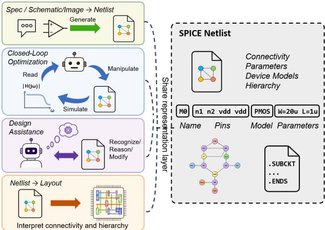  
Figure 1: SPICE netlists as a common representation layer in LLM-based circuit design workflows.

Existing evaluations of LLM-based circuit design typically focus on end-to-end outcomes, such as syntactic validity, simulation success, specification improvement, or downstream task completion [15, 20, 26]. Recent circuit-oriented benchmarks mainly assess domain-level capabilities, including circuit interpretation, topology reasoning, schematic understanding, AMS-domain multimodal reasoning, or graph-structured reasoning [23, 25, 27]. While these evaluations reveal important limitations, they do not isolate the ele mentary operations required to interpret and modify SPICE netlists correctly. Accordingly, the reliability of LLMs in performing core SPICE netlist operations remains unclear.

To address this gap, we introduce NetlistBench, a structureverified benchmark for evaluating whether LLMs can reliably recognize and manipulate analog SPICE netlists as structured circuit representations. NetlistBench focuses on structure-level operations that test a model’s ability to recover circuit structure or apply explicit modifications without introducing unintended changes. Model outputs are evaluated through a deterministic canonical circuit representation that captures devices, ordered terminal bindings, node identities, parameters, directives, and hierarchy.

The main contributions of this work are:

• We formulate SPICE netlist reliability as a representationlevel evaluation problem, focusing on whether LLMs can correctly recognize and manipulate netlists as structured circuit artifacts.

• We introduce NetlistBench, a structure-verified benchmark covering netlist structural-property recognition and natural language-guided netlist manipulation. Using NetlistBench, we evaluate representative frontier, flash-class, and open weight LLMs and show that reliability varies sharply across operation type and task horizon.

• We develop a structure-aware evaluation pipeline based on canonical circuit representations, enabling manipulation outputs to be verified beyond raw text matching or final simulation outcomes.

## 2 Background

## 2.1 SPICE Netlists as Structured Circuit Representations

SPICE netlists are simulator-facing circuit descriptions that encode devices, terminals, nodes, parameters, models, ports, and subcircuit hierarchies in a compact, positional textual format [18, 19]. Although a netlist appears as a sequence of text lines, its underlying semantics correspond to a structured circuit object. Each device statement typically begins with an instance prefix, followed by an ordered sequence of node names connected to specific device terminals, a model reference, and optional parameter assignments. For hierarchical circuits, subcircuit definitions (.subckt) establish ordered port interfaces, and each subcircuit instance binds external nodes to internal ports strictly according to their positional order in the instance statement.

A defining characteristic of this representation is that electrical connectivity is encoded implicitly through node-name sharing rather than explicit terminal-to-terminal links. For circuit simulation, node labels are suficient because devices contribute equations to the modified nodal analysis (MNA) system according to the nodes attached to their terminals [9]. Terminals sharing the same node name are treated as electrically connected. For structural analysis and manipulation, however, these connections are not represented as explicit terminal-to-terminal links; the circuit topology must be reconstructed from terminal–node bindings across the entire netlist.

These properties make netlist operations diferent from ordinary text editing. A correct edit must preserve terminal-role bindings, maintain consistent node identities, and avoid unintended changes to unrelated devices or subcircuit interfaces. NetlistBench therefore evaluates netlist outputs through structural equivalence to a canonical circuit representation rather than through surface-string similarity.

## 2.2 Reported Limitations of LLMs on SPICE Netlists

Existing studies have reported several limitations of LLMs in processing circuit representations and SPICE-like netlists. At the circuitreasoning level, benchmarks such as CIRCUIT and AMSbench show that LLMs can struggle with topology-heavy circuit interpretation and multi-step circuit reasoning [23, 25]. At the generation and adaptation level, systems such as SPICEPilot, SPICEAssistant, AnalogCoder, and Spice Wizard rely on simulation feedback, syntax checks, or tool-assisted repair loops to improve SPICE code or netlist generation, indicating that unvalidated LLM outputs may not provide suficient reliability for direct downstream use [6, 15, 20, 26]. At the netlist-analysis level, SPICED studies LLM-aided detection and localization of syntactical bugs and analog Trojans in A/MS netlists, further showing that node, parameter, subcircuit, and connectivity errors are meaningful failure classes in SPICE-like representations [2].

Complementary representation-oriented work suggests why these failures are dificult to avoid with ordinary text modeling alone. CircuitFormer highlights the mismatch between standard language tokenization and the graph-structured semantics of circuits, while Image2Net evaluates diagram-to-netlist conversion using graph-structured netlist comparison rather than raw string matching [11, 31]. Taken together, these findings suggest that LLM failures on SPICE netlists are not merely surface-level syntax issues, but are closely related to the dificulty of preserving structured circuit semantics in a positional textual representation.

However, these studies evaluate netlists within broader generation, simulation, conversion, or reasoning pipelines rather than isolating representation-level netlist operations.

## 3 Benchmark Design

NetlistBench evaluates representation-level netlist reliability through two modalities: recognition, which extracts or compares circuit structure, and manipulation, which applies explicit natural-language edits to SPICE netlists. This design separates structure interpretation and structure-preserving transformation from high-level design reasoning, simulator behavior, and optimization.

Table 1: Composition of the NetlistBench source corpus.
<table><tr><td>Source subset</td><td>Count</td><td>Structural summary</td></tr><tr><td>AnalogGenie-Simple</td><td>492</td><td>Median: 5 devices</td></tr><tr><td>AnalogGenie-Medium</td><td>1,752</td><td>Median: 20 devices</td></tr><tr><td>AnalogGenie-Complex</td><td>594</td><td>Median: 36 devices; maximum: 69</td></tr><tr><td>Flat subtotal</td><td>2,838</td><td>Approximately 58,000</td></tr><tr><td></td><td></td><td>device instances</td></tr><tr><td>ALIGN hierarchical</td><td>931</td><td>21 topology families; 3-4 subcircuits per netlist</td></tr><tr><td>Total</td><td>3,769</td><td></td></tr></table>

## 3.1 Source Corpus

NetlistBench uses two complementary SPICE netlist sources, summarized in Table 1. AnalogGenie provides flat CMOS analog netlists originally developed for topology discovery [7]; after normalization, these circuits are used to construct flat recognition and manipu lation tasks. ALIGN provides hierarchical analog netlists from a layout automation flow [5]; its circuits contain multiple .subckt definitions and top-level instance calls and are used for hierarchical tasks.

## 3.2 Instance Construction Pipeline

NetlistBench constructs evaluation instances through a determin istic, template-driven pipeline rather than stochastic or unconstrained generation. Starting from source SPICE netlists, the pipeline applies family-specific transformation rules, syntax perturbations, and prompt templates to produce reproducible benchmark cases. Each instance is represented as a self-contained triplet:

$$
\bar { J _ { i } } = \left( \mathbf { N } _ { \mathrm { s r c } } ^ { ( i ) } , \mathbf { T } _ { \mathrm { i n s t } } ^ { ( i ) } , \mathbf { Y } _ { \mathrm { t a r g e t } } ^ { ( i ) } \right) ,\tag{1}
$$

where $\mathbf { N } _ { \mathrm { s r c } } ^ { ( i ) }$ denotes the source SPICE netlist, $\mathbf { T } _ { \mathrm { i n s t } } ^ { ( i ) }$ denotes the explicit task instruction, and $\mathbf { Y } _ { \mathrm { t a r g e t } } ^ { ( i ) }$ denotes the task-specific target used for evaluation. Both $\mathbf { T } _ { \mathrm { i n s t } } ^ { ( i ) }$ and $\mathbf { Y } _ { \mathrm { t a r g e t } } ^ { ( i ) }$ are produced by deterministic, family-specific templates, ensuring that each instance has an unambiguous instruction and reproducible ground truth.

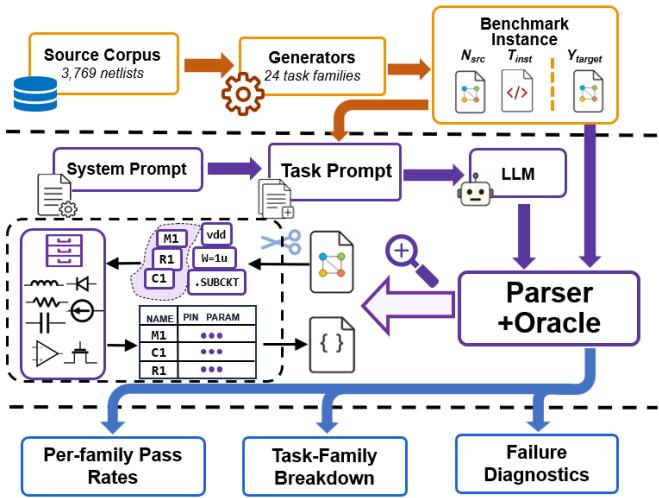  
Figure 2: NetlistBench pipeline for generating benchmark cases and evaluating model outputs with a structure-aware oracle.

The form of $\mathbf { \dot { Y } } _ { \mathrm { t a r g e t } } ^ { ( i ) }$ depends on the task type. For manipulation tasks, it is the uniquely determined target SPICE netlist that realizes the requested structural transformation. For recognition tasks, it is the canonical JSON answer derived from the source netlist. For equivalence judgment tasks, it is the binary structural-equivalence verdict.

All instances undergo automated construction-time validation before inclusion. The checker ensures that manipulation targets implement exactly the specified structural changes without unintended edits, and that recognition and equivalence targets are consistent with the canonical IR of the corresponding input netlist or netlist pair.

## 3.3 Structure-Aware Evaluation Oracle

This structure-aware evaluation follows the broader principle that circuit artifacts should be compared through their underlying connectivity and device structure rather than by surface text. Similar graph-structured evaluation ideas have been used in diagramto-netlist conversion, where generated and reference netlists are compared through heterogeneous circuit graphs rather than raw strings [31].

Concretely, each model output and the reference target are parsed into the canonical IR —a normalized structure that lists every device by instance name with its device kind, ordered terminal nodes, and parameters, together with top-level directives and, for hierarchical circuits, each subcircuit’s port interface and internal devices. An output passes only if its IR matches the reference IR under a fixed set of semantics-preserving normalizations: the two must contain the same set of named devices, with no missing or extra device, identical terminal-node bindings, parameters equal up to numeric normalization (e.g., 1k equals 1000), and identical top-level directives; symmetric two-terminal passives (�/�/�) are compared with unordered terminals, and subcircuit definitions must agree on their port interface (port order treated as semantic except for extraction tasks), internal devices, and directives. This exact-match up-to-normalization rule directly encodes the name-preservation and locality constraints of edit tasks: renaming an untouched node, dropping or duplicating a device, or perturbing an unrelated parameter each surfaces as an IR mismatch and fails the case. The same canonical-IR comparator scores SPICE and PySpice [22] outputs through a uniform interface.

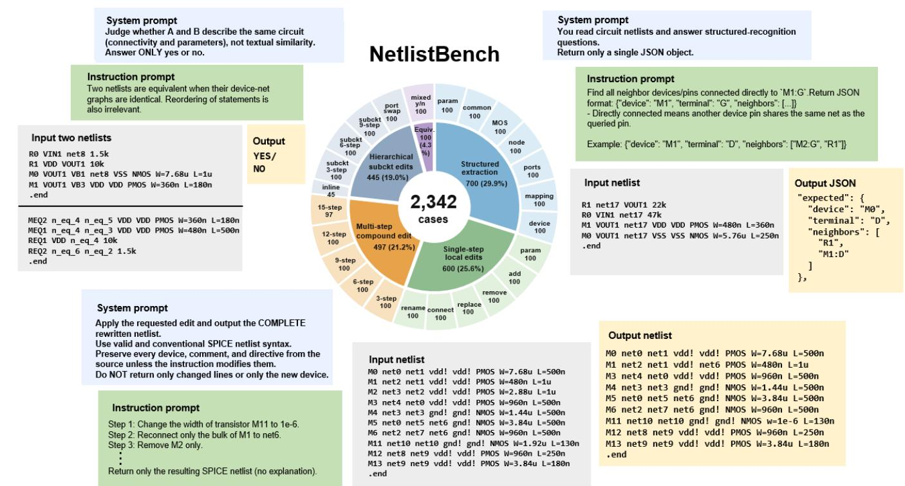  
Figure 3: Overview of the NetlistBench benchmark, showing the distribution of cases across task families and representative task examples.

For the equivalence-judgment family, the task is instead to decide whether two netlists denote the same circuit up to consistent node and instance renaming. To validate the generated ground-truth labels for this family, we projected the IR into a labeled bipartite device–net graph—device nodes labeled by type, model, and normal ized parameter signatures, and device–net edges labeled by terminal roles—and ran a VF2 graph-isomorphism check [4] confirming that positive pairs are isomorphic and negative pairs are not. This isomorphism check audits equivalence-case labels only and is not part of scoring model outputs: scoring must instead preserve device and node names, whereas VF2 equates circuits up to renaming and would therefore mask the very name- and locality-violations that the edit tasks are designed to detect.

## 3.4 Task Families

NetlistBench contains 24 task families across recognition and manipulation, as summarized in Figure 3. The recognition modality contains 800 cases across eight families. Seven evaluate structured extraction of device parameters, terminal connectivity, node incidence, subcircuit interfaces, and instance mappings, while the eighth evaluates structural equivalence between netlist pairs.

The manipulation modality contains 1,542 cases across 16 families. Six single-edit families cover connectivity editing, device addition, removal and replacement, parameter editing, and rename propagation. Five flat compound families combine 3, 6, 9, 12, or 15 dependent operations, and five hierarchical families evaluate subcircuit expansion, interface modification, and multi-step internal editing.

## 4 Evaluation

## 4.1 Experimental Setup and Protocol

We evaluate six single-shot non-thinking models spanning frontier, flash-class, and open-weight tiers: Claude Sonnet 4.6, GPT-4.1, Gemini 2.5 Flash, DeepSeek-V4-Flash, Qwen3.6-Flash, and Qwen3- 30B-A3B. All are queried through oficial provider APIs with explicit reasoning modes disabled, so the main comparison measures base netlist-operation reliability rather than reasoning elicitation. As a reasoning reference, we additionally evaluate the same DeepSeek-V4-Flash with its native thinking mode enabled; this column is reported separately and excluded from the non-thinking comparison. We also run two controlled secondary analyses on a paired stratified subset: SPICE versus PySpice output representation, and direct prompting versus native thinking and CoT prompting [28].

Table 2: Per-family NetlistBench pass rates (%). C/G/Ge/QF/Q30/DS denote Claude-S4.6, GPT-4.1, Gemini-2.5-F, Qwen3.6-F, Qwen3-30B, and DeepSeek-V4-F. DS+R† is the reasoning reference, excluded from bolding; underlines exceed all non-thinking models.
<table><tr><td>Task</td><td>n</td><td>C</td><td>G</td><td>Ge</td><td>QF</td><td>Q30</td><td>DS</td><td>DS+R†</td></tr><tr><td>Conn. edit</td><td>100</td><td>97</td><td>91</td><td>93</td><td>59</td><td>47</td><td>85</td><td>99</td></tr><tr><td>Dev. add</td><td>100</td><td>83</td><td>72</td><td>57</td><td>54</td><td>43</td><td>41</td><td>55</td></tr><tr><td>Dev. remove</td><td>100</td><td>100</td><td>100</td><td>100</td><td>98</td><td>97</td><td>100</td><td>100</td></tr><tr><td>Dev. replace</td><td>100</td><td>95</td><td>93</td><td>86</td><td>75</td><td>61</td><td>78</td><td>91</td></tr><tr><td>Param. edit</td><td>100</td><td>100</td><td>99</td><td>98</td><td>99</td><td>96</td><td>98</td><td>99</td></tr><tr><td>Rename prop.</td><td>100</td><td>99</td><td>98</td><td>97</td><td>85</td><td>89</td><td>92</td><td>100</td></tr><tr><td>Comp. 3</td><td>100</td><td>80</td><td>71</td><td>70</td><td>34</td><td>28</td><td>44</td><td>74</td></tr><tr><td>Comp. 6</td><td>100</td><td>57</td><td>58</td><td>33</td><td>6</td><td>1</td><td>18</td><td>63</td></tr><tr><td>Comp. 9</td><td>100</td><td>56</td><td>51</td><td>21</td><td>2</td><td>1</td><td>6</td><td>50</td></tr><tr><td>Comp. 12</td><td>100</td><td>41</td><td>39</td><td>17</td><td>0</td><td>0</td><td>1</td><td>33</td></tr><tr><td>Comp. 15</td><td>97</td><td>26</td><td>34</td><td>6</td><td>0</td><td>0</td><td>0</td><td>31</td></tr><tr><td>Subckt inline</td><td>45</td><td>56</td><td>62</td><td>33</td><td>16</td><td>2</td><td>42</td><td>98</td></tr><tr><td>Port swap</td><td>100</td><td>88</td><td>80</td><td>83</td><td>33</td><td>19</td><td>65</td><td>97</td></tr><tr><td>Subckt comp. 3</td><td>100</td><td>79</td><td>69</td><td>55</td><td>39</td><td>21</td><td>32</td><td>66</td></tr><tr><td>Subckt comp. 6</td><td>100</td><td>67</td><td>55</td><td>36</td><td>5</td><td>4</td><td>8</td><td>54</td></tr><tr><td>Subckt comp. 9</td><td>100</td><td>42</td><td>43</td><td>41</td><td>1</td><td>1</td><td>3</td><td>47</td></tr><tr><td>Edit subtotal</td><td>1542</td><td>74</td><td>70</td><td>59</td><td>39</td><td>33</td><td>45</td><td>71</td></tr><tr><td>Dev. param.</td><td>100</td><td>99</td><td>100</td><td>100</td><td>100</td><td>99</td><td>100</td><td>100</td></tr><tr><td>Sem. term. conn.</td><td>100</td><td>99</td><td>73</td><td>74</td><td>25</td><td>6</td><td>82</td><td>100</td></tr><tr><td>Ord. term. conn.</td><td>100</td><td>100</td><td>100</td><td>99</td><td>99</td><td>100</td><td>100</td><td>100</td></tr><tr><td>Node inc.</td><td>100</td><td>98</td><td>42</td><td>59</td><td>21</td><td>15</td><td>53</td><td>96</td></tr><tr><td>Subckt ports</td><td>100</td><td>100</td><td>100</td><td>100</td><td>100</td><td>99</td><td>100</td><td>100</td></tr><tr><td>Inst. port map</td><td>100</td><td>100</td><td>96</td><td>87</td><td>89</td><td>65</td><td>96</td><td>100</td></tr><tr><td>Term. neigh. inc.</td><td>100</td><td>97</td><td>13</td><td>20</td><td>4</td><td>2</td><td>12</td><td>93</td></tr><tr><td>Equiv. judge</td><td>100</td><td>90</td><td>67</td><td>61</td><td>55</td><td>56</td><td>49</td><td>97</td></tr><tr><td>Recog. subtotal</td><td>800</td><td>98</td><td>74</td><td>75</td><td>62</td><td>55</td><td>74</td><td>98</td></tr><tr><td>Overall</td><td>2342</td><td>82</td><td>71</td><td>64</td><td>47</td><td>41</td><td>55</td><td>81</td></tr></table>

Each model is queried once per case with deterministic decoding, and retries are used only for transport failures. Responses are graded by the structure-aware oracle in Section 3.3 and reduced to binary pass/fail outcomes: manipulation outputs must match the reference structure, recognition outputs must match the canonical JSON answer, and equivalence judgments must match the reference verdict. The parser tolerates incidental code fences, but empty, unparsable, or structurally invalid outputs fail. We report pass rates with Wilson 95% confidence intervals [30]; Table 2 gives the per-family case count �, and aggregate ablation intervals are stated explicitly. Subtotals and overall scores are case-weighted. Reasoning-mode results are single samples and may carry run-to-run variance.

Availability. NetlistBench is publicly available at https://github. com/WoshiMayou/NetlistBench. The repository contains all 2,342 benchmark cases across the 24 task families, the deterministic structure-aware oracle, seeded case-generation scripts, evaluation runners, and the per-family prompt templates required to reproduce the benchmark evaluation. The code is released under the Apache-2.0 license, while the benchmark cases and prompts are released under CC BY 4.0.

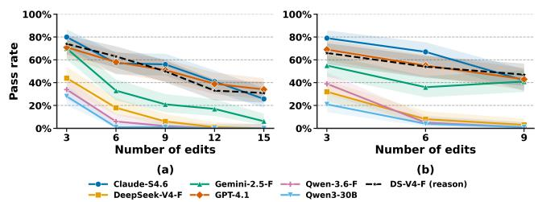  
Figure 4: Pass rates under compound editing with increasing numbers of dependent edits for (a) flat netlists and (b) hierarchical subcircuit netlists. Lines show the mean pass rates, and shaded regions indicate the corresponding variation.

## 4.2 Performance Across Task Families

Table 2 shows substantial variation across operation types. Local operations that primarily modify explicit text are the most reliable: device removal and parameter editing reach 96%–100% across models. Reliability decreases for operations that require maintaining connectivity or introducing new structure, including connectivity editing, device replacement, device addition, subcircuit port swapping, and inline expansion.

Recognition exhibits a similar distinction. Explicit attributes such as device parameters, ordered terminal lists, and subcircuit ports are extracted with high accuracy, whereas relational queries vary substantially across models. Node incidence ranges from 15% to 98%, semantic terminal connectivity from 6% to 99%, and terminalneighbor incidence from 2% to 97%. Structural equivalence judgment also remains challenging, with pass rates from 49% to 90%.

Overall non-thinking pass rates range from 41% to 82%. The results indicate that current models are considerably more reliable on localized attribute extraction and substitution than on recovering or preserving the implicit connectivity graph. Enabling reasoning raises DeepSeek-V4-Flash from 55% to 81%, but does not consistently surpass the strongest non-thinking model.

## 4.3 Long-Horizon Compound Editing

The compound editing families chain 3, 6, 9, 12, and 15 mutually dependent edits into a single instruction, revealing a substantial reliability degradation in NetlistBench. Accuracy declines consistently as the edit horizon increases (Figure 4). Even models with strong short-horizon performance degrade substantially: Claude drops from 80% at 3 steps to 26% at 15 steps, while GPT-4.1 drops from 71% to 34%. The remaining models decline to near-zero accuracy at longer horizons, with Gemini decreasing from 70% to 6%, DeepSeek-V4-Flash from 44% to 0%, and both Qwen3.6-Flash and the open-weight Qwen3-30B from 34%/28% to 0%. Crucially, reasoning does not eliminate this trend: DeepSeek-V4-Flash with reasoning enabled, although far stronger at short horizons (74% at 3 steps), still falls to 31% at 15 steps.

The degradation is not simply a consequence of weak atomic editing. Long-horizon compound tasks require models to track multiple dependent edit intents, update intermediate circuit state, and preserve edit locality across an extended instruction sequence. Because the edits are mutually dependent, errors compound across the sequence: even a high per-edit success rate yields a low joint success probability once many edits must all be correct. The same downward trend appears in the hierarchical compound family, in dicating that this efect is not limited to flat netlists. These results show that high reliability on isolated edits does not translate into reliable multi-step netlist transformation. This pattern is consistent with broader observations that small per-step error rates can compound sharply over long execution horizons [24].

Table 3: Mitigation results on the paired subset (�=718), with Wilson 95% confidence intervals.
<table><tr><td>Model</td><td>Direct</td><td>Native</td><td>CoT</td><td>PySpice</td></tr><tr><td>DeepSeek-V4-F</td><td>52</td><td>81</td><td>75</td><td>58</td></tr><tr><td></td><td></td><td>[48,55][78,83]</td><td></td><td>] [72,78] [55,62]</td></tr><tr><td>Qwen3.6-F</td><td>45</td><td>85</td><td>78</td><td>45</td></tr><tr><td></td><td></td><td></td><td>[41,48] [82,88] [75,81] [42,49]</td><td></td></tr></table>

## 4.4 Representation and Reasoning

We study two mitigations on DeepSeek-V4-Flash and Qwen3.6- Flash: changing the circuit representation (SPICE→PySpice) and enabling explicit reasoning (native thinking and CoT prompting [28]). Both analyses use the same paired, stratified subset (30 cases per family, 28 for Comp. 15, �=718); Table 3 reports overall pass rates with Wilson 95% intervals, and paired arms are compared with McNemar’s test.

On this subset, reasoning gives the larger aggregate gains: native thinking raises both models by roughly 30–40 points $( p < 1 0 ^ { - 6 } ) ;$ while CoT also improves performance but less strongly. The task level results in Table 5 and Figure 6 show similar gains across several structure-heavy families. By contrast, PySpice has a smaller and less consistent efect: it improves DeepSeek-V4-Flash overall $( p < 0 . 0 0 1 )$ , but not Qwen3.6-Flash $( p = 0 . 5 1 )$ , with task-level trends shown in Table 4 and Figure 5.

Because each per-family cell has only 30 cases, we treat task-level patterns as descriptive. Overall, reasoning is the stronger mitigation here, but errors still concentrate on long-horizon compound edits, hierarchical operations, and relational structural queries; neither mitigation makes current LLMs suficiently reliable for unverified netlist editing.

## 5 Discussion

## 5.1 Implications for LLM-Based Netlist Editing

NetlistBench shows that netlist reliability cannot be reduced to general circuit knowledge or output-format compliance. Models tend to perform better on localized edits, such as parameter changes and device removal, while showing reduced reliability on tasks involving structural attachment, ordered port handling, equivalence judgment, or multi-step edits. The observed failures are frequently structural rather than purely procedural: recognition outputs usually follow the required JSON schema but contain incorrect circuit facts, while manipulation failures involve omitted edits, duplicated edits, loss of locality, unintended terminal rebinding, and topology drift.

This error pattern follows directly from the representation properties described in Section 2.1. Local substitutions and deletions often require only limited changes to already explicit text, while attachment, hierarchy, equivalence, and compound editing require the model to maintain an implicit circuit graph across terminal roles, node identities, and subcircuit interfaces. The observed failures therefore indicate a structure-preservation bottleneck: models can often produce syntactically plausible netlists, but still lose edit locality, perturb unrelated bindings, or fail to maintain consistent topology across multiple dependent operations.

These results suggest that current LLMs should not be treated as standalone, unverified netlist editors. Reasoning modes and alternative surface representations can mitigate some failures, but neither fully resolves the structure-preservation problem. More robust workflows may need to decompose complex edits, verify each intermediate netlist structurally, and provide feedback when unintended changes are detected. Future work may also explore graph-based or other structured circuit representations that expose connectivity more directly than raw SPICE text.

## 5.2 Limitations

NetlistBench evaluates bounded, circuit-block-level netlists rather than industrial-scale post-layout decks. Although the compound tasks increase the number of dependent edits, all evaluated netlists fit within the tested models’ context windows. The benchmark therefore does not assess long-context retrieval, hierarchical partitioning, or direct processing of extracted netlists containing millions of device and parasitic statements.

The current release also covers a restricted circuit and syntax domain, primarily flat and hierarchical analog CMOS blocks from AnalogGenie and ALIGN. It does not comprehensively cover symbolic .param expressions, complex .model cards, behavioral or controlled sources, include hierarchies, extracted parasitics, or simulator- and PDK-specific syntax. The reported results therefore should not be assumed to transfer unchanged to RF, power, digital, or mixed-signal netlists.

Finally, task instructions are generated from deterministic templates to isolate structural capabilities and enable unambiguous grading. They do not capture the full linguistic variability or design intent of real designer–assistant interactions. Each model–case pair is evaluated once, so the results characterize the tested API snapshots rather than complete output distributions.

## 6 Conclusion

NetlistBench shows that netlist reliability is a distinct bottleneck for LLM-based circuit design. Current models often handle local substitutions and simple extraction, but remain fragile on connectivitysensitive edits, hierarchy manipulation, structural equivalence, and long-horizon compound transformations. Reasoning improves performance, yet does not make LLMs reliable unverified editors of simulator-facing netlists. These findings motivate decomposed editing workflows, structure-aware verification after each edit, and circuit representations that expose topology more directly than raw SPICE text.

## References

[1] Jitendra Bhandari, Vineet Bhat, Yuheng He, Siddharth Garg, Hamed Rahmani, and Ramesh Karri. 2024. Masala-CHAI: A Large-Scale SPICE Netlist Dataset for Analog Circuits by Harnessing AI. arXiv:2411.14299 [cs.AR]

[2] Jayeeta Chaudhuri, Dhruv Thapar, Arjun Chaudhuri, Farshad Firouzi, and Krish nendu Chakrabarty. 2024. SPICED: Syntactical Bug and Trojan Pattern Identifica tion in A/MS Circuits using LLM-Enhanced Detection. arXiv:2408.16018 [cs.AR]

[3] Mark Chen, Jerry Tworek, Heewoo Jun, Qiming Yuan, Henrique Ponde de Oliveira Pinto, Jared Kaplan, Harri Edwards, Yuri Burda, Nicholas Joseph, Greg Brockman, et al. 2021. Evaluating Large Language Models Trained on Code. arXiv preprint arXiv:2107.03374 (2021).

[4] Luigi P. Cordella, Pasquale Foggia, Carlo Sansone, and Mario Vento. 2004. A (Sub)Graph Isomorphism Algorithm for Matching Large Graphs. IEEE Transactions on Pattern Analysis and Machine Intelligence 26, 10 (2004), 1367–1372. doi:10.1109/TPAMI.2004.75

[5] Tonmoy Dhar, Kishor Kunal, Yaguang Li, Meghna Madhusudan, Jitesh Poojary, Arvind K. Sharma, Wenbin Xu, Steven M. Burns, Ramesh Harjani, Jiang Hu, Desmond A. Kirkpatrick, Parijat Mukherjee, Soner Yaldiz, and Sachin S. Sapat nekar. 2021. ALIGN: A System for Automating Analog Layout. IEEE Design & Test 38, 2 (2021), 8–18. doi:10.1109/MDAT.2020.3042177

[6] Aakash Divakar, Aditya Anekar, and Manas Kulkarni. 2026. Spice Wizard: A Unified AI Agent for Netlist Generation. doi:10.36227/techrxiv.177162431.10627206 Preprint.

[7] Jian Gao, Weidong Cao, Junyi Yang, and Xuan Zhang. 2025. AnalogGenie: A Generative Engine for Automatic Discovery of Analog Circuit Topologies. In The Thirteenth International Conference on Learning Representations.

[8] Helmut Graeb and Markus Leibl. 2023. Learning from the Implicit Functional Hierarchy in an Analog Netlist. In Proceedings of the 2023 ACM International Symposium on Physical Design (ISPD). Association for Computing Machinery, 93–100. doi:10.1145/3569052.3578921

[9] Chung-Wen Ho, Albert E. Ruehli, and Pierce A. Brennan. 1975. The Modified Nodal Approach to Network Analysis. IEEE Transactions on Circuits and Systems 22, 6 (1975), 504–509. doi:10.1109/TCS.1975.1084079

[10] Chun-Yen Huang, Hsuan-I Chen, Hao-Wen Ho, Pei-Hsin Kang, Mark Po-Hung Lin, Wen-Hao Liu, and Haoxing Ren. 2025. Netlistify: Transforming Circuit Schematics into Netlists with Deep Learning. In Proceedings ofthe 2025 ACM/IEEE 7th Symposium on Machine Learning for CAD (MLCAD). IEEE, 1–8. doi:10.1109/ MLCAD65511.2025.11189145

[11] Md Touhidul Islam, Sujan Kumar Saha, Farimah Farahmandi, and Mark Tehranipoor. 2026. CircuitFormer: A Circuit Language Model for Analog Topology Design from Natural Language Prompt. arXiv:2605.05773 [cs.AR]

[12] Carlos E. Jimenez, John Yang, Alexander Wettig, Shunyu Yao, Kexin Pei, Ofir Press, and Karthik Narasimhan. 2024. SWE-bench: Can Language Models Resolve Real World GitHub Issues?. In International Conference on Learning Representations.

[13] Kishor Kunal, Tonmoy Dhar, Meghna Madhusudan, Jitesh Poojary, Arvind K. Sharma, Wenbin Xu, Steven M. Burns, Jiang Hu, Ramesh Harjani, and Sachin S. Sapatnekar. 2020. GANA: Graph Convolutional Network Based Automated Netlist Annotation for Analog Circuits. In Proceedings ofthe 2020 Design, Automation & Test in Europe Conference & Exhibition (DATE). IEEE, 55–60. doi:10.23919/ DATE48585.2020.9116329

[14] Kishor Kunal, Tonmoy Dhar, Meghna Madhusudan, Jitesh Poojary, Arvind K. Sharma, Wenbin Xu, Steven M. Burns, Jiang Hu, Ramesh Harjani, and Sachin S. Sapatnekar. 2023. GNN-Based Hierarchical Annotation for Analog Circuits. IEEE Transactions on Computer-Aided Design ofIntegrated Circuits and Systems 42, 9 (2023), 2801–2814. doi:10.1109/TCAD.2023.3236269

[15] Yao Lai, Sungyoung Lee, Guojin Chen, Souradip Poddar, Mengkang Hu, David Z. Pan, and Ping Luo. 2025. AnalogCoder: Analog Circuit Design via Training-Free Code Generation. In Proceedings ofthe AAAI Conference on Artificial Intelligence, Vol. 39. 379–387. doi:10.1609/aaai.v39i1.32016

[16] Mingjie Liu, Teodor-Dumitru Ene, Robert Kirby, Chris Cheng, Nathaniel Pinckney, Rongjian Liang, Jonah Alben, Himyanshu Anand, Sanmitra Banerjee, Ismet Bayraktaroglu, et al. 2023. ChipNeMo: Domain-Adapted LLMs for Chip Design. arXiv:2311.00176 [cs.CL]

[17] Ryoga Matsuo, Stefan Uhlich, Arun Venkitaraman, Andrea Bonetti, Chia-Yu Hsieh, Ali Momeni, Lukas Mauch, Augusto Capone, Eisaku Ohbuchi, and Lorenzo Servadei. 2024. Schemato: An LLM for Netlist-to-Schematic Conversion. arXiv:2411.13899 [cs.LG]

[18] Laurence W. Nagel. 1975. SPICE2: A Computer Program to Simulate Semiconductor Circuits. Technical Report UCB/ERL M520. Electronics Research Laboratory, Uni versity of California, Berkeley. https://www2.eecs.berkeley.edu/Pubs/TechRpts 1975/9602.html

[19] Laurence W. Nagel and Donald O. Pederson. 1973. SPICE (Simulation Program with Integrated Circuit Emphasis). Technical Report UCB/ERL M382. Electronics Research Laboratory, University of California, Berkeley. https://www2.eecs. berkeley.edu/Pubs/TechRpts/1973/22871.html

[20] Simon Nau, Jan Krummenauer, and André Zimmermann. 2025. Evaluating LLM-based Workflows for Switched-Mode Power Supply Design.

arXiv:2507.10639 [cs.AR]

[21] Jingyu Pan, Guanglei Zhou, Chen-Chia Chang, Isaac Jacobson, Jiang Hu, and Yiran Chen. 2025. A Survey of Research in Large Language Models for Electronic Design Automation. ACM Transactions on Design Automation of Electronic Systems 30, 3, Article 34 (2025), 21 pages. doi:10.1145/3715324

[22] Fabrice Salvaire. 2021. PySpice: Simulate Electronic Circuit using Python and the Ngspice/Xyce Simulators. Software. https://pyspice.fabrice-salvaire.fr/ Accessed 2026-07-28.

[23] Yichen Shi, Ze Zhang, Hongyang Wang, Zhuofu Tao, Zhongyi Li, Bingyu Chen, Yaxin Wang, Zhiping Yu, Ting-Jung Lin, and Lei He. 2025. AMSbench: A Comprehensive Benchmark for Evaluating MLLM Capabilities in AMS Circuits. arXiv:2505.24138 [cs.LG]

[24] Akshit Sinha, Arvindh Arun, Shashwat Goel, Stefen Staab, and Jonas Geiping. 2025. The Illusion of Diminishing Returns: Measuring Long Horizon Execution in LLMs. arXiv:2509.09677 [cs.AI]

[25] Lejla Skelic, Yan Xu, Matthew Cox, Wenjie Lu, Tao Yu, and Ruonan Han. 2025. CIRCUIT: A Benchmark for Circuit Interpretation and Reasoning Capabilities of LLMs. arXiv:2502.07980 [cs.LG]

[26] Deepak Vungarala, Sakila Alam, Arnob Ghosh, and Shaahin Angizi. 2024. SPI-CEPilot: Navigating SPICE Code Generation and Simulation with AI Guidance. arXiv:2410.20553 [cs.AR]

[27] Heng Wang, Shangbin Feng, Tianxing He, Zhaoxuan Tan, Xiaochuang Han, and Yulia Tsvetkov. 2023. Can Language Models Solve Graph Problems in Natural Language?. In Advances in Neural Information Processing Systems, Vol. 36. 30840– 30861.

[28] Jason Wei, Xuezhi Wang, Dale Schuurmans, Maarten Bosma, Brian Ichter, Fei Xia, Ed H. Chi, Quoc V. Le, and Denny Zhou. 2022. Chain-of-Thought Prompting Elicits Reasoning in Large Language Models. In Advances in Neural Information Processing Systems, Vol. 35. 24824–24837.

[29] Ziming Wei, Zichen Kong, Yuan Wang, David Z. Pan, and Xiyuan Tang. 2025. TopoSizing: An LLM-aided Framework of Topology-based Understanding and Sizing for AMS Circuits. arXiv:2509.14169 [cs.LG]

[30] Edwin B. Wilson. 1927. Probable Inference, the Law of Succession, and Statistical Inference. J. Amer. Statist. Assoc. 22, 158 (1927), 209–212. doi:10.1080/01621459. 1927.10502953

[31] Haohang Xu, Chengjie Liu, Qihang Wang, Wenhao Huang, Yongjian Xu, Weiyu Chen, Anlan Peng, Zhijun Li, Bo Li, Lei Qi, Jun Yang, Yuan Du, and Li Du. 2025. Image2Net: Datasets, Benchmark and Hybrid Framework to Convert Analog Circuit Diagrams into Netlists. arXiv:2508.13157 [cs.AR]

## A Additional Results

Table 4: Task-level pass rates for SPICE and PySpice.
<table><tr><td>Task</td><td>DS-S</td><td> $\mathrm { D S - P y }$ </td><td> $\mathsf { Q w e n – S }$ </td><td> $\mathrm { Q w e n { - } P y }$ </td></tr><tr><td>Connectivity edit</td><td>0.80</td><td>1.00</td><td>0.60</td><td>0.57</td></tr><tr><td>Device add</td><td>0.50</td><td>0.80</td><td>0.50</td><td>0.50</td></tr><tr><td>Device remove</td><td>1.00</td><td>1.00</td><td>1.00</td><td>0.97</td></tr><tr><td>Device replace</td><td>0.70</td><td>0.80</td><td>0.80</td><td>0.73</td></tr><tr><td>Parameter edit</td><td>0.93</td><td>0.97</td><td>0.97</td><td>0.93</td></tr><tr><td>Rename propagation</td><td>0.90</td><td>0.93</td><td>0.93</td><td>0.77</td></tr><tr><td>Compound 3-step</td><td>0.13</td><td>0.50</td><td>0.20</td><td>0.23</td></tr><tr><td>Compound 6-step</td><td>0.13</td><td>0.23</td><td>0.07</td><td>0.20</td></tr><tr><td>Compound 9-step</td><td>0.03</td><td>0.23</td><td>0.07</td><td>0.03</td></tr><tr><td>Compound 12-step</td><td>0.00</td><td>0.10</td><td>0.00</td><td>0.03</td></tr><tr><td>Compound 15-step</td><td>0.00</td><td>0.07</td><td>0.00</td><td>0.00</td></tr><tr><td>Subckt inline-expand</td><td>0.37</td><td>0.47</td><td>0.13</td><td>0.37</td></tr><tr><td>Subckt port-swap</td><td>0.60</td><td>0.73</td><td>0.27</td><td>0.33</td></tr><tr><td>Subckt compound 3-step</td><td>0.33</td><td>0.10</td><td>0.37</td><td>0.10</td></tr><tr><td>Subckt compound 6-step</td><td>0.07</td><td>0.03</td><td>0.00</td><td>0.03</td></tr><tr><td>Subckt compound 9-step</td><td>0.03</td><td>0.00</td><td>0.03</td><td>0.00</td></tr><tr><td>Edit subtotal</td><td>0.41</td><td>0.50</td><td>0.37</td><td>0.36</td></tr><tr><td>Equivalence judgment</td><td>0.50</td><td>0.53</td><td>0.50</td><td>0.60</td></tr><tr><td>Device parameter</td><td>1.00</td><td>1.00</td><td>1.00</td><td>0.90</td></tr><tr><td>Semantic terminal conn.</td><td>0.80</td><td>0.83</td><td>0.23</td><td>0.43</td></tr><tr><td>Ordered terminal conn.</td><td>1.00</td><td>1.00</td><td>1.00</td><td>0.97</td></tr><tr><td>Node incidence</td><td>0.53</td><td>0.60</td><td>0.23</td><td>0.23</td></tr><tr><td>Subckt port list</td><td>1.00</td><td>1.00</td><td>1.00</td><td>1.00</td></tr><tr><td>Instance port map</td><td>0.90</td><td>0.90</td><td>0.80</td><td>0.93</td></tr><tr><td>Terminal neighbor inc.</td><td>0.07</td><td>0.13</td><td>0.03</td><td>0.00</td></tr><tr><td>Recognition subtotal</td><td>0.76</td><td>0.78</td><td>0.61</td><td>0.64</td></tr><tr><td>Overall</td><td>0.52</td><td>0.58</td><td>0.45</td><td>0.45</td></tr></table>

DS-S: DeepSeek-V4 SPICE; DS-Py: DeepSeek-V4 PySpice; Qwen-S: Qwen-3.6 SPICE; Qwen-Py: Qwen-3.6 PySpice.

Table 5: Task-level pass rates under diferent prompting modes.
<table><tr><td rowspan="2">Task</td><td colspan="3">DeepSeek-V4</td><td colspan="3">Qwen-3.6</td></tr><tr><td>Dir.</td><td>Think</td><td>CoT</td><td>Dir.</td><td>Think</td><td>CoT</td></tr><tr><td>Connectivity edit</td><td>0.80</td><td>1.00</td><td>1.00</td><td>0.60</td><td>0.93</td><td>0.87</td></tr><tr><td>Device add</td><td>0.50</td><td>0.47</td><td>0.57</td><td>0.50</td><td>0.83</td><td>0.67</td></tr><tr><td>Device remove</td><td>1.00</td><td>1.00</td><td>1.00</td><td>1.00</td><td>1.00</td><td>1.00</td></tr><tr><td>Device replace</td><td>0.70</td><td>0.90</td><td>0.83</td><td>0.80</td><td>0.93</td><td>0.93</td></tr><tr><td>Parameter edit</td><td>0.93</td><td>0.97</td><td>1.00</td><td>0.97</td><td>0.97</td><td>0.97</td></tr><tr><td>Rename propagation</td><td>0.90</td><td>1.00</td><td>1.00</td><td>0.93</td><td>0.97</td><td>1.00</td></tr><tr><td>Compound 3-step</td><td>0.13</td><td>0.57</td><td>0.50</td><td>0.20</td><td>0.73</td><td>0.73</td></tr><tr><td>Compound 6-step</td><td>0.13</td><td>0.50</td><td>0.53</td><td>0.07</td><td>0.67</td><td>0.63</td></tr><tr><td>Compound 9-step</td><td>0.03</td><td>0.47</td><td>0.57</td><td>0.07</td><td>0.73</td><td>0.70</td></tr><tr><td>Compound 12-step</td><td>0.00</td><td>0.37</td><td>0.27</td><td>0.00</td><td>0.63</td><td>0.33</td></tr><tr><td>Compound 15-step</td><td>0.00</td><td>0.18</td><td>0.14</td><td>0.00</td><td>0.54</td><td>0.32</td></tr><tr><td>Subckt inline-expand</td><td>0.37</td><td>0.97</td><td>1.00</td><td>0.13</td><td>0.83</td><td>0.77</td></tr><tr><td>Subckt port-swap</td><td>0.60</td><td>1.00</td><td>1.00</td><td>0.27</td><td>0.93</td><td>0.93</td></tr><tr><td>Subckt compound 3-step</td><td>0.33</td><td>0.73</td><td>0.63</td><td>0.37</td><td>0.90</td><td>0.63</td></tr><tr><td>Subckt compound 6-step</td><td>0.07</td><td>0.60</td><td>0.53</td><td>0.00</td><td>0.77</td><td>0.70</td></tr><tr><td>Subckt compound 9-step</td><td>0.03</td><td>0.63</td><td>0.40</td><td>0.03</td><td>0.63</td><td>0.40</td></tr><tr><td>Edit subtotal</td><td>0.41</td><td>0.71</td><td>0.69</td><td>0.37</td><td>0.81</td><td>0.73</td></tr><tr><td>Equivalence judgment</td><td>0.50</td><td>0.97</td><td>0.93</td><td>0.50</td><td>0.73</td><td>0.70</td></tr><tr><td>Device parameter</td><td>1.00</td><td>1.00</td><td>1.00</td><td>1.00</td><td>1.00</td><td>1.00</td></tr><tr><td>Semantic terminal conn.</td><td>0.80</td><td>1.00</td><td>0.93</td><td>0.23</td><td>0.90</td><td>0.87</td></tr><tr><td>Ordered terminal conn.</td><td>1.00</td><td>1.00</td><td>1.00</td><td>1.00</td><td>1.00</td><td>1.00</td></tr><tr><td>Node incidence</td><td>0.53</td><td>1.00</td><td>0.73</td><td>0.23</td><td>0.93</td><td>0.83</td></tr><tr><td>Subckt port list</td><td>1.00</td><td>1.00</td><td>1.00</td><td>1.00</td><td>1.00</td><td>0.97</td></tr><tr><td>Instance port map</td><td>0.90</td><td>1.00</td><td>0.97</td><td>0.80</td><td>1.00</td><td>1.00</td></tr><tr><td>Terminal neighbor inc.</td><td>0.07</td><td>1.00</td><td>0.47</td><td>0.03</td><td>0.83</td><td>0.73</td></tr><tr><td>Recognition subtotal</td><td>0.76</td><td>1.00</td><td>0.87</td><td>0.61</td><td>0.95</td><td>0.91</td></tr><tr><td>Overall</td><td>0.52</td><td>0.81</td><td>0.75</td><td>0.45</td><td>0.85</td><td>0.78</td></tr></table>

Dir.: direct prompting; Think: think-mode prompting; CoT: chain-of-thought prompting.

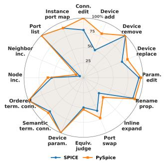

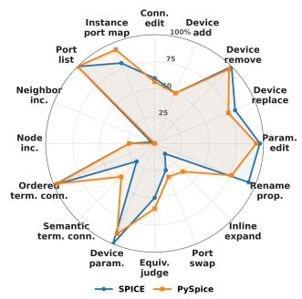

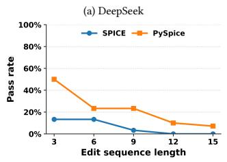  
(c) DeepSeek, Compound

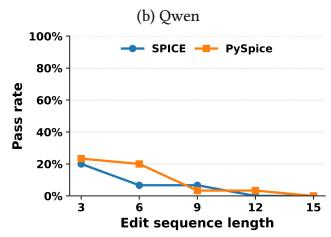  
(d) Qwen, Compound  
Figure 5: Task-level performance under SPICE and PySpice representations.

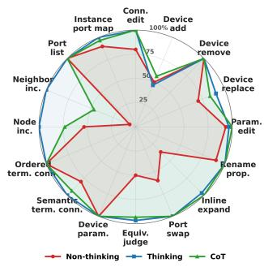

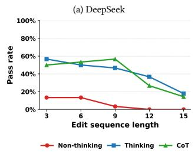

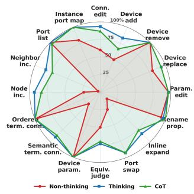

(c) DeepSeek, Compound  
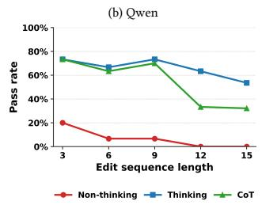  
(d) Qwen, Compound  
Figure 6: Task-level performance under non-thinking, thinking, and CoT prompting.