# OEIS OPEN: HOW MANY CONJECTURES CAN LANGUAGE MODELS TURN INTO THEOREMS?

Tom Adamczewski   
Epoch AI   
tom@epoch.ai

## ABSTRACT

We construct OEIS OPEN, a benchmark based on 492 open mathematical conjectures from the OEIS, formalized in Lean by Tsoukalas et al. Whereas these conjectures had previously been attempted only with a bespoke agent, our open-source evaluation code runs any generic language model (LM) against them, and is secure against LM cheating attempts. We find that LMs equipped with a minimal set of tools resolve 147 of these conjectures with a budget of \$50 per attempt, scoring 30% on OEIS OPEN. OEIS OPEN LITE is a random subset of 100 conjectures for cheaper evaluation. When evaluated with a budget of \$200 per attempt, the best current LM scores 44% on OEIS OPEN LITE. Giving LMs access to the mathematics literature via 476,000 papers from arXiv did not increase performance on OEIS OPEN LITE, and nor did using more sophisticated agent loops. The conjectures covered in this work are of uncertain mathematical significance, and most have likely received little previous attention. Nevertheless, our results show that LMs can resolve open research conjectures autonomously and at modest cost.

## 1 Introduction

There have been several recent examples of AI systems solving open problems in mathematics.1 These are impressive demonstrations of AI’s ability to contribute to research mathematics. However, they fall short of a systematic study of AI capabilities:

• These reports do not disclose the universe of problems attempted by AI, so we do not know the success rate or average cost to solve such problems.

• The extent of guidance by human mathematicians is unclear. These projects are likely to involve mathematically sophisticated users, and the prompts and interactions behind the results have not been published, so human insight may have steered the search to an unknown degree.

• Different AI models are not systematically compared on the same problems, so we do not know when AI models first became capable of proving these results, and nor do we know whether some current models perform better than others.

The primary reason to benchmark AIs on open problems rather than difficult puzzles with known answers is to understand whether AI can push forward the frontier of a research field. Open problems also have a secondary advantage for the field of AI benchmarking: their solutions cannot leak into training corpora, at least until they are solved.

Existing benchmarks of open problems include HorizonMath [101 problems; 4] and FrontierMath: Open Problems [FM:OP, 50 problems; 5]. Both make unsolved problems verifiable by restricting attention to problems with a generator–verifier gap. Candidate solutions (a concrete object, such as a graph, polynomial, or algorithm) are hard to find but cheap to check computationally. HorizonMath draws on three such classes: conjectured closed forms, optimization problems, and constructions of objects not known to exist. FM:OP sources problems from working mathematicians who must write a bespoke verifier program for each.

These strategies face challenges:

1. They cannot be used to test most of research mathematics. The vast majority of open problems have no generator–verifier gap: they call for a proof of a general statement rather than the exhibition of a checkable object, and so cannot be expressed in this format at all.

2. Passing the check is evidence rather than proof. HorizonMath describes accepted closed forms as “best regarded as conjectures until proven” and FM:OP explicitly allows verifiers that provide “strong numerical evidence” short of full proof.

3. Soundness rests on hand-crafted verification code and filters.

• For example, HorizonMath accepts a conjectured closed form if it matches a high-precision numerical reference value. HorizonMath therefore uses an LLM judge to reject hard-coded constants and operations like numerical root-finding.

• FM:OP’s bespoke verifiers are labor-intensive to formulate and implement. They are also error-prone: in July 2026, two problems were removed because their verifiers “would not detect correct solutions with high enough fidelity”.

4. Computational checking is one-sided. A verifier can confirm that an exhibited object works, but if no such object exists, the benchmark task is unsolvable. Both benchmarks knowingly include problems that may have no solution of the required form. FM:OP estimates that 10–40% of its problems are unsolvable.

We instead require solutions to be formal proofs. Each conjecture is stated in the Lean proof assistant, and a model must prove either the conjecture or its negation. This addresses the first challenge above: eligibility requires only that a conjecture’s statement be formalizable, not that its solutions be computationally checkable objects. The other challenges are avoided outright: an accepted proof is definitive rather than evidence, soundness rests on the Lean kernel rather than per-problem verification code, and false conjectures remain solvable tasks because the model may prove the negation.2 Using formal proofs still has some downsides:

1. Not all research mathematics can be covered: it must be possible to state conjectures with the definitions available in Mathlib (or short auxiliary definitions).

2. Results reflect formalization ability as well as mathematical ability, since a model may find a correct argument yet fail to formalize it.

There is a risk that formal conjectures are misformalized, meaning the Lean statement does not reflect the conjecture intended by the mathematician. But similar risks are present in the other approaches. A verifier may fail due to a range of pathologies, ranging from simple bugs to subtle and unforeseen false positives or false negatives. As described below, we use conjectures about integer sequences to reduce misformalization risk.

Current data does not let us reliably characterize the degree of mathematical interest these conjectures have received. While they are open conjectures proposed by mathematicians and approved by volunteer editors, it appears likely that most have received received little attention.

The benchmark and evaluation scaffold are released at https://github.com/epoch-research/ LeanOpenProblems.

## 2 Methods

## 2.1 Conjectures

The conjectures were collected and formalized by Tsoukalas et al. [6]. They “began with a corpus of 2649 open conjectures drawn from the OEIS” (the Online Encyclopedia of Integer Sequences), “prompted Gemini to select 500 problems that are non-trivial, mathematically interesting, not famous open problems, and good candidates for automated theorem-proving”, and “used a Gemini-based agent to formalize them” in Lean. Eight of the 500 were excluded for technical reasons.

Conjectures about integer sequences have relatively low misformalization risk because they generally involve only integers and elementary operations on them, rather than complicated mathematical objects whose formal statements rest on long chains of Mathlib definitions.

## 2.2 Conjecture metadata

We also collected metadata on each conjecture: its provenance (who proposed it, and when) and the attention its sequence has received in the literature. The 492 conjectures concern 444 distinct OEIS sequences, some contributing several conjectures. For each sequence we fetched the full OEIS record and its complete revision history, then used GPT-5.5 to match each Lean conjecture to the OEIS text it formalizes and to identify its proposer and proposal date, distinguishing the proposer from users who merely edited or verified the entry. The proposal date almost always corresponds to the date the conjecture text first entered the database; the proposer is typically the sequence’s author or a signed attribution in the entry’s text. This yielded a proposer for 488 and a date for 489 of the 492 conjectures, with 443 extractions rated high-confidence by the model.

We measured literature attention to sequences in two ways: citations listed on the OEIS entry itself (its links and references, excluding OEIS-internal items such as b-files), and works in the OpenAlex database whose full text references the sequence.3 Both measures exclude references to Tsoukalas et al.’s own results [6], which have already begun to appear on OEIS entries. Attention to a sequence is only a proxy for attention to a conjecture about that sequence: works that cite a sequence need not engage with the specific conjecture.

## 2.3 Proof verification

Following Tsoukalas et al. [6], we accept a submission only if it passes SafeVerify, an open-source checker that “checks the proof against the theorem specification and guards against environment exploits (e.g., axiom injection)”. SafeVerify is adapted from lean4checker, the external checker maintained by the Lean developers. Both replay compiled Lean through the kernel from scratch, but lean4checker certifies only that an environment is sound, whereas SafeVerify additionally certifies that the submission proves the target statement: each target declaration must be present with the same name, kind, and kernel type, and may use no axioms beyond the standard three (propext, Quot.sound, Classical.choice).4

Our agents have shell access to their own Lean environment, so they could in principle attack verification itself, for example by tampering with Mathlib, the Lean toolchain, or the statement file. We therefore split every attempt across three Docker containers, none of which has network access:

1. The agent container, where the model works on its proof.

2. The compile container, holding a clean Lean toolchain, where the submitted proof is compiled to a binary artifact (an olean).

3. The scorer container, which receives the submission olean, and runs SafeVerify on it.5

This design defeats many classes of attacks:

1. Tampering with the agent environment is powerless because only the submission’s Lean source leaves the agent container.

2. Malicious compile-time code. Lean elaboration can execute arbitrary code (e.g. a compile-time #eval). Compilation to the binary olean is therefore confined in its own container, separate from the SafeVerify verdict.

3. Proving a different statement. SafeVerify matches the submission against our own copy of the statement, requiring kernel-identical types.

4. Redefining a definition the statement depends on, e.g. so that the conjecture becomes trivially true. SafeVerify requires the submission’s definition bodies to be identical to the target’s; only sorry stubs may be filled in.

5. Smuggling in extra axioms. A declared axiom or a sorry (which introduces the axiom sorryAx) falls outside the three-axiom whitelist.

6. Bypassing the kernel. Lean metaprogramming can insert declarations into an environment without kernel checking, and a buggy tactic can emit an ill-typed proof term; SafeVerify replays every submitted declaration through a fresh kernel. A native decide proof shifts trust from the kernel to the compiler, and is known to be subvertible via @[implemented by]; it introduces the axiom Lean.ofReduceBool, which falls outside the three-axiom whitelist.

What remains trusted is Lean’s kernel, SafeVerify itself, and the container isolation.

## 2.4 AI agent

Our base agent is deliberately simple: a ReAct-style tool loop built on the Inspect library [7], with three tools. The tools are bash, a text editor, and a resources tool that reports remaining time and token budgets. The agent container provides a Lean 4 toolchain with Mathlib, the SageMath computer algebra system, and Python with sympy, mpmath, numpy, and pantograph.

Like in Tsoukalas et al. [6], our agent can either prove or disprove the conjecture.6 The agent iterates until it resolves the conjecture or hits a limit. Typically the binding limit is the per-conjecture spending cap (\$50 on the full set, \$200 on LITE), agents also cannot use more than 72 hours of working time.

Notably, all our agents are considerably simpler than the “full-featured” agent with which Tsoukalas et al. [6] obtained their OEIS results. Their agent runs an AlphaEvolve-style evolutionary search over a shared population of proof sketches: Lean files that compile but may leave subgoals unproven as sorry placeholders. Prover subagents (Gemini 3.1 Pro) mutate a sketch sampled from the population over a multi-turn episode with Lean compiler feedback. Subagents can call AlphaProof, a specialized system that searches the tree of Lean proof steps, on individual subgoals. AlphaProof’s verdicts are memoized in a cache shared across the population. Since partial proofs have no objective fitness, rater subagents (Gemini 3.0 Flash) rank sketches on plausibility, clarity, and novelty; the rankings are aggregated into Elo scores, which bias the sampling of parent sketches via a P-UCB rule. The search ends when a sketch becomes sorry-free and passes validation.

## 2.4.1 Literature

This variant gives agents access to an offline snapshot of the mathematics literature: the LAT X source trees of 476,000 pure-mathematics arXiv papers dated up to 2022.7

## 2.4.2 DeepAgent

The DeepAgent variant replaces the ReAct loop with Inspect’s deepagent, which adds the following affordances: delegation to subagents, persistent memory, a todo-list tool, and a longer, opinionated system prompt.

## 3 Results

## 3.1 AI performance

A model resolves a conjecture when it submits a proof of the conjecture or of its negation that passes verification. On the full OEIS OPEN set, we ran each model once with a \$50 spending cap per conjecture.

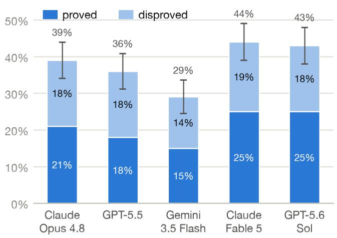

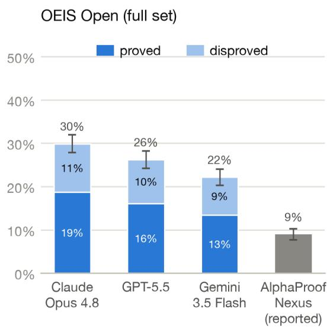  
Figure 1: Accuracy on OEIS OPEN LITE with the base agent (left; 100 conjectures, \$200 budget per conjecture) and on the full OEIS OPEN set, with the reported AlphaProof Nexus baseline (right; 492 conjectures, \$50 budget). Each bar splits solves into proofs (solid) and disproofs (pale). Error bars are ±1 standard error.

Language models can resolve many open OEIS conjectures, and outperform AlphaProof Nexus. Claude Opus 4.8 resolved 30% of the 492 conjectures, GPT-5.5 resolved 26%, and Gemini 3.5 Flash 22% (Figure 1, right). By comparison, Tsoukalas et al. [6] report that their system, AlphaProof Nexus, resolved 44 of the same 492 conjectures (9%)8, at a similar cost to our result9.

On OEIS OPEN LITE, with the cap raised to \$200 per conjecture, language models resolved 29% (Gemini 3.5 Flash) to 44% (Claude Fable 5) of the 100 conjectures (Figure 1, left). Claude Fable 5 and GPT-5.6 Sol were evaluated only on LITE, and only with the base agent.

Agent variants had no effect. Neither giving models access to the mathematics literature, nor using the more complex DeepAgent (Sections 2.4.1 and 2.4.2) affected the accuracy on LITE (Figure 3, Appendix A.2).

Solve rates appear to rise log-linearly with spend. Figure 2 plots, for each run, the fraction of conjectures resolved as a function of the amount spent on that conjecture at the moment it was resolved. Reading a curve at x estimates the solve rate of a run capped at x. The estimate is imperfect because agents are told their budget, which may affect their behavior. Solve rates rise roughly linearly in log-spend, on the order of ten percentage points per tenfold increase.

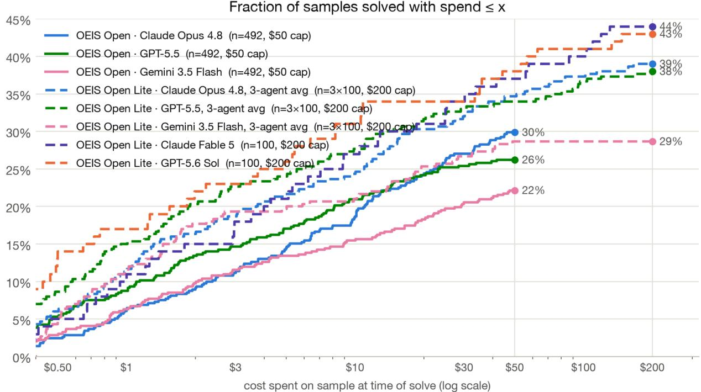  
Figure 2: Solve rate as a function of per-sample spend: the fraction of conjectures resolved with spend at most x, where spend is measured at the moment the conjecture was resolved. Each curve ends at its run’s per-conjecture budget cap. LITE curves average the three agent variants per model where available.

## 4 Discussion

Formalized open conjectures are reusable infrastructure. This work builds on that of Tsoukalas et al. [6], who collected and auto-formalized the conjectures, and released the statements openly on Google DeepMind’s Formal Conjectures repository. We hope more datasets of this kind are released, and that this paper illustrates their value.

A simple harness performed well. Our base agent is minimal, yet it resolved more than three times as many conjectures as AlphaProof Nexus’s elaborate evolutionary search.10 This fits the bitter lesson [9]: rather than prescribing how the model should work through problem-specific structure, it may be better to give a model simple tools and let it choose how to use them.

On this benchmark, Claude Fable 5 and GPT-5.6 Sol do not represent a qualitative jump in autonomous AI proving. The two newest-generation models scored highest on OEIS OPEN LITE (43–44%), but their lead over the previous generation is only a few percentage points (Figure 1, left).

Further scaling inference would resolve more conjectures. Because OEIS OPEN LITE is a random subset of OEIS OPEN, its results estimate what a full-set run would achieve. At \$200 per conjecture, we would expect the best current models to resolve about 216 of the 492 conjectures, up from the 147 resolved at \$50. Nor is inference scaling exhausted at \$200: solve rates rose roughly log-linearly in spend without a clear plateau (Figure 2), so larger budgets would likely push past 44% (at exponential cost).

## 4.1 Limitations

Though open, most conjectures have likely received little attention. Current data does not let us reliably characterize the degree of mathematical interest these conjectures have received. However, it appears likely that most have received little attention. Tsoukalas et al. [6] started with a corpus of 2649 conjectures from the OEIS, open as of their work, and “prompted Gemini to select 500 problems that are non-trivial, mathematically interesting, not famous open problems, and good candidates for automated theorem-proving”. Submissions to the OEIS must be approved by volunteer editors, who filter out ill-defined, contrived, and uninteresting sequences [10, 11]. Our metadata shows that, while there are 127 distinct proposers, the prolific conjecturer Zhi-Wei Sun proposed 37% of OEIS OPEN and 36% of OEIS OPEN LITE. For 47% of the conjectures, the underlying sequence’s OEIS entry lists no links or references. Future work could use LMs to explicitly select problems that have received considerable mathematical interest rather than excluding them.

Misformalization risk. Tsoukalas et al. [6] explained that all 44 conjectures resolved by their system were reviewed by a human and no misformalizations were found. We have taken the Tsoukalas dataset as-is without performing further validation. It seems likely that at least some conjectures are misformalized. Misformalizations are likely to be easier to resolve than correctly formalized conjectures, and seem unlikely to strongly advantage one language model over another. Hence, despite the risk of misformalizations, OEIS OPEN is still a useful tool for comparing language models. Future work could more carefully review whether formalizations were correct.

No credit for reductions to famous open problems. Our setup accepts only a proof of the conjecture or of its negation, but mathematicians also value results that relate a conjecture to a famous open problem. Proving that the conjecture implies a famous open problem, such as the Collatz conjecture, would often be considered the definitive word on it.

Resolved conjectures may leak into training data. Once a conjecture is resolved, its proof may enter the pretraining data of future models, which could then reproduce the proof rather than find it independently. The models evaluated in this paper have training cutoffs that predate the publication of Tsoukalas et al. [6], so they cannot have learned the proofs released with that paper. For future models, the issue can be mitigated after the fact: conjectures resolved before a model’s training cutoff can be filtered out, and all models compared on the remaining smaller set.

## References

[1] OpenAI. An OpenAI model has disproved a central conjecture in discrete geometry. https://openai.com/ index/model-disproves-discrete-geometry-conjecture/, 2026. Published 20 May 2026.

[2] Melissa Lee. ‘hello there the jacobian conjecture is false thanx’: why a tiny social media post has mathematicians rethinking AI. The Conversation, https://theconversation.com/ hello-there-the-jacobian-conjecture-is-false-thanx-why-a-tiny-social-media-post-has-mathematician 2026. Published 22 July 2026.

[3] OpenAI. Ten advances in mathematics and theoretical computer science. https://openai.com/index/ ten-advances-in-mathematics/, 2026. Published 1 August 2026.

[4] Erik Y. Wang, Sumeet Motwani, James V. Roggeveen, Eliot Hodges, Dulhan Jayalath, Charles London, Kalyan Ramakrishnan, Flaviu Cipcigan, Philip Torr, and Alessandro Abate. HorizonMath: Measuring AI progress toward mathematical discovery with automatic verification, 2026. arXiv:2603.15617.

[5] Epoch AI. FrontierMath: Open problems. https://epoch.ai/frontiermath/open-problems, 2026. Accessed 11 August 2026.

[6] George Tsoukalas, Anton Kovsharov, Sergey Shirobokov, Anja Surina, Moritz Firsching, Gergely Berczi, Fran-´ cisco J. R. Ruiz, Arun Suggala, Adam Zsolt Wagner, et al. Advancing mathematics research with AI-driven formal proof search, 2026. arXiv:2605.22763.

[7] UK AI Security Institute. Inspect AI: Framework for large language model evaluations. https://github. com/UKGovernmentBEIS/inspect\_ai, 2024.

[8] Zhangir Azerbayev, Edward Ayers, and Bartosz Piotrowski. proof-pile. Hugging Face dataset, https: //huggingface.co/datasets/hoskinson-center/proof-pile, 2022.

[9] Richard S. Sutton. The bitter lesson. Incomplete Ideas (blog), http://www.incompleteideas.net/ IncIdeas/BitterLesson.html, 2019.

[10] OEIS Foundation Inc. Overview of the contribution process. OEIS Wiki, https://oeis.org/wiki/ Overview\_of\_the\_contribution\_process, 2026. Accessed 7 August 2026.

[11] OEIS Foundation Inc. Examples of what not to submit. OEIS Wiki, https://oeis.org/wiki/Examples\_ of\_what\_not\_to\_submit, 2025. Accessed 7 August 2026.

## A Appendix

## A.1 Resolved conjectures

Table 1 shows the 100 costliest of the 153 conjectures resolved by either Claude Fable 5 on OEIS OPEN LITE or Claude Opus 4.8 on the full set. The sequence descriptions, conjecture statements, and proof summaries were written by GPT-5.6 Sol agents given the accepted Lean proof, the sequence’s OEIS entry, and sandboxed access to the Mathlib source tree. Cost is the total API spend of the run that resolved the conjecture; for the 35 conjectures resolved by both models we report the cheaper of the two. Each verdict links to the accepted Lean proof, which together with the rejected submissions and per-sample verifier output is available at https://github.com/epoch-research/ LeanOpenProblems-results.

Table 1: The 100 costliest conjectures resolved by either model, with LM-written summaries. Each verdict links to the accepted Lean proof.
<table><tr><td>Sequence and conjecture (LM-written) A364173: Conjecturally integral ratio  $\overline { { ( 9 n ) ! ( 2 n ) ! } }$ </td><td>Proof summary (LM-written) Proved. The proof first applies Legendre&#x27;s Gamma du-</td><td>Cost $130</td></tr><tr><td> $( 3 n / 2 ) ! / ( ( 9 n / 2 ) ! ( 4 n ) ! ( \dot { 3 } n ) ! n ! )$  Conjecture (Peter Bala, 2023). For every prime  $p \geq$   $n , r , ~ a ( n p ^ { r } ) ~ \equiv ^ { - } { } ~ a ( n p ^ { r - 1 } )$  5 and positive integers (mod  $p ^ { \mathsf { ^ { * } } 3 r } )$ </td><td>plication formula to rewrite the terms using ordinary fac- torials and odd-step products, then factors out powers of p and organizes the p-free factors into residue blocks. Reciprocal-sum cancellations, a Morley-type parity iden- tity, and a quadratic p-adic product expansion make each shifted block  $p ^ { - 3 r }$  -close to 1; the assumed integrality and the  $p \textmd { - }$  adic norm-divisibility criterion then yield the con- gruence.</td><td></td></tr><tr><td>A333096: Degree-n Taylor sum of Catalan&#x27;s generat- ing function raised to 4n Conjecture (Peter Bala, 2020). For every integer m, prime  $p \geq 5 ,$  and positive integers n, k, the analogous sequence  $a _ { m }$  obtained by replacing the exponent 4n by mn satisfies  $a _ { m } ( n p ^ { k } ) \dot { \equiv } a _ { m } \dot { ( n p ^ { k - 1 } ) }$  (mod  $p ^ { 3 k } )$ </td><td>Proved. The proof rewrites  $a _ { m } ( N )$  , up to a correc- tion that cancels in differences, as  $\beta ( ( m { \bar { \mathbf { \Gamma } } } + 1 ) N , N ) \mathbf { \Gamma } =$   $[ X ^ { N } ] G ( X ) ( 1 - X ) ^ { - ( m + 1 ) N }$  , where  $G = ( 1 - 2 X ) /$   $\bar { ( ( 1 - X ) ( 1 - X + X ^ { 2 } ) ) }$  . A Cartier fixed-point identity, the factorization of  $X ^ { p } + \overset { \cdot } { ( } 1 - X ) ^ { p } - 1$  , antisymmetry cancel- lation, and Legendre-Kummer/Stirling-number valuation bounds yield  $p ^ { 3 ( v + 1 ) } \mid \beta ( p S , p N ) - \bar { \beta } ( S , N )$  whenever  $p ^ { v } \mid S , { \dot { N } } ;$  taking  $v = k - 1$  gives the result.</td><td>$119</td></tr><tr><td>A333042: Coefficients of exp  $\begin{array} { r } { \overline { { ( \sum _ { k \geq 1 } \frac { ( 4 k ) ! } { ( k ! ) ^ { 4 } } \frac { x ^ { k } } { k } ) } } } \end{array}$  Conjecture (Peter Bala, 2023). For every  $m \geq 1 .$  let  $A _ { m }$  be the displayed series with 4 replaced throughout by m, and set  $\dot { b _ { m } ( n ) } = [ x ^ { n } ] A _ { m } ( x ) ^ { \hat { n } }$  ; then  $b _ { m } ( n )$  is integral and, for every prime  $p \geq 5$  and  $n , r \geq 1 ,$   $b _ { m } ( \breve { n } p ^ { r } ) \equiv \breve { b } _ { m } ( n p ^ { r - 1 } )$  (mod  $p ^ { 3 r } )$ </td><td>Proved. The proof works p-adically with for- mal power series: Dwork&#x27;s integrality lemma and a Frobenius/correction-series factorization reduce the coef- ficient differences to valuation estimates supplied by a strengthened Kazandzidis binomial congruence and digit- carry bounds for tuples. The exceptional cases  $m = 1 ,$  2 are evaluated explicitly as  $\textstyle { \frac { 1 } { 2 } } { \binom { 2 N } { N } }$  and  ${ \frac { 1 } { 2 } } \left( { 4 N } \atop N \right)$  , respec- tively, after which the Kazandzidís congruence applies di- rectly.</td><td>$110</td></tr><tr><td> $\begin{array} { r } { \overline { { { \binom { 3 n } { n } } ^ { 4 } \left( \sum _ { k = 0 } ^ { 2 n } { \binom { n + k - 1 } { k } } ^ { 2 } \right) ^ { } } } } \end{array}$  3 A357674: Conjecture (Peter Bala, 2022). For every prime  $p \geq 3 ,$  one has  $a ( p ) \equiv a ( 1 )$  (mod  $p ^ { 5 } )$ </td><td>Proved. Working in  $\mathbb { Q } _ { p } ,$  the proof uses the hockey-stick identity and product formulas for binomial coefficients, truncating the products in terms of harmonic and mul-</td><td>$103</td></tr><tr><td></td><td>tiple harmonic sums; finite-field power-sum vanishing,  $\bar { k \mathbf { \alpha } } \mapsto p - k$  reflection, stuffle relations, and alternating- binomial/Vandermonde identities supply the required val- uation bounds. The resulting expansions of the two fac- tors modulo  $p ^ { 5 }$  have linear corrections that cancel after taking the fourth and third powers, while  $p = 3 , 5$  are checked directly.</td><td></td></tr></table>

Table 1 (continued)

<table><tr><td>Sequence and conjecture (LM-written) A048153:  $\overline { { \sum _ { k = 1 } ^ { n } ( k ^ { 2 } } }$  mod n)</td><td>Proof summary (LM-written) Proved.  $\mathrm { C o m p a r e } \ a ( n )$  with the mirror sum</td><td>Cost</td></tr><tr><td>Conjecture (Aspen A.M. Meissner, 2025). For every integer n  $\ge 1 , \bar { a } ( n ) \le \lfloor ( n ^ { 2 } - 1 ) / 2 \rfloor$ </td><td> $a _ { - } ( n ) =$   $\textstyle \sum _ { k < n } ( - k ^ { 2 }$  mod n): a finite cotangent-kernel identity and à divisor decomposition express  $a _ { - } ( n ) - a ( n )$  as a sum of nonnegative local terms. Their nonnegativity follows from explicit quadratic Gauss-sum evaluations (using the Jacobi theta functional equation, CRT/prime- power reduction, and Jacobi characters) and positivity</td><td>$86</td></tr><tr><td>A232616: Least m:  $\overline { { \{ 2 ^ { k } - k : 1 \leq k \leq m \} } }$  covers residues mod n. Conjecture (Zhi-Wei Sun, 2013). Writing for the  $p _ { n }$   $a ( n ) < 2 ( p _ { n } - 1 )$  n-th prime, for every  $n \geq 1 .$ </td><td>Dirichlet L-series and dominated convergence at  $s = 1 ;$  finally,  $a ( n ) + a _ { - } ( n ) \leq n ( n - 1 )$  yields the bound. Disproved. The counterexample is  $\overline { { n = 5 5 0 1 7 2 } } \mathrm { : }$  the pe-  ${ \mathrm { r i o d ~ } } 2 ^ { k + 2 9 4 0 0 } \equiv 2 ^ { k }$  (mod 550172), a solved linear con- gruence, and a finite avoidance computation show that residue 63945 is not attained for  $k ^ { \mathrm { ~ \normalfont ~ \cdot ~ } } < \ 1 7 1 3 5 9 2 7$  so  $a ( 5 5 0 1 7 2 ) ~ \geq ~ 1 7 1 3 5 9 2 7$  A bit-sieve gives p550172 &lt; 8567965, hence  $2 ( p _ { 5 5 0 1 7 2 } - 1 ) \leq 1 7 1 3 5 9 2 6 ;$  a finite cov- erage certificate establishes nonemptiness of the defining set.</td><td>$56</td></tr><tr><td>A381358: Row sums of irregular triangle A381587 Conjecture (Paul D. Hanna, 2025). The limit  $\operatorname* { l i m } _ { n \to \infty } a _ { n } ^ { 1 / n }$  exists.</td><td>Proved. Stable prefix/suffix patterns under run-length en- coding yield, for the row lengths  $\ell _ { n }$  and the first and second iterated run counts  $r _ { n } , q _ { n } ,$  the eventual recur- rences  $\ell _ { n + 1 } = \ell _ { n } + r _ { n } , r _ { n + 1 } = r _ { n } + q _ { n } - 1$  , and  $q _ { n + 5 } \ = \ q _ { n + 4 } \ + \ell _ { n } ,$  together with  $a _ { n + 1 } \ = \ a _ { n } + \ell _ { n } .$  For a  $\lambda \in ( 1 , 2 )$  satisfying  $\lambda ^ { 4 } ( \lambda - 1 ) ^ { 3 } = 1 ,$  a positive left-eigenvector functional obeys an affine first-order re- currence, giving  $a _ { n } = \Theta ( \lambda ^ { n } ) ;$  squeezing the n-th roots then proves  $a _ { n } ^ { 1 / n } \to \lambda$  (approximately 1.5550575766).</td><td>$46</td></tr><tr><td>A364176: Factorial ratio  $\overline { { ( 1 5 n ) ! ( 5 n / 2 ) ! ( 2 n ) ! / } }$   $( ( 1 5 n / 2 ) ! ( 6 n ) ! ( 5 n ) ! n ! )$   $p \geq$  Conjecture (Peter Bala, 2023). For every prime 5 and positive integers n, r, provided the two relevant terms are integral,  $\bar { a } ( n p ^ { r } ) \equiv \bar { a } ( n p ^ { r - 1 } )$  (mod  $p ^ { 3 r } )$ </td><td>Proved. Gamma recurrence first converts the fractional- factorial expression into an identity involving ordinary factorials, Gauss products of factors prime to  $p ,$  and a shifted product; splitting off all p-divisible factors then reduces the claim to block-product congruences. These congruences follow by pairing e with  $\boldsymbol { p } ^ { r } - \boldsymbol { e }$  and using the</td><td>$45</td></tr><tr><td>A365179: Prime powers  $p _ { n } ^ { 6 }$  if  $p _ { n } \equiv 2$  (mod 3), oth- erwise  $p _ { n } ^ { 7 } .$  , except  $a ( 1 ) = 2 .$ </td><td>vanishing of the reciprocal-square sum over  $( \mathbb { Z } / p ^ { r } \bar { \mathbb { Z } } ) ^ { \times }$  after which a factor coprime to p is canceled. Disproved. An explicit group  $\overline { { P \mathrm { ~ o n ~ } ( \mathbb { Z } / 2 7 \mathbb { Z } ) ^ { 2 } } }$  is proved to have order 729 and exactly 2187 automorphisms by parametrizing automorphisms through generator images, using a Frattini-quotient generation criterion and a fi-</td><td>$43</td></tr><tr><td> $n \geq 2 ,$  Conjecture (Jianing Song, 2023). For every  $| \operatorname { A u t } ( G ) | = a ( n )$  has any finite group G with  $| G | =$  and if (mod 3), then such a group  $a ( n ) / p _ { n } ,$   $p _ { n } \equiv 2$  is unique up to isomorphism.</td><td>nite coordinate count. Power-order arguments then force automorphisms of  $C _ { 2 } \times P$  to preserve both factors, so  $| \mathrm { A u t } ( \hat { C _ { 2 } } \times P ) | = 2 1 8 7 = a ( 2 )$  , but  $| C _ { 2 } \times P | = 1 4 5 8 \neq$  2187/3, disproving the order formula. Proved. For  $p \ \equiv \ 3$  (mod 4), reindexing by nonzero</td><td></td></tr><tr><td>A226163: Determinants of Legendre-symbol matrices associated with the n-th prime Conjecture (Zhi-Wei Sun, 2013). For every  $n \geq 2 ,$   $a ( n ) = 0 \operatorname { i f }$  and only if  $p _ { n } \equiv 3$  (mod 4).</td><td>quadratic residues rewrites the matrix, up to a nonzero scalar, as  $U - U ^ { \mathsf { T } } D ,$  where U is normal and D is a sym- metric involution with determinant 1; an odd-dimensional determinant lemma proved by polynomial perturbation then forces singularity. For  $p \equiv 1$  (mod 4), Euler's cri- terion turns the entries modulo p into  $( x _ { i } + t _ { j } ) ^ { ( p - 1 ) / 2 } ,$  and a binomial–Vandermonde factorization together with Lagrange interpolation and Wilson's theorem proves that</td><td>$42</td></tr><tr><td>A263001: Number of ordered positive pairs satisfying  $n = \pi ( k ( k + 1 ) ) + \pi ( m ( m + 1 ) / 2 )$  Conjecture (Zhi-Wei Sun, 2015). For every  $n > 2 ,$   $\cdot n \in \{ 1 , 4 , 6 \}$   $a ( n ) > 0 ,$  and a(n) = 1 if and only if</td><td>the determinant is nonzero. Disproved. A certified computation shows that  $a ( 5 1 1 5 6 ) = 1$  , with unique pair  $\bar { ( } k , m ) \ = \ ( 1 6 , 1 1 1 9 )$  (the two prime counts are 58 and 51098), contradicting the claimed uniqueness classification. The formal dis- proof proves a packed-bit sieve correct, uses monotonicity to reduce to  $k \stackrel { \sim } { \leq } 7 9 1$  and  $m \leq 1 1 1 9 .$  and evaluates the</td><td>$41</td></tr><tr><td>Sequence and conjecture (LM-written) A261876: Ordered four-square representations with</td><td>Proof summary (LM-written) Disproved. An exhaustive certificate bounds the coor-</td><td>Cost $39</td></tr><tr><td> $z > 0$  and  $y z ( 5 x ^ { 2 } + 7 y ^ { 2 } + 9 z ^ { 2 } )$  square Conjecture (Zhi-Wei Sun, 2016). For every positive and if and only if integer n,  $a ( n ) ~ > ~ 0 ,$   $a ( n ) = 1$   $n = 4 ^ { k } m$  for some  $k \geq 0$  and  $m \in \{ 1 , 7 , 2 3 , 6 4 7 ,$  863}.</td><td>dinates by 263, uses base  $- 2 ^ { 3 3 }$  generating-function digit extraction to count the  $^ { 3 4 , 6 9 2 }$  four-square candidates at  $n = 6 9 { , } 3 8 3 .$  , and filters an explicit certified list to prove  $a ( 6 9 , 3 8 3 ) = 1$  , with sole survivor  $( x , y , z , w ) = \bar  ( 1 8 7 ,$   $1 \dot { 4 } 7 , 6 , 1 \dot { 1 } 3 )$  . But  $6 9 { , } 3 8 3 \equiv 3 { \pmod { } }$  (mod 4) and is not one of the five proposed bases, so it cannot be  $4 ^ { k } m ,$  disproving the claimed characterization.</td><td></td></tr><tr><td>A046969: Denominators in Stirling's expansion of logΓ(z) Conjecture (Lorenzo Sauras Altuzarra, 2020). For ev- ery  $n \geq 2$  such that 12 divides  $a ( n - 1 ) , a ( n )$  , and  $a ( n + 2 )$  , if  $a ( n ) / 1 2$  is prime, then each of  $a ( n \mathrm { ~ - ~ }$   $1 ) / 1 2 - ( n - 1 ) , a ( \dot { n } ) / 1 2 - \bar { n }$  , and  $a ( n + 2 ) / 1 2 - ( \dot { n } + 2 )$  is divisible by 6.</td><td>Disproved. Using Faulhaber's identity to control p-adic valuations of  $B _ { 4 7 3 5 8 2 }$  together with certified modular power-sum computations and prime factorization, the dis- proof establishes at  $n = 2 3 6 7 9 1$  that  $a ( n ) = 1 4 1 7 2 =$  12 · 1181, with 1181 prime, and verifies the required di- visibility by 12 for the neighboring terms. But  $a \bar { ( \boldsymbol { n } ) } / 1 2 -$   $n = 1 \dot { 1 } 8 \dot { 1 } - 2 3 6 7 9 1 = - 2 3 5 6 \dot { 1 } 0$  is not divisible by 6, giving a counterexample.</td><td>$39</td></tr><tr><td>A141057: Abelian cubes of length 3n over a three- letter alphabet Conjecture (Peter Bala, 2022). For every prime p &gt; 5 and positive integers  $n , k , ~ a ( n p ^ { k } ) ~ \stackrel { \cdot } { \equiv } ^ { \cdot } a ( n p ^ { \hat { k } - \overline { { { 1 } } } } )$  (mod  $p ^ { 3 k } )$ </td><td>Proved. The proof establishes the stronger one-step di- visibility  $p ^ { 3 ( \hat { v _ { p } } ( m ) + 1 ) } \mid a ( m p ) - a ( m )$  by splitting the multinomial-index lattice according to divisibility by p: off-grid terms are controlled by Kummer-type binomial- valuation bounds, while on-grid terms are compared us- ing a strengthened Jacobsthal–Kazandzidis-type binomial congruence. That congruence is obtained by removing multiples of p from factorial products, expanding the re- sulting shifted unit products, and using cancellation of reciprocal and reciprocal-square sums in  $\mathbb { Z } / p ^ { s } \mathbb { Z } ;$  taking  $m { \overset { \cdot } { = } } n p ^ { k - 1 }$  finishes the argument.</td><td>$39</td></tr><tr><td> $\begin{array} { r } { \overline { { \mathrm { \ A } 3 6 1 7 1 3 \colon a ( n ) = \sum _ { k = 0 } ^ { n - 1 } \binom { n } { k } ^ { 2 } \binom { n + k - 1 } { k } ^ { 2 } } } } \end{array}$  Conjecture (Peter Bala, 2023). For every prime  $p \geq 7$  and every  $r \geq 2 , a ( p ^ { r } ) \equiv a ( p ^ { r - 1 } )$  (mod  $p ^ { 4 r + \bar { 1 } } )$ </td><td>Disproved. A certified modular recurrence tracks the 7- adic valuations and unit parts of the binomial factors, using Newton-lifted inverses and chunked computation modulo  $7 ^ { 2 5 }$  . For  $p = 7 , r = 6 { \mathrm { i t } }$  yields  $a ( 7 ^ { 6 } ) - \hat { a } ( 7 ^ { 5 } )$  三  $- 7 ^ { 2 4 }$  (mod  $7 ^ { 2 5 } )$  , so the difference has 7-adic valuation  $2 4 < 2 5 ,$  disproving the conjecture.</td><td>$35</td></tr><tr><td>A361883:  $\begin{array} { r } { \overline { { \frac { 1 } { n } \sum _ { k = 0 } ^ { n } ( n + 2 k ) \binom { n + k - 1 } { k } ^ { 3 } } } } \end{array}$  Conjecture (Peter Bala, 2023). For every prime  $p \geq$  5 and all positive integers one has  ${ \bar { \mathbf { a } } } ( n p ^ { r } ) \equiv$   $n , r ,$   $a ( n p ^ { r - 1 } )$   $p ^ { 3 r } )$  (mod</td><td>Proved. Working in  $\mathbb { Q } _ { p } .$  the proof factors the relevant bi- nomial coefficients using  $\begin{array} { r } { E ( N , k ) = \prod _ { 1 \leq i \leq k , p \nmid i } ( 1 + } \end{array}$   $N / i )$  and splits the sum according  $\mathrm { t o } p \mid k ;$  a second-order expansion of  $E _ { \mathrm { { ; } } }$  Wolstenholme-type bounds for recipro- cal sums, and a block-descent for auxiliary inverse-square sums bound both parts by  $p ^ { - 3 r }$  A binomial identity es- 。 tablishes integrality, after which the norm estimate gives divisibility by  $\boldsymbol { p } ^ { 3 r }$  , and extracting the p-part of n removes</td><td>$34</td></tr><tr><td>A002897: Cubes of central binomial coefficients:  $\left( { 2 n \atop n } \right) ^ { 3 }$  Conjecture (Peter Bala, 2022). For every  $n \ \geq \ 0 ,$   $a ( n ) = [ x ^ { n } y ^ { n } z ^ { n } ] ( 1 + x + y + z ) ^ { 2 n } ( 1 + x + y -$   $z ) ^ { n } ( 1 + \bar { x } - y + \bar { z } ) ^ { n } .$ </td><td>the intermediate assumption  $p \nmid n .$  Proved. The proof realizes extraction in  $y , z$  through it- erated commuting partial derivatives and uses the sign symmetries of the three linear factors to reduce the tar- get coefficient, after setting  $y = z = 0 ,$  to a binomial sum. Factoring the paired forms as  $( 1 + x ) ^ { 2 } - ( y - z ) ^ { 2 }$  isolates the surviving terms, and Vandermonde's identity  $\begin{array} { r } { \sum _ { k = 0 } ^ { n } \binom { n } { k } ^ { 2 } = \binom { 2 n } { n } } \end{array}$  , together with factorial cancellation,</td><td>$33</td></tr><tr><td>A251758: Floor of  $\textstyle { \overline { { n ^ { 2 } / \sum _ { i } d _ { i } d _ { i + 1 } } } }$  for ordered divisors Conjecture (Robert G. Wilson v, 2014). For  $k = 1$  2, 3, 4, 5, 6, 7, 9, 10, 11, 12, 13, 14, 15, 16, 17, the least  $x \ge 2$  with  $a ( x ) = k$  is, respectively, 4, 2, 3, 25, 5, 49, 7, 2431, 121, 11, 169, 13, 6678671, 7429, 289, 17. incompatible with</td><td>completes the evaluation. Proved. The proof establishes the correctness of an effi- cient divisor enumeration pairing divisors up to  $\sqrt { n }$  with their complements, then verifies the candidates and, ex- cept for  $k = 1 4 ,$  exhaustively excludes smaller indices by direct computation. For  $k = 1 4$  , divisor reflection and a termwise AM-GM bound reduce the problem to an Euler- product estimate for  $\sigma _ { ^ 2 } ( n ) / n ^ { 2 } ;$  the least prime factor is at least 17, and below  $1 7 \cdot 1 \dot { 9 } \cdot 2 3 \cdot 2 9 \cdot 3 1 \dot { = } 6 6 7 8 6 7 1$  there are at most four distinct prime factors, yielding a bound  $a ( n ) \stackrel { - } { = } 1 4 .$ </td><td>$33</td></tr><tr><td>Sequence and conjecture (LM-written) Proved.</td><td>Proof summary (LM-written)  $F$ </td><td>Cost</td></tr><tr><td> $\begin{array} { r } { \overline { { \mathsf { A } 2 8 1 2 6 7 } } : [ x ^ { n } ] \prod _ { k = 1 } ^ { n } ( 1 - x ^ { k } ) ^ { n k } } \end{array}$  Conjecture (Peter Bala, 2023). For every prime  $p \geq$   $n , k , a ( n p ^ { k } ) \stackrel {  } { = } a ( n p ^ { \hat { k } - \overline { { 1 } } } )$  3 and all positive integers  $p ^ { 2 k } )$  (mod</td><td>A universal power series is introduced with  $a ( { \cal M } ) = [ x ^ { \cal M } ] \dot { \cal F } ^ { \cal M } ;$  its logarithmic derivative  $\begin{array} { r } { \begin{array} { l } { x F ^ { \prime } / F } end{array} = - \sum _ { r > 1 } \dot { \sigma } _ { 2 } ( r ) x ^ { r } } \end{array} \end{array}$  supplies coefficient re- currences, while finite polynomial approximations es- tablish integrality. For the Dwork quotient  $\begin{array} { r l } { \Phi _ { p } } & { { } = } \end{array}$   $F ( x ) ^ { p } / F ( \overline { { x ^ { p } } } )$  divisor-sum identities, the expansion  $\begin{array} { r c l } { \Phi _ { p } ^ { M } } & { = } & { \exp ( M \Psi _ { p } ) } \end{array}$  and ultrametric p-adic coeffi-</td><td>$33</td></tr><tr><td>A052709: Coefficients of  $\overline { { ( 1 \mathrm { ~ - ~ } \sqrt { 1 - 4 x - 4 x ^ { 2 } } ) / } }$   $( 2 ( 1 + x ) )$  Conjecture (Gus Wiseman, 2021). For every  $n > 0 ,$ </td><td> $a ( M p ) ~ \equiv ~ a ( M )$  (mod  $\hat { p } ^ { 2 v _ { p } ( M ) + 2 } )$  , from which the claim follows by taking  $M = n p ^ { k - 1 }$  Proved. The proof partitions the sequences by their max- imum M and excess length  $s = ( \hat { n } - 1 ) \bar { - M }$  , refining further by the length of the initial strictly decreasing pre- fix. Avoidance forces M to occur once or twice, so delet-</td><td>$33</td></tr><tr><td> $a ( n )$  is the number of length-n — 1 sequences of pos- itive integers whose set of values is  $\bar { \{ 1 , \ldots , m \} }$  for  $m \geq 0 ,$   $i < j < k$  some and which have no indices with  $x _ { i } \leq x _ { j } \leq x _ { k } .$  A051293: Nonempty subsets of  $\overline { { \{ 1 , \ldots , n \} } }$  with inte- ger average Conjecture (Benoit Cloitre, 2003). Writing a(n) for the sequence, as n → ∞, a(n)</td><td>ing and reinserting its copies gives bijective recurrences whose ballot-number solution yields  $\dot { C } _ { M } \big ( \boldsymbol { \mathsf { \Sigma } } _ { s } ^ { M } \big )$  ; summing over M gives the Catalan-binomial formula for  $a ( n )$  Proved. Grouping by subset size and applying a roots-of- unity filter reduces the count to  $\begin{array} { r } { M _ { n } \stackrel {  } { = } \sum _ { k = 1 } ^ { n ^ { - } } \binom { n } { k } / k = } \end{array}$   $\textstyle \sum _ { j = 1 } ^ { n } ( 2 ^ { j } - 1 ) / j$  , up to an exponentially smaller error; the latter is controlled by factoring the generating polynomial</td><td>$33</td></tr><tr><td> $\begin{array} { r } { \frac { 2 ^ { n + 1 } } { n } \left( 1 + \frac { 1 } { n } + \frac { 3 } { n ^ { 2 } } + \frac { 1 3 } { n ^ { 3 } } + \frac { 7 5 } { n ^ { 4 } } + \frac { 5 4 1 } { n ^ { 5 } } \right) + o \left( \frac { 2 ^ { n + 1 } } { n ^ { 6 } } \right) } \end{array}$  A357569:  $\overline { { { \binom { 3 n } { n } } ^ { 2 } - 2 7 { \binom { 2 n } { n } } } }$  Conjecture (Peter Bala, 2022). For every prime  $p \geq . 3$  and every integer  $r \ \geq 2 ,$  one has  $a ( p ^ { \check { r } } ) \overset { \cdot } { = } a ( p ^ { r - 1 } )$ </td><td>into root-of-unity blocks and bounding coefficient  $\ell ^ { 1 } -$  norms. Reversing the sum for  $M _ { n } ,$  expanding  $1 / ( n - i )$  and evaluating the geometric moments  $\textstyle \sum _ { i > 0 } i ^ { t } 2 ^ { - i }$  yields the six coefficients, while explicit tail bounds give the stated little-o remainder. Proved. Working in  $\mathbb { Q } _ { p } ,$  the proof expresses the ratios of the successive binomial coefficients as unit products  $\begin{array} { r } { \beta _ { t } = \prod _ { p \nmid k } ( 1 + t p ^ { r } / k ) } \end{array}$  , and uses reflection and doubling</td><td>$30</td></tr><tr><td>(mod  $p ^ { 3 \check { r } + 3 } )$  A181546:  $\begin{array} { r } { \overline { { a ( n ) = \sum _ { k = 0 } ^ { \lfloor n / 2 \rfloor } { \binom { n - k } { k } } ^ { 4 } } } } \end{array}$  Conjecture (Paul D. Hanna, 2010). For the analogous</td><td>on the units modulo  $p ^ { r }$  to obtain sharp valuation bounds for the reciprocal power sums. A fourth-degree Newton expansion of these products, together with the key can- cellation between its  $t = 2$  and  $\bar { t } = 1$  instances and aux- iliary Wolstenholme-type bounds, gives valuation at least 3r + 3, hence the required divisibility. Proved. Writing  $b _ { n , k } \ = \ \binom { n - k } { k }$  , the proof uses exact adjacent-term ratios to establish geometric concentration</td><td>$27</td></tr><tr><td>obtained by replacing the exponent 4 by sums  $F _ { L } ( n )$  any integer  $L \ \geq \ 0 ,$  one has lim  $\begin{array} { r } { \mathrm { \Pi } _ { i n  \infty } \xrightarrow [ F _ { L } ( n + 1 ) ] { } \ : \ : \stackrel { \cdot } { = } \ : } \end{array}$   $\frac { \mathrm { F i b } ( L ) \sqrt { 5 } + \mathrm { L u c a s } ( L ) } { 2 }$   $\overline { { \mathrm { A 3 0 9 3 9 1 } } } \colon \operatorname* { g c d } ( n , \operatorname { n u m } ( H _ { n - 2 } ) - \operatorname { d e n } ( H _ { n - 2 } ) )$  for n  $>$  2</td><td>around the saddle point  $k \sim ( 5 - { \sqrt { 5 } } ) n / 1 0 ;$  on the central window,  $b _ { n + 1 , k } / \bar { b } _ { n , k } = ( n + 1 - k ) / ( n + 1 - 2 k ) \to \varphi ,$  while polynomial-times-geometric bounds make the tails negligible (with  $L = 0 { \mathrm { h a n d l e d ~ d i r e c t l y } } )$  . Binet identities then identify  $\varphi ^ { L }$  with the stated Fibonacci-Lucas expres- sion. Disproved. Let  $p ~ = ~ 1 6 8 4 3 , ~ \mathrm { a }$  Wolstenholme prime: a certified modular-inverse sum modulo  $p ^ { 3 }$  proves</td><td></td></tr><tr><td>Conjecture (Amiram Eldar and Thomas Ordowski. 2019). For  $n > 2 , A 3 0 9 3 9 1 ( n ) = n$  implies that n is prime. A372761:Denominators of  $1 / ( 2 - 3 / ( 3 - 4 / ( \cdots -$ </td><td> $v _ { p } ( H _ { p - 1 } ) ~ \geq ~ 3 .$  Splitting the relevant harmonic sum into terms divisible and not divisible by  $p ,$  and pairing the latter by  $j  p ^ { 2 } - j ,$  shows  $p ^ { 2 } \mid$  num  $\left( H _ { p ^ { 2 } - 2 } \right) \bar { - }$   $\mathrm { d e n } ( H _ { p ^ { 2 } - 2 } ) ;$  hence  $n = p ^ { 2 } = 2 8 3 6 8 6 6 4 9$  is composite but  $A 3 { \dot { 0 } } 9 3 9 1 ( n ) = n .$  Proved. Introducing a continuant recurrence  $B _ { n , k } ,$  a con-</td><td></td></tr><tr><td> $( n - 1 ) - n / ( n + 4 ) ) ) )$  Conjecture (Mohammed Bouras, 2024). Every odd {3, 5} occurs as a term at exactly one in- prime  $p \notin$  dex  $n \geq 3 .$ </td><td>served invariant gives  $a ( n ) \ = \ ( 5 n - 4 ) / \operatorname* { g c d } ( | B _ { n , 3 } | .$   $5 n - 4 )$  while telescoping the recurrence yields facto- rial divisibility identities controlling this gcd. For each  $p \geq 7$  , one takes the representative  $3 \leq n _ { 0 } < p$  satisfy- ing 5no ≡ 4 (mod p); the identities prove  $a ( n _ { 0 } ) = p$  (with  $p = 1 1 , n _ { 0 } = 3$  checked directly), and a p-adic val- uation/factorial bound rules out occurrences with  $n \geq p ,$  leaving uniqueness modulo  $p .$ </td><td>$25</td></tr><tr><td>Sequence and conjecture (LM-written)</td><td>Proof summary (LM-written)</td><td>Cost</td></tr><tr><td>A263326: Denominator of  $\textstyle \overline { { \sum _ { d \mid n } 1 / ( d + 1 ) } }$  Conjecture (Zhi-Wei Sun, 2015). For every pair of pos- itive integers  $k , s ,$  the numbers  $\textstyle \sum _ { d \mid n } 1 / ( \dot { d } + k ) ^ { s }$  , as n ranges over the positive integers, have pairwise distinct</td><td>Disproved. An explicit counterexample takes  $k = 3 1 ,$   $s \ = \ 1 .$  and the distinct indices 5 and  $1 8 2 9 \ : = \ : 3 1 \cdot 5 9 \colon$  enumerating their divisors and simplifying exactly gives both sums as 17/288. Equivalently, the key unit-fraction identity is  $1 / 6 2 ^ { \cdot } + 1 / 9 0 ^ { \cdot } + 1 / 1 8 6 0 = 1 / 3 6 ,$  so the two</td><td>$25</td></tr><tr><td> $\begin{array} { r } { \overline { { \mathrm { A } 3 4 0 0 7 9 \colon n / \operatorname* { g c d } ( n , 1 + \sum _ { k = 1 } ^ { n } \operatorname* { g c d } ( k , n ) ) } } } \end{array}$  Conjecture (Thomas Ordowski, 2014). a(n) = 1 if and only  $\mathrm { i f } n = 1$  or n is prime.</td><td>values—and hence their fractional parts—coincide. Disproved. A counterexample is n 二 23492890653051 = 3 · 37 · 43 · 42307 · 116341. Writing the gcd-sum as Pillai's multiplicative function  $\begin{array} { r } { P ( n ) \stackrel {  } { = } \sum _ { d \mid n } \varphi ( d ) ( n / d ) } \end{array}$  , with  $P ( \hat { p ) } ~ = ~ 2 p - 1$  for primes, gives  $\dot { P } ( n ) \ : = \ : 6 1 0 8$  15156979325  $\dot { \iota } = 2 6 n - 1 ;$ </td><td>$25</td></tr><tr><td>A354747: Least  $\overline { { m \geq 1 } }$  such that  $\overline { { 2 n \cdot 3 ^ { m } - 1 } }$  is prime  $a ( 1 0 0 9 4 3 ) = 0 .$  Conjecture (Felix Fröhlich, 2022)</td><td>Disproved.  $\overline { { \mathrm { ~ A t ~ } m ~ = ~ 3 9 1 0 1 } }$  , the 18,662-digit number  $N = 2$  · 100943 ·  $3 ^ { 3 9 1 0 1 } - \mathrm { 1 }$  is prime, as certified by an  $N + 1$  Lucas test in  $( \mathbb { Z } / p \mathbb { Z } ) [ { \sqrt { 3 } } ] ;$  segmented binary exponentiation and  $N + \dot { 1 } = \dot { 2 } \cdot 1 \dot { 0 } 0 9 4 \dot { 3 } \cdot 3 ^ { 3 9 1 0 1 }$  show that  $2 + { \sqrt { 3 } }$  has exact order  $N + 1$  for every prime  $p \mid N .$  The bound on the quadratic ring's unit group then forces  $p ^ { 2 } > N$  for every prime divisor p of N, hence N is prime</td><td></td></tr><tr><td>A120424: Half-Fibonacci: add previous two terms, halving each if even Conjecture (Reed Kelly, 2006). The even-valued terms  $1 / 2 ,$  and infinitely many adjacent have natural density pairs of terms differ by 1.</td><td>Disproved. Assuming density  $1 / 2 ,$  the even-term counts in long prefixes are eventually trapped between 49.5% and  $5 0 . 5 \% ; \mathrm { a }$  growth monovariant  $P _ { k } = a _ { k } + 2 a _ { k + 1 } , { \mathrm { t o } } -$  gether with a count of steps whose endpoints are not both even, supplies exponential lower bounds on the terms. A backward-doubling argument for the first differences of the halved-value transform then shows that any suffi- ciently late difference-1 pair forces an all-even block of</td><td></td></tr><tr><td>A234360: Count of  $0 ~ < ~ k ~ < ~ n$  such that  $( k +$   $1 ) ^ { \phi ( n - k ) } +$  k is prime Conjecture (Zhi-Wei Sun, 2013). For every  $n > 1 ,$   $a ( n ) > 0 ,$  there exists  $0 < k < n$ </td><td>Disproved. The second assertion fails at  $n = 1 4 0 8 \colon$  an ex- haustive case split over  $1 \leq k < 1 4 0 8$  proves that every candidate  $( k + \hat { 1 } ) ^ { \phi ( 1 4 0 8 - k ) / 2 } - k$  is nonprime. After com- puting the totients, the proof uses explicit proper-divisor certificates in most cases, base-2 Fermat-congruence wit-</td><td>$24</td></tr><tr><td>A228143: Hankel determinants of the Apéry numbers A005259 If A(x) Conjecture (Peter Bala, 2018).  $\textstyle \sum _ { n > 0 } a ( n ) x ^ { n }$  , then  $A ( x / 3 ) ^ { 1 / 8 } ~ \in ~ \mathbb { Z } [ [ x ] ]$  (equiva-</td><td>for the final small values. Proved. Lucas's theorem modulo 3 and the evenness of central binomial coefficients give the entry congruences  $A _ { n } ~ \equiv ~ ( - 1 ) ^ { n }$  (mod 3) and  $A _ { n } ~ \equiv ~ 1$  (mod 4); uni- triangular column reductions then yield  $3 ^ { \dot { n } } \ | \ a ( { \dot { n } } )$  and  $4 ^ { n } \enspace | \enspace a ( n )$  with  $1 6 \ | \ a ( n )$  for  $n > 0$  using  $a ( 1 ) =$  48. Substituting  $A ( x / 3 ) \textrm { -- } 1$  into the binomial series</td><td>$23</td></tr><tr><td>A309132: Denominator of  $\overline { { \mathrm { ~ \ n u m } ( B _ { n - 1 } ) / n + } }$ </td><td> $( 1 + X ) ^ { 1 / 8 }$  , prime-by-prime p-adic estimates—especially cancellation from these divisibilities at  $p = 2 , 3 { \ - - } \mathrm { s h o w }$  that every coefficient has denominator one, producing the required integral eighth root. Proved. Writing  $\overline { { B _ { n - 1 } } } \ = \ N / D ,$  the proof reduces  $a ( n ) \ = \ 1 \ \mathrm { t o } \ n ^ { 2 } \ | \ N n + D$  , then proves this equiva-</td><td></td></tr><tr><td>Conjecture (Thomas Ordowski, 2019). The assertion that, for every  $n > 1 , a ( n ) = 1$  if and only if n is prime is equivalent to the Agoh–Giuga conjecture that</td><td>lent to n  $\textstyle { \big | } \sum _ { k = 0 } ^ { n - 1 } k ^ { n - 1 } + 1$  . The prime-power-local argu- ment combines Faulhaber's formula and  ${ } _ { p } .$  adic valuations (yielding the von Staudt-Clausen denominator criterion)</td><td></td></tr></table>

Table 1 (continued)

<table><tr><td>Sequence and conjecture (LM-written) A211420: Factorial ratio  $\overline { { ( 8 n ) ! n ! / ( ( 4 n ) ! ( 3 n ) ! ( 2 n ) ! ) } }$ </td><td>Proof summary (LM-written) Proved. The proof gives the explicit uniform choice</td><td>Cost</td></tr><tr><td>Conjecture (Peter Bala, 2025). For every  $r \geq 0$  , there  $K ( r )$  is a positive integer , independent of n, such that  $\begin{array} { r } { \prod _ { k = 0 } ^ { r - 1 } ( 8 n - ( 2 k + 1 ) ) \mid K ( r ) a ( n ) } \end{array}$  for every  $n \geq 0 .$ </td><td> $K ( r ) = ( 8 r ) !$  when  $r \leq 4 n ,$  Legendre's formula con- verts a crucial auxiliary factorial divisibility into a floor inequality at each prime power (proved by reduction mod- ulo that power), and a telescoping factorial identity for the odd-factor product then yields the claim. When  $r > 4 n ,$  taking absolute values splits the product into two odd double-factorials, whose standard factorial formulas show directly that it divides (8r)!.</td><td>$22</td></tr><tr><td>A114362: Numerators of  $\overline { { \zeta ( 4 n ) / \zeta ( 2 n ) ^ { 2 } } }$  , with  $\overline { { a ( 0 ) = } }$  2 Conjecture (Thomas Ordowski, 2022). Writing  $t ( n ) =$   $\zeta ( 2 n ) / \zeta ( n ) ^ { 2 }$   $\begin{array} { r } { \frac { 1 - t ( n ) } { 1 + t ( n ) } = 2 ^ { - n } + 3 ^ { - n } + 5 ^ { - n } + } \end{array}$  , one has  $7 ^ { - n } + O ( 1 1 ^ { - n } )$  as  $n  \infty .$ </td><td>Proved. The proof rewrites  $\overline { { \zeta ( n ) } }$  and  $\overline { { \zeta ( 2 n ) } }$  as Dirichlet series, splits off their initial terms, and uses exact poly- nomial cancellation to show that every remaining finite product decays at least as fast as  $1 1 ^ { - n }$  . Comparison of the infinite tails with the convergent square series then gives the explicit bound  $7 2 5 \cdot 1 1 ^ { - n }$  for all  $n \geq 4 ,$  establishing the Big-O estimate.</td><td>$20</td></tr><tr><td> ${ \overline { { \mathrm { A } 2 2 7 5 8 2 colon } } } a ( n ) = \left\lfloor ( 6 n ^ { 2 } + 6 n - 1 ) / 5 \right\rfloor .$  Conjecture (Clark Kimberling, 2025). For every in- teger  $n \geq 1 , a ( n ) = \left| \left( 2 H _ { n } - H _ { n ^ { 2 } + n - 1 } - \gamma \right) ^ { - 1 } \right| ,$  where  $H _ { n }$  is the n-th harmonic number and  $\gamma$  is the Euler-Mascheroni constant.</td><td>Proved. Strong induction reduces the order-7 recur- rence to a quadratic closed form with a period-5 cor- rection. Monotone Euler-Maclaurin-type corrections to  $H _ { m } \mathrm { ~ - ~ } \log m$  converging  $\mathfrak { t o } \ \gamma ,$  together with truncated artanh-series bounds for  $\log ( ( n ^ { 2 } + n - 1 ) / n ^ { 2 } )$  , sandwich the denominator tightly enough that residue-class rational inequalities give  $\bar { a ( n ) } \ : \leq \ : ( 2 \bar { H } _ { n } - H _ { n ^ { 2 } + n - 1 } - \gamma ) ^ { - 1 } \ : < \ :$   $a ( n ) + 1$  , determining the floor.</td><td>$19</td></tr><tr><td>A064169: Numerator minus denominator of the n-th harmonic number Conjecture (Amiram Eldar and Thomas Ordowski, 2019). For every natural number  $n > 2 , n \mid a ( n - 2 )$  if and only if n is prime.</td><td>Disproved. For  $p = 1 6 8 4 3 ,$  a certified modular recurrence modulo  $p ^ { 3 }$  establishes the Wolstenholme-prime property  $v _ { p } ( H _ { p - 1 } ) ~ \geq ~ 3 ;$  splitting  $H _ { p ^ { 2 } - 2 }$  into indices divisible and not divisible by  $p ,$  then pairing k with  $p ^ { 2 } - k ,$  yields  $v _ { p } ( H _ { p ^ { 2 } - 2 } - 1 ) \geq 2 .$  Hence  $p ^ { 2 } \ \check { | } \ a ( p ^ { 2 } \ \mathring { - } \ 2 )$  , although  $p ^ { 2 } = 2 8 3 6 8 6 6 4 9$  is composite.</td><td>$19</td></tr><tr><td>A300997: Stabilization time of rightward floor-halving automaton from mass n  $n \geq 1$  Conjecture (Luc Rousseau, 2018). For every  $a ( n + 1 ) = a ( n ) + 1 { \mathrm { o r } } a ( n + 1 ) = a ( n ) + 2 .$ </td><td>Proved. The proof recasts the list evolution as an equiva- lent function-valued, mass-conserving, hole-free process and couples the systems of masses n and  $n { + 1 }$  by tracking their single extra grain, which moves right exactly when the mass beneath it is odd. A nearby-nonunit invariant and the characterization  $[ 1 ^ { n - 2 } , 2 ]$  of the unique nonsta- ble predecessor of the target show that this grain is one or two sites short of position n when the mass-n system first settles; it then advances one site per step, so the coupled system settles exactly one or two steps later.</td><td>$19</td></tr><tr><td>A248802: Smallest prime factor of  $\overline { { { 2 ^ { 2 ^ { n } + 2 } + 3 } } }$  Conjecture (Chai Wah Wu, 2019). For every  $n \geq 0 ,$   $a ( 5 8 n + 2 6 ) = 1 3 9 9$  provided  $5 8 n + 2 6$  belongs to none of the families  $1 0 \bar { m } + 2 , 3 6 m + 1 6$  with m ≠ 1 (mod 5), and  $8 4 m + 2 2$  with m  $\not \equiv 0$  (mod 5)  $( m \geq$  0).</td><td>Proved. Reducing exponents modulo 233 shows that  $2 ^ { 2 ^ { 5 8 n + 2 6 } + 2 } \equiv - 3$  (mod 1399), so 1399 always divides the relevant term. To prove minimality, multiplicative- order periodicity reduces each prime  $p < 1 3 9 9$  to finitely many residues of  $n ,$  checked by a proved-correct fast bi- nary modular-exponentiation routine; the noncoverage as- sumptions eliminate the exceptional residues for  $p = 6 7 .$  271,523.</td><td>$18</td></tr><tr><td>A317940: Numerators of the Dirichlet convolution square root of A046644 Conjecture (Antti Karttunen, 2018). For every integer  $f ( \bar { n } )$   $n \geq 1$  , the underlying rational coefficient is non- negative.</td><td>Proved. For each prime-power exponent e, the proof con- structs a nonnegative auxiliary sequence μµ encoding the logarithmic-derivative identity  $e a _ { e } ~ = ~ ( \mu * a ) _ { e }$  , where  $a _ { e } = 2 ^ { \mathbf { A 0 0 5 1 8 7 } ( e ) }$  , and recursively defines  $c _ { e }$  by  $2 e c _ { e } =$   $( \mu * c ) _ { e }$  , making  $c _ { e } \geq 0$  by induction. A formal-power- series uniqueness argument proves  $\begin{array} { r } { C ( X ) ^ { 2 } = \sum _ { e } \mathop { a _ { e } } X ^ { e } ; } \end{array}$  multiplicativity then assembles the global coefficients as  $\prod _ { p ^ { e } \| n } c _ { e } ,$  and the defining convolution recursion identi- fies them with  $f ( n )$ </td><td>$17</td></tr><tr><td>Sequence and conjecture (LM-written)</td><td>Proof summary (LM-written)</td><td>Cost</td></tr><tr><td>A175386: Denominators of  $\overline { { \sum _ { i = 1 } ^ { n } { \binom { 2 n - i - 1 } { i - 1 } } / { i } } } .$  Conjecture (Zak Seidov and Vladimir Shevelev, 2010). For every  $n > 1 , a ( n ) \neq 1 ;$  equivalently, the corre- sponding rational sum is not an integer.</td><td>Proved. Binomial identities and the Fibonacci sum for- mula give  $2 n S ( n ) = F _ { 2 n + 1 } + F _ { 2 n - 1 } - 1 = L _ { 2 n } - 1 ,$  sO integrality would imply  $2 n \mid L _ { 2 n } - 1 .$  Fibonacci-Lucas periodicity modulo 4 and 5 handles the cases involving 2, 3, 5; otherwise, in a splitting field of  $x ^ { 2 } - x - 1$  modulo the least prime  $p \mid n ,$  , Frobenius and multiplicative-order arguments force a root to have order 12, whence p | 320,</td><td>$17</td></tr><tr><td>A189286: Normalized self-convolution of  $\overline { { \left( 3 n \right) \left( 3 n \right) } }$  Conjecture (Zhi-Wei Sun, 2011). For every  $n \geq 0 ,$  a(n) is an integer.</td><td>contradicting  $p \geq 7 .$  Proved. The proof establishes the stronger termwise re- sult that, for every  $0 \leq k \leq n , ( 2 n - 1 ) { \binom { 3 n } { n } }$  divides the corresponding product of the k- and  $( n - k )$  -factors, and then sums these divisibilities. Prime-adic valuation inequalities are proved for  $p \neq 3$  using Kummer-style base-p carry counts and modular carry estimates, while is handled via Legendre's base-3 digit-sum formula</td><td>$17</td></tr><tr><td>A351442: A003958 applied to the divisor sum:  $A 0 0 3 9 5 8 ( \sigma ( n ) )$  Conjecture (Antti Karttunen, 2022). The positive fixed points were conjectured to be exactly {1, 2, 8, 128.</td><td> $p = 3$  together with  $( 2 n - 1 ) \ \overline { { { \mid } } } \ \binom { 2 n } { n }$  Disproved. A further positive fixed point is  $\begin{array} { r l } { \mathbf { \nabla } } & { { } = \mathbf { \nabla } } \end{array}$  28996592704045424640. The disproof factors  $N =$   $2 ^ { 1 3 } 3 ^ { 6 } \cdot 5 \cdot 7 ^ { 6 } \cdot 1 3 ^ { 4 } \cdot 1 7 ^ { 2 } ,$  computes and factors  $\sigma ( N ) =$  140078688585537333726 using multiplicativity on co-</td><td>$16</td></tr><tr><td>288, 720, 32768, 29719872, 2147483648}. A309132: Denominator of  $\overline { { \mathrm { ~ \ n u m } ( B _ { n - 1 } ) / n + } }$   $\mathrm { d e n } ( B _ { n - 1 } ) / n ^ { 2 }$  Conjecture (Thomas Ordowski, 2019). For every com-</td><td>prime prime powers, and then uses the prime-power rule and complete multiplicativity of A003958 to verify  $A 0 0 3 9 5 8 ( \sigma ( \hat { N } ) ) = N .$  Proved. Using Faulhaber's formula and finite-field power sums, the proof derives the relevant p-adic von Staudt– Clausen criterion:  $v _ { p } ( B _ { m } ) = - 1$  exactly when  $p { - } 1 \mid m .$  A prime-by-prime valuation analysis then turns square-</td><td>$14</td></tr><tr><td> $a ( n )$  posite integer n, is squarefree if and only if n is a Carmichael number. A157225: Representations  $2 n - 1 = p + 2 ^ { x } + 7 \cdot 2 ^ { y }$   $p \equiv 5$  (mod 6) prime,  $x , y \geq 1$ </td><td>freeness into the conditions that n is squarefree and p —  $1 \ | \ n - 1 |$  for every prime p | n, which are identified with Carmichael numbers by Korselt's criterion via the Carmichael function; even composites are handled sepa- rately. Disproved. A counterexample is  $\begin{array} { l l l } { n } & { = } & { 7 1 6 9 9 3 8 9 9 \colon } \end{array}$   $a ( \bar { n } ) = 0$  , although n is neither below 11 nor one of the</td><td>$13</td></tr><tr><td>Conjecture (Zhi-Wei Sun, 2009). Zhi-Wei Sun conjec- tured that  $a ( n ) = 0$  if and only if  $: n < 1 1 { \mathrm { o r } } n \in \{ 1 3 .$  16,992}. A340592: Concatenated prime factors of n (with mul- tiplicity), modulo n</td><td>three listed exceptions. The proof computes  $\lfloor \log _ { 2 } ( 2 n -$   $1 ) \rfloor = 3 0$  and exhausts all candidate exponent pairs, rul- ing each out by a failed side or residue condition or by certifying the resulting candidate prime composite with norm_num. Proved. The witness follows from  $\overline { { 2 8 7 4 9 } } = 3 \cdot 7 \cdot 3 7 ^ { 2 }$  and</td><td>$13</td></tr><tr><td>Conjecture (J. M. Bergot and Robert Israel, 2021). The least composite index at which the sequence vanishes is 28749. A363347: Denominator of  $1 / ( 2 - 3 / ( 3 - 4 / ( \cdots - ( n -$ </td><td> $3 7 3 7 3 7 = 1 3 \cdot 2 8 7 4 9$  Minimality was established by an exhaustive search below 28749, using a trial-division fac- torizer and decimal-digit counter proved equivalent to the specification, together with a divide-and-conquer Boolean range checker. Proved. Solving the continued-fraction recurrence using</td><td></td></tr><tr><td> $1 ) - n / ( - 4 ) ) ) )$  Conjecture (Mohammed Bouras, 2023). Every prime  $p \equiv 1 \mathrm { o r } 9$  (mod 10) occurs as a term of the sequence.</td><td>factorial partial sums yields  $R _ { 2 } ( n ) = 2 T ( n ) / D ( n )$  , with  $T ( n ) = { \dot { ( n + 1 ) } } ^ { 2 } - { \dot { 5 } } ;$  factorial-divisibility, parity, and coprimality arguments show that  $\mathrm { i f } p \mid T ( n )$  under the re- quired size conditions, cancellation leaves  $\begin{array} { r } { \dot { R } _ { 2 } ( n ) = p / s , } \end{array}$  so the sequence value is  $p .$  By quadratic reciprocity, 5 is a square modulo every prime  $p \equiv \pm 1$  (mod 10), and choosing  $n = x - 1$  from  $x ^ { 2 } \equiv 5$  (mod p) supplies the needed index, with  $p = 1 1$  handled separately.</td><td>$13</td></tr><tr><td>Sequence and conjecture (LM-written) A326746: Digit sum of n modulo digit sum of</td><td>Proof summary (LM-written) Proved. Base-10 carry analysis shows that  $\overline { { n = 1 0 t + 9 } }$ </td><td>Cost $13</td></tr><tr><td> $n + 1$  Conjecture (Scott R. Shannon, 2019). The value 8 has maximal upper asymptotic frequency: for  $\begin{array} { r l } { \operatorname* { l i m } \operatorname* { s u p } _ { N \to \infty } \frac { \# \{ n < N : a ( n ) \doteq 8 \} } { N } } & { { } \ge } \end{array}$   $\begin{array} { r l r } { m } & { { } \in } & { \mathbb { N } , } \end{array}$  every lim  $\begin{array} { r } { \operatorname* { s u p } _ { N \to \infty } { \frac { \# \{ n < N : a ( n ) = m \} } { N } } } \end{array}$ </td><td>gives  $a ( n ) = 8$  whenever  $t \not \equiv 9$  (mod 10) and the digit sum of t is at least 8, yielding limsup frequency at least  $1 / 1 0 0 .$  For m  $\neq 8 ,$  an injection-and-decomposition argu- ment confines occurrences to bounded-digit-sum sets- proved to have density zero via binomial bounds poly- nomial in log N—together with numbers ending in 99, whose upper density is 1/100.</td><td></td></tr><tr><td> $g = \operatorname* { g c d } ( a _ { n - 1 } , a _ { n - 2 } ) .$  Conjecture (Giorgos Kalogeropoulos, 2022). For ev- ery  $n \geq 3 7 7 5 ,$  the three identities  $a _ { n } = 1 + a _ { n - 1 } +$   $a _ { n - 2 } = 2 a _ { n - 1 } - a _ { n - 3 } = ( a _ { 3 7 7 4 } + 1 ) F _ { n - 3 7 7 2 } -$   $( a _ { 3 7 7 2 } + 1 ) F _ { n - 3 7 7 4 } - 1$  hold, where  $F _ { k }$  denotes the Fibonacci numbers.</td><td>obeys a Fibonacci recurrence, yielding a linear Fibonacci formula from the values at indices 3773 and 3774. Fast doubling modulo  $p \ = \ 1 9 5 3 1 8 5 2 1 0 1 7$  then shows that p would divide both a249580077006 and a249580077007, so their gcd is greater than 1 and the defining recurrence con- tradicts the first claimed identity at  $n = { \mathrm { 2 4 9 5 8 0 0 7 7 0 0 8 } } .$ </td><td></td></tr><tr><td>Conjecture (Vladimir Shevelev and Peter J. C. Moses, 2015).  $\begin{array} { r l r l r l } { \operatorname { A s } } & { { } n } & { \to } & { \infty , } & { { } a ( n ) } & { { } \sim } & { } \end{array}$   $\frac { e ^ { - 2 } n ! } { n - 2 } \left( 1 + \sum _ { k = 1 } ^ { n - 1 } \frac { ( - 1 ) ^ { k } } { k ! ( n - 1 ) _ { k } } \right)$  , where  $( n - 1 )$  the falling factorial. A206911: Ranks of harmonic partial sums jointly or- dered with  $\log ( k + 1 )$ </td><td>mial inner sum divided by  $n ^ { k }$  tends to  $2 ^ { k } / k ! ,$  while  $( n - 1 ) _ { k } / n ^ { k } \to 1$  , so the corresponding summand of  $T _ { n }$  tends to  $( - 2 ) ^ { k } / k ! . \mathrm { ~ A ~ }$  summable factorial-series majo- is rant permits Tannery's theorem (dominated convergence), yielding  $T _ { n } \to e ^ { - 2 } ;$  a second dominated-convergence ar- gument makes the correction sum tend to zero, and n!/  $\mathsf { \bar { ( } } n - 2 ) \sim ( n - 1 ) !$  completes the equivalence. Proved. Writing  $\begin{array} { r c l } { H _ { n } } & { = } & { \sum _ { k = 1 } ^ { n } 1 / k } \end{array}$  and  $\begin{array} { r l } { f _ { n } } & { { } = } \end{array}$   $\lfloor e ^ { H _ { n } } \rfloor$  , the proof obtains  $a _ { n } \ = \ n + \ f _ { n } \ - \ 1$  and uses</td><td></td></tr><tr><td>3's to the number of 2's among the first N differences tends, as  $N  \infty .$  , to a limit strictly between 3.5 and 3.6. A228304:  $\scriptstyle \overline { { \sum _ { k = 0 } ^ { n } ( - 1 ) ^ { k } { \binom { n } { k } } ^ { 4 } } }$ </td><td>the indicators gives  $\# 3 = f _ { N + 1 } - N - 2$  and  $\# \bar { 2 } =$   $2 N + 2 - f _ { N + 1 } ;$  then  $H _ { n } \ - \ \log n \ \to \ \gamma$  yields the limit  $( e ^ { \gamma } - 1 ) / ( 2 - e ^ { \gamma } )$  , with rational bounds on γ and exponential-series estimates placing it in (3.5, 3.6). Proved. Lucas's congruence gives  $a ( p - 1 ) \equiv 1$  and  $\scriptstyle { \boldsymbol { \imath } } ( p +$   $m ) \equiv 0 ,$  while central-binomial vanishing and a paired</td><td></td></tr><tr><td>the Hankel determinants  $A _ { p } = \operatorname* { d e t } ( { \bar { a } } ( i +$   $p ,$   $p \times p$  and  $C _ { p } ~ = ~ \operatorname* { d e t } ( c ( i + j )$  )0≤i,j&lt;p, where  $j ) ) _ { 0 \leq i , j < p }$   $\begin{array} { r } { c ( n ) = \sum _ { k = 0 } ^ { n } ( - 1 ) ^ { k } { \binom { n } { k } } ^ { 2 } { \binom { 2 k } { k } } { \binom { 2 ( n - k ) } { n - k } } } \end{array}$  , satisfy  $A _ { p } \equiv$   $( - 1 ) ^ { ( p - 1 ) / 2 }$  (mod p) and  $C _ { p } \equiv 1 { \pmod { p } }$  A028859: Number of ternary words of length n avoid-</td><td> $c ( p + m ) \equiv 0 { \mathrm { ~ f o r ~ } } 0 \leq m \leq p - 2 .$  Thus both Hankel matrices are anti-triangular modulo p; a recursive Laplace expansion evaluates their determinants as  $( - 1 ) ^ { ( { p } ) } v ^ { p } ,$  and parity simplification yields the claimed congruences. Proved. Partition the valid sequences according as the first two terms form a non-ascent or an ascent: in the first</td><td></td></tr><tr><td>Conjecture (Gus Wiseman, 2020). For every  $n \geq 0 ,$   $a ( n )$  also counts the length-n + 1 sequences of positive integers whose values form an initial interval  $\bar  \{ 1 , \ldots ,$  m} and for which  $\sigma _ { i } \geq \sigma _ { j }$  whenever  $i < j$  are non- adjacent.</td><td>case the head is either the maximum of the tail or one more, and deleting it gives a valid sequence of length one less; in the second, the second term is one more than the head, while the head is either the maximum of the twice- truncated tail or one more, and deleting both terms gives a valid sequence of length two less. These bijections give  $c _ { L } = 2 c _ { L - 1 } + 2 c _ { L - 2 } .$  and the initial counts  $c _ { 1 } = 1 ,$ </td><td></td></tr><tr><td>Conjecture (Jianing Song, 2021). The sequence is un- bounded above: for every  $M \in \mathbb { Z }$  , there exists  $n \in \mathbb N$  such that  $a ( n ) > M .$ </td><td> $Q _ { m } ,$  the proof establishes a best-approximation bound for  ${ \sqrt { 2 } } ,$  yielding the floor-shift identity  $\lfloor ( P _ { m + 1 } + j ) ( { \sqrt { 2 } } -$   $1 ) ] = P _ { m } + \lfloor j ( { \sqrt { 2 } } - 1 ) \rfloor$  for  $1 \leq j < P _ { m + 2 }$  and hence a block self-similarity. Summing these blocks gives a two- step recurrence and, by induction,  $a ( P _ { 2 t } ) = 2 t$  (indeed</td><td></td></tr><tr><td>Sequence and conjecture (LM-written) A323557: Coefficients of</td><td>Proof summary (LM-written) Proved. Modulo 2, Kummer's parity criterion for bino-</td><td>Cost</td></tr><tr><td> $\textstyle { \overline { { \sum _ { n \geq 0 } x ^ { n } ( 1 + x ^ { n } ) ^ { n } / ( 1 + } } }$   $x ^ { n + 1 } ) ^ { n + 1 }$  Conjecture (Paul D. Hanna, 2019). If the coefficient  $a ( m )$  is odd, then  $m = r ( r + 1 )$  for some  $r \geq 0 .$ </td><td>mial coefficients turns the surviving summands into con- ditions on disjoint binary supports. The involution  $( n , k ,$   $j ) \mapsto ( k + j , k , n - k )$  pairs all nonfixed surviving sum- mands, while a fixed point forces  $j = 0$  and  $k = n ,$  and</td><td>$11</td></tr><tr><td>A335023: Ratios of consecutive terms of A334958 Conjecture (Petros Hadjicostas, 2020). For every posi- tive integer  $n , a ( n ) = 1$  if and only if n + 1 is prime.</td><td>hence  $m = n ( n + 1 )$  Disproved. For the base-2 Wieferich prime  $p = 1 0 9 3 .$  an alternating-reciprocal congruence yields  $p ^ { p ^ { \underline { { \cdot } } } - 1 } \mid F ( p ^ { 2 } \ : -$  1) for the auxiliary sum  $F ( m ) \ = \ m ! \textstyle \sum _ { k = 2 } ^ { m } ( - 1 ) ^ { k } / k ,$  while Legendre's formula gives  $v _ { p } ( ( p ^ { 2 } - 1 ) ! ) = p - 1 ;$  the recurrence for F and a gcd identity then imply  $a ( p ^ { 2 } -$   $1 ) = 1$  . Thus  $n = p ^ { 2 } - \bar { 1 } = 1 , 1 9 4$  648 is a counterex- ample, since  $n + 1 = 1 0 9 3 ^ { 2 }$  is composite.</td><td>$11</td></tr><tr><td>A224515: Least k with  $\overline { { k ^ { 2 } \mathrm { X O R } \left( k + 1 \right) ^ { 2 } = ( 2 n + 1 ) ^ { 2 } } }$  Conjecture (Alex Ratushnyak, 2013). A solution exists for every n ∈ N (equivalently, the sequence never takes the fallback value —1).</td><td>Proved. For an odd target  ${ \overline { { T = 2 N + 1 } } } ,$  the XOR-plus- carry identity  $x + y = ( x \mathrm { X O R } y ) + 2 ( x \mathrm { A N D } y )$  converts the defining equation into  $k + { \bar { ( k ^ { 2 } \mathrm {  ~ { \cal { A } } N D ~ } T ) } } = N . \mathrm {  ~ { \cal { A } } ~ }$  greedy 2-adic lift chooses the bits of k using  $g ( k + 2 ^ { i } ) \equiv$   $g ( k ) + 2 ^ { i }$  (mod  $2 ^ { i + 1 } ) ;$  bounds on the AND term and a binary-complement correction in the wraparound case turn the modular solution into an exact one.</td><td>$10</td></tr><tr><td>A062567: Least n-multiple whose digit reversal is also an n-multiple Conjecture (Farideh Firoozbakht, 2006). For every  $n \geq 2 , a ( 3 ^ { n } ) = 1 0 ^ { 3 ^ { n - 2 } } - 1$  if and only if  $\mathrm { ~ \cdot ~ n ~ } \in \{ 2 ,$ </td><td>Proved. For  $n = 2 , 3 , 4 ,$  the congruence  $1 0 ^ { i } \equiv 1 + 9 i$  (mod 81) and an identity relating weighted digit sums under reversal imply that  $3 ^ { n }$  divides the ordinary digit sum; digit-length and digit-sum bounds then force any hypothetical smaller candidate to be all  ${ 9 } \mathrm { s } ,$  while a factor- ization induction proves that the proposed all-9 number</td><td>$10</td></tr><tr><td> $3 , 4 \}$  A325046: Coefficients of  $\textstyle { \overline { { \sum _ { n \geq 0 } x ^ { n } ( 1 + x ^ { n } ) ^ { n } / ( 1 - } } }$ </td><td>is admissible. For  $n \geq 5 ,$  repeating the 27-digit palin- drome 100000001979999979100000001 exactly ^3n-5 times gives a smaller self-reversing multiple: the block contributes a factor ]  $3 ^ { 5 } .$  , a geometric-sum argument con- tributes  $3 ^ { n - 5 }$  , and the block's zeros make the result strictly smaller than the all-9 number. Proved. Expand the coefficient as a finite double sum of</td><td></td></tr><tr><td> $x ^ { n + 1 } ) ^ { n + 1 }$  Conjecture (Paul D. Hanna, 2019). If the term at index N is odd, then  $N = k ( k + 1 )$  for some  $k \geq 0 .$ </td><td>products  $\textstyle { \binom { n } { k } } \left( { ^ { n + j } } \right)$  , and use Lucas's mod-2 criterion to characterize odd summands via disjoint binary supports. The map  $( n , k ) \mapsto ( j + k , k )$  pairs these odd summands involutively; its bitwise analysis shows that a fixed point forces  $j = 0 , n = k ,$  and hence  $N = k ( k + 1 )$  , so at</td><td>$10</td></tr><tr><td>A208326: Numbers  $\overline { { n + \lfloor 5 \varphi n \rfloor + \lfloor \varphi ^ { 2 } n \rfloor } }$  , where φ is the golden ratio Conjecture (Clark Kimberling, 2012). The sequences A207672, A207673, and A208326 partition the posi-</td><td>every other index all odd contributions cancel modulo 2. Proved. Interpret the three sequences as the ranks of the jointly ordered values  $\{ n / 5 \} , \{ n / \varphi \}$  , and  $\{ n \varphi \}$  , using the floor-sum counting function  $C ( x ) = \left\lfloor 5 x \right\rfloor + \left\lfloor \varphi x \right\rfloor +$   $\lfloor x / \varphi \rfloor$  . Irrationality of  $\varphi ,$  together with  $1 / \varphi = \varphi - 1 ,$ </td><td>$10</td></tr><tr><td>tive integers. A363102: Denominator of  $\overline { { 1 / ( 2 - 3 / ( 3 - 4 / ( \cdots - ( n - } }$   $1 ) - n / ( - 2 ) ) ) )$  Conjecture (Mohammed Bouras, 2023). For every  $n \geq$   $3 , a ( n )$  is either 1 or a prime number.</td><td>rules out ties, while advancing to the least next value raises C by exactly one; hence every positive rank occurs exactly once. Proved. After checking  $n = 3$  directly, a factorial-sum identity for the second gcd argument, together with p-adic valuations and Legendre's bound for factorials, gives the footprint  $p ^ { j } \mid a ( n ) \Rightarrow p ^ { \lfloor ( n - 3 ) / p \rfloor + j } \mid n ^ { 2 } - 2 ,$  while par- ity and congruence arguments exclude the small primes 2 and 3. If a(n) were composite, splitting its first two prime</td><td> $\overline { { \$ 10 } }$ </td></tr><tr><td>Sequence and conjecture (LM-written)</td><td>Proof summary (LM-written) The</td><td>Cost as $10</td></tr><tr><td>A275460: Coefficients of  $^ { 3 F _ { 2 } ( 2 / 9 , 4 / 9 , 7 / 9 ; 1 / 3 , }$  1; 729x) Conjecture (Gheorghe Coserea, 2016). Every coeffi- cient is an integer.</td><td>Proved. nth coefficient is rewritten (9i+2)(9i+4)(9i+7  $\frac { \textsf { \iota } _ { 1 } \iota _ { j } < \boldsymbol { n } \iota ^ { \circ _ { J } } \intercal \vdash \mathcal { I } \iota ^ { \circ _ { J } } \intercal \textsf { \iota } ^ { \circ _ { J } } \iota ^ { \circ _ { J } } \intercal \textsf { \iota } ^ { \prime } \iota ^ { \prime } } { ( \boldsymbol { n } ! ) ^ { 2 } \prod _ { j } \angle \boldsymbol { n } \left( 3 j + 1 \right) } ,$  and integrality follows by proving that the denominator divides the numerator prime by prime. For  $p \ \ne \ 3 .$  the valuation inequality  $\hat { p } ^ { i }$ </td><td></td></tr><tr><td>A271591: Second most significant bit of the n-th Tri- bonacci number</td><td>is reduced to counting residue classes modulo and checking the six possibilities for  $p ^ { i }$  mod 9; the prime 3 is handled separately using  $v _ { 3 } ( n ! ) \leq n / 2 .$  Proved. The proof uses the normalized mantissa  $u _ { n } \ =$   $T _ { n } / 2 ^ { \lfloor \log _ { 2 } T _ { n } \rfloor }$  , observing that the bit is 0 iff  $u _ { n } < 3 / 2$ </td><td>$10</td></tr><tr><td>Conjecture (Andres Cicuttin, 2016). After the initial two Os, every maximal run of Os has length 4 or 5, and every maximal run of 1s has length 3 or 4.</td><td>and  $1 \ \operatorname { i f f } \ u _ { n } \ \geq \ 3 / 2 .$  Induction from the recurrence gives  $1 . 8 3 6 ~ \leq ~ T _ { n + 1 } / T _ { n } ~ \leq ~ 1 . 8 4 2 ;$  propagating these bounds through the mantissa update (including its pos- sible halving) forces the required lower and upper run bounds, while a finite initial range is discharged by com- putation. Proved. The formalization replaces geometric configura-</td><td></td></tr><tr><td>A383466: Maximum plane regions formed by n con- centric congruent regular pentagrams Conjecture (Scott R. Shannon and N. J. A. Sloane, 2025). Allowing arbitrary centers and radii does not increase the maximum: it is  $a ( 0 ) = 1$  and  $a ( n ) =$   $1 0 n ^ { 2 } - 5 n + 2$  for every n  $, \geq 1 .$ </td><td>tions by natural numbers C and defines their region count as min(C, a(n)), so elementary properties of min (with omega) identify the attainable counts with the principal lower set  $\{ 0 , \ldots , a ( n ) \}$  The lemma csSup_Iic then makes its supremum a(n); thus the accepted proof is def- initional rather than a geometric upper-bound argument. Proved. For odd indices, integrating an exact derivative</td><td>$10</td></tr><tr><td>A340738: Denominators of conjecturally convergent rational approximations to e Conjecture (Gary Detlefs, 2021). For  $\begin{array} { r l } { a _ { n } } & { { } = } \end{array}$  A340738(n) and  $b _ { n } = A 3 4 0 7 3 7 ( n )$  ), limn→∞ bn an e.</td><td>yields a recurrence for  $\begin{array} { r } { I _ { k } \ = \ \int _ { 0 } ^ { 1 } ( x ( 1 - x ) ) ^ { k } e ^ { x } } \end{array}$  dx; af- ter factorial normalization, it has the same recurrence and initial values as  $b _ { 2 n + 1 } - e a _ { 2 n + 1 }$  , while  $0 \leq I _ { k } \leq e - 1$  and denominator growth force the quotient error to zero. The Casoratian identity  $b _ { 2 n + 2 } a _ { 2 n + 1 } - a _ { 2 n + 2 } b _ { 2 n + 1 } \ =$   $( - 1 ) ^ { n + 1 }$  then shows that adjacent even and odd approx- imants become arbitrarily close, and interlacing the two subsequences proves the full limit.</td><td>$10</td></tr><tr><td>A091669:  $\begin{array} { r } { \overline { { a ( n ) = \frac { 2 ^ { n - 1 } } { n ! } \prod _ { k = 1 } ^ { n - 1 } ( 2 ^ { k } - 1 ) } } } \end{array}$  Conjecture (Amiram Eldar and Thomas Ordowski, 2020). For every integer n  $, > 2 , \mathrm { i f } n \mid a ( n - 1 ) + 2 ^ { n - 2 } ,$  then n is prime and 2 is a primitive root modulo n.</td><td>Proved. Using p-adic valuation bounds and the multi- plicative order  $d = { \mathrm { o r d } } _ { p } ( 2 )$  , the proof shows that any odd prime properly dividing n would divide  $a ( n - 1 )$  contradicting the hypothesis, while the exact computation  $v _ { 2 } ( a ( 2 ^ { v } - 1 ) ) = \bar { v } - 1$  excludes composite powers of two. Thus n is prime; if  $\operatorname { \dot { o r d } } _ { n } ( 2 ) < n - \bar { 1 }$  , then the corre- sponding factor  $2 ^ { d } - 1$  in the product forces n  $\mid a ( n - 1 )$ </td><td>$9</td></tr><tr><td>A386660: Sum of () mod  $\overline { { 2 ^ { k } \ : \mathrm { o v e r } \ : 1 \le k \le n } }$  Conjecture (Paul D. Hanna, 2025). The limit  $\scriptstyle \operatorname* { l i m } _ { n \to \infty } a ( n ) ^ { 1 / n }$  exists (numerically, it is approxi- mately 1.7086).</td><td>again a contradiction, so ord  $\ L _ { n } ( 2 ) = n - 1 = \varphi ( n ) .$  Proved. Let H be binary entropy and let  $x _ { * } ~ \in ~ ( 1 / 2 ,$  1) satisfy  $H ( x _ { * } ) = x _ { * } \log 2 ;$  the binomial theorem and unimodality yield  $\begin{array} { r } { e ^ { n H ( k / n ) } / ( n + 1 ) \le \binom { n } { k } \le e ^ { n H ( k / n ) } . } \end{array}$  Bounding every summand above at the entropy/modulus crossover and taking  $k = \lfloor x _ { * } n \rfloor + 1$  , where the residue equals (nk), squeezes log  $a ( n ) / n$  to x* log 2, so the limit</td><td>$8</td></tr><tr><td>A296075: Sum of deficiencies of the divisors of n Conjecture (Robert Israel, 2017). a(n) = 1 if and only if n ∈ {1, 12}.</td><td> $\operatorname { i s } e ^ { x _ { * } \log ^ { 2 } } = 2 ^ { x _ { * } }$  Disproved. A counterexample is N 二 33085221781504 = 214 . 4409 · 458009, which is neither 1 nor 12. Writing  $\begin{array} { r } { b ( n ) = \sum _ { d \mid n } \sigma _ { 1 } ( d ) = ( \sigma _ { 1 } * \mathbf { 1 } ) ( n ) } \end{array}$  , the proof uses  $a ( n ) = 2 \sigma _ { 1 } ( n ) \ - { \overset { \cdot } { b } } ( n )$  , multiplicativity, and the primality of 4409 and 458009 to compute  $a ( N ) =$   $2 \cdot { \dot { 3 2 } } 7 6 7 \cdot { \dot { 4 } } 4 1 0 \cdot 4 5 8 0 1 0 - 6 5 5 1 9 \cdot 4 4 1 1 \cdot { \dot { 4 } } 5 8 0 1 1 = 1 .$ </td><td>$7</td></tr><tr><td>Sequence and conjecture (LM-written) A194806: Smallest size of  ${ \overline { { S \subseteq [ 1 , n ] \operatorname { w i t h } S \cdot S \supseteq [ 1 , } } }$ </td><td>Proof summary (LM-written)</td><td>Cost $7</td></tr><tr><td>n] Conjecture (Robert Israel, 2017). There is an absolute constant C such that d  $\iota ( n ) / \pi ( n ) \leq C$  for every  $n \geq 2 .$ </td><td>Proved. Let K be the least integer with  $\overline { { { n ^ { 2 } } \leq K ^ { 3 } } } ,$  and take the covering set consisting of [1, K] together with the primes at most n; a maximal-divisor/smallest- prime-factor argument shows that every  $\textit { m } \leq \textit { n }$  is a product of two elements of this set. A Chebyshev-type estimate derived from central-binomial-coefficient and binary-logarithm bounds gives  $K \leq 2 ( \pi ( n ) + 1 )$  , whence</td><td></td></tr><tr><td>A267581: Decimal values of prefixes of Rule 167's middle column Conjecture (Andres Cicuttin, 2016). For every  $n \geq 2 ,$   $a ( n ) = 2 a ( n - 1 ) + 1 - \left\lfloor \left( 1 / 2 \right) ^ { 2 ^ { n + 1 } { \bmod { n } } } \right\rfloor$ </td><td>Proved. The proof inductively characterizes an OFF cell by  $C ( t , x ) \stackrel { * } { = } 0 \Longleftrightarrow \exists v , \check { x } = t - 2 v \mathrm { a n d } \binom { t - 1 } { v }$  odd, verifying that this characterization is preserved by Rule 167 using Pascal's identity and parity. Lucas's theorem then shows that the center is OFF exactly at powers of two, equivalently when  $t \parallel 2 ^ { t + 1 }$  , and appending the next</td><td></td></tr><tr><td>A303639: Representations  $\begin{array} { r } { \overline { { n = a ^ { 2 } + b ^ { 2 } + \binom { 2 c + 1 } { c } + } } } \end{array}$   $( { } ^ { 2 d + 1 } ) , 0 \leq a \leq b , 0 \leq c \leq d$  Conjecture (Zhi-Wei Sun, 2018). Zhi-Wei Sun conjec- for every  $a ( n ) > 0$   $n > 1 .$  tured that</td><td>Disproved. The conjecture is false because  $a ( 8 0 0 3 2 2 1 8 0 ) ~ = ~ 0 .$  Monotonicity of  ${ \binom { 2 k + 1 } { k } }$  , to- gether with  $\binom { 3 3 } { 1 6 } ~ >$  800322180, reduces the binomial indices to  $c , d \leq 1 5 ;$  in every resulting case, the residual has a prime factor  $p \equiv 3$  (mod 4) to an odd exponent and hence cannot be a sum of two squares.</td><td></td></tr><tr><td>Conjecture (Ilya Gutkovskiy, 2017). For every prime p and positive integer n, if  $a _ { p } ( n )$  denotes the least pos-  $a _ { p } ( n ) = n / p$  when itive period for p-th powers, then  $p ^ { 2 } \mid { \dot { n } } ,$  and  $a _ { p } ( n ) = n$  otherwise.</td><td>binomial expansion, using p | (µ) for  $0 < i < p ,$  while n is trivially a period in the other case. For minimality, translation in  $\mathbb { Z } / q \mathbb { Z }$  shows that every prime q | n divides any competing period T, and the congruences at  $k = 0 , 1$  yield the valuation bound  $v _ { q } ( n ) \leq \dot { v _ { q } } ( p ) + v _ { q } ( T ) ;$  com- parison of prime factorizations then shows that the pro- posed value divides every T.</td><td></td></tr><tr><td>A060841: Numerator of 1/ det(Mn), where  $\overline { { M _ { i j } \ = } }$   $1 / \operatorname { l c m } ( i , j )$  Conjecture (Robert G. Wilson v, 2015). It was con-  $1 / \operatorname* { d e t } ( M _ { n } )$  is an integer exactly when jectured that  ${ \mathrm { ~ \bar { 1 } ~ } } \leq n \leq 3 4$   $n ~ \in ~ \{ 3 6 , 3 8 \}$  , and that its reduced or</td><td>Disproved. The case  $n = 1 8 0 7$  is a counterexample to the denominator claim: additivity of the 3-adic valuation reduces the product formula to the certified finite com- putation  $\begin{array} { r } { \sum _ { k = 1 } ^ { 1 8 0 7 } \bigl ( 2 v _ { 3 } ( k ) - v _ { 3 } ( \varphi ( k ) ) \bigr ) = - 1 } \end{array}$  Thus the reduced denominator is divisible by 3, so it cannot be a power of 2.</td><td></td></tr><tr><td>A122589: Coefficients of  $1 / ( 1 - 1 1 x + 4 5 x ^ { 2 } - 8 4 x ^ { 3 } +$   $7 0 x ^ { 4 } - 2 1 x ^ { 5 } + x ^ { 6 } )$  Conjecture. The denominator factors  $\begin{array} { r } { \prod _ { k = 1 } ^ { 6 ^ { \circ } } \left( 1 - 4 \cos ^ { 2 } \left( \frac { \pi k } { 1 3 } \right) x \right) } \end{array}$ </td><td>Proved. Setting  $\textsf { \textsf {zeta } } = e ^ { 2 \pi i n / 1 3 }$  , the proof uses the vanish- ing geometric sum  $1 + \zeta + \cdot \cdot \cdot + \zeta ^ { 1 2 ^ { \cdot } } = 0$  to derive a sextic relation for  $2 \cos ( 2 \pi n / 1 3 )$  , and the double-angle identity then supplies the six numbers  $4 \cos ^ { 2 } ( \pi k / 1 3 )$  . Positivity and injectivity of cosine show these values are distinct; comparing the resulting six reciprocal roots of two monic</td><td>$6</td></tr><tr><td>A379240: Restricted-growth transform of the map sending n to the pair  $( A 0 0 3 4 1 5 ( n )$  , A085731(n))</td><td>degree-six polynomials proves equality, with the constant term fixing the product normalization. Disproved. The disproof constructs a reduction map from the defining values to these triples, using  $A 3 5 9 5 5 0 ( m ) =$   $1 \Rightarrow A 3 7 6 4 1 8 ( m ) = 1$  , and expresses the RGS values at</td><td>$6</td></tr><tr><td>when  $A 3 5 9 5 5 0 ( n ) = 1$  , and to n otherwise Conjecture (Antti Karttunen, 2024). It was conjectured that A379240 is also the restricted-growth transform of</td><td>n = 60 via cardinalities of distinct prefix images. Equal- ity would force this map to be injective, but the distinct fallback values 56 and 60 both map to (92, 4, 2), as direct</td><td></td></tr><tr><td>Sequence and conjecture (LM-written) A053576: Smallest integer whose Euler totient is di-</td><td>Proof summary (LM-written) Proved. A strong-induction structure lemma, using least-</td><td>Cost</td></tr><tr><td>visible by  $2 ^ { n }$  Conjecture (Charles R Greathouse IV, 2013). At index  $n = 2 ^ { 3 3 } = 8 5 8 9 9 3 4 5 9 2 , a ( n ) = F _ { 3 3 } = 2 ^ { 2 ^ { 3 3 } } + 1 { \mathrm { ~ i f } }$   $a ( n ) = 2 ^ { 2 ^ { 3 3 } + 1 }$   $F _ { 3 3 }$  is prime, and otherwise.</td><td>prime-factor decomposition and the 2-adic valuation of the totient, shows that any qualifying integer below  $2 ^ { 2 ^ { 3 3 } + 1 }$  must be a squarefree product of prime Fermat numbers, with the valuation equal to the sum of their in- dices’ powers of two. The bounds force that sum to be  $2 ^ { 3 3 }$  , whose unique such representation gives the singleton  $\{ 3 3 \}$  ; explicit totient formulas then show that the min-  $F _ { 3 3 }$   $2 ^ { 2 ^ { 3 3 } + 1 }$  imum is when prime and the power of two</td><td> $\overline { { \mathbb { S } 6 } }$ </td></tr><tr><td>A368692: Factorial ratio  $\frac { ( 1 2 n + 6 ) ! ( 6 n + 9 ) ! } { 1 0 8 ( 4 n + 2 ) ! ( 2 n + 3 ) ! ( 6 n + 5 ) ! ^ { 2 } } .$  Conjecture (Karol A. Penson, 2024). The displayed factorial ratio is an integer for every n  $\geq 0 .$ </td><td>otherwise. Proved. Using Legendre's formula, the proof compares valuations prime by prime and reduces them to a floor- function inequality for  $a = 4 n + 2 , b = 2 n + 3 .$  and  $a + b = 6 n + 5 .$  This handles all primes other than 2,  $_ { 3 ; }$  the extra factor  $1 0 8 = 2 ^ { 2 } 3 ^ { 3 }$  is obtained by sharpened estimates at  $p = 2$  (checking n mod 4 for the powers 2, 4) and at  $p = 3$  (using the ternary digit-sum formula and</td><td>$6</td></tr><tr><td>A382590: First component of a coupled bilinear sum- difference recurrence Conjecture (Bryle Morga, 2025). For every  $k \geq 2 ,$  the sequence whose n-th term is the k-th prime factor of  $| a ( \bar { n } ) |$  , counted with multiplicity (and taken as 1 if absent), is eventually periodic.</td><td> $s _ { 3 } ( 6 n + 5 ) \geq 3 )$  Proved. Strong induction gives  $\overline { { 2 ^ { n - 4 } \mid a ( n ) , b ( n ) } }$  , while recurrence-based periods of 12 modulo 5 and 24 modulo 7 show that  $5 \nmid a ( n )$  when  $n \equiv 1$  (mod 3) and  $7 \nmid a ( n )$  otherwise, hence  $a ( n ) \neq 0 .$  Therefore, for  $n \geq k + 4 ,$  the sorted prime-factor list of  $| a ( n )$  contains at least k initial copies of 2, so the extracted sequence is eventually constant at 2 (period 1).</td><td>$6</td></tr><tr><td>A272479: Smallest distinct Harshad-amicable partner of n Conjecture (Waldemar Puszkarz, 2016). The sequence  $a ( n ) \neq 0$  for every has no zero terms:  $n \geq 1 .$ </td><td>Proved. Writing  $\overline { { d \mathrm { ~ = ~ } s _ { 1 0 } ( n ) } }$  , the proof uses  $n \ \equiv \ d$  (mod 9) and the eventual periodicity of 10e mod d (by pigeonhole) to construct  $n = d \cdot$  + 9q distinct positive ex- ponents A with  $d \mid \sum _ { e \in A } 1 0 ^ { e } ;$  inductively, one exponent is replaced by ten larger ones, preserving the residue and increasing |À| by nine. For  $\textstyle k { \overset { \cdot } { = } } \sum _ { e \in A } { \overline { { 1 0 ^ { e } } } }$  , the decimal digit sum is  $| A | = n ,$  while d | k and  $k \geq 1 0 n > n ,$  so k is a valid distinct partner.</td><td>$5</td></tr><tr><td>A374265: Minimum under optional zero-digit deletion after each factorial multiplication Conjecture (Bryle Morga, 2024). There exists a con-  $B \in \mathbb N$   $a ( n ) \leq B$  stant such that for every n.</td><td>Disproved. Zero-digit deletion preserves the base-10 digit sum, and a decimal-block induction using digit-sum sub- additivity shows that every positive multiple of  $1 0 ^ { k } - 1$  has digit sum at least 9k. Thus every value reachable at step  $1 0 ^ { k } - 1$  is at least  $1 0 ^ { k - 1 }$  , so  $a \left( 1 0 ^ { k } - 1 \right) \geq 1 0 ^ { k - 1 }$  and the sequence is unbounded.</td><td>$5</td></tr><tr><td>A281009: Odd divisors of n minus middle divisors of n Conjecture (Omar E. Pol, 2017). For every positive in-  $n , a ( n ) = 2 \# \{ d \mid n$   $d > { \sqrt { 2 n } } \}$  teger : d is odd and</td><td>Proved. Write  $\overline { { { n = 2 ^ { a } m } } }$  with m odd and partition its odd divisors below and above  $\sqrt { 2 n }$  , noting by parity that equality cannot occur. Splitting the below-threshold divi- sors according to  $m \leq 2 ^ { a + 1 } \breve { d } ^ { 2 }$  , stripping and uniquely restoring powers of 2 bijects the first part with the mid- dle divisors, while the complementary-divisor involu- tion  $d \mapsto m / d$  bijects the second part with the above- threshold odd divisors; the resulting cardinality identities</td><td>$5</td></tr><tr><td>A385391: Least k having exactly n divisors d with  $d ^ { d } \equiv d$  (mod k). Conjecture (Michel Marcus and Juri-Stepan Gerasi- mov, 2025). The six values satisfy  $( a ( 1 ) , a ( 2 ) , a ( 3 )$   $a ( 6 ) , a ( 7 ) , a ( 1 0 ) ) = ( 1 , 2 , 6 , 3 0 , 2 1 0 , 2 3 1 0 )$  , the first six primorials (starting with the empty product).</td><td>give the claim. Proved. The proof constructs an  $O ( { \sqrt { k } } )$  counter by split- ting the divisor sum at  $\sqrt { k }$  and pairing large divisors with their complementary small divisors. Direct computation then checks each candidate and exhaustively excludes ev- ery smaller integer via an infimum-minimality lemma, splitting the search below 2310 into blocks of length 330; direct product calculations identify the candidates as pri- morials.</td><td>$5</td></tr><tr><td>Sequence and conjecture (LM-written) A306424: k whose base-b expansions use ≤2 distinct</td><td>Proof summary (LM-written) Proved. The proof directly verifies that 43 qualifies and</td><td>Cost</td></tr><tr><td>digits  $( 3 \leq b < k )$  Conjecture (Felix Fröhlich, 2019). The sequence is fi- nite, with largest term 43.</td><td>uses finite computation with small bases to eliminate  $4 4 \leq k \leq 2 8 8$  . For  $k \geq 2 8 9$  , writing  $m = \lfloor { \sqrt { k } } \rfloor$  and  $s = k - m ^ { 2 }$  , an exhaustive case split on  $0 \leq s \leq 2 m$  selects a base among  $m , m - 1 , m - 2 , m - 3$  in which k has three pairwise distinct digits.</td><td>$5</td></tr><tr><td>A211417: Integral factorial ratios  $\overline { { ( 3 0 n ) ! n ! / ( ( 1 5 n ) ! } }$   $( 1 0 n ) ! ( 6 n ) ! )$  Conjecture (Peter Bala, 2025). For every integer n ≥  $0 , 3 0 n - 1$  divides a(n) (equivalently,  $a ( n ) / ( 3 0 n - 1 )$  is an integer).</td><td>Proved. Legendre's formula reduces the claim to a prime- power floor inequality strengthening Landau's integrality criterion by an indicator for  $q \ | \ 3 0 n \mathrm { ~ - ~ } 1$  Reducing n modulo q and writing  $3 0 s = q j + 1$  with  $j < 3 0$  forces j to be divisible by none of  $2 , 3 , 5 ,$  yielding the extra unit in the inequality; summing over prime powers proves the</td><td>$5</td></tr><tr><td> $\overline { { \mathrm { \ A 2 7 8 0 7 0 : ~ } a ( n ) = n ! [ x ^ { n } ] e ^ { x } / ( 1 - x ) ^ { n } } }$  Conjecture (Peter Bala, 2023). For all nonnegative in- tegers  $n , k ,$  one has  $a ( n + k ) \equiv a ( n )$  (mod k) (so modulo k, the sequence has period dividing k).</td><td>divisibility (with  $n = 0$  checked separately). Proved. Rewrite the closed sum using the rising facto- rial as  $\begin{array} { r } { a ( N ) = \sum _ { j } \binom { N } { j } N ^ { \overline { { j } } } , } \end{array}$  and pad the two sums to a common range using the vanishing of out-of-range bi- nomial coefficients. Termwise congruence follows from shift-invariance of the rising factorial modulo k and Van- dermonde's identity, whose nonconstant terms are divisi- ble by k via factorial divisibility and the binomial absorp-</td><td> $\overline   \$ 5$ </td></tr><tr><td>A001359: Smaller prime in each twin-prime pair Conjecture (Thomas Ordowski and Robert Israel, 2016). Writing for the k-th prime, for every  $k > 1 .$   $p _ { k }$   $p _ { k } ! \equiv 1$  (mod  $p _ { k + 1 } )$  if and only if  $p _ { k } + 2$  is prime, (so and  $k ~ = ~ 9 9 1$   $p _ { k } \ = \ 7 8 4 1 ) .$   $p _ { k + 1 } - p _ { k } > 2$  or  $\begin{array} { r } { \prod _ { j = p _ { k } + 1 } ^ { p _ { k + 1 } - 2 } j \equiv 1 } \end{array}$  (mod  $p _ { k + 1 } )$ </td><td>tion identity. Proved. Factoring  $( p _ { k + 1 } - 1 ) !$  at  $p _ { k }$  and applying Wil- son's theorem reduces the factorial congruence to the con- gruence for the intervening product. Consecutiveness and parity handle the twin and larger-gap cases, while certi- fied trial-division prime counts establish  $p _ { 9 9 1 } = 7 8 4 1$  and  $\begin{array} { r } { p _ { 9 9 2 } = 7 8 5 3 . } \end{array}$  after which the exceptional congruence is checked directly.</td><td> $\overline   \$ 5$ </td></tr><tr><td>A381159: Numbers whose prime divisors all end in the same digit. Conjecture (A. Chironov, 2025). There exists an in- creasing arithmetic progression of 150 terms greater than 1 in the sequence, with common difference at most 2025.</td><td>Disproved. For primes  $p , q$  with different last digits and  $p q \leq 1 5 0$  , modular invertibility shows that if neither di- vides the common difference d, one of the 150 terms is divisible by  $p q ,$  a contradiction. Applying this obstruc- tion to selected prime pairs forces  $2 , { \dot { 3 } } , { \dot { 5 } } , { \dot { 7 } } \ |$  d and either  $1 1 \mid d \mathrm { o r } 1 3 \mid \hat { d } ,$  so either 2310 | d or 2730 | d, contra-</td><td>$4</td></tr><tr><td>A070518: Value of the nth cyclotomic polynomial at n Conjecture (Jianing Song, 2024). The term at index 28341 is divisible by 2834112, and hence is not square- free.</td><td>dicting  $d \leq 2 0 2 5 .$  Proved. Modular computations establish that 283411 is prime, that  $2 8 3 4 1 1 ^ { 2 } \ : | \ : ^ { \bullet } 2 8 3 4 1 ^ { 2 8 3 4 1 } - 1 ,$  and that 28341 has multiplicative order 28341 modulo 283411. Evaluat- ing  $\hat { \prod _ { d \mid n } \Phi _ { d } ( X ) } = X ^ { n } - 1$  at  $n = 2 8 3 4 1$  then shows that 283411 divides none of the proper-divisor cyclotomic factors, so coprimality forces its square to divide the re-</td><td>$4</td></tr><tr><td>A219055: Representations  $\begin{array} { r } { n = p + \frac { 3 - ( - 1 ) ^ { n } } { 2 } q , p > q , } \end{array}$  with  $p , q , p - 6 , q + 6 \mathrm { p r i m e }$  Conjecture (Zhi-Wei Sun, 2012)  $\mathrm { I f } ~ a ( n ) > ~ 0$  for ev-  $n > 1 5 7 2 7 .$  then ery even n &gt; 8012 and every odd Goldbach's conjecture and Lemoine's conjecture hold, and there are infinitely many primes  $p$  for which  $p + 6$  is prime.</td><td>maining factor. Proved. The finite Goldbach and Lemoine ranges are certified using explicit witness lists and a proved- correct Boolean trial-division primality checker; above the thresholds, positivity of the filtered cardinality yields a witness whose parity specialization gives the required decompositions. For infinitude, applying the even case at  $N = \hat { 2 a } + 8 0 1 4$  produces primes  $\bar { N } - \dot { q } - 6$  and  $N - q ,$ </td><td>$4</td></tr><tr><td>A341254: [r[rn]], where  $r = ( 2 + { \sqrt { 5 } } ) / 2 .$  Conjecture (Clark Kimberling, 2021). For every inte-  $\mathrm { g e r } n \geq 1 , { \frac { 1 } { 4 } } < n r ^ { 2 } - a ( n ) \ \bar { < } 3 .$ </td><td>with the former exceeding the arbitrary bound a. Proved.  $\mathrm { S e t } \ m = \lfloor r n \rfloor$  and  $\varepsilon = r n - m ;$  irrationality gives  $0 < \varepsilon < 1$  , while  $\textstyle { \overline { { r } } } ^ { 2 } = 2 r + { \frac { 1 } { 4 } }$  reduces the error to  $n r ^ { 2 } - a ( n ) = 2 \varepsilon + n / 4 - K ,$  where  $K = \lfloor n / 4 + ( 2 -$   $r ) \varepsilon ] .$  Sinc  $\begin{array} { r } { \mathfrak { z } - \frac { 1 } { 4 } < ( 2 - r ) \varepsilon < 0 } \end{array}$  , splitting by n mod 4 shows  $\begin{array} { r } { \frac { 1 } { 4 } \le n / \overset { - } { 4 } - K \le 1 . } \end{array}$  , which yields the strict bounds.</td><td>$4</td></tr></table>

Table 1 (continued)

<table><tr><td>Sequence and conjecture (LM-written)</td><td>Proof summary (LM-written)</td><td>Cost</td></tr><tr><td> $\begin{array} { r } { \overline { { \mathrm { A } 1 2 9 3 6 5 \colon \frac { \prod _ { j , k \leq n } \mathrm { g c d } ( j , k ) } { \prod _ { k \leq n } ( \lfloor n / k \rfloor ! ) ^ { k } } } } } \end{array}$  Conjecture (Peter Bala, 2007). For every positive inte- ger n and every prime  $p , p$  divides the nth term if and only  $\mathrm { i f } \ p \leq \lfloor n / 3 \rfloor$ </td><td>Proved. Using Legendre's formula and counts of mul- tiples of  $p ^ { i }$  , the proof writes the numerator and denom- inator valuations as  $\textstyle \sum _ { i > 1 } m _ { i } ^ { 2 }$  and  $\textstyle \sum _ { i > 1 } S ( m _ { i } )$  , where  $m _ { i } = \lfloor n / p ^ { i } \rfloor$  and  $\begin{array} { r } { \left. S ( m ) \right. = \sum _ { k = 1 } ^ { m } k \lfloor m / k \rfloor } \end{array}$  ; the inequal- ity  $S ( m ) \leq m ^ { 2 }$  also establishes exact divisibility. Equal-</td><td>$4</td></tr><tr><td>A022030: Alternating extremal-integer ratio recur- rence, starting with 4, 16 Conjecture (M. F. Hasler, 2016). For the sequence b generated by the original nonalternating rule (always</td><td>ity holds exactly when  $m \leq 2 ,$  while for  $m \geq 3$  the term  $k = m - 1$  makes the inequality strict, so the quotient has positive p-adic valuation exactly when  $m _ { 1 } \geq 3 ,$  equiva- lently  $p \leq \lfloor n / 3 \rfloor$  Proved. Define the candidate linear-recurrence sequence L and the defect  $f _ { k } = L _ { k + 1 } ^ { 2 } - L _ { k + 2 } L _ { k } ;$  strong induction, using  $f _ { m + 3 } = 4 f _ { m + 1 } + f _ { m }$  and growth/monotonicity bounds for  $L ,$  proves  $0 ~ < ~ f _ { k } ~ \le ~ L _ { k }$  Thus  $L _ { k + 1 } ^ { 2 } ~ \dot { = }$   $L _ { k + 2 } L _ { k } + f _ { k }$  has precisely the remainder range needed to</td><td>$3</td></tr><tr><td> $b _ { 2 } = 6 3$  and choosing the greatest admissible integer),  $n \ \geq 3 ,$   $b _ { n } ~ = ~ 4 b _ { n - 1 } - b _ { n - 3 }$  for every equivalently  $\textstyle \sum _ { n \geq 0 } b _ { n } x ^ { n } = ( 4 - x ^ { 2 } ) / ( 1 - 4 x + x ^ { 3 } )$  A193279: Distinct nonempty subset sums of the proper divisors of n Conjecture (Michael Engling, 2011). Every even per-  $a ( n ) = n .$  fect number n satisfies</td><td>show  $\lceil L _ { k + 1 } ^ { 2 } / L _ { k } \rceil ^ { \hat { } } - 1 = \dot { L } _ { k + 2 }$  , so induction identifies the original nonlinear sequence with L and yields the claimed recurrence. Proved. Using multiplicativity of the divisor-sum func- tion, the proof derives the Euclid-Euler form  $n =$   $2 ^ { k } ( 2 ^ { k + 1 } - 1 )$  , with  $2 ^ { k + 1 } - 1$  prime, and explicitly char- acterizes its proper divisors. Geometric-series identities</td><td>$3</td></tr><tr><td>A145062: Generalized Bessel numbers Conjecture (N. J. A. Sloane, 2016). There exists an for every</td><td>show that each divisor is at most one plus the sum of its predecessors, so a no-gap subset-sum lemma covers every integer from 0 to the total divisor sum; perfectness makes that total  $n ,$  yielding exactly n nonzero sums. Proved. In the formalization, s(m) is defined by reindex- ing a as  $a ( m . { \mathrm { t o N a t } } )$  Taking  $k = 0 ,$  the claim follows immediately by simplifying  $( n : \mathbb { Z } ) . \mathrm { t o N a t } = n .$ </td><td> $\overline { { \$ 3 } }$ </td></tr><tr><td> $a ( n ) = s ( n + k ) $  integer offset k such that  $n \geq 0 ,$  where s is the sequence displayed in Zhang's Figure 8. A236566: Ordered decompositions  $2 n = p + q \mathrm { w i t h } p ,$   $q , \mathrm { p r i m e } ( p + 2 ) + 2$  all prime Conjecture (Zhi-Wei Sun, 2014). The proposed repre-</td><td>Proved. For Lemoine's conjecture, swap the two primes in the asserted representation for large odd integers and check the finitely many smaller cases explicitly. For twin</td><td> $\$ 3$ </td></tr><tr><td> $2 n + 1 = 2 p + q$  for every  $n > 3 0 ,$  sentations under the same primality conditions, imply both Lemoine's conjecture and the twin prime conjecture. A248802: Smallest prime factor of  $\overline { { { 2 ^ { 2 ^ { n } + 2 } + 3 } } }$  Conjecture (Chai Wah Wu, 2019). For every integer</td><td>primes, finiteness would make the admissible  $p \mathrm { ^ { \circ } s }$  finite via the injective map  $p \mapsto \mathrm { p r i m e } ( p + 2 ) ;$  applying part (ii) to 21 times their odd, nontrivial product forces the resulting prime p to divide the other prime  $q > p ,$  a contradiction. Proved. The case  $n = 0$  is computed directly. For  $n > 0 ,$  modular-order reduction in  $\mathbb { Z } / p \mathbb { Z } ,$  together with a period-</td><td> $\$ 3$ </td></tr><tr><td> $n \geq 0 , a ( 1 0 n + 2 ) = 6 7 .$  A103311: Chebyshev-binomial transform of the negated Fibonacci numbers</td><td>icity lemma obtained by factoring the exponent modulus as  $d = 2 ^ { a } m$  , reduces divisibility to finitely many certi- fied residue checks; these show that  $^ \mathrm { 6 7 }$  always divides the relevant number and that no smaller prime does. Proved. Define a period-10 closed form  $b _ { n }$  by residue</td><td> $\overline { { \$ 3 } }$ </td></tr><tr><td>Conjecture (Paul Barry, 2005). For every  $n \in \mathbb { N } ,$  there exists  $m \in \mathbb { N }$   $| a _ { n } | = F _ { m }$  such that</td><td>classes modulo 10, using  $F _ { n } , F _ { n + 1 }$  , and their signed dif- ferences; the Fibonacci recurrence and a ten-case check show that  $b _ { n }$  has the same initial values and fourth-order recurrence as  $a _ { n } ,$  so strong induction gives  $a _ { n } = b _ { n } . \textrm { A }$  second modulo-10 case split rewrites each  $b _ { n } ~ \mathrm { a s } \pm F _ { m }$  (with zero represented by  $\bar { F } _ { 0 } )$  , and taking absolute values proves the claim.</td><td></td></tr><tr><td>Sequence and conjecture (LM-written)  $\overline { { b \mathrm { ~ < ~ } 2 n \mathrm { ~ + ~ } 1 } }$  with  $b ^ { n } \equiv - 1$ </td><td>Proof summary (LM-written)</td><td>Cost</td></tr><tr><td>A307865: Number of (mod 2n + 1). Conjecture (Thomas Ordowski, 2019).  $\mathrm { H } 2 n + 1$  is an absolute Euler pseudoprime, then  $a ( n ) = 0 .$ </td><td>Proved. Writing  $m = 2 n + 1$  , choose a prime p | m, set  $d = m / p ,$  and split according as  $p ^ { 2 } \mid$  m: in the first case, the nilpotence of d mod m gives  $( \dot { 1 } + d ) ^ { p } = 1$  , while the Euler condition gives  $( 1 \bar { + } d ) ^ { 2 \bar { n } } = 1$  , so coprimality of p and 2n forces  $1 + d = 1 ,$  a contradiction. Oth- erwise p and d are coprime, and from any hypothetical solution  $b ^ { n } = - 1$  the Chinese remainder theorem con- structs a unit congruent to b (mod p) and to 1 (mod d); its n-th power has opposite signs on the two factors, con- tradicting the required global value ±1.</td><td rowspan="3"> $\overline { { \$ 3 } }$  $3</td></tr><tr><td> $\frac { \prod _ { j , k \leq n } \operatorname* { g c d } ( j , k ) } { \prod _ { k \leq n } ( \lfloor n / k \rfloor ! ) ^ { k } }$  A129365: Conjecture (Peter Bala, 2007). For every positive inte- ger n, prime p, and  $0 \leq k < p ,$  one has  $v _ { p } ( a ( n p +$   $k ) ) = v _ { p } ( a ( n p ) )$  ; thus the p-adic valuation is constant</td><td>Proved. Counting multiples of  $p ^ { i }$  in the gcd product and applying Legendre's formula to the factorial product give valuations  $\breve { \sum } _ { i > 1 } \lfloor m / p ^ { i } \rfloor ^ { 2 }$  and  $\textstyle \sum _ { i \geq 1 } g ( \lfloor m / \hat { p } ^ { i } \rfloor )$  , respec- tively, where  $\begin{array} { r } { g ( N ) = \sum _ { r = 1 } ^ { N } r \lfloor N / r \rfloor } \end{array}$  ; the bound  $g ( N ) \leq$   $N ^ { 2 }$  also proves exact divisibility, allowing the quotient</td></tr><tr><td>on each block  $n p , \ldots , n p + p - 1$  A270994: Sierpiński numbers of the form 9454129 + 11184810n Conjecture (Altug Alkan, 2016). For every  $n \geq 0 ,$ </td><td>valuations to be subtracted. Finally,  $\lfloor ( n { \bar { p } } + k ) { \bar { / } } p ^ { i } \rfloor =$   $\lfloor n p / p ^ { i } \rfloor$  for every  $i \geq 1$  and  $k < p ,$  so both valuation sums, and hence their difference, are unchanged. Disproved.  $\overline { { \mathrm { A t } ~ n ~ = ~ 1 6 2 1 7 8 3 4 9 0 5 2 6 9 4 } }$  , the intermedi- $3 ate value  $a ( n ) + 4 = 1 8 1 3 9 3 4 0 2 0 2 6 8 0 7 1 8 3 2 2 7 3$  is it- self a Sierpiński number. A covering system modulo 96,</td></tr><tr><td>a(n) and  $a ( n ) + 2 8 $  are consecutive Sierpiński num- bers, with no Sierpiński number strictly between them. A243106: Partial sums of  $^ { \overline { { 1 0 ^ { k } } } , }$  negating terms with prime k</td><td>together with the periodicity of powers of 2, shows that for every positive exponent m,  $( \bar { a } ( n ) + 4 ) 2 ^ { m } + 1$  has a proper divisor among 3, 5, 17, 257, 65537, 97, 673, 193, disproving consecutiveness. Proved. The proof first handles the sign by negating all</td><td>$3</td></tr><tr><td>Conjecture (R. J. Cano, 2014). For every base  $b \geq 5 ,$  every  $n \geq 0$   $\sigma _ { k } \in \{ - 1 , 1 \}$  , and every choice of signs  $\scriptstyle \left| \sum _ { k = 1 } ^ { n } \sigma _ { k } b ^ { k } \right|$  lies in  $\{ 0 , 1 , b - 2 ,$  each base-b digit of  $b - 1 \}$ </td><td>coefficients if necessary, reducing to a nonnegative num- ber with coefficients in {-1, 0, 1}. An induction peel- ing off the least significant coefficient tracks a borrow  $c \in \{ - 1 , 0 \}$  ; the six possible coefficient-borrow cases produce remainder 0, 1, b – 2, or b – 1 and a nonnegative quotient of the same form, so the base-b digit decomposi- tion propagates the claim.</td><td></td></tr></table>

## A.2 Agent variants

OEIS Open Lite, by agent variant  
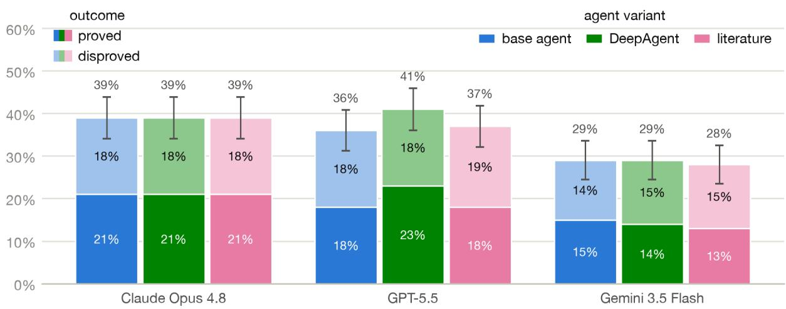  
Figure 3: Accuracy on OEIS OPEN LITE by model and agent variant (100 conjectures, \$200 budget per conjecture; Sections 2.4–2.4.2). Each bar splits solves into proofs (solid) and disproofs (pale). Error bars are ±1 standard error.

## A.3 Solve rates by conjecture metadata

We break down solve rates by the metadata described in Section 2.2: the attention a conjecture’s sequence has received in the literature, its proposer, and the year it was proposed.

Solve rate by citation count of the underlying sequence

OEIS Open

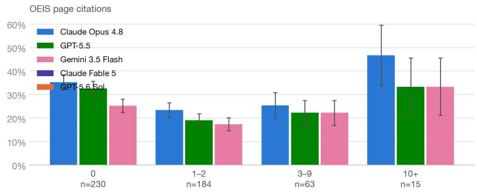

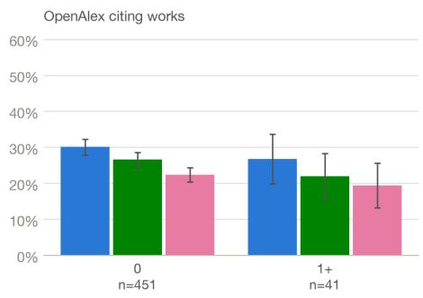  
OEIS Open Lite

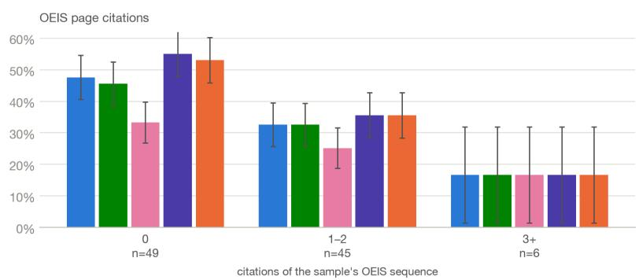

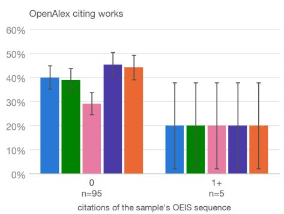  
Figure 4: Solve rate binned by citation metadata: citations on the sequence’s OEIS page (its links and references sections; left column) and OpenAlex works citing the sequence (right column), on OEIS OPEN (top; \$50 cap, one run per model) and OEIS OPEN LITE (bottom; \$200 cap, solve rates pooled over the base, DeepAgent, and literature runs). Error bars are ±1 standard error.

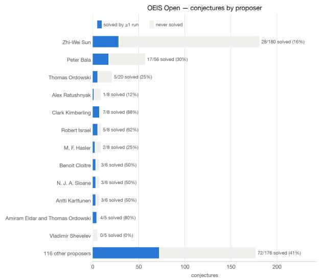

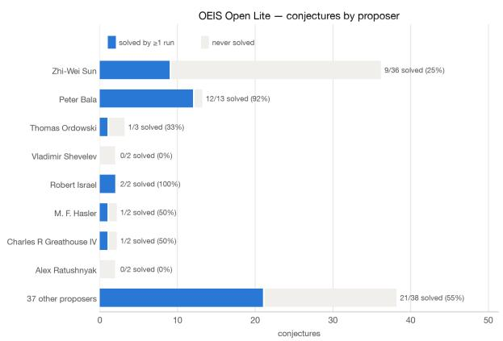  
Figure 5: Conjectures by proposer, with solve outcomes, on OEIS OPEN (left) and OEIS OPEN LITE (right). A conjecture counts as solved if it was resolved by at least one run of that eval set (three runs at a \$50 cap for OEIS OPEN, ten runs at a \$200 cap for LITE).

Solve rate by year the conjecture was proposed  
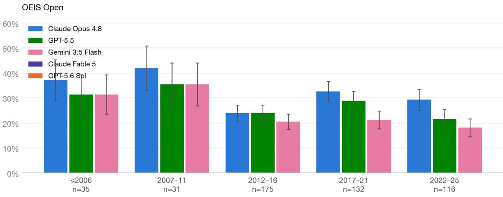

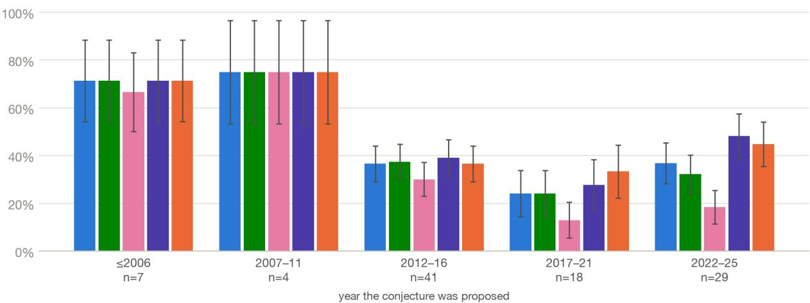  
Figure 6: Solve rate by the year the conjecture was proposed (from the OEIS entry’s revision history), on OEIS OPEN (top; \$50 cap, one run per model) and OEIS OPEN LITE (bottom; \$200 cap, solve rates pooled over the base, DeepAgent, and literature runs). Conjectures with no recorded proposal date are excluded (3 of 492; 1 of 100). Error bars are ±1 standard error.