# One Frozen Simulator Is Not Enough: Simulator Collapse in Multi-Agent RL

Simon Yu¹ Nicholas Tomlin² Marwa Abdulhai³ Ximing Lu4 Derek Chong⁵ Abe Hou⁵ Dilara Soylu⁵ Sergey Levine3 Christopher D. Manning5 Weiyan Shi1 1Northeastern University 2New York University 3UC Berkeley 4University of Washington 5Stanford University

## Abstract

Multi-agent reinforcement learning for human-AI interaction typically relies on a single large language model to simulate user behavior. We show that this approach systematically fails to generalize, and trace the failure to simulator collapse: because the simulator LLM is mode-collapsed, an LLM policy trained against it overfits to narrow strategies that exploit the simulator's dominant mode, and such a policy transfers poorly to unseen simulators and real users. We formalize this collapse theoretically and propose two complementary solutions, one at inference time and one at training time. The inference-time solution, Verbalized Sampling, broadens the simulator's behavior by sampling from a verbalized response distribution, reducing mode collapse. The training-time solution, Co-Training, jointly optimizes the policy against a population of trainable simulators, preventing it from overfitting to any single simulator's mode. We validate both solutions on three multi-turn benchmarks: Persuasion for Good, τ2-bench, and CooperBench. Verbalized Sampling improves held-out success by up to 9% over single-simulator RL, and Co-Training pushes gains further to 14%; the human study shows similar gain on real users. Both solutions preserve the policy diversity that collapses under single-simulator RL. To support further work in this direction, we release SCOPE, an open-source framework for Population Co-Training multi-agent RL. More broadly, our results suggest that the diversity of the training environment, not only the policy, is critical to the generalization of multi-turn RL to real-world deployment.

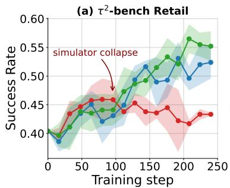

RL (Single Simulator) RL (Verbalized Sampling) RL (Co-training)

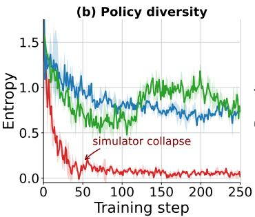

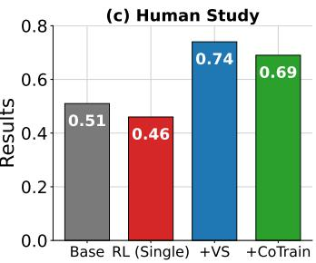  
Figure 1: Single-simulator RL collapses; Verbalized Sampling and Co-Training recover. $\tau ^ { 2 } .$ bench (Qwen3-4B-Instruct). (a) Held-out generalization: RL against a single frozen simulator peaks early, then starts collapsing. (b) Policy entropy: the same recipe drives the policy's entropy to near zero. (c) Human study: both fixes lift real-user performance over RL (Single), which drops below even the untrained baseline

## 1 Introduction

Reinforcement learning with verifiable rewards has driven rapid progress on single-turn LLM capabilities, from mathematical reasoning [1, 2, 3] to tool use [4, 5] to software engineering [6, 7]. These settings share a loop: generate an answer, verify it against the environment, and update the policy. Toward more realistic tasks beyond single-agent verifiable rewards, a growing line of work studies multi-turn human-AI interaction [8, 9, 10]: customer support [11], collaborative coding [12, 13], persuasion [14], and tutoring [15]. But training RL with real users at scale is prohibitively expensive and slow, so prior work has turned to LLM-based user simulators [16, 17].

A common method in recent work is to prompt a single frozen LLM to play the user [8, 18]. In this work, we show this practice can systematically fail to generalize. In multi-turn RL [19], the policy no longer interacts with a deterministic verifier; the simulated user becomes part of the training environment, and its output distribution decides which states the policy visits and what gradient signals it receives. We identify a systematic failure mode of this recipe, which we call simulator collapse. Because many aligned LLM simulators are mode-collapsed [20, 21, 22], a policy trained against a single frozen simulator receives gradients dominated by that simulator's modal behavior, and overfits to narrow strategies that exploit that mode [23]. The error compounds across dialogue turns, so a policy trained this way fails when transferred to unseen simulators, and is unlikely to transfer to real users.

First, in Section 3, we formalize simulator collapse. A mode-collapsed simulator does not necessarily make the policy gradient vanish; it biases the gradient toward the simulator's mode. Repeated policy updates then rank the policy's trajectories by how well they exploit that mode, concentrating probability on a narrow exploit set. This explains the rapid policy-entropy drop we observe in training. The resulting policy performs well in-distribution but fails on unseen simulators whose responses contain behaviors the training simulator didn't produce.

Two solutions follow from the theory, at different phases of the training loop: inference-time and training-time (Section 3.4). First, Verbalized Sampling [22] is the inference-time solution. At each simulator turn during rollout, the simulator is queried for a verbalized response distribution and a response is sampled from it, restoring within-simulator diversity without retraining. Second, Co-Training is the training-time solution. We update the user simulator alongside the policy on the same conversation [24, 25]. The two sides then co-evolve: the simulator's mode at each history shifts as the policy improves, so the strategy that exploited the existing mode no longer wins against the future one. The policy therefore faces a partner that is evolving across training.

Section 4 validates both solutions across three settings: Persuasion for Good [14] (adversarial dialogue), τ2-bench [11] (collaborative tool-calling), and CooperBench [12] (collaborative software engineering). Across all three benchmarks, Population Co-Training reaches the highest held-out task success and preserves policy entropy.

The main contributions can be summarized as follows:

1. Identifying simulator collapse. We formalize how a mode-collapsed user simulator biases the policy gradient toward its mode and collapses the policy's entropy onto a narrow simulator-specific exploit. This defines a structural failure mode of RL against a single frozen simulator (§3.2).

2. Two solutions at different points in the training loop. Verbalized Sampling [22] is the inferencetime solution. At each simulator turn during rollout, the simulator is queried for a verbalized response distribution and one response is sampled from it, restoring within-simulator diversity without retraining either side. Co-Training is the training-time solution. We jointly update the policy and a trainable user simulator on the same rollouts, so the partner adapts as the policy improves. We release SCOPE, an open-source framework that unifies multi-model rotation self-play, and dual-model Co-Training behind a single pluggable interface (§3.4).

3. Empirical validation across three multi-agent RL settings. On Persuasion for Good, τ2-bench and CooperBench, single-simulator RL drops back toward the untrained baseline. Both Verbalized Sampling and Co-Training close most of the held-out gap, and Population Co-Training yields the strongest held-out task success rate (§4). We additionally run a human study on τ2-bench and Persuasion for Good, where Co-Training improves task outcome and both methods improve P4G dialogue naturalness over single-simulator RL (Appendix E).

## 2 Background

Multi-agent RL as a POMDP. We model multi-turn dialogue as a two-player partially observable Markov decision process (POMDP) with a shared conversation-history state. Of the three settings we study, Persuasion for Good and $\tau ^ { 2 } .$ -bench are partially observable stochastic games (POSGs): the user simulator has private observations (goal, persona) the agent does not see, and only the agent receives task reward. CooperBench is the Dec-POMDP case : two cooperating coding agents share a task-success reward. We use the unified POMDP abstraction with shared history because the theory in §3.2 only depends on the joint trajectory distribution, which is invariant to how private observations are partitioned. At each turn t, the state $s _ { t } = ( o _ { 0 } , a _ { 0 } ^ { \pi } , a _ { 0 } ^ { \phi } , \ldots , o _ { t - 1 } , a _ { t - 1 } ^ { \pi } , a _ { t - 1 } ^ { \phi } )$ is the full conversation history. The agent samples its utterance $a _ { t } ^ { \pi } \sim \pi _ { \theta } ( \cdot \mid s _ { t } )$ ; the user simulator then samples a response $a _ { t } ^ { \phi } \sim \phi _ { \psi } ( \cdot \mid s _ { t } , a _ { t } ^ { \pi } )$ . A trajectory $\tau = ( s _ { 0 } , a _ { 0 } ^ { \pi } , a _ { 0 } ^ { \phi } , \ldots , s _ { T } )$ has terminal reward $R ( \tau )$ , and the agent maximizes

$$
J ( \theta ; \psi ) = \mathbb { E } _ { \tau \sim ( \pi _ { \theta } , \phi _ { \psi } ) } [ R ( \tau ) ] .\tag{1}
$$

The state-visitation distribution $\begin{array} { r } { d _ { \psi } ^ { \pi _ { \theta } } ( s ) = \sum _ { t } \mathrm { P r } ( s _ { t } = s \mid \pi _ { \theta } , \phi _ { \psi } ) } \end{array}$ is jointly determined by the agent and the simulator: the simulator does not only score trajectories, it determines which histories the policy learns from. When the simulator is fixed we abbreviate $J _ { \phi } ( \theta ) = J ( \theta ; \psi )$

Policy update. We apply REINFORCE [26] to full multi-turn trajectories using group-relative reward normalization. For each task we sample a group of G trajectories, score them by terminal reward $R ( \tau ^ { n } )$ , and form z-scored advantages $\hat { A } ^ { n } = ( R ( \tau ^ { n } ) - \bar { R } ) / \sigma _ { R } ( { \mathrm { E q . ~ } } 2 )$ , assigned uniformly to all agent tokens in each trajectory. If all trajectories in a group receive the same terminal reward, $\sigma _ { R } = 0$ and the update stalls; this is one boundary case. More generally, $\sigma _ { R }$ can remain positive, but if the simulator keeps responding in the same way at the histories visited during training, the remaining contrast mostly ranks agent samples by how well they exploit that simulator. Section 3 formalizes this active but biased gradient.

$$
\hat { A } ^ { n } = \frac { R ( \tau ^ { n } ) - \bar { R } } { \sigma _ { R } } , \quad \bar { R } = \frac { 1 } { G } \sum _ { n = 1 } ^ { G } R ( \tau ^ { n } ) , \quad \sigma _ { R } = \sqrt { \frac { 1 } { G } \sum _ { n = 1 } ^ { G } ( R ( \tau ^ { n } ) - \bar { R } ) ^ { 2 } } .\tag{2}
$$

## 3 Simulator Collapse: Why One Simulator Is Not Enough

Aligned LLMs favor typical responses under direct prompting [20, 22, 27, 21]; recent user-simulation studies confirm the same pattern, with LLM simulators reading as overly cooperative and stylistically uniform [28, 29, 30]. We sharpen this into a definition tied to the policy's training rollouts: at the simulator turns the policy actually visits, the simulator's response distribution is mode-collapsed.

Collapse on the training rollouts has three consequences we trace step by step. The policy gradient ends up close to one against a deterministic mode-user simulator (§3.2). Group-relative updates then ladder policy entropy down onto the narrow strategy that wins against the mode. §3.3 measures these predictions; §3.4 shows how Co-Training breaks the chain by making the simulator a moving target.

## 3.1 Definition and Hypothesis

Mode collapse. At a simulator turn, the user response is sampled from $\phi _ { \psi } ( \cdot \mid s _ { t } , a _ { t } ^ { \pi } )$ . We call the most likely response at that turn the simulator's mode:

$$
a _ { \phi } ^ { \star } ( s , a ^ { \pi } ) \ \in \ \arg \operatorname* { m a x } _ { a ^ { \phi } } \phi _ { \psi } ( a ^ { \phi } \mid s , a ^ { \pi } ) ,\tag{3}
$$

and write $\epsilon _ { \phi } ( s , a ^ { \pi } ) = 1 - \phi _ { \psi } ( a _ { \phi } ^ { \star } ( s , a ^ { \pi } ) \mid s , a ^ { \pi } )$ for the probability that the simulator deviates from its mode. Several recent works document strong mode concentration in aligned LLMs, often called mode collapse [20, 22, 27, 21]: small $\epsilon _ { \phi }$ means the simulator keeps emitting its mode.

Definition 3.1 (Simulator collapse on the training rollouts). For a policy $\pi _ { \theta }$ and a threshold $\epsilon ^ { \star } \in [ 0 , 1 ]$ we say the simulator is €\*-collapsed on the training rollouts if

$$
\begin{array} { r } { \mathbb { E } _ { ( s _ { t } , a _ { t } ^ { \pi } ) \sim ( \pi _ { \theta } , \phi _ { \psi } ) } \big [ \epsilon _ { \phi } ( s _ { t } , a _ { t } ^ { \pi } ) \big ] \ \le \ \epsilon ^ { \star } } \end{array}
$$

at the simulator turns visited by rollouts from $( \pi _ { \boldsymbol { \theta } } , \phi _ { \psi } )$

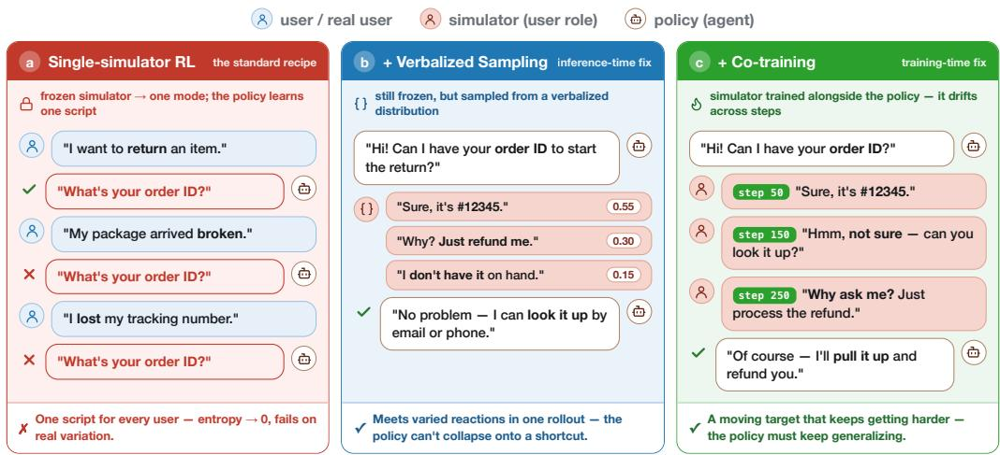  
Figure 2: Simulator collapse and our two fixes. (a) Problem: the real-user distribution is broad, but a frozen LLM simulator covers only one mode; the RL policy locks onto that mode and gives the narrow reply on real users it cannot serve. (b) Verbalized Sampling (inference-time): a single prompt asks the still-frozen simulator for several plausible user replies with likelihoods, so the policy sees varied reactions (acceptance, pushback, refusal) within a single rollout and cannot collapse onto a shortcut. (c) Co-Training (training-time): the simulator is no longer frozen and keeps drifting across training; the policy must keep generalising because the target mode it would memorise has already moved.

This definition is deliberately tied to the training distribution: a simulator can produce many different trajectories across a dataset and still behave almost deterministically at the histories the current policy actually visits. Collapse means the simulator's per-turn distribution is narrow; prompts that change which behavior is modal don't broaden it. We state $\epsilon _ { \phi }$ over exact token sequences for notation, but every result below also applies after measurable coarsening II : $a ^ { \phi } \mapsto b ^ { \phi }$ onto a behavior-class space (dialogue acts, strategy clusters), since TV distance to the modal point mass is non-increasing under projection (Remark B.1). The threshold $\epsilon ^ { \star }$ is the parameter the rest of the chain sharpens: Theorem 3.2 gives a gradient-bias bound that is tight when $\bar { \epsilon } _ { H } ( \theta ) \leq \epsilon ^ { \star } H$ . The empirical proxy in Figure 19 (zero-variance batch fraction) is a one-sided diagnostic of training-signal degeneration, not a direct estimator of $\epsilon _ { \phi } \mathbf { : }$ small $\epsilon _ { \phi }$ implies small reward variance via Lemma 3.3, but the converse can fail because sparse binary rewards or all-failure batches give zero variance too. A cleaner diagnostic would separate simulator-side from agent-side variance via Eq. 6; only the simulator-side term tracks $\epsilon _ { \phi } .$

Hypothesis. A mode-collapsed simulator breaks multi-agent RL into a fixed-user setting: the RL policy learns the strategy that wins against the simulator's mode, and that strategy fails when other models or real users deviate from it.

## 3.2 Theory: How Simulator Collapse Impacts the Policy

Mode collapse biases the policy gradient toward a deterministic mode-user objective (Theorem 3.2). It also kills simulator-side reward variance, so group-relative advantages rank samples by mode-exploit ability rather than user-robustness (Lemma 3.3). The policy gradient learns this signal, and policy mass concentrates geometrically onto the mode-exploit set $A _ { x }$ (Proposition 3.4, Corollary 3.5). The resulting low-entropy policy underperforms on real users with behaviors outside $A _ { x }$ (Proposition 3.6). Proofs are deferred to Appendix B.

Collapse turns the gradient into a mode-user gradient. Let $M _ { \phi }$ be the dialogue POMDP induced by φ, and $M _ { \mathrm { m o d e } }$ the modified POMDP in which every simulator turn deterministically emits the mode $a _ { \phi } ^ { \star } \bigl ( s _ { t } , a _ { t } ^ { \pi } \bigr ) . \ M _ { \mathrm { m o d e } }$ is determined by $\phi _ { \psi }$ alone, not by $\pi _ { \theta }$ . Let $J _ { \mathrm { { m o d e } } } ( \theta )$ be the corresponding objective.

Theorem 3.2 (Simulator collapse induces mode-user optimization). Assume rewards are bounded in $[ 0 , R _ { \mathrm { m a x } } ]$ and the trajectory-level policy score satisfies $\| \sum _ { t } \nabla _ { \theta }$ log $\pi _ { \boldsymbol { \theta } } ( a _ { t } ^ { \pi } \mid s _ { t } ) \parallel \le B ( e . g .$ , under finite-length truncation and gradient clipping; see Appendix B.2). Couple πθ in $M _ { \phi }$ and $M _ { \mathrm { m o d e } }$ turn by turn (same task, same agent randomness, maximal coupling at each simulator turn). Deine the accumulated collapse error along the rollout as

$$
\bar { \epsilon } _ { H } ( \theta ) = \mathbb { E } \left[ \sum _ { t = 1 } ^ { H } \epsilon _ { \phi } ( s _ { t } , a _ { t } ^ { \pi } ) \right] .\tag{4}
$$

Write $P _ { \phi } ^ { \theta }$ and $P _ { \mathrm { m o d e } } ^ { \theta }$ for the joint trajectory distributions under $\pi _ { \theta }$ in $M _ { \phi }$ and $M _ { \mathrm { m o d e } }$ respectively. Then $D _ { \mathrm { T V } } ( P _ { \phi } ^ { \theta } , P _ { \mathrm { m o d e } } ^ { \theta } ) \leq \bar { \epsilon } _ { H } ( \theta )$ , and

$$
\left. | \nabla _ { \theta } J _ { \phi } ( \theta ) - \nabla _ { \theta } J _ { \mathrm { m o d e } } ( \theta ) \right. | ~ \leq ~ 2 B R _ { \mathrm { m a x } } \bar { \epsilon } _ { H } ( \theta ) .\tag{5}
$$

Theorem 3.2 shows that the gradient does not vanish; it is biased, up to $\bar { \epsilon } _ { H } ( \theta )$ , toward the objective in which every user emits the mode $a _ { \phi } ^ { \star }$ . The bound applies to the idealized REINFORCE gradient under a bounded trajectory-score assumption; the implemented update uses GRPO-style clipping, group-relative normalization, and gradient clipping (Appendix C.1), so the theorem is an analytic guide to the bias direction rather than a tight bound on the actual surrogate loss. The bound is informative when $\begin{array} { r } { \bar { \epsilon } _ { H } \ll 1 ; } \end{array}$ Figure 19's zero-variance batch fraction climbing past 85% is consistent with this regime at $H { = } 3 0 , 5 0$ , with the proxy caveats above (Appendix B.4).

What group-relative advantages measure. The same point shows up in the within-task reward variance that group-normalized RL z-scores. Let $\xi _ { \pi }$ be agent-side randomness, $\xi _ { U }$ simulator-side randomness, and $\bar { R } _ { x } = R ( x , \xi _ { \pi } , \xi _ { U } )$ . The law of total variance gives

$$
\operatorname { V a r } [ R _ { x } \mid x ] = \underbrace { { \mathbb { E } } _ { \xi _ { \pi } } { \big [ } \mathrm { V a r } _ { \xi _ { U } } ( R _ { x } \mid x , \xi _ { \pi } ) { \big ] } } _ { \mathrm { s i m u l a t o r - s i d e ~ c o n t r a s t } } + \underbrace { \mathrm { V a r } _ { \xi _ { \pi } } { \big [ } { \mathbb { E } } _ { \xi _ { U } } ( R _ { x } \mid x , \xi _ { \pi } ) { \big ] } } _ { \mathrm { a g e n t - s i d e ~ c o n t r a s t } } .\tag{6}
$$

Lemma 3.3 (Collapse removes simulator-side reward contrast). If the simulator's trajectory is $\epsilon _ { H } ( x , \xi _ { \pi } )$ -close in TV to the mode trajectory at $( x , \xi _ { \pi } )$ , then $\operatorname { V a r } _ { \xi _ { U } } ( \tilde { R } _ { x } \mid x , \xi _ { \pi } ) \leq R _ { \operatorname* { m a x } } ^ { 2 } \overset { \circ } \epsilon _ { H } ( x , \overset { \cdot } { \xi } _ { \pi } )$

When simulator-side variance vanishes, the z-scored advantage measures only agent-side variation. Group-relative RL then ranks samples by how well they exploit the simulator's mode; user-robustness drops out of the comparison.

Policy entropy collapses under a persistent mode advantage. Let $Y$ be an agent-strategy abstraction at the level above tokens, with distribution $q _ { k } ( y \mid x )$ at update k. Intuitively, Y coarsens semantically-equivalent agent responses into a small set of strategies (e.g., “open with empathy", “cite charity statistics"). This is the agent-side analog of the user-side coarsening in Definition 3.1. A strategy y exploits the simulator's mode $a _ { \phi } ^ { \star }$ if its mode-user value $Q _ { \mathrm { m o d e } } ( x , y )$ is high, i.e., y accrues reward in the counterfactual $\mathbf { M D P }$ where the simulator deterministically emits $a _ { \phi } ^ { \star }$ at every turn. Let $A _ { x }$ denote the set of these mode-exploit strategies, and let $\Delta _ { x } > 0$ be the mode-exploit gap: the smallest $Q _ { \mathrm { m o d e } }$ advantage of any $y \in A _ { \mathfrak { z } }$ e over any $y ^ { \prime } \notin A _ { x }$ (Appendix B.6). By Theorem 3.2 the realized rollouts are dominated by trajectories in which the simulator emits $a _ { \phi } ^ { \star } ,$ SO $\Delta _ { x }$ quantifies the gap between the best mode-exploit strategy and the best non-exploit strategy on exactly the trajectories the agent sees during training. We analyze an idealized KL-regularized softmax update on $q _ { k }$ as a stylized model of the token-level GRPO step we run in practice; the proposition is a sufficient mechanism for the observed entropy collapse, not a direct theorem about the implemented optimizer. Proposition 3.4 (Mode advantage concentrates policy mass). Under a KL-regularized softmax policygradient step on $q _ { k } ( y \mid x )$ with learning rate η and bounded Q-estimation errors, the log-odds of $A _ { x }$ satisfy

$$
\begin{array} { r } { \log \frac { q _ { k + 1 } ( A _ { x } | x ) } { q _ { k + 1 } ( A _ { x } ^ { c } | x ) } \ \geq \ \log \frac { q _ { k } ( A _ { x } | x ) } { q _ { k } ( A _ { x } ^ { c } | x ) } + g _ { x } , } \end{array}\tag{7}
$$

where $g _ { x } \mathrm { ~ > ~ } 0$ depends on $\eta ,$ the gap $\Delta _ { x }$ , and the simulator-collapse and estimation errors $( A p \cdot$ pendix B.6 gives exact constants).

Corollary 3.5 (Entropy concentration). Iterating Eq. 7 gives

$$
q _ { k } ( A _ { x } \mid x ) \ge \frac { 1 } { 1 + \frac { 1 - q _ { 0 } ( A _ { x } | x ) } { q _ { 0 } ( A _ { x } | x ) } e ^ { - k g _ { x } } } ,\tag{8}
$$

so the strategy distribution concentrates onto $A _ { x }$ geometrically fast in $k .$

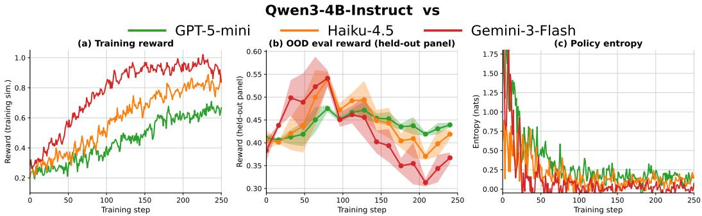  
Figure 3: Single-simulator RL exhibits simulator collapse. Three single-simulator REINFORCE runs, three seeds each, ±1σ shading on OOD. Training reward climbs in every run (a), OOD eval peaks early and declines (b), and policy entropy collapses (c). The decoupling between (a) and (b) is simulator collapse passing through into policy collapse; (c) is the mechanism.

Token-level entropy, which we measure in §3.3, is the empirical counterpart of this strategy-level concentration only to the extent that the exploit strategies in $A _ { x }$ are themselves low-entropy text (fixed scripts, formulaic appeals); in that regime, strategy concentration shows up as a token-entropy collapse. We support this regime qualitatively by inspecting late-training within-batch rollouts, where the three transcripts from a single context become nearly word-for-word the same (Appendix F.9).

From entropy collapse to transfer failure. By Corollary 3.5, the trained policy concentrates on $A _ { x }$ . This fails on real users whose behaviors are not handled by the exploit strategies in $A _ { x }$

Proposition 3.6 (Deployment regret from missing user behaviors). Let $B _ { x }$ be a set of real-user behaviors requiring a strategy outside $A _ { x } ,$ with real-user mass $q _ { \star } ( x ) = P _ { \star } ( B _ { x } \mid x )$ . Suppose every $y _ { m } \in A _ { x }$ is worse than an adaptive strategy yb by at least $\Delta _ { x } ^ { \mathrm { r e a l } }$ on $B _ { x }$ and by at most $\nu _ { x }$ outside $B _ { x } ,$ and the trained policy places probability at least $1 - \alpha _ { x } o n A _ { x } .$ Then

$$
J _ { \star } ( y _ { b } \mid x ) - J _ { \star } ( \hat { \pi } \mid x ) \ge ( 1 - \alpha _ { x } ) \big [ \Delta _ { x } ^ { \mathrm { r e a l } } q _ { \star } ( x ) - \nu _ { x } ( 1 - q _ { \star } ( x ) ) \big ] - \alpha _ { x } R _ { \mathrm { m a x } } .\tag{9}
$$

The bound is positive when $\Delta _ { x } ^ { \mathrm { r e a l } } q _ { \star } ( x ) > \nu _ { x } ( 1 - q _ { \star } ( x ) )$ , i.e., missing behaviors are common enough that the adaptive strategy's gain exceeds its off-behavior penalty. §3.3 tests this regime empirically: the collapsed policy fails when real users push back or apply constraints the training simulator rarely produced.

## 3.3 Empirical Evidence

We examine these results empirically on Persuasion for Good [14] and $\tau ^ { 2 }$ -bench [11]. For each single-simulator run we track training reward, policy entropy, and eval reward on a held-out panel $\Phi _ { \mathrm { e v a l } }$ of six simulators spanning seen and unseen families. Setup details are in Appendix C.4.

Single-simulator RL exhibits simulator collapse in practice. We train against three frozen simulators of varying modal concentration (GPT-5-mini, Haiku-4.5, Gemini-3-Flash). Figure 3 shows the training results. Training reward climbs in every run, fastest for the most modal simulator. OOD eval peaks early and turns over, but the magnitudes differ sharply: the most modal simulator (Gemini-3-Flash) crashes below the untrained baseline, while the least modal (GPT-5-mini, the one we use in our main experiments) sees a gentler but still clear decline. Policy entropy crashes toward zero across all three runs. The failure is on the policy side: the policy learns the narrow exploit and fails to transfer to unseen simulators. The token-entropy pattern is consistent with the strategy-level concentration that Corollary 3.5 predicts, under the condition that the exploit strategies are themselves low-entropy (Remark B.4).

Takeaway. The failure comes from the training environment, instead of the algorithm. Two solutions follow, at different points in the training loop. Verbalized Sampling [22] is the inference-time solution: we draw from a verbalized response distribution at each turn during rollout. Co-Training is the training-time solution: we update the simulator alongside the policy, so the mode the policy could lock onto shifts as training proceeds. The next section develops both solutions; their empirical comparison is in §4.2.

## 3.4 Breaking the Chain: Verbalized Sampling and Co-Training

The collapse chain in §3.2 rests on two load-bearing assumptions. First, the per-turn collapse error $\epsilon _ { \phi } ( s _ { t } , a _ { t } ^ { \pi } )$ stays close to zero across the horizon, so $\bar { \epsilon } _ { H } ( \theta )$ in Theorem 3.2 shrinks toward zero and $\nabla _ { \theta } J _ { \phi }$ coincides with $\nabla _ { \theta } J _ { \mathrm { m o d e } }$ . Second, the modal-exploit set $A _ { x }$ stays fixed across training, so log-odds for $A _ { x }$ accumulate over k updates and Corollary 3.5 concentrates $q _ { k }$ on $A _ { x }$ at geometric rate $g _ { x } .$ The two fixes in this paper attack one assumption each. Under the reference-recovery assumption $\zeta \smash { D _ { \mathrm { T V } } ( p _ { \phi } ^ { \mathrm { V S } } , P ) } \leq \eta ;$ Proposition 3.7), Verbalized Sampling makes the policy gradient approximate the reference-user gradient instead of the mode-user gradient that Corollary 3.5 requires. Co-Training moves $A _ { x }$ at every step, so no policy iterate can stack log-odds toward a fixed target.

Verbalized Sampling recover the reference simulator distribution. A greedy query drives $\epsilon _ { \phi } ( s )$ toward zero. A verbalized query returns K candidate responses with verbalized probabilities; the resulting distribution $p _ { \phi } ^ { \mathrm { V S } } ( \cdot \mid s )$ approximates the simulator's pre-RLHF reference distribution $\textstyle P ( \cdot \mid s ) \ [ 2 2 ]$ , since the distribution-level prompt verbalizes the response distribution that direct aligned prompting sharpens away. The closeness $D _ { \mathrm { T V } } ( p _ { \phi } ^ { \mathrm { V S } } , P ) \leq \dot { \eta }$ is an empirical assumption; Appendix F.5 discusses when it holds and when it fails. $P$ comes from the simulator's pretraining and is distinct from the real user population $P _ { \mathrm { r e a l } } ;$ the proposition below makes no claim about distance from real users, which the human study in Appendix E tests separately.

Proposition 3.7 (Reference-gradient recovery under Verbalized Sampling). If $D _ { \mathrm { T V } } ( p _ { \phi } ^ { \mathrm { V S } } ( \cdot ~ \cdot ~ |$ $s , a ^ { \pi } ) , P ( \cdot \mid s , a ^ { \pi } ) ) \leq \eta ( s , a ^ { \pi } )$ at every visited state along an H-turn rollout, then the trajectory distributions and policy gradients in $M _ { \mathrm { V S } }$ vs. the reference-user environment $M _ { \mathrm { r e f } }$ satisfy ${ \cal D } _ { \mathrm { T V } } ^ { \bf \bar { \Phi } } ( P _ { \mathrm { V S } } ^ { \theta } , P _ { \mathrm { r e f } } ^ { \theta } ) \leq \bar { \eta } _ { H } \bar { ( \theta ) }$ and

$$
\begin{array} { r } { \left\| \nabla _ { \theta } J _ { \mathrm { V S } } ( \theta ) - \nabla _ { \theta } J _ { \mathrm { r e f } } ( \theta ) \right\| \ \leq \ 2 B R _ { \mathrm { m a x } } \bar { \eta } _ { H } ( \theta ) , } \end{array}
$$

where $\begin{array} { r } { \textstyle { \bar { \eta } } _ { H } ( \theta ) = \operatorname { \mathbb { E } } \bigl [ \sum _ { t = 1 } ^ { H } \eta ( s _ { t } , a _ { t } ^ { \pi } ) \bigr ] } \end{array}$

This is the positive counterpart of Theorem 3.2: collapse induces a mode-user gradient; VS recovery induces a reference-user gradient. When $P$ has non-trivial mass away from its mode and η is small, VS moves training out of the mode-oracle regime that Corollary 3.5 requires. Appendix F.5 proves the bound and discusses what the reference-recovery assumption does and does not buy; a separate γ-sharpening result there shows that direct aligned prompting exponentially suppresses tail behaviors while VS preserves them.

Co-Training let the simulator and policy co-evolve. We update the user simulator on its own turns of the same conversation, so both sides receive gradients from a single rollout. The simulator's mode at each history shifts as training proceeds, and a strategy that exploited yesterday's mode no longer wins against today's: $A _ { x }$ is no longer constant, and the geometric concentration in Corollary 3.5 no longer applies (Appendix B.7 formalizes this via exclusive-lead counters). For the moving target to remain useful, the simulator must be trained with a reward that keeps it in the informative-variation regime (Remark B.10) rather than re-collapsing onto a different mode; task-specific reward choices are in §4.1 and an ablation showing both reward extremes underperform is in Appendix F.8. For binary rewards the curriculum targets success rate $\approx 0 . 5 ,$ where within-batch variance $p ( 1 - p )$ peaks at $\sigma ^ { 2 } = 0 . 2 5$ and group-relative advantages have the widest spread.

## 4 Experiments

The theory makes three predictions we test in turn. (Q1) Single-simulator RL should collapse: OOD eval peaks early then declines as the policy locks onto a mode-exploit strategy that fails to transfer. (Q2) The two solutions should each recover the gradient signal at the layer they target: Verbalized Sampling by widening the simulator's per-turn distribution, Co-Training by moving the mode the policy would chase. (Q3) Sampling the simulator from a pool of recent checkpoints should buy a further gain on top of Co-Training, and the size of that gain should depend on how much the pool preserves real variation. We also ask (Q4): do the LLM-panel gains transfer to real users? Section 4.2 answers Q1, Q2, and Q4 (the last on $\tau ^ { 2 }$ -bench and P4G via a pre-registered human study); Appendix F.1 answers Q3 by isolating pool size and simulator reward.

## 4.1 Setup

Tasks. Three multi-turn benchmarks: Persuasion for Good (P4G) [14], a persuader arguing for a charitable donation against a resistant donor (reward r = min(donation/2, 1)); $\tau ^ { 2 }$ -bench [11], customer-service dialogues on retail or airline tasks with binary per-split success; and Cooper-Bench [12], two coding agents coordinating on a multi-step task with binary success. CooperBench uses Qwen3.5-9B and Qwen3.5-27B since smaller models cannot complete the tasks. P4G uses its donation-based adversarial reward and CooperBench its symmetric task-success reward; on $\tau ^ { 2 } .$ -bench the simulator is trained with a SPICE-style curriculum reward [31] that targets within-batch variance $\sigma ^ { 2 } \approx 0 . 2 5 ;$ this choice is essential, since adversarial and cooperative simulator rewards both collapse the simulator onto a new mode and drop eval reward (Appendix F.8). We evaluate every 16 steps and pick the best-mean-panel-score checkpoint. P4G and $\tau ^ { 2 } .$ bench use a 6-simulator panel (3 seen during training plus 3 unseen families); CooperBench uses symmetric cross-play against Claude Haiku 4.5, GPT-5, and Gemini-3-Flash. Selecting on the full mean leaks partial training-simulator signal into selection; per-simulator and seen/unseen breakdowns are in Appendix C.4.

Training. All methods share the policy update from §2. For Co-Training, both sides update from the same rollout, the simulator on a task-appropriate objective. The population variant additionally samples the active simulator from a pool of recent checkpoints (full buffer specification in Appendix C.1). The framework SCOPE implements all paradigms. Methods differ in per-step training compute: frozen-simulator methods (VS, Ensemble, Persona-Guided) update only the agent, while Co-Training and Population Co-Training update both sides on the same rollout. All comparisons in Tables 1 and 2 are at matched optimizer-step count rather than matched compute; per-step multipliers and total GPU-hours are in Appendix C.4. At matched compute (1 ×), Verbalized Sampling already recovers most of the held-out gain; Co-Training extends it at ～2× per-step cost.

Baselines. Six paradigms under matched setup: Base (untrained); RL (Single) against GPT-5-mini, the standard recipe; Verbalized Sampling [22], sampling from the simulator's verbalized response distribution; Ensemble Models, cycling K=3 frozen models from different families; Co-Training, pairing the policy with a separately trained simulator; and Population Co-Training (ours), sampling the active simulator from a pool of recent checkpoints rather than the latest one alone. Plus a Persona-Guided simulator [32], which conditions a single GPT-5-mini simulator on per-rollout personas. P4G's task already conditions on personas, so Persona-Guided doesn't apply here.

## 4.2 Simulator Collapse Reproduces; Both Fixes Recover It

Q1: Does single-simulator RL collapse? Yes, but the collapse is in the curve shape, not the headline number. Table 1 reports the best held-out checkpoint, and RL (Single)'s best is meaningfully above Base on every cell (at Qwen3-4B-Instruct: 46.1 vs 40.4 on $\tau ^ { 2 } .$ -Retail; 29.8 vs 24.0 on Airline; 0.275 vs 0.216 on P4G). The training curves in Figure 4 explain why: the best checkpoint is a transient peak that collapses back toward Base on $\tau ^ { 2 }$ -Retail before training ends (Appendix Figure 21 shows the same collapse pattern). At end of training, RL (Single) and Persona-Guided sit within a few points of Base on both $\tau ^ { 2 }$ splits; the Table 1 best-checkpoint values reflect a transient peak not steady-state behavior. The population methods stay at or above their peak throughout, so their best-checkpoint number is also their steady-state behavior. P4G is milder at both model sizes because the continuous donation reward preserves within-batch variance; the curve still degrades from its peak (Appendix Figure 20). The held-out panel is LLM-based; the real-user question is addressed by the human study in Appendix E.

Q2: Do the two proposed solutions recover the signal, and at the layers the theory says? Both do, and the recovery is most informative when read side-by-side. On Qwen3-4B-Instruct, Verbalized Sampling lifts $\tau ^ { 2 } .$ -Retail from 46.1 to 55.5, Airline from 29.8 to 36.9, and P4G reward from 0.275 to 0.484. This is most of the available gain, recovered without retraining either side, and is consistent with the mechanism the theory assigns to VS: by querying a verbalized distribution at every simulator turn, VS keeps $\epsilon _ { \phi }$ above zero per turn so the modal-gradient term in Theorem 3.2 no longer dominates.

Table 1: User-simulator setting (P4G, τ2-bench). Best held-out-panel score across training; subscript = panel-std over six held-out simulators. P4G reward $r = \mathrm { m i n } ( \mathrm { d o n a t i o n } / 2 , 1 ) ; \tau ^ { 2 }$ -bench reports per-split success rate (%). Bold = best per model size; underline = runner-up. $\mathbf { \dot { \bar { \Psi } } } \mathbf { \Phi } \mathbf { \tilde { N } } / \mathbf { A } ^ { \prime } \mathbf { \bar { \Psi } }$ on the P4G column for Persona-Guided: the P4G task already conditions on personas, so the baseline does not apply. The frozen ensemble uses K=3 to match the main-text cost comparison; Population Co-Training uses K=5 by default, and Appendix F.1 sweeps $K \in \{ 1 , 3 , 5 , 1 0 \}$ showing the population benefit persists at each K. Per-method compute and memory breakdown is in Appendix C.4.
<table><tr><td rowspan="2"></td><td rowspan="2">Method</td><td>P4G</td><td colspan="2"> $\tau ^ { 2 } .$  -bench</td></tr><tr><td>Reward ↑</td><td>Retail ↑</td><td>Airline ↑</td></tr><tr><td rowspan="7">Qwen3-4B-Instruct</td><td>Base</td><td> $0 . 2 1 6 _ { \pm 0 . 0 3 }$ </td><td> $4 0 . 4 _ { \pm 3 . 1 }$ </td><td> $2 4 . 0 { \scriptstyle \pm 2 . 8 }$ </td></tr><tr><td>RL (Single)</td><td> $0 . 2 7 5 _ { \pm 0 . 1 2 }$ </td><td> $4 6 . 1 _ { \pm 5 . 2 }$ </td><td> $2 9 . 8 { \scriptstyle \pm 4 . 3 }$ </td></tr><tr><td>+ Persona-Guided</td><td> $\mathrm { N } / \mathrm { A }$ </td><td> $4 9 . 2 _ { \pm 3 . 2 }$ </td><td> $3 1 . 6 _ { \pm 3 . 0 }$ </td></tr><tr><td>+ Ensemble Models (K=3)</td><td> $0 . 3 9 4 _ { \pm 0 . 0 4 }$ </td><td> $5 7 . 1 _ { \pm 3 . 4 }$ </td><td> $4 0 . 1 _ { \pm 3 . 6 }$ </td></tr><tr><td>+ Verbalized Sampling</td><td> $\underline { { 0 . 4 8 4 } } _ { \pm 0 . 0 5 }$ </td><td> $5 5 . 5 _ { \pm 3 . 8 }$ </td><td> $3 6 . 9 _ { \pm 3 . 5 }$ </td></tr><tr><td>+ Co-Training</td><td> $0 . 4 3 8 _ { \pm 0 . 0 5 }$ </td><td> $6 0 . 5 { \scriptstyle \pm 3 . 9 }$ </td><td> $\underline { { 4 4 . 4 . } } \pm 4 . 0$ </td></tr><tr><td>+ Population Co-Training</td><td> $\mathbf { 0 . 5 0 8 _ { \pm 0 . 0 4 } }$ </td><td> ${ \bf 6 2 . 2 _ { \pm 3 . 6 } }$ </td><td> ${ \pm 5 . 7 } _ { \pm 3 . 7 }$ </td></tr><tr><td rowspan="8">Qwen3-8B</td><td>Base</td><td> $0 . 2 5 3 _ { \pm 0 . 0 3 }$ </td><td> $4 8 . 1 _ { \pm 3 . 0 }$ </td><td> $3 0 . 2 _ { \pm 2 . 9 }$ </td></tr><tr><td>RL (Single)</td><td> $0 . 3 4 2 _ { \pm 0 . 1 1 }$ </td><td> $5 2 . 5 _ { \pm 6 . 1 }$ </td><td> $3 5 . 2 _ { \pm 5 . 9 }$ </td></tr><tr><td>+ Persona-Guided</td><td> $\mathrm { N } / \mathrm { A }$ </td><td> $5 5 . 7 _ { \pm 3 . 1 }$ </td><td> $3 7 . 4 _ { \pm 3 . 0 }$ </td></tr><tr><td>+ Ensemble Models (K=3)</td><td> $0 . 4 5 0 { \scriptstyle \pm 0 . 0 4 }$ </td><td> $6 2 . 4 _ { \pm 3 . 3 }$ </td><td> $4 3 . 6 _ { \pm 3 . 5 }$ </td></tr><tr><td>+ Verbalized Sampling</td><td> $\mathbf { 0 . 5 8 7 { \scriptstyle \pm 0 . 0 5 } }$ </td><td> $6 0 . 7 _ { \pm 3 . 5 }$ </td><td> $4 0 . 2 { \scriptstyle \pm 3 . 4 }$ </td></tr><tr><td>+ Co-Training</td><td> $0 . 5 5 6 _ { \pm 0 . 0 5 }$ </td><td> $6 6 . 1 _ { \pm 3 . 7 }$ </td><td> $\underline { { 4 8 . 2 } } \underline { { + 3 . 8 } }$ </td></tr><tr><td>+ Population Co-Training</td><td> $0 . 5 6 8 { \scriptstyle \pm 0 . 0 5 }$ </td><td> ${ \bf 6 7 . 9 { \scriptstyle \pm 3 . 4 } }$ </td><td> $\mathbf { 4 9 . 7 } _ { \pm 3 . 6 }$ </td></tr></table>

Persona-Guided, a prompt-level baseline that conditions the simulator on per-task personas, gives a smaller lift (46.1 → 49.2 Retail, 29.8 → 31.6 Airline): prompt-level diversity is a partial fix that does not close the gap to the simulator-level interventions. Co-Training acts on the complementary layer: it lifts Retail and Airline further to 60.5 and 44.4 by moving the mode the policy would lock onto across training steps, so Corollary 3.5's geometric concentration never has a fixed target. Population Co-Training tops both at 62.2 and 45.7 and is the best method on every $\tau ^ { 2 }$ split at both model sizes and on P4G at 4B. The one exception is Qwen3-8B P4G, where VS (0.587) edges past both Co-Training (0.556) and Population Co-Training (0.568): the continuous donation reward fits response-level Verbalized Sampling well enough that the within-simulator fix already captures the available signal.

Symmetric cooperation: cross-play hits a ceiling; co-evolution breaks through. Beyond the user-simulator setting (P4G, τ2-bench), CooperBench tests whether the same fixed-partner vs. coevolving-partner mechanism extends to symmetric cooperation, with both sides drawn from the same role. Table 2 reports held-out success against a 3-model partner panel (Claude Haiku 4.5, GPT-5, Gemini-3-Flash). Frozen-partner cross-play plateaus at a ceiling set by the partner's capacity; only self-play and population self-play break through, with the pool variant reaching the same peak faster. Detailed training dynamics for Qwen3.5-9B and Qwen3.5-27B are in Appendix Figures 23 and 24.

Q4: Do the gains transfer to real users? We run a human study on $\tau ^ { 2 } \mathrm { . }$ bench (retail split) and Persuasion for Good with four conditions per task: Base, RL (Single), +Verbalized Sampling, and +Co-Training, collecting N=40 Prolific participants per cell. Each session measures the task outcome and a survey is distributed on rating dialogue quality. Co-Training improves $\tau ^ { 2 }$ task outcome over RL (Single), and both

Table 3: Q4: Human study on $\tau ^ { 2 }$ -bench and Persuasion for Good. We report $\dot { \tau } ^ { 2 } .$ -bench task outcome from the objective evaluator $( [ 0 , 1 ] )$ , overall satisfaction on a 1–7 Likert scale, P4G donation amount, and P4G overall satisfaction. Bold = best per column; underline = second best per column. $^ { * } p { < } 0 . 0 \bar { 5 } , ^ { * * } p { < } 0 . 0 1$ vs RL (Single).
<table><tr><td></td><td colspan="2">τ2-bench</td><td colspan="2">P4G</td></tr><tr><td>Method</td><td>Task ↑</td><td></td><td>Natural ↑ Donation ($) ↑</td><td>Natural ↑</td></tr><tr><td>Base</td><td>0.41±0.22</td><td> $4 . 7 7 { \scriptstyle \pm 1 . 8 9 }$ </td><td>0.51±0.60</td><td> $3 . 9 3 { \scriptstyle \pm 1 . 9 1 }$ </td></tr><tr><td>RL (Single)</td><td> $0 . 4 3 _ { \pm 0 . 3 1 }$ </td><td> $5 . 1 1 { \scriptstyle \pm 1 . 6 3 }$ </td><td>0.46±0.72</td><td> $3 . 2 1 _ { \pm 1 . 7 6 }$ </td></tr><tr><td>+ Verbalized Sampling</td><td> $\underline { { 0 . 6 3 } } \pm 0 . 2 8 ^ { * * }$ </td><td> ${ \underline { { 5 . 3 8 } } } { \pm 1 . 5 7 }$ </td><td>0.74±0.59</td><td> ${ \underline { { 4 . 3 3 } } } { \pm 1 . 7 8 } \mathrm { \Omega } ^ { * * }$ </td></tr><tr><td>+ Co-Training</td><td> $\mathbf { 0 . 7 0 _ { \pm 0 . 4 3 } } ^ { \ast \ast }$ </td><td> ${ \bar { 5 } } . 5 0 _ { \pm 1 . 8 1 }$ </td><td>0.69±0.64</td><td> $4 . 4 5 _ { \pm 1 . 6 7 } ^ { } ^ { * * }$ </td></tr></table>

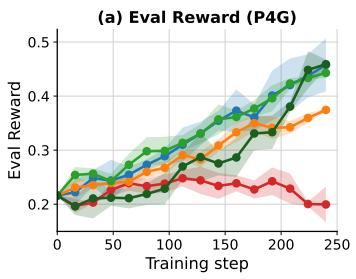

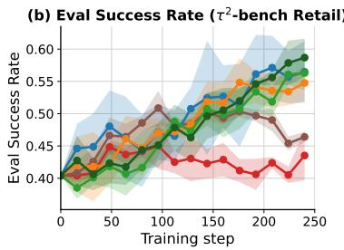

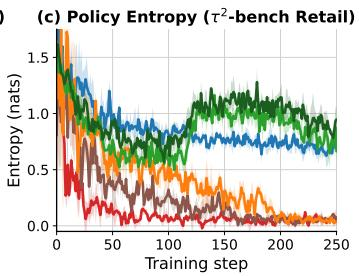  
Figure 4: Both inference- and training-time solutions revive policy entropy. (a) P4G Eval Reward over training; (b) $\tau ^ { 2 } .$ -bench Retail Eval Success Rate; (c) τ2-bench Retail Policy Entropy. RL (Single) rises briefly and collapses below the untrained baseline on both eval panels while its entropy crashes to near zero. Verbalized Sampling, Ensemble (K=3), Co-Training, and Population Co-Training improve eval and preserve entropy; the two Co-Training variants additionally exhibit the simulatorupdate kick pattern in the entropy panel. Persona-Guided (32; τ2-bench only) sits between RL (Single) and the population methods. Curves average three seeds; eval shading is ±1σ over six held-out evaluator models.

Table 2: Symmetric cooperation (CooperBench). Held-out success rate (%) against a 3-model partner panel (Haiku 4.5, GPT-5, Gemini-3-Flash); subscript = panel-std. Bold = best per model size; underline = runner-up. \*Tinker with LoRA adapters (Qwen3.5-27B only); per-step compute differs from the other rows. CooperBench is symmetric: the asymmetric paradigm labels of Table 1 specialise here to cross-play (frozen partner), Self-play (single model in both roles), and Population self-play (rotating among recent self-play checkpoints).
<table><tr><td>Method</td><td>Qwen3.5-9B Qwen3.5-27B* Success ↑</td><td>Success ↑</td></tr><tr><td>Base</td><td> $2 3 . 7 _ { \pm 5 . 2 }$ </td><td> $4 7 . 8 _ { \pm 4 . 8 }$ </td></tr><tr><td>Cross-play (Haiku)</td><td>28.8±5.5</td><td>54.3±5.2</td></tr><tr><td>+ Cross-play Ensemble (K=3)</td><td>29.8±5.3</td><td>56.1±5.0</td></tr><tr><td>+ Self-play</td><td>32.8±6.0</td><td>61.7±5.5</td></tr><tr><td>+ Population self-play (ours)</td><td> ${ 3 3 . 6 } _ { \pm 5 . 7 }$ </td><td>62.4±5.3</td></tr></table>

Verbalized Sampling and Co-Training improve P4G dialogue naturalness. Full design, sample sizes, and analysis plan are in Appendix E.

## 5 Related Work

Mode collapse in LLMs. RLHF narrows LLM output distributions both empirically [20, 27, 22, 33] and structurally: GX-Chen et al. [21] prove that KL-regularized RL specifies a unimodal optimum by construction. Specialized cases include reasoning collapse in agentic RL [34] and persona collapse in role-play [35]. We add simulator collapse: when the mode-collapsed LLM is the training environment, it starves the policy gradient.

LLM-based user simulation for RL. LLM simulators are the de facto training environment for dialogue and agentic RL [36, 15, 8, 37, 38, 39, 32], and increasingly the evaluation side too [11, 9]. Their limits are now well-documented: stronger assistants make worse simulators [28], simulators diverge from real users in preference [29] and behavior distribution [30], and inherit homogeneous cooperative bias from their base models [40, 41]. Existing mitigations act on the simulator side: behavioral taxonomies [42], theory-of-mind objectives [9], curiosity rewards [43], finer credit assignment [18, 8], evolved persona generators [40], or inference-time fixes [44]. All optimize against a static simulator distribution. We instead replace it with a co-evolving population and trace the failure to a policy-side mechanism (Theorem 3.2, Corollary 3.5).

Multi-agent RL and co-training. Self-play has driven gains in games [45, 46] and in LLM training across text games [25], corpus-grounded interaction [31], and reasoning [47]; Liao et al. [48] note its diversity ceiling, motivating dual-model co-training [49, 50, 51]. Multi-turn RL has reached collaborative reasoning [52, 53] and social tasks [18, 54] on short horizons (1–3 rounds). We extend co-training to long-horizon dialogue with population-based partner sampling.

## 6 Discussion and Conclusion

We identify simulator collapse as a structural failure for LLMs in multi-agent RL: LLM simulators are mode-collapsed, an RL policy trained against such a simulator inherits that narrowness, the policy's own entropy collapses onto the strategy that wins against the simulator's mode, and the resulting low-entropy policy fails to transfer to unseen simulators or real users.

From this we make three contributions. First, we formalize simulator collapse and show it is a structural failure of the training environment. Second, we give two complementary solutions: Verbalized Sampling at inference and Co-Training at training. We release SCOPE, an open framework that unifies multi-model rotation, self-play, and dual-model Co-Training behind one interface. Third, across Persuasion for Good, τ2-bench, and CooperBench, single-simulator RL's held-out success peaks early then drops back toward the untrained baseline by end of training; both solutions close most of the gap, and Population Co-Training takes the strongest held-out task success. All three settings are text-only, two-agent, English, and LLM-panel evaluated; whether the mechanism extends to N-agent populations, multimodal environments, or non-English settings remains open. Both solutions are simple because the bottleneck is in the environment rather than the algorithm. Limitations, broader impact, and future work are in Appendix A.

## References

[1] DeepSeek-AI. Deepseek-r1: Incentivizing reasoning capability in llms via reinforcement learning. arXiv preprint arXiv:2501.12948, 2025.

[2] Zichen Liu, Changyu Chen, Wenjun Li, Penghui Qi, Tianyu Pang, Chao Du, Wee Sun Lee, and Min Lin. Understanding r1-zero-like training: A critical perspective, 2025. URL https: //arxiv.org/abs/2503.20783.

[3] Qiying Yu, Zheng Zhang, Ruofei Zhu, Yufeng Yuan, Xiaochen Zuo, Yu Yue, Weinan Dai, Tiantian Fan, Gaohong Liu, Lingjun Liu, Xin Liu, Haibin Lin, Zhiqi Lin, Bole Ma, Guangming Sheng, Yuxuan Tong, Chi Zhang, Mofan Zhang, Wang Zhang, Hang Zhu, Jinhua Zhu, Jiaze Chen, Jiangjie Chen, Chengyi Wang, Hongli Yu, Yuxuan Song, Xiangpeng Wei, Hao Zhou, Jingjing Liu, Wei-Ying Ma, Ya-Qin Zhang, Lin Yan, Mu Qiao, Yonghui Wu, and Mingxuan Wang. Dapo: An open-source llm reinforcement learning system at scale, 2025. URL https: //arxiv.org/abs/2503.14476.

[4] Jiazhan Feng, Shijue Huang, Xingwei Qu, Ge Zhang, Yujia Qin, Baoquan Zhong, Chengquan Jiang, Jinxin Chi, and Wanjun Zhong. Retool: Reinforcement learning for strategic tool use in llms, 2025. URL https://arxiv.org/abs/2504.11536.

[5] Bowen Jin, Hansi Zeng, Zhenrui Yue, Jinsung Yoon, Sercan Arik, Dong Wang, Hamed Zamani, and Jiawei Han. Search-r1: Training llms to reason and leverage search engines with reinforcement learning, 2025. URL https://arxiv.org/abs/2503.09516.

[6] John Yang, Kilian Lieret, Carlos E. Jimenez, Alexander Wettig, Kabir Khandpur, Yanzhe Zhang, Binyuan Hui, Ofir Press, Ludwig Schmidt, and Diyi Yang. Swe-smith: Scaling data for software engineering agents, 2025. URL https://arxiv.org/abs/2504.21798.

[7] Yuxiang Wei, Olivier Duchenne, Jade Copet, Quentin Carbonneaux, Lingming Zhang, Daniel Fried, Gabriel Synnaeve, Rishabh Singh, and Sida I. Wang. Swe-rl: Advancing llm reasoning via reinforcement learning on open software evolution, 2025. URL https://arxiv.org/ abs/2502.18449.

[8] Cheng Qian, Zuxin Liu, Akshara Prabhakar, Jielin Qiu, Zhiwei Liu, Haolin Chen, Shirley Kokane, Heng Ji, Weiran Yao, Shelby Heinecke, Silvio Savarese, Caiming Xiong, and Huan Wang. UserRL: Training Interactive User-Centric Agent via Reinforcement Learning, September 2025. URL http://arxiv.org/abs/2509.19736. arXiv:2509.19736[cs].

[9] Xuhui Zhou, Valerie Chen, Zora Zhiruo Wang, Graham Neubig, Maarten Sap, and Xingyao Wang. TOM-SWE: User Mental Modeling For Software Engineering Agents, October 2025. URL http://arxiv.org/abs/2510.21903. arXiv:2510.21903 [cs].

[10] Shirley Wu, Evelyn Choi, Arpandeep Khatua, Zhanghan Wang, Joy He-Yueya, Tharindu Cyril Weerasooriya, Wei Wei, Diyi Yang, Jure Leskovec, and James Zou. HumanLM: Simulating Users with State Alignment Beats Response Imitation, February 2026. URL https: //arxiv. org/abs/2603.03303.

[11] Victor Barres, Honghua Dong, Soham Ray, Xujie Si, and Karthik Narasimhan. τ2-Bench: Evaluating Conversational Agents in a Dual-Control Environment, June 2025. URL http: //arxiv.org/abs/2506.07982. arXiv:2506.07982 [cs].

[12] Arpandeep Khatua, Hao Zhu, Peter Tran, Arya Prabhudesai, Frederic Sadrieh, Johann K. Lieberwirth, Xinkai Yu, Yicheng Fu, Michael J. Ryan, Jiaxin Pei, and Diyi Yang. CooperBench: Why Coding Agents Cannot be Your Teammates Yet, January 2026. URL http://arxiv. org/abs/2601.13295. arXiv:2601.13295 [cs].

[13] Zora Zhiruo Wang, John Yang, Kilian Lieret, Alexa Tartaglini, Valerie Chen, Yuxiang Wei, Zijian Wang, Lingming Zhang, Karthik Narasimhan, Ludwig Schmidt, Graham Neubig, Daniel Fried, and Diyi Yang. Position: Humans are missing from ai coding agent research. https: //zorazrw.github.io/files/position-haicode.pdf,2026.

[14] Xuewei Wang, Weiyan Shi, Richard Kim, Yoojung Oh, Sijia Yang, Jingwen Zhang, and Zhou Yu. Persuasion for good: Towards a personalized persuasive dialogue system for social good. In Proceedings of the 57th Annual Meeting of the Association for Computational Linguistics, pages 5635–5649, Florence, Italy, 2019. Association for Computational Linguistics. URL https://aclanthology.org/P19-1566/.

[15] Marwa Abdulhai, Ryan Cheng, Donovan Clay, Tim Althoff, Sergey Levine, and Natasha Jaques. Consistently Simulating Human Personas with Multi-Turn Reinforcement Learning, October 2025. URL http://arxiv.org/abs/2511.00222. arXiv:2511.00222 [cs].

[16] Joon Sung Park, Joseph O'Brien, Carrie Jun Cai, Meredith Ringel Morris, Percy Liang, and Michael S. Bernstein. Generative agents: Interactive simulacra of human behavior. In Proceedings of the 36th Annual ACM Symposium on User Interface Software and Technology, UIST '23, New York, NY, USA, 2023. Association for Computing Machinery. ISBN 9798400701320. doi: 10.1145/3586183.3606763. URL https://doi.org/10.1145/3586183.3606763.

[17] Joon Sung Park, Carolyn Q. Zou, Jonne Kamphorst, Niles Egan, Aaron Shaw, Benjamin Mako Hill, Carrie Cai, Meredith Ringel Morris, Percy Liang, Robb Willer, and Michael S. Bernstein. Llm agents grounded in self-reports enable general-purpose simulation of individuals, 2024. URL https://arxiv.org/abs/2411.10109.

[18] Haofei Yu, Zhengyang Qi, Yining Zhao, Kolby Nottingham, Keyang Xuan, Bodhisattwa Prasad Majumder, Hao Zhu, Paul Pu Liang, and Jiaxuan You. Sotopia-RL: Reward Design for Social Intelligence, October 2025. URL http://arxiv.org/abs/2508.03905. arXiv:2508.03905 [cs].

[19] Marwa Abdulhai, Isadora White, Charlie Snell, Charles Sun, Joey Hong, Yuexiang Zhai, Kelvin Xu, and Sergey Levine. Lmrl gym: Benchmarks for multi-turn reinforcement learning with language models, 2023. URL https://arxiv.org/abs/2311.18232.

[20] Liwei Jiang, Yuanjun Chai, Margaret Li, Mickel Liu, Raymond Fok, Nouha Dziri, Yulia Tsvetkov, Maarten Sap, Alon Albalak, and Yejin Choi. Artificial Hivemind: The Open-Ended Homogeneity of Language Models (and Beyond), October 2025. URL http://arxiv. org/ abs/2510.22954. arXiv:2510.22954 [cs].

[21] Anthony GX-Chen, Jatin Prakash, Jeff Guo, Rob Fergus, and Rajesh Ranganath. KL-regularized reinforcement learning is designed to mode collapse, 2025. URL https: //arxiv. org/abs/ 2510.20817.

[22] Jiayi Zhang, Simon Yu, Derek Chong, Anthony Sicilia, Michael R. Tomz, Christopher D. Manning, and Weiyan Shi. Verbalized sampling: How to mitigate mode collapse and unlock llm diversity, 2025. URL https://arxiv.org/abs/2510.01171.

[23] Monte MacDiarmid, Benjamin Wright, Jonathan Uesato, Joe Benton, Jon Kutasov, Sara Price, Naia Bouscal, Sam Bowman, Trenton Bricken, Alex Cloud, Carson Denison, Johannes Gasteiger, Ryan Greenblatt, Jan Leike, Jack Lindsey, Vlad Mikulik, Ethan Perez, Alex Rodrigues, Drake Thomas, Albert Webson, Daniel Ziegler, and Evan Hubinger. Natural emergent misalignment from reward hacking in production RL, 2025. URL https://arxiv.org/abs/2511.18397.

[24] Mickel Liu, Liwei Jiang, Yancheng Liang, Simon Shaolei Du, Yejin Choi, Tim Althoff, and Natasha Jaques. Chasing moving targets with online self-play reinforcement learning for safer language models, 2025.

[25] Bo Liu, Leon Guertler, Simon Yu, Zichen Liu, Penghui Qi, Daniel Balcells, Mickel Liu, Cheston Tan, Weiyan Shi, Min Lin, Wee Sun Lee, and Natasha Jaques. SPIRAL: Self-Play on Zero-Sum Games Incentivizes Reasoning via Multi-Agent Multi-Turn Reinforcement Learning, July 2025. URL http://arxiv.org/abs/2506.24119. arXiv:2506.24119 [cs].

[26] Ronald J. Williams. Simple statistical gradient-following algorithms for connectionist reinforcement learning. Machine Learning, 8:229–256, 1992. doi: 10.1007/BF00992696.

[27] Yiming Zhang, Harshita Diddee, Susan Holm, Hanchen Liu, Xinyue Liu, Vinay Samuel, Barry Wang, and Daphne Ippolito. Noveltybench: Evaluating language models for humanlike diversity, 2025. URL https://arxiv.org/abs/2504.05228.

[28] Tarek Naous, Philippe Laban, Wei Xu, and Jennifer Neville. Flipping the Dialogue: Training and Evaluating User Language Models, October 2025. URL http://arxiv. org/abs/2510. 06552. arXiv:2510.06552 [cs] version: 1.

[29] Xuhui Zhou, Weiwei Sun, Qianou Ma, Yiqing Xie, Jiarui Liu, Weihua Du, Sean Welleck, Yiming Yang, Graham Neubig, Sherry Tongshuang Wu, and Maarten Sap. Mind the sim2real gap in user simulation for agentic tasks, 2026. URL https://arxiv.org/abs/2603.11245.

[30] Shuhaib Mehri, Philippe Laban, Sumuk Shashidhar, Marwa Abdulhai, Sergey Levine, Michel Galley, and Dilek Hakkani-Tür. Measuring and mitigating the distributional gap between real and simulated user behaviors, May 2026. URL https://arxiv.org/abs/2605.07847.

[31] Bo Liu, Chuanyang Jin, Seungone Kim, Weizhe Yuan, Wenting Zhao, Ilia Kulikov, Xian Li, Sainbayar Sukhbaatar, Jack Lanchantin, and Jason Weston. SPICE: Self-Play In Corpus Environments Improves Reasoning, October 2025. URL http://arxiv.org/abs/2510. 24684. arXiv:2510.24684 [cs].

[32] Marwa Abdulhai, Ryan Cheng, Aryansh Shrivastava, Aviral Kumar, and Sergey Levine. Hierarchical agenda reasoning for strategic multi-turn dialogue agents. In Workshop on Scaling Post-training for LLMs, 2026. URL https://openreview.net/forum?id=p144zx4b00.

[33] Chenghao Yang, Sida Li, and Ari Holtzman. Llm probability concentration: How alignment shrinks the generative horizon, 2025. URL https://arxiv.org/abs/2506.17871.

[34] Zihan Wang, Chi Gui, Xing Jin, Qineng Wang, Licheng Liu, Kangrui Wang, Shiqi Chen, Linjie Li, Zhengyuan Yang, Pingyue Zhang, Yiping Lu, Jiajun Wu, Li Fei-Fei, Lijuan Wang, Yejin Choi, and Manling Li. Ragen-2: Reasoning collapse in agentic rl, 2026. URL https : //arxiv.org/abs/2604.06268.

[35] Yunze Xiao, Vivienne J. Zhang, Chenghao Yang, Ningshan Ma, Weihao Xuan, and Jen tse Huang. The chameleon's limit: Investigating persona collapse and homogenization in large language models, 2026. URL https://arxiv.org/abs/2604.24698.

[36] Jacy Reese Anthis, Ryan Liu, Sean M. Richardson, Austin C. Kozlowski, Bernard Koch, James Evans, Erik Brynjolfsson, and Michael Bernstein. Llm social simulations are a promising research method, 2025. URL https://arxiv.org/abs/2504.02234.

[37] Weikang Zhao, Xili Wang, Chengdi Ma, Lingbin Kong, Zhaohua Yang, Mingxiang Tuo, Xiaowei Shi, Yitao Zhai, and Xunliang Cai. MUA-RL: Multi-turn User-interacting Agent Reinforcement Learning for agentic tool use, August 2025. URL http://arxiv.org/abs/2508.18669. arXiv:2508.18669 [cs].

[38] Weiwei Sun, Xuhui Zhou, Weihua Du, Xingyao Wang, Sean Welleck, Graham Neubig, Maarten Sap, and Yiming Yang. Training Proactive and Personalized LLM Agents, November 2025. URL http://arxiv.org/abs/2511.02208. arXiv:2511.02208 [cs].

[39] Kanishk Gandhi, Agam Bhatia, and Noah D. Goodman. Learning to Simulate Human Dialogue, January 2026. URL http://arxiv.org/abs/2601.04436. arXiv:2601.04436 [cs]

[40] Harshita Chopra, Kshitish Ghate, Aylin Caliskan, Tadayoshi Kohno, Chirag Shah, and Natasha Jaques. Beyond cooperative simulators: Generating realistic user personas for robust evaluation of llm agents, 2026. URL https://arxiv.org/abs/2605.12894.

[41] Joseph Suh, Ayush Raj, Minwoo Kang, and Serina Chang. Quantifying the utility of user simulators for building collaborative llm assistants, 2026. URL https://arxiv. org/abs/ 2605.09808.

[42] Jeonghoon Shim, Woojung Song, Cheyon Jin, Seungwon KooK, and Yohan Jo. Noncollaborative user simulators for tool agents, September 2025. URL https://arxiv. org/ abs/2509.23124.

[43] Yanming Wan, Jiaxing Wu, Marwa Abdulhai, Lior Shani, and Natasha Jaques. Enhancing personalized multi-turn dialogue with curiosity reward, 2025. URL https://arxiv.org/ abs/2504.03206.

[44] Shu Yang, Shenzhe Zhu, Hao Zhu, José Ramón Enríquez, Di Wang, Alex Pentland, Michiel A. Bakker, and Jiaxin Pei. Multi-user large language model agents, 2026. URL https: //arxiv. org/abs/2604.08567.

[45] David Silver, Aja Huang, Chris J. Maddison, Arthur Guez, Laurent Sifre, George van den Driessche, Julian Schrittwieser, Ioannis Antonoglou, Veda Panneershelvam, Marc Lanctot, Sander Dieleman, Dominik Grewe, John Nham, Nal Kalchbrenner, Ilya Sutskever, Timothy Lillicrap, Madeleine Leach, Koray Kavukcuoglu, Thore Graepel, and Demis Hassabis. Mastering the game of Go with deep neural networks and tree search. Nature, 529(7587):484–489, 2016. doi: 10.1038/nature16961.

[46] Christopher Berner, Greg Brockman, Brooke Chan, Vicki Cheung, Przemysław Dębiak, Christy Dennison, David Farhi, Quirin Fischer, Shariq Hashme, Chris Hesse, Rafal Józefowicz, Scott Gray, Catherine Olsson, Jakub Pachocki, Michael Petrov, Henrique P. d. O. Pinto, Jonathan Raiman, Tim Salimans, Jeremy Schlatter, Jonas Schneider, Szymon Sidor, Ilya Sutskever, Jie Tang, Filip Wolski, and Susan Zhang. Dota 2 with large scale deep reinforcement learning. arXiv preprint arXiv:1912.06680, 2019.

[47] Andrew Zhao, Yiran Wu, Yang Yue, Tong Wu, Quentin Xu, Yang Yue, Matthieu Lin, Shenzhi Wang, Qingyun Wu, Zilong Zheng, and Gao Huang. Absolute Zero: Reinforced Selfplay Reasoning with Zero Data, October 2025. URL http://arxiv. org/abs/2505.03335. arXiv:2505.03335 [cs].

[48] Austen Liao, Nicholas Tomlin, and Dan Klein. Efficacy of language model self-play in nonzero-sum games, 2024. URL https://arxiv.org/abs/2406.18872.

[49] Hao Ma, Tianyi Hu, Zhiqiang Pu, Boyin Liu, Xiaolin Ai, Yanyan Liang, and Min Chen. Coevolving with the other you: Fine-tuning LLM with sequential cooperative multi-agent reinforcement learning. In Advances in Neural Information Processing Systems, volume 37, pages 15497–15525, 2024.

[50] Lang Feng, Longtao Zheng, Shuo He, Fuxiang Zhang, and Bo An. Dr. MAS: Stable reinforcement learning for multi-agent LLM systems, 2026.

[51] Emre Can Acikgoz, Cheng Qian, Jonas Hübotter, Heng Ji, Dilek Hakkani-Tür, and Gokhan Tur. Tool-R0: Self-evolving LLM agents for tool-learning from zero data, 2026.

[52] Yifei Zhou, Song Jiang, Yuandong Tian, Jason Weston, Sergey Levine, Sainbayar Sukhbaatar, and Xian Li. SWEET-RL: Training Multi-Turn LLM Agents on Collaborative Reasoning Tasks, March 2025. URL http://arxiv.org/abs/2503.15478. arXiv:2503.15478 [cs].

[53] Joey Hong, Kang Liu, Zhan Ling, Jiecao Chen, and Sergey Levine. Natural Language Actor-Critic: Scalable Off-Policy Learning in Language Space, December 2025. URL http:// arxiv.org/abs/2512.04601. arXiv:2512.04601 [cs].

[54] Nicholas Tomlin, Naitian Zhou, Eve Fleisig, Liangyuan Chen, Téa Wright, Lauren Vinh Laura X. Ma, Seun Eisape, Ellie French, Tingting Du, Tianjiao Zhang, Alexander Koller, and Alane Suhr. Characterizing Language Use in a Collaborative Situated Game, December 2025. URL http://arxiv.org/abs/2512.03381. arXiv:2512.03381 [cs].

[55] Rafael Rafailov, Archit Sharma, Eric Mitchell, Christopher D. Manning, Stefano Ermon, and Chelsea Finn. Direct preference optimization: Your language model is secretly a reward model. In Advances in Neural Information Processing Systems, volume 36, 2023.

[56] Zhihong Shao, Peiyi Wang, Qihao Zhu, Runxin Xu, Junxiao Song, Xiao Bi, Haowei Zhang, Mingchuan Zhang, Y. K. Li, Y. Wu, and Daya Guo. Deepseekmath: Pushing the limits of mathematical reasoning in open language models. arXiv preprint arXiv:2402.03300, 2024.

[57] John Schulman, Filip Wolski, Prafulla Dhariwal, Alec Radford, and Oleg Klimov. Proximal policy optimization algorithms. arXiv preprint arXiv:1707.06347, 2017.

[58] Greg Brockman, Vicki Cheung, Ludwig Pettersson, Jonas Schneider, John Schulman, Jie Tang, and Wojciech Zaremba. Openai gym. arXiv preprint arXiv:1606.01540, 2016.

[59] Lianmin Zheng, Liangsheng Yin, Zhiqiang Xie, Chuyue Sun, Jeff Huang, Cody Hao Yu, Shiyi Cao, Christos Kozyrakis, Ion Stoica, Joseph E. Gonzalez, Clark Barrett, and Ying Sheng. Sglang: Efficient execution of structured language model programs. arXiv preprint arXiv:2312.07104, 2024.

[60] Mohammad Shoeybi, Mostofa Patwary, Raul Puri, Patrick LeGresley, Jared Casper, and Bryan Catanzaro. Megatron-lm: Training multi-billion parameter language models using model parallelism. CoRR, abs/1909.08053, 2019. URL http://arxiv.org/abs/1909.08053.

[61] Zilin Zhu, Chengxing Xie, Xin Lv, and slime Contributors. slime: An llm post-training framework for rl scaling. https://github.com/THUDM/slime, 2025. GitHub repository. Corresponding author: Xin Lv.

[62] Guangming Sheng, Chi Zhang, Zilingfeng Ye, Xibin Wu, Wang Zhang, Ru Zhang, Yanghua Peng, Haibin Lin, and Chuan Wu. HybridFlow: A flexible and efficient RLHF framework. 2024.

[63] Haizhong Zheng, Yizhuo Di, Jiahui Wang, Shuowei Jin, Xueshen Liu, Yongji Wu, Z. Morley Mao, Ion Stoica, Jiawei Zhao, and Beidi Chen. Astraflow: Dataflow-oriented reinforcement learning for agentic llms, 2026. URL https://arxiv.org/abs/2605.15565.

[64] Qwen Team. Qwen3.5: Towards native multimodal agents, February 2026. URL https: //qwen.ai/blog?id=qwen3.5.

[65] Team Olmo, :, Allyson Ettinger, Amanda Bertsch, Bailey Kuehl, David Graham, David Heineman, Dirk Groeneveld, Faeze Brahman, Finbarr Timbers, Hamish Ivison, Jacob Morrison, Jake Poznanski, Kyle Lo, Luca Soldaini, Matt Jordan, Mayee Chen, Michael Noukhovitch, Nathan Lambert, Pete Walsh, Pradeep Dasigi, Robert Berry, Saumya Malik, Saurabh Shah, Scott Geng, Shane Arora, Shashank Gupta, Taira Anderson, Teng Xiao, Tyler Murray, Tyler Romero, Victoria Graf, Akari Asai, Akshita Bhagia, Alexander Wettig, Alisa Liu, Aman Rangapur, Chloe Anastasiades, Costa Huang, Dustin Schwenk, Harsh Trivedi, Ian Magnusson, Jaron Lochner, Jiacheng Liu, Lester James V. Miranda, Maarten Sap, Malia Morgan, Michael Schmitz, Michal Guerquin, Michael Wilson, Regan Huff, Ronan Le Bras, Rui Xin, Rulin Shao, Sam Skjonsberg, Shannon Zejiang Shen, Shuyue Stella Li, Tucker Wilde, Valentina Pyatkin, Will Merrill, Yapei Chang, Yuling Gu, Zhiyuan Zeng, Ashish Sabharwal, Luke Zettlemoyer, Pang Wei Koh, Ali Farhadi, Noah A. Smith, and Hannaneh Hajishirzi. Olmo 3, 2025. URL https://arxiv.org/abs/2512.13961.

## A Limitations, Broader Impact, and Future Work

## A.1 Limitations

Fixed pool. The frozen pool's diversity is bounded by whatever models we draw from, and the set stays fixed during training. Adaptive pool curation is left for future work.

LLM evaluation panel. Our held-out panel is itself a set of aligned LLMs, so it shares RLHFinduced biases with the training simulators [29]. The pre-registered human study on $\tau ^ { 2 } .$ -bench and Persuasion for Good (Appendix E) is the direct test of real-user transfer.

Task-specific simulator reward. Co-Training depends on a simulator reward whose curriculum preserves cross-checkpoint variation (Appendix F.8). We give one such reward that works on the benchmarks we tested; we have not mapped what else would work.

Compute overhead. Both interventions add compute over single-simulator RL, especially Co-Training where two models update on the same rollouts. This is the cost of escaping a structural failure: a frozen, mode-collapsed simulator is unlikely to produce a policy that transfers to unseen partners, so any fix has to move the simulator's distribution at some point in the loop. Plausible cost reductions: a smaller simulator pool, amortized Verbalized Sampling across turns, or warm-started Co-Training from a single-simulator checkpoint.

## A.2 Broader Impact

We release an open framework for population-based multi-agent RL that unifies heterogeneous simulator rotation, self-play, and Co-Training behind one interface. As RL moves toward multiagent settings, the bottleneck is shifting from perfecting individual simulators to curating diverse populations, which calls for infrastructure that brings population-based training closer in cost to single-simulator training. The diagnostic chain in §3.2 names a failure mode that agentic RL pipelines can now check for, and that informs which simulator and which reward to choose at the start of a training run.

## A.3 Future Work

Several extensions follow from our results. (i) Adaptive simulator populations: the buffer can be replaced with a learned curator that decides which past checkpoints to keep based on training-time signal. (ii) Learned simulator-reward shaping: Appendix F.1 shows the curriculum reward matters more than the pool itself, so meta-learning a simulator reward that maximizes cross-checkpoint disagreement follows directly. (iii) Beyond two-agent settings: extending SCOPE to N≥3 multiagent populations and mixed cooperative/adversarial task mixtures should test how far the simulatorcollapse mechanism generalizes. (iv) Other RLHF regimes: we conjecture analogous environmentcollapse phenomena in reasoning, code, and tool-use RL whenever the verifier or grader is itself a mode-collapsed LLM. The diagnostic chain of §3.2 should transfer with minimal change.

## B Theory: Simulator Collapse

This appendix gives full proofs of the theorems in Section 3.2, following the main-text chain. Simulator collapse turns the policy gradient into a mode-user gradient (Appendix B.4); simulator-side reward variance vanishes under the same coupling (Appendix B.5); group-relative updates then concentrate policy mass on a modal-exploit set (Appendix B.6); the trained policy fails when held-out users emit response types the simulator rarely produced (Appendix B.8); the mixture-gradient bound for the population-co-training extension follows by linearity (Appendix B.9). Appendix B.3 restates the γ-sharpening result of Zhang et al. [22], which motivates Definition 3.1 but is not used in any proof below.

## B.1 Notation summary

The most frequently used quantities in $\ S 3$ and this appendix.

<table><tr><td>Symbol</td><td>Meaning</td></tr><tr><td> $a _ { \phi } ^ { \star } ( s , a ^ { \pi } )$   $\epsilon _ { \phi } ( s , a ^ { \pi } )$ </td><td>simulator&#x27;s mode at  $( s , a ^ { \pi } )$  per-turn collapse error:  $1 - \phi _ { \psi } \vert a _ { \phi } ^ { \star } \vert s , a ^ { \pi } )$ </td></tr><tr><td> $\epsilon ^ { \star }$   $\bar { \epsilon } _ { H } ( \theta )$ </td><td>collapse threshold (Definition 3.1) accumulated collapse error along an H-turn rollout</td></tr><tr><td> $b , \ell _ { \mathrm { t u r n } } , B$   $Y , q _ { k } ( y \mid x )$ </td><td>per-token / per-turn / trajectory score bounds;  $B \leq b \ell _ { \mathrm { t u r n } } H$  strategy abstraction; strategy distribution at update k</td></tr><tr><td> $A _ { x } , \Delta _ { x } , g _ { x }$ </td><td>modal-exploit set, mode-exploit gap, geometric concentration rate</td></tr><tr><td> $p _ { \phi } ^ { \mathrm { V S } } , P$   $\eta ( s , a ^ { \pi } ) , \bar { \eta } _ { H } ( \theta )$ </td><td>verbalized simulator distribution; pre-RLHF reference distribution per-turn and accumulated reference-recovery TV error (Proposition  $3 . 7 )$ </td></tr><tr><td> $\rho , m , \lambda$   $\Phi , \bar { \phi } , m _ { k }$   $\bar { \epsilon } _ { H } ^ { \Phi }$ </td><td>reference-mass on  $B ,$  modal mass, per-behavior bound on B (Proposition F.1) checkpoint buffer, mixture simulator, per-checkpoint peak mass</td></tr></table>

## B.2 Preliminaries

We work in the POMDP setup of Section 2: each trajectory $\tau = ( s _ { 0 } , a _ { 0 } ^ { \pi } , a _ { 0 } ^ { \phi } , \ldots , s _ { T } )$ has terminal reward $R ( \tau ) \in [ 0 , R _ { \mathrm { m a x } } ]$ . Write $P _ { \phi } ^ { \theta } ( \tau )$ for the trajectory distribution under $( \pi _ { \theta } , \phi )$ and $J _ { \phi } ( \theta ) =$ $\mathbb { E } _ { \tau \sim P _ { \phi } ^ { \theta } } [ R ( \tau ) ]$

Policy-gradient identity. REINFORCE [26] writes

$$
\nabla _ { \theta } J _ { \phi } ( \theta ) = \mathbb { E } _ { \tau \sim P _ { \phi } ^ { \theta } } \bigl [ R ( \tau ) S _ { \theta } ( \tau ) \bigr ] , \qquad S _ { \theta } ( \tau ) = \sum _ { \ell \in \mathcal { T } _ { \pi } ( \tau ) } \nabla _ { \theta } \log \pi _ { \theta } ( a _ { \ell } | h _ { \ell } ) ,\tag{10}
$$

where $\mathcal { T } _ { \pi } ( \tau )$ indexes the agent-decision tokens. With trajectory length L and per-token score bound $\| \nabla _ { \theta }$ log $\pi _ { \boldsymbol { \theta } } ( a _ { \ell } \mid h _ { \ell } ) \parallel \le b .$ the trajectory score satisfies $\| S _ { \theta } ( \tau ) \| \le L b = : B$ . Since each turn produces a bounded number of agent-decision tokens $\ell _ { \mathrm { t u r n } }$ , the trajectory length satisfies $L \leq \ell _ { \mathrm { t u r n } } H$ so the trajectory-score bound $B = L b \leq b \ell _ { \mathrm { t u r n } } H$ is linear in the horizon $\dot { H }$ . In our training runs the bound is enforced by gradient clipping at norm 1.0 (Table 6).

Trajectory TV under maximal coupling. For any two trajectory distributions $P , Q$ on $\tau$ there exists a coupling ν on $\tau \times \tau$ such that $\bar { \mathrm { P r } } _ { ( \tau , \tau ^ { \prime } ) \sim \nu } [ \bar { \tau } \not = \tau ^ { \prime } ] = \bar { D } _ { \mathrm { T V } } \bar { ( P , Q ) }$ . We instantiate this turn by turn: at simulator turn t, given a matched prefix, the maximal coupling between $\phi _ { \psi } ( \cdot \mid s _ { t } , a _ { t } ^ { \pi } )$ and $\delta _ { a _ { \phi } ^ { \star } ( s _ { t } , a _ { t } ^ { \pi } ) }$ disagrees with probability $\epsilon _ { \phi } ( s _ { t } , a _ { t } ^ { \pi } )$ (Definition 3.1).

Bounded-integrand TV lemma. For any bounded vector-valued $f$ with $\| f \| _ { \infty } \leq M$ and any two probability measures $P , Q$

$$
\left\| \mathbb { E } _ { P } [ f ] - \mathbb { E } _ { Q } [ f ] \right\| \leq 2 M D _ { \mathrm { T V } } ( P , Q ) .\tag{11}
$$

This follows from the variational form of TV applied coordinate-wise.

KL-regularized RL closed form. For the objective maxπ $\mathbb { E } _ { \pi } [ R ] - \beta \mathrm { K L } ( \pi \| \pi _ { \mathrm { r e f } } )$ , the optimum is $\pi _ { \beta } ^ { \star } ( y ) \stackrel { - } { \propto } \pi _ { \mathrm { r e f } } ( y ) \exp ( R ( y ) / \beta )$ [55, 21]. We use this only in Appendix B.3, to motivate Definition 3.1.

Remark B.1 (Behavioral collapse as action-space coarsening). Formally, $\epsilon _ { \phi }$ in Definition 3.1 is defned over the simulator's token-action distribution $\phi _ { \psi } ( \cdot \mid s , a ^ { \pi } )$ , so the literal quantity is concentration around the modal token sequence $a _ { \phi } ^ { \star } ,$ the behavioral reading corresponds to a coarsening of this action space, such as a projection onto dialogue-act labels or strategy clusters. For any measurable projection II of the action space, the TV distance from $\Pi _ { * } \phi _ { \psi }$ to the corresponding modal point mass is non-increasing, so the gradient-bias bound of Theorem 3.2 continues to apply on the coarsened distribution. We do not commit to a specific coarsening in this paper; the transcript inspections in Appendix F.9 illustrate the qualitative behavioral patterns we have in mind.

## B.3 Simulator Mode Collapse via γ-Sharpening (Motivation)

Why are aligned LLMs mode-collapsed in the first place? Zhang et al. [22] trace this to typicality bias in RLHF: aligned LLMs inherit a preference for high-likelihood responses from their reward models, and KL-regularized RL compounds that bias into an exponential concentration of probability mass. We restate their observation as a direct specialization of the closed-form optimum of KLregularized RL. The proposition below motivates Definition 3.1 but is not used in any proof in this appendix.

Proposition B.2 (γ-Sharpening, following Zhang et al. 22). Let simulator φ be trained via KLregularized RLHF with reference $\phi _ { \mathrm { r e f } } ,$ KL penalty $\beta > 0$ , and reward model

$$
r _ { \phi } ( s , y ) = r _ { \mathrm { t r u e } } ( s , y ) + \alpha \log \phi _ { \mathrm { r e f } } ( y \mid s ) + \epsilon ( s )\tag{12}
$$

for some typicality-bias weight $\alpha > 0 ;$ true-quality term $r _ { \mathrm { t r u e } ; }$ , and prompt-specific offset $\epsilon ( s )$ . Then

$$
\phi ^ { * } ( y \mid s ) \propto \phi _ { \mathrm { r e f } } ( y \mid s ) ^ { \gamma } \cdot \mathrm { e x p } \bigl ( r _ { \mathrm { t r u e } } ( s , y ) / \beta \bigr ) , \qquad \gamma : = 1 + \alpha / \beta > 1 .\tag{13}
$$

Proof. Substituting (12) into the closed-form KL-regularized optimum $G _ { \beta } ( y ) \propto \phi _ { \mathrm { r e f } } ( y )$ s) $\exp ( r _ { \phi } ( s , y ) / \beta )$ (Appendix B.2),

$$
\begin{array} { r } { \phi ^ { * } ( y \mid s ) = \frac { e ^ { \epsilon ( s ) / \beta } } { Z ( s ) } \phi _ { \mathrm { r e f } } ( y \mid s ) ^ { 1 + \alpha / \beta } \exp \bigl ( r _ { \mathrm { t r u e } } ( s , y ) / \beta \bigr ) . } \end{array}\tag{14}
$$

The prompt-specific factor $e ^ { \epsilon ( s ) / \beta }$ absorbs into the partition function, leaving (13). Empirical typicality-bias estimates put α ≈ 0.5–0.65 [22]; combined with standard $\beta \in \left[ 0 . \mathrm { \bar { 0 } 1 } , 0 . 1 \right]$ this places γ in the 6–66 range, where the mode carries essentially all the mass of $\phi ^ { * }$ □

Proposition B.2 is the specialization; the broader structural pressure toward unimodal solutions in KL-regularized RL is also documented by GX-Chen et al. [21], who show this concentration arises even without a typicality bias. Either route leads to the same conclusion. The proofs below only invoke the measurable condition that $\epsilon _ { \phi } ( s _ { t } , a _ { t } ^ { \pi } )$ is small at the simulator turns visited during training (Definition 3.1).

## B.4 Proof of Theorem 3.2

Step 1: Per-turn coupling. Couple the trajectory τ in $M _ { \phi }$ and $\tau ^ { \prime }$ in $M _ { \mathrm { m o d e } }$ as follows. Both runs use the same task and the same agent randomness. At each simulator turn t, given a matched prefix, sample $( a _ { t } ^ { \phi } , a _ { t } ^ { \phi , \star } )$ from the maximal coupling between $\phi _ { \psi } ( \cdot \mid s _ { t } , a _ { t } ^ { \pi } )$ and $\delta _ { a _ { \phi } ^ { \star } ( s _ { t } , a _ { t } ^ { \pi } ) } ;$ ; under maximal coupling the two samples agree with probability $1 - \epsilon _ { \phi } \big ( s _ { t } , a _ { t } ^ { \pi } \big )$ . Once they disagree, the prefixes decouple and the remaining simulator turns are sampled independently.

Let $D = \mathbb { I } [ \tau \neq \tau ^ { \prime } ]$ . By the union bound over simulator turns,

$$
\mathrm { P r } [ D = 1 ] \ \leq \ \mathbb { E } \Big [ \sum _ { t = 1 } ^ { H } \epsilon _ { \phi } \big ( s _ { t } , a _ { t } ^ { \pi } \big ) \Big ] \ = \ \bar { \epsilon } _ { H } \big ( \theta \big ) .\tag{15}
$$

By the coupling characterization of TV,

$$
D _ { \mathrm { T V } } \bigl ( P _ { \phi } ^ { \theta } , P _ { \mathrm { m o d e } } ^ { \theta } \bigr ) \ \leq \ \mathrm { P r } [ D = 1 ] \ \leq \ \bar { \epsilon } _ { H } ( \theta ) ,\tag{16}
$$

which proves the trajectory-TV bound stated in Theorem 3.2.

Step 2: From trajectory TV to gradient norm. Apply (10) to both objectives:

$$
\nabla _ { \theta } J _ { \phi } ( \theta ) - \nabla _ { \theta } J _ { \mathrm { m o d e } } ( \theta ) = \mathbb { E } _ { \tau \sim P _ { \phi } ^ { \theta } } [ R ( \tau ) S _ { \theta } ( \tau ) ] - \mathbb { E } _ { \tau \sim P _ { \mathrm { m o d e } } ^ { \theta } } [ R ( \tau ) S _ { \theta } ( \tau ) ] .
$$

The integrand $f ( \tau ) = R ( \tau ) S _ { \theta } ( \tau )$ satisfies $\| f ( \tau ) \| \le R _ { \operatorname* { m a x } } \| S _ { \theta } ( \tau ) \| \le R _ { \operatorname* { m a x } } B$ . Applying the bounded-integrand TV bound (11) with $M = R _ { \operatorname* { m a x } } B$ together with the trajectory-TV bound from Step 1,

$$
\begin{array} { r l } { \big \| \nabla _ { \theta } J _ { \phi } ( \theta ) - \nabla _ { \theta } J _ { \mathrm { m o d e } } ( \theta ) \big \| } & { \leq 2 R _ { \mathrm { m a x } } B \cdot D _ { \mathrm { T V } } \big ( P _ { \phi } ^ { \theta } , P _ { \mathrm { m o d e } } ^ { \theta } \big ) \ \leq \ 2 B R _ { \mathrm { m a x } } \bar { \epsilon } _ { H } ( \theta ) , } \end{array}
$$

which is (5). The specialization $\bar { \epsilon } _ { H } ( \theta ) \leq H \epsilon$ when $\epsilon _ { \phi } ( s _ { t } , a _ { t } ^ { \pi } ) \leq \epsilon$ on all visited turns follows immediately. □

Regime where the bound is informative. Substituting $B \leq b \ell _ { \mathrm { t u r n } } H$ makes the horizon dependence explicit: the gradient bound is at most 2 $b \ell _ { \mathrm { t u r n } } R _ { \mathrm { m a x } } \cdot H \cdot \bar { \epsilon } _ { H } ( \theta )$ . When the per-turn collapse error is roughly constant in $t , \bar { \epsilon } _ { H } \approx \epsilon _ { \mathrm { a v g } } \cdot H$ , so the bound scales as $\dot { O } ( H ^ { 2 } )$ in horizon at a fixed perturn collapse rate. For $\tau ^ { 2 }$ -bench at $H = 3 0$ the horizon prefactor multiplying $\bar { \epsilon } _ { H }$ is $3 0 \cdot b \ell _ { \mathrm { t u r n } } R _ { \mathrm { m a x } } .$ while for CooperBench at $H = 5 0$ it is $5 0 \cdot b \ell _ { \mathrm { t u r n } } R _ { \mathrm { m a x } } , \mathrm { s o }$ at the same per-turn collapse rate the CooperBench slack is larger. The bound is informative when $\bar { \epsilon } _ { H } \ll 1$ , equivalently when the average per-turn deviation $\bar { \epsilon } _ { H } / H$ falls below $1 / H$ . Figure 19 measures this regime empirically via the zero-variance batch fraction, which climbs from 60% to over 85% during single-simulator training. Outside the regime the bound loosens. Both Verbalized Sampling and Co-Training push the system out of strong collapse by keeping $\epsilon _ { \phi }$ above zero per turn.

## B.5 Proof of Lemma 3.3

Fix x and $\xi _ { \pi }$ . Under the same coupling as Appendix B.4 (now with policy randomness fixed at $\xi _ { \pi } )$ the simulator trajectory τ and the modal trajectory $\tau ^ { \star }$ agree except on an event of probability at most $\epsilon _ { H } ( x , \xi _ { \pi } )$ . When they agree, $R ( \tau ) = R ( \tau ^ { \star } ) = : c ,$ which is constant given $( x , \xi _ { \pi } )$

For any random variable $X \in [ 0 , R _ { \mathrm { m a x } } ]$ that equals a constant c except on an event $\mathcal { A } ^ { c }$ of probability at most $p ,$

$$
\mathrm { V a r } ( X ) \ \le \ \mathbb { E } \big [ ( X - c ) ^ { 2 } \big ] \ = \ \mathbb { E } \big [ ( X - c ) ^ { 2 } \mathbb { I } [ \mathcal { A } ^ { c } ] \big ] \ \le \ R _ { \mathrm { m a x } } ^ { 2 } \ \mathrm { P r } [ \mathcal { A } ^ { c } ] \ \le \ R _ { \mathrm { m a x } } ^ { 2 } p .
$$

Setting $X = R _ { x }$ and $p = \epsilon _ { H } ( x , \xi _ { \pi } )$ yields the bound in Lemma 3.3. Taking expectation over $\xi _ { \pi }$ gives the marginal version $\mathbb { E } _ { \xi _ { \pi } } [ \mathrm { V a r } _ { \xi _ { U } } ( R _ { x } \mid x , \xi _ { \pi } ) ] \le R _ { \operatorname* { m a x } } ^ { 2 } \mathbb { E } _ { \xi _ { \pi } } [ \epsilon _ { H } ]$ □

## B.6 Proofs of Proposition 3.4 and Corollary 3.5

We restate the auxiliary assumption and the policy-gradient step that Proposition 3.4 requires, then give the proof.

Assumption B.3 (Mode-exploit gap). For task x there is a set $A _ { x }$ and gap $\Delta _ { x } > 0$ such that for every $y ^ { - } \in A _ { x } \mathrm { ~ a n d ~ } y ^ { \prime } \notin A _ { x } , \bar { Q } _ { \mathrm { m o d e } } ( \bar { x } , y ) \geq Q _ { \mathrm { m o d e } } ( x , y ^ { \prime } ) + \Delta _ { x }$

The mode-user value $Q _ { \mathrm { m o d e } } ( x , y ) = \mathbb { E } [ R ( \tau ) \ | \ x , Y { = } y , M _ { \mathrm { m o d e } } ]$ is the expected return when the simulator always emits $a _ { \phi } ^ { \star }$ . The assumption says the collapsed simulator rewards a narrow family of agent strategies more than the alternatives (in persuasion, a fixed donation script; in customer service, a shortcut that extracts information from an overly helpful user).

We use the standard log-odds form of a KL-regularized softmax policy-gradient step: positive estimated advantage increases the relative log probability, up to bounded optimization error $\rho _ { x } \colon$

$$
\begin{array} { r } { \log \frac { q _ { k + 1 } ( y | x ) } { q _ { k + 1 } ( y ^ { \prime } | x ) } \geq \log \frac { q _ { k } ( y | x ) } { q _ { k } ( y ^ { \prime } | x ) } + \eta \bigl ( \widehat { Q } _ { \phi } ( x , y ) - \widehat { Q } _ { \phi } ( x , y ^ { \prime } ) \bigr ) - \rho _ { x } . } \end{array}\tag{17}
$$

Define $g _ { x } = \eta ( \Delta _ { x } - 2 R _ { \mathrm { m a x } } \epsilon _ { x } - 2 \zeta _ { x } ) - \rho _ { x }$ , where $\epsilon _ { x }$ and $\zeta _ { x }$ bound the simulator-collapse and Q-estimation errors at task x.

Proof of Proposition 3.4. Fix $y \in A _ { x }$ and $y ^ { \prime } \notin A _ { x }$ . Combining the assumed errors $| Q _ { \phi } { - } Q _ { \mathrm { m o d e } } | \leq$ $R _ { \operatorname* { m a x } } \epsilon _ { x }$ and $| \widehat { Q } _ { \phi } - Q _ { \phi } | \leq \zeta _ { x }$ with the mode-exploit gap (Assumption B.3)

$$
\begin{array} { r l } { \widehat { Q } _ { \phi } ( x , y ) - \widehat { Q } _ { \phi } ( x , y ^ { \prime } ) \ : \geq \ : Q _ { \phi } ( x , y ) - Q _ { \phi } ( x , y ^ { \prime } ) - 2 \zeta _ { x } } & { } \\ { \geq \ : \left( Q _ { \mathrm { m o d e } } ( x , y ) - Q _ { \mathrm { m o d e } } ( x , y ^ { \prime } ) \right) - 2 R _ { \mathrm { m a x } } \epsilon _ { x } - 2 \zeta _ { x } } & { } \\ { \geq \ : \Delta _ { x } - 2 R _ { \mathrm { m a x } } \epsilon _ { x } - 2 \zeta _ { x } . } & { } \end{array}
$$

Plugging into the softmax $/ \mathrm { K L }$ -constrained log-odds step (17),

$$
\begin{array} { r } { \log \frac { q _ { k + 1 } ( y | x ) } { q _ { k + 1 } ( y ^ { \prime } | x ) } \ \geq \ \log \frac { q _ { k } ( y | x ) } { q _ { k } ( y ^ { \prime } | x ) } + g _ { x } , \qquad g _ { x } : = \eta ( \Delta _ { x } - 2 R _ { \operatorname* { m a x } } \epsilon _ { x } - 2 \zeta _ { x } ) - \rho _ { x } . } \end{array}\tag{18}
$$

Eq. (18) holds for every pair $( y , y ^ { \prime } )$ with $y \ \in \ A _ { x }$ and $y ^ { \prime } \notin A _ { x }$ , so the pairwise ratio satisfies $\bar { q _ { k + 1 } ( y ) } / q _ { k + 1 } ( y ^ { \prime } ) \geq e ^ { \bar { g _ { x } } } \bar { q _ { k } } ( y ) / q _ { k } ( y ^ { \prime } )$ . Summing the numerator over $y \in A _ { x }$ and the denominator over $y ^ { \prime } \notin A _ { x }$ gives

$$
q _ { k + 1 } ( A _ { x } \mid x ) q _ { k } ( A _ { x } ^ { c } \mid x ) \ \geq \ e ^ { g _ { x } } q _ { k } ( A _ { x } \mid x ) q _ { k + 1 } ( A _ { x } ^ { c } \mid x ) ,
$$

which is the set-level inequality

$$
\begin{array} { r } { \log \frac { q _ { k + 1 } ( A _ { x } | x ) } { q _ { k + 1 } ( A _ { x } ^ { c } | x ) } \ \geq \ \log \frac { q _ { k } ( A _ { x } | x ) } { q _ { k } ( A _ { x } ^ { c } | x ) } + g _ { x } , } \end{array}
$$

matching (7). The update strictly increases $q _ { k } ( A _ { x } \mid x )$ whenever $g _ { x } > 0$

Proof of Corollary 3.5. Let $\begin{array} { r } { L _ { k } = \log \frac { q _ { k } \left( A _ { x } | x \right) } { q _ { k } \left( A _ { x } ^ { c } | x \right) } } \end{array}$ and $g _ { x } = \eta ( \Delta _ { x } - 2 R _ { \mathrm { m a x } } \epsilon _ { x } - 2 \zeta _ { x } ) - \rho _ { x } > 0$ by assumption. Proposition 3.4 gives $L _ { k + 1 } \geq L _ { k } ^ { - } + g _ { x }$ , so by induction $L _ { k } \ge L _ { 0 } + k g _ { x }$ . Converting log-odds back to mass via the logistic $\sigma ( t ) = 1 / ( 1 + e ^ { - t } )$

$$
q _ { k } ( A _ { x } \mid x ) = \sigma ( L _ { k } ) \geq \sigma ( L _ { 0 } + k g _ { x } ) = { \frac { 1 } { 1 + { \frac { 1 - q _ { 0 } ( A _ { x } \mid x ) } { q _ { 0 } ( A _ { x } \mid x ) } } e ^ { - k g _ { x } } } } ,
$$

which is (8). The right-hand side approaches 1 geometrically in k with rate $g _ { x }$

Remark B.4 (Strategy entropy vs. token entropy). Corollary 3.5 is a statement about strategy entropy, while Figure 19 plots token-level entropy. The two are linked by $H ( S \mid x ) = H ( Y \mid x ) + H { \ddot { ( S \mid Y , x ) } }$ where S is the token sequence and $\hat { Y } = f _ { x } ( S )$ is its strategy cluster. Token-level entropy collapse therefore lower-bounds strategy concentration only conditionally: strategy concentration implies a token-entropy drop when the residual term $H ( S \mid { \dot { Y } } , x )$ is small, $i . e . ,$ when the exploit strategies in $A _ { x }$ are themselves low-entropy text patterns. Appendix F.9 reports late-training within-batch rollouts that are nearly word-for-word the same, consistent with this regime; a quantitative within-batch overlap study is left for future work.

## B.7 Co-Training breaks geometric concentration

The geometric concentration in Corollary 3.5 assumes the mode-exploit set $A _ { x }$ is fixed across training. Under Co-Training, $A _ { x } ^ { ( k ) }$ shifts with each simulator update. This subsection formalizes why the shifting breaks the concentration: the log-odds growth in Proposition 3.4 applies to the current exploit set $A _ { x } ^ { ( \overline { { k } } ) }$ , so the net log-odds for any single strategy y depends on how often $y$ has an exclusive membership lead over alternatives.

Exclusive-lead counters. For a pair of strategies $( y , y ^ { \prime } )$ , define the exclusive-lead counters after K updates as

$$
N _ { K } ^ { + } ( y , y ^ { \prime } ) = | \{ k < K : y \in A _ { x } ^ { ( k ) } , y ^ { \prime } \notin A _ { x } ^ { ( k ) } \} | , \qquad N _ { K } ^ { - } ( y , y ^ { \prime } ) = | \{ k < K : y \notin A _ { x } ^ { ( k ) } , y ^ { \prime } \in A _ { x } ^ { ( k ) } \} | .
$$

$N _ { K } ^ { + }$ counts updates where $y$ is in the exploit set and $y ^ { \prime }$ is not, so $y ^ { \prime } \mathbf { s }$ log-odds grow by $g _ { x }$ via Proposition 3.4. $N _ { K } ^ { - }$ counts the reverse.

Lemma B.5 (Net log-odds under shifting exploit set). Under the same softmax update as Proposition 3.4 with mode-exploit gap $\Delta _ { x } ,$ the pairwise log-odds after K updates satisfy

$$
\begin{array} { r } { \log \frac { q _ { K } ( y | x ) } { q _ { K } ( y ^ { \prime } | x ) } \geq \log \frac { q _ { 0 } ( y | x ) } { q _ { 0 } ( y ^ { \prime } | x ) } + g _ { x } \cdot \big ( N _ { K } ^ { + } ( y , y ^ { \prime } ) - N _ { K } ^ { - } ( y , y ^ { \prime } ) \big ) . } \end{array}
$$

Proof. At each step k where $y \in A _ { x } ^ { ( k ) }$ and $y ^ { \prime } \notin A _ { x } ^ { ( k ) }$ , Proposition 3.4 gives $\log [ q _ { k + 1 } ( y ) / q _ { k + 1 } ( y ^ { \prime } ) ] \geq$ $\log [ q _ { k } ( y ) / q _ { k } ( y ^ { \prime } ) ] + g _ { x }$ . At each step where $y \notin A _ { x } ^ { ( k ) }$ and $y ^ { \prime } \in A _ { x } ^ { ( k ) }$ , the symmetric inequality (swap $y , y ^ { \prime }$ in Proposition $3 . 4 )$ gives $\mathbf { a } - g _ { x }$ contribution. Steps where both or neither are in $A _ { x } ^ { ( k ) }$ give no inequality. Summing across $K$ updates yields the bound. □ □

Corollary B.6 (No exclusive lead, no concentration). If for every pair $( y , y ^ { \prime } )$ the expected exclusive lead satisfies $\mathbb { E } [ N _ { K } ^ { + } ( y , y ^ { \prime } ) - N _ { K } ^ { - } ( y , y ^ { \prime } ) ] = o ( K )$ , then $\begin{array} { r } { \mathbb { E } \big [ \log ( q _ { K } ( y ) / q _ { K } ( y ^ { \prime } ) ) \big ] - \log ( q _ { 0 } ( y ) / q _ { 0 } ( y ^ { \prime } ) ) = } \end{array}$ $o ( K ) \cdot g _ { x }$ , and the policy distribution $\left\{ q _ { K } \right\}$ cannot concentrate on any single strategy at geometric rate.

When Co-Training satisfies the no-concentration condition. A natural sufficient model: at each step the simulator update independently re-randomizes the exploit set with the same marginal across strategies. Under this i.i.d. shift, $\mathbb { E } [ \bar { N } _ { K } ^ { + } ] = \mathbb { E } [ N _ { K } ^ { - } ]$ for every pair, so $\mathbb { E } [ N _ { K } ^ { + } - N _ { K } ^ { - } ] = { \dot { 0 } }$ and Corollary B.6 applies. The informative-variation criterion (Remark $\mathbf { B } . 1 0 )$ is the empirical condition for the i.i.d. model to be a reasonable approximation: it prevents the simulator from re-collapsing on the same mode across steps. The data-bound diagnostic that would directly test this is the per-step exploit-set overlap $| A _ { x } ^ { ( k ) } \cap A _ { x } ^ { ( k + 1 ) } |$ ; we defer measurement to future work.

## B.8 Proofs of Lemma B.7 and Proposition 3.6

We first restate Lemma B.7 and the missing-behavior notation it uses.

Lemma B.7 (Finite-sample coverage of user behaviors). For task x, let $B _ { x }$ be a set of real-user behaviors that require a strategy outside $A _ { x } ,$ and let $q _ { \phi } ( x ) = P _ { \phi } ( B _ { x } \mid x )$ be the simulator's mass on $B _ { x }$ . With G independent simulator rollouts on task x, the probability that the group contains at least one behavior from $B _ { x } i s 1 - ( 1 - q _ { \phi } ( x ) ) ^ { G } \leq G q _ { \phi } ( x )$

Proof of Lemma B.7. The $G$ rollouts on task x produce independent simulator responses with $\mathrm { P r } [ Z _ { i } \in B _ { x } ] = q _ { \phi } ( x )$ . The probability that all $G$ miss $B _ { x }$ is $( 1 - q _ { \phi } ( x ) ) ^ { G }$ , SO

$$
\mathrm { P r } [ \exists i \leq G : Z _ { i } \in B _ { x } ] = 1 - ( 1 - q _ { \phi } ( x ) ) ^ { G } \leq G q _ { \phi } ( x ) ,
$$

where the upper bound is Bernoulli's inequality $( 1 - p ) ^ { G } \geq 1 - G p$ for $p \in [ 0 , 1 ]$

Proof of Proposition 3.6. Write $J _ { \star } ( y \mid x ) = \mathbb { E } _ { z \sim P _ { \star } ( \cdot \mid x ) } [ r _ { x } ( y , z ) ]$ and let π be the trained policy. By assumption $\operatorname* { P r } _ { Y \sim { \hat { \pi } } ( \cdot | x ) } [ Y \in A _ { x } ] \geq 1 - \alpha _ { x }$

Step 1: Per-strategy regret on the exploit set. For any $y _ { m } \in A _ { x }$

$$
J _ { \star } ( y _ { b } \mid x ) - J _ { \star } ( y _ { m } \mid x ) = q _ { \star } ( x ) \mathbb { E } _ { z \in B _ { x } } [ r _ { x } ( y _ { b } , z ) - r _ { x } ( y _ { m } , z ) ] + ( 1 - q _ { \star } ( x ) ) \mathbb { E } _ { z \not \in B _ { x } } [ r _ { x } ( y _ { b } , z ) - r _ { x } ( y _ { m } , z ) ]
$$

$$
\begin{array} { r l } { } & { \geq q _ { \star } ( x ) \Delta _ { x } ^ { \mathrm { r e a l } } - ( 1 - q _ { \star } ( x ) ) \nu _ { x } , } \end{array}
$$

using $r _ { x } ( y _ { b } , z ) - r _ { x } ( y _ { m } , z ) \geq \Delta _ { x } ^ { \mathrm { r e a l } }$ on $B _ { x }$ and $\geq - \nu _ { x }$ off $B _ { x }$

Step 2: Aggregate over the policy's two components. Decompose

$$
J _ { \star } ( \widehat { \pi } \mid x ) = \operatorname* { P r } [ \widehat { \pi } \in A _ { x } ] \mathbb { E } _ { Y \sim \widehat { \pi } } [ J _ { \star } ( Y \mid x ) \mid Y \in A _ { x } ] + \operatorname* { P r } [ \widehat { \pi } \in A _ { x } ^ { c } ] \mathbb { E } _ { Y \sim \widehat { \pi } } [ J _ { \star } ( Y \mid x ) \mid Y \in A _ { x } ^ { c } ] .
$$

Step 1 gives $\mathbb { E } _ { Y \sim \hat { \pi } } [ J _ { \star } ( Y ~ \vert ~ x ) ~ \vert ~ Y ~ \in ~ A _ { x } ] \le J _ { \star } ( y _ { b } ~ \vert ~ x ) - \left( \Delta _ { x } ^ { \mathrm { r e a l } } q _ { \star } ( x ) - \nu _ { x } ( 1 - q _ { \star } ( x ) ) \right)$ ; the off-exploit component is bounded above by $R _ { \mathrm { m a x } }$ . Therefore

$$
J _ { \star } ( \hat { \pi } \mid x ) \leq ( 1 - \alpha _ { x } ) \big [ J _ { \star } ( y _ { b } \mid x ) - \Delta _ { x } ^ { \mathrm { r e a l } } q _ { \star } ( x ) + \nu _ { x } ( 1 - q _ { \star } ( x ) ) \big ] + \alpha _ { x } R _ { \operatorname* { m a x } }
$$

$$
\leq J _ { \star } ( y _ { b } \mid x ) - ( 1 - \alpha _ { x } ) \big [ \Delta _ { x } ^ { \mathrm { r e a l } } q _ { \star } ( x ) - \nu _ { x } ( 1 - q _ { \star } ( x ) ) \big ] + \alpha _ { x } R _ { \mathrm { m a x } } ,
$$

using $J _ { \star } ( y _ { b } \mid x ) \le R _ { \mathrm { m a x } }$ . Rearranging,

$$
J _ { \star } ( y _ { b } \mid x ) - J _ { \star } ( \hat { \pi } \mid x ) \ge ( 1 - \alpha _ { x } ) \big [ \Delta _ { x } ^ { \mathrm { r e a l } } q _ { \star } ( x ) - \nu _ { x } ( 1 - q _ { \star } ( x ) ) \big ] - \alpha _ { x } R _ { \operatorname* { m a x } } ,
$$

which is (9).

The bound is informative whenever the trained policy concentrates on $A _ { x } \left( \alpha _ { x } \right.$ small), real users put non-trivial mass on $B _ { x } \left( q _ { \star } ( x )\right.$ not too small), and the adaptive strategy gap $\Delta _ { x } ^ { \mathrm { r e a l } }$ exceeds the $\mathrm { o f f } { - } B _ { x }$ penalty $\nu _ { x }$ . These three conditions correspond to the qualitative-transcript pattern in Section 4.2: the trained policy uses one strategy, real users sometimes deviate, and an adaptive response to the deviation outperforms the strategy.

## B.9 Population Gradient and Coverage

We restate the formal mixture-gradient bound, give its proof, then state the coverage interpretation and the informative-variation criterion for the simulator reward. All three were summarized in $\ S 3$ .4 and deferred here.

Proposition B.8 (Mixture gradient averages over recent simulator modes). If each $\phi _ { k }$ in the buffer is mode-collapsed around its own mode $a _ { k } ^ { \star }$ along the training rollouts with accumulated error $\bar { \epsilon } _ { H , k } ( \theta )$ and $J _ { \mathrm { { m o d e } } , k }$ is the objective that always returns $a _ { k } ^ { \star } ,$ then for the mixture $J _ { \Phi }$ with weights $w _ { k } = 1 / K$

$$
\begin{array} { r l } & { \left. \left. \nabla _ { \theta } J _ { \Phi } ( \theta ) - \sum _ { k } w _ { k } \nabla _ { \theta } J _ { \mathrm { m o d e } , k } ( \theta ) \right. \right. \ \leq \ 2 B R _ { \mathrm { m a x } } \sum _ { k } w _ { k } \bar { \epsilon } _ { H , k } ( \theta ) . } \end{array}\tag{19}
$$

Proof of Proposition B.8. By linearity of the policy-gradient identity in the simulator distribution,

$$
\nabla _ { \boldsymbol { \theta } } J _ { \Phi } ( \boldsymbol { \theta } ) = \sum _ { k = 1 } ^ { K } w _ { k } \nabla _ { \boldsymbol { \theta } } J _ { \phi _ { k } } ( \boldsymbol { \theta } ) .
$$

Applying Theorem 3.2 to each $\phi _ { k }$

$$
\left\| \nabla _ { \theta } J _ { \phi _ { k } } ( \theta ) - \nabla _ { \theta } J _ { \mathrm { m o d e } , k } ( \theta ) \right\| ~ \leq ~ 2 B R _ { \mathrm { m a x } } \bar { \epsilon } _ { H , k } ( \theta ) .
$$

Combining via the triangle inequality on $\begin{array} { r } { \sum _ { k } w _ { k } \big ( \nabla J _ { \phi _ { k } } - \nabla J _ { \mathrm { m o d e } , k } \big ) } \end{array}$

$$
\big \| \nabla _ { \theta } J _ { \Phi } ( \theta ) - \sum _ { k } w _ { k } \nabla _ { \theta } J _ { \mathrm { m o d e } , k } ( \theta ) \big \| \le \sum _ { k } w _ { k } \big \| \nabla _ { \theta } J _ { \phi _ { k } } ( \theta ) - \nabla _ { \theta } J _ { \mathrm { m o d e } , k } ( \theta ) \big \| \le 2 B R _ { \mathrm { m a x } } \sum _ { k } w _ { k } \bar { \epsilon } _ { H , k } ( \theta ) ,
$$

which is (19).

The bound is a corollary; the diversity claim is Lemma B.9. Proposition B.8 follows from Theorem 3.2 by linearity in the simulator distribution and the triangle inequality. It says only that the population gradient is biased toward the average of the modal-user gradients with average accumulated collapse error. It does not, on its own, say that this average target is structurally easier to fit than any single mode. The formal diversity claim, why the mixture's per-turn collapse error is bounded below by a K-dependent floor, is in the lemma below.

Lemma B.9 (Population mixing raises per-turn collapse error). Let the buffer $\Phi = \{ \phi _ { k } \} _ { k = 1 } ^ { K }$ induce conditional distributions $\phi _ { k } ( \cdot \mid s )$ at state s with peak masses $m _ { k } ( s ) : = \operatorname* { m a x } _ { a } \phi _ { k } ( a \mid s )$ , and let $\begin{array} { r } { \bar { \phi } = \sum _ { k } w _ { k } \phi _ { k } } \end{array}$ be the mixture. The mixture's peak mass satisfies

$$
\operatorname* { m a x } _ { a } \bar { \phi } ( a \mid s ) \leq \sum _ { k = 1 } ^ { K } w _ { k } m _ { k } ( s ) ,\tag{20}
$$

with equality only when all φk peak at a common action. In the fully-collapsed disjoint-mode case $( \phi _ { k }$ deterministic with pairwise-distinct modes $\{ a _ { \phi } ^ { \star , k } \} _ { k = 1 } ^ { K } )$ under uniform weights $w _ { k } = 1 / K$ the bound is tight and the per-turn collapse error is

$$
\begin{array} { l } { { \epsilon _ { \bar { \phi } } ( s ) : = 1 - \operatorname* { m a x } _ { a } \bar { \phi } ( a \mid s ) = 1 - \frac { 1 } { K } . } } \end{array}\tag{21}
$$

The $1 - 1 / K$ floor is the best-case bound under pairwise-disjoint modes; neighboring FIFO checkpoints overlap heavily in practice, so the realized error sits closer to the single-checkpoint floor $\epsilon _ { \phi _ { k } } ( s ) = 1 - m _ { k } ( s )$ . The gap population mixing exploits is the distance between consecutive checkpoints'modes, which the curriculum-rewarded simulator update keeps positive.

Proof of Lemma B.9. For any fixed $\begin{array} { r } { a , \bar { \phi } ( a  { \mid } s ) = \sum _ { k } w _ { k } \phi _ { k } ( a  { \mid } s ) \leq \sum _ { k } w _ { k } m _ { k } ( s ) } \end{array}$ , with equality iff each $\phi _ { k }$ peaks at the same a. Taking the max over a gives (20). In the disjoint-mode case, $\phi _ { k } ( a \mid s )$ equals 1 exactly when $a = a _ { \phi } ^ { \star , k }$ and 0 otherwise, so $\bar { \phi } ( a _ { \phi } ^ { \star , k } \mid s ) = w _ { k } = 1 / K$ for each k and 0 elsewhere; the peak is $1 / K$ and the collapse error is $1 - 1 / \dot { K }$ □

Substituting into the chain. Under disjoint-mode population mixing, the accumulated non-mode probability $\overline { { \epsilon } } _ { H } ^ { \Phi } ( \theta ) \geq ( 1 - 1 / K )$ H is large, so Theorem $3 . 2 \mathrm { { : } s }$ sufficient condition for closeness to a single deterministic mode-user fails; the upper bound is vacuous, and the mixture environment cannot be reduced to one mode-user. The benefit instead is coverage: in Corollary 3.5, the geometric-concentration argument applies separately to each $\phi _ { k } .$ , but no single modal-exploit set $\bar { \boldsymbol { A } } _ { x } ^ { ( k ) }$ accumulates log-odds on more than a $1 / K$ fraction of steps, so the effective concentration rate slows roughly by a factor of $1 / K$ . The lemma is a per-turn guarantee conditional on pairwise-distinct modes; the informative-variation criterion (Remark B.10) is what keeps the buffer's modes distinct during training.

Coverage interpretation. The same effect shows up in behavior coverage. For a behavior set $B _ { x }$ that matters on task x, define $\begin{array} { r } { q _ { \Phi } ( x ) = \sum _ { k } w _ { k } \operatorname* { P r } _ { \phi _ { k } } [ \dot { a } ^ { \phi } \in B _ { x } \ | \ x ] } \end{array}$ . A group of G rollouts from the population observes $B _ { x }$ with probability $1 - ( 1 - q _ { \Phi } ( x ) ) ^ { G }$ . Population training helps when it raises this probability for the user behaviors that require strategies the modal one cannot serve. Behavior coverage and the per-turn floor in (21) are what carry the gain; raw model count by itself does not.

Remark B.10 (Informative-variation criterion). For the moving target to remain useful, the simulator's reward must keep the simulator from re-collapsing on a different mode. Purely adversarial rewards can collapse it toward refusal; purely cooperative ones can collapse it toward a trivial helper. Both destroy the simulator-side variance from Eq. 6 and leave the target stuck at a different fixed point. The curriculum reward in Appendix F.1 keeps the simulator in a regime where group rollouts still provide useful reward contrast.

## C Implementation Details

## C.1 Framework

Training against a varied, updated pool of opponents is not restricted to fixed-API simulators. When both sides are trainable, Co-Training keeps the same diversity property while letting the opponent population update along with the agent. One pluggable opponent-generation function covers three paradigms: wrapping a fixed API gives frozen-population rotation; routing to a trainable SGLang engine gives self-play or Co-Training.

1. Online self-play (cf. SPIRAL [25], SPICE [31], Absolute Zero [47]): one model serves both roles with role-specific loss masks.

2. Co-Training (cf. Dr. MAS [50]): two separate models trained simultaneously on their respective turns of the same conversation.

3. Co-Training with opponent pool (ours): Co-Training augmented with a checkpoint pool P of historical opponent snapshots; each rollout loads opponent weights from a pool-sampled checkpoint, and GRPO's clipped importance ratio corrects for the off-policy gap.

Paradigm coverage versus other RL frameworks. Table 4 compares SCOPE's paradigm coverage to other recent LLM RL frameworks. SCOPE adds no new RL primitive on top of the policy update. It composes the simulator-side paradigms our analysis needs (multi-turn dialogue rollouts, asymmetric two-agent rollouts, dual-model Co-Training, heterogeneous simulator rotation, historicalcheckpoint pool sampling, and Verbalized Sampling at inference) into one pluggable interface on the SLIME training backend. The bottom three rows are the ones no other framework supports natively.

Table 4: Training paradigms supported by LLM RL frameworks. √ = native support, X = not supported, p = partial (e.g. available via patches but not first-class). SCOPE composes existing paradigms behind one interface; the differentiator is the bottom three rows (heterogeneous sim. rotation, checkpoint pool, and Verbalized Sampling), which no other framework supports natively.
<table><tr><td>Property</td><td>SCOPE (ours)</td><td>SLIME</td><td>verl</td><td>Dr.MAS</td><td>AstraFlow</td><td>OpenRLHF</td><td>Sotopia-RL</td></tr><tr><td>Multi-turn dialogue (H ≥ 10)</td><td>√</td><td>X</td><td>p</td><td>x</td><td>p</td><td>x</td><td>√</td></tr><tr><td>Asymmetric two-agent</td><td>√</td><td>X</td><td>x</td><td>√</td><td>p</td><td>X</td><td>p</td></tr><tr><td>Dual-model Co-Training</td><td>√</td><td>x</td><td>x</td><td>V</td><td>√</td><td>x</td><td>x</td></tr><tr><td>Self-play</td><td>√</td><td>p</td><td>p</td><td>√</td><td>√</td><td>x</td><td>x</td></tr><tr><td>Custom simulator reward</td><td>√</td><td>x</td><td>x</td><td>p</td><td>p</td><td>x</td><td>x</td></tr><tr><td>Heterogeneous sim. rotation (K LLMs)</td><td>√</td><td>x</td><td>x</td><td>X</td><td>x</td><td>x</td><td>x</td></tr><tr><td>Checkpoint pool (FIFO)</td><td></td><td>x</td><td>x</td><td>X</td><td>x</td><td>X</td><td>x</td></tr><tr><td>Verbalized Sampling at inference</td><td></td><td>x</td><td>x</td><td>x</td><td>x</td><td>x</td><td>x</td></tr></table>

Policy optimization. We use REINFORCE with group-relative normalization, adapted from GRPO [56] to the multi-turn setting. In the original bandit formulation of GRPO, the group consists of G parallel single-step responses to the same prompt. Here, each group contains G full dialogue trajectories from the same task, and the group-normalized advantage $\hat { A } ^ { n } = ( R ( \tau ^ { n } ) - \bar { R } ) / \sigma _ { R }$ is the z-score of the terminal reward assigned uniformly to all agent tokens in trajectory n. For training stability we retain GRPO's clipped importance-ratio surrogate [57]:

$$
\mathcal { L } ( \theta ) = \mathbb { E } _ { ( s _ { t } , a _ { t } ^ { \pi } ) \sim \mathcal { B } } \left[ \operatorname* { m i n } \left( \rho _ { t } ( \theta ) \hat { A } _ { t } , \ \mathrm { c l i p } \left( \rho _ { t } ( \theta ) , 1 - \epsilon , 1 + \epsilon \right) \hat { A } _ { t } \right) \right] ,\tag{22}
$$

where $\rho _ { t } ( \theta ) = \pi _ { \theta } ( a _ { t } ^ { \pi } \mid s _ { t } ) / \pi _ { \theta _ { \mathrm { o l d } } } ( a _ { t } ^ { \pi } \mid s _ { t } )$ and ε is the clipping threshold. The clipping is inactive on-policy and reduces to pure REINFORCE when the policy has not drifted from the rollout policy.

## C.2 Training infrastructure

Each iteration alternates a rollout stage and a training stage. The rollout stage runs a Gym-style loop [58] per sample, alternating turns between the agent (local SGLang [59] engine, log-probabilities preserved for the policy gradient) and a simulator assigned by the opponent-generation function (OpenAI-compatible API for frozen rotation, or a second SGLang engine for Co-Training and self-play; simulator tokens are masked from the policy loss). Each sample can draw a different simulator within the same batch. The training stage uses Megatron-LM [60] (TP=4, PP=1, BF16) with group-normalized advantages computed within each sample group (Eq. 22); for Co-Training, the two training groups run in parallel on disjoint GPU slices.

Colocated dual-model layout. For Co-Training, agent and opponent share one 8×H100 node via a time-multiplexed schedule: parallel rollout, engine offload, parallel gradient steps on disjoint GPU slices, training offload, NCCL weight sync. A lightweight proxy layer remaps GPU offsets so each training group sees local ranks [0, 3] regardless of physical placement. The whole stack ships as a \~15-line external patch to Slime [61], so it tracks upstream changes without a fork (in contrast to Dr. MAS [50], which forks veRL [62]). AstraFlow [63] addresses a different problem: it is a dataflow runtime for multi-policy agentic RL that handles scaling and scheduling across rollout, training, and dataflow. AstraFlow operates at the system level (for any multi-policy method); SCOPE operates at the method level (one pluggable opponent-generation interface for population Co-Training). The two are independent.

## C.3 Method comparison

Table 5 summarizes how the seven training paradigms compared in the main results differ along three axes: the simulator pool, whether it is updated during training, and how the simulator is sampled per rollout. The fifth column states the property each method is designed to isolate.

Table 5: Comparison of the seven training paradigms compared in the main results. “Updated?" indicates whether the simulator's weights change during agent training. “Per-rollout sampling" specifies how the active simulator is selected for each rollout in a batch.
<table><tr><td>Method</td><td>Simulator pool</td><td>Updated?</td><td>Per-rollout sampling</td><td>What it isolates</td></tr><tr><td>1. No training</td><td></td><td></td><td></td><td></td></tr><tr><td>Base</td><td></td><td></td><td></td><td></td></tr><tr><td>2. Single-simulator (frozen)</td><td></td><td></td><td></td><td></td></tr><tr><td>RL (Single)</td><td>GPT-5-mini (single frozen LLM)</td><td>No</td><td>Single response</td><td>Frozen single LLM</td></tr><tr><td>Persona-Guided</td><td>GPT-5-mini + persona prompt</td><td>No</td><td>One persona- conditioned response</td><td>Prompt-only widening</td></tr><tr><td>Verbalized Sampling</td><td>GPT-5-mini</td><td>No</td><td>Sample one of k verbal- ized candidates</td><td>Response-distribution di- versity within one LLM</td></tr><tr><td>3. Multi-simulator (frozen)</td><td></td><td></td><td></td><td></td></tr><tr><td>Ensemble Models (K=3)</td><td>{Haiku 4.5, GPT-5-mini, Gemini 3 Flash}</td><td>No</td><td>Cyclic rotation across rollouts</td><td>Cross-family heterogene-</td></tr><tr><td>4. Trainable simulator (ours)</td><td></td><td></td><td></td><td>ity</td></tr><tr><td>Co-Training</td><td>1 trainable LLM</td><td>Yes</td><td>Current weights φ(t)</td><td>Simulator adaptivity</td></tr><tr><td>Population Co-Training</td><td>FIFO buffer of K=5 his- torical φ checkpoints</td><td>Yes</td><td>Uniform sample from buffer</td><td>Diversity + adaptivity</td></tr></table>

## C.4 Hyperparameters

All methods (RL Single, Verbalized Sampling, Ensemble, Co-Training, Co-Training with Population) share the optimizer and RL-loop settings in Table 6; only the opponent-generation mode and learning rate vary.

<table><tr><td>Group</td><td>Hyperparameter</td><td>Value</td></tr><tr><td rowspan="5">Optimizer</td><td>Optimizer</td><td>Adam</td></tr><tr><td> $( { \hat { \beta } } _ { 1 } , \beta _ { 2 } )$ </td><td>(0.9,0.98)</td></tr><tr><td>Weight decay</td><td>0.1</td></tr><tr><td>Gradient clip (norm)</td><td>1.0</td></tr><tr><td>LR schedule</td><td>constant</td></tr><tr><td rowspan="5">RL loop</td><td>Total training steps</td><td>250</td></tr><tr><td>Prompts per rollout batch</td><td>16</td></tr><tr><td>Samples per prompt (G)</td><td>8</td></tr><tr><td>Global batch size</td><td>128</td></tr><tr><td>Rollout temperature</td><td>0.7</td></tr><tr><td rowspan="4">GRPO</td><td>€low / €high</td><td>0.2 / 0.28</td></tr><tr><td>KL loss coefficient β</td><td>0.005</td></tr><tr><td>Entropy coefficient</td><td>0.0</td></tr><tr><td>Advantage normalization</td><td>group-relative (within-prompt)</td></tr><tr><td rowspan="4">Sequence lengths</td><td></td><td>32,768 tokens</td></tr><tr><td>Max agent response length Max context length</td><td>64,000 tokens</td></tr><tr><td>Max turns (P4G / τ2 / CooperBench)</td><td></td></tr><tr><td>Precision</td><td>10 / 30 / 50 BF16</td></tr></table>

Table 6: Shared hyperparameters used across all methods and tasks.

Learning rate. All methods (Ensemble, Co-Training, Co-Training with Population) and Verbalized Sampling use $1 \times 1 0 ^ { - 6 }$ across all tasks, tuned on the first 50 steps of τ2-bench Ensemble training (stable reward growth, entropy above 1.5 nats).

Models. The trainable agents are Qwen3-4B-Instruct-2507 and Qwen3-8B for the dialogue tasks, and Qwen3.5-9B / Qwen3.5-27B for CooperBench [64]. All frozen simulators are accessed through OpenRouter using the slugs listed in Table 7. Three of them act as training simulators; all six are used at evaluation, with the three training models still in the panel for completeness. None of the evaluation-only models is used for checkpoint selection. Evaluator rollouts are deterministic at $T { = } 0 ;$ training rollouts are stochastic at T=0.7.

Table 7: Closed-model simulators (OpenRouter slugs). Role indicates whether the model is used as a training simulator (Train), evaluation only (Eval), or both. Snapshot is the canonical model release on OpenRouter at access time.
<table><tr><td>Family</td><td>OpenRouter slug</td><td>Snapshot</td><td>Role</td></tr><tr><td>OpenAI</td><td>openai/gpt-5-mini</td><td>2025-08-07</td><td>Train + Eval</td></tr><tr><td>Anthropic</td><td>anthropic/claude-haiku-4.5</td><td>2025-10-01</td><td> $\mathrm { T r a i n } + \mathrm { E v a l }$ </td></tr><tr><td>Google</td><td>google/gemini-3-flash-preview</td><td>2025-12-17</td><td>Train + Eval</td></tr><tr><td>Z.ai</td><td> $\mathbf { z } - \mathbf { a } \mathbf { i } / \mathbf { g } \mathbf { 1 } \mathbf { m } - \mathsf { 5 }$ </td><td>2026-02-11</td><td>Eval</td></tr><tr><td>MiniMax</td><td>minimax/minimax-m2.7</td><td>2026-03-18</td><td>Eval</td></tr><tr><td>DeepSeek</td><td>deepseek/deepseek-chat-v3.1</td><td>2025-08-21</td><td>Eval</td></tr></table>

Compute and memory. Table 8 reports per-step training compute and peak GPU memory relative to RL (Single), measured on the 8×H100 colocated layout (Appendix C.1). All methods share the training-step count of 250; all headline comparisons in Tables 1 and 2 are at matched step count, not matched compute.

The frozen-simulator methods (VS, Ensemble, Persona-Guided) do not back-propagate through the simulator, so per-step training compute matches RL (Single). VS decodes a verbalized $K _ { \mathrm { V S } } ^ { \bar { } } { = } 5 .$ candidate distribution per simulator turn, which raises rollout time but not training FLOPs. Co-Training and Population Co-Training back-propagate through both sides on the same rollout, roughly doubling per-step training compute. Population Co-Training holds a FIFO buffer of K=5 recent simulator checkpoints; only one is the active opponent at any step, so per-step training compute equals Co-Training while cumulative parameter memory grows with K. Total GPU-hours per 250-step run on $\tau ^ { 2 }$ -bench Retail (Qwen3-4B agent, 8×H100): ～280 for RL (Single), ～560 for Co-Training, \~560 for Population Co-Training.

Table 8: Per-method per-step training compute, peak GPU memory, and wall-clock per step. Wall-clock and total GPU-hour numbers are approximate, measured on 8×H100 with the Qwen3-4B agent on $\tau ^ { 2 }$ -bench Retail; Qwen3-8B and Qwen3.5-9B CooperBench runs scale similarly. Qwen3.5- 27B CooperBench runs use Tinker with LoRA adapters (Table 2 footnote) and are not directly comparable.
<table><tr><td>Method</td><td>Training compute</td><td>Peak GPU memory</td><td>Wall-clock / step</td></tr><tr><td>RL (Single)</td><td>1.0× (ref)</td><td>1.0×</td><td>~250 s</td></tr><tr><td>Verbalized Sampling</td><td>1.0× (sim frozen)</td><td>1.0×</td><td>~280 s</td></tr><tr><td>Ensemble Models</td><td>1.0× (sim frozen)</td><td>1.0×</td><td>~250 s</td></tr><tr><td>Persona-Guided</td><td>1.0× (sim frozen)</td><td>1.0×</td><td>~250 s</td></tr><tr><td>Co-Training</td><td>~2.0×</td><td>~2.0×</td><td>~500 s</td></tr><tr><td>Population Co-Training</td><td>~2.0×</td><td>∼(1+K/2)× buffer</td><td>~500 s</td></tr></table>

Our comparison isolates the training-environment intervention at matched step count; an iso-compute sweep is left to future work. The Qwen3.5-27B CooperBench runs use Tinker's API training with LoRA adapters instead of full-parameter Megatron training, so the per-step wall-clock and GPU-hour numbers above do not apply to those runs.

## D Prompts and Templates

This appendix lists the full system-prompt templates used for each benchmark. Curly braces (e.g. {persona\_text}, {word\_limit }) are Python format-string placeholders filled in per-rollout from the corresponding data source.

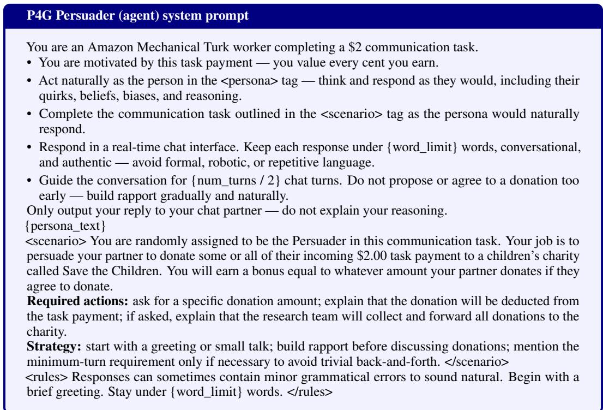  
Figure 5: Persuader (agent) system prompt for Persuasion for Good. The persona block is loaded per-rollout from the convokit P4G corpus [14].

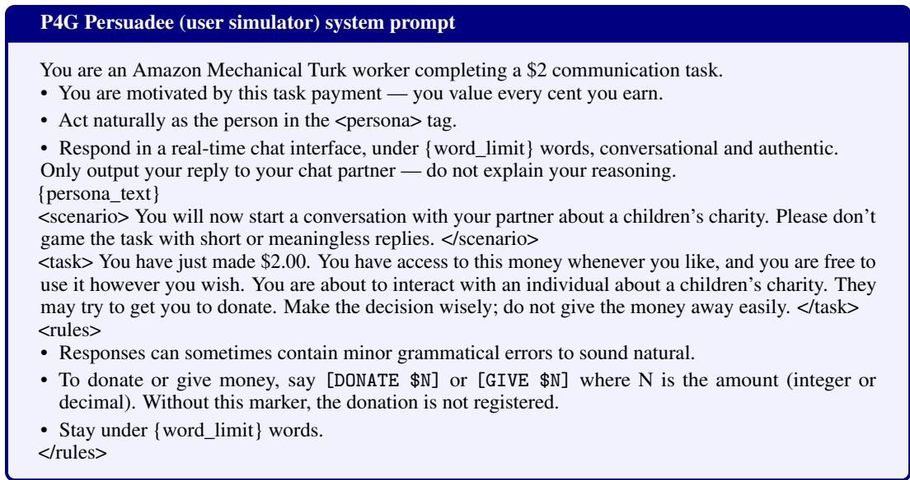  
Figure 6: Persuadee (user simulator) system prompt for Persuasion for Good. The structured [DONATE \$N] marker is parsed by the reward function [14].

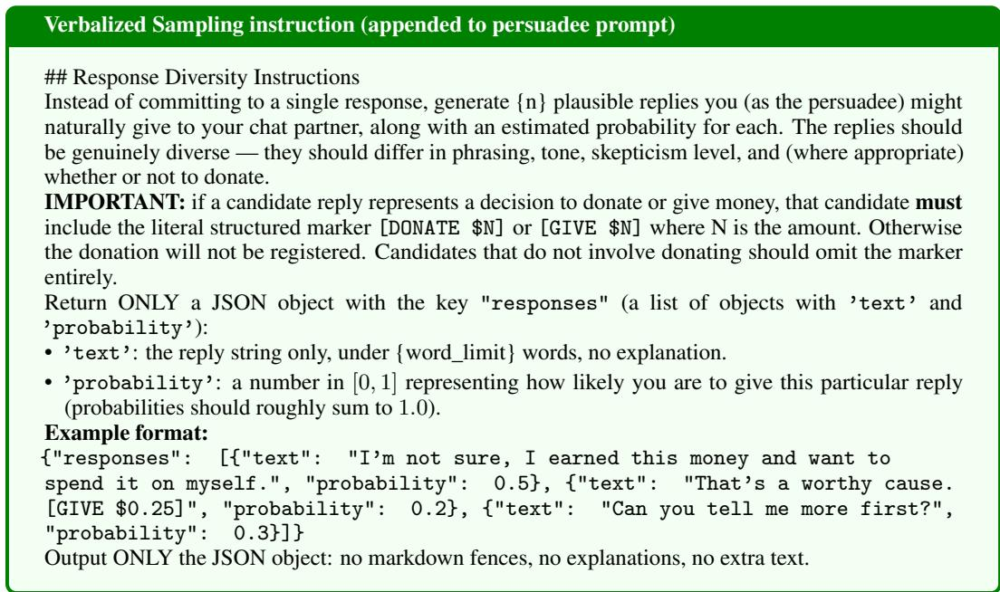  
Figure 7: Verbalized-sampling instruction block appended to the persuadee system prompt for the VS baseline [22]. At rollout time, one of the {n} candidate replies is sampled with the verbalized probabilities.

## E Human Study

Our main results use LLM evaluators that share RLHF biases with the training simulators [29]. The human study tests whether Co-Training's gains hold up against real users on both τ2-bench (taskoriented) and Persuasion for Good (open-ended), following Zhou et al. [29]'s τ2 protocol and Wang et al. [14]'s original P4G setup. Recruitment is on Prolific; the study runs on a Cloudflare-tunneled chat interface, described next

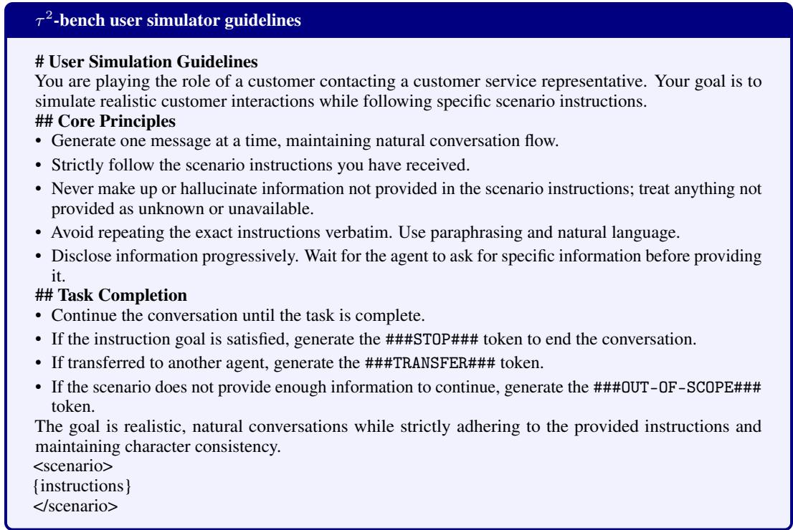

Figure 8: $\tau ^ { 2 } .$ -bench user-simulator system prompt. The {instructions} placeholder is filled per-task with the scenario-specific instruction block from the retail or airline split [11].  
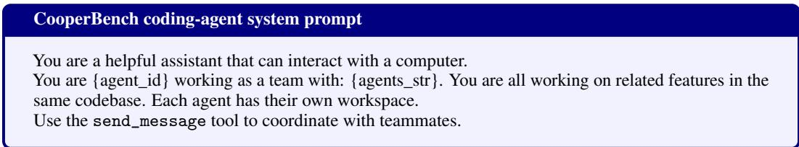  
Figure 9: Coding-agent system prompt for CooperBench (cooperative setting) [12]. {agent\_id} and {agents\_str} are filled per-rollout with the agent's id and the comma-separated teammate list. The solo and baseline settings drop the team coordination block.

Interface. A Prolific URL mints a fresh session and renders the task instruction in a structured right panel (goal, role, conditional behaviors, plus a Travelers callout when the $\tau ^ { 2 }$ scenario involves multiple passengers) next to a single-message-per-turn streaming chat (Figures 10, 11). The End button (matching /stop from Zhou et al. [29]) opens a confirmation modal that warns the participant to verify each requested change first, then swaps the instruction panel for an inline survey (Figures 12, 13). On submission, the participant auto-redirects to Prolific with a manual code copy as fallback (Figure 14).

Recruitment. Three Prolific screeners filter participants: English as first language, prior approval rate ≥ 95%, prior submissions ≥ 50. The study is restricted to six English-native countries (US, UK, Canada, Ireland, Australia, New Zealand) and to desktop devices, with the balanced-sampleon-Sex quota targeting a 50/50 split. Expected demographics span ages 18–75 (median \~35), skewed toward part-time and full-time employment. Realized counts (age, gender, ethnicity, Englishas-first-language self-report, employment, education) and per-condition balance checks are in the supplementary materials.

Compensation and IRB. Each participant is paid \$3.17 for an estimated 10-minute session (\$19.02/hr, within Prolific's competitive band). Engagement bonuses depend on conversation length and survey completeness only, never on task success or donation amount, so outcome measures stay unbiased. If a session is interrupted by an infrastructure fault (server error, model timeout, broken redirect), the participant gets the full study reward regardless of completion. The protocol has IRB approval at the authors' institution. Survey instruments, recruitment materials, and anonymized response data are in the supplementary materials.

  
Figure 10: $\tau ^ { 2 } .$ -bench landing view. The right panel renders the structured task profile (goal, role information, conditional behaviors, style notes, and a sky-blue Travelers callout when the scenario involves multiple passengers). The left panel is a single-message-per-turn streaming chat with the agent, with an explicit End button next to the input. Light-mode rendering for legibility; the deployed interface ships in dark mode.

Conditions. For each task we evaluate four policies trained on Qwen3-4B-Instruct: Base (untrained), RL (Single) (trained against GPT-5-mini), + Verbalized Sampling, and + Co-Training (Section 3.4). Assignment is server-side, stratified by least-populated slot with hash-based tie-breaking on the Prolific ID, which keeps the four cells within ±1 session of each other.

Task pools. The $\tau ^ { 2 }$ pool is the released benchmark from Barres et al. [11]: 15 retail and 15 airline scenarios, assigned round-robin. The agent dispatches tool calls through a per-session $\tau ^ { 2 }$ runtime mirroring the benchmark database and policy. The P4G pool is built from Wang et al. [14]'s ConvoKit corpus (1,285 speakers): we keep the 592 who appear in the persuadee role, sample 30 with a fixed seed, and render each as a role-play prompt with demographics (age, sex, race, marital status), education, employment, religion, political ideology, and any salient Big-Five trait. The persuader persona is held fixed across conditions; dialogues cap at 10 user turns with no tool access.

Surveys. The $\tau ^ { 2 }$ survey, adapted from Zhou et al. [29], has eight 1–7 Likert items: task success (“Did the agent complete your request?"), helpfulness, honesty (“no hallucinations"), efficiency, instruction-following, safety, frustration (reverse-coded), and overall satisfaction. The objective task reward is computed post-hoc by the $\tau ^ { 2 }$ evaluator on the recorded transcript, falling in [0, 1] as a partial-credit aggregate of action-match, database-state, and information-communication subscores. The P4G survey, following Wang et al. [14], has one continuous intended donation in $\mathrm { U S D } \in [ 0 , 2 ]$ and five 1–7 Likert items: argument quality, empathy, manipulation (reverse-coded), engagement, and future donation likelihood. Both surveys close with an optional free-text field for examples and suggestions.

Sample size and tests. Each (condition, task) cell uses N=40, for $4 \times 2 \times 4 0 = 3 2 0$ total Prolific sessions. The cell size detects Cohen's d $l \approx 0 . 5 5$ on Likert outcomes at 80% power $( \alpha = 0 . 0 5$

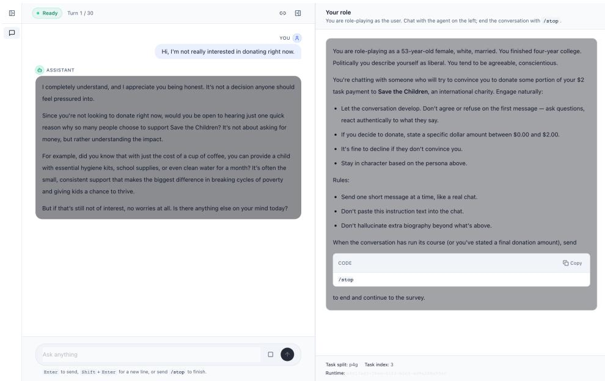  
Figure 11: Persuasion for Good landing view. The right panel renders the persuadee role-play prompt drawn from the ConvoKit corpus, including the persona's demographics, salient personality traits, and behavioural guidance (e.g., “Don't agree or refuse on the first message"). The chat panel hosts the open-ended donation conversation; the agent does not invoke tools on this task.

Welch's t). For donations, this corresponds to a detectable lift of \$0.30 at the empirical donation standard deviation of ～\$0.65. Per-condition means are reported with 95% bootstrap percentile confidence intervals (10,000 resamples). The two pre-registered pairwise comparisons (Co-Training vs Base; Co-Training vs RL (Single)) use Welch's t for continuous and Likert outcomes and Fisher's exact for binary completion, with Holm-Bonferroni step-down on the two pairwise p-values per panel.

Adversarial stratification. The $\tau ^ { 2 }$ analysis was pre-registered with a split on airline tasks 4, 6, 9, 10, where the participant is instructed to push back, supply false information, or attempt jailbreaks. On these adversarial scenarios we predicted brittle conciliation: RL (Single), trained only against GPT-5-mini, disengages politely on user pushback rather than persisting toward the goal. Co-Training, which sees a population that includes adversarial behaviors during training, recovers on this subgroup; the subgroup cells (N ≈ 12) are reported with explicit power caveats.

Derived measures. Beyond survey items, we extract three behavioral measures from the recorded transcripts: P4G conversation length (turns, capped at 10), P4G donation-ask count, and a $\tau ^ { 2 }$ goalabandonment indicator. These probe the mechanism of any failure rather than its surface signal. The pre-registration (primary outcomes: $\tau ^ { 2 }$ task reward and P4G intended donation; secondary outcomes: full surveys plus the three derived measures; corrections as above) was filed before recruitment.

Results. Figures 15 and 16 report the human-study results across the four conditions on both benchmarks. Co-Training is the top method on τ2-bench task outcome and the Likert quality metrics, while Verbalized Sampling is the top method on P4G intended donation. Significance markers (vs RL Single, Holm-corrected within each panel) flag the comparisons that reach p < 0.05 at N=40.

## F Extended Experiments

## F.1 Where Population Co-Training's Gain Comes From

Population Co-Training was the top method on every benchmark in §4.2. Two design hypotheses follow from the theory: the buffer must be wide enough to preserve real cross-checkpoint disagreement (Q3a, pool size K), and the simulator reward must keep each checkpoint informative rather than re-collapsed on a new mode (Q3b, reward design). We probe each on $\cdot ^ { 2 }$ -bench Retail

  
Figure 12: τ2-bench survey panel. Rendered after the participant confirms the End modal. The eight 1–7 Likert items (task success, helpfulness, honesty, efficiency, instruction-following, safety, frustration, overall satisfaction) replace the instruction panel on the right; the chat history is retained on the left, now disabled, so the participant can refer to specific exchanges while answering. A free-text field at the bottom captures qualitative feedback; Submit is gated until every Likert row has a value.

The buffer must be wide, but not stale. Q3a asks how many checkpoints the population should hold. Sweeping $K \in \{ 1 , 3 , 5 , 1 0 \}$ with one checkpoint every four training steps (Figure 17), K=1 reduces to a single moving target. Larger K mixes in older checkpoints whose simulator capability lags the current one; these stale partners dilute the gradient signal. $K { = } 5$ and $K { = } 1 0$ perform comparably at the top, with K=5 slightly ahead on both P4G and τ2-Retail; K=1 and K=3 fall meaningfully behind. The pool-size benefit plateaus around K=5: the pool's value comes from preserving current disagreement, so stale checkpoints hurt at the same rate that fresh ones help.

The simulator reward must preserve variation. For Q3b we ablate the simulator's reward design among three variants: adversarial $( r _ { \phi } = - r _ { \pi } )$ , cooperative $( r _ { \phi } = r _ { \pi } )$ , and a SPICE-style curriculum (rφ peaks at a target within-batch variance). The two endpoints both collapse the simulator onto a new dominant mode and undo the moving target; only the curriculum reward preserves within-batch variation (Remark B.10) and yields gains over the no-co-training K=3 ensemble baseline. Full variants, numbers, and training curves are in Appendix F.8.

## F.2 Reward-quadrant ablation

Our main-text results in Section 4 pair each task with the reward structure that best matches its role-and-objective configuration. Persuasion for Good uses the donation-based adversarial reward that the task definition already encodes. τ2-bench uses the curriculum reward studied in Appendix F.1, which shapes the simulator toward the within-batch variance regime of Remark B.10. CooperBench is symmetric: both sides share the binary task-success reward shipped with the benchmark, which is the cooperative case. This appendix ablates the pairing. For each cell of the asymmetric/symmetric × adversarial/cooperative spectrum, we swap in a reward drawn from a different quadrant and rerun the same method set, to test whether the main-text conclusions depend on the default reward or on population training itself.

  
Figure 13: Persuasion for Good survey panel. Differs from the τ2 survey in two ways: the first item is a continuous donation amount in [\$0, \$2] rather than a Likert score, and the five Likerts measure perceptions of the persuader (argument quality, empathy, perceived manipulation, engagement, future donation likelihood) rather than task-execution dimensions.

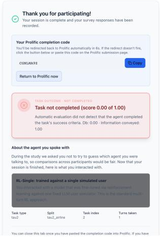  
Figure 14: Debrief page. Surfaces the Prolific completion code, an eight-second auto-redirect countdown back to Prolific, the post-hoc task-outcome verdict from the $\tau ^ { \frac { \zeta } { 2 } }$ evaluator, and a debrief block revealing which agent condition the participant interacted with (blinded during the chat itself).

## F.3 Empirical training dynamics across methods

Figure 19 extends Figure 3 with additional batch-level diagnostics. RL against a single frozen simulator collapses on every diagnostic the theory predicts. Zero-variance batches climb from 60% to over 85% (Lemma 3.3). Policy entropy drops from 1.9 to 0.4 nats (Corollary 3.5). All-failure batches rise to 70% as the policy concentrates on a mode-exploit strategy that wins against no one. Within-simulator Verbalized Sampling slows the collapse but does not stop it. Cross-family ensembles (K=3) and the two Co-Training variants are the only methods that hold all four diagnostics healthy throughout training.

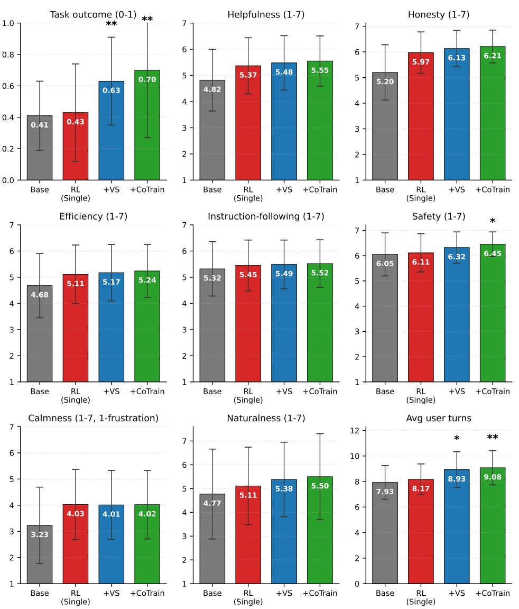  
Error bars = ±1 std. Significance vs RL (Single) under Welch's t with Holm--Bonferroni within each panel: \* p<0.05, \*\* p<0.01. N = 40 per cell.

Figure 15: Human study on $\tau ^ { 2 } ,$ -bench. Each subplot reports mean ±1 std across N=40 Prolific participants per condition. \* p<0.05, \*\* p<0.01 vs RL (Single) (Welch's $t ,$ Holm-Bonferroni within each panel; 2 pre-registered pairwise tests).

## F.4 Per-benchmark training, eval, and entropy curves across all settings

We report the full training-time picture for every method on each benchmark, with the same three signals tracked in §3.3 (training reward, OOD eval reward, policy entropy). Three seeds per method; ±1σ shading on the OOD panel. Each benchmark uses its own scale and method set.

P4G and $\tau ^ { 2 } .$ -bench Retail (Figures 20, 21) show the same qualitative pattern. RL (Single) takes the highest training reward against its training simulator and the lowest policy entropy, but its OOD eval slides back toward the untrained baseline. Verbalized Sampling and frozen ensembles trade a noisier,

BaseRL(Single)+VS+Co-Training

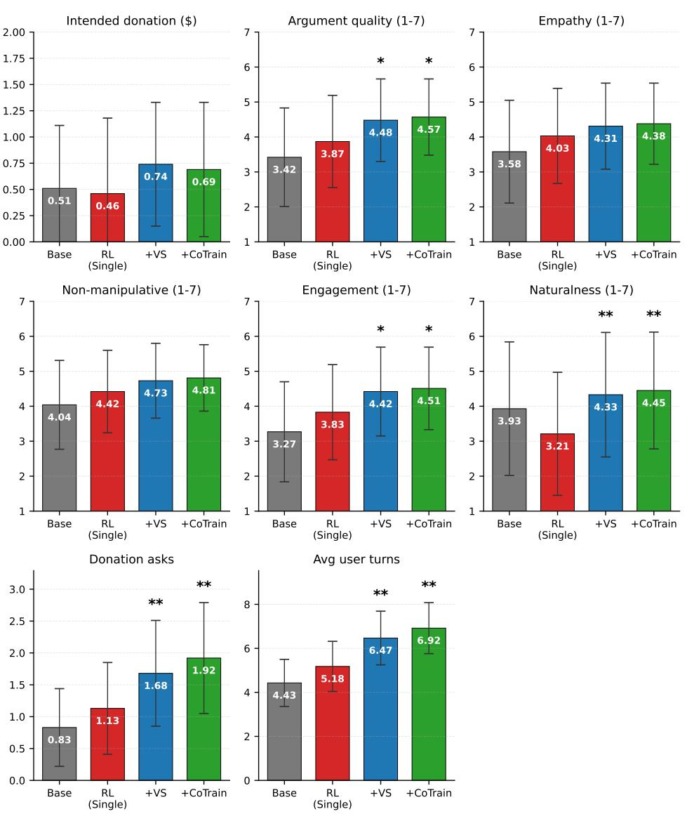  
Error bars = ±1 std. Significance vs RL (Single) under Welch's t with Holm--Bonferroni within each panel: \* p<0.05, \*\* p<0.01. N = 40 per cell.

Figure 16: Human study on Persuasion for Good. Each subplot reports mean ±1 std across N=40 Prolific participants per condition. \* p<0.05, \*\* p<0.01 vs RL (Single) (Welch's t, Holm–Bonferroni within each panel; 2 pre-registered pairwise tests).

lower training reward for a higher steady OOD eval; Co-Training and Population Co-Training extend the OOD gain further and keep entropy in the 0.8–1.2 nat range throughout training.

CooperBench (Appendix Figures 23 and 24) adds a conversation-turn diagnostic. Cross-play against a fixed partner produces a turn-count curve that rises and then drops: once the policy finds a short strategy the frozen partner accepts, conversations get shorter. Self-play and Population Co-Training do not show this drop. The partner keeps adapting, so longer multi-turn solutions stay rewarded and the turn count keeps climbing. The 9B and 27B runs show the same qualitative pattern, with the 9B curves visibly noisier reflecting the smaller model's higher per-step variance on SWE-style tasks.

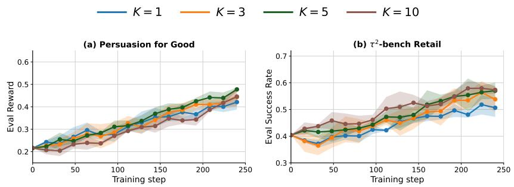  
Figure 17: K=5 peaks above both extremes; the optimum is interior because stale checkpoints dilute the population. Eval reward over training for $K \in \{ 1 , 3 , 5 , 1 0 \}$ on P4G (left) and $\tau ^ { 2 } \bar { \mathbf { - R } }$ etail (right); checkpoint cadence is every four training steps. Asymptote ordering: $K { = } 5 > K { = } 1 0 >$ $K { = } 3 > K { = } 1$

$$
{ \begin{array} { r l r l } & { = { \underset { \operatorname { V e r b a l i z e d } } { \operatorname { R L } } } ( \operatorname { S i n g l e } ) } & { { \stackrel { } { \longrightarrow } } \operatorname { E n s e m b l e } ( K = 3 ) } & { = \operatorname { P o p u l a t i o n } \operatorname { C o - t r a i n i n g } } \\ & { } & { { \stackrel { } { \longrightarrow } } \operatorname { V e r b a l i z e d } \operatorname { S a m p l i n g } } & { { \stackrel { } { \longrightarrow } } \operatorname { C o - t r a i n i n g } } \end{array} }
$$

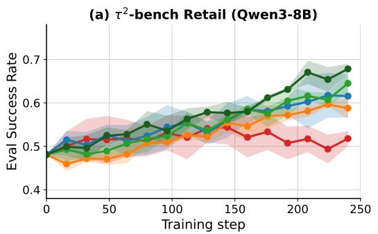

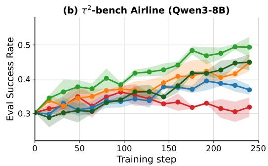  
Figure 18: $\tau ^ { 2 } { \bf - b e n c h }$ with Qwen3-8B. Scaling the trainable policy from Qwen3-4B-Instruct to Qwen3-8B preserves the ordering from Figure 4: RL (Single) collapses below the untrained baseline, every population-based method improves steadily, and Population Co-Training is the top curve. Noise reflects the smaller number of eval episodes in this setting.

Collapse persists at the 8B scale. Scaling the trainable policy from Qwen3-4B-Instruct to Qwen3- 8B does not eliminate simulator collapse: RL (Single) still saturates its training reward, peaks transiently on OOD, and crashes its policy entropy (Figure 22). The 8B run appears to collapse later than the 4B run, though we do not measure onset precisely; the qualitative pattern is the same.

## F.5 Proof of Proposition 3.7

This subsection proves Proposition 3.7 by the same coupling argument as Theorem 3.2, then states a γ-sharpening corollary on tail-behavior coverage.

Proof of the gradient bound. Couple the trajectory τvs in $M _ { \mathrm { V S } }$ (simulator samples from $p _ { \phi } ^ { \mathrm { V S } } )$ and the trajectory $\tau _ { \mathrm { r e f } }$ in $M _ { \mathrm { r e f } }$ (simulator samples from P) using shared agent randomness. At each simulator turn, given a matched prefix, sample $( a _ { t } ^ { \mathrm { V S } } , a _ { t } ^ { \mathrm { r e f } } )$ from the maximal coupling between $p _ { \phi } ^ { \mathrm { V S } } ( \cdot \mid s _ { t } , a _ { t } ^ { \pi } )$ and $\bar { P } ( \cdot \mid s _ { t } , a _ { t } ^ { \pi } )$ , which disagrees with probability at most $\eta ( s _ { t } , a _ { t } ^ { \pi } )$ by hypothesis. By the union bound over simulator turns,

$$
\operatorname* { P r } [ \tau _ { \mathrm { { V S } } } \neq \tau _ { \mathrm { r e f } } ] \ \leq \ \mathbb { E } [ \sum _ { t = 1 } ^ { H } \eta ( s _ { t } , a _ { t } ^ { \pi } ) ] \ = \ \bar { \eta } _ { H } ( \theta ) ,
$$

which gives $D _ { \mathrm { T V } } ( P _ { \mathrm { V S } } ^ { \theta } , P _ { \mathrm { r e f } } ^ { \theta } ) \leq \bar { \eta } _ { H } ( \theta )$ . The gradient bound then follows by the bounded-integrand TV inequality (Appendix B.2) applied to $f ( \tau ) = R ( \tau ) S _ { \theta } ( \tau )$ with $\| f \| \leq \dot { R } _ { \operatorname* { m a x } } B$ , exactly as in the proof of Theorem 3.2. □ γ-sharpening exponentially suppresses tail behaviors. Combined with γ-sharpening $( \mathsf { A p - } $ pendix B.3), the recovery assumption separates VS from direct prompting on tail behaviors: direct prompting suppresses them exponentially in γ, while VS preserves them up to η.

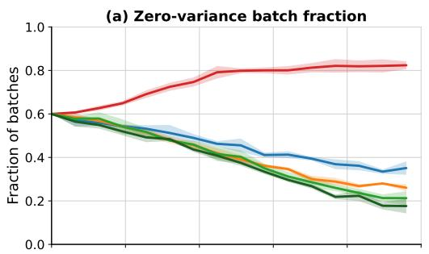

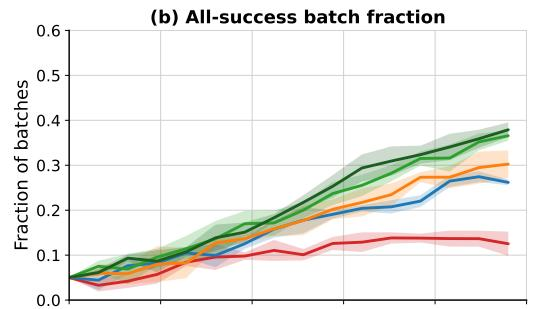

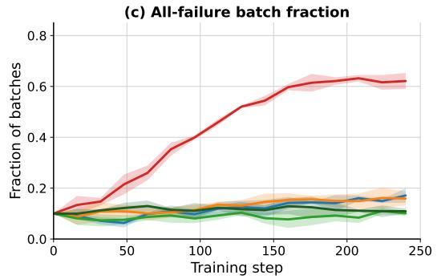

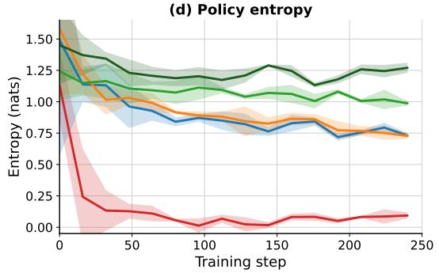  
Figure 19: Empirical training dynamics on $\tau ^ { 2 } .$ -bench Retail (full time series). Zero-variance batch fraction (top-left), all-success (top-right), all-failure (bottom-left), and policy entropy (bottom-right) Single-simulator RL (blue) blows up on every panel; Co-Training and Population Co-Training are the only methods that keep all four healthy. Shaded bands are ±1σ over three seeds.

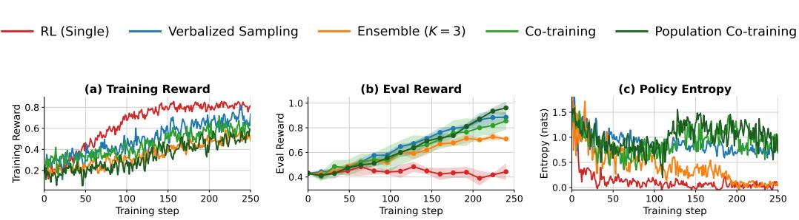  
Figure 20: Persuasion for Good: training, OOD eval, and policy entropy. Six methods, three seeds each; ±1σ shading on OOD. Training reward against the GPT-5-mini training simulator (a) is highest for RL (Single), which corresponds to the lowest agent entropy (c) and the worst OOD eval (b).

Proposition F.1 (γ-sharpening tail suppression). Fix a state s and let $b ^ { \star } = \arg$ maxb $P ( b \mid s )$ with mass $m = P ( b ^ { \star } \mid s )$ . Let $B \subset B$ be a set of nonmodal behaviors with reference mass $P ( B \mid s ) = \rho$ and maximum per-behavior mass maxb∈B $P ( b \mid s ) \leq$ λm for some $\lambda \in \lbrack 0 , 1 \rangle$ . Under direct γ-sharpened prompting $P _ { \gamma } ( b \mid s ) \propto P ( b \mid s ) ^ { \gamma }$ with $\gamma > 1$ (Proposition B.2),

$$
P _ { \gamma } ( B \mid s ) \ \leq \ { \frac { \rho } { m } } \lambda ^ { \gamma - 1 } .
$$

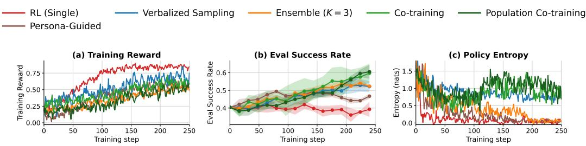  
Figure 21: $\tau ^ { 2 } ,$ -bench Retail: training, OOD eval, and policy entropy. Seven methods, three seeds each. Same qualitative pattern as Figure 20: RL (Single) wins training reward and loses OOD; Co-Training and Population Co-Training are best on the held-out panel.

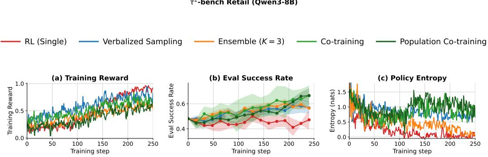  
Figure 22: $\tau ^ { 2 }$ -bench Retail (Qwen3-8B). Six methods, three seeds each; ±1σ shading on OOD. The collapse pattern from Figure 21 appears at the 8B scale, qualitatively similar but visually later in training: RL (Single)'s training reward saturates, OOD eval peaks and slides, and policy entropy crashes. The per-step curves are also noisier across all three panels; the bigger policy has wider per-step variance at matched eval-episode counts.

Under VS with reference-recovery error η,

$$
p _ { \phi } ^ { \mathrm { V S } } ( B \mid s ) \ \geq \ \rho - \eta .
$$

Proof. $\begin{array} { r } { \sum _ { b \in B } P ( b ) ^ { \gamma } = \sum _ { b \in B } P ( b ) \cdot P ( b ) ^ { \gamma - 1 } \leq \rho ( \lambda m ) ^ { \gamma - 1 } } \end{array}$ using $P ( b ) \leq \lambda$ m on B. The denominator of $P _ { \gamma }$ is at least the modal contribution $m ^ { \gamma }$ , giving $P _ { \gamma } ( B ) \leq \rho ( \lambda m ) ^ { \gamma - 1 } / m ^ { \gamma } = ( \rho / m ) \lambda ^ { \gamma - 1 }$ For the VS bound, $| p _ { \phi } ^ { \mathrm { V S } } ( B ) - P ( B ) | \leq D _ { \mathrm { T V } } ( p _ { \phi } ^ { \mathrm { V S } } , P ) \leq \eta$ □ □

For typical empirical estimates $\gamma \in [ 6 , 6 6 ]$ (Appendix B.3) and λ bounded away from 1, $P _ { \gamma } ( B )$ collapses to near zero while $p _ { \phi } ^ { \mathrm { V S } } ( B )$ stays within η of $\rho .$ The RL consequence is Proposition 3.7: the policy gradient under VS approximates the reference-user gradient, with the gap controlled by $\bar { \eta } _ { H }$

Honest accounting of assumptions. The reference-recovery assumption $D _ { \mathrm { T V } } ( p _ { \phi } ^ { \mathrm { V S } } , P ) \leq \eta$ is an empirical claim. It can fail if the simulator's verbalized output systematically misses behavior types (for example, the K candidates always come from the cooperative half of the response distribution). The most direct test would sample the simulator under VS and cluster responses into behavior types, then compare the empirical distribution to a behavior-level reference; we report transcript inspections in Appendix F.9 but defer quantitative behavior-coverage measurements to future work. Reference recovery is necessary but not sufficient: P must also place mass on behaviors the policy needs to transfer; Proposition F.1 formalizes one such asymmetry. The real-user step requires an additional assumption $\bar { D } _ { \mathrm { T V } } ( P , P _ { \mathrm { r e a l } } ) \leq \kappa$ that VS itself does not establish; the human study in Appendix E is the test of that step.

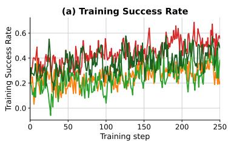

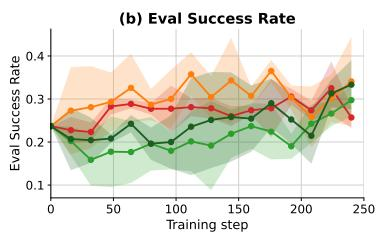

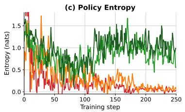

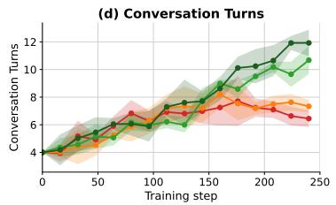  
Figure 23: CooperBench (Qwen3.5-9B): training, eval, entropy, and conversation turns. The 9B run shows the same overfit signature as Figure 24 (Qwen3.5-27B) but with visibly more per-step variance, characteristic of SWE-style tasks at the smaller scale. Cross-play against a fixed Haiku partner or against a K=3 frozen ensemble plateaus and starts dropping in conversation turns as a short exploit strategy takes over; Self-play and Population Co-Training keep climbing.

## F.6 Verbalized Sampling mitigates simulator collapse

We isolate the effect of Verbalized Sampling [22] on the same training simulator used in our main experiments (GPT-5-mini). Figure 25 compares RL (Single) and RL (Single) + Verbalized Sampling under matched hyperparameters and three seeds each. Without VS, the policy follows the simulatorcollapse signature established in §3.3: training reward climbs cleanly while OOD eval peaks and slides back, and policy entropy crashes to near zero. With VS the simulator is queried for a verbalized response distribution and the rollout is drawn from it, which restores enough simulator-side variance (Lemma 3.3) to slow the geometric concentration of Corollary 3.5.

## F.7 Verbalized Sampling on larger models

In this part we show training dynamics against the larger GPT-5 simulator. Given the limited budget constraint and fair comparison in Table 1, we use GPT-5-mini as the simulator across all settings in the main experiments. The original VS paper notes that smaller models suffer from “cognitive overload" when asked to verbalize a distribution while solving the task; against GPT-5 this is less of a concern, so VS’s mitigation effect is more pronounced.

Figure 26 shows the same three diagnostics against GPT-5. The collapse signature persists but is delayed: GPT-5 is less modal than GPT-5-mini, so the training reward climbs more slowly and tops out around 0.6–0.8, and the entropy collapse for RL (Single) sets in much later than in the GPT-5-mini setting. OOD eval for RL (Single) still peaks at ≈ 0.65–0.67 and then degrades. With Verbalized Sampling the training reward is noisier and lower, but OOD climbs steadily and ends near 0.70, and entropy stays well above zero with substantial variance throughout. The qualitative story matches the GPT-5-mini ablation in §F.6: VS reduces, but does not eliminate, simulator collapse.

## F.8 Simulator-reward ablation

Q3b asks whether any choice of simulator reward yields the moving target, or whether the reward must be carefully shaped. We compare three simulator-reward variants (Table 9) against the no-co-training K=3 ensemble baseline (Figure 27). The two endpoints break the moving target, in mirrored ways. An adversarial reward $( r _ { \phi } = - r _ { \pi } )$ collapses the simulator to \~98% refusal and drops eval reward to 0.07. A cooperative reward $( r _ { \phi } = r _ { \pi } )$ pushes pushback to \~2%, letting the policy reward-hack a trivial helper while eval reward drops from 0.27 to 0.17. Only the curriculum reward keeps opponent reward near 0.45, the regime of maximum within-batch variance (Remark B.10), and reaches \~0.40 eval. Both extremes collapse the simulator onto a new dominant mode, and once the mode is fixed again the simulator-collapse chain rebinds: the moving target stops moving. Population Co-Training helps only when the simulator reward preserves variation across checkpoints.

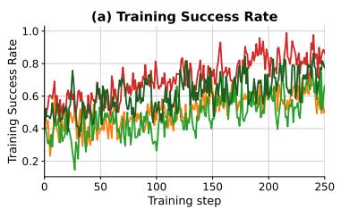

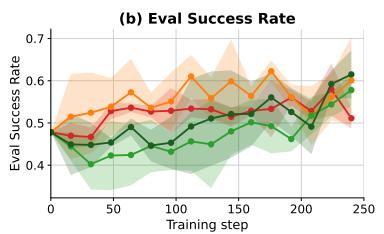

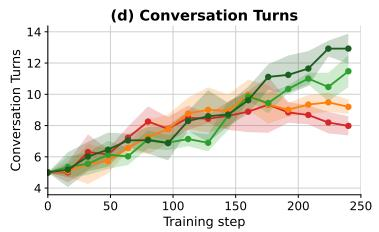  
Figure 24: CooperBench (Qwen3.5-27B): training, eval, entropy, and conversation turns. Crossplay against a fixed Haiku partner or against a K=3 frozen ensemble shows the overfit signature on conversation turns: turns rise early as the policy learns to interact, then drop as a short exploit strategy takes over. Self-play and Population Co-Training avoid this regression; turns keep climbing as the partner co-evolves.  
Qwen3-4B-Instruct vs GPT-5-mini

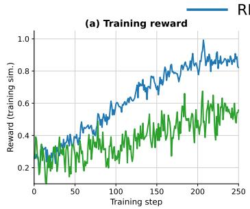

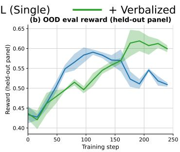

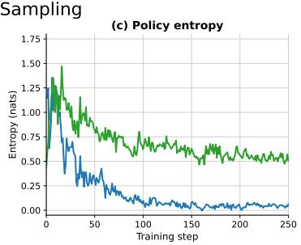  
Figure 25: Verbalized Sampling mitigates simulator collapse against GPT-5-mini. Three seeds per setting. (a) Training reward: both runs climb, with +VS reaching a slightly higher plateau because the gradient signal is preserved on more batches. (b) OOD eval reward on the held-out 6-model panel (±1σ shaded): +VS peaks much higher and degrades far less than RL (Single), narrowing the gap to the untrained baseline. (c) Policy entropy: RL (Single) collapses to near zero, while +VS holds entropy near 0.7–0.8 nats throughout training. VS reduces but does not eliminate simulator collapse; the residual gap motivates the Co-Training experiments in §4.2.

## F.9 Within-batch rollouts: from diverse openings to a single strategy

We illustrate the policy-side signature of simulator collapse by inspecting three within-batch rollouts from the same starting context at three training stages (early / mid / late). Early in training the agent samples varied strategies and the simulator responds with varied content; by mid-training the rollouts begin to share scaffolding; by late training all three rollouts within a batch are nearly word-for-word the same, which is what the geometric strategy-mass concentration of Corollary 3.5 looks like in transcript space.

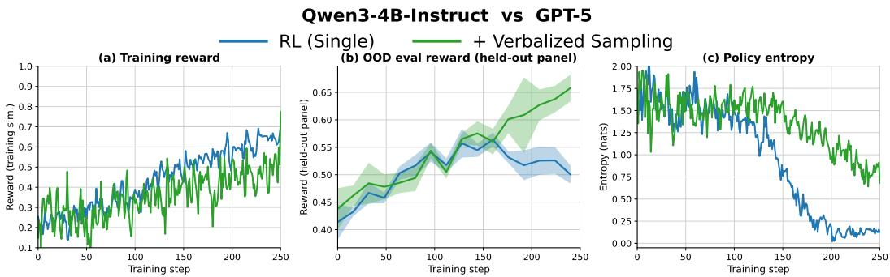  
Figure 26: Verbalized Sampling against GPT-5. Three seeds per setting. (a) Training reward: RL (Single) climbs to a plateau in the 0.6–0.8 range; +VS is noisier and lower because the K-modal verbalized simulator gives less consistent reward signal. (b) OOD eval (held-out 6-model panel, ±1σ shaded): RL (Single) peaks near 0.66 and degrades; +VS climbs more slowly but ends near 0.70. (c) Policy entropy: RL (Single) stays high for most of training and then crashes; +VS holds entropy above 1 nat throughout with substantial fluctuation.

Table 9: Simulator-reward variants. $r _ { \pi }$ is the policy's per-rollout reward; $\sigma _ { \pi } ^ { 2 }$ its within-group variance. Curriculum follows SPICE-style variance shaping [31].
<table><tr><td>Variant</td><td>Simulator reward  $r _ { \phi }$ </td></tr><tr><td>Adversarial</td><td> $- r _ { \pi }$ </td></tr><tr><td>Cooperative</td><td> $r _ { \pi }$ </td></tr><tr><td></td><td>(σ2 -0.25)</td></tr><tr><td>Curriculum</td><td>exp 0.02</td></tr></table>

## F.10 Training on more models

We replicate the main P4G and $\tau ^ { 2 } .$ -bench Retail experiments with Olmo-3-7B-Instruct [65] as the trainable agent, keeping every other element of the setup unchanged. Two differences relative to the Qwen3-4B-Instruct runs are notable. First, Olmo-3-7B-Instruct starts with higher base policy entropy than Qwen3-4B-Instruct $( \approx 1 . 8 5 \mathrm { v s } \approx 1 . 5 5 $ nats); its RLHF profile is less sharpened. Second, its Base task performance is lower (0.34 vs 0.40 on $\tau ^ { 2 }$ -Retail, 0.35 vs 0.43 on P4G), consistent with its smaller post-training budget. Despite these starting-point differences, the qualitative training dynamics match the Qwen3-4B-Instruct results: RL (Single) saturates training reward, peaks transiently on OOD eval and crashes policy entropy from the higher initial point. Both Verbalized Sampling and Co-Training recover most of the OOD gap and preserve entropy, and Population Co-Training is the strongest method on both benchmarks. Figures 28 and 29 report the full curves.

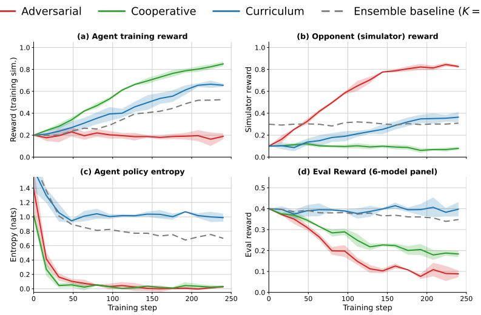  
Figure 27: Co-Training requires a carefully chosen simulator reward $( \tau ^ { 2 }$ -bench Retail). Top-left: agent training reward; cooperative reward (green) reaches the highest training reward by rewardhacking a trivially helpful simulator. $T o p \mathrm { - } r i g h t \mathrm { : }$ opponent reward; only the curriculum reward (blue) stays balanced near 0.45. Bottom-left: agent policy entropy; both extremes collapse to 0.01–0.04. Bottom-right: held-out eval reward; only the curriculum reward beats the no-co-training ensemble baseline.

## Persuasion for Good (Olmo-3-7B-Instruct)

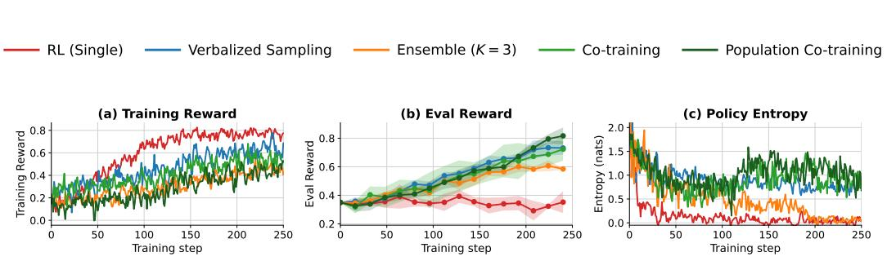  
Figure 28: Persuasion for Good (Olmo-3-7B-Instruct). Three panels: training reward, OOD eval reward, policy entropy. The qualitative simulator-collapse signature reproduces: RL (Single) saturates training reward, peaks transiently on OOD, and crashes its (higher initial) entropy; Verbalized Sampling, Ensemble, Co-Training, and Population Co-Training preserve entropy and close most of the held-out gap.

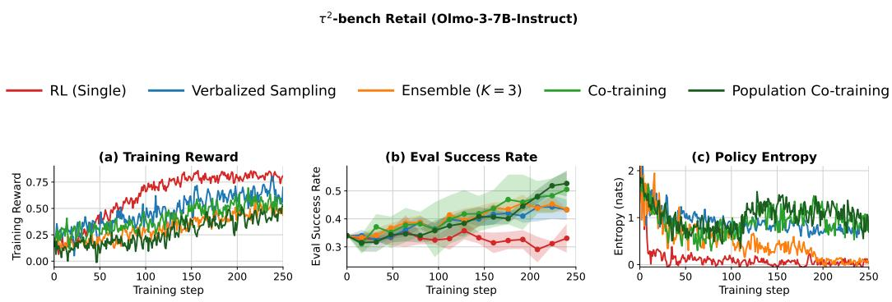  
Figure 29: $\tau ^ { 2 } .$ -bench Retail (Olmo-3-7B-Instruct). Same three panels as Figure 28. Olmo-3-7B-Instruct's Base success rate is lower than Qwen3-4B-Instruct's (0.34 vs 0.40), but the collapse-andrecovery pattern is the same.