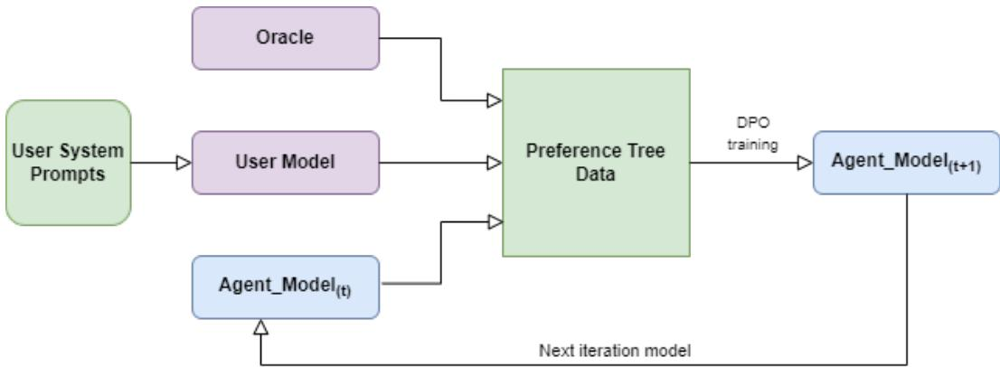
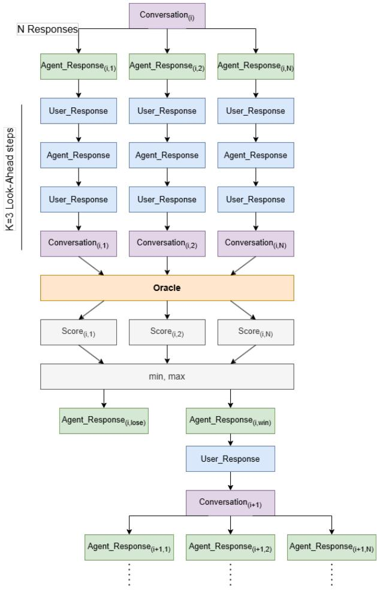
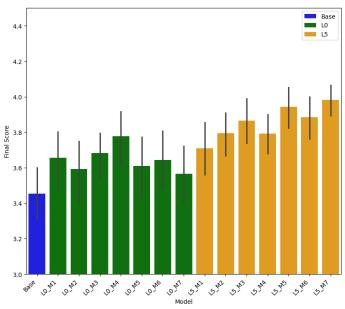
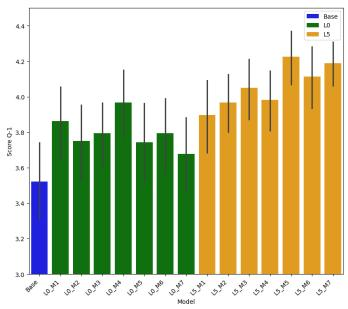
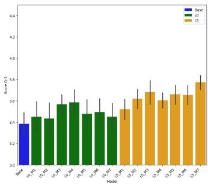
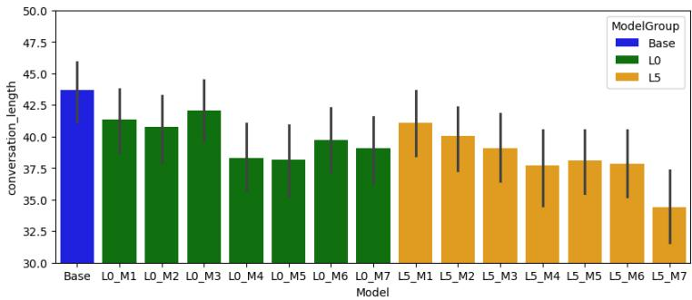

# PREFERENCE TREE OPTIMIZATION: ENHANCING GOAL-ORIENTED DIALOGUE WITH LOOK-AHEAD SIMULATIONS

Lior Baruch School of Computer Science Reichman University, Herzliya, Israel lior95bar@gmail.com

Kfir Bar School of Computer Science Reichman University, Herzliya, Israel kfir.bar@runi.ac.il

Moshe Butman School of Computer Science Reichman University, Herzliya, Israel moshe.butman@gmail.com

Doron Friedman School of Communications Reichman University, Herzliya, Israel doronf@runi.ac.il

## ABSTRACT

Developing dialogue systems capable of engaging in multi-turn, goal-oriented conversations remains a significant challenge, especially in specialized domains with limited data. This research proposes a novel framework called Preference Tree Optimization (PTO), designed to iteratively improve agent models in such dialogue systems, by generating preference data using a method called Preference Tree with Look-Ahead. Focusing on Motivational Interviewing (MI)—a counseling technique aimed at facilitating behavioral change—we leverage virtual patients and an oracle evaluator to simulate conversations and generate rich preference datasets. By combining this method with Direct Preference Optimization (DPO), we aim to enhance the agent’s decision-making capabilities over iterative training cycles. The proposed framework addresses data scarcity and advances the development of more nuanced and effective dialogue systems in goal-oriented domains.

Experimental evaluations demonstrate that the PTO framework enhances dialogue agents’ performance in goal-oriented conversations within the domain of Motivational Interviewing (MI). Models trained with PTO consistently outperformed the baseline in key metrics such as session satisfaction and working alliance. Additionally, incorporating look-ahead simulations led to improved long-term planning and more effective conversational strategies, with deeper look-ahead configurations yielding the most stable and high-scoring results.

## 1 INTRODUCTION

Goal-oriented dialogue systems are designed to achieve specific objectives through interactive conversations. Developing such systems in specialized domains is challenging due to the complexity of interactions and the scarcity of domain-specific data. Motivational Interviewing (MI) is such a domain – it is a counseling approach that facilitates behavioral change through collaborative, clientcentered dialogue, requiring nuanced understanding and adaptability from the conversational agent Miller & Rollnick (1991).

This research introduces a framework for iteratively improving agent models in goal-oriented dia logue systems, called Preference Tree Optimization (PTO) (see Figure 1), by generating preference data using a novel method called Preference Tree with Look-Ahead. This method systematically simulates various conversational paths and evaluates them using an oracle to generate preference data. We use this preference data with Direct Preference Optimization (DPO) Rafailov et al. (2023) to iteratively refine the agent model, enhancing its decision-making capabilities.

Our approach leverages existing virtual patients and evaluators from previous research in MI Yosef et al. (2024), making it an ideal testbed for our framework. By addressing the challenges of data scarcity and the need for nuanced interactions, we aim to contribute to the advancement of dialogue systems capable of effective, goal-oriented conversations.

Similar preference-based strategies have improved models in well-defined analytic tasks like games, coding, and math. However, their application to human-centric domains like Motivational Interviewing—where objectives are subjective and nuanced communication is key—remains largely unexplored.

  
Figure 1: Preference Tree Optimization (PTO) Framework. The framework operates in two iterative steps: (i) Preference Data Generation: The User Model is prompted with a range of attributes to simulate diverse user personalities. For each digital user personality, the Preference Tree with Look-Ahead (Section 3.1) method is used in conjunction with the Oracle Evaluator and the current agent model (Agent Model ) to generate a preference tree that explores various conversational pathways. These trees are aggregated into a comprehensive preference dataset. (ii) Model Training: The current agent model is trained on the newly generated preference dataset using Direct Preference Optimization (DPO), resulting in an improved model (Agent Model ). The updated agent model is then used for the next iteration, repeating the process for continuous improvement.

The PTO framework is designed exclusively as an offline training paradigm. Although the DPO process is computationally intensive—since it is applied at each simulated decision point during training—this cost is incurred only once during model development. Once trained, the automated therapist is deployed for real-time conversation, where the inference process is fast and efficient.

This work makes several contributions to the advancement of goal-oriented dialogue systems. First, we introduce the Preference Tree with Look-Ahead, a novel method that systematically simulates and evaluates potential conversational trajectories to generate high-quality preference data, thereby facilitating more effective learning from interactions. Second, we propose the Preference Tree Optimization (PTO) framework, which integrates this preference data with Direct Preference Optimization (DPO) to iteratively refine an agent’s decision-making capabilities over successive training cycles. Third, we validate our approach in the challenging domain of Motivational Interviewing (MI) by leveraging virtual patients and oracle evaluators to simulate realistic, high-stakes conversational scenarios. Finally, our methodology offers broad insights and generalizable strategies for applying preference-based optimization to other specialized dialogue domains.

## 2 BACKGROUND AND RELATED WORK

Recent breakthroughs in Natural Language Processing (NLP) and the development of Large Language Models (LLMs) have dramatically advanced dialogue systems. However, designing goaloriented systems for specialized domains—such as Motivational Interviewing (MI)—remains particularly challenging due to the limited availability of domain-specific data and the complexity of managing nuanced, multi-turn interactions. Pure generative models, which primarily rely on likelihood estimation, may not naturally exhibit goal-directed behavior. While reinforcement learning (RL) offers a potential path to integrating goal orientation, identifying suitable reward functions in domains like psychology is far from straightforward—unlike more structured fields such as mathematics or gaming, where clear optimal strategies exist. Additionally, approaches like Direct Preference Optimization (DPO) raise questions: Can they sufficiently promote goal-oriented behavior, and if so, what implicit reward mechanisms do they employ?

## 2.1 PREFERENCE OPTIMIZATION IN LANGUAGE MODELS

One of the key approaches to improving language models involves aligning them with human preferences. This alignment helps models generate responses that are not only coherent, but also contextually appropriate and tailored to specific conversational objectives. Traditional approaches, such as Reinforcement Learning from Human Feedback (RLHF) Christiano et al. (2017), involve training a separate reward model based on human evaluations of model outputs. This reward model then guides the language model through reinforcement learning to produce preferred responses. Although effective, RLHF can be complex and resource-intensive due to the necessity of maintaining a distinct reward model and implementing reinforcement learning algorithms Ouyang et al. (2022).

Direct Preference Optimization (DPO) Rafailov et al. (2023) offers a more streamlined alternative by directly optimizing the language model using preference data, eliminating the need for a separate reward model and the complexities of reinforcement learning. DPO establishes a direct mapping between LLM policies and reward functions, enabling the training of an LLM to satisfy preference data through a straightforward cross-entropy loss.

## 2.2 SYNTHETIC DATA GENERATION AND ITERATIVE SELF-IMPROVEMENT

Addressing the challenge of data scarcity in specialized dialogue domains has motivated researchers to develop methods that combine synthetic data generation with iterative self-improvement. Broadly, these approaches can be grouped into three categories: score-based synthetic data generation, selfevaluation–driven improvement, and search-based tree-structured methods.

Score-Based Synthetic Data Generation: Pace et al. Pace et al. (2024) introduced West-of-N, a method that leverages language models to produce multiple candidate responses for a given prompt. A reward model then scores these responses, and by selecting the best and worst outputs, the approach forms synthetic preference pairs used to refine the reward model’s alignment with human preferences. In a similar vein, Guo et al. (2024) propose an online variant of direct alignment from preferences. Their method employs an LLM as an annotator to provide on-the-fly feedback on pair of responses sampled from the current model. This Online AI Feedback (OAIF) approach addresses the distribution shift inherent in offline datasets by continuously updating preference data, thereby enhancing alignment performance, particularly in soft domains where nuanced judgment is critical.

Self-Evaluation–Driven Improvement: Another line of work harnesses the model’s internal evaluation mechanisms to self-generate and refine synthetic data. Yuan et al. Yuan et al. (2024b) presen Self-Rewarding Language Models, wherein the model generates multiple responses and uses an LLM-as-a-judge to rank them. The resulting preference data is then used with Direct Preference Optimization (DPO) to iteratively enhance both response generation and internal reward estimation. Similarly, Liang et al. Liang et al. (2024) propose I-SHEEP (Iterative Self-EnHancEmEnt Paradigm), a framework in which the model synthesizes data, self-assesses its quality, and filters out low-quality responses before applying supervised fine-tuning. While these self-assessment–based methods efficiently leverage the model’s own capabilities, they risk perpetuating internal biases if the self-evaluation is not sufficiently robust.

Search-Based and Tree-Structured Approaches: A third category of methods employs search strategies to systematically explore potential outcomes. Xie et al. Xie et al. (2024) integrate Monte Carlo Tree Search (MCTS) with iterative preference learning to generate and evaluate fine-grained, step-level reasoning paths. The collected preference data is then used to refine the model via DPO. In addition, prior work on Preference Trees Yuan et al. (2024a) demonstrates how tree-structured meth ods can effectively manage complex reasoning tasks in domains such as coding, math, and logic. Yu et al. Yu et al. (2023) introduce a prompt-based search method where an LLM plays multiple roles in planning without additional training. Recently, Chen et al. Chen et al. (2025) developed a conversation planning approach that reduces reliance on direct LLM-based simulation, by exploiting the dense semantic representation of conversations. Building on these ideas, our framework employs a Preference Tree with Look-Ahead to simulate full conversational trajectories using a dedicated user model, specifically targeting goal-oriented dialogue systems like those used in Motivational Interviewing.

In summary, these diverse methodologies illustrate the potential of combining synthetic data generation with iterative self-improvement. They differ in how preference data is generated, whether through score-based selection, self-assessment, or search-based exploration, and in the application domains they target. Our work bridges search-based and score-based paradigms: the Preference Tree with Look-Ahead method employs tree-structured exploration of conversational trajectories, while the oracle evaluator provides score-driven comparisons, enabling iterative refinement via Direct Preference Optimization (DPO) to enhance goal-oriented dialogue agents in specialized domains such as Motivational Interviewing. Unlike prior work, which has primarily focused on structured tasks such as coding, math, or games, our approach explores preference-based optimization in a domain that requires deep human understanding, where objectives are inherently subjective and harder to quantify.

## 2.3 MOTIVATIONAL INTERVIEWING AND AI DIALOGUE SYSTEMS

Motivational Interviewing (MI) is a client-centered counseling approach aimed at eliciting behavioral change by helping clients explore and resolve ambivalence Miller & Rollnick (1991). Implementing MI in AI dialogue systems presents unique challenges due to the need for empathy, adaptability, and the ability to interpret subtle conversational cues.

Previous research has explored the potential of LLMs in simulating MI sessions. Yosef et al. Yosef et al. (2024) utilized AI-generated patient simulations to assess MI sessions, highlighting the feasibility of virtual patients in training and evaluating therapeutic dialogues. Their work demonstrated that AI agents could engage in MI conversations to a certain extent but also underscored the limitations in capturing the full depth of human therapist-patient interactions.

In addition, Yosef et al. fine-tuned therapist models using existing datasets specific to MI, demonstrating that such fine-tuning can improve model performance in therapeutic settings Yosef et al. (2024). Unlike methods that rely on pre-existing datasets, our Preference Tree Optimization (PTO) framework iteratively generates training data from simulated conversations using the Preference Tree with Look-Ahead method, refining the model at each iteration via Direct Preference Optimization.

## 3 METHOD

Our methodology involves two main components: the Preference Tree with Look-Ahead method for preference data generation and an iterative training process to refine the agent model using DPO.

## 3.1 PREFERENCE TREE WITH LOOK-AHEAD

The Preference Tree with Look-Ahead method systematically explores potential conversational paths by simulating multiple agent responses and their subsequent dialogue trajectories, as shown in Section A.1. This is intended to allow the agent to anticipate the long-term impact of its responses. The process is as follows:

1. Agent Decision Point: At each turn, the agent model generates N possible responses.

2. Branch Initialization: For each response, a new branch is created, and the response is appended to the conversation history.

3. Look-Ahead Simulation: Each branch simulates K future steps, alternating between the agent and the virtual patient, to anticipate the long-term implications of the agent’s response.

4. Oracle Evaluation: An oracle evaluator assesses each branch based on predefined criteria (e.g., adherence to MI principles, empathy, goal progression) and assigns scores.

5. Preference Recording: The response with the highest score is considered the preferred response, and the one with the lowest score is the least preferred. The preference tuple is recorded in the dataset.

6. Conversation Update: The conversation continues with the preferred response, and the process repeats until a termination condition is met (e.g., reaching maximum conversation length or achieving the goal).

By considering future conversation trajectories, the agent is expected to learn to make decisions that are not only immediately appropriate but also beneficial in the long term (see Figure 2).

  
Figure 2: Preference Tree Generation Process. The figure shows how a preference tree is used to generate preference data. At each conversation $\operatorname { s t e p } i ,$ the agent generates $\bar { N }$ possible responses, and each branch simulates the conversation through several look-ahead steps. These branches represent possible future dialogue paths. An oracle evaluates each path, assigning scores to determine the best $( r e s p o n s e _ { i , w i n } )$ and worst $( r e s p o n s e _ { i , l o s e } )$ outcomes. After selecting the winning response, the user model replies, advancing to the next conversation step conver $s a t i o n _ { i + 1 }$ , and the process repeats. This way, each preference tree produces multiple preference samples, with each sample consisting of a tuple $( c o n v e r s a t i o n _ { i } , r e s p o n s e _ { i , l o s e } , r e s p o n s e _ { i , w i n } )$

## 3.2 PREFERENCE TREE OPTIMIZATION (PTO) FRAMEWORK

This process forms the Preference Tree Optimization (PTO) Framework. The agent model is iteratively improved through cycles of preference data generation and training using DPO.

1. Initial Training: The agent model is initially trained on available data or pre-trained weights.

2. Preference Data Generation: Using the current agent model, the Preference Tree with Look-Ahead method generates new preference data, capturing the agent’s strengths and weaknesses.

3. Preference Data Filtering: We retain a preference sample only if the winning score surpasses the losing score by a predefined threshold. In our experiments, we used a threshold value of 0.1, ensuring that only clearly distinguishable preference pairs contribute to training.

4. Model Update: The agent model is fine-tuned using DPO on the newly generated preference data, optimizing it directly based on preferences without the need for a reward model.

5. Evaluation: The updated model is evaluated using predefined metrics to assess improvements.

6. Iteration: Steps 2-5 are repeated, allowing the agent to improve over time through continuous learning.

This process balances exploration (generating new conversational paths) and exploitation (refining the agent’s responses), leading to incremental enhancements in performance.

Algorithm 1 Preference Tree Optimization (PTO) Framework   
Require: Initial agent model $A ^ { ( 0 ) }$ , user model U, oracle evaluator O, maximum conversation length   
L, look-ahead steps K, branching factor N, trees per iteration T, total iterations I, filtering   
threshold τ   
Ensure: Sequence of optimized agent models $\{ A ^ { ( 1 ) } , A ^ { ( 2 ) } , . . . , A ^ { ( I ) } \}$   
1: for $i \gets 1$ to I do   
2: Initialize preference dataset: $D ^ { ( i ) }  \emptyset$   
3: for $t \gets 1$ to T do   
4: Assign user role: $U _ { t } \gets U$   
5: $P ^ { ( t ) } \gets$ GeneratePreferenceTree $( A ^ { ( i - 1 ) } , U _ { t } , O , L , K , N )$ ▷ See Algorithm 2   
6: Aggregate preferences: $D ^ { ( i ) }  D ^ { ( i ) } \cup P ^ { ( t ) }$   
7: end for   
8: $D ^ { ( i ) } \gets \mathbf { F i l t e r } ( D ^ { ( i ) } , \tau )$ ▷ Retain samples where the winning score exceeds the losing score   
by at least τ   
9: $A ^ { ( i ) }  \mathbf { D P O } ( A ^ { ( i - 1 ) } , D ^ { ( i ) } )$   
10: end for   
11: return Optimized agent models $\{ A ^ { ( 1 ) } , A ^ { ( 2 ) } , . . . , A ^ { ( I ) } \}$

## 4 EXPERIMENTAL SETUP

During our experiments, GPT-3.5 served as both the user simulator and the oracle evaluator. Notably, GPT-3.5 was used in fixed, separate roles (with distinct prompts for the user simulation and the oracle evaluation), and it was not updated or fine-tuned at any point during the training process. This ensured that the model’s parameters remained unchanged throughout, providing a consistent but unlearned behavior in each role.

To evaluate our proposed framework, we conducted a series of initial experiments in the Motivational Interviewing (MI) domain. The experimental setup is detailed as follows:

## 4.1 MODELS AND TOOLS

• Agent Model: We utilized Llama-2-7B as the base model for the therapist agent.

• User Model: Virtual patients were simulated using GPT-3.5, based on guidelines from previous MI research Yosef et al. (2024). Each patient is defined by parameters such as gender, age, problem (smoking/obesity), duration, prior attempts to resolve the issue, and cooperation level, creating 96 unique profiles to capture diverse challenges and attitudes toward counseling.

• Oracle Evaluator: GPT-3.5 model is used as the oracle evaluator, using specific questionnaires designed to assess MI adherence and conversational quality based on the guidelines from previous research Yosef et al. (2024) and detailed in Section A.2. The final score is calculated as the average of the two questionnaire scores, where each questionnaire score is the average of its respective question scores.

## 4.2 EXPERIMENTAL VARIABLES

• Look-Ahead Depths: We tested two different look-ahead depths: 0 (no look-ahead) and 5. This variable assesses the impact of anticipating future conversational turns on the agent’s performance.

• Iterations per Look-Ahead: For each look-ahead depth, we conducted 7 iterative training cycles. Each iteration involved:

1. Preference Data Generation: Utilizing the Preference Tree with Look-Ahead method to generate preference tuples based on simulated conversational paths.

2. Model Fine-Tuning: Applying Direct Preference Optimization (DPO) to fine-tune the agent model using the newly generated preference data.

## 4.3 DATA COLLECTION

After each iteration, we generated a set of conversations to evaluate the agent’s performance:

• Number of Conversations: For each trained model, we conducted 96 separate conversations with virtual patients to ensure a comprehensive assessment.

• Evaluation Metrics: Each conversation was scored by the oracle evaluator based on two distinct questionnaires designed to measure MI adherence and overall conversational quality, detailed in Table 3.

## 5 RESULTS

To assess the efficacy of the proposed Preference Tree Optimization (PTO) Framework, we conducted experiments concentrating on two distinct look-ahead depths: 0 and 5. Each configuration was subjected to seven iterative training cycles, and their performances were compared against the baseline model, Llama-2-7B.

## 5.1 PERFORMANCE METRICS

The agent’s effectiveness was evaluated using two primary metrics derived from the oracle evaluator’s questionnaires (see Table 3):

• Session Satisfaction (Q1): This metric aggregates scores from Questionnaire 1 (as detailed in Yosef et al. (2024)), assessing overall satisfaction, content relevance, motivation facilitation, learning outcomes, and applicability to everyday life.

• Working Alliance (Q2): This metric aggregates scores from Questionnaire 2 (see Yosef et al. (2024)), evaluating the therapist’s interpersonal skills, empathy, communication effectiveness, and ability to establish a collaborative relationship.

• Final Score: Calculated as the average of Session Satisfaction and Working Alliance scores, this provides a comprehensive indicator of overall performance.

## 5.2 RESULTS OVERVIEW

Table 1: Average Performance Scores and Standard Deviations Across Models
<table><tr><td rowspan="2">Model</td><td colspan="2">Session Satisfaction (Q1)</td><td colspan="2">Working Alliance (Q2)</td><td colspan="2">Final Score</td></tr><tr><td>Mean</td><td>SD</td><td>Mean</td><td>SD</td><td>Mean</td><td>SD</td></tr><tr><td>Base</td><td>3.521</td><td>1.056</td><td>3.385</td><td>0.539</td><td>3.453</td><td>0.740</td></tr><tr><td colspan="7">Look-Ahead Depth 0</td></tr><tr><td>L0_M1</td><td>3.863</td><td>1.012</td><td>3.452</td><td>0.731</td><td>3.657</td><td>0.824</td></tr><tr><td>L0_M2</td><td>3.750</td><td>1.059</td><td>3.435</td><td>0.788</td><td>3.593</td><td>0.878</td></tr><tr><td>L0_M3</td><td>3.796</td><td>0.868</td><td>3.567</td><td>0.511</td><td>3.682</td><td>0.649</td></tr><tr><td>L0_M4</td><td>3.969</td><td>0.979</td><td>3.585</td><td>0.642</td><td>3.777</td><td>0.769</td></tr><tr><td>L0_M5</td><td>3.744</td><td>1.124</td><td>3.478</td><td>0.687</td><td>3.611</td><td>0.856</td></tr><tr><td>L0_M6</td><td>3.794</td><td>1.143</td><td>3.494</td><td>0.633</td><td>3.644</td><td>0.834</td></tr><tr><td>L0_M7</td><td>3.677</td><td>1.098</td><td>3.452</td><td>0.667</td><td>3.565</td><td>0.828</td></tr><tr><td colspan="7">Look-Ahead Depth 5</td></tr><tr><td>L5_M1</td><td>3.898</td><td>1.005</td><td>3.523</td><td>0.480</td><td>3.710</td><td>0.712</td></tr><tr><td>L5_M2</td><td>3.969</td><td>0.809</td><td>3.618</td><td>0.455</td><td>3.794</td><td>0.594</td></tr><tr><td>L5_M3</td><td>4.050</td><td>0.818</td><td>3.683</td><td>0.548</td><td>3.866</td><td>0.611</td></tr><tr><td>L5_M4</td><td>3.981</td><td>0.801</td><td>3.605</td><td>0.351</td><td>3.793</td><td>0.524</td></tr><tr><td>L5_M5</td><td>4.225</td><td>0.775</td><td>3.660</td><td>0.451</td><td>3.942</td><td>0.559</td></tr><tr><td>L5_M6</td><td>4.112</td><td>0.868</td><td>3.656</td><td>0.477</td><td>3.884</td><td>0.629</td></tr><tr><td>L5_M7</td><td>4.190</td><td>0.614</td><td>3.775</td><td>0.332</td><td>3.982</td><td>0.414</td></tr></table>

Table 1 presents the mean scores and standard deviations for Session Satisfaction (Q1), Working Alliance (Q2), and the Final Score across all evaluated models, including the baseline (Llama-2-7B) and PTO-enhanced models at look-ahead depths of 0 and 5. The lowest standard deviation values for each metric are underlined in the table.

Across all evaluated metrics, every PTO-trained model (L0 Mx and L5 Mx) outperforms the baseline (see Figure 3), demonstrating that preference-based optimization improves goal-oriented dialogue performance. Additionally, models trained with deeper look-ahead (depth-5) achieve higher scores than those trained with no look-ahead (depth-0), suggesting that anticipating future conversational paths enhances both session satisfaction and the working alliance.

  
Figure 3: Comparative Performance Analysis

Bar charts illustrating the average scores for the Final Score (left), Session Satisfaction (Q1) (middle), and Working Alliance (Q2) (right) across the Baseline model (Llama-2-7B) and the PTOenhanced models with varying look-ahead depths. Error bars represent the 95% confidence intervals. This comparison highlights the performance improvements achieved through the Preference Tree Optimization Framework.

A one-way ANOVA confirms that model choice significantly influences Q1, Q2, Final Score, and conversation length as shown in Table 2. Post-hoc Tukey HSD tests were conducted to compare the baseline model (Llama-2-7B) against the best-performing models from each look-ahead depth: L0 M4 (best-performing depth-0 model) and L5 M7 (best-performing depth-5 model) (Section A.3). Results indicate that both L0 M4 and L5 M7 significantly outperform the baseline across all three metrics (Q1, Q2, and Final Score). While L5 M7 achieves the highest Final Score, its improvement over L0 M4 is only statistically significant for Q2, indicating that deeper look-ahead particularly strengthens the working alliance.

Examining the standard deviations in Table 1 further supports the stability of PTO-trained models. Among all evaluated models, L5 M7 exhibits the lowest variance across Q1, Q2, and Final Score (underlined in the table), suggesting that deeper look-ahead not only enhances performance but also ensures more consistent and reliable motivation interventions.

Furthermore, Figure 4 illustrates that PTO-trained models tend to reduce conversation length compared to the baseline, reflecting more focused interactions. Notably, L5 M7 achieves the most substantial reduction, decreasing the average number of dialogue turns from 43.7 (baseline) to 34.4. This underscores the role of look-ahead in streamlining interactions while maintaining high conversation quality.

Table 2: One-Way ANOVA Results for Model Performance
<table><tr><td>Metric</td><td>F-Statistic</td><td>p-value</td></tr><tr><td>Final Score</td><td>15.637</td><td>3.60e-07</td></tr><tr><td>Session Satisfaction (Q1)</td><td>13.654</td><td>2.17e-06</td></tr><tr><td>Working Alliance (Q2)</td><td>13.446</td><td>2.63e-06</td></tr><tr><td>Conversation Length</td><td>11.928</td><td>1.06e-05</td></tr></table>

  
Figure 4: Barplot of Conversation Length

This barplot displays the average conversation lengths for each model, comparing the Baseline model with the PTO-enhanced models at different look-ahead depths. Error bars represent the 95% confidence intervals. It highlights how the Preference Tree Optimization Framework influences the efficiency and duration of dialogues.

## 6 DISCUSSION

Our experimental results demonstrate that the Preference Tree Optimization (PTO) framework consistently improves dialogue performance compared to the baseline. Importantly, these improvements were achieved using a base pre-trained model (Llama-2-7B) that was neither instruction-tuned nor fine-tuned via supervised learning; instead, all training was conducted solely with data generated by the Preference Tree with Look-Ahead method. Both look-ahead configurations (depth-0 and depth-5) yield significant gains in Session Satisfaction (Q1), Working Alliance (Q2), and overall Final Score. Notably, the best-performing depth-5 model (L5 M7) not only achieved the highest scores but also exhibited the lowest variance, indicating more stable and reliable interactions. This suggests that incorporating look-ahead enables the agent to anticipate future conversational turns, leading to more effective, empathetic, and streamlined dialogues.

Potential biases in automated evaluation remain a concern. For instance, positional bias may occur if the evaluator assigns different weights to responses depending on their position in the conversation. Our analysis shows that while there is minor variability in the evaluation of the initial utterances, the oracle’s scoring remains largely consistent throughout the dialogue. Similarly, preference bias can emerge if the evaluator favors certain stylistic or content-related features—such as preferring responses typical of language models over those created by humans—which could lead the agent to optimize for superficial attributes rather than genuine conversational quality. This can be considered a type of “reward hacking”.

In our case, both the oracle evaluator and the virtual patients are implemented as fixed, pre-trained models. Thus, the fact that we employ the same underlying model for both roles is not the primary source of risk for “reward hacking”. Reward hacking is an inherent challenge in frameworks that rely on automated evaluation, regardless of whether identical or heterogeneous models are used. Importantly, our oracle evaluator was validated by human assessments—although the correlation was moderate, this validation indicates that the evaluation criteria capture meaningful aspects of effective counseling.

Future work will focus on elucidating whether and why deeper look-ahead (L5) offers advantages over no look-ahead (L0) in this soft domain. We plan to investigate the underlying mechanisms that contribute to improved long-term planning, such as better management of conversational dynamics and enhanced anticipatory decision-making. Additionally, we plan to benchmark our approach against leading state-of-the-art methods—specifically, the online alignment framework from Guo et al. (2024) and the self-rewarding language model approach from Yuan et al. (2024b)—to further elucidate the advantages and limitations of long-term planning in goal-oriented dialogue.

## ACKNOWLEDGMENTS

This work was partially supported by the European Commission Horizon 2020 project GuestXR (#101017884).

## REFERENCES

Zhiliang Chen, Xinyuan Niu, Chuan-Sheng Foo, and Bryan Kian Hsiang Low. Broaden your scope! efficient multi-turn conversation planning for llms with semantic space. In The Thirteenth International Conference on Learning Representations, 2025.

Paul F. Christiano, Jan Leike, Tom B. Brown, Miljan Martic, Shane Legg, and Dario Amodei. Deep reinforcement learning from human preferences. arXiv preprint arXiv:1706.03741, 2017. URL https://arxiv.org/abs/1706.03741. Presented at the 31st Conference on Neural Information Processing Systems (NeurIPS 2017).

Shangmin Guo, Biao Zhang, Tianlin Liu, Tianqi Liu, Misha Khalman, Felipe Llinares, Alexandre Rame, Thomas Mesnard, Yao Zhao, Bilal Piot, Johan Ferret, and Mathieu Blondel. Direct lan-´ guage model alignment from online ai feedback. arXiv preprint arXiv:2402.04792, 2024. URL https://arxiv.org/abs/2402.04792.

Yiming Liang, Ge Zhang, Xingwei Qu, Tianyu Zheng, Jiawei Guo, Xinrun Du, ZhenZhu Yang, Jiaheng Liu, Chenghua Lin, Lei Ma, Wenhao Huang, and Jiajun Zhang. I-sheep: Selfalignment of llm from scratch through an iterative self-enhancement paradigm. Proceedings ofthe AAAI Conference on Artificial Intelligence, 2024. URL https://www.arxiv.org/abs/ 2408.08072. Copyright © 2024, Association for the Advancement of Artificial Intelligence (www.aaai.org). All rights reserved.

W.R. Miller and S. Rollnick. Motivational Interviewing: Preparing People to Change Addictive Behavior. Guilford Publications, 1991. ISBN 9780898625660. URL https://books. google.co.il/books?id=h16\_QgAACAAJ.

Long Ouyang, Jeff Wu, Xu Jiang, Diogo Almeida, Carroll L. Wainwright, Pamela Mishkin, Chong Zhang, Sandhini Agarwal, Katarina Slama, Alex Ray, John Schulman, Jacob Hilton, Fraser Kelton, Luke Miller, Maddie Simens, Amanda Askell, Peter Welinder, Paul Christiano, Jan Leike, and Ryan Lowe. Training language models to follow instructions with human feedback. arXiv preprint arXiv:2203.02155, 2022. URL https://arxiv.org/abs/2203.02155. Work by the OpenAI team.

Alizee Pace, Jonathan Mallinson, Eric Malmi, Sebastian Krause, and Aliaksei Severyn. West-of-n:´ Synthetic preference generation for improved reward modeling. arXiv preprint arXiv:2401.12086, 2024. URL https://arxiv.org/abs/2401.12086.

Rafael Rafailov, Archit Sharma, Eric Mitchell, Stefano Ermon, Christopher D. Manning, and Chelsea Finn. Direct preference optimization: Your language model is secretly a reward model. arXiv preprint arXiv:2305.18290, 2023. URL https://arxiv.org/abs/2305.18290. Accepted at the 37th Conference on Neural Information Processing Systems (NeurIPS 2023).

Yuxi Xie, Anirudh Goyal, Wenyue Zheng, Min-Yen Kan, Timothy Lillicrap, Kenji Kawaguchi, and Michael Shieh. Monte carlo tree search boosts reasoning via iterative preference learning. arXiv preprint arXiv:2405.00451v2, 2024. URL https://github.com/YuxiXie/MCTS-DPO.

Stav Yosef, Moreah Zisquit, Ben Cohen, Anat Brunstein Klomek, Kfir Bar, and Doron Friedman. The journey towards an automatic mental health therapist. Preprint, 2024.

Xiao Yu, Maximillian Chen, and Zhou Yu. Prompt-based monte-carlo tree search for goal-oriented dialogue policy planning. arXiv preprint arXiv:2305.13660, 2023.

Lifan Yuan, Ganqu Cui, Hanbin Wang, Ning Ding, Xingyao Wang, Jia Deng, Boji Shan, Huimin Chen, Ruobing Xie, Yankai Lin, Zhenghao Liu, Bowen Zhou, Hao Peng, Zhiyuan Liu, and Maosong Sun. Advancing llm reasoning generalists with preference trees. arXiv preprint arXiv:2404.02078, 2024a. URL https://arxiv.org/abs/2404.02078. Preprint.

Weizhe Yuan, Richard Yuanzhe Pang, Kyunghyun Cho, Sainbayar Sukhbaatar, Jing Xu, and Jason Weston. Self-rewarding language models. arXiv preprint arXiv:2401.10020, 2024b. URL https://arxiv.org/abs/2401.10020.

## A APPENDIX

## A.1 PREFERENCE TREE WITH LOOK-AHEAD ALGORITHM

Algorithm 2 Preference Tree with Look-Ahead   
Require: • Agent model A   
• User model U   
• Oracle evaluator O   
• Maximum conversation length L   
• Look-ahead depth K   
• Number of candidate responses N   
Ensure: Preference dataset D   
1: D ← ∅ ▷ Initialize the preference dataset   
2: C ← ∅ ▷ Initialize the conversation history   
3: Initialize C with the starting context   
4: while length(C) < L do   
5: Agent Decision Phase:   
6: Generate N candidate responses: $R \gets \{ r _ { 1 } , r _ { 2 } , \ldots , r _ { N } \}$ from A   
7: S ← ∅ ▷ Initialize the list to store branch scores   
8: for each response $r _ { i } \in R$ do   
9: Initialize Branch:   
10: $C _ { i }  C$ ▷ Clone the current conversation history   
11: Append ri to Ci   
12: Simulate Look-Ahead:   
13: steps ← 0   
14: current turn ← User   
15: while steps < K and termination condition not met do   
16: if current turn = User then   
17: u ← U(Ci) ▷ Generate a user response   
18: Append u to C   
19: current turn ← Agent   
20: else   
21: a ← A(Ci) ▷ Generate an agent response   
22: Append a to C   
23: current turn ← User   
24: end if   
25: steps ← steps + 1   
26: end while   
27: Evaluate Branch:   
28: Compute branch score s ← O(C )   
29: Add s to S   
30: end for   
31: Determine Preferences:   
32: w ← arg max(S) ▷ Index of the preferred response   
33: l ← arg min(S) ▷ Index of the least preferred response   
34: Let rw ← R[w] and rl ← R[l]   
35: Record Preference Tuple:   
36: D ← D ∪ {(C, rw, rl)}   
37: Update Conversation History:   
38: Append rw to C   
39: u ← U(C) ▷ Generate the subsequent user reply   
40: Append u to C   
41: if termination condition is met then   
42: Exit Loop: break   
43: end if   
44: end while   
45: return D

## A.2 EVALUATION QUESTIONNAIRES FOR THERAPIST PERFORMANCE

Table 3: The questions posed to the LLM for evaluating the performance of the therapist.
<table><tr><td colspan="2">Questionnaire 1 (session satisfaction)</td></tr><tr><td>Q1 Q2 Q3 Q4</td><td>Your overall satisfaction with the chat? Your overall satisfaction with the content of the chat? To what extent do you feel the chat facilitated motivation? Did you learn anything?</td></tr><tr><td>Q5</td><td>To what extent was this learning relevant to your everyday life? Questionnaire 2 (working alliance)</td></tr><tr><td>Q1 Q2 Q3 Q4 Q5 Q6 Q7 Q8</td><td>The therapist gave me a sense of who it was. The therapist revealed what it was thinking. The therapist shared its feelings with me. The therapist seemed to know how I was feeling. The therapist seemed to understand me. The therapist put itself in my shoes. The therapist seemed comfortable talking with me.</td></tr></table>

## A.3 TUKEY HSD POST-HOC ANALYSIS

Table 4: Tukey HSD Post-Hoc Test Results for Pairwise Model Comparisons
<table><tr><td>Comparison</td><td>Metric</td><td>Mean Diff</td><td>p-value</td><td>Lower Bound</td><td>Upper Bound</td><td>Sig.</td></tr><tr><td>Base vs. L0_M4</td><td>Final Score</td><td>0.3235</td><td>0.0023</td><td>0.0987</td><td>0.5483</td><td>Yes</td></tr><tr><td>Base vs. L5_M7</td><td>Final Score</td><td>0.5292</td><td>&lt;0.0001</td><td>0.3044</td><td>0.7540</td><td>Yes</td></tr><tr><td>L0_M4 vs. L5_M7</td><td>Final Score</td><td>0.2057</td><td>0.0807</td><td>-0.0191</td><td>0.4305</td><td>No</td></tr><tr><td>Base vs. L0_M4</td><td>Q1</td><td>0.4479</td><td>0.0020</td><td>0.1407</td><td>0.7552</td><td>Yes</td></tr><tr><td>Base vs. L5_M7</td><td>Q1</td><td>0.6687</td><td>&lt;0.0001</td><td>0.3615</td><td>0.9760</td><td>Yes</td></tr><tr><td>L0_M4 vs. L5_M7</td><td>Q1</td><td>0.2208</td><td>0.2095</td><td>-0.0864</td><td>0.5281</td><td>No</td></tr><tr><td>Base vs. L0_M4</td><td></td><td>0.1991</td><td></td><td></td><td></td><td></td></tr><tr><td>Base vs. L5_M7</td><td>Q2 Q2</td><td>0.3897</td><td>0.0231 &lt;0.0001</td><td>0.0221 0.2126</td><td>0.3762</td><td>Yes</td></tr><tr><td>L0_M4 vs. L5_M7</td><td>Q2</td><td>0.1906</td><td>0.0315</td><td>0.0135</td><td>0.5668 0.3676</td><td>Yes Yes</td></tr><tr><td></td><td></td><td></td><td></td><td></td><td></td><td></td></tr><tr><td>Base vs. L0_M4 Base vs. L5_M7</td><td>Conversation Length</td><td>-5.3438 -9.2812</td><td>0.0150 &lt;0.0001</td><td>-9.8378</td><td>-0.8497</td><td>Yes</td></tr><tr><td></td><td>Conversation Length</td><td></td><td>0.0992</td><td>-13.7753</td><td>-4.7872</td><td>Yes</td></tr><tr><td>L0_M4 vs. L5_M7</td><td>Conversation Length</td><td>-3.9375</td><td></td><td>-8.4316</td><td>0.5566</td><td>No</td></tr></table>