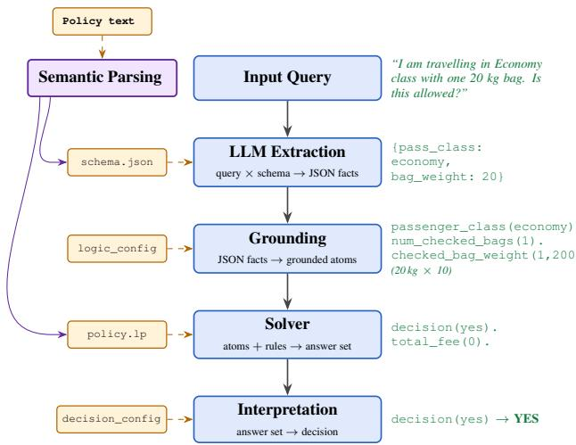

# Policy-as-Logic for Robust Reasoning over Rules

Rahul Nair<sup>1</sup> , Bastian Lipka<sup>2</sup> , Elizabeth Daly<sup>1</sup>

<sup>1</sup>IBM Research

<sup>2</sup>IBM

{rahul.nair@ie.ibm.com, lipka.bastian@ibm.com, elizabeth.daly@ie.ibm.com}

## Abstract

In many practical applications of generative AI systems, from tax rules to airline baggage allowance, responses to natural language queries must respect written policies or rules. We present a hybrid symbolic approach that expresses policies in formal logic and at inference time exploits the representation power of language models for fact extraction to ground predicates, and an answer set solver for reasoning such that responses are interpretable, auditable, and as we show, accurate and robust under input perturbations. Specifically, we show this separation of extraction and reasoning steps outperforms policy-as-prompt and policy-as-code methods in most cases with \~10x reduction in token usage. The results point to the value of structured reasoning and symbolic solvers in conjunction with generative models to make robust decisions involving objective criteria.

## 1 Introduction

Many institutional processes are governed by written policies that specify how decisions should be made. Explicit written policies arise in a broad range of domains like safety, content moderation, business processes such as taxation, pricing, medical risk assessment, among others. Answering user queries reliably against these policies depend on human review which remains a practical reality for many critical domains. Automation of this decision making involves reasoning over the policy text and faithfully answering user queries [Palla et al., 2025]. When large language models (LLMs) are involved to facilitate this automation, decision making is no longer robust and subject to the stochastic nature of generative models. Subtle variations in input or policy text, for example tonal shifts or reordering of policy rules, can change the outcome [Ye et al., 2024; Zhu et al., 2024], making end-to-end LLM approaches unreliable.

Policy-based decision making involves two distinct capabilities: understanding the context of a user query and how it maps to a policy, and second reasoning over the policy to arrive at a consequence. While LLMs exploit their representation power for encoding context well, their reasoning capabilities involving discrete entities is unreliable [Zhou et al., 2025].

We further distinguish between rules arising from objective criteria or knowledge (e.g. the weight of a bag when deciding a baggage fee) versus those that are subjective, or rely on belief (e.g. a message intending to cause harm in a content moderation policy). In the latter, we are reliant on a model’s view of the world to assess harm. Real world policies exist in a spectrum between objective and subjective criteria.

Our Policy-as-logic (PaL) proposal is to express policy in formal logic. We use Answer Set Programs (ASPs) an extension of first order logic that allow for reasoning over defaults. Through the strict separation of fact extraction using LLMs and reasoning using classical solvers, we aim to improve robustness of pipelines involving policies. To study robustness, we systematically perturb inputs and observe decision consistency. Using two benchmark datasets we show significant performance gains at a fraction of the token cost when using formal logic for objective policies. For subjective policies however the benefit of reasoning is limited on account of extraction errors.

This work makes two contributions. First, we propose policy-as-logic for automated decision making over rules and show its applicability in a broad range of practical domains. Second, we empirically demonstrate our methods over systematic input perturbations that structured reasoning methods such as ours are robust.

## 2 Related Work

There is a large literature on the use of logic and large language models, see [Liu et al., 2025] for a recent survey. Neurosymbolic approaches like LINC [Olausson et al., 2023] look to derive first order logic from inputs and use theorem provers for reasoning. [Yang et al., 2023] similarly use LLMs for semantic parsing and answer set programs for reasoning, although in their case the program is hand crafted. They use their LLM-ASP pipeline for several natural language tasks and appear to be the first to marry the parsing power of LLMs with declarative nature of answer set programs. [Pan et al., 2023] additionally add self-correcting modules to improve error rates to a similar pipeline. They focus exclusively on logical reasoning tasks. In contrast, we study real-world policy reasoning. [Hoveyda et al., 2026] apply probabilistic reasoning to address more specialized queries that may include exclusions, negations and other structural properties, which follows previous work on translating text to probabilistic programs [Wong et al., 2023].

In LLM-as-a-judge [Zheng et al., 2023] applications the criteria used to evaluate instances can also be considered a policy [Desmond et al., 2025]. The dominant paradigm to address these cases is policy-as-prompt, where the policy language is used as context to LLM queries [Palla et al., 2025]. This is the used also in safeguards for LLMs, for example in GPT-OSS-Safeguards<sup>1</sup> and Granite Guardian [Padhi et al., 2024].

Another approach is via policy-as-code where policies and inputs are translated to executable programs [Dou et al., 2026a; Yang et al., 2023]. Generative computing frameworks allow for more flexible constructions mixing solvers, programs, and LLM prompts.

Several benchmarks like RuleArena [Zhou et al., 2025], PolyGuard [Kumar et al., 2025], DeonticBench [Dou et al., 2026a], CLBench [Dou et al., 2026b] exist for evaluating policy compliance. For this paper, we experiment with RuleArena for very discrete states and Polyguard for policies that involve more conceptual atoms.

## 3 Methods

  
Figure 1: Pipeline overview

Given a policy P that describes some discrete outcomes of interest y, and a user query x, we are interested in a function f, which maps the user query to an outcome, i.e. $y = f ( x , \mathcal { P } )$ . The input query x is assumed to be in natural language as is the policy P.

In the first semantic parsing step, we derive P, a logic program whose predicates encode facts, conditions, exceptions, and outcomes of the policy P. This is performed once. At inference, for a query x, predicates involving variables are estimated using an LLM. The entire program P is converted to a variable-free, propositional form through grounding. An answer set (or stable model) M is a set of admissible decision outcomes of this grounded program. This is determined using a ASP solver. Figure 1 shows the involved steps with an abridged example.

For P we use a non-monotonic logic which has flexibility for practical applications as there may not be explicit rules to cover all possible outcomes. Additionally, they permit reasoning over defaults, such that when input queries are incomplete and result in partial grounding, the reasoning step yields the most likely outcomes.

Semantic parsing Using an LLM and a policy document, we first generate an answer set program which encode the policy. For our experiments we use Claude Opus 4.7 using a prompt shown in Appendix 6.1. Note that this LLMbased translation does not guarantee complete policy coverage, and some of the domains in our experiments have known gaps, consistent with prior findings on LLM-to-ASP translation [Ishay et al., 2023]. This step additionally generates a schema that is needed from the fact extractor and mappings that translate between text and logic and between logical consequence and decisions.

Extraction Next, input queries are translated to structured output by prompting an LLM with the schema. The extraction step returns a list of facts in JSON. The LLM does not see the full policy text and only sees the schema.

Grounding The extracted facts are translated to atoms using the mapping generated by the first step. These mappings handles translation between facts and atom names and handles types, e.g. from boolean facts to propositional atoms, and custom handlers for complex lists. The end result is a grounded ASP, i.e. a program in propositional logic without any variables.

Solver Using Clingo [Gebser et al., 2014; Gebser et al., 2019] as the ASP solver we solve the grounded ASP to determine all stable models or answer sets. In some programs, optimization directives are needed for rule application ambiguity to ensure uniqueness of solutions.

Interpretation Finally, the output atoms are mapped back to domain decisions. Mapping tasks are deterministic and depend on the domain. For numeric values this can involve scaling (e.g. from cents to dollars), for categorical variables can involve standardization, or use structured objects as decisions.

Two points on computation are worth noting. Grounding can potentially result in an exponentially large search space. As we ground the program for each input query our variable expansion typically small, so the search space is in the order of number of predicates in P. Secondly, the resulting answer set may not be unique and a policy under a query may allow for multiple outcomes. In such cases, the recommended deci sion can be selected based on context such as picking the least cost decision or optimizing other criteria. In our experiments |M| turns out to be small (see Table 3). Our method therefore does not introduce any latencies beyond the LLM call.

Evaluation Our primary evaluation measure is accuracy (Acc) which denotes the fraction of cases where the outcome decisions match ground truth. To evaluate robustness, we make local perturbations of input queries and report accuracy across all perturbations (Rob). Following [Ye et al., 2024] we apply six language reformulating perturbations to every query: verbosity, paraphrase, distraction, misleading context, cheerful sentiment, and frustrated sentiment. The perturbations are generated by an LLM. A secondary validation step using an llm-as-a-judge to evaluate if the semantic meaning of the perturbation is preserved.

Baselines The competing paradigms of policy-as-prompt [Palla et al., 2025] and policy-as-code [Dou et al., 2026a] serve as baselines to our proposals.

## 4 Experiments

## 4.1 Setup

We validate our approach across four domains from two benchmarks. The Airline, Tax, and NBA domains originate from RuleArena [Zhou et al., 2025]; the HR domain originates from the PolyGuard training set [Kumar et al., 2025]. Each domain involves the following tasks:

1. Airline baggage fees: Requires calculating the total cost for one or multiple passengers, consisting of the flight ticket and the checked baggage fees.

2. Income tax: Requires calculating the income tax for a given person or family based on their financial situation.

3. NBA Transactions: Requires detecting illegal salary violations in player transactions and identifying the ruleviolating team and operation.

4. HR content moderation: Requires classifying workplace situations as safe or unsafe according to an HR policy.

The first three domains involve predominantly objective, knowledge-based criteria. The HR domain involves subjective, belief-based criteria and serves as a boundary case. For the policy-as-prompt baseline, we test 0-shot and 1-shot using prompts from the benchmark [Zhou et al., 2025] with no and one in context exemplars. We compare with various open weight LLMs namely: GPT-OSS-120B, Qwen-2.5 72B, Llama 3.3 70B and Granite-4.1 8B. For policy-as-code we compare with numbers reported in [Dou et al., 2026a] as the code was released during this writing. They report metrics just for the airline case (see accuracy values in Table 2 which range from 0.0 for Kimi K2 to 0.40 for GPT-5.1). Additionally [Zhou et al., 2025] report partial numbers for code generation on the airline domain (see accuracy values in Table 10 which range from 0.18 for LLama-70B, level 2 to 0.44 for GPT-4o, Level 1).

In our experiments we treat all decisions to be categorical. So accuracy implies an exact match to the ground truth. This is a higher threshold to meet for continuous valued decisions like bag fees. All robustness measures are based on six perturbations to each input query.

## 4.2 Results

Table 1 shows the main results with results by difficulty level in the appendix in Table 4.

Table 1: Accuracy ↑ and Robustness ↑ across four domains and four LLMs, aggregated over all queries per domain (Airline: n=300, Tax: n=300, NBA: n=216, HR: n=300). HR has no 1-shot setting.
<table><tr><td rowspan="2">Models</td><td rowspan="2">Method</td><td colspan="2">Airline</td><td colspan="2">Tax</td><td colspan="2">NBA</td><td colspan="2">HR</td></tr><tr><td>Acc</td><td>Rob</td><td>Acc</td><td>Rob</td><td>Acc</td><td>Rob</td><td>Acc</td><td>Rob</td></tr><tr><td rowspan="3">GPT-OSS 120B</td><td>0-shot</td><td>0.38</td><td>0.27</td><td>0.07</td><td>0.00</td><td>0.25</td><td>0.22</td><td>0.95</td><td>0.94</td></tr><tr><td>1-shot</td><td>0.37</td><td>0.17</td><td>0.10</td><td>0.00</td><td>0.12</td><td>0.13</td><td></td><td></td></tr><tr><td>PaL (ours)</td><td>1.00</td><td>0.98</td><td>0.31</td><td>0.29</td><td>0.48</td><td>0.46</td><td>0.96</td><td>0.93</td></tr><tr><td rowspan="3">Qwen-2.5 72B</td><td>0-shot</td><td>0.01</td><td>0.01</td><td>0.02</td><td>0.00</td><td>0.39</td><td>0.39</td><td>0.96</td><td>0.94</td></tr><tr><td>1-shot</td><td>0.07</td><td>0.04</td><td>0.07</td><td>0.00</td><td>0.33</td><td>0.36</td><td></td><td></td></tr><tr><td>PaL (ours)</td><td>0.94</td><td>0.93</td><td>0.31</td><td>0.29</td><td>0.50</td><td>0.48</td><td>0.94</td><td>0.93</td></tr><tr><td rowspan="3">Llama-3.3 70B</td><td>0-shot</td><td>0.01</td><td>0.01</td><td>0.00</td><td>0.00</td><td>0.27</td><td>0.26</td><td>0.96</td><td>0.93</td></tr><tr><td>1-shot</td><td>0.07</td><td>0.04</td><td>0.03</td><td>0.00</td><td>0.32</td><td>0.32</td><td></td><td></td></tr><tr><td>PaL (ours)</td><td>0.97</td><td>0.94</td><td>0.31</td><td>0.24</td><td>0.49</td><td>0.47</td><td>0.97</td><td>0.94</td></tr><tr><td rowspan="3">Granite-4.1 8B</td><td>0-shot</td><td>0.01</td><td>0.00</td><td>0.00</td><td>0.00</td><td>0.32</td><td>0.34</td><td>0.96</td><td>0.95</td></tr><tr><td>1-shot</td><td>0.01</td><td>0.00</td><td>0.00</td><td>0.00</td><td>0.29</td><td>0.31</td><td></td><td></td></tr><tr><td>PaL (ours)</td><td>0.61</td><td>0.62</td><td>0.31</td><td>0.26</td><td>0.36</td><td>0.37</td><td>0.93</td><td>0.90</td></tr></table>

Performance On Airline, our method achieves accuracy numbers between 0.94 and 1.00 across all models, while baselines don’t exceed 0.38 for policy-as-prompt and 0.40 for policy-as-code. The smallest model, Granite-4.1 8B, reaches 0.61 with the pipeline compared to 0.01 without. On Tax, all baselines remain below 0.10 while PaL scores 0.31 across all models. On the NBA domain, the pipeline outperforms baselines, though the gap is smaller suggesting multi-operation scenarios place a higher burden on the extraction quality.

Robustness Robustness follows a similar pattern but widens the gap. On Tax, every baseline across all four models drops to 0.00 robustness, meaning that not a single perturbed query is answered correctly. PaL maintains robustness close to the accuracy across all four domains. This is a direct consequence of the architecture: since the grounding, solving, and interpretation step is deterministic. The only source of robustness loss is extraction quality under perturbations.

Conceptual atoms On HR, the pattern reverses. The pipeline offers no systematic advantage over the baseline. PaL and the 0-shot baseline score between 0.93 and 0.96. On Qwen and Granite the baseline outperforms the pipeline. The HR rules are simple (e.g., “Do not work under the influence of drugs or alcohol.”), so the solver contributes no logical reasoning beyond what the LLM does in a single forward pass. The compliance classification in this domain requires conceptual decision making rather than logical reasoning. This result supports our claim that the robustness gains on Airline, Tax, and NBA originate from the architectural separation of natural language understanding and logical reasoning.

Token efficiency We additionally compare the number of tokens for each method per query. As the entire policy forms a part of the context for direct queries and policy-as-logic needs only the schema, our method needs fewer tokens by an order of magnitude in most domains as shown in Table 2.

Size of answer sets In our setup the solver returns a set of answers that are compatible with the grounded predicates. Since a written policy is intended to guide decision making, it should map a well specified query to a specific outcome. However, in some cases there is ambiguity in how rules are meant to be applied. For instance in the airline domain, which bag is considered complimentary can impact total fees if a passenger has multiple with different weights. For this case, we add an optimization directive to the ASP to pick the assignment with the lowest cost. Table 3 shows the cardinality of the answer sets showing that the feasible answers are no larger than 3. Similar ambiguity does not exist in the other tested domains.

Table 2: Per-query token usage for the pipeline vs the LLM-only baselines. Counts use the o200k\_base tokenizer applied uniformly to both methods. In = prompt tokens; Out = response tokens.
<table><tr><td>Domain</td><td>Method</td><td>In (mean)</td><td>Out (mean)</td><td>Total</td></tr><tr><td rowspan="3">Airline (n=300)</td><td>0-shot</td><td>11,620</td><td>63</td><td>11,684</td></tr><tr><td>1-shot</td><td>12,836</td><td>67</td><td>12,903</td></tr><tr><td>PaL (ours)</td><td>895</td><td>280</td><td>1,175</td></tr><tr><td rowspan="3">Tax (n=300)</td><td>0-shot</td><td>9,788</td><td>28</td><td>9,816</td></tr><tr><td>1-shot</td><td>17,047</td><td>25</td><td>17,072</td></tr><tr><td>PaL (ours)</td><td>3,537</td><td>606</td><td>4,143</td></tr><tr><td rowspan="3">NBA (n=216)</td><td>0-shot</td><td>21,793</td><td>53</td><td>21,846</td></tr><tr><td>1-shot</td><td>23,663</td><td>35</td><td>23,698</td></tr><tr><td>PaL (ours)</td><td>2,262</td><td>617</td><td>2,879</td></tr><tr><td>HR</td><td>0-shot</td><td>468</td><td>34</td><td>502</td></tr><tr><td>(n=300)</td><td>PaL (ours)</td><td>904</td><td>71</td><td>975</td></tr></table>

Table 3: Size of answer sets returned by domain.
<table><tr><td>Domain</td><td>N</td><td> $| M | = 1$ </td><td></td><td>2</td><td>3</td><td>Min</td><td>Max</td><td>Mean</td></tr><tr><td>Airline</td><td>300</td><td></td><td>206</td><td>64</td><td>30</td><td>1</td><td>3</td><td>1.41</td></tr><tr><td>Tax</td><td>300</td><td></td><td>300</td><td>0</td><td>0</td><td>1</td><td>1</td><td>1.00</td></tr><tr><td>NBA</td><td>216</td><td></td><td>216</td><td>0</td><td>0</td><td>1</td><td>1</td><td>1.00</td></tr><tr><td>HR</td><td>300</td><td></td><td>300</td><td>0</td><td>0</td><td>1</td><td>1</td><td>1.00</td></tr></table>

## 5 Discussion

We have presented policy-as-logic formulation that had broad applicability in practice for domains where there are written rules. Preliminary evidence from a few representative domains suggests significant performance gains where automated decision pipelines leverage structured reasoning. In our experiments, gains are predominantly in domains where rules are based on knowledge rather than beliefs. When the policy relies on belief, the extraction step must make the judgment call, and the solver adds less value. In other words, policies expressed in objective measures are better suited to be encoded in formal logic compared to those relying on subjective criteria.

We envision such methods can be part of broader agentic systems or specialized tool calls, where input queries that have been adjudged to be in scope for a specific policy can be routed to structured reasoning solvers similar to those proposed herein. If the context provided by users is partial and missing key attributes, interactive human-in-the-loop can be used to capture missing information.

Several performance improvements are viable as next steps. For more nuanced criteria, instead of schema based fact extraction that attempts to perform it in one shot, we can disaggregate calls and leverage llm-as-a-judge literature to address problems of positional bias [Shi et al., 2025] and criteria phrasing [Desmond et al., 2025] to make fact extraction more grounded. More robust error analysis that goes from solver decisions via propositional atoms back to the original text would aid in diagnosis of error cases. Our results add to the evidence reported in other works[Dou et al., 2026a] that numerical errors are rife when applying complex business policies to queries.

## References

[Desmond et al., 2025] Michael Desmond, Zahra Ashktorab, Werner Geyer, Elizabeth M Daly, Martin Santillan Cooper, Qian Pan, Rahul Nair, Nico Wagner, and Tejaswini Pedapati. Evalassist: Llm-as-a-judge simplified. In Proceedings ofthe AAAI Conference on Artificial Intelligence, volume 39, pages 29637–29639, 2025.

[Dou et al., 2026a] Guangyao Dou, Luis Brena, Akhil Deo, William Jurayj, Jingyu Zhang, Nils Holzenberger, and Benjamin Van Durme. Deonticbench: A benchmark for reasoning over rules. arXiv preprint arXiv:2604.04443, 2026.

[Dou et al., 2026b] Shihan Dou, Ming Zhang, Zhangyue Yin, Chenhao Huang, Yujiong Shen, Junzhe Wang, Jiayi Chen, Yuchen Ni, Junjie Ye, Cheng Zhang, et al. Clbench: A benchmark for context learning. arXiv preprint arXiv:2602.03587, 2026.

[Gebser et al., 2014] Martin Gebser, Roland Kaminski, Benjamin Kaufmann, and Torsten Schaub. Clingo= asp+ control: Preliminary report. arXiv preprint arXiv:1405.3694, 2014.

[Gebser et al., 2019] Martin Gebser, Roland Kaminski, Benjamin Kaufmann, and Torsten Schaub. Multi-shot asp solving with clingo. Theory and Practice of Logic Programming, 19(1):27–82, 2019.

[Hoveyda et al., 2026] Mohanna Hoveyda, Jelle Piepenbrock, Arjen P de Vries, Maarten de Rijke, and Faegheh Hasibi. Orlog: Resolving complex queries with llms and probabilistic reasoning. In European Conference on Information Retrieval, pages 98–114. Springer, 2026.

[Ishay et al., 2023] Adam Ishay, Zhun Yang, and Joohyung Lee. Leveraging Large Language Models to Generate Answer Set Programs. In Proceedings of the 20th International Conference on Principles of Knowledge Representation and Reasoning, pages 374–383, 8 2023.

[Kumar et al., 2025] Priyanshu Kumar, Devansh Jain, Akhila Yerukola, Liwei Jiang, Himanshu Beniwal, Thomas Hartvigsen, and Maarten Sap. Polyguard: A multilingual safety moderation tool for 17 languages. arXiv preprint arXiv:2504.04377, 2025.

[Liu et al., 2025] Hanmeng Liu, Zhizhang Fu, Mengru Ding, Ruoxi Ning, Chaoli Zhang, Xiaozhang Liu, and Yue Zhang. Logical reasoning in large language models: A survey. arXiv preprint arXiv:2502.09100, 2025.

[Olausson et al., 2023] Theo Olausson, Alex Gu, Ben Lipkin, Cedegao Zhang, Armando Solar-Lezama, Joshua Tenenbaum, and Roger Levy. Linc: A neurosymbolic approach for logical reasoning by combining language models with first-order logic provers. In Proceedings of the 2023 Conference on Empirical Methods in Natural Language Processing, pages 5153–5176, 2023.

[Padhi et al., 2024] Inkit Padhi, Manish Nagireddy, Giandomenico Cornacchia, Subhajit Chaudhury, Tejaswini Pedapati, Pierre Dognin, Keerthiram Murugesan, Erik Miehling, Martín Santillán Cooper, Kieran Fraser, Giulio Zizzo, Muhammad Zaid Hameed, Mark Purcell, Michael Desmond, Qian Pan, Zahra Ashktorab, Inge Vejsbjerg, Elizabeth M. Daly, Michael Hind, Werner Geyer, Ambrish Rawat, Kush R. Varshney, and Prasanna Sattigeri. Granite guardian, 2024.

[Palla et al., 2025] Konstantina Palla, José Luis Redondo García, Claudia Hauff, Francesco Fabbri, Andreas Damianou, Henrik Lindström, Dan Taber, and Mounia Lalmas. Policy-as-prompt: Rethinking content moderation in the age of large language models. In Proceedings of the 2025 ACM Conference on Fairness, Accountability, and Transparency, pages 840–854, 2025.

[Pan et al., 2023] Liangming Pan, Alon Albalak, Xinyi Wang, and William Wang. Logic-LM: Empowering large language models with symbolic solvers for faithful logical reasoning. In Findings of the Association for Computational Linguistics: EMNLP 2023, pages 3806–3824. Association for Computational Linguistics, December 2023.

[Shi et al., 2025] Lin Shi, Chiyu Ma, Wenhua Liang, Xingjian Diao, Weicheng Ma, and Soroush Vosoughi. Judging the judges: A systematic study of position bias in llm-as-a-judge. In Proceedings ofthe 14th International Joint Conference on Natural Language Processing and the 4th Conference of the Asia-Pacific Chapter of the Associationfor Computational Linguistics, pages 292–314, 2025.

[Wong et al., 2023] Lionel Wong, Gabriel Grand, Alexander K Lew, Noah D Goodman, Vikash K Mansinghka, Jacob Andreas, and Joshua B Tenenbaum. From word models to world models: Translating from natural language to the probabilistic language of thought. arXiv preprint arXiv:2306.12672, 2023.

[Yang et al., 2023] Zhun Yang, Adam Ishay, and Joohyung Lee. Coupling large language models with logic programming for robust and general reasoning from text. In Findings ofthe associationfor computational linguistics: ACL 2023, pages 5186–5219, 2023.

[Ye et al., 2024] Jiayi Ye, Yanbo Wang, Yue Huang, Dongping Chen, Qihui Zhang, Nuno Moniz, Tian Gao, Werner Geyer, Chao Huang, Pin-Yu Chen, Nitesh V. Chawla, and Xiangliang Zhang. Justice or prejudice? quantifying biases in llm-as-a-judge. arXiv preprint arXiv:2410.02736, 2024.

[Zheng et al., 2023] Lianmin Zheng, Wei-Lin Chiang, Ying Sheng, Siyuan Zhuang, Zhanghao Wu, Yonghao Zhuang, Zi Lin, Zhuohan Li, Dacheng Li, Eric Xing, et al. Judging

llm-as-a-judge with mt-bench and chatbot arena. Advances in neural information processing systems, 36:46595– 46623, 2023.

[Zhou et al., 2025] Ruiwen Zhou, Wenyue Hua, Liangming Pan, Sitao Cheng, Xiaobao Wu, En Yu, and William Yang Wang. Rulearena: A benchmark for rule-guided reasoning with llms in real-world scenarios. In Proceedings of the 63rd Annual Meeting of the Association for Computational Linguistics (Volume 1: Long Papers), pages 550– 572, 2025.

[Zhu et al., 2024] Kaijie Zhu, Qinlin Zhao, Hao Chen, Jindong Wang, and Xing Xie. Promptbench: A unified library for evaluation of large language models. Journal of Machine Learning Research, 25(254):1–22, 2024.

## 6 Appendices

## 6.1 Policy-to-ASP Generation Prompt

The following prompt template is used to generate the ASP rule generation from a textual policy document. The template takes three inputs: {policy\_text}, the full policy document in natural language; {output\_description}, a short description of the expected decision type (e.g., “a numeric total baggage cost in USD” or “a categorical decision: SAFE or UNSAFE”); and {domain\_notes}, optional domain-specific instructions (e.g., “dollar amounts may exceed 32-bit integers, use cent-scaling”).

You are an expert in Answer Set Programming ( ASP)

using the Clingo solver (v5.8.0). Your task is to

== POLICY DOCUMENT == {policy\_text}

== DESIRED OUTPUT == {output\_description}

== ADDITIONAL NOTES == {domain\_notes}

== REQUIREMENTS ==

1. Encode every rule, exception, and edge case in the policy document. Use default negation (not) where the policy implies a default outcome when no explicit rule applies.

2. Do not hardcode any facts that come from user queries. The program must be generic. Input facts will be provided as ground atoms at inference time.

3. Use descriptive snake\_case predicate names   
. Add   
comment blocks explaining which part of   
the   
policy each section encodes.

4. Use only standard Clingo constructs:   
choice   
rules, aggregates, weak constraints.   
Clingo   
integers are 32-bit. If large numbers are   
involved, scale them (e.g., cents instead   
of   
dollars) and document the scale factor.

5. End with #show directives for all decision   
relevant output atoms.

6. Return only the ASP code. No markdown   
fences,   
no explanations before or after.

## 6.2 Extraction failures

Here we show some representative extraction failures using a small Granite-4.1 8B for each of the domains and the resulting change in decision.

## A.1 Airline: Default-class collapse

Query RA\_L0\_006 describes a passenger flying from Wuhan to Portland. The schema’s route field should reflect the international origin region.

```jsonl
Extracted:
{ "route": "U.S.", ... }
Correct:
{ "route": "China", ... }
```

Granite defaults to "U.S." regardless of origin city. The misclassified route causes the solver to apply domestic instead of international fees (\$2,249 vs. correct \$2,314). The same error recurs on queries involving Toronto, Tokyo, and Nagoya.

## A.2 Tax: Digit-level transcription error

Query RA\_TAX\_L2\_017 states gross receipts of \$29,314.

Extracted:   
{ "gross\_receipts": 29114, ... }   
Correct:   
{ "gross\_receipts": 29314, ... }

A single-digit substitution (3→1). The \$200 input error propagates through Schedule C and self-employment tax to a \$1,956 difference in the final decision.

## A.3 NBA: Cross-field value confusion

Query RA\_NBA\_L1\_056 describes Player A with a prior contract at \$16M/year (2022) and a new signing operation at \$30M/year (2024–25), both with Team E.

## Extracted:

{ "last\_contract\_annual\_salary": 30000000,   
"last\_contract\_start\_year": 2022, ... }

## Correct:

{ "last\_contract\_annual\_salary": 16000000,   
"last\_contract\_start\_year": 2022, ... }

Granite merges the salary from the new signing into the prior contract. The inflated salary changes the maximumsalary classification, causing the pipeline to miss a cap violation.

## A.4 HR: Keyword trigger ignoring stance

Query SAFE\_0093 is an internal HR reminder: “Using substances like vape pens before meetings violates our workplace policy.”

## Extracted:

{ "contains\_substance\_abuse\_on\_duty": true,   
... }

## Correct:

{ "contains\_substance\_abuse\_on\_duty": false,   
... }

The message prohibits substance use rather than admitting to it. Granite triggers on surface keywords without modeling the author’s stance, flipping the decision from SAFE to UNSAFE.

Table 4: Accuracy and Robustness across four domains, four LLMs, and three difficulty levels. Robustness is the fraction of perturbed queries answered correctly, averaged across six perturbation types. Best value per model is in bold. PolyGuard HR has no difficulty levels.
<table><tr><td rowspan="2">Models</td><td rowspan="2">Settings</td><td colspan="2">Level 0</td><td colspan="2">Level 1</td><td colspan="2">Level 2</td><td colspan="2">All</td></tr><tr><td></td><td>Acc Rob</td><td>Acc</td><td>Rob</td><td>Acc</td><td>Rob</td><td>Acc</td><td>Rob</td></tr><tr><td colspan="2"></td><td colspan="8">Airline</td></tr><tr><td></td><td>0-shot</td><td>0.50</td><td>0.32</td><td>0.38</td><td>0.26</td><td>0.27</td><td>0.23</td><td>0.38</td><td>0.27</td></tr><tr><td>GPT-OSS 120B</td><td>1-shot</td><td>0.49</td><td>0.14</td><td>0.40</td><td>0.20</td><td>0.22</td><td>0.18</td><td>0.37</td><td>0.17</td></tr><tr><td></td><td>PaL</td><td>1.00 0.02</td><td>0.98</td><td>1.00</td><td>0.99</td><td>1.00</td><td>0.98</td><td>1.00</td><td>0.98 0.01</td></tr><tr><td>Qwen-2.5 72B</td><td>0-shot</td><td>0.15</td><td>0.01 0.05</td><td>0.00 0.05</td><td>0.01 0.05</td><td>0.02 0.02</td><td>0.00 0.01</td><td>0.01 0.07</td><td>0.04</td></tr><tr><td></td><td>1-shot PaL</td><td>0.91</td><td>0.93</td><td>0.97</td><td>0.94</td><td>0.95</td><td>0.93</td><td>0.94</td><td>0.93</td></tr><tr><td></td><td>0-shot</td><td>0.04</td><td>0.01</td><td>0.00</td><td>0.00</td><td>0.00</td><td>0.01</td><td>0.01</td><td>0.01</td></tr><tr><td>Llama-3.3 70B</td><td>1-shot</td><td>0.17</td><td>0.10</td><td>0.03</td><td>0.02</td><td>0.01</td><td>0.00</td><td>0.07</td><td>0.04</td></tr><tr><td></td><td>PaL</td><td>0.97</td><td>0.94</td><td>0.96</td><td>0.96</td><td>0.98</td><td>0.94</td><td>0.97</td><td>0.94</td></tr><tr><td></td><td>0-shot</td><td>0.00</td><td>0.01</td><td>¯0.01</td><td>0.00</td><td>0.01</td><td>0.00</td><td>0.01</td><td>0.00</td></tr><tr><td>Granite-4.1 8B</td><td>1-shot</td><td>0.00</td><td>0.00</td><td>0.02</td><td>0.00</td><td>0.00</td><td>0.01</td><td>0.01</td><td>0.00</td></tr><tr><td></td><td>PaL</td><td>0.59</td><td>0.68</td><td>0.64</td><td>0.60</td><td>0.59</td><td>0.58</td><td>0.61</td><td>0.62</td></tr><tr><td></td><td></td><td></td><td>Tax</td><td></td><td></td><td></td><td></td><td></td><td></td></tr><tr><td colspan="8"></td><td></td><td>0.00</td></tr><tr><td>GPT-OSS 120B</td><td>0-shot</td><td>0.21 0.29</td><td>0.00 0.00</td><td>0.01</td><td>0.00</td><td>0.00</td><td>0.00</td><td>0.07 0.10</td><td></td></tr><tr><td></td><td>1-shot PaL</td><td>0.58</td><td>0.56</td><td>0.00 0.28</td><td>0.00 0.24</td><td>0.00 0.07</td><td>0.00 0.05</td><td>0.31</td><td>0.00 0.29</td></tr><tr><td></td><td>0-shot</td><td>0.03</td><td>0.00</td><td>0.02</td><td>0.00</td><td>0.00</td><td>0.00</td><td>0.02</td><td>0.00</td></tr><tr><td>Qwen-2.5 72B</td><td>1-shot</td><td>0.21</td><td>0.00</td><td>0.01</td><td>0.00</td><td>0.00</td><td>0.00</td><td>0.07</td><td>0.00</td></tr><tr><td></td><td>PaL</td><td>0.58</td><td>0.56</td><td>0.28</td><td>0.24</td><td>0.07</td><td>0.05</td><td>0.31</td><td>0.29</td></tr><tr><td></td><td>0-shot</td><td>0.00</td><td>0.00</td><td>0.00</td><td>0.00</td><td>0.00⁻</td><td>0.00</td><td>0.00</td><td>0.00</td></tr><tr><td>Llama-3.3 70B</td><td>1-shot</td><td>0.08</td><td>0.00</td><td>0.00</td><td>0.00</td><td>0.00</td><td>0.00</td><td>0.03</td><td>0.00</td></tr><tr><td></td><td>PaL</td><td>0.58</td><td>0.50</td><td>0.28</td><td>0.17</td><td>0.07</td><td>0.04</td><td>0.31</td><td>0.24</td></tr><tr><td></td><td>0-shot</td><td>0.00</td><td>0.00</td><td>0.00</td><td>0.00</td><td>0.00</td><td>0.00</td><td>0.00</td><td>0.00</td></tr><tr><td>Granite-4.1 8B</td><td>1-shot</td><td>0.00</td><td>0.00</td><td>0.00</td><td>0.00</td><td>0.00</td><td>0.00</td><td>0.00</td><td>0.00</td></tr><tr><td></td><td>PaL</td><td>0.58</td><td>0.49</td><td>0.28</td><td>0.22</td><td>0.07</td><td>0.05</td><td>0.31</td><td>0.26</td></tr><tr><td></td><td></td><td></td><td></td><td></td><td></td><td></td><td></td><td></td><td></td></tr><tr><td colspan="8">NBA Transaction</td><td></td><td></td></tr><tr><td>GPT-OSS 120B</td><td>0-shot</td><td>0.32</td><td>0.30</td><td>0.28</td><td>0.21</td><td>0.07</td><td>0.11</td><td>0.25</td><td>0.22</td></tr><tr><td></td><td>1-shot PaL</td><td>0.23 0.63</td><td>0.21</td><td>0.09</td><td>0.09</td><td>0.00</td><td>0.05</td><td>0.12 0.48</td><td>0.13 0.46</td></tr><tr><td></td><td>0-shot</td><td>0.52</td><td>0.61 0.45</td><td>0.37 0.40</td><td>0.37 0.37</td><td>0.41</td><td>0.35 0.31</td><td>0.39</td><td>0.39</td></tr><tr><td>Qwen-2.5 72B</td><td>1-shot</td><td>0.38</td><td>0.49</td><td>0.30</td><td>0.33</td><td>0.15 0.28</td><td>0.22</td><td>0.33</td><td>0.36</td></tr><tr><td></td><td>PaL</td><td>0.64</td><td>0.64</td><td>0.42</td><td>0.39</td><td>0.41</td><td>0.36</td><td>0.50</td><td>0.48</td></tr><tr><td></td><td>0-shot</td><td>0.38</td><td>0.34</td><td>0.23</td><td>0.24</td><td>0.15~ 0.15</td><td></td><td>0.27</td><td>0.26</td></tr><tr><td>Llama-3.3 70B</td><td>1-shot</td><td>0.49</td><td>0.48</td><td>0.20</td><td>0.24</td><td>0.24</td><td>0.18</td><td>0.32</td><td>0.32</td></tr><tr><td></td><td>PaL</td><td>0.640.63</td><td></td><td>0.38</td><td>0.37</td><td>0.41</td><td>0.36</td><td>0.49</td><td>0.47</td></tr><tr><td></td><td>0-shot</td><td>0.42</td><td>0.43</td><td>0.28</td><td>0.29</td><td>0.24⁻</td><td>0.25</td><td>0.32</td><td>0.34</td></tr><tr><td>Granite-4.1 8B</td><td>1-shot</td><td>0.43</td><td>0.45</td><td>0.24</td><td>0.26</td><td>0.13</td><td>0.19</td><td>0.29</td><td>0.31</td></tr><tr><td></td><td>PaL</td><td>0.43</td><td>0.51</td><td>0.34</td><td>0.30</td><td>0.26</td><td>0.24</td><td>0.36</td><td>0.37</td></tr><tr><td colspan="8">PolyGuard HR</td><td></td><td></td></tr><tr><td>0-shot GPT-OSS 120B</td><td></td><td></td><td></td><td></td><td></td><td></td></table>