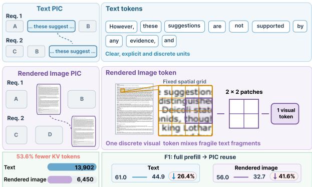
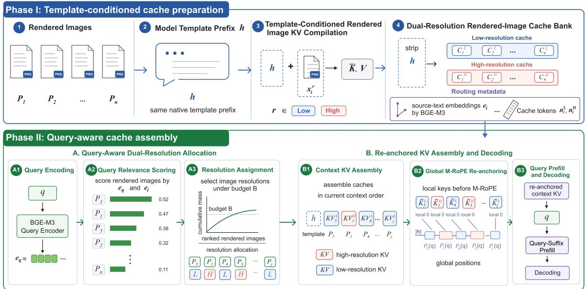
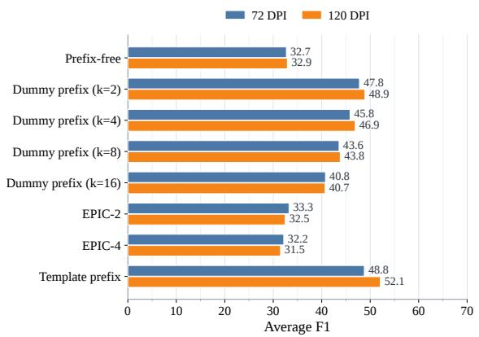
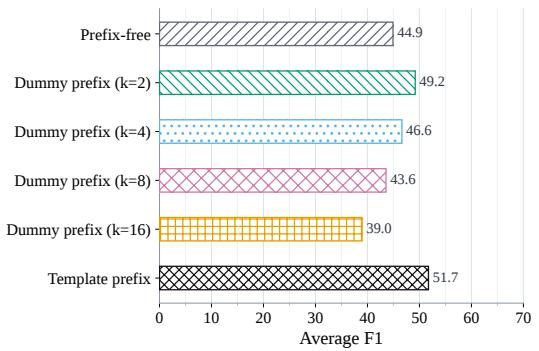
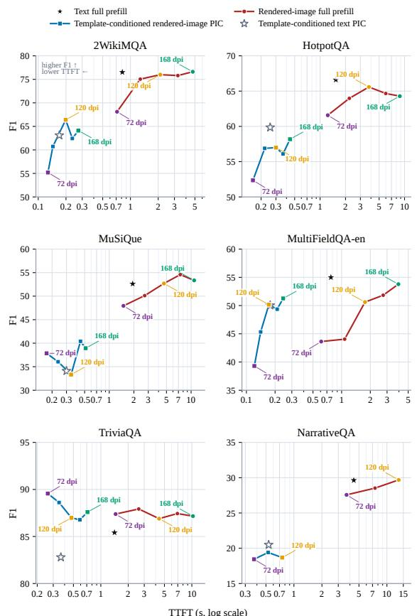
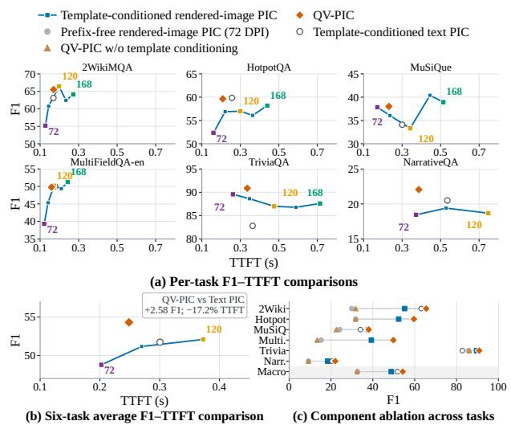
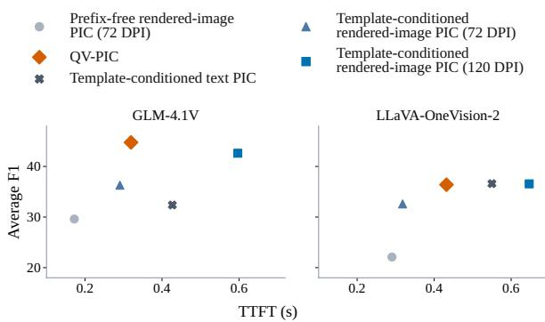

# QV-PIC: Query-Aware Visual Position-Independent Caching for Eficient RAG Serving

Yilin Liu1, Rui Meng2, Wangze Ni1\*, Jianxin Yan1, Heng Cao3, Libin Zheng4, Peng Cheng5, Jinfei Liu1

1Zhejiang University 2Department of Statistics and Data Science, Beijing Normal-Hong Kong Baptist University 3Microsoft 4Sun Yat-sen University 5Tongji University

## Abstract

Retrieval-Augmented Generation (RAG) repeatedly prefills identical text chunks across queries, incurring redundant computations. Position-Independent Caching (PIC) mitigates it by reusing precomputed Key-Value (KV) across positions, but its eficiency is constrained by the large volume of text tokens. Rendering text chunks as images can compress the text into fewer visual tokens, but the rendered-image PIC sufers more severe quality degradation than the text PIC. This representation-specific gap primarily arises from contextual mismatches across independently compiled caches and the loss of finegrained textual evidence during visual compression. Existing PIC repair methods mainly address the former through selective recomputation, but they incur online computation and cannot recover lost textual details. We propose QV-PIC, a query-aware dualresolution PIC reuse framework guided by modelnative templates. Ofline, QV-PIC compiles visual caches under the model’s native chat-template prefix, improving PIC quality without online recomputation. Online, it preserves global context with low resolution and restores fine-grained textual evidence within a high-resolution budget by cumulative query relevance scores, retaining the eficiency benefit of visual compression. Across six tasks, QV-PIC improves average F1 by 21.6 points over vanilla rendered-image PIC, closes the gap to vanilla text PIC, and surpasses optimized text PIC by 2.58 F1 while reducing TTFT by 17.2%. Relative to full prefill, it cuts TTFT by 83.8%.

## Introduction

Retrieval-Augmented Generation (RAG) augments user queries for Large Language Models (LLMs) with retrieved external documents to support knowledgeintensive tasks (Lewis et al. 2020; Guu et al. 2020; Karpukhin et al. 2020; Borgeaud et al. 2022). In longdocument RAG, identical document chunks are repeatedly prefilled across queries, incurring redundant prefill computation. Dynamic retrieval rearranges retrieved chunks with diferent contextual positions, preventing eficient reuse of caches that rely on exact prefix matching or predefined structures (Gim et al. 2024; Jin et al. 2025; Zheng et al. 2024). Position-Independent Caching (PIC) addresses this limitation by compiling reusable chunks independently and composing their Key-Value (KV) caches at serving time, enabling cross-position reuse of repeated content. Existing RAG-oriented PIC methods (Yao et al. 2025; Hu et al. 2025) are predominantly text-based. Although repeated prefill is eliminated, the transmission and computation costs associated with KV caches scale with context length (Kwon et al. 2023; Liu et al. 2024; Qin et al. 2025a).

  
Figure 1: Rendered-image PIC uses fewer KV tokens but incurs a larger full-prefill-to-PIC quality drop than text PIC on Glyph across six LongBench QA tasks at 72 DPI.

Visual-text compression ofers a complementary opportunity to shorten reusable context representations. By rendering text chunks as compact images, Vision-Language Models (VLMs) can encode multiple textual units into one visual token, increasing per-token information density (Li, Lan, and Zhou 2025; Xing et al. 2025; Wei, Sun, and Li 2025). We refer to PIC over rendered images as rendered-image PIC, in contrast to text PIC over the original text chunks. Glyph (Cheng et al. 2025), for example, achieves 3-4× token compression while retaining long-context performance comparable to similarly sized text-only LLMs. This result suggests that rendered images can substantially shorten the reusable KV sequence while preserving useful document information under full prefill, motivating rendered-image PIC reuse across queries for eficient RAG serving.

This opportunity raises a core question for eficient RAG serving: can rendered-image PIC match the reuse quality of text PIC? Under identical conditions, we compare text and rendered-image PIC using Glyph across six LongBench Question-Answering (QA) tasks. As shown in Figure 1, although rendering substantially reduces token count, rendered-image PIC sufers greater degradation from full prefill than text PIC. This indicates that rendered images cannot directly inherit the PIC reuse capability of text. This representation-dependent gap reflects two coupled failure modes. First, independently compiled caches lack the contextual conditions available during full prefill, causing cache-state mismatch after composition. Second, text tokenization preserves characters and words as discrete symbols, whereas visual encoding compresses characters, digits, punctuation, and local layout into fewer visual tokens, each aggregating multiple textual units. Fine-grained answer-bearing evidence may therefore be blurred, conflated, or omitted before the rendered-image KV cache is constructed. Rendered-image PIC must consequently address both compilation-context mismatch andfine-grained evidence loss.

Prior PIC repair methods primarily address the first failure mode through selective recomputation or chunkboundary correction (Yao et al. 2025; Hu et al. 2025; Zhao et al. 2025b; Qin et al. 2025b). Such methods can refresh context-dependent states after caches are composed, but they introduce additional computation into the online path and operate on an already fixed visual representation. They cannot reconstruct characters, digits, punctuation, or layout cues that were not preserved during visual encoding. This limitation is particularly consequential for rendered images, whose answer-bearing information often lies in fine-grained textual details rather than the coarse visual semantics suficient for naturalimage understanding. Consequently, eficient renderedimage PIC poses two key challenges:

Challenge 1: Eficient and stable repair of compilation-context mismatch. Prepending disposable prefix during compilation and stripping it afterward can absorb chunk-initial attention sinks without online recomputation. But arbitrary dummy prefixes induce prefix-dependent cache states, making the repair sensitive to token identity and length.

Challenge 2: Eficient restoration of visual-text details. Rendering resolution not only controls textual legibility but also visual-token count. Uniform low resolution is eficient but risks discarding fine-grained evidence. High resolution preserves richer textual details but sharply increases tokens, eroding the eficiency gains of visual-text compression.

In response to these challenges, we propose QV-PIC, a model-native template-conditioned and queryaware dual-resolution framework for rendered-image PIC, which transforms fixed text chunks into controllable fine-grained units. For Challenge 1, QV-PIC compiles each rendered image under the model-native chattemplate prefix and strips the shared-prefix KV entries before storage. This native template provides the requestinvariant prompt-format condition that is present during full prefill, reducing systematic compilation-context mismatch without online recomputation. For Challenge 2, QV-PIC precompiles low- and high-resolution cache versions for each rendered image. At serving time, it begins with complete low-resolution context coverage and promotes only a bounded set of query-relevant rendered images to high resolution according to cumulative query relevance. The two components are complementary: template-conditioned compilation first solidifies the quality foundation of the rendered image PIC, and query-aware dual-resolution allocation then restores query-specific textual details. The online path requires no rendered-image generation, visual encoding, or contextside full prefill. Our contributions are summarized as follows:

• We reveal the significant impact of text and rendered image representations on PIC reuse. For identical text content, rendered-image PIC sufers more severe degradation than text PIC, but the former has more potential in quality-latency performance.

• We propose QV-PIC, a template-conditioned and query-aware dual-resolution framework for rendered-image PIC. It eficiently reduces the compilation-context mismatch and improves finegrained textual evidence fidelity of rendered-image PIC.

• We demonstrate that QV-PIC achieves consistent quality-latency improvements. QV-PIC improves average F1 by 21.6 points over vanilla rendered-image PIC, eliminating its 12.2-point gap to vanilla text PIC and outperforming optimized text PIC by 2.58 points while reducing TTFT by 17.2%. Compared with full prefill, it reduces online prefill time by 83.8%.

## Background

## Position-Independent Caching for Text

In RAG serving, the same text chunk may be retrieved by diferent queries with varying prefixes, orders, and contextual positions. Conventional prefix caching reuses KV caches only when requests share fixed prefixes or predefined layouts. For example, Prompt Cache (Gim et al. 2024) predefines cacheable modules with positions, while RAGCache (Jin et al. 2025) applies treebased KV retrieval and reuses prefix paths across GPU and memory. Such prefix-dependent reuse is dificult for dynamic retrieval, where the same chunk may appear in diferent surrounding contexts. Text PIC addresses this limitation by independently compiling text chunks into reusable KV caches and linking retrieved caches during online serving. Cache-Craft (Agarwal et al. 2025) identifies reusable chunk caches and selectively recomputes context-sensitive states; EPIC (Hu et al. 2025) formalizes PIC as a compile-and-link framework that recomputes only leading tokens to mitigate attention sinks; TurboRAG (Lu et al. 2025) stitches precomputed KV caches with independent attention masks and reordered RoPE positions. However, these Text PIC methods still incur online overhead from token selection, recomputation, or scheduling. Although static ofline linking can reduce latency, it is constrained by the form and semantics of precompiled prefixes. More importantly, they fail to shorten text-chunk representations. Thus, even without full prefill, long-document RAG still requires loading and transferring large text KV caches, limiting PIC reuse eficiency (Liu et al. 2024; Qin et al. 2025a).

## Position-Independent Caching for Images

Visual-text compression renders text as images, increasing visual-token information density. Prior work, including Text or Pixels (Li, Lan, and Zhou 2025), VIST (Xing et al. 2025), Glyph (Cheng et al. 2025), DeepSeek-OCR (Wei, Sun, and Li 2025), and DeepSeek-OCR 2 (Wei, Sun, and Li 2026), shows its efectiveness for long-context modeling and token compression. However, compressed visual text remains sensitive to rendering resolution and visual encoding, and OCR readability alone cannot reflect long-range retrieval and reasoning quality (Zhao et al. 2025a). Recent work adapts visual processing to task demands: AgentOCR (Feng et al. 2026) uses segment optical caching to reuse rendered interaction-history segments, while Agentic-OCR (Wang et al. 2026) identifies query-relevant regions and performs OCR on demand. These methods reduce irrelevant visual input but do not reuse pagelevel KV caches that can be position-independently assembled across requests. Multimodal caching methods such as MPIC (Zhao et al. 2025b) and VLCache (Qin et al. 2025b) further reuse visual intermediate states or language-model KV caches with selective recomputation. However, their fixed ordinary resolution may discard fine-grained textual evidence that later KV repair cannot recover, while recomputation still incurs online overhead.

## Methodology

QV-PIC addresses two sources of degradation in rendered-image PIC: cache-state mismatch and the loss of fine-grained textual evidence. Ofline, model-native template-conditioned compilation improves independently compiled KV quality and establishes a reliable reuse basis. Online, query-aware dual-resolution allocation selectively restores query-relevant visual details without rerendering or re-encoding images.

## Framework Overview

Given a query $q ,$ let $C ( q ) = ( c _ { 1 } , \ldots , c _ { n } ) $ denote the retrieved chunks in the current context order. Each chunk $c _ { i }$ is rendered as $x _ { i } ^ { r } = \operatorname { R e n d e r } ( c _ { i } ; r )$ at resolution r.

As shown in Figure 2, QV-PIC follows a two-phase workflow.

Phase I: Template-conditioned cache preparation. For each reusable chunk $c _ { i } .$ , QV-PIC renders lowand high-resolution images and independently compiles one cache per resolution under the model-native chattemplate prefix. It strips the prefix KV entries before storage, but retains the resulting template-conditioned rendered-image KV entries. The cache bank stores both resolution variants, token-count metadata, source-order metadata, and a source-text embedding for later routing.

Phase II: Query-aware cache assembly. At serving time, QV-PIC scores the retrieved chunks against the query and promotes at most B query-relevant rendered images to high resolution. All retrieved chunks remain in the context, and exactly one cache version is activated for each rendered image. The relevance ranking is used only for resolution allocation; cache assembly follows the current context order of the RAG request. After M-RoPE re-anchoring, the assembled cache is supplied as past KV, so the VLM only computes query prefill and answer generation online.

## Model-Native Template-Conditioned Compilation

In full prefill, the rendered-image context is processed under the model-native chat-template prefix, which provides the request-invariant prompt-format condition of the VLM’s multimodal serving interface. Prefix-free compilation removes this condition, while dummy prefixes replace it with arbitrary tokens whose efect varies with token identity and length. QV-PIC instead uses the chat-template prefix as the compile-time condition and strips only its KV entries before storage. This reduces prompt-format mismatches in independently compiled rendered-image caches.

Let M be the VLM and h its model-native chattemplate prefix. For a rendered image $x _ { i } ^ { r } , \mathsf { Q V - P I C }$ constructs

$$
\begin{array} { r } { \mathcal { C } _ { i } ^ { r } = \operatorname { S t r i p } _ { h } \left( \operatorname { K V } _ { M } ( [ h ; x _ { i } ^ { r } ] ) \right) , } \end{array}\tag{1}
$$

where ${ \mathrm { S t r i p } } _ { h }$ removes the KV entries corresponding to h. Although these prefix entries are discarded, the retained rendered-image entries are still computed under the native template condition. At serving time, QV-PIC adds only one shared prefix cache, $\mathcal { C } _ { h } = \mathrm { \bar { K } V } _ { M } ( \bar { h _ {  } }$

Since each rendered-image cache is compiled independently, its keys are stored before M-RoPE rotation (Su et al. 2024; Wang et al. 2024). After the current context order and resolution assignment are fixed, QV-PIC derives the request positions $\mathbf { P } _ { i } ( q )$ for each activated cache and applies

$$
\mathbf { K } _ { \ell , i } ^ { r } = \mathcal { R } _ { \ell } \left( \bar { \mathbf { K } } _ { \ell , i } ^ { r } , \mathbf { P } _ { i } ( q ) \right) .\tag{2}
$$

where $\bar { \mathbf { K } } _ { \ell , i } ^ { r }$ is the unrotated key at layer $\ell ,$ and $\mathcal { R } _ { \ell }$ is the model-native M-RoPE operator. Values are positionindependent and are stitched in the same current context order. Template conditioning improves the independently compiled rendered-image KV entries, while M-RoPE reanchoring places them at their request positions. Thus, the two operations are complementary.

  
Figure 2: Overview of QV-PIC. Ofline, model-native template-conditioned compilation builds low- and highresolution rendered-image caches and source-text embeddings. Online, query-aware dual-resolution allocation selects one cache version for each rendered image, assembles the selected caches under the current context order, re-anchors M-RoPE positions, and prefills only the query.

## Query-Aware Dual-Resolution Allocation

Uniform low resolution reduces visual-token and KV costs, but may weaken characters, numbers, and local textual evidence. Uniform high resolution preserves more detail, but increases the active KV size for every rendered image. QV-PIC therefore precompiles both versions and activates high resolution only for query-relevant rendered images:

$$
B _ { i } = \{ \mathcal { C } _ { i } ^ { L } , \mathcal { C } _ { i } ^ { H } \} ,\tag{3}
$$

where $\mathcal { C } _ { i } ^ { L }$ and $\mathcal { C } _ { i } ^ { H }$ denote the low- and high-resolution caches of rendered image i.

Query-relevance scoring. QV-PIC uses a frozen BGE-M3 encoder (Chen et al. 2024) $E ( \cdot )$ to embed the source text of each rendered image ofline and the query online:

$$
\mathbf { e } _ { i } = \frac { E ( c _ { i } ) } { \| E ( c _ { i } ) \| _ { 2 } } , \qquad \mathbf { e } _ { q } = \frac { E ( q ) } { \| E ( q ) \| _ { 2 } } .\tag{4}
$$

The relevance score is cosine similarity:

$$
\begin{array} { r } { \tilde { s } _ { i } = \mathbf { e } _ { q } ^ { \top } \mathbf { e } _ { i } , \qquad s _ { i } = [ \tilde { s } _ { i } ] _ { + } = \mathrm { m a x } ( \tilde { s } _ { i } , 0 ) . } \end{array}\tag{5}
$$

Let π $( q )$ sort the retrieved chunks by $\tilde { s } _ { i }$ in descending order. This ranking is used only to choose high-resolution caches. When $\bar { \sum _ { i } } s _ { i } > 0$ , QV-PIC selects the smallest top-ranked set whose cumulative positive relevance reaches threshold $\alpha ,$ capped by budget B:

$$
k ^ { \star } = \operatorname* { m i n } \left( B , \operatorname* { m i n } \left\{ k : \frac { \sum _ { j = 1 } ^ { k } s _ { \pi _ { j } } } { \sum _ { i = 1 } ^ { n } s _ { i } } \geq \alpha \right\} \right) .\tag{6}
$$

If all scores are non-positive, QV-PIC selects the highestscoring chunk as a deterministic fallback. The promoted set and resolution assignment are

$$
{ \cal S } ( q ) = \{ \pi _ { 1 } , \ldots , \pi _ { k ^ { \star } } \} , \qquad r _ { i } ( q ) = \left\{ \begin{array} { l l } { { H , } } & { { i \in { \cal S } ( q ) , } } \\ { { L , } } & { { \mathrm { o t h e r w i s e . } } } \end{array} \right.\tag{7}
$$

Here, $\tilde { s } _ { i }$ measures query relevance, whereas $r _ { i } ( \boldsymbol { q } )$ denotes the assigned resolution.

Online assembly and cost. After resolution assignment, QV-PIC activates $\{ \mathcal { C } _ { i } ^ { r _ { i } ( q ) } \} _ { i = 1 } ^ { n }$ and assembles them under the current context order. If $n _ { i } ^ { L }$ and $n _ { i } ^ { H }$ denote the low- and high-resolution token counts of rendered image i, the active rendered-image prefix length is

$$
N ( q ) = \sum _ { i = 1 } ^ { n } n _ { i } ^ { L } + \sum _ { i \in { \cal S } ( q ) } \left( n _ { i } ^ { H } - n _ { i } ^ { L } \right) , \qquad | { \cal S } ( q ) | \le B .\tag{8}
$$

Thus, high-resolution overhead is paid only for promoted rendered images. Online routing requires query encoding, similarity scoring, and ranking:

$$
T _ { \mathrm { r o u t e } } = T _ { E } ( q ) + O ( n d ) + O ( n \log n ) ,\tag{9}
$$

where d is the embedding dimension. Rendering, visual encoding, and rendered-image KV compilation remain ofline.

## Experiments

In this section, we conduct experiments to evaluate QV-PIC by addressing the following questions:

Q1: Can model-native template-conditioned compilation improve the reuse quality of independently compiled rendered-image caches?

Q2: Under template-conditioned compilation, how do the F1 and TTFT of rendered-image PIC change with uniform DPI scaling?

Q3: Can QV-PIC achieve higher average F1 with lower average TTFT than uniform 120-DPI rendered-image PIC and text PIC?

Q4: How well does QV-PIC generalize beyond Glyph?

## Experimental Configuration

Implementation We implement all methods in a unified Hugging Face-PyTorch inference framework and evaluate them on a server equipped with eight NVIDIA A800 80 GB GPUs. All methods using the same backbone share identical configurations. Following the rendering protocol of Glyph (Cheng et al. 2025), we fix the rendering canvas size, margins, font, and line spacing while varying only DPI. We extend Glyph’s 72/96/120- DPI range to 144 and 168 DPI at 24-DPI intervals. QV-PIC uses 72/120 DPI as its dual-resolution configuration: 72 DPI preserves full-context coverage at low cost, whereas 120 DPI provides a clear average quality gain without the larger token and latency costs of 144 and 168 DPI. For query-aware dual-resolution allocation, we rank rendered images by relevance and select the smallest top-ranked set whose cumulative normalized positive relevance reaches α = 0.65, capped at B = 4 highresolution rendered images. Owing to the compute budget, NarrativeQA is evaluated at 72, 96, and 120 DPI, whereas the other tasks use the complete DPI sweep.

Model Selection For Q1-Q3, we use Glyph 9B as the primary model. Glyph receives rendered-text-specific adaptation through continual pretraining on rendered long-text data and OCR-aware SFT/RL. This specialization reduces confounding from basic rendered-text recognition, allowing Q1-Q3 to focus on cache compilation and resolution allocation. For Q4, we evaluate two technically compatible general-purpose VLMs of comparable scale: GLM-4.1V-9B-Thinking (GLM-V Team 2025) and LLaVA-OneVision-2-8B-Instruct (An et al. 2026). Both support multi-image inputs and provide OCR and document-understanding capabilities, but neither has undergone rendered-text-specific adaptation. GLM-4.1V provides a related-family setting because Glyph is initialized from GLM-4.1V-9B-Base, whereas LLaVA-OneVision-2 uses a diferent vision encoder, language backbone, and training recipe, providing a crossfamily setting. These models are used as conservative transfer probes. Positive results on them would indicate that QV-PIC does not rely entirely on Glyph’s renderedtext-specific training. Meanwhile, dedicated renderedtext adaptation may provide additional quality headroom for QV-PIC on future compatible backbones.

Baselines For Q1, we compare a prefix-free baseline with three cache-state repair strategies: dummy-prefix conditioning using $k \in \bar { \{ 2 , 4 , 8 , 1 6 \} }$ repetitions of the placeholder token x, model-native template conditioning, and an eficient recomputation method EPIC-2/4 without token selection. The k = 4 dummy prefix matches the native chat-template length, while the remaining lengths test sensitivity to arbitrary prefix length. For Q2, we compare full prefill and template-conditioned PIC for both text and rendered-image inputs across DPI settings. This separates representation quality from PIC degradation and evaluates the quality and latency effects of uniform DPI scaling. For Q3, we compare QV-PIC with template-conditioned text PIC, uniform 72- and 120-DPI rendered-image PIC, and QV-PIC without template conditioning. This isolates the contribution of dualresolution allocation and its complementarity with template conditioning. Q4 repeats the same within-backbone comparison on two additional VLMs, measuring generalization relative to each model’s own PIC baseline.

Datasets For Q1-Q4, we select six long-context question-answering (QA) tasks from LongBench (Bai et al. 2024). 2WikiMQA, HotpotQA, and MuSiQue cover multi-document, multi-hop evidence aggregation. MultiFieldQA-en and NarrativeQA evaluate evidence localization and holistic understanding within long single documents, while TriviaQA focuses on factoid question answering. Together, these tasks span single- and multidocument contexts, localized and distributed evidence, and direct retrieval and multi-hop reasoning, providing complementary tests of the composition and reuse of independently compiled rendered-image caches. We use all 1,150 examples in LongBench evaluation subsets. MultiFieldQA-en contains 150 examples, and each of the other five tasks contains 200. Results are first averaged within each task and then equally averaged across tasks.

Metrics QV-PIC is evaluated by answer quality, online latency, and token size. Answer quality is measured by oficial LongBench token-overlap F1 using one deterministic run per example. TTFT, averaged over three runs, is measured from a CUDA synchronization immediately before each online request to first-token logits. For full prefill, TTFT includes visual encoding when applicable, full-context prefill, and first-token computation. For PIC, TTFT includes CPU-to-GPU KV transfer and materialization, cache composition, global positional re-anchoring, query-sufix prefill, and first-token computation. QV-PIC additionally includes BGE-M3 query encoding, relevance scoring, ranking, and resolution assignment.

## Q1: Efectiveness of Model-Native Template-Conditioned Compilation

To answer Q1, we compare prefix-free compilation, dummy-prefix compilation with $k \in \{ 2 , 4 , 8 , 1 6 \}$ , and model-native template-conditioned compilation. For the latter two, the prefix is prepended during ofline compilation and their KV entries are then discarded, retaining only the prefix-conditioned KV. Rendered-image experiments use 72 and 120 DPI. Since the native chattemplate prefix has four tokens, dummy-prefix-4 serves as a length-matched control. We also compare EPIC-2/4, which recomputes the first two or four chunk tokens online. Figures 3 and 4 report the six-task average F1.

  
Figure 3: Six-task average F1 of rendered-image PIC under diferent cache-compilation and repair settings at 72 and 120 DPI.

Prefix-conditioned compilation outperforms resolution scaling and leading-token recomputation. Prefix-free rendered-image PIC obtains average F1 scores of 32.7 and 32.9 at 72 dpi and 120 dpi, respectively, which are 12.2 and 12.0 points lower than prefix-free text PIC. Increasing DPI provides almost no improvement. EPIC-2/4 achieves F1 scores of 31.5 and 33.3, remaining comparable to prefix-free Rendered-Image PIC. In contrast, the dummy prefix k = 2 improves F1 to 47.8 and 48.9 at the two resolutions, indicating that conditioning each chunk during ofline compilation is more efective than recomputing a few leading tokens of each chunk online. However, as the dummy-prefix length increases from 2 to 16, the average F1 of both image and text drops substantially, indicating its sensitivity to arbitrary prefix length. Template-conditioned compilation achieves average F1 scores of 48.8, 52.1, and 51.7 for 72-DPI rendered images, 120-DPI rendered images, and text, respectively. It outperforms the length-matched dummy prefix by 3.0, 5.2, and 5.1 points. This confirms that the gain comes from alignment with the model’s learned input interface rather than the mere presence or length of prefix conditioning.

Answer to Q1. Model-native template conditioning provides the highest PIC quality across resolutions and modalities. At 120 DPI, it raises the renderedimage PIC from 32.9 to 52.1 F1, converting its original 12.0-point gap from text PIC into a 0.4-point advantage. Therefore, model-native template conditioning constructs higher-quality reusable caches entirely offline, without online recomputation or tuning an arbitrary dummy-prefix length.

  
Figure 4: Six-task average F1 of text PIC under diferent cache-compilation settings.

## Q2: Efects of Uniform DPI Scaling on Quality and Latency

Q1 shows that DPI alone cannot repair independently compiled caches, whereas template conditioning establishes a reliable reuse basis and allows higher resolution to deliver further average F1 gains. Q2 therefore examines how uniform DPI scaling afects the F1 and TTFT of rendered-image PIC relative to text PIC and full prefill.

Uniform DPI scaling yields unstable F1 changes while TTFT increases consistently. As shown in Figure 5, the best rendered-image full-prefill configurations approach or match text full prefill across the six tasks, confirming the quality potential of rendered-image inputs. Template-conditioned rendered-image PIC improves from an average F1 of 48.8 at 72 DPI to 52.1 at 120 DPI, and at least one DPI setting reaches or exceeds text PIC on four tasks. However, the per-task F1 gains are non-monotonic. Increasing DPI may improve, preserve, or reduce F1, showing that additional visual detail does not reliably translate into higher reuse quality. In contrast, TTFT increases consistently as visual tokens and KV caches grow. Although increasing DPI provides more visual detail, it also adds visual tokens whose additional detail is not consistently useful to the current query. Moreover, even at 120 DPI, rendered-image PIC remains roughly an order ofmagnitude faster than rendered-image full prefill on most tasks.

Answer to Q2. Template conditioning enables moderate DPI increases to improve rendered-image PIC quality while retaining substantial full-prefill speedups. However, the gains become limited or unstable whereas TTFT increases consistently, motivating selective high-resolution allocation to query-relevant rendered images.

  
Figure 5: Per-task F1-TTFT comparison of full prefill and template-conditioned PIC for text and rendered image across DPI settings. Image points are connected in ascending DPI order, and TTFT is shown on a logarithmic scale.

## Q3: Joint F1-TTFT Improvement via Query-Aware Dual-Resolution Allocation

Q3 examines whether allocating a bounded highresolution budget to query-relevant rendered images can improve the overall performance of rendered-image PIC reuse. QV-PIC retains most rendered-image caches at 72 DPI and selects the most relevant ones with 120 DPI. Additionally, we remove template conditioning to evaluate its synergy with query-aware dual-resolution allocation.

Query-aware dual-resolution allocation improves F1 without uniform high-resolution overhead. As shown in Figure 6, QV-PIC simultaneously improves F1 and reduces TTFT over uniform 120-DPI renderedimage PIC on HotpotQA, MuSiQue, TriviaQA, and NarrativeQA, indicating that enhancing only query-relevant images preserves useful visual-detail gains while avoiding unnecessary visual overhead on irrelevant pages. Compared with text PIC, it improves F1 and reduces TTFT on MuSiQue, TriviaQA, and NarrativeQA, achieves higher F1 at comparable TTFT on 2WikiMQA, and maintains similar F1 at lower TTFT on HotpotQA and MultiFieldQA-en. Moreover, template conditioning raises the average F1 of prefix-free 72-DPI PIC from 32.7 to 48.8, whereas dual-resolution allocation alone reaches only 32.5. Combining both components increases the average F1 to 54.3, with gains on all tasks, finally surpassing the 51.7 F1 of text PIC. Template conditioning therefore establishes a reliable KV basis, while queryaware dual-resolution allocation provides query-relevant fine-grained evidence.

  
Figure 6: F1-TTFT comparisons on diferent PIC methods and component ablation of QV-PIC.

Answer to Q3. QV-PIC preserves the visual compression advantage while achieving better overall F1. Compared with text PIC and template-conditioned 120- DPI rendered-image PIC, QV-PIC attains higher average F1 with lower average TTFT. The ablation further confirms that the gains arise from the synergism of template-conditioned compilation and query-aware dualresolution allocation.

## Q4: Cross-Model Generalization of QV-PIC

Q4 examines whether QV-PIC remains efective on general-purpose VLMs GLM-4.1V and LLaVA-OneVision-2. GLM-4.1V provides a related-family setting, whereas LLaVA-OneVision-2 provides a crossfamily test. We compare prefix-free 72 DPI renderedimage PIC, template-conditioned rendered-image PIC at 72 and 120 DPI, template-conditioned text PIC, and QV-PIC.

QV-PIC consistently strengthens rendered-image PIC. As shown in Figure 7, template-conditioned 72- DPI rendered-image PIC substantially improves average F1 over prefix-free compilation on both models. Uniform 120-DPI compilation further improves F1 on both models, confirming that template-conditioned compilation is not confined to Glyph’s rendered-text-specific adaptation. On GLM-4.1V, QV-PIC achieves the highest average F1 while requiring lower TTFT than both uniform 120-DPI rendered-image PIC and template-conditioned text PIC. On LLaVA-OneVision-2, QV-PIC substantially improves over the uniform 72-DPI configuration and nearly matches the highest average F1 obtained by uniform 120-DPI rendered-image PIC and text PIC, while requiring markedly lower TTFT than either.

Answer to Q4. QV-PIC shows promising generalization beyond the primary Glyph model. Across both related- and cross-family general-purpose VLMs, it either achieves the highest F1 with lower TTFT or retains a near-best F1 at a lower TTFT. Thus, its gains are not limited to Glyph’s rendered-text specialization, although the magnitude of the gain depends on the underlying VLM.

  
Figure 7: Cross-model six-task average F1-TTFT comparison of QV-PIC.

## Conclusion

Regarding the reuse-quality degradation caused by cache-state mismatch and fine-grained evidence loss in rendered-image PIC, we propose QV-PIC, a query-aware visual PIC framework for eficient RAG serving. It combines model-native template-conditioned cache compilation with query-aware dual-resolution cache assembly to reduce compilation-context mismatch and preserve query-relevant textual evidence. Across six LongBench QA tasks, QV-PIC improves rendered-image PIC by 21.6 F1 points and surpasses optimized text PIC and uniform 120-DPI rendered-image PIC with lower TTFT. Compared with full prefill, it reduces online prefill time by 83.8%, enabling fast and accurate long-document RAG with reusable visual-text caches.

## References

Agarwal, S.; Sundaresan, S.; Mitra, S.; Mahapatra, D.; Gupta, A.; Sharma, R.; Kapu, N. J.; Yu, T.; and Saini, S. K. 2025. Cache-Craft: Managing Chunk-Caches for Eficient Retrieval-Augmented Generation. Proceedings oftheACM on Management ofData, 3(3): 136:1–136:28. An, X.; Xie, Y.; Tang, F.; Yan, Y.; Tan, H.; Zhu, D.; Chen, C.; Zhao, X.; Qin, B.; Yang, K.; Shen, Y.; Zhang, Y.; Zhang, K.; Zhang, W.; Cheng, Z.; Zhang, N.; Wu, C.; Ge, C.; Ran, Z.; Song, D.; Li, C.; Feng, S.; Hu,

M.; Chen, Z.; Niu, J.; Li, B.; Feng, Z.; Liu, Z.; Ge, Z.; and Deng, J. 2026. LLaVA-OneVision-2: Towards Next-Generation Perceptual Intelligence. arXiv preprint arXiv:2605.25979.

Bai, Y.; Lv, X.; Zhang, J.; Lyu, H.; Tang, J.; Huang, Z.; Du, Z.; Liu, X.; Zeng, A.; Hou, L.; Dong, Y.; Tang, J.; and Li, J. 2024. LongBench: A Bilingual, Multitask Benchmark for Long Context Understanding. In Proceedings ofthe 62nd Annual Meeting ofthe Association for Computational Linguistics (Volume 1: Long Papers), 3119–3137. Bangkok, Thailand: Association for Computational Linguistics.

Borgeaud, S.; Mensch, A.; Hofmann, J.; Cai, T.; Rutherford, E.; Millican, K.; Van Den Driessche, G. B.; Lespiau, J.-B.; Damoc, B.; Clark, A.; De Las Casas, D.; Guy, A.; Menick, J.; Ring, R.; Hennigan, T.; Huang, S.; Maggiore, L.; Jones, C.; Cassirer, A.; Brock, A.; Paganini, M.; Irving, G.; Vinyals, O.; Osindero, S.; Simonyan, K.; Rae, J.; Elsen, E.; and Sifre, L. 2022. Improving Language Models by Retrieving from Trillions of Tokens. In Proceedings of the 39th International Conference on Machine Learning, volume 162 of Proceedings ofMachine Learning Research, 2206–2240. PMLR.

Chen, J.; Xiao, S.; Zhang, P.; Luo, K.; Lian, D.; and Liu, Z. 2024. M3-Embedding: Multi-Linguality, Multi-Functionality, Multi-Granularity Text Embeddings Through Self-Knowledge Distillation. In Findings of the Association for Computational Linguistics: ACL 2024, 2318–2335. Bangkok, Thailand: Association for Computational Linguistics.

Cheng, J.; Liu, Y.; Zhang, X.; Fei, Y.; Hong, W.; Lyu, R.; Wang, W.; Su, Z.; Gu, X.; Liu, X.; Bai, Y.; Tang, J.; Wang, H.; and Huang, M. 2025. Glyph: Scaling Context Windows via Visual-Text Compression. arXiv preprint arXiv:2510.17800.

Feng, L.; Yang, F.; Chen, F.; Cheng, X.; Xu, H.; Wan, Z.; Yan, M.; and An, B. 2026. AgentOCR: Reimagining Agent History via Optical Self-Compression. In Proceedings of the 64th Annual Meeting of the Association for Computational Linguistics (Volume 1: Long Papers), 5067–5086. San Diego, California, United States: Association for Computational Linguistics.

Gim, I.; Chen, G.; Lee, S.-s.; Sarda, N.; Khandelwal, A.; and Zhong, L. 2024. Prompt Cache: Modular Attention Reuse for Low-Latency Inference. In Proceedings of Machine Learning and Systems, volume 6, 325–338.

GLM-V Team. 2025. GLM-4.1V-Thinking and GLM-4.5V: Towards Versatile Multimodal Reasoning with Scalable Reinforcement Learning. arXiv preprint arXiv:2507.01006.

Guu, K.; Lee, K.; Tung, Z.; Pasupat, P.; and Chang, M.- W. 2020. Retrieval Augmented Language Model Pre-Training. In Proceedings of the 37th International Conference on Machine Learning, volume 119 of Proceedings ofMachine Learning Research, 3929–3938. PMLR. Hu, J.; Huang, W.; Wang, W.; Wang, H.; Hu, T.; Qin, Z.; Feng, H.; Chen, X.; Shan, Y.; and Xie, T. 2025. EPIC: Efficient Position-Independent Caching for Serving Large Language Models. In Proceedings of the 42nd International Conference on Machine Learning, volume 267 of Proceedings of Machine Learning Research, 24391– 24402. PMLR.

M.; Hofmann, H.; Holtzman, A.; and Jiang, J. 2024. CacheGen: KV Cache Compression and Streaming for Fast Large Language Model Serving. In Proceedings of the ACM SIGCOMM 2024 Conference, 38–56. Sydney,

Jin, C.; Zhang, Z.; Jiang, X.; Liu, F.; Liu, S.; Liu, X.; and Jin, X. 2025. RAGCache: Eficient Knowledge Caching for Retrieval-Augmented Generation. ACM Transactions on Computer Systems, 44(1): 2:1–2:27.

Karpukhin, V.; Oguz, B.; Min, S.; Lewis, P.; Wu, L.; Edunov, S.; Chen, D.; and Yih, W.-t. 2020. Dense Passage Retrieval for Open-Domain Question Answering. In Proceedings of the 2020 Conference on Empirical Methods in Natural Language Processing, 6769–6781. Association for Computational Linguistics.

Kwon, W.; Li, Z.; Zhuang, S.; Sheng, Y.; Zheng, L.; Yu, C. H.; Gonzalez, J. E.; Zhang, H.; and Stoica, I. 2023. Efficient Memory Management for Large Language Model Serving with PagedAttention. In Proceedings ofthe 29th Symposium on Operating Systems Principles, 611–626. Koblenz, Germany: Association for Computing Machinery.

Lewis, P.; Perez, E.; Piktus, A.; Petroni, F.; Karpukhin, V.; Goyal, N.; Küttler, H.; Lewis, M.; Yih, W.-t.; Rocktäschel, T.; Riedel, S.; and Kiela, D. 2020. Retrieval-Augmented Generation for Knowledge-Intensive NLP Tasks. In Advances in Neural Information Processing Systems, volume 33, 9459–9474.

Li, Y.; Lan, Z.; and Zhou, J. 2025. Text or Pixels? Evaluating Eficiency and Understanding of LLMs with Visual Text Inputs. In Findings ofthe Associationfor Computational Linguistics: EMNLP 2025, 10564–10578. Association for Computational Linguistics.

NSW, Australia: Association for Computing Machinery. Lu, S.; Wang, H.; Rong, Y.; Chen, Z.; and Tang, Y. 2025. TurboRAG: Accelerating Retrieval-Augmented Generation with Precomputed KV Caches for Chunked Text. In Proceedings of the 2025 Conference on Empirical Methods in Natural Language Processing, 6588–6601. Association for Computational Linguistics.

Qin, R.; Li, Z.; He, W.; Cui, J.; Ren, F.; Zhang, M.; Wu, Y.; Zheng, W.; and Xu, X. 2025a. Mooncake: Trading More Storage for Less Computation—A KVCachecentric Architecture for Serving LLM Chatbot. In 23rd USENIX Conference on File and Storage Technologies (FAST 25), 155–170. Santa Clara, CA: USENIX Association.

Qin, S.; Yu, H.; Wu, C.; Li, Z.; Cao, Y.; Zhuge, Z.; Zhou, Y.; Yao, W.; Zhang, Y.; Wang, Z.; Bai, S.; Zhang, J.; and Lin, J. 2025b. VLCache: Computing 2% Vision Tokens and Reusing 98% for Vision-Language Inference. arXiv preprint arXiv:2512.12977.

Su, J.; Ahmed, M. H. M.; Lu, Y.; Pan, S.; Bo, W.; and Liu, Y. 2024. RoFormer: Enhanced Transformer with Rotary Position Embedding. Neurocomputing, 568: 127063.

Wang, P.; Bai, S.; Tan, S.; Wang, S.; Fan, Z.; Bai, J.; Chen, K.; Liu, X.; Wang, J.; Ge, W.; Fan, Y.; Dang, K.; Du, M.; Ren, X.; Men, R.; Liu, D.; Zhou, C.; Zhou, J.; and Lin, J. 2024. Qwen2-VL: Enhancing Vision-Language Model’s Perception of the World at Any Resolution. arXiv preprint arXiv:2409.12191.

Wang, Z.; Ma, D.; Zhong, H.; Li, J.; Zhang, W.; Wang, B.; and He, C. 2026. AgenticOCR: Parsing Only What You Need for Eficient Retrieval-Augmented Generation. arXiv preprint arXiv:2602.24134.

Wei, H.; Sun, Y.; and Li, Y. 2025. DeepSeek-OCR: Contexts Optical Compression. arXiv preprint arXiv:2510.18234.

Wei, H.; Sun, Y.; and Li, Y. 2026. DeepSeek-OCR 2: Visual Causal Flow. arXiv preprint arXiv:2601.20552.

Vision-Centric Token Compression in Large Language Model. In Advances in Neural Information Processing Systems, volume 38, 37239–37269.

Yao, J.; Li, H.; Liu, Y.; Ray, S.; Cheng, Y.; Zhang, Q.; Du, K.; Lu, S.; and Jiang, J. 2025. CacheBlend: Fast Large Language Model Serving for RAG with Cached Knowledge Fusion. In Proceedings of the Twentieth European Conference on Computer Systems, 94–109. Association for Computing Machinery.

Zhao, H.; Wang, M.; Zhu, F.; Liu, W.; Ni, B.; Zeng, F.; Meng, G.; and Zhang, Z. 2025a. VTCBench: Can Vision-Language Models Understand Long Context with Vision-Text Compression? arXiv preprint arXiv:2512.15649.

Zhao, S.; Hu, J.; Huang, R.; Zheng, J.; and Chen, G. 2025b. MPIC: Position-Independent Multimodal Context Caching System for Eficient MLLM Serving. arXiv preprint arXiv:2502.01960.

Zheng, L.; Yin, L.; Xie, Z.; Sun, C.; Huang, J.; Yu, C. H.; Cao, S.; Kozyrakis, C.; Stoica, I.; Gonzalez, J. E.; Barrett, C.; and Sheng, Y. 2024. SGLang: Eficient Execution of Structured Language Model Programs. In Advances in Neural Information Processing Systems, volume 37, 62557–62583.