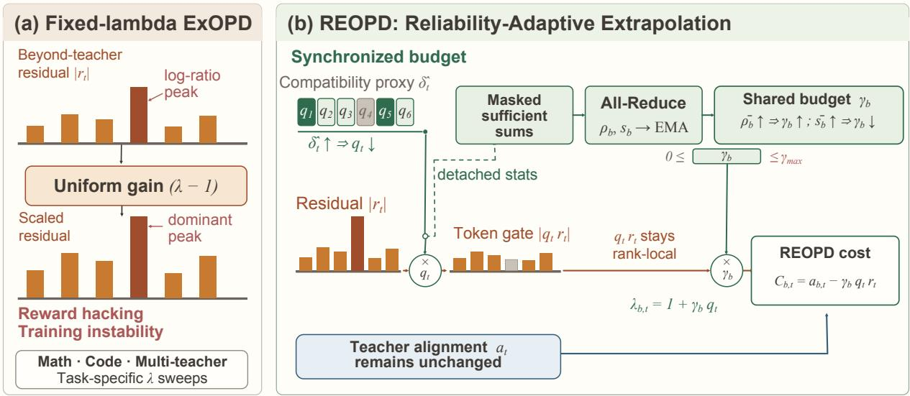
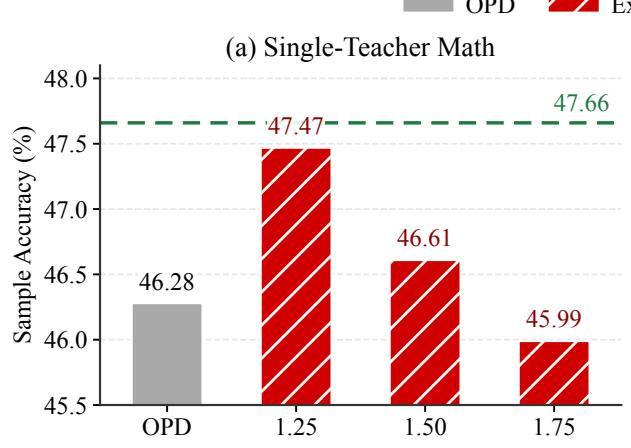
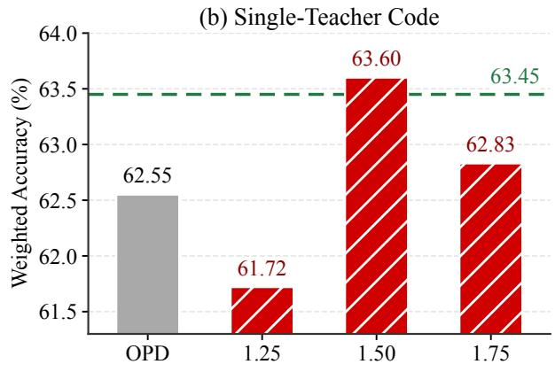
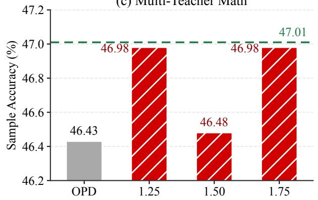
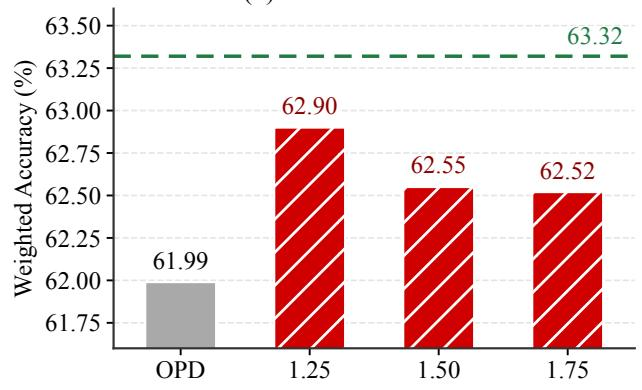
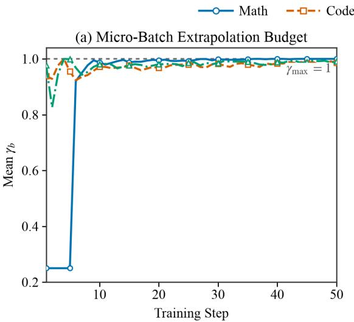
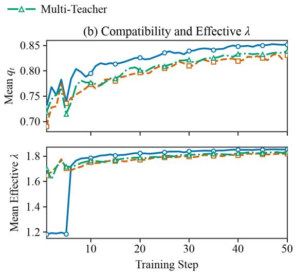

# REOPD: Reliability-Adaptive Reward Extrapolation for On-Policy Distillation

Yang Sun<sup>1,\*</sup> Lichao Ma<sup>2,\*</sup> Houyuan Qin<sup>3,\*</sup> Yuxin Liu<sup>4</sup> Hanyang Lu<sup>5</sup> Yao Zhu<sup>6</sup> Pinlong Cai<sup>7</sup> Guohang Yan<sup>8</sup>

<sup>1</sup>Shanghai Artificial Intelligence Laboratory

<sup>2</sup>Peking University

<sup>3</sup>Southwest Jiaotong University

<sup>4</sup>School of Computer Science and Technology,

University of Science and Technology of China

<sup>5</sup>School of Automation Engineering,

University of Electronic Science and Technology of China <sup>6</sup>Renmin University of China

<sup>7</sup>Frontier Discovery Center, Shanghai Artificial Intelligence Laboratory <sup>8</sup>Autonomous Driving, Shanghai Artificial Intelligence Laboratory

<sup>\*</sup>Equal contribution. Email (Yang Sun): 25213080092@m.fudan.edu.cn

## Abstract

On-policy distillation (OPD) trains a student on its own generated trajectories under dense token-level supervision from a teacher, providing an efective post-training paradigm for large language models. Reward-extrapolation methods such as ExOPD further amplify the teacher–reference log-likelihood ratio to move beyond direct imitation. However, Ex-OPD uses a single global scalar λ to apply the same extrapolation strength indiscriminately to every token. This can drive the student to aggressively fit extreme peaks in the teacher–reference log-ratio that defines the implicit reward, resulting in reward hack ing and unstable training. Moreover, the optimal λ varies across domains, requiring costly domainspecific sweeps that may still fail to identify an appropriate extrapolation strength. We propose RE-OPD, a Reliability-Adaptive Reward Extrapolation framework for On-Policy Distillation. REOPD combines a token-level compatibility weight with a batchlevel adaptive budget. The former modulates tokenwise residuals according to the student–teacher discrepancy, while the latter dynamically adjusts the overall extrapolation strength according to the reliability and scale of residual signals in each batch.

Together, they yield a token-wise efective coeficient $\lambda _ { b , t } = 1 + \gamma _ { b } q _ { t }$ , which preserves the original teacher-alignment term while selectively extrapolating along reliable teacher–reference directions. RE-OPD requires no additional verifier, reward model, value model, or rollout beyond the standard OPD pipeline. Evaluations show that REOPD outperforms G-OPD on single-teacher mathematics and on both domains in the multi-teacher setting, while matching G-OPD on single-teacher code. These results demonstrate the efectiveness of fine-grained reliability adaptation for reward extrapolation in on-policy distillation across task domains and teacher configurations.

## Introduction

On-policy distillation (OPD) trains a student on its own trajectories and queries the teacher on the same prefixes (Agarwal et al., 2024). Unlike distillation on fixed teacher-generated data, OPD supervises states that the current student actually visits and provides a dense learning signal at every sampled token. This makes it an efective post-training approach for transferring reasoning capabilities from specialized teachers. Yet dense supervision is heterogeneous: its usefulness depends not only on teacher quality, but also on the local compatibility between student and teacher (Li et al., 2026; Xu et al., 2026b).

G-OPD interprets OPD as dense KL-regularized reinforcement learning, in which the teacher– reference log-ratio defines an implicit token-level reward (Yang et al., 2026a). Standard OPD corresponds to a reward coeficient λ = 1, whereas Ex-OPD sets λ > 1 to extrapolate beyond direct teacher matching. ExOPD, however, applies one global coefficient to every token throughout training. Uniform scaling can overemphasize extreme teacher–reference log-ratios together with useful residuals, allowing a small number of peaks to dominate policy updates and increasing the risk of reward hacking or unstable optimization. Moreover, the preferred coeficient difers across domains, so each new setting requires multiple full training and evaluation runs to select λ.

Our key observation is that teacher alignment and extrapolation beyond the teacher should be controlled separately. A token with a large student– teacher discrepancy may still provide a useful alignment signal, yet be unsuitable for amplified extrap olation. We therefore propose REOPD, which preserves the standard OPD alignment term and adapts only the additional teacher–reference residual. As shown in Figure 1, REOPD combines a token-level compatibility weight with a bounded micro-batch budget. Their product defines a token-wise efective coeficient, allowing reliable residuals to be emphasized without uniformly increasing every update. The method reuses the student, teacher, and reference logprobabilities already available in G-OPD and requires no verifier, reward model, value model, or additional rollout.

We evaluate REOPD on mathematical reasoning, code generation, and mixed-domain multi-teacher distillation. Across repeated experiments, REOPD outperforms G-OPD on single-teacher mathematics and on both mathematics and code in the multiteacher setting, while achieving comparable performance to G-OPD on single-teacher code. These results indicate that online residual control can reduce reliance on setting-specific coeficient sweeps while maintaining competitive performance across task domains and teacher configurations.

Our contributions are summarized as follows:

• We formulate the indiscriminate amplification and domain-specific tuning of fixed-coeficient reward extrapolation as a residual-control problem.

• We propose REOPD, which combines token-level compatibility with a bounded micro-batch budget while preserving the standard OPD alignment term and requiring no external outcome supervision.

• We evaluate REOPD against OPD and a fixed coeficient sweep on mathematics, code, and multi-teacher distillation, showing competitive performance without selecting a task-specific global coeficient.

## Related Work

Knowledge Distillation and On-Policy Distillation. Knowledge distillation transfers teacher knowledge through output distributions, representations, or generated sequences (Hinton et al., 2015; Kim and Rush, 2016). Sequence-level distillation for autoregressive models is usually of-policy, creating a mismatch between teacher trajectories used for training and student prefixes encountered at inference. MiniLLM reduces this mismatch by optimizing reverse KL on student samples (Gu et al., 2024), while generalized knowledge distillation formalizes supervision on student-generated trajectories and includes OPD as an on-policy instance (Agarwal et al., 2024). Recent studies show that successful OPD also depends on student–teacher compatibility and tokenlevel utility, rather than teacher strength or discrep ancy alone (Li et al., 2026; Xu et al., 2026b). RE-OPD builds on this on-policy setting but targets the extrapolation residual rather than the complete distillation loss.

Reward Extrapolation for On-Policy Distillation. G-OPD casts OPD as dense KL-regularized reinforcement learning (Yang et al., 2026a): the teacher–reference log-ratio serves as an implicit re ward, and the student–reference KL constrains pol icy deviation. The formulation recovers OPD at λ = 1 and defines ExOPD by λ > 1, where an additional teacher–reference residual is scaled by λ − 1. This objective-level extrapolation difers from weight-space methods such as ExPO, which extrapolate model parameters after preference optimization (Zheng et al., 2025). Although a suitable λ can improve distillation, fixed global scaling is sensitive to both log-ratio peaks and the task domain. REOPD directly extends ExOPD by replacing its global resid ual multiplier with online token- and micro-batchlevel control.

Adaptive and Reliability-Aware Distillation. Adaptive distillation adjusts supervision according to training state or sample quality. AdaKD adapts token selection and temperature (Xie et al., 2026), while ASKD conditions a KL objective on externally provided sample quality (Zhang et al., 2026). Within OPD, TIP selects informative alignment tokens (Xu et al., 2026b), and Prune-OPD attenuates teacher supervision or truncates rollouts after local support drift (Yang et al., 2026b). These methods modify teacher alignment or the rollout process; RE-OPD instead preserves alignment and controls only the beyond-teacher residual.

  
Figure 1: Fixed-coeficient ExOPD applies the same residual gain $\lambda - 1$ to every token and may amplify teacher–reference log-ratio peaks. REOPD preserves teacher alignment, gates the beyond-teacher residua with compatibility ${ q } _ { b , i , t }$ , and derives a bounded micro-batch budget $\gamma _ { b }$ from synchronized statistics.

Reliability can also be estimated from task-level feedback. SCOPE routes verifier-labeled trajectories between self-reinforcement and OPD (Zheng et al., 2026); SG-OPD uses agreement between outcome and teacher signals and verified teacher rollouts (Xu et al., 2026a); and reward-gated OPD uses verifier feedback to regulate teacher guidance (Akhondzadeh et al., 2026). REOPD addresses the complementary setting without outcome labels or verifiers: it derives residual control solely from student, teacher, and reference log-probabilities already computed in white-box OPD.

## REOPD: Reliability-Adaptive Reward Extrapolation

## Problem Setup

Let D denote the prompt distribution. Given a prompt $x \sim \mathcal { D }$ , the student policy $\pi _ { \theta }$ generates an onpolicy response $y = ( y _ { 1 } , \dots , y _ { T } )$ , where $y \sim \pi _ { \boldsymbol { \theta } } ( \cdot \mid x )$ We denote the prefix state at token t by $\boldsymbol { s } _ { t } = \left( x , y _ { < t } \right)$ The teacher and reference policies are denoted by π<sub>T</sub> and $\pi _ { \mathrm { r e f } }$ , respectively. In the multi-teacher setting, $\pi _ { T }$ denotes the domain teacher routed to the current example. Let $m _ { t } \in \{ 0 , 1 \}$ indicate whether $y _ { t }$ is a valid response token.

For a sampled token $y _ { t }$ , we define the student– teacher alignment cost as

$$
a _ { t } = \log \pi _ { \theta } ( y _ { t } \mid s _ { t } ) - \log \pi _ { T } ( y _ { t } \mid s _ { t } ) .\tag{1}
$$

Its expectation under the student distribution corresponds to the reverse KL divergence between the student and teacher at $s _ { t }$ . Thus, $a _ { t }$ is an alignment cost term; the PPO advantage is defined later as the negative total token cost. G-OPD further defines the teacher–reference log-ratio as a dense implicit reward (Yang et al., 2026a):

$$
r _ { t } = \log \pi _ { T } ( y _ { t } \mid s _ { t } ) - \log \pi _ { \mathrm { r e f } } ( y _ { t } \mid s _ { t } ) .\tag{2}
$$

With a global reward coeficient $\lambda ,$ the sampledtoken ExOPD cost can be written as

$$
C _ { t } ^ { \mathrm { E x O P D } } = a _ { t } - ( \lambda - 1 ) r _ { t } .\tag{3}
$$

When $\lambda \ : = \ : 1$ , Equation (3) reduces to standard OPD. When $\lambda > 1$ , the residual term encourages the student to move beyond the teacher along the teacher–reference direction. However, the same multiplier λ − 1 is applied to every token. This uniform scaling can amplify extreme implicit-reward peaks and requires λ to be selected separately for diferent training settings. We therefore preserve $a _ { t }$ and replace only the residual multiplier with a bounded, data-dependent coeficient.

## Method Overview

Let b denote a synchronized micro-batch whose sufficient statistics are aggregated across data-parallel ranks, and let i index a response in b. REOPD constructs the efective extrapolation coeficient

$$
\lambda _ { b , i , t } = 1 + \gamma _ { b } q _ { b , i , t } ,\tag{4}
$$

where $q _ { b , i , t } \in ( 0 , 1 ]$ is a token-level compatibility weight and $\gamma _ { b } \in [ 0 , \gamma _ { \operatorname* { m a x } } ]$ is a shared micro-batch extrapolation budget. The resulting token cost is

$$
C _ { b , i , t } ^ { \mathrm { R E O P D } } = a _ { b , i , t } - \gamma _ { b } q _ { b , i , t } r _ { b , i , t } .\tag{5}
$$

Figure 1(b) separates REOPD into a token path and a controller path. The token path retains the local residual $q _ { b , i , t } r _ { b , i , t }$ , whereas the controller path all-reduces detached suficient statistics to obtain the shared budget $\gamma _ { b } .$ Their product determines how much of the extra residual is applied to each token. Neither path modifies the teacher-alignment cost $a _ { b , i , t } .$

This formulation contains several useful special cases. Setting $\gamma _ { b } = 0$ recovers OPD. Setting $q _ { b , i , t } = 1$ and $\gamma _ { b } = \lambda - 1$ recovers fixed-λ ExOPD. A fixed $\gamma$ with adaptive ${ q } _ { b , i , t }$ gives token-only control, while $q _ { b , i , t } ~ = ~ 1$ with adaptive $\gamma _ { b }$ gives micro-batch-only control.

## Token-Level Compatibility Weight

REOPD estimates local student–teacher compatibility from log-probabilities already computed on sampled response tokens. We first construct the lowvariance $k _ { 3 }$ discrepancy proxy

$$
\begin{array} { r l } & { x _ { b , i , t } = \log \pi _ { T } ( y _ { i , t } \mid s _ { i , t } ) - \log \pi _ { \theta } ( y _ { i , t } \mid s _ { i , t } ) , } \\ & { \widehat { \delta } _ { b , i , t } = \exp ( x _ { b , i , t } ) - x _ { b , i , t } - 1 . } \end{array}\tag{6}
$$

The compatibility weight is then defined as

$$
q _ { b , i , t } = \exp \left( - \frac { \widehat { \delta } _ { b , i , t } } { \tau } \right) , \qquad \tau > 0 .\tag{7}
$$

Because $\widehat { \delta } _ { b , i , t } \geq 0 ;$ the weight lies in (0, 1] in exact arithmetic. A small sampled discrepancy gives $q _ { b , i , t } \approx 1$ and retains most of the extrapolation residual, whereas a large discrepancy yields a smaller weight. The temperature τ controls how rapidly this attenuation occurs.

We emphasize that ${ q } _ { b , i , t }$ measures local compatibility rather than task-level correctness. A small discrepancy does not guarantee that the teacher is correct, and a large discrepancy does not make its alignment signal useless. This is why REOPD applies ${ { q } _ { b , i , t } }$ only to the additional reward residual. The compatibility proxy and its resulting weight are detached from the computation graph. Intermediate log-ratios are numerically bounded in implementation, but no full-vocabulary KL or additional teacher forward pass is required.

## Micro-Batch Reliable Residual Statistics

Token compatibility alone does not determine how much extrapolation the current micro-batch can sup port. REOPD therefore aggregates two statistics over valid response tokens. For compactness, let $\sum _ { b }$ denote summation over all sequence–token pairs $( i , t )$ in synchronized micro-batch b. We define the compatibility-weighted residual proportion as

$$
\rho _ { b } = \frac { \sum _ { b } m _ { i , t } \vert r _ { b , i , t } \vert q _ { b , i , t } } { \sum _ { b } m _ { i , t } \vert r _ { b , i , t } \vert + \epsilon } .\tag{8}
$$

The statistic $\rho _ { b } ~ \in ~ [ 0 , 1 ]$ measures the fraction of residual magnitude retained after compatibility weighting. We further define the reliable residual scale

$$
s _ { b } = \left( \frac { \sum _ { b } m _ { i , t } ( q _ { b , i , t } r _ { b , i , t } ) ^ { 2 } } { \sum _ { b } m _ { i , t } + \epsilon } \right) ^ { 1 / 2 } .\tag{9}
$$

Thus, $\rho _ { b }$ captures the relative amount of compatible residual, whereas $s _ { b }$ captures its absolute RMS scale. All suficient statistics are summed across dataparallel ranks before the ratios are evaluated, so each rank uses the same controller output.

To reduce micro-batch noise, REOPD maintains exponential moving averages:

$$
\bar { z } _ { b } = \beta \bar { z } _ { b - 1 } + ( 1 - \beta ) z _ { b } , \quad z \in \{ \rho , s \} .\tag{10}
$$

Both statistics and their moving averages are computed without gradient tracking.

## Bounded Micro-Batch Extrapolation Budget

REOPD converts the smoothed statistics into a target extrapolation budget:

$$
\widetilde { \gamma } _ { b } = \mathrm { c l i p } \left( \frac { B _ { 0 } \bar { \rho } _ { b } } { \bar { s } _ { b } + \epsilon } , 0 , \gamma _ { \mathrm { m a x } } \right) .\tag{11}
$$

A larger $\bar { \rho } _ { b }$ permits stronger extrapolation when a larger fraction of the residual remains compatible. In contrast, a larger $\bar { s } _ { b }$ reduces the coeficient so that a micro-batch with large residual scale does not dominate the update. The upper bound $\gamma _ { \mathrm { m a x } }$ provides an explicit limit on extrapolation.

The clipped target is further smoothed before being applied:

$$
\gamma _ { b } = \beta _ { \gamma } \gamma _ { b - 1 } + ( 1 - \beta _ { \gamma } ) \widetilde { \gamma } _ { b } .\tag{12}
$$

Since $\widetilde { \gamma } _ { b } \in [ 0 , \gamma _ { \mathrm { m a x } } ]$ , the smoothed budget remains in the same interval when initialized within it. When Equation (11) is not clipped and ϵ is negligible, it approximately satisfies $\widetilde { \gamma } _ { b } \bar { s } _ { b }$ ≈ $B _ { 0 } \bar { \rho } _ { b }$ . This relation should be interpreted as an adaptive target rather than a strict constraint after clipping and smoothing.

The scale $B _ { 0 }$ can be specified directly. In automatic mode, REOPD initializes it during the first $K _ { 0 }$ controller updates from a scaled moving average of the alignment RMS, κ $\mathrm { R M S } _ { b } ( a )$ , and then keeps it fixed. An optional warm-up can hold $\gamma _ { b }$ at a prescribed value during the initial training steps. The corresponding initialization length, smoothing coeficients, and warm-up configuration are reported with the training hyperparameters.

## Final Objective and Optimization

The PPO-style actor update (Schulman et al., 2017) uses the negative token cost as its advantage:

$$
A _ { b , i , t } ^ { \mathrm { R E O P D } } = - C _ { b , i , t } ^ { \mathrm { R E O P D } } .\tag{13}
$$

In exact arithmetic, Equations (4)–(12) imply

$$
\begin{array} { r } { 1 \leq \lambda _ { b , i , t } \leq 1 + \gamma _ { \operatorname* { m a x } } . } \end{array}\tag{14}
$$

The advantage is masked to valid response tokens and passed to the same PPO-style policy surrogate used by the OPD baseline. The compatibility weights, suficient statistics, moving averages, and extrapolation budget are all treated as stop-gradient control signals. REOPD therefore changes only the construction of the token advantage and reuses the student, teacher, and reference evaluations already required by G-OPD.

```tcl
Algorithm 1 REOPD Training
Input: Prompt distribution $\mathcal { D } ;$ student $\pi _ { \boldsymbol { \theta } } ;$ teacher
$\pi _ { T } ;$ reference π<sub>ref</sub>; τ , γ<sub>max</sub>, β, $\beta _ { \gamma } ;$ optional $B _ { 0 }$ or
auto-calibration parameters $\kappa , K _ { 0 }$
Output: Updated student policy
π<sub>θ</sub>
1: for each synchronized micro-batch b do
2: Sample responses $\boldsymbol { y } \sim \pi _ { \boldsymbol { \theta } } ( \cdot \mid \boldsymbol { x } ) , \boldsymbol { x } \sim \mathcal { D }$
3: Compute sampled-token log-probabilities un
der $\pi _ { \theta } ,$ π<sub>T</sub>, and $\pi _ { \mathrm { r e f } }$
4: Compute $a , r , \delta ,$ and detached q using Eqs. (1)–
(7)
5: All-reduce masked suficient statistics across
data-parallel ranks
6: Compute $\rho _ { b } , s _ { b } ,$ and alignment RMS
7: Update $B _ { 0 }$ during the first $K _ { 0 }$ controller calls
if auto-calibration is enabled
8: Update $\bar { \rho } _ { b }$ and $\bar { s } _ { b }$ using Eq. (10)
9: Compute $\widetilde { \gamma } _ { b }$ and $\gamma _ { b }$ using Eqs. (11)–(12)
10: Construct $A ^ { \mathrm { R E O P D } }$ using Eqs. (5) and (13)
11: Update θ with the PPO-style policy objective
12: end for
```

## Experiments and Analysis

We evaluate REOPD in single-teacher mathematics, single-teacher code generation, and mixed-domain multi-teacher distillation. Our experiments are designed to answer four questions: (i) whether RE-OPD improves over standard on-policy distillation; (ii) whether it improves over fixed-coeficient ExOPD at $\lambda = 1 . 2 5 ;$ (iii) how token-level compatibility and micro-batch-level budgeting afect performance; and (iv) how the adaptive controller evolves during training.

## Experimental Setup

Models and data. We initialize both the student and the reference policy from Qwen3-4B (Yang et al., 2025). We use task-specialized Qwen3-4B non thinking policies trained with reinforcement learning as the mathematics and code teachers. The mathematics run uses 57,046 level-6 examples from the filtered DeepMath-103K training set (He et al., 2025), while the code run uses 25,276 examples from the Eurus code training split (Yuan et al., 2024). The multi-teacher set contains 25,276 examples from each domain. Each mixed-domain example carries a domain label that routes its teacher log-probability to the corresponding mathematics or code teacher.

Baselines. We compare REOPD with standard OPD $\begin{array} { r } { \mathrm { ~  ~ { ~ ( ~ \lambda ~ } ~ = ~ \pi ~ 1 ) ~ } } \end{array}$ and fixed-coeficient ExOPD at $\lambda \ = \ 1 . 2 5 .$ Standard OPD performs teacher alignment without the additional beyond-teacher residual, whereas ExOPD applies the same extrapolation strength to every sampled token. We use the same λ = 1.25 baseline for mathematics and code in both the single- and multi-teacher settings, without posthoc coeficient selection. Sensitivity results for other fixed coeficients are reported in Fig. 2.

Training details. All main comparisons use the actor checkpoint at global step 50. Each step draws 1,024 prompts and one on-policy response per prompt. We optimize the student with AdamW (Loshchilov and Hutter, 2019) using a learning rate of $\mathrm { i 0 ^ { - 5 } } .$ , weight decay 0.01, gradient clipping at 1.0, and one PPO epoch. The maximum prompt and response lengths are 2,048 and 16,384 tokens, respectively. Training uses BF16 mixed precision with FSDP on eight NVIDIA A100 80GB GPUs, and rollout generation uses tensor parallelism of size four.

For REOPD, we set $\tau = 0 . 0 0 7 , \gamma _ { \mathrm { m a x } } = 1 , \kappa = 0 . 5 .$ $\beta = 0 . 9 5$ , and $\beta _ { \gamma } = 0 . 9 .$ . The initial budget scale $B _ { 0 }$ is automatically calibrated over the first ten controller calls. The mathematics run uses a five-call warm-up with $\gamma = 0 . 2 5 $ ; code and multi-teacher runs use no warm-up. The multi-teacher setting maintains one shared controller across the two domains. Unless otherwise stated, all methods use the same student initialization, teacher, training file, prompt budget, and step-50 checkpoint. Equal prompt budgets do not imply equal generated-token budgets because response lengths difer across methods.

Ablation protocol. Component ablations are conducted in the single-teacher mathematics setting. All variants use the same mathematics training set, step-50 checkpoint, and evaluation protocol with seed 42. The no\_q variant sets $q _ { t } = 1$ while retaining the adaptive micro-batch budget and its bound. The no\_bound variant retains $q _ { t }$ and the adaptive controller but removes only the explicit upper bound on $\gamma _ { b } ,$ while preserving the controller statistics, synchronization, EMA, and update frequency. The no\_batch variant retains $q _ { t }$ but replaces $\gamma _ { b }$ with a fixed $\gamma = \lambda _ { 0 } - 1$ To measure its dependence on this fixed choice, we evaluate $\lambda _ { 0 } \in \{ 1 . 0 , 1 . 2 5 , 1 . 5 , 1 . 7 5 \}$

Evaluation. For mathematics, we evaluate on AIME 2024, AIME 2025, HMMT February 2025, and HMMT November 2025. Each benchmark contains 30 problems, and we sample 32 responses per problem with temperature 1 and $\mathrm { t o p } { - } p = 1$ . We report pooled sample accuracy over all 3,840 completions. For code, we evaluate HumanEval+ (164 tasks) and MBPP+ (378 tasks) using EvalPlus (Chen et al., 2021; Austin et al., 2021; Liu et al., 2023), together with the 175- task test6 split of LiveCodeBench v6 (Jain et al., 2024). We draw four responses per problem using the same sampling temperature and report oficial pass@1. Our aggregate code score is the task-countweighted accuracy over all 2,868 completions, rather than the unweighted mean of the three benchmark percentages. No external judge is used.

## Main Results

Single-teacher distillation. As shown in Table 1, REOPD reaches 47.66% pooled sample accuracy on mathematics, exceeding both OPD at 46.28% and Ex-OPD at λ = 1.25 at 47.47%. On code generation, RE-OPD obtains 63.45% weighted accuracy and remains comparable to G-OPD; under the common λ = 1.25 baseline, it exceeds ExOPD at 61.72% and OPD at 62.55%.

Multi-teacher distillation. When mathematics and code examples share one student and one RE-OPD controller, REOPD reaches 47.01% mathematics sample accuracy and 63.32% code weighted accuracy. Both results exceed OPD at 46.43% and 61.99%, as well as ExOPD at λ = 1.25 at 46.98% and 62.90%, respectively. These results show that a shared adaptive controller can improve both domains without selecting separate fixed coeficients for mathematics and code.

## Sensitivity to a Global Extrapolation Coeficient

Figure 2 exposes substantial variation in the preferred fixed coeficient. Single-teacher mathematics peaks at $\lambda = 1 . 2 5$ with 47.47%, whereas single-teacher code peaks at $\lambda = 1 . 5$ with 63.60%. In multi-teacher distillation, λ = 1.25 and 1.75 tie on mathematics at 46.98%, while $\lambda = 1 . 2 5$ is best on code at 62.90%. Performance is non-monotonic: increasing λ beyond its setting-specific optimum can reduce accuracy.

To test whether REOPD’s adaptation can recover the efect of tuning a fixed coeficient for each setting, we compare it directly with the best ExOPD result from each G-OPD coeficient sweep. REOPD changes accuracy by +0.19, −0.15, +0.03, and +0.42 percentage points on single-teacher mathematics, singleteacher code, multi-teacher mathematics, and multiteacher code, respectively. It therefore exceeds the corresponding best fixed-coeficient result in three of the four settings and trails it by only 0.15 points on single-teacher code. Overall, REOPD reaches comparable or better performance than the task-specific best fixed coeficient, showing that token-level compatibility and micro-batch budgeting can adapt the extrapolation strength efectively without a separate λ sweep for each setting.

<table><tr><td></td><td colspan="5">Mathematical Reasoning</td><td colspan="4">Code Generation</td></tr><tr><td>Method</td><td></td><td></td><td></td><td>AIME24 AIME25 HMMT25-F HMMT25-N</td><td>Avg.</td><td>HE+</td><td>MBPP+</td><td>LCB</td><td>Avg.</td></tr><tr><td colspan="10">Reference Models</td></tr><tr><td>Student</td><td>23.65</td><td>22.50</td><td>12.50</td><td>9.27</td><td>16.98</td><td>80.34</td><td>64.88</td><td>17.43</td><td>56.83</td></tr><tr><td>Teachers</td><td>58.02</td><td>54.58</td><td>32.50</td><td>38.85</td><td>45.99</td><td>86.59</td><td>70.11</td><td>27.57</td><td>63.49</td></tr><tr><td colspan="10">Single-Teacher Distillation</td></tr><tr><td>OPD</td><td>60.10</td><td>55.52</td><td>32.19</td><td>37.29</td><td>46.28</td><td>84.15</td><td>69.31</td><td>27.71</td><td>62.55</td></tr><tr><td>ExOPD (λ = 1.25)</td><td>61.88</td><td>56.25</td><td>32.81</td><td>38.96</td><td>47.47</td><td>83.84</td><td>67.53</td><td>28.43</td><td>61.72</td></tr><tr><td>REOPD</td><td>61.98</td><td>55.31</td><td>34.69</td><td>38.65</td><td>47.66</td><td>85.67</td><td>70.57</td><td>27.29</td><td>63.45</td></tr><tr><td colspan="10">Multi-Teacher Distillation</td></tr><tr><td>OPD</td><td>58.85</td><td>56.35</td><td>31.46</td><td>39.06</td><td>46.43</td><td>84.76</td><td>68.65</td><td>26.29</td><td>61.99</td></tr><tr><td>ExOPD (λ = 1.25)</td><td>62.92</td><td>56.04</td><td>31.98</td><td>36.98</td><td>46.98</td><td>86.43</td><td>68.78</td><td>28.14</td><td>62.90</td></tr><tr><td>REOPD</td><td>61.35</td><td>55.10</td><td>33.75</td><td>37.81</td><td>47.01</td><td>85.82</td><td>70.11</td><td>27.57</td><td>63.32</td></tr></table>

Table 1: Benchmark-level accuracy (%). HMMT25-F/N denote the February/November 2025 contests, and LCB denotes the test6 split of LiveCodeBench v6. The mathematics average pools 3,840 completions; the code average is weighted by task count over 2,868 completions. ExOPD uses λ = 1.25; bold denotes the best result within each distillation setting.





(c) Multi-Teacher Math  


(d) Multi-Teacher Code  
  
Figure 2: Aggregate performance across fixed ExOPD coeficients. Gray bars denote OPD, red hatched bars denote fixed ExOPD, and green dashed lines denote REOPD. Axes are truncated to expose setting-dependent diferences.

<table><tr><td>Variant</td><td>Token q Adapt. γb</td><td> $\lambda _ { 0 }$ </td><td> $\operatorname { A c c . }$ </td></tr><tr><td>Full REOPD</td><td>Yes</td><td>Yes</td><td>47.66</td></tr><tr><td>no_q</td><td></td><td>Yes</td><td>43.39</td></tr><tr><td>no_bound</td><td>Yes</td><td>Yes</td><td>47.16</td></tr><tr><td>no_batch</td><td>Yes</td><td></td><td>1.00 46.48</td></tr><tr><td>no_batch</td><td>Yes</td><td>1.25</td><td>47.66</td></tr><tr><td>no_batch</td><td>Yes</td><td>1.50</td><td>46.81</td></tr><tr><td>no_batch</td><td>Yes</td><td>1.75</td><td>46.68</td></tr></table>

Table 2: Component ablations on single-teacher mathematics only. no\_q sets $q _ { t } \ = \ 1 ;$ no\_bound removes the upper bound on $\gamma _ { b } ;$ and no\_batch fixes $\gamma = \lambda _ { 0 } - 1$ . Accuracy pools 3,840 completions. Bold marks the best no\_batch result.

Taken together, the best fixed coeficient varies across task domains and teacher configurations, whereas REOPD replaces per-setting selection of a global λ with online adaptation. REOPD is not hyperparameter free: the controller retains hyperparameters shared across settings, and the mathematics run uses the warm-up schedule described in the Experimental Setup.

## Ablation Studies

Table 2 isolates the two adaptation levels in the single-teacher mathematics setting. Removing token compatibility (no\_q) reduces pooled accuracy from 47.66% to 43.39%, a drop of 4.27 percentage points. The decrease occurs on all four benchmarks (2.40– 7.19 points). Thus, applying a shared micro-batch budget uniformly to all tokens is insuficient; token compatibility is the central component of REOPD.

The no\_bound variant isolates the explicit budget cap while preserving both levels of adaptation. It obtains 47.16% pooled accuracy (1,811/3,840), 0.50 percentage points below Full REOPD. Its benchmark accuracies are 61.04% on AIME 2024, 53.96% on AIME 2025, 34.58% on HMMT February 2025, and 39.06% on HMMT November 2025. Relative to Full REOPD, these scores are lower by 0.94, 1.35, and 0.11 points on the first three benchmarks, respectively, but higher by 0.41 points on HMMT November 2025. The crossbenchmark efect is therefore mixed, but the lower pooled accuracy suggests that the explicit bound provides a modest safeguard; its contribution is substantially smaller than that of token compatibility.

The no\_batch sweep tests the complementary question by retaining $q _ { t }$ while using a fixed base coeficient $\lambda _ { 0 } .$ Its pooled accuracy ranges from 46.48% to 47.66%. The best configuration uses $\lambda _ { 0 } = 1 . 2 5$ and reaches 47.66%, matching Full REOPD. Thus, adaptive micro-batch budgeting matches the best tuned token-only variant while avoiding a setting-specific λ<sub>0</sub> sweep. Together with the no\_q and no\_bound results, the ablation identifies token-level compatibility as the key component and the explicit bound as a modest safeguard, while the online micro-batch budget provides adaptive control without fixed-coeficient selection.

## Controller Dynamics

The logged trajectories confirm that REOPD does not use a constant efective coeficient. Over the first ten steps, the mean budget γ is 0.608, 0.953, and 0.957 for mathematics, code, and multiteacher training, respectively; over the final ten steps, these values increase to 1.000, 0.986, and 0.990. Meanwhile, mean token compatibility increases from 0.774/0.745/0.754 to 0.850/0.827/0.834, and the mean efective coeficient increases from 1.477/1.710/1.720 to 1.850/1.815/1.826. The controller therefore adapts most strongly early in training. Because the micro-batch budget approaches its upper bound later, the remaining late-stage variation is primarily supplied by the token-level compatibility weight.

## Conclusion and Limitations

We studied reward extrapolation for on-policy distillation, where a fixed global coeficient applies the same beyond-teacher residual gain to every sampled token and must be selected separately for diferent training settings. REOPD replaces this global multiplier with a token-level compatibility weight and a bounded micro-batch extrapolation budget. It preserves standard teacher alignment, adapts only the additional teacher–reference residual, and requires no verifier or extra rollout. Across repeated experiments, REOPD outperforms G-OPD on single-teacher math ematics and on both multi-teacher domains, while achieving comparable performance on single-teacher code. In the mathematics ablation, removing $q _ { t }$ lowers accuracy by 4.27 points, removing the explicit budget bound lowers accuracy by 0.50 points, and the best token-only variant at $\lambda _ { 0 } ~ = ~ 1 . 2 5$ matches



  
Figure 3: Raw controller trajectories. Panel (a) reports the micro-batch budget $\gamma _ { b } ;$ panel (b) reports mean compatibility $q _ { t }$ and efective coeficient $\lambda _ { b , i , t } = 1 + \gamma _ { b } q _ { b , i , t }$

Full REOPD. These results identify token-wise residual filtering as the principal component, with the explicit bound providing a modest safeguard and online micro-batch budgeting preserving tuned performance without a setting-specific coeficient sweep.

Several limitations remain. First, the compatibility weight is a sampled student–teacher discrepancy proxy rather than a correctness estimator; it cannot identify trajectories on which the student and teacher agree but are both wrong. Second, REOPD retains controller choices such as $\tau , \ \gamma _ { \mathrm { m a x } } .$ , and the calibration of $B _ { 0 } ;$ its statistics depend on micro-batch composition, and the budget approaches its upper bound late in training. Future work should evaluate additional model families, scales, and teacher configurations, and compare shared versus per-teacher controllers to further test generality.

## References

Rishabh Agarwal, Nino Vieillard, Yongchao Zhou, Piotr Stanczyk, Sabela Ramos Garea, Matthieu Geist, and Olivier Bachem. On-policy distillation of language models: Learning from self-generated mistakes. In The Twelfth International Conference on Learning Representations, 2024. URL https://openreview.net/forum? id=3zKtaqxLhW.

Mohammad Sadegh Akhondzadeh, Vijay Lingam, Atula Tejaswi, Chanakya Ekbote, Sujay Sanghavi, and Aleksandar Bojchevski. Reward-gated on-policy distillation. arXiv preprint arXiv:2607.04037, 2026. URL https://arxiv.org/abs/2607.04037.

Jacob Austin, Augustus Odena, Maxwell Nye, Maarten

Bosma, Henryk Michalewski, David Dohan, Ellen Jiang, Carrie Cai, Michael Terry, Quoc V. Le, and Charles Sutton. Program synthesis with large language models. arXiv preprint arXiv:2108.07732, 2021. URL https://arxiv.org/abs/2108.07732.

Mark Chen, Jerry Tworek, Heewoo Jun, Qiming Yuan, Henrique Ponde de Oliveira Pinto, Jared Kaplan, et al. Evaluating large language models trained on code. arXiv preprint arXiv:2107.03374, 2021. URL https: //arxiv.org/abs/2107.03374.

Yuxian Gu, Li Dong, Furu Wei, and Minlie Huang. MiniLLM: Knowledge distillation of large language models. In The Twelfth International Conference on Learning Representations, 2024. URL https:// openreview.net/forum?id=5h0qf7IBZZ.

Zhiwei He, Tian Liang, Jiahao Xu, Qiuzhi Liu, Xingyu Chen, Yue Wang, Linfeng Song, Dian Yu, Zhenwen Liang, Wenxuan Wang, Zhuosheng Zhang, Rui Wang, Zhaopeng Tu, Haitao Mi, and Dong Yu. DeepMath-103K: A large-scale, challenging, decontaminated, and verifiable mathematical dataset for advancing reasoning. arXiv preprint arXiv:2504.11456, 2025. URL https://arxiv.org/abs/2504.11456.

Geofrey Hinton, Oriol Vinyals, and Jef Dean. Distilling the knowledge in a neural network. arXiv preprint arXiv:1503.02531, 2015. URL https://arxiv.org/abs/ 1503.02531.

Naman Jain, King Han, Alex Gu, Wen-Ding Li, Fanjia Yan, Tianjun Zhang, Sida Wang, Armando Solar-Lezama, Koushik Sen, and Ion Stoica. Live-CodeBench: Holistic and contamination free evaluation of large language models for code. arXiv preprint arXiv:2403.07974, 2024. URL https://arxiv.org/abs/ 2403.07974.

Yoon Kim and Alexander M. Rush. Sequence-level knowledge distillation. In Proceedings of the 2016 Conference on Empirical Methods in Natural Language Processing, pages 1317–1327, Austin, Texas, 2016. Association for Computational Linguistics. doi: 10.18653/v1/D16- 1139. URL https://aclanthology.org/D16-1139/.

Yaxuan Li, Yuxin Zuo, Bingxiang He, Jinqian Zhang, Chaojun Xiao, Cheng Qian, Tianyu Yu, Huan ang Gao, Wenkai Yang, Zhiyuan Liu, and Ning Ding. Rethinking on-policy distillation of large language models: Phenomenology, mechanism, and recipe. arXiv preprint arXiv:2604.13016, 2026. URL https://arxiv.org/abs/ 2604.13016.

Jiawei Liu, Chunqiu Steven Xia, Yuyao Wang, and Lingming Zhang. Is your code generated by ChatGPT really correct? rigorous evaluation of large language models for code generation. arXiv preprint arXiv:2305.01210, 2023. URL https://arxiv.org/abs/2305.01210.

Ilya Loshchilov and Frank Hutter. Decoupled weight decay regularization. In International Conference on Learning Representations, 2019. URL https:// openreview.net/forum?id=Bkg6RiCqY7.

John Schulman, Filip Wolski, Prafulla Dhariwal, Alec Radford, and Oleg Klimov. Proximal policy optimization algorithms. arXiv preprint arXiv:1707.06347, 2017. URL https://arxiv.org/abs/1707.06347.

Xurong Xie, Zhucun Xue, Jiafu Wu, Jian Li, Yabiao Wang, Xiaobin Hu, Yong Liu, and Jiangning Zhang. LLM-oriented token-adaptive knowledge distillation. Proceedings of the AAAI Conference on Artificial Intelligence, 40(40):34070–34078, 2026. doi: 10.1609/aaai. v40i40.40701. URL https://ojs.aaai.org/index.php AAAI/article/view/40701.

Haoran Xu, Hongyu Wang, Yifei Gao, Jiaze Li, Xiaofeng Zhang, and Xiaosong Yuan. SG-OPD: Signgated on-policy distillation via sign-consistency gating and phased teacher sampling. arXiv preprint arXiv:2606.09304, 2026a. URL https://arxiv.org/abs/ 2606.09304.

Yuanda Xu, Hejian Sang, Zhengze Zhou, Ran He, Zhipeng Wang, and Alborz Geramifard. TIP: Token importance in on-policy distillation. arXiv preprint arXiv:2604.14084, 2026b. URL https://arxiv.org/abs/ 2604.14084.

An Yang, Anfeng Li, Baosong Yang, Beichen Zhang, Binyuan Hui, Bo Zheng, et al. Qwen3 Technical Report. arXiv preprint arXiv:2505.09388, 2025. URL https://arxiv.org/abs/2505.09388.

Wenkai Yang, Weijie Liu, Ruobing Xie, Kai Yang, Saiyong Yang, and Yankai Lin. Learning beyond teacher: Generalized on-policy distillation with reward extrapolation. arXiv preprint arXiv:2602.12125, 2026a. URL https://arxiv.org/abs/2602.12125.

Zhicheng Yang, Zhijiang Guo, Yifan Song, Minrui Xu, Yongxin Wang, Yiwei Wang, Xiaodan Liang, and Jing Tang. Prune-OPD: Eficient and reliable on-policy distillation for long-horizon reasoning. arXiv preprint arXiv:2605.07804, 2026b. URL https://arxiv.org/abs/ 2605.07804.

Lifan Yuan, Ganqu Cui, Hanbin Wang, Ning Ding, Xingyao Wang, Jia Deng, Boji Shan, Huimin Chen, Ruobing Xie, Yankai Lin, Zhenghao Liu, Bowen Zhou, Hao Peng, Zhiyuan Liu, and Maosong Sun. Advanc ing LLM reasoning generalists with preference trees. arXiv preprint arXiv:2404.02078, 2024. URL https: //arxiv.org/abs/2404.02078.

Mingjie Zhang, Xiaoling Zhou, Yuxiao Luo, Yiyu Liu, Shikun Zhang, and Wei Ye. ASKD: Reinforcement learning-style knowledge distillation with qualityadaptive skewness. Proceedings of the AAAI Conference on Artificial Intelligence, 40(41):34781–34789, 2026. doi: 10.1609/aaai.v40i41.40780. URL https: //ojs.aaai.org/index.php/AAAI/article/view/40780.

Binbin Zheng, Xing Ma, Yiheng Liang, Jingqing Ruan, Xiaoliang Fu, Kepeng Lin, Benchang Zhu, Ke Zeng, and Xunliang Cai. SCOPE: Signal-calibrated onpolicy distillation enhancement with dual-path adap tive weighting. arXiv preprint arXiv:2604.10688, 2026. URL https://arxiv.org/abs/2604.10688.

Chujie Zheng, Ziqi Wang, Heng Ji, Minlie Huang, and Nanyun Peng. Model extrapolation expedites alignment. In Proceedings of the 63rd Annual Meeting of the Association for Computational Linguistics (Volume 1: Long Papers), pages 1025–1041, Vienna, Austria, 2025. Association for Computational Linguistics. doi: 10. 18653/v1/2025.acl-long.51. URL https://aclanthology. org/2025.acl-long.51/.