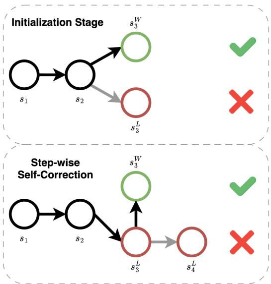
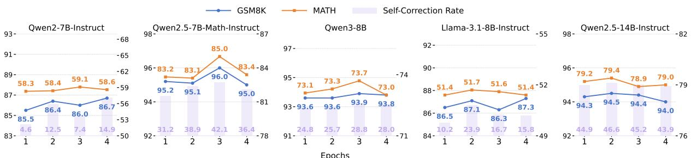
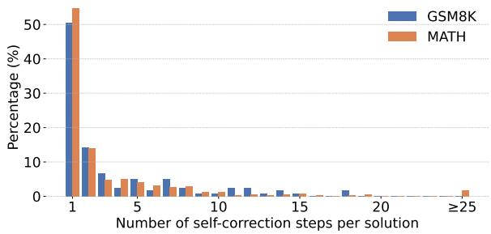
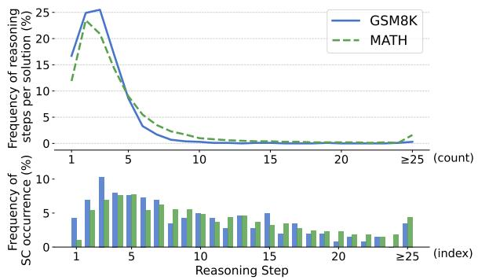
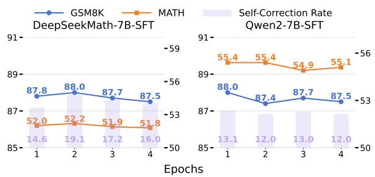
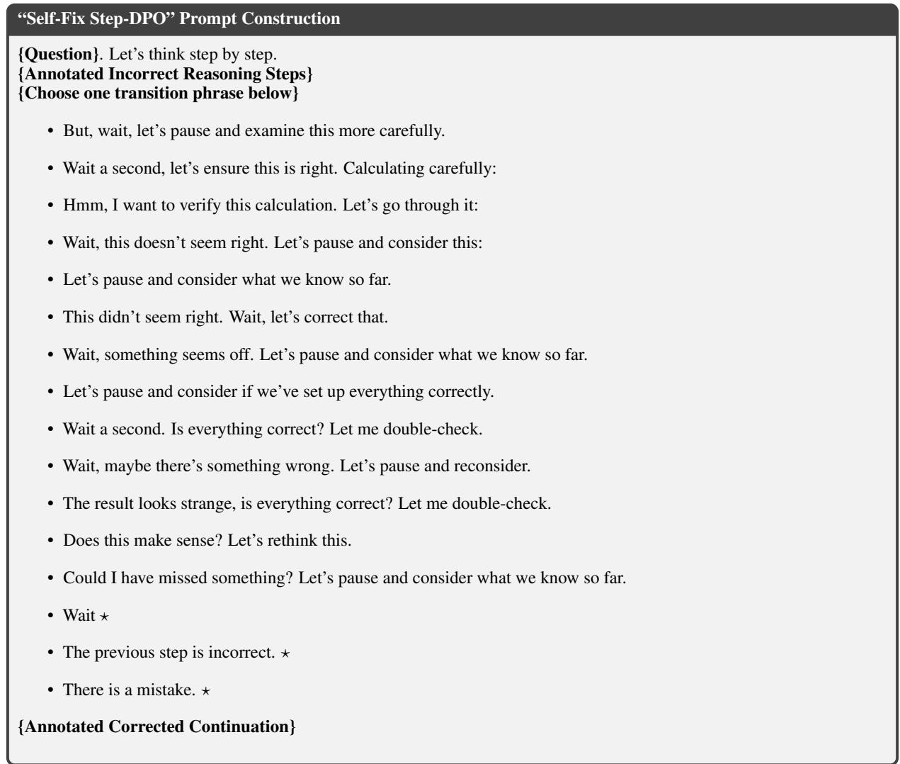
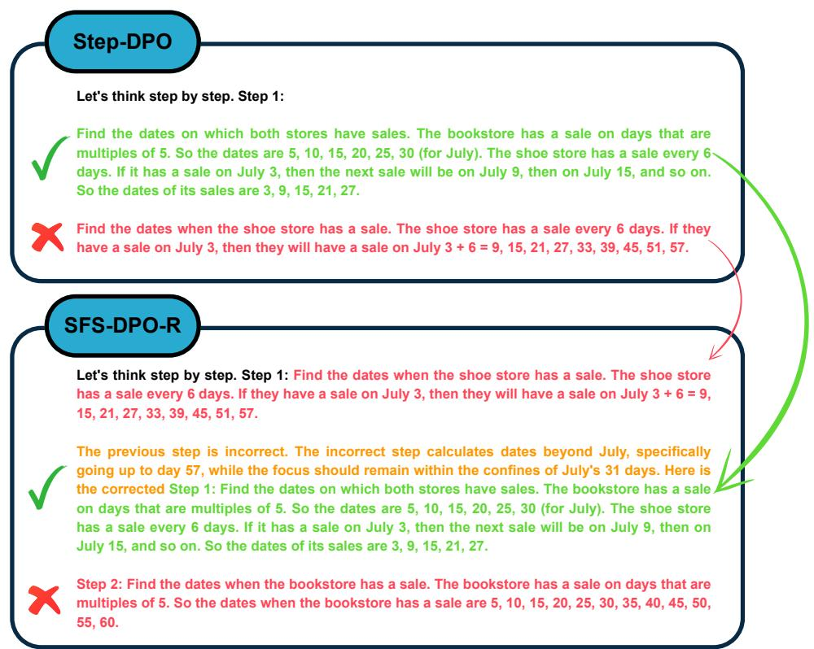

# Reinforcing Step-level Reasoning for Effective Self-Correction in LLMs

Vu Duc Anh1, Nhat M. Hoang1, Do Xuan Long2,4, Cong-Duy Nguyen3, Ponhvoan Srey1, Luu Anh Tuan1,3 1Nanyang Technological University, Singapore,

2National University of Singapore, 3VinUniversity, Vietnam, 4Institute for Infocomm Research (I2R), A\*STAR, {vuducanh001, hoangmin003, ponhvoan002, anhtuan.luu}@ntu.edu.sg, xuanlong.do@u.nus.edu, duy.ntc@vinuni.edu.vn

## Abstract

Achieving effective self-correction, where models verify and correct their own mistakes, remains a fundamental challenge for large language models (LLMs). In this work, we propose Self-Fix Step-DPO (SFS-DPO), a reinforcement learning based, two-stage framework for step-level self-verification and selfcorrection. The first stage strengthens steplevel reasoning via step-level preference optimization, while the second stage explicitly trains models to self-verify and self-correct. We further introduce a teacher-assisted variant, SFS-DPO-R, which incorporates explanatory rationales for error verification to provide stronger corrective signals. Comprehensive indomain and out-of-domain evaluations across multiple LLMs demonstrate that SFS-DPO and SFS-DPO-R consistently outperform prior steplevel training baselines. Our analysis further reveals improvements in self-correction frequency and effectiveness, highlighting the importance of strengthening step-level reasoning for robust performance.

## 1 Introduction

Despite recent advances in frontier large language models (LLMs), smaller LLMs still struggle with complex math reasoning, where early errors can propagate throughout the entire solution (Lightman et al., 2023; Hong et al., 2024; Chen et al., 2025). To provide more localized learning signals, recent studies have shifted toward step-level objectives (Lai et al., 2024; Xu et al., 2025; Lu et al., 2025). However, they mainly optimize preferences over better reasoning continuations, without explicitly correcting erroneous steps that were already generated (Kumar et al., 2024; Pan et al., 2025).

This limitation motivates a complementary paradigm of self-correction, which introduces selfimproving loops that enable models to detect and correct their own mistakes during inference. This has inspired a parallel line of research on training LLMs to self-correct (Kumar et al., 2024; Yang et al., 2025b; Zhao et al., 2025). While these methods highlight the promises of self-correction, they introduce optimization challenges. Specifically, Kumar et al. (2024) demonstrate that supervised fine-tuning (SFT) on correction traces is prone to distribution shift and behavior collapse, and propose an on-policy reinforcement learning (RL) solution. To improve the self-correction robustness, Ma et al. (2025); Yang et al. (2025b) further decompose the optimization process into two phases: first, training the models using SFT with carefully designed templates, followed by a second RL phase for self-correction. However, these initialization strategies are primarily designed to enforce models to follow specific templates that facilitate the self-correction phase, rather than to explicitly strengthen step-level reasoning. Explicitly strengthening step-level reasoning is crucial, since step-wise self-correction involves two challenging subproblems, error detection and targeted revision, and weak step-level reasoning can cause their joint learning to produce noisy signals and compounding errors (Caruana, 1997).

  
Figure 1: Initialization Stage (Stage 1) learns local step preferences by favoring correct continuations over incorrect ones, without revising errors. Step-wise Self-Correction (Stage 2) complements this by training explicit self-corrections: revising incorrect steps toward preferred continuations before proceeding, converting step-wise preferences into targeted multi-step reasoning improvements.

<table><tr><td rowspan="2">Method</td><td rowspan="2">Init.</td><td rowspan="2">Optimization</td><td rowspan="2">Training Size Init./Opt.</td><td rowspan="2">Spont.</td><td rowspan="2">Err. Detect.</td><td rowspan="2">Error Critic</td><td rowspan="2">External Teacher</td></tr><tr><td></td></tr><tr><td>SCoRe</td><td>RL</td><td>RL</td><td>12K/12K</td><td>X</td><td>X</td><td>X</td><td>X</td></tr><tr><td>SuperCorrect</td><td>SFT</td><td>Step RL</td><td>100K/10K</td><td></td><td></td><td></td><td></td></tr><tr><td>LEMMA</td><td></td><td>SFT</td><td>-/88.9K</td><td></td><td></td><td>X</td><td>X</td></tr><tr><td>S3C-MATH</td><td></td><td>SFT</td><td>-/927K</td><td></td><td></td><td></td><td></td></tr><tr><td>SPOC S²R</td><td>SFT</td><td>RL</td><td>860K/-</td><td></td><td></td><td></td><td>X</td></tr><tr><td></td><td>SFT</td><td>RL</td><td>3.1K/10K</td><td></td><td></td><td></td><td>X</td></tr><tr><td>SFS-DPO (ours)</td><td>Step RL</td><td>Step RL</td><td>10K/8.4K</td><td></td><td></td><td>X</td><td>X</td></tr><tr><td>SFS-DPO-R (ours)</td><td>Step RL</td><td>Step RL</td><td>10K/8.4K</td><td></td><td></td><td>V</td><td></td></tr></table>

Table 1: Comparison of self-correction methods in LLMs. Our methods (SFS-DPO and SFS-DPO-R) achieve competitive capability coverage with significantly less training data than prior approaches.

We introduce Self-Fix Step-DPO (SFS-DPO), a two-stage framework that trains LLMs to selfverify and self-correct via step-level reinforcement learning. As shown in Figure 1, the initialization stage applies an RL-based step-level preference optimization to strengthen step-wise reasoning, while the second stage (Step-wise Self-Correction) trains the models to self-correct via learning the preferences between a self-corrected continuation and the continuation produced when an incorrect step is left unaddressed. We further propose a teacher-assisted variant, SFS-DPO-R, which augments corrections with explanatory rationales to provide stronger corrective signals and improve downstream accuracy. Comprehensive in-domain and out-of-domain evaluations on multiple LLMs show that SFS-DPO and SFS-DPO-R yield consistent gains over baselines. Our contributions are threefold:

• We propose an RL-based, step-level selfcorrection training framework with two variants, SFS-DPO and SFS-DPO-R, that improves step-level reasoning and enables effective self-correction in LLMs.

• We conduct comprehensive in-domain and out-domain experiments demonstrating that our method achieves consistent improvements over existing baselines across multiple LLMs.

• We analyze self-correction behavior in our framework, providing empirical insights into its frequency, effectiveness, and relationship with reasoning performance.

## 2 Related Work

## 2.1 RL for LLM Reasoning

Preference optimization has been widely used to align language models for reasoning tasks, typically operating at the level of full solutions or complete responses (Rafailov et al., 2023). However, answer-level preferences can be coarse for complex math reasoning, as incorrect solutions may share long correct prefixes with correct ones, leading to weak credit assignment. To address this limitation, recent work has explored learning signals at the level of individual reasoning steps (Chen et al., 2024; Lai et al., 2024; Xu et al., 2025; Lightman et al., 2023; Jin et al., 2025; Lahlou et al., 2025). Notably, Step-DPO (Lai et al., 2024) defines preference comparisons over next-step continuations conditioned on a correct prefix, explicitly targeting the first erroneous step in a reasoning trajectory and providing localized supervision without requiring explicit step-level labels. In addition, process supervision (Lightman et al., 2023) demonstrates that supervising intermediate reasoning steps with explicit correctness judgments significantly improves mathematical reasoning by enabling more precise credit assignment. Our work builds on this line by using step-level preference optimization as a first training stage for learning step-wise self-correction.

## 2.2 Teaching LLMs to Self-Correct

Self-correction is a critical capability for scaling the reliability of large language models. As a result, a growing body of work studies how to equip LLMs to self-correct their own reasoning (Kumar et al., 2024; Yang et al., 2025b; Zeng et al.,

2025; Zhao et al., 2025), see Section 1. Notably, SCoRe (Kumar et al., 2024) learns intrinsic selfcorrection via multi-turn on-policy reinforcement learning on self-generated data, highlighting distribution shift and behavior collapse as limitations of offline correction training. SuperCorrect (Yang et al., 2025b) proposes a two-stage teacher–student framework that initializes models with supervised fine-tuning on hierarchical thought templates and then applies preference optimization using teacherprovided correction traces. S3C-MATH (Yan et al., 2025) trains step-level self-correction by inserting incorrect steps into correct solution traces and supervising models to detect and fix these errors during generation. SPOC (Zhao et al., 2025) induces spontaneous self-correction at inference time by alternating solution generation and verification using reinforcement learning. $\mathsf { S } ^ { 2 } \mathsf { R }$ (Ma et al., 2025) com bines supervised initialization with outcome- and process-level reinforcement learning to train models that self-verify and iteratively refine their reasoning. In contrast, our work initializes step-level self-correction with a step-wise RL-based preference optimization stage, which we empirically find yields more robust downstream self-correction than from scratch or supervised fine-tuning.

## 3 Methodology

Task Formulation. We formulate self-correction in language model reasoning as the generation of a multi-step trajectory with explicit error detection and repair. Given an input problem x, a language model $\pi _ { \theta }$ produces a reasoning trajectory

$$
\{ s _ { j } \} _ { j = 1 } ^ { M } = ( s _ { 1 } , \dots , s _ { M } , \hat { y } ) ,
$$

where each step $s _ { j }$ is generated autoregressively as

$$
s _ { j } \sim \pi _ { \theta } ( \cdot \mid x , s _ { < j } )
$$

We formulate self-correction by allowing each step $s _ { j }$ to take one of three types, {SOLUTION STEP, ERROR-DETECTION STEP, FIXED STEP}, corresponding respectively to a standard reasoning step, an explicit signal (optionally with reasoning) indicating that the previous step is incorrect, or a corrected version of an erroneous step. When an ERROR-DETECTION STEP is generated, the model produces a FIXED STEP that replaces the incorrect reasoning in the trajectory. The final answer $\hat { y }$ is obtained from the terminal corrected trajectory.

Motivation. Step-wise self-correction requires optimizing two objectives simultaneously: evaluating the correctness of a reasoning step and generating a corrected alternative. Jointly optimizing these objectives can produce noisy learning signals when step-level reasoning capability is insufficient, as errors in step evaluation and step revision may compound (Caruana, 1997). Our framework, therefore, adopts a two-phase training strategy: (1) Step-level Preference Optimization as a initialization stage that improves step-level reasoning capability by aligning the model toward correct intermediate reasoning steps; and (2) Step-wise Self-Correction stage. We hypothesize that modeling preference signals at the step level will provide a stronger foundation for subsequent step-wise self-correction, enabling more effective generation of corrected steps once an incorrect step is identified.

## 3.1 Initialization Stage

In the first stage, we employ a reinforcement learning objective to initialize the model as a initialization training phase. Specifically, it aims to maximize the likelihood of a correct SOLUTION STEP $s _ { k } ^ { + }$ while minimizing that of the incorrect SOLU-TION STEP $s _ { k } ^ { - }$ . The optimization objective is:

$$
\begin{array} { r } { \mathcal { L } _ { \mathrm { P r e } } ( \theta ) = - \mathbb { E } _ { ( x , \{ s _ { i } \} _ { i = 1 } ^ { k - 1 } , s _ { k } ^ { + } , s _ { k } ^ { - } ) \sim \mathcal { D } } \Bigg [ \log \sigma \Big ( } \\ { \beta \big ( \log \pi _ { \theta } ( s _ { k } ^ { + } \mid x , \{ s _ { i } \} _ { i = 1 } ^ { k - 1 } ) - } \\ { \log \pi _ { \theta } ( s _ { k } ^ { - } \mid x , \{ s _ { i } \} _ { i = 1 } ^ { k - 1 } ) \big ) \Big ) \Bigg ] . } \end{array}
$$

where $\pi _ { \theta }$ denotes the policy model being optimized, $\beta$ controls the strength of the preference regularization, and $\mathcal { D }$ is a dataset of step-level preference pairs. This stage serves as a initialization phase that establishes a strong foundation for subsequent step-wise self-correction optimization. In this work, we adopt the step-level preference optimization framework of Lai et al. (2024) to implement this initialization stage.

## 3.2 Step-wise Self-Correction

After equipping the model with RL-based steplevel supervision signals, we further enable explicit self-correction capability by supervising the model to recognize and correct the erroneous reasoning steps. Formally, given an incorrect reasoning step $s _ { k } ^ { - }$ following a correct trajectory $\{ s _ { 1 } , \ldots , s _ { k - 1 } \}$ , we construct a preference objective that favors a self-corrected continuation $c _ { k } ^ { + }$ over the subsequent incorrect step $s _ { k + 1 } ^ { - }$ that would be generated if the error remains unaddressed. The resulting loss:

$$
\begin{array} { r l } & { \mathcal { L } _ { S C } ( \theta ) = - \mathbb { E } _ { ( x , \{ s _ { i } \} _ { i = 1 } ^ { k - 1 } , s _ { k } ^ { - } , c _ { k } ^ { + } , s _ { k + 1 } ^ { - } ) \sim \mathcal { D } s c } \Bigg [ \log \sigma } \\ & { \qquad \Big ( \beta \log \frac { \pi _ { \theta } ( c _ { k } ^ { + } \mid x , \{ s _ { i } \} _ { i = 1 } ^ { k - 1 } , s _ { k } ^ { - } ) } { \pi _ { \mathrm { r e f } } ( c _ { k } ^ { + } \mid x , \{ s _ { i } \} _ { i = 1 } ^ { k - 1 } , s _ { k } ^ { - } ) } } \\ & { \qquad - \beta \log \frac { \pi _ { \theta } ( s _ { k + 1 } ^ { - } \mid x , \{ s _ { i } \} _ { i = 1 } ^ { k - 1 } , s _ { k } ^ { - } ) } { \pi _ { \mathrm { r e f } } ( s _ { k + 1 } ^ { - } \mid x , \{ s _ { i } \} _ { i = 1 } ^ { k - 1 } , s _ { k } ^ { - } ) } \Big ) \Bigg ] . } \end{array}
$$

Here, $\pi _ { \mathrm { r e f } }$ denotes a frozen baseline model, $s _ { k } ^ { - }$ denotes an incorrect reasoning step, while $s _ { k + 1 } ^ { - }$ represents the subsequent continuation produced when the error is not detected. In contrast, $c _ { k } ^ { + }$ corresponds to a self-corrected reasoning step that explicitly addresses the detected error. We investigate two variants of self-correction supervision that differ in how the corrected step $c _ { k } ^ { + }$ is constructed.

## 3.2.1 Self-Fix Step-DPO (SFS-DPO)

Under the SFS-DPO setting, the self-corrected step is constructed by explicitly detecting and fixing an erroneous reasoning step. Formally, we define:

$$
c _ { k } ^ { + } = \{ d _ { k - 1 } , s _ { k } ^ { + } \} ,
$$

where $d _ { k - 1 }$ is an explicit error-detection signal that flags the flaw in the incorrect step $s _ { k } ^ { - }$ , and $s _ { k } ^ { + }$ is the corrected reasoning step that resolves the detected error. This formulation enables teacher-free selfcorrection by relying solely on model-generated detection and correction signals.

## 3.2.2 Self-Fix Step-DPO with Reasoning (SFS-DPO-R)

SFS-DPO-R further incorporates external teacher supervision to provide richer corrective signals. Specifically, we leverage a strong teacher model to generate an explicit explanation of why the previous step is incorrect. The corrected step is then defined as:

$$
c _ { k } ^ { + } = \{ d _ { k - 1 } , r _ { k - 1 } , s _ { k } ^ { + } \} ,
$$

where $r _ { k - 1 }$ denotes a teacher-generated rationale explaining the error in $s _ { k } ^ { - }$ . By augmenting the correction with high-quality explanatory reasoning, SFS-DPO-R offers stronger supervision at the cost of additional teacher dependence.

We evaluate both SFS-DPO and SFS-DPO-R to contrast a fully teacher-free setting with a teacherassisted variant, thereby quantifying the trade-off between quality and reliance on external models.

## 4 Main Experiments

## 4.1 Experimental Setup

Baselines. To comprehensively evaluate the effectiveness of our proposed methods, we conduct experiments on seven widely used open-source LLMs, following the original Step-DPO experimental setup. Specifically, we use three backbone LLMs from Step-DPO: DeepSeekMath-7B (Shao et al., 2024), Qwen2-7B, and Qwen2-7B-Instruct (Bai et al., 2023). DeepSeekMath-7B and Qwen2- 7B are further fine-tuned on the MetaMath (Yu et al., 2024) and MMIQC (Liu et al., 2025) datasets, yielding DeepSeekMath-7B-SFT and Qwen2-7B-SFT. In addition, we include three stronger recent instruction-tuned models, Llama-3.1-8B-Instruct (Grattafiori et al., 2024), Qwen3-8B (Yang et al., 2025a) and Qwen2.5-14B-Instruct (Yang et al., 2024b), as well as the recent math-specialized model Qwen2.5-Math-7B-Instruct (Yang et al., 2024a), to further assess the scalability and robustness of our methods across both general-purpose and math-oriented reasoning LLMs.

Dataset Construction & Training Setup. To construct preference learning data for the step-wise self-correction stage, we first collect samples from the original 10K dataset of Lai et al. (2024). For each sample, we then append the rejected reasoning step to the initial reasoning to form a new reasoning prefix with an erroneous reasoning step, and use the subsequent rejected reasoning step as the rejected sample for our dataset. Following Pan et al. (2025), to construct the chosen step, we concatenate the correct reasoning step with a self-correction signal. The same set of signal phrases, listed in Figure 6, is then used to automatically identify self-correction behavior in generated responses. Through this process, we obtain a resource-free SFS-DPO dataset containing 8,416 samples. We further leverage GPT-4o (Hurst et al., 2024) to generate explicit explanations for incorrect reasoning steps and insert them between the self-correction signal and the correct reasoning step, resulting in the SFS-DPO-R dataset. Further details are provided in Figure 7.

In the initialization stage, to ensure a fair comparison, we use the same 10K-sample training dataset from Step-DPO (Lai et al., 2024), which is collected from the training set of GSM8K (Cobbe et al., 2021) and MATH (Hendrycks et al., 2021), as the initial source of step-level reasoning supervision. All models are first trained for three epochs in the initialization stage with batch size 4. We then train SFS-DPO and SFS-DPO-R for four epochs in the self-correction stage using batch size 8. All training stages use the AdamW optimizer with a warmup ratio of 0.02 and learning rate of $5 \times 1 0 ^ { - 7 }$ self-correction rate metric as the fraction of modelgenerated solutions that are correct, conditioned on the model deciding to perform self-correction. Following Ma et al. (2025), we further report Error Recall, the fraction of incorrect reasoning steps that the model flags via a self-correction signal.

<table><tr><td rowspan="2">Model</td><td colspan="2">In-Domain</td><td colspan="2">Out-of-Domain</td><td rowspan="2">Avg.</td></tr><tr><td>MATH</td><td>GSM8K</td><td>GK2023</td><td>OCW</td></tr><tr><td>DeepSeekMath-7B-SFT</td><td>51.7</td><td>86.8</td><td>38.2</td><td>19.1</td><td>49.0</td></tr><tr><td> $+ \mathrm { \hat { S } t e p - D P O }$ </td><td> $5 1 . 8 _ { ( + 0 . 1 ) }$ </td><td> $8 6 . 7 _ { ( - 0 . 1 ) }$ </td><td> $4 3 . 4 _ { ( + 5 . 2 ) }$ </td><td> $1 8 . 0 _ { ( - 1 . 1 ) }$ </td><td> $5 0 . 0 _ { ( + 1 . 0 ) }$ </td></tr><tr><td> $+ \mathrm { S F S - D P O }$ </td><td> ${ \bar { \mathbf { 5 } } } 2 . 2 _ { ( + 0 . 5 ) } ^ { * }$ </td><td> $8 7 . 6 _ { ( + 0 . 8 ) } ^ { * }$ </td><td> ${ \bf 4 3 . 9 } _ { ( + 5 . 7 ) }$ </td><td> $2 3 . 2 _ { ( + 4 . 1 ) }$ </td><td> $5 1 . 7 _ { ( + 2 . 7 ) }$ </td></tr><tr><td> $+ \mathrm { S F S - D P O - R }$ </td><td> ${ \pmb 5 } 2 . 2 _ { ( + 0 . 5 ) } ^ { * }$ </td><td> ${ \bf 8 8 . 0 } _ { ( + 1 . 2 ) } ^ { \ast }$ </td><td> ${ \bf 4 3 . 9 } _ { ( + 5 . 7 ) }$ </td><td> ${ \bf 2 5 . 0 } _ { ( + 5 . 9 ) }$ </td><td> ${ \bar { \bf 5 } } 2 . 3 _ { ( + 3 . 3 ) }$ </td></tr><tr><td> $\mathrm { Q w e n } 2 – 7 \mathrm { B } – \mathrm { S F T }$ </td><td> $5 3 . 9$ </td><td>87.6</td><td>46.2</td><td>15.8</td><td>50.9</td></tr><tr><td> $+ \mathrm { S t e p - D P O }$ </td><td> $5 5 . 3 _ { ( + 1 . 4 ) }$ </td><td> $8 7 . 6 _ { ( + 0 . 0 ) }$ </td><td> $4 5 . 7 _ { ( - 0 . 5 ) }$ </td><td> $1 5 . 8 _ { ( + 0 . 0 ) }$ </td><td> $5 1 . 1 _ { ( + 0 . 2 ) }$ </td></tr><tr><td> $+ \mathrm { S F S - D P O }$ </td><td> ${ \pmb 5 } { \pmb 5 } . { \pmb 6 } _ { ( + 1 . 7 ) } ^ { * }$ </td><td> $8 7 . 9 _ { ( + 0 . 3 ) }$ </td><td> $4 6 . 0 _ { ( - 0 . 2 ) }$ </td><td> $2 3 . 9 _ { ( + 8 . 1 ) }$ </td><td> ${ \pmb 5 } 3 . { \pmb 4 } _ { ( + 2 . 5 ) }$ </td></tr><tr><td> $+ \mathrm { S F S - D P O - R }$ </td><td> $5 5 . 4 _ { ( + 1 . 5 ) }$ </td><td> $\mathbf { 8 8 . 0 } _ { ( + 0 . 4 ) } ^ { * }$ </td><td> $4 6 . 2 _ { ( + 0 . 0 ) }$ </td><td> $2 2 . 8 _ { ( + 7 . 0 ) }$ </td><td> $5 3 . 1 _ { ( + 2 . 2 ) }$ </td></tr><tr><td> $\mathrm { Q w e n 2 - 7 B { \cdot } I n s t r u c t }$ </td><td> $5 5 . 7$ </td><td>85.0</td><td>39.7</td><td>20.2</td><td>50.2</td></tr><tr><td> $+ \mathrm { S t e p - D P O }$ </td><td> $5 7 . 1 _ { ( + 1 . 4 ) }$ </td><td> $8 6 . 2 _ { ( + 1 . 2 ) }$ </td><td> $4 2 . 9 _ { ( + 3 . 2 ) }$ </td><td> $2 1 . 3 _ { ( + 1 . 1 ) }$ </td><td> $5 1 . 9 _ { ( + 1 . 7 ) }$ </td></tr><tr><td> $+ \mathrm { S F S - D P O }$ </td><td> $5 8 . 6 _ { ( + 2 . 9 ) } ^ { * }$ </td><td> ${ \bf 8 6 . 6 } _ { ( + 1 . 6 ) } ^ { * }$ </td><td> $\mathbf { 4 6 . 0 } _ { ( + 6 . 3 ) }$ </td><td> $2 0 . 6 _ { ( + 0 . 4 ) }$ </td><td> ${ \bar { \mathbf { 5 } } } 3 . \mathbf { 0 } _ { ( + 2 . 8 ) }$ </td></tr><tr><td> $+ \mathrm { S F S - D P O - R }$ </td><td> ${ \bar { \bf 5 9 . 1 } } _ { ( + 3 . 4 ) } ^ { * }$ </td><td> $8 6 . 0 _ { ( + 1 . 0 ) }$ </td><td> $4 4 . 7 _ { ( + 5 . 0 ) }$ </td><td> $2 2 . 1 _ { ( + 1 . 9 ) }$ </td><td> ${ \bar { \mathbf { 5 } } } 3 . \mathbf { 0 } _ { ( + 2 . 8 ) }$ </td></tr><tr><td>Qwen2.5-Math-7B-Instruct</td><td> $8 3 . 6$ </td><td>95.2</td><td>57.4</td><td>23.9</td><td>65.0</td></tr><tr><td> $+ \mathrm { S t e p - D P O }$ </td><td> $8 4 . 6 _ { ( + 1 . 0 ) }$ </td><td> $9 5 . 8 _ { ( + 0 . 6 ) }$ </td><td> $6 7 . 0 _ { ( + 9 . 6 ) }$ </td><td> $3 1 . 6 _ { ( + 7 . 7 ) }$ </td><td> $6 9 . 8 _ { ( + 4 . 8 ) }$ </td></tr><tr><td> $+ \mathrm { S F S - D P O }$ </td><td> $8 4 . 7 _ { ( + 1 . 1 ) }$ </td><td> $9 5 . 8 _ { ( + 0 . 6 ) }$ </td><td> ${ \bf 6 8 . 3 } _ { ( + 1 0 . 9 ) }$ </td><td> $3 2 . 0 _ { ( + 8 . 1 ) }$ </td><td> $7 0 . 2 _ { ( + 5 . 2 ) }$ </td></tr><tr><td> $+ \mathrm { S F S - D P O - R }$ </td><td> ${ \bf 8 5 . 0 } _ { ( + 1 . 4 ) } ^ { \ast }$ </td><td> $\mathbf { 9 6 . 0 } _ { ( + 0 . 8 ) }$ </td><td> $6 7 . 8 _ { ( + 1 0 . 4 ) }$ </td><td> $3 2 . 7 _ { ( + 8 . 8 ) }$ </td><td> $7 0 . 4 _ { ( + 5 . 4 ) }$ </td></tr><tr><td> $\mathrm { Q w e n } 3 { - } 8 \mathrm { B }$ </td><td>72.9</td><td>92.8</td><td>58.4</td><td>31.3</td><td>63.9</td></tr><tr><td> $+ \mathrm { S t e p - D P O }$ </td><td> $7 3 . 4 _ { ( + 0 . 5 ) }$ </td><td> $9 2 . 8 _ { ( + 0 . 0 ) }$ </td><td> $5 8 . 2 _ { ( - 0 . 2 ) }$ </td><td> $3 1 . 3 _ { ( + 0 . 0 ) }$ </td><td> $6 3 . 9 _ { ( + 0 . 0 ) }$ </td></tr><tr><td> $+ \mathrm { S F S - D P O }$   $+ \mathrm { S F S - D P O - R }$ </td><td> $7 3 . 5 _ { ( + 0 . 6 ) }$ </td><td> $9 3 . 1 _ { ( + 0 . 3 ) }$ </td><td> $5 8 . 4 _ { ( + 0 . 0 ) }$ </td><td> $3 3 . 1 _ { ( + 1 . 8 ) }$ </td><td> $6 4 . 5 _ { ( + 0 . 6 ) }$ </td></tr><tr><td></td><td> $7 3 . 7 _ { ( + 0 . 8 ) } ^ { \ast }$ </td><td> ${ \mathfrak { g } } 3 . { \mathfrak { g } } _ { ( + 1 . 1 ) } ^ { * }$ </td><td> ${ \bar { \bf 5 9 . 0 } } _ { ( + 0 . 6 ) }$ </td><td> $3 4 . 2 _ { ( + 2 . 9 ) }$ </td><td> ${ \bf 6 5 . 2 } _ { ( + 1 . 3 ) }$ </td></tr><tr><td>Llama-3.1-8B-Instruct</td><td> $5 0 . 4$ </td><td>86.2</td><td>38.4</td><td>25.0</td><td>50.0</td></tr><tr><td> $+ \mathrm { S t e p - D P O }$ </td><td> ${ \bar { \bf 5 } } 1 . { \bf 8 } _ { ( + 1 . 4 ) }$ </td><td> $8 6 . 4 _ { ( + 0 . 2 ) }$ </td><td> $4 1 . 8 _ { ( + 3 . 4 ) }$ </td><td> $2 7 . 6 _ { ( + 2 . 6 ) }$ </td><td> $5 1 . 9 _ { ( + 1 . 9 ) }$ </td></tr><tr><td>+ SFS-DPO</td><td> $5 1 . 0 _ { ( + 0 . 6 ) }$ </td><td> $8 6 . 7 _ { ( + 0 . 5 ) }$ </td><td> $4 2 . 1 _ { ( + 3 . 7 ) }$ </td><td> $2 8 . 3 _ { ( + 3 . 3 ) }$ </td><td> $5 2 . 0 _ { ( + 2 . 0 ) }$ </td></tr><tr><td> $+ \mathrm { S F S - D P O - R }$ </td><td> $5 1 . 7 _ { ( + 1 . 3 ) }$ </td><td> ${ \mathbf 8 7 . 1 } _ { ( + 0 . 9 ) } ^ { * }$ </td><td> $\pm 2 . 6 _ { ( + 4 . 2 ) }$ </td><td> $2 7 . 9 _ { ( + 2 . 9 ) }$ </td><td> ${ \bar { \bf 5 } } 2 . 3 _ { ( + 2 . 3 ) }$ </td></tr><tr><td> $\mathrm { Q w e n } 2 . 5 { \cdot } 1 4 \mathrm { B } { \cdot } \mathrm { I n s t r u c t }$ </td><td> $7 8 . 8$ </td><td> $9 3 . 8$ </td><td>65.5</td><td>37.5</td><td>68.9</td></tr><tr><td> $+ \mathrm { S t e p - D P O }$ </td><td> $7 9 . 3 _ { ( + 0 . 5 ) }$ </td><td> $9 4 . 1 _ { ( + 0 . 3 ) }$ </td><td> $6 5 . 7 _ { ( + 0 . 2 ) }$ </td><td> $3 6 . 0 _ { ( - 1 . 5 ) }$ </td><td> $6 8 . 8 _ { ( - 0 . 1 ) }$ </td></tr><tr><td>+  $. \mathrm { \Delta } S \mathrm { F } \hat { \mathbf { S } } \ – \mathrm { D P O }$ </td><td> $7 9 . 2 _ { ( + 0 . 4 ) }$ </td><td> $\mathbf { 9 4 . 5 } _ { ( + 0 . 7 ) } ^ { * }$ </td><td> $6 5 . 7 _ { ( + 0 . 2 ) }$ </td><td> $3 8 . 2 _ { ( + 0 . 7 ) }$ </td><td> $6 9 . 4 _ { ( + 0 . 5 ) }$ </td></tr><tr><td> $+ \mathrm { S F S - D P O - R }$ </td><td> $7 9 . 4 _ { ( + 0 . 6 ) }$ </td><td> $\mathbf { 9 4 . 5 } _ { ( + 0 . 7 ) } ^ { * }$ </td><td> ${ \bf 6 7 . 8 } _ { ( + 2 . 3 ) }$ </td><td> $3 7 . 7 _ { ( + 0 . 2 ) }$ </td><td> $\mathbf { 6 9 . 9 } _ { ( + 1 . 0 ) }$ </td></tr></table>

Table 2: Percentage accuracy on in-domain (MATH, GSM8K) and out-of-domain (GK2023, OCW) benchmarks with greedy decoding. Numbers in parentheses denote absolute accuracy change relative to the corresponding base backbone. For in-domain benchmarks, \* denotes statistically significant improvements over Step-DPO according to one-sided McNemar’s test $( \mathtt { p } < 0 . 0 5 )$

## 4.2 In-Domain Results

Benchmarks. To evaluate our method, we consider both in-domain and out-of-domain (OOD) benchmarks. In-domain performance is measured on GSM8K (Cobbe et al., 2021) and MATH (Hendrycks et al., 2021), with 1,319 and 5,000 test questions, respectively. To assess generalization, we report results on GaoKao2023 (GK2023) (Liao et al., 2024) comprising 385 competition-level math problems from the 2023 Chinese university entrance exam, and OCW-Courses (OCW) (Lewkowycz et al., 2022) containing 272 undergraduate-level STEM problems requiring multi-step reasoning. All benchmarks are evaluated using answer accuracy. We define the

Our main experimental results in Table 2 demonstrate that explicitly modeling step-level selfcorrection yields stronger gains than prior stepwise preference learning. Across seven backbones and two in-domain datasets, Step-DPO provides limited and inconsistent improvements. While SFS-DPO and SFS-DPO-R improve over the base models in all settings, Step-DPO mostly gives gains below 1%, with performance plateauing or slightly degrading on GSM8K for Qwen2-7B-SFT and DeepSeekMath-7B-SFT. In contrast, SFS-DPO and SFS-DPO-R learn explicit self-correction and achieve larger gains than Step-DPO, outperforming it in 11/14 and 12/14 settings, respectively. This suggests that self-correction training improves reasoning performance while teaching models when and how to revise their reasoning.

On the model level, our method yields average improvements of 0.83/0.97% on the mathspecialized backbones, and even larger gains of 0.95/1.23% on the instruction-tuned backbones. Qwen2-7B-Instruct achieves the most noticeable gains, with a 3.4% improvement on MATH under SFS-DPO-R. Improvements are smaller on recent backbones, namely Qwen2.5-14B-Instruct, Qwen3- 8B and Llama-3.1-8B-Instruct. One likely factor is that these backbones already self-correct more often before training, leaving less room to introduce new correction behavior; further analysis is provided in Section B. Overall, these results highlight that the primary advantage of our method lies not in finer-grained preference learning alone, but in optimizing preferences over corrected reasoning trajectories.

Averaged across seven backbones, SFS-DPO improves accuracy by 1.11% on MATH and 0.69% on GSM8K, while SFS-DPO-R further increases the gains to 1.36% and 0.87%, respectively. The consistent advantage of SFS-DPO-R over SFS-DPO indicates that explicit explanatory reasoning about errors provides additional supervision beyond correction alone. By exposing the model to why a reasoning step is incorrect, SFS-DPO-R encourages more accurate error localization and more targeted repairs, leading to improved downstream accuracy.

## 4.3 Out-Of-Domain Results (OOD)

To assess robustness under distribution shift, we evaluate on the competition-level GK2023 benchmark and undergraduate OCWCourses (OCW), as shown in Table 2. Step-DPO shows inconsistent OOD behavior, including degradation on Qwen2- 7B-SFT for GK2023 and on the larger Qwen2.5- 14B-Instruct for OCW, while SFS-DPO and SFS-DPO-R consistently maintain or improve accuracy across all backbones and datasets. Notably, Qwen2- 7B-Instruct achieves a substantial 6.3% improvement on GK2023 under SFS-DPO, while Qwen2.5- Math-7B-Instruct achieves the largest overall OOD gains, reaching 10.9% on GK2023 and 8.8% on OCW. These results indicate that explicit step-level error detection and correction yields correction strategies that generalize beyond the training distribution, while the small gap between SFS-DPO and

SFS-DPO-R suggests that self-generated correction signals already capture much of the transferable structure needed for OOD reasoning.

## 5 Discussions

## 5.1 Comparison to Self-Correction Baselines

<table><tr><td>Model</td><td>MATH</td><td>GSM8K</td><td>SC Rate</td><td>Error Recall</td></tr><tr><td rowspan="2">LEMMA S2R</td><td>48.5</td><td>83.3</td><td>45.3</td><td>49.9</td></tr><tr><td>48.7</td><td>84.4</td><td>46.5</td><td>54.6</td></tr><tr><td>SFS-DPO</td><td>51.0</td><td>86.7</td><td>28.8</td><td>33.2</td></tr><tr><td>SFS-DPO-R</td><td>51.7</td><td>87.1</td><td>23.9</td><td>35.9</td></tr></table>

Table 3: Comparison of prior self-correction methods and ours with Llama-3.1-8B-Instruct as the backbone.

We compare our framework with prior selfcorrection supervised fine-tuning (SFT) baselines. Due to the availability of comparable baselines, we conduct all experiments using Llama-3.1-8B-Instruct as the shared backbone. As shown in Table 3, SFS-DPO and SFS-DPO-R consistently outperform existing baselines on both MATH and GSM8K while exhibiting lower self-correction rates and lower Error Recall, indicating that neither correcting more often nor detecting more errors translates into better performance. This may be due to SFT-based methods suffering from distribution shift and behavior collapse (Kumar et al., 2024), which biases the model toward excessive self-correction: it follows correction templates rather than selectively revising genuine errors. Further analysis of these behavioral metrics is discussed in Section 5.3.

## 5.2 The Role of Initialization Stage

<table><tr><td rowspan=1 colspan=1></td><td rowspan=1 colspan=1>Initialization</td><td rowspan=1 colspan=1>MATH</td><td rowspan=1 colspan=1>GSM8K</td></tr><tr><td rowspan=2 colspan=1>SF</td><td rowspan=2 colspan=1>Step RL (ours)No init.No init. + Joint TrainingRL</td><td rowspan=1 colspan=1>55.6</td><td rowspan=1 colspan=1>87.9</td></tr><tr><td rowspan=1 colspan=1>53.1 (-2.5)53.3 (-2.2)53.3 (-2.2)</td><td rowspan=1 colspan=1>87.3 (-0.6)84.1 (-3.8)83.6 (-4.3)</td></tr><tr><td rowspan=3 colspan=1>Instrruct</td><td rowspan=3 colspan=1>Step RL (ours)No init.No init. + Joint TrainingRL</td><td rowspan=1 colspan=1>58.6</td><td rowspan=1 colspan=1>86.6</td></tr><tr><td rowspan=1 colspan=1>53.1 (-4.1)</td><td rowspan=2 colspan=1>85.6 (-1.0)86.4 (-0.2)86.4 (-0.2)</td></tr><tr><td rowspan=1 colspan=1>56.9 (-1.7)55.7 (-0.9)</td></tr></table>

Table 4: Comparison of training strategies using Qwen2- 7B models. Results in percentage are reported relative to our SFS-DPO baseline.

Table 4 compares our step-level initialization with three alternatives: no initialization, joint training of reasoning and self-correction ability, and standard RL initialization. Removing the initialization stage leads to clear performance degradation, showing that directly optimizing self-correction signals without a strong reasoning foundation is insufficient. In addition, joint training is also detrimental, suggesting that step-wise reasoning and self-correction are better learned sequentially rather than as a single mixed objective. Standard RL initialization further underperforms Step RL, indicating that step-level preference optimization provides a stronger foundation for later self-correction training. Furthermore, the degradation is especially pronounced on the more challenging MATH benchmark and in the SFT setting. Overall, these results highlight the importance of establishing strong step-level reasoning before optimizing self-correction behavior.

  
Figure 2: Self-correction rate of SFS-DPO-R under five Instruct LLMs. Self-correction rate shows a positive correlation with task accuracy

  
Figure 3: Distribution of numbers of self-correction steps per solution under SFS-DPO-R, averaged over six backbone models.

## 5.3 Self-Correction Rate

We study the role of the self-correction (SC) rate in model performance. As shown in Figure 2, the SC rate exhibits a positive correlation with overall performance, indicating that the self-correction ability of our framework plays an important role in improving reasoning accuracy. However, a high SC rate does not necessarily translate into better accuracy. Across MATH and GSM8K, some selfcorrection methods achieve high SC rates while still underperforming in final task accuracy (Table 3), suggesting that excessive self-correction may reflect forced correction behavior rather than effective reasoning improvement. In contrast, our methods achieve stronger overall performance despite lower SC rates, indicating that our framework learns to apply self-correction more selectively and effectively. Rather than maximizing correction frequency, our method encourages the model to selfcorrect primarily on more challenging examples where the original reasoning is likely to fail. This suggests that effective self-correction requires not only knowing how to self-correct, but also knowing when not to self-correct. Overall, these findings indicate that SC rate alone is insufficient as a standalone indicator of self-correction quality. What ultimately matters is whether self-correction behavior is positively aligned with task performance, such that revisions reinforce correct reasoning instead of introducing unnecessary or spurious changes.

  
Figure 4: Distribution of self-correction behavior under SFS-DPO-R, averaged over six backbone models.

## 5.4 Self-Correction Behavior

Figure 3 and Figure 4 present a detailed analysis of the self-correction behavior exhibited by the models on GSM8K and MATH. Figure 3 analyzes the distribution of the total number of self-correction steps in solutions, conditioned on the presence of the self-correction signal. It shows that most solutions contain only a few self-correction steps, with single-correction cases being most common and the frequency decreasing as corrections increase. Cases with more than three corrections are relatively uncommon, suggesting that the model does not rely on repeated or forced revisions. Figure 4 further shows that self-correction occurrences broadly follow the distribution of reasoning lengths rather than concentrating at specific positions, indicating no strong positional bias in self-correction behavior toward specific reasoning stages. Overall, these results suggest that SFS-DPO-R encourages stable and targeted self-correction behavior during multi-step reasoning, providing a foundation for learning when to self-correct effectively and selectively.

<table><tr><td>Problem</td><td>A custodian has to clean a school with 80 classrooms. They have 5 days to get it done. It takes them 15 minutes per classroom. If they work an 8 hour day, what percentage of their day, on average, is spent cleaning classrooms?</td></tr><tr><td>Base Model</td><td>... Step 3: Now, we need to find out what percentage of the day is spent cleaning classrooms. To do this, we divide the time spent cleaning classrooms (1200 minutes) by the total time in a day (480 minutes) and multiply by 100 to get the percentage. So the percentage is (1200/480) × 100 = 250%. However, this result is not possible because a percentage cannot be more than 100%. There must be a mistake in our calculation. Let&#x27;s retrace our steps. Step 4: We found that it takes 1200 minutes to clean all the classrooms and there are 480 minutes in a day. So the percentage of the day spent cleaning classrooms should be (1200/480) × 100 = 250%. « Repeated block » « Repeated block » The mistake is in the calculation of the percentage of the day spent cleaning classrooms. The percentage of the day spent cleaning classrooms should be the time spent cleaning classrooms divided by the total</td></tr><tr><td>SFS-DPO-R</td><td>time in a day, which is (1200/480) × 100 = 250 ... Step 2: The conversion of hours to minutes is also correct. It is indeed 20 hours. Step 3: The calculation of the percentage of the day spent cleaning is incorrect. We should have divided the time spent cleaning (20 hours) by the total work hours (8 hours) and then multiplied by 100 to get the percentage. The correct calculation is (20/8) * 100 = 250%. The mistake was in the last step. We should not have multiplied by 100 after dividing. The correct calculation should be (20/8) * 100 = 250%. But this doesn&#x27;t make sense because the percentage cannot be more than 100%. The mistake was in the last step. We should not have multiplied by 100 after dividing. The mistake was in the calculation of the total work hours. The custodian works an 8-hour day, but they have 5 days to clean the classrooms. So the total work hours should be 8 hours/day * 5 days = 40 hours. Now let&#x27;s correct the calculation. Step 3: The correct calculation of the percentage of the day spent cleaning is (20/40) * 100 = 50%. So, on average, the custodian spends 50% of their day cleaning</td></tr></table>

Table 5: Qualitative reasoning between Qwen2-7B-SFT and Qwen2-7B-SFT-SFS-DPO-R.

## 5.5 Case Study

As shown in Table 5, the base Qwen2-7B-SFT model makes an error in its calculation and repeatedly generates incorrect reasoning without effectively resolving the mistake. In contrast, SFS-DPO-R enables the model to detect the erroneous reasoning step, localize the calculation error in the middle of the solution, and explicitly reason about the source of the mistake. Additional qualitative examples are provided in the Section D.

## 6 Conclusion

In this work, we propose SFS-DPO, a two-stage framework that enables small LLMs to explicitly detect and correct erroneous reasoning steps during inference. The framework builds on step-level preference optimization, with an RL-based initialization to strengthen step-wise reasoning, followed by targeted training for self-correction. We further introduce SFS-DPO-R, a teacher-assisted variant that incorporates explanatory rationales to provide stronger corrective signals. Comprehensive experiments across multiple model backbones demonstrate consistent improvements over prior methods on both in-domain and out-of-distribution benchmarks. These results highlight that explicitly modeling how errors are identified and fixed, rather than merely preferring better continuations, is critical for robust math reasoning, positioning step-wise self-correction as a promising direction for improving the reliability of large language models.

## Limitations

While our framework represents an advancement in self-correction capabilities during inference of LLMs, several limitations persist. Firstly, SFS-DPO-R relies on stronger models’ generated rationales, introducing additional teacher dependence and potential propagation of teacher biases or errors. In addition, our evaluation focuses on mathematical reasoning tasks, where intermediate reasoning steps are naturally well-defined. The generalization of the proposed method to more open-ended settings, such as creative writing, has not been fully explored. Future work will explore scaling this framework to more complex datasets. Finally, we examined moderately sized LLMs, ranging from 7 to 14 billion parameters. Experiments with larger and more capable models could strengthen our claims.

## References

Jinze Bai, Shuai Bai, Yunfei Chu, Zeyu Cui, Kai Dang, Xiaodong Deng, Yang Fan, Wenbin Ge, Yu Han, Fei Huang, et al. 2023. Qwen technical report. arXiv preprint arXiv:2309.16609.

Rich Caruana. 1997. Multitask learning. Machine learning, 28(1):41–75.

Guoxin Chen, Minpeng Liao, Chengxi Li, and Kai Fan. 2024. Step-level value preference optimization for mathematical reasoning. In Findings of the Association for Computational Linguistics: EMNLP 2024, pages 7889–7903, Miami, Florida, USA. Association for Computational Linguistics.

Qiguang Chen, Libo Qin, Jinhao Liu, Dengyun Peng, Jiannan Guan, Peng Wang, Mengkang Hu, Yuhang Zhou, Te Gao, and Wanxiang Che. 2025. Towards reasoning era: A survey of long chain-of-thought for reasoning large language models. arXiv preprint arXiv:2503.09567.

Karl Cobbe, Vineet Kosaraju, Mohammad Bavarian, Mark Chen, Heewoo Jun, Lukasz Kaiser, Matthias Plappert, Jerry Tworek, Jacob Hilton, Reiichiro Nakano, Christopher Hesse, and John Schulman. 2021. Training verifiers to solve math word problems. Preprint, arXiv:2110.14168.

Aaron Grattafiori, Abhimanyu Dubey, Abhinav Jauhri, Abhinav Pandey, Abhishek Kadian, Ahmad Al-Dahle, Aiesha Letman, Akhil Mathur, Alan Schelten, Alex Vaughan, et al. 2024. The llama 3 herd of models. arXiv preprint arXiv:2407.21783.

Dan Hendrycks, Collin Burns, Saurav Kadavath, Akul Arora, Steven Basart, Eric Tang, Dawn Song, and Jacob Steinhardt. 2021. Measuring mathematical

problem solving with the MATH dataset. In Thirtyfifth Conference on Neural Information Processing Systems Datasets and Benchmarks Track (Round 2).

Jiwoo Hong, Noah Lee, and James Thorne. 2024. Orpo: Monolithic preference optimization without reference model. arXiv preprint arXiv:2403.07691.

Aaron Hurst, Adam Lerer, Adam P Goucher, Adam Perelman, Aditya Ramesh, Aidan Clark, AJ Ostrow, Akila Welihinda, Alan Hayes, Alec Radford, et al. 2024. Gpt-4o system card. arXiv preprint arXiv:2410.21276.

Zhensheng Jin, Xinze Li, Yifan Ji, Chunyi Peng, Zhenghao Liu, Qi Shi, Yukun Yan, Shuo Wang, Furong Peng, and Ge Yu. 2025. Recut: Balancing reasoning length and accuracy in llms via stepwise trails and preference optimization. arXiv preprint arXiv:2506.10822.

Aviral Kumar, Vincent Zhuang, Rishabh Agarwal, Yi Su, John D Co-Reyes, Avi Singh, Kate Baumli, Shariq Iqbal, Colton Bishop, Rebecca Roelofs, et al. 2024. Training language models to selfcorrect via reinforcement learning. arXiv preprint arXiv:2409.12917.

Salem Lahlou, Abdalgader Abubaker, and Hakim Hacid. 2025. Port: Preference optimization on reasoning traces. In Proceedings ofthe 2025 Conference ofthe Nations of the Americas Chapter of the Association for Computational Linguistics: Human Language Technologies (Volume 1: Long Papers), pages 10989– 11005.

Xin Lai, Zhuotao Tian, Yukang Chen, Senqiao Yang, Xiangru Peng, and Jiaya Jia. 2024. Step-dpo: Step-wise preference optimization for long-chain reasoning of llms. arXiv preprint arXiv:2406.18629.

Aitor Lewkowycz, Anders Andreassen, David Dohan, Ethan Dyer, Henryk Michalewski, Vinay Ramasesh, Ambrose Slone, Cem Anil, Imanol Schlag, Theo Gutman-Solo, Yuhuai Wu, Behnam Neyshabur, Guy Gur-Ari, and Vedant Misra. 2022. Solving quantitative reasoning problems with language models. In Proceedings of the 36th International Conference on Neural Information Processing Systems, NIPS ’22, Red Hook, NY, USA. Curran Associates Inc.

Minpeng Liao, Chengxi Li, Wei Luo, Wu Jing, and Kai Fan. 2024. MARIO: MAth reasoning with code interpreter output - a reproducible pipeline. In Findings of the Associationfor Computational Linguistics: ACL 2024, pages 905–924, Bangkok, Thailand. Association for Computational Linguistics.

Hunter Lightman, Vineet Kosaraju, Yuri Burda, Harrison Edwards, Bowen Baker, Teddy Lee, Jan Leike, John Schulman, Ilya Sutskever, and Karl Cobbe. 2023. Let’s verify step by step. In The Twelfth International Conference on Learning Representations.

Haoxiong Liu, Yifan Zhang, Yifan Luo, and Andrew C Yao. 2025. Augmenting math word problems via

iterative question composing. In Proceedings of the AAAI Conference on Artificial Intelligence, volume 39, pages 24605–24613.

Zimu Lu, Aojun Zhou, Ke Wang, Houxing Ren, Weikang Shi, Junting Pan, Mingjie Zhan, and Hongsheng Li. 2025. Step-controlled DPO: Leveraging stepwise errors for enhancing mathematical reasoning of language models.

Ruotian Ma, Peisong Wang, Cheng Liu, Xingyan Liu, Jiaqi Chen, Bang Zhang, Xin Zhou, Nan Du, and Jia Li. 2025. S2r: Teaching llms to self-verify and selfcorrect via reinforcement learning. arXiv preprint arXiv:2502.12853.

Zhuoshi Pan, Yu Li, Honglin Lin, Qizhi Pei, Zinan Tang, Wei Wu, Chenlin Ming, H. Vicky Zhao, Conghui He, and Lijun Wu. 2025. LEMMA: Learning from errors for MatheMatical advancement in LLMs. In Findings ofthe Associationfor Computational Linguistics: ACL 2025, pages 11615–11639, Vienna, Austria. Association for Computational Linguistics.

Rafael Rafailov, Archit Sharma, Eric Mitchell, Christopher D Manning, Stefano Ermon, and Chelsea Finn. 2023. Direct preference optimization: Your language model is secretly a reward model. Advances in neural information processing systems, 36:53728–53741.

Zhihong Shao, Peiyi Wang, Qihao Zhu, Runxin Xu, Junxiao Song, Xiao Bi, Haowei Zhang, Mingchuan Zhang, YK Li, Yang Wu, et al. 2024. Deepseekmath: Pushing the limits of mathematical reasoning in open language models. arXiv preprint arXiv:2402.03300.

Huimin Xu, Xinnian Mao, Feng-Lin Li, Xiaobao Wu, Wang Chen, Wei Zhang, and Luu Anh Tuan. 2025. Full-step-dpo: Self-supervised preference optimization with step-wise rewards for mathematical reasoning. In Findings of the Association for Computational Linguistics: ACL 2025, pages 24343–24356.

Yuchen Yan, Jin Jiang, Yang Liu, Yixin Cao, Xin Xu, Mengdi Zhang, Xunliang Cai, and Jian Shao. 2025. Sˆ 3cmath: Spontaneous step-level self-correction makes large language models better mathematical reasoners. In Proceedings of the AAAI Conference on Artificial Intelligence, volume 39, pages 25588– 25596.

An Yang, Anfeng Li, Baosong Yang, Beichen Zhang, Binyuan Hui, Bo Zheng, Bowen Yu, Chang Gao, Chengen Huang, Chenxu Lv, et al. 2025a. Qwen3 technical report. arXiv preprint arXiv:2505.09388.

An Yang, Beichen Zhang, Binyuan Hui, Bofei Gao, Bowen Yu, Chengpeng Li, Dayiheng Liu, Jianhong Tu, Jingren Zhou, Junyang Lin, et al. 2024a. Qwen2. 5-math technical report: Toward mathematical expert model via self-improvement. arXiv preprint arXiv:2409.12122.

Ling Yang, Zhaochen Yu, Tianjun Zhang, Minkai Xu, Joseph E. Gonzalez, Bin CUI, and Shuicheng YAN.

2025b. Supercorrect: Advancing small LLM reasoning with thought template distillation and selfcorrection. In The Thirteenth International Conference on Learning Representations.

Qwen An Yang, Baosong Yang, Beichen Zhang, Binyuan Hui, Bo Zheng, Bowen Yu, Chengyuan Li, Dayiheng Liu, Fei Huang, Guanting Dong, Haoran Wei, Huan Lin, Jian Yang, Jianhong Tu, Jianwei Zhang, Jianxin Yang, Jiaxin Yang, Jingren Zhou, Junyang Lin, Kai Dang, Keming Lu, Keqin Bao, Kexin Yang, Le Yu, Mei Li, Mingfeng Xue, Pei Zhang, Qin Zhu, Rui Men, Runji Lin, Tianhao Li, Tingyu Xia, Xingzhang Ren, Xuancheng Ren, Yang Fan, Yang Su, Yi-Chao Zhang, Yunyang Wan, Yuqi Liu, Zeyu Cui, Zhenru Zhang, Zihan Qiu, Shanghaoran Quan, and Zekun Wang. 2024b. Qwen2.5 technical report. ArXiv, abs/2412.15115.

Longhui Yu, Weisen Jiang, Han Shi, Jincheng YU, Zhengying Liu, Yu Zhang, James Kwok, Zhenguo Li, Adrian Weller, and Weiyang Liu. 2024. Metamath: Bootstrap your own mathematical questions for large language models. In The Twelfth International Conference on Learning Representations.

Yongcheng Zeng, Xinyu Cui, Xuanfa Jin, Guoqing Liu, Zexu Sun, Dong Li, Ning Yang, Jianye Hao, Haifeng Zhang, and Jun Wang. 2025. Evolving llms’ selfrefinement capability via iterative preference optimization. arXiv preprint arXiv:2502.05605.

Xutong Zhao, Tengyu Xu, Xuewei Wang, Zhengxing Chen, Di Jin, Liang Tan, Zishun Yu, Zhuokai Zhao, Yun He, Sinong Wang, et al. 2025. Boosting llm reasoning via spontaneous self-correction. arXiv preprint arXiv:2506.06923.

## A Choice of Statistical Test

For the main benchmark results, where the evaluation outcomes are binary (correct/incorrect), we adopt McNemar’s test for the significant testing. This test is particularly suitable for paired binary evaluation settings, as it directly compares the prediction differences between two systems on the same evaluation samples. Specifically, McNemar’s test focuses on discordant pairs, i.e., cases where the prediction outcomes differ between our method and the Step-DPO baseline. We use a one-sided exact McNemar’s test under the hypothesis that our method improves over the baseline and report results with $p < 0 . 0 5$ as statistically significant.

We only report McNemar’s test results for the main benchmarks due to their relatively larger evaluation sizes. For smaller OOD benchmarks, we do not report significance results since the limited number of evaluation samples makes McNemar’s test statistically underpowered and less reliable.

## B Additional Analysis

We present additional analysis of self-correction behavior before and after applying SFS-DPO and SFS-DPO-R in Table 6. Before training, several backbone models, including DeepSeekMath-7B-SFT, Qwen2-7B-SFT and Qwen2-7B-Instruct show limited self-correction ability. After training, SFS-DPO and SFS-DPO-R generally improve self-correction behavior on these models. However, a higher self-correction rate does not necessarily imply better reasoning performance, as shown by Llama-3.1-8B-Instruct and Qwen3-8B, where the self-correction rate decreases after training while the overall reasoning performance improves. This suggests that effective self-correction depends on selective and accurate revision rather than frequency alone.

Figure 5 further analyzes epoch-wise behavior on the two SFT backbones. For DeepSeekMath-7B-SFT, both self-correction rate and task accuracy peak at epoch 2, suggesting positive alignment between correction behavior and reasoning performance. In contrast, Qwen2-7B-SFT shows relatively stable self-correction rates with only minor accuracy fluctuations, again indicating that correction effectiveness and selectivity matter more than raw correction frequency.

<table><tr><td>Model</td><td>Base</td><td>SFS-DPO</td><td>SFS-DPO-R</td></tr><tr><td>DeepSeekMath-7B-SFT</td><td>8.1</td><td>14.2</td><td>19.1</td></tr><tr><td>Qwen2-7B-SFT</td><td>8.0</td><td>14.2</td><td>13.1</td></tr><tr><td>Qwen2-7B-Instruct</td><td>5.3</td><td>12.5</td><td>14.9</td></tr><tr><td>Qwen2.5-7B-Math-Instruct</td><td>21.0</td><td>35.7</td><td>42.1</td></tr><tr><td>Qwen3-8B</td><td>35.8</td><td>26.9</td><td>28.8</td></tr><tr><td>Llama-3.1-8B-Instruct</td><td>37.0</td><td>28.8</td><td>23.9</td></tr><tr><td>Qwen-2.5-14B-Instruct</td><td>37.5</td><td>43.8</td><td>46.6</td></tr></table>

Table 6: Self-correction rates of SFS-DPO and SFS-DPO-R across different backbone models.

  
Figure 5: Self-correction rate of SFS-DPO-R under two SFT models.

## C Data Construction Details

We provide additional details on our data construction process. As shown in Figure 6, we use a set of transition signals adapted from Pan et al. (2025) to indicate the beginning of self-correction behavior. We further extend this list with additional explicit phrases, such as “The previous step is incorrect.” and “There is a mistake.”, to encourage clearer error-detection behavior before generating the corrected reasoning step.

## D Qualitative Analysis of SFS-DPO-R Self-Correction

The qualitative examples are provided in Tables 7– 13. We include one comparison with LEMMA and S2R, where these methods exhibit self-correction behavior but still produce excessive or insufficiently targeted revisions. The remaining examples focus on the base model and Step-DPO. The base model often propagates earlier errors without explicit repair, while Step-DPO can improve local step preference but still fails to revise alreadygenerated incorrect steps. In contrast, SFS-DPO-R more reliably localizes erroneous intermediate steps and applies concise corrections while preserving coherent reasoning. These examples support that effective self-correction requires selective and accurate revision, not correction frequency alone.

  
Figure 6: Dataset construction for SFSDPO with the set of transition phrases fetched from Pan et al. (2025). ⋆ denotes additional phrases.

  
Figure 7: Illustration of the process for constructing the SFS-DPO-R dataset. Incorrect intermediate reasoning steps are identified and corrected with self-correction signals and self-correction reasonings.

<table><tr><td>Problem</td><td>Courtney attended a concert and reported that the audience was 48 in number. However, Kelly went to the same concert and said that Courtney had made the mistake of overstating the number of people in attendance by 20%. If Kelly was right, how many people really attended the concert?</td></tr><tr><td>Base Model</td><td>Step 1: Identify the number of people Courtney reported. Courtney reported that the audience was 48 in number. Step 2: Determine the percentage by which Courtney overestimated the number of people. According to Kelly, Courtney overestimated the number of people by 20%. Step 3: Calculate the actual number of people based on the overestimation. If the number of people was overestimated by  $2 0 \% ,$  then the actual number of people is 80% of the number Courtney reported. To find 80% of 48, we use the formula:  ${ \mathrm { : ~ } } 4 8 \times { \frac { 8 0 } { 1 0 0 } } = 4 8 \times 0 . 8 = 3 8 . 4$  Actual number of people =</td></tr><tr><td>concert is SFS-DPO-R</td><td>Since the number of people must be a whole number, we round 38.4 to the nearest whole number, which is 38. Therefore, the actual number of people who attended the 38</td></tr><tr><td></td><td>Let's think step by step. Step 1: If Courtney's count of 48 was overstated by 20%, then the actual number of people at the concert is 48 minus 20% of 48. Step 2: To find 20% of 48, we multiply 48 by 20/100, which gives us  $\begin{array} { r } { 4 8 \times \frac { 2 0 } { 1 0 0 } = 9 . 6 . } \end{array}$  Step 3: To find the actual number of people at the concert, we subtract this 9.6 from the 48 that Courtney counted. So, the actual number of people is  $4 8 \mathrm { ~ - ~ } 9 . 6 = 3 8 . 4 . \mathrm { ~ S ~ }$  However, the number of people cannot be a decimal, so there must be a mistake in our calculation. Let's retrace our steps and see where we went wrong. Step 1: If Courtney's count of 48 was overstated by 20%, then the actual number of people at the concert is 48 minus 20% of the actual number of people. Let's call the actual number of people x. Then, 20% of x is 0.2x. So, the equation becomes  $4 8 = x + 0 . 2 x$  Step 2: Combining like terms on the right side gives  $4 8 = 1 . 2 x .$  Step 3: To solve for we divide both sides of the equation by 1.2:  $\begin{array} { r } { x = \frac { 4 8 } { 1 . 2 } = 4 0 . } \end{array}$   $x ,$   ${ \mathrm { S o } } ,$  the actual number of people at the concert is 40. The answer is: 40</td></tr><tr><td>Problem boxed.</td><td>Annie's soccer team is conducting a passing drill in which each of the 11 members of the soccer team must pass the ball to each of the other members exactly three times. How many times must the ball be passed before the passing drill is over? Please reason step by step, and put your final answer within</td></tr><tr><td>Step-DPO</td><td>## Step 1: Determine the total number of passes each player must make Each of the 11 players must pass the ball to each of the other 10 players exactly three times. This means each player will make  ${ \dot { 1 } } 0 * 3 = 3 0$  passes in total. ## Step 2: Calculate the total number of passes made by all players Since there are 11 players, and each player makes 30 passes, it might seem like the total number of passes is  $1 1 * 3 0 .$  However, this counts each pass twice (once for each player involved in the pass), so we need to divide this number by 2 to get the actual number of passes. ## Step 3: Calculate the total number of passes The total number of passes is  $( 1 1 * 3 0 ) / 2 = 1 6 5 .$  The final answer is: 165</td></tr><tr><td> $\mathsf { S } ^ { 2 } \mathsf { R }$ </td><td>The total number of unique passes is  $3 3 0 / 2 = 1 6 5 .$  Wait, let me recheck my solution. To verify the answer, we can consider the structure of the problem and the nature of the passing drill. The problem involves 11 players, and each player must pass the ball to each of the other 10 players exactly three times. This means that each player will make 10 passes, and since there are 11 players, it might seem like there would be 11  $\mathrm { ~ x ~ } 1 0 = 1 \bar { 1 } 0$  passes. However, this counts each pass twice (once for each player involved in the pass), so we need to divide by 2 to get the correct number of unique passes. The correct calculation is (11 players x 10 passes/player)  $/ 2 = 5 5$  unique passes. Since each player must pass the ball 3 times to each of the other 10 players, we need to multiply the number of unique passes by 3 to get the total number of passes. 55 unique passes x 3 = 165 passes.The answer provided is 165, which matches the</td></tr><tr><td>LEMMA</td><td>result of this reasoning. Therefore, the answer is correct ... This means there are 55 unique pairs of players. Now, since each player must pass the ball to each of the other players three times, we need to multiply the number of unique pairs by the number of passes each player makes:</td></tr><tr><td></td><td> ${ \mathrm { T o t a l ~ p a s s e s } } = 3 \times 5 5 = 1 6 5 .$  Hmm, let's verify this calculation. Each of the 11 players is passing to 10 other players, and since each pass is counted three times, we can also express it as:</td></tr><tr><td></td><td> ${ \mathrm { T o t a l ~ p a s s e s } } = 3 \times ( 1 1 \times 1 0 ) = 3 \times 1 1 0 = 3 3 0 .$ </td></tr><tr><td></td><td>Wait a second. This seems inconsistent with our earlier calculation. Let's clarify: we only need to count the unique pairs once, and then multiply by the number of passes per pair. So, the correct approach is indeed to calculate the total number of unique pairs and multiply by the number of passes per pair:</td></tr><tr><td></td><td> ${ \mathrm { T o t a l ~ p a s s e s } } = 3 \times 5 5 = 1 6 5 .$ </td></tr><tr><td>SFS-DPO-R ##</td><td>Thus, the total number of times the ball must be passed before the drill is over is indeed 165</td></tr><tr><td>.</td><td>## Step 2: Calculate the total number of passes made by all players in one round of passing. If each of the 11 players passes to the other 10 players exactly 3 times, it might initially seem like the calculation is</td></tr><tr><td></td><td>11 players * 10 players *3 passes = 330 passes. However, this counts each pass twice because when one player passes to another, it counts as a pass for both the passer and the receiver. So, we need to divide this number by 2 to get the actual number of unique passes in one round. ## Step 3: Calculate the total number of passes needed for the drill. The calculation from Step 2,</td></tr><tr><td>is:</td><td> $1 1 * 1 \bar { 0 } * 3 .$  is the correct way to find the total number of passes needed because it correctly accounts for the fact that each of the 11 players must pass to the other 10 players exactly 3 times, without double-counting the passes. So, the total number of passes needed is  $1 \hat { 1 } * \hat { 1 } 0 * 3 = 3 \hat { 3 } 0$  The final answer 330</td></tr><tr><td>Problem</td><td> $a , b , c ,$  d be nonnegative real numbers such that  $a + b + c + d = 1$  . Find the maximum value of  $a ^ { 2 } + b ^ { 2 } + c ^ { 2 } + d ^ { 2 } .$ </td></tr><tr><td>Step-DPO</td><td>... ## Step 2: We can use the Cauchy-Schwarz inequality to find a relationship between  $a ^ { 2 } + b ^ { 2 } + c ^ { 2 } + d ^ { 2 }$   $a + b + c + d .$  Applying the Cauchy-Schwarz inequality to the numbers  $a , b , c ,$  d and 1, 1, 1, 1, we</td></tr><tr><td></td><td> $\begin{array} { r } { ( a ^ { 2 } + b ^ { 2 } + c ^ { 2 } + d ^ { 2 } ) ( 1 ^ { 2 } + 1 ^ { 2 } + 1 ^ { 2 } + 1 ^ { 2 } ) \geq ( a + b + c + d ) ^ { 2 } . } \end{array}$ </td></tr><tr><td>This simplifies to</td><td></td></tr><tr><td></td><td> $a ^ { 2 } + b ^ { 2 } + c ^ { 2 } + d ^ { 2 } \leq { \frac { ( a + b + c + d ) ^ { 2 } } { 4 } } .$ </td></tr><tr><td></td><td>## Step 3: Since we are given that  $a + b + c + d = 1 $  we can substitute this into the inequality from the previous step to get</td></tr><tr><td></td><td> $a ^ { 2 } + b ^ { 2 } + c ^ { 2 } + d ^ { 2 } \leq { \frac { 1 ^ { 2 } } { 4 } } = { \frac { 1 } { 4 } } .$ </td></tr><tr><td></td><td>This means that the maximum value of  $a ^ { 2 } + b ^ { 2 } + c ^ { 2 } + d ^ { 2 } { \mathrm { ~ i s ~ } } { \frac { 1 } { 4 } } .$  ## Step 4: To find when the maximum value is achieved, we need to find the values of satisfy the equality condition of the Cauchy-Schwarz inequality. The equality condition is satisfied when</td></tr><tr><td></td><td>the two sequences are proportional, i.e., when  $\textstyle a = b = { \dot { c } } = d = { \frac { 1 } { 4 } }$  ## Step 5: Therefore, the maximum value of  $a ^ { 2 } + b ^ { 2 } + c ^ { 2 } + d ^ { 2 } $  is achieved when  $\boxed { \frac { 1 } { 4 } }$  The final answer is:</td></tr><tr><td>SFS-DPO-R</td><td>## Step 1: Understand the problem and the constraint given We are given that  $a + b + c + d = 1$  need to find the maximum value of  $a ^ { 2 } + b ^ { 2 } + c ^ { 2 } + d ^ { 2 }$  This is an optimization problem with a constraint. ## Step 2: Identify a relevant inequality or method to apply The Cauchy-Schwarz inequality is a powerful</td></tr><tr><td></td><td>tool for problems involving sums of squares. It states that for any real numbers  $x _ { 1 } , x _ { 2 } , \ldots , x _ { n }$   $y _ { 1 } , y _ { 2 } , \ldots , y _ { n } ,$ </td></tr><tr><td></td><td> $( x _ { 1 } ^ { 2 } + x _ { 2 } ^ { 2 } + \cdot \cdot \cdot + x _ { n } ^ { 2 } ) ( y _ { 1 } ^ { 2 } + y _ { 2 } ^ { 2 } + \cdot \cdot \cdot + y _ { n } ^ { 2 } ) \geq ( x _ { 1 } y _ { 1 } + x _ { 2 } y _ { 2 } + \cdot \cdot \cdot + x _ { n } y _ { n } ) ^ { 2 } .$  However, in this case, we can use a simpler inequality, the QM-AM (Quadratic Mean - Arithmetic Mean)</td></tr><tr><td></td><td>inequality, which states that for nonnegative real numbers, the quadratic mean is greater than or equal to the arithmetic mean. That is,</td></tr><tr><td></td><td> ${ \sqrt { \frac { a ^ { 2 } + b ^ { 2 } + c ^ { 2 } + d ^ { 2 } } { 4 } } } \geq { \frac { a + b + c + d } { 4 } } .$ </td></tr><tr><td></td><td>Squaring both sides of the QM-AM inequality and multiplying by 4 gives us</td></tr><tr><td></td><td> $a ^ { 2 } + b ^ { 2 } + c ^ { 2 } + d ^ { 2 } \leq { \frac { ( a + b + c + d ) ^ { 2 } } { 1 } } = ( a + b + c + d ) ^ { 2 } = 1 ^ { 2 } = 1 .$ </td></tr><tr><td></td><td>This inequality gives us an upper bound on  $a ^ { 2 } + b ^ { 2 } + c ^ { 2 } + d ^ { 2 } .$  ## Step 3: Determine when equality occurs To find the maximum value of  $a ^ { 2 } + b ^ { 2 } + c ^ { 2 } + d ^ { 2 } $ </td></tr><tr><td></td><td>to find when the equality occurs in the QM-AM inequality. Equality occurs when all the numbers are equal, i.e.,  $\begin{array} { r } { a = b \stackrel { \textstyle } { = } c = \stackrel { \cdot } { = } d = \frac { 1 } { 4 } } \end{array}$  ## Step 4: Conclude the maximum value Since the maximum value of  $a ^ { 2 } + b ^ { 2 } + c ^ { 2 } + d ^ { 2 } $ </td></tr><tr><td></td><td>is achieved when  $\begin{array} { r } { \dot { a } = b = c = d = \frac { 1 } { 4 } } \end{array}$  , the maximum value is</td></tr><tr><td></td><td> $a ^ { 2 } + b ^ { 2 } + c ^ { 2 } + d ^ { 2 } = \left( { \frac { 1 } { 4 } } \right) ^ { 2 } + \left( { \frac { 1 } { 4 } } \right) ^ { 2 } + \left( { \frac { 1 } { 4 } } \right) ^ { 2 } + \left( { \frac { 1 } { 4 } } \right) ^ { 2 } = { \frac { 1 } { 1 6 } } + { \frac { 1 } { 1 6 } } + { \frac { 1 } { 1 6 } } + { \frac { 1 } { 1 6 } } = { \frac { 4 } { 1 6 } } = { \frac { 1 } { 4 } } .$ </td></tr><tr><td></td><td></td></tr><tr><td></td><td></td></tr><tr><td></td><td></td></tr><tr><td></td><td></td></tr><tr><td></td><td></td></tr><tr><td></td><td></td></tr><tr><td></td><td>However, we can see that the previous step is incorrect. The correct maximum value is simply the upper</td></tr><tr><td></td><td></td></tr><tr><td></td><td></td></tr><tr><td></td><td></td></tr><tr><td></td><td></td></tr><tr><td></td><td></td></tr><tr><td></td><td></td></tr><tr><td></td><td>bound we found in Step 2, which is 1.</td></tr><tr><td></td><td></td></tr><tr><td></td><td></td></tr><tr><td></td><td></td></tr><tr><td></td><td></td></tr><tr><td></td><td></td></tr><tr><td></td><td></td></tr><tr><td></td><td></td></tr><tr><td></td><td></td></tr><tr><td></td><td></td></tr><tr><td></td><td></td></tr><tr><td>The final answer is: | 1</td><td></td></tr><tr><td>Problem Base Model</td><td>In a right triangle, the leg opposite angle x is 42 units long and the hypotenuse is 59 units long. Which of the following is NOT true: (A) sin  $\begin{array} { r } { x = \frac { 4 2 } { 5 9 } \left( { \bf B } \right) \sin ( 9 0 ^ { \circ } - x ) = \frac { 4 2 } { 5 9 } } \end{array}$  (C)  $\textstyle \cos ( 9 0 ^ { \circ } - x ) = { \frac { 4 2 } { 5 9 } } \left( { \mathrm { D } } \right) \sin ( 9 0 ^ { \circ } - x ) - c o s = 0$ </td></tr><tr><td></td><td>Step 1: We know that in a right triangle, the sine of an angle is equal to the length of the opposite side divided by the length of the hypotenuse. So, sin  $\textstyle x = { \frac { 4 2 } { 5 9 } }$  . This means that statement A is true. Step 2: We also know that sin  $( 9 0 ^ { \circ } - x )$  is equal to the cosine of the angle x.  ${ \bf S 0 , }$  sin  $( 9 0 ^ { \circ } - x ) = \cos x .$  And we know that cos  $\begin{array} { r } { \dot { \boldsymbol { x } } = \frac { 4 2 } { 5 9 } . ~ \mathrm { S o } , \sin ( 9 0 ^ { \circ } - x ) = \frac { 4 2 } { 5 9 } , } \end{array}$  This means that statement B is true. Step 3: We also know that  $\cos ( 9 0 ^ { \circ } - x )$  is equal to the sine of the angle x.  ${ \bf S 0 , }$   $\cos ( 9 0 ^ { \circ } - x ) = \sin x .$  And we know that sin  $\begin{array} { r } { \dot { \boldsymbol { x } } = \frac { 4 2 } { 5 9 } . ~ \mathrm { S o } , \cos ( 9 0 ^ { \circ } - x ) = \frac { 4 2 } { 5 9 } } \end{array}$  This means that statement C is true. Step 4: However, statement D says that sin  $( 9 0 ^ { \circ } - x ) - \cos = 0$  . But we just found out that sin  $( 9 0 ^ { \circ } - x )$  = cos x and cos  $\textstyle x = { \frac { 4 2 } { 5 9 } }$  . So, sin  $( 9 0 ^ { \circ } - x )$   $\begin{array} { r } { \cos = \frac { 4 2 } { 5 9 } - \frac { 4 2 } { 5 9 } = 0 . } \end{array}$  This means that statement D is also true. « Repeated block » « Repeated block » « Repeated block » « Repeated block » No answer</td></tr><tr><td>SFS-DPO-R</td><td>Step 1: We know that in a right triangle, the sine of an angle is defined as the ratio of the length of the side opposite the angle to the length of the hypotenuse. So, sin  $\begin{array} { r } { x = \frac { 4 2 } { 5 9 } } \end{array}$  , which means statement A is true. Step 2: We also know that sin  $( 9 0 ^ { \circ } - x )$  is equal to the cosine of the angle x. This is a well-known identity in trigonometry. So, sin  $( 9 0 ^ { \circ } - x ) = \cos x .$  And we know that  $\begin{array} { r } { \cos x = { \frac { 4 2 } { 5 9 } } . } \end{array}$  , which means statement B is true. Step 3: We also know that  $\cos ( 9 0 ^ { \circ } - x )$  is equal to the sine of the angle x. This is another well-known identity in trigonometry. So,  $\cos ( 9 0 ^ { \circ } - x ) = \sin x .$  And we know that sin  $\begin{array} { r } { x = \frac { 4 2 } { 5 9 } . } \end{array}$  , which means statement C is true. Step 4: However, statement D says sin  $( 9 0 ^ { \circ } - x ) - c o s = 0 .$  But we just established that sin  $( 9 0 ^ { \circ } - x ) = \cos x$  and cos  $\textstyle x = { \frac { 4 2 } { 5 9 } }$  . So, sin  $( 9 0 ^ { \circ } - x ) - c o s = \cos x - \cos x = 0 .$  This means statement D is true. So, all the statements A, B, C, and D are true. But the question asks for the statement that is NOT true. So, there must be a mistake in our reasoning. Let's retrace our steps. Upon closer inspection, we realize that in step 4, we assumed that sin  $( 9 0 ^ { \circ } - x ) = \cos x .$  But this is not correct. The correct identity is sin  $( 9 0 ^ { \circ } - x ) = \cos x$   ${ \mathrm { S o } } ,$  statement B should be sin  $( 9 0 ^ { \circ } - x ) = \cos x ,$  not sin  $\begin{array} { r } { ( 9 0 ^ { \circ } - x ) = \frac { 4 2 } { 5 9 } . } \end{array}$  With this correction, we can see that statement B is not true. So, the statement that is NOT true is B. The answer is: B</td></tr><tr><td>Problem</td><td>A chord of a circle is perpendicular to a radius at the midpoint of the radius. The ratio of the area of the larger of the two regions into which the chord divides the circle to  $\frac { a \pi + b { \sqrt { c } } } { d \pi - e { \sqrt { f } } }$  the smaller can be expressed in the form , where  $a , b , c , d , e ,$  and  $f$  are positive integers, a and e are relatively prime, and neither c nor f is divisible by the square of any prime. Find the remainder when the product  $a \cdot b \cdot c \cdot d \cdot e \cdot f$  is divided by 1000.</td></tr><tr><td>Base Model</td><td>Step 1: Draw a diagram. Step 2: Label the radius of the circle  $^ { r } \cdot$  Step 3: Draw the chord and the two radii that are perpendicular to the chord. Step 11: Find the product  $a \cdot b \cdot c \cdot d \cdot e \cdot f .$  Step 12: Find the remainder when the product is divided by 1000. The final answer is 120</td></tr><tr><td></td><td>SFS-DPO-R Step 1: Given a circle with radius R, a chord is perpendicular to a radius at the midpoint of the radius. This means the distance from the center of the circle to the chord is  ${ \frac { R } { 2 } } .$  The length of the chord can be found using the Pythagorean theorem in the right triangle formed by the radius, half the chord, and the distance from the center to the  $\begin{array} { r } { \sqrt { R ^ { 2 } - \left( \frac { R } { 2 } \right) ^ { 2 } } = \sqrt { R ^ { 2 } - \frac { R ^ { 2 } } { 4 } } = \sqrt { \frac { 3 R ^ { 2 } } { 4 } } = \frac { R \sqrt { 3 } } { 2 } } \end{array}$  chord. The length of half the chord is Therefore, the length of the chord is  $R { \sqrt { 3 } } .$  Step 2: The area of the circle is π  $R ^ { 2 }$  . To find the area of the smaller region formed by the chord, we need to calculate the area of the circular segment. The angle subtended by the chord at the center of the circle can be found using the cosine rule in the triangle formed by two radii and the chord. The cosine of the angle θ is given by  $\begin{array} { r } { \dot { \theta } = \frac { \left( \frac { R } { 2 } \right) ^ { 2 } + \left( \frac { R } { 2 } \right) ^ { 2 } - R ^ { 2 } } { 2 \cdot \frac { R } { 2 } \cdot \frac { R } { 2 } } = \frac { \frac { R ^ { 2 } } { 4 } + \frac { R ^ { 2 } } { 4 } - R ^ { 2 } } { \frac { R ^ { 2 } } { 2 } } = \frac { \frac { R ^ { 2 } } { 2 } - R ^ { 2 } } { \frac { R ^ { 2 } } { 2 } } = \frac { - \frac { R ^ { 2 } } { 2 } } { \frac { R ^ { 2 } } { 2 } } = - 1 } \end{array}$  COS . However, this is incorrect because we need to consider the angle subtended by the chord on the circle, which is  $\begin{array} { r } { 2 \theta = 2 \cos ^ { - 1 } \left( - \frac { 1 } { 2 } \right) = 2 \cdot \frac { 2 \pi } { 3 } = \frac { 2 \pi } { 3 } } \end{array}$   $\textstyle { \frac { 2 ^ { \omega } } { 3 } } { \mathrm { ~ i s ~ } } { \frac { 1 } { 3 } } \pi R ^ { 2 }$  Step 2: The area of the sector with angle . The area of the triangle formed  ${ \textstyle \frac { 1 } { 2 } } R ^ { 2 }$   $\begin{array} { r } { \left( \frac { 2 \pi } { 3 } \right) = \frac { 1 } { 2 } R ^ { 2 } \cdot \frac { \sqrt { 3 } } { 2 } = \frac { R ^ { 2 } \sqrt { 3 } } { 4 } } \end{array}$  by the two radii and the chord is sin . Therefore, the  ${ \begin{array} { l } { { \frac { 1 } { 3 } } \pi R ^ { 2 } - { \frac { R ^ { 2 } { \sqrt { 3 } } } { 4 } } = R ^ { 2 } \left( { \frac { \pi } { 3 } } - { \frac { \sqrt { 3 } } { 4 } } \right) } \end{array} }$  area of the smaller segment is Step 6: To find the remainder when the product  $a \cdot b \cdot c \cdot d \cdot e \cdot f$  is divided by 1000, we identify  $a = 8 , b = 3 , c = 3 , d = 4 , e = 3 .$  and  $f = 3$  . The product is  $8 \cdot 3 \cdot 3 \cdot 4 \cdot 3 \cdot 3 = 2 5 9 2$  . The remainder when 2592 is divided by 1000 is 592. Thus, the answer is [ 592].</td></tr><tr><td>Problem label</td><td>A regular octagon ABC DEFGH has an area of one square unit. What is the area of the rectangle ABEF? [asy] pair A,B,C,D,I,F,G,H; A=(-1,1); B=(1,1); H=(-2.41,- 0.41); C=(2.41,-0.41); G=(-2.41,-2.41); D=(2.41,-2.41); F=(-1,-3.82); I=(1,-3.82); draw(A-B-C-D-I-F-G-H-cycle,linewidth(0.7)); label  $( " A " , \mathbf { A } , \mathbf { N } )$  ; label("B",B,N);  $| ( " C " , \mathbf { C } , \mathbf { E } )$  ; label  $( " D " , \mathrm { { D } , E ) }$  ; label(  $" { \cal E } " { \bf J } , { \cal S } )$  ; label('  $F " \mathrm { { \bf { F } } } , \mathrm { { \bf { S } } } )$   $\operatorname { l a b e l } ( " G " , \mathbf { G } , \mathbf { W } )$  label  $( " H " , \mathrm { H } , \mathrm { W } ) ;$  [/asy]</td></tr><tr><td>Base Model</td><td>Step 1: Understand the structure of the regular octagon and the rectangle ABEF. A regular octagon can be divided into 8 isosceles triangles, each with a central angle of  $4 5 ^ { \circ }$  . The area of the octagon is given as 1 square unit. Step 4: Calculate the area of the rectangle ABEF. Since each triangle has an area of  $\frac { 1 } { 8 }$  square units, the area of the rectangle ABEF (which is composed of two such triangles) is:  $A B E F = 2 \times { \frac { 1 } { 8 } } = { \frac { 2 } { 8 } } = { \frac { 1 } { 4 } }$  Area of square units</td></tr><tr><td>SFS-DPO-R</td><td>Step 1: Understanding the Geometry of the Regular Octagon A regular octagon can be divided into 8 isosceles triangles by drawing lines from the center to each vertex.  $\frac { 3 6 0 ^ { \circ } } { 8 } = 4 5 ^ { \circ }$  Each of these triangles has a central angle of Step 5: Calculating the Area of the Rectangle ABEF The rectangle ABEF can be seen as composed of two isosceles triangles and a central square. Each isosceles triangle has an area of  $\frac { 1 } { 8 }$  of the octagon's area, which is  $\frac { 1 } { 8 }$  square units. Since there are two such triangles in the rectangle, their combined area is  $\textstyle { \bar { 2 } } \times { \frac { 1 } { 8 } } = { \frac { 1 } { 4 } }$  square units. The central square, which is part of the rectangle, has an area equal to the remaining</td></tr><tr><td>square is 1-</td><td>part of the octagon after removing the 8 isosceles triangles. The area of the central  $8 \times { \frac { 1 } { 8 } } = 1 - 1 = 0$  (this is incorrect, so we need to re-evaluate). The correct approach is to recognize that the central square's area is the remaining part after removing the 4 pairs of triangles, which is  $\textstyle { 1 \dot { - } 4 \times { \frac { 1 } { 4 } } = 1 - { \frac { 1 } { 2 } } = { \frac { 1 } { 2 } } }$ </td></tr><tr><td>triangles and the central square: Therefore, the area of the rectangle</td><td>Thus, the area of the rectangle  $A B E F$  is the sum of the areas of the two isosceles  ${ \mathrm { A r e a ~ o f ~ } } A B E F = { \frac { 1 } { 4 } } + { \frac { 1 } { 2 } } = { \frac { 1 } { 4 } } + { \frac { 2 } { 4 } } = { \frac { 3 } { 4 } }$   $A B E F { \mathrm { i s } } { \Bigg \lbrack } { \frac { 1 } { 2 } } { \Bigg \rbrack } .$ </td></tr><tr><td>Problem</td><td>Patrick has three glue sticks that are partially used. One has  $1 / 6$  left, the second has  $2 / 3$  left, and the third one has  $1 / 2$  left. If a glue stick is 12 millimeters long originally, what is the total length of the glue sticks that are not used?</td></tr><tr><td>Step-DPO</td><td>Step 1: Interpret the given fractions. The response incorrectly treats the fractions left as if they should be converted into fractions already used. It therefore claims that the first, second, and third glue sticks have  $5 / 6 , 1 / 3 ,$  and  $1 / 2$  used, respectively. Step 2: Calculate the lengths. It calculates  $\begin{array} { r } { 1 2 \left( \frac { 5 } { 6 } \right) = 1 0 \mathrm { m m } , 1 2 \left( \frac { 1 } { 3 } \right) = 4 \mathrm { m m } } \end{array}$  , and 12  ${ \bar { ( } } { \frac { 1 } { 2 } } { ) } = 6$  mm. Step 3: Return the result. The total used length is  $1 0 + 4 + 6 = 2 0$  mm. The final answer is 20</td></tr><tr><td></td><td>SFS-DPO-R Step 1: Interpret “not used." The response initially considers computing the unused length using the complement of a used fraction. But waitthe question says that the glue sticks have  $1 / 6 , 2 / 3 ,$  and  $1 / 2$  left. Therefore, the fractions left are already the unused portions; they should not be converted into their complements. Step 2: Correct the calculation. The unused lengths are  $\ 1 2 \left( { \frac { 1 } { 6 } } \right) = 2$   $1 2 \left( { \frac { 2 } { 3 } } \right) = 8$  mm, mm, and  $1 2 \left( { \frac { 1 } { 2 } } \right) = 6$  mm. Step 3: Return the corrected result. Thus, the total unused length is  $2 + 8 + 6 = 1 6$ </td></tr></table>

Table 7: Qualitative reasoning between base Qwen2-7B-Instruct and Qwen2-7B-Instruct-SFS-DPO-R, where the base model produces a plausible but incorrect solution, while SFS-DPO-R identifies the error source and revises the reasoning to obtain the correct result.

Table 8: Qualitative comparison on the MATH dataset between the base Llama-3.1-8B-Instruct-Step-DPO model and Llama-3.1-8B-Instruct-SFS-DPO-R. S2R cannot perform correct self-correction while LEMMA exhibits excessive self-correction by repeatedly revising turning a correct reasoning path into an incorrect final answer, while SFS-DPO-R performs a targeted correction and reaches the correct answer.

Table 9: Qualitative comparison on the MATH dataset between the base Llama-3.1-8B-Instruct-Step-DPO model and Llama-3.1-8B-Instruct-SFS-DPO-R. While Step-DPO arrives at an incorrect conclusion due to flawed inequality reasoning, SFS-DPO-R identifies the mistake, revises its reasoning, and recovers the correct maximum value.

Table 10: Qualitative comparison on the Gaokao2023 dataset between the base Qwen2-7B-SFT model and Qwen2- 7B-SFT-SFS-DPO-R. While the base model produces a seemingly coherent but incomplete reasoning trajectory, SFS-DPO-R explicitly identifies the source of error at the step level and revises the flawed reasoning, ultimately leading to the correct final answer.

Table 11: Qualitative comparison on the MATH dataset between the base Qwen2.5-Math-7B-Instruct model and Qwen2.5-Math-7B-Instruct-SFS-DPO-R. SFS-DPO-R demonstrates explicit self-correction by detecting and revising an incorrect intermediate reasoning step, ultimately recovering the correct solution, while the base model produces an incorrect answer without correction.

Table 12: Qualitative comparison on the MATH dataset between the base Qwen2.5-14B-Instruct model and Qwen2.5- 14B-Instruct-SFS-DPO-R. SFS-DPO-R exhibits self-correction by identifying that the initial decomposition of rectangle ABEF is incomplete, but its revised reasoning remains internally inconsistent, leading to an incorrect final answer despite attempting correction.

Table 13: Qualitative comparison on GSM8K between Qwen3-8B-Step-DPO and Qwen3-8B-SFS-DPO-R. Step-DPO mistakes the fractions left for fractions used and returns incorrect answer, whereas SFS-DPO-R identifies the interpretation error and correctly returns groundtruth answer.