# Rubric Dropout: A Simple Way to Mitigate Reward Hacking in Rubric-as-Reward RL

Minglai Yang1,†, Xinyu Guo2, Utkarsh Tyagi1, Mian Zhang1,3, Razvan Dumitru1, Sunjie Hou1, Yunzhong He1, Daniel Yue Zhang1, Ying Liu1

1Scale AI, 2University of Arizona, 3University of Texas at Dallas

minglai.yang@scale.com

## Abstract

Reinforcement learning against rubrics, lists of criteria graded by an LLM judge, has become a standard way to post-train language models on tasks with no deterministic answer. The rubric, however, is a fixed proxy for quality, never a complete description of it, and a policy trained against it long enough will learn to exploit the difference. We measure this directly. Training Qwen3-8B with Group Relative Policy Optimization (GRPO) on medical and science rubrics and grading out-of-distribution (OOD) benchmarks with both the training judge and a stronger gold judge, we find that the two scores diverge during training. The training judge’s score keeps climbing while the gold judge’s score peaks and then falls, by 3 points on HealthBench-Hard and by 22 points on ResearchQA. A judge with a fixed bias would shift the gold curve by a constant, not send it down while the training score rises, so the divergence is reward hacking, not judge noise. We propose Rubric Dropout, a one-line fix borrowed from neuron dropout. At every step, we randomly drop a subset of the rubric’s criteria before computing the reward, so the policy never optimizes the same rubric twice. The dropped subset is shared across each rollout group, so GRPO’s group-relative advantages stay comparable, and evaluation always uses the full rubric. Comparing no dropout against dropout at 30% and 50% on both benchmark pairs, dropout raises the OOD gold score at every matched checkpoint (+1 to +2 points on HealthBench-Hard, +6 to +7 points on ResearchQA), lowers the two hacking measures we track, and costs nothing in domain. Sweeping the dropout fraction shows a broad 30–50% sweet spot, while the natural alternative, reweighting criteria by how useful they are to training, performs worse than no intervention at all in our setting.

## 1 Introduction

Reinforcement learning with verifiable rewards (RLVR) works when there is a ground truth to check the answer against [8, 11]. However, many of the tasks we most want language models to be good at, such as giving medical advice [2, 26] and explaining a research area, are open-ended, with no ground truth The field’s answer has been rubric-as-reward RL: write down a list of criteria for each prompt, have an LLM judge grade each criterion, and use the weighted fraction satisfied as the reward [7, 10]. The recipe is attractive because rubrics make quality explicit and auditable, and recent work reports strong gains from it.

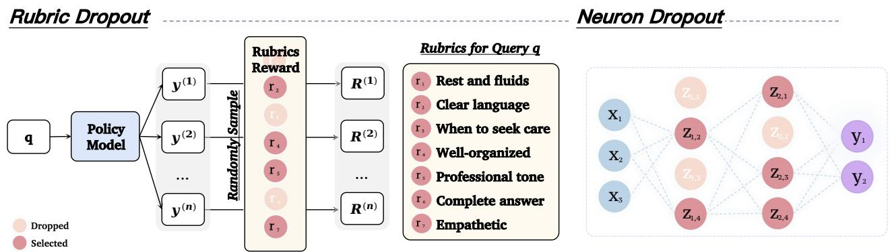  
Figure 1. Rubric Dropout is dropout for rubric criteria. Left: every rollout of a query is scored on the same randomly sampled sub-rubric (faded criteria are dropped), and the mask is re-drawn at each training step, so no fixed criterion is always rewarded. Right: the analogy to neuron dropout, which randomly drops hidden units so none is always relied on [20]. Dropout is train-only, and evaluation always uses the full rubric.

The recipe also has a built-in weakness. A rubric is a proxy for quality, not quality itself, and it is afixed proxy. The same criteria are scored at every training step, many of them generic templates that repeat across prompts (“uses clear language”, “well-organized”). Prompt-specific, verifiable criteria are the ideal, but that quality is hard to maintain at dataset scale, and generic templates end up in the training set. This immutability is what makes the proxy exploitable. A criterion rewarded identically at every step is a stable target. Once the policy finds a cheap, surface-level way to satisfy it, the shortcut is reinforced at every subsequent step, and when the criterion is a shared template, it is reinforced on every prompt at once. A policy that learns to open every answer with a tidy bulleted summary satisfies “well-organized” everywhere, whatever the content underneath. Classic results on reward misspecification say that optimizing hard against a fixed, imperfect proxy ends in reward hacking [1, 15, 19], and Gao et al. [6] showed exactly this for learned reward models. For rubric rewards, three problems stand in the way of taking the threat seriously and properly treating it:

1. Measurement. Hacking shows up as a proxy score that rises while true quality does not, so detecting it needs a quality estimate independent of the training judge and training rubrics, namely OOD prompts and rubrics graded by a stronger cross-family judge.

2. Mitigation. The rubric-specific approach we know of is reweighting criteria by their usefulness to training, as in POW3R [21]. Whether reweighting helps or hurts hacking is untested. We find below that it hurts.

3. Compatibility with GRPO. Any scheme that perturbs the reward per step must respect grouprelative RL. If the rollouts of one prompt are graded on different criteria, their advantages are no longer comparable and the gradient is corrupted.

This paper addresses all three. For the first, we build the measurement into training. Every 20 steps we grade an OOD evaluation set with two judges, the training (proxy) judge and a stronger cross-family (gold) judge, and we read the divergence of the two curves as the hacking signal, since a judge that is merely biased would shift the gold curve by a constant rather than send it downward while the proxy rises (Section 3.1).

Running this measurement on two independent train→eval pairs, RubricHub-Medical to HealthBench-Hard and RubricHub-Science to ResearchQA, shows that the hacking is real in both domains. The policy’s gold score rises, peaks, and then declines even as its proxy score continues to improve. The proxy−gold gap grows from 29% to 44% on HealthBench-Hard, and on ResearchQA gold falls 22 points from its peak.

For the second, we propose Rubric Dropout (Fig. 1). At every training step, we randomly drop a fraction f of the rubric’s criteria before computing the reward. The policy is then never scored on the same rubric twice, so no fixed criterion, and in particular no cheap template, can be reliably exploited. The change is one line in the reward function, has a single hyperparameter, and adds no judge calls. For the third, we draw one mask per rollout group, so all rollouts of a prompt are graded on the same sub-rubric. We prove that under this scheme the choice of reward normalizer cancels out of the advantage, and we show that, before group standardization, dropout only rescales the expected advantage while acting as a variance regularizer on updates that lean on any single criterion (Section A).

With the measurement and the method in place, we hold one three-way comparison fixed throughout, no dropout (base) versus dropout at f=30% versus f=50%. Dropout mitigates the hacking in both domains. The dropout runs beat base’s gold score at every matched checkpoint in the comparison window, by +1 to +2 points on HealthBench-Hard and +6 to +7 points on ResearchQA. They also cut both of our hacking measures and pay no in-domain cost. Sweeping f from 20% to 60% shows a broad 20–50% plateau, with the sign flipping only at 60%, and swapping dropout for POW3R-style reweighting lands below base, with the highest overclaim fraction of any run in the Medical sweep.

## Our contributions:

1. An in-loop, two-judge protocol for measuring OOD reward hacking in rubric RL, and the first demonstration that the standard recipe reward-hacks out of distribution, on two independent benchmark pairs (Sections 3.1 and 4.2).

2. Rubric Dropout, a one-line, judge-cost-free regularizer against rubric reward hacking, with the group-shared masking that makes it sound under GRPO (Sections A and 3).

3. Evidence that it works on both pairs, with higher gold at every matched checkpoint at 8B, higher window means at both sizes, and lower hacking on two independent measures, at no in-domain cost (Sections 4.3 and 4.4).

4. Ablations that map the design space, showing a usable 30–50% range for the dropout fraction and evidence that criterion reweighting (a POW3R-style baseline) backfires in this setting (Sections 5.1 and 5.2).

The same three-way comparison, run on two independent benchmark pairs, moves the gold score and both hacking measures in the same direction, and that consistency is the main reason to trust the result (limitations in Section 8).

## 2 Related Work

Rubric-as-reward RL. Grading free-form text against explicit criteria began as an evaluation idea [2, 27] and has become a training idea. RaR [7] and Rubric Anchors [10] use rubric scores directly as RL rewards, checklist feedback does the same with per-instruction checklists [22], and follow-up work scales rubric generation [13] or uses rubrics to scaffold exploration [28]. All of this optimizes against a fixed rubric per prompt and evaluates in-domain quality. Recent work responds to the fixed rubric’s brittleness by changing its content. OnlineRubrics elicits new criteria during training from pairwise comparisons of policy responses [17], and RIFL appends a fixed set of negative rubrics that penalize known failure modes [9]. Both add elicitation or authoring cost. We keep the rubric exactly as written and randomize which of its criteria are scored, which costs nothing. Unlike prior work, we also measure what a policy does to the rubric out of distribution, which is where we start.

Reward hacking and over-optimization. That optimizing a proxy degrades the true objective is one of the oldest observations in alignment [1, 15, 19]. Gao et al. [6] made it quantitative for learned reward models, showing that gold reward rises, peaks, and decays as optimization proceeds. The mitigations developed in that literature operate on the reward model itself, by ensembling several of them [4, 5], averaging their weights [16], or disentangling the hackable length component [3]. All of these train and serve extra reward models. Sampling sub-rubrics instead yields an implicit ensemble of sub-objectives with no extra judge calls. We observe the Gao-style signature for rubric rewards, out of distribution. Closest to us, concurrent work by Mahmoud et al. [14] documents rubric reward hacking as a divergence between the training verifier and a stronger judge and attributes it to verifier failure and rubric limitations. CHERRL [23] reproduces the same failure in a controlled setting, injecting known biases into the judge and detecting when the policy exploits them. Both are diagnoses. Ours adds an OOD measurement protocol and, mainly, a mitigation.

Regularization and reweighting. Neuron dropout prevents co-adaptation by making sure no single unit can be relied on [20]. We port that idea from the network to the objective, so that no single criterion can be relied on. The opposite design also exists. POW3R [21] reweights criteria by the rollout group’s verdict variance, concentrating optimization pressure on the most discriminative criteria. Dropping and reweighting make opposite bets about where pressure should go, so POW3R is the natural baseline for us. The comparison in Section 5.2 favors dropout. GDPO [12] normalizes each reward component separately within the group, aiming at training-signal resolution rather than hacking. Rubric Dropout is orthogonal to both reweighting and renormalization, and changes nothing but which criteria are scored.

## 3 Method

We fix notation and describe how we measure reward hacking out of distribution, then give the method in full.

Setup. For a query x and response y, a rubric is a set of K criteria indexed by $k ,$ each with a weight $w _ { k }$ (positive for desired behaviors, though some rubrics also carry negative-weight “pitfall” criteria). A single judge call grades all criteria at once, returning a verdict $s _ { k } ( x , y ) \in \{ 0 , 1 \}$ for each (criterion satisfied or not). The standard reward is the satisfied weight as a share of the total weight, clipped to [0, 1]:

$$
R ( x , y ) = \mathrm { c l i p } _ { [ 0 , 1 ] } \bigg ( \frac { \sum _ { k } w _ { k } s _ { k } ( x , y ) } { \sum _ { k } w _ { k } } \bigg ) .\tag{1}
$$

Pitfall criteria subtract from the numerator, following HealthBench’s scoring rule for signed rubrics [2]. All our training rubrics carry positive weight, so during training the clip is inactive and R is simply the weighted fraction of criteria satisfied.

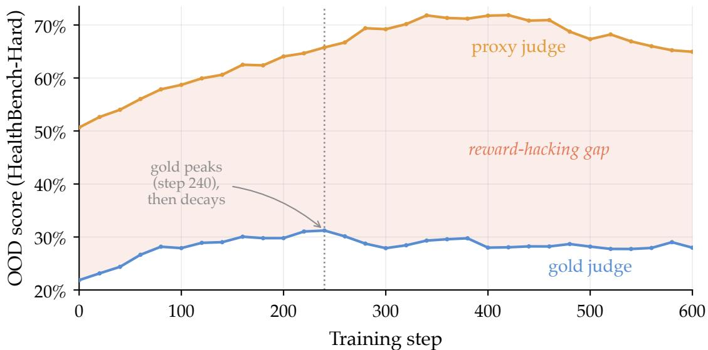  
Figure 2. The phenomenon. Base Qwen3-8B, trained on RubricHub-Medical, graded in-loop on HealthBench-Hard by both judges. The proxy keeps climbing while gold peaks and declines. The shaded proxy−gold gap widens from 29% to as much as 44%.

## 3.1 Measuring OOD reward hacking

A policy that games its training judge will look great to that judge, so the judge that defines the reward cannot also audit it. Our protocol uses two judges and an OOD evaluation set. Every 20 training steps we evaluate the current policy on the OOD evaluation set and grade each response twice, once with the training (proxy) judge and once with a stronger, cross-family (gold) judge. We track four quantities:

• gold score: the gold judge’s score on the OOD evaluation set, our best available estimate of true quality;

• proxy−gold gap: how much the proxy judge over-rates the policy;

• overclaim fraction: the share of criteria the proxy marks satisfied but gold rejects, a per-criterion view of the same failure;

• in-domain full-rubric reward: what training itself is optimizing, used to check that a mitigation is not just slowing training.

The gold judge is a stronger model, not ground truth. This is why we never interpret the absolute gap. A judge with a fixed bias shifts a curve by a constant. What a fixed bias cannot do is make the gold curve fall while the proxy curve rises. Divergence between the two curves during training is the hacking signal, and it is robust to a fixed bias in either judge.

## 3.2 Rubric Dropout

The method has a single hyperparameter, the dropout fraction $f \in [ 0 , 1 )$ . At each training step we drop a random f-fraction of the rubric’s positive-weight criteria, always keeping at least three, and compute the same reward on the kept criteria only. Writing $m \in \{ 0 , 1 \} ^ { K }$ for the keep-mask $( m _ { k } = 1$ means criterion k is kept),

$$
\tilde { R } ( x , y ; m ) = \frac { \sum _ { k } m _ { k } w _ { k } s _ { k } ( x , y ) } { \sum _ { k } m _ { k } w _ { k } } .\tag{2}
$$

Dropout never touches a protected set reserved for safety-critical criteria, and evaluation always scores the full rubric with Eq. (1). Since the judge grades all K criteria in one call anyway, the full-rubric reward stays available for logging at no extra cost.

## 3.3 GRPO with Rubric Dropout

We train with GRPO [18]. For each prompt it samples a group of G responses from the previous policy, computes each reward $R _ { i } = R ( x , y _ { i } )$ , and standardizes them within the group into advantages $\hat { A } _ { i } = ( R _ { i } - \mu ) / \sigma ,$ where µ and σ are the mean and standard deviation of the group’s rewards, before the usual clipped policy-gradient update.

There is one place where dropout could go wrong. If each rollout drew its own mask, the G responses would be graded on different sub-rubrics, and comparing them within the group would be meaningless. So we draw one mask per rollout group. Every rollout of a prompt at a given step is scored on the same sub-rubric, and the mask changes from step to step. Concretely, the mask RNG is seeded with SHA256(instance\_id, step), which needs no cross-worker communication and is reproducible.

This construction is sound for reasons made precise in Section A. Because the whole group shares one mask, any reward normalizer that depends only on the mask cancels in GRPO’s standardized advantage, so the normalizer in Eq. (2) is not a knob to tune. And over the mask distribution, dropout leaves the expected advantage unchanged up to a global scale that standardization removes. Its real effect is the noise it injects, which lands hardest on responses whose advantage hinges on a single criterion and barely touches responses that are broadly better than their group, the same anti-co-adaptation logic as neuron dropout. We treat this as motivating intuition rather than an established mechanism (Section 6).

## 4 Experiments

## 4.1 Setup

We train Qwen3-8B [24] with GRPO (16 rollouts per prompt, learning rate $1 0 ^ { - 6 } )$ on two independent train→eval pairs, RubricHub-Medical → HealthBench-Hard [2] (1,000 prompts, physician-written rubrics) and RubricHub-Science → ResearchQA [25] (survey-derived rubrics, scored on the 368 validation prompts that never occur in training, Section B). The proxy judge is gpt-4o-mini and the gold judge is claude-sonnet-4-6. The primary comparison, the same everywhere, is base (no dropout) vs. 30% vs. 50% dropout. Additional Medical runs (fractions 20–60% and POW3R) appear in the ablations (Section 5). Because hacking grows with training time, all cross-run numbers use a common 600-step horizon, a fixed comparison window (steps 400–600), and matched-checkpoint win counts (same steps, same prompts). The same comparison runs at a second scale, Qwen3-4B, with recipe, judges, and protocol unchanged. Full details are in Section B.

## 4.2 Rubric RL reward-hacks out of distribution

Fig. 2 shows the base run on the Medical pair. In the first phase, proxy and gold rise together, a sign the policy is genuinely improving. Then, around step 240, gold peaks at 31.2% and starts to slide while the proxy continues to 72%. The proxy−gold gap widens from 29% to as much as 44%, and at step 600 the policy is, by the gold judge’s account, worse than it was at step 240, despite 360 more steps of “improvement” according to the proxy. The Science pair shows the same divergence with a steeper collapse, with gold falling 22 points from its peak within 600 steps (the base curves in Fig. 3b and

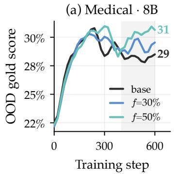

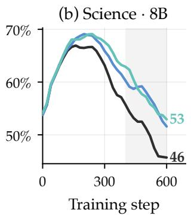

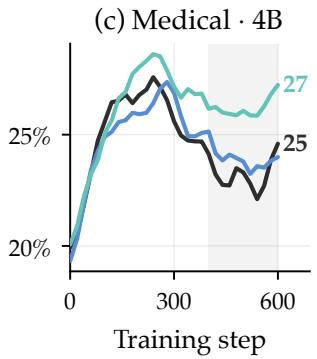

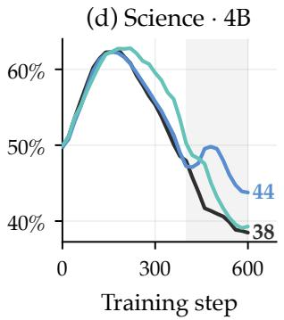  
Figure 3. OOD gold score on both pairs at both model sizes. base, f=30%, f=50%.

<table><tr><td rowspan="2">Run</td><td rowspan="2"></td><td colspan="3"></td><td colspan="3">Medical → HealthBench-Hard</td><td colspan="3"></td><td colspan="3">Science → ResearchQA</td></tr><tr><td></td><td>Peak Gold</td><td>Δ</td><td></td><td>Proxy-gold Overclaim Train reward</td><td></td><td>|Peak Gold</td><td></td><td>Δ</td><td></td><td>Proxy-gold Overclaim Train reward</td><td></td></tr><tr><td></td><td>base</td><td>31.2</td><td>28.2</td><td>0.0</td><td>40.3</td><td>40.4</td><td>98.0</td><td>67.5</td><td>50.4</td><td>0.0</td><td>37.2</td><td>37.3</td><td>94.8</td></tr><tr><td>8B</td><td>f=30%</td><td>30.9</td><td>29.2</td><td>+1.0</td><td>38.7</td><td>38.9</td><td>97.8</td><td>69.4</td><td>56.8</td><td>+6.4</td><td>29.9</td><td>29.8</td><td>96.3</td></tr><tr><td rowspan="3"></td><td>f=50%31.5</td><td></td><td>30.1</td><td>+2.0</td><td>38.4</td><td>37.2</td><td>97.6</td><td>69.8</td><td>57.4</td><td>+7.0</td><td>29.5</td><td>29.5</td><td>95.7</td></tr><tr><td>base</td><td>27.9</td><td>23.2</td><td>0.0</td><td>46.9</td><td>47.1</td><td>96.9</td><td>63.2</td><td>41.6</td><td>0.0</td><td>46.6</td><td>46.7</td><td>96.2</td></tr><tr><td>f=30%</td><td>28.0</td><td>23.9</td><td>+0.7</td><td>43.2</td><td>45.9</td><td>97.1</td><td>62.6</td><td>47.0</td><td>+5.3</td><td>40.1</td><td>40.3</td><td>96.7</td></tr><tr><td>4B</td><td>f=50%</td><td>28.8</td><td>26.2</td><td>+3.0</td><td>44.4</td><td>41.2</td><td>96.8</td><td>63.4</td><td>43.7</td><td>+2.1</td><td>43.2</td><td>43.4</td><td>96.8</td></tr></table>

Table 1. Base and the two dropout runs on both pairs, at two model sizes (window means over steps 400–600, all values %, ∆ in points vs the block’s base). Peak: best single-checkpoint gold score over the 600-step horizon. Gold: OOD gold score. Train reward: in-domain full-rubric reward. Bold: best value per column within each block. Dropout rows are tinted with their figure colors.

Fig. 4b,d). This matches the over-optimization signature that Gao et al. [6] established for learned reward models, here for rubric rewards, and out of distribution, where it hurts most.

## 4.3 Dropout raises true quality in both domains

If the fixed rubric is what makes these shortcuts stable, resampling it every step should blunt the decline. Fig. 3 and Table 1 compare base and the two dropout runs on both pairs over the same comparison window.

On Medical, both dropout runs exceed base’s gold score at all 11 matched checkpoints in the window, with window means of +1.0 points at f=30% and +2.0 points at f=50%. The margins are modest but consistent. The advantage holds at every checkpoint, with each checkpoint evaluated on the identical 1,000 prompts. The gain also comes at no in-domain cost, since all three runs, dropout included, reach at least 97% in-domain full-rubric reward (Fig. 7b). Dropout changes what the policy generalizes to rather than how quickly the full-rubric reward is optimized.

On Science, the effect is larger. The base run’s gold score falls from a peak of ∼67% to ∼46% by step 600, a 21.5-point decline, whereas the dropout runs give back 18.0 and 16.4 points of theirs (Fig. 3b). They exceed base at every matched checkpoint, with window means of +6.4 and +7.0 points at f=30% and f=50%, several times the corresponding Medical margins. On this pair, dropout is also slightly ahead in domain (Table 1). As on Medical, the margin over base does not reflect differences in peak capability. All three runs reach similar maximum gold scores near step 200 (Table 1) and diverge only during the

(a) Medical 8B  
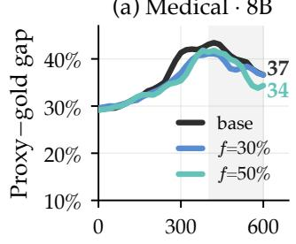

(b) Science  8B  
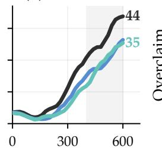

(c) Medical 8B  
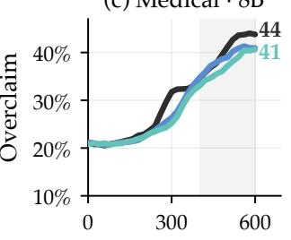

(d) Science  8B  
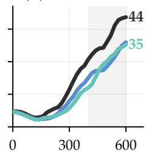

(e) Medical 4B  
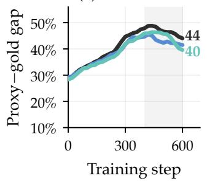

(f) Science  4B  
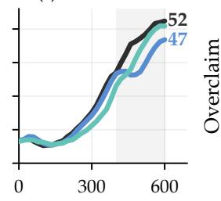

(g) Medical  4B  
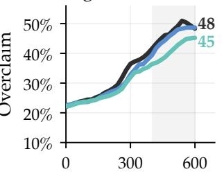

(h) Science  4B  
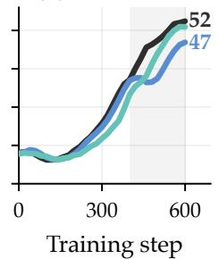  
Figure 4. Dropout reduces both hacking measures in both domains, at both model sizes. Proxy−gold gap and overclaim fraction. base, f=30%, f=50%.

subsequent decay.

The Qwen3-4B blocks of Table 1 and Fig. 3 repeat the comparison with the recipe and protocol unchanged, and the effect carries over. Peaks stay near-tied, both dropout runs improve the window gold score (+0.7 to +5.3 points), and the in-domain full-rubric reward stays matched. Unlike at 8B, the two fractions trade places. On Medical f=50% is better (ahead at all 11 matched checkpoints), and on Science f=30% is better, with win counts of 7–11 out of 11. So at 4B we claim only the coarser result, that some dropout beats none, on every window measure, in both domains.

## 4.4 Dropout reduces both hacking measures

Higher gold could in principle come from anywhere. If dropout works the way we expect, it should show up specifically in the hacking measures, and it does (Fig. 4). Within each model size the four panels share the same axes, and the two pairs hack on different schedules. On Medical the gap climbs from early training and overclaim follows from around step 150, while on Science both are flat for roughly the first 150 steps and then rise steeply. In every panel both dropout runs end the window below base on both measures (window means), at 8B by roughly 2–3 points on Medical and by nearly 8 points on Science. Hacking is harsher at 4B, with base’s window gap and overclaim near 47% on both pairs. And the separation is not one lucky checkpoint. On Science the dropout runs sit below base on both measures at every window step, and on Medical the ordering holds in the window means.

The trajectories can also be read jointly, as a quality-versus-hacking tradeoff. At matched overclaim levels past the hacking onset, the dropout runs sit at or above base’s gold. On Medical, at 40% overclaim, base has 28.5% gold and f=50% has 31.3%. On Science, at 35% overclaim, the numbers are 50.8% versus 52.5%. For the same amount of overclaiming, a dropout policy has kept more true quality, and Section 6 discusses why this alone does not identify the mechanism.

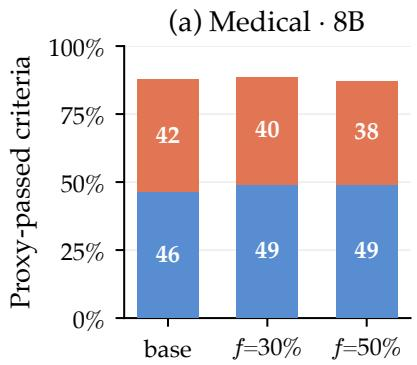

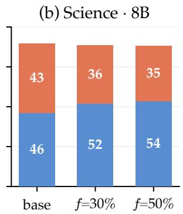

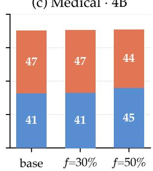  
(c) Medical  4B

(d) Science  4B  
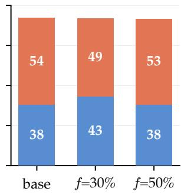  
Figure 5. Same proxy pass rate, different composition. Both judges grade every positive-weight criterion of each run’s step-600 responses on matched prompts. Bar height is the share of criteria the proxy judge accepts, split into the part the gold judge confirms (blue) and the overclaimed part it rejects (terracotta). The full grid, with exact values, counts, and underclaim, is Table 4.

<table><tr><td rowspan="2">Gold pass rate ↑</td><td rowspan="2"></td><td colspan="3">Medical, by HealthBench axis</td><td colspan="6">Science, by ResearchQA rubric type</td></tr><tr><td>clinical</td><td>context-aw.</td><td>communic.</td><td>comparison</td><td>limitation</td><td>impact</td><td>other</td><td>example</td><td>citation</td></tr><tr><td rowspan="3">8B</td><td>base</td><td>50.2</td><td>31.3</td><td>35.4</td><td>41.9</td><td>52.4</td><td>48.9</td><td>50.9</td><td>59.5</td><td>0.5</td></tr><tr><td>3f=30%</td><td>53.6</td><td>33.8</td><td>37.6</td><td>50.2</td><td>61.9</td><td>58.3</td><td>56.5</td><td>63.0</td><td>0.0</td></tr><tr><td>f=50%</td><td>54.1</td><td>44.0</td><td>35.9</td><td>55.9</td><td>64.8</td><td>58.0</td><td>55.5</td><td>63.4</td><td>0.5</td></tr><tr><td rowspan="3">4B f=30%</td><td>base</td><td>44.5</td><td>34.0</td><td>33.7</td><td>35.5</td><td>51.0</td><td>41.2</td><td>41.1</td><td>47.9</td><td>0.3</td></tr><tr><td></td><td>44.4</td><td>26.7</td><td>37.0</td><td>41.9</td><td>47.4</td><td>47.9</td><td>45.9</td><td>54.0</td><td>0.8</td></tr><tr><td>f=50%</td><td>48.5</td><td>34.5</td><td>36.9</td><td>34.5</td><td>50.5</td><td>43.7</td><td>40.6</td><td>48.0</td><td>0.3</td></tr></table>

Table 2. Gold pass rate by HealthBench axis and ResearchQA rubric type (%, at step 600). Context-awareness is a subset of the clinical axes. Bold marks the best run per column and block. Criteria with multiple type tags are counted under each of their types.

## 4.5 Criterion-level breakdown

Averages can hide what actually changed, so we drop to the criterion level. Both judges grade every criterion of each run’s step-600 responses, and each criterion the proxy accepts is either confirmed by gold or overclaimed (Fig. 5). At matched proxy pass rates (within 1.3 points everywhere), both dropout runs have a higher gold pass rate and less overclaim, and both improve monotonically with the dropout fraction, up to +3.6 points of gold pass rate on Medical and +7.3 on Science at f=50%. The policies please the proxy judge equally, but the dropout policies are better under the gold judge. And the proxy’s error is almost entirely one-sided, with underclaim never above 3.1%, so the gap is over-crediting, not noise. The difference is also concentrated where quality is expensive, and both benchmarks’ own criterion tags say so (Table 2). On Medical the gains concentrate on the clinical axes (accuracy, completeness, context-awareness) rather than the communication ones, with the largest single jump on context-awareness at f=50%, the axis base neglects most. On Science the analytical types (comparison, limitation, impact) gain two to three times as much as the example and generic ones at $f = 5 0 \%$ , with the same analytical-over-generic pattern at $f { = } 3 0 \%$ . (Citation criteria sit at floor for every run under both judges, since the policy has no retrieval.) In our runs, hacking degrades the expensive criteria first, and these are the criteria where dropout preserves quality. At 4B the same breakdown picks out the better fraction per domain, which gains 3.9 (Medical, f=50%) and 5.2 (Science, f=30%) points of gold pass rate with overclaim down 3.2 and 5.5, while the other fraction sits near base. The matched checkpoint is step 600, the edge of the comparison window, so these numbers localize Table 1 rather than re-estimate it.

<table><tr><td>Run</td><td>Gold↑</td><td>Δ↑</td><td>Proxy-gold↓</td><td>Overclaim↓</td><td>Train reward ↑</td></tr><tr><td>base</td><td>28.2</td><td>0.0</td><td>40.3</td><td>40.4</td><td>98.0</td></tr><tr><td>f=20%</td><td>28.7</td><td>+0.6</td><td>40.2</td><td>39.5</td><td>97.7</td></tr><tr><td>f=30%</td><td>29.2</td><td>+1.0</td><td>38.7</td><td>38.9</td><td>97.8</td></tr><tr><td>f=40%</td><td>28.5</td><td>+0.4</td><td>41.3</td><td>38.5</td><td>97.6</td></tr><tr><td>f=50%</td><td>30.1</td><td>+2.0</td><td>38.4</td><td>37.2</td><td>97.6</td></tr><tr><td>f=60%</td><td>27.7</td><td>-0.5</td><td>42.6</td><td>37.8</td><td>97.3</td></tr><tr><td>POW3R</td><td>27.0</td><td>-1.2</td><td>40.2</td><td>42.2</td><td>97.7</td></tr></table>

Table 3. Ablations on the Medical pair (window means over steps 400–600, all values %, ∆ in points vs base). Bold: best value per column. The f=50% row is tinted with its figure color.

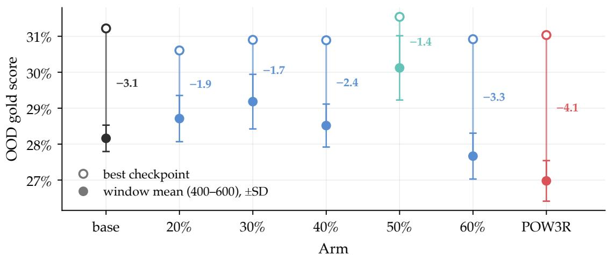  
Figure 6. Sweeping the dropout fraction (Medical). OOD gold score per run: best checkpoint on the 600-step horizon (open) and window mean over steps 400–600 (filled), with whiskers showing within-run SD. The vertical drop is what continued training costs after the peak. It is largest for POW3R and $f { = } 6 0 \% ,$ and smallest for f=50%.

## 5 Ablations

We ablate the dropout fraction and the reweighting alternative on the Medical pair.

## 5.1 The dropout fraction

We sweep f ∈ {20, 30, 40, 50, 60}% (Fig. 6, Table 3). Best-checkpoint gold is essentially tied across all runs, from 30.6% to 31.5% against base’s 31.2%. No intervention changes what the policy can reach at its peak. The differences are entirely about what survives continued training, and on that measure the answer is forgiving. Everything from 20% to 50% is at or above base, with the best window mean at 50% (+2.0) and a dip at 40% (+0.4) that is within noise of its neighbors. Only at 60% does the sign flip (−0.5), which is the expected failure mode. Drop too much and the surviving sub-rubrics stop covering what quality means. The trajectory view (Fig. 7) confirms that these differences come from the post-peak phase, not from learning speed, and that no run trades away in-domain full-rubric reward. In our sweep the hyperparameter is not delicate. Anything in the 30–50% range captures most of the benefit.

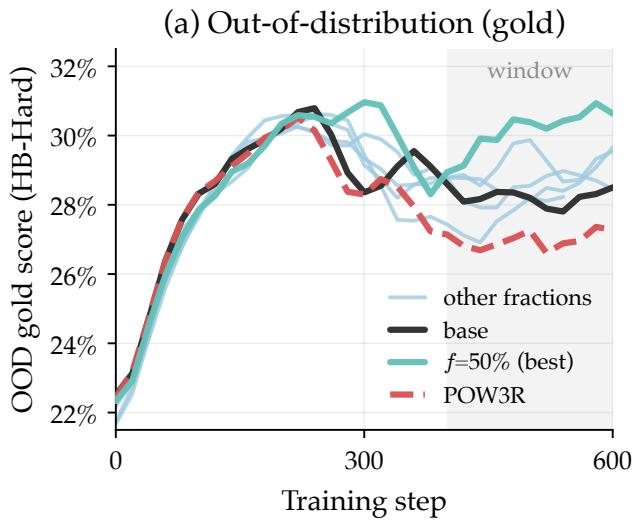

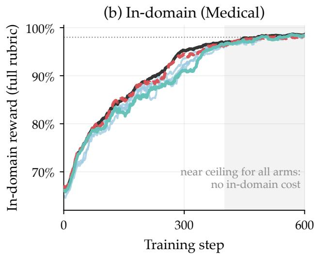  
Figure 7. Trajectory view of the sweep (Medical). (a) OOD gold score, 3-point rolling means of the 20-step evaluations. (b) In-domain full-rubric reward, 25-step rolling mean of the per-step training signal. Window shaded.

## 5.2 Reweighting is not a substitute for dropping

The natural alternative to dropping criteria, reweighting toward the informative ones, performs worse out of distribution than no intervention at all. POW3R attains the lowest OOD gold score of any run (27.0%), loses to base at all 11 matched checkpoints, and posts the highest overclaim fraction, 42.2%, above even base’s 40.4% (Table 3). One plausible mechanism is that reweighting by group verdict variance concentrates optimization pressure on exactly the criteria the policy is currently learning to game, so it amplifies the very feedback loop that dropout dilutes. To be fair to the method, POW3R’s best checkpoint (31.0%) matches base’s (31.2%), so peak capability is intact. The deficit is in the decay that follows, the same axis on which every run is judged here. This is an OOD observation from our setting, based on one run at the method’s published defaults. Our port also reweights globally, because RubricHub rubrics carry no category labels (Section B). We do not evaluate POW3R’s in-distribution claims. Still, the sweep and the POW3R comparison point to the same design guideline, that OOD robustness in our setting improves when optimization pressure is spread across criteria and degrades when it is concentrated.

## 6 Discussion

Our results pin down where the gain from dropout lands. It keeps the expensive, prompt-specific criteria satisfied while the base policy abandons them (Section 4.5). Why it helps is still open. The motivating story is anti-co-adaptation. With the rubric resampled every step, no fixed criterion is reliably present to be gamed. A more boring story is implicit regularization. Dropout adds gradient noise, training moves more slowly along the same path, and the policy simply arrives at the hacking regime later. Both stories predict the same figures in this paper.

We probed the question with a gold-versus-overclaim frontier on matched prompts (not shown). If dropout changed the tradeoff itself, its curve should sit above base’s at equal overclaim. At our training horizon the two frontiers overlap. That might look like a point for implicit regularization, but at this horizon it is not evidence either way. With a group-shared mask, dropout within one epoch is plain subsampling, and masks can only interfere destructively once a prompt is revisited under a different mask, that is, past one epoch, so both stories predict the overlap we see. The in-loop tradeoff numbers in Section 4.4, which lean slightly toward dropout at high overclaim, are equally compatible with both. The decisive test is the same frontier at two-plus epochs. Separation would establish the co-adaptation mechanism, and continued overlap would mean the gains reduce to implicit early stopping. We leave that test to future work and claim only what the data show. Dropout improves true quality and reduces hacking.

## 7 Conclusion

Rubric-as-reward RL optimizes a fixed, imperfect proxy, and we showed that it does what fifty years of Goodhart warnings predict. Out of distribution, on two unrelated benchmark pairs, true quality peaks and then declines while the proxy score keeps rising. Rubric Dropout is the cheapest intervention we know of. It costs one line, one hyperparameter, and no extra judge calls. It raised the OOD gold score at every matched checkpoint in both domains at 8B, raised the window means at both model sizes, cut both of our hacking measures, and cost nothing on in-domain training prompts. Its hyperparameter has a wide safe range. The opposite design, criterion reweighting, made things worse. The obvious next steps are seed replication, the two-epoch frontier test that would settle the mechanism, and extending the same approach to other group-relative RL algorithms and domains.

## 8 Limitations

Single seed. Every configuration is a single training run, because preemptible-only compute ruled out seed replication. The error bars we report reflect within-run variation across eval checkpoints, not across-seed variation. What we can say is that within these runs the effect is not fragile. At 8B the dropout runs win at every matched checkpoint on both pairs, and both hacking measures move the same way. Across-seed confirmation of the effect sizes is future work.

The gold judge is not ground truth. A stronger judge is still a judge. Our claims rest on divergence and on run-to-run comparisons under identical judges, both of which survive a constant judge bias. We cannot rule out a distribution-dependent judge bias.

In-domain cost is measured on the training set. The “no in-domain cost” claim means the full-rubric reward on training prompts saturates for every run. It does not rule out a small cost on unseen in-domain prompts, which we did not measure.

Scope. One policy family at two sizes (Qwen3-8B and -4B), two domains, one RL algorithm (GRPO).

## Ethics Statement

This work uses medical prompts and benchmarks as a testbed for reward hacking. We do not release a model intended for clinical use. The failure mode we document, a policy that satisfies its training judge while true quality degrades, is itself a deployment risk for rubric-trained models, and measuring it is part of the point. All judges are commercial APIs used under their terms. No human-subjects data were collected.

## Reproducibility Statement

All numbers derive from per-step trajectories logged during training and from the judges’ grades of saved model outputs. The window means, win counts, and figures are regenerated by the released scripts from the cached data. Models, data, judges, hyperparameters, and the dropout procedure are specified in Section 3 and Section B.

## References

[1] D. Amodei, C. Olah, J. Steinhardt, P. Christiano, J. Schulman, and D. Mané. Concrete problems in AI safety. arXiv preprint arXiv:1606.06565, 2016.

[2] R. K. Arora, J. Wei, R. Soskin Hicks, P. Bowman, J. Quiñonero-Candela, F. Tsimpourlas, M. Sharman, M. Shah, A. Vallone, A. Beutel, J. Heidecke, and K. Singhal. HealthBench: Evaluating large language models towards improved human health. arXiv preprint arXiv:2505.08775, 2025.

[3] L. Chen, C. Zhu, J. Chen, D. Soselia, T. Zhou, T. Goldstein, H. Huang, M. Shoeybi, and B. Catanzaro. ODIN: Disentangled reward mitigates hacking in RLHF. In Proceedings of the 41st International Conference on Machine Learning, volume 235 of Proceedings of Machine Learning Research, pages 7935–7952. PMLR, 2024.

[4] T. Coste, U. Anwar, R. Kirk, and D. Krueger. Reward model ensembles help mitigate overoptimization. In The Twelfth International Conference on Learning Representations (ICLR), 2024.

[5] J. Eisenstein, C. Nagpal, A. Agarwal, A. Beirami, A. D’Amour, D. Dvijotham, A. Fisch, K. Heller, S. Pfohl, D. Ramachandran, P. Shaw, and J. Berant. Helping or herding? Reward model ensembles mitigate but do not eliminate reward hacking. In First Conference on Language Modeling (COLM), 2024. URL https://openreview.net/forum?id=5u1GpUkKtG.

[6] L. Gao, J. Schulman, and J. Hilton. Scaling laws for reward model overoptimization. In Proceedings of the 40th International Conference on Machine Learning (ICML), volume 202 of Proceedings ofMachine Learning Research, pages 10835–10866. PMLR, 2023.

[7] A. Gunjal, A. Wang, E. Lau, V. Nath, Y. He, B. Liu, and S. Hendryx. Rubrics as rewards: Reinforcement learning beyond verifiable domains. In International Conference on Learning Representations (ICLR), pages 127924–127945, 2026.

[8] D. Guo, D. Yang, H. Zhang, J. Song, P. Wang, Q. Zhu, R. Xu, R. Zhang, S. Ma, X. Bi, X. Zhang, X. Yu, et al. DeepSeek-R1 incentivizes reasoning in LLMs through reinforcement learning. Nature, 645 (8081):633–638, 2025. doi: 10.1038/s41586-025-09422-z.

[9] Y. He, W. Li, H. Zhang, S. Li, K. Mandyam, S. Khosla, Y. Xiong, N. Wang, X. Peng, B. Li, S. Bi, S. G. Patil, et al. AdvancedIF: Rubric-based benchmarking and reinforcement learning for advancing LLM instruction following. In Proceedings of the 64th Annual Meeting of the Association for Computational Linguistics (Volume 1: Long Papers), pages 18003–18022, San Diego, California, United States, July 2026. Association for Computational Linguistics. doi: 10.18653/v1/2026.acl-long.820. URL https: //aclanthology.org/2026.acl-long.820/.

[10] Z. Huang, Y. Zhuang, G. Lu, Z. Qin, H. Xu, T. Zhao, R. Peng, J. Hu, Z. Shen, X. Hu, et al. Reinforcement learning with rubric anchors. arXiv preprint arXiv:2508.12790, 2025.

[11] N. Lambert, J. Morrison, V. Pyatkin, S. Huang, H. Ivison, F. Brahman, L. J. V. Miranda, A. Liu, N. Dziri, X. Lyu, Y. Gu, S. Malik, et al. Tülu 3: Pushing frontiers in open language model posttraining. In Conference on Language Modeling (COLM), 2025.

[12] S.-Y. Liu, X. Dong, X. Lu, S. Diao, P. Belcak, M. Liu, M.-H. Chen, H. Yin, Y.-C. F. Wang, K.-T. Cheng, Y. Choi, J. Kautz, and P. Molchanov. GDPO: Group reward-decoupled normalization policy optimization for multi-reward RL optimization. arXiv preprint arXiv:2601.05242, 2026.

[13] T. Liu, R. Xu, T. Yu, I. Hong, C. Yang, T. Zhao, and H. Wang. OpenRubrics: Towards scalable synthetic rubric generation for reward modeling and LLM alignment. In Proceedings of the 64th Annual Meeting of the Association for Computational Linguistics (Volume 1: Long Papers), pages 17417– 17437, San Diego, California, United States, 2026. Association for Computational Linguistics. doi: 10.18653/v1/2026.acl-long.791.

[14] A. Mahmoud, M. Rezaei, Z. Wang, A. Gunjal, B. Liu, and Y. He. Reward hacking in rubric-based reinforcement learning. arXiv preprint arXiv:2605.12474, 2026.

[15] A. Pan, K. Bhatia, and J. Steinhardt. The effects of reward misspecification: Mapping and mitigating misaligned models. In International Conference on Learning Representations (ICLR), 2022.

[16] A. Rame, N. Vieillard, L. Hussenot, R. Dadashi-Tazehozi, G. Cideron, O. Bachem, and J. Ferret. WARM: On the benefits of weight averaged reward models. In Proceedings ofthe 41st International Conference on Machine Learning, volume 235 of Proceedings of Machine Learning Research, pages 42048–42073. PMLR, 2024.

[17] M. Rezaei, R. Vacareanu, Z. Wang, C. Wang, B. Liu, Y. He, and A. F. Akyürek. Online rubrics elicitation from pairwise comparisons. In Proceedings of the 43rd International Conference on Machine Learning (ICML), 2026.

[18] Z. Shao, P. Wang, Q. Zhu, R. Xu, J. Song, X. Bi, H. Zhang, M. Zhang, Y. K. Li, Y. Wu, and D. Guo. DeepSeekMath: Pushing the limits of mathematical reasoning in open language models. arXiv preprint arXiv:2402.03300, 2024.

[19] J. Skalse, N. H. R. Howe, D. Krasheninnikov, and D. Krueger. Defining and characterizing reward gaming. In Advances in Neural Information Processing Systems (NeurIPS), volume 35, 2022.

[20] N. Srivastava, G. Hinton, A. Krizhevsky, I. Sutskever, and R. Salakhutdinov. Dropout: A simple way to prevent neural networks from overfitting. Journal of Machine Learning Research, 15(56):1929–1958, 2014.

[21] U. Tyagi, X. Guo, M. Rezaei, D. George, A. Mahmoud, J. Lee, B. Liu, and Y. He. Not every rubric teaches equally: Policy-aware rubric rewards for RLVR. arXiv preprint arXiv:2605.20164, 2026.

[22] V. Viswanathan, Y. Sun, S. Ma, X. Kong, M. Cao, G. Neubig, and T. Wu. Checklists are better than reward models for aligning language models. In Advances in Neural Information Processing Systems (NeurIPS), 2025.

[23] X. Wang, Z. Hao, S. Hou, H. Peng, J. Li, and X. Wang. Reproducing, analyzing, and detecting reward hacking in rubric-based reinforcement learning. arXiv preprint arXiv:2606.04923, 2026.

[24] A. Yang, A. Li, B. Yang, B. Zhang, B. Hui, B. Zheng, B. Yu, C. Gao, C. Huang, C. Lv, C. Zheng, D. Liu, et al. Qwen3 technical report. arXiv preprint arXiv:2505.09388, 2025.

[25] L. S. Yifei, A. Chang, C. Malaviya, and M. Yatskar. ResearchQA: Evaluating scholarly question answering at scale across 75 fields with survey-mined questions and rubrics. Transactions of the Associationfor Computational Linguistics, 14:1344–1368, 2026. doi: 10.1162/TACL.a.732.

[26] M. Zhang, Y. Shen, Z. Li, H. Sha, B. Hu, Y. Wang, C. Huang, S. Liu, J. Tong, C. Jiang, M. Chai, Z. Xi, S. Dou, T. Gui, Q. Zhang, and X. Huang. LLMEval-Med: A real-world clinical benchmark for medical LLMs with physician validation. In C. Christodoulopoulos, T. Chakraborty, C. Rose, and V. Peng, editors, Findings of the Association for Computational Linguistics: EMNLP 2025, pages 4888–4914, Suzhou, China, Nov. 2025. Association for Computational Linguistics. ISBN 979-8- 89176-335-7. doi: 10.18653/v1/2025.findings-emnlp.263. URL https://aclanthology.org/2025. findings-emnlp.263/.

[27] L. Zheng, W.-L. Chiang, Y. Sheng, S. Zhuang, Z. Wu, Y. Zhuang, Z. Lin, Z. Li, D. Li, E. P. Xing, H. Zhang, J. E. Gonzalez, and I. Stoica. Judging LLM-as-a-judge with MT-Bench and chatbot arena. In Advances in Neural Information Processing Systems (NeurIPS) Datasets and Benchmarks Track, volume 36, 2023.

[28] Y. Zhou, S. Li, S. Liu, W. Fang, K. Zhang, J. Zhao, J. Yang, Y. Zhou, J. Lv, T. Zheng, H. Lu, W. Chen, et al. Breaking the exploration bottleneck: Rubric-scaffolded reinforcement learning for open-ended LLM reasoning. In Proceedings of the 43rd International Conference on Machine Learning (ICML), 2026.

## A Analysis of Group-Shared Rubric Dropout

Group-shared Rubric Dropout is well-behaved under GRPO for two reasons. Fix one group and one mask $m ,$ and write $s _ { k , i }$ for the verdict of criterion k on response $y _ { i }$ and $\begin{array} { r } { c _ { i } = \sum _ { k } m _ { k } w _ { k } s _ { k , i } } \end{array}$ for the masked score of $y _ { i }$ before any normalization. Here meanj and stdj run over the group’s responses $j = 1 , \dotsc , G$

Proposition 1 (The normalizer cancels). Because the mask is shared by the whole group, any positive normalizer Z that depends only on the mask (the kept weight $\Sigma _ { k } m _ { k } w _ { k }$ of Eq. (2), its expectation, or no normalizer at all) is the same constantfor every response in the group, so whenever the group’s masked scores are not all equal it cancels in the standardized advantage:

$$
\hat { A } _ { i } ( m ) = \frac { c _ { i } / Z - \mathrm { m e a n } _ { j } ( c _ { j } / Z ) } { \mathsf { s t d } _ { j } ( c _ { j } / Z ) } = \frac { c _ { i } - \mathrm { m e a n } _ { j } ( c _ { j } ) } { \mathsf { s t d } _ { j } ( c _ { j } ) } .
$$

Under this standardization, only which criteria are kept matters. There is no normalizer to tune.

The second reason is the intuition behind the method. In expectation, dropout only rescales the advantage, and its real effect is the noise it injects, which lands hardest on responses whose advantage hinges on a single criterion. To state it, model the mask as i.i.d., each criterion kept independently with probability $1 - f .$ Center each verdict within the group, $\delta _ { k , i } = s _ { k , i } - \bar { s } _ { k }$ with $\begin{array} { r } { \bar { s } _ { k } = \frac { 1 } { G } \bar { \sum _ { j = 1 } ^ { G } } s _ { k , j } , } \end{array}$ , and consider the un-normalized advantage $\begin{array} { r } { u _ { i } ( m ) = \sum _ { k } m _ { k } w _ { k } \delta _ { k , i } } \end{array}$ . With the full rubric this is the centered reward up to the constant total weight, $\begin{array} { r } { u _ { i } ( { \bf 1 } ) = \left( \sum _ { k } w _ { k } \right) \left( R _ { i } - \mu \right) } \end{array}$ , a constant that group standardization ignores (Proposition 1). On our positive-weight training rubrics the clip in Eq. (1) is inactive.

Observation 1 (Dropout is a variance regularizer). Over the i.i.d. mask distribution,

$$
\mathbb { E } _ { m } [ u _ { i } ( m ) ] = ( 1 - f ) u _ { i } ( \mathbf { 1 } ) , \qquad \mathrm { V a r } _ { m } [ u _ { i } ( m ) ] = f ( 1 - f ) \sum _ { k } w _ { k } ^ { 2 } \delta _ { k , i } ^ { 2 } .
$$

In expectation, dropout changes nothing but a global scale $1 - f ,$ which group standardization removes. Its whole effect is the variance term, and the variance term reads off which responses get a noisy signal. It is largest exactly when the advantage hinges on one high-weight criterion (one large $w _ { k } \delta _ { k , i } )$ , and smallest when a response is broadly better than its group (many small contributions). Since gradient noise slows SGD’s progress along a direction, dropout preferentially suppresses single-criterion exploits and favors broad improvement. This is the same anti-co-adaptation logic as neuron dropout, transplanted to the reward. We treat it as the motivating intuition rather than an established mechanism. The experiments establish where dropout helps, and Section 6 discusses what they can and cannot say about why. There are two caveats to Observation 1. In practice we drop a fixed f-fraction rather than taking i.i.d. draws, which keeps each criterion with probability $1 - f ,$ , so the expectation is unchanged and the variance only acquires small cross-terms from the negative mask covariances. And because $\mathrm { G R P O ^ { \prime } s }$ division by the group standard deviation also depends on the mask, Observation 1 describes the advantage before that division.

Observation 1 also says where the injected variance is largest. The factor $f ( 1 - f )$ peaks at $f = 1 / 2 ,$ so under the variance-regularization reading the effect is strongest near 50% dropout. The Medical sweep agrees, with the best window mean at $f \mathrm { = } 5 0 \%$ and the benefit collapsing at $6 0 \%$ , where the kept sub-rubric stops covering what quality means (Section 5.1). We note the agreement without leaning on it. The variance story is motivating intuition, and the sweep cannot separate it from the coverage effect that dominates at large f .

## B Experimental Setup and Details

Policy and algorithm. We train Qwen3-8B [24] with GRPO [18], using 16 rollouts per prompt, learning rate $1 0 ^ { - 6 }$ , and FSDP. All runs train to at least 600 steps except $f { = } 6 0 \%$ , which ends at step 559 with its last logged evaluation at step 540. All comparisons use the common 600-step horizon.

Training data. RubricHub-Medical consists of medical prompts with weighted rubrics of 8–67 criteria (mean ∼30). RubricHub-Science follows the same recipe, with 29,418 prompts and a mean of ${ \sim } 2 7$ criteria. The proxy judge for both is gpt-4o-mini.

OOD evaluation. The Medical pair evaluates on the Hard split of HealthBench [2], 1,000 prompts with a mean of ∼11.9 criteria each. It shares no prompts with RubricHub-Medical. The Science pair evaluates on the ResearchQA validation split [25]. Since RubricHub-Science is built from ResearchQA, we score on the 368 prompts that never occur in training (mean ∼7.4 equal-weight criteria). The evaluation rubrics share no criteria with the training rubrics on any prompt. Both pairs are evaluated in-loop every 20 steps and graded by the proxy (gpt-4o-mini) and gold (claude-sonnet-4-6) judges as described in Section 3.1. The in-loop Science evaluation runs on the full 703-prompt split, and the reported Science numbers come from scoring the saved responses on the 368-prompt subset. The full split tells the same story, slightly damped.

Training runs. On Medical we run base, $f \in \{ 2 0 , 3 0 , 4 0 , 5 0 , 6 0 \} \%$ , and POW3R. On Science we run base and $f \in \{ 3 0 , 5 0 \} \%$ . For Qwen3-4B we run base and $f \in \{ 3 0 , 5 0 \}$ % on both pairs, with the same recipe. One seed each. The 4B numbers are in-loop trajectory statistics, and 4B Science is evaluated on the ful 703-prompt validation split.

Comparison protocol. Reward hacking grows with training, so end-of-run comparisons confound the effect with training length. All cross-run numbers are window means over steps 400–600 plus matched-checkpoint win counts, where at each eval checkpoint in the window shared by both runs, on the identical prompt set, we record whether the run beats base. The window sits after the hacking onset (step ∼240 on Medical, Fig. 2) and inside every run’s logged range except for $f { = } 6 0 \%$ , whose window statistics cover steps 400–540. Win-count denominators differ where a run’s logged evaluations end mid-window.

POW3R implementation. We implement POW3R [21] with dynamic per-criterion factors derived from the within-group verdict variance of the current rollout group, at the method’s published defaults $( \lambda = 0 . 5 ,$ , factors clipped to [0.67, 1.5]), applied at the same generator group barrier where GRPO forms advantages. We deviate from the original in two ways. RubricHub rubrics carry no per-criterion category labels, so the original’s within-category balancing (their Eq. 3) is inactive here and the factors reweight criteria globally within each prompt’s rubric. And we recompute factors within each step from the current group’s verdicts and apply them immediately, whereas the original smooths them across prompt visits with an EMA and a one-visit lag (their Eq. 7), so ours is the unsmoothed variant. POW3R otherwise inherits the recipe every run in this paper shares, and evaluation always uses the full static rubric.

Dropout variants not explored. Per-criterion fractions $f _ { k }$ (with $f _ { k } = 0$ on the protected set), schedules that anneal f from high to zero over training, and block dropout for hierarchical rubrics are all natural extensions. Viewed as an objective, dropout optimizes $\mathcal { T } _ { \mathrm { d r o p } } ( \theta ) = \mathbb { E } _ { m } [ \mathcal { T } ( \theta ; m ) ]$ , a marginal over subrubrics, which is the formal version of “never optimize the same rubric twice.”

Full per-criterion grid. Table 4 reports the complete step-600 per-criterion breakdown behind Fig. 5, adding the exact proxy pass rates and the underclaim row for both model sizes.

<table><tr><td rowspan="2"></td><td rowspan="2">Matched step 600</td><td colspan="3">Medical</td><td colspan="3">Science</td></tr><tr><td>base</td><td>f=30%</td><td>f=50%</td><td>base</td><td> $f { = } 3 0 \%$ </td><td>f=50%</td></tr><tr><td>8B</td><td>proxy pass rate gold pass rate (↑) overclaim (↓)</td><td>87.7 48.7 41.5</td><td>88.8 51.5 39.7</td><td>87.1 52.3 37.9</td><td>89.5 46.0 43.4</td><td>88.3 51.5 36.4</td><td>88.3 53.4 34.7</td></tr><tr><td>4B</td><td>underclaim (↓) proxy pass rate gold pass rate (↑) overclaim (↓) underclaim (↓)</td><td>2.5 87.7 43.4 46.9 2.6</td><td>2.4 88.0 43.7 46.8 2.4</td><td>3.1 88.5 47.3 43.7 2.5</td><td>0.1 92.2 38.1 54.1</td><td>0.1 91.8 43.3 48.6</td><td>0.1 91.5 38.2 53.4</td></tr></table>

Table 4. Per-criterion breakdown at step 600, both pairs, both model sizes (all values %, the full grid behind Fig. 5). Both judges grade every positive-weight criterion of each run’s step-600 responses on matched prompts (temp. 0). 8B: Medical 992 prompts, 7,608 criteria, Science 362–363 prompts. 4B: Medical 992 prompts, 7,667 criteria, Science 686 prompts, 5,099 criteria. Overclaim: proxy accepts, gold rejects. Underclaim: proxy rejects, gold accepts. Bold: best run per row, pair, and block.