# TELLME: Test-Enhanced Learning for Language Model Enrichment

Minjun Kim1\* Inho Won1\* Hyeonseok Lim1 MinKyu Kim2

Junghun Yuk1 Wooyoung Go3 Jongyoul Park2 Jungyeul Park1 KyungTae Lim1†

1Korea Advanced Institute of Science and Technology

2Seoul National University of Science and Technology

3National Security Research Institute

{mjkmain, inho.won, ktlim}@kaist.ac.kr

## Abstract

Continual pre-training (CPT) has been widely adopted as a method for domain adaptation in large language models. However, CPT has consistently been accompanied by challenges, such as the difficulty of acquiring large-scale domain-specific datasets and high computational costs. In this study, we propose a novel method called Test-Enhanced Learning for Language Model Enrichment (TELLME) to alleviate these issues. TELLME leverages the Test-Enhanced Learning (TEL) principle, whereby the model’s training efficiency is improved using quizzes during training. It integrates this principle with CPT, thereby promoting efficient domain-specific knowledge acquisition and long-term memory retention. Experimental results demonstrate that TELLME outperforms existing methods by up to 23.6% in the financial domain and achieves a 9.8% improvement in long-term memory retention. The model and TELLME dataset are available at huggingface.co/anonymous4459.

## 1 Introduction

Recently released Large Language Models (LLMs) have demonstrated exceptional performance across various Natural Language Processing (NLP) tasks and are widely utilized (Achiam et al., 2023; Brown et al., 2020). However, to tailor these models to specific domains or task-specific demands, it is necessary to incorporate domain-specific knowledge through continual learning (CL). Depending on the objective, CL approaches have been proposed utilizing continual pre-training (CPT), instruction tuning (IT), or reinforcement learning (RL) (Gururangan et al., 2020a; Ouyang et al., 2022; Taori et al., 2023). Among these approaches, additional training using CPT has been recognized as an effective method for developing domain-specific LLMs by incorporating the intrinsic knowledge of the target domain. Nevertheless, CPT presents several challenges: (1) acquiring a large volume of domainspecific training data is often difficult, and (2) the training process requires substantial computational resources (Wu et al., 2024).

<table><tr><td rowspan=1 colspan=2>Plain TextTrichet Says ECB to Offer Longer Loans, Will Resume Covered-Bond Purchases. European Central Bank President (...) Bothwill be operated as fixed rate, full allotment operations. It willalso start buying 40 billion euros of covered bonds in November.</td></tr><tr><td rowspan=1 colspan=1>Q: What did Trichet saythe ECB will offer?A: Longer Loans</td><td rowspan=1 colspan=1>Q: What does full allotment meanin the context of central banklending operations?A: Full allotment means that thecentral bank will provide (.…)</td></tr><tr><td rowspan=1 colspan=1>INSTPT</td><td rowspan=1 colspan=1>TELLME</td></tr></table>

Figure 1: Examples of QA pairs produced with the IN-STPT and TELLME methods. Whereas INSTPT adopts a reading-comprehension style QA that extracts answers directly from the context, TELLME reinforces knowledge through in-depth QA.

To address these issues, various methods have been proposed to perform effective CPT by further processing or augmenting CPT data. A noteworthy advancement is the shift away from the conventional approach, where IT is conducted sequentially after CPT, toward methods that incorporate IT data directly during the CPT process. This integrated approach has demonstrated promising results (Cheng et al., 2024; Jiang et al., 2024; Ke et al., 2025). A representative example is INSTPT, as illustrated in Figure 1, where CPT is conducted simultaneously with QA samples related to plain text (Cheng et al., 2024). This approach effectively guides the models in encoding plain text knowledge more efficiently.

The previously proposed methods share a common feature: they integrate testing into the training process, resembling the Test-Enhanced Learning (TEL) framework in educational psychology (Roediger III and Karpicke, 2006). TEL has been shown to improve long-term retention by incorporating testing during the learning process. However, existing approaches such as INSTPT and pre-instruction tuning (Jiang et al., 2024) deviate from the effective testing strategies suggested by TEL. Research shows that open-ended explanatory responses, rather than simple recall or multiplechoice formats, yield stronger long-term retention (Larsen et al., 2008; Francis et al., 2020). In contrast, the question–answering format in IN-STPT, illustrated in Figure 1, is largely constrained by the given text, limiting its ability to elicit internal knowledge.

Motivated by these findings, we hypothesize that adapting TEL’s principle of intrinsic-knowledge recall to CPT can improve both the efficiency of knowledge acquisition and the durability of learned representations. To test this hypothesis, we propose Test-Enhanced Learning for Language Model Enrichment (TELLME). As illustrated in Figure 1, TELLME extends conventional CPT by jointly training plain text with descriptive QA samples that require explanatory reasoning beyond the given context. We construct 100K domain-specific TELLME samples using GPT-4o-mini in a cost-efficient manner, ensuring high question diversity to stimulate the model’s intrinsic knowledge.

We evaluate TELLME through domain-specific continual training and long-term retention experiments. Training datasets were built for the financial and medical domains, and additional training was performed using models of various scales, including LLaMA (Dubey et al., 2024) and SmolLM (Allal et al., 2025). Experimental results show that TELLME yields up to a 23.6% improvement in financial comprehension benchmarks over CPT+IT baselines and achieves a 9.8% gain in long-term retention compared with standard CPT. Our main contributions are summarized as follows:

• We introduce TELLME, a continual pretraining framework that enhances knowledge acquisition and long-term retention in LLMs.

• We present a cost-efficient pipeline for generating large-scale, diverse QA data for domainspecific continual training.

• We empirically validate TELLME on financial and medical domains, demonstrating significant gains over conventional CPT and CPT+IT methods.

## 2 Related Work

In this section, we introduce the foundational concepts underlying the proposed TELLME method: (1) test-enhanced learning, (2) continual learning in LLMs, and (3) QA-based continual learning.

## 2.1 Test-Enhanced Learning for Human

Test-Enhanced Learning(TEL) (Roediger III and Karpicke, 2006), one of the domain-optimized learning methods used by humans, is a concept studied in cognitive psychology. Unlike the general perception that tests merely serve as assessment tools, TEL has been shown to actively facilitate learning and enhance memory retention. This phenomenon is known as the testing effect, and research has demonstrated that it exhibits synergistic benefits, particularly when combined with concept mapping, which involves describing the relationships between distinct pieces of knowledge (Francis et al., 2020). Additionally, studies have shown that TEL contributes to the long-term retention of domain-specific information.

Due to these advantages, TEL has been applied across various domains (Butler and Roediger III, 2007; Brame and Biel, 2015). Numerous studies in medical education have reported that exams requiring short-answer or descriptive responses rather than multiple-choice questions are more effective in reinforcing learning (Larsen et al., 2013; Zheng et al., 2022; Raksakietisak et al., 2024).

## 2.2 Continual Learning for LLMs

Domain optimization methods for LLMs primarily leverage continual learning, which enables them to adapt to new data distributions or domains. Within this framework, various approaches have been explored to enhance specific domains (Xie et al., 2024; Ke et al., 2025), tasks (Gururangan et al., 2020b), and languages (Fujii et al., 2024), as well as to keep models updated with newly emerging information (Lazaridou et al., 2021; Su et al., 2023). Specific examples of domain expansion can be found in the Appendix F.

## 2.3 QA-based Continual Learning for LLMs

The concepts of Test-Enhanced Learning (TEL) in humans and additional training methods for LLMs have recently converged in QA-based CPT. A notable example is the pre-instruction tuning method proposed by Jiang et al. (2024), which integrates plain text and QA samples into a mixed training process, enabling the model to learn both passages and QA pairs simultaneously. This approach has been reported to facilitate the efficient internalization of knowledge from plain text during training.

Another notable study has been proposed from the perspective of knowledge retention. Ke et al. (2025) observed that performance degradation occurs due to the loss of instruction-following ability during continual pre-training and proposed a method that utilizes a mixture of the pre-training corpus and the instruction-following dataset to address this issue. Meanwhile, research has also been conducted on enhancing specific languages through QA-based CPT. For example, Chen et al. (2024) proposed a CPT method targeting English and Chinese, leveraging synthetic QA data to improve model performance in the scientific domain.

Furthermore, QA-based CPT has been explored to strengthen reading comprehension abilities. Cheng et al. (2023, 2024) introduced INSTPT, an instruction pre-training approach that utilizes template-based synthetic QA data to enhance specific tasks. This method has demonstrated notable improvements in the medical domain.

## 3 TELLME

Test-Enhanced Learning for Language Model Enrichment (TELLME) is a method designed to enhance the efficiency of knowledge acquisition and ensure long-term retention of learned knowledge by utilizing QA data during CPT. To implement this, this study describes the TELLME method through (1) recap of language modeling, (2) question-andanswer generation from plain text, and (3) the design of a training framework.

## 3.1 Language Modeling

To facilitate better understanding of the proposed TELLME, we summarize the key concepts of causal language modeling (CLM), pre-training (PT), and instruction tuning (IT), which constitute the fundamental training methods of CPT.

Causal Language Modeling (CLM) LLMs are optimized using the CLM objective, which predicts the next token based on the preceding context. This objective can be formulated as follows:

$$
\mathcal { L } _ { \mathrm { C L M } } ( \theta ) = - \frac { 1 } { K } \sum _ { i = 1 } ^ { N } \mathbb { 1 } ( x _ { i } ) \log P ( x _ { i } | \boldsymbol { x } _ { < i } ; \theta )\tag{1}
$$

Here, θ denotes the model parameters, N is the sequence length, $x _ { i }$ is the i-th token, and $x _ { < i }$ denotes all tokens preceding $x _ { i }$ . The normalization term is given by $\begin{array} { r } { K = \sum _ { i = 1 } ^ { N } \mathbb { 1 } ( x _ { i } ) } \end{array}$ , which accounts for the total number of tokens contributing to the loss. The indicator function 1(xi) is defined as:

<table><tr><td>Prompt</td></tr><tr><td>[instruction]: Generate a Q&amp;A based on the following requirements</td></tr><tr><td>1. Avoid direct question about given excerpt.</td></tr><tr><td>2. Create question based on general domain knowledge.</td></tr><tr><td>3. Ensure question can be answered independently of the excerpt</td></tr><tr><td>[input]:</td></tr><tr><td>The French banking bill prohibits high-frequency trading in (...)</td></tr></table>

Table 1: A simplified prompt example for constructing the TELLME dataset.

$$
\mathbb { 1 } ( x _ { i } ) = { \left\{ \begin{array} { l l } { 1 } & { { \mathrm { i f ~ } } i { \mathrm { - t h ~ t o k e n ~ i n c l u d e d ~ i n ~ l o s s } } } \\ { 0 } & { { \mathrm { o t h e r w i s e } } } \end{array} \right. }\tag{2}
$$

Depending on the training dataset composition and indicator function configuration, this loss function can be categorized into PT and IT.

Pre-Training (PT) The dataset used for PT consists of large-scale textual corpora encompassing extensive general knowledge. These datasets typically comprise plain text at the sentence or document level. During PT, given an input token sequence ${ \bf x } = ( x _ { 1 } , \dots , x _ { N } )$ , the indicator function is set as $\mathbb { 1 } ( x _ { i } \in \mathbf { x } ) = 1$ for all tokens, ensuring that every token contributes to the loss computation. This enables the optimization of a probabilistic model $P ( x _ { i } | \boldsymbol x _ { < i } ; \theta )$ over the entire corpus.

Instruction Tuning (IT) In contrast, IT employs a relatively small, structured dataset that prioritizes learning task-specific response patterns (e.g., translation, summarization) rather than acquiring broad knowledge. In this case, training sample x consists of an input prompt p concatenated with an output o: represented as $\mathbf { x } = ( \mathbf { p } , \mathbf { o } )$ . During IT, only tokens belonging to o contribute to the loss computation. This is implemented by setting the indicator function such that $\mathbb { 1 } ( x _ { i } \in \mathbf { p } ) = 0$ and 1 $( x _ { i } \in \mathbf { o } ) = 1$ , ensuring that the model learns to generate appropriate responses while disregarding loss contributions from the input prompt.

## 3.2 Dataset Curation for TELLME

As previously described, TEL has been reported to be particularly effective when (1) the questions are descriptive and (2) the answers require respondents to incorporate their own opinions (internal knowledge) along with factual information. Therefore, it is preferable to design questions that allow for diverse and unconstrained expression of opinions. Accordingly, we first avoided reading comprehensionstyle questions that can be answered merely by referring to the plain text. Instead, we focused on generating QA pairs that, while related to the plain text, address new knowledge that cannot be directly found within the text. Table 1 provides a simple example of a QA generation prompt constructed based on these criteria. In the [input] of Table 1, it is evident that the plain text pertains to a banking bill passed in France. Based on this, and following the rules proposed in the [instruction], a question such as “How do high-frequency trading strategies impact market volatility?” can be generated. This question establishes a conceptual connection (concept mapping) between “high-frequency trading” and “market volatility”, two related pieces of knowledge that are not explicitly mentioned in the plain text. We hypothesize that this structure enhance long-term memory retention of knowledge in the respective domain.

In this study, we constructed the TELLME dataset using the GPT4o-mini based on the proposed prompt. Generating 100K samples with GPT4omini cost approximately \$12 in total. The training data spans medical and financial domains, with each sample containing plain text and M associated question-answer pairs. A concrete example of the TELLME dataset is shown in Figure 1, with detailed data samples and generation prompts provided in Appendices D and E. Finally, the generated data achieved an average score of 4.03 out of 5 in an LLM-as-a-judge quality evaluation based on relevance, clarity, and completeness. The detailed evaluation prompts and results for data quality assessment are provided in Appendix G.3.

## 3.3 Adapting TEL to Continual Learning

The previously constructed TELLME dataset samples follow the structure $\mathbf { X } = ( \mathbf { t } , \mathbf { q } , \mathbf { a } )$ , where t represents the token sequence of the plain text, and q and a correspond to the token sequences of the questions and their respective answers. For simplicity, this structure assumes M = 1. When $M > 1$ the structure can be extended through QA concatenation as ${ \bf X } = ( { \bf t } , { \bf q } _ { 1 } , { \bf a } _ { 1 } , \dots , { \bf q } _ { M } , { \bf a } _ { M } )$

To explicitly reflect the testing effect, we utilize the TELLME dataset, which includes both plain text and QA within a single sample. Specifically, in Equation 1, we configure the indicator function as $\mathbb { 1 } ( x _ { i } \in \mathbf { t } \cup \mathbf { a } ) = 1 , \mathbb { 1 } ( x _ { i } \in \mathbf { q } ) = 0$ . This ensures that the model is trained to predict only the plain text and answer components while excluding the question component q from the loss computation.

From the perspective of mixed training using both plain text and QA samples, this method serves as a natural extension of the conventional CLM approach, considering the CPT and IT training paradigms. Consequently, it incorporates the TELLME framework.

## 4 Experiment

In this section, we present the quantitative evaluation procedure and criteria for the proposed TELLME method, and analyze the experimental results based on the following research questions: (1) Does TELLME method acquire domain knowledge more efficiently than existing approaches? and (2) Is it effective for long-term memory retention?

## 4.1 Experimental settings

In this study, we focused on the financial and medical domains, constructing datasets based on the method proposed in Section 3.2 using 100k PubMed abstracts and 100k Bloomberg financial news articles. The experiments were conducted with the number of QA pairs per data sample to $M = 3$ . Both the medical and financial domains require specialized knowledge and have been primarily used in previous studies for performance validation based on CPT (Pezeshkpour and Hruschka, 2025; Phasook et al., 2024). The evaluation benchmarks for finance include FOMC (Shah et al., 2023), NIFTY (Saqur et al., 2024), and MMLU-F(inance). For the medical domain, evaluations were conducted using HeadQA (Vilares and Gómez-Rodríguez, 2019), MedMCQA (Pal et al., 2022), and MMLU-C(linic) (Singhal et al., 2025). All evaluations were conducted using the lm-evaluation-harness (Gao et al., 2024) for reproducibility. Appendix A provides a detailed description of the benchmark datasets used for evaluation.

The evaluations were conducted using state-ofthe-art open-source LLMs with varying capabilities as the base models. Specifically, experiments were performed using Llama-{3.2-1B, 3.2-3B, 3.1- 8B} (AI@Meta, 2024) and SmolLM2-1.7B (Allal et al., 2025). To assess the effectiveness of the proposed method, we compared the performance of the TELLME method with existing approaches based on baseline models and four variations of the training methods:

• + CPT: Refers to the model that has undergone continual pre-training on domainspecific texts.

<table><tr><td rowspan="2">Model</td><td colspan="4">Finance</td><td colspan="4">Medicine</td><td rowspan="2">Average</td></tr><tr><td>FOMC</td><td>NIFTY</td><td>MMLU-F</td><td>AVG.</td><td>HeadQA</td><td>MedMCQA</td><td>MMLU-C</td><td>AVG.</td></tr><tr><td>Llama-3.2-1B</td><td>22.04</td><td>30.38</td><td>39.76</td><td>30.73</td><td>32.39</td><td>28.19</td><td>35.92</td><td>32.16</td><td>31.45</td></tr><tr><td>+ CPT</td><td>22.04</td><td>25.09</td><td>40.01</td><td>29.05</td><td>33.58</td><td>27.71</td><td>35.48</td><td>32.26</td><td>30.66</td></tr><tr><td>+ CPT+IT</td><td>24.49</td><td>27.74</td><td>38.84</td><td>30.36</td><td>29.25</td><td>26.75</td><td>33.27</td><td>29.76</td><td>30.06</td></tr><tr><td>+ INSTPT</td><td>28.17</td><td>27.34</td><td>37.92</td><td>31.15</td><td>29.80</td><td>27.06</td><td>33.39</td><td>30.08</td><td>30.61</td></tr><tr><td>+ TELLME</td><td>29.74</td><td>30.69</td><td>39.96</td><td>33.46</td><td>33.55</td><td>28.21</td><td>36.11</td><td>32.62</td><td>33.04</td></tr><tr><td>Llama-3.2-3B</td><td>22.04</td><td>29.41</td><td>47.47</td><td>32.97</td><td>37.93</td><td>31.80</td><td>43.15</td><td>37.63</td><td>35.30</td></tr><tr><td>+ CPT</td><td>22.04</td><td>20.75</td><td>47.15</td><td>29.98</td><td>38.88</td><td>31.05</td><td>41.73</td><td>37.22</td><td>33.60</td></tr><tr><td>+ CPT+IT</td><td>21.79</td><td>25.47</td><td>45.36</td><td>30.87</td><td>33.55</td><td>31.17</td><td>42.21</td><td>35.64</td><td>33.26</td></tr><tr><td>+ INSTPT</td><td>28.79</td><td>19.60</td><td>44.68</td><td>31.03</td><td>34.14</td><td>31.44</td><td>39.89</td><td>35.16</td><td>33.10</td></tr><tr><td>+ TELLME</td><td>26.02</td><td>27.29</td><td>48.31</td><td>33.87</td><td>38.99</td><td>32.01</td><td>43.67</td><td>38.22</td><td>36.05</td></tr><tr><td>Llama-3.1-8B</td><td>22.04</td><td>23.72</td><td>53.45</td><td>33.07</td><td>42.71</td><td>37.51</td><td>51.74</td><td>43.99</td><td>38.53</td></tr><tr><td>+ CPT</td><td>29.53</td><td>30.16</td><td>52.65</td><td>37.44</td><td>42.85</td><td>35.14</td><td>49.32</td><td>42.44</td><td>39.94</td></tr><tr><td>+ CPT+IT</td><td>23.51</td><td>22.40</td><td>48.33</td><td>31.41</td><td>34.06</td><td>31.99</td><td>43.82</td><td>36.62</td><td>34.02</td></tr><tr><td>+ INSTPT</td><td>34.40</td><td>27.30</td><td>49.25</td><td>36.99</td><td>36.98</td><td>33.71</td><td>45.29</td><td>38.66</td><td>37.83</td></tr><tr><td>+ TELLME</td><td>31.38</td><td>31.40</td><td>53.69</td><td>38.82</td><td>43.00</td><td>35.60</td><td>49.29</td><td>42.63</td><td>40.73</td></tr><tr><td>SmolLM2-1.7B</td><td>26.31</td><td>23.89</td><td>47.38</td><td>32.53</td><td>36.83</td><td>29.76</td><td>39.89</td><td>35.49</td><td>34.01</td></tr><tr><td>+ CPT</td><td>28.56</td><td>27.79</td><td>46.49</td><td>34.28</td><td>36.61</td><td>29.64</td><td>39.59</td><td>35.28</td><td>34.78</td></tr><tr><td>+ CPT+IT</td><td>26.36</td><td>30.33</td><td>47.16</td><td>34.62</td><td>36.47</td><td>29.74</td><td>40.92</td><td>35.71</td><td>35.17</td></tr><tr><td>+ INSTPT</td><td>28.75</td><td>33.38</td><td>45.73</td><td>35.95</td><td>36.69</td><td>29.76</td><td>39.71</td><td>35.39</td><td>35.67</td></tr><tr><td>+ TELLME</td><td>29.37</td><td>30.61</td><td>47.46</td><td>35.82</td><td>37.13</td><td>30.00</td><td>41.28</td><td>36.14</td><td>35.98</td></tr></table>

Table 2: Comparison of performance in the finance and medicine domains under different training methods.
<table><tr><td rowspan="2">Model</td><td colspan="4">Finance</td><td colspan="4">Medicine</td><td rowspan="2">Average</td></tr><tr><td>FOMC</td><td>NIFTY</td><td>MMLU-F</td><td>AVG.</td><td>HeadQA</td><td>MedMCQA</td><td>MMLU-C</td><td>AVG.</td></tr><tr><td>Llama-3.2-3B</td><td>22.04</td><td>29.41</td><td>47.47</td><td>32.97</td><td>37.93</td><td>31.80</td><td>43.15</td><td>37.63</td><td>35.30</td></tr><tr><td>+ CPT</td><td>22.04</td><td>20.75</td><td>47.15</td><td>29.98</td><td>38.88</td><td>31.05</td><td>41.73</td><td>37.22</td><td>33.60</td></tr><tr><td>+ CPT+IT</td><td>21.79</td><td>25.47</td><td>45.36</td><td>30.87</td><td>33.55</td><td>31.17</td><td>42.21</td><td>35.64</td><td>33.26</td></tr><tr><td>+ INSTPT</td><td>28.79</td><td>19.60</td><td>44.68</td><td>31.03</td><td>34.14</td><td>31.44</td><td>39.89</td><td>35.16</td><td>33.10</td></tr><tr><td>+ TELLME</td><td>26.02</td><td>27.29</td><td>48.31</td><td>33.87</td><td>38.99</td><td>32.01</td><td>43.67</td><td>38.22</td><td>36.05</td></tr></table>

Table 3: Comparison of performance in the finance and medicine domains under different training methods.

• + CPT+IT: The model instruction-tuned on a QA dataset based on the + CPT model (Yang et al., 2024; Chen et al., 2023; Colombo et al., 2024).

• + INSTPT: This model is trained based on the template-based QA generation approach proposed by Cheng et al. (2024). Specifically, an average of 5.8 short-form QA pairs is generated for the finance domain, while an average of 1.25 long-form QA pairs is generated for the medical domain. During the subsequent CPT, the plain text and QA datasets are concatenated, and the loss is computed over all the tokens. In this case, the indicator function in Equation 1, $\mathbb { 1 } ( x _ { i } \in \mathbf { X } ) = 1$ . Further implementation details regarding INSTPT can be found in Appendix C.

• + TELLME: The model trained using the proposed TELLME method. In this approach, each sample includes both plain text and QA pairs; however, only the plain text and answer tokens are used when computing the loss.

Here, the CPT and IT stages of the CPT+IT model utilized the plain text and QA samples from the TELLME dataset, respectively. Consequently, both the TELLME and CPT+IT models see the same total number of tokens from the plain-text and QA data. However, CPT+IT performs two seperated forwardbackward passes, whereas TELLME processed each mixed sample in a single pass. Detailed information on the models and the training hyperparameters can be found in Appendix A.

## 4.2 Experiment Results

Overall Table 3 presents the performance of the baseline, CPT, CPT+IT, INSTPT, and TELLME models in the financial and medical domains. Overall, the TELLME approach achieves the highest average performance. Notably, it outperformed the commonly used CPT+IT method by 10.0%, demonstrating a significant improvement. Given that both TELLME and CPT+IT are trained on the same number of tokens, this result suggests that TELLME enables more efficient learning of domain-specific knowledge compared to existing methods. Furthermore, TELLME surpasses INSTPT by 6.3% overall across both the financial and medical domains, indicating that the incorporation of open-ended, free-form QA has a positive impact.

Impact of Training Variations on Perplexity  
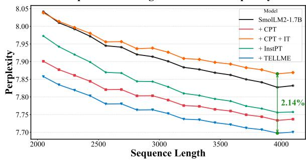  
Figure 2: Perplexity comparison on the medical dataset for different training approaches. The baseline model shows the highest perplexity, while the proposed TELLME achieves the lowest perplexity across all lengths, indicating improved model performance.

TELLME for Domain Adaptation How does TELLME perform across distinct domains? The experimental results show that the TELLME method achieves strong performance in both the finance and medical domains, with particularly notable improvements in the finance domain. In the finance domain, TELLME consistently outperformed the baseline model across all tested models, achieving an average performance gain of approximately 9.8%. Moreover, despite the INSTPT method training on nearly twice as much QA data as TELLME, the TELLME approach still achieved higher scores in all models, except for SmolLM2-1.7B. Overall, TELLME outperformed INSTPT by an average of 5.1% across all models. In the medical domain, TELLME demonstrated an average improvement of 0.09 points over the baseline model and outperformed INSTPT by an average of 2.58 points.

Perplexity in Domain Adaptation Figure 2 presents a comparison of perplexity(PPL) for five training strategies, including the proposed TELLME method, in the medical domain. For both training and evaluation, plain text from the PubMed dataset was employed, with 100k and 4k disjoint data samples, respectively, to ensure a fair evaluation.

The results indicated that the pre-trained baseline model (SmolLM2-1.7B), which was not subjected to domain adaptation, exhibited relatively high PPL across all sequence lengths. In contrast, the model trained solely on plain text (+CPT) tended to demonstrate lower PPL, suggesting a positive effect on domain adaptation. However, the model that underwent additional IT with QA data after plain text training (+CPT+IT) unexpectedly exhibited the highest PPL. This observation is interpreted as the QA-focused fine-tuning phase conducted at the end, diluting the plain text representational capacity. On the other hand, the +TELLME model, which combines plain text and QA within a single data sample achieved the lowest PPL across all sequence length intervals. This suggests that, compared to the +CPT model, the additional QA component in the +TELLME model exerts a positive impact on domain adaptation, and that TEL efficiently acquires domain-relevant representations.

## 4.3 The Impact of TEL on Long-Term Retention

We conducted two experiments using SmolLM2- 1.7B to assess the effectiveness of the TEL technique in retaining long-term domain knowledge. Figure 3 displays a comparison between two models (CPT(F)→CPT(M) and TEL(F)→CPT(M)) in terms of training-step PPL measured on the Bloomberg corpus (top) and performance based on a financial benchmark (bottom). Our experimental setup compared models trained in the following two phases:

1. First, we trained two initial models using finance domain data: one with CPT and the other with TELLME (CPT(F) and TEL(F)).

2. Subsequently, we further trained both models on medical domain data with CPT for 3 epochs, yielding the final models: CPT(F)→CPT(M) and TEL(F)→CPT(M).

In this experiment, we analyzed the long-term retention of previously acquired knowledge (Finance) by comparing the evaluation results on the target domain (Finance) between the CPT(F)→CPT(M) model and the TEL(F)→CPT(M) model.

Perplexity Results on Finance The top graph in Figure 3 compares the PPL of the two models. The evaluation was conducted on 4K samples from the Bloomberg corpus, each with a sequence length of 4K, using a portion of the corpus that was not included in the training data. The experimental results show that the TEL-based model achieved a lower PPL than the CPT-based model, indicating superior performance. Specifically, in terms of the PPL increase rate, the TEL-based model exhibited a 2.5% increase, whereas the CPT-based model showed a 2.65% increase. Given that lower PPL indicates greater confidence in predicting the next token, these results suggest that the TEL-based model maintains a higher probability of generating content from its previously trained domain, despite additional training in an unrelated domain. This implies that compared to conventional CPT methods, the TEL approach better preserves prior domain knowledge even after cross-domain adaptation.

Comparing Long-Term Retention: CPT vs. TELLME  
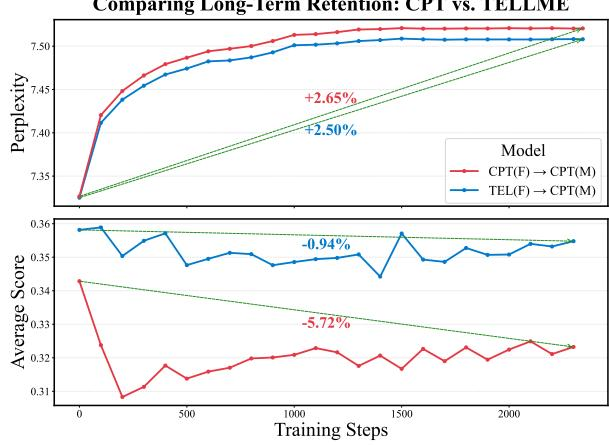  
Figure 3: Performance of the finance domain after overwriting with medicine data.

Benchmark Results on Finance The bottom graph in Figure 3 compares the average performance of the TEL(F)→CPT(M) and CPT(F)→CPT(M) models on the finance benchmark. Observing the range between 0 and 250 training steps, the CPT(F)→CPT(M) model exhibits a notable decline in finance domain comprehension early in the training process on the medical dataset. In contrast, the TEL(F)→CPT(M) model shows more stable retention of finance domain knowledge, even after additional training on medical data. As a result, while the CPT-based approach suffered a 5.72% decline in performance relative to its initial state, the TEL-based approach showed only a 0.94% reduction, indicating superior knowledge retention. Additionally, despite starting with an initial performance 1.53 points higher than that of the CPT-based model, the TELbased model maintained its knowledge more effectively throughout the training, ultimately achieving a 9.8% higher final performance (equivalent to a 3.15-point increase) compared to the CPTbased approach. These findings suggest that, even when trained on an out-of-domain dataset, the TEL method preserves the knowledge of the target domain more effectively than conventional pretraining methods. This indicates that TEL has a positive impact on long-term retention, contributing to greater stability in learned domain knowledge.

<table><tr><td>Model</td><td>Inv-TEL</td><td>CPT</td><td>PIT</td><td>TEL-Q/L</td><td>TEL</td></tr><tr><td>Llama-3.2-1B</td><td>31.20</td><td>29.05</td><td>31.81</td><td>33.73</td><td>33.46</td></tr><tr><td>Llama-3.2-3B</td><td>31.95</td><td>29.98</td><td>33.69</td><td>33.06</td><td>33.87</td></tr><tr><td>Llama-3.1-8B</td><td>33.83</td><td>37.44</td><td>37.61</td><td>38.69</td><td>38.82</td></tr><tr><td>SmolLM2-1.7B</td><td>33.69</td><td>34.28</td><td>35.63</td><td>34.80</td><td>35.82</td></tr><tr><td>Average</td><td>32.67</td><td>32.69</td><td>34.69</td><td>35.07</td><td>35.49</td></tr></table>

Table 4: A performance comparison for various training methods utilizing QA data in the financial domain.

## 5 Ablation Study and Analysis

This section provides an in-depth analysis of TELLME, focusing on performance variations across different TEL application strategies. Table 4 presents a comparison of model performance across various training techniques in the finance domain. In this table, ‘TEL’ refers to the proposed TELLME method, and ‘Inv-TEL’ denotes a training strategy in which the input data is structured as $\mathbf { X } = \left( \mathbf { q } , \mathbf { a } , \mathbf { t } \right)$ , where QA samples precede plain text. In this case, the loss function is computed in the same manner as in the TELLME approach, where all tokens, except for the question, are treated as targets during CPT. Additionally, ‘PIT’ included as a comparative method, follows the approach proposed by Jiang et al. (2024). It consists of a two-stage training process: first, IT is conducted using a QA dataset, and then CPT is performed on the trained model by treating the QA dataset and plain text data as independent samples. During this process, the loss calculation for the questions is excluded. Lastly, ‘TEL-Q/L’ represents a variation of the TELLME method in which the loss calculation is applied to all tokens, including questions, during CPT. See Appendix D.4 for experimental details.

Performance on Test QA Placement Motivated by PIT’s approach, we tested Inv-TEL to examine if positioning QA before plain text impacts performance. As shown in Table 4, the model trained using the Inv-TEL method exhibited a performance that was approximately 2.82 and 0.02 points lower than those of the TEL and CPT methods, respectively. These results suggest that even when TEL is applied, the positioning of the QA pair can significantly affect model performance, thereby demonstrating that the proposed TELLME method effectively leverages this strategy.

Performance on QA Dataset Utilization Method The QA data proposed in this study can be utilized as independent samples in CPT alongside plain text. Alternatively, QA data can be incorporated within a single sample, along with plain text, for training purposes. How does performance differ when QA and plain text are treated as separate samples? As described earlier, the PIT in Table 4 represents a model trained with CPT by combining QA and plain text as independent samples. Compared to TEL, this model exhibited approximately 0.8 points lower performance. Ultimately, the results indicate that integrating QA and plain text within a single training sample yields higher efficiency than treating them as independent samples.

The Impact of Question Prediction Loss Would excluding loss calculation for questions improve model performance? As shown in Table 4, TEL-Q/L exhibited approximately 0.42 points lower performance compared to TEL. TEL-Q/L computes the loss for all tokens, including the questions, whereas TEL calculates the loss only for tokens excluding the questions. These results suggest that the proposed TELLME training method efficiently learns and utilizes key information, ultimately leading to improved performance.

Efficiency of TELLME The CPT has a limitation in which its training process requires substantial computational resources. To investigate whether TELLME can alleviate this issue, we conducted an experiment measuring PPL with respect to training steps. The experimental results showed that TELLME achieved the same PPL with a 1.4 times faster compared to CPT. Further details and results of the experiment are provided in the Appendix G.

Impact of the Synthesizer in the TELLME The TELLME dataset was primarily constructed using the GPT4o-mini model. However, employing such a sophisticated model in dataset construction raises questions about whether performance improvements genuinely stem from the efficiency of the proposed TELLME approach or merely reflect knowledge distillation from a superior model. To investigate this perspective, we conducted additional experiments using an alternative synthesizer, specifically the Mistral-7B model utilized in the InstPT approach, to generate the TELLME dataset. As shown in Table 5, the Llama-3.2-3B model trained on the Mistral-generated dataset (TELLME-(M)) achieved an average score of 33.30, outperforming the INSTPT baseline by 2.27 points in the financial domain. Furthermore, we explored the effectiveness of self-generated datasets, where the TELLME dataset was generated by the target model itself (TELLME-(S)). Results indicate that the selfgenerated dataset notably improved performance, 2.61 points higher than the INSTPT baseline. These results underscore that while employing a powerful synthesizer like GPT4o-mini yields superior performance, the TELLME methodology remains robust and effective even when less advanced synthesizers or self-generated datasets are utilized.

<table><tr><td rowspan="2">Model</td><td colspan="4">Finance</td></tr><tr><td>FOMC</td><td>NIFTY</td><td>MMLU</td><td>AVG.</td></tr><tr><td>Llama-3.2-3B</td><td>22.04</td><td>29.41</td><td>47.47</td><td>32.97</td></tr><tr><td>+ INSTPT</td><td>28.79</td><td>19.60</td><td>44.68</td><td>31.03</td></tr><tr><td>+ TELLME-(M)</td><td>24.01</td><td>30.06</td><td>45.84</td><td>33.30</td></tr><tr><td>+ TELLME-(S)</td><td>26.72</td><td>27.47</td><td>46.74</td><td>33.64</td></tr><tr><td>+ TELLME</td><td>26.02</td><td>27.29</td><td>48.31</td><td>33.87</td></tr></table>

Table 5: Performance of TELLME in financial domain across synthesizers. (M) and (S) indicate datasets generated by Mistral and self-generated datasets, respectively.

<table><tr><td>Model</td><td>BoolQ</td><td>COPA</td><td>HLSW.</td><td>SENT.</td><td>WIC</td><td>Avg.</td></tr><tr><td>Base</td><td>0.522</td><td>0.477</td><td>0.422</td><td>0.524</td><td>0.529</td><td>0.495</td></tr><tr><td>CPT</td><td>0.571</td><td>0.632</td><td>0.534</td><td>0.536</td><td>0.515</td><td>0.546</td></tr><tr><td>TELLME-KO</td><td>0.610</td><td>0.585</td><td>0.422</td><td>0.730</td><td>0.550</td><td>0.579</td></tr></table>

Table 6: Benchmark results on KoBEST for the OLMo-1B model and its variants fine-tuned with TELLME-KO.

Multilingual Generalization to Korean We further investigated whether the proposed TELLME framework generalizes beyond English. To this end, we generated Korean TELLME data (TELLME-KO) following the English setting. We evaluated Korean performance using the OLMo2-1B model on the KoBEST (Jang et al., 2022) benchmark, aiming to assess how effectively TELLME can enhance Korean proficiency in models that originally lack any Korean capability. As shown in Table 6, TELLME-KO achieves a remarkable +8.4-point improvement in average accuracy, with over +20-point gains on the sentence understanding (SENT) task. These results highlight that the proposed TELLME framework can augment knowledge in a languageagnostic manner. Additional experiments across different Korean models, scales, and data generation methods are presented in Appendix G.6.

## 6 Conclusion

In this study, we propose the TELLME (Test-Enhanced Learning for Language Model Enrichment) technique, which offers an effective method for continual pre-training of large language models (LLMs). This approach applies the TEL (Test-Enhanced Learning) principle to mitigate the limitations of the conventional CPT+IT method, particularly in learning target domain knowledge and maintaining long-term memory. We introduce a CPT method utilizing descriptive QA and a strategy for efficiently constructing training data, which have demonstrated positive experimental results from a domain adaptation perspective. In the finance domain, TELLME achieved up to a 23.6% performance improvement on the finance benchmarks compared to existing methods.

## Limitations

The TELLME method proposed in this study has the following possible limitations.

Model Size. Second, although we extended our study to a 70B-parameter model (G.5), the available computational budget required parameter-efficient fine-tuning, namely Low-Rank Adaptation (LoRA) and 4-bit quantization. These techniques reduce memory footprint and training time, but they also introduce additional variables, such as rank selection and quantization noise, that may interact with TELLME. While the preliminary gains at this scale are encouraging, they may not faithfully represent TELLME’s effect on a fully dense 70B model. A systematic investigation without compression, and across even larger architectures, remains an important direction for future work.

Domain Diversity. Finally, this study focuses on finance and medicine, two domains known for their specialized and complex content. However, this scope does not cover the full range of real-world applications. Expanding TELLME to additional domains would require reliable benchmark datasets and evaluation metrics, which are not always publicly available. We acknowledge this limitation and encourage further research to extend TELLME to a broader range of domains, ideally alongside the development of standardized benchmarks in those areas.

## Acknowledgement

This work was supported by the affiliated institute of ETRI[2025-050] and Institute of Information & communications Technology Planning & Evaluation (IITP) grant, funded by the Korea government (MSIT) (No.RS-2024-00456709). We have used GPUs from High-Performance Research AI Computing Infrastructure Support at the 2 PFLOPS Scale (RS-2025-02653113)

## References

Josh Achiam, Steven Adler, Sandhini Agarwal, Lama Ahmad, Ilge Akkaya, Florencia Leoni Aleman, Diogo Almeida, Janko Altenschmidt, Sam Altman, Shyamal Anadkat, et al. 2023. Gpt-4 technical report. arXiv preprint arXiv:2303.08774.

AI@Meta. 2024. Llama 3 model card.

Loubna Ben Allal, Anton Lozhkov, Elie Bakouch, Gabriel Martín Blázquez, Guilherme Penedo, Lewis Tunstall, Andrés Marafioti, Hynek Kydlícek,ˇ Agustín Piqueres Lajarín, Vaibhav Srivastav, et al. 2025. Smollm2: When smol goes big–data-centric training of a small language model. arXiv preprint arXiv:2502.02737.

Cynthia J Brame and Rachel Biel. 2015. Testenhanced learning: the potential for testing to promote greater learning in undergraduate science courses. CBE—Life Sciences Education, 14(2):es4.

Tom Brown, Benjamin Mann, Nick Ryder, Melanie Subbiah, Jared D Kaplan, Prafulla Dhariwal, Arvind Neelakantan, Pranav Shyam, Girish Sastry, Amanda Askell, et al. 2020. Language models are few-shot learners. Advances in neural information processing systems, 33:1877–1901.

Andrew C Butler and Henry L Roediger III. 2007. Testing improves long-term retention in a simulated classroom setting. European Journal of Cognitive Psychology, 19(4-5):514–527.

Jie Chen, Zhipeng Chen, Jiapeng Wang, Kun Zhou, Yutao Zhu, Jinhao Jiang, Yingqian Min, Wayne Xin Zhao, Zhicheng Dou, Jiaxin Mao, et al. 2024. Towards effective and efficient continual pretraining of large language models. arXiv preprint arXiv:2407.18743.

Zeming Chen, Alejandro Hernández Cano, Angelika Romanou, Antoine Bonnet, Kyle Matoba, Francesco Salvi, Matteo Pagliardini, Simin Fan, Andreas Köpf, Amirkeivan Mohtashami, Alexandre Sallinen, Alireza Sakhaeirad, Vinitra Swamy, Igor Krawczuk, Deniz Bayazit, Axel Marmet, Syrielle Montariol,

Mary-Anne Hartley, Martin Jaggi, and Antoine Bosselut. 2023. Meditron-70b: Scaling medical pretraining for large language models. Preprint, arXiv:2311.16079.

Daixuan Cheng, Yuxian Gu, Shaohan Huang, Junyu Bi, Minlie Huang, and Furu Wei. 2024. Instruction pretraining: Language models are supervised multitask learners. In Proceedings ofthe 2024 Conference on Empirical Methods in Natural Language Processing, pages 2529–2550, Miami, Florida, USA. Association for Computational Linguistics.

Daixuan Cheng, Shaohan Huang, and Furu Wei. 2023. Adapting large language models via reading comprehension. In The Twelfth International Conference on Learning Representations.

Pierre Colombo, Telmo Pessoa Pires, Malik Boudiaf, Dominic Culver, Rui Melo, Caio Corro, Andre F. T. Martins, Fabrizio Esposito, Vera Lúcia Raposo, Sofia Morgado, and Michael Desa. 2024. Saullm-7b: A pioneering large language model for law. Preprint, arXiv:2403.03883.

Abhimanyu Dubey, Abhinav Jauhri, Abhinav Pandey, Abhishek Kadian, Ahmad Al-Dahle, Aiesha Letman, Akhil Mathur, Alan Schelten, Amy Yang, Angela Fan, et al. 2024. The llama 3 herd of models. arXiv preprint arXiv:2407.21783.

Andrea P Francis, Mareike B Wieth, Kevin L Zabel, and Thomas H Carr. 2020. A classroom study on the role of prior knowledge and retrieval tool in the testing effect. Psychology Learning & Teaching, 19(3):258– 274.

Kazuki Fujii, Taishi Nakamura, Mengsay Loem, Hiroki Iida, Masanari Ohi, Kakeru Hattori, Hirai Shota, Sakae Mizuki, Rio Yokota, and Naoaki Okazaki. 2024. Continual pre-training for cross-lingual llm adaptation: Enhancing japanese language capabilities. arXiv preprint arXiv:2404.17790.

Leo Gao, Jonathan Tow, Baber Abbasi, Stella Biderman, Sid Black, Anthony DiPofi, Charles Foster, Laurence Golding, Jeffrey Hsu, Alain Le Noac’h, Haonan Li, Kyle McDonell, Niklas Muennighoff, Chris Ociepa, Jason Phang, Laria Reynolds, Hailey Schoelkopf, Aviya Skowron, Lintang Sutawika, Eric Tang, Anish Thite, Ben Wang, Kevin Wang, and Andy Zou. 2024. A framework for few-shot language model evaluation.

Suchin Gururangan, Ana Marasovic, Swabha´ Swayamdipta, Kyle Lo, Iz Beltagy, Doug Downey, and Noah A Smith. 2020a. Don’t stop pretraining: Adapt language models to domains and tasks. arXiv preprint arXiv:2004.10964.

Suchin Gururangan, Ana Marasovic, Swabha´ Swayamdipta, Kyle Lo, Iz Beltagy, Doug Downey, and Noah A. Smith. 2020b. Don‘t stop pretraining: Adapt language models to domains and tasks. In Proceedings of the 58th Annual Meeting of the Association for Computational Linguistics, pages

8342–8360, Online. Association for Computational Linguistics.

Myeongjun Jang, Dohyung Kim, Deuk Sin Kwon, and Eric Davis. 2022. Kobest: Korean balanced evaluation of significant tasks. In Proceedings ofthe 29th International Conference on Computational Linguistics, pages 3697–3708.

Albert Q Jiang, Alexandre Sablayrolles, Arthur Mensch, Chris Bamford, Devendra Singh Chaplot, Diego de las Casas, Florian Bressand, Gianna Lengyel, Guillaume Lample, Lucile Saulnier, et al. 2023. Mistral 7b. arXiv preprint arXiv:2310.06825.

Zhengbao Jiang, Zhiqing Sun, Weijia Shi, Pedro Rodriguez, Chunting Zhou, Graham Neubig, Xi Victoria Lin, Wen-tau Yih, and Srinivasan Iyer. 2024. Instruction-tuned language models are better knowledge learners. arXiv preprint arXiv:2402.12847.

Zixuan Ke, Yifei Ming, Xuan-Phi Nguyen, Caiming Xiong, and Shafiq Joty. 2025. Demystifying domainadaptive post-training for financial llms. arXiv preprint arXiv:2501.04961.

Douglas P Larsen, Andrew C Butler, and Henry L Roediger III. 2008. Test-enhanced learning in medical education. Medical education, 42(10):959–966.

Douglas P Larsen, Andrew C Butler, and Henry L Roediger III. 2013. Comparative effects of test-enhanced learning and self-explanation on long-term retention. Medical education, 47(7):674–682.

Angeliki Lazaridou, Adhi Kuncoro, Elena Gribovskaya, Devang Agrawal, Adam Liska, Tayfun Terzi, Mai Gimenez, Cyprien de Masson d’Autume, Tomas Kocisky, Sebastian Ruder, et al. 2021. Mind the gap: Assessing temporal generalization in neural language models. Advances in Neural Information Processing Systems, 34:29348–29363.

Long Ouyang, Jeffrey Wu, Xu Jiang, Diogo Almeida, Carroll Wainwright, Pamela Mishkin, Chong Zhang, Sandhini Agarwal, Katarina Slama, Alex Ray, et al. 2022. Training language models to follow instructions with human feedback. Advances in neural information processing systems, 35:27730–27744.

Ankit Pal, Logesh Kumar Umapathi, and Malaikannan Sankarasubbu. 2022. Medmcqa: A large-scale multisubject multi-choice dataset for medical domain question answering. In Proceedings of the Conference on Health, Inference, and Learning, volume 174 of Proceedings of Machine Learning Research, pages 248–260. PMLR.

Pouya Pezeshkpour and Estevam Hruschka. 2025. Learning beyond the surface: How far can continual pre-training with lora enhance llms’ domain-specific insight learning? arXiv preprint arXiv:2501.17840.

Pakawat Phasook, Jessada Pranee, Chananyu Limcharoen, Kittisak Sukhantharat, Anon Saeoueng, Kun Kerdthaisong, Chaianun Damrongrat, and Sarawoot

Kongyoung. 2024. Thaibkd: Effective of continual pre-training llm in thai language based on knowledge dataset. In 2024 19th International Joint Symposium on Artificial Intelligence and Natural Language Processing (iSAI-NLP), pages 1–7. IEEE.

Manee Raksakietisak, Vasu Lertsiripatarajit, Naiyana Aroonpruksakul, Narin Plailaharn, and Kasana Raksamani. 2024. Test-enhanced learning in neuroanesthesia for the first year anesthetic residents: a randomized controlled trial. BMC Medical Education, 24(1):905.

Henry L Roediger III and Jeffrey D Karpicke. 2006. Test-enhanced learning: Taking memory tests improves long-term retention. Psychological science, 17(3):249–255.

Raeid Saqur, Ken Kato, Nicholas Vinden, and Frank Rudzicz. 2024. Nifty financial news headlines dataset. arXiv preprint arXiv:2405.09747.

Agam Shah, Suvan Paturi, and Sudheer Chava. 2023. Trillion dollar words: A new financial dataset, task & market analysis. In Proceedings ofthe 61st Annual Meeting of the Association for Computational Linguistics (Volume 1: Long Papers), pages 6664–6679, Toronto, Canada. Association for Computational Linguistics.

Karan Singhal, Tao Tu, Juraj Gottweis, Rory Sayres, Ellery Wulczyn, Mohamed Amin, Le Hou, Kevin Clark, Stephen R Pfohl, Heather Cole-Lewis, et al. 2025. Toward expert-level medical question answering with large language models. Nature Medicine, pages 1–8.

Zhaochen Su, Juntao Li, Zikang Zhang, Zihan Zhou, and Min Zhang. 2023. Efficient continue training of temporal language model with structural information. In Findings ofthe Associationfor Computational Linguistics: EMNLP 2023, pages 6315–6329, Singapore. Association for Computational Linguistics.

Rohan Taori, Ishaan Gulrajani, Tianyi Zhang, Yann Dubois, Xuechen Li, Carlos Guestrin, Percy Liang, and Tatsunori B Hashimoto. 2023. Stanford alpaca: An instruction-following llama model.

David Vilares and Carlos Gómez-Rodríguez. 2019. HEAD-QA: A healthcare dataset for complex reasoning. In Proceedings of the 57th Annual Meeting of the Association for Computational Linguistics, pages 960–966, Florence, Italy. Association for Computational Linguistics.

Tongtong Wu, Linhao Luo, Yuan-Fang Li, Shirui Pan, Thuy-Trang Vu, and Gholamreza Haffari. 2024. Continual learning for large language models: A survey. arXiv preprint arXiv:2402.01364.

Yong Xie, Karan Aggarwal, and Aitzaz Ahmad. 2024. Efficient continual pre-training for building domain specific large language models. In Findings of the Associationfor Computational Linguistics: ACL 2024, pages 10184–10201, Bangkok, Thailand. Association for Computational Linguistics.

Xianjun Yang, Junfeng Gao, Wenxin Xue, and Erik Alexandersson. 2024. Pllama: An open-source large language model for plant science. Preprint, arXiv:2401.01600.

Meixun Zheng, Kenji O’Brien, Kyle Cuenin, Cindy Lyon, and Daniel Bender. 2022. Impact of testenhanced learning as a study strategy: An exploratory study with first-year dental students. Journal ofDental Education, 86(12):1611–1619.

## A Training Details and Hyperparameters

## A.1 Training Setup

We use PyTorch as the primary deep learning framework, along with the HuggingFace Transformers library for efficient model training. The model is trained on a system equipped with eight NVIDIA A100 GPUs (80GB VRAM). Mixedprecision training with bfloat16 is enabled to reduce memory usage and improve computational efficiency.

The training process follows a single stage finetuning approach, where the model is initialized with a pre-trained checkpoint and adapted to the target domain using task-specific data. A cosine learning rate scheduler with a warm-up ratio of 0.03 is applied to prevent unstable updates in the early training phase.

## A.2 Training Datasets

In this section, we summarize the characteristics of the two main domain datasets additionally utilized in this paper.

Bloomberg This dataset, extracted from Bloomberg News, focuses on content that is relevant to the financial community. It provides documents of various lengths, offering domain specific terminology and real market trend information from the finance sector.

PubMed Constructed from open-access data containing a large-scale collection of abstracts from the fields of medicine and life sciences, it enriches the medical domain with specialized knowledge, such as disease names, drug names, and clinical research terminologies that is often lacking in general language models, thereby promoting performance improvements in the respective field.

## A.3 Model Description

Llama-3.2-1B An open-source model released by Meta, with 1 billion (1B) parameters. This lightweight model is designed for efficient performance with low computational cost, providing fundamental natural language understanding and task reasoning capabilities.

Llama-3.2-3B An open-source model released by Meta, containing 3 billion (3B) parameters. It offers stronger contextual understanding and better generalization compared to the 1B model, making it more suitable for a variety of natural language processing (NLP) tasks.

Llama-3.1-8B An open-source model released by Meta, equipped with 8 billion (8B) parameters. It is trained on diverse datasets, enabling strong natural language understanding and generation. It also excels in long-context understanding and domain adaptation.

SmolLM2-1.7B An open-source model, developed by HuggingFaceTB, featuring 1.7 billion (1.7B) parameters. It is highly computationally efficient and, despite its smaller size, is designed to deliver strong performance in various natural language understanding tasks.

## A.4 Optimization and Training Strategy

We optimize the model using AdamW-8bit, a memory-efficient variant of AdamW, with a weight decay of 0.01 to prevent overfitting. The learning rate is set to 5e-5 and is gradually reduced following a cosine schedule. Training is performed with a batch size of 1, and gradient accumulation steps of 16 are used to achieve an effective batch size of 16.

Since our focus is on continual pre-training, we limit the training process to 1 epoch to prevent catastrophic forgetting while allowing the model to adapt effectively to the target domain. In continual learning settings, over-training on new data can lead to the erosion of previously learned knowledge. By training for only one epoch, we ensure that the model retains its general knowledge while gradually adapting to domain-specific nuances. This approach aligns with previous findings in continual pre-training literature, where limited exposure to new data helps maintain a balance between adaptation and retention.

## A.5 Hyperparameter settings

<table><tr><td>Hyperparameter</td><td>Value</td></tr><tr><td>Data-type</td><td>bfloat16</td></tr><tr><td>Learning-rate</td><td>5e-5</td></tr><tr><td>Warm-up ratio</td><td>0.03</td></tr><tr><td>Learning-rate scheduler</td><td>cosine</td></tr><tr><td>Optimizer</td><td>AdamW-8bit</td></tr><tr><td>Weight decay</td><td>0.01</td></tr><tr><td>Batch size</td><td>1</td></tr><tr><td>Gradient accumulation steps</td><td>16</td></tr><tr><td>Training epochs</td><td>1</td></tr></table>

Table 7: Hyperparameter settings used for training. This table summarizes the key hyperparameters, including learning rate, optimizer, batch size, and training schedule.

## B Evaluation Setup

## B.1 Experimental Domains and Selection of the QA Generation Model

In this study, we constructed the TELLME dataset using the GPT4o-mini model based on our proposed prompt. Following prior research (Pezeshkpour and Hruschka, 2025; Phasook et al., 2024), we chose medicine and finance as the target domains for the training data. We found that an open-source model (Llama3.3-70B) could also generate data of comparable quality. However, in terms of efficiency, renting GPUs to use the open-source language model was both more time-consuming and more expensive than employing GPT4o-mini. Consequently, we opted to use GPT for data generation.

## B.2 Evaluation Settings

Essentially, all benchmarks were evaluated using accuracy as the primary metric in a 4-shot incontext setting. However, due to significant class imbalance in the FOMC and NIFTY datasets, the F1 score was employed as the evaluation metric in a zero-shot setting.

## B.3 Finance Benchmarks

FOMC (Federal Open Market Committee) This dataset consists of documents related to the Federal Open Market Committee (FOMC). It includes FOMC meeting minutes, press conferences, and speeches, and is used to evaluate the performance of models analyzing texts related to monetary policy and financial markets.

NIFTY (News-Informed Financial Trend Yield) This is a benchmark dataset constructed based on news and analytical materials related to the U.S. financial market, including news headlines from February 2019 to September 2020. It is used to assess models’ domain knowledge in areas such as the stock market, economic indicators, and corporate finance, as well as to measure their understanding and reasoning capabilities with respect to financial texts.

Massive Multitask Language Understanding - Finance (MMLU-F) MMLU for the finance domain is a benchmark extracted from a subset of the Massive Multitask Language Understanding (MMLU) dataset, specifically focused on financerelated disciplines. This benchmark was extracted by selecting a diverse set of subjects relevant to financial studies, including business ethics, econometrics, high school macroeconomics, high school microeconomics, management, marketing, and professional accounting.

## B.4 Medicine Benchmarks

HEAD-QA (HEAlthcare Dataset) HeadQA is a multiple-choice question-answering benchmark designed to advance research in complex reasoning. The dataset consists of questions taken from exams required for specialized roles in the Spanish healthcare system, posing significant challenges even for experts in the field.

MedMCQA A large-scale Multiple-Choice Question Answering (MCQA) dataset created to tackle real-world medical entrance exam questions. The MedMCQA task can be defined as $X = \{ Q , O \}$ , where Q denotes the textual questions and O represents the set of possible answer choices. Each question is accompanied by multiple candidate answers, $O = \{ O 1 , O 2 , \ldots , O n \}$ , and the objective is to identify the correct single or multiple answers from the given options.

MMLU-C (Massive Multitask Language Understanding - Clinical) MMLU-Clinic is a part of the MMLU benchmark that includes multiplechoice questions related to the medical field, designed to assess the medical knowledge understanding of large language models. This dataset covers various medical subfields such as anatomy, genetics, and clinical knowledge, and is used to evaluate models like Med-PaLM 2. Additionally, it is utilized alongside MedQA, MedMCQA, and Pub-MedQA to assess the precision of LLMs in reasoning and answering questions in the medical domain. Notably, it can also be applied to professional evaluations like medical licensing exams, making it a significant benchmark in AI research for the healthcare sector.

## C Detailed Description for INSTPT Dataset Generation

For the construction of INSTPT data, we built the training dataset based on the code provided by Cheng et al. (2024)1. Specifically, for INSTPT QA generation, we utilized the open-source synthesizer based on Mistral 7B (Jiang et al., 2023) released by the authors2. The parameters used for data generation were set with max\_new\_tokens as 2048, conducted in a 3-shot setting.

## D TELLME Dataset Examples and Clarification

## D.1 TELLME Dataset Examples

Table 9, 10 illustrate examples of datasets generated using the TELLME approach in the Medicine and Finance domains. The QA pairs are related to the text but are designed to introduce new knowledge that cannot be directly found within the given text.

## D.2 Comparison example with the INSTPT dataset

Table 11 presents examples of QA datasets generated using the TELLME approach and the INSTPT approach for the same plain text.

## D.3 Plain text dependency of the TELLME QA dataset

To assess the extent to which QA datasets rely on plain text, we define the Coverage Ratio (CR). Equation 3 presents the formula used to compute CR, which is calculated as the proportion of words(w) in the answer that also appear in the corpus, relative to the total number of words in the answer.

$$
\mathbf { C R } = \frac { \mathrm { l e n g t h } ( \{ w \mid w \in \mathbf { a } \cap w \in \mathbf { t } \} ) } { \mathrm { l e n g t h } ( \{ w \mid w \in \mathbf { a } \} ) } * 1 0 0\tag{3}
$$

The experiment was conducted using a training corpus from the finance domain, comparing QA datasets generated using the TELLME approach and the INSTPT approach.

<table><tr><td rowspan="2">Domain</td><td colspan="2">Finance</td><td colspan="2">Medical</td></tr><tr><td>Basic</td><td>w/o stop</td><td>Basic</td><td>w/o stop</td></tr><tr><td>TELLME</td><td>32.35</td><td>14.83</td><td>48.70</td><td>34.82</td></tr><tr><td>INSTPT</td><td>87.14</td><td>86.60</td><td>69.98</td><td>61.31</td></tr></table>

Table 8: ‘Basic’ refers to the model-generated answer, while ‘w/o stop’ refers to the answer with stopwords removed.

Table 8 shows that the dataset constructed using the TELLME approach has a significantly lower CR compared to the INSTPT approach. This suggests that the TELLME dataset does not rely solely on plain text but also requires external knowledge beyond the given text.

## D.4 Data Composition and Loss Function Design

Figure 4 provides an overview of the data composition and loss calculation strategies employed in the training of various methods, including CPT, IT, PIT, InstPT, TELLME, Inv-TEL, and TEL-Q/L.

In this figure, plain-text refers to the corpus typically used for domain adaptation, while question and answer denote the components of QA datasets. These data types can be treated either as independent samples or concatenated into a single sequence during training. For instance, PIT adopts the former strategy, whereas methods such as TELLMEand InstPT follow the latter. In concatenated settings, the autoregressive nature of language models makes the relative ordering between plain-text and QA data a critical factor influencing learning outcomes.

In Figure 4, green check marks indicate the positions where the loss is applied, whereas crossmark denote regions excluded from the loss calculation. It is common in instruction tuning setups to exclude the question portion of QA data from loss computation. However, several CPT-integrated QA approaches (e.g., InstPT) include the question in the prediction objective. To investigate the impact of this design choice, we additionally evaluate a variant, TEL-Q/L, in which the question loss is explicitly excluded during training.

  
Table 9: An example of a QA dataset generated using the TELLME approach in the finance domain.

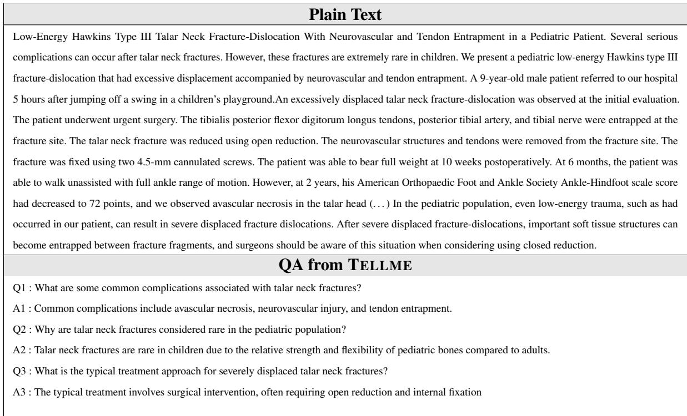  
Table 10: An example of a QA dataset generated using the TELLME approach in the medicine domain.

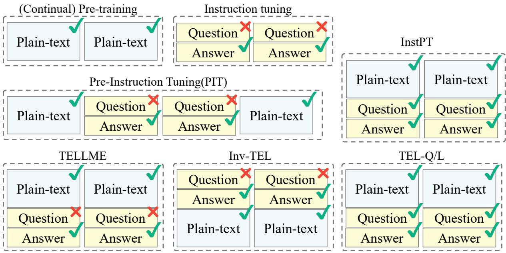  
Figure 4: Comparison of data composition and token-level loss masking across training paradigms. Dashed boxes denote individual mini-batches; within each, the vertically stacked panels constitute a single training sequence. (Continual) Pre-training consumes plain text only, applying the objective to every token. Instruction tuning feeds question–answer (QA) pairs but back-propagates loss exclusively on answer tokens. Pre-Instruction Tuning (PIT) interleaves plain text with QA pairs, computing loss on plain-text and answer tokens while masking question tokens. InstPT activates the objective for all tokens in both plain-text and QA examples. Our proposed TELLME keeps PIT’s masking strategy while doubling the proportion of plain-text sequences to reinforce language modeling; its counterpart Inv-TEL inverts the ordering of QA and plain-text segments within each sample. TEL-Q/L serves as a fully supervised upper bound, applying loss to all tokens in both modalities. Green check marks identify tokens whose losses are calculated, whereas red Crossmark denote tokens excluded from loss computation.

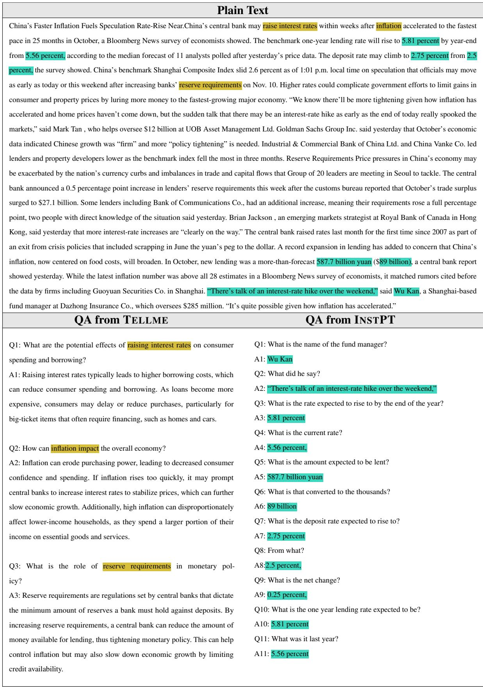  
Table 11: An example of QA datasets generated using the TELLMEapproach and the InstPT approach for the same plain text. InstPT follows a reading-comprehension format, where answers are typically extractive. In contrast, TELLMEgenerates open-ended questions that require a deeper understanding of the text beyond surface-level extraction.

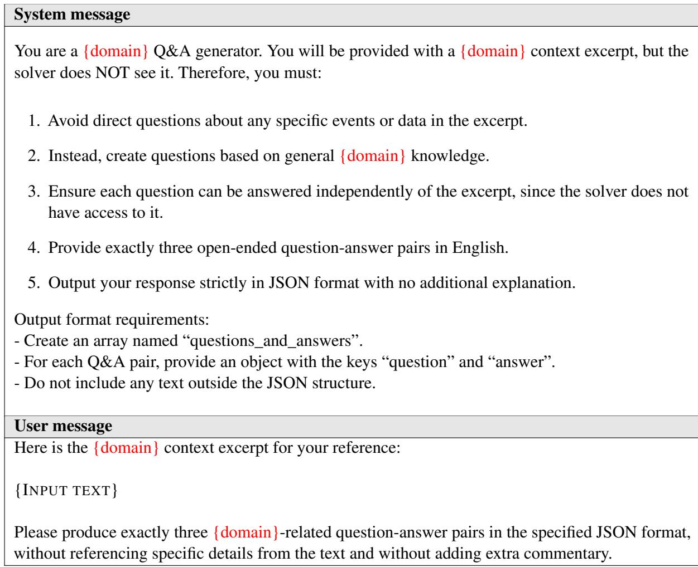  
Table 12: Prompt for TELLME Dataset Construction. In this study, {domain} refers to either “medicine” or “finance,” depending on the context. The system message defines the task, while the user message provides the article excerpt to guide question generation. The {INPUT TEXT} corresponds to a PubMed article excerpt for the “medicine” domain and a Bloomberg article excerpt for the “finance” domain.

## E Detailed Methodology for TEL Dataset Construction

In this study, we constructed a TEL dataset using GPT-generated content tailored to different domains. Specifically, we designed structured prompts to generate high-quality question-answer (QA) pairs in the medical and finance fields. These prompts were crafted to ensure the generated questions were independent of specific article excerpts while remaining relevant to the broader domain knowledge.

## E.1 Description of the Prompt Design for Domain Specific Dataset

As shown in Table 12, the prompt design for TEL dataset construction includes a system message and a user message. The system message defines the task for generating domain-specific Q&A pairs, while the user message provides the article excerpt as input. The {INPUT TEXT} in the user message is sourced from PubMed for the “medicine” domain and Bloomberg for the “finance” domain. This structured prompt ensures the generation of high-quality Q&A pairs that are independent of specific details in the provided excerpts.

## E.2 Ensuring Context Isolation: Filtering for QA Dataset

To construct the TELLME dataset, we designed a prompt using GPT-4o-mini to generate Question & Answer pairs that can be solved without plain text. However, after reviewing 100k samples, we found that approximately 80 samples (0.008%) contained keywords such as “in this context” and “described,” indicating that some questions and answers were generated in a way that required context. Although the number of such samples was small, this issue could compromise the fair evaluation of the CPT+IT and TELLME methods. Therefore, we filtered out these samples before finalizing the TELLME dataset.

## F Expanding LLM Domains through Continual Learning

FINDAP: A Structured Approach for Financial LLM Adaptation (Ke et al., 2025). FINDAP applied a training methodology consisting of Financial-based Continual Pre-training, Instruction Tuning, and Preference Alignment to train a finance-specialized LLM. The PA (Preference Alignment) stage incorporates techniques proposed in the paper to enhance financial reasoning performance by introducing two methods: Stepwise Corrective Preference (SCP) and Final Answer Preference (FAP). SCP provides feedback by comparing the model’s reasoning process at each intermediate step with the correct answer, ensuring accurate step-by-step inference in financial problem-solving. Meanwhile, FAP guides the model to prefer more reliable answers when selecting the final response.

Swallow: Cross-Lingual Continual Pre-Training for Japanese LLMs (Fujii et al., 2024). Swallow is a study that applied Cross-Lingual Continual Pre-Training to enhance Japanese language performance. This research analyzes the impact of vocabulary expansion and the use of parallel corpora in the process of adapting an English-centric LLM to Japanese.

The training process of the Swallow model followed three stages: (1) Continual Pre-Training using a Japanese corpus, (2) Additional training with a Japanese-English parallel corpus, (3) Application of Japanese-specific vocabulary expansion.

Through this approach, the model effectively improved English-Japanese machine translation performance.

Don’t Stop Pretraining: Adapt Language Models to Domains and Tasks (Gururangan et al., 2020b). This study proposes Domain-Adaptive Pretraining (DAPT) and Task-Adaptive Pretraining (TAPT) to enhance the performance of large language models (LLMs). DAPT strengthens domain adaptation by further training the model on largescale data from a specific domain, while TAPT improves task performance by additional training on task-specific data.

Experimental results show that applying both DAPT and TAPT together yields the highest performance, while in certain tasks, TAPT alone is sufficient for significant improvement. This suggests that an appropriate additional training strategy is more effective than merely increasing model size. Therefore, the study emphasizes the importance of tailored training strategies for domain- and task-specific optimization in NLP models.

Efficient Continual Pre-training for Building Domain-Specific Large Language Models. (Su et al., 2023) This study proposes Continual Pre-training (CPT) as a cost-effective way to build domain-specialized Large Language Models (LLMs). By developing the FinPythia model in finance and applying DACP and TACP, performance improved by up to 8.3%.

Furthermore, selecting only key data (ETS-DACP, ETA-DACP) instead of full dataset training cut costs by 90% while maintaining performance. Despite domain-specific gains, open-domain performance remained stable, proving the method’s broad applicability.

The study emphasizes that CPT is a more practical and economical alternative to training LLMs from scratch.

## G Further Analysis of the TELLME

## G.1 Cost-efficient Training of TELLME

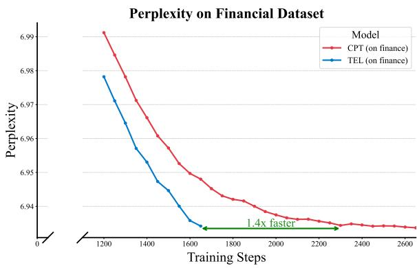  
Figure 5: Perplexity of CPT and TELLME methods based on training steps.

Figure 5 illustrates the PPL scores of the CPT and TELLME methods over the training steps in the finance domain based on SmolLM2-1.7B. The TELLME-based model achieved a PPL of approximately 6.935 after 1,650 steps, whereas the CPTbased model reached a similar level only after 2,300 steps. This indicates that the CPT model requires approximately 1.4 times more training time to achieve the same performance as the TEL model. Consequently, the TELLME method demonstrates its cost efficiency by achieving superior performance within a shorter training duration.

## G.2 Analysis of the TELLME Indicator on Different Datasets

Table 13 presents a performance comparison when optimizing the INSTPT dataset using the indicator proposed by TELLME. The experimental results show that employing TELLME’s indicator consistently led to superior performance across all models. Furthermore, considering the results in Table 4, where TELLME outperformed TEL-Q/L, these findings suggest that incorporating the proposed indicator in the optimization process for QA-based Continual Learning dataset can be more effective.

<table><tr><td>Model</td><td>FOMC</td><td>NIFTY</td><td>MMLU-F</td><td>AVG</td></tr><tr><td>Llama-3.2-1B</td><td></td><td></td><td></td><td></td></tr><tr><td>+ INSTPT</td><td>28.75</td><td>33.38</td><td>45.73</td><td>35.95</td></tr><tr><td>+1(xi ∈ q) = 0</td><td>27.61</td><td>35.51</td><td>46.70</td><td>36.61</td></tr><tr><td>Llama-3.2-3B</td><td></td><td></td><td></td><td></td></tr><tr><td>+ INSTPT</td><td>28.79</td><td>19.60</td><td>44.68</td><td>31.03</td></tr><tr><td>+ 1(xi ∈ q) = 0</td><td>32.44</td><td>25.86</td><td>45.98</td><td>34.76</td></tr><tr><td>Llama-3.1-8B</td><td></td><td></td><td></td><td></td></tr><tr><td>+ INSTPT</td><td>34.40</td><td>27.30</td><td>49.26</td><td>36.99</td></tr><tr><td>+ 1(xi ∈ q) = 0</td><td>38.97</td><td>30.35</td><td>51.40</td><td>40.24</td></tr><tr><td>SmolLM2-1.7B</td><td></td><td></td><td></td><td></td></tr><tr><td>+ INSTPT</td><td>28.75</td><td>33.38</td><td>45.73</td><td>35.95</td></tr><tr><td>+ 1(xi ∈ q) = 0</td><td>27.61</td><td>35.51</td><td>46.70</td><td>36.61</td></tr></table>

Table 13: Comparison of model performance on the INSTPT dataset when optimized with and without the indicator proposed by TELLME. Here, INSTPT refers to the method using both the dataset and the indicator proposed by INSTPT while $\mathbb { I } ( x _ { i } \in { \bf q } ) = 0$ denotes the method that utilizes the dataset proposed by INSTPT but applies the indicator proposed in this study.

## G.3 Performance Variation Based on the Proportion of the TELLME Dataset.

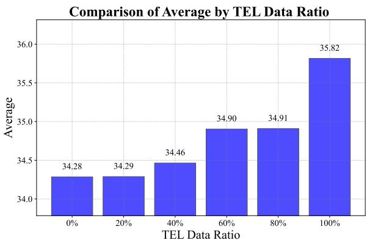  
Figure 6: Performance chart illustrating the effect of different ratios of general plain text and the TELLME dataset, using a model trained on finance data. The evaluation is the same financial benchmark used in Table 3

Figure 6 illustrates the impact of the dataset composition ratio between CPT and TEL datasets on model performance when training the SmolLM2- 1.7B model in the Finance domain using a 100k dataset. As shown in the figure, model performance tends to improve as the proportion of the TEL dataset increases. When the TEL dataset comprises 20% of the total data, the model’s performance is comparable to that of a model trained exclusively on the CPT dataset. However, when the TEL dataset ratio increases to 40%, the model achieves approximately 0.18 points higher performance than the CPT-based model. Additionally, when TEL accounts for 60% or 80% of the dataset, the model’s performance remains nearly identical at around 34.9 points, marking an improvement of approximately 0.62 points over the CPT-based model. At a TEL dataset ratio of 100%, the model achieves its highest performance, reaching a score of 35.82. Notably, even with only 60% TEL data, the model exhibits significant performance gains while maintaining a relatively low training cost of approximately \$7.2, making it a cost-effective choice.

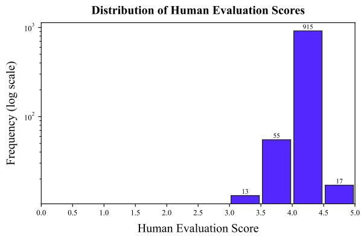  
Figure 7: Distribution of averaged human evaluation scores for the finance domain. Each data point represents the mean of human-evaluated quality scores across three question–answer pairs associated with a given financial text. The scores are aggregated on a 1–5 scale, where higher values indicate better factuality, coherence, and domain correctness. Notably, the overall distribution is concentrated above a score of 3, reflecting the high linguistic and conceptual quality of the curated financial dataset.

In addition, we evaluated the quality of the generated data. Figure 7 presents the results of the LLM-as-a-judge evaluation conducted using GPT-4 mini, based on the following automatic evaluation prompt: Please evaluate the quality of the following question and answer pair based on relevance, clarity, and completeness. Provide a single quality score between 1 (poor) and 5 (excellent). We performed the evaluation on 1,000 samples, and the dataset achieved an average score of 4.03, confirming the high quality of the constructed corpus.

## G.4 Scalability of TELLME Across Models

Table 14 presents the performance of various models optimized with TELLME. The results indicate that all models incorporating TELLME exhibit improved average performance on medicine benchmark datasets. This suggests that TELLME can be applied to a wide range of language models and effectively enhances performance.

<table><tr><td>Model</td><td>HeadQA</td><td>MedMCQA</td><td>MMLU-C</td><td>AVG</td></tr><tr><td>gpt2-medium</td><td>24.36</td><td>21.90</td><td>26.60</td><td>24.29</td></tr><tr><td>+ INSTPT</td><td>23.38</td><td>22.23</td><td>27.34</td><td>24.32</td></tr><tr><td>+ TELLME</td><td>24.65</td><td>22.54</td><td>28.66</td><td>25.29</td></tr><tr><td>gpt2-xl</td><td>25.38</td><td>22.09</td><td>27.61</td><td>25.03</td></tr><tr><td>+ INSTPT</td><td>25.20</td><td>22.45</td><td>28.98</td><td>25.54</td></tr><tr><td>+ TELLME</td><td>26.70</td><td>23.14</td><td>29.98</td><td>26.60</td></tr><tr><td>Qwen2.5-0.5B</td><td>28.74</td><td>25.01</td><td>30.75</td><td>28.17</td></tr><tr><td>+ INSTPT</td><td>27.10</td><td>24.10</td><td>31.93</td><td>27.71</td></tr><tr><td>+ TELLME</td><td>29.25</td><td>25.46</td><td>31.45</td><td>28.72</td></tr><tr><td>Qwen2.5-3B</td><td>38.55</td><td>32.27</td><td>44.16</td><td>38.33</td></tr><tr><td>+ INSTPT</td><td>35.30</td><td>30.41</td><td>42.15</td><td>35.95</td></tr><tr><td>+ TELLME</td><td>39.24</td><td>31.70</td><td>44.33</td><td>38.42</td></tr><tr><td>phi-1_5</td><td>27.90</td><td>24.53</td><td>35.41</td><td>29.28</td></tr><tr><td>+ INSTPT</td><td>27.83</td><td>23.93</td><td>33.90</td><td>28.55</td></tr><tr><td>+ TELLME</td><td>28.70</td><td>24.65</td><td>34.71</td><td>29.35</td></tr></table>

Table 14: Performance comparison of various models optimized with TELLME on medicine benchmarks.

G.5 Scalability of TELLME Across Model size
<table><tr><td>Model</td><td>FOMC</td><td>NIFTY</td><td>MMLU-F</td><td>AVG</td></tr><tr><td>Llama-3.1-70B</td><td>50.96</td><td>31.64</td><td>62.21</td><td>48.27</td></tr><tr><td>+ TELLME</td><td>52.88</td><td>31.37</td><td>63.81</td><td>49.35</td></tr></table>

Table 15: Performance of TELLME on a Large-Scale Model

Table 15 reports the performance of TELLME on a 70B-parameter model trained with 4-bit quantization and Low-Rank Adaptation (LoRA, rank=16) to fit within our computational budget. The method still achieves an improvement of about 1.08 points, indicating that TELLME remains effective even at a much larger scale.

## G.6 Cross-Lingual Transfer and Korean Adaptation

Cross-lingual Transfer via TELLME Framework. We further examined whether the proposed TELLME framework generalizes beyond English. To this end, we selected Korean, a language that is linguistically and typologically distinct from English in both grammar and character system, to evaluate its cross-lingual scalability. Due to licensing constraints on Korean financial corpora, we could not directly use domain-specific financial datasets. Instead, we generated Korean TELLME data by translating and adapting the English seed corpus(Bloomberg).

Specifically, we created two bilingual variants to explore different degrees of linguistic transfer:

• TELLME-BI: which preserves English passages but provides Korean question–answer pairs, and

• TELLME-KO: a fully translated version where both passages and QA pairs are in Korean.

The detailed prompt design and example outputs used for this data construction are provided in Table 18 and Table 19, respectively.

Experimental Setup and Evaluation. Following the same procedure used for the English data construction, we generated a total of 100,000 samples. The evaluation was conducted using the KoBEST (Jang et al., 2022) benchmark, which enables a comprehensive assessment of both Korean linguistic competence and reasoning ability across multiple subtasks. We evaluated Korean performance based on the OLMo2-1B and OLMo2-7B models, aiming to measure how effectively the proposed TELLME framework can enhance Korean proficiency in models that originally lack any Korean capability.

Overall Improvement on KoBEST Benchmarks. Table 15 summarizes the results on the KoBEST benchmark suite, covering BoolQ, COPA, Hellaswag (HLSW.), Sentineg (SENT.), and WiC. Across all tasks, TELLME-KO consistently enhances the base model’s accuracy. For the smaller OLMo2-1B model, TELLME-KO improves the average accuracy from 0.477 (Base) to 0.522 in the 0-shot setting, a relative gain of +4.5 %, and from 0.495 → 0.579 (+8.4 %) in the 5-shot setting. The larger OLMo2-7B model shows a similar trend, achieving 0.508 → 0.568 (+5.9 %) in 0- shot and 0.543 → 0.598 (+5.5 %) in 5-shot evaluation, demonstrating that TELLME effectively scales across model sizes.

Task-wise Analysis. Performance gains vary across task categories. For BoolQ (yes/no comprehension), TELLME-BI and TELLME-KO exhibit the largest improvement, reaching 0.632 and 0.610 (vs. base 0.502) in the OLMo2-1B 0-shot setting—an absolute increase of over +0.10. This suggests strong transferability in sentence-level reasoning. For COPA, a causal reasoning task, accuracy improves from 0.492 → 0.534 (TELLME-BI) and 0.585 (TELLME-KO), highlighting enhanced inferential ability after bilingual exposure. In contrast, HellaSwag (commonsense completion) shows minor or negligible gains, implying that narrative completion may require richer Korean pretraining. Notably, Sentineg—a sentiment polarity classification task—benefits substantially from TELLME-KO, rising from 0.486 → 0.511 (0-shot) and up to 0.730 (5-shot), showing that cross-lingual alignment improves affective understanding in Korean. Finally, WiC, which tests semantic consistency of word senses, exhibits moderate but stable improvements (+0.02–0.04 absolute).

<table><tr><td colspan="8">N Setting BoolQ COPA HLSW. SENT. WIC</td></tr><tr><td colspan="8">OLMo2-1B</td></tr><tr><td>0</td><td>Base</td><td>0.502</td><td>0.492</td><td>0.418</td><td>0.486</td><td>0.488</td><td>0.477</td></tr><tr><td></td><td>TELLME-KO</td><td>0.632</td><td>0.534</td><td>0.418</td><td>0.511</td><td>0.517</td><td>0.522</td></tr><tr><td></td><td>Base</td><td>0.522</td><td>0.477</td><td>0.422</td><td>0.524</td><td>0.529</td><td>0.495</td></tr><tr><td>5</td><td>CPT</td><td>0.571</td><td>0.632</td><td>0.534</td><td>0.536</td><td>0.515</td><td>0.546</td></tr><tr><td></td><td>TELLME-BI</td><td>0.619</td><td>0.545</td><td>0.426</td><td>0.597</td><td>0.533</td><td>0.549</td></tr><tr><td></td><td>TELLME-KO</td><td>0.610</td><td>0.585</td><td>0.422</td><td>0.730</td><td>0.550</td><td>0.579</td></tr><tr><td colspan="8">OLMo2-7B</td></tr><tr><td>0</td><td>Base</td><td>0.548</td><td>0.526</td><td>0.467</td><td>0.511</td><td>0.488</td><td>0.508</td></tr><tr><td></td><td>TELLME-KO</td><td>0.625</td><td>0.535</td><td>0.490</td><td>0.650</td><td>0.541</td><td>0.568</td></tr><tr><td></td><td>Base</td><td>0.726</td><td>0.548</td><td>0.440</td><td>0.511</td><td>0.488</td><td>0.543</td></tr><tr><td>5</td><td>TELLME-KO</td><td>0.731</td><td>0.548</td><td>0.456</td><td>0.738</td><td>0.515</td><td>0.598</td></tr></table>

Table 16: Benchmark results on KoBEST for the Olmo-1B and Olmo-7B base models, as well as for models with TELLME-KO applied. (N) denotes the number of incontext samples (shots) used for evaluation. The results show the performance of the OLMo2-1B and -7B models, along with the performance when the TELLME-KO method is applied. The evaluation metric is accuracy, and the sub-tasks include BoolQ, COPA, Hellaswag (HLSW.), Sentineg (SENT.), and WIC.

Effect of Bilingual vs. Fully Translated Data. Comparing TELLME-BI and TELLME-KO provides insight into the nature of cross-lingual transfer. The bilingual setup (English passages with Korean QA) yields strong improvements in sentence understanding (BoolQ, COPA), indicating that exposure to mixed-language contexts suffices for semantic alignment. However, TELLME-KO, which offers fully localized Korean data, surpasses TELLME-BI in most settings, especially in the 5-shot Sentineg and COPA tasks, demonstrating that full translation amplifies Korean adaptation while maintaining English-aligned reasoning ability. This suggests that bilingual and translated data jointly facilitate smoother cross-lingual transfer.

Observation on LLama-3.2 in Korean. As shown in Table 17, applying the TELLME-KO framework to LLaMA-3.2-1B results in modest yet consistent improvements in Korean performance on KoBEST. The overall average increases from 0.474 to 0.481, with notable gains in BoolQ (+0.027) and Sentineg (+0.030), which test sentence comprehension and sentiment reasoning, respectively. These improvements indicate that cross-lingual exposure through TELLME allows the model to internalize

Korean sentence-level semantics without explicit Korean pretraining.
<table><tr><td>Model</td><td>BoolQ</td><td>COPA</td><td>HLSW.</td><td>SENT.</td><td>WiC</td><td>Avg.</td></tr><tr><td>LLAMA3.2-1B</td><td>0.499</td><td>0.525</td><td>0.390</td><td>0.469</td><td>0.488</td><td>0.474</td></tr><tr><td>TELLME-KO</td><td>0.526</td><td>0.520</td><td>0.372</td><td>0.499</td><td>0.488</td><td>0.481</td></tr><tr><td>∆ (Change)</td><td>+0.027</td><td>-0.005</td><td>-0.018</td><td>+0.030</td><td>+0.000</td><td>+0.007</td></tr></table>

Table 17: Comparison of KoBEST performance between LLAMA-3.2-1B (Original) and TELLME-KO. The evaluation metric is accuracy. TELLME-KO shows consistent gains in BoolQ and Sentineg, indicating improved comprehension and sentiment reasoning ability in Korean.

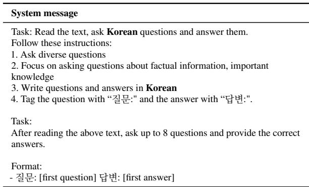  
Table 18: Prompt for generating TELLME-BI data using English seed passages. This dataset connects English knowledge with Korean question–answer pairs, enabling the model to jointly learn information across both languages.

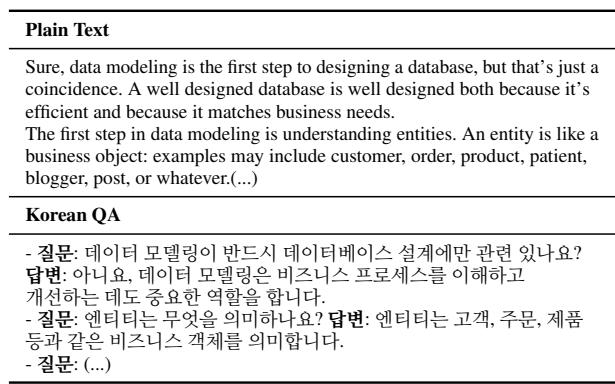  
Table 19: Example of data generated based on the Korean version of TELLME-BI. Each sample consists of an English passage and a Korean Q&A pair. An additional version, TELLME-KO, was produced by translating the English passages into Korean so that the entire sample (passage–question–answer) is in Korean.