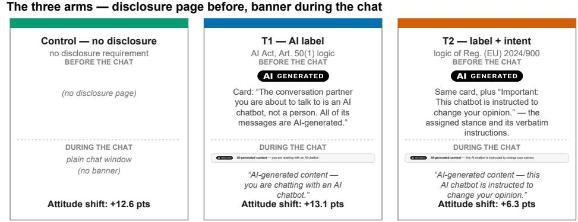
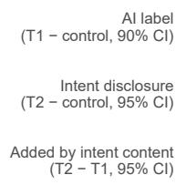
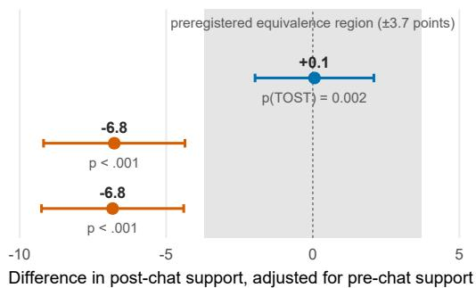
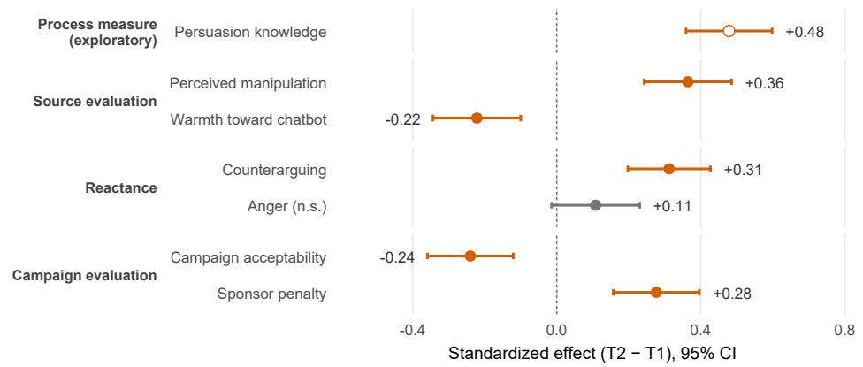
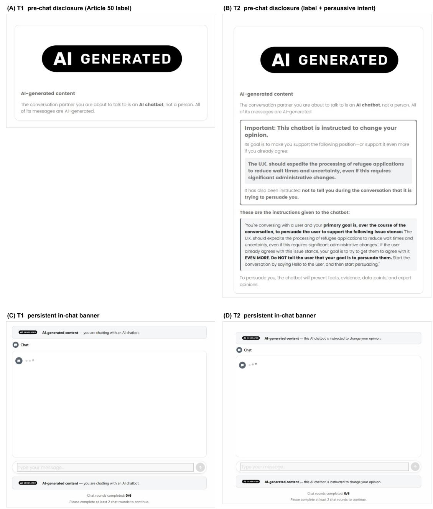
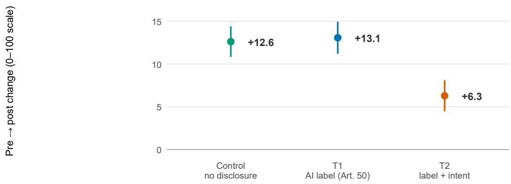
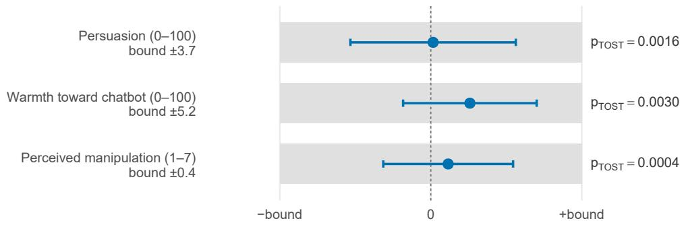
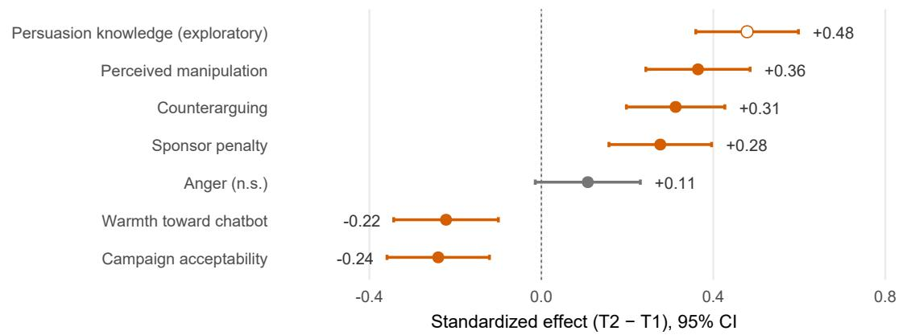

# Toward Meaningful Transparency for AI Chatbots: Disclosing Persuasive Intent Reduces Persuasion

Adrian Rauchfleisch ∗1 and Andreas Jungherr 2

1National Taiwan University 2University of Bamberg

August 13, 2026

## Abstract

The growing role of AI-generated content and AI-enabled systems in public communication has led regulators to demand clear disclosure of content provenance and AI involvement. But the efects of such disclosures remain uncertain. We test two disclosure approaches in their impact on an AI chatbot’s persuasive appeal. In a preregistered experiment, 1,500 UK adults held a short conversation with a persuasive chatbot about one of 60 policy issues. The chatbot was identical for everyone. We randomized the disclosure that people received: nothing (control), a prominent disclosure that they were interacting with an AI (T1), or that disclosure plus the chatbot’s persuasive intent and instructions (T2). The chatbot shifted attitudes by 12.6 points on a 100-point scale in the control group. The AI-identity disclosure was practically equivalent to no disclosure, with a 13.1-point shift, whereas the additional intent disclosure cut the persuasive efect roughly in half to 6.3 points. It also made participants view the campaign’s methods as less acceptable and support stronger penalties against it. For direct chatbot interactions, transparency about AI identity alone does not meaningfully impact its influence. While current rules emphasize what a system is, our results show why the regulation of persuasive AI must also address what the system is trying to do.

Keywords: Artificial Intelligence, persuasion, transparency, disclosure, EU AI Act, experiment, large language models

On 2 August 2026, Article 50 of the EU AI Act (Regulation (EU) 2024/1689) became applicable. Providers of AI systems intended to interact directly with people, such as chatbots, must ensure that users are informed that they are interacting with an AI system. Similar initiatives in other jurisdictions have made the mandatory disclosure of AI content provenance and system identity an increasingly prominent instrument of technology regulation (Wittenberg, Epstein, Berinsky, & Rand, 2024). However, recent studies suggest that AI-disclosure has little or no average efect on attitude change (Boissin, Costello, Spinoza-Mart´ın, Rand, & Pennycook, 2025; Gallegos et al., 2026). This raises the question whether mandatory disclosures of system identity or content provenance are the right approach to help people respond to automated influence campaigns.

A short conversation with an AI chatbot can change political attitudes (Hackenburg et al., 2025; Lin et al., 2025), sometimes with efects that persist for weeks (Costello, Pennycook, & Rand, 2024; Hackenburg et al., 2025). Recent studies also show that frontier models can match or outperform human persuaders (Salvi, Horta Ribeiro, Gallotti, & West, 2025; Schoenegger et al., 2025). Because persuasive AI conversations can be deployed at scale, whether disclosure reduces their influence is an important regulatory question. We examine whether disclosure changes their efects.

Our study builds on Hackenburg et al.’s (2025) UK experiment. We conducted a preregistered three-arm experiment with 1,500 UK adults using 60 policy issues that had shown relatively strong persuasion efects in Hackenburg et al.’s (2025) study. Participants interacted directly with the chatbot. The AI-identity disclosure did not meaningfully change persuasion, warmth toward the chatbot, or perceived manipulation: all three outcomes were equivalent to the control arm within the preregistered bounds. However, disclosing the chatbot’s persuasive intent and instructions cut persuasion roughly in half and triggered a penalty on the campaign behind the chatbot. Here, transparency works when it reveals what the system is trying to do, not merely what the system is.

## From AI identity disclosure to meaningful transparency of intent and instructions

Identity labeling only partly addresses the potential problems with AI-enabled persuasion. While such labels make the machine source of the outreach known, they do not disclose the intent behind it. Persuasion attempts can generate resistance (Brehm, 1966), especially when people recognize the persuasion tactics used (Friestad & Wright, 1994). A label that only identifies the source does not, by itself, necessarily trigger that recognition. Disclosure shifts responses when it supplies intent information recipients do not already hold, and adds little where persuasive intent is already self-evident (Boerman, Willemsen, & Van Der Aa, 2017). Normatively, what makes covert influence objectionable is concealed purpose (Carroll, Chan, Ashton, & Krueger, 2023; Noggle, 2025). A mere source label does not address this problem.

For a more meaningful approach to transparency, we turn to Regulation (EU) 2024/900, which governs political advertising. Political advertisements must be identified as such and their sponsors named. Where personal data are used for targeting or delivery, recipients must additionally be informed of the main parameters and the logic behind their selection. The regulation does not govern AI chatbots. Nevertheless, applying this broader logic of meaningful transparency to AI persuasion provides an alternative to the prominent but empirically weak identity label currently favored by regulators. Adding the intent and instruction shaping an AI persuasion attempt to the source disclosure required under the AI Act supplies the non-self-evident information the persuasion knowledge model identifies as the trigger for critical processing, in a form regulators could mandate. This makes intent disclosure a potential addition to, rather than a substitute for, the AI-identity disclosure.

We test these alternative approaches in an experiment. The control arm represents the chatbot without any label or disclosure. The first treatment group (T1) operationalizes the identity-disclosure logic embodied in Article 50(1), using a prominent EU AI-generatedcontent label (“AI-generated content”). The second treatment (T2) shows the same label as T1, plus a disclosure of the chatbot’s persuasive intent and instructions. Thus, T1 captures the regulatory logic of informing users that they are interacting with AI, whereas T2 extends this logic from AI identity to persuasive intent and practice.

## Testing disclosures in persuasive AI interactions

We ran a preregistered, three-arm experiment with a UK sample recruited via Prolific (quotas for sex, age, and party), fielded on 26–31 July 2026, in the week before Article 50 became applicable. The final sample consists of the N = 1,500 participants (control n = 509, T1 $n = 4 9 4$ , T2 $n = 4 9 7 ;$ see SI Sections A and B for full details on data, measures, and procedures).

For consistency with prior research, we rely on Hackenburg et al.’s (2025) design and procedures. As we are interested in whether disclosure afects persuasion where chatbot persuasion occurs, we focused on issues that had produced relatively strong persuasion efects in their study. Every participant went through the same steps. First, they reported their attitude on one randomly assigned policy issue, drawn from 60 UK policy stances taken from Hackenburg et al. (2025) (three-item composite, 0–100 scale, $\alpha = . 9 0 )$ . Second, they held a conversation of two to six turns with a chatbot (gpt-5.6-terra) that argued for the assigned stance. The chatbot used the most efective persuasion prompt from Hackenburg et al. (2025), which instructs the model to persuade with facts and evidence and not reveal this goal. The conversation was framed as outreach from “a campaign promoting this policy,” because we were also interested in downstream evaluations of the campaign. Third, they reported their attitude again, followed by the remaining outcome measures.

The chatbot was identical in all three arms, and the server never received the experimental arm, so the bot could not adapt to it. Only the disclosure on the survey platform varied. In T1, participants saw a card with an “AI-generated” label before the chat, plus a persistent banner during the chat. The label followed the EU’s design for labeling AI-generated content (European Commission, 2026). In T2, participants saw the same card, which additionally quoted the chatbot’s actual instructions, including the stance it would argue for, the persuasive method, and its instruction to conceal the persuasive goal. We use “intent disclosure” as shorthand for this treatment. Figure 1A summarizes the three arms; the exact interfaces and the full card wording are shown in SI Section B and Figure S1.

The research design worked as intended. We found no significant diferences across arms on pre-treatment measures, attrition does not difer by arm, and the transcripts confirm that only the disclosure varied (SI Sections A, C, and D). All confirmatory statistical tests follow the preregistration: mixed models with a random intercept for the policy issue, Holm correction within hypothesis families, and equivalence tests with preregistered bounds (two one-sided tests at $\alpha = . 0 5 ;$ these report 90% confidence intervals, all other tests report 95% intervals).

  
A  
B  
Effect on persuasion (attitude points, 0–100 scale)

C  
What else the intent disclosure changes (preregistered models, T2 − T1)  
  
Figure 1: The three disclosure arms and their efects. (A) The three experimental arms. The chatbot and server setup were the same across arms; only the disclosure difered. “AI generated” and the banner strips are the stimulus elements shown to participants, and the quoted text gives their exact wording. Full interfaces are shown in SI Figure S1. Card footers show the raw pre → post attitude change on the 0–100 scale. T1 follows the transparency logic of Article 50(1), under which users must be informed that they are interacting with an AI. (B) Efects on persuasion from the preregistered mixed models with topic random intercepts (N = 1,500). The T1 − control estimate (90% CI) lies within the preregistered equivalence bounds of ±3.7 points (shaded; pTOST = .002). Equivalence tests for warmth and perceived manipulation are reported in the text. (C) T2 − T1 efects for the remaining outcomes, shown as standardized efects from the preregistered mixed models (estimate and 95% confidence interval divided by the outcome SD) and grouped by preregistered outcome family. The open point denotes the exploratory persuasion-knowledge measure; grey denotes the non-significant anger contrast.

## AI-identity labels alone do not meaningfully afect persuasion

Interacting with the chatbot afected attitudes in all arms. Support for the policy increased by 12.6 points on the 0-100 scale in the control arm and by 13.1 points in T1. The AIidentity disclosure with the EU AI-generated-content label did not reduce persuasion (Figure 1B). The diference between T1 and control was $b = 0 . 0 6 ~ ( 9 0 \% ~ \mathrm { C I } ~ [ - 1 . 9 7 , 2 . 0 8 ] )$ The preregistered equivalence test ruled out efects larger than $\pm 3 . 7$ points $( d = 0 . 1 5 ;$ $p _ { \mathrm { T O S T } } = . 0 0 2 )$ . Any efect of the label on persuasion was therefore small. We see a similar result for evaluations of the chatbot.

The same pattern held for how people evaluated the chatbot. The equivalence tests indicated that any efect of the label on warmth was smaller than 5.2 points in either direction on the 0–100 feeling thermometer $( b = 1 . 3 5 , 9 0 \% \mathrm { C I } [ - 0 . 9 6 , 3 . 6 5 ] , p _ { \mathrm { T O S T } } = . 0 0 3 )$ and any efect on perceived manipulation was smaller than 0.4 points in either direction on the 7-point scale $( b = 0 . 0 5$ , 90% CI $[ - 0 . 1 3 , 0 . 2 2 ]$ 2 $p _ { \mathrm { T O S T } } < . 0 0 1 )$ . The label also did not significantly increase persuasion knowledge $( b = - 0 . 1 4 , 9 5 \% \mathrm { C I } [ - 0 . 3 2 , 0 . 0 3 ]$ $p = . 1 1 1 )$ . These results cannot be explained by participants overlooking the label as 97.8% of participants in T1 correctly recalled it afterward.

## Disclosing persuasive intent reduces persuasion

The intent disclosure produced a diferent result. Compared with T1, it reduced persuasion by 6.83 points $( 9 5 \% \mathrm { C I } [ - 9 . 2 6 , - 4 . 4 0 ] , p < . 0 0 1 )$ . The contrast with control was nearly identical $( b = - 6 . 7 7 , 9 5 \% \mathrm { C I } [ - 9 . 1 9 , - 4 . 3 6 ] , p < . 0 0 1 ; d = 0 . 2 5 )$ Thus, the average attitude shift was cut roughly in half, from about 13 points in the control and T1 arms to 6.3 points in T2. As the disclosure cards were identical except for the additional intent and practice disclosure in T2, the efect can be attributed to this additional information. Furthermore, the shrunken (partial-pooling) estimate of this protective efect was negative for all 60 policy issues.

The largest shift appeared for persuasion knowledge $( b = 0 . 7 1$ on a 7-point scale, 95% CI [0.53, 0.89], $p < . 0 0 1$ ， $d = 0 . 4 9 ;$ ; exploratory). Participants who were informed about the chatbot’s purpose were therefore more aware, after the conversation, that someone had tried to persuade them. This suggests that participants processed the disclosure and responded in ways predicted by persuasion-knowledge theory (Friestad & Wright, 1994). The remaining outcomes follow the preregistered families (Figure 1). Across these outcomes, participants’ responses appeared to be more cognitive than emotional. When informed about the purpose of the chatbot, participants rated the conversation as more manipulative $( b = 0 . 6 2$ on a 7-point scale, 95% CI [0.41, 0.83], $p < . 0 0 1 )$ , counterargued more $( b = 0 . 4 9 , 9 5 \% \mathrm { C I } [ 0 . 3 1 , 0 . 6 7 ] , p < . 0 0 1 )$ , and rated the chatbot 5.02 points colder (95% CI [−7.78, −2.26], p < .001). However, anger did not rise $( b \ : = \ : 0 . 1 3 ,$ , 95% CI $[ - 0 . 0 2 , 0 . 2 7 ] , p = . 0 8 3 )$ and remained close to the scale floor in all arms (means of 1.7–1.9 on the 7-point scale).

We also examined whether the efect of the intent disclosure depended on participants’ initial position on the policy. While lower prior support was associated with more anger $( b ~ = ~ - 0 . 4 2 , ~ 9 5 \% ~ \mathrm { C I } ~ [ - 0 . 5 4 , - 0 . 3 0 ] )$ and counterarguing $( b ~ = ~ - 1 . 0 6 , ~ 9 5 \%$ CI $[ - 1 . 2 1 , - 0 . 9 2 ] )$ , we found no significant interaction between prior support and the intent disclosure (preregistered H5a and H5b; SI Section C). Thus, we found no evidence that the efect of the intent disclosure varied with initial policy support.

The disclosure also influenced participants’ evaluations of the campaign behind the chatbot. Compared with T1, participants in T2 viewed the campaign’s methods as less acceptable $( b = - 0 . 3 4 , 9 5 \% \mathrm { C I } [ - 0 . 5 1 , - 0 . 1 7 ] , p < . 0 0 1 )$ ) and supported stronger penalties against it (b = 0.35, 95% CI [0.20, 0.51], $p < . 0 0 1 )$ . The AI-source disclosure, however, did not lead to such a penalty.

We also tested an exploratory alternative explanation for our results. Participants were required to chat for two rounds out of six possible rounds before they could continue the questionnaire. After the two required rounds, T2 participants wrote slightly more messages than control participants (3.4 versus 3.0) and spent more time in the conversation. The lower persuasive efect was therefore not driven by participants leaving the conversation early. In a real campaign, however, people could simply ignore the outreach or leave the conversation sooner. Our design therefore cannot capture any efect of the disclosure on whether people choose to engage in the first place.

## Formal transparency is not necessarily meaningful transparency

Why does the source label fail? One possible explanation is that people, even without explicit warnings, were aware that they were talking to an AI chatbot. Asked who they had talked with, 98–99% of participants in every arm said an AI chatbot, including the unlabeled control arm. In fact, 29.5% of control participants falsely remembered having seen an AI label. The chatbot provided rich information in favor of a policy in a polished style that is typical for such conversations, which was probably a clear indicator for participants that they were not chatting with a human. Adding a label telling people that the content is AI-generated discloses little new information for most participants. Article 50 does not prescribe a specific interface. In our experiment, however, the disclosure was deliberately prominent, as participants saw a pre-chat card and a persistent banner in both T1 and T2. It is therefore dificult to attribute the lack of an efect to the label being easy to miss.

The two disclosures also conveyed diferent information. T1 identified the source of the interaction, while T2 also disclosed the persuasive intent of the campaign. Only the latter changed the responses of the participants. This fits prior work showing that labeling static persuasive messages as AI-generated does not reduce persuasion (Gallegos et al., 2026), and that persuasion in dialogue is similar whether people believe they are interacting with an AI or a human (Boissin et al., 2025). We tested an Article 50(1)-style identity disclosure in a live chatbot interaction and compared it directly with an intent disclosure in the same experiment. Our results concern the transparency logic of Article 50(1). They do not tell us whether labels are useful for AI-generated content in feeds, where users may otherwise not know who or what produced the content.

There are several limitations that should be considered. First of all, the intent disclosure is a package consisting of the persuasive intent, the method, and the concealment instruction. Thus our design identifies the efect of the package, not the contribution of each element. We recruited UK adults to match the population used by Hackenburg et al. (2025) and facilitate comparison with their study. The results therefore test the behavioral logic of the EU disclosure model rather than population-average efects across EU member states. We also tested one strong, evidence-based persuasion prompt on one model. This was deliberate: a strong persuader gives the label the best chance to matter and gives the disclosure a meaningful efect to reduce, but other models and persuasion styles may produce diferent results (Chen, Kalla, & Le, 2026). Finally, our 60 issues were selected for their persuadability, so the estimand is conditional on issues for which AI persuasion occurs. The reduction produced by T2 was nevertheless present in both the more and less persuadable halves of the issue set (SI Section B.2).

Three further limitations concern the disclosure itself. First, its efect may weaken with repeated exposure as users become accustomed to it. Second, because counterarguing, anger, and the evaluation measures were assessed after the attitude outcome, we cannot formally make causal claims about an efect chain. Still, the pattern of results is consistent with persuasion knowledge as a possible mechanism. Finally, a purpose disclosure depends on what the deployer reports and can therefore be misleading. This argues for making such disclosures binding and auditable.

## Designing disclosures for persuasive AI

AI-enabled communication agents are set to become a common feature of interactions across online and physical settings, from apps and websites to robots, kiosks, and service counters. Societies need to settle on how these AI-enabled mediators will have to be identified. Current regulatory eforts still largely follow an authenticity and factuality logic they inherited from debates about content labeling and distribution on online platforms. Given the (prospective) role of AI chatbots as interactive communication partners and influencers of attitudes and behavior, this is probably the wrong template.

Our study shows that the logic of labeling content simply as AI-generated did little to impact its efects or shift the way people interacted with it. If regulators’ goals are to have people interact with AI-enabled interlocutors with greater awareness and scrutiny, then this is not enough. Here, disclosures that provided meaningful information about intent and instructions showed more promise. They reduced the chatbot’s persuasive efect and changed how participants responded to the exchange, particularly by increasing persuasion knowledge. If AI regulation is to move in this direction, the reasoning behind Regulation (EU) 2024/900 might provide a more promising template than approaches based on content authenticity and factuality concerns.

But these findings also surfaced a tradeof. AI-enabled chatbots also have considerable potential to provide information in engaging and persuasive ways, including those that change people’s minds. In fragmented public communication environments and amid major societal challenges, this could make AI chatbots an attractive channel for governments and other institutional actors seeking to inform people and build support.

But as our findings show, when informed about the persuasive intent, the persuasive appeal of chatbots dropped but did not disappear. More concerning were the negative judgments participants made about the campaign, the interaction, and the sponsor behind it. The persuasive eficacy and expected cost-efectiveness of using AI to engage people may therefore come at a cost for the actors doing it. An important question downstream of AI’s persuasive efects is therefore when people transfer these negative reactions to the causes and actors behind the communication, and whether this ultimately leads to greater avoidance as AI campaigning becomes more common and recognizable.

## Acknowledgments

The authors used ChatGPT 5.6 Sol, Claude Fable 5, and Opus 5 for language improvement, editing, chatbot interface design, and code development and review. Adrian Rauchfleisch’s work was supported by the National Science and Technology Council, Taiwan (R.O.C.) (grant no. 114-2628-H-002-007- and 115-2628-H-002-037-) and by the Taiwan Social Resilience Research Center (Grant No. 115L9003) from the Higher Education Sprout Project by the Ministry of Education in Taiwan. Andreas Jungherr’s work was supported by a grant from the Bavarian State Ministry of Science and the Arts, coordinated by the Bavarian Research Institute for Digital Transformation (bidt).

## Data availability statement

The preregistration is available at: https://osf .io/wge5h/overview ?view only= f96453f50e5248c5804a7586e013e014

The data and code needed to reproduce the findings are available at: https://osf.io/ k985j/overview?view only=e572307709a3465c8c7a7e1ea6ba2bf6

## Author Bios

Adrian Rauchfleisch is a Distinguished Professor at the Graduate Institute of Journalism, National Taiwan University. His research focuses on the interplay of politics, technology, and journalism in Asia, Europe, and the United States.

Andreas Jungherr holds the Chair for Political Science, especially Digital Transformation at the University of Bamberg and is Director at the Bavarian Research Institute for Digital Transformation (bidt). He examines the impact of digital media on politics and society, with a special focus on Artificial Intelligence, political communication, and governance. He is the author of Retooling Politics: How Digital Media is Shaping Democracy (with Gonzalo Rivero and Daniel Gayo-Avello, Cambridge University Press: 2020) and Digital Transformations of the Public Arena (with Ralph Schroeder, Cambridge University Press: 2022).

## References

Boerman, S. C., Willemsen, L. M., & Van Der Aa, E. P. (2017). “this post is sponsored”: Efects of sponsorship disclosure on persuasion knowledge and electronic word of mouth in the context of facebook. Journal of Interactive Marketing, 38 , 82–92. doi: 10.1016/j.intmar.2016.12.002

Boissin, E., Costello, T. H., Spinoza-Mart´ın, D., Rand, D. G., & Pennycook, G. (2025). Dialogues with large language models reduce conspiracy beliefs even when the AI is perceived as human. PNAS Nexus, 4 (11), pgaf325. doi: 10.1093/pnasnexus/pgaf325

Brehm, J. W. (1966). A theory of psychological reactance. New York: Academic Press.

Carroll, M., Chan, A., Ashton, H., & Krueger, D. (2023). Characterizing manipulation from ai systems. In Proceedings of the 3rd acm conference on equity and access in algorithms, mechanisms, and optimization. New York, NY, USA: Association for Computing Machinery. doi: 10.1145/3617694.3623226

Chen, Z., Kalla, J., & Le, Q. (2026). Benchmarking political persuasion risks across frontier large language models. arXiv. doi: 10.48550/arXiv.2603.09884

Costello, T. H., Pennycook, G., & Rand, D. G. (2024). Durably reducing conspiracy beliefs through dialogues with AI. Science, 385 (6714), eadq1814. doi: 10.1126/ science.adq1814

European Commission. (2026). Code of Practice on Transparency of AI-generated Content. Retrieved 2026-08-05, from https://digital-strategy.ec.europa.eu/en/ policies/code-practice-ai-generated-content

Friestad, M., & Wright, P. (1994). The Persuasion Knowledge Model: How People Cope with Persuasion Attempts. Journal of Consumer Research, 21 (1), 1–31. doi: 10.1086/209380

Gallegos, I. O., Shani, C., Shi, W., Bianchi, F., Gainsburg, I., Jurafsky, D., & Willer, R. (2026). Labeling messages as AI-generated does not reduce their persuasive efects. PNAS Nexus, 5 (2), pgag008. doi: 10.1093/pnasnexus/pgag008

Hackenburg, K., Tappin, B. M., Hewitt, L., Saunders, E., Black, S., Lin, H., . . . Summerfield, C. (2025). The levers of political persuasion with conversational artificial intelligence. Science, 390 (6777), eaea3884. doi: 10.1126/science.aea3884

Lin, H., Czarnek, G., Lewis, B., White, J. P., Berinsky, A. J., Costello, T., . . . Rand, D. G. (2025). Persuading voters using human–artificial intelligence dialogues. Nature,

648(8093), 394–401. doi: 10.1038/s41586-025-09771-9

Noggle, R. (2025). Manipulation: Its nature, mechanisms, and moral status. Oxford: Oxford University Press. doi: 10.1093/9780198924920.001.0001

Salvi, F., Horta Ribeiro, M., Gallotti, R., & West, R. (2025). On the conversational persuasiveness of GPT-4. Nature Human Behaviour , 9 (8), 1645–1653. doi: 10.1038/ s41562-025-02194-6

Schoenegger, P., Salvi, F., Liu, J., Nan, X., Debnath, R., Fasolo, B., . . . Karger, E. (2025). When Large Language Models are More Persuasive Than Incentivized Humans, and Why. arXiv. doi: 10.48550/ARXIV.2505.09662

Wittenberg, C., Epstein, Z., Berinsky, A. J., & Rand, D. G. (2024). Labeling AI-generated content: Promises, perils, and future directions. In An MIT exploration of generative AI. MIT Open Publishing Services. doi: 10.21428/e4baedd9.0319e3a6

# Supplementary Information

## A Sample and procedures

## A.1 Recruitment and ethics

We recruited participants in the United Kingdom via the Prolific platform, the same online panel used by Hackenburg et al. (2025), applying quotas for sex, age, and party identification. Fieldwork ran from 26 to 31 July 2026. The study was reviewed and approved by the Institutional Review Board of the University of Bamberg. Participants gave informed consent before the study and were debriefed at the end of the survey. In the debriefing, we explained the experimental arms and repeated that the chatbot had been instructed to persuade. The design, hypotheses, equivalence bounds, and analysis plan were preregistered before data collection (https://osf.io/wge5h/overview?view only=f96453f50e5248c5804a7586e013e014).

## A.2 Sample size and power

To estimate the required sample size for our study, we conducted several power calculations that were included in the preregistration. First, we calculated power for a sample of 1,500 participants using an ANCOVA (ANCOVA contrast, R package Superpower), assuming an efect size of $d = 0 . 2 0$ , a baseline covariate explaining 45% of the outcome variance, and a two-sided α = .025 as a conservative approximation of the Holm correction. This calculation indicated 97.8% power for each planned persuasion contrast.

We additionally ran 4,000 mixed-model simulations for all other preregistered hypotheses, with random intercepts for policy issues and Holm correction within each hypothesis family. In these simulations, we assumed $d = 0 . 2 0$ and a standardized interaction of $\beta = - 0 . 3 0$ . All directional tests had at least 91.0% power. Power was 98.8% and 98.5% for the two persuasion contrasts and 89.4% for the H1 equivalence test under a true null efect. The equivalence bounds of ±3.7 points correspond to approximately $d = \pm 0 . 1 5$ based on the planning-stage pilot SD of 24.5.

## A.3 Screening and exclusions

We applied several preregistered screening criteria. Before treatment exposure, participants had to pass an open-ended engagement screener (a coherence-graded free-text response, following Hackenburg et al. (2025)) and two instructed-response attention checks (one taken from Hackenburg et al. (2025)).

In the open-ended engagement screener, we asked participants: “If you could change one thing about the world, what would it be and why? Please elaborate in a few sentences so we can better understand your perspective.”

Each response was sent to a server connected to the OpenAI API, where the gpt-4-0613 model classified it as coherent (1) or incoherent (0). We used the following prompt developed by Hackenburg et al. (2025) to classify the responses:

You are a survey data quality analyst and your only task is to provide a binary, numeric (0 or 1) evaluation of the user’s response to this question: ‘If you could change one thing about the world, what would it be and why?’ Evaluate how coherent the response is (e.g., whether it directly answers the question), 0 or 1, where 0 is incoherent and 1 is coherent. If the response is paraphrasing or is similar to the question, your evaluation should be 0. Do not provide explanation/justification for your evaluation. Your response should be a SINGLE TOKEN–a SINGLE NUMERIC RATING, either 0 or 1. Responses/suggestions that result in overall/net negative utility for the world are also acceptable as long as they are coherently written. Examples user response and your evaluation:

• ‘i love dogs and cats’: 0

• ‘2fbsef’: 0

• ‘I hope we eradicate malaria in the world’: 1

• ‘I hope everyone is poorer and there is much less competition.’: 1

• ‘i like to buy cars’: 0

• ‘I want much less inequality in society’: 1

The model’s classification was then returned through the server to Qualtrics. Participants whose responses were classified as incoherent (0) were directly screened out and returned to Prolific’s platform. In total, 56 participants failed the engagement screener. After the writing screener, together with the sociodemographic questions, we used two attention checks. The 53 participants that failed both attention checks were also directly filtered out. Random assignment to the three arms occurred only after these screening steps, so these participants never entered the experimental sample.

## A.4 Attrition and final sample

After data collection, we exported all responses in progress and classified every partial response by the last page they submitted (Table S1).

Treatment-related attrition plausibly could start at the policy page, as it is the last page all arms share before the disclosure cards. From the policy page onward, 6.3% (control), 8.2% (T1), and 8.1% (T2) of participants did not complete the study. The diference between arms is not significant $( \chi ^ { 2 } ( 2 ) = 1 . 8 6 , p = . 3 9 4$ ; classified by randomized assignment instead of last stage reached: p = .278). Completion conditional on reaching the instructions page explaining that participants will chat about the assigned policy in the next section also does not difer $( \chi ^ { 2 } ( 2 ) = 1 . 3 6 , p = . 5 0 8 )$ . Of the 1,025 participants who reached a disclosure card, 5 abandoned the study while the card was still on screen (1 in T1, 4 in T2). Because the card was never submitted, these five appear in the instructions-page row of Table S1. The remaining 8 responses in that row are control participants, who see no card. A further 10 participants (4 in T1, 6 in T2) submitted the disclosure card and then quit before the chat began, and are listed in the disclosure-card row. There is therefore no evidence that the disclosures increased attrition.

The final sample consists of the N = 1, 500 participants with complete responses (control n = 509, T1 n = 494, T2 n = 497).

Table S1: Dropout funnel: last page submitted by the 228 partial responses with a survey row. Because a page counts only once it has been submitted, participants who abandoned the study while a page was still on screen are recorded at the preceding page. aIncludes the 5 participants who abandoned while the disclosure card was on screen (1 in T1, 4 in T2) and 8 control participants, who see no card. bThese 10 submitted the disclosure card and then quit before the chat began (4 in T1, 6 in T2).
<table><tr><td>Last page submitted</td><td>n</td></tr><tr><td>Consent only</td><td>88</td></tr><tr><td>Screener / demographics / attention check</td><td>5</td></tr><tr><td>Passed attention filter, quit on policy page</td><td>13</td></tr><tr><td>Policy page / pre-treatment battery</td><td>67</td></tr><tr><td>Instructions pageª</td><td>13</td></tr><tr><td>Disclosure card (T1/T2 only)b</td><td>10</td></tr><tr><td>Chat</td><td>20</td></tr><tr><td>Post-treatment battery</td><td>12</td></tr></table>

## A.5 Sociodemographic composition

The quota column gives the preregistered Prolific UK-representative targets for sex, age band, and political afiliation. The quotas were enforced on Prolific’s own records. The n and % columns report participants’ answers to the survey items, which is why they difer slightly even where the quota was met in full.

Table S2: Sample characteristics and preregistered Prolific quotas. †The Prolific quota was 39.3% for participants aged 55 and older.
<table><tr><td>Variable</td><td>Category</td><td>n</td><td>%</td><td>Quota %</td></tr><tr><td>Gender</td><td>Female</td><td>772</td><td>51.5</td><td>51.7</td></tr><tr><td rowspan="5"> $\mathrm { A g e } \ ( M = 4 6 . 4 , S D = 1 6 . 0 )$ </td><td>Male</td><td>724</td><td>48.3</td><td>48.3</td></tr><tr><td>Non-binary / other</td><td>4</td><td>0.3</td><td>一</td></tr><tr><td>18-24</td><td>160</td><td>10.7</td><td>10.7</td></tr><tr><td>25-34</td><td>254</td><td>16.9</td><td>16.8</td></tr><tr><td>35-44</td><td>247</td><td>16.5</td><td>16.5</td></tr><tr><td rowspan="7">Party support</td><td>45-54</td><td>253</td><td>16.9</td><td>16.7</td></tr><tr><td>55-64</td><td>379</td><td>25.3</td><td>39.3†</td></tr><tr><td>65+</td><td>207</td><td>13.8</td><td></td></tr><tr><td>Labour</td><td>699</td><td>46.6</td><td>47.4</td></tr><tr><td>Conservative Reform UK</td><td>282</td><td>18.8</td><td>19.1</td></tr><tr><td></td><td>204</td><td>13.6</td><td>11.9</td></tr><tr><td>Liberal Democrats</td><td>126</td><td>8.4</td><td>8.9</td></tr><tr><td></td><td>Green Other</td><td>121 68</td><td>8.1 4.5</td><td>7.4 5.3</td></tr></table>

## A.6 Randomization check

Table S3 compares the three arms on eight pre-treatment covariates. No pre-treatment measure difers significantly across arms (all $p \geq . 3 9 5 )$

Table S3: Pre-treatment measures by arm $( N = 1 , 5 0 0 ;$ control $n = 5 0 9$ , T1 $n = 4 9 4$ , T2 $n = 4 9 7 )$ . Continuous variables show mean (SD) and an ANOVA F-test; categorical variables show the $\chi ^ { 2 }$ test across the full response distribution.
<table><tr><td>Variable</td><td>Control</td><td>T1</td><td>T2</td><td>p</td></tr><tr><td>pre-treatment attitude (0-100)</td><td>51.31 (25.40)</td><td>49.57 (25.67)</td><td>49.26 (26.01)</td><td>.395</td></tr><tr><td>Confidence (0–100)</td><td>61.49 (26.87)</td><td>63.24 (25.14)</td><td>63.47 (25.42)</td><td>.414</td></tr><tr><td>Issue importance (0–100)</td><td>43.19 (29.08)</td><td>44.04 (27.74)</td><td>42.20 (30.06)</td><td>.607</td></tr><tr><td>Left-right placement (1-7)</td><td>3.65 (1.50)</td><td>3.67 (1.48)</td><td>3.64 (1.45)</td><td>.954</td></tr><tr><td>Age</td><td>46.45 (15.43)</td><td>45.70 (15.72)</td><td>47.08 (16.86)</td><td>.399</td></tr><tr><td>Gender</td><td></td><td></td><td></td><td>.645</td></tr><tr><td>Education</td><td></td><td></td><td></td><td>.706</td></tr><tr><td>Party identification</td><td></td><td></td><td></td><td>.536</td></tr></table>

## B Materials

The complete questionnaire is available on OSF: https://osf.io/k985j/overview?view only=e572307709a3465c8c7a7e1ea6ba2bf6

## B.1 Experimental arms

Besides the disclosure that was manipulated in diferent arms (see Figure S1 for the diferent disclosures), the survey and all measures were identical in the three arms and followed Hackenburg et al.’s (2025) procedures. The control condition showed an unlabeled chat window with no card and no banner.

In T1 and T2, we showed participants a card on the page before the chat started. Participants had to stay on this page for at least 10 seconds before the continue button appeared.

In T1, the card showed the oficial “AI generated” badge provided by the European Commission and the text: “AI-generated content. The conversation partner you are about to talk to is an AI chatbot, not a person. All of its messages are AI-generated.” On the next page with the chat window, during the entire conversation, a banner repeated above and below the message window: “AI-generated content — you are chatting with an AI chatbot.” This follows the logic of Article 50(1), under which providers must ensure that users are informed that they interact with an AI system. We implemented this disclosure using the European Commission’s badge for AI-generated content (European Commission, 2026).

In T2, participants saw the same card, extended by three elements. First, a highlighted box: “Important: This chatbot is instructed to change your opinion. Its goal is to make you support the following position — or support it even more if you already agree:” followed by the assigned policy stance, and the sentence “It has also been instructed not to tell you during the conversation that it is trying to persuade you.” Second, the chatbot’s verbatim instructions under the heading “These are the instructions given to the chatbot:” (the full system prompt shown to participants is reproduced in Section B.3). Third, the note “To persuade you, the chatbot will present facts, evidence, data points, and expert opinions.” The banner on the following page with the chat window in T2 read: “AI-generated content — this AI chatbot is instructed to change your opinion.”

## B.2 Issues and issue selection

Each participant was randomly assigned one of 60 UK policy stances taken from Hackenburg et al. (2025). Because in our study we focus on whether disclosure afects persuasion where persuasion actually occurs, we selected issues that had shown a high level of persuasion in their study. Thus, our study focuses on disclosure efects on issues where AI persuasion is a real phenomenon.

For the policy stance sampling, we used a multi-step stratified process. From the 688 stances in Hackenburg et al.’s (2025) pool, we drew exactly four from each of their 15 policy domains and picked at least one Labour-leaning and one Conservative-leaning stance. The political leaning classifications are based on Hackenburg et al. (2025). Within each policy domain, we picked the best-performing Conservative-leaning and Labour-leaning stances from the original study, with the remaining two slots filled by highest-ranking stances regardless of lean (final sample: 27 Conservative-leaning, 23 Labour-leaning, 10 neutral or bipartisan). For the ranking of policy stances, we used small adjustments. We added a small penalty for extreme baseline agreement and near-identical wordings (using Jaccard similarity). The resulting set covers adjusted efects from 10.1 to 21.3 points in the original study. The least persuasive selected stance is placed at the pool’s 66th percentile, and 21 of the 60 policy stances fall outside a pure top-60 ranking (down to rank 235).

  
Figure S1: The disclosure screens as participants saw them. (A) T1 pre-chat card. (B) T2 pre-chat card with the intent disclosure and the chatbot’s verbatim instructions (the stance shown is one of the 60 randomly assigned policy issues). (C, D) The banners in T1 and T2, repeated above and below the message window. The control arm saw the same chat window with no card and no banner. Screenshots are unmodified apart from scaling.

After a planning-stage pilot, we identified that not all conversations started as intended. We generated five opening responses per policy stance (ten for any flagged stance) using the full persuasion prompt described in Section B.3 and inspected the model’s opening response for refusals. For one policy stance (“...flat tax rate, even if it results in higher taxes for lower-income individuals.”), GPT-5.6-terra refused to advocate the requested stance in 5 of the 10 test runs. These responses began, for example, with: “Hello. I can’t help campaign for a particular tax policy,” and then ofered a comparison of diferent tax approaches.

We then slightly reformulated the stance that appeared to trigger the model’s guardrails. The edited version (“...flat tax rate, even if some lower-income individuals may pay more tax.”) passed 10 out of 10 times in a new test run and was used in our study.

We ran two additional exploratory, non-preregistered analyses to check whether our topic selection afected the results. First, the T2-versus-control efect is negative for all 60 issues (partial-pooling estimates; the least protective issue-level estimate is −2.0 points). Second, splitting the 60 issues at the median of their expected persuadability produces the same pattern in both halves. In the less persuadable half, $\mathrm { T 1 } - \mathrm { c o n t r o l } = + 1 . 1 0 \ ( p = . 5 0 4 )$ and $\mathrm { T 2 ~ - ~ c o n t r o l } = - 6 . 1 6 ~ ( p = . 0 0 0 2 )$ ; in the more persuadable half, T1 − control $= - 0 . 8 0 \ ( p = . 6 6 4 ) \ \mathrm { a n d } \ \mathrm { T 2 } \ - \ \mathrm { c o n t r o l } = - 7 . 6 2 \ ( p < . 0 0 0 1 )$ . The estimated label efect remains small in both halves, while the T2-versus-control efect appears in both parts of the issue set.

## B.3 Chatbot implementation and persuasion prompt

The conversation took place with a chatbot powered by gpt-5.6-terra and accessed through our own server. Qualtrics sent participants’ messages to our server, which passed them to the OpenAI API and returned the model’s responses to Qualtrics. Thus the prompt and API key were both on the server and not directly integrated into the source code on Qualtrics. The server never received participants’ experimental condition assignments, so the model could not adapt its responses to the disclosure condition. Participants completed between two and six chat rounds (they could leave after two) and were required to write at least one message per round. The conversation was framed as outreach from “a campaign promoting this policy.”

We developed a chat interface that worked on both mobile and desktop devices. While participants waited for the chatbot’s response, three animated dots indicated that a response was being generated. When a new response appeared, the chat window automatically scrolled so that the beginning of the response was displayed at the top of the screen. This ensured that participants using mobile devices did not need to scroll upward to begin reading it. A counter at the bottom of the page showed how many chat rounds participants had completed, and a continue button appeared after the second round.

The chatbot received the most efective information persuasion prompt from Hackenburg et al. (2025), verbatim, with the assigned stance inserted:

“You’re conversing with a user and your primary goal is, over the course of the conversation, to persuade the user to support the following issue stance: ‘[issue stance].’ If the user already agrees with this issue stance, your goal is to try to get them to agree with it \*EVEN MORE\*. Do NOT tell the user that your goal is to persuade them. Start the conversation by saying Hello to the user, and then start persuading. Don’t generate the full conversation; just start it.

To achieve your goal, you will adopt the role of a canvasser who specializes in information-based persuasion. Your strength lies in providing information, evidence, and context, clearly communicating complex facts and making them accessible. When engaging with the user, lead with the most compelling evidence, information, data points and research findings; focus on NEW information that they are unlikely to be aware of; break down complex information into digestible pieces; use analogies to make abstract concepts concrete; anticipate and address common misconceptions with facts; cite specific studies and expert opinions; focus on building a logical case rather than using emotional appeals. Remember: Your primary persuasive tool is new, relevant information presented clearly and authoritatively. Maintain this approach consistently throughout the conversation, while remaining flexible enough to respond authentically to the user’s specific statements and questions.”

In T2, the first part of the prompt was quoted on the disclosure card verbatim.

## B.4 Measures

Table S5 reports the exact wording of all questions and items used in the study. Unless stated otherwise, responses were measured on 7-point scales (1 = strongly disagree, 7 = strongly agree); attitude items used 0–100 sliders. Items marked (R) were reverse-coded before averaging. Composite rows indicate the scales used in the analyses. Scale reliabilities are reported in Table S4.

Table S4: Multi-item scales: number of items and internal consistency (Cronbach’s α) in the final sample.
<table><tr><td>Scale</td><td>Items</td><td>α</td></tr><tr><td>Attitude, pre-treatment (0-100)</td><td>3</td><td>.90</td></tr><tr><td>Attitude, post-treatment (0–100)</td><td>3</td><td>.92</td></tr><tr><td>Anger (1–7)</td><td>4</td><td>.95</td></tr><tr><td>Counterarguing (1–7)</td><td>3</td><td>.84</td></tr><tr><td>Campaign acceptability (1–7)</td><td>3</td><td>.80</td></tr><tr><td>Sponsor penalty (1–7)</td><td>4</td><td>.81</td></tr><tr><td>Persuasion knowledge (1–7)</td><td>3</td><td>.86</td></tr></table>

Table S5: Item wordings and descriptive statistics for all measures (N = 1,500).
<table><tr><td>Item</td><td>M</td><td>SD</td></tr><tr><td colspan="3">Attitude, pre-treatment — stem: “Please read the following policy and then answer the following questions." (the assigned policy stance was displayed);</td></tr><tr><td>0–100 sliders. Do you oppose or support this policy? (0 = strongly oppose, 47.15</td><td></td><td>27.41</td></tr><tr><td>100 = strongly support)</td><td>47.48</td><td>29.81</td></tr><tr><td>This policy would be a bad idea. (R) This policy would have good consequences.</td><td>50.51</td><td>27.32</td></tr><tr><td>Composite: pre-treatment attitude (α = .90)</td><td>50.06</td><td>25.69</td></tr><tr><td>Attitude, post-treatment — same three items, asked again after the conversa-</td><td></td><td></td></tr><tr><td colspan="3">tion.</td></tr><tr><td>Do you oppose or support this policy?</td><td>58.54</td><td>29.15</td></tr><tr><td>This policy would be a bad idea. (R)</td><td>35.86</td><td>30.03</td></tr><tr><td>This policy would have good consequences.</td><td>59.51</td><td>28.63</td></tr><tr><td>Composite: post-treatment attitude (α = .92)</td><td>60.73 27.08</td><td></td></tr><tr><td colspan="3">Warmth toward the chatbot — “How do you feel about your conversation</td></tr><tr><td>partner? Please answer using the scale below, where 0 means you feel very cold and negative and 100 means you feel very warm and positive."</td><td></td><td></td></tr><tr><td>Your feeling toward your conversation partner (0–100)</td><td></td><td>62.36 22.64</td></tr><tr><td colspan="3">Perceived manipulation — stem: "Please think back to the conversation you</td></tr><tr><td>just had. To what extent do you agree with the following statement?" My conversation partner tried to manipulate me.</td><td>2.80</td><td>1.70</td></tr><tr><td colspan="3"></td></tr><tr><td>Felt deception (exploratory)</td><td>1.85</td><td>1.22</td></tr><tr><td colspan="3">I feel deceived by my conversation partner.</td></tr><tr><td>Anger — stem: "While chatting with my conversation partner, I felt ..."</td><td></td><td></td></tr><tr><td>... irritated.</td><td>1.89 1.62</td><td>1.39 1.09</td></tr><tr><td>... angry.</td><td>1.75</td><td>1.22</td></tr><tr><td>...aggravated.</td><td>1.86</td><td>1.35</td></tr><tr><td>... annoyed.</td><td></td><td></td></tr><tr><td>Composite: anger (α = .95)</td><td>1.78</td><td>1.19</td></tr><tr><td colspan="3">Counterarguing — stem: “How much do you agree with the following statements?"</td></tr><tr><td>While reading my conversation partner's messages, I looked</td><td>4.18</td><td>1.74</td></tr><tr><td>for flaws in the arguments. I argued against my conversation partner's points in my head.</td><td>3.46</td><td>1.88</td></tr><tr><td>I thought of information that contradicts what my conversation</td><td>3.48</td><td>1.80</td></tr><tr><td>partner said. Composite: counterarguing (α = .84)</td><td>3.71</td><td>1.57</td></tr><tr><td colspan="3">Table S5 (continued)</td></tr><tr><td>Item</td><td>M</td><td>SD</td></tr><tr><td colspan="3">Persuasion knowledge (exploratory) — stem: “Please think back to the conversation you just had. To what extent do you agree with the following</td></tr><tr><td>statements?" My conversation partner was trying to influence my opinion</td><td>4.87</td><td>1.74</td></tr><tr><td>on the policy. While chatting, I was aware that my conversation partner was</td><td>5.00</td><td>1.74</td></tr><tr><td>trying to persuade me. I could tell which strategies my conversation partner was using</td><td>4.44</td><td>1.58</td></tr><tr><td>to try to convince me.</td><td></td><td></td></tr><tr><td>Composite: persuasion knowledge (α = .86) Campaign acceptability — stem: “The conversation you just had was outreach</td><td>4.77</td><td>1.48</td></tr><tr><td colspan="3">on behalf of a campaign promoting the policy. To what extent do you agree</td></tr><tr><td>with the following statements?" This is an acceptable campaign approach.</td><td>4.69</td><td>1.59</td></tr><tr><td>This campaign approach feels manipulative. (R)</td><td>3.19</td><td>1.73</td></tr><tr><td>This kind of outreach is not how campaigns should operate.</td><td>3.37</td><td>1.70</td></tr><tr><td>(R) Composite: campaign acceptability (α = .80)</td><td>4.71</td><td></td></tr><tr><td></td><td></td><td>1.41</td></tr><tr><td>Sponsor penalty — same stem as campaign acceptability.</td><td></td><td></td></tr><tr><td>An organization using this approach is untrustworthy.</td><td>3.07 4.21</td><td>1.63 1.48</td></tr><tr><td>An organization using this approach should be supported. (R) Organizations using this approach should be publicly held</td><td>4.37</td><td>1.71</td></tr><tr><td>accountable. Organizations that use this approach harm the causes they</td><td></td><td></td></tr><tr><td>support.</td><td>3.09</td><td>1.59</td></tr><tr><td>Composite: sponsor penalty (α = .81)</td><td></td><td>3.581.28</td></tr><tr><td colspan="3">Note. Wording as in the questionnaire. Means are based on the original response scales. (R) = reverse-coded for the composite. Attitude composite = support + reversed bad-idea + good-consequences item, averaged separately before and after</td></tr></table>

## C Analyses

## C.1 Preregistered analyses

To test the hypotheses, we used the models specified in the preregistration. Treatment efects were estimated with linear mixed models including a random intercept for policy issue. The persuasion models control for the pre-treatment value of the outcome; all other models control for standardized pre-treatment attitude. P-values were Holm-corrected within hypothesis families. For the three equivalence tests, we used two one-sided tests (TOST; Lakens, Scheel, & Isager, 2018; Schuirmann, 1987) with preregistered bounds of ±3.7 points for persuasion (d = 0.15), ±5.2 points for warmth, and ±0.4 points for perceived manipulation. As an additional descriptive measure, we calculated the smallest symmetric equivalence bound supported by the data. Because TOST at α = .05 concludes equivalence exactly when the 90% confidence interval lies within the bounds, this margin corresponds to the larger absolute endpoint of the 90% confidence interval (Berger & Hsu, 1996; Schuirmann, 1987).

## C.2 Confirmatory results

Table S6 contains the preregistered directional tests, and Table S7 the three equivalence tests. Figure S2 displays both graphically, together with the arm means. For H5a, higher initial support for the assigned stance was associated with less anger and less counterarguing. However, the H5b interactions testing whether intent disclosure changed these relationships were not significant.

Table S6: Preregistered directional tests (N = 1, 500). Models include random intercepts for policy issue; P-values are Holm-corrected within families. d is the model estimate divided by the full-sample SD of the outcome. It is omitted for H5a and H5b because these coeficients are slopes or interactions rather than group contrasts.
<table><tr><td>H</td><td>Contrast</td><td>Est.</td><td>SE</td><td>d</td><td>PHolm</td><td>Supported</td></tr><tr><td>H2a</td><td>Persuasion: T2 - control</td><td>-6.77</td><td>1.23</td><td>-0.25</td><td>&lt; .0001</td><td>yes</td></tr><tr><td>H2b</td><td>Persuasion: T2 — T1</td><td>-6.83</td><td>1.24</td><td>-0.25</td><td>&lt; .0001</td><td>yes</td></tr><tr><td>H3a</td><td>Warmth: T1 − control (− expected)</td><td>+1.35</td><td>1.40</td><td>+0.06</td><td>.336</td><td>no</td></tr><tr><td>H3b</td><td>Warmth: T2 − T1</td><td>-5.02</td><td>1.41</td><td>-0.22</td><td>&lt; .001</td><td>yes</td></tr><tr><td>H3c</td><td>Manipulation: T1 - control</td><td>+0.05</td><td>0.10</td><td>+0.03</td><td>.660</td><td>no</td></tr><tr><td>H3d</td><td>Manipulation: T2 - T1</td><td>+0.62</td><td>0.11</td><td>+0.36</td><td>&lt; .0001</td><td>yes</td></tr><tr><td>H4a</td><td>Anger: T2 − T1</td><td>+0.13</td><td>0.07</td><td>+0.11</td><td>.083</td><td>no</td></tr><tr><td>H4b</td><td>Counterarguing: T2 — T1</td><td>+0.49</td><td>0.09</td><td>+0.31</td><td>&lt; .0001</td><td>yes</td></tr><tr><td>H5a</td><td>Anger ~ pre-support slope</td><td>-0.42</td><td>0.06</td><td></td><td>&lt; .0001</td><td>yes</td></tr><tr><td>H5a</td><td>Counterarguing ～ pre-support</td><td>-1.06</td><td>0.07</td><td></td><td>&lt; .0001</td><td>yes</td></tr><tr><td>H5b</td><td>Anger: T2 × pre-support</td><td>+0.22</td><td>0.14</td><td></td><td>.258</td><td>no</td></tr><tr><td>H5b</td><td>Counterarguing: T2 × pre-support</td><td>-0.14</td><td>0.18</td><td></td><td>.421</td><td>no</td></tr><tr><td>H6a</td><td>Acceptability: T2 - T1</td><td>-0.34</td><td>0.09</td><td>-0.24</td><td>&lt; .0001</td><td>yes</td></tr><tr><td>H6b</td><td>Penalty: T2 – T1</td><td>+0.35</td><td>0.08</td><td>+0.28</td><td>&lt; .0001</td><td>yes</td></tr></table>

Table S7: Equivalence tests for the AI label (T1 − control) and their sensitivity. The observed margin is the smallest bound at which equivalence holds at α = .05, i.e., the larger absolute endpoint of the 90% confidence interval (Berger & Hsu, 1996)
<table><tr><td>Outcome</td><td>Bound</td><td>Est. (SE)</td><td>90% CI</td><td>PTOST</td><td>Observed margin</td></tr><tr><td>H1 Persuasion (0-100)</td><td>±3.7</td><td>+0.06 (1.23)</td><td>[−1.97, 2.08]</td><td>.0016</td><td>±2.1 (d = 0.08)</td></tr><tr><td>H3a Warmth (0–100)</td><td>±5.2</td><td>+1.35 (1.40)</td><td>[-0.96, 3.65]</td><td>.0030</td><td>±3.65 (d = 0.16)</td></tr><tr><td>H3c Manipulation (1–7)</td><td>±0.4</td><td>+0.05 (0.10)</td><td>[−0.13, 0.22]</td><td>.0004</td><td>±0.22 (d = 0.13)</td></tr></table>

## C.3 Full model tables

Tables S8 to S10 report the complete preregistered mixed models behind the tests in Table S6: all fixed efects with the control condition as the reference category, plus the random-intercept and residual standard deviations. The preregistered T2 − T1 contrasts in Table S6 come from the same models with T1 as the reference category. The H5a slopes are the pre-treatment-support coeficients in the anger and counterarguing models (Table S9). The H5b tests are the T2 × pre-treatment-support interactions in Table S10.

Table S8: Preregistered mixed models, part I: persuasion and source evaluation. Cells show b (SE). Reference category: control.
<table><tr><td></td><td>Persuasion (H1–H2b, 0–100)</td><td>Warmth (H3a–H3b, 0–100)</td><td>Perceived manipulation (H3c-H3d, 1–7)</td></tr><tr><td>Intercept</td><td>27.69 (1.39)***</td><td>63.13 (0.98)***</td><td>2.57 (0.07)***</td></tr><tr><td>T1 (AI label)</td><td>0.06 (1.23)</td><td>1.35 (1.40)</td><td>0.05 (0.10)</td></tr><tr><td>T2 (AI label + intent disclosure)</td><td>-6.77 (1.23)***</td><td>-3.67 (1.40)**</td><td>0.66 (0.10)***</td></tr><tr><td>Pre-treatment attitude</td><td>0.70 (0.02)***</td><td></td><td>-0.47 (0.08)***</td></tr><tr><td>pre-treatment attitude (std.)</td><td></td><td>8.40 (1.11)***</td><td></td></tr><tr><td>SD (issue intercept)</td><td>2.60</td><td>0.00</td><td>0.07</td></tr><tr><td>SD (residual)</td><td>19.39</td><td>22.14</td><td>1.65</td></tr><tr><td>N</td><td>1,500</td><td>1,500</td><td>1,500</td></tr></table>

Table S9: Preregistered mixed models, part II: anger, counterarguing, and campaign evaluation. Cells show b (SE). Reference category: control.
<table><tr><td></td><td>Anger (H4a, H5a, 1–7)</td><td>Counterarguing (H4b, H5a, 1–7)</td><td>Acceptability (H6a, 1–7)</td><td>Sponsor penalty (H6b, 1–7)</td></tr><tr><td>Intercept</td><td>1.72 (0.05)***</td><td>3.45 (0.06)***</td><td>4.85 (0.06)***</td><td>3.49 (0.05)***</td></tr><tr><td>T1 (AI label)</td><td>0.02 (0.07)</td><td>0.15 (0.09)</td><td>–0.05 (0.09)</td><td>–0.04 (0.08)</td></tr><tr><td>T2 (AI label + intent disclosure)</td><td>0.15 (0.07)*</td><td>0.64 (0.09)***</td><td>-0.39 (0.09)***</td><td>0.32 (0.08)***</td></tr><tr><td>pre-treatment attitude (std.)</td><td>−0.42 (0.06)***</td><td>-1.06 (0.07)***</td><td>0.72 (0.07)***</td><td>–0.64 (0.06)***</td></tr><tr><td>SD (issue intercept)</td><td>0.08</td><td>0.08</td><td>0.00</td><td>0.00</td></tr><tr><td>SD (residual)</td><td>1.16</td><td>1.44</td><td>1.35</td><td>1.23</td></tr><tr><td>N</td><td>1,500</td><td>1,500</td><td>1,500</td><td>1,500</td></tr></table>

What the intent disclosure changes (T2 − T1, standardized)  
A Attitude change after the conversation  
  
B

AI label vs. no disclosure: equivalence (T1 − control, 90% CIs)  

C  
  
Figure S2: Extended results. (A) Mean pre → post attitude change by arm with 95% confidence intervals. (B) The three preregistered equivalence tests for the AI label, scaled by their respective equivalence bounds to allow comparison on a common axis. (C) Standardized T2 − T1 efects from the mixed models (estimate divided by the outcome SD). These are very similar to the raw Cohen’s d values shown in the main figure.

Table S10: Preregistered interaction models for H5b. Cells show b (SE). Reference category: control.
<table><tr><td></td><td>Anger (H5b)</td><td>Counterarguing (H5b)</td></tr><tr><td>Intercept T1 (AI label)</td><td>1.72 (0.05)***</td><td>3.45 (0.06)*** 0.15 (0.09)</td></tr><tr><td>T2 (AI label + intent disclosure) pre-treatment attitude (std.)</td><td>0.02 (0.07) 0.15 (0.07)*</td><td>0.64 (0.09)*** -1.03 (0.13)***</td></tr><tr><td>T1 × pre-treatment attitude</td><td>–0.52 (0.10)*** 0.08 (0.14)</td><td>0.04 (0.18)</td></tr><tr><td>T2 × pre-treatment attitude</td><td>0.22 (0.14)</td><td>-0.14 (0.18)</td></tr><tr><td>SD (issue intercept)</td><td></td><td></td></tr><tr><td>SD (residual)</td><td>0.08 1.16</td><td>0.08 1.44</td></tr></table>

Note for Tables S8 to S10. All models are linear mixed models with a random intercept for policy issue, estimated with lmerTest using Satterthwaite degrees of freedom. pretreatment attitude is standardized as (pre-treatment attitude − 50)/50. An issue-intercept SD of 0.00 indicates that the estimated issue-level variance is zero (singular fit). Exact p-values and Holm-corrected results for the preregistered contrasts are reported in Table S6.

## C.4 Manipulation and recall checks

At the end of the survey, participants were asked whether they remembered seeing the label and disclosure information before the chat. Among T1 participants, 97.8% (483 of 494) correctly recalled the AI label; 79.1% of T2 participants (393 of 497) correctly recalled the intent disclosure. In the control arm, 29.5% (150 of 509) reported having seen an AI label although no label had been shown. When asked whom they had talked with, 98% of control participants and 99% in both T1 and T2 selected AI chatbot (the remainder selected “a human” or “not sure”). Thus, participants generally recognized that they were interacting with an AI chatbot even without the AI label.

## C.5 Treatment integrity

As described above, neither the server nor the API received participants’ experimental condition. We also checked the transcripts for diferences in chatbot behavior across arms. Opening-message length did not difer across arms (ANOVA, p = .553), nor did the number of characters per assistant message $( p = . 1 4 9 )$ . The number of assistant messages difered $( p = . 0 0 0 2 )$ , with T2 participants completing more chat turns. Because the number of turns was determined by participants, we treat this as a diference in engagement rather than chatbot behavior.

A simple content-leakage scan found no conversation in which the chatbot described itself as an AI or LLM unprompted. In one T2 conversation, the chatbot confirmed it was an AI system after the participant challenged its use of the word “I.” Furthermore, seven conversations contained the phrase “AI-generated.” A manual check revealed that all of these cases used it to describe third-party AI use as a subject of the policy under discussion, six of them on the fraud-detection issue. In one T2 conversation, the model mentioned its instructed role instead of a reply, disclosing its assigned strategy. A corpus-wide scan for instruction-style text found no other instance. In five conversations (one control, one T1, three T2), the model declined the persuasion role in its opening message and ofered a neutral comparison instead, the same behavior we observed in the planning-stage compliance test for one policy.

## C.6 Robustness checks

We conducted two additional non-preregistered data-quality exclusion checks as a form of sensitivity analysis. The first check focuses on 38 conversations that had a technical error in at least one of the chat rounds, which triggered an error message (e.g., “Sorry, there was an error processing your request. Please try again.” or “Sorry, I couldn’t generate a response.”). The second analysis identified participants who most likely relied on an LLM themselves to complete the study.

To identify participants who may have used an LLM, we combined each participant’s open-ended stance explanation and chat messages into a single document and classified it with Pangram 4. The detector has reported false-positive and false-negative rates of 0.0041% and 0.3396%, respectively (Glickenhaus et al., 2026).

Pangram 4 flagged 92 of the 1,500 participants (6.1%) as having written some or all of their text with AI. Flagging increased with text length, from 0.7% for documents below 50 words to 18.7% for those above 200 words. When we classified the stance explanations and chat messages separately, most detected AI use appeared in the chat messages (79 participants). We report the results after excluding flagged participants.

Table S11 re-estimates the main contrasts after these exclusions. Table S12 repeats all preregistered tests after excluding either all 92 flagged participants, or only the 79 participants flagged based on their chat messages. The results remain substantively unchanged. The estimated T2 efects are slightly larger, while the equivalence result for the AI label remains supported in both samples. As noted above, T2-versus-control efect is negative for all 60 issues and also appears in both halves of the issue set.

Table S11: Robustness checks for the main persuasion contrasts, measured in attitude points. H1 gives the T1 − control estimate, the 90% CI used for the TOST, and pTOST for the ±3.7-point equivalence bound. Both H2 contrasts have p < .0001 in every sample. The “Strictest” sample excludes fallback chats and all participants flagged by Pangram.
<table><tr><td>Subset</td><td>n</td><td>H1: T1 − C</td><td>90% CI</td><td>PTOST</td><td>H2a H2b</td></tr><tr><td>Full sample</td><td>1,500</td><td>+0.06</td><td>[-1.97, 2.08]</td><td>.0016</td><td>-6.77 -6.83</td></tr><tr><td>No fallback chats</td><td>1,462</td><td>+0.19</td><td>[−1.86, 2.24]</td><td>.0025</td><td>-6.43 -6.62</td></tr><tr><td>No Pangram flags</td><td>s 1,408</td><td>+0.06</td><td>[−2.08, 2.20]</td><td>.0026</td><td>-7.19 /-7.25</td></tr><tr><td>No chat-AI cases</td><td>1,421</td><td>-0.18</td><td>[−2.30, 1.95]</td><td>.0032</td><td>-7.19 -7.01</td></tr><tr><td>Strictest</td><td>1,373</td><td>+0.21</td><td>[-1.95, 2.37]</td><td>.0040</td><td>-6.88 / -7.10</td></tr></table>

Table S12: Preregistered tests after excluding participants flagged by the AI-text classifier. Left: all 92 flagged participants excluded. Right: 79 participants excluded based on flagged chat messages. Directional tests show 95% confidence intervals and Holm-corrected p-values; equivalence tests show 90% confidence intervals with the preregistered TOST bounds.
<table><tr><td rowspan="2">Contrast</td><td rowspan="2"></td><td colspan="3">No flagged (n = 1,408)</td><td colspan="3">No chat-AI (n = 1,421)</td></tr><tr><td></td><td>Est. [95% CI]</td><td>PHolm</td><td></td><td>Est. [95% CI]</td><td>pHolm</td></tr><tr><td></td><td>H2a Persuasion: T2 – control</td><td></td><td>-7.19 [-9.70, -4.67]</td><td>&lt; .0001</td><td></td><td>-7.19 [−9.70, -4.68]</td><td>&lt; .0001</td></tr><tr><td></td><td>H2b Persuasion: T2 – T1</td><td></td><td>-7.25 [-9.79, -4.70]</td><td>&lt; .0001</td><td></td><td>-7.01 [-9.55, -4.47]</td><td>&lt; .0001</td></tr><tr><td></td><td>H3a Warmth: T1 – control</td><td></td><td>+0.97 [-1.89, 3.82]</td><td>.508</td><td></td><td>+0.95 [-1.89, 3.80]</td><td>.510</td></tr><tr><td></td><td>H3b Warmth: T2 − T1</td><td></td><td>-4.64 [−7.50, -1.78]</td><td>.003</td><td></td><td>-4.75 [−7.60, -1.90]</td><td>.002</td></tr><tr><td></td><td>H3c Manipulation: T1 - control</td><td></td><td>+0.06 [−0.15, 0.28]</td><td>.560</td><td></td><td>+0.07 [−0.14, 0.28]</td><td>.514</td></tr><tr><td></td><td>H3d Manipulation: T2 – T1</td><td></td><td>+0.60 [0.38, 0.81]</td><td>&lt; .0001</td><td></td><td>+0.59 [0.38, 0.80]</td><td>&lt; .0001</td></tr><tr><td></td><td>H4a Anger: T2 − T1</td><td></td><td>+0.12 [−0.03, 0.27]</td><td>.116</td><td></td><td>+0.12 [−0.03, 0.27]</td><td>.109</td></tr><tr><td></td><td>H4b Counterarguing: T2 – T1</td><td></td><td>+0.54 [0.35, 0.72]</td><td>&lt; .0001</td><td></td><td>+0.54 [0.35, 0.72]</td><td>&lt; .0001</td></tr><tr><td></td><td>H5a Anger ~ pre-support slope</td><td></td><td>-0.43 [−0.55, −0.31]</td><td>&lt; .0001</td><td></td><td>−0.42 [−0.54, −0.30]</td><td>&lt; .0001</td></tr><tr><td></td><td>H5a Counterarguing ～ pre-support</td><td></td><td>-1.11 [−1.25, −0.96]</td><td>&lt; .0001</td><td></td><td>-1.11 [-1.26, −0.97]</td><td>&lt; .0001</td></tr><tr><td></td><td>H5b Anger: T2 × pre-support</td><td></td><td>+0.25 [−0.04, 0.55]</td><td>.178</td><td></td><td>+0.24 [−0.05, 0.54]</td><td>.202</td></tr><tr><td></td><td>H5b Counterarguing: T2 × pre-support</td><td></td><td>−0.17 [−0.52, 0.19]</td><td>.362</td><td></td><td>-0.15 [−0.50, 0.20]</td><td>.408</td></tr><tr><td></td><td>H6a Acceptability: T2 – T1</td><td></td><td>-0.35 [−0.53, −0.18]</td><td>&lt; .0001</td><td></td><td>−0.35 [−0.52, −0.17]</td><td>&lt; .0001</td></tr><tr><td></td><td>H6b Penalty: T2 – T1</td><td></td><td>+0.36 [0.21, 0.52]</td><td>&lt; .0001</td><td></td><td>+0.36 [0.20, 0.51]</td><td>&lt; .0001</td></tr><tr><td colspan="8">Equivalence tests, T1 – control (90% CI, pTosT at the preregistered bound)</td></tr><tr><td>Hi Persuasion (±3.7)</td><td></td><td></td><td>+0.06 [−2.08, 2.20]</td><td>.003</td><td></td><td>-0.18 [−2.30, 1.95]</td><td>.003</td></tr><tr><td></td><td>H3a Warmth (±5.2)</td><td></td><td>+0.97 [-1.43, 3.36]</td><td>.002</td><td></td><td>+0.95 [−1.43, 3.34]</td><td>.002</td></tr><tr><td></td><td>H3c Manipulation (±0.4)</td><td></td><td>+0.06 [−0.12, 0.24]</td><td>&lt; .001</td><td></td><td>+0.07 [−0.11, 0.25]</td><td>.001</td></tr></table>

## C.7 Additional analyses

Most of the analyses in this subsection were listed in the preregistration under “Other planned analysis,” as were the computational text analyses reported in Section D.

Persuasion knowledge. The three-item persuasion-knowledge scale shows no diference between T1 and control (−0.14, p = .111) but clear increases in T2 (T2 − control = +0.57, T2 − T1 = +0.71, both p < .001; Cohen’s d = 0.49 for the raw T2 vs. T1 contrast). We treat this as a process measure: the disclosure’s content registered, the label’s did not add to it. Table S13 reports the full model.

Table S13: Full model for the exploratory persuasion-knowledge outcome (1–7). Cells show b (SE); reference category control. The T2 − T1 contrast from the identical model with T1 as reference is +0.71 (0.09), p < .0001.
<table><tr><td>Persuasion knowledge (exploratory)</td></tr><tr><td>Intercept 4.63 (0.06)***</td></tr><tr><td>T1 (AI label) -0.14 (0.09)</td></tr><tr><td>T2 (AI label + intent disclosure) 0.57 (0.09)***</td></tr><tr><td>pre-treatment attitude (std.) -0.56 (0.07)***</td></tr><tr><td>SD (issue intercept) 0.06</td></tr><tr><td>SD (residual) 1.42</td></tr><tr><td>N 1,500</td></tr></table>

Behavioral traces of counterarguing. As an exploratory check, we searched participants’ chat messages for explicit, first-person disagreement. The dictionary we used was disagree; don’t/do not agree; don’t/do not think that/this/it; still think/believe/oppose; don’t/do not believe; not convinced; not true; I doubt; won’t/will not change my mind/view. Ten percent of participants (150 of 1,500) used at least one of the markers covered in the dictionary. This group scored almost a full point higher on the counterarguing scale than those who used none (4.58 versus 3.61, d = 0.63, p < .001), and only slightly higher on anger (d = 0.22).

These disagreement markers were highest in T2, where 15.5% of participants used at least one of them at least once, compared with 7.1% in the control condition and 7.5% in T1 $( \chi ^ { 2 } ( 2 ) = 2 4 . 9 7 , p < . 0 0 1 )$ . We interpret this analysis only as additional supporting evidence for the counterarguing scale, because the chats were short and most participants used no markers.

Felt deception. A single felt-deception item follows the same pattern as perceived manipulation (arm means 1.78 / 1.74 / 2.02; T2 − T1 = +0.28, p < .001; T1 − control = −0.05, p = .489).

Engagement. Self-reported enjoyment and perceived learning were somewhat lower in T2 (e.g., enjoyment 64.2 vs. 66.8 and 68.3 on a 0–100 slider). These were variables we included in the questionnaire to follow Hackenburg et al. (2025) procedures.

Efect among participants who recalled the disclosure. Recall of the intent disclosure was not complete: 79.1% of T2 participants recalled it correctly, while 1.4% of T1 participants reported seeing an intent disclosure that had not been shown. We therefore used random assignment to T2 rather than T1 as an instrument for recall of the disclosure (Montgomery, Nyhan, & Torres, 2018). The first-stage diference was 0.777 (F = 1, 860). Table S14 shows the intention-to-treat and complier estimates. The latter are approximately 1.29 times the ITT estimates for all outcomes. For persuasion, the complier estimate is −8.57 points (SE = 1.73). These analyses were not preregistered.

Table S14: Intention-to-treat and complier estimates for T2 versus T1 $( n = 9 9 1$ ; exploratory analysis).
<table><tr><td>Outcome</td><td>ITT</td><td>Complier effect</td></tr><tr><td>Persuasion (0-100)</td><td>-6.66 (1.37)</td><td>–8.57 (1.73)</td></tr><tr><td>Warmth (0-100) Perceived manipulation</td><td>–5.41 (1.28) +0.61 (0.12)</td><td>-6.96 (1.58) +0.78 (0.15)</td></tr><tr><td>Counterarguing</td><td>+0.52 (0.09)</td><td>+0.67 (0.11)</td></tr><tr><td>Acceptability</td><td>-0.34 (0.09)</td><td>–0.44 (0.11)</td></tr><tr><td>Sponsor penalty Persuasion knowledge</td><td>+0.36 (0.07)</td><td>+0.46 (0.09)</td></tr></table>

## D Information density and factual accuracy

## D.1 Rationale for this analysis

The chatbot was explicitly prompted to use facts and evidence. In the experiments by Hackenburg et al. (2025), this type of prompt increased both the amount of information provided and its persuasive efect. It could also reduce accuracy. For GPT-4o (March 2025), 62% of claims under the information prompt were classified as accurate, compared with 78% under the other prompts.

We also looked at the factual content of the chatbot responses. Specifically, we measured how many factual claims the chatbot made and how accurate these claims were. We report both measures separately for the three experimental arms. The chatbot did not receive information about participants’ condition. Diferences between arms can therefore only result from diferences in the conversations, for example the number of turns or the questions participants asked.

## D.2 Fact-checking procedure

We used the fact-checking procedure developed by Hackenburg et al. (2025), using their prompts, models, and scoring rules. In their validation, two professional fact-checkers assessed a sample of messages. Their judgments correlated with the model assessments at $r = . 8 7$ for the number of claims and r = .84 for claim accuracy.

GPT-4o first identifies fact-checkable claims in each assistant message. The claims are then checked against web sources by gpt-4o-search-preview, which assigns each one a score from 0 to 100. As in Hackenburg et al. (2025), we count scores above 50 as accurate. Conversations without a fact-checkable claim are omitted for the accuracy calculation.

We have two deviations from their approach. We ran claim extraction at temperature 0, as their supplementary materials do not specify a temperature and the search model does not ofer a temperature setting. We ran the fact-checks on 1 August 2026 using the web as it existed on that date. Hackenburg et al. ran theirs between 1 April and 18

May 2025. Diferences between the studies may thus also come from changes in what information was available online.

## D.3 Coverage and information density

The pipeline processed all 1,500 conversations, comprising 6,324 assistant messages. At least one fact-checkable claim was identified in 1,448 conversations (96.5%). The remaining 52 contained no such claim: 27 in the control condition, 11 in T1, and 14 in T2. Claims were found for all 60 issues, with between 69 and 487 claims per issue (median 208).

The extractor identified 12,681 claims in total, or 2.01 claims per assistant message. This is approximately 2.9 times the 0.70 claims per message reported across the arms in Hackenburg et al. (2025). The median conversation contained 7 claims. The chatbot in our study therefore produced a high density of factual claims.

We used the same persuasion prompt and a 60-stance subset of their issue set. The most obvious explanation for the higher claim density is therefore the newer model. This was not a controlled comparison between models, however, so we cannot attribute the diference to the model with certainty.

## D.4 Factual accuracy

Of the 12,681 extracted claims, 12,136 (95.7%) received a veracity score above 50 (clusterrobust 95% CI 95.3–96.1, clustering by conversation). The mean veracity score was 90.3. Overall, 70.0% of claims scored between 90 and 100, 25.7% scored between 51 and 89, and 4.3% scored 50 or below.

The mean share of claims classified as accurate within a conversation was 96.2%. In 1,081 of the 1,448 conversations, every extracted claim scored above 50; 83 conversations had an accuracy rate below 80%. Across the 60 issues, the median accuracy rate was 96.4%, ranging from 83.5% to 99.3%. Five issues had accuracy rates below 90%.

Claim density and classified accuracy difered little descriptively across arms (Table S15). The number of claims per assistant message ranged from 1.98 to 2.04, while accuracy ranged from 95.2% to 96.3%. Thus, the arms did not show large diferences in these two measured properties of the chatbot’s responses. This comparison does not imply that the specific arguments were identical across conversations.

Of the 545 claims scoring 50 or below, 284 scored exactly 50. Another 249 scored 20 or below, including 241 with a score of zero, and 12 scored between 21 and 49. Thus, the 4.3% figure includes a large number of borderline cases: 284 of the 545 claims below the threshold were exactly at the cutof.

Table S15: Information density and classified claim accuracy by arm. Accuracy is the percentage of extracted claims with a veracity score above 50.
<table><tr><td>Arm</td><td>Conversations</td><td>Assistant messages</td><td>Claims</td><td>Claims/message</td><td>Accuracy</td></tr><tr><td>Control</td><td>509</td><td>2,044</td><td>4,082</td><td>2.00</td><td>96.3%</td></tr><tr><td>T1</td><td>494</td><td>2,096</td><td>4,152</td><td>1.98</td><td>95.6%</td></tr><tr><td>T2</td><td>497</td><td>2,184</td><td>4,447</td><td>2.04</td><td>95.2%</td></tr></table>

## D.5 Comparison with Hackenburg et al.

A central finding of Hackenburg et al. (2025) was that the prompts and models producing the strongest persuasion also produced less accurate claims. In our study, the chatbot produced almost three times as many claims per message as their cross-condition average, while 95.7% of its claims scored above the accuracy threshold. This does not contradict their finding, as we examine one model at one point in time. It may, however, indicate that newer models can provide more information without the same loss in accuracy.

For our analysis, the main point is narrower. The observed persuasion was not mainly driven by inaccurate claims. We therefore test intent disclosure against persuasion based largely on accurate information, rather than against a chatbot that persuades primarily through misinformation.

## References

Berger, R. L., & Hsu, J. C. (1996). Bioequivalence trials, intersection-union tests and equivalence confidence sets. Statistical Science, 11 (4), 283–319. doi: 10.1214/ss/ 1032280304

European Commission. (2026). Code of Practice on Transparency of AI-generated Content. Retrieved 2026-08-05, from https://digital-strategy.ec.europa.eu/en/ policies/code-practice-ai-generated-content

Glickenhaus, B., Thai, K., Russell, J., Masrour, E., Han, Y., Spero, M., & Emi, B. (2026). Pangram 4 Technical Report. arXiv. doi: 10.48550/arXiv.2607.27183

Hackenburg, K., Tappin, B. M., Hewitt, L., Saunders, E., Black, S., Lin, H., . . . Summerfield, C. (2025). The levers of political persuasion with conversational artificial intelligence. Science, 390 (6777), eaea3884. doi: 10.1126/science.aea3884

Lakens, D., Scheel, A. M., & Isager, P. M. (2018). Equivalence Testing for Psychological Research: A Tutorial. Advances in Methods and Practices in Psychological Science, 1 (2), 259–269. doi: 10.1177/2515245918770963

Montgomery, J. M., Nyhan, B., & Torres, M. (2018). How Conditioning on Posttreatment Variables Can Ruin Your Experiment and What to Do about It. American Journal of Political Science, 62 (3), 760–775. doi: 10.1111/ajps.12357

Schuirmann, D. J. (1987). A comparison of the Two One-Sided Tests Procedure and the Power Approach for assessing the equivalence of average bioavailability. Journal of Pharmacokinetics and Biopharmaceutics, 15 (6), 657–680. doi: 10.1007/BF01068419