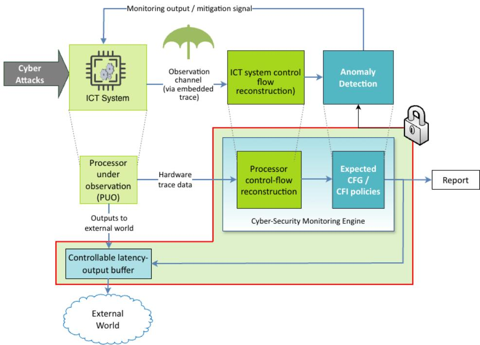
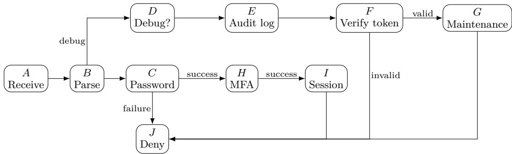
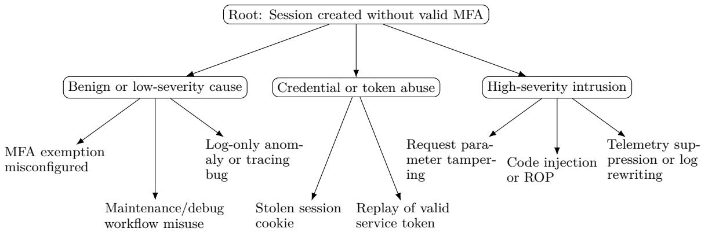

# Towards Model-based Run-time Cybersecurity: On Control-Flow Anomaly Detection, Attack Identification, and Hardware Monitoring

Martin Sachenbacher1 #

Faculty of Computer Science and Mathematics, OTH Regensburg, Galgenbergstraße 32, 93053 Regensburg, Germany

Martin Leucker #

Institute for Software Engineering and Programming Languages, Universität zu Lübeck, Ratzeburger Allee 160, 23562 Lübeck, Germany

Alexander Weiss #

Accemic Technologies GmbH, Franz-Huber-Straße 39, 83088 Kiefersfelden, Germany

Aliyu Tanko Ali #

Institute for Software Engineering and Programming Languages, Universität zu Lübeck, Ratzeburger Allee 160, 23562 Lübeck, Germany

## Abstract

Methods to increase the resilience of systems to cyber-attacks become increasingly important. Control-flow monitoring provides a principled basis to ensure integrity and detect possible anomalies at run-time. Once anomalies have been detected, so-called attack trees can be used to identify possible types of attacks. However, this approach is vulnerable to camouflage, by which attackers try to evade detection (and correct identification) by deliberately manipulating also the system’s observed control flow. In this paper, we outline a model-based approach that provides more robust intrusion detection and attack identification through an architecture that combines software with hardware-based monitoring. In this approach, software-level observation indicates suspicious activities, while hardware-level monitoring checks them separately in more detail, making it much harder for attacks to camouflage themselves and go undetected. We illustrate the approach with an authentication-service example that captures a realistic failure mode: a software-level observer sees an anomalous but apparently harmless control-flow deviation, maps it to a benign root cause in an attack tree, but misses the true intrusion. A second, independent hardware control-flow monitor observes the actual transition sequence and thereby changes the attack-tree diagnosis from a lowseverity configuration or maintenance issue to a high-confidence code-injection or control-flow hijack. In this scenario, the proposed combination of control-flow anomaly detection, attack-tree based intrusion identification, and hardware-based monitoring can improve not only anomaly detection, but also the diagnostic precision of attack-tree-based cyber-attack identification.

2012 ACM Subject Classification Security and privacy → Formal security models; Security and privacy → Intrusion detection systems; Hardware → Reconfigurable logic applications

Keywords and phrases cybersecurity, control-flow graphs, attack trees, embedded trace, diagnosis

Digital Object Identifier 10.4230/OASIcs...

## 1 Introduction: Cybersecurity and Run-time Monitoring

Modern computing systems are increasingly exposed to cyber-attacks that target not only data confidentiality and availability, but also the integrity of the software execution itself. As software systems become more interconnected, adaptive, and safety-critical, it is no longer suficient to protect only their external interfaces. Instead, resilience must also be provided at run time, when an adversary may already have gained a foothold inside the system and attempts to influence its execution. This motivates monitoring techniques that observe the actual behavior of a system during operation and detect deviations from expected behavior.

An important class of run-time monitoring techniques is based on control-flow observation. The control flow of a program describes the sequence of executed basic blocks, branches, calls, returns, and other control-transfer events. Many attacks necessarily afect this sequence. For example, code injection, return-oriented programming, unauthorized privilege escalation, malicious use of maintenance functionality, or bypasses of authentication logic may all manifest as control-flow deviations. If a suitable model of legitimate control flow is available, then deviations from this model can be treated as anomalies and used as indicators of a possible intrusion. This is the basic idea behind control-flow integrity (CFI), introduced by Abadi et al. [1], and behind a sizeable family of hardware-assisted CFI mechanisms that has emerged since, surveyed in [9].

However, for an operator or an automated response/defense mechanism, it is also necessary to interpret the anomaly, i.e. to determine whether the deviation was caused by a benign configuration issue, a rare but legitimate maintenance path, a software defect, or an active attack. One known method for such interpretation is the use of so-called attack trees [20]. Attack trees decompose attack goals into several subgoals and concrete attack steps. When combined with observed control-flow evidence, they can support a form of diagnosis or explanation: an anomalous transition or execution path can be mapped to possible root problems, and these can in turn be associated with diferent attack classes and severities.

This combination of control-flow anomaly detection and attack-tree based diagnosis is promising, but also vulnerable to a fundamental limitation: apart from possible incorrectness of the model, the diagnosis depends on the quality and correctness of the observation. If the observed control flow is incomplete, manipulated, or misleading, then the attack tree may lead to an incorrect conclusion. Specifically, attackers may actively attempt to camouflage an intrusion by shaping either the actual execution or the monitoring evidence in such a way that the resulting anomaly appears harmless. This leads to the complication – conceptually and practically distinct from ’classical’ diagnosis of faulty physical systems – that the observations used for diagnosis may be adversarially influenced.

For example, malicious execution may be hidden inside error-handling, diagnostic, update, or maintenance paths; alternatively, software-based instrumentation may be disabled, bypassed, or tampered with so that the reconstructed control flow omits the decisive malicious transition. In such cases, the system often may still be able to detect that something unusual happened, but the subsequent diagnosis will classify the event as a low-severity configuration problem or benign operational irregularity, rather than as an actual high-severity intrusion.

In this paper, we aim to address this problem by outlining an architecture for robust, run-time intrusion detection and attack identification. The central idea is to combine softwarewith hardware-based monitoring: software-level monitoring is used to indicate suspicious activities, while hardware-level monitoring is used checks them separately in more detail. It monitors the control flow using a second observation system that is physically independent of the software system under observation. Thus, rather than relying solely on instrumentation, logging, or monitoring components that execute inside the potentially compromised software environment, the proposed approach uses hardware-level trace information about control transfers. This separation improves the trustworthiness of the observation channel: an attacker who has compromised the monitored software may still influence the program’s behavior, but it becomes significantly harder to also manipulate the independent control-flow evidence in a consistent and undetectable manner.

To illustrate the approach, we describe a concrete example that captures a realistic failure mode. A software observer detects an anomalous but apparently harmless control-flow deviation and maps it, via an attack tree, to a benign maintenance or configuration issue. The true cause, however, is a camouflaged intrusion in which the attacker has manipulated the software-level observation so that the decisive malicious transition is not visible. A second, independent hardware control-flow monitor observes the actual transition sequence. Using this more truthful trace, the same attack-tree analysis changes its diagnosis from a low-severity operational explanation to a high-confidence indication of code injection or control-flow hijacking.

Our work is preliminary as we have implemented parts of this architecture, but not fully integrated them yet. Still, this paper makes three contributions: First, it analyzes the interplay between run-time control-flow anomaly detection and attack-tree based intrusion diagnosis. Second, it identifies camouflage of control-flow observations as a failure mode in which an anomaly may be detected but misclassified. Third, it outlines a hardware-supported monitoring architecture that provides an independent source of control-flow evidence and thereby enables more faithful attack-tree based diagnosis.

## 2 Diagnostic Model for Intrusion Detection and Attack Identification

## 2.1 Control-Flow Graphs and Anomalies

A control flow graph (CFG) [3] represents possible paths through a program or process that might be traversed during its execution. The CFG is as a directed graph where the nodes represent basic blocks, and the directed edges represent control flow paths between them. Formally, a CFG is given by $G = ( V , E , v _ { e } , V _ { f } )$ where V is a finite set of basic blocks or program locations, $E \subseteq V \times V$ is the set of admissible control-flow transfers, $v _ { e }$ is the entry node, and $V _ { f }$ is a set of exit nodes. An example of a control-flow graph is shown in Figure 2.

A CFG can be used to detect anomalous behavior in a system, by comparing observed runtime traces with the execution paths possible in G. Formally, a runtime trace is modeled as an ordered sequence $\tau = v _ { 0 } v _ { 1 } \ldots v _ { n }$ of basic blocks.

control-flow integrity (CFI), introduced by Abadi et al. [1], uses CFGs as a model of legitimate control flow and checks observed traces for deviations from this model, treating them as anomalies and indicators of possible intrusions. There exist several established methods for CFI: in its simplest form, it ensures that executions follow only paths allowed by a static control-flow graph. More advanced forms also include dynamic aspects and so-called shadow stacks [5] to protect function returns. For the purpose of this paper, we focus on simple, static CFGs, such that anomalies correspond to missing or unexpected blocks in the observed execution.

An observed anomaly only indicates that the observed execution path difers from the expected graph, but does not identify possible causes. The deviation of the execution path may be due to a software bug, misconfiguration, unusual workload, or malicious activity; in this paper, we focus specifically on the latter aspect.

## 2.2 Attack Trees and Identification

In the context of security analysis, attack trees [20] have been proposed as a structured way to model and reason about possible attacks against a system. A basic attack tree can be formalized as a rooted, directed tree whose root node is an attacker top-level goal (such as unauthorized login), and whose internal nodes represent the logical refinement and decomposition of attack goals into sub-goals and alternative attack steps, combined by logical operators AND/OR.

Attack graphs [14] are a more recent, more general concept that allows for multiple root nodes and sharing of nodes within the tree. Attack trees may be constructed manually or generated semi-automatically from security analysis tools; we do not deal here with the problem of how to obtain them.

There are diferent ways how attack trees can be used to in the context of control-flow integrity. We focus on the simple case where the root(s) are observed control-flow anomalies, to be explained by possible causes (attack steps).

Diferent observations (root nodes) of the tree being true are then consistent with diferent internal nodes of the tree being true (= active), so that it functions as a simple diagnostic model: a set of of active internal nodes represents possible attack steps that explain how the attack causes the observed anomaly. This diagnostic reasoning with attack trees can be further augmented with a notion of minimality (minimal set of active nodes), although we do not deal with this in this paper.

Mantel and Probst [18] discuss the meaning and purpose of attack trees and note that formal semantics were developed after the original, informal notation. There are also extensions of attack trees with ordering: SAND attack trees [13] add a sequential AND operator, meaning that the order of attack steps matters. This is especially relevant to analyzing CFG anomalies, because control-flow traces are inherently sequential.

Attack trees can also be further enriched with attributes such as cost or time stamps [2], which enable to analyze diferent attack paths, for example, to determine which attacks have minimal or maximal cost, which require the shortest or longest execution time, or which become infeasible once temporal constraints are taken into account.

## 2.3 Intrusion Camouflage

A key complication in cybersecurity, as opposed to ’classical’ fault diagnosis for hardware or software systems, is that attackers may deliberately hide their actions. That is, rather than merely causing an obvious anomalous control-flow path, an attacker may try to make the malicious path look like legitimate behavior, or may also corrupt the observed data from which the control flow is reconstructed by the defender, in order to disguise the attack. Thus there are two distinct forms of manipulation:

Manipulating the actual control flow: The attacker shapes the malicious path so that it resembles legitimate behavior, such as logging, error handling, debugging, diagnostics, or maintenance.

Manipulating the observed control flow: The attacker tampers with telemetry, tracing hooks, logging, or instrumentation so that the reconstructed CFG does not match the real execution.

The first point is known as control-flow camouflage: adversarial shaping or manipulation of the executed or observed control-flow trace such that malicious behavior appears benign, policy-compliant, or diagnostically misleading to a monitor [11]. Specifically, [6] introduce control-flow bending (CFB), where an attacker uses vulnerabilities to obtain powerful malicious behavior while still following paths allowed by a static CFG. Other common camouflage techniques that can interfere with CFG-based detection include: dead-code pad ding; opaque predicates; control-flow flattening; fake error-handling paths; debug, diagnostic, or maintenance-looking branches; dynamic code loading; reflection or indirect calls; hooking or patching instrumentation; or log or trace tampering.

When using attack trees to interpret control-flow anomalies, the diagnosis is only as reliable as the observed control-flow evidence. Thus if an attacker can manipulate or bias the observed control-flow graph, the attack-tree diagnosis may converge to an incorrect and/or relatively harmless explanation.

Let G be the expected control-flow graph and $\tau = v _ { 0 } v _ { 1 } \ldots v _ { n }$ the true control-flow trace executed on the monitored system. In practice, a monitor does not observe τ directly; instead it receives a derived trace through an observation channel. We distinguish two such channels: a software-based observer, which relies on instrumentation, logging, or tracing hooks executing inside the monitored environment, and a hardware-based observer, which reconstructs control-flow transfers from processor-level trace information independent of the monitored software. Let $\hat { \tau } _ { S }$ and $\hat { \tau } _ { H }$ denote the traces produced by these two channels, respectively, and let $\mathcal { O } _ { S } ( \tau ) = \hat { \tau } _ { S } , \mathcal { O } _ { H } ( \tau ) = \hat { \tau } _ { H }$ be the corresponding observation functions.

We remark that more precisely, τˆ denotes the block-level trace reconstructed from the raw hardware trace, not the raw trace stream emitted by the monitor itself. A trace decoder uses the program image, symbol or map information to recover executed branch targets and instruction-address intervals, which are then mapped to the basic blocks used in our model.

Under normal conditions both observations are faithful, but an adversary who has compromised the monitored software may corrupt the software-level channel while leaving the hardware-level channel intact. Camouflage of the software observation is therefore modeled as $\mathcal { O } _ { S } ( \tau ) \neq \tau ,$ , whereas the hardware monitor is assumed to provide a substantially more faithful reconstruction: $\mathcal { O } _ { H } ( \tau ) \approx \tau$

An anomaly may therefore be present in the true trace $\tau$ yet absent in the softwareobserved trace $\hat { \tau } _ { S }$ , absent in the true trace yet present in $\hat { \tau } _ { S }$ due to corruption, or present in both but at diferent locations, depending on how the attacker has shaped the observation.

Given an observed trace ${ \hat { \tau } } ,$ feature vectors of anomalies with respect to $G$ can be defined: $F _ { G } ( \hat { \tau } ) = \{ \phi _ { 1 } ( \hat { \tau } ) , \dots , \phi _ { m } ( \hat { \tau } ) \}$ where examples of $\phi _ { i }$ are (see Section 4) missing blocks or unexpected blocks. Then an attack-tree diagnosis is defined as a function $D _ { T } ( F _ { G } ( \hat { \tau } ) ) \subseteq \mathcal { H }$ that returns the set H of attack-tree internal nodes best explaining the observed trace features.

## 3 Hardware-based Control-Flow Monitoring

Our proposed approach, building on previous work in [16], exploits a capability for nonintrusive system monitoring that runs separately from the system itself. As a consequence, this can be used in applications where the system is unaware of, or even averse to, being monitored.

For the goal of detecting and uncovering of cyber-attacks and intrusions in systems, hardware-based monitoring can improve the diagnosis by providing an independent observation channel that is harder for software-level malware to suppress or falsify.

The idea is to monitor the actual execution, and whenever the reconstructed execution deviates from the validated model (even in the absence of system faults), it must be due to changes that have been inflicted on the system after its deployment (e.g., through intrusion, malware, etc.), or a monitoring/modeling error.

Existing software-only approaches for intrusion detection such as virus scanners sufer from the problem that they are running on the same system as the potential intruders, and can therefore be compromised themselves.

In the trace-based approach, malware has fewer opportunities to suppress or falsify the monitoring evidence than in software-only approaches as the analysis is separate from the target system, uses specialized hardware and cannot easily be compromised. Several hardware-based monitoring architectures along these lines have been proposed in the literature: [8] focus on security hardware mechanisms to enable fine-grained CFI checks to protect embedded systems. Kargos [19] monitors an OS kernel from outside the CPU through the bus interconnect and the debug interface to detect kernel-level code-injection attacks with near-zero performance cost. Lee et al. [15] integrate code-reuse-attack monitoring intellectual property blocks into an ARM-based system-on-chip and feed them from the CoreSight Program Trace Macrocell, demonstrating that of-CPU CFI monitoring on production trace interfaces is feasible. A concrete instantiation of this architecture, which is the basis for the figure and the anomaly criteria used in the remainder of this paper, is described in [22, 23] and shown in Figure 1. It comprises three blocks that are jointly responsible for non-intrusive monitoring and for containing the efects of a detected attack:

rocessor under observation (PUO): the system to be protected. It executes the application program code and produces application output data through its regular output interface. An observation unit that is connected to the processing unit non-intrusively monitors the execution and provides execution information indicative of the order in which basic blocks and branches are executed. In practice, the observation unit is realized as a trace unit (e.g. Arm CoreSight Program Flow Trace [4] or Intel Processor Trace [12]) emitting a compressed trace-data stream.

Cyber-security monitoring engine: a separate analysis subsystem that is physically separated from and inaccessible by the PUO, so that the PUO cannot inspect or alter it even after compromise. It contains a control-flow reconstruction unit that decompresses the trace stream and recovers the executed basic-block path, a memory holding a pre-generated model of the expected execution pattern of the uncompromised program, and an executionmonitoring unit that compares the reconstructed control flow against this model under one or more explicit anomaly criteria (illegal indirect-branch targets, missing or unexpected source/destination pairs of branches, instruction addresses outside permitted ranges, deviations in the order of execution, exceeded loop/repetition bounds, or call/return mismatches; see Section 4.6). When a criterion is violated, it emits a monitoring output signal.

Controllable latency-output-bufer: a unit, again inaccessible by the PUO, that sits in the PUO’s output path. It temporarily withholds the PUO’s output for a bounded latency time span. The output is released only if no anomaly signal has been received during this window; if an anomaly is reported, the output is blocked. The latency time span can be a fixed value (sized to an upper bound of the engine’s analysis time) or driven event-based by a bufer-synchronisation signal from the engine.

The latency-output-bufer turns the architecture from a pure detection mechanism into a containment mechanism: a compromised PUO cannot make its malicious output efective in the outside world before the independent monitor has had a chance to inspect the corresponding execution evidence. For the diagnostic problem studied in this paper, the role of this architecture is more specific: it supplies the attack tree with control-flow evidence that an attacker cannot easily shape from inside the PUO.

  
Figure 1 Hardware-supported CFI (Control Flow Integrity) checker (adapted from [22]

Figure 1 shows one concrete containment-oriented instantiation of the hardware-supported CFI architecture from prior work. In the present paper, only the independent trace-based observation and control-flow reconstruction path is essential; the latency-output bufer and mitigation signal illustrate one possible use of the same monitoring evidence for containment.

## 4 Walk-Through Example: Authentication Service

To illustrate the concepts, we consider a small authentication service used by an industrial gateway. The service receives a login request, checks a password, optionally executes a maintenance/debug path, checks multi-factor authentication (MFA), and finally creates a session token. We define the following basic blocks for the example system:

<table><tr><td>Block</td><td>Meaning</td></tr><tr><td>A</td><td>Receive request</td></tr><tr><td>B</td><td>Parse request</td></tr><tr><td>C</td><td>Check password</td></tr><tr><td>D</td><td>Check whether request is a maintenance/debug request</td></tr><tr><td>E</td><td>Write diagnostic/audit log</td></tr><tr><td>F</td><td>Verify signed maintenance token</td></tr><tr><td>G</td><td>Execute maintenance action</td></tr><tr><td>H</td><td>Check MFA</td></tr><tr><td>I</td><td>Create authenticated session</td></tr><tr><td>J</td><td>Return denial or error</td></tr><tr><td>K</td><td>Decode attacker-controlled payload</td></tr><tr><td>L</td><td>Execute injected payload / patch process state</td></tr><tr><td>M</td><td>Suppress or rewrite software telemetry</td></tr></table>

The normal system operation is simple and involves only blocks A to J: ordinary users may reach block I only after both password verification and MFA verification. The maintenance path may write logs and execute restricted maintenance actions, but only after a valid signed maintenance token is verified.

## 4.1 Nominal Control Flow

A nominal control-flow graph is shown in Figure 2. Ordinary login follows $\langle A , B , C , H , I \rangle$ Failed login follows $\langle A , B , C , J \rangle$ . Authorized maintenance follows the path $\langle A , B , D , E , F , G , J \rangle$ and does not create a user session.

  
Figure 2 Nominal control-flow graph of the authentication service.

A control-flow anomaly detector can be defined over observed block sequences. For example, it may flag an exemption when:

1. a session is created without a preceding MFA block;

2. the maintenance path is entered by an ordinary user;

3. an indirect branch target is outside the set of known basic blocks; or

4. a path contains blocks that do not occur in the static control-flow graph.

This detector is intentionally abstract. The example only requires that the defender obtains some observation of the executed control flow and compares it with a model of expected control flow.

## 4.2 Attack Tree for Diagnosis

The defender uses an attack tree to interpret observed anomalies. Figure 3 shows a simplified attack tree for interpreting the anomaly that a session was created without valied MFA. This tree (all internal nodes are disjunctive here) distinguishes between relatively benign or low-severity explanations, such as a configuration error, and high-severity intrusions, such as code injection or control-flow hijacking.

The tree can be used as a diagnostic model in the following way: observing or not observing anomalies makes its root node true or false, and this can activate or deactivate internal nodes according to the logic of the tree.

For example, the trace $\langle C , H , I \rangle$ corresponds to a normal successful login, and no anomaly is detected, so no internal node becomes activated. Similarly, $\langle D , E , F , G , J \rangle$ corresponds to the maintenance/debug path being executed normally. The trace ⟨C, I⟩ corresponds to a possible MFA bypass, where a session is created without valid MFA, and several internal nodes (such as ’Credential or tokan abuse’) can possibly be activated.

  
Figure 3 A simplified attack tree for interpreting the control-flow anomaly MFA bypass.

Similar to figure 3, attack trees for other anomalies can be defined; however, they are not shown here due to space limitations. As mentioned in Section 2.2, several attack trees may be combined straightforwardly into an attack graph with multiple root nodes and shared sub-trees. In the following, we omit this tree in the presentation and focus only on the feature vector of present or absent anomalies, assuming they correspond to root nodes of the tree.

## 4.3 Attack: Control-Flow Hijack Hidden in a Debug Path

Assume that the attacker exploits a memory-safety bug in the request parser. The exploit is triggered by a malformed header that is syntactically similar to a legitimate debug header. The true execution is then $\tau = \langle A , B , D , E , K , L , M , I \rangle$

The semantics of this execution is as follows:

1. the request enters the debug-looking path ⟨D, E⟩ so that the execution appears similar to a normal diagnostic workflow.

2. instead of verifying a signed maintenance token at $F ,$ a corrupted return address or function pointer transfers control to K.

3. K decodes attacker-controlled data embedded in the request.

4. L patches theh process state so that a session is created with MFA verification set true even though block H was never executed.

5. M suppresses or rewrites software telemetry, for example by disabling a user-space tracing hook or rewriting a local audit bufer.

6. the process reaches I and creates a valid authenticated session.

The actual exploit might use return-oriented programming, an indirect-call corruption, dynamic code loading, or another mechanism. The example abstracts away from the exploit mechanism and focuses on the diagnostic consequence: the true path contains a branch target that is not a valid successor of E in the nominal control flow.

## 4.4 Camouflage: Biasing the Software Observation

Assume further the attacker’s goal is not merely to cause an anomalous path. The attacker wants the anomaly to be interpreted as a harmless or routine deviation. The camouflage therefore has two components:

Semantic Camouflage. The malicious transition is placed after the debug/audit blocks $\langle D , E \rangle$

This makes the beginning of the trace resemble a legitimate maintenance path. From a coarse observer’s perspective, the attack appears to be related to diagnostics, not to session creation.

Telemetry Camouflage. Assume the primary software monitor is implemented in the same operating system or process environment as the service. For example, it may obtain events from instrumented logging calls, a user-space tracing library, or an agent running with ordinary kernel support. The attacker reaches block M before the session is created and modifies this telemetry channel.

The result is that the software observer records ${ \hat { \tau } _ { S } = \langle A , B , D , E , F , J \rangle }$ , followed by a session-create event with missing correlation data.

This observation is inconsistent with nominal control flow, but not maximally suspicious. It suggests that some maintenance/debug handling occurred, that the request was denied, and that a later session event lacks proper correlation. Such evidence can be explained by a benign telemetry problem, a misconfigured debug path, or a confused-deputy bug in maintenance handling.

## 4.5 Wrong Diagnosis from the Attack Tree

Given τˆS, the attack tree receives the following feature vector of anomalies:

<table><tr><td>Anomaly from software observation</td><td>Value</td></tr><tr><td>Debug or maintenance path observed</td><td>true</td></tr><tr><td>Signed-token verification block apparently observed</td><td>true</td></tr><tr><td>Unknown branch target observed</td><td>false</td></tr><tr><td>Telemetry discontinuity around malicious block</td><td>false or unavailable</td></tr><tr><td>Session created without a complete login trace</td><td>true</td></tr><tr><td>Evidence of code injection / illegal control transfer</td><td>false</td></tr></table>

Under these features, the attack tree may rank the most likely diagnosis as:

Diagnosis from software observation: maintenance/debug workflow misuse or correlation failure in logging. Severity: medium or low. Root cause: misconfiguration, incomplete audit correlation, or an incorrectly exposed diagnostic endpoint.

Because the attack tree reasons only over observed evidence, it reaches a wrong diagnostic conclusion if supplied with this misleading evidence. In particular, the absence of an unknown branch target is a false negative caused by telemetry camouflage. The attack tree therefore selects an innocuous branch because the observation channel has been compromised.

## 4.6 Observations from Hardware-based Monitoring

Now suppose the platform includes a hardware-based control-flow monitor. The monitor may be realized using processor trace facilities, a separate monitor core, a bus-level observer, a trusted execution monitor, or a dedicated hardware unit that records branch outcomes and indirect branch targets. The essential property in this example is independence: the monitor is not implemented by the same software stack that the attacker has compromised.

The hardware monitor records a lower-level trace such as: $\hat { \tau } _ { H } = \langle A , B , D , E , K , L , M , I \rangle$

In practice, the hardware trace may not directly name source-level blocks; it may record compressed branch decisions, target addresses, exceptions, context switches, or taken/nottaken outcomes. In an implementation, unexpected blocks like K, L or M may thus initially appear simply as illegal target addresses or unknown basic-block identifiers. The detailed trace decoding and address-to-block mapping are hardware- and toolchain-dependent implementation issues and are therefore not discussed further here.

Assume the defender successfully reconstructs the corresponding basic-block path by mapping trace packets or branch targets back to the program image and its expected CFG. The key observation is then the illegal transition:

E ̸→ K in the nominal CFG.

This is exactly the kind of evidence that the anomaly criteria of the hardware-based architecture from Section 3 are designed to detect [22]: the observed (source, destination) pair $( E , K )$ is not contained in the set of permitted branch pairs of the uncompromised program, and the destination address K lies outside the whitelist of permitted indirect-branch targets. In an implementation, the permitted (source, destination) pairs can be organised as a hash table for constant-time lookup against each branch packet decoded from the trace stream.

The hardware observation also reveals that H, the MFA block, was not executed:

$$
H \notin \widehat { \tau } _ { H } \quad \mathrm { a n d } \quad I \in \widehat { \tau } _ { H } .
$$

This corresponds to a violation of the order-of-execution criterion: the expected program model requires $H \prec I$ on every successful-login path, and the reconstructed trace does not satisfy this. Note that the same reconstructed trace could further be checked against a call/return-matching criterion, which maintains a shadow call stack of return addresses recorded at call instructions and compares each observed return target against the corresponding entry; in ROP- or indirect-call-corruption scenarios, this check would already flag the transfer to K independently of the (source, destination) whitelist, but such more advanced CFI methods are beyond our scope here.

Finally, it reveals the telemetry manipulation block M before the session creation:

M ≺ I.

Thus, the discrepancy between software and hardware observations is itself evidence:

$\Delta = \hat { \tau } _ { H } \setminus \hat { \tau } _ { S } = \{ K , L , M , I$ with illegal transition $E \to K \}$

## 4.7 Corrected Attack-Tree Diagnosis

With $\hat { \tau } _ { H }$ , the feature vector of anomalies changes:

<table><tr><td>Feature inferred from hardware observation</td><td>Value</td></tr><tr><td>Debug or maintenance path observed</td><td>true</td></tr><tr><td>Signed-token verification block observed</td><td>false or bypassed</td></tr><tr><td>Unknown branch target observed</td><td>true</td></tr><tr><td>Session created without MFA</td><td>true</td></tr><tr><td>Telemetry manipulation before session creation</td><td>true</td></tr><tr><td>Software and hardware observations disagree</td><td>true</td></tr></table>

The attack-tree diagnosis now changes:

Diagnosis from hardware observation: high-severity intrusion involving illegal control transfer from the debug/audit path, followed by payload execution and telemetry suppression. Likely root cause: memory-safety bug or indirect-call corruption in the debug handler, used to bypass MFA and create a session.

## XX:12 Towards Model-based Run-time Cybersecurity

The same attack tree therefore produces two diferent diagnoses depending on the quality of the control-flow evidence. We summarize the example in the table below.

<table><tr><td>Scenario</td><td>Observation</td><td>Attack-tree result</td></tr><tr><td>Nominal execution</td><td>〈A, B, C, H, I&gt;</td><td>No attack</td></tr><tr><td>True attack</td><td>(A, B, D, E, K, L, M, I)</td><td>Code injection / control-flow hijack with MFA bypass</td></tr><tr><td>Camouflaged software observation</td><td>(A, B, D, E, F, J) plus poorly correlated session event</td><td>Maintenance/debug misuse or log- ging correlation failure</td></tr><tr><td>Hardware observation</td><td>(A, B, D, E, K, L, M, I) with illegal transition 〈E, K〉 and missing H</td><td>High-severity intrusion: illegal branch target, payload execution, telemetry suppression, MFA bypass</td></tr></table>

## 5 Discussion and Ongoing Work

As the example illustrated, hardware-based monitoring does not merely improve anomaly detection; it improves the diagnostic value of attack-tree analysis by improving the fidelity of the control-flow evidence supplied to the tree. When software telemetry is camouflaged, the attack tree may identify a harmless root cause. When an independent hardware monitor supplies the actual path, the same tree can select a more faithful high-severity attack class.

Beyond diagnosis, the architecture sketched in Section 3 also enables a form of containment: by interposing a latency-output-bufer between the PUO’s output interface and the outside world, the system can withhold output until the independent monitor has had the opportunity to detect an anomaly [22, 23]. A correct attack-tree diagnosis based on hardware evidence can in this case trigger a meaningful mitigation (e.g. blocking the suspect output, raising an alert, or transitioning the system into a safe state) before the consequences of the intrusion become externally visible (see also Figure 1).

While our work illustrates the beneficial interplay of control-flow anomaly detection, attack trees, and hardware-based monitoring, it is still preliminary as a number of challenges remain. Especially, a richer theory of attack types, attack camouflage, and how this afects monitorability and diagnosability in the context of security needs to be developed. In the area of runtime verification, there is a body of work on the concept of partial observability and imperfect/incomplete traces that is closely related to this problem [7, 10, 21]. Incomplete or partially available traces have also been studied for stream runtime verification, where gaps in the input stream are represented abstractly as sets of possible concrete traces [17].

It should also be pointed out that we do not claim that the approach of hardware-based trace monitoring is intrinsically perfect, since it can itself sufer from configuration errors, trace loss, aliasing, incomplete coverage, or physical attacks:

Hardware traces may be incomplete if the trace bufer overflows, if tracing is incorrectly configured, or if relevant execution occurs outside the monitored context.

Mapping low-level branch traces to source-level basic blocks can be dificult in the presence of dynamic loading, JIT compilation, self-modifying code, interrupts, or aggressive compiler optimization. evidence, but attack-tree diagnosis still requires a model of possible attacks and root causes.

A suficiently powerful adversary may attack the hardware monitor, firmware, trace configuration, or physical platform. The security claim depends on the monitor being outside the adversary’s efective control.

Also, processing hardware-level trace information at run-time comes at significant compu tational and bandwith cost, and it is therefore unrealistic (and unnecessary) to perform hardware monitoring continuously along software monitoring. Instead, it is desirable to activate this lower-level monitoring only when really necessary, such as in the presence of suspicious activities. For instance, in a scenario with a server that has several CPU cores, as soon as software monitoring flags a CPU core as suspicious, hardware monitoring could focus on this part of the system. We are thus working on a tighter diagnostic integration, where software-level observation provides a focus by indicating suspicious activities, while hardware-level monitoring is used to check these candidate incidents in more detail.

## 6 Conclusion

We presented an approach towards run-time cybersecurity that guards software execution against flows of control not intended by the original program. This is achieved by monitoring program flow, and mapping observed deviations against a structured representation of hypothesized attacks (attack trees). A key complication (and novel aspect in diagnosis) is that attackers might actively and adversarially influence observations in order to conceal their actions; we seek to address this camouflage in our architectural framework through incorporating hardware-level trace information, an observation channel implemented outside the compromised software stack that can reveal discrepancies that software-only measures may miss. Though several challenges like a more rigorous formalization and analysis still remain, the approach represents a step towards model-based diagnosis concepts for cybersecurity.

## References

1 Martín Abadi, Mihai Budiu, Úlfar Erlingsson, and Jay Ligatti. Control-flow integrity: Principles, implementations, and applications. In Proceedings of the 12th ACM Conference on Computer and Communications Security, CCS ’05, pages 340–353, New York, NY, USA, 2005. ACM. URL: http://acm.org, doi:10.1145/1102120.1102165.

2 Aliyu Tanko Ali, Damas Gruska, Karam Kharraz, and Martin Leucker. Analysis of attack time and costs in attack trees via SMT resolution. In Proceedings of the 8th International Conference on Future Networks & Distributed Systems, pages 1057–1064, 2024.

3 Frances E. Allen. Control flow analysis. SIGPLAN Not., 5(7):1–19, July 1970. doi:10.1145/ 390013.808479.

4 Arm Ltd. CoreSight Program Flow Trace Architecture Specification. Architecture specification. Arm CoreSight defines program-flow trace mechanisms such as the Program Trace Macrocell.

5 Nathan Burow, Xinping Zhang, and Mathias Payer. Shining light on shadow stacks. CoRR, abs/1811.03165, 2018. URL: http://arxiv.org/abs/1811.03165, arXiv:1811.03165.

6 Nicholas Carlini, Antonio Barresi, Mathias Payer, David Wagner, and Thomas R. Gross. Control-flow bending: On the efectiveness of control-flow integrity. In Proceedings of the 24th USENIX Security Symposium, pages 161–176. USENIX Association, 2015.

7 Alessandro Cimatti, Chun Tian, and Stefano Tonetta. Assumption-based runtime verification with partial observability and resets. In Bernd Finkbeiner and Leonardo Mariani, editors, Runtime Verification, pages 165–184, Cham, 2019. Springer International Publishing.

8 Lucas Davi, Patrick Koeberl, and Ahmad-Reza Sadeghi. Hardware-assisted fine-grained control-flow integrity. In Proceedings of the 2014 Design, Automation & Test in Europe Conference & Exhibition, pages 1–6. IEEE, 2014. doi:10.7873/DATE.2014.118.

9 Ruan de Clercq and Ingrid Verbauwhede. A survey of hardware-based control flow integrity (CFI). arXiv preprint arXiv:1706.07257, 2017. URL: https://arxiv.org/abs/1706.07257.

10 Angelo Ferrando and Vadim Malvone. Runtime verification with imperfect information through indistinguishability relations. In Software Engineering and Formal Methods: 20th International Conference, SEFM 2022, Berlin, Germany, September 26–30, 2022, Proceedings, page 335–351, Berlin, Heidelberg, 2022. Springer-Verlag. doi:10.1007/978-3-031-17108-6\_21.

11 Enes Göktaş, Elias Athanasopoulos, Herbert Bos, and Georgios Portokalidis. Out of control: Overcoming control-flow integrity. In Proceedings of the IEEE Symposium on Security and Privacy, pages 575–589. IEEE, 2014. doi:10.1109/SP.2014.43.

12 Intel Corporation. Intel Processor Trace Documentation. Technical documentation. Intel Processor Trace provides hardware support for precise software control-flow and timing information with limited impact on execution.

13 Ravi Jhawar, Barbara Kordy, Sjouke Mauw, Saša Radomirović, and Rolando Trujillo-Rasua. Attack trees with sequential conjunction. In Hannes Federrath and Dieter Gollmann, editors, ICT Systems Security and Privacy Protection, pages 339–353, Cham, 2015. Springer International Publishing.

14 Harjinder Singh Lallie, Kurt Debattista, and Jay Bal. A review of attack graph and attack tree visual syntax in cyber security. Computer Science Review, 35:100219, 2020. URL: https://www.sciencedirect.com/science/article/pii/S1574013719300772, doi:10.1016/j.cosrev.2019.100219.

15 Yongje Lee, Jinyong Lee, Ingoo Heo, Dongil Hwang, and Yunheung Paek. Using CoreSight PTM to integrate CRA monitoring IPs in an ARM-based SoC. ACM Trans. Des. Autom. Electron. Syst., 22(3), April 2017. doi:10.1145/3035965.

16 Martin Leucker, Martin Sachenbacher, Simon Wegener, Alexander Weiss, and Albert Schulz. Non-intrusive, continuous trace-based monitoring and its applications for system correctness, safety, and resilience. In Workshop on Principles of Diagnosis (DX’23), 2023.

17 Martin Leucker, César Sánchez, Torben Schefel, Malte Schmitz, and Daniel Thoma. Runtime verification for timed event streams with partial information. In Runtime Verification (RV), Portugal, 2019. Springer, Springer.

18 Heiko Mantel and Christian W. Probst. On the Meaning and Purpose of Attack Trees . In 2019 IEEE 32nd Computer Security Foundations Symposium (CSF), pages 184–18415, Los Alamitos, CA, USA, June 2019. IEEE Computer Society. URL: https://doi.ieeecomputersociety. org/10.1109/CSF.2019.00020, doi:10.1109/CSF.2019.00020.

19 Hyungon Moon, Jinyong Lee, Dongil Hwang, Seonhwa Jung, Jiwon Seo, and Yunheung Paek. Architectural supports to protect os kernels from code-injection attacks and their applications. ACM Trans. Des. Autom. Electron. Syst., 23(1), August 2017. doi:10.1145/3110223.

20 Bruce Schneier. Attack trees: Modeling security threats. Dr. Dobb’s Journal, 1999. URL: https://www.schneier.com/academic/archives/1999/12/attack\_trees.html.

21 Rania Taleb, Sylvain Hallé, and Raphaël Khoury. Uncertainty in runtime verification: A survey. Computer Science Review, 50:100594, 2023. doi:10.1016/j.cosrev.2023.100594.

22 Alexander Weiss. Processor arrangement for monitoring control-flow integrity, February 2025. Granted 26 February 2025; application EP 20214995.1 filed 17 December 2020. URL: https:// worldwide.espacenet.com/patent/search/family/073855332/publication/EP4016343B1.

23 Alexander Weiss. Processor arrangement for monitoring control-flow integrity, November 2025. Granted 4 November 2025; application 17/553,215 filed 16 December 2021; claiming priority from EP 20214995.1, 17 December 2020. URL: https://patents.google.com/patent/ US12462017B2.