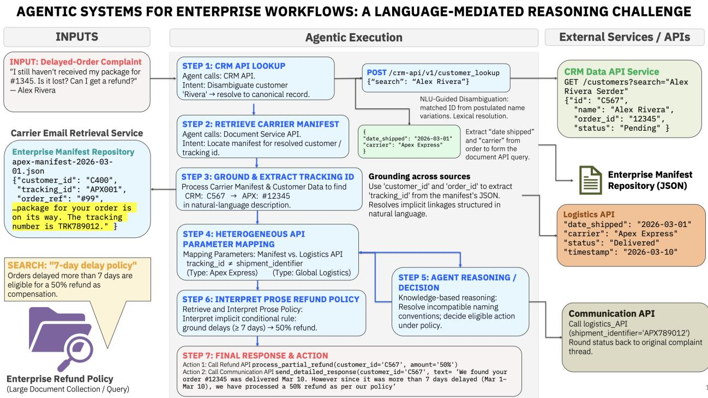
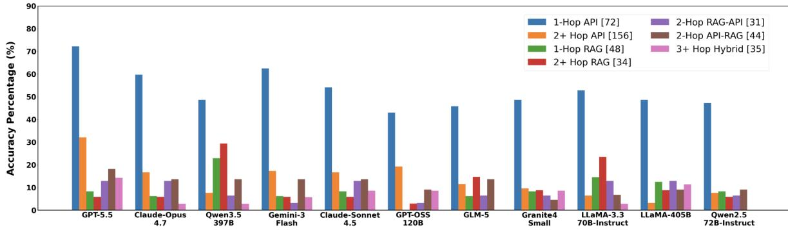
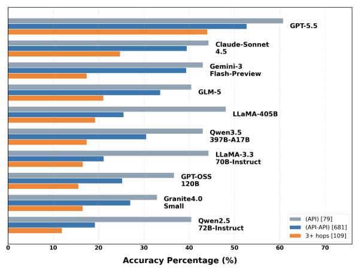
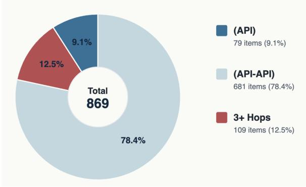
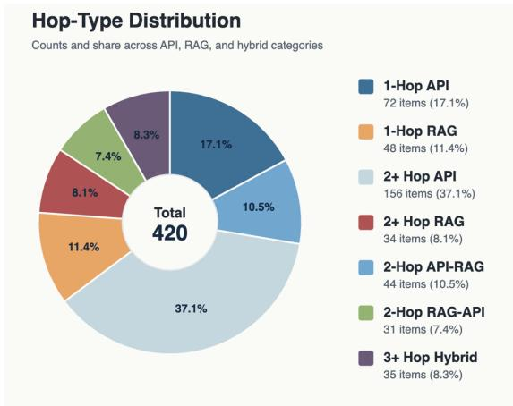
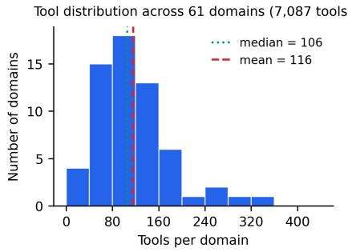
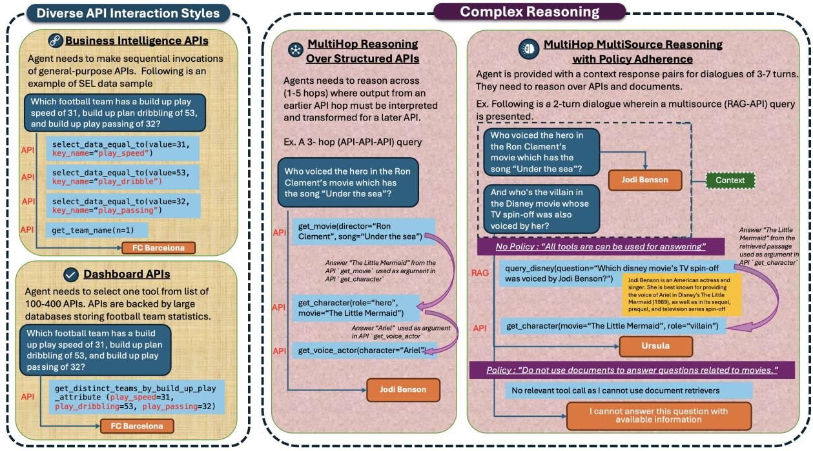

# VAKRA: Evaluating Multi-Hop Reasoning Across APIs and Retrieval Under Tool-Use Policies

Ankita Rajaram Naik, Anupama Murthi, Benjamin Elder, Siyu Huo, Raavi Gupta, Abhinav Jain, Praveen Venkateswaran, Abdulhamid Adebayo,

Danish Contractor

IBM, Yorktown Heights, NY, USA

Correspondence: ankita.naik@ibm.com, anupama.murthi@ibm.com

## Abstract

Agents deployed in enterprise settings must reason across structured APIs and document collections, yet existing benchmarks evaluate these capabilities in isolation. We introduce VAKRA (eValuating API and Knowledge Retrieval Agents)<sup>1</sup>, a benchmark of over 8,000 executable APIs across 62 domains with tasks spanning three settings of increasing difficulty: diverse API interaction styles, multi-hop reasoning over structured APIs, and multi-source reasoning with natural-language tool-use policy constraints. Correctness is verified by reexecuting predicted tool calls against live APIs, accommodating multiple valid paths. Using a fixed ReAct harness to isolate model capabilities from agent architecture, we evaluate frontier and open-weight models and find that even the best model achieves only 70.4% on singlehop endpoint-style tasks and drops to 50–51% on compositional APIs; performance degrades by over 50% as reasoning depth increases, and policy-constrained questions expose severe failures (as low as 2.4% on unanswerable queries). Trace analysis shows failures concentrate at language-mediated reasoning - entity disambiguation, cross-source grounding, rather than tool invocation mechanics. Code is available https://github.com/IBM/VAKRA. Dataset is available https://huggingface.co/datasets/ibmresearch/VAKRA

## 1 Introduction

Consider an agent resolving a delayed-order complaint as illustrated in Figure 1. The agent must disambiguate a customer record in a CRM (Step 1), extract a tracking identifier from carrier documentation (Step 2), map it to a logistics API parameter despite incompatible naming conventions (Steps 3– 5), and interpret a refund policy to determine compensation (Steps 6–7). Each step requires language understanding: resolving entities under lexical mismatch, grounding information across heterogeneous sources, and interpreting constraints expressed in natural language. As agents are increasingly deployed across customer support, business intelligence, and financial operations (Pan et al., 2026), reliable reasoning across APIs and document collections becomes a critical challenge.

Existing benchmarks only partially capture this setting. Prior work evaluates capabilities such as tool invocation (Qin et al., 2023; Patil et al., 2025), web navigation (Zhou et al., 2024; Boisvert et al., 2024), multi-turn dialogue (Katsis et al., 2025), multi-hop document search (Tang and Yang, 2024; Patil et al., 2025), and policy adherence (Zwerdling et al., 2025; Yao et al., 2025; Li et al., 2025). However, these capabilities are typically studied in isolation, leaving the compounding challenges of multihop reasoning across heterogeneous systems underexplored. This gap has practical consequences: a recent survey finds that 75% of teams deploying agents evaluate them without formal benchmarks (Pan et al., 2026).

In this paper, we introduce VAKRA (eValuating API and Knowledge Retrieval Agents), a benchmark for evaluating multi-hop reasoning across APIs and retrieval under tool-use policies in executable environments. VAKRA builds on the structured API generation pipeline of Elder et al. (2026), and we transform BIRD-SQL (Li et al., 2023a) into more than 8,000 executable APIs derived from real databases across 62 domains. We extend this foundation with domain-aligned document collections, 2–5 hop reasoning chains that require agents to combine API interaction with document retrieval within a single trajectory, and a trajectory-level evaluation framework that re-executes predicted tool calls against live APIs, accommodating multiple valid paths. Tasks are organized into three settings of increasing difficulty: (a) diverse API styles, (b) multi-hop reasoning over structured APIs, and (c) multi-source reasoning with natural-language tool-use policies.

  
Figure 1: Example enterprise workflow illustrating reasoning challenges including (i) API-driven disambiguation, (ii) cross-source grounding, (iii) parameter alignment, and (iv) policy reasoning.

Using a fixed ReAct harness to isolate model reasoning from architecture choices, we evaluate frontier and open-weight models. The strongest model (GPT-5.5) achieves 70.4% on single-hop endpoint-style tasks but only 50–51% on compositional business-intelligence APIs; most models lose over 50% accuracy as reasoning depth increases, and policy-constrained questions prove especially difficult, with accuracy on unanswerable queries falling to 2.4%. Trace analysis reveals that failures concentrate at language-mediated steps—entity disambiguation, cross-source grounding, and schema alignment—rather than tool invocation itself, indicating that compositional reasoning across heterogeneous sources remains the key bottleneck.

Contributions: (i) Tool-grounded benchmark: Over 8,000 executable APIs across 62 domains, paired with domain-aligned document collections and a trajectory-level evaluation that re-executes tool calls against live APIs to verify correctness. (ii) Compositional multi-hop tasks: 2–5 hop chains combining structured API calls, cross-source retrieval, and natural-language tool-use policies— compounding challenges that prior benchmarks address only in isolation. (iii) Empirical analysis: Model rankings invert across API interaction paradigms, performance degrades sharply with reasoning depth, and tool-use policy adherence remains a critical weakness with failures in localizing to language-mediated reasoning rather than tool invocation mechanics.

## 2 Related Work

We situate VAKRA along three dimensions - executable grounding, cross-source compositional reasoning, and trajectory-level evaluation and focus on benchmarks most relevant to tool-grounded agent reasoning (Table 1). We highlight three columns in the table that could be conflated: Nested API Sequences tests parameter-level compositional chaining where one call’s output directly parameterizes the next; Multi-Hop Queries requires broader sequential reasoning including disambiguating entities, interpreting intermediate results, or selecting among actions, where earlier results inform but need not directly parameterize later calls; and RAG+API Joint Reasoning additionally requires retrieval outputs from an independent document collection to condition structured API parameters (or vice versa) within a single reasoning chain.

Real executable grounding: Most tool-calling benchmarks either operate in synthetic settings (Han et al., 2024; Liu et al., 2024a; Li et al., 2023b), rely on external APIs whose behavior changes over time (Xu et al., 2023; Qin et al., 2024; Guo et al., 2024), or simulate execution via modelgenerated feedback (Zhang et al., 2026). Like Elder et al. (2026), VAKRA self-hosts all APIs locally against real BIRD-SQL databases (Li et al., 2023a) and document collections, ensuring deterministic, verifiable responses at evaluation time (see Table 1).

<table><tr><td rowspan="2">Benchmarks</td><td colspan="3">Deployment</td><td colspan="5">Advanced Reasoning</td><td>Evaluation</td></tr><tr><td>Locally-Hosted DB-Backed APIs</td><td>Real-World Data</td><td>Executable at Eval Time</td><td>Sequences</td><td>Nested API Retriever Multi-Hop APIs</td><td>Queries</td><td>RAG+API Joint Reasoning Adherence Alt. Traces</td><td>Policy</td><td>Agentic/</td></tr><tr><td>ToolBench (Xu et al., 2023)</td><td>x</td><td>X</td><td></td><td></td><td>X</td><td>X</td><td>x</td><td>X</td><td>X</td></tr><tr><td>RestBench (Song et al., 2023)</td><td>X</td><td></td><td></td><td></td><td>X</td><td></td><td>X</td><td></td><td>X</td></tr><tr><td>ToolLLM (Qin et al., 2024)</td><td>X</td><td></td><td></td><td></td><td></td><td></td><td>X</td><td></td><td>X</td></tr><tr><td>NESTFUL (Basu et al., 2025)</td><td>X</td><td></td><td></td><td></td><td></td><td></td><td>x</td><td></td><td>X</td></tr><tr><td>BFCL V2, V3 (Patil et al., 2025)</td><td>x</td><td></td><td></td><td></td><td></td><td></td><td>X</td><td></td><td>X</td></tr><tr><td>BFCL V4 (Patil et al., 2025)</td><td>x</td><td></td><td></td><td></td><td></td><td></td><td>x</td><td></td><td>X</td></tr><tr><td>WebArena (Zhou et al., 2024)</td><td>X</td><td></td><td></td><td></td><td></td><td></td><td>x</td><td></td><td>x</td></tr><tr><td>WorkArena (Boisvert et al., 2024)</td><td>X</td><td></td><td></td><td></td><td></td><td></td><td>x</td><td></td><td>X</td></tr><tr><td>τ-bench (Yao et al., 2025)</td><td>X</td><td></td><td></td><td></td><td></td><td></td><td>x</td><td></td><td></td></tr><tr><td>AgentBench (Liu et al., 2024b)</td><td>X</td><td></td><td></td><td></td><td></td><td></td><td>x</td><td></td><td></td></tr><tr><td>GAIA (Mialon et al., 2024)</td><td>X</td><td></td><td></td><td></td><td></td><td></td><td>x</td><td></td><td></td></tr><tr><td>ToolHop (Ye et al., 2025)</td><td>X</td><td></td><td></td><td></td><td></td><td></td><td>x</td><td></td><td></td></tr><tr><td>MCP-Bench (Wang et al., 2025)</td><td>X</td><td></td><td></td><td></td><td></td><td></td><td>X</td><td></td><td></td></tr><tr><td>LiveAPIBench (Elder et al., 2026)</td><td></td><td></td><td></td><td></td><td></td><td></td><td>X</td><td></td><td></td></tr><tr><td>VAKRA(Ours)</td><td></td><td></td><td></td><td></td><td></td><td></td><td></td><td></td><td></td></tr></table>

Table 1: Comparison of tool-calling benchmarks across Deployment, Advanced Reasoning, and Evaluation dimensions. Except for LiveAPIBench, none provide locally-hosted APIs backed by real databases (and document collections), and none prior to VAKRA combine this with the full set of advanced reasoning and evaluation properties.

Cross-source and compositional reasoning: WebArena and WorkArena (Zhou et al., 2024; Boisvert et al., 2024) evaluate UI interaction and system state rather than data-level reasoning over schemas and documents. GAIA (Mialon et al., 2024) and AppWorld (Trivedi et al., 2024) assess long-horizon planning but do not target crosssource <sup>2</sup> grounding challenges such as entity resolution under lexical mismatch or alignment of retrieved content with structured API schemas. ToolQA (Zhuang et al., 2023) provides retrieval and tabular query tools within a unified interface, but does not require agents to reconcile independently designed systems with heterogeneous schema conventions. VAKRA explicitly targets this setting, requiring agents to interleave structured API calls with unstructured document retrieval as intermediate steps whose outputs directly parameterize subsequent tool calls within a single multi-hop reasoning chain.

Policy-constrained workflows and trace-level evaluation: τ-bench (Yao et al., 2025) is the closest benchmark to VAKRA in spirit, but confines policy reasoning to narrow conversational domains without grounding decisions across independent data sources. VAKRA has 62 domains and requires agents to interpret and satisfy tool-use constraints expressed in natural language across multi-hop API and retrieval actions. Further, most benchmarks score final answers, individual call accuracy (Patil et al., 2025), or binary task success (Zhou et al., 2024; Trivedi et al., 2024) — metrics that cannot distinguish whether intermediate steps such as entity resolution or policy interpretation were valid. VAKRA instead verifies complete trajectories by re-invoking tool calls against live APIs, accommodating multiple valid execution paths and enabling targeted analysis of failures in language-mediated reasoning rather than just tool execution mechanics.

## 3 Dataset

We organize tasks into three settings of increasing difficulty (see a data sample in Appendix C.4).

(i) API Styles. Following Elder et al. (2026), we instantiate three interaction styles that expose the underlying data through different interface abstractions. The first two are motivated by Business Intelligence (BI) APIs, while the third reflects reusable workflow and dashboard-oriented endpoints. We refer to these as SLOT, SEL, and Dashboard APIs respectively in our evaluation. Compositional interfaces (referred to as SLOT) provide a minimal set of general-purpose operations (e.g., filtering, aggregation, transformation) that must be composed into multi-step chains, requiring explicit planning over intermediate states. The agent needs to select between 9 general purpose tools provided. Expanded function interfaces (referred to as SEL) materialize parameterizations of generic functions as distinct tools, reducing per-call complexity while increasing the burden of selecting the correct operation from a larger candidate set. The agent needs to select from 26 available tools. Endpoint-style interfaces (referred to as Dashboard APIs) provide highly specific, query-aligned endpoints that encapsulate most computation, shifting the challenge toward accurate query interpretation and endpoint selection. This task has an available tool list of 116 per sample (detailed tool distribution by domain in Appendix C.5).

(ii) Multi-hop Reasoning. We construct tasks requiring 2–5 step reasoning chains over endpointstyle APIs (sample distribution by hops is present in Appendix C.2), where outputs of earlier calls determine inputs to subsequent steps. These tasks require entity disambiguation, parameter extraction from intermediate responses, and API schema alignment across heterogeneous endpoints.

(iii) Multi-hop Multi-Source Reasoning. We extend the previous setting to tasks requiring reasoning across structured APIs and unstructured document collections, in both single- and multi-turn settings. Agents must perform cross-source grounding aligning information extracted from text with API parameters, or using API outputs to inform retrieval while reconciling inconsistencies in naming and format. Beyond chaining, agents must decide when to retrieve, what to extract, and how to integrate retrieved content into subsequent tool calls. We augment a subset of these tasks with naturallanguage tool-use policies that govern source selection, specifying which tools or retrieval collections are permissible for a given query.

Table 2 covers data statistics of tuning and test split of the benchmark. Of the 664 samples in multihop multisource dataset 244 samples have policies. Multi-source hop-type distribution for the remaining 420 queries is included in Appendix C.2. Samples of the data are included in Appendix C.4.

## 3.1 Dataset Construction

Tool Environment. We extend the API generation pipeline of Elder et al. (2026), which exposes over 8,000 executable Python functions spanning 62 BIRD-SQL (Li et al., 2023a) domains, and enrich tool and argument descriptions following Agarwal et al. (2025). We supplement these with domainspecific retrieval tools: we populate ChromaDB indices with documents from ClapNQ (Rosenthal et al., 2025) and Wikidata5M (Wang et al., 2021) to support document-grounded reasoning.

Multi-hop Query Generation. Following Trivedi et al. (2022), we construct multi-hop tasks via a four-stage pipeline (detailed in Appendix I): (i) we first extract named entities from BIRD-SQL queries and map them to Wikidata5M identifiers to build domain-specific knowledge graphs; (ii) we then link APIs whose outputs parameterize other APIs’ inputs into a query connectivity graph and traverse it depth-first to produce 1–3 hop reasoning chains (sampling hop counts with weights 0.10/0.60/0.30 for 1/2/3 hops); the queries associated with these chains are generated by merging the per-hop queries using an LLM; (iii) we fetch and ground Wikipedia passages against the knowledge graph to introduce retrieval-augmented links, generating combined API+RAG questions using an LLM <sup>3</sup>; (iv) lastly, we generate retrieval-only multiturn dialogues following Lee et al. (2024) and apply cross-source answerability filtering to ensure RAG questions cannot be answered via structured APIs and vice versa (See Appendix J for more details). Retrieval Index Construction. We construct domain-specific indices from Wikidata5M and ClapNQ documents. We apply an LLM-based filter 4 that removes documents capable of answering any API query and discards RAG queries answerable via APIs, ensuring clean source separation. We then index the surviving documents per domain using ChromaDB.

## 3.2 Data Quality Assessment

As prior work on LLM-based query generation and conversational retrieval has shown that automatically generated queries often suffer from hallucinated constraints, inconsistent reasoning chains, and retrieval shortcut artifacts (Siro et al., 2024; Chen et al., 2025; Seo and Lee, 2025), we conducted a small human study for Multi-hop Reasoning and Multi-hop Multi-Source Reasoning settings to assess the quality of the LLM-generated compositional questions (See Appendix D).

Following connected reasoning principles introduced in MuSiQue (Trivedi et al., 2022), we evaluate whether each generated question requires coherent multi-step reasoning rather than disconnected shortcut inference. We additionally adopt evaluation dimensions motivated by prior work on RAG evaluation (Es et al., 2024), multi-hop QA (Yang et al., 2018; Trivedi et al., 2022), and NLG evaluation (Papineni et al., 2002; Liu et al., 2023).

<table><tr><td>Setting</td><td># Domains # Samples</td><td></td><td>Avg. Max Tool Tool Calls Calls</td></tr><tr><td colspan="4">Tuning Split</td></tr><tr><td>BI APIs (SEL)</td><td>17</td><td>710</td><td>4.15</td></tr><tr><td>BI APIs (SLOT)</td><td>614</td><td>3.9</td><td>12 9</td></tr><tr><td>Dashboard APIs</td><td>1,860</td><td>1.00</td><td>1</td></tr><tr><td>Multi-hop Reasoning</td><td>346</td><td>2.05</td><td>3</td></tr><tr><td>Multi-source Multi-hop Reasoning</td><td>898</td><td>1.05</td><td>3</td></tr><tr><td colspan="4">Test Split</td></tr><tr><td>BI APIs (SEL)</td><td>18</td><td>549</td><td>4.11</td></tr><tr><td>BI APIs (SLOT)</td><td>33</td><td>3.89</td><td>10 10</td></tr><tr><td>Dashboard APIs</td><td>17</td><td>1.00</td><td>1</td></tr><tr><td>Multi-hop Reasoning</td><td>38</td><td>2.04</td><td>5</td></tr><tr><td>Multi-source Multi-hop Reasoning</td><td>41</td><td>1.34</td><td>4</td></tr></table>

Table 2: Dataset statistics across tuning and test splits.

We sample 60 questions from each setting (869 Multi-hop Reasoning, 644 Multi-hop Multi-Source Reasoning) via stratified sampling: the 62 domains are grouped into 12 semantic clusters (Appendix 9), and we draw 5 queries per cluster. Three annotators independently score each question across 5 rubric dimensions—faithfulness, logical consistency, answer leakage, context sufficiency, and cross-source entity consistency—using an ordinal scale. <sup>5</sup>

Each dimension is evaluated on a 1–4 ordinal scale, where lower scores correspond to severe failures and higher scores correspond to fully grounded and coherent reasoning structure. A sample is considered high-quality if its average score across all metrics is ≥ 3.0.

Results: Inter-annotator agreement is 77% for Multi-hop Reasoning and 90% for Multi-hop Multi-Source Reasoning. Under the quality threshold, 87% of Multi-hop Reasoning samples and 96% of Multi-hop Multi-Source Reasoning samples are rated as high-quality. See Appendix D for more details about the Human Study.

## 4 Evaluation

We evaluate agent outputs via a waterfall mechanism: each stage gates the next, so failures are attributed to the earliest point of breakdown.

Stage 1: Tool-Sequence Verification: Because agents may solve a task via alternative valid tool sequences, we do not enforce strict step-level matching. Instead, we re-execute each predicted tool call against the live environment and compare the set of tool responses against the ground truth. We first apply a programmatic containment check verifying whether all ground-truth information is recovered. For inconclusive cases (partial matches, semantic equivalence, formatting differences), we apply an LLM-based judge adapted from the CRAG framework (Yang et al., 2024) to determine whether the predicted trajectory retrieves all required information.

Stage 2: Final Response Evaluation: Only trajectories passing Stage 1 proceed. An LLM judge evaluates the agent’s final response for (i) groundedness in tool responses and (ii) the answer correctness framework from Es et al. (2024) used to calculate factual consistency with the ground-truth answer, allowing phrasing variation (LLM-as-Judge prompts included in Appendix E).

Stage 3: Policy Adherence: For policyconstrained tasks, we verify deterministically that no disallowed sources were consulted, independent of answer correctness.

Following prior work establishing GPT-family models as reliable LLM-as-Judges (Yang et al., 2024; Zheng et al., 2023; Huang et al., 2025; Li et al., 2024) and recent evidence that reasoningoriented open models can achieve performance competitive with proprietary GPT-based evaluators on RewardBench-style benchmarks (Together AI, 2025; Liu et al., 2026), we employ GPT-OSS-120B (OpenAI, 2025) as the judge model for both Stage 1 and Stage 2 with temperature 0.

Scoring: The final score averages across all task settings; within multi-source tasks, multi-source queries receive double weight relative to singlesource queries.

## 4.1 Execution Environment and Harness

Self-Hosted Infrastructure. All tools ship in a single Docker image (benchmark\_environ), instantiated as one container per capability. The environment hosts structured API tools (which are powered by underlying SQL queries over domain-specific SQLite databases) and retrieval tools (semantic search over 62 ChromaDB collections embedded with IBM granite-embedding-english-r2); structured tools are surfaced as slot-filling/selection interfaces for SEL/SLOT and as REST endpoints otherwise. Agents communicate over the Model Context Protocol on stdio; databases and raw indices are never exposed to agents.

<table><tr><td rowspan="2">Model</td><td colspan="3">API Styles</td><td rowspan="2">Multi-hop Reasoning</td><td rowspan="2">Multi-Source Multi-hop</td><td rowspan="2">Avg.</td><td rowspan="2">Avg. Score Tool Calls</td><td colspan="3">| Policy Category Success Breakdown (%)</td></tr><tr><td>BI APIs (SEL)</td><td>BI APIs Dashboard (SLOT) APIs</td><td></td><td>Policy Updates Answer</td><td>No Effect on Answer</td><td>No Policy</td></tr><tr><td>GPT-5.5</td><td>51.0</td><td>50.04</td><td>70.4</td><td>52.4</td><td>26.0</td><td>50.1</td><td>3.7</td><td>4.9</td><td>40.7</td><td>31.9</td></tr><tr><td>Claude-Opus-4.7</td><td></td><td></td><td></td><td>43.4</td><td>18.4</td><td></td><td>一</td><td>2.4</td><td>31.5</td><td>21.5</td></tr><tr><td>一 Gemini-3-Flash-Preview</td><td>38.6</td><td>39.0</td><td>60.3</td><td>36.9</td><td>16.7</td><td>38.7</td><td>4.1</td><td>2.4</td><td>25.9</td><td>21.8</td></tr><tr><td>Claude-Sonnet-4.5</td><td>35.3</td><td>38.4</td><td>49.5</td><td>38.1</td><td>17.3</td><td>35.9</td><td>3.0</td><td>3.7</td><td>27.2</td><td>21.2</td></tr><tr><td>◎ GLM-5.1</td><td>35.7</td><td>39.3</td><td>47.5</td><td>32.7</td><td>14.5</td><td>34.4</td><td>3.7</td><td>7.3</td><td>24.7</td><td>16.1</td></tr><tr><td>Qwen-3.5-397B</td><td>42.3</td><td>47.8</td><td>46.7</td><td>30.0</td><td>16.6</td><td>37.1</td><td>5.5</td><td>4.9</td><td>25.9</td><td>17.4</td></tr><tr><td>GPT-OSS-120B</td><td>40.1</td><td>42.7</td><td>50.5</td><td>25.1</td><td>15.5</td><td>35.0</td><td>2.6</td><td>17.1</td><td>24.7</td><td>16.8</td></tr><tr><td>∞LLaMA-405B</td><td>29.0</td><td>39.7</td><td>54.4</td><td>26.8</td><td>12.8</td><td>32.6</td><td>1.7</td><td>3.7</td><td>17.9</td><td>15.0</td></tr><tr><td>6 Qwen-2.5-72B-Instruct</td><td>34.8</td><td>40.4</td><td>50.2</td><td>20.3</td><td>11.4</td><td>31.7</td><td>2.5</td><td>3.7</td><td>16.7</td><td>14.5</td></tr><tr><td>IEM Granite-4h-small</td><td>28.1</td><td>26.1</td><td>50.0</td><td>26.2</td><td>12.4</td><td>29.1</td><td>2.3</td><td>3.7</td><td>21.6</td><td>15.8</td></tr><tr><td>∞LLaMA-3.3-70B-Instruct</td><td>27.7</td><td>33.9</td><td>49.2</td><td>13.2</td><td>13.7</td><td>27.7</td><td>1.7</td><td>4.9</td><td>18.5</td><td>16.3</td></tr></table>

Table 3: Agent completion rates across task settings: API Styles (§3), Multi-hop Reasoning (§3), and Multi-Source Multi-hop reasoning with policy adherence (§3). Number of tool calls per model per setting is also provided in Table 8. The final three columns report success percentages across policy categories in the multihop multisource with policy adherence evaluation setting. Claude Opus 4.7 was evaluated on a subset due to cost considerations.

Benchmark Runner and Agent Implementation: A runner orchestrates the evaluation lifecycle— loading benchmark items, connecting to each task container’s MCP server via stdio\_client, streaming verified tool definitions, and recording a complete trajectory (tool calls, responses, final answer) to structured JSON under a fixed per-query timeout. Every model is wrapped in a LangGraph ReAct agent behind a uniform AgentInterface, so open and closed models from a provider-agnostic factory (Anthropic, OpenAI, Ollama, LiteLLM, watsonx) are evaluated identically. MCP tools are converted to typed LangChain StructuredTools exposing complete parameter signatures. The agent is never told task characteristics i.e, the hops required, or whether retrieval is needed and it answers given only its tools and tool-use policy, if present (see Appendix H.1).

Why REACT? We adopt the REACT paradigm (Yao et al., 2023) for three reasons. (i) Minimal and model-agnostic: it is a bare reason–act–observe loop with no built-in planner or task decomposition, so benchmark scores reflect the underlying model’s capability rather than harness engineering, providing a fair common baseline across models. (ii) Suited to large tool spaces: the explicit reasoning step forces the model to articulate why a tool is selected and how its arguments are grounded, which improves tool selection and yields interpretable traces—valuable when domains expose up to 328 tools (Appendix C.5). (iii) Self-correcting: each tool response (an error, an empty result, a malformed output) is fed back as an observation, letting the agent revise its action within the same episode rather than failing silently.

## 5 Results

Our experiments are organized around three research questions. RQ1 (API Styles): How do models perform across different API interaction paradigms (SLOT, SEL, Dashboard), and where in the tool-calling pipeline do failures concentrate? RQ2 (Multi-hop Reasoning): How does performance degrade as the number of reasoning hops increases? RQ3 (Multi-Source Reasoning & Policy Adherence): How do models handle reasoning that combines structured APIs with document retrieval, and can they adhere to natural-language tool-use policies?

We summarize the full set of results in Table 3.

## 5.1 API Styles

Consistent with findings in (Elder et al., 2026), our experiments on API styles (Table 3) demonstrate that all models find the BI APIs<sup>6</sup> more challenging to work with as compared to Dashboard APIs. GPT5.5 performs the best on all API styles, and medium-scale models can sometimes outperform large-scale open source models (eg: Qwen2.5B-72B-Instruct). Within the BI APIs collection, models usually tend to perform better on the SLOT subset than SEL - the SLOT has a smaller number of generic tools with a large number of parameter values to fill, while the SEL collection has a larger set of tools and fewer parameters per tool. It is also interesting to note that the relative order of performance for models within each subset (BI vs Dashboard) is very different (eg: the lowestperforming model on BI APIs Granite-4h-small is better than many large models on the Dashboard API tasks including Qwen3.5-397B, GLM-5.1).

<table><tr><td rowspan="2">Model</td><td colspan="4">Dashboard APIs</td><td colspan="4">BI APIs (SEL)</td><td colspan="4">BI APIs (SLOT)</td></tr><tr><td>Tool</td><td>ArgN</td><td>ArgV</td><td>Gnd</td><td>Tool</td><td>ArgN</td><td>ArgV</td><td>Gnd</td><td>Tool</td><td>ArgN</td><td>ArgV</td><td>Gnd</td></tr><tr><td>GPT-5.5</td><td>92.8</td><td>92.6</td><td>81.8</td><td>70.4</td><td>60.7</td><td>60.1</td><td>58.8</td><td>51.0</td><td>86.6</td><td>83.3</td><td>64.1</td><td>50.0</td></tr><tr><td>Gemini-3-Flash</td><td>91.5</td><td>91.4</td><td>81.8</td><td>60.3</td><td>46.8</td><td>45.7</td><td>44.1</td><td>38.6</td><td>69.0</td><td>47.7</td><td>47.1</td><td>39.0</td></tr><tr><td>Claude-Sonnet-4.5</td><td>84.8</td><td>84.6</td><td>76.3</td><td>49.5</td><td>49.4</td><td>47.9</td><td>45.7</td><td>35.3</td><td>82.5</td><td>51.8</td><td>49.5</td><td>38.4</td></tr><tr><td>② GLM-5.1</td><td>83.9</td><td>83.8</td><td>73.3</td><td>47.5</td><td>48.5</td><td>47.4</td><td>46.4</td><td>35.7</td><td>85.1</td><td>53.3</td><td>52.5</td><td>39.3</td></tr><tr><td>Qwen-3.5-397B</td><td>81.5</td><td>81.3</td><td>71.4</td><td>46.7</td><td>58.8</td><td>55.9</td><td>55.9</td><td>42.3</td><td>91.8</td><td>88.0</td><td>72.2</td><td>47.8</td></tr><tr><td>GPT-OSS-120B</td><td>72.7</td><td>72.3</td><td>59.9</td><td>50.5</td><td>52.3</td><td>50.1</td><td>50.1</td><td>40.1</td><td>86.2</td><td>85.3</td><td>64.0</td><td>42.7</td></tr><tr><td>∞ LLaMA-405B</td><td>83.2</td><td>82.7</td><td>60.8</td><td>54.4</td><td>37.9</td><td>34.8</td><td>33.5</td><td>29.0</td><td>78.4</td><td>47.0</td><td>43.8</td><td>39.7</td></tr><tr><td> Qwen-2.5-72B-Instruct</td><td>75.5</td><td>75.3</td><td>59.5</td><td>50.2</td><td>43.0</td><td>41.0</td><td>41.0</td><td>34.8</td><td>78.7</td><td>77.0</td><td>51.5</td><td>40.4</td></tr><tr><td>Granite-4h-small IBM</td><td>76.7</td><td>76.5</td><td>58.1</td><td>50.0</td><td>41.3</td><td>34.2</td><td>33.7</td><td>28.1</td><td>78.2</td><td>39.2</td><td>34.1</td><td>26.1</td></tr><tr><td>∞ LLaMA-3.3-70B-Instruct</td><td>73.8</td><td>73.5</td><td>54.8</td><td>49.2</td><td>34.2</td><td>31.5</td><td>31.5</td><td>27.7</td><td>70.9</td><td>69.3</td><td>38.7</td><td>33.9</td></tr></table>

Table 4: Sieve of success: percentage of instances surviving each evaluation stage across Dashboard APIs, SEL APIs, and SLOT APIs. Each stage is cumulative: Correct Tool Names (Tool) → Correct Argument Names (ArgN) → Correct Argument Values (ArgV) → Fully Correct Grounded Answers (Gnd).

## 5.2 MultiHop and Multi-source Reasoning

Multi-hop Reasoning. Performance drops substantially from Dashboard APIs to multi-hop chains (Table 3): models must reason over intermediate tool outputs to identify subsequent tools and their parameterization. The degradation steepens with hop count—all models except GPT-5.5 lose over 50% accuracy as chains lengthen (Appendix Figure 3).

Multi-hop Multi-Source Reasoning. Adding retrieval steps further compounds difficulty, as reflected in the lower scores in Table 3 (which include policy-constrained instances). Closed models perform comparably, with the exception of GPT-5.5 which maintains a consistent lead.

Tool-use Policy. To disentangle effects of crosssource hops from policy constraints, Table 3 reports three sub-categories: policy makes the question unanswerable, policy has no effect, and no policy. Overall trends hold across sub-categories, but unanswerable questions expose sharp modelspecific weaknesses: Claude Opus 4.7 scores 2.4% (vs. 3.7% for the next-lowest models), suggesting it fails to recognize when a policy renders a question unanswerable and instead forces an answer. GLM-5.1 struggles separately with processing long tool

<table><tr><td rowspan="2">Model</td><td colspan="2">BI APIs</td><td colspan="2">Dashboard APIs</td></tr><tr><td>Errors (%)</td><td>Extraction Hallucinate (%)</td><td>Errors (%)</td><td>Extraction Hallucinate (%)</td></tr><tr><td>GPT-5.5</td><td>4.5</td><td>95.5</td><td>38.2</td><td>61.8</td></tr><tr><td>Gemini3-Flash</td><td>5.8</td><td>94.2</td><td>35.3</td><td>64.7</td></tr><tr><td>Claude-Sonnet-4.5</td><td>8.3</td><td>91.7</td><td>29.3</td><td>70.7</td></tr><tr><td>GLM-5.1</td><td>12.1</td><td>87.9</td><td>29.0</td><td>71.0</td></tr><tr><td>Qwen3.5-397B</td><td>9.5</td><td>90.5</td><td>23.6</td><td>76.4</td></tr><tr><td>LLaMA-405B</td><td>17.1</td><td>82.9</td><td>45.6</td><td>54.4</td></tr><tr><td>GPT-OSS-120B</td><td>24.2</td><td>75.8</td><td>31.1</td><td>68.9</td></tr><tr><td>Granite4-Small</td><td>13.0</td><td>87.0</td><td>43.6</td><td>56.4</td></tr><tr><td>LLaMA-3.3-70B-Inst</td><td>7.1</td><td>92.9</td><td>29.2</td><td>70.8</td></tr><tr><td>Qwen2.5-72B-Inst</td><td>11.5</td><td>88.5</td><td>20.1</td><td>79.9</td></tr></table>

Table 5: Percentage distribution of extraction errors and hallucinations among samples in the Gnd error bucket from Table 4.

responses.

## 5.3 Analysis

API Styles: Table 4 shows the percentage of instances surviving each stage of tool calling across Dashboard APIs, SEL and SLOT APIs. As can be seen the errors in tool-calling for SEL and SLOT follow very different patterns. In SEL, once a correct tool is identified, it is usually successful at populating the argument names and their values as evidenced by the relatively flat error profile across Tool (tool identification), ArgN (argument identification) and ArgV (argument parameterization). On the other hand, errors can be traced to all stages of tool-calling as evidenced by the relatively steeper drop in the surviving instances at the ArgV stage.

Beyond tool-selection failures, grounding errors account for a large share of remaining mistakes. We categorize these into two types (Table 5): (1) extraction failures, where models inaccurately parse or truncate long tool responses, and (2) hallucinations, where models generate information unsupported by the query or tool output. Hallucinations dominate grounding errors in both BI and Dashboard APIs, though Dashboard APIs also exhibit frequent extraction failures likely due to longer structured responses that models tend to truncate.

  
Figure 2: Model Accuracy Rates by Interaction Types

Multi-hop and Multi-Source Reasoning: Figure 2 shows how the performance of models varies when questions require different depths of multihop reasoning. 1-hop APIs are the same task as evaluating the dashboard queries<sup>7</sup> and performance drops when models encounter 2-hop API questions. Questions that require the use of the retriever have very low-performance though many models show a spike in performance on 2-hop RAG-API questions (eg: Gemini-3-flash-preview. This is likely explained by the relatively strong performance of some models on the dashboard APIs, and thus, once the correct intermediate answer is identified using the tool-call, the retrieval query is likely to be more successful. Interestingly, we find that on questions that require a single document retriever call (1-hop RAG), GPT-OSS-120B tries to directly return the answer from parameter knowledge, though when the question appears to require multiple hops, it answers the question. Lastly, Qwen3.5-397B and Llama-3.3-70B-Instruct are best performing models for RAG-only hops, with GPT5.5 continuing to be the strongest model for multi-source hops.

We also studied the performance on a subset where a mulit-hop reasoning chain ended with an API invocation. We find that on large models about 40-45% of the errors can be tracked to answer-extraction/grounding though this increases to nearly 70-75% when the hops involve RAG followed by an API. See Appendix B for details.

## 6 Conclusion

We presented VAKRA, a benchmark for evaluating agentic reasoning across executable APIs and document collections spanning 62 domains. Unlike prior benchmarks that evaluate tool calling, retrieval, multi-hop reasoning, or policy adherence in isolation, VAKRA is the first to require all of these within a single reasoning chain—agents must compose nested API sequences, ground information across structured and unstructured sources, and respect natural-language tool-use constraints, all verified by re-executing predictions against live database-backed APIs that accommodate multiple valid solution paths. By organizing tasks into three progressively challenging settings and evaluating models under a fixed ReAct harness, we isolate reasoning capabilities from agent architecture.

Our experiments yield three key findings. First, API interaction paradigm strongly influences difficulty: models that excel on endpoint-style APIs often struggle on compositional business-intelligence APIs, and vice versa, indicating that no single capability underlies tool-use proficiency. Second, multihop reasoning remains fragile—most models lose over 50% accuracy as reasoning depth increases, with failures concentrating at language-mediated steps (entity disambiguation, cross-source grounding, schema alignment) rather than tool invocation mechanics. Third, tool-use policy adherence is a critical weakness: when policies render questions unanswerable, even frontier models fail to recognize this, with accuracy falling as low as 2.4%.

These results suggest that improving agentic systems requires advances in compositional reasoning and constraint interpretation, not merely better toolcalling interfaces.

## References

Prerna Agarwal, Himanshu Gupta, Soujanya Soni, Rohith Vallam, Renuka Sindhgatta, and Sameep Mehta. 2025. Automated creation and enrichment framework for improved invocation of enterprise apis as tools. arXiv preprint arXiv:2509.11626.

Kinjal Basu, Ibrahim Abdelaziz, Kiran Kate, Mayank Agarwal, Maxwell Crouse, Yara Rizk, Kelsey Bradford, Asim Munawar, Sadhana Kumaravel, Saurabh Goyal, Xin Wang, Luis A. Lastras, and Pavan Kapanipathi. 2025. Nestful: A benchmark for evaluating llms on nested sequences of api calls. Preprint, arXiv:2409.03797.

Léo Boisvert, Megh Thakkar, Maxime Gasse, Massimo Caccia, Thibault Le Sellier de Chezelles, Quentin Cappart, Nicolas Chapados, Alexandre Lacoste, and Alexandre Drouin. 2024. Workarena++: Towards compositional planning and reasoning-based common knowledge work tasks. In The Thirty-eight Conference on Neural Information Processing Systems Datasets and Benchmarks Track.

X. Chen and 1 others. 2025. Llm-enhanced query generation and retrieval for task-oriented dialogue. In Findings of the Association for Computational Linguistics: ACL 2025.

Benjamin Elder, Anupama Murthi, Jungkoo Kang, Ankita Naik, Kinjal Basu, Kiran Kate, and Danish Contractor. 2026. Live API-bench: 2500+ live APIs for testing multi-step tool calling. In Proceedings of the 19th Conference ofthe European Chapter ofthe Associationfor Computational Linguistics (Volume 1: Long Papers), pages 3092–3124, Rabat, Morocco. Association for Computational Linguistics.

Shahul Es, Jithin James, Luis Espinosa Anke, and Steven Schockaert. 2024. Ragas: Automated evaluation of retrieval augmented generation. In Proceedings of the 18th conference of the european chapter of the association for computational linguistics: system demonstrations, pages 150–158.

Zhicheng Guo, Sijie Cheng, Hao Wang, Shihao Liang, Yujia Qin, Peng Li, Zhiyuan Liu, Maosong Sun, and Yang Liu. 2024. StableToolBench: Towards stable large-scale benchmarking on tool learning of large language models. In Findings of the Association for Computational Linguistics: ACL 2024, pages 11143–11156, Bangkok, Thailand. Association for Computational Linguistics.

Han Han, Tong Zhu, Xiang Zhang, Mengsong Wu, Hao Xiong, and Wenliang Chen. 2024. Nestools: A dataset for evaluating nested tool learning abilities of large language models. arXiv preprint arXiv:2410.11805.

Hui Huang, Xingyuan Bu, Hongli Zhou, Yingqi Qu, Jing Liu, Muyun Yang, Bing Xu, and Tiejun Zhao. 2025. An empirical study of llm-as-a-judge for llm evaluation: Fine-tuned judge model is not a general substitute for gpt-4. In Findings of the Association

for Computational Linguistics: ACL 2025, pages 5880–5895.

Yannis Katsis, Sara Rosenthal, Kshitij Fadnis, Chulaka Gunasekara, Young-Suk Lee, Lucian Popa, Vraj Shah, Huaiyu Zhu, Danish Contractor, and Marina Danilevsky. 2025. mtrag: A multi-turn conversational benchmark for evaluating retrieval-augmented generation systems. Transactions ofthe Association for Computational Linguistics, 13:784–808.

Young-Suk Lee, Chulaka Gunasekara, Danish Contractor, Ramón Fernandez Astudillo, and Radu Florian. 2024. Multi-document grounded multi-turn synthetic dialog generation. Preprint, arXiv:2409.11500.

Jinyang Li, Binyuan Hui, GE QU, Jiaxi Yang, Binhua Li, Bowen Li, Bailin Wang, Bowen Qin, Ruiying Geng, Nan Huo, Xuanhe Zhou, Chenhao Ma, Guoliang Li, Kevin Chang, Fei Huang, Reynold Cheng, and Yongbin Li. 2023a. Can LLM already serve as a database interface? a BIg bench for large-scale database grounded text-to-SQLs. In Thirty-seventh Conference on Neural Information Processing Systems Datasets and Benchmarks Track.

Minghao Li, Yingxiu Zhao, Bowen Yu, Feifan Song, Hangyu Li, Haiyang Yu, Zhoujun Li, Fei Huang, and Yongbin Li. 2023b. Api-bank: A comprehensive benchmark for tool-augmented llms. arXiv preprint arXiv:2304.08244.

Tianle Li, Wei-Lin Chiang, Evan Frick, Lisa Dunlap, Tianhao Wu, Banghua Zhu, Joseph E Gonzalez, and Ion Stoica. 2024. From crowdsourced data to highquality benchmarks: Arena-hard and benchbuilder pipeline. arXiv preprint arXiv:2406.11939.

Zekun Li, Shinda Huang, Jiangtian Wang, Nathan Zhang, Antonis Antoniades, Wenyue Hua, Kaijie Zhu, Sirui Zeng, Chi Wang, William Yang Wang, and Xifeng Yan. 2025. Sopbench: Evaluating language agents at following standard operating procedures and constraints. Preprint, arXiv:2503.08669.

Weiwen Liu, Xu Huang, Xingshan Zeng, Xinlong Hao, Shuai Yu, Dexun Li, Shuai Wang, Weinan Gan, Zhengying Liu, Yuanqing Yu, and 1 others. 2024a. Toolace: Winning the points of llm function calling. arXiv preprint arXiv:2409.00920.

Xiao Liu, Hao Yu, Hanchen Zhang, Yifan Xu, Xuanyu Lei, Hanyu Lai, Yu Gu, Hangliang Ding, Kaiwen Men, Kejuan Yang, Shudan Zhang, Xiang Deng, Aohan Zeng, Zhengxiao Du, Chenhui Zhang, Sheng Shen, Tianjun Zhang, Yu Su, Huan Sun, and 3 others. 2024b. Agentbench: Evaluating llms as agents. In International Conference on Learning Representations, volume 2024, pages 52989–53046.

Yang Liu, Dan Iter, Yichong Xu, Shuohang Wang, Ruochen Xu, and Chenguang Zhu. 2023. G-eval: Nlg evaluation using gpt-4 with better human alignment. In Proceedings of the 2023 conference on empirical methods in natural language processing, pages 2511–2522.

Yixin Liu, Yue Yu, DiJia Su, Sid Wang, Xuewei Wang, Song Jiang, Bo Liu, Arman Cohan, Yuandong Tian, and Zhengxing Chen. 2026. Examining reasoning llms-as-judges in non-verifiable llm post-training. arXiv preprint arXiv:2603.12246.

Joshua Maynez, Shashi Narayan, Bernd Bohnet, and Ryan McDonald. 2020. On faithfulness and factuality in abstractive summarization. In Proceedings of the 58th Annual Meeting of the Association for Computational Linguistics (ACL), pages 1906–1919.

Grégoire Mialon, Clémentine Fourrier, Thomas Wolf, Yann LeCun, and Thomas Scialom. 2024. GAIA: a benchmark for general AI assistants. In The Twelfth International Conference on Learning Representations.

Mistral AI. 2024. Mistral-large-instruct-2411. https://huggingface.co/mistralai/ Mistral-Large-Instruct-2411. Accessed: 2026-05-22.

OpenAI. 2025. gpt-oss-120b and gpt-oss-20b model card. Preprint, arXiv:2508.10925.

Melissa Pan, Negar Arabzadeh, Riccardo Cogo, Yuxuan Zhu, Alexander Xiong, Lakshya A Agrawal, Huanzhi Mao, Emma Shen, Sid Pallerla, Liana Patel, Shu Liu, Tianneng Shi, Xiaoyuan Liu, Jared Quincy Davis, Emmanuele Lacavalla, Alessandro Basile, Shuyi Yang, Paul Castro, Daniel Kang, and 6 others. 2026. Measuring agents in production. In Agentic AI in the Wild: From Hallucinations to Reliable Autonomy.

Kishore Papineni, Salim Roukos, Todd Ward, and Wei-Jing Zhu. 2002. Bleu: a method for automatic evaluation of machine translation. In Proceedings ofthe 40th Annual Meeting of the Association for Computational Linguistics (ACL), pages 311–318.

Shishir G Patil, Huanzhi Mao, Fanjia Yan, Charlie Cheng-Jie Ji, Vishnu Suresh, Ion Stoica, and Joseph E. Gonzalez. 2025. The berkeley function calling leaderboard (BFCL): From tool use to agentic evaluation of large language models. In Forty-second International Conference on Machine Learning.

Yujia Qin, Shihao Liang, Yining Ye, Kunlun Zhu, Lan Yan, Yaxi Lu, Yankai Lin, Xin Cong, Xiangru Tang, Bill Qian, Sihan Zhao, Lauren Hong, Runchu Tian, Ruobing Xie, Jie Zhou, Mark Gerstein, dahai li, Zhiyuan Liu, and Maosong Sun. 2024. ToolLLM: Facilitating large language models to master 16000+ real-world APIs. In The Twelfth International Conference on Learning Representations.

Yujia Qin, Shihao Liang, Yining Ye, Kunlun Zhu, Lan Yan, Yaxi Lu, Yankai Lin, Xin Cong, Xiangru Tang, Bill Qian, Sihan Zhao, Lauren Hong, Runchu Tian, Ruobing Xie, Jie Zhou, Mark Gerstein, Dahai Li, Zhiyuan Liu, and Maosong Sun. 2023. Toolllm: Facilitating large language models to master 16000+ real-world apis. Preprint, arXiv:2307.16789.

Sara Rosenthal, Avirup Sil, Radu Florian, and Salim Roukos. 2025. Clapnq: C ohesive l ong-form a nswers from p assages in natural questions for rag systems. Transactions ofthe Associationfor Computational Linguistics, 13:53–72.

Minjin Seo and Jihwan Lee. 2025. Qa-expand: Multiquestion answer generation for query expansion. arXiv preprint arXiv:2502.08557.

Clemens Siro and 1 others. 2024. Agent-cq: Automatic generation and evaluation of clarifying questions for conversational search with llms. arXiv preprint arXiv:2410.19692.

Yifan Song, Weimin Xiong, Dawei Zhu, Wenhao Wu, Han Qian, Mingbo Song, Hailiang Huang, Cheng Li, Ke Wang, Rong Yao, and 1 others. 2023. Restgpt: Connecting large language models with real-world restful apis. arXiv preprint arXiv:2306.06624.

Yixuan Tang and Yi Yang. 2024. Multihop-RAG: Benchmarking retrieval-augmented generation for multi-hop queries. In First Conference on Language Modeling.

Together AI. 2025. Fine-tuning open llm judges to outperform gpt-5.2. https://www.together.ai/blog/ fine-tuning-open-llm-judges-to-outperform-gpt-5-2.

Harsh Trivedi, Niranjan Balasubramanian, Tushar Khot, and Ashish Sabharwal. 2022. Musique: Multihop questions via single-hop question composition. Transactions of the Association for Computational Linguistics, 10:539–554.

Harsh Trivedi, Tushar Khot, Mareike Hartmann, Ruskin Manku, Vinty Dong, Edward Li, Shashank Gupta, Ashish Sabharwal, and Niranjan Balasubramanian. 2024. AppWorld: A controllable world of apps and people for benchmarking interactive coding agents. In Proceedings of the 62nd Annual Meeting of the Associationfor Computational Linguistics (Volume 1: Long Papers), pages 16022–16076, Bangkok, Thailand. Association for Computational Linguistics.

Xiaozhi Wang, Tianyu Gao, Zhaocheng Zhu, Zhengyan Zhang, Zhiyuan Liu, Juanzi Li, and Jian Tang. 2021. Kepler: A unified model for knowledge embedding and pre-trained language representation. Transactions ofthe Associationfor Computational Linguistics, 9:176–194.

Zhenting Wang, Qi Chang, Hemani Patel, Shashank Biju, Cheng-En Wu, Quan Liu, Aolin Ding, Alireza Rezazadeh, Ankit Shah, Yujia Bao, and 1 others. 2025. Mcp-bench: Benchmarking tool-using llm agents with complex real-world tasks via mcp servers. arXiv preprint arXiv:2508.20453.

Qiantong Xu, Fenglu Hong, Bo Li, Changran Hu, Zhengyu Chen, and Jian Zhang. 2023. On the tool manipulation capability of open-source large language models. Preprint, arXiv:2305.16504.

Xiao Yang, Kai Sun, Hao Xin, Yushi Sun, Nikita Bhalla, Xiangsen Chen, Sajal Choudhary, Rongze Daniel Gui, Ziran Will Jiang, Ziyu Jiang, Lingkun Kong, Brian Moran, Jiaqi Wang, Yifan Ethan Xu, An Yan, Chenyu Yang, Eting Yuan, Hanwen Zha, Nan Tang, and 8 others. 2024. Crag – comprehensive rag benchmark. arXiv preprint arXiv:2406.04744.

Zhilin Yang, Peng Qi, Saizheng Zhang, Yoshua Bengio, William Cohen, Ruslan Salakhutdinov, and Christopher D Manning. 2018. Hotpotqa: A dataset for diverse, explainable multi-hop question answering. In Proceedings of the 2018 conference on empirical methods in natural language processing, pages 2369–2380.

Shunyu Yao, Noah Shinn, Pedram Razavi, and Karthik R Narasimhan. 2025. {\$\tau\$}-bench: A benchmark for \underline{T}ool-\underline{A}gent-\underline{U}ser interaction in real-world domains. In The Thirteenth International Conference on Learning Representations.

Shunyu Yao, Jeffrey Zhao, Dian Yu, Nan Du, Izhak Shafran, Karthik R Narasimhan, and Yuan Cao. 2023. React: Synergizing reasoning and acting in language models. In The Eleventh International Conference on Learning Representations.

Junjie Ye, Zhengyin Du, Xuesong Yao, Weijian Lin, Yufei Xu, Zehui Chen, Zaiyuan Wang, Sining Zhu, Zhiheng Xi, Siyu Yuan, and 1 others. 2025. Toolhop: A query-driven benchmark for evaluating large language models in multi-hop tool use. In Proceedings of the 63rd Annual Meeting of the Association for Computational Linguistics (Volume 1: Long Papers), pages 2995–3021.

Zeyu Zhang, Guohao Li, Zhenchang Xing, Alexandros Apostolopoulos, Yu Lin Lee, and Liang Zheng. 2026. Gecko: A simulation environment with stateful feedback for refining agent tool calls. Preprint, arXiv:2602.19218.

Lianmin Zheng, Wei-Lin Chiang, Ying Sheng, Siyuan Zhuang, Zhanghao Wu, Yonghao Zhuang, Zi Lin, Zhuohan Li, Dacheng Li, Eric Xing, and 1 others. 2023. Judging llm-as-a-judge with mt-bench and chatbot arena. Advances in neural information processing systems, 36:46595–46623.

Shuyan Zhou, Frank F. Xu, Hao Zhu, Xuhui Zhou, Robert Lo, Abishek Sridhar, Xianyi Cheng, Tianyue Ou, Yonatan Bisk, Daniel Fried, Uri Alon, and Graham Neubig. 2024. Webarena: A realistic web environment for building autonomous agents. Preprint, arXiv:2307.13854.

Yuchen Zhuang, Yue Yu, Kuan Wang, Haotian Sun, and Chao Zhang. 2023. Toolqa: A dataset for llm question answering with external tools. Advances in Neural Information Processing Systems, 36:50117– 50143.

Naama Zwerdling, David Boaz, Ella Rabinovich, Guy Uziel, David Amid, and Ateret Anaby Tavor. 2025.

Towards enforcing company policy adherence in agentic workflows. In Proceedings ofthe 2025 Conference on Empirical Methods in Natural Language Processing: Industry Track, pages 595–606, Suzhou (China). Association for Computational Linguistics.

## A Overview

In this appendix, we present additional error plots in Section B. Section C provides further details on data generation pipeline, data splits and data statistics. We provide a detailed human evaluation description in section D with the metrics used for the evaluation. Section E provides the LLM prompts used for evaluation and section F provides details regarding the models evaluated. Section C and J provided detailed description of the two synthetic data generation pipelines. Lastly, section G covers in detail the experimental runs including the benchmark runner and live execution environment setup.

## B Additional Error Analysis

Performance for API hops As can be seen from Figure 3 performance of the models decreases as number of hops increase.

  
Figure 3: Model Accuracy by number of hops for MultiHop Reasoning setting

Cross Source Entity Disambiguation The nature of generation of the dataset (detailed in Section C) leads us to have hop-level labels. Thus, for every query we get the hop-level labels which are analyzed in Table 6. For queries requiring extracting information from a document to fill the required entities for APIs is studied in Table 6. Similarly, for queries needing only API hops, tool response from a previous hop is to be extracted to obtain the argument values of the succeeding hop. Table 7 provides the accuracy of tool value extraction on such queries.

<table><tr><td>Model</td><td>Count</td><td>Total</td><td>%</td></tr><tr><td>GPT-5.5</td><td>16</td><td>58</td><td>27.59</td></tr><tr><td>Claude-Opus-4.7</td><td>17</td><td>58</td><td>29.31</td></tr><tr><td>Gemini-3-Flash-Preview</td><td>19</td><td>58</td><td>32.76</td></tr><tr><td>Claude-Sonnet-4.5</td><td>13</td><td>58</td><td>22.41</td></tr><tr><td>GLM-5.1</td><td>16</td><td>58</td><td>27.59</td></tr><tr><td>Qwen-3.5-397B</td><td>17</td><td>58</td><td>29.31</td></tr><tr><td>GPT-OSS-120B</td><td>12</td><td>58</td><td>20.69</td></tr><tr><td>LLaMA-405B</td><td>12</td><td>58</td><td>20.69</td></tr><tr><td>Mistral-Large-3-675B</td><td>8</td><td>58</td><td>13.79</td></tr><tr><td>Granite-4h-small</td><td>10</td><td>58</td><td>17.24</td></tr><tr><td>LLaMA-3.3-70B-Instruct</td><td>12</td><td>58</td><td>20.69</td></tr><tr><td>Qwen-2.5-72B-Instruct</td><td>12</td><td>58</td><td>20.69</td></tr></table>

Table 6: Cross source grounding performance comparison for Multisource queries in multihop multisource setting.
<table><tr><td rowspan="3">Model</td><td>MultiHop Reasoning</td><td>MultiHop MultiSource Reasoning</td><td></td><td>Combined</td></tr><tr><td>Cnt %</td><td>Cnt</td><td>%</td><td>Cnt %</td></tr><tr><td></td><td></td><td></td><td></td></tr><tr><td>GPT-5.5</td><td>473 59.87</td><td>125</td><td>58.41</td><td>598 59.56</td></tr><tr><td>Claude-Opus-4.7</td><td>441 55.82</td><td>119</td><td>55.61</td><td>56055.78</td></tr><tr><td>Gemini-3-Flash-Preview</td><td>42653.92</td><td>101</td><td>47.20</td><td>527 52.49</td></tr><tr><td>Claude-Sonnet-4.5 GLM-5.1</td><td>43254.68</td><td>97</td><td>45.33</td><td>529 52.69</td></tr><tr><td></td><td>385 48.73</td><td>95</td><td>44.39</td><td>480 47.81</td></tr><tr><td>Qwen-3.5-397B</td><td>|37947.97</td><td>102</td><td>47.66</td><td>48147.91</td></tr><tr><td>GPT-OSS-120B</td><td>23029.11</td><td>62</td><td>28.97</td><td>292 29.08</td></tr><tr><td>LLaMA-405B</td><td>234 29.62</td><td>20</td><td>9.35</td><td>254 25.30</td></tr><tr><td>Mistral-Large-3-67B</td><td>23529.75</td><td>47</td><td>21.96</td><td>282 28.09</td></tr><tr><td>Granite-4h-small</td><td>|23429.62</td><td>30</td><td>14.02</td><td>264 26.29</td></tr><tr><td>LLaMA-3.3-70B-Instruct</td><td>61 7.72</td><td>31</td><td>14.49</td><td>92 9.16</td></tr><tr><td>Qwen-2.5-72B-Instruct</td><td>194 24.56</td><td>50</td><td>23.36</td><td>244 24.30</td></tr></table>

Table 7: Entity disambiguation performance comparison across single-source queries belonging to the multihop setting and multisource multihop setting, as well as the combined evaluation set. The total numbers of evaluated queries are 790, 214, and 1004 for MultiHop Reasoning, MultiHop MultiSource Reasoning, and Combined, respectively.

Predicted Tool Calls per model Table 8 provides the number of tool calls per model per setting. Notably, the LLaMA model has fewer than 2 predicted calls per sample per setting, specifically having lesser than 2 predicted calls even for the multihop queries. On the contrary, models with better performance (i.e., GPT-5.5, GLM-5.1 were able to identify the need for multiple predicted tool calls for multihop and multihp multisource settings).

## C Data Generation

This section includes the details of the data generation pipeline and additional data statistics for this benchmark and the intended use of the dataset. Section C.4 includes a sample of the dataset for every task. Section C.2 and section C.3 provide details of the data splits within the tasks covered in this benchmark as well as a few more data statistics.

<table><tr><td>Model</td><td>BI APIs</td><td>Dashboard Multi APIs</td><td>Hop</td><td>MultiHop MultiSource</td><td>Overall Avg.</td></tr><tr><td>GLM-5.1</td><td>3.87</td><td>2.50</td><td>4.65</td><td>4.86</td><td>3.70</td></tr><tr><td>GPT-5.5</td><td>3.66</td><td>2.06</td><td>5.19</td><td>5.76</td><td>3.69</td></tr><tr><td>Claude-Sonnet-4.5</td><td>3.03</td><td>1.56</td><td>4.27</td><td>4.93</td><td>3.03</td></tr><tr><td>Granite-4h-small</td><td>3.33</td><td>1.45</td><td>1.97</td><td>1.80</td><td>2.31</td></tr><tr><td>Gemini-3-Flash</td><td>3.06</td><td>2.77</td><td>8.15</td><td>4.68</td><td>4.05</td></tr><tr><td>GPT-OSS-120B</td><td>3.79</td><td>1.21</td><td>1.90</td><td>3.09</td><td>2.57</td></tr><tr><td>LLaMA-3.3-70B</td><td>2.73</td><td>0.98</td><td>1.13</td><td>1.18</td><td>1.70</td></tr><tr><td>LLaMA-405B</td><td>2.50</td><td>1.00</td><td>1.85</td><td>0.98</td><td>1.72</td></tr><tr><td>Qwen-2.5-72B</td><td>2.98</td><td>1.40</td><td>3.42</td><td>2.38</td><td>2.48</td></tr><tr><td>Qwen-3.5-397B</td><td>6.07</td><td>3.12</td><td>7.87</td><td>6.64</td><td>5.53</td></tr></table>

Table 8: Average number of predicted tool calls per sample across benchmark settings and overall modellevel average.

Section I and Section J walk through the experimental details of the synthetic query generation for all the question types covered in this work.

## C.1 Intended Use

We carefully reviewed all datasets and artifacts used in this work to ensure they do not contain personally identifiable information (PII), offensive content, or sensitive user data. The benchmark is constructed from publicly available research datasets, structured databases, and knowledge sources intended for academic use, and does not include real user conversations, private enterprise logs, or human subject data. Our use of existing resources, including BIRD-SQL, Wikidata5M, and related retrieval corpora, is consistent with their intended research and evaluation purposes. The released benchmark artifacts are intended solely for non-commercial research use in evaluating toolusing language agents and should not be deployed for production decision-making or surveillance applications. In accordance with these constraints, the dataset and accompanying benchmark framework would be released under the CC-BY-NC-SA-4.0 license.

## C.2 Additional Data Statistics

As shown in Figure 4 the 869 questions in multihop setting have 2-5 API hops included in its dataset. Also, of the 664 samples in the Multihop multisource with policy adherence setting dataset 420 samples donot have any policy applied to them. The distribution of question types for these samples is also provided in Figure 4.

## C.3 Benchmark Data split description

The BIRD-SQL dataset (Li et al., 2023a) contains over 12,751 unique question-SQL pairs. These queries are the base queries utilized for all the tasks

API Hop Distribution Counts and share across API-only and multi-hop categories



  
Figure 4: Question Type Distribution for Multihop setting and the MultiHop Multisource questions

Table 9: Benchmark domains grouped by semantic clusters.
<table><tr><td>Cluster</td><td>Domains</td></tr><tr><td>Education &amp; Students</td><td>california_schools, student_loan, university, computer_student, college_completion</td></tr><tr><td></td><td>Movies/TV &amp; Social Media movie, movie_platform, movie_3, movies_4, simpson_episodes,disney,law_episode, movielens, talkingdata, music_tracker, mu-</td></tr><tr><td>Sports &amp; Athletics</td><td>sic_platform_2, card_games, video_games, superhero formula_1,professional_basketball, eu- ropean_football_1, european_football_2, olympics, ice_hockey_draft, hockey, soc-</td></tr><tr><td>Retail &amp; Commerce</td><td>cer_2016 book_publishing_company, sales_in_weather</td></tr><tr><td>Food &amp; Beverage</td><td>restaurant, food_inspection, cookbook, beer_factory, craftbeer, menu</td></tr><tr><td>Technology &amp; Software</td><td>app_store, codebase_comments, im- age_and_language</td></tr><tr><td>Health &amp; Medicine</td><td>toxicology, mental_health_survey, thrombo- sis_prediction, genes</td></tr><tr><td>Geography &amp; Demograph- mondial_geo, ics</td><td>world, address, world_development_indicators</td></tr><tr><td>Transportation &amp; Mobility airline, trains, bike_share_1, cars Finance &amp; Economics</td><td>financial, coinmarketcap,</td></tr><tr><td>Government &amp; Public Ser- legislator,</td><td>debit_card_specializing chicago_crime, pub-</td></tr><tr><td>vices Literature &amp; Publishing</td><td>lic_review_platform books, authors, shakespeare, language_corpus, citeseer</td></tr></table>

in our dataset. Following is the logic used for query selection for the three settings in our benchmark

1. Only a limited number of queries had entities which could have linkages with base Wikidata5m passages (Wang et al., 2021) required to form a knowledge graph needed for Multihop and Multisource query generation. So, any query which could be connected via an retriever question was only used for the purpose of constructing API-RAG style joint reasoning queries. A detailed description of the knowledge graph construction and query generation is included in sectionI. These API-RAG queries occur only in the multihop multisource setting.

2. Queries which could form (API-API) linkages based on the query entities and answer entities were reserved for multihop setting of the dataset.

3. All the other queries which couldn’t be added to the knowledge graphs due to entities which couldn’t be linked to other queries or their answers were used as the queries for the Dashboard APIs task.

4. As the nesting behaviour of Business Intelligence APIs (i.e. SEL and SLOT) already leads to a relatively more difficult task the queries used for this split of the dataset could be overlapping with other settings.

5. No component BIRD-SQL are shared between the tuning and test set of our dataset.

## C.4 Data Sample

Figure 6 shows a data sample for SEL Business Intelligence API and the ground truth tool calls required to answer the query as well as a data sample from the Dashboard APIs collection and structure of APIs required to answer queries. It also shows a data sample for a multihop reasoning query from the Disney domain in our dataset with the 2-hop reasoning chain required to answer the query. Lastly, it also includes a (RAG-API) reasoning query from the MultiHop MultiSource reasoning setting. The effect of policy on the final answer is demonstrated in the data sample, wherein the policy "Do not use documents to answer questions related to movies" renders the ground truth answer for the query to turn to "No relevant tool call to answer the given query." from it’s original answer.

  
Figure 5: Distribution of the number of tools per domain across the 62 benchmark domains (7,087 tools total). The distribution is right-skewed (mean 116, median 106), with most domains exposing 40–160 tools and a thin tail of tool-rich domains.

## C.5 Dashboard APIs Distribution Across Domains

Our benchmark spans 62 domains, each exposing a set of REST API tools that an agent may invoke. In total the benchmark comprises 7,087 tools, with a mean of 116.2 tools per domain (median 106, standard deviation 63.1). As shown in Figure 5 the distribution is right-skewed: the interquartile range is [74, 154] tools, while a small number of tool-rich domains form a long upper tail. The smallest domain, craftbeer, exposes only 6 tools, whereas the largest, public\_review\_platform, exposes 328—a 55× spread. This heterogeneity is intentional: it lets us evaluate agent behaviour both in compact action spaces and in large ones where tool retrieval and selection become non-trivial.

## D Human Evaluation Details

We perform detailed human evaluation for generated Multi-hop Reasoning and Multi-hop Multi-Source Reasoning questions to validate the compositional quality of automatically generated reasoning chains. Each question is independently annotated by 3 annotators. Annotators are shown: (i) the generated merged query, (ii) the component queries used during composition, (iii) ground-truth tool chains, (iv) tool responses, (v) retrieved documents for RAG-based settings, and (vi) the final ground-truth answer.

The annotation interface supports rubric-guided scoring with hoverable metric definitions and keyboard-assisted annotation to improve consistency and annotation throughput.

Evaluation Metrics. Our evaluation dimensions are motivated by prior work on compositional reasoning (Trivedi et al., 2022; Yang et al., 2018), query generation (Siro et al., 2024; Chen et al., 2025; Seo and Lee, 2025), and faithfulness evaluation in RAG systems (Es et al., 2024).

• Faithfulness Score: Measures whether the generated query contains only information grounded in the component queries without introducing unsupported entities, relations, or constraints.

• Logical Consistency Score: Measures whether the generated query contains contradictory or logically incompatible constraints while preserving a coherent reasoning chain.

• Answer Leakage Score: Measures whether the generated query explicitly or implicitly reveals intermediate-hop or final answers, making the reasoning process trivial.

• Context Sufficiency Score: Measures whether the generated question contains sufficient information to execute the required reasoning chain and populate tool arguments.

• Context Sufficiency Score (Applicable only for questions with documents): Measures whether retrieved documents contain sufficient evidence to answer the retrievalgrounded component of the query.

• Cross-Hop Entity Consistency Score (Applicable only for questions with documents): Measures whether entities propagated between API and retrieval hops are correctly inferred and grounded in retrieved evidence.

Scoring Scale All metrics are evaluated using a rubric-based ordinal 1–4 scoring scheme. The scoring framework is inspired by graded factuality and coherence evaluation used in summarization and RAG evaluation (Maynez et al., 2020). Lower scores correspond to severe reasoning failures, while higher scores correspond to fully coherent and grounded compositional reasoning.

Table 11 provides granular analysis of scores provided by annotators. We report percentage agreement due to ordinal multi-annotator scoring.

  
Figure 6: Data sample demonstrating a sample for each of the settings (i) SEL Business Intelligence API type (ii) Dashboard API type (iii) MultiHop Reasoning (iv) MultiHop MultiSource Reasoning with Policy Adherence

Metric provided to annotators Metrics for the },   
multihop reasoning task "answer\_leakage": {   
"title": "Answer Leakage",   
"desc": "Does the merged query   
METRICS = { explicitly or implicitly reveal the answer   
"faithfulness": { entity, making the reasoning task trivial? (   
"title": "Faithfulness Score", i.e., Is the answer entity accidentally   
"desc": "Does the merged query contain mentioned in the query, or does the merged   
only information grounded in the component query leak any answer to the hop question?)"   
queries, without introducing unsupported   
facts?", "scale": {   
"scale": { 1: "Complete leakage (answer   
1: "Completely hallucinated: major directly present)",   
unsupported entities or relations introduced tt answer)", 2: "Strong leakage (very obvious   
2: "Harmful hallucination: incorrect 3: "Minor hints present",   
info that breaks reasoning", 4: "No leakage"   
3: "Minor hallucination: small }   
issues but mostly correct", },   
4: "No hallucination: fully grounded "context\_sufficiency": {   
in component queries" "title": "Context Sufficiency",   
} "desc": "Does the merged query contain   
}, sufficient context and constraints to be   
"logical\_consistency": { answerable via the intended tool or   
"title": "Logical Consistency", retrieval pipeline? (i.e., Does the merged   
"desc": "Is the merged query logically question have enough context present to be   
consistent, with no contradictions between answered as well as does the query have   
its components, and aligned with the enough context to populate the arguments of   
reasoning chain implied by intermediate the tools?)",   
queries?", "scale": {   
"scale": { 1: "Not answerable",   
1: "Completely inconsistent and 2: "Major missing context",   
contradictory leading it to be unanswerable" 3: "Mostly sufficient",   
4: "Fully sufficient"   
2: "Major inconsistency to the level }   
of being misleading", }   
3: "Minor inconsistency not }   
affecting answerability",   
4: "Fully consistent" Metrics for multihop multisource reasoning task   
}

Table 10: Number of tools per domain for all 62 benchmark domains, sorted in descending order of tool count.
<table><tr><td>Domain</td><td>#Tools</td><td>Domain</td><td>#Tools</td><td>Domain</td><td>#Tools</td></tr><tr><td>public_review_platform</td><td>328</td><td>beer_factory</td><td>124</td><td>ice_hockey_draft</td><td>79</td></tr><tr><td>mondial_geo</td><td>283</td><td>olympics</td><td>122</td><td>sales_in_weather</td><td>76</td></tr><tr><td>movie_3</td><td>270</td><td>european_football_2</td><td>121</td><td>cars</td><td>75</td></tr><tr><td>soccer_2016</td><td>244</td><td>toxicology</td><td>117</td><td>college_completion</td><td>75</td></tr><tr><td>hockey</td><td>206</td><td>image_and_language</td><td>116</td><td>book_publishing_company</td><td>72</td></tr><tr><td>simpson_episodes</td><td>190</td><td>university</td><td>115</td><td>computer_student</td><td>66</td></tr><tr><td>card_games</td><td>182</td><td>language_corpus</td><td>115</td><td>app_store</td><td>63</td></tr><tr><td>talkingdata</td><td>179</td><td>bike_share_1</td><td>110</td><td>music_platform_2</td><td>60</td></tr><tr><td>chicago_crime</td><td>174</td><td>superhero</td><td>109</td><td>debit_card_specializing</td><td>60</td></tr><tr><td>legislator</td><td>170</td><td>codebase_comments</td><td>106</td><td>cookbook</td><td>59</td></tr><tr><td>student_loan</td><td>167</td><td>law_episode</td><td>106</td><td>european_football_1</td><td>56</td></tr><tr><td>thrombosis_prediction</td><td>159</td><td>restaurant</td><td>105</td><td>movie</td><td>46</td></tr><tr><td>movie_platform</td><td>156</td><td>disney</td><td>104</td><td>coinmarketcap</td><td>46</td></tr><tr><td>professional_basketball</td><td>156</td><td>financial</td><td>102</td><td>music_tracker</td><td>45</td></tr><tr><td>books</td><td>155</td><td>menu</td><td>100</td><td>mental_health_survey</td><td>45</td></tr><tr><td>formula_1</td><td>152</td><td>movielens</td><td>96</td><td>trains</td><td>38</td></tr><tr><td>world_development_indicators</td><td>147</td><td>shakespeare</td><td>94</td><td>genes</td><td>23</td></tr><tr><td>video_games</td><td>143</td><td>world</td><td>89</td><td>citeseer</td><td>19</td></tr><tr><td>address</td><td>139</td><td>california_schools</td><td>89</td><td>bpo</td><td>13</td></tr><tr><td>movies_4</td><td>138</td><td>airline</td><td>85</td><td>craftbeer</td><td>6</td></tr><tr><td>authors</td><td>133</td><td>food_inspection</td><td>82</td><td></td><td></td></tr></table>

<table><tr><td>Metric Agr.</td><td>F1</td><td>κ</td></tr><tr><td colspan="3">Multi-hop Reasoning</td></tr><tr><td>Faithfulness Logical Consistency</td><td>71.7 0.640 71.7 0.695 88.3 0.888</td><td rowspan="3">-0.088 0.014 0.331 0.307</td></tr><tr><td>Answer Leakage Context Sufficiency</td></tr><tr><td colspan="3">75.0 0.718 Multi-hop Multi-source Reasoning</td></tr><tr><td>Faithfulness</td><td>95.0 0.958</td></tr><tr><td>Logical Consistency 80.0</td><td>-0.023 0.741 -0.039 -0.031</td></tr><tr><td>Answer Leakage 91.7 Context Sufficiency 88.3</td><td>0.941 0.891 -0.051</td></tr><tr><td>Retrieval Sufficiency 93.3</td><td>0.926 0.879 0.917 0.868</td></tr></table>

Table 11: Inter-annotator agreement for MultiHop; and MultiHop MultiSource human evaluation task. Agreement denotes exact agreement (%).

METRICS = {   
"faithfulness": {   
"title": "Faithfulness Score",   
"desc": "Does the merged query contain   
only information grounded in the component   
queries, without introducing unsupported   
facts?",   
"scale": {   
1: "Completely hallucinated: major   
unsupported entities or relations",   
2: "Harmful hallucination: incorrect   
info that breaks reasoning",   
3: "Minor hallucination: small   
issues but mostly correct",   
4: "No hallucination: fully grounded   
in component queries"   
}

},   
"logical\_consistency": {   
"title": "Logical Consistency",   
"desc": (   
"Does the merged query avoid logically   
incompatible conditions or contradictions? "   
"The different parts of the query should   
be simultaneously satisfiable and should "   
"form a valid reasoning chain. For   
example, a question like "   
"'Name a city on Earth which lies above   
the equator and is in Australia?' "   
"contains logically incompatible   
constraints."   
),   
"scale": {   
1: "Completely inconsistent:   
logically incompatible component queries or   
conditions that cannot be satisfied together   
were merged",   
2: "Major inconsistency: the query   
contains impossible or directly   
contradictory conditions that make the   
question invalid or unanswerable",   
3: "Minor inconsistency: the query   
is mostly logically valid but contains small   
ambiguities, weak conflicts, or mildly   
confusing constraints",   
4: "Fully consistent"   
}   
},   
"answer\_leakage": {   
"title": "Answer Leakage",   
"desc": "Does the merged query   
explicitly or implicitly reveal the answer   
entity, making the reasoning task trivial? (   
i.e., Is the answer entity accidentally   
mentioned in the query, or does the merged   
query leak any answer to the hop question?)"

"scale": {   
1: "Complete leakage (answer   
directly present)",   
2: "Strong leakage (very obvious   
answer)",   
3: "Minor hints present",   
4: "No leakage"   
}   
},   
"context\_sufficiency": {   
"title": "Context Sufficiency",   
"desc": "Does the merged query contain   
sufficient context and constraints to be   
answerable via the intended tool or   
retrieval pipeline? (i.e., Does the merged   
question have enough context present to be   
answered as well as does the query have   
enough context to populate the arguments of   
the tools?)",   
"scale": {   
1: "Not answerable: entities missing   
in the merged query or insufficient context   
to answer the question",   
2: "Major missing context: all   
entities present but insufficient context   
significantly hindering answerability",   
3: "Mostly sufficient: minor missing   
context that does not significantly hinder   
answerability", answerability",   
4: "Fully sufficient" 4: "Fully sufficient"   
} }   
}, },   
"retrieval\_sufficiency": { "retrieval\_sufficiency": {   
"title": "Retrieval Sufficiency Score" "title": "Retrieval Sufficiency Score",   
"desc": "Do the ground truth documents "desc": "Do the ground truth documents   
have sufficient information to answer the have sufficient information to answer the   
RAG query? (Mark '0' if no RAG component in RAG query? (Mark '0' if no RAG component in   
query.)", query.)",   
"scale": { "scale": {   
0: "Not applicable (e.g., no 0: "Not applicable (e.g., no   
retrieval needed for this query)", retrieval needed for this query)",   
1: "GT document have no relevant 1: "GT document have no relevant   
information", information",   
2: "GT document have some missing 2: "GT document have some missing   
information", information",   
3: "GT document have some missing 3: "GT document have some missing   
information which is common sense knowledge" information which is common sense knowledge"   
4: "No information missing" 4: "No information missing"   
}, },   
}, },   
"cross\_hop\_entity\_consistency": { "cross\_hop\_entity\_consistency": {   
"title": "Cross-Hop Entity Consistency "title": "Cross-Hop Entity Consistency   
Score", Score",   
"desc": "Are entities required by the "desc": "Are entities required by the   
arguments of the succeeding or preceding API arguments of the succeeding or preceding API   
tool calls correctly inferred and grounded tool calls correctly inferred and grounded   
in the retrieved documents or retriever in the retrieved documents or retriever   
questions? (Mark '0' if no RAG component in questions? (Mark '0' if no RAG component in   
query.)", query.)",   
"scale": { "scale": {   
0: "Not applicable (e.g., no 0: "Not applicable (e.g., no   
retrieval needed for this query)", retrieval needed for this query)",   
1: "Not answerable", 1: "Not answerable",   
2: "Majorly missing context / 2: "Majorly missing context /   
entities cannot be answered without these entities cannot be answered without these   
entities", entities",   
3: "Mostly sufficient have some 3: "Mostly sufficient have some   
missing information which is common sense missing information which is common sense   
knowledge", knowledge",

4: "Fully sufficient",   
},   
},   
}

## E Evaluation Details

Policy Adherence Check For policy-constrained tasks, we inspect the agent’s tool-call trace and verify that no disallowed sources were consulted. This is deterministic: each tool call is tagged with its source type (API or retrieval collection due to the nature of our generation pipeline), and we check against the per-query policy specification. An agent may produce the correct final answer while violating a policy – such traces are marked as failures.

LLM Judge Prompts The RAGAS (Es et al., 2024) answer correctness prompt is used for factual correctness in stage 2. Following is the groundedness prompt used for stage 2 :

GroundednessPrompt ="""   
The following tasks each contains document and a   
response. The response is supposed to rely   
on the document for its source of   
information, optionally using common sense   
knowledge and common sense inference, but it   
may fail this, and instead contain   
substantial claims that are not grounded in   
the document or common sense knowledge.   
Your task is to assess whether the response is   
entirely grounded in the document, grounded   
in the document plus common sense knowledge   
and reasoning, or ungrounded. To make this   
determination, perform the following steps:   
1. Identify all substantial claims in the   
response:   
- Ignore non-substantial claims, such as   
greetings or self-descriptions such as "I'm   
a helpful assistant",   
- Try to formulate each claim in a stand  
alone form with all pronouns and other   
references resolved;   
2. Assess the grounding of each of these claims:   
- If it is essentially a rephrasing of   
information from the document, or can be   
derived from such information by trivial   
common-sense reasoning, it is grounded,   
This is so even if it contradicts other   
parts of the document.   
- If it relies on, in additional to   
information from the document, additional   
non-trivial common sense knowledge or common   
sense reasoning, it is partially grounded,   
- If a claim is about the provided document,   
or about the agent\'s state of knowledge,   
with the effect of not being able to answer   
the user inquiry, it is grounded if and only   
if the required information is indeed   
lacking in the document.   
- If a claim cannot be derived directly from   
the document or indirectly with help of

common sense knowledge and reasoning, it is   
ungrounded;   
3. Make the overall decision according to:   
- If at least one claim is not grounded, the   
response is not grounded (Note that this is   
not a case of partially grounded);   
- Otherwise if at least one claim is   
partially grounded, the response is   
partially grounded;   
Otherwise the response is grounded.   
Pay attention that: Even if the document   
contains the keyword of response, it does   
not mean the response is grounded, and you   
have to make decision based on 1,2,3 above.   
Your final conclusion should be written in two   
lines:   
The first line contains one of the following   
labels [yes, partial, no, unsure],   
"yes" is for grounded,   
- "partial" is for grounded with non-trivial   
common sense knowledge or reasoning,   
"no" is for ungrounded,   
"unsure" is for the situations where the   
document, conversation or response contain   
ambiguities such that different   
interpretations lead to different   
conclusions about groundedness;   
- The second line contains an explanation of   
your answer as short as possible.   
Here is the document starting with <doc> and end   
with </doc>   
<doc>   
{doc}   
</doc>   
Here is the response starting with <response>   
and end with </response>.   
<response>   
{response}   
</response>   
Now write your final conclusion following below   
format:   
<conclusion>   
choose a label from [yes, partial, no, unsure]   
based on your analysis of given document and   
response.   
"yes" is for grounded,   
"partial" is for grounded with non-trivial   
common sense knowledge or reasoning,   
"no" is for ungrounded,   
"unsure" is for the situations where the   
document, conversation or response contain   
ambiguities such that different   
interpretations lead to different   
conclusions about groundedness;   
</conclusion>   
n n "

## F Model Parameters

Table 12 provides details regarding the models evaluated in our experiments with their checkpoint identifiers, and serving infrastructure.

Majority of the open-weight models are served via

<table><tr><td>Model</td><td>#Params</td><td>Model Checkpoint</td><td>Infrastructure</td></tr><tr><td>GPT-5.5</td><td>Closed Model</td><td></td><td>Azure OpenAI</td></tr><tr><td>Claude-Opus-4.7</td><td>Closed Model</td><td></td><td>AWS Bedrock</td></tr><tr><td>Gemini3-Flash</td><td>Closed Model</td><td></td><td>GCP Vertex AI</td></tr><tr><td>Claude-Sonnet-4.5</td><td>Closed Model</td><td></td><td>AWS Bedrock</td></tr><tr><td>GLM-5.1</td><td>Closed Model</td><td></td><td>AWS</td></tr><tr><td>Qwen3.5-397B</td><td>397B</td><td>Qwen/Qwen3.5-397B- A17B-FP8</td><td>vLLM + NVIDIA GPUs</td></tr><tr><td>LLaMA-405B</td><td>405B</td><td>meta-llama/llama-3-1-405b- vLLM + NVIDIA</td><td></td></tr><tr><td>GPT-OSS-120B</td><td>120B</td><td>instruct-fp8 openai/gpt-oss-120b</td><td>GPUs vLLM + NVIDIA</td></tr><tr><td>Granite-4h-Small</td><td>32B</td><td>ibm-granite/granite-4.0-h-</td><td>GPUs vLLM + NVIDIA</td></tr><tr><td>LLaMA-3.3-70B-</td><td>70B</td><td>small meta-llama/llama-3-3-70b-</td><td>GPUs vLLM + NVIDIA</td></tr><tr><td>Instrust Qwen2.5-72B- Instrust</td><td>72B</td><td>instruct Qwen/Qwen2.5-72B- Instruct</td><td>GPUs vLLM + NVIDIA GPUs</td></tr></table>

Table 12: Models evaluated in our experiments, along with parameter counts, checkpoint identifiers, and serving infrastructure. Closed-source models were accessed through commercial APIs, while open-weight models were served using vLLM on NVIDIA GPUs.

a vLLM interface hosted on NVIDIA GPUs. The closed models are access via various providers.

## G Benchmark Runner and Agent Implementation

Benchmark Runner. The runner (benchmark\_runner.py) orchestrates the full evaluation lifecycle. Given one or more capability IDs, it loads the benchmark items, groups them by domain, and processes each domain against a freshly connected MCP server, with connection settings read from a YAML config. For each domain it opens an MCP session over stdio, retrieves the tool list, and verifies it against the committed checksum for the (capability, domain) pair—a mismatch aborts the run before any query executes. The verified tools are then wrapped into typed LangChain tools and handed to the agent.

Listing 1: Per-domain setup: connect, verify integrity,   
wrap tools.   
async with AsyncExitStack() as stack:   
session = await stack.enter\_async\_context(   
create\_client\_and\_connect(cfg, domain)   
)   
# Client-side integrity check before any   
query runs.   
raw\_tools = (await session.list\_tools()).   
tools   
verify\_checksum(capability\_id, domain,   
raw\_tools)

tools = await MCPToolWrapper(session).   
get\_tools()   
agent = \_get\_agent(capability\_id, llm, tools   
)

Multi-hop settings additionally support tooluniverse switching: before each query the runner invokes a get\_data tool with the item’s UUID, which loads the per-item dataset server-side and returns a handle injected into the agent’s state. Each query then runs under a fixed wall-clock timeout, with timeouts and exceptions captured as error results so a single failure never aborts the run.

Listing 2: Per-item dataset switching and timed agent run.

# Multi-hop: load this item's dataset server  
side, inject the handle.   
if get\_data\_tool:   
data = json.loads(   
await get\_data\_tool.ainvoke({"   
tool\_universe\_id": item.uuid})   
)   
agent.\_initial\_data\_handle = data["handle"]   
agent.\_initial\_data\_peek = data   
try:   
response = await asyncio.wait\_for(   
agent.run(item.query), timeout=   
AGENT\_TIMEOUT\_SECONDS   
)   
result.answer = response.content   
result.trajectory = response.trajectory   
result.status = "success"   
except asyncio.TimeoutError:   
result.status = "error"   
result.error = "Agent timed out"

Results are written incrementally—one JSON file per domain—so long runs are resumable: on restart, domains with an existing output file are skipped. The runner can process multiple capabilities sequentially or in parallel (asyncio.gather) and optionally streams OpenTelemetry traces to a Phoenix instance.

Agent Implementation. Every model under test is wrapped in a LangGraph ReAct agent (create\_react\_agent) behind a single abstract AgentInterface, whose run method accepts a query or a multi-turn message list and returns a structured AgentResponse. Because all models— open and closed—are driven through this identical interface, measured differences reflect the models rather than bespoke scaffolding.

Listing 3: The uniform agent interface and ReAct construction.

```typescript
class AgentInterface(ABC):
```

```python
@abstractmethod
async def run(self, input: Union[str, List[
Message]]) -> AgentResponse:
"""Run the agent; return the final
answer plus trajectory."""
class LangGraphReActAgent(AgentInterface):
def _build_agent(self, tools):
return create_react_agent(self._llm,
tools)
```

Models are constructed by a provider-agnostic factory (create\_llm) supporting Anthropic, OpenAI, Ollama, LiteLLM, and watsonx; adding a provider requires no change to the agent or runner. Tools discovered over MCP are converted to LangChain StructuredTools by an MCPToolWrapper that translates each tool’s JSON Schema into a Pydantic model, so the model sees complete, typed parameter signatures rather than opaque schema blobs. The agent is never made aware of task characteristics—the number of hops a question requires, or whether retrieval is needed—and answers given only its tool collection and a tool-use policy when one is supplied. For large catalogs, an optional ToolShortlister embeds tool names and descriptions with a sentencetransformer and retains the top-k most similar tools per query.

```python
Listing 4: Optional per-query tool shortlisting.
if self._shortlister:
active_tools = self._shortlister.shortlist(
query, self._tools)
agent = self._build_agent(active_tools)
else:
active_tools = self._tools
agent = self._agent
```

A configurable iteration limit (mapped to Lang-Graph’s recursion limit) bounds runaway loops, and a fallback parses tool calls emitted as plain-text JSON for models without a native tool-calling API. Every run yields a complete trajectory—reasoning steps, tool calls, arguments, and results—enabling offline scoring of both final-answer correctness and the tool-use process.

## H Containerized Execution Environment

## H.1 Execution Environment and Harness

Self-Hosted Infrastructure. All tools ship in a single Docker image (benchmark\_environ), instantiated as one container per capability. The environment hosts structured API tools (SQL queries over domain-specific SQLite databases) and retrieval tools (semantic search over 62 ChromaDB collections embedded with IBM granite-embedding-english-r2); structured tools are surfaced as slot-filling/selection interfaces for SEL/SLOT and as REST endpoints otherwise. Routing uses zero-overhead process replacement: a shared entrypoint reads CAPABILITY\_ID and os.execv()s into the right MCP server. REST-backed servers need no handwritten tool definitions—each converts its FastAPI OpenAPI spec into typed MCP tools and filters to the active domain. Agents communicate over the Model Context Protocol on stdio; databases and indices are never exposed, so every response is deterministic, verifiable, and free of external dependencies.

Reproducible, One-Command Setup. The environment needs no hosted service, API key, or cloud dependency: the image and backing data are published to HuggingFace, and docker compose up -d launches all four containers. To guard against tool-surface drift, we commit a SHA-256 checksum over tool names and input schemas for each (capability, domain) pair; both server and runner verify it before any query, and a mismatch raises a hard error—keeping every reported number reproducible against a known tool surface.

## Benchmark Runner and Agent Implementation:

A runner orchestrates the evaluation lifecycle— loading benchmark items, connecting to each capability container’s MCP server via stdio\_client, streaming verified tool definitions, and recording a complete trajectory (tool calls, responses, final answer) to structured JSON under a fixed per-query timeout. Every model is wrapped in a LangGraph ReAct agent behind a uniform AgentInterface, so open and closed models from a provider-agnostic factory (Anthropic, OpenAI, Ollama, LiteLLM, watsonx) are evaluated identically. MCP tools are converted to typed LangChain StructuredTools exposing complete parameter signatures. The agent is never told task characteristics—the hops required, or whether retrieval is needed—and answers given only its tools and tool-use policy, if present (see Appendix H.1, Table 3).

## H.2 Docker Environment

The main text describes VAKRAas a self-hosted environment built from a single Docker image and brought up with one command. This appendix details that architecture: how the image is built, how data is kept separate from code, how containers boot, and how MCP servers are spawned on demand.

One image, four containers. The entire environment is a single image, benchmark\_environ, built once from docker/Dockerfile.unified and instantiated by docker-compose.yml as one container per capability (capability\_1\_bi\_apis through capability\_4\_multiturn). The image bundles all four tool backends—the M3 REST server, the retriever server, the SEL/SLOT Pythontools server, and the BPO server—so a capability is selected purely by configuration, never by a different image. A key consequence: the four task settings are byte-identical in their code and dependencies, so cross-capability comparisons cannot be confounded by environment drift.

Code in the image, data mounted at runtime. The image carries only server code and dependencies; the SQLite databases and pre-built ChromaDB indices are never baked in. The Dockerfile declares their locations as volumes, and the data is published separately as a HuggingFace dataset, downloaded into a local data/ directory and bindmounted read-only. This keeps the image small, lets data and code be versioned independently, and makes the build fully reproducible. One build-time step is worth noting: the Granite embedding model is downloaded during the build, so a running container has no network dependency and embedding behaviour is pinned to the image.

Listing 5: docker/Dockerfile.unified — pinned embeddings, code-only image, data as volumes.

```python
# Pre-download the embedding model so containers
need no network at runtime.
RUN python -c "from sentence_transformers import
SentenceTransformer; \
SentenceTransformer('ibm-granite/granite
embedding-english-r2')"
# Data is mounted at runtime, never baked into
the image.
VOLUME /app/db
VOLUME /app/retrievers/chroma_data
# Scripts are run as `python /app/.../server.py
`; Python only adds the script's
# own directory to sys.path, so set PYTHONPATH
so `from environment.*` resolves.
```

Container boot: FastAPI up, then idle. On docker compose up -d, each container runs docker/entrypoint-unified.sh, which starts the internal FastAPI services and then healthchecks them before declaring the container ready. The M3 REST service (port 8000) is always started; the retriever service (port 8001) starts only if a nonempty chroma\_data/ directory is mounted—so the same image runs lean for capabilities 1–3 and fully loaded for capability 4. The retriever is given a much longer readiness window because it must load the embedding model into memory. Once services are healthy the entrypoint blocks on tail -f /dev/null, keeping the container alive as a host for on-demand docker exec calls.

Listing 6: docker/entrypoint-unified.sh — conditional retriever, health-gated readiness.

```shell
# M3 REST FastAPI (port 8000) -- always started.
uvicorn app:app --host 0.0.0.0 --port 8000 &
# Retriever FastAPI (port 8001) -- only if
ChromaDB data is mounted.
if [ -d "/app/retrievers/chroma_data" ] && [ -n
"$(ls -A /app/retrievers/chroma_data)" ];
then
uvicorn server:app --host 0.0.0.0 --port
8001 &
fi
# Block readiness on a health check; retriever
gets a longer timeout
# because it loads the embedding model into
memory.
for i in $(seq 1 60); do curl -sf localhost
:8000/openapi.json && break; sleep 1; done
for i in $(seq 1 300); do curl -sf localhost
:8001/health && break; sleep 1; done
# Idle so the container stays alive for `docker
exec` MCP spawns.
exec tail -f /dev/null
```

MCP servers spawned on demand. No MCP server runs persistently. When the benchmark runner needs one, it issues a docker exec into the relevant container with the CAPABILITY\_ID (and MCP\_DOMAIN) environment variables, hitting a single dispatch entrypoint, docker/mcp\_dispatch.py. The dispatcher reads CAPABILITY\_ID and os.execv()s into the correct server, replacing its own process so the MCP client talks to the target server directly with zero proxy overhead. The lifetime of an MCP server is exactly the lifetime of one domain’s evaluation.

```python
_ROUTES = {
"1": [sys.executable, "-m", "environment.m3.
python_tools.mcp"],
"2": [sys.executable, "/app/m3-rest/
mcp_server.py"],
"3": [sys.executable, "/app/environment/bpo/
mcp/bpo_router.py"],
"4": [sys.executable, "/app/retrievers/
capability_4_mcp_server.py"],
}
cmd = _ROUTES[os.environ["CAPABILITY_ID"]]
os.execv(cmd[0], cmd) # replace this process
-- no proxy in the loop
```

One-command lifecycle. The Makefile wraps the whole lifecycle. First-time setup is a single target, make setup, which chains download (fetch data from HuggingFace) → build (build the image) → test (smoke test) → start (docker compose up -d) → validate. Both the container runtime and the Python interpreter are autodetected, so docker and podman hosts are supported interchangeably. Two verification layers run before any benchmark: make test spins up a throwaway container and checks that required files exist and that the MCP servers complete the protocol handshake; make validate checks live MCP connections against the running containers. At runtime, the compose file sets MCP\_VERIFY\_CHECKSUMS=1, so the tool-integrity checksums are enforced by default.

```perl
Listing 8: First-time setup — data, image, containers,
verification.
make setup # download -> build -> test ->
start -> validate
# equivalently, step by step:
make download # fetch SQLite + ChromaDB data
from HuggingFace into data/
make build # docker build -t
benchmark_environ -f docker/Dockerfile.
unified .
make start # docker compose up -d (all four
capability containers)
python benchmark_runner.py --capability_id 2 --
domain hockey
```

For interactive inspection, an optional compose override (docker-compose.ports.yml) maps the internal FastAPI ports to the host so the Swagger UI and OpenAPI specs can be browsed directly; the MCP path used by the benchmark needs no exposed ports. Together, these pieces realize the design goal stated in the main text: a self-hosted, deterministic environment with no external service dependencies that any user can reproduce with a

single command.

## I Multi-Hop Query Generation Pipeline

This section provides full details of the four-stage pipeline summarized in Section 3.1 (detailed algorithm 1 of the process). The pipeline constructs multi-hop, multi-turn tasks by composing API calls and retrieval steps into reasoning chains of 2–5 hops. Mistral-Large-2411 (Mistral AI, 2024) is used for all query generation and mistralai/Mixtral-8x22B-v0.1 is used for judging query quality.

## I.1 Knowledge Graph Construction

Queries from BIRD-SQL (Li et al., 2023a) are parameterized to expose named entities and schemalinked variables. Each entity is mapped to a Wikidata5M (Wang et al., 2021) identifier (QID) via string matching and disambiguation against the Wikidata label index. The resulting triples form domain-specific knowledge graphs $G _ { q } = ( V , E )$ for each query $q .$

We then derive a query connectivity graph by linking queries whose outputs and inputs share compatible entities: if query $q _ { a }$ returns an entity e that appears as a required parameter of query $q _ { b }$ , we add a directed edge $\left( q _ { a } , q _ { b } \right)$ . This graph encodes all feasible multi-hop API chains within and across domains.

## I.2 Dialogue Trajectory Generation

Multi-turn dialogues are generated via depth-first traversal over the query connectivity graph, motivated by the compositional question generation approach of Trivedi et al. (2022). At each traversal step, a hop count $h \in \{ 1 , 2 , 3 \}$ is sampled with weights (0.10, 0.60, 0.30), biasing the dataset toward two-hop reasoning chains while still including shorter and longer chains for diversity. Traversal segments are sequentially composed into trajectories of up to 7 turns representing chained API reasoning.

For each candidate trajectory, an LLM generates a natural-language question that requires executing the full chain to answer. The generated question is evaluated by an LLM judge for:

• Answerability: The question must require all hops in the chain (no shortcuts).

• Naturalness: The question must read as a plausible user query, not a mechanical composition of sub-queries.

• Groundedness: The answer must be derivable from the API responses in the chain.

Questions failing validation are rewritten (up to 2 attempts) or discarded.

## I.3 Retrieval Augmentation

To produce API+RAG tasks, we introduce retrievalbased edges into the connectivity graph. For knowledge graph relations connecting entities $e _ { i }$ and $e _ { j } ,$ the system retrieves Wikipedia passages (from ClapNQ (Rosenthal et al., 2025)) associated with the corresponding Wikidata QIDs and extracts paragraphs mentioning both linked entities. An LLM then generates a combined question that requires both an API call and a retrieval step, validated for groundedness and naturalness as above.

This produces reasoning chains with mixed source-type patterns such as API→RAG, RAG→API, and API→RAG→API, where retrieval outputs directly condition subsequent API parameters or vice versa.

## I.4 Retrieval-Only Multi-Hop Dialogues

To complement the API+RAG setting, we generate retrieval-only multi-turn dialogues following the methodology of Lee et al. (2024). A user agent generates entity-grounded questions from domainspecific ClapNQ documents, interleaved with agent responses. Each query is validated against the domain database schema to ensure it cannot be answered via structured APIs—API-answerable queries are removed as part of cross-source answerability filtering. Responses are additionally verified for groundedness against retrieved passages.

To introduce multi-hop structure, sequential question-answer pairs are merged by an LLM into a single bridging query that omits the intermediate answer, producing patterns of the form (RAG-RAG)(RAG)· · · or (RAG)(RAG-RAG)· · · . The resulting dialogues form clean retrieval-only trajectories ensuring cross-source unanswerability. Full details of this sub-pipeline appear in Appendix J.

## I.5 Retrieval Index Construction

Domain-specific retrieval indices are constructed from documents sourced from Wikidata5M and ClapNQ. To minimize cross-source answerability (i.e., ensuring RAG questions cannot be answered via APIs and vice versa), we apply an LLM-based filtering procedure:

1. Documents capable of answering any existing API query are identified and removed from the retrieval corpus.

2. RAG queries answerable via structured APIs are discarded from the task set.

3. Cross-domain contamination is checked: documents that can answer queries from unrelated domains are removed.

4. Surviving documents are sampled to 20,000 per domain and indexed using ChromaDB, forming the retrieval tools for documentgrounded tasks.

## J Multi-Turn RAG Benchmark Data Generation Pipeline

This section describes our automated pipeline for generating high-quality multi-turn conversational RAG (Retrieval-Augmented Generation) benchmark data. The pipeline employs multiple AI agents with sophisticated quality control mechanisms to ensure data integrity and prevent contamination. Following automated dialogue and query generation, four human annotators iteratively filter out samples that do not satisfy the desired evaluation rigor, including issues related to ambiguity, insufficient grounding, or limited reasoning complexity. The final benchmark consists of 100 carefully curated dialogues retained after this annotation and validation process.

## J.1 Overview

The Multi-RAG Pipeline is an automated system that generates multi-turn conversational data for evaluating RAG systems across multiple domains. The pipeline orchestrates interactions between specialized agents while applying rigorous quality checks at each step to ensure the generated data is clean, grounded, and suitable for benchmarking purposes.

## J.2 System Architecture

The pipeline consists of four primary components:

• User Agent: Simulates realistic user queries with diverse question types

• RAG Agent: Generates responses based on retrieved documents

• Answer Selection Agent: Validates and selects appropriate responses

Algorithm 1 VAKRA Dialogue Generation   
Require: BIRD query set Q from domain D,   
Wikidata5M triples W, document corpus C   
Ensure: Multi-hop multi-turn dialogue dataset M   
1: M ← ∅   
2: for each query $q \in Q$ do   
3: Extract named entities $E _ { q }$   
4: Construct domain knowledge graph   
$G _ { q } = ( V , E )$ using triples from $W$   
5: Build query connectivity graph using   
answer–parameter links and RAG links   
6: Initialize dialogue trajectory $T \gets \emptyset$   
7: Generate candidate traversal paths by DFS   
8: for each traversal step i do   
9: Sample hop count $h _ { i } \sim \{ 1 , 2 , 3 \}$ with   
weights (10, 60, 30)   
10: Generate traversal segment $P _ { i }$   
11: if $P _ { i }$ corresponds to a RAG relation then   
12: Retrieve Wikipedia passages using en  
tity QIDs   
13: Generate API-RAG question   
14: else   
15: Generate API multi-hop question   
16: end if   
17: Evaluate question with LLM-Judge   
18: if question is valid then   
19: Append question to trajectory T   
20: else   
21: Rewrite or discard question   
22: end if   
23: end for   
24: Segment trajectory T into dialogues of at   
most 7 turns   
25: Add resulting dialogues to dataset M   
26: end for   
27: return M

## J.2.1 Agent Configuration

Each agent is configured with specific parameters:

• Model Provider: Supports OpenAI models

• Temperature: Set to 0.0 for deterministic RAG responses and LLM judege, 1.0 for diverse user queries

• Max Tokens: 4096 tokens for comprehensive responses

• Sampling: User agent uses n = 3 for generating multiple query candidates (see Appendix J.7.2)

## J.3 Data Generation Process

The pipeline generates multi-turn conversations through the following iterative process:

## J.3.1 Conversation Initialization

For each conversation sample:

1. Set Elasticsearch index to ClapNQ, configure domain name, description and keywords for domain-specific context retrieval.

2. Initialize conversation with domain-specific context from ClapNQ

3. Reset conversation history and metadata

## J.3.2 Turn Generation Loop

Each turn in the conversation follows this workflow:

Step 1: User Query Generation The User Agent generates a query based on:

1. Retrieved documents from the domainspecific corpus plus Conversation history from previous turns

2. Determine query type (entity-based, factoid, etc.)

The agent employs sophisticated prompts (see Appendix J.7) and conversation, document context to generate questions including:

• Entity questions: Queries whose answer is a specific named entity.(see Appendix J.7.1)

• Factoid questions: Seeking brief, factual information for the name entity mentioned above.

Step 2: RAG Response Generation The RAG Agent:

1. Receives the user query concatenated with retrieved passages.

2. Generates response to the user query. Uses the prompt template shown in Appendix J.7.3

Step 3: Multi-hop Query Merging For creating multi-hop queries, the system can merge sequential question-answer pairs:

1. Randomly selects merge position (turn 1 or turn 3)

2. Extracts first query, answer, and second query from selected turns

3. Uses LLM to generate merged query that combines both questions without mentioning intermediate answer

4. Validates naturalness of merged query

5. Creates new conversation with merged query replacing original turns with multihop patterns: (RAG-RAG)(RAG)(RAG) or (RAG)(RAG)(RAG-RAG)

Step 4: Data Recording Upon successful validation, the system records:

• User query and metadata (entity, document, query type)

• RAG response and supporting documents

• Gold sequence with retriever information and retrieved document chunks

## J.4 Quality Control Mechanisms

The pipeline implements multiple layers of quality control to ensure data integrity and prevent contamination.

## J.4.1 In-Generation Quality Checks

Quality checks applied during the generation process (between Steps 1-3):

## 1. Answerability Check:

• Constructs conversation history including the new query

• Uses LLM judge (see Appendix J.7.4) to analyze whether RAG queries can be answered by querying structured databases • Uses LLM judge (see Appendix J.7.5) to analyze whether API queries can be answered by retriving documents.

• Rejects/drops the conversation if the RAG query can be answered via SQL/API calls, also vice versa.

• Ensures pure RAG evaluation by preventing API-answerable contamination, and vice versa.

2. Groundedness Verification: Verify answers to the queries are factually supported by retrieved documents using LLM-based validation

3. Unanswerability Detection: Rejects responses containing "I can not answer" or reject answering the question.

4. Conversation Rejection: Discards entire conversation if any quality check fails

5. Completeness Check: Ensures conversations reach the target number of turns (default: 6)

## J.4.2 Post-Generation Decontamination

After initial data generation, comprehensive decontamination ensures no data leakage:

## 1. Cross-Domain Filtering:

• Identifies documents that can answer questions from other domains

• Removes samples with contaminated documents

## 2. ClapNQ Decontamination (per domain):

• Retriever corpus for each domain is combinations of ClapNQ and ground truth document chunks for RAG question, this ensures no document appears in both sets.

• Outputs final cleaned ClapNQ documents for each domain

## 3. Domain-ClapNQ Sampling:

• Randomly samples cleaned ClapNQ documents to reach 20,000 total per domain.

• Saves merged 20k document collections per domain as final retrieval corpus.

## J.5 Output Format

The pipeline generates data in M3 benchmark format with the following structure:

{   
"task\_name": "domain\_name",   
"dataset\_name": "domain\_name",   
"sample\_id": 0,   
"turns": [   
{   
"query": "user question",   
"answer": "rag response",   
"type": "(RAG)",   
"gold\_sequence": [   
{   
"question": "user question",   
"answer": "rag response",   
"rag\_doc": ["doc1", "doc2", ...],   
"question\_type": "RAG",   
"db\_id": "domain",   
"output": [   
{   
"name": "retriever\_clapnq\_domain",   
"arguments": {"query": "user   
question"}   
}   
],   
"OUTPUT\_AFTER\_EXECUTING\_API": ["doc1",   
"doc2"]   
}   
],   
"metadata": {   
"query": {...},   
"answer": {...},   
"user\_query\_type": "entity\_as",   
"entity": "EntityName"   
}   
}   
],   
"num\_turns": 6,   
"num\_hops": [1, 1, 1, 1, 1, 1],   
"type": "(RAG)(RAG)(RAG)(RAG)(RAG)(RAG)"   
}

## J.6 Domain Coverage

The pipeline supports 47 domains including:

• Entertainment: disney, movies, shakespeare, simpson-episodes

• Sports: olympics, professional-basketball, european-football, hockey

• Geography: mondial-geo, world, address

• General Knowledge: books, video-games, restaurant, chicago-crime

## J.7 Prompts

## J.7.1 First Turn - Entity Question Prompt

You will be given a document. And you need   
generate a question and its answer is   
exactly the one proper noun entity from

The question should be concise enough and   
do not require clarification of "This",   
"That", "These"... nor other co-reference   
words.

<entity>   
Write the entity of the answer to the   
question you generated.   
</entity>   
\end{verbatim}   
}

task2: if task1 succeed, choose one such   
entity, and generate a question and the   
answer of this question is exactly this   
entity, not others.

If you can not generate such question,   
write "I can not generate"   
</question>

this document. And the answer can not be other entities mentioned in the documents.

3. Read understand the given user queries and an agent responses in the conversations.

4. Based on provided documents and conversation history, you should generate a question about the proper noun name entity appeared in the

Please generate output following below format:

1. The question is asking some fact of the entity itself, instead of its belongings nor other proper noun entity.

2. The question should not start with "what other", please ask more straightforward question without double checking previous context for its answer.

## J.7.2 Follow-up Turn - Entity Answer Selection Prompt

You are a helpful assistant. Given context of document starting with <document> and end with </document> following by conversation history, your task is to generate a concise follow-up question.

To generate a subsequent user query, think step-by-step:

1. Read the document and understand its content.

2. Identify the main topic or the key point being discussed in the conversation.

3. Read understand the given user queries and responses.

4. Based on provided documents and conversation history, you should do below two tasks:

task1: try to find one proper noun name entity (names start with capital letter) appear in the documents, but it did not appear in the conversation history. And this entity should not be among a serial of entities (people's name) in the documents.

The generated question should be related to the main topic of the current conversation and naturally follow up the last turn of the conversation. Never ask question mentioned "one of" in it.

Please generate output following below

format:   
<question>   
Generate the question and its answer is   
exactly entity appeared in the document.   
And this entity is the only answer to this   
question.   
The question should be concise enough and   
do not require clarification of "This",   
"That", "These"... nor other co-reference   
words.   
If you can not generate such question,   
write "I can not generate"   
</question>   
<entity>   
the entity you used to generate above   
question as the answer to this question.   
</entity>

## J.7.3 RAG Agent Prompt

System: You are helpful assistant who   
answers users' queries based on relevant   
documents provided   
User: Please read below documents:   
<<documents>>   
Please answer this question:   
<<query>>   
After you understand above documents and   
question, You should wrote your answer   
following below format:   
<explanation>   
you should explain step by step how you   
should look for the answer in the   
documents. The explanation should repeat   
the question, and reason how you should   
look for the answer in the documents. Also   
reason why certain pieces of information   
in the document is relevant to answer the   
question, and whether the information in   
multiple sections of the document can be   
combined to identify the answer.   
</explanation>   
<detailed\_answer>   
generate a detailed long answer to the   
question based on provided documents. If   
the answer to the query is not available,   
you should generate "I am sorry, the   
question is unanswerable from the   
available information" with corresponding   
reasoning.   
The answer must be factually coherent to   
the document and must not include any   
facts that are not found in the document.   
The answer should contain a summary of   
reasoning. Imagine that the user is not   
aware that you are reading a document to   
answer the question. Hence do not mention   
the word "document" in the answer.   
</detailed\_answer>   
<final\_answer>   
Generate a one or two concise sentence

here of final answer by summarizing the   
detailed answer. The summary must contain   
the most critical points of the detailed   
answer. Imagine that the user is not aware   
that you are reading a document to answer   
the question. Hence do not mention the   
word "document" in the answer.   
If you can not directly answer the   
question based on the document, generate   
"I can not answer." here.   
</final\_answer>   
<consistency>   
reason whether the answer and the   
explanation are consistent. Generate the   
reasoning for the consistency evaluation   
and then provide a yes or no answer for   
consistency.   
</consistency>   
Please follow above instruction and   
generate your response.

## J.7.4 API Answerability Check Prompt

```erb
You are given a database schema in CSV
format describing several tables. Each
schema entry includes 5 columns:
"original_column_name", "column_name",
"column_description", "data_format",
"value_description".
You are also given a conversation history
between a human and an SQL assistant, the
last turn of the conversation is the
user's query, your task is to determine
whether this query can be possibly
answered by writing SQL to query the
database.
Below is the database schema start with
<schema> and end with </schema>:
<schema>
{schema}
</schema>
And below is the conversation history
start with <conv> and end with </conv>:
<conv>
{conv}
</conv>
Now please analyze the schema and
conversation context above, assuming the
previous user query has been answered
properly by the assistant (no need to
verify them using SQL any more).
and you should determine if the last turn
of user query is answerable or not, using
the conversation history as context.
Please generate following below format:
<reasoning>
Write an explanation of your decision
based on the schema
</reasoning>
```

<canAnswer>   
Whether the query can be possibly answered   
by writing SQL based on schema or not.   
Write "yes" if it can, otherwise write   
"no".   
</canAnswer>   
<SQL>   
Write the SQL query if canAnswer is true;   
if the table name contains hyphen (-) use   
backticks (\`) to enclose the table name,   
otherwise write "None"   
You should use original column names when   
writing SQL.   
You could apply basic operations on   
provided tables and columns: Querying,   
Filtering, Sorting, Joins and Aggregation.   
You should Derive table names from the CSV   
filenames (e.g., director.csv -> director)   
</SQL>

## J.7.5 Document Answerability Check Prompt

The following tasks each contains a   
document, a conversation and a response to   
the last turn of the conversation.   
The response is supposed to rely on the   
document for its source of information,   
optionally using common sense knowledge   
and common sense inference, but it may   
fail this, and instead contain substantial   
claims that are not grounded in the   
document or common sense knowledge.   
Your task is to assess whether the   
response is entirely grounded in the   
document, grounded in the document plus   
common sense knowledge and reasoning, or   
ungrounded. To make this determination,   
perform the following steps:   
d f ll b l l h   
response:   
- Ignore non-substantial claims, such   
as greetings or self-descriptions   
such as "I'm a helpful assistant",   
- Try to formulate each claim in a   
stand-alone form with all pronouns   
and other references resolved;   
2. Assess the grounding of each of these   
claims:   
- If it is essentially a rephrasing of   
information from the document, or can   
be derived from such information by   
trivial common-sense reasoning, it is   
grounded, This is so even if it   
contradicts other parts of the   
document.   
If it relies on, in additional to   
information from the document,   
additional non-trivial common sense   
knowledge or common sense reasoning,   
it is partially grounded,   
- If a claim is about the provided   
document, or about the agent's state   
of knowledge, with the effect of not   
being able to answer the user   
inquiry, it is grounded if and only   
if the required information is indeed   
lacking in the document.

- If a claim cannot be derived directly   
from the document or indirectly with   
help of common sense knowledge and   
reasoning. it is ungrounded:   
3. Make the overall decision according to:   
If at least one claim is not   
grounded, the response is not   
grounded (Note that this is not a   
case of partially grounded);   
Otherwise if at least one claim is   
partially grounded, the response is   
partially grounded;   
Otherwise the response is grounded.   
Pay attention that: Even if the document   
contains the keyword of response, it does   
not mean the response is grounded, and you   
have to make decision based on 1,2,3   
above.   
Your final conclusion should be written in   
two lines:   
The first line contains one of the   
following labels [yes, partial, no,   
unsure],   
- "yes" is for grounded,   
"partial" is for grounded with   
non-trivial common sense knowledge or   
reasoning,   
"no" is for ungrounded,   
"unsure" is for the situations where   
the document, conversation or response   
contain ambiguities such that   
different interpretations lead to   
different conclusions about   
groundedness;   
Here is the document starting with <doc>   
and end with </doc>   
<doc>   
{doc}   
</doc>   
Here is the conversation starting with   
<conv> and end with </conv>.   
<conv>   
{conv}   
</conv>   
Here is the response to the last turn of   
conversation starting with <response> and   
end with </response>.   
<response>   
{response}   
</response>   
Now write your final conclusion following   
below format:   
<conclusion>   
choose a label from [yes, partial, no,   
unsure] based on your analysis of given   
document and response.   
"yes" is for grounded,   
"partial" is for grounded with   
non-trivial common sense knowledge or   
reasoning,   
"no" is for ungrounded,   
"unsure" is for the situations where the   
document, conversation or response

contain ambiguities such that different   
interpretations lead to different   
conclusions about groundedness;   
</conclusion>

Algorithm 2 Dialog Generation for Document Re  
trieval Tasks   
Require: Domain set D, ClapNQ index $\mathcal { E } ,$ conver  
sation length L   
Ensure: Multi-turn RAG dialogue dataset R   
1: $\mathcal { R }  \emptyset$   
2: for each domain $d \in \mathcal { D }$ do   
3: Configure $\mathcal { E }$ with domain name, description,   
and keywords for $d$   
4: Initialize conversation history $H  \emptyset .$ meta  
data $ \emptyset$   
5: for turn $t = 1$ to $L$ do   
6: // Step 1: User Query Generation   
7: Retrieve passages $P _ { t }$ from $\mathcal { E }$ conditioned   
on H   
8: Determine query type $\tau _ { t }$ ∈   
{entity, factoid}   
9: Generate $n { = } 3$ candidate queries   
$\{ q _ { t } ^ { 1 } , q _ { t } ^ { 2 } , q _ { t } ^ { 3 } \}$ using user agent prompted   
with $P _ { t }$ and H   
10: Select final query $q _ { t }$ via entity/answer se  
lection (Appendix J.7.2)   
11: // Step 2: RAG Response Generation   
12: Generate response $r _ { t }$ conditioned on $q _ { t }$ ⊕   
$P _ { t }$   
13: // Step 3: Record   
14: Append $\left( q _ { t } , r _ { t } , P _ { t } , \tau _ { t } \right)$ to H   
15: end for   
16: // Step 4: Multi-hop Merging (optional)   
17: Sample merge position m $\sim \{ 1 , 3 \}$   
18: if merge selected then   
19: Extract $( q _ { m } , r _ { m } , q _ { m + 1 } )$ from H   
20: Generate merged query $q ^ { * } \gets$   
MERGE $( q _ { m } , r _ { m } , q _ { m + 1 } )$ omitting $r _ { m }$   
21: if $q ^ { * }$ passes naturalness validation then   
22: Replace turns m, m+1 in H with   
multi-hop pattern (RAG-RAG)(RAG) or   
(RAG)(RAG)(RAG-RAG)   
23: end if   
24: end if   
25: ${ \mathcal { R } } \gets { \mathcal { R } } \cup \{ H \}$   
26: end for   
27: return R