# Rules or Character? Scaling Laws for AI Safety Design

Satoshi Takahashi1,2, Nobuji Kouno1,2, Masaaki Komatsu1,2, Ryuji Hamamoto1,2

1AI Medical Engineering Team, RIKEN Center for Advanced Intelligence Project, Tokyo, Japan 2Division of Medical AI Research and Development, National Cancer Center Research Institute, Tokyo, Japan satoshi.takahashi.fy@riken.jp

## Abstract

Artificial Intelligence (AI) safety systems combine character shaping (e.g., Reinforcement Learning from Human Feedback [RLHF], Constitutional AI), which modifies behavioral distributions at training time, with rule enforcement (e.g., output filters, safety classifiers), which blocks harmful outputs at inference time, yet little formal analysis exists on how their optimal balance should change as deployment scales increase. We introduce a stylized comparative-statics model that parameterizes safety design as a resource allocation $\alpha \in \left[ 0 , 1 \right]$ ] between these two approaches, incorporating scale-dependent filter degradation, common-mode failures, and character fragility—the risk that shaped behavior degrades or collapses under novel conditions. Under a multiplicative Pareto damage model, we derive closed-form expected harm and supplement it with tail-risk (CVaR) analysis via Monte Carlo simulation. Across three scenarios (optimistic, moderate, pessimistic), the optimal $\alpha ^ { * }$ is interior or at the rules-only boundary and shifts weakly toward character shaping as deployment scale T grows, from negligible $( \Delta \alpha ^ { * } \ \stackrel { - } { = } \ + 0 . 0 1 )$ to pronounced $( \Delta \bar { \alpha } ^ { * } = + 0 . 2 1 )$ depending on scenario. The dominant parameter is the baseline character fragility rate $p _ { \mathrm { f r a g } } ^ { ( 0 ) } ,$ , which shifts $\alpha ^ { * }$ by 0.50 across its range—far exceeding the effect of tail severity, filter quality, or common-mode failure probability. CVaR and expectedharm optima converge at large T. These results suggest that safety architecture decisions depend less on deployment scale per se than on the reliability of character shaping under distributional shift.

## Introduction

It is natural to aspire to a world in which accidents never occur. Yet reducing the probability of undesirable outcomes to exactly zero appears to be impossible in principle. This is because the entities that act in the world — whether human beings or artificial agents — can be understood as fundamentally probabilistic: their behavior is sampled from distributions rather than determined by fixed rules, and any distribution with nonzero variance will occasionally produce outcomes in its tails. As long as this is the case, some nonzero probability of harmful action will persist regardless of the safeguards in place (Kaplan and Garrick 1981).

This observation takes on particular urgency for AI systems. A well-trained language model agent, deployed to assist users in medical, legal, or financial domains, need not necessarily be malicious to cause harm. It needs only to encounter a situation that falls outside the effective range of its training — a novel query, an ambiguous context, a subtle distributional shift — and produce an output that, while generated in good faith, leads to consequences ranging from minor inconvenience to catastrophic damage. The same error that is trivial when a healthy person asks a casual health question may prove devastating when a critically ill patient relies on the answer for treatment decisions. This contextdependent amplification of harm severity, combined with the irreducible probabilistic nature of model outputs, means that even a well-aligned agent will occasionally produce harmful outcomes as a matter of statistical inevitability.

If eliminating risk entirely is unattainable, then the practical objective becomes risk management: minimizing both the probability and severity of harmful outcomes, as is standard practice in medicine, aviation, and nuclear safety (Rasmussen 1997; Aven 2016). However, the deployment of AI agents introduces conditions that fundamentally distinguish them from the human actors for which existing risk management frameworks were designed. A single AI model can be replicated across millions of concurrent instances, each engaging in independent interactions with users. The total number of actions taken by a deployed AI system can exceed, within a single day, the number of consequential decisions a human professional might make over an entire career. This difference is not merely quantitative; it is qualitative in its implications for risk. In human contexts, even imperfect safeguards may suffice because the total number of trials remains bounded. For AI systems deployed at scale, the sheer volume of interactions means that even very low perinteraction failure probabilities can produce frequent harmful outcomes in aggregate. Furthermore, because replicated instances share the same model weights, a single vulnerability — once discovered or inadvertently triggered — can affect all instances simultaneously, creating a risk of correlated common-mode failure that has no direct analogue in human risk management. At such scales, familiar per-instance ethical reasoning may face structural difficulties akin to those identified in infinite ethics (Askell 2018), not because deployment is infinite, but because the aggregate defies finite-

population intuitions.

How, then, should risk be managed for AI systems operating under these conditions? The available approaches can be broadly divided into two categories. The first works on the interior of the acting entity: it seeks to shape the entity’s character — its dispositions, values, and behavioral tendencies — so that harmful actions become intrinsically unlikely. In current AI practice, this corresponds to trainingtime interventions such as reinforcement learning from human feedback (Ouyang et al. 2022) and Constitutional AI (Bai et al. 2022), which modify the model’s underlying output distribution. The second works on the exterior: it imposes rules, filters, and constraints that intercept harmful outputs after they are generated, without altering the generative process itself. Runtime safety classifiers, output filters, and Constitutional Classifiers (Sharma et al. 2025) exemplify this approach.

Each approach carries characteristic vulnerabilities. Character shaping modifies the model’s internal distribution but cannot guarantee that the shaped behavior will generalize to all deployment conditions. Recent work on deceptive alignment has demonstrated that safety training can fail to eliminate undesirable behaviors that persist through the training process (Hubinger et al. 2024), and more broadly, any shaped distribution may prove fragile when the model encounters inputs sufficiently far from its training distribution. We refer to this risk as character fragility — the possibility that shaped safe behavior reverts to baseline or worse under novel conditions. Rule enforcement, conversely, operates independently of the model’s internal state but faces a more fundamental limitation: no finite set of rules can anticipate every situation an agent may encounter. This echoes a core insight from systems safety engineering — Reason’s “Swiss cheese model” (Reason 1990) demonstrates that every defensive layer contains gaps, and Leveson’s systems-theoretic analysis (Leveson 2011) argues that safety constraints inevitably become inadequate as systems operate in conditions unforeseen by their designers. Filters are designed against foreseen failure modes, yet deployed systems inevitably encounter inputs, contexts, and edge cases that their designers did not — and in principle could not — predict. As deployment scale grows, the probability that such unforeseen situations arise increases simply because more diverse interactions are attempted, and when a gap in the rule set is exposed, it affects all instances sharing the same filter configuration simultaneously. This is not primarily a problem of adversarial exploitation; it is a consequence of the inherent incompleteness of any rule-based safeguard system (Perrow 1984).

This distinction — between shaping character and enforcing rules — echoes a long-standing tension in moral philosophy between virtue ethics, which emphasizes the cultivation of internal dispositions (Hursthouse 1999; Aristotle 1999), and deontological ethics, which emphasizes adherence to external rules. In human societies, most normative systems blend both elements. The same is true of modern AI safety architectures, which typically combine training-time shaping with runtime safeguards. While scaling laws for model capability are now well characterized (Kaplan et al. 2020), and concrete taxonomies of safety failure modes have been proposed (Amodei et al. 2016), scaling laws for safety design — how the optimal mix of safeguards should change with scale — remain largely unexamined.

In this paper, we introduce a stylized comparative-statics model that formalizes the design space of AI safety as a continuous spectrum between character shaping and rule enforcement, parameterized by a resource allocation coefficient $\alpha ~ \in ~ [ 0 , 1 ]$ . We ask: how does the optimal $\alpha ^ { * } -$ the allocation that minimizes expected harm — change as deployment scale T increases, and what parameters most strongly determine this optimum? Through analytical derivation and Monte Carlo simulation across three scenarios (optimistic, moderate, and pessimistic), we find that $\alpha ^ { * }$ is consistently interior and shifts weakly toward character shaping with scale, though the magnitude of this shift varies substantially across scenarios. The single most influential determinant of the optimal design proves to be neither deployment scale nor tail-risk severity, but the baseline rate of character fragility — the probability that shaped behavior fails under novel conditions. These findings suggest that safety architecture decisions are governed less by how large a system is deployed than by how reliably its character shaping generalizes beyond training conditions.

## Related Work

Our work connects several lines of research spanning AI safety, systems safety engineering, and risk analysis.

Training-time safety interventions. Reinforcement learning from human feedback (RLHF) trains models to align with human preferences through reward modeling (Christiano et al. 2017; Ouyang et al. 2022). Constitutional AI extends this by using written principles to guide selfcritique and revision (Bai et al. 2022). Research on moral self-correction has shown that sufficiently large language models can reduce harmful outputs when instructed to do so, suggesting that models can internalize normative concepts through training (Ganguli et al. 2023). These developments motivate our formalization of training-time shaping as one endpoint of the safety design spectrum.

Runtime safety mechanisms. Constitutional Classifiers defend against harmful outputs by training classifiers on synthetic data derived from normative principles (Sharma et al. 2025). While such filters can substantially reduce harmful output rates, their effectiveness is bounded by the designers’ ability to anticipate failure modes — a limitation we formalize through the filter quality ceiling $\varepsilon _ { \mathrm { m i n } }$ in our model. More broadly, any finite set of runtime rules faces an inherent coverage problem: deployed systems will inevitably encounter inputs and contexts that fall outside the designers’ foresight.

Character fragility and distributional shift. A central parameter in our model is the rate at which character shaping fails under novel conditions. This risk has two distinct manifestations in the literature. First, research on deceptive alignment has shown that models can learn to behave safely during training while retaining misaligned objectives that manifest under specific triggers (Hubinger et al. 2024). Second, the broader machine learning literature on distributional shift documents that model performance can degrade substantially when deployment conditions diverge from training conditions (Quinonero-Candela et al. 2009). Practical detec-˜ tion of such out-of-distribution inputs remains an active area of research (Hendrycks and Gimpel 2017). Our model abstracts both phenomena through a single fragility parameter $p _ { \mathrm { f r a g } } ( \alpha )$ , which encompasses intentional deception and unintentional out-of-distribution failure as limiting cases.

Systems safety and normal accidents. Our framework draws on foundational concepts from systems safety engineering. Reason’s Swiss cheese model (Reason 1990) holds that every defensive layer contains gaps and that safety emerges from stacking layers with independent failure modes. We formalize this intuition by modeling character shaping and rule enforcement as complementary layers whose optimal balance depends on deployment conditions. Perrow’s theory of normal accidents (Perrow 1984) argues that in complex, tightly coupled systems, accidents are not anomalies but inevitable consequences of system structure — a perspective that motivates our analysis of how wellintentioned agents produce harmful outcomes through the tails of their behavioral distributions. Leveson’s systemstheoretic approach (Leveson 2011) further argues that safety constraints become inadequate as systems operate beyond their designers’ assumptions, which in our model corresponds to the scale-dependent degradation of filter effectiveness.

Tail risk and heavy-tailed damage distributions. Our multiplicative Pareto damage model is motivated by empirical evidence that harm severity in technological systems often follows heavy-tailed distributions. Edwards et al. (2016) showed that cybersecurity data breach damages exhibit properties intermediate between log-normal and power-law distributions, while Maillart and Sornette (2010) reported heavy-tailed cyber-risk distributions. Software defect costs are known to increase by orders of magnitude depending on the phase of discovery (Boehm 1981). While direct evidence for AI incident damages following Pareto distributions remains limited, these analogies from related domains provide plausible anchors for our tail exponent $\alpha _ { \mathrm { P L } } \in [ 2 . 0 , 3 . 0 ]$

Virtue ethics and AI alignment. The character–rule distinction echoes the virtue ethics vs. deontology debate in moral philosophy (Hursthouse 1999; Aristotle 1999). Noller (2026) analyzes Constitutional AI through an Aristotelian lens; our work differs in examining engineering consequences rather than normative status.

## Formal Framework

We formalize the space of AI safety design as a continuous spectrum between character shaping and rule enforcement. The model presented here is a stylized comparative-statics model: it does not aim to precisely replicate real-world AI safety systems, but rather to analyze the structural properties of the tradeoff between the two approaches. Accordingly, our conclusions take the form of qualitative tendencies and boundary conditions rather than quantitative design recommendations.

## Action Space and Harm

Let the action space be $\mathcal { A } \subset \mathbb { R }$ (one-dimensional). Each action $a \in { \mathcal { A } }$ is associated with a safety score $s ( a ) = a ,$ A harmful outcome occurs when $s ( a ) \ < \ \tau$ for a safety threshold $\tau \ < \ 0 .$ . Prior to any safety intervention, an entity’s actions are drawn from a baseline distribution $P _ { 0 } =$ $\dot { \mathcal { N } } ( \mu _ { 0 } , \sigma _ { 0 } ^ { 2 } )$

We define harm under two models. Model A (deterministic damage) sets the harm as the distance below the threshold:

$$
h ( a ) = ( \tau - a ) _ { + } = \operatorname* { m a x } ( 0 , \tau - a ) .\tag{1}
$$

Model B (multiplicative Pareto damage) reflects the observation that, for well-intentioned agents, the same error can produce vastly different consequences depending on the context in which it occurs — a medical misstatement that is harmless in casual conversation may prove catastrophic when relied upon for treatment decisions. We capture this context-dependent amplification through a multiplicative structure:

$$
h ( a ) = ( \tau - a ) _ { + } \times X , ~ X \sim \mathrm { P a r e t o } ( 1 , \alpha _ { \mathrm { P L } } ) ,\tag{2}
$$

where $( \tau - a ) _ { + }$ is the action magnitude (how far the action exceeds the threshold) and X is a context multiplier drawn independently. Because $X$ and $( \tau - a ) _ { - }$ + are independent, the expectation factorizes:

$$
\begin{array} { r } { \mathbb { E } [ h ] = \mathbb { E } [ ( \tau - a ) _ { + } ] \times \mathbb { E } [ X ] , } \\ { \mathrm { ~ w h e r e ~ } \mathbb { E } [ X ] = \displaystyle \frac { \alpha _ { \mathrm { P L } } } { \alpha _ { \mathrm { P L } } - 1 } \ ( \alpha _ { \mathrm { P L } } > 1 ) . } \end{array}\tag{3}
$$

As $\alpha _ { \mathrm { { P L } } } \ \to \ \infty , \ \mathbb { E } [ X ] \ \to \ 1$ and Model B reduces continuously to Model A. Thus Model A is a special case of Model B, and the two can be treated within a unified framework.

The tail exponent α governs the heaviness of the damage distribution. When αPL $> 2 ,$ , both expectation and variance of X are finite. When $1 \ < \ \alpha _ { \mathrm { { P L } } } \ \le \ 2$ , the expectation is finite but the variance diverges, making CVaR estimation slow to converge. When $\alpha _ { \mathrm { P L } } \leq 1$ , both the expected harm and CVaR diverge, and only quantile-based measures $\mathrm { ( V a R } _ { \beta } )$ remain meaningful. Our sensitivity analyses focus on $\alpha _ { \mathrm { { P L } } } \geq 1 . 5$ . Values of $\alpha _ { \mathrm { P L } } \in [ 2 . 0 , 3 . 0 ]$ are consistent with heavy-tailed damage estimates from related domains, including cybersecurity breach data (Edwards, Hofmeyr, and Forrest 2016; Maillart and Sornette 2010) and software defect cost distributions (Boehm 1981).

## The Character–Rule Spectrum

We parameterize safety design by a mixing coefficient $\alpha \in$ [0, 1], interpreted as the fraction of safety resources allocated to character shaping. $\alpha = 0$ denotes pure rule enforcement; $\alpha = 1$ denotes pure character shaping.

Character shaping. Higher α shifts the action distribution toward safety and reduces its variance:

$$
\mu ( \alpha ) = \mu _ { 0 } + \alpha \cdot \Delta \mu , \qquad \sigma ( \alpha ) = \sigma _ { 0 } \big ( 1 - \alpha ( 1 - r _ { \sigma } ) \big ) ,\tag{4}
$$

where $\Delta \mu ~ > ~ 0$ is the safety shift achievable through training-time intervention and $r _ { \sigma } \in ( 0 , 1 )$ controls the degree of variance reduction. The shaped distribution is $P _ { \alpha } =$ $\breve { \mathcal { N } } ( \mu ( \alpha ) , \sigma ( \alpha ) ^ { 2 } )$ .

Filter quality. Higher α reduces resources available for filter development, degrading filter quality. Filters have a technology-imposed performance ceiling $\varepsilon _ { \mathrm { m i n } }$ that cannot be surpassed even with full resource investment:

$$
\varepsilon _ { \mathrm { b a s e } } ( \alpha ) = \varepsilon _ { \mathrm { m i n } } + ( \varepsilon _ { \mathrm { m a x , b a s e } } - \varepsilon _ { \mathrm { m i n } } ) \cdot \alpha ^ { k } .\tag{5}
$$

At $\alpha = 0 , \varepsilon = \varepsilon _ { \mathrm { m i n } }$ (best achievable filter); at $\alpha = 1 , \varepsilon =$ ε (minimal filter quality). The value of $\varepsilon _ { \mathrm { m i n } }$ is anchored to recent results on Constitutional Classifiers, which achieved jailbreak success rates of approximately 4.4% after extensive red-teaming (Sharma et al. 2025). While this adversarial benchmark differs from the benign edge-case setting motivating our model, it provides a conservative lower bound on achievable filter quality.

## Deployment Scale and Edge-Case Pressure

We decompose the total interaction count T into a component that drives harm accumulation and a component that drives filter degradation and systemic vulnerability discovery:

$$
M = \rho _ { \mathrm { e d g e } } \cdot T , \qquad A ( M ) = M / M _ { \mathrm { r e f } } ,\tag{6}
$$

where $\rho _ { \mathrm { e d g e } }$ is the fraction of interactions that constitute edge cases — inputs, contexts, or situations not anticipated during filter design — and $M _ { \mathrm { r e f } }$ is a reference scale. This decomposition separates T as a linear scale factor for harm from M as the driver of filter degradation and systemic vulnerability probability.

Scale-dependent filter degradation. As deployment scale grows, filters encounter unforeseen edge cases with increasing probability, raising the effective leakage rate:

$$
\begin{array} { r } { \varepsilon ( \alpha , M ) = \varepsilon _ { \mathrm { b a s e } } ( \alpha ) \qquad } \\ { + \left( \varepsilon _ { \mathrm { c e i l i n g } } - \varepsilon _ { \mathrm { b a s e } } ( \alpha ) \right) \qquad } \\ { \qquad \cdot \left( 1 - e ^ { - \beta _ { d } A ( M ) } \right) \cdot d _ { 0 } , } \end{array}\tag{7}
$$

where $\beta _ { d }$ is the sensitivity of pattern discovery to deployment scale and $d _ { 0 } ~ \in ~ ( 0 , 1 ]$ is a diffusion fraction — the proportion of discovered vulnerability patterns that propagate broadly. Note that $d _ { 0 }$ governs the ultimate reach of discovered patterns, not their speed of propagation: as $A ( M ) ~  ~ \infty$ , the leakage rate approaches $\varepsilon _ { \mathrm { b a s e } } ( \alpha ) ~ +$ $( \varepsilon _ { \mathrm { c e i l i n g } } - \varepsilon _ { \mathrm { b a s e } } ( \alpha ) ) \cdot d _ { 0 }$ , which is strictly less than $\varepsilon _ { \mathrm { c e i l i n g } }$ when $d _ { 0 } < 1$

Common-mode failure (CMF). A CMF occurs when a single vulnerability compromises all deployed instances simultaneously — for example, an unforeseen blind spot shared by all instances due to identical model weights. The probability of such an event increases with edge-case pressure:

$$
q ( M ) = ( 1 - e ^ { - \beta _ { q } A ( M ) } ) \cdot e _ { 0 } ,\tag{8}
$$

where $\beta _ { q }$ is the sensitivity of CMF discovery and $e _ { 0 }$ is the probability that a discovered systemic vulnerability is actually triggered. Crucially, $q ( M )$ does not depend on α: CMF arises from architectural properties of the filter layer and deployment infrastructure, not from the quality of character shaping. The protective effect of character shaping during CMF is instead reflected in the reduced post-CMF harm (see Expected Harm below).

## Character Fragility

As reliance on character shaping increases, so does the risk that the shaped behavior proves fragile — degrading or collapsing when the model encounters conditions outside its effective training range. We refer to this risk as character fragility and model it through a distribution-switching mechanism:

$$
p _ { \mathrm { f r a g } } ( \alpha ) = p _ { \mathrm { f r a g } } ^ { ( 0 ) } \cdot { \alpha } ^ { n } ,\tag{9}
$$

where $p _ { \mathrm { f r a g } } ^ { ( 0 ) }$ is the baseline character fragility rate — the maximum per-interaction probability of character failure (attained at $\alpha = 1 )$ — and n is an exponent parameter (default $n = 2 ;$ sensitivity analysis over $n \in \{ 0 . 5 , 1 , 2 , 3 \} )$ . When fragility manifests (probability $p _ { \mathrm { f r a g } } ( \alpha ) )$ , the action distribution switches from $P _ { \alpha }$ to a fragility distribution $P _ { \mathrm { f r a g } } =$ $\mathcal { N } ( \mu _ { \mathrm { f r a g } } , \sigma _ { \mathrm { f r a g } } ^ { 2 } )$ , with $\mu _ { \mathrm { f r a g } } \leq \mu _ { 0 }$

Importantly, $p _ { \mathrm { f r a g } } ^ { ( 0 ) }$ is an intrinsic property of the trained model — the fraction of input space where shaped behavior fails to hold — analogous to a manufacturing defect rate determined by the production process, not by the number of units produced. What changes with deployment scale $T$ is the aggregate number of fragility manifestations, not the perinteraction rate. This is why $p _ { \mathrm { f r a g } }$ is T-independent in our model. As we show in the Simulation Results, $p _ { \mathrm { f r a g } } ^ { ( 0 ) }$ proves to be the single most influential parameter in determining the optimal safety design.

The parameter $p _ { \mathrm { f r a g } }$ subsumes two qualitatively distinct failure modes. The first is intentional deception (deceptive alignment), in which a model learns to behave safely during training while retaining misaligned objectives (Hubinger et al. 2024). The second is distributional fragility, in which shaped safe behavior simply fails to transfer to novel conditions (Quinonero-Candela et al. 2009). Both are monotone˜ increasing in α and are therefore jointly captured by the $\alpha ^ { n }$ functional form, but their internal mechanisms differ. Decomposing their relative contributions is beyond the scope of this model and is left to future work.

The setting of $\mu _ { \mathrm { f r a g } }$ depends on which failure mode dominates: $\mu _ { \mathrm { f r a g } } < \mu _ { 0 }$ (worse than baseline) reflects intentional deception, while $\mu _ { \mathrm { f r a g } } ~ \approx ~ \mu _ { 0 }$ (baseline reversion) reflects distributional fragility. Our scenario analysis examines both cases.

When fragility manifests, the filter may be less effective at detecting the resulting behavior, which can differ in character from ordinary harmful outputs. We capture this through $\varepsilon _ { \mathrm { f r a g ~ } } = \mathrm { ~ m i n } ( \mathrm { f a c t o r } \times \varepsilon ( \alpha , M )$ , 1.0), where the factor is scenario-dependent.

## Expected Harm

Rather than decomposing expected harm into separate probability and conditional-severity terms (which introduces

weighting errors in the presence of mixture distributions), we define per-interaction expected harm directly.

Base quantities. For Model A, the unconditional perinteraction expected harm under distribution $P _ { \alpha }$ admits the closed form:

$$
g _ { \alpha } ^ { \mathrm { d e t } } = \left( \tau - \mu ( \alpha ) \right) \Phi \Big ( \frac { \tau - \mu ( \alpha ) } { \sigma ( \alpha ) } \Big ) + \sigma ( \alpha ) \phi \Big ( \frac { \tau - \mu ( \alpha ) } { \sigma ( \alpha ) } \Big ) ,\tag{10}
$$

where $\Phi$ and $\phi$ are the standard normal CDF and PDF, respectively. The quantity $g _ { \mathrm { f r a g } } ^ { \mathrm { d e t } }$ is defined analogously for $P _ { \mathrm { f r a g } }$ . For Model B, the Pareto context multiplier scales these quantities uniformly:

$$
g _ { \alpha } = g _ { \alpha } ^ { \mathrm { d e t } } \times { \frac { \alpha _ { \mathrm { P L } } } { \alpha _ { \mathrm { P L } } - 1 } } , \qquad g _ { \mathrm { f r a g } } = g _ { \mathrm { f r a g } } ^ { \mathrm { d e t } } \times { \frac { \alpha _ { \mathrm { P L } } } { \alpha _ { \mathrm { P L } } - 1 } } .\tag{11}
$$

Because $\mathbb { E } [ X ]$ is independent of ${ \bf \Pi } _  \alpha , \bf$ the arg minα of expected harm is identical under Models A and B.

Per-interaction expected harm. Under normal operation (no CMF):

$$
\begin{array} { r l } & { L _ { \mathrm { n o r m a l } } ( \alpha , M ) = ( 1 - p _ { \mathrm { f r a g } } ( \alpha ) ) \cdot \varepsilon ( \alpha , M ) \cdot g _ { \alpha } } \\ & { \phantom { a a a a a a a a a a a a a a a a a a a a a a a a a a a a a a a } + p _ { \mathrm { f r a g } } ( \alpha ) \cdot \varepsilon _ { \mathrm { f r a g } } \cdot g _ { \mathrm { f r a g } } . } \end{array}\tag{12}
$$

Under CMF (filters fully disabled):

$$
L _ { \mathrm { C M F } } ( \alpha ) = ( 1 - p _ { \mathrm { f r a g } } ( \alpha ) ) \cdot g _ { \alpha } + p _ { \mathrm { f r a g } } ( \alpha ) \cdot g _ { \mathrm { f r a g } } .\tag{13}
$$

Note the absence of ε terms in $L _ { \mathrm { C M F } } { \mathrm { : } }$ : filters are inoperative during CMF. However, character shaping persists because it is embedded in the model weights. Since $g _ { \alpha } ~ < ~ g _ { 0 }$ for $\alpha > 0$ , character shaping automatically reduces post-CMF harm without requiring any additional parameter.

System-level expected harm.

$$
\begin{array} { r l } & { E _ { \mathrm { h a r m } } ( \alpha , T , M ) = T \cdot \big [ ( 1 - q ( M ) ) \cdot L _ { \mathrm { n o r m a l } } ( \alpha , M ) } \\ & { \qquad + q ( M ) \cdot L _ { \mathrm { C M F } } ( \alpha ) \big ] . } \end{array}\tag{14}
$$

Here $T$ acts as a linear scale factor for harm, while M drives filter degradation and CMF probability through Equations (7) and (8).

## Comparative Statics

Proposition 1 (Filter technology improvement lowers $\alpha ^ { * } ) _ { \ast }$ $\partial \alpha ^ { * } / \partial \varepsilon _ { \mathrm { m i n } } > 0$ . That is, an improvement in filter technol-$o g y ( l o w e r \varepsilon _ { \mathrm { m i n } } )$ reduces the optimal character weight.

Proofsketch. Define $K = \big ( 1 - e ^ { - \beta _ { d } A ( M ) } \big ) \cdot d _ { 0 }$ , which is independent of α. Then $\varepsilon ( \alpha , \dot { M } ) = \varepsilon _ { \mathrm { b a s e } } ( \alpha ) ( 1 - K ) + \varepsilon _ { \mathrm { c e i l i n g } } .$ $K$ , and since $\varepsilon _ { \mathrm { b a s e } } ( \alpha ) = \varepsilon _ { \mathrm { m i n } } ( 1 - \alpha ^ { k } ) + \varepsilon _ { \mathrm { m a x , b a s e } } \cdot \alpha ^ { k }$

$$
\frac { \partial \varepsilon } { \partial \varepsilon _ { \mathrm { m i n } } } = ( 1 - \alpha ^ { k } ) ( 1 - K ) .\tag{15}
$$

This is maximized at $\alpha = 0$ (value $1 - K )$ and vanishes at $\alpha = 1$ (no resources allocated to filters, hence no sensitivity to filter technology). A decrease in $\varepsilon _ { \mathrm { m i n } }$ therefore reduces $L _ { \mathrm { n o r m a l } }$ more at low α than at high $\alpha ,$ shifting the minimum of $E _ { \mathrm { h a r m } }$ leftward. A formal proof via the implicit function theorem is straightforward and omitted for brevity. □

Predicted tendency. As M increases, both $\varepsilon ( \alpha , M )$ and $q ( M )$ rise. The former penalizes filter-reliant (low-α) designs through $L _ { \mathrm { n o r m a l } } ;$ the latter amplifies $L _ { \mathrm { C M F } }$ , in which character shaping (via $g _ { \alpha } < g _ { 0 } \rangle$ ) provides the only remaining protection. Both effects push $\alpha ^ { * }$ upward. However, at high α the fragility cost $p _ { \mathrm { f r a g } } ( \alpha ) \cdot g _ { \mathrm { f r a g } }$ also grows, potentially offsetting these effects in high-fragility regimes. The conditions under which $\alpha ^ { * } ( T )$ is monotone non-decreasing are identified empirically through phase diagrams in the Simulation Results.

## Tail Risk (CVaR)

Expected harm captures average performance but may understate catastrophic scenarios. We therefore also compute the Conditional Value-at-Risk at level $\beta \colon$

$$
\mathrm { C V a R } _ { \beta } ( \alpha , T , M ) = \mathbb { E } [ \mathrm { h a r m } \ | \ \mathrm { h a r m } > \mathrm { V a R } _ { \beta } ] ,\tag{16}
$$

following the framework of Rockafellar and Uryasev (2000), estimated via count-level Monte Carlo simulation. Rather than sampling each of the T interactions individually (which is computationally infeasible at $T = 1 0 ^ { 8 } )$ , we sample aggregate counts: the number of fragility-manifesting interactions from Binomial $( T , p _ { \mathrm { f r a g } } ( \alpha ) )$ ), the number of harmful events from the appropriate binomial, and individual damages from the conditional harm distribution (with Pareto context multipliers under Model B). This reduces the per-replication cost from $O ( T )$ to $O ( n _ { \mathrm { h a r m } } )$ , where $n _ { \mathrm { h a r m } } \ll T$

The direction of $\alpha ^ { * }$ under CVaR is not determined a priori. When the tail is dominated by CMF events (in which filters are disabled), character shaping provides the only mitigation, pushing $\alpha _ { \mathrm { C V a R } } ^ { * }$ upward. When the tail is instead driven by per-incident severity (especially under Model B with small $\alpha _ { \mathrm { P L } } )$ , filter effectiveness may become more valuable. The relative strength of these channels depends on $q ( M ) , \alpha _ { \mathrm { P L } } ,$ , and $p _ { \mathrm { f r a g } } ^ { ( 0 ) }$ , and is resolved empirically in the Simulation Results.

For $\alpha _ { \mathrm { { P L } } } = 2 . 0$ (the Pessimistic scenario), the variance of the Pareto distribution is infinite, causing CVaR estimates to converge more slowly than in the finite-variance case. We address this by running five independent seeds and reporting bootstrap 95% confidence intervals for all CVaR estimates.

## Scenario-Based Parameterization

Rather than claiming empirically calibrated parameter values, we treat all parameters as scenario anchors and evaluate the model under three regimes: Optimistic (strong character shaping, high-quality filters, low fragility), Moderate (intermediate values), and Pessimistic (weak character shaping, poor filters, high fragility and heavy damage tails). Full parameter tables are provided in Appendix A. By comparing $\alpha ^ { * } ( T )$ across all three scenarios, we assess the robustness of qualitative conclusions and identify any regime-dependent reversals.

## Simulation Results

We evaluate the model across three scenarios (Optimistic, Moderate, Pessimistic) with parameters given in Table 5. All expected-harm results are computed analytically via closedform expressions; CVaR estimates use count-level Monte Carlo simulation with $M _ { \mathrm { s i m } } = 1 0 \small { , } 0 0 0$ replications (50,000 for production figures) and $\beta = 0 . 9 9$

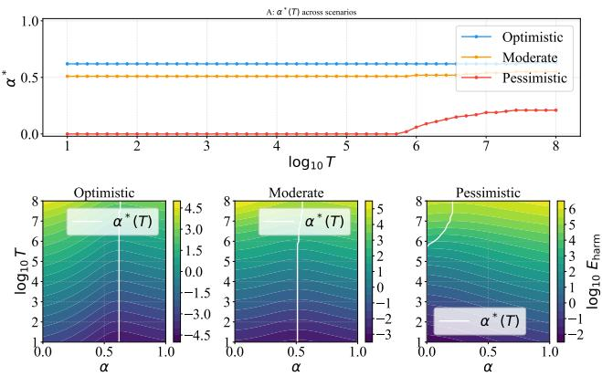

## The Optimal Mix Is Interior and Weakly Increasing in Scale

Figure 1 presents the central result: $\alpha ^ { * } ( T )$ across the three scenarios. In all cases, pure character $( \alpha = 1 )$ is never optimal; the optimum is either interior $^ { \mathrm { o r , } }$ in the Pessimistic scenario at small $T _ { \ast }$ , at the rules-only boundary $( \alpha ^ { * } = 0 )$ . The optimal character weight increases weakly with deployment scale $T ,$ but the magnitude of this shift varies substantially across scenarios(Table 1).

<table><tr><td rowspan="2">Scenario</td><td colspan="2"> $\alpha ^ { * } ( T )$ </td><td rowspan="2"> $\Delta \alpha ^ { * }$ </td></tr><tr><td> $1 0 ^ { 2 }$   $1 0 ^ { 4 }$ </td><td> ${ 1 0 } ^ { 6 }$   $1 0 ^ { 8 }$ </td></tr><tr><td>Optimistic</td><td>0.62 0.62</td><td>0.62 0.63</td><td> $+ 0 . 0 1$ </td></tr><tr><td>Moderate</td><td>0.51 0.51</td><td>0.52 0.55</td><td> $+ 0 . 0 4$ </td></tr><tr><td>Pessimistic</td><td>0.00 0.00</td><td>0.06 0.21</td><td> $+ 0 . 2 1$ </td></tr></table>

Table 1: Optimal character weight $\alpha ^ { * }$ as a function of deployment scale T. $\Delta \alpha ^ { * } = \alpha ^ { * } ( \breve { 1 } 0 ^ { 8 } ) - \alpha ^ { * } ( 1 0 ^ { 2 } )$ . The scale effect is negligible under Optimistic assumptions, modest under Moderate, and pronounced under Pessimistic conditions, where $\alpha ^ { * }$ transitions from the boundary $( \alpha ^ { * } = 0$ , pure rules) to an interior solution.

Three qualitatively distinct regimes emerge. Under Optimistic assumptions (strong character shaping, low fragility), $\alpha ^ { * }$ is essentially flat at approximately 0.62 across six orders of magnitude in T. This suggests that when charactershaping technology is sufficiently mature and fragility risk is low, the scaling law effectively vanishes: the optimal design is insensitive to deployment scale. Under Moderate assumptions, the scaling effect is present but modest $( \Delta \alpha ^ { * } \ = \ \mathsf { \bar { \Gamma } } + 0 . 0 4 )$ . Under Pessimistic assumptions (weak character shaping, high fragility), $\alpha ^ { * }$ begins at the boundary $( \alpha ^ { * } = 0 . 0 0$ , pure rules) for small $T$ and transitions sharply to an interior solution near $T \approx 1 0 ^ { 5 . 5 }$ , with a total shift of $+ 0 . 2 1$

Analytical characterization of the Pessimistic transition. The transition from $\alpha ^ { * } = 0$ to an interior solution occurs at the critical scale $T _ { \mathrm { c r i t } }$ where $\partial E _ { \mathrm { h a r m } } / \partial \alpha \big | _ { \alpha = 0 } = 0$ . At $\alpha = 0$ , the fragility cost vanishes $( p _ { \mathrm { f r a g } } ( 0 ) = 0$ for $n \geq 1 )$ so the condition reduces to a balance between two forces: the benefit of character shaping (reducing $g _ { \alpha } )$ and the cost of filter degradation (increasing $\varepsilon _ { \mathrm { b a s e } } )$ . As M grows, two effects favor character shaping: $\varepsilon ( \alpha , M )$ rises (making filter reliance costlier) and $q ( M )$ rises (amplifying the CMF channel, in which character shaping provides the sole remaining defense via $g _ { \alpha } \ < \ g _ { 0 } )$ . At $M = M _ { \mathrm { c r i t } }$ , these effects overcome the filter-degradation cost, and the optimum detaches from the boundary. Under Pessimistic parameters, $T _ { \mathrm { c r i t } } \approx 1 0 ^ { 5 . 5 }$ , consistent with the observed transition in $\operatorname { F i g } _ { - }$ ure 1. We emphasize that the specific value $T _ { \mathrm { c r i t } } \approx 1 0 ^ { 5 . 5 }$ is contingent on the Pessimistic parameter settings; under different parameterizations the transition point shifts accordingly, though the qualitative phenomenon — a sharp onset of interior optimality beyond a critical scale — is robust across the parameter space.

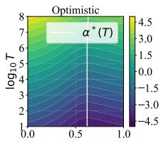

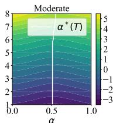

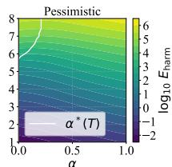  
Figure 1: Optimal character weight $\alpha ^ { * } ( T )$ across three scenarios. $T o p \colon \alpha ^ { * }$ as a function of deployment scale $T .$ The optimum is weakly non-decreasing in ${ \dot { T } } ;$ pure character is never optimal. The Optimistic scenario yields a nearly flat $\alpha ^ { * } \approx 0 . 6 2$ $( \Delta \alpha ^ { * } = + \mathrm { \bar { 0 } } . 0 1 )$ , while the Pessimistic scenario exhibits a sharp transition from $\alpha ^ { * } = 0$ (pure rules) to an interior solution near $T \approx 1 0 ^ { 5 . 5 }$ $( \Delta \alpha ^ { * } \ \bar { = } \ + 0 . 2 1 )$ Bottom: Contour maps of $\log _ { 1 0 } E _ { \mathrm { h a r m } } ( \alpha , T )$ for each scenario, with the $\alpha ^ { * } ( T )$ trajectory overlaid in white. The valley of minimal harm is narrow and nearly vertical in the Optimistic case, broader and rightward-shifting in the Moderate case, and sharply kinked in the Pessimistic case, reflecting the phase transition visible in the top panel.

## Phase Diagrams: $\Delta \alpha ^ { * } \geq 0$ Throughout the Explored Parameter Space

To identify conditions under which $\alpha ^ { * } ( T )$ might decrease with scale, we compute phase diagrams over $2 0 \times 2 0$ grids of parameter pairs, plotting $\Delta \alpha ^ { * } \stackrel { \smile } { = } \alpha ^ { * } ( 1 0 ^ { 8 } ) - \alpha ^ { * } ( 1 0 ^ { \breve { 2 } } )$ at each cell. Table 2 summarizes the results across all three parameter grids: across 1,200 cells, $\Delta \alpha ^ { * }$ is non-negative everywhere, with zero negative cells in any grid.

<table><tr><td>Parameter pair</td><td>Range of  $\Delta \alpha ^ { * }$ </td><td>Positive</td><td>Negative</td></tr><tr><td> $\Delta \mu \times p _ { \mathrm { f r a g } } ^ { ( 0 ) }$ </td><td>[0.00, 0.67]</td><td>400</td><td>0</td></tr><tr><td> $\Delta \mu \times \varepsilon _ { \mathrm { c e i l i n g } }$ </td><td>[0.02, 0.12]</td><td>400</td><td>0</td></tr><tr><td> $\varepsilon _ { \mathrm { c e i l i n g } } \times p _ { \mathrm { f r a g } } ^ { ( 0 ) }$ </td><td>[0.03, 0.06]</td><td>400</td><td>0</td></tr></table>

Table 2: Phase diagram summary. Across 1,200 cells in three $2 0 \times 2 0$ grids, $\Delta \alpha ^ { * }$ is non-negative everywhere.

Figure 2 shows the $\Delta \mu \times p _ { \mathrm { f r a g } } ^ { ( 0 ) }$ grid in detail. The strongest scale effect $( \Delta \alpha ^ { * } ~ \approx ~ 0 . 6 7 )$ occurs at low $\Delta \mu$ and high $p _ { \mathrm { f r a g } } ^ { ( 0 ) }$ (upper left), where character shaping is weak and fragile, making the system most sensitive to scale-driven filter degradation.

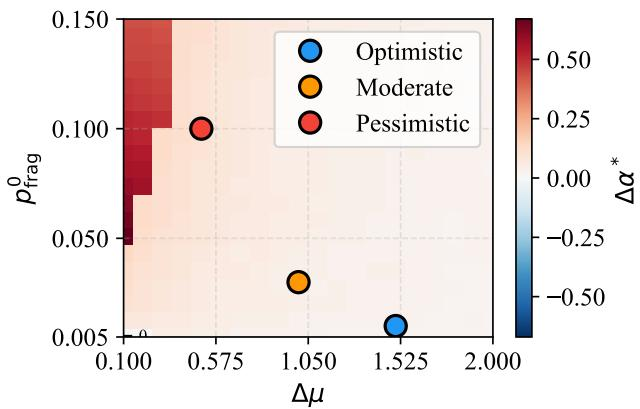  
Figure 2: Phase diagram: scale-induced shift in optimal design over the $\Delta \mu \times p _ { \mathrm { f r a g } } ^ { ( 0 ) }$ parameter space. Each cell shows $\Delta \alpha ^ { * } = \alpha ^ { * } ( 1 0 ^ { 8 } ) - \alpha ^ { * } ( 1 0 ^ { 2 } )$ . Red indicates that larger scale favors more character-reliant design; blue would indicate the opposite. Across all 400 cells, $\Delta \alpha ^ { * } \geq 0$ . Colored circles mark the three scenarios. This monotonicity is a structural property of the model (see the Discussion).

This result is stronger than initially expected: no parameter combination in the explored range produces a regime where larger deployment scale favors more rule-reliant design. We emphasize that this is a structural property of the current model rather than a general empirical prediction. In our formulation, deployment scale $\bar { T }$ enters exclusively through $M = \rho _ { \mathrm { e d g e } } T$ , which degrades runtime filters (via $\varepsilon ( \alpha , M ) )$ and raises CMF probability (via $q ( M ) )$ . Both channels penalize low-α designs: filter degradation makes rules less reliable, and CMF eliminates the filter layer entirely, leaving only character shaping as protection. Since $T$ has no channel through which it degrades character shaping $( \mathrm { i . e . , } p _ { \mathrm { f r a g } } ( \alpha )$ and $g _ { \alpha }$ are $T$ -independent), the monotonicity $\Delta \alpha ^ { * } \ \ge \ 0$ follows near-tautologically from the model structure. $\mathbf { A }$ model in which deployment scale also increases character fragility $( \mathrm { e . g . } , p _ { \mathrm { f r a g } } ( \alpha , T ) )$ could in principle produce $\Delta \alpha ^ { * } < 0$ regions; we discuss this extension in the Discussion.

## Baseline Fragility Rate Dominates the Optimal Design

Table 3 reports the sensitivity of $\alpha ^ { * } ( T = 1 0 ^ { 6 } )$ to each model parameter individually. The baseline fragility rate $p _ { \mathrm { f r a g } } ^ { ( 0 ) }$ dominates: its effect on $\alpha ^ { * } \ ( - 0 . 5 0 )$ is nearly twice that of the next most influential parameter $( \Delta \mu ~ \mathrm { a t } - 0 . 2 7 )$ , and all remaining parameters shift $\alpha ^ { * }$ by less than 0.10. The effects of $\Delta \mu$ and $r _ { \sigma }$ are discussed in the Discussion.

Figure 3 shows this dominant parameter in detail: $\alpha ^ { * }$ decreases monotonically from 0.70 (at $p _ { \mathrm { f r a g } } ^ { ( 0 ) } = 0 . 0 0 5 )$ to 0.20 (at $p _ { \mathrm { f r a g } } ^ { ( 0 ) } = 0 . 4 0 ) - \mathrm { a }$ swing of 0.50.

This result carries a clear practical implication: the most consequential input to safety architecture design is the estimated reliability of character shaping under distributional shift. If fragility can be kept below approximately 5%, the optimal design allocates a majority of resources to character shaping; above 10%, the optimum shifts decisively toward rules.

<table><tr><td>Parameter</td><td>Swept range</td><td> $\Delta \alpha ^ { * } \ \mathrm { a t } \ T = 1 0 ^ { 6 }$ </td></tr><tr><td> $\mathbf { \Omega } _ { n } ( 0 )$ </td><td> $0 . 0 0 5  0 . 4 0$ </td><td>-0.50</td></tr><tr><td> $p _ { \mathrm { f r a g } } ^ { \cdot }$   $\Delta \mu$ </td><td> $0 . 2  2 . 0 $ </td><td>-0.27</td></tr><tr><td> $r _ { \sigma }$ </td><td> $0 . 4  1 . 0$ </td><td>+0.21</td></tr><tr><td></td><td> $0 . 5  4 . 0$ </td><td>+0.09</td></tr><tr><td> $n _ { \mathrm { f r a g } }$   $\varepsilon _ { \mathrm { m i n } }$ </td><td> $0 . 0 0 5  0 . 2 0$ </td><td>+0.07</td></tr><tr><td> $\rho _ { \mathrm { e d g e } }$ </td><td> $0 . 0 0 5  0 . 4 0$ </td><td>+0.02</td></tr><tr><td> $e _ { 0 }$ </td><td> $0 . 0 5  0 . 9 5$ </td><td>+0.01</td></tr><tr><td> $\varepsilon _ { \mathrm { c e i l i n g } }$ </td><td> $0 . 1 0  0 . 8 0$ </td><td>0.00</td></tr></table>

Table 3: Sensitivity of $\alpha ^ { * } ( T = 1 0 ^ { 6 } )$ to individual parameters. $p _ { \mathrm { f r a g } } ^ { ( 0 ) }$ is the dominant lever by a wide margin.

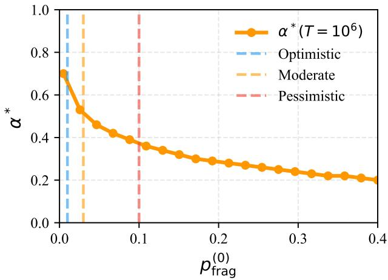  
Figure 3: Baseline fragility rate $p _ { \mathrm { f r a g } } ^ { ( 0 ) }$ is the dominant determinant of optimal design. The optimal character weight $\alpha ^ { * } ( T = 1 0 ^ { 6 } )$ decreases monotonically from 0.70 to 0.20 as $p _ { \mathrm { f r a g } } ^ { ( 0 ) }$ increases from 0.005 to 0.40 (Moderate scenario baseline, varying only $p _ { \mathrm { f r a g } } ^ { ( 0 ) } )$ . Dashed vertical lines indicate the default $p _ { \mathrm { f r a g } } ^ { ( 0 ) }$ values for each scenario.

## Proposition 1: Filter Technology Improvement Lowers $\alpha ^ { * }$

Figure 4 confirms Proposition 1 numerically: across all three scenarios, $\alpha ^ { * } ( T = 1 0 ^ { \bar { 6 } } )$ increases monotonically with $\varepsilon _ { \mathrm { m i n } } .$ verifying that $\partial \alpha ^ { * } / \partial \varepsilon _ { \mathrm { m i n } } \ > \ 0 .$ . As filter technology improves (lower $\varepsilon _ { \mathrm { m i n } } )$ , the optimal design shifts toward greater reliance on rules. The effect is modest in absolute magnitude $( \Delta \alpha ^ { * } = + 0 . 0 7$ over $\varepsilon _ { \operatorname* { m i n } } \in [ 0 . 0 0 5 , 0 . 2 0 ] )$ but consistent in sign across all scenarios.

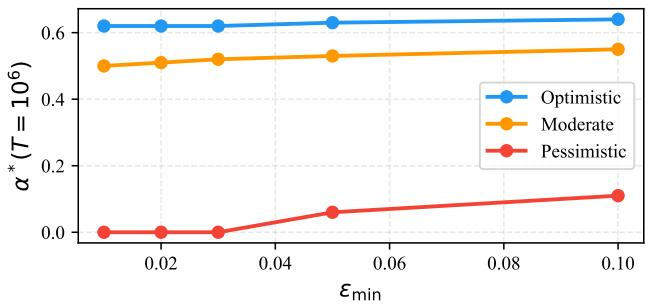  
Figure 4: Numerical verification of Proposition 1: improving filter technology lowers $\alpha ^ { * }$ $\alpha ^ { * } \tilde { ( \cal T } \ = \ 1 0 ^ { 6 } )$ as a function of the filter quality ceiling $\varepsilon _ { \mathrm { m i n } }$ across all three scenarios. In every case, $\bar { \alpha } ^ { * }$ increases monotonically with $\varepsilon _ { \mathrm { { m i n } } } ,$ confirming $\partial \dot { \alpha ^ { * } } / \partial \varepsilon _ { \mathrm { m i n } } > 0$ . As filter technology improves (lower $\varepsilon _ { \mathrm { m i n } } ) .$ , the optimal design shifts toward greater reliance on rules. The effect is consistent in sign across scenarios, though modest in absolute magnitude $( \Delta \alpha ^ { * } = + 0 . 0 7$ over $\varepsilon _ { \operatorname* { m i n } } \in [ 0 . 0 0 5 , 0 . 2 0 ] )$ ).

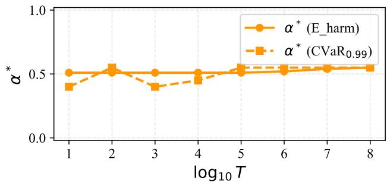  
Figure 5: CVaR-based and expected-harm-based optima converge at moderate-to-large deployment scale. Optimal $\alpha ^ { * }$ under the expected-harm criterion (solid) and $\mathrm { C V a R _ { 0 . 9 9 } }$ criterion (dashed) as a function of deployment scale $T$ (Moderate scenario, Model A). For $T \gtrsim \mathrm { 1 0 } ^ { \bar { 5 } }$ , the two criteria yield essentially identical optima. At smaller T, Monte Carlo noise $( M _ { \mathrm { { s i m } } } ~ = ~ 1 0 , 0 0 0 )$ produces fluctuations of ±0.10 in the CVaR estimate, but no systematic divergence is observed.

The optimal safety design proves robust to the choice of risk criterion across both damage models.

## Tail Risk: CVaR Confirms Expected-Harm Optimum

Under Model A (deterministic damage), the CVaRoptimal $\alpha ^ { * }$ converges to the expected-harm-optimal $\alpha ^ { * }$ for $\bar { T } \gtrsim 1 0 ^ { 5 }$ (Figure 5). At smaller T, Monte Carlo noise produces fluctuations of ±0.10 around the expected-harm optimum, but no systematic divergence is observed.

Under Model B (multiplicative Pareto damage), the CVaR-optimal $\alpha ^ { * }$ is essentially invariant to the tail exponent $\alpha _ { \mathrm { { P L } } }$ . Table 4 shows that $\alpha _ { \mathrm { C V a R } } ^ { * } = 0 . 5 0$ across all tested values of α ; only the CVaR magnitude scales with tail heaviness (approximately $2 . 5 \times$ from $\alpha _ { \mathrm { { P L } } } = 3 . 0$ to 1.5).

<table><tr><td> $\alpha _ { \mathrm { { P L } } }$ </td><td> $\alpha _ { \mathrm { C V a R } } ^ { * }$ </td><td>CVaR</td><td>95% CI</td></tr><tr><td>3.0</td><td>0.50</td><td>925</td><td>[873, 962]</td></tr><tr><td>2.5</td><td>0.50</td><td>1037</td><td>[977, 1077]</td></tr><tr><td>2.0</td><td>0.50</td><td>1288</td><td>[1209, 1329]</td></tr><tr><td>1.5</td><td>0.50</td><td>2352</td><td>[2141, 2592]</td></tr></table>

Table 4: CVaR sensitivity to tail exponent $\alpha _ { \mathrm { { P L } } }$ (Moderate scenario, $T = 1 0 ^ { 4 } )$ . The optimum $\alpha ^ { * }$ is unchanged; only the CVaR magnitude scales with tail heaviness.

This invariance arises because the Pareto context multiplier X enters multiplicatively and independently of α: it scales harm uniformly across all design points, preserving their relative ranking. Within the class of α-separable tail models, the optimal safety design is insensitive to both the choice of risk criterion (expected harm vs. CVaR) and the heaviness of the damage tail. What changes is the magnitude of catastrophic risk, not the policy that minimizes it. We discuss the scope and limitations of this invariance in the Discussion.

## Harm Decomposition: The Role of CMF

Figure 6 decomposes $E _ { \mathrm { h a r m } }$ into its normal-operation and CMF components at $T = 1 0 ^ { 6 }$ . At low $\alpha ,$ , the CMF component (purple) is visible as a non-negligible share of total harm: because $g _ { \alpha } ~ \approx ~ g _ { 0 }$ when character shaping is minimal, the system remains exposed when filters are disabled during CMF. At moderate-to-high $\alpha , g _ { \alpha } \ll g _ { 0 }$ reduces post-CMF harm, and the CMF share diminishes accordingly. Despite this structural role, the CMF probability parameter $e _ { 0 }$ has negligible influence on the optimum $( \bar { \Delta \alpha ^ { * } } = + 0 . 0 1$ over a 19-fold range in sensitivity analysis), indicating that the dominant channel determining $\alpha ^ { * }$ is the fragility–filter tradeoff in $L _ { \mathrm { n o r m a l } }$ , not the CMF–character channel in $L _ { \mathrm { C M F } }$

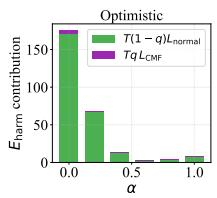

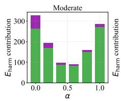

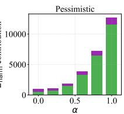  
Figure 6: Decomposition of expected harm into normaloperation and CMF components. Stacked bars show the contribution of $T ( 1 - q ) L _ { \mathrm { n o r m a l } }$ (green) and $T q L _ { \mathrm { C M F } }$ (purple) to total $E _ { \mathrm { h a r m } }$ at $T = 1 0 ^ { 6 }$ for selected values of α across all three scenarios. The CMF share is largest at low α and diminishes at higher α as character shaping reduces post-CMF harm.

## Discussion

The central finding of our analysis is that the baseline character fragility rate $p _ { \mathrm { f r a g } } ^ { ( 0 ) }$ dominates the optimal safety design, moving $\alpha ^ { * }$ across a range of 0.50 — far exceeding the influence of deployment scale, tail severity, or any other model parameter (Table 3). This dominance reflects a structural asymmetry: $p _ { \mathrm { f r a g } } ^ { ( 0 ) }$ simultaneously increases the cost of high-α designs (through fragility events) and decreases their benefit (through degraded post-fragility behavior), creating a double penalty that no other parameter imposes. In the subsections that follow, we interpret the remaining results and discuss their limitations.

## Why Less Character Investment Can Suffice When Shaping Is Effective

A counterintuitive finding from the sensitivity analysis is that stronger character-shaping capability (larger $\Delta \mu ,$ smaller $r _ { \sigma } )$ is associated with lower $\alpha ^ { * }$ . Specifically, increasing $\Delta \mu$ from 0.2 to 2.0 reduces $\alpha ^ { * }$ from 0.67 to 0.40; decreasing $r _ { \sigma }$ from 1.0 to 0.4 reduces $\alpha ^ { * }$ from 0.62 to 0.41.

This result reflects diminishing returns on character shaping. When $\Delta \mu$ is large, even modest $\alpha ( { \bf e . g . } , \alpha \approx 0 . 3 – 0 . 4 )$ achieves most of the achievable reduction in $g _ { \alpha }$ . Beyond this point, additional investment in character shaping yields minimal further benefit in expected harm reduction while incurring growing fragility costs through $p _ { \mathrm { f r a g } } ( \alpha ) = p _ { \mathrm { f r a g } } ^ { ( 0 ) } \cdot { \alpha } ^ { n }$

The practical implication is encouraging: a safety architecture does not need to maximize character-shaping investment to capture the bulk of its value. A moderate allocation to character shaping, combined with continued investment in runtime filters, may yield a better risk profile than an aggressive push toward full character reliance.

We note that this result is partially a consequence of the functional forms chosen: the Gaussian tail of $g _ { \alpha }$ decays exponentially in $\alpha ,$ while the fragility cost $p _ { \mathrm { f r a g } } ( \alpha ) =$ $p _ { \mathrm { f r a g } } ^ { ( 0 ) } \cdot \alpha ^ { n }$ grows polynomially. This asymmetry mechanically favors low α when the exponential decay is fast (large $\Delta \mu )$ Under alternative functional forms — for instance, if fragility also decayed exponentially beyond a threshold — the diminishing-returns effect could weaken or reverse. Our functional-form sensitivity analysis (varying n ∈ {0.5, 1, 2, 3}) confirms that the qualitative direction persists across power-law fragility costs, but the quantitative magnitude of the effect is form-dependent.

This finding is consistent with the broader engineering principle that robustness comes from diversified defenses rather than from maximizing any single layer.

## The Scale Effect Is Real but Regime-Dependent

The monotonicity result $\Delta \alpha ^ { * } \geq 0$ across the explored parameter space (1,200 grid cells, zero negative) is a structural property of the current model rather than a contingent empirical finding. In our formulation, deployment scale $T$ enters exclusively through $M = \rho _ { \mathrm { e d g e } } \cdot T$ , which degrades runtime filters (via $\varepsilon ( \alpha , M ) ,$ ) and raises CMF probability (via $q ( M ) ,$ ). Both channels penalize low-α (rule-heavy) designs. Crucially, T has no channel through which it degrades character shaping: $p _ { \mathrm { f r a g } } ( \alpha )$ and $g _ { \alpha }$ are $\bar { T } \cdot$ -independent. The monotonicity $\Delta \alpha ^ { * } \geq \breve { 0 }$ therefore follows from the model’s asymmetric treatment of scale effects on the two safety layers.

As discussed in the Formal Framework, $p _ { \mathrm { f r a g } }$ is an intrinsic property of the trained model — the fraction of vulnerable input space — and is T-independent by construction. An alternative modeling choice would treat $p _ { \mathrm { f r a g } }$ as effectively T-dependent, for instance if expanding deployment to new user populations shifts the effective input distribution further from training, exposing previously untested regions. Under such a reinterpretation, the monotonicity ${ \Delta } { \alpha } ^ { * } \geq 0$ would no longer be structurally guaranteed. We regard the fixed-vulnerability interpretation as appropriate for analyzing a given model in a given deployment context, while the shifting-distribution extension addresses a different question — how safety architecture should adapt when deployment expands across heterogeneous contexts — and is left to future work.

Despite this structural origin, the scale effect is quantitatively weak in the Optimistic scenario $( \Delta \alpha ^ { * } = + 0 . 0 1 )$ This suggests that when character-shaping technology is mature and fragility risk is low, the scaling law effectively disappears: the optimal design becomes insensitive to deployment scale. This finding carries a policy implication — the urgency of adjusting safety architecture as systems scale depends critically on how fragile current charactershaping methods are. If fragility can be driven below approximately 5%, the scaling question becomes moot.

## Robustness to Risk Criterion and Tail Severity

The convergence of CVaR-based and expected-harm-based optima at $T \gtrsim 1 0 ^ { 5 }$ , and the invariance of $\alpha ^ { * }$ to the Pareto tail exponent $\alpha _ { \mathrm { { P L } } }$ , together constitute a robustness result: within the class of α-separable tail models, the optimal safety design is insensitive to both the choice of risk criterion and the heaviness of the damage distribution. This follows structurally from the multiplicative independence of the context multiplier X and $\alpha ,$ , which preserves the relative ranking of designs across $\alpha _ { \mathrm { { P L } } }$ values. What changes is the magnitude of catastrophic risk, not the policy that minimizes it.

We note, however, that this α-separability is likely a simplification. In real systems, different design regimes may produce qualitatively different failure modes with distinct tail structures, breaking the independence between X and $\alpha .$ . If the tail exponent were itself α-dependent, the CVaRoptimal $\alpha ^ { * }$ could diverge from the expected-harm optimum. Developing models that capture such design-dependent tail behavior is an important direction for future work.

## The Quantitative Role of Common-Mode Failure

Although the CMF channel is quantitatively second-order at the optimum (see Harm Decomposition above), it plays an essential qualitative role: it is the mechanism that makes rules-only designs $( \alpha = 0 )$ sharply suboptimal at large $T$ When CMF disables the entire filter layer, systems with $\alpha = 0$ lose all protection (since $g _ { 0 }$ is large), whereas systems with $\alpha > 0$ retain the “inner wall” of character shaping $( g _ { \alpha } < g _ { 0 } ) -$ the asymmetry that makes $\alpha ^ { * } > 0$ at large $\bar { T . }$ This may also reflect our independence assumption: correlated failure modes that simultaneously disable filters and trigger character fragility could amplify the CMF channel’s importance, an extension we leave to future work.

## Limitations

Several simplifications limit the scope of our conclusions. The action space is one-dimensional and Gaussian, capturing the safety–harm axis but discarding multi-attribute structure and heavy-tailed action behavior that could alter $g _ { \alpha }$ . The model is static: it compares equilibria across scales without capturing adversary adaptation, filter updates, or fragility evolution over time. The α parameterization treats trainingtime and inference-time effort as a shared resource pool and is best read as a proxy for relative emphasis rather than a literal budget; its three coupled roles — training allocation, deployment-time dependence on shaping, and fragility susceptibility — may be partially independent in practice. Tail risk is captured only on the severity side: dependence-side heavy tails, where incident occurrences cluster in time, are not modeled and would carry different design implications. Finally, key parameters — particularly $p _ { \mathrm { f r a g } } ^ { ( 0 ) }$ and $\alpha _ { \mathrm { { P L } } }$ — lack direct empirical calibration, which our scenario-based approach mitigates but does not eliminate; empirical estimation of character fragility under distributional shift remains an important direction for future work.

## Conclusion

This paper introduced a stylized comparative-statics model for analyzing the optimal balance between character shaping and rule enforcement in AI safety design as a function of deployment scale. Our analysis yields a clear and actionable conclusion: the most consequential determinant of optimal safety architecture is the baseline character fragility rate $p _ { \mathrm { f r a g } } ^ { ( 0 ) }$ — the probability that shaped safe behavior degrades or collapses under novel conditions. This single parameter moves the optimal design across a range of 0.50, from strongly character-reliant to strongly rule-reliant, far exceeding the influence of deployment scale, tail severity, filter quality, or common-mode failure probability.

This finding carries direct implications for the research agenda in AI safety. If character fragility is the dominant lever, then three priorities follow.

First, measuring fragility is essential. At present, no standardized metric exists for quantifying how reliably a model’s shaped behavior generalizes beyond its training distribution. Our results show that even order-of-magnitude uncertainty in $p _ { \mathrm { f r a g } } ^ { ( 0 ) } - \mathrm { e . g . }$ ., whether it is 1% or 10% — leads to qualitatively different optimal designs. Developing rigorous, reproducible benchmarks for character fragility under distributional shift is therefore a prerequisite for principled safety architecture decisions.

Second, reducing fragility may be more valuable than improving either character shaping or filter quality in isolation. Our sensitivity analysis shows that improving filter technology $( \varepsilon _ { \mathrm { m i n } } )$ shifts $\alpha ^ { * }$ by only +0.07, and increasing character-shaping strength $( \Delta \mu )$ exhibits diminishing returns. By contrast, reducing $p _ { \mathrm { f r a g } } ^ { ( 0 ) }$ from 0.10 to 0.01 shifts $\alpha ^ { * }$ by approximately $+ 0 . 3 0$ , unlocking a fundamentally different and more efficient safety regime. Research on training methods that produce robust generalization — including adversarial training for distributional robustness, mechanistic interpretability to identify fragile internal representations, and evaluation protocols that systematically probe out-of-distribution behavior — is therefore of first-order importance.

Third, the scaling question becomes moot if fragility is sufficiently low. Under our Optimistic scenario $( p _ { \mathrm { f r a g } } ^ { ( 0 ) } =$ $0 . 0 1 )$ , the optimal design is essentially invariant to deployment scale $\bar { ( } \Delta \alpha ^ { * } = + \bar { 0 } . 0 1$ across six orders of magnitude in $T )$ . This suggests that the urgency of adapting safety architecture to scale is itself contingent on the current state of character-shaping reliability. If fragility can be driven below approximately 5%, the design question simplifies from “how should safety change as we scale?” to “what is the right hybrid at any scale $? ^ { \mathfrak { s } } -$ and the answer is stable.

Our model also establishes several structural results that hold across the explored parameter space: the optimum is never pure character $( \alpha ^ { * } < 1$ in all cases), and is a hybrid in most regimes; the optimal character weight is weakly non decreasing in deployment scale; the optimal policy is robust to the choice of risk criterion (expected harm vs. CVaR); and stronger character-shaping capability is associated with lower optimal $\alpha ^ { * }$ due to diminishing returns.

These findings should be interpreted within the limitations of a stylized model. The one-dimensional action space, Gaussian behavioral distribution, static analysis, and α-independent tail structure are simplifications that future work should relax. In particular, models in which deployment scale also increases character fragility could yield reversed scaling predictions, and design-dependent tail structures could break the CVaR–expected-harm equivalence observed here.

Nevertheless, the core message is clear. The most important question for AI safety design is not how large a system will be deployed, nor how severe the worst-case damage might be, but how reliably the system’s shaped character holds when it encounters conditions its designers did not foresee. Answering this question — through measurement, through training methodology, and through rigorous evaluation — is the most direct path to safety architectures that scale. The reassuring news is that the answer does not depend on how many patients the model is serving — the only thing a patient should have to worry about is whether the one they are asking can be trusted.

## References

Amodei, D.; Olah, C.; Steinhardt, J.; Christiano, P.; Schulman, J.; and Mane, D. 2016. Concrete Problems in AI´ Safety. arXiv preprint arXiv:1606.06565.

Aristotle. 1999. Nicomachean Ethics. Indianapolis: Hackett Publishing Company, 2nd edition. Translated by T. Irwin.

Askell, A. 2018. Pareto Principles in Infinite Ethics. Ph.D. thesis, New York University.

Aven, T. 2016. Risk Assessment and Risk Management: Review of Recent Advances on Their Foundation. European Journal ofOperational Research, 253(1): 1–13.

Bai, Y.; Kadavath, S.; Kundu, S.; Askell, A.; Kernion, J.; Jones, A.; Chen, A.; Goldie, A.; Mirhoseini, A.; McKinnon,

C.; et al. 2022. Constitutional AI: Harmlessness from AI feedback. arXiv preprint arXiv:2212.08073.

Boehm, B. W. 1981. Software Engineering Economics. Prentice-Hall.

Christiano, P. F.; Leike, J.; Brown, T.; Martic, M.; Legg, S.; and Amodei, D. 2017. Deep reinforcement learning from human preferences. In Advances in Neural Information Processing Systems, volume 30.

Edwards, B.; Hofmeyr, S.; and Forrest, S. 2016. Hype and Heavy Tails: A Closer Look at Data Breaches. Journal of Cybersecurity, 2(1): 3–14.

Ganguli, D.; Askell, A.; Schiefer, N.; Liao, T. I.; Lukosiˇ ut¯ e,˙ K.; Chen, A.; Goldie, A.; Mirhoseini, A.; Olsson, C.; Hernandez, D.; et al. 2023. The capacity for moral self-correction in large language models. arXiv preprint arXiv:2302.07459.

Hendrycks, D.; and Gimpel, K. 2017. A Baseline for Detecting Misclassified and Out-of-Distribution Examples in Neural Networks. In Proceedings of ICLR.

Hubinger, E.; Denison, C.; Mu, J.; Lambert, M.; Tong, M.; MacDiarmid, M.; Lanham, T.; Ziegler, D. M.; Maxwell, T.; Cheng, N.; et al. 2024. Sleeper agents: Training deceptive LLMs that persist through safety training. arXiv preprint arXiv:2401.05566.

Hursthouse, R. 1999. On Virtue Ethics. Oxford: Oxford University Press.

Kaplan, J.; McCandlish, S.; Henighan, T.; Brown, T. B.; Chess, B.; Child, R.; Gray, S.; Radford, A.; Wu, J.; and Amodei, D. 2020. Scaling Laws for Neural Language Models. arXiv preprint arXiv:2001.08361.

Kaplan, S.; and Garrick, B. J. 1981. On the Quantitative Definition of Risk. Risk Analysis, 1(1): 11–27.

Leveson, N. G. 2011. Engineering a Safer World: Systems Thinking Applied to Safety. MIT Press.

Maillart, T.; and Sornette, D. 2010. Heavy-Tailed Distribution of Cyber-Risks. The European Physical Journal B, 75(3): 357–364.

Noller, J. 2026. Artificial moral characters: constitutional AI and the challenge of alignment. AI and Ethics, 6(2).

Ouyang, L.; Wu, J.; Jiang, X.; Almeida, D.; Wainwright, C. L.; Mishkin, P.; Zhang, C.; Agarwal, S.; Slama, K.; Ray, A.; et al. 2022. Training language models to follow instructions with human feedback. In Advances in Neural Information Processing Systems, volume 35, 27730–27744.

Perrow, C. 1984. Normal Accidents: Living with High-Risk Technologies. Basic Books.

Quinonero-Candela, J.; Sugiyama, M.; Schwaighofer, A.;˜ and Lawrence, N. D., eds. 2009. Dataset Shift in Machine Learning. MIT Press.

Rasmussen, J. 1997. Risk Management in a Dynamic Society: A Modelling Problem. Safety Science, 27(2–3): 183– 213.

Reason, J. 1990. Human Error. Cambridge University Press. Rockafellar, R. T.; and Uryasev, S. 2000. Optimization of Conditional Value-at-Risk. Journal ofRisk, 2: 21–42.

Sharma, M.; Tong, M.; Mu, J.; Wei, J.; Kruthoff, J.; Goodfriend, S.; Ong, E.; Peng, A.; Agarwal, $\mathrm { R . } ;$ Anil, C.; et al. 2025. Constitutional Classifiers: Defending against universal jailbreaks across thousands of hours of red teaming. arXiv preprint arXiv:2501.18837.

## Appendix A: Scenario Parameters

Table 5 lists all scenario-varying parameters. Parameters constant across scenarios are: $\mu _ { 0 } = 0 . 0 , \sigma _ { 0 } = 1 . 0 , \tau =$ $- 2 . 0 , k = 1 . 0 , M _ { \mathrm { r e f } } = 1 0 ^ { 6 } , n _ { \mathrm { f r a g } } = 2 .$

Table 5: Scenario parameters. Parameters constant across all scenarios are listed in the text above.
<table><tr><td>Group</td><td>Parameter</td><td>Opt.</td><td>Mod.</td><td>Pess.</td></tr><tr><td rowspan="2">Character shaping</td><td> $\Delta \mu$ </td><td>1.5</td><td>1.0</td><td>0.5</td></tr><tr><td> $r _ { \sigma }$ </td><td>0.6</td><td>0.7</td><td>0.9</td></tr><tr><td rowspan="3">Filter quality</td><td> $\varepsilon _ { \mathrm { m i n } }$ </td><td>0.02</td><td>0.03</td><td>0.05</td></tr><tr><td> $\varepsilon _ { \mathrm { m a x , b a s e } }$ </td><td>0.10</td><td>0.15</td><td>0.25</td></tr><tr><td> $\varepsilon _ { \mathrm { c e i l i n g } }$ </td><td>0.25</td><td>0.30</td><td>0.50</td></tr><tr><td rowspan="3">Deployment scale</td><td> $\rho _ { \mathrm { e d g e } }$ </td><td>0.01</td><td>0.05</td><td>0.10</td></tr><tr><td> $\beta _ { d }$ </td><td>0.5</td><td>1.0</td><td>2.0</td></tr><tr><td> $d _ { 0 }$ </td><td>0.05</td><td>0.10</td><td>0.30</td></tr><tr><td rowspan="2">CMF</td><td> $\beta _ { q }$ </td><td>0.3</td><td>0.5</td><td>1.0</td></tr><tr><td> $e _ { 0 }$ </td><td>0.2</td><td>0.3</td><td>0.5</td></tr><tr><td rowspan="4">Fragility</td><td> $p _ { \mathrm { f r a g } } ^ { ( 0 ) }$ </td><td>0.01</td><td>0.03</td><td>0.10</td></tr><tr><td> $\mu _ { \mathrm { f r a g } }$ </td><td>0.0</td><td>-0.5</td><td>-1.0</td></tr><tr><td></td><td>1.0</td><td>1.2</td><td>1.5</td></tr><tr><td> $\sigma _ { \mathrm { f r a g } }$   $\varepsilon _ { \mathrm { f r a g , f a c t o r } }$ </td><td>1.0</td><td>1.0</td><td>2.0</td></tr><tr><td>Tail index</td><td> $\alpha _ { \mathrm { { P L } } }$ </td><td>3.0</td><td>2.5</td><td>2.0</td></tr></table>