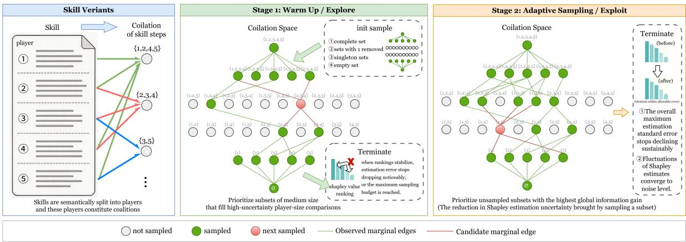
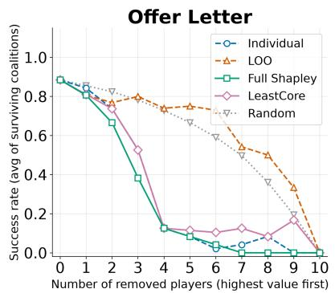
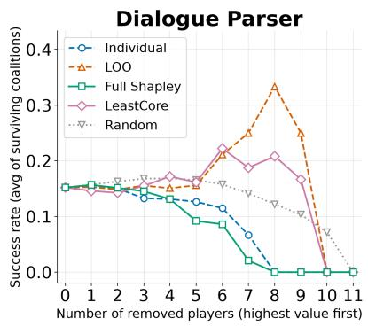
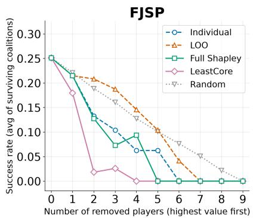
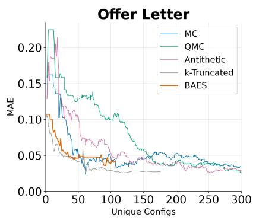
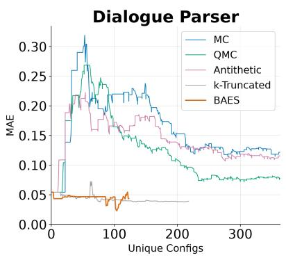
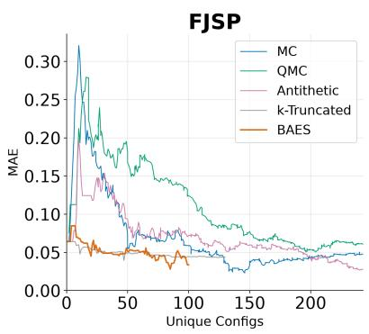
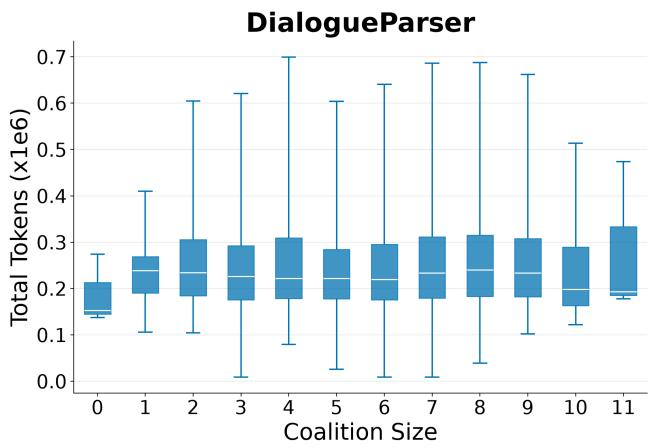

# SkillShapley: Boundary-Adaptive Shapley Valuation for Skill Step Attribution in LLM Agents

Chang Liu1, Yuqi Zhang1, Yiman Zhong1, Boyi Liu1, Hengjun Wang1, and Shuyue Wei∗2

1Beihang University, Beijing, China

2Shandong University, Jinan, China

## Abstract

Agent skills are crucial external instructions that enable language agents to execute long procedural tasks such as coding or document processing. Existing agent skills are primarily created through human manual crafting or agent execution traces, with limited understanding of how each step contributes to overall skill performance on specific tasks; i.e., there remains an open problem in quantifying the contribution of individual steps within an agent skill. To address this issue, we first model skill-step attribution as a Shapley value-based contribution estimation problem, and then propose SkillShapley, a step-level attribution framework for agent skills. Notably, SkillShapley operates in two phases, motivated by key empirical insights, i.e., discretized benchmark rewards that create sharp performance clifs, and step interactions that are largely additive rather than synergistic. Specifically, it first identifies informative coalitional regions, and then adaptively samples new coalitions that can yield reusable marginal evidence. Experiments on skills from the widely adopted SkillsBench demonstrate that our SkillShap ley can efectively and eficiently identify high- or low-value skill steps, providing several key takeaways for agent skill creation.

## 1 Introduction

Large language models (LLMs) are increasingly deployed in the role of autonomous agents that execute multi-step procedures such as debugging, data analysis, and repository-level code changes [1, 2]. A key mechanism for controlling such agents is the skill: a step-by-step natural-language specification that guides the agent through a compound task. Skills, tools, and workflow modules are widely used in systems such as SWE-agent [3], ReAct [4], DSPy [5], and Toolformer [6], enabling substantial capability gains without further training the base model [7].

Despite their practical importance, skill design is still often done by trial and error. Benchmarking can show how well an end-to-end skill performs, but it does not explain which steps are responsible for the performance or where redundancy lies. Without fine-grained step-level attribution, practitioners often either over-specify skills, wasting context and cost, or prune blindly, risking sharp failures.

Existing methods have yet to ofer a principled resolution to this problem. Prompt optimization methods improve prompts or programs as a whole, prompt compression methods identify compressible tokens, and workflow optimizers improve execution structure, but none directly assigns value to individual steps within a fixed skill. As a result, there is still no clear framework for asking which specific steps of an agent skill are truly doing the work.

We propose to treat a skill as a set of step “players” in a cooperative game and quantify each step’s contribution with the Shapley value [8]. Shapley values provide a standard way to measure marginal contribution across contexts and have been successfully used for feature importance and data value [9, 10]. The central question is whether this attribution tool remains meaningful when the “players” are natural-language procedural steps.

Our motivation comes from an exact-reference exploration of low-step-count skills. We compare Shapley values against two simple baselines used here: Individual scores, which evaluate each step in isolation, and Leave-One-Out (LOO) scores, which remove one step from the full skill. In this setting, Shapley rankings produced diferentiated step values, whereas Individual and LOO scores produced many ties. Removing Shapley top-ranked steps also caused clear performance degradation. This observation suggests that Shapley values can serve as a behaviorally meaningful target for skill-step attribution. It also exposes the practical bottleneck: exact enumeration quickly becomes infeasible as the number of skill steps grows.

This work investigates three questions: (1) whether Shapley values are behaviorally meaningful for natural-language skill steps; (2) whether BAES can approximate exact Shapley rankings under a much smaller unique-configuration budget; and (3) what the resulting attribution patterns reveal about skill pruning, revision, and creation. We answer these questions with SkillShapley and a budgeted active approximation method called Boundary-Adaptive Edge Shapley (BAES), which is designed for the skill regime where new configuration evaluations are expensive and cached one-flip comparisons can be reused.

Contributions. We make three contributions. (1) We formulate skill-step valuation as a cooperativegame attribution problem, where skill steps are players, retained-step subsets are coalitions, and benchmark performance is the utility. (2) We introduce BAES, a cache-aware approximation method that combines warmup coverage with adaptive acquisition over reusable one-flip marginal edges. (3) We show that BAES approximates Shapley values efectively in the skill setting, achieving better approximation with fewer unique configuration samples than competing estimators.

## 2 Related Work

Agent Skills. LLM agents increasingly use external procedural knowledge, tools, and workflow modules to improve long-horizon task execution, including reasoning-and-acting frameworks [4], tool-use models [6, 7], agent-computer interfaces [3], and declarative LM pipelines [5]. Recent Skills-Bench formalizes agent skills as structured procedural knowledge and provides a benchmark of curated skills and deterministic verifiers across diverse tasks [11]. Skill optimization and refinement methods improve skill sets, refine LLM-authored skills, compress skill content, or compile skills across frameworks [12–15]. However, existing skill-centered work generally treats skills as whole units, rather than assigning contribution scores to individual instruction steps inside a fixed skill.

Instruction Attribution in LLMs. Beyond optimizing instructions as wholes, instruction attribution asks which parts of an LLM input or instruction afect model behavior. Prior work probes prompt content [16], compresses prompts by identifying removable tokens [17, 18], or assigns importance to tokens and spans [19, 20]. These methods provide fine-grained evidence about text units, but they do not directly address semantic procedure steps as the units of attribution.

Shapley Values for Attribution. Shapley values provide a principled way to aggregate marginal contributions across contexts [8]. They are widely used for feature importance (e.g., SHAP [9]) and data value (e.g., Data Shapley [10]). Because exact computation is exponential, many approximation methods have been proposed, including permutation sampling [21], stratified and uncertainty-aware sampling [22, 23], amortized estimators such as FastSHAP [24], and broad empirical comparisons of Shapley estimators [25]. Most existing estimators target settings where coalition evaluation is relatively cheap compared with executing new LLM-agent skill variants.

  
Figure 1: Overview of BAES for budgeted skill-step attribution. The left panel shows how semantic instruction blocks define skill variants and enter the evaluation cache. The middle panel illustrates the warmup stage, which samples broadly across coalition sizes. The right panel illustrates the adaptive stage, which exploits the accumulated cache by selecting the next variant near high-priority regions with uncertain efects, under-sampled coverage, and many cached neighbors.

Across these literatures, prior work optimizes skills or skill sets, but does not attribute value to individual steps inside a fixed skill under a benchmark distribution. SkillShapley fills this gap by treating steps as Shapley players and by introducing BAES, a cache-aware approximation method tailored to the cost model and saturation patterns of skill evaluation.

## 3 Problem Formulation

We formulate skill-step attribution as a cooperative game because a skill is naturally composed of reusable instruction steps whose efects depend on which other steps are present. Let a fixed skill be segmented into n semantically coherent steps indexed by $N = \{ 1 , \ldots , n \}$

$$
X = ( x _ { 1 } , \ldots , x _ { n } ) ,\tag{1}
$$

where each index $i \in N$ is treated as one player. The segmentation is done over the body of skill.md: blocks may correspond to task-entry guidance, decision rules, API examples, validation instructions, or common pitfalls, and tightly coupled snippets are not split when doing so would make a block semantically incomplete. A subset of players $S \subseteq N$ corresponds to a skill variant that keeps exactly those steps and preserves their original order:

$$
X _ { S } = ( x _ { i } ) _ { i \in S , { \mathrm { ~ o r d e r e d ~ a s ~ i n ~ } } X } .\tag{2}
$$

This subset construction gives the standard cooperative-game notion of a coalition: a coalition is not a diferent task or a rewritten prompt, but the same skill context with only a chosen set of steps retained.

To make the attribution well-defined, all factors other than the selected body steps are fixed across coalitions. The frontmatter is always retained so the skill can still be discovered and loaded. We also keep the non-target context, benchmark instances, and scoring rule fixed. Let $\boldsymbol { B } = \{ ( q _ { j } , y _ { j } ) \} _ { j = 1 } ^ { M }$ be the fixed benchmark subset. When the agent runs with skill variant $X _ { S }$ on input $q _ { j }$ , it produces output $o _ { j } ( S )$ . The value of coalition S is its measured benchmark utility:

$$
v ( S ) = \frac { 1 } { M } \sum _ { j = 1 } ^ { M } r ( o _ { j } ( S ) , y _ { j } ) , \qquad v : 2 ^ { N } \to \mathbb { R } ,\tag{3}
$$

where $r ( \cdot , \cdot )$ is the task scoring function. In many skill benchmarks, r is a binary success indicator, so $v ( S )$ is an empirical success rate.

Under this cooperative-game view, skill-step attribution asks how much each player contributes to the utility function v across possible coalitional contexts. The desired output is a contribution vector

$$
\pmb { \alpha } = ( \alpha _ { 1 } , \ldots , \alpha _ { n } ) \in \mathbb { R } ^ { n } ,\tag{4}
$$

where $\alpha _ { i }$ summarizes the contribution of step i to benchmark performance. The practical constraint is that observing $v ( S )$ requires executing an LLM agent with skill variant $X _ { S }$ on benchmark instances, so each new coalition evaluation can be costly.

## 4 Method

## 4.1 Overview

We instantiate the attribution vector in Eq. (4) with Shapley values. For step player $i \in N$ , the target value is

$$
\phi _ { i } = \sum _ { S \subseteq N \setminus \{ i \} } { \frac { | S | ! ( n - | S | - 1 ) ! } { n ! } } \left[ v ( S \cup \{ i \} ) - v ( S ) \right] .\tag{5}
$$

An equivalent size-stratified form is

$$
\phi _ { i } = \frac { 1 } { n } \sum _ { k = 0 } ^ { n - 1 } \mathbb { E } \left[ \Delta _ { i } ( S ) \mid | S | = k , \ i \not \in S \right] ,\tag{6}
$$

where $\Delta _ { i } ( S ) = v ( S \cup \{ i \} ) - v ( S )$ is a one-step marginal contribution. Eq. (6) partitions the target into player-size strata (i, k) and separates where uncertainty lives across coalition sizes.

BAES is a budgeted active approximation method for Shapley values in the skill setting, where evaluation cost is dominated by new configurations, cached one-flip comparisons can be reused, and rewards are discrete and quickly flatten out. The attribution target remains the standard Shapley value in Eq. (5); BAES changes the sampling policy to decide which coalitions to evaluate when only a small number of configuration evaluations is afordable. When used below, g denotes the smallest observable reward increment.

BAES proceeds in two stages. Algorithm 1 summarizes the complete procedure. The warmup stage builds a cache that gives broad stratum coverage and identifies which strata remain uncertain. The adaptive stage then repeatedly evaluates the single most informative unevaluated configuration, scored by the number of high-priority one-flip edges it forms with the cached configurations. This separation between coverage and exploitation is important. If BAES were purely greedy from the beginning, early random fluctuations could lock the sampling process onto a narrow set of strata. The warmup stage prevents this failure mode by first creating enough local structure for acquisition scores to become meaningful.

## 4.2 Observations

BAES is derived from three observations about agent skill evaluation. First, configuration cost dominates edge cost: the algorithm must decide which new configuration to evaluate so that it produces as many useful cached one-flip comparisons as possible. Second, rewards are discrete and noisy under limited repeated evaluation: when each configuration is scored on only a small benchmark subset, the observed performance can change sharply from one coalition to another, making some strata much more uncertain than others. Third, rewards often flatten out over large parts of the coalition space: when many neighboring coalitions have similar rewards, additional evaluations in those regions provide little new information. Useful samples are therefore those that expose larger variation in marginal efects across player-size strata, suggesting adaptive sample allocation rather than uniform sampling.

Together, these observations motivate a two-stage strategy: a warmup stage that builds coverage and identifies which strata remain uncertain, followed by an adaptive stage that uses the remaining evaluations only where they continue to reduce uncertainty. In efect, BAES treats cached configurations and their one-flip neighbors as a reusable measurement structure rather than as a set of separate prompt variants. The algorithm benefits when a new configuration simultaneously illuminates several neighboring comparisons, especially around strata whose current estimates remain unstable.

## 4.3 Two-Stage Procedure

BAES maintains a cache D of evaluated configurations and records each observed one-flip comparison in its corresponding stratum (i, k). As the cache grows, BAES updates the empirical mean $\widehat { \mu } _ { i , k }$ variance ${ \widehat \sigma } _ { i , k } ^ { 2 } ,$ , and count $m _ { i , k }$ of observed marginal efects within each stratum. These statistics are used to decide where the next evaluation should go. Specifically, BAES assigns each stratum an allocation score

$$
a _ { i , k } = \frac { \sqrt { \widehat { \sigma } _ { i , k } ^ { 2 } + \epsilon } } { \sqrt { m _ { i , k } + 1 } } ,\tag{7}
$$

so high-variance and under-sampled strata receive more attention. Here uncertainty is empirical rather than model-based: BAES does not predict the reward of an unevaluated coalition, but allocates new cache-aware evaluations toward strata whose observed marginal efects are still variable or poorly covered. BAES also applies a coarse cached-reward weight $b ( y ) = 1 + \operatorname* { m a x } \{ 0 , { \mathrm { r o u n d } } ( ( 1 $ $y ) / g ) ]$ , which gives higher priority to configurations adjacent to low-reward cached states. The warmup operator TopPriority ranks strata by $a _ { i , k } / \sqrt { m _ { i , k } + 1 }$ and selects at most three unevaluated coalitions per round that expose the highest-ranked strata while maximizing A(C). All ties are broken lexicographically by coalition bit string.

Warmup begins by evaluating anchor configurations that maximize potential edge reuse: the empty set, the full set, all singletons, and all (n − 1)-subsets. It then expands the cache with intermediate-size configurations selected by a greedy cache-aware rule that prefers candidates with many cached one-flip neighbors. Ties are resolved by a fixed deterministic ordering. Each such configuration yields multiple marginal edges immediately, improving stratum coverage rapidly with only a small number of evaluations. This cache-aware design creates more efective marginal-edge observations from the same configuration budget. Warmup does not aim to produce the final best estimate; its purpose is to stabilize the relative priority ordering of strata. Once the cache contains enough coverage, the algorithm can distinguish strata that are truly uncertain from strata that only appeared uncertain because they had not yet been observed. The predicate RankUnstable compares successive allocation-score rankings with Kendall’s τ and remains true until the exponential moving average of per-configuration $\tau$ improvement falls below $1 / e$ of its observed peak after at least 60 observed strata, or until the warmup cap is reached.

Algorithm 1 Boundary-Adaptive Edge Shapley (BAES)   
Input: N (step players), $v ( \cdot )$ (evaluator), g (reward granularity)   
Param: R (warmup cap), B (total budget)   
Output: $\widehat { \phi } \in \mathbb { R } ^ { | N | }$ (step values)   
1: $n \gets | N |$ (player count); $\mathcal { D }  \emptyset$ (cache)   
2: $\mathcal { E } _ { i , k } \gets \emptyset , \ \forall i , k$ (edge strata)   
3: $S _ { 0 } \gets \{ \emptyset , N \} \cup \{ \{ i \} , N \setminus \{ i \} : i \in N \}$ (anchors)   
4: $\forall S \in S _ { 0 } : \ v ( S )  \mathsf { E v a l } ( S ) , \ D \gets \mathcal { D } \cup \{ S \}$   
5: $\mathcal { E }  \mathsf { E d g e s } ( \mathcal { D } )$   
6: $\mathcal { U } _ { \mathrm { r a n k } } $ RankUnstable(E) (rank unstable)   
7: while $\mathcal { U } _ { \mathrm { r a n k } } \wedge | \mathcal { D } | < R$ do   
8: $\{ \widehat { \mu } , \widehat { \sigma } ^ { 2 } , m , a \} _ { i , k } \gets \mathsf { U p d a t e } ( \mathcal { E } , g )$   
9: $\mathcal { C } _ { \mathrm { b a t c h } } ^ { \star } \gets \mathsf { T o p P r i o r i t y } ( \mathcal { D } , \mathcal { E } , a )$   
10: $\mathcal { D }  \mathcal { D } \cup \mathcal { C } _ { \mathrm { b a t c h } } ^ { \star } ; \mathcal { E }  \mathsf { E d g e s } ( \mathcal { D } )$   
11: $\mathcal { U } _ { \mathrm { r a n k } } \gets \mathsf { R a n k U n s t a b l e } ( \mathcal { E } )$   
12: end while   
13: $\mathcal { U } _ { \mathrm { u n c e r t } } $ Uncert $\mathtt { D e c } ( \mathcal { E } , g )$ (uncertainty decreases)   
14: while $\mathcal { U } _ { \mathrm { u n c e r t } } \wedge | \mathcal { D } | < B$ do   
15: $a _ { i , k } \gets \sqrt { \widehat { \sigma } _ { i , k } ^ { 2 } + \epsilon / \sqrt { m _ { i , k } + 1 } } , \ \forall i , k$   
16: $C ^ { \star } \gets \arg \operatorname* { m a x } _ { C \notin \mathcal { D } } A ( C )$   
17: $v ( C ^ { \star } ) \gets \mathsf { E v a l } ( C ^ { \star } ) ; \mathcal { D } \gets \mathcal { D } \cup \{ C ^ { \star } \}$   
18: $\mathcal { E }  \mathsf { E d g e s } ( \mathcal { D } ) ; \mathcal { U } _ { \mathrm { u n c e r t } }  \mathsf { U n c e r t } \mathsf { D e c } ( \mathcal { E } , g )$   
19: end while   
20: $\widehat { \mu } _ { i , k } \gets \mathsf { F i l l } ( \widehat { \mu } _ { i , k } ) , \forall ( i , k ) : m _ { i , k } = 0$   
21: return $\begin{array} { r } { \widehat { \phi } _ { i } \triangleq n ^ { - 1 } \sum _ { k = 0 } ^ { n - 1 } \widehat { \mu } _ { i , k } , \forall i \in N } \end{array}$

After the cache reaches broad coverage, BAES transitions to adaptive acquisition. At this stage, BAES scores an unevaluated configuration C by

$$
A ( C ) = \sum _ { i : \ C \triangle \{ i \} \in \mathcal { D } } a _ { i , k } \cdot b ( v ( C \triangle \{ i \} ) ) ,\tag{8}
$$

where the sum runs over one-flip cached neighbors and k is the context size associated with that edge. BAES then evaluates the unevaluated configuration with the largest $A ( C )$ , adds it to the cache, and updates all afected strata statistics. This directly targets configurations that simultaneously reduce uncertainty across multiple high-priority strata, rather than spreading samples uniformly across the lattice. Because the acquisition score depends on the evolving cache, BAES is inherently adaptive: the value of evaluating a coalition depends not only on the coalition itself but also on which neighbors have already been evaluated. This makes the sampling trajectory data-dependent, which is precisely what allows BAES to concentrate evaluations in the most informative parts of the search space.

## 4.4 Stopping and Estimation

To monitor whether additional evaluations still reduce uncertainty, BAES tracks a normalized standard-error signal over the stratum estimates. The normalization uses the reward granularity g, which prevents the stopping rule from reacting to numerical changes below the resolution of the benchmark reward. In Algorithm 1, UncertDec denotes this check: it remains true while the recent slope of the normalized standard-error trajectory is still negative over a data-derived decorrelation window, with a minimum coverage requirement of 85 observed strata. BAES stops when this uncertainty signal shows diminishing returns, or when a preset maximum sampling count is reached. After stopping, it returns the size-stratified estimator

  
Figure 2: Experiment 1 removal validation on the three SkillsBench tasks. Each panel corresponds to one task. The x-axis is the number of removed players following each method’s ranking. The y-axis is the mean success rate over all coalitions that do not contain the removed players. Curves compare simple baselines (Individual, Leave-One-Out, and Random Removal), LeastCore [26], and full Shapley [8]. Stronger attribution should produce a sharper success-rate drop when its top-ranked players are removed.

$$
\widehat { \phi } _ { i } = \frac { 1 } { n } \sum _ { k = 0 } ^ { n - 1 } \widehat { \mu } _ { i , k } .\tag{9}
$$

If a small number of strata remain empty under a very small sampling count, Fill replaces each missing $\widehat { \mu } _ { i , k }$ with the mean of observed stratum means at the same size $k ,$ or 0 if that size has no observed stratum, so that $\widehat { \phi }$ is well-defined.

The target of BAES remains the standard Shapley value, but BAES is best understood as a budgeted active approximation rather than as a claim of finite-sample unbiasedness under every possible cooperative game. Because the adaptive stage deliberately samples more often in uncertain or high-variation strata, the empirical stratum means in Eq. (9) are optimized for low-budget ranking recovery rather than for uniform random sampling within each stratum. When the budget is large enough that every player-size stratum is directly observed and no fallback fill is used, the returned value reduces to the empirical size-stratified average in Eq. (6); under finite adaptive budgets it should be interpreted as a biased approximation for ranking recovery. Under the finite budgets relevant to LLM skill evaluation, we therefore evaluate BAES by comparing it against exact Shapley references under matched unique-configuration budgets. This matches the intended use case: the practitioner typically needs a low-cost estimate that is close enough to guide which steps to preserve, inspect, or prune, not to report a scalar value with negligible numerical error.

This stopping logic is designed for settings where rewards are coarse. When v(S) is measured on only a few benchmark instances, insisting on near-zero numerical error is unrealistic; a more useful criterion is whether additional evaluations are still changing the practically relevant ranking or only refining values below the reward granularity.

## 5 Experiments

We evaluate SkillShapley along the three claims introduced above. First, we test whether Shapley values are useful in the skill setting by comparing exact Shapley against simpler contribution measures and by validating the rankings through step-removal behavior. Second, we test whether BAES is a better low-cost approximation to exact Shapley than other Shapley approximation methods under matched coalition-evaluation budgets. Third, we use case studies from the resulting attribution profiles to extract guidance for skill pruning, revision, and creation. This ordering is important: the exact-reference analysis first establishes that full Shapley values are behaviorally meaningful for skill steps; the approximation analysis then tests whether BAES can recover this validated target at lower cost; and the case study translates attribution patterns into editing guidance.

## 5.1 Experimental Setup

All experiments use SkillsBench skills [11]. We split each skill.md into semantically coherent instruction blocks and treat each block as one Shapley player. The frontmatter is always retained so that the skill remains discoverable and loadable by the agent, and auxiliary resources such as reference files and scripts are kept unchanged across all coalitions. For a coalition S, the corresponding skill variant retains exactly the instruction blocks in S while keeping the task, system prompt, output format, benchmark instances, and scoring function fixed. Thus changes in v(S) are attributed to the retained instruction blocks rather than to changes in evaluation data, package resources, or prompt paraphrasing.

Evaluating a coalition requires running the LLM skill on benchmark instances, which can be slow and token-expensive. Therefore, the central cost in this setting is not the number of arithmetic marginal comparisons, but the number of new skill variants that must be executed by the model. We use the number of unique evaluated configurations as the primary cost measure and explicitly reuse cached coalition values whenever possible. All approximation methods are compared under matched unique-configuration budgets. The agent harness is OpenHands. All model calls use temperature T = 0, and within each skill all methods are evaluated on the same benchmark subset.

## 5.2 Exact Shapley as Skill-Step Attribution

The first experiment tests whether Shapley values are behaviorally meaningful for skill-step attribution. It focuses on low-step-count SkillsBench skills for which exact enumeration is feasible: ofer-letter-generator, manufacturing-fjsp-optimization, and dialogue parser. These skills need not share the same number of instruction blocks; each is evaluated over its own coalition lattice. We compare exact Shapley with simple baselines, Individual, Leave-One-Out, and Random Removal, and with LeastCore [26], and validate the resulting rankings by measuring the utility degradation caused by removing top-ranked blocks. We analyze these exact-reference skills to determine whether the cooperative-game view produces a clearer and more actionable step ranking than simpler alternatives.

We evaluate attribution validity through top-ranked removal across all three exact-reference tasks (Figure 2). If a method truly identifies important steps, then deleting high-ranked steps should cause faster utility degradation than deleting low-ranked or randomly selected steps. In Figure 2, the full Shapley removal curves drop fastest across the exact-reference tasks, supporting the claim that Shapley values identify behaviorally important skill blocks more reliably than the simpler baselines. We also report whether each method produces tied or diverse value profiles in the accompanying interpretive text, but do not use a separate figure for this diagnostic.

  
Figure 3: Experiment 2 approximation error under increasing unique-configuration budgets. The xaxis is the sampling budget, and the y-axis is error relative to full Shapley, aggregated over players. Lines compare BAES, Monte Carlo Shapley [21], Quasi-Monte Carlo Shapley [25], paired Monte Carlo Shapley [25], and size-k-truncated Shapley. Lower curves indicate faster convergence to the exact Shapley reference.

This experiment establishes the target that BAES later approximates. Its role is therefore foundational: before claiming that BAES is eficient, we verify that Shapley-based skill rankings correspond to actual deletion risk in the SkillsBench setting.

## 5.3 BAES Approximation Accuracy and Cost

The second experiment tests whether BAES approximates the exact Shapley target more efectively than other Shapley approximation methods. We use the exact Shapley values from the low-stepcount skills as references for budgeted approximation. All compared methods estimate Shapley values: BAES, Monte Carlo Shapley [21], Quasi-Monte Carlo Shapley [25], paired Monte Carlo Shapley [25], and size-k-truncated Shapley, a simple baseline that keeps only marginal strata with coalition size at most k. The Monte Carlo variants follow the broader Shapley-estimation literature. We compare them against the full Shapley reference under matched unique-configuration budgets. This design isolates approximation quality from raw API cost: every method pays for the same number of distinct skill variants, while BAES gains an advantage only if its cache-aware acquisition selects more informative coalitions and reuses more marginal edges from the same cache.

Figure 3 focuses on value error as a function of unique-configuration budget. BAES reaches lower approximation error under smaller budgets in the plotted comparison, indicating that cache-aware acquisition selects more informative coalitions than the competing Shapley approximation baselines.

We also report a cache-eficiency diagnostic to separate BAES’s sampling mechanism from raw API cost. In our 10-player SkillsBench pilot, under the same 99 unique-configuration budget, BAES Phase 1 yields 206 reusable one-flip marginal edges, whereas MC permutation sampling yields 130 permutation marginal observations, only 115 of which are unique. This supports the interpretation that BAES improves low-budget approximation partly by creating more reusable marginal-edge evidence from the same number of evaluated skill variants.

Figure 4 provides an auxiliary diagnostic on prompt cost for the Dialogue Parser skill. Token count is not strongly determined by coalition size: many coalition-size groups have similar median costs, and their ranges overlap substantially. This suggests that token cost depends not only on how many instruction blocks are retained, but also on which semantic blocks and auxiliary context are present. We therefore treat attribution-guided editing as a way to remove low-value content, not as a guarantee of proportional token savings.

  
Figure 4: Token-cost diagnostic for Dialogue Parser coalitions. The y-axis shows the total token count (input plus output tokens) for coalition variants with varying coalition sizes.

## 5.4 Case Study: Practical Guidance for Skill Creation and Modification

Beyond validating attribution and approximation, SkillShapley provides multiple actionable takeaways for skill creation and modification. Across the three cases, component value is better explained by procedural role than by surface form. High-value steps tend to act as procedural bridges: they connect a task condition to an executable decision rule, an API operation, or a constraint-aware fallback. This pattern appears in diferent forms across the evaluated tasks. In Ofer Letter, highvalue steps combine placeholder replacement with tables, nested tables, and headers or footers. In Dialogue Parser, high-value steps connect the user scenario to concrete graph-building actions such as node construction, validation, or visualization. In FJSP, high-value steps connect scheduling constraints to repair decisions, such as when to preserve the baseline machine and when to consider an alternative. Low-value steps are often locally correct but action-incomplete: they provide background facts or isolated helper information without changing the agent’s next decision. Overall, these observations suggest that efective skills should be written as compact, decision-complete guidance units, rather than as shorter text or disconnected snippets.

High-value step: FJSP P9 (code block) ϕ = 0.1155   
# A naive “always keep baseline machine” can cause large start   
shifts.   
This often reduces Shift\_L1 enough to pass tight budgets   
without exploding machine changes. Use a simple trigger to   
consider alternates only when it helps:   
THRESH = 6 # tune; small instances often 3–10 works   
# First try baseline machine   
cand = best\_candidate\_restricted\_to([base\_m])   
# If shift is large and we still can change machines, search   
alternates   
if (cand.start - base\_start) >= THRESH and mc\_used < max\_mc:   
cand2 = best\_candidate\_over\_all\_allowed\_machines()   
if cand2.start < cand.start:   
cand = cand2   
Low-value step: Ofer Letter P2 (plain text) ϕ = −0.0194   
This happens due to spell-check, formatting changes, or Word’s internal   
XML structure.

Practical workflow. SkillShapley is most useful when users already have a fixed skill and want to know which steps are essential, redundant, or worth reinforcing. Start from a candidate skill, use exact Shapley when feasible or BAES with a limited unique-configuration budget to estimate step values, propose one or two low-value deletions or reinforcements, and validate the edit using the same removal-curve protocol that underpins RQ1. This turns skill editing into a measurable loop: hypothesize, edit, and re-evaluate, with attribution yielding a clear proposal mechanism rather than blind trial-and-error.

The same logic also supports skill creation, not only pruning. When attribution repeatedly surfaces procedural bridges, those patterns indicate which conditions, decisions, or fallbacks should be made explicit in future skills. Conversely, steps that are repeatedly low-value across tasks and models become candidates for templating, compression, or removal.

## 6 Conclusion

We introduced SkillShapley, a Shapley-value-based framework for step-level skill attribution in LLM agents. Our SkillsBench experiments show that step importance is highly heterogeneous within a skill, that the identity of critical steps depends on the task, and that full Shapley produces clearer rankings and stronger top-ranked-removal efects than the comparison methods. Building on these observations, BAES leverages configuration-level caching and the discrete, high-variance, and often saturated reward structure of skills to approximate Shapley rankings eficiently with a small number of configuration evaluations.

Our exact-reference analysis focuses on low-step-count SkillsBench skills because exact Shapley references are only practical in this regime. SkillShapley is also best suited to contexts with a fixed player set and reasonably stable benchmark signals; dynamic-length workflows and highly subjective assessment criteria make the underlying cooperative game less well defined. Strongly coupled assembly-line workflows remain especially challenging, because removing an intermediate step may collapse the entire pipeline and make a large Shapley value reflect structural necessity rather than step usefulness. Future work will expand exact anchors, improve uncertainty-aware editing decisions, and extend step attribution to multi-skill agent pipelines and richer evaluation signals.

## References

[1] Tom B. Brown, Benjamin Mann, Nick Ryder, Melanie Subbiah, Jared Kaplan, Prafulla Dhariwal, Arvind Neelakantan, Pranav Shyam, Girish Sastry, Amanda Askell, et al. Language models are few-shot learners. In Advances in Neural Information Processing Systems, volume 33, pages 1877–1901, 2020.

[2] OpenAI. GPT-4 technical report, 2023.

[3] John Yang, Carlos E. Jimenez, Alexander Wettig, Kilian Lieret, Shunyu Yao, Karthik R. Narasimhan, and Ofir Press. SWE-agent: Agent-computer interfaces enable automated software engineering. In The Thirty-eighth Annual Conference on Neural Information Processing Systems, 2024.

[4] Shunyu Yao, Jefrey Zhao, Dian Yu, Nan Du, Izhak Shafran, Karthik Narasimhan, and Yuan Cao. ReAct: Synergizing reasoning and acting in language models. In International Conference on Learning Representations, 2023. doi: 10.48550/arXiv.2210.03629.

[5] Omar Khattab, Arnav Singhvi, Paridhi Maheshwari, Zhiyuan Zhang, Keshav Santhanam, Sri Vardhamanan, Saiful Haq, Ashutosh Sharma, Thomas T. Joshi, Hanna Moazam, Heather

Miller, Matei Zaharia, and Christopher Potts. DSPy: Compiling declarative language model calls into self-improving pipelines. In International Conference on Learning Representations, 2024. doi: 10.48550/arXiv.2310.03771.

[6] Timo Schick, Jane Dwivedi-Yu, Roberto Dessì, Roberta Raileanu, Maria Lomeli, Eric Hambro, Luke Zettlemoyer, Nicola Cancedda, and Thomas Scialom. Toolformer: Language models can teach themselves to use tools. In Advances in Neural Information Processing Systems, volume 36, 2023. doi: 10.52202/075280-2997.

[7] Grégoire Mialon, Roberto Dessì, Maria Lomeli, Christoforos Nalmpantis, Ram Pasunuru, Roberta Raileanu, Baptiste Rozière, Timo Schick, Jane Dwivedi-Yu, Asli Celikyilmaz, et al. Augmented language models: a survey. Transactions on Machine Learning Research, 2023.

[8] Lloyd S. Shapley. A value for n-person games. In Contributions to the Theory of Games, volume 2, pages 307–317. Princeton University Press, 1953. doi: 10.1515/9781400881970-018.

[9] Scott M Lundberg and Su-In Lee. A unified approach to interpreting model predictions. In Advances in Neural Information Processing Systems, volume 30, 2017.

[10] Amirata Ghorbani and James Zou. Data Shapley: Equitable valuation of data for machine learning. In Proceedings of the 36th International Conference on Machine Learning, pages 2242–2251, 2019.

[11] Xiangyi Li, Yimin Liu, Wenbo Chen, Bingran You, Zonglin Di, Yifeng He, Shenghan Zheng, Kyoung Whan Choe, Jiankai Sun, Shuyi Wang, et al. SkillsBench: Benchmarking how well agent skills work across diverse tasks, 2026.

[12] Kolby Nottingham, Bodhisattwa Majumder, Bhavana Dalvi Mishra, Sameer Singh, Peter Clark, and Roy Fox. Skill set optimization: Reinforcing language model behavior via transferable skills. In Proceedings of the 41st International Conference on Machine Learning, 2024. doi: 10.48550/arXiv.2402.03241.

[13] Srishti Gautam, Arjun Radhakrishna, and Sumit Gulwani. SkillAxe: Sharpening LLM-authored agent skills through evaluation-guided self-refinement, 2026.

[14] Yudong Gao, Zongjie Li, Yuanyuan Yuan, Zimo Ji, Pingchuan Ma, and Shuai Wang. SkillReducer: Optimizing LLM agent skills for token eficiency, 2026.

[15] Yipeng Ouyang, Yi Xiao, Yuhao Gu, and Xianwei Zhang. SkCC: Portable and secure skill compilation for cross-framework LLM agents, 2026.

[16] Zhengbao Jiang, Frank F. Xu, Jun Araki, and Graham Neubig. How can we know what language models know? Transactions of the Association for Computational Linguistics, 8:423–438, 2020. doi: 10.1162/tacl\_a\_00324.

[17] Huiqiang Jiang, Qianhui Wu, Chin-Yew Lin, Yuqing Yang, and Lili Qiu. LLMLingua: Compressing prompts for accelerated inference of large language models. In Proceedings of the 2023 Conference on Empirical Methods in Natural Language Processing, pages 13358–13376, 2023. doi: 10.18653/v1/2023.emnlp-main.817.

[18] Huiqiang Jiang, Qianhui Wu, Xufang Luo, Dongsheng Li, Chin-Yew Lin, Yuqing Yang, and Lili Qiu. LongLLMLingua: Accelerating and enhancing LLMs in long context scenarios via prompt

compression. In Proceedings of the 62nd Annual Meeting of the Association for Computational Linguistics, pages 1658–1677, 2024. doi: 10.18653/v1/2024.acl-long.89.

[19] Edoardo Mosca, Ferenc Szigeti, Stella Tragianni, Daniel Gallagher, and Georg Groh. SHAPbased explanation methods: A review for NLP interpretability. In Proceedings of the 29th International Conference on Computational Linguistics, pages 4593–4603, 2022. doi: 10.18653/ v1/2022.coling-1.393.

[20] Miriam Horovicz and Roni Goldshmidt. TokenSHAP: Interpreting large language models with Monte Carlo Shapley value estimation. In Proceedings of the 1st Workshop on NLP for Science (NLP4Science), pages 1–8, 2024. doi: 10.18653/v1/2024.emnlp-nlpscience.1.

[21] Javier Castro, Daniel Gómez, and Juan Tejada. Polynomial calculation of the Shapley value based on sampling. Computers & Operations Research, 36(5):1726–1730, 2009. doi: 10.1016/j. cor.2008.04.004.

[22] Javier Castro, Daniel Gómez, Elisenda Molina, and Juan Tejada. Improving polynomial estimation of the Shapley value by stratified random sampling with optimum allocation. Computers & Operations Research, 82:180–188, 2017. doi: 10.1016/j.cor.2016.12.013.

[23] Mark A. Burgess and Archie C. Chapman. Approximating the Shapley value using stratified empirical bernstein sampling. In Proceedings of the Thirtieth International Joint Conference on Artificial Intelligence, pages 73–81, 2021. doi: 10.24963/ijcai.2021/11.

[24] Neil Jethani, Mukund Sudarshan, Ian Covert, Su-In Lee, and Rajesh Ranganath. FastSHAP: Real-time Shapley value estimation. In International Conference on Learning Representations, 2022.

[25] Hugh Chen, Ian C. Covert, Scott M. Lundberg, and Su-In Lee. Algorithms to estimate Shapley value feature attributions. Nature Machine Intelligence, 5(6):590–601, 2023. doi: 10.1038/ s42256-023-00657-x.

[26] Michael Maschler, Bezalel Peleg, and Lloyd S. Shapley. Geometric properties of the kernel, nucleolus, and related solution concepts. Mathematics of Operations Research, 4(4):303–338, 1979. doi: 10.1287/moor.4.4.303.

## A Experiment Details

For each evaluated skill, we manually segment skill.md into semantically coherent instruction blocks, such as task-entry guidance, decision rules, API examples, validation instructions, or common pitfalls. We do not split inside tightly coupled code snippets or checklist items when doing so would make the block incomplete. Frontmatter is retained in every coalition variant to preserve skill discovery and loading. Auxiliary files, including references, scripts, templates, and test assets, are kept unchanged; only selected instruction blocks in the body of skill.md are included or removed. All coalition variants are generated by deleting steps without rewriting the remaining steps, and the order of steps is kept across all coalitions.

The evaluated task–skill pairs are ofer-letter-generator/docx (n = 10, 1024 exact configurations), manufacturing-fjsp-optimization/fjsp-baseline-repair-with-downtime-and-policy $( n = 9$ , 512 exact configurations), and dialogue-parser/dialogue-graph $( n = 1 1$ , 2048 exact configurations). Each configuration is evaluated on three benchmark instances, so the empirical reward takes values in $\{ 0 , 1 / 3 , 2 / 3 , 1 \}$ and $g = 1 / 3$ . The benchmark subset is fixed within each skill and shared by all attribution and approximation methods. All coalitions are executed with the OpenHands harness and temperature $T = 0$ . Approximation budgets follow $B = 3 n ^ { 2 }$ and $R = \lfloor 0 . 4 B \rfloor$ , giving $( B , R ) \ : = \ : ( 3 0 0 , 1 2 0 ) , ( 2 4 3 , 9 7 )$ , and (363, 145) for the three pairs. Metrics are player-wise MAE against the exact Shapley vector and removal success under the top-ranked deletion protocol.

## B BAES Implementation Details

For each player-size stratum (i, k), BAES records $m _ { i , k }$ observed marginal efects and computes

$$
\begin{array} { r } { \widehat { \mu } _ { i , k } = \displaystyle \frac { 1 } { m _ { i , k } } \displaystyle \sum _ { j = 1 } ^ { m _ { i , k } } \Delta _ { i } ( S _ { j } ) , } \\ { \widehat { \sigma } _ { i , k } ^ { 2 } = \displaystyle \frac { 1 } { m _ { i , k } - 1 } \displaystyle \sum _ { j = 1 } ^ { m _ { i , k } } \left( \Delta _ { i } ( S _ { j } ) - \widehat { \mu } _ { i , k } \right) ^ { 2 } . } \end{array}\tag{10}
$$

When $m _ { i , k } \le 1$ , we set the empirical variance to the default unseen-stratum variance used by the allocation score. The cached-reward weight used in the acquisition score is

$$
b ( v _ { \mathrm { c a c h e d } } ) = 1 + \operatorname* { m a x } \biggl ( 0 , \ \mathrm { r o u n d } \biggl ( \frac { 1 - v _ { \mathrm { c a c h e d } } } { g } \biggr ) \biggr ) ,\tag{11}
$$

where $g$ is the reward granularity. For stopping, BAES monitors the normalized standard error

$$
\begin{array} { r } { \mathrm { N S E } _ { i , k } = \cfrac { \mathrm { S E } ( \widehat \mu _ { i , k } ) } { \operatorname* { m a x } \big ( | \widehat \phi _ { \operatorname* { m a x } } | , \ g \big ) + \delta } , } \\ { \mathrm { w h e r e } \quad \mathrm { S E } ( \widehat \mu _ { i , k } ) = \cfrac { \widehat \sigma _ { i , k } } { \sqrt { m _ { i , k } } } . } \end{array}\tag{12}
$$

Here $\widehat { \phi } _ { \mathrm { m a x } } = \mathrm { m a x } _ { i \in N } | \widehat { \phi } _ { i } |$ for the current estimate and $\delta = 1 0 ^ { - 8 }$ Default operators. BAES evaluates $\varnothing , N ,$ , all $\{ i \}$ , and all $N \backslash \{ i \}$ before greedy warmup. The allocation score is $a _ { i , k } = \sqrt { \widehat \sigma } _ { i , k } ^ { 2 } + ( g / 1 0 ) ^ { 2 } / \sqrt { m _ { i , k } + 1 } ;$ ; unseen strata use the median observed positive variance, or $g ^ { 2 } / 4$ if no positive variance exists. TopPriority ranks strata by $a _ { i , k } / \sqrt { m _ { i , k } + 1 }$ inspects the top 30 strata, and adds up to three unevaluated coalitions that expose those strata and maximize $A ( C )$ . The acquisition score $A ( C )$ sums $a _ { i , k } b ( v ( C \triangle \{ i \} ) )$ ) over cached one-flip neighbors, with lexicographic coalition bit strings breaking ties. RankUnstable stops warmup when the exponential moving average of $\Delta \tau / \Delta | \mathcal { D } |$ falls below $1 / e$ of its observed peak, with $\tau > 0$ and at least 60 observed strata; otherwise it stops at R. The EMA half-life is three warmup rounds. UncertDec stops adaptive sampling when the recent NSE slope over a decorrelation window is non-decreasing and at least 85 strata are observed; otherwise it stops at B. The decorrelation lag is the first lag whose autocorrelation is not significantly positive under the one-sided 95% rule $r < 1 . 6 4 5 / \sqrt { T - \ell } .$ Fill uses the mean of observed $\widehat { \mu } _ { j , k }$ at the same size k for empty $( i , k )$ , and uses 0 if no stratum at size k has been observed. Recorded diagnostics are stratum coverage, reusable edge counts, and the NSE trajectory.