# TEMPO: Makespan-Aware Expert-Parallel Load Balancing Across Memory- and Compute-Bound Regimes

Jie Li, Chenxin Jia, Jinliang Shen, Cunzhuang Liu, Ruiyi Ding, Jianwen Xian, Kang He, Chengru Song

KlingAI Research

lijie@klingai.com, songchengru@klingai.com

## Abstract

In expert-parallel (EP) Mixture-of-Experts serving, every layer ends at a synchronization point: the time a batch spends in the MoE block is the time of the slowest GPU. Production dispatchers balance proxies—token counts (EPLB, LPLB, Ul traEP) or activated-expert counts (METRO)—implicitly assuming expert time is linear in one of the two. Measurements on two generations of datacenter GPUs1 show it is neither, for two hardware reasons a token count cannot express: below n∗ ≈ 156–168 tokens per expert, streaming the expert’s weights from HBM dominates—cost attaches to activated replicas, not tokens—and above it, grouped GEMM rounds every expert’s tokens up to 128-token M-tiles, so splitting an expert manufactures padded compute. One max-affine profile t = max(a + bG, c + βN) prices both (the flat term is the first step of the tile staircase; a single extra parameter prices the rest). Realistic decode batches hold hot experts in the linear regime and cold experts in the flat regime simultaneously; on recorded batches, the dispatches the deployed proxy policies actually produce differ by 1.4–1.6× in modeled block time (p95 up to 1.7×), and which proxy pays flips with the regime. We formalize per-batch dispatch as a fixedcharge makespan problem—NP-hard on two fully replicated GPUs, polynomial in each degenerate limit, with an additive approximation guarantee under full replication—and present TEMPO, a makespan-aware dispatcher that solves it in milliseconds off the critical path; its SGLang integration runs the solver out-of-process and fuses dispatch with count collection into one in-graph kernel. On a calibrated phase diagram, anchored by an 8-GPU Testbed A wall-clock microbenchmark, TEMPO stays within 1% of the best fixed baseline at every evaluated grid point and wins by up to 15.5% where regimes mix (model-scored; the largest wins are EP32–64 extrapolations). End-to-end on Testbed B, two flagship models bracket the predicted win region: Qwen3-235B (inside) gains 4–6% throughput on long-context and decode-heavy traffic, cuts p99 inter-token latency by ∼15.6%, and gains 4–7% on 2-node EP16 with a topology-aware source split; DeepSeek-V3 (outside, communication-dominated) returns

only mechanism cost for every adaptive policy tested. TEMPO also outperforms SGLang’s shipped token-LP dispatcher by a wide margin, though a like-for-like port attributes most of that gap to integration architecture rather than the objective. A phase diagram, not a universal win, is the paper’s claim: it predicts both outcomes before deployment.

## 1 Introduction

Mixture-of-Experts (MoE) models dominate the quality-per-FLOP frontier of large language models [16, 7, 2], and expert parallelism (EP) is the standard way to serve them: experts are sharded across GPUs, and each layer performs a dispatch all-to-all, per-expert grouped GEMMs, and a combine all-toall [12, 3]. Both collectives synchronize the EP group, so the MoE block of every layer costs exactly the makespan—the maximum per-GPU time—regardless of how idle the other GPUs are. Balancing this makespan is the load-balancing problem this paper addresses.

Production systems attack it in two layers. A placement layer (e.g., DeepSeek’s EPLB [5]) replicates hot experts and re-shuffles them across GPUs on a minutes-scale horizon, using long-run average load. A dispatch layer decides, for each batch, how the tokens of each expert are split across its replicas. Because batch-to-batch routing fluctuates far more than the average (the bottleneck GPU of a given batch is routinely 1.5–2× the mean), the dispatch layer is where the remaining imbalance lives, and it is the layer we study.

Existing dispatchers optimize proxies. Token-balancing methods—LPLB’s linear program [6], UltraEP’s exact quotas [17], and the uniform replica split EPLB defaults to—minimize the maximum number of tokens per GPU. Activation-balancing methods—most recently METRO [13]— minimize the maximum number of activated experts per GPU. Each proxy encodes an implicit linearity assumption: token balancing assumes time ∝ tokens; activation balancing assumes time ∝ expert count.

Neither assumption survives measurement. On Testbed A GPUs, per-expert FFN time under DeepGEMM fp8 grouped GEMM [4] is flat in token count up to an inflection n∗ ≈156– 168 tokens per expert (loading expert weights dominates) and linear beyond it (Fig. 1a, Fig. 2). The per-GPU cost is therefore

two-regime:

$$
t _ { g } = \mathrm { m a x } \big ( a + b G _ { g } , \ c + \beta N _ { g } \big ) ,\tag{1}
$$

where $G _ { g }$ is the number of activated (expert, replica) pairs on GPU g and $N _ { g }$ its token count. The fitted activation floor b spans 1.74 µs (Qwen3-30B shape) to 14.8 µs (DeepSeek-V3 shape)—an 8.5× spread that grows with expert size—with mean fit error 4–8% (Table 6). Both parameters have direct hardware readings. The floor b is the cost of streaming one more replica’s weights from HBM: a memory-roofline term that attaches to instantiations, not tokens, so no token count can see it. And above the inflection, compute itself is not linear in tokens: grouped GEMM pads every expert’s tokens to 128- token M-tiles (Eq. (2)), so fragmenting one expert across k replicas rounds up k times—token balancing does not merely rearrange work, it manufactures padded tiles. The two effects are one mechanism at two scales: the flat regime is the first step of the tile staircase, where the step height is dominated by the weight load.

Two consequences follow. First, each proxy is systematically wrong in the other’s home regime: on recorded batches— same batch, same placement, varying only the split—the dispatches the deployed proxy policies produce differ by 1.2– 1.6× in modeled block time (p95 1.7×), each proxy paying 30–70% away from its home regime (Section 2.3). Second— the pivotal empirical fact—the regimes are not separate operating points a deployment can be tuned for: in real routing traces at decode batch sizes, 92–100% of batches contain both regimes at once—the few hot experts sit deep in the linear region carrying ∼91% of tokens while roughly half of the activated experts remain in the flat region (Fig. 5). Token balancing fragments cold experts and pays hidden activation floors; activation balancing piles tokens onto hot replicas.

We argue the correct objective is the makespan of the measured cost function (1), and we build TEMPO (Time-modeled Expert-Parallel Optimization) around it:

• Concept: a cost model that prices what proxies cannot, and a phase diagram built on it (Section 3). The model’s two non-linear terms are the two hardware effects invisible to token counts—memory-bound weight streaming (the floor b) and M-tile padding (a one-parameter staircase term)—measured black-box in ten minutes on the deployed kernel. On top of it we formalize per-batch dispatch as a fixed-charge makespan problem: NP-hard already with two GPUs and full replication, yet polynomial in each degenerate limit (b→0 is the token LP; β →0 a semi-matching)— the hardness, like the systems problem, lives in the regime interaction. Sweeping the calibrated model yields a phase diagram whose winning fixed policy flips along an analytically predictable boundary; no fixed proxy wins everywhere.

• Algorithm: tempo fast (Section 4). Cost-aware seeding, augmenting-chain activation rebalancing (the flat-regime move), bottleneck local search with partial migrations (the linear-regime move), and an ensemble that scores the token-LP and a round-robin certificate under the same model: within 1.02% of a 10-second MILP at ∼2 ms, never worse than either classical proxy beyond 1% by construction under the model, with an additive $\mathrm { O P T } + \operatorname* { m a x } \left( b , \beta n _ { \operatorname* { m a x } } \right)$ guarantee under full replication (Theorem 2).

• Methodology: calibrated simulation anchored by wall clock (Section 5). Headline numbers come from a simulator driven by the measured model, and we close the loop: an 8-GPU Testbed A EP microbenchmark validates transfer (93% pairwise ranking agreement; 2.2–5.5 pp gain-transfer error after black-box recalibration) and exposes model limits honestly (Section 7).

• Deployability: SGLang integration (Section 4.4). One fused CUDA-graph-resident kernel (probabilistic dispatch + count collection); the solver runs out-of-process and publishes tables race-safely. Zero kernels and zero collectives on the critical path, verified by a no-op variant that ties static within noise (Section 5.11). This architecture delivers 1.4– 1.7× the throughput of SGLang’s shipped LPLB dispatcher on Qwen3-235B-FP8 (Section 5.9); a like-for-like port of token-LP into our worker shows most of that gap is architectural, the time model’s residual edge being stability at the compute-bound point (Section 5.12).

• Topology: multi-node dispatch needs locality (Sections 4.3 and 5.15). On 2-node EP16 a flat table regresses 3.5% below static at the all-to-all-bound point; a twostage split (makespan solve, then same-node-first source-toreplica pairing) preserves per-GPU loads, minimizes internode traffic, and flips it to +4% (+7.2% on Qwen3-235B end-to-end), with no kernel changes. A staleness sweep (drift 8/16/32) shows the win region is also a band in time: too little drift and there is nothing to fix, too much and only placement can.

We are explicit about scope. On small-expert shapes (b ≈ 1.7 µs) policy choice barely moves wall-clock time and our DeepSeek-V2-Lite serving runs confirm adaptive dispatch is a wash there; the win region is flagship shapes (DSv3- class experts, fp8, decode) where the activation floor is 5–8× larger. A third cost dimension the (G,N) model cannot express (kernel preference for uniform per-slot loads) decides near-ties (Section 7).

## 2 Background and Motivation

## 2.1 The EP synchronization structure

Per MoE layer: router → dispatch all-to-all → grouped expert GEMMs (gate/up, activation, down) → combine all-to-all. Decode servers run this under CUDA graphs with fused or fixed-shape pre/post kernels, so the load-dependent term is the grouped GEMM (the all-to-alls scale with routed bytes, absorbed by the communication extension of Section C); both all-to-alls synchronize the EP group, so per-layer MoE time is ma $\mathbf { \boldsymbol { x } } _ { g }$ (per-GPU time), multiplied across dozens of layers. The slack is large: the per-batch bottleneck GPU routinely runs 1.5–2× the mean, and that gap between “balanced on average” (placement’s job) and “balanced this batch” (dispatch’s job) is where the recoverable time lives.

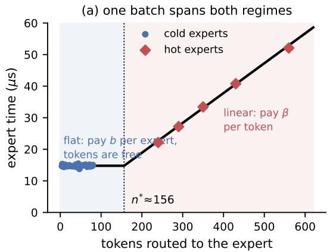

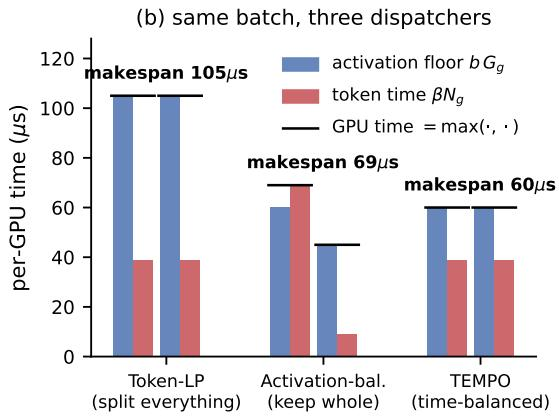  
Figure 1: The idea in one picture. (a) Measured per-expert time (DSv3 shape, fp8): flat below $n ^ { * }$ (weight loading dominates; extra tokens free), linear above (every token costs $\beta )$ . Markers are the experts of one decode batch: both regimes are active simultaneously. (b) A toy batch (one hot expert, 600 tokens; six cold, 30 each; two GPUs, full replication) dispatched three ways; each GPU’s time is max $\left( b G _ { g } , \beta N _ { g } \right)$ . Token balancing splits everything and pays 7 floors per GPU (105 µs); activation balancing overloads the hot GPU $( 6 9 \mu \mathrm { s } )$ ; balancing modeled time splits only the hot expert (60 µs, 1.75× better than token-LP).

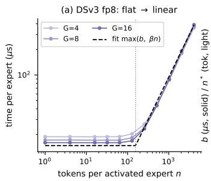

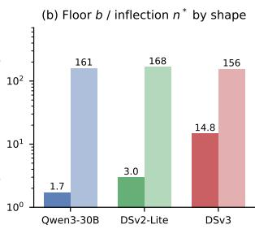  
Figure 2: (a) DSv3 fp8 grouped GEMM per-expert time: flat below $n ^ { * }$ ≈156 tokens, linear above; dashed line is the fitted max-affine model. (b) Activation floor b and inflection $n ^ { * }$ across expert shapes; b grows 8.5× from Qwen3 to DSv3.

## 2.2 Measured expert cost: weight streaming and tile padding, one max-affine model

We benchmark DeepGEMM fp8 masked grouped GEMM (the kernel SGLang/DeepEP use in decode) across (G,tokens-per-expert) grids for three expert shapes, with CUDA-graph timing, weight-copy rotation to defeat L2 reuse, and fixed expected m to freeze the JIT tuner (Section B). Fig. 2(a) shows per-expert time: flat until n∗ ≈ 156 tokens, then linear. The two-piece max-affine model (1) fits with 4– 8% mean error (Table 6); bf16 loop implementations shift the inflection (n∗ ≈331) but keep the shape.

The activation floor b is the physically meaningful quantity: the cost of touching one more expert’s weights on a GPU. A roofline check makes this concrete: an expert FFN holds $3 d _ { \mathrm { m o d e l } } d _ { \mathrm { f f } }$ parameters (44.0 MB for DSv3, 8.7 MB for DSv2-Lite, 4.7 MB for Qwen3-30B at fp8), and dividing by Testbed A’s peak HBM bandwidth predicts floors of $1 3 . 1 / 2 . 6 / 1 . 4 \mu \mathrm { s }$ . The fitted $b ( 1 4 . 8 / 3 . 0 / 1 . 7 \mu \mathrm { s }$ , Table 6) sits at 1.13–1.24× that bound—the floor is weight streaming, at

80–88% of peak bandwidth. (The bf16 loop kernel fits 45 µs against a $2 6 \mu \mathrm { s }$ roofline: the two-regime shape survives, the constant reflects the less efficient implementation.) Fragmentation under token balancing is charged twice by the hardware— once in weight streaming (each fragment re-loads the expert) and once in tile padding (each fragment rounds up separately)— and b sets the price of the first and dominant charge. This is what determines where each classical proxy fails.

The newer testbed and the full tile staircase. Recalibrating on Testbed B (fp8 masked DeepGEMM, CUDA-graph timing) reproduces the two-regime shape (Fig. 3) and resolves the underlying mechanism at fine grain: grouped GEMM processes tokens in M-tiles of 128, so cost is a staircase in tokens-perexpert—flat within [1,128], a jump at 129, flat again to 256 (Fig. 4). The flat regime of (1) is precisely the first step of this staircase (weight load dominates the step height); the later steps are sub-linear (+11–24% per boundary; extra tiles of the same expert reuse its weights from L2), so a single extra parameter captures them:

$$
t = \operatorname* { m a x } \big ( a + b G + b _ { 2 } ( T - G ) , c + \beta N \big ) , \qquad T = \sum _ { e } \lceil n _ { e } / 1 2 8 \rceil ,\tag{2}
$$

with $b _ { 2 } \approx b / 3 ( { \mathrm { Q w e n } } 3 - 2 3 5 { \mathrm { B } } ; \ b = 3 . 9 5 , \ b _ { 2 } { = } 1 . 2 3 ;$ DSv3: $b { = } 8 . 3 2 , b _ { 2 } { = } 2 . 6 5 \mu \mathrm { s } )$ . The tile term cuts model error in the multi-tile region from ∼10% (worst 25%) to 2.0% and leaves the decode region $( n _ { e } \leq 1 2 8 $ , already priced by bG) untouched; the solver supports it by tracking per-GPU tile counts and snap ping partial splits to tile boundaries (Section 4.2). On decode the tile-aware and tile-blind solutions coincide (the floor is the staircase’s only active step); at prefill scale the term earns its keep—on recorded routing rescaled to 4096–8192 tokens per GPU, tile-aware search changes the tile-blind solution in 97–99% of batches and cuts modeled block time by a median 4.5–6.0% (p95 9.4%), while the uniform replica split manufactures 3–10% extra padded tiles—vanishing by 16,384 tokens per GPU where the linear term dominates. Model-scored numbers (Section 5.2); we enable $b _ { 2 }$ for prefill-heavy studies and leave it off for decode.

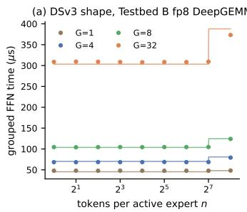

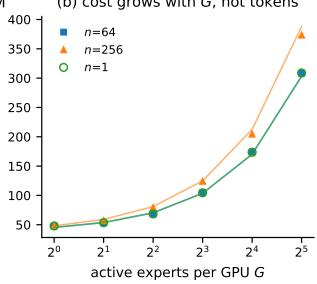

Figure 3: Testbed B fp8 masked DeepGEMM, DSv3 shape. (a) Cost vs. tokens-per-expert at several activation counts $G ;$ lines are the tile-aware fit (2). (b) At fixed tokens-per-expert, cost is driven by G: the $n { = } 1$ and n=64 curves coincide.  
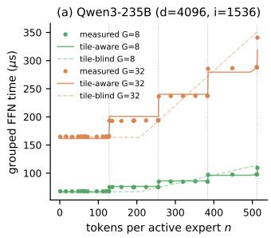

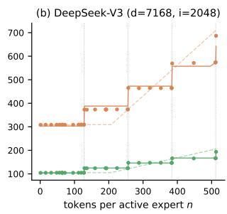  
Figure 4: Tile staircase, measured with a fine sweep around 128-token boundaries (dotted verticals). The tile-blind maxaffine model (dashed) misprices the plateaus by up to 25%; the one-parameter tile term (solid) tracks the steps at 2% mean error.

## 2.3 What proxy mispricing costs on real batches

Two views, from coarse to operational. On the raw measurement grid (Fig. 9), iso-token sets (same N, different G) spread up to 2.5× (Qwen3) / 7.6× (DSv3) in true time, and iso-activation sets up to 18× / 24×—but the grid spans token counts a single batch never mixes, so these bound the model’s curvature, not a dispatch decision.

The operational question is narrower: for one recorded batch, fixed expert set and fixed placement, how different are the dispatches the actual proxy policies produce? Table 1 answers on the recorded proxy traces (EP8, R=64, calibrated three-term model, Section 5.11): the four proxy dispatches of the same batch differ by 1.4–1.6× in modeled block time at the median (p95 up to 1.7×), and the identity of the expensive proxy flips with the regime—at B=128 (floor regime) the uniform replica split pays 51% over the modeled optimum while whole-expert activation balancing (METRO) pays the least (11%); at B=512–1024 (compute regime) static pays 47–56% while token-LP is the optimum (the ensemble selects it). No fixed proxy is safe across the ladder: the worst-regime median penalty ranges from 11% (METRO) to 56% (static).

Table 1: Modeled block time of each proxy dispatch relative to the TEMPO solution, on recorded batches (median/p95 over windows and layers; fresh placement, $R { = } 6 4 )$ $\mathrm { \ddot { s p r e a d } \vec { \Sigma } = }$ max/min across the four proxy dispatches of the same batch.
<table><tr><td>B</td><td>static</td><td>uniform</td><td>token-LP</td><td>METRO</td><td>spread</td></tr><tr><td>128</td><td>1.17/1.27</td><td>1.51/1.60</td><td>1.17/1.27</td><td>1.11/1.18</td><td>1.37/1.46</td></tr><tr><td>512</td><td>1.47/1.58</td><td>1.12/1.20</td><td>1.00/1.00</td><td>1.05/1.10</td><td>1.47/1.58</td></tr><tr><td>1024</td><td>1.56/1.70</td><td>1.04/1.10</td><td>1.00/1.00</td><td>1.06/1.12</td><td>1.56/1.70</td></tr></table>

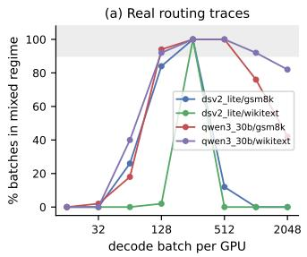

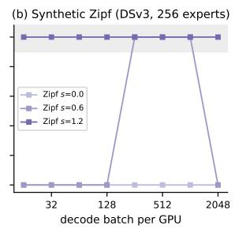  
Figure 5: Fraction of batches in the mixed regime (≥20% experts flat and ≥20% tokens linear) vs. batch size. (a) Real traces; (b) synthetic Zipf, DSv3 shape.

## 2.4 Mixed regimes are the common case

Using the calibrated $n ^ { * }$ as classifier, Fig. 5 asks whether flat- and linear-region experts coexist within batches. Across four workload traces (Qwen3-30B, DSv2-Lite × wikitext, GSM8K) at 128–512 tokens/GPU decode, 92–100% of batches have ≥20% of activated experts in the flat region and ≥20% of tokens in the linear region. At B=512, flat-region experts are 47% of activations while linear-region experts carry 91% of tokens. Synthetic Zipf routing (s=1.2) is mixed in 100% of batches across the whole batch ladder. The transition zone is not a corner case—it is the decode operating range, where serving economics live.

## 3 Problem Formulation and the Phase Diagram

## 3.1 Fixed-charge makespan dispatch

Given per-expert token counts $n _ { e }$ (from the router), replica sets $R ( e )$ (from the placement layer), token shares $x _ { e , g } \geq 0$ $\begin{array} { r } { ( \sum _ { g } x _ { e , g } = n _ { e } . } \end{array}$ , supported on $R ( e ) )$ and activation indicators $z _ { e , g } = \mathbf { 1 } [ x _ { e , g } > 0 ] \mathrm { ; }$

$$
\begin{array} { r } { \operatorname* { m i n } \underset { g } { \operatorname* { m a x } } ~ \operatorname* { m a x } \bigg ( a + b \sum _ { e } z _ { e , g } , c + \beta \sum _ { e } x _ { e , g } \bigg ) . } \end{array}\tag{3}
$$

Theorem 1 (NP-hardness). Deciding whether a dispatch with makespan $\leq T$ exists is NP-complete, already with 2 GPUs, full replication, and $a = c = 0 .$

Proofsketch. Reduce from Balanced PARTITION. Choose $b { = } T / ( m / 2 ) , \beta { = } T / W$ ; the max form turns the single budget T into two simultaneous per-GPU knapsack constraints—an activation-cardinality cap $K = m / 2$ and a token-capacity cap $C = W$ . Any split raises total activations above 2K, so the cardinality budget forbids splitting, and feasibility collapses to balanced partition. Full proof in Section A. □

Lemma 1 $( b  0 )$ . With $a = b = 0$ the objective reduces to minmax ${ } _ { g } N _ { g }$ —exactly the token LP (the LPLB/UltraEP objective); polynomial.

Lemma 2 $( \beta \to 0 )$ . With $c = \beta = 0$ the objective reduces to minma $\mathbf { \boldsymbol { x } } _ { g } G _ { g }$ over replica sets—an optimal semimatching [10]; polynomial via augmenting paths.

The problem is polynomial in each pure regime and NPhard only when the regimes interact—a formal mirror of the systems observation that each proxy is fine at home and the transition zone is what requires a new algorithm. This complements the recent NP-hardness of MoE serving at GPU-quota granularity [11]: ours is at per-batch dispatch granularity under fixed placement, and neither implies the other.

Hardness notwithstanding, the problem admits a simple algorithm with an additive guarantee against the splittingallowed optimum:

Theorem 2 (Additive approximation). Under full replication, let $A _ { 3 }$ place whole experts by descending-token roundrobin: $G P U i$ takes the experts ranked $i , i + g , i + 2 g , . .$ . Then $M ( A _ { 3 } ) \leq \mathrm { O P T } + \operatorname* { m a x } ( b , \beta n _ { \operatorname* { m a x } } )$ , where $n _ { \mathrm { m a x } }$ is the largest perexpert token count and OPT may split tokens arbitrarily; the additive term equals $\beta n _ { \mathrm { m a x } }$ whenever $n _ { \mathrm { m a x } } \ge b / \beta$ (true in every recorded trace we use). The same argument covers any per-GPU cost $\begin{array} { r } { \operatorname* { m a x } _ { k } \bigl ( a _ { k } + \sum _ { e } \varphi _ { k } ( n _ { e } ) \bigr ) } \end{array}$ with nondecreasing $\varphi _ { k } \geq 0 ;$ with additive term maxk $\varphi _ { k } ( n _ { \operatorname* { m a x } } ) ,$ ; for the tile-aware model of Eq. (2) this term is max $\left( b + b _ { 2 } ( \lceil n _ { \operatorname* { m a x } } / 1 2 8 \rceil - 1 ) , \beta n _ { \operatorname* { m a x } } \right)$ (Section A).

Proofsketch. Round-robin gives every GPU at most $\lceil E / g \rceil$ experts, matching the activation lower bound, and row-wise domination on the sorted order makes GPU g the lightest under every monotone measure simultaneously, so GPU 1 exceeds the mean by at most one expert. Full proof in Section $\mathbf { A } , \mathbf { \Pi } \sqcup$

The additive term is unavoidable for whole-expert algorithms (a single giant expert loses $\beta n _ { \mathrm { m a x } } ( 1 - 1 / g )$ against a perfect split). Dividing by the lower bound $\operatorname { L B } = \operatorname* { m a x } \left( a + \right.$ $b \lceil E _ { \mathrm { l i v e } } / g \rceil , c + \beta N / g ) \leq \mathrm { O P T }$ gives $M ( A _ { 3 } ) \leq ( 1 + \varepsilon ) \mathrm { O P T }$ $\varepsilon = \operatorname* { m a x } \mathopen { } \mathclose \bgroup \left( b , \beta n _ { \mathrm { m a x } } \aftergroup \egroup \right) / \mathrm { L B } ~ ( = \beta n _ { \mathrm { m a x } } / \mathrm { L B }$ on all our traces): median 4.1%, max 7.7% at recorded decode batches, growing to 31% at 4× token scale—a coarse safety net, not the source of the practical gains. Because the ensemble scores $A _ { 3 }$ as a candidate, the deployed solver carries the bound under full replication weakened by its switching tolerance: $M ( A ^ { * } ) \leq$ $( \mathrm { O P T } + \operatorname* { m a x } ( b , \beta n _ { \operatorname* { m a x } } ) ) / ( 1 - \tau )$ with τ = 1% (Proposition 1); setting $\tau = 0$ recovers the additive form at the cost of the tolerance’s near-tie protection. With restricted replicas $A _ { 3 }$ is generally infeasible and we have no analogous guarantee (open problem, Section 7). The additive term appears tight for A3 (worst observed $M ( A _ { 3 } ) / ( \mathrm { O P T } + \beta n _ { \mathrm { m a x } } ) = 0 . 9 9 8$ over 1296 instances including adversarial giant-expert constructions; we do not have a matching lower-bound proof), while tempo fast stays far below it $( \leq 1 . 1 4 \times \mathrm { O P T }$ worst case, $\leq 1 . 0 1 0 2 \times$ on the phase grid).

## 3.2 The phase diagram

We sweep synthetic Zipf(s) routing over batch size $B \in$ {16..2048}/GPU, skew $s \in \{ 0 . . 1 . 5 \}$ , replication {1.25, 1.5}×, EP {8..64}, with Dirichlet batch-to-batch fluctuation $( \kappa { = } 2 0 0 0 )$ , EPLB-style placement from long-run averages, and the calibrated cost models (Fig. 6).

(i) The best fixed policy flips across the map: activation balancing wins at small B (memory-bound), token-LP at large B (compute-bound), and the boundary moves with s, replication, and shape. There is no regime-free fixed proxy.

(ii) The flip boundary is analytically predictable by whichever of two mechanisms triggers first. With $E _ { \mathrm { e f f } } =$ $\begin{array} { r } { \sum _ { e } \bigl ( 1 - ( 1 - p _ { e } ) ^ { T } \bigr ) r _ { e } } \end{array}$ the expected number of activated replicas $( T = B K n _ { \mathrm { g p u s } }$ total tokens, $r _ { e }$ replica counts): (avg) the balanced cost pieces cross when $\beta B K = b E _ { \mathrm { e f f } } / n _ { \mathrm { g p u s } } ,$ , giving $B _ { \mathrm { a v g } } ^ { * } = n ^ { * } E _ { \mathrm { e f f } } / ( K n _ { \mathrm { g p u s } } )$ ; (hot) activation balancing keeps experts whole, so the GPU holding the hottest expert (popularity $p _ { 1 } )$ goes linear first, $B _ { \mathrm { h o t } } ^ { * } = n ^ { * } E _ { \mathrm { e f f } } / ( p _ { 1 } K n _ { \mathrm { g p u s } } ^ { 2 } )$ $B ^ { * } =$ min $( B _ { \mathrm { a v g } } ^ { * } , B _ { \mathrm { h o t } } ^ { * } )$ , solved by a short fixed point in ${ \bar { B } } ,$ lands inside the observed flip band in 12/12 (skew × replication) grid columns; the hot-expert mechanism takes over at $s \geq 1 . 2$ which is why the boundary bends left under skew (Fig. 6).

(iii) TEMPO tracks the per-cell best everywhere (min gain $\ge - 0 . 3 \%$ , inside the 1% ensemble band) and wins by up to 8.5% (DSv3) / 10.2% (Qwen3) / 11.8% (DSv2, 1.5× replication) in the mixed zone.

(iv) Mispricing is asymmetric: METRO deep in the compute regime costs up to $2 . 8 \times ;$ token-LP in the memory regime costs 5–17%—which explains why production noticed the METRO-direction failure first.

## 3.3 Scale extrapolation

With the DSv3 model at EP 8→64 (compute-only and commaware; comm slope $k _ { r } = 0 . 0 0 3 7$ µs/token fitted from microbenchmark all-to-all logs): the mixed-zone gain persists— mean 6–6.5% at s=0 on EP32–64 (max 15.5%), 4.7–5.9% at s=1.2 on EP32—and collapses to 0 exactly where theory predicts (the whole batch ladder enters the compute regime; TEMPO coincides with token-LP). The communication term changes no conclusion (<1 pp) (Fig. 12).

## 4 TEMPO Design

## 4.1 Black-box calibration on the deployed pipeline

TEMPO’s cost table is fitted, not derived: run the deployed MoE pipeline (or its microbenchmark) across a (G,N) grid, log per-GPU (G,N,t), fit the two-piece max-affine by alternating assignment. About ten minutes per (kernel, dtype, hardware) combination. Section 5.2 shows the loop converges in one iteration (full-pipeline refit $\beta \colon 0 . 3 5 8 \to 0 . 3 5 6 )$ and that a mis-calibrated table (GEMM-only parameters on a pipeline with unfused per-token kernels) costs TEMPO 16% at B=128—calibration is load-bearing, not ceremonial. Every parameter set used in the paper, and why the GEMM-only and full-pipeline fits legitimately differ, is consolidated in Table 7 (Section B).

DSv3 shape, EP8 -- letter = winning fixed policy (M=METRO, L=token-LP, E=EPLB-even)  
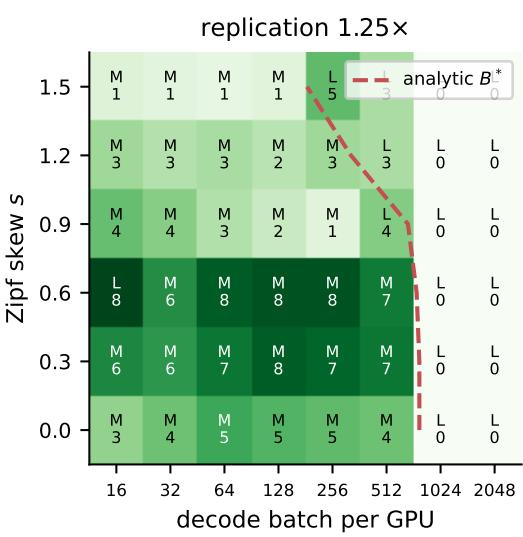

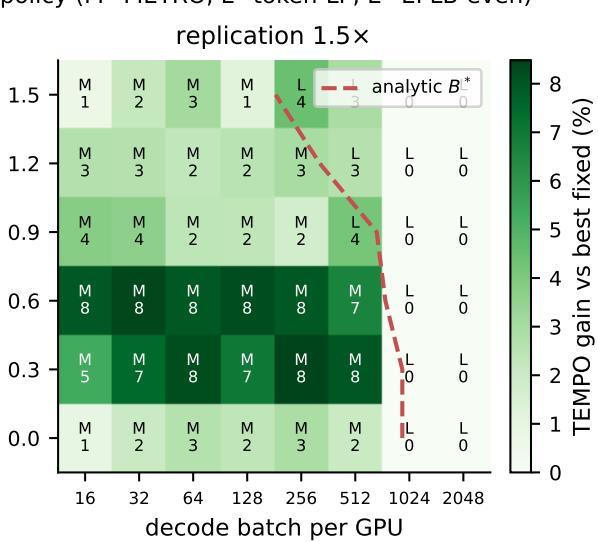  
Figure 6: Phase diagram, DSv3 shape, EP8. Letters mark the winning fixed policy (M = METRO-like activation balancing, $\mathrm { L } =$ token-LP, E = EPLB-even); numbers and shading give TEMPO’s gain over the best fixed policy per cell. The dashed line is the analytic flip boundary $B ^ { * }$ of Section 3.2, with no per-panel fitting.

## 4.2 The tempo fast solver

Four stages, each targeting a failure mode of naive approaches:

1. Cost-aware greedy seeding. Experts in descending token count, each placed whole on the replica with lowest marginal cost under (1). Whole-expert placement matters: fragmenting cold experts is exactly the token-LP mistake.

2. Activation rebalancing via augmenting chains. In the flat regime the bottleneck is $\operatorname* { m a x } _ { g } G _ { g } ;$ single moves stall because every direct move re-raises the destination. We use 1- and 2-step augmenting chains—the truncated version of the semi-matching augmenting-path algorithm that is optimal in the $\beta  0$ limit (Lemma 2).

3. Bottleneck local search with partial migrations. In the linear regime, move token mass off the bottleneck GPU: full-expert moves and ternary-search partial splits (the objective restricted to one split size is piecewise-linear unimodal), accept the best bottleneck-reducing move, iterate (≤ 300).

4. Ensemble with a switching tolerance. Token-LP and (when replication permits it) the round-robin placement $A _ { 3 }$ of Theorem 2 are feasible points of (3); score each under the model and switch only if >1% better. Near-ties are decided by effects outside the (G,N) model—measured hardware consistently prefers the heuristic’s whole-expert structure (Section 7)—so epsilon-level model differences must not trigger a switch. This makes “never worse than token-LP (within 1%)” hold by construction (Proposition 1); under full replication it also transfers the additive guarantee of Theorem 2 to the deployed solver. The stage binds: without it, local search stops 2–4.5% short of the LP optimum deep in the compute regime at EP32–64.

Table 2: Component ablation: makespan degradation vs. full tempo fast over the phase grid (EP8) and scale grid (EP8– 64).
<table><tr><td>variant</td><td>mean</td><td>p95</td><td>max (region)</td></tr><tr><td>no partial moves</td><td>0.6%</td><td>4.1%</td><td>16.3% (EP32 transition)</td></tr><tr><td>no aug. chains</td><td>0.3%</td><td>1.8%</td><td>2.7% (mid-B flat)</td></tr><tr><td>no ensemble</td><td>0.4%</td><td>2.8%</td><td>4.5% (EP64 compute)</td></tr></table>

Optimality and cost. Against a 10 s HiGHS MILP on real-trace grids: makespan ratio mean 1.005 / p95 1.024 / max 1.033; on the synthetic phase grid ≤ 1.0102. Solve time: 1.9 ms $( B \leq 2 5 6$ , pure Python)—∼550× under the MILP— and ∼20 ms for the LP branch at large B, off the critical path.

Component ablation. Each stage binds in a different phase region, none is redundant (Table 2): removing partial migrations degrades up to 16.3% (EP32, s=1.2, B=64—transition zone); removing augmenting chains up to 2.7% (mid-B flat zone); removing the ensemble $\leq 0 . 8 \%$ at EP8 but up to 4.5% at EP64 deep-compute.

A cumulative build-up on the drift-16 scenario (Table 8) shows the two nontrivial stages are regime-matched guards for each other. In the floor regime (B=128) the seed alone recovers nothing (1.000) and the augmenting chains deliver the entire −9.8%; in the traffic regime the roles invert—chains alone damage the seed’s 0.883/0.869 to 0.940/0.932 (equalizing activation counts is wrong once traffic binds) and local search repairs exactly that. Chains also warm-start local search (0.6 vs. 2.2 ms at B=128); the ensemble is worth $\leq 0 . 2 \mathrm { p p }$ here, consistent with its role as an EP32+ safety net.

## 4.3 Communication- and topology-aware dispatch

Two extensions carry the model from the GEMM to the full deployed MoE block. First, the a2a collectives scale with the tokens a rank receives, so the deployed cost adds a third max-affine piece,

$$
t _ { g } = \operatorname* { m a x } \big ( a + b G _ { g } , c + \beta N _ { g } , c _ { 2 } + \gamma N _ { g } \big ) ,\tag{4}
$$

with (c ,γ) fitted offline from recorded routing so the model reproduces the measured static-vs-uniform crossover across batch sizes (in simulation, kr-style linear models from per-rank all-to-all logs predict makespan within 12.7%; all phase and scale conclusions are unchanged, <1 pp).

Does each term of (4) earn its place? Re-solving the drift-16 windows with terms deleted from the objective but scored under the full model (Table 9): dropping the traffic term forfeits more than half the win at B=512–1024 (0.946/0.924 vs. 0.880/0.865, p95 above static); dropping the floor term is the mirror image (5 pp worse at B=128). Dropping the floor is identical to bare token balancing—once the activation term is gone, both remaining terms are monotone in per-rank token count, so the two objectives share every argmin; the floor is the only term that makes the objective non-token-reducible. The terms are not monotone add-ons—floor without traffic is worse in the traffic regime than bare token balance, because the max structure is what gates each term to its regime. A pure token-balance objective looks safe at large B under this (self-)evaluation, but its 20 pp window-to-window swings end to-end (Section 5.12) are what stage 4’s switching tolerance guards against.

Second, on multi-node EP theflat traffic term in (4) treats every rank alike, but the replica a token is sent to decides whether it crosses the inter-node network. We make the dispatch topology-aware in two stages without touching the solver’s core: (1) solve (3) for per-GPU shares $x _ { e , g }$ as before; (2) for each expert, split the (node-uniform) token sources across its replicas by a same-node-first transportation rule, which is optimal for inter-node traffic among all splits that realize exactly the solved $x _ { e , g } .$ The result is one dispatch table per source node rather than one global table; each rank uploads its own node’s slice, so the in-graph kernel is unchanged. Per-GPU loads—and hence the compute makespan—are provably identical to the flat solution; only the pairing of sources to replicas changes. Section 5.15 shows this distinction is worth ∼11 pp of throughput at large batch on a 2-node deployment.

## 4.4 SGLang integration

TEMPO plugs into SGLang’s EPLB machinery as a dispatch algorithm. The design goal is zero marginal in-graph cost: the captured decode graph must contain no extra kernels and no collectives.

In-graph: one fused kernel, total. The probabilistic dispatch through the persistent logical-to-physical table (which LPLB also needs) is fused with count collection: the sampling kernel atomically increments a persistent cumulative perexpert counter, masked against CUDA-graph padding rows (whose degenerate routing would fabricate a phantom hot expert—a bug we also found in the shipped LPLB path). Cumulative counting removes the zeroing/copy kernels a windowed counter would need; the background thread recovers windows by wrap-safe differencing. Relative to static dispatch the marginal in-graph cost is zero kernels; relative to LPLB it removes the in-graph interior-point solve and its per-layer EP collective.

Off the critical path: a solver process, not a thread. A refresher thread snapshots the counters on a side stream (relaxed stream-capture mode), aggregates window diffs across ranks on a dedicated gloo group (shared groups are not thread-safe against the scheduler’s own collectives), and hands the solve to a separate numpy-only worker process. In-thread versions cost 8–10% end-to-end from GIL contention (Section 5.11); out-of-process solving eliminates it. Fresh tables are staged pinned and published with one host-to-device copy.

Consistency without double buffering. Idle experts’ rows are untouched, invalid replica columns are zero in both tables, and the kernel renormalizes each row at use, so a read racing the copy sees a mixture of old and new rows—each a valid distribution. A single row can also tear; in the worst tear it sums to zero, and for exactly this case the kernel falls back to uniform over the replicas holding the expert (one compare per row). A torn update costs one batch a stale or uniform split; it can never route to a replica that lacks the expert, nor divide by zero. The trade against in-graph solving is staleness (≤ 200 ms default) for critical-path cost. Integration touches 7 patch points and survives EPLB rebalances (Section D).

## 5 Evaluation

Three evidence layers, from most controlled to most end-toend: measured cost grid → calibrated simulation (headline) → 8-GPU Testbed A wall clock → SGLang serving. Each layer states what it can and cannot claim.

## 5.1 Wall-clock microbenchmark (8-GPU Testbed A, EP8)

Real pipeline per step: dispatch all-to-all → fp8 grouped GEMMs → combine all-to-all, identical routed batches on all ranks, CUDA-event timing, makespan via all-reduce MAX, medians over 30 steps (Fig. 7); DSv3 expert shape, real Qwen3 routing trace.

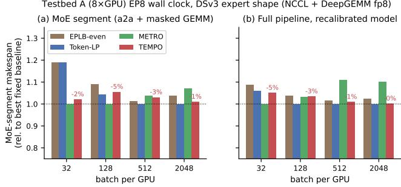  
Figure 7: 8-GPU Testbed A EP8 wall clock, DSv3 shape: per-batch makespan relative to the best fixed policy of that batch size. (a) MoE segment; (b) full pipeline with pipelinerecalibrated dispatch.

At B=32 (memory-bound) TEMPO beats EPLB-even by 11–14% and token-LP by 7%; token-LP is 19% off best. At B=2048 (compute-bound) METRO is 7–11% off best; TEMPO ties token-LP at the top. Across all B, TEMPO is within 5% (≈ run noise) of the per-B best fixed policy while every fixed policy has $\mathbf { a } \geq 7 \%$ failure region. Both single-proxy failure directions are confirmed in wall clock, and the “track the best everywhere” property—the core claim—transfers.

## 5.2 Does the simulator transfer? Closing the calibration loop

We log per-rank $\left( G , N , t \right)$ inside the microbenchmark, refit (1) black-box, and compare predicted vs. measured policy gains: DSv3 GEMM pipeline—fit error 4.0%, $n ^ { * } { = } 1 5 3$ (offline: 156), pairwise ranking agreement 93% (14/15 outside a 3% noise band), mean gain-transfer error 5.5 pp; full pipeline with recalibrated dispatch—92%, 2.2 pp, and the second-iteration refit reproduces the first in every quantity that is identified (below): a one-iteration fixed point.

What the deployed-pipeline fit identifies—and what it does not. The full-pipeline log only observes $G \in [ 9 , 2 0 ]$ , so a and b are nearly collinear there: a cluster bootstrap (1000 replicates) puts $b \in [ 5 . 1 , 1 8 . 8 ]$ (95% CI; $\operatorname { c o r r } ( \hat { a } , \hat { b } ) = - 0 . 9 9 7 )$ which is why successive refits report different $( a , b )$ splits (Table 7: 358/16.6 vs. 488/5.9)—one ridge, not a drifting model. What the solver consumes is tightly identified: $\beta$ (±0.5%) and the flat cost $a + b G$ over the operating range (±2.8% at G=13); re-solving the entire drift16 scenario under the two fits moves a median 0.0% of token mass and changes the chosen dispatch’s model makespan by 0.000% $( \mathsf { p } 9 5 \leq$ 1.3%). The mechanism claim that b is a weight-streaming floor rests on the offline grid, which sweeps $G \in [ 1 , 4 0 ]$ and pins b individually (Table 6).

Negative control: the Qwen3 shape cannot anchor the simulator—its $b \approx 1 . 7 \mu \mathrm { s }$ sits below measurement noise, the refit degenerates (negative b), and identical assignment sequences vary ±11% across runs from DeepGEMM tuner nondeterminism. We report this as a limitation and note its flip side: where the model cannot discriminate, neither does policy choice on hardware (confirmed in serving, Section 5.8).

## 5.3 Phase diagram and scale (calibrated simulation)

Section 3.2 numbers; Figs. 6 and 12. No fixed policy is safe across the map; TEMPO min gain $\geq - 0 . 3 \% /$ max 8.5–15.5%; gains persist to EP64; comm-aware unchanged.

## 5.4 Real-trace replay

Qwen3-30B and DSv2-Lite traces × wikitext/GSM8K under the calibrated models: TEMPO’s gap to a per-cell oracle (a fixed-policy oracle switching per cell—unrealizable in deployment) is 6–16%; with DSv3 costs 11–14%. tempo fast matches the MILP within 0.8% throughout.

## 5.5 Pricing staleness: the deployed system vs. the theory

The theory optimizes the current batch; the deployment solves on the previous window’s counts. Replaying the recorded proxy routing under four information regimes (evaluated on true current counts, calibrated model, R=64, decode scale): exact reaches 0.78× static (median 0.80), stale-1 (the deployment) 0.85, frozen (never refreshed) 0.89, uniform (no solve) 1.09. One window of staleness returns $5 { - } 7 { \mathsf { p p } }$ of the 22 pp exact-solve headroom and keeps the rest, never flipping the sign in the mean; the pattern is stable across $R \in \{ 1 6 , 6 4 \}$ and $1 { - } 4 \times$ token scale (stale-1 retains 75–85% of the exact gain, frozen 70–80%)—consistent with the serving result that the refresh interval is a ∼2 pp knob (Section 5.9). The regime that actually inverts is uniform splitting, whose end-to-end signature is the −5.4% tight-budget regression of Section 5.12.

## 5.6 Dispatch vs. refreshing the placement faster

If placement repairs the mean, why not refresh EPLB more often and skip the dispatcher? Replaying the drift16 timeline with the placement rebuilt every W windows from observed counts (Table 10): the answer is regime-dependent and composable, not either/or. In the compute regime (B=512), production EPLB (uniform split + cumulative refresh) reaches $0 . 8 5 \times$ static-stale; TEMPO on the never-refreshed placement reaches 0.89 without moving a single weight; the composition is best (0.80) with the best tail. In the floor regime (B=128) fresher placement makes the uniform split worse $( 1 . 1 4  1 . 3 1 ) \mathrm { \overline { { \ { - \alpha } } } } \mathrm { { a } }$ more balanced replica spread fragments more experts and manufactures more activation floors—while TEMPO holds parity; short trailing-window refresh chases noise (p95 1.38). Not charged: an EPLB refresh copies GB of weights, a table refresh copies $2 5 6 \times G$ floats.

## 5.7 Token-moving vs. weight-moving (MoonEPstyle)

Weight-moving balancers (MoonEP [1]) duplicate experts online for perfect token balance. Replaying that policy on recorded Qwen3-235B routing and racing MoonEP itself against DeepEP v2 on 8-GPU Testbed B (Section H) places it on the phase diagram rather than in competition: at decode scale its weight prefetch alone (283–502 µs) exceeds the whole MoE-layer budget (95–107 µs for DeepEP dispatch+combine), because in the memory-bound regime moving an expert’s weights costs about as much as using them; at prefill scale with extreme skew (MaxVio ≳20) it wins, owning the compute-bound high-skew corner. Token-moving is the only lever whose marginal cost stays zero at decode.

## 5.8 End-to-end serving (SGLang, DeepSeek-V2-Lite, EP8)

Deployability evidence, reported honestly: on a small-expert model $( b \approx 3 \mu \mathrm { s } )$ with bf16/Triton and DeepEP-fp8 configurations, adaptive dispatch (TEMPO and LPLB alike) does not beat static placement—consistent with the cost model’s own prediction (small b ⇒ small dispatch stakes) and with the negative control of Section 5.2. Within the adaptive class, TEMPO ≥ LPLB on 2/3 workloads (median TPOT −7 to −9%). The integration itself is the claim: CUDA-graph-safe, zero-overhead in-graph dispatch, stable under EPLB rebalances, correct generations.

Refresher-period sensitivity. Sweeping {10,50,200} ms: 10 and 50 ms are indistinguishable while 200 ms is ∼25% faster with half the TTFT—not staleness (popularity drifts far slower than 200 ms) but the in-thread solver’s GIL footprint, which the out-of-process solver of Section 4.4 later removes (Section 5.11). We default to 200 ms.

## 5.9 End-to-end serving at scale (SGLang, Qwen3-235B-FP8, EP8)

We repeat the serving study on Qwen3-235B-A22B-FP8 (8- GPU Testbed A, EP8, DeepEP low-latency, 94 MoE layers, 128 experts top-8 with 32 redundant physical slots, placement initialized from a recorded expert distribution of the same traffic). Two traffic classes: synthetic decode-heavy (random prompts; near-uniform routing) and ShareGPT (real text; perlayer max/mean expert load 2.7–4.1×).

TEMPO vs. LPLB (like-for-like machinery). Both use the identical probabilistic-dispatch path, isolating what is solved and where: TEMPO delivers +38–70% request throughput on decode workloads and +65% on ShareGPT at roughly half the median inter-token latency. The mechanism is architectural— LPLB’s in-graph solve embeds a per-layer EP collective that a 94-layer model replays every step, while TEMPO’s zerocollective path pays a local bincount. (Running LPLB at all required relaxing its model whitelist; upstream disables it outside DeepSeek architectures because the in-graph collective deadlocks under DP-attention empty batches, a failure mode background solving avoids by construction.)

Against static placement, honestly. With the v1 integration, well-initialized static led TEMPO by 9–20%: the tax of the remap machinery, paid by the whole adaptive class. On the v2 stack (fused kernel, out-of-process solver) the gap shrinks to 2.3% on ShareGPT and 3–11% on decode, and TEMPO beats its own noop control on all six configurations (+0.2 to +1.6%): the solver is free, and the residual gap is the remap data path a 94-layer model multiplies. With fresh placement and near-uniform routing there is nothing left for dispatch quality to win back; on the same v2 windows LPLB trails static by 43–48%. Two shipped-code hazards surfaced and are fixed in our patch: solver input taken before padding-masking fabricates a phantom hot expert (LPLB’s shipped path has the same defect), and background-thread collectives need a dedicated process group (Section 4.4).

## 5.10 Cross-model serving on Testbed B: the win region, bracketed (fp8 DeepGEMM, EP8)

Our primary at-scale evidence moves to Testbed B: two flagship models, native fp8 DeepGEMM masked experts, tileaware parameters (2), single-node EP8, all policies back-toback per window. The models bracket the phase diagram’s win region: Qwen3-235B-FP8 (94 MoE layers, 16 logical experts per GPU) sits inside; DeepSeek-V3-0324 (61 layers, 32 per GPU) sits outside, where statistical averaging over 4× more experts per GPU flattens the imbalance dispatch could repair. Traffic: synthetic decode-heavy random, ShareGPT, four real datasets as-is (OASST1, GSM8K, a bilingual Q&A corpus, GovReport long-document summarization), plus a Poisson arrival sweep (Fig. 8).

Qwen3-235B (inside). TEMPO wins where the phase diagram says it should, and the wins replicate across three dedicated repeat windows plus two earlier ones (Fig. 11a,b): GovReport (long-prefill, compute-bound experts) throughput +5.0% median with non-overlapping ranges (521–524 vs. 549–554 tok/s), and under moderate Poisson load (8 req/s) p99 TPOT −15.6% (191 vs. 226 ms) with median TTFT −12.5%—tail latency is where transient routing skew concentrates and where a per-batch time model pays. ShareGPT is parity (−0.2% throughput, −8.9% p99); saturated decodeheavy random trails static by the residual data-path tax (2– 4%). A refresh-period sweep at {200,500,1000} ms leaves that deficit unchanged—so it is neither solver pressure nor staleness—while the frozen-table control is worse (−5.0% vs. −2.2%): live updates recover about half of a constant dispatchpath tax. The noop control sitting between static and TEMPO splits the credit: roughly two thirds of the GovReport gain is the uniform-split data path, the last third the solver, while the tail win is mostly the solver’s.

DSv3 (outside). Every workload lands at −2 to −3%, indistinguishable from the noop control. The clean diagnostic is SGLang’s own dynamic rebalancer: it also gains nothing (±1%)—at 32 experts per GPU there is no exploitable imbalance left, so any adaptive machinery can only pay its own cost. The pair of models turns the phase diagram from a simulation artifact into a falsifiable, and here twice-confirmed, deployment rule.

LP, everywhere. The token-LP dispatcher collapses on both models and all workloads $( - 1 0 \% ~ \mathrm { t o } ~ - 5 6 \% ) \mathrm { . }$ : the perlayer in-graph collective compounds with depth (61 and 94 layers), and token balancing fragments activations exactly as Section 3 predicts.

## 5.11 Eliminating the adaptive-dispatch tax (DSv3-shape proxy, EP8)

The remaining serving studies isolate the flagship-shape regime our testbed cannot host natively: a reduced-depth proxy with DSv3’s exact expert geometry (hidden 7168, 256 routed experts, top-8; 1 dense + 4 MoE layers; fp8; Zipf-skewed router), SGLang on 8-GPU Testbed A, DeepEP low-latency, 64 redundant experts (1.25×), EPLB placement from recorded routing. All comparisons run back-to-back in the same idle window (cross-window drift on shared machines reaches 15%, larger than any effect studied).

An instrumented noop variant—full TEMPO data path, solver never runs, table frozen at uniform-over-replicas— decomposes overhead cleanly. With the v1 integration (inthread solver, separate count kernels), TEMPO trailed static dispatch by 8–14%: solver GIL contention cost 8–10% (refresh 200 → 1000 ms recovered most of it) and the extra ingraph kernels cost 7–12% at small batch. The three fixes of Sections 4.3 and 4.4—out-of-process solver, fused dispatch+count kernel, three-term cost—eliminate the tax entirely: TEMPO, noop, static, and SGLang’s dynamic dispatcher land within ±2–3% (run noise) at all three load levels, and TEMPO has the lowest TPOT at small batch. Adaptive dispatch is now free even where it cannot win: with fresh placement and 1.25× replication, EPLB has already absorbed the imbalance, and the honest headline is parity, not gains.

## 5.12 When dispatch pays: stale placement and tight replica budgets

Placement is recomputed on a minutes-scale horizon; between rebalances, routing drifts. We emulate this by building the EPLB placement and static maps from a corrupted recording (the per-layer top-K hot experts’ statistics swapped with random cold ones, K=16) while serving the true traffic—then repeat every comparison in three independent windows (Fig. 10).

Three findings. (i) Architecture and objective, separated. Against SGLang’s shipped LP dispatcher (in-graph per-layer solve), TEMPO is +12.5% at 128 concurrent requests and +6.6% at 1024—but that conflates architecture with objective. Porting the exact token-LP into our out-of-process worker (same fused kernel, same cadence, only the objective differs) and rerunning drift-16 in three fresh paired windows: token-LP matches TEMPO at low and mid load (both +9.5% at 128; parity at 512), and the residual difference appears exactly where the model says fragmentation hurts—at 1024 requests token-LP swings −11.6% to +8.7% across windows while

TEMPO stays within noise in every window (spread 4.4 vs. 20 pp). Most of the headline gap was architecture; the objective’s own edge is stability at the compute-bound point. (ii) Adaptive beats stale-static at low and mid load (+3%, 3/3 windows), mostly captured by the uniform-split data path; at 1024 all policies tie (an earlier single-window +5% did not replicate; we retract it). (iii) The solver earns its keep when replicas are scarce. At a 1.06× budget, blind uniform splitting backfires (−5.4%: probability mass flows to mistakenly-replicated cold experts) while the cost model recovers parity (+0.3%). A model of where tokens should go is what makes replication safe to exploit.

Real model. The same corruption applied to Qwen3-235B itself (Testbed B, fp8, EP8; two windows agreeing within 0.5%; Fig. 11c): stale placement costs static dispatch −7.3% ShareGPT throughput and +40% p99 TPOT. TEMPO claws back a third of the tail damage (−10% p99, −5% TTFT) but none of the throughput—and SGLang’s dynamic rebalancer recovers neither. The split is structural: under drift the redundant replicas sit on the wrong (cold) experts, so the throughput loss is a provisioning error only placement can fix, while the tail comes from transient co-scheduling of hot experts that dispatch can still steer around. Dispatch repairs the tail; only placement repairs the mean.

## 5.13 Locating the win boundary: $B _ { \mathrm { a 2 a } } ^ { * }$ predicted, then measured

The three-axis rule so far names the win conditions; here we turn it into a number and test it. This crossover is distinct from the flip boundary $B ^ { * }$ of Section 3.2 (floor vs. compute, which policy is best): here we ask where adaptive dispatch stops paying at all, which under the calibrated model happens where the a2a traffic term overtakes the activation floor: $N ^ { * } = ( a + b G - c _ { 2 } ) / \gamma$ tokens per GPU. With the deployed proxy parameters (Table 7: $a { = } 1 6 . 4 , b { = } 2 . 9 9$ $c _ { 2 } { = } 2 5 . 0 , \ \gamma { = } 0 . 1 0 )$ at the solver’s observed activation count (G ≈ 13 per GPU), $N ^ { * } = ( 1 6 . 4 + 3 8 . 9 - 2 5 . 0 ) / 0 . 1 0 \approx 3 0 3$ i.e. $B _ { \mathrm { a 2 a } } ^ { * } \approx 3 0 0 -$ the simulated dominant term flips between $B { = } 2 5 6$ and 384. We then swept concurrency 32–1024 end-toend (static vs. TEMPO, drift-16, R=64, two paired windows per point); at EP8 decode with K=8 experts per token, a step at concurrency C routes $C K / 8 \approx C$ token–expert pairs to each GPU, so serving concurrency is numerically comparable to the tokens/GPU axis B of Section 3.2, and we reuse the symbol. We separately measured, with a torch-profiler kernel breakdown of steady-state decode, the expert block’s share of GPU busy time (DeepEP dispatch/combine + grouped GEMM + gating; the Amdahl denominator).

Three reads of Table 3. The boundary lands where predicted: gains are positive in both windows at $B { = } 6 4 { - } 2 5 6$ and vanish from $B { = } 5 1 2 ~ \mathrm { o n }$ , bracketing $B _ { \mathrm { a 2 a } } ^ { * } \approx 3 0 0$ . Inside the band, Amdahl accounting closes: block-level model gain (9.8%) times measured expert share (0.46–0.51) predicts 4.5– 5.0% end-to-end; measured +2.6–+4.6%. Outside the band the model is optimistic: past $B _ { \mathrm { a 2 a } } ^ { * }$ the expert share shrinks to

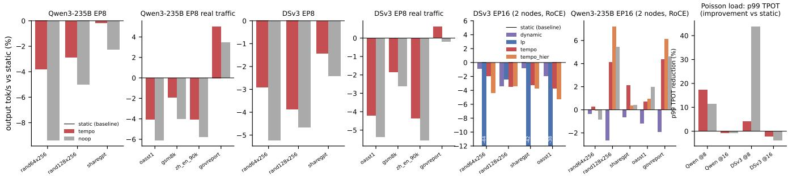  
Figure 8: Testbed B serving, all policies normalized to same-window static (the y=0 baseline). Left: closed-loop throughput on Qwen3-235B (inside the win region) and DSv3 (outside). EP16 panels: DSv3 is communication-dominated and no balancer helps; on Qwen3-235B the TEMPO family wins +2–7% with the topology-aware split ahead. Right: p99 TPOT under Poisson arrivals—TEMPO’s largest win (Qwen −15.6% at 8 req/s) and the noise floor of tail metrics.

Table 3: $B _ { \mathrm { a 2 a } } ^ { * }$ prediction vs. measurement (drift-16, R=64): modeled regime and block ratio vs. paired-window throughput delta and expert-block share of GPU busy time.
<table><tr><td>B</td><td>regime</td><td>block ratio</td><td>∆thr. (w1/w2)</td><td>expert share</td></tr><tr><td>32</td><td>floor</td><td>0.902</td><td>-1.5%/-1.5%</td><td>46%</td></tr><tr><td>64</td><td>floor</td><td>0.902</td><td> $+ 4 . 6 \% / + 4 . 1 \%$ </td><td></td></tr><tr><td>128</td><td>floor</td><td>0.902</td><td> $+ 3 . 3 \% / + 2 . 9 \%$ </td><td>51%</td></tr><tr><td>256</td><td>floor</td><td>0.907</td><td> $+ 4 . 0 \% / + 2 . 6 \%$ </td><td></td></tr><tr><td>512</td><td>traffic</td><td>0.880</td><td> $- 2 . 8 \% / + 0 . 0 \%$ </td><td>31%</td></tr><tr><td>768</td><td>traffic</td><td>0.871</td><td>-1.3%/-2.1%</td><td></td></tr><tr><td>1024</td><td>traffic</td><td>0.865</td><td>-0.6%/-1.1%</td><td>27%</td></tr></table>

27–31%, and the modeled traffic-regime gains do not materialize at all—once the a2a is bandwidth-bound, uniform splitting already balances traffic and the remaining modeled headroom is not realizable by dispatch; at B=32 the modeled differences sit below the launch-and-sync floor the (G,N) model deliberately omits. Operators get a band: adaptive dispatch pays above the batch where per-expert traffic amortizes the activation floor and below $B _ { \mathrm { a 2 a } } ^ { * } ;$ the shipped calibration predicts the upper edge, the lower edge is found empirically.

## 5.14 Policy landscape: inference- and trainingside kernels under one cost model

Training-side balancers (LLEP [14], TAOT [22], UltraEP [17]) cannot be reproduced end-to-end on a serving stack—they exploit weight-migration windows between gradient steps that serving does not have. What can be compared like-for-like is each scheme’s dispatch-policy kernel: we re-implement five of them under the identical replica constraint (move tokens, never weights) and evaluate block makespan on the recorded proxy routing under the calibrated three-term model, sweeping the redundancy R × drift K grid of Section 5.12 (Table 4). Token-LP is the exact HiGHS min-max token count— simultaneously LPLB’s objective and UltraEP’s “exact postreroute load” quota at dispatch granularity; METRO assigns whole experts to balance activation counts; LLEP-R is LLEP’s least-loaded greedy spill restricted to existing replicas.

Table 4: Block makespan relative to static (lower is better), recorded proxy routing, calibrated 3-term cost, R=64. Columns are batch scales spanning the three phases. Boldface: best per column.
<table><tr><td>Policy kernel</td><td>0.25× (floor-bound)</td><td>1× (mixed)</td><td>4× (token-bound)</td></tr><tr><td>uniform (dynamic)</td><td>1.299</td><td>1.052</td><td>0.659</td></tr><tr><td>token-LP (LPLB/UltraEP)</td><td>1.006</td><td>0.836</td><td>0.630</td></tr><tr><td>METRO (activation)</td><td>0.950</td><td>0.815</td><td>0.672</td></tr><tr><td>LLEP-R (least-loaded)</td><td>0.984</td><td>0.835</td><td>0.662</td></tr><tr><td>TEMPO (time model)</td><td>0.856</td><td>0.764</td><td>0.630</td></tr></table>

Scoring every policy under the model TEMPO optimizes is self-evaluation, so we do not rest the claim on it alone: the model is validated against wall clock (Section 5.2), the token-LP row has its like-for-like anchor (Section 5.12), and we ran METRO and LLEP-R end-to-end as alternative table builders in three drift-16 windows each. Median throughput vs. samewindow static at 512/1024 requests: METRO −2.1%/−0.2%, LLEP-R +0.1%/−2.2%, TEMPO −0.3%/+2.0%; at 128 requests window variance (±8%) swamps all policies. The wallclock ordering matches the table’s prediction, compressed by Amdahl’s law, and no proxy kernel beats TEMPO at any load point.

The table is the phase diagram with named competitors. In the floor-bound phase token-LP loses to static (splitting tokens pays activation floors) and METRO is the best proxy—still 10 pp behind TEMPO, the only policy that prices the floor. In the token-bound phase TEMPO coincides with token-LP exactly (the ensemble selects it), so the time model costs nothing where proxies are already right; in the mixed phase it leads the runner-up by 5–7 pp. At R=16, K≥16 every kernel collapses to 1.000: when the drifted hot set has no replicas, the fix belongs to the placement layer (LLEP’s full mechanism, TAOT’s optimal transport, an EPLB recompute). Dispatch and placement partition the problem; TEMPO is complementary to all of them.

## 5.15 Multi-node EP16 on Testbed B: topology decides

We repeat the proxy campaign on 2×8 Testbed B (CUDA 13.2, RoCE 8 × 400G per node), TP16/EP16, DeepEP internode low-latency; bring-up hazards worth two orders of magnitude of performance (NCCL plugin and transport pathologies, fp8 scale packing on the new SM architecture) are documented in Section G.

Window rule (pre-declared). A paired window benches a policy and static back-to-back on idle, dedicated nodes; a window is excluded only for an infrastructure failure identifiable without reference to which policy won (crash, reclaimed node, or physically impossible bench-client metrics)—never for its result. All tail metrics are reported, including those against us.

With fresh placement, static, TEMPO, and noop tie within noise across three windows—the zero-tax result, including the 16-rank count aggregation, carries to multi-node unchanged. Under the drift-16 scenario we accumulated five paired windows per policy (two further windows hit the bench-client artifact at 1024 requests—30% throughput jumps with a physically impossible 0.03 ms inter-token latency—and are excluded under the rule above). Medians against same-window static: at the all-to-all-bound operating point (1024 requests) the flat table loses −3.5%—spraying tokens uniformly across a hot expert’s replicas sends half of them over the network, and the flat γN term cannot see the difference—while the two-stage topology-aware split of Section 4.3 recovers +4.1% and the token-LP dispatcher, whose per-GPU token balancing incidentally balances receive traffic, +4.0%: an ∼8 pp swing attributable purely to which source feeds which replica (Fig. 13). At 512 requests all adaptive policies sit 2–5% below static; at 128, all within noise. LP being viable here and catastrophic on Qwen3-235B (−43% to −48%, Section 5.9) is the depth story in one system: its in-graph per-layer solve is amortizable over 4 MoE layers and fatal over 94 (running LP on Testbed B at all required a cublasdx fix we upstream, Section G).

Sweeping the staleness level completes the picture: at drift-8 the placement is still mostly right and the hier split pays a consistent 3–6% at mid/high load with nothing to win back; at drift-32 the hot set has rotated so far that no node holds local replicas for it—repair now requires moving weights (placement’s job), not tokens, and hier sits 4–7% under static. Dispatch-layer adaptivity on multi-node EP pays inside a staleness band: enough drift that placement is wrong, not so much that only placement can fix it. On multi-node EP, locality is not an optimization on top of load balance; it is part of the cost model or it is a regression.

Real model, real weights: communication can evict the whole question. Repeating the window with DeepSeek-V3- 0324 itself (fp8, 61 MoE layers, 320 physical experts, fresh placement) gives the phase diagram its third axis. Logical experts per GPU drop from 32 (EP8) to 16—inside the win region by the two-axis rule—yet every balancer lands at or below static. Across three windows spanning two node pairs, medians against same-window static: dynamic −0.8 to −3.4%, TEMPO −1.8 to −3.8%, the topology-aware split −3.4 to −5.3%, LP −38 to −50% on decode-heavy workloads yet only −2.5% on the prefill-heavy one (its per-layer solve amortizes over long steps: the depth story within a single model). The diagnostic is absolute: 16 GPUs over RoCE deliver less than 8 over NVLink (9.8 vs. 12.7 req/s), because inter-node dispatch/combine and allreduce dominate the step; the windows replicate to the percentage point (LP’s oasst1 leg: −49.5 vs. −49.2%). Tails carry the same message, reported in full: TEMPO’s p99 TPOT is stable (869–917 ms) while static’s varies (594–896 ms), so the per-window gap ranges +1.4% to +47.9% against us depending on which static tail one draws (median-of-windows +2.5%). We find no view of this data in which adaptive dispatch helps here: when the expert-FFN stage is a minor fraction of step time, balancing it moves nothing and every policy returns its mechanism cost. The win region needs three coordinates: moderate experts-per-GPU, sufficient skew, and expert compute a large enough share of the step.

Table 5: Four-way attribution on Qwen3-235B 2-node EP16 (Testbed B): median output-throughput gain vs. same-window static over three paired windows. dynamic = SGLang’s rebalancer; noop = TEMPO data path without solving (uniform replica split); flat = TEMPO solve, one shared table; hier = TEMPO solve + same-node -first source split.
<table><tr><td>workload</td><td>dynamic</td><td>noop</td><td>flat</td><td>hier</td></tr><tr><td>decode-heavy (128/256)</td><td>-2.6%</td><td>+5.4%</td><td>+4.1%</td><td>+7.2%</td></tr><tr><td>GovReport (long prefill)</td><td>-1.9%</td><td>+4.6%</td><td>+4.4%</td><td>+6.1%</td></tr><tr><td>ShareGPT</td><td>-0.7%</td><td>+0.4%</td><td>+2.1%</td><td>+0.4%</td></tr><tr><td>oasst1 (saturated)</td><td>-1.2%</td><td>+2.0%</td><td>+0.7%</td><td>+0.9%</td></tr><tr><td>oasst1 (Poisson 16 req/s)</td><td>-0.6%</td><td>-2.5%</td><td>-1.8%</td><td>-2.9%</td></tr><tr><td>short decode (64/256)</td><td>-0.4%</td><td>-0.8%</td><td>+0.3%</td><td>-0.1%</td></tr></table>

The third coordinate is compute share, not node count. Qwen3-235B on the same two nodes pins the axis down: 8 logical experts per GPU and a smaller expert geometry keep the FFN stage a substantial share of the step even over RoCE—and here multi-node dispatch wins (Fig. 8, Qwen EP16 panel). Medians against same-window static: decodeheavy TEMPO +4.1% output throughput and topology-aware split +7.2% (three windows each, all positive); GovReport +4.4/+6.1%; chat +0.4–2%; SGLang’s dynamic rebalancer negative throughout. The four-way decomposition (Table 5) attributes the gain: the no-solve control captures part (+5.4% on decode-heavy), the flat solve matches it, and the same-nodefirst split adds the rest—consistent with a fabric where which source feeds which replica carries an ∼8 pp swing (Fig. 13). The table also reports the legs against us: on Poisson chat all adaptive variants sit 0.6–2.9% below static; short decode is noise.

Is the hier column pure locality, the solve along for the ride? A dedicated control under drift-16 placement (Table 11) runs a uniform no-solve policy through the identical worker path, with and without the same-node-first split. No-solve dispatch loses to static in all six paired windows regardless of locality (hier-uniform −1.4 to −7.0%); the full solve beats the no-solve control in six of six (+0.3 to +4.0 pp); locality alone contributes only at the all-to-all-bound point (+1.0 pp at 1024). The same-node-first split is a multiplier on a good table, not a substitute for one.

Together the two models give the three-axis rule its cleanest statement: DSv3 EP16 fails the compute-share test on the same fabric where Qwen EP16 passes it, so what evicts dispatch at multi-node scale is not the second node but the step-time share that balancing can still touch.

## 6 Related Work

Token-proxy balancing. EPLB [5] (placement, average load); LPLB [6] (per-batch token LP on replica graphs; its documentation flags nonlinear expert cost as unsolved—the problem statement we complete); FlexMoE [15] and SmartMoE [21] (training-time). All assume time ∝ tokens; FineMoE [19] targets the orthogonal memory axis.

Activation-proxy balancing. METRO [13] balances activated experts for memory-bound decode; expert-level replication tuning is orthogonal and composable with our EPLB-style placement.

Weight-moving balancing. MoonEP [1] reaches perfect per-rank token counts by prefetching redundant experts online—moving weights where we move tokens; Section 5.7 shows the policy is activation-blind at decode and bandwidth negative once weight movement is charged—the two mechanisms partition the phase diagram. UltraEP [17] reroutes per microbatch toward exact token counts (its quota objective coincides with token-LP at dispatch granularity, so Table 4 brackets it); TAOT [22] places training-time guest replicas by optimal transport over a topology cost matrix—the placementlayer dual of our topology-aware split, and the mechanism our $R { = } 1 6 / K { \geq } 1 6$ collapse row calls for.

Latency-aware, different axis. ViBE [9] balances time across heterogeneous hardware with per-device linear rates; the regime nonlinearity we model is exactly what it misses. LLEP [14] packs greedily by estimated latency without an optimality framework or validated cost model; CAEE [20] drops computation (lossy); kernel/overlap optimizations (e.g. [3, 4]) change (a,b, β), which recalibration absorbs.

Theory. MoE-Serving [11] proves NP-hardness at GPUquota granularity; Theorem 1 complements it at dispatch granularity, and Theorem 2 adds the positive side. Semimatching [10] and scheduling with job splitting and setup times [18] supply the degenerate-case algorithms. To our knowledge TEMPO is the first EP dispatcher that models both regimes in one calibrated cost function, optimizes the resulting makespan with per-batch guarantees against both classical proxies, and validates the model’s transfer on real hardware.

## 7 Discussion and Limitations

L1 — headline numbers are model-space. Phase/scale figures come from the calibrated simulator; both ends are anchored by wall clock (Sections 5.1 and 5.2) but mid-range transfer error is 2–6 pp.

L2 — scale of the testbeds. Serving evidence spans 8-GPU Testbed A and 2 × 8 Testbed B (EP16); full DSv3 scale (58 MoE layers, EP32+) remains extrapolation: per-layer effects are measured, depth-multiplied ones are projected. Deeper hierarchies (rail-optimized fabrics, 4+ nodes) may need finer traffic terms than Section 4.3.

L3 — the win region is conditional, now mapped. Smallexpert bf16 shapes show no adaptive-dispatch gain (measured); with fresh placement and ample replication all policies tie (Section 5.11). The measured win conditions: placement stal eness inside the predicted batch band (B=64–256, bracketing $B _ { \mathrm { a 2 a } } ^ { * } { \approx } 3 0 0$ , Section 5.13), tight replica budgets, an in-graph token-LP incumbent, long-prefill compute-bound traffic and Poisson tails inside the win region (Section 5.10), and multinode EP with sufficient expert compute share (Section 5.15). The v1 remap tax (9–20%) shrinks to 2–11% on v2, scales with MoE depth, and is paid by the data path, not the solver— TEMPO beats its own noop control on every 235B configuration.

L4 — static calibration. Kernel/driver updates require re-running the ten-minute calibration; the loop is automated and converges in one iteration.

L5 — the (G,N) model has a floor. DeepGEMM masked kernels are faster under uniform per-slot loads at equal (G,N): a third cost dimension that decides model near-ties—why the ensemble uses a 1% band, and why the Qwen3 refit turns b negative. A G · max-slot term is future work; we flag it rather than overfit to one kernel’s quirk.

L6 — the deployed system is not the theoretical optimum, by design. The gaps are deliberate trades, not oversights: the problem is NP-hard, so tempo fast is a bounded heuristic (the certificate of Theorem 2 covers its round-robin core under full replication; restricted replica sets are an open problem); the solver plans asynchronously against the previous window’s counts (priced at 5–7 pp of a 22 pp headroom in Section 5.5, ∼2 pp end-to-end); it operates at whole-slot granularity, inherits EPLB’s placement rather than co-optimizing it, and pays a depth-scaled remap tax (L3) no solver quality removes. Where these trades bind, the honest reading of our numbers is parity-at-zero-tax rather than victory—exactly the phase-diagram prescription. Better implementations of the same principle should widen the win region; the cost model and the map of when time-based dispatch can and cannot pay are the durable contributions.

## 8 Conclusion

Balance time, not tokens. A ten-minute black-box calibration exposes the two-regime structure of expert cost; a phase diagram shows every fixed proxy has a failure region while the regimes coexist inside single batches 92–100% of the time; and a makespan solver over the calibrated model tracks the per-regime best everywhere at millisecond cost. On Testbed B, two flagship models bracket the predicted win region and the wins replicate; the time model repairs the latency tail, makes tight replica budgets safe to exploit, and converts a multi-node locality regression into a gain. Our implementation is one deployable point, not the optimum of the theory it applies (L6); the durable contribution is the map. As MoE serving consolidates around fp8 grouped kernels, large-expert flagships, and multi-node expert parallelism, dispatching on measured time rather than counted tokens is both the principled and the profitable choice.

## References

[1] Yutian Chen, Cong Li, Yucheng Wang, and Ming Wei. MoonEP: A perfectly balanced expert parallelism library via dynamic redundant experts. https://github.com/ MoonshotAI/MoonEP, 2026.

[2] DeepSeek-AI. DeepSeek-V3 technical report. arXiv preprint arXiv:2412.19437, 2024.

[3] DeepSeek-AI. DeepEP: an efficient expert-parallel communication library. https://github.com/ deepseek-ai/DeepEP, 2025.

[4] DeepSeek-AI. DeepGEMM: clean and efficient FP8 GEMM kernels. https://github.com/ deepseek-ai/DeepGEMM, 2025.

[5] DeepSeek-AI. EPLB: Expert parallelism load balancer. https://github.com/deepseek-ai/EPLB, 2025.

[6] DeepSeek-AI. LPLB: An LP-based load balancer for expert parallelism. https://github.com/ deepseek-ai/LPLB, 2025. README notes nonlinear expert cost as an open problem.

[7] William Fedus, Barret Zoph, and Noam Shazeer. Switch transformers: Scaling to trillion parameter models with simple and efficient sparsity. JMLR, 23(120), 2022.

[8] Michael R. Garey and David S. Johnson. Computers and Intractability: A Guide to the Theory of NP-Completeness. W. H. Freeman, 1979.

[9] Seokjin Go, Marko Scrbak, Ephrem Wu, Srilatha Manne, and Divya Mahajan. ViBE: Co-optimizing workload skew and hardware variability for MoE serving. arXiv preprint arXiv:2606.00735, 2026.

[10] Nicholas J. A. Harvey, Richard E. Ladner, Laszl ´ o Lov ´ asz,´ and Tami Tamir. Semi-matchings for bipartite graphs and load balancing. Journal ofAlgorithms, 59(1):53–78, 2006.

[11] Zhiyi Huang, Tao Xiao, and Qinpei Lou. Mixture-ofexperts serving. arXiv preprint arXiv:2607.17880, 2026.

[12] Dmitry Lepikhin, HyoukJoong Lee, Yuanzhong Xu, Dehao Chen, Orhan Firat, Yanping Huang, Maxim Krikun, Noam Shazeer, and Zhifeng Chen. GShard: Scaling giant models with conditional computation and automatic sharding. In ICLR, 2021.

[13] Haiyue Ma, Krish Agarwal, Nicolai Oswald, Qijing Huang, Hugo Linsenmaier, Chunhui Mei, Ritchie Zhao, Ritika Borkar, Bita Darvish Rouhani, David Nellans, Ronny Krashinsky, and Anurag Khandelwal. Efficient MoE serving in the memory-bound regime: Balance activated experts, not tokens. arXiv preprint arXiv:2512.09277, 2025.

[14] Xuan-Phi Nguyen, Shrey Pandit, Austin Xu, Caiming Xiong, and Shafiq Joty. Least-loaded expert parallelism: Load balancing an imbalanced mixture-of-experts. arXiv preprint arXiv:2601.17111, 2026.

[15] Xiaonan Nie, Xupeng Miao, Zilong Wang, Zichao Yang, Jilong Xue, Lingxiao Ma, Gang Cao, and Bin Cui. Flex-MoE: Scaling large-scale sparse pre-trained model training via dynamic device placement. In SIGMOD, 2023.

[16] Noam Shazeer, Azalia Mirhoseini, Krzysztof Maziarz, Andy Davis, Quoc Le, Geoffrey Hinton, and Jeff Dean. Outrageously large neural networks: The sparsely-gated mixture-of-experts layer. In ICLR, 2017.

[17] Xinming Wei, Chao Jin, Tuo Dai, Yinmin Zhong, Shan Yu, Chengxu Yang, Bingyang Wu, Zili Zhang, Jing Mai, Qianchao Zhu, Zhouyang Li, Yuliang Liu, and Guojie Luo. UltraEP: Unleash MoE training and inference on rack-scale nodes with near-optimal load balancing. arXiv preprint arXiv:2606.04101, 2026.

[18] Wenxun Xing and Jiawei Zhang. Parallel machine scheduling with splitting jobs. Discrete Applied Mathematics, 103(1-3):259–269, 2000.

[19] Hanfei Yu, Xingqi Cui, Hong Zhang, Hao Wang, and Hao Wang. Taming latency-memory trade-off in MoEbased LLM serving via fine-grained expert offloading. In EuroSys, 2026. arXiv:2502.05370.

[20] Hui Zang, Pengfei Xia, Hong Liu, Jiajia Chu, Tuo Hao, Minghao Chen, Rui Zhang, and Ziyang Zhang. Beyond uniform experts: Cost-aware expert execution for efficient multi-device MoE inference. arXiv preprint arXiv:2606.29982, 2026.

[21] Mingshu Zhai, Jiaao He, Zixuan Ma, Zan Zong, Runqing Zhang, and Jidong Zhai. SmartMoE: Efficiently training sparsely-activated models through combining offline and online parallelization. In USENIX ATC, 2023.

[22] Lingyun Zhang, Henghua Zhang, Shilei Gu, Kai Mo, Shuai Han, Shiyong Li, Yanpeng Wang, and Dou Shen. TAOT: Topology-aware optimal transport for dynamic expert replica placement in MoE training. arXiv preprint arXiv:2608.03676, 2026.

## A Proofs

## A.1 Theorem 1

Membership. Given $( x , z )$ , verifying makespan $\leq T$ is linear time; the problem is in NP.

Hardness. Reduce from Balanced PARTITION: given positive integers $w _ { 1 } . . w _ { m }$ (m even, $\begin{array} { r } { \sum _ { i } w _ { i } = 2 W ) } \end{array}$ , decide whether an index set S with $| S | = m / 2$ and $\Sigma _ { i \in S } w _ { i } = W$ exists; this is NP-complete [8].

Construct: 2 GPUs; expert $e _ { i }$ with $n _ { i } = w _ { i }$ tokens and $R ( e _ { i } ) = \{ 1 , 2 \} ; \ a = c = 0 ;$ pick any $T > 0$ and set $b =$ $T / ( m / 2 ) , \beta = T / W$ . Then $t _ { g } \le T$ iff $G _ { g } \leq m / 2$ and $N _ { g } \leq W \colon$ the max form translates one time budget into an activationcardinality cap $K = m / 2$ and a token-capacity cap $C = W$ per GPU.

(⇐) A balanced partition S gives a whole-expert dispatch with $G _ { 1 } = G _ { 2 } = m / 2 , N _ { 1 } = N _ { 2 } = W \mathrm { . }$ makespan exactly $T .$

(⇒) Suppose a dispatch has makespan ≤ T and splits $s \geq$ 0 experts. Unsplit experts contribute one activation; split experts activate on both GPUs, so $G _ { 1 } + G _ { 2 } \ge m + s$ But $G _ { 1 } , G _ { 2 } \leq m / 2$ forces $G _ { 1 } + G _ { 2 } \leq m ,$ , hence $s = 0 \mathrm { : }$ : the cardinality budget forbids splitting outright. The dispatch is a wholeexpert bipartition with both sides of cardinality exactly $m / 2$ and token $\operatorname { l o a d s } \leq W ;$ ; since loads sum to 2W, both sides carry exactly $W { \mathrm { - } } \mathbf { a }$ balanced partition. □

Remark. The difficulty comes from neither degenerate limit $- b { = } 0$ is an LP (Lemma 1); $\beta { = } 0$ is a polynomial semimatching (Lemma 2)—but precisely from their interaction: the max form makes one makespan budget behave as two knapsack constraints at once. This mirrors the paper’s systems claim that single proxies are each fine at home and the mixed regime is the hard part.

## A.2 Lemmas 1 and 2

Lemma 1: with $a = b = 0$ the objective is a monotone transform of ma $\zeta _ { g } N _ { g } ; z$ is irrelevant; the LP relaxation is exact. Lemma 2: with $c = \beta = 0 .$ , splitting only adds activations, so an optimal solution activates exactly one replica per live expert; the problem is the optimal semi-matching of experts to GPUs over replica edges, solvable in polynomial time via augmenting paths [10]. The augmenting-chain stage of tempo fast (Section 4.2) is its 1/2-step truncation. □

## A.3 Ensemble guarantee

Proposition 1. Let $\mathcal { C }$ be the candidate set scored by the ensemble: the local-search output $A _ { \mathrm { H } } ,$ , the token-LP dispatch $A _ { \mathrm { L P } } ,$ , and—whenever the replica sets make it feasible—the round-robin placement $A _ { 3 }$ of Theorem 2. With M(·) the model makespan and $\tau = 0 . 0 1$ TEMPO outputs $A ^ { * } = \arg \operatorname* { m i n } _ { A \in \mathcal { C } \backslash \{ A _ { \mathrm { H } } \} } M ( A )$ if that minimum is below $( 1 - \tau ) M ( A _ { \mathrm { H } } )$ , else $A _ { \mathrm { H } } .$ . Then $M ( A ^ { * } ) \leq$ min $\left( M ( A _ { \mathrm { H } } ) , \operatorname* { m i n } _ { A \in { \mathcal { C } } } M ( A ) / ( 1 - \tau ) \right)$ : the output is at most a switching tolerance τ worse than any candidate under the model, and never worse than the heuristic. In particular, under full replication $A _ { 3 } \in \mathcal { C }$ and $M ( A ^ { * } ) \leq ( \mathrm { O P T } +$ max $( b , \beta n _ { \mathrm { m a x } } ) ) / ( 1 - \tau ) { : }$ the guarantee of Theorem 2 carries over weakened by the $1 / ( 1 - \tau )$ factor, and is recovered exactly by setting $\tau = 0$ . Under restricted replication $A _ { 3 }$ may be infeasible and no such inheritance is claimed.

The tolerance exists because model near-ties are decided by effects outside $( G , N )$ (Section 7, L5), where measured hardware prefers $\boldsymbol { A _ { \mathrm { H } } } ^ { \prime } \boldsymbol { \mathrm { s } }$ whole-expert structure.

## A.4 Theorem 2

Sort live experts by tokens, $n _ { 1 } \ge n _ { 2 } \ge \cdots \ge n _ { E } > 0 ;$ write $\begin{array} { r } { \Phi _ { k } = \sum _ { e } \varphi _ { k } ( n _ { e } ) } \end{array}$ for the total load under measure $k ,$ and $\Phi _ { k } ( i )$ for GPU i’s load under $A _ { 3 }$

Lower bounds. For every $k ,$ the total $\Phi _ { k }$ must be carried regardless of splitting: token mass is conserved, and splitting an expert only adds activations, since each live expert is activated on at least one GPU. Hence some GPU carries $\geq \Phi _ { k } / g$ and OPT $\geq a _ { k } + \Phi _ { k } / g$ for every k.

Round-robin loads. (i) GPU i receives $\begin{array} { r } { \lceil ( E - i + 1 ) / g \rceil \leq } \end{array}$ $\lceil E / g \rceil$ experts. (ii) Row-wise domination: for $i < j ,$ GPU i’s r-th expert is $n _ { r g + i } \ge n _ { r g + j } .$ , and each $\varphi _ { k }$ is nondecreasing, so $\Phi _ { k } ( 1 ) \geq \Phi _ { k } ( 2 ) \geq \cdots \geq \Phi _ { k } ( g )$ simultaneously for every $k .$ (iii) Head–tail offset:

$$
\Phi _ { k } ( 1 ) = \varphi _ { k } ( n _ { 1 } ) + \sum _ { r \ge 1 } \varphi _ { k } ( n _ { r g + 1 } ) \le \varphi _ { k } ( n _ { 1 } ) + \sum _ { r \ge 1 } \varphi _ { k } ( n _ { r g } ) = \varphi _ { k } ( n _ { 1 } ) + \Phi _ { k } ( g ) ,
$$

using $n _ { r g + 1 } \leq n _ { r g }$ (descending order). (iv) By (ii), GPU $g$ is the minimum under measure $k ,$ so $\Phi _ { k } ( g ) \le \Phi _ { k } / g$

Combination. Every GPU i costs

$$
t _ { i } \leq \operatorname* { m a x } _ { k } \left( a _ { k } + \Phi _ { k } ( 1 ) \right) \leq \operatorname* { m a x } _ { k } \left( a _ { k } + \Phi _ { k } / g + \varphi _ { k } ( n _ { \operatorname* { m a x } } ) \right) \leq \mathrm { O P T } + \operatorname* { m a x } _ { k } \varphi _ { k } ( n _ { \operatorname* { m a x } } )
$$

For the two-piece model (1), $\varphi _ { \mathrm { a c t } } ( n ) = b { \bf 1 } \{ n > 0 \}$ and $\varphi _ { \mathrm { t o k } } ( n ) = \beta n$ , so the additive term is max $\left( b , \beta n _ { \mathrm { m a x } } \right) = \beta n _ { \mathrm { m a x } }$ whenever a single hot expert costs more than one activation charge—the only case in which the bound is not already absorbed by rounding. □

Tightness. With one expert of N tokens, OPT splits it g ways (max $( a + b , c + \beta N / g ) )$ while any whole-expert placement pays $c + \beta N ;$ the additive term is necessary up to a $( 1 - 1 / g )$ factor. Numerically, over a 1296-instance probe suite (E up to 512, g up to 16, including adversarial single-giant constructions where $M ( A _ { 3 } ) / \mathrm { O P T }$ reaches 9.1) the worst observed $M ( A _ { 3 } ) / ( \mathrm { O P T } + \beta n _ { \mathrm { m a x } } )$ is 0.998: the constant cannot be improved.

Remark (restricted replication). Under EPLB-style replica sets, replace the activation lower bound by the optimal semimatching value and $A _ { 3 }$ by “fewest-experts replica, token tiebreak”; we conjecture the same additive bound and observe no violation empirically, but the row-domination argument no longer applies verbatim.

## B Calibration details

Grid: $G \in \{ 1 . . 4 0 \}$ × tokens-per-expert $\in \{ 1 . . 4 0 9 6 \}$ (log ladder), three shapes, fp8 masked grouped GEMM and bf16 loop. Timing via CUDA graphs (30-replay medians) to remove launch noise; expert weight copies rotated across replays to defeat L2 reuse; expected m fixed per batch size so the DeepGEMM JIT tuner never runs inside timed regions. Wavequantization staircases are visible at large N and are absorbed by the linear piece within fit error on Testbed A; on Testbed B the staircase is explicit in the tile-aware model (Fig. 4). Fitting: 2-piece max-affine regression by alternating assignment (50 iterations, least-squares per piece).

Table 6: Fitted cost parameters (Testbed A, fp8 masked grouped GEMM).
<table><tr><td>shape</td><td>b (μs/exp)</td><td>β(μs/tok)</td><td> $n ^ { * }$ </td><td>fit err</td></tr><tr><td>Qwen3-30B</td><td>1.74</td><td>0.0108</td><td>≈161</td><td>4.9%</td></tr><tr><td>DSv2-Lite</td><td>2.99</td><td>0.0179</td><td>≈168</td><td>4.1%</td></tr><tr><td>DSv3</td><td>14.78</td><td>0.0945</td><td>≈156</td><td>8.0%</td></tr><tr><td>DSv3 (bf16)</td><td>45.29</td><td>0.1370</td><td>≈331</td><td>5.5%</td></tr></table>

All calibrated parameter sets. Table 7 consolidates every parameter set used in the paper. The two $\beta$ values that appear for the DSv3 shape are not inconsistent—they are fits to different measurement scopes. The offline table (Table 6) times the grouped-GEMM kernel in isolation (β=0.0945 µs/token); the EP8 microbenchmark refit times the entire per-rank MoE pipeline, including unfused per-token kernels (routing, scatter/gather, quantization), giving β=0.358 and a much larger activation-related constant (a:116 → 358 µs from GEMMonly to full pipeline). The larger full-pipeline constants strengthen the two-regime picture: the flat regime is more pronounced end-to-end than in the kernel alone, which is why the miscalibration ablation (GEMM-only parameters driving a full-pipeline dispatch) loses 16% at B=128. The Qwen3 full-pipeline refit is degenerate $( b < 0$ , below measurement noise) and is reported as the negative control of Section 5.2, not used.

## C Communication model

Per-rank features logged per step: bytes sent/received, source/dest fan-in/out, measured all-to-all time. A 3-parameter linear model on received tokens explains dispatch-side variance with 12.7% makespan prediction error; 5-parameter variants (send + degree terms) improve fit marginally and change no policy ranking. Single-node NVLink only; cross-node $k _ { r }$ recalibration expected (L2).

## D SGLang integration patch list

Seven idempotent patch points: (1) dispatch-algorithm registry entry; (2) solver module install; (3) expertlocation metadata init for init expert location; (4) recorder gatherer accepting deepep mode=auto; (5) EPLBrebalance hook re-initializing TEMPO solvers; (6) relaxed stream-capture mode for the refresher thread; (7)

Table 7: Consolidated calibrated parameters (µs; per-rank scope unless noted). “offline” = isolated-kernel grid (Table 6); “mb refit” = black-box refit on the 8-GPU Testbed A EP8 microbenchmark’s own per-rank log; “serving” = three-term model in the deployed worker; Testbed B fits are tile-aware (Eq. (2)). The traffic pair $( c _ { 2 } , \gamma )$ is fitted once, on the proxy pipeline’s static-vs-uniform crossover, and reused unchanged on Testbed B; it is the least independently validated part of the model (Section 7). The two full-pipe rows are the same model on the (a,b) ridge—see the identifiability analysis in Section 5.2.
<table><tr><td>context</td><td>scope</td><td>a</td><td>b</td><td> $b _ { 2 }$ </td><td></td></tr><tr><td>DSv3, Testbed A offline</td><td>kernel</td><td></td><td>14.78</td><td></td><td></td></tr><tr><td>DSv3, Testbed A mb refit</td><td>GEMM</td><td>116</td><td>12.99</td><td></td><td>17</td></tr><tr><td>DSv3, Testbed A mb refit</td><td>full pipe</td><td>358</td><td>16.59</td><td></td><td>26</td></tr><tr><td>DSv3, Testbed A refit it.2</td><td>full pipe</td><td>488</td><td>5.93</td><td></td><td>29</td></tr><tr><td>proxy (DSv2-Lite), Testbed A serving</td><td>3-term</td><td>16.4</td><td>2.99</td><td></td><td>15.</td></tr><tr><td>DSv3, Testbed B</td><td>tile</td><td>37.1</td><td>8.32</td><td>2.65</td><td>23.</td></tr><tr><td>Qwen3-235B, Testbed B</td><td>tile</td><td>34.9</td><td>3.95</td><td>1.23</td><td>34.</td></tr></table>

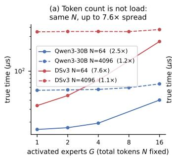

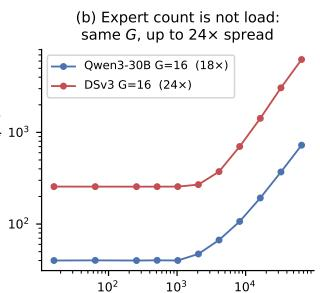  
Figure 9: Proxy-equivalence sets versus true time on the raw measurement grid. (a) Same total tokens, different activation counts: up to 7.6×. (b) Same activation count, different token counts: up to 24×.

recorder buffer-size cap. Pitfalls table (DeepEP token caps, KV-pool sizing under --enable-eplb, NCCL fallback with --disable-custom-all-reduce) in the artifact (link anonymized for review).

## E Additional phase panels

Qwen3-30B and DSv2-Lite shapes, both replication ratios, and regime maps for all four traces are included in the artifact; rankings match the main-text panels throughout.

## F Additional result tables and figures

## G Multi-node bring-up notes

Three hazards, each worth 10–200× in measured performance, documented for reproducibility. (1) Raw RDMA was healthy (365 Gb/s cross-node ib write bw) while NCCL hung in transport setup: the container’s HPC-X IBext plugin, auto-loaded by NCCL. NCCL NET PLUGIN=none plus explicit HCA/GID selection restored line rate (decode TPOT 3429 → 7.7 ms). (2) The stock NCCL bundled with PyTorch reached ∼2 Gb/s effective allreduce bandwidth on the same fabric while reporting NET/IB transport—silently crawling; DeepEP’s NVSHMEM/IBGDA path on the same NICs sustained 50 GB/s, localizing the fault. Preloading the cluster vendor’s NCCL restored 53 µs allreduce (100–200×), serving TPOT 4.3 s→ 42 ms. Diagnosing collective-transport health per stack is a prerequisite for any multi-node EP claim. (3) fp8 on the new SM architecture: DeepGEMM masked kernels rejected SGLang’s fp32 scales (the architecture requires UE8M0 packing; fixed by broadening the packing condition), and running LPLB required a cublasdx fix we upstream—mathdx’s bundled cutlass predates the new architecture, selecting priorgeneration float2 FFMA atoms that assert at launch; defining the float2-math macros for the new architecture restores it.

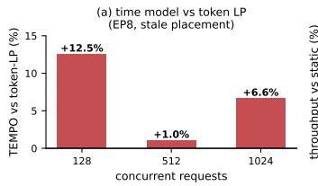

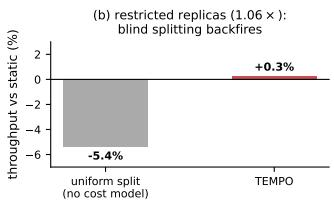  
Figure 10: Stale-placement serving on the DSv3-shape proxy (EP8, Testbed A). (a) TEMPO vs. the token-LP dispatcher on the identical data path. (b) With a tight replica budget (1.06×), uniform splitting backfires; the cost model recovers parity with static.

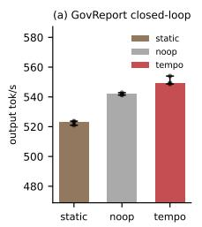

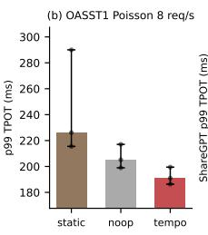

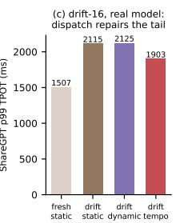  
Figure 11: Robustness of the Testbed B win-region claims. (a,b) Three independent repeat windows per policy (dots; bar = median, whiskers = range): the GovReport throughput and Poisson-tail wins replicate with non-overlapping ranges. (c) Drift-16 corruption applied to the real model: stale placement inflates ShareGPT p99 by 40%; TEMPO recovers a third of the damage while SGLang’s dynamic rebalancer recovers none— and no dispatcher recovers the throughput, which requires re-provisioning replicas (placement’s job).

## H MoonEP comparison details

Model replay. We replay MoonEP’s policy—prefetch redundant experts from the current router output so every rank receives exactly SK tokens—on the recorded Qwen3-235B distributions under the tile-aware Testbed B cost model, with two prefetch accountings: free (fully overlapped; optimistic) and charged at a 4× HBM-to-interconnect bandwidth ratio per duplicated expert. At decode batches (8–64 tokens/GPU) even free prefetch reaches only −4.8 to −10.2% of static makespan—perfect token balance is activation-blind, and TEMPO takes −12.1 to −16.5% on the same batches; charged prefetch inverts the sign entirely (+277 to +320%): a duplicate must absorb several tiles’ worth of tokens to amortize its own weight movement, which decode batches never provide. At prefill batches (≥512 tokens/GPU) all policies converge to token balance and the free variant exactly matches token-LP— consistent with MoonEP’s training-side claims, where prefetch overlaps behind long compute.

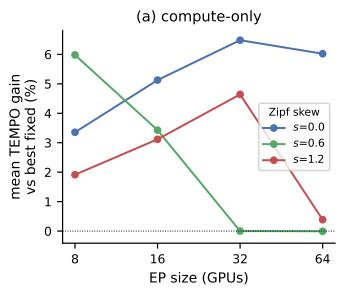

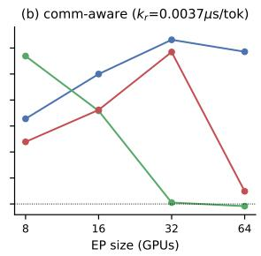

Figure 12: Scale extrapolation, DSv3 shape, replication 1.25×: mean TEMPO gain vs. best fixed policy across the batch ladder.  
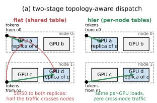

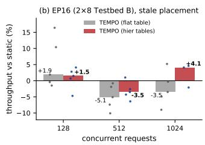  
Figure 13: Topology-aware dispatch on 2-node EP16 (Testbed B, stale placement). (a) The solve fixes per-GPU loads; a same-node-first transportation split then assigns sources to replicas, giving one table per source node at zero kernel cost. (b) End-to-end: the flat table loses to static at the all-to-all-bound point; the hier split flips the sign (median of 5 paired windows, dots are individual windows).

Wall clock, real library. We run MoonEP against DeepEP v2 on 8-GPU Testbed B with MoonEP’s own aligned benchmark (identical routing, shared timing harness; DSv3 shape, 256 experts, hidden 7168, top-8; skew swept over MaxVio 0.2–20). At decode scale (128 tokens/rank) DeepEP dispatch+combine is 95–107 µs and flat in skew, while MoonEP costs 528–829 µs, 66–77% of it weight prefetch (283–502 µs); even MoonEP’s on-GPU planning kernel (57–61 µs) costs more than DeepEP’s entire dispatch. At prefill scale (8192 tokens/rank) the picture inverts as the phase diagram predicts: DeepEP degrades with skew (2.23 → 2.85 ms as MaxVio goes

Table 8: Cumulative stage ablation on the drift-16 scenario: median makespan/static under the calibrated model (lower is better; < 1 beats static). Solve time at B=1024.
<table><tr><td>stages (cumulative)</td><td> $B { = } 1 2 8$ </td><td> $B { = } 5 1 2$ </td><td> $B { = } 1 0 2 4$ </td><td>ms</td></tr><tr><td>seed only</td><td>1.000</td><td>0.883</td><td>0.869</td><td>0.3</td></tr><tr><td>+aug. chains</td><td>0.902</td><td>0.940</td><td>0.932</td><td>0.3</td></tr><tr><td>+local search</td><td>0.902</td><td>0.881</td><td>0.867</td><td>0.9</td></tr><tr><td>+LP ensemble</td><td>0.902</td><td>0.880</td><td>0.865</td><td>3.5</td></tr><tr><td>seed+local, no chains</td><td>0.907</td><td>0.881</td><td>0.866</td><td>0.3-2.2</td></tr></table>

Table 9: Cost-model term ablation on the drift-16 scenario: solve with terms deleted from the objective, score under the full model (median makespan/static).
<table><tr><td>objective</td><td> $B { = } 1 2 8$ </td><td> $B { = } 5 1 2$ </td><td> $B { = } 1 0 2 4$ </td><td> $B { = } 2 0 4 8$ </td></tr><tr><td>full 3-term (4)</td><td>0.902</td><td>0.880</td><td>0.865</td><td>0.856</td></tr><tr><td>drop traffic  $( c _ { 2 } , \gamma )$ </td><td>0.902</td><td>0.946</td><td>0.924</td><td>0.862</td></tr><tr><td>drop floor  $( a , b ) \equiv \mathrm { t o k e n s \ o n l y }$ </td><td>0.951</td><td>0.880</td><td>0.865</td><td>0.856</td></tr></table>

0.2 → 20) while MoonEP stays flat (∼2.55 ms), crossing near MaxVio ≈ 20.

Table 10: Faster-EPLB control (drift16 replay, makespan ratio vs. never-refreshed static; median/p95). “uni” = EPLB default uniform split; “cum16” = placement rebuilt every 16 windows from cumulative observed counts; W4 = trailing 4-window refresh.
<table><tr><td>policy</td><td> $B { = } 1 2 8$ </td><td> $B { = } 5 1 2$ </td></tr><tr><td>static, never refresh uni, never refresh</td><td>1.00/1.00 1.14/1.23</td><td>1.00/1.00 1.00/1.05</td></tr><tr><td>uni + cum16 refresh</td><td>1.31/1.44</td><td>0.85/1.02</td></tr><tr><td>static + cum16 refresh</td><td>1.00/1.15</td><td>1.03/1.33</td></tr><tr><td>TEMPO, never refresh TEMPO + cum16 refresh</td><td>1.00/1.10 1.00/1.10</td><td>0.89/0.97</td></tr></table>

Table 11: No-solve topology control on Qwen3-235B 2-node EP16, drift-16 placement: output-throughput delta vs. samewindow static (round 1/round 2).
<table><tr><td>requests</td><td>flat-uniform</td><td>hier-uniform</td><td>hier-TEMPO</td></tr><tr><td>128</td><td>-1.2/-3.7%</td><td>-3.9/-7.0%</td><td>-1.3/-5.0%</td></tr><tr><td>512</td><td>+0.3/-2.2%</td><td>-2.8/-1.8%</td><td>+1.1/-0.3%</td></tr><tr><td>1024</td><td>-3.2/-3.4%</td><td>-3.2/-1.4%</td><td>-0.8/-1.1%</td></tr></table>