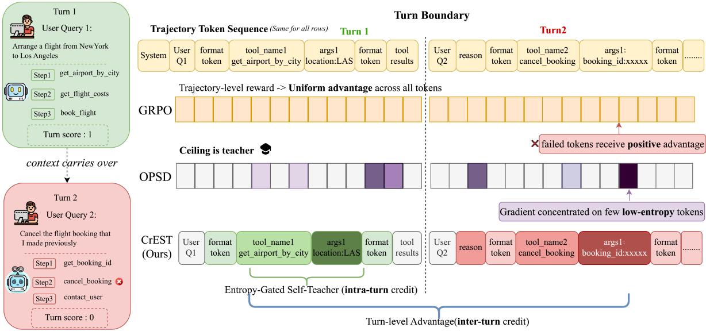
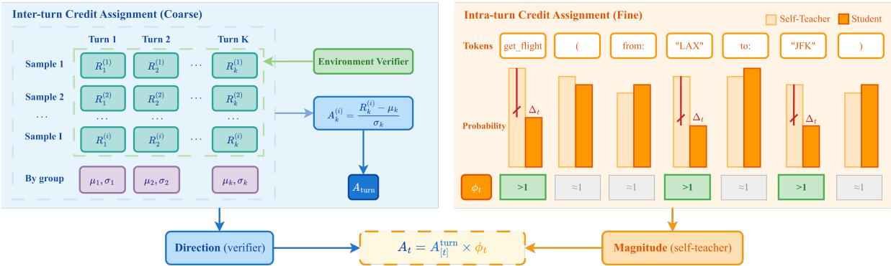
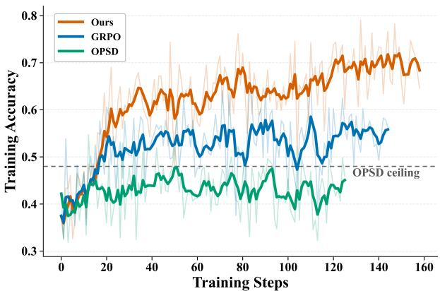
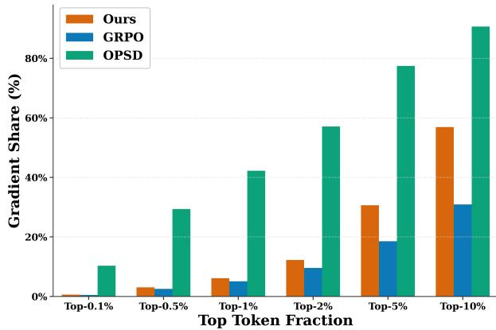
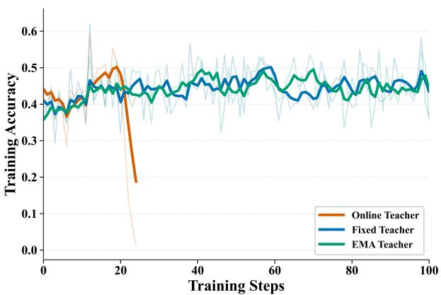
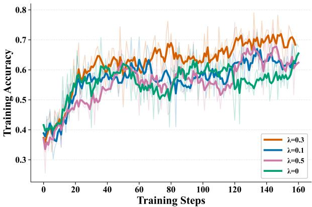

# Teach the Magnitude, Not the Direction: Verifier-Bounded Credit Assignment for Multi-Turn Multi-step LLM Agents

Zechuan Wang1,3,∗, Siyuan Lu1,2,3,4,∗, Hongxuan Zhang3,5, Linjian Mo3, Chenyi Zhuang3, Leilei Gan1,†

1Zhejiang University 2Shanghai Innovation Institute 3 AWorld Team, Inclusion AI 4Westlake University 5Nanjing University

## Abstract

Reinforcement learning with verifiable rewards (RLVR) offers a verifier-bounded performance ceiling for training multi-turn tool-use agents, yet its trajectory-level credit assignment conflates heterogeneous per-turn outcomes into a single reward signal. On-policy distillation provides dense per-token supervision but is either teacher-bounded or prone to gradient concentration collapse. We introduce CREST, a hierarchical credit assignment framework that retains RL’s verifier-bounded ceiling while incorporating dense token-level signals from a privileged self-teacher. CREST resolves credit at two levels: turn-segmented verified advantages address inter-turn dilution, while entropy-gated self-teacher modulation refines intra-turn token contributions. Experiments on BFCL V3 and WildToolBench show that CREST consistently outperforms both RL and distillation baselines across two model scales, with the largest gains on long-trajectory and strict session-level metrics. Our work demonstrates that the teacher’s role in policy optimization can be reduced from determining update directions to modulating update magnitudes, unlocking dense credit assignment without sacrificing the verifier-bounded ceiling.

## 1 Introduction

Large language models (Hurst et al., 2024; Comanici et al., 2025; Qwen et al., 2025; Liu et al., 2024) are evolving from pure question-answering systems into autonomous agents capable of reasoning, acting, and interacting with diverse environments (Merrill et al., 2026; Jimenez et al., 2024; Xie et al., 2024; Liu et al., 2026; Froger et al., 2025; Towers et al., 2026). These scenarios share a common structure: agents must handle multi-turn sessions (sequences of user requests) where each turn requires multi-step execution (chains of actions and observations) (Shridhar et al., 2021; Wei et al., 2025a; Xie et al., 2024; OpenClaw, 2026).

Reinforcement learning (Schulman et al., 2017; Ahmadian et al., 2024), particularly RL with verifiable rewards (RLVR) (Shao et al., 2024; Qian et al., 2026), is now the dominant post-training paradigm for tool-use agents (Liu et al., 2025; Zhang et al., 2025a; Yu et al., 2026b), offering a verifier-bounded performance ceiling determined solely by reward quality. Yet standard objectives broadcast a single trajectory-level reward across all tokens. Within a single turn, where all actions serve one query, this is merely noisy (Lu et al., 2026a). In multi-turn sessions (Li et al., 2023; Patil et al., 2025; Yu et al., 2026a), however, turns carry independent outcomes yet share one reward signal, making credit assignment ill-posed: on WildToolBench, no model exceeds 15% session accuracy, and performance degrades sharply with turn count (Laban et al., 2025).

On-policy distillation (OPD) (Lu & Thinking Machines, 2025; Li et al., 2026; Song & Zheng, 2026) provides a natural credit assignment mechanism, where the teacher inherently scores each token in the student’s trajectory and distinguishes which tokens are preferable from the teacher’s perspective. However, this requires a same-family, tokenizer-matched teacher (Fu et al., 2026), which is a rare constraint satisfied in practice. On-policy self-distillation (OPSD) (Zhao et al., 2026; Hübotter et al., 2026; Shenfeld et al., 2026a; Penaloza et al., 2026) removes this dependency by using the student itself as self-teacher, conditioned on privileged information such as ground truth or successful demonstrations from rollout group peers. Yet

  
Figure 1: Comparison of credit assignment strategies on a 2-turn trajectory (Turn 1 succeeds, Turn 2 fails). GRPO broadcasts a single trajectory-level reward uniformly, erroneously reinforcing failed-turn tokens. OPSD provides dense token-level signal but concentrates gradient on low-entropy format tokens, with a teacher-bounded ceiling. CREST (Ours) combines turn-level advantages (inter-turn credit) with entropygated self-teacher modulation (intra-turn credit), correctly assigning negative advantage to Turn 2 while focusing gradient mass on high-uncertainty content tokens in Turn 1.

OPSD is brittle and restricts exploration. First, Zhao et al. (2026); Brown (2026) found that without per-token KL clipping, OPSD collapses within ∼100 training steps due to gradient concentration on a few tokens. Second, OPSD’s performance ceiling remains teacher-bounded (Kim et al., 2026), which means that the student cannot surpass the teacher’s privileged distribution.

This raises a central question: Can we design a training approach that maintains the verifier-bounded performance ceiling of RL while providing token-level signal to address the credit assignment challenges of multi-turn multi-step LLM agents training?

We propose CREST (Hierarchical Credit Assignment via Entropy-Gated Self-Teacher), which addresses both levels through a unified policy gradient with structured per-token advantages (Figure 1). At the turn level, CREST uses turn-segmented verifier rewards to prevent rewards from being diluted across long multi-turn trajectories. At the token level, to prevent gradient concentration on a few tokens, CREST uses an entropy-gated self-teacher to modulate token-level contributions within each turn. Additionally, CREST employs the verified reward to determine all gradient directions, ensuring the performance ceiling remains verifier-bounded without requiring an external same-family teacher. The two level credit assignment are complementary—neither alone recovers the full performance.

## Our main contributions are:

1. We identify and formalize the two-level credit assignment problem in multi-turn multi-step agentic RL, and provide a gradient-geometric analysis explaining why existing dense-signal methods fail in this setting (Section A).

2. We propose CREST, a hierarchical credit assignment framework combining turn-segmented advantage with entropy-gated self-teacher token reweighting. CREST is verifier-bounded by construction and introduces only one hyperparameter (λ) beyond standard GRPO (Section 3).

3. We demonstrate that CREST achieves 52.0% average accuracy on BFCL V3 (Qwen3-4B) and 9.38% session accuracy on WildToolBench (Qwen3-8B), consistently outperforming all baselines across both benchmarks and model scales (Section 4).

## 2 Related Work

Tool use for LLM-based agents. LLM tool-use research spans a complexity spectrum, from reasoning before function-calling (Zhang et al., 2025a; Qian et al., 2026) to tool-integrated reasoning (TIR) for fulfilling user’s query (Li et al., 2025; Jin et al., 2025; Feng et al., 2025; Zheng et al., 2025). Most relevant to our work, multi-turn multi-step benchmarks (Zhang et al., 2025b; Yu et al., 2026a; Patil et al., 2025) evaluate agents across sessions of multiple queries, each requiring its own execution chain. These settings expose two challenges absent in single-turn work: cross-turn state consistency and error propagation across turns. Empirically, agent performance degrades substantially with turn count; Yu et al. (2026a) report session accuracy below 15% across 57 LLMs, motivating training-time methods that respect the turn structure of multi-turn sessions.

Agentic Reinforcement Learning. RL-based post-training has become the standard approach for aligning LLM agents with task objectives (Shao et al., 2024; Yu et al., 2026b; Wang et al., 2025). Some methods focus on reward design: Lu et al. (2026a) decompose trajectory rewards into fine-grained per-step process scores combining state correctness and execution accuracy, while Qian et al. (2026) and Zhang et al. (2025a) ground rewards directly in environment feedback from tool execution. Despite these advances, most existing methods compute a single advantage per trajectory (or per-step within a single turn), leaving the inter-turn credit assignment problem unaddressed—when turns within the same session have heterogeneous outcomes, trajectory-level or step-level averaging still mislabels tokens in failed turns. MT-GRPO (Wei et al., 2025b) attempts per-agent-step advantage computation, yet still lacks intra-step token-level credit assignment, treating all tokens within each step identically.

On-policy distillation. On-policy distillation (OPD) (Lu & Thinking Machines, 2025) replaces RL’s sparse reward with dense per-token reverse KL against a same-family teacher, providing token-level credit assignment throughout the trajectory (Li et al., 2026). OPD converges faster than RL at moderate compute budgets, but its ceiling is teacher-bounded and requires tokenizer-matched, recipe-matched teachers (Brown, 2026). When such teachers are unavailable, self-distillation methods use the student itself conditioned on privileged information like expert demonstrations (Shenfeld et al., 2026b), feedback (Hübotter et al., 2026) and ground-truth answers (Zhao et al., 2026). More recently, hybrid methods attempt to combine RL’s verifier-bounded direction with distillation’s dense signal: SDAR (Lu et al., 2026b) gates self-distillation as an auxiliary loss alongside RL, and RLSD (Yang et al., 2026) uses self-distillation for update magnitudes while relying on verifiable rewards for directions. However, these hybrids either lack principled control over gradient concentration (Zhao et al., 2026; Brown, 2026) or do not address the inter-turn credit assignment structure unique to multi-turn settings.

## 3 Method

Multi-turn multi-step training faces a hierarchical credit assignment problem: at the coarse level, trajectories mix successes and failures across turns; at the fine level, individual turns conflate high-value decisions with low-entropy formatting. CREST addresses both levels through a unified policy gradient framework with structured per-token advantages (Equation (1)):

• Inter-turn (coarse): Turn-segmented verified-reward advantages (Section 3.2) isolate per-turn outcomes, preventing dilution from trajectory-level averaging.

• Intra-turn (fine): Entropy-gated self-teacher signals (Section 3.3) refine per-token contributions, concentrating gradient mass on high-uncertainty content tokens.

The two levels are complementary: without inter-turn segmentation, no amount of intra-turn refinement can rescue tokens in failed turns; without intra-turn reweighting, pivot decisions in successful turns remain indistinguishable from formatting tokens. Critically, verified reward determines all gradient directions while the self-teacher only modulates magnitudes, ensuring the performance ceiling stays verifier-bounded (Section A).

## 3.1 Unified Objective

CREST is a standard on-policy policy gradient with a structured per-token advantage. Given a prompt x and an on-policy rollout $y \sim \pi _ { \boldsymbol { \theta } } \mathbf { \dot { ( } } \cdot \mathbf { | } \mathbf { \boldsymbol { x } } \mathbf { ) }$ , the objective is:

$$
J ( \theta ) = \mathbb { E } _ { x \sim \mathcal { D } , y \sim \pi _ { \theta } ( \cdot | x ) } \left[ \sum _ { t } \mathcal { A } _ { t } \cdot \log \pi _ { \theta } ( y _ { t } \mid y _ { < t } , x ) \right]\tag{1}
$$

  
Figure 2: Overview of CREST. Left (Inter-turn): A group of G rollouts is scored by the environment verifier per turn; group-relative advantages $A _ { \mathrm { t u r n } }$ are computed independently for each turn, providing the gradient direction. Right (Intra-turn): Within each turn, a privileged self-teacher (conditioned on ground truth) provides per-token divergence $\Delta _ { t } ;$ an entropy gate concentrates modulation on high-uncertainty content tokens (e.g., get\_flight, $\ " J F K ^ { \prime \prime } )$ while suppressing format tokens, yielding the magnitude factor $\grave { \phi _ { t } } .$ . Bottom: The final per-token advantage $\begin{array} { r } { \mathcal { A } _ { t } = A _ { [ t ] } ^ { \mathrm { t u r n } } \times \phi _ { t } } \end{array}$ combines verifier-bounded direction with teacher-modulated magnitude.

where the per-token advantage $\mathcal { A } _ { t }$ exposes the hierarchical structure:

$$
\begin{array} { r l } { \mathcal { A } _ { t } = } & { \underbrace { A _ { [ t ] } ^ { \mathrm { t u r n } } } _ { \mathrm { i n t e r - t u r n : } } \quad \cdot \underbrace { \phi _ { t } } _ { \mathrm { i n t r a - t u r n : } } } \\ { w h i c h t u r n ? } & { w h i c h t o k e n ? } \end{array}\tag{2}
$$

$A _ { [ t ] } ^ { \mathrm { t u r n } }$ is a turn-segmented verified-reward advantage (Section 3.2) that resolves which turn contributed to success or failure. $\phi _ { t } \in [ 1 , 1 { + } \lambda \epsilon ]$ is a magnitude modulation factor (Section 3.3) that refines which tokens within that turn deserve stronger updates, derived from a privileged self-teacher gated by student uncertainty.

The factorization in Equation (2) reveals why both levels are necessary: ${ \dot { \left| { A _ { [ t ] } ^ { \mathrm { t u r n } } } \right. } }$ provides the correct sign (reinforce or suppress) for each turn’s tokens, but treats all tokens within a turn uniformly; ϕt refines the magnitude of each token’s contribution, but cannot change sign (proof in Section $\mathrm { A } )$ Together, they ensure gradient direction is determined entirely by verified rewards (verifierbounded), while token-level allocation benefits from dense teacher signals. Table 1 shows how existing methods occupy restricted subspaces of this design.

## 3.2 Turn-Level Credit Assignment

Instead of computing a single trajectory-level reward averaged across turns, we compute grouprelative advantages within each turn independently (Figure 2, left). For a trajectory containing turns

Table 1: Design space of hierarchical credit assignment. Methods differ in how they allocate credit across turns $( A _ { [ t ] } ^ { \mathrm { t u r n } } )$ and tokens $\left( \phi _ { t } \right)$ . MT-GRPO computes per-turn advantages but propagates discounted future-outcome credit to earlier turns (cumulative), whereas CREST computes each turn’s advantage from that turn’s reward only (independent). OPD and OPSD share the same slot (ϕt ∝ ∆t with no verified-reward base, hence teacher-bounded); they differ only in teacher source (external same-family vs. self with privileged context).
<table><tr><td>Method</td><td> $A _ { [ t ] } ^ { \mathrm { t u r n } }$ </td><td>φt</td></tr><tr><td>GRPO</td><td>trajectory-level</td><td>1</td></tr><tr><td>MT-GRPO</td><td>per-turn (cumulative)</td><td>1</td></tr><tr><td>OPD / OPSD</td><td></td><td> $\propto \Delta _ { t }$ </td></tr><tr><td>CREST (Ours)</td><td>per-turn (independent)</td><td> $1 + \lambda _ { t } ^ { \mathrm { e f f } } ( w _ { t } - 1 )$ </td></tr></table>

$\left\{ 1 , \ldots , K \right\}$ , each turn k receives its own verified reward $R _ { k }$ from the environment. Within a GRPO group of G rollouts, the advantage for turn k in rollout i is:

$$
A _ { k } ^ { ( i ) } = \frac { R _ { k } ^ { ( i ) } - \mathrm { m e a n } ( \{ R _ { k } ^ { ( j ) } \} _ { j = 1 } ^ { G } ) } { \mathsf { s t d } ( \{ R _ { k } ^ { ( j ) } \} _ { j = 1 } ^ { G } ) + \epsilon }\tag{3}
$$

All tokens within turn k of rollout i share the advantage $A _ { k } ^ { ( i ) }$ . This ensures that a failed turn receives negative advantage regardless of whether other turns in the same trajectory succeeded.

## 3.3 Token-Level Credit: Self-Teacher Signal

The modulation factor $\phi _ { t }$ uses a privileged self-teacher (the same model conditioned on ground-truth context) to refine per-token gradient magnitude within each turn (Figure 2, right):

$$
\phi _ { t } = 1 + \lambda _ { t } ^ { \mathrm { e f f } } \cdot ( w _ { t } - 1 )\tag{4}
$$

When $\lambda _ { t } ^ { \mathrm { e f f } } = 0 , \phi _ { t } = 1$ (no teacher influence); when $\lambda _ { t } ^ { \mathrm { e f f } } > 0$ and $w _ { t } > 1 , \phi _ { t } > 1$ (teacher amplifies the gradient). We now define the two components: the raw teacher signal $( \Delta _ { t }  w _ { t } )$ and the gating mechanisms that control it (Section 3.4).

Teacher–student divergence. For each response token $t ,$ let $\pi _ { T } ( \cdot \mid h _ { t } ^ { T } )$ denote the self-teacher—the same model conditioned on ground truth as privileged context, following Zhao et al. (2026)—and $\pi _ { \theta } ( \cdot \mid h _ { t } )$ the student:

$$
\Delta _ { t } = \frac { \log \pi _ { T } ( y _ { t } \mid h _ { t } ^ { T } ) - \log \pi _ { \theta } ( y _ { t } \mid h _ { t } ) } { \tau }\tag{5}
$$

where τ is a temperature that smooths the divergence signal.

Token weight. The raw teacher preference is converted into a bounded multiplicative weight:

$$
w _ { t } = \mathrm { c l i p } \Big ( \exp \big ( \mathrm { s i g n } ( A _ { [ t ] } ^ { \mathrm { t u r n } } ) \cdot \Delta _ { t } \big ) , ~ 1 { - } \epsilon , ~ 1 { + } \epsilon \Big )\tag{6}
$$

The sign $( A _ { [ t ] } ^ { \mathrm { t u r n } } ) \cdot \Delta _ { t }$ construction aligns teacher preference with the verifier’s direction: for positive-advantage tokens, teacher agreement increases $w _ { t } ;$ for negative-advantage tokens, teacher agreement with the “this was bad” signal also increases $w _ { t }$ . This guarantees direction preservation (P1): $\mathrm { s i g n } ( \mathcal { A } _ { t } ) = \mathrm { s i g n } ( A _ { [ t ] } ^ { \mathrm { t u r n } } )$ for all $t ,$ i.e., the gradient direction is determined entirely by verified reward (proof in Section A).

## 3.4 Stabilization via Selective Gating

The self-teacher provides dense per-token signals, but unconstrained use leads to concentration collapse (Brown, 2026): gradient mass flows to a small set of tokens where teacher–student divergence is largest, often lowentropy formatting rather than high-value decisions. We stabilize the intra-turn reweighting through a composed gating function $\lambda _ { t } ^ { \mathrm { e f f } }$ (Equation (10)) that controls where (agreement with verifier) and how much (student uncertainty) the teacher signal is applied.

Direction gate.

$$
g _ { t } ^ { \mathrm { d i r } } = \mathbf { 1 } \Bigl [ \mathrm { s i g n } ( A _ { [ t ] } ^ { \mathrm { t u r n } } ) \cdot \Delta _ { t } > 0 \Bigr ]\tag{7}
$$

When teacher and verifier disagree on the direction of update, $g _ { t } ^ { \mathrm { d i r } } = 0$ and the teacher signal is fully suppressed. This is the key mechanism ensuring the performance ceiling remains verifier-bounded rather than teacher-bounded.

Entropy gate. To prevent gradient concentration on low-entropy format tokens, we modulate the reweighting strength by the student’s token-level uncertainty, using surprisal $u _ { t } = - \log \pi _ { \theta } ( y _ { t } \mid h _ { t } )$ as a lightweight proxy:

$$
g _ { t } ^ { \mathrm { e n t } } = \sigma \bigg ( \frac { u _ { t } - \mathbb { E } [ u ] } { \mathrm { s t d } ( u ) + \epsilon } \bigg )\tag{8}
$$

$$
m _ { t } ^ { \mathrm { e n t } } = 1 + \rho \left( 2 g _ { t } ^ { \mathrm { e n t } } - 1 \right)\tag{9}
$$

where $\sigma$ is the sigmoid function and statistics are computed over response tokens. The Z-score normalization centers surprisal around the mean and scales by standard deviation, mapping to [0, 1] via sigmoid. For low-uncertainty format tokens, $m _ { t } ^ { \mathrm { e n t } } < 1$ reduces modulation strength; for high-uncertainty content tokens, $m _ { t } ^ { \mathrm { e n t } } > 1$ increases it. The range $\left[ 1 - \rho , 1 + \rho \right]$ redistributes gradient budget without zeroing out any token.

Composed gating. The direction and entropy gates compose into a single effective gating function:

$$
\lambda _ { t } ^ { \mathrm { e f f } } = \mathrm { c l i p } \left( \lambda \cdot \underbrace { g _ { t } ^ { \mathrm { d i r } } \cdot m _ { t } ^ { \mathrm { e n t } } } _ { \mathrm { s a f e t y \ : \& \ : f o c u s } } , 0 , \lambda \right)\tag{10}
$$

This yields $\phi _ { t } = 1 + \lambda _ { t } ^ { \mathrm { e f f } } ( w _ { t } - 1 ) \in [ 1 , 1 + \lambda \epsilon ] .$ , ensuring three formal properties (Section A): (P1) direction preservation $( \mathrm { s i g n } ( \mathcal { A } _ { t } ) \dot { } = \mathrm { s i g n } ( A _ { [ t ] } ^ { \mathrm { t u r n } } )$ always), (P2) bounded bias $( \| \mathrm { B i a s } \| \le \lambda \epsilon \cdot \| \nabla J _ { \mathrm { G R P O } } \| \approx 8 . 4 \%$ with $\lambda { = } 0 . 3 , \epsilon { = } 0 . 2 8 )$ , and (P3) sign-consistent amplification $\left( \phi _ { t } \geq 1 \right.$ when active).

λ is the only tunable hyperparameter controlling teacher influence strength. The remaining values— $\tau { = } 2 . 0$ (divergence temperature), $\epsilon { = } 0 . 2 8$ (clip bound, inherited from OPSD stabilization), $\rho { = } 0 . { \breve { 5 } }$ (entropy redistribution range)—are fixed constants requiring no tuning (ablation in Section 4).

The complete training procedure, consolidating all equations into executable pseudocode, is provided in Section B.

## 4 Experiments

## 4.1 Experimental Setup

Benchmarks. We conduct experiments on two multi-turn multi-step tool-use benchmarks: (1) Berkeley Function-Calling Leaderboard (BFCL) V3 (Patil et al., 2025). Under our processed protocol, we use 100 fixed IDs from the multi-turn Base split for training and 400 non-overlapping examples for evaluation: 100 examples each from Base, Missing Functions, Missing Parameters, and Long-Context. (2) WildToolBench (Yu et al., 2026a) contains 256 multi-turn sessions designed to capture real-world interaction challenges, including compositional tasks, implicit intent through pronoun reference or ellipsis, and task switching between goal-directed queries and casual chat. The benchmark evaluates both action correctness and parameter accuracy. We allocate 128 sessions for training and reserve the remaining ones for evaluation.

The turn index is semantically aligned within each rollout group: all rollouts use the same fixed session and the same ordered list of user turns, so turn k denotes the same benchmark request across the group. This assumption is specific to these benchmarks and does not directly extend to variable turn structures, terminal-only rewards, or strongly coupled turns without local verification. BFCL rewards compare postexecution environment states with annotated per-turn target executions, including result-coverage checks for read-only tools; WildToolBench rewards path-match calls against human-verified valid paths and score action correctness, parameter correctness, and path completion.

Base models. We evaluate on two model scales from the Qwen3 family (Yang et al., 2025): Qwen3-4B-Instruct,1 an instruction-tuned model, and Qwen3-8B, a thinking model. Both have native tool-calling support and represent practical deployment sizes where post-training efficiency matters most.

Baselines. We compare against four training methods spanning RL-based and distillation-based paradigms:

GRPO (Shao et al., 2024) applies standard Group Relative Policy Optimization with binary trajectory-level reward (1 if all turns succeed, 0 otherwise). Advantages are averaged across all tokens in the trajectory regardless of per-turn outcomes.

MT-GRPO (Wei et al., 2025b) computes advantages at the per-agent-step granularity, providing finer-grained credit assignment than trajectory-level methods. However, within each step, all tokens still share the same advantage, lacking token-level differentiation.

EnvTuning (Lu et al., 2026a) uses fine-grained process rewards that combine per-turn state correctness and execution accuracy, aggregating per-turn scores into a trajectory-level reward via weighted averaging. Despite richer reward signals, it still computes a single trajectory-level advantage.

OPD (Lu & Thinking Machines, 2025) performs on-policy distillation with a same-family, same-variant teacher, providing dense per-token supervision via reverse KL. To satisfy the tokenizer-matched constraint, we pair each student with a teacher of the same model variant: Qwen3-4B-Instruct uses Qwen3-235B-A22B-Instruct2 as teacher, while Qwen3-8B uses Qwen3-32B. OPD’s performance ceiling is teacher-bounded.

OPSD (Zhao et al., 2026) uses on-policy self-distillation where the student itself, conditioned on ground-truth context, serves as the privileged teacher. This removes the external teacher dependency but risks training instability from gradient concentration.

Implementation details. All methods are trained with the same on-policy rollout infrastructure, group size $G { = } 1 6 ,$ , and learning rate schedule. For CREST, we set $\lambda { = } 0 . 3 , \epsilon { = } 0 . 2 \dot { 8 } , \tau { = } 2 . 0 $ , and $\rho { = } 0 . 5 ;$ only λ is tuned, while the other values are fixed design choices across all experiments. Each method uses a single training seed. We evaluate each trained policy with three decodes at temperature 10−6; these runs measure decoding consistency rather than training variance, and should not be interpreted as independent training replicates. Full training configuration and OPSD stabilization details are provided in Section C.

Table 2: Main results on BFCL V3 multi-turn and WildToolBench benchmarks. Best results per model in bold, second-best underlined. Methods are grouped by training paradigm: RL-based (top), distillation-based (middle), and our method (bottom).
<table><tr><td rowspan="2">Method</td><td colspan="4">BFCL V3 Multi-Turn (%)</td><td colspan="3">WildToolBench (%)</td></tr><tr><td>Average</td><td>Base</td><td>Miss Func</td><td>Miss Param</td><td>Long Context</td><td>Task Acc.</td><td>Session Acc.</td></tr><tr><td>Qwen3-4B-Instruct</td><td>22.12</td><td>26.5</td><td>21.0</td><td>15.5</td><td>25.5</td><td>37.89</td><td>3.13</td></tr><tr><td>+ GRPO</td><td>43.63</td><td>53.5</td><td>42.5</td><td>31.5</td><td>47.0</td><td>40.23</td><td>4.69</td></tr><tr><td>+ MT-GRPO</td><td>49.25</td><td>63.0</td><td>46.0</td><td>35.0</td><td>53.0</td><td>43.36</td><td>6.25</td></tr><tr><td>+ EnvTuning</td><td>47.25</td><td>60.0</td><td>47.0</td><td>32.0</td><td>50.0</td><td>44.92</td><td>4.69</td></tr><tr><td>+ OPD</td><td>44.50</td><td>52.0</td><td>43.0</td><td>38.0</td><td>45.0</td><td>42.58</td><td>6.25</td></tr><tr><td>+ OPSD</td><td>38.75</td><td>46.0</td><td>41.0</td><td>26.0</td><td>42.0</td><td>38.88</td><td>4.69</td></tr><tr><td>+ CREST</td><td>52.00 (+29.88)</td><td>67.0 (+40.5)</td><td>48.0 (+27.0)</td><td>38.0 (+22.5)</td><td>60.0 (+34.5)</td><td>48.44 (+10.55)</td><td>7.03 (+3.90)</td></tr><tr><td>Qwen3-8B</td><td>33.38</td><td>41.5</td><td>38.5</td><td>27.0</td><td>26.5</td><td>43.75</td><td>4.69</td></tr><tr><td>+ GRPO</td><td>43.25</td><td>53.0</td><td>46.0</td><td>36.0</td><td>38.0</td><td>45.43</td><td>5.47</td></tr><tr><td>+ MT-GRPO</td><td>44.00</td><td>57.0</td><td>45.0</td><td>36.0</td><td>38.0</td><td>49.61</td><td>7.03</td></tr><tr><td>+ EnvTuning</td><td>46.00</td><td>54.0</td><td>45.0</td><td>40.0</td><td>45.0</td><td>49.02</td><td>7.81</td></tr><tr><td>+ OPD</td><td>44.75</td><td>50.0</td><td>52.0</td><td>39.0</td><td>38.0</td><td>45.25</td><td>3.91</td></tr><tr><td>+ OPSD</td><td>41.75</td><td>48.0</td><td>43.0</td><td>39.0</td><td>37.0</td><td>43.95 52.34 (+8.59)</td><td>3.91</td></tr><tr><td>+ CREST</td><td>50.00 (+16.62)</td><td>60.0 (+18.5)</td><td>51.0 (+12.5)</td><td>42.0 (+15.0)</td><td>47.0 (+20.5)</td><td></td><td>9.38 (+4.69)</td></tr></table>

## 4.2 Main Results

Table 2 reports BFCL V3 and WildToolBench performance for both model scales across all baselines. CREST outperforms every baseline on average and achieves the best result on nearly all individual splits across both benchmarks and both model scales.

RL outperforms distillation Two patterns stand out in Table 2. First, RL-based methods (GRPO, MT-GRPO, EnvTuning) systematically outperform distillation-based methods (OPD, OPSD) at both model scales. The clearest signal is OPSD: on Qwen3-4B BFCL Avg it scores 38.75%, falling below GRPO (43.63%) despite using a privileged ground-truth-conditioned teacher, giving direct empirical evidence for the teacher-bounded ceiling argued in Section 3. Second, within the RL family, finer-grained credit assignment helps: on Qwen3-4B BFCL Avg, MT-GRPO (49.25%) and EnvTuning (47.25%) both improve clearly over trajectory-level GRPO (43.63%), yet every token within a step still shares a single advantage. The remaining headroom for dense per-token supervision, on top of verifier-determined directions, is exactly the room CREST is designed to fill.

CREST closes both gaps simultaneously. CREST reaches 52.00% on Qwen3-4B-Instruct and 50.00% on Qwen3-8B, surpassing the strongest RL baseline at each scale and achieving the best or tied-best result in 13 of 14 cells. OPD is best on Qwen3-8B Missing Functions, while CrEST ties OPD on Qwen3-4B Missing Parameters. The margins are largest on the splits that stress hierarchical credit assignment: on BFCL Long Context (the longest-trajectory split), CREST improves over the strongest baseline by +7.0 on 4B and +2.0 on 8B; on WildToolBench Session Accuracy (the strictest end-to-end multi-turn metric), by +0.78 on 4B and +1.57 on 8B. These are exactly the regimes where credit dilution is worst, validating that turn-segmented advantages and entropy-gated modulation address complementary failure modes.

## 4.3 Training Dynamics Analysis

Figure 3(a) compares training rollout accuracy on BFCL V3 (Qwen3-4B). CREST reaches 0.60 accuracy within ∼20 steps and converges to ∼0.70, while GRPO rises slowly to ∼0.57 by step 160. OPSD plateaus at ∼0.49 and declines thereafter, empirically confirming the teacher-bounded ceiling discussed by Lu & Thinking Machines (2025) and Brown (2026). CREST surpasses this ceiling by step 20 and continues improving, validating that our direction gate successfully decouples gradient magnitude (teacher-informed) from gradient direction (verifier-determined).

Figure 3(b) provides a mechanistic explanation for the performance gap. We measure the fraction of total gradient magnitude captured by the top-p% of tokens (ranked by per-token advantage magnitude) for each method. OPSD exhibits extreme concentration: the top-1% of tokens account for ∼42% of the total gradient signal, and the top-5% account for ∼77%. This matches the gradient-geometric analysis of Brown (2026): a handful of pivot tokens dominate the update, causing instability. GRPO, by contrast, is far more diffuse $( \mathrm { t o p } { - } 1 0 \% \approx 3 \hat { 1 } \% )$ , but at the cost of treating all tokens equally. CREST occupies the desirable middle ground: more concentrated than GRPO (top-10% ≈ 57%), confirming that the self-teacher signal provides meaningful token differentiation, but far less extreme than OPSD, confirming that the entropy gate prevents concentration collapse.

  
((a)) Training rollout accuracy.

  
((b)) Top-p% token gradient share.  
Figure 3: Training dynamics on BFCL V3 (Qwen3-4B). (a) CREST achieves both faster convergence and a higher ceiling than GRPO, surpassing the OPSD ceiling (dashed) by step 20, while OPSD plateaus and declines. (b) Top-p% token gradient share: OPSD concentrates >77% of gradient on the top-5% tokens, so its signal is dominated by a few tokens; CREST’s entropy gate redistributes gradient budget to high-uncertainty content tokens.

## 4.4 Ablation Studies

Effect of hierarchical credit decomposition. Table 3 isolates the contribution of each credit assignment level. The Intra-turn only variant retains the trajectory-level GRPO group-relative advantage $A _ { i } ^ { \mathrm { t r a j } }$ for every token and applies only the teacher modulation, $\mathcal { A } _ { t } = A _ { i } ^ { \mathrm { t r a j } } \phi _ { t } ;$ it uses neither turn segmentation nor process rewards. Inter-turn segmentation alone improves average accuracy over GRPO $( 4 3 . 6 3  4 7 . 8 8 )$ , with the largest gain

Table 3: Hierarchical ablation on BFCL V3 (Qwen3-4B-Instruct). Neither inter-turn nor intra-turn credit assignment alone recovers the full CREST performance.
<table><tr><td>Method</td><td> $A v g$ </td><td>Base</td><td>M.Func</td><td>M.Param</td><td>L.Ctxt</td></tr><tr><td>GRPO (baseline)</td><td>43.63</td><td>53.5</td><td>42.5</td><td>31.5</td><td>47.0</td></tr><tr><td>+ Inter-turn only</td><td>47.88</td><td>62.0</td><td>44.0</td><td>35.5</td><td>50.0</td></tr><tr><td>+ Intra-turn only</td><td>48.75</td><td>61.0</td><td>50.0</td><td>32.0</td><td>52.0</td></tr><tr><td>+ Both (CREST)</td><td>52.00</td><td>67.0</td><td>48.0</td><td>38.0</td><td>60.0</td></tr></table>

on Base (+8.5) where cross-turn reward dilution is most severe. Intra-turn modulation alone yields +5.12 points, with particular strength on Miss Func (+7.5) where distinguishing content tokens from format tokens matters most. Combining both levels achieves +8.37 points $( 4 3 . 6 3  5 2 . 0 0 )$ , with Long Context showing the strongest synergy. Neither component alone approaches the full model, confirming that the two levels address complementary failure modes: turn segmentation provides correct per-turn reward direction, while entropy gating allocates gradient budget to high-value tokens within each turn.

Both gates are necessary. Table 4 ablates the direction gate and entropy gate individually and jointly. Removing the direction gate drops average accuracy from 52.00% to 46.75% (−5.25), with Miss Param suffering the largest decline $( 3 8 . 0  2 8 . 0 )$ consistent with the teacher overriding verifier signals on ambiguous parameter tokens. Removing the entropy gate yields a similar degradation $( 5 2 . 0 0  4 6 . { \dot { 2 } } 5 )$ , with Long Context dropping from 60.0 to 49.0, where long sequences amplify gradient concentration on format tokens. Removing

Table 4: Gating ablation on BFCL V3 (Qwen3-4B-Instruct). Removing the direction gate caps performance at the teacher-bounded ceiling; removing the entropy gate causes gradient concentration on format tokens; removing both leads to training instability.
<table><tr><td>Variant</td><td> $A v g$ </td><td>Base</td><td>M.Func</td><td>M.Param</td><td>L.Ctxt</td></tr><tr><td>CREST</td><td>52.00</td><td>67.0</td><td>48.0</td><td>38.0</td><td>60.0</td></tr><tr><td>+ w/o Direction gate</td><td>46.75</td><td>60.0</td><td>47.0</td><td>28.0</td><td>52.0</td></tr><tr><td>+ w/o Entropy gate</td><td>46.25</td><td>59.0</td><td>50.0</td><td>27.0</td><td>49.0</td></tr><tr><td>+ w/o Both gates</td><td>43.50</td><td>53.0</td><td>43.0</td><td>27.0</td><td>51.0</td></tr></table>

both gates (43.50%) falls to GRPO-level performance, confirming that uncontrolled self-distillation provides no benefit over standard RL. A sensitivity analysis of λ is provided in Section C.3.

## 5 Conclusion

We presented CREST, a hierarchical credit assignment framework for multi-turn multi-step agent training. By decomposing per-token advantages into turn-segmented verified rewards and entropy-gated self-teacher modulation, CREST resolves the two-level credit assignment problem that afflicts standard RL in multiturn settings: inter-turn reward dilution and intra-turn token uniformity. Experiments on BFCL V3 and WildToolBench demonstrate that CREST consistently outperforms both RL and distillation baselines across two model scales, with ablations confirming that the two levels address complementary failure modes. Our central finding is that a self-teacher need not determine gradient directions to be useful—restricting it to magnitude modulation, gated by student uncertainty, unlocks dense credit assignment while preserving the verifier-bounded ceiling that makes RL effective.

Several directions for future work are worth exploring. The magnitude-only modulation principle demonstrated here could be applied to other structured generation tasks beyond tool use, such as multi-hop retrieval or collaborative dialogue, where hierarchical outcome structure is present. Additionally, the design space between our fixed self-teacher and fully online co-training remains largely unexplored; adaptive scheduling of teacher influence strength λ across training stages may yield further gains. Finally, combining CREST with complementary advances in reward design (e.g., progress reward from Lu et al. (2026a)) could compound the benefits of both finer reward signals and better credit allocation.

## 6 Limitations

Our evaluation is conducted on two multi-turn tool-use benchmarks at the 4B and 8B scale. While these represent distinct interaction paradigms (structured function-calling and naturalistic agentic sessions), broader validation across additional benchmarks and larger model scales would further strengthen the generality claims. Additionally, the entropy gate uses per-token surprisal as a proxy for token importance, which is effective for separating format tokens from content tokens in tool-use trajectories but remains a heuristic that may not optimally capture token informativeness in all generation contexts.

## References

Arash Ahmadian, Chris Cremer, Matthias Gallé, Marzieh Fadaee, Julia Kreutzer, Olivier Pietquin, Ahmet Üstün, and Sara Hooker. Back to basics: Revisiting reinforce-style optimization for learning from human feedback in llms. In Proceedings of the 62nd Annual Meeting of the Association for Computational Linguistics (Volume 1: Long Papers), pp. 12248–12267, 2024.

Will Brown. On SFT, RL, and on-policy distillation. https://x.com/willccbb/status/2050038277454143918, 2026. Blog post.

Gheorghe Comanici, Eric Bieber, Mike Schaekermann, Ice Pasupat, Noveen Sachdeva, Inderjit Dhillon, Marcel Blistein, Ori Ram, Dan Zhang, Evan Rosen, et al. Gemini 2.5: Pushing the frontier with advanced reasoning, multimodality, long context, and next generation agentic capabilities. arXiv preprint arXiv:2507.06261, 2025.

Jiazhan Feng, Shijue Huang, Xingwei Qu, Ge Zhang, Yujia Qin, Baoquan Zhong, Chengquan Jiang, Jinxin Chi, and Wanjun Zhong. Retool: Reinforcement learning for strategic tool use in llms. arXiv preprint arXiv:2504.11536, 2025.

Romain Froger, Pierre Andrews, Matteo Bettini, Amar Budhiraja, Ricardo Silveira Cabral, Virginie Do, Emilien Garreau, Jean-Baptiste Gaya, Hugo Laurençon, Maxime Lecanu, et al. Are: Scaling up agent environments and evaluations. arXiv preprint arXiv:2509.17158, 2025.

Yuqian Fu, Haohuan Huang, Kaiwen Jiang, Jiacai Liu, Zhuo Jiang, Yuanheng Zhu, and Dongbin Zhao. Revisiting on-policy distillation: Empirical failure modes and simple fixes. arXiv preprint arXiv:2603.25562, 2026.

Jonas Hübotter, Frederike Lübeck, Lejs Behric, Anton Baumann, Marco Bagatella, Daniel Marta, Ido Hakimi, Idan Shenfeld, Thomas Kleine Buening, Carlos Guestrin, et al. Reinforcement learning via self-distillation. arXiv preprint, 2026.

Aaron Hurst, Adam Lerer, Adam P Goucher, Adam Perelman, Aditya Ramesh, Aidan Clark, AJ Ostrow, Akila Welihinda, Alan Hayes, Alec Radford, et al. Gpt-4o system card. arXiv preprint arXiv:2410.21276, 2024.

Carlos E Jimenez, John Yang, Alexander Wettig, Shunyu Yao, Kexin Pei, Ofir Press, and Karthik Narasimhan. Swe-bench: Can language models resolve real-world github issues? In International Conference on Learning Representations, volume 2024, pp. 54107–54157, 2024.

Bowen Jin, Hansi Zeng, Zhenrui Yue, Jinsung Yoon, Sercan Arik, Dong Wang, Hamed Zamani, and Jiawei Han. Search-r1: Training llms to reason and leverage search engines with reinforcement learning. arXiv preprint arXiv:2503.09516, 2025.

Jeonghye Kim, Xufang Luo, Minbeom Kim, Sangmook Lee, Dohyung Kim, Jiwon Jeon, Dongsheng Li, and Yuqing Yang. Why does self-distillation (sometimes) degrade the reasoning capability of llms? arXiv preprint arXiv:2603.24472, 2026.

Philippe Laban, Hiroaki Hayashi, Yingbo Zhou, and Jennifer Neville. Llms get lost in multi-turn conversation. arXiv preprint arXiv:2505.06120, 2025.

Minghao Li, Yingxiu Zhao, Bowen Yu, Feifan Song, Hangyu Li, Haiyang Yu, Zhoujun Li, Fei Huang, and Yongbin Li. Api-bank: A comprehensive benchmark for tool-augmented llms. In Proceedings of the 2023 conference on empirical methods in natural language processing, pp. 3102–3116, 2023.

Xuefeng Li, Haoyang Zou, and Pengfei Liu. Torl: Scaling tool-integrated rl. arXiv preprint arXiv:2503.23383, 2025.

Yaxuan Li et al. Rethinking on-policy distillation of large language models: Phenomenology, mechanism, and recipe. arXiv preprint arXiv:2604.13016, 2026.

Aixin Liu, Bei Feng, Bing Xue, Bingxuan Wang, Bochao Wu, Chengda Lu, Chenggang Zhao, Chengqi Deng, Chenyu Zhang, Chong Ruan, et al. Deepseek-v3 technical report. arXiv preprint arXiv:2412.19437, 2024.

Zichen Liu, Changyu Chen, Wenjun Li, Penghui Qi, Tianyu Pang, Chao Du, Wee Sun Lee, and Min Lin. Understanding r1-zero-like training: A critical perspective. arXiv preprint arXiv:2503.20783, 2025.

Zichen Liu, Anya Sims, Keyu Duan, Changyu Chen, Simon Yu, Xiangxin Zhou, Haotian Xu, Shaopan Xiong, Bo Liu, Chenmien Tan, Weixun Wang, Hao Zhu, Weiyan Shi, Diyi Yang, Michael Qizhe Shieh, Yee Whye Teh, Wee Sun Lee, and Min Lin. GEM: A gym for generalist LLMs. In The Fourteenth International Conference on Learning Representations, 2026. URL https://openreview.net/forum?id=vsqQ1lG52a.

Kevin Lu and Thinking Machines. On-policy distillation of language models. https://thinkingmachines. ai/blog/on-policy-distillation/, 2025. Blog post.

Siyuan Lu, Zechuan Wang, Hongxuan Zhang, Qintong Wu, Leilei Gan, Chenyi Zhuang, Jinjie Gu, and Tao Lin. Don’t just fine-tune the agent, tune the environment. In The Fourteenth International Conference on Learning Representations, 2026a. URL https://openreview.net/forum?id=nzodtGccEM.

Zhengxi Lu et al. Self-distilled agentic reinforcement learning. arXiv preprint arXiv:2605.15155, 2026b.

Mike A Merrill, Alexander G Shaw, Nicholas Carlini, Boxuan Li, Harsh Raj, Ivan Bercovich, Lin Shi, Jeong Yeon Shin, Thomas Walshe, E Kelly Buchanan, et al. Terminal-bench: Benchmarking agents on hard, realistic tasks in command line interfaces. arXiv preprint arXiv:2601.11868, 2026.

OpenClaw. Openclaw. https://github.com/openclaw/openclaw, 2026. Open-source personal AI assistant, version 2026.3.8, accessed 2026-03-09.

Shishir G Patil, Huanzhi Mao, Fanjia Yan, Charlie Cheng-Jie Ji, Vishnu Suresh, Ion Stoica, and Joseph E Gonzalez. The berkeley function calling leaderboard (bfcl): From tool use to agentic evaluation of large language models. In Forty-second International Conference on Machine Learning, 2025.

Emiliano Penaloza, Dheeraj Vattikonda, Nicolas Gontier, Alexandre Lacoste, Laurent Charlin, and Massimo Caccia. Privileged information distillation for language models. arXiv preprint arXiv:2602.04942, 2026.

Cheng Qian, Emre Can Acikgoz, Qi He, Hongru Wang, Xiusi Chen, Dilek Hakkani-Tur, Gokhan Tur, and Heng Ji. Toolrl: Reward is all tool learning needs. Advances in Neural Information Processing Systems, 38: 105523–105553, 2026.

Qwen, :, An Yang, Baosong Yang, Beichen Zhang, Binyuan Hui, Bo Zheng, Bowen Yu, Chengyuan Li, Dayiheng Liu, Fei Huang, Haoran Wei, Huan Lin, Jian Yang, Jianhong Tu, Jianwei Zhang, Jianxin Yang, Jiaxi Yang, Jingren Zhou, Junyang Lin, Kai Dang, Keming Lu, Keqin Bao, Kexin Yang, Le Yu, Mei Li, Mingfeng Xue, Pei Zhang, Qin Zhu, Rui Men, Runji Lin, Tianhao Li, Tianyi Tang, Tingyu Xia, Xingzhang Ren, Xuancheng Ren, Yang Fan, Yang Su, Yichang Zhang, Yu Wan, Yuqiong Liu, Zeyu Cui, Zhenru Zhang, and Zihan Qiu. Qwen2.5 technical report, 2025.

John Schulman, Filip Wolski, Prafulla Dhariwal, Alec Radford, and Oleg Klimov. Proximal policy optimization algorithms. arXiv preprint arXiv:1707.06347, 2017.

Zhihong Shao, Peiyi Wang, Qihao Zhu, Runxin Xu, Junxiao Song, Xiao Bi, Haowei Zhang, Mingchuan Zhang, YK Li, Yang Wu, et al. Deepseekmath: Pushing the limits of mathematical reasoning in open language models. arXiv preprint arXiv:2402.03300, 2024.

Idan Shenfeld, Mehul Damani, Jonas Hübotter, and Pulkit Agrawal. Self-distillation enables continual learning. arXiv preprint arXiv:2601.19897, 2026a.

Idan Shenfeld et al. Self-distillation enables continual learning. arXiv preprint arXiv:2601.19897, 2026b.

Mohit Shridhar, Xingdi Yuan, Marc-Alexandre Cote, Yonatan Bisk, Adam Trischler, and Matthew Hausknecht. {ALFW}orld: Aligning text and embodied environments for interactive learning. In International Conference on Learning Representations, 2021. URL https://openreview.net/forum?id=0IOX0YcCdTn.

Mingyang Song and Mao Zheng. A survey of on-policy distillation for large language models. arXiv preprint arXiv:2604.00626, 2026.

Mark Towers, Ariel Kwiatkowski, John Balis, Gianluca De Cola, Tristan Deleu, Manuel Goulão, Kallinteris Andreas, Markus Krimmel, Arjun Kg, Rodrigo Perez-Vicente, et al. Gymnasium: A standard interface for reinforcement learning environments. Advances in Neural Information Processing Systems, 38, 2026.

Zihan Wang, Kangrui Wang, Qineng Wang, Pingyue Zhang, Linjie Li, Zhengyuan Yang, Xing Jin, Kefan Yu, Minh Nhat Nguyen, Licheng Liu, et al. Ragen: Understanding self-evolution in llm agents via multi-turn reinforcement learning. arXiv preprint arXiv:2504.20073, 2025.

Jason Wei, Zhiqing Sun, Spencer Papay, Scott McKinney, Jeffrey Han, Isa Fulford, Hyung Won Chung, Alex Tachard Passos, William Fedus, and Amelia Glaese. Browsecomp: A simple yet challenging benchmark for browsing agents. arXiv preprint arXiv:2504.12516, 2025a.

Quan Wei, Siliang Zeng, Chenliang Li, William Brown, Oana Frunza, Wei Deng, Yuriy Nevmyvaka, Yang Katie Zhao, Alfredo Garcia, and Mingyi Hong. Reinforcing multi-turn reasoning in LLM agents via turn-level reward design and credit assignment. In First Workshop on Multi-Turn Interactions in Large Language Models, 2025b. URL https://openreview.net/forum?id=drP7qVUnUt.

Tianbao Xie, Danyang Zhang, Jixuan Chen, Xiaochuan Li, Siheng Zhao, Ruisheng Cao, Toh J Hua, Zhoujun Cheng, Dongchan Shin, Fangyu Lei, et al. Osworld: Benchmarking multimodal agents for open-ended tasks in real computer environments. Advances in Neural Information Processing Systems, 37:52040–52094, 2024.

An Yang, Anfeng Li, Baosong Yang, Beichen Zhang, Binyuan Hui, Bo Zheng, Bowen Yu, Chang Gao, Chengen Huang, Chenxu Lv, et al. Qwen3 technical report. arXiv preprint arXiv:2505.09388, 2025.

Chenxu Yang et al. Self-distilled RLVR. arXiv preprint arXiv:2604.03128, 2026.

Peijie Yu, Wei Liu, Yifan Yang, Jinjian Li, Zelong Zhang, Xiao Feng, and feng zhang. Benchmarking LLM tool-use in the wild. In The Fourteenth International Conference on Learning Representations, 2026a. URL https://openreview.net/forum?id=yz7fL5vfpn.

Qiying Yu, Zheng Zhang, Ruofei Zhu, Yufeng Yuan, Xiaochen Zuo, Yu Yue, Weinan Dai, Tiantian Fan, Gaohong Liu, Lingjun Liu, et al. Dapo: An open-source llm reinforcement learning system at scale. Advances in Neural Information Processing Systems, 38:113222–113244, 2026b.

Shaokun Zhang, Yi Dong, Jieyu Zhang, Jan Kautz, Bryan Catanzaro, Andrew Tao, Qingyun Wu, Zhiding Yu, and Guilin Liu. Nemotron-research-tool-n1: Tool-using language models with reinforced reasoning. arXiv preprint arXiv:2505.00024, 2(10), 2025a.

Yiran Zhang, Mo Wang, Xiaoyang Li, Kaixuan Ren, Chencheng Zhu, and Usman Naseem. Turnbench-ms: A benchmark for evaluating multi-turn, multi-step reasoning in large language models. Findings of the Associationfor Computational Linguistics: EMNLP, pp. 19892–19924, 2025b.

Siyan Zhao, Zhihui Xie, Mengchen Liu, Jing Huang, Guan Pang, Feiyu Chen, and Aditya Grover. Self-distilled reasoner: On-policy self-distillation for large language models. arXiv preprint arXiv:2601.18734, 2026.

Yuxiang Zheng, Dayuan Fu, Xiangkun Hu, Xiaojie Cai, Lyumanshan Ye, Pengrui Lu, and Pengfei Liu. Deepresearcher: Scaling deep research via reinforcement learning in real-world environments. In Proceedings of the 2025 Conference on Empirical Methods in Natural Language Processing, pp. 414–431, 2025.

## A Gradient Analysis

We prove the three properties stated in $\ S 3 .$ . Recall the structured per-token advantage:

$$
\begin{array} { r l } & { \mathcal { A } _ { t } = A _ { [ t ] } ^ { \mathrm { t u r n } } \cdot \phi _ { t } , } \\ & { \phi _ { t } = 1 + \lambda _ { t } ^ { \mathrm { e f f } } \cdot ( w _ { t } - 1 ) } \end{array}\tag{11}
$$

and the resulting policy gradient:

$$
\nabla _ { \theta } J ( \theta ) = \mathbb { E } \left[ \sum _ { t } \mathcal { A } _ { t } \nabla _ { \theta } \log \pi _ { \theta } ( y _ { t } ) \right]\tag{12}
$$

## A.1 (P1) Direction Preservation

Proposition A.1 (Direction Preservation). For all tokens $t , \mathrm { s i g n } ( \mathcal { A } _ { t } ) = \mathrm { s i g n } ( A _ { [ t ] } ^ { \mathrm { t u r n } } )$

Proof. We show $\phi _ { t } > 0$ always holds, so multiplication by ϕt preserves the sign of $A _ { [ t ] } ^ { \mathrm { t u r n } }$

Case 1: $g _ { t } ^ { \mathrm { d i r } } = 0$ (direction gate off). Then $\lambda _ { t } ^ { \mathrm { e f f } } = 0$ by Eq. 10, so $\phi _ { t } = 1 > 0$

Case 2: ${ g } _ { t } ^ { \mathrm { d i r } } = 1$ (direction gate on). This requires sign $\big ( A _ { [ t ] } ^ { \mathrm { t u r n } } \big ) \cdot \Delta _ { t } > 0$ by Eq. 7, which implies $\mathrm { e x p } ( \mathrm { s i g n } ( A _ { [ t ] } ^ { \mathrm { t u r n } } )$ $\Delta _ { t } ) > 1$ . After clipping, $w _ { t } \in [ 1 , 1 + \epsilon ]$ , so $w _ { t } - 1 \geq 0$ . Since $\lambda _ { t } ^ { \mathrm { e f f } } \geq 0 ;$

$$
\phi _ { t } = 1 + \underbrace { \lambda _ { t } ^ { \mathrm { e f f } } } _ { \geq 0 } \underbrace { \left( w _ { t } - 1 \right) } _ { \geq 0 } \geq 1 > 0\tag{13}
$$

In both cases $\phi _ { t } > 0 ,$ , so $\begin{array} { r } { \mathrm { s i g n } ( \mathcal { A } _ { t } ) = \mathrm { s i g n } ( A _ { [ t ] } ^ { \mathrm { t u r n } } \cdot \phi _ { t } ) = \mathrm { s i g n } ( A _ { [ t ] } ^ { \mathrm { t u r n } } ) } \end{array}$

Interpretation. The scalar coefficient of each token’s policy-gradient contribution has the same sign as the inter-turn-only coefficient (i.e., CREST with $\phi _ { t } { = } 1 )$ . The teacher signal modulates the magnitude of each token’s contribution but cannot flip its scalar sign. This is a local, token-wise anchoring property: reweighting can still change how token gradients cancel in the aggregate, so it does not imply that aggregate gradient directions, stationary points, or a global performance ceiling are determined solely by the verifier.

## A.2 (P2) Absolute Perturbation Bound

Proposition A.2 (Absolute Perturbation Bound). For a sampled trajectory, let $g _ { t } = A _ { | t | } ^ { \mathrm { t u r n } } \nabla _ { \theta } \log \pi _ { \theta } ( y _ { t } \mid h _ { t } )$ denote the per-token inter-turn gradient contribution. Let $\widehat { \nabla _ { \theta } J }$ and $\widehat { \nabla _ { \theta } J _ { \mathrm { T G } } }$ denote the reweighted and inter-turn-only single-trajectory gradients, respectively. The teacher-induced perturbation satisfies:

$$
\left\| \sum _ { t } ( \phi _ { t } - 1 ) g _ { t } \right\| \leq \lambda \epsilon \sum _ { t } \| g _ { t } \| .\tag{14}
$$

The bound is absolute; it is not relative to $\| \Sigma _ { t } g _ { t } \|$

Proof. The difference between the reweighted and inter-turn-only gradients on one sampled trajectory is:

$$
\widehat { \nabla _ { \theta } J } - \widehat { \nabla _ { \theta } J } _ { \mathrm { T G } } = \sum _ { t } ( \phi _ { t } - 1 ) g _ { t } .\tag{15}
$$

$\begin{array} { r } { \mathrm { I f } g _ { t } ^ { \mathrm { d i r } } = 0 , } \end{array}$ , then $\phi _ { t } = 1 . \mathrm { I f } g _ { t } ^ { \mathrm { d i r } } = 1$ , then $\phi _ { t } - 1 = \lambda _ { t } ^ { \mathrm { e f f } } ( w _ { t } - 1 )$ , with $\lambda _ { t } ^ { \mathrm { e f f } } \leq \lambda$ and $w _ { t } - 1 \leq \epsilon$ by Eqs. 10 and 6. Thus, for every token, $| \phi _ { t } - 1 | \leq \lambda \epsilon$ . Applying the triangle inequality gives:

$$
\left\| \sum _ { t } ( \phi _ { t } - 1 ) g _ { t } \right\| \leq \sum _ { t } | \phi _ { t } - 1 | \| g _ { t } \| \leq \lambda \epsilon \sum _ { t } \| g _ { t } \| .\tag{16}
$$

Interpretation. The teacher-induced perturbation is controlled in absolute magnitude by the sum of per-token inter-turn gradient norms. With the default settings $( \lambda = 0 . 3 , \epsilon = 0 . 2 8 )$ , each token’s advantage coefficient can be amplified by at most 8.4%; this is not a relative bound on the aggregate gradient, which may be small because token contributions cancel. Reducing λ still makes the per-token modulation arbitrarily weak, smoothly approaching the inter-turn-only ablation.

## A.3 (P3) Sign-Consistent Amplification

Proposition A.3 (Sign-Consistent Amplification). When $g _ { t } ^ { \mathrm { d i r } } = 1 , \phi _ { t } \geq 1$ . That is, the teacher can only amplify the gradient magnitude along the verifier-approved direction, never suppress it.

Proof. This was established in the proof of (P1), Case $2 \colon g _ { t } ^ { \mathrm { d i r } } = 1 \implies w _ { t } \geq 1 \implies \phi _ { t } = 1 + \lambda _ { t } ^ { \mathrm { e f f } } ( w _ { t } - 1 ) \geq$ 1.

Interpretation. Combined with (P1), this means: for every token, either the teacher has no effect $( \phi _ { t } = 1 .$ when the direction gate is off) or the teacher increases the magnitude of the update in the direction already approved by the verified reward $( \phi _ { t } > 1 )$ . The teacher signal is therefore a selective token-level amplifier. This does not imply that the aggregate parameter update or its stationary points are unchanged, because token gradients can cancel differently after reweighting.

## A.4 Discussion: Relationship to Adaptive Preconditioning

The modulation factor ϕt can be interpreted as a form of token-level adaptive preconditioning on the policy gradient. Standard GRPO applies a uniform scale to all tokens within a trajectory (or turn). Our method replaces this with a per-token scale that is:

• Larger on tokens where the privileged teacher agrees with the verifier direction and the student is uncertain (high surprisal).

• Equal to 1 on tokens where the teacher disagrees, or the student is already confident.

This is analogous to how natural gradient methods or Adam apply per-parameter adaptive learning rates, except that our formal guarantee is token-wise scalar-sign preservation rather than preservation of the aggregate parameter-gradient direction. In our case, the “curvature proxy” is the teacher–student divergence gated by student uncertainty, and the adaptation is at the token level rather than the parameter level.

The key difference from OPSD is that OPSD uses the teacher signal as the advantage itself (both direction and magnitude), whereas our method uses it only as a magnitude modulator on top of verified reward. Thus, OPSD’s token-level optimization target is teacher-defined, while CrEST keeps each token’s scalar update sign anchored to the verifier; this distinction is not a guarantee about the aggregate optimum or a global performance ceiling.

## B Complete Algorithm

Algorithm 1 provides the complete pseudocode for a single CREST training step, consolidating all equations from Section 3 into an executable procedure.

## C Experimental Details

## C.1 Training Configuration

All experiments use the following shared configuration:

• Hardware: Single-node 8× H200 GPUs. For methods requiring a teacher (OPSD, CREST), 4 GPUs serve the teacher via SGLang and 4 GPUs handle student training and rollout generation, with tensor parallelism = 2 and sequence parallelism enabled. For OPD with Qwen3-4B-Instruct, the external teacher (Qwen3- 235B-A22B-Instruct) requires an additional 8 GPUs for deployment, resulting in a 16-GPU setup (8 for teacher, 8 for student).

• Rollout: On-policy sampling with group size $G { = } 1 6 ,$ temperature 1.0, max generation length 10,000 tokens per rollout.

• Batch size: 32 prompts per step × 16 samples per prompt = 512 rollouts per step.

• Optimizer: Adam with ${ \bf { \dot { \beta } } } _ { 1 } = 0 . { \dot { 9 } } , \beta _ { 2 } = 0 . 9 9 9$ , weight decay 0.01, gradient clipping 1.0.

Algorithm 1 CREST Training Step   
Require: Prompt batch D, policy $\pi _ { \theta } ,$ group size $G ,$ hyperparams $\lambda , \tau , \epsilon , \rho$   
1: for each prompt $x \in \mathcal { D }$ do   
2: Sample G rollouts $\{ \boldsymbol { y } ^ { ( i ) } \} _ { i = 1 } ^ { G } \sim \pi _ { \boldsymbol { \theta } } ( \cdot | \boldsymbol { x } )$   
3: Obtain per-turn verified rewards $\{ R _ { k } ^ { ( i ) } \}$   
4: // Inter-turn: turn-segmented advantage   
5: for each turn k do   
6: $A _ { k } ^ { ( i ) }  ( R _ { k } ^ { ( i ) } - \mu _ { k } ) / ( \sigma _ { k } + \epsilon )$ (Equation (3))   
7: end for   
8: // Intra-turn: entropy-gated self-teacher   
9: Compute privileged teacher logprobs log $\pi _ { T } ( y _ { t } \mid h _ { t } ^ { T } )$   
10: for each token t in rollout i do   
11: $\Delta _ { t }  ( \log \pi _ { T } - \log \pi _ { \theta } ) / \tau$ (Equation (5))   
12: $w _ { t } \gets \mathrm { c l i p } ( \exp ( \mathrm { s i g n } ( A _ { [ t ] } ^ { \mathrm { t u r n } } ) \cdot \Delta _ { t } ) , 1 - \epsilon , 1 + \epsilon )$ (Equation (6))   
13: $g _ { t } ^ { \mathrm { d i r } }  \mathbf { 1 } [ \mathrm { s i g n } ( A _ { [ t ] } ^ { \mathrm { t u r n } } ) \cdot \ddot { \Delta _ { t } } > 0 ]$ (Equation (7))   
14: $g _ { t } ^ { \mathrm { e n t } }  \sigma ( ( u _ { t } - \dot { \mathbb { E } } \dot { [ u ] } ) / ( \mathsf { s t d } ( u ) + \epsilon ) )$ (Equation (8))   
15: $\lambda _ { t } ^ { \mathrm { e f f } }  \mathrm { c l i p } ( \lambda \cdot g _ { t } ^ { \mathrm { d i r } } \cdot ( 1 + \rho ( 2 g _ { t } ^ { \mathrm { e n t } } - 1 ) ) , 0 , \lambda )$ (Equation (10))   
16: $\mathcal { A } _ { t }  A _ { [ t ] } ^ { \mathrm { t u r n } } \cdot ( 1 + \lambda _ { t } ^ { \mathrm { e f f } } \cdot ( w _ { t } - 1 ) )$   
17: end for   
18: end for   
19: Update θ via policy gradient with per-token advantages $\left\{ \mathcal { A } _ { t } \right\}$

• Learning rate: $1 \times 1 0 ^ { - 6 }$ , constant schedule.

• Training steps: The main Qwen3-4B BFCL V3 runs use method-specific schedules: 145 steps for GRPO, 150 for MT-GRPO, 160 for EnvTuning, 100 for OPD, 89 for OPSD, and 160 for CREST. We do not assume a single universal step count across methods.

• PPO clipping: $\epsilon _ { \mathrm { l o w } } = 0 . 2 , \epsilon _ { \mathrm { h i g h } } = 0 . 2 8 .$

• KL penalty: $\beta _ { \mathrm { K L } } { = } 0 . 0$ (no explicit KL regularization; clipping provides implicit constraint).

For CREST-specific hyperparameters: λ=0.3 (modulation strength), ϵ=0.28 (clip bound), τ=2.0 (temperature for $\Delta _ { t } ) .$ , and ρ=0.5 (entropy gate range). Only λ is tuned; the remaining values are fixed design choices across all benchmarks and model scales.

Each method is trained with a single training seed. Evaluation uses three decodes at temperature $1 0 ^ { - 6 }$ these repeated decodes measure decoding consistency rather than training variance and are not independent training replicates.

The self-teacher is constructed by conditioning the same model on ground-truth tool-call results for preceding turns, providing privileged context without requiring an external teacher model or tokenizer alignment.

## C.2 OPSD Stabilization and Teacher Update Strategies

Directly applying OPSD (Zhao et al., 2026) to multi-turn tool-use trajectories results in training collapse within ∼20 steps, consistent with findings reported by the original authors. To establish a fair OPSD baseline, we investigated three teacher update strategies (Figure 4(a)):

• Online teacher (updated with policy): Catastrophic collapse by step 20—training accuracy drops from ${ \sim } 0 . 4 5$ to near zero, caused by pivot-token concentration shifting direction each update.

• Fixed teacher (frozen at initialization): The most stable strategy, maintaining training accuracy around 0.44–0.48 throughout. However, the static teacher distribution defines the token-level optimization target and produces an observed plateau.

• EMA teacher (exponential moving average, α=0.995): Comparable stability to the fixed teacher but no improvement—the teacher converges to a lagged copy of the student, erasing the privileged information advantage.

Based on these results, our OPSD baseline adopts the fixed teacher with per-token KL clipping (clip threshold 0.2) as recommended by Zhao et al. (2026). This prevents collapse but leaves the student at the observed

  
((a)) OPSD teacher update strategies.

  
((b)) Modulation strength λ sensitivity.  
Figure 4: Analysis of OPSD teacher update strategies and modulation strength on BFCL V3 (Qwen3-4B). (a) Comparison of OPSD teacher update strategies: the online teacher collapses catastrophically within ∼20 steps, while fixed and EMA teachers are both stable, with the fixed teacher achieving marginally higher and more consistent accuracy; we adopt the fixed teacher with per-token KL clipping (threshold 0.2) for the OPSD baseline in all experiments. (b) Effect of the modulation strength λ on training accuracy: λ=0.3 provides the best trade-off; higher values over-concentrate gradients.

plateau associated with a teacher-defined optimization target shown in Figure 4(a). This empirical observation directly motivates CREST’s design: rather than using the teacher signal as the optimization target, we use it solely as a gradient magnitude modulator anchored to the verified token sign.

## C.3 Modulation Strength Sensitivity

Figure 4(b) varies the modulation strength λ, which controls how aggressively the entropy gate selectively amplifies token updates. At λ=0 (inter-turn-only CREST, ϕt=1), final accuracy is ∼0.63. At λ=0.3, entropygated modulation raises final accuracy to ∼0.69 (+6%) by emphasizing high-uncertainty content tokens and reducing amplification on low-entropy format tokens. $\dot { \mathrm { A t } } \lambda { = } 0 . 5 ,$ , over-concentration causes early gains but stagnation below λ=0.1 by step 80, ending at ∼0.61. The sweet spot at λ=0.3 confirms that calibrated selective amplification, not maximal concentration, best resolves intra-turn credit ambiguity.