# The data geometry of masking difusion: Certified-optimal schedules via unmasking growth complexity

Martin J. Wainwright mjwain@mit.edu

Lab for Information and Decision Systems Statistics and Data Science Center EECS and Mathematics, Massachusetts Institute of Technology

August 14, 2026

## Abstract

We study masking difusion for discrete sampling and introduce a path-resolved measure of data geometry called the unmasking growth complexity (UGC). Its local increments directly control Kullback– Leibler (KL) discretization error, yielding a unified analysis of Bernoulli-subset and fixed-cardinality unmasking schemes. In log-reveal-odds coordinates, this structure yields optimized single-block and multi-block schedules, and quantifies the gains from adapting computational efort to data geometry. Crucially, we show how UGC increments can be estimated from samples via KL increments along coupled reveal trajectories. This leads to certified-optimal samplers that achieve a prescribed KL error with high probability and iteration complexity within a constant factor of the corresponding oracle procedure. Collapsing the UGC path yields the aggregate UGC mass, which connects to classical multivariate dependence measures, and complexity measures from previous analyses of discrete difusion. In the finepartition limit, the squared integral of the square-root UGC density determines the sharp leading-order optimal Euler discretization error. Examples exhibit substantial dimension-dependent gains over coarse schedules, including Ω(e √d) improvements achievable with a constant number of adaptively placed blocks.

## 1 Introduction

The problem of sampling from a high-dimensional distribution is fundamental in nature, and has a wide range of applications. Eficient sampling algorithms underpin the utility of Monte Carlo approximation [RC04, RK08]; support uncertainty quantification in Bayesian models [GCS+13, BGJM11]; and lie at the heart of generative AI [RBD+22, CHIS23, YZSea25, CMFW24]. Recent years have witnessed tremendous practical and theoretical advances in the use of difusion1 sampling algorithms, which generate samples via a sequence of “denoising” operations [SWMG15, SE19, HJA20, SSDK+21, CCL+23, CLL23, BDBDD24]. Initial work in the area focused on sampling from continuous distributions in $\mathbb { R } ^ { d }$ , in which case the denoising step corresponds to estimating a signal embedded in Gaussian noise [HJA20, SSDK+21]. A more recent line of work, and the general focus of this paper, has focused on sampling from discrete distributions, using various kinds of denoising processes [HNJ+21, AJH+21, CBB+22, LME24, SHW+24, SAS+24, CCL25, DHW26].

In this paper, we study the problem of sampling a random vector $Z \in ( \mathcal { A } ) ^ { d }$ , where A is a discrete alphabet, and d is the ambient dimension. While various samplers have been devised, we focus on unmasking samplers, which traverse a path from a fully unobserved vector, denoted by $Z ^ { * } = ( \star , \ldots , \star )$ with ⋆ meaning masked or unobserved, back to a sample $Z \sim \mathbb { P } _ { Z }$ from the target distribution. The path is traversed via a sequence of unmasking operations, in which a subset of the masked coordinates are revealed. Unmasking algorithms difer in the form and sequence by which these unmasking steps take place. Unmasking and closely related mask-based generative samplers have proven efective across a range of applications, including machine translation [GLLZ19], image and video synthesis $\mathrm { [ C Z J ^ { + } 2 2 , \ Y C S ^ { + } 2 3 ] }$ , text-to-image generation $\mathrm { [ C Z B ^ { + } 2 3 ] }$ speech synthesis $[ \mathrm { W } \dot { \mathrm { Z L } } ^ { + } 2 5 ]$ , language modeling $[ \mathrm { S A S ^ { + } 2 4 , N Z Y ^ { + } 2 5 } ]$ , and protein design $[ \mathrm { W } \mathrm { Z Y ^ { + } 2 \bar { 4 } } ]$

## 1.1 Overview

This paper is motivated by two broad questions associated with difusion samplers, as articulated in our companion paper on Gaussian difusion [Wai26], which we paraphrase here:

Q1: Can the performance of masked difusion sampling be explained and quantified, in some generality, by a measure tied to data geometry?

Q2: Is it possible to exploit a masked-difusion measure of data geometry to design, optimize and certify practical sampling schemes?

Recent work has made substantial progress on both questions. Chen et al. [CCL25] analyze fixed-cardinality unmasking and derive an exact information-profile representation of its expected KL discretization error, with consequences for schedule design and bounds based on total and dual total correlation. Lavenant and Zanella [LZ25] derive an information-profile representation of the factorization error for random-order unmasking, and study optimal schedules in asymptotic scaling regimes. From a diferent direction, Dmitriev et al. [DHW26] analyze discrete difusion via a continuous-time Markov chain (CTMC) formulation; for masking difusion, their modified τ-leaping guarantees are governed by an efective total correlation that can be substantially smaller than the classical worst-case measures. Collectively, these results provide important answers to Q1 and partial answers to Q2, but fall short of finite-sample guarantees for learning and certifying geometry-adaptive schedules from data.

Our answer to Q1 is based on the unmasking growth complexity or UGC for short. It is a path-resolved measure of data dependence along the reveal process. We show that its local increments directly control KL discretization error, thereby obtaining a common analysis of both fixed-cardinality unmasking and a natural Bernoulli-subset variant. When collapsed over the full reveal path, the UGC complexity reduces to a coarse measure that closely connected to classical multivariate dependence measures [Wat60, Han75, Han78, TSE94], as well as to the efective total correlation appearing in the CTMC analysis [DHW26]. Consequently, the resulting single-block guarantees sharpen existing fixed-cardinality bounds while giving Bernoulli unmasking guarantees comparable to those available for CTMC samplers.

The main contributions of our paper are in the context of Q2, and in particular, our use of the full UGC complexity path to design and analyze sampling algorithms that are certified-optimal. More precisely, we show that UGC complexity has a natural additive structure along the reveal path, so that its local increments can be estimated from samples and used to allocate computational efort where the target distribution is most dificult to unmask. We exploit this structure to derive and optimize blockwise schedules, construct data-dependent samplers with high-probability KL certificates, and finally, to optimize the block boundaries themselves. In the fine-partition limit, the log-reveal-odds UGC density emerges as the intrinsic local geometry: its square-root integral governs the limiting partition complexity and the sharp leading-order optimal Euler discretization error.

## 1.2 Related work

So as to put our results in context, we now provide a broader discussion of related work. There are various types of discrete difusion models, all of which replace the additive Gaussian noise for continuous-space difusions by stochastic corruption kernels on discrete state spaces. Early work developed multinomial and more general structured discrete difusion processes [HNJ+21, AJH+21], among them the absorbing-state corruption that underlies a masking difusion process. Other work [CBB+22] formulated discrete difusion models using the formalism of continuous-time Markov chains, with subsequent work developing discrete analogues of score-based modeling in which the reverse CTMC is parameterized through learned probability ratios [LME24]. Masked difusion is a particularly important subclass, in which coordinates are corrupted by replacement with a distinguished mask symbol and generation proceeds by progressively reconstructing masked coordinates $\mathrm { [ S H W ^ { + } 2 4 , S A S ^ { + } 2 4 ] }$

As described above, recent work has made progress on characterizing the accuracy–parallelism trade-of in random-order unmasking with fixed-cardinality subsets. In particular, Li and Cai [LC25] established information-theoretic convergence guarantees for parallel masked-difusion sampling. Chen et al. [CCL25] derived an exact characterization of the expected KL divergence in terms of a one-dimensional information profile; they also gave explicit sampling guarantees involving classical multivariate dependence measures [Wat60, Han75, Han78], namely the total correlation (TC) and dual total correlation (DTC). A portion of our analysis exploits their exact KL representation. Lavenant and Zanella [LZ25] derived an information-profile representation for the factorization error of random-order unmasking, and then studied optimal scheduling via a continuum scaling limit. We compare their asymptotic schedule analysis more closely with our fine-partition and Euler results following Theorem 3.

The τ-leaping method for continuous-time Markov chains (CTMC) originates in stochastic chemical kinetics, where its consistency and approximation errors have been studied extensively [Gil01, RPCG05, Li07, AGK11]. For discrete difusion, recent work has developed convergence guarantees for τ-leaping under both standard and absorbing corruption processes [RCRY25, LHL+25, LLLS25, DHW26], as well as higherorder variants of CTMC discretization [RCZ+25]. Among CTMC analyses, most related to our work is the paper of Dmitriev et al. [DHW26], who analyze a modified τ-leaping sampler for a general class of CTMC discrete difusion models. For masking difusion, they give guarantees in terms of a measure that they call efective total correlation, which turns out to be closely related to the coarse UGC complexity that we introduce. In contrast to CTMC-based analyses, we study Bernoulli and fixed-cardinality unmasking; our coarse UGC bounds yield matching guarantees for these direct schemes. The coarse UGC complexity is also connected to several multivariate dependence measures, including TC, DTC, and the finer-grained measure of Tononi et al. [TSE94]. We develop these connections in Section A.

Finally, in our companion paper [Wai26] on Gaussian difusion sampling, we introduced the denoising growth complexity (DGC), a pathwise complexity that controls KL discretization error, and whose log-scale DGC density specifies optimal sampling schedules. Despite the substantial diferences between Gaussian and masking difusion, the two theories exhibit a remarkable degree of parallelism, suggesting a common underlying principle linking denoising growth, KL discretization error, and optimal scheduling.

## 2 Overview: unmasking growth complexity and sampling

So as to orient the reader, we begin by providing a high-level overview of the main ideas and quantities underlying our analysis. We first describe the canonical unmasking process. Using it, we define the unmasking growth complexity (UGC), which measures how informational dificulty is distributed along the reveal path. We then pass to log-reveal-odds coordinates, where this complexity is represented by a density whose geometry determines how sampling efort should be allocated along the path.

Our goal here is primarily conceptual: to explain the distinction between coarse and geometry-aware schedules, to illustrate the data geometry of the UGC density on several examples, and to preview how data-driven adaptive partitioning can exploit this geometry. Precise forms of our guarantees for samplers, estimation procedures, and supporting technical results are developed in the subsequent sections.

## 2.1 Unmasking reveal process

Given a discrete alphabet A, our goal is to sample a d-dimensional random vector $Z \in \mathcal { A } ^ { d }$ with distribution $\mathbb { P } _ { Z }$ . Underlying the sampling algorithms that we analyze is an unmasking stochastic process $\{ X _ { t } , t \in [ 0 , 1 ] \}$ , where $X _ { t } \in \left( \mathcal { A } \cup \{ \star \} \right) ^ { d }$ and the new symbol ⋆ denotes a masked or unobserved entry. At time $t = 0$ , we have $X _ { 0 } = ( \star , \ldots , \star )$ almost surely, whereas at time $t = 1$ , we have $X _ { 1 } \sim \mathbb { P } _ { Z }$ , where $\mathbb { P } _ { Z }$ is the target distribution from which we would like to sample.

The evolution of $X _ { t }$ along the path is controlled by a sequence $\{ U _ { i } \} _ { i = 1 } ^ { d }$ of i.i.d. Unif[0, 1] random variables,

independent of $Z .$ These variables define the reveal subset sequence, indexed by $t \in [ 0 , 1 ]$ , via

$$
R _ { t } : = { \big \{ } i \in [ d ] \mid U _ { i } \leq t { \big \} } , \quad { \mathrm { a n d ~ i t s ~ c o m p l e m e n t } } \quad R _ { t } ^ { c } : = [ d ] \setminus R _ { t } .\tag{1a}
$$

The subset $R _ { t }$ corresponds to the subset of coordinates i for which the hidden value $Z _ { i }$ has been revealed by time t. More formally, the unmasking process at time t is given by

$$
X _ { t } : = \left( Z _ { R _ { t } } , \ Z _ { R _ { t } ^ { c } } ^ { \star } \right) \ \in \ \left( { \cal A } \cup \{ \star \} \right) ^ { d } \qquad \mathrm { f o r } \ t \in [ 0 , 1 ] ,\tag{1b}
$$

where $Z _ { R _ { t } } ~ = ~ ( Z _ { i } , i ~ \in ~ R _ { t } )$ are the variables revealed by time $t ,$ and $Z _ { R _ { t } ^ { c } } ^ { \star } = ( \star , \ldots , \star )$ is a sub-vector of missing values in positions indexed by $R _ { t } ^ { c }$ . By construction, the unmasking process (1b) defines a family of probability distributions $\{ \mathbb { P } _ { t } , t \in [ 0 , 1 ] \}$ , where $\mathbb { P } _ { 0 }$ denotes a degenerate distribution with all its mass on the masked sequence, whereas $\mathbb { P } _ { 1 } \equiv \mathbb { P } _ { Z }$ is the probability distribution of the target variable $Z$

## 2.2 Unmasking growth complexity and its geometry

For a reveal time $t \in [ 0 , 1 ]$ , we define the Bernoulli unmasking gain

$$
\mathsf { h } ( t ) : = \sum _ { i = 1 } ^ { d } \operatorname { I n f o } \big ( Z _ { i } ; X _ { t } \mid i \in \mathcal { M } ( X _ { t } ) \big ) ,\tag{2a}
$$

where $\mathcal { M } ( X _ { t } ) \subseteq \{ 1 , \dots , d \}$ is the subset of indices that are masked at reveal time $t ,$ and Info denotes the (conditional) mutual information. The function h has a denoising interpretation, since when $i \in \mathcal { M } ( X _ { t } )$ , all other coordinates in $X _ { t }$ are revealed independently with probability $t ;$ the conditional mutual information term for the $i ^ { t h }$ coordinate measures how much these revealed variables reduce uncertainty about $Z _ { i }$

Moreover, the derivative $\mathsf { h } ^ { \prime }$ turns out to have a simple information-theoretic representation: in particular, it corresponds to the second derivative

$$
{ \sf h } ^ { \prime } ( t ) = - \frac { d ^ { 2 } } { d t ^ { 2 } } \mathrm { I n f o } ( Z ; X _ { t } ) ,\tag{2b}
$$

where $\operatorname { I n f o } ( Z ; X _ { t } )$ denotes the mutual information between the target vector $Z \in \mathcal { A } ^ { d }$ and the partially unmasked vector $X _ { t } \in \left( \mathcal { A } \cup \{ \star \} \right) ^ { d }$ at reveal time $t \in ( 0 , 1 )$ . See equation (51a) in the proof of Theorem 1 for the underlying details.

In terms of this mutual information derivative, the unmasking growth complexity assigns a non-negative number to any sub-interval $[ p , q ]$ of the unit interval [0, 1] via

$$
\mathsf { H } ( p , q ) : = \int _ { p } ^ { q } t ( 1 - t ) \mathsf { h } ^ { \prime } ( t ) d t \quad \mathrm { f o r ~ a n y ~ } 0 \leq p < q \leq 1 .\tag{2c}
$$

Based on the identity (2b), we see that ${ \mathsf { H } } ( p , q )$ is a weighted integral of the information curvature.

The essential feature of this complexity measure is that it is a path-resolved quantity: rather than assigning a single complexity to the target distribution $\mathbb { P } _ { Z }$ , it assigns a complexity to every interval of the reveal path. Our analysis shows how these local increments directly control the associated KL discretization error. Moreover, for any triple $0 \leq p < q < r \leq 1$ , we have the additivity property

$$
{ \mathsf { H } } ( p , r ) = { \mathsf { H } } ( p , q ) + { \mathsf { H } } ( q , r ) .\tag{3}
$$

This additivity allows the global sampling problem to be decomposed into local pieces, whose complexities can be estimated and controlled separately, and is what ultimately enables geometry-adaptive refinement of the sampling schedule.

By collapsing the path-resolved complexity to the full interval [0, 1], we obtain the aggregate UGC mass given by $\begin{array} { r } { \mathsf { H } ( 0 , 1 ) = \int _ { 0 } ^ { 1 } t ( 1 - t ) \mathsf { h } ^ { \prime } ( t ) d t } \end{array}$ . Interestingly, this aggregate quantity has several connections to classical measures of multivariate dependence. By a non-trivial argument (see the proof of Proposition 3), it turns out to be equivalent to a multivariate dependence measure, first introduced by Tononi, Sporns and Edelman [TSE94] in 1994, which spawned a rich line of work (e.g., [BZ12a, BZ12b, OBAJ08, BBB09, RMGJ19, VPFS23]). A separate argument shows its close relation to the efective total correlation introduced by Dmitriev et al. [DHW26] in their study of CTMC unmasking algorithms. Moreover, the value H(0, 1) can be upper bounded by classical measures of multivariate dependence [Wat60, Han75, Han78], known as total correlation and dual total correlation. We elaborate upon these and other connections in Section A.

Role of the log-reveal-odds density: The natural coordinate for progress along the unmasking path is not reveal time t nor its logarithm, but rather the log-reveal-odds $\lambda = \varphi ( t ) : = \log ( t / ( 1 - t ) )$ . Our analysis gives one-step KL bounds governed by the multiplicative change in reveal odds; consequently, equal increments in λ correspond to equal multiplicative changes in reveal odds, and place the early and late stages of unmasking on a common scale. Expressing the UGC complexity in this coordinate yields a density q that localizes the informational dificulty of sampling along the path. As our results show, regions where q(λ) is large require finer resolution. More precisely, the log-reveal-odds UGC density function is given by

$$
\textstyle \mathfrak { q } ( \lambda ) : = r ^ { 2 } ( 1 - r ) ^ { 2 } \mathfrak { h } ^ { \prime } ( r ) \qquad \mathrm { w h e r e } \ r = \varphi ^ { - 1 } ( \lambda ) : = \frac { e ^ { \lambda } } { 1 + e ^ { \lambda } } .\tag{4}
$$

By construction, the UGC increment is given by $\begin{array} { r } { \mathsf { H } ( p , q ) = \int _ { \varphi ( p ) } ^ { \varphi ( q ) } \mathsf { q } ( \lambda ) d \lambda } \end{array}$

The high-level conclusions of this paper take a particularly simple form in terms of q. We focus on the canonical reveal interval $\textstyle { \left[ { \frac { 1 } { d } } , \ 1 - { \frac { 1 } { d } } \right] }$ , which corresponds under the log-reveal-odds transformation to the symmetric interval $[ - \ell _ { d } , \ell _ { d } ]$ with $\ell _ { d } : = \log ( d - 1 )$ .

• Single-block unmasking schemes use a single multiplier across the reveal path and hence ignore the location of the UGC mass. Their iteration complexity is governed by the coarse or aggregate UGC complexity

$$
\mathsf { C } _ { \mathsf { u g c } } : = 2 \ell _ { d } \int _ { - \ell _ { d } } ^ { \ell _ { d } } \mathsf { q } ( \lambda ) d \lambda .\tag{5a}
$$

The measure $\mathsf { C } _ { \mathsf { U G C } }$ depends only on the total UGC mass over the relevant portion of the path, and not on how this mass is distributed. This coarse measure connects directly to past work: it enables us to show that a single-block Bernoulli unmasking sampler matches the guarantees given for CTMC unmasking [DHW26], while sharpening guarantees from past work on fixed-cardinality sampling [CCL25]. See Corollary 1 and Proposition 3 for details.

• Geometry-aware schemes exploit the local UGC geometry, taking finer steps where q is large and coarser steps where it is small. Crucially, we show that UGC increments can be estimated from samples, and use these estimates to choose the partition adaptively from data (see Proposition 2). Under progressive refinement, the resulting complexity converges from above to the fine-partition complexity

$$
\mathsf { P } _ { \mathsf { U G C } } : = \left( \int _ { - \ell _ { d } } ^ { \ell _ { d } } \sqrt { \mathsf { q } ( \lambda ) } d \lambda \right) ^ { 2 } ,\tag{5b}
$$

We establish non-asymptotic convergence rates and high-probability finite-sample guarantees for the resulting samplers; see Theorems 2 and 3 for details. A related square-root structure for an information profile appears in the asymptotic analysis of fixed-cardinality schedules by Lavenant and Zanella [LZ25]; we discuss this connection in more detail following Theorem 3.

In summary, the potential gain from data-dependent optimization of the sampling schedule is governed by the ratio

$$
\mathrm { R a t i o } ( \mathbb { P } _ { Z } ) : = \frac { \mathsf { C } _ { \mathsf { u g c } } } { \mathsf { P } _ { \mathsf { u g c } } } = \frac { 2 \ell _ { d } \int _ { - \ell _ { d } } ^ { \ell _ { d } } \mathsf { q } ( \lambda ) d \lambda } { \left( \int _ { - \ell _ { d } } ^ { \ell _ { d } } \sqrt { \mathsf { q } ( \lambda ) } d \lambda \right) ^ { 2 } } \overset { ( i ) } { \ge } 1 ,\tag{6}
$$

where the lower bound (i) follows from the Cauchy–Schwarz inequality. Equality holds if and only if q is constant, whereas larger values of $\mathrm { R a t i o } ( \mathbb { P } _ { Z } )$ arise when the UGC mass is unevenly distributed or sharply concentrated along the path.

## 2.2.1 Geometric behavior of UGC density

Since the UGC density q captures the essential structure of the problem, it is useful to compute and plot it for three diferent ensembles, each chosen to illustrate a qualitative aspect of our theory.

Noisy repeated bit: We begin with a very simple example. For any $p \in [ 0 , 1 ]$ , we use $V \sim \mathsf { B e r } ( p )$ to denote a Bernoulli random variable with $\mathbb { P } ( V = 1 ) = p$ and $\mathbb { P } ( V = 0 ) = 1 - p .$ In this ensemble, we construct a binary random vector $Z = ( Z _ { 1 } , \dots , Z _ { d } ) \in \{ 0 , 1 \} ^ { d }$ by first drawing $U \sim \mathsf { B e r } ( 1 / 2 )$ , and then setting

$$
Z _ { i } = U \oplus W _ { i } \qquad { \mathrm { f o r ~ e a c h ~ } } i = 1 , \dots , d ,
$$

where each $W _ { i }$ is an independent $\mathsf { B e r } ( \eta )$ -variable for some $\eta \in [ 0 , 1 / 2 ]$ , and ⊕ denotes addition modulo two.   
By construction, we have $\mathbb { P } ( Z _ { i } = U ) = 1 - \eta$ , hence our use of the term “noisy repeated bit”.

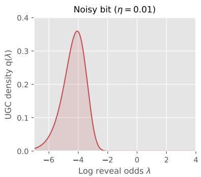  
(a)

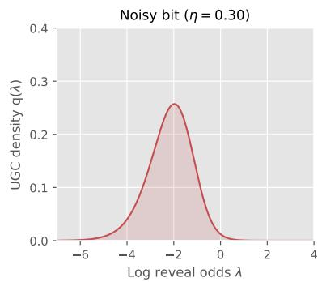  
(b)

(c)  
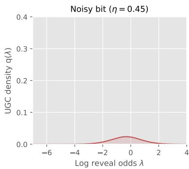  
Figure 1. Plots of the log-reveal-odds UGC density q for the noisy repeated-bit ensemble for $\eta \in$ $\{ 0 . 0 1 , 0 . 3 0 , 0 . 4 5 \}$ . The density has a sharp peak for $\eta = 0 . 0 1$ , and then flattens out and shifts to the right as $\eta  0 . 5 .$ Up to two digits of accuracy, we have $\mathrm { R a t i o } ( \mathbb { P } _ { Z } ) \in \{ 4 . 5 1 , 2 . 1 6 , 1 . 6 5 \}$ in panels (a), (b), and (c), respectively. For this example, we have Ratio $( \mathbb { P } _ { Z } ) \asymp \log ( d )$ as the dimension grows.

Figure 1 gives plots of the UGC density (4) in dimension $d = 1 2 8 .$ , and flip probabilities $\eta \in \{ 0 . 0 1 , 0 . 3 0 , 0 . 4 5 \}$ For $\eta = 0 . 0 1$ , the density has a sharp peak at a low value of the log-reveal-odds parameter λ. As $\eta$ increases, the dependence among the coordinates of the multivariate random vector $Z \in \{ 0 , 1 \} ^ { d }$ decreases; it takes a higher reveal level before information about the hidden bit U is revealed, as reflected by the rightward shift in the mode of the UGC density. In parallel with this rightward shift, the entire density collapses towards zero, so that ${ \mathsf { H } } ( 0 , 1 ) \to 0 \mathrm { ~ a s ~ } \eta \to 1 / 2$

Discrete mixture models: Our second ensemble corresponds to the discrete analog of a mixture model. More precisely, given a fixed set of M cluster centers, say $C ^ { 1 } , \ldots , C ^ { M } \in \{ 0 , 1 \} ^ { d }$ , we generate a binary random vector $Z = ( Z _ { 1 } , \dots , Z _ { d } ) \in \{ 0 , 1 \} ^ { d }$ with components $Z _ { i } = C _ { i } ^ { J } \oplus \xi _ { i }$ for $i = 1 , \ldots , d ,$ where the random cluster index J is drawn uniformly at random from $\{ 1 , \dots , M \}$ and the $\xi _ { i } \sim \mathsf { B e r } ( \eta )$ are drawn i.i.d., and independently of the cluster index. This procedure generates an M-component mixture distribution with uniform weight $1 / M$ on each component.

We studied this family for varying dimensions d divisible by four, number of mixture components $M =$ $2 ^ { d / 4 }$ , and cluster centers sampled independently and uniformly from the Boolean hypercube $\{ 0 , 1 \} ^ { d }$ . Figure 2 shows a sequence of UGC densities for this family, with the dimension d and the number $M = 2 ^ { d / 4 }$ of mixture components increasing as we move from left to right. The density is unimodal in all cases; as the dimension increases, the peak location remains fixed but its height increases. It can be shown that the ratio (6) scales as Ratio $( \mathbb { P } _ { Z } ) = \widetilde { \Theta } ( \sqrt { d } )$ , so that there are significant gains from using geometry-aware stepsizes. Moreover, since the UGC density is concentrated around a single increasingly narrow transition window, a partition with only $K = 3$ blocks—one covering this transition and two covering its tails—achieves the fine-partition complexity up to logarithmic factors. See Section 2.2.2 and Figure 2 for further discussion of these factors.

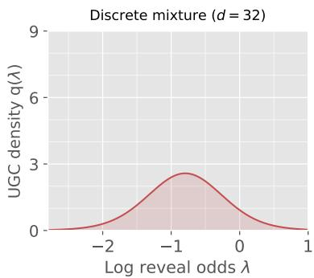  
(a)

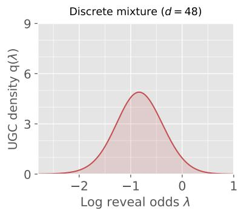  
(b)

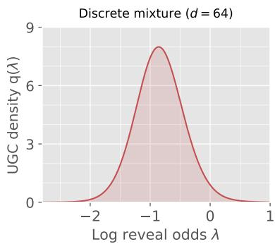  
(c)  
Figure 2. Plots of the log-reveal-odds UGC density q for the discrete mixture model. For each dimension $d ,$ the latent vector $Z \in \{ 0 , 1 \} ^ { d }$ is generated by selecting uniformly from $M = 2 ^ { d / 4 }$ cluster centers, and then flipping each coordinate independently with probability $\eta = 0 . 0 2$ . Panels (a)–(c) correspond to d $\in \{ 3 2 , 4 8 , 6 4 \}$ , and hence $M \in \{ 2 5 6 , 4 0 9 6 , 6 5 5 3 6 \}$ , respectively. Increasing the dimension produces a progressively sharper and taller spike. Up to two digits of accuracy, we have Ratio ${ \bf \Phi } ( \mathbb { P } _ { Z } ) \in \{ 2 . 1 9 , 3 . 1 3 , 3 . 8 5 \}$ in panels (a), (b), and (c), respectively. For this example, it can be shown that Ratio $( \mathbb { P } _ { Z } ) = \widetilde { \Theta } ( \sqrt { d } )$ as the dimension grows.

Hierarchical mixture model: The previous examples, being quite simple in nature, all led to unimodal UGC densities. We now consider a hierarchical model in which multiple peaks emerge, and the peaks have interesting meanings in terms of the underlying data geometry.

For an integer $L \geq 2$ , we construct a model that places mass on exactly $2 ^ { L }$ prototypes in the Boolean hypercube $\{ 0 , 1 \} ^ { d }$ , say $\{ V ^ { 1 } , \ldots , V ^ { M } \}$ , where $M = 2 ^ { L }$ . Each prototype is defined by a path down a binary tree of depth $L ;$ see the left column of Figure 3 for some examples. The geometry of the prototypes is related to the tree structure in the following way: for any tree level $\ell \in \{ 1 , \ldots , L \}$ , a pair of prototypes $V ^ { a }$ and $V ^ { b }$ whose corresponding tree paths first diverge at level ℓ of the tree are separated by Hamming distance $\Delta _ { \ell } .$ for some pre-specified set of distances $\{ \Delta _ { \ell } \} _ { \ell = 1 } ^ { L }$ , and total dimension $\begin{array} { r } { d = \sum _ { \ell = 1 } ^ { L } \dot { \Delta _ { \ell } } } \end{array}$ . Panel (a) of Figure 3 shows a toy example with $L = 2 , ( \Delta _ { 1 } , \Delta _ { 2 } ) \stackrel { . } { = } ( 1 2 , 2 )$ , and dimension $d = 1 2 + 2 = 1 4$ . It has $M = 2 ^ { L } = 4$ prototype vectors in $\{ 0 , 1 \} ^ { 1 4 }$ , assigned the index labels {00, 01, 10, 11}, plotted as rows in the corresponding black-white matrix. Consider the pair of prototypes indexed by 00 and 11 respectively; they diverge at level $\ell = 1$ of the tree, and their Hamming distance is equal to $\Delta _ { 1 } = 1 2$ . Similarly, the prototypes indexed by 00 and 01 diverge at level $\ell = 2$ of the tree, and have Hamming distance $\Delta _ { 2 } = 2$ . Panel (c) illustrates a larger construction with $L = 4 .$ , still in a toy dimension $d = 3 4$ for illustrative purposes.

Panels (b) and (d) show the UGC densities for the $L = 2$ and $L = 4$ models, using larger separations and dimensions: the $L = 2$ model has dimension $d = 3 2 7 7 6$ and $( \Delta _ { 1 } , \Delta _ { 2 } ) = ( 3 2 7 6 8 , 8 )$ , whereas the $L = 4$ model has dimension $d = 3 4 9 5 2$ and $( \Delta _ { 1 } , \Delta _ { 2 } , \Delta _ { 3 } , \Delta _ { 4 } ) = ( 3 2 7 6 8 , 2 0 4 8 , 1 2 8 , 8 )$ . Note how the UGC density for the $L = 2$ model has two distinct peaks in log-reveal odds. The level $\ell = 1$ ambiguity is resolved at an earlier reveal time, since the corresponding prototypes difer by Hamming distance $\Delta _ { 1 } = 3 2 7 6 8 ;$ the second peak corresponds to the later reveal time at which the level $\ell = 2$ ambiguity, corresponding to Hamming separation $\Delta _ { 2 } = 8$ , is resolved. Similar comments apply to the $L = 4$ peaks for the UGC density in panel (d).

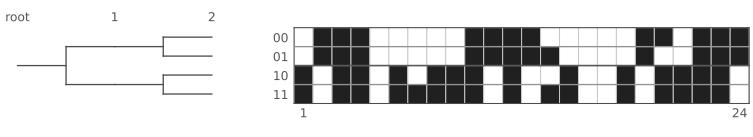  
Schematic Hamming scales: 1 = 12, 2 = 2  
(a)

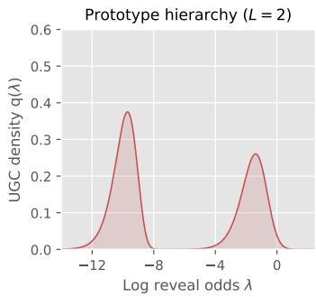  
(b)

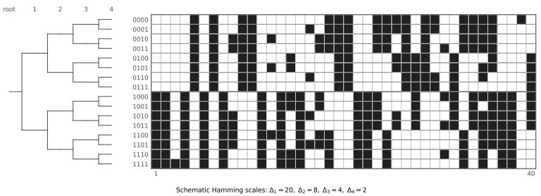  
(c)

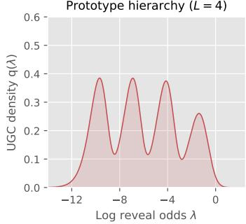  
(d)  
Figure 3. Hierarchical binary-prototype mixtures and their log-reveal-odds UGC densities. The rows correspond to hierarchy depths $L = 2$ and $L = 4 .$ . Left column panels (a) and (c) show the leaf prototypes, while right column panels (b) and (d) show the corresponding UGC densities q.

## 2.2.2 From coarse to fine geometry

Let us describe how we exploit finer-grained UGC geometry for algorithmic purposes. A single-block scheme uses one geometric multiplier across the full log-reveal-odds interval, and its performance is governed by the coarse complexity $\mathsf { C } _ { \mathsf { U G C } }$ . In order to exploit local UGC geometry, we instead partition the interval $[ - \ell _ { d } , \ell _ { d } ]$ into K blocks and allow a diferent geometric multiplier on each block. For a partition $\mathcal { P } = \{ [ \lambda _ { k } , \lambda _ { k + 1 } \mathbf { \bar { j } } ] \} _ { k = 0 } ^ { K - 1 } ,$ define the block lengths $\mathsf { S } _ { k } = \lambda _ { k + 1 } - \lambda _ { k }$ and the associated UGC increments $\begin{array} { r } { \mathsf { H } _ { k } = \int _ { \lambda _ { k } } ^ { \lambda _ { k + 1 } } \mathsf { q } ( \lambda ) d \lambda } \end{array}$ . Optimizing the geometric multipliers over these blocks leads to the partition complexity

$$
\mathsf C ( \mathcal P ) : = \left( \sum _ { k = 0 } ^ { K - 1 } \sqrt { \mathsf S _ { k } \mathsf H _ { k } } \right) ^ { 2 } .\tag{7a}
$$

Proposition 1 shows that this quantity governs the iteration complexity of the resulting K-block sampler. Although the optimal multipliers depend on the unknown increments $\mathsf { H } _ { k } .$ , these increments can be estimated from clean samples. We use these estimates to choose the partition and its multipliers from data, leading to the certified guarantees; see Proposition 2 and Theorem 2. Progressive refinement interpolates between the coarse single-block complexity and the fine-partition limit (5b). In particular, in Theorem 3, we prove that

$$
\operatorname* { i n f } _ { P } \mathbb { C } ( \mathcal { P } ) \ = \ \Big ( \int _ { - \ell _ { d } } ^ { \ell _ { d } } \sqrt { \mathsf { q } ( \lambda ) } d \lambda \Big ) ^ { 2 } \qquad \mathrm { w h e r e ~ t h e ~ i n f i m u m ~ i s ~ o v e r ~ p a r t i t i o n s ~ o f ~ } [ - \ell _ { d } , \ell _ { d } ] .\tag{7b}
$$

Thus, increasing the number of blocks allows the sampler to exploit increasingly fine features of the local UGC geometry, and ultimately achieve the fine-grained complexity based on $\sqrt { \mathsf { q } }$

Illustrative example: Figure 4 illustrates this coarse-to-fine interpolation for the discrete-mixture model underlying Figure 2. For $d = 6 4$ , the single-block scheme has complexity $\mathsf { C } _ { \mathsf { U G C } } \approx 6 5 . 0 .$ . A three-block partition that allocates finer resolution around the narrow high-density region reduces the partition complexity to approximately 23.5, compared with the fine-partition value $\mathsf { P _ { U G C } } \approx 1 6 . 9$

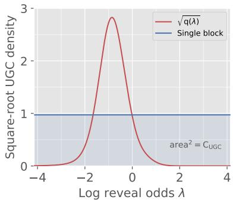  
(a)

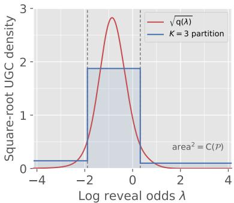  
(b)  
Figure 4. Block geometry for the $d = 6 4$ random discrete mixture with $M = 2 ^ { d / 4 }$ and $\eta = 0 . 0 2$ . Both panels show the square-root UGC density $\sqrt { \mathsf { q } }$ versus the log-reveal-odds $\lambda .$ Panel $\mathrm { ( a ) }$ uses a single geometric multiplier, yielding $\mathsf { C } _ { \mathsf { U G C } }$ ≈ 65.0. Panel (b) uses the illustrated $K = 3$ block partition, yielding ${ \mathsf { C } } ( \mathcal { P } ) \approx 2 3 . 5$ The fine-partition complexity for this example is $\mathsf { P _ { U G C } } \approx 1 6 . 9$

The three-block scheme devotes more iterations to the narrow high-UGC region and fewer to the flatter tails. Even this coarse adaptation captures most of the available improvement: the complexity drops from approximately 65.0 to 23.5, substantially closing the gap to the fine-partition value 16.9. This example illustrates the basic role of adaptive partitioning: computation is allocated according to where the UGC mass is concentrated, rather than uniformly across the reveal path.

## 3 Unmasking samplers and KL discretization error

We now turn to the description and analysis of some simple unmasking samplers. At a high level, they are based on discretized approximations to the unmasking reveal process $\{ X _ { t } , t \in [ 0 , 1 ] \}$ from equation (1b). Recalling that $\mathcal M ( x )$ denotes the set of masked coordinates in the vector $x ,$ their updates involve the singlesite posterior distributions

$$
\mu _ { i } ( a , x ) : = \mathbb { P } \big ( Z _ { i } = a \mid Z _ { j } = x _ { j } \quad \mathrm { f o r ~ a l l ~ } j \not \in \mathcal { M } ( x ) \big ) , \quad \mathrm { d e f i n e d ~ f o r ~ e a c h ~ } i \in \mathcal { M } ( x ) ,\tag{8}
$$

where $a \in { \mathcal { A } }$ and $x \in ( \mathcal { A } \cup \{ \star \} ) ^ { d }$ . We use $\mu$ to denote the full collection of these distributions, and often refer to it as the denoiser. It summarizes residual uncertainty in $Z$ given the observation x.

In practice, the denoiser $\mu$ is estimated based on samples from $\mathbb { P } _ { Z }$ as follows. Given a clean sample $Z \sim \mathbb { P } _ { Z }$ , we can generate training examples by independently masking random subsets of coordinates. We then predict the original value of each masked coordinate from the resulting partially observed sample using cross-entropy loss. With this set-up, the population-optimal predictors are given by the posterior distributions $\mu _ { i } ( \cdot , x )$ , and the training procedure generates estimates $\widehat { \mu } _ { i }$ for each $i = 1 , \ldots , d .$ For simplicity, we describe the algorithms using the exact denoiser $\mu .$ . Using a learned denoiser $\widehat { \mu }$ contributes an additional term to the KL error bound in a standard way; see equation (18) following the statement of Theorem 1 for details.

## 3.1 Bernoulli and fixed-cardinality unmasking

We now describe the two standard unmasking samplers that we analyze in this paper. At a high level, they involve two basic operations: choosing a subset of indices and then, conditional on this subset, making a random choice of values for the revealed variables using the denoiser $\mu .$ The samplers that we analyze difer only in how the random subset is chosen: the Bernoulli sampler uses coin flips, thereby generating a set with a random cardinality, whereas the fixed-cardinality sampler chooses a random subset with fixed cardinality. Both samplers are used in practice, and our theory gives a unified analysis of both in terms of UGC functions.

Given a subset $A \subseteq [ d ]$ of coordinates, both samplers make use of the conditional distribution

$$
\mathbb { P } _ { \mathrm { u n a s k } } ( X ^ { \prime } \mid X , A ) : = \left( \bigotimes _ { i \notin \mathcal { M } ( X ) } \delta _ { X _ { i } } \right) \otimes \left( \bigotimes _ { i \in \mathcal { A } } \mu _ { i } ( \cdot , X ) \right) \otimes \left( \bigotimes _ { i \in \mathcal { M } ( X ) \backslash A } \delta _ { \star } \right) , \qquad { \mathrm { f o r ~ } } A \subseteq \mathcal { M } ( X ) ,\tag{9a}
$$

which fixes all observed variables $( { \mathrm { i . e . } }$ ., indices $i \not \in { \mathcal { M } } ( X ) )$ ; fixes all missing variables not in $A ;$ and makes a random update to variables in A. Moreover, for an iteration count $N \geq 1$ , both samplers are based on a reveal-time grid

$$
0 < t _ { 0 } < t _ { 1 } < \cdot \cdot \cdot < t _ { N } < 1 .\tag{9b}
$$

The samplers are initialized with a random choice $\widehat { X } ^ { 0 } \sim \mathbb { Q } _ { t _ { 0 } } .$ and then generate a sequence $\{ \widehat { X } ^ { j } \} _ { j = 0 } ^ { N }$ moving forward in time across the grid (9b).

## 3.1.1 Bernoulli unmasking sampler

We begin by describing the Bernoulli unmasking sampler. It chooses subsets according to the binomial distribution

$$
\mathbb { P } _ { \mathrm { B e r } } \bigl ( A \mid X , \beta \bigr ) : = \beta ^ { \operatorname { c a r d } ( A ) } ( 1 - \beta ) ^ { \operatorname { c a r d } \left( \mathcal { M } ( X ) \backslash A \right) } \qquad \mathrm { w i t h ~ s u p p o r t ~ } A \subseteq \mathcal { M } ( X ) ,\tag{10}
$$

and then updates entries according to the conditional distribution (9a). More precisely, given the initialization ${ \widehat { X } } ^ { 0 }$ and reveal-time grid (9b), it generates the sequence

$$
\mathrm { D r a w ~ r a n d o m ~ b i n o m i a l ~ s u b s e t } : A ^ { j } \sim \mathbb { P } _ { \mathrm { B e r } } \big ( \cdot \mid \widehat X ^ { j } , \beta _ { j } \big ) , \qquad \mathrm { w h e r e ~ } \beta _ { j } : = \frac { t _ { j + 1 } - t _ { j } } { 1 - t _ { j } } ,\tag{11a}
$$

Random unmasking:

$$
\begin{array} { r } { \widehat { X } ^ { j + 1 } \sim \mathbb { P } _ { \mathrm { u m a s k } } \big ( \cdot \mid \widehat { X } ^ { j } , A ^ { j } \big ) , } \end{array}\tag{11b}
$$

for iterations $j = 0 , 1 , \ldots , N - 1$

## 3.1.2 Fixed-cardinality unmasking sampler

The fixed-cardinality sampler is very similar, except that it replaces the binomial subset choice (10) with a black-box that draws a uniformly random subset of a specified size. More precisely, the fixed-cardinality sampler only admits iteration counts $N < d - 1$ , and it requires that each reveal time be d-aligned, meaning that $t _ { j } ~ = ~ s _ { j } / d$ for integers $1 \le s _ { 0 } < \dots < s _ { N } \le d - 1$ . It initializes ${ \widehat { X } } ^ { 0 }$ with exactly $d - s _ { 0 }$ masked coordinates. Then, at iteration $j = 0 , \ldots , N - 1$ , the current state ${ \widehat { X } } ^ { j }$ has exactly $d - s _ { j }$ masked coordinates.

Draw fixed-cardinality subset:

$$
A ^ { j } \sim \operatorname { U n i f } { \Big \{ } A \subseteq { \mathcal { M } } ( { \widehat { X } } ^ { j } ) { \Big | } \operatorname { c a r d } ( A ) = s _ { j + 1 } - s _ { j } { \Big \} } .\tag{12a}
$$

Random unmasking:

$$
\begin{array} { r } { \widehat { X } ^ { j + 1 } \sim \mathbb { P } _ { \mathrm { u m a s k } } \big ( \cdot \mid \widehat { X } ^ { j } , A ^ { j } \big ) , } \end{array}\tag{12b}
$$

For future reference, we note that underlying the fixed-cardinality sampler is a de-Poissonized version of the unmasking process $\{ X _ { t } , t \in [ 0 , 1 ] \}$ }. It is defined only at d-aligned times $t = s / d$ , and the associated variable

$$
X _ { t } \sim \mathbb { P } _ { t } \mathrm { \qquad ~ h a s ~ e x a c t l y ~ } s \mathrm { ~ r e v e a l e d ~ c o o r d i n a t e s } ,\tag{13}
$$

for a subset of cardinality s chosen uniformly at random. Note that we are overloading our notation here, but the specific version of $\mathbb { P } _ { t }$ being used will be clear from context.

## 3.1.3 Initialization and completion steps

Both samplers involve initialization and completion steps. In our analysis, the initialization cost is measured by the KL divergence

$$
D _ { \mathrm { K L } } \bigl ( \mathbb { P } _ { t _ { 0 } } \| \mathbb { Q } _ { t _ { 0 } } \bigr ) \qquad \mathrm { w h e r e } ~ X _ { t _ { 0 } } \sim \mathbb { P } _ { t _ { 0 } } ~ \mathrm { a n d } ~ \widehat { X } ^ { 0 } \sim \mathbb { Q } _ { t _ { 0 } } .\tag{14a}
$$

Here $X _ { t _ { 0 } }$ is generated by the standard reveal process for the Bernoulli sampler (1b), and from its de-Poissonized analogue (13) for the fixed-cardinality sampler. Moreover, both samplers involve a final completion step, based on a completion kernel ${ \mathsf { C } } _ { T } ( \cdot \mid x )$ that maps each partially revealed terminal state $x \in ( A \cup \{ \star \} ) ^ { d }$ to a probability law on fully specified vectors in $\mathcal { A } ^ { d }$ . We denote the resulting completed output by Zb and its law by $\mathbb { P } _ { \widehat { Z } }$ . The defect of any completion kernel is measured by

$$
\Gamma _ { \mathsf { C } } ( T ) : = \mathbb { E } _ { X _ { T } } \left[ D _ { \mathrm { K L } } \left( { \mathcal { L } } ( Z \mid X _ { T } ) \parallel { \mathsf { C } } _ { T } ( \cdot \mid X _ { T } ) \right) \right] .\tag{14b}
$$

While these terms appear in our bounds, they are not dominant terms. For example, the following completion kernel C has defect equal to zero, and uses only card $\left( \mathcal { M } ( X _ { T } ) \right)$ serial updates. Fix an ordering of the indices in $\boldsymbol { \mathcal { M } } ( \boldsymbol { X _ { T } } )$ , and then sample from the conditional distributions $\mu _ { i }$ in sequence to fill in the missing entries. With the endpoint $\textstyle T = { \frac { d - 1 } { d } }$ , we have card $. ( \mathcal { M } ( X _ { T } ) ) = 1$ for the exact cardinality sampler and $\mathbb { E } [ \mathrm { c a r d } ( \mathcal { M } ( X _ { T } ) ) ] = 1$ for the Bernoulli sampler, so that the computational cost of implementing this completion kernel is minimal. Similarly, for initialization, it is easy to initialize the fixed-cardinality sampler with exactly one unmasked entry, so that the initialization cost vanishes for $t _ { 0 } = 1 / d .$ The bounds below are stated for a general interval $[ t _ { 0 } , T ]$ and arbitrary initialization-completion choices, but we later specialize to the interval $\textstyle \left[ { \frac { 1 } { d } } , 1 - { \frac { 1 } { d } } \right]$ , which we refer to as the canonical reveal time interval.

## 3.2 Unified analysis

We are now set up to state a single theorem that provides a unified analysis of both the Bernoulli and fixedcardinality unmasking samplers. Our original definition (2a) of the Bernoulli denoising gain h emphasizes the connection to the reveal process. Here, in order to make transparent the connections with fixed-cardinality sampling, we make use of the following equivalent representation:

$$
\mathsf { h } ( t ) = \sum _ { i = 1 } ^ { d } \mathbb { E } _ { A _ { i , t } } \big [ \operatorname { I n f o } ( Z _ { i } ; Z _ { A _ { i , t } } ) \big ] ,\tag{15a}
$$

where $A _ { i , t } \subseteq [ d ] \setminus \{ i \}$ is a random subset obtained by including each coordinate of $[ d ] \ \backslash \ \{ i \}$ independently with probability t. See Section B for the proof of this alternative representation. The analogue for the fixed-cardinality sampler is given by the fixed-cardinality unmasking gain coeficients

$$
\mathsf { h } _ { j } ^ { \mathrm { c a r d } } : = \sum _ { i = 1 } ^ { d } \mathbb { E } _ { B _ { i , j } } \left[ \mathrm { I n f o } ( Z _ { i } ; Z _ { B _ { i , j } } ) \right]
$$

$$
B _ { i , j }
$$

$$
[ d ] \backslash \{ i \}\tag{15b}
$$

These coeficients are defined for $j = 1 , \ldots , d - 1$ , with $\mathsf { h } _ { 0 } ^ { \mathrm { c a r d } } : = 0$

These two notions lead to the two versions of UGC growth complexity, given by

Bernoulli:

$$
\forall ( p , q ) : = \int _ { p } ^ { q } t ( 1 - t ) \mathsf { h } ^ { \prime } ( t ) d t \qquad \mathrm { f o r ~ p a i r s ~ } 0 \leq p < q \leq 1 , { \mathrm { ~ a n d ~ } }\tag{16a}
$$

Exact cardinality:

$$
\mathsf { H } ^ { \mathrm { c a r d } } ( a , b ) : = \sum _ { j = a + 1 } ^ { b - 1 } \left( \frac { j } { d } \right) \left( 1 - \frac { j } { d } \right) \bigl \{ \mathsf { h } _ { j } ^ { \mathrm { c a r d } } - \mathsf { h } _ { j - 1 } ^ { \mathrm { c a r d } } \bigr \} , \qquad 0 \leq a < b \leq d .\tag{16b}
$$

Our main theorem bounds the KL error of both the Bernoulli and fixed-cardinality unmasking samplers in terms of increments of these respective UGC functions. It applies to any reveal-time grid (9b), and the analysis shows why the reveal odds function $\textstyle \psi ( t ) : = { \frac { t } { 1 - t } }$ is natural.

Theorem 1. For any grid (9b), the Ber-unmasking sampler produces output $\widehat { Z }$ such that

$$
D _ { \mathrm { K L } } ( \mathbb { P } _ { Z } \| \mathbb { P } _ { \widehat { Z } } ) \leq \sum _ { j = 0 } ^ { N - 1 } \{ \frac { \psi ( t _ { j + 1 } ) } { \psi ( t _ { j } ) } - 1 \} \mathsf { H } ( t _ { j } , t _ { j + 1 } ) + D _ { \mathrm { K L } } ( \mathbb { P } _ { t _ { 0 } } \| \mathbb { Q } _ { t _ { 0 } } ) + \Gamma \mathsf { c } ( T ) .\tag{17a}
$$

Moreover, for any d-aligned grid $\begin{array} { r } { t _ { j } = \frac { a _ { j } } { d } } \end{array}$ , the Card-unmasking sampler produces output $\widehat { Z } ^ { \mathrm { c a r d } }$ such that

$$
D _ { \mathrm { K L } } ( \mathbb { P } _ { Z }  \mathbb { P } _ { \widehat { Z } ^ { \mathrm { c a r c } } } ) \leq \sum _ { j = 0 } ^ { N - 1 } \{ \frac { \psi ( t _ { j + 1 } ) } { \psi ( t _ { j } + \frac { 1 } { d } ) } - 1 \} \mathsf { H } ^ { \mathrm { c a r d } } ( a _ { j } , a _ { j + 1 } ) + D _ { \mathrm { K L } } ( \mathbb { P } _ { t _ { 0 } } \| \mathbb { Q } _ { t _ { 0 } } ) + \Gamma _ { \mathsf { C } } ( T ) .\tag{17b}
$$

We prove these two claims in Sections 6.1 and 6.2, respectively. The proofs are relatively short, and follow the same template of starting from an exact representation of the KL discretization error over the interval, and then bounding it in terms of H or ${ \mathsf { H } } ^ { \mathrm { c a r d } }$ respectively. For the Bernoulli sampler, we first derive the exact KL representation, from which the upper bound (17a) follows from an elementary argument. On the other hand, the fixed-cardinality guarantee (17b) makes use of the exact representation of the KL discretization error, derived by Chen et al. [CCL25]; in particular, the coeficients $\mathsf { h } _ { j } ^ { \mathrm { c a r d } }$ are rescaled versions of their information coeficients. In contrast to our upper bounds, neither form of the exact KL error has simple additive structure in terms of the log-reveal odds. This structure in our upper bounds turns out to be very useful: as we discuss in the sequel (see Corollary 1 and Section A), a simple stepsize choice in the bound (17b) gives an immediate sharpening of the fixed-cardinality sampling guarantees given in the paper [CCL25]. More generally, these upper bounds lend themselves naturally to developing and analyzing K-block sampling schemes (see Section 4).

Estimated denoisers: If the sampler replaces each exact single-site posterior $\mu _ { i } ( \cdot , x )$ by an estimate $\widehat { \mu } _ { i } ( \cdot , x )$ , while leaving the random-subset law and reveal probabilities unchanged, then the right-hand side of equation (17a) acquires the additional additive term

$$
\mathsf { E } _ { \mathrm { d o n } } ( \widehat { \mu } ) : = \sum _ { j = 0 } ^ { N - 1 } \beta _ { j } \mathbb { E } \Big [ \sum _ { i \in M ( X _ { t _ { j } } ) } D _ { \mathrm { K L } } \left( \mu _ { i } ( \cdot , X _ { t _ { j } } ) \left. \widehat { \mu } _ { i } ( \cdot , X _ { t _ { j } } ) \right) \right. \Big ] \qquad \mathrm { w h e r e ~ } \beta _ { j } : = \frac { t _ { j + 1 } - t _ { j } } { 1 - t _ { j } } .\tag{18}
$$

Here the expectation is under the true reveal-process law of $X _ { t _ { j } }$ . A similar comment applies to the Cardunmasking sampler. We establish this fact as part of the proof in Section 6.1.

Relation between UGC functions: By inspection, it is clear that the Ber-UGC and Card-UGC functions, as defined in equation (2c) and equation (16b) respectively, are closely related. This intuition can be formalized as follows. For any $0 \leq p < q \leq 1$ , define the multinomial triple $( U _ { 0 } , U _ { 1 } , U _ { 2 } ) \ \sim$ Multinomial $( d + 1 ; p , q - p , 1 - q )$ . We then have the equivalence

$$
{ \sf H } ( p , q ) = \frac { d } { d + 1 } \mathbb { E } \left[ { \sf H } ^ { \mathrm { c a r d } } ( A _ { U } , B _ { U } ) \right] ,\tag{19}
$$

where $A _ { U } : = \operatorname* { m a x } \{ U _ { 0 } - 1 , 0 \}$ , and $B _ { U } : = \operatorname* { m i n } \{ U _ { 0 } + U _ { 1 } , d \}$ , and we set ${ \mathsf { H } } ^ { \mathrm { c a r d } } ( a , b ) = 0$ whenever $a \geq b .$ Thus, the Ber-UGC over $[ p , q ]$ is the average of Card-UGC quantities over randomized cardinality endpoints. See Section C.1.2 for the proof of the identity (19).

## 3.3 A single-block guarantee and its consequences

By inspection, the bounds (17a) and (17b) are very well-suited to unmasking-time grid points $\{ t _ { j } \} _ { j = 0 } ^ { N - 1 }$ for which the reveal odds $\psi ( t _ { j } ) = t _ { j } / ( 1 - t _ { j } )$ evolve in a geometric way. In this section, we use Theorem 1 to derive guarantees for this particularly simple choice of stepsizes.

## 3.3.1 Guarantees for a single geometric block

For a parameter $\rho > 0$ , consider the sequence

$$
\mathrm { \bf G e o } ( \rho ) : \qquad \psi ( t _ { j + 1 } ) = \mathrm { m i n } \left\{ ( 1 + \rho ) \psi ( t _ { j } ) , \psi ( T ) \right\} .\tag{20}
$$

When the unmasking algorithm is run with this geometric sequence, we refer to it as the ${ \mathrm { G e o } } ( \rho )$ -unmasking algorithm.

Corollary 1 (Single-block guarantee for a reveal-odds geometric scheme). Given an iteration budget $\begin{array} { r } { N \ge \log \left( \frac { \psi ( T ) } { \psi ( t _ { 0 } ) } \right) } \end{array}$ , the ${ \mathrm { G e o } } ( \rho )$ -unmasking sampler with multiplier $\begin{array} { r } { \rho : = \exp \left\{ \frac { 1 } { N } \log ( \psi ( T ) / \psi ( t _ { 0 } ) ) \right\} - 1 } \end{array}$ produces completed output $\widehat { Z }$ such that

$$
D _ { \mathrm { K L } } ( \mathbb { P } _ { Z } \Vert \mathbb { P } _ { \widehat { Z } } ) \leq \frac { 2 \mathsf { H } ( t _ { 0 } , T ) } { N } \log \left( \frac { \psi ( T ) } { \psi ( t _ { 0 } ) } \right) + D _ { \mathrm { K L } } ( \mathbb { P } _ { t _ { 0 } } \Vert \mathbb { Q } _ { t _ { 0 } } ) + \Gamma _ { \mathsf { C } } ( T ) .\tag{21}
$$

This result is an immediate consequence of Theorem 1, and we include the proof here. It makes essential use of the additivity property (3) of H.

Proof. By construction, the schedule traverses the interval $[ t _ { 0 } , T ]$ in exactly N steps, and moreover, we have $\begin{array} { r } { \frac { \psi ( t _ { j + 1 } ) } { \psi ( t _ { j } ) } - 1 \leq \rho } \end{array}$ at each round. Applying the bound (17a) from Theorem 1 yields

$$
\begin{array} { r l } & { { D } _ { \mathrm { K L } } ( \mathbb { P } _ { \boldsymbol Z } \| \mathbb { P } _ { \widehat { Z } } ) \leq \underset { \stackrel { ( i ) = 0 } { \underbrace { ( i ) } } \mu \mathsf { H } ( t _ { 0 } , T ) \atop \stackrel { ( i ) } { = } \mu \mathsf { H } ( t _ { 0 } , T ) \hphantom { ( } } { \log \big ( \frac { \psi ( T ) } { \psi ( t _ { 0 } ) } \big ) } + { D } _ { \mathrm { K L } } ( \mathbb { P } _ { t _ { 0 } } \| \mathbb { Q } _ { t _ { 0 } } ) + \Gamma _ { \mathsf { C } } ( T ) } \\ & { \overset { ( i i ) } { \leq } \frac { 2 \mathsf { H } ( t _ { 0 } , T ) \hphantom { ( } \log \big ( \frac { \psi ( T ) } { \psi ( t _ { 0 } ) } \big ) + { D } _ { \mathrm { K L } } \big ( \mathbb { P } _ { t _ { 0 } } \| \mathbb { Q } _ { t _ { 0 } } \big ) + \Gamma _ { \mathsf { C } } ( T ) , } { N } } \end{array}
$$

where step (i) uses the additivity property (3), and step (ii) follows since $\exp ( u ) - 1 \leq 2 u$ for $u \in [ 0 , 1 ]$ applied with $\begin{array} { r } { u = \frac { 1 } { N } \log \left( \frac { \psi ( T ) } { \psi ( t _ { 0 } ) } \right) } \end{array}$ □

Exact cardinality sampler: An analogous result holds for the fixed-cardinality uniform sampler, using a slightly diferent geometric schedule. Given a pair of integers $a _ { 0 } < A$ between 1 and $d - 1$ , we define $\begin{array} { r } { t _ { 0 } = \frac { a _ { 0 } } { d } } \end{array}$ and $\textstyle T = { \frac { A } { d } }$ . Given an iteration budget $\begin{array} { r } { N \geq \log \Big ( \frac { \psi ( T ) } { \psi ( t _ { 0 } + \frac { 1 } { d } ) } \Big ) } \end{array}$ , starting from $a _ { 0 }$ , we recursively choose $a _ { j + 1 }$ as the largest integer in $\{ a _ { j } + 1 , \ldots , A \}$ such that

$$
\psi \big ( \frac { a _ { j + 1 } } { d } \big ) \leq ( 1 + \rho ) \psi \left( \frac { a _ { j } + 1 } { d } \right) \qquad \mathrm { w h e r e } ~ \rho : = \exp \Big \{ \frac { 1 } { N } \log \big ( \frac { \psi ( T ) } { \psi ( t _ { 0 } + \frac { 1 } { d } ) } \big ) \Big \} - 1 .
$$

With these choices, running the fixed-cardinality sampler yields completed output $\widehat { Z } ^ { \mathrm { c a r d } }$ such that

$$
D _ { \mathrm { K L } } ( \mathbb { P } _ { Z }  \mathbb { P } _ { \widehat { Z } ^ { \mathrm { c a r d } } } ) \leq \frac { 2 \mathsf { H } ^ { \mathrm { c a r d } } ( a _ { 0 } , A ) } { N } \log \Big ( \frac { \psi ( T ) } { \psi ( t _ { 0 } + \frac { 1 } { d } ) } \Big ) + D _ { \mathrm { K L } } ( \mathbb { P } _ { t _ { 0 } } \| \mathbb { Q } _ { t _ { 0 } } ) + \Gamma _ { \mathsf { C } } ( T ) .
$$

The proof uses the bound (17b) from Theorem 1, and then applies the same reasoning as the proof of Corollary 1.

## 3.3.2 Some consequences

At a high level, Corollary 1 and its analogue for fixed-cardinality sampling show that the iteration complexity when using a single geometric multiplier protocol is governed by the aggregate UGC mass functionals H(0, 1) and $\mathsf { H } ^ { \mathrm { c a r d } } ( 0 , d )$ , respectively, for the Bernoulli and fixed-cardinality versions. These relations allow us to recover and sharpen several existing results on unmasking samplers. As we show in Section $\mathrm { A } ,$ the aggregate UGC complexities associated with Bernoulli and fixed-cardinality unmasking are equivalent up to universal constants, and they are closely related to the complexity governing the CTMC guarantees of Dmitriev et al. [DHW26]. Consequently, the single-block guarantee in Corollary 1 yields comparable guarantees for these diferent unmasking mechanisms, while sharpening bounds based only on total correlation and dual total correlation. We defer these comparisons, together with further information-theoretic aspects of aggregate UGC, to Section A.

## 3.4 Why the UGC path matters

The aggregate UGC complexity is a coarse measure, relative to the full log-reveal-odds density that captures the full UGC path. It is useful to consider a stylized pair of distributions, based on some primitives analyzed in the paper [DHW26], that makes this discrepancy very explicit: while their aggregate complexities are identical, the UGC path structure is extremely diferent, and as we will see in the next section, the resulting optimal algorithms are very diferent. Recall that the log-reveal-odds UGC density is given by

$$
\begin{array} { r } { \mathsf { q } ( \lambda ) = r ^ { 2 } ( 1 - r ) ^ { 2 } \mathsf { h } ^ { \prime } ( r ) \qquad \mathrm { w h e r e } \ r = \varphi ^ { - 1 } ( \lambda ) = \frac { e ^ { \lambda } } { 1 + e ^ { \lambda } } . } \end{array}\tag{23}
$$

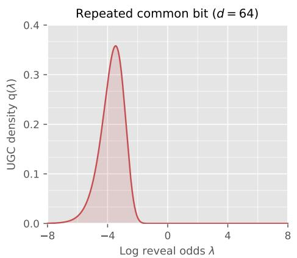  
(a)

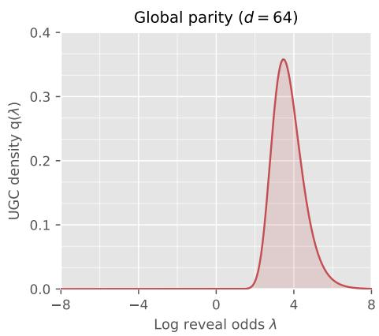  
(b)  
Figure 5. Log-reveal-odds UGC densities for the repeated-common-bit model in panel (a) and the globalparity model in panel (b), both with $d = 6 4$ . The two densities are reflections of one another about $\lambda = 0$ in log-reveal-odds coordinates: their information is concentrated near opposite ends of the reveal path even though their full-path UGC values agree.

Repeated bit: First, suppose that we draw a hidden $V \sim \mathsf { B e r } ( 1 / 2 )$ , and then generate the random vector $Z \in \{ 0 , 1 \} ^ { d }$ by setting $Z _ { 1 } = \cdots = Z _ { d } = V$ . This construction is simply the noiseless $( \eta = 0 )$ instance of the noisy-repeated-bit example discussed previously in Section 2.2.1, and moreover, we can compute its UGC density function explicitly. From equation (23), it sufices to compute h and then its derivative. Conditional on coordinate i remaining masked, its mutual-information contribution equals Ent $( V ) = \log 2$ once at least one of the other $d - 1$ coordinates is revealed; it is equal to zero otherwise. It follows that $\mathsf { h } _ { \mathrm { r e p } } ( r ) = d \log 2 \big \{ 1 - ( 1 - r ) ^ { d - 1 } \big \}$ . Taking derivatives and combining with the formula (23) yields

$$
{ \bf q } _ { \mathrm { r e p } } ( \lambda ) = \left\{ d ( d - 1 ) \log 2 \right\} r ^ { 2 } ( 1 - r ) ^ { d } .\tag{24a}
$$

Global-parity model: In the global-parity model, draw $Z _ { 1 } , \dots , Z _ { d - 1 }$ independently from $\mathsf { B e r } ( 1 / 2 )$ and set $Z _ { d } = Z _ { 1 } \oplus \cdot \cdot \cdot \oplus Z _ { d - 1 }$ . Calculations similar to those in the previous example show that

$$
{ \mathfrak { q } } _ { \mathrm { p a r } } ( \lambda ) = \left\{ d ( d - 1 ) \log 2 \right\} ( 1 - r ) ^ { 2 } r ^ { d } .\tag{24b}
$$

We plot these two UGC densities in Figure 5. Comparing equation (24a) and equation (24b) reveals the relat $\operatorname { i o n } ^ { 2 } \mathsf { q } _ { \mathrm { p a r } } ( \lambda ) = \mathsf { q } _ { \mathrm { r e p } } ( - \lambda )$ , which corresponds to reflection across $\lambda = 0$ in log-reveal-odds. This reflection can be seen by comparing the two panels.

As can be verified via a straightforward calculation, both models have $\begin{array} { r } { \mathsf { H } ( 0 , 1 ) = \frac { ( d - 1 ) } { ( d + 1 ) } } \end{array}$ log 2, so that they have matched aggregate UGC mass. However, the full UGC path reveals the diferences in their distributional structure: the repeated-bit dependence is resolved near the beginning of the path, whereas parity dependence persists until the end. Moreover, as we develop in the next section, this path diference has important consequences for designing optimal algorithms.

## 4 Certified-optimal bounds for the UGC path

Thus far, we have considered the single-block consequence of Theorem 1, based on one geometric multiplier over the full reveal interval. The additivity (3) of the UGC function allows a more refined approach. We first partition the reveal interval into K blocks, and then optimize the stepsizes within each block. Doing so leads to a UGC partition complexity that refines the coarse UGC bound. We then show how the required UGC increments can be estimated from samples, yielding certified data-dependent samplers and allowing the block boundaries themselves to be optimized. Finally, by refining the partition, we recover the fine-partition complexity $\mathsf { P } _ { \mathsf { U G C } }$ in equation (5b), which characterizes the optimal discretization error up to a factor of two.

## 4.1 An optimal K-block guarantee

For some $0 < t _ { 0 } < T < 1$ , we begin with a prescribed K-block partition of the interval $[ t _ { 0 } , T ]$ , say of the form $\mathcal { P } : = \left\{ \left[ b _ { k } , b _ { k + 1 } \right] | k = 0 , \ldots , K - 1 \right\}$ , where $b _ { 0 } = t _ { 0 }$ and $b _ { K } = T$ . For each block, define its log-reveal-odds length and UGC mass by

$$
\mathsf { S } _ { k } : = \varphi ( b _ { k + 1 } ) - \varphi ( b _ { k } ) , \quad \mathrm { a n d } \quad \mathsf { H } _ { k } : = \mathsf { H } ( b _ { k } , b _ { k + 1 } ) ,\tag{25}
$$

where we recall that $\varphi ( r ) : = \log ( r / ( 1 - r ) )$

Given a total iteration budget N, suppose that we allocate positive integers $N _ { k }$ with $\begin{array} { r } { \sum _ { k = 0 } ^ { K - 1 } N _ { k } = N } \end{array}$ We then run the Geo(ρ)-sampler to traverse the $k ^ { t h }$ -block in $N _ { k }$ iterations. Applying Theorem 1 blockwise yields

$$
D _ { \mathrm { K L } } ( \mathbb { P } _ { Z } \Vert \mathbb { P } _ { \widehat { Z } } ) \leq \sum _ { k = 0 } ^ { K - 1 } \Big [ \exp \big \{ \mathsf { S } _ { k } / N _ { k } \big \} - 1 \Big ] \mathsf { H } _ { k } + D _ { \mathrm { K L } } ( \mathbb { P } _ { t _ { 0 } } \Vert \mathbb { Q } _ { t _ { 0 } } ) + \Gamma \mathsf { c } ( T ) .\tag{26a}
$$

Here we have again used the additivity property (3) to bound the error of each block by the scalar multiple of its UGC mass. Hence, for the prescribed partition, the best guarantee furnished by Theorem 1 is obtained from the integer program

$$
\operatorname* { m i n } _ { N _ { 0 } , \ldots , N _ { K - 1 } > 0 } \quad \sum _ { k = 0 } ^ { K - 1 } \Big [ \exp \big \{ \mathsf { S } _ { k } / N _ { k } \big \} - 1 \Big ] \mathsf { H } _ { k } \qquad \mathrm { s u b j e c t ~ t o } \qquad \sum _ { k = 0 } ^ { K - 1 } N _ { k } = N .\tag{26b}
$$

It is easy to see that this integer program can be solved eficiently by dynamic programming.

## 4.2 Guarantees for an explicit procedure

Rather than solving the dynamic program directly, we seek an explicit allocation that exposes the structure of its solution. Doing so leads to the UGC-based partition complexity

$$
\mathsf { C } _ { \mathsf { U G C } } ( \mathcal { P } ) : = \left( \sum _ { k = 0 } ^ { K - 1 } \sqrt { \mathsf { S } _ { k } \mathsf { H } _ { k } } \right) ^ { 2 } ,\tag{27}
$$

which interpolates between the single-block complexity (5a) and the fine-partition limit (5b).

Proposition 1 (Near-optimal geometric schedules for a K-block partition). Given any K-block partition P of $[ t _ { 0 } , T ]$ and an iteration budget $\begin{array} { r } { N \ge 2 \left\{ K + 2 \log \left( \frac { \psi ( T ) } { \psi ( t _ { 0 } ) } \right) \right\} } \end{array}$ , define the geometric multipliers

$$
\rho _ { k } : = \operatorname* { m i n } \left\{ 1 , 4 \frac { \sqrt { \mathsf { C } _ { U G C } ( \mathcal { P } ) } } { N } \sqrt { \frac { \mathsf { S } _ { k } } { \mathsf { H } _ { k } } } \right\} , \qquad k = 0 , 1 , \ldots , K - 1 .\tag{28a}
$$

Then the K-block Ber-unmasking procedure based on $\mathcal { P }$ uses at most $N$ score evaluations and yields an output $\widehat { Z }$ satisfying

$$
D _ { \mathrm { K L } } ( \mathbb { P } _ { Z } | | \mathbb { P } _ { \widehat { Z } } ) \leq \frac { 4 \mathsf { C } _ { U G C } ( \mathcal { P } ) } { N } + D _ { \mathrm { K L } } ( \mathbb { P } _ { t _ { 0 } } | | \mathbb { Q } _ { t _ { 0 } } ) + \Gamma _ { \mathsf { C } } ( T ) .\tag{28b}
$$

Moreover, if $( N _ { 0 } ^ { \star } , \ldots , N _ { K - 1 } ^ { \star } )$ denotes the optimal solution of the dynamic program (26b) with iteration budget N, then

$$
\sum _ { k = 0 } ^ { K - 1 } \rho ( N _ { k } ^ { \star } ) \mathsf { H } _ { k } \ge \frac { \mathsf { C } _ { U G C } ( \mathcal P ) } { N } \qquad w h e r e ~ \rho ( N _ { k } ^ { \star } ) : = \exp ( \mathsf { S } _ { k } / N _ { k } ^ { \star } ) - 1 .\tag{28c}
$$

The proof is an unmasking analogue of the argument used for Gaussian difusion in our companion paper [Wai26]. The principal changes are the log-reveal-odds clock, the corresponding UGC block masses, and the boundary terms; the remainder follows mutatis mutandis. This parallelism reflects a common geometric structure underlying Gaussian difusion and discrete unmasking, despite their diferent noise mechanisms and natural path coordinates.

The upper and lower bounds in Proposition 1 show that, apart from the initial and terminal cost, the explicit allocation is within a factor of 4 of the optimal value of the dynamic program (26b). It also always improves upon the single-block complexity. Indeed, by Cauchy–Schwarz and the additivity (3) of the UGC complexity, we have

$$
\mathsf { C } _ { \mathsf { u g c } } ( \mathcal { P } ) = \left( \sum _ { k = 0 } ^ { K - 1 } \sqrt { \mathsf { S } _ { k } \mathsf { H } _ { k } } \right) ^ { 2 } \leq \left( \sum _ { k = 0 } ^ { K - 1 } \mathsf { S } _ { k } \right) \left( \sum _ { k = 0 } ^ { K - 1 } \mathsf { H } _ { k } \right) = \left\{ \varphi ( T ) - \varphi ( t _ { 0 } ) \right\} \mathsf { H } ( t _ { 0 } , T ) = \mathsf { C } _ { \mathsf { u g c } } ( [ t _ { 0 } , T ] ) .\tag{29}
$$

Equality holds if and only if there is a scalar $c > 0$ such that ${ \mathsf S } _ { k } = c { \mathsf H } _ { k }$ for every block. Thus, partitioning provides a strict improvement whenever the UGC mass is distributed non-uniformly relative to log-reveal-odds length.

## 4.3 Sandwich-UGC estimators from KL increments

While the bounds in Proposition 1 are attractive, the geometric multipliers $\rho _ { k }$ depend on knowledge of the UGC increments ${ \sf H } _ { k }$ for each block k. In this section, we describe how it is possible to estimate these increments, assuming that we have available a collection of i.i.d. samples $\{ Z ^ { ( \ell ) } \} _ { \ell = 1 } ^ { m }$ from the original distribution $\mathbb { P } _ { Z }$ . This estimator forms the basis for the certified-optimal sampling schemes described in Section 4.4.

## 4.3.1 Kullback–Leibler unmasking increments

From the definition (2a), the Bernoulli unmasking gain h is defined in terms of the original reveal process $X _ { p }$ with additional conditioning on the event $\{ i \in \mathcal { M } ( X _ { p } ) \}$ . Consequently, it is useful to introduce the forcedmask reveal-time process that explicitly encodes this conditioning. Recalling the uniform random variables that underlie the masking process (1a), we define

$$
M _ { t | i } : = \{ i \} \cup \{ \ell \in [ d ] \setminus \{ i \} | U _ { \ell } > t \} , \quad \mathrm { a n d } \quad X _ { t | i } : = \left( M _ { t | i } , Z _ { ( M _ { t | i } ) ^ { c } } \right) .\tag{30a}
$$

Due to the shared set of uniform random variables, the process satisfies a natural coupling: for $q > p ,$ the variable $X _ { q | i }$ can be obtained from $X _ { p | i }$ by revealing each variable in $\mathcal { M } ( X _ { p \mid i } ) \setminus \{ i \}$ independently with probability $\frac { q - p } { 1 - p }$ . Moreover, by construction, the random variable $X _ { t \mid i }$ has the law of the original reveal process $X _ { t }$ conditional on $i \in \mathcal { M } ( X _ { t } )$

For $0 \leq p < q \leq 1$ , we define the KL unmasking increment

$$
\mathsf { D } ( p , q ) : = \left( q - p \right) \sum _ { i = 1 } ^ { d } \mathbb { E } \left[ D _ { \mathrm { K L } } \left( \pi _ { i , q } \parallel \pi _ { i , p } \right) \right] \qquad \mathrm { w h e r e } ~ \pi _ { i , t } ( \cdot ) \equiv \mu _ { i } \left( \cdot , X _ { t | i } \right) \mathrm { f o r } \operatorname { e a c h } t \in [ 0 , 1 ] ,\tag{30b}
$$

and the expectation is taken with respect to the joint forced-mask coupling $( X _ { p | i } , X _ { q | i } )$ for each $i = 1 , \ldots , d .$ With this set-up, we have the following guarantee:

Lemma 1. For every $0 \leq p < q < 1$ , we have the exact relation

$$
\frac { \mathsf { D } ( p , q ) } { q - p } = \mathsf { h } ( q ) - \mathsf { h } ( p ) .\tag{31a}
$$

For every $0 < p < q < 1$ , we also have the sandwich relation

$$
\frac { 1 } { c _ { p , q } } \mathsf { D } ( p , q ) \ \leq \ \mathsf { H } ( p , q ) \ \leq \ \frac { 1 + c _ { p , q } } { c _ { p , q } } \mathsf { D } ( p , q ) \qquad w h e r e \ c _ { p , q } : = \frac { \psi ( q ) } { \psi ( p ) } - 1 > 0 .\tag{31b}
$$

See Section 6.3.1 for the proof.

Observe that the sandwich relation (31b) is particularly well-suited to intervals $[ p , q ]$ for which the ratio of the reveal odds $\psi ( r ) = r / ( 1 - r )$ is well-controlled. Concretely, for a dyadic interval with $\psi ( q ) / \psi ( p ) = 2$ the relation provides a factor two sandwich. We now exploit this fact to design an estimator for a partition of arbitrary length.

## 4.3.2 A tail-robust estimate of the UGC increment

We now specify and analyze a tail-robust estimate of the UGC increment. For an arbitrary pair $0 < p < q < 1$ consider the reveal-odds-dyadic partition $\{ v _ { j } \} _ { j = 0 } ^ { J }$ given by

$$
\begin{array} { r l r } { \psi ( v _ { j } ) : = \operatorname* { m i n } \{ 2 ^ { j } \psi ( p ) , \psi ( q ) \} } & { } & { \mathrm { w h e r e ~ } \psi ( r ) : = r / ( 1 - r ) \mathrm { ~ a n d ~ } J : = \left\lceil \log _ { 2 } \left( \frac { \psi ( q ) } { \psi ( p ) } \right) \right\rceil . } \end{array}\tag{32a}
$$

For each interval $[ v _ { j } , v _ { j + 1 } ]$ , Lemma 1 guarantees that $\mathsf { D } ( v _ { j } , v _ { j + 1 } ) \ \le \ \mathsf { H } ( v _ { j } , v _ { j + 1 } ) \ \le \ 2 \mathsf { D } ( v _ { j } , v _ { j + 1 } )$ , and hence that $\begin{array} { r } { \sum _ { j = 0 } ^ { J - 1 } \mathsf { D } ( v _ { j } , v _ { j + 1 } ) \le \mathsf { H } ( p , q ) \le 2 \sum _ { j = 0 } ^ { J - 1 } \mathsf { D } ( v _ { j } , v _ { j + 1 } ) } \end{array}$ , where we have used the additivity property (3) of H.

Given a clean sample $Z ^ { ( \ell ) }$ , we can simulate the forced-mask reveal process $X _ { t \mid i } ^ { ( \ell ) }$ over the interval $t \in [ 0 , 1 ]$ for each coordinate $i = 1 , \ldots , d ,$ and using these trajectories, we can construct the trajectory statistic

$$
Q ^ { ( \ell ) } : = \sum _ { i = 1 } ^ { d } \left\{ \sum _ { j = 0 } ^ { J - 1 } ( v _ { j + 1 } - v _ { j } ) D _ { \mathrm { K L } } \Big ( \mu _ { i } ( \cdot , X _ { v _ { j + 1 } | i } ^ { ( \ell ) } ) \| \mu _ { i } ( \cdot , X _ { v _ { j } | i } ^ { ( \ell ) } ) \Big ) \right\} .\tag{32b}
$$

By construction, we have $\begin{array} { r } { \mathbb E [ Q ^ { ( \ell ) } ] = \sum _ { j = 0 } ^ { J - 1 } \mathsf D ( v _ { j } , v _ { j + 1 } ) } \end{array}$ , where the expectation is taken over the sample $Z ^ { ( \ell ) }$ along with the forced-mask trajectory randomness. Combined with the factor two sandwich property, we have constructed a statistic such that

$$
\begin{array} { r } { \mathbb { E } [ Q ^ { ( \ell ) } ] \le \mathsf { H } ( p , q ) \le 2 \mathbb { E } [ Q ^ { ( \ell ) } ] . } \end{array}\tag{32c}
$$

A tail-robust estimator: Given the statistic $Q ^ { ( \ell ) }$ from equation (32b), the standard Monte Carlo estimate is given by $\textstyle { \frac { 1 } { m } } \sum _ { \ell = 1 } ^ { m } Q ^ { ( \ell ) }$ . It is unbiased and can be analyzed, but can be overly sensitive to the tail behavior of the underlying KL divergences in the estimate. To introduce tail robustness, we instead analyze a truncated version of this estimator. It requires a moment bound, but provides exponential Bernstein-type tail control.

More precisely, suppose that, for some moment order $\alpha \geq 4$ , the changes in the one-coordinate denoisers satisfy the aggregate moment bound

$$
\operatorname* { m a x } _ { j = 0 , \ldots , J - 1 } \left\{ \mathbb { E } \left[ \left\{ \sum _ { i = 1 } ^ { d } D _ { \mathrm { K L } } \left( \mu _ { i } \left( \cdot , X _ { v _ { j + 1 } \mid i } ^ { ( \ell ) } \right) \left. \mu _ { i } \left( \cdot , X _ { v _ { j } \mid i } ^ { ( \ell ) } \right) \right) \right\} ^ { \alpha / 2 } \right] \right\} ^ { 2 / \alpha } \leq B _ { \alpha } \qquad \mathrm { f o r ~ s o m e ~ k n o w n } \ B _ { \alpha } > 0 . \right\}\tag{33a}
$$

Under this condition, we define the τ-truncated estimator

$$
\widehat { \mathsf { H } } _ { m } ( p , q ) : = \frac { 2 } { m } \sum _ { \ell = 1 } ^ { m } \operatorname* { m i n } \{ Q ^ { ( \ell ) } , \tau \} \qquad \mathrm { w h e r e } ~ \tau : = ( q - p ) B _ { \alpha } \left\{ \frac { 3 ( m - 1 ) } { 7 \log ( 4 / \eta ) } \right\} ^ { 2 / \alpha } .\tag{33b}
$$

Here $\eta \in ( 0 , 1 )$ is a user-chosen failure probability and $\{ Q ^ { ( \ell ) } \} _ { \ell = 1 } ^ { m }$ are i.i.d. copies of the trajectory statistic $Q ^ { ( \ell ) }$ from equation (32b). We also define the (unbiased) empirical variance of our truncated estimator as

$$
\widehat V : = \frac { 1 } { m - 1 } \sum _ { \ell = 1 } ^ { m } \left( 2 \operatorname * { m i n } \{ Q ^ { ( \ell ) } , \tau \} - \widehat { \mathsf { H } } _ { m } ( p , q ) \right) ^ { 2 } .\tag{33c}
$$

Proposition 2 (Factor-two data-dependent sandwich on UGC). Given the estimate $\widehat { \mathsf { H } } _ { m } ( p , q )$ , the UGC increment ${ \mathsf { H } } ( p , q )$ can be sandwiched as

$$
{ \sf H } ( p , q ) \stackrel { ( A ) } { \leq } { \widehat { \sf H } } _ { m } ( p , q ) + { \widehat { r } } _ { m } ( \eta ) \stackrel { ( B ) } { \leq } 2 \big \{ { \sf H } ( p , q ) + { \widehat { r } } _ { m } ( \eta ) \big \} \qquad w i t h ~ p r o b a b i l i t y ~ a t ~ l e a s t ~ 1 - \eta ,\tag{34a}
$$

where the upper confidence correction takes the form

$$
\widehat { r } _ { m } ( \eta ) : = \sqrt { \frac { 2 \widehat { V } \log ( 4 / \eta ) } { m } + 4 ( q - p ) B _ { \alpha } \left\{ \frac { 7 \log ( 4 / \eta ) } { 3 ( m - 1 ) } \right\} ^ { 1 - 2 / \alpha } } .\tag{34b}
$$

See Section 6.3.2 for the proof.

Interpretation of the tail condition: Condition (33a) controls the tails of the aggregate change in the one-coordinate denoisers over each reveal-odds-dyadic interval. This choice is important: it measures the same posterior changes that enter the trajectory statistic (32b), rather than the absolute uncertainty of the individual denoisers. A condition on the true-symbol log loss, for instance, could be large even when revealing additional coordinates produces no change in any posterior.

As a basic example, suppose that the coordinates of $Z$ are independent. For the exact Bayes denoisers considered here, the forced-mask observation $X _ { t \mid i }$ reveals only masking variables and a subset of the coordinates $Z _ { - i }$ . Consequently, $Z _ { i }$ is independent of $\dot { X } _ { t \vert i }$ , and hence

$$
\mu _ { i } \left( \cdot , X _ { t | i } \right) = \mathcal { L } ( Z _ { i } ) \qquad \mathrm { f o r ~ e v e r y ~ } t \in [ 0 , 1 ] .
$$

All of the KL increments in equation (33a) therefore vanish, so that the condition holds with any positive $B _ { \alpha }$ , in agreement with the fact that the corresponding UGC increment is zero.

## 4.4 Sampling schemes that are certified-optimal

In this section, we turn to the key problem of designing samplers that are certified-optimal, meaning that their iteration complexity meets the optimum specified by the partition complexity functional, up to datadependent residual terms, and that for any target accuracy $\varepsilon > 0$ and failure probability $\eta \in ( 0 , 1 )$ , there are data-dependent parameter choices for the sampler guaranteeing that its output $\widehat { Z }$ satisfies the accuracy bound

$$
D _ { \mathrm { K L } } \big ( \mathbb { P } _ { Z } \| \mathbb { P } _ { \hat { Z } } \big ) \leq \varepsilon \qquad \mathrm { w i t h ~ p r o b a b i l i t y ~ a t ~ l e a s t ~ } 1 - \eta .\tag{35}
$$

In Section 4.4.1, we specify and analyze a certified procedure for a given K-block partition, whereas in Section 4.4.2, we describe certified procedures based on dynamic programming for choosing the block boundaries.

## 4.4.1 Certified-optimal sampling using K-blocks

Suppose that we are given a K-block partition of the interval $[ t _ { 0 } , T ]$ , based on blocks of the form $[ b _ { k } , b _ { k + 1 } ]$ Our goal is to design a sampler that achieves the optimal K-bound from Proposition 1, but using a choice of geometric multipliers that can be estimated based on samples $\{ Z ^ { ( \ell ) } \} _ { \ell = 1 } ^ { m }$ . Here we describe a simple way of doing so, one which exploits the guarantees from Proposition 1 as well as the UGC increment estimator analyzed in Proposition 2.

Suppose that, for each block $[ b _ { k } , b _ { k + 1 } ]$ , we apply the tail-robust estimator from Proposition 2 with failure probability $\eta / K$ . We then obtain a tail bound with the upper confidence limit

$$
\underbrace { \widehat { r } _ { k , m } ( \eta / K ) } _ { \equiv \widehat { r } _ { k } } : = \sqrt { \frac { 2 \widehat { V } _ { k } \log ( 4 K / \eta ) } { m } } + 4 ( b _ { k + 1 } - b _ { k } ) B _ { \alpha } \left( \frac { 7 \log ( 4 K / \eta ) } { 3 ( m - 1 ) } \right) ^ { 1 - 2 / \alpha } ,\tag{36a}
$$

where $\widehat { V } _ { k }$ is the empirical variance estimate for the block. Finally, we define the surrogate partition complexity

$$
\widehat { \mathsf { C } } _ { \mathsf { U G C } } ( \mathcal { P } ) : = \Big ( \sum _ { k = 0 } ^ { K - 1 } \sqrt { \mathsf { S } _ { k } } \sqrt { \widehat { \mathsf { H } } _ { k , m } + \widehat { r } _ { k } } \Big ) ^ { 2 } .\tag{36b}
$$

With this set-up, we have the following certified analogue for the Ber-unmasking sampler with geometric multipliers, or the Geo(ρ)-scheme for short.

Theorem 2 (Data-certified guarantees for multi-block scheme). Given a failure probability $\eta \in ( 0 , 1 )$ , and a K-block partition of the interval $[ t _ { 0 } , T ]$ , consider any iteration budget $N \geq 2 \left\{ K + 2 \{ \varphi ( T ) - \varphi ( t _ { 0 } ) \} \right\}$ Then running the K-block Geo(ρ)-unmasking scheme with the geometric multipliers

$$
\widehat { \rho } _ { k } : = \operatorname* { m i n } \left\{ 1 , \frac { 4 \sqrt { \widehat { \mathsf { C } } _ { U G C } ( \mathcal { P } ) } } { N } \sqrt { \frac { \mathsf { S } _ { k } } { \widehat { \mathsf { H } } _ { k , m } + \widehat { \mathsf { r } } _ { k } } } \right\} \qquad f o r \ k = 0 , 1 , \ldots , K - 1 .\tag{37a}
$$

yields a completed output $\widehat { Z }$ such that

$$
D _ { \mathrm { { K L } } } \big ( \mathbb { P } _ { Z } \big | \big | \mathbb { P } _ { \widehat { Z } } \big ) \leq \frac { 4 \widehat { C } _ { U G C } ( \mathcal { P } ) } { N } + D _ { \mathrm { { K L } } } \big ( \mathbb { P } _ { t 0 } \big | \big | \mathbb { Q } _ { t 0 } \big ) + \Gamma _ { \mathsf { C } } ( T ) \qquad w i t h \ p r o b a b i l i t y \ a t \ l e a s t \ 1 - \eta ,\tag{37b}
$$

and does so with at most N unmasking rounds.

Certified-optimal: Let us now clarify why the guarantee of Theorem 2 is both certified and optimal (up to constant factors). Suppose that our goal is to design a sampler that achieves a prescribed KL error $\varepsilon > 0$ As discussed in Section 3.1.3, it is straightforward to ensure that the initialization and terminal contribution satisfies $D _ { \mathrm { K L } } ( \mathbb { P } _ { t _ { 0 } } \| \mathbb { Q } _ { t _ { 0 } } ) + \Gamma \mathsf { c } ( T ) \leq \varepsilon / 2$ . From Theorem 2, it can be seen that choosing an iteration number $N \geq 8 \widehat { \mathsf { C } } _ { \mathsf { U G C } } ( \mathcal { P } ) / \varepsilon$ guarantees that the resulting sampler has output $\widehat { Z }$ such that

$$
D _ { \mathrm { K L } } ( \mathbb { P } _ { Z } \Vert \mathbb { P } _ { \widehat { Z } } ) \leq \varepsilon \qquad \mathrm { w i t h ~ p r o b a b i l i t y ~ a t ~ l e a s t ~ } 1 - \eta .\tag{38}
$$

Thus, the estimated partition complexity provides both a data-dependent schedule and an end-to-end certificate of its sampling accuracy. For this reason, we refer to it as a certified guarantee.

It is also near-optimal in a precise sense. In particular, recall that the procedure in Proposition 1 achieves the DP optimum up to a constant factor of 4. Under the same initialization conditions, doing so requires an iteration number $N \geq 8 \mathsf { C } _ { \mathsf { U G C } } ( \mathcal { P } ) / \varepsilon$ . As shown in the proof of Theorem 2, on the simultaneous high-probability event from Proposition 2, we have

$$
\sqrt { \hat { \mathsf { C } } _ { \mathsf { u g c } } ( \mathcal { P } ) } \leq \sqrt { 2 } \left\{ \sqrt { \mathsf { C } _ { \mathsf { u g c } } ( \mathcal { P } ) } + \sum _ { k = 0 } ^ { K - 1 } \sqrt { \mathsf { S } _ { k } \widehat { r } _ { k } } \right\} .
$$

Thus, the increase in computational complexity incurred by replacing the oracle UGC increments by their data-dependent estimates is captured explicitly by the confidence radii $\widehat { r } _ { k }$ , together with the factor of $\sqrt { 2 }$ in the sandwich bound.

## 4.4.2 Certified-optimal boundary selection

Our analysis thus far has focused on optimal schemes for a fixed set of K blocks. In this section, we formulate the problem of optimizing the split points that define a (near)-optimal set of K blocks via a simple dynamic program.

More precisely, for an integer $J > K$ that defines the resolution, suppose that we fix a fine deterministic grid of candidate reveal times $\tau _ { 0 } = t _ { 0 } < \tau _ { 1 } < \cdot \cdot \cdot < \tau _ { J } = T$ . Our goal is to select indices $\{ i _ { k } \} _ { k = 1 } ^ { K - 1 }$ from the set $\{ 1 , \ldots , J - 1 \}$ , and use the corresponding reveal times $t _ { k } = \tau _ { i _ { k } }$ , together with the endpoints $t _ { 0 } = t _ { 0 }$ and $t _ { K } = T$ , to define a K-block partition. We seek to minimize the square root of the partition complexity

$$
\sqrt { \mathsf { C } _ { \mathsf { U G C } } ( \mathcal { P } ) } = \sum _ { k = 0 } ^ { K - 1 } \sqrt { \mathsf { S } _ { k } \mathsf { H } _ { k } } , \qquad \mathrm { w h e r e ~ } \mathsf { S } _ { k } : = \varphi ( t _ { k + 1 } ) - \varphi ( t _ { k } ) , \mathrm { ~ a n d ~ } \mathsf { H } _ { k } : = \mathsf { H } ( t _ { k } , t _ { k + 1 } ) .
$$

Given the naturally sequential structure, this optimization problem can be solved by dynamic programming, as we now formalize. For candidate intervals $0 \leq i < j \leq J $ , define the edge cost

$$
\begin{array} { r } { e ( i , j ) : = \sqrt { { \mathsf S } ( \tau _ { i } , \tau _ { j } ) { \mathsf H } ( \tau _ { i } , \tau _ { j } ) } , \qquad \mathrm { w h e r e } { \mathsf S } ( a , b ) : = \varphi ( b ) - \varphi ( a ) . } \end{array}\tag{39a}
$$

With this notation, our ultimate goal is to compute

$$
\mathsf { V } _ { K } ( J ) : = \operatorname* { m i n } _ { \substack { 0 = j _ { 0 } < j _ { 1 } < \cdots < j _ { K } = J } } \sum _ { k = 0 } ^ { K - 1 } e \big ( j _ { k } , j _ { k + 1 } \big ) .\tag{39b}
$$

This quantity is the minimum cost of a K-block partition of the interval $[ \tau _ { 0 } , \tau _ { J } ] = [ t _ { 0 } , T ]$ . It is easy to see that it can be computed via dynamic programming, where we introduce intermediate quantities $\vee _ { k } ( j )$ , defined for each $k \in \{ 0 , \ldots , K \}$ and $j \in \{ 0 , \dots , J \}$ as the minimum cost of a k-block partition of the subinterval $[ \tau _ { 0 } , \tau _ { j } ]$ , with value +∞ when no such partition exists.

Finally, we observe that the edge costs in equation (39a) depend on the UGC increments $\mathsf { H } ( \tau _ { i } , \tau _ { j } )$ . As in the previous section, we can obtain confidence bounds for increments of this type using the estimator from Proposition 2, thereby obtaining a data-dependent version of the dynamic program.

## 5 Fine partition limit and optimal Euler discretization

In the preceding section, we developed and analyzed sampling methods based on finite K-block partitions, and showed how their performance depends on the local UGC mass of the chosen partition. We now characterize the limit under arbitrarily fine refinement and connect it to the optimal KL error of Euler discretization. This analysis highlights the central role of the log-reveal-odds UGC density q defined in equation (4).

## 5.1 Fine partition limit and its Euler optimality

We specialize to the canonical reveal interval $\mathcal { T } _ { \mathrm { f u l l } } : = [ 1 / d , 1 - 1 / d ]$ . Its image under the log-reveal-odds map is $[ - \ell _ { d } , \ell _ { d } ]$ , where $\ell _ { d } : = \log ( d - 1 )$ . For a partition $\mathcal { P } = \{ [ b _ { k } , b _ { k + 1 } ] \} _ { k = 0 } ^ { K - 1 }$ of ${ \mathcal { T } } _ { \mathrm { f u l l } } .$ , define the corresponding logreveal-odds blocks $\mathcal { T } _ { k } : = [ \varphi ( b _ { k } ) , \varphi ( b _ { k + 1 } ) ]$ and their lengths $\mathsf { S } _ { k } : = \mathrm { L e n } ( \mathbb { Z } _ { k } )$ . Our previously defined partition complexity can then be written directly in terms of q as

$$
\mathsf { C } _ { \mathsf { U G C } } ( \mathcal { P } ) : = \left( \sum _ { k = 0 } ^ { K - 1 } \sqrt { \mathsf { S } _ { k } \int _ { \mathcal { T } _ { k } } \mathsf { q } ( \lambda ) d \lambda } \right) ^ { 2 } .\tag{40a}
$$

Observe that refinement can only decrease this complexity: whenever $\mathcal { P } ^ { \prime }$ is a refinement of $\mathcal { P } _ { : }$ , we have $\mathsf C _ { \mathsf { U G C } } ( \mathcal P ^ { \prime } ) \le \mathsf C _ { \mathsf { U G C } } ( \mathcal P )$ . This fact motivates the fine-partition limit

$$
\mathsf { P } _ { \mathsf { U G C } } ( \mathbb { Z } _ { \mathrm { f u l l } } ) : = \operatorname* { i n f } _ { \mathcal { P } } \mathsf { C } _ { \mathsf { U G C } } ( \mathcal { P } ) ,\tag{40b}
$$

where the infimum is over all finite partitions of $\mathcal { T } _ { \mathrm { f u l l } }$ . We now characterize this infimum explicitly in terms of ${ \sqrt { \mathsf { q } } } .$ and show that the same quantity governs the sharp leading-order KL error of optimal Euler discretization.

Theorem 3 (Fine-partition limit and Euler optimality). Suppose that q is continuous and strictly positive on $[ - \ell _ { d } , \ell _ { d } ]$ . Then the fine-partition limit (40b) is given by

$$
\mathsf { P } _ { U G C } ( \mathcal { T } _ { \mathrm { f u l l } } ) = \left( \int _ { - \ell _ { d } } ^ { \ell _ { d } } \sqrt { \mathsf { q } ( \lambda ) } d \lambda \right) ^ { 2 } .\tag{41a}
$$

Moreover, the optimal N-step KL discretization error satisfies

$$
\operatorname* { i n f } _ { \frac { 1 } { d } = t _ { 0 } < \cdots < t _ { N } = \frac { d - 1 } { d } } \sum _ { j = 0 } ^ { N - 1 } \underbrace { \Gamma _ { \mathrm { u m a s k } } ( t _ { j } , t _ { j + 1 } ) } _ { K L \underbrace { d i s c r e t i z a t i o n \ e r r o r } } = \frac { \mathsf { P } _ { U G C } ( \mathbb { Z } _ { \mathrm { f u l l } } ) } { 2 N } + o ( N ^ { - 1 } ) ,\tag{41b}
$$

where the infimum is over all N-step discretizations of the canonical interval $\textstyle { \left[ { \frac { 1 } { d } } , { \frac { d - 1 } { d } } \right] }$

See Section 6.5 for the proof.

Taken together, the two claims in Theorem 3 show that the fine-partition complexity is precisely twice the leading-order constant governing the optimal Euler KL error, and that it can be approached arbitrarily closely by the K-block schemes analyzed in Proposition 1 and Theorem 2.

Related work: A related square-root principle appears in the analysis of Lavenant and Zanella [LZ25], who study random-order fixed-cardinality unmasking and express its factorization error in terms of a cardinalityindexed information profile. They then consider a high-dimensional continuum limit in which, using our notation, both the ambient dimension d and the number of sampling rounds N diverge. In the regime $d / N \to + \infty$ , optimization of the resulting limiting functional yields a square-root information-profile rule.

Our results difer in both formulation and scope. The UGC density q is defined directly from the finitedimensional reveal path, with log-reveal odds providing the natural path coordinate, and our finite-step bounds apply at fixed dimension and for arbitrary finite partitions. Moreover, rather than optimizing only a limiting variational problem, we optimize blockwise schedules at finite dimension, and use estimated UGC increments to construct data-dependent partitions with certified guarantees. Finally, equation (41b) gives the sharp leading-order optimal Euler error at fixed dimension d as the number of discretization steps N grows.

## 5.2 Gains and convergence to the fine-partition limit

We first ask how much can be gained by exploiting the local UGC geometry, and then how many blocks are needed to realize this gain. The maximal improvement over a single-block scheme is measured by

$$
\mathrm { R a t i o } ( \mathbb { P } _ { Z } ) : = \frac { \mathsf { C } _ { \mathsf { U G C } } ( [ \mathbb { Z } _ { \mathrm { f u l l } } ] ) } { \mathsf { P } _ { \mathsf { U G C } } ( \mathbb { Z } _ { \mathrm { f u l l } } ) } \ge 1 .\tag{42}
$$

For the repeated-bit and parity models (see Figure 5), we have $\mathrm { R a t i o } ( \mathbb { P } _ { Z } ) \asymp \log ( d )$ , yielding a growing but relatively modest separation. Much larger gains are possible when the UGC density becomes increasingly concentrated with dimension. For example, the discrete mixture model in Figure 2 satisfies Ratio $( \mathbb { P } _ { Z } ) = \widetilde { \Omega } ( \sqrt { d } )$ with high probability over the cluster centers. We next exhibit the same phenomenon in a simpler random XORSAT model, for which the scaling can be analyzed via an easier argument.

## 5.2.1 An example with $\widetilde \Omega ( \sqrt { d } )$ gains

To obtain a tractable example with the same $\widetilde \Omega ( \sqrt { d } )$ separation, consider a dense random XORSAT ensemble. For ambient dimension d and latent dimension k, draw $\mathbf { A } \in \{ 0 , 1 \} ^ { d \times k }$ with i.i.d. $\mathsf { B e r } ( 1 / 2 )$ entries, draw $U \in \{ 0 , 1 \} ^ { k }$ with i.i.d. Ber(1/2) entries, and set $Z = \mathbf { A } U$ modulo two. Thus, Z is supported on a random Boolean subspace. We parameterize the ensemble by the ratio $\alpha : = k / d .$

Figure 6 plots the UGC density for $d = 6 4$ and $\alpha \in \{ 0 . 2 , 0 . 5 , 0 . 8 \}$ . The density is unimodal, with its peak moving from right to left as α increases. To quantify the resulting gain, we focus on the symmetric case $\alpha = 0 . 5$

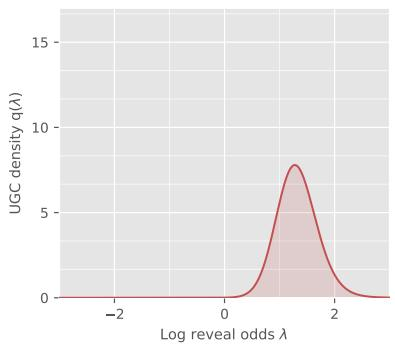  
(a)

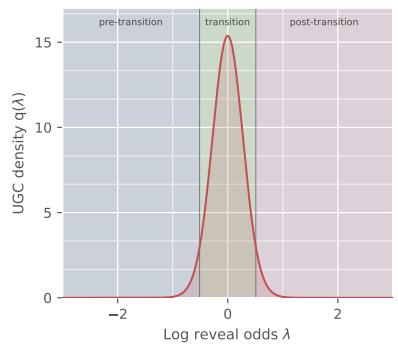  
(b)

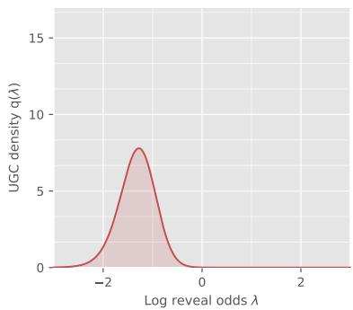  
(c)  
Figure 6. Plots of the log-odds UGC density q for the random XORSAT ensemble with $d = 6 4$ and parameter $\alpha \in \{ 0 . 2 , 0 . 5 , 0 . 8 \}$ in panels (a)–(c), respectively. Panel (b) marks the pre-transition, transition, and posttransition regions used in the three-block construction.

Lemma 2. For the random XORSAT model with $\alpha = 0 . 5$ , for each even dimension d above a universal constant, there is a distribution $\mathbb { P } _ { Z }$ such that

$$
\mathrm { R a t i o } ( \mathbb { P } _ { Z } ) \geq c \sqrt { d \log d } \qquad f o r \ a \ u n i v e r s a l \ c o n s t a n t \ c > 0 ,\tag{43}
$$

and this gain is achieved, up to constants, by a $K = 3$ block scheme.

See Section D for the proof.

Our analysis uses the probabilistic method [AS16] to show that, for each suficiently large dimension, there exists a realization of A, inducing $\mathrm { ~ a ~ } \ \mathrm { \text' { g o o d } \mathrm { ‰} }$ distribution $\mathbb { P } _ { Z }$ , that satisfies the following properties. First, its coarse complexity satisfies $\mathsf C _ { \mathsf { u g c } } ( [ \mathcal T _ { \mathrm { f u l l } } ] ) = \Theta ( d \log d )$ . As a consequence, it sufices to construct a three-block partition with complexity $\mathcal { O } ( \sqrt { d \log d } )$ . Set $\delta _ { d } = c _ { 1 } \sqrt { \log d / d }$ for a suficiently large constant $c _ { 1 } > 0$ , and define the reveal time intervals

$$
\begin{array} { r } { \begin{array} { r } { \mathcal { T } _ { \mathrm { p r } } : = \big [ 1 / d , 1 / 2 - \delta _ { d } \big ] , \qquad \quad \mathcal { T } _ { \mathrm { r m s } } : = \big [ 1 / 2 - \delta _ { d } , 1 / 2 + \delta _ { d } \big ] , \qquad \quad \mathcal { T } _ { \mathrm { s e t } } : = \big [ 1 / 2 + \delta _ { d } , 1 - 1 / d \big ] . } \end{array} } \end{array}
$$

Our proof shows that the “good” $\mathbb { P } _ { Z }$ has UGC masses

$$
\begin{array} { r } { \mathsf { H } ( \mathcal { T } _ { \mathrm { p r e } } ) = \mathcal { O } ( d ^ { - 1 0 } ) , \quad \mathsf { H } ( \mathcal { T } _ { \mathrm { t r a n s } } ) = \Theta ( d ) , \quad \mathrm { a n d } \quad \mathsf { H } ( \mathcal { T } _ { \mathrm { p o s t } } ) = \mathcal { O } ( d ^ { - 1 0 } ) . } \end{array}\tag{44}
$$

Thus, consistent with the behavior shown in Figure 6, essentially all of the UGC mass lies in the transition interval $\mathcal { T } _ { \mathrm { t r a n s } } .$ which has log-reveal-odds width $\mathcal { O } ( \sqrt { \log d / d } )$ . This combination leads to the claimed scaling $\mathcal { O } ( \sqrt { d \log d } )$ for the 3-block partition.

## 5.2.2 Uniform partitions: a generic convergence bound

The XORSAT example shows that a small number of well-placed blocks can already be near-optimal. For comparison, let $\boldsymbol { \mathcal { U } } _ { K }$ denote the uniform K-block partition of $[ - \ell _ { d } , \ell _ { d } ]$ , which ignores local geometry when choosing the block boundaries. Here we quantify its convergence to the fine-partition limit under a simple global regularity condition.

In particular, suppose that ${ \mathfrak { f } } : = { \sqrt { \mathsf { q } } }$ is continuous on $[ - \ell _ { d } , \ell _ { d } ]$ , and define its modulus of continuity by

$$
\omega _ { \mathsf { f } } ( h ) : = \operatorname* { s u p } _ { \lambda , \lambda ^ { \prime } } | \mathsf { f } ( \lambda ) - \mathsf { f } ( \lambda ^ { \prime } ) |
$$

$$
\lambda , \lambda ^ { \prime } \in [ - \ell _ { d } , \ell _ { d } ]
$$

$$
| \lambda - \lambda ^ { \prime } | \leq h\tag{45}
$$

Lemma 3 (Accuracy of uniform K-block approximations). For the uniform partition $\boldsymbol { \mathcal { U } } _ { K }$ , we have

$$
\sqrt { \mathsf { C } _ { U G C } ( \mathcal { U } _ { K } ) } \leq \sqrt { \mathsf { P } _ { U G C } ( \mathbb { Z } _ { \mathrm { f u l l } } ) } + \ell _ { d } \omega _ { \mathsf { f } } \left( \frac { 2 \ell _ { d } } { K } \right) .\tag{46}
$$

The proof is the same modulus-of-continuity argument used for Gaussian difusion in our companion paper (Lemma 4, [Wai26]). As a particular consequence, if f is Lipschitz with constant Lip(f), then

$$
\sqrt { \mathsf { C } _ { \mathsf { U G C } } ( \mathcal { U } _ { K } ) } \le \sqrt { \mathsf { P } _ { \mathsf { U G C } } ( \mathbb { Z } _ { \mathrm { f u l l } } ) } + \frac { 2 \operatorname { L i p } ( \mathsf { f } ) \ell _ { d } ^ { 2 } } { K } .\tag{47}
$$

This generic bound can be conservative because it depends on a global regularity constant and fixes the block boundaries in advance. For the XORSAT example, the Lipschitz constant $\operatorname { L i p } ( \mathsf { f } )$ grows with dimension even though $K = 3$ adaptively placed blocks are near-optimal. When samples are available, the data-dependent DP procedure in Section 4.4.2 instead optimizes the block boundaries directly.

## 6 Proofs

In this section, we collect the proofs of a subset of our results, including the proof of Theorem 1, with the Bernoulli and fixed-cardinality versions given in Section 6.1 and Section 6.2, respectively; the proof of our data-certification procedures, including Lemma 1 and Proposition 2 in Section 6.3; the proof of Theorem 2 in Section 6.4; and finally, the proof of Theorem 3 in Section 6.5. We defer the proofs of other results in the paper to the appendices.

## 6.1 Proof of Theorem 1: Bernoulli version

We begin by proving the bound (17a) for the Bernoulli unmasking sampler.

## 6.1.1 Main argument

Recall from equation (1b) the reveal process $\{ X _ { t } , t \in [ 0 , 1 ] \}$ . For any pair $0 < p < q < 1$ , we let $\mathbb { K } _ { p , q }$ denote the transition kernel of the reveal process in moving from $X _ { p }$ to $X _ { q } .$ On the other hand, the unmasking sampler is based on the updates in equation (11a) and equation (11b), and we let $\widehat { \mathbb { K } } _ { p , q }$ denote the associated transition kernel that moves from $\widehat { X } _ { p }$ to $\widehat { X } _ { q }$ . We introduce the shorthand notation

$$
\Gamma _ { \mathrm { u m a s k } } ( p , q ) : = \mathbb { E } _ { X _ { p } } [ D _ { \mathrm { K L } } ( \mathbb { K } _ { p , q } ( \cdot \mid X _ { p } ) \| \widehat { \mathbb { K } } _ { p , q } ( \cdot \mid X _ { p } ) ) ] ,\tag{48}
$$

corresponding to the averaged Kullback–Leibler (KL) discrepancy between the two transition kernels over the interval $[ p , q ]$ . Here the expectation is taken over the marginal distribution of the reveal process variable $X _ { p }$

The core technical result at the heart of Theorem 1 is the following bound:

Lemma 4 (Multiplicative control of the one-step unmasking defect). For every $0 < p < q < 1$ we have

$$
\Gamma _ { \mathrm { u m a s k } } ( p , q ) \leq \left\{ \frac { \psi ( q ) } { \psi ( p ) } - 1 \right\} { \sf H } ( p , q ) \qquad w h e r e \ \psi ( r ) : = \frac { r } { 1 - r } .\tag{49}
$$

See Section 6.1.2 for the proof.

Given this lemma, the proof of Theorem 1 is very simple. Recalling the definition (14b) of the completion defect $\Gamma _ { \mathsf { C } } ( T )$ , we have

$$
\begin{array} { r l } { D _ { \mathrm { K L } } ( \mathbb { P } _ { Z } \| \mathbb { P } _ { \widehat { Z } } ) \overset { ( i ) } { \leq } D _ { \mathrm { K L } } ( \mathbb { P } _ { t _ { 0 } } \| { \mathbb Q } _ { t _ { 0 } } ) + \displaystyle \sum _ { j = 0 } ^ { N - 1 } \Gamma _ { \mathrm { u m a s k } } ( t _ { j } , t _ { j + 1 } ) + \Gamma _ { \mathsf { C } } ( T ) } & { } \\ { \overset { ( i i ) } { \leq } D _ { \mathrm { K L } } ( \mathbb { P } _ { t _ { 0 } } \| { \mathbb Q } _ { t _ { 0 } } ) + \displaystyle \sum _ { j = 0 } ^ { N - 1 } \{ \frac { \psi ( t _ { j + 1 } ) } { \psi ( t _ { j } ) } - 1 \} \mathsf { H } ( t _ { j } , t _ { j + 1 } ) + \Gamma _ { \mathsf { C } } ( T ) , } & { } \end{array}
$$

where step (i) follows from the KL chain rule, combined with the data processing inequality, whereas step (ii) follows by applying the bound (49) repeatedly to each of the KL increments.

Extension to estimated denoisers: Fix a state x at step $j = 0 , \ldots , N - 1$ . In the existing kernel notation, $\mathbb { K } _ { t _ { j } , t _ { j + 1 } } ( \cdot \mid x )$ is the exact block transition, $\widehat { \mathbb { K } } _ { t _ { j } , t _ { j + 1 } } ( \cdot \mid x )$ is the frozen product transition formed from the exact one-site posteriors, and $\widehat { \mathbb { K } } _ { t _ { j } , t _ { j + 1 } } [ \widehat { \mu } ] ( \cdot \mid x )$ is the frozen product transition formed from the estimated posteriors. The two frozen kernels have the same reveal probability $\begin{array} { r } { \beta _ { j } : = \frac { t _ { j + 1 } - t _ { j } } { 1 - t _ { j } } } \end{array}$ . Since the exact block transition and $\widehat { \mathbb { K } } _ { t _ { j } , t _ { j + 1 } } ( \cdot \mid x )$ have the same one-coordinate marginals, splitting the log-likelihood ratio through the product of these marginals gives

$$
D _ { \mathrm { K L } } ( \mathbb { K } _ { t _ { j } , t _ { j + 1 } } ( \cdot \ | \ x ) ) \Big \lVert \widehat { \mathbb { K } } _ { t _ { j } , t _ { j + 1 } } [ \widehat { \mu } ] ( \cdot \ | \ x ) \Big ) = D _ { \mathrm { K L } } ( \mathbb { K } _ { t _ { j } , t _ { j + 1 } } ( \cdot \ | \ x ) \Big \lVert \widehat { \mathbb { K } } _ { t _ { j } , t _ { j + 1 } } ( \cdot \ | \ x ) ) + \beta _ { j } \sum _ { i \in M ( x ) } D _ { \mathrm { K L } } ( \mu _ { i } ( \cdot , x )  \widehat { \mu } _ { i } ( \cdot , x ) ) .
$$

Indeed, for each $i \in \mathcal { M } ( x )$ , both one-coordinate kernels leave the coordinate masked with probability $1 - \beta _ { j }$ Conditional on revealing it, they use $\mu _ { i } ( \cdot , x )$ and $\widehat { \mu } _ { i } ( \cdot , x )$ , respectively. Their one-coordinate KL divergence is given by $\beta _ { j } D _ { \mathrm { K L } } \left( \mu _ { i } ( \cdot , x ) \parallel \widehat { \mu } _ { i } ( \cdot , x ) \right)$ ). Averaging the first KL term over $x = X _ { t _ { j } }$ under the exact reveal-process law gives exactly $\Gamma _ { \mathrm { u m a s k } } ( t _ { j } , t _ { j + 1 } )$ . Averaging the decomposition and summing over $j = 0 , \ldots , N - 1$ in the same KL chain-rule argument adds the term displayed after equation (17a), which completes the proof.

## 6.1.2 Proof of Lemma 4

Our proof is based on the exact one-step representation

$$
\Gamma _ { \mathrm { u m a s k } } ( p , q ) = \int _ { p } ^ { q } ( q - u ) \mathsf { h } ^ { \prime } ( u ) d u ,\tag{50a}
$$

which we return to prove below. Taking this claim as $\mathrm { \ g i v e n }$ , let us prove the bound (49). Introduce the shorthand $f ( u ) = u \left( 1 - u \right)$ , and observe that $f ( u ) \geq 0$ for $u \in [ 0 , 1 ]$ . Note that for every $u \in [ p , q ]$ , we have $( q - u ) \leq ( q - p )$ , and $f ( u ) \geq p ( 1 - q )$ , so that

$$
q - u ~ \leq ~ { \frac { q - p } { p ( 1 - q ) } } f ( u ) ~ { \stackrel { ( i ) } { = } } ~ \left\{ { \frac { q ( 1 - p ) } { p ( 1 - q ) } } - 1 \right\} f ( u ) ~ { \stackrel { ( i i ) } { = } } ~ \left\{ { \frac { \psi ( q ) } { \psi ( p ) } } - 1 \right\} f ( u )\tag{50b}
$$

where step (i) follows from simple algebra; and step (ii) uses the definition $\psi ( r ) = r / ( 1 - r )$ . Thus, we can write

$$
\Gamma _ { \mathrm { u m a x k } } ( p , q ) \overset { ( i i i ) } { = } \int _ { p } ^ { q } ( q - u ) \mathfrak { h } ^ { \prime } ( u ) d u \overset { ( i v ) } { \leq } \left\{ \frac { \psi ( q ) } { \psi ( p ) } - 1 \right\} \int _ { p } ^ { q } f ( u ) \mathfrak { h } ^ { \prime } ( u ) d u \overset { ( v ) } { = } \left\{ \frac { \psi ( q ) } { \psi ( p ) } - 1 \right\} \mathfrak { H } ( p , q ) ,
$$

where step (iii) follows from the exact representation (50a); step (iv) follows from the inequality (50b) along with the fact that $\mathsf { h } ^ { \prime } ( t ) \geq 0$ for all $t \in [ 0$ , 1]; and step (v) follows from the definition (2c) of the UGC function. Thus, we have established the claim (49).

Proof of the exact representation (50a): We first claim that h satisfies the relation

$$
\mathsf { h } ( u ) = S ( Z ) - \frac { d } { d u } \operatorname { I n f o } \left( Z ; X _ { u } \right) ,\tag{51a}
$$

where we have introduced the shorthand $\begin{array} { r } { S ( Z ) : = \sum _ { i = 1 } ^ { d } \operatorname { E n t } ( Z _ { i } ) } \end{array}$ for the entropy sum. To verify the claim (51a), fix some $\delta > 0$ suficiently small. Conditional on $X _ { u } .$ , each coordinate $i \in \mathcal { M } ( X _ { u } )$ is revealed by time $u + \delta$ with probability $\delta / ( 1 - u )$ . Revealing two or more coordinates has probability $O ( \delta ^ { 2 } )$ while revealing only coordinate i contributes its current posterior entropy. Thus, dividing the first-order expansion of the information increment by δ and letting $\delta \downarrow 0$ gives

$$
{ \frac { d } { d u } } \operatorname { I n f o } \left( Z ; X _ { u } \right) = { \frac { 1 } { 1 - u } } \sum _ { i = 1 } ^ { d } \mathbb { E } \left[ { \mathbf { 1 } \big \{ i \in { \mathcal { M } } ( X _ { u } ) \big \} } \operatorname { E n t } \left( Z _ { i } \mid X _ { u } \right) \right] \ = \ \sum _ { i = 1 } ^ { d } \operatorname { E n t } \left( Z _ { i } \mid X _ { u } , i \in { \mathcal { M } } ( X _ { u } ) \right) .
$$

Since the event $i \in \mathcal { M } ( X _ { u } )$ is independent of $Z _ { i }$ , we have the equivalence

$$
\operatorname { E n t } \left( Z _ { i } \mid X _ { u } , i \in { \mathcal { M } } ( X _ { u } ) \right) = \operatorname { E n t } ( Z _ { i } ) - \operatorname { I n f o } \left( Z _ { i } ; X _ { u } \mid i \in { \mathcal { M } } ( X _ { u } ) \right) .
$$

Summing over i and using the definitions of $S ( Z )$ and $\mathfrak { h } ( u )$ proves the claim $\mathrm { ( 5 1 a ) }$

We now prove the exact representation. Conditional on $X _ { p } = x .$ , let $A \subseteq { \mathcal { M } } ( x )$ be the set of coordinates revealed between $p$ and $q .$ The exact and frozen-product kernels induce the same law for the random subset $A .$ Conditional on A, they unmask coordinates using, respectively, the joint posterior of $Z _ { A }$ and the product of its one-site posterior marginals. Consequently, we can decompose the KL divergence as

$$
D _ { \mathrm { K L } } \left( \mathbb { E } _ { p , q } ( \cdot \ | \ x ) \right) \Big \| \widehat { \mathbb { K } } _ { p , q } ( \cdot \ | \ x ) \Big ) = \underbrace { \mathbb { E } \left[ \sum _ { i \in A } \mathrm { E n t } \left( Z _ { i } \ | \ X _ { p } = x \right) \bigg | \ X _ { p } = x \right] } _ { T _ { 1 } } - \underbrace { \mathbb { E } \left[ \mathrm { E n t } \left( Z _ { A } \ | \ X _ { p } = x , A \right) | \ X _ { p } = x \right] } _ { T _ { 2 } } .
$$

Note that each coordinate still masked at time $p$ is included in $A$ with probability $\begin{array} { r } { \beta _ { p , q } : = \frac { q - p } { 1 - p } } \end{array}$ . Averaging over $X _ { p }$ and using the definition (2a) of h, we find that

$$
\mathbb { E } [ T _ { 1 } ] = \beta _ { p , q } ( 1 - p ) \left\{ S ( Z ) - \mathfrak { h } ( p ) \right\} = \left( q - p \right) \left\{ S ( Z ) - \mathfrak { h } ( p ) \right\} .
$$

Moreover, conditional on $X _ { p } ,$ , the new part of $X _ { q }$ is $( A , Z _ { A } )$ . Since $A$ is conditionally independent of $Z$ and the random sub-vector $Z _ { A }$ is a function of $( Z , A )$ , we have

$$
\begin{array} { r } { \mathbb { E } [ T _ { 2 } ] = \mathrm { I n f o } \left( Z ; A , Z _ { A } \mid X _ { p } \right) \ = \ \mathrm { I n f o } \left( Z ; X _ { q } \mid X _ { p } \right) . } \end{array}
$$

Combining these two identities yields

$$
\Gamma _ { \mathrm { u m a s k } } ( p , q ) = ( q - p ) \left\{ S ( Z ) - \mathsf { h } ( p ) \right\} - \mathrm { I n f o } \left( Z ; X _ { q } \mid X _ { p } \right) .\tag{51b}
$$

It remains to analyze the trailing mutual information term. We have

$$
\mathrm { I n f o } \left( Z ; X _ { q } \mid X _ { p } \right) \stackrel { ( i ) } { = } \mathrm { I n f o } \left( Z ; X _ { q } \right) - \mathrm { I n f o } \left( Z ; X _ { p } \right) \stackrel { ( i i ) } { = } \int _ { p } ^ { q } \frac { d } { d u } \mathrm { I n f o } \left( Z ; X _ { u } \right) d u \stackrel { ( i i i ) } { = } \int _ { p } ^ { q } \left\{ S ( Z ) - \mathbf { h } ( u ) \right\} d u ,\tag{51c}
$$

where step (i) follows because $Z \longrightarrow X _ { q } \longrightarrow X _ { p }$ is a Markov chain; step (ii) follows from the fundamental theorem of calculus; and step (iii) follows from the identity (51a).

Finally, we have

$$
\Gamma _ { \mathrm { u m a s k } } ( p , q ) \ { \stackrel { ( i v ) } { = } } \ \int _ { p } ^ { q } \left\{ { \mathfrak h } ( u ) - { \mathfrak h } ( p ) \right\} \ d u \ { \stackrel { ( v ) } { = } } \ \int _ { p } ^ { q } \int _ { p } ^ { u } { \mathfrak h } ^ { \prime } ( v ) d v \ d u \ { \stackrel { ( v i ) } { = } } \ \int _ { p } ^ { q } ( q - v ) { \mathfrak h } ^ { \prime } ( v ) d v ,
$$

where equality (iv) follows by substituting the representation (51c) into equation (51b) and simplifying terms; step (v) follows from the fundamental theorem of calculus; and step (vi) follows from Fubini’s theorem. This proves the exact representation (50a).

## 6.2 Proof of Theorem 1: Exact cardinality sampling

For integers $0 \leq a < b \leq d - 1$ , let A be a uniformly random a-subset of $[ d ]$ , independent of $Z ,$ and define

$$
X ^ { [ a ] } : = { \Big ( } Z _ { A } , Z _ { A ^ { c } } ^ { \star } { \Big ) } \qquad { \mathrm { w h e r e ~ } } A \sim \operatorname { U n i f } { \Big \{ } S \subseteq [ d ] { \Big | } \ c a r d ( S ) = a { \Big \} } ,
$$

where $A$ is a subset of cardinality $^ { a , }$ chosen uniformly at random, and independently of $Z .$ . Conditional on A, we choose $( B \mid A ) \sim$ Unif $\left\{ S \subseteq A ^ { c } \right\}$ card $( S ) = b - a \bigg \}$ , corresponding to the uniform-subset rule (12a) that defines the exact cardinality sampler.

Write $\mathbb { K } _ { a , b } ^ { \mathrm { c a r d } }$ for the exact transition from $X ^ { [ a ] }$ to cardinality $b ,$ and $\widehat { \mathbb { K } } _ { a , b } ^ { \mathrm { c a r d } }$ for the transition generated by the Card-unmasking sampler. In analogy with the Bernoulli defect (48), define the one-step KL defect

$$
\begin{array} { r } { \Gamma _ { \mathrm { c a r d } } ( \boldsymbol { a } , \boldsymbol { b } ) : = \mathbb { E } _ { \boldsymbol { X } ^ { [ a ] } } [ D _ { \mathrm { K L } } ( \mathbb { K } _ { \boldsymbol { a } , \boldsymbol { b } } ^ { \mathrm { c a r d } } ( \cdot \lfloor \boldsymbol { X } ^ { [ a ] } )  \widehat { \mathbb { K } } _ { \boldsymbol { a } , \boldsymbol { b } } ^ { \mathrm { c a r d } } ( \cdot \lfloor \boldsymbol { X } ^ { [ a ] } ) ) ] . } \end{array}\tag{52a}
$$

The kernels use the same conditional law for B. Conditional on $( X ^ { [ a ] } , B )$ , the exact kernel samples from $\mathcal { L } ( Z _ { B } \mid Z _ { A } )$ , whereas the sampler uses $\bigotimes _ { i \in B } { \mathcal { L } } ( Z _ { i } \mid Z _ { A } )$ , corresponding to the product update (9a).

We now apply the one-block specialization of the exact error representation of Chen et al. [Theorem 3.3 CCL25]. After translation3 to our normalization and notation, it guarantees that

$$
\Gamma _ { \mathrm { c a r d } } ( a , b ) = \frac 1 d \sum _ { j = a + 1 } ^ { b - 1 } ( b - j ) \bigl \{ { \mathsf { h } } _ { j } ^ { \mathrm { c a r d } } - { \mathsf { h } } _ { j - 1 } ^ { \mathrm { c a r d } } \bigr \} .\tag{52b}
$$

We claim that this exact representation admits the following upper bound:

Lemma 5 (Fixed-cardinality one-step unmasking defect). For all integers $0 \leq a < b \leq d - 1$ , we have

$$
\Gamma _ { \mathrm { c a r d } } ( a , b ) \leq \left\{ \frac { \psi ( b / d ) } { \psi \big ( ( a + 1 ) / d \big ) } - 1 \right\} \mathsf { H } ^ { \mathrm { c a r d } } ( a , b ) .\tag{53}
$$

Proof. If $b = a + 1$ , both sums are empty. Otherwise, we introduce the shorthand

$$
\rho _ { a , b } : = \frac { \psi ( b / d ) } { \psi \big ( ( a + 1 ) / d \big ) } - 1 = \frac { d ( b - a - 1 ) } { ( a + 1 ) ( d - b ) } ,
$$

and make note of the upper bound $\frac { d ( b - j ) } { j ( d - j ) } \le \rho _ { a , b }$ , valid for every $a + 1 \leq j \leq b - 1$ . Since $\mathsf { h } _ { j } ^ { \mathrm { c a r d } }$ is nondecreasing, the increments $\mathsf { h } _ { j } ^ { \mathrm { c a r d } } - \mathsf { h } _ { j - 1 } ^ { \mathrm { c a r d } }$ are nonnegative. Putting together the pieces, we arrive at the upper bound

$$
\Gamma _ { \mathrm { c o s t } } ( a , b ) = \frac { 1 } { d } \sum _ { j = a + 1 } ^ { b - 1 } ( b - j ) \left\{ \mathsf { h } _ { j } ^ { \mathrm { c a r d } } - \mathsf { h } _ { j - 1 } ^ { \mathrm { c a r d } } \right\} \ \leq \ \rho _ { a , b } \frac { 1 } { d ^ { 2 } } \sum _ { j = a + 1 } ^ { b - 1 } j ( d - j ) \left\{ \mathsf { h } _ { j } ^ { \mathrm { c a r d } } - \mathsf { h } _ { j - 1 } ^ { \mathrm { c a r d } } \right\} \ = \ \rho _ { a , b } \mathsf { H } ^ { \mathrm { c a r d } } ( a , b ) ,
$$

where the last equality follows from the definition (16b) of ${ \sf H } ^ { \mathrm { c a r d } }$ . This completes the proof of the upper bound (53). □

Note that Lemma 5 is the fixed-cardinality analogue of the Bernoulli sampler bound given in Lemma 4. Consequently, the KL bound (17b) for the fixed-cardinality sampler follows from the same argument, instead using Lemma 5 to bound the one-step errors.

## 6.3 Proof of data-certification results

In this section, we provide proofs of our data-based certification results, including that of Lemma 1 in Section 6.3.1; as well as that of Proposition 2 in Section 6.3.2.

## 6.3.1 Proof of Lemma 1

We break our proof into parts, one for each claim in the statement.

Proof of the claim (31a): We first prove the exact expression $\mathrm { ( 3 1 a ) }$ . For each coordinate $i ,$ let $X _ { p | i }$ and $X _ { q | i }$ denote the coupled observations at times $p$ and $q ,$ with coordinate i kept masked. Note that the observation $X _ { p | i }$ is obtained from $X _ { q | i }$ by a random remasking operation independent of $Z _ { i }$ conditional on $X _ { q | i }$ . Consequently, the triple $Z _ { i } \longrightarrow ^ { \cdot } X _ { q | i } \longrightarrow X _ { p | i }$ forms a Markov chain, so that we can write

$$
\operatorname { I n f o } ( Z _ { i } ; X _ { q \mid i } \mid X _ { p \mid i } ) = \operatorname { I n f o } \left( Z _ { i } ; X _ { q \mid i } \right) - \operatorname { I n f o } \left( Z _ { i } ; X _ { p \mid i } \right) .\tag{54a}
$$

At the same time, by the conditional KL representation of conditional mutual information, we have

$$
\begin{array} { r l } & { \mathrm { { I n f o } } ( Z _ { i } ; X _ { q \mid i } \mid X _ { p \mid i } ) = \mathbb { E } _ { ( X _ { p \mid i } , X _ { q \mid i } ) } [ D _ { \mathrm { K L } } ( \mathcal { L } ( Z _ { i } \mid X _ { q \mid i } , X _ { p \mid i } ) ) ] \mathcal { L } ( Z _ { i } \mid X _ { p \mid i } ) \big ) ] } \\ & { \qquad = \mathbb { E } _ { ( X _ { p \mid i } , X _ { q \mid i } ) } [ D _ { \mathrm { K L } } ( \mathcal { L } ( Z _ { i } \mid X _ { q \mid i } ) \| \mathcal { L } ( Z _ { i } \mid X _ { p \mid i } ) ) ] , } \end{array}\tag{54b}
$$

where the second equality follows from the Markov relation $Z _ { i } \longrightarrow X _ { q | i } \longrightarrow X _ { p | i }$ , which implies

$$
\mathcal { L } ( Z _ { i } \mid X _ { q \mid i } , X _ { p \mid i } ) = \mathcal { L } ( Z _ { i } \mid X _ { q \mid i } ) .
$$

Combining equations (54a) and (54b) yields the identity

$$
\mathbb { E } \left[ D _ { \mathrm { K L } } \left( \mathcal { L } ( Z _ { i } \mid X _ { q | i } ) \big \| \mathcal { L } ( Z _ { i } \mid X _ { p | i } ) \right) \right] \ = \ \mathrm { I n f o } \left( Z _ { i } ; X _ { q | i } \right) - \mathrm { I n f o } \left( Z _ { i } ; X _ { p | i } \right) .
$$

Summing both sides of this identity over the indices $i = 1 , \ldots , d ,$ and using the definitions of D and h in equation (30b) and equation (2a), respectively, we find that

$$
\frac { \mathsf { D } ( p , q ) } { q - p } = \mathsf { h } ( q ) - \mathsf { h } ( p ) ,\tag{54c}
$$

as claimed in equation (31a).

Proof of the sandwich relation (31b): Turning to the claim (31b), for any pair $0 < p < q < 1$ , we have

$$
p ( 1 - q ) \leq t ( 1 - t ) \leq q ( 1 - p ) \qquad { \mathrm { f o r ~ a l l ~ } } t \in [ p , q ] .
$$

Multiplying both sides by $\mathsf { h } ^ { \prime } ( t ) \geq 0$ and integrating yields

$$
p ( 1 - q ) \big \{ \mathsf { h } ( q ) - \mathsf { h } ( p ) \big \} \ \leq \ \int _ { p } ^ { q } t ( 1 - t ) \mathsf { h } ^ { \prime } ( t ) d t \ \leq \ q ( 1 - p ) \big \{ \mathsf { h } ( q ) - \mathsf { h } ( p ) \big \} .
$$

Using the definition (2c) of ${ \mathsf { H } } ( p , q )$ and the exact identity (54c), we have proved that

$$
\frac { p ( 1 - q ) } { q - p } \mathsf { D } ( p , q ) \ \leq \ \mathsf { H } ( p , q ) \ \leq \ \frac { q ( 1 - p ) } { q - p } \mathsf { D } ( p , q ) .\tag{54d}
$$

Finally, an elementary calculation gives $\begin{array} { r } { c _ { p , q } : = { \frac { \psi ( q ) } { \psi ( p ) } } - 1 = { \frac { q - p } { p ( 1 - q ) } } } \end{array}$ , so that we have

$$
\frac { p ( 1 - q ) } { q - p } = \frac { 1 } { c _ { p , q } } , \quad \mathrm { a n d } \quad \frac { q ( 1 - p ) } { q - p } = \frac { 1 + c _ { p , q } } { c _ { p , q } } .
$$

Combining with equation (54d) proves the claim (31b).

## 6.3.2 Proof of Proposition 2

Introduce the shorthand $\begin{array} { r } { \mu ( p , q ) : = \mathbb { E } [ Q ^ { ( \ell ) } ] = \sum _ { j = 0 } ^ { J - 1 } \mathsf { D } ( v _ { j } , v _ { j + 1 } ) } \end{array}$ for the expected value of $Q ^ { ( \ell ) }$ . Note that we have

$$
\mu ( p , q ) \leq \mathsf { H } ( p , q ) \leq 2 \mu ( p , q ) ,\tag{55a}
$$

as previously stated in equation (32c). We first derive the required moment bound for the trajectory statistic from the denoiser condition (33a). Set $r : = \alpha / 2$ , so that $r \geq 2$ . Introducing the shorthand notation

$$
K _ { j } : = \sum _ { i = 1 } ^ { d } D _ { \mathrm { K L } } \left( \mu _ { i } \left( \cdot , X _ { v _ { j + 1 } | i } ^ { ( \ell ) } \right) \Big | \Big | \mu _ { i } \left( \cdot , X _ { v _ { j } | i } ^ { ( \ell ) } \right) \right) , \qquad \mathrm { f o r ~ } j = 0 , \ldots , J - 1 ,
$$

our statistic $Q ^ { ( \ell ) }$ can be written as $\begin{array} { r } { Q ^ { ( \ell ) } = \sum _ { j = 0 } ^ { J - 1 } ( v _ { j + 1 } - v _ { j } ) K _ { j } } \end{array}$ . We then apply Minkowski’s inequality and make use of the moment condition (33a), thereby obtaining the moment bound

$$
\Big \{ \mathbb { E } \left[ ( Q ^ { ( \ell ) } ) ^ { r } \right] \Big \} ^ { 1 / r } \le \sum _ { j = 0 } ^ { J - 1 } ( v _ { j + 1 } - v _ { j } ) \left\{ \mathbb { E } \left[ K _ { j } ^ { r } \right] \right\} ^ { 1 / r } \ \le \ \sum _ { j = 0 } ^ { J - 1 } ( v _ { j + 1 } - v _ { j } ) B _ { \alpha } = \underbrace { ( q - p ) B _ { \alpha } } _ { \equiv M _ { \alpha } } .
$$

In terms of the shorthand $Y ^ { ( \ell ) } : = 2 \operatorname* { m i n } \{ Q ^ { ( \ell ) } , \tau \}$ , we can write $\begin{array} { r } { \widehat { \mathsf { H } } _ { m } ( p , q ) = \frac { 1 } { m } \sum _ { \ell = 1 } ^ { m } Y ^ { ( \ell ) } } \end{array}$ . We first bound the truncation bias. Since $r > 1$ , we have

$$
0 \leq 2 \mu ( p , q ) - \mathbb { E } [ Y ^ { ( \ell ) } ] = 2 \mathbb { E } \left[ ( Q ^ { ( \ell ) } - \tau ) _ { + } \right] \ \leq \ \frac { 2 \mathbb { E } \left[ ( Q ^ { ( \ell ) } ) ^ { r } \right] } { \tau ^ { r - 1 } } \leq \frac { 2 M _ { \alpha } ^ { r } } { \tau ^ { r - 1 } } .\tag{55b}
$$

We are now set up to apply the empirical Bernstein inequality of Maurer and Pontil [Theorem 4 MP09]. We apply it to both the i.i.d. variables $Y ^ { ( \ell ) } / ( 2 \tau ) \ \in \ [ 0 , \bar { 1 } ]$ , and then separately to the i.i.d. variables $1 - Y ^ { ( \ell ) } / ( 2 \tau )$ . Observe that the two collections have the same empirical variance. We apply a failure probability of $\eta / 2$ to each application, so that a union bound over both tail bounds has failure probability at most η. Via this argument, we are guaranteed to have the two-sided tail bound

$$
\left| \mathbb { E } [ Y ^ { ( \ell ) } ] - \widehat { \mathsf { H } } _ { m } ( p , q ) \right| \leq \sqrt { \frac { 2 \widehat { V } \log ( 4 / \eta ) } { m } } + \frac { 1 4 \tau \log ( 4 / \eta ) } { 3 ( m - 1 ) }\tag{55c}
$$

with probability at least $1 - \eta .$

Combining the truncation bias (55b) with the tail bound (55c), we find that

$$
\Big \vert 2 \mu ( p , q ) - \widehat { \mathsf { H } } _ { m } ( p , q ) \Big \vert \leq \sqrt { \frac { 2 \widehat { V } \log ( 4 / \eta ) } { m } } + \frac { 1 4 \tau \log ( 4 / \eta ) } { 3 ( m - 1 ) } + \frac { 2 M _ { \alpha } ^ { r } } { \tau ^ { r - 1 } }
$$

with probability at least $1 - \eta$ . We claim that the right-hand side of this bound is precisely $\widehat { r } _ { m } ( \boldsymbol { \eta } )$ . In particular, we can express the truncation level (33b) as $\tau = M _ { \alpha } c _ { \eta } ^ { - 1 / r }$ , where $\begin{array} { r } { c _ { \eta } : = \frac { 7 \log ( 4 / \eta ) } { 3 ( m - 1 ) } } \end{array}$ . In terms of this shorthand, we have $\frac { 1 4 \tau \log ( 4 / \eta ) } { 3 ( m - 1 ) } = 2 M _ { \alpha } c _ { \eta } ^ { 1 - 1 / r }$ and $\textstyle { \frac { 2 M _ { \alpha } ^ { r } } { \tau ^ { r - 1 } } } = 2 M _ { \alpha } c _ { \eta } ^ { 1 - 1 / r }$ . Since $1 / r = 2 / \alpha$ , the claimed equivalence follows, and we conclude that

$$
\left| 2 \mu ( p , q ) - \widehat { \mathsf { H } } _ { m } ( p , q ) \right| \leq \widehat { r } _ { m } ( \eta )\tag{55d}
$$

with probability at least $1 - \eta .$

It remains to prove the sandwich (34a) claimed in the statement. Conditioned on the event (55d), the upper inequality in equation (55a) gives

$$
\mathsf { H } ( p , q ) \leq 2 \mu ( p , q ) \leq \widehat { \mathsf { H } } _ { m } ( p , q ) + \widehat { r } _ { m } ( \eta ) .
$$

For the other side, the same concentration event and the lower inequality in equation (55a) give

$$
\widehat { \mathsf { H } } _ { m } ( p , q ) + \widehat { r } _ { m } ( \eta ) \leq 2 \mu ( p , q ) + 2 \widehat { r } _ { m } ( \eta ) \leq 2 \bigl \{ { \mathsf { H } } ( p , q ) + \widehat { r } _ { m } ( \eta ) \bigl \} .
$$

Combining the last two displays proves the claim (34a).

## 6.4 Proof of Theorem 2

We need to verify two separate claims: the stated bound (37b) on the KL divergence, and the fact that the procedure terminates in at most N unmasking rounds. Throughout the proof, we make use of the shorthand

$$
a _ { k } : = \frac { 4 \sqrt { \hat { \mathsf { C } } _ { \mathrm { { u g c } } } ( \mathcal { P } ) } } { N } \sqrt { \frac { \mathsf { S } _ { k } } { \hat { \mathsf { H } } _ { k , m } + \hat { r } _ { k } } } \qquad \mathrm { s o ~ t h a t } \ \widehat { \rho } _ { k } = \operatorname* { m i n } \{ 1 , a _ { k } \} .\tag{56}
$$

## 6.4.1 Verifying the KL bound (37b)

Our first step is to apply Proposition 2 with failure probability $\eta / K \in ( 0 , 1 )$ to each block $[ b _ { k } , b _ { k + 1 } ]$ . The estimator in this proposition gives us an estimate $\widehat { \mathsf { H } } _ { k , m } \geq 0$ along with the upper confidence correction $\widehat { r } _ { k } > 0$ . By the union bound over all K blocks, with probability at least $1 - \eta .$ , we are guaranteed to have

$$
\mathsf { H } _ { k } \leq \widehat { \mathsf { H } } _ { k , m } + \widehat { r } _ { k } \qquad \mathrm { f o r ~ a l l ~ } k = 0 , \ldots , K - 1 ,\tag{57}
$$

where we have used inequality (A) in equation (34a). We condition on this “good event” throughout the remainder of the proof.

For each block, we define the iteration count $\begin{array} { r } { \widehat { N } _ { k } : = \left\lceil \frac { \mathsf { S } _ { k } } { \log ( 1 + \widehat { \rho } _ { k } ) } \right\rceil } \end{array}$ , using the stepsizes $\widehat { \rho } _ { k }$ specified in the theorem statement. Observe that from our choice of $\widehat { \rho } _ { k }$ and the definition (20) of the geometric schedule, it takes at most $\widehat { N } _ { k }$ iterations to traverse the block, and every step inside this block has reveal-odds multiplier at most $1 + \widehat { \rho } _ { k }$ . We now apply Theorem 1 to this concatenated multi-block schedule. By the additivity (3) of $\mathsf { H } ,$ the contribution from block k takes the form $\widehat { \rho } _ { k } \mathsf { H } _ { k }$ . Summing up these terms, along with the boundary correction, yields

$$
\begin{array} { r l } { \mathcal { D } _ { \mathrm { S L } } ( [ \mathcal { D } _ { 2 } ] | \mathbb { P } _ { \xi } ) \lesssim } & { \displaystyle \sum _ { k = 0 } ^ { K - 1 } \hat { p } _ { k } \mathbb { H } _ { k } + \mathcal { P } _ { \mathrm { S L } } ( [ \mathcal { P } _ { \mathrm { s } } ] | \mathbb { Q } _ { \mathrm { t o } } ) + \Gamma _ { \mathrm { C } } ( T ) } \\ & { \stackrel { ( ) } { \le } \displaystyle \sum _ { k = 0 } ^ { K - 1 } \hat { p } _ { k } ( \widehat { \mathbb { H } } _ { k , m } + \widehat { p } _ { k } ) + D _ { \mathrm { t o t } } ( \mathbb { P } _ { \mathrm { s } } _ { \mathrm { o } } | \mathbb { Q } _ { \mathrm { t o } } ) + \Gamma _ { \mathrm { C } } ( T ) } \\ &  \stackrel { ( ) \le } \displaystyle \sum _ { k = 0 } ^ { K - 1 } \frac { \sqrt { K } \mathbb { G } _ { \mathrm { S R } } ( [ \mathbb { P } _ { k } ] , \sqrt { K } _ { \mathrm { S R } } + \widehat { p } _ { k } ) + ( \widehat { \mathbb { H } } _ { k , m } + \widehat { \gamma } _ { \mathrm { S R } } ) + D _ { \mathrm { t o t } } ( \widehat { \mathbb { P } } _ { \mathrm { s } } _ { \mathrm { o } } | \mathbb { Q } _ { \mathrm { t o } } ) + \Gamma _ { \mathrm { C } } ( T ) } \\ & { \stackrel { ( ) \le } \displaystyle \sum _ { k = 0 } ^ { K - 1 } \frac { \sqrt { K } \mathbb { G } _ { \mathrm { S R } } ( [ \mathbb { P } _ { k } ] , \sqrt { K } _ { \mathrm { S R } } , \sqrt { K } _ { \mathrm { S R } } + \widehat { \mathbb { P } } _ { k } ) + \Gamma _ { \mathrm { S R } } ( [ \mathbb { P } _ { k } ] , [ \mathbb { Q } _ { \mathrm { t o } } ) + \Gamma _ { \mathrm { C } } ( T ) } { - \cosh \sqrt { K } } } \\ &  = \displaystyle \frac { 4 \sqrt { \widehat { C } } _ { \mathrm { S R } } ( P ) }  \end{array}
$$

where step (i) uses the good event bound (57); step (ii) uses the fact that $\widehat { \rho } _ { k } \le a _ { k }$ , along with the definition of $a _ { k } ;$ and equality (iii) follows from the definition of $\widehat { \mathsf { C } } _ { \mathsf { U G C } } ( \mathcal { P } )$

## 6.4.2 Verifying the score-evaluation budget

It remains to verify that the procedure terminates in at most N unmasking rounds, so that it satisfies the prescribed score evaluation budget. Since $\widehat { \rho } _ { k } \in [ 0 , 1 ]$ and $\log ( 1 + u ) \geq u / 2$ for $u \in [ 0 , 1 ]$ , we have

$$
\begin{array} { r l r } {  { \widehat { N } _ { k } \le 1 + \frac { S _ { k } } { \log ( 1 + \widehat { \rho } _ { k } ) } \le 1 + \frac { 2 \mathsf { S } _ { k } } { \widehat { \rho } _ { k } } = 1 + 2 \mathsf { S } _ { k } \operatorname* { m a x } \{ 1 , \frac { 1 } { a _ { k } } \} } } \\ & { } & { \le 1 + 2 \mathsf { S } _ { k } + \frac { N } { 2 \sqrt { \hat { \mathrm { C } } _ { \mathsf { u e c } } ( \mathcal { P } ) } } \sqrt { \mathsf { S } _ { k } ( \widehat { \mathsf { H } } _ { k , m } + \widehat { r } _ { k } ) } . } \end{array}
$$

We now sum over blocks, using the definition (25) of $\mathsf { S } _ { k }$ , and the definition of $\widehat { \mathsf { C } } _ { \mathsf { U G C } } ( \mathcal { P } )$ . Doing so yields

$$
\begin{array} { r l } {  { \sum _ { k = 0 } ^ { K - 1 } \widehat { N } _ { k } \le K + 2 \sum _ { k = 0 } ^ { K - 1 } \mathsf { S } _ { k } + \frac { N } { 2 \sqrt { \hat { \mathsf { C } } _ { \mathsf { { \mathsf { U G C } } } } ( \mathcal { P } ) } } \sum _ { k = 0 } ^ { K - 1 } \sqrt { \mathsf { S } _ { k } ( \widehat { \mathsf { H } } _ { k , m } + \widehat { r } _ { k } ) } } } \\ & { = K + 2 \big \{ \varphi ( T ) - \varphi ( t _ { 0 } ) \big \} + \frac { N } { 2 } } \\ & { \le N , } \end{array}
$$

where the final inequality follows from the assumed lower bound $N \geq 2 K + 4 { \bigl \{ } \varphi ( T ) - \varphi ( t _ { 0 } ) { \bigr \} }$

## 6.5 Proof of Theorem 3

We split our proof into two parts, corresponding to the two claims in the theorem.

## 6.5.1 Proof of the claim (41a)

Introducing the shorthand $\mathsf { f } ( \lambda ) : = \sqrt { \mathsf { q } ( \lambda ) }$ and $\begin{array} { r } { F _ { \star } : = \int _ { - \ell _ { d } } ^ { \ell _ { d } } \mathsf { f } ( \lambda ) d \lambda } \end{array}$ , we need to prove that in $\begin{array} { r } { \mathrm { f } _ { \mathcal { P } } \mathsf { C } _ { \mathsf { U G C } } ( \mathcal { P } ) = F _ { \star } ^ { 2 } } \end{array}$ By the definition (40b), for a partition of $[ - \ell _ { d } , \ell _ { d } ]$ into intervals $L _ { k }$ with length $\left| L _ { k } \right|$ , applying the Cauchy– Schwarz inequality on each interval gives

$$
\sqrt { \mathsf { C } _ { \mathsf { U G C } } ( \mathcal { P } ) } = \sum _ { k } \sqrt { | L _ { k } | \int _ { L _ { k } } \mathsf { q } ( \lambda ) d \lambda } \ge \sum _ { k } \int _ { L _ { k } } \mathsf { f } ( \lambda ) d \lambda = F _ { \star } .\tag{58}
$$

Conversely, let $\boldsymbol { \mathcal { U } } _ { K }$ be a uniform K-block partition with blocks $\{ L _ { k } \}$ . By the integral form of the mean-value theorem, we can write $\begin{array} { r } { \int _ { L _ { k } } \mathbf { q } ( \lambda ) d \lambda \ = \ | L _ { k } | \mathbf { q } ( \xi _ { k } ) } \end{array}$ for some $\xi _ { k } \in L _ { k }$ , and consequently, we obtain

$$
\sqrt { \operatorname* { i n f } _ { \mathcal { P } } \mathsf { C } _ { \mathrm { u g c } } ( \mathcal { P } ) } \le \sqrt { \mathsf { C } _ { \mathrm { u g c } } ( \mathcal { U } _ { K } ) } = \sum _ { k } \sqrt { | L _ { k } | \int _ { L _ { k } } \mathsf { q } ( \lambda ) d \lambda } \ = \sum _ { k } \mathsf { f } ( \xi _ { k } ) | L _ { k } | .
$$

The quantity on the right-hand side is a Riemann sum for ${ \mathfrak { f } } ;$ taking the limit as $K $ +∞ shrinks the intervals to zero, and so it converges to $F _ { \star }$ . We have thus shown that infP $\mathsf C _ { \mathsf { U G C } } ( \mathcal P ) \le F _ { \star } ^ { 2 }$ . Combined with the lower bound (58), the proof is complete.

## 6.5.2 Proof of the claim (41b)

Recall our shorthand ${ \mathsf { f } } = { \sqrt { \mathsf { q } } }$ and $\begin{array} { r } { F _ { \star } = \int _ { - \ell _ { d } } ^ { \ell _ { d } } \mathsf { f } ( \lambda ) d \lambda } \end{array}$ . For a pair $- \ell _ { d } \leq x < y \leq \ell _ { d }$ , introduce the shorthand $\gamma ( x , y ) : = \Gamma _ { \mathrm { u m a s k } } \big ( R ( x ) , R ( y ) \big )$ where $\begin{array} { r } { R ( \lambda ) = \frac { e ^ { \lambda } } { 1 + e ^ { \lambda } } } \end{array}$ . By changing variables in equation (50a), and using the derivative $R ^ { \prime } ( t ) \dot { = } R ( t ) \{ 1 - \dot { R } ( t ) \}$ , we obtain

$$
\gamma ( x , y ) = \int _ { x } ^ { y } { \mathfrak { q } } ( t ) { \frac { R ( y ) - R ( t ) } { R ^ { \prime } ( t ) } } d t .\tag{59a}
$$

Define the constants $\begin{array} { r } { m : = \operatorname* { m i n } _ { [ - \ell _ { d } , \ell _ { d } ] } R ^ { \prime } > 0 , M : = \operatorname* { m a x } _ { \lambda \in [ - \ell _ { d } , \ell _ { d } ] } R ^ { \prime } ( \lambda ) < \infty } \end{array}$ , and $q _ { \mathrm { m i n } } : = \mathrm { m i n } _ { \lambda \in [ - \ell _ { d } , \ell _ { d } ] } { \mathsf { q } } ( \lambda ) >$ 0. We then have $R ( y ) - R ( t ) \geq \dot { m } ( y - \dot { t } )$ and $R ^ { \prime } ( t ) \leq M$ , from which equation (59a) implies that

$$
\begin{array} { r } { \gamma ( x , y ) \geq c _ { 0 } ( y - x ) ^ { 2 } \qquad \mathrm { w h e r e } \ c _ { 0 } : = \frac { q _ { \operatorname* { m i n } } m } { 2 M } . } \end{array}\tag{59b}
$$

In addition, we claim that

$$
\gamma ( x , x + \delta ) = \frac { 1 } { 2 } \mathsf { q } ( x ) \delta ^ { 2 } + o ( \delta ^ { 2 } ) \qquad \mathrm { u n i f o r m l y ~ i n ~ } x .\tag{59c}
$$

Writing $t = x + s$ , uniform continuity of $R ^ { \prime }$ on $[ - \ell _ { d } , \ell _ { d } ]$ , together with the fact that it is bounded away from zero over this interval, imply that

$$
{ \frac { R ( x + \delta ) - R ( x + s ) } { R ^ { \prime } ( x + s ) } } = ( \delta - s ) \{ 1 + o ( 1 ) \}
$$

uniformly in x and $0 \leq s \leq \delta$ . Similarly, the continuity of q gives ${ \mathfrak { q } } ( x + s ) = { \mathfrak { q } } ( x ) + o ( 1 )$ uniformly. Substituting these two estimates into equation (59a) and integrating over $s \in [ 0 , \delta ]$ yields the local expansion bound (59c).

Upper bound: For the upper bound, we choose the grid $\{ \lambda _ { k , N } \} _ { k = 0 } ^ { N }$ to have equal f-mass, so that $\begin{array} { r } { \int _ { \lambda _ { k , N } } ^ { \lambda _ { k + 1 , N } } \mathsf { f } ( \lambda ) d \lambda = \frac { F _ { \star } } { N } } \end{array}$ . Since f is continuous and bounded away from zero, this mesh has width $O ( N ^ { - 1 } )$ , and hence we have $\begin{array} { r } { \mathfrak { q } ( \lambda _ { k , N } ) ( \lambda _ { k + 1 , N } - \lambda _ { k , N } ) ^ { 2 } = \frac { F _ { \star } ^ { 2 } } { N ^ { 2 } } + o ( N ^ { - 2 } ) } \end{array}$ uniformly in k. Equation (59c) therefore gives

$$
\sum _ { k = 0 } ^ { N - 1 } \gamma ( \lambda _ { k , N } , \lambda _ { k + 1 , N } ) = \frac { F _ { \star } ^ { 2 } } { 2 N } + o ( N ^ { - 1 } ) .\tag{59d}
$$

Lower bound: For the lower bound, we take a grid $\{ \mu _ { k , N } \} _ { k = 0 } ^ { N }$ whose cost is within $N ^ { - 2 }$ of the infimum, and write $\delta _ { k , N } = \mu _ { k + 1 , N } - \mu _ { k , N }$ . The preceding upper bound shows that the infimum is $O ( N ^ { - 1 } )$ , so the near-optimal grid $\{ \mu _ { k , N } \}$ also has total cost $O ( N ^ { - 1 } )$ . Consequently, the quadratic lower bound (59b) gives

$$
c _ { 0 } \sum _ { k = 0 } ^ { N - 1 } \delta _ { k , N } ^ { 2 } \le \sum _ { k = 0 } ^ { N - 1 } \gamma \big ( \mu _ { k , N } , \mu _ { k + 1 , N } \big ) = O ( N ^ { - 1 } ) ,
$$

and hence $\begin{array} { r } { \sum _ { k } \delta _ { k , N } ^ { 2 } = O ( N ^ { - 1 } ) } \end{array}$ . Since maxk $\begin{array} { r } { \delta _ { k , N } ^ { 2 } \le \sum _ { k } \delta _ { k , N } ^ { 2 } = O ( N ^ { - 1 } ) } \end{array}$ , the mesh tends to zero, so the uniform local expansion may be summed over the grid with total remainder $o \big ( \sum _ { k } \delta _ { k , N } ^ { 2 } \big ) = o ( N ^ { - 1 } )$ . Doing so yields

$$
\begin{array} { r l } & { \displaystyle \sum _ { k = 0 } ^ { N - 1 } \gamma ( \mu _ { k , N } , \mu _ { k + 1 , N } ) = \frac { 1 } { 2 } \sum _ { k = 0 } ^ { N - 1 } \mathfrak { q } ( \mu _ { k , N } ) \delta _ { k , N } ^ { 2 } + o ( N ^ { - 1 } ) \overset { ( i ) } { \geq } \frac { 1 } { 2 N } \left\{ \displaystyle \sum _ { k = 0 } ^ { N - 1 } \mathfrak { f } ( \mu _ { k , N } ) \delta _ { k , N } \right\} ^ { 2 } + o ( N ^ { - 1 } ) } \\ & { \quad \quad \quad \quad \quad \stackrel { ( i i ) } { = } \frac { { F _ { \star } ^ { 2 } } } { 2 N } + o ( N ^ { - 1 } ) , } \end{array}
$$

where step (i) follows from the Cauchy–Schwarz inequality and ${ \mathsf { q } } = { \mathsf { f } } ^ { 2 } ;$ and the last step follows from the Riemann-sum limit $\begin{array} { r } { \sum _ { k } \mathsf { f } ( \mu _ { k , N } ) \delta _ { k , N } = F _ { \star } + o ( 1 ) } \end{array}$

Finally, combining this lower bound with the upper bound (59d) yields the claim.

## 7 Discussion

In this paper, we have shown that the unmasking growth complexity (UGC) controls the performance of random subset unmasking schemes, and reveals the structure required to optimize their performance. It is a path-based measure with additive local increments that bound the corresponding KL discretization errors. The reveal odds determine the natural multiplicative scale for a finite unmasking step, making log-revealodds the appropriate path coordinate. The log-reveal-odds UGC density gives a local description of sampling dificulty: regions carrying little UGC mass can be traversed rapidly with large stepsizes, whereas regions of concentrated mass require smaller stepsizes. We formalized this resource-allocation principle via a notion of partition complexity. At one extreme, it reduces to a (coarse) single-block complexity; under progressive refinement, it converges to a functional of the square root of the UGC density, which also determines the sharp leading-order complexity of optimally scheduled Euler discretization.

Notably, this paper moves beyond treating the underlying geometry as an oracle quantity. We show how the UGC increments can be reliably estimated using KL increments along a coupled reveal trajectory. By doing so, we obtain sampling methods that are certified-optimal, meaning that they are certified (with high probability) to achieve a pre-specified KL error, and their iteration complexity is within a constant factor of the optimal iteration complexity. Thus, our analysis connects three core tasks in difusion sampling: characterizing the geometry of the target distribution, designing a sampling schedule, and certifying the accuracy of the resulting sampler.

Let us make note of some important qualifications to this conclusion. Our strongest data-dependent guarantees rely on access to Bayes denoisers and on moment control for their KL increments. With learned denoisers, approximation error contributes an additional term to the KL guarantee, and it needs to be estimated for a fully certified guarantee. Moreover, our notion of optimality is relative to frozen-poster Euler discretizations. It is possible that higher-order discretizations and other more sophisticated procedures could admit diferent local geometries, and hence potentially diferent optimal clocks for stepsize allocation.

This paper has focused exclusively on the utility of UGC complexity for designing and optimizing unmasking samplers. However, thinking beyond the context of sampling, the view of data geometry aforded by the UGC density is of independent interest for statistical analysis. As a notable example, Figure 3 shows the UGC density q for a discrete mixture model with a hierarchical structure, where the q-modes correspond to reveal times at which successive levels of the hierarchy are resolved. Our methods allow us to reliably estimate increments of the UGC density, and it would be interesting to do so for real-world discrete datasets.

In our companion paper [Wai26] on Gaussian difusion sampling, we introduced the denoising growth complexity (DGC), and provided analogous results on sampling performance and stepsize optimization, again culminating in a characterization via the DGC density. Despite the substantial diferences between Gaussian difusion and discrete masking, the two theories exhibit a striking parallel. The natural path coordinates difer (log-heat-time versus log-reveal-odds), but both the UGC and DGC densities capture a form of information curvature along the noising path, and their shape dictates how computational efort should be allocated.

## Acknowledgements

This work was partially supported by a Guggenheim Fellowship, an NSF grant (DMS-2311072), and the Ford Professorship at MIT. We thank Yuting Wei for her inspiring talk during the MIT Statistics and Data Science conference in spring 2026.

## References

[AGK11] D. F. Anderson, A. Ganguly, and T. G. Kurtz. Error analysis of tau-leap simulation methods. The Annals of Applied Probability, 21(6):2226–2262, 2011.

[AJH+21] J. Austin, D. D. Johnson, J. Ho, D. Tarlow, and R. van den Berg. Structured denoising difusion models in discrete state-spaces. In Advances in Neural Information Processing Systems, volume 34, 2021.

[AS16] N. Alon and J. H. Spencer. The Probabilistic Method. John Wiley & Sons, 4 edition, 2016.

[BBB09] L. Barnett, C. L. Buckley, and S. Bullock. Neural complexity and structural connectivity. Physical Review E, 79(5):051914, 2009.

[BDBDD24] J. Benton, V. De Bortoli, A. Doucet, and G. Deligiannidis. Nearly d-linear convergence bounds for difusion models via stochastic localization. In International Conference on Learning Representations (ICLR) 2024, 2024.

[BGJM11] S. Brooks, A. Gelman, G. L. Jones, and X. L. Meng. Handbook of Markov Chain Monte Carlo. CRC Press, 2011.

[BZ12a] J. Buzzi and L. Zambotti. Approximate maximizers of intricacy functionals. Probability Theory and Related Fields, 153(3–4):421–440, 2012.

[BZ12b] J. Buzzi and L. Zambotti. Mean mutual information and symmetry breaking for finite random fields. Annales de l’Institut Henri Poincar´e, Probabilit´es et Statistiques, 48(2):343–367, 2012.

[CBB+22] A. Campbell, J. Benton, V. D. Bortoli, T. Rainforth, G. Deligiannidis, and A. Doucet. A continuous time framework for discrete denoising models. In Advances in Neural Information Processing Systems, volume 35, 2022.

[CCL+23] S. Chen, S. Chewi, J. Li, Y. Li, A. Salim, and A. R. Zhang. Sampling is as easy as learning the score: theory for difusion models with minimal data assumptions. In International Conference on Learning Representations, 2023.

[CCL25] S. Chen, K. Cong, and J. Li. Optimal inference schedules for masked difusion models. arXiv preprint arXiv:2511.04647, 2025.

[CHIS23] F.-A. Croitoru, V. Hondru, R. T. Ionescu, and M. Shah. Difusion models in vision: A survey. IEEE Transactions on Pattern Analysis and Machine Intelligence, 45(9):10850–10869, 2023.

[CLL23] H. Chen, H. Lee, and J. Lu. Improved Analysis of Score-based Generative Modeling: User-Friendly Bounds under Minimal Smoothness Assumptions. In International Conference on Machine Learning, 2023.

[CMFW24] M. Chen, S. Mei, J. Fan, and M. Wang. An overview of difusion models: Applications, guided generation, statistical rates and optimization. arXiv preprint arXiv:2404.07771, 2024.

[CZB+23] H. Chang, H. Zhang, J. Barber, A. Maschinot, J. Lezama, L. Jiang, M.-H. Yang, K. P. Murphy, W. T. Freeman, M. Rubinstein, Y. Li, and D. Krishnan. Muse: Text-to-image generation via masked generative transformers. In Proceedings of the 40th International Conference on Machine Learning, volume 202 of Proceedings of Machine Learning Research, pages 4055–4075. PMLR, 2023.

[CZJ+22] H. Chang, H. Zhang, L. Jiang, C. Liu, and W. T. Freeman. MaskGIT: Masked generative image transformer. In Proceedings of the IEEE/CVF Conference on Computer Vision and Pattern Recognition (CVPR), pages 11315–11325, 2022.

[DHW26] D. Dmitriev, Z. Huang, and Y. Wei. Eficient sampling with discrete difusion models: Sharp and adaptive guarantees. arXiv preprint arXiv:2602.15008, 2026.

[GCS+13] A. Gelman, J. Carlin, H. S. Stern, D. B. Dunson, A. Vehtari, and D. K. Salomon. Bayesian data analysis. CRC Press, 2013.

[Gil01] D. T. Gillespie. Approximate accelerated stochastic simulation of chemically reacting systems. The Journal of Chemical Physics, 115(4):1716–1733, 2001.

[GLLZ19] M. Ghazvininejad, O. Levy, Y. Liu, and L. Zettlemoyer. Mask-Predict: Parallel decoding of conditional masked language models. In Proceedings of the 2019 Conference on Empirical Methods in Natural Language Processing and the 9th International Joint Conference on Natural Language Processing (EMNLP-IJCNLP), pages 6112–6121. Association for Computational Linguistics, 2019.

[Han75] T. S. Han. Linear dependence structure of the entropy space. Information and Control, 29(4):337–368, 1975.

[Han78] T. S. Han. Nonnegative entropy measures of multivariate symmetric correlations. Information and Control, 36(2):133–156, 1978.

[HJA20] J. Ho, A. Jain, and P. Abbeel. Denoising difusion probabilistic models. Advances in Neural Information Processing Systems (NeurIPS), 33:6840–6851, 2020.

[HNJ+21] E. Hoogeboom, D. Nielsen, P. Jaini, P. Forr´e, and M. Welling. Argmax flows and multinomial difusion: Learning categorical distributions. In Advances in Neural Information Processing Systems, volume 34, 2021.

[LC25] G. Li and C. Cai. Breaking AR’s sampling bottleneck: Provable acceleration via difusion language models. In Advances in Neural Information Processing Systems, volume 38, 2025.

[LHL+25] Y. Liang, R. Huang, L. Lai, N. Shrof, and Y. Liang. Absorb and converge: Provable convergence guarantee for absorbing discrete difusion models. In Advances in Neural Information Processing Systems, volume 38, 2025.

[Li07] T. Li. Analysis of explicit tau-leaping schemes for simulating chemically reacting systems. Multiscale Modeling & Simulation, 6(2):417–436, 2007.

[LLLS25] Y. Liang, Y. Liang, L. Lai, and N. Shrof. Discrete difusion models: Novel analysis and new sampler guarantees. In Advances in Neural Information Processing Systems, volume 38, 2025.

[LME24] A. Lou, C. Meng, and S. Ermon. Discrete difusion modeling by estimating the ratios of the data distribution. In Proceedings of the 41st International Conference on Machine Learning, volume 235 of Proceedings of Machine Learning Research, pages 32819–32848. PMLR, 2024.

[Lor86] G. G. Lorentz. Bernstein Polynomials. Chelsea Publishing Company, New York, second edition, 1986.

[LZ25] H. Lavenant and G. Zanella. Error bounds and optimal schedules for masked difusions with factorized approximations. arXiv preprint arXiv:2510.25544, 2025.

[MP09] A. Maurer and M. Pontil. Empirical Bernstein bounds and sample variance penalization. In Proceedings of the 22nd Conference on Learning Theory, 2009.

[NZY+25] S. Nie, F. Zhu, Z. You, X. Zhang, J. Ou, J. Hu, J. Zhou, Y. Lin, J.-R. Wen, and C. Li. Large language difusion models. In Advances in Neural Information Processing Systems, volume 38, 2025.

[OBAJ08] E. Olbrich, N. Bertschinger, N. Ay, and J. Jost. How should complexity scale with system size? The European Physical Journal B, 63(3):407–415, 2008.

[Phi03] G. M. Phillips. Interpolation and Approximation by Polynomials. Springer-Verlag, New York, 2003.

[RBD+22] R. Rombach, E. Blattmann, S. L. Dhariwal, A. M. D. M. L., and P. E. S. High-resolution image synthesis with latent difusion models. Proceedings of the IEEE/CVF Conference on Computer Vision and Pattern Recognition (CVPR), pages 10684–10694, 2022.

[RC04] C. P. Robert and G. Casella. Monte Carlo Statistical Methods. Springer Texts in Statistics. Springer, New York, 2 edition, 2004.

[RCRY25] Y. Ren, H. Chen, G. M. Rotskof, and L. Ying. How discrete and continuous difusion meet: Comprehensive analysis of discrete difusion models via a stochastic integral framework. In International Conference on Learning Representations, 2025.

[RCZ+25] Y. Ren, H. Chen, Y. Zhu, W. Guo, Y. Chen, G. M. Rotskof, M. Tao, and L. Ying. Fast solvers for discrete difusion models: Theory and applications of high-order algorithms. In Advances in Neural Information Processing Systems, volume 38, 2025.

[RK08] R. Y. Rubinstein and D. P. Kroese. Simulation and the Monte Carlo Method. John Wiley and Sons, Hoboken, NJ, 2nd edition, 2008.

[RMGJ19] F. E. Rosas, P. A. M. Mediano, M. Gastpar, and H. J. Jensen. Quantifying high-order interdependencies via multivariate extensions of the mutual information. Physical Review E, 100(3):032305, 2019.

[RPCG05] M. Rathinam, L. R. Petzold, Y. Cao, and D. T. Gillespie. Consistency and stability of tau-leaping schemes for chemical reaction systems. Multiscale Modeling & Simulation, 4(3):867–895, 2005.

[SAS+24] S. S. Sahoo, M. Arriola, Y. Schif, A. Gokaslan, E. Marroquin, J. T. Chiu, A. Rush, and V. Kuleshov. Simple and efective masked difusion language models. In Advances in Neural Information Processing Systems, volume 37, 2024.

[SE19] Y. Song and S. Ermon. Generative modeling by estimating gradients of the data distribution. In Advances in Neural Information Processing Systems (NeurIPS), pages 11895–11907, 2019.

[SHW+24] J. Shi, K. Han, Z. Wang, A. Doucet, and M. K. Titsias. Simplified and generalized masked difusion for discrete data. In Advances in Neural Information Processing Systems, volume 37, 2024.

[SSDK+21] Y. Song, J. Sohl-Dickstein, D. P. Kingma, A. Kumar, S. Ermon, and B. Poole. Score-based generative modeling through stochastic diferential equations. In International Conference on Learning Representations, 2021.

[SWMG15] J. Sohl-Dickstein, E. Weiss, N. Maheswaranathan, and S. Ganguli. Deep unsupervised learning using nonequilibrium thermodynamics. In Proceedings of the 32nd International Conference on Machine Learning, volume 37 of Proceedings of Machine Learning Research, pages 2256–2265. PMLR, 2015.

[TSE94] G. Tononi, O. Sporns, and G. M. Edelman. A measure for brain complexity: Relating functional segregation and integration in the nervous system. Proceedings of the National Academy of Sciences of the United States of America, 91(11):5033–5037, 1994.

[VPFS23] T. F. Varley, M. Pope, J. Faskowitz, and O. Sporns. Multivariate information theory uncovers synergistic subsystems of the human cerebral cortex. Communications Biology, 6:451, 2023.

[Wai26] M. J. Wainwright. Denoising growth complexity: Data geometry and certified schedules for difusion sampling. Technical Report arXiv:2607.26285, Massachusetts Institute of Technology, 2026.

[Wat60] S. Watanabe. Information theoretical analysis of multivariate correlation. IBM Journal of Research and Development, 4(1):66–82, 1960.

[WZL+25] Y. Wang, H. Zhan, L. Liu, R. Zeng, H. Guo, J. Zheng, Q. Zhang, X. Zhang, S. Zhang, and Z. Wu. MaskGCT: Zero-shot text-to-speech with masked generative codec transformer. In International Conference on Learning Representations, 2025.

[WZY+24] X. Wang, Z. Zheng, F. Ye, D. Xue, S. Huang, and Q. Gu. Difusion language models are versatile protein learners. In Proceedings of the 41st International Conference on Machine Learning, volume 235 of Proceedings of Machine Learning Research, pages 52309–52333. PMLR, 2024.

[YCS+23] L. Yu, Y. Cheng, K. Sohn, J. Lezama, H. Zhang, H. Chang, A. G. Hauptmann, M.-H. Yang, Y. Hao, I. Essa, and L. Jiang. MAGVIT: Masked generative video transformer. In Proceedings of the IEEE/CVF Conference on Computer Vision and Pattern Recognition (CVPR), pages 10459–10469, 2023.

[YZSea25] L. Yang, Z. Zhang, Y. Song, and et al. Difusion models: A comprehensive survey of methods and applications. ACM Computing Surveys (to appear), 2025. arXiv:2209.00796.

## A Consequences of single-block theory

In this appendix, we discuss some consequences of Corollary 1, which gives single-block stepsize schedules with iteration complexity depending on the aggregate UGC masses H(0, 1) and $\mathsf { H } ^ { \mathrm { c a r d } } ( 0 , d )$ , for the Bernoulli and fixed-cardinality samplers, respectively. For this reason, it is interesting to relate the aggregate UGC mass to other complexity measures, and thereby to relate these complexity measures to the sampling guarantees in the papers [CCL25, DHW26].

We begin by observing that the aggregate UGC mass H(0, 1) turns out to be equivalent to a measure of multivariate dependence first introduced by Tononi, Sporns, and Edelman [TSE94] for modeling brain function. This complexity measure, hereafter referred to as TSE, has since been studied by various authors [OBAJ08, BBB09, RMGJ19, VPFS23], and also extended to a more general notion of intricacy [BZ12a, BZ12b]. The TSE complexity is given by

$$
\mathsf { T S E } ( \mathbb { P } _ { Z } ) : = \sum _ { k = 1 } ^ { d } \left( e _ { k } - \frac { k } { d } e _ { d } \right) \qquad \mathrm { w h e r e } ~ e _ { k } : = \mathbb { E } \bigl [ \operatorname { E n t } ( Z _ { A _ { k } } ) \bigr ] ,\tag{60}
$$

with $A _ { k }$ being a uniformly random subset of [d] with k elements. We establish its equivalence to the aggregate UGC mass as part of Proposition 3 below.

Turning to sampling connections, the paper [CCL25] analyzed the fixed-cardinality sampler, and gave guarantees in terms of the minimum of two classical measures of multivariate dependence [Wat60, Han75, Han78], known as the total correlation and dual total correlation, defined by

$$
\mathsf { T C } ( \mathbb { P } _ { Z } ) : = \sum _ { i = 1 } ^ { d } \mathrm { E n t } ( Z _ { i } ) - \mathrm { E n t } ( Z ) \quad \mathrm { a n d } \quad \mathsf { D T C } ( \mathbb { P } _ { Z } ) : = \mathrm { E n t } ( Z ) - \sum _ { i = 1 } ^ { d } \mathrm { E n t } ( Z _ { i } \mid Z _ { - i } ) .\tag{61a}
$$

Here Ent denotes the Shannon entropy, whereas $Z _ { - i }$ denotes the (d − 1)-dimensional subvector of all coordinates except the $i ^ { t h }$

The single-block sampling guarantee in terms of $\mathsf { H } ^ { \mathrm { c a r d } } ( 0 , d )$ , or equivalently H(0, 1), sharpens these guarantees for the fixed-cardinality sampler. As we show in Section B.2, in particular via a Bernstein polynomia representation, the total and dual total correlation measures have the simple representations

$$
\mathsf { T C } ( \mathbb { P } _ { Z } ) = \int _ { 0 } ^ { 1 } ( 1 - t ) \mathsf { h } ^ { \prime } ( t ) d t \quad \mathrm { a n d } \quad \mathsf { D } \mathsf { T C } ( \mathbb { P } _ { Z } ) = \int _ { 0 } ^ { 1 } t \mathsf { h } ^ { \prime } ( t ) d t .\tag{61b}
$$

Since $\begin{array} { r } { \mathsf { H } ( 0 , 1 ) = \int _ { 0 } ^ { 1 } t ( 1 - t ) \mathsf { h } ^ { \prime } ( t ) d t } \end{array}$ , we see immediately that

$$
\mathsf { H } ( 0 , 1 ) \leq \operatorname* { m i n } \{ \mathsf { T C } ( \mathbb { P } _ { Z } ) , \mathsf { D } \mathsf { T C } ( \mathbb { P } _ { Z } ) \} .\tag{61c}
$$

In their work on continuous-time Markov chain (CTMC) sampling, Dmitriev et al. [DHW26] gave a CTMC unmasking sampler with iteration complexity controlled by a functional $\mathsf { D H W } ( \mathbb { P } _ { Z } )$ , which they refer to as efective total correlation, that is also upper bounded by the minimum of the TC and DTC complexities. We also show as part of Proposition 3 that this functional is lower bounded by ${ \sf H } ( 0 , 1 )$ , and can be upper bounded by a constant multiple of it. Thus, both the Bernoulli and fixed-cardinality samplers, in their singleblock instantiation, inherit the guarantees of the DHW analysis. In particular, their paper studies various interesting examples, including stochastic block models and quantized versions of low-dimensional structure, for which $\mathsf { D H W } ( \mathbb { P } _ { Z } )$ , and hence H(0, 1) and $\mathsf { H } ^ { \mathrm { c a r d } } ( 0 , d )$ , are relatively small. Notably, they construct an instance with min $\{ \mathsf { T C } ( \mathbb { P } _ { Z } ) , \mathsf { D T C } ( \mathbb { P } _ { Z } ) \} = \Theta ( d )$ , whereas their complexity has constant scaling. Our analysis shows that the guarantees on CTMC-based unmasking [DHW26] have analogues for both fixed-cardinality unmasking [CCL25, LZ25] and Bernoulli unmasking.

## With this context, we now formally state the complexity relations:

Proposition 3 (Connections between aggregate complexity measures). For the full interval [0, 1], the Bernoulli aggregate-UGC complexity is related to TSE complexity via the relation

$$
\mathsf { H } ( 0 , 1 ) = \frac { 2 } { d + 1 } \mathsf { T } \mathsf { S } \mathsf { E } ( \mathbb { P } _ { Z } ) .\tag{62a}
$$

Moreover, the fixed-cardinality complexity $\mathsf { H } ^ { \mathrm { c a r d } } ( 0 , d )$ is sandwiched by the Bernoulli version

$$
\mathsf { H } ( 0 , 1 ) \leq \mathsf { H } ^ { \mathrm { c a r d } } ( 0 , d ) \leq 2 \mathsf { H } ( 0 , 1 ) .\tag{62b}
$$

Finally, the DHW complexity satisfies the sandwich relation

$$
\mathsf { H } ( 0 , 1 ) \overset { ( i i i ) } { \leq } \mathsf { D } \mathsf { H } \mathsf { W } ( \mathbb { P } _ { Z } ) \overset { ( i v ) } { \leq } \frac { e } { e - 1 } \mathsf { H } ( 0 , 1 ) .\tag{62c}
$$

We prove these claims in Section C.1; let us highlight a few interesting features here. The proofs of both claims (62a) and (62b) make use of a Bernstein polynomial representation of h, a result of independent interest. In particular, we show in Section B.2 that

$$
\mathsf { h } ( t ) = \sum _ { j = 0 } ^ { d - 1 } \binom { d - 1 } { j } t ^ { j } ( 1 - t ) ^ { d - 1 - j } \mathsf { h } _ { j } ^ { \mathrm { c a r d } } ,\tag{63}
$$

so that h is a polynomial of degree at most $d - 1$

In proving the sandwich (62c), we show that the DHW complexity functional has the explicit representation $\begin{array} { r } { \mathsf { D H W } ( \mathbb { P } _ { Z } ) = \int _ { 0 } ^ { 1 } t \operatorname* { m i n } \{ 1 , \log ( 1 / t ) \} \mathsf { h } ^ { \prime } ( t ) d t } \end{array}$ , from which the estimates (62c) follow from simple algebra. The analysis leading to this representation reveals an interesting algorithmic connection to Bernoulli unmasking: the DHW unmasking algorithm, while described and analyzed as a form of τ-leaping [Gil01] in a continuous-time Markov chain, is closely related to the Bernoulli unmasking sampler. See Section C.2 for details of this relation.

## B Alternative representations of h

In this section, we develop and explore some alternative representations of h and its derivative $\mathsf { h } ^ { \prime }$ that provide useful insight for subsequent proofs.

## B.1 Proof of the identity (15a)

In this appendix, we prove the random subset identity (15a), namely that we can write

$$
\mathsf { h } ( t ) = \sum _ { i = 1 } ^ { d } \mathbb { E } _ { A _ { i , t } } \big [ \operatorname { I n f o } ( Z _ { i } ; Z _ { A _ { i , t } } ) \big ] ,
$$

where $A _ { i , t } \subseteq [ d ] \setminus \{ i \}$ is a random subset obtained by including each coordinate of $[ d ] \backslash \{ i \}$ independently with probability t.

To prove this representation, for each $i \in [ d ]$ , let $E _ { i }$ denote the event that coordinate i remains masked at reveal time $t ,$ and let $A \equiv A _ { i , t } \subseteq [ d ] \setminus \{ i \}$ denote the set of revealed coordinates. Conditional on $E _ { i }$ , the observation $X _ { t }$ is equivalent to the pair $( A , Z _ { A } )$ . Consequently, we have the mutual information identity I $\operatorname { n f o } ( Z _ { i } ; X _ { t } \mid E _ { i } ) = \operatorname { I n f o } \left( Z _ { i } ; A , Z _ { A } \right)$ . By the chain rule for mutual information, we have

$$
\operatorname { I n f o } \big ( Z _ { i } ; A , Z _ { A } \big ) = \underbrace { \operatorname { I n f o } ( Z _ { i } ; A ) } _ { = 0 } + \operatorname { I n f o } \big ( Z _ { i } ; Z _ { A } \mid A \big ) ,
$$

using the fact that $Z _ { i }$ and $A \equiv A _ { i , t }$ are independent. Conditioning on $A = a$ does not change the joint law of $( Z _ { i } , Z _ { A } )$ , so that we have shown that

$$
\operatorname { I n f o } ( Z _ { i } ; X _ { t } \mid K _ { i } ) \ = \ \operatorname { I n f o } ( Z _ { i } ; Z _ { A } \mid A ) = \sum _ { a } \operatorname { \mathbb { P } } ( A = a ) \operatorname { I n f o } ( Z _ { i } ; Z _ { a } ) = \ \operatorname { \mathbb { E } } _ { A } \left[ \operatorname { I n f o } ( Z _ { i } ; Z _ { A } ) \right] \qquad { \mathrm { f o r ~ e a c h ~ } } i = 1 , \ldots , d _ { 1 }
$$

Summing this identity over the coordinate index i yields the claim (15a).

## B.2 Representation via Bernstein polynomials

In this section, we develop representations of both h and $\mathsf { h } ^ { \prime }$ as Bernstein polynomials in terms of the coefficients $\mathsf { h } _ { j } ^ { \mathrm { c a r d } }$ . These representations have some useful immediate consequences, and are used in the proofs in Section C. Recall the definition of the coeficients

$$
{ \mathrm { h } } _ { j } ^ { \mathrm { { c a t } } } : = \sum _ { i = 1 } ^ { d } \mathbb { E } _ { B _ { i , j } } \left[ \operatorname { I n f o } ( Z _ { i } ; Z _ { B _ { i , j } } ) \right] \qquad \mathrm { w h e r e ~ } B _ { i , j } \mathrm { ~ i s ~ u n i f o r m ~ o v e r ~ } j \mathrm { - c a r d i n a l i t y ~ s u b s e t s ~ o f ~ } [ d ] \setminus \{ i \} .\tag{64}
$$

Letting $A _ { i , t }$ be a Bernoulli random subset of $[ d ] \backslash \{ i \}$ with inclusion probability t, we can write

$$
\mathsf { h } _ { j } ^ { \mathrm { c a r d } } = \sum _ { i = 1 } ^ { d } \mathbb { E } \Big [ \operatorname { I n f o } ( Z _ { i } ; Z _ { A _ { i , t } } ) \bigm | \mathrm { c a r d } ( A _ { i , t } ) = j \Big ] .
$$

Since $\mathbb { P } [ \mathrm { c a r d } ( A _ { i , t } ) = j ] = { \binom { d - 1 } { j } } t ^ { j } ( 1 - t ) ^ { d - 1 - j }$ , it follows by combining the tower property with the representation (15a) that

$$
\mathsf { h } ( t ) = \sum _ { j = 0 } ^ { d - 1 } \binom { d - 1 } { j } t ^ { j } ( 1 - t ) ^ { d - 1 - j } \mathsf { h } _ { j } ^ { \mathrm { c a r d } } .\tag{65a}
$$

Moreover, by diferentiating equation (65a), we obtain

$$
\mathsf { h } ^ { \prime } ( t ) = ( d - 1 ) \sum _ { j = 0 } ^ { d - 2 } \binom { d - 2 } { j } t ^ { j } ( 1 - t ) ^ { d - 2 - j } \bigl \{ \mathsf { h } _ { j + 1 } ^ { \mathrm { c a r d } } - \mathsf { h } _ { j } ^ { \mathrm { c a r d } } \bigr \} .\tag{65b}
$$

This calculation uses standard properties of derivatives of Bernstein polynomials [Lor86, Phi03]. (In particular, diferentiation transforms coeficients into their first diferences.)

As one immediate consequence, from equation (65a), we see that h is a polynomial of degree at most $d - 1$ . It follows immediately that the derivative $\mathsf { h } ^ { \prime }$ exists. Let us develop two additional consequences.

## B.2.1 Proof of h-monotonicity

We now prove that h is monotone by showing that $\mathsf { h } ^ { \prime } ( t ) \geq 0$ . The Bernstein polynomial representation (65b) of $\mathsf { h } ^ { \prime }$ shows that it sufices to prove that $\mathsf { h } _ { j + 1 } ^ { \mathrm { c a r d } } \geq \mathsf { h } _ { j } ^ { \mathrm { c a r d } } .$

For $0 \leq j \leq d - 2$ and a fixed coordinate i, let $A _ { j }$ be a random subset, chosen uniformly from all the j-element subsets of $[ d ] \backslash \{ i \}$ , and, conditionally on $A _ { j } .$ , let J be uniform over its complement inside $[ d ] \backslash \{ i \}$ This defines a coupling between the subsets. Then the random set $A _ { j } \cup \{ J \}$ is uniform over the $( j + 1 )$ element subsets, while the chain rule for mutual information gives the decomposition Info $( Z _ { i } ; Z _ { A _ { j } \cup \{ J \} } ) \ -$ $\mathrm { I n f o } ( Z _ { i } ; Z _ { A _ { i } } ) = \mathrm { I n f o } ( Z _ { i } ; Z _ { J } \mid Z _ { A _ { i } } ) \ge 0$ . Averaging first over the coupling and then over i shows that $\mathsf { h } _ { j + 1 } ^ { \mathrm { c a r d } } - \mathsf { h } _ { j } ^ { \mathrm { c a r d } ^ { \prime } } \geq 0$ , as claimed.

## B.2.2 Proof of the total-correlation representations (61b)

Now let us prove the representations of the total correlation TC and dual total correlation DTC given in equation (61b). From the random subset representation (15a) of h, we have

$$
\mathsf { h } ( 1 ) = \sum _ { i = 1 } ^ { d } \mathrm { I n f o } ( Z _ { i } ; Z _ { - i } ) \ = \ \sum _ { i = 1 } ^ { d } \big \{ \mathrm { E n t } ( Z _ { i } ) - \mathrm { E n t } ( Z _ { i } \mid Z _ { - i } ) \big \} ,
$$

where the second equality expands the definition of mutual information. By comparing with the definitions (61a), we see immediately that $\mathsf { h } ( 1 ) = \mathsf { T C } ( \mathbb { P } _ { Z } ) + \mathsf { D } \mathsf { T C } ( \mathbb { P } _ { Z } )$ . Since $\textstyle { \mathsf { h } } ( 1 ) = \int _ { 0 } ^ { 1 } { \mathsf { h } } ^ { \prime } ( t ) d t$ , using the fact that $\mathsf { h } ( 0 ) = 0$ , if we can prove the identity $\textstyle { \mathsf { T C } } ( \mathbb { P } _ { Z } ) = \int _ { 0 } ^ { 1 } ( 1 - t ) { \mathsf { h } } ^ { \prime } ( t ) d t$ , then it follows that $\begin{array} { r } { \mathsf { D T C } ( \mathbb { P } _ { Z } ) = \int _ { 0 } ^ { 1 } t \mathsf { h } ^ { \prime } ( t ) d t } \end{array}$ Accordingly, the remainder of our analysis focuses on the TC representation.

For $j = 1 , \ldots , d ,$ let $e _ { j }$ be the entropy coeficient defined in equation (60), along with $e _ { 0 } = 0$ . Note that we have $\begin{array} { r } { e _ { 1 } = \frac { 1 } { d } \sum _ { i = 1 } ^ { d } \operatorname { E n t } ( Z _ { i } ) } \end{array}$ , and $e _ { d } = \operatorname { E n t } ( Z )$ . For any $i \in [ d ]$ and $A \subseteq [ d ] \setminus \{ i \}$ , we have the mutual information identity Inf $\begin{array} { r }  \operatorname { \mathrm { ~ ( } Z _ { i } ; { \mathrm { ~ } Z _ { A } } \operatorname { ) } = \operatorname { E n t } ( Z _ { i } ) + \operatorname { E n t } ( Z _ { A } ) - \operatorname { E n t } ( Z _ { A \cup \{ i \} } ) } \end{array}$ . It can be averaged over i and over uniform j-cardinality subsets A. Doing so and using the definition (15b) of the $\mathsf { h } _ { j } ^ { \mathrm { c a r d } }$ coeficients, we find that

$$
\mathsf { h } _ { j } ^ { \mathrm { c a r d } } = d \big ( e _ { 1 } + e _ { j } - e _ { j + 1 } \big ) .\tag{66}
$$

Substituting this identity into the Bernstein representation (65a) and integrating over the interval [0, 1] yields

$$
\int _ { 0 } ^ { 1 } \mathbf { h } ( t ) d t = \sum _ { j = 0 } ^ { d - 1 } { \binom { d - 1 } { j } } \mathbf { h } _ { j } ^ { \scriptscriptstyle \mathrm { c a r d } } \big \{ \int _ { 0 } ^ { 1 } t ^ { j } ( 1 - t ) ^ { d - 1 - j } d t \big \} \overset { ( i ) } { = } \frac { 1 } { d } \sum _ { j = 0 } ^ { d } \mathbf { h } _ { j } ^ { \scriptscriptstyle \mathrm { c a r d } } \overset { ( i i ) } { = } d e _ { 1 } - e _ { d } \overset { ( i i i ) } { = } \mathsf { T C } ( \mathbb { P } _ { Z } ) ,
$$

where step (i) uses the beta-integral identity $\begin{array} { r } { \int _ { 0 } ^ { 1 } \binom { d - 1 } { j } t ^ { j } ( 1 - t ) ^ { d - 1 - j } d t = \frac { 1 } { d } } \end{array}$ ; step (ii) uses the identity (66) along with some algebra; and step (iii) follows from the definition (61a) of the total correlation, combined with the definition (60) of the entropy coeficients.

Finally, integrating by parts shows that $\begin{array} { r } { \int _ { 0 } ^ { 1 } \mathsf { h } ( t ) d t = \int _ { 0 } ^ { 1 } ( 1 - t ) \mathsf { h } ^ { \prime } ( t ) d t } \end{array}$ , where the boundary term vanishes since $\mathsf { h } ( 0 ) = 0$ . This completes the proof of the TC representation in equation (61b).

## C Proofs of connecting results

In this section, we prove various results that connect the UGC aggregate complexity to other complexity notions (Section C.1), and compare the DHW τ-leaping unmasking algorithm with the Bernoulli unmasking procedure (Section C.2).

## C.1 Proof of Proposition 3

The proposition consists of three claims, and we prove each of them in turn.

## C.1.1 Proof of TSE identity (62a)

Beginning with the definition (2c), integration by parts yields $\begin{array} { r } { \mathsf { H } ( 0 , 1 ) = \int _ { 0 } ^ { 1 } ( 2 t - 1 ) \mathsf { h } ( t ) d t } \end{array}$ , where the boundary term vanishes since $t ( 1 - t ) = 0$ at the endpoints. Substituting the Bernstein representation (65a) of h into this equation yields

$$
\mathsf { H } ( 0 , 1 ) = \sum _ { j = 0 } ^ { d - 1 } \mathsf { h } _ { j } ^ { \mathrm { c a r t } } { \binom { d - 1 } { j } } \left\{ \int _ { 0 } ^ { 1 } ( 2 t - 1 ) t ^ { j } ( 1 - t ) ^ { d - 1 - j } d t \right\} \ = \ \frac { 1 } { d ( d + 1 ) } \sum _ { j = 0 } ^ { d - 1 } ( 2 j - d + 1 ) \ \mathsf { h } _ { j } ^ { \mathrm { c a r t } } ,\tag{67}
$$

where the second step follows from a standard beta-integral identity.

To complete the proof, we need to relate the entropy coeficients $e _ { j } ~ = ~ \mathbb { E } [ \operatorname { E n t } ( Z _ { A _ { i } } ) ]$ , where $A _ { j }$ is a uniformly random subset of cardinality $j ,$ , to the $\mathsf { h } _ { i } ^ { \mathrm { c a r d } }$ coeficients. For each $j = 0 , \ldots , d - 1$ , we can write the mutual information as I $\operatorname { t f o } ( Z _ { i } ; Z _ { A } ) = \operatorname { E n t } ( Z _ { i } ) + \operatorname { E n t } ( Z _ { A } ) - \operatorname { E n t } ( Z _ { A \cup \{ i \} } )$ . Averaging this identity over i and the $j \cdot$ -element subsets $A \subseteq [ d ] \setminus \{ i \}$ yields the relation ${ \mathsf { h } } _ { j } ^ { \mathrm { c a r d } } = d { \left( e _ { 1 } + \bar { e } _ { j } - e _ { j + 1 } \right) }$ . Substituting this identity into the expression (67) yields

$$
\begin{array} { l } { { \displaystyle { \mathsf { H } } ( 0 , 1 ) = \frac { 1 } { d + 1 } \Bigl \{ e _ { 1 } \underbrace { \sum _ { j = 0 } ^ { d - 1 } ( 2 j - d + 1 ) } _ { = 0 } + \sum _ { j = 0 } ^ { d - 1 } ( 2 j - d + 1 ) ( e _ { j } - e _ { j + 1 } ) = \frac { 1 } { d + 1 } \left\{ 2 \sum _ { j = 1 } ^ { d - 1 } e _ { j } - ( d - 1 ) e _ { d } \right\} } \qquad } \\ { { \displaystyle \qquad = \frac { 2 } { d + 1 } \sum _ { j = 1 } ^ { d } \left( e _ { j } - \frac { j } { d } e _ { d } \right) = \frac { 2 } { d + 1 } { \sf T S E } ( \mathbb { P } _ { Z } ) , } } \end{array}
$$

which establishes the claim (62a).

## C.1.2 Proof of the bound (62b)

For any $0 \leq p < q \leq 1$ , define the multinomial triple $( U _ { 0 } , U _ { 1 } , U _ { 2 } )$ ∼ Multinomial $( d + 1 ; p , q - p , 1 - q )$ . As claimed previously, we have the identity

$$
{ \sf H } ( p , q ) = \frac { d } { d + 1 } \mathbb { E } \left[ { \sf H } ^ { \mathrm { c a r d } } ( A _ { U } , B _ { U } ) \right] ,\tag{68}
$$

where $A _ { U } : = \operatorname* { m a x } \{ U _ { 0 } - 1 , 0 \}$ , and $B _ { U } : = \operatorname* { m i n } \{ U _ { 0 } + U _ { 1 } , d \}$

The claims (62b) follow as a special case. For $( p , q ) = ( 0 , 1 )$ , we have $( A _ { U } , B _ { U } ) = ( 0 , d )$ almost surely, and hence $\begin{array} { r } { { \mathsf { H } } ( 0 , 1 ) = \frac { d } { d + 1 } { \mathsf { H } } ^ { \mathrm { c a r d } } ( 0 , d ) } \end{array}$ , from which it follows that $\mathsf { H } ( 0 , 1 ) \leq \mathsf { H } ^ { \mathrm { c a r d } } ( 0 , d ) \leq 2 \mathsf { H } ( 0 , 1 )$ , as claimed.

We now prove the claim (68). Introduce the shorthand notation $\Delta _ { j } : = \mathsf { h } _ { j } ^ { \mathrm { c a r d } } - \mathsf { h } _ { j - 1 } ^ { \mathrm { c a r d } }$ and $\begin{array} { r } { c _ { j } : = \frac { j } { d } \left( 1 - \frac { j } { d } \right) } \end{array}$ , and observe that

$$
{ \mathsf { H } } ^ { \mathrm { c a r d } } ( a , b ) = \sum _ { j = a + 1 } ^ { b - 1 } c _ { j } \Delta _ { j } .\tag{69a}
$$

Moreover, using the representation (65b) of $\mathsf { h } ^ { \prime }$ as a Bernstein polynomial, we can write

$$
t ( 1 - t ) \mathsf { h } ^ { \prime } ( t ) = \sum _ { j = 1 } ^ { d - 1 } c _ { j } \Delta _ { j } d { \binom { d } { j } } t ^ { j } ( 1 - t ) ^ { d - j } .\tag{69b}
$$

Generate d + 1 i.i.d. $\mathrm { U n i f } [ 0 , 1 ]$ random variables $Y _ { i } .$ , and let $Y _ { ( j + 1 ) }$ denote the $( j + 1 )$ -st order statistic. Its density is given by $\begin{array} { r } { ( d + 1 ) \binom { d } { j } t ^ { j } ( 1 - t ) ^ { d - j } } \end{array}$ . Consequently, by integrating the Bernstein expansion (69b) over $[ p , q ]$ , we obtain

$$
\mathsf { H } ( p , q ) = \frac { d } { d + 1 } \sum _ { j = 1 } ^ { d - 1 } c _ { j } \Delta _ { j } \mathbb { P } \big ( Y _ { ( j + 1 ) } \in ( p , q ) \big ) .\tag{69c}
$$

Now recalling our i.i.d. uniform samples $\{ Y _ { i } \} _ { i = 1 } ^ { d + 1 }$ , define the multinomial count vector $U = ( U _ { 0 } , U _ { 1 } , U _ { 2 } )$ via

$$
U _ { 0 } : = \mathrm { c a r d } \{ \ell | Y _ { \ell } \in [ 0 , p ] \} , \quad U _ { 1 } : = \mathrm { c a r d } \{ \ell | Y _ { \ell } \in ( p , q ) \} \quad \mathrm { a n d } \quad U _ { 2 } : = \mathrm { c a r d } \{ \ell | Y _ { \ell } \in [ q , 1 ] \} .
$$

By construction, we have $Y _ { ( j + 1 ) } \in ( p , q )$ if and only if $A _ { U } < j < B _ { U }$ . Thus, we can rewrite the expression (69c) as

$$
\begin{array} { r l r } & { } & { { \mathsf { H } } ( p , q ) = \displaystyle \frac { d } { d + 1 } { \mathbb { E } } \left[ \sum _ { j = 1 } ^ { d - 1 } c _ { j } \Delta _ { j } { \mathbf { 1 } } \{ A _ { U } < j < B _ { U } \} \right] = \frac { d } { d + 1 } { \mathbb { E } } \left[ \sum _ { j = A _ { U } + 1 } ^ { B _ { U } - 1 } c _ { j } \Delta _ { j } \right] } \\ & { } & { = \displaystyle \frac { d } { d + 1 } { \mathbb { E } } \big [ { \mathsf { H } } ^ { \mathrm { c a r d } } ( A _ { U } , B _ { U } ) \big ] , } \end{array}
$$

where the last step uses the representation (69a). This completes the proof of equation (68).

## C.1.3 Proof of the DHW sandwich (62c)

For $u \geq 0$ , we define a reveal time $r = e ^ { - u }$ , so that $u = \log ( 1 / r )$ is the log-inverse-reveal time. The analysis of Dmitriev et al. [DHW26] involves a forward masked vector $Y _ { u } ;$ ; it is related to our reveal process $X _ { r }$ via the relation $Y _ { u } \overset { \mathrm { l a w } } { = } X _ { e ^ { - u } }$ . In the process $Y _ { u }$ , each coordinate $Y _ { u } ^ { i }$ equals $Z _ { i }$ with probability $r = e ^ { - u }$ and equals ⋆ otherwise, and they define the conditional-information density

$$
\mathcal { T } ( u ) : = \sum _ { i \neq j } \operatorname { I n f o } ( Y _ { u } ^ { i } ; Y _ { u } ^ { j } \mid Y _ { u } ^ { - ( i , j ) } ) ,
$$

where $Y _ { u } ^ { - ( i , j ) }$ denotes the collection of unmasked coordinates other than i and $j .$ They define the efective total correlation by $\mathsf { D } \mathsf { H W } ( \mathbb { P } _ { Z } ) : = \int _ { 0 } ^ { \infty } \operatorname* { m i n } \{ 1 , u \} \mathcal { T } ( u )$ du.

In order to prove the sandwich relation, it sufices to prove the identity

$$
{ \mathcal { T } } ( u ) = e ^ { - 2 u } { \mathsf { h } } ^ { \prime } ( e ^ { - u } ) \qquad { \mathrm { f o r ~ a l l ~ } } u \geq 0 .\tag{70a}
$$

Indeed, when this identity holds, the change of variables $t = e ^ { - u }$ guarantees that

$$
\mathsf { D } \mathsf { H W } ( \mathbb { P } _ { Z } ) = \int _ { 0 } ^ { 1 } w ( t ) \mathsf { h } ^ { \prime } ( t ) d t , \qquad \mathrm { w h e r e ~ } w ( t ) : = t \operatorname* { m i n } \{ 1 , - \log t \} .\tag{70b}
$$

In terms of the shorthand $v ( t ) : = t ( 1 - t )$ , it is straightforward to verify that

$$
v ( t ) \ \leq \ w ( t ) \ \leq \ { \frac { e } { e - 1 } } v ( t ) \qquad { \mathrm { f o r ~ a l l ~ } } t \in [ 0 , 1 ] ,
$$

from which the sandwich (62c) follows.

Proof of the identity (70a): We begin by relating their definitions to equivalent objects in our notation. Fix an ordered pair of indices $i \neq j$ and let $A _ { r } ^ { i , j }$ be the random subset of $[ d ] \backslash \{ i , j \}$ obtained by retaining each coordinate independently with probability r. If either i or j is masked, one of the first two arguments in the conditional mutual information is deterministic, and its contribution is zero. The probability that both coordinates are retained is $r ^ { 2 }$ . Conditional on this event and on $A _ { r } ^ { i , j } = A$ , the three arguments reduce to $Z _ { i } , Z _ { j }$ , and $Z _ { A }$ , respectively. Since the masking pattern is independent of Z, the law of total expectation gives

$$
\mathrm { I n f o } ( Y _ { u } ^ { i } ; Y _ { u } ^ { j } \mid Y _ { u } ^ { - ( i , j ) } ) = r ^ { 2 } \mathbb { E } \big [ \mathrm { I n f o } ( Z _ { i } ; Z _ { j } \mid Z _ { A _ { r } ^ { i , j } } ) \big ] .
$$

Moreover, $\mathbb { P } ( A _ { r } ^ { i , j } = A ) = r ^ { \operatorname { c a r d } ( A ) } ( 1 - r ) ^ { d - 2 - \operatorname { c a r d } ( A ) }$ . Expanding the expectation and summing over the ordered pairs therefore yields

$$
\mathcal { T } ( u ) : = r ^ { 2 } \sum _ { \substack { i \neq j } } \sum _ { A \subseteq \{ d \} \setminus \{ i , j \} } r ^ { \operatorname { c a r d } ( A ) } ( 1 - r ) ^ { d - 2 - \operatorname { c a r d } ( A ) } \operatorname { I n f o } ( Z _ { i } ; Z _ { j } \mid Z _ { A } ) \qquad \mathrm { w i t h ~ } r = e ^ { - u } .\tag{71a}
$$

In order to complete the proof, it sufices to show that $\mathsf { h } ^ { \prime }$ satisfies the identity

$$
\mathsf { h } ^ { \prime } ( r ) = \sum _ { i \neq j } \sum _ { A \subseteq [ d ] \setminus \{ i , j \} } r ^ { \mathrm { c a r d } ( A ) } ( 1 - r ) ^ { d - 2 - \mathrm { c a r d } ( A ) } \operatorname { I n f o } ( Z _ { i } ; Z _ { j } \mid Z _ { A } ) .\tag{71b}
$$

Our claim (70a) then follows by comparing the two representations (71b) and (71a).

To prove the identity (71b), fix an integer $k \in \{ 0 , \ldots , d - 2 \}$ . Beginning with the definition (15b) of $\mathsf { h } _ { k } ^ { \mathrm { c a r d } }$ and averaging over the choice of the additional coordinate, we find that

$$
( d - 1 ) { \binom { d - 2 } { k } } \left\{ \mathsf { h } _ { k + 1 } ^ { \mathrm { e a r d } } - \mathsf { h } _ { k } ^ { \mathrm { e a r d } } \right\} = \sum _ { i \neq j } \sum _ { \underbrace { A \subseteq j } _ { \operatorname { c a r d } ( A ) = k } } \Big \{ \operatorname { I n f o } ( Z _ { i } ; Z _ { A \cup \{ j \} } ) - \operatorname { I n f o } ( Z _ { i } ; Z _ { A } ) \Big \} ,
$$

where the underbrace relation follows from the chain rule for mutual information. Substituting this identity into our Bernstein representation (65b) for $\mathsf { h } ^ { \prime } .$ and then summing over k yields equation (71b).

## C.2 Relation with the DHW τ -leaping masking sampler

In this section, we formalize the exact relationship between Algorithm 1 of Dmitriev et al. [DHW26] and the Bernoulli unmasking sampler (11). Any DHW grid of the form $0 = u _ { 0 } < \cdots < u _ { N } = U$ can be used to define a sequence of reveal times $t _ { j } : = e ^ { - ( U - u _ { j } ) }$ , and the corresponding inverse transformation $U - u _ { j } = \log ( 1 / t _ { j } )$

In terms of the shorthand $\beta _ { k } : = ( t _ { k + 1 } - t _ { k } ) / ( 1 - t _ { k } )$ , for the Bernoulli unmasking update with estimated denoiser $\widehat { \mu } _ { i } ( \cdot , x )$ , the corresponding transition kernel is given by

$$
\mathbb { K } _ { k , i } ^ { \mathsf { B e r } } ( \star | x ) = 1 - \beta _ { k } , \quad \mathrm { a n d } \quad \mathbb { K } _ { k , i } ^ { \mathsf { B e r } } ( a \mid x ) = \beta _ { k } \widehat { \mu } _ { i } ( a , x ) \qquad \mathrm { f o r ~ e a c h ~ } a \in \mathcal { A } .\tag{72a}
$$

On the other hand, for a current state x and masked coordinate $i \in \mathcal { M } ( x )$ , write the DHW estimated score as $q _ { k , i } ^ { \mathsf { D H W } } ( a , x ) : = \widehat { \mathsf { s } } _ { \log ( 1 / t _ { k } ) } ( x ^ { i \to a } , x )$ . Assuming its total mass is positive, define its normalized shape and relative mass by

$$
\pi _ { k , i } ( \boldsymbol { a } , \boldsymbol { x } ) : = \frac { q _ { k , i } ^ { \mathrm { D H W } } ( \boldsymbol { a } , \boldsymbol { x } ) } { \sum _ { b \in \mathcal { A } } q _ { k , i } ^ { \mathrm { D H W } } ( b , \boldsymbol { x } ) } , \quad \mathrm { a n d } \quad c _ { k , i } ( \boldsymbol { x } ) : = \frac { 1 - t _ { k } } { t _ { k } } \sum _ { b \in \mathcal { A } } q _ { k , i } ^ { \mathrm { D H W } } ( b , \boldsymbol { x } ) .\tag{72b}
$$

These ingredients along with the DHW stepsize yield the kernel

$$
\mathbb { K } _ { k , i } ^ { \mathrm { D H W } } \big ( \star | \ x \big ) = \big ( 1 - \beta _ { k } \big ) ^ { c _ { k , i } ( x ) } , \quad \mathrm { a n d } \quad \mathbb { K } _ { k , i } ^ { \mathrm { D H W } } \big ( a \mid x \big ) = \left\{ 1 - \big ( 1 - \beta _ { k } \big ) ^ { c _ { k , i } ( x ) } \right\} \pi _ { k , i } ( a , x ) .\tag{72c}
$$

Taking the diferences between the expressions (72a) and (72c), we obtain the kernel diferences

$$
\mathbb { K } _ { k , i } ^ { \mathtt { D H W } } ( \star \mid x ) - \mathbb { K } _ { k , i } ^ { \mathtt { B e r } } ( \star \mid x ) = ( 1 - \beta _ { k } ) ^ { c _ { k , i } ( x ) } - ( 1 - \beta _ { k } ) ,\tag{72d}
$$

$$
\mathbb { K } _ { k , i } ^ { \mathtt { D H W } } ( a \mid x ) - \mathbb { K } _ { k , i } ^ { \mathtt { B e r } } ( a \mid x ) = \left\{ 1 - ( 1 - \beta _ { k } ) ^ { c _ { k , i } ( x ) } \right\} \pi _ { k , i } ( a , x ) - \beta _ { k } \widehat { \mu } _ { i } ( a , x ) .\tag{72e}
$$

Thus, the two kernels are very closely related, but not identical in general.

We claim that when there is no score error, so that $q _ { k , i } ^ { \mathsf { D H W } } = q _ { k , i } ^ { \star }$ and $\widehat { \mu } _ { i } = \mu _ { i }$ , then the two kernels coincide. First of all, we claim that Proposition 6 of Dmitriev et al. [DHW26], when translated into our notation, shows that

$$
q _ { k , i } ^ { \star } ( a , x ) \stackrel { ( i ) } { = } \frac { t _ { k } } { 1 - t _ { k } } \mu _ { i } ( a , x ) , \quad \mathrm { a n d } \quad \sum _ { a \in \mathcal { A } } q _ { k , i } ^ { \star } ( a , x ) \stackrel { ( i i ) } { = } \frac { t _ { k } } { 1 - t _ { k } } .\tag{72f}
$$

Equation (ii) follows from equation (i), since the denoiser µ is a conditional probability distribution. To $\mu _ { i }$ establish equation (i), if x has coordinate i masked and y is obtained by filling that coordinate with $^ { a , }$ then the marginal convention in Proposition 6 gives $q _ { 0 } ( y ) / q _ { 0 } ( x ) = \mathbb { P } ( Z _ { i } = a \mid x ) = \mu _ { i } ( a , x )$ . Moreover, their CTMC time u is related to our reveal probability by the transformation $t _ { k } = e ^ { - u }$ , so that $( e ^ { u } - 1 ) ^ { - 1 } = t _ { k } / ( 1 - t _ { k } )$

Using equation (72f) we see that the exact score has total mass $t _ { k } / ( 1 - t _ { k } )$ , so that $c _ { k , i } ( x ) = 1$ in equation (72b). Moreover, normalizing $q _ { k , i } ^ { \star } ( a , x )$ by this total mass cancels the common factor $t _ { k } / ( 1 - t _ { k } )$ so that $\pi _ { k , i } ( a , x ) = \mu _ { i } ( a , x )$ . Thus, the right-hand side of equation (72d) is $( 1 - \beta _ { k } ) - ( 1 - \beta _ { k } ) = 0$ , while the right-hand side of equation (72e) is $\beta _ { k } \mu _ { i } ( a , x ) - \beta _ { k } \mu _ { i } ( a , x ) = 0$

For learned scores, the mask-probability gap is caused by the non-unit score mass $c _ { k , i } ( \boldsymbol { x } )$ . The important diference is that rescaling the DHW score changes its kernel, whereas the Bernoulli reveal probability remains fixed by the grid.

## D Proof of Lemma 2: XORSAT scaling

Let us first complete the proof, taking the bounds (44) as given. Note that the outer blocks have log-revealodds length O(log d), whereas Len $( \mathcal { T } _ { \mathrm { t r a n s } } ) = \mathcal { O } ( \sqrt { \log d / d } )$ . Hence, we can compute

$$
\begin{array} { r l } & { \mathsf { C } _ { \mathrm { u 6 c } } ( \mathcal { P } ) = \left( \sqrt { \mathrm { L e n } ( \mathcal { T } _ { \mathrm { p r e } } ) \mathsf { H } ( \mathcal { T } _ { \mathrm { p r e } } ) } + \sqrt { \mathrm { L e n } ( \mathcal { T } _ { \mathrm { t r a n s } } ) \mathsf { H } ( \mathcal { T } _ { \mathrm { t r a n s } } ) } + \sqrt { \mathrm { L e n } ( \mathcal { T } _ { \mathrm { p s t } } ) \mathsf { H } ( \mathcal { T } _ { \mathrm { p s t } } ) } \right) ^ { 2 } } \\ & { \qquad = \mathcal { O } \left( \left[ \sqrt { \frac { \log d } { d ^ { 1 0 } } } + \left( \frac { \log d } { d } \right) ^ { 1 / 4 } \sqrt { d } \right] ^ { 2 } \right) } \\ & { \qquad = \mathcal { O } \bigl ( \sqrt { d \log d } \bigr ) , } \end{array}
$$

where we have used the claimed bound (44). Combining this bound with the scaling $\mathsf C _ { \mathsf { u g c } } ( [ \mathcal T _ { \mathrm { f u l l } } ] ) = \Theta ( d \log d )$ establishes the claim (43).

We now return to prove the bounds (44). With the shorthand $\mathcal { T } _ { \mathrm { t r a n s } } = [ s _ { \mathrm { l e f t } } , s _ { \mathrm { r i g h t } } ]$ and $c ^ { \prime } = \operatorname* { m i n } \left\{ s _ { \mathrm { { l e f t } } } ( 1 - \right.$ $s _ { \mathrm { { l e f t } } } \big ) , s _ { \mathrm { { r i g h t } } } \big ( 1 - s _ { \mathrm { { r i g h t } } } \big ) \big \}$ , it follows from the definition (2c) of H that

$$
c ^ { \prime } \{ \mathsf { h } ( s _ { \mathrm { r e a s t } } ) - \mathsf { h } ( s _ { \mathrm { l e t } } ) \} \leq \mathsf { H } ( \mathbb { Z } _ { \mathrm { t r a n s } } ) \leq \frac { \mathsf { h } ( 1 ) - \mathsf { h } ( 0 ) } { 4 } , \quad \mathrm { a s ~ w e l l ~ a s ~ }\tag{73a}
$$

$$
\mathsf { H } ( \mathcal { T } _ { \mathrm { p r e } } ) \leq \frac { \mathsf { h } ( s _ { \mathrm { l e f t } } ) - \mathsf { h } ( 0 ) } { 4 } \quad \mathrm { a n d } \quad \mathsf { H } ( \mathcal { T } _ { \mathrm { p s t } } ) \leq \frac { \mathsf { h } ( 1 ) - \mathsf { h } ( s _ { \mathrm { r i g h t } } ) } { 4 } .\tag{73b}
$$

Consequently, we can control the UGC increments by controlling the diferences in h. From the definition $\begin{array} { r } { \mathsf { h } ( 1 ) = \sum _ { i = 1 } ^ { d } \operatorname { I n f o } ( Z _ { i } ; Z _ { - i } ) } \end{array}$ and the binary nature of each $Z _ { i }$ , it follows that $\mathsf { h } ( 1 ) \leq d \log 2$ , and hence that $\mathsf { h } ( 1 ) - \mathsf { h } ( 0 ) = { \mathcal { O } } ( d )$

For controlling the other increments, we study averages of h over the random choice of $\mathbf { A } \in \{ 0 , 1 \} ^ { d \times k }$ The increments of the averaged h take a simple form. For a positive integer $m \leq k$ , let $\mathbf { B } _ { m } \in \{ 0 , 1 \}$ m×k be a Boolean random matrix with m independent uniform rows in $\{ 0 , 1 \} ^ { k }$ , and let b be a fresh independent uniform row. Defining the function

$$
\mathsf { g } ( m ) : = \mathbb { P } \{ b \notin \mathrm { r o w s p a n } ( \mathbf { B } _ { m } ) \}\tag{74a}
$$

we claim that

$$
\frac { \mathbb { E } _ { \mathbf { A } } [ \mathsf { h } ( s ) - \mathsf { h } ( t ) ] } { d \mathrm { ~ l o g ~ 2 ~ } } = \mathbb { E } \big [ \mathsf { g } ( M _ { t } ) - \mathsf { g } ( M _ { s } ) \big ] , \qquad \mathrm { w h e r e ~ } M _ { r } \sim \mathrm { B i n } ( d - 1 , r ) \mathrm { ~ i s ~ a ~ b i n o m i a l ~ R V } ,\tag{74b}
$$

and also

$$
\mathbb { E } [ \mathbf { g } ( M _ { s _ { \mathrm { l e f t } } } ) ] = 1 - O ( d ^ { - 1 1 } ) \quad \mathrm { a n d } \quad \mathbb { E } [ \mathbf { g } ( M _ { s _ { \mathrm { r i g h t } } } ) ] = O ( d ^ { - 1 1 } ) .\tag{74c}
$$

Taking these two claims as given for the moment, let us complete the proof of the bounds (44).

Transition interval: Equation $\left( 7 4 \mathrm { c } \right)$ gives $\mathbb { E } \big [ \mathbf { g } ( M _ { s _ { \mathrm { l e f t } } } ) - \mathbf { g } ( M _ { s _ { \mathrm { r i g h t } } } ) \big ] = 1 - O ( d ^ { - 1 1 } ) = \Theta ( 1 )$ . Consequently, equation (74b) gives $\mathbb { E } _ { \mathbf { A } } [ \mathsf { h } ( s _ { \mathrm { r i g h t } } ) - \mathsf { h } ( s _ { \mathrm { l e f t } } ) ] = \Theta ( d )$ , and combining with inequality (73a), this yields $\mathbb { E } [ \mathsf { H } ( \mathbb { Z } _ { \mathrm { t r a n s } } ) ] =$ $\Theta ( d )$

Pre- and post-transition intervals: For the pre-transition interval, $M _ { 0 } = 0$ deterministically, so that equation (74b) gives $\begin{array} { r } { \mathbb { E } _ { \mathbf { A } } [ \mathsf { h } ( s _ { \mathrm { \scriptscriptstyle i e f t } } ) ] - \mathbb { E } _ { \mathbf { A } } [ \mathsf { h } ( 0 ) ] = d ( \log 2 ) \big \{ \mathbf { g } ( 0 ) - \mathbb { E } [ \mathbf { g } ( M _ { s _ { \mathrm { \scriptscriptstyle i e f t } } } ) ] \big \} } \end{array}$ . Since $\mathsf { g }$ is non-increasing and $0 \leq \mathsf { g } \leq 1$ , it follows that

$$
0 \le \mathtt { g } ( 0 ) - \mathbb { E } [ \mathtt { g } ( M _ { s _ { \mathrm { l e f t } } } ) ] \le 1 - \mathbb { E } [ \mathtt { g } ( M _ { s _ { \mathrm { l e f t } } } ) ] = O ( d ^ { - 1 1 } ) ,
$$

and hence $\mathbb { E } _ { \mathbf { A } } [ \mathsf { h } ( s _ { \mathrm { l e f t } } ) ] - \mathbb { E } _ { \mathbf { A } } [ \mathsf { h } ( 0 ) ] = O ( d ^ { - 1 0 } )$

Similarly, we have $M _ { 1 } = d - 1$ deterministically, and equation (74b) gives $\mathbb { E } _ { \mathbf { A } } [ \mathsf { h } ( 1 ) ] - \mathbb { E } _ { \mathbf { A } } [ \mathsf { h } ( s _ { \mathrm { r i g h t } } ) ] \ =$ $d ( \log 2 ) \{ \mathbb { E } [ { \bf g } ( M _ { s _ { \mathrm { r i g h t } } } ) ] - { \bf g } ( d - 1 ) \}$ . Using monotonicity and non-negativity,

$$
0 \le \mathbb { E } [ \mathtt { g } ( M _ { s _ { \mathrm { r i g h t } } } ) ] - \mathtt { g } ( d - 1 ) \ \le \ \mathbb { E } [ \mathtt { g } ( M _ { s _ { \mathrm { r i g h t } } } ) ] = O ( d ^ { - 1 1 } ) ,
$$

and hence $\mathbb { E } _ { \mathbf { A } } [ { \mathsf { h } } ( 1 ) ] - \mathbb { E } _ { \mathbf { A } } [ { \mathsf { h } } ( s _ { \mathrm { r i g h t } } ) ] = O ( d ^ { - 1 0 } )$ . Combining these two estimates with inequalities (73b), we conclude that $\mathbb { E } [ \mathsf { H } ( \mathcal { T } _ { \mathrm { p r e } } ) ] = \mathcal { O } ( d ^ { - 1 0 } )$ and $\mathbb { E } [ \mathsf { H } ( \mathcal { T } _ { \mathrm { p o s t } } ) ] = \mathcal { O } ( d ^ { - 1 0 } )$

To pass from these averaged bounds to a single realization of A, first note that the two outer H terms are nonnegative. Hence, by Markov’s inequality and the preceding expectation bounds, with probability bounded below by a positive constant, both $\mathsf { H } ( \mathbb { Z } _ { \mathrm { p r e } } )$ and $\mathsf { H } ( \mathbb { Z } _ { \mathrm { p o s t } } )$ are $\bar { \mathcal { O } } ( d ^ { - 1 0 } )$ For the middle interval, the endpoint estimates (74c) and identity (74b) give E $\mathbf { \dot { \iota } _ { A } } \left[ \mathsf { h } ( s _ { \mathrm { r a h t } } ) - \mathsf { h } ( s _ { \mathrm { l e f t } } ) \right] = d ( \log 2 ) \{ 1 - O ( d ^ { - 1 1 } ) \}$ . Since $0 \leq \mathsf { h } ( s _ { \mathrm { r i g h t } } ) - \mathsf { h } ( s _ { \mathrm { l e f t } } ) \leq d \log 2$ , Markov’s inequality applied to the nonnegative deficit d log $2 - \{ \mathsf { h } ( s _ { \mathrm { r i g h t } } ) - \mathsf { h } ( s _ { \mathrm { l e f t } } ) \}$ shows that

$$
\mathbb { P _ { A } } \left\{ { \mathsf { h } } ( s _ { \mathrm { r i g h t } } ) - { \mathsf { h } } ( s _ { \mathrm { l e f t } } ) < { \frac { d \log 2 } { 2 } } \right\} = O ( d ^ { - 1 1 } ) .
$$

Thus, by a union bound, for all suficiently large d there exists a realization of A for which the two outer bounds hold and $\mathsf { h } ( s _ { \mathrm { r i g h t } } ) - \mathsf { h } ( s _ { \mathrm { l e f t } } ) = \Omega ( d )$ simultaneously. Inequality (73a) then gives ${ \mathsf { H } } ( \mathbb { Z } _ { \mathrm { t r a n s } } ) = \Theta ( d )$ for this same realization.

Proof of the identity (74b): Fix a coordinate $i ,$ and condition on coordinate i being masked at reveal probability r. Let $R \subseteq [ d ] \setminus \{ i \}$ denote the set of revealed coordinates among the remaining coordinates. Then $| R | = M _ { r } \sim \mathrm { B i n } ( d - 1 , r )$ . Coordinate i is associated with the $i ^ { t h }$ row $a _ { i }$ of $\mathbf { A } .$ , and we use $\mathbf { A } _ { R }$ to denote the matrix formed by the rows indexed by R. All of the following linear-algebraic statements are over the Boolean field $\mathbb { F } _ { 2 }$

Conditional on A and the revealed values $Z _ { R } .$ , there are two possibilities. If $a _ { i } \in \mathrm { r o w s p a n } ( \mathbf { A } _ { R } )$ , then $Z _ { i }$ is a linear combination of the revealed coordinates $Z _ { R }$ , and hence is determined by them. On the other hand, if $a _ { i } \not \in \mathrm { r o w s p a n } ( { \bf A } _ { R } )$ , then the linear functional defined by $a _ { i }$ is nonzero on the nullspace of $\mathbf { A } _ { R }$ . Consequently, among the latent assignments compatible with $Z _ { R } ,$ , exactly half give $Z _ { i } = 0$ and half give $Z _ { i } = 1$ . By this reasoning, the conditional entropy takes the simple form

$$
\operatorname { E n t } ( Z _ { i } \mid Z _ { R } , \mathbf { A } ) = ( \log 2 ) { \bf 1 } \{ a _ { i } \not \in \mathrm { r o w s p a n } ( \mathbf { A } _ { R } ) \} .\tag{75}
$$

Now condition on the event $| R | = m$ . By independence and permutation invariance of the rows, the submatrix $\mathbf { A } _ { R }$ has the same law as $\mathbf { B } _ { m } .$ , while $a _ { i }$ is a fresh independent uniform row. From the definition (74a) of $\mathsf { g } ,$ it follows that ${ \mathbb E } _ { \mathbf { A } } \big [ \operatorname { E n t } ( Z _ { i } \mid Z _ { R } , \mathbf { A } ) \big | | R | = m \big ] = ( \log 2 ) \mathbf { g } ( m )$ . Averaging this identity over the binomial random variable yields $\mathbb { E } _ { \mathbf { A } } \big [ \mathrm { E n t } ( Z _ { i } \mid Z _ { R } , \mathbf { A } ) \big ] = ( \log 2 ) \mathbb { E } \big [ \mathbf { g } ( M _ { r } ) \big ]$ The same argument with no revealed coordinates gives $\mathbb { E } _ { \mathbf { A } } \left[ \operatorname { E n t } ( Z _ { i } \mid \mathbf { A } ) \right] = ( \log 2 ) \mathbf { g } ( 0 )$

Combining the pieces, the $i ^ { t h }$ term in the sum (2a) that defines h has expectation

$$
\mathbb { E } _ { \mathbf { A } } \left[ \operatorname { E n t } ( Z _ { i } \mid \mathbf { A } ) - \operatorname { E n t } ( Z _ { i } \mid Z _ { R } , \mathbf { A } ) \right] = ( \log 2 ) { \big \{ } \mathbf { g } ( 0 ) - \mathbb { E } [ \mathbf { g } ( M _ { r } ) ] { \big \} } .
$$

Summing over the d exchangeable coordinates yields the identity $\mathbb { E } _ { \mathbf { A } } [ { \mathsf { h } } ( r ) ] = d ( \log 2 ) \big \{ \mathbf { g } ( 0 ) - \mathbb { E } [ \mathbf { g } ( M _ { r } ) ] \big \}$ Taking the diference between $r = s$ and $r = t$ in this identity yields the claim (74b).

Proof of equation (74c): We first claim that g satisfies the bounds

$$
1 - \mathbf { g } ( m ) \overset { ( a ) } { \leq } 2 ^ { m - k } \qquad \mathrm { f o r } \ m \leq k , \qquad \mathrm { a n d } \qquad \mathbf { g } ( m ) \overset { ( b ) } { \leq } 2 ^ { k - m } \qquad \mathrm { f o r } \ m > k .\tag{76}
$$

To prove the first bound $( 7 6 ) ( \mathrm { a } )$ , we observe that conditional on $\mathbf { B } _ { m }$ , its row span contains $2 ^ { \mathrm { r a n k } ( \mathbf { B } _ { m } ) }$ vectors out of the $2 ^ { k }$ possible rows in $\{ 0 , 1 \} ^ { k }$ . Hence a fresh uniform row lies in this span with probability at most $2 ^ { \operatorname { r a n k } ( \mathbf { B } _ { m } ) - k } \leq 2 ^ { m - k }$ . Combining with the definition of g yields the claim. As for the bound $( 7 6 ) ( \mathrm { b } )$ , when $m > k$ , the event that the fresh row lies outside the row span requires rank $\mathbf { \delta } _ { : } ( \mathbf { B } _ { m } ) < k$ . Union-bounding over nonzero right-null vectors therefore gives $\begin{array} { r } { \mathsf { g } ( m ) \leq \mathbb { P } \big [ \mathrm { r a n k } ( \mathbf B _ { m } ) < k \big ] \leq ( 2 ^ { k } - 1 ) 2 ^ { - m } < 2 ^ { k - m } } \end{array}$ , as claimed.

We now show that $\mathbb { E } [ \mathbf { g } ( M _ { s _ { \mathrm { l e f t } } } ) ] = 1 - \mathcal { O } ( d ^ { - 1 1 } )$ . Recalling that $M _ { s _ { \mathrm { l e f t } } } \sim \mathrm { B i n } ( d - 1 , s _ { \mathrm { l e f t } } )$ , its mean is

$$
\mu _ { - } : = \mathbb { E } [ M _ { s _ { \mathrm { l e f t } } } ] = ( d - 1 ) s _ { \mathrm { l e f t } } = k - \frac { k } { d } - c _ { 1 } \sqrt { d \log d } + c _ { 1 } \sqrt { \frac { \log d } { d } } .
$$

For the threshold $T _ { - } : = k - ( c _ { 1 } / 4 ) \sqrt { d \log d }$ , we therefore have

$$
T _ { - } - \mu _ { - } = \frac { 3 c _ { 1 } } { 4 } \sqrt { d \log d } + \frac { k } { d } - c _ { 1 } \sqrt { \frac { \log d } { d } } \geq \frac { c _ { 1 } } { 2 } \sqrt { d \log d }
$$

for all suficiently large d. Defining the bad event $\mathcal { E } = \{ M _ { s _ { \mathrm { l e f t } } } > T _ { - } \}$ , Hoefding’s inequality gives

$$
\mathbb { P } ( \mathcal { E } ) \leq \exp \left\{ - \frac { 2 ( T _ { - } - \mu _ { - } ) ^ { 2 } } { d - 1 } \right\} \leq d ^ { - c _ { 1 } ^ { 2 } / 2 } ,
$$

so that $\mathbb { P } ( \mathcal { E } ) = \mathcal { O } ( d ^ { - 1 1 } )$ for $c _ { 1 }$ suficiently large. On the complement $\mathcal { E } ^ { c }$ , the bound (76)(a) guarantees that $1 - \mathrm { g } ( M _ { s _ { \mathrm { l e f t } } } ) \leq 2 ^ { \dot { M } _ { s _ { \mathrm { l e f t } } } - \dot { k } } \leq 2 ^ { - ( c _ { 1 } / 4 ) \sqrt { d \log d } }$ . Since $0 \leq \mathtt { g } ( m ) \leq 1$ , it follows that

$$
1 - \mathbb { E } [ \mathbf { g } ( M _ { s _ { \mathrm { l e f t } } } ) ] \leq \mathbb { P } ( \mathcal { E } ) + 2 ^ { - ( c _ { 1 } / 4 ) \sqrt { d \log d } } = \mathcal { O } ( d ^ { - 1 1 } ) ,
$$

which proves the claim.

A similar argument applies at the right endpoint $\boldsymbol { S } _ { \mathrm { r i g h t } }$ . The same Hoefding bound guarantees that $\mathbb { P } \big [ M _ { s _ { \mathrm { r i g h t } } } < k + ( \tilde { c _ { 1 } } / 4 ) \sqrt { d \log d } \big ] = O ( d ^ { - 1 1 } )$ , while on the complementary event, we have the bound

$$
\begin{array} { r } { \mathtt { g } ( M _ { s _ { \mathrm { r i g h t } } } ) \le 2 ^ { k - M _ { s _ { \mathrm { r i g h t } } } } \le 2 ^ { - ( c _ { 1 } / 4 ) \sqrt { d \log d } } . } \end{array}
$$

Taking expectations gives $\mathbb { E } [ \mathbf { g } ( M _ { s _ { \mathrm { r i g h t } } } ) ] = O ( d ^ { - 1 1 } )$

Combining the two pieces completes the proof of the claimed bounds (74c).