# Toward a Gricean Retreat: Probing LLMs for Knowledge Boundaries and Referent Specificity

Dananjay Srinivas Saksham Khatwani Maria Pacheco University of Colorado, Boulder dasr8731@colorado.edu

## Abstract

When asked about entities outside their knowledge boundary, LLMs routinely fabricate plausible-sounding details rather than backing off to safer, more general claims. We frame this failure through a Gricean lens: a cooperative speaker who is uncertain about a referent retreats up the specificity hierarchy, trading informativeness for truthfulness. We ask whether LLMs have the ingredients to perform this retreat. Using a T-REx-based benchmark that varies entity familiarity and referent specificity, we probe models to answer two questions: (i) do their activations encode whether a referent falls inside the knowledge boundary, and (ii) do they anticipate the specificity of the referent they are about to generate? We find that the answer to both is yes, but the two signals are not reconciled in generation. Models overwhelmingly prefer specific referents even when the entity is unknown to them, and do so even when offered correct generic alternatives. The substrate for a Gricean retreat is present, but the policy that would act on it is not. We position our findings as a first step toward Gricean alignment, training or steering objectives that couple knowledge-boundary awareness to referentspecificity during generation.

## 1 Introduction

Large language models (LLMs) have been shown to be capable of eliciting a remarkable amount of knowledge about real-world entities from their parameter space (Petroni et al., 2019; Veseli et al., 2023). However, this is contingent on the entity being well-represented in pretraining data (Deshmukh et al., 2025). Due to the long-tailed and ever-changing nature of real-world entities, it is intractable for LLMs to remain abreast of them all (Huang et al., 2025). This has been characterized in research as the knowledge boundary problem, which has been shown to lead to factual hallucinations, i.e., the fabrication of plausible-sounding details about entities outside an LLM's knowledge boundary (Li et al., 2025; Huang et al., 2025).

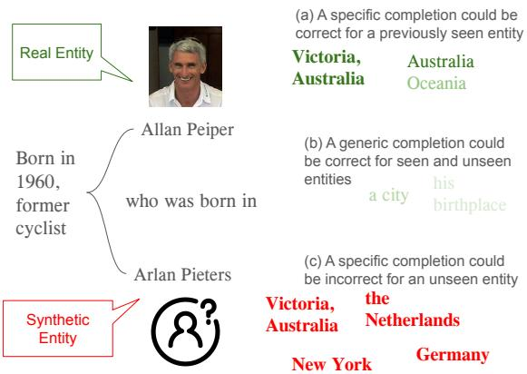  
Figure 1: Figure outlines the notion of a Gricean Retreat. While dealing with known entities, a specific completion would likely be correct (a), but in the case of unknown entities it would likely lead to an incorrect completion (c). In such cases, models could opt for a less informative, but truthful completion (b).

Humans face this same problem constantly, and can resolve it by offering as much information as possible while staying faithful to what they actually know. Grice (1975) formalizes this through the Cooperative Principle, the implicit norm that interlocutors contribute to a conversation as is required. This principle is realized through several conversational maxims; the two that govern this trade-off most directly are Quantity (be as informative as required), and Quality (only assert what you know). Consider a speaker who encounters the name Allan Peiper without knowing specifics about him. Drawing on whatever context the name appears in, they can fall back on commonsense category knowledge (Brown, 1958; Cruse, 1977) and refer to him as an Australian, a cyclist, or simply a person. We refer to this move, from a specific referent to a more general one, as a Gricean retreat.

This opens up a natural question for LLMs:

when a model is uncertain about a referent, can it perform a Gricean retreat as a cooperative speaker would, moderating the specificity of what it generates to trade informativeness for truthfulness rather than fabricating? Existing approaches to hallucination control largely operate in an a posteriori fashion, checking a completed response generation for “truthfulness"via internal activation probes (Azaria and Mitchell, 2023; Marks and Tegmark, 2024; Li et al., 2025; Azizian et al., 2025) and then abstaining or re-generating (Varshney et al., 2024; Luo et al., 2024; Zhang et al., 2025). These methods are expensive and all-or-nothing, correcting completed generations rather than calibrating them upfront.

In this paper, we ask whether the ingredients of such upfront calibration are already present inside the model. We curate a benchmark dataset from the T-REx partition (Elsahar et al., 2018) of LAMA (Petroni et al., 2019), covering 8 Wikidata relations across 4 domains (people, corporations, products, and skills). For each relation, we generate three levels of contextual grounding for the subject, synthetic substitutions of the subject to simulate entities outside the model's knowledge boundary, and generic substitutions of the object at varying levels of specificity. We then probe model activations to ask two questions: (i) Does the model internally represent whether a referent is within its knowledge boundary? (ii) Does the model internally represent its upcoming specificity choice, a capability that a Gricean retreat would require?

We find that the answer to both questions is yes, but the two signals are not reconciled in the model's actual generation behavior. Probes can reliably distinguish known from unknown entities, and can predict the specificity of the referent the model is about to generate. Yet when generating, models strongly prefer specific referents regardless of whether the entity falls inside their knowledge boundary, as measured by both perplexity and an extrinsic surprisal elicitation test. In other words, the information needed for a Gricean retreat is present, but the policy that would act on it is not.

We argue this gap represents an untapped opportunity. Rather than treating hallucination as a problem to be caught and corrected after the fact, these internal representations could be leveraged to steer generation toward appropriately general referents when specificity isn't warranted. We see this work as a first step toward Gricean alignment, training or steering objectives that explicitly couple knowledge boundary awareness to referent specificity choice during generation. We make the following contributions:

• We construct a benchmark for testing Gricean retreat behavior in LLMs, with varying contextual grounding, synthetic subjects to simulate unknown entities, and generic object substitutions at varying specificity.

• We show that LLM activations encode both (i) whether an entity falls within the model's knowledge boundary, and (ii) the specificity of the upcoming completion.

• Despite encoding both signals, models overwhelmingly produce specific referents regardless of boundary status, even under stochastic decoding and when correct generic alternatives are available.

• We position our findings as a first step toward Gricean alignment: objectives that couple knowledge-boundary awareness to specificity choice during generation.

## 2 Related Work

In this section, we outline related findings and situate our contributions in prior scholarship.

Semantic Hierarchy and Gricean Maxims LLMs have been shown to capture concepts from semantic hierarchy in its representations (Sun et al. 2025; Rauba and van der Schaar, 2026) Gricean Maxims underline the implicit assumptions that interlocutors make when conversing with each other – with two key aspects being “informativeness" and “truthfulness". (Grandy and Warner, 2023) We construe the quality of “informativeness" as an LLM's preference for hyponymic generation, whereas hypernymic generations will almost always lead to a “truthful" response. In addition to probing for hierarchical concepts, we tie our findings to a model's ability to control for one quality over another, when contrasted with known and unknown entities.

Factual Hallucinations due to Knowledge Boundary and Abstention Recognizing LLM knowledge boundary is still a challenging task (Huang et al., 2025). Past works have looked at providing context in order to help LLMs deal with entities outside their knowledge (Li et al., 2023; Ren et al., 2025) or by benchmarking an LLMs ability to know how well they work with entities outside their knowledge boundary (Onoe et al., 2022). However, these approaches don't setup a policy that could guide LLM behavior when faced with unknown entities without external knowledge or finetuning. Our approach prescribes LLMs to adhere to the Cooperative Principle when dealing with entities, so as to venture specifics only when a referent entity has been observed in the pretraining data In a sense, this is similar to abstention (Zhang et al., 2025), but instead of a refusal or hedged response, we favor a 1-shot truthful generation that is faithful to what the model actually knows. Other work that has explored this direction has relied on online-verifying and regenerating answers (Varshney et al., 2024; Zhao et al., 2024), or by testing the understanding of concepts to abstain from generating falsehoods (Luo et al., 2024), both of which are expensive and require multiple passes for a final response.

<table><tr><td>Domain Map</td><td>Relationships</td><td># Samples</td></tr><tr><td>Human ↓ Location</td><td>P19: [X] was born in [Y] P20: [X] died in [Y]</td><td>918</td></tr><tr><td>Corporation ↓ Location</td><td>P740: [X] was founded in [Y] P159: [X] has headquarters in [Y]</td><td>808</td></tr><tr><td>Product ↓ Corporation</td><td>P449: [X] was originally aired on [Y] P127: [X] is owned by [Y]</td><td>1176</td></tr><tr><td>Person ↓ Skill</td><td>P136: [X] plays [Y] music P413: [X] plays in [Y] position</td><td>1590</td></tr></table>

Table 1: The Wikidata properties we utilized in construction of our dataset.

Probing LLMs to know their knowledge boundary A large body of work has shown extensively that LLMs are capable of representing their truthfulness in their model parameters (Marks and Tegmark, 2024; Azaria and Mitchell, 2023; Azizian et al., 2025). However, to the best of our knowledge, no one has looked into probing LLMs to determine whether it has seen a particular entity in its training data. In this work, we use the infini-gram API (Liu et al., 2024) to identify distractor entities that an LLM has not come across in its training data, and use them as replacements for known entities. To ensure that LLMs are not using shallow heuristics for recall (Saynova et al., 2025), we control and test LLMs with distractors that share similar surface properties to the real entity. Finally, following (Orgad et al., 2025), we use linear models to discriminate between activations obtained from known and unknown entities.

## 3 Data

We construct a benchmark dataset to evaluate the entity-fact elicitation capabilities of LLMs under varying contextual conditions. Given a subject SUB associated with an object OBJ through a relation REL, we generate completion prompts with different amounts of contextual information about SUB to assess the model's ability to recover the corresponding fact. Specifically, we consider three levels of contextualization: (1) minimal context (verbalized relationship), (2) a single-sentence context, and (3) an additional 1–2 sentence preamble describing the subject.

While factual recall can be evaluated using the ground-truth object OBJ, assessing the specificity of model generations requires a broader evaluation framework. To this end, we introduce generic substitutions of OBJ, enabling analysis of whether the model produces overly generic or semantically diluted responses instead of the precise target fact. Furthermore, to simulate settings in which the subject entity may not be explicitly memorized during pre-training, we generate synthetic substitutions for SUB. These components create a diverse evaluation framework for analyzing the Gricean retreat behavior of LLMs across varying levels of contextual grounding and entity familiarity.

We use the T-REx partition (Elsahar et al., 2018) of the LAMA dataset (Petroni et al., 2019) to collect our data. The source of information in this partition comes from Wikipedia and Wikidata, a repository that is present in common LLM pretraining datasets such as C4 (Raffel et al., 2020) and The Pile (Gao et al., 2020). The Wikipedia source allows us to verify the facts related to the entity being talked about. Of the 46 Wikidata relations in T-REx, we choose a subset of 8 relations that exhibit a many-to-one mapping. This ensures there can only be one right answer when eliciting knowledge about an entity. The full list of relations, along with their sample counts is shown in table 1.

## 3.1 Data Construction Pipeline

We follow a five-stage pipeline to construct our benchmark from the T-REx dataset. At each stage that requires generation or refinement, we use Gemma 4 31B (Mesnard et al., 2024). We represent each fact in a relation as a triplet (SUB, REL, OBJ). Below, we describe each stage.

Stage 1: Preprocess. For each triplet (SUB, REL, OBJ), T-REx provides multiple candidate sentences. To limit ambiguity, we sample one sentence per triplet that explicitly contains SUB, OBJ, and the relation REL between them, avoiding sentences with only indirect references to REL. For example, for the triplet (Allan Peiper, born-in, Victoria), T-REx might contain: (i) "Australian cyclist Allan Peiper has competed in five Tour de France races", and (ii) "Allan Peiper, (born in 26 April, 1960), was a professional cyclist born in Victoria, Australia." We pick the second sentence, as it explicitly mentions the subject's birthplace.

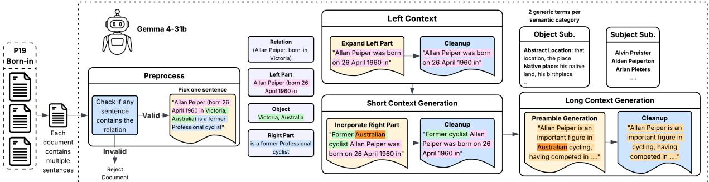  
Figure 2: This figure depicts the data pipeline stages for P19 relation, which describes the Subject's birthplace

Stage 2: Context Generation. In this stage, we generate the three levels of context. For minimal context, we simply express the relationship verbally. An example of minimal context prompt for the previous triplet: "Allan Peiper was born in". For short context generation, we use the complete information in the extracted sentence, utilizing any additional information expressed in the sentence other than the relationship. Both short context and minimal context generation requires reformating the existing information from the sentence. For long context generation, we prompt Gemma to generate a 1-2 sentence preamble in addition to the already generated short context.

Stage 3: Context Cleanup. The context generation stage can result in certain contexts which contain direct references about the object. We run the cleanup stage after every context generation stage, where we prompt Gemma with the generated context, and the relation triplet to either replace any direct reference to the object with a generic term or remove the reference all-together. For example, in the short context "Australian cyclist Allan Peiper, having competed in five Tour de France, was born in", the word Australian acts as a direct reference towards the answer "Victoria" and can bias the LLM towards predicting an Australian city.

Stage 4: Object Substitution. In this stage, we generate 10 generic substitutions for the object with varying specificity. We provide some in-context examples that we generate using ChatGPT. For example, for "Victoria", and context "Former cyclist Allan Peiper, having competed in five Tour de France, was born in", some of the generic object substitutions could be: "his hometown", "his birthplace", "the country", "a region in his country".

Stage 5: Subject Substitution. The previous stages help us create prompts to test an LLM's knowledge about real subjects. In this stage, we generate synthetic names that replace the subject, simulating the case where the LLM has not encountered the subject entity during pretraining. We prompt Gemma to generate synthetic name, specifically instructing it to generate names with similar backgrounds. For example, if generating substitution for Allan Peiper, we generate similar australian sounding names. As for object substitution, we provide in-context examples for each domain.

To ensure high data generation quality, we refined this pipeline in an incremental fashion. For each relation described in Table 1, we create specific prompts for every stage stage with relevant in-context examples. We first executed the pipeline for 100 samples, identified the mistakes in every stage and adjusted the corresponding prompts. We continued this cycle till we achieved high quality.

## 3.2 Verifying Synthetic Entities

We verify if our process for artificially creating unseen entities is valid using the infini-gram API (Liu et al., 2024). We use The Pile as our reference corpus because the models we evaluate (Pythia, Section 4) are trained exclusively on it, which lets us tie entity occurrence in pretraining directly to a model's knowledge boundary. We do this by sampling 1,000 entities from each relation in our dataset, with an equal number of real and synthetic entities. The infini-gram API provides The Pile dataset in a train and val split, we check entity occurrences on both of them.

We observe that real entities are captured in most of the splits, whereas the artificially created entities rarely occur in either split. The median for real entities occurring in the train split across relations range from 112 - 1989, however the median ranges for synthetic entities span from 0-2 across all relations. The median value of real entities occurring in the val split is between 0 and 2 and the median for synthetic entities is always 0. This distribution of entities for the Corporation-Location relation is presented in Figure 3. Figures for all other relations can be found in Appendix A.

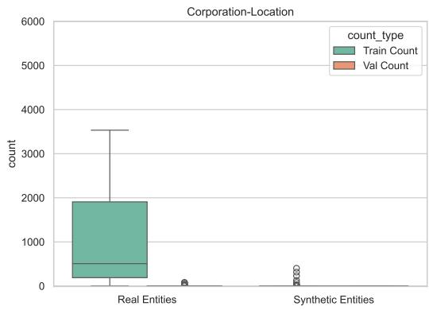  
Figure 3: Difference in distribution between the number of real and synthetic entities found in the Pile Dataset for the Corporation-Location domain. The rest of the distributions are provided in the Appendix.

Ideally, we would like to individually check every real and synthetic entity for its occurrence in the dataset. However, there are several artificial entities generated per real entity, which would make it intractable due to the volume of entities. Instead, we use this method to validate our process for synthetic entity creation in order to use them for our downstream tasks.

## 4 Probing Experiments

In this section, we probe models to see if their activations capture whether an entity occurs within the model's knowledge boundary, and whether the model is about to generate a specific or generic completion. We use the Pythia suite (Biderman et al., 2023), testing across the full range of model sizes from 70M to 12B parameters.

## 4.1 Method

Our first probe tests whether the model represents an entity's knowledge boundary status. We extract the hidden activation at the last sub-word token of the entity, which lets the model consider the entire entity before we read out a judgment. We refer to this as the subject representation, and use it to predict whether the subject entity is real or synthetic. Our second probe tests whether the model anticipates the specificity of its upcoming completion. We extract the hidden representation at the token position immediately before the completion. We refer to this as the object representation, and use it to predict whether the model will produce a specific or generic completion. Figure 4 illustrates the extraction of both representations.

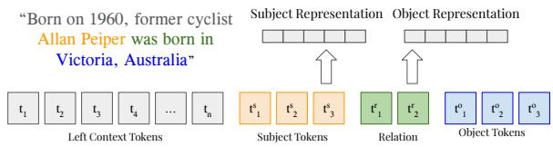  
Figure 4: Extracting Subject and Object Representations.

We employ a simple linear probe to inspect the extracted activations following previous work from (Marks and Tegmark, 2024; Azizian et al., 2025). Using 5-fold Cross Validation, we train a Logistic Regression classifier and calculate the AUROC scores using the Scikit-Learn library in Python (Pedregosa et al., 2011). We then report the average AUROC across all folds.

LLM-as-a-judge to assess completions The human annotation cost for assessing LLM completions is high. Due to this, we use an LLM-as-ajudge paradigm to label two properties of each completion: its entailment relation to the expected completion, and its specificity level. Entailment captures whether a generation is truthful given the ground truth, allowing for generic responses that are weaker but not wrong. For example, given the ground truth Victoria, the completion Australia is entailed (Victoria is in Australia) even though it does not lexically match. Specificity captures whether the generation is committal (a specific named entity) or generic (a category-level fallback). For example, Victoria is specific, a region in Australia is generic, and a place is more generic still. These two labels characterize each completion along the two dimensions a Gricean retreat would calibrate: the specificity of the generation, and its truthfulness given the ground truth. In Section 5 we use these labels to assess whether models actually perform retreats.

We use Deepseek-R1:32b (Guo et al., 2025)

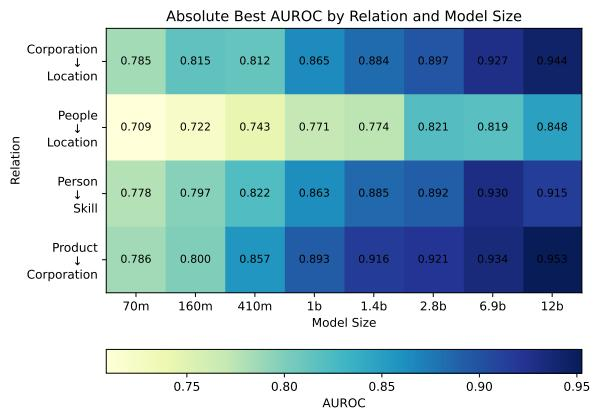  
Figure 5: The best AUROC achieved per relation in predicting whether a model has seen an entity, by various model sizes. Each model achieves the highest AUROC in different layers, but they are all roughly just before to the model's middle layer.

as the judge, chosen for its reasoning ability and strong performance on NLI benchmarks. To validate this setup, we sample completions from each relation in Section 3 and have two annotators independently label the entailment and specificity of each completion, allowing us to measure agreement with the LLM-judge. The LLM-judge agrees with human annotators at 94.1% for the entailment classification, and 87.4% for the completion specificity annotations. Overall, the LLM agrees with annotators at 90.8%.

Even with the LLM-as-a-judge approach, it is costly to run evaluations across all domains and model sizes. We therefore select 2 models, the Pythia-1.4b-deduped and Pythia-12b-deduped, to assess completions and identify relations across model sizes.

## 4.2 Findings

In the interest of brevity, we share the results for just one relation (Person → Location). However, the data for the rest of the relations can be found in the appendix (Appendix A).

Model activations capture entities within and outside its knowledge boundary Figure 5 shows that model activations can strongly predict whether an entity has occurred in its pretraining data. A linear classifier trained on even the smallest models’ activations is able to predict (albeit more weakly) whether an entity is within its knowledge boundary. Larger models with larger hidden dimensions provide better signal to a linear probe with models with greater than 2 billion parameters achieving > 90%

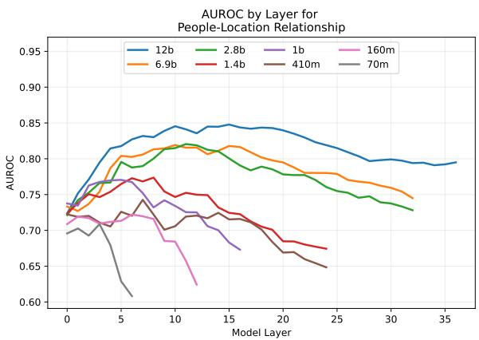  
Figure 6: AUROC for predicting whether a model has seen an entity before as it varies with model layers across different models. The difference in layer coverage is due to the fact that smaller models have fewer layers.

AUROC. Interestingly, the People→Location relation has the poorest performance, and a potential reason for this is that this relation had the highest number of occurrences of synthetic entities in the Pile dataset. This noise may have made it difficult for the linear classifier to predict if an entity occurred in the pretraining data.

Figure 6 shows that activations from layers immediately before the middle are best at predicting if an entity lies within the models’ knowledge boundary. Azaria and Mitchell (2023) showed that the representation of “truthfulness" tends to spike in the middle layers of LLMs, and this may be a parallel phenomenon where a model is able to distinguish a “truthful" entity from a false one.

Models activations can reliably predict if the model is going to generate a specific or generic completion Using the LLM-judge annotations, we sample an equal number of specific and generic completions per relation. The total varies across relations because the model's specificity preference varies across them. Figure 7 plots probe AUROC against layer depth. We observe that the probe is unable to predict the model's specificity preference in early layers, achieving AUROC on par with chance. However, predictive accuracy rises strongly as layer depth increases. While both model sizes achieve high AUROC, the 12B model outperforms the 1.4B model in predicting specificity.

We also test two decoding strategies, a greedy argmax, which selects the most probable next token, and multinomial sampling, which samples from the next-token distribution (Figure 7). We observe that activations capture the specificity of argmax decoding more reliably than that of multinomial decoding. This could be due to the deterministic nature of argmax decoding, which may force the model to commit to a specific completion more readily than to a generic one.

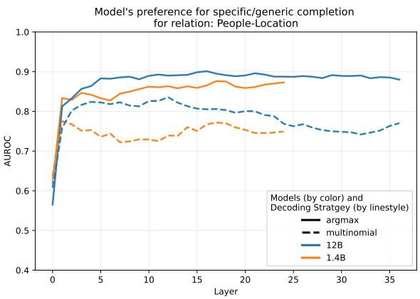  
Figure 7: AUROC for predicting whether a model is going to generate a specific or generic completion, as it varies across layers.

## 5 Generation Behavior Analysis

From our probing experiments, we find that the model encodes signal to identify when an entity is within or outside its knowledge boundary. We also learned that the model activations can capture whether the model is going to move towards a general or specific completion. In this section, we study whether the model uses this information in order to perform Gricean retreats by preferring generic completions when faced with entities outside its knowledge boundary.

## 5.1 Out-of-the-box Behavior

We first study how models generate completions without any intervention. The optimal policy in our Gricean framing depends on the entity. For entities within the model's knowledge boundary, the model should produce specific, entailed completions. For entities outside this boundary, the model should retreat to generic but still entailed entities (Figure 1). To assess these two dimensions empirically, we use entailment as a proxy for truthfulness and completion specificity as a proxy for informativeness. Our goal is to study whether models are able to balance these two dimensions when generating completions in real and synthetic cases.

We use the LLM-as-a-judge to make this assessment. We aggregate results from both model sizes (12B and 1.4B), and both decoding strategies (argmax and multinomial) for this analysis.

Results From Figure 8, we observe that in the real and synthetic cases, the model overwhelmingly prefers to be informative at the cost of truthfulness. The model achieves informativeness by generating specific completions. This helps the model get the right completion frequently when dealing with real cases, but in the synthetic cases there is no correct specific completion. So every time it gives a specific response, it is likely an undesired outcome, unless it generates a specific completion that has a neutral entailment.

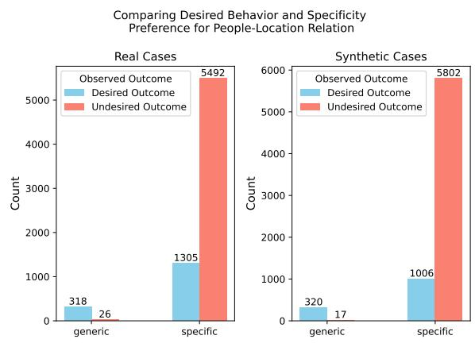  
Figure 8: Counts of desired and undesired behaviors across real and synthetic cases. Desired outcomes comprise of truthful completions (though not necessarily informative), and undesired behaviors comprise of falsehoods.

While these observations strongly indicate that the model prefers specific answers in all cases, a potential explanation to this problem could be that the model commits early on to a specific answer and due to nature of a right-to-left decoder, is forced to follow the answer path (Azaria and Mitchell, 2023; Zhang et al., 2024). In order to account for this edge-case, we introduce the next experiment.

As before, we only disclose one relation studied here. The rest of the plots can be found in the appendix.

## 5.2 Surprisal over Candidate Completions

To test whether the model's preference for specific answers persists when correct generic alternatives are explicitly available, we test if models, when given an option between a correct generic completion and incorrect specific completion, can prefer the correct generic completion. In order to do this, we come up with varying generic-correct answers, and test to see if the average surprisal over the generic statement is lower than a wrong specific completion. The goal here is to see if models can overcome their specific bias if they are presented with correct generic options.

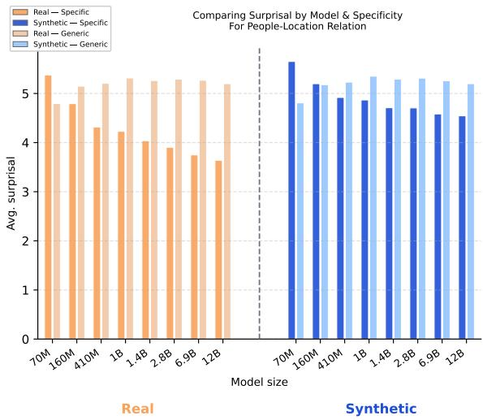  
Figure 9: Average surprisal for real and synthetic cases, as it varies across model sizes.

Since we cannot encode all possible generic answers, we intelligently design generic completions with enough variations that at least some of the synthetic generic answers should be preferred by the model.

Model prefers specific completions, despite having better generic options The model overwhelming prefers specific completions in real and synthetic scenarios. Figure 9 shows average surprisal for real and synthetic cases, across varying model sizes. We observe that smaller models actually prefer generic completions, but larger models prefer specific completions.

This could occur because smaller models have smaller hidden dimensions and less layers, so rare specific referents may not be well captured in their parameters, whereas unnamed references constituted by frequent words may be more salient to smaller models. Larger models may prefer specific completions, as online textual data is usually specific, with the intent of providing a reader with information (e.g., Wikipedia and the News).

Specificity bias is observed across varying context lengths We see in Figure 10 that specific generations are still preferred across all context lengths, but the preference rises with increasing model size. We also observe that specificity bias increases with increasing context lengths, possibly because the model feels more confident in picking an answer given so much information. The long context in synthetic cases borrows a lot of words from the real cases and could prove to be a distraction. This could be a sign of overconfidence on behalf of the model.

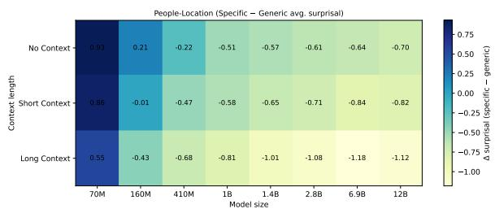  
Figure 10: Average difference in specific and generic surprisals.

## 6 Conclusions

In this work, we have outlined a novel strategy for aligning model behaviors to a Gricean paradigm, where the model has to balance its informativeness with its truthfulness. In order to do this, we design a data curation process to obtain entities known and unknown to a model by studying its training data. Next, we show through linear probing that LLMs hidden activations can strongly predict whether the model knows if it is real (seen in the training data) or synthetic (unseen to the model). We then show that the model knows whether it is going to move towards a specific or a generic generation before the generation. Given that the model knows when entities fall within its knowledge boundary, and knowing that it has a strong signal to measure specificity of generation, we test whether this helps the model perform well within our Gricean standard. We observe that the model overwhelmingly prefers specific generations, in real and synthetic scenarios. We show that this is not just due to a small error at the start of the decoding process, but a problem that persists even when the model is asked to choose between an incorrect specific or a correct generic choice. This opens the door for future work in the idea of Gricean alignment of LLMs, to utilize the existing apparatus present in their hidden activations to align them to behave more faithfully to their knowledge.

## Limitations

Our study is limited by a few resource constraints. First, while we checked to ensure that synthetic entities were rarely present in the training data, the effect of the contamination may have skewed our results. Second, using an LLM based approach for data generation could further contaminate our data as we are only able to verify for subset of relationships for small set of samples. Besides limitations due to data, we were also constrained in the number of samples and models we could test in the LLMas-a-judge scenario, which means more efforts may be needed to for a more in-depth analysis. Lastly, we only consider a subset of relationships and small subset of models, potentially leaving gaps in our analysis. We leave addressing these limitations along with the questions regarding implementing Gricean alignment to future work.

## References

Amos Azaria and Tom Mitchell. 2023. The internal state of an LLM knows when it's lying. In The 2023 Conference on Empirical Methods in Natural Language Processing.

Waïss Azizian, Michael Kirchhof, Eugene Ndiaye, Louis Béthune, Michal Klein, Pierre Ablin, and marco cuturi. 2025. The geometries of truth are orthogonal across tasks. In ICML 2025 Workshop on Reliable and Responsible Foundation Models.

Stella Biderman, Hailey Schoelkopf, Quentin Anthony Herbie Bradley, Kyle O'Brien, Eric Hallahan, Mohammad Aflah Khan, Shivanshu Purohit, USVSN Sai Prashanth, Edward Raff, Aviya Skowron, Lintang Sutawika, and Oskar van der Wal. 2023. Pythia: A suite for analyzing large language models across training and scaling. Preprint, arXiv:2304.01373.

Roger Brown. 1958. How shall a thing be called? Psychological Review, 65:14–21.

D. A. Cruse. 1977. The pragmatics of lexical specificity. Journal of Linguistics, 13(2):153–164.

Advait Deshmukh, Ashwin Umadi, Dananjay Srinivas, and Maria Leonor Pacheco. 2025. All entities are not created equal: Examining the long tail for ultrafine entity typing. In Proceedings of the 14th Joint Conference on Lexical and Computational Semantics (\*SEM 2025), pages 189–201, Suzhou, China. Association for Computational Linguistics.

Hady Elsahar, Pavlos Vougiouklis, Arslen Remaci, Christophe Gravier, Jonathon Hare, Frederique Laforest, and Elena Simperl. 2018. T-REx: A large scale alignment of natural language with knowledge base triples. In Proceedings of the Eleventh International Conference on Language Resources and Evaluation (LREC 2018), Miyazaki, Japan. European Language Resources Association (ELRA).

Leo Gao, Stella Biderman, Sid Black, Laurence Golding, Travis Hoppe, Charles Foster, Jason Phang, Horace He, Anish Thite, Noa Nabeshima, Shawn Presser, and Connor Leahy. 2020. The Pile: An 800gb dataset of diverse text for language modeling. arXiv preprint arXiv:2101.00027.

Richard E. Grandy and Richard Warner. 2023. Paul Grice. In Edward N. Zalta and Uri Nodelman, editors, The Stanford Encyclopedia of Philosophy, Fall 2023 edition. Metaphysics Research Lab, Stanford University.

H. P. Grice. 1975. Logic and conversation. In Syntax and Semantics: Vol. 3: Speech Acts, pages 41–58. Academic Press, New York.

Daya Guo, Dejian Yang, Haowei Zhang, Junxiao Song, Peiyi Wang, Qihao Zhu, Runxin Xu, Ruoyu Zhang, Shirong Ma, Xiao Bi, Xiaokang Zhang, Xingkai Yu, Yu Wu, Z. F. Wu, Zhibin Gou, Zhihong Shao, Zhuoshu Li, Ziyi Gao, Aixin Liu, and 175 others. 2025. Deepseek-r1 incentivizes reasoning in llms through reinforcement learning. Nature, 645(8081):633–638.

Lei Huang, Weijiang Yu, Weitao Ma, Weihong Zhong, Zhangyin Feng, Haotian Wang, Qianglong Chen, Weihua Peng, Xiaocheng Feng, Bing Qin, and Ting Liu. 2025. A Survey on Hallucination in Large Language Models: Principles, Taxonomy, Challenges, and Open Questions. ACM Transactions on Information Systems, 43(2):1–55.

Daliang Li, Ankit Singh Rawat, Manzil Zaheer, Xin Wang, Michal Lukasik, Andreas Veit, Felix Yu, and Sanjiv Kumar. 2023. Large language models with controllable working memory. In Findings of the Association for Computational Linguistics: ACL 2023, pages 1774–1793, Toronto, Canada. Association for Computational Linguistics.

Moxin Li, Yong Zhao, Wenxuan Zhang, Shuaiyi Li, Wenya Xie, See-Kiong Ng, Tat-Seng Chua, and Yang Deng. 2025. Knowledge boundary of large language models: A survey. In Proceedings of the 63rd Annual Meeting of the Association for Computational Linguistics (Volume 1: Long Papers), pages 5131–5157, Vienna, Austria. Association for Computational Linguistics.

Jiacheng Liu, Sewon Min, Luke Zettlemoyer, Yejin Choi, and Hannaneh Hajishirzi. 2024. Infini-gram: Scaling unbounded n-gram language models to a trillion tokens. arXiv preprint arXiv:2401.17377.

Junyu Luo, Cao Xiao, and Fenglong Ma. 2024. Zeroresource hallucination prevention for large language models. In Findings of the Association for Computational Linguistics: EMNLP 2024, pages 3586–3602, Miami, Florida, USA. Association for Computational Linguistics.

Samuel Marks and Max Tegmark. 2024. The geometry of truth: Emergent linear structure in large language model representations of true/false datasets. In First Conference on Language Modeling.

Gemma Team Thomas Mesnard, Cassidy Hardin, Robert Dadashi, Surya Bhupatiraju, Shreya Pathak, L. Sifre, Morgane Rivière, Mihir Kale, J Christopher Love, Pouya Dehghani Tafti, L’eonard Hussenot, Aakanksha Chowdhery, Adam Roberts, Aditya Barua, Alex Botev, Alex Castro-Ros, Ambrose Slone, Am'elie H’eliou, Andrea Tacchetti, and 88 others. 2024. Gemma: Open models based on gemini research and technology. ArXiv, abs/2403.08295.

Yasumasa Onoe, Michael Zhang, Eunsol Choi, and Greg Durrett. 2022. Entity cloze by date: What LMs know about unseen entities. In Findings of the Association for Computational Linguistics: NAACL 2022, pages 693–702, Seattle, United States. Association for Computational Linguistics.

Hadas Orgad, Michael Toker, Zorik Gekhman, Roi Reichart, Idan Szpektor, Hadas Kotek, and Yonatan Belinkov. 2025. LLMs know more than they show: On the intrinsic representation of LLM hallucinations. In The Thirteenth International Conference on Learning Representations.

F. Pedregosa, G. Varoquaux, A. Gramfort, V. Michel, B. Thirion, O. Grisel, M. Blondel, P. Prettenhofer, R. Weiss, V. Dubourg, J. Vanderplas, A. Passos, D. Cournapeau, M. Brucher, M. Perrot, and E. Duchesnay. 2011. Scikit-learn: Machine learning in Python. Journal of Machine Learning Research, 12:2825-2830.

Fabio Petroni, Tim Rocktäschel, Sebastian Riedel, Patrick Lewis, Anton Bakhtin, Yuxiang Wu, and Alexander Miller. 2019. Language Models as Knowledge Bases? In Proceedings of the 2019 Conference on Empirical Methods in Natural Language Processing and the 9th International Joint Conference on Natural Language Processing (EMNLP-IJCNLP), pages 2463–2473, Hong Kong, China. Association for Computational Linguistics.

Colin Raffel, Noam Shazeer, Adam Roberts, Katherine Lee, Sharan Narang, Michael Matena, Yanqi Zhou, Wei Li, and Peter J. Liu. 2020. Exploring the limits of transfer learning with a unified text-to-text transformer. J. Mach. Learn. Res., 21(1).

Paulius Rauba and Mihaela van der Schaar. 2026. Deep hierarchical learning with nested subspace networks for large language models. In The Fourteenth International Conference on Learning Representations.

Ruiyang Ren, Yuhao Wang, Yingqi Qu, Wayne Xin Zhao, Jing Liu, Hua Wu, Ji-Rong Wen, and Haifeng Wang. 2025. Investigating the factual knowledge boundary of large language models with retrieval augmentation. In Proceedings of the 31st International Conference on Computational Linguistics, pages 3697–3715, Abu Dhabi, UAE. Association for Computational Linguistics.

Denitsa Saynova, Lovisa Hagström, Moa Johansson, Richard Johansson, and Marco Kuhlmann. 2025. Fact Recall, Heuristics or Pure Guesswork? Precise

Interpretations of Language Models for Fact Completion. In Findings of the Association for Computational Linguistics: ACL 2025, pages 18322–18349, Vienna, Austria. Association for Computational Linguistics.

Kai Sun, Yushi Bai, Shangqing Tu, Juanzi Li, and Lei Hou. 2025. Probing fine-grained hierarchical concept comprehension and generation in large language models. IEEE Transactions on Audio, Speech and Language Processing, 33:3229–3242.

Neeraj Varshney, Wenlin Yao, Hongming Zhang, Jianshu Chen, and Dong Yu. 2024. A stitch in time saves nine: Detecting and mitigating hallucinations of LLMs by actively validating low-confidence generation.

Blerta Veseli, Simon Razniewski, Jan-Christoph Kalo, and Gerhard Weikum. 2023. Evaluating the knowledge base completion potential of GPT. In Findings of the Association for Computational Linguistics: EMNLP 2023, pages 6432–6443, Singapore. Association for Computational Linguistics.

Muru Zhang, Ofir Press, William Merrill, Alisa Liu, and Noah A. Smith. 2024. How language model hallucinations can snowball. In Proceedings of the 41st International Conference on Machine Learning, volume 235 of Proceedings of Machine Learning Research, pages 59670–59684. PMLR.

Yue Zhang, Yafu Li, Leyang Cui, Deng Cai, Lemao Liu, Tingchen Fu, Xinting Huang, Enbo Zhao, Yu Zhang, Yulong Chen, Longyue Wang, Anh Tuan Luu, Wei Bi, Freda Shi, and Shuming Shi. 2025. Siren's Song in the AI Ocean: A Survey on Hallucination in Large Language Models. Computational Linguistics, pages 1-46.

Yukun Zhao, Lingyong Yan, Weiwei Sun, Guoliang Xing, Chong Meng, Shuaiqiang Wang, Zhicong Cheng, Zhaochun Ren, and Dawei Yin. 2024. Knowing what LLMs DO NOT know: A simple yet effective self-detection method. In Proceedings of the 2024 Conference of the North American Chapter of the Association for Computational Linguistics: Human Language Technologies (Volume 1: Long Papers), pages 7051–7063, Mexico City, Mexico. Association for Computational Linguistics.

## A Additional plots

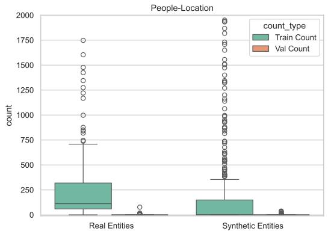  
Figure 11: Difference in distribution between the number of real and synthetic entities found in the Pile Dataset for the People-Location domain.

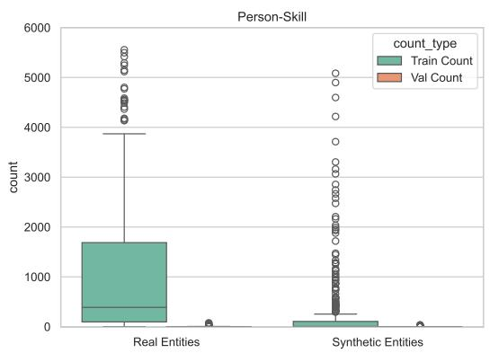  
Figure 12: Difference in distribution between the number of real and synthetic entities found in the Pile Dataset for the People-Skill domain.

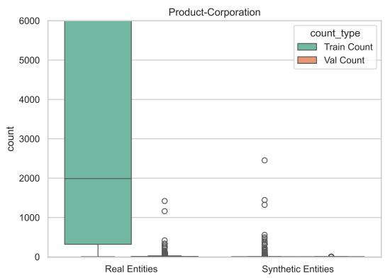  
Figure 13: Difference in distribution between the number of real and synthetic entities found in the Pile Dataset for the Product-Corporation domain.

  
Figure 14: AUROC by layer for Corporation-Location Relationship

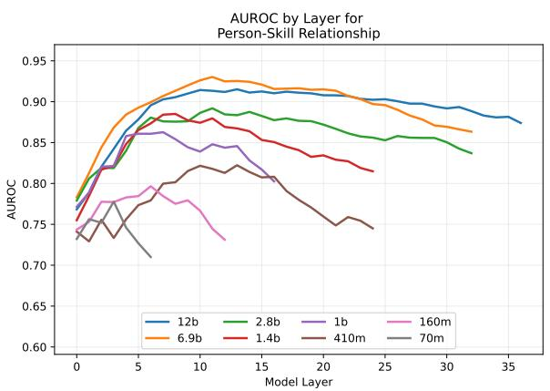  
Figure 15: AUROC by layer for People-Skill Relationship

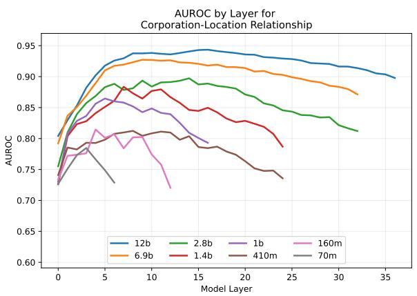  
Figure 16: AUROC by layer for Corporation-Location Relationship

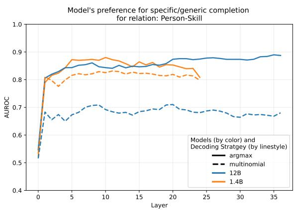  
Figure 17: AUROC for predicting specific/generic completion for Person-Skill relation.

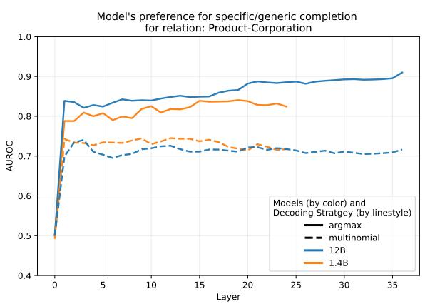  
Figure 18: AUROC for predicting specific/generic completion for Production-Corporation relation.

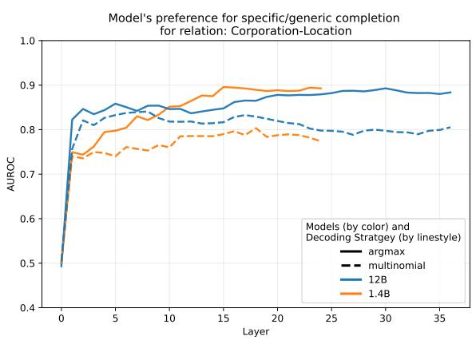  
Figure 19: AUROC for predicting specific/generic completion for Corporation-Location relation.

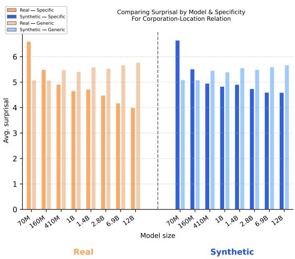  
Figure 20: Surprisal comparison per Model and Specificity for Corporation-Location relation.

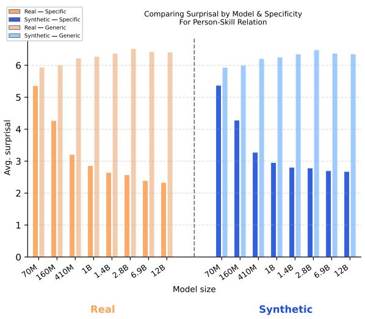  
Figure 21: Surprisal comparison per Model and Specificity for People-Skill relation.

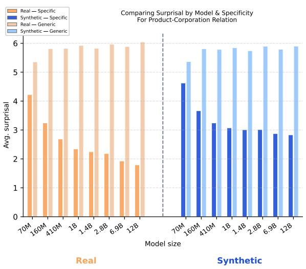  
Figure 22: Surprisal comparison per Model and Specificity for Product-Corporation relation.

Comparing Desired Behavior and Specificity Preference for Corporation-Location Relation

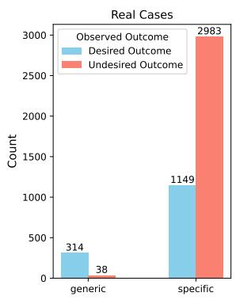

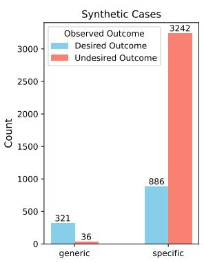  
Figure 23: Counts of desired and undesired behaviors across real and synthetic cases for Corporation-Location relation  
Comparing Desired Behavior and Specificity Preference for Person-Skill Relation

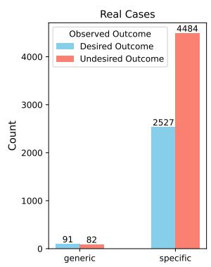

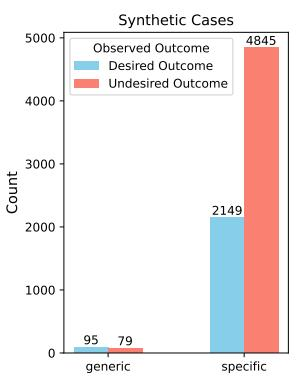  
Figure 24: Counts of desired and undesired behaviors across real and synthetic cases for Person-Skill relation.  
Comparing Desired Behavior and Specificity Preference for Product-Corporation Relation

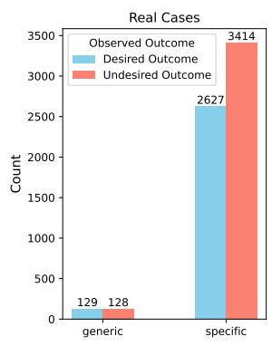

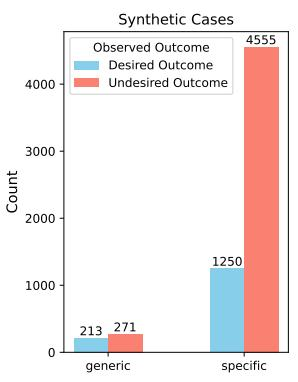  
Figure 25: Counts of desired and undesired behaviors across real and synthetic cases for Product-Corporation relation

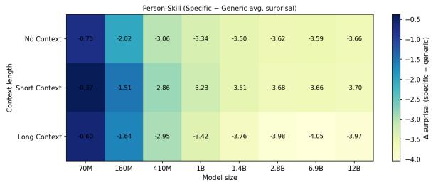  
Figure 26: Comparison for Avg. Specific - General surprisal for different context length across models for Person-Skill relation.

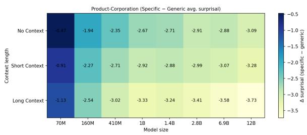  
Figure 27: Comparison for Avg. Specific - General surprisal for different context length across models for Product-Corporation relation.

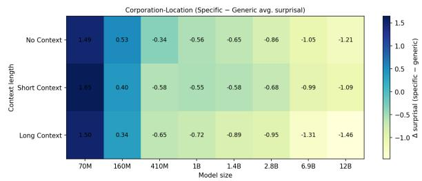  
Figure 28: Comparison for Avg. Specific - General surprisal for different context length across models for Corporation-Location relation.

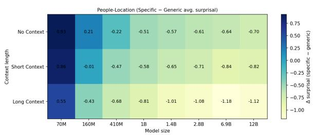  
Figure 29: Comparison for Avg. Specific - General surprisal for different context length across models for People-Location relation.