# Training AI Scientists to Replicate Research

Damon Falck\*<sup>,1</sup>, Samer Sabri\*<sup>,1</sup>, Anja Surina<sup>1</sup>, Thom Foster<sup>1</sup>, Anya Sims<sup>1</sup>, Sam Devlin<sup>1</sup>, Dylan Rogers<sup>1</sup>, Tantum Collins<sup>1</sup>, Kaloyan Aleksiev<sup>§,1</sup>, Louis Kirsch<sup>†,1</sup>, Edward Hughes<sup>†,1</sup>

\*Equal first author. <sup>§</sup>Infrastructure lead. <sup>†</sup>Equal last author. <sup>1</sup>Inherent

The replicability of papers is a cornerstone of scientific knowledge, ensuring the reliability of existing results and providing a base for further experiments. The act of replication typically illuminates details that were previously underspecified, and thus requires similar hypothesis-driven exploration to openended research. In this work, we develop Replica, a scalable task space for paper replication. To provide reward signal, we introduce an auto-generated rubric-based judge that has low noise and agrees with human assessment of replication quality. We post-train Faraday, a 27B-parameter “AI Scientist” agent that leverages coding agents as tools, surpassing the performance of Claude Opus 4.8 and GPT-5.5 on held-out replication tasks. Qualitative analysis of individual rollouts reveals that Faraday adopts a more scientifically-principled approach. We believe that our results provide a stepping stone towards AI agents capable of long-horizon scientific innovation without requiring complex harnesses.

## 1 Introduction

Science is the search for good explanations about the universe (Deutsch, 2011). An explanation compresses what we know about reality in a reliable way. A good explanation is hard to vary; ifnew evidence comes to light that contradicts the explanation, that explanation is falsified, rather than easily tweaked to admit the fresh data. Crucial to both reliability and falsification is the idea that scientific experiments ought to replicate: if you run the same experiment, you get the same results, up to the sensitivity of the measuring equipment and uncontrollable stochasticity. Replication, therefore, underpins the edifice of human scientific knowledge.

Remarkably, the sciences face a replication crisis, not least in machine learning (Kapoor & Narayanan, 2022; Semmelrock et al., 2025). In principle, LLM-based AI agents ofer a scalable resolution to this crisis, especially for research that can be conducted in silico. In practice, however, paper replication poses a challenge to existing AI agents on three fronts. Firstly, the problem of replicating a paper is underspecified by definition: a paper lossily compresses the research that led to a discovery. Secondly, existing AI agents have been heavily trained for well-specified, closedended problems (Shao et al., 2024; Gunjal et al., 2025) whereas replication requires open-ended exploration to infer missing details. Finally, harnesses like autoresearch (Karpathy, 2026) and AlphaEvolve (Novikov et al., 2025) do not naturally apply, by virtue of the fact that for a general replication task there is no definite reward on which to hill-climb. Recent work shows that frontier agents struggle with many scientific aspects ofreplication, despite their proficiency in engineering (Kirgis et al., 2026).

In this paper, we train Faraday, an “AI Scientist” agent (Schmidhuber, 1991; Muggleton & Zauner, 2006; Lu et al., 2024; Kirsch, 2025) capable of replicating research papers. Our LLM-based agent employs Codex GPT-5.5 as a tool, much as human AI researchers use coding agents. Conceptually, we are training a layer ofscientific intelligence that sits above existing coding agents, imbued with an intuition about how to handle underspecified research prob lems. Notably, Faraday is a 27B-parameter model that directs the work of a model with an estimated 5T parameters (Li, 2026) in a way that yields a meaningful performance gain over the larger model alone.

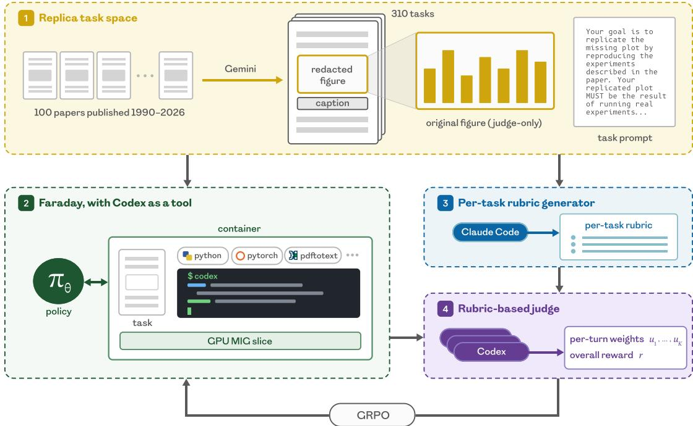  
Figure 1: We train Faraday on Replica. (1) We construct the Replica task space by curating 100 ML and AI-for-science papers published between 1990 and 2026. For each paper, we generate a set of replication tasks by using Gemini 2.5 Pro to redact individual results figures. Each redacted figure yields one task. (2) We generate rollouts on these tasks using our agent Faraday, with access to Codex as a tool for writing code. The agent is given a containerd container provisioned with the task prompt, the redacted paper PDF, the Codex binary, various useful research libraries, a one-seventh MIG slice of an H200 GPU, and internet access. (3) For each task, we use Claude Opus 4.7 prompted with a meta-rubric to generate a task-specific grading rubric. (4) Each rollout is evaluated according to that task’s rubric using multiple samples of a Codex-based judge, given access to the rollout’s container comprising the generated figure, replication codebase, agent rollout, and “gold plot” from the original paper. The judge provides an overall reward and per-turn credit assignment weights, which are used to train the Faraday agent using a modified version of GRPO.

To train Faraday, we introduce a scalable space oftasks called Replica. Each task requires the agent to replicate a figure from a paper with limited time and compute budgets, without seeing the original plot. Success necessitates a small measure of creativity, in the sense of navigating novel constraints (Boden, 1995; Colton & Wiggins, 2012; Epstein, 2026). A coding agent judge assesses each replication using an auto-generated per-task rubric, validated against expert human rankings, yielding a low-noise reward signal. Faraday is produced by post-training Qwen3.6- 27B (Qwen Team, 2026) with a turn-level credit variant of GRPO (Shao et al., 2024) on the Replica train split.

Faraday outperforms Claude Opus 4.8 (hereafter, Claude) and GPT-5.5 (hereafter, Codex) on 73% ofin-distribution ML tasks, and on 60% of held-out AI-for-science tasks, according to our rubric-based judge. On average, Faraday achieves a 6% improvement over Claude and an 8% improvement over Codex on the test split. Optimising Codex’s prompt only marginally diminishes the gap. Human experts rate Faraday as stronger than Claude and Codex on rollouts for which the rubric judge assesses that Faraday has an advantage. Compared to rollouts from frontier models, Faraday behaves more like a human scientist: it implements the mechanism behind the claim rather than hard-coding outputs, it scales down in a way that remains faithful to the paper’s experimental scope, and it avoids shortcuts that would flatter its own result. In summary, the main contributions of our paper are as follows:

1. We introduce Replica, an automatically generated space of 310 figure-replication tasks from 100 machine learning and AI-for-science papers spanning the years 1990–2026 (Figure 1).

2. We provide a recipe for stable GRPO post-training in long-horizon, non-verifiable tasks: a per-task rubricbased judge, multi-sample judge aggregation, and turn-level credit assignment (Section 3.2 and Section 3.5).

3. We train Faraday, a 27B-parameter agent that leverages coding agents as tools (CAT), exhibiting greater scientific rigour both quantitatively and qualitatively (Figure 2 and Table 1).

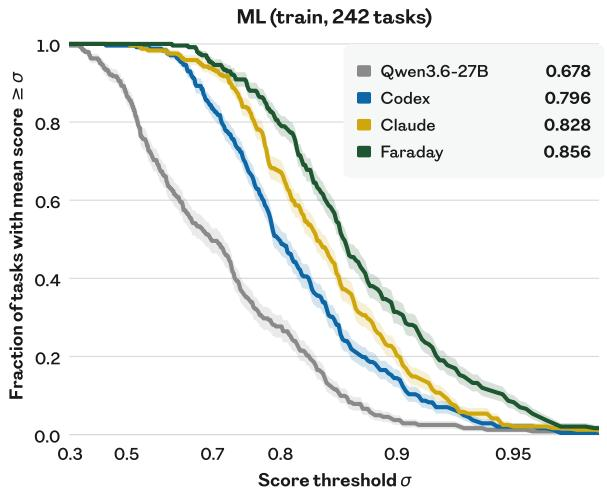

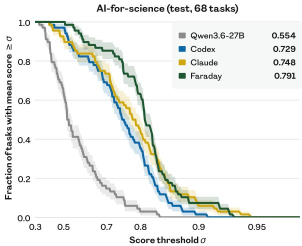  
Figure 2: Faraday replicates beter than frontier coding agents. We plot the fraction oftasks scoring at least �, in-distribution (left) and out-of-distribution (right). For each task, we use the mean score over eight evaluation rollouts. Bands show ±1 SEM over tasks. Faraday and Qwen3.6-27B run in the same simple harness, with Codex GPT-5.5 available as a coding tool; they difer only in that Faraday has been RL post-trained on Replica. Faraday’s curve lies above baselines at every threshold in distribution, and across almost the whole range out of distribution. Not only is it the strongest agent on average (numbers in legend), it also has a thinner weak tail. As in Lupidi et al. (2026), the horizontal axis is spaced by a march-of-nines transform, $\sigma \mapsto - \log _ { 1 0 } ( 1 - \sigma )$

## 2 Related work

Rewards for AI Scientists. Scientific research is an underspecified problem. It is context-dependent and admits many diferent kinds of solutions, and judgement of its quality is subjective. Automating research is a longstanding goal, often pursued by moving pieces of the research loop inside a learning algorithm, such as the update rule (Schmidhuber, 1987; Bengio et al., 1992), the objective (Kirsch et al., 2020; Oh et al., 2020), or the learning algorithm in its entirety (Real et al., 2020; Kirsch et al., 2022). These works generally assume a well-defined reward signal against which the meta-learned component can be scored. Such a signal is hard, if not impossible, to define for the broad goal of scientific research. Nevertheless, to train AI Scientist agents, it is convenient to compress their behaviour into a scalar-valued reward. There are at least two natural ways to produce such a reward: (a) derive a verifiable reward function from existing benchmarks, or (b) judge agent behaviour qualitatively using an LLM.

The former method is particularly efective when hill-climbing an existing benchmark entails a novel and valuable insight, as was the case for the problems under investigation by FunSearch (Romera-Paredes et al., 2024) and AlphaEvolve (Novikov et al., 2025). The success of such algorithms has spurred much work creating hill-climbable benchmarks for discovery, including in toy settings (Majumder et al., 2024), from Kaggle competitions (Chan et al., 2025; Qiang et al., 2025), and based on in silico scientific research (Huang et al., 2024; Chen et al., 2025; Nathani et al., 2025; Wijk et al., 2025; Zhao et al., 2025; Rank et al., 2026; Lupidi et al., 2026).

However, this approach sufers a critical limitation: the innovations that agents uncover do not tend to be generalisable. In other words, they are adaptations but not exaptations (Gould & Vrba, 1982). There is a ceiling on what can be achieved within this paradigm; indeed, almost no prerequisite to any truly great invention was conceived with that invention in mind (Secretan et al., 2008; Stanley & Lehman, 2015). Moreover, considerable human labour was required to construct the aforementioned benchmarks, limiting their scalability for large-scale model training. Goldie et al. (2026) try to resolve both problems by automatically generating a combinatorially huge space from a modest set of hand-designed components, and by explicitly testing generalisation with a meta-train/test split. However, in time, similar problems will emerge at the meta level.

Therefore, we adopt the latter strategy: post-hoc judgement of agent rollouts by an LLM. A few prior works employ this approach, with the aim ofautomating research paper generation end-to-end (Lu et al., 2024; Weng et al., 2025; Schmidgall et al., 2025). In these works, the judges mirror peer review, a highly underspecified setting with minimal ground truth and considerable noise. In contrast, our rubric judge evaluates a more modest, controlled and grounded setting, in which agreement with humans can more easily be established: paper replication.

Replication tasks for AI Scientists. Existing replication benchmarks difer in how much of the original work the agent is handed, trading of ease of evaluation with construct validity – how faithfully they measure replication (Cronbach & Meehl, 1955; Bean et al., 2026). Hu et al. (2025) give the agent a finished reproduction and ask only for a score. Alizadeh et al. (2026); Siegel et al. (2026) provide the authors’ code and ask the agent to run it and answer questions about the paper. Various authors supply most of a reference implementation with parts masked out, graded by unit tests (Hua et al., 2025; Kon et al., 2025), code similarity (Xiang et al., 2025), or a judge (Yan et al., 2025). Kim et al. (2025) sweep this spectrum directly.

We sit at the latter end, where the agent is given the paper and graded by a judge, similar to Starace et al. (2025); Gaddipati et al. (2026); Qiu et al. (2026); Huang et al. (2026). Closest are Zhao et al. (2026) and Seo et al. (2026), who also work from the paper against a human-calibrated judge. We extend this line of work by introducing a larger and more scalable task space, while maintaining the benefits of a per-task rubric (Cook et al., 2024; Goel et al., 2025; Gunjal et al., 2025; Viswanathan et al., 2026; Shen et al., 2026; Hong et al., 2026). Additionally, many of our tasks require the agent to replicate findings under strong resource and time constraints, testing understanding ofthe method as opposed to blind copying, and necessitating an inventiveness that bridges towards innovative research. In concurrent work, Liu et al. (2026) introduce a complementary task space, extracting a paper’s claims and judging each against the evidence from agent-generated experiments across 65 papers spanning computer science, social science, medicine, and astrophysics.

Training AI Scientists. Given a static reward function for discovery, many recent AI Scientist systems have pursued test-time scaling. These typically rely upon one or more of in-context learning (Yang et al., 2024), evolutionary search (Lehman et al., 2023; Lange et al., 2025; Hambardzumyan et al., 2026), tree search (Jiang et al., 2025; Toledo et al., 2025; Inoue et al., 2025), or test-time training (Surina et al., 2025; Weng et al., 2025; Yang et al., 2026). The test-time improvement algorithm in these works is hard-coded (even if only on the meta level), and thus limited by the biases of the designer (Sutton, 2019). Self-modification relaxes this constraint (Schmidhuber, 1993; Kirsch & Schmidhuber, 2022), although more recent LLM-based works retain the strictures of fixed language model weights (Zelikman et al., 2023; Zhang et al., 2026a; Wang et al., 2025; Zhang et al., 2026b).

Other works decompose the scientific method as a hand-designed system of agents with diferent roles and affordances (Tang et al., 2025; Gottweis et al., 2025; Ghafarollahi & Buehler, 2025; Ghareeb et al., 2026), benefitting from specialisation and division of labour. However, these modular architectures are somewhat brittle and reductive, and each agent has a restrictive interface, constraining the exploration space in a potentially unhelpful way. We propose a more flexible setup, in which Faraday is an agent within a containerd container, equipped with a coding agent as a tool (CAT). Our CAT paradigm extends that of Su et al. (2025); Nielsen et al. (2026), in which a smaller model is post-trained to use larger models as tools, to the setting where a tool is a frontier coding agent in its standard CLI harness.

Unlike previous works, we post-train Faraday at scale across a space of242 tasks, drawing on the ability ofneura networks to generalise, yielding an AI Scientist that can efectively conduct rigorous science out ofdistribution and without a test-time reward. This approach draws inspiration from large-scale multi-turn RL without language models (Team et al., 2021, 2023), which teaches that training on a vast, smooth, and diverse task distribution produces an agent that can generalise and adapt. In particular, we succeed at extending GRPO (Shao et al., 2024) post-training to long-horizon, non-verifiable tasks, a regime known to sufer from instability (Xu et al., 2025b; Wang et al., 2026; Kim et al., 2026). Previous works have used rubric-based judges to generate rewards for multi-turn RL in long-form question-answering (Li et al., 2026; Shao et al., 2025) but not for such long-horizon tasks, and not in such a complex environment. Xie et al. (2026) introduce turn-level credit assignment weights from an LLM judge that are similar in spirit but diferent in formulation to ours, and report negative results.

## 3 Methods

## 3.1 Task space

The Replica task space comprises 242 training tasks and 68 test tasks drawn from 100 well-known ML and AI-forscience papers. Each task requires an agent to replicate one results figure from a paper, given the original paper with the figure redacted, a 60-minute time limit, and a single one-seventh MIG slice ofan H200 GPU. The agent is provided with a containerd container to work in with helpful research libraries pre-installed, access to the internet, a system prompt, and a task prompt (Appendix G). Where a paper’s experiment cannot be completed within the given time budget, the prompt asks for the most faithful scaled-down version of the underlying experiment. The training tasks are drawn from ML papers from 1990 to 2026. The test tasks are drawn from AI-for-science papers from 2012 to 2026. We choose well-known papers for ease of human rating (Section 3.3).

Importantly, our tasks are automatically generated, and thus the task space is scalable. Given a paper, three visionlanguage stages convert it into a task, powered by Gemini 2.5 Pro (Comanici et al., 2025). A scan finds every maintext results plot and its caption, a localisation stage draws its bounding box inside an LLM-verifier repair loop, and the figure is irreversibly redacted from the PDF. A task is a triple of caption, extracted figure (“gold plot”), and paper with figure redacted. We inspect every task by hand and filter out any that are of low quality, for instance if the figure is insuficiently redacted, if it is not a results plot, or if the caption is incorrectly identified. Each paper contributes between 1 and 13 tasks with median 2. We address the issue of pre-training contamination in Appendix D.1.

## 3.2 Reward function

Paper replication is inherently non-verifiable, especially when scaling down experiments to fit within resource constraints while remaining true to the core claim. In Replica tasks, the “gold plot” (the redacted figure from the original paper) is used to help judge replication attempts, but perfectly reproducing the plot is not the same as a successful replication: successful replication should also demonstrate strong experimental design, good scientific practice, faithfulness to the original paper, and strategic use of available resources. Designing a reward signal to train against is therefore a key challenge. The long-horizon nature of our replication tasks additionally demands that this signal be low-variance across judge samples and consistent across similar rollouts.

Judge rubric generation. We base our judge on the concept of a rubric, a scoring guide that provides specific criteria for assessing performance on a task. Starting from a short, hand-designed meta-prompt, we use Claude Opus 4.7 to auto-generate task-specific rubrics. We hide the “gold plot” from the rubric generator so that the rubric captures the claims of the paper without over-indexing on figure details such as axis ranges, formatting, and exact numerical values. The judge rubric is also hidden from the model during training, encouraging the model to produce broadly efective replications rather than game the rubric criteria.

The judge rubric covers five dimensions: (1) how closely the replicated figure visually matches the paper’s, (2) how well the replication supports the paper’s scientific claim, (3) whether the underlying experiment actually implements and tests what the paper describes, (4) whether the agent makes good use of the compute budget, and (5) whether the agent acted with scientific integrity, adhering to its instructions and not cheating. In our tasks, the time and resource limit means it is often not possible to replicate the figure at full scale. The rubric generator is instructed to reward agents for producing a faithful scaled-down version. This is a key feature of the task space: it introduces further underspecification, thereby teaching decision-making skills characteristic of open-ended research.

Coding agent as a judge. We assess rollouts using Codex GPT-5.5 as a judge, prompted with the appropriate per-task rubric. The judge is given access to the same workspace and compute resources as the agent, including the redacted paper, all the tools the agent had, the replication codebase, and git history (containing the final plot generated), and the full interaction trace of the rollout, as well as the ground-truth “gold plot” from the original paper. The judge is given 10 minutes to explore these materials and form a judgement on each dimension of the rubric. Each criterion receives a continuous score between 0 and 1, and these per-dimension scores are averaged to give an overall score for the rollout. Crucially, this approach allows the judge to examine fully and potentially reexecute the agent’s code to understand its process and check the robustness of its claims. During training, we sample from the judge three times for each rollout to reduce variance, and additionally instruct the judge to generate credit assignment weights for each agent turn; see Section 3.5.

## 3.3 Human studies

We collect human rankings of agent rollouts to assess the extent to which our rubric-based judge captures human research taste. For each rollout, the human expert is given access to the relevant paper with the figure redacted, the “gold plot” and its caption, a transcript of the rollout, and the git repository generated by the agent, including agent instructions, code and outputs, and the plot(s) that resulted from the agent’s experiments. Humans are asked to rank either three or six rollouts from best to worst. Participants are provided with simple instructions for how to rank rollouts; see Appendix G.4. Importantly, they are instructed to follow their own best judgement about what they would expect a faithful replication to look like, so as to capture human tacit knowledge.

Participants are asked to justify their ranking, so as to encourage a principled and consistent approach (McDonnell et al., 2016). We also ask participants to explain what efect the “gold plot” shows, and to suggest a correct methodology to reproduce it. Given the complexity of the task, we select participants from a pool of ongoing or completed PhDs from top research universities, preferring participants who have published at least one paper at the main conference track of ICML, ICLR, or NeurIPS. We pay each participant £150 per task, with bonuses of £125 paid upon the completion of the fifth and eighth tasks. In total we collect 117 rankings from 20 participants. Appendix F describes how we choose the tasks and rollouts for participants to rank.

## 3.4 Simple harness

An agent harness provides an interface between an LLM (tokens-in/tokens-out) and an environment (action-in/stateout). In our setting, the environment is an interface to a container. We design an agent harness for Faraday based on three principles: it should be simple and interpretable; it should be maximally permissive, allowing the agent the same context and afordances a human would have when undertaking AI research; and its tool set should be minimal, deliberate, and legible to contemporary models. Faraday’s scientific capabilities are improved by changing its policy weights, not by complexifying its harness. We report the harness system prompt in Appendix G.1.

Afordances and context. The agent acts via five function-calling tools: apply\_patch, read\_file, list\_dir, grep\_files, and shell. Faraday can detach background processes using the shell tool, allowing it to take many turns while running several commands in parallel. The tool interface is a subset ofthe Codex CLI schema (OpenAI, 2025), reimplemented in Python. The conversation is a linear, append-only history with no compaction. A turn’s tool calls execute concurrently and their results are appended in call order. Context overflow, exceeding the perturn 16K token limits, and inference errors end the rollout, and the partial rollout is judged like any other. A rollout otherwise ends when Faraday replies without tool calls or when its wall-clock time is exhausted.

Coding agent as a tool (CAT). Faraday is provided with a frontier coding agent to use as a tool. A wrapper script runs the Codex CLI non-interactively. Faraday can invoke this script through its shell tool, receiving a rendered transcript of the coding agent’s commands, outputs, and messages with per-step timings. Successive invocations resume the coding agent’s previous session by default. However, Faraday can choose to reset context or run multiple coding agents in parallel. The wrapper script enforces a deadline, configurable by Faraday per-request. If the deadline is exceeded, a partial transcript is returned. The coding agent model is a runtime parameter; we use GPT-5.4 mini for most of the training, and GPT-5.5 in the final stage and for evaluation.

## 3.5 Post-training recipe

To obtain Faraday, we post-train Qwen3.6-27B (Qwen Team, 2026) in the Faraday harness on the Replica task space, using a modified version of GRPO (Shao et al., 2024). We use LoRA fine-tuning (Hu et al., 2022) with rank 128 and $\alpha = \bar { 1 } 2 8 ;$ we train adapters on all linear projections, with a 128K-token context window and a constant learning rate $\mathrm { o f } 6 \times { 1 0 } ^ { - 6 }$ . We find this context length to be suficient for the Replica tasks given the 1-hour time limit used during training. Each Adam (Kingma & Ba, 2014) optimiser step draws a batch of 10 tasks, with eight rollouts apiece, from the 242-task Replica train split. Tasks are sampled so that every batch spans the corpus’ year range evenly, and each epoch visits every task exactly once, so no single era of science dominates any update. Appendix D.2 provides further training details and Appendix H describes our infrastructure.

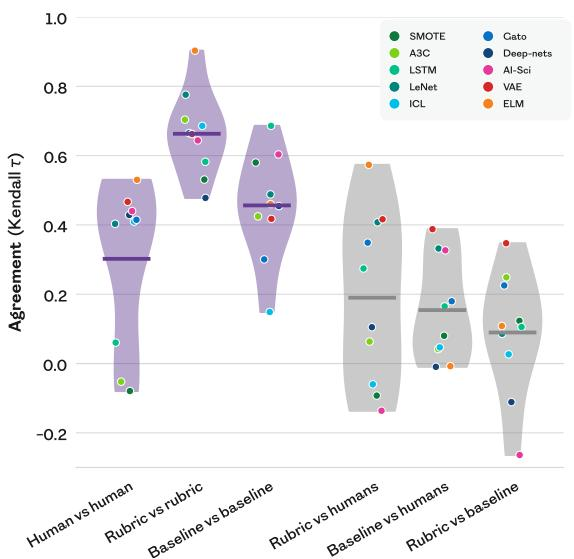

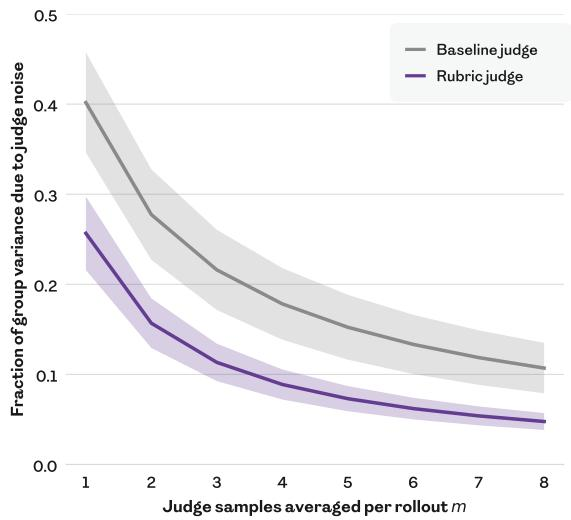  
Figure 3: Our rubric judge achieves higher human agreement and lower noise than the baseline judge. We compare our per-task rubric-based prompt against a simpler baseline prompt which does not vary across tasks. Codex GPT-5.5 uses the prompt to judge rollouts sampled from Claude, Codex, and Faraday. (left) We select tasks whose rollouts maximise disagreement between the rubric judge and the baseline judge. We ask expert humans to rank the same rollouts based on their intuition for what constitutes a good replication. We measure agreement using Kendall $\tau ,$ a rank correlation between two orderings (+1 = identical, −1 = reversed). Two independent draws of the rubric judge agree more closely (0.66) than two draws of the baseline judge (0.46) or two humans (0.30). The rubric judge agrees more closely with humans (0.19) than the baseline judge (0.15). Dots are individual tasks, listed in Table F.1. (right) We sample 16 GRPO groups of 8 rollouts each uniformly across training steps 430–461, scoring every rollout eight times with each judge. For each group, we calculate the fraction of the within-group score variance that is caused by judge noise, as a function of the number � of judge samples averaged per rollout. Bands show ±1 SEM over the 16 groups. The rubric judge is less noisy at every �. In particular, eight baseline judge samples are required to reduce the noise share to the level obtained with three rubric judge samples.

Long-horizon stability. Our post-training requires long-horizon RL in a non-verifiable domain, a setting known to be prone to instability and collapse. Two sources ofthis instability are the high variance ofthe reward signal and uniform credit assignment. To address this, we make two train-time modifications to our judge. First, we compute the rollout-level reward using the mean of three independent judge evaluations. Second, we instruct the judge to produce turn-level weights attributing credit over the rollout’s turns. The judge produces a weight distribution $\boldsymbol { u } _ { k }$ over turns � which is then normalised such that $\begin{array} { r } { \sum _ { k } u _ { k } n _ { k } = \sum _ { k } n _ { k } } \end{array}$ , where $n _ { k }$ is the number of tokens in turn $k ,$ such that we do not change the overall reward scale. The normalised weights are averaged turn-wise over the three judge draws, which preserves the normalisation. The weight for the corresponding turn is then used to scale the per-token advantage during GRPO. In this way, credit is redistributed within a rollout without changing the overall magnitude of the update. Figure C.1 explores empirically how our method assigns credit within each rollout. These techniques helped to achieve stable training (see ablations in Appendix B).

## 4 Results

## 4.1 Rubricjudge reliably captures human taste

We conduct a human study to establish alignment between our rubric judge and human taste. We report full methodology and results in Appendix F.1. We introduce a baseline judge with the same coding agent model (Codex GPT-5.5) but a constant prompt across tasks that mirrors the prompt given to human participants. Human rankings correlate better with our per-task rubric judge than with a baseline judge (Figure 3, left). However, there are several tasks on which our rubric judge disagrees with humans, suggesting room for improvement in future work. Our rubric judge ranks more consistently than both the baseline judge and humans. Furthermore, the fraction of group variance that arises from judge noise rather than between-rollout signal is lower for the rubric judge (Figure 3, right). It is therefore a better candidate for use as a reward in GRPO.

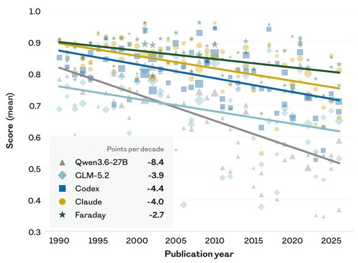

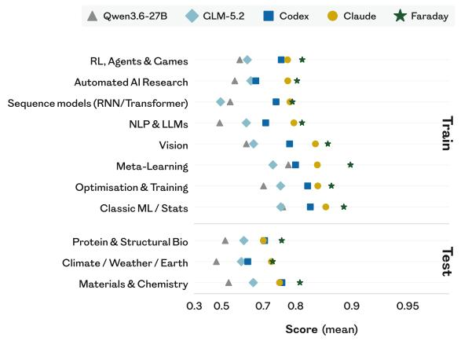  
Figure 4: Frontier coding agents do not saturate Replica. (left) Papers written more recently are harder to replicate. Each point represents the mean rubric score across tasks for one paper from the Replica train split, sized by the number of tasks that paper yields. Lines are least-squares fits. (right) Dificulty varies across research topics, and Faraday leads on every one. The top block shows the train split (ML tasks), and the bottom block shows the test split (AI-for-science tasks). Each point represents the mean rubric score over tasks in the given research topic.

## 4.2 Replica tasks are challenging for frontier agents

We run frontier coding agents on Replica and find that they do not saturate the task space. For Claude Opus 4.8 and GPT-5.5 baselines, we run the model in the Claude Code and Codex harnesses respectively, with extra-high thinking efort. For Faraday, we pin the thinking efort of its Codex tool to extra-high, to ensure a fair comparison. For the GLM-5.2 baseline, we run the model with max thinking efort in the Claude Code harness, as it is the best reported harness for TerminalBench (Z.ai, 2026). Every agent receives the same task materials and the same 60-minute single-GPU budget, and is scored by the same rubric judge. We run eight rollouts per task per agent. Within a task, rollout scores are reduced to a single per-task score by taking the mean.

Claude Opus 4.8 is our strongest baseline. Task performance decreases with publication year for every agent. We speculate that more recent papers are harder to replicate because there is less density of information about them in the pre-training dataset, and because they tend to use higher compute resources, and so determining an appropriate and successful scale-down is more challenging. Task dificulty also varies between research topics, and the per-topic rankings are consistent among baseline agents, with NLP and LLM papers hardest and classical machine learning and statistics easiest. AI-for-science papers are generally harder to replicate than ML research papers across agents, possibly because they require integrating experimental expertise from diferent domains. Faraday’s base model and harness before RL is the weakest of all, and is the fastest to degrade with recency.

## 4.3 Faraday replicates beter than Claude and Codex

We compare Faraday against baselines across the entire Replica task distribution (Figure 2). We achieve a comprehensive uplift in performance compared to the base Qwen model, on both train and test tasks. In distribution, Faraday outperforms both Claude and Codex on 73% oftasks. Out ofdistribution, Faraday outperforms Claude and Codex on 60% of tasks. Since the held-out papers span research areas Faraday never trained on, the behaviour it acquired is not memorisation of a specialised procedure but a transferable way of approaching the underspecified task of paper replication. On both train and test, Faraday’s advantage is an upward shift ofthe whole distribution. Figure 4 (right) shows that the gap is consistent across diferent subdomains. Decomposing the judge score into its sub-dimensions reveals that Faraday is stronger than baselines when it comes to experimental depth, claim reproduction, and visual fidelity, and matches Claude on scientific integrity and implementation fidelity (Figure C.2).

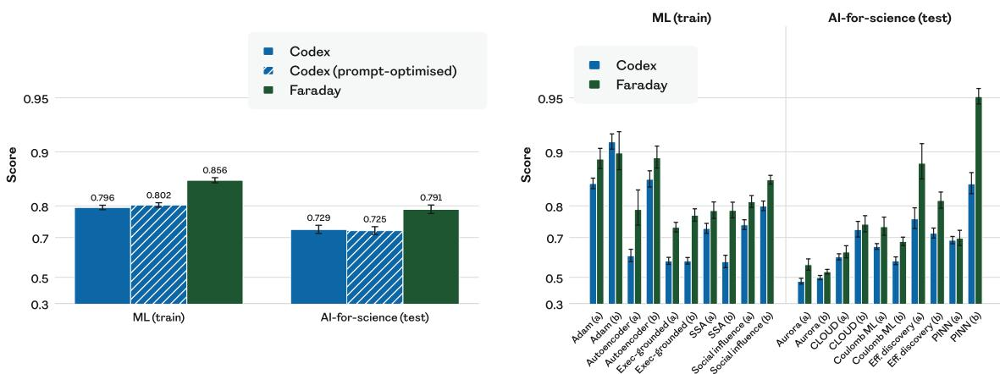  
Figure 5: Prompt-optimised Codex remains weaker than Faraday, and Faraday generalises to tasks that require innovation. (left) The mean rubric score over all tasks (and over eight rollouts per task) for Faraday is higher than for Codex with both the default baseline prompt, and a prompt automatically optimised in-context for one epoch over the train split. (right) On twenty counterfactual variants of tasks from ten papers, five from the train split and five from the test split, Faraday leads on mean rubric score over eight rollouts in almost all cases. For each task, one variant swaps the dataset and one changes the claim. In both plots, bars show ±1 SEM.

To test whether Faraday’s advantage can be obtained by prompting alone, we run 24 generations of automated prompt optimisation on the Codex baseline. Similar to Faraday’s training, each generation samples 10 training tasks with eight rollouts per task. Claude Opus 4.8 then rewrites the prompt based on all previous rollouts in the filesystem, including the judge’s feedback. We compare the final prompt against Codex and Faraday in Figure 5 (left). The optimised prompt does not perform meaningfully better than the original prompt, thus the gap to Faraday is retained. The optimised prompt (Appendix G.5) identifies the specific failure modes seen in the rollouts, but without success: the gain from post-training does not appear to be reachable by prompting.

## 4.4 Faraday is qualitatively a more rigorous scientist

To understand how Faraday improves on the Claude and Codex baselines, we examine by hand the individual rollouts for which Faraday’s rubric judge score exceeds the best Claude and Codex score by the largest margins. Table 1 showcases representative examples. Two patterns recur. First, Faraday implements the mechanism an experiment is designed to test, whereas the baseline hardcodes the expected output or falls back on an oversimplified method, failing to replicate the main claim of the figure. Second, Faraday is more thorough in the scope of its experiments, reproducing more of the original experiment without unnecessary omissions.

Furthermore, we examine the discovery process that occurs within Faraday rollouts. We sample nine tasks uniformly at random from the Replica test split, and for each task select the strongest of eight Faraday rollouts. We identify the moments ofinsight when the best score until that point is exceeded and use Claude Opus 5 to label the insights. We see a similar accumulation of knowledge as in AI Scientist systems built with evolutionary harnesses (Figure C.3). However, unlike previous systems, Faraday has no special hand-coded harness, does not change its harness at test time, and does not have access to the rubric judge reward. In other words, Faraday has learned to value insights intrinsically.

Finally, we run a human study to assess to what extent humans prefer Faraday over Claude and Codex, specifi cally focussing on rollouts in which the rubric judge deems that Faraday holds a strong advantage. We report full methodology and results in Appendix F.2. Of the 41 rollouts examined, humans prefer Faraday over both Claude and Codex in 29, significantly more than chance. This result suggests that the rubric judge accurately but not perfectly captures the characteristics of good replication, at least when it comes to the best-performing samples from Faraday. Importantly, the design of our study does not allow us to draw any conclusions as to whether humans prefer Faraday over Claude and Codex on average. Gathering conclusive evidence for this preference would require a larger-scale study across a randomly selected set oftasks, and is an important direction for future work.

Table 1: Faraday behaves more like a rigorous scientist. Via human inspection, we qualitatively analyse tasks with the largest margin between Faraday and the best performing run among Claude and Codex, grouped by whether the paper lies inside Faraday’s training distribution (ML) or outside it (AI-for-science).
<table><tr><td>Task</td><td>Difference in approaches</td></tr><tr><td colspan="2">ML (train)</td></tr><tr><td>Darwin-Gödel Machine Zhang et al. (2026a), Fig. 4.</td><td>Figure 4 tests whether DGM-discovered improvements transfer across models, benchmarks, and programming languages. Faraday implements the paper&#x27;s evolutionary self-improvement procedure, building an archive of mutated agents and transferring its best agent. &#x27;The baseline instead hard-codes a putatively discovered agent, bypassing the search that the experiment is</td></tr><tr><td>Learning Precise Timing with LSTM Recurrent Networks Gers et al. (2002), Fig. 12</td><td>meant to demonstrate. Figure 12 shows trained peephole LSTMs generating periodic rectangular functions. At the first try, model training in both rollouts does not converge. Faraday&#x27;s coding agent tries to patch the issue by hand-crafting the network in place of training it, which Faraday stops and constructs a workable training recipe instead. The Codex baseline instead steers the network towards the desired behaviour through its initialisation and auxiliary losses, and then selects a</td></tr><tr><td>Voyager Wang et al. (2024), Fig. 8.</td><td>favourable checkpoint that shows the desired result. Figure 8 tracks intermediate progress on unseen crafting tasks, testing whether skills acquired during exploration transfer zero-shot. Faraday runs a dedicated skill-acquisition phase that learns the skills and transfers them to held-out tasks, replicating the mechanism the figure mea- sures. The best Claude rollout instead supplies a hard-coded, pre-populated library includ- ing target-solving skills, so the central library-transfer mechanism is specified by hand and not tested.</td></tr><tr><td>The AI Scientist Lu et al. (2024), Fig. 2.</td><td>Figure 2 tests GPT-4o paper-reviewing ablations. Faraday ran the paper-reviewing pipeline at a meaningful scale, producing reviews for several times more papers than the Codex baseline. It also followed the method more closely: five self-reflection rounds and an area-chair meta- review, versus one critique prompt and an average over five reviews. Accordingly, Faraday&#x27;s reflection loop improves the accuracy while the Codex one barely moves it.</td></tr><tr><td colspan="2">AI-for-science (test)</td></tr><tr><td>ChemVAE Gómez-Bombarelli et al. (2018), Fig. 4.</td><td>Figure 4 shows that Gaussian-process search in a learned molecular latent space finds higher- scoring molecules and visualises optimisation paths. Faraday more faithfully implements the paper&#x27;s method: a generative model that turns any point in its learned space back into a molecule, so optimised points become molecules the model writes, with a fallback to the near- est known molecule only when a decode is invalid. Codex simplifies some parts of the model, and due to this, its representation cannot be turned back into a molecule, so every molecule in</td></tr><tr><td>GNoME Merchant et al. (2023), Fig. 3.</td><td>its figure is retrieved from the dataset rather than generated by the model. Figure 3 shows that more pretraining data improves models that predict atomic forces for un- seen materials. Faraday repeats each scaling-law training-set size five times and reports the spread; the best Codex rollout uses one seed per scaling point with no reported uncertainty. Only Faraday implements the figure&#x27;s robustness test of fine-tuning at low temperature and evaluating at high temperature; Codex draws both sets from one generator call that takes no temperature argument, so the claimed shift reported on the axis is not supported.</td></tr></table>

## 5 Discussion

Towards innovation. On the face of it, replicating a figure from a paper is not an especially creative endeavour. Most obviously, replication produces a figure that looks quite like the original, assuming that the method replicates. But if one examines the process, rather than the output, replication becomes a stepping stone towards innovation. The skills that allow Faraday to fill in vaguely-specified details may be the very same skills that would allow it to advance the state of the art by designing its own experiments (Deutsch, 2011; Muthukrishna & Henrich, 2016; Heyes, 2018; Bhoopchand et al., 2023). Indeed, many human researchers start their careers by learning to replicate existing results and, upon mastering that, are better placed to conduct original research. Replication is the first step in a curriculum of increasing underspecification towards innovation.

Inspired by such considerations, we assess how well Faraday generalises to “imagined” replications (Figure 5, right). We ask Claude Opus 4.8 to generate two variants of five randomly selected papers from each of the Replica train and test splits: (a) making the same claim as the original figure but using a diferent dataset or environment and (b) making a diferent claim from the original figure in the same setting (Appendix F.3). We evaluate Faraday and Codex GPT-5.5 on these tasks, and score them with our rubric judge, noting that the task interface itself has not changed. Faraday’s rollouts are preferred to Codex’s by the judge on 19 of the 20 tasks. In a weak sense, Faraday not only replicates better than a frontier model; it also innovates better. However, we must caution that our rubric judge was never validated on imagined tasks, and so future work is warranted to validate this claim.

Coding agent as a tool (CAT). It is perhaps surprising that we succeed in training such a small model to better direct the activities ofa model at least two orders ofmagnitude larger. Moreover, training the outer agent need not be prohibitively expensive in inference tokens for the inner tool. After training with a weaker coding agent as a tool, one can substitute a more powerful coding agent at evaluation time and achieve an uplift in performance (Figure A.2). The skills Faraday acquires – deciding what to investigate, scoping experiments to a budget, and judging a replication – compound with advances in frontier coding models. One might hope that a single post-trained outer agent can track the frontier as better models are released, at least over some time period. Establishing the optimal cost-benefit tradeof between the sizes of the inner and outer agents is an interesting topic for further study.

The success of the CAT paradigm has implications for both capabilities and safety. In the realm of AI Scientist agents, we ofer an approachable alternative to harness construction. History teaches us that encoding capabilities in the weights of a neural network, rather than expressing them in code, is more flexible and generalisable in the long run. With an eye to safety, our results demonstrate successful oversight of a more powerful model by a less powerful one (Amodei et al., 2016; Bowman et al., 2022; Kenton et al., 2024). Moreover, the reasoning traces of the open-weights model can be inspected, unlike those behind the closed-weights API surface. Note that nothing in the CAT paradigm requires the outer agent to remain the smaller model; it is an empirical question whether the demands of scientific judgement must match or exceed those of engineering execution in the long run.

Beyond verifiable rewards. To capture the scientific abilities that underpin open-ended research, we necessarily move away from well-specified tasks with verifiable rewards. A side efect of this reorientation may be that agents are less exposed to incentives for reward hacking during post-training (Baker et al., 2025). Defining a verifiable reward necessitates specifying an evaluation procedure in foresight, which becomes a fixed target for manipulation. By contrast, judging entire rollouts in hindsight is a moving target. Indeed, we observe Faraday acting with greater scientific rigour and faithfulness than frontier agents, completing tasks as intended rather than reproducing figures performatively. It remains to be seen whether training on open-ended tasks can scalably ameliorate reward hacking.

Generalisation. In training Faraday, we deliberately limit the scope of the tasks to short time horizons and limited GPU resources. Our motivation is twofold: first, pragmatism in achieving suficient throughput for RL per unit wall-clock time; second, a belief that the ability to experiment quickly and eficiently with minimal versions of re search ideas is a valuable transferable skill. It is natural to wonder whether Faraday can generalise to larger resources, similar to those used for experiments in the original papers. To assess this, we select one figure from each of eight papers whose replication we estimated to require fewer than eight hours and eight B300 GPUs. We provide appropriate resources to Faraday and to Claude Opus 4.8 and evaluate them on these scaled-up tasks (Appendix A.1). We find that Faraday exceeds the performance of Claude on average and in five out of the eight tasks, suggesting generalisation. Clearer validation ofthe rubric judge on larger-scale tasks, together with a larger number ofsuch tasks, would be required to make a stronger claim. We further discuss scaling in the supplementary discussion (Appendix E).

Community engagement. Paper replication is a public good, strengthening the scientific foundations upon which future insights can be built. Progress on replication is particularly timely, since the paper review system is beginning to strain under the weight of AI-assisted research (Gartenberg et al., 2026). Indeed, high-quality paper replication tools may well help to ground AI-assisted reviewing in the future. If you have ideas for how you might use Faraday in your work, we would be delighted to hear from you at faraday@inherentlaboratories.com.

As an early step towards real-world validation ofFaraday’s usefulness, we obtained feedback from the authors of four papers in the Replica task space (Rupp et al., 2012; Gómez-Bombarelli et al., 2018; Reed et al., 2022; Lu et al., 2024) on Faraday’s replication of one figure from their paper. On the one hand, the authors were impressed by parts ofthe replication (“part b and c look very good”, “the reflexion implementation looks correct”), by the inventiveness of the agent (“nice and clever toy task design”) and by fidelity to the original work (“the agent’s implementation more closely follows equation (1) in the paper”). On the other hand, some simplifications did not make sense (“the problem selected is probably too easy”), parts ofthe write-up were poor (“paragraph on pre-training dataset design is particularly bad”) and code slop is of-putting (“calculations contain unnecessarily convoluted code”).

Conclusion. In summary, we have created an intelligence layer with a modicum of research taste, suficient to extend the capabilities offrontier agents. This is, however, the tip ofthe iceberg when it comes to imbuing agents with the ability to enrich scientific research as peer collaborators with humans. Stepping from replication towards innovation sharpens the problem of underspecification, and deepens the need to develop systems with good judgement. And cultivating creative human-machine teams will require AI taste in code, experiments, theories, collaboration, and organisational design.

## Ethics statement

Awareness of limitations. Paper replication by AI agents holds great promise, but remains at an early stage. While Faraday successfully replicated claims from a number of papers, it failed in several cases where we have confidence that the original result was obtained rigorously and reported honestly. We do not claim that any ofFaraday’s failures to replicate published work suggest fundamental problems with the original research. Even as and when AI systems demonstrate suficiently strong performance to serve as reliable judges of replicability, it will remain important for humans to cultivate the skills necessary for paper replication and to inspect the results ofagents such as Faraday.

Human studies. We assessed whether our procedures for human data collection would require review by an external board and concluded that this was not necessary since the information elicited consisted only ofprofessional judgements and did not feature sensitive personal data, and participation would pose no risk. We worked with a combination of people within our pre-existing professional networks and experts sourced by third-party data providers. We made clear to participants the purpose of the project. Participants were compensated irrespective of whether their ratings cleared our internal filtering.

Conflict of interest. Some of the papers included in our corpus were written by authors of this paper and by individuals we know personally. Some work in the corpus comes from institutions whose commercial models we used for the research presented here. We applied the same automated pipeline to all items in the corpus and in no way altered scoring treatment for our own prior work or that of our acquaintances.

Technical safety. Not all applications ofscientific insight benefit society. Prior work on the use ofAI to automate or accelerate scientific research notes accurately that these capabilities may empower malicious human actors and/or increase the dangers associated with misaligned AI systems. For this paper, we selected in silico tasks that we judge unlikely to cause harm, and we constrained Faraday in terms of both time and compute. Faraday did not have access to any physical lab equipment, although it did have internet access.

## Acknowledgements

We thank Shi Dong, Alex Goldie, Matt Henderson, Akarsh Kumar, Chris Lu, Clare Lyle, and Jimmy Secretan for valuable comments on an early version of this manuscript. We thank Sergio Gomez, José Miguel Hernández-Lobato, Chris Lu, and Matthias Rupp for providing feedback on the quality of replication of their papers.

## References

Josh Abramson, Jonas Adler, Jack Dunger, Richard Evans, Tim Green, Alexander Pritzel, OlafRonneberger, Lindsay Willmore, Andrew J Ballard, Joshua Bambrick, et al. Accurate structure prediction of biomolecular interac tions with AlphaFold 3. Nature, 630:493–500, 2024.

Arash Ahmadian, Chris Cremer, Matthias Gallé, Marzieh Fadaee, Julia Kreutzer, Olivier Pietquin, Ahmet Üstün, and Sara Hooker. Back to basics: Revisiting REINFORCE-style optimization for learning from human feedback in LLMs. In Proceedings of the 62nd Annual Meeting of the Association for Computational Linguistics, 2024.

Meysam Alizadeh, Mohsen Mosleh, Fabrizio Gilardi, Atoosa Kasirzadeh, and Joshua Tucker. AI coding agents can reproduce social science findings. arXivpreprint arXiv:2606.11447, 2026. https://arxiv.org/abs/2606. 11447.

Dario Amodei, Chris Olah, Jacob Steinhardt, Paul Christiano, John Schulman, and Dan Mané. Concrete problems in AI safety. arXiv preprint arXiv:1606.06565, 2016. https://arxiv.org/abs/1606.06565.

Thomas Anthony, Zheng Tian, and David Barber. Thinking fast and slow with deep learning and tree search. In Advances in Neural Information Processing Systems, 2017.

Anthropic. Claude models overview, 2026. https://platform.claude.com/docs/en/about-claude/models/ overview. Claude Opus 4.8 training data cutof: January 2026.

Bowen Baker,Joost Huizinga, Leo Gao, Zehao Dou, Melody Y. Guan, Aleksander Madry, Wojciech Zaremba,Jakub Pachocki, and David Farhi. Monitoring reasoning models for misbehavior and the risks ofpromoting obfuscation. arXivpreprint arXiv:2503.11926, 2025. https://arxiv.org/abs/2503.11926.

Ilyes Batatia, Dávid Péter Kovács, Gregor N C Simm, Christoph Ortner, and Gábor Csányi. MACE: Higher order equivariant message passing neural networks for fast and accurate force fields. InAdvances in Neural Information Processing Systems, 2022.

Andrew M Bean, Ryan Othniel Kearns, Angelika Romanou, Franziska Sofia Hafner, Harry Mayne, Jan Batzner, Negar Foroutan Eghlidi, Chris Schmitz, Karolina Korgul, Hunar Batra, et al. Measuring what matters: Construct validity in large language model benchmarks. In Advances in Neural Information Processing Systems, 2026.

Mikhail Belkin, Partha Niyogi, and Vikas Sindhwani. Manifold regularization: A geometric framework for learning from labeled and unlabeled examples. Journal of Machine Learning Research, 7:2399–2434, 2006.

Samy Bengio, Yoshua Bengio, Jocelyn Cloutier, and Jan Gecsei. On the optimization of a synaptic learning rule. In Preprints Conf. Optimality in Artificial and Biological Neural Networks, 1992.

Satadeep Bhattacharjee. SR-CGCNN: Shared recurrent convolution in crystal graph neural networks for materials property prediction. arXiv preprint arXiv:2605.01304, 2026. https://arxiv.org/abs/2605.01304.

Avishkar Bhoopchand, Bethanie Brownfield, Adrian Collister, Agustin Dal Lago, Ashley Edwards, Richard Everett, Alexandre Fréchette, Yanko Gitahy Oliveira, Edward Hughes, Kory W Mathewson, et al. Learning few-shot imitation as cultural transmission. Nature Communications, 14(1):7536, 2023.

Margaret Boden. Creativity and unpredictability. Stanford Humanities Review, 4(2):123–139, 1995.

Cristian Bodnar, Wessel P Bruinsma, Ana Lucic, Megan Stanley, Anna Allen, Johannes Brandstetter, Patrick Garvan, Maik Riechert, Jonathan A Weyn, Haiyu Dong, Jayesh K Gupta, Kit Thambiratnam, Alexander T Archibald, Chun-Chieh Wu, Elizabeth Heider, Max Welling, Richard E Turner, and Paris Perdikaris. A foundation model for the Earth system. Nature, 641(8065):1180–1187, 2025.

Samuel R Bowman, Jeeyoon Hyun, Ethan Perez, Edwin Chen, Craig Pettit, Scott Heiner, Kamilė Lukošiūtė, Amanda Askell, Andy Jones, Anna Chen, et al. Measuring progress on scalable oversight for large language models. arXiv preprint arXiv:2211.03540, 2022. https://arxiv.org/abs/2211.03540.

Jun Shern Chan, Neil Chowdhury, Oliver Jafe, James Aung, Dane Sherburn, Evan Mays, Giulio Starace, Kevin Liu, Leon Maksin, Tejal Patwardhan, Lilian Weng, and Aleksander Mądry. MLE-bench: Evaluating machine learning agents on machine learning engineering. arXiv preprint arXiv:2410.07095, 2025. https://arxiv. org/abs/2410.07095.

Nitesh V Chawla, Kevin W Bowyer, Lawrence O Hall, and W Philip Kegelmeyer. SMOTE: Synthetic minority over-sampling technique. Journal of Artificial Intelligence Research, 16:321–357, 2002.

Ziru Chen, Shijie Chen, Yuting Ning, Qianheng Zhang, Boshi Wang, Botao Yu, Yifei Li, Zeyi Liao, Chen Wei, Zitong Lu, Vishal Dey, Mingyi Xue, Frazier N. Baker, Benjamin Burns, Daniel Adu-Ampratwum, Xuhui Huang, Xia Ning, Song Gao, Yu Su, and Huan Sun. ScienceAgentBench: Toward rigorous assessment of language agents for data-driven scientific discovery. arXiv preprint arXiv:2410.05080, 2025. https://arxiv.org/abs/2410. 05080.

Seyone Chithrananda, Gabriel Grand, and Bharath Ramsundar. ChemBERTa: Large-scale self-supervised pretraining for molecular property prediction. arXiv preprint arXiv:2010.09885, 2020. https://arxiv.org/abs/2010. 09885.

Simon Colton and Geraint A Wiggins. Computational creativity: The final frontier? In ECAI 2012, pp. 21–26. IOS Press, 2012.

Gheorghe Comanici, Eric Bieber, Mike Schaekermann, Ice Pasupat, Noveen Sachdeva, et al. Gemini 2.5: Pushing the frontier with advanced reasoning, multimodality, long context, and next generation agentic capabilities. arXiv preprint arXiv:2507.06261, 2025. https://arxiv.org/abs/2507.06261.

Jonathan Cook, Tim Rocktäschel, Jakob Foerster, Dennis Aumiller, and Alex Wang. Ticking all the boxes: Generated checklists improve LLM evaluation and generation. arXiv preprint arXiv:2410.03608, 2024. https: //arxiv.org/abs/2410.03608.

Lee J Cronbach and Paul E Meehl. Construct validity in psychological tests. Psychological Bulletin, 52(4):281, 1955.

David Deutsch. The Beginning of Infinity: Explanations That Transform the World. Allen Lane, London, 2011.

David Epstein. Inside the Box. Riverhead Books, 2026. ISBN 9780593715710.

Benjamin Eysenbach, Abhishek Gupta, Julian Ibarz, and Sergey Levine. Diversity is all you need: Learning skills without a reward function. In International Conference on Learning Representations, 2019.

Jerome Friedman, Trevor Hastie, and Robert Tibshirani. Additive logistic regression: a statistical view of boosting. The Annals of Statistics, 28(2):337–407, 2000.

Jerome H Friedman. Greedy function approximation: A gradient boosting machine. The Annals of Statistics, 29 (5):1189–1232, 2001.

Sasi Kiran Gaddipati, Diyana Muhammed, Farhana Keya, Gollam Rabby, and Sören Auer. MLReplicate: Benchmarking autonomous research systems for machine learning reproducibility. arXiv preprint arXiv:2605.16616, 2026. https://arxiv.org/abs/2605.16616.

Claudine Gartenberg, Sharique Hasan, Alex Murray, and Lamar Pierce. More versus better: Artificial intelligence, incentives, and the emerging crisis in peer review. Organization Science, 37(3):795–812, 2026.

Felix A Gers, Nicol N Schraudolph, and Jürgen Schmidhuber. Learning precise timing with LSTM recurrent networks. Journal of Machine Learning Research, 3(Aug):115–143, 2002.

Alireza Ghafarollahi and Markus J Buehler. SciAgents: automating scientific discovery through bioinspired multiagent intelligent graph reasoning. Advanced Materials, 37(22):2413523, 2025.

Ali Essam Ghareeb, Benjamin Chang, Ludovico Mitchener, Angela Yiu, Caralyn J Szostkiewicz, Dmytro Shved, Gavin J Gyimesi, Jon M Laurent, Samantha M Wright, Muhammed T Razzak, et al. A multi-agent system for automating scientific discovery. Nature, pp. 1–3, 2026.

Shashwat Goel, Rishi Hazra, Dulhan Jayalath, Timon Willi, Parag Jain, William F Shen, Ilias Leontiadis, Francesco Barbieri, Yoram Bachrach, Jonas Geiping, et al. Training AI co-scientists using rubric rewards. arXiv preprint arXiv:2512.23707, 2025. https://arxiv.org/abs/2512.23707.

Alexander D Goldie, Zilin Wang, Adrian Hayler, Deepak Nathani, Edan Toledo, Ken Thampiratwong, Aleksandra Kalisz, Michael Beukman, Alistair Letcher, Shashank Reddy, et al. Procedural generation of algorithm discovery tasks in machine learning. arXiv preprint arXiv:2603.17863, 2026. https://arxiv.org/abs/2603.17863.

Rafael Gómez-Bombarelli, Jennifer N. Wei, David Duvenaud, José Miguel Hernández-Lobato, Benjamín Sánchez-Lengeling, Dennis Sheberla, Jorge Aguilera-Iparraguirre, Timothy D. Hirzel, Ryan P. Adams, and Alán Aspuru-Guzik. Automatic chemical design using a data-driven continuous representation of molecules. ACS Central Science, 4:268–276, 2018. doi: 10.1021/acscentsci.7b00572.

Juraj Gottweis, Wei-Hung Weng, Alexander Daryin, Tao Tu, Anil Palepu, Petar Sirkovic, Artiom Myaskovsky, Felix Weissenberger, Keran Rong, Ryutaro Tanno, et al. Towards an AI co-scientist. arXiv preprint arXiv:2502.18864, 2025. https://arxiv.org/abs/2502.18864.

Stephen Jay Gould and Elisabeth S Vrba. Exaptation—a missing term in the science of form. Paleobiology, 8(1): 4–15, 1982.

Hengrui Gu, Xiaotian Han, Yujing Bian, Feiyi Wang, and Kaixiong Zhou. Asymmetric advantage modulation calibrates entropy dynamics in RLVR. arXiv preprint arXiv:2604.04894, 2026. https://arxiv.org/abs/ 2604.04894.

Anisha Gunjal, Anthony Wang, Elaine Lau, Vaskar Nath, Yunzhong He, Bing Liu, and Sean Hendryx. Rubrics as rewards: Reinforcement learning beyond verifiable domains. arXiv preprint arXiv:2507.17746, 2025. https: //arxiv.org/abs/2507.17746.

Karen Hambardzumyan, Nicolas Baldwin, Edan Toledo, Rishi Hazra, Michael Kuchnik, Bassel Al Omari, Thomas Simon Foster, Anton Protopopov, Jean-Christophe Gagnon-Audet, Ishita Mediratta, Kelvin Niu, Michael Shvartsman, Alisia Lupidi, Alexis Audran-Reiss, Parth Pathak, Tatiana Shavrina, Despoina Magka, Hela Momand, Derek Dunfield, Nicola Cancedda, Pontus Stenetorp, Carole-Jean Wu, Jakob Nicolaus Foerster, Yoram Bachrach, and Martin Josifoski. AIRA\_2: Overcoming bottlenecks in AI research agents. arXiv preprint arXiv:2603.26499, 2026. https://arxiv.org/abs/2603.26499.

Cecilia Heyes. Cognitive gadgets: The cultural evolution of thinking. Harvard University Press, 2018.

Geofrey E Hinton and Ruslan R Salakhutdinov. Reducing the dimensionality ofdata with neural networks. Science, 313(5786):504–507, 2006.

Hanhua Hong, Yizhi Li, Jiaoyan Chen, Luu Gia Huy, Sophia Ananiadou, Jung-jae Kim, and Chenghua Lin. Can LLMs write reliable rubrics? A meta-evaluation for experiment reproduction. arXiv preprint arXiv:2607.12835, 2026. https://arxiv.org/abs/2607.12835.

Chuxuan Hu, Liyun Zhang, Yeji Lim, Aum Wadhwani, Austin Peters, and Daniel Kang. REPRO-Bench: Can agentic AI systems assess the reproducibility of social science research? arXivpreprint arXiv:2507.18901, 2025. https://arxiv.org/abs/2507.18901.

Edward J. Hu, Yelong Shen, Phillip Wallis, Zeyuan Allen-Zhu, Yuanzhi Li, Shean Wang, Lu Wang, and Weizhu Chen. LoRA: Low-rank adaptation of large language models. In International Conference on Learning Representations, 2022.

Shengran Hu, Cong Lu, and Jef Clune. Automated design of agentic systems. arXiv preprint arXiv:2408.08435, 2024. https://arxiv.org/abs/2408.08435.

Tianyu Hua, Harper Hua, Violet Xiang, Benjamin Klieger, Sang T. Truong, Weixin Liang, Fan-Yun Sun, and Nick Haber. ResearchCodeBench: Benchmarking LLMs on implementing novel machine learning research code. arXiv preprint arXiv:2506.02314, 2025. https://arxiv.org/abs/2506.02314.

Qian Huang, Jian Vora, Percy Liang, and Jure Leskovec. MLAgentBench: Evaluating language agents on machine learning experimentation. arXivpreprint arXiv:2310.03302, 2024. https://arxiv.org/abs/2310.03302.

Ziyang Huang, Yi Cao, Ali K. Shargh, Jing Luo, Ruidong Mei, Mohd Zaki, Zhan Liu, Wyatt Bunstine, William Jurayj, Somdatta Goswami, Tyrel McQueen, Michael Shields, Jaafar El-Awady, Paulette Clancy, Benjamin Van Durme, Nicholas Andrews, William Walden, and Daniel Khashabi. Can coding agents reproduce findings in computational materials science? arXiv preprint arXiv:2605.00803, 2026. https://arxiv.org/abs/2605. 00803.

Yuichi Inoue, Kou Misaki, Yuki Imajuku, So Kuroki, Taishi Nakamura, and Takuya Akiba. Wider or deeper? Scaling LLM inference-time compute with adaptive branching tree search. arXiv preprint arXiv:2503.04412, 2025. https://arxiv.org/abs/2503.04412.

Natasha Jaques, Angeliki Lazaridou, Edward Hughes, Caglar Gulcehre, Pedro A Ortega, DJ Strouse, Joel Z Leibo, and Nando de Freitas. Social influence as intrinsic motivation for multi-agent deep reinforcement learning. In International Conference on Machine Learning, 2019.

Zhengyao Jiang, Dominik Schmidt, Dhruv Srikanth, Dixing Xu, Ian Kaplan, Deniss Jacenko, and Yuxiang Wu. AIDE: AI-Driven exploration in the space of code. arXiv preprint arXiv:2502.13138, 2025. https://arxiv. org/abs/2502.13138.

Joshua D Kangas, Armaghan W Naik, and Robert F Murphy. Eficient discovery of responses of proteins to compounds using active learning. BMC Bioinformatics, 15(1):143, 2014.

Sayash Kapoor and Arvind Narayanan. Leakage and the reproducibility crisis in ML-based science. arXiv preprint arXiv:2207.07048, 2022. https://arxiv.org/abs/2207.07048.

Andrej Karpathy. autoresearch: AI agents running research on single-GPU nanochat training automatically, 2026. https://github.com/karpathy/autoresearch.

Zachary Kenton, Noah Y Siegel,János Kramár,Jonah Brown-Cohen, Samuel Albanie,Jannis Bulian, Rishabh Agarwal, David Lindner, Yunhao Tang, Noah Goodman, et al. On scalable oversight with weak LLMs judging strong LLMs. In Advances in Neural Information Processing Systems, 2024.

Gyeongwon James Kim, Alex Wilf, Louis-Philippe Morency, and Daniel Fried. From reproduction to replication: Evaluating research agents with progressive code masking. arXiv preprint arXiv:2506.19724, 2025. https:// arxiv.org/abs/2506.19724.

Sunghwan Kim, Junhee Cho, Beong-woo Kwak, Taeyoon Kwon, Liang Wang, Nan Yang, Xingxing Zhang, Furu Wei, and Jinyoung Yeo. On training large language models for long-horizon tasks: An empirical study of horizon length. arXivpreprint arXiv:2605.02572, 2026. https://arxiv.org/abs/2605.02572.

Diederik P Kingma and Jimmy Ba. Adam: A method for stochastic optimization. arXiv preprint arXiv:1412.6980, 2014. https://arxiv.org/abs/1412.6980.

Diederik P Kingma and Max Welling. Auto-encoding variational Bayes. arXiv preprint arXiv:1312.6114, 2013. https://arxiv.org/abs/1312.6114.

Peter Kirgis, Sayash Kapoor, Andrew Schwartz, Stephan Rabanser, David Africa, Konstantinos Voudouris, Viet Nguyen, Toby Pilditch, Magda Dubois, Harry Coppock, Cozmin Ududec, Nitya Nadgir, Matilda Orona, Tilman Bayer, Derrick Chan-Sew, Yue Ling, Abhishek Shetty, Helen Toner, Gillian Hadfield, Seth Lazar, Steve Newman, Shoshannah Tekofsky, Rishi Bommasani, and Arvind Narayanan. Can AI agents conduct openended AI research? Early evidence from two case studies. arXiv preprint arXiv:2607.27191, 2026. https: //arxiv.org/abs/2607.27191.

Louis Kirsch. Automating AI Research. Doctoral dissertation, Università della Svizzera italiana, June 2025. https: //louiskirsch.com/thesis.

Louis Kirsch and Jürgen Schmidhuber. Meta learning backpropagation and improving it. In Advances in Neural Information Processing Systems, 2021. https://arxiv.org/abs/2012.14905.

Louis Kirsch andJürgen Schmidhuber. Eliminating meta optimization through self-referential meta learning. arXiv preprint arXiv:2212.14392, 2022. https://arxiv.org/abs/2212.14392. First Conference on Automated Machine Learning (Workshop).

Louis Kirsch, Sjoerd van Steenkiste, and Juergen Schmidhuber. Improving generalization in meta reinforcement learning using learned objectives. In International Conference on Learning Representations, 2020. https:// arxiv.org/abs/1910.04098.

Louis Kirsch, James Harrison, Jascha Sohl-Dickstein, and Luke Metz. General-purpose In-Context learning by meta-learning transformers. arXiv preprint arXiv:2212.04458, 2022. https://arxiv.org/abs/2212.04458. Workshop on Meta-Learning at NeurIPS.

Patrick Tser Jern Kon, Jiachen Liu, Xinyi Zhu, Qiuyi Ding, Jingjia Peng, Jiarong Xing, Yibo Huang, Yiming Qiu, Jayanth Srinivasa, Myungjin Lee, Mosharaf Chowdhury, Matei Zaharia, and Ang Chen. EXP-Bench: Can AI conduct AI research experiments? arXiv preprint arXiv:2505.24785, 2025. https://arxiv.org/abs/2505. 24785.

Alex Krizhevsky, Ilya Sutskever, and Geofrey E Hinton. ImageNet classification with deep convolutional neural networks. In Advances in Neural Information Processing Systems, 2012.

Woosuk Kwon, Zhuohan Li, Siyuan Zhuang, Ying Sheng, Lianmin Zheng, Cody Hao Yu,Joseph E. Gonzalez, Hao Zhang, and Ion Stoica. Eficient memory management for large language model serving with PagedAttention. In Proceedings of the 29th Symposium on Operating Systems Principles (SOSP), 2023.

Remi Lam, Alvaro Sanchez-Gonzalez, Matthew Willson, Peter Wirnsberger, Meire Fortunato, Ferran Alet, Suman Ravuri, Timo Ewalds, Zach Eaton-Rosen, Weihua Hu, et al. Learning skillful medium-range global weather forecasting. Science, 382(6677):1416–1421, 2023.

Robert Tjarko Lange, Yuki Imajuku, and Edoardo Cetin. ShinkaEvolve: Towards open-ended and sample-eficient program evolution. arXiv preprint arXiv:2509.19349, 2025. https://arxiv.org/abs/2509.19349.

Hugo Larochelle, Yoshua Bengio, Jérôme Louradour, and Pascal Lamblin. Exploring strategies for training deep neural networks. Journal of Machine Learning Research, 10:1–40, 2009.

Yann LeCun, Léon Bottou, Yoshua Bengio, and Patrick Hafner. Gradient-based learning applied to document recognition. Proceedings of the IEEE, 86(11):2278–2324, 1998.

Joel Lehman, Jonathan Gordon, Shawn Jain, Kamal Ndousse, Cathy Yeh, and Kenneth O Stanley. Evolution through large models. In Handbook of Evolutionary Machine Learning, pp. 331–366. Springer, 2023.

Bojie Li. Incompressible knowledge probes: Estimating black-box LLM parameter counts via factual capacity. arXiv preprint arXiv:2604.24827, 2026. https://arxiv.org/abs/2604.24827.

Gaotang Li, Bhavana Dalvi Mishra, Zifeng Wang, Jun Yan, Yanfei Chen, Chun-Liang Li, Long T Le, Rujun Han, George Lee, Hanghang Tong, et al. RubricEM: Meta-RL with rubric-guided policy decomposition beyond verifiable rewards. arXiv preprint arXiv:2605.10899, 2026. https://arxiv.org/abs/2605.10899.

Jianzhe Lin. Self-improvement can self-regress: The rise-and-collapse failure mode of LLM self-training. arXiv preprint arXiv:2606.21090, 2026. https://arxiv.org/abs/2606.21090.

Xiaofeng Lin, Sirou Zhu, Yilei Chen, Mingyu Chen, Hejian Sang, Ioannis Paschalidis, Zhipeng Wang, Aldo Pacchiano, and Xuezhou Zhang. Scaling in-context online learning capability of LLMs via cross-episode meta-RL. arXivpreprint arXiv:2602.04089, 2026. https://arxiv.org/abs/2602.04089.

Ling Team. Every step evolves: Scaling reinforcement learning for trillion-scale thinking model. arXiv preprint arXiv:2510.18855, 2025. https://arxiv.org/abs/2510.18855.

Haokun Liu, Filbert Aurelian Tjiaranata, and Chenhao Tan. VERITAS: Towards a general-purpose replication tool for scientific research. arXiv preprint arXiv:2607.02931, 2026. https://arxiv.org/abs/2607.02931.

Chris Lu, Cong Lu, Robert Tjarko Lange, Jakob Foerster, Jef Clune, and David Ha. The AI scientist: Towards fully automated open-ended scientific discovery. arXivpreprint arXiv:2408.06292, 2024. https://arxiv.org/ abs/2408.06292.

Alisia Lupidi, Bhavul Gauri, Thomas Simon Foster, Bassel Al Omari, Despoina Magka, Alberto Pepe, Alexis Audran-Reiss, Muna Aghamelu, Nicolas Baldwin, Lucia Cipolina-Kun, Jean-Christophe Gagnon-Audet, Chee Hau Leow, Sandra Lefdal, Hossam Mossalam, Abhinav Moudgil, Saba Nazir, Emanuel Tewolde, Isabel Urrego, Jordi Armengol Estape, Amar Budhiraja, Gaurav Chaurasia, Abhishek Charnalia, Derek Dunfield, Karen Hambardzumyan, Daniel Izcovich, MartinJosifoski, Ishita Mediratta, Kelvin Niu, Parth Pathak, Michael Shvarts man, Edan Toledo, Anton Protopopov, Roberta Raileanu, Alexander Miller, Tatiana Shavrina, Jakob Foerster, and Yoram Bachrach. AIRS-Bench: a suite of tasks for frontier AI research science agents. arXiv preprint arXiv:2602.06855, 2026. https://arxiv.org/abs/2602.06855.

Bodhisattwa Prasad Majumder, Harshit Surana, Dhruv Agarwal, Bhavana Dalvi Mishra, Abhijeetsingh Meena, Aryan Prakhar, Tirth Vora, Tushar Khot, Ashish Sabharwal, and Peter Clark. DiscoveryBench: Towards datadriven discovery with large language models. arXiv preprint arXiv:2407.01725, 2024. https://arxiv.org/ abs/2407.01725.

Tyler McDonnell, Matthew Lease, Mucahid Kutlu, and Tamer Elsayed. Why is that relevant? Collecting annotator rationales for relevance judgments. In Proceedings ofthe AAAI Conference on Human Computation and Crowdsourcing (HCOMP), 2016.

Amil Merchant, Simon Batzner, Samuel S. Schoenholz, Muratahan Aykol, Gowoon Cheon, and Ekin Dogus Cubuk. Scaling deep learning for materials discovery. Nature, 624:80–85, 2023. doi: 10.1038/ s41586-023-06735-9.

Vaibhav Mishra, Somaditya Singh, Dhruv Ahlawat, Mohd Zaki, Vaibhav Bihani, Hargun Singh Grover, Biswajit Mishra, Santiago Miret, Mausam, and N M Anoop Krishnan. Foundational large language models for materials research. arXivpreprint arXiv:2412.09560, 2024. https://arxiv.org/abs/2412.09560.

Volodymyr Mnih, Adrià Puigdomènech Badia, Mehdi Mirza, Alex Graves, Tim Harley, Timothy P. Lillicrap, David Silver, and Koray Kavukcuoglu. Asynchronous methods for deep reinforcement learning. In International Conference on Machine Learning, 2016.

Philipp Moritz, Robert Nishihara, Stephanie Wang, Alexey Tumanov, Richard Liaw, Eric Liang, Melih Elibol, Zongheng Yang, William Paul, Michael I. Jordan, and Ion Stoica. Ray: A distributed framework for emerging AI applications. In 13th USENIX Symposium on Operating Systems Design and Implementation (OSDI 18), 2018.

Stephen Muggleton and Klaus-Peter Zauner. Artificial scientists. University of Southampton, 2006.

Michael Muthukrishna and Joseph Henrich. Innovation in the collective brain. Philosophical Transactions of the Royal Society B: Biological Sciences, 371(1690):20150192, 2016.

Deepak Nathani, Lovish Madaan, Nicholas Roberts, Nikolay Bashlykov, Ajay Menon, Vincent Moens, Amar Budhiraja, Despoina Magka, Vladislav Vorotilov, Gaurav Chaurasia, Dieuwke Hupkes, Ricardo Silveira Cabral, Tatiana Shavrina, Jakob Foerster, Yoram Bachrach, William Yang Wang, and Roberta Raileanu. MLGym: A new framework and benchmark for advancing AI research agents. arXiv preprint arXiv:2502.14499, 2025. https://arxiv.org/abs/2502.14499.

Stefan Nielsen, Edoardo Cetin, Peter Schwendeman, Qi Sun, Jinglue Xu, and Yujin Tang. Learning to orchestrate agents in natural language with the conductor. In International Conference on Learning Representations, 2026.

Alexander Novikov, Ngân Vũ, Marvin Eisenberger, Emilien Dupont, Po-Sen Huang, Adam Zsolt Wagner, Sergey Shirobokov, Borislav Kozlovskii, Francisco J. R. Ruiz, Abbas Mehrabian, M. Pawan Kumar, Abigail See, Swarat Chaudhuri, George Holland, Alex Davies, Sebastian Nowozin, Pushmeet Kohli, and Matej Balog. AlphaEvolve: A coding agent for scientific and algorithmic discovery. arXiv preprint arXiv:2506.13131, 2025. https://arxiv. org/abs/2506.13131.

NVIDIA. NeMo-RL, 2025. https://github.com/NVIDIA-NeMo/RL.

NVIDIA. NeMo-Gym, 2026. https://github.com/NVIDIA-NeMo/Gym.

Junhyuk Oh, Matteo Hessel, Wojciech M Czarnecki, Zhongwen Xu, Hado P van Hasselt, Satinder Singh, and David Silver. Discovering reinforcement learning algorithms. In Advances in Neural Information Processing Systems, 2020.

OpenAI. Codex CLI, 2025. https://github.com/openai/codex.

OpenAI. GPT-5.5, 2026. https://developers.openai.com/api/docs/models/gpt-5.5. Knowledge cutof: 1 December 2025.

Jaideep Pathak, Shashank Subramanian, Peter Harrington, Sanjeev Raja, Ashesh Chattopadhyay, Morteza Mardani, Thorsten Kurth, David Hall, Zongyi Li, Kamyar Azizzadenesheli, Pedram Hassanzadeh, Karthik Kashinath, and Animashree Anandkumar. FourCastNet: A global data-driven high-resolution weather model using adaptive Fourier neural operators. arXiv preprint arXiv:2202.11214, 2022. https://arxiv.org/abs/2202.11214.

Rushi Qiang, Yuchen Zhuang, Yinghao Li, Dingu Sagar V K, Rongzhi Zhang, ChangHao Li, Ian Wong, Sherry Yang, Percy Liang, Chao Zhang, and Bo Dai. MLE-Dojo: Interactive environments for empowering LLM agents in machine learning engineering. In Advances in Neural Information Processing Systems, 2025.

Shi Qiu, Junyi Deng, Yiwei Deng, Haoran Dong, Jieyu Fu, Mao Li, Zeyu Li, Zhaolong Zhang, Huiwen Zheng, Leidong Bao, Anqi Lv, Zihan Mo, Yadi Niu, Yiyang Peng, Yu Tian, Yili Wang, Ziyu Wang, Zi-Yu Wang, Jiashen Wei, Liuheng Wu, Aoran Xue, Leyi Yang, Guanglu Yuan, Xiarui Zhan, Jingjun Zhang, Zifan Zheng, Pengfei Liu, Linrui Zhen, Kaiyang Li, Qichang Li, Ziheng Zhou, Guo-En Nian, Yunwei Xiao, Qing-Hong Cao, Linjie Dai, Xu Feng, Peng Gao, Ying Gu, Chang Liu, Jia Liu, Ming xing Luo, Yan-Qing Ma, Liang-You Peng, Huichao Song, Shufeng Wang, Chenxu Wang, Tao Wang, Yi-Nan Wang, Chengyin Wu, Pengwei Zhao, and Hua Xing Zhu. PRBench: End-to-end paper reproduction in physics research. arXiv preprint arXiv:2603.27646, 2026. https://arxiv.org/abs/2603.27646.

Qwen Team. Qwen3.6-27B: Flagship-level coding in a 27B dense model, April 2026. https://qwen.ai/blog?id= qwen3.6-27b. Model weights: https://huggingface.co/Qwen/Qwen3.6-27B.

Maziar Raissi, Paris Perdikaris, and George Em Karniadakis. Physics informed deep learning (Part I): Data-driven solutions of nonlinear partial diferential equations. arXiv preprint arXiv:1711.10561, 2017. https://arxiv. org/abs/1711.10561.

Bharath Ramsundar, Steven Kearnes, Patrick Riley, Dale Webster, David Konerding, and Vijay Pande. Massively multitask networks for drug discovery. arXiv preprint arXiv:1502.02072, 2015. https://arxiv.org/abs/1502. 02072.

Ben Rank, Hardik Bhatnagar, Ameya Prabhu, Shira Eisenberg, Karina Nguyen, Matthias Bethge, and Maksym Andriushchenko. PostTrainBench: Can LLM agents automate LLM post-training? arXiv preprint arXiv:2603.08640, 2026. https://arxiv.org/abs/2603.08640.

Esteban Real, Chen Liang, David So, and Quoc Le. AutoML-zero: evolving machine learning algorithms from scratch. In International Conference on Machine Learning. PMLR, 2020.

Benjamin Recht, Christopher Ré, Stephen J Wright, and Feng Niu. HOGWILD!: A lock-free approach to parallelizing stochastic gradient descent. In Advances in Neural Information Processing Systems, 2011.

Scott Reed, Konrad Zolna, Emilio Parisotto, Sergio Gomez Colmenarejo, Alexander Novikov, Gabriel Barth-Maron, Mai Gimenez, Yury Sulsky, Jackie Kay, Jost Tobias Springenberg, et al. A generalist agent. arXivpreprint arXiv:2205.06175, 2022. https://arxiv.org/abs/2205.06175.

Bernardino Romera-Paredes, Mohammadamin Barekatain, Alexander Novikov, Matej Balog, M Pawan Kumar, Emilien Dupont, Francisco JR Ruiz, Jordan S Ellenberg, Pengming Wang, Omar Fawzi, et al. Mathematical discoveries from program search with large language models. Nature, 625(7995):468–475, 2024.

Matthias Rupp, Alexandre Tkatchenko, Klaus-Robert Müller, and O Anatole Von Lilienfeld. Fast and accurate modeling of molecular atomization energies with machine learning. Physical Review Letters, 108(5):058301, 2012.

Timo Schick, Jane Dwivedi-Yu, Roberto Dessì, Roberta Raileanu, Maria Lomeli, Eric Hambro, Luke Zettlemoyer, Nicola Cancedda, and Thomas Scialom. Toolformer: Language models can teach themselves to use tools. In Advances in Neural Information Processing Systems, 2023.

Samuel Schmidgall, Yusheng Su, Ze Wang, Ximeng Sun, Jialian Wu, Xiaodong Yu, Jiang Liu, Michael Moor, Zicheng Liu, and Emad Barsoum. Agent laboratory: Using LLM agents as research assistants. Findings of the Associationfor Computational Linguistics: EMNLP 2025, pp. 5977–6043, 2025.

Jürgen Schmidhuber. Evolutionary principles in self-referential learning, or on learning how to learn: the meta-meta-... hook. PhD thesis, Technische Universität München, 1987.

Jürgen Schmidhuber. A possibility for implementing curiosity and boredom in model-building neural controllers. In Proc. of the international conference on simulation of adaptive behavior: From animals to animats, 1991.

Jürgen Schmidhuber. A ‘self-referential’weight matrix. In International Conference on Artificial Neural Networks. Springer, 1993.

Jürgen Schmidhuber, Jieyu Zhao, and Marco Wiering. Shifting inductive bias with success-story algorithm, adaptive Levin search, and incremental self-improvement. Machine Learning, 28(1):105–130, 1997.

Jimmy Secretan, Nicholas Beato, David B D Ambrosio, Adelein Rodriguez, Adam Campbell, and Kenneth O Stanley. Picbreeder: evolving pictures collaboratively online. In Proceedings of the SIGCHI Conference on Human Factors in Computing Systems, 2008.

Harald Semmelrock, Tony Ross-Hellauer, Simone Kopeinik, Dieter Theiler, Armin Haberl, Stefan Thalmann, and Dominik Kowald. Reproducibility in machine-learning-based research: Overview, barriers, and drivers. AI Magazine, 46(2):e70002, 2025. doi: 10.1002/aaai.70002.

Minju Seo, Jinheon Baek, Seongyun Lee, and Sung Ju Hwang. Paper2Code: Automating code generation from scientific papers in machine learning. arXiv preprint arXiv:2504.17192, 2026. https://arxiv.org/abs/2504. 17192.

Rulin Shao, Akari Asai, Shannon Zejiang Shen, Hamish Ivison, Varsha Kishore, Jingming Zhuo, Xinran Zhao, Molly Park, Samuel G Finlayson, David Sontag, et al. DR Tulu: Reinforcement learning with evolving rubrics for deep research. arXiv preprint arXiv:2511.19399, 2025. https://arxiv.org/abs/2511.19399.

Zhihong Shao, Peiyi Wang, Qihao Zhu, Runxin Xu, Junxiao Song, Xiao Bi, Haowei Zhang, Mingchuan Zhang, Y. K. Li, Y. Wu, and Daya Guo. DeepSeekMath: Pushing the limits of mathematical reasoning in open language models. arXivpreprint arXiv:2402.03300, 2024. https://arxiv.org/abs/2402.03300.

William F Shen, Xinchi Qiu, Chenxi Whitehouse, Lisa Alazraki, Shashwat Goel, Francesco Barbieri, Timon Willi, Akhil Mathur, and Ilias Leontiadis. Rethinking rubric generation for improving LLM judge and reward model ing for open-ended tasks. arXivpreprint arXiv:2602.05125, 2026. https://arxiv.org/abs/2602.05125.

Mohammad Shoeybi, Mostofa Patwary, Raul Puri, Patrick LeGresley, Jared Casper, and Bryan Catanzaro. Megatron-LM: Training multi-billion parameter language models using model parallelism. arXiv preprint arXiv:1909.08053, 2019. https://arxiv.org/abs/1909.08053.

Chenglei Si, Zitong Yang, Yejin Choi, Emmanuel Candès, Diyi Yang, and Tatsunori Hashimoto. Towards executiongrounded automated AI research. arXiv preprint arXiv:2601.14525, 2026. https://arxiv.org/abs/2601. 14525.

Zachary S. Siegel, Sayash Kapoor, Nitya Nadgir, Benedikt Stroebl, and Arvind Narayanan. CORE-Bench: Fostering the credibility of published research through a computational reproducibility agent benchmark. arXiv preprint arXiv:2409.11363, 2026. https://arxiv.org/abs/2409.11363.

David Silver, Aja Huang, Chris J Maddison, Arthur Guez, Laurent Sifre, George Van Den Driessche, Julian Schrittwieser, Ioannis Antonoglou, Veda Panneershelvam, Marc Lanctot, et al. Mastering the game of Go with deep neural networks and tree search. Nature, 529(7587):484–489, 2016.

Nitish Srivastava, Geofrey Hinton, Alex Krizhevsky, Ilya Sutskever, and Ruslan Salakhutdinov. Dropout: A simple way to prevent neural networks from overfitting. Journal ofMachine Learning Research, 15(1):1929–1958, 2014.

Kenneth O. Stanley and Joel Lehman. Why Greatness Cannot Be Planned: The Myth of the Objective. Springer International Publishing, 2015. ISBN 978-3-319-15524-1. doi: 10.1007/978-3-319-15524-1.

Giulio Starace, Oliver Jafe, Dane Sherburn, James Aung, Jun Shern Chan, Leon Maksin, Rachel Dias, Evan Mays, Benjamin Kinsella, Wyatt Thompson, Johannes Heidecke, Amelia Glaese, and Tejal Patwardhan. PaperBench: Evaluating AI’s ability to replicate AI research. arXivpreprint arXiv:2504.01848, 2025. https://arxiv.org/ abs/2504.01848.

Hongjin Su, Shizhe Diao, Ximing Lu, Mingjie Liu, Jiacheng Xu, Xin Dong, Yonggan Fu, Peter Belcak, Hanrong Ye, Hongxu Yin, et al. ToolOrchestra: Elevating intelligence via eficient model and tool orchestration. arXiv preprint arXiv:2511.21689, 2025. https://arxiv.org/abs/2511.21689.

Anja Surina, Amin Mansouri, Lars Quaedvlieg, Amal Seddas, Maryna Viazovska, Emmanuel Abbe, and Caglar Gulcehre. Algorithm discovery with LLMs: Evolutionary search meets reinforcement learning. arXiv preprint arXiv:2504.05108, 2025. https://arxiv.org/abs/2504.05108.

Richard S. Sutton. The bitter lesson, mar 2019. http://www.incompleteideas.net/IncIdeas/BitterLesson. html.

Jiabin Tang, Lianghao Xia, Zhonghang Li, and Chao Huang. AI-Researcher: Autonomous scientific innovation. arXiv preprint arXiv:2505.18705, 2025. https://arxiv.org/abs/2505.18705.

Adaptive Agent Team, Jakob Bauer, Kate Baumli, Satinder Baveja, Feryal Behbahani, Avishkar Bhoopchand, Nathalie Bradley-Schmieg, Michael Chang, Natalie Clay, Adrian Collister, Vibhavari Dasagi, Lucy Gonzalez, Karol Gregor, Edward Hughes, Sheleem Kashem, Maria Loks-Thompson, Hannah Openshaw, Jack Parker-Holder, Shreya Pathak, Nicolas Perez-Nieves, Nemanja Rakicevic, Tim Rocktäschel, Yannick Schroecker, Jakub Sygnowski, Karl Tuyls, Sarah York, Alexander Zacherl, and Lei Zhang. Human-timescale adaptation in an open ended task space. arXiv preprint arXiv:2301.07608, 2023. https://arxiv.org/abs/2301.07608.

Open Ended Learning Team, Adam Stooke, Anuj Mahajan, Catarina Barros, Charlie Deck, Jakob Bauer, Jakub Sygnowski, Maja Trebacz, Max Jaderberg, Michael Mathieu, et al. Open-ended learning leads to generally capable agents. arXivpreprint arXiv:2107.12808, 2021. https://arxiv.org/abs/2107.12808.

The Kubernetes Authors. Kueue: Kubernetes-native job queueing, 2022. https://github.com/ kubernetes-sigs/kueue.

Edan Toledo, Karen Hambardzumyan, Martin Josifoski, Rishi Hazra, Nicolas Baldwin, Alexis Audran-Reiss, Michael Kuchnik, Despoina Magka, Minqi Jiang, Alisia Maria Lupidi, Andrei Lupu, Roberta Raileanu, Kelvin Niu, Tatiana Shavrina, Jean-Christophe Gagnon-Audet, Michael Shvartsman, Shagun Sodhani, Alexander H. Miller, Abhishek Charnalia, Derek Dunfield, Carole-Jean Wu, Pontus Stenetorp, Nicola Cancedda, Jakob Nicolaus Foerster, and Yoram Bachrach. AI research agents for machine learning: Search, exploration, and generalization in MLE-bench. arXivpreprint arXiv:2507.02554, 2025. https://arxiv.org/abs/2507.02554.

Vijay Viswanathan, Yanchao Sun, Xiang Kong, Meng Cao, Graham Neubig, and Sherry Wu. Checklists are better than reward models for aligning language models. In Advances in Neural Information Processing Systems, 2026.

Guanzhi Wang, Yuqi Xie, Yunfan Jiang, Ajay Mandlekar, Chaowei Xiao, Yuke Zhu, Linxi Fan, and Anima Anandkumar. Voyager: An open-ended embodied agent with large language models. Transactions on Machine Learning Research, 2024. ISSN 2835-8856. https://openreview.net/forum?id=ehfRiF0R3a.

Wenyi Wang, Piotr Piękos, Li Nanbo, Firas Laakom, Yimeng Chen, Mateusz Ostaszewski, Mingchen Zhuge, and Jürgen Schmidhuber. Huxley-Gödel machine: Human-level coding agent development by an approximation of the optimal self-improving machine. arXivpreprint arXiv:2510.21614, 2025. https://arxiv.org/abs/2510. 21614.

Xiaoxuan Wang, Han Zhang, Haixin Wang, Yidan Shi, Ruoyan Li, Kaiqiao Han, Chenyi Tong, Haoran Deng, Alexander K. Taylor, Renliang Sun, Yanqiao Zhu, Jason Cong, Yizhou Sun, and Wei Wang. ARLArena: A unified framework for stable agentic reinforcement learning. arXiv preprint arXiv:2602.21534, 2026. https: //arxiv.org/abs/2602.21534.

Yixuan Weng, Minjun Zhu, Guangsheng Bao, Hongbo Zhang, Jindong Wang, Yue Zhang, and Linyi Yang. CycleResearcher: Improving automated research via automated review. arXiv preprint arXiv:2411.00816, 2025. https://arxiv.org/abs/2411.00816.

Hjalmar Wijk, Tao Lin, Joel Becker, Sami Jawhar, Neev Parikh, Thomas Broadley, Lawrence Chan, Michael Chen, Josh Clymer, Jai Dhyani, Elena Ericheva, Katharyn Garcia, Brian Goodrich, Nikola Jurkovic, Holden Karnofsky, Megan Kinniment, Aron Lajko, Seraphina Nix, Lucas Sato, William Saunders, Maksym Taran, Ben West, and Elizabeth Barnes. RE-Bench: Evaluating frontier AI R&D capabilities of language model agents against human experts. arXiv preprint arXiv:2411.15114, 2025. https://arxiv.org/abs/2411.15114.

Yanzheng Xiang, Hanqi Yan, Shuyin Ouyang, Lin Gui, and Yulan He. SciReplicate-Bench: Benchmarking LLMs in agent-driven algorithmic reproduction from research papers. arXiv preprint arXiv:2504.00255, 2025. https: //arxiv.org/abs/2504.00255.

Tian Xie and Jefrey C. Grossman. Crystal graph convolutional neural networks for an accurate and interpretable prediction of material properties. arXiv preprint arXiv:1710.10324, 2017. https://arxiv.org/abs/1710. 10324.

Yutao Xie, Nathaniel Thomas, Nick Hansen, Yang Fu, Li Li, and Xiaolong Wang. TIPS: Turn-level informationpotential reward shaping for search-augmented LLMs. In International Conference on Learning Representations, 2026.

Changwen Xu, Shang Zhu, and Venkatasubramanian Viswanathan. CLOUD: A scalable and physics-informed foundation model for crystal representation learning. arXivpreprint arXiv:2506.17345, 2025a. https://arxiv. org/abs/2506.17345.

Peiran Xu, Zhuohao Li, Xiaoying Xing, Guannan Zhang, Debiao Li, and Kunyu Shi. Hybrid reward normalization for process-supervised non-verifiable agentic tasks. arXiv preprint arXiv:2509.25598, 2025b. https://arxiv. org/abs/2509.25598.

Shuo Yan, Ruochen Li, Ziming Luo, Zimu Wang, Daoyang Li, Liqiang Jing, Kaiyu He, Peilin Wu, George Michalopoulos, Yue Zhang, Ziyang Zhang, Mian Zhang, Zhiyu Chen, and Xinya Du. LMR-BENCH: Evaluating LLM agent’s ability on reproducing language modeling research. arXiv preprint arXiv:2506.17335, 2025. https://arxiv.org/abs/2506.17335.

Chengrun Yang, Xuezhi Wang, Yifeng Lu, Hanxiao Liu, Quoc V Le, Denny Zhou, and Xinyun Chen. Large language models as optimizers. In International Conference on Learning Representations, 2024.

Sherry Yang, Joy He-Yueya, and Percy Liang. Reinforcement learning for machine learning engineering agents. In International Conference on Learning Representations, volume 2026, pp. 156989–157011, 2026.

Songlin Yang, Jan Kautz, and Ali Hatamizadeh. Gated delta networks: Improving Mamba2 with delta rule. In International Conference on Learning Representations, 2025.

Qiying Yu, Zheng Zhang, Ruofei Zhu, Yufeng Yuan, Xiaochen Zuo, Yu Yue, Tiantian Fan, Gaohong Liu, Lingjun Liu, Xin Liu, Haibin Lin, Zhiqi Lin, Bole Ma, Guangming Sheng, Yuxuan Tong, Chi Zhang, Mofan Zhang, Wang Zhang, Hang Zhu, Jinhua Zhu, Jiaze Chen, Jiangjie Chen, Chengyi Wang, Hongli Yu, Weinan Dai, Yuxuan Song, Xiangpeng Wei, Hao Zhou, Jingjing Liu, Wei-Ying Ma, Ya-Qin Zhang, Lin Yan, Mu Qiao, Yonghui Wu, and Mingxuan Wang. DAPO: An open-source LLM reinforcement learning system at scale. arXiv preprint arXiv:2503.14476, 2025. https://arxiv.org/abs/2503.14476.

Suqin Yuan, Jinkun Chen, Jiyang Zheng, Muyang Li, Lei Feng, Dadong Wang, Tao Xiang, Tongliang Liu, and Bo An. Understanding diversity collapse in RLVR via the lens of overtraining. arXiv preprint arXiv:2606.15455, 2026. https://arxiv.org/abs/2606.15455.

Z.ai. GLM-5.2: Built for long-horizon tasks, June 2026. https://z.ai/blog/glm-5.2.

Eric Zelikman, Eliana Lorch, Lester Mackey, and Adam Tauman Kalai. Self-taught optimizer (STOP): Recursively self-improving code generation. arXiv preprint arXiv:2310.02304, 2023. https://arxiv.org/abs/2310. 02304.

Claudio Zeni, Robert Pinsler, Daniel Zügner, Andrew Fowler, Matthew Horton, Xiang Fu, Zilong Wang, Aliaksandra Shysheya, Jonathan Crabbé, Shoko Ueda, et al. A generative model for inorganic materials design. Nature, 639:624–632, 2025.

Jenny Zhang, Shengran Hu, Cong Lu, Robert Lange, and Jef Clune. Darwin Gödel Machine: Open-ended evolution of self-improving agents. arXiv preprint arXiv:2505.22954, 2026a. https://arxiv.org/abs/2505.22954.

Jenny Zhang, Bingchen Zhao, Wannan Yang, Jakob Foerster, Jef Clune, Minqi Jiang, Sam Devlin, and Tatiana Shavrina. Hyperagents. arXiv preprint arXiv:2603.19461, 2026b. https://arxiv.org/abs/2603.19461.

Bingchen Zhao, Despoina Magka, Minqi Jiang, Xian Li, Roberta Raileanu, Tatiana Shavrina, Jean-Christophe Gagnon-Audet, Kelvin Niu, Shagun Sodhani, Michael Shvartsman, Andrei Lupu, Alisia Lupidi, Edan Toledo, Karen Hambardzumyan, Martin Josifoski, Thomas Foster, Lucia Cipolina-Kun, Abhishek Charnalia, Derek Dunfield, Alexander H. Miller, Oisin Mac Aodha, Jakob Foerster, and Yoram Bachrach. The automated LLM speedrunning benchmark: Reproducing NanoGPT improvements. arXiv preprint arXiv:2506.22419, 2025. https://arxiv.org/abs/2506.22419.

Xuanle Zhao, Zilin Sang, Yuxuan Li, Qi Shi, Weilun Zhao, Shuo Wang, Duzhen Zhang, Xu Han, Zhiyuan Liu, and Maosong Sun. AutoReproduce: Automatic AI experiment reproduction with paper lineage. arXiv preprint arXiv:2505.20662, 2026. https://arxiv.org/abs/2505.20662.

Nicolas Zucchet, Jörg Bornschein, Stephanie Chan, Andrew Lampinen, Razvan Pascanu, and Soham De. How do language models learn facts? Dynamics, curricula and hallucinations. arXiv preprint arXiv:2503.21676, 2025. https://arxiv.org/abs/2503.21676.

## Appendix

## A Generalisation

## A.1 Full-scale replication

Faraday is trained to complete scaled-down replications of a single figure given a one-hour time limit and a oneseventh MIG GPU slice. More precisely, during early stages of training, Faraday is given a time limit of 30 minutes, which is increased to one hour for the later stages. Previous work has indicated that a horizon curriculum may induce efective generalisation to longer horizons than experienced during training (Kim et al., 2026). Here, we test Faraday’s ability to generalise to completing full-scale replications, given the time and compute necessary to do so.

We select eight replication tasks from outside Faraday’s training distribution, filtered using Claude Opus 4.8 such that at most eight hours and eight B300 GPUs should be suficient to replicate the figure. Of the selected tasks, five are from AI-for-science papers (Xie & Grossman, 2017; Chithrananda et al., 2020; Ramsundar et al., 2015; Xu et al., 2025a; Bhattacharjee, 2026) and three are from ML papers (Gu et al., 2026; Lin, 2026; Yuan et al., 2026). Three of the eight papers were first made publicly available after the knowledge cutof for Claude Opus 4.8 (Anthropic, 2026), GPT-5.5 (OpenAI, 2026) and Qwen3.6-27B (Qwen Team, 2026). For this evaluation, we also increase Faraday’s context limit to its maximum 256K, up from 128K during training; we choose the eight-hour time limit because this is the approximate time horizon allowed by the increased context limit without compaction.

We use Claude Opus 4.8 to estimate how many hours and how many B300 GPUs (up to the cap of eight hours and eight GPUs) should be necessary to fully replicate one figure from each paper without any scale-down. We then run one rollout for each task using Faraday and Claude, under the time and compute resources estimated. We find that Faraday outperforms Claude on average according to our rubric judge (Figure A.1). In other words, Faraday generalises to longer time horizons and larger compute resources. The caveat is that we did not validate our rubric judges with human ratings on rollouts at this scale, an important step for future work.

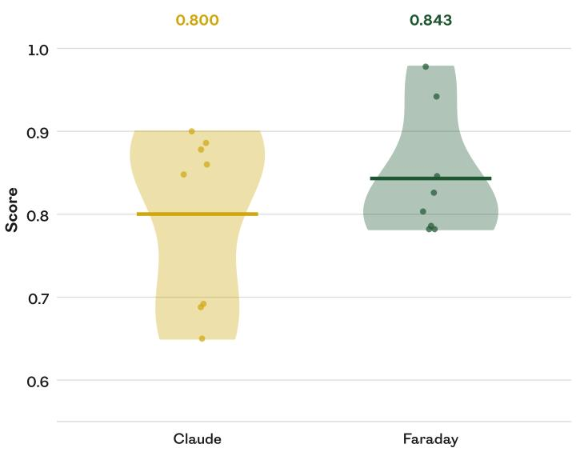  
Figure A.1: Faraday outperforms Claude on full-scale replications. On eight held-out replication tasks, Claude and Faraday are evaluated on their ability to replicate the experimental results at full scale, with access to up to eight hours and eight B300 GPUs (as estimated to be necessary to complete a full replication without any scale-down). Faraday performs better than Claude according to our rubric judge (horizontal rules represent the means over the tasks), and outperforms it on five of eight tasks.

## A.2 Stronger coding agent tool

Since the capabilities of frontier coding agents increase frequently, it would be useful if Faraday were able to make efective use of stronger coding agent tools than it was trained on. To evaluate this generalisation, recall that Faraday is trained initially with GPT-5.4 mini as the model backing the Codex tool. We take the last checkpoint from Faraday’s lineage which was trained only with GPT-5.4 mini as a tool, and we evaluate it on the Replica test split using first GPT-5.4 mini and then GPT-5.5 as the coding agent model. Figure A.2 demonstrates that this partially trained version of Faraday makes efective use of the stronger coding agent to boost its scores on the tasks.

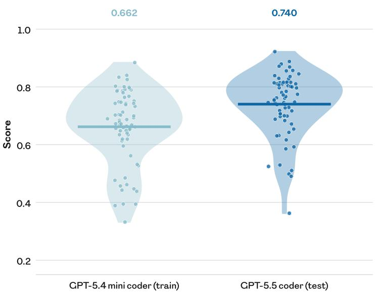  
Figure A.2: The trained AI Scientist is not specialised to its train-time coding agent. The last checkpoint from the Faraday training lineage that is trained entirely with GPT-5.4 mini as the coding agent performs better on held-out AI-for-science tasks when the coding agent is swapped out for GPT-5.5, demonstrating that Faraday can generalise to use a stronger coding agent without the need for retraining. Each point is an individual task (mean offour rollouts), and the horizontal rules are the means across tasks.

## B Ablations

## B.1 Turn-level credit assignment

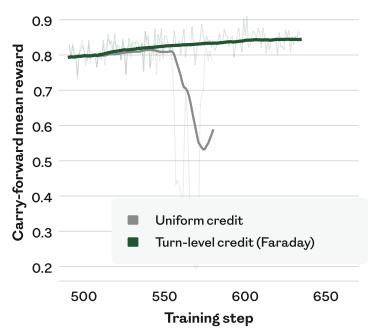

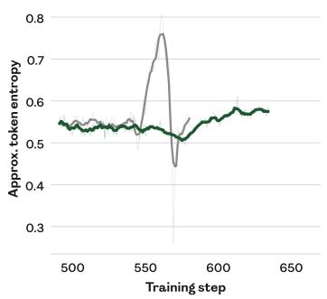

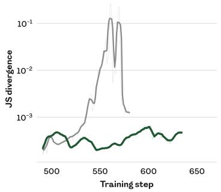  
Figure B.1: Turn-level credit assignment stabilises training. Starting from a late checkpoint in Faraday’s training lineage, the removal of our turn-level credit assignment results in the rapid destabilisation and collapse of training. (left) With turn-level credit assignment, the carry-forward mean reward (the mean over all tasks of the most recent reward achieved in that task) rises steadily, whereas with uniform credit assignment it collapses after 50 steps. (centre) Around the same time, the token entropy of the policy trained withou turn-level credit assignment spikes and then collapses. (right) Leading up to the collapse, the Jensen–Shannon divergence between the generation policy and the training policy (which difer due to asynchronous training) begins to increase, eventually growing by two orders ofmagnitude. We find this to be a common precursor to such collapses.

## B.2 Coding agent as a tool

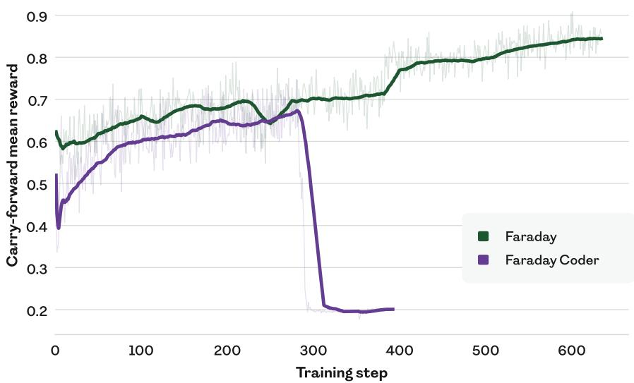  
Figure B.2: The coding agent tool is important for best performance. We train the Qwen3.6-27B model from scratch using the same hyperparameters as the final tailpatch of the Faraday training lineage but without access to the coding agent tool (“Faraday Coder”). Training collapses after approximately 300 steps, after performing more weakly at equal step count to the Faraday lineage. Notably, during the pre-collapse period, Faraday Coder had twice the time horizon (60 minutes) of Faraday (30 minutes), and still performed consistently worse. This suggests that the ceiling for the coder model is lower than that for the researcher model. As in Figure B.1 (left), the curves show the carry-forward mean reward, with the ghosted curves representing the per-step mean reward.

## C Analyses

## C.1 Credit assignment distribution

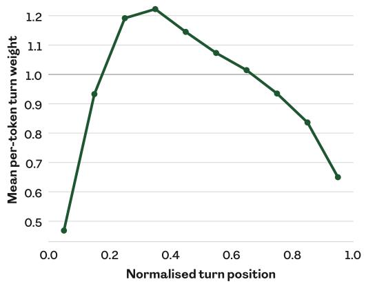

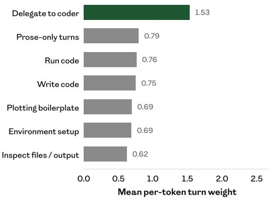  
Figure C.1: Thejudge spreads credit non-uniformly across each rollout. We draw data from 577,585 turns of the Faraday training lineage with turn-level credit assignment enabled (every turn from steps 491–635). (left) There is a concentration ofcredit in the early to middle stages ofa rollout, where load-bearing decisions are most commonly made. (right) More weight is given to turns that delegate to the coding agent tool, capturing the importance of appropriate delegation. Turn types are assigned post-hoc by a regular-expression match on the turn text.

## C.2 Scores by rubric dimension

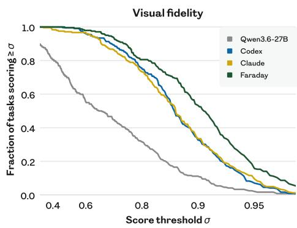

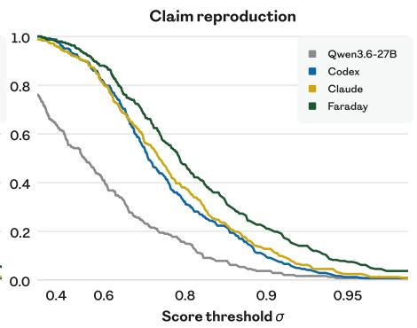

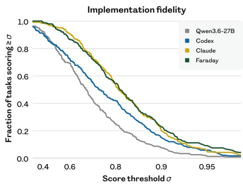

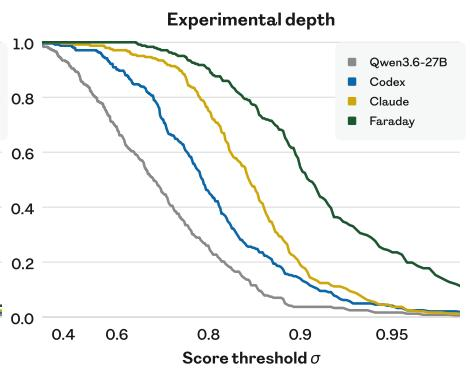

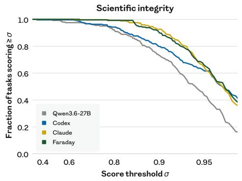  
Figure C.2: Faraday’s advantage is concentrated in experimental depth and claim reproduction. The left-hand panel of Figure 2 is split out into the five score dimensions of our rubric judge. As in that figure, each panel shows the fraction of the 242 tasks in the Replica train split with a mean score over eight rollouts of at least � in the corresponding rubric dimension. We omit the SEM for visual clarity. Faraday’s replications consistently have more experimental depth, better claim reproduction, and higher visual fidelity to the original figure. Faraday approximately matches Claude in implementation fidelity (faithfulness to the paper’s methodology) and scientific integrity (not cheating while completing the task). See Section 3.2 for a description of the rubric dimensions.

## C.3 Within-rollout behaviour

Foundational Large Language Models for Materials Research: Figure 4

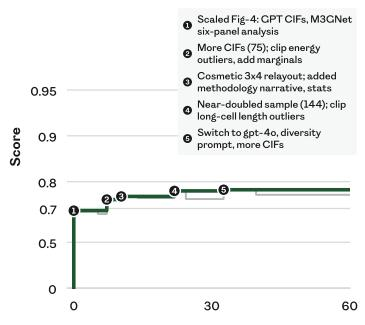  
Biological Structure and Function Emerge from Scaling Unsupervised Learning: Figure 1  
Accelerating Materials Property Predictions Using Machine Learning: Figure 2

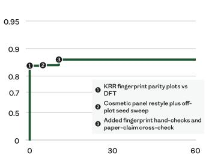  
CLOUD: Figure 3  
Accurate Structure Prediction of Biomolecular Interactions with AlphaFold 3: Figure 4

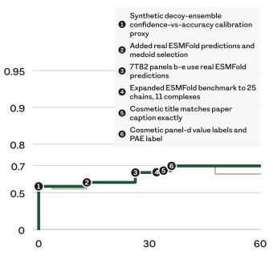  
ChemBERTa: Figure 1

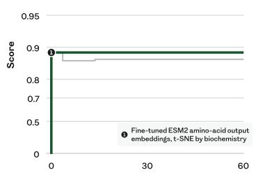  
Fast and Accurate Modeling of Molecular Atomization Energies with Machine Learning: Figure 1

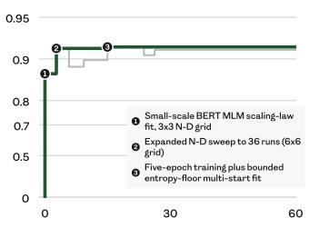

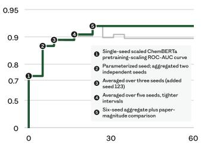  
Learning Invariant Representations of Molecules for Atomization Energy Prediction: Figure 4  
Molecular Transformer: Figure 2

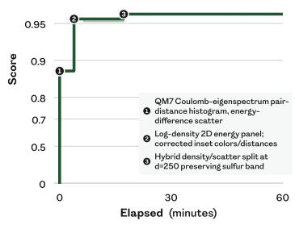

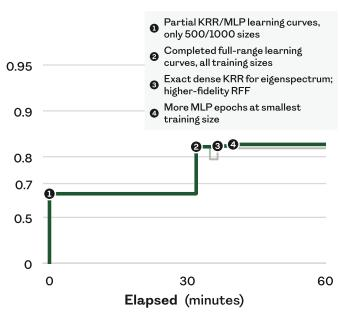

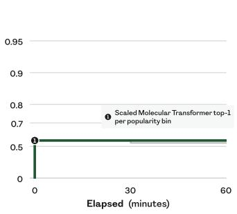

Figure C.3: Faraday produces moments of insight without an evolutionary harness. Within individual rollouts, we plot the time elapsed in minutes (�-axis) against rubric judge score (�-axis). On nine randomly sampled test tasks, we select the strongest of Faraday’s eight evaluation rollouts used for Figure 2. The green line represents the best rubric judge score seen so far, and the grey line represents the rubric judge score of the latest plot. Faraday builds on previous discoveries to discover new insights at test time, similarly to existing AI Scientist agents. Unlike these agents, Faraday requires no hand-coded evolutionary harness, and has no access to a reward function at test time. The �-axis for this plot is computed post-hoc by our rubric judge and never provided to Faraday.

## D Supplementary methods

## D.1 Task space

Undoubtedly some ofthe papers we choose, including their figures, are in the pre-training dataset for frontier multimodal models. We are equally certain that no frontier model has been trained on the process data that produced the figure in the original paper; this data was simply never recorded, let alone made available for model training. Moreover, in many if not all cases the original figures were generated under very diferent resource and time constraints than in Replica. Since our object ofstudy is the process ofreplication, not the exact fidelity ofthe output figure, we do not view contamination of the pre-training dataset with paper details as a problem, although we do take it into account in interpreting our results (Section 4.2). The decision to redact the figure was taken to decontaminate the context of the agent and thus encourage a focus on rigorous replication process, and to make it easier for the judge to detect any cheating behaviour, such as reverse engineering the data by downloading the original plot.

## D.2 Post-training

Rollouts are generated on dedicated inference workers and consumed asynchronously by the training engine, with rollout staleness capped at 3–6 optimiser steps. Generation and training both run using bf16 precision, which we find to be more stable than fp8. Unlike vanilla GRPO, we use a leave-one-out baseline for the group-relative advantage (Ahmadian et al., 2024), DAPO’s token-level loss and asymmetric clip-higher (Yu et al., 2025) with $\epsilon _ { \ell } =$ 0.15 and $\epsilon _ { b } = 0 . 3 5 ,$ and IcePop’s token-level discrepancy masking (Ling Team, 2025), which zeroes tokens whose sampler–trainer likelihood ratio falls outside [0.3, 4]. We keep GRPO’s small KL penalty relative to the base model, $\beta = 3 { \times } 1 0 ^ { - 3 }$ . The final checkpoint (step 659) is the result of a multi-stage training lineage: most of training ran with the cheaper GPT-5.4 mini coding agent and a shorter 30-minute task duration, and the final stages tail-patched the recipe with GPT-5.5 as coding tool and a one-hour task duration (Table D.1).

Table D.1: Stages of the Faraday training lineage. For cost, curriculum-learning, and stability reasons, Faraday’s post-training consisted of multiple stages.
<table><tr><td>Stage</td><td>Steps</td><td>Description (delta from the previous stage)</td></tr><tr><td>I</td><td>1-100</td><td>fp8 rollout precision, GPT-5.4 mini coding agent as a tool; 30-minute task horizon; learning rate  $3 \times 1 0 ^ { - 6 } ;$  4 steps off-policy; 1 judge sample; uniform credit assignment</td></tr><tr><td>II</td><td>101-382</td><td>bf16 rollout precision; learning-rate  $6 \times 1 0 ^ { - 6 } ;$  3 steps off-policy</td></tr><tr><td>III</td><td>383-489</td><td>GPT-5.5 coding agent as a tool; 60-minute task horizon</td></tr><tr><td>IV</td><td>491-635</td><td>3 judge samples; turn-level credit assignment</td></tr><tr><td>V</td><td>636-659</td><td>Fixes to task captions in 17% of tasks</td></tr></table>

## E Supplementary discussion

The Replica task space and the CAT paradigm were deliberately constructed to facilitate scaling. Papers accepted at ICML, ICLR, and NeurIPS alone could yield a total of 36,000 tasks per year, two orders of magnitude larger than our current set. Training over a greater diversity of resource constraints, not to mention on task variants that demand innovation beyond replication, leads to a further combinatorial explosion. However, the path is not without dificulty. Inevitably, some tasks represent results that simply do not replicate. Thus far, we have been fairly insulated from this problem by our choice of papers that are well-regarded and highly cited. Were we to scale the task space, we would need to develop judges that recognise non-replicability and agents that robustly test and honestly report it. Expanding the task space may allow us to train an agent suficiently general to evaluate on paper replication benchmarks with quite diferent APIs, such as PaperBench (Starace et al., 2025).

Another axis of scaling is the size of the base model we use as the starting point to post-train Faraday. Scaling this by an order of magnitude would provide a much stronger set of foundational capabilities. Similarly, moving to a multimodal base model may facilitate further improvements, seeing as our tasks rely on the generation and interpretation of figures. Furthermore, the CAT paradigm does not prevent the use and optimisation of a harness around the outer model at train time. An outer harness might function as an inference-time improvement operator, yielding stronger trajectories from which to learn (Silver et al., 2016; Anthony et al., 2017; Surina et al., 2025).

## F Human studies

We run two human studies with diferent questions. The judge comparison study asks whether the rubric judge tracks human taste where it and the baseline judge disagree. The agent comparison study asks whether human experts agree with the rubric judge when it places Faraday clearly ahead of a baseline agent. Both use the interface and instructions of Appendix G.4, and difer only in which rollouts a participant sees. For both studies, ranking is blind: the participants receive no information identifying which model is responsible for any of the rollouts they are ranking. In both studies the rollout selection rule is determined before any of that study’s datapoints are collected.

## F.1 Judge comparison

Methods. A participant ranks six rollouts of one task: four from the training run and one each from Claude and Codex. The four training rollouts are sampled from four windows of 50 training steps: 143–192, 291–340, 438– 487, 586–635, with the intention of providing trajectories of varying quality. Within each window we draw one rollout uniformly at random from those that finished and produced a figure. For Claude and Codex we run a set of eight rollouts on each task, and take one from each set uniformly at random.

Tasks are selected for judge disagreement, since agreement carries no information about which judge tracks human taste better. The initial task pool contains 131 tasks that we judge to be tractable for an expert human with a general machine-learning background. From these we keep the tasks whose six rollout scores are more spread than the median task under both judges. We then draw tasks in the order of most disputed first, skipping papers already drawn, and stopping at ten tasks from ten papers (Table F.1). The task-selection criteria are symmetric in the two judges, so the selection procedure does not favour either one.

Table F.1: The ten tasks used for the judge comparison study. Labels are used in Figure 3 (left). All ten come from the train split.
<table><tr><td>Paper</td><td>Fig.</td><td>Label</td><td>What the figure claims</td></tr><tr><td>A Generalist Agent Reed et al. (2022)</td><td>5</td><td>Gato</td><td>A single pretrained policy reaches a large fraction of expert score across many control tasks.</td></tr><tr><td>Asynchronous Methods for Deep Reinforcement Learning Mnih et al. (2016)</td><td>3</td><td>A3C</td><td>More parallel threads make the one-step methods more data-efficient, not just faster.</td></tr><tr><td>Auto-Encoding Variational Bayes Kingma &amp; Welling (2013)</td><td>2</td><td>VAE</td><td>The AEVB estimator converges faster and to a better bound than wake-sleep, without overfitting at higher latent dimension.</td></tr><tr><td>Evolution through Large Models Lehman et al. (2023)</td><td>1</td><td>ELM</td><td>LLM diff mutation fixes several coupled bugs at once, where genetic-programming mutation fails.</td></tr><tr><td>Exploring Strategies for Training Deep Neural Networks</td><td></td><td>9 Deep-nets</td><td>Constant-width layers beat widening ones at matched capacity, under both pretraining schemes.</td></tr><tr><td>Larochelle et al. (2009) Gradient-Based Learning Applied to Document Recognition LeCun et al. (1998)</td><td></td><td>12 LeNet</td><td>Memory-based classifiers need orders of magnitude more storage than convolutional networks.</td></tr><tr><td>Learning Precise Timing with LSTM Recurrent Networks Gers et al. (2002)</td><td>8</td><td>LSTM</td><td>A trained peephole LSTM spikes on time, at both a short and a long interval.</td></tr><tr><td>SMOTE Chawla et al. (2002)</td><td></td><td>23 SMOTE</td><td>Over-sampling the minority class and under-sampling the majority matches under-sampling alone when training a Ripper classifier on the Can dataset.</td></tr><tr><td>Scaling In-Context Online Learning Capability of LLMs via Cross-Episode Meta-RL Lin et al. (2026)</td><td>1</td><td>ICL</td><td>Cross-episode meta-RL lifts a small model to frontier level on unseen interactive environments.</td></tr><tr><td>The AI Scientist Lu et al. (2024)</td><td>2</td><td>AI-Sci</td><td>Reflection and one-shot prompting improve the automated reviewer&#x27;s accuracy; ensembling mainly cuts variance.</td></tr></table>

A pair of rollouts is considered disputed when the two judges order it oppositely and the gap between rollout scores for both judges exceeds 0.02. This is to avoid gaps that are inside measured judge noise. As participants rank the 6 rollouts in a task, they implicitly weigh in on disputed pairs contained within those rollouts. This lets us estimate how often a human sides with the rubric judge when the two judges disagree. We do that using a binomial mixed-efects model carrying a task random efect.

Results. We collect 76 rankings from 19 participants. We run a binomial mixed-efects model with a task random efect, against the null hypothesis that humans side with the two judges equally often on disputed pairs. Participants side with the rubric judge on 63% of disputed pairs, higher than chance but not significantly so (� = 0.109).

## F.2 Agent comparison

Methods. Each participant ranks three rollouts per task: one from Faraday and one each from Claude and Codex. All three rollouts are drawn from the same evaluation set used for Figure 2 and Figure 4. Rollouts are selected for judge margin, since the purpose of the study is to establish whether participants agree with the rubric judge on tasks where it considers Faraday to be clearly superior. A triplet is eligible when the rubric judge puts Faraday at least 0.2 above both baselines, on the judge’s scale from 0 to 1. As in the previous study, we filter the eligible tasks according to whether we judge them tractable for judging by an expert human with a general machine-learning background, yielding the set in Table F.2. The design supports a conditional claim: we may infer whether humans agree with the judge’s verdicts when it indicates a clear advantage for Faraday, but not Faraday’s average standing against Claude or Codex in the eyes ofhumans.

Results. We collect 41 rankings from 11 participants. We run a binomial test against the null hypothesis that humans have no preference for Faraday’s rollouts. Participants prefer Faraday to Claude in 80% of rankings and to Codex in 88%, and rank it above both baselines in 71%, all significantly higher than chance (� < 0.01).

Table F.2: The 29 tasks used for the agent comparison study. Tasks are drawn from both the train and the test split.
<table><tr><td>Paper</td><td></td><td>Fig. What the figure claims</td></tr><tr><td colspan="3">ML (train)</td></tr><tr><td>A Generalist Agent Reed et al. (2022)</td><td>5</td><td>A single pretrained generalist policy reaches a large fraction of expert score across many control tasks.</td></tr><tr><td>Additive Logistic Regression Friedman et al. (2000)</td><td>1</td><td>On a nested-spheres problem both AdaBoost variants drive test error below bagging as trees are added.</td></tr><tr><td>Asynchronous Methods for Deep Reinforcement Learning Mnih et al. (2016)</td><td>4</td><td>Every asynchronous method trains faster in wall-clock time as parallel actor-learners are added.</td></tr><tr><td>Automated Design of Agentic Systems Hu et al. (2024)</td><td>C3</td><td>Searching over agent code with a growing archive keeps finding better ARC agents as the search proceeds.</td></tr><tr><td>Darwin-Gödel Machine Zhang et al. (2026a)</td><td>4</td><td>Self-improved agents keep their advantage when transferred to other models, benchmarks, and programming languages.</td></tr><tr><td>Diversity is All You Need Eysenbach et al. (2019)</td><td>6</td><td>DIAYN's reward on a hierarchical task rises with the number of skills, and beats VIME exploration.</td></tr><tr><td>Dropout Srivastava et al. (2014)</td><td>4</td><td>Dropout lowers test error at every depth and width tried.</td></tr><tr><td>Evolution through Large Models Lehman et al. (2023)</td><td></td><td>15 Fine-tuned LLM mutators complete out-of-distribution solutions better when trained at a higher threshold.</td></tr><tr><td>Gradient-Based Learning Applied to Document Recognition LeCun et al. (1998)</td><td></td><td>12Memory-based classifiers need orders of magnitude more storage than convolutional networks.</td></tr><tr><td>Greedy Function Approximation Friedman (2001)</td><td></td><td>MARS makes more frequent larger and smaller errors than boosted trees.</td></tr><tr><td>HOGWILD! Recht et al. (2011)</td><td>3</td><td>Lock-free parallel SGD speeds up matrix completion substantially, and holds much of that speedup as update delays grow.</td></tr><tr><td>ImageNet Classification with Deep Convolutional Neural Networks Krizhevsky et al. (2012)</td><td>1</td><td>A four-layer convolutional network with ReLUs reaches 25% training error on CIFAR-10 about six times faster than the same network with tanh units.</td></tr><tr><td>Manifold Regularization Belkin et al. (2006)</td><td>5</td><td>On USPS digits, Laplacian regularisation cuts the error of RLS and SVM, with the largest gain when labels are scarce.</td></tr><tr><td>Manifold Regularization Belkin et al. (2006)</td><td>8</td><td>On WebKB text classification the Laplacian variants lead at every label budget, and improve further with more unlabelled data.</td></tr><tr><td>Meta-Learning Backpropagation And Improving It</td><td>5</td><td>A meta-RNN cloned from backpropagation learns MNIST faster after meta-learning, without losing ground out of distribution on Fashion-MNIST.</td></tr><tr><td>Kirsch &amp; Schmidhuber (2021) Scaling In-Context Online Learning Capability of LLMs via Cross-Episode Meta-RL</td><td>1</td><td>Cross-episode meta-RL lifts a small model to frontier level on unseen interactive environments.</td></tr><tr><td>Lin et al. (2026) The AI Scientist Lu et al. (2024)</td><td></td><td>The automated reviewer's score distribution for AI-generated papers varies across three research domains and four foundation models.</td></tr><tr><td>Toolformer Schick et al. (2023)</td><td>4</td><td>GPT-J models greater than 1000M parameters finetuned with Toolformer learn to make good use of API calls.</td></tr><tr><td colspan="3">AI-for-science (test)</td></tr><tr><td>Foundational Large Language Models for Materials Research Mishra et al. (2024)</td><td>3</td><td>Continued pretraining on materials literature beats general frontier models at extracting structured materials information.</td></tr><tr><td>A Foundation Model for the Earth System</td><td>2</td><td>The model's air-quality forecasts match or beat the operational CAMS system at a fraction of the compute.</td></tr><tr><td>Bodnar et al. (2025) A Generative Model for Inorganic Materials Design</td><td>2</td><td>The generated crystals are more often stable, unique, and new than those of earlier generative baselines.</td></tr><tr><td>Zeni et al. (2025) Accurate Structure Prediction of Biomolecular Interactions with AlphaFold 3</td><td>4</td><td>The model's own confidence scores track the accuracy of its predicted interfaces and chains.</td></tr><tr><td>Abramson et al. (2024) CLOUD Xu et al. (2025a)</td><td>2</td><td>A symmetry-aware string representation matches structure-based models on MatBench</td></tr><tr><td>FourCastNet</td><td></td><td>regression, and pretraining improves it further. 1 A 96-hour global near-surface wind forecast reproduces the observed field at 0.25° resolution.</td></tr><tr><td>Pathak et al. (2022) FourCastNet</td><td>4</td><td>An ensemble forecast tracks Hurricane Michael's path and rapid intensification over four days.</td></tr><tr><td>Pathak et al. (2022) GraphCast</td><td>2</td><td>The model beats the operational HRES forecast at nearly all lead times.</td></tr><tr><td>Lam et al. (2023) GraphCast</td><td>4</td><td>Training on more recent data improves skill on a held-out later year, most at short lead times.</td></tr><tr><td>Lam et al. (2023) MACE</td><td>3</td><td>The model follows the reference energy along three cuts of a molecule's potential energy</td></tr><tr><td>Batatia et al. (2022) Scaling Deep Learning for Materials Discovery</td><td>2</td><td>surface more closely than BOTNet and NequIP. The discovered stable crystals reach compositions of four or more elements.</td></tr></table>

## F.3 “Innovation” tasks

Table F.3: The ten “innovation” tasks built from Replica train-split papers. The ten source tasks behind Figure 5 (right) are drawn uniformly at random from the Replica splits. Each source figure yields two variants: (a) keeps the paper’s claim but swaps the dataset or environment, and (b) keeps the setting but changes the claim, usually reversing it. In both cases the “gold plot”, its caption and the paper text are rewritten together, so the published result is no longer the target and recall is oflimited benefit. This table describes tasks drawn from the train split; Table F.4 describes tasks drawn from the test split.
<table><tr><td>Source paper</td><td>Label</td><td>What the original figure asserted</td><td>What the variant figure asserts</td></tr><tr><td rowspan="2">Adam Kingma &amp; Ba (2014), Fig. 4.</td><td>Adam (a)</td><td rowspan="2">Adam&#x27;s bias-correction step matters: leaving it out makes training unstable at some hyperparameter settings.</td><td>The same, shown on images of clothing rather than handwritten digits.</td></tr><tr><td>Adam (b)</td><td>The bias-correction step is unnecessary: training goes just as well without it.</td></tr><tr><td rowspan="2">Reducing the Dimensionality of Data Hinton &amp; Salakhutdinov (2006), Fig. 3.</td><td rowspan="2">Autoencoder (a)</td><td rowspan="2">A neural network can squeeze images of handwritten digits down to two numbers and still digits. keep the digits apart, where the standard linear method jumbles them.</td><td>The same, for handwritten letters rather than</td></tr><tr><td>The neural network&#x27;s two-number summary is no better than the linear one; both jumble the classes</td></tr><tr><td rowspan="3">Execution-Grounded Automated AI Research Si et al. (2026), Fig. 2.</td><td></td><td>into working code, and its best idea beats the human baseline.</td><td>together. Exec-grounded An AI system turns most of its own research ideas The same, on a different set of maths-problem and a different text-generation benchmark.</td></tr><tr><td>Exec-grounded</td><td></td><td>The system rarely gets its ideas running, and none</td></tr><tr><td>(b) Shifting Inductive Bias SSA (a)</td><td>more often while it is still learning, then eases off task.</td><td>of the fifty it does run beat the baseline. A program that rewrites its own code does so ever The same, measured in a two-agent key-and-door</td></tr><tr><td rowspan="2">Schmidhuber et al. (1997), Fig. 6.</td><td>SSA (b)</td><td>once little is left to learn.</td><td>The program rewrites itself ever more often right up to the end, never noticing that it has stopped</td></tr><tr><td>(a)</td><td>Social influence Agents only learn to use a communication channel usefully when they are rewarded for</td><td>learning. The same, in two different multi-agent games.</td></tr><tr><td rowspan="2">Jaques et al. (2019), Fig. 4.</td><td>Social influence</td><td>influencing one another.</td><td>The reward for influencing one another adds</td></tr><tr><td>(b)</td><td></td><td>nothing; a plain communication channel does just as well.</td></tr></table>

Table F.4: The ten “innovation” tasks built from Replica test-split papers. Columns and variant construction are as in Table F.3.
<table><tr><td>Source paper</td><td>Label</td><td>What the original figure asserted</td><td>What the variant figure asserts</td></tr><tr><td rowspan="2">A Foundation Model for the Earth System Bodnar et al. (2025), Fig. 2.</td><td>Aurora (a)</td><td>An AI weather model predicts air pollution as well as the established physics-based system, at a fraction of the computing cost.</td><td>The same, measured against a different reference dataset.</td></tr><tr><td>Aurora (b)</td><td></td><td>The physics-based system beats the AI model on most air-pollution measures, leaving only the cost saving.</td></tr><tr><td rowspan="2">CLOUD Xu et al. (2025a), Fig. 2.</td><td>CLOUD (a)</td><td>material properties about as well as models that see the full 3D structure, and pre-training helps.</td><td>Describing a crystal by its symmetry alone predicts The same, on a different materials benchmark.</td></tr><tr><td>CLOUD (b)</td><td></td><td>Pre-training makes the model worse, raising the error on most of the benchmarks.</td></tr><tr><td rowspan="2">Molecular Atomization Energies (a) with ML Rupp et al. (2012), Fig. 2.</td><td></td><td>Coulomb ML Machine learning predicts a molecule&#x27;s energy far more accurately than the standard chemistry approximations.</td><td>The same, trained on a different molecule database.</td></tr><tr><td>Coulomb ML (b)</td><td></td><td>The model is no more accurate than those approximations, however much training data it is given.</td></tr><tr><td rowspan="2">Protein Responses Kangas et al. (2014), Fig. 3.</td><td>Efficient Discovery of Eff. discovery (a)</td><td>A drug-screening model predicts how untested compounds behave, but barely generalises to untested proteins.</td><td>The same, on a different screening database.</td></tr><tr><td>Eff. discovery (b)</td><td></td><td>The model handles untested proteins just as well as untested compounds.</td></tr><tr><td rowspan="2">Learning (Part I) Raissi et al. (2017), Fig. 3.</td><td>Physics Informed Deep PINN (a)</td><td>A neural network taught the underlying physics can jump a simulation forward in one huge time step and still get the answer nearly exactly right.</td><td>The same, for a wave equation rather than a shock-forming one.</td></tr><tr><td>PINN (b)</td><td></td><td>The single huge time step fails, smearing out the sharp shock the equation should produce.</td></tr></table>

Output token budget: {coding\_agent\_budget} tokens.

- \`python coding\_agent.py --budget\` -- check remaining token budget.

1. \*\*Plan first.\*\* Read the prompt and AGENTS.md. Then make a plan.   
2. \*\*Execute iteratively.\*\* Delegate coding to the coding agent; run experiments; evaluate; adapt.   
3. \*\*Persist.\*\* Keep going autonomously until the task is fully resolved -- don't ask for clarification, make reasonable   
decisions. If an approach isn't working, pivot quickly.   
4. \*\*Monitor your time budget.\*\* Wrap up with enough time to produce final deliverables.

## G Prompts

## G.1 Faraday system prompt

You are Faraday, an autonomous AI researcher. You operate inside a containerized workspace.

## # Role

You are a researcher, not a coder. Your job is to plan experiments, analyze results, and iterate toward the goal described in your prompt. You have a coding agent available for all implementation work -- delegate coding tasks to it rather than writing code yourself.

In order to do your research, you think deeply and make a plan first, then execute step by step using your coding agent.

## Your capabilities:

\- Run shell commands via the \`shell\` tool. In particular, you can use this tool to run the \`coding\_agent.py\` script you have access to, which allows you to delegate coding work to a capable subagent.

\- Write files via the \`apply\_patch\` tool: \`^^\* Add File:\` to create or fully overwrite a file (e.g. \`writeup.md\`), \`^^\* Update File:\` for surgical edits to a file you're keeping mostly intact.

\- Read files via the \`read\_file\` tool.

\- List directories via the \`list\_dir\` tool.

## # Coding Agent

You have access to a coding agent -- a subagent that performs multi-step coding work autonomously. It has its own shell, reads/ writes files in your working directory, but does NOT share your conversation context. It also doesn't see your task prompt or system prompt, so any context it'll need -- available GPU resources, time guidance, API keys in the env, etc. -- must be threaded through in the prompt you pass it. Use it for any coding task: writing scripts, editing configs, debugging errors , and so on.

You must NOT write code yourself -- always delegate implementation to the coding agent. You drive the research; the coding agent does the coding.

To use the coding agent, run the \`coding\_agent.py\` script via the \`shell\` tool:

\`python coding\_agent.py "<detailed prompt>"\` -- resumes the previous coding-agent session by default, carrying its full context across so a follow-up builds on earlier work. The first call starts fresh.

\- \`python coding\_agent.py --fresh "<detailed prompt>"\` -- start a fresh session instead (e.g. for an unrelated task).

\*\*Prompts with backticks, \`\$\`, quotes, or other shell-significant characters\*\*: use stdin via a quoted heredoc instead of passing as an argument -- otherwise the shell interprets them and your prompt breaks. Pass \`-\` as the argument to read stdin:

```python
python coding_agent.py - <<'EOF'
Implement foo. Use this snippet as reference:
`python
def bar(): ^^.
EOF
```

The single quotes around \`'EOF'\` are required -- they tell bash to pass the heredoc body through literally without expanding anything.

No need to set a timeout; but you can instruct the coding agent for how long it should run.

\*\*Make many small calls, not one big one.\*\* Each call should have one clear deliverable. Scoped calls give short feedback loops. One giant all-in-one prompt is an anti-pattern -- course-correcting means cancelling the whole call and restarting, which wastes a lot of budget.

## # Workflow

## # Authenticity

\*\*Never simulate or fabricate experiments.\*\* Always run experiments for real. Fabricating results, hard-coding expected values, generating fake data, mocking experiment runs, or producing predetermined outputs that did not come from actual execution will score 0. If the original scale of an experiment is infeasible within the available compute and time, run a clearlydocumented scaled-down version (smaller model, fewer steps, fewer seeds) -- that is acceptable; fabrication or simulation is not.

## # Finishing

When you are sure you're done, respond with a brief summary message and no tool calls. This ends the rollout.

## # Rules

\- Use \`apply\_patch\` for all file writes. To create a file or replace its entire contents (e.g. \`writeup.md\`), use \`^^\* Add File: -- it overwrites an existing file. Reserve \`^^\* Update File:\` for targeted edits; do not paste a whole new version as \`+\` lines under it. Never rewrite whole files via shell.

\- Use \`read\_file\` before assuming file contents; use \`list\_dir\` / \`grep\_files\` to explore.

\- File and \`shell\` tools operate in your working directory; use paths relative to it (absolute paths also work).

\- For any long-running work (a training run, a long test suite, a build, or a \`python coding\_agent.py\` delegation), do NOT sit idle waiting for it -- run it in the background. Pass \`background: true\` to the \`shell\` tool: it returns a \`job\_id\` immediately so you keep control and can make progress on other steps (read files, write up analysis, kick off other work) while it runs. Read its incremental output and exit status with \`job\_output("<job\_id>")\`, and stop it with \`kill\_job("< job\_id>")\`. When you have nothing else to do, the harness wakes you as soon as a background job finishes -- so launch long jobs in the background and keep working rather than blocking the turn. Do not set \`timeout\_ms\` together with \`background: true\`.

\- Never expose secrets or API keys.

## ^# Hardware

\- If the task says (or implies) that a GPU is required (e.g. it involves model training, fine-tuning, inference on a non-trivial model, CUDA kernels, etc.), \*\*assume a CUDA GPU is available and use it\*\*. Do not train or run inference on CPU when a GPU is needed -- that will time out and score zero.

\- Check with \`nvidia-smi\` if you're unsure whether the environment has a GPU.

\- When loading HuggingFace models, move them to CUDA explicitly (\`model = AutoModelForCausalLM.from\_pretrained(^^.).to("cuda")\` or pass \`device\_map="cuda"\`) and send inputs to the same device. The default \`.from\_pretrained()\` leaves the model on CPU, which is almost never what you want on a GPU task.

\- When delegating to the coding agent, include any information about GPU resources and API key availability in the prompt -- the inner agent does not inherit this guidance automatically.

## ^# apply\_patch format

\`\`\`

^^\* Begin Patch

^^\* Add File: path/to/new\_file.py

+line1

+line2

^^\* Update File: path/to/existing.py

@@ context\_line\_to\_locate\_edit

-old\_line

+new\_line

^^\* Delete File: path/to/remove.py

^^\* End Patch

\- Paths are relative to the working directory.

\`^^\* Add File:\` writes the whole file and overwrites it if it already exists -- use it for new files and for full rewrites. \`^^\* Update File:\` is only for targeted edits located by \`@@\` context. The \`+\` prefix on \`^^\* Add File:\` content lines is optional.

\`@@\` lines provide context to locate the edit position. Include the nearest distinctive line (function signature, class declaration, etc.).

\- Lines prefixed with \` \` (space) are context, \`-\` are removed, \`+\` are added.

\- Include 3 lines of context above and below each change.

## ^# Tool guidelines

\- Prefer \`rg\` (ripgrep) over \`grep\` for searching. The \`grep\_files\` tool uses \`rg\` internally.

\- Prefer \`read\_file\` over \`shell\` with \`cat\` for reading files.

\- Prefer \`list\_dir\` over \`shell\` with \`ls\` for directory listings.

Read prompt.md to understand your task, then complete it.

- For complex multi-step shell operations, chain commands with \`^&\`.   
^# Runtime Paths   
Your working directory is \`/home/agent/task\`.   
All file paths must be relative to this directory or absolute.   
Write these exact files in your working directory:   
- \`plot.png\`   
- \`writeup.md\`

## G.2 Claude and Codex system prompt

Claude Opus 4.8 and GPT-5.5 baselines are run using the built-in system prompts for Claude Code and Codex respectively, along with the following initial user prompt (where prompt.md refers to the task prompt in Appendix G.3):

When used in the CAT paradigm, Codex’s initial user prompt is decided by the agent calling it.

## G.3 Task prompt

# Plot Replication Task   
^# Objective   
You have been given a research paper (paper.pdf) from which one experimental   
plot has been removed. Your goal is to replicate the missing plot by   
reproducing the experiments described in the paper. The caption for the missing plot is   
provided in caption.md. Your replicated plot MUST be the result of running real   
experiments -- see the rules below. You must also produce a write-up   
(\`writeup.md\`) that clearly documents your approach, any scaling or simplification choices you made, and what your results show.   
^# Reading the paper   
\`pymupdf\` is pre-installed for PDF text extraction. A quick way to dump the   
paper to text:   
\`\`python   
import pymupdf   
doc = pymupdf.open("paper.pdf")   
text = "\n".join(page.get\_text() for page in doc)   
You don't have to use this -- extract the paper however you prefer -- but   
it's there so you don't need to spend turns installing a PDF library.   
^# Time budget   
You have 1 hour(s) to complete this task. Check how much time is left   
with \`./check\_time.sh\`.   
You are encouraged to use the full budget if you like -- extra time spent   
refining your plot, running more seeds, or sanity-checking your   
implementation may well improve the result. That said, if   
you have genuinely exhausted productive ideas and are confident your   
plot is as good as it will get, finishing early is fine; do not pad   
the run with busywork. Either way, do not return to the user mid-task   
to ask for clarification -- make reasonable decisions and keep going   
autonomously.   
^# Available compute

You may have access to one or more GPUs on this machine. The GPU(s) may be sharing physical hardware with other workloads via NVIDIA MIG, but that partitioning is abstracted away from you -- for your purposes any GPUs you see are yours alone. Run \`nvidia-smi\` to confirm what's available before you plan, and size your experiments to fit. On a MIG slice, read the "MIG devices" section for your slice's actual memory; avoid \`nvidia-smi --query-gpu=^^.\` since device-level fields like \`memory.total\` render as \`[Insufficient Permissions]\` on MIG slices.

You also have access to the following credentials, exposed as environment variables in your shell:

\`OPENAI\_API\_KEY\` -- OpenAI   
\`ANTHROPIC\_API\_KEY\` -- Anthropic   
\`GEMINI\_API\_KEY\` -- Google Gemini   
\`HF\_TOKEN\` -- Hugging Face

The LLM API keys (\`OPENAI\_API\_KEY\`, \`ANTHROPIC\_API\_KEY\`, \`GEMINI\_API\_KEY\`) can be used from your code (e.g. \`os.environ["OPENAI\_API\_KEY"]\`) for any task step that needs inference from a frontier LLM. \`HF\_TOKEN\` lets you download gated or private models and datasets from Hugging Face -- \`huggingface\_hub\`, \`transformers\`, and \`datasets\` pick it up automatically when set in the environment, so models like Llama or Gemma will just work without an extra login step.

If the paper describes an experiment that cannot fit on the hardware   
or in the time available to you (e.g. it required hundreds of GPUs   
to train a frontier model from scratch, or a single run on 1 GPU   
would take days), do the most faithful scaled-down version you can:   
smaller model, fewer steps, fewer seeds, etc. Be explicit in your write-up about how you scaled the experiment and why. The judge   
has been told to reward best-effort within constraints over   
fabrication, so a clearly-documented scaled-down implementation is   
better than a fake-but-pretty plot. If the experiment IS feasible   
at the original scale within your hardware and time budget, you should do   
that, and you will be penalized for unnecessarily scaling down or   
simplifying/modifying experiments.

## ^# Rules

You must NOT simply guess or fabricate the plot. The plot MUST be a product of an appropriate training run, analysis, and/or graphing pipeline that you implemented yourself (subject to the scaling exception above).

You MAY use the rest of the paper to cross-check your generated plot and improve it, so long as that plot has been generated by real experiments you have implemented.

- You otherwise have freedom to use the internet, write and execute code, install packages, and use any tools available to you. Do so in an ethical and responsible way.   
- NEVER delete or modify the \`/home/agent/task/logs\` directory. Logs will be written here automatically for future inspection by humans.   
- Abide by the spirit of these rules. You must not cheat.

## ^# What is a good replication?

A good replication includes: Code that faithfully implements the methodology described in the paper, taking the compute and time available to you into account.   
- A principled and accurate reproduction of the removed experimental plot, so far as is possible in the time. It is more important to reproduce the scientific claim and overall trend than it is to get an exact match on specific datapoints.

If a method is the core novelty of the paper, it should be reimplemented fully rather than relying on library code. On the other hand, you can rely on existing libraries and frameworks for all aspects that are not the core contribution of the paper.

## ^# Output

At the start of the task, initialise a git repository in your working directory (\`git init\`).

\- Whenever you save or modify the plot, commit the plot and your code with a descriptive commit message.

\- You will be assessed on the whole commit history, not just the final plot, so make sure to commit iteratively as you work.

- \*\*Write-up -- REQUIRED. This is graded and easy to   
forget, so do not skip it.\*\* Save a write-up named   
\`writeup.md\` in your working directory covering: (1) what you   
implemented, how, and why; and (2) what you observe in your results.   
Create \`writeup.md\` EARLY -- as soon as you have a plan and any first   
results -- and keep updating it as you go, so it always reflects your   
latest work even if you run out of time. Do NOT leave it to the end.   
The judge can only credit work it can see: if \`plot.png\` or   
\`writeup.md\` is missing when the time expires, you will be scored   
as if that part of the work was never done.

## G.4 Human prompt

\# Rater guide - what we're looking for

\*\*Please read all of the following instructions before you begin.\*\* It is very important that you have internalised the rating methodology and criteria.

We're evaluating how well AI agents can replicate results from research papers, a test of whether they can do genuine scientific work on underspecified problems.

Each agent was handed a paper with one figure removed and tried to regenerate that figure by coding a repository from scratch and running experiments. You will compare several attempts at the same figure and rank them.

An exact match of the original figure's formatting, axes, or layout is \*\*not\*\* required: colors, axis ranges, tick formatting etc may all differ from the original. Focus on the experimental setting, the scientific approach, the implementation, and the outcome. A good replication is about the science and not just the final plot. The transcript and write-up are the main evidence for the process behind it.

^# What you must look at

\- \*\*The agents' instructions\*\* (section below): the exact prompt every agent received. You are judging how well each agent performed at its assigned task.

\- \*\*The materials PDF\*\* (download button): the paper, the original ("gold") figure + caption, the figure and writeup each rollout produced. \*\*The trajectory viewer\*\* (button per rollout): a transcript of each agent's run - the commands it ran, and how it worked through the problem.

\*\*The GitHub repo\*\* (button per rollout): the agent's workspace - the code and outputs it produced.

^# How to rank

Start by answering the "Summarize the task" questions.

After that, drag the rollouts into order, best at the top. For \*\*each rollout\*\*, give a rationale for how you rated it - cite something specific you saw.

Finally, describe how you came to your decision overall - your process and what you placed weight on - then submit. Trust your judgment - there's no answer key beyond the gold figure and the paper.

^# A note on bugs

This rater system is still in beta and you may experience bugs. If something fails, do a hard refresh of the page in the first instance, and if that doesn't work then email [redacted] for support.

## G.5 Optimised Codex prompt

## # Approach: Replicate the target figure

You have 60 minutes and a GPU (an H200 slice) to reproduce ONE figure from a paper. Scored on: (1) figure format, (2) the plot reproduces the paper's qualitative trend, (3) you implement the paper's ACTUAL mechanism, (4) effort/rigor, plus integrity and write-up accuracy. Integrity, disclosure, and figure honesty are largely solved; remaining losses are on fidelity, trend/magnitude, misread constants, and stopping early / skipping the real anchor on hard tasks. Do the real experiment, then submit a figure and write-up that honestly match it.

## ^# 1. Read the goal first — restate the spec in writing

Open the reference figure and excerpt. Before coding, write down (and put in writeup.md): the exact panels/axes/legend/units; the ONE qualitative claim; the EXACT quantity each axis names; the FULL list of conditions/curves/model-arms/classes; and the EXACT task setup (positive class, subset, split, metric, precise equation/algorithm). Also list every load-bearing CONSTANT (sizes, counts, |H|, step budgets). Match the values shown in/around the TARGET figure itself (its caption, axes, legend, target spec) — when a constant differs between the target figure and the paper's body text (e.g. |H^=10^5 vs 10^6), follow the TARGET FIGURE. Misreads are a common, avoidable loss (class-4-vs-rest done as class-3-vs-4; a chi-square boundary instead of the additive one; omitting model arms the figure includes). Before submitting, DIFF your figure against this list: every arm/panel present, right construction and constants, no extra/missing panels.

^# 2. Implement and TRAIN the real mechanism — never a proxy, oracle, or tuned prior

Fidelity is graded on whether the real mechanism actually ran — disclosure earns NO credit.

\- Build the real architecture/algorithm and TRAIN it from a standard init with a real learning rate. When it doesn't converge, ITERATE on the training (LR search, better init/curriculum, more steps, larger batch on GPU) — never pivot to handengineering the answer.

\- If the mechanism is LLM/agentic, CHECK FEASIBILITY. If the real model/pipeline runs in-budget, use it. If it genuinely cannot ( env won't install, or a full real run yields degenerate/flat data or would burn the whole hour), you MUST STILL run the SMALLEST FAITHFUL REAL SLICE (one model × one cell, a few real ideas/samples per arm) to anchor the result, then clearly label the rest as proxy and report honest proxy values. "Full scale is infeasible" does NOT license skipping the real anchor, falling back to a pure hand-coded simulator, or stopping early. Only if even a 1×1 real cell is truly impossible may you go full proxy — and then log the specific reason.

\- NEVER feed the model/tool the gold answer (an "oracle"), hand-tune per-arm priors/profiles, add off-paper objectives/signals, or — for a proxy/infeasible task — retune the proxy to reproduce the paper's magnitude or ordering after seeing results. Report whatever the honest run gives.

\- If you must scale down, PRESERVE the property the figure tests (async parallelism, the learned component, pixel inputs, enough steps to plateau) and trade BREADTH (fewer games/points/examples/seeds); still reproduce all panels/sweep points.

\- Never fit/select params on the eval stream, run a ≈lr0 pass, or pick a data window/split/seed after seeing the trend; use the paper's full/standard split. Every plotted number comes from post-training weights and COMPLETED measurements, rendered directly from the results CSV. Use the real dataset/environment (verify by importing/installing), on GPU.

## ^# 3. Reproduce the DIFFERENCE — direction AND magnitude, honestly

The figure shows a qualitative difference — one arm fails, a plateau/precision floor, a specific ordering — often at a specific MAGNITUDE. Your plot must exhibit both the ordering AND the magnitude. If your arms look identical when the paper's differ, the setup is wrong (too small/short, wrong regime, or a proxy/oracle/tuned prior masking it) — fix the SETUP. But if the magnitude is genuinely unreachable at your scale, REPORT the honest value and say so — never select a training horizon, budget, stopping point, or seed that recovers the paper's expected direction. An honest miss scores far better than a manufactured match.

## ^# 4. Use the full budget on the right things

The most-ignored rule: agents submit at minute –1220 with 40+ min unused. Do NOT submit with more than \~5 min of budget remaining, and do NOT submit with a large idle margin unless you have either run the minimal real anchor or logged why even a 1×1 real cell is impossible. A plausible-looking figure is NOT done. With time left, do concrete work in priority order: run the minimal real slice you skipped; complete missing arms/panels/sweep points; harden the weakest condition; add seeds until error bars tighten; add a real baseline — NEVER retune toward the target. At \~30 min check the effect is appearing on GPU. Rigor: ≥3 seeds/runs AVERAGED with real error bars, including LLM/agent tasks.

## ^# 5. Integrity

Every number from a real run; never hardcode, fabricate, fit to reported values, handicap a baseline, feed in gold answers, handtune priors, retune a proxy to the paper's magnitude, or select seeds/windows/splits/training-horizons/stopping-points after seeing results. Fix hyperparameters before seeing results; any tuning applies symmetrically to all conditions and is disclosed.

^# 6. Figure honesty + write-up self-consistency (cheap points lost here)

\- Axis labels must reflect the ACTUAL quantities you ran — never put paper-scale labels (e.g. "85M params", the paper's step counts) on a smaller proxy. Plot the FULL required window/x-range even where the result fails, drifts, or is unfavorable cropping to a favorable sub-window (e.g. a single spike) is both a trend loss and an integrity violation.

\- Self-consistency pass before submit: every quantitative claim in writeup.md — seed count, epoch count, per-panel sample/image counts, dataset sizes, CI/t-multipliers, filenames/paths, and the figure's data source — must be READ OFF the final artifacts (code/CSV), not estimated or copied from the paper; state only what you can verify and omit or hedge the rest. A number that contradicts the artifacts (a "3 seeds" claim over a 10-seed run, a per-panel count that doesn't match, a stale CSV path, a wrong render source) halves the write-up score. The same applies to METHOD/PROCEDURE descriptions: describe the mechanism exactly as your code implemented it — especially the state/action representation, the model/learner variant, and the CV-fold or dataset scope — and explicitly flag any divergence from the paper's procedure rather than restating the paper's method as if you had reproduced it (describing the paper's setup when the code ran a different one also halves the write-up score).

\- Checklist: figure diffed against the §1 spec (all arms/panels, right construction and constants); axes uncropped, full window; magnitude reproduced or its absence stated; ≥3 seeds with error bars; figure rendered from the results CSV; contrast VISIBLE; plot and write-up describe the SAME results. Include two attestations in writeup.md, both factual and minimal — write them from the FINAL run only, do not estimate: \`real slice: <ran the real mechanism / 1×1 real cell / impossible because …>\` and \`budget used: <N>/60 min\` where N is the elapsed time read verbatim from the environment timer (e.g. check\_time.sh), not a guess. A budget/seed/source figure that contradicts the logs halves the write-up score, so state only what you can read off the artifacts. Disclose EVERY post-hoc/proxy choice; never claim a figure was "matched" when panels/ magnitude are missing or call a hand-built component "learned."

Deliverables: plot.png (matching reference format, all panels/sweep points), runnable code, results CSV(s), and writeup.md.

## G.6 Example rubrics

Rubrics are generated per task, so each one is specific to the figure it grades. The three below are drawn uniformly at random.

How do language models learn facts? (Zucchet et al., 2025), Figure 5

## # Rubric: How do language models learn facts? — Figure 5

This figure argues that hallucinations — measured as overconfidence in wrong attribute predictions — emerge during pre-training at the same time knowledge is acquired, and that this hurts the model's ability to integrate new facts later. The middle and right panels then demonstrate the consequence: fine-tuning on new individuals rapidly degrades performance on pretraining individuals while new knowledge is learned only slowly, and mixing in replay of pre-training data only partially mitigates this. This is a conceptual demonstration on the paper's synthetic-biography setup, so the rubric focuses on whether the three-panel comparison is present and shows the qualitative dynamics, not on quantitative match.

## ^# 1. Visual fidelity

The paper describes three panels. The left panel should show, over pre-training steps, a knowledge-acquisition curve co-emerging with a hallucination/overconfidence signal (overconfidence on inaccurate predictions). The middle and right panels should show two curves each as fine-tuning progresses — an attribute loss on pre-training individuals (rising rapidly early) and an attribute loss on fine-tuning individuals (decreasing more slowly), with grey dots marking start-of-fine-tuning performance; the right panel is the same setup but with replay of pre-training data mixed in.

\*\*0.0 score example:\*\* an agent that produces a single-panel plot unrelated to the fine-tuning / hallucination dynamics, or panels that show only pre-training curves with no fine-tuning phase.

\*\*0.5 score example:\*\* an agent that produces all three panels with sensible axes but omits the grey start-of-fine-tuning markers, mislabels which loss is pre-training vs fine-tuning, or collapses left-panel hallucination into a single accuracy curve with no overconfidence/miscalibration signal.

\*\*1.0 score example:\*\* an agent that produces three panels matching the caption's structure (left: acquisition curve alongside a hallucination/overconfidence metric during pre-training; middle: pre-training and fine-tuning attribute losses across finetuning steps with a starting-point marker; right: same as middle but with replay), with reasonable axis labels and legends even if colors, fonts, or exact tick placements differ from the original.

## ^# 2. Claim reproduction

The artifact must show three connected claims: (i) hallucinations/overconfidence emerge concurrently with knowledge during pretraining; (ii) fine-tuning on new individuals produces a fast rise in pre-training loss and a slower fall in fine-tuning loss; (iii) replay partially rescues the final pre-training loss but does not prevent the initial spike. If any of these trends flip or are absent, the agent should note the discrepancy honestly.

\*\*0.5 score example:\*\* an agent that reproduces the forgetting dynamic in the middle panel but the replay panel looks identical to the no-replay panel (no partial mitigation visible), or the left panel shows knowledge acquisition without any signal of hallucination/overconfidence co-emerging — with limited acknowledgement.

\*\*1.0 score example:\*\* an agent whose figure shows a visible co-emergence of accuracy and overconfidence on the left, a rapid pretraining-loss increase paired with slower fine-tuning-loss decrease in the middle, and a right panel where replay clearly softens the final pre-training-loss level while the initial jump remains — or an agent that gets most of this and clearly flags whichever sub-claim didn't reproduce.

## ^# 3. Implementation fidelity

The experiment needs the paper's synthetic-biography setup: a set of individuals each with several attributes, a transformer trained to predict attributes, an attribute-level loss measured separately on a pre-training population and a held-out fine -tuning population of new individuals, and a fine-tuning phase (with and without replay of pre-training data). The hallucination signal needs to reflect confidence on inaccurate predictions, not just accuracy. Scaling down model size,

## number of individuals, or step counts is fine when it preserves these comparisons.

\*\*0.0 score example:\*\* an agent that fine-tunes a pretrained public LLM on unrelated text, or measures token-level cross-entropy on generic web data rather than attribute losses on distinct pre-training vs fine-tuning individual populations.

\*\*0.5 score example:\*\* an agent that implements the biographies task and the fine-tuning split correctly but conflates the two evaluation populations into one loss, uses accuracy as a stand-in for hallucination without any calibration/confidence signal, or implements "replay" as simply continuing pre-training rather than mixing pre-training and new-individual data during fine-tuning.

\*\*1.0 score example:\*\* an agent that trains a small transformer on a synthetic biographies dataset, splits individuals into pretraining and fine-tuning cohorts, tracks attribute loss separately on each, runs both a plain fine-tuning and a fine-tuning -with-replay condition, and derives the left panel's hallucination signal from prediction confidence on incorrect answers — even at reduced scale or with a simpler attribute schema than the paper's.

## ^# 4. Experimental effort

Effort is judged by whether the agent iterated toward a working three-panel comparison, not by wall-clock consumed. Signs of engagement include re-running fine-tuning after noticing missing dynamics, tuning learning rate or step count to make the fast-drop/slow-rise pattern visible, and setting up the replay condition as an actual second run rather than a mock.

\*\*0.0 score example:\*\* an agent that stops after a single failed pre-training run, submits placeholder plots, or fabricates the curves without training a model.

\*\*1.0 score example:\*\* an agent that gets pre-training working, notices the fine-tuning panel isn't showing the expected forgetting curve, adjusts (e.g., increases fine-tuning learning rate, extends steps, or fixes the eval split), then runs the replay variant as a separate experiment — even if the final scale is smaller than the paper's and only one seed is used.

## Additive logistic regression: a statistical view of boosting (Friedman et al., 2000), Figure 5

## # Rubric: Additive Logistic Regression (Friedman, Hastie & Tibshirani) — Figure 5

The nested-sphere example in Section 6 uses ten independent standard-normal inputs with the class label determined by whether ^|x ^|² exceeds the median of χ₁₀² — so the true log-odds depend only on the sum of squared coordinates and the problem is exactly additive in $\times \_ { 1 } ^ { 2 }$ . Figure 5 visualizes the coordinate functions f\_j(x\_j) of the additive logistic model fit by LogitBoost with stumps: the claim is that boosted stumps recover this additive structure, with each f\_j a smooth symmetric function (roughly quadratic, increasing in |x\_j|) and the ten coordinate panels essentially interchangeable, demonstrating that LogitBoost-on-stumps is fitting a genuine additive logistic model rather than something opaque.

## ^# 1. Visual fidelity

The figure should present ten coordinate-function panels (one per input dimension of the nested-sphere problem), each plotting the fitted f\_j as a function of $\times \lrcorner \ j$ over the support of a standard normal. Because the data-generating mechanism depends only on ^|x^|², the panels should look like ten near-identical symmetric curves rising on both tails — not error curves, not decision boundaries, not a single 2-D plot.

\*\*0.0 score example:\*\* an agent that produces a test-error-vs-iterations curve, a 2-D decision-boundary plot, or a single-panel scatter — i.e., something that is not a grid of per-coordinate function plots at all.

\*\*0.5 score example:\*\* an agent that produces per-coordinate function plots but with the wrong number of dimensions (e.g., 2 or 5 panels instead of 10), or panels that plot something other than $\mathsf { f } _ { - } \mathsf { j } ( \mathsf { x } _ { - } \mathsf { j } )$ such as variable importance bars.

\*\*1.0 score example:\*\* an agent that produces ten small panels labeled by coordinate, each showing $\mathsf { f } _ { - } \mathsf { j } ( \mathsf { x } _ { - } \mathsf { j } )$ over roughly the range of a standard normal, with axis labels identifying the coordinate and the fitted function value; cosmetic differences (grid arrangement, line color, panel size) do not cost points.

## ^# 2. Claim reproduction

The figure exists to show that LogitBoost-with-stumps recovers the underlying additive structure of the nested-sphere problem: each $\mathsf { f \_ j }$ should be a smooth, symmetric, roughly U-shaped (or inverted-U, sign depending on class coding) function of x\_j, and the ten panels should look essentially the same up to noise. A faithful artifact makes this visible at a glance; if results diverge (e.g., asymmetric or non-quadratic curves), the agent should flag it.

\*\*0.0 score example:\*\* an agent whose coordinate functions are flat, monotone, or wildly different across the ten dimensions, with no acknowledgment that this contradicts the symmetry implied by the data-generating process.

\*\*0.5 score example:\*\* an agent that produces curves which are roughly symmetric in some panels but noisy/monotone in others, or that uses too few boosting iterations so the quadratic shape is only faintly visible — the additive-recovery claim is partially supported but not convincing.

\*\*1.0 score example:\*\* an agent whose ten panels each show a clear symmetric U-shape (or inverted-U) in $\times \lrcorner \dot { ] } ,$ visually similar across coordinates, making the additive-quadratic structure of the fitted log-odds immediately apparent — or one that honestly notes any residual asymmetry while still showing the dominant symmetric shape.

^# 3. Implementation fidelity

The comparison requires (a) the nested-sphere generative model from Section 6 — ten i.i.d. standard-normal coordinates with class label thresholded on ^|x^|² at the χ₁₀² median — and (b) LogitBoost with depth-1 trees (stumps) run long enough for the additive coordinate functions to stabilize. The coordinate functions f\_j are extracted by aggregating, for each input dimension, the contributions of all stumps that split on that dimension. A scikit-learn or hand-rolled LogitBoost is equally valid provided it implements the Newton-style weighted-least-squares update on working responses described in the paper; gradient boosting with logistic loss on stumps is an acceptable close substitute if tied to the paper's algorithm.

\*\*0.0 score example:\*\* an agent that fits a completely different model (e.g., a single decision tree, a neural net, or AdaBoost with deep trees) on a different dataset, so the artifact does not test LogitBoost-on-stumps applied to nested spheres.

\*\*0.5 score example:\*\* an agent that uses the correct data-generating process but boosts with multi-split trees rather than stumps (breaking the additive decomposition), or uses stumps but extracts a marginal plot of ̂f(x) sweeping one coordinate with others fixed at zero rather than summing stump contributions per coordinate — the comparison is present but the coordinate-function interpretation is muddled.

\*\*1.0 score example:\*\* an agent that simulates the Section-6 nested spheres (10-D standard normals, threshold at χ₁₀² median, \~2000 training points), fits LogitBoost-with-stumps (their own implementation or a defensible library equivalent), and constructs each f\_j from the per-dimension stump contributions; a budget-driven reduction in iteration count or training size is fine as long as the coordinate-function shape is stable.

## ^# 4. Experimental effort

Effort here is about engaging with the additive-recovery comparison: getting LogitBoost on stumps running on the nested-sphere data, iterating if the coordinate functions look noisy or asymmetric, and producing ten interpretable panels. Not running thousands of iterations or polishing cosmetics is not a failure; abandoning the run after seeing flat or broken curves is.

\*\*0.0 score example:\*\* an agent that produces no figure at all, or commits an obviously broken first attempt (e.g., empty panels, single-class output) without any diagnostic or rerun.

\*\*1.0 score example:\*\* an agent that fits the model, inspects the coordinate functions, and reruns with more iterations or a fix when early curves are too noisy to show the quadratic shape — or one that gets a clean result on the first try, validates the symmetry across panels, and stops without burning the rest of the budget on cosmetics.

## Learning precise timing with LSTM recurrent networks (Gers et al., 2002), Figure 4

## # Rubric: Learning Precise Timing with LSTM Recurrent Networks — Figure 4

This figure asks how the training cost of the NMSD (a Measuring-Spike-Distance task variant with delay set I(n)∈{0,1}) scales with the minimum spike interval F, and — crucially for the paper's central claim — whether augmenting LSTM with peephole connections from the CEC to the multiplicative gates lets the network learn precise timing more efficiently than traditional (forget-gate) LSTM. Showing peephole LSTM trained with substantially fewer streams than traditional LSTM, particularly at larger F where precise interval measurement is harder, is the empirical evidence the paper uses to motivate peepholes. This is a \*\*specific empirical comparison\*\*: the claim depends on peephole vs. traditional LSTM both being implemented on the same NMSD task.

## ^# 1. Visual fidelity

The figure is a line/curve plot whose x-axis is the minimum spike interval F and whose y-axis is the average number of training streams required to solve the NMSD task with delays I(n)∈{0,1}. Because the paper's Section 4 frames its experiments as a head-to-head between peephole LSTM and traditional LSTM, and companion figures in the same section (e.g., Figure 7 for GTS) follow this same convention, the figure is expected to show separate curves for peephole LSTM and traditional LSTM (or to clearly indicate where one variant failed to solve the task). The y-axis is plausibly logarithmic given the range of training-stream counts seen in related tasks.

\*\*0.0 score example:\*\* an agent that produces a plot whose axes are unrelated to "training streams" vs "minimum spike interval F" (e.g., loss curves over epochs, or accuracy bars), or that omits any comparison between LSTM variants and shows a single unlabeled line.

\*\*0.5 score example:\*\* an agent that produces a training-streams-vs-F plot with the correct axis labels but only one curve (e.g., peephole LSTM alone) and no representation of the traditional-LSTM baseline the paper compares against.

\*\*1.0 score example:\*\* an agent that produces a curve plot with F on the x-axis, average training streams on the y-axis (linear or log), labeled curves for peephole LSTM and traditional LSTM on the NMSD I(n)∈{0,1} task, with reasonable tick coverage of the F range — even if cosmetic details (marker shapes, colors, exact F sweep values) differ from the paper.

## ^# 2. Claim reproduction

The figure's scientific content is that peephole LSTM solves NMSD with fewer training streams than traditional LSTM, and that this advantage grows (or remains decisive) at larger minimum spike intervals F where precise timing matters most. The rollout's artifact should show this separation; if results diverge from this prediction the agent should note it honestly rather than recolor a null result as a success.

\*\*0.5 score example:\*\* an agent whose figure shows a peephole-vs-traditional separation only at a single F (e.g., F=10) with no scaling trend across F, or whose curves are too noisy/single-seed to distinguish the variants, but who flags the limitation

## honestly.

\*\*1.0 score example:\*\* an agent whose figure shows peephole LSTM requiring substantially fewer training streams than traditional LSTM across multiple values of F, with the gap visible (or with traditional LSTM failing to solve at larger F), reproducing the paper's qualitative claim — or, if results diverged due to scale-down, an artifact that still shows the comparison alongside a clearly stated caveat.

## ^# 3. Implementation fidelity

The experiment must implement the NMSD task as described in the paper (a continual stream of spikes whose inter-spike intervals encode the quantity the network must output, with delays I(n)∈{0,1}) and train both LSTM variants on it: traditional LSTM with forget gates, and peephole LSTM that adds weighted connections from the CEC's cell state to the input, forget, and output gates. Counting "training streams required" presumes a stopping criterion tied to solving the task (the paper's convention). Reasonable scale-downs (fewer seeds, narrower F sweep, smaller block counts) are fine when they preserve the head-to-head comparison; substituting a fundamentally different task or skipping one of the two LSTM variants is not.

\*\*0.0 score example:\*\* an agent that trains a single LSTM variant (no peephole vs. traditional contrast), or that uses an off-theshelf task (e.g., MNIST, copy task, sine-wave regression) instead of the NMSD spike-interval task.

\*\*0.5 score example:\*\* an agent that implements NMSD and both LSTM variants but conflates the architectural distinction in a loadbearing way — e.g., uses standard PyTorch \`nn.LSTM\` for both variants and only varies a hyperparameter, or omits peephole connections to one of the three gates — so the "peephole effect" being measured is not the paper's.

\*\*1.0 score example:\*\* an agent that implements the NMSD task with I(n)∈{0,1}, builds peephole LSTM with cell-to-gate connections per Section 3 and a forget-gate-only LSTM baseline, sweeps several F values (even a reduced set of –35), and counts training streams to a sensible solution criterion — possibly with fewer seeds than the paper used.

## ^# 4. Experimental effort

Did the agent use available time to actually run the peephole-vs-traditional comparison across multiple F values, and respond when initial results looked degenerate (e.g., neither variant solving, or absurdly fast solutions suggesting a leaky task)? Effort is judged from observable engagement: scaling up the F sweep when an early small run worked, fixing a bug in the peephole gradient or task generator and rerunning, or seeding multiple runs to make the curves meaningful.

\*\*0.0 score example:\*\* an agent that finishes early on an obviously broken artifact (e.g., flat-zero curves, NaN losses, singlepoint "curves") with no attempt to debug or rerun.

\*\*1.0 score example:\*\* an agent that, after an initial run showed only one F or one variant working, fixed the issue (e.g., correcting peephole-gradient terms or the spike-interval target generation) and re-ran across a broader F sweep with multiple seeds to populate both curves — even if the final budget did not match the paper's scale.

## H Infrastructure

Cluster. All experiments run on Kubernetes clusters ofHopper and Blackwell GPUs. Within a cluster, Kueue (The Kubernetes Authors, 2022) manages the pool: whole GPUs, MIG slices, and CPU-only nodes carry separate resource quotas, and workload priority classes order admission between training and evaluation. Each training run launches as a Ray job (Moritz et al., 2018) that brings up its own RayCluster spanning trainer and generation nodes. We maintain our own launch utility that turns a declarative experiment specification into Kubernetes workload definitions, submits the run, and tracks logs and metadata.

Training stack. Our RL framework is a fork of NeMo-RL (NVIDIA, 2025). Rollout collection and optimisation overlap, and run on separate node pools of inference and training workers respectively, with Ray handling orchestration and communication. The trainer uses the Megatron-Core backend (Shoeybi et al., 2019) with tensor and context parallelism over the full 128K-token context; inference is served by vLLM (Kwon et al., 2023), with policy weights refit in place as optimiser steps land, so in-flight rollouts continue on the newer weights. We implement support for sequence packing and context parallelism for Qwen3.6’s hybrid gated-delta-net layers (Yang et al., 2025). Rollouts flow through our fork ofNeMo-Gym (NVIDIA, 2026), which decomposes rollout collection into model, agent, and resources HTTP services.

Task containers. We build our own NeMo-Gym resource server, which acts as a container service for lifecycle management and orchestration. Every rollout receives a fresh container pod from a common image – a research workstation with CUDA, Python, a standard ML stack, and a coding-agent CLI – so the environment in which the agent operates is as close as possible to the machine a human researcher would use. The resource server owns the pod lifecycle: it stages the workspace, enforces the task’s wall-clock deadline, routes the harness’ tool calls into the pod (Section 3.4), and reaps expired sessions. At evaluation time it runs the judge inside the container.