# Uniform Herding: Exemplar Replay with Representation Refresh

Krishna Subedi krishna.subedi@neryva.com

## Abstract

As the feature representation changes, replay must preserve the earlier classes. However, only a bounded active exemplar set can be replayed. We propose Uniform Herding, which allocates the current active set across observed classes and uses a bounded candidate pool to refresh their chosen exemplars in the current representation. On CIFAR-100 with ten class-incremental tasks, a ResNet-18 backbone, active budget M = 2,000, retrieval budget b = 64, and three seeds, Uniform Herding obtains 44.00 ± 0.51% final average accuracy and 17.22 ± 0.43% forgetting, compared with 42.33 ± 1.20% and 24.87 ± 1.11% for iCaRL. Within the Uniform Herding protocol, final accuracy decreased when NME or herding was replaced with the tested alternatives, while forgetting increased when distillation was removed. Changing the retrieval budget has a smaller effect across the tested range than changing the active budget. The comparison with iCaRL is end-to-end. It does not isolate the effect of refresh from the other protocol differences. These results are limited to the tested protocol.

## 1 Introduction

In replay-based class-incremental learning, a small exemplar set represents the training history. The backbone changes with each new task, so exemplars selected with an earlier representation may no longer approximate the class distributions well in the current representation. Existing methods combine selection, refresh timing, training objective, and readout into complete protocols; consequently, a performance gap between methods cannot isolate the refresh rule from the other design choices.

We propose Uniform Herding. After each task is completed, it divides the active budget equally among all observed classes and rebuilds each class’s exemplar set using greedy herding Welling [2009] in the current feature space. Reconstruction candidates come from a bounded candidate pool, while the selected exemplars form the active replay memory.

We then compare Uniform Herding with a faithful implementation of iCaRL Rebuffi et al. [2017] and a static replay bank on the CIFAR-100 dataset split into ten tasks. Upon arrival, iCaRL herds each new class once and preserves the resulting priority order, retaining the prefix required by the later per-class quota. The comparisons with Uniform Herding are end-to-end: the protocols also differ in training objective, readout, and storage, not only in refresh timing. We also compare Uniform Herding ablations on prediction rule, selection rule, distillation, and classifier head, in addition to active-budget and retrieval sweeps.

At the default budgets (M=2,000 active exemplars, b=64 retrieval), Uniform Herding obtains higher mean final accuracy and lower mean forgetting than both baselines. Nearest-mean-of-exemplars (NME) prediction and herding selection each outperform their tested alternatives on mean accuracy; distillation primarily affects forgetting. The active-budget sweep changes the metrics more than the retrieval sweep.

## Contributions.

• We define Uniform Herding, which divides the active budget uniformly across classes and refreshes the exemplar set from a bounded candidate pool in the current representation after each task.

• We compare it against iCaRL and a static bank at matched active and retrieval budgets, with all protocol differences stated.

• We ablate prediction rule, selection rule, distillation, and head geometry, and vary active-budget and retrieval sensitivity within the proposed protocol.

## 2 Related Work

## 2.1 Class-Incremental Learning

Methods for class-incremental learning commonly use parameter regularization, constrained updates, distillation, or replay. EWC and Synaptic Intelligence penalize changes to parameters deemed important for earlier tasks Kirkpatrick et al. [2017], Zenke et al. [2017]; GEM and A-GEM constrain gradient updates with episodic memory Lopez-Paz and Ranzato [2017], Chaudhry et al. [2019a]. Without stored data, Learning without Forgetting distills old-task logits from the previous model Li and Hoiem [2016]. Uniform Herding belongs to the replay family and studies how exemplar refresh interacts with the active budget constraint.

## 2.2 Replay and Exemplar Selection

Experience replay stores a bounded subset of earlier data and mixes it into each new task’s training Rolnick et al. [2019], Chaudhry et al. [2019b]. iCaRL combines greedy herding with exemplar replay and nearestmean-of-exemplars (NME) prediction Rebuffi et al. [2017]; the herding step greedily builds a set of exemplars whose sample mean tracks the class mean Welling [2009]. GSS and MIR select exemplars by gradient diversity and expected interference, respectively Aljundi et al. [2019b,a].

Uniform Herding follows the same total active budget and greedy herding as iCaRL but changes the refresh schedule. It utilizes a bounded candidate pool to re-herd every observed class in the current feature space following each task. iCaRL herds a class only once on its arrival, and thereafter truncates the ranked list as the per-class quota shrinks. Thus, the comparison is between two complete protocols, and it does not isolate refresh from the other differences.

## 2.3 Distillation, Classifiers, and Readouts

iCaRL distills with sigmoid binary cross-entropy on old-class targets Rebuffi et al. [2017]; Uniform Herding pairs cross-entropy on all classes with a temperature-scaled softmax KL term constrained to old classes.

Classifier choice determines the bias between old and new classes. LUCIR replaces the linear head with a normalized cosine classifier and a margin loss Hou et al. [2019]; to reduce the new-class bias, BiC and Weight Aligning post-correct the classifier outputs Wu et al. [2019], Zhao et al. [2020]. The learned head is bypassed for prediction by prototype classifiers: iCaRL makes predictions based on exemplar means, and FeCAM expands this using class-covariance weighting Rebuffi et al. [2017], Goswami et al. [2023]. Our ablations test NME vs. head-logit prediction, distillation, and head geometry within a single training protocol. The evaluation metrics—average accuracy, backward transfer Lopez-Paz and Ranzato [2017], and average forgetting Chaudhry et al. [2019b]—are defined in Section 3.5.

## 3 Uniform Herding and Experimental Setup

We evaluated class-incremental learning on the CIFAR-100 dataset with a bounded active exemplar budget. Training runs through tasks $t = 0 , \ldots , T - 1$ . Each task brings a disjoint set of $C _ { \mathrm { n e w } }$ classes, and evaluation after task t covers all classes seen so far, without task identity. In the main experiments, $T = 1 0$ and $C _ { \mathrm { n e w } } = 1 0$ . We permute the CIFAR-100 classes using split seed 13 and remap them to contiguous internal labels. From each training class, we keep 30 images for probing and 20 for validation. None enter replay storage.

Figure 1 summarizes the training, memory-refresh, and evaluation flow.

## 3.1 Model and Training

The learner is a ResNet-18 feature extractor $f _ { \theta } : \mathcal { X }  \mathbb { R } ^ { 5 1 2 }$ with base width 64 and no dropout. The default classifier is a cosine-margin classifier. For feature vector $f _ { \boldsymbol { \theta } } ( \boldsymbol { x } )$ , classifier weight $w _ { j }$ , scale $s ,$ margin $m ,$ and

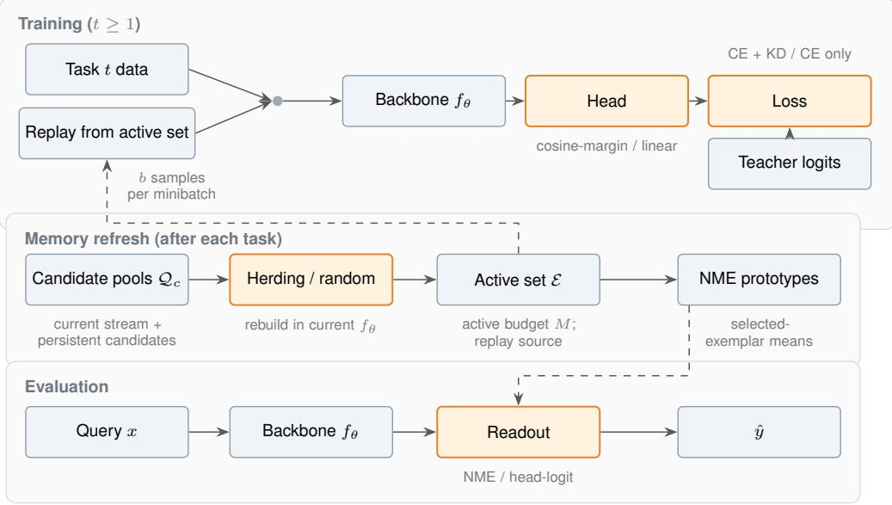  
Figure 1: Overview of Uniform Herding. At each task boundary, class-specific candidate pools are refreshed in the current representation and herding selects the active replay set with budget M. Replay draws only from this active set, while candidate storage is bounded by $\rho M$ at completed boundaries; the retrieval count is b per minibatch. Orange boxes indicate choices examined in the within-method comparisons. Dashed arrows show the replay and prototype feedback paths.

target $y ,$ its logits are

$$
z _ { j } ( x ; y ) = \left\{ { \begin{array} { l l } { s \left. { \bar { f } } _ { \theta } ( x ) , { \bar { w } } _ { j } \right. - s m , } & { j = y , } \\ { s \left. { \bar { f } } _ { \theta } ( x ) , { \bar { w } } _ { j } \right. , } & { j \neq y , } \end{array} } \right.
$$

where $\bar { u } = u / \lVert u \rVert _ { 2 }$ . We set $s = 3 0$ and $m = 0 . 3 5$ . Each new task increases the classifier head by 10 rows.   
Prior to optimization, we imprint the new rows from normalized class-mean features starting with task 1.

We train with SGD at learning rate 0.1, momentum 0.9, weight decay $5 \times 1 0 ^ { - 4 }$ , batch size 128, gradient clipping at 1.0, mixed precision, and 70 epochs per task. Training augmentation is random crop (padding 4) and horizontal flip; evaluation applies normalization only. Our runs use seeds 1993, 2023, and 42.

## 3.2 Active Allocation and Candidate Refresh

Uniform Herding separates the active replay set from the candidate pool used to refresh it. Let $\mathcal { C } _ { t }$ be the classes observed after task t and let $C _ { t } = | \mathcal { C } _ { t } |$ . Given active budget $M ,$ , the quota for the i-th class identifier is

$$
q _ { c _ { i } } ^ { ( t ) } = \left\lfloor { \frac { M } { C _ { t } } } \right\rfloor + \mathbf { 1 } \{ i < M \bmod C _ { t } \} , \qquad i = 0 , \dots , C _ { t } - 1 .
$$

In our experiments, every class has enough candidates, so the selected sets sum to M at each completed task boundary. When a candidate pool falls short of its quota, we select at most $q _ { c } ^ { ( t ) }$ items.

At the start of task $t ,$ let $B _ { c } ^ { ( t - 1 ) }$ denote the persistent candidate pool for an old class and let $\mathcal { P } _ { c , \mathrm { c u r } } ^ { ( t ) }$ denote the raw current-task stream for a newly observed class. At the task boundary, the candidate set for class c is

$$
\mathcal { Q } _ { c } ^ { ( t ) } = \mathcal { B } _ { c } ^ { ( t - 1 ) } \cup \mathcal { P } _ { c , \mathrm { c u r } } ^ { ( t ) } , \qquad \mu _ { c } ^ { ( t ) } = \frac { 1 } { | \mathcal { Q } _ { c } ^ { ( t ) } | } \sum _ { x \in \mathcal { Q } _ { c } ^ { ( t ) } } f _ { \theta } ( x ) .
$$

For each new class, the persistent pool is empty before its first rebuild. We retain the current-task stream until the boundary. Once a class has a known quota, we maintain its persistent candidate pool with class-local bounded reservoir insertion.

Herding selects the active exemplars from $\mathcal { Q } _ { c } ^ { ( t ) }$ . With $S _ { 0 } = 0$ , the k-th exemplar is

$$
x _ { k } \in \operatorname * { a r g m i n } _ { x \in Q _ { c } ^ { ( t ) } \setminus \{ x _ { 1 } , \ldots , x _ { k - 1 } \} } \Big \| f _ { \theta } ( x ) - \Big ( k \mu _ { c } ^ { ( t ) } - S _ { k - 1 } \Big ) \Big \| _ { 2 } ^ { 2 } , \qquad S _ { k } = S _ { k - 1 } + f _ { \theta } ( x _ { k } ) .
$$

The selected set is $\mathcal { E } _ { c } ^ { ( t ) } = \{ x _ { 1 } , \ldots , x _ { q _ { c } ^ { ( t ) } } \}$ , and the NME prototype is

$$
\hat { \mu } _ { c } ^ { ( t ) } = \frac { 1 } { | \mathcal { E } _ { c } ^ { ( t ) } | } \sum _ { x \in \mathcal { E } _ { c } ^ { ( t ) } } f _ { \theta } ( x ) .
$$

This rebuild runs for every observed class after every task. After selection, the candidate pool keeps the selected items plus a bounded set of leftover candidates. At the default $\rho = \mathtt { p o o l }$ \_multiplier = 3, each task boundary stores at most $\rho q _ { c } ^ { ( t ) }$ candidates per class and at most $\rho M$ in total in the reported runs. This bound excludes the transient full stream of a class before its first rebuild. M is therefore the active replay budget and $\rho M$ is the boundary storage candidate bound. The method does not have a total storage budget of M.

The candidate pool is a bounded buffer, not a claim of uniform sampling over the entire historical stream.   
Replay draws only from the selected sets. We use the default $\rho = 3$ and did not sweep it.

## 3.3 Replay, Distillation, and Prediction

At $t = 0$ , training uses only the current-task minibatches. For $t \geq 1$ , each minibatch is augmented with b exemplars drawn with replacement from earlier classes. Sampling is uniform over stored items, not over classes. Retrieved raw images are re-augmented before concatenation. We set $M = 2 { , } 0 0 0$ and $b = 6 4$

The loss combines cross-entropy over the expanded label space with a distillation on old classes. We copy a snapshot of the teacher just before expanding the head. For $t \geq 1$

$$
\begin{array} { r l } & { \mathcal { L } _ { t } = \mathcal { L } _ { \mathrm { C E } } ( z ( x ; y ) , y ) + \lambda T _ { \mathrm { K D } } ^ { 2 } \mathrm { K L } \big ( p ^ { \mathrm { t e a c h } } ( x ) \big | \big | p ( x ) \big ) , } \\ & { p ^ { \mathrm { t e a c h } } ( x ) = \mathrm { s o f t m a x } \Big ( z _ { 0 : C _ { t - 1 } - 1 } ^ { \mathrm { t e a c h } } ( x ) / T _ { \mathrm { K D } } \Big ) , } \\ & { \qquad p ( x ) = \mathrm { s o f t m a x } \big ( \tilde { z } _ { 0 : C _ { t - 1 } - 1 } ( x ; y ) / T _ { \mathrm { K D } } \big ) , } \end{array}
$$

where z˜ is the student’s logit vector after undoing the target-dependent cosine margin for the KD comparison.   
We set $\lambda = 1$ and $T _ { \mathrm { K D } } = \bar { 2 } ;$ ; at $t = 0$ there is no distillation term.

At evaluation, Uniform Herding uses nearest-mean exemplar prediction. Given the final representation, the prediction is

$$
\hat { y } ( x ) = \underset { c \in \mathcal { C } _ { T - 1 } } { \mathrm { a r g m i n } } \left\| \bar { f } _ { \theta } ( x ) - \bar { \hat { \mu } } _ { c } ^ { ( T - 1 ) } \right\| _ { 2 } .
$$

The head-logit rule is used in the corresponding ablation and in the static-bank baseline’s own protocol. The no-replay baseline has no exemplar readout.

## 3.4 Baselines and Supporting Analyses

The iCaRL baseline herds each new class once from its full current-task pool, stores the prioritized order, and later keeps the prefix required by the new quota. It does not re-herd old classes. It recomputes NME means in the current feature space over the retained exemplars and discards the transient current task pool at the task boundary. Training uses iCaRL-style sigmoid binary cross-entropy targets for old classes.

The static-bank baseline uses random replacement within class pools, the same nominal active budget and retrieval count, and cross-entropy training with head-logit prediction. At task boundaries, it reduces its active store to the nominal budget, unlike Uniform Herding’s additional candidate pool.

Every Uniform Herding ablation changes one choice at a time. We remove KD, swap NME for head-logit prediction, swap the cosine-margin head for a linear head, or swap herding for random selection. Resource sweeps vary $\dot { M ^ { \mathrm { ~ } } } \in \{ 5 0 0 , 2 0 0 0 , 4 \bar { 0 } 0 0 \}$ and $b \in \{ 3 2 , 6 4 , 1 2 8 \}$ around the default. T1 compares full protocols. Among the replay rows, nominal active and retrieval budgets match, but total retained storage, training objective, and readout differ. The no-replay baseline has neither replay storage nor retrieval.

## 3.5 Evaluation Metrics

After each task $i ,$ we evaluate separately on every task $j \leq i ,$ producing an accuracy matrix R. Final average accuracy is

$$
\mathrm { A C C } = \frac { 1 } { T } \sum _ { j = 0 } ^ { T - 1 } R _ { T - 1 , j } .
$$

Forgetting is the mean drop from each old task’s best observed accuracy to its final accuracy:

$$
\mathrm { F } = \frac { 1 } { T - 1 } \sum _ { j = 0 } ^ { T - 2 } \left( \operatorname* { m a x } _ { i \in \{ j , \dots , T - 1 \} } R _ { i , j } - R _ { T - 1 , j } \right) .
$$

Backward transfer is

$$
\mathrm { B W T } = \frac { 1 } { T - 1 } \sum _ { j = 0 } ^ { T - 2 } \left( R _ { T - 1 , j } - R _ { j , j } \right) .
$$

We report all scalar metrics as the mean and population standard deviation over the three seeds. For ablation and sensitivity rows, we compute deltas per seed against the matched Uniform Herding run before averaging.

## 4 Results

All results follow the protocol in Section 3 and are reported as mean ± population standard deviation over three seeds. The main comparison in Table 1 uses active budget $M = 2 { , } 0 0 0$ and retrieval budget $b = 6 4$

## 4.1 Main Method Comparison

At the common nominal active budget, Uniform Herding obtains $4 4 . 0 0 \pm 0 . 5 1 \%$ final average accuracy and $1 7 . 2 2 \pm 0 . 4 3 \%$ forgetting. iCaRL reaches $4 2 . 3 3 \pm 1 . 2 0 \hat { \% }$ accuracy and $2 4 . 8 7 \pm 1 . 1 1 \%$ forgetting. The static bank achieves $2 8 . 6 0 \pm \bar { 1 } . 3 5 \%$ and $5 5 . 8 6 \pm 1 . 4 2 \%$ . The comparison is end-to-end. The baselines differ in candidate retention and training objective, and the static bank also uses a different readout. The appendix details these protocol differences. Figure 2 shows final per-task accuracies.

Table 1: Main comparison on CIFAR-100. All methods use a nominal active exemplar budget of 2,000 and retrieval budget of 64. Uniform Herding also retains candidate storage for refresh.
<table><tr><td>Method</td><td>Average accuracy (%) Forgetting (%)</td><td></td><td>BWT (%)</td></tr><tr><td>iCaRL</td><td> $4 2 . 3 3 \pm 1 . 2 0$ </td><td> $2 4 . 8 7 \pm 1 . 1 1$ </td><td> $- 2 4 . 8 7 \pm 1 . 1 1$ </td></tr><tr><td>Static bank</td><td> $2 8 . 6 0 \pm 1 . 3 5$ </td><td> $5 5 . 8 6 \pm 1 . 4 2$ </td><td> $- 5 5 . 8 6 \pm 1 . 4 2$ </td></tr><tr><td>Uniform Herding</td><td> $4 4 . 0 0 \pm 0 . 5 1$ </td><td> $1 7 . 2 2 \pm 0 . 4 3$ </td><td> $- 1 6 . 9 1 \pm 0 . 4 1$ </td></tr></table>

## 4.2 Supporting Analyses of Uniform Herding

Table 2 reports matched within-method ablations of the prediction rule, selection rule, distillation, and classifier head. Replacing NME with head-logit evaluation drops accuracy by 10.46 pp and raises forgetting by 30.36 pp. Replacing herding with random selection costs 2.39 pp in accuracy and 1.16 pp in forgetting. Removing KD decreases accuracy by 1.48 pp but increases forgetting by 11.66 pp. Replacing the cosine-margin head with a linear head decreases accuracy by 0.79 pp and increases forgetting by 0.12 pp. These comparisons describe the current configuration; they do not establish effects beyond it. Appendix Figure 9 shows the per-seed deltas.

Figure 3 plots forgetting by task. From tasks 0–8, forgetting is 51–59 pp for the static bank and 27–55 pp for head-logit evaluation, compared to 8.1–30.1 pp for Uniform Herding. The pattern is consistent with recency bias: both unfavorable settings maintain good accuracy on the most recent task despite their aggregate forgetting. Task 9 has zero forgetting by definition since no subsequent training degrades it.

## 4.3 Active-Budget and Retrieval Sensitivity

Because Uniform Herding uses $\rho = 3 ,$ , changing the active budget changes the candidate-pool capacity as well. Reducing M from 2,000 to 500 lowers accuracy by 10.05 pp and raises forgetting by 13.26 pp. Increasing M to 4,000 raises accuracy by 3.32 pp and lowers forgetting by 3.91 pp. Three tested points do not establish a scaling law.

With $M = 2 { , } 0 0 0$ fixed, reducing retrieval from 64 to 32 decreases accuracy by 1.53 pp and decreases forgetting by 0.01 pp. Increasing retrieval to 128 increases accuracy by 0.16 pp and increases forgetting by 0.59 pp. The retrieval sweep produces a smaller mean change than the active-budget sweep (Table 3). Figure 4 plots both sweeps.

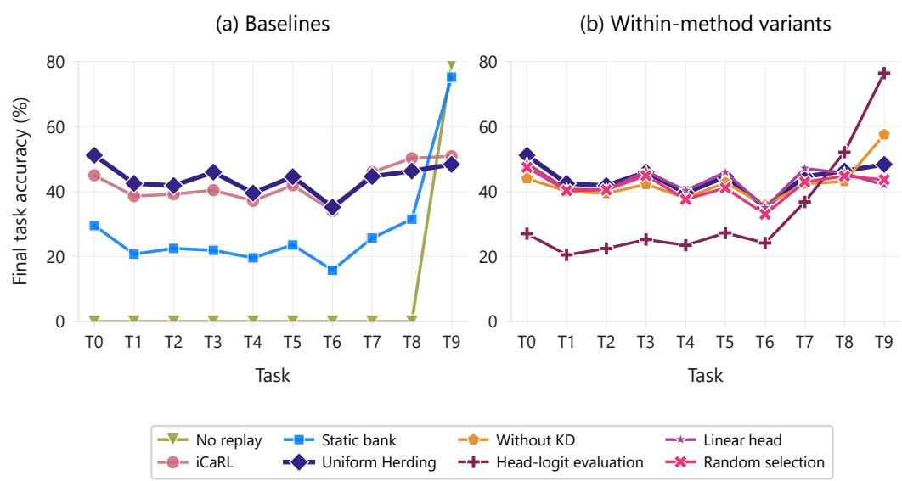  
Figure 2: Final per-task accuracies. Panel (a) compares the baselines with Uniform Herding. Panel (b) show the within-method variants.

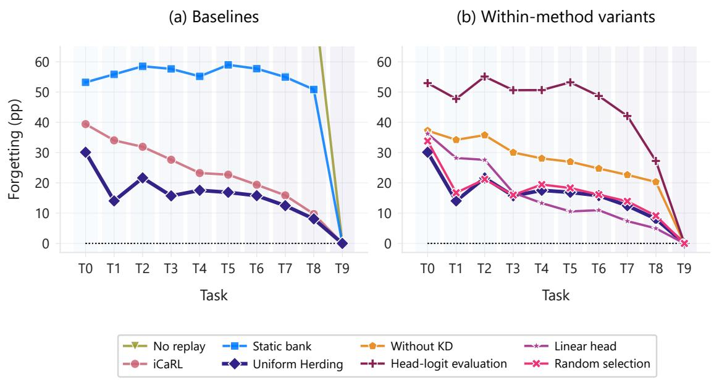  
Figure 3: Forgetting by task index for Uniform Herding and two adverse configurations. The final task has zero forgetting by definition because no subsequent task is learned.

Table 2: Matched within-method comparisons for Uniform Herding. Deltas are paired by seed against the main configuration.
<table><tr><td>Variant</td><td>Average accuracy (%) Forgetting (%) ∆ accuracy (pp)</td><td></td><td></td><td>∆ forgetting (pp)</td></tr><tr><td>Without KD</td><td> $4 2 . 5 2 \pm 0 . 6 1$ </td><td> $2 8 . 8 8 \pm 0 . 1 9$ </td><td>-1.48</td><td>+11.66</td></tr><tr><td>Head-logit evaluation</td><td> $3 3 . 5 4 \pm 0 . 3 9$ </td><td> $4 7 . 5 8 \pm 0 . 8 4$ </td><td>-10.46</td><td>+30.36</td></tr><tr><td>Linear head</td><td> $4 3 . 2 2 \pm 0 . 3 6$ </td><td> $1 7 . 3 4 \pm 0 . 6 8$ </td><td>-0.79</td><td>+0.12</td></tr><tr><td>Random selection</td><td> $4 1 . 6 1 \pm 0 . 5 3$ </td><td> $1 8 . 3 8 \pm 0 . 4 7$ </td><td>-2.39</td><td>+1.16</td></tr></table>

Table 3: Resource sensitivity relative to Uniform Herding at M = 2,000 and retrieval budget 64. Active-budget changes also change the candidate-pool capacity through ρ = 3; deltas are paired by seed.
<table><tr><td>Axis</td><td>Value</td><td>Average accuracy (%)</td><td>Forgetting (%)</td><td>∆ accuracy (pp)</td><td>∆ forgetting (pp)</td></tr><tr><td>Active budget</td><td>500</td><td> $3 3 . 9 5 \pm 1 . 5 1$ </td><td> $3 0 . 4 8 \pm 0 . 5 4$ </td><td>-10.05</td><td>+13.26</td></tr><tr><td>Active budget</td><td>2,000</td><td> $4 4 . 0 0 \pm 0 . 5 1$ </td><td> $1 7 . 2 2 \pm 0 . 4 3$ </td><td>0.00</td><td>0.00</td></tr><tr><td>Active budget</td><td>4,000</td><td> $4 7 . 3 2 \pm 0 . 2 4$ </td><td> $1 3 . 3 1 \pm 0 . 5 9$ </td><td>+3.32</td><td>-3.91</td></tr><tr><td>Retrieval</td><td>32</td><td> $4 2 . 4 7 \pm 0 . 6 3$ </td><td> $1 7 . 2 2 \pm 0 . 4 7$ </td><td>-1.53</td><td>-0.01</td></tr><tr><td>Retrieval</td><td>64</td><td> $4 4 . 0 0 \pm 0 . 5 1$ </td><td> $1 7 . 2 2 \pm 0 . 4 3$ </td><td>0.00</td><td>0.00</td></tr><tr><td>Retrieval</td><td>128</td><td> $4 4 . 1 6 \pm 0 . 5 9$ </td><td> $1 7 . 8 1 \pm 0 . 3 8$ </td><td>+0.16</td><td>+0.59</td></tr></table>

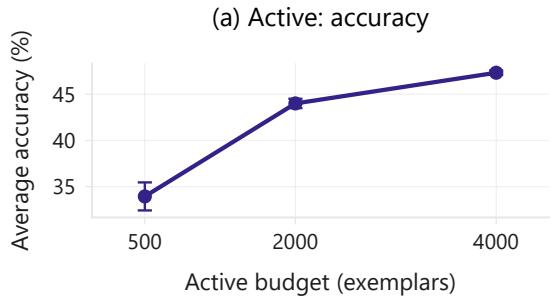

(b) Active: forgetting  
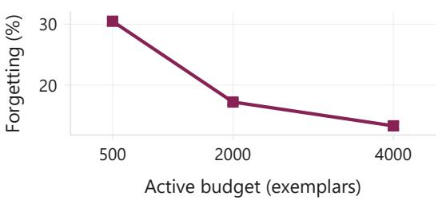

(c) Retrieval: accuracy  
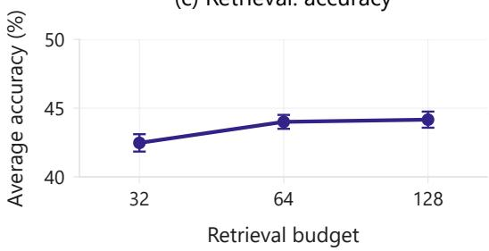

(d) Retrieval: forgetting  
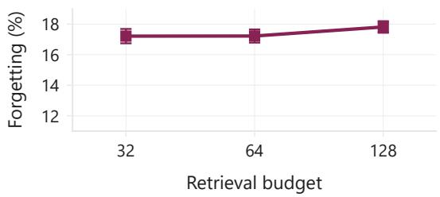  
Figure 4: Sensitivity to active exemplar budget and replay retrieval budget. Error bars denote population standard deviation over three seeds.

## 5 Discussion

Uniform Herding achieves higher mean final accuracy and lower mean forgetting than the faithful iCaRL implementation and the static-bank baseline in the evaluated protocol. This is a complete-method result. Because the protocols differ in refresh policy, training objective, and retained candidate storage and the static bank also uses a different readout, the comparison does not estimate the effect of refresh alone.

## 5.1 Evidence About the Proposed Configuration

Within Uniform Herding, NME evaluation is strongly favored over head-logit evaluation by 10.46 pp in accuracy and 30.36 pp in forgetting. Since both variants share the training procedure, the gap points to the value of matching the readout to the selected exemplar representation in this protocol.

Herding selection yields 2.39 pp higher accuracy and reduces mean forgetting by 1.16 pp relative to random selection; this small difference is not estimated reliably with three seeds. Removing KD decreases accuracy by 1.48 pp but increases forgetting by 11.66 pp, suggesting that distillation serves a retention role in this objective. Replacing the cosine-margin head with a linear head produces the smallest shift among these ablations (−0.79 pp accuracy, +0.12 pp forgetting). These comparisons describe the current configuration and they do not establish effects beyond it.

## 5.2 Resource and Storage Implications

Reducing the active budget from 2,000 to 500 lowers accuracy by 10.05 pp and raises forgetting by 13.26 pp. Raising retrieval from 64 to 128 increases mean accuracy by 0.16 pp but also increases mean forgetting by 0.59 pp. Because $\rho = 3$ , the active-budget sweep simultaneously changes candidate capacity. Uniform Herding therefore trades additional candidate storage and refresh computation for an active replay set of size M. The comparison with iCaRL or the static bank is not storage-matched. The observed pattern is conditional on the backbone, data stream, and budget range.

## 5.3 Limitations

All experiments use the CIFAR-100 dataset, one ten-task partition (split seed 13), one ResNet-18 backbone, and three training seeds. No variation in class order, task granularity, dataset, or architecture is tested. The active-budget and retrieval sweeps cover only the reported values, and the default $\rho = 3$ was not swept separately. A new class retains its full transient stream before its first rebuild, so the boundary candidate storage bound does not capture all mid-task storage.

The iCaRL comparison does not isolate refresh from the objective and storage differences between the two protocols. No matched experiment varies only the refresh policy while retaining the objective, head, readout, active budget, candidate multiplier, data order, and seed set fixed. Three matched seeds are used in the paired supporting comparisons, so tiny effects are not estimated reliably.

The next experiment should use one common objective, head, readout, active budget, candidate multiplier, data order, and seed set, then replace arrival-time prefix truncation with refresh-all-class candidate reselection. That design would support a refresh-specific claim.

## 6 Conclusion

We proposed Uniform Herding, a replay method that allocates a uniform active exemplar budget and refreshes every observed class in the current feature representation. Selected exemplars form the replay set, while a bounded candidate pool retains examples for future reselection. At M = 2,000 and b = 64, Uniform Herding reaches 44.00 ± 0.51% final average accuracy and $1 7 . 2 2 \pm 0 . 4 3 \%$ forgetting, against 42.33 ± 1.20% and 24.87 ± 1.11% for iCaRL, and 28.60 ± 1.35% and $5 5 . 8 6 \pm 1 . 4 2 \%$ for the static bank.

Within the proposed configuration, NME and herding selection yield higher mean final accuracy than the alternatives evaluated, and distillation mainly improves retention. The active-budget sweep shifts both metrics more than the retrieval sweep over the reported values. These findings are conditional on the evaluated protocol and do not show that refresh alone causes the iCaRL gap.

## References

Rahaf Aljundi, Lucas Caccia, Eugene Belilovsky, Massimo Caccia, Min Lin, Laurent Charlin, and Tinne Tuytelaars. Online continual learning with maximally interfered retrieval. In Advances in Neural Information Processing Systems, volume 32, pages 11849–11860, 2019a.

Rahaf Aljundi, Min Lin, Baptiste Goujaud, and Yoshua Bengio. Gradient based sample selection for online continual learning. In Advances in Neural Information Processing Systems, volume 32, pages 11816–11825, 2019b.

Arslan Chaudhry, Marc’Aurelio Ranzato, Marcus Rohrbach, and Mohamed Elhoseiny. Efficient lifelong learning with A-GEM. In International Conference on Learning Representations, 2019a.

Arslan Chaudhry, Marcus Rohrbach, Mohamed Elhoseiny, Thalaiyasingam Ajanthan, Puneet K. Dokania, Philip H. S. Torr, and Marc’Aurelio Ranzato. On tiny episodic memories in continual learning. arXiv preprint arXiv:1902.10486, 2019b.

Dipam Goswami, Yuyang Liu, Bartlomiej Twardowski, and Joost van de Weijer. FeCAM: Exploiting the heterogeneity of class distributions in exemplar-free continual learning. In Advances in Neural Information Processing Systems, 2023.

Saihui Hou, Xinyu Pan, Chen Change Loy, Zilei Wang, and Dahua Lin. Learning a unified classifier incrementally via rebalancing. In Proceedings ofthe IEEE Conference on Computer Vision and Pattern Recognition, pages 831–839, 2019.

James Kirkpatrick, Razvan Pascanu, Neil Rabinowitz, Joel Veness, Guillaume Desjardins, Andrei A. Rusu, Kieran Milan, John Quan, Tiago Ramalho, Agnieszka Grabska-Barwinska, Demis Hassabis, Claudia Clopath, Dharshan Kumaran, and Raia Hadsell. Overcoming catastrophic forgetting in neural networks. Proceedings ofthe National Academy ofSciences, 114(13):3521–3526, 2017.

Zhizhong Li and Derek Hoiem. Learning without forgetting. In European Conference on Computer Vision, pages 614–629, 2016.

David Lopez-Paz and Marc’Aurelio Ranzato. Gradient episodic memory for continual learning. In Advances in Neural Information Processing Systems, volume 30, pages 6467–6476, 2017.

Sylvestre-Alvise Rebuffi, Alexander Kolesnikov, Georg Sperl, and Christoph H. Lampert. iCaRL: Incremental classifier and representation learning. In Proceedings of the IEEE Conference on Computer Vision and Pattern Recognition, pages 2001–2010, 2017.

David Rolnick, Arun Ahuja, Jonathan Schwarz, Timothy Lillicrap, and Gregory Wayne. Experience replay for continual learning. In Advances in Neural Information Processing Systems, volume 32, pages 348–358, 2019.

Max Welling. Herding dynamical weights to learn. In Proceedings of the 26th Annual International Conference on Machine Learning, pages 1121–1128, 2009.

Yue Wu, Yinpeng Chen, Lijuan Wang, Yuancheng Ye, Zicheng Liu, Yandong Guo, and Yun Fu. Large scale incremental learning. In Proceedings ofthe IEEE Conference on Computer Vision and Pattern Recognition, pages 374–382, 2019.

Friedemann Zenke, Ben Poole, and Surya Ganguli. Continual learning through synaptic intelligence. In Proceedings ofthe 34th International Conference on Machine Learning, pages 3987–3995, 2017.

Bowen Zhao, Xi Xiao, Guojun Gan, Bin Zhang, and Shu-Tao Xia. Maintaining discrimination and fairness in class incremental learning. In Proceedings ofthe IEEE/CVF Conference on Computer Vision and Pattern Recognition, pages 13208–13217, 2020.

## A Reproducibility Details

The source code to reproduce all experiments is available at https://github.com/neryva-lab/ uniform-herding.

All experiments used CIFAR-100 in a fixed ten-task class-incremental partition of ten classes per task. The class partition was created by split seed 13 and shared by all runs. The three reported seeds therefore vary training randomness rather than class order. Each task used a ResNet-18 with 64 base filters and no dropout, batch size 128, mixed-precision arithmetic, and SGD with learning rate 0.1, momentum 0.9, weight decay $5 \times 1 0 ^ { - 4 }$ , and gradient clipping at 1.0. No learning-rate schedule or warm-up was used. The configured task length was 70 epochs. Run metadata records 71 epochs for every seed because the trainer’s epoch counter was incremented once after the final configured epoch. This recording discrepancy does not alter the configured schedule.

Until a variant changes a setting, Uniform Herding uses a cosine-margin head (scale 30, margin 0.35), weight imprinting for each new task’s head rows after task 0, distillation weight 1 at temperature 2, and retrieval budget 64. The no-distillation ablation sets the distillation weight to zero. The linear-head variant replaces the cosine-margin head. The static bank and head-logit variant use head-logit prediction. All replay configurations other than these use NME prediction. The no-replay baseline has no replay readout. Uniform Herding replays only its selected exemplars. Its implementation default is $\rho = \mathtt { p o o l }$ \_multiplier = 3: the candidate pool is bounded by $\rho M$ at completed task boundaries in the reported setting, while the current-task stream before a class’s first rebuild is transient and may exceed that bound.

Table 4: Protocol settings shared across runs unless an ablation explicitly changes them.
<table><tr><td>Setting</td><td>Value</td></tr><tr><td>Dataset and partition</td><td>CIFAR-100; 10 tasks × 10 classes; split seed 13</td></tr><tr><td>Probe / validation split</td><td>30/20</td></tr><tr><td>Backbone Optimizer</td><td>ResNet-18; 64 base filters; dropout 0 SGD; lr 0.1; momentum 0.9; weight decay  $5 \times 1 0 ^ { - 4 }$ </td></tr><tr><td>Training</td><td>70 configured epochs per task; batch size 128; gradient clip 1.0</td></tr><tr><td>Precision</td><td>16-mixed</td></tr><tr><td>Random seeds</td><td>1993, 2023, 42</td></tr><tr><td>Active exemplar budget</td><td>2,000 for replay configurations; not used by no replay</td></tr><tr><td>Retrieval budget</td><td>64 for replay configurations; not used by no replay</td></tr><tr><td>Candidate multiplier (ρ) Replay source</td><td>3 for Uniform Herding; implementation default</td></tr><tr><td>Hardware</td><td>Selected active exemplars; candidate pool used only for refresh</td></tr><tr><td></td><td>Tesla T4</td></tr><tr><td>Software</td><td>Python 3.12.13; PyTorch 2.11.0+cu128; Lightning 2.6.5</td></tr></table>

## B Task-Level Results

For task i, reported forgetting is the difference between the best accuracy attained on task i during training and its accuracy after the final task. Figure 5 gives this quantity for every evaluated configuration and task. The final task has zero forgetting by construction, so the figure separates aggregate retention from its distribution over task.

Figures 6 and 7 show the complete task-by-time accuracy matrices for Uniform Herding and iCaRL. Row i, column t is the accuracy on task i after learning through task t; cells with i > t are undefined and omitted. These matrices are the underlying trajectories from which task-level forgetting is calculated.

Figure 8 provides a seed-level view of the stability comparison. For each earlier task and seed, it connects accuracy at introduction with final accuracy. It visualizes the per-seed quantities used for the stability comparison and is not an additional statistical test.

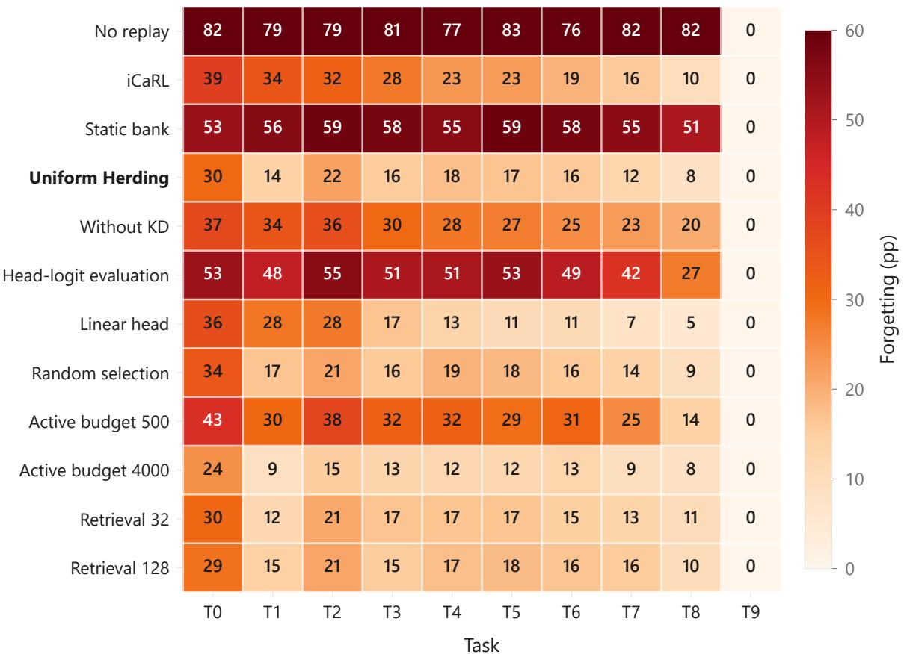  
Figure 5: Per-task forgetting, in percentage points, for all evaluated configurations. Each entry is the drop from the task’s best observed accuracy to its final accuracy. Task T9 is zero by definition because it is introduced last.

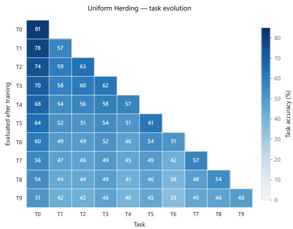  
Figure 6: Task-evolution accuracy matrix for Uni form Herding with NME prediction.

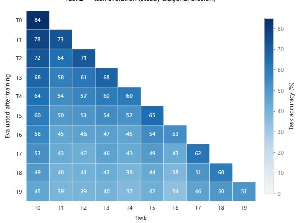  
Figure 7: Task-evolution accuracy matrix for iCaRL.

No-KD ablation (a1) — stability slopes  
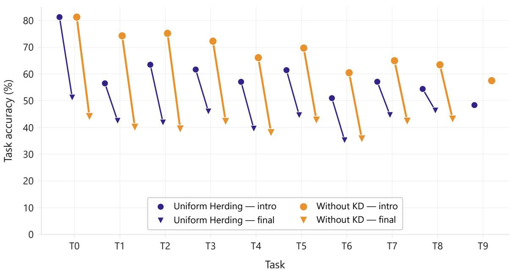  
Figure 8: Seed-level task trajectories for Uniform Herding and the no-distillation ablation. Lines connect task-introduction accuracy to final accuracy for the same task and seed.

## C Additional Diagnostics

The following figures provide supplementary views of the matched within-method comparisons (Figure 9) and the joint accuracy–forgetting distribution (Figure 10). The exact per-configuration values remain in Tables 2 and 3.

(a) Delta average accuracy (pp)  
(b) Delta forgetting (pp)  
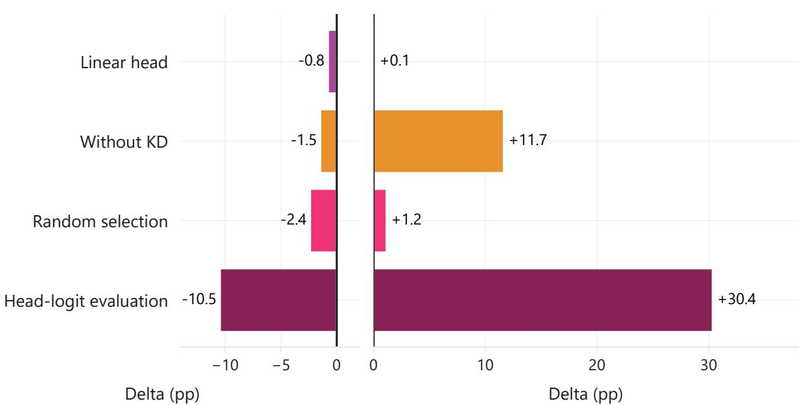  
Figure 9: Matched per-seed changes relative to Uniform Herding. Negative accuracy changes and positive forgetting changes are unfavorable.

Accuracy vs. Forgetting Trade-off  
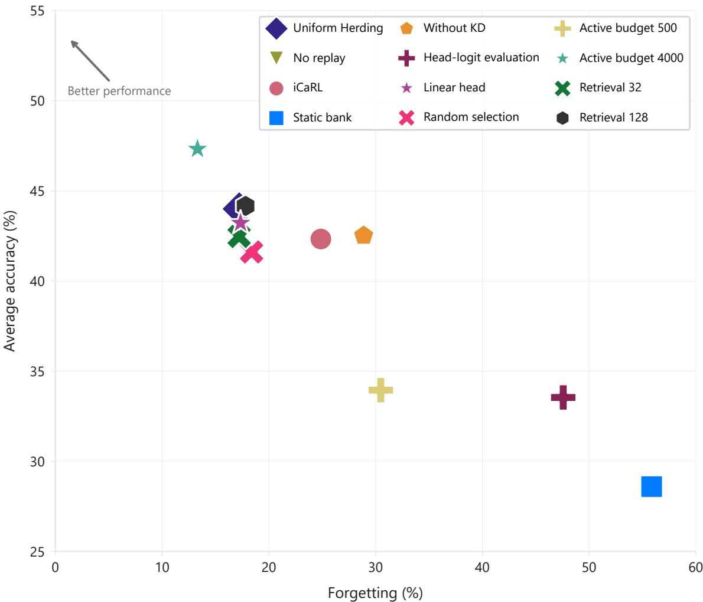  
Figure 10: Average accuracy versus forgetting for baselines, within-method variants, and resource configurations. Higher accuracy and lower forgetting are preferred. The points do not define a causal trade-off curve.

## D Exemplar Quotas

After task t, the active budget is divided among the $1 0 ( t + 1 )$ observed classes. Table 5 lists the resulting per-class quotas. When the budget is not divisible by the number of observed classes, floor rounding assigns the remainder to the first classes in identifier order.

Table 5: Per-class active exemplar quota after each task. Ranges indicate the one-exemplar difference induced by floor rounding.
<table><tr><td>Active budget</td><td>TO</td><td>T1</td><td>T2</td><td>T3</td><td>T4</td><td>T5</td><td>T6</td><td>T7</td><td>T8</td><td>T9</td></tr><tr><td>500</td><td>50</td><td>25</td><td>16-17</td><td>12-13</td><td>10</td><td>8-9</td><td>7-8</td><td>6-7</td><td>5-6</td><td>5</td></tr><tr><td>2,000</td><td>200</td><td>100</td><td>66-67</td><td>50</td><td>40</td><td>33-34</td><td>28-29</td><td>25</td><td>22-23</td><td>20</td></tr><tr><td>4,000</td><td>400</td><td>200</td><td>133-134</td><td>100</td><td>80</td><td>66-67</td><td>57-58</td><td>50</td><td>44-45</td><td>40</td></tr></table>

## E Seed-Level Outcomes and Compute

Table 6 reports the raw aggregate metrics for every run and seed. Values are in percentages. The table makes the reported means and standard deviations auditable without treating the three training seeds as independent task-level observations.

Table 6: Per-seed final average accuracy, forgetting, and backward transfer.
<table><tr><td>ID</td><td>Configuration / seed</td><td>Average accuracy</td><td>Forgetting</td><td>BWT</td></tr><tr><td>B0</td><td>No replay / 1993</td><td>7.79</td><td>80.73</td><td>-80.73</td></tr><tr><td>B0</td><td>No replay / 2023</td><td>8.05</td><td>78.94</td><td>-78.94</td></tr><tr><td>B0</td><td>No replay / 42</td><td>7.89</td><td>80.97</td><td>-80.97</td></tr><tr><td>B1</td><td>iCaRL / 1993</td><td>40.88</td><td>25.83</td><td>-25.83</td></tr><tr><td>B1</td><td>iCaRL / 2023</td><td>43.82</td><td>25.46</td><td>-25.46</td></tr><tr><td>B1</td><td>iCaRL / 42</td><td>42.29</td><td>23.32</td><td>-23.32</td></tr><tr><td>B2</td><td>Static bank / 1993</td><td>28.15</td><td>56.34</td><td>-56.34</td></tr><tr><td>B2</td><td>Static bank / 2023</td><td>30.43</td><td>53.93</td><td>-53.93</td></tr><tr><td>B2</td><td>Static bank / 42</td><td>27.22</td><td>57.31</td><td>-57.31</td></tr><tr><td>B3</td><td>Uniform Herding / 1993</td><td>43.64</td><td>16.68</td><td>-16.41</td></tr><tr><td>B3</td><td>Uniform Herding / 2023</td><td>44.72</td><td>17.26</td><td>-16.91</td></tr><tr><td>B3</td><td>Uniform Herding / 42</td><td>43.65</td><td>17.73</td><td>-17.41</td></tr><tr><td>al</td><td>No KD / 1993</td><td>41.72</td><td>29.10</td><td>-29.10</td></tr><tr><td>al</td><td>No KD / 2023</td><td>42.66</td><td>28.90</td><td>-28.90</td></tr><tr><td>al</td><td>No KD / 42</td><td>43.19</td><td>28.64</td><td>-28.64</td></tr><tr><td>a2</td><td>Head-logit / 1993</td><td>34.09</td><td>46.39</td><td>-46.39</td></tr><tr><td>a2</td><td>Head-logit / 2023</td><td>33.34</td><td>48.12</td><td>-48.12</td></tr><tr><td>a2</td><td>Head-logit / 42</td><td>33.20</td><td>48.22</td><td>-48.22</td></tr><tr><td>a3</td><td>Linear head / 1993</td><td>43.32</td><td>17.73</td><td>-17.73</td></tr><tr><td>a3</td><td>Linear head / 2023</td><td>43.60</td><td>17.91</td><td>-17.87</td></tr><tr><td>a3</td><td>Linear head / 42</td><td>42.73</td><td>16.39</td><td>-16.39</td></tr><tr><td>a4</td><td>Random selection / 1993</td><td>40.87</td><td>18.59</td><td>-18.59</td></tr><tr><td>a4</td><td>Random selection / 2023</td><td>42.03</td><td>18.82</td><td>-18.82</td></tr><tr><td>a4</td><td>Random selection / 42</td><td>41.94</td><td>17.73</td><td>-17.43</td></tr><tr><td>s1</td><td>Active budget 500 / 1993</td><td>32.08</td><td>31.18</td><td>-31.18</td></tr><tr><td>s1</td><td>Active budget 500 / 2023</td><td>35.79</td><td>29.86</td><td>-29.86</td></tr><tr><td>s1</td><td>Active budget 500 / 42</td><td>33.98</td><td>30.41</td><td>-30.41</td></tr><tr><td>s2</td><td>Active budget 4000 / 1993</td><td>47.03</td><td>12.52</td><td>-12.02</td></tr><tr><td>s2</td><td>Active budget 4000 / 2023</td><td>47.61</td><td>13.93</td><td>-13.59</td></tr><tr><td>s2</td><td>Active budget 4000 / 42</td><td>47.33</td><td>13.48</td><td>-12.62</td></tr><tr><td>s3</td><td>Retrieval 32 / 1993</td><td>41.93</td><td>16.91</td><td>-16.79</td></tr><tr><td>s3</td><td>Retrieval 32 / 2023</td><td>43.36</td><td>17.88</td><td>-17.41</td></tr><tr><td>s3</td><td>Retrieval 32 / 42</td><td>42.13</td><td>16.86</td><td>-16.40</td></tr><tr><td>s4</td><td>Retrieval 128 / 1993</td><td>43.41</td><td>17.48</td><td>-17.21</td></tr><tr><td>s4</td><td>Retrieval 128 / 2023</td><td>44.84</td><td>18.34</td><td>-18.01</td></tr><tr><td>s4</td><td>Retrieval 128 / 42</td><td>44.24</td><td>17.62</td><td>-17.23</td></tr></table>

Table 7 reports elapsed wall-clock time per run on a Tesla T4. These timings describe the implementation and hardware used here. They are not hardware-independent efficiency comparisons.

Table 7: Wall-clock time per run in seconds (mean ± standard deviation across three seeds), measured on a Tesla T4.
<table><tr><td>ID</td><td>Configuration</td><td>Seconds</td></tr><tr><td>B0</td><td>No replay</td><td> $2 0 2 2 . 4 \pm 7 9 . 4$ </td></tr><tr><td>B1</td><td>iCaRL</td><td> $3 6 4 9 . 3 \pm 2 6 . 1$ </td></tr><tr><td>B2</td><td>Static bank</td><td> $2 7 5 6 . 4 \pm 1 0 9 . 3$ </td></tr><tr><td>B3</td><td>Uniform Herding</td><td> $4 6 3 5 . 4 \pm 4 7 . 5$ </td></tr><tr><td>a1</td><td>No KD</td><td> $3 4 4 6 . 0 \pm 4 3 . 7$ </td></tr><tr><td> $\mathbf { a } 2$ </td><td>Head-logit</td><td> $4 3 3 2 . 4 \pm 3 3 . 3$ </td></tr><tr><td> $\mathbf { a } 3$ </td><td>Linear head</td><td> $3 9 5 7 . 4 \pm 1 7 . 8$ </td></tr><tr><td>a4</td><td>Random selection</td><td> $4 3 3 6 . 8 \pm 1 8 . 5$ </td></tr><tr><td>s1</td><td>Active budget 500</td><td> $4 2 3 7 . 0 \pm 5 5 . 4$ </td></tr><tr><td> $\mathbf { s } 2$ </td><td>Active budget 4000</td><td> $4 3 0 9 . 4 \pm 1 5 . 3$ </td></tr><tr><td> ${ \bf s } 3$ </td><td>Retrieval 32</td><td> $3 5 1 6 . 5 \pm 2 5 . 3$ </td></tr><tr><td>s4</td><td>Retrieval 128</td><td> $5 2 8 5 . 7 \pm 4 0 . 7$ </td></tr></table>