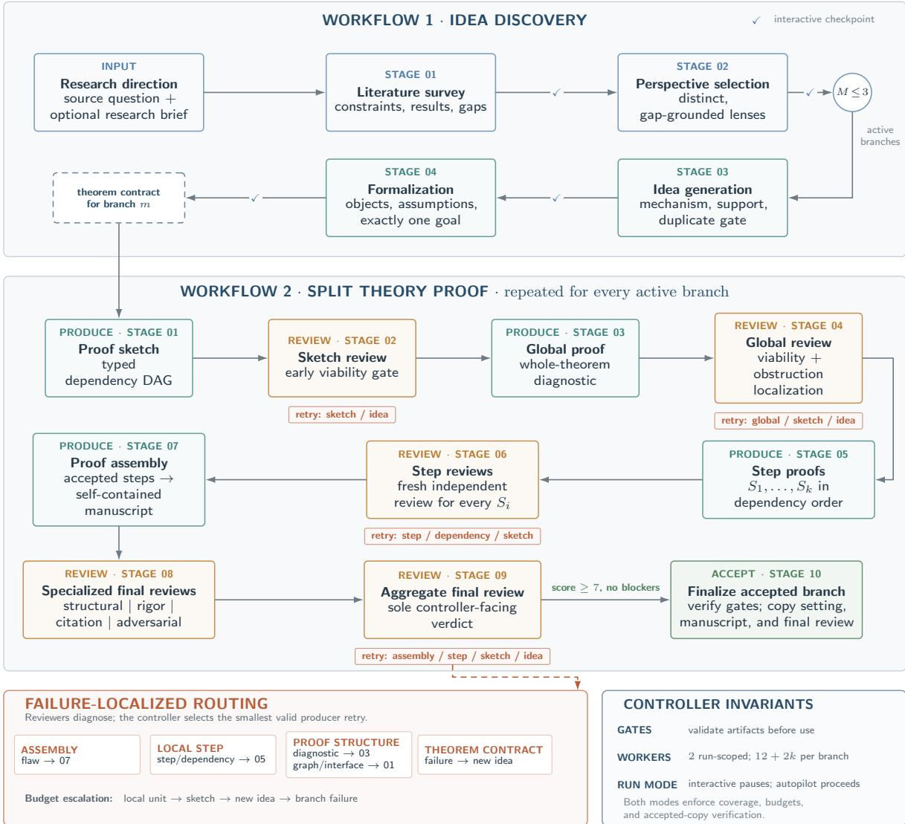
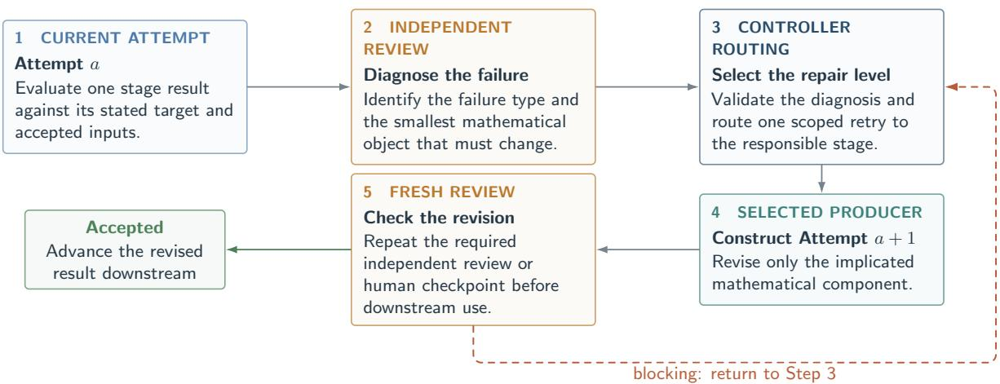

# VALG: An Agentic System for ML Theory Research

and Demonstrations on COLT 2026 Open Problems

Dechen Zhang1,2 Xuan Tang1 Xinxiang Yin3 Xingwu Chen1 Jian Qian1 Difan Zou1,2

1The University of Hong Kong 2Shenzhen Loop Area Institute 3Northwestern Polytechnical University Correspondence: dzou@hku.hk

August 14, 2026

## Abstract

Machine learning theory studies learning procedures through mathematical setups in which the data model, training protocol, oracle access, loss, metric, and randomness define the phenomenon that a theorem is meant to explain. Solving an open problem therefore requires the problem formulation, theorem target, and proof mechanism to be developed in concert. Researchers formulate hypotheses, test them through preliminary theoretical or empirical analysis, and refine both assumptions and proofs. We investigate whether this process can be organized as an autonomous agentic workflow for ML theory research.

We develop VALG, an agentic system that combines multi-level Verification, Adaptive formulation of Learning-theory problems, and Graph-structured proof development. Within each source-relative theorem branch, VALG maintains a fixed mathematical specification, checks the theorem-level composition of a typed proof-dependency graph, and constructs and reviews local proofs in dependency order. When a proof attempt fails, VALG identifies whether the obstruction lies in a derivation, the proof structure, or the theorem formulation and routes the next attempt accordingly. Formulation-level obstructions initiate an explicitly related variant or relaxation, preserving the mathematical relation between the resulting theorem and the source problem.

We evaluate VALG on nine subproblems from five COLT 2026 open problems spanning tensor decomposition, learning complexity, one-bit mean estimation, diferential privacy, and online optimization. Two runs produce internally finalized theorem candidates that match the scope of their source briefs and address the original subproblems; the remaining seven yield restricted-method results, special cases, or conditional theorems. For each candidate, we report the problem setup, theorem statement, and progress relative to the source problem. These case studies show how VALG keeps source-scope matches, relaxations, conditional results, and blocked attempts mathematically distinct. VALG is open source.

VALG: https://github.com/DechenZhang/VALG-ML-Theory-Agent/tree/main/skills COLT Problem Solutions: https://github.com/DechenZhang/VALG-ML-Theory-Agent/tree/main/case-studies

## 1 Introduction

Machine learning theory studies learning procedures through mathematical setups that specify how data are generated, what information an algorithm can use, which loss or risk is measured, and how performance scales with problem parameters. This viewpoint is already present in classical PAC learning and statistical learning theory, where the hypothesis class, distributional model, sample size, loss, and success probability are part of the statement being studied (Valiant, 1984; Vapnik,

1998; Shalev-Shwartz and Ben-David, 2014; Wainwright, 2019). Modern learning-theory papers often make the same structure more explicit: a result may depend on the training protocol, oracle model, randomness model, tail condition, approximation notion, or asymptotic regime. In this literature, such choices usually appear in the theorem statement itself, because they specify the learning phenomenon under study.

Consequently, ML-theoretic research often proceeds as a concurrent process in which the problem setup, theorem formulation, and proof technique are discovered and refined together. This flexibility can yield scientifically useful outcomes: a well-stated relaxation, a conditional theorem, or a restricted setting can illuminate why the original problem is hard and which assumptions are essential. It also creates a risk. Once the protocol becomes adaptive, the representation approximate, the claim distribution-dependent, or the target property assumed, the resulting theorem may no longer address the original problem.

This observation points to a need for systematic support: when the setup, theorem formulation, and proof technique co-evolve, a reasoning system for ML theory must track that evolution explicitly. Recent language-model systems have made substantial progress on extended reasoning. Generalpurpose agents combine generation, tool use, feedback, and refinement across multiple steps (Yao et al., 2023; Shinn et al., 2023; Madaan et al., 2023). Scientific-agent systems organize research into literature search, hypothesis generation, experimentation, critique, and paper writing (Lu et al., 2024; Schmidgall et al., 2025; Gottweis et al., 2026), while research-agent benchmarks evaluate extended machine-learning tasks rather than single responses (Huang et al., 2023; Chan et al., 2024; Wijk et al., 2024; Starace et al., 2025). Mathematical research agents coordinate conjecture generation, long-horizon proof search, criticism, and revision in natural language, while AI4Theory systems also connect literature synthesis, theorem proving, algorithm design, and numerical experiments (Feng et al., 2026; Liu et al., 2026b; Zheng et al., 2026; He et al., 2026). In parallel, formal-mathematics agents use proof assistants, retrieval, and repair loops to prove or formalize fixed statements, including complete research-paper developments and statistical learning theory libraries (Yang et al., 2023; Kripner and Straka, 2026; Zhang et al., 2026c,a). Together, these advances leave an ML-theory-specific pre-formalization question: how should an agentic system manage informal theorem development when both the proof and the problem formulation may require revision?

To this end, we develop VALG1, an agentic system that combines multi-level Verification, Adaptive formulation of Learning-theory problems, and Graph-structured proof development within source-relative theorem branches. The task requires generating a plausible proof while tracking the theorem under consideration, every added assumption, the cause of each failed attempt, and the relation of any revised formulation to the source problem. Each branch in VALG fixes one mathematical specification and represents its proof as a typed dependency graph from primitive assumptions, through intermediate lemmas, to the target theorem. Before local proof work begins, a mechanism-aware global analysis checks the mathematical source of each hard claim, the compatibility of lemma interfaces, and the closure of recursive or limiting arguments. Proof development then proceeds from global structure to local derivations. We localize failures to a derivation, the proof graph, or the theorem formulation; only formulation-level obstructions create a new variant or relaxation. Specialized reviewers separately examine structure, rigor, citation use, and adversarial boundary cases before assigning a source-relative outcome.

We evaluate VALG on nine subproblems drawn from five COLT 2026 open-problem papers: tensor ALS/GD overparameterization (Arvanitakis et al., 2026), distribution-independent deep or statistical-query learning versus linear dimension complexity (Feldman et al., 2026), non-adaptive one-bit mean estimation (Lau and Scarlett, 2026a), diferential privacy PAC learning (Nissim et al., 2026) and online optimization of Piecewise-Lipschitz functions (Balcan et al., 2026). These questions remain unresolved in the source works and provide a substantive testbed beyond synthetic proof-generation tasks. Across nine runs, VALG produces 22 internally finalized theorem candidates. Two runs produce finalized theorem candidates that fully match the scope of their source subproblems; the remaining seven yield restricted-method results, special cases, or conditional theorems. For each run, we report the problem setup and finalized theorem for selected representative candidates, together with an assessment of their progress toward the corresponding open problem.

Contributions. Our contributions are highlighted as follows:

1. We formulate informal ML-theory research as an agentic theorem-development problem, in which the learning setup, assumptions, theorem target, proof dependencies, and relation to the originating research question must be developed and tracked together. This formulation reflects the fact that ML theory often requires refinement of both the mathematical assumptions and the object being proved.

2. We develop VALG, which organizes this process through source-relative perspective–idea branches, fixed theorem contracts, typed proof-dependency graphs, and a sketch–global–step–assembly proof pipeline. The architecture separates open-ended problem design from contract-based proof development and assigns diferent review mechanisms to the two stages.

3. We introduce a hierarchical diagnosis and revision mechanism that localizes failures to the derivation, proof graph, or theorem formulation. Local failures trigger local repairs, structural failures trigger proof-architecture revisions, and only formulation-level obstructions create an explicitly source-related variant or relaxation. This allows VALG to retain the mathematical relationship between a revised theorem and the original ML-theory problem rather than silently replacing the target.

4. We apply VALG to nine subproblems drawn from five COLT 2026 open-problem papers and obtain 22 internally finalized theorem candidates. Two runs produce candidates that match the scope of their source subproblems, while the remaining seven produce restricted-method results, special cases, or conditional theorems. The case studies illustrate how an agentic system can distinguish source-scope matches from related but weaker results and unsuccessful branches when developing theory for unresolved ML problems.

The retrospective focuses on branch records and their mathematical outcomes.

Organization. Section 2 positions the work relative to informal mathematical-reasoning agent, formal theorem proving and research-agent benchmarks. Section 3 presents the theorem-development method, and section 4 then examines the COLT open problems and the resulting theorem candidates. The paper closes with limitations and open directions.

## 2 Related Work

## 2.1 Mathematical discovery and research agents

AI for mathematics includes neural–symbolic systems for conjecture formation, geometry, and executable program search (Davies et al., 2021; Trinh et al., 2024; Romera-Paredes et al., 2024; Novikov et al., 2025), as well as more open-ended systems that combine conjecturing, computation, and symbolic solving (Chen and Jiang, 2026; Chen et al., 2026; Xia et al., 2026). General scientific research agents extend this pattern across ideas, experiments, literature, and writing (Lu et al.,

2024; Schmidgall et al., 2025; Gottweis et al., 2026); mathematical research places additional weight on constructing and checking long derivations.

Research-level proof agents organize natural-language mathematics around generation, criticism, and revision. Aletheia scales a generator–verifier–reviser loop across pure mathematics, while ProofCouncil and RMA distribute analysis, literature use, proof construction, criticism, and computation across specialized roles (Feng et al., 2026; Schmitt et al., 2026; Zhao et al., 2026). Rethlas, QED, and the MechMath Agent Team connect informal exploration with formal checking through theorem retrieval, decomposition, and natural- or formal-language provers (Ju et al., 2026; An et al., 2026; Cao et al., 2026); the AI Co-Mathematician instead supports interactive refinement of definitions, questions, conjectures, computations, and proof directions (Zheng et al., 2026).

Danus addresses long-horizon coordination through parallel proof search and a shared fact graph (Liu et al., 2026b). A main agent redirects workers across lines of attack, while a stateless verifier checks each natural-language claim before the claim, its proof, and its logical dependencies enter the graph. This structure lets many local contributions accumulate into a long argument and supports transitive removal when an accepted fact is later rejected. Its fact graph is close to our typed proof dependencies, although Danus terminates when a supplied target or its refutation becomes a verified fact. VALG additionally separates a proposed proof architecture from theoremlevel feasibility and local derivations, and it treats a formulation-level obstruction as a reason to create an explicitly source-related theorem branch rather than to edit the target in place.

The closest AI4Theory systems extend agentic research beyond pure proof: ReasFlow integrates literature synthesis, algorithm design, theorem proving, numerical experiments, and manuscript preparation, while Iteris combines proof drafts with numerical and adversarial exploration (He et al., 2026; Chen et al., 2026). VALG focuses more specifically on ML-theory questions whose learning setup, assumptions, and theorem target may co-evolve. It records whether a result addresses the source question itself, a restricted method, a special case, or a conditional variant; this source-relative distinction guides both failure routing and case-study evaluation.

## 2.2 Formal theorem proving agents

Formal theorem proving begins after a mathematical statement and its assumptions have been encoded in a proof assistant. The kernel then supplies an exact acceptance criterion for a completed proof. LeanDojo provides a programmatic Lean environment, premise annotations, and retrievalaugmented proving benchmarks, while HyperTree Proof Search combines learned proof-step proposals with structured search (Yang et al., 2023; Lample et al., 2022). COPRA wraps a general-purpose language model in stateful backtracking search and uses proof assistant errors and retrieved lemmas as feedback (Thakur et al., 2024).

Subsequent systems improve formal proof search through synthetic data, proof-assistant feedback, informal planning, and reusable lemma libraries. DeepSeek-Prover and its later versions combine large-scale Lean data, reinforcement learning, tree search, and subgoal decomposition; Lean-STaR interleaves informal thoughts with tactic generation; and LEGO-Prover and DreamProver grow transferable libraries of verified lemmas across problems (Xin et al., 2024; Ren et al., 2025; Lin et al., 2025; Wang et al., 2023; Zhang et al., 2026b). OpenProver, OProver, Numina-Lean-Agent, and LAMP expose agentic interaction, verifier-guided repair, and tool use in Lean, while Discover and Prove separates answer discovery from formal proof for hard-mode statements (Kripner and Straka, 2026; Ma et al., 2026; Liu et al., 2026c; Santhana Srinivasan R and Patawar, 2026; Liu et al., 2026a). These methods can provide kernel-checked correctness for the encoded theorem, but they generally take the formal target as fixed; they do not decide whether a revised learning-theory formulation remains a meaningful answer to an originating research question.

AI4SLT brings this formal perspective directly to machine learning theory. It combines humandesigned proof strategies with AI-assisted Lean construction to develop an empirical-process library containing Gaussian concentration, Dudley’s entropy integral, and sharp least-squares regression rates (Zhang et al., 2026a). The formalization reveals implicit assumptions and omitted steps in standard presentations, demonstrating the value of machine-checked ML theory. Its objective is to formalize an established mathematical development; VALG instead operates earlier, when the learning setup and theorem target are still under construction, and can pass a finalized branch to such a formal verification workflow.

## 2.3 Autoformalization

Autoformalization addresses a diferent interface: translating natural-language mathematics into a formal statement or proof. Early LLM-based work demonstrated statement translation into Isabelle, ProofNet paired informal undergraduate problems with Lean statements and proofs, and MMA expanded training through large-scale multilingual informal–formal pairs (Wu et al., 2022; Azerbayev et al., 2023; Jiang et al., 2023). A recent survey organizes this rapidly growing area by mathematical domain, model, data, and evaluation strategy (Weng et al., 2025).

Recent work moves from isolated statements toward complete proofs and research libraries. ProofFlow first recovers a directed dependency graph from an informal proof and formalizes its steps as intermediate lemmas, explicitly measuring semantic and structural fidelity (Cabral et al., 2025). Beyond the Library introduces an agentic pipeline that can add definitions and auxiliary lemmas missing from Mathlib when formalizing research papers, and TOMAP concentrates test-time refinement on the decomposition that supplies claims, assumptions, and dependencies to downstream formalizer and prover agents (Moakhar et al., 2026; Liu et al., 2026d). FormalRx diagnoses semantic misalignment by error type and location rather than returning only a binary translation score, while theory-level autoformalization argues that useful formalization must ultimately construct coherent libraries of definitions, lemmas, theorems, and their interdependencies (Wang et al., 2026; Min et al., 2026). LeanMarathon addresses long-horizon research-paper formalization through an evolving Lean blueprint that serves as both proof skeleton and natural-language proof graph. Four specialized agents stabilize target fidelity and discharge the resulting dependency graph from its leaves in parallel, producing complete Lean formalizations of seven target theorems from recent research papers (Zhang et al., 2026c). These graph- and theory-level perspectives are close to VALG’s emphasis on compositional structure. Their input, however, is an existing informal statement or proof to be translated faithfully; VALG uses a dependency graph earlier, while constructing and revising the theorem itself, and leaves proof-assistant formalization as a separate verification layer.

## 2.4 Benchmarks for mathematical and research agents

Formal benchmarks such as miniF2F, ProofNet, and PutnamBench evaluate proving or formalizing fixed competition and undergraduate problems (Zheng et al., 2021; Azerbayev et al., 2023; Tsoukalas et al., 2024). Research-level evaluations instead use expert-proposed open problems, as in Aletheia’s FirstProof benchmark (Feng et al., 2026), or extract larger problem collections from the mathematical literature. RMA evaluates an agentic system on research-level problems, while ResearchMath-14K collects 14,056 questions and documents recurrent failures including fabricated references, nonattempts, and substitution of a narrower problem (Zhao et al., 2026; Son et al., 2026). These failures motivate evaluating both mathematical validity and fidelity to the supplied research question.

Research-agent benchmarks cover a broader executable workflow. MLAgentBench evaluates iterative model training, debugging, and experimental improvement; MLE-bench expands this setting to 75 ofline Kaggle competitions; and RE-Bench compares agents with human experts under diferent time budgets (Huang et al., 2023; Chan et al., 2024; Wijk et al., 2024). Other suites begin from published scientific work: CORE-Bench tests computational reproducibility, PaperBench asks agents to replicate complete AI papers, and ScienceAgentBench isolates expert-validated scientific coding tasks (Siegel et al., 2024; Starace et al., 2025; Chen et al., 2025). These benchmarks measure experimentation, research engineering, reproducibility, and data analysis under fixed task specifications. Our case studies address a complementary question: whether an agent can develop a theorem and, when necessary, a related formulation while keeping each outcome mathematically tied to the original ML-theory problem.

## 3 VALG: ML Theory Research Agent

VALG develops theorem candidates from an ML-theory research direction or question. Starting from a source problem, it maps the relevant literature, identifies distinct perspectives, develops mechanism-level ideas, formalizes each viable idea as a precise setting and goal, constructs and reviews a proof from global structure to local derivations, and reports every accepted theorem relative to the source problem. A run may return zero, one, or several accepted theorem candidates.

VALG divides theorem development into a pre-proof stage for formalizing the problem setup and a proof-review stage for constructing and checking the proof. Dedicated revision loops operate at both stages because local derivations, proof structure, and theorem formulation require diferent repairs. Figure 1 summarizes the complete workflow.

## 3.1 Workflow 1: Pre-Proof Stage

Theorem proving in pure mathematics often begins with well-defined problem setup, including formalized assumptions, mathematical objects and targets. However, an ML-theory research question is often less settled. It may specify a learning phenomenon but leave open which model subclass, data distribution, algorithmic mechanism, performance metric, or asymptotic regime makes a theorem both true and informative. Workflow 1 therefore treats problem formulation as an explicit research task rather than an implicit prerequisite for proof search.

The workflow begins with a source question and, when available, an accompanying research brief. Guided by the literature survey, it organizes exploration around a two-level perspective-idea hierarchy. A perspective provides a broad research lens, whereas an idea fully specifies a concrete problem setup suficient for downstream formalization and theorem proving. Steps of Workflow 1 are summarized as follows.

1. Literature survey. The literature worker maps the relevant settings, results, proof techniques, and evidence-supported gaps. Diferent from conventional literature survey in auto research, ML-theory research

• should separate empirical evidence from theoretical foundations to discover research gaps in explaining empirical phenomenon;

• should determine applicable theoretical testbeds to study theoretical research question.

We therefore separate existing literature into direct theoretical sources, foundational theoretical frameworks and empirical practice, while preserving the constraints that define the source direction.

## 2. Two-level perspective-idea structure.

• Breadth-focus perspective selection. The perspective selector to select a small set of distinct, gap-grounded perspectives and launches them as parallel research branches, where a perspective is defined as a coherent, literature-supported research lens, represented by the normalized tuple

(analysis target, model class, data assumption, regime, algorithm).

Such characterization for perspective distinguishes a meaningful research direction, such as the desired theoretical guarantee, model and data setting, learning regime, or algorithmic family. It needs not fix every aspect of the eventual theorem; rather, it defines a broad search region and leaves appropriate choices open for refinement during idea generation.

  
Figure 1: The VALG workflow. Workflow 1 creates active perspective branches; Workflow 2 is shown for one branch. Teal, amber, and green denote producers, independent reviewers, and accepted output, respectively. Solid arrows show validated forward flow. A finalized branch does not stop the remaining branches.

• Depth-focus idea generator. Within each perspective branch, an distinct idea generator proposes a concrete mechanism and candidate result using the upstream perspective as an explicit anchor. Ideas that are unsupported by the literature or duplicate ideas already proposed in another branch are rejected. Each generated idea must be a field-wise specialization of its upstream perspective: it may make the analysis target, model class, data assumption, regime, or algorithm more specific, but it may not broaden any of these choices or contradict the perspective.

This separation keeps exploration broad without spending all proof efort on a single interpre-

tation, while giving each surviving branch a focused mechanism and theorem target.

3. Formalization. For each viable, nonduplicate idea, the formalizer fixes the notation, primitive assumptions, quantifiers, regime, and exactly one mathematical goal. The resulting setting is the theorem contract passed to Workflow 2.

Human-expert interactive mode. We remark that early failures are expected:

• research gaps from literature survey may not be valuable in research level;

• perspectives may be too narrow, too broad, or redundant;

• ideas may depend on assumptions that make the resulting theorem unacceptable.

Because these decisions are scientific as well as formal, Workflow 1 places a human-expert checkpoint after each stage. In interactive mode, the expert may approve the artifact, edit it, or request a new search or generation with human-expert feedback. Autopilot mode proceeds with approval by default, but retains the same source-direction fidelity and branch-coverage constraints. In either mode, only a checked and formalized branch enters proof development.

## 3.2 Workflow 2: Proof-Review Stage

Following Workflow 1, Workflow 2 develops mathematical proofs based on the provided formalized setting and goal. Our initial approach relied on monolithic proof generation, which entangles theorem-level architecture, local derivations, and final exposition. This method sufered from one severe limitation: the resulting proofs were too compact to efectively review or understand.

Drawing on recent progress in natural-language mathematical reasoning, where systems typically generate a proof plan, tackle each step individually, and then assemble the final proof (An et al., 2026; Ju et al., 2026; Feng et al., 2026), we introduced a similar sketch-step-assembly decomposition to make local claims individually addressable. This decomposition, however, revealed a second gap: a structurally coherent dependency graph does not guarantee that every node is derivable from its assigned inputs, nor does it ensure that its conclusion possesses the precise form and quantitative strength required downstream. To resolve this, we inserted a theorem-level global diagnostic between the sketching and local proof phases, ultimately structuring Workflow 2 as a four-stage sketch-global-step-assembly pipeline.

## 3.2.1 Proof Stage

1. Proof sketch. The sketch worker represents the proposed argument as a directed acyclic dependency graph. Source nodes encode primitive assumptions, internal nodes encode lemmasized claims, and the unique sink is the target theorem. Each node records its exact claim, dependencies, permitted assumptions, intended proof tool, and required output interface.

2. Global proof. The global-proof worker expands the accepted graph into a whole-theorem diagnostic. For every node, it traces the available inputs, identifies the mechanism or cited result that could establish the claim, and checks whether the output has the form and strength required by downstream nodes. At theorem level, it audits quantitative dependence, probability and convergence modes, object compatibility, closure arguments, boundary behavior, and the composition of local interfaces.

Global proof is crucial as proof dependency graph consistency does not ensure theorem-level composability and local-derivation feasibility. For example, an upstream guarantee for a surrogate object may not imply the guarantee required for the original target downstream. The global diagnostic identifies these cross-step mismatches, specifies each step’s admissible inputs and required output, and guides step workers for full local derivations.

3. Proof step. A dedicated step worker converts one graph obligation into proof evidence using the formal setting, accepted dependency results, and the global diagnostic as context. It may introduce local lemmas, but must state and prove them before deriving the exact assigned claim, without strengthening assumptions or weakening the required output.

4. Proof assembly. Once all required steps are accepted, the assembler reconciles notation and composes their claims into a self-contained LAT X theorem manuscript. This stage verifies that the accepted local interfaces yield the stated theorem in one coherent presentation.

## 3.2.2 Review Stage

We would like to highlight a key diference between Workflow 1 and Workflow 2 in review mechanisms because they govern diferent kinds of decisions.

Human-expert checkpoints versus agent reviewers

• Workflow 1 uses human-expert checkpoints because evaluating literature gaps and selecting research perspectives and theorem formulations require open-ended judgments about research value that depend strongly on human expertise.

• Workflow 2 begins from a fixed theorem contract. This contract allows reviewers distinct from the producers to assess each proof artifact against explicit, stage-specific obligations of goal alignment, assumption fidelity, logical soundness, and derivational rigor before the controller authorizes its downstream use. Because both the target and the evaluation criteria are fixed, this contract-based review is better suited to specialized agent reviewers than the open-ended decisions in Workflow 1.

Hence, within Workflow 2, we place a distinct sketch reviewer checks proof architecture after the sketch worker, a distinct global reviewer checks theorem-level feasibility after the global proof worker and a distinct step reviewer checks local derivations after the proof step worker. This separation prevents producer self-validation and exposes defects at the same level of abstraction at which they arise. Below we show the key rubrics of both sketch and step reviewers.

Key rubrics

• Proof-sketch review (/proof-sketch-review).

1. Goal fidelity. Check exact-goal or target-spec alignment, including quantifiers, regimes, probability or convergence modes, normalization, and exposed rate dependence.

2. Graph and coverage. Verify an acyclic graph of stable, lemma-sized steps with legal earlier dependencies, allowed assumptions, intended proof tools, output targets, and explicit blockers for unresolved high-risk obligations.

3. Provenance and interfaces. Trace assumptions, derived invariants, and cited tools to legal sources; trace every generated output from producer to consumers and through any required current-notation or residual-to-target bridge.

4. Viability gates. Check mechanism witnesses, baseline and entry behavior.

• Proof-step review (/proof-step-review).

1. Local-unit audit. Check every local lemma statement and derivation against the exact sketch-row claim, allowed assumptions, and accepted dependencies.

2. Hidden-claim and provenance audit. Scan for independent subclaims; trace assumptions, constants, rates, events, and notation; restate cited results in current notation with all hypotheses discharged; stress quantifiers, modes, and boundary cases.

3. Target assembly. Verify that named local results, checked citations, and accepted dependencies jointly establish the exact target claim without strengthening assumptions or weakening the required output.

For assembly worker, which is the first stage where all accepted components, notation, citations, and connecting implications must jointly establish the exact theorem, however, the substantial review task motivates us to separate review into independent, multi-angle reviews (An et al., 2026): dependency and coverage errors (structural), invalid derivations (rigor), misapplied external results (citation), and hidden boundary-case failures (adversarial). Each reviewer is therefore tied to a specific assembly-level risk, rather than being an arbitrary addition. Finally, an aggregate reviewer reconciles them into the sole controller-facing final-review verdict and identifies the smallest admissible repair target.

## Key rubrics

• Structural review (/proof-review-structural).

1. Check the assembled claim against the setting, close every dependency, trace every required sketch step into an accepted proof and the public appendix.

2. Reject independent mathematics introduced during assembly.

3. The public LATEX must remain self-contained, paper-ready, and explicit about its assumptions and theorem-style references.

• Rigor review (/proof-review-rigor).

1. Inspect the actual derivations rather than labels or environment counts.

2. Audit quantifier order, constants and parameter dependence, probability and convergence modes, assumption provenance, explicit-rate specialization bridges, interchanges, and boundary cases.

3. Compare every used step’s proof obligations with its appendix proof body.

• Citation review (/proof-review-citation).

1. Verify that each cited or internal result exists and supports the exact conclusion used, translate its objects and notation into the current setting, and discharge every hypothesis in the claimed regime.

2. Check BibTeX keys and internal label–reference pairs.

• Adversarial review (/proof-review-adversarial).

1. Attack the weakest claims with concrete assumption-minimal, boundary, degenerate, and extreme regimes.

2. Test hidden assumption strengthening, unsupported scope or convergence-mode upgrades, unproved derived invariants, and failed baseline reductions.

3. Treat verified breaks and unresolved high-risk candidate counterexamples as blocking.

## 3.3 Revision Loops

A failed proof attempt may expose a defect in a local derivation, a dependency interface, the proof architecture, or the theorem formulation itself. In ML-theory research, it may also show that the initial problem setup requires an additional condition or a revised assumption before a valid theorem

  
Figure 2: Controlled revision in VALG. An independent review identifies the smallest repair target, the controller routes the diagnosis to the responsible stage, and the selected producer revises only the implicated part. The revised attempt must pass a fresh independent review or human checkpoint before downstream use.

is possible. VALG therefore uses a hierarchy of revision loops that routes each diagnosis to the smallest stage capable of repairing it. This hierarchical structure, along with its corresponding review routing mechanisms, is organized as follows:

$$
{ \begin{array} { r l } & { { \mathrm { p r o o f ~ a s s e m b l y } }  { \mathrm { ~ p r o o f ~ s t e p } }  { \mathrm { p r o o f ~ s k e t c h } }  { \mathrm { i d e a } } } \\ & { { \mathrm { g l o b a l ~ p r o o f ~ } } \nearrow } \end{array} }
$$

• proof-sketch review: ACCEPTED, REVISE SKETCH, or IDEA FAIL;

• global-proof review: ACCEPTED, REVISE GLOBAL, REVISE SKETCH, or IDEA FAIL;

• proof-step review: ACCEPTED, REVISE STEP, BLOCKED BY DEPENDENCY, or REVISE SKETCH;

• aggregate final review: ACCEPTED, PROOF ASSEMBLY FLAW, PROOF STEP FLAW, PROOF SKETCH FLAW, or IDEA FAIL.

In every case, the failed review identifies the smallest repair target, the controller selects the responsible stage subject to its retry budget 2, and the selected producer uses the accepted upstream context, the failed attempt, and the validated diagnosis to change only the implicated part. Figure 2 summarizes this controlled revision cycle.

## 4 COLT 2026 Case Studies

We evaluate VALG on nine subproblems drawn from five COLT 2026 open-problem papers (Lau and Scarlett, 2026a; Arvanitakis et al., 2026; Balcan et al., 2026; Nissim et al., 2026; Feldman et al., 2026). Each subproblem is run independently from a research brief extracted from its source description, using GPT-5.6-sol at maximum reasoning efort. Finalized theory candidates have been checked through independent multi-perspective LLM reviewing and roughly audited by human3.

Table 1 reports every perspective branch represented in the archived runs. Within a run, VALG may develop several perspective branches (with maximum budget 3) in parallel. For each perspective branch, the idea generator prioritizes a source-faithful candidate aimed at fully resolving the subproblem. If no such ideas are viable, it will then attempt to propose an idea with partial-progress type, i.e., a relaxed problem setup. After the first idea is proposed, subsequent idea variants are opened only after explicit controller routing, such as an idea-level review failure, or escalation after lower-level retry budgets are exhausted. See Section 3.3 for illustration of the revision rules.

We would like to remark that progress is computed as $P = \operatorname* { m i n } \{ C + B + H _ { \cdot }$ , applicable cap}, where “applicable $\mathrm { c a p } ^ { \mathrm { , } \mathrm { , } }$ is a hard ceiling triggered by a fundamental mismatch with the original problem. For example, $P \leq 3$ if the theorem assumes a central unresolved property, $P \leq 7$ if it proves only one direction of a characterization or omits a central quantifier, regime, or rate. $C \in [ 0 , 4 ]$ measures closure of the paper-level target contract, $B \in [ 0 , 3 ]$ measures improvement over the paper’s baseline, and $H \in [ 0 , 3 ]$ measures how much of the central open burden is discharged. A score of $P = 1 0$ denotes exact target coverage. Regarding mathematical soundness, $S = \operatorname* { m i n } \{ M , D , A \}$ is a weakestlink assessment of intrinsic mathematical validity, verification of theorem-critical dependencies, and audit completeness. For technical novelty, N measures the originality and proof-critical role of the technical mechanism relative to prior work.

Results show that two of nine subproblems are fully solved while the remaining seven subproblems are partially solved. For each subproblem, we report the most informative branches and state their progress relative to the corresponding source problem. Proof details are available at https: //github.com/DechenZhang/VALG-ML-Theory-Agent/tree/main/case-studies/colt-2026.

## 4.1 How much overparametrization is needed for ALS in tensor decomposition?

Open question. Let

$$
T = \sum _ { j = 1 } ^ { r } a _ { j } \otimes b _ { j } \otimes c _ { j } \in \mathbb { R } ^ { n \times n \times n }
$$

where $a _ { j } , b _ { j }$ and $c _ { j }$ are obtained by adding mutually independent $\mathcal { N } ( 0 , \rho ^ { 2 } I _ { n } / n )$ perturbations, with $\rho = 1 / \mathrm { p o l y } ( r )$ , to deterministic factor columns. Consider an optimization problem minimizing the least-squares objective

$$
\operatorname* { m i n } _ { x _ { i } , y _ { i } , z _ { i } \in \mathbb { R } ^ { n } , \ i \in [ k ] } \left\| T - \sum _ { i = 1 } ^ { k } x _ { i } \otimes y _ { i } \otimes z _ { i } \right\| _ { F } ^ { 2 } .
$$

The open question of Arvanitakis et al. (2026) asks what is the smallest value of $k = k ( r )$ so that alternating least squares $( A L S )$ or another iterative algorithm such as GD converges from random initialization to the global optimum with high probability.

Table 1: Perspective-level search and evaluation summary.
<table><tr><td colspan="3">Problem</td><td rowspan="2">Ideas tried</td><td colspan="3">Elapsed Branch outcome</td><td rowspan="2">Rank</td></tr><tr><td></td><td>Subproblem</td><td>Persp. 1</td><td></td><td>(h) 76</td><td>Progress</td></tr><tr><td rowspan="4">P1: Tensor ALS</td><td>Upper bound</td><td>2</td><td>7 14</td><td>Idea 7 Exhausted</td><td>一</td><td>6.50 0.00</td><td>1 2</td></tr><tr><td rowspan="3">Lower bound</td><td></td><td>2</td><td>Idea 2</td><td>8</td><td>2.25</td><td>2</td></tr><tr><td>1</td><td>2</td><td>Idea 2</td><td>11</td><td>3.00</td><td>1</td></tr><tr><td>2 3</td><td>3</td><td>Idea 3</td><td>38</td><td>3.00</td><td>3</td></tr><tr><td rowspan="3">P2: 1-bit mean estimation</td><td rowspan="3">Non-adaptive</td><td>1</td><td>1</td><td>Idea 1</td><td>13</td><td>10.00</td><td>2</td></tr><tr><td>2</td><td>2</td><td>Interrupted</td><td>一</td><td>0.00</td><td>3</td></tr><tr><td>3</td><td>1</td><td>Idea 1</td><td>9</td><td>10.00</td><td>1</td></tr><tr><td rowspan="6">P3: Deep vs. linear learning</td><td rowspan="3">SGD</td><td>1</td><td>3</td><td>Idea 3</td><td>12</td><td>2.75</td><td>2</td></tr><tr><td>2</td><td>2</td><td>Idea 2</td><td>10</td><td>2.25</td><td>3</td></tr><tr><td>3</td><td>2</td><td>Idea 2</td><td>12</td><td>5.25</td><td>1</td></tr><tr><td rowspan="3">SQ</td><td>1</td><td>3</td><td>Idea 3</td><td>15</td><td>2.75</td><td>2</td></tr><tr><td>2</td><td>2</td><td>Idea 2</td><td>8</td><td>3.00</td><td>1</td></tr><tr><td>3</td><td>2</td><td>Idea 2</td><td>9</td><td>2.25</td><td>3</td></tr><tr><td rowspan="6">P4: Private PAC learning</td><td>Sample</td><td>1</td><td>3</td><td>Idea 3</td><td>48</td><td>6.50</td><td>1</td></tr><tr><td>complexity</td><td>2</td><td>4</td><td>Idea 4</td><td>91</td><td>6.25</td><td>2</td></tr><tr><td></td><td>3</td><td>1</td><td>Idea 1</td><td>28</td><td>5.25</td><td>3</td></tr><tr><td rowspan="3">Class existence</td><td>1</td><td>5</td><td>Idea 5</td><td>28</td><td>3.00</td><td>2</td></tr><tr><td>2</td><td>2</td><td>Idea 2</td><td>25</td><td>5.50</td><td>1</td></tr><tr><td>3</td><td>6</td><td>Exhausted</td><td></td><td>0.00</td><td>3</td></tr><tr><td rowspan="5">P5: Online optimization</td><td rowspan="3">Polynomial</td><td>1</td><td>1</td><td>Idea 1</td><td>12</td><td>5.75</td><td>2</td></tr><tr><td>2</td><td>1</td><td>Idea 1</td><td>24</td><td>7.00</td><td>1</td></tr><tr><td>1</td><td>1</td><td>Idea 1</td><td>30</td><td>10.00</td><td>1</td></tr><tr><td>Pfaffian</td><td>2</td><td>1</td><td>Idea 1</td><td>40</td><td>10.00</td><td>2</td></tr><tr><td></td><td>3</td><td>1</td><td>Idea 1</td><td>31</td><td>6.75</td><td>3</td></tr></table>

Progress $P \in [ 0 , 1 0 ]$ is evaluated against the original paper’s subproblem by a distinct agent. Rank is computed within each subproblem from 0.40 × progress, 0.40 × mathematical soundness, and 0.20 × technical novelty by a distinct agent. Exhausted indicates that the branch consumed its configured idea-variant budget without finalizing a theory, whereas Interrupted indicates that execution ended before finalization by human. A dash denotes unavailable elapsed time.

## 4.1.1 Subproblem 1: Upper Bound

Open question. Does some iterative method, with $r < k = o ( r ^ { 2 } )$ components, return in $\mathrm { p o l y } ( n , r , \log ( 1 / \epsilon ) )$ time a decomposition satisfying

$$
\left. \ b { T } - \sum _ { i = 1 } ^ { k } x _ { i } \otimes y _ { i } \otimes z _ { i } \right. _ { \ b { F } } \leq \epsilon \| \ b { T } \| _ { \ b { F } }
$$

with high probability over the smoothed instance?

## Perspective 1.

Formalized setting and preliminaries. Fix integers $r \geq 3 .$ , n and let $q _ { * } = 1 / 4 0 9 6$ . For deterministic $\bar { A } , \bar { B } , \bar { C } \in \mathbb { R } ^ { n \times r }$ with nonzero columns, define $\bar { u } _ { j } = \bar { a } _ { j } / \| \bar { a } _ { j } \| _ { 2 }$ and cyclically $\bar { v } _ { j } , \bar { w } _ { j } ;$ write $\bar { U } = [ \bar { u } _ { j } ]$ ，

$\bar { V } = [ \bar { v } _ { j } ] , \bar { W } = [ \bar { w } _ { j } ]$ and ${ \bar { \lambda } _ { j } } = \| \bar { a } _ { j } \| _ { 2 } \| \bar { b } _ { j } \| _ { 2 } \| \bar { c } _ { j } \| _ { 2 }$ . For a unit-column matrix $M = [ m _ { j } ]$ , write

$$
q ( M ) = \operatorname* { m a x } _ { j } \sum _ { \ell \neq j } | \langle m _ { j } , m _ { \ell } \rangle | , \qquad \bar { q } = \operatorname* { m a x } _ { M \in \{ \bar { U } , \bar { V } , \bar { W } \} } q ( M ) .
$$

Independently over columns and modes, draw $g _ { j } ^ { ( A ) } , g _ { j } ^ { ( B ) } , g _ { j } ^ { ( C ) } \sim \mathcal { N } ( 0 , \rho ^ { 2 } I _ { n } / n )$ , set $a _ { j } = \bar { a } _ { j } + g _ { j } ^ { ( A ) }$ and cyclically $b _ { j } , c _ { j }$ , and form

$$
T = \sum _ { j = 1 } ^ { r } a _ { j } \otimes b _ { j } \otimes c _ { j } = \sum _ { j = 1 } ^ { r } \lambda _ { j } u _ { j } \otimes v _ { j } \otimes w _ { j } ,
$$

where $U = [ u _ { j } ] , V = [ v _ { j } ] , W = [ w _ { j } ]$ are the normalized realized factors and $\lambda _ { j } = \| a _ { j } \| _ { 2 } \| b _ { j } \| _ { 2 } \| c _ { j } \| _ { 2 }$ Put $q _ { \mathrm { r e a l } } = \operatorname* { m a x } \{ q ( U ) , q ( V ) , q ( W ) \}$ and $\Gamma = \mathrm { m a x } _ { j } \lambda _ { j } / \mathrm { m i n } _ { j } \lambda _ { j }$

The proposed procedure uses

$$
k = \left\lceil C _ { \mathrm { r a n k } } r ^ { 5 / 3 } ( \log r ) ^ { 5 / 2 } \right\rceil , \quad L _ { \mathrm { b u r n } } = \left\lceil C _ { \mathrm { b u r n } } \log r \right\rceil , \quad L _ { \mathrm { c e r t } } = \left\lceil C _ { \mathrm { c e r t } } \log r \right\rceil , \quad \tau _ { r } = \frac { q _ { * } ^ { 2 } } { 1 0 ^ { 4 } r } .
$$

For each slot i and mode $M \in \{ U , V , W \}$ , draw mutually independent raw vectors $\xi _ { i } ^ { ( M ) } \sim \mathcal { N } ( 0 , I _ { n } )$ independently of the smoothing, and initialize $( p _ { i } ^ { 0 } , q _ { i } ^ { 0 } , s _ { i } ^ { 0 } )$ by normalizing the corresponding raw triple. For $h = ( p , q , s )$ , it repeatedly makes the simultaneous old-state Jacobi commit

$$
\mathcal { I } ( h ) = \left( \frac { T ( \cdot , q , s ) } { \| T ( \cdot , q , s ) \| _ { 2 } } , \frac { T ( p , \cdot , s ) } { \| T ( p , \cdot , s ) \| _ { 2 } } , \frac { T ( p , q , \cdot ) } { \| T ( p , q , \cdot ) \| _ { 2 } } \right) .
$$

After $L _ { \mathrm { b u r n } }$ commits it inspects the states through $t = L _ { \mathrm { b u r n } } + L _ { \mathrm { c e r t } }$ and stores the first one for which max $\begin{array} { r } { M \operatorname* { m i n } _ { \sigma \in \{ \pm 1 \} } \| h _ { M } - \sigma \mathcal { I } _ { M } ( h ) \| _ { 2 } \leq \tau _ { r } } \end{array}$ . Only states with nonzero contractions and a valid certificate proceed. Certified triples are filtered at 0.85 of the largest score $\left| \left. T , p \otimes q \otimes s \right. \right|$ . Form a graph on the remaining triples, joining two vertices when their modewise absolute correlations are all at least $1 - 6 4 q _ { * }$ . The proposal is accepted only if this graph has exactly r connected components. The minimum-displacement representative of each component, with score as tie-break, gives an equal-norm best-scalar seed. For representative $( p _ { a } , q _ { a } , s _ { a } )$ with $\theta _ { a } = \left. T , p _ { a } \otimes q _ { a } \otimes s _ { a } \right. \neq 0$ , this seed is

$$
x _ { a } ^ { 0 } = | \theta _ { a } | ^ { 1 / 3 } p _ { a } , \qquad y _ { a } ^ { 0 } = | \theta _ { a } | ^ { 1 / 3 } q _ { a } , \qquad z _ { a } ^ { 0 } = \mathrm { s g n } ( \theta _ { a } ) | \theta _ { a } | ^ { 1 / 3 } s _ { a } .
$$

A zero score aborts the run.

Here ⊙ denotes the columnwise Khatri–Rao product. The three designs $Z ^ { 0 } \odot Y ^ { 0 } , Z ^ { 0 } \odot X ^ { 0 }$ , and $Y ^ { 0 } \odot X ^ { 0 }$ are frozen before any solve. Three Moore–Penrose least-squares landing proposals are computed from that same seed and committed synchronously. The run aborts if any committed active column is zero; otherwise the proposals are rebalanced once without changing their rank-one products. Cyclic $U / V / W$ ALS then updates the r active columns; the other $k - r$ columns stay zero. Each run stops at relative residual ϵ or after $\lceil C _ { \mathrm { s t o p } } \log ( 8 \kappa _ { 0 } ^ { 2 } / \epsilon ) \rceil$ sweeps.

For raw proposal vectors $\xi _ { i } ^ { ( M ) }$ , set $m _ { U , j } = u _ { j } , m _ { V , j } = v _ { j } , m _ { W , j } = w _ { j }$ and $Z _ { i j } ^ { ( M ) } = \langle m _ { M , j } , \xi _ { i } ^ { ( M ) } \rangle$ and $t _ { r } = { \sqrt { \left( 1 0 / 9 \right) \log r } }$ . The analysis uses the target-slot event

$$
\mathcal { E } _ { i j } = \bigcap _ { M } \{ t _ { r } \leq | Z _ { i j } ^ { ( M ) } | \leq t _ { r } + t _ { r } ^ { - 1 } \} \cap \bigcap _ { \ell \neq j } \bigcap _ { \{ M , N \} } \left\{ | Z _ { i \ell } ^ { ( M ) } Z _ { i \ell } ^ { ( N ) } | \leq \frac { 1 9 } { 1 8 } \log r \right\} ,
$$

where $M , N$ range over distinct pairs from {U, V, W}.

Technical assumptions.

Assumption 4.1 (Bounded deterministic base scales). Every base-column norm lies in $[ \kappa _ { 0 } ^ { - 1 } , \kappa _ { 0 } ]$ 2 where $1 \le \kappa _ { 0 } \le r ^ { d _ { \kappa } }$ for a fixed finite $d _ { \kappa }$

Assumption 4.2 (Cumulative Gram interference). $\bar { q } \le q _ { * } / 4$

Assumption 4.3 (Near-balanced deterministic weights). max $_ j \bar { \lambda } _ { j } / \operatorname* { m i n } _ { j } \bar { \lambda } _ { j } \leq 1 + 1 / 8 0 0 .$

Assumption 4.4 (Independent Gaussian smoothing). The 3r perturbations have the independent laws above, with $0 < \rho \leq 1$ and $\rho ^ { - 1 } \leq r ^ { d _ { \rho } }$ for a fixed finite $d _ { \rho }$

Assumption 4.5 (Scale-aware smoothing and dimension margin). For $\delta _ { \mathrm { s m } } \in ( 0 , 1 )$

$$
\kappa _ { 0 } \rho \leq \frac { q _ { * } } { 1 2 8 } , \qquad r \big ( \kappa _ { 0 } \rho + \kappa _ { 0 } ^ { 2 } \rho ^ { 2 } \big ) \sqrt { \frac { \log \left( 9 r ^ { 2 } / \delta _ { \mathrm { s m } } \right) } { n } } \leq \frac { q _ { * } } { 3 2 } .
$$

Assumption 4.6 (Strictly subquadratic proposal rank). The displayed k satisfies $r < k \leq n$

Assumption 4.7 (Independent proposal and restart randomness). Conditional on the once-drawn tensor, proposal triples are independent across slots, modes, and completed runs, and independent of smoothing; restarts reuse the tensor but not proposal randomness.

Assumption 4.8 (Accuracy and separate confidence levels). $0 < \epsilon , \delta _ { \mathrm { s m } } , \delta _ { \mathrm { i n i t } } < 1$ , with the latter two controlling the smoothed instance and conditional restarts, respectively.

Main theory.

Theorem 4.1 (Conditional strictly subquadratic recovery). Universal positive choices of $C _ { \mathrm { r a n k } } , C _ { \mathrm { b u r n } } , C _ { \mathrm { c e r t } } , C _ { \mathrm { s t o p } } , C _ { \mathrm { r e p } }$ make the following true under Assumptions $ 4 . 1 \mathrm { - } 4 . 8 .$ There is a smoothing event $E _ { \mathrm { s m } }$ of probability at least $1 - \delta _ { \mathrm { s m } }$ on which every realized column has norm at least $( 2 \kappa _ { 0 } ) ^ { - 1 }$ 2

$$
q _ { \mathrm { r e a l } } \leq q _ { * } ,
$$

$$
\Gamma \leq 1 . 0 1 ,
$$

$$
\begin{array} { r } { \lambda _ { \operatorname* { m i n } } \big ( \big ( V \odot W \big ) ^ { \top } \big ( V \odot W \big ) \big ) \ge 1 - q _ { * } ^ { 2 } , \lambda _ { \operatorname* { m i n } } \big ( \big ( U \odot W \big ) ^ { \top } \big ( U \odot W \big ) \big ) \ge 1 - q _ { * } ^ { 2 } , } \end{array}
$$

$$
\lambda _ { \operatorname* { m i n } } \bigl ( \bigl ( U \odot V \bigr ) ^ { \top } ( U \odot V ) \bigr ) \geq 1 - q _ { * } ^ { 2 } .
$$

Conditional on any fixed instance in $E _ { \mathrm { s m } }$ , uniformly in $i , j$

$$
\operatorname* { P r } _ { \mathrm { p r o p } } ( \mathcal { E } _ { i j } ) = \Theta \left( r ^ { - 5 / 3 } ( \log r ) ^ { - 3 / 2 } \right) ,
$$

with universal comparison constants. Hence the displayed $k = o ( r ^ { 2 } )$ gives one-run simultaneous target coverage with probability at least $2 6 / 2 7$

On coverage, certification, unlabeled clustering, synchronized landing, and cyclic refinement return at most k terms with relative Frobenius residual at most ϵ. With

$$
J = \operatorname* { m a x } \left\{ 1 , \lceil C _ { \mathrm { r e p } } \log ( 1 / \delta _ { \mathrm { i n i t } } ) \rceil \right\}
$$

independent completed runs, conditional success is at least $1 - \delta _ { \mathrm { i n i t } }$ , so joint success is at least $( 1 - \delta _ { \mathrm { s m } } ) ( 1 - \delta _ { \mathrm { i n i t } } )$ . Every tape terminates, and the dense arithmetic work is polynomial in $n , r , \kappa _ { 0 } , \rho ^ { - 1 } , \log ( 1 / \epsilon ) , \log ( 1 / \delta _ { \mathrm { i n i t } } )$

Discussion. This is partial progress. It preserves the smoothed CP model, the strictly subquadratic rank $k = \Theta ( r ^ { 5 / 3 } ( \log r ) ^ { 5 / 2 } )$ , arbitrary relative accuracy, polynomial time, and nested high-probability success. Its partiality comes from added bounded-scale, weak-interference, weight-balance, and smoothing/dimension assumptions. The chosen mechanism is a certified proposal, synchronizedlanding, and cyclic-ALS pipeline with independent restarts.

Technical role and remaining barrier. The source setting leaves two technical barriers. First, arbitrary base geometry can make the smoothed components indistinguishable and prevent the proposal estimates from remaining uniform across components. Second, independently proposed mode estimates do not automatically enter compatible target spans. Bounded scales and nearbalanced weights control component magnitudes, weak interference separates components, and the smoothing/dimension margin preserves these properties after perturbation; together they close the proposal recurrences. Certification and synchronized landing then align the three modes before cyclic ALS refinement. The remaining problem is to prove the same rank, accuracy, running-time, and probability guarantees for arbitrary source-admissible base triples without the added structural assumptions.

## 4.1.2 Subproblem 2: Lower Bound

Open question. Is there a universal $c > 0$ such that, for $r < k \leq r ^ { 1 + c }$ , ALS, gradient descent, or another iterative method converges with constant probability to a strictly positive objective value?

Perspective 1.

Formalized setting and preliminaries. Let $r , n ,$ , k be positive integers, let $q > 0$ , and set $\rho = r ^ { - q }$ For arbitrary deterministic $\bar { A } , \bar { B } , \bar { C } \in \mathbb { R } ^ { n \times r }$ , independently smooth their columns by $\mathcal { N } ( 0 , \rho ^ { 2 } I _ { n } / n )$ to obtain

$$
T = \sum _ { j = 1 } ^ { r } a _ { j } \otimes b _ { j } \otimes c _ { j } .
$$

For X, $Y , Z \in \mathbb { R } ^ { n \times k }$ , set $\begin{array} { r } { S ( X , Y , Z ) = \sum _ { i } x _ { i } \otimes y _ { i } \otimes z _ { i } } \end{array}$ and $\begin{array} { r } { F ( X , Y , Z ) = \frac { 1 } { 2 } \| T - S ( X , Y , Z ) \| _ { F } ^ { 2 } } \end{array}$ . Here $T _ { ( m ) }$ is the mode-m matricization and ⊙ is the Khatri–Rao product.

For each $M \ \in \ \{ \mathrm { c A L S } , \mathrm { c G D } \}$ , draw an independent Gaussian triple $G _ { x } ^ { M } , G _ { y } ^ { M } , G _ { z } ^ { M }$ with iid $\mathcal { N } ( 0 , 1 / n )$ entries. Let $Q _ { M } = \mathrm { o r t h } ( G _ { x } ^ { M } )$ , where orth is a fixed measurable choice of orthonormal basis for the column space, $S _ { M } = \mathrm { r a n g e } ( G _ { x } ^ { M } )$ , and

$$
\begin{array} { r } { \mathcal { H } _ { M } = \mathcal { S } _ { M } \otimes \mathbb { R } ^ { n } \otimes \mathbb { R } ^ { n } , \qquad P _ { \mathcal { H } _ { M } } = ( Q _ { M } Q _ { M } ^ { \top } ) \otimes I _ { n } \otimes I _ { n } . } \end{array}
$$

The methods share T but have independent starts. The constrained sequential ALS method initializes at its Gaussian triple and, in $X , Y , Z$ order, uses

$$
\begin{array} { r l r } & { X _ { t + 1 } = Q _ { \mathrm { c A L S } } Q _ { \mathrm { c A L S } } ^ { \top } T _ { ( 1 ) } K _ { t } ^ { x } ( ( K _ { t } ^ { x } ) ^ { \top } K _ { t } ^ { x } ) ^ { \dagger } , } & { K _ { t } ^ { x } = Z _ { t } \odot Y _ { t } , } \\ & { Y _ { t + 1 } = T _ { ( 2 ) } K _ { t } ^ { y } ( ( K _ { t } ^ { y } ) ^ { \top } K _ { t } ^ { y } ) ^ { \dagger } , } & { K _ { t } ^ { y } = Z _ { t } \odot X _ { t + 1 } , } \\ & { Z _ { t + 1 } = T _ { ( 3 ) } K _ { t } ^ { z } ( ( K _ { t } ^ { z } ) ^ { \top } K _ { t } ^ { z } ) ^ { \dagger } , } & { K _ { t } ^ { z } = Y _ { t + 1 } \odot X _ { t + 1 } . } \end{array}
$$

Thus only $X _ { t }$ is constrained to its fixed initialization span. All three displayed updates are Moore–Penrose minimum-norm solves, including when a design Gram is singular.

The constrained GD method writes $X _ { t } ~ = ~ Q _ { \mathrm { c G D } } C _ { t }$ and $f _ { Q } ( C , Y , Z ) = F ( Q _ { \mathrm { c G D } } C , Y , Z )$ Initialize at

$$
( C _ { 0 } , Y _ { 0 } , Z _ { 0 } ) = ( Q _ { \mathrm { c G D } } ^ { \top } G _ { x } ^ { \mathrm { c G D } } , G _ { y } ^ { \mathrm { c G D } } , G _ { z } ^ { \mathrm { c G D } } ) ,
$$

and, testing $j = 0 , 1 , 2 , . . .$ . in increasing order, choose the first dyadic $\eta _ { t } = 2 ^ { - j }$ satisfying, for $u _ { t } = ( C _ { t } , Y _ { t } , Z _ { t } )$ ，

$$
f _ { Q } ( u _ { t } - \eta _ { t } \nabla f _ { Q } ( u _ { t } ) ) \leq f _ { Q } ( u _ { t } ) - \frac { \eta _ { t } } { 2 } \| \nabla f _ { Q } ( u _ { t } ) \| _ { F } ^ { 2 } ,
$$

and take that step. Both methods iterate the displayed updates from their specified starts. Write $S _ { t } ^ { M } = { \cal S } ( X _ { t } ^ { M } , Y _ { t } ^ { \hat { M } } , Z _ { t } ^ { M } )$ and $F _ { M } ( t ) = F ( X _ { t } ^ { M } , Y _ { t } ^ { M } , Z _ { t } ^ { M } )$ . The gradient norm is the combined Frobenius norm of the $C , Y , Z$ blocks.

Technical assumptions.

Assumption 4.9 (Fixed ambient dimension). $n \geq 8 r ^ { 5 / 4 }$

Assumption 4.10 (Superlinear algorithmic rank). $r < k \le r ^ { 5 / 4 }$ ; equivalently, the exponent is $\alpha = 1 / 4$

Assumption 4.11 (Uniform arbitrary deterministic bases). The deterministic base triple is unrestricted, and the claim is pointwise uniform over all such triples.

Assumption 4.12 (Independent Gaussian smoothing). $q > 0$ is fixed, $\rho = r ^ { - q } .$ , and the $3 r$ smoothing vectors are mutually independent with covariance $( \rho ^ { 2 } / n ) I _ { n }$

Assumption 4.13 (Shared target and independent starts). The two initialization triples are mutually independent and independent of smoothing, while both methods use the same realized T.

Main theory.

Theorem 4.2 (Fixed-span positive limiting objective). Under Assumptions $ 4 . 9 \mathrm { - } 4 . 1 3 $ , with probability at least $1 / 4$ over smoothing and both starts, simultaneously for $M \in \{ \mathrm { c A L S , c G D } \}$ ,

$$
\| ( I - P _ { \mathcal { H } _ { M } } ) T \| _ { F } ^ { 2 } \geq \frac { 3 } { 4 } \| T \| _ { F } ^ { 2 } , \qquad F _ { M } ( t ) \geq \frac { 3 } { 8 } \| T \| _ { F } ^ { 2 } \quad f o r e v e r y t \geq 0 ,
$$

and $F _ { M } ( t )$ has a finite scalar limit satisfying

$$
\operatorname* { l i m } _ { t \to \infty } F _ { M } ( t ) \geq \frac { 3 } { 8 } \| T \| _ { F } ^ { 2 } .
$$

The statement holds for every admissible $r , n ,$ k and is pointwise uniform in the deterministic base triple.

Discussion. This is partial progress. It preserves arbitrary base factors, the smoothed tensor model, Gaussian initialization, every $r < k \le r ^ { 5 / 4 }$ , and the goal of a strictly positive limiting loss with constant probability. The main change is algorithmic: cALS and $c G D$ constrain one factor to its initialization span. The result also assumes $n \geq 8 r ^ { 5 / 4 }$ and uses specified minimum-norm ALS and Armijo-GD updates.

Technical role and remaining barrier. The source algorithms present a trajectory-control barrier: an unconstrained update can leave the initialization span, so the proof loses the fixed subspace used to obstruct exact recovery. Constraining the X factor keeps every represented tensor in the fixed space $S _ { M } \otimes \mathbb { R } ^ { n } \otimes \mathbb { R } ^ { n }$ . With constant probability, the target has a nonzero component orthogonal to this space, which forces positive loss. The dimension condition gives $k / n \leq 1 / 8$ and hence a constant-probability orthogonal-residual witness, while the specified descent rules ensure that the loss converges. The remaining problem is to prove, under the same smoothed model, dimension condition, and rank window, the corresponding constant-probability positive-limit result for unconstrained sequential minimum-norm ALS and full-variable Armijo GD. Returning to the full source contract additionally requires removing or justifying the dimension restriction $n \geq 8 r ^ { 5 / 4 }$

## Perspective 2.

Formalized setting and preliminaries. Fix $\kappa \geq 1 , q > 0$ , and positive integers $n , r , k ,$ and put $\rho = r ^ { - q }$ For deterministic $\bar { A } , \bar { B } , \bar { C } \in \mathbb { R } ^ { n \times r }$ with nonzero columns, let $\widetilde { A } , \widetilde { B } , \widetilde { C }$ be their column-normalized versions. Independently over $j$ and modes, draw $\xi _ { j } ^ { a } , \xi _ { j } ^ { b } , \xi _ { j } ^ { c } \sim \mathcal { N } ( 0 , \rho ^ { 2 } I _ { n } / n )$ , set $a _ { j } = \bar { a } _ { j } + \xi _ { j } ^ { a }$ $b _ { j } = \bar { b } _ { j } + \xi _ { j } ^ { b }$ , and $c _ { j } = \bar { c } _ { j } + \xi _ { j } ^ { c }$ , and form $\begin{array} { r } { T = \sum _ { j = 1 } ^ { r } a _ { j } \otimes b _ { j } \otimes c _ { j } } \end{array}$ . For $X , Y , Z \in \mathbb { R } ^ { n \times k }$ , let

$$
\widehat { T } ( X , Y , Z ) = \sum _ { i = 1 } ^ { k } x _ { i } \otimes y _ { i } \otimes z _ { i } , \qquad \mathcal { L } ( X , Y , Z ) = \| T - \widehat { T } ( X , Y , Z ) \| _ { F } ^ { 2 } .
$$

Write $\widehat { T } _ { t } = \widehat { T } ( X _ { t } , Y _ { t } , Z _ { t } )$ and use the standard mode matricizations and Khatri–Rao product below. From an iid $\mathcal { N } ( 0 , 1 / n )$ initialization, compute the three minimum-norm least-squares candidates in parallel from the old iterate:

$$
\begin{array} { r } { U _ { t } ^ { x } = Z _ { t } \odot Y _ { t } , \quad X _ { t + 1 } ^ { \mathrm { l s } } = T _ { ( 1 ) } U _ { t } ^ { x } ( ( U _ { t } ^ { x } ) ^ { \top } U _ { t } ^ { x } ) ^ { \dagger } , } \\ { U _ { t } ^ { y } = Z _ { t } \odot X _ { t } , \quad Y _ { t + 1 } ^ { \mathrm { l s } } = T _ { ( 2 ) } U _ { t } ^ { y } ( ( U _ { t } ^ { y } ) ^ { \top } U _ { t } ^ { y } ) ^ { \dagger } , } \\ { U _ { t } ^ { z } = Y _ { t } \odot X _ { t } , \quad Z _ { t + 1 } ^ { \mathrm { l s } } = T _ { ( 3 ) } U _ { t } ^ { z } ( ( U _ { t } ^ { z } ) ^ { \top } U _ { t } ^ { z } ) ^ { \dagger } . } \end{array}
$$

Set $( X _ { t + 1 } ^ { \mathrm { r a w } } , Y _ { t + 1 } ^ { \mathrm { r a w } } , Z _ { t + 1 } ^ { \mathrm { r a w } } )$ to the componentwise averages of the old factors and these candidates. For each positive-norm component triple, replace all three norms by their geometric mean; if a norm is zero, replace the triple by $( 0 , 0 , 0 )$ . This gauge preserves the represented tensor. The method is unconstrained half-relaxed parallel ALS.

Let $\Lambda _ { A } = ( \bar { A } ^ { \top } \bar { A } ) ^ { - 1 } \bar { A } ^ { \top }$ , and define $\Lambda _ { B } , \Lambda _ { C }$ analogously and $Q = \Lambda _ { A } \otimes \Lambda _ { B } \otimes \Lambda _ { C }$ . Put

$$
p _ { i , t } = ( \Lambda _ { A } x _ { i , t } ) \otimes ( \Lambda _ { B } y _ { i , t } ) \otimes ( \Lambda _ { C } z _ { i , t } ) , \quad D _ { r } = \sum _ { j = 1 } ^ { r } e _ { j } ^ { \otimes 3 } , \quad C _ { l } = \sum _ { i = 1 } ^ { k } p _ { i , t } , \quad S _ { t } = \mathrm { s p a n } \{ p _ { i , t } : i \in [ k ] \} ,
$$

$P _ { t } = \mathrm { P r o j } _ { S _ { t } } , \Delta _ { 0 } = \mathrm { d i s t } _ { F } ( D _ { r } , S _ { 0 } )$ , and $E _ { \rho } = Q T - D _ { r }$ . These definitions give the exact identity

$$
Q ( T - \widehat { T } _ { t } ) = D _ { r } + E _ { \rho } - C _ { t } , \qquad C _ { t } \in \mathcal { S } _ { t } .
$$

The spaces $S _ { t }$ evolve adaptively, and both coeficient and ambient tensor spaces use Frobenius geometry. For $L _ { P } < \delta / 4$ and $\zeta < \delta / 4$ , define $\mathsf C _ { 2 } ( \delta , L _ { P } , \zeta , C _ { T } )$ by four clauses:

1. $\Delta _ { 0 } \geq \delta \Vert D _ { r } \Vert _ { F } = \delta \sqrt { r } ;$

2. $\begin{array} { r } { \sum _ { t \geq 0 } \| P _ { t + 1 } - P _ { t } \| _ { \mathrm { o p } } \leq L _ { P } ; } \end{array}$

3. $\begin{array} { r } { \sum _ { t > 0 } \| \widehat { T } _ { t + 1 } - \widehat { T } _ { t } \| _ { F } < \infty ; } \end{array}$

4. $\| E _ { \rho } \| _ { F } \leq \zeta \| D _ { r } \| _ { F }$ and $\| T \| _ { F } \le C _ { T } \| D _ { r } \| _ { F }$ , where ${ \cal C } _ { T } = { \cal C } _ { T } ( \kappa , q )$ is independent of $r , n ,$ , k and the base triple.

The event $\mathsf { C } _ { 2 }$ is an outcome-dependent certificate. Its role is transparent: the projector-path clause preserves the initial coeficient deficit at every time,

$$
\mathrm { d i s t } _ { F } ( D _ { r } , S _ { t } ) \geq ( \delta - L _ { P } ) \| D _ { r } \| _ { F } ,
$$

while the same-target identity, the smoothing clause, and $\| Q \| _ { \mathrm { o p } } \le \kappa ^ { 6 }$ give the all-time physical residual bound

$$
\Vert T - \widehat { T } _ { t } \Vert _ { F } \geq \frac { \delta - L _ { P } - \zeta } { \kappa ^ { 6 } C _ { T } } \Vert T \Vert _ { F } .
$$

The unsquared finite-variation clause makes $( \widehat { T } _ { t } )$ t Cauchy, so the objective has a finite limit.

Technical assumptions.

Assumption 4.14 (Ambient dimension). $n \ge C _ { \mathrm { d i m } } ( \kappa , q ) r ^ { 4 } \log r$

Assumption 4.15 (Full superlinear rank window). $r < k \leq r ^ { 5 / 4 }$

Assumption 4.16 (Well-conditioned deterministic bases). Every base-column norm and every singular value of each column-normalized base matrix lie in $[ \kappa ^ { - 1 } , \kappa ]$

Assumption 4.17 (Independent Gaussian smoothing). $\rho = r ^ { - q }$ , and the $3 r$ smoothing vectors have the independent Gaussian law above.

Assumption 4.18 (Independent Gaussian initialization). All 3nk initial factor entries are iid $\mathcal { N } ( 0 , 1 / n )$ and independent of smoothing.

All probabilities refer to the joint law conditional on the deterministic base triple.

Main theory.

Theorem 4.3 (Conditional positive limiting loss). Under Assumptions $\it 4 . 1 4 ^ { - } \it 4 . 1 8 _ { ; }$ let $r _ { 0 } \in \mathbb { N }$ and $C _ { \mathrm { d i m } } , \delta , L _ { P } , \zeta , C _ { T } > 0$ depend only on $( \kappa , q )$ , with $L _ { P } < \delta / 4$ and $\zeta < \delta / 4$ , and define

$$
\epsilon = \left( \frac { \delta - L _ { P } - \zeta } { \kappa ^ { 6 } C _ { T } } \right) ^ { 2 } > 0 .
$$

For every $r \geq r _ { 0 }$ , admissible $n , k$ and base triple, the displayed half-relaxed trajectory satisfies the deterministic event inclusion

$$
\begin{array} { r } { \mathsf { C } _ { 2 } ( \delta , L _ { P } , \zeta , C _ { T } ) \subseteq \left\{ \begin{array} { l l } { \operatorname* { l i m } _ { t \to \infty } \mathcal { L } ( X _ { t } , Y _ { t } , Z _ { t } ) \ e x i s t s \ a n d \ i s \ f n i t e , } \\ { \operatorname* { l i m } _ { t \to \infty } \mathcal { L } ( X _ { t } , Y _ { t } , Z _ { t } ) \geq \epsilon \| T \| _ { F } ^ { 2 } } \end{array} \right\} . } \end{array}
$$

The inclusion is pointwise under the joint smoothing-and-initialization law conditional on the base triple. In the separate deterministic zero-smoothing baseline with $n \geq r$ and orthonormal base columns, $Q T = D _ { r } , E _ { \rho } = 0 , \| Q \| _ { \mathrm { o p } } = 1$ , and $\| T \| _ { F } = \| D _ { r } \| _ { F } ;$ the first three applicable certificate clauses imply

$$
\operatorname* { l i m } _ { t \to \infty } \mathcal { L } ( X _ { t } , Y _ { t } , Z _ { t } ) \geq ( \delta - L _ { P } ) ^ { 2 } \Vert T \Vert _ { F } ^ { 2 } .
$$

Discussion. This is partial progress. It preserves the smoothed CP loss, Gaussian initialization, every $r < k \le r ^ { 5 / 4 }$ , and the target of a positive relative limiting loss. The decisive change is that the conclusion is conditioned on the trajectory certificate $\mathsf C _ { 2 } ( \delta , L _ { P } , \zeta , C _ { T } )$ , which requires an initial deficit, controlled motion of the adaptive span, controlled smoothing and scale, and finite tensor variation. The theorem also uses well-conditioned bases, a high-dimensional regime, and half-relaxed balanced parallel ALS.

Technical role and remaining barrier. The source setting leaves two trajectory barriers: the adaptive coeficient span can rotate until it absorbs the initial deficit, and the represented tensor is not known to converge. The certificate controls projector motion to preserve the deficit, uses the smoothing and scale bounds to transfer that deficit to a physical residual, and imposes finite tensor variation to make the trajectory Cauchy. Well-conditioning controls the coeficient-to-tensor transfer, while the dimension regime and modified dynamics support the certificate conditions. These clauses yield a positive limiting loss. The immediate missing proposition is to prove that, for suitable constants depending only on $( \kappa , q )$ ，

$$
\mathrm { P r } [ \mathsf { C } _ { 2 } ( \delta , L _ { P } , \zeta , C _ { T } ) ] \geq p _ { 0 } ( \kappa , q ) > 0
$$

uniformly over the admitted parameters and bases. Even this would establish only the restricted well-conditioned, high-dimensional, half-relaxed balanced parallel-ALS result. Returning to the source problem additionally requires a constant-probability positive-limit theorem without those geometric, dimensional, and algorithmic restrictions.

Perspective 3.

Formalized setting and preliminaries. Fix $\kappa \geq 1 , q \geq 4$ , and positive integers $n , r , k$ , and put $\rho = r ^ { - q }$ . For deterministic $\bar { A } , \bar { B } , \bar { C } \in \mathbb { R } ^ { n \times r }$ with nonzero columns, write $\bar { A } ^ { \circ } , \bar { B } ^ { \circ } , \bar { C } ^ { \circ }$ for their column-normalized versions. Independently over $j$ and modes, draw $\xi _ { j } ^ { a } , \xi _ { j } ^ { b } , \xi _ { j } ^ { c } \sim \mathcal { N } ( 0 , \rho ^ { 2 } I _ { n } / n )$ and set $a _ { j } = \bar { a } _ { j } + \xi _ { j } ^ { a } , b _ { j } = \bar { b } _ { j } + \xi _ { j } ^ { b }$ , and $c _ { j } = \bar { c } _ { j } + \xi _ { j } ^ { c }$ . With $A = [ a _ { j } ] , B = [ b _ { j } ]$ , and $C = [ c _ { j } ]$ , write

$$
T = \sum _ { j = 1 } ^ { r } a _ { j } \otimes b _ { j } \otimes c _ { j } = ( A \otimes B \otimes C ) D _ { r } , \qquad D _ { r } = \sum _ { j = 1 } ^ { r } e _ { j } ^ { \otimes 3 } , \qquad F ( X , Y , Z ) = \left. T - \sum _ { i = 1 } ^ { k } x _ { i } \otimes y _ { i } \otimes z _ { i } \right. _ { F } ^ { 2 } .
$$

Let $\mathcal { G }$ balance every component with three positive norms to their geometric mean, preserving its rank-one product, and leave a component with a zero factor unchanged. Apply $\mathcal { G }$ to an iid $\mathcal { N } ( 0 , 1 / n )$ initialization and after every simultaneous full-batch gradient step, where $\theta _ { t } = \left( X _ { t } , Y _ { t } , Z _ { t } \right)$

$$
\begin{array} { r } { \tilde { X } _ { t + 1 } = X _ { t } - \eta \nabla _ { X } F ( \theta _ { t } ) , \quad \tilde { Y } _ { t + 1 } = Y _ { t } - \eta \nabla _ { Y } F ( \theta _ { t } ) , \quad \tilde { Z } _ { t + 1 } = Z _ { t } - \eta \nabla _ { Z } F ( \theta _ { t } ) , \qquad \eta = ( n k r ) ^ { - 1 2 } . } \end{array}
$$

This defines balanced full-variable gradient descent.

On the full-rank event, set $\alpha _ { i , t } = A ^ { \dagger } x _ { i , t }$ and define $\beta _ { i , t } , \gamma _ { i , t }$ t analogously, and set $\bar { \alpha } _ { i , 0 } = \sqrt { n / r } \alpha _ { i , 0 }$ with the same convention for $\bar { \beta } _ { i , 0 } , \bar { \gamma } _ { i , 0 }$ . Put

$$
\widehat { D } _ { 0 } = \sum _ { i } \alpha _ { i , 0 } \otimes \beta _ { i , 0 } \otimes \gamma _ { i , 0 } , \qquad \delta _ { 0 } = \frac { 1 } { 8 } ,
$$

and let $\mathcal { S } _ { 0 }$ be the span, over $i \in [ k ]$ , of

$$
\mathbb { R } ^ { r } \otimes \beta _ { i , 0 } \otimes \gamma _ { i , 0 } , \quad \alpha _ { i , 0 } \otimes \mathbb { R } ^ { r } \otimes \gamma _ { i , 0 } , \quad \alpha _ { i , 0 } \otimes \beta _ { i , 0 } \otimes \mathbb { R } ^ { r } .
$$

Replacing the fixed coordinates by their barred versions leaves this tangent span unchanged. With $\kappa _ { 1 } = 2 \kappa ^ { 2 }$ , define $\mathcal { E } _ { \mathrm { i n i t \_ n o r m } }$ as the intersection of:

1. $\| M \| _ { \mathrm { o p } } \le \kappa _ { 1 }$ and $\sigma _ { \mathrm { m i n } } ( M ) \geq \kappa _ { 1 } ^ { - 1 }$ for M = A, B, C;

2. all eigenvalues of the three normalized pair Grams $[ \bar { \beta } _ { i , 0 } \otimes \bar { \gamma } _ { i , 0 } ] _ { i } ^ { \top } [ \bar { \beta } _ { i , 0 } \otimes \bar { \gamma } _ { i , 0 } ] _ { i }$ and its cyclic analogues lie in $[ r ^ { - 2 0 } , r ^ { 2 0 } ] ;$ ;

3. some unit $W _ { 0 } \perp { \mathcal { S } } _ { 0 }$ satisfies $\langle D _ { r } - { \widehat { D } } _ { 0 } , W _ { 0 } \rangle _ { F } \geq \delta _ { 0 } \| D _ { r } \| _ { F } ;$

4. $\begin{array} { r } { \operatorname { n a x } _ { i , m \in \{ x , y , z \} } \| m _ { i , 0 } \| _ { 2 } \leq 2 . } \end{array}$

The normalized pair Grams equal $( n / r ) ^ { 2 }$ times their raw counterparts. For $\theta = ( X , Y , Z )$ , define

$$
d _ { \mathrm { b a l } } ( \theta , \theta ^ { \prime } ) ^ { 2 } = \| X - X ^ { \prime } \| _ { F } ^ { 2 } + \| Y - Y ^ { \prime } \| _ { F } ^ { 2 } + \| Z - Z ^ { \prime } \| _ { F } ^ { 2 } , \quad E _ { \mathrm { p a t h } } = \sum _ { t \ge 0 } d _ { \mathrm { b a l } } ( \theta _ { t + 1 } , \theta _ { t } ) ,
$$

and $C _ { \mathrm { C P } } ( \kappa , R ) = \kappa _ { 1 } ^ { 3 } ( 1 + 3 R )$ . The sole trajectory certificate is

$$
E _ { \star } = \operatorname* { m i n } \left\{ 1 , \sqrt { \frac { \delta _ { 0 } } { 1 6 C _ { \mathrm { C P } } ( \kappa , 3 ) } } \right\} , \qquad \mathcal { C } _ { \mathrm { p a t h } } = \{ E _ { \mathrm { p a t h } } \leq E _ { \star } \} .
$$

Technical assumptions.

Assumption 4.19 (Well-conditioned deterministic bases). Every base-column norm and every singular value of each column-normalized base matrix lie in $[ \kappa ^ { - 1 } , \kappa ]$

Assumption 4.20 (Smoothed dimension regime). $q \geq 4$ is fixed, r is suficiently large, and $n \ge C ( \kappa , q ) r ^ { 4 } \log r$

Assumption 4.21 (Universal superlinear rank window). $r < k \leq \lfloor r ^ { 5 / 4 } \rfloor$

Assumption 4.22 (Independent Gaussian smoothing). All smoothing vectors have the independent law $\mathcal { N } ( 0 , r ^ { - 2 q } I _ { n } / n )$ and are independent of initialization.

Assumption 4.23 (Gaussian initialization). Before balancing, all entries of $X _ { 0 } ^ { \mathrm { r a w } } , Y _ { 0 } ^ { \mathrm { r a w } } , Z _ { 0 } ^ { \mathrm { r a w } }$ are iid $\mathcal { N } ( 0 , 1 / n )$

Assumption 4.24 (Fixed balanced gradient-descent protocol). The protocol uses the simultaneous full-batch update, step size $\eta = ( n k r ) ^ { - 1 2 }$ , and map G specified above.

Main theory.

Theorem 4.4 (Conditional positive-loss certificate). Under Assumptions $\it 4 . 1 9 \mathrm { - } \it 4 . \mathcal { Z } 4$ , there are $r _ { 0 } ( \kappa , q )$ and $C ( \kappa , q )$ such that, uniformly over every

$$
r \geq r _ { 0 } ( \kappa , q ) , \qquad n \geq C ( \kappa , q ) r ^ { 4 } \log r , \qquad r < k \leq \lfloor r ^ { 5 / 4 } \rfloor ,
$$

and every admissible deterministic base triple,

$$
\operatorname* { P r } ( \mathcal E _ { \mathrm { i n i t \mathrm { - } n o r m } } ) \geq 1 - r ^ { - 1 0 } .
$$

With

$$
\epsilon _ { 0 } ( \kappa ) = \left( \frac { 1 5 } { 1 6 } \delta _ { 0 } \right) ^ { 2 } \kappa _ { 1 } ^ { - 1 2 } > 0 ,
$$

on $\mathcal { E } _ { \mathrm { i n i t \mathrm { - } n o r m } } \cap \mathcal { C } _ { \mathrm { p a t h } }$ the balanced iterates converge in $d _ { \mathrm { b a l } }$ to a finite $\theta _ { \infty }$ and

$$
\operatorname* { l i m } _ { t \to \infty } F ( \theta _ { t } ) = F ( \theta _ { \infty } ) \geq \epsilon _ { 0 } ( \kappa ) \| T \| _ { F } ^ { 2 } > 0 .
$$

Consequently, $i f \mathcal { F } _ { + }$ is this convergence-and-positive-limit event,

$$
\operatorname* { P r } ( \mathcal { F } _ { + } ) \geq ( 1 - r ^ { - 1 0 } ) \operatorname* { P r } ( \mathcal { C } _ { \mathrm { p a t h } } \mid \mathcal { E } _ { \mathrm { i n i t \mathrm { . n o r m } } } ) .
$$

Probabilities are under the joint smoothing-and-initialization law conditional on the deterministic base triple.

Discussion. This is partial progress. It preserves the smoothed CP loss, Gaussian initialization, every $r < k \leq \lfloor r ^ { 5 / 4 } \rfloor$ , simultaneous all-factor gradient steps, and the target of a positive relative limiting loss. The decisive added condition is the finite-path event $\mathcal { C } _ { \mathrm { p a t h } }$ . The analyzed dynamics additionally use well-conditioned bases, a high-dimensional regime, a tiny fixed step, and productpreserving balancing after every step.

Technical role and remaining barrier. The source setting leaves a global trajectory barrier: a tiny step controls each update locally but does not bound the total motion, accumulated nonlinear error, or convergence of the iterates. The finite-path event bounds this total motion, keeps the balanced iterates in the region where the initial tangent-deficit witness survives, and controls the accumulated Taylor remainder. Well-conditioning transfers this witness to physical loss, while product-preserving balancing controls factor scales along the finite path. This yields convergence to a positive limiting loss. The immediate missing proposition is to prove that, for some $p _ { 0 } ( \kappa , q ) > 0$

$$
\operatorname* { P r } ( \mathcal C _ { \mathrm { p a t h } } \mid \mathcal E _ { \mathrm { i n i t \_ n o r m } } ) \geq p _ { 0 } ( \kappa , q )
$$

uniformly over the admitted parameters and bases. Even this would establish only the restricted well-conditioned, high-dimensional, tiny-step balanced method. Returning to the source problem additionally requires removing these geometric, dimensional, step-size, and balancing restrictions.

## 4.2 Is Interaction Necessary for Order-Optimal 1-bit Mean Estimation?

Open question. Consider one-dimensional mean estimation over the nonparametric distribution family

$$
\begin{array} { r } { \mathcal { D } ( k , \lambda , \sigma ) = \left\{ D : \mu ( D ) : = \mathbb { E } _ { X \sim D } [ X ] \in [ - \lambda , \lambda ] , \ \mathbb { E } _ { X \sim D } { | X - \mu ( D ) | } ^ { k } \leq \sigma ^ { k } \right\} , } \end{array}
$$

where $k > 1$ and $\lambda \ge \sigma > 0$ are known to the learner. A 1-bit communication protocol observes independent samples $X _ { 1 } , . . . , X _ { n } \sim D$ only through binary messages $Y _ { t } = \mathbf { 1 } \{ X _ { t } \in A _ { t } \}$ , where $A _ { t } \subset \mathbb { R }$ is measurable. In a fully non-adaptive protocol, all sets $A _ { 1 } , . . . , A _ { n }$ are fixed before any messages are observed, possibly using public or private randomness. Threshold and interval queries correspond to $A _ { t }$ being a half-line or an interval, respectively. We say that a protocol is $( \epsilon , \delta )$ -accurate over $\mathcal { D } ( k , \lambda , \sigma )$ if its output $\hat { \mu }$ satisfies

$$
\operatorname* { s u p } _ { D \in { \mathcal { D } } ( k , \lambda , \sigma ) } \mathbb { P } \{ | \hat { \mu } - \mu ( D ) | > \epsilon \} \le \delta .
$$

The adaptive 1-bit minimax sample complexity is known:

$$
r _ { k } ( \lambda , \sigma , \epsilon , \delta ) = \log \frac { \lambda } { \sigma } + \left\{ \begin{array} { l l } { \frac { \sigma ^ { 2 } } { \epsilon ^ { 2 } } \log \frac { 1 } { \delta } , } & { k > 2 , } \\ { \frac { \sigma ^ { 2 } } { \epsilon ^ { 2 } } \log \frac { \sigma } { \epsilon } \log \frac { 1 } { \delta } , } & { k = 2 , } \\ { \left( \frac { \sigma } { \epsilon } \right) ^ { k / ( k - 1 ) } \log \frac { 1 } { \delta } , } & { 1 < k < 2 . } \end{array} \right.
$$

The open question of Lau and Scarlett (2026a) asks whether fully non-adaptive arbitrary 1-bit quantizers can achieve the adaptive minimax rate?

## 4.2.1 Subproblem 1: Order-Optimal Non-Adaptive 1-Bit Mean Estimation

Open question. Fix $k > 1$ . Do there exist constants $c _ { k } , C _ { k } > 0$ such that, for all $\lambda \ge \sigma > 0$ , all $0 < \epsilon \le c _ { k } \sigma _ { . }$ , and all $\delta \in ( 0 , 1 / 2 )$ , there is $a f u l l y$ non-adaptive 1-bit protocol that is $( \epsilon , \delta )$ -accurate over $\mathcal { D } ( k , \lambda , \sigma )$ using at most $n \le C _ { k } r _ { k } ( \lambda , \sigma , \epsilon , \delta )$ samples?

Perspective 1.

Formalized setting and preliminaries. Fix $k > 1$ , known $\lambda \ge \sigma > 0$ , accuracy $\epsilon > 0$ , and confidence $\delta \in ( 0 , 1 / 2 )$ . For a law $D$ on $\mathbb { R } ,$ define

$$
\mathcal { D } ( k , \lambda , \sigma ) : = \left\{ D : \ \mu ( D ) = \mathbb { E } _ { D } X \in [ - \lambda , \lambda ] , \quad \mathbb { E } _ { D } { \mid } X - \mu ( D ) { \mid } ^ { k } \leq \sigma ^ { k } \right\} .
$$

This is the unrestricted central-k-moment class. The target sample complexity is

$$
r _ { k } ( \lambda , \sigma , \epsilon , \delta ) : = \log \frac { \lambda } { \sigma } + \left\{ \begin{array} { l l } { \frac { \sigma ^ { 2 } } { \epsilon ^ { 2 } } \log \frac { 1 } { \delta } , } & { k > 2 , } \\ { \frac { \sigma ^ { 2 } } { \epsilon ^ { 2 } } \log \frac { \sigma } { \epsilon } \log \frac { 1 } { \delta } , } & { k = 2 , } \\ { \left( \frac { \sigma } { \epsilon } \right) ^ { k / ( k - 1 ) } \log \frac { 1 } { \delta } , } & { 1 < k < 2 . } \end{array} \right.
$$

Split the indices in advance into localization and refinement blocks. Localization uses the fully non-adaptive balanced-code construction of Lau and Scarlett (2026b, Theorem 16) at confidence $\delta / 4 \colon$ it uses precommitted Borel union-of-cell queries and returns a center c defined for every transcript. Write $N _ { \mathrm { l o c } }$ for the number of localization queries. For finite constants $L _ { k } , C _ { \mathrm { l o c } , k }$ depending only on $k ,$ its theorem-level contract is

$$
\operatorname* { P r } \{ | c - \mu ( D ) | \le L _ { k } \sigma \} \ge 1 - \frac { \delta } { 4 } , \qquad N _ { \mathrm { l o c } } \le C _ { \mathrm { l o c } , k } \left( 1 + \log \frac { \lambda } { \sigma } + \log \frac { 4 } { \delta } \right) .
$$

The refinement bank is also fixed before communication. For k-only constants $\gamma _ { k } \in ( 0 , 1 )$ and $b _ { k } \geq 1$ , set

$$
h _ { 0 } = \gamma _ { k } \epsilon , \qquad H _ { * } = b _ { k } \sigma \left( \frac { \sigma } { \epsilon } \right) ^ { 1 / ( k - 1 ) } , \qquad J = \left\lceil { \log _ { 2 } \frac { H _ { * } } { h _ { 0 } } } \right\rceil , \qquad h _ { j } = 2 ^ { j } h _ { 0 } .
$$

For $0 \leq j < J$ , give the fine levels $h _ { j } \ \leq \ \sigma$ weights $h _ { j } / \sigma$ and the coarse levels $h _ { j } > \sigma$ weights $( h _ { j } / \sigma ) ^ { 2 - k } ;$ normalize within each nonempty group and give each nonempty group equal total mass. Denote the resulting level probabilities by $p _ { j }$ . With $\mathcal { S } = \{ 0 , 1 / 4 , 1 / 2 , 3 / 4 \}$ , define

$$
Q _ { j , a } ( x ) = a h _ { j } + h _ { j } \left\lfloor { \frac { x - a h _ { j } } { h _ { j } } } \right\rfloor , \qquad F _ { j , a , b } = Q _ { j , a } - Q _ { j + 1 , b } .
$$

Independently for every refinement sample i, draw $L _ { i } \sim ( p _ { 0 } , . . . , p _ { J - 1 } ) , A _ { i } , B _ { i } \stackrel { \mathrm { i i d } } { \sim }$ Unif(S), and $U _ { i } \sim \mathrm { U n i f } [ - 1 , 2 ]$ , all before any response, and transmit

$$
Y _ { i } = \mathbf { 1 } \Bigg \{ \frac { F _ { L _ { i } , A _ { i } , B _ { i } } ( X _ { i } ) } { h _ { L _ { i } } } \geq U _ { i } \Bigg \} .
$$

At decoding time, choose the unique $a _ { j } ( c ) \in { \mathcal { S } }$ such that $\{ c / h _ { j } - a _ { j } ( c ) \} \in [ 3 / 8 , 5 / 8 )$ , and form

$$
\begin{array} { l l l } { { Z _ { i } ( c ) = \displaystyle \frac { 4 8 h _ { L _ { i } } } { p _ { L _ { i } } } { \bf 1 } \{ ( A _ { i } , B _ { i } ) = ( a _ { L _ { i } } ( c ) , a _ { L _ { i } + 1 } ( c ) ) \} } } \\ { { \displaystyle ~ \times \left[ Y _ { i } - { \bf 1 } \left\{ \frac { F _ { L _ { i } , A _ { i } , B _ { i } } ( c ) } { h _ { L _ { i } } } \geq U _ { i } \right\} \right] . } } \end{array}
$$

Choose a positive integer s and an odd positive integer $q ,$ both as functions of the public parameter tuple, partition the refinement indices in advance into q blocks of size s, and output

$$
\widehat { \mu } = c + \mathrm { m e d i a n } _ { 1 \leq g \leq q } \left( \frac { 1 } { s } \sum _ { i \in G _ { g } } Z _ { i } ( c ) \right) .
$$

Localization supplies the decoder-side shift, centering, and importance weights, while all queries remain precommitted.

Technical assumptions.

Assumption 4.25 (Parameter domain). The exponent $k > 1$ is fixed and known, $\lambda \ge \sigma > 0$ are known, $\delta \in ( 0 , 1 / 2 )$ , and $0 < \epsilon \le c _ { k } \sigma$ , where $c _ { k } \in ( 0 , 1 )$ depends only on k.

Assumption 4.26 (Unrestricted central moment class). The samples have a common law $D \in$ $\mathcal { D } ( k , \lambda , \sigma )$

Assumption 4.27 (Independent samples and precommitted seeds). All samples are independent with common law D. The sample split, median blocks, localization randomness, and every refinement seed are mutually independent where appropriate and fixed before the first response $b i t .$

## Main theory.

Theorem 4.5 (Order-optimal noninteractive one-bit mean estimation). Under Assumptions 4.25– 4.27, one may take $c _ { k } \ = \ e ^ { - 1 } , \ \gamma _ { k } \ = \ 1 / 8$ , choose $b _ { k }$ as a function only of k, and choose s and the odd q as functions of the public tuple $( k , \lambda , \sigma , \epsilon , \delta )$ . The resulting Borel query bank is fixed before the first response, uses exactly one bit from each of $n = N _ { \mathrm { l o c } } + q s$ independent samples, and satisfies, for a finite $C _ { k }$ depending only on $k ,$

$$
n \leq C _ { k } r _ { k } ( \lambda , \sigma , \epsilon , \delta ) , \quad \quad \operatorname* { s u p } _ { D \in \mathcal { D } ( k , \lambda , \sigma ) } \operatorname* { P r } _ { D , \operatorname { p r o t o c o l } } \{ | \widehat { \mu } - \mu ( D ) | > \epsilon \} \leq \delta .
$$

The probability is unconditional over both sample blocks and all protocol randomness, the horizon is deterministic, and the loss is absolute error on $\mathbb { R }$

Discussion. This theorem matches the source problem’s full scope over the unrestricted central-kmoment class. Together with the known one-bit minimax lower bound, its rate is order-optimal. Both query banks are precommitted, and localization is a decoder-side operation.

## Perspective 3.

Formalized setting and preliminaries. For $k > 1$ and known $\lambda \ge \sigma > 0$ , define

$$
\mathcal { D } ( k , \lambda , \sigma ) = \{ D : \mu ( D ) = \mathbb { E } _ { D } X \in [ - \lambda , \lambda ] , \ \mathbb { E } _ { D } { | } X - \mu ( D ) { | } ^ { k } \leq \sigma ^ { k } \} .
$$

This is the unrestricted central-k-moment class. Its three-regime target rate is

$$
r _ { k } ( \lambda , \sigma , \epsilon , \delta ) = \log \frac { \lambda } { \sigma } + \left\{ \begin{array} { l l } { \frac { \sigma ^ { 2 } } { \epsilon ^ { 2 } } \log \frac { 1 } { \delta } , } & { k > 2 , } \\ { \frac { \sigma ^ { 2 } } { \epsilon ^ { 2 } } \log \frac { \sigma } { \epsilon } \log \frac { 1 } { \delta } , } & { k = 2 , } \\ { \left( \frac { \sigma } { \epsilon } \right) ^ { k / ( k - 1 ) } \log \frac { 1 } { \delta } , } & { 1 < k < 2 . } \end{array} \right.
$$

Split the samples in advance into localization and refinement blocks. The first uses the coding-based fully non-adaptive localizer of Lau and Scarlett (2026b, Theorem 16) at confidence $\delta / 4$ . Let $R _ { \mathrm { l o c } }$ be a public localization seed, independent of all samples and fixed before any response bit. The localizer uses precommitted Borel queries $B _ { i } ( R _ { \mathrm { l o c } } )$ and an always-defined decoder output

$$
c = { \sf D e c } _ { \mathrm { l o c } } \big ( R _ { \mathrm { l o c } } , ( { \bf 1 } \{ X _ { i } \in \mathcal { B } _ { i } ( R _ { \mathrm { l o c } } ) \} \big ) _ { i \in I _ { \mathrm { l o c } } } \big ) .
$$

For finite constants $L _ { k } , C _ { \mathrm { l o c } , k }$ depending only on $k ,$ the localizer satisfies

$$
\operatorname* { P r } \{ | c - \mu ( D ) | \le L _ { k } \sigma \} \ge 1 - \frac { \delta } { 4 } , \qquad N _ { \mathrm { l o c } } : = | I _ { \mathrm { l o c } } | \le C _ { \mathrm { l o c } , k } \left( 1 + \log \frac { \lambda } { \sigma } + \log \frac { 4 } { \delta } \right) .
$$

For k-only $a _ { k } , b _ { k } > 0$ , let

$$
\begin{array} { l l l } { { h _ { 0 } = a _ { k } \sigma , } } & { { H _ { \ast } = b _ { k } \sigma ( \sigma / \epsilon ) ^ { 1 / ( k - 1 ) } , } } & { { S = \lceil \log _ { 2 } ( H _ { \ast } / h _ { 0 } ) \rceil , } } \\ { { { } } } & { { { } } } & { { { } } } \\ { { h _ { s } = 2 ^ { s } h _ { 0 } , \quad p _ { s } = \frac { h _ { s } ^ { 2 - k } } { Z _ { S } } , } } & { { Z _ { S } = \displaystyle \sum _ { s = 0 } ^ { S } h _ { s } ^ { 2 - k } . } } \end{array}
$$

On the dyadic grid, set $P _ { s , j } = [ j h _ { s } , ( j + 1 ) h _ { s } ) , m _ { s , j } = ( j + 1 / 2 ) h _ { s }$ , and $J _ { s , j } = P _ { s , j - 1 } \cup P _ { s , j } \cup P _ { s , j + 1 }$ Define the rings

$$
\begin{array} { r } { \mathcal { R } _ { 0 , j } = J _ { 0 , j } , \qquad \mathcal { R } _ { s , j , b } = J _ { s , j } \setminus J _ { s - 1 , 2 j + b } \quad ( s \geq 1 ) , } \end{array}
$$

and color indices by $\mathcal { I } _ { s , \ell } = \{ j : j \equiv \ell \ ( \mathrm { m o d } \ 4 ) \}$ . Half-open cells fix all boundary ties.

For each refinement sample i, independently precommit $L _ { i } { \mathrm { ~ \tiny ~ \sim ~ } } ( p _ { 0 } , \ldots , p _ { S } ) , C _ { i } { \mathrm { ~ \tiny ~ \sim ~ } }$ Unif{0, 1, 2, 3}, $U _ { i } \sim \mathrm { U n i f } [ - 1 , 1 ]$ , and a countable independent Rademacher mask $( \rho _ { i , s , j } )$ . If $L _ { i } = s \ge 1$ , also precommit independent $T _ { i } \sim \mathrm { U n i f } \{ \mathrm { c o o r d } , \mathrm { m a s s } \}$ and $B _ { i } \sim \mathrm { U n i f } \{ 0 , 1 \}$ ; at $s = 0$ take $T _ { i } = \mathrm { c o o r d } .$ . With $\psi _ { s , j , \mathrm { c o o r d } } ( x ) = ( x - m _ { s , j } ) / ( 2 h _ { s } )$ and $\psi _ { s , j , \mathrm { m a s s } } ( x ) = 1$ , define

$$
F _ { i } ( x ) = \left\{ \sum _ { j \in \mathcal { I } _ { 0 , C _ { i } } } \rho _ { i , 0 , j } \frac { x - m _ { 0 , j } } { 2 h _ { 0 } } \mathbf { 1 } _ { \mathcal { R } _ { 0 , j } } ( x ) , \quad L _ { i } = 0 , \right.
$$

Each refinement sample transmits the single bit $Y _ { i } = \mathbf { 1 } \{ F _ { i } ( X _ { i } ) \geq U _ { i } \}$ . The decoder computes $Y _ { i } ^ { 0 } = \mathbf { 1 } \{ 0 \geq U _ { i } \}$ and $\Delta Y _ { i } = Y _ { i } - Y _ { i } ^ { 0 }$

After the complete transcript arrives, choose

$$
j _ { 0 } ( c ) = \operatorname* { m i n } \underset { j \in \mathbb { Z } } { \operatorname { a r g m i n } } | c - m _ { 0 , j } | , \qquad m _ { 0 } ( c ) : = m _ { 0 , j _ { 0 } ( c ) } ,
$$

and set for $s \geq 1$

$$
j _ { s } = | j _ { 0 } ( c ) / 2 ^ { s } \bigr ] , \qquad b _ { s } = j _ { s - 1 } - 2 j _ { s } , \qquad m _ { s } = m _ { s , j _ { s } } , \qquad d _ { s } = m _ { s } - m _ { 0 } ( c ) ,
$$

with $\kappa _ { s } = j _ { s }$ mod 4. The decoder retains and reweights the precommitted bits through

$$
W _ { i } ( c ) = \left\{ \begin{array} { l l } { \frac { 1 6 h _ { 0 } } { p _ { 0 } } \mathbf { 1 } \{ C _ { i } = \kappa _ { 0 } \} \rho _ { i , 0 , j _ { 0 } ( c ) } \Delta Y _ { i } , } & { L _ { i } = 0 , } \\ { \frac { 1 6 } { p _ { s } } \mathbf { 1 } \{ C _ { i } = \kappa _ { s } , B _ { i } = b _ { s } \} \rho _ { i , s , j _ { s } } \left[ 4 h _ { s } \mathbf { 1 } \{ T _ { i } = \mathrm { c o o r d } \} + 2 d _ { s } \mathbf { 1 } \{ T _ { i } = \mathrm { m a s s } \} \right] \Delta Y _ { i } , } & { L _ { i } = s \geq 1 . } \end{array} \right.
$$

Finally, for k-only $\alpha _ { k } , \beta _ { k } > 0$ , preassign

$$
G _ { \delta } = 2 \left\lceil \alpha _ { k } \log \frac { 8 } { \delta } \right\rceil + 1 , \qquad B _ { \mathrm { r e f } } = \left\lceil \beta _ { k } \frac { \sigma ^ { k } Z _ { S } } { \epsilon ^ { 2 } } \right\rceil ,
$$

equal-size median blocks and output

$$
\widehat { \mu } = m _ { 0 } ( c ) + \mathrm { m e d i a n } _ { 1 \leq g \leq G _ { \delta } } \left( \frac { 1 } { B _ { \mathrm { r e f } } } \sum _ { i \in G _ { g } } W _ { i } ( c ) \right) .
$$

Localization selects the reconstruction path in the decoder, while all queries remain precommitted.

Technical assumptions.

Assumption 4.28 (Parameter domain). $k > 1$ is fixed and known, $\lambda \ge \sigma > 0$ are known, $\delta \in ( 0 , 1 / 2 )$ , and $0 < \epsilon \le c _ { k } \sigma$ , for a positive k-only constant $c _ { k } < 1$

Assumption 4.29 (Unrestricted central-moment class). The common law belongs to the unrestricted class $\mathcal { D } ( k , \lambda , \sigma )$

Assumption 4.30 (Independent observations and seeds). Both sample blocks are i.i.d. from D. All localization and refinement seeds are mutually independent where appropriate and independent of the observations.

Assumption 4.31 (Precommitted protocol). The split, all seeds and masks, and the median blocks are fixed before any bit is observed. Every query is Borel and independent of earlier messages. The localization output enters the decoder after collection of the full transcript.

## Main theory.

Theorem 4.6 (Order-optimal fully non-adaptive one-bit mean estimation). Under Assumptions 4.28– 4.31, for every fixed $k > 1$ there are k-only constants $c _ { k } , C _ { k } , a _ { k } , b _ { k } , \alpha _ { k } , \beta _ { k } > 0$ such that the protocol above is well defined and, for all admissible public parameters, uses one bit per independent sample at the deterministic horizon $n = N _ { \mathrm { l o c } } + G _ { \delta } B _ { \mathrm { r e f } }$ with

$$
n \leq C _ { k } r _ { k } ( \lambda , \sigma , \epsilon , \delta ) , \quad \quad \operatorname* { s u p } _ { D \in \mathcal { D } ( k , \lambda , \sigma ) } \operatorname* { P r } _ { D , \operatorname { p r o t o c o l } } \{ | \widehat { \mu } - \mu ( D ) | > \epsilon \} \leq \delta .
$$

The guarantee is unconditional over all observations and protocol randomness, and uses absolute error on R. It retains the exact three regimes displayed above, including the single $\log ( \sigma / \epsilon )$ factor at k = 2, with all constants depending only on k.

Discussion. This theorem matches the source problem’s full scope over the unrestricted moment class. Together with the known one-bit minimax lower bound, its rate is order-optimal. The masked multiscale bank is fully precommitted, and localization selects the reconstruction path in the decoder.

## 4.3 Is the Power of Deep Learning over Linear Models Inherently Distribution Dependent?

Open question. Ben-David et al. (2002) defined the dimension complexity $\operatorname { d c } ( \mathcal { H } )$ of a binary hypothesis class $\mathcal { H } \subseteq \{ \pm 1 \} ^ { \mathcal { X } }$ as the smallest dimension d s.t. there exists a feature map $\varphi : \mathcal X \to \mathbb R ^ { d }$ allowing linear representation of H (i.e. s.t. $\forall _ { h \in \mathcal { H } } \exists _ { w \in \mathbb { R } ^ { d } } \forall _ { x } h ( x ) = \operatorname { s i g n } ( \langle w , \varphi ( x ) \rangle ) )$ Using dimension complexity $\mathrm { ( d c ( \mathcal { H } ) ) }$ to measure the smallest shared feature dimension in which a hypothesis class is linearly realizable, the open question of Feldman et al. (2026) asks whether distribution-independent SQ learning implies low dimension complexity, and whether anything learnable with (S)GD on a (benign) neural network under any input distribution is also learnable with a linear model.

## 4.3.1 Subproblem 1: Learning with SGD over Neural Networks

Open question. Is there a constant C such that for all ${ \mathcal { H } } \subseteq \{ \pm 1 \} ^ { \mathcal { X } }$ over $\chi = \{ \pm 1 \} ^ { n }$ , and $\epsilon < 1 / 4$ , if there exists a fully connected ReLU network with S parameters in total, stepsize η and number of steps T, such that for every input distribution D, every $h ^ { \ast } \in \mathcal { H }$ SGD yields expected error $\mathbb { E } \mathcal { L } _ { \mathcal { D } , h ^ { * } } ( \hat { h } ) \le \epsilon$ (expectation over the initialization and SGD sampling), then

$$
\operatorname { d c } ( { \mathcal { H } } ) \leq C \cdot T S .
$$

Perspective 3.

Formalized setting and preliminaries. Fix $n , m , T \geq 1 , \eta > 0$ , and $\varepsilon \geq 0$ . Let $\mathcal { X } = \{ - 1 , + 1 \} ^ { n }$ $\mathcal { H } \subseteq \{ - 1 , + 1 \} ^ { \mathcal { X } }$ , and fix a tie label $s _ { 0 } \in \{ - 1 , + 1 \}$ . Write $\mathrm { s i g n } _ { s _ { 0 } } ( z ) = \mathrm { s i g n } ( z )$ for $z \neq 0$ and $\mathrm { s i g n } _ { s _ { 0 } } ( 0 ) = s _ { 0 }$ , and define the strict error of a score g by

$$
\mathcal { L } _ { \mathcal { D } , h } ( g ) = \operatorname* { P r } _ { x \sim \mathcal { D } } \{ \mathrm { s i g n } _ { s _ { 0 } } ( g ( x ) ) h ( x ) < 0 \} .
$$

Consider the coordinatewise ReLU activation $\sigma ( z ) = \operatorname* { m a x } \{ 0 , z \}$ and the bias-free depthtwo ReLU network

$$
f _ { a , W } ( \boldsymbol { x } ) = a ^ { \top } \sigma ( W \boldsymbol { x } ) , \qquad W \in \mathbb { R } ^ { m \times n } , \quad a \in \mathbb { R } ^ { m } , \qquad \boldsymbol { S } = m ( n + 1 ) ,
$$

with both layers trainable. Initialize independently with $W _ { j i } ^ { ( 0 ) } \sim \mathcal { N } ( 0 , 1 / n )$ and $a _ { j } ^ { ( 0 ) } \sim \mathcal { N } ( 0 , 1 / m )$ Given fresh $x ^ { ( t ) } \sim \mathcal { D }$ , run $T \geq 1$ one-sample, all-layer SGD steps with fixed stepsize $\eta > 0$ and logistic loss $\ell ( z ) = \log ( 1 + e ^ { - z } )$ . Fix $\kappa _ { \mathrm { k i n k } } \in [ 0 , 1 ]$ once and use the ReLU derivative

$$
\sigma _ { \kappa _ { \mathrm { k i n k } } } ^ { \prime } ( z ) = \mathbf { 1 } \{ z > 0 \} + \kappa _ { \mathrm { k i n k } } \mathbf { 1 } \{ z = 0 \}
$$

in every gradient, so the SGD recursion is defined also at zero preactivations:

$$
( a ^ { ( t + 1 ) } , W ^ { ( t + 1 ) } ) = ( a ^ { ( t ) } , W ^ { ( t ) } ) - \eta \nabla _ { ( a , W ) } \ell \Big ( h ( x ^ { ( t ) } ) f _ { a ^ { ( t ) } , W ^ { ( t ) } } ( x ^ { ( t ) } ) \Big ) .
$$

The returned score is

$$
G _ { \omega } ( x ) = \sum _ { t = \lceil T / 2 \rceil } ^ { T } f _ { a ^ { ( t ) } , W ^ { ( t ) } } ( x ) ,
$$

where ω includes initialization and all SGD samples.

The deterministic dimension complexity dc(H) is the least dimension of one feature map that exactly represents every $h \in \mathcal H$ by a tie-resolved homogeneous halfspace. Its confident variant $\mathrm { d c } ^ { 1 / 2 } ( \dot { \mathcal { H } } )$ is the least d for which a feature-map law P, chosen before $( \mathcal { D } , h )$ , satisfies

$$
\operatorname* { P r } _ { \varphi \sim \mathcal { P } } \left[ \operatorname* { i n f } _ { w \in \mathbb { R } ^ { d } } \operatorname* { P r } _ { x \sim \mathcal { D } } \{ \operatorname { s i g n } _ { s _ { 0 } } ( \langle w , \varphi ( x ) \rangle ) h ( x ) < 0 \} = 0 \right] \geq \frac { 1 } { 2 }
$$

for every D and h. Let $\varphi _ { \mathrm { i d } } ( x ) = x \in \mathbb { R } ^ { n }$

Technical assumptions.

Assumption 4.32 (Antipodally odd target class). Every $h \in \mathcal H$ satisfies $h ( - x ) = - h ( x )$ for all $x \in \mathcal { X }$

Assumption 4.33 (Strict high-accuracy regime). The accuracy obeys the strict inequality $2 \varepsilon < 1 / { ( n + 1 ) }$

Assumption 4.34 (Universal source success). The width, stepsize, and horizon are fixed before the distribution and target, and for every D and $h \in \mathcal H$

$$
\mathbb { E } _ { \omega } \big [ \mathcal { L } _ { \mathcal { D } , h } ( G _ { \omega } ) \big ] \leq \varepsilon ,
$$

where expectation is joint over the independent Gaussian initialization and fresh one-sample SGD draws.

Main theory.

Theorem 4.7 (Exact identity representation in the odd high-accuracy regime). Under Assumptions 4.32, 4.33, and $4 . 3 4$ , the identity map exactly represents the class:

$$
\forall h \in { \mathcal { H } } \ { \exists w _ { h } } \in \mathbb { R } ^ { n } \ \forall x \in { \mathcal { X } } , \qquad \operatorname { s i g n } _ { s _ { 0 } } ( \langle w _ { h } , x \rangle ) = h ( x ) .
$$

Hence the distribution- and target-independent law $\mathcal { P } _ { \mathrm { i d } } = \delta _ { \varphi _ { \mathrm { i d } } }$ succeeds with probability one for every $( \mathcal { D } , h )$ , and

$$
\mathrm { d c } ^ { 1 / 2 } ( \mathcal { H } ) \leq \mathrm { d c } ( \mathcal { H } ) \leq n \leq S \leq T S .
$$

Discussion. This is partial progress. It preserves the Boolean domain, distribution-independent learner parameters, Gaussian initialization, and all-layer SGD. It difers from the source problem in three essential ways:

(i) the network is bias-free and has depth two;

(ii) every target is antipodally odd;

(iii) the accuracy satisfies $2 \varepsilon < 1 / { ( n + 1 ) }$

Technical role and remaining barrier. Under the source setting, the proof faces three technical barriers. First, the antisymmetric part of a general deep ReLU score can remain nonlinear, so it does not directly define a shared linear feature map. Second, an arbitrary target may assign incompatible labels to antipodal inputs, blocking the antipodal reduction. Third, the source condition $\varepsilon < 1 / 4$ is too weak to make a finite infeasibility witness contradict the learner guarantee. The added restrictions resolve these barriers one by one: the bias-free depth-two architecture and the ReLU identity $\sigma ( z ) - \sigma ( - z ) = z$ linearize the antisymmetric score; target oddness aligns the labels on antipodal pairs; and $2 \varepsilon < 1 / { ( n + 1 ) }$ supplies the strict finite-witness gap. Together they yield an exact representation by the identity features. The remaining problem is to obtain an $O ( T S )$ common linear representation under the source assumptions, without these three restrictions.

Perspective 1.

Formalized setting and preliminaries. Let n be a positive integer, set $\mathcal { X } = \{ - 1 , + 1 \} ^ { n }$ , and let $\mathcal { H } \subseteq \{ - 1 , + 1 \} ^ { \mathcal { X } }$ . Write $\mathbb { N } _ { 0 } = \{ 0 , 1 , 2 , \ldots \}$ and $[ r ] = \{ 1 , \ldots , r \}$ for every positive integer r. Fix the source tie label $s _ { 0 } \in \{ - 1 , + 1 \}$ , and define

$$
\mathrm { s i g n } _ { s _ { 0 } } ( z ) = \left\{ { \begin{array} { l l } { + 1 , } & { z > 0 , } \\ { - 1 , } & { z < 0 , } \\ { s _ { 0 } , } & { z = 0 . } \end{array} } \right.
$$

Set

$$
R _ { \mathcal { D } , h } ( w , \varphi ) : = \operatorname* { P r } _ { x \sim \mathcal { D } } \{ \operatorname { s i g n } _ { s _ { 0 } } ( \langle w , \varphi ( x ) \rangle ) h ( x ) < 0 \} .
$$

For $\alpha \geq 0$ , define

$$
\mathrm { d c } _ { \alpha } ( \mathcal { H } ) : = \operatorname* { m i n } \left\{ d \in \mathbb { N } _ { 0 } : \ \exists \mathcal { P } \ \forall \mathcal { D } \ \forall h \in \mathcal { H } , \quad \mathbb { E } _ { \mathcal { C } \sim \mathcal { P } } \left[ \operatorname* { i n f } _ { w \in \mathbb { R } ^ { d } } R _ { \mathcal { D } , h } ( w , \varphi ) \right] \leq \alpha \right\} ,
$$

where the law P is selected before $( \mathcal { D } , h )$

Consider a bias-free, fully connected ReLU network of positive integer depth L. Its widths $n _ { 0 } = n , n _ { 1 } , \ldots , n _ { L - 1 } , n _ { L } = 1$ are positive integers, and its parameter count is $\begin{array} { r } { S = \sum _ { \ell = 1 } ^ { L } n _ { \ell } n _ { \ell - 1 } } \end{array}$ With $z _ { 0 } = x , u _ { \ell } = \theta _ { \ell } z _ { \ell - 1 } , z _ { \ell } = \operatorname* { m a x } \{ 0 , u _ { \ell } \}$ for $\ell < L$ , and $f _ { \boldsymbol { \theta } } = \theta _ { L } z _ { L - 1 }$ , initialize independently with

$$
( \theta _ { \ell } ^ { ( 0 ) } ) _ { j k } \sim \mathcal { N } ( 0 , 1 / n _ { \ell - 1 } ) .
$$

Fix a ReLU-kink selector $\kappa \in [ 0 , 1 ]$ : derivatives at positive, negative, and zero preactivations are 1, $0 ,$ and $\kappa ,$ respectively. For fresh $x ^ { ( t ) } \sim \mathcal { D }$ , run the exact all-layer recursion

$$
\theta ^ { ( t + 1 ) } = \theta ^ { ( t ) } - \eta \nabla _ { \theta } ^ { ( \kappa ) } \ell \Bigl ( h ( x ^ { ( t ) } ) f _ { \theta ^ { ( t ) } } ( x ^ { ( t ) } ) \Bigr ) , \qquad \ell ( a ) = \log ( 1 + e ^ { - a } ) ,
$$

and return the tie-resolved latter-half score $\begin{array} { r } { A ( x ) = \sum _ { t = \lceil T / 2 \rceil } ^ { T } f _ { \theta ^ { ( t ) } } ( x ) } \end{array}$

For $r \geq 0$ , let $B _ { \infty } ( \theta ^ { ( 0 ) } , r ) = \{ \theta : \| \theta - \theta ^ { ( 0 ) } \| _ { \infty } \leq r \}$ , and define

$$
M _ { r } ( \theta ^ { ( 0 ) } ) = \left\{ \begin{array} { l l } { + \infty , } & { L = 1 , } \\ { \quad \quad \operatorname* { i n f } _ { \substack { \theta \in B _ { \infty } ( \theta ^ { ( 0 ) } , r ) , \ x \in \mathcal { X } , } } | u _ { \ell , j } ( \theta , x ) | , } & { L \geq 2 , } \\ { \quad \quad 1 \leq \ell < L , \ j \in [ n _ { \ell } ] } \end{array} \right.
$$

$$
G _ { r } ( \theta ^ { ( 0 ) } ) = \operatorname* { s u p } _ { \theta \in B _ { \infty } ( \theta ^ { ( 0 ) } , r ) , \ x \in \mathcal { X } , \atop y \in \{ - 1 , + 1 \} } \| \nabla _ { \theta } ^ { ( \kappa ) } \ell ( y f _ { \theta } ( x ) ) \| _ { \infty } , \qquad E _ { r } = \{ M _ { r } > 0 , \ \eta T G _ { r } \leq r \} .
$$

This event depends only on initialization and worst-case quantities over the fixed ball. Finally, for paths $\begin{array} { r } { p = ( i _ { 0 } , \dots , i _ { L - 1 } ) \in \prod _ { \ell = 0 } ^ { L - 1 } [ n _ { \ell } ] } \end{array}$ , define

$$
[ \varphi _ { \theta ^ { ( 0 ) } } ( x ) ] _ { \mathfrak { p } } = x _ { i _ { 0 } } \prod _ { \ell = 1 } ^ { L - 1 } \mathbf { 1 } \{ u _ { \ell , i _ { \ell } } ( \theta ^ { ( 0 ) } , x ) > 0 \} , \qquad d _ { \mathrm { p a t h } } = \prod _ { \ell = 0 } ^ { L - 1 } n _ { \ell } .
$$

Let $\mathcal { P } _ { \mathrm { g a t e } }$ be the unconditional law of this map under Gaussian initialization, defined on both $E _ { r }$ and $E _ { r } ^ { c }$

Technical assumptions.

Assumption 4.35 (Fixed source witnesses and regime). $0 \leq \varepsilon < 1 / 4$ , T is a positive integer, and $\eta > 0$ . For the given $( n , \mathcal { H } , \varepsilon )$ , the architecture, $S , \eta , T$ , and the fixed tie and kink conventions are selected once before every $( \mathcal { D } , h )$

Assumption 4.36 (Universal expected-error SGD premise). For every distribution D on $\mathcal { X }$ and every $h \in \mathcal H$ , the strict classification error of the prescribed latter-half predictor satisfies

$$
\mathbb { E } _ { \theta ^ { ( 0 ) } , x ^ { ( 0 ) } , \ldots , x ^ { ( T - 1 ) } } \left[ \operatorname* { P r } _ { x \sim \mathcal { D } } \left\{ \operatorname { s i g n } _ { s _ { 0 } } ( A ( x ) ) h ( x ) < 0 \right\} \right] \leq \varepsilon .
$$

Assumption 4.37 (Fixed constant depth). A universal positive integer $L _ { 0 }$ , independent of all problem and learner parameters, satisfies $1 \leq L \leq L _ { 0 }$ . Widths are arbitrary and all layers remain trainable.

Assumption 4.38 (Static robust initialization tube). Deterministic $r > 0$ and $0 \le \delta _ { 0 } \le \varepsilon$ are fixed before initialization, distribution, target, and SGD samples, and

$$
\operatorname* { P r } _ { \theta ^ { ( 0 ) } } ( E _ { r } ) \geq 1 - \delta _ { 0 } .
$$

This initialization-only event is defined by worst-case quantities over the fixed ball. Trajectory containment, gate stability, and the path representation are derived from $E _ { r }$

Main theory.

Theorem 4.8 (Conditional polynomial probabilistic dimension). Under Assumptions $4 . 3 5 ,$ 4.36, 4.37, and 4.38, the single unconditional law $\mathcal { P } _ { \mathrm { g a t e } }$ , chosen before every distribution and target, satisfies for all D and $h \in \mathcal H$

$$
\mathbb { E } _ { \varphi \sim \mathcal { P } _ { \mathrm { g a t e } } } \left[ \operatorname* { i n f } _ { w \in \mathbb { R } ^ { d _ { \mathrm { p a t h } } } } R _ { \mathcal { D } , h } ( w , \varphi ) \right] \leq \varepsilon + \delta _ { 0 } .
$$

Consequently,

$$
\mathrm { d c } _ { \varepsilon + \delta _ { 0 } } ( \mathcal { H } ) \leq d _ { \mathrm { p a t h } } \leq S ^ { L } \leq S ^ { L _ { 0 } } , \qquad \mathrm { d c } _ { 2 \varepsilon } ( \mathcal { H } ) \leq S ^ { L _ { 0 } } .
$$

The learner premise averages over initialization and the fixed finite SGD horizon; the tube premise is an initialization probability; and the conclusion averages over the unconditional feature-map law.

Discussion. This is partial progress. It preserves one Gaussian-initialized ReLU learner, finitehorizon all-layer SGD, and uniform expected error over distributions and targets. It difers from the source problem in four ways:

(i) the initialization must satisfy a robust-tube condition with high probability;

(ii) the network depth is bounded by a constant $L _ { 0 } ;$

(iii) the network is bias-free;

(iv) the target is weakened to randomized approximate dimension $\mathrm { d c } _ { \varepsilon + \delta _ { 0 } } ( \mathcal { H } ) \leq S ^ { L _ { 0 } }$

Technical role and remaining barrier. The source setting leaves three technical barriers. Instance-dependent SGD can change hidden gates, so trajectories need not share a fixed feature map; unrestricted depth can make the number of path features too large; and bad initializations cannot be discarded when the target is deterministic and exact. The robust tube freezes the gates, the depth cap bounds the path-feature dimension, and the bias-free architecture supports the displayed homogeneous path-feature map; the randomized approximate target absorbs the bad-seed event. These devices give a polynomial feature bound, but not the source’s exact linear $O ( T S )$ bound. The remaining problem is to construct that common representation without the tube, depth cap, bias-free restriction, or target relaxation.

## 4.3.2 Subproblem 2: Statistical Query Learning

A τ−statistical query (SQ) oracle for input distribution D and target $h ^ { * }$ , on input query $q :$ $\mathcal { X } \times \{ \pm 1 \}  [ - 1 , 1 ]$ and tolerance τ returns an arbitrary value v such that $| v - \mathbb { E } _ { x \sim \mathcal { D } } q ( x , h ^ { * } ( x ) ) | \le \tau .$ A (randomized) (m, τ )−statistical query (SQ) algorithm operates by making a sequence of m queries to $\mathrm { a \  r { - } S Q }$ oracle where each query can depend on all previous responses and can be selected at random, and then returns a predictor $\hat { h } : \mathcal { X }  \{ \pm 1 \}$

Open question. Is there a constant C such that for every class ${ \mathcal { H } } \subseteq \{ \pm 1 \} ^ { \mathcal { X } }$ , over any domain $x ,$ and any $\epsilon < 1 / 4$ , if there exists an $( m , \tau ) { - } S Q$ algorithm s.t. for every input distribution D and every $h ^ { \ast } \in \mathcal { H }$ the algorithm returns a predictor hˆ with $\mathbb { E } \mathcal { L } _ { \mathcal { D } , h ^ { * } } ( \hat { h } ) \le \epsilon$ (expectation over the randomness of the algorithm), then d $\csc ( \mathcal { H } ) \leq C \cdot m / \tau ^ { 2 }$

## Perspective 2.

Formalized setting and preliminaries. Let (X , Σ) be an arbitrary measurable space, and let H be a class of measurable maps from X to $\{ - 1 , + 1 \}$ . Write $\mathbb { N } _ { 0 } = \{ 0 , 1 , 2 , . . . \}$ . For a probability measure $\mathcal { D }$ on (X, Σ), measurable target $h ,$ and measurable binary predictor g, write $\mathcal { L } _ { \mathcal { D } , h } ( g ) =$

$\operatorname* { P r } _ { x \sim \mathcal { D } } \{ g ( x ) \neq h ( x ) \}$ . Dimension complexity is the least $d \in  { \mathbb { N } } _ { 0 }$ for which one map $\varphi : \mathcal { X }  \mathbb { R } ^ { d }$ measurable with respect to the Borel sigma-algebra on $\mathbb { R } ^ { d }$ , satisfies

$$
\forall h \in { \mathcal { H } } \ \exists w _ { h } \in \mathbb { R } ^ { d } \forall x \in { \mathcal { X } } , \qquad h ( x ) \langle w _ { h } , \varphi ( x ) \rangle > 0 .
$$

If no such finite d exists, set $\operatorname { d c } ( \mathcal { H } ) = + \infty$

Fix a randomized learner A with hidden seed $U \sim \mu _ { A }$ . Conditional on $U = u ,$ , it makes at most m adaptive unrestricted queries $q _ { t } : \mathcal { X } \times \{ - 1 , + 1 \} \to [ - 1 , 1 ]$ , measurable with respect to the product sigma-algebra, each selected from the seed and the preceding public transcript, and then returns a measurable binary predictor. All seed-, transcript-, query-, and output-coordinate maps are assumed measurable.

A deterministic complete response rule R assigns a value in $[ - 1 - \tau , 1 + \tau ]$ to every public query-bearing history admitted by A, including histories not reached by a particular seed or reply sequence. It does not observe the seed except through the public transcript. Let $\Re _ { A } ^ { \mathrm { a l l } }$ contain all such rules, and let $g _ { u , R }$ be the terminal predictor. A complete rule is $( \mathcal { D } , h , \tau )$ -valid if, at every round reached by every seed interacting with it,

$$
| v _ { t } - \mathbb { E } _ { x \sim \mathcal { D } } q _ { t } ( x , h ( x ) ) | \le \tau .
$$

Denote the valid rules by $\mathfrak { R } _ { A , \tau } ( \mathcal { D } , h )$ . Accuracy below is required pointwise for every valid response rule.

For every complete rule, define the seed-averaged terminal response and the static all-rule space

$$
F _ { R } ( \boldsymbol { x } ) = \mathbb { E } _ { U \sim \mu _ { A } } [ g _ { U , R } ( \boldsymbol { x } ) ] , \qquad V _ { A } = \operatorname { s p a n } _ { \mathbb { R } } \{ F _ { R } : R \in \mathfrak { R } _ { A } ^ { \mathrm { a l l } } \} , \qquad r _ { A } = \dim V _ { A } .
$$

Thus $V _ { A }$ spans the seed-averaged terminal responses over all complete response rules.

Technical assumptions.

Assumption 4.39 (Primitive parameter regime). $m \in \mathbb { N } _ { 0 } , \tau > 0$ , and $\varepsilon \in [ 0 , 1 / 4 )$ . Fixed numerical constants $B \geq 1$ and $k \geq 1$ are independent of the domain, class, learner instance, parameters, distributions, targets, response rules, and seeds.

Assumption 4.40 (Fixed randomized adaptive unrestricted-SQ interface). The learner A is fixed before D, h, and the response policy. It uses at most m adaptive bounded unrestricted queries, may use the full preceding real-valued public transcript, and interacts measurably with every deterministic complete response rule.

Assumption 4.41 (Every-valid-policy universal guarantee). For every distribution D, every $h \in \mathcal H$ and every $R \in \Re _ { A , \tau } ( \mathcal { D } , h )$ R

$$
\begin{array} { r } { \mathbb { E } _ { U \sim \mu _ { A } } \mathcal { L } _ { \mathcal { D } , h } ( g _ { U , R } ) \le \varepsilon . } \end{array}
$$

The expectation is over the learner seed, uniformly for every valid R.

Assumption 4.42 (Static polynomial mean-response-rank certificate). The rank over all deterministic complete response rules is finite and obeys

$$
r _ { A } \leq B \big ( 1 + m / \tau ^ { 2 } \big ) ^ { k } .
$$

This primitive certificate on the seed-averaged responses is fixed before the learning instance.

Main theory.

Theorem 4.9 (Conditional static mean-response-rank theorem). Under Assumptions $\not { q . } 3 9 -$ 4.42, choose once a basis $\psi _ { 1 } , \ldots , \psi _ { r _ { A } }$ of VA and define $\varphi _ { A } ( x ) = ( \psi _ { 1 } ( x ) , \ldots , \psi _ { r _ { A } } ( x ) )$ This deterministic map is independent of the distribution, target, valid response policy, and realized seed. For every $h \in \mathcal { H } ,$ , some $w _ { h } \in \mathbb { R } ^ { r _ { A } }$ satisfies

$$
h ( x ) \langle w _ { h } , \varphi _ { A } ( x ) \rangle \geq 1 - 2 \varepsilon > \frac { 1 } { 2 } > 0 \qquad f o r \ e v e r y \ x \in \mathcal { X } .
$$

Consequently,

$$
\begin{array} { r } { \mathrm { d c } ( \mathcal { H } ) \leq r _ { A } \leq B \big ( 1 + m / \tau ^ { 2 } \big ) ^ { k } . } \end{array}
$$

The conclusion is deterministic and pointwise.

Discussion. This is partial progress. It preserves arbitrary domains, adaptive randomized SQ learning, adversarial tolerance-valid replies, and uniform success over distributions and targets. The decisive added condition is a static polynomial-rank certificate for the seed-averaged terminal responses. The resulting dimension bound is polynomial, $B ( 1 + m / \tau ^ { 2 } ) ^ { k }$ , rather than the source target $O ( m / \tau ^ { 2 } )$

Technical role and remaining barrier. The source SQ interface leaves a finite-dimensionality barrier: adaptive real-valued transcripts do not by themselves place the terminal predictors in a common finite-dimensional function space. The static rank certificate supplies that common space, so seed averaging and exactification can produce a deterministic representation. The remaining technical problem is to derive the source-scale compression from the SQ interface itself: if $F _ { \mathcal { D } , h } ^ { 0 }$ is the seed-averaged terminal predictor under the canonical exact-center policy, then

$$
\dim \operatorname { s p a n } \{ F _ { \mathcal { D } , h } ^ { 0 } : \mathcal { D } , h \} \leq C m / \tau ^ { 2 } .
$$

## 4.4 Does Diferential Privacy Make PAC Learning Much Harder?

Open question. Denote $V C ( C )$ the Vapnik-Chervonenkis dimension for a hypothesis class C, $L D ( C )$ (Littlestone, 1988) the Littlestone dimension which is a combinatorial parameter characterizing online learnability. A randomized algorithm ${ \cal A } : ( X \times \{ 0 , 1 \} ) ^ { n } \to \mathcal { W }$ is (ϵ, δ)−Diferentially Private (DP) (Dwork et al., 2016) if for every pair of neighboring datasets $S , S ^ { \prime }$ and every event $E \subseteq \mathcal { W }$ it holds that $\mathrm { { P r } } [ A ( S ) \in E ] \leq e ^ { \epsilon } \mathrm { { P r } } [ A ( S ^ { \prime } ) \in E ] + \delta .$ A private learner is a PAC learner that guarantees DP w.r.t. its training data. It is well known that DP learning requires more samples than non-private learning for some classes. Nissim et al. (2026) asks the central question: How much more is needed? Is the answer close to $V C ( C )$ or could it be drastically larger?

## 4.4.1 Subproblem 1: The Sample Complexity of Private Learning

Open question. Identify a combinatorial measure of a class that determines the sample complexity of privately learning it, analogously to the characterization of non-private learning in terms of the VC dimension.

## Perspective 1.

Formalized setting and preliminaries. Let $( X , \Sigma )$ be a measurable space, $C \subseteq \{ 0 , 1 \} ^ { X }$ , and log be natural. A Cartesian partition makes restriction bijective onto the blockwise product; it is finest if it refines every such partition. For $t \geq 1$ , let $\log _ { 2 } ^ { ( 0 ) } t = t ,$ let $\log _ { 2 } ^ { ( r ) }$ denote the r-fold iterate of the base-two logarithm for $r \geq 1$ , and write log ${ } ^ { * } t =$ min $\{ r \geq 0 : \log _ { 2 } ^ { ( r ) } t \leq 1 \}$ . For the finite finest

Cartesian partition specified below, write $X = \bigcup _ { i = 1 } ^ { k } X _ { i } , C _ { i } = \{ c | _ { X _ { i } } : c \in C \}$ , and, for a candidate positive integer $n ,$ set

$$
d _ { i } = \mathrm { I D } ( C _ { i } ) , \quad s _ { i } = 1 + \log ^ { * } ( d _ { i } + 1 ) , \quad M _ { \mathbb { P } } ( C ) = \sum _ { i } s _ { i } , \quad \omega _ { i } = \frac { s _ { i } } { M _ { \oplus } ( C ) } , \quad m _ { n , i } = \operatorname* { m a x } \{ 8 , \lceil 4 n \omega _ { i } \rceil \} .\tag{1}
$$

Identify $x , x ^ { \prime } \in X _ { i }$ when every $c _ { i } \in C _ { i }$ agrees on them, and write $Q _ { i } = X _ { i } / \equiv _ { i } , \kappa _ { i } : X _ { i }  Q _ { i }$ and $\Sigma _ { i } = \{ A \cap X _ { i } : A \in \Sigma \}$ , giving $Q _ { i }$ the discrete sigma-field $2 ^ { Q _ { i } }$ . Every $c _ { i } \in C _ { i }$ has a unique representative $\bar { c } _ { i } : Q _ { i } \to \{ 0 , 1 \}$ satisfying $c _ { i } = \bar { c } _ { i } \circ \kappa _ { i } ;$ set

$$
\bar { C } _ { i } = \{ \bar { c } _ { i } : c _ { i } \in C _ { i } \} , \qquad \mathcal { H } _ { i } = \{ 0 , 1 \} ^ { Q _ { i } } , \qquad \mathcal { H } ^ { \oplus } = \prod _ { i } \mathcal { H } _ { i } ,
$$

where $\mathcal { H } _ { i }$ is the product sigma-field generated by finite evaluation cylinders and ${ \mathcal { H } } ^ { \oplus } = \otimes _ { i } { \mathcal { H } } _ { i } .$ A quotient tuple $\bar { h } = ( \bar { h } _ { i } ) _ { i } \in \mathcal { H } ^ { \oplus }$ decodes as $h _ { \bar { h } } ( x ) = \bar { h } _ { i } ( \kappa _ { i } ( x ) )$ for $x \in X _ { i }$

For a probability measure D on (X, Σ) and $c \in C$ , let $R _ { D } ( h , c ) = \operatorname* { P r } _ { D } [ h ( x ) \neq c ( x ) ]$ and let $D _ { c }$ be the law of $( x , c ( x ) )$ . An unrestricted learner is a Markov kernel on fixed-size replacement-adjacent samples, including nonrealizable ones, with arbitrary measurable output Ω and decoder $h _ { \Omega } ;$ ; it may be joint, improper, or computationally unbounded. Finite evaluations and stated risk events are measurable. Define $\mathrm { S C } _ { \varepsilon , \delta } ( C )$ as the least positive integer n for which such a private learner satisfies, for every $c \in C$ and probability measure D on $( X , \Sigma )$

$$
\operatorname* { P r } _ { S \sim D _ { c } ^ { n } , \Omega \sim A _ { n } ( S , \cdot ) } [ R _ { D } ( h _ { \Omega } , c ) \leq 1 / 1 6 ] \geq 1 5 / 1 6 .\tag{2}
$$

Technical assumptions.

Assumption 4.43 (Canonical finite Cartesian factorization). There is a finite finest Cartesian partition $\textstyle X = \bigcup _ { i = 1 } ^ { k } X _ { i } , k \geq 1$ , with $C _ { i } = \{ c | _ { X _ { i } } : c \in C \}$ and $\textstyle C \simeq \prod _ { i = 1 } ^ { k } C _ { i }$

Assumption 4.44 (VC-one factors). Every $C _ { i }$ is nonconstant, has $\mathrm { V C } ( C _ { i } ) = 1$ , and has finite $d _ { i }$

Assumption 4.45 (Measurable countable evaluation quotients). Each $X _ { i } \in \Sigma$ , each $Q _ { i }$ is finite or countable, and each cell $\kappa _ { i } ^ { - 1 } ( \{ q \} )$ belongs to $\Sigma _ { i }$ . Equivalently, $\kappa _ { i } : ( X _ { i } , \Sigma _ { i } ) \to ( Q _ { i } , 2 ^ { Q _ { i } } )$ is measurable.

Consequently, every target and decoded hypothesis is Σ-measurable, and quotient decoding preserves distributional zero-one risk exactly.

Assumption 4.46 (Approximate-DP range). $0 < \varepsilon \le 1 / 1 0$ and $0 < \delta < 1$

Assumption 4.47 (Candidate-wise lower-bound budget). At the lower-bound candidate n,

$$
0 < \delta \leq \operatorname * { m i n } \left\{ \frac { 1 } { n \log ( n + 1 ) } , \operatorname * { m i n } _ { i } \frac { c _ { \delta } } { m _ { n , i } ^ { 2 } \log ( m _ { n , i } + 1 ) } \right\} ,\tag{3}
$$

where $c _ { \delta } > 0$ is universal.

Main theory.

Theorem 4.10 (Conditional private direct sum for Cartesian VC-one products). Under Assumptions $\boldsymbol { \mathscr { 4 } } { \cdot } \boldsymbol { \mathscr { 4 } } \boldsymbol { \mathcal { 3 } } { - } \boldsymbol { \mathscr { 4 } } { \cdot } \boldsymbol { \mathscr { 4 } } \boldsymbol { \mathscr { 6 } }$ , let $K _ { Y }$ be the universal constant of the quotient-first VC-one learner of

Yan (2025), and define

$$
q _ { i } = \left\lceil \frac { K _ { Y } s _ { i } } { \varepsilon } \log ^ { 2 } \left( \frac { e s _ { i } } { \varepsilon \delta } \right) \right\rceil , \qquad Q _ { \oplus } = \sum _ { i } q _ { i } .
$$

With $C _ { \mathrm { u p } } = 6 5 5 3 6$ and $C _ { \mathrm { q u o t a } } = \mathrm { m a x } \{ 1 , K _ { Y } + 1 / 2 0 \}$ , route the first $q _ { i }$ block records with fixed padding, run fixed permutation-symmetrized, fully totalized factor learners for $\bar { C } _ { i }$ into $( \mathcal { H } _ { i } , \mathcal { H } _ { i } )$ at $( \varepsilon / 2 , \delta / 2 )$ , form their tuple in $( \mathcal { H } ^ { \oplus } , \mathcal { H } ^ { \oplus } )$ , and decode. This is a measurable all-input replacement- $( \varepsilon , \delta ) \ – D P$ learner. For $n \geq \lceil C _ { \mathrm { u p } } Q _ { \oplus } \rceil$ , (2) holds and

$$
\operatorname { S C } _ { \varepsilon , \delta } ( C ) \leq \lceil C _ { \mathrm { u p } } Q _ { \oplus } \rceil \leq C _ { \mathrm { u p } } C _ { \mathrm { q u o t a } } \frac { M _ { \oplus } ( C ) } { \varepsilon } \log ^ { 2 } \left( \frac { e M _ { \oplus } ( C ) } { \varepsilon \delta } \right) .\tag{4}
$$

The upper bound holds throughout $0 < \delta < 1$

Conversely, for universal $c _ { \mathrm { l o w } } \ > \ 0$ , every candidate satisfying (3) and every unrestricted measurable replacement- $( \varepsilon , \delta ) \mathopen { } \mathclose \bgroup   D P \aftergroup \egroup $ learner satisfying (2) obey $n \ge c _ { \mathrm { l o w } } M _ { \oplus } ( C )$ Below this threshold some full-product target and arbitrary-support D with $D ( X _ { i } ) = \omega _ { i }$ satisfy

$$
\operatorname* { P r } _ { S \sim D _ { c } ^ { n } , \Omega \sim A _ { n } ( S , \cdot ) } [ R _ { D } ( h _ { \Omega } , c ) > 1 / 1 6 ] > 1 / 1 6 .\tag{5}
$$

When (3) holds at $n _ { * } = \mathrm { S C } _ { \varepsilon , \delta } ( C )$ , the lower bound applies at the sample-complexity threshold and combines with (4).

Discussion. This is partial progress. It preserves realizable binary PAC learning, arbitrary targets and data distributions, approximate privacy, and unrestricted learners in the lower bound. The main restriction is to Cartesian products of VC-one, finite-Littlestone factors with countable evaluation quotients. Within this subclass it gives matching bounds up to privacy and logarithmic factors; the lower bound additionally requires the stated small-δ condition.

Technical role and remaining barrier. The source setting leaves two structural barriers: a general finite- Littlestone class has no factorwise decomposition to which threshold bounds apply, and arbitrary evaluation spaces can make the learner construction non-measurable. Cartesian VC-one structure supplies the factorwise direct sum, while countable evaluation quotients provide a measurable quotient-first learner. The small-δ condition separately makes the threshold lower bound applicable. The remaining problem is to obtain a comparable intrinsic characterization for every measurable class of finite Littlestone dimension, without the Cartesian, VC-one, or countable-quotient assumptions and without the candidate-wise small-δ restriction.

## 4.4.2 Subproblem 2: Class Existence

Open question. Does there exist a sequence of finite-size classes $C = \{ C _ { \kappa } \} _ { \kappa \in \mathbb { N } }$ where: $( 1 )$ $\begin{array} { r } { \operatorname* { l i m } _ { \kappa  \infty } | C _ { \kappa } | = \infty } \end{array}$ , (2) log $| C _ { \kappa } |$ is superpolynomial in $V C ( C _ { \kappa } )$ , and (3) The number of samples required to learn $C _ { \kappa }$ under diferential privacy is $\Omega ( \log | C _ { \kappa } | )$

## Perspective 2.

Formalized setting and preliminaries. Let $( X , \Sigma )$ be a measurable space, and let C be a finite class of Σ-measurable maps from X to $\{ 0 , 1 \}$ . For $t \in [ N ]$ , let $\tau _ { t } ( q ) = { \bf 1 } \{ q \leq t \}$ . The class C has a $( k , N )$ disjoint-threshold minor if there are injections $\phi _ { j } : [ N ] \to X$ with disjoint images and concepts $c _ { \mathbf { t } } \in C , \mathbf { t } \in [ N ] ^ { k }$ , such that

$$
c _ { \mathsf { t } } ( \phi _ { j } ( q ) ) = \tau _ { t _ { j } } ( q ) \quad ( j \in [ k ] , \ q \in [ N ] ) .
$$

For a probability law $Q$ on the product measurable space $X \times \{ 0 , 1 \}$ , write $L _ { Q } ( h ) = \operatorname* { P r } _ { ( x , y ) \sim Q } [ h ( x ) \neq $ $y ]$ for measurable h. Learners use exactly an integer $m \geq 1$ iid examples and replacement adjacency; their output hypotheses and all output-coordinate evaluation maps are measurable. For a probability measure $P$ on $( X , \Sigma )$ and $c \in C ,$ let $Q _ { P , c }$ be the law of $( x , c ( x ) )$ for $x \sim P .$ , and define $\log ^ { * } t =$ min $\{ r \geq 0 : \log _ { 2 } ^ { ( r ) } t \leq 1 \}$ . Here log is natural.

Technical assumptions.

Assumption 4.48 (Disjoint-threshold restriction table). Integers $k \geq 1 , N \geq 2$ , and $C$ admit the minor defined above.

Assumption 4.49 (Unrestricted private PAC antecedent). The kernel $A : ( X \times \{ 0 , 1 \} ) ^ { m }  \{ 0 , 1 \} ^ { X }$ is replacement- ${ \cdot } ( \varepsilon _ { 0 } , \delta _ { m } ) { \cdot } D P$ and, for every $c \in C$ and distribution P on $X$

$$
\operatorname* { P r } _ { S \sim Q _ { P , c } ^ { m } , h \sim A ( S ) } [ L _ { Q _ { P , c } } ( h ) > \alpha _ { 0 } ] \leq \beta _ { 0 } .
$$

The learner may be improper and computationally unbounded.

Assumption 4.50 (Fixed PAC and approximate-privacy scale).

$$
\alpha _ { 0 } = \frac { 1 } { 1 2 8 } , \qquad \beta _ { 0 } = \frac { 1 } { 3 2 } , \qquad 0 < \varepsilon _ { 0 } \le 1 , \qquad 0 \le \delta _ { m } \le \frac { c _ { \delta } } { m ^ { 2 } \log ( e m ) } ,
$$

where the theorem fixes the universal constant $c _ { \delta }$

## Main theory.

Theorem 4.11 (Private direct-sum threshold-minor lower bound). There are universal constants $c , c _ { \delta } > 0$ and $N _ { 0 } \geq 2$ such that, for every $k \ge 1 , N \ge N _ { 0 }$ , domain $X ,$ finite class $C ,$ and fixed-sample learner satisfying Assumptions $ 4 { \cdot } 4 8 { - } 4 { \cdot } 5 0 ,$

$$
m \geq c k \log ^ { * } N ,
$$

where $\log ^ { * }$ is the base-two iterated logarithm.

Discussion. This is partial progress. It preserves finite binary classes, distribution-free realizable PAC learning, approximate privacy, and a lower bound against unrestricted learners. It difers from the source problem in two essential ways:

(i) the class must contain a $( k , N )$ disjoint-threshold minor, under a $\mathrm { s m a l l } _ { - } \delta _ { m }$ privacy regime;

(ii) the conclusion is $\Omega ( k \log ^ { * } N )$ rather than the requested $\Omega ( \log | C | )$ existential separation.

Technical role and remaining barrier. The source class-existence question leaves two barriers: an arbitrary finite class need not contain independent threshold-hard directions, and combining many hard directions can violate record-level privacy through record reuse or group privacy. The disjointthreshold minor exposes independent hard coordinates, and the one-use hidden-arm reduction combines them while preserving record-level adjacency. The $\mathrm { s m a l l } _ { - } \delta _ { m }$ regime makes the component threshold lower bound applicable. The remaining problem is to construct finite classes with log $| C _ { \kappa } |$ superpolynomial in $\mathrm { V C } ( C _ { \kappa } )$ for which every private learner requires $\Omega ( \log | C _ { \kappa } | )$ samples without relying on the added $\mathrm { s m a l l } _ { - } \delta _ { m }$ regime.

## 4.5 Online Optimization of Piecewise-Lipschitz Functions with Applications to Data-Driven Algorithm Design

## 4.5.1 Subproblem 1: Polynomial Boundaries

Open question. For a monic polynomial

$$
\phi _ { \alpha } ( \theta ) = \theta ^ { d } + \alpha _ { d - 1 } \theta ^ { d - 1 } + \cdot \cdot \cdot + \alpha _ { 0 } , \qquad \alpha \in [ - R , R ] ^ { d } , \qquad \theta \in \Theta ,
$$

for a coeficient distribution class D, the relevant constant for a coeficient-law class D is

$$
C _ { \mathcal { D } } = \operatorname* { s u p } _ { \mu \in \mathcal { D } } \operatorname* { s u p } _ { I \subseteq \Theta } \operatorname* { s u p } _ { | I | > 0 } \frac { { \operatorname* { P r } } _ { \alpha \sim \mu } [ \exists \theta \in I : \phi _ { \alpha } ( \theta ) = 0 ] } { | I | } .
$$

The first subproblem of Balcan et al. (2026) asks: under what natural necessary and suficient conditions on $\mathcal { D }$ is $C _ { D }$ finite, and under what conditions is it bounded by a polynomial in d and $R \ell$

Perspective 2.

Formalized setting and preliminaries. Let $\Theta \subseteq \mathbb { R }$ be compact and $\mathcal { T } ( \Theta )$ its positive finite-length intervals, with arbitrary endpoint conventions. For $d \geq 1 , R \geq 1$ , and $\alpha = ( \alpha _ { 0 } , \ldots , \alpha _ { d - 1 } ) \in [ - R , R ] ^ { d }$ set

$$
\phi _ { \alpha } ( \theta ) = \theta ^ { d } + \sum _ { j = 0 } ^ { d - 1 } \alpha _ { j } \theta ^ { j } , \qquad H _ { d , I } = \{ \alpha : \exists \theta \in I , \ \phi _ { \alpha } ( \theta ) = 0 \} .
$$

For a law $\mu ,$ define the random regular conditional-density norms

$$
K _ { 0 } ^ { \mu } = \big \| f _ { \alpha _ { 0 } | \alpha _ { 1 : d - 1 } } ^ { \mu } ( \cdot \mid \alpha _ { 1 : d - 1 } ) \big \| _ { L ^ { \infty } ( \mathbb { R } ) } , \qquad K _ { \infty } ^ { \mu } = \big \| f _ { \alpha _ { d - 1 } | \alpha _ { 0 : d - 2 } } ^ { \mu } ( \cdot \mid \alpha _ { 0 : d - 2 } ) \big \| _ { L ^ { \infty } ( \mathbb { R } ) } ,
$$

evaluated at the random conditioning coordinates (for $d = 1$ , both are the density norm of $\alpha _ { 0 } )$ For fixed finite $\eta = \left( \bar { \kappa } _ { 0 } , \bar { \kappa } _ { \infty } \right)$ , let $\mathcal { D } _ { d , R , \eta }$ contain exactly the laws supported on $[ - R , R ] ^ { d }$ whose two regular conditional densities exist almost surely and obey $\mathbb { E } K _ { 0 } ^ { \mu } \le \bar { \kappa } _ { 0 }$ and E $K _ { \infty } ^ { \mu } \leq \bar { \kappa } _ { \infty }$ . These are mean caps, rather than almost-sure uniform caps. Thus $\mathcal { D } _ { d , R , \eta }$ permits dependent laws specified through endpoint regular conditional densities. Define

$$
C _ { \mathcal { D } _ { d , R , \eta } } = \operatorname* { s u p } _ { \mu \in \mathcal { D } _ { d , R , \eta } } \operatorname* { s u p } _ { I \in \mathcal { I } ( \Theta ) } \frac { \mu ( H _ { d , I } ) } { | I | } .
$$

All interval lengths are Lebesgue lengths, and the definition assigns value zero whenever either indexing family is empty. For $I _ { 0 } = I \cap [ - 1 , 1 ] , I _ { + } = I \cap ( 1 , \infty )$ , and $I _ { - } = I \cap ( - \infty , - 1 )$ , set

$$
B _ { 0 } = d + \frac { R d ( d - 1 ) } { 2 } , \quad B _ { \infty } = 1 + \frac { R d ( d - 1 ) } { 2 } , \quad M _ { \eta } = \operatorname* { m a x } \{ \bar { \kappa } _ { 0 } B _ { 0 } , \bar { \kappa } _ { \infty } B _ { \infty } \} , \quad \bar { \kappa } _ { * } = \operatorname* { m a x } \{ \bar { \kappa } _ { 0 } , \bar { \kappa } _ { \infty } \} .
$$

Define a witness law by taking $\alpha _ { 0 }$ uniform on $[ - R , R ]$ when $d = 1$ , take $\alpha _ { 0 } , \alpha _ { 1 }$ independently uniform when $d = 2$ , and, for $d \geq 3 .$ , take independent uniform endpoint coeficients and set every middle coeficient to $R S$ for one independent Rademacher S. Call the resulting law $\mu _ { d , R } ^ { \mathrm { w i t } }$

Technical assumptions.

Assumption 4.51 (Compact parameter domain). $\Theta \subseteq \mathbb { R }$ is fixed and compact; the result is uniform in $I \in { \mathcal { T } } ( \Theta )$ and independent of Θ.

Assumption 4.52 (Indexed regime). $d \geq 1 , R \geq 1$ , and finite $\eta \in [ 0 , \infty ) ^ { 2 }$ is fixed independently of $( d , R )$

Assumption 4.53 (Compact cube support and monicity). Every quantified law is supported on $[ - R , R ] ^ { d }$ , and $\phi _ { \alpha }$ is exactly monic.

Assumption 4.54 (Mean endpoint conditional-density caps). The two conditional densities and mean bounds defining $\mathcal { D } _ { d , R , \eta }$ hold.

Main theory.

Theorem 4.12 (Endpoint conditional anti-concentration). Under Assumptions $ 4 . 5 1 - 4 . 5 4 ,$ for every $\mu \in \mathcal { D } _ { d , R , \eta }$ and $I \in { \mathcal { T } } ( \Theta )$ 2

$$
\mu ( H _ { d , I } ) \leq \bar { \kappa } _ { 0 } B _ { 0 } | I _ { 0 } | + \bar { \kappa } _ { \infty } B _ { \infty } ( | I _ { + } | + | I _ { - } | ) \leq M _ { \eta } | I | .
$$

Consequently,

$$
C _ { \mathcal { D } _ { d , R , \eta } } \leq M _ { \eta } \leq \bar { \kappa } _ { * } d + \frac { \bar { \kappa } _ { * } } { 2 } R d ^ { 2 } .
$$

If $\bar { \kappa } _ { 0 } , \bar { \kappa } _ { \infty } \geq 1 / 2$ , then for every d, R the witness law belongs to $\mathcal { D } _ { d , R , \eta }$ and $K _ { 0 } ^ { \mu ^ { \mathrm { w i t } } } = K _ { \infty } ^ { \mu ^ { \mathrm { w i t } } } =$ $1 / ( 2 R )$ almost surely.

Discussion. This is partial progress. It preserves monic degree-d polynomials, cube-supported coeficients, and the source root-hitting constant. It difers from the source problem in three ways:

(i) the coeficient law must satisfy endpoint conditional-density bounds;

(ii) the theorem is restricted to $R \geq 1$ ;

(iii) it gives a suficient polynomial upper bound, not a necessary-and- suficient characterization.

Technical role and remaining barrier. The source coeficient-law problem leaves two analytic barriers. General laws provide no controlled one-dimensional sweep near zero or infinity, and a direct joint-density argument can incur exponential dependence on the ambient coeficient dimension. The endpoint conditional-density bounds control the two endpoint charts separately, while the outer pivot removes the large-root growth, yielding the bound $O _ { \eta } ( R d ^ { 2 } )$ . The restriction $R \geq 1$ has a separate role: when $\bar { \kappa } _ { 0 } , \bar { \kappa } _ { \infty } \geq 1 / 2$ , it makes the indexed family uniformly nonempty under the fixed caps, since the witness satisfies $K _ { 0 } = K _ { \infty } = 1 / ( 2 R ) \le 1 / 2$ . The local sweep bounds themselves extend to $R > 0$ whenever the capped family is nonempty. The remaining problem is to obtain a natural coeficient-side condition that is necessary and suficient, up to polynomial factors, for al $R > 0$ and general coeficient-law classes, including the cap scaling needed in the small-R regime.

## 4.5.2 Subproblem 2: Pfafian Boundaries

Open question. Let $F = \left( F _ { 1 } , \dots , F _ { N } \right)$ be a vector of Pfafian functions on a compact interval Θ, and let

$$
\phi _ { \alpha } ( \theta ) = \langle \alpha , F ( \theta ) \rangle , \qquad \alpha \in [ - R , R ] ^ { N } .
$$

Suppose every law in D has a joint density bounded by κ. The second subproblem of Balcan et al. (2026) asks: what normalization of F, analogous to fixing the leading coeficient of a polynomial to one, guarantees that $C _ { \mathcal { D } } ^ { \mathrm { P f } }$ is finite? Here

$$
C _ { \mathcal { D } } ^ { \mathrm { P f } } = \operatorname* { s u p } _ { \mu \in \mathcal { D } } \operatorname* { s u p } _ { I \subseteq \Theta } \operatorname* { i n t e r v a l } _ { | I | > 0 } \frac { \operatorname* { P r } _ { \alpha \sim \mu } [ \exists \theta \in I : \phi _ { \alpha } ( \theta ) = 0 ] } { | I | } .
$$

Perspective 1.

Formalized setting and preliminaries. Let $\Theta = [ c - h , c + h ] , x = ( \theta - c ) / h \in [ - 1 , 1 ]$ , and use the one-parameter convention $p = 1$ . Let $\eta = ( \eta _ { 1 } , \dots , \eta _ { q } )$ be a triangular Pfafian chain with polynomials $P _ { j } ( x , y _ { 1 : j } )$ . For output polynomials $Q _ { i } ( x , y _ { 1 : q } )$ , define

$$
G _ { i } ( x ) = Q _ { i } ( x , \eta ( x ) ) , \qquad F _ { i } ( \theta ) = G _ { i } ( x ( \theta ) ) ,
$$

$$
M = \underset { j } { \mathrm { m a x } } \mathrm { d e g } P _ { j } , \quad \Delta = \underset { i } { \mathrm { m a x } } \mathrm { d e g } Q _ { i } , \quad B _ { P } = \underset { j } { \mathrm { m a x } } \Vert \mathrm { c o e f f } ( P _ { j } ) \Vert _ { 1 } , \quad B _ { Q } = \underset { i } { \mathrm { m a x } } \Vert \mathrm { c o e f f } ( Q _ { i } ) \Vert _ { 1 } ,\tag{F1}
$$

with total degrees and $M = B _ { P } = 0 { \mathrm { ~ i f ~ } } q = 0$ . Let $\mathcal { D } _ { N , R , \kappa }$ be all laws on $[ - R , R ] ^ { N }$ with full joint density at most $\kappa ;$ their coordinates may be arbitrarily correlated. Set

$$
\mathcal { D } = \mathcal { D } _ { N , R , \kappa } , \qquad A = ( 2 R ) ^ { N } \kappa , \qquad \gamma _ { F } = F / \| F \| _ { 2 } , \qquad \Gamma _ { \mathrm { p r o j } } ( F ) = \underset { \theta \in \Theta } { \mathrm { e s s } } \underset { \theta \in \Theta } { \mathrm { s s } } \| \gamma _ { F } ^ { \prime } ( \theta ) \| _ { 2 } ,
$$

and let $C _ { \mathcal { D } } ^ { \mathrm { P f } } ( F ; \Theta )$ be the supremum, first over positive-length intervals $I \subseteq \Theta$ and then over $\begin{array} { r } { \mu \in \mathcal { D } _ { N , R , \kappa } , } \end{array}$ of $\operatorname* { P r } _ { \mu } [ \exists \theta \in I : \langle \alpha , F ( \theta ) \rangle = 0 ] / | I |$

For an afine ofset $F _ { 0 } \in C ^ { 1 } ( \Theta )$ and a measurable partition $I = \textstyle \bigcup _ { j } E _ { j }$ with $F _ { j } \neq 0$ on $E _ { j }$ , index $\beta \in [ - R , R ] ^ { N - 1 }$ by $i \neq j$ and set

$$
T _ { j } ( \theta , \beta ) = - \frac { F _ { 0 } ( \theta ) } { F _ { j } ( \theta ) } - \sum _ { i \neq j } \beta _ { i } \frac { F _ { i } ( \theta ) } { F _ { j } ( \theta ) } .\tag{F2}
$$

For $N = 1$ , the zero-dimensional cube has Lebesgue mass one.

Technical assumptions.

Assumption 4.55 (Primitive parameter regime). $N \geq 1 , q \geq 0 , h , R > 0 , 0 < \kappa < \infty$ , the class $\mathcal { D } _ { N , R , \kappa }$ is nonempty, and all degrees and coeficient budgets in (F1) are finite.

Assumption 4.56 (Balcan common-chain presentation). Each $\eta _ { j } \in C ^ { 1 } ( [ - 1 , 1 ] )$ satisfies $\eta _ { j } ^ { \prime } =$ $P _ { j } ( x , \eta _ { 1 : j } )$ , and every $G _ { i } = Q _ { i } ( x , \eta )$ , with the degree convention $( F 1 )$

Assumption 4.57 (Literal anchor and unit-range certificate). $| \eta _ { j } ( x ) | \leq 1$ on $[ - 1 , 1 ]$ and $Q _ { 1 } \equiv 1$ Thus $F _ { 1 } = G _ { 1 } = 1$ , supplying the norm margin used below.

Assumption 4.58 (Arbitrarily correlated capped joint laws). Every probabilistic clause quantifies over arbitrary $\mu \in \mathcal { D } _ { N , R , \kappa }$ , including dependent coordinate laws.

Assumption 4.59 (Deterministic afine ofset and pivot cover). The afine clause uses precisely the deterministic $F _ { 0 }$ and measurable pivot partition described before (F2).

Main theory.

Theorem 4.13 (Anchored coeficient-normalized Pfafian sweep). Under Assumptions $4 . 5 5 -$ 4.57, the following five conclusions hold; the probabilistic ones also use Assumption 4.58, and the afine one uses Assumption $4 . 5 9$

(R1) Projective speed. With $D _ { * } = \Delta B _ { Q } ( 1 + q B _ { P } )$ , pointwise

$$
| G _ { i } ^ { \prime } | \leq D _ { * } , \qquad | | G ^ { \prime } | | _ { 2 } \leq \sqrt { N } D _ { * } , \qquad \Gamma _ { \mathrm { p r o j } } ( F ) \leq \frac { \sqrt { N } \Delta B _ { Q } ( 1 + q B _ { P } ) } { h } .\tag{R1}
$$

The literal anchor gives $\| F \| _ { 2 } , \| G \| _ { 2 } \geq 1$ , so this conditioning is derived from the normalized presentation.

(R2) Central sweep. For every possibly correlated $\mu \in \mathcal { D } _ { N , R , \kappa }$ and then every positive-length $I \subseteq \Theta$

$$
\operatorname* { P r } _ { \mu } [ \exists \theta \in I : \langle \alpha , F ( \theta ) \rangle = 0 ] \leq A \sqrt { \frac { N } { 2 } } \Gamma _ { \mathrm { p r o j } } ( F ) | I | \leq \frac { A N \Delta B _ { Q } ( 1 + q B _ { P } ) } { \sqrt { 2 } h } | I | ,\tag{R2a}
$$

and the same two coeficients bound

$$
C _ { \mathcal { D } } ^ { \mathrm { P f } } ( F ; \Theta ) \le A \sqrt { \frac { N } { 2 } } \Gamma _ { \mathrm { p r o j } } ( F ) \le \frac { A N \Delta B _ { Q } ( 1 + q B _ { P } ) } { \sqrt { 2 } h } .\tag{R2b}
$$

(R3) Afine sweep. For every $\mu \in \mathcal { D } _ { N , R , \kappa }$ , interval, and admissible pivot cover,

$$
\operatorname* { P r } _ { \mu } [ \exists \theta \in I : F _ { 0 } ( \theta ) + \langle \alpha , F ( \theta ) \rangle = 0 ] \leq \kappa \sum _ { j = 1 } ^ { N } \int _ { E _ { j } } \int _ { [ - R , R ] ^ { N - 1 } } | \partial _ { \theta } T _ { j } ( \theta , \beta ) | d \beta d \theta .\tag{R3}
$$

The right side is interpreted in $[ 0 , + \infty ]$ and may equal $+ \infty$

(R4) Exact monic recovery. For every integer $d \geq 1$ and bounded interval $J \subset \mathbb { R }$ , choose $\Theta \supseteq J$ and set $F _ { 0 } ( \theta ) = \theta ^ { d } , F _ { k + 1 } ( \theta ) = \theta ^ { k } f o r 0 \le k < d .$ Thus $\begin{array} { r } { p _ { \alpha } ( \theta ) = \theta ^ { d } + \sum _ { k < d } \alpha _ { k } \theta ^ { k } } \end{array}$ , with the monic coeficient deterministic and outside the random vector, and

$$
\begin{array} { c c c } { { Q _ { 0 } ( x ) = ( c + h x ) ^ { d } , } } & { { Q _ { k + 1 } ( x ) = ( c + h x ) ^ { k } , } } & { { \Delta _ { \mathrm { a u g } } = d , } } \\ { { } } & { { } } & { { q = M = B _ { P } = 0 , } } & { { N = d , } } & { { A = ( 2 R ) ^ { d } \kappa . } } \end{array}
$$

Using $E _ { 1 } = J \cap \{ | \theta | \leq 1 \}$ and $E _ { d } = J \cap \{ | \theta | > 1 \} \ ( o r \ E _ { 1 } = J \ f o r \ d = 1 )$ in (R3) gives, for every possibly correlated $\mu \in \mathcal { D } _ { d , R , \kappa }$

$$
\operatorname* { P r } _ { \mu } [ \exists \theta \in J : p _ { \alpha } ( \theta ) = 0 ] \leq \kappa ( 2 R ) ^ { d - 1 } \left( d + \frac { R d ( d - 1 ) } { 2 } \right) | J | .\tag{R4}
$$

(R5) Counterexample scale. For $0 < \delta \leq 1$ , take $F ( \theta ) = ( 1 , \theta / \delta )$ on $[ - 1 , 1 ]$ and the uniform law on $[ - 1 , 1 ] ^ { 2 }$ , so $\kappa = 1 / 4$ and $A = 1$ . Then $B _ { Q } = \Gamma _ { \mathrm { p r o j } } ( F ) = 1 / \delta$ and, for every $0 < \epsilon \leq \delta$

$$
\operatorname* { P r } [ \exists \theta \in [ 0 , \epsilon ] : \alpha _ { 1 } + \alpha _ { 2 } \theta / \delta = 0 ] = \frac { \epsilon } { 4 \delta } , \qquad \frac { 1 } { 4 \delta } \leq C _ { \mathcal { D } _ { 2 , 1 , 1 / 4 } } ^ { \operatorname* { P f } } ( F ; [ - 1 , 1 ] ) \leq \frac { 1 } { \delta } \leq \frac { \sqrt { 2 } } { \delta } .\tag{R5}
$$

When $B _ { P }$ is fixed, the dependence on M is degree zero.

Discussion. This is full progress for the declared anchored unit-range normalization: the literal anchor and bounded-chain presentation yield finite, explicit projective and central sweep bounds, a general afine chart inequality, exact monic recovery, and the counterexample’s unavoidable $1 / \delta$ scale. Whether every raw Pfafian presentation admits this normalization with polynomial parameter budgets remains open.

## 5 Conclusion and Discussions

VALG organizes informal ML-theory research around source-relative theorem branches whose assumptions, proof dependencies, and outcomes remain tied to the originating question. Its globalto-local proof process supports both local repair and formulation-level revision, allowing a failed proof mechanism to produce a clearly scoped variant or relaxation. Across nine COLT 2026 case studies, two runs produce internally finalized theorem candidates that match the scope of the original subproblems, while the remaining runs yield restricted-method results, special cases, or conditional theorems.

An important next step is to make AI-generated mathematics more readable and verifiable for researchers. Current systems tend to overuse notation and present proofs in ways that obscure the main argument, often deviating from established human proof-writing conventions. Even when derivations are plausible, these stylistic issues significantly increase the cost of expert verification. Rigorous evaluation also requires machine learning theory benchmarks that go beyond case studies of open problems. Our findings on COLT open problems indicate that dificult questions often benefit from multiple perspectives and evolving generation of ideas. However, to meaningfully assess the contribution and redundancy of these components, we need controlled benchmarks with known solutions, alternative valid formulations, explicit assumptions and relaxations, and clearly documented proof dependencies. Finally, formalization also remains a critical challenge. ML theory draws on probability, optimization, statistics, information theory, and learning theory, i.e., domains for which existing general-purpose formalization pipelines are often incomplete or cumbersome. Developing automated formalization tools tailored to the specific statements and proof patterns of ML theory would enable natural-language agents to explore formulations and proof strategies, while formal tools verify the mathematical core of their results. All of these further explorations and developments require the participation and efort of the entire ML theory community.

## References

An, C., Ye, Q., Pan, M. and Zhang, J. (2026). QED: An open-source multi-agent system for generating mathematical proofs on open problems. 4, 8, 10

Angluin, D. (1987). Learning regular sets from queries and counterexamples. Information and Computation 75 87–106. 2

Arvanitakis, D., Srinivas, V. and Vijayaraghavan, A. (2026). Open problem: How much overparametrization is needed for ALS in tensor decomposition? In Proceedings of the Thirty-Ninth Conference on Learning Theory, vol. 336 of Proceedings of Machine Learning Research. PMLR. 2, 12

Azerbayev, Z., Piotrowski, B., Schoelkopf, H., Ayers, E. W., Radev, D. and Avigad, J. (2023). ProofNet: Autoformalizing and formally proving undergraduate-level mathematics. 5

Balcan, M.-F., Pegden, W. and Sharma, D. (2026). Invited open problem: Online optimization of piecewise-Lipschitz functions with applications to data-driven algorithm design. In Proceedings of the Thirty-Ninth Conference on Learning Theory, vol. 336 of Proceedings of Machine Learning Research. PMLR. 3, 12, 36, 37

Ben-David, S., Eiron, N. and Simon, H. U. (2002). Limitations of learning via embeddings in euclidean half spaces. Journal of Machine Learning Research 3 441–461. 26

Cabral, R., Do, T. M., Yu, X., Tai, W. M., Feng, Z. and Shen, X. (2025). ProofFlow: A dependency graph approach to faithful proof autoformalization. 5

Cao, Y., Qiu, R., Liu, J., Wang, J., Guo, D., Feng, R., Zhi, L. and Gao, X.-S. (2026). MechMath Agent Team: LLM driven agents for mathematical research. 4

Chan, J. S., Chowdhury, N., Jaffe, O., Aung, J., Sherburn, D., Mays, E., Starace, G., Liu, K., Maksin, L., Patwardhan, T., Weng, L. and Madry, A. (2024). MLE-bench: Evaluating machine learning agents on machine learning engineering. 2, 5

Chen, L., Liu, Z., He, W. and Dong, B. (2026). Iteris: Agentic research loops for computational mathematics. 3, 4

Chen, X. and Jiang, X. (2026). Moonshine: An autonomous mathematical research agent centered on conjecture generation. 3

Chen, Z., Chen, S., Ning, Y., Zhang, Q., Wang, B., Yu, B., Li, Y., Liao, Z., Wei, C., Lu, Z., Dey, V., Xue, M., Baker, F. N., Burns, B., Adu-Ampratwum, D., Huang, X., Ning, X., Gao, S., Su, Y. and Sun, H. (2025). ScienceAgentBench: Toward rigorous assessment of language agents for data-driven scientific discovery. In International Conference on Learning Representations. 5

Davies, A., Velickovi ˇ c, P. ´ , Buesing, L., Blackwell, S., Zheng, D., Tomaˇsev, N., Tanburn, R., Battaglia, P., Blundell, C., Juhasz, A. et al. ´ (2021). Advancing mathematics by guiding human intuition with AI. Nature 600 70–74. 3

Dwork, C., McSherry, F., Nissim, K. and Smith, A. (2016). Calibrating noise to sensitivity in private data analysis. Journal of Privacy and Confidentiality 7 17–51. 32

Feldman, V., Kamath, P. and Srebro, N. (2026). Invited open problem: Is the power of deep learning over linear models inherently distribution dependent? In Proceedings of the Thirty-Ninth Conference on Learning Theory, vol. 336 of Proceedings of Machine Learning Research. PMLR. 3, 12, 26

Feng, T. et al. (2026). Towards autonomous mathematics research. 2, 4, 5, 8

Gold, E. M. (1967). Language identification in the limit. Information and Control 10 447–474. 2

Gottweis, J., Weng, W.-H., Daryin, A. et al. (2026). Accelerating scientific discovery with Co-Scientist. Nature . 2, 4

He, Y., Li, D., Li, G., Geng, J., Huang, Z., Ren, C., Zhang, Z., Liu, Y., Zhu, S., Zhang, H. et al. (2026). ReasFlow: Assisting reasoning-centric scientific discovery in applied mathematics via a knowledge-based multi-agent system. 2, 4

Huang, Q., Vora, J., Liang, P. and Leskovec, J. (2023). MLAgentBench: Evaluating language agents on machine learning experimentation. 2, 5

Jiang, A. Q., Li, W. and Jamnik, M. (2023). Multilingual mathematical autoformalization. 5

Ju, H., Gao, G., Jiang, J., Wu, B., Sun, Z., Liu, S., Chen, L., Wang, Y., Wang, Y., Wang, Z., He, W. et al. (2026). Automated conjecture resolution with formal verification. 4, 8

Kripner, M. and Straka, M. (2026). OpenProver: Agentic and interactive theorem proving with Lean 4. 2, 4

Lample, G., Lachaux, M.-A., Lavril, T., Martinet, X., Hayat, A., Ebner, G., Rodriguez, A. and Lacroix, T. (2022). HyperTree proof search for neural theorem proving. 4

Lau, I. and Scarlett, J. (2026a). Open problem: Is interaction necessary for order-optimal 1-bit mean estimation? In Proceedings of the Thirty-Ninth Conference on Learning Theory, vol. 336 of Proceedings of Machine Learning Research. PMLR. 3, 12, 22

Lau, I. and Scarlett, J. (2026b). Order-optimal sequential 1-bit mean estimation in general tail regimes. 23, 24

Lin, H., Sun, Z., Welleck, S. and Yang, Y. (2025). Lean-STaR: Learning to interleave thinking and proving. 4

Littlestone, N. (1988). Learning quickly when irrelevant attributes abound: A new linearthreshold algorithm. Machine learning 2 285–318. 2, 32

Liu, C., Yin, Y., Yuan, Y., Xie, J., Li, B., Li, S., Shen, J., Xu, Y., Shang, L. and Zhang, M. (2026a). Discover and prove: An open-source agentic framework for hard mode automated theorem proving in Lean 4. 4

Liu, J., Gao, G., Sun, Z., Wu, B., Liu, S., Jiang, J., Ju, H., Chen, L., Cheng, R., Zhang, X. and Dong, B. (2026b). Danus: Orchestrating mathematical reasoning agents with fact-graph memory. 2, 4

Liu, J. et al. (2026c). Numina-Lean-Agent: An open and general agentic reasoning system for formal mathematics. 4

Liu, T.-S., Zhang, S., Geng, Z., Liu, H., Xu, R., Wang, P., Yuan, L. and Yu, Y. (2026d). Eficient test-time optimization for multi-agent proof autoformalization. 5

Lu, C., Lu, C., Lange, R. T., Foerster, J., Clune, J. and Ha, D. (2024). The AI scientist: Towards fully automated open-ended scientific discovery. 2, 3

Ma, D. et al. (2026). OProver: A unified framework for agentic formal theorem proving. 4

Madaan, A., Tandon, N., Gupta, P., Hallinan, S., Gao, L., Wiegreffe, S., Alon, U., Dziri, N., Prabhumoye, S., Yang, Y., Welleck, S., Majumder, B. P., Gupta, S., Yazdanbakhsh, A. and Clark, P. (2023). Self-refine: Iterative refinement with self-feedback. In Advances in Neural Information Processing Systems, vol. 36. 2

Min, M. J., He, M., Li, Z., Yi, Z., Malik, S., Gupta, A., Si, X. and Bastani, O. (2026). Theory-level autoformalization: From isolated statements to unified formal knowledge bases. 5

Moakhar, A. S., Gholami, F., Springer, A., JafariRaviz, Y. and Hajiaghayi, M. (2026). Beyond the library: An agentic framework for autoformalizing research mathematics. 5

Nissim, K., Stemmer, U. and Tsfadia, E. (2026). Invited open problem: Does diferential privacy make PAC learning much harder? In Proceedings of the Thirty-Ninth Conference on Learning Theory, vol. 336 of Proceedings of Machine Learning Research. PMLR. 3, 12, 32

Novikov, A., Vu, N.˜ , Eisenberger, M., Dupont, E., Huang, P.-S., Wagner, A. Z., Shirobokov, S., Kozlovskii, B., Ruiz, F. J. R., Mehrabian, A. et al. (2025). AlphaEvolve: A coding agent for scientific and algorithmic discovery. 3

Ren, Z. Z., Shao, Z., Song, J., Xin, H., Wang, H., Zhao, W., Zhang, L., Fu, Z., Zhu, Q., Yang, D. et al. (2025). DeepSeek-Prover-V2: Advancing formal mathematical reasoning via reinforcement learning for subgoal decomposition. 4

Romera-Paredes, B., Barekatain, M., Novikov, A., Balog, M., Kumar, M. P., Dupont, E., Ruiz, F. J. R., Ellenberg, J. S., Wang, P., Fawzi, O. et al. (2024). Mathematical discoveries from program search with large language models. Nature 625 468–475. 3

Santhana Srinivasan R and Patawar, M. (2026). LAMP: Lean-based agentic framework with MCP and proof repair. 4

Schmidgall, S., Su, Y., Wang, Z., Sun, X., Wu, J., Yu, X., Liu, J., Moor, M., Liu, Z. and Barsoum, E. (2025). Agent laboratory: Using LLM agents as research assistants. 2, 4

Schmitt, J., Gehrunger, T., Dekoninck, J., Berczi, G.´ , Kreitner, U. and Price, L. (2026). ProofCouncil: An LLM agent for solving open mathematical problems. 4

Shalev-Shwartz, S. and Ben-David, S. (2014). Understanding Machine Learning: From Theory to Algorithms. Cambridge University Press. 2

Shinn, N., Cassano, F., Gopinath, A., Narasimhan, K. and Yao, S. (2023). Reflexion: Language agents with verbal reinforcement learning. In Advances in Neural Information Processing Systems, vol. 36. 2

Siegel, Z. S., Kapoor, S., Nadgir, N., Stroebl, B. and Narayanan, A. (2024). CORE-Bench: Fostering the credibility of published research through a computational reproducibility agent benchmark. 5

Son, G., Yi, S., Gwak, M., Ko, H., Jang, W. and Yu, Y. (2026). ResearchMath-14K: Scaling research-level mathematics via agents. 5

Starace, G., Jaffe, O., Sherburn, D., Aung, J., Chan, J. S. et al. (2025). PaperBench: Evaluating AI’s ability to replicate AI research. 2, 5

Thakur, A., Tsoukalas, G., Wen, Y., Xin, J. and Chaudhuri, S. (2024). An in-context learning agent for formal theorem-proving. In Proceedings of the 7th Conference on Artificial Intelligence and Theorem Proving. 4

Trinh, T. H., Wu, Y., Le, Q. V., He, H. and Luong, T. (2024). Solving olympiad geometry without human demonstrations. Nature 625 476–482. 3

Tsoukalas, G., Lee, J., Jennings, J., Xin, J., Ding, M., Jennings, M., Thakur, A. and Chaudhuri, S. (2024). PutnamBench: Evaluating neural theorem-provers on the putnam mathematical competition. In Advances in Neural Information Processing Systems. 5

Valiant, L. G. (1984). A theory of the learnable. Communications of the ACM 27 1134–1142. 1, 2

Vapnik, V. N. (1998). Statistical Learning Theory. Wiley. 1

Wainwright, M. J. (2019). High-Dimensional Statistics: A Non-Asymptotic Viewpoint. Cambridge University Press. 2

Wang, H., Huang, B., Wan, Y., Zhu, X., Liu, X., Huang, Y. and Guo, Z. (2026). FormalRx: Rectify and examine semantic failures in autoformalization. 5

Wang, H., Xin, H., Zheng, C., Li, L., Liu, Z., Cao, Q., Huang, Y., Xiong, J., Shi, H., Xie, E. et al. (2023). LEGO-Prover: Neural theorem proving with growing libraries. 4

Weng, K., Du, L., Li, S., Lu, W., Sun, H., Liu, H. and Zhang, T. (2025). Autoformalization in the era of large language models: A survey. 5

Wijk, H., Lin, T., Becker, J., Jawhar, S., Parikh, N., Broadley, T., Chan, L., Chen, M., Clymer, J., Dhyani, J., Ericheva, E., Garcia, K., Goodrich, B., Jurkovic, N., Karnofsky, H., Kinniment, M., Lajko, A., Nix, S., Sato, L., Saunders, W., Taran, M., West, B. and Barnes, E. (2024). RE-Bench: Evaluating frontier AI R&D capabilities of language model agents against human experts. 2, 5

Wu, Y., Jiang, A. Q., Li, W., Rabe, M. N., Staats, C., Jamnik, M. and Szegedy, C. (2022). Autoformalization with large language models. 5

Xia, H., Gomes, C. P., Selman, B. and Szeider, S. (2026). Agentic neurosymbolic collaboration for mathematical discovery: A case study in combinatorial design. 3

Xin, H., Guo, D., Shao, Z., Ren, Z., Zhu, Q., Liu, B., Ruan, C., Li, W. and Liang, X. (2024). DeepSeek-Prover: Advancing theorem proving in LLMs through large-scale synthetic data. 4

Yan, C. (2025). An Oeptimal diferentially private pac learner for concept classes with VC dimension 1. 34

Yang, K., Swope, A. M., Gu, A., Chalamala, R., Song, P., Yu, S., Godil, S., Prenger, R. and Anandkumar, A. (2023). LeanDojo: Theorem proving with retrieval-augmented language models. In Advances in Neural Information Processing Systems, vol. 36. 2, 4

Yao, S., Zhao, J., Yu, D., Du, N., Shafran, I., Narasimhan, K. and Cao, Y. (2023). ReAct: Synergizing reasoning and acting in language models. In International Conference on Learning Representations. 2

Zhang, Y., Lee, J. D. and Liu, F. (2026a). AI4SLT: Empirical processes in Lean 4 for formal statistical learning theory. Accepted at ICML 2026. 2, 5

Zhang, Y., Sun, J., Bi, H., Geng, C., Ma, W., Li, Z. and Si, X. (2026b). DreamProver: Evolving transferable lemma libraries via a wake-sleep theorem-proving agent. 4

Zhang, Y., Sun, Y., Suzuki, T., Lee, J. D. and Liu, F. (2026c). LeanMarathon: Toward reliable AI co-mathematicians through long-horizon Lean autoformalization. 2, 5

Zhao, Z., Yuan, B., Choi, J. and Chen, Y. (2026). RMA: An agentic system for research-level mathematical problems. 4, 5

Zheng, D. et al. (2026). AI co-mathematician: Accelerating mathematicians with agentic AI. 2, 4

Zheng, K., Han, J. M. and Polu, S. (2021). MiniF2F: A cross-system benchmark for formal olympiad-level mathematics. 5