# PERTMIND: ELICITING EMERGENT BIOLOGICAL REASONING IN LLM VIA REINFORCEMENT LEARN-ING ON CELLULAR PERTURBATION DATA

Zhenchao Tang<sup>1,2,†</sup> Xiaogang Xu<sup>1,†,\*</sup> Tianxu Lv<sup>2</sup> Jiahui Guan<sup>2</sup> Jiale Zhou<sup>2</sup> Haohuai He<sup>2</sup> Zhi Song<sup>2</sup> Hanbo Huang<sup>2</sup> Jiehui Huang<sup>2</sup> Jiafei Wu<sup>1</sup> Zhe Liu<sup>1,\*</sup>

<sup>1</sup>Zhejiang University <sup>2</sup>Tencent

<sup>†</sup>Equal contribution <sup>\*</sup>Corresponding authors

## ABSTRACT

Large language models can describe mechanisms, yet scalable post-training still depends on costly, manually curated biological reasoning traces. Here we show that cellular perturbation atlases can instead become reinforcement-learning environments, where measured gene responses provide computable rewards for biological reasoning. We introduce PertMind, which combines trusted-trajectory supervised initialization with gene-, pathway-, and format-level reinforcement signals. Trained only on forward perturbation-response prediction, PertMind improved response inference in unseen cellular contexts while retaining general language capabilities. It also transferred without task-specific post-training to reverse perturbation identification, double-perturbation reasoning, phenotypic-screen prioritization, and biologicalprocess interpretation. PertMind further generated biological profiles that supported competitive gene, cell, and donor representations across multiscale downstream tasks. These results support the hypothesis that reinforcement on experimental endpoints can concentrate reusable biological strategies already accessible to pretrained models. More broadly, perturbation-derived reinforcement learning offers a scalable route for transforming expanding experimental atlases into training environments for generalpurpose biological reasoning.

Project page: https://shapsider.github.io/PertMind/

Keywords: perturbation-derived reinforcement learning; emergent biological reasoning; large language models

## 1 INTRODUCTION

Predicting how a chemical perturbation reshapes a cell is central to mechanism-guided drug discovery, target prioritization, and functional genomics (Tang et al., 2023; He et al., 2025a; Chen et al., 2026). Useful predictions must link an intervention to pathway propagation, gene regulation, and cellular context across several biological scales (Tang et al., 2024a; He et al., 2025b). Large language models are attractive here because they internalize broad biomedical knowledge and can express mechanistic narratives in natural language. However, generic pretraining alone offers no direct signal on which biologically plausible narrative fits a concrete perturbation query (Yuan et al., 2026). Perturbation-response systems addressed to this problem, including LLM-based reasoning harnesses (Wei et al., 2026) and non-LLM deep-learning baselines (Ahlmann-Eltze et al., 2025), train on well-defined endpoints or structured prediction tasks. They rarely optimize against the mechanism-oriented language that models actually generate. The bottleneck for reasoning-capable biology models is therefore supervision, not stored knowledge. In this work we report that public cellular perturbation atlases can be reorganized as a scalable reinforcement-learning environment that turns measured interventions into reasoning experience for large language models (LLMs).

Recent biology-focused post-training narrows this gap by shaping reasoning directly. BioReason curates biological tasks that reward multimodal step-by-step inference (Fallahpour et al., 2025), and Bio-KCoT augments long chain-of-thought generation with knowledge-graph facts for complex biomolecular problems (Lyu et al., 2025). Both efforts show that biological reasoning can be trained, rather than left as a by-product of generic pretraining. Expert-authored trajectories and target rationales are, however, expensive to produce and difficult to scale across the drug–gene–context combinations that populate a perturbation atlas. They also fix in advance which intermediate steps count as good reasoning, so the supervision encodes assumptions about mechanism as much as about the correct answer. A complementary route would let public measurements themselves decide when a reasoning trajectory has reached an experimentally correct conclusion. Under such a route the intermediate cascade is deliberately left only partially observed, so the training signal does not require pre-specified stepwise labels.

Reinforcement learning from verifiable outcomes has enabled this style of supervision outside biology. DeepSeek-R1 showed that policy optimization against terminal correctness can improve chain-of-thought reasoning without annotating every intermediate step (Guo et al., 2025). Biology has begun to adopt the idea: OwkinZero applies verifiable-reward reinforcement learning to curated discovery-oriented question–answer tasks (Bigaud et al., 2025). Curated questions, however, still require a human author to decide which discovery-relevant items become training targets. Our proposal differs at the level of the reward interface itself. A perturbation experiment is an intervention with a directly measured terminal outcome, produced by the assay rather than by an annotator. A compound d is applied to a cell line c, and a latent biological cascade unfolds. The response of the target gene g is then scored as up-regulated, down-regulated, or not reliably changed. Every eligible triplet from a public atlas can be scored automatically, so the training environment scales with the atlas rather than with human curation.

This interface turns each query into a compressed image of a latent biological cascade. Only the terminal endpoint is visible to the reward, yet that endpoint is shaped by drug mechanism, pathway propagation, gene regulation, and cellular context. Our central hypothesis is that reinforcement against these endpoints creates selection pressure on the policy. To improve consistently across many drugs, genes, and cell lines, such reinforcement should favor policies that integrate all four factors rather than narrower cues. Policies drawing on this integrated representation should therefore outperform those relying on drug identity, gene identity, or class base rates alone. Appendix B and Figure 9 show that correct answers already occur in the Base model’s sampling distribution. Greedy decoding and naive majority voting do not reliably concentrate them, leaving measurable headroom for endpoint-anchored reinforcement to select more effective strategies.

PertMind operationalizes this idea starting from Qwen3-4B Base. We assemble gene-centered queries from the Tahoe-100M perturbation atlas of roughly 100 million single-cell profiles (Zhang et al., 2025). The atlas’s precomputed differential-expression statistics provide terminal labels. A small corpus of trusted, model-generated trajectories then seeds one epoch of supervised fine-tuning, establishing structured, evidence-grounded reasoning before reinforcement learning. Reinforcement learning optimizes three complementary signals. A gene-level reward scores the experimentally observed Up, Down, or No endpoint. A pathway-level reward scores structured pathway-direction predictions derived from transcriptional response summaries. A format reward keeps outputs parseable. Every query-specific outcome remains hidden from the model.

Cross-task evidence provides the most informative test of whether PertMind acquires biological strategies beyond its forward target-gene post-training objective. PertMind approaches a taskspecialized model on reverse perturbation-condition inference from cell-state transitions and extends to double-perturbation queries without double-perturbation training. It also produces screen-specific biology briefs that improve phenotypic-screen hit prioritization on AssayBench across three frontier ranking backbones. On a biological-process naming benchmark, PertMind augmentation raise both lexical and semantic agreement with curated process names. Its generated gene descriptions, encoded once and adapted per task, compose into gene, cell, and donor representations that remain competitive with scale-specific representation models. We use emergent in an operational sense: the capability appears on a target task that was absent from post-training. Together, these finding support the acquisition of reusable biological reasoning strategies through reinforcement on perturbation endpoints.

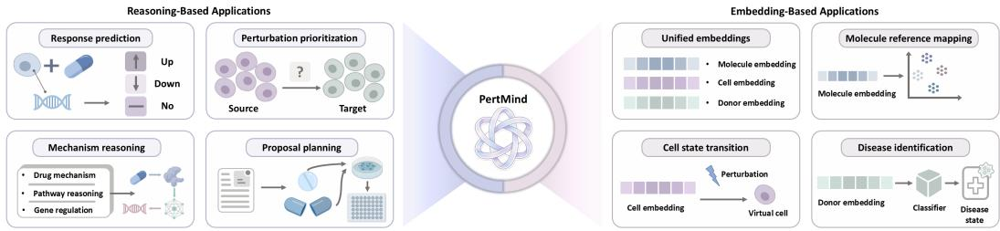  
Figure 1: Schematic scope of the capabilities enabled by PertMind. Reasoning-based applications use natural-language inference for perturbation-response prediction, perturbation prioritization, mechanism reasoning, and proposal planning. Embedding-based applications encode PertMindgenerated biological profiles into reusable molecular, cellular, and donor representations for reference mapping, cellular perturbation-response prediction, and donor-level tumor-state reference mapping. The figure summarizes the intended capability space, not benchmark performance. Within this space, the quantitatively evaluated subset in the Results comprises forward perturbation-response prediction, reverse perturbation-condition inference, phenotypic-screen hit prioritization, biologicalprocess naming, and molecular, cellular, and donor-level reference mapping.

## 2 METHODS

PertMind treats the condition-specific direction of a target gene’s response as a computable projection of a multi-step biological process—perturbation targeting, pathway propagation, and cell context modulation—and uses this projection as the training interface of a knowledge-grounded reasoning policy. Given a cell line, a small-molecule perturbation, and a target gene, the policy predicts the direction of the gene’s transcriptional response and states a mechanistic rationale that can be audited against retrieved biological evidence. The pipeline in Figure 2 starts from Qwen3- 4B Base and proceeds in three stages: (i) construction of a perturbation-derived supervision corpus from precomputed Tahoe-100M statistics under strict cell-line-disjoint controls (Section 2.2); (ii) knowledge-augmented, on-policy trajectory sampling followed by one epoch of supervised finetuning (SFT), which produces the reinforcement-learning initialization $\pi _ { \boldsymbol { \theta } _ { \mathrm { S F T } } }$ (Section 2.3); and (iii) pathway-supervised Group Relative Policy Optimization (GRPO) (Guo et al., 2025), the principal optimization stage, in which a gene-level outcome reward is complemented by a verifiable, structured intermediate reward derived from transcriptional pathway-response proxies (Section 2.4). Reproducibility details deferred from this section are collected in Appendix A.

## 2.1 PROBLEM FORMULATION

We represent a query as a triplet

$$
x = ( c , d , g ) ,\tag{1}
$$

where c denotes a cell line, d the identity of a small-molecule perturbation, and g a target gene. The task label space is

$$
\mathcal { Y } = \{ \mathrm { U p , D o w n , N o } \} ,\tag{2}
$$

indicating that the target gene is significantly up-regulated, significantly down-regulated, or shows no reliable evidence of differential expression under x. This ternary label is a computable training interface rather than a definition of the model’s capabilities: it captures the sign of the response that a multi-step regulatory process produces at the target gene, and we use it because it can be estimated from experimental data at scale and admits a well-defined reward. Given x and a biological context K(x)—assembled from external biological knowledge and training-split supporting cases— the policy π<sub>θ</sub> samples a reasoning trajectory z together with a structured final prediction $\hat { y } _ { g } ^ { \phantom { \dagger } } ,$

$$
( z , \hat { y } _ { g } ) \sim \pi _ { \theta } ( \cdot \mid x , K ( x ) ) .\tag{3}
$$

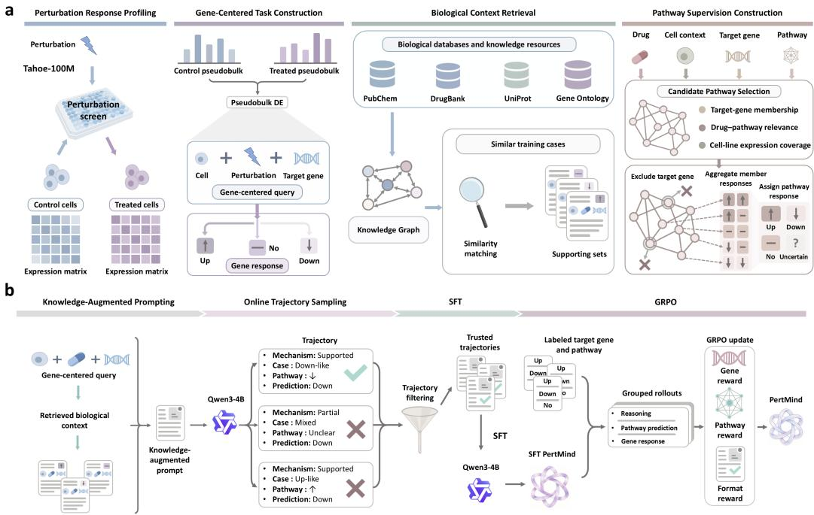  
Figure 2: Overview of PertMind. (a) Task and data construction. From each Tahoe-100M pseudobulk differential-expression record (Zhang et al., 2025) we assemble a gene-centered query $\boldsymbol { x } = ( c , d , g )$ with an Up, Down, or No label, retrieved biological context $\kappa ( x )$ , and, when informative, outcome-independently selected candidate pathways with transcriptional pathway-response proxies. The uncertain pathway outcome is a reward-side abstention state rather than a fourth model target, and receives no pathway reward. (b) Training. Knowledge-augmented prompts drive onpolicy sampling from Qwen3-4B; trajectories that pass the trusted-trajectory filters seed one epoch of supervised fine-tuning (SFT); the resulting SFT policy is then optimized by pathway-supervised Group Relative Policy Optimization (GRPO) (Guo et al., 2025) under the composite gene, pathway, and format reward. The current query’s target-gene label and all pathway proxy labels are reward-side information: they score sampled responses and are never placed in the model’s prompt at training or inference time.

The natural-language trajectory z is an auditable explanation constructed from available knowledge and retrieved evidence. The experimentally derived label $y _ { g }$ anchors the correctness of the final gene-level conclusion, and pathway supervision (Section 2.4) provides additional, verifiable intermediate signal on top of $y _ { g }$

## 2.2 PERTURBATION-DERIVED SUPERVISION

Training queries and labels are derived from the pseudobulk differential expression release in Tahoe-100M (Zhang et al., 2025), which reports treated-control pseudobulk differential expression for each cell line, drug, concentration, and plate. PertMind consumes these precomputed DESeq2-style statistics directly and does not re-estimate primary labels from single-cell expression matrices. For each surviving triplet we write $\Delta _ { c , d , g }$ for log2FoldChange, $\ q _ { c , d , g }$ for padj, and $\mu _ { c , d , g }$ for baseMean, where dose- and plate-level records sharing a drug identity are collapsed to a single per-drug record by the rule detailed in Appendix A.1; records with missing $\Delta$ or q and underpowered comparisons are discarded there.

Discrete labels are assigned by

$$
y _ { g } = \left\{ \begin{array} { l l } { \mathrm { U p } , } & { q _ { c , d , g } \leq 0 . 0 5 \wedge \Delta _ { c , d , g } \geq 0 . 5 8 5 , } \\ { \mathrm { D o w n } , } & { q _ { c , d , g } \leq 0 . 0 5 \wedge \Delta _ { c , d , g } \leq - 0 . 5 8 5 , } \\ { \mathrm { N o } , } & { \left| \Delta _ { c , d , g } \right| < 0 . 2 0 \wedge q _ { c , d , g } \geq 0 . 5 0 \wedge \mu _ { c , d , g } \geq 1 0 , } \\ { \mathrm { a m b i g u o u s } , } & { \mathrm { o t h e r w i s e } , } \end{array} \right.\tag{4}
$$

where $0 . 5 8 5 \approx \log _ { 2 } ( 1 . 5 )$ . Records labeled ambiguous are excluded from training and evaluation, and No denotes strong evidence of no differential expression at the stated thresholds rather than a claim of exact biological null effect. Each retained triplet additionally carries a confidence weight $w _ { c , d , g } ^ { \mathrm { c o n f } } \in [ 0 . 1 , 1 ]$ computed from $( \Delta _ { c , d , g } , q _ { c , d , g } , \mu _ { c , d , g } ) ;$ ; the closed forms and their derivation are given in Appendix A.1. The training corpus is

$$
{ \mathcal { D } } _ { \mathrm { t r a i n } } = \{ ( c , d , g , y _ { g } , w _ { c , d , g } ^ { \mathrm { c o n f } } ) : c \in { \mathcal { C } } _ { \mathrm { t r a i n } } , y _ { g } \in { \mathcal { Y } } \} .\tag{5}
$$

To match the target-domain evaluation protocol, we assign every Tahoe-100M sample by cell line before constructing triplets and partition cell lines rather than triplets, $\mathcal { C } _ { \mathrm { t r a i n } } \cap \mathcal { C } _ { \mathrm { t e s t } } = \bar { \boldsymbol { \varnothing } }$ . All samples from the five held-out lines C32, HepG2C3A, HOP62, Hs 766T, and PANC-1 form the evaluation domain; all samples from every other Tahoe-100M cell line form the development domain used for training and validation. The common eligibility and label rules above are then applied iden tically within each domain; no cell line, drug, or eligible triplet is subsampled. All thresholds, pathway-label parameters, retrieval rules, and model-selection decisions are fixed using only the development domain; the five test cell lines remain closed until final evaluation. Leakage controls are strict: the current query’s target-gene label, its differential-expression statistics, and any pathway proxy label never enter the prompt; all retrieval pools are restricted to the training partition, always exclude the query and its repeated measurements, and never access validation or held-outcell outcomes; pathway candidate selection (Section 2.4) uses only outcome-independent evidence; and no query-specific expression measurement is ever placed on the model side. Retrieved training cases may expose their own observed outcomes as historical evidence, including same- $( d , g )$ cases from another training cell line as cross-context evidence, but never the outcome of the current query, a validation query, or any held-out cell line. The grouped development split and the treatment of aggregated single-cell replicates are described in Appendix A.1.

## 2.3 KNOWLEDGE-GROUNDED RL INITIALIZATION

Reinforcement learning from a sparse three-class terminal reward alone provides little useful gradient when the initial policy rarely produces structured, evidence-grounded reasoning. We therefore first construct a small corpus of trusted, model-generated trajectories and use them for one epoch of SFT, giving GRPO a stable starting point.

For each training query, a retrieval module assembles the biological context $\kappa ( x )$ from an openworld biological knowledge graph over PubChem, DrugBank, UniProt, Gene Ontology, Reactome, STRING, and CORUM, together with outcome-stratified supporting cases

$$
\begin{array} { r } { S ( x ) = S _ { \mathrm { U p } } ( x ) \cup S _ { \mathrm { D o w n } } ( x ) \cup S _ { \mathrm { N o } } ( x ) } \end{array}\tag{6}
$$

drawn from $\mathcal { C } _ { \mathrm { t r a i n } } ;$ outcome-stratified retrieval prevents majority-class evidence from dominating the context without revealing the query’s own label. The current Qwen3-4B policy then samples M candidate trajectories under $\kappa ( x )$ . A candidate is retained only if it jointly satisfies: (i) its parsed final label matches $y _ { g } ; ( \mathrm { i i } )$ its output follows the required structure with a single unambiguous final answer; (iii) it does not claim access to hidden expression values or labels; (iv) invoked entities and relations are supported by the given context or explicitly flagged as inference; and (v) it contains a complete reasoning chain from perturbation target through pathway to gene-level conclusion. Trajectories passing all five criteria form the trusted-trajectory corpus $\hat { \mathcal { D } } _ { \mathrm { t r a j } } ^ { \mathrm { ~ ~ } } = \{ ( x , z ^ { \star } , y _ { g } ) \}$ ; queries with no passing candidate remain available for GRPO.

We perform one epoch of SFT on $\mathcal { D } _ { \mathrm { t r a j } }$ , reweighting the token-level cross-entropy by a Balanced Fine-Tuning (BFT) scheme (Tang et al., 2025b) that internally down-weights isolated lowconfidence tokens while giving trajectories with at least one difficult local span larger relative sequence-level weights than easier trajectories. BFT changes how examples are weighted within standard SFT rather than adding a separate training stage; its objective and window definitions appear in Appendix A.2. Because reinforcement learning is the principal optimization stage of PertMind, this stage is used only to establish structured output and mechanism-oriented reasoning behavior, and the resulting policy $\pi _ { \boldsymbol { \theta } _ { \mathrm { S F T } } }$ is retained both as the GRPO initialization and as the fixed reference for KL regularization.

## 2.4 PATHWAY-SUPERVISED REINFORCEMENT LEARNING

A terminal three-class reward collapses every response to final-label correctness and therefore cannot assign credit to intermediate biological consistency. PertMind complements this outcome reward with a structured intermediate reward derived from transcriptional pathway-response proxies, while keeping all model-visible information strictly outcome-independent. This combination of a genelevel outcome reward and a pathway-level checkpoint reward is the core method of PertMind.

For a subset of training triplets we build, before any $( c , d )$ -specific expression outcome is examined, a candidate pathway set $\mathring { \mathcal { P } } ^ { \mathrm { c a n d } } ( d , g )$ of at most three Reactome pathways containing g, using the pathway annotation and mapping pipeline adopted in this work (Tang et al., 2025a), filtered by pathway size and ranked by outcome-independent target-gene and drug-mechanism evidence; the ranking terms are given in Appendix A.3. For each candidate we assign, at training time only, a transcriptional pathway-response proxy

$$
y _ { P } ( c , d , g ) \in \{ \mathrm { U p } , \mathrm { D o w n } , \mathrm { N o } , \mathrm { u n c e r t a i n } \}\tag{7}
$$

that summarizes the coordinated transcriptional response of the non-target members $P ^ { - g } = P \backslash \{ g \}$ The proxy is computed within each full experimental condition $\tilde { d } = ( d \cdot$ , dose, plate) so that all members contributing to a single pathway score share dose and plate, and the condition-level labels are then aggregated to $( c , d , g )$ by a conservative cross-condition consensus rule; the condition-level significance-weighted signed effect, aggregate score, sign consistency, active-member fraction, and the drug-level consensus are given in Appendix A.3. The target gene is excluded when forming $P ^ { - g }$ because using its own expression to build the auxiliary reward would leak the primary answer into the process signal. The label $y _ { P } ( c , d , g )$ is a reward-side transcriptional pathway-response proxy; it is not a direct measurement of protein activity, metabolic flux, or causal pathway activation, and it is used only for reward computation, never as model input. The prompt includes the full candidate set together with each pathway’s name, its documented relation to the drug and target gene, and a small number of representative non-target members selected once per pathway using a pre-registered static score that combines annotation confidence and outcome-independent network centrality. It never includes any pathway’s proxy direction, any member’s expression statistics, or which candidates received a determinate $y _ { P } ( c , d , g )$

For each prompt x we sample a group of $G$ responses from the current policy,

$$
o _ { i } \sim \pi _ { \theta } ( \cdot \mid x , K ( x ) ) , \qquad i = 1 , \ldots , G ,\tag{8}
$$

each containing a structured pathway directions field, a mechanistic explanation field, and a final gene-level label $\hat { y } _ { g , i }$ . The terminal, primary-task reward is an unweighted binary indicator,

$$
R _ { \mathrm { g e n e } } ( o _ { i } ) = \mathbf { 1 } [ \hat { y } _ { g , i } = y _ { g } ] \in \{ 0 , 1 \} ,\tag{9}
$$

which takes the value 0 for responses with no parseable label or contradictory labels. Let $\mathcal { P } ^ { \mathrm { d e t } } ( c , d , g ) = \{ P \in \mathcal { P } ^ { \mathrm { c a n d } } ( d , g ) : y _ { P } ( c , d , g ) \neq$ uncertain} and $K = | \mathcal { P } ^ { \mathrm { d e t } } ( c , d , g ) |$ ; the pathway reward averages the per-pathway indicator over the scored subset,

$$
R _ { \mathrm { p w } } ( o _ { i } ) = \frac { 1 } { K } \sum _ { \substack { P \in \mathcal { P } ^ { \operatorname* { d e t } } ( c , d , g ) } } \mathbf { 1 } [ \hat { y } _ { P , i } = y _ { P } ( c , d , g ) ] \in [ 0 , 1 ] ,\tag{10}
$$

with $R _ { \mathrm { p w } } : = 0$ when $K = 0$ and a pathway mask $m _ { \mathrm { p w } } = { \bf 1 } [ K > 0 ]$ . The response is required to declare a direction for every candidate in $\mathcal { P } ^ { \mathrm { c a n d } } ( d , g ) \dot { }$ ; uncertain candidates enter neither the sum nor the denominator, and, because the model is not told which candidates are scored, it cannot allocate effort selectively. The pathway term therefore scores a small number of discrete intermediate predictions in a parseable slot before the final answer; no claim inside the free-text explanation is checked for entailment and no per-token credit is assigned anywhere in the trajectory. The total reward is

$$
R ( o _ { i } ) = R _ { \mathrm { g e n e } } ( o _ { i } ) + \lambda _ { \mathrm { p w } } m _ { \mathrm { p w } } R _ { \mathrm { p w } } ( o _ { i } ) + \lambda _ { \mathrm { f m t } } R _ { \mathrm { f m t } } ( o _ { i } ) ,\tag{11}
$$

where the format reward is the binary indicator

$$
R _ { \mathrm { f m t } } ( o _ { i } ) = \mathbf { 1 } { \left[ \begin{array} { l l } { \mathrm { a l l ~ r e q u i r e d ~ f i e l d s ~ a r e ~ p r e s e n t , a l l ~ l a b e l s ~ u s e ~ t h e ~ l e g a l ~ v o c a b u l a r y , } } \\ { \mathrm { a n d ~ e x a c t l y ~ o n e ~ t e r m i n a l ~ a n s w e r ~ i s ~ p a r s e a b l e } } \end{array} \right] } \in \{ 0 , 1 \} .\tag{12}
$$

The auxiliary weights are chosen to satisfy $\lambda _ { \mathrm { p w } } > 0 , \lambda _ { \mathrm { f m t } } > 0$ , and $\lambda _ { \mathrm { p w } } + \lambda _ { \mathrm { f m t } } < 1$ . This inequality is decidable from the chosen weights alone and holds for every response, so no combination of auxiliary rewards can outrank a correct gene label: a response satisfying all auxiliary criteria but predicting the wrong gene label always scores strictly below one predicting the correct label. The pathway reward is a GRPO reward component that directly supervises discrete pathway-direction predictions in the structured pathway directions field; it does not verify every free-text mechanistic claim and does not provide token-level causal credit, which remain outside the reward boundary and distinct from the trusted-trajectory validators used before SFT. The pathway reward does not require the gene-level response to match the pathway aggregate direction, because negative feedback, bypass compensation, and post-transcriptional regulation can decouple a target gene from its pathway’s trend; the gene-level label is always scored independently against the experimental label.

GRPO forgoes a learned value network and standardizes the total reward within each group,

$$
\hat { A } _ { i } = \frac { R ( o _ { i } ) - \mathrm { m e a n } _ { j } R ( o _ { j } ) } { \mathrm { s t d } _ { j } R ( o _ { j } ) + \epsilon } ,\tag{13}
$$

where $\epsilon > 0$ is a numerical stabilizer, so that updates depend on the relative quality of different reasoning outcomes for the same query and are less sensitive to reward-scale differences across drugs or cell lines. Confidence is applied after group standardization as a positive per-triplet multiplier on the complete sample objective, not as an additional scaling of ${ \hat { A } } _ { i } \colon$ : for every response $o _ { i }$ generated for a triplet $( c , d , g ) .$ , the token-level clipped policy surrogate together with its KL penalty is multiplied once by $w _ { c , d , g } ^ { \mathrm { c o n f } }$ . Because this multiplier is shared by all group members, the withingroup ordering induced by $\{ \hat { A } _ { i } \} _ { i = 1 } ^ { G }$ is unchanged and the entire parameter update contributed by that triplet is uniformly scaled, so that weakly supported triplets move the policy less than strongly supported ones without altering the discrete label they carry. When all responses in a group share the same total reward the group is zero-variance and contributes no gradient; when only the primary term is uniform, the auxiliary terms decide the standardized advantage, which provides intended partial credit without reversing any within-group preference established by gene-label correctness. We refer to the resulting confidence-weighted, KL-regularized GRPO variant—which combines the unscaled standardized advantage ${ \hat { A } } _ { i }$ with a clipped importance-weighted surrogate against the behavior policy $\pi _ { \theta _ { \mathrm { o l d } } }$ and a sampled-token KL penalty toward the frozen SFT reference $\pi _ { \theta _ { \mathrm { S F T } } } - \mathrm { a s }$ the optimization stage of PertMind; the full per-response objective, its sampled-token KL estimator, and the monitoring metrics used to detect reward hacking are given in Appendix A.4. Taking KL against $\pi _ { \boldsymbol { \theta } _ { \mathrm { S F T } } }$ rather than the continually updated policy preserves throughout RL the linguistic competence and reasoning structure established during SFT. We refer to the model obtained after GRPO training as PertMind.

## 3 DATASETS AND EXPERIMENTAL SETUP

## 3.1 TRAINING DATA AND LEAKAGE-CONTROLLED SPLIT

We use the complete Tahoe-100M perturbation atlas (Zhang et al., 2025) as the source of PertMind’s forward perturbation supervision. Before any filtering or label construction, every sample is assigned by cell-line identity. All samples belonging to C32, HepG2C3A, HOP62, Hs 766T, or PANC-1 are reserved for final evaluation; all samples from the remaining Tahoe-100M cell lines are assigned to the development domain. Within the development domain, retained $( c , d , g )$ groups are split 90:10 into training and validation partitions, stratified by cell line and three-class label, with all records sharing a $( c , d , g )$ key kept in the same partition. The validation partition is used only for model selection, threshold calibration, and early stopping. The same condition-level quality controls and the same $\mathrm { U p / D o w n / N o }$ definitions are applied to development and test domains, and ambiguous records are excluded as specified in Section 2.2. We do not downsample cell lines, drugs, or eligible triplets. Retrieval uses training records only, and neither validation outcomes nor any outcome from the five held-out cell lines is available to trajectory generation, SFT, GRPO, pathway-candidate selection, or hyperparameter selection. Drugs and genes may appear in both domains, but every evaluation cell context is unseen during training.

## 3.2 TRAINING CONFIGURATION AND MODEL VARIANTS

PertMind is initialized from Qwen3-4B Base. For trusted-trajectory construction, we draw $M = 8$ candidate responses per training query and retain only trajectories satisfying all validators in Section 2.3. BFT-weighted SFT is run for one epoch with LoRA rank 64, LoRA alpha 128, a learning rate of $1 \times 1 0 ^ { - 4 }$ , micro-batch size 1, gradient accumulation over 16 steps, and a maximum sequence length of 10,240 tokens. GRPO is then run for three epochs with $\bar { G } = 8$ responses per prompt, LoRA rank 64, LoRA alpha 128, learning rate $1 \times 1 0 ^ { - 5 }$ , per-device batch size 2, gradient accumulation over 4 steps, maximum completion length $2 { , } 0 4 8$ , temperature 0.9, and $\mathsf { t o p } \cdot p = 0 . 9 5$ . We use $\lambda _ { \mathrm { p w } } = 0 . 1 5 , \lambda _ { \mathrm { f m t } } = 0 . 0 5$ , KL coefficient $\bar { \beta } = 0 . 0 1$ , and clipping range $\varepsilon = 0 . 2 0$ . Pathway candidates use $\alpha _ { \mathrm { g e n e } } = 0 . 6 0$ and $\alpha _ { \mathrm { d r u g } } = 0 . 4 0 ;$ pathway proxies use $q _ { \mathrm { m i n } } = 1 0 ^ { - 6 } , a _ { \mathrm { m a x } } = 6$ τ = 0.20, τ = 0.05, $\gamma ~ = ~ 0 . 6 0 ,$ , and $\eta _ { \mathrm { n o } } ~ = ~ 0 . 2 0$ All settings are selected on the training/validation domain and frozen before final evaluation.

The ablation study compares six Qwen3-4B-derived variants under the same held-out-cell protocol: the unmodified Base model; BFT-weighted SFT; a shuffled-pathway sanity control; gene-only GRPO with the terminal outcome reward; prompt-only pathway context without pathway reward; and full PertMind with gene, pathway, and format rewards. The shuffled control preserves pathway frequency and prompt structure while permuting pathway labels within the training partition.

## 3.3 EVALUATION DATASETS, TASKS, AND BASELINES

Forward perturbation response and general capability. We use the open-source VC-World/GeneTAK protocol (Wei et al., 2026) on all eligible triplets from the five held-out Tahoe-100M cell lines. Differential-expression detection (DE) predicts whether a target gene changes, and direction prediction (DIR) distinguishes up- from downregulation among changed genes. We report Accuracy and Macro-F1 and compare Random, graph attention networks (GAT) (Velickoviˇ c et al.,´ 2018), CPA (Lotfollahi et al., 2023), scVI (Lopez et al., 2018), STATE (Adduri et al., 2025), the VCWorld harness instantiated with Gemini-2.5-Flash, and PertMind. General-capability retention is evaluated on the standard 57-subject MMLU benchmark (Hendrycks et al., 2021) and 67-subject CMMLU benchmark (Li et al., 2024) under zero-shot and five-shot prompting, comparing Base, SFT, and PertMind by multiple-choice accuracy.

Perturbation-condition prediction. The reverse task receives source and target cell states, converts their transition into up- and downregulated DEGs, and ranks candidate interventions. On the primary-human-T-cell CRISPRa/CRISPRi dataset of Schmidt et al. (Schmidt et al., 2022), each query ranks 69 candidate perturbations; we report Top-1 accuracy, Top-5 accuracy, and F1 and compare CellNavi (Wang et al., 2025a), PertMind, SFT, Base, DEG ranking, GEARS (Roohani et al., 2024), and Random. The combinatorial evaluation uses 131 double-perturbation pairs from the Norman Perturb-seq dataset (Norman et al., 2019) and a pool of 105 single-gene candidates. For each pair, we retain the separate ranks of both ground-truth genes and compare PertMind with CellNavi and GEARS; no double-perturbation example is used to adapt PertMind for this task.

Cross-task biological reasoning. AssayBench (De Brouwer et al., 2026) evaluates gene prioritization from free-text phenotypic-screen protocols. We use its official year-fold0 test split of 334 screens and adjusted NDCG at 100 (AnDCG@100) as the primary metric; Hits@100 and hallucination rate are auxiliary measures in the 36-screen stratified BKI ablation. Protocol-only ranking is compared with format-only, generic-note, mismatched-brief, and matched PertMind-brief conditions. The full test evaluates protocol-only and PertMind-augmented GPT-5.4, Gemini 3 Pro, and Qwen3.5-397B-A17B across five phenotype classes. For biological-process naming, we follow GeneAgent (Wang et al., 2025b) on 1,000 Gene Ontology, 50 NeST, and 56 MSigDB gene sets. GPT-4 and GeneAgent are compared with their PertMind-augmented counterparts using ROUGE-L/1/2 and MedCPT (Jin et al., 2023) semantic-similarity percentile rank against 12,320 background process terms.

Multi-scale representation. At the molecular level, GenePT (Chen & Zou, 2025), scGPT (Cui et al., 2024), scProtoTransformer (Tang et al., 2025a), and PertMind gene embeddings are evaluated by logistic regression and random forests on four gene-property reference-mapping tasks, using AUC. At the cellular level, scProtoTransformer, STATE-SE, STATE-SM, and PertMind representations are connected to the same STATE-based expression decoder (Adduri et al., 2025) and evaluated on HepG2, K562, and RPE1 perturbation data using DES, PDS, and MAE. At the dono level, the pan-cancer reference-mapping setup of scTransMIL (Tang et al., 2025c) compares DE-GAS (Johnson et al., 2022), KIDA (Tang et al., 2024b), scIDST (Wehbe et al., 2025), scVI with attention-based multiple-instance learning (Lopez et al., 2018; Ilse et al., 2018), scTransMIL variants, and PertMind at 50%, 75%, and 100% of the reference-training donors, using Accuracy, AUC, and F1. Each task-specific projection is reinitialized within each training fold and jointly optimized with the downstream classifier or decoder using only that fold’s reference-training partition.

## 3.4 METRICS AND STATISTICAL REPORTING

Unless a benchmark defines a different official protocol, Accuracy and F1 use their standard definitions, Macro-F1 averages class-wise F1 without prevalence weighting, and ranking metrics are computed over the complete candidate list. Higher values are better for Accuracy, F1, AUC, DES, PDS, ROUGE, and AnDCG; lower values are better for MAE and perturbation rank. Error bars report standard deviation over five independent runs for forward response, general capability, Schmidt reverse prediction, and cell-level representation experiments, and over seven runs for donor-level mapping. GeneAgent ROUGE error bars follow its nine batch-sampling replicates. Panels without run-level uncertainty are explicitly identified in their captions; no error bar is interpreted as a confidence interval or a test of statistical significance.

## 4 RESULTS

## 4.1 PERTMIND IMPROVES PERTURBATION-RESPONSE PREDICTION

We first evaluated PertMind on the open-source VCWorld perturbation-response benchmark, whose evaluation protocol defines the DE and DIR tasks on unseen cell lines (Figure 3a). Within thi framework, we compared PertMind against the VCWorld reference harness configured with the closed-source Gemini-2.5-Flash model. PertMind matched or modestly exceeded this Gemini-based reference on average across both tasks and evaluation metrics, and it outperformed the reference in a majority of the held-out cell-line settings. A Qwen3-4B-derived PertMind therefore reached the performance range of a substantially larger closed-source model and exceeded it in individual unseen contexts. These results support the hypothesis that reinforcement learning on cellular perturbation supervision improves biological perturbation reasoning, without by themselves establishing an emergent capability or a biological causal mechanism.

To attribute this gain to a specific component, we compared six training variants across all task– metric combinations and held-out cell lines (Figure 3b). SFT produced the first substantial im provement over the Base model, and gene-only outcome RL provided a further, albeit modest, gain, establishing a contribution from gene-level supervision. Adding pathway context to the prompt without a corresponding pathway reward did not improve over gene-only RL. By contrast, combining the gene-level outcome reward with biologically aligned pathway supervision produced the best-performing PertMind variant, while shuffling the pathway labels reduced performance below the SFT model. These results indicate that gene-level and pathway-level rewards make complementary contributions: the former anchors the final perturbation outcome, whereas the latter supplies structured intermediate supervision that cannot be replaced by pathway text alone.

We next asked whether pathway-supervised RL came at the cost of general language capability. Figure 3c and Appendix Figure 11 report overall and per-subject accuracy on MMLU and CMMLU under zero-shot and few-shot evaluation. PertMind remained close to both the Base and SFT models across these settings, with only small and consistent reductions in overall accuracy. Two design choices may have contributed to this retention. First, BFT selectively attenuated gradients from locally low-confidence tokens while balancing sequence-level contributions during SFT, reducing pressure to fit unreliable token targets. Second, the RL objective constrained every policy update with a KL penalty toward the frozen SFT policy, providing a self-distillation-like reference constraint that limited policy drift; this interpretation is consistent with evidence that self-distillation can support continual learning (Shenfeld et al., 2026). General capabilities were therefore largely retained after pathway-supervised RL, and we did not observe catastrophic forgetting.

a  
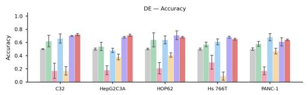

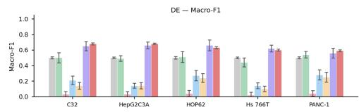

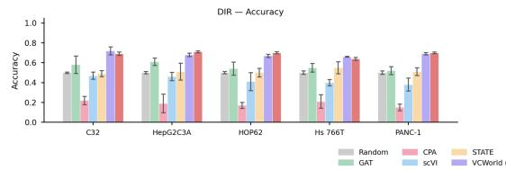  
b

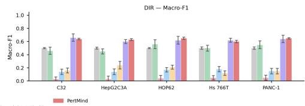

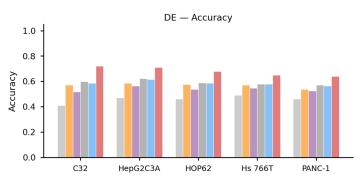

C  
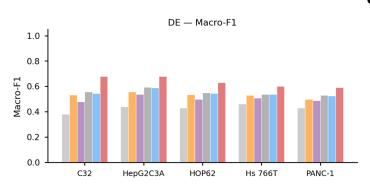

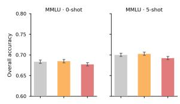

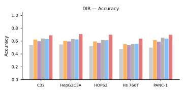

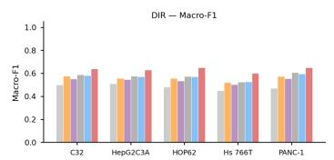

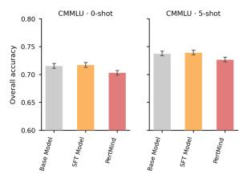  
Figure 3: Perturbation-response prediction, component ablation, and general-capability evaluation. (a) VCWorld benchmark accuracy and Macro-F1 for differential-expression detection (DE) and direction prediction (DIR) on the five unseen cell lines, comparing Random, GAT, CPA, scVI, STATE, VCWorld (Gemini-2.5-Flash), and PertMind. (b) Ablation across Base, SFT, shuffled-pathway sanity, gene-only outcome RL, prompt-only pathway context, and the complete PertMind pipeline, shown per cell line for each of the DE and DIR Accuracy and Macro-F1 combinations; this panel does not display run-level error bars. (c) Overall MMLU and CMMLU accuracy under 0-shot and 5-shot evaluation for Base, SFT, and PertMind. Error bars in panels (a) and (c) denote standard deviation over five independent runs.

Finally, we illustrated PertMind’s behavior under a free-form natural-language query outside the strict training schema, asking about Vemurafenib treatment of C32 cells and its effect on MKI67. PertMind predicted a differential-expression event with a Down direction, and its response linked BRAF V600E inhibition to reduced MAPK/ERK signaling, lower proliferative activity, and reduced MKI67 expression. A literature audit of this response, presented in Appendix Figure 12, associated its major mechanistic links with published sources. We present this case as an illustrative example of model behavior rather than as quantitative evidence of generalization or proof that the underlying reasoning is faithful.

## 4.2 PERTMIND GENERALIZES TO PERTURBATION-CONDITION PREDICTION

The preceding experiments evaluated the forward problem: given a cellular context and perturbation, predict the resulting transcriptional response. We next inverted this problem and asked which perturbation condition could induce an observed transition from source to target cells (Figure 4a). We represented each transition by its up- and downregulated DEGs and prompted PertMind in natural language to rank candidate perturbations. This evaluation required no additional task-specific finetuning of PertMind. By comparison, CellNavi uses a driver-gene predictor fine-tuned on CRISPRscreen data for cellular-transition inference (Wang et al., 2025a).

a  
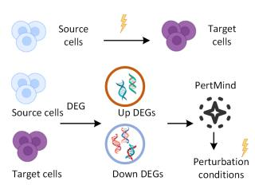

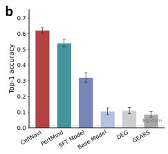

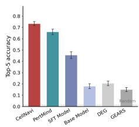

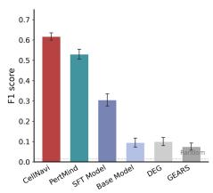

C  
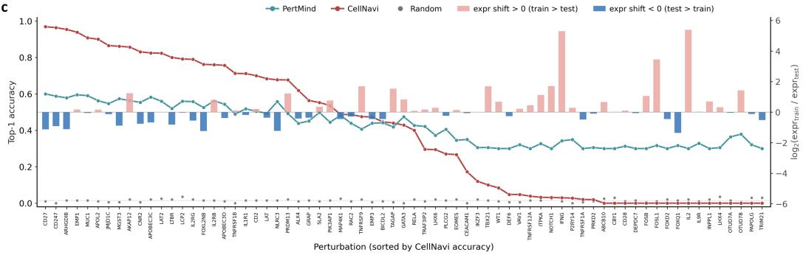

d  
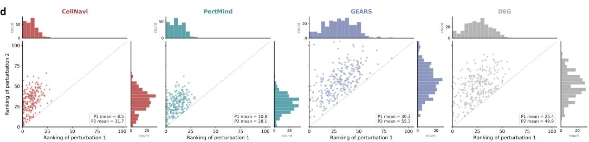  
Figure 4: Perturbation-condition prediction from cellular transitions. (a) Task schematic. In con trast to forward perturbation-response prediction, the reverse task provides source and target cells, summarizes their transition as up- and downregulated DEGs, and asks the model to rank candidate perturbation conditions. (b) Top-1 accuracy, Top-5 accuracy, and F1 score on the Schmidt primary T-cell dataset, comparing CellNavi, PertMind, SFT, Base, DEG, GEARS, and Random. Error bars denote standard deviation over five independent runs. (c) Per-perturbation Top-1 accuracy on the Schmidt dataset, with perturbations ordered by CellNavi accuracy. Bars show the expression shift log<sub>2</sub> $\mathrm { \Gamma ( \mathrm { e x p r e s s i o n } _ { t r a i n } / \mathrm { e x p r e s s i o n } _ { t e s t } ) } ;$ positive values indicate higher expression in the training state. (d) Joint rankings of the two ground-truth perturbations in the Norman double-perturbation dataset. Lower ranks are better; marginal histograms show the rank distributions.

We first evaluated this reverse task on primary T-cell CRISPR perturbations from the Schmidt dataset (Schmidt et al., 2022). Although PertMind had been post-trained only for forward perturbationresponse prediction, it approached the performance of the task-specialized CellNavi model across Top-1 accuracy, Top-5 accuracy, and F1 score (Figure 4b). It also substantially outperformed the Base and SFT models, indicating that the gain was not explained by generic pretrained knowledge or supervised adaptation alone. Transfer to this inverted task through natural-language prompting, without direct optimization for perturbation-condition prediction, is consistent with an emergent cross-task capability.

Aggregate performance concealed a marked difference in perturbation-level robustness (Figure 4c). CellNavi performed strongly on many perturbations but varied sharply across conditions, with its accuracy collapsing toward zero for a subset of targets. These failures were concentrated among perturbations expressed more highly in the training state than in the test state. PertMind had a lower peak accuracy but maintained a substantially flatter performance profile across the ordered perturbations and across both directions of expression shift. This stability suggests broader generalization across unseen perturbation conditions and cell-state shifts, complementing CellNavi’s stronger average performance.

We then tested whether this transfer extended to combinatorial interventions using the Norman Perturb-seq dataset (Norman et al., 2019). For each double perturbation, we examined the ranks assigned to both ground-truth conditions rather than crediting recovery of only the easier target (Figure 4d). CellNavi ranked the easier first perturbation more highly, whereas PertMind improved the rank of the second perturbation and reduced the imbalance between the two targets. One possible explanation is the training regime: multigene perturbations were excluded when CellNavi was trained for this evaluation (Wang et al., 2025a), whereas PertMind could draw on the compositional reasoning prior of an LLM without double-perturbation-specific training. Together, these result show that post-training an LLM on forward cellular responses can transfer to reverse and combina torial perturbation inference, suggesting a complementary prompt-based route for these settings.

## 4.3 PERTMIND IMPROVES PHENOTYPIC-SCREEN HIT PRIORITIZATION

We next asked whether the biological knowledge acquired from perturbation-response training could improve a distinct functional-genomics task. AssayBench casts each phenotypic CRISPR screen as gene prioritization from a free-text experimental protocol: a model returns a ranked list of 100 candidate genes, which is evaluated against experimentally defined hits using adjusted NDCG at 100 (AnDCG@100) (De Brouwer et al., 2026). We used the official temporally split year-fold0 test set, which contains 334 screens spanning five coarse phenotype classes. To transfer PertMind’s knowledge without updating the ranking model, we developed a two-stage Biology Knowledge Injection (BKI) procedure. PertMind first converts the protocol into a screen-specific biology brief containing mechanistic hypotheses, pathway cues, and directional constraints. A frontier ranking model then conditions on both the original protocol and this brief to produce the final gene ranking.

We isolated the source of the BKI gain on a stratified subset of 36 screens (Figure 5a). A matched PertMind brief achieved the strongest AnDCG@100, recovered the most hits within the top 100, and produced the lowest hallucination rate. Format-only text and a brief sampled from another screen did not reproduce this ranking gain, while a generic note provided a smaller improvement. The matched brief was not uniformly optimal for every auxiliary metric, but its advantage on the primary ranking metric, together with the mismatched-brief control, indicates that the benefit depended on screenspecific biological content rather than prompt length or formatting alone.

We then evaluated BKI on all 334 test screens and replaced the ranking backbone while keeping the knowledge-generation stage fixed (Figure 5b). Adding the PertMind brief improved AnDCG@100 for GPT-5.4, Gemini 3 Pro, and Qwen3.5-397B-A17B across all five phenotype classes. The consistent direction of improvement across proprietary and open-weight backbones shows that PertMind’s contribution was not tied to a particular model family. It instead functioned as a transferable biological knowledge module for phenotypic-screen prioritization.

## 4.4 PERTMIND ENHANCES BIOLOGICAL-PROCESS INFERENCE

To test a second form of cross-task transfer, we adopted the GeneAgent benchmark for assigning biological process names to gene sets (Wang et al., 2025b). The benchmark comprises gene sets from Gene Ontology, NeST, and MSigDB, and compares each generated process name with a manually annotated reference. We augmented both GPT-4 and GeneAgent with biological context generated by PertMind. This setting tests whether PertMind can support process-level interpretation despite being trained with gene- and pathway-level rewards for perturbation responses.

PertMind improved lexical agreement with the reference process names across all three data sources (Figure 5c). PertMind-augmented GPT-4 approached the ROUGE performance of GeneAgent, whereas augmenting GeneAgent produced a further but smaller gain. This diminishing marginal improvement suggests that PertMind already supplied part of the biological knowledge otherwise obtained through GeneAgent’s domain-database interactions. ROUGE measures token and phrase overlap, however, and therefore establishes agreement with curated labels rather than the faithfulness of the model’s internal reasoning.

a  
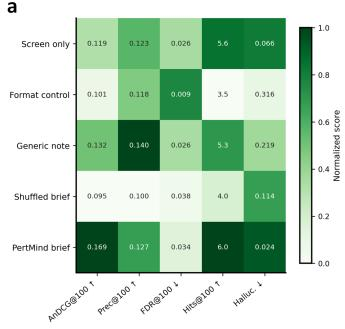

b  
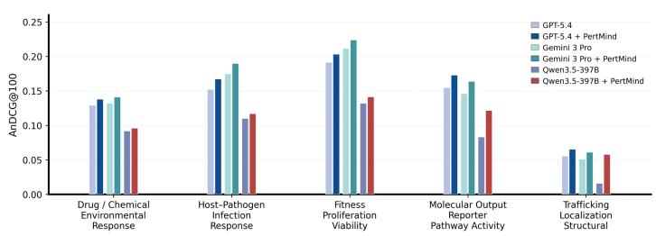

C  
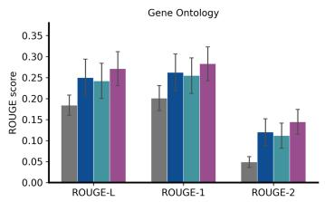

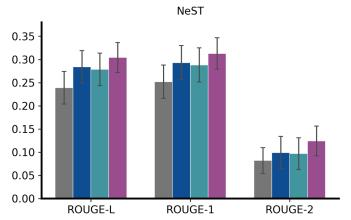

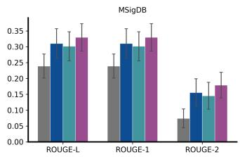

d  
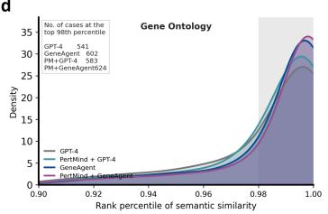

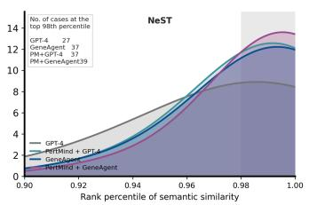

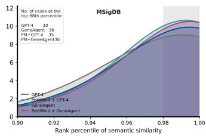  
Figure 5: Cross-task biological knowledge transfer with PertMind. (a) Biology Knowledge Injection (BKI) ablation on a stratified 36-screen subset of the AssayBench test set. Qwen3.5-397B-A17B ranks genes from the screen protocol alone or with a format control, generic note, mismatched Pert-Mind brief, or matched PertMind brief. Cells report raw values; color denotes within-column normalization, while arrows indicate the preferred metric direction. (b) AnDCG@100 on the complete AssayBench year-fold0 test set $( n = 3 3 4 )$ , stratified by five coarse phenotype classes. GPT-5.4, Gemini 3 Pro, and Qwen3.5-397B-A17B (abbreviated as Qwen3.5-397B in the panel) are evaluated with the protocol alone and with a screen-specific PertMind brief. (c) ROUGE-L, ROUGE-1, and ROUGE-2 agreement between generated and ground-truth process names for 1,000 Gene Ontology, 50 NeST, and 56 MSigDB gene sets. Error bars denote s.d. estimated from nine batch-sampling replicates, using batch sizes of 200 for Gene Ontology and 20 for NeST and MSigDB. (d) Density of MedCPT semantic-similarity percentile ranks between generated and ground-truth process names against 12,320 annotated background terms. Only the top decile is shown; shading marks the ≥ 98th-percentile region, and inset values give the number of gene sets in this region.

We next evaluated semantic rather than lexical agreement using MedCPT biomedical text embeddings (Jin et al., 2023). For each gene set, we ranked the similarity between the generated and reference names against 12,320 annotated biological-process terms (Figure 5d). PertMind augmentation shifted predictions toward the highest background percentiles for both GPT-4 and GeneAgent, with dataset-specific variation in the magnitude of the gain. Thus, the improvement was not limited to reproducing the surface form of a gold label: PertMind also increased the frequency with which the reference process was among the closest semantic interpretations. These percentile ranks measure semantic alignment, not factual verification, and should be interpreted alongside the ROUGE results rather than as direct evidence of a faithful reasoning trace.

Across AssayBench and the GeneAgent benchmark, PertMind improved black-box frontier models through natural-language knowledge exchange without modifying their parameters. This use is conceptually related to the model-as-memory paradigm, in which a dedicated model exposes internalized domain knowledge to a separate executive model (Quek et al., 2026). Our implementation does not reproduce MeMo’s memory-training or multi-turn retrieval protocol; instead, it shows that a perturbation-trained model can serve as a plug-and-play source of biological context. The resulting gains suggest that PertMind may reduce reliance on repeated external-database access for some tasks, although they do not establish complete replacement of curated resources. Together with perturbation-condition inference, these results are consistent with emergent biological transfer beyond PertMind’s training objective.

a  
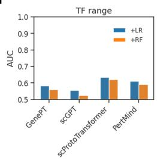

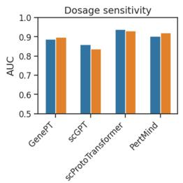

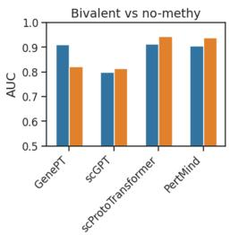

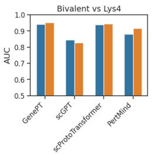

b  
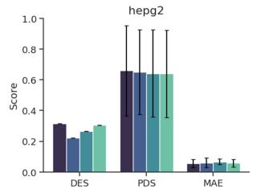

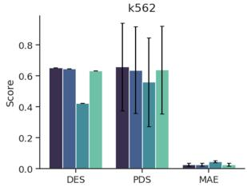

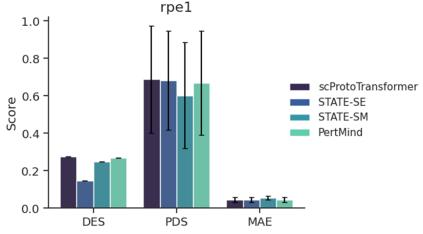

C  
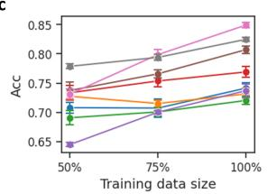

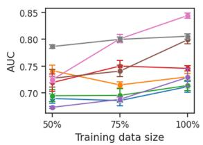

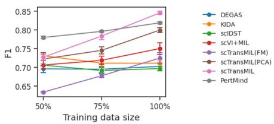  
Figure 6: Evaluation of PertMind-derived representations across biological scales. (a) Molecularlevel reference mapping on four gene-property tasks. GenePT, scGPT, scProtoTransformer, and PertMind gene embeddings are evaluated with logistic-regression (LR) and random-forest (RF) classifiers; bars report area under the receiver operating characteristic curve (AUC). (b) Cellular-level perturbation-response prediction on HepG2, K562, and RPE1 cells. Cell representations from scProtoTransformer, STATE-SE, STATE-SM, and PertMind are coupled to a STATE-based expression decoder and evaluated using differential-expression similarity (DES), perturbation-discrimination score (PDS), and mean absolute error (MAE). Higher DES and PDS and lower MAE are better. Error bars denote s.d. over five independent runs. (c) Donor-level tumor-state reference mapping at 50%, 75%, and 100% of the available reference-training donors. Curves report accuracy, AUC, and F1 score; error bars denote s.d. over seven independent runs.

## 4.5 PERTMIND ENABLES UNIFIED REPRESENTATIONS ACROSS MOLECULAR, CELLULAR,AND DONOR SCALES

GenePT showed that literature-derived descriptions can be converted into gene embeddings and composed with expression measurements to represent single cells (Chen & Zou, 2025). We extended this premise to ask whether the biological profiles produced by a perturbation-trained language model provide a reusable representation hierarchy. PertMind first generates a functional profile for each gene, which is encoded with text-embedding-ada-002. A task-specific projection maps the raw text embedding to the 512- or 2,048-dimensional interface required downstream. Expressionweighted aggregation then composes gene embeddings into cell embeddings, and an attention-based multi-instance learning module aggregates cells into donor embeddings. Appendix Figure 8 gives the complete construction.

At the molecular level, we evaluated four reference-mapping tasks introduced in the Geneformer benchmark and adopted by scProtoTransformer (Tang et al., 2025a). These tasks distinguish longfrom short-range transcription factors, dosage-sensitive from dosage-insensitive genes, bivalent from non-methylated genes, and bivalent from Lys4-only methylated genes (Figure 6a). Across LR and RF classifiers, PertMind embeddings were competitive with the strongest representation in each task and generally approached scProtoTransformer, despite being obtained from generated biological text rather than large-scale single-cell pretraining. The corresponding genome-wide UMAP retained separable gene-biotype structure (Appendix Figure 10); we treat this visualization as qual itative support rather than an independent performance estimate.

We next tested whether expression-weighted PertMind embeddings preserved sufficient cellularstate information for quantitative perturbation modeling. Using STATE as the expression decoder (Adduri et al., 2025), we predicted post-perturbation expression profiles in HepG2, K562, and RPE1 cells (Figure 6b). PertMind approached the scProtoTransformer representation across DES, PDS, and MAE, while producing a stronger overall metric profile than the standard STATE-SM repre sentation. Thus, the same text-derived gene space that supported molecular annotation could be composed into cell embeddings capable of resolving continuous perturbation responses, rather than only the discrete Up, Down, and No outcomes used to train PertMind.

Finally, we aggregated PertMind cell embeddings into donor representations and evaluated tumorstate reference mapping on the pan-cancer setting used by scTransMIL (Tang et al., 2025c). Pert-Mind remained stable as the reference-training set was reduced from all available donors to one half (Figure 6c). Its advantage was most apparent in the 50% regime, whereas scTransMIL improved more strongly as additional labeled donors became available. This behavior indicates that the PertMind representation retained transferable biological structure when donor-level supervision was limited.

Together, these results establish a hierarchical representation route from generated gene knowledge to cells and donors. They do not imply that all three scales occupy an identical latent geometry, because task-specific projections and learned aggregation remain necessary. Within the evaluated tasks, however, a common source of PertMind-derived gene knowledge supported competitive representations at each scale, including settings with limited donor-level supervision.

## 5 DISCUSSION

The central finding is that experimentally measured perturbation endpoints can train a reusable biological language-model policy, rather than merely improve a forward-response classifier. PertMind strengthened response prediction in unseen cellular contexts while largely retaining the general capabilities of its pretrained foundation. More importantly, the resulting policy transferred across task direction, perturbation composition, functional interpretation, and representation scale. These outcomes connect a narrowly computable training signal to a broader set of biological operations. The common element is not a shared output format, because the transferred tasks require rankings, process names, mechanistic briefs, or continuous representations. Instead, they require relating interventions, pathways, genes, and cellular states under changing query structures. Perturbation measurements therefore offer more than labels for supervised response models. They provide experimentally anchored consequences that can shape how a language model organizes and deploys biological knowledge. Interpreted as selection pressure, rewards across many contexts may favour integrated strategies linking interventions, pathways, genes, and cellular states. This explanation concerns the observed transfer rather than directly measuring the policy’s internal operations.

The results support a selection-and-concentration interpretation of this learning process. The genelevel reward supplies terminal selection pressure by distinguishing trajectories that reach the measured response from those that do not. The pathway reward adds structured intermediate guidance, favoring predictions that remain consistent with coordinated transcriptional changes before the final gene decision. In the evaluated setting, pathway text alone did not reproduce the gain obtained when pathway predictions also received reward. The shuffled-label control further indicates that improvement depends on biological alignment rather than additional reward density or output structure. Pre-RL best@N provides the complementary starting point: correct conclusions already appeared within the Base model’s sampling support. Yet greedy decoding and majority voting failed to concentrate that support into reliable decisions. Reinforcement learning can therefore be understood as reallocating probability toward useful strategies already accessible to the pretrained model. Trusted-trajectory SFT first stabilizes their expression, while GRPO repeatedly selects among them using experimental endpoints and pathway checkpoints. This account explains why post-training can amplify reasoning without requiring exhaustive annotations of every mechanistic step.

Transfer beyond the post-training objective provides the strongest evidence that the selected strategies are reusable. In reverse perturbation-condition prediction, PertMind inferred interventions from observed cell-state transitions, reversing the causal query presented during training. It approached a specialized transition model on primary-cell perturbations (Schmidt et al., 2022; Wang et al., 2025a), despite receiving no reverse-task adaptation. On unseen double perturbations, PertMind improved the second component’s rank and reduced the imbalance between both ground-truth components (Norman et al., 2019). This pattern is consistent with compositional reasoning, but does not verify that the model internally composed candidate effects. AssayBench extended transfer from response inference to phenotypic-screen prioritization (De Brouwer et al., 2026). Screen-specific PertMind briefs improved different ranking backbones, indicating that the useful output was portable biological context rather than backbone-specific prompting. GeneAgent evaluation added process-level abstraction, where PertMind context improved lexical and semantic agreement with curated biological interpretations (Wang et al., 2025b). Collectively, these tasks alter input direction, output type, biological scale, and executive model. Success across those changes is more informative than another in-domain score because none was directly optimized during post-training. Under our operational definition, this pattern supports emergent biological reasoning as transferable task competence.

The representation results reveal a second route by which this competence becomes reusable. PertMind-generated gene profiles externalize distributed model knowledge as natural-language objects that can be encoded once and adapted for distinct biological tasks. This construction extends the GenePT premise that literature-derived descriptions can provide effective molecular representations (Chen & Zou, 2025). Here, descriptions shaped by perturbation training supported molecular annotation and also composed with expression measurements into cellular representations. Aggregating those cellular representations further produced donor-level embeddings that remained useful when reference supervision was scarce. The hierarchy suggests that language can serve as an interface between symbolic biological knowledge and continuous data models. Functional statements about genes become a representation prior, while measured expression determines how those statements combine within a particular cell. Learned attention then selects cellular evidence relevant to a donor-level state. This role also connects PertMind to the model-as-memory perspective (Quek et al., 2026). A specialized model can expose internalized domain structure to another predictor through generated context or embeddings, without transferring all parameters. Natural-language knowledge is thus both interpretable communication and a substrate for multiscale representation learning.

Several limitations define the scope of this interpretation. Terminal rewards may admit shortcut strategies that predict the correct endpoint without reconstructing the relevant biological mechanism. Free-text trajectories are auditable, but their individual steps are not causally verified by the reward. Trusted-trajectory filters improve evidential grounding and structure, yet they cannot establish that generated explanations faithfully report the computations producing each answer. Pathway supervision is also a transcriptional proxy based on coordinated expression among annotated members. It does not directly measure protein activity, metabolic flux, spatial signaling, or causal pathway activation. The evaluated cellular systems, interventions, datasets, and downstream tasks cover only a limited portion of biological diversity. Generalization to other tissues, disease states, doses, modalities, or perturbation classes consequently remains unresolved. Retrieval resources and model-generated trusted trajectories may propagate omissions, annotation errors, and historical biases from their sources. Such biases could privilege well-studied genes, drugs, and pathways during both initialization and inference. Finally, PertMind-derived embeddings require task-specific projections, learned aggregation, and downstream supervision. Their performance therefore reflects both the language-derived prior and the adapters trained for each benchmark, not a universally sufficient fixed representation.

These findings suggest several directions for developing perturbation-derived reasoning systems. Genetic perturbations could expand the intervention vocabulary and separate target-specific effects from compound pharmacology. Multi-omic readouts could reward consistency across transcription, chromatin, protein, and metabolic responses, providing richer checkpoints along a biological cascade. Spatial assays could test whether reasoning captures interactions among neighboring cells and tissue compartments. Temporal measurements could distinguish early signaling events from delayed compensatory responses and clarify direction changes across response phases. Laboratory feedback loops could turn model proposals into new perturbation experiments, then return measured outcomes as fresh reinforcement signals. Such loops would prioritize informative interventions rather than passively consuming fixed atlases. More direct process supervision could score experimentally supported intermediate events, calibrated uncertainty, and evidence use alongside terminal correctness. Combining these signals with endpoint rewards may improve mechanistic fidelity while preserving scalable supervision. The broader opportunity is to treat expanding perturbation resources as environments for learning how biological systems respond, not only as tables for fitting predictions. Perturbation-derived reinforcement learning can thereby provide a scalable bridge from experimental data to reusable biological reasoning.

## 6 DATA AND CODE AVAILABILITY

The source datasets analysed in this study are available from the original public resources cited in Section 3. The PertMind project page is available at https://shapsider.github.io/ PertMind/. Source code and usage documentation are available at https://github.com/ shapsider/PertMind. Model weights, tokenizer files, and inference scripts are available at https://huggingface.co/tzcfly/PertMind.

## REFERENCES

Abhinav K Adduri, Dhruv Gautam, Beatrice Bevilacqua, Alishba Imran, Rohan Shah, Mohsen Naghipourfar, Noam Teyssier, Rajesh Ilango, Sanjay Nagaraj, Mingze Dong, et al. Predicting cellular responses to perturbation across diverse contexts with state. bioRxiv, pp. 2025–06, 2025. doi: 10.1101/2025.06.26.661135.

Constantin Ahlmann-Eltze, Wolfgang Huber, and Simon Anders. Deep-learning-based gene perturbation effect prediction does not yet outperform simple linear baselines. Nature Methods, 22(8): 1657–1661, 2025.

Nathan Bigaud, Vincent Cabeli, Meltem Gurel, Arthur Pignet, John Klein, Gilles Wainrib, and Eric¨ Durand. Owkinzero: Accelerating biological discovery with ai. arXiv preprint arXiv:2508.16315, 2025. URL https://arxiv.org/abs/2508.16315.

Shouzhi Chen, Zhenchao Tang, Linlin You, Yonghong Tian, and Calvin Yu-Chian Chen. Diconsite: A unified topology-adaptive architecture for protein binding site prediction across ligand modalities. IEEE Transactions on Pattern Analysis and Machine Intelligence, 2026.

Yiqun Chen and James Zou. Simple and effective embedding model for single-cell biology built from chatgpt. Nature biomedical engineering, 9(4):483–493, 2025. doi: 10.1038/ s41551-024-01284-6.

Haotian Cui, Chloe Wang, Hassaan Maan, Kuan Pang, Fengning Luo, and Bo Wang. scgpt: toward building a foundation model for single-cell multi-omics using generative ai. Nature Methods, 21 (8):1470–1480, 2024. doi: 10.1038/s41592-024-02201-0.

Edward De Brouwer, Carl Edwards, Alexander Wu, Jenna Collier, Graham Heimberg, Xiner Li, Meena Subramaniam, Ehsan Hajiramezanali, David Richmond, Jan-Christian Hutter, et al.¨ Assaybench: An assay-level virtual cell benchmark for llms and agents. arXiv preprint arXiv:2605.10876, 2026.

Adibvafa Fallahpour, Andrew Magnuson, Purav Gupta, Shihao Ma, Jack Naimer, Arnav Shah, Haonan Duan, Omar Ibrahim, Hani Goodarzi, Chris J. Maddison, and Bo Wang. Bioreason: Incentivizing multimodal biological reasoning within a dna-llm model. arXiv preprint arXiv:2505.23579, 2025. URL https://arxiv.org/abs/2505.23579.

Daya Guo, Dejian Yang, Haowei Zhang, Junxiao Song, Peiyi Wang, Qihao Zhu, Runxin Xu, Ruoyu Zhang, Shirong Ma, Xiao Bi, et al. Deepseek-r1 incentivizes reasoning in llms through reinforcement learning. Nature, 645(8081):633–638, 2025.

Haohuai He, Guanxing Chen, Zhenchao Tang, and Calvin Yu-Chian Chen. Dual modality feature fused neural network integrating binding site information for drug target affinity prediction. NPJ Digital Medicine, 8(1):67, 2025a.

Haohuai He, Zhenchao Tang, Guanxing Chen, Fan Xu, Yao Hu, Yinglan Feng, Jibin Wu, Yu-An Huang, Zhi-An Huang, and Kay Chen Tan. sckan: interpretable single-cell analysis for cell-typespecific gene discovery and drug repurposing via kolmogorov-arnold networks. Genome biology, 26(1):300, 2025b.

Dan Hendrycks, Collin Burns, Steven Basart, Andy Zou, Mantas Mazeika, Dawn Song, and Jacob Steinhardt. Measuring massive multitask language understanding. In International Conference on Learning Representations, 2021. URL https://openreview.net/forum?id= d7KBjmI3GmQ.

Maximilian Ilse, Jakub Tomczak, and Max Welling. Attention-based deep multiple instance learning. In Proceedings of the 35th International Conference on Machine Learning, volume 80, pp. 2127–2136. PMLR, 2018. URL https://proceedings.mlr.press/v80/ilse18a. html.

Qiao Jin, Won Kim, Qingyu Chen, Donald C Comeau, Lana Yeganova, W John Wilbur, and Zhiyong Lu. Medcpt: Contrastive pre-trained transformers with large-scale pubmed search logs for zeroshot biomedical information retrieval. Bioinformatics, 39(11):btad651, 2023.

Tyler S. Johnson, Chi-Yuan Yu, Zicheng Huang, Siyuan Xu, Tao Wang, Chenglong Dong, Wei Shao, Johannes L. Herrmann, Mingyu Zhang, et al. Diagnostic evidence gauge of single cells (DEGAS): a flexible deep transfer learning framework for prioritizing cells in relation to disease. Genome Medicine, 14(1):11, 2022. doi: 10.1186/s13073-022-01012-2.

Haonan Li, Yixuan Zhang, Fajri Koto, Yifei Yang, Hai Zhao, Yeyun Gong, Nan Duan, and Timothy Baldwin. CMMLU: Measuring massive multitask language understanding in Chinese. In Findings of the Association for Computational Linguistics: ACL 2024, pp. 11260–11285, 2024. doi: 10. 18653/v1/2024.findings-acl.671.

Romain Lopez, Jeffrey Regier, Michael B. Cole, Michael I. Jordan, and Nir Yosef. Deep generative modeling for single-cell transcriptomics. Nature Methods, 15(12):1053–1058, 2018. doi: 10. 1038/s41592-018-0229-2.

Mohammad Lotfollahi, Anna Klimovskaia Susmelj, Carlo De Donno, Leon Hetzel, Yuge Ji, Ignacio L Ibarra, Sanjay R Srivatsan, Mohsen Naghipourfar, Riza M Daza, Beth Martin, et al. Predicting cellular responses to complex perturbations in high-throughput screens. Molecular Systems Biology, 19(6):e11517, 2023. doi: 10.15252/msb.202211517.

Tianwen Lyu, Xiang Zhuang, Keyan Ding, Xinzhe Cao, Lei Liang, Wei Zhao, Qiang Zhang, and Huajun Chen. Knowledge-augmented long-cot generation for complex biomolecular reasoning. arXiv preprint arXiv:2511.08024, 2025. URL https://arxiv.org/abs/2511.08024.

Thomas M Norman, Max A Horlbeck, Joseph M Replogle, Alex Y Ge, Albert Xu, Marco Jost, Luke A Gilbert, and Jonathan S Weissman. Exploring genetic interaction manifolds constructed from rich single-cell phenotypes. Science, 365(6455):786–793, 2019.

Ryan Wei Heng Quek, Sanghyuk Lee, Alfred Wei Lun Leong, Arun Verma, Alok Prakash, Nancy F Chen, Bryan Kian Hsiang Low, Daniela Rus, and Armando Solar-Lezama. Memo: Memory as a model. arXiv preprint arXiv:2605.15156, 2026.

Yusuf Roohani, Kexin Huang, and Jure Leskovec. Predicting transcriptional outcomes of novel multigene perturbations with GEARS. Nature Biotechnology, 42:927–935, 2024. doi: 10.1038/ s41587-023-01905-6.

Ralf Schmidt, Zachary Steinhart, Madeline Layeghi, Jacob W Freimer, Raymund Bueno, Vinh Q Nguyen, Franziska Blaeschke, Chun Jimmie Ye, and Alexander Marson. Crispr activation and interference screens decode stimulation responses in primary human t cells. Science, 375(6580): eabj4008, 2022.

Idan Shenfeld, Mehul Damani, Jonas Hubotter, and Pulkit Agrawal. Self-distillation enables con-¨ tinual learning. arXiv preprint arXiv:2601.19897, 2026.

Zhenchao Tang, Guanxing Chen, Hualin Yang, Weihe Zhong, and Calvin Yu-Chian Chen. Dsilddi: A domain-invariant substructure interaction learning for generalizable drug–drug interaction prediction. IEEE Transactions on Neural Networks and Learning Systems, 35(8):10552–10560, 2023.

Zhenchao Tang, Guanxing Chen, Shouzhi Chen, Jianhua Yao, Linlin You, and Calvin Yu-Chian Chen. Modal-nexus auto-encoder for multi-modality cellular data integration and imputation. Nature Communications, 15(1):9021, 2024a.

Zhenchao Tang, Guanxing Chen, Shouzhi Chen, et al. Knowledge-based inductive bias and domain adaptation for cell type annotation. Communications Biology, 7:1440, 2024b. doi: 10.1038/ s42003-024-07171-9.

Zhenchao Tang, Haohuai He, Shouzhi Chen, Jun Zhu, Tianxu Lv, Jiale Zhou, Jiehui Huang, Guanxing Chen, Linlin You, and Calvin Yu-Chian Chen. scprototransformer: Scalable reference mapping across molecules, cells and donors. bioRxiv, pp. 2025–12, 2025a.

Zhenchao Tang, Fang Wang, Haohuai He, Jiale Zhou, Tianxu Lv, Jun Zhu, Shouzhi Chen, Minghao Yang, Yu Wang, Jiayang Wu, et al. Aligning llms with biomedical knowledge using balanced fine-tuning. arXiv preprint arXiv:2511.21075, 2025b.

Zhenchao Tang, Fang Wang, Fan Yang, Jiangning Song, Calvin Yu-Chian Chen, and Jianhua Yao. sctransmil bridges patient-level phenotypes and single-cell transcriptomics for cancer screening and heterogeneity inference. bioRxiv, pp. 2025–04, 2025c. doi: 10.1101/2025.04.22.649948.

Petar Velickoviˇ c, Guillem Cucurull, Arantxa Casanova, Adriana Romero, Pietro Li´ o, and Yoshua\` Bengio. Graph attention networks. In International Conference on Learning Representations, 2018. URL https://openreview.net/forum?id=rJXMpikCZ.

Tianze Wang, Yan Pan, Fusong Ju, Shuxin Zheng, Chang Liu, Yaosen Min, Qun Jiang, Xinwei Liu, Huanhuan Xia, Guoqing Liu, et al. Cellnavi predicts genes directing cellular transitions by learning a gene graph-enhanced cell state manifold. Nature Cell Biology, 27(10):1863–1874, 2025a.

Zhizheng Wang, Qiao Jin, Chih-Hsuan Wei, Shubo Tian, Po-Ting Lai, Qingqing Zhu, Chi-Ping Day, Christina Ross, Robert Leaman, and Zhiyong Lu. Geneagent: self-verification language agent for gene-set analysis using domain databases. Nature Methods, 22(8):1677–1685, 2025b.

Fadi Wehbe, Liane Adams, Joelle Babadoudou, Samuel Yuen, Yoon-Seok Kim, and Yasuhiro Tanaka. Inferring disease progression stages in single-cell transcriptomics using a weakly supervised deep learning approach. Genome Research, 35(1):135–146, 2025. doi: 10.1101/gr. 278812.123.

Zhijian Wei, Runze Ma, Zichen Wang, Zhongmin Li, Shuotong Song, and Shuangjia Zheng. Vcworld: A biological world model for virtual cell simulation. In International Conference on Learning Representations, 2026. URL https://arxiv.org/abs/2512.00306.

Xinyu Yuan, Xixian Liu, Jianan Zhao, Yashi Zhang, Hongyu Guo, and Jian Tang. Plausibility is not prediction: Contrastive evidence for llm-based cellular perturbation reasoning. arXiv preprint arXiv:2606.01042, 2026.

Jesse Zhang, Airol A Ubas, Richard De Borja, Valentine Svensson, Nicole Thomas, Neha Thakar, Ian Lai, Aidan Winters, Umair Khan, Matthew G Jones, et al. Tahoe-100m: A giga-scale singlecell perturbation atlas for context-dependent gene function and cellular modeling. BioRxiv, pp. 2025–02, 2025.

## A ADDITIONAL METHODS DETAILS

This appendix collects the reproducibility details deferred from Section 2. Notation, symbols, and labels follow the main text.

## A.1 DATA CONSTRUCTION DETAILS

Full experimental condition and drug-level collapsing. Each Tahoe-100M pseudobulk differential expression record is indexed by a full experimental condition

$$
\begin{array} { r } { \tilde { d } = ( d , \mathrm { d o s e } , \mathrm { p l a t e } ) , } \end{array}\tag{14}
$$

where d is the drug identity, and provides DESeq2-style statistics

$$
( \mathrm { b a s e{ M e a n } , \mathrm { l o g 2 F o l d C h a n g e , \mathrm { l f c S E , s t a t , p v a l u e , p a d j } } } ) ,\tag{15}
$$

together with drug, concentration, plate, and cell-line identifiers and the number of treated and control cells. At the condition granularity we write ∆ <sub>˜</sub> := log2FoldChange, $q _ { c , \tilde { d } , g } : = \mathtt { p a d j }$ and $\mu _ { c , \tilde { d } , g } : = \mathtt { b a s e M e a n }$ . Records with missing $\Delta$ or q are discarded, and to avoid unstable labels from underpowered comparisons we retain only conditions with treated-group cell count $n _ { c , \tilde { d } } ^ { \mathrm { t r t } } \geq 3 0$

The gene-centered task of Section 2.1 requires one record per $( c , d , g )$ for primary label assignment and confidence weighting. For these two purposes, we merge the surviving conditions $\tilde { d }$ that share the drug identity d by keeping the record with the largest $\big | \Delta _ { c , \tilde { d } , g } \big |$ , and write $\begin{array} { r } { \Delta _ { c , d , g } , q _ { c , d , g } , } \end{array}$ $\mu _ { c , d , g }$ for the statistics of the retained record. A separate reward-side condition table retains $\tilde { d } ,$ so pathway-response proxies are computed within individual conditions rather than from these collapsed gene-level records. The collapsing rule makes the primary drug-level label semantics deliberately asymmetric: a directional label asserts that at least one tested condition surviving quality control reached the thresholds of Section 2.2, whereas a No label asserts the complementary statement that no such condition provided directional evidence. Selecting the strongest available effect shifts the drug-level label distribution toward directional calls and raises the typical retained $| \Delta |$ relative to a dose-averaged summary; it should therefore be interpreted as a maximum-observed response endpoint rather than a dose-invariant effect.

Confidence weighting. Each triplet with $y _ { g } \in \mathcal { D }$ carries a confidence weight $w _ { c , d , g } ^ { \mathrm { c o n f } } \in [ 0 . 1 , 1 ]$ computed from $( \Delta , q , \mu ) = ( \Delta _ { c , d , g } , q _ { c , d , g } , \mu _ { c , d , g } )$ . For Up or Down,

$$
\begin{array} { r l } & { w _ { c , d , g } ^ { \mathrm { c o n f } } = \operatorname* { m a x } \Big [ 0 . 1 , \mathrm { c l i p } \Big ( \frac { | \Delta | } { 2 } , 0 , 1 \Big ) } \\ & { \qquad \cdot \mathrm { c l i p } \Big ( \frac { - \log _ { 1 0 } ( \operatorname* { m a x } ( q , 1 0 ^ { - 3 0 0 } ) ) } { 5 } , 0 , 1 \Big ) \Big ] , } \end{array}\tag{16}
$$

and for No,

$$
\begin{array} { r l } & { w _ { c , d , g } ^ { \mathrm { c o n f } } = \operatorname* { m a x } \Big [ 0 . 1 , \mathrm { c l i p } \Big ( \frac { \log _ { 1 0 } ( \mu + 1 ) } { \log _ { 1 0 } ( 1 0 1 ) } , 0 , 1 \Big ) } \\ & { ~ \cdot \mathrm { c l i p } \Big ( \frac { 0 . 2 0 - | \Delta | } { 0 . 2 0 } , 0 , 1 \Big ) \Big ] . } \end{array}\tag{17}
$$

These weights give larger effective supervision to strong, significant directional calls and to highexpression, near-zero-effect null calls, while every triplet retains its assigned label. Where the weight enters the RL update is specified in Section 2.4 and formalized in Appendix A.4.

Split, class stratification, and leakage. Before quality control or triplet construction, every Tahoe-100M sample is assigned by cell line. All samples from the five lines listed in Section 2.2 form the held-out test domain, and all samples from every other cell line form the development domain. After applying the same eligibility and label rules within both domains, development $( c , d , g )$ groups are split 90:10 into training and validation partitions, stratified by cell line and label; records sharing a $( c , d , g )$ key cannot cross this boundary. Because the outer partition is over cell lines rather than drugs or genes, a drug or gene may occur in both development and test domains in different cell contexts. A supporting case may share the current quer $\bar { \mathrm { y } } ^ { \prime } \mathrm { s } \ ( d , g )$ pair only when it comes from the training partition and is then treated as cross-context evidence. The current query, its repeated measurements, validation outcomes, and all held-out-cell outcomes are excluded from retrieval. Single-cell replicates are already aggregated in the Tahoe-100M pseudobulk statistics, so each candidate example corresponds to one eligible cell-line–perturbation–gene record. We retain every eligible triplet and use cell-line-, drug-, and label-stratified batches and prompt streams to control optimization imbalance; no class, cell line, or drug is capped or downsampled. The leakage controls in Section 2.2 apply throughout: no query-specific expression measurement enters the model side, and pathway supervision is available only on the reward side.

```latex
INPUT: model-visible prompt context OUTPUT: required response order
Task/query. Infer the response of target gene g under cell pathway directions: one Up, Down,
line c and drug d; output vocabulary is $\mathrm { { \bar { U p / D o w n / N o } } . }$ or No prediction for every supplied pathway
KG/static context. Drug mechanism and known targets; in $\mathcal { P } ^ { \mathrm { c a } \mathbf { \dot { n } } \mathbf { d } } ( d , g )$
target-gene function and regulatory context; curated drug– mechanistic explanation: concise
target and pathway relations with source identifiers. evidence-grounded drug-target–pathway–
Training supporting cases. Examples drawn only from gene chain; unsupported statements must
C<sub>train</sub>, with source triplets and historical outcomes; same- be marked as inference.
$( d , g )$ cases from other training cell lines are cross-context Final Answer: exactly one target-gene
evidence, while the current query, repeated measurements, label, Up, Down, or No. No uncertain
and held-out-cell outcomes are excluded. class.
Complete candidate pathways. Full $\mathcal { P } ^ { \mathrm { c a n d } } ( d , g ) ;$ each en-
REWARD: direct response scoring
try gives pathway name, documented relation, and repre
sentative non-target members selected by the pre-registered $R _ { \mathrm { g e n e } } { \mathrm { : } }$ compare $\hat { y } _ { g , \cdot }$ <sub>i</sub> with $y _ { g }$
outcome-independent static score. $R _ { \mathrm { p w } } \colon$ compare model outputs $\{ \hat { y } _ { P , i } : P \in$
Hidden boundary. Current-query labels, current-query DE $\mathcal { P } ^ { \mathrm { { \dot { d e t } } } } ( c , d , \overset { \cdot } { g } ) \}$ with $\{ y _ { P } ( c , d , g ) ~ : ~ P ~ \in { }$
statistics, pathway proxy labels, determinacy masks, and re- $\mathcal { P } ^ { \mathrm { d e t } } ( c , d , g ) \}$ ; the model declares all can
wards are not visible to the model. didates, but only this determinate subset is
scored.
$R _ { \mathrm { { f m t } } } \colon$ validate required fields, vocabulary,
and one terminal answer.
$R = R _ { \mathrm { g e n e } } + \lambda _ { \mathrm { p w } } m _ { \mathrm { p w } } R _ { \mathrm { p w } } + \lambda _ { \mathrm { f m t } } R _ { \mathrm { f m t } } .$
```  
Figure 7: Prompt and reward interface schema for PertMind trajectory generation. The left panel shows model-visible input, the upper-right panel shows the generated output schema, and the lowerright panel shows direct reward-side scoring. Condition-level pathway quantities are preprocessing intermediates, not direct response-scoring inputs, and are therefore omitted.

## A.2 TRAJECTORY AND SFT DETAILS

Retrieval configuration. The retrieval module aligns entities from PubChem, DrugBank, UniProt, Gene Ontology, Reactome, STRING, and CORUM by standard identifiers, filters high-frequency low-information nodes and duplicate facts before prompt construction, and computes drug and gene similarity from semantic annotation and knowledge-graph topology, restricted to $\mathcal { C } _ { \mathrm { t r a i n } }$ . Cellcontext similarity is computed only from outcome-independent tissue, lineage, and curated genotype annotations; no perturbation-response-derived expression feature is used for retrieval or ranking. Contrastive cases are retrieved separately from each outcome group and united as $s ( x ) =$ $\mathcal { S } _ { \mathrm { U p } } ( x ) \cup \mathcal { S } _ { \mathrm { D o w n } } ( x ) \cup \mathcal { S } _ { \mathrm { N o } } ( x )$ . A training case from another cell line may share the $\mathrm { q u e r y } ^ { \prime } \mathrm { s } \left( d , g \right)$ pair and is then included only as cross-context evidence; the current query, its repeated measurements, and every held-out-cell outcome are excluded. The assembled context is

$$
\begin{array} { r } { \mathcal { K } ( x ) = \left( \mathrm { k n o w l e d g e - g r a p h } \mathrm { e v i d e n c e } \mathrm { f o r } ( c , d , g ) , \mathcal { S } ( x ) \right) . } \end{array}\tag{18}
$$

No expression measurement or label of the current query enters $\kappa ( x )$ , so inference relies solely on knowledge-graph evidence and outcome-stratified training cases with their historical outcomes. Figure 7 summarizes the resulting model-visible prompt fields, required response order, and rewardside quantities that are withheld from the prompt.

Model-generated trajectory sampling. Given $\kappa ( x )$ , the current Qwen3-4B policy generates M candidate trajectories,

$$
\tilde { z } _ { m } , \hat { y } _ { m } \sim \pi _ { \theta _ { 0 } } ( \cdot \mid x , K ( x ) ) , \qquad m = 1 , \dots , M ,\tag{19}
$$

where $\theta _ { 0 }$ denotes the Qwen3-4B Base parameters before any PertMind-specific update, rather than an external teacher, and $M = 8$ . The model is prompted to (1) identify the perturbation’s direct targets and mechanism of action, (2) compare retrieved cases to the current drug, gene, and cell context, (3) predict a direction for every supplied candidate pathway, (4) propagate pathway-level change to the regulation of the target gene, and (5) output a single $\mathrm { { \bar { U } p } } .$ Down, or No conclusion. Trusted-trajectory checks are implemented as reproducible validators: deterministic parsers verify the unique terminal label, required pathway slots, and output order; every factual entity–relation claim must cite an identifier present in the prompt-visible evidence, while uncited statements must be marked explicitly as inference; and required structured fields verify the presence of a perturbationtarget–pathway–gene chain. Together with final-label correctness, these checks instantiate the five criteria of Section 2.3. Retained trajectories form $\mathcal { D } _ { \mathrm { t r a j } } = \{ ( x , z ^ { \star } , y _ { g } ) \}$

Balanced Fine-Tuning objective. For sample b with reference response tokens $y _ { b } ^ { \star }$ , let

$$
\begin{array} { r } { c _ { b , t } = \pi _ { \boldsymbol { \theta } } ( y _ { b , t } ^ { \star } \mid y _ { b , < t } ^ { \star } , x _ { b } ) , \qquad \ell _ { b , t } = - \log c _ { b , t } . } \end{array}\tag{20}
$$

Using a local window of $g _ { \mathrm { B F T } } = 2 5 6$ response tokens around t, let $W _ { b , t }$ denote the valid responsetoken indices in that window after clipping it at sequence boundaries, and define the local context confidence

$$
C _ { b , t } ^ { \mathrm { l o c } } = \frac { 1 } { | W _ { b , t } | } \sum _ { j \in W _ { b , t } } c _ { b , j } ,\tag{21}
$$

the locally normalized token weight

$$
\rho _ { b , t } = \mathrm { c l i p } \left( \frac { c _ { b , t } } { C _ { b , t } ^ { \mathrm { l o c } } + \epsilon } , 0 , 1 \right) , \qquad w _ { b , t } ^ { \mathrm { B F T } } = \mathrm { s g } ( \rho _ { b , t } ) ,\tag{22}
$$

and the sequence-level difficulty weight

$$
p _ { b } ^ { \mathrm { c o n f } } = \operatorname* { m i n } _ { t } C _ { b , t } ^ { \mathrm { l o c } } , \qquad s _ { b } = \mathrm { s g } ( 1 - p _ { b } ^ { \mathrm { c o n f } } ) ,\tag{23}
$$

where sg denotes stop-gradient. The BFT objective, used as the SFT loss on $\mathcal { D } _ { \mathrm { t r a j } }$ , is

$$
\mathcal { L } _ { \mathrm { S F T } } ( \theta ) = \frac { 1 } { B } \sum _ { b = 1 } ^ { B } s _ { b } \frac { \sum _ { t } m _ { b , t } w _ { b , t } ^ { \mathrm { B F T } } \ell _ { b , t } } { \sum _ { t } m _ { b , t } + \epsilon } ,\tag{24}
$$

where $m _ { b , t }$ masks non-response tokens and $\epsilon > 0$ is a numerical stabilizer. Isolated low-confidence tokens embedded in high-confidence contexts are down-weighted; because $s _ { b }$ depends on the minimum local confidence, trajectories containing at least one difficult local span receive larger relative sequence-level weights than easier trajectories. All confidence-derived quantities carry a stopgradient so that the model cannot lower the loss by manipulating weights instead of raising the likelihood of $y ^ { \star }$ . One epoch on $\mathcal { D } _ { \mathrm { t r a j } }$ produces the SFT policy $\pi _ { \boldsymbol { \theta } _ { \mathrm { S F T } } }$ , which is retained as both the GRPO initialization and the fixed KL reference in Appendix A.4.

## A.3 PATHWAY SUPERVISION DETAILS

Candidate pathway selection. We collect Reactome pathways containing the target gene,

$$
{ \mathcal { P } } _ { 0 } ( g ) = \{ P : g \in P \} ,\tag{25}
$$

and retain by default only pathways with $1 0 \leq | P | \leq 2 0 0$ members. For each candidate the nontarget member set is $P ^ { - \bar { g } } = P \setminus \overline { { \{ g \} } }$ ; the target gene is excluded from every subsequent pathway score so that its own expression cannot leak into the auxiliary reward. Candidates are ranked using only information that is available before any $( c , d )$ -specific expression outcome is examined,

$$
R _ { \mathrm { c a n d } } ( P \mid d , g ) = \alpha _ { \mathrm { g e n e } } R _ { \mathrm { g e n e } } ^ { \mathrm { c a n d } } ( P \mid g ) + \alpha _ { \mathrm { d r u g } } R _ { \mathrm { d r u g } } ^ { \mathrm { c a n d } } ( P \mid d ) ,\tag{26}
$$

where $R _ { \mathrm { g e n e } } ^ { \mathrm { c a n d } } ( P \mid g )$ scores the curated strength or confidence of target-gene membership in the pathway and $R _ { \mathrm { d r u g } } ^ { \mathrm { c a n d } } ( P \mid d )$ quantifies drug–pathway relevance. We use $\alpha _ { \mathrm { g e n e } } = 0 . 6 0$ and $\alpha _ { \mathrm { d r u g } } = 0 . 4 0$ Drug relevance is prioritized in the following order: a direct drug target within the pathway; a target within one or two hops of pathway members in a high-confidence interaction network; or shared membership on a manually curated mechanism-of-action axis. When no reliable drug-mechanism annotation is available, this term is recorded as unknown rather than inferred speculatively. The topranked candidates are kept, at most 3 per query, as $\mathcal { P } ^ { \mathrm { c a n d } } ( d , g )$ . Both the filter and the ranking are computed before the $( c , d )$ -specific differential-expression outcome is examined and depend only on curated target/pathway membership and drug-target or drug–pathway knowledge, so candidate selection is reproducible at inference time and outcome-independent.

Condition-level pathway-response proxy. Label construction may use training-split expression statistics, but the resulting label is used only for reward computation, never as model input. Pathway scores are always computed inside a single complete experimental condition so that every member entering a score shares the same dose and plate. Let $\bar { \mathcal { T } } ( c , d )$ denote the set of quality-controlled conditions $\tilde { d } = ( d , \mathrm { d o s e } , \mathrm { p l a t e } )$ for drug d in cell line c that survive the filters of Appendix A.1. For each $P \in { \mathcal { P } } ^ { \mathrm { c a n d } } ( d , g )$ and each $\tilde { d } \in \mathcal { T } ( c , d )$ , let $H ( P , c , \tilde { d } , g ) \subseteq P ^ { - g }$ denote the non-target members with finite $\Delta _ { c , \tilde { d } , h }$ and $\boldsymbol { q } _ { c , \tilde { d } , h }$ under a condition satisfying $n _ { c , \tilde { d } } ^ { \mathrm { t r t } } \geq 3 0$ . The entire set is drawn from a single $( c , \ddot { d } )$ , so H never mixes members measured at different doses or on different plates. For $h \in H ( P , c , \tilde { d } , g )$ , define the condition-level significance-weighted signed effect

$$
\begin{array} { r } { u _ { h , \tilde { d } } = \Delta _ { c , \tilde { d } , h } \cdot \mathrm { c l i p } \Big ( - \log _ { 1 0 } ( \operatorname* { m a x } ( q _ { c , \tilde { d } , h } , q _ { \operatorname* { m i n } } ) ) , 0 , a _ { \operatorname* { m a x } } \Big ) , } \end{array}\tag{27}
$$

where $q _ { \mathrm { m i n } } = 1 0 ^ { - 6 }$ is a fixed lower bound and $a _ { \mathrm { m a x } } = 6$ caps the influence of any single, extremely small q-value. The condition-level pathway aggregate score is

$$
S _ { P , \tilde { d } } = \frac { \sum _ { h \in { \cal H } ( P , c , \tilde { d } , g ) } w _ { h } u _ { h , \tilde { d } } } { \sum _ { h \in { \cal H } ( P , c , \tilde { d } , g ) } w _ { h } } ,\tag{28}
$$

with $w _ { h } = 1$ by default; non-uniform, outcome-independent topological weights are used only when pre-registered. The condition-level fraction of nonzero-effect members whose sign agrees with the aggregate direction is

$$
C _ { P , \tilde { d } } = \frac { | \{ h \in H ( P , c , \tilde { d } , g ) : \mathrm { s i g n } ( u _ { h , \tilde { d } } ) = \mathrm { s i g n } ( S _ { P , \tilde { d } } ) , u _ { h , \tilde { d } } \neq 0 \} | } { | \{ h \in H ( P , c , \tilde { d } , g ) : u _ { h , \tilde { d } } \neq 0 \} | } ,\tag{29}
$$

with the convention $C _ { P , \tilde { d } } = 0$ when no member has nonzero effect. The condition-level fraction of significantly responding members is

$$
A _ { P , \tilde { d } } = \frac { | \{ h \in H ( P , c , \tilde { d } , g ) : q _ { c , \tilde { d } , h } \leq 0 . 0 5 \wedge | \Delta _ { c , \tilde { d } , h } | \geq 0 . 5 8 5 \} | } { | H ( P , c , \tilde { d } , g ) | } .\tag{30}
$$

The condition-level pathway-response proxy label is

$$
y _ { P , \tilde { d } } = \left\{ \begin{array} { l l } { \mathrm { u n c e r t a i n , } } & { | H ( P , c , \tilde { d } , g ) | < 5 , } \\ { \mathrm { U p , } } & { S _ { P , \tilde { d } } \geq \tau _ { \mathrm { d i r } } \mathrm { ~ \wedge ~ } C _ { P , \tilde { d } } \geq \gamma , } \\ { \mathrm { D o w n , ~ } } & { S _ { P , \tilde { d } } \leq - \tau _ { \mathrm { d i r } } \mathrm { ~ \wedge ~ } C _ { P , \tilde { d } } \geq \gamma , } \\ { \mathrm { N o , ~ } } & { | S _ { P , \tilde { d } } | \leq \tau _ { \mathrm { n o } } \mathrm { ~ \wedge ~ } A _ { P , \tilde { d } } \leq \eta _ { \mathrm { n o } } , } \\ { \mathrm { u n c e r t a i n , } } & { \mathrm { o t h e r w i s e , } } \end{array} \right.\tag{31}
$$

with $\gamma = 0 . 6 0 , \tau _ { \mathrm { d i r } } = 0 . 2 0 , \tau _ { \mathrm { n o } } = 0 . 0 5$ , and $\eta _ { \mathrm { n o } } = 0 . 2 0$ . The directional and null cutoffs are constrained to satisfy

$$
0 \leq \tau _ { \mathrm { n o } } < \tau _ { \mathrm { d i r } } ,\tag{32}
$$

so the directional region $| S _ { P , \tilde { d } } | \geq \tau _ { \mathrm { d i r } }$ and the null region $| S _ { P , \tilde { d } } | \leq \tau _ { \mathrm { n o } }$ are disjoint. All parameters are fixed on the development split before evaluation on the held-out cell lines. Requiring both a small aggregate effect and a low fraction of significantly responding members for No prevents mislabeling a pathway with large but mutually canceling up- and down-regulated members as unresponsive.

Conditions with fewer than five reliable non-target members or with effects in the gray zone are labeled uncertain at the condition level. We refer to $y _ { P , \tilde { d } }$ as a transcriptional pathway-response proxy: it summarizes the coordinated transcriptional response of the pathway’s non-target members under a single $( c , \tilde { d } )$ and is not a direct measurement of protein activity, metabolic flux, or causal pathway activation.

Cross-condition consensus for drug-level pathway labels. The drug-level label $y _ { P } ( c , d , g )$ used by the reward in Section 2.4 is obtained by a conservative consensus over the determinate conditionlevel labels in $\{ y _ { P , \tilde { d } } : \tilde { d } \in \mathcal { T } ( c , d ) \}$ , so that no drug-level directional or null call is issued when determinate conditions disagree. Conditions labeled uncertain are ignored by the consensus, and a single determinate condition can supply the drug-level label. Let

$$
\mathcal { L } _ { P , c , d , g } = \{ y _ { P , \tilde { d } } : \tilde { d } \in \mathcal { T } ( c , d ) , y _ { P , \tilde { d } } \neq \mathrm { u n c e r t a i n } \}\tag{33}
$$

be the set of determinate condition-level labels. Then

$$
y _ { P } ( c , d , g ) = \left\{ \begin{array} { l l } { \mathrm { u n c e r t a i n , } } & { \mathcal { L } _ { P , c , d , g } = \emptyset , } \\ { \mathrm { U p , } } & { \mathcal { L } _ { P , c , d , g } \neq \emptyset \land \mathcal { L } _ { P , c , d , g } \subseteq \{ \mathrm { U p } \} , } \\ { \mathrm { D o w n , } } & { \mathcal { L } _ { P , c , d , g } \neq \emptyset \land \mathcal { L } _ { P , c , d , g } \subseteq \{ \mathrm { D o w n } \} , } \\ { \mathrm { N o , } } & { \mathcal { L } _ { P , c , d , g } \neq \emptyset \land \mathcal { L } _ { P , c , d , g } \subseteq \{ \mathrm { N o } \} , } \\ { \mathrm { u n c e r t a i n , } } & { \mathrm { o t h e r w i s e . } } \end{array} \right.\tag{34}
$$

A drug with a single determinate condition inherits that condition’s label; a drug with multiple determinate conditions receives a directional or null drug-level label only when all determinate conditionlevel labels agree, and any disagreement among those determinate labels is mapped to uncertain. Because the consensus is taken over pre-computed condition-level labels, no drug-level pathway score ever fuses members measured at different doses or on different plates. uncertain triplets remain in the main-task training pool and are simply excluded from the pathway reward term.

Model-visible information and pathway masking. The prompt lists the complete retained candidate set $\mathcal { P } ^ { \mathrm { c a n d } } ( d , g )$ ; for each listed candidate it includes the pathway name, its documented relation to the drug and target gene, and a small number of representative non-target members selected once per pathway using the same pre-registered static score combining annotation confidence and outcome-independent network centrality. This fixed member selection never consults the current condition’s expression statistics. The prompt never includes the pathway’s proxy direction, the expression effect, p-value, or q-value of any member under any condition, the intermediate quantities $S _ { P , \tilde { d } } , C _ { P , \tilde { d } } ,$ or $A _ { P , \tilde { d } } ,$ or any reordering of candidates based on the realized outcome. In particular, the prompt does not indicate which candidates received a determinate $y _ { P } ( c , d , g )$ . The scored subset used in Section 2.4 is

$$
{ \mathcal { P } } ^ { \operatorname* { d e t } } ( c , d , g ) = \{ P \in { \mathcal { P } } ^ { \operatorname { c a n d } } ( d , g ) : y _ { P } ( c , d , g ) \neq \operatorname { u n c e r t a i n } \} , \qquad K = \left| { \mathcal { P } } ^ { \operatorname* { d e t } } ( c , d , g ) \right| ,\tag{35}
$$

and the pathway mask

$$
m _ { \mathrm { p w } } = { \bf 1 } [ K > 0 ] \in \{ 0 , 1 \}\tag{36}
$$

is redundant with the $R _ { \mathrm { p w } } : = 0$ convention when $K = 0 ;$ it is kept explicit because the training code applies it as a per-sample mask when reducing rewards over a batch. Triplets whose candidates all turn out uncertain remain in the main-task training pool and are simply excluded from the pathway reward term, so pathway augmentation increases supervision density without restricting the training corpus.

## A.4 FULL OPTIMIZATION DEFINITION

Grouped rollouts. GRPO trains on every triplet in $\mathcal { D } _ { \mathrm { t r a i n } }$ with a determinate primary label, not only the trusted-trajectory subset used for SFT. For each prompt x, a group of $G = 8$ responses $o _ { i }$ $i = 1 , \ldots , G$ , is sampled from the current policy conditioned on the same biological context $\kappa ( x )$ Each response contains structured pathway predictions, a mechanistic explanation, and a final genelevel label, and is scored by $R ( o _ { i } )$ as in Section 2.4. The auxiliary weights are $\lambda _ { \mathrm { p w } } = 0 . 1 5$ and $\lambda _ { \mathrm { f m t } } = 0 . 0 5$ , selected on the held-out validation subset of the development domain and fixed before evaluation on $\mathcal { C } _ { \mathrm { t e s t } }$

Group standardization and confidence scaling. The standardized advantage

$$
\hat { A } _ { i } = \frac { R ( o _ { i } ) - \operatorname* { m e a n } _ { j } R ( o _ { j } ) } { \operatorname* { s t d } _ { j } R ( o _ { j } ) + \epsilon }\tag{37}
$$

gives zero-variance groups a vanishing gradient contribution; such groups are uninformative rather than harmful. When the primary term alone is uniform across a group, it does not affect the withingroup ranking, so the auxiliary terms provide the remaining preference signal. Confidence is applied after group standardization as a positive per-triplet multiplier on the complete sample objective, and never as an additional scaling of ${ \hat { A } } _ { i }$ itself, so that the within-group ranking induced by $\{ \hat { A } _ { i } \} _ { i = 1 } ^ { G }$ is unchanged and the shared positive constant $w _ { c , d , g } ^ { \mathrm { c o n f } }$ enters below at the objective level to uniformly scale the entire parameter update contributed by that triplet.

Clipped, KL-regularized policy optimization. The behavior policy $\pi _ { \theta _ { \mathrm { o l d } } }$ that generated the current rollouts is refreshed at every rollout iteration and is used only to define the clipped importance ratio below; it is distinct from the frozen SFT reference $\pi _ { \boldsymbol { \theta } _ { \mathrm { S F T } } } .$ , which enters the objective only through the KL penalty. Let the token-level importance ratio against the behavior policy be

$$
r _ { i , t } ( \theta ) = \frac { \pi _ { \theta } ( o _ { i , t } \mid x , \mathcal { K } ( x ) , o _ { i , < t } ) } { \pi _ { \theta _ { \mathrm { o l d } } } ( o _ { i , t } \mid x , \mathcal { K } ( x ) , o _ { i , < t } ) } ,\tag{38}
$$

and, separately, let

$$
\kappa _ { i , t } ( \theta ) = \frac { \pi _ { \theta _ { \mathrm { S F T } } } ( o _ { i , t } \mid x , K ( x ) , o _ { i , < t } ) } { \pi _ { \theta } \left( o _ { i , t } \mid x , K ( x ) , o _ { i , < t } \right) }\tag{39}
$$

denote a sampled-token ratio of the frozen SFT reference to the current policy, evaluated only at the sampled token $o _ { i , t }$ . The symbol $\kappa _ { i , t }$ is deliberately distinct from the behavior ratio $r _ { i , t } \colon$ its denominator is $\pi _ { \theta }$ rather than $\pi _ { \theta _ { \mathrm { o l d } } }$ , and it drives the KL penalty rather than the clipped policy surrogate, so $\kappa _ { i , t }$ must not be identified with ${ r } _ { i , t }$ . This confidence-weighted, KL-regularized GRPO variant (Guo et al., 2025) maximizes

$$
\mathcal { I } _ { \mathrm { G R P O } } ( \theta ) = \mathbb { E } \Bigg [ \frac { 1 } { G } \sum _ { i = 1 } ^ { G } w _ { c , d , g } ^ { \mathrm { c o n f } } \frac { 1 } { \lvert o _ { i } \rvert } \sum _ { t } \left( J _ { i , t } ^ { \mathrm { c l i p } } ( \theta ) - \beta \mathrm { K L } _ { i , t } ( \theta ) \right) \Bigg ] ,\tag{40}
$$

so that the per-triplet weight $w _ { c , d , g } ^ { \mathrm { c o n f } }$ multiplies the complete per-response objective—the clipped policy surrogate together with its KL penalty—exactly once, uniformly scaling every parameter update contributed by that triplet without appearing inside ${ \hat { A } } _ { i }$ or $\mathrm { K L } _ { i , t }$ . The token-level clipped surrogate uses the unscaled standardized advantage,

$$
J _ { i , t } ^ { \mathrm { c l i p } } ( \theta ) = \operatorname* { m i n } \big ( r _ { i , t } ( \theta ) \hat { A } _ { i } , \ \mathrm { c l i p } ( r _ { i , t } ( \theta ) , 1 - \varepsilon , 1 + \varepsilon ) \hat { A } _ { i } \big ) ,\tag{41}
$$

and the token-level KL term uses the sampled-token GRPO estimator

$$
\begin{array} { r } { \mathrm { K L } _ { i , t } ( \theta ) = \kappa _ { i , t } ( \theta ) - \log \kappa _ { i , t } ( \theta ) - 1 , } \end{array}\tag{42}
$$

which is nonnegative for every $\kappa _ { i , t } ( \theta ) > 0$ and equals zero exactly when $\pi _ { \boldsymbol { \theta } } ( o _ { i , t } \mid \cdot ) = \pi _ { \boldsymbol { \theta } _ { \mathrm { S F T } } } ( o _ { i , t } \mid$ $\cdot ) ;$ ; it estimates the KL divergence from the current policy toward $\pi _ { \boldsymbol { \theta } _ { \mathrm { S F T } } }$ using only the sampled token $o _ { i , t }$ and never enumerates the full token vocabulary. The clipping term limits the size of policy updates driven by any single batch of rewards, and the KL term toward $\pi _ { \boldsymbol { \theta } _ { \mathrm { S F T } } }$ , rather than the continually updated policy, preserves the linguistic competence and reasoning structure established during SFT. We use clipping range $\varepsilon = 0 . 2 0$ , KL coefficient $\beta = 0 . 0 1$ , and the remaining optimization settings listed in Section 3.

Training monitors. Throughout training we monitor gene-level accuracy, per-class recall for $\mathrm { U p }$ Down, and $\mathrm { N o } ,$ pathway-label accuracy on $\mathcal { P } ^ { \mathrm { d e t } }$ <sup>t</sup>, output-format pass rate, response length, and policy KL divergence toward $\pi _ { \boldsymbol { \theta } _ { \mathrm { S F T } } }$ , so that reward-hacking behaviors such as optimizing format alone, over-predicting majority classes, or gaining indirect advantage through response length rather than correctness can be identified and used to trigger early stopping or hyperparameter adjustment on the training-split validation subset.

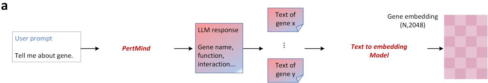

b  
C  
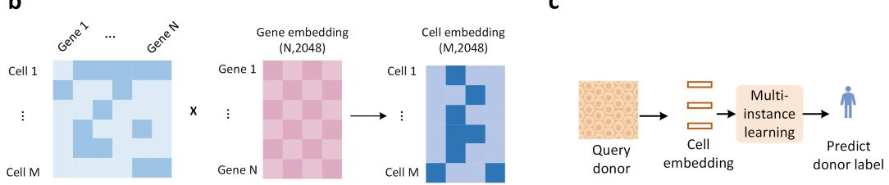  
Figure 8: Hierarchical construction of PertMind-derived representations. (a) PertMind generates a functional profile for each gene; text-embedding-ada-002 encodes the profile, and a taskspecific linear projection adapts the raw 1,536-dimensional text vector to the required 512- or 2,048- dimensional downstream interface. Dimensionality labels in the schematic denote the illustrated 2,048-dimensional post-projection branch. (b) Expression-weighted aggregation composes projected gene embeddings into cell embeddings. (c) Attention-based multi-instance learning aggregates cells from one donor into a donor embedding and predicts the donor label.

## A.5 CROSS-SCALE EMBEDDING CONSTRUCTION

Following GenePT (Chen & Zou, 2025), we treat generated text as an explicit interface between biological knowledge and numerical representation. For each gene $^ { g , }$ PertMind produces a profile $p _ { g }$ describing its function, interactions, pathways, and context-dependent roles. The raw text embedding and its task-adapted representation are

$$
u _ { g } = E _ { \mathrm { a d a } } ( p _ { g } ) \in \mathbb { R } ^ { 1 5 3 6 } , \qquad e _ { g } ^ { ( t ) } = A _ { t } u _ { g } + b _ { t } \in \mathbb { R } ^ { d _ { t } } , \qquad d _ { t } \in \{ 5 1 2 , 2 0 4 8 \} ,\tag{43}
$$

where $E _ { \mathrm { a d a } }$ denotes text-embedding-ada-002 and $A _ { t } , b _ { t }$ form the learned projection for downstream task t. The projection permits different decoders to consume a common source representation without claiming that every task shares an identical fixed-dimensional latent space. Whenever a downstream interface requires this adapter, it is reinitialized within each training fold and optimized jointly with the downstream classifier or decoder using only the reference-training partition; query or test labels are never used to fit the projection.

For cell $i ,$ let $x _ { i g } \geq 0$ be the preprocessed expression of gene $g .$ We obtain an expression-weighted cell embedding

$$
z _ { i } ^ { ( t ) } = \mathrm { N o r m a l i z e } \left( \frac { \sum _ { g \in \mathcal { G } _ { i } } x _ { i g } e _ { g } ^ { ( t ) } } { \sum _ { g \in \mathcal { G } _ { i } } x _ { i g } + \epsilon } \right) ,\tag{44}
$$

where $\mathcal { G } _ { i }$ is the set of represented genes, $\epsilon > 0$ prevents division by zero, and Normalize denotes row-wise unit $\ell _ { 2 }$ normalization. For donor $d ,$ the cells $\mathcal { T } _ { d }$ form a multi-instance bag. An attention module computes $\alpha _ { d i } = \mathrm { s o f t m a x } _ { i \in \mathbb { Z } _ { d } } ( a ( z _ { i } ^ { ( t ) } ) )$ and aggregates

$$
h _ { d } ^ { ( t ) } = \sum _ { i \in \mathcal { T } _ { d } } \alpha _ { d i } z _ { i } ^ { ( t ) } .\tag{45}
$$

The resulting donor embedding is passed to the donor-level classifier. Figure 8 summarizes this gene-to-cell-to-donor hierarchy.

a  
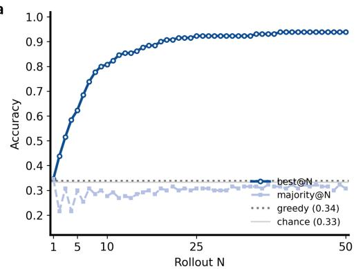

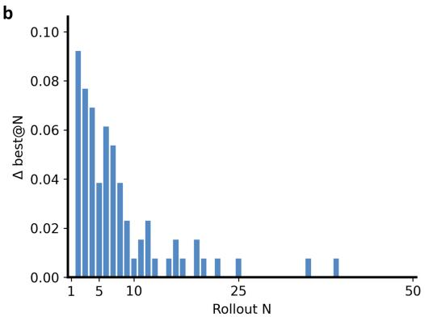

C  
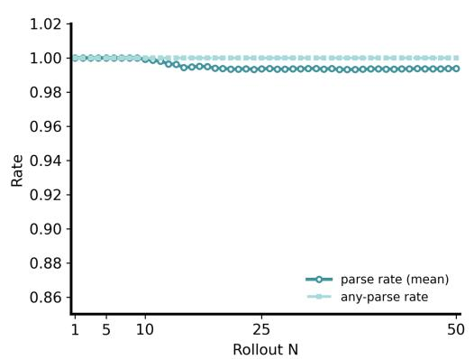

d  
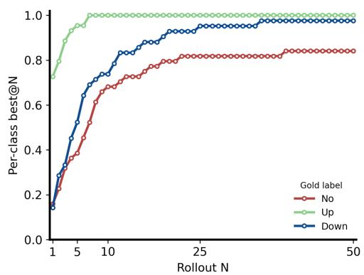  
Figure 9: Pre-RL sampling analysis of Qwen3-4B Base on the forward perturbation task. (a) Oracle best@N, majority-vote accuracy, greedy decoding, and one-third chance accuracy as the number of sampled rollouts increases. (b) Incremental improvement in best@N from each additional rollout. (c) Mean parse rate and the probability that at least one of N responses contains a valid terminal No, Up, or Down label. (d) Class-conditional best@N for the three gold labels. Best@N is an oracle diagnostic of support in the sampling distribution and is not an inference-time selection method.

## B ADDITIONAL RESULTS

This section collects the pre-RL sampling analysis, gene-embedding visualization, per-subject general evaluation, and literature-audited case deferred from the main Results.

Before reinforcement learning, we probed the Base model’s sampling distribution on the forward perturbation task by drawing responses independently for each query up to N = 50 rollouts. Here, oracle denotes an evaluation-only rule that uses the gold label to determine whether any sampled response is correct; the model cannot implement this selection at inference time. For a fixed query, best@N counts the query as correct if any of its first N sampled responses matches the gold terminal label, whereas majority@N uses the modal parsed terminal label among those N responses. We additionally report ∆best@N, the incremental oracle gain contributed by the N-th rollout, together with the mean parse rate, the any-parse rate, and class-conditional best@N for No, Up, and Down.

Figure 9 shows a sharp early rise in oracle best@N, followed by diminishing but nonzero gains over later rollouts, which indicates that the pretrained policy already assigns some probability mass to correct answers but does not concentrate it reliably enough for direct use. This quantity is therefore an oracle support diagnostic, not a deployable accuracy estimate and not an inference-time selector. By contrast, majority@N remains nearly flat around its single-sample level and does not materially improve with additional samples, showing that naive multi-sample voting fails to recover the latent support revealed by best@N. The format curves rule out parsing as the main bottleneck: the mean parse rate stays close to 1 and the any-parse rate is essentially saturated throughout, so most failures reflect biological decision errors rather than missing terminal labels.

The class-conditional curves further clarify where this support is uneven. Up is recovered most easily and approaches saturation after only a small number of rollouts, Down improves more gradually, and No remains the hardest class across the entire range of N. This separation matters for both DE and DIR: correctly identifying No is the main challenge for differential-expression detection, while the persistent gap between $\mathrm { { \bar { U } p } }$ and Down shows that direction prediction still requires genuine discrimination between the two changed-state labels. Together, these trends motivate pol icy optimization that increases the concentration of correct outcomes, rather than relying on more sampling or majority voting at inference time.

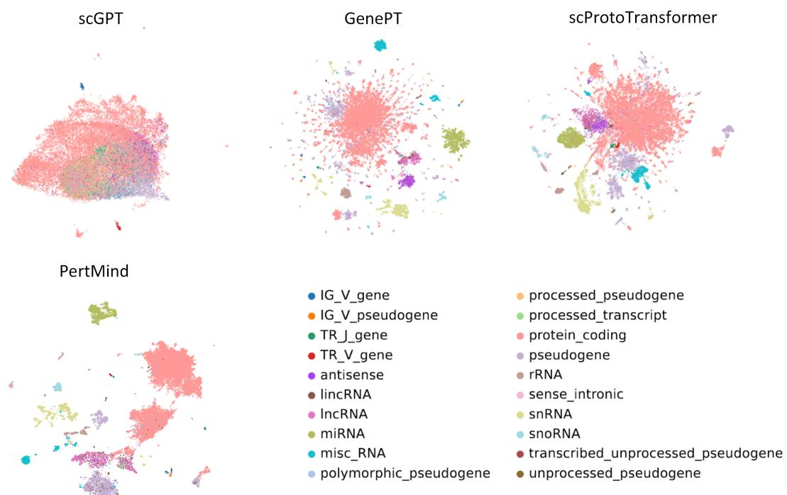  
Figure 10: Genome-wide UMAP visualization of gene embeddings from scGPT, GenePT, scProto-Transformer, and PertMind. Points denote genes and colors denote annotated gene biotypes. The PertMind map retains distinct biotype-enriched regions, providing a qualitative view of molecular organization complementary to the reference-mapping results in Figure 6a. UMAP geometry is sensitive to preprocessing and visualization hyperparameters and is not used as a quantitative per formance metric.

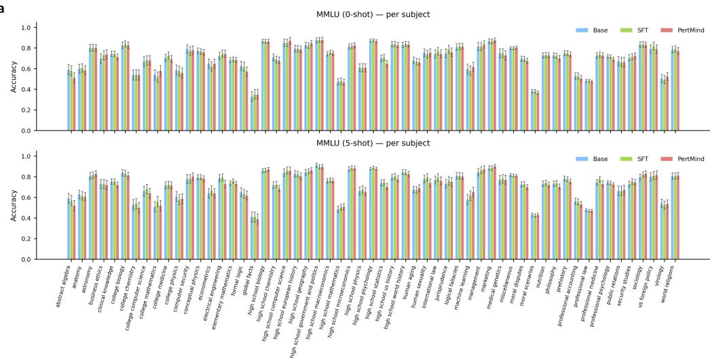

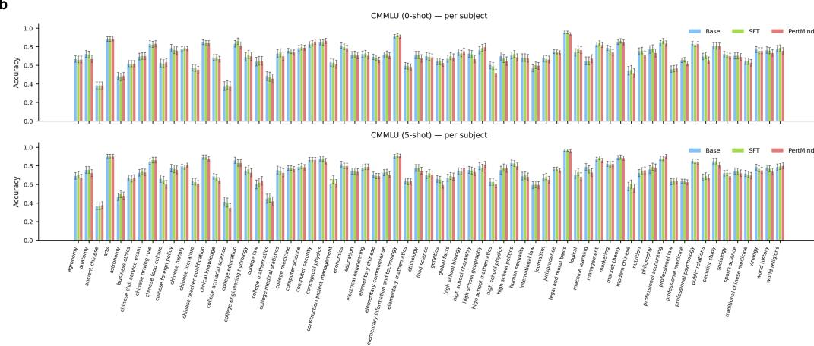  
Figure 11: Per-subject general-capability evaluation. (a) MMLU accuracy by subject under 0-shot and 5-shot evaluation for Base, SFT, and PertMind. (b) CMMLU accuracy by subject under the same 0-shot and 5-shot settings. Error bars denote standard deviation over five independent runs.

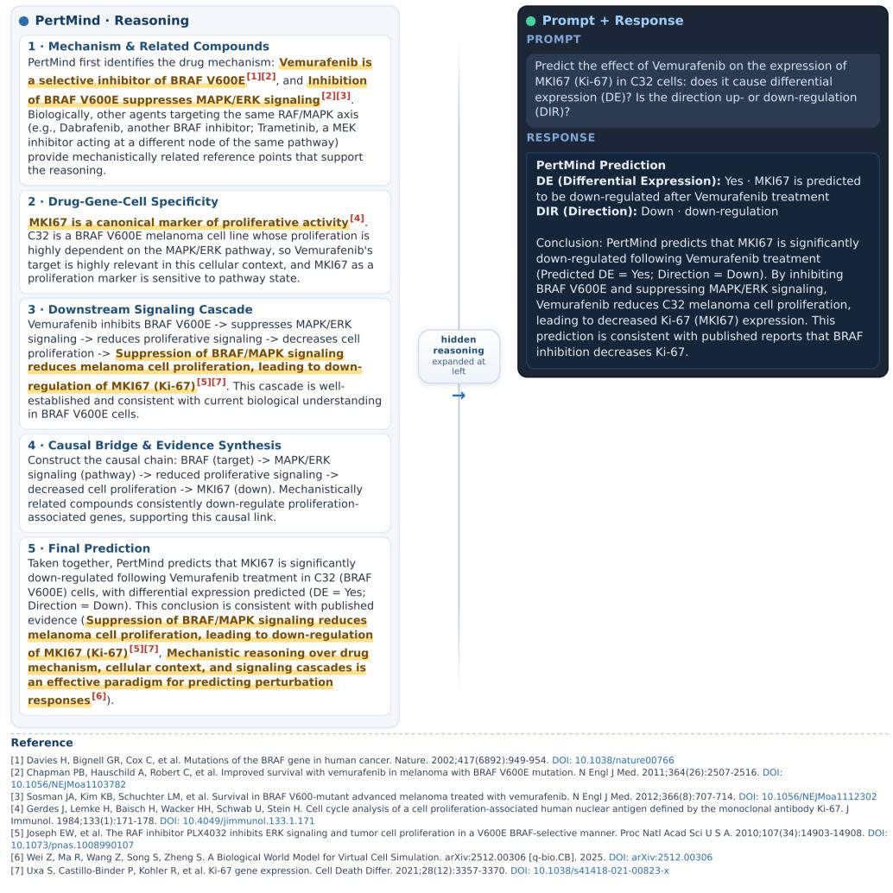  
Figure 12: Literature-audited free-form natural-language Vemurafenib–C32–MKI67 case. The left side expands the mechanism audit and maps highlighted claims to the references shown in the figure; the right side shows the user prompt and PertMind response. Public literature support for highlighted claims does not establish that the generated reasoning process was faithful.