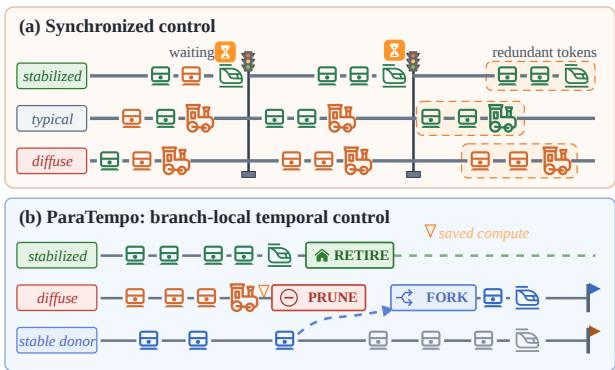
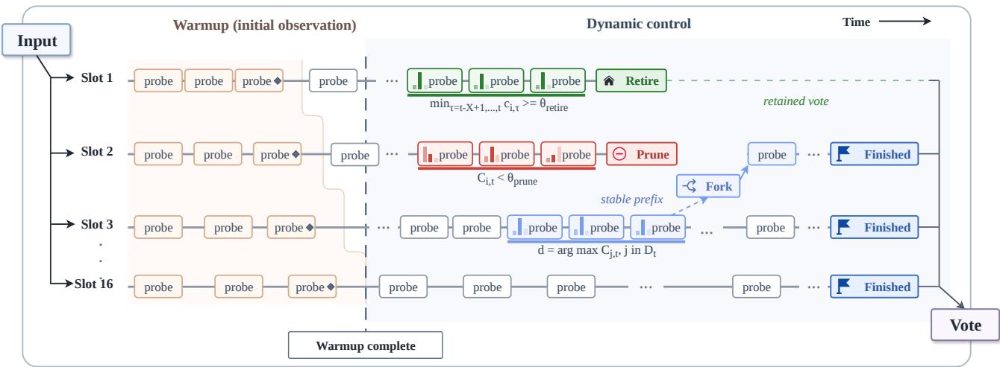
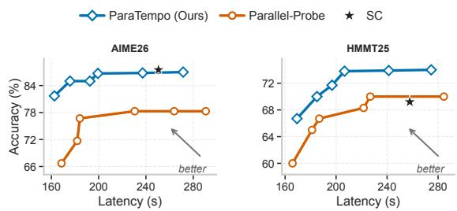
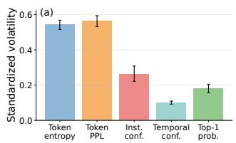
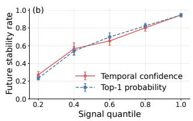

# ParaTempo: Eficient Parallel Reasoning via Temporal Confidence

Xuteng Zhang1∗, Wenhao Zeng1∗, Xiaodong Gu1, Chao Hu1, Haotian Lin1, Yuling Shi1, Min Wang2, Beijun Shen1†

1Shanghai Jiao Tong University 2University of Pennsylvania {scottzhang, zengwh\_cs, xiaodong.gu}@sjtu.edu.cn

## Abstract

Parallel reasoning improves the accuracy and robustness of large reasoning models by exploring multiple solution paths, but its computational cost grows with reasoning depth and branch count. Existing methods for managing these parallel paths typically rely on final-answer consensus, local token confidence, or isolated intermediate probes. However, these signals are often delayed, weakly tied to actual reasoning progress, or too noisy for dynamic, branch-level control. To address these limitations, we introduce ParaTempo, a training- free asynchronous parallel reasoning framework. ParaTempo is driven by temporal confidence, a branch-local measure of answer-space convergence. Each branch is periodically probed for a tentative answer probability distribution, and temporal confidence quantifies how sharply the recent intermediate probes concentrate on a dominant answer. Once suficient evidence has accumulated, ParaTempo drives its entire control process from this single signal: low-confidence branches are pruned, branches that persistently commit to their dominant answer are retired early, freed computation is reallocated by forking new branches, and generation stops globally once the confidence-weighted vote concentrates. Without requir- ing synchronization among reasoning trajectories, ParaTempo adaptively allocates computation based on branch-level conver- gence. Experiments on challenging mathematical and scientific reasoning benchmarks show that ParaTempo reduces average latency by 21.8–32.2% and total token usage by 18.1–30.3% while maintaining competitive accuracy. Moreover, temporal confidence exhibits stronger temporal stability and predictive power for future branch convergence than token-level and instantaneous signals 1.

## 1 Introduction

Parallel reasoning has emerged as an efective strategy for improving the reliability of large reasoning models by concur- rently exploring multiple solution trajectories (Wei et al. 2022; Wang et al. 2022). However, its inference cost scales with both the number of branches and reasoning depth. Most traditional approaches (Wang et al. 2022) follow a fixed-budget paradigm, allocating identical computation to all branches and aggre- gating answers only after termination, thereby overlooking heterogeneous reasoning progress across trajectories. As a result, converged branches continue generating redundant tokens, while less promising branches consume computation without clear evidence of future utility.

  
Figure 1: Motivating branch-local temporal control. (a) Syn-chronized control advances all branches through global bar- riers. (b) ParaTempo asynchronously updates branch-local evidence and triggers local actions: stabilized branches are retired, difuse branches are pruned, and reclaimed budget is reallocated via forking.

To im rove com utation eficienc , recent studies have explored online control mechanisms that intervene reasoning branchs during generation (Li et al. 2024; Liu and Wang 2025; Fu et al. 2025; Zheng et al. 2026). For instance, early- stopping self-consistency methods reduce sampling once final- answer consensus becomes suficiently reliable (Li et al. 2024). Answer-convergence methods leverage the observation that many reasoning traces stabilize before generation terminates (Liu and Wang 2025). DeepConf uses model confidence to filter low-quality traces during or after generation (Fu et al. 2025). However, these approaches rely on signals that only partially capture branch-level reasoning progress. Final- answer consensus ofers reliable evidence but emerges only after substantial computation (Li et al. 2024; Wan et al. 2025; Zhou et al. 2025); token-level confidence provides fine-grained feedback but poorly reflects answer evolution (Fu et al. 2025; Zeng et al. 2025, 2026b); and isolated intermediate probes enable early intervention but are sensitive to transient fluctuations (Liu and Wang 2025; Zheng et al. 2026).

To overcome these limitations, we propose ParaTempo, an asynchronous framework for eficient parallel reasoning. At its core, ParaTempo relies on temporal confidence, a branchlocal signal for selecting and pruning branches. Temporal confidence is designed to answer a fundamental question: does a branch consistently place probability mass on a con- centrated answer region, or scatter mass across multiple alternatives? To estimate this signal, ParaTempo periodically probes each active branch to obtain tentative answer distri- butions and aggregates recent predictions within a sliding window. By continuously tracking the temporal consistency of intermediate predictions, temporal confidence determines whether a trajectory is stabilizing toward a dominant answer or remains uncertain among competing candidates. Guided by this signal, ParaTempo dynamically allocates computation: low-confidence branches are pruned, converged branches are retired, freed computation is reallocated through forking from promising branches, and inference terminates when the confidence-weighted ensemble vote becomes suficiently concentrated. As illustrated in Figure 1, ParaTempo enables asynchronous branch-level control without requiring trajectory synchronization, reducing both total generation cost and critical-path latency.

We evaluate ParaTempo on four mathematical and scientific reasoning benchmarks using Qwen3.5-35B-A3B (Qwen Team 2026) and GPT-OSS-20B (OpenAI 2025). Across these bench-marks, ParaTempo consistently improves inference eficiency while preserving the accuracy gains of parallel reasoning. Compared with standard self-consistency, ParaTempo reduces average latency by 21.8–32.2% and total generated tokens by 18.1–30.3% while maintaining competitive accuracy. Com- pared with adaptive parallel-reasoning baselines, ParaTempo achieves comparable or higher accuracy with substantially lower latency, and outperforms the strongest parallel con- troller by 3.8–3.9 accuracy points. Further analysis confirms that temporal confidence provides a more stable and predic- tive indicator of future answer stabilit than token-level and instantaneous signals.

Our contributions are summarized as follows:

• We introduce temporal confidence, a branch-local conver-gence signal derived from temporally aggregated inter- mediate answer distributions for tracking answer stability during reasoning.

• We propose ParaTempo, an asynchronous parallel rea-soning framework that leverages temporal confidence for adaptive computation allocation, including branch pruning, retirement, forking, and global early termination.

• We conduct extensive experiments on challenging reasoning benchmarks, demonstrating that ParaTempo substan- tially reduces inference cost while maintaining competitive reasoning accuracy.

## 2 Problem Formulation

Given an input problem x and a model M, parallel reason-ing generates $K$ independent reasoning branches $r _ { 1 } , . . . , r _ { K }$ where each branch $r _ { i }$ maintains a reasoning prefix ${ r } _ { i , t }$ at time step t and eventually produces an answer $y _ { i } .$ . Traditional meth- ods allocate the same generation budget to all branches and aggregates final answers after completion. Although efective, this strategy ignores heterogeneous reasoning progress: some branches converge early and continue generating redundant tokens, while others remain uncertain and may benefit from additional exploration.

We formulate parallel reasoning as an online resource allocation problem. A controller should dynamically decide whether each branch continues decoding, terminates early, or receives additional computation from released resources, while preserving the reliability of final answer aggregation.

Formally, let π denote a parallel reasoning controller and πfixed the standard fixed-budget execution. Let $\boldsymbol { \mathcal { A } } ( \cdot )$ and $\mathcal { C } ( \cdot )$ denote the expected accuracy and inference cost, respectively. The objective is to minimize inference cost while maintaining the accuracy achieved by fixed-budget execution:

$$
\operatorname* { m i n } _ { \pi } \mathcal { C } ( \pi ) \quad \mathrm { s . t . } \quad \mathcal { A } ( \pi ) \geq \mathcal { A } ( \pi _ { \mathrm { f i x e d } } ) ,\tag{1}
$$

## 3 A Preliminary Study

The formulated objective requires a controller to make reliable branch-level decisions during generation. We therefore inves- tigate whether existing control signals provide two properties essential for such decisions: temporal stability and predictive ability for future branch convergence. Specifically, we evalu- ate representative token-level uncertainty and answer-level confidence signals under an uncontrolled parallel reasoning setting.

## 3.1 Study Design

For each problem, we generate multiple independent reason- ing branches until their default termination. During decoding, each active branch is periodically probed every τ gener-ated tokens to obtain a tentative answer distribution from its current reasoning prefix. We conduct this study on Qwen3.5- 35B-A3B (Qwen Team 2026) and GPT-OSS-20B (OpenAI 2025) using AIME 2026 (Zhang and Math-AI 2026), HMMT November 2025, and HMMT February 2026 (Dekoninck et al. 2026), with $K = 1 6$ branches per problem and $\tau = 5 0 0$ This process collects over 90 million reasoning tokens. Un- less otherwise specified, all branches use the same sampling configuration and generation budget as the main experiments.

Intermediate Answer Probing. At the t-th probe of branch $i ,$ we append an answer-forcing sufix (e.g., </think> Final answer:) to the current reasoning prefix and obtain the top-L candidate answer tokens $V _ { i , t }$ with their log probabilities $\ell _ { i , t } ( v )$ . Candidates are mapped into normalized answer buckets according to the task format, and the resulting answer distribution is computed as:

$$
p _ { i , t } ( v ) = \frac { \exp ( \ell _ { i , t } ( v ) ) } { \sum _ { u \in V _ { i , t } } \exp ( \ell _ { i , t } ( u ) ) } , \qquad v \in V _ { i , t } .\tag{2}
$$

Studied Signals. We examine three representative signals covering two common control paradigms: token-level uncer- tainty and answer-level confidence. For a distribution $q ,$ its entropy is defined as $\begin{array} { r } { H ( q ) = - \sum _ { v } q ( v ) \log q ( v ) } \end{array}$

<table><tr><td>Signal</td><td></td><td>Volatility ↓ Spearman |ρ| ↑ AUC ↑</td><td></td></tr><tr><td>Mean token entropy</td><td>0.54</td><td>0.13</td><td>0.58</td></tr><tr><td>Token perplexity</td><td>0.56</td><td>0.12</td><td>0.57</td></tr><tr><td>Inst. answer confidence</td><td>0.26</td><td>0.41</td><td>0.71</td></tr></table>

Table 1: Evaluation of existing signals by temporal volatility and future answer stability prediction $( h = 5 )$ . Spearman correlation and AUC measure signal stability and predictive performance, respectively.

Token-level signals characterize local generation uncer- tainty. Let $q _ { i , j }$ denote the next-token distribution at the j-th decoding position of branch i, and $w _ { i , j }$ the sampled token. For the tokens generated since the previous probe, denoted as $\mathcal { T } _ { i , t } ,$ , we consider:

Mean token entropy:

$$
\bar { H } _ { i , t } ^ { \mathrm { t o k } } = \frac { 1 } { | \mathcal { T } _ { i , t } | } \sum _ { j \in \mathcal { T } _ { i , t } } H ( q _ { i , j } ) ,\tag{3}
$$

and token perplexity:

$$
\mathrm { P P L } _ { i , t } = \exp \Big ( - \frac { 1 } { | { \mathcal T } _ { i , t } | } \sum _ { j \in { \mathcal T } _ { i , t } } \log q _ { i , j } ( w _ { i , j } ) \Big ) .\tag{4}
$$

The answer-level confidence is derived directly from the probe distribution:

$$
C _ { i , t } ^ { \mathrm { i n s t } } = \exp ( - H ( p _ { i , t } ) ) .\tag{5}
$$

Although this signal is aligned with the answer space, it only reflects a single observation of an evolving reasoning trajectory.

Evaluation Protocol. We evaluate each signal from two perspectives: temporal stability and future convergence pre- diction. Given a signal sequence $s _ { i , 1 } , \ldots , s _ { i , T _ { i } }$ , its temporal volatility is measured as:

$$
\operatorname { V o l } ( s _ { i } ) = \frac { 1 } { T _ { i } - 1 } \sum _ { t = 2 } ^ { T _ { i } } { \lvert s _ { i , t } - s _ { i , t - 1 } \rvert } .\tag{6}
$$

To evaluate predictive ability, we measure whether a sig- nal value indicates future answer consistency. Let $\begin{array} { r } { \tilde { y } _ { i , t } = } \end{array}$ arg maxv $p _ { i , t } ( v )$ denote the dominant answer at probe $t .$ A probe state is considered stable if the dominant answer remains unchanged over the next h probes:

$$
\mathrm { S t a b l e } _ { i , t } ^ { ( h ) } = \mathbf { 1 } \{ \tilde { y } _ { i , t + 1 } = \cdot \cdot \cdot = \tilde { y } _ { i , t + h } = \tilde { y } _ { i , t } \} .\tag{7}
$$

We group probe states by their signal values and report the empirical future-stability rate for each group, together with the Spearman correlation between each signal and $\mathrm { S t a b l e } _ { i , t } ^ { ( h ) }$ and a directional AUC that measures how well the signal separates stable probe states from unstable ones.

## 3.2 Results and Analysis

Token-Level Signals Lack Answer-Space Alignment. Table 1 summarizes the diagnosis. Token-level uncertainty measures, including token entropy and perplexity, exhibit the largest fluctuations across adjacent probes. These variations are largely driven by local linguistic factors rather than changes in the underlying answer state. A branch may there- fore maintain low token-level uncertainty while exploring diferent answer hypotheses, or exhibit high lexical uncer- tainty despite approaching a stable solution. Besides, their association with future answer stability is weak $( | \rho | \leq 0 . 1 3 .$ $\mathbf { A U C } \le 0 . 5 8 )$ , indicating that token-level signals provide limited evidence about whether further decoding is likely to improve the final answer.

Instantaneous Answer Confidence Is Sensitive to Transient Changes. Intermediate reasoning steps may temporarily favor incorrect or unstable hypotheses, causing substan- tial fluctuations in the probe distribution. Its standardized volatility (0.26) is not negligible. Thus, decisions based on instantaneous answer confidence can be sensitive to short- term variations and may not accurately reflect the long-term convergence behavior of a branch.

These observations reveal the limitations of existing signals for fine-grained online reasoning control. An efective control signal should satisfy three properties: (1) answer-space alignment, by measuring the distribution over candidate answers rather than surface-level generation statistics; (2) temporal consistency, by aggregating evidence across multiple observations instead of relying on a single probe; and (3) branch locality, by enabling independent updates without requiring cross-branch synchronization.

## 4 Methodology

To improve the eficiency of parallel test-time reasoning, we propose ParaTempo, a training-free asynchronous framework for branch-level computation allocation. ParaTempo is driven by a new control signal called temporal confidence (Section 4.2). The key idea is to convert intermediate answer evolution into an online control signal: branches with stable answer dis- tributions are terminated early, while branches with uncertain trajectories receive additional exploration.

## 4.1 Overview

Figure 2 illustrates the overall workflow. Given a set of sam- pled reasoning branches, ParaTempo periodically probes ac- tive branches to obtain intermediate answer distributions from their current reasoning prefixes. Recent probe distributions are aggregated to update each branch’s temporal confidence, which guides asynchronous branch control through continued decoding, retirement, pruning, and forking. The controller first performs a warmup stage to calibrate a problem-specific decision threshold and subsequently manages branch states without requiring synchronization across branches. The final prediction is obtained by aggregating the dominant answers of branches, each weighted by its top-1 probability.

At any time, each branch is assigned one of four states: Active, Retired, Pruned, or Forked. Active and forked branches consume additional tokens, retired branches preserve voting evidence, and pruned branches release computation for exploration. This state-based design allows ParaTempo to dynamically allocate computation while preserving suficient reasoning diversity.

Asynchronous branch execution with dynamic control  
  
Figure 2: Overall framework of ParaTempo. The framework periodically probes reasoning branches, estimates temporal confidence, and asynchronously allocates computation through branch control and confidence-weighted voting.

## 4.2 Temporal Confidence

Motivated by the preliminary study, we introduce temporal confidence, an online branch-level signal that measures answer-space convergence over time. Given a reasoning prefix, ParaTempo probes the model’s intermediate answer distri- bution, aggregates recent observations, and measures the resulting answer-space concentration for adaptive computa- tion control.

Temporal Aggregation. A single probe distribution may be noisy due to transient intermediate reasoning states. To reduce such fluctuations, ParaTempo aggregates recent probe distributions within a sliding window of size W:

$$
g _ { i , t } ( v ) = \frac { 1 } { | \mathcal { T } _ { i , t } | } \sum _ { \tau \in \mathcal { T } _ { i , t } } p _ { i , \tau } ( v ) ,\tag{8}
$$

where $\mathcal { T } _ { i , t } = \{ \operatorname* { m a x } ( 1 , t - W + 1 ) , \dots , t \}$ denotes the probe steps included in the window. The support of $g _ { i , t }$ is defined as the union of answer buckets observed in the window, $\begin{array} { r } { \mathscr { V } _ { i , t } = \bigcup _ { \tau \in \mathcal { T } _ { i . t } } V _ { i , \tau } } \end{array}$ , with candidates absent from a particular probe assigned zero probability. This temporal aggregation emphasizes persistent answer preferences while suppressing isolated probe fluctuations.

Confidence Estimation. We define temporal confidence as the exponentiated negative entropy of the aggregated distribution:

$$
C _ { i , t } = \exp \big ( - H ( g _ { i , t } ) \big ) \in ( 0 , 1 ] .\tag{9}
$$

Since $\exp ( H ( g _ { i , t } ) )$ corresponds to the perplexity of the aggregated answer distribution, $C _ { i , t }$ can be interpreted as the inverse efective number of competing answer candidates. It approaches 1 when recent probes consistently concentrate on a single answer and decreases as probability mass spreads across multiple alternatives.

In addition to temporal confidence, we track the dominant answer and its probability mass:

$$
\hat { y } _ { i , t } = \arg \operatorname* { m a x } _ { v } g _ { i , t } ( v ) , \qquad c _ { i , t } = \operatorname* { m a x } _ { v } g _ { i , t } ( v ) .\tag{10}
$$

Temporal confidence captures the overall convergence state of a branch and serves as the primary signal for adaptive computation control. The dominant answer $\hat { y } _ { i , t }$ provides the current branch prediction, while $c _ { i , t }$ measures its support and is used for branch retirement and confidence-weighted answer aggregation.

## 4.3 Asynchronous Branch Control

Building on temporal confidence, ParaTempo performs branch-level asynchronous computation allocation during generation. At each probe point, a branch independently deter- mines whether to continue decoding, retire after convergence, or release computation for further exploration. Unlike syn- chronous parallel reasoning, these decisions do not require branches to align at the same reasoning depth, avoiding unnec- essary waiting caused by heterogeneous trajectory lengths. By eliminating width-wise synchronization barriers, ParaTempo reduces both total computation and critical-path latency. The full pseudocode of the overall control procedure is provided in the Technical Supplement.

Warmup Calibration. The pruning threshold should adapt to diferent problems and models. ParaTempo therefore begins with a warmup phase of $N _ { \mathrm { w a r m } }$ probes, during which all branches generate normally and no branch-level intervention is performed. The collected temporal-confidence values are used to calibrate an instance-specific pruning threshold:

$$
S _ { \mathrm { w a r m } } = \{ C _ { i , t } : i \in \{ 1 , . . . , K \} , W \leq t \leq N _ { \mathrm { w a r m } } \} .\tag{11}
$$

The pruning threshold is set by a quantile:

$$
\theta _ { \mathrm { p r u n e } } = \mathrm { Q u a n t i l e } _ { 1 - q _ { \mathrm { p r u n e } } } ( S _ { \mathrm { w a r m } } ) .\tag{12}
$$

The quantile-based calibration adapts the pruning criterion to the confidence distribution of the current problem, avoiding a manually specified global threshold.

Branch Pruning. After warmup, branches with insuficient temporal confidence, i.e., $C _ { i , t } < \theta _ { \mathrm { p r u n e } }$ , are removed. Such branches exhibit difuse answer distributions, indicating that additional decoding is unlikely to provide reliable conver- gence. Pruning terminates these low-value trajectories and releases computation for new exploration. To avoid premature pruning, we require each branch to accumulate suficient post-fork probe history before applying this criterion.

Early Retirement. A branch may achieve local convergence before the entire ensemble reaches consensus. ParaTempo therefore retires a branch when its dominant answer remains suficiently concentrated over X consecutive probes:

$$
\operatorname* { m i n } _ { \tau \in \{ t - X + 1 , \dots , t \} } c _ { i , \tau } \geq \theta _ { \mathrm { r e t i r e } } .\tag{13}
$$

A retired branch stops consuming generation tokens while preserving its answer $\hat { y } _ { i , t }$ t and confidence weight $c _ { i , t }$ for final aggregation. This mechanism converts early convergence into computation savings without discarding useful evidence.

Adaptive Forking. When pruning releases a computation slot, ParaTempo reallocates the budget by forking from a promising branch to maintain exploration capacity. Let $\mathcal { D } _ { t }$ denote eligible donor branches with suficient temporal confi- dence and probe history. The donor is selected as:

$$
d = \arg \operatorname* { m a x } _ { j \in \mathscr { D } _ { t } } C _ { j , t } .\tag{14}
$$

The forked branch inherits the donor’s reasoning prefix and continues with an independent sampling seed. This strategy exploits promising partial solutions while preserving trajectory diversity. If no eligible donor exists, the released slot remains inactive.

## 4.4 Global Consensus and Answer Aggregation

While branch-level control determines how computation is allocated, ParaTempo uses a global consensus mechanism to decide when suficient evidence has been accumulated and to produce the final prediction. Let $B _ { t }$ denote the set of eligible voting branches at time t, including active and retired branches with valid temporal-confidence estimates. For an answer bucket $^ { a , }$ we define the confidence-weighted vote mass as:

$$
V _ { t } ( a ) = \sum _ { i \in \mathcal { B } _ { t } } c _ { i , t } \mathbf { 1 } \{ \hat { y } _ { i , t } = a \} .\tag{15}
$$

The generation process terminates early when the dominant answer receives suficient aggregate confidence:

$$
\operatorname* { m a x } _ { a } V _ { t } ( a ) \geq \gamma _ { \mathrm { E S } } | \boldsymbol { \mathcal { B } } _ { t } | .\tag{16}
$$

Otherwise, ParaTempo continues until no active branch re- mains or the computation budget is exhausted, and returns the final prediction:

$$
\hat { y } = \arg \operatorname* { m a x } _ { a } V _ { t } ( a ) .\tag{17}
$$

## 5 Experiments

## 5.1 Experimental Setup

Benchmarks. We evaluate ParaTempo on two categories of challenging reasoning benchmarks. For competition math- ematics, which demands long-horizon symbolic derivation, we employ AIME 2026 (Zhang and Math-AI 2026), HMMT November 2025, and HMMT February 2026 (Dekoninck et al. 2026). For general scientific reasoning, which demands knowledge-intensive multi-step inference over multiple- choice options, we use GPQA Diamond (Rein et al. 2024).

Models. We use Qwen3.5-35B-A3B (Qwen Team 2026) and GPT-OSS-20B (OpenAI 2025), two long-chain-of-thought reasoning models with diferent parameter scales and post- training configurations.

Baselines. We compare ParaTempo with representative methods for parallel reasoning and adaptive self-consistency. Baselines include Zero-shot with a single reasoning trajectory, Self-consistency (SC) with fixed-budget parallel sampling and majority voting (Wang et al. 2022), ESC with online answer aggregation and early stopping (Li et al. 2024), SAC with answer-convergence-based termination (Liu and Wang 2025), DeepConf with confidence-guided trajectory filtering (Fu et al. 2025), and Parallel-Probe with intermediate-answer probing for consensus control and branch pruning (Zheng et al. 2026).

Metrics. Following prior work (Zheng et al. 2026; Fu et al. 2025), we report accuracy (Acc.), wall-clock latency (Lat.), total generated tokens (Tok.), and sequential generated tokens (Seq.). Wall-clock latency captures end-to-end inference time, while sequential generated tokens measures critical-path computation.

Implementation Details. All experiments are conducted using vLLM (Kwon et al. 2023) on a single NVIDIA A100 80GB GPU. Unless otherwise specified, we use a maximum generation budget of 16,384 tokens per trajectory, nucleus sampling with temperature 0.6 and p = 0.95, and $K = 1 6$ parallel branches for all methods. For ParaTempo, probes are issued every τ = 500 generated tokens and retain the top-L = 20 answer candidates. The default configuration sets $\dot { W } = 7 , X = 9 , N _ { \mathrm { w a r m } } = 1 5 , q _ { \mathrm { p r u n e } } = 0 . 5 0 , \dot { \theta _ { \mathrm { r e t i r e } } } = 0 . 9 0 ,$ and γ = 0.50. All reported results are averaged over four independent runs.

## 5.2 Main Results

Table 2 summarizes the performance of ParaTempo and baselines across four reasoning benchmarks. ParaTempo con- sistently achieves an efective accuracy–eficiency trade-of, reducing inference cost while preserving the benefits of parallel reasoning. Compared with self-consistency (SC), ParaTempo maintains competitive accuracy with substantially lower latency and token consumption. For Qwen3.5-35B-A3B, ParaTempo achieves 71.1% average accuracy, within 1.1 percentage points of SC (72.2%), while reducing latency and total generated tokens by 21.8% and 30.3%, respectively.

Among fully parallel controllers, ParaTempo significantly improves the accuracy–eficiency balance. SAC reduces com- putation by terminating when sampled answers agree, but its stopping criterion does not explicitly account for branch-level progress. In contrast, ParaTempo reallocates computation according to branch convergence. Compared with Parallel- Probe, which relies on synchronized cross-branch consensus, ParaTempo improves accuracy by 3.9 points while reducing la- tency by 10.6% on Qwen3.5-35B-A3B; on GPT-OSS-20B, it achieves a 3.8-point accuracy improvement with comparable sequential cost.

<table><tr><td rowspan="2">Method</td><td colspan="3">AIME26</td><td colspan="3">HMMT25</td><td colspan="3"></td><td colspan="3">HMMT26</td><td colspan="3">GPQA</td></tr><tr><td>Acc. ↑ Lat. ↓ Tok. ↓</td><td></td><td></td><td>Seq. ↓ Acc. ↑</td><td></td><td>Lat. ↓ Tok. ↓ Seq. ↓ Acc. ↑ Lat. ↓ Tok. ↓</td><td></td><td></td><td></td><td></td><td></td><td>Seq. ↓ Acc. ↑ Lat. ↓ Tok. ↓</td><td></td><td></td><td>Seq. ↓</td></tr><tr><td colspan="10">Base model: Qwen3.5-35B-A3B</td><td></td><td></td><td></td><td></td><td></td><td></td></tr><tr><td>Zero-shot</td><td>72.3</td><td>92.2</td><td>12.6k</td><td>12.6k 64.2</td><td>90.6</td><td>12.4k</td><td>12.4k</td><td>42.4</td><td>94.7</td><td>13.0k</td><td>13.0k</td><td>82.2</td><td>69.0</td><td>9.4k</td><td>9.4k</td></tr><tr><td>SC@16</td><td>87.5</td><td>250.6</td><td>229.7k</td><td>15.6k</td><td>69.2</td><td>257.8 236.8k</td><td>16.0k</td><td></td><td>45.5254.8237.4k</td><td></td><td>15.8k</td><td>86.4</td><td>225.0 218.6</td><td>196.7k</td><td>14.7k 21.6k</td></tr><tr><td>ESC@16 SAC@16</td><td>83.3 73.3</td><td>279.7 105.4k 216.9144.8k</td><td></td><td>27.2k 12.8k</td><td>70.0 68.3</td><td>333.1 125.9k 217.2</td><td>32.3k</td><td></td><td>42.4 369.8140.0k</td><td></td><td>35.9k 13.4k</td><td>87.0 81.8</td><td>144.8</td><td>79.6k 102.8k</td><td>9.1k</td></tr><tr><td>DeepConf-high@16</td><td></td><td>68.3 451.4 101.3k</td><td>101.3k</td><td></td><td>60.0</td><td>141.9k 433.1 99.6k</td><td>13.4k</td><td></td><td>34.8 216.9</td><td>141.6k</td><td>102.5k</td><td>82.3</td><td>271.8</td><td>79.2k</td><td>79.2k</td></tr><tr><td>DeepConf-low@16</td><td></td><td>65.0 190.0 102.9k 102.9k</td><td></td><td></td><td>53.3</td><td>190.9 103.7k</td><td>99.6k</td><td></td><td>34.8460.6 102.5k</td><td></td><td></td><td></td><td>82.8154.2</td><td>94.1k</td><td>94.1k</td></tr><tr><td>Parallel-Probe@16</td><td></td><td>76.7 223.1 164.0k</td><td></td><td></td><td>65.0</td><td></td><td>103.7k</td><td></td><td>31.8 200.1 104.2k 104.2k</td><td></td><td></td><td></td><td></td><td></td><td></td></tr><tr><td>ParaTempo@16</td><td></td><td>83.3 198.4 161.9k</td><td></td><td>12.5k 10.2k</td><td>73.3</td><td>218.1 161.2k</td><td>12.3k</td><td></td><td>42.4 220.3161.9k</td><td></td><td>12.3k</td><td></td><td></td><td>84.6 203.5 153.7k</td><td>11.4k</td></tr><tr><td></td><td></td><td></td><td></td><td></td><td>205.7 166.6k</td><td></td><td>10.6k</td><td></td><td>42.4 208.0 168.9k</td><td></td><td>10.8k</td><td></td><td></td><td>85.4 161.1 130.4k</td><td>8.7k</td></tr><tr><td colspan="10">Base model: GPT-OSS-20B</td><td colspan="7"></td></tr><tr><td>Zero-shot</td><td>70.0</td><td>40.0</td><td>6.8k 119.3k</td><td>6.8k</td><td>56.7</td><td>51.5 8.7k</td><td>8.7k</td><td>45.5</td><td>56.9</td><td>9.7k</td><td>9.7k</td><td>67.2</td><td>24.9</td><td>4.5k</td><td>4.5k</td></tr><tr><td>SC@16 ESC@16</td><td>90.0</td><td>110.6</td><td>143.4 102.3k</td><td>11.2k</td><td>68.3</td><td>136.8 148.1k</td><td>13.3k</td><td></td><td>56.8 144.7 158.0k</td><td></td><td>13.6k</td><td>72.2</td><td>126.7</td><td>74.4k</td><td>7.9k</td></tr><tr><td>SAC@16</td><td>86.5</td><td>93.7</td><td></td><td>16.8k</td><td>63.3</td><td>191.5 136.5k</td><td>22.5k</td><td></td><td>53.0 223.0 155.5k</td><td></td><td>25.7k</td><td>68.7</td><td>157.7</td><td>66.8k</td><td>12.7k</td></tr><tr><td></td><td>76.7</td><td>479.6</td><td>92.4k 154.5k</td><td>10.0k</td><td>46.7</td><td>122.6 121.1k</td><td>12.5k</td><td></td><td>39.4 120.1</td><td>116.5k</td><td>12.4k</td><td>69.7</td><td>60.9</td><td>56.6k</td><td>6.8k</td></tr><tr><td>DeepConf-high@16</td><td>83.3</td><td>76.7 246.2 171.2k</td><td></td><td>154.5k</td><td></td><td>62.51005.6 179.2k</td><td>179.2k</td><td></td><td>48.5 767.9 197.6k 197.6k</td><td></td><td></td><td>70.2</td><td>427.3</td><td>119.0k</td><td>119.0k</td></tr><tr><td>DeepConf-low@16</td><td>81.7</td><td>76.9</td><td>85.4k</td><td>171.2k</td><td>50.0</td><td>255.0 174.3k 174.3k</td><td></td><td></td><td>42.4 518.7 179.9k 179.9k</td><td></td><td></td><td>69.2</td><td>163.2</td><td>2 117.0k 117.0k</td><td></td></tr><tr><td>Parallel-Probe@16</td><td></td><td>79.3</td><td></td><td>8.5k</td><td>60.0</td><td>95.6 98.8k</td><td>10.6k</td><td>47.7</td><td>93.9 106.0k</td><td></td><td>9.7k</td><td>67.3</td><td>57.4</td><td>61.4k</td><td>6.5k</td></tr><tr><td>ParaTempo@16</td><td>86.7</td><td></td><td>96.4k</td><td>8.0k</td><td>63.3</td><td>108.8124.0k</td><td>10.8k</td><td></td><td>51.5 106.9 126.1k</td><td></td><td>10.3k</td><td>70.4</td><td>56.8</td><td>62.8k</td><td>6.5k</td></tr></table>

Table 2: Main results across four benchmarks. Acc., Lat., Tok., and Seq. denote accuracy (%), wall-clock latency (s), total generated tokens, and sequential generated tokens, respectively.

  
Figure 3: Latency–accuracy scaling curves of ParaTempo and Parallel-Probe with Qwen3.5-35B-A3B. The star marks self-consistency (SC@16 in Table 2). ParaTempo achieves a superior Pareto frontier across diferent operating points.

We further compare ParaTempo with controllers involving sequential or partially sequential execution. DeepConf and ESC reduce unnecessary sampling through confidence-based decisions, but their control flow introduces sequential de- pendencies that increase critical-path cost. By performing branch-level decisions asynchronously during generation, ParaTempo achieves comparable or higher accuracy with substantially lower latency.

  
Figure 4: Analysis of temporal confidence under the prelimi- nary study protocol. (a) Temporal confidence exhibits lower volatility than token-level signals and instantaneous answer confidence. (b) The future stability rate (h = 5) increases monotonically with signal quantiles of temporal confidence and top-1 probability.

Figure 3 presents the latency–accuracy trade-of across controller configurations. On AIME26 and HMMT25, the ParaTempo frontier consistently matches or exceeds that of Parallel-Probe across the evaluated latency range: under similar latency budgets, ParaTempo achieves higher accuracy, and additional computation continues to improve performance before saturation. Moreover, the highest-budget ParaTempo configurations achieve accuracy comparable to or higher than SC@16 while reducing latency by approximately 20%. These results demonstrate that ParaTempo provides robust improvements across diferent operating points.

## 5.3 Temporal Confidence Analysis

We further examine whether temporal confidence serves as an efective signal for online branch control. Following the evaluation protocol in the preliminary study (Section 3), we evaluate two key properties of a control signal: temporal stability and future convergence prediction. Temporal confi- dence and top-1 probability are computed with an aggregation window of W=5 throughout this analysis.

<table><tr><td>Variant</td><td>Acc ↑</td><td>Lat↓</td><td>Tok↓</td><td>Seq ↓</td></tr><tr><td>ParaTempo</td><td>73.3</td><td>205.7</td><td>166.6k</td><td>10.6k</td></tr><tr><td>w/o Prune</td><td>71.7</td><td>233.0</td><td>179.1k</td><td>11.4k</td></tr><tr><td>w/o Retire</td><td>66.7</td><td>224.6</td><td>175.4k</td><td>10.4k</td></tr><tr><td>w/o Fork</td><td>70.0</td><td>195.7</td><td>145.5k</td><td>10.4k</td></tr></table>

Table 3: Ablation results of ParaTempo on HMMT25 with Qwen3.5-35B-A3B. Acc., Lat., Tok., and Seq. denote accuracy (%), latency (s), total tokens, and sequential tokens (K).

Temporal Stability. Figure 4(a) compares the volatility of temporal confidence with the signals analyzed in the pre- liminary study. Temporal confidence produces substantially smoother trajectories than token-level uncertainty measures and instantaneous answer confidence. This indicates that tem- poral aggregation efectively suppresses transient fluctuations and provides a more reliable basis for branch-level decisions.

Future Convergence Prediction. Beyond stability, an effective control signal should provide predictive information about future branch behavior. Figure 4(b) reports empiri-cal future-stability rates over signal quantiles of temporal confidence and top-1 probability. Both measures show consis- tent positive correlations with future stability: branches with higher values are more likely to preserve their dominant an- swers over subsequent probes. These results demonstrate that temporal confidence captures meaningful convergence trends and supports the adaptive control decisions in ParaTempo.

## 5.4 Ablation Study

ParaTempo performs adaptive computation allocation through three temporal-confidence-driven operations: pruning, retire- ment, and forking. We evaluate their contributions through individual ablations: w/o Prune disables pruning, w/o Retire removes early retirement, and w/o Fork disables budget reallocation via forking.

Table 3 reports results on HMMT25, with extended results on AIME26 and HMMT26 provided in the Technical Sup- plement. Removing pruning increases latency with only a marginal accuracy change, demonstrating that pruning efec- tively eliminates unpromising branches. Removing retirement increases total tokens and latency, while reducing accuracy by 6.6 points, showing that early retirement avoids redundant decoding and preserves reliable voting evidence from converged branches. Disabling forking achieves the lowest computation cost but reduces accuracy by 3.3 points, indicating that reusing released computation for exploration is important for maintaining solution diversity. Overall, the complete ParaTempo configuration achieves the best accu- racy while retaining substantial eficiency gains, confirming that pruning, retirement, and forking provide complementary benefits.

## 6 Related Work

Eficient Test-Time Scaling. Test-time scaling improves reasoning by allocating additional inference computation to longer trajectories or diverse sampled solutions (Wang et al. 2022; Snell et al. 2024; Zeng et al. 2026a; Gao et al. 2026; Lin et al. 2026). Self-consistency scales inference width by sampling multiple reasoning paths and aggregating final answers, but fixed rollout budgets ignore variation in problem dificulty and branch utility. Recent methods improve sample eficiency through adaptive sampling, weighting, and allocation. ESC stops sampling when answer agreement is suficient (Li et al. 2024), DSC adjusts rollout budgets based on problem dificulty (Wang et al. 2025a), and RASC, CISC, RPC, and DORA further exploit rationale quality, confidence signals, or rollout allocation strategies (Wan et al. 2025; Taubenfeld et al. 2025; Zhou et al. 2025; Wang et al. 2025b; Ma et al. 2026; Hu et al. 2026; Chen et al. 2025). However, these approaches primarily operate at the sampling or trajectory level and provide limited control over branches during generation. In contrast, ParaTempo treats parallel reasoning as an online branch-level control problem and adapts computation allocation while trajectories are still evolving.

Parallel Reasoning. Parallel reasoning improves inference robustness by exploring multiple reasoning trajectories concurrently, ranging from skeleton-based expansion (Ning et al. 2023) to adaptive trajectory scaling and pruning (Shi et al. 2025, 2024; Li et al. 2025; Zhang et al. 2026). Slim-SC removes redundant chains via online inter-trace similarity (Hong et al. 2025), while DeepPrune clusters partial traces using predicted answer equivalence (Tu et al. 2026). Another line of work introduces intermediate signals for early control: Answer Convergence tracks answer stability (Liu and Wang 2025), DeepConf uses token-level confidence for trajectory filtering (Fu et al. 2025), and TRACE aggregates temporal consistency for early exit (Li et al. 2026). Most closely related, Parallel-Probe performs synchronized intermediate probing for cross-branch consensus control (Zheng et al. 2026), while ATTS reduces synchronization overhead through speculative scaling (Xiong et al. 2025). In contrast, ParaTempo uses temporally aggregated answer distributions as a branch-local signal, enabling asynchronous lifecycle control through prun- ing, retirement, forking, and confidence-weighted voting.

## 7 Conclusion

In this work, we introduced ParaTempo, a training-free asyn- chronous framework for eficient parallel test-time reasoning. Central to ParaTempo is temporal confidence, a branch-local convergence signal that captures answer evolution through temporally aggregated intermediate answer distributions. By leveraging this signal, ParaTempo enables adaptive branch- level computation allocation through pruning, retirement, exploration, and confidence-weighted termination. Experi- ments on challenging reasoning benchmarks demonstrate that ParaTempo significantly reduces inference cost while preserving the accuracy and robustness of parallel reasoning.

## References

Chen, S.; Lin, S.; Shi, Y.; Lian, H.; Gu, X.; Yun, L.; Chen, D.; Cao, L.; Liu, J.; Xia, N.; et al. 2025. Swe-exp: Experience-driven software issue resolution. arXiv preprint arXiv:2507.23361.

Dekoninck, J.; Jovanović, N.; Gehrunger, T.; Rögnvaldsson, K.; Petrov, I.; Sun, C.; and Vechev, M. 2026. Beyond Bench- marks: MathArena as an Evaluation Platform for Mathematics with LLMs. arXiv preprint arXiv:2605.00674.

Fu, Y.; Wang, X.; Tian, Y.; and Zhao, J. 2025. Deep Think with Confidence. arXiv preprint arXiv:2508.15260.

Gao, S.; Zeng, W.; Yu, Z.; Wangni, J.; Wang, C.; Cai, K.; He, S.; and Lyu, M. R. 2026. SWE-MeM: Learning Adaptive Memory Management for Long-Horizon Coding Agents. arXiv preprint arXiv:2606.28434.

Hong, C.; Guo, X.; Singh, A. C.; Choukse, E.; and Ustiugov, D. 2025. Slim-SC: Thought Pruning for Eficient Scaling with Self-Consistency. In Proceedings of the 2025 Conference on Empirical Methods in Natural Language Processing, 34500– 34517.

Hu, C.; Zeng, W.; Shi, Y.; Shen, B.; and Gu, X. 2026. In Line with Context: Repository-Level Code Generation via Context Inlining. arXiv preprint arXiv:2601.00376.

Kwon, W.; Li, Z.; Zhuang, S.; Sheng, Y.; Zheng, L.; Yu, C. H.; Gonzalez, J. E.; Zhang, H.; and Stoica, I. 2023. Eficient Memory Management for Large Language Model Serving with PagedAttention. In Proceedings of the ACM SIGOPS 29th Symposium on Operating Systems Principles.

Li, H.; Shi, Y.; Lin, S.; Gu, X.; Lian, H.; Wang, X.; Jia, Y.; Huang, T.; and Wang, Q. 2025. Swe-debate: Competitive multi-agent debate for software issue resolution. arXiv preprint arXiv:2507.23348.

Li, J.; He, X.; Li, K.; Chai, H.; Yu, H.; and Yuan, Y. 2026. Eficient Test-Time Scaling via Temporal Reasoning Aggre- gation. In Findings of the Association for Computational Linguistics: ACL 2026, 13304–13318.

Li, Y.; Yuan, P.; Feng, S.; Pan, B.; Wang, X.; Sun, B.; Wang, H.; and Li, K. 2024. Escape Sky-high Cost: Early-stopping Self-Consistency for Multi-step Reasoning. arXiv preprint arXiv:2401.10480.

Lin, H.; Chen, S.; Gu, X.; Shi, Y.; Pan, C.; Ge, J.; Li, M.; Huang, J.; Chuang, M.; Shen, B.; and Guan, H. 2026. Know Before Fix: QA-Driven Repository Knowledge Acquisition for Software Issue Resolution. arXiv:2607.11111.

Liu, X.; and Wang, L. 2025. Answer Convergence as a Signal for Early Stopping in Reasoning. In Proceedings of the 2025 Conference on Empirical Methods in Natural Language Processing, 17896–17907.

Ma, D.; Chen, S.; Yang, Y.; Shi, Y.; Yan, Y.; and Gu, X. 2026. LLM Agents Can See Code Repositories. arXiv:2606.14061.

Ning, X.; Lin, Z.; Zhou, Z.; Wang, Z.; Yang, H.; and Wang, Y. 2023. Skeleton-of-Thought: Large Language Models Can Do Parallel Decoding. In Proceedings ENLSP-III.

OpenAI. 2025. gpt-oss-120b & gpt-oss-20b Model Card. arXiv:2508.10925.

Qwen Team. 2026. Qwen3.5: Towards Native Multimodal Agents.

Rein, D.; Hou, B. L.; Stickland, A. C.; Petty, J.; Pang, R. Y.; Dirani, J.; Michael, J.; and Bowman, S. R. 2024. GPQA: A Graduate-Level Google-Proof Q&A Benchmark. In First Conference on Language Modeling.

Shi, Y.; Qian, Y.; Zhang, H.; Shen, B.; and Gu, X. 2025. Long- codezip: Compress long context for code language models. arXiv preprint arXiv:2510.00446.

Shi, Y.; Wang, S.; Wan, C.; Wang, M.; and Gu, X. 2024. From code to correctness: Closing the last mile of code generation with hierarchical debugging. arXiv preprint arXiv:2410.01215.

Snell, C.; Lee, J.; Xu, K.; and Kumar, A. 2024. Scaling LLM Test-Time Compute Optimally Can Be More Efective than Scaling Model Parameters. arXiv preprint arXiv:2408.03314.

Taubenfeld, A.; Shefer, T.; Ofek, E.; Feder, A.; Goldstein, A.; Gekhman, Z.; and Yona, G. 2025. Confidence Improves Self-Consistency in LLMs. In Findings of the Association for Computational Linguistics: ACL 2025, 20090–20111.

Tu, S.; Li, Y.; Bai, Y.; Hou, L.; and Li, J. 2026. DeepPrune: Parallel Scaling without Inter-trace Redundancy. In Findings ofthe Associationfor Computational Linguistics: ACL 2026, 13389–13403.

Wan, G.; Wu, Y.; Chen, J.; and Li, S. 2025. Reasoning Aware Self-Consistency: Leveraging Reasoning Paths for Eficient LLM Sampling. In Proceedings of the 2025 Conference of the Nations ofthe Americas Chapter ofthe Associationfor Computational Linguistics: Human Language Technologies (Volume 1: Long Papers), 3613–3635.

Wang, X.; Feng, S.; Li, Y.; Yuan, P.; Zhang, Y.; Tan, C.; Pan, B.; Hu, Y.; and Li, K. 2025a. Make Every Penny Count: Dificulty-Adaptive Self-Consistency for Cost-Eficient Rea- soning. In Findings of the Association for Computational Linguistics: NAACL 2025, 6919–6932.

Wang, X.; Li, Y.; Feng, S.; Yuan, P.; Zhang, Y.; Shi, J.; Tan, C.; Pan, B.; Hu, Y.; and Li, K. 2025b. Every Rollout Counts: Optimal Resource Allocation for Eficient Test-Time Scaling. arXiv preprint arXiv:2506.15707.

Wang, X.; Wei, J.; Schuurmans, D.; Le, Q.; Chi, E.; Narang, S.; Chowdhery, A.; and Zhou, D. 2022. Self-Consistency Improves Chain of Thought Reasoning in Language Models. arXiv preprint arXiv:2203.11171.

Wei, J.; Wang, X.; Schuurmans, D.; Bosma, M.; Xia, F.; Chi, E.; Le, Q. V.; and Zhou, D. 2022. Chain-of-Thought Prompting Elicits Reasoning in Large Language Models. In Advances in Neural Information Processing Systems, volume 35, 24824– 24837.

Xiong, J.; Chen, Q.; Ye, F.; Wan, Z.; Zheng, C.; Zhao, C.; Shen, H.; Li, A. H.; Tao, C.; Tan, H.; Bai, H.; Shang, L.; Kong, L.; and Wong, N. 2025. ATTS: Asynchronous Test-Time Scaling via Conformal Prediction. arXiv preprint arXiv:2509.15148.

Zeng, W.; Shi, Y.; Gu, X.; Hu, C.; Wang, C.; Cui, Y.; Zhou, H.; Qi, M.; Wangni, J.; Yu, Z.; et al. 2026a. Dockerless: Environment-Free Program Verifier for Coding Agents. arXiv preprint arXiv:2606.28436.

Zeng, W.; Wang, Y.; Hu, C.; Shi, Y.; Wan, C.; Zhang, H.; and Gu, X. 2025. Pruning the unsurprising: Eficient code reason- ing via first-token surprisal. arXiv preprint arXiv:2508.05988.

Zeng, W.; Zhang, X.; Shi, Y.; Hu, C.; Chen, Y.; Shen, B.; and Gu, X. 2026b. Glimprouter: Eficient collaborative inference by glimpsing one token of thoughts. arXiv preprint arXiv:2601.05110.

Zhang, S.; Wang, Y.; Liang, J.; Shi, Y.; Zeng, W.; Wang, M.; He, S.; Xu, N.; Ye, S.; Cai, K.; et al. 2026. SWE-Explore: Benchmarking How Coding Agents Explore Repositories. arXiv preprint arXiv:2606.07297.

Zhang, Y.; and Math-AI, T. 2026. American Invitational Mathematics Examination (AIME) 2026.

Zheng, T.; Huang, C.; Dai, R.; He, Y.; Liu, R.; Ni, X.; Bao, H.; Wang, K.; Zhu, H.; Huang, J.; Huang, F.; and Huang, H. 2026. Parallel-Probe: Towards Eficient Parallel Thinking via 2D Probing. arXiv preprint arXiv:2602.03845.

Zhou, Z.; Tan, Y.; Li, Z.; Yao, Y.; Guo, L.-Z.; Ma, X.; and Li, Y.-F. 2025. Bridging Internal Probability and Self- Consistency for Efective and Eficient LLM Reasoning. arXiv preprint arXiv:2502.00511.