# Physics of Agents: Statistical Mechanics Predicts Collective Behavior of AI Agents

Batu El1† Jinhee Paeng1 Fatih Dinc2 Shiye Su1

Mete Erdogan1 Aneesh Pappu1 Haotian Ye1 Wanjia Zhao1

Surya Ganguli1 James Zou1†

1Stanford University 2UC Santa Barbara

## Abstract

AI agents increasingly operate as part of interacting systems rather than in isolation. As agents exchange information and jointly make decisions, their interactions can improve collective reasoning but may also produce herding, polarization, or amplify shared biases. Understanding and predicting these collective dynamics is therefore important for designing effective and aligned multi-agent systems. Here, we study over 10,000 communities of language-model agents that repeatedly exchange messages and revise their opinions across objective mathematics questions and subjective political statements. Despite substantial diversity in possible behavior, the individual and group dynamics can be represented by three characteristic regimes: indifference, polarization, and consensus. AI agents start indifferent and build conviction as they interact. On objective questions, communication improves collective accuracy, while on subjective questions it often drifts group opinions toward the right in the political spectrum. We explain these observations with a statistical-mechanics formalism in which agents stochastically favor lower social pressure. Given only initial opinions, our model predicts individual trajectories, outperforms all standard baselines, generalizes to unseen community graphs, and reproduces the observed group archetype distributions. Our fitted model parameters reveal the mechanics underlying our key observations: i) communities operate below the critical social temperature, which explains conviction buildup; ii) attractive ties outweigh repulsive ones, which favors consensus; and iii) agents holding the correct answer exert the strongest pull, which drives truth-seeking. Overall, our results demonstrate that collective behavior of AI agents, like that of other complex systems, follows compact and predictive dynamical laws.

## 1 Introduction

AI agents increasingly operate as part of interacting systems rather than in isolation. In scientific research, software engineering, and other complex domains, multiple agents exchange findings and opinions, critique proposed solutions, and jointly refine decisions. Systems such as the Virtual Lab [Swanson et al., 2024] and EinsteinArena [Bianchi et al., 2026] demonstrate that flexible teams of language-model agents can carry out substantial parts of the scientific discovery process, from literature synthesis and hypothesis generation to computational analysis and experimental design. Related multi-agent interactions are increasingly used for coding, planning, debate, and automated research [Du et al., 2023, Liang et al., 2024, Chen et al., 2023].

Interacting agents may also become part of everyday life. Personal assistant agents could communicate on behalf of their users to schedule meetings, negotiate purchases, coordinate travel, allocate shared resources, or resolve competing preferences. In such settings, the behavior that matters is not only that of any one assistant but also the collective outcome produced by many assistants interacting with one another. These interactions can aggregate complementary information, but they can also produce herding, polarization, persistent disagreement, oscillation, or the amplification of shared biases. As the number and autonomy of deployed agents grow, understanding these collective dynamics becomes important for both the design of effective multi-agent systems and AI alignment. Given the agents, their initial states, and the network through which they communicate, can we predict how the system will evolve? When will interaction improve collective decisions, and when will it instead entrench errors or amplify undesirable biases?

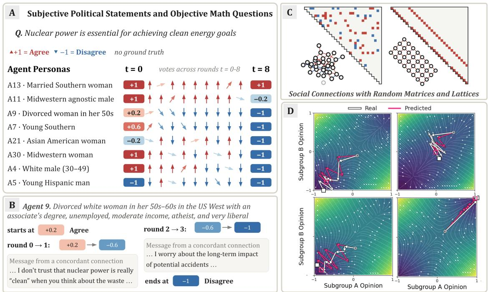  
Figure 1: A. Opinion Updates. Opinions of eight agents over eight rounds of message exchange, from their initial opinion at t = 0 to their final opinion at t = 8; agents start out mostly agreeing on one side and end up on the other. B. Message Exchange. Messages received by the agents and the opinion changes that followed. C. Communication Networks. Two of the four families of communication networks (random matrices, square lattices) shown as the signed adjacency J as a heatmap in one corner triangle (blue −1, white 0, red +1) and as a node-link diagram. See Appendix B.2 D. Prediction. Each panel is one group of N language-model agents interacting about a question over eight rounds. We split the agents into two subgroups based on their opinion at t = 0 (see Appendix E.5 for details). White arrows are the real (observed) opinion changes, and the pink lines are discrete opinion updates predicted with our fitted model rolled out from the initial opinions at t = 0. The background shows the energy in colors and predicted flow, which describe continuous limit, in streamlines.

To answer these questions, we study communities of language-model agents that hold opinions about a shared question, communicate over a social network, and repeatedly revise their views (Figure 1). Each agent is assigned a distinct persona or area of expertise, and pairs of agents are connected by either concordant or discordant relationships. We consider both objective mathematical questions with verifiable answers and subjective political statements without unique ground-truth answers. Across multiple language models, questions, communication networks, and episodes, we simulate around 10, 000 agent communities and record how their individual and collective opinions evolve over repeated rounds of interaction (Section 2).

Our empirical analysis reveals diverse but structured collective dynamics (Section 3). At the level of individual agents, opinion trajectories fall into recurring archetypes, in which some agents remain frozen, some switch once, some reverse and later return to their original position, and others oscillate repeatedly (Section 3.1). At the population level, communities exhibit three characteristic regimes: indifference, in which agents hold weak opinions; polarization, in which strongly committed agents divide into opposing camps; and consensus, in which agents converge toward the same position. Although communities commonly begin with weakly held opinions, interaction consistently increases conviction and progressively moves them toward more ordered states (Section 3.2). Analysis of communication patterns reveal that this ordering is not a simple strategy where the population locks in on the initial majority, instead communities frequently weaken or overturn their initial collective position. On objective questions, these changes improve collective accuracy on average, with initially incorrect majorities switching to the correct answer more often than initially correct majorities becoming incorrect. On subjective questions, however, communication can produce systematic ideological drift, demonstrating that interaction may also amplify directional biases inherited from the underlying language models (Section 3.3).

To predict and interpret these behaviors, we introduce a theoretical model of interacting agents in which individuals update their opinions to minimize the social pressure defined over a social graph (Section 4). We represent each agent’s opinion as a binary variable whose evolution is governed by two forces: i) an intrinsic bias term (referred to as “intrinsic field”) that captures the agent’s predisposition toward the question, and ii) an interaction term quantifying social pressure by capturing the influence exerted by neighboring agents. This construction yields a theoretical model, whose mathematics can be mapped to the well-known Ising model from statistical mechanics literature [Ising, 1925, Glauber, 1963]. We use this machinery to derive a stochastic update rule for opinions in which the probability of an agent adopting either opinion depends on its persona, the question, and the opinions of the agents connected to it. We extend the Ising model with multiple interaction parameters, which we fit with intrinsic fields directly from observed opinion transitions.

Despite its simplicity, the resulting model accurately predicts the collective behavior of agents on held-out questions, substantially outperforms standard baselines, and generalizes from random communication graphs to previously unseen network families (Section 5.1). When rolled out from observed initial conditions, it also approximately reproduces the population-level distribution of collective outcomes (Section 5.2). The fitted dynamics further provide a quantitative interpretation of the empirical observations. The communities operate in an ordered, low-temperature regime, consistent with the observed buildup of conviction (Section 5.3). Concordant interactions are substantially stronger than discordant interactions, favoring consensus over persistent polarization. On objective questions, agents currently holding the correct answer exert greater fitted influence than agents holding an incorrect answer, providing a statistical account of the observed improvement in collective accuracy (Section 5.4).

Together, these results suggest that the collective behavior of interacting AI agents can be described by compact dynamical laws analogous to those used for other complex systems. Statistical mechanics provides a framework for identifying recurring regimes, forecasting population dynamics, and relating system-level outcomes to interpretable interaction parameters.

## 2 Setup

We consider a population of N language model (LM) agents that hold opinions about a shared question, communicate with each other, and revise their opinions through multiple rounds of interactions (Figure 1).

Personas and Questions. The agents answer one of two kinds of questions. Objective questions are competition mathematics problems from the MATH dataset [Hendrycks et al., 2021], recast as binary multiple choice questions. For example, “Find the distance between thefoci of the hyperbola $x ^ { 2 } - 6 x - 4 y ^ { 2 } - 8 y = 2 7 . \ A \colon 4 { \sqrt { 5 } } \quad B \colon 4 { \sqrt { 1 0 } } ^ { \prime \prime }$ . Here an agent’s persona encodes expertise: each agent is shown the worked ground-truth solution to a different MATH problem, so agents differ in the expertise they bring to the shared question. Subjective questions are political statements adapted from the Political Questions Dataset for LLM Bias Evaluation [Promptfoo Team, 2025], which each agent either agrees (+1) or disagrees (−1) with. For example, “Mandatory vaccination violates bodily autonomy”. Here personas are short free-text profiles adapted from TWIN-2K-500 [Toubia et al., 2025], describing an individual’s demographics, political alignment, and personality traits, so agents differ in preference. Appendix B.1 gives the full construction of both datasets.

Agents. Each agent i carries a fixed persona $p _ { i } ,$ which distinguishes it from other agents and introduces heterogeneity into the population. The persona reflects variation in personal preferences (subjective) and competence (objective).1 At each time step $t ,$ agent i processes an input $x _ { i } ( t )$ which consists of messages the agent i received from its connections, and samples an opinion and a message in natural language that expresses the agent’s opinion.2

Communication Network. A group of N agents is connected by a communication network that determines which agents are allowed to send and receive messages from one another and the nature of the interaction between any two connected agents. We encode this network as $J \in$ $\{ - 1 , 0 , + 1 \} ^ { N \times N }$ , where a social tie $J _ { i j } = + 1$ means that agent i isfriendly (concordant) with agent $j ,$ $J _ { i j } = - 1$ means that agent i is unfriendly (discordant) with agent $\dot { j } ,$ and $\dot { J } _ { i j } = 0$ means that the two agents do not communicate. These social ties model settings where an agent is more likely to trust opinions or information from certain agents and less likely for other neighbors (e.g. they might be instructed to do so by the agent owners). This formulation also includes a special case where all the edges have the same sign, so that there is no asymmetry in how agents regard each other. 3 We generate the graphs J from four families, which are demonstrated in Figure S3 and described in Appendix B.2.

Procedure. All agents advance in synchronous rounds $t = 0 , 1 , \ldots , T \colon$

Sampling Opinions and Messages. At each round t, agent i expresses an answer to the question as a binary vote $o _ { i } ( t ) \sim \pi _ { i } ( { \bf \sigma } \cdot | \bar { x } _ { i } ( t ) )$ where $o _ { i } ( t ) \in \{ + \bar { 1 } , - 1 \}$ , π is the language model, $\pi _ { i }$ denotes conditioning on agent i’s persona, and $x _ { i } ( t )$ represents the messages and the question that are in the context of agent i at timestep t. To reduce the sampling noise, we sample each agent’s vote $K = 5$ times and obtain $o _ { i , k } ( t )$ for $k = 1 , \ldots , K$ . Then, we set $\begin{array} { r } { \bar { o } _ { i } ( t ) = \frac { 1 } { K } \sum _ { k = 1 } ^ { K } o _ { i , k } ( t ) } \end{array}$ to be the opinion, so it takes one of six evenly spaced values in [−1, 1]. During message composition, the agent chooses a state following $\begin{array} { r } { s _ { i } ( t ) ^ { - } = \mathrm { s i g n } ( \bar { o } _ { i } ( t ) ) } \end{array}$ and samples a short message in natural language, $\omega _ { i } ( t ) \sim \pi _ { i } ( { \bf \nabla } \cdot | x _ { i } ( t ) , s _ { i } ( t ) )$ . The message contains its current position and provides one supporting reason.

Inbox Routing. Each message is filed in the receiver’s inbox according to the sign of their connection. If $J _ { i j } = + 1 ( J _ { i j } = - 1 )$ and agent i sends a message to agent j, the message arrives on ${ \mathsf { a } } + 1 \left( - 1 \right)$ edge and lands in the receiver’s messages from friendly connections (messages from unfriendly connections) inbox (see Figure S4 and Appendix B.4)

Opinion update. Each agent considers its persona, the question, and its two inboxes, and re-generates its opinion to compose its message for the next turn. The updates are Markovian, i.e., the inboxes are refreshed at the start of each round and contain only the latest messages. Overall, influence propagates each round through the messages and opinions exchanged along the graph defined by J. $\bar { \mathrm { A t } } t = 0 ,$ each agent forms an opinion from its persona $( \{ p _ { i } \} _ { i = 1 } ^ { n } )$ and the question $( q )$ alone.

Given the personas, the question, and the communication network, the system evolves into a terminal state $( s _ { 1 } ( T ) , s _ { 2 } ( T ) , \ldots , s _ { N } ( T ) )$ , where $t = T$ is the final timestep.4

$$
\begin{array} { r } { ( \{ p _ { i } \} _ { i = 1 } ^ { N } , \ q , \ J ) \ \longmapsto \ ( s _ { 1 } ( t ) , s _ { 2 } ( t ) , \dotsc , s _ { N } ( t ) ) \quad \mathrm { f o r } \quad t = 0 , 1 , \dotsc , T . } \end{array}
$$

We examine the behavior of this system when answering both objective and subjective questions. These two settings differ both in the questions posed and in the way personas are constructed as we described above. We provide further details on the questions, the personas, and the dataset construction for both settings in Appendix B.1. The backbone of the agents is a language model. We list the models we use and the embeddings we compute in Appendix B.3. For simplicity, all the communications and updates are synchronized in each round in the simulation5. We also extend the setup to asynchronous updates with similar results, which we investigate in Appendix D.2. Refer to Table S1 for a full glossary.

While our setup is simple, it captures the structure of multi-agent systems used in practice. For example, Mixture-of-Agents [Wang et al., 2024a] has each agent read the outputs of all agents from the previous round, which is analogous to our procedure with a fully connected, all-friendly J and depth T. Similarly, debate and ensemble methods correspond to other choices of J and T [Swanson et al., 2024, Du et al., 2023], and self-consistency-style methods correspond to J being the identity, with every agent seeing only its own response from the previous turn [Wang et al., 2023]. Many agentic systems also use critique mechanisms, where an agent is asked to point out weaknesses of another agent’s response, sometimes with agents told to disagree on purpose [Liang et al., 2024], similar to $J _ { i j } = - 1$ . Meanwhile, systems used for scientific discovery, such as AlphaEvolve [Novikov et al., 2025], ShinkaEvolve [Lange et al., 2025], and SimpleTES [Ye et $\mathsf { a l . , }$ 2026], fit a relaxation of the same template with candidate solutions as messages and the sampling policy as a dynamic J.

## 3 Empirical Characterization of Agents’ Collective Dynamics

In this section, we analyze 9, 600 simulated communities6 to empirically characterize the individualand group-level dynamics of the agents. Throughout this section, we conduct our analysis using the continuous values of opinions, $\bar { o } _ { i } ( t ) \in [ - 1 , \bar { + } 1 ]$

## 3.1 Behavior of Groups and Individuals

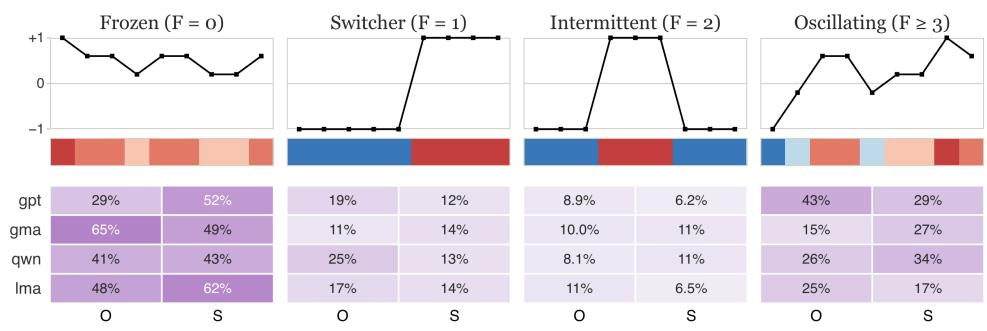  
Figure 2: Individual Archetypes. Individual trajectories are classified intofour distinct archetypes, with the prevalence of archetypes varying across models and between objective and subjective questions. The line plot and the heatmap show individual trajectories $( \bar { o } _ { i } ( 0 ) , \bar { o _ { i } } ( 1 ) , \dots , \bar { o } _ { i } ( T ) ) ^ { \cdot }$ . The table below shows the distribution of individual archetypes across different models (GPT-4o-mini (gpt), Gemma-3n-E4B-it (gma), Qwen3.5-9B (qwn), and Llama-3.1-8B-Instruct (lma)) for the objective (O) and subjective (S) questions.

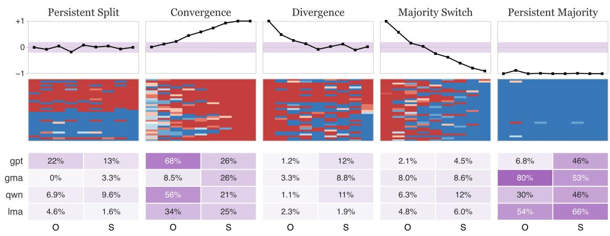  
Figure 3: Group Archetypes. Group trajectories exhibit five distinct archetypes whose prevalence varies substantially across models and question types. While some groups uninterestingly lock into a persistent majority, many others converge, diverge, switch majorities, or remain as a persistently split. The heatmap and line plot demonstrate an example group trajectory belonging to each of the five group archetypes. Row i of the heatmap shows the individual trajectory, $( \bar { \sigma } _ { i } ( 0 ) , \bar { \sigma } _ { i } ( 1 ) , \dots , \bar { \sigma } _ { i } ( T ) )$ , of ith agent in the group. Column j of the heatmap is a snapshot of the individual opinions at timestep $\bar { j                                              ( \bar { o } _ { 1 } ( j ) , \bar { o } _ { 2 } ( j ) , \dots \bar { , } \bar { o } _ { N } ( j ) ) }$ ). The line plot shows the trend in net opinion n(t) across timesteps. The table below shows the distribution of group archetypes. O and S indicate objective and subjective questions.

Individuals. We denote the opinion of a single agent at a timestep with $\bar { o } _ { i } ( t ) \in [ - 1 , + 1 ]$ . An individual trajectory is the sequence of one agent’s opinions over time: $( \bar { o } _ { i } ( 0 ) , \bar { o } _ { i } ( 1 ) , \dots , \bar { o } _ { i } ( T ) )$ By tracing individual trajectories across time, we assign each individual to one of four mutually

exclusive and exhaustive archetypes based on how many times they switch sides, $i . e . ,$

$$
F _ { i } = \sum _ { t = 0 } ^ { T - 1 } { \bf 1 } \{ \mathrm { s i g n } ( { \bar { o } } _ { i } ( t ) ) \neq \mathrm { s i g n } ( { \bar { o } } _ { i } ( t + 1 ) ) \} = \sum _ { t = 0 } ^ { T - 1 } { \bf 1 } \{ s _ { i } ( t ) \neq s _ { i } ( t + 1 ) \} ,
$$

where $\mathbf { 1 } \{ \cdot \}$ is the indicator function. In Figure 2, we show the (1) Frozen agents do not change their opinion throughout the interaction and opinion update rounds $( F _ { i } = 0$ switches), (2) Switchers start with an opinion and end up with the opposite opinion at the end of the 8 rounds after a single switch $( \bar { F _ { i } } = 1$ switch), (3) Intermittent agents are those that switch their opinion and switch it back $( F _ { i } = 2$ switches), and (4) Oscillators are those that switch their opinion more than twice $( F _ { i } > 2$ switches). We observe that the distribution across these archetypes is uneven: frozen agents dominate in most settings followed by oscillators, while switchers and intermittent are comparatively rare.

Groups. We refer to the collective opinion trajectory of all N agents as a group trajectory, which is an $N \times ( T + 1 )$ matrix whose columns are the successive group opinions and whose rows are the individual trajectories. Running the system on a given $( \{ \hat { p _ { i } } \} _ { i = 1 } ^ { \hat { N } } , ~ q , ~ J )$ produces one such trajectory, capturing how opinions evolve over time. We also classify group trajectories based on how many times they switch sides. We define a group’s net opinion as $\begin{array} { r } { n ( t ) = \frac { 1 } { N } \sum _ { i } \bar { o } _ { i } ( t ) } \end{array}$ . Although it is possible to count the number of times $n ( t )$ changes sign, analogous to the classification rule we followed in the individual trajectories, this is not particularly informative for group opinions because minor fluctuations around zero can result in multiple switches that are not meaningful. To address this issue, we define a split band $[ - \delta , \delta ]$ around zero and let

$$
\tilde { n } ( t ) = \left\{ \begin{array} { l l } { + 1 , } & { \mathrm { i f } \ n ( t ) \geq \delta , } \\ { - 1 , } & { \mathrm { i f } \ n ( t ) \leq - \delta , } \\ { 0 , } & { \mathrm { o t h e r w i s e } . } \end{array} \right.
$$

Using the initial $( \tilde { n } ( 0 ) )$ and final $( \tilde { n } ( T ) )$ net opinions,7 we classify the group trajectories into 5 mutually exclusive and exhaustive group archetypes.8 For groups with no clear initial majority (start inside the split band with $\overset { \cdot } { \left( \tilde { n } ( 0 ) \right) } = 0 \overset { \cdot } { ) }$ , Persistent Split ends the 8th round inside the split band $( \tilde { n } ( 8 ) = 0 )$ , while Convergence ends outside the split band, having converged to a clear majority $( \tilde { n } ( 8 ) \neq 0 )$ . For groups with a clear initial majority (start outside the split band with $\tilde { n } ( 0 ) \ne 0 \tilde { ) }$ Persistent Majority ends the 8th round as the same initial majority opinion $( \tilde { n } ( 0 ) \cdot \tilde { n } ( 8 ) > 0 )$ Divergence ends inside the split band $( \tilde { n } ( 0 ) \cdot \tilde { n } ( 8 ) = 0 )$ , and Majority Switch ends on the opposite side of the split band $( \tilde { n } ( 0 ) \cdot \overset { - } { \tilde { n } } ( 8 ) < 0 )$

In Figure 3, we examine the distribution of different group archetypes and observe that the collective behavior is rich. Notably, Divergence and Majority Switch, in which the initial majority weakens or is overturned are not rare, reaching $1 1 - 1 2 \%$ in GPT-4o-mini and Qwen3.5-9B. Additionally, we also present and discuss 4 rare non-monotonic group archetypes in Figure S8 and Appendix C.4. Notably, communication networks can cause consistent differences in group trajectories of the same question (Appendix C.5).

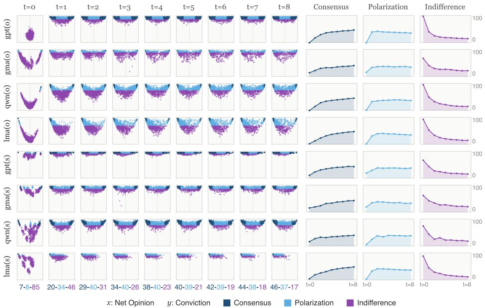  
Figure 4: Conviction Buildup and Consensus Formation. Each dot represents a group trajectory represented as a point on the net opinion (x) and conviction (y) plane. By construction, each row is split into approximately equal number of indifference, consensus and polarization examples. The numbers below each column indicate the percentage of examples that fall into each characteristic regimes at that time step, aggregated across all model–regime pairs.

## 3.2 Conviction Buildup and Consensus Formation

When the net opinion, $\begin{array} { r } { n ( t ) = \frac { 1 } { N } \sum _ { i } \bar { o } _ { i } ( t ) } \end{array}$ , is close to +1 or −1, the collective opinion is straightforward to interpret as it means most individuals hold strong opinions that are aligned in the same direction (consensus). In contrast, a net opinion close to zero can arise in two fundamentally different ways. In the first case (polarization), individuals hold strong opinions (close to +1 or -1), but they are evenly split between opposing viewpoints. In the second case (indifference), most individuals are uncertain or indifferent about their position, and aggregating these weak preferences naturally yields a collective opinion near zero. To characterize this distinction, we define conviction as a measure of how strongly opinionated agents are at a given timestep $\begin{array} { r } { c ( t ) = \frac { 1 } { N } \sum _ { i } \bar { \partial } _ { i } ^ { 2 } ( t ) } \end{array}$

In Figure 4, we follow the joint distribution of net opinion (x) and conviction (y) for all eight modelregime settings as the interaction unfolds from $t \stackrel { - } { = } 0 \left( \mathrm { l e f t } \right)$ to t = 8 (right), the trailing columns count the communities in each regime at every round. Conviction rises over time in all settings. We define three characteristic regimes: consensus (high |n(t)|, high c(t)), polarization (near-zero $| n ( t )$ |, high c(t)), and indifference (near-zero $| n ( t ) |$ , near-zero c(t)). We select conviction and net opinion thresholds such that an equal number of points belong to each of the three characteristic regimes in each row.9 We observe that early timesteps are dominated by indifference, and as communities progressively transition toward consensus or polarization, indifference decreases

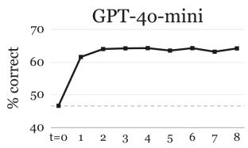

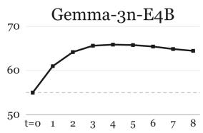

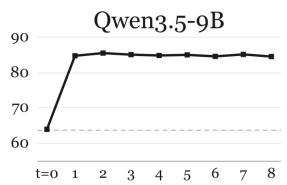

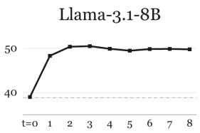

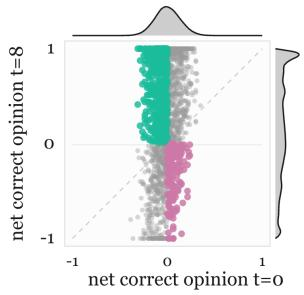

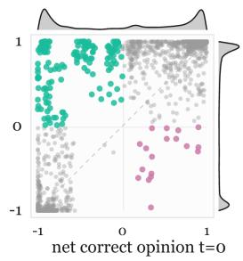

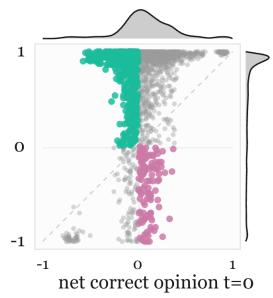

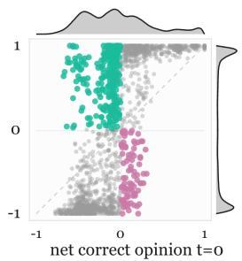

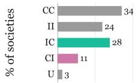

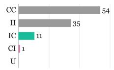

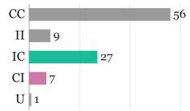

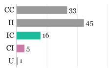  
IC incorrect → correct  CI correct → incorrect  CC correct → correct  II incorrect → incorrect  U tie at an endpoint  
Figure 5: Truth-seeking tendency. How opinions move toward the correct answer over a run (6, 400 group trajectories from objective questions only, from signed random graphs and the square and triangular lattices). In a group trajectory, an opinion is represented as true if net opinion has the correct sign. Row 1: y-axis: percentage of group trajectories, where the net opinion n(t) has the correct sign at round t. x-axis: timesteps. Row 2: Each point represents a group trajectory, which is plotted based on its initial (t = 0, x-axis) and final $( t = 8 , y { \cdot } \mathrm { a x i s } )$ net opinion $n ( t )$ multiplied by the sign of the correct answer of the questions to get net correct opinion: $n ( t ) \cdot y _ { g t } ,$ , where $y _ { g t } \in \{ - 1 , + 1 \}$ denotes the ground truth answer to the objective question. Row 3: Groups switch between being correct and incorrect at t = 0 and t = 8. CC (correct→correct), CI (correct→incorrect), IC (incorrect→correct), II (incorrect→incorrect), and U (undecided, 50-50 tie at $t = 0 \mathrm { o r } t = 8 $ ). The two transition categories CI and IC are highlighted.

while consensus increases monotonically.

## 3.3 Truth Seeking Tendency

As the group trajectories reach consensus, it is important to know whether this consensus converges toward the correct answer on questions for which ground-truth answers are available.

At a given timestep, we read off the community’s answer from the sign of the net opinion n(t). In Figure $5 ,$ we observe that communities tend to move toward the correct answers for objective questions. The percentage of communities whose $n ( 0 )$ prior to any interaction is the correct answer is given by the t = 0 point in the line plot. As the agents exchange messages, we observe that the majority vote of the community has a tendency to move towards the correct answer, with the strong improvements observed for Gemma, GPT, and Qwen.

Majority Switches. The second row in Figure 5 shows the communities that initially give incorrect answers and later switch to correct answers, as well as communities that initially give correct answers and later switch to incorrect answers. We observe that, for all models, switches from incorrect to correct are more common than switches in the opposite direction, which is consistent with our truth-seeking findings.

We also note that language-model performance often improves with additional inference-time compute, as demonstrated by Mixture-of-Agents and multi-agent debate frameworks that iteratively aggregate, critique, and refine responses [Wang et al., 2024a, Du et al., 2023, Liang et al., 2024]. In our setting, networks of language-model agents likely benefit from a similar mechanism.

On subjective questions, there is not a well-defined notion of correct or incorrect answer. Instead, we investigated whether the collective opinion of the group tends to drift to the left or right of the political spectrum. Interestingly, it’s more likely for the majority opinion of the agents to shift from left to right over time than the other direction. We discuss this further in Appendix C.1.

## 4 Statistical Mechanics Model of Agents’ Behavior

We model community as a system in which individuals adjust their opinions in response to social pressure. We define $s _ { i }$ as the opinion state of agent i and the interaction coefficient $J _ { i j }$ as the influence of agent $j$ on agent i. Then, two key modeling assumptions give rise to a mathematically tractable model of multi-agent interactions and opinion forming. First, we assume that individuals would like to minimize the social pressure. Consider the term $\begin{array} { r } { a _ { i } = \sum _ { j } J _ { i j } s _ { j } } \end{array}$ , which represents the perceived population opinion that an individual i faces from their social environment. Mathematically, $a _ { i } s _ { i } > 0$ when, on average, agent i sits on the same side as its friendly connections and on the opposite side of its unfriendly connections, and $a _ { i } s _ { i } < 0$ otherwise. Using this observation, we define the term $\begin{array} { r } { - \sum _ { i } a _ { i } s _ { i } = - \sum _ { i } \sum _ { j } s _ { i } J _ { i j } s _ { j } } \end{array}$ as the total social pressure in the community. When there is a misalignment, the individual experiences are pressured to conform or adjust. Second, for a given question, we assume that each individual has a tendency to hold an opinion of their own, say $\tilde { s } _ { i }$ . When ${ \tilde { s } } _ { i }$ and $s _ { i }$ disagrees, this creates yet another pressure point. Thus, we define the term $- \lambda \textstyle \sum _ { i } { \tilde { s } } _ { i } s _ { i }$ as the personal pressure, where $\lambda \overset { \cdot } { \geq } 0$ is a parameter quantifying the relative importance of the two contributions. Our hypothesis is that the population opinions, $\boldsymbol { s } = \left( s _ { 1 } , s _ { 2 } , . . . , s _ { N } \right)$ , favor lower-pressure configurations and stochastically evolve toward configurations that minimize this total pressure.

Consequently, with $g _ { i } = \lambda \tilde { s } _ { i }$ , we can define a loss, or equivalently, an energy function as

$$
E ( s ) = - { \frac { 1 } { 2 } } \sum _ { i } \sum _ { j } s _ { i } J _ { i j } s _ { j } - \lambda \sum _ { i } { \tilde { s } } _ { i } s _ { i } \ = \ - { \frac { 1 } { 2 } } \sum _ { i = 1 } ^ { N } \sum _ { j = 1 } ^ { N } J _ { i j } s _ { i } s _ { j } \ - \ \sum _ { i = 1 } ^ { N } g _ { i } s _ { i } .
$$

The symmetric coupling coefficient $J _ { i j } \in \{ + 1 , 0 , - 1 \}$ quantifies the nature of social influence between agents i and $j ,$ while the intrinsic field $g _ { i } \in \mathbb { R }$ captures agent i’s predisposition on the issue. The first term rewards configurations that are consistent with the underlying social relationships (assumption 1), whereas the second term biases opinions toward agents’ individual tendencies (assumption 2). In an ideal world, each individual would hold an opinion aligned with their intrinsic predisposition while also satisfying all interpersonal constraints.

Fixing all other agents’ opinions, the local field the agent i experiences can be expressed as $\begin{array} { r } { f _ { i } = \sum _ { j \neq i } J _ { i j } s _ { j } + g _ { i } } \end{array}$ . Under the Boltzmann distribution, we can derive (see Appendix D.1) the probability of an agent having opinion $s _ { i } = + 1$ to be

$$
P ( s _ { i } = + 1 \mid s _ { - i } ) = \sigma ( h _ { i } ) , \quad { \mathrm { w h e r e } } \quad h _ { i } = \beta \sum _ { j } J _ { i j } s _ { j } ( t ) + g _ { i }
$$

where $s _ { - i }$ is the opinion state of all other agents. This shows that an agent’s next opinion is a logistic function of (a) the peer pressure $\textstyle \sum _ { j } { J _ { i j } s _ { j } ( t ) }$ flowing in along the signed graph, scaled by the coupling $\beta ,$ and (b) an intrinsic field $g _ { i }$ encoding the leaning of the persona of agent i for this question in the absence of any peer influence.

Three Couplings. We observe that, in a system of interacting language models, (a) the existence of a connection itself creates a pull and (b) the pull and push strengths of discordant and concordant connections differ. To account for these cases, we introduce a three coupling model.

$$
P \big ( s _ { i } = + 1 \big ) = \sigma \Bigg ( \beta ^ { + } \sum _ { j } J _ { i j } ^ { + } s _ { j } ( t ) + \beta ^ { - } \sum _ { j } J _ { i j } ^ { - } s _ { j } ( t ) + \beta _ { 0 } \sum _ { j } | J _ { i j } | s _ { j } ( t ) + g _ { i } \Bigg ) .
$$

where $\beta _ { 0 }$ measures the effect of having a connection, $\beta ^ { + }$ measures the effect of having a concordant connection, and $\beta ^ { - }$ measures the effect of having a discordant connection. The total weight an agent places on a friendly neighbor is then $\beta ^ { + } + \bar { \beta _ { 0 } }$ and on an unfriendly neighbor $\beta _ { 0 } - \beta ^ { - }$ . Note that this is equivalent to using only two couplings $( \beta ^ { + }$ and $\beta ^ { - } ) _ { }$ , but we retain this version because it makes comparisons to the single coupling case explicit. Further, due to a two-stage fitting process described below, this choice allows a direct interpretation of the terms $\beta ^ { \pm }$ by decoupling the effect of being a neighbor from the valence of the connection.

Fitting. We parameterize $g _ { i }$ as a function of embeddings, $g _ { i } = w ^ { \top } \phi _ { i } ,$ , where $\phi _ { i }$ concatenates the agent’s persona embedding, the question embedding, and their interaction. We fit the βs and w by running gradient-descent to minimize the cross-entropy between each agent’s predicted next opinion and its observed value on the one-step transitions. For the three-coupling model, fitting proceeds in two stages: we first estimate $\beta _ { 0 } ,$ then, holding $\beta _ { 0 }$ fixed, estimate $\beta ^ { + }$ and $\beta ^ { - } \mathrm { j o i n t l y }$ $\mathsf { A l }$ ppendix D.3 provides the details of the objective, optimization, and the train–test splits.

Continuous-time extension. In Appendix E.2, we relax the assumption that every agent revises their opinion at discrete time steps and instead let each agent reconsider their opinion at independent random times. In Appendix D.2, we model this relaxation via a continuous-time extension of our model with a mean-field ODE derived from the master equation that captures probability flux between states. This mean-field ODE contains a parameter $\bar { \varepsilon } \in ( 0 , 1 )$ representing the rate of agent updates. We present this continuous-time variant alongside the discrete rules and discuss its advantages in Appendix E.1 and Appendix E.2.

Baselines. We compare against Persistence, Interaction Free, and Mean-Field baselines. Persistence predicts $\hat { s } _ { i } ( t + \bar { 1 ) } = s _ { i } \bar { ( t ) }$ in one step predictions and $\hat { s } _ { i } ( t ) = s _ { i } ( 0 )$ in rollouts. Interaction-Free keeps personal pressure but removes all social-pressure terms, and Mean-Field retains both personal and social pressure but ignores graph structure by encoding social pressure as pulling each agent toward the global average opinion. This tests whether explicit signed-network structure adds predictive value beyond a global consensus signal. Details of the baselines are explained in Appendix D.4.

## 5 Applications of the Statistical Physics Model

We next demonstrate that our statistical physics model can predict agent dynamics for unseen graphs and questions, and reproduces the population-level distribution of collective outcomes when rolled out from observed initial conditions. Furthermore, this model suggests that the agent communities operate below the critical social temperature, which explains why interacting communities do not remain indifferent but tend to form consensus or polarize. Which high conviction state they reach is determined by the social ties and the intrinsic field. We observe that the pull of friendly (concordant) edges dominates the push of unfriendly (discordant) edges, which favors consensus over polarization, and the neighbors holding the correct answer pull harder than ones holding the wrong answer, which drives truth seeking.

<table><tr><td></td><td colspan="2">GPT-4o-mini</td><td colspan="2">Gemma-3n-E4B</td><td colspan="2">Qwen3.5-9B</td><td colspan="2">Llama-3.1-8B</td></tr><tr><td>Method</td><td>In-d.</td><td>Out-d.</td><td>In-d.</td><td>Out-d.</td><td>In-d.</td><td>Out-d.</td><td>In-d.</td><td>Out-d.</td></tr><tr><td colspan="9">Subjective Questions</td></tr><tr><td>Persistence</td><td>50.0 (64.5)</td><td>50.0 (64.0)</td><td>50.0 (59.3)</td><td>50.0 (59.3)</td><td>50.0 (65.1)</td><td>50.0 (65.1)</td><td>50.0 (63.2)</td><td>50.0 (61.7)</td></tr><tr><td>Interaction-Free</td><td>50.9 (50.9)</td><td>48.9 (48.9)</td><td>60.8 (60.8)</td><td>59.6 (59.6)</td><td>49.1 (49.1)</td><td>47.5 (47.5)</td><td>47.7 (47.7)</td><td>45.6 (45.6)</td></tr><tr><td>Mean-Field (Curie-Weiss)</td><td>57.9 (56.0)</td><td>59.2 (57.2)</td><td>68.2 (64.5)</td><td>67.9 (65.8)</td><td>65.2 (64.4)</td><td>65.6 (65.5)</td><td>54.9 (56.8)</td><td>53.6 (57.4)</td></tr><tr><td>Discrete Update</td><td>77.6 (69.0)</td><td>75.6 (67.1)</td><td>62.3 (61.0)</td><td>61.3 (59.9)</td><td>64.5 (57.1)</td><td>60.3 (54.4)</td><td>53.9 (49.9)</td><td>51.6 (47.8)</td></tr><tr><td>+ 3 Couplings</td><td>86.0 (76.2)</td><td>86.3 (77.2)</td><td>75.4 (67.8)</td><td>75.1 (66.8)</td><td>81.2 (70.8)</td><td>78.8 (69.2)</td><td>82.4 (68.4)</td><td>80.8 (69.5)</td></tr><tr><td colspan="9">Objective Questions</td></tr><tr><td>Persistence</td><td>50.0 (55.6)</td><td>50.0 (55.0)</td><td>50.0 (61.8)</td><td>50.0 (62.2)</td><td>50.0 (53.9)</td><td>50.0 (53.2)</td><td>50.0 (57.0)</td><td>50.0 (56.8)</td></tr><tr><td>Interaction-Free</td><td>49.9 (49.9)</td><td>49.3 (49.3)</td><td>59.0 (59.0)</td><td>59.1 (59.1)</td><td>44.6 (44.6)</td><td>45.4 (45.4)</td><td>50.0 (50.0)</td><td>50.0 (50.0)</td></tr><tr><td>Mean-Field (Curie-Weiss)</td><td>65.4 (55.2)</td><td>65.3 (55.5)</td><td>72.6 (67.3)</td><td>72.7 (68.3)</td><td>73.6 (62.1)</td><td>73.4 (61.1)</td><td>64.7 (61.2)</td><td>64.5 (60.5)</td></tr><tr><td>Discrete Update</td><td>70.1 (61.5)</td><td>67.8 (60.4)</td><td>59.7 (58.9)</td><td>59.7 (59.2)</td><td>50.6 (47.8)</td><td>49.8 (48.3)</td><td>50.9 (50.0)</td><td>50.6 (50.0)</td></tr><tr><td>+ 3 Couplings</td><td>86.2 (68.2)</td><td>85.0 (65.9)</td><td>80.5 (68.5)</td><td>80.8 (68.4)</td><td>86.3 (65.6)</td><td>85.2 (64.2)</td><td>77.3 (62.8)</td><td>76.4 (60.8)</td></tr></table>

Table 1: Prediction. Balanced accuracy of predictions on held-out test questions. Training and test sets each include $3 2 0 = 1 0 \times 8 \times 4$ samples for subjective and $6 4 0 = 2 0 \times 8 \times 4$ for objective questions (questions × Js × episodes). The numbers represent the accuracy of predicting s(t + 1) given s(t) (one-step), and the accuracy of predicting s(t) for $t = 1 , \dots , T$ given s(0) is reported in parentheses (rollout). Four of the 8 graphs in the test set are graphs seen during training, denoted in-d, and the other four graphs are held-out during training, denoted out-d.
<table><tr><td></td><td colspan="8">Subjective</td><td colspan="8">Objective</td></tr><tr><td>Method</td><td colspan="2">Random 1-step</td><td colspan="2">Low Rank 1-step</td><td colspan="2">Square 1-step</td><td colspan="2">Triangular</td><td colspan="2">Random</td><td colspan="2">Low Rank</td><td colspan="2">Square 1-step</td><td colspan="2">Triangular 1-step</td></tr><tr><td></td><td></td><td>Roll.</td><td></td><td>Roll.</td><td></td><td>Roll.</td><td>1-step</td><td>Roll.</td><td>1-step</td><td>Roll.</td><td>1-step</td><td>Roll.</td><td></td><td>Roll.</td><td></td><td>Roll.</td></tr><tr><td>Persistence</td><td>50.0</td><td>64.0</td><td>50.0</td><td>57.0</td><td>50.0</td><td>65.2</td><td>50.0</td><td>57.4</td><td>50.0</td><td>55.0</td><td>50.0</td><td>53.1</td><td>50.0</td><td>55.1</td><td>50.0</td><td>47.0</td></tr><tr><td>Interaction-Free</td><td>48.9</td><td>48.9</td><td>46.4</td><td>46.4</td><td>46.8</td><td>46.8</td><td>47.4</td><td>47.4</td><td>49.3</td><td>49.3</td><td>43.4</td><td>43.4</td><td>46.8</td><td>46.8</td><td>49.6</td><td>49.6</td></tr><tr><td>Mean-Field (Curie-Weiss)</td><td>59.2</td><td>57.2</td><td>58.0</td><td>63.2</td><td>65.3</td><td>61.7</td><td>64.9</td><td>62.4</td><td>65.3</td><td>55.5</td><td>51.3</td><td>60.5</td><td>70.5</td><td>60.1</td><td>73.4</td><td>56.9</td></tr><tr><td>Discrete Time Update</td><td>75.6</td><td>67.1</td><td>80.1</td><td>75.6</td><td>88.4</td><td>78.3</td><td>84.3</td><td>73.5</td><td>67.8</td><td>60.4</td><td>82.9</td><td>69.3</td><td>92.7</td><td>65.8</td><td>87.7</td><td>58.8</td></tr><tr><td>+ Three Couplings</td><td>86.3</td><td>77.2</td><td>95.1</td><td>89.3</td><td>92.6</td><td>83.5</td><td>85.3</td><td>73.2</td><td>85.0</td><td>65.9</td><td>97.8</td><td>80.7</td><td>94.7</td><td>70.9</td><td>88.1</td><td>59.7</td></tr></table>

Table 2: Generalization. We report the generalization to unseen graph families and report the balanced accuracy of GPT-4o-mini’s update rules on unseen random graphs, the low-rank graphs, and the square / triangular lattices. We report both one-step and rollout accuracies as described in Table 1.

## 5.1 Prediction and Generalization

Metric. Since opinions change rarely $( s _ { i } ( t ) \approx s _ { i } ( t + 1 ) )$ and the two labels (+1 and −1) are not equally common, plain accuracy rewards a rule that copies the current opinion or one that always predicts the more common label. We score predictions with balanced accuracy where we balance for the flips and class imbalance in the dataset. We classify the observed transitions into four groups, by whether the agent’s next opinion state flips or stays $( s _ { i } ( t { + } 1 ) \neq s _ { i } ( t )$ or $s _ { i } ( t { + } 1 ) = s _ { i } ( t ) )$ and by the value of that next opinion state (+1 or −1). Our balanced accuracy metric is the unweighted mean of the accuracies on these four groups (see Appendix D.5).

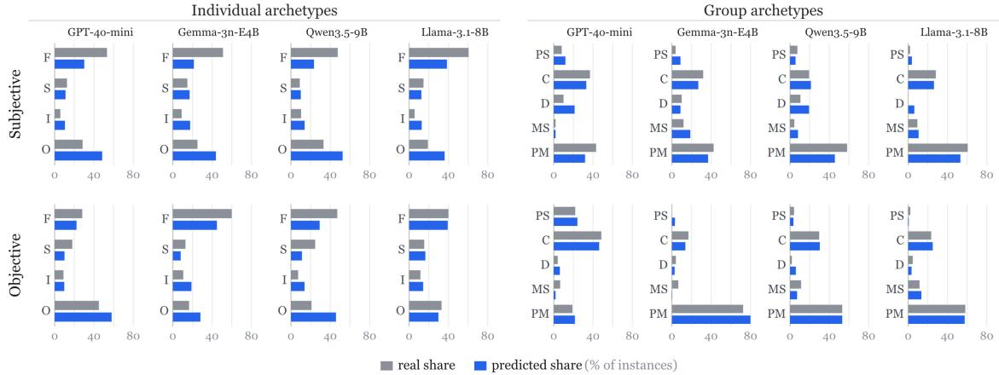  
Figure 6: Distribution of Individual and Group Archetypes. Shares of individual and group archetypes are shown as horizontal bars (F (Frozen), S (Switcher), I (Intermittent), O (Oscillating); PS (Persistent Split), C (Convergence), D (Divergence), MS (Majority Switch), PM (Persistent Majority)). The shares are computed on the held-out test set questions using the in-distribution random graphs by running stochastic rollout of the fitted Discrete Three couplings model from the real $s ( 0 )$ for 8 rounds, in which each agent’s next opinion is sampled as $s _ { i } ( t { + } 1 ) = { + } 1$ with probability $\sigma ( h _ { i } ( t ) )$ ) rather than thresholded at at probability $1 / 2$

Prediction. We observe that the discrete update with three couplings is the best method in every column of Table 1: 75–86 one-step (predicting s(t + 1) given s(t)) balanced accuracy across the four models and both question types, and $6 1 \mathrm { - } 7 7$ in rollouts (predicting s(t) for $t = 1 , \dots , T$ given s(0)). Splitting the interaction parameter $\beta$ matters since with a single $\beta ,$ the same rule falls close to random chance in some instances (53.9 with Llama-3.1-8B-Instruct, subjective and 50.6 with Qwen3.5-9B, objective). The mean-field baseline performs in the mid-50s (GPT-4o-mini and Llama-3.1-8B-Instruct, subjective) to the low-70s (objective one-step). The interaction-free baseline is close to chance for three of the four models. For Gemma-3n-E4B it reaches 59–61, indicating that some of its agents’ opinions are predictable from persona and question alone, without considering any interactions.

Generalization. For the three-coupling rule, the in-distribution and out-of-distribution columns of Table 1 differ by at most 2.4 points; the largest gap for any method is 4.2. In Table 2, we test the model further by evaluating it on three graph families not included in the training set. In addition to the held-out random graphs, we consider low-rank social graphs, square lattices, and triangular lattices. The three-coupling rule is the best method in 15 of the 16 columns, with one-step balanced accuracy between 85.0 and 97.8. Its rollout performance declines more (59.7–89.3), but remains above every baseline. The low-rank and square lattice families appear easier than the random graphs used for fitting, possibly because of differences in edge count or the proportion of negative edges. The triangular lattice, on the other hand, has comparable one-step accuracy, but its rollout accuracy is lower than that of random graphs (73.2 vs 77.2 subjective, 59.7 vs 65.9 objective).

## 5.2 Distributions of Archetypes

Predicting the Distribution of Group Archetypes. We also investigate whether the fitted model, run from the real initial opinions s(0) as a roll-out, produces communities that look like the real ones in aggregate. Because the fitted rule is a probability rather than a decision, we sample each agent’s

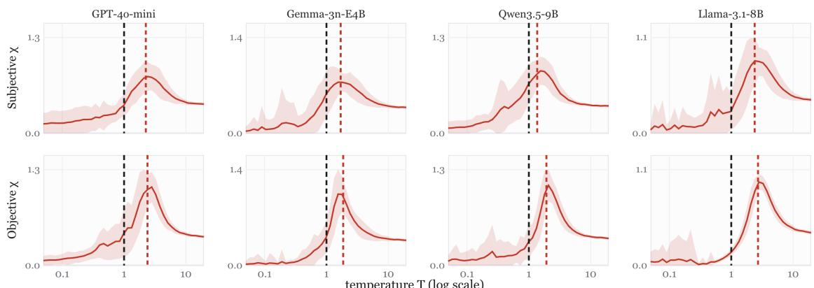  
variance of absolute net opinion (x)± s.d.   fitted temperature (T = 1)  critical temperature (mean T\_c)

Figure 7: Critical temperature. Variance of absolute net opinion $\chi ,$ whose peak gives the critical temperature $\mathcal { T } _ { c }$ for each community. Individual communities are reported in Figure S10 from Appendix E.3. Here we report instead the mean of the community critical temperatures $T _ { c }$ . The bold black dashed line is the fitted operating point $\mathcal { T } = 1$ of the three coupling model. Every question from the held-out test questions evaluated on the 4 in-distribution random test graphs (each of the 4 graphs of the family × the questions, 20 objective $/ 1 0$ subjective questions).

next opinion from $P ( s _ { i } ( t + 1 ) = + 1 ) = \sigma ( h _ { i } ( t ) )$ , where $h _ { i } ( t )$ is the fitted logistic argument of Section $^ { 4 , }$ instead of thresholding it at $\sigma = 1 / 2$ , so that the rollouts carry the noise the rule assigns. Figure 6 compares the shares of the individual and group archetypes of Section 3.1 between the held-out communities and these rollouts (for details on the roll-outs, see Appendix D.6).

Individual and Group Archetypes. In Figure $^ { 6 , }$ the group archetype shares deviate by only $\sim 3$ points for objective questions and ${ \sim } 5$ points for subjective questions (mean absolute deviation). The largest single gap is ∼ 10 points (Qwen3.5-9B subjective, Persistent Majority) and the two dominant classes correct in every cell. Meanwhile, the model inflates the oscillator count in individual archetypes, but this appears to largely cancel out in the group archetype distributions. The fitted dynamics therefore reproduce the collective statistics even when they misstate how often an individual agent changes its mind. We note that this observation demonstrates that the fitted dynamics produce the right mix of outcomes, not that they place a given group in the right archetype.

Reproducibility of Group Trajectories. We observe that group trajectories are only partly predictable. We run each group as four episodes with identical personas, graph and question that differ only in sampling randomness. We compare how often one episode’s group archetype matches the other samples taken with the identical personas, graph, and question. Figure S11 in Appendix E.4 reports this ceiling. Episodes frequently disagree on the group archetype, which is why we evaluate the fitted rule at the level of the distribution.

## 5.3 Critical Temperature and Conviction Buildup

In Section 3.2, we saw that conviction goes up over rounds and communities end up mostly in consensus or polarization. In statistical mechanics, whether a system stays ordered depends on where its temperature stands compared to the critical temperature. In this section, we introduce a temperature parameter into our model and check where our fitted communities sit relative to the critical temperature. In Figure $^ { 7 , }$ we reintroduce a temperature parameter to examine our model’s behavior under different temperatures. The fitted-model rollouts use temperature $\mathcal { T } = 1$ We explore 41 log-spaced temperature values from 0.05 to 20. We initialize each rollout using the community’s initial opinions at $t = 0$ and apply the fitted rule for 500 steps. Details of the experiment are discussed in Appendix E.3.

Variance of Absolute Net Opinion. We plot the variance of the absolute net opinion scaled by the number of agents, $\chi$ for different temperatures $\mathcal { T } . ^ { 1 0 }$

$$
{ \boldsymbol { \chi } } \ = \ N \operatorname { V a r } _ { t } ( | n ( t ) | )
$$

It records how much the net opinion moves throughout the rollout. At high $\tau$ each agent follows noise, so the net opinion stays near zero at every step and barely moves. At low $\tau$ the community is locked into one arrangement, so the net opinion is large but again barely moves. $\chi$ is small in both cases and large only in between.

Critical Temperature. We take each community’s critical temperature $\mathcal { T } _ { c }$ to be the temperature at which χ peaks. This peak marks a transition: it is the temperature at which the community is undecided between the two behaviors described above. On either side, the net opinion is stable, either near zero (indifference) or near its ordered value by the couplings (consensus or polarization). At the critical temperature, it can swing between them. This critical temperature marks a finite-size analogue of a phase transition between the high conviction regimes (polarization and consensus) and the low conviction regime (indifference).11

Conviction Build-up. Figure 7 shows that the fitted operating point lies below the critical temperature in every dataset–model cell. Below $\mathcal { T } _ { c } ,$ the indifferent states are unstable. One way to understand this is that aligned neighbors raise an agent’s local field, so an agent that agrees with its neighbors is unlikely to move out of its current position when there is low stochasticity. Thus, the model predicts that conviction grows over rounds rather than fluctuating, as observed in Section 3.2.

## 5.4 Consensus Formation and Truth Seeking

Consensus Formation. Below the critical social temperature the community tends to settle into an ordered (high conviction) state over the long run. But, which ordered state it reaches depends on the strength of the personal and social pressures. Focusing on the social term, a stable split can only sustain itself if discordant connections are strong enough to hold two groups apart. All four models show the same pattern in Table $^ { 3 , }$ with $\beta ^ { + }$ consistently larger than $\beta ^ { - }$ −. The effective coefficient on concordant edges $( \beta ^ { + } + \beta _ { 0 } )$ lies between 0.99 and 3.03 across all models and question types, while the effective coefficient on discordant edges $( \beta _ { 0 } - \beta ^ { - } )$ never exceeds 0.73 and is negative or negligible in two cases (−0.47 for GPT-4o-mini and −0.01 for Qwen3.5-9B, subjective). A stable split requires repulsion from discordant ties to be comparable in strength to the attraction from concordant ties. However, we observe that the discordant ties are not as strong as the concordant ones and, hence, are too weak to hold two camps apart. Since the fitted dynamics operate below the critical temperature with strong concordant and weak discordant couplings, social pressures favor consensus, consistent with the trend observed in Section 3.2. 12

Truth Seeking. To understand the truth seeking tendency of the system, we investigate whether a neighbor who is correct has a stronger impact compared to a neighbor who holds the incorrect answer. To that end, we fit a five-coupling rule that splits each signed channel by whether the neighbor holds the correct answer at the current step, giving $\beta _ { T } ^ { \pm }$ and $\beta _ { F } ^ { \pm }$ . With $y _ { g t }$ as the ground truth answer to the objective question, we let $\kappa _ { j } ( t ) = \mathbf { 1 } \{ s _ { j } ( t ) = y _ { g t } \}$ , which takes the value $\kappa _ { j } ( t ) = 1$ when $s _ { j } ( t )$ is correct and 0 otherwise. Then, $P ( s _ { i } = + 1 ) = \sigma ( h )$ , where

<table><tr><td rowspan="2">Model</td><td colspan="3">Three couplings (O)</td><td colspan="3">Three couplings (S)</td><td colspan="5">Five couplings (O)</td></tr><tr><td> $\beta ^ { + }$ </td><td> $\beta ^ { - }$ </td><td> $\beta _ { 0 }$ </td><td> $\beta ^ { + }$ </td><td> $\beta ^ { - }$ </td><td> $\beta _ { 0 }$ </td><td> $\beta _ { T } ^ { + }$ </td><td> $\beta _ { F } ^ { + }$ </td><td> $\beta _ { T } ^ { - }$ </td><td> $\beta _ { F } ^ { - }$ </td><td> $\beta _ { 0 }$ </td></tr><tr><td>GPT-4o-mini</td><td></td><td></td><td></td><td></td><td></td><td></td><td>+2.10 +0.75 +0.93 +2.39 +1.08 +0.61 +2.29 +1.98 +0.70 +0.85 +0.93</td><td></td><td></td><td></td><td></td></tr><tr><td>Gemma-3n-E4B</td><td>+0.29</td><td></td><td></td><td></td><td></td><td> +0.23 +0.96 +0.44 +0.35 +0.55</td><td>5 +0.34 +0.20</td><td></td><td>0 +0.17</td><td>7 +0.36 +0.96</td><td></td></tr><tr><td>Qwen3.5-9B</td><td></td><td></td><td></td><td></td><td></td><td></td><td>+0.90 +0.50 +1.01 +1.12 +0.65 +0.64 +1.03 +0.77 +0.40 +0.80 +1.01</td><td></td><td></td><td></td><td></td></tr><tr><td>Llama-3.1-8B</td><td></td><td></td><td></td><td></td><td></td><td></td><td>+0.97 +0.61 +0.97 +1.35 +0.67 +0.99 +1.15 +0.84 +0.59 +0.61 +0.97</td><td></td><td></td><td></td><td></td></tr></table>

Table 3: Fitted coefficients of the three- and five-coupling discrete-time update rules. Because the unsigned drive lies in the span of the signed drives, the individual coefficients are not jointly identifiable; we therefore fix the decomposition by a two-stage protocol: $\beta _ { 0 }$ is first fitted alone (a sign-agnostic model with no signed couplings), then held fixed while the signed couplings are refitted. Stage one is identical for both rules, so within a dataset the three- and five-coupling rows share $\beta _ { 0 }$ . The identifiable combinations $( \beta ^ { + } + \beta _ { 0 } , \beta _ { 0 } - \beta ^ { - }$ , and the truth gaps $\beta _ { T } ^ { + } - \beta _ { F } ^ { + } , \beta _ { T } ^ { - } - \beta _ { F } ^ { - } )$ agree with the jointly fitted (ridge-resolved) values to two decimals. The five-coupling rule splits each drive by whether the pull is toward the correct answer, so it is defined for the objective dataset only.

$$
h = \sum _ { j } \left[ \beta _ { T } ^ { + } \kappa _ { j } ( t ) + \beta _ { F } ^ { + } ( 1 - \kappa _ { j } ( t ) ) \right] J _ { i j } ^ { + } s _ { j } ( t ) + \sum _ { j } \left[ \beta _ { T } ^ { - } \kappa _ { j } ( t ) + \beta _ { F } ^ { - } ( 1 - \kappa _ { j } ( t ) ) \right] J _ { i j } ^ { - } s _ { j } ( t ) + \beta _ { 0 } \sum _ { j } | J _ { i j } | s _ { j } ( t ) + g _ { i }
$$

The split is by the neighbor’s current opinion rather than by a fixed property of the neighbor, so an agent moves between the two groups as it changes its mind. In all four models the two channels show a truth-seeking asymmetry: on the concordant channel, correct neighbors pull harder $( \beta _ { T } ^ { + } > \beta _ { F } ^ { + } )$ , while on the discordant channel, incorrect neighbors push harder $( \beta _ { F } ^ { - } > \beta _ { T } ^ { - } )$ . Since discordant influence is repulsive, being pushed harder away from wrong answers is also truthseeking. Therefore, the community moves toward the correct answer, explaining the observation of Section 3.3.

## 5.5 Asynchronous Updates

The continuous-time model is useful when the synchronous-update assumption is dropped. In the asynchronous experiment (Table S6), where each GPT-4o-mini agent reconsiders at independent random times at an average rate of 0.5 updates per round, the continuous rule with coupling splits predicts held-out transitions with 80.4/78.5 (in-distribution/OOD) rollout accuracy on subjective questions and 65.3/65.9 on objective questions, outperforming every baseline. Because only a fraction of agents update in any time window, most observed transitions are persistent, and a predictor must jointly infer who shifts and who stays put. We therefore evaluate with raw accuracy rather than balanced accuracy here. See Appendix E.2 for more details.

## 6 Related Works

Statistical Mechanics. Our model draws upon the statistical mechanics of interacting spins: the energy function is the Ising model [Ising, 1925], the opinion update is its Glauber dynamics [Glauber,

1963], and the order parameter separating polarization from consensus is the Edwards–Anderson parameter of spin glasses [Edwards and Anderson, 1975, Sherrington and Kirkpatrick, 1975]. The idea that such energy-based systems perform collective computation originates with Hopfield networks [Hopfield, 1982, Amit et al., 1985].

Applications of Statistical Mechanics. The Ising model characterizes the phases of spin glasses, where competing couplings accommodate many distinct low-energy states [Parisi, 1979, Mézard et al., 1987], and of flocks, where local alignment among moving agents produces collective order [Vicsek et al., 1995, Toner and Tu, 1995]. Modern work has shown that the same theory can provide descriptive models of neural [Schneidman et al., 2006], protein-sequence [Weigt et al., 2009, Marks et al., 2011], and collective-behavior [Bialek et al., 2012] data, and also emerges naturally from the theory of binary choice under social influence [Brock and Durlauf, 2001, Castellano et al., 2009].

Social Simulations. A growing literature uses LLMs to simulate people and societies, including experimental subjects [Argyle et al., 2023, Horton, 2023, Park et al., 2024], populations within virtual communities [Park et al., 2023, Yang et al., 2024, Piao et al., 2025], and systems exhibiting collective phenomena such as opinion dynamics [Chuang et al., 2024, Ashery et al., 2025, De Marzo et al., 2024]. These works demonstrate that LLM communities can represent complex behaviors; we offer a quantitative, predictive theory of how they evolve.

Multi-agent Systems. Modern multi-agent systems leverage interaction among LLM agents to improve reasoning, often through debate or role-conditioned discussion [Du et al., 2023, Liang et al., 2024, Chen et al., 2023, Swanson et al., 2024]. Though early work manually specified interactions, these systems are increasingly designed automatically by searching over prompts, workflows, and graphs [Khattab et al., 2023, Zhuge et al., 2024, Hu et al., 2025, Nielsen et al., 2026]. Common multi-agent interaction patterns often rely on sub-task partitioning [Yang et al., 2025, Zhang et al., 2025], aggregation over individual agent opinions [Chen et al., 2024, Wang et al., 2024a], or open-ended deliberation [Du et al., 2023]. Moreover, systems that learn multi-agent interaction topologies often require expensive roll-outs, and the resulting systems can be brittle [Cemri et al., 2025, Wang et al., 2024b].

## 7 Discussion and Conclusion

Key Findings. In this work, we analyzed interacting language-model agents over 10, 000 simulated groups and found structured collective dynamics across models, tasks, and communication networks. Repeated interaction increases conviction and shifts initially indifferent groups toward more ordered states. On objective questions, we find that collective accuracy improves over rounds. Meanwhile, on subjective questions, three of the four models exhibit a rightward drift on the political opinions. We then develop a statistical model of the mechanics of opinion updates. Our model, which we fit on a set of training questions, generalizes to unseen questions and graphs, predicts individual trajectories, and approximately reproduces group-level outcomes. The fitted parameters suggest that (1) the groups operate below a critical social temperature, which drives conviction buildup; (2) concordant interactions are stronger than the discordant interactions, which drives consensus formation; and (3) greater influence from correct neighbors helps explain truth-seeking on objective tasks. Together, these findings show that collective agent behavior can be both predictable and interpretable, while also highlighting that the effects of interaction depend on the setting because the same mechanisms can improve factual decisions or amplify political biases.

Limitations. Our setup has three main simplifying assumptions: (1) The community answers a single shared binary question at a time, and each agent’s output is summarized by a binary opinion state $s _ { i } ( t ) \in \{ + 1 , - 1 \}$ together with a short natural-language message. (2) The communication pattern is fixed across timesteps and symmetric, so who talks to whom does not change during a run. (3) An agent’s update depends only on its persona, the question, and the messages in its current inbox, not the full history of interactions it has had. The main limitation of our method is that it simplifies the nature of the interactions by discarding the content of the natural-language messages that mediate influence.

Future Work (Setup). These limitations point to natural extensions of our setup. (1) Opinions can be multiple choice answers, Likert scale [Likert, 1932], or open ended statements in natural language, all of which can be represented in a vector space. (2) The agents in a community can discuss multiple questions and/or statements simultaneously, and one can study how the conversation changes opinions about multiple statements in conjunction. (3) The communication pattern can change at each timestep, or be even more flexible, allowing the agents to choose whom to communicate with in the next step. It can also be interesting to explore an extension in which agents are situated in a physical space and communicate only with others in close proximity. (4) Finally, memory and continual learning mechanisms can allow the agents to remember and learn from the experiences from the previous timesteps. (5) A similar analysis can be applied to data generated by AI agents in the wild on social platforms such as Moltbook [Gautam and Riegler, 2026].(6) Future work could also study larger and heterogeneous groups of language model agents, including communities composed of different language models, to understand how collective dynamics and finite-size effects change with population size and model diversity.

Future Work (Method). These extensions of the setup motivate corresponding extensions of our method. (1) A Potts-type generalization [Potts, 1952, Wu, 1982] that treats opinions as vectors would extend the model from a single binary question to questions with open-ended or multiple candidate answers. (2) Message content can be incorporated into the local field, e.g., through message embeddings in the spirit of message passing in graph neural networks [Scarselli et al., 2009, Gilmer et al., 2017], so that the couplings act on what a neighbor says rather than only on the sign of its stance. (3) Beyond fitting observed dynamics, controlled interventions on edges, messages, or initial opinions could test whether the learned parameters predict how collective outcomes change under perturbations and could ultimately help design communication structures that promote desirable behavior [Hu et al., 2025]. To that end, learning rules, such as Hebbian Learning [Hebb, 1949], can allow the communication patterns to evolve during the interactions.

Social Impacts. Our work is a step toward understanding the behavior of multi-agent systems without having to run them at scale. First, a theory of collective dynamics can offer a way to anticipate failure modes in a world where AI agents routinely interact with one another, which is an increasingly likely scenario as AI agents become more widespread. Second, the same theory can inform the design of agentic systems. If collective outcomes are predictable, then communication channels, population composition, and other hyperparameters can become design variables that can be optimized theoretically. Finally, we caution against over-extrapolating from simulated persona-conditioned agents to human communities. Our agents are language models prompted to hold personas or expertise. The dynamics we measure characterize that system, and any resemblance to human opinion dynamics is a hypothesis for future work.

## References

Daniel J. Amit, Hanoch Gutfreund, and H. Sompolinsky. Storing infinite numbers of patterns in a spin-glass model of neural networks. Physical Review Letters, 55(14):1530–1533, 1985. doi: 10.1103/PhysRevLett.55.1530.

Anthropic. System card: Claude opus 4.8. Technical report, Anthropic, May 2026. URL https: //www.anthropic.com/claude-opus-4-8-system-card. Accessed: 2026-08-17.

Lisa P. Argyle, Ethan C. Busby, Nancy Fulda, Joshua R. Gubler, Christopher Rytting, and David Wingate. Out of one, many: Using language models to simulate human samples. Political Analysis, 31(3):337–351, 2023.

Ariel Flint Ashery, Luca Maria Aiello, and Andrea Baronchelli. Emergent social conventions and collective bias in LLM populations. Science Advances, 11(20):eadu9368, 2025. doi: 10.1126/sciadv. adu9368.

William Bialek, Andrea Cavagna, Irene Giardina, Thierry Mora, Edmondo Silvestri, Massimiliano Viale, and Aleksandra M Walczak. Statistical mechanics for natural flocks of birds. Proceedings of the National Academy of Sciences, 109(13):4786–4791, 2012.

Federico Bianchi, Yongchan Kwon, Aneesh Pappu, and James Zou. Harnessing the collective intelligence of ai agents in the wild for new discoveries, 2026. URL https://arxiv.org/ abs/2606.10402.

William A. Brock and Steven N. Durlauf. Discrete choice with social interactions. The Review of Economic Studies, 68(2):235–260, 2001. doi: 10.1111/1467-937X.00168.

Claudio Castellano, Santo Fortunato, and Vittorio Loreto. Statistical physics of social dynamics. Reviews ofModern Physics, 81(2):591–646, 2009.

Mert Cemri, Melissa Z. Pan, Shuyi Yang, Lakshya A. Agrawal, Bhavya Chopra, Rishabh Tiwari, Kurt Keutzer, Aditya Parameswaran, Dan Klein, Kannan Ramchandran, Matei Zaharia, Joseph E. Gonzalez, and Ion Stoica. Why do multi-agent LLM systems fail?, 2025. Also in NeurIPS 2025 Datasets and Benchmarks Track.

Justin Chen, Swarnadeep Saha, and Mohit Bansal. Reconcile: Round-table conference improves reasoning via consensus among diverse llms. In Proceedings of the 62nd Annual Meeting of the Association for Computational Linguistics (Volume 1: Long Papers), pages 7066–7085, 2024.

Weize Chen, Yusheng Su, Jingwei Zuo, Cheng Yang, Chenfei Yuan, Chi-Min Chan, Heyang Yu, Yaxi Lu, Yi-Hsin Hung, Chen Qian, Yujia Qin, Xin Cong, Ruobing Xie, Zhiyuan Liu, Maosong Sun, and Jie Zhou. AgentVerse: Facilitating multi-agent collaboration and exploring emergent behaviors, 2023.

Yun-Shiuan Chuang, Agam Goyal, Nikunj Harlalka, Siddharth Suresh, Robert Hawkins, Sijia Yang, Dhavan Shah, Junjie Hu, and Timothy T. Rogers. Simulating opinion dynamics with networks of LLM-based agents. In Findings of the Association for Computational Linguistics: NAACL, 2024.

Giordano De Marzo, Claudio Castellano, and David Garcia. AI agents can coordinate beyond human scale, 2024.

Yilun Du, Shuang Li, Antonio Torralba, Joshua B. Tenenbaum, and Igor Mordatch. Improving factuality and reasoning in language models through multiagent debate, 2023. URL https: //arxiv.org/abs/2305.14325.

S. F. Edwards and P. W. Anderson. Theory of spin glasses. Journal of Physics F, 5(5):965–974, 1975.

Sushant Gautam and Michael A. Riegler. Moltbook observatory archive, 2026. URL https: //huggingface.co/datasets/SimulaMet/moltbook-observatory-archive.

Gemma Team, Aishwarya Kamath, Johan Ferret, Shreya Pathak, Nino Vieillard, Ramona Merhej, Sarah Perrin, Tatiana Matejovicova, Alexandre Ramé, Morgane Rivière, Louis Rouillard, Thomas Mesnard, Geoffrey Cideron, Jean bastien Grill, Sabela Ramos, Edouard Yvinec, Michelle Casbon, Etienne Pot, Ivo Penchev, Gaël Liu, Francesco Visin, Kathleen Kenealy, Lucas Beyer, Xiaohai Zhai, Anton Tsitsulin, Robert Busa-Fekete, Alex Feng, Noveen Sachdeva, Benjamin Coleman, Yi Gao, Basil Mustafa, Iain Barr, Emilio Parisotto, David Tian, Matan Eyal, Colin Cherry, Jan-Thorsten Peter, Danila Sinopalnikov, Surya Bhupatiraju, Rishabh Agarwal, Mehran Kazemi, Dan Malkin, Ravin Kumar, David Vilar, Idan Brusilovsky, Jiaming Luo, Andreas Steiner, Abe Friesen, Abhanshu Sharma, Abheesht Sharma, Adi Mayrav Gilady, Adrian Goedeckemeyer, Alaa Saade, Alex Feng, Alexander Kolesnikov, Alexei Bendebury, Alvin Abdagic, Amit Vadi, András György, André Susano Pinto, Anil Das, Ankur Bapna, Antoine Miech, Antoine Yang, Antonia Paterson, Ashish Shenoy, Ayan Chakrabarti, Bilal Piot, Bo Wu, Bobak Shahriari, Bryce Petrini, Charlie Chen, Charline Le Lan, Christopher A. Choquette-Choo, CJ Carey, Cormac Brick, Daniel Deutsch, Danielle Eisenbud, Dee Cattle, Derek Cheng, Dimitris Paparas, Divyashree Shivakumar Sreepathihalli, Doug Reid, Dustin Tran, Dustin Zelle, Eric Noland, Erwin Huizenga, Eugene Kharitonov, Frederick Liu, Gagik Amirkhanyan, Glenn Cameron, Hadi Hashemi, Hanna Klimczak-Pluci´nska, Harman Singh, Harsh Mehta, Harshal Tushar Lehri, Hussein Hazimeh, Ian Ballantyne, Idan Szpektor, Ivan Nardini, Jean Pouget-Abadie, Jetha Chan, Joe Stanton, John Wieting, Jonathan Lai, Jordi Orbay, Joseph Fernandez, Josh Newlan, Ju yeong Ji, Jyotinder Singh, Kat Black, Kathy Yu, Kevin Hui, Kiran Vodrahalli, Klaus Greff, Linhai Qiu, Marcella Valentine, Marina Coelho, Marvin Ritter, Matt Hoffman, Matthew Watson, Mayank Chaturvedi, Michael Moynihan, Min Ma, Nabila Babar, Natasha Noy, Nathan Byrd, Nick Roy, Nikola Momchev, Nilay Chauhan, Noveen Sachdeva, Oskar Bunyan, Pankil Botarda, Paul Caron, Paul Kishan Rubenstein, Phil Culliton, Philipp Schmid, Pier Giuseppe Sessa, Pingmei Xu, Piotr Stanczyk, Pouya Tafti, Rakesh Shivanna, Renjie Wu, Renke Pan, Reza Rokni, Rob Willoughby, Rohith Vallu, Ryan Mullins, Sammy Jerome, Sara Smoot, Sertan Girgin, Shariq Iqbal, Shashir Reddy, Shruti Sheth, Siim Põder, Sijal Bhatnagar, Sindhu Raghuram Panyam, Sivan Eiger, Susan Zhang, Tianqi Liu, Trevor Yacovone, Tyler Liechty, Uday Kalra, Utku Evci, Vedant Misra, Vincent Roseberry, Vlad Feinberg, Vlad Kolesnikov, Woohyun Han, Woosuk Kwon, Xi Chen, Yinlam Chow, Yuvein Zhu, Zichuan Wei, Zoltan Egyed, Victor Cotruta, Minh Giang, Phoebe Kirk, Anand Rao, Kat Black, Nabila Babar, Jessica Lo, Erica Moreira, Luiz Gustavo Martins, Omar Sanseviero, Lucas Gonzalez, Zach Gleicher, Tris Warkentin, Vahab Mirrokni, Evan Senter, Eli Collins, Joelle Barral, Zoubin Ghahramani, Raia Hadsell, Yossi Matias, D. Sculley, Slav Petrov, Noah Fiedel, Noam Shazeer, Oriol Vinyals, Jeff Dean, Demis Hassabis, Koray Kavukcuoglu, Clement Farabet, Elena Buchatskaya, Jean-Baptiste Alayrac, Rohan Anil, Dmitry, Lepikhin, Sebastian Borgeaud, Olivier Bachem, Armand Joulin, Alek Andreev, Cassidy Hardin, Robert Dadashi, and Léonard Hussenot. Gemma 3 technical report, 2025. URL https://arxiv.org/abs/2503.19786.

Justin Gilmer, Samuel S. Schoenholz, Patrick F. Riley, Oriol Vinyals, and George E. Dahl. Neural message passing for quantum chemistry. In International Conference on Machine Learning (ICML), 2017.

Roy J. Glauber. Time-dependent statistics of the ising model. Journal of Mathematical Physics, 4(2): 294–307, 1963.

Aaron Grattafiori, Abhimanyu Dubey, Abhinav Jauhri, Abhinav Pandey, Abhishek Kadian, Ahmad Al-Dahle, Aiesha Letman, Akhil Mathur, Alan Schelten, Alex Vaughan, Amy Yang, Angela Fan,

Anirudh Goyal, Anthony Hartshorn, Aobo Yang, Archi Mitra, Archie Sravankumar, Artem Korenev, Arthur Hinsvark, Arun Rao, Aston Zhang, Aurelien Rodriguez, Austen Gregerson, Ava Spataru, Baptiste Roziere, Bethany Biron, Binh Tang, Bobbie Chern, Charlotte Caucheteux, Chaya Nayak, Chloe Bi, Chris Marra, Chris McConnell, Christian Keller, Christophe Touret, Chunyang Wu, Corinne Wong, Cristian Canton Ferrer, Cyrus Nikolaidis, Damien Allonsius, Daniel Song, Danielle Pintz, Danny Livshits, Danny Wyatt, David Esiobu, Dhruv Choudhary, Dhruv Mahajan, Diego Garcia-Olano, Diego Perino, Dieuwke Hupkes, Egor Lakomkin, Ehab AlBadawy, Elina Lobanova, Emily Dinan, Eric Michael Smith, Filip Radenovic, Francisco Guzmán, Frank Zhang, Gabriel Synnaeve, Gabrielle Lee, Georgia Lewis Anderson, Govind Thattai, Graeme Nail, Gre goire Mialon, Guan Pang, Guillem Cucurell, Hailey Nguyen, Hannah Korevaar, Hu Xu, Hugo Touvron, Iliyan Zarov, Imanol Arrieta Ibarra, Isabel Kloumann, Ishan Misra, Ivan Evtimov, Jack Zhang, Jade Copet, Jaewon Lee, Jan Geffert, Jana Vranes, Jason Park, Jay Mahadeokar, Jeet Shah, Jelmer van der Linde, Jennifer Billock, Jenny Hong, Jenya Lee, Jeremy Fu, Jianfeng Chi, Jianyu Huang, Jiawen Liu, Jie Wang, Jiecao Yu, Joanna Bitton, Joe Spisak, Jongsoo Park, Joseph Rocca, Joshua Johnstun, Joshua Saxe, Junteng Jia, Kalyan Vasuden Alwala, Karthik Prasad, Kartikeya Upasani, Kate Plawiak, Ke Li, Kenneth Heafield, Kevin Stone, Khalid El-Arini, Krithika Iyer, Kshitiz Malik, Kuenley Chiu, Kunal Bhalla, Kushal Lakhotia, Lauren Rantala-Yeary, Laurens van der Maaten, Lawrence Chen, Liang Tan, Liz Jenkins, Louis Martin, Lovish Madaan, Lubo Malo, Lukas Blecher, Lukas Landzaat, Luke de Oliveira, Madeline Muzzi, Mahesh Pasupuleti, Mannat Singh, Manohar Paluri, Marcin Kardas, Maria Tsimpoukelli, Mathew Oldham, Mathieu Rita, Maya Pavlova, Melanie Kambadur, Mike Lewis, Min Si, Mitesh Kumar Singh, Mona Hassan Naman Goyal, Narjes Torabi, Nikolay Bashlykov, Nikolay Bogoychev, Niladri Chatterji, Ning Zhang, Olivier Duchenne, Onur Çelebi, Patrick Alrassy, Pengchuan Zhang, Pengwei Li, Petar Vasic, Peter Weng, Prajjwal Bhargava, Pratik Dubal, Praveen Krishnan, Punit Singh Koura, Puxin Xu, Qing He, Qingxiao Dong, Ragavan Srinivasan, Raj Ganapathy, Ramon Calderer, Ricardo Sil veira Cabral, Robert Stojnic, Roberta Raileanu, Rohan Maheswari, Rohit Girdhar, Rohit Patel, Romain Sauvestre, Ronnie Polidoro, Roshan Sumbaly, Ross Taylor, Ruan Silva, Rui Hou, Rui Wang, Saghar Hosseini, Sahana Chennabasappa, Sanjay Singh, Sean Bell, Seohyun Sonia Kim, Sergey Edunov, Shaoliang Nie, Sharan Narang, Sharath Raparthy, Sheng Shen, Shengye Wan, Shruti Bhosale, Shun Zhang, Simon Vandenhende, Soumya Batra, Spencer Whitman, Sten Sootla, Stephane Collot, Suchin Gururangan, Sydney Borodinsky, Tamar Herman, Tara Fowler, Tarek Sheasha, Thomas Georgiou, Thomas Scialom, Tobias Speckbacher, Todor Mihaylov, Tong Xiao, Ujjwal Karn, Vedanuj Goswami, Vibhor Gupta, Vignesh Ramanathan, Viktor Kerkez, Vincent Gonguet, Virginie Do, Vish Vogeti, Vítor Albiero, Vladan Petrovic, Weiwei Chu, Wenhan Xiong, Wenyin Fu, Whitney Meers, Xavier Martinet, Xiaodong Wang, Xiaofang Wang, Xiaoqing Ellen Tan, Xide Xia, Xinfeng Xie, Xuchao Jia, Xuewei Wang, Yaelle Goldschlag, Yashesh Gaur, Yasmine Babaei, Yi Wen, Yiwen Song, Yuchen Zhang, Yue Li, Yuning Mao, Zacharie Delpierre Coudert, Zheng Yan, Zhengxing Chen, Zoe Papakipos, Aaditya Singh, Aayushi Srivastava, Abha Jain, Adam Kelsey, Adam Shajnfeld, Adithya Gangidi, Adolfo Victoria, Ahuva Goldstand, Ajay Menon, Ajay Sharma, Alex Boesenberg, Alexei Baevski, Allie Feinstein, Amanda Kallet, Amit Sangani, Amos Teo, Anam Yunus, Andrei Lupu, Andres Alvarado, Andrew Caples, Andrew Gu, Andrew Ho, Andrew Poulton, Andrew Ryan, Ankit Ramchandani, Annie Dong, Annie Franco, Anuj Goyal, Aparajita Saraf, Arkabandhu Chowdhury, Ashley Gabriel, Ashwin Bharambe, Assaf Eisenman, Azadeh Yazdan, Beau James, Ben Maurer, Benjamin Leonhardi, Bernie Huang, Beth Loyd, Beto De Paola, Bhargavi Paranjape, Bing Liu, Bo Wu, Boyu Ni, Braden Hancock, Bram Wasti, Brandon Spence, Brani Stojkovic, Brian Gamido, Britt Montalvo, Carl Parker, Carly Burton, Catalina Mejia, Ce Liu, Changhan Wang, Changkyu Kim, Chao Zhou, Chester Hu, Ching-Hsiang Chu, Chris Cai, Chris Tindal, Christoph Feichtenhofer, Cynthia Gao, Damon Civin, Dana Beaty, Daniel Kreymer, Daniel Li, David Adkins, David Xu, Davide Testuggine, Delia David, Devi Parikh, Diana Liskovich, Didem Foss, Dingkang Wang, Duc Le, Dustin

Holland, Edward Dowling, Eissa Jamil, Elaine Montgomery, Eleonora Presani, Emily Hahn, Emily Wood, Eric-Tuan Le, Erik Brinkman, Esteban Arcaute, Evan Dunbar, Evan Smothers, Fei Sun, Felix Kreuk, Feng Tian, Filippos Kokkinos, Firat Ozgenel, Francesco Caggioni, Frank Kanayet, Frank Seide, Gabriela Medina Florez, Gabriella Schwarz, Gada Badeer, Georgia Swee, Gil Halpern, Grant Herman, Grigory Sizov, Guangyi, Zhang, Guna Lakshminarayanan, Hakan Inan, Hamid Shojanazeri, Han Zou, Hannah Wang, Hanwen Zha, Haroun Habeeb, Harrison Rudolph, Helen Suk, Henry Aspegren, Hunter Goldman, Hongyuan Zhan, Ibrahim Damlaj, Igor Molybog, Igor Tufanov, Ilias Leontiadis, Irina-Elena Veliche, Itai Gat, Jake Weissman, James Geboski, James Kohli, Janice Lam, Japhet Asher, Jean-Baptiste Gaya, Jeff Marcus, Jeff Tang, Jennifer Chan, Jenny Zhen, Jeremy Reizenstein, Jeremy Teboul, Jessica Zhong, Jian Jin, Jingyi Yang, Joe Cummings, Jon Carvill, Jon Shepard, Jonathan McPhie, Jonathan Torres, Josh Ginsburg, Junjie Wang, Kai Wu, Kam Hou U, Karan Saxena, Kartikay Khandelwal, Katayoun Zand, Kathy Matosich, Kaushik Veeraraghavan, Kelly Michelena, Keqian Li, Kiran Jagadeesh, Kun Huang, Kunal Chawla, Kyle Huang, Lailin Chen, Lakshya Garg, Lavender A, Leandro Silva, Lee Bell, Lei Zhang, Liangpeng Guo, Licheng Yu, Liron Moshkovich, Luca Wehrstedt, Madian Khabsa, Manav Avalani, Manish Bhatt, Martynas Mankus, Matan Hasson, Matthew Lennie, Matthias Reso, Maxim Groshev, Maxim Naumov, Maya Lathi, Meghan Keneally, Miao Liu, Michael L. Seltzer, Michal Valko, Michelle Restrepo, Mihir Patel, Mik Vyatskov, Mikayel Samvelyan, Mike Clark, Mike Macey, Mike Wang, Miquel Jubert Hermoso, Mo Metanat, Mohammad Rastegari, Munish Bansal, Nandhini Santhanam, Natascha Parks, Natasha White, Navyata Bawa, Nayan Singhal, Nick Egebo, Nicolas Usunier, Nikhil Mehta, Nikolay Pavlovich Laptev, Ning Dong, Norman Cheng, Oleg Chernoguz, Olivia Hart, Omkar Salpekar, Ozlem Kalinli, Parkin Kent, Parth Parekh, Paul Saab, Pavan Balaji, Pedro Rittner, Philip Bontrager, Pierre Roux, Piotr Dollar, Polina Zvyagina, Prashant Ratanchandani, Pritish Yuvraj, Qian Liang, Rachad Alao, Rachel Rodriguez, Rafi Ayub, Raghotham Murthy, Raghu Nayani, Rahul Mitra, Rangaprabhu Parthasarathy, Raymond Li, Rebekkah Hogan, Robin Battey, Rocky Wang, Russ Howes, Ruty Rinott, Sachin Mehta, Sachin Siby, Sai Jayesh Bondu, Samyak Datta, Sara Chugh, Sara Hunt, Sargun Dhillon, Sasha Sidorov, Satadru Pan, Saurabh Mahajan, Saurabh Verma, Seiji Yamamoto, Sharadh Ramaswamy, Shaun Lindsay, Shaun Lindsay, Sheng Feng, Shenghao Lin, Shengxin Cindy Zha, Shishir Patil, Shiva Shankar, Shuqiang Zhang, Shuqiang Zhang, Sinong Wang, Sneha Agarwal, Soji Sajuyigbe, Soumith Chintala, Stephanie Max, Stephen Chen, Steve Kehoe, Steve Satterfield, Sudarshan Govindaprasad, Sumit Gupta, Summer Deng, Sungmin Cho, Sunny Virk, Suraj Subramanian, Sy Choudhury, Sydney Goldman, Tal Remez, Tamar Glaser, Tamara Best, Thilo Koehler, Thomas Robinson, Tianhe Li, Tianjun Zhang, Tim Matthews, Timothy Chou, Tzook Shaked, Varun Vontimitta, Victoria Ajayi, Victoria Montanez, Vijai Mohan, Vinay Satish Kumar, Vishal Mangla, Vlad Ionescu, Vlad Poenaru, Vlad Tiberiu Mihailescu, Vladimir Ivanov, Wei Li, Wenchen Wang, Wenwen Jiang, Wes Bouaziz, Will Constable, Xiaocheng Tang, Xiaojian Wu, Xiaolan Wang, Xilun Wu, Xinbo Gao, Yaniv Kleinman, Yanjun Chen, Ye Hu, Ye Jia, Ye Qi, Yenda Li, Yilin Zhang, Ying Zhang, Yossi Adi, Youngjin Nam, Yu, Wang, Yu Zhao, Yuchen Hao, Yundi Qian, Yunlu Li, Yuzi He, Zach Rait, Zachary DeVito, Zef Rosnbrick, Zhaoduo Wen, Zhenyu Yang, Zhiwei Zhao, and Zhiyu Ma. The llama 3 herd of models, 2024. URL https://arxiv.org/abs/2407.21783.

Donald O. Hebb. The Organization of Behavior: A Neuropsychological Theory. Wiley, New York, 1949.

Dan Hendrycks, Collin Burns, Saurav Kadavath, Akul Arora, Steven Basart, Eric Tang, Dawn Song, and Jacob Steinhardt. Measuring mathematical problem solving with the math dataset, 2021. URL https://arxiv.org/abs/2103.03874.

J. J. Hopfield. Neural networks and physical systems with emergent collective computational abilities. Proceedings of the National Academy of Sciences, 79(8):2554–2558, 1982. doi: 10.1073/pnas. 79.8.2554.

John J. Horton. Large language models as simulated economic agents: What can we learn from homo silicus? Technical Report 31122, National Bureau of Economic Research, 2023.

Shengran Hu, Cong Lu, and Jeff Clune. Automated design of agentic systems, 2025. URL https://arxiv.org/abs/2408.08435.

Ernst Ising. Beitrag zur theorie des ferromagnetismus. Zeitschrift für Physik, 31:253–258, 1925.

Omar Khattab, Arnav Singhvi, Paridhi Maheshwari, Zhiyuan Zhang, Keshav Santhanam, Sri Vardhamanan, Saiful Haq, Ashutosh Sharma, Thomas T. Joshi, Hanna Moazam, Heather Miller, Matei Zaharia, and Christopher Potts. DSPy: Compiling declarative language model calls into self-improving pipelines, 2023.

Robert Tjarko Lange, Yuki Imajuku, and Edoardo Cetin. Shinkaevolve: Towards open-ended and sample-efficient program evolution, 2025. URL https://arxiv.org/abs/2509.19349.

Tian Liang, Zhiwei He, Wenxiang Jiao, Xing Wang, Yan Wang, Rui Wang, Yujiu Yang, Shuming Shi, and Zhaopeng Tu. Encouraging divergent thinking in large language models through multiagent debate. In Yaser Al-Onaizan, Mohit Bansal, and Yun-Nung Chen, editors, Proceedings ofthe 2024 Conference on Empirical Methods in Natural Language Processing, pages 17889–17904, Miami, Florida, USA, November 2024. Association for Computational Linguistics. doi: 10.18653/v1 2024.emnlp-main.992. URL https://aclanthology.org/2024.emnlp-main.992/.

Rensis Likert. A technique for the measurement of attitudes. Archives of Psychology, 22(140):1–55, 1932.

Debora S. Marks, Lucy J. Colwell, Robert Sheridan, Thomas A. Hopf, Andrea Pagnani, Riccardo Zecchina, and Chris Sander. Protein 3D structure computed from evolutionary sequence variation. PLoS ONE, 6(12):e28766, 2011. doi: 10.1371/journal.pone.0028766.

Marc Mézard, Giorgio Parisi, and Miguel Angel Virasoro. Spin Glass Theory and Beyond, volume 9 of Lecture Notes in Physics. World Scientific, 1987.

Arvind Neelakantan, Tao Xu, Raul Puri, Alec Radford, Jesse Michael Han, Jerry Tworek, Qiming Yuan, Nikolas Tezak, Jong Wook Kim, Chris Hallacy, Johannes Heidecke, Pranav Shyam, Boris Power, Tyna Eloundou Nekoul, Girish Sastry, Gretchen Krueger, David Schnurr, Felipe Petroski Such, Kenny Hsu, Madeleine Thompson, Tabarak Khan, Toki Sherbakov, Joanne Jang, Peter Welinder, and Lilian Weng. Text and code embeddings by contrastive pre-training, 2022. URL https://arxiv.org/abs/2201.10005.

Stefan Nielsen, Edoardo Cetin, Peter Schwendeman, Qi Sun, Jinglue Xu, and Yujin Tang. Learning to orchestrate agents in natural language with the conductor, 2026. URL https://arxiv. org/abs/2512.04388.

Alexander Novikov, Ngân Vu, Marvin Eisenberger, Emilien Dupont, Po-Sen Huang, Adam Zsolt˜ Wagner, Sergey Shirobokov, Borislav Kozlovskii, Francisco J. R. Ruiz, Abbas Mehrabian, M. Pawan Kumar, Abigail See, Swarat Chaudhuri, George Holland, Alex Davies, Sebastian Nowozin, Pushmeet Kohli, and Matej Balog. Alphaevolve: A coding agent for scientific and algorithmic discovery, 2025. URL https://arxiv.org/abs/2506.13131.

OpenAI, :, Aaron Hurst, Adam Lerer, Adam P. Goucher, Adam Perelman, Aditya Ramesh, Aidan Clark, AJ Ostrow, Akila Welihinda, Alan Hayes, Alec Radford, Aleksander M ˛adry, Alex Baker-Whitcomb, Alex Beutel, Alex Borzunov, Alex Carney, Alex Chow, Alex Kirillov, Alex Nichol, Alex Paino, Alex Renzin, Alex Tachard Passos, Alexander Kirillov, Alexi Christakis, Alexis Conneau, Ali Kamali, Allan Jabri, Allison Moyer, Allison Tam, Amadou Crookes, Amin Tootoochian,

Amin Tootoonchian, Ananya Kumar, Andrea Vallone, Andrej Karpathy, Andrew Braunstein Andrew Cann, Andrew Codispoti, Andrew Galu, Andrew Kondrich, Andrew Tulloch, Andrey Mishchenko, Angela Baek, Angela Jiang, Antoine Pelisse, Antonia Woodford, Anuj Gosalia, Arka Dhar, Ashley Pantuliano, Avi Nayak, Avital Oliver, Barret Zoph, Behrooz Ghorbani, Ben Leimberger, Ben Rossen, Ben Sokolowsky, Ben Wang, Benjamin Zweig, Beth Hoover, Blake Samic, Bob McGrew, Bobby Spero, Bogo Giertler, Bowen Cheng, Brad Lightcap, Brandon Walkin, Brendan Quinn, Brian Guarraci, Brian Hsu, Bright Kellogg, Brydon Eastman, Camillo Lugaresi, Carroll Wainwright, Cary Bassin, Cary Hudson, Casey Chu, Chad Nelson, Chak Li, Chan Jun Shern, Channing Conger, Charlotte Barette, Chelsea Voss, Chen Ding, Cheng Lu, Chong Zhang, Chris Beaumont, Chris Hallacy, Chris Koch, Christian Gibson, Christina Kim, Christine Choi, Christine McLeavey, Christopher Hesse, Claudia Fischer, Clemens Winter, Coley Czarnecki, Colin Jarvis, Colin Wei, Constantin Koumouzelis, Dane Sherburn, Daniel Kappler, Daniel Levin, Daniel Levy, David Carr, David Farhi, David Mely, David Robinson, David Sasaki, Denny Jin, Dev Valladares, Dimitris Tsipras, Doug Li, Duc Phong Nguyen, Duncan Findlay, Edede Oiwoh, Edmund Wong, Ehsan Asdar, Elizabeth Proehl, Elizabeth Yang, Eric Antonow, Eric Kramer, Eric Peterson, Eric Sigler, Eric Wallace, Eugene Brevdo, Evan Mays, Farzad Khorasani, Felipe Petroski Such, Filippo Raso, Francis Zhang, Fred von Lohmann, Freddie Sulit, Gabriel Goh, Gene Oden, Geoff Salmon, Giulio Starace, Greg Brockman, Hadi Salman, Haiming Bao, Haitang Hu, Hannah Wong, Haoyu Wang, Heather Schmidt, Heather Whitney, Heewoo Jun, Hendrik Kirchner, Henrique Ponde de Oliveira Pinto, Hongyu Ren, Huiwen Chang, Hyung Won Chung, Ian Kivlichan, Ian O’Connell, Ian O’Connell, Ian Osband, Ian Silber, Ian Sohl, Ibrahim Okuyucu, Ikai Lan, Ilya Kostrikov, Ilya Sutskever, Ingmar Kanitscheider, Ishaan Gulrajani, Jacob Coxon, Jacob Menick, Jakub Pachocki, James Aung, James Betker, James Crooks, James Lennon, Jamie Kiros, Jan Leike, Jane Park, Jason Kwon, Jason Phang, Jason Teplitz, Jason Wei, Jason Wolfe, Jay Chen, Jeff Harris, Jenia Varavva, Jessica Gan Lee, Jessica Shieh, Ji Lin, Jiahui Yu, Jiayi Weng, Jie Tang, Jieqi Yu, Joanne Jang, Joaquin Quinonero Candela, Joe Beutler, Joe Landers, Joel Parish, Johannes Heidecke, John Schulman, Jonathan Lachman, Jonathan McKay, Jonathan Uesato, Jonathan Ward, Jong Wook Kim, Joost Huizinga, Jordan Sitkin, Jos Kraaijeveld, Josh Gross, Josh Kaplan, Josh Snyder, Joshua Achiam, Joy Jiao, Joyce Lee, Juntang Zhuang, Justyn Harriman, Kai Fricke, Kai Hayashi, Karan Singhal, Katy Shi, Kavin Karthik, Kayla Wood, Kendra Rimbach, Kenny Hsu, Kenny Nguyen, Keren Gu-Lemberg, Kevin Button, Kevin Liu, Kiel Howe, Krithika Muthukumar, Kyle Luther, Lama Ahmad, Larry Kai, Lauren Itow, Lauren Workman, Leher Pathak, Leo Chen, Li Jing, Lia Guy, Liam Fedus, Liang Zhou, Lien Mamitsuka, Lilian Weng, Lindsay McCallum, Lindsey Held, Long Ouyang, Louis Feuvrier, Lu Zhang, Lukas Kondraciuk, Lukasz Kaiser, Luke Hewitt, Luke Metz, Lyric Doshi, Mada Aflak, Maddie Simens, Madelaine Boyd, Madeleine Thompson, Marat Dukhan, Mark Chen, Mark Gray, Mark Hudnall, Marvin Zhang, Marwan Aljubeh, Mateusz Litwin, Matthew Zeng, Max Johnson, Maya Shetty, Mayank Gupta, Meghan Shah, Mehmet Yatbaz, Meng Jia Yang, Mengchao Zhong, Mia Glaese, Mianna Chen, Michael Janner, Michael Lampe, Michael Petrov, Michael Wu, Michele Wang, Michelle Fradin, Michelle Pokrass, Miguel Castro, Miguel Oom Temudo de Castro, Mikhail Pavlov, Miles Brundage, Miles Wang, Minal Khan, Mira Murati, Mo Bavarian, Molly Lin, Murat Yesildal, Nacho Soto, Natalia Gimelshein, Natalie Cone, Natalie Staudacher, Natalie Summers, Natan LaFontaine, Neil Chowdhury, Nick Ryder, Nick Stathas, Nick Turley, Nik Tezak, Niko Felix, Nithanth Kudige, Nitish Keskar, Noah Deutsch, Noel Bundick, Nora Puckett, Ofir Nachum, Ola Okelola, Oleg Boiko, Oleg Murk, Oliver Jaffe, Olivia Watkins, Olivier Godement, Owen Campbell-Moore, Patrick Chao, Paul McMillan, Pavel Belov, Peng Su, Peter Bak, Peter Bakkum, Peter Deng, Peter Dolan, Peter Hoeschele, Peter Welinder, Phil Tillet, Philip Pronin, Philippe Tillet, Prafulla Dhariwal, Qiming Yuan, Rachel Dias, Rachel Lim, Rahul Arora, Rajan Troll, Randall Lin, Rapha Gontijo Lopes, Raul Puri, Reah Miyara, Reimar Leike, Renaud Gaubert, Reza Zamani, Ricky Wang, Rob Donnelly, Rob Honsby, Rocky Smith,

Rohan Sahai, Rohit Ramchandani, Romain Huet, Rory Carmichael, Rowan Zellers, Roy Chen, Ruby Chen, Ruslan Nigmatullin, Ryan Cheu, Saachi Jain, Sam Altman, Sam Schoenholz, Sam Toizer, Samuel Miserendino, Sandhini Agarwal, Sara Culver, Scott Ethersmith, Scott Gray, Sean Grove, Sean Metzger, Shamez Hermani, Shantanu Jain, Shengjia Zhao, Sherwin Wu, Shino Jomoto, Shirong Wu, Shuaiqi, Xia, Sonia Phene, Spencer Papay, Srinivas Narayanan, Steve Coffey, Steve Lee, Stewart Hall, Suchir Balaji, Tal Broda, Tal Stramer, Tao Xu, Tarun Gogineni, Taya Christianson, Ted Sanders, Tejal Patwardhan, Thomas Cunninghman, Thomas Degry, Thomas Dimson, Thomas Raoux, Thomas Shadwell, Tianhao Zheng, Todd Underwood, Todor Markov, Toki Sherbakov, Tom Rubin, Tom Stasi, Tomer Kaftan, Tristan Heywood, Troy Peterson, Tyce Walters, Tyna Eloundou, Valerie Qi, Veit Moeller, Vinnie Monaco, Vishal Kuo, Vlad Fomenko, Wayne Chang, Weiyi Zheng, Wenda Zhou, Wesam Manassra, Will Sheu, Wojciech Zaremba, Yash Patil, Yilei Qian, Yongjik Kim, Youlong Cheng, Yu Zhang, Yuchen He, Yuchen Zhang, Yujia Jin, Yunxing Dai, and Yury Malkov. Gpt-4o system card, 2024. URL https: //arxiv.org/abs/2410.21276.

Giorgio Parisi. Infinite number of order parameters for spin-glasses. Physical Review Letters, 43(23): 1754–1756, 1979. doi: 10.1103/PhysRevLett.43.1754.

Joon Sung Park, Joseph C. O’Brien, Carrie J. Cai, Meredith Ringel Morris, Percy Liang, and Michael S. Bernstein. Generative agents: Interactive simulacra of human behavior. In Proceedings of the 36th Annual ACM Symposium on User Interface Software and Technology (UIST), 2023.

Joon Sung Park, Carolyn Q. Zou, Aaron Shaw, Benjamin Mako Hill, Carrie Cai, Meredith Ringel Morris, Robb Willer, Percy Liang, and Michael S. Bernstein. Generative agent simulations of 1,000 people, 2024.

Jinghua Piao, Yuwei Yan, Jun Zhang, Nian Li, Junbo Yan, Xiaochong Lan, Zhihong Lu, Zhiheng Zheng, Jing Yi Wang, Di Zhou, et al. AgentSociety: Large-scale simulation of LLM-driven generative agents advances understanding of human behaviors and society, 2025.

Renfrey B. Potts. Some generalized order-disorder transformations. Mathematical Proceedings of the Cambridge Philosophical Society, 48(1):106–109, 1952. doi: 10.1017/S0305004100027419.

Promptfoo Team. Political questions dataset for llm bias evaluation, 2025. URL https:// huggingface.co/datasets/promptfoo/political-questions.

Qwen Team. Qwen3.5: Towards native multimodal agents, February 2026. URL https://qwen. ai/blog?id=qwen3.5.

Franco Scarselli, Marco Gori, Ah Chung Tsoi, Markus Hagenbuchner, and Gabriele Monfardini. The graph neural network model. IEEE Transactions on Neural Networks, 20(1):61–80, 2009. doi: 10.1109/TNN.2008.2005605.

Elad Schneidman, Michael J. Berry, Ronen Segev, and William Bialek. Weak pairwise correlations imply strongly correlated network states in a neural population. Nature, 440(7087):1007–1012, 2006. doi: 10.1038/nature04701.

David Sherrington and Scott Kirkpatrick. Solvable model of a spin-glass. Physical Review Letters, 35(26):1792–1796, 1975.

Kyle Swanson, Wesley Wu, Nash L. Bulaong, John E. Pak, and James Zou. The virtual lab: Ai agents design new sars-cov-2 nanobodies with experimental validation. bioRxiv, 2024. doi: 10.1101/2024.11.11.623004. URL https://www.biorxiv.org/content/early/2024/11/ 12/2024.11.11.623004.

John Toner and Yuhai Tu. Long-range order in a two-dimensional dynamical XY model: How birds fly together. Physical Review Letters, 75(23):4326–4329, 1995. doi: 10.1103/PhysRevLett.75.4326.

Olivier Toubia, George Z. Gui, Tianyi Peng, Daniel J. Merlau, Ang Li, and Haozhe Chen. Twin-2k-500: A dataset for building digital twins of over 2,000 people based on their answers to over 500 questions, 2025. URL https://arxiv.org/abs/2505.17479.

Tamás Vicsek, András Czirók, Eshel Ben-Jacob, Inon Cohen, and Ofer Shochet. Novel type of phase transition in a system of self-driven particles. Physical Review Letters, 75(6):1226–1229, 1995. doi: 10.1103/PhysRevLett.75.1226.

Junlin Wang, Jue Wang, Ben Athiwaratkun, Ce Zhang, and James Zou. Mixture-of-agents enhances large language model capabilities, 2024a. URL https://arxiv.org/abs/2406.04692.

Qineng Wang, Zihao Wang, Ying Su, Hanghang Tong, and Yangqiu Song. Rethinking the bounds of LLM reasoning: Are multi-agent discussions the key? In Proceedings of the 62nd Annual Meeting of the Association for Computational Linguistics (ACL), 2024b.

Xuezhi Wang, Jason Wei, Dale Schuurmans, Quoc Le, Ed Chi, Sharan Narang, Aakanksha Chowdhery, and Denny Zhou. Self-consistency improves chain of thought reasoning in language models, 2023. URL https://arxiv.org/abs/2203.11171.

Martin Weigt, Robert A. White, Hendrik Szurmant, James A. Hoch, and Terence Hwa. Identification of direct residue contacts in protein-protein interaction by message passing. Proceedings of the National Academy of Sciences, 106(1):67–72, 2009. doi: 10.1073/pnas.0805923106.

Fa-Yueh Wu. The Potts model. Reviews of Modern Physics, 54(1):235–268, 1982. doi: 10.1103/ RevModPhys.54.235.

Yingxuan Yang, Huacan Chai, Shuai Shao, Yuanyi Song, Siyuan Qi, Renting Rui, and Weinan Zhang. Agentnet: Decentralized evolutionary coordination for llm-based multi-agent systems, 2025. URL https://arxiv.org/abs/2504.00587.

Ziyi Yang, Zaibin Zhang, Zirui Zheng, Yuxian Jiang, Ziyue Gan, Zhiyu Wang, Zijian Ling, Jinsong Chen, Martz Ma, Bowen Dong, et al. OASIS: Open agent social interaction simulations with one million agents, 2024.

Haotian Ye, Haowei Lin, Jingyi Tang, Yizhen Luo, Rahul Thapa, Caiyin Yang, Chang Su, Rui Yang, Ruihua Liu, Rundao Li, Zeyu Li, Pengwei Sun, Chong Gao, Dachao Ding, Guangrong He, Miaolei Zhang, Lina Sun, Wenyang Wang, Yuchen Zhong, Zhuohao Shen, Puheng Li, Pan Lu, Bianxiao Cui, Di He, Jianzhu Ma, Junfeng Li, Hexi Baoyin, Yejin Choi, Stefano Ermon, Xiaowen Chu, Tongyang Li, Yuzhi Xu, and James Zou. Structured scaling of ai discovery across diverse scientific domains, 2026. URL https://arxiv.org/abs/2604.19341.

Jiayi Zhang, Jinyu Xiang, Zhaoyang Yu, Fengwei Teng, Xionghui Chen, Jiaqi Chen, Mingchen Zhuge, Xin Cheng, Sirui Hong, Jinlin Wang, Bingnan Zheng, Bang Liu, Yuyu Luo, and Chenglin Wu. Aflow: Automating agentic workflow generation, 2025. URL https://arxiv.org/abs/ 2410.10762.

Mingchen Zhuge, Wenyi Wang, Louis Kirsch, Francesco Faccio, Dmitrii Khizbullin, and Jürgen Schmidhuber. Language agents as optimizable graphs. In International Conference on Machine Learning (ICML), 2024.

## Appendix

## Table of Contents

A Terms and Notation 28   
B Setup Details 29   
B.1 Tasks 29   
B.2 Communication Networks 31   
B.3 Models 31   
B.4 Prompts 32   
B.5 Message Sampling 34   
C Additional Observations 35   
C.1 Political Lean of Interacting Agents 35   
C.2 Label Bias 36   
C.3 Thresholds for Characteristic Regimes 38   
C.4 Rare Group Trajectories 38   
C.5 Effect of Communication Networks on Trajectories 39   
D Method Details 39   
D.1 Local Update Rule 39   
D.2 Continuous Extension 40   
D.3 Fitting 42   
D.4 Baselines 43   
D.5 Balanced Accuracy 44   
D.6 Rollouts 44   
E Additional Results 46   
E.1 Raw Accuracy and the Utility of the Continuous Model 46   
E.2 Asynchronous-update experiment 47   
E.3 Temperature Sweep Experiment 48   
E.4 Predictability of Group Archetypes 49   
E.5 Flow of Opinion 50

## A Terms and Notation

<table><tr><td>Term</td><td>Definition and Notation</td></tr><tr><td>Agent</td><td>A language model conditioned on a persona or expertise profile  $( { { p } _ { i } } ) ,$  prompted to sample a message or an opinion about a question (q).</td></tr><tr><td>Social tie</td><td> $\mathsf { \bar { J } } _ { i j } \in \{ - 1 , 0 , + 1 \}$  , the edge between agents i and j. For concordant (friendly) ties  $( J _ { i j } = + 1 )$  the receiver i is prompted to regard the source j as an agent it tends to agree with. For discordant (unfriendly) ties  $( J _ { i j } = - 1 )$  the receiver i</td></tr><tr><td>Communication Network</td><td>is prompted to regard the source j as an agent it tends to disagree with.  $J \in \{ - 1 , 0 , + 1 \} ^ { N \times N }$  is the collection of social ties between N agents. We also define J+ with and J⁻ with</td></tr><tr><td>Group &amp; Community</td><td> $J _ { i j } ^ { + } = \mathbf { m a x } ( J _ { i j } , 0 )$   $J _ { i j } ^ { - } = \operatorname* { m i n } ( J _ { i j } , 0 )$  A collection of N agents connected by the signed communication network J. Group and community are used interchangeably. We set  $N = 3 2$ </td></tr><tr><td>Opinions</td><td> $\mathrm { A }$  binary vote from agent i at round t is denoted as  $o _ { i } ( t ) \in \{ - 1 , + 1 \}$  . We take K opinion samples for  $o _ { i } ( t )$  and denote k-th binary vote from agent i at round t  ${ \sf a s } o _ { i , k } ( t )$   $\begin{array} { r } { \bar { o } _ { i } ( t ) = \frac { 1 } { K } \sum _ { k } o _ { i , k } ( t ) } \end{array}$   $s _ { i } ( t ) = \mathrm { s i g n } ( \bar { o } _ { i } ( t ) )$ </td></tr><tr><td>Group Opinion</td><td>We use  $K = 5$  in our experiments unless stated otherwise.  $\bar { o } ( t ) = ( \bar { o } _ { 1 } ( t ) , \ldots , \bar { o } _ { N } ( t ) ) \in [ - 1 , + 1 ] ^ { N } \mathrm { i } s \bar { o } _ { i } ( t )$  from all agents at time t.</td></tr><tr><td>Group State</td><td> $\boldsymbol { s } ( t ) = ( s _ { 1 } ( t ) , \ldots , s _ { N } ( t ) ) \mathrm { i } \mathrm { s } s _ { i } ( t )$  from all agents at time t.</td></tr><tr><td>Individual Trajectory</td><td> $( \bar { o } _ { i } ( 0 ) , \dots , \bar { o } _ { i } ( T ) ) \in [ - 1 , + 1 ] ^ { T + 1 } \mathrm { i s } \bar { o } _ { i } ( t )$  from a single agent across timesteps. We use  $T = 8$  in our experiments unless stated otherwise.</td></tr><tr><td>Group Trajectory</td><td> $( ( \bar { o } _ { 1 } ( 0 ) , \dots , \bar { o } _ { 1 } ( T ) ) , \dots , ( \bar { o } _ { N } ( 0 ) , \dots , \bar { o } _ { N } ( T ) ) ) \in [ - 1 , + 1 ] ^ { N \times ( T + 1 ) }$  is  $\bar { o } _ { i } ( t )$  all agents across timesteps.</td></tr><tr><td>Episode</td><td>We call multiple independent runs of a group trajectory episodes. We take 4 episodes of the same group trajectory in our experiments unless stated</td></tr><tr><td>Archetype</td><td>otherwise.</td></tr><tr><td>Net opinion</td><td>A discrete descriptive category assigned to an individual or a group trajectory.  $\begin{array} { r } { n ( t ) = \frac { 1 } { N } \sum _ { i } \bar { o } _ { i } ( t ) } \end{array}$  , the average opinion of the group.</td></tr><tr><td>Conviction</td><td> $\begin{array} { r } { c ( t ) = \frac { 1 } { N } \sum _ { i } \bar { o } _ { i } ( t ) ^ { 2 } } \end{array}$  , the average strength of individual opinions regardless of</td></tr><tr><td>Characteristic Regime</td><td>direction. A discrete descriptive category assigned to a group opinion. One of indiffer- ence, polarization, or consensus, determined from net opinion and conviction.</td></tr><tr><td></td><td>It is defined relative to other group opinions obtained by running the same model on the same set of questions and social graphs.</td></tr><tr><td>Intrinsic field Local field</td><td>Agent i&#x27;s question-specific predisposition is denoted as  $g _ { i } .$  The combined social and intrinsic field on agent i is denoted as  $f _ { i } .$ </td></tr><tr><td>Logit</td><td>The complete argument passed to the logistic function in the fitted update</td></tr><tr><td>Interaction Parameters &amp; Couplings</td><td>rule, which is denoted as  ${ \mathrm { \hat { \boldsymbol { h } } } } _ { i } .$  We refer to βs that scale social influence in the fitted update rule as interaction</td></tr><tr><td>Temperature</td><td>parameters or couplings T, the noise level of the fitted update rule. We reintroduce it in rollouts by</td></tr><tr><td></td><td>scaling the logit,  $P \big ( s _ { i } ( t + 1 ) = + 1 \big ) = \sigma \big ( h _ { i } ( t ) / T \big )$  , so higher T makes updates noisier. The fitted rule corresponds to the operating point  $\mathcal { T } = 1$ </td></tr><tr><td>Variance of Absolute Net Opinion Critical Temperature</td><td> ${ \chi = N \mathrm { V a r } _ { t } ( | n ( t ) | ) }$  , the variance of the absolute net opinion over a rollout, scaled by the number of agents.  ${ \tau } _ { c } ,$  the temperature at which χ peaks for a community. It marks the finite-size</td></tr></table>

Table S1: Terms and Notation.

## B Setup Details

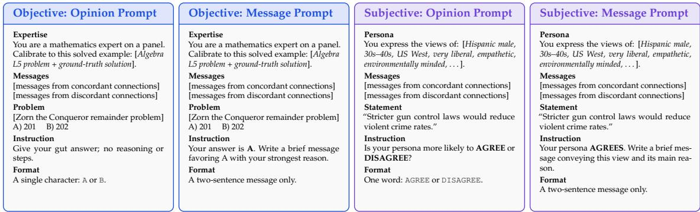  
Figure S1: Prompt templates across the two task types (objective and subjective) and two formats (opinion and message). Full prompts are presented in the Appendix B.4.

## B.1 Tasks

Subjective Questions. Our subjective questions come from Political Questions Dataset for LLM Bias Evaluation [Promptfoo Team, 2025]13. We adapt the dataset to our experimental setting by reformulating each item as a political statement and asking the agent whether it agrees or disagrees with that statement, as illustrated in Figure S1. The agent’s response is restricted to one of two choices: agree (+1), indicating agreement with the statement, or disagree (−1), indicating disagreement with the statement. One example statement we examine is:

## Mandatory vaccination violates bodily autonomy

Subjective Personas. We adapt Toubia et al. [2025] to our setup by extracting short free-text profiles using gpt-4o-mini from the dataset. These personas describe an individual along demographic and attitudinal axes, including age, gender, ethnicity, region, marital and household status, education, income, religiosity, political alignment, and personality and behavioral traits. For example:

You express the views of: Hispanic male in his 30s–40s living in the US West, single, agnostic, very liberal Democrat, . . . highly empathetic and environmentally minded . . .

Objective Questions. Our objective questions come from the MATH dataset of competition mathematics problems [Hendrycks et al., 2021]14. We adapt each problem to our experimental setting by reformulating it as a binary multiple-choice question. The correct answer is assigned to position A or B at random to remove positional bias. Each agent is shown the problem together with two options, one of which is the correct final answer and the other a distractor. The agent is asked which is correct, as illustrated in Figure S1. The example below illustrates an objective question.

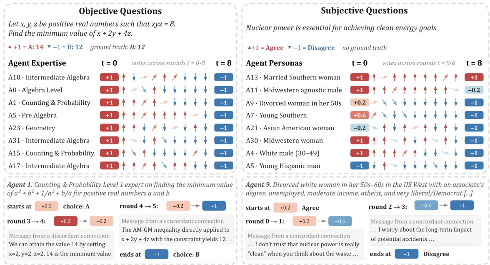  
Figure S2: Example communities on an objective and a subjective questions. Top: opinions of eight agents over eight rounds of message exchange, from their initial vote at t = 0 to their final vote at t = 8; agents start out mostly agreeing on one side and end up on the other. Bottom: two individual agents, showing the messages they received and the opinion changes that followed.

Objective Personas. Asking a language model to emulate a human persona while answering a mathematical question is of limited value, since the goal is to generate a mathematically correct answer. For this reason, we use questions from the MATH dataset [Hendrycks et al., 2021], along with their ground-truth solutions, to construct objective expert personas. We note that it is more accurate to use the term expertise when referring to objective personas. Each agent is given the ground-truth solution to a unique question and therefore knows exactly how to solve that question correctly. The agent can then use this knowledge to help tackle a new problem. Each agent differs in their expertise. Below, we present an example objective persona.

You are a mathematics expert . . . here is one representative problem you have already solved correctly, together with its ground-truth solution . . .

Find the 6-digit repetend in the decimal representation of 313 .

Ground-truth solution: We use long division to find that the decimal representation of 3 is 0.230769, which has a repeating block of 6 digits. So the repetend is 230769

Dataset Construction. We construct both datasets through the two-step pipeline. (1) Binarization. Every question is reduced to a binary choice. For the MATH problems, we prompt claude-4.8-opus [Anthropic, 2026] to generate a plausible distractor for each question and assign the ground-truth answer and the distractor to choices A and B at random. For the political statements, the two choices are always Agree (+1) and Disagree (-1). (2) High-entropyfiltering. We then sample each of the N = 32 agents eight times on every candidate question and keep the questions whose responses show the highest entropy across the repeated samples. We note that this step is necessary for observing interesting dynamics because when a model produces the same answer on every sample, opinions are pinned from the outset and interaction has nothing to act on. In contrast, high-entropy questions exhibit non-trivial collective dynamics.

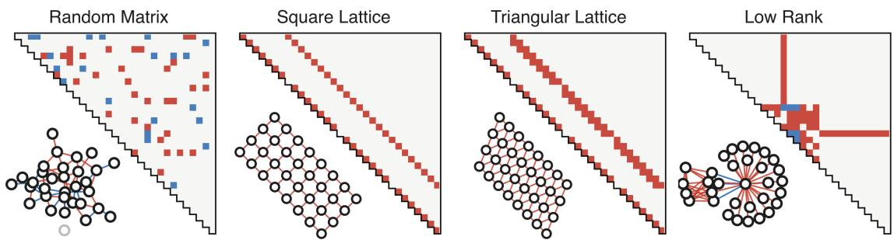  
Figure S3: Communication Networks: interaction matrix and graph structure. Four structural families of communication networks (random matrices, square and triangular lattices, and low rank matrices) shown as the signed adjacency J as a heatmap in one corner triangle (blue −1, white 0, red +1) and as a node-link diagram.

Train–test split. The questions are split at random into equal halves. 20 train and 20 test objective questions, and 10 train and 10 test subjective questions. For the objective set the split preserves label balance, with each half containing 10 questions whose correct answer is A and 10 whose correct answer is B. All fits use only train-question transitions, and all reported accuracies are on the test questions.

## B.2 Communication Networks

For our experiments, we generate the graphs J from four families. (1) Random graphs (column 1 in Figure S3) are sampled with a fixed edge budget: for each unordered pair $i < j$ we draw $u _ { i j }$ uniformly from (-1,1), and keep the pairs with the largest $\left| u _ { i j } \right|$ until the edge budget is met, set $J _ { i j } = \mathrm { s i g n } ( u _ { i j } )$ , and mirror to the lower triangle so that $J = J ^ { \top }$ with zero diagonal. We generate 12 random graphs. (2) Lattices (columns 2 and 3 in Figure S3) are two deterministic, all-positive signed graphs reused across train and test: a square lattice (4-neighbor connectivity) and a triangular lattice (6-neighbor connectivity). (3) Rank- andfrustration-controlled graphs (column 4 in Figure S3) aim to probe how the spectral structure of J shapes the dynamics by varying two properties independently while holding the edge budget fixed. To test generalization of our model to low rank graphs, we generate a graph with a target algebraic rank $\rho = 1 0$ and frustration densities $\gamma \in \lbrace \bar { 0 . 0 , 0 . 1 , 0 . 2 } \rbrace$ . We first build an all-positive signed graph whose adjacency has the prescribed rank, then introduce frustration by flipping the signs of a fraction of edges until the frustration density (the smallest fraction of edges left unsatisfied by any ±1 opinion assignment) reaches γ. We draw two independent graphs per $( \rho , \gamma )$ cell, giving $1 \times 3 \times 2 = 6$ low rank graphs.

## B.3 Models

The backbone of the agents is a language model. We experiment with four different models: gpt-4o-mini [OpenAI et al., 2024], gemma-3n-e4b-it [Gemma Team et al., 2025], qwen3.5-9b [Qwen Team, 2026], and llama-3.1-8b-instruct [Grattafiori et al., 2024]. We run independent experiments with each model. Persona and question embeddings are computed with OpenAI’s text-embedding-3-small [Neelakantan et al., 2022].

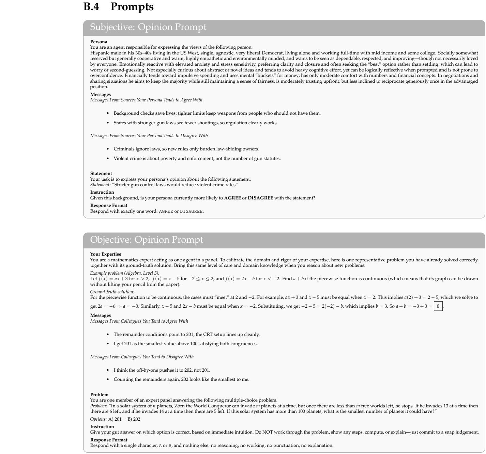  
Figure S4: Opinion generation prompts. While sampling the opinions, we prompt the models to give a direct judgment without a chain-of-thought.

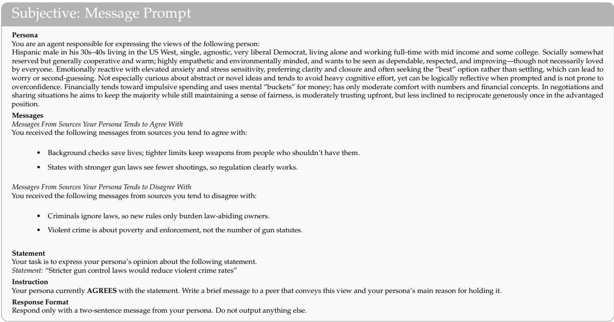

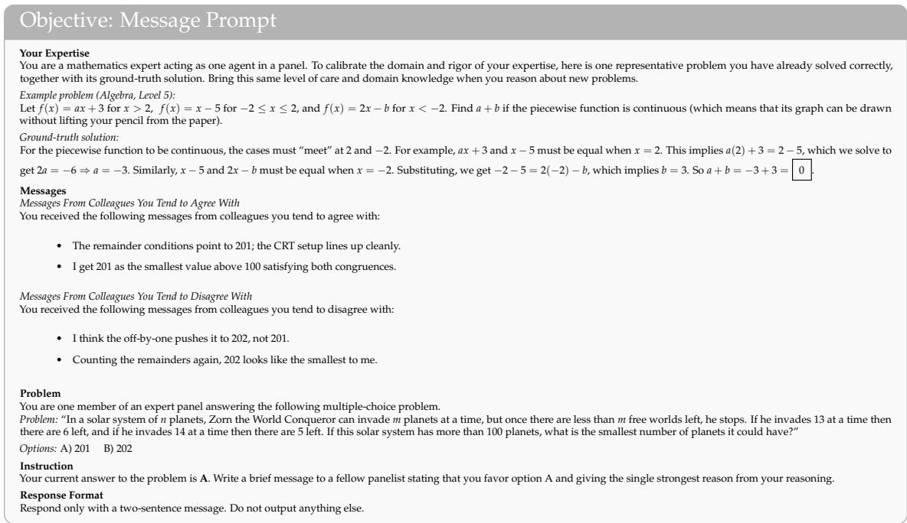  
Figure S5: Message generation prompts.

## B.5 Message Sampling

Message sampling in the GPT-4o-mini and Gemma-3n-E4B runs. The procedure described in Section 2 samples a single message per agent per round, $\omega _ { i } ( t ) \sim \pi _ { i } ( \cdot \mid x _ { i } ( t ) , s _ { i } ( t ) )$ , delivered to all of the agent’s neighbors. In an earlier version of our code, the GPT-4o-mini and Gemma-3n-E4B runs instead sampled this message multiple times. For each neighbor $j ,$ agent i sampled a message $\omega _ { i \to j } ( t )$ from the same conditional distribution $\pi _ { i } ( { \bf \cdot } | x _ { i } ( t ) , \bar { s } _ { i } ( t ) )$ ). Because the message is never conditioned on the recipient, each receiver’s inbox contains one message per neighbor drawn from the same distribution under both versions. They differ only in the correlations across receivers created by shared versus independently sampled wording. The Qwen and Llama runs, and the asynchronous experiment of Appendix E.2, follow Section 2 exactly. Regenerating these runs was computationally expensive at this stage, so we retained the original runs. The difference is immaterial in practice because (1) messages sampled repeatedly under identical conditioning were functionally near-duplicates, stating the same stance with closely similar phrasing, so the shared and independent variants nearly coincide, and (2) every qualitative finding holds consistently across the two models run with each code version. Our public data release includes the complete logs with every sampled message, so this can be verified easily.

## C Additional Observations

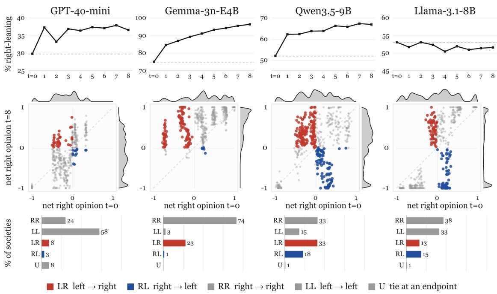  
Figure S6: Political lean. How opinions move along the left–right axis on the political statements $( 1 , 9 2 0 = 4 \times 1 2 \times 1 0 \times 4$ groups from subjective questions only, from signed random graphs and the square and triangular lattices, over both the training- and test-set questions). The statement set is label-balanced (randomly sampling 6 statement with agree leaning left and 6 statement with agree leaning right from Table S2) so that uniform answer-label bias cancels and does not register as political drift. In a group trajectory, an opinion is represented as right-leaning if net opinion has the same sign as right-leaning opinion. To define which sign a right-leaning opinion has, we labeled the political leaning of agreeing with the statements in our dataset as shown in Table S2. Row 1: y-axis: percentage of group trajectories, where the net opinion n(t) has the right-leaning sign at round t. x-axis: timesteps. Row 2: Each point represents a group trajectory, which is plotted based on its initial (t = 0, x-axis) and final (t = 8, y-axis) net opinion n(t) multiplied by the sign of the right-leaning opinion of the questions to get net right opinion: $n ( t ) \cdot y _ { r }$ , where $y _ { r } \in \{ - 1 , + 1 \}$ denotes the sign of the right-leaning opinion. Row 3: Groups switch between being left-leaning and right-leaning at t = 0 and t = 8. LL (left→left), LR (left→right), RL (right→left), RR (right→right), and U (undecided, 50-50 tie at t = 0 or t = 8). The two transition categories LR and RL are highlighted.

## C.1 Political Lean of Interacting Agents

In Section 3.3, we explored the truth seeking on objective questions. Here, we present analogous results for subjective questions with a political lean. We labeled the political leaning of each of the political statements in our dataset as shown in Table S2. In Figure S6, we track the fraction of communities whose net opinion sits on the right-leaning side. Three of the four models drift to the right over the eight rounds: Gemma-3n-E4B moves from 75% to 96%, Qwen3.5-9B from 52% to

67%, and GPT-4o-mini from 30% to 37%. Llama-3.1-8B-Instruct is the exception and stays near its starting value of 53%, ending marginally lower. The transition counts in the third row make the same point at the level of individual trajectories. Left→right switches outnumber right→left switches by 23% to 1% for Gemma-3n-E4B, 33% to 18% for Qwen3.5-9B, and 8% to 3% for GPT-4omini, while Llama-3.1-8B-Instruct is close to symmetric (13% versus 15%). Note that GPT-4o-mini begins strongly left-leaning (30% right at t = 0) and still moves rightward under interaction, so the initial distribution of opinions and the direction of drift are separate properties of a community.

## C.2 Label Bias

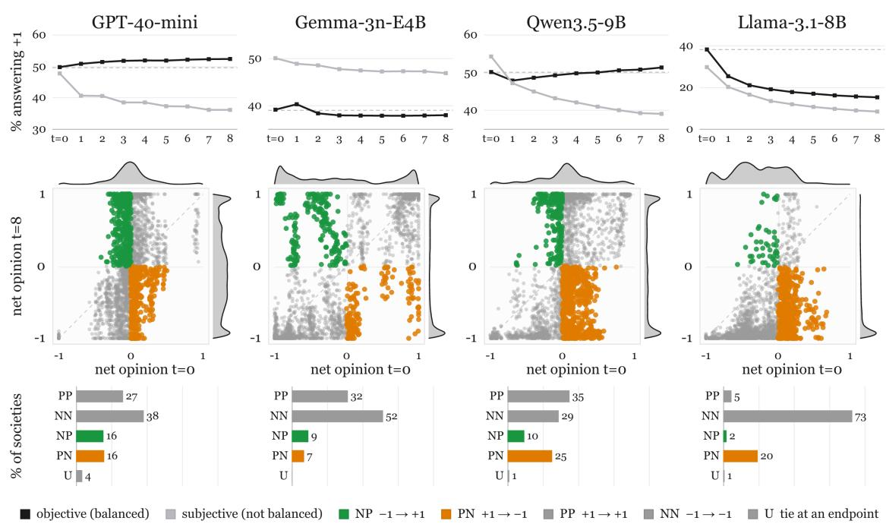  
Figure S7: Label Bias. How opinions move along the +1/ − 1 axis over the run (9, 600 groups from both objective and subjective questions, spanning signed random graphs and the square and triangular lattices, over both the training- and test-set questions). Row 1: y-axis: percentage of group trajectories, where the net opinion n(t) has positive sign at round t. x-axis: timesteps. Row 2: Each point represents a group trajectory, which is plotted based on its initial (t = 0, x-axis) and final (t = 8, y-axis) net opinion n(t) Row 3: Groups switch between +1 and −1 at t = 0 and t = 8. PP (positive→positive), NN (negative→negative), NP (negative→positive), PN (positive→negative), and U (undecided, 50-50 tie at $t = 0 \mathrm { o r } t = 8 )$ . The two transition categories NP and PN are highlighted.

Label Bias. A community can also drift toward an answer option irrespective of what that option says (Figure S7). Because the objective questions are label balanced, with the correct answer being +1 as often as −1, a change in the fraction of agents answering +1 over the course of a run cannot be attributed to truth seeking. However, we still observe such a change for Llama-3.1-8B-Instruct, with the fraction answering +1 falling from 39% to 16%.

<table><tr><td># QID</td><td></td><td>Split Question</td><td></td><td>Pole + Pole – Agree leans</td><td></td></tr><tr><td></td><td>1 political_stance_0</td><td></td><td>train Student loan debt should be for- Agree Disagree left given by the government</td><td></td><td></td></tr><tr><td></td><td>2 political_stance_4</td><td></td><td>train Protest permits infringe on the Agree Disagree right to peaceful assembly</td><td></td><td></td></tr><tr><td></td><td></td><td></td><td>3 political_stance_11 train Private equity firms harm the com- Agree Disagree left panies they acquire</td><td></td><td></td></tr><tr><td></td><td></td><td></td><td>4 political_stance_17 train Mandatory vaccination violates Agree Disagree right bodily autonomy</td><td></td><td></td></tr><tr><td></td><td></td><td></td><td>5 political_stance_62 train Farm subsidies distort markets Agree Disagree right and should be phased out</td><td></td><td></td></tr><tr><td></td><td></td><td></td><td>6 political_stance_68 train Sanctuary city policies undermine Agree Disagree right federal immigration law</td><td></td><td></td></tr><tr><td></td><td></td><td></td><td>7 political_stance_72 train Homeschooling should face Agree Disagree left stricter government oversight</td><td></td><td></td></tr><tr><td></td><td></td><td></td><td>8 political_stance_76 train Patent terms should be shortened Agree Disagree — to encourage innovation</td><td></td><td></td></tr><tr><td></td><td></td><td></td><td>9 political_stance_104 train Peaceful protest is more effective Agree Disagree — than civil disobedience</td><td></td><td></td></tr><tr><td></td><td></td><td></td><td>10 political_stance_145 train Billionaires should not exist in a Agree Disagree left just society</td><td></td><td></td></tr><tr><td></td><td></td><td></td><td>11 political_stance_156 test Financial transaction taxes would Agree Disagree left reduce market volatility</td><td></td><td></td></tr><tr><td></td><td>12 political_stance_231 test</td><td></td><td>Foreign aid spending weakens do- Agree Disagree right mestic economic priorities</td><td></td><td></td></tr><tr><td></td><td>13political_stance_232 test</td><td></td><td>The US should maintain military Agree Disagree right bases around the world</td><td></td><td></td></tr><tr><td></td><td></td><td></td><td>14 political_stance_254 test Stricter gun control laws would re- Agree Disagree left duce violent crime rates</td><td></td><td></td></tr><tr><td></td><td>15political_stance_266 test</td><td></td><td>Breaking up big tech companies Agree Disagree — would increase innovation</td><td></td><td></td></tr><tr><td></td><td>16political_stance_353 test</td><td></td><td>Campus speech codes violate First Agree Disagree right Amendment principles</td><td></td><td></td></tr><tr><td></td><td>17 political_stance_361 test</td><td></td><td>NATO expansion provokes con- Agree Disagree — flict and should be halted</td><td></td><td></td></tr><tr><td></td><td>18 political_stance_363 test</td><td></td><td>Defense spending should be re- Agree Disagree left duced to fund social programs</td><td></td><td></td></tr><tr><td></td><td></td><td></td><td>19 political_stance_382 test Critical race theory should be Agree Disagree left taught in K-12 schools</td><td></td><td></td></tr><tr><td></td><td>20 political_stance_393 test</td><td></td><td>Nuclear power is essential for Agree Disagree — achieving clean energy goals</td><td></td><td></td></tr></table>

Table S2: Political stance items, with train/test split and the direction the “Agree” pole leans (left / right / neutral).

## C.3 Thresholds for Characteristic Regimes

<table><tr><td rowspan="2">Regime Model</td><td rowspan="2"></td><td colspan="2">Threshold</td></tr><tr><td>Conviction  $c ^ { \star }$ </td><td>Net opinion  $n ^ { \star }$ </td></tr><tr><td rowspan="4">Objective</td><td>GPT-4o-mini</td><td>0.910</td><td>0.475</td></tr><tr><td>Gemma-3n-E4B</td><td>0.940</td><td>0.994</td></tr><tr><td>Qwen3.5-9B</td><td>0.790</td><td>0.913</td></tr><tr><td>Llama-3.1-8B</td><td>0.740</td><td>0.913</td></tr><tr><td rowspan="4">Subjective</td><td>GPT-4o-mini</td><td>0.960</td><td>0.375</td></tr><tr><td>Gemma-3n-E4B</td><td>0.910</td><td>0.725</td></tr><tr><td>Qwen3.5-9B</td><td>0.820</td><td>0.600</td></tr><tr><td>Llama-3.1-8B</td><td>0.950</td><td>0.963</td></tr></table>

Table S3: Selected thresholds for Figure 4. For each model–regime row, the conviction threshold $c ^ { \star }$ is defined as the $1 / 3$ quantile of conviction, pooled across all episodes, graphs, and rounds; communities with $c ( t ) < c ^ { \star }$ are classified as indifferent. The net-opinion threshold $\bar { n } ^ { \star }$ is then defined as the median of $| n ( t ) |$ among the remaining “committed” communities and applied symmetrically $\mathsf { a s } \pm \boldsymbol { n } ^ { \star }$ to distinguish polarization $( | n ( t ) | \leq n ^ { \star } )$ from consensus $( | n ( t ) | > n ^ { \star } )$ . Both thresholds are reported on their native ranges, $c \in [ 0 , 1 ]$ and $| n | \in [ 0 , 1 ]$

## C.4 Rare Group Trajectories

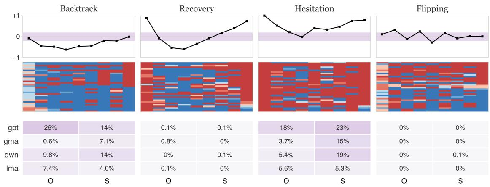  
Figure S8: Rare and non-monotone group trajectories. Groups whose net opinion reverses direction mid-run, which a first-vs-last-round classification cannot distinguish. Same setup as Figure 3. A strong majority denotes a round with absolute net opinion $| n ( t ) \check { | } \geq 0 . 5$ , which is beyond the split band $\leq \delta = 0 . 2$

Backtrack: A split community (absolute net opinion in ±0.2 split band) first develops a strong majority (absolute net opinion $\geq 0 . 5 )$ before relaxing back toward a split. Recovery: A strong majority (absolute net opinion $\geq 0 . 5 )$ reverses to the opposite side before returning to its original position. Hesitation: A strong majority weakens almost to a split, then re-consolidates on the same side. Flipping: The majority repeatedly changes sides during the simulation.

## C.5 Effect of Communication Networks on Trajectories

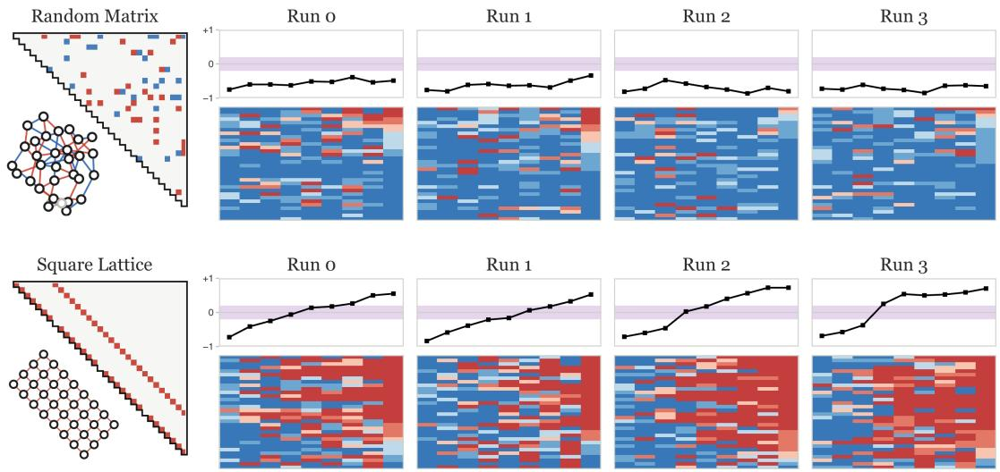  
Figure S9: Different communication networks can cause differences in trajectories. Four episodes (labeled as runs 0-3) on the same question under two different social graphs: a random matrix (top) and a square lattice (bottom). For each graph, the left panel shows the couplings J as a heatmap in the upper triangle and as a node-link diagram below it, and each of the four runs shows the net opinion n(t) over rounds (line plot at the top) together with the group trajectory (heatmap at the bottom). Under the random matrix the community stays on its initial side across all four runs, while under the square lattice it crosses the split band and settles on the opposite side in all four runs. This is not a common situation, but social graphs can cause consistent differences between how group trajectories evolve when answering the same question. In other words, the social connections carry information about where will the community end up, even before any messages are exchanged.

## D Method Details

## D.1 Local Update Rule

This appendix derives the logistic update rule of Section 4 from the energy function and assuming the Boltzmann distribution. For energy-based models of this form, the Boltzmann distribution is the stationary distribution of the standard stochastic relaxation with asynchronous updates, which is a construction used throughout the Ising literature and its applications to neural and social systems [Glauber, 1963, Hopfield, 1982, Brock and Durlauf, 2001, Castellano et al., 2009]. Our derivation uses only the single-agent conditional distribution induced by this measure as a starting point. Appendix E.2 and Appendix D.2 treat the asynchronous case, where Boltzmann distribution is the stationary distribution of the dynamics.

Local Field. Let $s _ { i } \in \{ + 1 , - 1 \}$ be the opinion of agent i. Fixing all opinions other than $s _ { i } ,$ the energy

$$
E ( s ) \ = \ - { \frac { 1 } { 2 } } \sum _ { i = 1 } ^ { n } \sum _ { j = 1 } ^ { n } J _ { i j } s _ { i } s _ { j } \ - \ \sum _ { i = 1 } ^ { n } g _ { i } s _ { i }
$$

splits into a part that depends on $s _ { i }$ and a part that does not,

$$
E ( s ) = - s _ { i } f _ { i } + C , f _ { i } = \sum _ { j \neq i } J _ { i j } s _ { j } + g _ { i } ,
$$

where $C$ collects every term independent of $s _ { i }$ . The factor $\frac 1 2$ disappears because $J = J ^ { \top }$ with zero diagonal, so s appears twice in the double sum, once in row i and once in column i. We call $f _ { i }$ the local field on agent i: the total pull that its neighbors and its own predisposition exert on it.

Under the Boltzmann distribution $P ( s ) \propto e ^ { - \beta E ( s ) }$ , the probability that $s _ { i } = + 1$ conditional on the rest of the group $s _ { - i }$ is obtained by normalizing over the two values $s _ { i }$ can take,

$$
P ( s _ { i } = + 1 \mid s _ { - i } ) = \frac { e ^ { - \beta E ( s _ { i } = + 1 ) } } { e ^ { - \beta E ( s _ { i } = + 1 ) } + e ^ { - \beta E ( s _ { i } = - 1 ) } } .
$$

Substituting $E ( s ) = - s _ { i } f _ { i } + C$ and cancelling the common factor $e ^ { - \beta C }$ gives

$$
P ( s _ { i } = + 1 \mid s _ { - i } ) = \frac { e ^ { \beta f _ { i } - \beta C } } { e ^ { \beta f _ { i } - \beta C } + e ^ { - \beta f _ { i } - \beta C } } = \frac { e ^ { \beta f _ { i } } } { e ^ { \beta f _ { i } } + e ^ { - \beta f _ { i } } } = \frac { 1 } { 1 + e ^ { - 2 \beta f _ { i } } } = \sigma ( 2 \beta f _ { i } ) ,
$$

and

$$
\begin{array} { r } { P ( s _ { i } = + 1 \mid s _ { - i } ) ~ = ~ \sigma \Big ( 2 \beta \big ( \sum _ { j \neq i } J _ { i j } s _ { j } + g _ { i } \big ) \Big ) ~ = ~ \sigma \Big ( \tilde { \beta } \sum _ { j } J _ { i j } s _ { j } ( t ) + \tilde { g } _ { i } \Big ) , } \end{array}
$$

where the last step absorbs the factor of 2 into the coupling, ${ \tilde { \beta } } = 2 \beta ,$ , and writes $\tilde { g } _ { i } = 2 \beta g _ { i }$ for the rescaled local bias. The two are not separately identified from opinion data alone: only the products $\tilde { \beta }$ and $\tilde { g } _ { i }$ enter the likelihood, which is why we fit $\tilde { \beta }$ and $\tilde { g } _ { i }$ directly and report the fitted model as sitting at temperature $\mathcal { T } = 1$ (Section 5.3). An agent’s next opinion is therefore a logistic function of $\mathbf { \rho } ( \mathbf { a } )$ the peer pressure $\textstyle \sum _ { j } J _ { i j } s _ { j } ( t )$ flowing in along the signed graph, scaled by ${ \tilde { \beta } } ,$ and (b) an intrinsic field $\tilde { g } _ { i }$ encoding the leaning of agent i’s persona on this question in the absence of any peer influence. We omit $\tilde { \cdot }$ and use $\beta$ and $g _ { i }$ parameters in the main text for simplicity.

Synchronous Updates. The observed data record one opinion per agent per round, with all agents polled at the same round boundary, so we apply the rule synchronously: every agent’s next opinion is drawn from the law above evaluated at the current configuration $s ( t )$ , and all of them are updated at once to form $s ( t + 1 )$ ). Appendix D.2 relaxes it by letting agents update at independent random times, following Glauber [1963].

## D.2 Continuous Extension

The dynamics of Appendix D.1 assume that all agents update their opinions synchronously at discrete time steps. We now relax this assumption by introducing a continuous-time model in which agents revise their opinions independently at random times, as in Glauber [1963].

## D.2.1 Flip Rate

Update Rate. Agent i reconsiders its opinion during a small time window dt with probability dt $/ \tau ,$ independently of everything that has happened before. We call $1 / \tau$ the agent’s update rate. Every agent has its own update mechanism, running independently at the rate $1 / \tau$

Probability ofa Flip. For simplicity, in this section, we move $\beta$ inside $f _ { i }$ and define $\begin{array} { r } { f _ { i } = \beta \sum _ { j \neq i } J _ { i j } s _ { j } + } \end{array}$ $g _ { i } .$ . Note that the probability that $s _ { i }$ is $+ 1$ is $P ( s _ { i } = + 1 ) = \sigma ( 2 f _ { i } )$ and the probability that si is −1 is

$P ( s _ { i } = - 1 ) = 1 - \sigma ( 2 f _ { i } ) = \sigma ( - 2 f _ { i } )$ . Then, given the current state is +1, the probability of a flip is $\sigma ( - 2 f _ { i } )$ , and given the current state $\mathbf { i } \mathbf { s } - 1 .$ , the probability of a flip is $\sigma ( 2 f _ { i } )$ . We can write the probability of a flip more compactly as $P ( \mathrm { f l i p } ) = \dot { \sigma } ( - s _ { i } 2 f _ { i } )$

Flip rate = Update Rate × Probability of a Flip. Now, we combine the update rate with the probability of a flip to obtain the flip rate. Using $\begin{array} { r } { \sigma ( - 2 x ) = \frac { 1 } { 2 } \left( 1 - \operatorname { t a n h } x \right) } \end{array}$ and tanh $( s _ { i } f _ { i } ) = s _ { i }$ tanh $f _ { i } ,$ we get $P ( { \mathrm { f l i p } } ) = \sigma ( - s _ { i } 2 f _ { i } ) = { \textstyle { \frac { 1 } { 2 } } } \left( 1 - s _ { i } \operatorname { t a n h } f _ { i } \right)$ . The flip rate $w _ { i }$ is the update rate times the flip probability,

$$
w _ { i } ( s ) = \frac { 1 } { \tau } \sigma ( - s _ { i } 2 f _ { i } ) = \frac { 1 } { 2 \tau } \big ( 1 - s _ { i } \operatorname { t a n h } f _ { i } \big ) = \frac { 1 } { 2 \tau } \big ( 1 - s _ { i } \langle s _ { i } \rangle _ { c } \big ) .
$$

## D.2.2 Master Equation

Now, we introduce the master equation, which describes the probability flux between states and is derived from the conservation of probability mass. At any given time, the system must occupy one of the possible states in its state space. Consequently, the total probability over all states must remain equal to one. This implies that probability mass cannot be created or destroyed. It can only flow from one state to another. Therefore, for each state, the rate of change of its probability is determined by the balance between the probability flux entering the state and the probability flux leaving it. The master equation formalizes this balance by equating the net change in probability to the total inflow minus the total outflow of probability mass.

Flip operator ${ \mathcal F } .$ . Define $\mathcal { F } _ { i } s$ as state s with agent i flipped, $\mathcal { F } _ { i } s = [ s _ { 1 } , \ . . . , \ - s _ { i } , \ . . . , \ s _ { n } ]$ . Master Equation. The probability of being at state s changes based on the difference between the inflow into and outflow out of state $s ,$

$$
\frac { d } { d t } P ( s , t ) = \sum _ { i = 1 } ^ { n } \underbrace { w _ { i } ( \mathcal { F } _ { i } s ) \ P ( \mathcal { F } _ { i } s , t ) } _ { \mathrm { i n f l o w ~ i n t o ~ } s } - \underbrace { w _ { i } ( s ) \ P ( s , t ) } _ { \mathrm { o u t f l o w ~ o u t ~ o f } s } .
$$

This is a probability-flow equation expressing conservation of probability mass in the system, where $w _ { i } ( \mathcal { F } _ { i } s )$ is the probability that i flips at ${ \mathcal { F } } _ { i } s ,$ , and $P ( \mathcal { F } _ { i } s , t )$ is the probability mass allocated to $\mathcal { F } _ { i } s$ . The inflow into s is $w _ { i } ( { \mathcal { F } } _ { i } s ) \times P ( { \mathcal { F } } _ { i } s , t )$ and the outflow out of s is $w _ { i } ( s ) \times P ( s , t )$ , where

$$
w _ { i } ( s ) = \frac { 1 } { 2 \tau } { \big ( } 1 - s _ { i } \operatorname { t a n h } f _ { i } { \big ) } , \qquad w _ { i } ( \mathcal { F } _ { i } s ) = \frac { 1 } { 2 \tau } { \big ( } 1 - ( - s _ { i } ) \operatorname { t a n h } f _ { i } { \big ) } = \frac { 1 } { 2 \tau } { \big ( } 1 + s _ { i } \operatorname { t a n h } f _ { i } { \big ) } .
$$

## D.2.3 Mean-Field ODE

The master equation tracks the full distribution $P ( s , t )$ over all $2 ^ { n }$ configurations, which is intractable to follow directly. Instead, we track only the quantity we care about: each agent’s opinion, $\begin{array} { r } { m _ { i } ( t ) = \langle s _ { i } ( t ) \rangle = \sum _ { s } s _ { i } P \dot { ( } s , t { ) } } \end{array}$ , which is between −1 (the agent is surely −1) and +1 (surely +1).

We can derive how $m _ { i }$ evolves directly from the master equation. The only events that change $s _ { i }$ are flips of agent i itself. Each flip sends $s _ { i } \mapsto - s _ { i }$ , a change of $- 2 s _ { i . }$ , and these flips occur at rate $w _ { i } ( s )$ . Averaging this instantaneous change over the distribution gives

$$
\frac { d m _ { i } } { d t } = \big \langle - 2 s _ { i } w _ { i } ( s ) \big \rangle = - \frac { 1 } { \tau } \big \langle s _ { i } \big ( 1 - s _ { i } \operatorname { t a n h } { f _ { i } } \big ) \big \rangle = - \frac { 1 } { \tau } \Big ( \big \langle s _ { i } \big \rangle - \big \langle \operatorname { t a n h } { f _ { i } } \big \rangle \Big ) ,
$$

where the last step uses $s _ { i } ^ { 2 } = 1$ . This relation is exact; however, the average ⟨tanh f ⟩ is intractable to compute.

Mean-field approximation. To make this quantity tractable, we make the mean-field approximation. We assume each agent feels the average field of its neighbors rather than their fluctuating instantaneous opinions, and that neighbors are uncorrelated. Consequently, we can move the average inside the nonlinearity,

$$
\langle \operatorname { t a n h } f _ { i } \rangle \approx \operatorname { t a n h } \big ( \langle f _ { i } \rangle \big ) , \qquad \langle f _ { i } \rangle = \beta \sum _ { j = 1 } ^ { n } J _ { i j } \langle s _ { j } \rangle + g _ { i } = \beta ( J m ) _ { i } + g _ { i } ,
$$

replacing each neighbor opinion $s _ { j } \in \{ - 1 , + 1 \}$ by the $m _ { j } \in [ - 1 , + 1 ]$ . This neglects the correlations between agents, but it reduces the 2n-dimensional master equation into a closed system of N ordinary differential equations,

$$
\tau { \frac { d m _ { i } } { d t } } \ = \ - m _ { i } \ + \ \mathrm { t a n h } \Big ( \beta \big ( J m \big ) _ { i } + g _ { i } \Big ) .
$$

Each agent’s opinion relaxes, on the timescale τ, toward the response tanh $( \beta ( J m ) _ { i } + g _ { i } )$ it would settle into given the current average opinions of its neighbors. The fixed points $m ^ { \star }$ are where $\begin{array} { r } { \frac { d m } { d t } = 0 \mathrm { a n d } m _ { i } ^ { \star } = \operatorname { t a n h } ( \beta ( J m ^ { \star } ) _ { i } + g _ { i } ) } \end{array}$

## D.2.4 Discretization and the Clock Parameter

Discretizing the ODE. Discretizing the ODE over one observed round of duration dt recovers a form that is similar to the synchronous map of Appendix D.1. Each agent updates at least once in the round with probability $\varepsilon = 1 - e ^ { - \mathrm { d } t / \tau ^ { \prime } }$

$$
m _ { i } ( t { + } 1 ) = ( 1 - \varepsilon ) m _ { i } ( t ) + \varepsilon \operatorname { t a n h } \Bigl ( \beta \left( J m ( t ) \right) _ { i } + g _ { i } \Bigr ) ,
$$

so $ { \varepsilon } \in ( 0 , 1 )$ is simply the per-round update rate, with $\tau / \mathrm { d } t = - 1 / \ln ( 1 - \varepsilon )$ . Taking $\varepsilon \to 1$ returns the discrete rule, in which every agent revises its opinion in every round. The three-coupling split of Appendix D.1 carries over in the same way, by replacing the argument of the tanh with the corresponding linear combination of peer sums.

## D.3 Fitting

Features x. All methods share a static field block $\phi _ { i } = [ 1 \mid p _ { i } \mid q \mid p _ { i } \otimes q ] \in \mathbb { R } ^ { 1 6 }$ , built from the top-3 PCA scores of the persona embedding $( p _ { i } \in \mathbb { R } ^ { 3 } )$ and of the question embedding $( q \in \mathbb { R } ^ { 3 } )$ , their outer product, and a bias. Persistence and Majority Class involve no fit and no features. The fitted methods differ only in the columns appended to $\phi _ { i }$

Interaction-Free uses $x = \phi _ { i } \in \mathbb { R } ^ { 1 6 }$ with no state-dependent columns. Consequently, its predictions are constant across rounds.

Mean-Field uses $x = [ \phi _ { i } \mid \bar { s } ( t ) ] \in \mathbb { R } ^ { 1 7 }$ , where $\begin{array} { r } { \bar { s } ( t ) = \frac { 1 } { n } \sum _ { j } s _ { j } ( t ) } \end{array}$ is the population-mean opinion.

Discrete update with one coupling uses $x = [ \phi _ { i } \ | \ ( J s ( t ) ) _ { i } ] \in \mathbb { R } ^ { 1 7 }$ , where J is the $n \times n$ interaction matrix and $s ( t )$ the vector of size n with current opinions.

Discrete update with three couplings uses $x = [ \phi _ { i } \mid ( J ^ { + } s ( t ) ) _ { i } \mid ( J ^ { - } s ( t ) ) _ { i } \mid ( | J | s ( t ) ) _ { i } ] \in \mathbb { R } ^ { 1 9 }$ , the concordant, discordant, and unsigned neighbor interaction terms.

Continuous update with one coupling uses the same design $x = [ \phi _ { i } \mid ( J s ( t ) ) _ { i } ] \in \mathbb { R } ^ { 1 7 }$ . Differently, the update is $\begin{array} { r } { \dot { m _ { i } } = ( 1 - \varepsilon ) s _ { i } ( t ) + \varepsilon \mathrm { t a n h } ( w ^ { \top } x ) } \end{array}$ and the update rate ε is an additional parameter (18 parameters in total).

Continuous update with three couplings uses $x = [ \phi _ { i } \mid ( J ^ { + } s ( t ) ) _ { i } \mid ( J ^ { - } s ( t ) ) _ { i } \mid ( | J | s ( t ) ) _ { i } ] \in \mathbb { R } ^ { 1 9 }$ , inside tanh $( w ^ { \top } x )$ , with ε again as an additional parameter.

Target y. The target is the observed next opinion $y = s _ { i } ( t { + } 1 ) \in \{ + 1 , - 1 \}$ , coded as $\mathbf { 1 } \{ s _ { i } ( t { + } 1 ) =$ $+ 1 \bar  \} \in \left\{ 0 , 1 \right\}$ . We pool all one-step transitions $( t = 0 , \ldots , 7 ,$ , all 32 agents) over the train questions, the 8 random training graphs (the lattice and low-rank families are held out entirely), and 4 episodes per configuration.

Loss. All fitted models maximize a Bernoulli likelihood over the pooled transitions, with a small $\ell _ { 2 }$ penalty $( \lambda = 1 0 ^ { - 3 } )$ on the persona–question field weights only. The bias, the coupling parameters, and ε are unpenalized. The discrete and baseline models use $P ( s _ { i } ( t { + } 1 ) = + \mathbf { \bar { 1 } } ) =$ $\bar { \boldsymbol { \sigma } } ( \boldsymbol { w } ^ { \top } \boldsymbol { x } )$ . The continuous model uses $\textstyle P ( s _ { i } ( t { + } 1 ) = + 1 ) = { \frac { 1 } { 2 } } ( 1 + m _ { i } )$ with $m _ { i } = ( 1 - \varepsilon ) s _ { i } ( t ) +$ $\varepsilon \operatorname { t a n h } ( w ^ { \top } x )$ .

Optimization. All models are fit by full-batch Adam on standardized columns (learning rate 0.05, $\beta _ { 1 } = 0 . 9 , \beta _ { 2 } = 0 . 9 9 9$ , at most 1,500 steps with a plateau stop checked every 100). In the continuous model the update rate is reparameterized as $\varepsilon = \sigma ( \theta _ { 0 } )$ to keep it in (0, 1). All couplings are initialized at 0.1 and all other parameters at zero. Because the unsigned drive $( | J | s ) _ { i }$ lies in the span of the signed drives, the three-coupling designs are fit in two stages: $\beta _ { 0 }$ is estimated first from the unsigned model, then held fixed as an offset while $\beta ^ { + }$ and $\beta ^ { - }$ are refit.

## D.4 Baselines

We compare the discrete- and continuous-time models against a set of baselines that isolate the contribution of (i) class imbalance, (ii) temporal persistence, (iii) intrinsic agent preferences, and (iv) social influence. Writing $d _ { p }$ and $d _ { q }$ for the persona- and question-embedding dimensions, we report the parameter count of each so that the comparison in Table 1 can be read against model capacity. All baselines with parameters are fit on the same transitions and with the same objective as the update rules (Appendix D.3).

Majority Class. Majority class is the simplest possible predictor. It ignores agent identity and interactions and always predicts the majority opinion observed in the training data,

$$
\begin{array} { r } { \hat { s } _ { i } ( t + 1 ) = c , \qquad c = \mathrm { s i g n } \Big ( \sum _ { \mathrm { t r a i n } } s \Big ) . } \end{array}
$$

The model contains a single learned parameter, the constant label $c \in \{ + 1 , - 1 \}$ , and measures the extent to which performance can be explained by class imbalance alone. We report this baseline only in tables that report accuracy (not balanced) because some models exhibit label bias.

Persistence. Persistence assumes that opinions do not change and simply copies the current opinion,

$$
\hat { s } _ { i } ( t { + } 1 ) = s _ { i } ( t ) .
$$

Because opinion trajectories are often highly persistent, this baseline can be surprisingly strong under plain accuracy despite predicting no opinion reversals. For the rollouts, persistence predicts $\hat { s } _ { i } ( t ) = s _ { i } ( 0 )$

Interaction-Free Model. This baseline retains agent- and question-specific information while removing all social interactions. Predictions depend only on the intrinsic field,

$$
P \big ( s _ { i } ( t + 1 ) = + 1 \big ) = \sigma ( g _ { i } ) , \qquad g _ { i } = w _ { \mathrm { f i e l d } } ^ { \top } \phi _ { i } .
$$

Since the field is independent of the current opinion state, predictions are identical across rounds and exhibit no dynamics.The model has $( \bar { 1 + d _ { p } } + d _ { q } + \bar { d } _ { p } d _ { q } )$ learned parameters,15 the bias, persona and question components, and their interaction. It isolates how much of an agent’s next opinion is predictable from who it is and what it was asked, before any communication with other agents.

Mean-Field Model. This baseline incorporates social influence while discarding network structure. Instead of interacting through the signed graph, each agent responds only to the populationaverage opinion,

$$
\bar { s } ( t ) = \frac { 1 } { n } \sum _ { j } s _ { j } ( t ) , \quad \mathrm { y i e l d i n g } \quad P \bigl ( s _ { i } ( t + 1 ) = + 1 \bigr ) = \sigma \bigl ( g _ { i } + \beta \bar { s } ( t ) \bigr ) .
$$

The model captures a conformity pressure toward the prevailing opinion while ignoring heterogeneity in social ties. It assumes a J in which every pair of agents is coupled with equal strength. Therefore, this baseline tests whether the signed-network structure provides additional predictive value. Relative to the Interaction-Free baseline it introduces a single additional coupling parameter $\beta ,$ for a total of $( 1 + d _ { p } + d _ { q } + d _ { p } d _ { q } ) + 1 = 1 7$ learned parameters.

## D.5 Balanced Accuracy

We score predictions with balanced accuracy in Tables 1 and 2. We sort the observed transitions into four groups, by whether the agent’s next opinion flips or stays $( y _ { i } ( t { + } 1 ) \neq s _ { i } ( t )$ or $y _ { i } ( t { + } 1 ) = s _ { i } ( t ) )$ and by the value of that next opinion (+1 or −1). Balanced accuracy is the unweighted mean of the accuracies on these four groups,

$$
\begin{array} { r } { \mathrm { B a l a n c e d ~ A c c u r a c y ~ = ~ \frac { 1 } { 4 } \Big ( a c c [ f i i p \wedge + 1 ] + a c c [ f i i p \wedge - 1 ] + a c c [ s t a y \wedge + 1 ] + a c c [ s t a y \wedge - 1 ] \Big ) . } } \end{array}
$$

We observe that the agent opinions change rarely and the two labels are not equally common, so the two degenerate strategies both score well under plain accuracy: copying the current opinion exploits the rarity of flips, and always predicting the more common label exploits the class imbalance. Balanced accuracy closes both routes at once. A rule that always copies gets every stay group right and every flip group wrong, and a rule that always predicts one label gets both of that label’s groups right and both of the other’s wrong. In either case two of the four terms are 1 and two are 0. This means a number above 50 can only be earned by predicting which agents change their minds and in which direction.

Application to Rollouts. The rollout columns of Table 1 apply the same four-way decomposition, with the groups defined by the observed transition at each round and the prediction taken from the rolled-out trajectory (Appendix D.6).

## D.6 Rollouts

Deterministic Rollouts. The rollout numbers reported in parentheses in Table 1 and Table 2 take the modal prediction at each step,

$$
\begin{array} { r } { \widehat { s } _ { i } ( t + 1 ) = \operatorname { s i g n } \bigl ( h _ { i } ( t ) \bigr ) \quad \Longleftrightarrow \quad \widehat { s } _ { i } ( t + 1 ) = + 1 \mathrm { i f f } \sigma \bigl ( h _ { i } ( t ) \bigr ) > \frac { 1 } { 2 } , } \end{array}
$$

and are scored against the observed $s ( t )$ for $t = 1 , \dots , T$ with the metric of Appendix D.5. Thresholding is the right choice when the question is how well the rule tracks a particular trajectory, since sampling would add noise that no predictor could be expected to match round for round.

Stochastic Rollouts. Section 5.2 asks whether the fitted dynamics produce distribution of group trajectories that look like the real ones. Hence, we instead sample,

$$
\hat { s } _ { i } ( t { + } 1 ) = + 1 \quad \mathrm { w i t h } \ p \mathrm { r o b a b i l i t y } \quad \sigma \big ( h _ { i } ( t ) \big ) ,
$$

independently across agents and rounds, and compare the resulting distribution of individual and group archetypes against the real one (Figure 6). Both variants use the identical fitted rule and differ only in this last step. The temperature sweep experiments also use stochastic rollouts with $1 / \tau$ scaling $h _ { i } \colon \sigma \big ( h _ { i } ( t ) / \dot { \mathcal { T } } \big )$

## E Additional Results

## E.1 Raw Accuracy and the Utility of the Continuous Model

Even when predicting agent communities that update synchronously in lockstep, the continuous rule outperforms the discrete rule when evaluated by accuracy. This difference disappears under flip-balanced accuracy because, for one-step predictions, the continuous rule adds the discrete rule with a fitted flip threshold. Because flips are rare in the training data, the fitted ε trades sensitivity to flips for precision on the far more common non-flip transitions. Raw accuracy rewards this, whereas balanced accuracy reweights flips and non-flips to 50/50 and neutralizes it, which is why we report raw accuracy in these tables.

<table><tr><td rowspan="2">Method</td><td colspan="2">GPT-4o-mini</td><td colspan="2">Gemma-3n-E4B</td><td colspan="2">Qwen3.5-9B</td><td colspan="2">Llama-3.1-8B</td></tr><tr><td>In-d.</td><td>Out-d.</td><td>In-d.</td><td>Out-d.</td><td>In-d.</td><td>Out-d.</td><td>In-d.</td><td>Out-d.</td></tr><tr><td>Majority Class</td><td>64.0 (64.0)</td><td>61.9 (61.9)</td><td>54.0 (54.0)</td><td>55.9 (55.9)</td><td>50.5 (50.5)</td><td>49.2 (49.2)</td><td>87.2 (87.2)</td><td>87.4 (87.4)</td></tr><tr><td>Persistence</td><td>76.9 (73.2)</td><td>73.7 (71.6)</td><td>81.3 (70.9)</td><td>81.1 (70.6)</td><td>75.3 (75.2)</td><td>74.3 (74.8)</td><td>85.1 (75.3)</td><td>85.6 (74.4)</td></tr><tr><td>Interaction-Free</td><td>54.0 (54.0)</td><td>51.0 (51.0)</td><td>64.3 (64.3)</td><td>62.5 (62.5)</td><td>48.4 (48.4)</td><td>46.3 (46.3)</td><td>49.6 (49.6)</td><td>48.9 (48.9)</td></tr><tr><td>Mean-Field</td><td>67.6 (59.1)</td><td>66.6 (60.4)</td><td>78.3 (73.5)</td><td>77.5 (74.8)</td><td>73.6 (71.7)</td><td>73.9 (73.1)</td><td>86.3 (74.9)</td><td>86.2 (73.9)</td></tr><tr><td>Discrete Update</td><td>76.5 (68.7)</td><td>74.4 (67.3)</td><td>64.7 (64.1)</td><td>62.5 (62.0)</td><td>63.3 (56.6)</td><td>58.0 (53.6)</td><td>55.2 (53.7)</td><td>53.8 (52.9)</td></tr><tr><td>+ Three Couplings</td><td>85.9 (76.9)</td><td>85.4 (76.7)</td><td>80.9 (73.9)</td><td>79.7 (70.4)</td><td>83.3 (75.1)</td><td>80.3 (71.9)</td><td>90.6 (80.8)</td><td>90.0 (80.8)</td></tr><tr><td>Continuous Update</td><td>82.7 (73.0)</td><td>80.4 (70.3)</td><td>81.2 (67.4)</td><td>80.3 (65.5)</td><td>74.5 (58.3)</td><td>70.7 (55.0)</td><td>75.0 (61.2)</td><td>73.8 (60.2)</td></tr><tr><td>+ Three Couplings</td><td>89.3 (80.0)</td><td>87.6 (80.3)</td><td>84.5 (76.6)</td><td>83.6 (72.4)</td><td>85.4 (75.6)</td><td>82.4 (73.4)</td><td>94.2 (88.2)</td><td>93.7 (88.0)</td></tr></table>

Table S4: Predictions on Subjective Questions. Same setup as Table 1 but uses the raw accuracy as a metric instead of balanced accuracy.

<table><tr><td></td><td colspan="2">GPT-4o-mini</td><td colspan="2">Gemma-3n-E4B</td><td colspan="2">Qwen3.5-9B</td><td colspan="2">Llama-3.1-8B</td></tr><tr><td>Method</td><td>In-d.</td><td>Out-d.</td><td>In-d.</td><td>Out-d.</td><td>In-d.</td><td>Out-d.</td><td>In-d.</td><td>Out-d.</td></tr><tr><td>Majority Class</td><td>47.2 (47.2)</td><td>46.5 (46.5)</td><td>58.6 (58.6)</td><td>58.5 (58.5)</td><td>49.1 (49.1)</td><td>49.4 (49.4)</td><td>79.4 (79.4)</td><td>77.9 (77.9)</td></tr><tr><td>Persistence</td><td>63.2 (58.6)</td><td>62.4 (57.7)</td><td>86.6 (78.6)</td><td>87.1 (79.3)</td><td>81.8 (63.9)</td><td>82.4 (63.5)</td><td>75.7 (66.2)</td><td>75.8 (65.6)</td></tr><tr><td>Interaction-Free</td><td>48.9 (48.9)</td><td>47.9 (47.9)</td><td>61.6 (61.6)</td><td>62.0 (62.0)</td><td>43.5 (43.5)</td><td>44.7 (44.7)</td><td>79.4 (79.4)</td><td>77.9 (77.9)</td></tr><tr><td>Mean-Field</td><td>69.5 (56.4)</td><td>69.3 (56.6)</td><td>90.2 (82.9)</td><td>90.4 (84.2)</td><td>87.3 (69.6)</td><td>87.6 (68.6)</td><td>83.2 (75.0)</td><td>82.2 (72.4)</td></tr><tr><td>Discrete Time Update</td><td>68.8 (60.7)</td><td>66.2 (59.3)</td><td>61.1 (61.2)</td><td>61.6 (61.9)</td><td>47.9 (46.3)</td><td>47.6 (47.1)</td><td>79.3 (79.0)</td><td>77.6 (77.3)</td></tr><tr><td>+ Three Couplings</td><td>86.7 (67.4)</td><td>85.5 (64.9)</td><td>91.6 (81.8)</td><td>91.5 (81.5)</td><td>91.3 (66.7)</td><td>90.9 (65.4)</td><td>89.3 (78.8)</td><td>88.4 (77.5)</td></tr><tr><td>Continuous Time Update</td><td>70.9 (57.9)</td><td>68.3 (56.2)</td><td>86.7 (69.2)</td><td>87.1 (69.8)</td><td>73.8 (47.2)</td><td>73.3 (48.2)</td><td>79.7 (79.4)</td><td>78.1 (77.7)</td></tr><tr><td>+ Three Couplings</td><td>87.2 (70.0)</td><td>85.6 (67.8)</td><td>92.4 (82.0)</td><td>92.6 (81.9)</td><td>91.5 (67.1)</td><td>91.1 (65.4)</td><td>89.4 (79.8)</td><td>88.4 (78.3)</td></tr></table>

Table S5: Predictions on Objective Questions. Same setup as Table 1 but uses the raw accuracy as a metric instead of balanced accuracy.

## E.2 Asynchronous-update experiment

In this appendix, we report the results of our experiments where individual agents update with independent update rates asynchronously.

Generating the update schedule. We use the same questions, the same 32 agents, and the same random interaction graphs as the main experiment. For each question–J pair, we generate one trajectory and run it for $\bar { T = 8 }$ timesteps. Here, we divide each step into 1000 equal cells, so one cell is 1/1000 of a step. In each cell, each agent updates with a probability of 0.5/1000, independently of all other agents and cells. This means each agent updates 0.5 times per step on average (4 times over the whole run), and the times between its updates are random. Reading the sampled cells in order gives, for every step, the list of who updates and in what order. In the rare case where two agents land in the same time cell, we put them in a random order, so no two agents ever update at the same moment.

Running the dynamics. At time 0, every agent answers the question with an empty inbox, exactly as in the synchronous experiment. After that, the run follows the saved schedule. When an agent’s turn comes, it does what an agent does in one synchronous round: it reads its current inbox (the most recent message from each neighbor), writes a message stating its current answer, sends it to its neighbors, and then samples a new answer from the model (majority vote over $K = 5$ samples, as before). Because updates happen one at a time, an agent that updates late in a step sees the new messages of agents that updated earlier in the same step. This is the key difference from the synchronous setting, where all agents read the previous round’s messages.
<table><tr><td rowspan="2"></td><td colspan="4">Baselines</td><td colspan="2">Discrete Update</td><td colspan="2">Continuous Update</td></tr><tr><td>M</td><td>P</td><td>IF</td><td>MF</td><td>Base</td><td>+ Three Couplings</td><td>Base</td><td>+ Three Couplings</td></tr><tr><td>Subjective In-d.</td><td>61.1</td><td>78.3</td><td>56.3</td><td>63.4</td><td>60.6</td><td>66.0</td><td>79.7</td><td>80.4</td></tr><tr><td>Subjective OOD</td><td>58.9</td><td>76.9</td><td>52.2</td><td>59.8</td><td>57.7</td><td>62.8</td><td>77.3</td><td>78.5</td></tr><tr><td>Objective In-d.</td><td>46.7</td><td>64.3</td><td>48.9</td><td>52.8</td><td>51.4</td><td>54.9</td><td>63.8</td><td>65.3</td></tr><tr><td>Objective OOD</td><td>48.2</td><td>65.0</td><td>48.0</td><td>55.1</td><td>53.0</td><td>54.7</td><td>64.7</td><td>65.9</td></tr></table>

Table S6: Prediction under asynchronous dynamics. The baselines are Majority Class (M), Persistence (P), Interaction-Free (IF), and Mean-Field (MF). The table reports the rollout accuracies. The model is fitted and evaluated on the asynchronous setup described above. GPT-4o-mini is used as the language model.

We observe that the continuous model outperforms the discrete model with a larger margin under this setup.

## E.3 Temperature Sweep Experiment

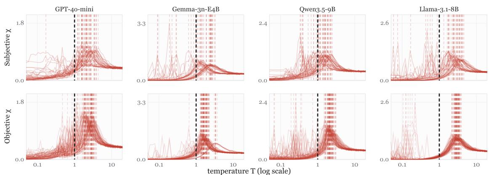  
variance of absolute net opinion (x)   fitted temperature (T = 1)   critical temperature, one per society (T\_c)

Figure S10: Figure 7 with each question-J pair presented individually. Figure 7 in Section 5.3 reports the across-community mean of these curves and the across-community mean of their χ-peak $\bar { \mathcal { T } } _ { c } ^ { \prime } \mathbf { s } .$ . This figure shows the same sweep without any averaging with one curve and one $\mathcal { T } _ { c }$ line per group.

This appendix explains how the critical temperatures in Section 5.3 are computed. To avoid confusion, we begin by clarifying that this experiment does not modify the language model’s temperature. Instead, it modifies the temperature of the fitted model, as described below.

Setup. The experiment covers every question in the test set and four in-distribution random graphs. Four graphs × the test question bank gives 80 objective and 40 subjective groups per model, each with four independent episodes.

Model. The sweep uses the parameters of the three-coupling discrete update rule.

Introducing Temperature. Our fitted rule is $P \big ( s _ { i } ( t + 1 ) = + 1 \big ) = \sigma \big ( h _ { i } \big )$ . Reintroducing the temperature divides that logit by $\tau$

$$
P \big ( s _ { i } = + 1 \big ) \ = \ \sigma \bigg ( \frac { h _ { i } } { T } \bigg ) ,
$$

so the $\mathcal { T } = 1$ point of the sweep is the fitted model itself.

Initialization. We call a J paired with a question a group. For each group, we have taken 4 independent trajectories in our experiments. The 4 trajectories are considered as the different rollouts of the same system in the temperature sweep as well. We initialize a group at each of the four starting points at t = 0 from the 4 independently sampled trajectories.

Procedure. We sweep 41 log-spaced temperatures from 0.05 to $2 0 . ^ { 1 6 }$ At each temperature, we run the model for 500 synchronous steps. We discard the first 200 (to account for the time it takes for the community to reach equilibrium) and retain the last 300. During this run, each agent’s opinion in the next step $s _ { i } = \pm 1$ is sampled with probability $\sigma ( h _ { i } / \mathcal { T } )$ .

Observables. From the 300 steps of the group trajectories, we compute ${ \boldsymbol { \chi } } \ = \ N \operatorname { V a r } _ { t } ( | n ( t ) | )$ . The four independent trajectories per group are used as four independent initial conditions that are then averaged into one χ curve per group.

Locating Tc. A group’s Tc is the location of its χ peak. Since the grid is coarse relative to the width of the peak, we fit a parabola through the maximizing grid point and its two neighbors in log T and take the vertex, which resolves $\overline { { \mathcal { T } _ { c } } }$ below the spacing of the 41-point grid.

## E.4 Predictability of Group Archetypes

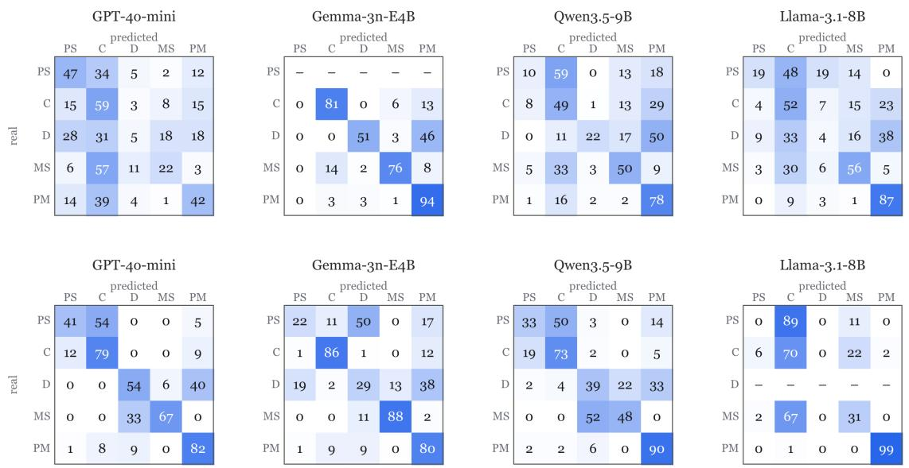  
Figure S11: Predictability of the Group Archetypes (row 1: objective; row 2: subjective). For every (question × graph) pair, we assess agreement among the 4 independently sampled episodes. For this analysis, we use test questions and 4 random graphs as our Js. For each question–J pair, we use the group archetype of one of the 4 trajectories as the predicted group archetype. We then use the remaining 3 group trajectories as the test set to construct a confusion matrix for predicting the correct group archetype. We repeat this process, using each of the 4 trajectories in turn as the prediction and the remaining 3 as the test set, in a cross-validation manner, and report the “cross-validated” confusion matrix. Because every trajectory takes its turn as the predictor, the cross-validated matrix is symmetric in raw counts. Row normalization makes the confusion matrix asymmetric. A row of the confusion matrix shows how often, for example, a persistent split trajectory is predicted as each of the other group archetypes. If the repeated samples always matched, we would observe a diagonal confusion matrix with 100 on the diagonal.

## E.5 Flow of Opinion

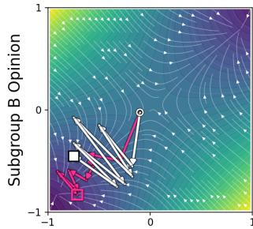  
Subgroup A Opinion

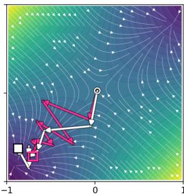  
Subgroup A Opinion

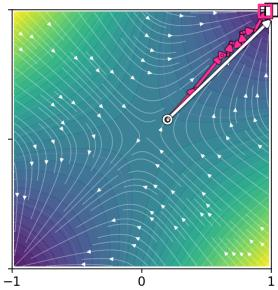  
Subgroup A Opinion

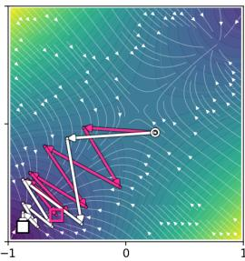  
Subgroup A Opinion

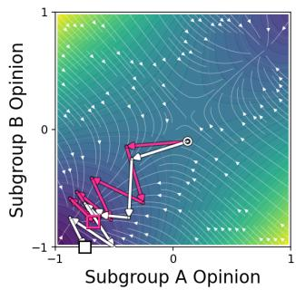

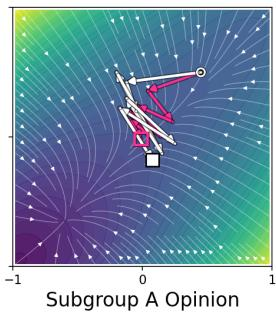

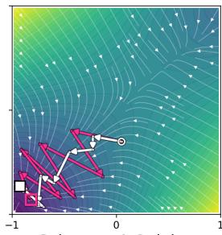  
□ real end (t = 8)□ predicted end (t = 8)

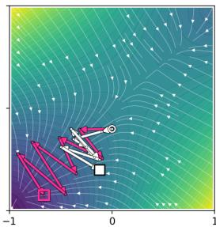  
Subgroup A Opinion

Figure S12: Flow of opinion predicted by the continuous three coupling model. Each panel is one group of 32 language-model agents interacting about a question over eight rounds. The axes are the average opinions of the two subgroups. The background shows our fitted model’s predictions, with energy represented by colors and the predicted flow (at the continuous time limit) represented by streamlines in the background. White indicates the observed transitions, while pink shows the model’s predicted rollout from the initial opinions at $t = 0 ,$ that updates the agents synchronously at discrete time intervals $t = 1 , \dots , T$  
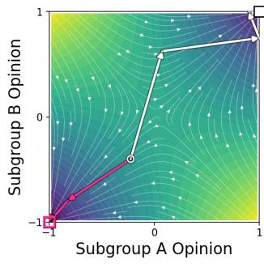

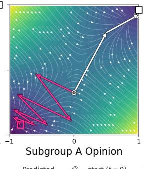

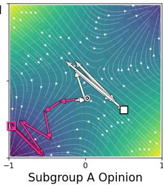  
□ real end (t = 8)□ predicted end (t = 8)

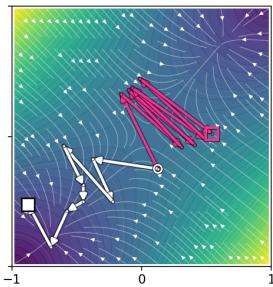  
Subgroup A Opinion  
Figure S13: Four example group trajectories where predictions do not match the observations.

Splitting into groups. We split the agents into two subgroups based on their opinion at $t = 0 .$ The $N = 3 2$ agents are ranked by their round-0 opinion $\bar { o } _ { i } ( 0 )$ ; the top half forms group A and the bottom half group B, so the two subgroups always have equal size (16 and 16) and A is by construction the side that starts higher, $n _ { A } ( 0 ) \geq n _ { B } ( 0 )$ , where $n _ { A } ( 0 )$ denotes the net opinion of the agents in subgroup A. Ties are broken by the following round, then the one after.

At each point on a 220 × 220 grid, we record the net opinions of agents in $A , n _ { A } ( t )$ , and agents in $B , n _ { B } ( t )$ . We generate rollouts and plot the subgroup net opinions at each timestep. The white path shows the real community’s per-round net opinions in the same two-dimensional space, while the pink path shows a rollout from the fitted continuous three-coupling update rule, initialized from the same state. We show selected rollouts on the held-out test set of questions.