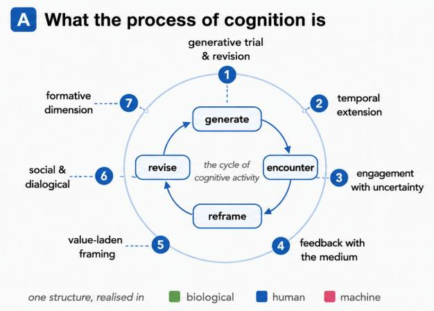
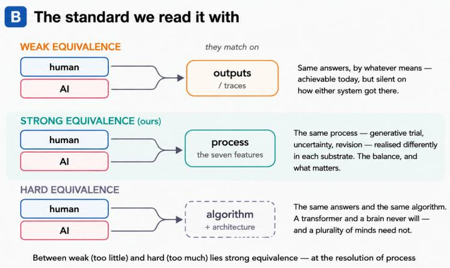
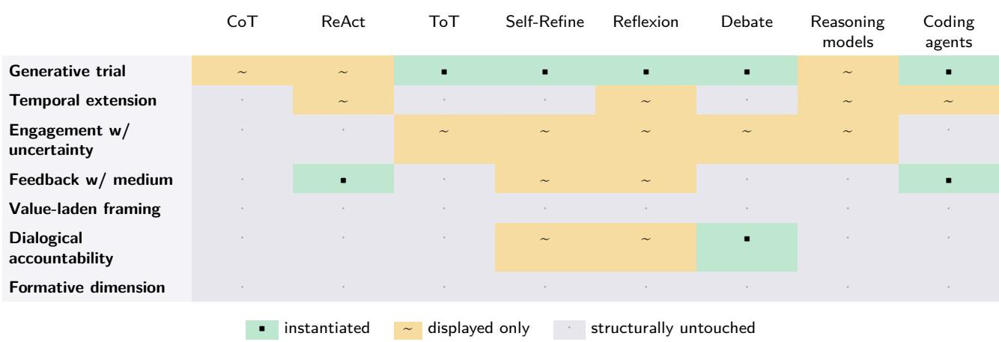

# Process-Constituted Intelligence: A Shared Criterion for Humans and Machines

Michael J. Richardson1,2,4, Ayeh Alhasan1,2, Cassandra Crone1,2, M. Paula Diaz Monfort1,5, Patrick Nalepka1,2,3, Mark Dras2,4,6, Rachel W. Kallen1,2, and David M. Kaplan1,2,3

1School of Psychological Sciences, Macquarie University, Sydney, NSW 2109, Australia; 2Performance and Expertise Research Centre, Macquarie University; 3Minds and Intelligences Research Centre, Macquarie University; 4Frontier AI Research Centre, Macquarie University; 5Scuola Superiore Meridionale, Napoli, Italy; 6School of Computing, Macquarie University

Correspondence: Michael J. Richardson (michael.j.richardson@mq.edu.au)

Abstract Intelligence is constituted by process (iterative activity through which output emerges), not in the output itself. Generative AI (GenAI) is trained on traces (textual and visual residues of human cognitive processes), reproducing samples from a distribution of those traces. Its outputs resemble reasoning, problem-solving, and creativity, yet the activity that produces such outputs in humans remains largely absent. Current GenAI is, therefore, weakly equivalent to the cognition it imitates, matching outputs while process stays absent or opaque. The cognitive sciences have long distinguished between weak and strong equivalence. Here, we define strong equivalence across seven process features, assessable against human and machine cognition. Our process-based account addresses a symmetric risk: GenAI tools that outsource a person’s generative processes may leave critical capacities unbuilt. We specify design principles for GenAI that instantiate more process and preserve rather than erode human judgment and creativity, and outline process audits that make strong equivalence testable.

## 1 The output-delivery pattern

GenAI is primarily deployed using one pattern: outputdelivery. A request goes in, an output comes out (a paragraph, image, block of code, an answer). These outputs increasingly resemble the products of human reasoning, problem-solving, and creative work. For many tasks, these outputs are hard to distinguish from what a competent or expert human would produce. Yet, the activity that generates these outputs in us (the early drafts and abandoned attempts, the breaks taken at an impasse, the dialogue with collaborators and the manipulation of the material itself, the slow accrual of a sense for which moves are promising and which are dead ends) is manifestly not what the system does when it answers. A scientific breakthrough, mathematical proof, or piece of skilled craft are not simply the outputs that survive at the end of a given process, but are also constituted by the extended activity that produced them 2;3;4. The output itself is only a preserved record —a trace—of that activity. Intelligence, on the view we develop here, is constituted by the process and not by the trace, a distinction with important consequences for systems trained on traces and for the tools that increasingly mediate human processes through which critical thinking, judgment, and knowledge are formed.

The cognitive sciences already have terminology for this distinction, differentiating between weak and strong equivalence 5. Generative models are trained on traces and reproduce samples from a distribution of those traces6. To the extent that these outputs resemble those generated by humans performing the same task, such models exhibit weak equivalence: they reproduce the same input-output behavior without necessarily reproducing the computational processes that generated it. Strong equivalence, by contrast, requires not only matching input-output behavior but also implementing the same underlying processes that give rise to that behavior.

For instance, reasoning models often produce "reasoningshaped" text that does not track the computation driving their answers 7;8;9. Reasoning traces are, at best, unreliable and partial windows onto the process that generated the output 10. They do not exhibit strong equivalence. Although a move toward agentic architectures and more elaborate “reasoning” frameworks (chain-of-thought, ReAct, tree-ofthoughts, multi-agent debate, iterative self-refinement, dedicated inference-time reasoning) 11;12;13;14;15;16;17 is a positive step toward putting process in central focus and moving beyond the output trace approach, frontier AI systems will remain relatively weak and partial without a clear set of substrate-neutral principles for measuring or auditing cognitive processes.

The same account that finds process missing from current GenAI holds that human cognitive capacities are themselves constituted through process. A critical implication of this view is that when a human uses a GenAI tool to perform the generative work, the capacity that work would have normally required is neither instantiated nor refined in the person. Early evidence already supports this. Students given an unrestricted generative tool perform better with it and worse without it than peers who never used one 18, as the bulk of cognitive effort shifts from generation toward verification19. Machine intelligence that is only weakly equivalent to what it imitates pushes human users strikingly towards that same weak equivalence as their own normal cognitive processes are supplanted or bypassed. These are not two separate problems, but rather one problem expressed across two substrates, for which no constructive evaluative framework yet exists.

Here, we take several steps to address this issue. We do not attempt to settle what intelligence is in general (a question older than the field itself and not one we could resolve here), but aim more narrowly to specify a criterion, pitched at the level of process, that can be applied comparatively across human and machine cognition. First, we characterize process-constituted intelligence in terms of seven core features, identifiable across natural and artificial systems, yet differently realized in each. We then locate a strong equivalence between Pylyshyn’s weak pole (matching outputs) and hard pole (matching algorithm and architecture) 5, at the resolution of those features, that a machine model or system (e.g., transformer) and a brain can meet without sharing an algorithm. Finally, we read current GenAI through that criterion to expose its process gap and the architectures that would close it, turn the same criterion on AI-assisted human work to derive process-preserving design principles, and propose process audits that test the framework on matched tasks across both substrates 1.

## 2 Intelligence as process

2.1 The process and the trace. That intelligence lies in the act of producing and not just in the product is a settled idea in the cognitive sciences, philosophy of mind, and the arts and design traditions. Throughout, we use intelligence and cognition interchangeably, referring to the activity through which such capacities are exercised rather than to a stored competence read off its results. A scientist works for months on a single question, discarding the models they were trained to expect would work before the data forced a new one. A painter works across many studies, and a mathematician returns to the same problem across years2;3;4. Our claim is that intelligence is constituted just as much by the discarded studies, dead ends, and slow accrual of judgment, none of which survive in the final output the activity leaves behind, as those final "intelligent" outputs.

This is not merely a stipulation about where intelligence is located, but a claim about how the capacities themselves are acquired. One does not learn to paint by studying finished canvases, nor to prove theorems by reading completed proofs. The capacity is built through structured, iterative practice (attempting, failing, and revising), and exposure to the products of that activity is no substitute for having done it 20;21. A system, or a person, given only the traces of that activity inherits its surface and not the competence that produced it. What these traditions leave open is how to make the descriptions of these disparate processes precise enough to compare across cases. This is the task we take up here.

2.2 Seven candidate features of process. We characterize process-constituted intelligence in terms of seven core features, each of which is observable in the behavior of a solver and each instantiated differently across material substrates (Table 1; full definitions and a diagnostic signature for each feature are given in Supplementary Table 1). Generative trial and revision. Cognition proceeds by producing many attempts and refining through failures. An inventor’s failed prototypes, a mathematician’s abandoned approaches, a painter’s discarded studies are not preliminary to the work but, rather, are the substance of it 4. Temporal extension. What matters is not that cognition takes time (all behavior does) but that it returns across occasions to the same material, carrying state forward so that each pass reworks the last, from a scientist’s months on a single problem to the years of deliberate practice that build a skill 20. Engagement with uncertainty. A solver sits in not-knowing, recognizes when a problem is ill-posed, and refuses premature closure rather than resolving to a confident answer the situation does not warrant22. Feedback with the medium. The material (a proof, canvas, instrument, dataset) resists and redirects the activity, so the work responds to the medium rather than executing a pre-formed plan2;23. Value-laden framing. What counts as a promising move or worthwhile problem is constituted by the practitioner’s developing judgment and is itself cognitive work, not a parameter fixed in advance 2. Social and dialogical accountability. Cognition is constituted in part by being answerable, both to others (reasoning with and against interlocutors and having one’s framings challenged) and, more broadly, for getting things right, a normative dimension some philosophers take to be intrinsic to intelligence 24;25;26;27. A formative dimension. Much of the process operates below explicit articulation, is built up through embodied practice within a community, and simultaneously shapes who the practitioner is becoming 28;21;29.

2.3 One cycle, many substrates. These features are not a checklist of independent items but facets of a single iterative cycle (Fig. 1A). A solver generates candidate moves, encounters resistance from the medium or interlocutors, reframes when that resistance reveals the framing to be inadequate, revises, and repeats across many turns. This cycle is recognizable wherever cognition is constituted in ongoing activity as it runs, rather than retrieved from a store of prior results, and it is not uniquely human. Honeybee swarms select nest sites through distributed scouting, advertisement, and crossinhibition that weighs alternatives and commits only as evidence accumulates30. Ant colonies allocate labor and solve routing problems through local interactions that no individual represents31. An acellular slime mold builds efficient transport networks by reinforcing productive paths and pruning others, externalizing a form of memory into the medium it moves through32;33;34. These are not metaphors for cognition but instances of the same generate–encounter–reframe–revise structure realized in biological media 35;36;37. The same loop appears in artificial learning systems: reinforcement learning improves a policy through action, feedback, and error resolution, and policy-gradient methods reproduce the patterns of human practice-based skill learning38; what such systems track is the change in performance across practice—learning rather than any single output39. The claim is therefore not that all intelligence is human-like, but that the process is recognizable across biological, human, and machine cognition. Although each substrate instantiates it differently, this allows the same features to serve as a common standard.

## 3 Weak, strong, and hard equivalence

3.1 The distinction. The distinction between resembling a cognitive process and instantiating it has long been established. Four decades ago, Pylyshyn separated weak from strong equivalence between an information-processing model and the cognition it represents 5. Two systems are weakly equivalent when they compute the same input–output function and strongly equivalent when they compute it using the same algorithm in the same functional architecture (i.e., the same underlying computational organization, not merely the same input–output mapping). The distinction also tracks Marr’s levels of analysis40, with strong equivalence demanding correspondence at the algorithmic level rather than mere agreement at the computational level about what function is computed. As Marr and others have noted, matching input– output behavior underdetermines the algorithm that produces it, just as a shared algorithm underdetermines its physical implementation40. A system can reproduce the outputs of cognitive capacities while realizing different architectures entirely 41. Likewise, the Turing test certifies only weak equivalence, since systems that pass it have matched the behavior but nothing follows about the process42.

  
Fig. 1 | Process, and the grades of equivalence. (A) Intelligence as process. A solver generates, encounters resistance from the medium or from interlocutors, reframes when that resistance exposes an inadequate framing, and revises. One iterative cycle whose facets are the seven features (1–7), recognizable across biological, human, and machine cognition while each substrate realizes it diferently (Table 1). (B) Three grades of equivalence between a system and the cognition it models 5. Weak, the two match on outputs, achievable but silent on how either system got there. Strong (ours), they match on process (the seven features), realized diferently in each substrate, the balance the rest of the paper holds systems to. Hard, they match on algorithm and architecture, Pylyshyn’s original strong equivalence, which a transformer and a brain neither share nor need. Strong equivalence sits between weak (too little) and hard (too much).

3.2 Three grades, not two. In the context of contemporary AI, Pylyshyn’s binary distinction (which was appropriate in the context of psychological explanations) is more useful if supplemented by an intermediate form of equivalence that lies between weak and hard (Fig. 1B). Pylyshyn’s original strong equivalence, which we relabel hard equivalence (i.e., algorithmic-architectural), requires that two systems instantiate the same algorithm in the same architecture. For artificial and biological intelligence, this standard is neither attainable nor desirable. A transformer trained by gradient descent on text will never implement the same algorithm as a human brain, nor should it: the value of a plurality of intelligences lies precisely in their realizing cognition through different physical substrates and computational mechanisms. We therefore set it aside as an inappropriate target. At the other extreme, weak equivalence asks too little, requiring only matching input-output behavior while remaining agnostic about the processes that generate it. Between these extremes lies the grade we call strong equivalence: correspondence at the level of the seven process features. Two systems are process-equivalent to the extent that their behavior is constituted by the same process organization, even if that organization is implemented differently. This level of description is coarser than algorithms but finer than inputoutput mappings, and it is at this level that the properties of intelligence we care about reside. Process equivalence is therefore the standard adopted throughout the remainder of the paper.

3.3 A current illustration. This triparite version of the distinction matters in the current debate over what large language models represent. Binz and colleagues recently introduced Centaur 43, a model fine-tuned on over ten million human choices across hundreds of experiments, which predicts human behavior on held-out tasks better than bespoke models. Although its predictive power is impressive, the system is still only weakly equivalent. The model matches the outputs of human cognition without arriving at them as people do, and the match degrades under exactly the manipulations a process-level account would target, breaking down when small changes in wording shift meaning in ways human respondents track but the model does not44. Inference from behavioral similarity/equivalence to shared underlying mechanisms is a well-known fallacy tracing back to Marr45. Recent work explicitly recruits Marr’s levels framework to construe behavioral matching as a computational-level result, which underdetermines what is happening at both algorithmic- and implementation-levels 46. Centaur is the well-built limiting case of the trace-trained system, maximal in weak equivalence and silent on strong. The underlying concern is not new. Systems that match or exceed human performance without reproducing human process are a recurring occasion for this observation, from Deep Blue’s brute-force chess search47 to earlier critiques of symbolic $\mathrm { A I } ^ { 4 8 }$

## 4 The machine case: a weak-equivalence engine

4.1 Trained on traces. Generative models are trained on corpora of textual and visual traces of human cognitive processes (e.g., finished papers, published code, transcripts, edited images). The iterative trials, abandoned approaches, dialogical pushback, and tacit-shaping behind these traces are largely absent from the corpora because they are rarely recorded. The structure of the training signal itself is the root of the process gap, yet this is not a shortage that more data can remedy. A larger corpus of traces is still a corpus of traces. Frontier models are, in this respect, unusually effective instruments of weak equivalence because they can reproduce traces of cognition without having been trained on the processes that generated them in humans. The question is, therefore, not whether scaling closes the process gap, but rather how much of the process itself can their agentic elaborations instantiate.

Table 1 | Seven features of process-constituted intelligence, with biological, human, and machine instantiations.
<table><tr><td rowspan=1 colspan=3>Feature</td><td rowspan=1 colspan=1>Biological cognition</td><td rowspan=1 colspan=1>Human cognition</td><td rowspan=1 colspan=1>Machine cognition</td></tr><tr><td rowspan=2 colspan=3>Generative trial and revision</td><td rowspan=1 colspan=2>Scout bees sampling alternative A mathematician&#x27;s abandoned</td><td rowspan=2 colspan=1>Multi-agent rollouts; tree-of-thought branching; rejection</td></tr><tr><td rowspan=1 colspan=1>nest sites; colony-level path ex-</td><td rowspan=1 colspan=1>approaches; an artist&#x27;s many</td></tr><tr><td rowspan=1 colspan=3></td><td rowspan=1 colspan=1>ploration</td><td rowspan=1 colspan=1>studies</td><td rowspan=1 colspan=1>sampling with critique</td></tr><tr><td rowspan=13 colspan=3>Temporal extensionEngagement with uncertaintyFeedback with the mediumValue-laden framingSocial and dialogical accountabilityFormative dimension</td><td rowspan=1 colspan=1>Trail reinforcement and foraging</td><td rowspan=1 colspan=1>Years of skill-building; a scien-</td><td rowspan=2 colspan=1>Persistent agentic trajectorieswith state across extended in-</td></tr><tr><td rowspan=1 colspan=1>histories accrued over time</td><td rowspan=1 colspan=1>tist&#x27;s years on one problem</td></tr><tr><td rowspan=1 colspan=2></td><td rowspan=1 colspan=1>teractions</td></tr><tr><td rowspan=1 colspan=2>Quorum thresholds that delay Recognizing ill-posed problems;</td><td rowspan=1 colspan=1>Calibrated probabilities; explicit</td></tr><tr><td rowspan=1 colspan=2>commitment until evidence ac- refusing premature closure</td><td rowspan=1 colspan=1>ambiguity flagging; abstention</td></tr><tr><td rowspan=1 colspan=3>cumulatesStigmergic update of the envi- Painter conversing with the can- Tool-using agents that update</td></tr><tr><td rowspan=1 colspan=3>ronment (pheromone, network vas; mathematician with the framing on environmental return</td></tr><tr><td rowspan=1 colspan=3>reinforcement)                  proof</td></tr><tr><td rowspan=1 colspan=3>Selection pressures defining a Expert framing of what counts Reward-shaping toward problem-</td></tr><tr><td rowspan=1 colspan=2>“good” site or route             as a worthwhile problem</td><td rowspan=1 colspan=1>reframing rather than solution-</td></tr><tr><td rowspan=3 colspan=3>pursuitMulti-agent adversarial revision;among scouts yielding a collec-peer-reviewed inquiry            inter-agent challengetive decisionColony-level adaptation; devel- Becoming the kind of scientist Beyond single-system scope;opmental plasticity              or artist who can do this work  appears via human-AI co-formation (S5)</td><td rowspan=1 colspan=1>purs</td></tr><tr><td rowspan=1 colspan=1>ountability</td><td rowspan=1 colspan=2></td></tr><tr><td rowspan=1 colspan=2></td></tr></table>

4.2 Cosmetic deliberation, and when it is not. Contemporary “reasoning” and some agentic developments appear to add process: chain-of-thought externalizes intermediate steps 11; tree-of-thoughts branches over candidates 13; self-refinement and Reflexion add critique-andrevision loops 15;49; coding agents run code, read failures, edit in response 50; and multi-agent debate subjects answers to challenge14, all of which allocate inference-time compute to deliberation before answering16;17. Whether these scaffolds instantiate process, or only display and mimic it, is the question previous literature has examined. Consistently, reasoning traces routinely fail to track the computation driving an answer, larger models can be less faithful rather than more, contemporary reasoning systems reveal decision-shifting hints in fewer than one in five cases, and direct measurement finds models reward-hacking without verbalizing the hack7;8;9;10;51. Debate scaffolds show a parallel pattern. Matched-compute comparisons find that multi-agent debate does not reliably beat single-agent self-consistency52;53. Debate over belief trajectories forms a martingale (i.e., on average each round of debate leaves the expected belief unchanged, so the exchanges add no information), implying that the intermediate exchanges contribute little beyond the eventual majority vote54;55. Reasoning-shaped output is, in these cases, additional output in the shape of reasoning rather than reasoning itself.

This gap, however, is not intrinsic to the architecture. It follows from how models are trained and what tasks demand, and is therefore addressable by design. The same literature shows that the reasoning trace is not always cosmetic. When a task is difficult enough that serial computation is genuinely necessary (i.e., the answer cannot be reached without externalizing intermediate work), the reasoning trace becomes load-bearing in a computational sense. The answer is then computed through the externalized steps rather than alongside them, so a model cannot evade a monitor without abandoning the computation that produces the answer56. Faithfulness is therefore a property of the task and of the training rather than of the architecture. A trace becomes faithful when the task forces the reasoning to do work, and it can be made more faithful by training that rewards verbalization 51. Across most of the currently deployed regimes, however, the task does not compel the reasoning to be load-bearing, and GenAI accordingly produces process-shaped output whose depicted process its architecture does not instantiate.

4.3 Feature-partial coverage. No existing scaffold covers all seven features at once. The features that models do not currently instantiate are the ones the human is left to supply (Fig. 2). Branching search and rejection sampling serve generative trial well, and self-refinement serves revi sion. However, the framing of the problem (what counts as a worthwhile question in the first place) still arrives from the prompt, so a person stays in-the-loop to perform the features an architecture lacks. Engagement with uncertainty is approximated by calibration and abstention, yet the system rarely distinguishes genuinely sitting in uncertainty from answering confidently, treating not-knowing as a threshold on when to answer rather than a mode of activity to remain in. The formative dimension is absent outright, since it plays out over a person’s development and no single system occupies that timescale. These gaps are not incidental. Better deliberation is pursued because it raises benchmark scores, not because theory says which features constitute process. Only such a theory can say which gaps matter and why.

4.4 Toward strong-equivalent architectures. If this gap is contingent on design, then closing it is a task of process engineering (i.e., building the generative activity into the architecture rather than optimizing its output). Our framework specifies what an architecture built for strong equivalence would have to do. We do not derive a full architecture from all seven features here. Instead, we develop two commitments concrete enough to build, each targeting a subset of the features rather than the whole set. The first is a dialogicalrevision architecture (targeting dialogical accountability and value-laden framing), in which an agent revises because another agent has challenged how it framed the problem, not because a chain ran longer or a majority of agents agreed. Existing debate systems adjudicate on whether the agents end up agreeing, which is why they reduce to voting14;54. A framework-informed version would instead task the challenger with attacking the framing, rather than the answer, and reward substantive changes of mind over surface concessions. The second is a situated agentic loop (targeting feedback with the medium and framing), in which the environment’s response can revise how the agent framed the task and not only the next action it takes. Coding agents are the nearest existing case, running code, reading failures, and editing in response, but their feedback updates the plan rather than the framin g 12;50. A frame-updating loop would separate a result that should change the plan from one that should change the problem itself, which requires holding the state of the problem apart from the candidate answer and a reward channel for reframing and sitting in uncertainty. Both commitments target the cycle directly, separating architectures that display it from those that run it.

## 5 The human case: process on the human side

5.1 The same problem, on the human substrate. If the capacities we value are constituted in process, then a tool that performs the process on a person’s behalf does not simply save effort. It removes the activity through which the capacity would have formed, pushing human cognition toward the same weak equivalence that characterizes the machine. The cognitive-offloading literature establishes that what a person does with a tool changes what they can do without it57;58. Whether this is productive externalization or erosion, we argue, depends on whether the generative steps stay with the practitioner. On the human side, the seven features specify which parts of the activity a tool must leave intact. Where it absorbs the generative trial, sitting-in-uncertainty, dialogical challenge, or formative struggle, the human’s own strong equivalence is at stake.

5.2 The evidence, and its boundary. The first wave of evidence is consistent enough to take seriously and careful enough to show where harm is and is not. A field experiment in secondary mathematics found that students with unrestricted GenAI access solved more problems while the tool was present but scored substantially worse once it was removed compared to unaided controls, the in-task gain having come from work the tool did for them18. The same pattern recurs across a range of process-level measures, including poorer performance on delayed knowledge-retention tests following chatbot-assisted study59, weaker neural connectivity and poorer recall of one’s own just-written text after assisted essay-writing60, reduced metacognitive engagement (“metacognitive laziness”) 61, and lower mental effort at the cost of depth in scientific inquiry62. The cost extends to expertise. For instance, adopting AI-assisted colonoscopy procedures reduced clinicians’ unaided detection rates, suggesting deskilling effects among practitioners who were previously proficient63. The cost can also go unfelt. In a randomized trial, experienced open-source developers completed tasks more slowly with AI assistance than without it, while believing they were faster, suggesting even expert practitioners may not reliably perceive the tool’s effects64. The convergence is not yet a causal demonstration of long-term formative effects, but the short-term pattern is what our framework predicts. Assistance that performs the process a person would otherwise have carried out forecloses the capacity that process builds.

However, the evidence does not support a blanket ban on such tools. The outcome depends on the role the tool plays, and the boundary condition is whether the tool performs the generative step or leaves it with the person. The same mathematics experiment found that a version constrained to give hints and withhold answers preserved learning where the unconstrained version harmed it, locating the harm not in AI assistance itself but in whether the generative step is withheld from the learner18. A randomized study of adults learning a new programming library found the same dividing line. Interactions that kept the user cognitively engaged preserved learning, whereas full delegation produced productivity without competence65. The essay-writing study makes the point from the other direction. Participants who wrote unaided first and only then turned to the tool showed greater neural connectivity than those who used it throughout, the assistance arriving after the generative work rather than in place of $\mathrm { i t } ^ { 6 0 }$ . The strongest counter-evidence shows students taught by a well-designed AI tutor learned more, and in less time, than peers in an active-learning classroom66. Notably, the tutor was built to keep students doing the generative reasoning rather than to deliver solutions, and gains were measured immediately rather than on delayed, unaided transfer tests, which may expose erosion elsewhere. Whether such scaffolded gains persist once the tutor is removed is the question a process-level account makes central. Indeed, process-preserving and process-substituting assistance are different constructs, and the seven features distinguish them.

5.3 The formative stakes. What is at stake in the erosive case is not only skill but formation. The capacities the process account foregrounds (judgment, recognition of ill-posed prob lems, taste that discriminates a promising direction, practical wisdom the tradition calls phronesis) are formed slowly and below articulation, through exactly the difficult, uncertain, dialogical activity that capable assistants make most tempting to offload 67;48. A tool that reliably supplies the answer removes the occasions on which these capacities would have been exercised and formed, and does so most efficiently for the learner who most needs the practice. The risk is developmental and cumulative, falling hardest on the next generation of practitioners.

5.4 Process-preserving design. If process is what cognition is constituted in, the design principle follows directly. It is not a matter of less assistance or more friction but of which parts of the activity the tool keeps with the person. An assistant that supplies the answer compresses the generative trial, while one that supplies the next question or counterexample extends it. An assistant that resolves an ambiguity dissolves the uncertainty the user should have sat with, while one that raises it and declines to settle returns the engagement to the user. An assistant that capitulates flatters, while one that holds a well-grounded position supplies the dialogical challenge the process requires (Table 2). These are the same features that specify strong-equivalent machine architectures, now read as constraints on the human–AI loop rather than on the agent alone. The two design programs converge under a single standard of process. What the field lacks is not the principles but the comparative evidence (i.e., studies testing process-preserving against process-substituting assistance on the downstream, unaided capacities that matter).

  
Fig. 2 | The machine process gap. Current agentic scafolds (chain-of-thought, ReAct, tree-of-thoughts, self-refine, reflexion, multi-agent debate, reasoning models, coding agents) mapped against the seven process features, distinguishing features instantiated, features only displayed as process-shaped output, and features left structurally untouched. Coding agents instantiate generative trial and feedback with the medium through their run–fail–fix loop, yet leave value-laden framing, dialogue, and formation untouched, the features a human still supplies.

## 6 A shared measurement via process audits

The framework matters only if the seven features can be measured, and pitching strong equivalence at the resolution of the features rather than the algorithm is what makes shared measurement possible. A process audit is a task-and-rubric protocol that scores a solver’s behavioral trace against the seven features, with substrate-specific behavioral anchors. Because the features are defined at a coarser resolution than the algorithm, the same audit can be administered to human and machine solvers on matched tasks. Conventional evaluation scores only the output. On reasoning items it rewards the correct answer, on creative tasks it rates the output. A process audit instead scores the activity (whether the solver generated and revised alternatives, flagged an ill-posedness rather than answering through it, updated on feedback, and marked the framing of the problem as a choice), so that two solvers reaching the same answer can receive different scores, and a solver reaching a worse answer through richer process can score higher on the dimensions the framework says matter. Work in comparative cognition calls for exactly this, probing machine cognition with the process-sensitive methods developed for animal and human cognition rather than output benchmarks alone 68;69;70.

Several probes make specific features measurable (Table 3). An ill-posed reasoning probe presents an under-determined problem with a confidently signaled expected answer and scores whether the solver flags the ill-posedness, develops alternative framings, and refrains from premature closure. A mid-trace perturbation, of the kind the faithfulness literature already employs, injects new information partway through a solution and scores whether the trace genuinely revises or merely continues8. A dialogical-accountability probe scores whether a post-challenge trajectory engages the substance of a challenge rather than its chain length. Each yields a behavioral signature scorable on a human transcript and a machine trace alike, letting the audit compare process across substrates rather than within one.

A shared audit turns the framework’s central commitments into empirical claims. On the machine side, an architecture that implements a feature should score measurably higher on that feature’s audit than the scaffold it replaces, with the gain intact after controlling for output quality. An intervention that raises benchmark scores while leaving audit scores unchanged is improving output, not process. On the human side, the audit supplies the missing dependent measure for the comparative studies called for above, namely whether process-preserving assistance, against process-substituting assistance, protects downstream capacities (unaided transfer, calibrated uncertainty, recognition of ill-posed problems, quality of independent revision) that the short-term evidence places at risk. Whether feature-targeted architectures close the machine-side gap, and which preserved features protect which human capacities, are open questions the framework makes precise and the audit makes measurable.

## 7 Conclusion

Intelligence is constituted in process, and the distinction drawn above (weak equivalence at the output, strong equivalence at the resolution of process) separates a system that matches cognition from one that instantiates it. Current GenAI, trained on the traces of human cognition, is built for the first and largely silent on the second. Faithfulness evidence shows how far reasoning-shaped output can diverge from reasoning-constituting activity wherever tasks do not force the reasoning to do work. Distinguishing strong from hard equivalence lets the same diagnosis apply without requiring that machines reproduce human algorithms and keeps a plurality of intelligences in view. The cost of ignoring the features is paid twice, by machine systems that produce the shape of cognition without its substance and by human users whose own process is left uncultivated.

The constructive consequence is that the same criterion does work on both sides. On the machine side it specifies architectures (answerable to challenge, situated in a medium that can overturn a framing) that instantiate more of the process rather than more of its appearance. On the human side, it specifies tools that preserve the generative, uncertain, dialogical, and formative activity through which judgment is built. Process audits make the standard measurable on both, turning its commitments into answerable questions, namely whether architectures designed against the features score higher without cosmetic gain and which preserved features protect which human capacities under sustained assistance.

Table 2 | Process-preserving versus process-substituting assistance. The same seven features that diagnose machine cognition specify, on the human side, which parts of the activity a tool must leave with the person, contrasting a process-preserving and a process-substituting assistant feature by feature.
<table><tr><td>Process feature</td><td>Process-preserving assistant</td><td>Process-substituting assistant</td></tr><tr><td>Generative trial</td><td>Supplies the next question or counterexample</td><td>Supplies the answer; the trial is compressed</td></tr><tr><td>Temporal extension</td><td>Spreads the work across returns</td><td>Collapses the work to a single shot</td></tr><tr><td>Engagement w/ uncer- tainty</td><td>Surfaces the ambiguity, declines to settle it</td><td>Resolves the ambiguity confidently</td></tr><tr><td>Feedback w/medium</td><td>Keeps the user in contact with the material</td><td>Mediates the material away</td></tr><tr><td>Value-laden framing</td><td>Leaves the framing of the problem to the user</td><td>Fixes the framing in advance</td></tr><tr><td>Dialogical accountability</td><td>Holds a well-grounded position</td><td>Capitulates and flatters</td></tr><tr><td>Formative dimension</td><td>Retains the occasions on which judgment forms</td><td>Removes them; the capacity goes unbuilt</td></tr></table>

Table 3 | Process audits, with the probes, the features they target, and the behavioral signatures scored. (Administrable to human and machine solvers on matched tasks.)
<table><tr><td>Probe</td><td>Features targeted</td><td>Behavioral signature scored</td></tr><tr><td>Ill-posed problem</td><td>Engagement with uncertainty; Value-laden framing</td><td>Flags ill-posedness; develops alternative framings; refuses premature closure</td></tr><tr><td>Mid-trace perturbation</td><td>Generative trial and revision; Feedback with the medium</td><td>Genuinely revises vs continues unchanged after injected information</td></tr><tr><td>Dialogical challenge</td><td>Social and dialogical accountability; Value-laden framing</td><td>Engages the substance of a challenge vs concedes or pads chain length</td></tr><tr><td>Sustained / return task</td><td>Temporal extension; Formative dimension</td><td>Maintains and updates state across returns; carries learn- ing forward (longitudinal on the human side)</td></tr></table>

A useful companion to this framing has been the rise of prompt and context engineering, which improves what systems return by optimizing how they are conditioned. Process engineering, in the sense developed above, points past it toward the generative activity itself rather than the conditioning of its output. The distinction bears on the largest question in view. If the capacities we call general are constituted in process rather than read off a distribution of outputs, then optimizing outputs alone may approximate general intelligence without constituting it, a conjecture the process audits are designed to test rather than a prediction we are in a position to make.

What intelligence is, and what it is for, are old questions. What is new is that systems producing its outputs are now built and deployed at scale, which makes the difference between an intelligence’s outputs and its process consequential in a way it has never been before.

## Acknowledgements

This work was supported by a Macquarie University 2025 Innovation in Education Grant (Spark) and by an Advanced Strategic Capabilities Accelerator (ASCA) grant (AN-12973) from the Australian Department of Defence, in collaboration with the Defence Science and Technology Group (DSTG).

## Use of generative AI

The authors used generative AI tools to assist with editing, concision, and revision. The intellectual content is the authors’ own, and the authors reviewed and take full responsibility for the content of the publication.

## Author contributions

M.J.R. and A.A. conceived and led the work, and M.J.R. wrote the first draft of the manuscript. A.A., C.C., M.P.D.M., and P.N. contributed substantially to developing the ideas and to drafting and revising the manuscript. M.D., R.W.K., and D.K. contributed to refining the framework and revising the manuscript. All authors reviewed and approved the final manuscript.

## Disclosure of interests

The authors have no competing interests to declare that are relevant to the content of this article.

## Data availability

This is a theoretical study; no datasets were generated or analysed, and no custom code was produced.

## References

[1] Richardson, M. J. et al. Process, not trace: A theoretical framework for agentic AI and process-preserving human–AI cognition. In Advances in Practical Appli cations of Agentic AI and Multi-Agent Systems: The PAAMS Collection, Lecture Notes in Computer Science (Springer, 2026). In press.

[2] Schön, D. A. The Reflective Practitioner: How Professionals Think in Action (Basic Books, 1983).

[3] Polanyi, M. Personal Knowledge: Towards a Post-Critical Philosophy (University of Chicago Press, 1958).

[4] Hadamard, J. An Essay on the Psychology ofInvention in the Mathematical Field (Princeton University Press, 1945).

[5] Pylyshyn, Z. W. Computation and Cognition: Toward a Foundationfor Cognitive Science (MIT Press, 1984). 10.7551/mitpress/2004.001.0001.

[6] Bender, E. M., Gebru, T., McMillan-Major, A. & Shmitchell, S. On the dangers of stochastic parrots: Can language models be too big? In Proceedings ofthe 2021 ACM Conference on Fairness, Accountability, and Transparency (FAccT ’21), 610–623 (2021).

[7] Turpin, M., Michael, J., Perez, E. & Bowman, S. R. Language models don’t always say what they think: Unfaithful explanations in chain-of-thought prompting. In Proceedings ofthe 37th International Conference on Neural Information Processing Systems, 74952–74965 (2023).

[8] Lanham, T. et al. Measuring faithfulness in chainof-thought reasoning. arXiv:2307.13702 (2023). 10.48550/arXiv.2307.13702.

[9] Chen, Y. et al. Reasoning models don’t always say what they think. arXiv:2505.05410 (2025). 10.48550/arXiv.2505.05410.

[10] Korbak, T. et al. Chain of thought monitorability: A new and fragile opportunity for AI safety. arXiv:2507.11473 (2025). 10.48550/arXiv.2507.11473.

[11] Wei, J. et al. Chain-of-thought prompting elicits reasoning in large language models. In Proceedings ofthe 36th International Conference on Neural Information Processing Systems, 24824–24837 (2022).

[12] Yao, S. et al. ReAct: Synergizing reasoning and acting in language models. In International Conference on Learning Representations (ICLR) (2023). 10.48550/arXiv.2210.03629.

[13] Yao, S. et al. Tree of thoughts: Deliberate problem solving with large language models. In Proceedings ofthe 37th International Conference on Neural Information Processing Systems, 11809–11822 (2023).

[14] Du, Y., Li, S., Torralba, A., Tenenbaum, J. B. & Mordatch, I. Improving factuality and reasoning in language models through multiagent debate. In Proceedings of the 41st International Conference on Machine Learning, 11733–11763 (2024).

[15] Madaan, A. et al. SELF-REFINE: Iterative refinement with self-feedback. In Proceedings of the 37th International Conference on Neural Information Processing Systems, 46534–46594 (2023).

[16] OpenAI. OpenAI o1 system card. Tech. Rep., OpenAI (2024). ArXiv:2412.16720.

[17] Guo, D. et al. DeepSeek-R1 incentivizes reasoning in LLMs through reinforcement learning. Nature 645, 633–638 (2025). 10.1038/s41586-025-09422-z.

[18] Bastani, H. et al. Generative AI without guardrails can harm learning: Evidence from high school mathematics. Proceedings ofthe National Academy ofSciences 122, e2422633122 (2025). 10.1073/pnas.2422633122.

[19] Lee, H.-P. et al. The impact of generative AI on critical thinking: Self-reported reductions in cognitive effort and confidence effects from a survey of knowledge workers. In Proceedings of the 2025 CHI Conference on Human Factors in Computing Systems, 1–22 (2025). 10.1145/3706598.3713778.

[20] Ericsson, K. A., Krampe, R. T. & Tesch-Römer, C. The role of deliberate practice in the acquisition of expert performance. Psychological Review 100, 363–406 (1993). 10.1037/0033-295X.100.3.363.

[21] Lave, J. & Wenger, E. Situated Learning: Legitimate Peripheral Participation (Cambridge University Press, 1991).

[22] Dewey, J. Logic: The Theory of Inquiry (Holt, 1938).

[23] Ingold, T. Making: Anthropology, Archaeology, Art and Architecture (Routledge, 2013).

[24] Longino, H. E. Science as Social Knowledge: Values and Objectivity in Scientific Inquiry (Princeton University Press, 1990). 10.2307/j.ctvx5wbfz.

[25] Bakhtin, M. M. The Dialogic Imagination: Four Essays (University of Texas Press, 1981).

[26] Smith, B. C. The Promise of Artificial Intelligence: Reckoning and Judgment (MIT Press, Cambridge, MA, 2019).

[27] Haugeland, J. Having Thought: Essays in the Meta physics of Mind (Harvard University Press, Cambridge, MA, 1998).

[28] Polanyi, M. The Tacit Dimension (Doubleday, 1966).

[29] MacIntyre, A. After Virtue: A Study in Moral Theory (University of Notre Dame Press, 1981).

[30] Seeley, T. D. Honeybee Democracy (Princeton University Press, 2010).

[31] Gordon, D. M. Ant Encounters: Interaction Networks and Colony Behavior (Princeton University Press, 2010).

[32] Nakagaki, T., Yamada, H. & Tóth, Á. Maze-solving by an amoeboid organism. Nature 407, 470 (2000). 10.1038/35035159.

[33] Tero, A. et al. Rules for biologically inspired adaptive network design. Science 327, 439–442 (2010). 10.1126/science.1177894.

[34] Reid, C. R., Latty, T., Dussutour, A. & Beekman, M. Slime mold uses an externalized spatial "memory" to navigate in complex environments. Proceedings of the National Academy ofSciences 109, 17490–17494 (2012). 10.1073/pnas.1215037109.

[35] Couzin, I. D. Collective cognition in animal groups. Trends in Cognitive Sciences 13, 36–43 (2009). 10.1016/j.tics.2008.10.002.

[36] Levin, M. Technological approach to mind everywhere: An experimentally-grounded framework for understanding diverse bodies and minds. Frontiers in Systems Neuroscience 16, 768201 (2022). 10.3389/fnsys.2022.768201.

[37] Lyon, P. The cognitive cell: Bacterial behavior reconsidered. Frontiers in Microbiology 6, 264 (2015). 10.3389/fmicb.2015.00264.

[38] Haith, A. M. Policy-gradient reinforcement learning as a general theory of practice-based motor skill learning. eLife (2026). Reviewed preprint.

[39] LeCun, Y. A path towards autonomous machine intelligence. Tech. Rep., OpenReview (2022). Position paper, version 0.9.2.

[40] Marr, D. Vision: A Computational Investigation into the Human Representation and Processing of Visual Information (Holt, 1982).

[41] Fodor, J. A. & Pylyshyn, Z. W. Connectionism and cognitive architecture: A critical analysis. Cognition 28, 3–71 (1988). 10.1016/0010-0277(88)90031-5.

[42] Dawson, M. R. W. Mind, Body, World: Foundations of Cognitive Science (Athabasca University Press, 2013).

[43] Binz, M. et al. A foundation model to predict and capture human cognition. Nature 644, 1002–1009 (2025). 10.1038/s41586-025-09215-4.

[44] Schröder, S., Morgenroth, T., Kuhl, U., Vaquet, V. & Paaßen, B. Large language models do not simulate human psychology. arXiv:2508.06950 (2025). 10.48550/arXiv.2508.06950.

[45] Lin, Z. Six fallacies in substituting large language models for human participants. Advances in Methods and Practices in Psychological Science (2025). 10.1177/25152459251357566.

[46] Ku, A. et al. Levels of analysis for large language models. Philosophical Transactions ofthe Royal Society A 384, 20250012 (2025). 10.1098/rsta.2025.0012.

[47] Campbell, M., Hoane, A. J. & Hsu, F.-h. Deep blue. Artificial Intelligence 134, 57–83 (2002).

[48] Dreyfus, H. L. & Dreyfus, S. E. Mind Over Machine: The Power of Human Intuition and Expertise in the Era ofthe Computer (The Free Press, 1986).

[49] Shinn, N. et al. Reflexion: Language agents with verbal reinforcement learning. In Proceedings of the 37th International Conference on Neural Information Processing Systems, 8634–8652 (2023).

[50] Yang, J. et al. SWE-agent: Agent-computer interfaces enable automated software engineering. In Advances in Neural Information Processing Systems 37 (NeurIPS) (2024).

[51] Turpin, M., Arditi, A., Li, M., Benton, J. & Michael, J. Teaching models to verbalize reward hacking in chain-of-thought reasoning. arXiv:2506.22777 (2025). 10.48550/arXiv.2506.22777.

[52] Smit, A. P., Grinsztajn, N., Duckworth, P., Barrett, T. D. & Pretorius, A. Should we be going MAD? a look at multi-agent debate strategies for LLMs. In Proceedings of the 41st International Conference on Machine Learning, 45883–45905 (2024).

[53] Zhang, H. et al. Position: Stop overvaluing multiagent debate – we must rethink evaluation and embrace model heterogeneity. arXiv:2502.08788 (2025). 10.48550/arXiv.2502.08788.

[54] Choi, H. K., Zhu, J. & Li, S. Debate or vote: Which yields better decisions in multi-agent large language models? In Advances in Neural Information Processing Systems, vol. 38, 101732–101764 (2025). ArXiv:2508.17536.

[55] Wu, H., Li, Z. & Li, L. Can LLM agents really debate? a controlled study of multi-agent debate in logical reasoning. arXiv:2511.07784 (2025). 10.48550/arXiv.2511.07784.

[56] Emmons, S. et al. When chain-of-thought is necessary, language models struggle to evade monitors. arXiv:2507.05246 (2025). 10.48550/arXiv.2507.05246.

[57] Sparrow, B., Liu, J. & Wegner, D. M. Google effects on memory: Cognitive consequences of having information at our fingertips. Science 333, 776–778 (2011). 10.1126/science.1207745.

[58] Risko, E. F. & Gilbert, S. J. Cognitive offloading. Trends in Cognitive Sciences 20, 676–688 (2016). 10.1016/j.tics.2016.07.002.

[59] Barcaui, A. ChatGPT as a cognitive crutch: Evidence from a randomized controlled trial on knowledge retention. Social Sciences & Humanities Open 12, 102287 (2025). 10.1016/j.ssaho.2025.102287.

[60] Kosmyna, N. et al. Your brain on ChatGPT: Accumulation of cognitive debt when using an AI assistant for essay writing task. arXiv:2506.08872 (2025). 10.48550/arXiv.2506.08872.

[61] Fan, Y. et al. Beware of metacognitive laziness: Effects of generative artificial intelligence on learning motivation, processes, and performance. British Journal of Educational Technology 56, 489–530 (2025). 10.1111/bjet.13544.

[62] Stadler, M., Bannert, M. & Sailer, M. Cognitive ease at a cost: LLMs reduce mental effort but compromise depth in student scientific inquiry. Computers in Human Behavior 160, 108386 (2024). 10.1016/j.chb.2024.108386.

[63] Budzyn, K.´ et al. Endoscopist deskilling risk after exposure to artificial intelligence in colonoscopy: A multicentre, observational study. The Lancet Gastroenterology & Hepatology 10, 896–903 (2025). 10.1016/S2468- 1253(25)00133-5.

[64] Becker, J., Rush, N., Barnes, E. & Rein, D. Measuring the impact of early-2025 AI on experienced open-source developer productivity. Tech. Rep., METR (2025). ArXiv:2507.09089.

[65] Shen, J. H. & Tamkin, A. How AI impacts skill formation. arXiv:2601.20245 (2026). 10.48550/arXiv.2601.20245.

[66] Kestin, G., Miller, K., Klales, A., Milbourne, T. & Ponti, G. AI tutoring outperforms in-class active learning: An RCT introducing a novel research-based design in an authentic educational setting. Scientific Reports 15, 17458 (2025). 10.1038/s41598-025-97652-6.

[67] Aristotle. The Nicomachean Ethics (Oxford University Press, 2009). L. Brown, Ed., D. Ross, Trans.

[68] Ivanova, A. A. How to evaluate the cognitive abilities of LLMs. Nature Human Behaviour 9, 230–233 (2025). 10.1038/s41562-024-02096-z.

[69] Voudouris, K., Cheke, L. & Schulz, E. Bringing comparative cognition approaches to AI systems. Nature Reviews Psychology 4, 363–364 (2025). 10.1038/s44159- 025-00456-8.

[70] Rane, S. et al. Position: Principles of animal cognition to improve LLM evaluations. In Proceedings of the 42nd International Conference on Machine Learning, 82051–82061 (2025).

## Supplementary Information

This supplement expands the seven features of process-constituted intelligence introduced in the main text (Table 1 gives compressed biological, human, and machine instantiations). For each feature, Supplementary Table 1 states a working definition, a human and an AI/machine instantiation, and a diagnostic signature—the observable evidence an auditor would look for to judge the feature present rather than absent. The diagnostic column is the operational bridge between the seven features and the process audits of Section 6: it says, feature by feature, what evidence would distinguish process from a trace that merely resembles it.

S u p p lementary Ta b le 1 | S eve n feat u res of pro cess- co n st i t u ted i n te l l i ge n ce : a wor k i n g d efi n i t i o n a h u m a n a n d a n A I / m a c h i n e i n sta n t i at i o n a n d a d i a g n ost i c s i g n at u re (w h at a n o bse rve r l oo ks for to j u d ge ea c h feat u re prese n t ve rs u s i m i tated ; m a ps o n to t h e S ect i o n 6 pro cess a u d i ts) .
<table><tr><td rowspan=1 colspan=13>Feature            Definition                               Human instantiation                                     Al / machine instantiation</td><td rowspan=1 colspan=2>Diagnostic signature (cf. S6)</td><td></td></tr><tr><td rowspan=1 colspan=1>1. Generative trial</td><td rowspan=1 colspan=6>Cognition proceeds by producing many  An inventor&#x27;s failed prototypes; a mathematician&#x27;s aban-</td><td rowspan=1 colspan=6>Multi-sample rollouts, tree-of-thought</td><td rowspan=1 colspan=2>Are failed candidates actually gener-</td><td></td></tr><tr><td rowspan=11 colspan=1>and revision2. Temporalextension3. Engagement</td><td rowspan=1 colspan=3>candidate attempts and refining them</td><td rowspan=1 colspan=3>doned proof strategies; a painter&#x27;s discarded studies;</td><td rowspan=1 colspan=6>branching, rejection sampling with self-</td><td rowspan=1 colspan=2>ated, retained, and shown to shape the</td><td></td></tr><tr><td rowspan=1 colspan=3>through their failures; the discarded</td><td rowspan=1 colspan=3>drafting and redrafting an email, or trying several word-</td><td rowspan=1 colspan=6>critique; a coding agent&#x27;s run-fail-fix</td><td rowspan=2 colspan=2>final output or is a single forward passpresented as if it were a search? Look</td><td></td></tr><tr><td rowspan=1 colspan=3>attempts are the substance of the work,</td><td rowspan=1 colspan=3>ings until one fits.</td><td rowspan=1 colspan=6>loop against a test suite.</td><td></td></tr><tr><td rowspan=1 colspan=3>not waste preliminary to it.</td><td rowspan=4 colspan=3>A scientist&#x27;s months on a single problem; the years ofdeliberate practice that build a skill; mulling a hard</td><td rowspan=2 colspan=6></td><td rowspan=2 colspan=3>a polished result.</td><td rowspan=1 colspan=1>for a traceable revision history, not just</td></tr><tr><td rowspan=2 colspan=3>Cognition unfolds over time and across</td></tr><tr><td rowspan=1 colspan=6>Persistent agentic trajectories that</td><td rowspan=1 colspan=2>Does earlier work measurably constrain</td><td rowspan=3 colspan=1></td></tr><tr><td rowspan=2 colspan=3>repeated returns to the same material,accumulating state rather than resolv-</td><td rowspan=1 colspan=6>carry state across sessions; memory</td><td rowspan=1 colspan=2>later work, with state maintained and</td></tr><tr><td rowspan=1 colspan=3>decision over several days; or learning to cook or drive</td><td rowspan=1 colspan=6>that accrues across interactions rather</td><td rowspan=1 colspan=2>revisited across turns or is each re-</td></tr><tr><td rowspan=1 colspan=3>ing in one bounded step.</td><td rowspan=1 colspan=3>over months.</td><td rowspan=1 colspan=6>than resetting each prompt.</td><td rowspan=2 colspan=2>sponse stateless and bounded by asingle context window?</td><td rowspan=2 colspan=1></td></tr><tr><td rowspan=2 colspan=3>A solver sits in not-knowing, recognizes</td><td rowspan=2 colspan=3>Recognizing that a question is ill-posed; withholding</td><td rowspan=1 colspan=6></td></tr><tr><td rowspan=1 colspan=6>Calibrated probabilities; explicit</td><td rowspan=1 colspan=3>On under-specified or unanswerable</td></tr><tr><td rowspan=11 colspan=1>with uncertainty4. Feedback withthe medium5. Value-laden</td><td rowspan=1 colspan=3>when a problem is ill-posed, and refuses</td><td rowspan=1 colspan=3>judgment until the evidence warrants it; saying “I&#x27;m not</td><td rowspan=1 colspan=6>ambiguity flagging; abstention or</td><td rowspan=1 colspan=3>inputs, does the system flag, abstain,</td></tr><tr><td rowspan=1 colspan=3>premature closure rather than resolving</td><td rowspan=1 colspan=3>sure yet&quot; and seeking more information before deciding.</td><td rowspan=1 colspan=6>clarification-seeking in place of con-</td><td rowspan=1 colspan=3>or ask or produce a fluent, confident</td></tr><tr><td rowspan=1 colspan=3>to confidence the situation does not</td><td rowspan=1 colspan=3></td><td rowspan=1 colspan=6>fident confabulation.</td><td rowspan=2 colspan=3>answer regardless? Probe with ill-posedprompts and measure calibration.</td></tr><tr><td rowspan=2 colspan=6>warrant.The material (e.g., proof, canvas, in-    A painter responding to what the canvas does; a mathe-</td><td rowspan=2 colspan=6>Tool-using agents that update their</td></tr><tr><td rowspan=1 colspan=4>ol-using agents that update their</td><td rowspan=1 colspan=3>Does environmental return change the</td></tr><tr><td rowspan=1 colspan=3>strument, dataset, codebase) talks</td><td rowspan=1 colspan=3>matician led by what the proof will and will not permit;</td><td rowspan=1 colspan=2>fra</td><td rowspan=1 colspan=5>framing on environmental return (com-</td><td rowspan=1 colspan=2>plan and framing, or only the surface</td><td rowspan=1 colspan=1></td></tr><tr><td rowspan=2 colspan=3>back and redirects the activity, so thework is a conversation with the medium</td><td rowspan=2 colspan=9>adjusting a recipe as you taste it; or rearranging a room   piler errors, test failures, retrievedby seeing how it looks                                     evidence), not merely their next token.</td><td rowspan=1 colspan=2>output? Distinguish genuine reframing</td><td rowspan=2 colspan=1></td></tr><tr><td rowspan=1 colspan=2>from re-running the same plan against</td></tr><tr><td rowspan=1 colspan=12>rather than execution of a pre-formed</td><td rowspan=1 colspan=2>feedback. (Coding agents come closest;</td><td rowspan=2 colspan=1></td></tr><tr><td rowspan=2 colspan=12>plan.What counts as a promising move or    Expert judgment of which problems are worth posing and  Objectives or reward-shaping that</td><td rowspan=1 colspan=2>S4.)</td></tr><tr><td rowspan=1 colspan=2>Does the system generate or revise</td><td rowspan=1 colspan=1></td></tr><tr><td rowspan=5 colspan=1>framing6. Social and</td><td rowspan=2 colspan=6>a worthwhile problem is constituted by  which moves are promising; sensing which task on a busythe practitioner&#x27;s developing judgment</td><td rowspan=2 colspan=6>target problem-reframing rather thansolution-pursuit; in current systems</td><td rowspan=1 colspan=2>its own framing of what matters, or</td><td rowspan=2 colspan=1></td></tr><tr><td rowspan=1 colspan=3></td><td rowspan=1 colspan=2>optimize a framing handed to it? Look</td></tr><tr><td rowspan=1 colspan=6>and is itself cognitive work, not a pa-    the real one.</td><td rowspan=1 colspan=6>the framing is largely supplied from</td><td rowspan=1 colspan=3>for reframing of the goal, not just</td></tr><tr><td rowspan=2 colspan=12>rameter fixed in advance.                                                                           outside.Cognition is constituted in part by       Practices built around being answerable to others:        Multi-agent adversarial revision; inter-</td><td rowspan=2 colspan=3>efficient pursuit of a fixed one.Can adversarial critique change the</td></tr><tr><td rowspan=1 colspan=2>I critique change the</td></tr><tr><td rowspan=1 colspan=1>dialogicalaccountability</td><td rowspan=1 colspan=2>being, answerable</td><td rowspan=1 colspan=11>being answerable to others: reasoning   chavruta (paired study in which partners argue a text     agent challenge in which a critic canwith and against interlocutors and       into clarity), Socratic dialectic (a claim tested through     alter the framing rather than merely</td><td rowspan=1 colspan=2>le to others: reasoning</td></tr><tr><td rowspan=4 colspan=1>7. Formativedimension</td><td rowspan=1 colspan=5>having one&#x27;s framings challenged.        question and counter-question), and peer review (claim</td><td rowspan=1 colspan=7>s vote on the output.</td><td></td><td></td><td></td></tr><tr><td rowspan=3 colspan=9>certified only after expert scrutiny); explaining your rea-soning to a friend who pushes back; or defending a planto colleagues who challenge it.Much of the process runs below explicit Becoming the kind of scientist or artist who can do thisarticulation, is built up through embod- work; tacit skill acquired through sustained practice;</td><td rowspan=2 colspan=4></td><td></td><td></td><td></td></tr><tr><td rowspan=1 colspan=4></td><td></td><td></td><td></td></tr><tr><td rowspan=1 colspan=5>at all, through human-Al co-formation</td><td rowspan=1 colspan=1>n</td><td></td><td></td><td></td><td></td></tr><tr><td rowspan=4 colspan=1></td><td rowspan=4 colspan=6>ied practice within a community, and   growing into a parent&#x27;s judgment, or a driver&#x27;s feel forsimultaneously shapes who the practi-   the road.tioner is becoming.</td><td rowspan=3 colspan=6>(S5); the system shapes, and is shapedwithin, a practice rather than internaliz-ing one itself.</td><td></td><td></td><td></td></tr><tr><td rowspan=1 colspan=1>systems the he</td><td></td><td></td></tr><tr><td rowspan=1 colspan=1>absent: assess</td><td></td><td></td></tr><tr><td rowspan=1 colspan=6></td><td></td><td></td><td></td></tr></table>