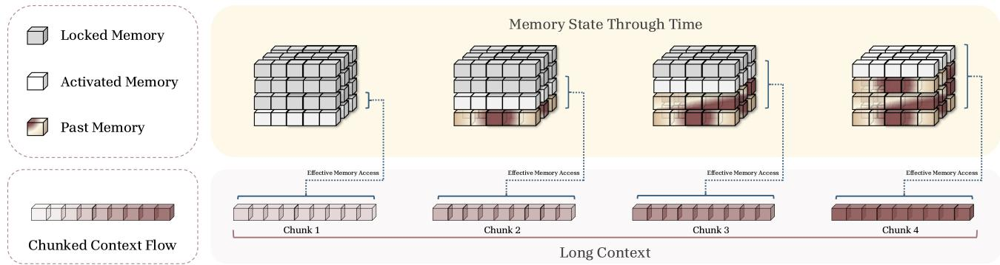
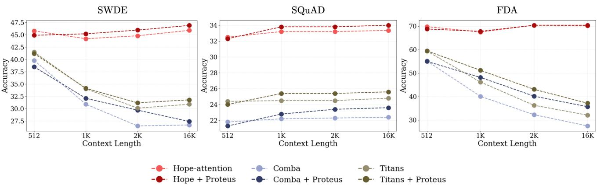
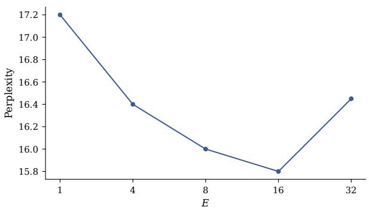
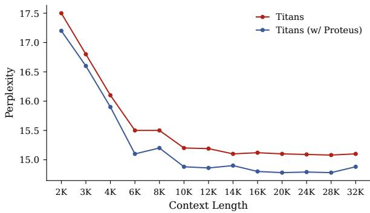

# Proteus: Incremental Memory Activation for Long-Context Sequence Modeling

Reza Bayat†∗, Ali Behrouz‡∗, Vahab Mirrokni‡, and Aaron Courville†

Mila

Google Research

## Abstract

The quadratic cost of attention-based sequence models for long contexts has motivated a growing line of research on memory-based models that can compress context into a compact state. However, most existing memory models expose a static memory throughout the entire sequence. Because early tokens face no compression pressure, they occupy too many degrees of freedom and “pollute” the memory state, leaving little capacity for later context and increasing interference between what is stored and what arrives next. We study a new paradigm of incremental memory activation, where the efective capacity of memory is progressively expanded as the context grows. Imposing an early bottleneck forces the model to compress history more efectively, while unlocking fresh capacity over time reduces interference and improves retention of later context. We instantiate this paradigm in Proteus, a straightforward mechanism that can be incorporated into a broad class of neural memory architectures at no additional cost. We apply Proteus to state-of-the-art models, including SWLA, Comba, Titans, and Hope-Attention, and observe consistent improvements on standard language modeling and reasoning, as well as on long-context retrieval and understanding, with gains that grow at longer context lengths. Overall, our results show that static memory is suboptimal and that scheduling efective capacity is a simple and broadly applicable tool for sequence modeling.

  
Figure 1: Incremental memory activation in Proteus. Proteus progressively expands the active subset of the memory state as the context advances. At each step, the model both reads from and writes to the currently activated blocks (together with previously activated “past” blocks), while the remaining blocks stay locked and do not participate in retrieval or updates. As the context grows, additional blocks are unlocked, providing fresh capacity for later tokens. This imposes an early capacity bottleneck that encourages compression of the initial context, while the fresh capacity introduced over time reduces overwriting and interference for later tokens.

## 1 Introduction

The rise of Transformers (Vaswani et al. 2017), pure attention-based architectures, has revolutionized the use cases of machine learning and AI, moving from task-specific models to general-purpose systems (Brown et al. 2020; Kaplan et al. 2020). Softmax attention, the backbone of Transformers and the component mainly responsible for sequence mixing, acts as a lossless memory module that caches every single token in the sequence, so that its memory size grows linearly with sequence length (Ramsauer et al. 2021; Bietti et al. 2024; Behrouz et al. 2025c). While this makes attention well suited to retrieval, the growing memory comes with a quadratic computational cost with respect to the sequence length, limiting the model’s long-context handling.

To overcome the quadratic cost of Transformers, as well as their limited expressivity on tasks that require sequential reasoning, modern recurrent neural networks have re-gained popularity in recent years (Katharopoulos et al. 2020; Irie et al. 2021; Sun et al. 2023; Sun et al. 2024; Behrouz et al. 2025e). In contrast to Transformers with their growing memory, modern RNNs employ a fixed-size memory (a.k.a. a hidden state) to compress the context, so that the decoding cost per token is constant and the overall computational cost is linear or sub-quadratic in the sequence length. This eficiency, however, comes at a price: compressing an unbounded context into a fixed-size state limits the length extrapolation ability of RNNs—their ability to generalize to sequence lengths beyond those seen in training—and thus their potential for long-context understanding (Bai et al. 2023; Hsieh et al. 2024; Kuratov et al. 2024; Tiezzi et al. 2024).

A substantial body of work has sought to close this gap through (meta-learning) memory initialization (Sun et al. 2024; Behrouz et al. 2025e), more robust update rules (Schlag et al. 2021; Von Oswald et al. 2023; Behrouz et al. 2025a), and more powerful memory architectures (Sun et al. 2024; Behrouz et al. 2025e; Zhang et al. 2025). Despite these advances, recurrent models still struggle to make full use of their memory capacity, and we argue that a key reason is when, not just how, information is written. Because the memory is written online, early tokens arrive when the state is nearly empty: they face little competition for capacity and are under almost no pressure to compress, and so they are free to occupy a disproportionate share of the memory’s degrees of freedom. Later tokens, by contrast, must be squeezed into whatever capacity remains, and writing them increasingly overwrites or interferes with what is already stored. The result is an imbalance in which the memory is biased toward initial tokens (Barbero et al. 2024; Behrouz et al. 2025b) and struggles to incorporate later context—precisely the regime that long-context tasks stress most.

In this paper, we study a paradigm of incremental memory activation for recurrent neural networks, in which the efective memory capacity is scheduled as a function of context length. The design directly targets the imbalance above. Since the problem originates with early tokens being under-compressed, we deliberately impose a capacity bottleneck early in the sequence, forcing the model to summarize the initial context rather than memorize it; and since later tokens sufer from interference, we progressively unlock fresh, previously unused capacity as the context grows, giving new information room to be written without overwriting what came before. In this way, the two mechanisms—an early bottleneck and fresh capacity over time—address the two failure modes of static memory in tandem. More broadly, viewing MLP-block through the Nested Learning lens (Behrouz et al. 2025d) as a form of associative memory, the same scheduling principle extends beyond the recurrent state to a model’s parameters, which lets us apply it to architectures such as Hope-Attention.

We instantiate this paradigm with a simple yet efective mechanism, Proteus, that can be integrated into modern deep and linear-memory recurrent models at no additional cost. Across a diverse set of benchmarks spanning language modeling, commonsense reasoning, long-context understanding, and needle-in-a-haystack tasks, Proteus improves over strong baselines on both standard and long-context settings, with gains that grow at longer context lengths.

Contributions. In summary, our key contributions in this paper are as follows.

• Incremental memory activation. We introduce incremental memory activation, a paradigm for controlling efective model capacity (e.g., memory or parameters) over the context flow via progressive activation, encouraging early compression while reducing later overwrite and interference.

• Proteus: a general, lightweight mechanism. We propose Proteus, a simple block-wise gating scheme that applies incremental activation to both memory reads and writes and is drop-in for a broad class of associative-memory architectures.

• Strong results. We show that Proteus consistently improves state-of-the-art models (SWLA, Comba, Titans, Hope Attention) across model scales on a broad range of benchmarks, without adding parameters or memory.

## 2 Preliminaries

## 2.1 Sequence Modeling as Associative Memory

A growing line of work views sequence models through the lens of an associative memory system that compresses past context into a compact state via an optimization procedure (Sun et al. 2024; Behrouz et al. 2025c,e). We adopt the genera formulation of Behrouz et al. (2025c).

Definition 1 (Associative Memory). Given a set of keys $\mathcal { K } \subseteq \mathbb { R } ^ { d _ { k } }$ and values $\mathcal { V } \subseteq \mathbb { R } ^ { d _ { v } }$ , an associative memory is an operator $M ( \cdot )$ , parameterized by a set ofmemory parameters, that maps the keys K to values in $_ \mathrm { ~ \textit ~ { ~ N ~ } ~ }$ . To learn such a mapping from data, an internal objective $\tilde { \mathcal { L } } ( \mathrel { \mathop { : } } ; \cdot )$ measures the quality of the mapping, and M can be computed by solving:

$$
\mathcal { M } ^ { * } = \arg \operatorname* { m i n } _ { \mathcal { M } } \tilde { \mathcal { L } } \big ( \mathcal { M } ( \mathcal { K } ) , \mathcal { V } \big ) .\tag{1}
$$

In the sequence modeling setting, K and $_ \mathrm { ~  ~ }$ are constructed from diferent representation views of the inputs, typically linear projections $k _ { t } = x _ { t } W _ { k } , v _ { t } = x _ { t } W _ { v }$ , and $q _ { t } = x _ { t } W _ { q }$ (Sun et al. 2024; Behrouz et al. 2025e). We use the tilde in $\mathcal { \tilde { \underline { { L } } } }$ to distinguish this internal memory objective—which the memory minimizes to learn its key–value associations—from the outer training loss of the full model (Behrouz et al. 2025c). The power of this view is that a single choice of internal objective and optimization procedure induces a specific architecture: diferent sequence models are not fundamentally diferent mechanisms, but diferent instantiations of Equation (1) (Behrouz et al. 2025d).

A spectrum of compression. This framing situates existing sequence models along a spectrum defined by how aggressively they compress context. At one extreme, softmax attention can be cast as the non-parametric solution to an $\ell _ { 2 }$ regression objective over the context, storing every key–value pair without compression and thus acting as a lossless but linearly growing memory; restricting that objective to a local window recovers sliding-window attention (Behrouz et al. 2025d). At the other extreme, a fixed-size recurrent memory compresses the entire history into a state of constant size, trading expressivity for eficiency. Incremental memory activation, introduced in Section 3, can be seen as modulating where on this spectrum the efective memory sits as the context grows.

## 2.2 Memory as Online Optimization

The memory in Definition 1 is learned online, one token at a time, as the context is revealed. Concretely, the recurrence of a memory-based model can be written as an update rule that writes each new input into the state, and a read rule that produces a memory-conditioned output. A common instantiation optimizes the internal objective by gradient descent, giving the update

$$
\mathcal { M } _ { t } = \mathcal { M } _ { t - 1 } - \theta _ { t } \nabla \tilde { \mathcal { L } } ( \mathcal { M } _ { t - 1 } ; k _ { t } , v _ { t } ) ,\tag{2}
$$

where $\theta _ { t }$ is a step size, together with a read $y _ { t } = \operatorname { R e a d } ( M _ { t - 1 } , q _ { t } )$ that depends on the memory architecture $( \mathrm { e . g . }$ , a matrix– vector product for a linear memor ${ \mathrm { y } } ,$ or a forward pass for an MLP memory). The gradient $\nabla \tilde { \mathcal { L } } ( M _ { t - 1 } ; k _ { t } , v _ { t } )$ acts as a surprise signal: the more the current association departs from what the memory has captured, the larger the update (Behrouz et al. 2025e).

Architectures as choices of objective and update. Within this frame, distinct architectures correspond to distinct choices of the internal objective ${ \tilde { \mathcal { L } } } ,$ the optimizer (including retention and momentum), and the memory parameterization (Behrouz et al. $2 0 2 5 \mathrm { c } , \mathrm { d } )$ .

Hebbian rule. Taking a dot-product objective $\tilde { \mathcal { L } } ( M _ { t - 1 } ; k _ { t } , v _ { t } ) = - \langle M _ { t - 1 } k _ { t } , v _ { t } \rangle$ and optimizing by gradient descent with a decay term recovers linear attention (Katharopoulos et al. 2020):

$$
\boldsymbol { \mathcal { M } } _ { t } = \boldsymbol { \alpha } _ { t } \boldsymbol { \mathcal { M } } _ { t - 1 } + \boldsymbol { \theta } _ { t } \boldsymbol { v } _ { t } \boldsymbol { k } _ { t } ^ { \intercal } .\tag{3}
$$

The additive write has limited capacity, since it never removes stale associations before writing new ones.

Delta rule. Replacing the objective with an $\ell _ { 2 }$ reconstruction loss $\begin{array} { r } { \tilde { \mathcal { L } } ( M _ { t - 1 } ; k _ { t } , v _ { t } ) = \frac { 1 } { 2 } \| \mathcal { M } _ { t - 1 } k _ { t } - v _ { t } \| _ { 2 } ^ { 2 } } \end{array}$ yields a delta-rule update that first erases the current value along $k _ { t }$ before writing $v _ { t }$ (Schlag et al. 2021):

$$
\boldsymbol { \mathcal { M } } _ { t } = \big ( \boldsymbol { I } - \theta _ { t } \boldsymbol { k } _ { t } \boldsymbol { k } _ { t } ^ { \top } \big ) \boldsymbol { \mathcal { M } } _ { t - 1 } + \theta _ { t } \boldsymbol { v } _ { t } \boldsymbol { k } _ { t } ^ { \top } .\tag{4}
$$

Momentum and forgetting (Titans). Building on the $\ell _ { 2 }$ objective, Titans augments the update with momentum and an adaptive forget gate (Behrouz et al. 2025e):

$$
\mathcal { M } _ { t } = \left( 1 - \alpha _ { t } \right) \mathcal { M } _ { t - 1 } + S _ { t } , \qquad S _ { t } = \eta _ { t } S _ { t - 1 } - \theta _ { t } \nabla \tilde { \mathcal { L } } ( \mathcal { M } _ { t - 1 } ; k _ { t } , v _ { t } ) ,\tag{5}
$$

where $S _ { t }$ carries a running memory of past surprise (momentum) and $\alpha _ { t } \in [ 0 , 1 ]$ controls how much of the state is forgotten. TTT (Sun et al. 2024) corresponds to the same $\ell _ { 2 }$ objective with plain gradient descent $( \eta _ { t } = \alpha _ { t } = 0 )$ and admits a linear or an MLP memory.

Efective capacity. We refer to the efective capacity of the memory at step � as the number of memory parameters that are active—i.e., that participate in the update in Equation (2) and in the read. We write � for the total capacity, and in Section 3 we schedule an active subset $c ( t ) \leq C$ over the context. This axis is deliberately orthogonal to the dimensions discussed in general frameworks (Behrouz et al. 2025c,d; Wang et al. 2025): incremental activation changes neither the internal objective, nor the optimizer, nor the memory architecture, but only which parameters are exposed at each position. This orthogonality is precisely what lets a single mechanism apply, unchanged, across the entire family.

## 2.3 MLP Blocks as Associative Memory

The associative-memory view above concerns the online memory state, but a recent perspective—Nested Learning (Behrouz et al. 2025d)—extends the same lens to a model’s parameters. Under this view, gradient-based update of MLP blocks is itself a form of associative memory: each layer, updated by backpropagation, learns to map its input to the local error signal it receives. Concretely, a gradient-descent update

$$
\theta _ { i + 1 } = \theta _ { i } - \eta _ { i + 1 } \pmb { e } _ { i } ,\tag{6}
$$

where $\mathbf { \boldsymbol { e } } _ { i }$ is the error (surprise) supplied by the optimizer for the �-th data sample, can be read as a memory that writes each sample’s contribution into �. We do not rely on the full machinery of this perspective; what matters for us is the shared structure. This motivates applying the same incremental-activation principle not only to the recurrent state but to the MLP parameters themselves, which we develop for architectures such as Hope-Attention in Section 4.

## 2.4 Static Capacity is Suboptimal

Despite their variety, the memory and parameter views above share a design choice that is rarely questioned: capacity is static, with the same parameters exposed throughout the entire context or training run. Yet controlling a model’s efective capacity has long been studied (Guyon et al. 1991; Hansen et al. 2001; Ding et al. 2018; Kaplan et al. 2020), and from a compression standpoint, a bottlenecked information flow encourages a model to retain only task-relevant structure, as exemplified by autoencoders (Vincent et al. 2010). Classical capacity control restricts a model’s degrees of freedom globally; the online setting of Equation (2) suggests a positional analogue, since the right amount of capacity difers early versus late.

The failure mode of static capacity can be read directly of the online objective. When all parameters of M are active from the first token, early inputs are fit using the memory’s full degrees of freedom; minimizing $\tilde { \mathcal { L } }$ then favors memorizing them rather than compressing them, so the memory is “polluted” by early context and generalizes poorly. Once the state is heavily written, updating it for later tokens increasingly interferes with what is already stored, making new information harder to incorporate. In the following, we introduce incremental memory activation for controlling efective capacity over the context in Section 3, instantiate it in Proteus in Section 4, and incorporate it into a broad class of sequence models in Section 5.

## 3 Incremental Memory Activation

Section 2 identified two failure modes of static capacity: early inputs are memorized rather than compressed, and later inputs interfere with an already-saturated state. We now introduce a paradigm that addresses both by scheduling the efective capacity of the memory as a function of input position. The design follows two complementary goals: (i) early compression, which forces the model to summarize early context through a restricted-capacity bottleneck; and (ii) fresh capacity, which unlocks previously unused components later in the context to absorb new information without overwriting what has already been stored.

Why a growing schedule. Before formalizing the paradigm, it is worth asking what kind of schedule the two goals call for. The tension is between bias and interference. Too little active capacity late in the context wastes tokens the memory could have used, while too much active capacity early lets the memory overfit the few tokens seen so far instead of compressing them. Balancing the two suggests that the active capacity should track the amount of context observed: small when few tokens have been seen, and growing as more arrive, rather than being fixed at either extreme. This intuition, that efective capacity should grow with position, motivates the simple uniform schedule we adopt in Section 4, whose behavior we study empirically in Section 5.

Capacity-scheduled memory. To capture this formally, we augment the associative memory of Definition 1 with an activation operator $\mathcal { G } _ { t }$ that exposes only a subset of the memory’s capacity at step �. Writing the online update of Equation (2) with this operator, incremental activation restricts both the write and the read to the active subset while holding the inactive components fixed.

Definition 2 (Capacity-Scheduled Associative Memory). Let $\mathcal { G } _ { t }$ be an activation operator that selects a subset of the memory parameters at step �, with $g _ { t } \in \{ 0 , 1 \} ^ { \dim ( \mathcal { M } ) }$ the indicator ofthe selected components, and write $\boldsymbol { \mathcal { M } } _ { t - 1 } ^ { ( g ) } : = \mathcal { G } _ { t } ( \boldsymbol { \mathcal { M } } _ { t - 1 } )$ for the active subset. A capacity-scheduled associative memory updates online as

$$
\begin{array} { r } { \mathcal { M } _ { t } = \mathcal { M } _ { t - 1 } - \theta _ { t } \mathcal { G } _ { t } \big ( \nabla \tilde { \mathcal { L } } ( \mathcal { M } _ { t - 1 } ^ { ( g ) } ; k _ { t } , v _ { t } ) \big ) , \qquad s o t h a t \quad ( 1 - g _ { t } ) \odot \mathcal { M } _ { t } = ( 1 - g _ { t } ) \odot \mathcal { M } _ { t - 1 } , } \end{array}\tag{7}
$$

and reads from the active subset, $y _ { t } = \operatorname { R e a d } ( M _ { t - 1 } ^ { ( g ) } , q _ { t } )$

The constraint states the defining property of the paradigm: components outside the active set at step � are locked, neither written nor read, and retain exactly the values they held before. Setting $\mathcal { G } _ { t }$ to the identity for all � recovers the standard online memory of Section 2. Importantly, this is a single online trajectory under a growing activation set, not a fresh optimization at each step: early tokens are compressed into the components that were active when they arrived, and that compressed state persists as further components are unlocked.

This formulation supports the two goals directly. For most of the context the active set is a strict subset of the memory, which limits efective capacity and forces compression through an explicit bottleneck. As additional components are unlocked, they supply fresh degrees of freedom that absorb later inputs, reducing interference with what earlier tokens have already written.

What “capacity” means, and what it does not. It helps to fix a concrete picture of the active subset before the specific schedule of Section 4. For a matrix-valued memory $\boldsymbol { \mathcal { M } } \in \mathbb { R } ^ { d _ { \boldsymbol { k } } \times d _ { \boldsymbol { v } } } ;$ , the natural unit of capacity is a contiguous block of coordinates (e.g., a group of rows or columns), and activating a subset means exposing only some of these blocks to reads and writes while the rest stay locked. Two distinctions are worth drawing. First, the total memory is fixed: we schedule which parts of a constant-size state are active, rather than growing the state itself, which sets our paradigm apart from approaches whose memory expands with sequence length (Section 6). Second, activation is monotone over time: locked components are unlocked as the context grows, rather than being permanently removed as in pruning, so no capacity is discarded and all of it becomes available by the end.

Generality. Although we have stated Definition 2 for the recurrent memory state, the activation operator $\mathcal { G } _ { t }$ acts on nothing more specific than a set of capacity-bearing parameters. The same principle therefore applies wherever capacity is compressed into parameters over a context flow, including, through the Nested Learning view of Section 2.3, the parameters of the model itself. This lets a single paradigm cover both the online memory (Section 4.1) and MLP blocks (Section 4.2). Incremental activation can be instantiated in many ways, difering in how $\mathcal { G } _ { t }$ maps position to an active subset; in this work we study a simple, deterministic schedule and leave richer, data-dependent activation policies to future work.

## 4 Proteus

We now introduce Proteus, our concrete realization of incremental memory activation (Definition 2). We first present it for memory-based recurrent sequence models, where an explicit associative memory state is updated online over the sequence. We then note that, through the Nested Learning view of Section 2.3, the same principle applies to a model’s parameters, letting Proteus extend to architectures such as Hope-Attention.

## 4.1 Proteus for Memory

Proteus instantiates the capacity-scheduled memory of Definition 2 with a simple block-wise activation operator. It requires two ingredients: a partition of the memory into blocks, and a deterministic schedule that activates them over the context. We describe each, then give the resulting gated update and read.

Block partition and gating operator. We partition the memory parameters into � equal-sized contiguous blocks. Recall from Definition 2 that the activation operator $\mathcal { G } _ { t }$ is realized by an elementwise mask $\bar { \boldsymbol { g } } _ { t } \in \{ 0 , 1 \} ^ { \dim ( \bar { \boldsymbol { M } } ) }$ ; for Proteus, this mask enables exactly the parameters belonging to the currently active blocks, so that

$$
\mathcal { G } _ { t } ( \boldsymbol { M } ) : = g _ { t } \odot \boldsymbol { M } , \qquad \mathrm { a n d ~ i n ~ p a r t i c u l a r } \qquad \boldsymbol { M } _ { t - 1 } ^ { ( g ) } = \mathcal { G } _ { t } ( \boldsymbol { M } _ { t - 1 } ) = g _ { t } \odot \boldsymbol { M } _ { t - 1 } ,\tag{8}
$$

where ⊙ is elementwise multiplication. Inactive blocks are masked out (locked) and participate in neither retrieval nor learning. Because most modern neural memories parameterize M as a linear map or an MLP, this multiplicative gating is all that is needed to control efective capacity, at no additional cost.

Gated update and read. Recall the generic online update and read of Equation (2). Proteus instantiates the capacityscheduled update ofDefinition 2 by applying the gradient only to active components, leaving locked blocks unchanged:

$$
\mathcal { M } _ { t } = \mathcal { M } _ { t - 1 } - \theta _ { t } \big ( g _ { t } \odot \nabla \tilde { \mathcal { L } } ( \mathcal { M } _ { t - 1 } ^ { ( g ) } ; k _ { t } , v _ { t } ) \big ) , \qquad \mathcal { M } _ { t - 1 } ^ { ( g ) } = \mathcal { G } _ { t } ( \mathcal { M } _ { t - 1 } ) .\tag{9}
$$

Equivalently, Proteus updates the gated state and embeds it back into the full memory with locked components preserved,

$$
\mathcal { M } _ { t } = \mathcal { M } _ { t - 1 } + \mathcal { G } _ { t } \big ( \delta \mathcal { M } _ { t } \big ) , \qquad \delta \mathcal { M } _ { t } : = - \theta _ { t } \nabla \tilde { \mathcal { L } } ( \mathcal { M } _ { t - 1 } ^ { ( g ) } ; k _ { t } , v _ { t } ) .\tag{10}
$$

Retrieval is gated the same way, reading only from the active subspace:

$$
y _ { t } \ = \ \operatorname { R e a d } \bigl ( \mathcal { M } _ { t - 1 } ^ { ( g ) } , q _ { t } \bigr ) \ = \ \operatorname { R e a d } \bigl ( \mathcal { G } _ { t } ( \mathcal { M } _ { t - 1 } ) , q _ { t } \bigr ) .\tag{11}
$$

Both writes and reads are thus confined to the active blocks, while locked blocks remain untouched until activated. Although we write the update for gradient descent, the same gating applies unchanged to any update rule Upd(·); only the active components are ever modified.

Memor ex ansion schedule. It remains to specify how position � maps to a set of active blocks. We adopt a simple deterministic schedule that increases the number of active blocks uniformly across the context. Let � be the maximum context length and � the number of blocks, and assume dim(M) is divisible by � (otherwise the last block absorbs the remainder). With block size $d : = \dim ( { \mathcal { M } } ) / E$ , define the step length

$$
\begin{array} { r } { \Delta : = \operatorname* { m a x } \Bigl ( 1 , \ \left\lfloor \frac { N } { E } \right\rfloor \Bigr ) . } \end{array}\tag{12}
$$

At step $t \in \{ 1 , \ldots , N \}$ we activate the first $\begin{array} { r } { k ( t ) : = \operatorname* { m i n } \bigl ( E , 1 + \left\lfloor \frac { t - 1 } { \Delta } \right\rfloor \bigr ) } \end{array}$ blocks, so the active fraction grows in � uniform increments. The mask $g _ { t }$ is the corresponding prefix mask:

$$
g _ { t } [ j ] = { \left\{ \begin{array} { l l } { 1 , } & { 1 \leq j \leq k ( t ) d , } \\ { 0 , } & { { \mathrm { o t h e r w i s e } } . } \end{array} \right. }\tag{13}
$$

Thus tokens in [1, Δ] read and write only the first $1 / E$ of the memory, tokens in $[ \Delta + 1 , 2 \Delta ]$ the first $2 / E ,$ and so on, until the full memory is available after the final expansion step (Figure 1). We set � to the training context length (8K) and keep this schedule fixed at evaluation; beyond � the full memory is active, so Proteus adds no gating at inference lengths past the training window.

## 4.2 Extension to Hope and MLP Blocks

The same scheduling principle is not specific to the recurrent state. As set up in Section 2.3, the Nested Learning view (Behrouz et al. 2025d) casts MLP blocks as an instances of associative memory with arbitrary objective (e.g., next token-prediction in language modeling) that compresses data into a MLP’s parameters. Following the parallel drawn there, an over-parameterized MLP early in training has ample capacity to fit its first samples without compressing them; scheduling which parameters are active over the course of training applies the same early-bottleneck, fresh-capacity idea to the parameters themselves. We treat this as a lightweight extension rather than a separate contribution, and use it to reach architectures beyond recurrent memory.

Table 1: Language modeling and commonsense reasoning results. We report perplexity on Wikitext and LAMBADA, and zero-shot accuracy on LAMBADA and seven commonsense benchmarks; Avg. denotes the mean accuracy across these eight accuracy columns. Results are shown for 760M (50B tokens) and 1.3B (100B tokens) models, comparing each backbone with and without Proteus (shaded rows). Best average per group in bold.
<table><tr><td>Model</td><td>Wiki. ppl↓</td><td>LMB. ppl ↓</td><td>LMB. acc ↑</td><td>PIQA acc ↑</td><td>Hella. acc_n↑</td><td>Wino. acc ↑</td><td>ARC-e acc ↑</td><td>ARC-c acc_n ↑</td><td>SIQA acc ↑</td><td>BoolQ acc ↑</td><td>Avg. ↑</td></tr><tr><td colspan="10">760M params / 50B tokens</td></tr><tr><td>Transformer++</td><td>22.08</td><td>22.41</td><td>38.2</td><td>68.9</td><td>44.1</td><td>56.8</td><td>67.0</td><td>34.9</td><td>40.2</td><td>62.4</td><td>51.56</td></tr><tr><td>Hope-Attention</td><td>20.67</td><td>21.36</td><td>39.5</td><td>70.4</td><td>50.1</td><td>56.3</td><td>66.9</td><td>37.5</td><td>40.7</td><td>63.8</td><td>53.15</td></tr><tr><td>+PROTEUS</td><td>19.87</td><td>19.72</td><td>40.5</td><td>70.2</td><td>51.9</td><td>58.2</td><td>67.3</td><td>38.5</td><td>41.4</td><td>63.9</td><td>53.99</td></tr><tr><td>RetNet</td><td>23.54</td><td>23.87</td><td>35.7</td><td>66.4</td><td>42.8</td><td>53.6</td><td>64.8</td><td>33.1</td><td>38.7</td><td>57.4</td><td>49.06</td></tr><tr><td>SWLA (c = 2) +PROTEUS</td><td>22.76</td><td>22.85</td><td>36.7</td><td>67.5</td><td>44.2 44.9</td><td>54.7 54.7</td><td>64.6 66.0</td><td>34.3 35.8</td><td>39.9</td><td>59.1</td><td>50.12 50.90</td></tr><tr><td></td><td>21.82</td><td>20.88</td><td>37.5</td><td>67.1</td><td></td><td></td><td></td><td></td><td>41.0</td><td>60.2</td><td></td></tr><tr><td>DeltaNet Comba</td><td>22.89</td><td>23.13</td><td>37.2</td><td>68.0</td><td>45.2</td><td>52.9</td><td>65.4</td><td>33.4</td><td>40.2</td><td>59.8</td><td>50.26</td></tr><tr><td>+PROTEUS</td><td>21.94</td><td>21.77</td><td>38.4</td><td>67.1</td><td>47.1</td><td>53.0</td><td>65.9</td><td>35.5</td><td>40.8</td><td>63.7</td><td>51.43</td></tr><tr><td></td><td>21.32</td><td>21.20</td><td>39.1</td><td>67.9</td><td>47.6</td><td>54.7</td><td>66.2</td><td>35.4</td><td>41.6</td><td>64.7</td><td>52.15</td></tr><tr><td>Titans +PROTEUS</td><td>20.92 20.44</td><td>21.28</td><td>39.3 40.0</td><td>69.2 69.5</td><td>49.9 50.7</td><td>53.1 56.1</td><td>67.3 67.2</td><td>36.9 36.8</td><td>41.7 42.6</td><td>63.8 64.0</td><td>52.65 53.36</td></tr><tr><td colspan="10">20.93</td></tr><tr><td></td><td></td><td></td><td></td><td></td><td>1.3B params / 100B tokens</td><td></td><td></td><td></td><td></td><td></td><td></td></tr><tr><td>Transformer++ Hope-Attention</td><td>17.04</td><td>17.42</td><td>45.3</td><td>73.1</td><td>51.8</td><td>59.3 59.8</td><td>71.0 72.2</td><td>38.2 38.7</td><td>43.5 43.3</td><td>64.3 65.4</td><td>55.81 56.93</td></tr><tr><td>+PROTEUS</td><td>15.66 15.70</td><td>13.39 13.01</td><td>48.2 48.5</td><td>72.9 73.1</td><td>55.0 55.4</td><td>60.8</td><td>73.1</td><td>38.5</td><td>44.2</td><td>64.8</td><td>57.30</td></tr><tr><td>RetNet</td><td></td><td></td><td></td><td></td><td></td><td></td><td></td><td></td><td></td><td></td><td></td></tr><tr><td>SWLA (c = 2)</td><td>18.84 18.11</td><td>17.29 16.95</td><td>40.8 40.7</td><td>70.6 71.4</td><td>48.9 49.2</td><td>56.0 57.3</td><td>67.9 68.8</td><td>35.3 37.0</td><td>41.6 42.4</td><td>62.7 62.6</td><td>52.98 53.67</td></tr><tr><td>+PROTEUS</td><td>18.07</td><td>17.18</td><td>40.6</td><td>71.9</td><td>50.5</td><td>57.8</td><td>69.4</td><td>37.1</td><td>43.2</td><td>63.1</td><td>54.20</td></tr><tr><td>DeltaNet</td><td>17.39</td><td></td><td></td><td></td><td>50.1</td><td>53.9</td><td>68.3</td><td></td><td>43.3</td><td>60.7</td><td>53.04</td></tr><tr><td>Comba</td><td>16.98</td><td>17.02 14.17</td><td>40.0 43.8</td><td>71.4 73.2</td><td>53.5</td><td>60.1</td><td>70.9</td><td>36.6 39.2</td><td>44.2</td><td>58.5</td><td>55.42</td></tr><tr><td>+PROTEUS</td><td>16.95</td><td>14.01</td><td>44.6</td><td>73.1</td><td>54.2</td><td>60.4</td><td>71.4</td><td>39.5</td><td>44.6</td><td>60.2</td><td>56.00</td></tr><tr><td>Titans</td><td>15.36</td><td>13.18</td><td>50.9</td><td>74.0</td><td>54.6</td><td>57.3</td><td>72.2</td><td>40.9</td><td>42.6</td><td>63.1</td><td>56.95</td></tr><tr><td>+PROTEUS</td><td>14.94</td><td>13.03</td><td>51.7</td><td>75.9</td><td>54.6</td><td>60.1</td><td>72.3</td><td>41.7</td><td>43.9</td><td>63.8</td><td>58.00</td></tr></table>

Gated parameter updates. Recall the generic parametric update $\theta _ { i + 1 } = \theta _ { i } - \eta _ { i + 1 } \pmb { e } _ { i }$ from Equation (6), where $\mathbf { } e _ { i }$ is the error (surprise) supplied by the optimizer for the �-th sample. Proteus gates this update with a schedule mask $g _ { i + 1 }$ over the MLP-block parameters {��}:

$$
\pmb { \theta } _ { i + 1 } = \pmb { \theta } _ { i } - \eta _ { i + 1 } \left( g _ { i + 1 } \odot \pmb { e } _ { i } \right) ,\tag{14}
$$

so that only unmasked parameters receive a gradient update for each sample. For a concrete optimizer such as AdamW, this becomes

$$
\pmb { \theta } _ { i + 1 } = \alpha _ { i + 1 } \pmb { \theta } _ { i } - \eta _ { i + 1 } \frac { \hat { \pmb { m } } _ { i + 1 } } { \sqrt { \hat { \pmb { v } } _ { i + 1 } } + \varepsilon } ,\tag{15}
$$

  
Figure 2: Long-context retrieval. Accuracy vs. context length on SWDE (Lockard et al. 2019), SQuAD (Rajpurkar et al. 2016), and FDA (Arora et al. 2024) for Hope-Attention, Comba, and Titans. Proteus consistently improves robustness at longer contexts, mitigating degradation (notably for Comba and Titans) and improving Hope-Attention across lengths

with $\hat { { \pmb m } } _ { i + 1 } = { \pmb m } _ { i + 1 } / \big ( 1 - \beta _ { 1 } ^ { i + 1 } \big ) , \hat { v } _ { i + 1 } = v _ { i + 1 } / \big ( 1 - \beta _ { 2 } ^ { i + 1 } \big )$ , decoupled weight decay $\alpha _ { i + 1 } .$ , and gated moment updates

$$
\begin{array} { r } { \pmb { m } _ { i + 1 } = \beta _ { 1 } \pmb { m } _ { i } + \left( 1 - \beta _ { 1 } \right) \left( g _ { i + 1 } \odot \nabla _ { \theta _ { i } } L ( \pmb { \theta } _ { i } , \pmb { x } _ { i + 1 } ) \right) , } \\ { \pmb { v } _ { i + 1 } = \beta _ { 2 } \pmb { v } _ { i } + \left( 1 - \beta _ { 2 } \right) \left( g _ { i + 1 } \odot \nabla _ { \theta _ { i } } L ( \pmb { \theta } _ { i } , \pmb { x } _ { i + 1 } ) \right) ^ { 2 } . } \end{array}
$$

Only the parameters selected by $g _ { i + 1 }$ are updated; scheduling {��} over training then supplies fresh capacity for later data while avoiding full over-parameterization early on.

Hope-Attention. As a proof of concept, we apply Proteus to the Hope architecture (Behrouz et al. 2025d), whose backbone resembles a Transformer but replaces the single post-attention MLP with a chain of MLP blocks updated at diferent frequencies. Given per-block update frequencies $f _ { i }$ and input $x ,$ its output is

$$
{ \pmb k } _ { t } = { \pmb x } _ { t } W _ { { \pmb k } } , \qquad { \pmb v } _ { t } = { \pmb x } _ { t } W _ { v } , \qquad { \pmb q } _ { t } = { \pmb x } _ { t } W _ { { \pmb q } } ,\tag{16}
$$

$$
\begin{array} { r } { \pmb { h } _ { t } = \mathrm { A t t n } \big ( \{ \pmb { k } _ { i } \} _ { i = 1 } ^ { t } , \{ \pmb { v } _ { i } \} _ { i = 1 } ^ { t } , \pmb { q } _ { t } \big ) , } \end{array}\tag{17}
$$

$$
\pmb { y } _ { t } = \mathsf { M L P } ^ { ( f _ { k } ) } \big ( \mathsf { M L P } ^ { ( f _ { k - 1 } ) } \big ( \cdots \mathsf { M L P } ^ { ( f _ { 1 } ) } ( \pmb { h } _ { t } ) \big ) \big ) ,\tag{18}
$$

where the ℓ-th block’s parameters are updated every $C ^ { ( \ell ) }$ steps. Applying Proteus here amounts to gating these MLP-block updates with the schedule mask of Equation (14), so that each block’s parameters are activated progressively over training. For language modeling, as a common standard, we use Next-Token Prediction with AdamW throughout.

## 5 Experiments

Experimental Setup. We apply our framework to four families of high-performing models: Hope-Attention (Behrouz et al. 2025d), Sliding-Window Linear Attention (SWLA) (Behrouz et al. 2025a), Comba (Hu et al. 2025), and Titans (Behrouz et al. 2025e). Unless otherwise noted, we set the number of partition blocks in Proteus to � = 16; we ablate this choice in Section A. For reference, we also report results for Transformer++ (Touvron et al. 2023), RetNet (Sun et al. 2023), and DeltaNet (Schlag et al. 2021). All models are trained on FineWeb (Penedo et al. 2024) with an 8K training context window. We consider two parameter scales (760M and 1.3B), training on 50B and 100B tokens respectively, and report perplexity on held-out Wikitext and LAMBADA. We use AdamW with a learning rate of $4 \times 1 0 ^ { - 4 }$ and a cosine annealing schedule, a batch size of 0.5M tokens, and weight decay of 0.1. Downstream, we evaluate zero-shot on Wikitext (Merity et al. 2017), LAMBADA (LMB) (Paperno et al. 2016), PIQA (Bisk et al. 2020), HellaSwag (Zellers et al. 2019), WinoGrande (Sakaguchi et al. 2021), ARC-Easy (ARC-e) and ARC-Challenge (ARC-c) (Clark et al. 2018), SIQA (Sap et al. 2019), and BoolQ (Clark et al. 2019).

Table 2: Needle-In-A-Haystack (NIAH) results. Single-needle tasks at three levels of dificulty—S-NIAH-1 (pass-key retrieval), S-NIAH-2 (numerical needle), and S-NIAH-3 (UUID-based needle)—together with multi-key (MK), multi-query (MQ), and multi-value (MV) settings, at context lengths 4K, 8K, and 16K. Each backbone is shown with and without Proteus (shaded rows).
<table><tr><td></td><td colspan="3">S-NIAH-1 (pass-key retrieval)</td><td colspan="3">S-NIAH-2 (number in haystack)</td><td colspan="3">S-NIAH-3 (uuid in haystack)</td></tr><tr><td>Model</td><td>4K</td><td>8K</td><td>16K</td><td>4K</td><td>8K</td><td>16K</td><td>4K</td><td>8K</td><td>16K</td></tr><tr><td>Transformer</td><td>97.8</td><td>86.2</td><td>83.8</td><td>100</td><td>99.2</td><td>96.4</td><td>82.2</td><td>72.0</td><td>48.4</td></tr><tr><td>Hope-Attention</td><td>100</td><td>100</td><td>100</td><td>100</td><td>99.4</td><td>96.8</td><td>83.4</td><td>72.8</td><td>50.0</td></tr><tr><td>+PROTEUS</td><td>100</td><td>100</td><td>100</td><td>100</td><td>99.4</td><td>97.2</td><td>83.2</td><td>73.2</td><td>54.4</td></tr><tr><td>Comba</td><td>100</td><td>100</td><td>99.4</td><td>92.6</td><td>47.2</td><td>13.4</td><td>62.4</td><td>13.8</td><td>7.4</td></tr><tr><td>+PROTEUS</td><td>100</td><td>100</td><td>99.2</td><td>91.8</td><td>49.4</td><td>21.2</td><td>60.8</td><td>18.2</td><td>10.8</td></tr><tr><td>Titans</td><td>100</td><td>100</td><td>100</td><td>99.6</td><td>84.6</td><td>69.4</td><td>74.2</td><td>42.8</td><td>21.4</td></tr><tr><td>+PROTEUS</td><td>100</td><td>100</td><td>100</td><td>99.2</td><td>85.2</td><td>74.2</td><td>74.2</td><td>44.0</td><td>29.8</td></tr><tr><td rowspan="2">Model</td><td colspan="3">MK-NIAH-1 (multi-key line retrieval)</td><td colspan="3">MQ-NIAH (multi-query)</td><td colspan="3">MV-NIAH (multi-value)</td></tr><tr><td>4K</td><td>8K</td><td>16K</td><td>4K</td><td>8K</td><td>16K</td><td>4K</td><td>8K</td><td>16K</td></tr><tr><td>Transformer</td><td>80.0</td><td>79.4</td><td>60.8</td><td>57.4</td><td>46.2</td><td>28.8</td><td>36.6</td><td>33.8</td><td>20.2</td></tr><tr><td>Hope-Attention</td><td>81.4</td><td>85.2</td><td>62.2</td><td>62.0</td><td>47.6</td><td>30.6</td><td>37.2</td><td>36.2</td><td>23.0</td></tr><tr><td>+PROTEUS</td><td>80.8</td><td>85.2</td><td>64.8</td><td>62.2</td><td>48.4</td><td>34.2</td><td>36.6</td><td>36.0</td><td>25.8</td></tr><tr><td>Comba</td><td>22.8</td><td>20.4</td><td>10.4</td><td>22.2</td><td>16.0</td><td>6.2</td><td>15.8</td><td>14.2</td><td>6.6</td></tr><tr><td>+PROTEUS</td><td>23.4</td><td>20.2</td><td>14.2</td><td>23.8</td><td>16.6</td><td>8.4</td><td>14.8</td><td>14.0</td><td>8.2</td></tr><tr><td>Titans</td><td>27.0</td><td>22.8</td><td>11.8</td><td>23.2</td><td>18.4</td><td>10.2</td><td>24.8</td><td>15.4</td><td>8.8</td></tr><tr><td>+PROTEUS</td><td>28.4</td><td>22.6</td><td>16.8</td><td>23.2</td><td>18.6</td><td>12.0</td><td>24.6</td><td>14.8</td><td>10.2</td></tr></table>

## 5.1 Language Modeling and Common-Sense Reasoning

Results for Proteus variants of the four backbones, together with additional baselines, are summarized in Table 1 at two scales. Across all four families and both scales, adding Proteus consistently improves average downstream accuracy over the corresponding base model, and lowers perplexity in nearly all settings.

At 760M, Proteus improves the average commonsense score for every backbone (Hope-Attention: 53.15 → 53.99; SWLA: 50.12 → 50.90; Comba: 51.43 → 52.15; Titans: 52.65 → 53.36), while also reducing perplexity in each case. The best overall 760M result is achieved by Hope-Attention+Proteus, with the lowest perplexities (Wiki. 19.87, LMB. 19.72) and the highest average accuracy (53.99). At 1.3B, the gains persist and are most pronounced for the strongest memory model: Titans+Proteus attains the best overall performance in the table, with the lowest perplexities (Wiki. 14.94, LMB. 13.03) and the highest average accuracy (58.00). These improvements hold even against strong attention-based baselines such as Transformer++, indicating that the benefit is not tied to a single architecture but to how memory is managed over the context.

The gains are consistent with Proteus’s two intended efects (Section 4): the early capacity bottleneck yields cleaner compression, which helps even at the 8K training context, while the fresh capacity unlocked later aids retention as context grows. We examine the latter directly in the long-context experiments below.

## 5.2 Needle-in-Haystack

We evaluate long-context retrieval on Needle-in-a-Haystack (NIAH); results are in Table 2. The pattern matches our thesis: Proteus’s gains are concentrated at longer contexts and on harder variants, while at short contexts where the base model already saturates (e.g., S-NIAH-1, near-perfect for all models), Proteus is essentially neutral. Where the base model degrades, the improvements are substantial. At 16K, Proteus improves Titans on S-NIAH-3 (21.4 → 29.8) and S-NIAH-2 (69.4 → 74.2), and Comba on S-NIAH-2 (13.4 → 21.2). On multi-needle benchmarks at 16K, it improves MK-NIAH-1 (Titans 11.8 → 16.8), MQ-NIAH (Hope-Attention 30.6 → 34.2), and MV-NIAH (Hope-Attention 23.0 → 25.8). Across the table, the largest gains appear precisely where the context is longest and the base model weakest. Note that the schedule completes within the 8K training window, so at 16K no further blocks are unlocked: the improvement there reflects the cleaner, better-compressed state built under the early bottleneck, which degrades more gracefully as the context extends beyond the training length.

Table 3: LongBench evaluation. Performance on LongBench (Bai et al. 2023) across six long-context tasks (Narrative, Qasper, MultiField, Hotpot, 2WikiMulti, Musique), reported for each backbone with and without Proteus (shaded rows); Average denotes the mean across the six tasks. Proteus improves the average score for all three backbones.
<table><tr><td>Model</td><td>Narrative</td><td>Qasper</td><td>MultiField</td><td>Hotpot</td><td>2WikiMulti</td><td>Musique</td><td>Average</td></tr><tr><td>Hope-Attention</td><td>12.1</td><td>9.4</td><td>19.2</td><td>20.6</td><td>26.7</td><td>6.3</td><td>15.72</td></tr><tr><td>+ PROTEUS</td><td>12.6</td><td>10.2</td><td>20.9</td><td>21.5</td><td>27.3</td><td>7.4</td><td>16.65</td></tr><tr><td>Comba</td><td>7.6</td><td>10.4</td><td>15.9</td><td>14.6</td><td>23.1</td><td>6.7</td><td>13.05</td></tr><tr><td>+ PROTEUS</td><td>7.8</td><td>10.8</td><td>16.2</td><td>14.5</td><td>23.2</td><td>6.9</td><td>13.23</td></tr><tr><td>Titans</td><td>8.0</td><td>10.3</td><td>17.4</td><td>15.6</td><td>24.8</td><td>6.7</td><td>13.8</td></tr><tr><td>+ PROTEUS</td><td>8.4</td><td>10.4</td><td>17.9</td><td>16.4</td><td>25.1</td><td>6.7</td><td>14.15</td></tr></table>

## 5.3 Long Context Understanding

We now evaluate Proteus on long-context understanding, using two families of tasks: recall-intensive retrieval, and the LongBench benchmark.

Retrieval Tasks. Following recent studies (Arora et al. 2024; Yang et al. 2024a; Behrouz et al. 2025a; Hu et al. 2025), we evaluate Proteus on the Hope-Attention, Comba, and Titans baselines on recall-intensive tasks from Rajpurkar et al. (2016), Lockard et al. (2019), and Arora et al. (2024); results are in Figure 2. Across all datasets and baselines, Proteus is more robust at longer context lengths and improves length extrapolation. The efect is clearest for Comba and Titans, whose accuracy degrades sharply with context under the base model and is markedly stabilized by Proteus; for the already-strong Hope-Attention, Proteus improves accuracy across all lengths. Crucially, the gain over the baseline grows with context length, matching the trend seen in the NIAH results.

LongBench Benchmark. Finally, we evaluate Proteus on LongBench (Bai et al. 2023); results are in Table 3. Proteus improves the average score for all three backbones and improves the large majority of individual tasks, without adding parameters or memory. Together with the retrieval and NIAH results, this supports our central claim: treating memory capacity as static is suboptimal, and incremental activation is a simple, broadly applicable mechanism for long-context management.

## 6 Related Work

Modern Linear Recurrent Neural Networks. To address the quadratic complexity of Transformers, recent work has focused on eficient recurrent architectures that enable rapid training and inference (Katharopoulos et al. 2020; Schlag et al. 2021; Tiezzi et al. 2024; Yang et al. 2024b). Early linear recurrent models, including linear attention (Katharopoulos et al. 2020), RetNet (Sun et al. 2023), RWKV (Peng et al. 2023), and S5 (Smith et al. 2023), utilized data-independent transition matrices with Hebbian update mechanisms. These evolved into second-generation architectures incorporating input-dependent parameters (Hasani et al. 2023; Gu et al. 2024; Peng et al. 2024; Yang et al. 2024a,b; Zhao et al. 2026) and more expressive memory rules based on the delta rule (Schlag et al. 2021; Liu et al. 2024; Yang et al. 2024a; Hu et al. 2025; Peng et al. 2025). Recent iterations have extended these mechanisms to use deep memory modules using momentum-based update rules (Behrouz et al. 2025e), with non-linearity (Sun et al. 2024; Tang et al. 2026), or alternative objectives (Behrouz et al. 2025c,d; Kuratov et al. 2026; Tang et al. 2026; Wang et al. 2026). Other works focus on more powerful learning updates, including OmegaNet (Behrouz et al. 2025a) and Oja’s rules (Irie et al. 2022a) that extend upon delta and Hebbian rules respectively. Notably, Siems et al. (2025) recently proposed applying multiple gradient descent steps per token to enhance state tracking. Parallel to these linear approaches, significant progress has been made in optimizing the training and performance of RNNs with non-linear recurrence (Irie et al. 2022b; Von Oswald et al. 2023; Csordás et al. 2024; Gonzalez et al. 2024; Lim et al. 2024; Merrill et al. 2024; Behrouz et al. 2025c,d; Schöne et al. 2025; Kuratov et al. 2026; Li et al. 2026; Wang et al. 2026). Recent studies such as log-linear attention and memory caching have focused on designing recurrent models whose efective memory state grows with sequence length (Guo et al. 2025; Wei et al. 2025; Behrouz et al. 2026). Such approaches are fundamentally diferent from ours: Proteus keeps a fixed-size memory and activates it incrementally whereas these models grow the memory itself, targeting a diferent aspect of recurrent computation. They are orthogonal to our contribution, and combining growing-memory techniques with Proteus—so that a model both incrementally activates its memory parameters and expands its memory once all are active—is an interesting future direction.

Adaptive Computation. A parallel line of work reduces cost by allocating computation non-uniformly rather than spending full capacity on every input. This idea has a long history, from conditional computation (Bengio et al. 2015; Graves 2016) to early-exiting methods that halt processing for easy inputs (Elbayad et al. 2019; Schuster et al. 2022; Mofakhami et al. 2024). More recently, Mixture-of-Depths (Raposo et al. 2024) routes only a subset of tokens through each layer’s full computation, and Mixture-of-Recursions (MoR) (Bae et al. 2026) extends this to recursive Transformers, using lightweight routers to assign token-specific recursion depths while caching key–value pairs only for active tokens. These methods are related to Proteus in spirit, since both avoid applying the model’s full capacity uniformly; however, they allocate compute across tokens in a Transformer, whereas Proteus schedules efective memory capacity across positions in a recurrent state. A further distinction is that their routing is data-dependent and learned, while our schedule is a fixed function of position. Notably, MoR finds that learned recursion depth tracks the contextual predictability of each token; this suggests that extending Proteus with a learned, data-dependent activation policy—adapting capacity to content rather than position alone—is a promising direction.

Non-Uniform Capacity Allocation. Our work is part of a broader move away from allocating model capacity uniformly. Classical work established that controlling efective capacity aids generalization (Guyon et al. 1991; Hansen et al. 2001; Ding et al. 2018), and recent evidence shows that high-capacity models trained by empirical risk minimization tend to memorize atypical examples rather than compress them into generalizable structure (Bayat et al. 2024), which is precisely the failure mode incremental activation restricts early capacity to avoid. Most closely related, Tapered Language Models (TLMs) (Bayat et al. 2026) show that allocating more parameter capacity to earlier layers and less to later ones—under a fixed budget—improves language modeling across architectures, resonating with our thesis that capacity should be allocated non-uniformly rather than spread evenly across the model.

Associative Memory and Fast Weight Programs. We ground our architecture in the principles of associative memory, originally framed by Hopfield (1982) as energy minimization for storing key-value pairs. While classical Hopfield networks were limited by low storage capacity, modern continuous variants have addressed these bottlenecks through dense associative memories and exponential kernels (Krotov et al. 2016; Krotov 2021; Li et al. 2024; Lucibello et al. 2024), and have gained renewed prominence through their theoretical equivalence to the attention mechanism in Transformers (Ramsauer et al. 2021; Hu et al. 2024). The related paradigm of treating linear layers as dynamic, writable memory was formalized in fast weight programmers (Schmidhuber 1992, 1993), in which a slow network generates the weights of a fast network that processes the sequence. Two learning rules dominate this setting, Hebbian learning (Hebb 2005) and the delta rule (Prados et al. 1989), both of which let the network act as a key–value associative memory and have been studied extensively as eficient alternatives to standard attention (Munkhdalai et al. 2017, 2019; Irie et al. 2021; Schlag et al. 2021; Hasani et al. 2023; Behrouz et al. 2025a; Peng et al. 2025).

## 7 Conclusion

We introduced incremental memory activation, a simple paradigm for long-context sequence modeling in which the efective capacity is progressively expanded over the context rather than exposed statically from the start. We instantiated this idea in Proteus, a lightweight, block-wise gating mechanism that restricts both reads and writes to an active subset of the memory and unlocks fresh capacity over time, and, through the Nested Learning view, applies the same principle to a model’s parameters. Across four architectures (SWLA, Comba, Titans, and Hope-Attention) on language modeling and commonsense reasoning, and on needle-in-a-haystack, retrieval, and LongBench for the memory backbones we evaluate at length, Proteus consistently improves long-context robustness and length extrapolation, with the largest gains appearing at the longest context lengths. That a single, architecture-agnostic mechanism helps across four distinct memory designs suggests the benefit stems from how capacity is allocated over the context, not from any one architecture: treating capacity as static is suboptimal, and scheduling it is a practical and broadly applicable tool for long-context computation.

Limitations. Our study has several limitations. First, the activation schedule is fixed and hand-designed: we grow the active set uniformly with position, and while our ablations show that finer partitions help, we do not characterize what schedule is optimal or how it should depend on the data or the memory’s update rule. Second, the extension to MLP blocks is a proof of concept demonstrated on a single architecture, rather than a fully validated result. Third, Proteus’s gains are concentrated at longer contexts and harder tasks; where the base model already saturates, the efect is essentially neutral, so the mechanism is most useful precisely when long-context capacity is the bottleneck.

Future Directions. Several directions follow naturally. A first is to replace our fixed schedule with a learned, data dependent activation policy, and to characterize the optimal schedule, including whether uniform growth is the right choice and how it depends on data statistics and the underlying update rule. A second is to combine incremental activation with growing-memory architectures such as memory caching (Behrouz et al. 2026), so that a model both activates its fixed memory over the context and expands that memory once all blocks are active. This pairing is a particularly natural fit: incremental activation governs how a fixed budget is spent within the training window, while a growing memory supplies genuinely new capacity beyond it, so the two mechanisms cover complementary regimes and together could extend the schedule indefinitely with context. A third is to extend the schedule beyond the training window at inference time, stretching Δ so that capacity continues to unlock at context lengths longer than those seen in training; whether a state compressed under the training schedule remains well-calibrated when the unlock points move is an open question. Finally, the same principle extends beyond recurrent memory to other parameter subsets and to continual adaptation settings, where scheduling which parameters are active over a long stream of experience may help balance fast adaptation against retention of past knowledge.

## References

[1] John J Hopfield. “Neural networks and physical systems with emergent collective computational abilities.” In: Proceedings of the national academy of sciences 79.8 (1982), pp. 2554–2558.

[2] DL Prados and SC Kak. “Neural network capacity using delta rule”. In: Electronics Letters 25.3 (1989), pp. 197–199.

[3] Isabelle Guyon, Vladimir Vapnik, Bernhard Boser, Leon Bottou, and Sara A Solla. “Structural risk minimization for character recognition”. In: Advances in neural information processing systems 4 (1991).

[4] Juergen Schmidhuber. “Learning to control fast-weight memories: An alternative to recurrent nets. Accepted for publication in”. In: Neural Computation (1992).

[5] Juergen Schmidhuber. “Reducing the ratio between learning complexity and number of time varying variables in fully recurrent nets”. In: ICANN’93: Proceedings ofthe International Conference on Artificial Neural Networks Amsterdam, The Netherlands 13–16 September 1993 3. Springer. 1993, pp. 460–463.

[6] Mark H Hansen and Bin Yu. “Model selection and the principle of minimum description length”. In: Journal of the american statistical association 96.454 (2001), pp. 746–774.

[7] Donald Olding Hebb. The organization of behavior: A neuropsychological theory. Psychology press, 2005.

[8] Pascal Vincent, Hugo Larochelle, Isabelle Lajoie, Yoshua Bengio, Pierre-Antoine Manzagol, and Léon Bottou. “Stacked denoising autoencoders: Learning useful representations in a deep network with a local denoising criterion.” In: Journal ofmachine learning research 11.12 (2010).

[9] Emmanuel Bengio, Pierre-Luc Bacon, Joelle Pineau, and Doina Precup. “Conditional computation in neural networks for faster models”. In: arXiv preprint arXiv:1511.06297 (2015).

[10] Alex Graves. “Adaptive computation time for recurrent neural networks”. In: arXiv preprint arXiv:1603.08983 (2016).

[11] Dmitry Krotov and John J Hopfield. “Dense associative memory for pattern recognition”. In: Advances in neural information processing systems 29 (2016).

[12] Denis Paperno, German Kruszewski, Angeliki Lazaridou, Ngoc Quan Pham, Rafaella Bernardi, Sandro Pezzelle, Marco Baroni, Gemma Boleda, and Raquel Fernandez. “The LAMBADA dataset: Word prediction requiring a broad discourse context”. In: Proceedings of the 54th Annual Meeting of the Association for Computational Linguistics (Volume 1: Long Papers). Ed. by Katrin Erk and Noah A. Smith. Berlin, Germany: Association for Computational Linguistics, Aug. 2016, pp. 1525–1534. doi: 10.18653/v1/P16-1144. url: https://aclanthology.org/P16-1144/.

[13] Pranav Rajpurkar, Jian Zhang, Konstantin Lopyrev, and Percy Liang. “Squad: 100,000+ questions for machine comprehension of text”. In: arXiv preprint arXiv:1606.05250 (2016).

[14] Stephen Merity, Caiming Xiong, James Bradbury, and Richard Socher. “Pointer Sentinel Mixture Models”. In: International Conference on Learning Representations. 2017. url: https://openreview.net/forum?id=Byj72udxe.

[15] Tsendsuren Munkhdalai and Hong Yu. “Neural semantic encoders”. In: Proceedings ofthe conference. Association for Computational Linguistics. Meeting. Vol. 1. NIH Public Access. 2017, p. 397.

[16] Ashish Vaswani, Noam Shazeer, Niki Parmar, Jakob Uszkoreit, Llion Jones, Aidan N Gomez, Łukasz Kaiser, and Illia Polosukhin. “Attention is All you Need”. In: Advances in Neural Information Processing Systems. Vol. 30. Curran Associates, Inc., 2017. url: https://proceedings.neurips.cc/paper\_files/paper/2017/file 3f5ee243547dee91fbd053c1c4a845aa-Paper.pdf.

[17] Peter Clark, Isaac Cowhey, Oren Etzioni, Tushar Khot, Ashish Sabharwal, Carissa Schoenick, and Oyvind Tafjord. “Think you have solved question answering? try arc, the ai2 reasoning challenge”. In: arXiv preprint arXiv:1803.05457 (2018).

[18] Jie Ding, Vahid Tarokh, and Yuhong Yang. “Model selection techniques: An overview”. In: IEEE Signal Processing Magazine 35.6 (2018), pp. 16–34.

[19] Christopher Clark, Kenton Lee, Ming-Wei Chang, Tom Kwiatkowski, Michael Collins, and Kristina Toutanova. “BoolQ: Exploring the Surprising Dificulty of Natural Yes/No Questions”. In: Proceedings of the 2019 Conference of the North American Chapter of the Association for Computational Linguistics: Human Language Technologies, Volume 1 (Long and Short Papers). Ed. by Jill Burstein, Christy Doran, and Thamar Solorio. Minneapolis, Minnesota: Association for Computational Linguistics, June 2019, pp. 2924–2936. doi: 10.18653/v1/N19-1300. url: https: //aclanthology.org/N19-1300/.

[20] Maha Elbayad, Jiatao Gu, Edouard Grave, and Michael Auli. “Depth-adaptive transformer”. In: arXiv preprint arXiv:1910.10073 (2019).

[21] Colin Lockard, Prashant Shiralkar, and Xin Luna Dong. “Openceres: When open information extraction meets the semi-structured web”. In: Proceedings ofthe 2019 Conference ofthe North American Chapter ofthe Association for Computational Linguistics: Human Language Technologies, Volume 1 (Long and Short Papers). 2019, pp. 3047–3056.

[22] Tsendsuren Munkhdalai, Alessandro Sordoni, Tong Wang, and Adam Trischler. “Metalearned neural memory”. In: Advances in Neural Information Processing Systems 32 (2019).

[23] Maarten Sap, Hannah Rashkin, Derek Chen, Ronan Le Bras, and Yejin Choi. “Social IQa: Commonsense Reasoning about Social Interactions”. In: Proceedings of the 2019 Conference on Empirical Methods in Natural Language Processing and the 9th International Joint Conference on Natural Language Processing (EMNLP-IJCNLP). Ed. by Kentaro Inui, Jing Jiang, Vincent Ng, and Xiaojun Wan. Hong Kong, China: Association for Computational Linguistics, Nov. 2019, pp. 4463–4473. doi: 10.18653/v1/D19-1454. url: https://aclanthology.org/D19-1454/.

[24] Rowan Zellers, Ari Holtzman, Yonatan Bisk, Ali Farhadi, and Yejin Choi. “Hellaswag: Can a machine really finish your sentence?” In: arXiv preprint arXiv:1905.07830 (2019).

[25] Yonatan Bisk, Rowan Zellers, Jianfeng Gao, Yejin Choi, et al. “Piqa: Reasoning about physical commonsense in natural language”. In: Proceedings ofthe AAAI conference on artificial intelligence. Vol. 34. 2020, pp. 7432–7439.

[26] Tom Brown, Benjamin Mann, Nick Ryder, Melanie Subbiah, Jared D Kaplan, Prafulla Dhariwal, Arvind Neelakantan, Pranav Shyam, Girish Sastry, Amanda Askell, et al. “Language models are few-shot learners”. In: Advances in neural information processing systems 33 (2020), pp. 1877–1901.

[27] Jared Kaplan, Sam McCandlish, Tom Henighan, Tom B Brown, Benjamin Chess, Rewon Child, Scott Gray, Alec Radford, Jefrey Wu, and Dario Amodei. “Scaling laws for neural language models”. In: arXiv preprint arXiv:2001.08361 (2020).

[28] Angelos Katharopoulos, Apoorv Vyas, Nikolaos Pappas, and François Fleuret. “Transformers are rnns: Fast autoregressive transformers with linear attention”. In: International conference on machine learning. PMLR. 2020, pp. 5156–5165.

[29] Kazuki Irie, Imanol Schlag, Robert Csordas, and Juergen Schmidhuber. “Going beyond linear transformers with recurrent fast weight programmers”. In: Advances in neural information processing systems 34 (2021), pp. 7703–7717.

[30] Dmitry Krotov. “Hierarchical associative memory”. In: arXiv preprint arXiv:2107.06446 (2021).

[31] Hubert Ramsauer, Bernhard Schäfl, Johannes Lehner, Philipp Seidl, Michael Widrich, Lukas Gruber, Markus Holzleitner, Thomas Adler, David Kreil, Michael K Kopp, Günter Klambauer, Johannes Brandstetter, and Sepp Hochreiter. “Hopfield Networks is All You Need”. In: International Conference on Learning Representations. 2021. url: https: //openreview.net/forum?id=tL89RnzIiCd.

[32] Keisuke Sakaguchi, Ronan Le Bras, Chandra Bhagavatula, and Yejin Choi. “Winogrande: An adversarial winograd schema challenge at scale”. In: Communications of the ACM 64.9 (2021), pp. 99–106.

[33] Imanol Schlag, Kazuki Irie, and Juergen Schmidhuber. “Linear transformers are secretly fast weight programmers”. In: International Conference on Machine Learning. PMLR. 2021, pp. 9355–9366.

[34] Kazuki Irie, Francesco Faccio, and Jürgen Schmidhuber. “Neural diferential equations for learning to program neural nets through continuous learning rules”. In: Advances in Neural Information Processing Systems 35 (2022), pp. 38614–38628.

[35] Kazuki Irie, Imanol Schlag, Róbert Csordás, and Jürgen Schmidhuber. “A modern self-referential weight matrix tha learns to modify itself”. In: International Conference on Machine Learning. PMLR. 2022, pp. 9660–9677.

[36] Tal Schuster, Adam Fisch, Jai Gupta, Mostafa Dehghani, Dara Bahri, Vinh Tran, Yi Tay, and Donald Metzler. “Confident adaptive language modeling”. In: Advances in Neural Information Processing Systems 35 (2022), pp. 17456–17472.

[37] Yushi Bai, Xin Lv, Jiajie Zhang, Hongchang Lyu, Jiankai Tang, Zhidian Huang, Zhengxiao Du, Xiao Liu, Aohan Zeng, Lei Hou, Yuxiao Dong, Jie Tang, and Juanzi Li. “LongBench: A Bilingual, Multitask Benchmark for Long Context Understanding”. In: arXiv preprint arXiv: 2308.14508 (2023).

[38] Ramin Hasani, Mathias Lechner, Tsun-Hsuan Wang, Makram Chahine, Alexander Amini, and Daniela Rus. “Liquid Structural State-Space Models”. In: The Eleventh International Conference on Learning Representations. 2023. url: https://openreview.net/forum?id=g4OTKRKfS7R.

[39] Bo Peng, Eric Alcaide, Quentin Gregory Anthony, Alon Albalak, Samuel Arcadinho, Stella Biderman, Huanqi Cao, Xin Cheng, Michael Nguyen Chung, Leon Derczynski, Xingjian Du, Matteo Grella, Kranthi Kiran GV, Xuzheng He, Haowen Hou, Przemyslaw Kazienko, Jan Kocon, Jiaming Kong, Bartłomiej Koptyra, Hayden Lau, Jiaju Lin, Krishna Sri Ipsit Mantri, Ferdinand Mom, Atsushi Saito, Guangyu Song, Xiangru Tang, Johan S. Wind, Stanisław Wozniak, Zhenyuan Zhang, Qinghua Zhou, Jian Zhu, and Rui-Jie Zhu. “RWKV: Reinventing RNNs for the Transformer Era”. In: The 2023 Conference on Empirical Methods in Natural Language Processing. 2023. url: https://openreview.net/ forum?id=7SaXczaBpG.

[40] Jimmy T.H. Smith, Andrew Warrington, and Scott Linderman. “Simplified State Space Layers for Sequence Modeling”. In: The Eleventh International Conference on Learning Representations. 2023. url: https://openreview.net/forum? id=Ai8Hw3AXqks.

[41] Yutao Sun, Li Dong, Shaohan Huang, Shuming Ma, Yuqing Xia, Jilong Xue, Jianyong Wang, and Furu Wei. “Retentive network: A successor to transformer for large language models”. In: arXiv preprint arXiv:2307.08621 (2023).

[42] Hugo Touvron, Thibaut Lavril, Gautier Izacard, Xavier Martinet, Marie-Anne Lachaux, Timothee Lacroix, Baptiste Rozière, Naman Goyal, Eric Hambro, Faisal Azhar, et al. “Llama: Open and eficient foundation language models”. In: arXiv preprint arXiv:2302.13971 (2023).

[43] Johannes Von Oswald, Maximilian Schlegel, Alexander Meulemans, Seijin Kobayashi, Eyvind Niklasson, Nicolas Zucchet, Nino Scherrer, Nolan Miller, Mark Sandler, Max Vladymyrov, et al. “Uncovering mesa-optimization algorithms in transformers”. In: arXiv preprint arXiv:2309.05858 (2023).

[44] Simran Arora, Sabri Eyuboglu, Michael Zhang, Aman Timalsina, Silas Alberti, James Zou, Atri Rudra, and Christopher Re. “Simple linear attention language models balance the recall-throughput tradeof”. In: Forty-first International Conference on Machine Learning. 2024. url: https://openreview.net/forum?id=e93ffDcpH3.

[45] Federico Barbero, Andrea Banino, Steven Kapturowski, Dharshan Kumaran, João Madeira Araújo, Oleksandr Vitvitskyi, Razvan Pascanu, and Petar Veličković. “Transformers need glasses! information over-squashing in language tasks”. In: Advances in Neural Information Processing Systems 37 (2024), pp. 98111–98142.

[46] Reza Bayat, Mohammad Pezeshki, Elvis Dohmatob, David Lopez-Paz, and Pascal Vincent. “The Pitfalls of Memorization: When Memorization Hurts Generalization”. In: arXiv preprint arXiv:2412.07684 (2024).

[47] Alberto Bietti, Vivien Cabannes, Diane Bouchacourt, Herve Jegou, and Leon Bottou. “Birth of a transformer: A memory viewpoint”. In: Advances in Neural Information Processing Systems 36 (2024).

[48] Róbert Csordás, Christopher Potts, Christopher D Manning, and Atticus Geiger. “Recurrent Neural Networks Learn to Store and Generate Sequences using Non-Linear Representations”. In: Proceedings of the 7th BlackboxNLP Workshop: Analyzing and Interpreting Neural Networks for NLP. 2024, pp. 248–262.

[49] Xavier Gonzalez, Andrew Warrington, Jimmy Smith, and Scott Linderman. “Towards scalable and stable parallelization of nonlinear rnns”. In: Advances in Neural Information Processing Systems 37 (2024), pp. 5817–5849.

[50] Albert Gu and Tri Dao. “Mamba: Linear-Time Sequence Modeling with Selective State Spaces”. In: First Conference on Language Modeling. 2024. url: https://openreview.net/forum?id=tEYskw1VY2.

[51] Cheng-Ping Hsieh, Simeng Sun, Samuel Kriman, Shantanu Acharya, Dima Rekesh, Fei Jia, and Boris Ginsburg. “RULER: What’s the Real Context Size of Your Long-Context Language Models?” In: First Conference on Language Modeling. 2024. url: https://openreview.net/forum?id=kIoBbc76Sy.

[52] Jerry Yao-Chieh Hu, Dennis Wu, and Han Liu. “Provably optimal memory capacity for modern hopfield models: Transformer-compatible dense associative memories as spherical codes”. In: arXiv preprint arXiv:2410.23126 (2024).

[53] Yuri Kuratov, Aydar Bulatov, Petr Anokhin, Ivan Rodkin, Dmitry Igorevich Sorokin, Artyom Sorokin, and Mikhail Burtsev. “BABILong: Testing the Limits of LLMs with Long Context Reasoning-in-a-Haystack”. In: The Thirtyeight Conference on Neural Information Processing Systems Datasets and Benchmarks Track. 2024. url: https : //openreview.net/forum?id=u7m2CG84BQ.

[54] Xiaoyu Li, Yuanpeng Li, Yingyu Liang, Zhenmei Shi, and Zhao Song. “On the expressive power of modern hopfield networks”. In: arXiv preprint arXiv:2412.05562 (2024).

[55] Yi Heng Lim, Qi Zhu, Joshua Selfridge, and Muhammad Firmansyah Kasim. “Parallelizing non-linear sequential models over the sequence length”. In: The Twelfth International Conference on Learning Representations. 2024. url: https://openreview.net/forum?id=E34AlVLN0v.

[56] Bo Liu, Rui Wang, Lemeng Wu, Yihao Feng, Peter Stone, and Qiang Liu. “Longhorn: State space models are amortized online learners”. In: arXiv preprint arXiv:2407.14207 (2024).

[57] Carlo Lucibello and Marc Mézard. “Exponential capacity of dense associative memories”. In: Physical Review Letters 132.7 (2024), p. 077301.

[58] William Merrill, Jackson Petty, and Ashish Sabharwal. “The Illusion of State in State-Space Models”. In: Forty-firs International Conference on Machine Learning. 2024. url: https://openreview.net/forum?id=QZgo9JZpLq.

[59] Mehrnaz Mofakhami, Reza Bayat, Ioannis Mitliagkas, Joao Monteiro, and Valentina Zantedeschi. “Performance control in early exiting to deploy large models at the same cost of smaller ones”. In: arXiv preprint arXiv:2412.19325 (2024).

[60] Guilherme Penedo, Hynek Kydlíček, Anton Lozhkov, Margaret Mitchell, Colin A Rafel, Leandro Von Werra, Thomas Wolf, et al. “The fineweb datasets: Decanting the web for the finest text data at scale”. In: Advances in Neural Information Processing Systems 37 (2024), pp. 30811–30849.

[61] Bo Peng, Daniel Goldstein, Quentin Anthony, Alon Albalak, Eric Alcaide, Stella Biderman, Eugene Cheah, Xingjian Du, Teddy Ferdinan, Haowen Hou, et al. “Eagle and finch: Rwkv with matrix-valued states and dynamic recurrence”. In: arXiv preprint arXiv:2404.05892 (2024).

[62] David Raposo, Sam Ritter, Blake Richards, Timothy Lillicrap, Peter Conway Humphreys, and Adam Santoro. “Mixture-of-Depths: Dynamically allocating compute in transformer-based language models”. In: arXiv preprint arXiv: 2404.02258 (2024)

[63] Yu Sun, Xinhao Li, Karan Dalal, Jiarui Xu, Arjun Vikram, Genghan Zhang, Yann Dubois, Xinlei Chen, Xiaolong Wang, Sanmi Koyejo, et al. “Learning to (learn at test time): Rnns with expressive hidden states”. In: arXiv preprint arXiv:2407.04620 (2024).

[64] Matteo Tiezzi, Michele Casoni, Alessandro Betti, Tommaso Guidi, Marco Gori, and Stefano Melacci. “On the resurgence of recurrent models for long sequences: Survey and research opportunities in the transformer era”. In: arXiv preprint arXiv:2402.08132 (2024).

[65] Songlin Yang, Jan Kautz, and Ali Hatamizadeh. “Gated Delta Networks: Improving Mamba2 with Delta Rule”. In: arXiv preprint arXiv:2412.06464 (2024).

[66] Songlin Yang, Bailin Wang, Yikang Shen, Rameswar Panda, and Yoon Kim. “Gated Linear Attention Transformers with Hardware-Eficient Training”. In: Forty-first International Conference on Machine Learning. 2024. url: https: //openreview.net/forum?id=ia5XvxFUJT.

[67] Ali Behrouz, Zeman Li, Praneeth Kacham, Majid Daliri, Yuan Deng, Peilin Zhong, Meisam Razaviyayn, and Vahab Mirrokni. “Atlas: Learning to optimally memorize the context at test time”. In: arXiv preprint arXiv:2505.23735 (2025).

[68] Ali Behrouz, Ali Parviz, Mahdi Karami, Clayton Sanford, Bryan Perozzi, and Vahab Mirrokni. “Best of Both Worlds: Advantages of Hybrid Graph Sequence Models”. In: Forty-second International Conference on Machine Learning. 2025. url: https://openreview.net/forum?id=GJKe8WYHxq.

[69] Ali Behrouz, Meisam Razaviyayn, Peilin Zhong, and Vahab Mirrokni. “It’s All Connected: A Journey Through Test-Time Memorization, Attentional Bias, Retention, and Online Optimization”. In: arXiv preprint arXiv:2504.13173 (2025).

[70] Ali Behrouz, Meisam Razaviyayn, Peilin Zhong, and Vahab Mirrokni. “Nested Learning: The Illusion of Deep Learning Architectures”. In: The Thirty-ninth Annual Conference on Neural Information Processing Systems. 2025. url: https://openreview.net/forum?id=nbMeRvNb7A.

[71] Ali Behrouz, Peilin Zhong, and Vahab Mirrokni. “Titans: Learning to Memorize at Test Time”. In: The Thirty-ninth Annual Conference on Neural Information Processing Systems. 2025. url: https://openreview.net/forum?id= 8GjSf9Rh7Z.

[72] Han Guo, Songlin Yang, Tarushii Goel, Eric P Xing, Tri Dao, and Yoon Kim. “Log-linear attention”. In: arXiv preprint arXiv:2506.04761 (2025).

[73] Jiaxi Hu, Yongqi Pan, Jusen Du, Disen Lan, Xiaqiang Tang, Qingsong Wen, Yuxuan Liang, and Weigao Sun. “Comba: Improving Bilinear RNNs with Closed-loop Control”. In: arXiv preprint arXiv: 2506.02475 (2025).

[74] Bo Peng, Ruichong Zhang, Daniel Goldstein, Eric Alcaide, Haowen Hou, Janna Lu, William Merrill, Guangyu Song, Kaifeng Tan, Saiteja Utpala, et al. “Rwkv-7" goose" with expressive dynamic state evolution”. In: arXiv preprint arXiv:2503.14456 (2025).

[75] Mark Schöne, Babak Rahmani, Heiner Kremer, Fabian Falck, Hitesh Ballani, and Jannes Gladrow. “Implicit Language Models are RNNs: Balancing Parallelization and Expressivity”. In: arXiv preprint arXiv:2502.07827 (2025).

[76] Julien Siems, Timur Carstensen, Arber Zela, Frank Hutter, Massimiliano Pontil, and Riccardo Grazzi. “DeltaProduct: Improving State-Tracking in Linear RNNs via Householder Products”. In: The Thirty-ninth Annual Conference on Neural Information Processing Systems. 2025. url: https://openreview.net/forum?id=SoRiaijTGr.

[77] Ke Alexander Wang, Jiaxin Shi, and Emily B Fox. “Test-time regression: a unifying framework for designing sequence models with associative memory”. In: arXiv preprint arXiv:2501.12352 (2025).

[78] Xiuying Wei, Anunay Yadav, Razvan Pascanu, and Caglar Gulcehre. “RAT: Bridging RNN Eficiency and Attention Accuracy via Chunk-based Sequence Modeling”. In: arXiv preprint arXiv:2507.04416 (2025).

[79] Tianyuan Zhang, Sai Bi, Yicong Hong, Kai Zhang, Fujun Luan, Songlin Yang, Kalyan Sunkavalli, William T Freeman, and Hao Tan. “Test-time training done right”. In: arXiv preprint arXiv:2505.23884 (2025).

[80] Sangmin Bae, Yujin Kim, Reza Bayat, Sungnyun Kim, Jiyoun Ha, Tal Schuster, Adam Fisch, Hrayr Harutyunyan, Ziwei Ji, Aaron Courville, et al. “Mixture-of-recursions: Learning dynamic recursive depths for adaptive token-level computation”. In: Advances in Neural Information Processing Systems 38 (2026), pp. 96572–96617.

[81] Reza Bayat, Ali Behrouz, and Aaron Courville. “Tapered Language Models”. In: arXiv preprint arXiv: 2606.23670 (2026).

[82] Ali Behrouz, Zeman Li, Yuan Deng, Peilin Zhong, Meisam Razaviyayn, and Vahab Mirrokni. “Memory Caching: RNNs with Growing Memory”. In: arXiv preprint arXiv: 2602.24281 (2026).

[83] Yuri Kuratov, Matvey Kairov, Aydar Bulatov, Ivan Rodkin, and Mikhail Burtsev. “Gradmem: Learning to write context into memory with test-time gradient descent”. In: arXiv preprint arXiv:2603.13875 (2026).

[84] Zeman Li, Ali Behrouz, Yuan Deng, Peilin Zhong, Praneeth Kacham, Mahdi Karami, Meisam Razaviyayn, and Vahab Mirrokni. “Tnt: Improving chunkwise training for test-time memorization”. In: International Conference on Learning Representations. Vol. 2026. 2026, pp. 116868–116886.

[85] Bohao Tang, Zhen Qin, Yuqi Pan, Zheng Li, Pengfei Liu, and Ya Zhang. “Modular TTT: Rethinking Test-Time Training as Composable Modules”. In: arXiv preprint arXiv:2608.07110 (2026).

[86] Peihao Wang, Shan Yang, Xijun Wang, Tesi Xiao, Xin Liu, Changlong Yu, Yu Lou, Pan Li, Zhangyang Wang, Ming Lin, et al. “Beyond Test-Time Memory: State-Space Optimal Control for LLM Reasoning”. In: arXiv preprint arXiv:2603.09221 (2026).

[87] Tianyu Zhao and Llion Jones. “Fast-weight product key memory”. In: arXiv preprint arXiv:2601.00671 (2026)

  
Figure 3: The efect of � on the performance.

  
Figure 4: Perplexity-by-token-index comparison.

## A Ablations and Analysis

Efect of the number of blocks. The number of partition blocks � is the central hyperparameter of Proteus, controlling how finely the memory’s efective capacity is scheduled over the context. We ablate it by varying � from 1 to 32, holding everything else fixed. Note that � = 1 recovers the base model exactly: with a single block there is no scheduling, so the full memory is active from the first token. This makes the ablation a clean isolation of the scheduling efect, since only � changes. Figure 3 reports validation perplexity as a function of �. Perplexity improves sharply from � = 1 to � = 8 and reaches its minimum at � = 16, but degrades again at � = 32. This non-monotonicity is precisely the tension anticipated in Section 3: a finer partition sharpens the early bottleneck, which improves compression up to a point, but too fine a schedule leaves too little capacity active for the initial context, since at � = 32 the first tokens read and write only 1/32 of the memory, so the bottleneck begins to cost more than the compression it buys.

Perplexity by token position. To examine where Proteus’s gains arise, we measure validation perplexity as a function of token position in the context, comparing a base model against its Proteus variant (Figure 4). Proteus achieves lower perplexity at every position, indicating that the scheduled capacity helps throughout the context rather than trading early-context quality for late-context gains. The gap widens as the schedule progresses and is largest around the 8K training context length, where the memory becomes fully active; beyond that point it narrows slowly but remains positive out to 32K. This is consistent with the mechanism described in Section 4.1: the advantage accumulates while fresh capacity is still being unlocked, and the better-compressed state that results continues to pay of at lengths past the training window, where no further activation occurs.