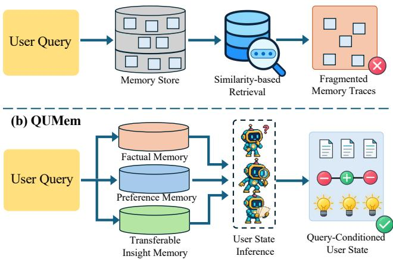
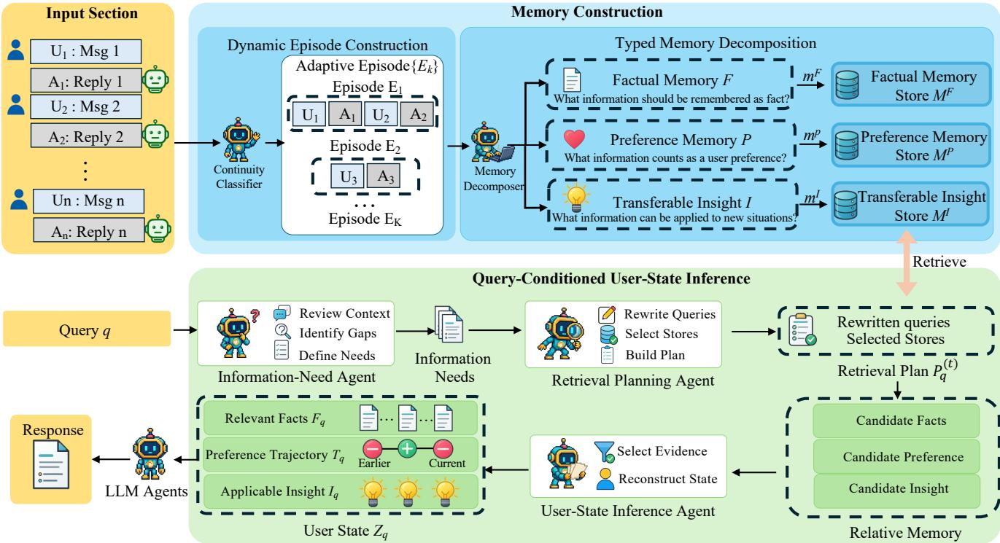
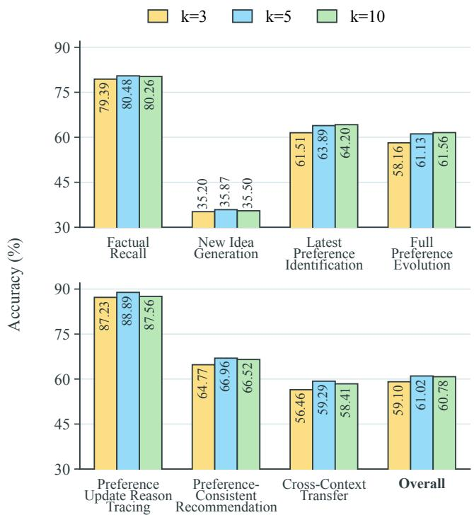

# QUMem: Personalized Memory for Query-Conditioned User-State Inference in LLM Agents

Heng Wang1,2,∗, Yifei Li1,2,∗, Lingling Zhang1,2,†, Pengyu Li1,2, Xinyu Che1,2, Xinyu Zhang1,2, Zesheng Yang1,2

1School of Computer Science and Technology, Xi’an Jiaotong University 2MOE KLNN Lab, Xi’an Jiaotong University ∗Equal contribution. †Corresponding author. wangheng8280@stu.xjtu.edu.cn

## Abstract

Large language model (LLM) agents increasingly use external memory systems to support personalization by drawing on long and evolving interaction histories, in which user pref- erences may be distributed across time, change with context, and conflict with earlier evidence. However, existing systems face three limitations: fixed-turn, fixed-token, or session-based boundaries can mix unrelated dialogue or split an event from its causes, decisions, and outcomes; storing multiple pieces of user information from the same interaction as a single mem- ory binds together items that serve diferent functions and should be independently retrievable; and treating the current task as a single top-k retrieval query can return fragments that are individually relevant but fail to jointly capture prefer-ence evolution, temporal validity, and contextual applicabil- ity. We introduce QUMem, a structured memory framework for query-conditioned user-state inference. QUMem first seg- ments interaction histories into variable-length episodes ac- cording to semantic continuity, then decomposes each episode into independently retrievable factual, preference, and trans- ferable insight memories while preserving temporal positions and source evidence. At inference time, three sequential agents identify task-specific information needs, plan multi-query re- trieval over the typed memory stores, andjointly infer a tempo-rally and contextually valid user state for downstream response generation. QUMem achieves state-of-the-art performance on both PersonaMem and KnowU-Bench, demonstrating the ef- fectiveness of query-conditioned user-state inference for long- term personalization.

## 1 Introduction

Recent advances in reasoning, planning, tool use, and envi- ronment interaction have transformed large language mod- els (LLMs) into agents capable of completing multi-step tasks with increasing autonomy (Yao et al. 2023; Wang et al. 2023a; Qin et al. 2025). As these agents increasingly serve as persistent personal assistants across sessions, they must in- teract with the same user over time, carry forward unfinished tasks and constraints, and adapt their behavior based on prior feedback. Personalized memory supports this continuity by retaining evidence from past interactions, but efective per- sonalization requires more than recalling isolated facts. An assistant must integrate preferences distributed across inter- actions, distinguish currently valid tendencies from context- dependent or obsolete ones, interpret preference changes, and transfer prior decision rationales to new situations. Per- sonalized memory systems are therefore a core requirement for persistent assistance.

  
Figure 1: Comparison between previous method and QUMem. Previous methods retrieve memory fragments based on their similarity to the current query, whereas QUMem retrieves task-relevant evidence from typed memory stores and jointly interprets it to infer the user’s current, contextually valid state.

The goal of a memory system is to use historical informa- tion to support personalized judgments and actions for the current task. For persistent agents, the system must identify information from an evolving history that is both relevant to the current task and applicable in the current context. Ex- isting personalized memory frameworks pursue this goal by improving memory storage and retrieval (Xu et al. 2025; Chhikara et al. 2025). Despite this progress, existing meth-ods still face three limitations. First, memory units defined by fixed turn counts, token counts, or session boundaries may absorb unrelated dialogue or split an event from its causes, decisions, and outcomes, making it dificult for subsequent retrieval to repair the disrupted event-level context (Zhang et al. 2025). Second, a single user interaction often contains multiple pieces of information with diferent semantics and functions that could be reused independently. Storing them together as a single memory binds them during subsequent retrieval, making it dificult for the system to retrieve only the part relevant to the current query. For example, a user may state both “I prefer concise implementations” and “the current project must remain compatible with Python 3.9” in the same programming conversation. The former may inform future programming tasks, whereas the latter applies only to the current project; they should not be stored as an indivisible memory that must be retrieved as a whole. Third, the current task is not always an efective similarity query, particularly when user preferences evolve. Independent top-k retrieval may return fragments that are individually relevant but do not collectively cover the user’s current state, the reasons for state transitions, or the temporal validity of the evidence.

These limitations indicate that a memory system should preserve event-level context during construction, distinguish the functional roles of diferent evidence during representa- tion, and jointly assess relevance, temporal validity, and contextual applicability at query time. To this end, the system must perform user-state inference by retrieving and jointly interpreting evidence distributed throughout the interaction history in light of the current query. Here, the “user state” is a structured representation of user information that is sup- ported by historical evidence, relevant to the current query, and applicable in the current context. The central problem in long-term personalization therefore lies not only in finding relevant memories, but also in using them to infer a task- relevant user state that is temporally and contextually valid. Figure 1 illustrates how this process difers from conventional memory systems.

Motivated by these observations, we propose QUMem, a structured personalized memory framework for query- conditioned user-state inference. To address the loss of event context caused by fixed boundaries, QUMem orga-nizes long interaction histories into granularity-adaptive di- alogue episodes based on semantic continuity, allowing the causes, decisions, feedback, and outcomes of the same event to be interpreted together. To avoid coupling multiple pieces of user information within a single interaction, the frame- work further decomposes each episode into independently retrievable factual memories, preference memories that en- code preferences and constraints, and transferable insight memories. Downstream tasks can then select and combine historical evidence with diferent functions as needed. Each memory retains its temporal position and source links, sup- porting assessment of its temporal validity and tracing of its provenance.

Given a current query, QUMem uses three sequential agents for information-need identification, retrieval planning, and user-state inference to progressively transform the task objective into a query-relevant representation of user infor-mation. The three stages determine, respectively, what the current task requires the system to verify, from which typed memories the evidence should be retrieved, and what cur- rent state the evidence jointly supports. Unlike a single top-k retrieval operation that directly uses the original query, this process explicitly separates evidence requirements, evidence acquisition, and evidence interpretation, enabling evidence distributed across time to bejointly interpreted for the current task. Our contributions are as follows:

• We propose QUMem, a structured memory framework for long-term personalization. It first organizes event- level dialogue episodes based on semantic continuity and then decomposes the user information in each episode into complementary and independently retrievable fac- tual, preference, and transferable insight memories, pre- serving event context while supporting fine-grained in- formation reuse.

• We introduce a query-conditioned three-agent user-state inference mechanism that decomposes information-need identification, retrieval planning over typed memories, and evidence-based state inference into sequential stages, enabling thejoint interpretation of distributed, temporally separated, and context-dependent user evidence.

• We evaluate QUMem on PersonaMem and KnowU-Bench. It achieves strong performance on both bench- marks, supporting the efectiveness of the method.

## 2 Related Work

## 2.1 Personalized Memory for LLM Agents

For long-term personalization, A-MEM organizes experi- ences as linked, structured notes, Mem0 maintains salient user information through explicit addition, update, dele- tion, and retention operations, and Zep uses a temporal knowledge graph to track fact validity and conflicts (Xu et al. 2025; Chhikara et al. 2025; Rasmussen et al. 2025). Work on memory granularity and structure includes SeCom, which combines topic-aware segmentation with compressed retrieval; Reflective Memory Management (RMM), which builds and retrieves multi-granularity summaries through re- flection; HyperMem, which organizes topics, events, and facts in a hierarchical hypergraph; and HingeMem, which couples boundary detection with query-adaptive retrieval (Pan et al. 2025; Tan et al. 2025; Yue et al. 2026; Zhong, Gao, and Wang 2026). Recent studies further examine query- conditioned user modeling and memory validity. Park et al. retrieve user history to construct task-specific profiles, while Memory Retrieval for Changing Preferences selects historical evidence relevant to evolving preferences. RaMem, STALE, and MemORAI respectively address contextual re- instatement, stale-memory detection, and provenance-aware adaptive retrieval (Park et al. 2026; Qin et al. 2026; Yang et al. 2026; Chao et al. 2026; Van et al. 2026). QUMem focuses on connecting semantically coherent episodes to factual, prefer- ence, and transferable insight memories, together with their temporal positions and source evidence. This structure sup- ports the inference of a traceable, query-conditioned user state that is applicable to the current task context.

## 2.2 Retrieval-Augmented Generation

Retrieval-augmented generation (RAG) augments generation with evidence retrieved from external non-parametric knowledge sources (Lewis et al. 2020). Subsequent work uses query rewriting, pre-retrieval planning, and question decomposition to transform complex requests into retrieval- oriented queries or subquestions (Ma et al. 2023; Lee, An, and Kim 2024; Petcu et al. 2026). SAFARI, Omni-RAG, and DeepSieve further select among knowledge sources and gen- erate source-specific queries or recursively route subques- tions (Wang et al. 2023b; Chen et al. 2025; Guo et al. 2026); Chain-of-Note and MASS-RAG filter, assess, and synthesize distributed evidence through explicit reading notes or role- specialized agents (Yu et al. 2024; Xiao et al. 2026). These approaches primarily address access to external knowledge, whereas QUMem operates over a continually evolving user interaction history. It first identifies the user information that must be verified for the current task, routes rewritten queries to typed memory stores, and organizes the retrieved evidence by provenance, temporal position, and contextual applicabil- ity into a query-conditioned user state for downstream per- sonalized decisions.

  
Figure 2: Overview of QUMem. The framework constructs semantically coherent dialogue episodes, decomposes them into factual, preference, and transferable insight memories, and uses three agents to infer a query-conditioned user state.

## 3 Method

We propose QUMem, a memory system for long-term per-sonalization that organizes interaction histories as evidence for query-time user-state inference. QUMem comprises three core modules: Dynamic Episode Construction, Typed Mem- ory Decomposition, and Query-Conditioned User-State Inference.Figure 2 presents the overall framework.

## 3.1 Problem Formulation

Let $\mathcal { H } = ( h _ { 1 } , \ldots , h _ { T } )$ denote a user’s chronologically or- dered multi-session interaction history, and let q denote the current query. We formulate the task as

$$
\begin{array} { r } { \mathcal { Z } _ { q } = \Phi _ { \mathrm { m e m } } ( \mathcal { H } , q ) , \qquad \widehat { y } _ { q } = \Psi ( q , \mathcal { Z } _ { q } ) , } \end{array}
$$

where $\mathcal { Z } _ { q }$ is the history-grounded user state relevant to $q ,$ and $\widehat { y } _ { q }$ is the resulting personalized output. QUMem instantiates $\Phi _ { \mathrm { m e m } }$ , while Ψ denotes the downstream response model.

## 3.2 Dynamic Episode Construction

Events in interaction histories span varying numbers of turns. Consequently, dialogue episodes constructed using fixed turn counts, token counts, or session boundaries may not align with the underlying event structure. Episodes that are too coarse may mix entities, preferences, and feedback from unrelated events, whereas overly fine-grained episodes may separate the context, decisions, and outcomes of the same event. Because these boundary errors occur before memories are written, subsequent retrieval cannot readily recover the disrupted event context. We therefore maintain a candidate episode based on the semantic continuity between adjacent user utterances and finalize it when that continuity is broken.

The system maintains an open candidate episode $\widetilde { E } _ { k }$ throughout the interaction. The first user utterance $x _ { 1 }$ , to-gether with its ensuing assistant response, initializes $\widetilde { E } _ { 1 }$ . For each subsequent user utterance $x _ { t } .$ , the continuity classifier $f _ { \theta }$ determines whether it continues the same event, task, or decision process as the preceding user utterance $x _ { t - 1 } .$

$$
\begin{array} { r } { c _ { t } = f _ { \theta } ( x _ { t - 1 } , x _ { t } ) , \qquad c _ { t } \in \{ 0 , 1 \} , \qquad t = 2 , \ldots , N . } \end{array}
$$

Here, $c _ { t } = 1$ indicates that $x _ { t }$ and $x _ { t - 1 }$ belong to the same event, whereas $c _ { t } = 0$ indicates that $x _ { t }$ starts a new event, placing a semantic boundary between them. The classifier re- ceives only the two adjacent user utterances. The intervening assistant response is excluded from the boundary decision but remains in the current candidate episode as interaction context.

For a history containing N user utterances, the system makes $N - 1$ boundary decisions. Because each decision is a well-defined binary classification task that does not require open-ended generation, we implement $f _ { \theta }$ as a lightweight model fine-tuned for continuity classification. This reduces the computational cost and inference latency that would arise from repeatedly invoking a large generative model.

When $c _ { t } = 1$ , the system appends $x _ { t }$ and its corresponding assistant response to the current candidate episode $\widetilde { E } _ { k }$ . When $c _ { t } = 0$ , it finalizes $\widetilde { E } _ { k }$ as a dialogue episode $E _ { k }$ and passes it to the subsequent typed memory decomposition module, while initializing a new candidate episode $\widetilde { E } _ { k + 1 }$ with $x _ { t }$ When processing a finite interaction history, the system also finalizes and submits any remaining open candidate episode after the final interaction.

## 3.3 Typed Memory Decomposition

The preceding Dynamic Episode Construction stage de- termines which interactions should be interpreted jointly, thereby preserving complete event context whenever possi- ble. However, an episode may still contain multiple pieces of user information that difer in semantics and function and can be reused independently. Storing the entire episode as a single memory couples these pieces during subsequent re- trieval, making it dificult to retrieve only those relevant to the current query. We therefore retain the episode as context for joint interpretation and evidence verification while decom-posing the user information it contains into independently retrievable atomic memories with explicit types.

This type system corresponds to three basic roles of his- torical evidence in long-term personalization: recalling user experiences, conditioning subsequent decisions on specific preferences and constraints, and transferring decision prin- ciples reflected in prior interactions to new contexts(Jiang et al. 2025).

Factual memories (F) record concrete user experiences, behaviors, activities, states, or events without inferring broader tendencies.

Preference memories (P) record a user’s choices, tendencies, requirements, and constraints concerning specific objects or contexts, together with directly associated ratio-nales. A preference memory is not assumed to remain valid indefinitely; its temporal position may reflect either a persis- tent tendency or a particular stage in preference evolution.

Transferable insight memories (I) abstract user-specific decision principles from concrete choices, feedback, and their rationales. The resulting principles can be applied to new objects or contexts but must remain grounded in concrete interaction evidence. For example, “the user joined a swimming club,” “the user prefers swimming classes with a supportive environment,” and “the user tends to choose low- pressure exercise environments” constitute a factual memory, a preference memory, and a transferable insight memory, re- spectively.

For each episode, we invoke the same LLM-based memory decomposer $g _ { \phi }$ three times, conditioning each invocation on one memory type d:

$$
g _ { \phi } ( E _ { k } , d ) = \{ m _ { k , j } ^ { d } \} _ { j = 1 } ^ { n _ { k } ^ { d } } , \qquad d \in { \mathcal { D } } = \{ F , P , I \} .
$$

Each atomic memory expresses a single independently re- trievable item of user information. An episode may yield multiple memories of the same or diferent types, and the same source interactions may support memories at diferent levels of abstraction.

Each memory is represented as

$$
m _ { k , j } ^ { d } = \left( v _ { k , j } ^ { d } , d , p _ { k , j } ^ { d } , \mathcal { E } _ { k , j } ^ { d } \right) , \qquad p _ { k , j } ^ { d } = \operatorname* { m a x } _ { e \in \mathcal { E } _ { k , j } ^ { d } } \mathrm { p o s } ( e ) .
$$

Here, $v _ { k , j } ^ { d }$ is the memory content, $\mathcal { E } _ { k , j } ^ { d }$ is the set of interac- tion turns supporting the memory, and $p _ { k , j } ^ { d }$ is the temporal position of the latest such turn. The index k also links the memory to its source episode $E _ { k }$ . The extracted memories are stored by type in $\begin{array} { r } { \dot { \mathcal { M } } ^ { d } = \bigcup _ { k } g _ { \phi } ( E _ { k } , d ) } \end{array}$ . Thus, source episodes preserve complete event context, atomic memories support independent retrieval, and typed memory stores pro-vide an interface for dynamic routing at query time.

## 3.4 Query-Conditioned User-State Inference

The current query typically specifies the task objective but does not explicitly state which user information should be ver- ified from history. Directly using the query for retrieval col- lapses three distinct decisions into a single similarity search: what historical evidence the current task requires, which memory stores should provide that evidence, and what user state the evidence jointly supports. QUMem therefore uses three collaborating agents with complementary responsibil- ities: the Information-Need Agent, the Retrieval Planning Agent, and the User-State Inference Agent. Together, they address these decisions and infer a task-relevant user state from the long-term interaction history.

Information-Need Agent A1 Given the current query q and the available task context, $A _ { 1 }$ identifies the information that must be verified from history and explains why it matters to user-state inference. If the task concerns preferences that may have changed over time, the information needs cover ear- lier and later expressions of those preferences, the contexts in which each applies, and any reasons for change supported by historical evidence. At this stage, $A _ { 1 }$ does not prescribe spe- cific retrieval queries or memory stores, thereby separating information-need identification from retrieval planning.

Retrieval Planning Agent $A _ { 2 } \quad A _ { 2 }$ rewrites each informa- tion need as one or more self-contained queries and selects one or more of the factual, preference, and transferable in- sight memory stores for each query. The retrieval plan for the current query is

$$
\mathcal { P } _ { q } = \{ ( \widetilde { q } _ { j } , \mathcal { D } _ { j } ) \} _ { j = 1 } ^ { J } , \qquad \emptyset \neq \mathcal { D } _ { j } \subseteq \mathcal { D } .
$$

<table><tr><td>Base Context Model Length</td><td></td><td>Method</td><td>Recall user-shared facts</td><td>Suggest new ideas</td><td>Acknowledge latest user preferences</td><td>Track full preference evolution</td><td>Revisit reasons behind preference updates</td><td>Provide preference- aligned recommendation</td><td>Generalize to new scenarios</td><td>Overall</td></tr><tr><td rowspan="4">GP--inı</td><td>32K</td><td>A-MEM Mem0 Zep QUMEM</td><td>47.95 67.81 45.89 69.18</td><td>30.11 36.56 31.18 49.46</td><td>一 一</td><td>44.60 47.48 51.08 54.68</td><td>71.72 83.84 70.71 84.85</td><td>52.73 65.45 69.09 76.36</td><td>17.54 63.16 31.58 73.68</td><td>45.84 60.10 49.75 66.38</td></tr><tr><td>128K</td><td>A-MEM Mem0 Zep QUMEM</td><td>59.65 75.44 59.06 84.21</td><td>31.27 30.31 30.12 36.29</td><td>50.12 62.47 45.15 66.28</td><td>46.04 54.84 51.61 64.52</td><td>65.06 79.55 65.80 89.96</td><td>44.99 63.04 51.29 72.21</td><td>27.23 44.60 31.92 66.67</td><td>45.65 56.58 45.76</td></tr><tr><td>1M</td><td>A-MEM Mem0 Zep</td><td>51.39 75.00 52.08</td><td>27.24 27.65 27.37</td><td>45.05 58.20 42.71</td><td>42.67 46.22 49.33</td><td>56.17 77.87 63.40</td><td>34.64 44.64 40.36</td><td>26.78 36.95 26.44</td><td>64.61 38.22 47.76 39.38</td></tr><tr><td>All</td><td>QUMEM A-MEM Mem0 Zep QUMEM</td><td>87.50 53.36 72.89 52.71 80.48</td><td>33.84 29.00 29.30 28.70 35.87</td><td>61.20 47.74 60.47 44.00</td><td>60.00 44.68 50.64 50.78</td><td>89.36 62.69 79.60 65.67</td><td>58.57 41.37 55.70 48.25</td><td>51.19 26.02 42.48 29.03</td><td>56.17 42.35 52.99 43.31</td></tr><tr><td rowspan="4">Ge--sh</td><td>32K</td><td>A-MEM Mem0 Zep QUMEM</td><td>52.74 71.92 50.68 73.29</td><td>39.78 47.31 40.86 60.22</td><td>63.89 一 一</td><td>61.13 53.96 56.83 59.71 63.31</td><td>88.89 78.79 88.89 78.79 89.90</td><td>66.96 63.64 74.55 78.18 83.64</td><td>59.29 26.32 75.44 43.86 82.46</td><td>61.02 53.82 67.91 57.89</td></tr><tr><td>128K</td><td>A-MEM Mem0 Zep QÚMEM</td><td>64.33 78.95 63.74 86.55</td><td>41.12 40.15 39.96 46.72</td><td>65.59 75.98 60.97 78.87</td><td>55.13 63.64 60.41 72.43</td><td>73.61 85.50 74.35 92.94</td><td>55.87 72.49 62.18 80.23</td><td>39.44 58.22 45.07 77.46</td><td>73.51 57.06 66.92 57.32 73.89</td></tr><tr><td>1M</td><td>A-MEM Mem0 Zep QUMEM</td><td>56.25 78.47 56.94 89.58</td><td>36.59 37.00 36.73 44.02</td><td>60.94 72.53 58.59 75.00</td><td>51.56 55.11 58.22 68.44</td><td>65.96 84.26 72.34 92.77</td><td>45.36 55.71 51.43 68.57</td><td>38.98 50.51 38.64 64.75</td><td>49.66 58.56 50.79 66.57</td></tr><tr><td>All</td><td>A-MEM Mem0 Zep QUMEM</td><td>58.13 76.57 57.48 83.30</td><td>38.57 38.94 38.27 46.19</td><td>63.40 74.36 59.85 77.05</td><td>53.76 59.57 59.57 69.36</td><td>71.48 85.57 74.30 92.37</td><td>52.19 65.79 59.06 75.73</td><td>37.88 55.93 41.59 71.33</td><td>53.44 63.29 54.46 70.58</td></tr></table>

Table 1: Performance on the PersonaMem benchmark. The best performance is highlighted in bold, and the second-best is underlined.

Here, $\widetilde { q } _ { j }$ is the j-th rewritten query, $\mathcal { D } _ { j }$ is the set of mem- ory types selected for that query, and J is the number of rewritten queries. According to $\mathcal { P } _ { q } ,$ , the system queries the selected typed memory stores, then merges and deduplicates the candidate memories returned across queries and stores. The resulting candidates serve as evidence for user-state in- ference.

User-State Inference Agent $A _ { 3 }$ Given the current query q and the retrieved candidate memories, $A _ { 3 }$ selects task- relevant information and organizes it into the query- conditioned user state

$$
\mathcal { Z } _ { q } = ( \mathcal { F } _ { q } , \mathcal { T } _ { q } , \mathcal { T } _ { q } ) .
$$

Here, $\mathcal { F } _ { q }$ organizes facts relevant to the current task chrono- logically to describe how the corresponding experiences and states have developed over time; $\mathcal { T } _ { q }$ characterizes the evolu- tion of the user’s preferences and identifies those applicable in the current context; and $\mathcal { T } _ { q }$ specifies how decision princi- ples abstracted from history apply to the current task.

The inferred user state $\mathcal { Z } _ { q }$ is provided to the downstream response model together with the current query q to generate a personalized response:

$$
\widehat { y } _ { q } = \Psi ( q , \mathcal { Z } _ { q } ) .
$$

Here, Ψ denotes the downstream response model. By providing a structured representation of the task-relevant user state, $\mathcal { Z } _ { q }$ enables the model to interpret the current query in light of relevant user information from the interaction history.

## 4 Experiments

## 4.1 Evaluation Settings

Datesets. To evaluate whether our method can reconstruct task-relevant and temporally valid user states from long-term interaction histories,We conduct experiments on Person- aMem (Jian et al. 2025). PersonaMem evaluates d namic user modeling in long-horizon dialogues, requiring systems to recall user information, track evolving preferences, and ap- ply the inferred user state to personalized responses in both familiar and new contexts. To further evaluate the generaliz- ability of our method, we conduct additional experiments on KnowU-Bench (Chen et al. 2026). KnowU-Bench evaluates whether personalized mobile agents can infer user prefer- ences and constraints from behavioral histories and translate them into concrete actions.

Baselines. We selected three representative long-term memory systems as the primary baselines. A-MEM (Xu et al. 2025) draws on the Zettelkasten method and organizes inter-actions into structured memories that can be dynamically linked and updated. Mem0 (Chhikara et al. 2025) extracts user-related information from conversations and maintains persistent memory by adding, updating, and deleting entries. Ze (Rasmussen et al. 2025) uses a time-aware knowled e graph to manage facts and their validity and constructs the memory context by combining semantic, textual, and graph- based retrieval.

Evaluation Metrics. PersonaMem formulates evaluation as a four-choice response-selection task, for which we use accuracy as the evaluation metric. For KnowU-Bench, we use Success Rate (SR), Average Score, and Interaction Eficiency (IE) following the oficial evaluation protocol.

Experimental Details. The Dynamic Episode Construction module used a semantic continuity classifier fine-tuned from the Qwen3.5-4B model. We constructed the corre-sponding supervised fine-tuning dataset from LoCoMo di- alogues (Maharana et al. 2024). The PersonaMem experi-ments used GPT-4o-mini and Gemini-3.5-flash as the base model. The KnowU-Bench experiments used GPT-4o-mini as the base model. We set the retrieval depth to k = 5. Additional implementation details are provided in the appendix.

## 4.2 Main Results

PersonaMem. Table 1 shows that QUMem outperforms all evaluated baselines across every comparable context configuration and query category under both base models. With GPT-4o-mini, QUMem improves overall accuracy from 52.99% to 61.02%, while under Gemini-3.5-flash it improves the strongest baseline from 63.29% to 70.58%. The consis- tent ranking across the two base models suggests that the efectiveness of the memory framework is not tied to a par- ticular downstream model.

The performance pattern across query categories further clarifies where these gains arise. The largest advantages occur in tracking complete preference evolution, produc- ing preference-aligned recommendations, and generalizing prior user information to new scenarios. These tasks require evidence from diferent times or contexts to be interpreted jointly. By contrast, the improvement on recognizing the lat-est preference is smaller, suggesting that the main benefit of QUMem goes beyond retrieving a recent preference state-ment. This pattern is consistent with the intended role of query-conditioned user-state inference in organizing tempo- rally and contextually distributed evidence.

<table><tr><td rowspan="2">Method</td><td colspan="2">Easy</td><td colspan="2">Hard</td><td colspan="3">Overall</td></tr><tr><td>SR</td><td>Score</td><td>SR</td><td>Score</td><td>SR</td><td>Score</td><td>IE</td></tr><tr><td>A-MEM</td><td>14.0</td><td>0.41</td><td>4.7</td><td>0.34</td><td>9.3</td><td>0.38</td><td>0.34</td></tr><tr><td>Mem0</td><td>18.6</td><td>0.48</td><td>7.0</td><td>0.40</td><td>12.8</td><td>0.44</td><td>0.40</td></tr><tr><td>Zep</td><td>16.3</td><td>0.44</td><td>7.0</td><td>0.37</td><td>11.6</td><td>0.41</td><td>0.37</td></tr><tr><td>QÚMEM</td><td>23.3</td><td>0.56</td><td>11.6</td><td>0.49</td><td>17.4</td><td>0.53</td><td>0.49</td></tr></table>

Table 2: Performance on the KnowU-Bench benchmark.
<table><tr><td rowspan="2">Ablation Setting</td><td colspan="3">Context Length</td><td rowspan="2">Overall</td></tr><tr><td>32K</td><td>128K</td><td>1M</td></tr><tr><td>QUMEM</td><td>66.38</td><td>64.61</td><td>56.17</td><td>61.02</td></tr><tr><td>w/o Episode Construction</td><td>64.69</td><td>62.05</td><td>53.25</td><td>58.38</td></tr><tr><td>w/o Memory Decomposition</td><td>63.67</td><td>60.69</td><td>52.02</td><td>57.11</td></tr><tr><td>w/o Reconstruction</td><td></td><td>61.97 58.12</td><td>49.18</td><td>54.51</td></tr></table>

Table 3: Ablation on key components.

The overall margin over the strongest baseline widens as the interaction history grows, indicating that the structured memory and inference pipeline becomes increasingly use- ful when relevant evidence is dispersed across longer con- texts. Nevertheless, absolute performance still declines in the 1M-token setting. Suggesting new ideas also remains the weakest category despite the consistent improvement over the baselines. These results highlight a remaining distinction between accurately inferring user preferences and generating responses that are both novel and preference-aligned.

KnowU-Bench. Table 2 shows that QUMem achieves the best performance among the evaluated methods across all overall metrics and both dificulty subsets, improving over- all success rate by 4.6 percentage points over the strongest baseline. Unlike PersonaMem’s response-selection setting, KnowU-Bench requires an agent to translate historical pref- erences and constraints into concrete actions. The consistent improvement therefore provides evidence that the benefits of query-conditioned user-state inference extend to personal- ized task execution. However, the relatively low success rate, particularly on hard tasks, indicates that reliable end-to-end personalized execution remains challenging.

## 4.3 Ablation Studies

Unless otherwise specified, all experiments are conducted on the PersonaMem benchmark using GPT-4o-mini as the base model.

Component Ablations We conducted component ablations under all three PersonaMem context configurations. Implementation details are provided in the appendix. Ta- ble 3 shows that removing any of the three components consistently degrades performance, confirming that they make complementary contributions to the full framework. The query-time User-State Reconstruction pipeline has the strongest overall efect, highlighting the importance of task- driven evidence acquisition and joint interpretation. Typed Memory Decomposition and Dynamic Episode Construction also provide consistent benefits by distinguishing the roles of historical evidence and preserving coherent event context, respectively. Moreover, the impact of all three components becomes more pronounced as interaction histories grow, sup- porting their intended role in handling increasingly dispersed evidence and mixed contexts.

  
Figure 3: Ablation on key hyperparameters.

Sensitivity to Retrieval Depth. We examined the efect of retrieval depth k on final performance, where k denotes the number of top-ranked candidate memories returned by each retrieval. Using GPT-4o-mini, we kept all other settings fixed and varied $k \in \{ 3 , 5 , 1 0 \}$ . Results for each category were aggregated over all available instances across the three context configurations; because the 32K configuration con- tains no latest preference instances, this category was aggre- gated only over the 128K and 1M configurations. As shown in Figure 3, increasing k from 3 to 5 raised overall accuracy from 59.10% to 61.02%, suggesting that a smaller retrieval depth may fail to cover the complementary evidence needed for user-state reconstruction. Increasing the depth further to k = 10 slightly reduced overall accuracy to 60.78%, indi-cating that further expanding the candidate set did not yield additional gains and may introduce redundant or weakly rele- vant memories. We therefore used k = 5 as the main setting; it achieved the highest overall accuracy and the best results in five of the seven query categories.

## 4.4 Eficiency Analysis

To compare memory-construction costs across methods when processing interaction histories of the same size, we define each user or assistant message as one dialogue turn and exclude system messages. PersonaMem contains 160,735 di- alogue turns in total. Table 4 reports counts of memory con- structions and generative LLM calls per 100 turns, together with the average number of construction tokens per turn, including both input and output tokens.

<table><tr><td>Method</td><td colspan="2">Builds/100 ↓ LLM Calls/100 ↓ Tokens/Turn ↓</td></tr><tr><td>A-MEM</td><td>100.0 201.2</td><td>3,317.9</td></tr><tr><td>Mem0</td><td>25.6 380.7</td><td>6,401.9</td></tr><tr><td>Zep</td><td>100.0 331.8</td><td>13,337.3</td></tr><tr><td>QUMEM</td><td>27.1 81.4</td><td>1,221.2</td></tr></table>

Table 4: Normalized memory construction costs of diferent methods on PersonaMem.

A-MEM and Zep trigger memory construction at every turn, resulting in high construction frequencies. Mem0 in- stead partitions each session into fixed chunks, subject to limits of 64 messages and 24,000 characters, thereby reduc- ing the number of constructions. However, for each chunk, it first uses one LLM call to extract candidate memory units and then verifies each unit individually. Based on our experimen- tal results, each construction requires nearly 15 LLM calls on average. Thus, a lower construction frequency does not translate into lower generative overhead, indicating that the number of constructions alone is insuficient to characterize memory-construction eficiency.

QUMem uses a local semantic-continuit classifier to form variable-length episodes and triggers memory construction only when an episode ends. For each episode, QUMem makes exactly three LLM calls to extract factual memories, prefer- ence memories, and transferable insights, respectively. This prevents the number of calls from increasing with the num- ber of memory units. By combining a low construction fre- quency with a fixed number of LLM calls per construc- tion,QUMem achieves the lowest LLM call frequency and token cost. These results indicate that QUMem’s eficiency gains arise from jointly reducing construction triggers and bounding the generative workload within each construction. The reported statistics cover only the cost of generative LLM calls during memory construction and exclude the inference cost of the local semantic-continuity classifier.

## 5 Conclusion

We introduce QUMem, a structured memory framework that combines Dynamic Episode Construction, Typed Memory Decomposition, and Query-Conditioned User-State Infer-ence to infer task-relevant user states from long, evolving interaction histories. On PersonaMem, QUMem achieves the best performance among the evaluated methods, demonstrat- ing the efectiveness of query-conditioned user-state infer- ence for long-term personalization. These results highlight the value of preserving event context, distinguishing the roles of historical evidence, and performing task-driven user-state inference in long-term personalized memory systems.

## References

Chao, H.; Bai, Y.; Sheng, R.; Li, T.; and Sun, Y. 2026. STALE: Can LLM Agents Know When Their Memories Are No Longer Valid? arXiv:2605.06527.

Chen, T.; Lu, Z.; Xu, Z.; Shao, G.; Zhao, S.; Tang, F.; Du, Y.; Song, K.; Liu, Y.; Yan, Y.; Zhang, W.; Tan, X.; Lu, W.; Xiao, J.; Zhuang, Y.; and Shen, Y. 2026. KnowU-Bench: To- wards Interactive, Proactive, and Personalized Mobile A ent Evaluation. arXiv:2604.08455.

Chen, Z.; Liao, Y.; Jiang, S.; Wang, P.; Guo, Y.; Wang, Y.; and Wang, Y. 2025. Towards Omni-RAG: Comprehen- sive Retrieval-Augmented Generation for Large Language Models in Medical Applications. In Che, W.; Nabende, J.; Shutova, E.; and Pilehvar, M. T., eds., Proceedings of the 63rd Annual Meeting of the Association for Computational Linguistics (Volume 1: Long Papers), 15285–15309. Vienna, Austria: Association for Computational Linguistics. ISBN 979-8-89176-251-0.

Chhikara, P.; Khant, D.; Aryan, S.; Singh, T.; and Yadav, D. 2025. Mem0: Building production-ready ai agents with scal- able long-term memory. arXiv preprint arXiv:2504.19413.

Guo, M.; Zeng, Q.; Zhao, X.; Liu, Y.; Yu, W.; Du, M.; Chen, H.; and Cheng, W. 2026. DeepSieve: Information Sieving via LLM-as-a-Knowledge-Router. In Demberg, V.; Inui, K.; and Marquez, L., eds., Findings ofthe Associationfor Computational Linguistics: EACL 2026, 3054–3077. Rabat, Mo-rocco: Association for Computational Linguistics. ISBN 979-8-89176-386-9.

Jiang, B.; Hao, Z.; Cho, Y.-M.; Li, B.; Yuan, Y.; Chen, S.; Un- gar, L.; Taylor, C. J.; and Roth, D. 2025. Know Me, Respond to Me: Benchmarking LLMs for Dynamic User Profiling and Personalized Responses at Scale. arXiv:2504.14225.

Lee, M.; An, S.; and Kim, M.-S. 2024. PlanRAG: A Plan- then-Retrieval Augmented Generation for Generative Large Language Models as Decision Makers. In Duh, K.; Gomez, H.; and Bethard, S., eds., Proceedings of the 2024 Conference of the North American Chapter of the Association for Computational Linguistics: Human Language Technologies (Volume 1: Long Papers), 6537–6555. Mexico City, Mexico: Association for Computational Linguistics.

Lewis, P.; Perez, E.; Piktus, A.; Petroni, F.; Karpukhin, V.; Goyal, N.; Küttler, H.; Lewis, M.; Yih, W.-t.; Rocktäschel, T.; et al. 2020. Retrieval-augmented generation for knowledge- intensive nlp tasks. Advances in neural information processing systems, 33: 9459–9474.

Ma, X.; Gong, Y.; He, P.; Zhao, H.; and Duan, N. 2023. Query Rewriting in Retrieval-Augmented Large Language Models. In Bouamor, H.; Pino, J.; and Bali, K., eds., Proceedings of the 2023 Conference on Empirical Methods in Natural Language Processing, 5303–5315. Singapore: Association for Computational Linguistics.

Maharana, A.; Lee, D.-H.; Tulyakov, S.; Bansal, M.; Barbieri, F.; and Fang, Y. 2024. Evaluating Very Long-Term Conver- sational Memory of LLM Agents. In Proceedings of the 62nd Annual Meeting of the Association for Computational Linguistics (Volume 1: Long Papers), 13851–13870. Bangkok, Thailand: Association for Computational Linguistics.

Pan, Z.; Wu, Q.; Jiang, H.; Luo, X.; Cheng, H.; Li, D.; Yang, Y.; Lin, C.-Y.; Zhao, H. V.; Qiu, L.; et al. 2025. On mem-ory construction and retrieval for personalized conversational agents. arXiv preprint arXiv:2502.05589.

Park, S.; Park, Y.; Lim, J.; and Jo, Y. 2026. Learning to Retrieve User History and Generate User Profiles for Person- alized Persuasiveness Prediction. In Liakata, M.; Moreira, V. P.; Zhang, J.; and Jurgens, D., eds., Findings of the Associationfor Computational Linguistics: ACL 2026, 17338– 17359. San Diego, California, United States: Association for Computational Linguistics. ISBN 979-8-89176-395-1.

Petcu, R.; Murray, K.; Khashabi, D.; Kanoulas, E.; Rijke, M. d.; Lawrie, D.; and Duh, K. 2026. Query Decomposition for RAG: Balancing Exploration-Exploitation. In Demberg, V.; Inui, K.; and Marquez, L., eds., Proceedings of the 19th Conference of the European Chapter of the Association for Computational Linguistics (Volume 1: Long Papers), 6857– 6871. Rabat, Morocco: Association for Computational Lin guistics. ISBN 979-8-89176-380-7.

Qin, Y.; Li, L.; Song, L.; Yang, W.; Li, J.; Yang, Y.; and Zhao, Y. 2026. Memory Retrieval for Changing Preferences. arXiv:2606.02976.

Qin, Y.; Ye, Y.; Fang, J.; Wang, H.; Liang, S.; Tian, S.; Zhang,J.; Li, J.; Li, Y.; Huang, S.; Zhong, W.; Li, K.; Yang, J.; Miao,Y.; Lin, W.; Liu, L.; Jiang, X.; Ma, Q.; Li, J.; Xiao, X.; Cai,K.; Li, C.; Zheng, Y.; Jin, C.; Li, C.; Zhou, X.; Wang, M.;Chen, H.; Li, Z.; Yang, H.; Liu, H.; Lin, F.; Peng, T.; Liu,X.; and Shi, G. 2025. UI-TARS: Pioneering Automated GUIInteraction with Native Agents. arXiv:2501.12326.

Rasmussen, P.; Paliychuk, P.; Beauvais, T.; Ryan, J.; and Chalef, D. 2025. Zep: A Temporal Knowledge Graph Archi- tecture for Agent Memory. arXiv:2501.13956.

Tan, Z.; Yan, J.; Hsu, I.-H.; Han, R.; Wang, Z.; Le, L.; Song, Y.; Chen, Y.; Palangi, H.; Lee, G.; Iyer, A. R.; Chen, T.; Liu, H.; Lee, C.-Y.; and Pfister, T. 2025. In Prospect and Retrospect: Reflective Memory Management for Long-term Personalized Dialogue Agents. In Che, W.; Nabende, J.; Shutova, E.; and Pilehvar, M. T., eds., Proceedings of the 63rd Annual Meeting of the Association for Computational Linguistics (Volume 1: Long Papers), 8416–8439. Vienna, Austria: Association for Computational Linguistics. ISBN 979-8-89176-251-0.

Van, H. P.; Hieu, N. M.; Tuan, K. P. T.; Hai, N. L.; Van, L. N.; Diep, N. T. N.; and Le, T. 2026. MemORAI: Memory Organization and Retrieval via Adaptive Graph Intelligence for LLM Conversational Agents. In Liakata, M.; Moreira, V. P.; Zhang, J.; and Jurgens, D., eds., Findings of the Associationfor Computational Linguistics: ACL 2026, 28235– 28253. San Diego, California, United States: Association for Computational Linguistics. ISBN 979-8-89176-395-1.

Wang, G.; Xie, Y.; Jiang, Y.; Mandlekar, A.; Xiao, C.; Zhu, Y.; Fan, L.; and Anandkumar, A. 2023a. Voyager: An open- ended embodied agent with large language models. arXiv preprint arXiv:2305.16291.

Wang, H.; Hu, M.; Deng, Y.; Wang, R.; Mi, F.; Wang, W.; Wang, Y.; Kwan, W.-C.; King, I.; and Wong, K.-F. 2023b. Large Language Models as Source Planner for Personalized

Knowledge-grounded Dialogues. In Bouamor, H.; Pino, J.; and Bali, K., eds., Findings of the Association for Computational Linguistics: EMNLP 2023, 9556–9569. Singapore: Association for Computational Linguistics.

Xiao, X.; Huang, H.; Liu, R.; and Xie, J. 2026. MASS-RAG: Multi-Agent Synthesis Retrieval-Augmented Generation. In Liakata, M.; Moreira, V. P.; Zhang, J.; and Jurgens, D., eds., Findings of the Association for Computational Linguistics: ACL 2026, 9865–9883. San Diego, California, United States: Association for Computational Linguistics. ISBN 979-8- 89176-395-1.

Xu, W.; Liang, Z.; Mei, K.; Gao, H.; Tan, J.; and Zhang,Y. 2025. A-MEM: Agentic Memory for LLM Agents.arXiv:2502.12110.

Yang, W.; Kan, B.; Li, S.; Li, L.; Qin, Y.; Li, J.; Bogdan, P.; and Thomason, J. 2026. RaMem: Contextual Reinstatement for Long-term Agentic Memory. arXiv:2606.22844.

Yao, S.; Zhao, J.; Yu, D.; Du, N.; Shafran, I.; Narasimhan, K.; and Cao, Y. 2023. ReAct: Synergizing Reasoning and Acting in Language Models. arXiv:2210.03629.

Yu, W.; Zhang, H.; Pan, X.; Cao, P.; Ma, K.; Li, J.; Wang, H.; and Yu, D. 2024. Chain-of-Note: Enhancing Robustness in Retrieval-Augmented Language Models. In Al-Onaizan, Y.; Bansal, M.; and Chen, Y.-N., eds., Proceedings of the 2024 Conference on Empirical Methods in Natural Language Processing, 14672–14685. Miami, Florida, USA: Association for Computational Linguistics.

Yue, J.; Hu, C.; Sheng, J.; Zhou, Z.; Zhang, W.; Liu, T.; Guo, L.; and Deng, Y. 2026. HyperMem: Hypergraph Mem- ory for Long-Term Conversations. In Liakata, M.; Mor- eira, V. P.; Zhang, J.; and Jurgens, D., eds., Proceedings of the 64th Annual Meeting of the Association for Computational Linguistics (Volume 1: Long Papers), 35237–35254. San Diego, California, United States: Association for Com- putational Linguistics. ISBN 979-8-89176-390-6.

Zhang, Z.; Dai, Q.; Bo, X.; Ma, C.; Li, R.; Chen, X.; Zhu, J.; Dong, Z.; and Wen, J.-R. 2025. A survey on the memory mechanism of large language model-based agents. ACM Transactions on Information Systems, 43(6): 1–47.

Zhong, Y.; Gao, Y.; and Wang, H. 2026. HingeMem: Bound- ary Guided Long-Term Memory with Query Adaptive Retrieval for Scalable Dialogues. In Proceedings of the ACM Web Conference 2026, WWW ’26, 3576–3587. New York, NY, USA: Association for Computing Machinery. ISBN 9798400723070.