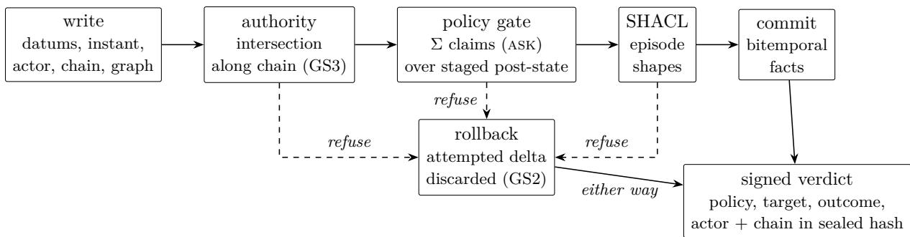
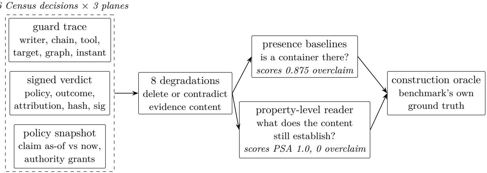

# Quipu: A Governed Bitemporal Knowledge Graph Store

Start strict: rethinking knowledge-graph defaults for agent-written knowledge

Steve Brown∗

August 18, 2026

## Abstract

Agents now write knowledge graphs, but knowledge-graph stores still carry defaults set when humans curated them: accept writes now and clean later, keep one time axis or none, treat every writer’s facts as equally trustworthy, and leave governance to dashboards and middleware. We argue these four defaults are individually convenient and jointly untenable under agent workloads, and we present Quipu, an embeddable store that inverts all four: no fact enters except through a gate whose predicates evaluate the pending post-state; data, trust labels, verdicts, and the rules themselves are bitemporal; named graphs are the unit of authority and trust, composed under a lattice whose single invariant is that composition never widens; and the governance specification Σ, the trace, and signed verdicts are facts in the store they govern, making the audit T |= Σ a query. We evaluate with Census, a deterministic multi-writer lifecycle whose single seeded run scores every research question against planted ground truth: the gated store ends with 0 of 6 planted defects versus 6 of 6 ungated; all 7 composition probes uphold the lattice contract; 50 of 50 satisfied verdicts re-derive faithfully as of their instant while all 50 would be misreported under a latest-only rule set; and the SARC reference checker agrees with the in-store audit verdict-for-verdict, disagreeing only on coverage semantics. A recorded trace from a real governed writer surfaces a live enforcement gap the audit names with its remediation. Against an external decision-evidence suficiency benchmark (DEMM-Bench), a content-only reading of the store’s exported records answers all 512 property-level governance questions correctly with zero overclaim under all eight degradation conditions, while container-presence baselines overclaim on up to 87.5% of the same cases — and the run itself surfaced, and led us to close, a gap in what a denial’s verdict attests.

## 1 Introduction

Knowledge graphs are increasingly written by software agents: language models extracting facts from documents, code-analysis engines promoting structural facts, pipelines reconciling external corpora. The stores underneath them, however, retain defaults chosen for a diferent author. When a human curator is the writer, it is reasonable for a store to accept whatever arrives and rely on later review; to keep at most one time axis; to treat all writers alike; and to leave policy to the perimeter. When the writer is an agent that produces plausible, well-formed, and sometimes wrong facts faster than any review process drains them, each of those defaults becomes a liability.

<table><tr><td></td><td>Conventional default</td><td>Quipu&#x27;s inversion</td><td>Measured by</td></tr><tr><td>D1</td><td>accept, then clean</td><td>refuse at the gate; agents retry</td><td>RQ1, RQ2</td></tr><tr><td>D2</td><td>one time axis, or none</td><td>data, labels, verdicts, rules bitemporal</td><td>RQ5</td></tr><tr><td>D3</td><td>flat trust</td><td>partitioned trust; non-widening composition</td><td>RQ4</td></tr><tr><td>D4</td><td>governance outside</td><td> $\Sigma ,$  trace, verdicts as facts; audit is a query</td><td>RQ3</td></tr></table>

Table 1: The four defaults and their inversions.

We name four defaults and their failure modes (Table 1). D1 — accept, then clean: validation in conventional stores is optional, post-hoc, or the application’s job; with agent writers the cleanup debt compounds and downstream readers consume the store in the window between write and review. D2 — one time axis, or none: even honestly bitemporal stores make only the data bitemporal, so “what was trusted at time $T ^ { \dag }$ and “what was allowed at $T ^ { \dag }$ are unanswerable, and audit degrades to log archaeology. D3 — flat trust: named graphs exist, but composition is silent union; one query joins an attested graph with a quarantined one and the result inherits the prestige of the attested source. D4 — governance outside: policy lives in dashboards, prompts, or middleware; the specification and the store drift independently, and no mechanical check connects them.

Quipu is an embeddable knowledge-graph store that inverts all four defaults, and this paper’s claim is the conjunction: each inversion exists somewhere in the literature, but no store ships all four, and the four reinforce each other. The gate is worth trusting because its verdicts are permanent, signed, bitemporal facts; the label lattice is enforceable because partitions gate authority; the audit is decidable because governance is data; and bitemporality makes all of it historical rather than merely current.

The operating posture that falls out is the thesis in one line: start strict; use agents to bear the cost of strictness. A store that refuses invalid, untagged, unauthorized, or policy-violating writes is afordable exactly when the writer is an agent, because the refusal carries structured feedback and the agent — not a curator — absorbs the retry (§8.6 shows the loop converging in one revision).

## Contributions.

1. The system (§4–§6): a single-file, embeddable store implementing all four inversions — a bitemporal EAVT log with a three-valued write operation, named-graph partitioning with bind-once overlays and tombstones, a machine-checked label lattice with explicit coverage, and an in-store governance plane with signed verdicts, escalation, authority intersection, and a deterministic audit.

2. The design principles (§3): GS1–GS6, a one-page statement of what a store must guarantee before agent-written knowledge can be trusted, each principle paired with the failure mode of the conventional default it replaces — distilled from building Quipu, and extending SARC’s governance-by-architecture from the agent loop to the store.

3. The benchmark (§7): Census, a deterministic multi-writer lifecycle whose single seeded run measures all four inversions against planted ground truth, with byte-identical manifests across repeat runs, plus an in-the-wild replay of a real governed writer’s trace.

## 2 Background and Requirements

Governance by architecture. SARC [2] treats constraints as first-class specification objects alongside state, action space, and reward: a constraint declares its source, class (hard / soft / escalation), predicate, verification point, and response, and compiles into four enforcement points in the agent loop — a Pre-Action Gate, an Action-Time Monitor, a Post-Action Auditor, and an Escalation Router — bound by invariants whose joint efect is a decidable audit: given a specification Σ with constraint set C and a trace T, a checker decides T |= Σ — read: the trace satisfies the specification — in O(|T| · |C|), trace records times constraints, without access to the model or its prompts. SARC stops at the loop: its reference artifact keeps Σ in a file beside the system and audits an exported trace with an external checker. The knowledge the agents act on sits in an ungoverned store underneath. Our position is that the store is the right compilation target for exactly the machinery SARC specifies.

Bitemporal data. A bitemporal store indexes facts by transaction time (when the store learned something) and valid time (when it holds in the world), in the lineage of Datomic and XTDB. What conventional bitemporal systems do not do is extend the treatment beyond data: trust annotations, policy decisions, and the validation rules themselves remain latest-only, so the historical questions governance actually asks — what was believed, what was trusted, what was required at T — outrun the store’s memory.

Named graphs and trust. RDF datasets partition triples into named graphs, and the provenance literature attached trust semantics to them two decades ago [5]; information-flow lattices are older still [6]. SPARQL’s dataset construction, however, is silent union: nothing in the standard machinery refuses a composition, degrades it, or even remarks that one member graph carries no declaration at all.

Requirements. A store serving multi-writer agent ingestion in a governed setting needs, at minimum: write-time constraint evaluation against the state the write would create; a permanent, attributable record of every gate decision, including refusals; authority that attaches to partitions and only narrows under delegation; composition that cannot launder trust; an audit decidable from the store’s own contents; and reproducibility of past decisions under the rules in force at the time. §3 states these as six principles; §4–§5 show the mechanisms that discharge them.

## 3 Design Principles: the Governed Store

Six principles, distilled from building Quipu, each paired with the conventional failure it prevents. Nothing below names SQLite, RDF, or EAVT — the principles are substrate-agnostic on purpose, and stating them as a portable contract for other substrates is future work (§10).

GS1 — Gated writes. No fact enters the store except through a gate whose predicates evaluate against the pending post-state. Post-state, not pre-state and not the request: a constraint like “no entity holds two placements” is checkable only after the candidate facts are staged — a prestate gate passes a write that is valid alone and invalid in combination (Census probe CEN-P2 separates the two). Writes touching no governed target must incur no policy-evaluation cost, or strictness becomes an argument against adoption. Prevents: D1’s accept-then-clean debt.

GS2 — Verdict permanence. Every gate outcome — allow, deny, and unknown — persists as a signed, time-indexed fact that survives rollback of the write it judges. The ordering is the content: a denied write is rolled back, so verdicts are staged outside the write’s transaction and flushed after it resolves — the denial’s verdict is precisely the record worth keeping. No signing identity means no verdict, never an unsigned one; signatures verify against a human-authored root of trust the store cannot mint for itself. Prevents: unauditable refusal the conventional store throws away exactly the events an auditor needs most.

GS3 — Partitioned authority. Authority attaches to partitions; delegation only narrows (intersection along the principal chain, with the wildcard as identity); an empty intersection refuses, never falls back. Changing a partition’s standing requires authority over the metapartition — otherwise a tenant promotes itself to attested. Overlays bind once to their parent, so a layer cannot forge presence in a base it was never bound to. Prevents: D3’s flat-trust escalation.

GS4 — Non-widening composition. A view composed from partitions carries a label no stronger than the fold of its parts. Freshness and trust fold by meet; obligations by join (one no-export member taints the set). Undeclared is not a lattice value: the composed result is a pair of fold and coverage, and partial coverage fails enforcement floors — fail-safe at enforcement, honest at reporting. Trust from diferent declared chains refuses comparison by name rather than ordering silently. Expiry is absence, not falsity. Prevents: trust laundering through views.

GS5 — In-store decidable audit. Σ, the trace T, and the verdicts live in the store they govern; T |= Σ decides in O(|T| · |C|) without the model or its prompts, and a trace that contradicts Σ (violation) is never conflated with a trace that under-determines it (incompleteness) — the two demand diferent responses, and an audit that merges them invites both being ignored. Prevents: D4’s governance-by-log-grepping.

GS6 — As-of replay. Every governance decision is reproducible against the store as of its transaction — the facts, the labels, and the rules in force at the time. The rules half is the hard half: a store whose shapes and policies are latest-only can replay what was known but not what was required, and a mid-lifecycle amendment makes the diference observable (§8.5). Prevents: D2’s unanswerable “what was allowed when.”

The principles interlock rather than stack: GS1’s gate is worth trusting because GS2 makes its outcomes permanent evidence; GS2’s verdicts are believable because signing verifies against a root of trust GS3 keeps out of the store’s own hands; GS4’s lattice is enforceable because GS3 makes partitions the unit a floor can refuse; GS5’s audit is decidable because GS1–GS2 already produced Σ-shaped traces and verdicts as data; and GS6 makes every other guarantee historical rather than merely current. This interlocking is why the contribution is the conjunction, not the parts.

## 4 Data Model

Bitemporal EAVT with a three-valued operation. The substrate is an append-only fact log $( e , a , v , g ,$ tx, valid\_from, valid\_to, op): entity, attribute, value, named graph, transaction, valid interval, and operation. Transaction time comes from a transactions table carrying actor and source; current state is the open-interval subset. IRIs are interned in a term dictionary whose append-only discipline is itself an invariant under test. The operation is three-valued: assert, retract (a logical close of the valid interval — history survives), and tombstone, which marks a triple absent in a composed view without mutating the layer beneath — an operation neither Datomic-style logs nor RDF carry, and the piece that makes layered composition sound.

Named graphs, overlays, datasets. The graph coordinate g partitions the log. Committed graphs are self-rooted; overlay-class graphs bind once at creation to a committed parent branch, and rebinding is an error — the binding is unforgeable, which is what lets a composed view resolve nearest-overlay-wins without trusting the overlay’s claims about its base. Datasets name arbitrary graph-sets; the branch tree and the dataset semilattice are diferent relations over the same nodes, and silence never widens a dataset.

The label lattice. Partitions carry labels on four axes — freshness, trust, durability, policy — stored as ordinary bitemporal facts in a reserved meta-graph (the cache columns are derived, recomputable state). Composition folds labels under one named invariant, composition never widens: freshness and trust by meet, obligations by join. The composed result is a pair (fold, coverage) with coverage in {Empty, None, Partial, Full}; Empty is the fold identity and distinct from None. The homomorphism label(A∪B) = label(A)⊓label(B) is machine-checked by property test. Trust ranks compare only within a declared chain; cross-chain comparison returns an error naming both chains, because a silent integer comparison is exactly the bug that ranks a learned tactic above canon.1 Label expiry is a valid\_to on the label assertion: an expired label is absent — it degrades coverage — not false and not unknown.

Composition across stores. Term identifiers are globally unique by construction (each store allocates from its own space, $s \cdot 2 ^ { 4 0 } + k )$ , because reference values are opaque payloads no query-time remapping can rewrite. Read-only attachment mounts another store as a composed layer under three invariants: attaching changes no existing query’s result, the host never writes into an attachment, and attachments are verified and refused rather than migrated. Knowledge packs move a graph between stores by re-interning facts rather than copying rows, and a pack’s identity is a content hash over sorted N-Triples — two stores with diferent id assignment hash the same.

## 5 The Governance Plane

Quipu compiles SARC’s constraint machinery into the write path, with Σ itself stored as facts. Figure 1 shows the gated write path and the one asymmetry it is built around: a denial rolls back the attempted delta but not the decision’s record.

Policies are facts; the gate is the write path. A policy is an entity in the graph: target type, a claim (a SPARQL ask), a boundary, an efect (deny, require-approval, advisory efects), and, for escalations, a declared reversibility window; the full SARC constraint object — class and verification point — is SHACL-validated at definition time, including the class-to-placement discipline plain SHACL cannot state. At write time, staged facts are evaluated inside the open savepoint: claims run against the pending post-state, indexed by target type so a write touching no governed type runs zero claims (GS1’s zero-cost abstention). One consequence surfaced by the benchmark and worth stating as a rule: a claim’s dataset scope is part of the claim — a policy governing facts that live in named graphs must say graph in its pattern, or it judges an empty default-graph view (§7).

  
Figure 1: The gated write path. Every gate decision — acceptance or refusal — flushes a signed, attributed verdict after the savepoint resolves, so the verdict survives the rollback it records; the attempted delta deliberately does not.

Verdicts survive the rollback they record. Every gate decision stages a verdict — policy, target, outcome, the write’s attribution (actor and principal chain), evidence hash, signature — and flushes it in its own transaction after the write’s savepoint resolves, so a denial’s verdict outlives the denial’s rollback, and keeps its actor even though the attempted delta does not survive. The attribution sits inside the evidence hash the signature seals, so “who” is not swappable under a valid seal (§8.8). Verdicts are ed25519-signed attestations against a human-authored verifier registration; a store with no signing identity records no verdict rather than an unsigned one, and a re-entry guard prevents a policy targeting verdicts from denying the recording of its own denial.

Escalation without a waiting engine. A refusal under require-approval mints a decision request — policy, target, evidence hash, expiry from the declared window — as facts that survive the refusal’s rollback. A human answers with a decision bound to the same evidence hash; the next attempt succeeds. The hold is the agent retrying, not the engine waiting; rejection outranks approval; an expired or zero window refuses rather than inventing a bound.

Authority intersects. Authority grants attach principals to graphs. Along a delegation chain the efective authority is the intersection of every link’s; the wildcard is the identity; an empty intersection refuses with a message naming the chain, the graph, and what the chain actually holds. Relabelling a graph requires authority over the meta-graph, not the graph being labelled.

The audit reads Σ from the graph. The checker decides T |= Σ over four passes — coverage, class-placement, outcome consistency, attribution — reading Σ from the store rather than a snapshot beside it, deterministically and never via a model. Violation and incompleteness are kept distinct end-to-end: the dispatch inventory reports an ungoverned executable tool class with no declared reason as a violation and the same class with a reason as an acknowledged bypass; an unattributed trace record is counted incomplete, not placed at the attribution root. Coverage checking is half-decidable and the audit says which passes are total.

## 6 Implementation

Quipu is a Rust crate (∼67 kLOC, 1,000+ tests) whose store is a single SQLite file — embeddable with “SQLite energy,” servable over a CLI, REST, and MCP tool handlers. The SPARQL 1.1 evaluator is custom, built over the fact log directly because of-the-shelf engines assume a mutable triple store with no temporal columns; it supports the standard operator set plus temporal parameters (valid-at, as-of-transaction), RDFS widening, and graph-scoped label reads. Counterfactuals reuse SQLite savepoints: speculative writes stage, query, and roll back through the same path the gate uses. Shapes and ontologies live in a bitemporal registry — loading a named set closes the prior version rather than overwriting it, removal is a close rather than a delete, and loads emit events on the store’s append-only spine, so “the shapes in force at T” is a lookup (the piece GS6’s rules half requires).

Engineering characterization, not comparison. We report the store’s measured costs as context and make no comparative query-performance claims; the comparison with conventional stores in this paper is about defaults and guarantees, not throughput. On this substrate, storage grows linearly (∼8.3 KB per ingested episode, measured from 1k to 20k episodes); write-time SHACL cost is flat in delta size, dominated by a fixed per-write parse; the evaluator’s basic graph pattern join is a nested loop whose cost grows quadratically with store size, with an interned-term cache buying a measured 3.9–4.9× constant factor and an in-memory read model prototype converting a 133 s two-hop join into 0.15 ms at ∼385 bytes of resident memory per fact. In the Census runs (§8), the gated arm’s compliant governed writes carry roughly 2× the per-write latency of its ungoverned writes (median 2.7 ms vs. 1.3 ms in the release-mode seed-42 run), reflecting claim evaluation plus verdict signing and recording; ungoverned writes in the gated arm are in turn costlier than the control arm’s (1.3 ms vs. 0.7 ms) because authority intersection runs on every graph-scoped write by design — GS3 is not abstention-eligible, and RQ1’s zero-overhead property is scoped to the policy gate alone. Single-run latencies are illustrative; the benchmark’s determinism note governs aggregation.

## 7 The Census Benchmark

Census is one scripted, seeded, multi-writer lifecycle over a governed store — named for the quipu’s original job. A single command runs one arm; the gated arm enforces every gate and the control arm is the same script with the gates of. No LLM runs anywhere in the core loop: the writers are deterministic drivers, so the run is its own oracle — the injector knows every defect it planted, every metric is a count or a latency, and no judge or rubric appears anywhere.

Timeline. Six phases over three district graphs, three recorder identities with distinct authority grants, and a scripted human decision role. Founding registers partitions, writers, authority, shapes, and Σ (four policies: a label requirement, a single-placement constraint, a closed-world vocabulary policy requiring every predicate on a record type to be declared, and an escalation). Recording plants six labeled defects — an episode missing its required provenance property, a write into a district outside the writer’s authority, a delegated write exceeding the delegator’s grant, a policy-violating write, a write valid against the pre-state but invalid only in combination (the post-state discriminator), and a fact using a fabricated predicate — interleaved with 100 clean writes (half touching governed types) whose latencies are RQ1’s distributions. Correction runs the escalation round-trips (approve and reject), a supersession, and a trust-plane promotion. Composition runs seven lattice probes: an undeclared member degrading coverage and failing the floor, a cross-chain trust pair refusing comparison, an expired label reading as absent, an obligation joining across the set, clean compositions passing with zero false refusals, an overlay rebind refused bind-once, and a pack imported from a second store with a stable content hash. Amendment supersedes one policy’s claim mid-run — Σ is ordinary bitemporal facts — and reloads the record shape through the versioned registry. Audit replays every recorded decision as of its instant, runs the dispatch inventory over planted tool classes, audits a synthesized five-record trace with one deliberately unattributed record, and exports Σ and the decisions for the external checker.

Reproducibility. The only entropy input is the seed (a self-contained SplitMix64); timestamps are logical minutes from a fixed epoch, so no wall clock reaches the manifest. Manifests are byte-identical across repeat runs per (seed, arm) — measured, three consecutive runs, one hash and the external-checker export is byte-stable. Writing the determinism note found one real divergence (an absolute output path embedded in an observed string); it was fixed and the finding kept in place. Scorers read the manifest — the injector’s declared ground truth — never the phase scripts.

In the wild. Census is synthetic by construction; to bound the external-validity gap we recorded five genuine Pre-Action Gate decisions from a real governed writer (the pre-edit guard of Yupana2 in enforce mode: two denies against a blast-radius scope, three allows) and replayed the spool, unmodified, through the same audit (§8.7).

## 8 Evaluation

All numbers are from the seed-42 Census run (release mode, native x86-64) unless stated; the manifest, metrics, and set-hashes are in the artifact, and repeat runs produce byte-identical manifests. Each research question scores one inversion from Table 1; Table 2 is the run at a glance.

## 8.1 RQ1 — does enforcement cost scale only with governed writes?

Partly, and the boundary is itself a result. Within the gated arm, clean writes touching no governed type run zero policy claims (the target-type pre-filter) and median 1.3 ms per write versus 2.7 ms for compliant governed writes, which pay claim evaluation plus verdict signing and recording. But the gated arm’s ungoverned writes are not free relative to the control arm’s (median 0.7 ms): authority intersection runs on every graph-scoped write by design — GS3 guards where facts may land at all and is deliberately not abstention-eligible. Zero-cost abstention is a property of the policy gate, not of governance as a whole, and we report it at that scope.

<table><tr><td></td><td>Question</td><td>Result</td></tr><tr><td>RQ1</td><td>enforcement cost scales with governed writes?</td><td>0 claims off-target; 1.3 / 2.7 ms medians (§8)</td></tr><tr><td>RQ2</td><td>gated store ends cleaner?</td><td>0 of 6 planted defects vs 6 of 6 ungated</td></tr><tr><td>RQ3</td><td>audit decidable; external checker agrees?</td><td>planted counts exact; SARC agrees verdict-for-verdict</td></tr><tr><td>RQ4</td><td>composition never widens?</td><td>7 of 7 probes upheld; zero false refusals</td></tr><tr><td>RQ5</td><td>decisions replay as of their instant?</td><td>50 of 50 re-derive; 6 of 6 denials verify rules-in-force</td></tr><tr><td>ext.</td><td>evidence sufficient, reader never overclaims?</td><td>PSA 1.0, overclaim 0.0 (§8.8, Table 4)</td></tr></table>

Table 2: The evaluation at a glance: five research questions scored by the seeded Census run against planted ground truth, plus the external decision-evidence suficiency benchmark over the run’s exported records.

## 8.2 RQ2 — does the gated store end cleaner than the ungated one?

Completely, on the planted set: the gated arm’s final graph contains 0 of 6 planted defects; the control arm — the same script, gates of — contains 6 of 6. Each refusal names its ground: the SHACL episode gate names the missing provenance property; the authority refusals name the chain, the graph, and what the chain actually holds; the policy denial cites the policy; the post-state probe (CEN-P2) is refused by the combined-state claim a pre-state gate would pass; and the fabricated predicate is refused by the closed-world vocabulary policy, which is not new machinery but an ordinary ask claim in Σ requiring every predicate on the record type to be declared.

## 8.3 RQ3 — is the audit decidable in-store, and does an external checker agree?

In-store, the four passes produce exactly the planted distinctions: the dispatch inventory reports 1 violation (an executable tool class, ungoverned, no reason) and 1 incompleteness (the same shape with a declared reason — an acknowledged bypass, not an unknown hole); the trace audit over a five-record window reports 0 violations and 1 incompleteness — the deliberately unattributed record, counted incomplete rather than misreported or placed at the attribution root.

Against the SARC reference checker (besanson/sarc-governance), we export Σ in its spec format and the run’s 56 decisions in its flat-trace format, twice. The faithful export — only the evaluations Quipu actually ran — fails the reference checker with 168 discrepancies, all of type coverage and none of verdict, placement, or response: the reference invariant expects every constraint evaluated for every action, and Quipu’s target-type pre-filter is invisible to it. The padded export, which adds explicit not-fired records for the non-applicable constraints, passes clean. The two checkers agree verdict-for-verdict and disagree only on coverage semantics — whether abstention must be materialized to be auditable — which we report as the finding rather than resolving by fiat.

## 8.4 RQ4 — does composition never widen?

All 7 of 7 composition probes uphold the lattice contract: the undeclared member degrades coverage to Partial and the enforcement floor refuses the composed read; the cross-chain trust pair is refused with both chains named; the expired label reads as absent and degrades coverage; the no-export obligation joins across the set; all four clean compositions pass the floor — zero false refusals; the overlay rebind is refused bind-once; and the imported pack re-interns with its content hash stable across id spaces.

<table><tr><td>Model (×3)</td><td>Attempt 1</td><td>Attempt 2</td><td>The unfixable refusal&#x27;s resolution</td></tr><tr><td>haiku-4.5</td><td> $4 / 5 , 2 / 5 , 2 / 5$ </td><td>all accepted</td><td>dropped  $\times 2 ;$  refiled north  $\times 1$  (false, landed)</td></tr><tr><td>sonnet-5</td><td> $4 / 5 \times 3$ </td><td> $4 / 5 \times 3$ </td><td>parked in root  $\times 3 - \mathrm { r e } .$  -refused (GRAPH scope)</td></tr><tr><td>opus-5</td><td> $4 / 5 \times 3$ </td><td> $4 / 5 \times 3$ </td><td>resubmitted unchanged, caveats written into the record</td></tr><tr><td>fable-5</td><td> $4 / 5 \times 3$ </td><td> $5 / 5 , 5 / 5 , 4 / 5$ </td><td>routed via the authorized chain  $\times 1 ;$  root ×2</td></tr></table>

Table 3: The agent arm across models, three trials each. Every label/vocabulary refusal was fixed in one revision; the authority refusal, unfixable by editing, split the models into routing, principled abstention, evasion-caught, and evasion-landed.

## 8.5 RQ5 — do decisions replay as of their instant?

The amendment supersedes the label policy’s claim mid-run, so every phase-2 decision predates a rule change. Replaying all 56 recorded decisions: 50 of 50 satisfied verdicts re-derive faithfully under the claim and data as of their instant — and all 50 evaluate unsatisfied under the amended claim, the number that separates “the runtime got it wrong” from “the spec moved,” and exactly what a latest-only rule set would misreport. The 6 denials replay diferently, and honestly so: their staged deltas were rolled back — GS2 keeps the verdict, deliberately not the attempt — so replay verifies the rules in force at the instant (6 of 6) rather than re-deriving the outcome. Full denial re-derivation would require traces to carry the attempted delta, which the governed writer’s traces do and the store deliberately does not; the asymmetry is a property of refusal-by-rollback, not a gap in bitemporality.

## 8.6 The agent arm: strictness borne by the writer

An LLM agent is given the recording task cold — five actions, no sight of $\Sigma ,$ the gate’s verbatim refusals as the only feedback channel — and gets one revision. The original run (single model, n=1, transcripts committed) went 2 accepted / 3 refused, then 5 of 5. We repeated the protocol across four Claude models, three trials each (twelve trials; prompt and all transcripts committed under benchmark/census/agent/ in the archived artifact [4]), with the scenario arranged so one refusal is not fixable by editing the record: household h3 belongs to a district the writer’s authority does not reach.

Three regularities (Table 3). Everything Σ can name converges: all label and vocabulary refusals were fixed in one revision in 12 of 12 trials, no trial invented a predicate, and the cheapest model gained the most — haiku went 2/5 to full acceptance on its weakest attempts, which is where a gate that explains its refusals pays best. The authority refusal sorts writers by disposition, not capability: one fable trial made the correct move (dispatch h3 through the chain that holds the south); all three opus trials declined every workaround as falsification and wrote their caveats into the record itself — refusing to trade truth for acceptance; five trials tried to park the record in a graph the writer does hold, and the gate caught every one, because the tally-label claim is graph-scoped and a tally in the default graph fails it. The gate is exactly as good as Σ: the one false record that landed (h3 refiled to the northern district) passed because no policy states which district a household belongs to — the residual risk under refusal-driven convergence concentrates precisely in what Σ leaves unsaid, which is an argument for authoring coverage, not against the gate. SARC-DQ [3] reports the ungated complement of the same design: agents handed defective evidence convert it into costly actions at a rate flat across four model tiers spanning ∼15× in price — capability does not buy skepticism — so the convergence observed here is the gate’s doing, not the models’. Boundaries: one task, one model family, three trials per model, and the scripted scenario as the only quality oracle.3

## 8.7 In the wild

Replaying the recorded Yupana trace through the audit, with the shipped policy catalog as Σ, yields T ̸|= Σ: 2 violations, 6 incompleteness findings over 5 records. The violations are real and actionable — the guard enforced a locally-configured blast-radius rule that is not an authored policy in Σ, and the finding’s remediation is the thesis in one line: author it in the store so it can be audited, or stop enforcing it. The incompleteness findings are the honest remainder: two catalog constraints the window never exercised, undeclared placement on the config-file rule, and partial attribution the runtime never recorded. The synthetic Census confirms planted defects are caught; the wild trace shows the same machinery surfacing an unstaged enforcement gap.

## 8.8 Evidence suficiency against an external benchmark

DEMM-Bench [10] asks the converse of RQ3: not whether decisions were correct, but whether the records a runtime emits sufice to reconstruct eight decision-level properties (actor identity, principal authority, action boundary, policy basis, decision basis, data/resource touch, lifecycle context, verification strength) under eight controlled degradation conditions. Its lead diagnostic is Overclaim Rate — declaring a decision’s evidence “suficient” while a required property is not reconstructable — which operationalises the container fallacy: inferring audit suficiency from the presence of a trace, ledger, or schema. Following the benchmark’s invitation to add regimes and scorers on its published contracts, we run Quipu as a self-added ninth regime (benchmark/demm/): the Census run exports its 56 recorded decisions as three-plane native records — writer-side guard trace, signed verdict fact queried back from the store, bitemporal policy snapshot — our transforms apply the benchmark’s eight degradation semantics as content-level deletions, and a content-only reader reconstructs the eight properties, scored against the benchmark’s own construction oracle over 64 cases. The degradations and the adapter are ours, so the result is a claim about Quipu’s record format, not a leaderboard comparison against the benchmark’s deliberately redacted-input reference scorer.

Three findings, all deterministic (Figure 2, Table 4). First, the container fallacy reproduces on Quipu’s evidence at its ceiling: trace-, ledger-, and schema-presence baselines overclaim on 87.5% of cases (the benchmark’s own corpus: 50–75%), precisely because Quipu always emits all three planes — content-level degradation leaves every container present, so presence carries no information at all. Second, mechanical validity checking is enough to stop overclaim but not to localise it: a Quipu-internal validator (field completeness, evidence-hash recomputation, executor–chain consistency, grant scope) reaches zero overclaim by refusing every degraded record outright, matching the benchmark’s stricter baselines. Third, the property-level reading reconstructs 512 of 512 property cells (mean PSA 1.0, zero overclaim, zero underclaim) including the two slices the benchmark reports as its candidate’s hardest (conflicting identity and action boundary, PSA 0.25 there): both are decidable from Quipu’s records because the guard trace names its tool, target, graph, and principal chain, and the signed verdict names its policy, whose claim the store serves as of the decision instant. What a degradation deletes is detectable as absent, so suficiency never has to be guessed from container presence.

Figure 2: The DEMM run (benchmark/demm/): Census exports each decision as three evidence planes; deterministic degradations damage the content; two kinds of reader are scored against the benchmark’s construction oracle over 64 cases (8 conditions × 8 question families).
<table><tr><td>Reader of Quipu&#x27;s evidence</td><td>Sufficient</td><td>Overclaim</td><td>Underclaim</td><td>PSA</td></tr><tr><td>property-level reader</td><td>8/64</td><td>0.000</td><td>0.000</td><td>1.000</td></tr><tr><td>Quipu-internal validity check</td><td>8/64</td><td>0.000</td><td>0.000</td><td></td></tr><tr><td>container checklist (3 planes)</td><td>56/64</td><td>0.750</td><td>0.000</td><td></td></tr><tr><td>trace- / ledger- / schema-present</td><td>64/64</td><td>0.875</td><td>0.000</td><td></td></tr><tr><td>always-sufficient anchor</td><td>64/64</td><td>0.875</td><td>0.000</td><td></td></tr><tr><td>always-insufficient anchor</td><td>0/64</td><td>0.000</td><td>1.000</td><td></td></tr></table>

Table 4: DEMM-Bench over Quipu’s exported evidence (64 cases; 512 property judgements). Reference points on the benchmark’s own corpus: presence baselines overclaim 0.50–0.75, its stricter validators 0.00, and its redacted-input candidate scorer reaches PSA 0.5625 at zero overclaim. Comparisons across corpora are indicative only; the within-corpus contrast between rows is the finding.

Impartiality by construction, not by administration. The run is self-administered, and its impartiality rests on the same discipline as the Census itself, not on who pressed the button. Ground truth is the benchmark’s own published construction oracle, unmodified; the degradation transforms and the reader are published in full alongside the store, and the reader consumes evidence content only — case identifiers are opaque, no degradation name reaches any scorerfacing field, and the benchmark’s label-leakage rules are honoured. Every stage is deterministic: reruns from the census binary up reproduce byte-identical artifacts, so the numbers in Table 4 are a property of the published pipeline, not of a run we witnessed. Anyone can re-execute the whole chain — seeded census, export, degradation, scoring — from the repository in minutes, substitute their own reader for ours on the same manifests, or tighten the transforms and re-score;

the claim survives exactly as far as those reruns agree.

The run also changed the store. Its first pass surfaced two evidence gaps the benchmark’s vocabulary made precise: the verdict signature sealed the outcome but not the writer binding, so a conflicting identity was catchable only by a consistency convention; and a denial’s actor was not persisted at all — GS2 rolls the attempt back, so “who was refused?” was answerable only from writer-side traces the store does not own, the same division of labour the wild-trace audit (§8.7) reported as partial attribution. Both closed in one change (Q-VERDICT-ATTRIB): the verdict fact now carries the write’s attribution — actor and principal chain — inside the evidence hash its signature seals, so a swapped writer fails hash recomputation rather than needing a rule to notice, and a refusal keeps its actor while the attempted delta still does not survive. The numbers above are from the improved store; the benchmark re-verifies them end-to-end, since the validator’s recomputation of the extended hash is what certifies the eight intact cases.

## 9 Related Work

Bitemporal stores. Datomic established the immutable EAVT log with transaction time; XTDB adds valid time as a first-class axis. Quipu’s departure is not the axes but their reach: labels, verdicts, decisions, authority grants, and — via the versioned registry — the validation rules themselves are time-indexed, which is what makes governance replay (§8.5) a query rather than an archaeology project.

Named graphs, provenance, and information flow. Carroll et al. [5] attached provenance and trust to named graphs; annotated-RDF and semiring-provenance lines formalized per-triple annotations; Denning’s lattice [6] is the ancestor of composing security-relevant labels by meet and join. Quipu’s contribution on this line is operational: coverage as an explicit third outcome (neither fail-open ⊤ nor floor-dragging ⊥), refusal of cross-chain comparison by name, expiry-asabsence, and a machine-checked composition homomorphism — enforced at query time by floors rather than described.

Validation-centric stores. SHACL provides shape validation, and stores ship it as a callable service; Quipu makes it (and policy claims) a write-path gate with episode scope, and pairs open-world shape validation with closed-world vocabulary policies expressed as ordinary ask claims — catching the fabricated-term case open-world validation silently accepts, a failure mode measured at scale by Rovai [8].

Governance for agentic systems. SARC [2] is the nearest ancestor and the frame we compile: constraints as specification objects, four enforcement points, decidable audit. Quipu relocates the machinery into the store — Σ as facts, the gate as the write path, verdicts as signed bitemporal facts, the audit reading Σ from the graph it governs — and §8.3 measures agreement with SARC’s own reference checker. SARC’s successors specialise the same frame per domain: Green SARC [1] compiles cost and carbon budgets into the loop (a soft budget penalty breaches on 91.5% of seeds, the architectural gate on none — the accept-then-clean lesson restated in FinOps), and SARC-DQ [3] gates evidence quality at the point of action, the loop-side counterpart of our write gate; Quipu is the specialisation to the store. Verification runtimes such as Tardygrada [9] converge independently on three-valued verdicts and weakest-link aggregation, evidence that the violation/incompleteness distinction and least-confident-leaf rules are being rediscovered wherever agent output must be gated. The same migration is under way in practitioner harnesses: ForCoding [7] rebuilt its orchestrator by consolidating sixty-odd prompt-embedded rules “polite requests” to the model, by its own changelog — into a thirty-one-rule deterministic policy engine with hash-chained audit records: the governance-outside default being abandoned in the field, at the harness layer, for the same reasons we abandon it in the store.

LLM-driven knowledge-graph construction. Tool-augmented ontology engineering [8, 11] is the workload that motivates strictness: agents produce plausible, well-formed, sometimes fabricated structure at rates no curation pass matches. Where that line builds better construction tools, we build the store those tools should be made to convince.

## 10 Conclusion

The conventional knowledge graph was designed for a writer who no longer writes it alone. We presented Quipu, a store that inverts the four defaults that assumption baked in — refuse at the gate, bitemporal everything, partitioned trust with non-widening composition, governance inside — and Census, a deterministic lifecycle that measures each inversion against planted ground truth and against a real writer’s recorded trace. The measured story is consistent: strictness is afordable when its cost falls on agents who can read a refusal and retry; refusals are worth recording as signed facts precisely because they are the events audit needs; composition can be made safe without being made silent; and a store whose rules are as historical as its data can replay not just what it knew but what it required. An external suficiency benchmark run over the store’s own exported evidence closes the loop from the outside: every property-level governance question stays answerable exactly when the evidence warrants it, with zero overclaim — and the run’s first pass improved the store it measured, sealing attribution into the signed verdict.

Three boundaries are stated rather than hidden: no comparative query-performance claims (the evaluator’s ceiling is characterized, not raced); labels are not access control (a floor refuses a query, it does not hide rows); and denials replay as attestation checks, not re-derivations, because refusal-by-rollback deliberately keeps the verdict and discards the attempt. Future work runs in two directions: the controlled agent-arm experiment (multiple tasks and models, with a competency-question oracle) and lifting GS1–GS6 from design principles to a portable contract — a governed-store specification other substrates can claim and this benchmark can score, extending SARC’s compilation one layer further down for stores we have not built.

## References

[1] Gaston Besanson. Green SARC: Predictive cost and carbon governance for agentic AI systems. arXiv preprint arXiv:2606.15954, 2026.

[2] Gaston Besanson. SARC: A governance-by-architecture framework for agentic AI systems: Compiling regulatory obligations into runtime constraints. arXiv preprint arXiv:2605.07728, 2026. Reference artifacts: github.com/besanson/sarc-governance.

[3] Gaston Besanson. SARC-DQ: Runtime data-quality gating for agentic AI: Silent evidence defects, the incompetence shield, and downstream-only remediation. arXiv preprint arXiv:2607.26313, 2026.

[4] Steve Brown. Quipu: an AI-native knowledge graph with strict ontology enforcement, 2026. Archived source and benchmark/census/ artifacts for every number reported here. Concept DOI 10.5281/zenodo.21878428 resolves to the newest release.

[5] Jeremy J. Carroll, Christian Bizer, Pat Hayes, and Patrick Stickler. Named graphs, provenance and trust. In Proceedings of the 14th International Conference on World Wide Web (WWW), pages 613–622, 2005.

[6] Dorothy E. Denning. A lattice model of secure information flow. Communications of the ACM, 19(5):236–243, 1976.

[7] ForCoding Contributors. Forcoding: a policy-enforced agent orchestrator plugin for opencode. https://github.com/devrockin/forcoding, 2026.

[8] Fabio Rovai. Open ontologies: Tool-augmented ontology engineering with stable matching alignment. arXiv preprint arXiv:2605.09184, 2026.

[9] Fabio Rovai. Tardygrada: a verification runtime for agent outputs. https://github.com/ fabio-rovai/tardygrada, 2026.

[10] Oleg Solozobov. DEMM-Bench: A cross-regime benchmark for agent-runtime governanceevidence suficiency. arXiv preprint arXiv:2606.20634, 2026. Reference artifacts: github.com/agent-runtime-evidence/decision-evidence-benchmark.

[11] Bohui Zhang et al. Accelerating knowledge graph and ontology engineering with large language models. arXiv preprint arXiv:2411.09601, 2024.