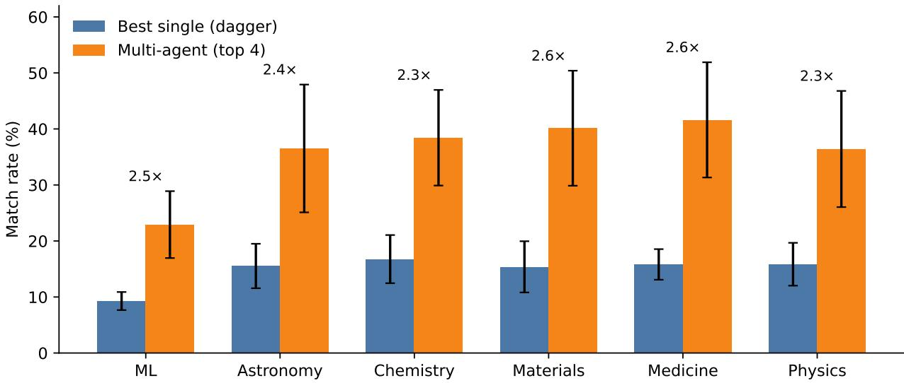

# Reconstruction: A Blind Benchmark for Recovering Research Ideas from Pre-Publication Bibliographies AI-Professor Project

Shaolong Chen1, Yanlin Fei1, Nazhou Liu1, Xinmiao Yu1, Lei Li1, Rahul Thapa2, Madalina Ciobanu1, Qingqing Mao1,3,∗, Ritankar Das1,3

1Prentis AI, San Francisco, CA 2Stanford University, Stanford, CA 3Titan Holdings, San Francisco, CA

∗Corresponding author: qmao@titanresearchlabs.ai

August 18, 2026

## Abstract

Can a language model recover the true research idea of a published paper when given only that paper’s pre-publication bibliography? We introduce Reconstruction, a blind idea-recovery benchmark that withholds the seed paper and all contemporaneous or future literature, and asks models to propose hypotheses that an independent large language model judge matches against the held-out ground-truth idea. A strict anti-leakage protocol—temporal citation cutof, anonymous reference IDs, and frozen per-paper bibliographies—prevents prompt-time leakage of the seed idea. Across six scientific domains and 643 evaluated papers, seven frontier models achieve only modest Match rates (∼3–15%). We then evaluate a reference-only multi-agent (top 4) pipeline that combines cross-model review with a Swiss tournament over aligned hypothesis slots, without external web search. Cross-model review plus tournament selection raises Match rates to ∼23–42% across all six domains—an observed ∼2.4× lift over the best single-mode baseline. This draft reports the protocol, anti-leakage design, and current results as an arXiv timestamp.

## 1 Introduction

Large language models (LLMs) are increasingly used to propose research ideas [11, 15, 1, 14]. Most evaluations ask whether a generated idea is novel, interesting, or preferred by humans. A complementary question is harder and more diagnostic of literature understanding: given only the references available before a paper was published, can a model recover what that paper actually proposed?

We formalize this as Reconstruction. For each seed paper, we build a blind reference context containing only literature published strictly before the seed’s publication date $T _ { 0 }$ . Models never see the seed title/abstract during generation; an LLM judge later compares model hypotheses to the held-out seed idea. The primary metric is Match rate: the fraction of hypotheses that the judge labels as matching the ground truth. Central to validity is the anti-leakage design (Section 3.2): a hard temporal cutof, anonymous reference IDs, information isolation from the seed, and frozen per-paper bibliographies shared by Default and multi-agent conditions.

Contributions.

1. Reconstruction benchmark. A time-cut, anti-leakage protocol for measuring idea recovery from pre-publication bibliographies across ML and five Nature-family domains.

2. Single-model baselines. Seven frontier models on 643 papers; best average Match rate is $1 3 . 3 \% \pm 2 . 3 \%$ (Claude-Opus-4.8), with domain scores typically in the ∼3–15% band.

3. Reference-only multi-agent pipeline. Cross-model review plus Swiss selection over the top 4 Default models raises Match rates to ∼23–42% across six domains (an observed ∼2.4× lift vs. the best single-model baseline). We credit the full selection pipeline rather than collaboration alone; relative Default comparisons are reported as observed associations in the results, with candidate-matched controls left to follow-up work.

## 2 Related Work

Automated scientific discovery and ideation systems use LLMs to propose research ideas from literature [11, 15, 1, 17, 10, 16]. Human studies ask whether LLM ideas are judged novel relative to expert proposals [14], and follow-up work examines the gap between ideation and real execution outcomes [13]. Benchmarks such as IdeaBench evaluate open-ended idea generation quality [8], while RINoBench targets automated novelty judgment of research ideas [12]. Closest to our setting, Chen et al. reverse-engineer inspirational prior work for published papers and measure how far LLMgenerated ideas remain from human ideas [2]. Our setting difers: we measure recovery of a known published idea under a strict temporal information cutof, rather than open-ended idea generation or novelty ranking.

Temporal evaluation is closely related. HindSight restricts ideation to pre-cutof literature and scores ideas against post-cutof future publications [9]; Reconstruction instead recovers the seed paper’s own idea from its pre-publication bibliography alone. We use multi-model LLM judges for Match rate, with leave-one-out / origin recusal to avoid self-evaluation bias.

Multi-agent debate can improve factuality and reasoning [6]. We adapt a related idea—crossmodel review plus Swiss-system selection [3]—to Reconstruction. Hypothesis generation in both conditions—and cross-model review and Swiss selection in multi-agent—uses only the same frozen blind bibliography $\mathcal { R } _ { < T _ { 0 } }$ and makes no runtime web-search calls. Final Match scoring is a separate evaluation step in which an independent LLM judge compares each hypothesis with the held-out seed title and abstract.

## 3 The Reconstruction Benchmark

## 3.1 Task

Given a seed paper s with publication date $T _ { 0 } .$ , construct a blind corpus

$$
\mathcal { R } _ { < T _ { 0 } } = \{ r : \mathrm { p u b l i s h e d } ( r ) < T _ { 0 } \}
$$

from $s \mathrm { { } s }$ bibliography (resolved to title/abstract; anonymous IDs $\mathtt { r e f - 0 0 1 } , \ \dots { } . \ \dots { } $ . The seed itself and any same-day/future literature are held out. A reconstruction proposer produces ${ n _ { s } } \mathrm { { = } } 5$ distinct hypotheses $\{ h _ { i } \} _ { i = 1 } ^ { n _ { s } }$ , each with supporting reference IDs. Papers that fail to yield five hypotheses under multi-agent hypothesis generation for every top 4 model are excluded from the reported seedpaper set (Table 1), so every scored case has ${ n _ { s } } \mathrm { { = } } 5$ . A judge J that sees only the seed title/abstract and hypothesis title/summary returns a binary match label $m _ { i } ( s ; P , J ) \in \{ 0 , 1 \}$ . For proposer $P$ on seed paper s under judge J, the paper-level Match rate is

$$
\mathrm { M a t c h } ( s ; P , J ) = \frac { 1 } { n _ { s } } \sum _ { i = 1 } ^ { n _ { s } } m _ { i } ( s ; P , J ) .
$$

Let $s$ be the seed-paper set and $\{ { \cal S } _ { d } \} _ { d \in \mathcal { D } }$ its partition into domains (here $| { \mathcal { D } } | { = } 6 \colon$ ML, Astronomy, Chemistry, Materials, Medicine, Physics), so $\textstyle S = \bigcup _ { d \in { \mathcal { D } } } S _ { d }$ . The domain-level score of $P$ under J is

$$
\mathrm { M a t c h } _ { d } ( P , J ) = \frac { 1 } { | { \cal S } _ { d } | } \sum _ { s \in { \cal S } _ { d } } \mathrm { M a t c h } ( s ; P , J ) ,
$$

and the overall score on the full seed-paper set is

$$
\mathrm { M a t c h } ( P , J ) = \frac { 1 } { | { \cal S } | } \sum _ { s \in { \cal S } } \mathrm { M a t c h } ( s ; P , J ) .
$$

For a Default proposer $P ,$ , let $\mathcal { I } ( P )$ be its judge panel: the six leave-one-out models for primary rows or the other three top models for dagger top 4 rows. The reported domain score averages the already-defined per-judge domain scores over that panel:

$$
\begin{array} { l } { \displaystyle \mathrm { M a t c h } _ { d } ( P ) = \frac { 1 } { | \mathcal { I } ( P ) | } \sum _ { J \in \mathcal { I } ( P ) } \mathrm { M a t c h } _ { d } ( P , J ) , } \\ { \displaystyle \sigma _ { d } ( P ) = \sqrt { \frac { 1 } { | \mathcal { I } ( P ) | } \sum _ { J \in \mathcal { I } ( P ) } \left( \mathrm { M a t c h } _ { d } ( P , J ) - \mathrm { M a t c h } _ { d } ( P ) \right) ^ { 2 } } . } \end{array}
$$

Each Default domain cell in Table 2 reports Match $_ d ( P ) \pm \sigma _ { d } ( P )$

Multi-agent requires hypothesis-level origin recusal, and the proposer of each champion is not fixed in advance: Swiss selection chooses which model wins each slot, so the eligible judge set varies with the champion. Every reported multi-agent case has exactly $n _ { s } { = } 5$ champions (Table 1). Let $o ( s , i )$ be the origin of champion $i ,$ and let $\mathcal { I } _ { \mathrm { t o p 4 } }$ be the top 4 judge panel. A recused judgment on an origin-matched champion is treated as missing, not as a No-match label. For each judge $^ { J , }$ restrict to champions $J$ did not originate and average first over those champions (within each seed) and then over seeds, parallel to Match ${ } _ { d } ( P , J )$ :

$$
\begin{array} { l } { { \mathrm { M a t c h } ( s ; \mathrm { M A } , J ) = \displaystyle \frac { 1 } { | \{ i : o ( s , i ) \neq J \} | } \sum _ { i : o ( s , i ) \neq J } m _ { i } ( s ; \mathrm { M A } , J ) , } } \\ { { \mathrm { M a t c h } _ { d } ( \mathrm { M A } , J ) = \displaystyle \frac { 1 } { | S _ { d } | } \sum _ { s \in S _ { d } } \mathrm { M a t c h } ( s ; \mathrm { M A } , J ) . } } \end{array}
$$

(If a seed has no champion eligible for $J ,$ that seed is omitted from $\mathrm { M a t c h } _ { d } ( \mathrm { M A } , J ) . )$ The four scores $\{ \mathrm { M a t c h } _ { d } ( \mathrm { M A } , J ) \} _ { J \in \mathcal { T } _ { \mathrm { t o p } 4 } }$ are then aggregated as a weighted set, with weight equal to the number of eligible (seed, champion) pairs for that judge:

$$
w _ { J } = \sum _ { s \in S _ { d } } | \{ i : o ( s , i ) \neq J \} | , \qquad \mathrm { M a t c h } _ { d } ( \mathrm { M A } ) = \frac { \sum _ { J \in \mathcal { J } _ { \mathrm { t o p 4 } } } w _ { J } \mathrm { M a t c h } _ { d } ( \mathrm { M A } , J ) } { \sum _ { J \in \mathcal { J } _ { \mathrm { t o p 4 } } } w _ { J } } ,
$$

$$
\sigma _ { d } ( \mathrm { M A } ) = \sqrt { \frac { \sum _ { J \in \mathcal { J } _ { \mathrm { t o p 4 } } } w _ { J } \big ( \mathrm { M a t c h } _ { d } ( \mathrm { M A } , J ) - \mathrm { M a t c h } _ { d } ( \mathrm { M A } ) \big ) ^ { 2 } } { \sum _ { J \in \mathcal { J } _ { \mathrm { t o p 4 } } } w _ { J } } } .
$$

Thus $\mathrm { M a t c h } _ { d } ( \mathrm { M A } )$ uses the same outer order as $\mathrm { M a t c h } _ { d } ( P )$ —champions, then seeds, then judges— except that the final judge average is weighted by eligible coverage, because judges who originate fewer champions evaluate a larger eligible set. The multi-agent domain cell reports $\mathrm { M a t c h } _ { d } ( \mathrm { M A } ) \pm$ $\sigma _ { d } ( \mathrm { M A } )$ . Empirically $\sigma _ { d } ( \mathrm { M A } )$ is much larger than typical $\sigma _ { d } ( P )$ (Table 2). This is expected under the definition of $\sigma _ { d }$ as dispersion across $j u d g e s ,$ , not across papers. Multi-agent concentrates stronger, more specific champions, so the top 4 judges disagree substantially on those champions (e.g., Claude/GPT are systematically more permissive than Kimi/GLM). Default single-model hypotheses are weaker and more often unanimously unmatched, which compresses judge-to-judge dispersion and keeps $\sigma _ { d } ( P )$ small.

For any reported row $Q ,$ let $M _ { d } ( Q )$ denote its domain point estimate— $\mathrm { - M a t c h } _ { d } ( P )$ for Default or $\mathrm { M a t c h } _ { d } ( \mathrm { M A } )$ for multi-agent. The Avg column is

$$
\operatorname { A v g } ( Q ) = { \frac { 1 } { | { \mathcal { D } } | } } \sum _ { d \in { \mathcal { D } } } M _ { d } ( Q ) , \qquad \sigma _ { \operatorname { A v g } } ( Q ) = { \sqrt { { \frac { 1 } { | { \mathcal { D } } | } } \sum _ { d \in { \mathcal { D } } } \left( M _ { d } ( Q ) - \operatorname { A v g } ( Q ) \right) ^ { 2 } } } ,
$$

shown as $\operatorname { A v g } ( Q ) \pm \sigma _ { \operatorname { A v g } } ( Q )$ . Both $\sigma _ { d }$ and $\sigma _ { \mathrm { A v g } }$ divide by the full count rather than applying a Bessel correction, since the judge panel and the six domains are the complete sets being described rather than samples from a larger population. This domain-unweighted Avg is not the same as pooling over $s ,$ because domains have unequal $| S _ { d } |$

## 3.2 Anti-leakage design

Reconstruction is designed so that recovering the seed idea requires reasoning over the pre-publication bibliography rather than reading the seed or contemporaneous literature at prompt time.

• Temporal cutof: only published $< T _ { 0 }$ enters $\mathcal { R } _ { < T _ { 0 } } ;$ undated references are excluded.

• Information isolation: proposers never see the seed paper or contemporaneous literature.

• Anonymous references: bibliography entries are exposed only as opaque IDs (ref-001, . . . ) with title/abstract text—no venue shortcuts that would trivially reveal the seed.

• Frozen per-paper bibliographies: multi-agent Derive reuses the exact $\mathcal { R } _ { < T _ { 0 } }$ resolved in Default, so the two conditions cannot diverge by resolving a diferent reading list.

• Evidence binding: each hypothesis must cite anonymous supporting references.

• Judge self-evaluation avoidance: the judge model must difer from the proposer; under multi-agent, judges recuse on hypotheses they originated.

## 3.3 Default (single-model) protocol

In a single generation call, each model is asked to produce five distinct hypotheses from the same blind references and is scored as its own case. No tournament is used in Default mode.

## 3.4 Multi-agent (top 4) protocol

We select the four strongest Default models by six-domain average Match rate on the reported seed-paper set: Claude-Opus-4.8, GPT-5.6-Sol-Pro, Kimi-K3, and GLM-5.2. This is a post-selected ensemble relative to the same papers used for scoring; we therefore interpret multi-agent results as evaluating this fixed top 4 roster rather than a selection rule validated on a held-out split.

1. Parallel generation: each model, in one generation call, produces five distinct hypotheses from identical frozen blind references.

2. Slot alignment: for slot $k \in \{ 1 , \ldots , 5 \}$ , collect the k-th hypothesis from each model (4 candidates per slot; 20 candidates total before selection).

3. Reference-only review: other models review each candidate (proposer recusal); no web search.

4. Swiss selection: candidates in each slot enter a Swiss tournament judged only on blind references, with conflict-of-interest recusal and presentation-order debiasing (Appendix B).

5. Assemble: five slot champions form one multi-agent case, scored by the final Match judge independently of prior review/tournament calls. For each champion, the origin model recuses; its missing label is excluded rather than counted as No-match (Appendix A).

A Derive pipeline freezes per-paper $\mathcal { R } _ { < T _ { 0 } }$ from completed Default runs so multi-agent cannot resolve a diferent bibliography.

## 4 Experiments

## 4.1 Dataset construction and filtering

Seed collection. We collect seed papers as title lists from six sources (879 titles in total). The ML set is the full ICML 2026 Oral program (N=168), scraped from the conference website. The remaining five domains are scraped from the corresponding Nature-family journal pages on 14 July 2026: Nature Astronomy (91), Nature Chemistry (115), Nature Materials (131), Nature Medicine (221), and Nature Physics (153). Each CSV provides a title (Nature lists also include a citation-count field used only for provenance, not for filtering).

Metadata and bibliography resolution. Each title is resolved to bibliographic metadata (title, abstract, authors, publication date, DOI when available) via Semantic Scholar as the primary lookup, with fallbacks to OpenReview (especially for ICML), Crossref, OpenAlex, and arXiv. We then assemble the seed’s bibliography by merging reference strings from Semantic Scholar, Crossref, and OpenAlex, and—when a PDF is obtainable—from arXiv or OpenReview PDF extraction. References are normalized, deduplicated, resolved to title/abstract/date, and assigned anonymous IDs (ref-001, . . . ). The temporal cutof is $T _ { 0 } \mathrm { = t h e }$ seed’s publication date: only references with published(r) < T0 enter the blind reconstruction context $\mathcal { R } _ { < T _ { 0 } } ;$ undated references and the seed itself are held out.

Eligibility criteria. A seed is retained only if (i) it resolves to a real paper with a usable publication date, and (ii) at least three references are both successfully resolved and published strictly before $T _ { 0 }$ (minimum bibliography size for hypothesis generation). Seeds that fail these checks are excluded before or during the Default run and do not contribute to Match-rate statistics.

Table 1: Seed retention from CSV titles to the reported seed-paper set, with launched-butincomplete failures broken out by reason. CSV: parsed titles; Not launched: excluded before Default run started; Incomplete (by reason): launched but not completed; the four columns sum to $8 1 { = } 8 2 6 { - } 7 4 5$ (CSV − Not launched − Default OK); Unresolved: title unresolved; References< 3: fewer than three $\mathrm { p r e } { - } T _ { 0 }$ references; No date: no usable publication date; Early stop: launched papers left unfinished when the job hit an early-stop completion target chosen to limit time and cost (all 35 are Medicine: 195 launched, stop at 160); Default OK: completed blind-bibliography reconstruction; MA $n _ { s } { < } 5 \colon$ multi-agent–aligned papers dropped because at least one top 4 hypothesis-generation call returned fewer than five hypotheses (Swiss slot count $= \mathrm { m i n } _ { m } \mathrm { | h y p s } _ { m } | { < } 5 )$ ; Reported n: counts used in Table 2 (multi-agent–aligned with $n _ { s } = 5 )$ . aMaterials: 121 Default OK, minus one multiagent content filter refusal and three MA $n _ { s } { < } 5$ drops ⇒ Reported $n { = } 1 1 7 .$ . bMedicine: Default completes 160; multi-agent evaluates the first 80 for cost, then drops two MA $n _ { s } < 5$ papers ⇒ Reported $n { = } 7 8$ Warning: Claude-Opus-4.8 can return empty hypotheses under OpenRouter content filter; in the Medicine Default audit this afected 4 completed papers (proposer marked unavailable; other models still scored). This is distinct from the Early-stop and MA $n _ { s } < 5$ columns.
<table><tr><td></td><td></td><td></td><td colspan="4">Incomplete (by reason)</td><td></td><td></td><td></td></tr><tr><td>Domain</td><td>CSV</td><td>Not launched</td><td>Unresolved</td><td>References&lt; 3</td><td>No date</td><td>Early stop</td><td>Default OK</td><td>MA  ${ n _ { s } } < 5$ </td><td>Reported n</td></tr><tr><td>ML</td><td>168</td><td>0</td><td>24</td><td>18</td><td>1</td><td>0</td><td>125</td><td>5</td><td>120</td></tr><tr><td>Astronomy</td><td>91</td><td>4</td><td>0</td><td>0</td><td>0</td><td>0</td><td>87</td><td>2</td><td>85</td></tr><tr><td>Chemistry</td><td>115</td><td>4</td><td></td><td>1</td><td>0</td><td>0</td><td>109</td><td>4</td><td>105</td></tr><tr><td>Materials</td><td>131</td><td>9</td><td></td><td>1</td><td>0</td><td>0</td><td>121</td><td>3</td><td>117ª</td></tr><tr><td>Medicine</td><td>221</td><td>26</td><td></td><td>0</td><td>0</td><td>35</td><td>160</td><td>2</td><td> $7 8 ^ { b }$ </td></tr><tr><td>Physics</td><td>153</td><td>10</td><td>0</td><td>0</td><td>0</td><td>0</td><td>143</td><td>5</td><td>138</td></tr><tr><td>Total</td><td>879</td><td>53</td><td>25</td><td>20</td><td>1</td><td>35</td><td>745</td><td>21</td><td>643</td></tr></table>

Retention funnel. Table 1 summarizes how raw CSV titles become the evaluated set, including reasons for launched-but-incomplete seeds. Of 879 collected titles, 53 never enter a Default run (eligibility failures or composer deselection before launch), so 879−53=826 seeds are launched. Among launched seeds, Default completes 745 papers, leaving 826−745=81 incomplete runs (Table 1, Incomplete-by-reason columns). Medicine accounts for 35 of these: the Default job launched 195 seeds but stopped early at a target of 160 completed papers (early stop target = 160), primarily to save wall-clock time and API cost, leaving papers 161–195 unfinished. Separately, within some completed Medicine papers, Claude-Opus-4.8 occasionally returned empty outputs with OpenRouter finish reason=content filter (4 papers in the Medicine audit); those cases mark only that proposer as unavailable and do not remove the paper from Default OK.

Reported n and multi-agent alignment. Multi-agent runs derive from completed Default runs and freeze the same per-paper $\mathcal { R } _ { < T _ { 0 } }$ . Materials loses one additional paper under multiagent to a provider content filter refusal, yielding 120 multi-agent completions before the ${ n _ { s } } \mathrm { = } 5$ filter. For Medicine, Default completes 160 papers, but multi-agent evaluates only the first 80 to control API cost. Across domains, 21 further papers are excluded because multi-agent hypothesis generation returned fewer than five hypotheses for at least one top 4 model, so the Swiss slot count $\mathrm { m i n } _ { m } \left| \mathrm { h y p s } _ { m } \right|$ was strictly less than five (Table 1, MA $n _ { s } < 5$ column). The reported seed-paper set therefore retains only papers with exactly ${ n _ { s } } \mathrm { { = } } 5$ champions, with size $n { = } 6 4 3$

Infrastructure. LLM calls use OpenRouter. Literature APIs: Semantic Scholar (authenticated), OpenAlex and Crossref (polite-pool contact emails), OpenReview (enabled; no session cookie), and

arXiv PDF download when an identifier is available. Reference resolution runs with concurrency 8;   
reconstruction judges with concurrency 5. Default Nature-domain runs started on 15 July 2026;   
multi-agent derives followed on 22–27 July 2026.

## 4.2 Models and judging

We evaluate seven OpenRouter model snapshots (evaluation window July 2026), listed with provider, display name, release date, and provider ID:

• Anthropic: Claude Opus 4.8 (2026-05-27); anthropic/claude-opus-4.8

• OpenAI: GPT-5.6 Sol Pro (2026-07-09); openai/gpt-5.6-sol-pro

• MoonshotAI: Kimi K3 (2026-07-16); moonshotai/kimi-k3

• Z.ai: GLM 5.2 (2026-06-16); z-ai/glm-5.2

• Google: Gemini 3.1 Pro Preview (2026-02-19); google/gemini-3.1-pro-preview

• DeepSeek: DeepSeek-V4-Pro (2026-04-24); deepseek/deepseek-v4-pro

• Qwen: Qwen3.7-Max (2026-05-21); qwen/qwen3.7-max

IDs are written as resolved at run time; provider aliases may evolve, so we treat the July 2026 OpenRouter routing as the snapshot of record. Release dates follow the project’s model-release registry (and UI metadata) used for temporal cutof checks. For Default, each proposer’s Match rate is averaged over the other six models as judges (cell mean±std across those judges). For multiagent, the four top models serve as judges with origin-based recusal. To make Default top 4 scores more comparable to that panel, Table 2 also reports four extra rows in which each top 4 proposer is scored only by the other three top models. The final Match judge prompt and binary rubric are given in Appendix A, with one borderline Match example and one No-match example in Table 6.

## 4.3 Main results

Table 2 summarizes Match rates. Single models remain in a low band: observed cell means span 3.4%–15.0% (∼3–15%), and the best six-domain average is 13.3% ± 2.3% (Claude-Opus-4.8; Avg ± is across domains). Restricting Default top 4 proposers to the other-top 3 judge panel slightly changes point estimates (typically within a few points) but does not move them into the multi-agent band. The multi-agent (top 4) pipeline—cross-model review plus Swiss selection—reaches 22.9% (ML), 36.5% (Astronomy), 38.4% (Chemistry), 40.1% (Materials), 41.6% (Medicine), and 36.4% (Physics), averaging 36.0% ± 6.1% across domains.

Figure 1 visualizes the lift relative to the best dagger (top 4, other-top 3 judges) single-model score per domain. Relative to that panel, the multi-agent pipeline’s observed ratios are 2.5× (ML), 2.4× (Astronomy), 2.3× (Chemistry), 2.6× (Materials), 2.6× (Medicine), and 2.3× (Physics); the mean of these ratios is 2.4×. Materials and Medicine sit at the high end of the multi-agent absolute range. We treat these ratios as an observed association for the full pipeline, not an isolated collaboration efect: multi-agent selects 5 hypotheses from 20 candidates (4 models × 5 slots), whereas Default reports all 5 from one model, so part of the gain may simply be inference-time scaling (picking the best 5 of 20 rather than keeping 5 of 5), and the two settings are scored by diferent judge panels.

Table 2: Reconstruction Match rates (%). For Default rows, cells show mean±std across leaveone-out judges (six judges, or three peer top models in the dagger block). For multi-agent, the center is the weighted judge-set aggregate $\mathrm { M a t c h } _ { d } ( \mathrm { M A } ) ; \pm$ is the corresponding weighted $\sigma _ { d } ( \mathrm { M A } )$ The Avg column reports the unweighted mean across the six domain columns, with ± the standard deviation across domains (not across judges). Within each Default block (all seven models; dagger top 4), bold marks the column maximum. vs best single is multi-agent divided by the best dagger (top 4, other-top 3 judges) single-model score in that column.
<table><tr><td>Model</td><td> $\mathrm { M L _ { 1 2 0 } }$ </td><td> $\mathrm { A s t r o } _ { 8 5 }$ </td><td> $\mathrm { { C h e m } _ { 1 0 5 } }$ </td><td> $\mathrm { M a t } _ { 1 1 7 }$ </td><td> $\mathrm { M e d } _ { 7 8 }$ </td><td> $\mathrm { P h y s _ { 1 3 8 } }$ </td><td> $\operatorname { A v g }$ </td></tr><tr><td>Claude-Opus-4.8</td><td>8.2±2.4</td><td>14.7±3.1</td><td>14.0±5.3</td><td> $\mathbf { 1 4 . 0 { \pm } 3 . 7 }$ </td><td>14.2±3.0</td><td>15.0±3.2</td><td>13.3±2.3</td></tr><tr><td>GPT-5.6-Sol-Pro</td><td> $7 . 6 { \pm } 1 . 3 $ </td><td> $1 2 . 9 { \pm } 2 . 6 $ </td><td> $\mathbf { 1 5 . 0 { \pm } 3 . 8 }$ </td><td> $1 3 . 8 { \pm } 2 . 9 $ </td><td> $\mathbf { 1 4 . 6 { \pm } 2 . 7 }$ </td><td> $1 2 . 7 { \pm } 2 . 1 $ </td><td>12.8±2.4</td></tr><tr><td>Kimi-K3</td><td> $7 . 9 { \pm } 1 . 9 $ </td><td> $1 0 . 7 { \pm } 2 . 6 $ </td><td> $9 . 8 { \pm } 2 . 6 $ </td><td> $1 0 . 1 { \pm } 2 . 2 $ </td><td> $1 1 . 1 { \pm } 1 . 9 $ </td><td> $1 0 . 7 { \pm } 2 . 4 $ </td><td>10.0±1.0</td></tr><tr><td>GLM-5.2</td><td> $7 . 2 { \pm } 1 . 2 $ </td><td> $9 . 5 { \pm } 2 . 8 $ </td><td>9.8±3.0</td><td> $9 . 2 { \pm } 2 . 3 $ </td><td> $1 0 . 1 { \pm } 2 . 0 $ </td><td> $1 0 . 2 { \pm } 2 . 5 $ </td><td>9.3±1.0</td></tr><tr><td>Gemini 3.1-Pro-Preview</td><td> $5 . 9 { \pm } 0 . 6 $ </td><td> $8 . 9 { \pm } 1 . 6 $ </td><td>10.2±2.6</td><td> $8 . 4 { \pm } 2 . 2 $ </td><td> $1 0 . 5 { \pm } 1 . 8 $ </td><td> $9 . 2 { \pm } 1 . 7 $ </td><td>8.9±1.5</td></tr><tr><td>DeepSeek-V4-Pro</td><td> $3 . 4 { \pm } 1 . 3 $ </td><td>6.7±2.5</td><td>6.6±2.8</td><td>7.2±3.0</td><td> $6 . 9 { \pm } 2 . 2 $ </td><td>7.0±2.6</td><td>6.3±1.3</td></tr><tr><td>Qwen3.7-Max</td><td> $4 . 6 { \pm } 1 . 3 $ </td><td>5.3±2.2</td><td>8.4±2.5</td><td>5.9±2.4</td><td> $4 . 8 { \pm } 1 . 8 $ </td><td>6.7±1.8</td><td>5.9±1.3</td></tr><tr><td colspan="8">Top 4 proposers, judged only by the other top 3 models</td></tr><tr><td>Claude-Opus-4.8†</td><td> $8 . 8 { \pm } 3 . 0 $ </td><td> $\mathbf { 1 5 . 5 } { \pm } 4 . 0$ </td><td>16.3±6.0</td><td> $\mathbf { 1 5 . 4 \pm 4 . 6 }$ </td><td> $1 5 . 3 { \pm } 3 . 3 $ </td><td>15.8±3.8</td><td> ${ \bf 1 4 . 5 { \pm } 2 . 6 }$ </td></tr><tr><td> $\mathrm { G P T - 5 . 6 - S o l - P r o ^ { \dagger } }$ </td><td> $7 . 9 { \pm } 1 . 6 $ </td><td> $1 3 . 6 { \pm } 3 . 3 $ </td><td>16.8±4.3</td><td> $1 5 . 2 { \pm } 2 . 8 $ </td><td> $\mathbf { 1 5 . 8 \pm 2 . 7 }$ </td><td> $1 3 . 9 { \pm } 2 . 2 $ </td><td>13.9±2.9</td></tr><tr><td>Kimi-K3†</td><td> ${ \bf 9 . 3 \pm 1 . 6 }$ </td><td> $1 1 . 1 { \pm } 3 . 0 $ </td><td>11.4±2.9</td><td> $1 1 . 3 { \pm } 1 . 6 $ </td><td> $1 2 . 1 { \pm } 2 . 2 $ </td><td> $1 1 . 4 { \pm } 2 . 8 $ </td><td>11.1±0.9</td></tr><tr><td>GLM-5.2†</td><td> $8 . 1 { \pm } 0 . 3$ </td><td> $1 1 . 7 { \pm } 2 . 1 $ </td><td>12.3±2.2</td><td>11.2±1.4</td><td> $1 1 . 9 { \pm } 0 . 9 $ </td><td> $1 2 . 2 { \pm } 1 . 9 $ </td><td>11.2±1.5</td></tr><tr><td>multi-agent (top 4)</td><td>22.9±6.0</td><td>36.5±11.4</td><td>38.4±8.5</td><td>40.1±10.3</td><td> ${ \bf 4 1 . 6 { \pm } 1 0 . 3 }$ </td><td>36.4±10.4</td><td>36.0±6.1</td></tr><tr><td>vs best single (×)</td><td>2.5×</td><td>2.4×</td><td>2.3×</td><td>2.6×</td><td>2.6×</td><td>2.3×</td><td>2.4×</td></tr></table>

Paper-level uncertainty and success@5. Table $2 \mathrm { : s \pm }$ values describe dispersion across judges. To quantify uncertainty from the sampled papers, we recompute Match rates under paper-level bootstrap on the same aligned $n { = } 6 4 3$ papers, comparing multi-agent to the best fixed top 4 dagger model in each domain (Table 3; full procedure in Appendix C). Briefly: the resampling unit is a paper (keeping that paper’s full set of judged hypotheses); within each domain we draw $n _ { d }$ papers with replacement, recompute domain means, and form lift as the ratio of bootstrap means; 95% confidence intervals (CIs) are percentile intervals from B=2000 replications. On the pooled n=643 papers, overall lift is 2.4× with 95% CI [2.3, 2.6] (Table 3, Overall row). A paper-wise paired comparison against the per-paper max among the four dagger top 4 models (a stronger single-model foil; Appendix D) favors multi-agent on 343 vs. 160 papers (140 ties; two-sided sign test $p < 1 0 ^ { - 1 5 } )$ We also report success@5: the fraction of papers for which at least one hypothesis matches among a judge’s eligible hypotheses, averaged over eligible judges. Multi-agent success@5 is 57.1% overall vs. 55.1% for the domain-best dagger single; the gap is smaller than for per-hypothesis Match rate, indicating that much of the Match lift comes from recovering more matching hypotheses on papers that already have at least one hit.

Hypothesis length. Table 4 compares English word counts (whitespace tokens) for seed papers (title+abstract) and for hypotheses (title+summary) under Default top 4 vs. multi-agent. Overall, Default averages 56 words (median 49), multi-agent 114 (median 95), and seeds 191 (median 183). Relative to Default, multi-agent is roughly 2× longer in every domain; relative to seeds, however, multi-agent is the closer match (Overall means 114 vs. 191, versus Default’s 56), so the Default shortfall is the more striking gap. Seed texts are full title+abstract units rather than hypothesis cards, so the comparison is descriptive rather than genre-matched; length/presentation remains a possible confounder pending controls that hold hypothesis length fixed.

  
Figure 1: Best top 4 single-model Match rate (dagger panel) vs. multi-agent (top 4) on six domains. Both bars include error bars showing the population standard deviation across their respective eligible judge scores. Annotations show the lift ratio.

Table 3: Paper-level bootstrap percentile 95% CIs for Match rate and lift vs. the best fixed top 4 dagger model per domain, plus success@5 (Appendix C). Lift CI is for the ratio of bootstrap means within each domain (Overall uses the pooled n=643 ratio). Paired wins use the stronger per-paper max among top 4 dagger models.
<table><tr><td>Domain</td><td>n</td><td>MA Match [CI]</td><td></td><td>Best† [CI]</td><td></td><td>Lift [CI]</td><td>MA s@5</td><td>Best† s@5</td></tr><tr><td>ML</td><td>120</td><td></td><td>22.9 [17.9, 28.4]</td><td>9.3 [7.3, 11.3]</td><td></td><td>2.5 [2.0, 3.0]</td><td>40.1</td><td>38.9</td></tr><tr><td>Astronomy</td><td>85</td><td></td><td>36.5 [30.5, 44.2]</td><td>15.5 [12.6, 18.6]</td><td></td><td>2.4 [2.0, 2.8]</td><td>58.9</td><td>56.9</td></tr><tr><td>Chemistry</td><td>105</td><td></td><td>38.4 [31.9, 45.8]</td><td>16.8 [14.2, 19.5]</td><td></td><td>2.3 [2.0, 2.6]</td><td>59.0</td><td>60.6</td></tr><tr><td>Materials</td><td>117</td><td>40.1</td><td>[33.9, 46.2]</td><td>15.4 [12.9, 18.0]</td><td></td><td>2.6 [2.2, 3.0]</td><td>63.3</td><td>54.4</td></tr><tr><td>Medicine</td><td>78</td><td>41.6</td><td>[34.9, 49.6]</td><td>15.8 [13.3, 18.5]</td><td></td><td>2.6 [2.3, 3.1]</td><td>65.0</td><td>66.2</td></tr><tr><td>Physics</td><td>138</td><td></td><td>36.4 [31.1, 41.7]</td><td>15.8 [13.6, 18.2]</td><td></td><td>2.3 [2.0, 2.6]</td><td>59.4</td><td>58.0</td></tr><tr><td>Overall</td><td>643</td><td></td><td>35.6 [33.0, 38.4]</td><td>14.6 [13.5, 15.7]</td><td></td><td>2.4 [2.3, 2.6]</td><td>57.1</td><td>55.1</td></tr></table>

Candidate-count bounds from the Default top 4 grid. The headline Default vs. multi-agent comparison is not candidate-matched: multi-agent selects 5 of 20 hypotheses, whereas Default reports 5 of 5 from one model. As a zero-compute bound that reuses existing Default top 4 judgments (dagger peer judges), Table 5 evaluates four constructions on the same 4 × 5 grid (Appendix E). The pool mean over all 20 hypotheses (B) equals the conditional expectation of selecting one hypothesis uniformly at random in each slot, $\mathbb { E } [ A ] = B$ . Table 5 reports one seeded realization of A, so its value need not equal B; both lie below the best fixed single model (Overall 12.3% and 12.6%, respectively, vs. 14.6%). An infeasible slot oracle that peeks at Match labels on the unreviewed Default grid (C) reaches 30.8%, while the reviewed multi-agent champions reach 35.6% (Overall; +23.3% over A and +4.8% over C). If multi-agent were only selecting among unchanged Default hypotheses under the same dagger scores, one would expect ${ \mathrm { M A } } \ \leq \ C ;$ the observed $\mathrm { M A } > C$ in every domain is therefore not an oracle violation. Column C is an upper bound only within the frozen Default 4 × 5 grid scored by dagger peers with the slot-alignment constraint, whereas multi-agent may revise candidates during reference-only review and is scored by an origin-recused top 4 panel. A still stronger Default-grid oracle that ignores slots and keeps the five highest-scoring hypotheses among all 20 (D) reaches 44.5% Overall, so $\mathrm { ~ C ~ } < \mathrm { { M A } < \mathrm { { ~ D ~ } } }$ on the pooled set (and MA < D in every domain). Thus multi-agent exceeds slot-wise Default re-picking, yet remains below an unconstrained label peek at the same Default pool—consistent with review+Swiss adding value beyond per-slot selection, while leaving headroom relative to an infeasible 5-of-20 Default cherry-pick (and relative to matched same-panel controls still to come). Judge-panel mismatch remains a caveat, so these bounds still do not replace a matched best-of-20 control with shared review, Swiss, and judge panels.

Table 4: Length in English words by domain (whitespace tokens). Seed: seed-paper title+abstract (one value per paper). Default/MA: hypothesis title+summary (Default: all top 4 hypotheses on the aligned papers; MA: five final hypotheses per paper).
<table><tr><td></td><td></td><td colspan="2">Seed</td><td colspan="2">Default</td><td colspan="2">MA</td></tr><tr><td>Domain</td><td>n</td><td>mean</td><td>median</td><td>mean</td><td>median</td><td>mean</td><td>median</td></tr><tr><td>ML</td><td>120</td><td>182</td><td>178</td><td>45</td><td>40</td><td>93</td><td>77</td></tr><tr><td>Astronomy</td><td>85</td><td>204</td><td>210</td><td>67</td><td>58</td><td>135</td><td>112</td></tr><tr><td>Chemistry</td><td>105</td><td>166</td><td>163</td><td>53</td><td>48</td><td>110</td><td>90</td></tr><tr><td>Materials</td><td>117</td><td>175</td><td>172</td><td>56</td><td>50</td><td>113</td><td>95</td></tr><tr><td>Medicine</td><td>78</td><td>257</td><td>253</td><td>58</td><td>53</td><td>121</td><td>104</td></tr><tr><td>Physics</td><td>138</td><td>186</td><td>188</td><td>58</td><td>50</td><td>117</td><td>101</td></tr><tr><td>Overall</td><td>643</td><td>191</td><td>183</td><td>56</td><td>49</td><td>114</td><td>95</td></tr><tr><td>Avg (domains)</td><td></td><td>195</td><td>194</td><td>56</td><td>50</td><td>115</td><td>96</td></tr></table>

Table 5: Zero-compute bounds on candidate count from the Default top 4 4 × 5 grid (dagger peer judges). Best†: fixed domain-best top 4 model. A: one seeded realization of slot-wise random selection (one of four models chosen uniformly in each slot; seed 42). B: mean Match rate over all 20 hypotheses. By linearity, $\mathbb { E } [ A ] = B$ for each paper (Appendix E), but the reported realization of A need not equal B. C: slot oracle (max over four models per slot; match-label peeking). D: unconstrained oracle (mean of the five highest among all 20; match-label peeking, no slot constraint). MA: multi-agent Match rate (Table 2). Entries are domain means of paper-level rates (%). This does not replace a matched best-of-20 control.
<table><tr><td>Domain</td><td>n</td><td>Best†</td><td>A</td><td>B</td><td>C</td><td>D</td><td>MA</td></tr><tr><td>ML</td><td>120</td><td>9.3</td><td>7.1</td><td>8.5</td><td>22.0</td><td>31.3</td><td>22.9</td></tr><tr><td>Astronomy</td><td>85</td><td>15.5</td><td>14.6</td><td>13.0</td><td>31.6</td><td>46.9</td><td>36.5</td></tr><tr><td>Chemistry</td><td>105</td><td>16.8</td><td>12.2</td><td>14.2</td><td>33.7</td><td>47.7</td><td>38.4</td></tr><tr><td>Materials</td><td>117</td><td>15.4</td><td>13.2</td><td>13.2</td><td>32.9</td><td>45.8</td><td>40.1</td></tr><tr><td>Medicine</td><td>78</td><td>15.8</td><td>14.7</td><td>13.8</td><td>32.9</td><td>51.1</td><td>41.6</td></tr><tr><td>Physics</td><td>138</td><td>15.8</td><td>13.5</td><td>13.3</td><td>32.5</td><td>47.1</td><td>36.4</td></tr><tr><td>Overall</td><td>643</td><td>14.6</td><td>12.3</td><td>12.6</td><td>30.8</td><td>44.5</td><td>35.6</td></tr><tr><td>Avg (domains)</td><td></td><td>14.8</td><td>12.5</td><td>12.7</td><td>30.9</td><td>45.0</td><td>36.0</td></tr></table>

## 4.4 Takeaways

• Blind idea recovery is hard for single models. Even the strongest frontier models recover the true idea for only a small fraction of hypotheses under a strict pre-publication cutof (∼3–15% Match rates).

• Reference-only review + tournament selection helps substantially. The full pipeline— without extra search—reaches ∼23–42% absolute Match rates across domains. Relative ratios vs. best dagger single fall in a narrow 2.3–2.6× band; we report them as descriptive associations pending ablations. Paper-level bootstrap supports an overall ratio of 2.4× (95% CI [2.3, 2.6]); success@5 rises more modestly (57% vs. 55%).

• Stable absolute multi-agent band. Absolute multi-agent Match rates fall in a ∼23–42% range across six domains.

• Beyond Default-grid selection. Multi-agent exceeds the Default 4×5 slot oracle C in every domain (Table 5; Overall +4.8%), which would be impossible if it only re-picked unchanged Default hypotheses under the same dagger scores. It remains below the unconstrained Default top-5 oracle D (Overall 35.6% vs. 44.5%), so $\mathrm { C } < \mathrm { M A } < \mathrm { D }$ : the pipeline beats slot-wise Default selection, yet does not saturate an infeasible cherry-pick of any five Default hypotheses. Together with the large gap over random/pool baselines A/B, this supports that referenceonly review+Swiss selection contributes to recovery beyond inference-time expansion of the Default pool—while still leaving a matched same-panel best-of-20 control for future work.

## 5 Limitations

• The evaluated LLMs are recent frontier models (or near-frontier) from each provider; seed papers may appear in their pretraining corpora, so recovered ideas could partly reflect memorized content rather than bibliography-conditioned inference. Our reference-only protocol and pre-publication citation cutof reduce prompt-time leakage, but cannot rule out parametric contamination.

• Match rate depends on LLM judges; we mitigate self-evaluation bias via leave-one-out / origin recusal and report judge variance, but we do not yet report human agreement with the Match rubric (Appendix A).

• The headline Default vs. multi-agent comparison is not an isolated collaboration efect. Multiagent selects 5 of 20 hypotheses (4 models × 5 slots), while Default keeps 5 of 5 from one model; part of the observed ∼2.4× association may therefore reflect inference-time scaling—picking among more candidates—rather than cross-model review or tournament mechanics per se. Table 5 gives zero-compute bounds from the Default top 4 grid—including that multi-agent exceeds the Default-grid slot oracle C, which we interpret as supporting review+selection beyond pure Default re-picking—but a matched best-of-20 single-model control with shared review/Swiss/judge panels is still planned.

• The two settings are also scored by diferent judge panels (six leave-one-out judges for primary Default rows vs. top 4 with origin recusal for multi-agent). Table 2’s dagger rows partially align the Default top 4 panel, but the comparisons remain not strictly like-for-like.

• The top 4 roster is post-selected on the reported Default averages (same papers), so multiagent evaluates this ensemble rather than a selection policy validated on held-out data.

• Multi-agent uses more total compute than a single model; we do not yet normalize for equal token budgets.

• Hypothesis “match” is a coarse binary; finer-grained graded scoring (e.g., a 1–5 rubric) can be considered.

• Multi-agent hypotheses are longer than Default ones but closer in length to seed title+abstract than Default is (Overall means 114 vs. 56 vs. seed 191; Table 4); part of the Match lift could still be a length/presentation artifact until length-matched controls are reported.

• The reported seed-paper set covers only six domains (ML plus five Nature-family areas); broader scientific coverage remains open.

## 6 Future Work

Reconstruction is only the first step. Our experiments show that LLMs can recover published research ideas from pre-publication bibliographies alone: under single-model Default, even the strongest frontier models remain in a low Match-rate band (∼3–15%), while reference-only crossmodel review plus Swiss selection over the top four models reaches ∼23–42%. Relative ratios vs. best dagger single (∼2.3–2.6×, mean 2.4×) are reported in the results as an observed association for this full pipeline, pending candidate-matched and equal-compute controls. This timestamps that the reference-only selection harness can substantially raise recovery rates relative to single-model baselines under a shared anti-leakage protocol.

The end goal, however, is not reconstruction. We ultimately aim to generate novel and feasible research ideas—the Generation mode of AI-Professor—where models propose forward-looking directions rather than recover known ones. Reconstruction serves as a controlled stress test of literature understanding and multi-agent coordination under a strict information cutof; the same harness principles (heterogeneous models, reference-grounded critique, and tournament selection) are intended to transfer to open-ended ideation, where success must be measured by novelty, feasibility, and real-world research impact rather than Match rate against a held-out seed paper. Immediate next steps include a candidate-matched single-model best-of-20 control, human validation of the Match judge, expanding other domain coverage, and bridging Reconstruction findings into Generation evaluation.

## 7 Conclusion

We presented Reconstruction, a blind bibliography-to-idea recovery benchmark with a strict antileakage protocol, and showed that reference-only cross-model review plus Swiss selection over the top 4 models reaches Match rates of ∼23–42% across six scientific domains, versus a single-model Default regime of ∼3–15%. We release this preliminary draft to timestamp the task and finding; further analyses and Generation-mode evaluation will follow.

## Acknowledgments

Draft prepared for arXiv timestamping. Implementation is part of the AI-Professor system.

## References

[1] Jinheon Baek, Sujay Kumar Jauhar, Silviu Cucerzan, and Sung Ju Hwang. ResearchAgent: Iterative research idea generation over scientific literature with large language models. In Proceedings of the 2025 Conference of the Nations of the Americas Chapter of the Association for Computational Linguistics: Human Language Technologies (Volume 1: Long Papers), pages 6709–6738, Albuquerque, New Mexico, 2025. Association for Computational Linguistics.

[2] Ziyu Chen, Yilun Zhao, and Arman Cohan. Measuring the gap between human and LLM research ideas. arXiv preprint arXiv:2607.01233, 2026.

[3] L´aszl´o Csat´o. On the ranking of a Swiss system chess team tournament. Annals of Operations Research, 254(1):17–36, 2017.

[4] A. C. Davison and D. V. Hinkley. Bootstrap Methods and their Application. Cambridge University Press, Cambridge, 1997.

[5] Thomas J. DiCiccio and Bradley Efron. Bootstrap confidence intervals. Statistical Science, 11(3):189–228, 1996.

[6] Yilun Du, Shuang Li, Antonio Torralba, Joshua B. Tenenbaum, and Igor Mordatch. Improving factuality and reasoning in language models through multiagent debate. arXiv preprint arXiv:2305.14325, 2023.

[7] Bradley Efron and Robert J. Tibshirani. An Introduction to the Bootstrap. Chapman and Hall, New York, 1993.

[8] Sikun Guo, Amir Hassan Shariatmadari, Guangzhi Xiong, Albert Huang, Eric Xie, Stefan Bekiranov, and Aidong Zhang. IdeaBench: Benchmarking large language models for research idea generation. arXiv preprint arXiv:2411.02429, 2024.

[9] Bo Jiang. HindSight: Evaluating LLM-generated research ideas via future impact. arXiv preprint arXiv:2603.15164, 2026.

[10] Long Li, Weiwen Xu, Jiayan Guo, Ruochen Zhao, Xingxuan Li, Yuqian Yuan, Boqiang Zhang, Yuming Jiang, Yifei Xin, Ronghao Dang, Yu Rong, Deli Zhao, Tian Feng, and Lidong Bing. Chain of ideas: Revolutionizing research via novel idea development with LLM agents. In Findings of the Association for Computational Linguistics: EMNLP 2025, pages 8971–9004, Suzhou, China, 2025. Association for Computational Linguistics.

[11] Chris Lu, Cong Lu, Robert Tjarko Lange, Jakob Foerster, and Jef Clune. The AI scientist: Towards fully automated open-ended scientific discovery. arXiv preprint arXiv:2408.06292, 2024.

[12] Tim Schopf and Michael F¨arber. Is this idea novel? an automated benchmark for judgment of research ideas. arXiv preprint arXiv:2603.10303, 2026. RINoBench.

[13] Chenglei Si, Tatsunori Hashimoto, and Diyi Yang. The ideation-execution gap: Execution outcomes of LLM-generated versus human research ideas. arXiv preprint arXiv:2506.20803, 2025.

[14] Chenglei Si, Diyi Yang, and Tatsunori Hashimoto. Can LLMs generate novel research ideas? a large-scale human study with 100+ NLP researchers. arXiv preprint arXiv:2409.04109, 2024.

[15] Yutaro Yamada, Robert Tjarko Lange, Cong Lu, Shengran Hu, Chris Lu, Jakob Foerster, Jef Clune, and David Ha. The AI scientist-v2: Workshop-level automated scientific discovery via agentic tree search. arXiv preprint arXiv:2504.08066, 2025.

[16] Keyu Zhao, Weiquan Lin, Qirui Zheng, Fengli Xu, and Yong Li. Deep ideation: Designing LLM agents to generate novel research ideas on scientific concept network. arXiv preprint arXiv:2511.02238, 2025.

[17] Qihao Zhao, Yangyu Huang, Yalun Dai, Lingao Xiao, Jianjun Gao, Xin Zhang, Wenshan Wu, Scarlett Li, Yang He, Yan Lu, and Yap Kim Hui. ResearchStudio-Idea: An evidence-grounded research-ideation skill suite from ML conference outcomes. arXiv preprint arXiv:2607.04439, 2026.

## A Final Match judge prompt and rubric

Each hypothesis is judged independently against the held-out seed title/abstract. The judge model never sees other candidates in the same call and must difer from the proposer (leave-one-out / origin recusal). For multi-agent scoring, the origin judge’s label for a champion is missing and excluded from aggregation; the champion score is the mean of its three eligible non-origin labels.

## System prompt (verbatim).

You judge whether a single candidate research hypothesis matches a held-out seed paper. Rules:

\- Compare ONLY the supplied title and abstract for the seed paper against the hypothesis title and summary.

\- Do NOT use external knowledge of the seed paper beyond the supplied title and abstract.

\- matched=true when the hypothesis describes the same core research idea as the seed paper.

\- matched=false when unrelated, overly generic, only loosely related, or not about the same research question.

\- Judge only the one hypothesis provided; do not speculate about other candidates.

\- rationale: one or two concise English sentences explaining the match decision (what aligns or what diverges).

\- Respond in English with valid JSON matching the requested schema.

Binary Match rubric. matched=true if the hypothesis describes the same core research idea as the seed (same research question / central claim), not merely the same broad topic. Borderline guidance used in development:

• Match: same problem and essentially the same proposed mechanism/claim, even if wording difers.

• No match: same field or overlapping keywords but a diferent question; a generic restatement of the bibliography without the seed’s distinctive claim; or a related but alternate approach that would not be recognized as the seed paper’s idea.

The user message supplies seed and hypothesis title/abstract blocks and requests JSON {"matched": true|false, "rationale": "..."}.

Borderline examples. To make the binary rubric concrete, Table 6 shows one unanimous Match and one unanimous No-match illustration. The two examples use diferent domains and diferent top 4 proposers. Within each example, the Default and multi-agent (MA) hypotheses share the same seed paper and the same origin proposer. For each seed we show the title and abstract; for each hypothesis we show the title and summary. Both candidates come from a highagreement pool: Default judges unanimous, the three non-origin MA judges unanimous, and the MA hypothesis a Swiss full-sweep slot champion (every match scored 2.0).

Table 6: Borderline Match / No-match examples illustrating the final judge rubric (Appendix A). Within each example the Default and multi-agent (MA) hypotheses share the same seed paper and origin proposer. Seeds are shown as title plus abstract; hypotheses as title plus summary.
<table><tr><td></td><td>Match — ML (proposer: Kimi-K3)</td></tr><tr><td>seed</td><td>How much do language models memorize? We propose a new method for estimating how much a model knows about a datapoint and use it to</td></tr><tr><td></td><td>approximately 3.6 bits per parameter. We train language models on datasets of increasing size and observe that models memorize until their capacity fills, at which point&quot;grokking&quot;begins, and unintended memorization decreases as models begin to generalize. We train hundreds of transformer language models ranging from 500K to 1.5B parameters and produce a series of scaling laws relating model capacity and data size to membership inference. How Many Bits Can a Language Model Memorize? Measuring Raw Memorization</td></tr><tr><td></td><td>Train transformer language models on uniformly random, structure-free token sequences so that generalization is impossible by construction, then use compression- and information-theoretic accounting to measure the total number of bits the model stores, yielding a clean bits-per-parameter estimate of memorization capacity and a principled separation of memorization from generalization. How Many Bits per Parameter? Measuring Stored, Retrievable, and Extractable Memorization of Language Models via Keyed Random-Data Pretraining</td></tr><tr><td></td><td>Isolate pure memorization from generalization by pretraining decoder-only transformers on synthetic corpora of key-to-payload records built from uniformly random bitstrings, which are incompressible with high probability, so any predictability the model acquires is memorization by construction. Using a compression-based, description-length definition of memorization, measure three nested quantities—stored bits (code-length reduction given the model), retrievable bits (exact payload recovery given the key), and extractable bits (black-box recovery without keys, following)—as functions of parameter count, data load, epochs, and numerical precision, yielding empirical capacity curves rather</td></tr><tr><td colspan="2">No-match — Physics (proposer: Claude-Opus-4.8) seed</td></tr><tr><td></td><td>Emergence of phase coherence in a magnon Bose-Einstein condensate The spontaneous emergence of coherence is a defining feature of multibody quantum systems, underlying phenomena from superconductivity to quantum information processing. Although Bose-Einstein condensates provide a unique setting for studying this process, direct observation of how a condensate acquires a coherent global phase has remained challenging. Here we provide evidence of spontaneous phase formation in a magnon Bose-Einstein condensate. Using a phase-referenced</td></tr><tr><td>Default</td><td>transition into a coherent quantum state with a well-defined macroscopic phase. This observation provides evidence of spontaneous symmetry breaking in a quasiparticle condensate, confirming a central prediction of Bose-Einstein condensation theory that extends across diverse quantum systems. Interference of Two Independently Prepared Room-Temperature Magnon Condensates Prepare two spatially separated magnon Bose-Einstein condensates in a YIG film via localized</td></tr><tr><td>MA</td><td>parametric pumping and let them expand and overlap, observing matter-wave-like interference fringes analogous to atomic BEC interference, but at room temperature. Thermally Defined Weak Link Between Two Room-Temperature Magnon Condensates: Controlling Josephson Detuning and Barrier Height via Local Laser Heating</td></tr><tr><td></td><td>Investigate whether a laser-heated separating region can act as a controllable weak link between two adjacent room-temperature YIG magnon BECs, with local heating tuning the inter-condensate chemical-potential detuning and effective barrier height, and disentangle coherent Josephson population</td></tr></table>

## B Swiss tournament mechanics (reconstruction multi-agent)

Per hypothesis slot, the four models’ slot-k hypotheses form a candidate pool of size n=4. All candidates enter Swiss selection (no novelty gate; no external web search—ballots see only the anonymous reference corpus).

Rounds and pairing. The number of rounds is max(1, n−1) (here, 3). Round 0 shufles candidates and pairs them consecutively; a leftover candidate receives a bye (+1 point). Later rounds rank by current score (then stable IDs) and pair similar scores while avoiding rematches when possible.

Judging rules (conflict-of-interest + order debias). For each paired A vs. B match under the top 4 roster:

1. The proposers of A and of B recuse: they cannot judge that match.

2. The remaining two models both serve as judges.

3. Each judge casts two ballots: once with presentation order A/B and once with B/A (swap only the prompt order; the fixed A/B identities of the two candidates do not change), to reduce position bias.

4. Thus each match yields four ballots in total.

Each ballot independently awards one vote to A or B. Match points equal vote count/2 (the two sides’ points always sum to 2.0): e.g., 4–0 7→ 2.0–0, 3–1 7→ 1.5–0.5, 2–2 7→ 1.0–1.0 (draw). When a judge’s A/B and B/A verdicts disagree, that judge is flagged for position bias in the audit log; ranking still uses the full four-ballot points above. After all rounds, the highest cumulative Swiss score wins the slot; ties break by aggregate importance then session ID.

## Tournament ballot system prompt (verbatim).

You are a debate judge for Multi-agent Reconstruction in AI Professor.

Compare two hypotheses using ONLY the supplied anonymous reference corpus.

Pick the hypothesis that better fits the latent research idea implied by that bibliography:

\- stronger grounding in the given references

\- clearer capture of the implied problem gap / contribution

\- more specific and coherent claims supported by references

Do NOT prefer novelty for its own sake. Do NOT use external search knowledge.

Respond in English with valid JSON:

{"winner": "A" or "B", "rationale": "..."}

The user message supplies the anonymous reference corpus and the two candidate hypotheses labeled A/B under the presentation order for that ballot.

Independence from final Match. Review and Swiss ballots never see the seed title/abstract. The final Match judge (Appendix A) is applied only after the five slot champions are assembled, and is independent of prior review/selection calls.

## C Paper-level bootstrap confidence intervals

Table 2’s ± values summarize dispersion across judges and do not quantify uncertainty from which papers enter the seed-paper set. Table 3 therefore reports paper-level nonparametric bootstrap percentile intervals [7, 4].

Estimands. For each aligned paper i in domain d, let $m _ { i } ^ { \mathrm { M A } }$ be the multi-agent Match rate under the weighted eligible-judge aggregation of Section 3.2’s companion formulas in Section 3.1 (equivalently: average each of the ${ n _ { s } } \mathrm { { = } } 5$ champion slots over its eligible non-origin judges). Let $\dot { m } _ { i } ^ { \mathrm { B e s t } \dagger }$ be the corresponding rate for the fixed best top 4 dagger proposer in d (other-top 3 judges). Domain Match rates are means of these paper-level scores; domain lift is the ratio of the two domain means. The Overall row pools all n=643 aligned papers and reports the ratio of the two pooled means—our primary lift summary.

Resampling. The bootstrap unit is the paper: drawing paper i reuses its complete judged hypothesis set (no hypothesis-level or judge-level resampling), which respects within-paper dependence among the $n _ { s } { = } 5$ slots. For a domain with $n _ { d }$ papers we draw $n _ { d }$ indices uniformly with replacement (stratified within domain), recompute both means on the resampled multiset, and set

$$
\mathrm { L i f t } ^ { ( b ) } = \frac { \overline { { { m } } } ^ { \mathrm { M A } , ( b ) } } { \overline { { { m } } } ^ { \mathrm { B e s t } \dagger , ( b ) } } .
$$

Domain rows in Table 3 use this within-domain resampling. The Overall row instead resamples all 643 papers with replacement and forms the ratio of pooled means. We use B=2000 independent replications with a fixed RNG seed for reproducibility.

Percentile 95% CI. For a scalar estimand θ with bootstrap replicates $\theta ^ { ( 1 ) } , \ldots , \theta ^ { ( B ) }$ , the reported interval is the percentile CI

$$
\big [ Q _ { 0 . 0 2 5 } \big ( \{ { \theta } ^ { ( b ) } \} \big ) , ~ Q _ { 0 . 9 7 5 } \big ( \{ { \theta } ^ { ( b ) } \} \big ) \big ] ,
$$

i.e., the empirical 2.5% and 97.5% quantiles of the bootstrap distribution [7]. Lift intervals are formed from the B ratios Lift(b) directly (not by dividing separately obtained Match endpoints). Point estimates in Table 3 are computed on the original (non-resampled) aligned seed-paper set; brackets are bootstrap percentile limits. Success@5 columns are point estimates only (fraction of papers with at least one Match among a judge’s eligible hypotheses, averaged over eligible judges).

Choice of B. Estimating a standard error typically needs far fewer replications than estimating tail quantiles for a confidence interval [7, 4]. Textbook guidance commonly takes on the order of B≈1000 replications as adequate for percentile intervals, with larger B reducing Monte Carlo error in the endpoints $[ 7 , 4 ]$ ; analyses of bootstrap confidence intervals often use on the order of B=2000 replications for this more delicate task [5]. We therefore set B=2000.

## D Paper-wise paired comparison and sign test

Table 3’s lift compares multi-agent to a single fixed dagger model per domain. As a stronger, per-paper single-model foil, we also compare multi-agent to the best-on-that-paper dagger model, so the baseline is allowed to switch models across papers.

Per-paper foil and win/tie/loss labels. For each aligned paper i let $m _ { i } ^ { \mathrm { M A } }$ be the multi-agent paper-level Match rate (Appendix C) and, for each of the four top 4 dagger proposers $g \in \{ 1 , \ldots , 4 \}$ (other-top 3 judges), let $m _ { i } ^ { ( g ) }$ be that model’s paper-level Match rate. Define the per-paper singlemodel foil as the maximum over the four models,

$$
m _ { i } ^ { \mathrm { m a x } } = \operatorname* { m a x } _ { g \in \{ 1 , . . . , 4 \} } m _ { i } ^ { ( g ) } ,
$$

which is a stronger baseline than any fixed model because it may pick a diferent model on each paper. We label paper i a multi-agent win if $m _ { i } ^ { \mathrm { M A } } > m _ { i } ^ { \operatorname* { m a x } }$ , a loss if $m _ { i } ^ { \mathrm { M A } } < m _ { i } ^ { \operatorname* { m a x } }$ , and a tie if $m _ { i } ^ { \mathrm { M A } } = m _ { i } ^ { \operatorname* { m a x } }$ . Over the $n { = } 6 4 3$ aligned papers this yields 343 wins, 160 losses, and 140 ties $( 3 4 3 + 1 6 0 + 1 4 0 = 6 4 3 )$

Two-sided sign test. The sign test asks whether wins and losses are equally likely under the null that multi-agent and the per-paper foil are equally good; ties are uninformative about direction and are discarded, leaving $n _ { \mathrm { e f f } } = 3 4 3 \substack { + 1 6 0 } = 5 0 3$ decisive papers. Let W be the number of wins. Under $H _ { 0 } , W \sim \mathrm { B i n o m i a l } ( n _ { \mathrm { e f f } } , \frac { 1 } { 2 } )$ , and the exact two-sided p-value is

$$
p ~ = ~ \mathrm { m i n } \left\{ 1 , ~ 2 \sum _ { j = 0 } ^ { k } { \binom { n _ { \mathrm { e f f } } } { j } } 2 ^ { - n _ { \mathrm { e f f } } } \right\} , \qquad k = \mathrm { m i n } ( W , n _ { \mathrm { e f f } } - W ) .
$$

With $W = 3 4 3$ and $n _ { \mathrm { e f f } } = 5 0 3$ this gives $p \approx 2 . 3 \times 1 0 ^ { - 1 6 }$ , so the paper-level advantage of multiagent over the per-paper best single model is highly unlikely under chance. This is a directional consistency test across papers and is distinct from the efect size (lift) and its bootstrap interval in Table $s ;$ it does not by itself quantify how large the per-paper gap is.

Per-domain breakdown. Wins/ties/losses (and the same exact two-sided sign-test p) by domain are: ML $5 5 / 3 5 / 3 5 ( p \approx 0 . 0 4 5 )$ ; Astronomy $4 5 / 2 2 / 2 0 \ \left( p \approx 0 . 0 0 2 6 \right)$ ; Chemistry $5 9 / 2 1 / 2 9 \ ( p \approx$ 0.0018); Materials $6 9 / 2 4 / 2 7 \left( p \approx 2 . 1 { \times } 1 0 ^ { - 5 } \right)$ ; Medicine $5 1 / 1 0 / 1 9 ( p \approx 1 . 7 { \times } 1 0 ^ { - 4 } )$ ; Physics $8 0 / 2 9 / 3 4$ $( p \approx 2 . 0 \times 1 0 ^ { - 5 } )$ The directional advantage is significant at the 0.05 level in all six domains, although ML is borderline $( p \approx 0 . 0 4 5 )$ .

## E Candidate-count bounds (A/B/C/D) and $\mathbb { E } [ A ] = B$

Setup. For each aligned paper, restrict to the four top 4 Default proposers and retain their five slot-aligned hypotheses, yielding scores $r _ { k , g }$ for slot $k \in \{ 1 , \ldots , 5 \}$ and model $g \in \{ 1 , \ldots , 4 \}$ . Each $r _ { k , g } \in [ 0 , 1 ]$ is the fraction of dagger peer judges (the other three top 4 models) that mark the hypothesis as matched. Let

$$
B = \frac { 1 } { 2 0 } \sum _ { k = 1 } ^ { 5 } \sum _ { g = 1 } ^ { 4 } r _ { k , g }
$$

be the deterministic mean over the pool of 20 hypotheses (column B in Table 5).

Slot-wise random selector A. Draw $G _ { k }$ independently and uniformly from {1, 2, 3, 4} and set

$$
A = \frac { 1 } { 5 } \sum _ { k = 1 } ^ { 5 } r _ { k , G _ { k } } .
$$

Thus A is the paper-level Match rate of keeping one uniformly random Default hypothesis per slot (five hypotheses total). As a random variable, A is not equal to $B ;$ only its expectation is. Table 5 reports one reproducible realization generated with NumPy’s PCG64 generator and seed 42.

Proof that $\mathbb { E } [ A ] = B$ . Condition on the paper (hence on all $r _ { k , g } )$ . Linearity gives

$$
\begin{array} { l } { \displaystyle \mathbb { E } [ A ] = \frac { 1 } { 5 } \sum _ { k = 1 } ^ { 5 } \mathbb { E } [ r _ { k , G _ { k } } ] = \frac { 1 } { 5 } \sum _ { k = 1 } ^ { 5 } \sum _ { g = 1 } ^ { 4 } r _ { k , g } \operatorname* { P r } ( G _ { k } = g ) } \\ { \displaystyle = \frac { 1 } { 5 } \sum _ { k = 1 } ^ { 5 } \sum _ { g = 1 } ^ { 4 } r _ { k , g } \cdot \frac { 1 } { 4 } = \frac { 1 } { 2 0 } \sum _ { k = 1 } ^ { 5 } \sum _ { g = 1 } ^ { 4 } r _ { k , g } = B . } \end{array}
$$

The same identity holds after averaging over papers, so domain/Overall means of $\mathbb { E } [ A ]$ and of B coincide. The realized domain/Overall means in column A may difer from column B because they use sampled model choices rather than the conditional expectation.

Slot oracle C and unconstrained oracle D. Column C replaces the random draw in each slot by $r _ { k , \star } = \operatorname* { m a x } _ { g } r _ { k , g }$ and averages over slots (match-label peeking; not deployable). It is therefore an infeasible upper bound within the frozen Default top 4 grid under dagger peer judges with slot alignment. Column D instead sorts all twenty scores $\{ r _ { k , g } \}$ and averages the five largest, ignoring slots (also match-label peeking; not deployable). Necessarily $D \geq C$ for each paper, because every slot-wise max is among the twenty candidates. Multi-agent rates are those reported in Table 2. Empirically $\mathrm { C } < \mathrm { M A } < D$ on the pooled set $( \mathrm { M A } > C$ and $\mathrm { M A } < D$ in all six domains): because multi-agent may revise hypotheses during review and uses a diferent (origin-recused) judge panel, exceeding C does not contradict the oracle construction; remaining below D leaves headroom relative to an unconstrained Default cherry-pick.