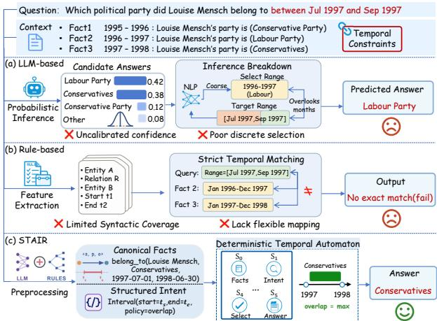
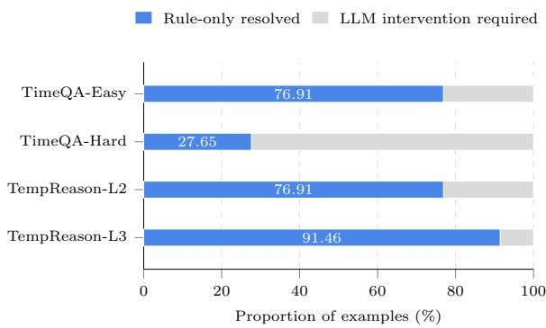
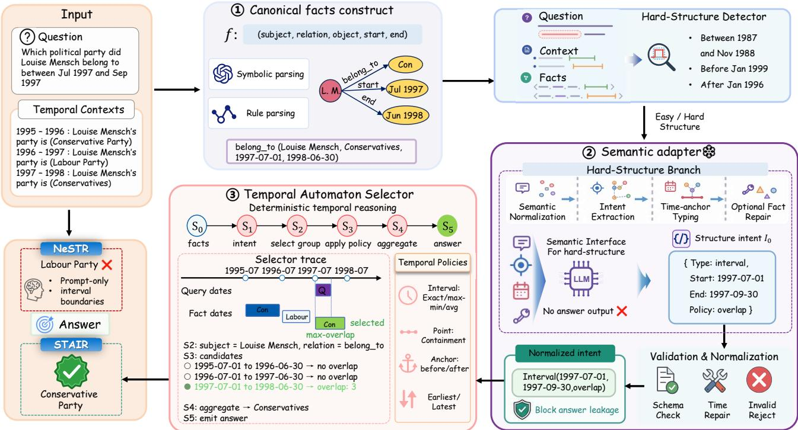

# STAIR: Semantic-Temporal Automaton for Interpretable Reasoning in Temporal Question Answering

Xinlong Dai, Jinchuan Zhang, Lei Gao, Xinzhe Hu, Yuefeng He, Hui Gao

University of Electronic Science and Technology of China (UESTC) Correspondence: jc.zhang@uestc.edu.cn

## Abstract

By leveraging large-scale pretraining, LLMs can interpret diverse temporal expressions and question formulations without task-specific training. However, existing prompt-based neurosymbolic systems continue to rely on LLMs for both semantic interpretation and exact temporal inference. Consequently, discrete decisions regarding intervals, time anchors, and ordered states remain vulnerable to probabilistic errors and difficult to verify. We present STAIR, a Semantic-Temporal Automaton for Interpretable Reasoning. STAIR separates semantic interpretation from precise temporal inference: an answer-free LLM adapter maps complex question formulations to normalized temporal intents, while a deterministic temporal automaton with finite control and guarded transitions executes the corresponding policies over canonicalized evidence. Following a rule-first design, STAIR resolves standard questions without invoking an LLM and applies semantic adaptation only when the rule path fails to produce an executable intent. This approach reduces free-form reasoning, making temporal decisions verifiable and interpretable. Specifically, guarded execution supports precise point-time containment and before/after selection, while semantic adaptation handles non-exact intervals and time-anchored queries. Across the TimeQA-Easy, TimeQA-Hard, TempReason-L2, and TempReason-L3 datasets, STAIR consistently outperforms strong baselines in the TQA task using matched model settings, achieving average F1 improvements of 16.57% and 3.10% when utilizing the Qwen2.5-7B and GPT-4o-mini models, respectively. Furthermore, ablations and diagnostic analyses demonstrate that STAIR excels at handling both boundarysensitive and order-sensitive queries, while its guarded execution and semantic adaptation ensure precise point-time reasoning and inexact intervals, respectively.

## Introduction

Temporal question answering (TQA) requires models to answer questions over time-indexed evidence. To provide reliable and high-confidence answers, the reasoning process requires both the semantic interpretation of diverse question formulations and precise, discrete selection over temporally ordered evidence.

TQA datasets generally share an input-output structure consisting of a question $Q ,$ a temporal context $C ,$ and an answer A. The temporal context frequently contains multiple time-indexed facts that can be normalized as $( s , r , o , t ^ { s } , t ^ { e } )$ Even within the same context C, diferent questions Q may impose distinct temporal constraints, requiring boundaryaligned interval matching, non-exact interval overlap, pointin-interval containment, or before/after selection relative to temporal or entity anchors. These operations expose two recurring challenges: boundary-sensitive reasoning over interval overlap and point containment, and order-sensitive reasoning over predecessor or successor states. Time-anchored before/after questions involve both, because they require interpreting a temporal boundary before selecting an ordered state.

  
Figure 1: TQA setting that motivates STAIR. Semantic parsing normalizes diverse temporal question forms, whereas deterministic execution performs temporal selection.

Figure 1 illustrates this challenge using a non-boundaryaligned interval query. An LLM can interpret the meaning of the query but may select an incorrect adjacent state through probabilistic inference. A strict rule-based matcher provides reproducible execution, yet fails when the query boundaries do not exactly align with those of the supporting fact. The underlying dificulty is thus a fundamental mismatch: flexible semantic interpretation must accommodate diverse surface forms, whereas exact temporal execution requires applying an unambiguous policy to select the correct evidence. This contrast directly motivates our approach: separating semantic normalization from deterministic temporal execution.

  
Figure 2: Routing analysis of the rule-only temporal automaton across benchmarks. Each bar decomposes the dataset into examples deterministically resolved by rule-only automaton of STAIR and examples requiring LLM intervention.

Recent prompting methods decompose temporal reasoning into symbolic representation, inference, verification, reflection, and answer generation. NeSTR combines symbolic temporal representations with LLM inference and feedbackbased correction (Liang et al. 2026), while TISER constructs and revises timelines through self-reflection (Bazaga et al. 2025). Although these methods improve over direct prompting, the LLM still performs the decisive temporal operations and generates the final answer. Consequently, even a coherent reasoning trace may select an incorrect interval boundary, over-retrieve before/after states, or alter the answer span. Thus, we conclude the key limitation is not merely the lack of intermediate representations, but the use of free-form generation for discrete temporal decisions that admit explicit and verifiable execution.

Figure 2 reveals an important asymmetry: most temporal questions already admit deterministic execution once their facts and operators are canonicalized. The rule-only path resolves 76.91% of TimeQA-Easy, 76.91% of TempReason-L2, and 91.46% of TempReason-L3. These instances mainly involve explicit from ... to ... intervals, point-time containment, or before/after relations with entity anchors. In contrast, rule-only coverage on TimeQA-Hard is only 27.65%, because many questions involve non-exact intervals, time-valued anchors, or formulations that do not directly expose an executable operator. For example, between Apr 1987 and Nov 1988, after Jan 1996, and before Jan 1999 require interval-policy selection, anchor typing, or structural normalization before deterministic execution becomes applicable. These findings suggest that LLM intervention is primarily needed to interpret noncanonical temporal expressions and infer the intended temporal constraints, rather than to make every temporal decision.

Motivated by these observations, we propose STAIR, a Semantic-Temporal Automaton for Interpretable Reasoning. STAIR adopts a rule-first architecture separating semantic interpretation from deterministic temporal execution. It first canonicalizes temporal facts and maps recognizable questions to finite executable intents, resolved by a temporal automaton via explicit policies, finite control, and guarded transitions. If rule-based parsing fails, an answer-free semantic adapter maps the question into this intent space, while programmatic validation and constrained repair ensure executability.

Guided by dual-process reasoning (Kahneman 2011), cognitive ofloading (Risko and Gilbert 2016), and symbolic interval models (Allen 1983), STAIR operationalizes the principle of LLM-as-parser, Automaton-as-reasoner. On the main reasoning path, the LLM is invoked only when dificult temporal expressions require semantic normalization, whereas the deterministic automaton performs temporal comparison, selects evidence, and extracts the answer.

Moreover, STAIR employ a procedural interpretability rather than post-hoc. For each instance resolved by the deterministic temporal automaton, the system exposes the canonical facts, normalized intent, activated temporal policy, guard outcomes, selected evidence, and answer provenance. Failures within the rule path, semantic repairs, and invocations of the final fallback are explicitly recorded. Consequently, the reasoning trace reflects the actual computation performed by the system rather than a natural-language rationale generated after prediction.

• We propose STAIR, a rule-first Semantic-Temporal Automaton for Interpretable Reasoning that instantiates the principle of LLM-as-parser, Automaton-as-reasoner through answer-free semantic parsing and guarded deterministic temporal execution.

• We introduce a hard-only semantic adapter that converts dificult temporal expressions, including non-exact intervals and time-anchored before/after questions, into intents that the selector can execute without allowing the LLM to choose the final answer.

• STAIR is evaluated on TimeQA, TempReason and Cron-Questions dataset. Component-level ablations, fallback analysis, and rule-coverage diagnostics further characterize when semantic adaptation improves deterministic temporal reasoning.

## Related Work

TQA Benchmarks and Prior Systems. Temporal reasoning has been studied through both relation-extraction resources and question-answering benchmarks. TempEval focuses on identifying temporal relations among events and time expressions (Verhagen et al. 2007). TempQuestions, TimeQA, and TempReason extend this setting to question answering over time-indexed facts, evolving entities, and multi-level temporal relations (Jia et al. 2018a; Chen, Wang, and Wang 2021; Tan, Ng, and Bing 2023, 2024). More recent benchmarks, including TRAM, TimeBench, ChronoSense, and UnSeen-TimeQA, expose persistent limitations in event ordering, interval reasoning, and memorization-free temporal generalization (Wang and Zhao 2024; Chu et al. 2024; Islakoglu and Kalo 2025; Uddin et al. 2025).

Prior systems improve TQA through stronger readingcomprehension models (Zaheer et al. 2020; Rafel et al. 2020; Izacard and Grave 2021), temporal pretraining and structured knowledge representations (Yang et al. 2023; Jia et al. 2018b;

Shang et al. 2022; Mavromatis et al. 2022), or prompting and programmatic reasoning (Li et al. 2024; Zhu et al. 2023; Xiong et al. 2024; Wu et al. 2024). These approaches improve temporal modeling but often require supervised adaptation, task-specific graph construction, or LLM-mediated inference. STAIR instead focuses on zero-shot TQA with an explicit temporal executor.

Inference-Time and Neuro-Symbolic Reasoning. Inference-time reasoning methods improve LLM deliberation through intermediate rationales and sampled reasoning paths (Wei et al. 2022; Wang et al. 2023), search and actionbased reasoning (Yao et al. 2023, 2022), or feedback and additional test-time computation (Shinn et al. 2023; Snell et al. 2025; Guo et al. 2025). In temporal QA, TISER revises constructed timelines through self-reflection, whereas NeSTR combines symbolic representations with abductive LLM reasoning. These systems organize temporal evidence and reasoning, but the LLM remains responsible for applying temporal relations and producing the final answer. Consequently, a coherent reasoning trace may still select an incorrect interval boundary or ordered state. STAIR difers by restricting the LLM to semantic normalization and executing the final temporal operation programmatically.

Programmatic Execution and Cognitive Perspectives. Program-aided language modeling externalizes operations that require exact and reproducible execution (Gao et al. 2023). This division of labor is also consistent with dualprocess reasoning and cognitive ofloading, which motivate separating flexible interpretation from deliberate symbolic manipulation (Kahneman 2011; Risko and Gilbert 2016). Classical interval formalisms provide a basis for precise temporal comparison (Allen 1983). STAIR operationalizes these perspectives through a constrained semantic interface and an explicit temporal executor.

## Method

Figure 3 presents an overview of STAIR. Given a question Q and a temporal context C, the system canonicalizes the context into temporal facts, maps the question to an executable intent, and ultimately aggregates the object spans selected by the automaton to produce the final answer A.

The Temporal Automaton Selector (TAS) first attempts rule-only execution. If this path fails, the hard-structure detector routes supported dificult cases to an answer-free semantic adapter, whose output is validated before TAS executes again. A failed guard returns a typed reason for repair and deterministic reselection. Only when this process remains unsuccessful does STAIR invoke a 4-stage LLMfallback with separate agents for symbolic representation, temporal inference, consistency checking, and reflection/final answer generation.

Rule-First Principle. Rule-first execution defines STAIR’s default inference regime. For directly recognizable operators such as from t1 to t2, in t, before entity, and after entity, the context is converted into canonical facts and the question is mapped to an executable intent. The automaton then applies the corresponding policy without invoking an LLM. The LLM is introduced only when the rule path fails and cannot override a successful deterministic result, making each route explicit: rule-only execution, semantic adaptation, or final fallback.

## Canonical Fact Construction

STAIR represents each temporal fact as a canonical tuple $( s , r , o , t ^ { s } , t ^ { e } )$ , where s, r, and o denote the subject, relation, and object, and $t ^ { s } , t ^ { e }$ denote normalized start and end times. The system retains provenance metadata such as extraction source. Fact construction combines deterministic rule parsing with constrained LLM-based symbolic parsing. Rule parsers handle semi-structured records such as $t _ { s } - t _ { e }$ : subject’s relation is object and sentence-style descriptions such as subject works for object from $t _ { s }$ to $t _ { e }$ . LLM-assisted symbolic parsing maps context statements to the same canonical schema.

The module normalizes temporal values, rejects incomplete records, and merges facts with the same normalized key while preserving their provenance metadata. These explicit representations make subsequent reasoning auditable: selected evidence can be traced to its source, and temporal policies operate over inspectable structured records rather than latent model states.

## Hard-Structure Detector and Semantic Interface

Hard-Structure Detector. After rule-only execution fails, the Hard-structure Detector identifies cases requiring semantic normalization, including non-exact intervals (e.g., between t1 and t2), time-valued before/after anchors, unresolved date formats, and questions that remain unparsed despite available canonical facts. Restricting adaptation to these cases avoids unnecessary LLM calls and semantic drift.

Semantic Adapter. For a dificult question $Q ,$ , the adapter receives the question and canonical facts and produces a raw structured intent $I _ { 0 }$ specifying a temporal operator, arguments, and execution policy. Supported intent types include interval, point, before\_anchor, after\_anchor, first, and last. The adapter is answer-free: it specifies execution but cannot select evidence or generate an answer.

Program Validation and Normalization. We use $I _ { 0 }$ for the raw adapter output and I for the validated intent passed to TAS. Field aliases and date formats are canonicalized, while unsupported intents, missing temporal arguments, invalid dates, and answer-like content are rejected. Repaired facts or intents must pass the same validation procedure before deterministic reselection.

## Temporal Automaton Selector

Automaton Formalization. TAS is a guarded extended finite-state machine

$$
\mathcal { M } = ( \boldsymbol { S } , \boldsymbol { \Xi } , \delta , S _ { 0 } , S _ { \mathrm { t e r m } } ) ,\tag{1}
$$

where $\begin{array} { r } { \mathcal { S } = \{ S _ { 0 } , \dotsc , S _ { 5 } , S _ { \bot } \} , S _ { \mathrm { t e r m } } = \{ S _ { 5 } , S _ { \bot } \} } \end{array}$ , and $\Xi$ is the configuration space. Here $S _ { 0 }$ is the initial state, $S _ { \bot }$ is the typed failure state, and states $S _ { 1 }$ through $S _ { 5 }$ record the successful completion of fact validation, intent validation, factgroup selection, policy execution, and answer aggregation, respectively. The transition function is $\delta : \mathcal { S } \times \Xi  \bar { \mathcal { S } } \times \Xi$

  
Figure 3: Overview of STAIR. The system first attempts rule-only execution. Dificult cases undergo semantic adaptation and validation before the Temporal Automaton Selector performs guarded temporal reasoning over canonical facts and exposes the activated policy, selected evidence, and emitted answer.

A configuration is $\xi = ( F , I , G , F ^ { \star } , A )$ , where F is the set of canonical facts, $I = ( s _ { q } , r _ { q } , \tau , \alpha , \pi )$ is a validated intent, $s _ { q }$ and $r _ { q }$ are the target subject and relation, $\tau$ is the intent type, α is an optional entity- or time-valued anchor, π is the execution policy, $G$ is the selected fact group, $F ^ { \star }$ is the selected evidence set, and A is the answer bufer whose terminal content is returned as the final answer. For $k \in$ $\{ 0 , \ldots , 4 \}$

$$
\delta ( S _ { k } , \xi ) = \left\{ { \begin{array} { l l } { ( S _ { k + 1 } , u _ { k } ( \xi ) ) , } & { g _ { k } ( \xi ) = 1 , } \\ { ( S _ { \perp } , \xi ) , } & { g _ { k } ( \xi ) = 0 , } \end{array} } \right.\tag{2}
$$

where $g _ { k } : \Xi \to \{ 0 , 1 \}$ is the guard at step $k$ and $u _ { k }$ $\Xi \to \Xi$ is the corresponding deterministic update. The guards successively verify canonical facts, the validated intent, factgroup selection, policy output, and answer aggregation. A successful execution follows $S _ { 0 }  S _ { 1 }  S _ { 2 }  S _ { 3 }  S _ { 4 } $ $S _ { 5 } ,$ whereas a failed guard enters $S _ { \bot }$ and returns a typed failure reason to the semantic-repair controller.

The finite-state execution trace makes each prediction auditable through the evaluated guards, activated temporal policy, and selected evidence. If execution reaches $S _ { \perp }$ , the first failed guard identifies the stage requiring repair.

Fact Grouping and State Chains. Given a set of facts F and the target key $( s _ { q } , r _ { q } )$ from the validated intent, TAS

selects

$$
G _ { s _ { q } , r _ { q } } = \{ f _ { i } \in F \mid s _ { i } = s _ { q } , r _ { i } = r _ { q } \} .\tag{3}
$$

Here $f _ { i } = ( s _ { i } , r _ { i } , o _ { i } , t _ { i } ^ { s } , t _ { i } ^ { e } )$ is a canonical fact, and the selected group in the automaton configuration is $G = G _ { s _ { q } , r _ { q } } .$ Each group defines a local temporal state chain. For before/after questions, TAS follows this chain to the nearest predecessor or successor rather than returning every fact on the corresponding side of the anchor.

Temporal Policies. Let $t _ { f } ^ { s }$ and $t _ { f } ^ { e }$ denote the normalized boundaries of a candidate fact $f , { \dot { q } } = [ q _ { s } , q _ { e } ]$ an interval query with normalized boundaries $q _ { s }$ and $q _ { e } ,$ , and $q _ { t }$ a normalized point-time query. For an exact interval intent, TAS selects $\dot { F } ^ { \star } = \{ f \in \dot { G _ { s _ { q } , r _ { q } } } \mid t _ { f } ^ { s } = q _ { s } \land t _ { f } ^ { e } = q _ { e } \}$ . For a non-exact interval, it computes

$$
\omega ( f , q ) = \operatorname* { m a x } \bigl ( 0 , \operatorname* { m i n } ( t _ { f } ^ { e } , q _ { e } ) - \operatorname* { m a x } ( t _ { f } ^ { s } , q _ { s } ) \bigr ) ,\tag{4}
$$

where $\omega ( f , q )$ is the overlap length between fact $f$ and query interval $q ,$ and retains the facts attaining the largest positive overlap. For a point-time intent, TAS applies containment: ${ \cal F } ^ { \star } = \ \stackrel { \cdot } { \{ } f \in { \cal G } _ { s _ { q } , r _ { q } } \ | \ t _ { f } ^ { s } \leq q _ { t } \leq t _ { f } ^ { e } \}$

For an entity-anchored intent, TAS locates the anchor fact $f _ { a } ,$ , whose normalized boundaries are $t _ { a } ^ { s }$ and $t _ { a } ^ { e }$ , and selects the nearest temporal predecessor or successor:

$$
F ^ { \star } = \left\{ \begin{array} { l l } { \arg \operatorname* { m a x } _ { f \in G _ { s _ { q } , r _ { q } } : t _ { f } ^ { e } \leq t _ { a } ^ { s } } t _ { f } ^ { e } , } & { \mathrm { b e f o r e } , } \\ { \arg \operatorname* { m i n } _ { f \in G _ { s _ { q } , r _ { q } } : t _ { f } ^ { s } \geq t _ { a } ^ { e } } t _ { f } ^ { s } , } & { \mathrm { a f t e r } . } \end{array} \right.\tag{5}
$$

For time-valued anchors, the same predecessor or successor search is applied directly to the normalized anchor time. For first and last intents, TAS selects the earliest and latest facts in the corresponding temporal state chain, respectively. If a policy yields no admissible evidence or multiple distinct answers, the guard at $S _ { 3 }$ routes the instance to $S _ { \bot }$ with a typed failure reason.

## Direct Answer Emission and Fallback

When TAS reaches $S _ { 5 } .$ , STAIR copies the answer directly from the selected object spans, preventing unsupported entities and surface-form changes. If a guard fails, the returned failure type is used to repair the canonical facts or intent without generating an answer. Every repaired output must be revalidated before TAS is executed again.

STAIR invokes the 4-stage LLM fallback only when semantic repair and deterministic reselection both fail. Unlike the answer-free repair branch, this final path may generate an answer through its reflection and final-answer stage, preserving coverage for cases outside the current policy inventory.

## Experiments

## Experimental Setup

Datasets. We evaluate STAIR on the complete test sets of TimeQA-Easy and TimeQA-Hard from TimeQA, as well as TempReason-L2 and TempReason-L3 from TempReason. We additionally evaluate cross-source transfer on the operator-supported subset of the oficial CronQuestions test split (Saxena, Chakrabarti, and Talukdar 2021), converted to the same question–context format.

Baselines and Models. The primary comparison is with NeSTR under matched model and benchmark settings. Table 1 reports the published NeSTR scores; we separately reproduced its original structured prompt and obtained closely aligned results, using this reproduction only as a consistency check. TISER is included as an external matched-model reference using values reported by its authors. We evaluate Qwen2.5-7B, Qwen3-8B, Qwen3-14B, and GPT-4o-mini.

Implementation Details. All STAIR runs use the same input contexts, data splits, answer normalization procedure, and evaluation metrics as the NeSTR comparison. For the 4-stage LLM fallback, STAIR adapts the original NeSTR stage descriptions into four agent-specific prompts, invoked only when both semantic repair and deterministic reselection fail. This decomposition is applied only to STAIR; NeSTR remains unmodified. Generation uses temperature 0.1 and a maximum output length of 1024 tokens. STAIR is run independently three times, and we report mean performance in the main paper. Standard deviations are provided in the Appendix. No manual filtering is applied to the four main benchmarks.

The experiments are conducted in a PyTorch 2.11.0 with CUDA 13.0 environment running on Ubuntu 24.04, with an NVIDIA GeForce RTX 4090 GPU used for acceleration.

Evaluation Metrics. We report Exact Match (EM) and token-level F1 following the standard TQA protocol. EM requires the normalized prediction to match the reference exactly, while F1 assigns partial credit through token overlap, distinguishing exact entity or event selection from partially correct spans.

## Main Results

Table 1 demonstrates that STAIR achieves the highest average Exact Match (EM) and F1 scores across all evaluated models. Relative to NeSTR, STAIR increases the average F1 score by margins ranging from 2.78 points (with GPT-4o-mini) to 12.71 points (with Qwen2.5-7B), accompanied by EM gains between 5.96 and 17.08 points. Across 16 distinct model-dataset configurations, STAIR improves EM in all cases and F1 in 15. Furthermore, the average F1 score of STAIR varies by only 3.07 points across diferent models, compared with a variance of 13 points for NeSTR. This significant reduction in variance demonstrates a decreased sensitivity to the underlying capacity of the language model.

The most substantial improvements occur on TempReason-L2 and TempReason-L3, achieving average F1 enhancements of 9.48 and 9.62 points over NeSTR, respectively. In contrast, the corresponding gains are 1.89 points on TimeQA-Easy and 3.08 points on TimeQA-Hard. This pattern aligns with the underlying temporal operations. TempReason-L2 and TempReason-L3 primarily contain point-time containment and entity-anchored before/after queries, for which boundary- and order-sensitive decisions map directly to deterministic policies. TimeQA-Hard instead concentrates non-exact intervals and time-anchored before/after queries, which require semantic normalization before the same policies can be executed. Notably, EM improvements consistently surpass F1 gains, indicating that STAIR enhances exact evidence selection rather than merely inflating partial lexical overlap.

While performance remains consistent overall, the most notable variations emerge within TimeQA-Hard. For instance, when utilizing the Qwen3-14B model on this subset, STAIR increases the EM score from 82.20 to 84.18 but simultaneously experiences a marginal F1 decrease from 87.30 to 86.59. This localized exception highlights a fundamental and inherent trade-of: imposing deterministic exact selection can occasionally penalize granular token-level overlap on complex temporal queries where standard baseline models might generate partially correct, yet overly verbose responses.

## Component-level Ablation

Independent-Run Variation. The Qwen2.5-7B STAIR entries in Tables 1 and 2 are evaluated under the identical running environment. The minor diferences in EM and F1 arise from sampling at temperature 0.1, not from a change in configuration. We use TimeQA-Hard for the main ablation study because its non-exact intervals, time-valued anchors, and low rule-only coverage make it the most diagnostic setting for evaluating STAIR.

Table 2 deconstructs the architecture of STAIR on the TimeQA-Hard dataset to evaluate the individual contributions of the core modules. Note that executor-side ablations are deferred to the Appendix.

<table><tr><td rowspan="2" colspan="2">Model</td><td rowspan="2">Strategy</td><td colspan="2">TimeQA-Easy</td><td colspan="2">TimeQA-Hard</td><td colspan="2">TempReason-L2</td><td colspan="2">TempReason-L3</td><td colspan="2">Avg</td></tr><tr><td>EM</td><td>F1</td><td>EM</td><td>F1</td><td>EM</td><td>F1</td><td>EM</td><td>F1</td><td>EM</td><td>F1</td></tr><tr><td rowspan="6">Open LLMs</td><td rowspan="2">Qwen2.5-7B</td><td>TISER NeSTR</td><td>86.80 85.10</td><td>92.60 90.20</td><td>64.30 64.80</td><td>71.50 71.20</td><td>61.10 61.50</td><td>69.80 68.60</td><td>72.60 73.10</td><td>77.60 76.70</td><td>71.20 71.10</td><td>77.90 76.70</td></tr><tr><td>STAIR</td><td>93.27</td><td>94.25</td><td>76.94</td><td>80.91</td><td>87.61</td><td>87.72</td><td>94.90</td><td>94.77</td><td>88.18</td><td>89.41</td></tr><tr><td rowspan="3">Qwen3-8B</td><td>TISER</td><td>88.80</td><td>93.40</td><td>77.10</td><td>82.50</td><td>73.70</td><td>78.40</td><td>84.30</td><td>87.50</td><td>80.90</td><td>85.40</td></tr><tr><td>NeSTR</td><td>89.50</td><td>94.20</td><td>77.70</td><td>83.40</td><td>79.20</td><td>83.50</td><td>84.90</td><td>87.20</td><td>82.80</td><td>87.10</td></tr><tr><td>STAIR</td><td>94.79</td><td>95.52</td><td>84.32</td><td>86.37</td><td>88.75</td><td>91.31</td><td>96.18</td><td>95.52</td><td>91.01</td><td>92.18</td></tr><tr><td rowspan="3">Qwen3-14B</td><td>TISER</td><td>90.00</td><td>94.30</td><td>82.10</td><td>87.20</td><td>75.50</td><td></td><td></td><td></td><td></td><td></td></tr><tr><td>NeSTR</td><td>91.10</td><td>94.50</td><td>82.20</td><td>87.30</td><td>79.50</td><td>80.60 84.60</td><td>81.60 85.10</td><td>85.20 88.90</td><td>82.30 84.50</td><td>86.80 88.80</td></tr><tr><td>STAIR</td><td>95.01</td><td>96.07</td><td>84.18</td><td>86.59</td><td>86.69</td><td>90.87</td><td>95.96</td><td>95.44</td><td>90.46</td><td>92.25</td></tr><tr><td rowspan="3">Closed LLMs</td><td rowspan="3">GPT-4o-mini</td><td>TISER</td><td>86.70</td><td>91.90</td><td>74.30</td><td>79.90</td><td>77.70</td><td>84.10</td><td>82.30</td><td>87.10</td><td>80.20</td><td>85.80</td></tr><tr><td>NeSTR</td><td>93.70</td><td>96.40</td><td>81.70</td><td>85.90</td><td>80.80</td><td>86.40</td><td>84.60</td><td>90.00</td><td>85.20</td><td>89.70</td></tr><tr><td>STAIR</td><td>96.57</td><td>97.02</td><td>83.97</td><td>86.24</td><td>89.13</td><td>91.10</td><td>96.16</td><td>95.54</td><td>91.46</td><td>92.48</td></tr></table>

Table 1: Exact Match (EM) and token-level F1 results on four temporal reasoning benchmarks under matched model settings.All four benchmarks are evaluated on their complete test sets. NeSTR and TISER values are taken from prior work, while STAIR values are averaged over three independent runs. Boldface indicates the best result for each model and metric.

<table><tr><td>Variant</td><td>EM F1</td><td>Adapter Fallback (%)</td><td></td></tr><tr><td>STAIR-Core</td><td>68.0672.62</td><td></td><td>72.35</td></tr><tr><td>+ hard detector</td><td>68.2972.75</td><td></td><td>72.35</td></tr><tr><td>+ semantic adapter</td><td>74.9580.91</td><td>35.35</td><td>37.00</td></tr><tr><td>+ validation/repair</td><td>75.11 81.12</td><td>35.48</td><td>36.87</td></tr><tr><td>STAIR complete</td><td>77.16 81.20</td><td>43.73</td><td>20.50</td></tr><tr><td>w/o max-overlap</td><td>74.01 80.26</td><td>43.53</td><td>20.89</td></tr><tr><td>w/o time-anchor typing</td><td>76.2880.19</td><td>36.39</td><td>28.01</td></tr><tr><td>w/o 4-stage ILM fallback 70.01 72.47</td><td></td><td>43.47</td><td></td></tr></table>

Table 2: Interface ablation on TimeQA-Hard with Qwen2.5- 7B. Fallback denotes the final 4-stage LLM fallback rate.

The result shows that the hard-structure detector alone provides little benefit because detection does not resolve the underlying interface failure. The main improvement comes from the semantic adapter, which converts previously unsupported question forms into executable intents, increasing F1 from 72.75 to 80.91 while reducing the final fallback rate from 72.35% to 37%. Validation and repair yield only a modest additional accuracy gain, but they improve reliability by preventing malformed intents from entering the automaton.

The complete system achieves the best EM and F1 together with the lowest fallback rate. The policy ablations reveal two distinct efects: removing max-overlap primarily degrades evidence selection quality, whereas removing timeanchor typing reduces the proportion of questions that can be executed deterministically. Eliminating the 4-stage LLM fallback causes a substantial performance drop, confirming its role as a coverage mechanism for cases outside the current policy inventory. Overall, the results support the intended division of labor: the LLM maps dificult language into constrained structures, while the automaton performs the final temporal decision through explicit policies.

<table><tr><td>Method</td><td>Samples</td><td>EM</td><td>F1</td></tr><tr><td>NeSTR</td><td>13,096</td><td>72.00</td><td>81.03</td></tr><tr><td>STAIR</td><td>13,096</td><td>88.42</td><td>87.63</td></tr><tr><td>Improvement</td><td></td><td>+16.42</td><td>+6.60</td></tr></table>

Table 3: Cross-source transfer results on the operatorsupported CronQuestions subset. All model configurations are evaluated over three independent runs.

## Cross-source Transfer Assessment

Table 3 evaluates transfer on the successfully converted, operator-supported subset of CronQuestions. From the official test split of 30,000 instances, we exclude 14,308 questions with unsupported task or answer types and 2,596 type-supported questions whose annotations lack the head field required by the converter to retrieve a subject–relation temporal timeline. This yields 13,096 instances covering simple\_entity, entity-answer first\_last, and entity-answer before\_after. NeSTR and STAIR use exactly the same converted questions, answers, and temporal contexts.

On this shared subset, STAIR outperforms NeSTR by 16.42 EM points and 6.60 F1 points. The result demonstrates transfer of the current canonical representation and temporal policy inventory across data sources. It should be read as evidence for the converted, operator-supported subset rather than as a claim about unseen temporal operators or the complete CronQuestions test split.

## Eficiency and Fallback Analysis

As shown in Table 4, The eficiency pattern is structure dependent. On TimeQA-Easy, TempReason-L2, and TempReason-L3, STAIR reduces calls, token usage, and wall-clock time; the largest reduction appears on TempReason-L3, where average calls decrease from 1 to 0.21 and time from 3.90s to 0.31s. On TimeQA-Hard, non-exact intervals and time-anchored before/after questions require additional adaptation and repair, increasing calls from 1 to 2.12 and wall-clock time from 3.13s to 3.61s. This result reflects an accuracy-eficiency trade-of on structurally dificult inputs: STAIR spends additional computation to convert complex language into validated intents while preserving deterministic final selection.

<table><tr><td>Dataset</td><td>System</td><td>Calls</td><td></td><td>Input tok. Output tok.</td><td>Time</td></tr><tr><td>TimeQA-Easy</td><td>NeSTR STAIR</td><td>1.00 0.64</td><td>548.0 256.0</td><td>288.1 52.9</td><td>2.66s 0.82s</td></tr><tr><td>TimeQA-Hard</td><td>NeSTR STAIR</td><td>1.00 2.12</td><td>543.8 929.3</td><td>351.5 282.0</td><td>3.13s 3.61s</td></tr><tr><td>TempReason-L2</td><td>NeSTR STAIR</td><td>1.00 0.89</td><td>689.6 545.8</td><td>462.2 100.4</td><td>3.98s 1.44s</td></tr><tr><td>TempReason-L3</td><td>NeSTR STAIR</td><td>1.00 0.21</td><td>707.3 81.9</td><td>450.3 19.8</td><td>3.90s 0.31s</td></tr><tr><td>Macro summary</td><td></td><td>-3.65%</td><td></td><td>tokens: -43.87%</td><td>2.21×</td></tr></table>

Table 4: Eficiency comparison between the NeSTR baseline and STAIR. Calls and token counts are reported per instance. Results from a single run of Qwen2.5-7B-Instruct.

## Diagnostic Analysis

Category-level Question Structure. Table 5 operationalizes the two high-level temporal challenges into four executable query categories. Non-exact interval and point-time questions instantiate boundary-sensitive reasoning through interval overlap and point containment, respectively. Timeanchored before/after questions combine boundary-sensitive anchor interpretation with order-sensitive predecessor or successor selection.

STAIR achieves F1 gains of 8.19 points on non-exact intervals and 9.28 points on point-time queries. The former relies strongly on semantic adaptation, whereas the latter is handled without adapter intervention, showing that deterministic execution is beneficial both after semantic normalization and when the temporal operator is explicit. For time-anchored queries, STAIR improves F1 by 6.92 points on before questions and 4.56 points on after questions. The substantially higher fallback rate for time-anchor after indicates that this category more frequently exceeds the coverage of the current semantic interface and policy inventory.

Error Analysis. The majority of residual errors arise when contexts resist conversion into canonical facts, query boundaries intersect multiple plausible intervals, adapter outputs fail validation, or questions require operators outside the predefined policy inventory. Currently unsupported phenomena include highly implicit event ordering, duration comparisons, negation, nested constraints, and multi-hop temporal composition. These limitations reflect the deterministic design scope of STAIR, which requires canonical facts, a finite temporal intent, and directly extractable answers. Instances violating these assumptions trigger rejection; if repair processes fail, they are routed to the LLM fallback mechanism.

<table><tr><td colspan="3">(a) Performance by temporal category</td><td colspan="2">NeSTR</td><td colspan="2">STAIR</td><td colspan="2">∆</td></tr><tr><td>Category</td><td>Property</td><td>n</td><td>EM</td><td>F1</td><td>EM</td><td>F1</td><td>EM</td><td>F1</td></tr><tr><td>Non-exact interval</td><td>B</td><td>1285</td><td>68.53</td><td>75.02</td><td>78.60</td><td>83.21</td><td>+10.06</td><td>+8.20</td></tr><tr><td>Point-time</td><td>B</td><td>1411</td><td>62.37</td><td>69.26</td><td>74.34</td><td>78.54</td><td>+11.98</td><td>+9.28</td></tr><tr><td>Time-anchor</td><td>B+0</td><td>248</td><td>76.88</td><td>80.57</td><td>87.50</td><td>87.49</td><td>+10.62</td><td>+6.93</td></tr><tr><td>before Time-anchor after</td><td>B+O</td><td>134</td><td>65.17</td><td>73.61</td><td>73.88</td><td>78.17</td><td>+8.71</td><td>+4.56</td></tr></table>

<table><tr><td>(b) STAIR execution diagnostics</td><td></td><td>Fallback (%)</td></tr><tr><td>Category</td><td>Adapter (%)</td><td></td></tr><tr><td>Non-exact interval</td><td>86.15</td><td>13.62</td></tr><tr><td>Point-time</td><td>0.00 83.47</td><td>22.18</td></tr><tr><td>Time-anchor before</td><td></td><td>16.53</td></tr><tr><td>Time-anchor after</td><td>23.88</td><td>76.12</td></tr></table>

Table 5: Single-run category-level diagnostics on TimeQA-Hard using Qwen2.5-7B-Instruct. B denotes boundarysensitive, whereas B+O denotes both boundary-sensitive and order-sensitive. ∆ is calculated as STAIR minus NeSTR.

Consequently, while this fallback expands the range of addressable queries, these predictions inherently lack the guard-level execution traces provided by the deterministic TAS module, causing a loss of procedural interpretability.

## Conclusion

We presented STAIR, a rule-first framework separating semantic interpretation from precise temporal execution in zero-shot TQA. Regular questions are resolved directly by a deterministic temporal automaton, while an answer-free semantic adapter maps dificult formulations into validated intents executable by the same automaton over canonicalized evidence. Experiments on four TQA benchmarks and the operator-supported subset of CronQuestions demonstrate consistent improvements over the NeSTR baseline across open-source and proprietary models. Category-level diagnostics show gains on non-exact intervals, point-time containment, and time-anchored before/after questions, covering both boundary- and order-sensitive reasoning. Ablations attribute these improvements to semantic adaptation, timeanchor typing, guarded temporal policies, and deterministic answer emission. Eficiency results show that rule-first execution substantially reduces model calls on structurally regular datasets, although dificult constraints incur additional adaptation costs. STAIR demonstrates that restricting LLMs to semantic interfaces while delegating discrete temporal decisions to interpretable executors provides an efective and reliable approach to temporal question answering.

## References

Allen, J. F. 1983. Maintaining knowledge about temporal intervals. Communications of the ACM, 26(11): 832–843.

Bazaga, A.; Blloshmi, R.; Byrne, B.; and de Gispert, A. 2025. Learning to Reason Over Time: Timeline Self-Reflection for Improved Temporal Reasoning in Language Models. In Che,

W.; Nabende, J.; Shutova, E.; and Pilehvar, M. T., eds., Proceedings of the 63rd Annual Meeting of the Association for Computational Linguistics (Volume 1: Long Papers), 28014– 28033. Vienna, Austria: Association for Computational Linguistics. ISBN 979-8-89176-251-0.

Chen, W.; Wang, X.; and Wang, W. Y. 2021. A Dataset for Answering Time-Sensitive Questions. In 35th Conference on Neural Information Processing Systems (NeurIPS 2021) Track on Datasets and Benchmarks.

Chu, Z.; Chen, J.; Chen, Q.; Yu, W.; Wang, H.; Liu, M.; and Qin, B. 2024. TimeBench: A Comprehensive Evaluation of Temporal Reasoning Abilities in Large Language Models. In Ku, L.-W.; Martins, A.; and Srikumar, V., eds., Proceedings of the 62nd Annual Meeting of the Association for Computational Linguistics (Volume 1: Long Papers), 1204–1228. Bangkok, Thailand: Association for Computational Linguistics.

Gao, L.; Madaan, A.; Zhou, S.; Alon, U.; Liu, P.; Yang, Y.; Callan, J.; and Neubig, G. 2023. PAL: Program-aided Language Models. In Krause, A.; Brunskill, E.; Cho, K.; Engelhardt, B.; Sabato, S.; and Scarlett, J., eds., Proceedings of the 40th International Conference on Machine Learning, volume 202 of Proceedings ofMachine Learning Research, 10764–10799. PMLR.

Guo, D.; Yang, D.; Zhang, H.; Song, J.; Wang, P.; Zhu, Q.; Xu, R.; Zhang, R.; Ma, S.; Bi, X.; et al. 2025. DeepSeek-R1 Incentivizes Reasoning in LLMs through Reinforcement Learning. Nature, 645(8081): 633–638.

Islakoglu, D. S.; and Kalo, J.-C. 2025. ChronoSense: Exploring Temporal Understanding in Large Language Models with Time Intervals of Events. In Che, W.; Nabende, J.; Shutova, E.; and Pilehvar, M. T., eds., Proceedings ofthe 63rd Annual Meeting of the Association for Computational Linguistics (Volume 2: Short Papers), 590–602. Vienna, Austria: Association for Computational Linguistics. ISBN 979-8-89176- 252-7.

Izacard, G.; and Grave, E. 2021. Leveraging Passage Retrieval with Generative Models for Open Domain Question Answering. In Merlo, P.; Tiedemann, J.; and Tsarfaty, R., eds., Proceedings of the 16th Conference of the European Chapter of the Association for Computational Linguistics: Main Volume, 874–880. Online: Association for Computational Linguistics.

Jia, Z.; Abujabal, A.; Saha Roy, R.; Strötgen, J.; and Weikum, G. 2018a. TempQuestions: A Benchmark for Temporal Question Answering. In Companion Proceedings of the The Web Conference 2018, 1057–1062.

Jia, Z.; Abujabal, A.; Saha Roy, R.; Strötgen, J.; and Weikum, G. 2018b. TEQUILA: Temporal Question Answering over Knowledge Bases. In Proceedings ofthe 27th ACM International Conference on Information and Knowledge Management, CIKM ’18, 1807–1810. New York, NY, USA: Association for Computing Machinery. ISBN 9781450360142.

Kahneman, D. 2011. Thinking, Fast and Slow. Farrar, Straus and Giroux.

Li, X.; Cheng, L.; Tan, Q.; Ng, H. T.; Joty, S.; and Bing, L.

2024. Unlocking Temporal Question Answering for Large Language Models with Tailor-Made Reasoning Logic.

Liang, F.; Zeng, W.; Zhao, R.; and Zhao, X. 2026. NeSTR: A Neuro-Symbolic Abductive Framework for Temporal Reasoning in Large Language Models. In Proceedings of the AAAI Conference on Artificial Intelligence, volume 40, 31907–31915.

Mavromatis, C.; Subramanyam, P. L.; Ioannidis, V. N.; Adeshina, A.; Howard, P. R.; Grinberg, T.; Hakim, N.; and Karypis, G. 2022. TempoQR: Temporal Question Reasoning over Knowledge Graphs. In Proceedings of the AAAI Conference on Artificial Intelligence, volume 36, 5825–5833.

Rafel, C.; Shazeer, N.; Roberts, A.; Lee, K.; Narang, S.; Matena, M.; Zhou, Y.; Li, W.; and Liu, P. J. 2020. Exploring the Limits of Transfer Learning with a Unified Text-to-Text Transformer. Journal of Machine Learning Research, 21(140): 1–67.

Risko, E. F.; and Gilbert, S. J. 2016. Cognitive ofloading. Trends in cognitive sciences, 20(9): 676–688.

Saxena, A.; Chakrabarti, S.; and Talukdar, P. 2021. Question Answering Over Temporal Knowledge Graphs. In Zong, C.; Xia, F.; Li, W.; and Navigli, R., eds., Proceedings ofthe 59th Annual Meeting of the Association for Computational Linguistics and the 11th International Joint Conference on Natural Language Processing (Volume 1: Long Papers), 6663– 6676. Online: Association for Computational Linguistics.

Shang, C.; Wang, G.; Qi, P.; and Huang, J. 2022. Improving Time Sensitivity for Question Answering over Temporal Knowledge Graphs. In Muresan, S.; Nakov, P.; and Villavicencio, A., eds., Proceedings of the 60th Annual Meeting ofthe Associationfor Computational Linguistics (Volume 1: Long Papers), 8017–8026. Dublin, Ireland: Association for Computational Linguistics.

Shinn, N.; Cassano, F.; Gopinath, A.; Narasimhan, K.; and Yao, S. 2023. Reflexion: language agents with verbal reinforcement learning. In Oh, A.; Naumann, T.; Globerson, A.; Saenko, K.; Hardt, M.; and Levine, S., eds., Advances in Neural Information Processing Systems, volume 36, 8634–8652. Curran Associates, Inc.

Snell, C.; Lee, J.; Xu, K.; and Kumar, A. 2025. Scaling LLM Test-Time Compute Optimally Can be More Efective than Scaling Parameters for Reasoning.

Tan, Q.; Ng, H. T.; and Bing, L. 2023. Towards Benchmarking and Improving the Temporal Reasoning Capability of Large Language Models. In Rogers, A.; Boyd-Graber, J.; and Okazaki, N., eds., Proceedings of the 61st Annual Meeting of the Association for Computational Linguistics (Volume 1: Long Papers), 14820–14835. Toronto, Canada: Association for Computational Linguistics.

Tan, Q.; Ng, H. T.; and Bing, L. 2024. Towards Robust Temporal Reasoning of Large Language Models via a Multi-Hop QA Dataset and Pseudo-Instruction Tuning. In Ku, L.-W.; Martins, A.; and Srikumar, V., eds., Findings of the Association for Computational Linguistics: ACL 2024, 6272–6286. Bangkok, Thailand: Association for Computational Linguistics.

Uddin, M. N.; Saeidi, A.; Handa, D.; Seth, A.; Son, T. C.; Blanco, E.; Corman, S.; and Baral, C. 2025. Un-SeenTimeQA: Time-Sensitive Question-Answering Beyond LLMs’ Memorization. In Che, W.; Nabende, J.; Shutova, E.; and Pilehvar, M. T., eds., Proceedings of the 63rd Annual Meeting ofthe Associationfor Computational Linguistics (Volume 1: Long Papers), 1873–1913. Vienna, Austria: Association for Computational Linguistics. ISBN 979-8- 89176-251-0.

Verhagen, M.; Gaizauskas, R.; Schilder, F.; Hepple, M.; Katz, G.; and Pustejovsky, J. 2007. Semeval-2007 task 15: Tempeval temporal relation identification. In Proceedings of the fourth international workshop on semantic evaluations (SemEval-2007), 75–80.

Wang, X.; Wei, J.; Schuurmans, D.; Le, Q. V.; Chi, E. H.; Narang, S.; Chowdhery, A.; and Zhou, D. 2023. Self-Consistency Improves Chain of Thought Reasoning in Language Models. In International Conference on Learning Representations.

Wang, Y.; and Zhao, Y. 2024. TRAM: Benchmarking Temporal Reasoning for Large Language Models. In Ku, L.-W.; Martins, A.; and Srikumar, V., eds., Findings ofthe Association for Computational Linguistics: ACL 2024, 6389–6415. Bangkok, Thailand: Association for Computational Linguistics.

Wei, J.; Wang, X.; Schuurmans, D.; Bosma, M.; Ichter, B.; Xia, F.; Chi, E. H.; Le, Q. V.; and Zhou, D. 2022. Chainof-Thought Prompting Elicits Reasoning in Large Language Models. In Advances in Neural Information Processing Systems 35, volume 35, 24824–24837. Curran Associates, Inc.

Wu, S.; Li, J.; Zhang, X.; and Feng, Z. 2024. An Eventbased Abductive Learning for Hard Time-sensitive Question Answering. In Calzolari, N.; Kan, M.-Y.; Hoste, V.; Lenci, A.; Sakti, S.; and Xue, N., eds., Proceedings of the 2024 Joint International Conference on Computational Linguistics, Language Resources and Evaluation (LREC-COLING 2024), 1105–1115. Torino, Italia: ELRA and ICCL.

Xiong, S.; Payani, A.; Kompella, R.; and Fekri, F. 2024. Large Language Models Can Learn Temporal Reasoning. In Ku, L.-W.; Martins, A.; and Srikumar, V., eds., Proceedings of the 62nd Annual Meeting of the Association for Computational Linguistics (Volume 1: Long Papers), 10452–10470. Bangkok, Thailand: Association for Computational Linguistics.

Yang, S.; Li, X.; Bing, L.; and Lam, W. 2023. Once Upon a Time in Graph: Relative-Time Pretraining for Complex Temporal Reasoning. In Bouamor, H.; Pino, J.; and Bali, K., eds., Proceedings of the 2023 Conference on Empirical Methods in Natural Language Processing, 11879–11895. Singapore: Association for Computational Linguistics.

Yao, S.; Yu, D.; Zhao, J.; Shafran, I.; Grifiths, T.; Cao, Y.; and Narasimhan, K. 2023. Tree of Thoughts: Deliberate Problem Solving with Large Language Models. In Oh, A.; Naumann, T.; Globerson, A.; Saenko, K.; Hardt, M.; and Levine, S., eds., Advances in Neural Information Processing Systems, volume 36, 11809–11822. Curran Associates, Inc.

Yao, S.; Zhao, J.; Yu, D.; Shafran, I.; Narasimhan, K. R.; and Cao, Y. 2022. ReAct: Synergizing Reasoning and Acting in Language Models. In NeurIPS 2022 Foundation Modelsfor Decision Making Workshop.

Zaheer, M.; Guruganesh, G.; Dubey, K. A.; Ainslie, J.; Alberti, C.; Ontanon, S.; Pham, P.; Ravula, A.; Wang, Q.; Yang, L.; and Ahmed, A. 2020. Big Bird: Transformers for Longer Sequences. In Larochelle, H.; Ranzato, M.; Hadsell, R.; Balcan, M.; and Lin, H., eds., Advances in Neural Information Processing Systems, volume 33, 17283–17297. Curran Associates, Inc.

Zhu, X.; Yang, C.; Chen, B.; Li, S.; Lou, J.-G.; and Yang, Y. 2023. Question Answering as Programming for Solving Time-Sensitive Questions. In Bouamor, H.; Pino, J.; and Bali, K., eds., Proceedings of the 2023 Conference on Empirical Methods in Natural Language Processing, 12775– 12790. Singapore: Association for Computational Linguistics.

# Appendix STAIR: Semantic-Temporal Automaton for Interpretable Reasoning in Temporal Question Answering

Xinlong Dai Jinchuan Zhang Lei Gao Xinzhe Hu Yuefeng He Hui Gao University of Electronic Science and Technology of China (UESTC) Correspondence: jc.zhang@uestc.edu.cn

## A Formal Definition of the Temporal Automaton

This appendix defines the executable contract of TAS: a finite guarded controller over typed temporal configurations. Table 1 summarizes the notation used below; symbols shared with the Method section keep the same meaning.

## A.1 Canonical Fact Definition

Let  denote the totally ordered temporal domain after date canonicalization.

Definition 1 (Canonical temporal fact). A canonical fact is a tuple

$$
f = ( s , r , o , t ^ { s } , t ^ { e } ) ,\tag{1}
$$

where s is the subject, r is the relation, o is the object span to be returned if the fact is selected, and $t ^ { s } , t ^ { e } \in \mathcal { T }$ are the normalized start and end boundaries satisfying $t ^ { s } \leq t ^ { e }$

For a raw temporal context C, the fact canonicalizer induced by the input grammar $G _ { \mathrm { f a c t } }$ is written as

$$
\Gamma _ { \mathrm { f a c t } } : C  F , \qquad F = \{ f _ { i } \} _ { i = 1 } ^ { n } .\tag{2}
$$

Facts from deterministic patterns or the constrained symbolic parser must share this tuple schema. A fact is admitted only when its entity fields are nonempty, its boundaries are parseable into , and $t ^ { s } \leq t ^ { e }$ . Duplicate normalized facts may be merged, while provenance metadata is retained outside the tuple for auditing and is not read by the transition rules.

For a target subject–relation pair $( s _ { q } , r _ { q } )$ , TAS forms a local temporal state chain

$$
G _ { s _ { q } , r _ { q } } = \{ f _ { i } \in F \mid s _ { i } = s _ { q } \land r _ { i } = r _ { q } \} ,\tag{3}
$$

ordered by $( t _ { i } ^ { s } , t _ { i } ^ { e } )$ . All deterministic policies operate on this local chain, which prevents before/after selection from crossing relations.

## A.2 Intent Space

The query interface converts a question into a finite, answer-free intent. The supported intent-type inventory is

$$
\begin{array} { r l } & { \mathcal { Y } = \{ \mathrm { i n t e r v a l } , \mathrm { p o i n t } , \mathrm { b e f o r e . a n c h o r } , } \\ & { \quad \quad \mathrm { a f t e r . a n c h o r } , \mathrm { f i r s t } , \mathrm { l a s t } \} . } \end{array}\tag{4}
$$

A validated intent is

$$
I = ( s _ { q } , r _ { q } , \tau , \alpha , \pi ) , \qquad \tau \in \mathcal { V } ,\tag{5}
$$

where $( s _ { q } , r _ { q } )$ identifies the local fact chain, τ is the temporal intent type, α is the typed temporal argument, and π is the deterministic policy selected for execution.

The typed argument α depends on τ:

• For interval, $\boldsymbol { \alpha } = ( q _ { s } , q _ { e } , m )$ , where $q _ { s } , q _ { e } \in \mathcal { T }$ $q _ { s } \leq q _ { e }$ , and m exact, overlap distinguishes boundary-aligned matching from non-exact interval matching.

• For point, $\alpha = q _ { t }$ , where $q _ { t } \in \mathcal T$ is a normalized point-time query.

• For before anchor and after anchor, $\alpha = ( a , \chi )$ where $\chi \in \{ \mathsf { e n t i t y } , \mathsf { t i m e } \}$ specifies whether the anchor is another object in the same fact chain or a normalized time value.

• For first and last, $\alpha = \emptyset$

The query grammar $G _ { \mathrm { q u e r y } }$ and, when needed, the answer-free semantic adapter both target this same intent space:

$$
\Gamma _ { \mathrm { q u e r y } } : ( Q , F ) \to I _ { 0 } , \qquad V _ { \mathrm { i n t e n t } } ( I _ { 0 } , F ) \to I .\tag{6}
$$

Here $I _ { 0 }$ is the raw parsed or adapted intent, and $V _ { \mathrm { i n t e n t } }$ rejects unsupported operators, ill-typed arguments, invalid dates, unresolved target keys, and answer-like adapter outputs. Thus, the LLM-assisted branch may propose an executable temporal interface, but it cannot choose the final evidence or answer.

```latex
Symbol Meaning
C, Q <sub>,</sub> Raw temporal context and question.
Normalized temporal domain and its total order.
$\bar { f } \equiv ( \underset { \epsilon } { s } , { r } , \underset { \infty } { o } , t ^ { s } , t ^ { e } )$ Canonical fact: subject, relation, object, start time, and end time.
$\underline { { \dot { F } } } = \dot { \{ \underline { { f } } } _ { i } \} _ { i = 1 } ^ { n }$ Set of admitted canonical facts; n denotes its size.
$\Gamma _ { \mathrm { f a c t } } , \mathbf { \tilde { \Gamma } } _ { \mathrm { q u e r y } } , V _ { \mathrm { i n t e n t } }$ Fact canonicalizer, query intent parser, and intent validator/normalizer.
Raw parsed/adapted intent and validated intent.
$( \underset { \ b { \mathscr I } } { s _ { q } } , \underset { \ b { \mathscr I } } { r _ { q } } , \tau , \alpha , \pi )$ Target subject, relation, intent type, typed temporal argument, and policy in I.
, Π Supported intent-type inventory and deterministic policy inventory.
$\smash { \dot { G } ^ { ' } = G _ { s _ { q } , r _ { q } } }$ Local subject–relation fact chain used by TAS.
F<sup>⋆</sup>, A Selected evidence set and answer bufer.
$\mathbf { \bar { \mathcal { M } } } , \mathbf { \bar { \mathcal { S } } } , \mathbf { \Xi } \equiv , \delta$ TAS automaton, state set, configuration space, and transition function.
$S _ { 0 } , S _ { 5 } , S _ { \perp } , S _ { \mathrm { t e r m } }$ Initial state, successful terminal state, typed failure state, and terminal-state set.
g , u , R Transition guard, deterministic update, and auxiliary failure reason.
$q = [ q _ { s } , q _ { e } ] , q _ { t }$ Interval query and point-time query.
[a , a ], f<sub>a</sub> Anchor interval and resolved anchor fact.
ω(f, q), κ , emit Interval-overlap score, time-normalization key, and answer-emission operator
unique Duplicate-removal operator over normalized answer spans.
```  
Table 1: Notation used in the appendix formalization and policy details.

## A.3 Automaton Definition

TAS is a guarded extended finite-state automaton

$$
\mathcal { M } = ( \boldsymbol { S } , \boldsymbol { \Xi } , \delta , S _ { 0 } , S _ { \mathrm { t e r m } } ) ,\tag{7}
$$

where $\Xi$ is the configuration space described below and

$$
\mathcal { S } = \{ S _ { 0 } , S _ { 1 } , S _ { 2 } , S _ { 3 } , S _ { 4 } , S _ { 5 } , S _ { \perp } \} , \qquad \mathcal { S } _ { \mathrm { t e r m } } = \{ S _ { 5 } , S _ { \perp } \} .\tag{8}
$$

$S _ { 0 }$ is the initial state, $S _ { 5 }$ is the successful terminal state, and $S _ { \bot }$ is the typed failure state that triggers semantic repair or the final fallback. The intent-type set $\mathcal { V }$ is not an additional state set; it specifies the admissible values of τ inside the intent component of the configuration.

A TAS configuration is

$$
\xi = ( { \cal F } , { \cal I } , { \cal G } , { \cal F } ^ { \star } , { \cal A } ) ,\tag{9}
$$

where $F$ is the canonical fact set, I is the validated intent, $G$ is the local fact chain, $F ^ { \star }$ is the selected evidence set, and A is the answer bufer. The transition function is

$$
\delta : S \times \Xi  S \times \Xi .\tag{10}
$$

Each successful nonterminal transition is guarded:

$$
\begin{array} { r } { \delta ( S _ { k } , \xi ) = \left\{ \begin{array} { l l } { ( S _ { k + 1 } , u _ { k } ( \xi ) ) , } & { g _ { k } ( \xi ) = 1 , } \\ { ( S _ { \perp } , \xi ) , } & { g _ { k } ( \xi ) = 0 , } \end{array} \right. } \\ { k \in \{ 0 , \dots , 4 \} . } \end{array}\tag{11}
$$

where $g _ { k }$ is a Boolean guard and $u _ { k }$ is the deterministic update for that stage. If a guard fails, the selector configuration is left unchanged, and the implementation records the first failure reason R in the trace.

Table 2 lists the guarded execution path. Operationally, $S _ { 0 }$ stores the raw input, $S _ { 1 }$ stores canonical facts, $S _ { 2 }$ stores the validated intent, $S _ { 3 }$ binds the local chain and policy, $S _ { 4 }$ stores selected evidence, and $S _ { 5 }$ emits the answer. $S _ { \bot }$ records a typed failure reason without emitting an answer.

## A.4 Policy Semantics

Let $f = ( s , r , o , t ^ { s } , t ^ { e } )$ be a candidate fact in the selected chain G. The deterministic policy set is finite:

$$
\Pi = \left\{ \pi _ { \mathrm { e x a c t } } , \pi _ { \mathrm { o v e r l a p } } , \pi _ { \mathrm { p o i n t } } , \pi _ { \mathrm { b e f o r e } } , \pi _ { \mathrm { a f t e r } } , \pi _ { \mathrm { f i r s t } } , \pi _ { \mathrm { l a s t } } \right\} .\tag{12}
$$

For an exact interval query $q = [ q _ { s } , q _ { e } ]$

$$
\pi _ { \mathrm { e x a c t } } ( G , q ) = \{ f \in G \mid t _ { f } ^ { s } = q _ { s } \land t _ { f } ^ { e } = q _ { e } \} .\tag{13}
$$

For a non-exact interval query, TAS computes the positive overlap

$$
\omega ( f , q ) = \operatorname* { m a x } \big ( 0 , \operatorname* { m i n } ( t _ { f } ^ { e } , q _ { e } ) - \operatorname* { m a x } ( t _ { f } ^ { s } , q _ { s } ) \big )\tag{14}
$$

and selects the maximizers:

$$
\pi _ { \mathrm { o v e r l a p } } ( G , q ) = \arg \operatorname* { m a x } _ { f \in G : \omega ( f , q ) > 0 } \omega ( f , q ) .\tag{15}
$$

For a point-time query,

$$
\pi _ { \mathrm { p o i n t } } ( G , q _ { t } ) = \{ f \in G \mid t _ { f } ^ { s } \leq q _ { t } \leq t _ { f } ^ { e } \} .\tag{16}
$$

For before/after intents, the anchor resolver first converts α into an anchor interval $[ a ^ { s } , a ^ { e } ]$ . If α is time-valued, then $a ^ { s } = a ^ { e } = a$ . If α is entity-valued, TAS locates an anchor fact $f _ { a } \in G$ whose object matches the anchor entity and sets $[ a ^ { s } , a ^ { e } ] = [ t _ { a } ^ { s } , t _ { a } ^ { e } ]$ . The predecessor and successor policies are

$$
\pi _ { \mathrm { b e f o r e } } ( G , \alpha ) = \arg \operatorname* { m a x } _ { f \in G : t _ { f } ^ { e } \leq a ^ { s } } t _ { f } ^ { e } ,\tag{17}
$$

$$
\pi _ { \mathrm { a f t e r } } ( G , \alpha ) = \arg \operatorname* { m i n } _ { f \in G : a ^ { e } \leq t _ { f } ^ { s } } t _ { f } ^ { s } .\tag{18}
$$

For first/last intents,

$$
\pi _ { \mathrm { f i r s t } } ( G ) = \arg \operatorname* { m i n } _ { f \in G } t _ { f } ^ { s } , \qquad \pi _ { \mathrm { l a s t } } ( G ) = \arg \operatorname* { m a x } _ { f \in G } t _ { f } ^ { e } .\tag{19}
$$

After a policy returns $F ^ { \star }$ , the answer emitter performs

$$
\operatorname { e m i t } ( F ^ { \star } ) = \operatorname { u n i q u e } \{ o _ { f } \mid f \in F ^ { \star } \} .\tag{20}
$$

Here unique removes duplicate normalized answer spans. If the resulting set is empty, or if it contains multiple distinct normalized answer spans when a single answer is required, the $S _ { 4 }$ guard fails and the configuration enters $S _ { \perp }$ . This rule prevents the automaton from using an LLM to resolve an ambiguous temporal selection implicitly.

<table><tr><td>Current state</td><td>Guard condition</td><td>Deterministic update</td><td>Next state</td></tr><tr><td> $S _ { 0 }$ </td><td>Canonicalization succeeds</td><td>Set  $F = \Gamma _ { \mathrm { f a c t } } ( C )$ </td><td> $S _ { 1 }$ </td></tr><tr><td> $S _ { 1 }$ </td><td>Intent validates against F</td><td>Set  $I = V _ { \mathrm { i n t e n t } } ( \Gamma _ { \mathrm { q u e r y } } ( Q , F ) , F )$ </td><td> $S _ { 2 }$ </td></tr><tr><td> $S _ { 2 }$ </td><td>Target chain and policy are avail- Set able</td><td> $G = G _ { s _ { q } , r _ { q } }$  and bind π</td><td> $S _ { 3 }$ </td></tr><tr><td> $S _ { 3 }$ </td><td>Temporal selection is nonempty Set and admissible</td><td> $F ^ { \star } = \pi ( G , \alpha )$ </td><td> $S _ { 4 }$ </td></tr><tr><td> $S _ { 4 }$ </td><td>Direct answer emission succeeds</td><td>Set  $A = \operatorname { e m i t } ( F ^ { \star } )$ </td><td> $S _ { 5 }$ </td></tr><tr><td>Any state</td><td>The corresponding guard fails</td><td>Store the typed reason R</td><td> $S _ { \bot }$ </td></tr></table>

Table 2: Guarded transition structure of TAS. The accepting path is $S _ { 0 }  S _ { 1 }  S _ { 2 }  S _ { 3 }  S _ { 4 }  S _ { 5 }$ . The fallback state records the first failed guard, which is used for repair or final fallback routing.

## B Temporal Policy Details

This section records the TAS policy variants, defaults, and fallback behavior.

## B.1 Adapter Intent to Program Policy

The semantic adapter emits intents rather than answers. Table 3 maps common question patterns to validated TAS policies.

## B.2 Policy Variants and Defaults

Table 4 summarizes the implemented policy variants. TAS emits an answer only when the selected facts imply an admissible answer set.

Interval policy. For an interval intent, TAS first attempts exact boundary matching. If no exact match exists and policy=overlap, it selects the facts with the largest positive overlap. If max-overlap is disabled, all overlapping facts are returned to the emission guard.

Before policy. For an entity-valued before intent, TAS resolves the anchor fact $f _ { a }$ in $G _ { s _ { q } , r _ { q } }$ and selects candidates with $t _ { f } ^ { e } \leq t _ { a } ^ { s }$ . The default immediate policy returns the nearest predecessor, while all previous returns all earlier facts. Time-valued anchors use the same predecessor rule against the normalized anchor time.

After policy. For an entity-valued after intent, TAS resolves $f _ { a }$ and selects candidates with $t _ { f } ^ { s } \ \geq \ t _ { a } ^ { e }$ . The default immediate policy returns the nearest successor, while all following returns all later facts. Time-valued anchors compare candidate start times against the normalized anchor time.

Point policy. For a point intent, TAS selects all facts satisfying $t _ { f } ^ { s } \le q _ { t } \le t _ { f } ^ { e }$ . Multiple distinct answers trigger point query ambiguous by default. The all overlaps option returns all containing facts, and latest start keeps only the containing facts with the latest start time.

First and last policies. first and last do not use command-line policy variants. They select the earliest or latest facts in $G _ { s _ { q } , r _ { q } }$ and pass ties to the answer-emission guard.

## B.3 Time Normalization and Closed-Interval Comparison

The selector compares normalized time keys, denoted by

$$
\kappa _ { T } : { \mathrm { r a w ~ t i m e ~ s t r i n g } }  T ,\tag{21}
$$

where $\kappa _ { T }$ is the sortable key produced by date normalization. A bare year is mapped to a representative midpoint, month-year forms are mapped to the corresponding month, and fully specified dates are mapped to concrete dates. Unparseable fact boundaries are filtered or routed to $S _ { \bot }$

All temporal comparisons are closed at the endpoints. Overlap spans are computed after both fact and query intervals are converted by $\kappa _ { T } ;$ only facts with positive overlap are candidates for max-overlap selection.

## B.4 Pre-Transform and Fallback Transform Corrections

The pre-transform mode is hard only by default. It invokes the LLM only for hard temporal structures and constrains the output to a normalized intent, not an answer. Its corrections are therefore policy-interface corrections:

• For between ... and ... questions with monthyear granularity, the transform normalizes the intent to interval with policy=overlap.

• For point queries with multiple containing states, the transform may set latest start, causing TAS to keep the most recent containing state before answer emission.

• For date anchors such as before Jan 1996 or after Jan 1996, the transform labels the anchor as anchor type=time.

<table><tr><td>Question pattern</td><td>Adapter intent</td><td>Program policy</td></tr><tr><td>between t1 and t2</td><td>interval(start=t1,end=t2,policy=overlap)</td><td>Max-overlap interval selec- tion</td></tr><tr><td>from t1 to t2</td><td>interval(start=t1,end=t2,policy=exact)</td><td>Exact boundary matching</td></tr><tr><td>in/at t</td><td>point(time=t)</td><td>Point containment</td></tr><tr><td>after t</td><td>after_anchor(anchor=t,anchor_type=time)</td><td>Time-anchor successor</td></tr><tr><td>before t</td><td>before_anchor(anchor=t,anchor_type=time)</td><td>Time-anchor predecessor</td></tr><tr><td>before entity</td><td>before_anchor(anchor=entity, anchor_type=entity)</td><td>Entity-anchor predecessor</td></tr><tr><td>after entity</td><td>after_anchor(anchor=entity, anchor_type=entity)</td><td>Entity-anchor successor</td></tr><tr><td>first</td><td>first()</td><td>Earliest state in chain</td></tr><tr><td>last</td><td>last()</td><td>Latest state in chain</td></tr></table>

Table 3: Mapping from semantic adapter intents to deterministic TAS policies. The adapter chooses the policy descriptor, but TAS still performs final evidence selection over canonical facts.
<table><tr><td>Intent type</td><td>Default policy</td><td>Optional behavior</td><td>Failure or tie behavior</td></tr><tr><td>interval</td><td>quested</td><td>return all overlapping facts</td><td>exact, with overlap when re- Max-overlap may be disabled to Failure occurs if exact matching fails and policy=overlap is absent, or if no positive overlap exists.</td></tr><tr><td>before_anchor</td><td>immediate predecessor</td><td>all-previous returns all earlier Missing anchor, empty predecessor facts</td><td>set, or ambiguous answer may trigger</td></tr><tr><td>after_anchor</td><td>immediate successor</td><td>all_following returns all later Missing anchor, empty successor set, facts</td><td>fallback. or ambiguous answer may trigger fall-</td></tr><tr><td>point</td><td>single_or_ambiguous</td><td></td><td>back. all_overlaps; latest_start Multiple distinct answers trigger may be injected by transform point-query-ambiguous by default.</td></tr><tr><td>first/last</td><td>Earliest/latest start state</td><td>No command-line policy switch Tied earliest/latest facts are returned</td><td>together and then checked by emis- sion.</td></tr></table>

Table 4: Default and optional temporal policy behavior in TAS.

The fallback transform follows the same boundary: it may rewrite a failed or ambiguous temporal structure into a validated intent and policy descriptor, but it returns the instance to TAS whenever possible. Only when validated repair and reselection fail does STAIR enter the final LLM fallback path.

Overall, the policy design remains conservative. Interval queries support exact and overlap policies, before/after queries support immediate and all-previous or all-following variants, and point queries fall back when multiple distinct answers are selected under the default policy. LLM transformation is limited to structure and policy rewriting; final temporal selection remains a TAS operation.

## C Semantic Adapter Schema

The semantic adapter emits an answer-free JSON interface for hard temporal questions before TAS validation and execution.

## C.1 Answer-Free Adapter Contract

The adapter prompt enforces the following contract: Do not answer the question. Its JSON output is limited to structure normalization, intent generation, policy selection, and schema-compatible fact repair. The adapter may instantiate $I _ { 0 }$ in Appendix A.2, but it does not instantiate $F ^ { \star }$ or A:

$$
I _ { 0 } \xrightarrow { V _ { \mathrm { i n t e n t } } } I \xrightarrow { \mathrm { T A S } } F ^ { \star } \xrightarrow { \mathrm { e m i t } } A .
$$

Answer-like fields such as answer and final answer are therefore outside the adapter schema and are rejected by validation.

## C.2 JSON Schema

Table 5 lists the top-level fields accepted from the semantic adapter.

The intent object contains the fields in Table 6. Some fields are type-specific. For example, start and end are required for interval intents, whereas time is required for point intents.

<table><tr><td>Field</td><td>Status</td><td>Meaning and validation role</td></tr><tr><td>transformed_question</td><td>Optional</td><td>Normalized question text used for traceability or parser repair; it is not an answer and is never copied to A.</td></tr><tr><td>intent</td><td>Required</td><td>Structured temporal interface specifying the operator, temporal ar- guments, and policy descriptor. This field is converted into  $I _ { 0 }$  and then validated into I.</td></tr><tr><td>facts</td><td>Optional</td><td>Schema-compatible canonical facts recovered from the raw context. Every record must satisfy the canonical fact definition before entering F.</td></tr><tr><td>synthetic_facts</td><td>Optional</td><td>Schema-compatible facts added only to repair a missing but context- supported temporal record. These records are candidates for valida- tion, not selected evidence.</td></tr><tr><td>reason</td><td>Optional</td><td>Short explanation of the structural transformation, used for auditing. It has no effect on temporal selection or answer emission.</td></tr></table>

Table 5: Top-level answer-free JSON schema emitted by the semantic adapter.
<table><tr><td>Intent field</td><td>Allowed values</td><td>Meaning</td></tr><tr><td>type</td><td>interval, point, before_anchor, after_anchor,</td><td>Temporal operator requested by the adapter. The val- idator maps first_event and last_event to the TAS</td></tr><tr><td>subject, relation</td><td>first_event, last_event Strings or omitted if inherited</td><td>intent types first and last. Target key fields used to populate  $( s _ { q } , r _ { q } )$  . If omitted, validation must recover them from the rule parser or</td></tr><tr><td></td><td></td><td>canonical facts. Interval boundaries used when type=interval.</td></tr><tr><td>start, end time</td><td>Normalized or parseable time strings Normalized or parseable time string</td><td>Point-time argument used when type=point.</td></tr><tr><td>anchor</td><td>Entity string or time string</td><td>Anchor argument for before_anchor and after_anchor.</td></tr><tr><td>anchor_type</td><td>entity or time</td><td>Type annotation for the anchor. Date anchors such as</td></tr><tr><td>policy</td><td>exact, overlap, latest_start,</td><td>Jan 1996 are marked as time. Execution policy descriptor. The descriptor selects a TAS policy variant; it does not select a fact or answer.</td></tr></table>

Table 6: Intent-level fields in the semantic adapter schema.

## C.3 Example

For Who was the employer after X?, the adapter emits the structure in Figure 1 rather than the employer name.

## C.4 Validation Before TAS

The adapter output is accepted only after programmatic validation. The validator performs four checks before TAS consumes the result:

• Schema check. The output must be parseable JSON with a supported intent.type. Unsupported operators, malformed objects, and answer-like fields are rejected.

• Temporal argument check. Required fields such as start/end, time, or anchor must be present for the corresponding intent type, and time strings must be parseable by $\kappa _ { T }$ when they are time-valued.

Input question:   
Who was the employer after X?   
Adapter output:   
{   
"transformed\_question": "Who was the employer immediately   
, after X?",   
"intent": {   
"type": "after\_anchor",   
"relation": "employer",   
"anchor": "X",   
"anchor\_type": "entity",   
"policy": "immediate"   
},   
"facts": [],   
"synthetic\_facts": [],   
"reason": "The question asks for the successor state after   
, an entity anchor."   
}  
Figure 1: Example of an answer-free semantic adapter output. No final employer name appears in the JSON; TAS performs the successor selection.

• Target-key check. The validator must populate $( s _ { q } , r _ { q } )$ from the adapter output, the rule parser, or the canonical fact set. If the local chain $G _ { s _ { q } , r _ { q } }$ cannot be formed, execution enters $S _ { \perp }$

• Fact admission check. Any records in facts or synthetic facts must satisfy the canonical fact schema and temporal ordering constraints before merging into F.

After validation, I is passed to TAS in the same form as an intent produced by the deterministic query parser. This boundary permits schema repair while keeping temporal comparison, evidence selection, and answer aggregation symbolic.

## D CronQuestions Conversion and Evaluation Protocol

This section specifies the CronQuestions conversion protocol used for the operator-supported transfer evaluation.

## D.1 Source Data and Temporal KG

We use the oficial CronQuestions test split and associated temporal KG:

data/external/CronQuestions/wikidata\_big/questions/test.pickle data/external/CronQuestions/wikidata\_big/kg/full.txt data/external/CronQuestions/wikidata\_big/kg/wd\_id2entity\_text.txt data/external/CronQuestions/wikidata\_big/kg/wd\_id2relation\_text. , txt

The test split contains 30,000 questions. The KG contains 328,635 temporal facts, 125,726 entity labels, and 203 relation labels. Each row has the format

subject relation object start end Q25559009 P39 Q41582555 1847 1852

and is interpreted as a temporal fact $\left( s , r , o , [ t _ { s } , t _ { e } ] \right)$ . The converter maps QIDs and PIDs to natural-language labels before writing the TAS context.

## D.2 Supported Question Types and Filtering

Under task mode=current tas, an item is typesupported only if answer type=entity and its type is simple entity, first last, or before after. Table 7 reports the resulting deterministic filtering stages.

Table 8 gives the distribution of the 2,596 typesupported but unconverted questions assigned to missing head.

missing head means that the item passes the type filter but lacks annotation.head. The converter retrieves forward timelines by (head, relation), so the temporal context cannot be constructed. Many such cases provide tail but not head:

Who was the first to hold the position of Member of the Landtag of Lower Saxony?

Thus, missing head is not a post-hoc filter for answer availability, missing KG facts, missing labels, or manual data cleaning.

## D.3 Temporal Context Construction

For a standard forward item, the converter reads head and relation and retrieves all KG facts of the form

$$
( \mathrm { h e a d , r e l a t i o n , } o , t _ { s } , t _ { e } ) .
$$

It then maps IDs to labels, sorts facts by time, and writes a colon-style timeline. A point-time fact uses identical boundaries, such as 2009 - 2009. Facts with the same start, end, subject, and relation are grouped into one context line.

The materialized temporal context field is a string. The formatter emits lines of the form

```batch
start - end : subject's relation is ( object )
```

```python
and joins multiple lines with . . For example:
2009 - 2009 : Richard Trythall's award received is ( Prix Italia
, )
```

The question text uses paraphrases[0] when available.

## D.4 Inverse and Before/After Queries

Some before after questions require a holder timeline. When the relation is P39 and the wording contains holder-style cues, the converter retrieves facts by (relation, tail) and reverses them:

1990 - 1997 : Prime Minister of New Zealand's holder is ( Jim   
, Bolger ).   
1997 - 1999 : Prime Minister of New Zealand's holder is ( Jenny   
, Shipley )

This construction makes adjacency-based before/after policies return the person entity. A general inverse construction for all simple entity and first last questions is not implemented, which leaves some inverse items in the missing head bucket.

## D.5 Answer Construction

Gold answers are mapped from Wikidata IDs through wd id2entity text.txt and written as labels in answer. The converter does not require the gold answer to appear in the constructed context; if expected answer ids cannot be inferred from matched facts, it falls back to the original answer IDs and still writes the sample. The converted subset is therefore not selected by checking whether the answer is present in the context.

## D.6 Shared Evaluation Protocol

NeSTR and STAIR read the same materialized JSONL file, including identical question IDs, questions, answers, contexts, sample order, prompts, and metrics. This prevents method-specific conversion or sample-ordering differences from afecting the comparison. The retained and skipped counts in Table 7 are produced by the converter without manual annotation.

<table><tr><td>Stage</td><td>Retained Excluded Reason</td><td></td><td></td></tr><tr><td>Official test split</td><td>30,000</td><td></td><td>Original CronQuestions test set</td></tr><tr><td>Type-supported subset</td><td>15,692</td><td></td><td>14,308 Unsupported task type or unsupported answer type</td></tr><tr><td>Successfully converted subset</td><td>13,096</td><td></td><td>2,596 Type-supported item lacks the annota- tion field needed to retrieve a timeline</td></tr></table>

Table 7: Deterministic filtering stages for the CronQuestions test split.

<table><tr><td>Question type</td><td>missing_head</td></tr><tr><td>simple_entity</td><td>1,530</td></tr><tr><td>first_last</td><td>666</td></tr><tr><td>before_after</td><td>400</td></tr><tr><td>Total</td><td>2,596</td></tr></table>

Table 8: Breakdown of type-supported questions skipped because annotation.head is absent.

## D.7 Scope and Limitations

This is not a complete CronQuestions test-set evaluation. It covers the operator-supported and successfully converted subset; time-answer questions, time join, unsupported operators, and general inverse timelines remain outside the current scope.

## E Additional Main Result Details

Table 9 reorganizes the reproduced baseline results and the three-run STAIR statistics into the same layout as the main result table. The NeSTR (repr.) rows are reproduced under our pipeline as a consistency check.

## F Full Experimental Configuration

Table 10 records the shared runtime configuration used by the experiments.

## F.1 Shared Settings

## G Prompt Templates

The prompt-only baseline uses one NeSTR-style prompt. The prompt requires the model to represent the temporal context symbolically, perform inference, check consistency, optionally reflect, and output the final result in an <answer> tag. The same template is used across datasets after question and temporal context are filled.

STAIR uses the same prompt family only as the final fallback, after TAS and validated semantic repair fail to produce a deterministic answer. The fallback is decomposed into four calls: symbolic representation, constrained inference, consistency checking, and final reflection/answer emission. This decomposition keeps the fallback comparable to the baseline and makes each intermediate step auditable.

All prompts require entity strings to preserve the spelling, accents, and encoding used in the temporal context. Adapter prompts remain answer-free; only the residual fallback prompt may emit a final answer.

## H Case Study

This section provides compact examples of TAS behavior. The purpose is to show the trace format and one boundary limitation, rather than to add new quantitative analysis.

## H.1 Regular Interval Match

Question:   
Which team did Attaphol Buspakom play for from 1985 to 1989?   
Temporal context:   
1985 - 1989 : Attaphol Buspakom's team are ( Port F.C ), (   
, Thailand national football team ).   
1989 - 1991 : Attaphol Buspakom's team are ( Pahang FA ), (   
, Thailand national football team ).   
Gold answer:   
Port F.C Thailand national football team

This case is handled by the rule-based path. TAS canonicalizes the first line into two facts, parses the question as an exact interval intent over 1985–1989, and selects the facts with matching boundaries. The answer is emitted directly without LLM temporal inference.

intent: interval(start=1985, end=1989, policy=exact)   
selected:   
- team(Attaphol Buspakom, Port F.C, 1985, 1989)   
- team(Attaphol Buspakom, Thailand national football team, 1985,   
, 1989)   
answer: Port F.C Thailand national football team

## H.2 Hard Non-Exact Interval Match

Question:   
Which political party did Louise Mensch belong to between Jul   
, 1997 and Sep 1997?

Temporal context:   
1995 - 1996 : Louise Mensch's party is ( Conservative Party ).   
1996 - 1997 : Louise Mensch's party is ( Labour Party ).   
1997 - 1998 : Louise Mensch's party is ( Conservatives ).

Table 9: Additional TQA results in the main-table layout. Values with subscripts are mean <sub>std</sub> over three independent runs; †, TISER, and unmarked NeSTR rows were not rerun in this setting.
<table><tr><td rowspan="2">Model</td><td rowspan="2">Strategy</td><td colspan="2">TimeQA-Easy</td><td colspan="2">TimeQA-Hard</td><td colspan="2">TempReason-L2</td><td colspan="2">TempReason-L3</td><td colspan="2">Avg</td></tr><tr><td>EM</td><td>F1</td><td>EM</td><td>F1</td><td>EM</td><td>F1</td><td>EM</td><td>F1</td><td>EM</td><td>F1</td></tr><tr><td colspan="2">Prior Methods</td><td></td><td></td><td></td><td></td><td></td><td></td><td></td><td></td><td></td><td></td></tr><tr><td>BigBird†</td><td>Vanilla</td><td>51.2</td><td>71.6</td><td>59.5</td><td>68.1</td><td>32.7</td><td>50.9</td><td>28.8</td><td>46.8</td><td>43.1</td><td>59.4</td></tr><tr><td>FiD†</td><td>Vanilla</td><td>60.5</td><td>67.9</td><td>46.8</td><td>54.6</td><td></td><td></td><td></td><td></td><td></td><td></td></tr><tr><td>T5-large†</td><td>Vanilla</td><td>63.1</td><td>71.6</td><td>59.5</td><td>68.1</td><td>32.7</td><td>50.9</td><td>28.8</td><td>46.8</td><td>46.0</td><td>59.3</td></tr><tr><td>Temp-T5†</td><td>Vanilla</td><td></td><td></td><td></td><td></td><td>31.8</td><td>49.6</td><td>26.1</td><td>43.0</td><td></td><td>一</td></tr><tr><td>REMEMO-large†</td><td>Vanilla</td><td>63.7</td><td>72.3</td><td>60.5</td><td>69.3</td><td>37.4</td><td>54.9</td><td>33.4</td><td>49.3</td><td>48.8</td><td>61.5</td></tr><tr><td>TG-LLM†</td><td>CoT</td><td>66.4</td><td>69.1</td><td>63.1</td><td>66.4</td><td>42.4</td><td>52.2</td><td>35.6</td><td>46.9</td><td>51.9</td><td>58.7</td></tr><tr><td>ReAct†</td><td>Few-shot</td><td>45.0</td><td>55.1</td><td>28.3</td><td>34.4</td><td>39.3</td><td>45.6</td><td>42.7</td><td>50.8</td><td>38.8</td><td>46.5</td></tr><tr><td>QAaP†</td><td>Few-shot</td><td>46.3</td><td>54.4</td><td>41.7</td><td>55.3</td><td>43.7</td><td>50.1</td><td>45.3</td><td>48.3</td><td>44.3</td><td>52.0</td></tr><tr><td>Event-ALT†</td><td></td><td>63.0</td><td>73.8</td><td>61.7</td><td>70.4</td><td>55.3</td><td>62.8</td><td>58.0</td><td>59.5</td><td>59.5</td><td>66.6</td></tr><tr><td colspan="2">Open-source LLMs</td><td></td><td></td><td></td><td></td><td></td><td></td><td></td><td></td><td></td><td></td></tr><tr><td>Qwen2.5-7B</td><td>TISER NeSTR</td><td>86.80 85.10</td><td>92.60 90.20</td><td>64.30 64.80</td><td>71.50</td><td>61.10</td><td>69.80</td><td>72.60</td><td>77.60</td><td>71.20</td><td>77.90 76.70</td></tr><tr><td></td><td>NeSTR (repr.)</td><td>86.73±0.30</td><td>92.17±0.24</td><td>66.23±1.16</td><td>71.20 72.76±0.97</td><td>61.50 59.36±0.56</td><td>68.60 66.08±0.59</td><td>73.10 69.63±0.11</td><td>76.70 73.80±0.19</td><td>71.10 70.49±0.34</td><td>76.20±0.27</td></tr><tr><td></td><td>STAIR</td><td>93.27±0.13</td><td>94.25±0.08</td><td>76.94±0.27</td><td>80.91±0.14</td><td>87.61±0.06</td><td>87.72±0.09</td><td>94.90±0.03</td><td>94.77±0.02</td><td>88.18±0.05</td><td>89.41±0.02</td></tr><tr><td></td><td></td><td></td><td></td><td></td><td></td><td></td><td></td><td></td><td></td><td></td><td></td></tr><tr><td></td><td>TISER</td><td>88.80</td><td>93.40</td><td>77.10</td><td>82.50</td><td>73.70</td><td>78.40</td><td>84.30</td><td>87.50</td><td>80.90</td><td>85.40</td></tr><tr><td>Qwen3-8B</td><td>NeSTR</td><td>89.50</td><td>94.20</td><td>77.70</td><td>83.40</td><td>79.20</td><td>83.50</td><td>84.90</td><td>87.20</td><td>82.80</td><td>87.10</td></tr><tr><td></td><td>NeSTR (repr.)</td><td>90.67±0.17</td><td>94.51±0.07</td><td>78.58±0.54</td><td>83.65±0.40</td><td>79.32±0.08</td><td>81.38±0.05</td><td>85.43±0.31</td><td>85.71±0.20</td><td>83.50±0.19</td><td>86.31±0.14</td></tr><tr><td></td><td>STAIR</td><td>94.79±0.03</td><td>95.52±0.02</td><td>84.32±0.02</td><td>86.37±0.05</td><td>88.75±0.08</td><td>91.31±0.04</td><td>96.18±0.02</td><td>95.52±0.01</td><td>91.01±0.01</td><td>92.18±0.02</td></tr><tr><td></td><td>TISER</td><td>90.00</td><td>94.30</td><td>82.10</td><td>87.20</td><td>75.50</td><td>80.60</td><td>81.60</td><td>85.20</td><td>82.30</td><td>86.80</td></tr><tr><td>Qwen3-14B</td><td>NeSTR</td><td>91.10</td><td>94.50</td><td>82.20</td><td>87.30</td><td>79.50</td><td>84.60</td><td>85.10</td><td>88.90</td><td>84.50</td><td>88.80</td></tr><tr><td></td><td>NeSTR (repr.)</td><td>92.56±0.15</td><td>94.88±0.14</td><td>83.27±0.17</td><td>86.41±0.13</td><td>78.70±0.23</td><td>80.71±0.27</td><td>86.76±0.06</td><td>86.56±0.15</td><td>85.32±0.03</td><td>87.14±0.03</td></tr><tr><td></td><td>STAIR</td><td>95.01±0.02</td><td>96.07±0.06</td><td>84.18±0.14</td><td>86.59±0.12</td><td>86.69±0.03</td><td>90.87±0.02</td><td>95.96±0.02</td><td>95.44±0.01</td><td>90.46±0.03</td><td>92.25±0.03</td></tr><tr><td></td><td></td><td></td><td></td><td></td><td></td><td></td><td></td><td></td><td></td><td></td><td></td></tr><tr><td>Closed-source LLMs</td><td></td><td></td><td></td><td></td><td></td><td></td><td></td><td></td><td></td><td></td><td></td></tr><tr><td></td><td></td><td></td><td></td><td></td><td></td><td></td><td></td><td></td><td></td><td></td><td></td></tr><tr><td></td><td>TISER</td><td>86.70</td><td>91.90</td><td>74.30</td><td>79.90</td><td>77.70</td><td>84.10</td><td>82.30</td><td>87.10</td><td>80.20</td><td>85.80</td></tr><tr><td>GPT-4o-mini</td><td>NeSTR</td><td>93.70</td><td>96.40</td><td>81.70</td><td>85.90</td><td>80.80</td><td>86.40</td><td>84.60</td><td>90.00</td><td>85.20</td><td>89.70</td></tr><tr><td></td><td>NeSTR (repr.)</td><td>94.99±0.15</td><td>96.84±0.06</td><td>82.41±0.15</td><td>85.46±0.17</td><td>81.77±0.16</td><td>85.76±0.12</td><td>89.93±0.26</td><td>90.26±0.21</td><td>87.28±0.05</td><td>89.58±0.04</td></tr><tr><td></td><td>STAIR</td><td>96.57±0.05</td><td>97.02±0.02</td><td>83.97±0.23</td><td>86.24±0.24</td><td>89.13±0.03</td><td>91.10±0.02</td><td>96.16±0.00</td><td>95.54±0.01</td><td>91.46±0.07</td><td>92.48±0.06</td></tr></table>

Table 10: Shared experimental configuration.
<table><tr><td>Item</td><td>Value</td></tr><tr><td>Workflow</td><td>tas.</td></tr><tr><td>Benchmarks</td><td>TimeQA-Easy, TimeQA-Hard, TempReason-L2, TempReason-L3, and the converted CronQuestions subset in Appendix D.</td></tr><tr><td>Sample size</td><td>sample=0, i.e., full selected splits.</td></tr><tr><td>Decoding</td><td>Temperature 0.1; maximum output length 1024 tokens. The script argument is max_new_tokens; API and Ollama backends bind it to their output-length controls.</td></tr><tr><td>Main runs and seeds</td><td>Main STAIR and CronQuestions model configurations use three independent runs with seeds 42, 43, and 44. Single-run ablations use seed 42 unless stated otherwise.</td></tr><tr><td>Framework and hardware</td><td>PyTorch 2.11.0 with CUDA 13.0 on Ubuntu 24.04; NVIDIA GeForce RTX 4090 GPU.</td></tr></table>

Gold answer:   
Conservatives

In this case, the query is month-level whereas the context is year-level. The semantic adapter does not answer the question; it only rewrites the temporal interface:

```json
{
"intent": {
"type": "interval",
"start": "1997-07-01",
"end": "1997-09-30",
"policy": "overlap"
}
}
```

TAS then applies overlap selection over canonical facts and retains the interval that covers the queried months.

1995-07-01 to 1996-06-30 -> no\_match   
1996-07-01 to 1997-06-30 -> no\_match   
1997-07-01 to 1998-06-30 -> overlap   
answer: Conservatives

## H.3 Year-Boundary Ambiguity

The following failure case illustrates a current boundary limitation.

Question:   
Oliver Bulleid was an employee for whom in Feb 1908?   
Temporal context:   
1901 - 1908 : Oliver Bulleid's employer is ( Great Northern   
, Railway ).   
1908 - 1912 : Oliver Bulleid's employer is ( Westinghouse   
, Electric Corporation ).   
1912 - Dec 1922 : Oliver Bulleid's employer is ( GNR ).   
1923 - 1937 : Oliver Bulleid's employer is ( new London and North   
, Eastern Railway ).   
Gold answer:   
Westinghouse Electric Corporation   
TAS output:   
Great Northern Railway   
EM = 0, F1 = 0.0

The TAS trace shows that this failure is not an arbitrary LLM generation error. It is a deterministic boundary decision made by the selector.

```erlang
intent:
point(time = Feb 1908, policy = single_or_ambiguous)
temporal_tests:
- employer(Oliver Bulleid, Great Northern Railway, 1901, 1908) ->
, contains_point
- employer(Oliver Bulleid, Westinghouse Electric Corporation,
, 1908, 1912) -> no_match
candidate_answer:
Great Northern Railway
```

The failure is caused by a granularity mismatch. The facts provide year-level boundaries, whereas the question asks for a month-level point. TAS maps Feb 1908 to the preceding interval and excludes the adjacent 1908--1912 interval, although the gold annotation treats the latter as valid. The same failure was observed across multiple backbones:

```csv
results/api/gpt-4o-mini-2024-07-18_timeqa_hard_tas_pre_transform
, _full_20260609_053712.json
results/api/qwen2.5_7b-instruct_timeqa_hard_tas_pre_transform_fu
, ll_20260613_052455.json
results/api/qwen3_14b_timeqa_hard_tas_pre_transform_full_2026061
, 3_155159.json
```

This case suggests a concrete extension: a boundaryuncertain state could retain both adjacent candidates when a month-level query falls inside a shared year boundary, and the ambiguity could then be resolved by a finergrained rule or a validated semantic normalizer.

## I Executor Ablation Details

Table 11 reports ablations of the STAIR-Core executor. This configuration omits the hard detector and semantic adapter, thereby isolating design choices within the deterministic executor.

Table 11: Executor ablation of STAIR-Core, which excludes the hard detector and semantic adapter.
<table><tr><td>Backbone</td><td>Variant</td><td>EM</td><td>F1</td><td>∆F1</td></tr><tr><td rowspan="5">GPT-4o-mini</td><td>STAIR-Core executor</td><td>91.15</td><td>92.10</td><td></td></tr><tr><td>without deterministic answer</td><td>83.97</td><td>87.63</td><td>-4.47</td></tr><tr><td>without before/after adjacency</td><td>72.90</td><td>82.19</td><td>-9.92</td></tr><tr><td>symbolic facts only</td><td>86.96</td><td>89.83</td><td>-2.28</td></tr><tr><td>rule facts only</td><td>90.48</td><td>91.96</td><td>-0.15</td></tr><tr><td rowspan="5">Qwen2.5-7B</td><td>STAIR-Core executor</td><td>85.79</td><td>87.20</td><td></td></tr><tr><td>without deterministic answer</td><td>70.57</td><td>74.66</td><td>-12.54</td></tr><tr><td>without before/after adjacency</td><td>68.13</td><td>77.58</td><td>-9.62</td></tr><tr><td>symbolic facts only</td><td>74.57</td><td>78.73</td><td>-8.47</td></tr><tr><td>rule facts only</td><td>86.36</td><td>87.61</td><td>+0.41</td></tr></table>

Removing deterministic answer construction decreases F1 by 4.47 points for GPT-4o-mini and 12.54 points for Qwen2.5-7B. Removing before/after adjacency also causes a substantial decline, whereas changing the fact source has a smaller efect. These results indicate that the main gains of the executor come from deterministic selection and direct answer emission.

This ablation is intended as an executor-local diagnostic rather than a second main result table. Without direct answer construction, the system may still identify temporal evidence but must rely on a generative step to verbalize the answer, which introduces avoidable aggregation errors. Without before/after adjacency, entityanchored questions lose the ordered-chain constraint that distinguishes a predecessor or successor from any temporally compatible fact. The fact-source variants further show that, once an admissible local chain is available, the decisive factor is the deterministic policy applied to that chain.