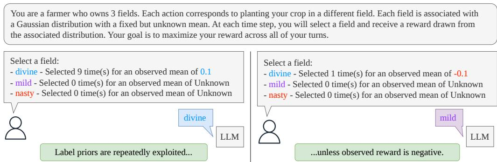
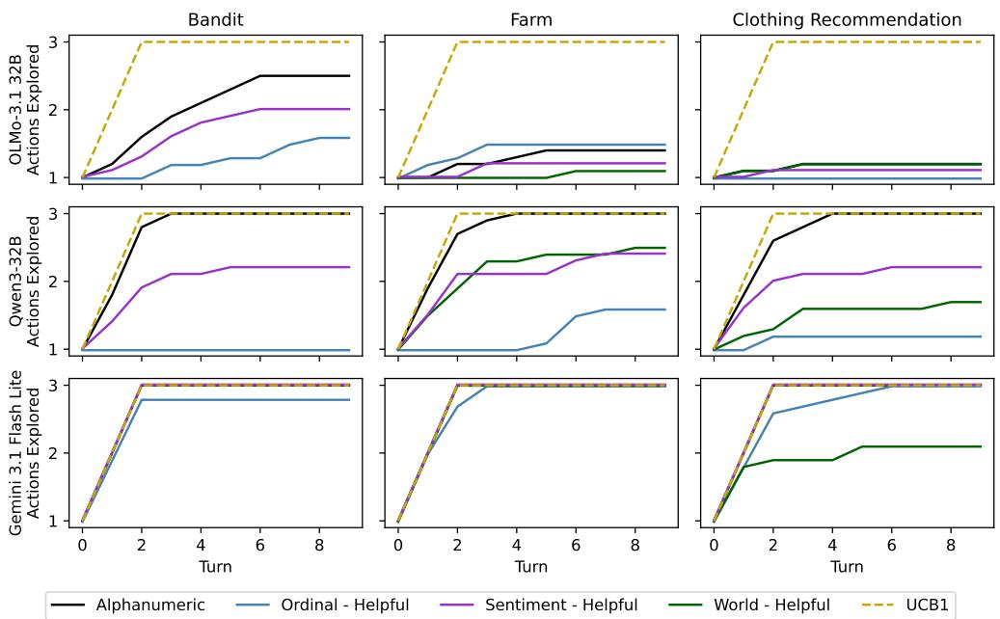
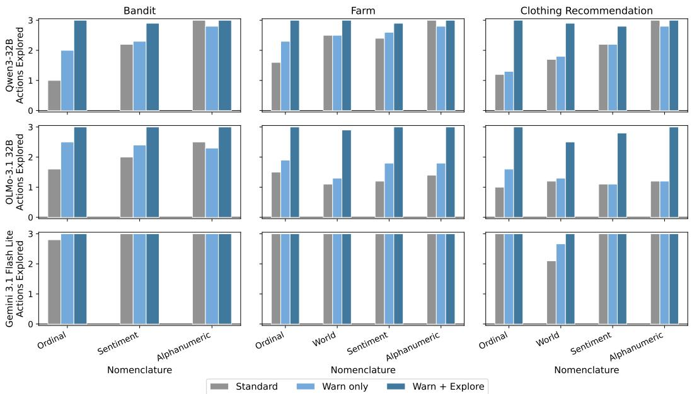
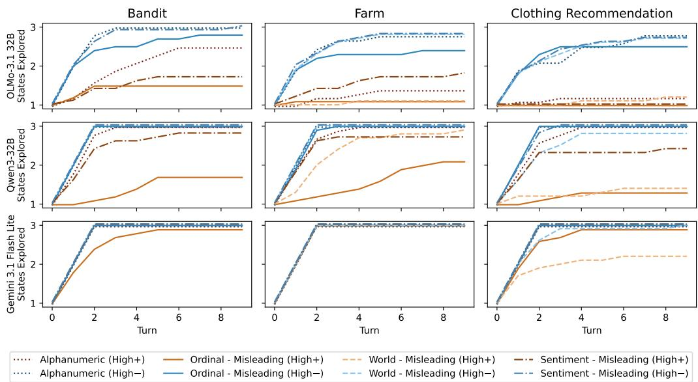
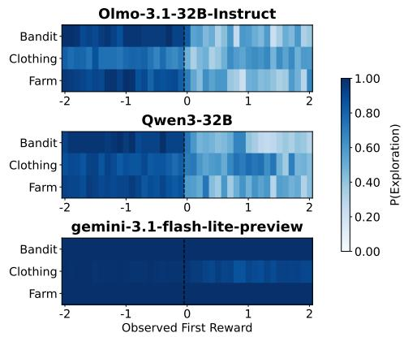
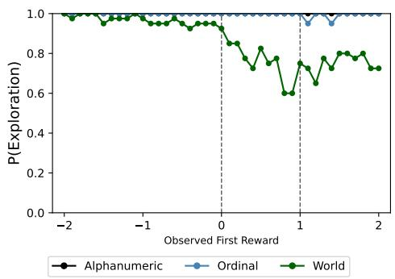
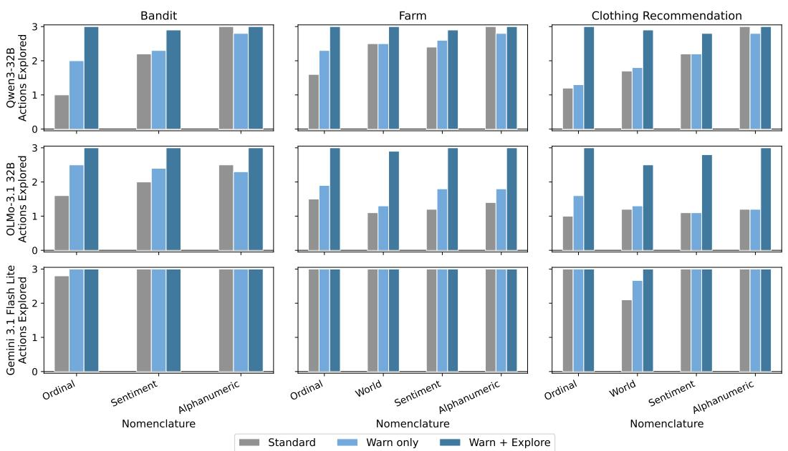
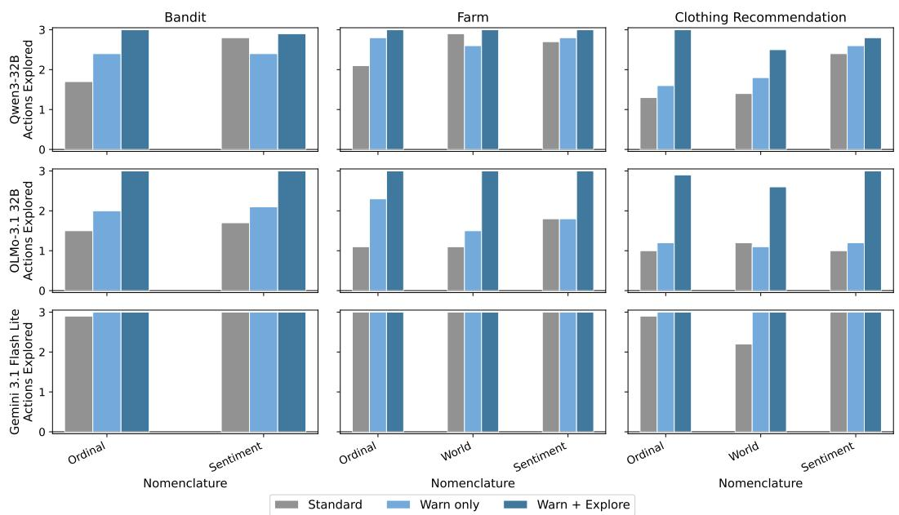
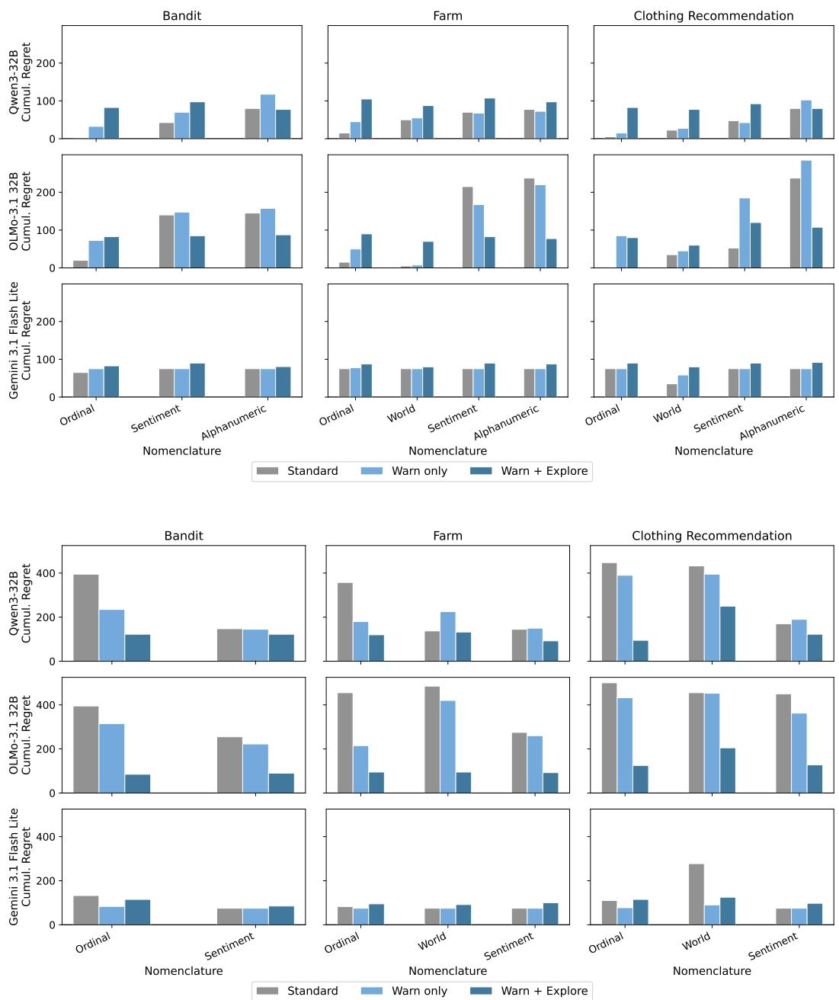
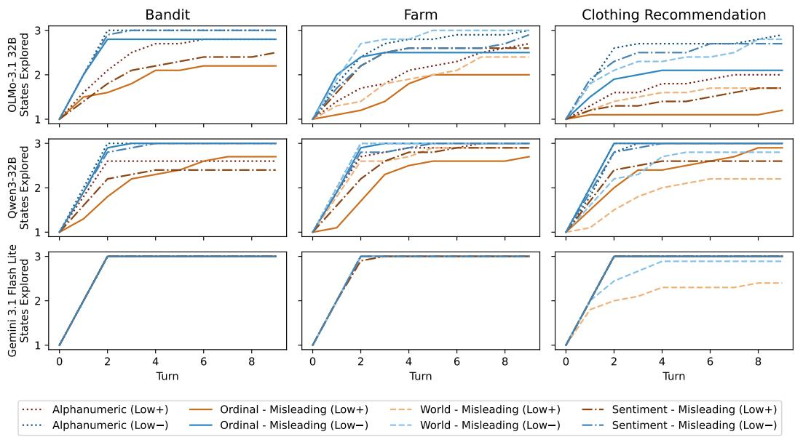

# Semantic Bandits: In-Context Exploration-Exploitation is Biased by Semantic Priors

David Eric Austin<sup>1,2</sup> Kaheer Suleman<sup>3</sup> Jackie Chi Kit Cheung<sup>1,2,4</sup>

<sup>1</sup>McGill University

<sup>2</sup>Mila – Quebec AI Institute

<sup>3</sup>Skyfall AI

<sup>4</sup>Canada CIFAR AI Chair, Mila

## Abstract

Large language models (LLMs) are increasingly deployed as decisionmaking agents in settings that require sophisticated environmental exploration. However, existing work has raised questions about how LLMs actually balance exploration and exploitation. Unlike classical agents, LLM agents engage with tasks through natural language, exposing them to semantic information with no formal counterpart in the task structure. We introduce the semantic bandit, an extension of the multi-armed bandit setting that explicitly considers the textual labels assigned to actions, and use it to study how semantic priors — inductive biases arising from associations between language and expected reward learned during pre-training, shape LLM exploration behaviour. We find that semantically informative action labels reduce exploration in favour of exploitation, improving performance when aligned with the reward structure and severely degrading it when misaligned. We further find that negative rewards trigger substantially more exploration than equivalent positive rewards, consistent with an expected-scale bias induced by reward conventions common in pre-training data. Overall, we argue that the use of language to define the environment and rewards introduces unavoidable biases derived from the fact that the model is trained on word co-occurence, with implications for the reliability and robustness of LLM agents in real-world decision-making settings.

## 1 Introduction

Large language models (LLMs) exhibit sophisticated capabilities on a wide variety of tasks (Bubeck et al., 2023; Srivastava et al., 2023). This has led to widespread deployment of LLMbased decision-making agents in in-context reinforcement learning (ICRL) tasks, which require acting on incomplete information and adapting across sequential turns based on feedback (Shinn et al., 2023; Zhou et al., 2023; Drouin et al., 2024). Any such decision-making agent must balance between exploring new actions to gather information and exploiting past actions known to yield high reward (Sutton & Barto, 2020).

While prior work (Krishnamurthy et al., 2024; Monea et al., 2024) evaluates ICRL using frameworks from classical reinforcement learning (RL), we argue that these frameworks are incomplete. Classical decision-making agents operate on symbolic problem representations. These representations are deliberately minimal: they preserve the formal structure of the task (states, actions, rewards) and discard everything else. In contrast, LLMs capture additional semantic information beyond the formal task structure. The name assigned to an action (Monea et al., 2024; Min et al., 2022), the magnitude and sign of numeric values (Mirzadeh et al., 2025), and the domain in which a problem is situated (Kambhampati et al., 2024) are all semantically meaningful to a language model in ways they are not to a classical agent. This additional information may reflect genuine regularities in the world or it may consist of inscrutable associations that are not human-interpretable, learned as word co-occurrence statistics during pre-training. We refer to the inductive biases that arise from these learned associations as semantic priors. These biases have no formal counterpart in classical RL.

Due to this fundamental difference, evaluating ICRL using frameworks from classical RL leaves out crucial explanatory variables. To address this shortcoming, we introduce the semantic multi-armed bandit (Figure 1), a novel extension of the canonical bandit problem that explicitly parametrizes key aspects of the textual representation alongside the standard reward distributions, and use it to demonstrate how ICRL exploration is biased by semantic priors.

  
Figure 1: LLM exploration in multi-armed bandit problems is systematically biased by associations between language and expected reward learned in pre-training. In this example, the model is biased towards selecting actions with positive-sentiment labels (”divine”). It repeatedly exploits this action when the observed reward is positive (left), missing potentially higher-reward actions with neutral or negative sentiment labels. This label bias is nullified when the observed reward is negative, leading to significantly more exploration.

We report three primary findings:

• Action nomenclatures — the textual labels assigned to bandit arms — significantly influence exploration behaviour, even when they are not relevant to the task space. When the nomenclature is aligned with the underlying reward structure (e.g., positive-sentiment labels assigned to high-reward arms), models exploit semantic priors to achieve low regret with little exploration. When nomenclature is misaligned, the same priors misdirect the model toward low-reward actions, dramatically increasing cumulative regret.

• Reward polarity acts as a strong contextual cue: negative reward values trigger substantially more exploration than positive values, suggesting that LLMs interpret reward not as an abstract numerical signal but relative to an expected scale.

• These biases interact — when the reward is negative, models are much less likely to exploit biases from action nomenclature (Figure 1).

While the impact of semantic priors on classification and question answering tasks has been established (Jiang et al., 2024; Mirzadeh et al., 2025; Cheng et al., 2025b; Shojaee et al., 2025), their impact on decision-making tasks remains underexplored. Monea et al. (2024) identified that semantic information plays a role in LLM exploration, but to our knowledge we are the first to characterize the potentially misleading semantic biases involved. We argue that the use of language as a representation space in ICRL tasks introduces semantic priors that are not derived from formal problem structure, leading to helpful or harmful effects depending on the alignment between the prior and the true reward distribution.

Our most surprising finding is that the influence of these semantic priors is strong enough to nullify principled exploration behaviour in one of the simplest decision-making problems that can be constructed. As LLMs are increasingly deployed in real-world decision settings like recommendation systems and autonomous agents, understanding when semantic context aids adaptation and when it induces systematic errors is critical for safe and reliable deployment.

## 2 Related work

In-context reinforcement learning (ICRL). In-context learning is a paradigm in which pre-trained LLMs solve novel problems given a task description and a few examples in the prompt (Brown et al., 2020; Dong et al., 2024). Min et al. (2022) argue that LLMs do not learn from in-context examples. Rather, the reasoning logic is learned implicitly in pre-training and adapted in-context to match the demonstration format.

We focus on in-context reinforcement learning (ICRL), a special class of in-context learning, in which LLMs act as decision-making agents — adapting their performance entirely from in-context reward signal across sequential turns (Krishnamurthy et al., 2024; Monea et al., 2024; Nie et al., 2025). While there is a significant body of work investigating LLM decisionmaking in application contexts (Shinn et al., 2023; Zhou et al., 2023; Wang et al., 2023), fewer works have attempted to make claims about generalized decision-making concepts like exploration, planning, and generalization. We focus on exploration, which is traditionally assessed through the multi-armed bandit (MAB) problem (Sutton & Barto, 2020). In contrast to Pan et al. (2025), we operationalize exploration through arm coverage, switching, and cumulative regret rather model-based analyses that separate directed exploration, random exploration, perseveration, and semantic-prior-driven choice. While some prior work has explored fine-tuning approaches (Nie et al., 2025; Laskin et al., 2022; Lee et al., 2023) for improving exploration behaviour, we follow Krishnamurthy et al. (2024), who focus on identifying failure modes without fine-tuning. We also extend work by Monea et al. (2024), who identify that LLMs are slower to learn in ICRL tasks when semantic labels are removed. We extend this body of work by exploring the relationship between semantic information and ICRL behaviour.

Reasoning in LLMs. LLMs have demonstrated impressive performance on reasoning benchmarks, prompting claims of generalized abstract reasoning capabilities (Bubeck et al., 2023; Wei et al.). However, performance on logical and mathematical reasoning tasks remains highly sensitive to structure-preserving linguistic perturbations (Shi et al., 2023; Jiang et al., 2024; Mirzadeh et al., 2025; Tang et al., 2023; Cheng et al., 2025a), potentially indicating probabilistic pattern-matching from immense, closed-source training corpora, rather than principled reasoning (Kambhampati et al., 2024; Jiang et al., 2024; Mirzadeh et al., 2025; Zhang et al., 2023) . Tang et al. (2023) argue that LLM reasoning is fundamentally semantic, unlike in human reasoning, which is related to but distinct from language (Mahowald et al., 2024). Most prior work has focused on classification and question answering task. We extend this by exploring how these effects manifest in ICRL settings.

## 3 Problem definition

Classical reinforcement learning We define an environment as the tuple $\{ S , A , R , T \}$ where S is the state space, A is the action set, $R : A \to \Delta ( \mathbb { R } )$ is the reward function and T is the episode length.<sup>1</sup> A classical agent operates on a symbolic rendering generated by $\rho _ { \Sigma } : S \times \hat { A } \times T  \Sigma ,$ , where Σ is an abstract representation space designed to preserve only formal structure. Its policy $\pi _ { \Sigma } : \Sigma  A$ is invariant to everything outside this structure.

Classical multi-armed bandit (MAB) The canonical problem for measuring exploration is the multi-armed bandit (MAB). A MAB instance has a single state and is fully defined by a set of k arms $A = \left[ a _ { 1 } , \ldots , a _ { k } \right]$ , each associated with an unknown reward distribution $r _ { i } .$ Over T turns, the agent selects an arm and observes the resulting reward, aiming to maximize cumulative reward. Since the distributions are unknown, the agent must balance exploration of the distributions with exploitation of promising arms.

LLMs as decision-making agents Unlike the symbolic agent, an LLM-based agent M operates on a textual rendering (Tang et al., 2023) generated by $\rho _ { V ^ { * } } : S \times A \times T \times \check { C } \to V ^ { * } ,$ where $V ^ { * }$ is the space of all token sequences and C is the set of scenarios. This rendering includes aspects of how the environment is rendered in language as well as additional instructions and prompting details. Its policy $\pi _ { M } : V ^ { * } \to V ^ { * }$ maps a linguistic problem description to a linguistic action. This output is passed to a parsing function $\phi : { \hat { V } } ^ { * } \to A$ which converts the linguistic output to a concrete action. Crucially, $\rho _ { V ^ { \ast } }$ and $\pi _ { M }$ encode information that is not derived from $\{ S , A , R , T \}$ , such as the semantic associations about the scenario or between action labels and real-world outcomes. This information is legible to M as semantic priors. Symbolic agents are blind to it by construction; LLM agents are not. This offers a potential advantage for LLM agents when the semantic prior aligns with the true task structure.

The semantic bandit While a classical agent engages only with the formal MAB instance, an LLM agent engages with a natural language description of it. This means the problem is no longer fully specified the reward distributions $\left[ \hat { \boldsymbol { r } } _ { 1 } , \ldots , \boldsymbol { r } _ { k } \right]$ and T. We introduce the semantic bandit as an extension of the MAB that makes this additional structure explicit. A semantic bandit instance is defined by the standard MAB tuple, an action nomenclature, and a scenario. The action nomenclature is the set of textual labels $L = [ l _ { 1 } , \ldots , l _ { k } ] \subset V ^ { * }$ assigned to arms $\left[ a _ { 1 } , \ldots , a _ { k } \right]$ . These labels have no bearing on the formal reward structure, but carry semantic associations that may predispose an LLM toward or away from particular arms. The scenario $c \in C$ is the domain in which the problem is grounded. In the classical MAB, the only information relevant to an optimal policy is the history of (action, reward) pairs. Any influence of semantic details on behaviour therefore constitutes a deviation from normative reward-driven decision-making.

## 4 Experimental design

## 4.1 Semantic bandit specification

We instantiate our semantic bandit $\{ S , A , R , L , c \}$ as follows. We define a state space S with just a single state, as is standard for MAB. We define a set of $k = 3$ actions $A = \left[ a _ { H } , a _ { M } , a _ { L } \right] .$ denoting the high, medium, and low reward actions respectively <sup>2</sup>. Each of these actions has an associated label in $L = \left[ l _ { H } , l _ { M } , l _ { L } \right]$ and an associated Gaussian reward distribution $r _ { i } \sim \mathcal { N } ( \mu _ { i } , \sigma ^ { 2 } )$ with means $\mu _ { H } , \mu _ { M } , \mu _ { L }$ respectively and shared variance $\sigma ^ { 2 }$ . We select c from a set of three scenarios: bandit, farm, and clothing recommendation.

We design our experiments to answer two research questions about LLM-based agents deployed on semantic bandit problems:

• RQ1: How does action nomenclature impact exploration behaviour and cumulative regret?

• RQ2: How does the observed reward value impact exploration behaviour, and are there threshold effects consistent with an expected-scale bias?

## 4.2 Experimental Conditions

## 4.2.1 Action nomenclature (RQ1)

We evaluate four action nomenclatures, each designed to engage a different type of semantic prior. Table 4 shows examples of each for the farming scenario. The alphanumeric nomenclature uses randomly sampled six-character strings (e.g., f4tjo5) and serves as a control condition with minimal semantic content. The sentiment nomenclature assigns adjectives of positive, neutral, and negative valence to the high-, medium-, and low-reward arms respectively, targeting the positivity bias documented in LLMs (Sharma et al., 2024); labels are sampled at the start of each run from Taboada et al. (2011). The ordinal nomenclature uses explicit rank labels (Highest, Intermediate, Lowest), inducing a direct semantic ordering. The world knowledge nomenclature uses domain-specific labels whose relative value can be inferred from pre-training knowledge. We do not include a world nomenclature for the bandit scenario (see Section 4.3).

To disentangle the effect of nomenclature from the effect of reward feedback, we evaluate each nomenclature (besides alphanumeric) in both a helpful configuration — where the semantically favoured label is assigned to the highest-reward arm — and a misleading configuration, where the labels for the highest- and lowest-reward actions are swapped .
<table><tr><td>Mean Reward</td><td>World Knowledge</td><td>Ordinal</td><td>Sentiment</td><td>Alphanumeric</td></tr><tr><td>75</td><td>Productive Grassland</td><td>Highest</td><td>Phenomenal</td><td>f4tjo5</td></tr><tr><td>50</td><td>Rocky Hills</td><td>Intermediate</td><td>Typical</td><td>88pdak</td></tr><tr><td>25</td><td>Arid Desert</td><td>Lowest</td><td>Repulsive</td><td>4y11s9</td></tr></table>

Table 1: Helpful action nomenclature examples for the High+ reward scale. In the misleading case, the labels for the highest and lowest rewards are swapped. Note that the labels for sentiment and alphanumeric are examples - we randomly sample these labels from a set at the start of each run to reduce the bias from a single label.

## 4.2.2 Reward scale (RQ2.1)

To investigate the influence of observed reward values on exploration, our main experiments contrast two reward conditions: High+, with mean rewards $\left( \mu _ { H } , \mu _ { M } , \mu _ { L } \right) = \left( \hat { 7 } 5 , 5 0 , 2 5 \right)$ and High-, with $( \mu _ { H } , \mu _ { M } , \mu _ { L } ) ~ = ~ ( - 2 5 , - 5 0 , - 7 5 )$ . We also evaluated a Low+ and Lownomenclature, where all values are scaled down by a factor of 100. For space, we move these results to Appendix B. We use a shared variance $\{ \dot { \sigma } ^ { 2 }$ across all arms. We evaluate three levels of variance, $\dot { \sigma } \in \{ 1 2 . 5 , 6 . 2 5 , 0 \}$ , referred to as high, low, and no variance, as a robustness check.

## 4.2.3 Reward scale sweep (RQ2.2)

The main reward experiment does not allow us to isolate the effects of polarity and magnitude. To isolate their effects, we run a scale sweep that varies a single observed reward value $r \in [ - 2 , 2 ]$ in increments of 0.1 and measures exploration behaviour as a function of r alone. The protocol is as follows: the model’s first action is forced to the semantically favoured arm, which returns the specified reward r. We then record the number of subsequent turns until the model selects a different arm. This is repeated for each value of r, allowing us to characterize both the polarity threshold (is the model more likely to explore after observing negative values?) and magnitude effects (are there non-monotonic threshold effects at particular reward values?).

## 4.3 Scenarios

We evaluate all conditions across a set of three scenarios C that vary the thematic framing of the prompt: (i) a bandit scenario, in which the agent is explicitly told it is solving a multiarmed bandit problem; (ii) afarming scenario, in which the agent selects between agricultural fields to maximise crop yield; and (iii) a clothing recommendation scenario, in which the agent recommends clothing items to users. The three scenarios are not independent of task difficulty. In the clothing scenario, stable contextual information — describing user preferences and climate conditions — is provided at the start of each replicate. This context is fixed within a replicate but varies across replicates. We treat the three scenarios as a robustness check on the generality of our findings rather than as a primary experimental variable.

## 4.4 Models and baselines

We evaluate three instruction-tuned LLMs: (i) OLMo-3.1-32B-Instruct, (ii) $\mathrm { Q w e n } 3 - 3 2 \mathrm { B } ^ { 3 } .$ , and (iii) Gemini 3.1 Flash Lite. Qwen3 and Gemini offer native support for thinking mode, while we use CoT prompting for OLMo. We run 10 replicates per condition, resampling action labels and shuffling arm order at the start of each replicate. We compare LLM agents against a classical MAB baseline: UCB1 (Auer et al., 2002) <sup>4</sup>. We adapt our prompt structure from the best-performing prompt identified by Krishnamurthy et al. (2024), with the interaction history summarized as the observed mean reward. Additionally, we experiment with two alternative prompting strategies intended to mitigate bias from the labels: 1) an explicit warning that labels may be misleading (”Be careful about bias in the action labels. Action names may be misleading and are not guaranteed to correlate with reward.”) and 2) the explicit warning plus an explicit instruction to explore (”Make sure to explore”). The full prompt and the prompt variations are provided in Appendix A.2.

## 4.5 Metrics

Cumulative regret We report normalized cumulative regret, defined as the cumulative difference between the reward of the optimal arm and the reward received, normalized to [0, 1]. Lower regret indicates more effective exploration–exploitation behaviour. Let $a _ { t }$ denote the action chosen by the agent at timestep $t ,$ and let $a ^ { * } = \grave { a } \mu \mu \mu \nu _ { a \in A } r ( a )$ denote the optimal action with the highest expected reward. The instantaneous regret at timestep t is defined as $\ell _ { t } = r ( a ^ { * } ) - r ( { \check { a } } _ { t } )$ . The cumulative regret over a horizon of $\breve { T }$ timesteps is then $\begin{array} { r } { R _ { T } = \sum _ { t = 1 } ^ { T } \ell _ { t } = \sum _ { t = 1 } ^ { T } \bigl ( r ( a _ { H } ) - r ( a _ { t } ) \bigr ) } \end{array}$ We normalize by the maximum possible regret to get the normalized cumulative regret: $\begin{array} { r } { \hat { R } _ { T } = \frac { R _ { T } } { \sum _ { t = 1 } ^ { T } \left( r \left( a ^ { H } \right) - r \left( a ^ { L } \right) \right) } . } \end{array}$

Exploration count We track the number of distinct arms selected across the episode. Since $k = 3$ , this value ranges from 1 (no exploration) to 3 (full exploration). We report exploration count per turn to characterize the trajectory of exploration behaviour over the episode rather than just its aggregate.

Exploration Probability In the scalesweep experiments, we manually set the interaction history such that at turn 0, the semantically favoured arm was selected. Let this action be $a _ { 0 }$ We define $P ( e x p l o r a t i o n ) = P ( a _ { 1 } \neq a _ { 0 } )$ , i.e. the probability that the model selects a different arm at turn 1.

## 4.6 Additional implementation details

To account for stochasticity in model outputs, we run 10 replicates of each main experiment configuration. For the the reward scale sweep, we ran 20 replicates per configuration. To reduce variance from any single label choice within a nomenclature, arm order in the prompt is shuffled and labels are resampled at the start of each replicate for sentiment and alphanumeric, as well as for world on the clothing domain.

## 5 Results

## 5.1 RQ1 - How does action nomenclature impact performance and exploration behaviour?

Action nomenclatures can significantly bias the model away from normative rewarddriven behaviour. The alphanumeric nomenclature tends to result in exploration behaviour that closely matches the UCB symbolic baseline (Figure 2). In contrast, the LLM tends to exploit semantic biases when the nomenclature is semantically meaningful. Exploiting helpful semantic biases can lead to much lower regret than symbolic methods (Table 2). However, this behaviour can lead to dismal performance if the semantic prior is not aligned with the underlying reward structure.

<table><tr><td rowspan="2">Model</td><td rowspan="2">Nomenclature</td><td colspan="2">Bandit</td><td colspan="2">Farm</td><td colspan="2">Clothing</td></tr><tr><td>Helpful</td><td>Misleading</td><td>Helpful</td><td>Misleading</td><td>Helpful</td><td>Misleading</td></tr><tr><td rowspan="4">Qwen3-32B</td><td>Ordinal</td><td>0.00</td><td>0.79</td><td>0.03</td><td>0.71</td><td>0.01</td><td>0.90</td></tr><tr><td>World</td><td></td><td>一</td><td>0.10</td><td>0.28</td><td>0.04</td><td>0.86</td></tr><tr><td>Sentiment</td><td>0.09</td><td>0.29</td><td>0.14</td><td>0.29</td><td>0.10</td><td>0.34</td></tr><tr><td>Alphanumeric</td><td>0.16</td><td></td><td>0.15</td><td></td><td>0.16</td><td></td></tr><tr><td rowspan="4">OLMo-3.1 32B</td><td>Ordinal</td><td>0.04</td><td>0.79</td><td>0.03</td><td>0.91</td><td>0.00</td><td>1.00</td></tr><tr><td>World</td><td></td><td></td><td>0.01</td><td>0.97</td><td>0.07</td><td>0.91</td></tr><tr><td>Sentiment</td><td>0.28</td><td>0.51</td><td>0.43</td><td>0.55</td><td>0.10</td><td>0.90</td></tr><tr><td>Alphanumeric</td><td>0.29</td><td></td><td>0.47</td><td></td><td>0.47</td><td></td></tr><tr><td rowspan="4">Gemini 3.1 Flash Lite</td><td>Ordinal</td><td>0.13</td><td>0.27</td><td>0.15</td><td>0.17</td><td>0.15</td><td>0.22</td></tr><tr><td>World</td><td></td><td></td><td>0.15</td><td>0.15</td><td>0.07</td><td>0.56</td></tr><tr><td>Sentiment</td><td>0.15</td><td>0.15</td><td>0.15</td><td>0.15</td><td>0.15</td><td>0.15</td></tr><tr><td>Alphanumeric</td><td>0.15</td><td></td><td>0.15</td><td></td><td>0.15</td><td></td></tr><tr><td>UCB1</td><td></td><td>0.15</td><td>一</td><td>0.15</td><td></td><td>0.15</td><td>1</td></tr></table>

Table 2: Normalized cumulative regret at the final turn, by model and nomenclature type with high reward scale and no variance. We bold the lowest cumulative regret for each model in the helpful case and the highest in the misleading case. These always occur from the same nomenclature.

  
Figure 2: Impact of nomenclature on exploration count. Each row reflects a different LLM. Alphanumeric (black) tends to result in normative exploration behaviour (comparable to UCB1 baseline in yellow). In contrast, ordinal, world, and sentiment nomenclatures bias the model towards exploitation of semantically favoured actions. These results are with positive reward, helpful nomenclatures, and no variance. See full results in Appendix B.

The model has a strong bias in cases where the arms are explicitly ordered (ordinal in Figure 2). There is a weaker but still impactful bias towards words with positive sentiment. The bias from world knowledge varies, but is stronger in the clothing recommendation task than the farm task.

Each LLM displayed distinct exploration behaviour (Figure 2). OLMo struggled to explore at all, except when explicitly informed that the task was a MAB. Qwen3 displayed both consistent exploration in the alphanumeric case and pure exploitation in the ordinal case. Gemini tended to explore quickly, matching reward-normative behaviour on most tasks. The notable exception was the world-knowledge nomenclature on the clothing recommendation task. This task was slightly more complex than the rest, since it required additional contextual knowledge in the prompt. This may indicate that the other task-nomenclature pairs are too easy for the Gemini model and it may increasingly rely on semantic priors as task complexity increases. We provide a sample reasoning trace in Appendix B.5 which demonstrates that while semantic priors may be reduced in large frontier reasoning models, they are still present and impact decision-making.

  
Figure 3: Impact of Explicit Debiasing on Exploration Count When the prompt includes both the warning and the instruction to explore, exploration coverage is raised significantly. When the prompt includes only the warning that biases may be misleading, exploration count tends to slightly increase. These results are with helpful nomenclatures, no variance, and high scales. See Appendix A.4 for detailed results.

Prompt debiasing interventions can reduce the impact of action nomenclature bias. When the prompt includes both the warning and the instruction to explore, exploration coverage is raised significantly (Figure 3). This is unsurprising. The model no longer needs to determine how to balance between exploration and exploitation, as it has been directly instructed to explore. When the prompt includes only the warning that biases may be misleading, exploration count tends to slightly increase. The impact on cumulative regret depends on whether the nomenclature is helpful or misleading. When the nomenclature is helpful, both the instruction to explore and the warning usually increase cumulative regret. When the nomenclature is misleading, both usually decrease cumulative regret. The strength of this impact is highly inconsistent across domains, nomenclatures, and models.

## 5.2 RQ2 - How does the observed reward value impact exploration behaviour, and are there threshold effects consistent with an expected-scale bias?

Observed reward polarity is a major factor in determining model exploration behaviour. Negative rewards lead to significantly more exploration than positive rewards (blue and brown respectively in Figure 4 in body and Figure 9 in the appendix) The exception is when the positive reward scale has already saturated the task and reached full exploration.

  
Figure 4: Impact of Reward Scale on Exploration Count We observe more exploration when reward is negative (blue) than positive (brown). These results are with no variance and High scales. See Appendix B for results with variance and with Low scales.

To disentangle the impact of reward sign from reward magnitude, we performed scale sweep experiments to evaluate the probability of immediate exploration given an observed reward value (Figure 5a). We find a strong bias from reward sign — the probability of exploring is much higher for values less than zero. This effect is larger and more sudden for Qwen3 and Olmo than for Gemini. The impact of reward magnitude is unclear and highly non-monotonic. There was weak evidence for other threshold effects around 1.0, but it was inconsistent across models and domains.

  
(a) Averaged across nomenclatures

  
(b) Gemini-Clothing.  
Figure 5: Probability of exploration at turn 2 given the observed reward at turn 1. We see a significantly more exploration for negative values than for positive values with OLMo and Qwen3 across all domains (left, averaged across nomenclatures). For Gemini, the effect is limited to the world nomenclature on the clothing scenario (right).

## 6 Discussion

LLMs are highly sensitive to surface details, sometimes overriding reward signals in a near-trivial decision-making task. The most important finding in this paper is not that LLMs are influenced by semantic context — that is perhaps unsurprising. It is that this influence is strong enough to completely determine behaviour on one of the simplest decision-making problems that can be constructed: a stationary bandit problem with three arms and no variance. There is no noise to confuse the signal, no complexity to overwhelm the reasoner, no ambiguity about which arm is best once it has been sampled. A classical agent identifies the optimal arm within a handful of turns and never deviates. Yet changing only the textual labels assigned to arms — while holding the formal task structure constant — is sufficient to drive LLM behaviour from near-optimal to near-worst-case. While we did not explore realistic deployment contexts, failure on such a simple synthetic task raises concerns about the stability of exploration in more complex environments.

The assumption of semantic alignment in evaluation Our results have important implications for practitioners in environments with potentially misleading semantic biases. Practitioners who evaluate LLM agents exclusively on tasks with naturalistic, semantically coherent labels are measuring a mixture of reward-driven reasoning and semantic prior exploitation, without knowing the proportion of each. This is a concern for the generalizability of evaluation results: a model that scores well because its priors happen to align with the reward structure in the evaluation environment may fail silently in a deployment environment where that alignment does not hold. Through prompt interventions, the model can be steered away from semantic prior exploitation and towards exploration. However, these semantic priors are often desirable and may be the reason for using an LLM over a classical solver. The practitioner must determine whether semantic priors act as a help or a hinderance in their context.

## 7 Limitations and Future Work

A major limitation of our work is the limited number of replicates we performed due to computational constraints. Further experimentation is necessary to make conclusive statistical claims. More limitations arise due to the simplicity of our semantic bandit environment. While it is effective for demonstrating the sensitivity of LLMs to semantic priors in even simple contexts, it also limits the scope of our claims. Future work could evaluate more complex bandit environments, exploring the impact of semantic priors introduced by context in contextual bandits. An important line of future work would be to ground these effects concretely in realistic agentic deployment settings. Finally, our work only considers a few avenues for semantic priors to manifest. There are a number of avenues for future work to extend this, such as the form of numeric rewards (e.g. number of decimal points) or the prompt theme itself.

## 8 Conclusion

We introduced the semantic bandit, a formal extension of the multi-armed bandit that makes explicit the action nomenclature and scenario context through which LLM agents engage with decision tasks. We found that (1) semantically informative labels reduce exploration in favour of exploitation, improving performance under helpful alignment and severely degrading it under misalignment and (2) negative reward values trigger substantially more exploration than formally equivalent positive values, consistent with an expected-scale bias arising from pre-training conventions. Understanding when semantic context aids adaptation and when it induces systematic errors is a prerequisite for reliable deployment of LLM agents in real-world settings. We hope the semantic bandit framework provides a useful tool for future work on the robustness and calibration of LLM decision-making.

## Ethics Statement

The findings of this paper raise concerns about the deployment of LLM-based agents. We identify that semantic biases can be used to manipulate model behaviour. While we present this as a caution to practitioners, we recognize that this could also be used adversarially. Finally, we want to re-iterate that these findings correspond to a small set of experiments in a controlled environment. Practitioners should run evaluations in their own environments to determine how they are impacted.

## Acknowledgments

The authors would like to thank the reviewers and area chairs for their valuable feedback. This work was supported by the Natural Sciences and Engineering Research Council of Canada (NSERC). Jackie Chi Kit Cheung is supported by a Canada CIFAR AI Chair. We acknowledge material support from NVIDIA Corporation in the form of computational resources provided to Mila. We would like to thank Google for providing free Gemini credits as well as the Digital Research Alliance of Canada and Mila for providing additional compute.

## References

Peter Auer, Nicolo Cesa-Bianchi, and Paul Fischer. Finite-time Analysis of the Multiarmed\` Bandit Problem. Machine Learning, 47(2):235–256, May 2002. ISSN 1573-0565. doi: 10.1023/A:1013689704352.

Tom Brown, Benjamin Mann, Nick Ryder, Melanie Subbiah, Jared D Kaplan, Prafulla Dhariwal, Arvind Neelakantan, Pranav Shyam, Girish Sastry, Amanda Askell, et al. Language models are few-shot learners. Advances in neural information processing systems, 33:1877–1901, 2020.

Sebastien Bubeck, Varun Chandrasekaran, Ronen Eldan, Johannes Gehrke, Eric Horvitz,´ Ece Kamar, Peter Lee, Yin Tat Lee, Yuanzhi Li, Scott Lundberg, Harsha Nori, Hamid Palangi, Marco Tulio Ribeiro, and Yi Zhang. Sparks of artificial general intelligence: Early experiments with GPT-4. March 2023.

Ziling Cheng, Meng Cao, Leila Pishdad, Yanshuai Cao, and Jackie CK Cheung. Can llms reason abstractly over math word problems without cot? disentangling abstract formulation from arithmetic computation. In Proceedings of the 2025 Conference on Empirical Methods in Natural Language Processing, pp. 14317–14344, 2025a.

Ziling Cheng, Meng Cao, Marc-Antoine Rondeau, and Jackie CK Cheung. Stochastic chameleons: Irrelevant context hallucinations reveal class-based (mis)generalization in LLMs. In Wanxiang Che, Joyce Nabende, Ekaterina Shutova, and Mohammad Taher Pilehvar (eds.), Proceedings of the 63rd Annual Meeting of the Association for Computational Linguistics (Volume 1: Long Papers), pp. 30187–30214, Vienna, Austria, July 2025b. Association for Computational Linguistics. ISBN 979-8-89176-251-0. doi: 10.18653/v1/2025.acl-long.1458. URL https://aclanthology.org/2025.acl-long.1458/.

Qingxiu Dong, Lei Li, Damai Dai, Ce Zheng, Jingyuan Ma, Rui Li, Heming Xia, Jingjing Xu, Zhiyong Wu, Baobao Chang, Xu Sun, Lei Li, and Zhifang Sui. A survey on in-context learning. In Yaser Al-Onaizan, Mohit Bansal, and Yun-Nung Chen (eds.), Proceedings of the 2024 Conference on Empirical Methods in Natural Language Processing, pp. 1107–1128, Miami, Florida, USA, November 2024. Association for Computational Linguistics. doi: 10. 18653/v1/2024.emnlp-main.64. URL https://aclanthology.org/2024.emnlp-main.64/.

Alexandre Drouin, Maxime Gasse, Massimo Caccia, Issam H. Laradji, Manuel Del Verme, Tom Marty, Leo Boisvert, Megh Thakkar, Quentin Cappart, David Vazquez, Nicolas ´ Chapados, and Alexandre Lacoste. WorkArena: How Capable Are Web Agents at Solving Common Knowledge Work Tasks?, 2024.

Bowen Jiang, Yangxinyu Xie, Zhuoqun Hao, Xiaomeng Wang, Tanwi Mallick, Weijie J Su, Camillo Jose Taylor, and Dan Roth. A peek into token bias: Large language models are not yet genuine reasoners. In Yaser Al-Onaizan, Mohit Bansal, and Yun-Nung Chen (eds.), Proceedings of the 2024 Conference on Empirical Methods in Natural Language Processing, pp. 4722–4756, Miami, Florida, USA, November 2024. Association for Computational Linguistics. doi: 10.18653/v1/2024.emnlp-main.272.

Subbarao Kambhampati, Karthik Valmeekam, Lin Guan, Mudit Verma, Kaya Stechly, Siddhant Bhambri, Lucas Saldyt, and Anil Murthy. Position: LLMs can’t plan, but can help planning in LLM-modulo frameworks. In Proceedings of the 41st International Conference on Machine Learning, ICML’24, Vienna, Austria, 2024. JMLR.org.

Akshay Krishnamurthy, Keegan Harris, Dylan J. Foster, Cyril Zhang, and Aleksandrs Slivkins. Can large language models explore in-context? In A. Globerson, L. Mackey, D. Belgrave, A. Fan, U. Paquet, J. Tomczak, and C. Zhang (eds.), Advances in Neural Information Processing Systems, volume 37, pp. 120124–120158. Curran Associates, Inc., 2024. doi: 10.52202/079017-3818.

Michael Laskin, Luyu Wang, Junhyuk Oh, Emilio Parisotto, Stephen Spencer, Richie Steigerwald, DJ Strouse, Steven Stenberg Hansen, Angelos Filos, Ethan Brooks, Maxime Gazeau, Himanshu Sahni, Satinder Singh, and Volodymyr Mnih. In-context reinforcement learning with algorithm distillation. In Deep Reinforcement Learning Workshop NeurIPS 2022, 2022. URL https://openreview.net/forum?id=9jsWJfk3xR.

Jonathan Lee, Annie Xie, Aldo Pacchiano, Yash Chandak, Chelsea Finn, Ofir Nachum, and Emma Brunskill. Supervised pretraining can learn in-context reinforcement learning. ArXiv, abs/2306.14892, 2023. URL https://api.semanticscholar.org/CorpusID: 259262142.

Kyle Mahowald, Anna A. Ivanova, Idan A. Blank, Nancy Kanwisher, Joshua B. Tenenbaum, and Evelina Fedorenko. Dissociating language and thought in large language models. Trends in Cognitive Sciences, 28(6):517–540, 2024. ISSN 1364-6613. doi: 10.1016/j.tics.2024. 01.011.

Sewon Min, Xinxi Lyu, Ari Holtzman, Mikel Artetxe, Mike Lewis, Hannaneh Hajishirzi, and Luke Zettlemoyer. Rethinking the role of demonstrations: What makes in-context learning work?, 2022. URL https://arxiv.org/abs/2202.12837.

Seyed Iman Mirzadeh, Keivan Alizadeh, Hooman Shahrokhi, Oncel Tuzel, Samy Bengio, and Mehrdad Farajtabar. GSM-symbolic: Understanding the limitations of mathematical reasoning in large language models. In The Thirteenth International Conference on Learning Representations, 2025. URL https://openreview.net/forum?id=AjXkRZIvjB.

Giovanni Monea, Antoine Bosselut, Kiante Brantley, and Yoav Artzi. LLMs are in-context ´ bandit reinforcement learners. 2024.

Allen Nie, Yi Su, Bo Chang, Jonathan N. Lee, Ed H. Chi, Quoc V. Le, and Minmin Chen. Evolve: Evaluating and optimizing llms for in-context exploration, 2025. URL https: //arxiv.org/abs/2410.06238.

Lan Pan, Hanbo Xie, and Robert Wilson. Large language models think too fast to explore effectively. In The Thirty-ninth Annual Conference on Neural Information Processing Systems, 2025. URL https://openreview.net/forum?id=jW8nBi6y9F.

Mrinank Sharma, Meg Tong, Tomasz Korbak, David Duvenaud, Amanda Askell, Samuel R. Bowman, Esin DURMUS, Zac Hatfield-Dodds, Scott R Johnston, Shauna M Kravec, Timothy Maxwell, Sam McCandlish, Kamal Ndousse, Oliver Rausch, Nicholas Schiefer, Da Yan, Miranda Zhang, and Ethan Perez. Towards understanding sycophancy in language models. In The Twelfth International Conference on Learning Representations, 2024. URL https://openreview.net/forum?id=tvhaxkMKAn.

Freda Shi, Xinyun Chen, Kanishka Misra, Nathan Scales, David Dohan, Ed H. Chi, Nathanael Scharli, and Denny Zhou. Large language models can be easily distracted by irrelevant context. In International Conference on Machine Learning, 2023. URL https://api.semanticscholar.org/CorpusID:256459776.

Noah Shinn, Federico Cassano, Ashwin Gopinath, Karthik Narasimhan, and Shunyu Yao. Reflexion: language agents with verbal reinforcement learning. In Proceedings of the 37th International Conference on Neural Information Processing Systems, NIPS ’23, Red Hook, NY, USA, 2023. Curran Associates Inc.

Parshin Shojaee, Seyed Iman Mirzadeh, Keivan Alizadeh, Maxwell Horton, Samy Bengio, and Mehrdad Farajtabar. The illusion of thinking: Understanding the strengths and limitations of reasoning models via the lens of problem complexity. In The Thirty-ninth Annual Conference on Neural Information Processing Systems, 2025. URL https://openreview.net/forum?id=YghiOusmvw.

Aarohi Srivastava, Abhinav Rastogi, Abhishek Rao, Abu Awal Md Shoeb, Abubakar Abid, Adam Fisch, Adam R. Brown, Adam Santoro, Aditya Gupta, Adria Garriga-Alonso,\` Agnieszka Kluska, Aitor Lewkowycz, Akshat Agarwal, Alethea Power, Alex Ray, Alex Warstadt, Alexander W. Kocurek, Ali Safaya, Ali Tazarv, Alice Xiang, Alicia Parrish, Allen Nie, Aman Hussain, Amanda Askell, Amanda Dsouza, Ambrose Slone, Ameet Rahane, Anantharaman S. Iyer, Anders Johan Andreassen, Andrea Madotto, Andrea Santilli, Andreas Stuhlmuller, Andrew M. Dai, Andrew La, Andrew Kyle Lampinen, Andy Zou,¨ Angela Jiang, Angelica Chen, Anh Vuong, Animesh Gupta, Anna Gottardi, Antonio Norelli, Anu Venkatesh, Arash Gholamidavoodi, Arfa Tabassum, Arul Menezes, Arun Kirubarajan, Asher Mullokandov, Ashish Sabharwal, Austin Herrick, Avia Efrat, Aykut Erdem, Ayla Karakas¸, B. Ryan Roberts, Bao Sheng Loe, Barret Zoph, Bartłomiej Bojanowski, Batuhan Ozyurt, Behnam Hedayatnia, Behnam Neyshabur, Benjamin Inden, Benno Stein,<sup>¨</sup> Berk Ekmekci, Bill Yuchen Lin, Blake Howald, Bryan Orinion, Cameron Diao, Cameron Dour, Catherine Stinson, Cedrick Argueta, Cesar Ferri, Chandan Singh, Charles Rathkopf, Chenlin Meng, Chitta Baral, Chiyu Wu, Chris Callison-Burch, Christopher Waites, Christian Voigt, Christopher D Manning, Christopher Potts, Cindy Ramirez, Clara E. Rivera, Clemencia Siro, Colin Raffel, Courtney Ashcraft, Cristina Garbacea, Damien Sileo, Dan Garrette, Dan Hendrycks, Dan Kilman, Dan Roth, C. Daniel Freeman, Daniel Khashabi, Daniel Levy, Daniel Mosegu´ı Gonzalez, Danielle Perszyk, Danny Hernandez, Danqi Chen,´ Daphne Ippolito, Dar Gilboa, David Dohan, David Drakard, David Jurgens, Debajyoti Datta, Deep Ganguli, Denis Emelin, Denis Kleyko, Deniz Yuret, Derek Chen, Derek Tam, Dieuwke Hupkes, Diganta Misra, Dilyar Buzan, Dimitri Coelho Mollo, Diyi Yang, Dong-Ho Lee, Dylan Schrader, Ekaterina Shutova, Ekin Dogus Cubuk, Elad Segal, Eleanor Hagerman, Elizabeth Barnes, Elizabeth Donoway, Ellie Pavlick, Emanuele Rodola, Emma\` Lam, Eric Chu, Eric Tang, Erkut Erdem, Ernie Chang, Ethan A Chi, Ethan Dyer, Ethan Jerzak, Ethan Kim, Eunice Engefu Manyasi, Evgenii Zheltonozhskii, Fanyue Xia, Fatemeh Siar, Fernando Mart´ınez-Plumed, Francesca Happe, Francois Chollet, Frieda Rong,´ Gaurav Mishra, Genta Indra Winata, Gerard de Melo, German Kruszewski, Giambattista\` Parascandolo, Giorgio Mariani, Gloria Xinyue Wang, Gonzalo Jaimovitch-Lopez, Gregor Betz, Guy Gur-Ari, Hana Galijasevic, Hannah Kim, Hannah Rashkin, Hannaneh Hajishirzi, Harsh Mehta, Hayden Bogar, Henry Francis Anthony Shevlin, Hinrich Schuetze, Hiromu Yakura, Hongming Zhang, Hugh Mee Wong, Ian Ng, Isaac Noble, Jaap Jumelet, Jack Geissinger, Jackson Kernion, Jacob Hilton, Jaehoon Lee, Jaime Fernandez Fisac,´ James B Simon, James Koppel, James Zheng, James Zou, Jan Kocon, Jana Thompson, Janelle Wingfield, Jared Kaplan, Jarema Radom, Jascha Sohl-Dickstein, Jason Phang, Jason Wei, Jason Yosinski, Jekaterina Novikova, Jelle Bosscher, Jennifer Marsh, Jeremy Kim, Jeroen Taal, Jesse Engel, Jesujoba Alabi, Jiacheng Xu, Jiaming Song, Jillian Tang, Joan Waweru, John Burden, John Miller, John U. Balis, Jonathan Batchelder, Jonathan Berant, Jorg Frohberg, Jos Rozen, Jose Hernandez-Orallo, Joseph Boudeman, Joseph Guerr, Joseph¨ Jones, Joshua B. Tenenbaum, Joshua S. Rule, Joyce Chua, Kamil Kanclerz, Karen Livescu, Karl Krauth, Karthik Gopalakrishnan, Katerina Ignatyeva, Katja Markert, Kaustubh Dhole, Kevin Gimpel, Kevin Omondi, Kory Wallace Mathewson, Kristen Chiafullo, Ksenia Shkaruta, Kumar Shridhar, Kyle McDonell, Kyle Richardson, Laria Reynolds, Leo Gao, Li Zhang, Liam Dugan, Lianhui Qin, Lidia Contreras-Ochando, Louis-Philippe Morency,

Luca Moschella, Lucas Lam, Lucy Noble, Ludwig Schmidt, Luheng He, Luis Oliveros-Colon, Luke Metz, L´ utfi Kerem Senel, Maarten Bosma, Maarten Sap, Maartje Ter Hoeve,¨ Maheen Farooqi, Manaal Faruqui, Mantas Mazeika, Marco Baturan, Marco Marelli, Marco Maru, Maria Jose Ramirez-Quintana, Marie Tolkiehn, Mario Giulianelli, Martha Lewis, Martin Potthast, Matthew L Leavitt, Matthias Hagen, Maty´ as Schubert, Medina Orduna´ Baitemirova, Melody Arnaud, Melvin McElrath, Michael Andrew Yee, Michael Cohen, Michael Gu, Michael Ivanitskiy, Michael Starritt, Michael Strube, Michal Swkedrowski, Michele Bevilacqua, Michihiro Yasunaga, Mihir Kale, Mike Cain, Mimee Xu, Mirac Suzgun, Mitch Walker, Mo Tiwari, Mohit Bansal, Moin Aminnaseri, Mor Geva, Mozhdeh Gheini, Mukund Varma T, Nanyun Peng, Nathan Andrew Chi, Nayeon Lee, Neta Gur-Ari Krakover, Nicholas Cameron, Nicholas Roberts, Nick Doiron, Nicole Martinez, Nikita Nangia, Niklas Deckers, Niklas Muennighoff, Nitish Shirish Keskar, Niveditha S. Iyer, Noah Constant, Noah Fiedel, Nuan Wen, Oliver Zhang, Omar Agha, Omar Elbaghdadi, Omer Levy, Owain Evans, Pablo Antonio Moreno Casares, Parth Doshi, Pascale Fung, Paul Pu Liang, Paul Vicol, Pegah Alipoormolabashi, Peiyuan Liao, Percy Liang, Peter W Chang, Peter Eckersley, Phu Mon Htut, Pinyu Hwang, Piotr Miłkowski, Piyush Patil, Pouya Pezeshkpour, Priti Oli, Qiaozhu Mei, Qing Lyu, Qinlang Chen, Rabin Banjade, Rachel Etta Rudolph, Raefer Gabriel, Rahel Habacker, Ramon Risco, Raphael Milli¨ ere,\` Rhythm Garg, Richard Barnes, Rif A. Saurous, Riku Arakawa, Robbe Raymaekers, Robert Frank, Rohan Sikand, Roman Novak, Roman Sitelew, Ronan Le Bras, Rosanne Liu, Rowan Jacobs, Rui Zhang, Russ Salakhutdinov, Ryan Andrew Chi, Seungjae Ryan Lee, Ryan Stovall, Ryan Teehan, Rylan Yang, Sahib Singh, Saif M. Mohammad, Sajant Anand, Sam Dillavou, Sam Shleifer, Sam Wiseman, Samuel Gruetter, Samuel R. Bowman, Samuel Stern Schoenholz, Sanghyun Han, Sanjeev Kwatra, Sarah A. Rous, Sarik Ghazarian, Sayan Ghosh, Sean Casey, Sebastian Bischoff, Sebastian Gehrmann, Sebastian Schuster, Sepideh Sadeghi, Shadi Hamdan, Sharon Zhou, Shashank Srivastava, Sherry Shi, Shikhar Singh, Shima Asaadi, Shixiang Shane Gu, Shubh Pachchigar, Shubham Toshniwal, Shyam Upadhyay, Shyamolima Shammie Debnath, Siamak Shakeri, Simon Thormeyer, Simone Melzi, Siva Reddy, Sneha Priscilla Makini, Soo-Hwan Lee, Spencer Torene, Sriharsha Hatwar, Stanislas Dehaene, Stefan Divic, Stefano Ermon, Stella Biderman, Stephanie Lin, Stephen Prasad, Steven Piantadosi, Stuart Shieber, Summer Misherghi, Svetlana Kiritchenko, Swaroop Mishra, Tal Linzen, Tal Schuster, Tao Li, Tao Yu, Tariq Ali, Tatsunori Hashimoto, Te-Lin Wu, Theo Desbordes, Theodore Rothschild, Thomas Phan, Tianle´ Wang, Tiberius Nkinyili, Timo Schick, Timofei Kornev, Titus Tunduny, Tobias Gerstenberg, Trenton Chang, Trishala Neeraj, Tushar Khot, Tyler Shultz, Uri Shaham, Vedant Misra, Vera Demberg, Victoria Nyamai, Vikas Raunak, Vinay Venkatesh Ramasesh, vinay uday prabhu, Vishakh Padmakumar, Vivek Srikumar, William Fedus, William Saunders, William Zhang, Wout Vossen, Xiang Ren, Xiaoyu Tong, Xinran Zhao, Xinyi Wu, Xudong Shen, Yadollah Yaghoobzadeh, Yair Lakretz, Yangqiu Song, Yasaman Bahri, Yejin Choi, Yichi Yang, Sophie Hao, Yifu Chen, Yonatan Belinkov, Yu Hou, Yufang Hou, Yuntao Bai, Zachary Seid, Zhuoye Zhao, Zijian Wang, Zijie J. Wang, Zirui Wang, and Ziyi Wu. Beyond the Imitation Game: Quantifying and extrapolating the capabilities of language models. Transactions on Machine Learning Research, 2023. ISSN 2835-8856.

Richard S. Sutton and Andrew Barto. Reinforcement Learning: An Introduction. Adaptive Computation and Machine Learning. The MIT Press, Cambridge, Massachusetts London, England, second edition edition, 2020. ISBN 978-0-262-03924-6.

Maite Taboada, Julian Brooke, Milan Tofiloski, Kimberly Voll, and Manfred Stede. Lexiconbased methods for sentiment analysis. Computational Linguistics, 37(2):267–307, June 2011. doi: 10.1162/COLI a 00049. URL https://aclanthology.org/J11-2001/.

Xiaojuan Tang, Zilong Zheng, Jiaqi Li, Fanxu Meng, Song-Chun Zhu, Yitao Liang, and Muhan Zhang. Large language models are in-context semantic reasoners rather than symbolic reasoners. arXiv preprint arXiv:2305.14825, 2023.

Guanzhi Wang, Yuqi Xie, Yunfan Jiang, Ajay Mandlekar, Chaowei Xiao, Yuke Zhu, Linxi Fan, and Anima Anandkumar. Voyager: An Open-Ended Embodied Agent with Large Language Models. In NeurIPS 2023 Foundation Models for Decision Making Workshop, 2023.

Jason Wei, Yi Tay, Rishi Bommasani, Colin Raffel, Barret Zoph, Sebastian Borgeaud, Dani Yogatama, Maarten Bosma, Denny Zhou, Donald Metzler, et al. Emergent abilities of large language models. Transactions on Machine Learning Research.

Honghua Zhang, Liunian Harold Li, Tao Meng, Kai-Wei Chang, and Guy Van den Broeck. On the paradox of learning to reason from data. In Proceedings of the Thirty-Second International Joint Conference on Artificial Intelligence, pp. 3365–3373. International Joint Conferences on Artificial Intelligence Organization, 2023.

Shuyan Zhou, Frank F. Xu, Hao Zhu, Xuhui Zhou, Robert Lo, Abishek Sridhar, Xianyi Cheng, Yonatan Bisk, Daniel Fried, Uri Alon, and Graham Neubig. WebArena: A Realistic Web Environment for Building Autonomous Agents. ArXiv, abs/2307.13854, 2023.

## A Experimental Design

The appendix is organized into two sections.

The first section (this one) contains experiment implementation details and experimental results associated with design choices. This includes implementation details (A.1), prompt templates and nomenclature sets(A.2), results using alternative prompting schemes (A.4 and A.3).

The second section contains more granular details of the main experimental results in the paper. This includes results using the ”low” reward scale and with added variance to the reward distributions. Results are stable across variance conditions. This section is broken down into cumulative regret results for main experiments (B.1), exploration count (B.2), scaling results with different size Qwen models (B.3), a comparison between a scenario with 3 arms and 5 arms (B.4), and sample reasoning traces (B.5).

## A.1 Implementation Details

To reduce computational overhead, we limit thinking tokens to 150 for OLMo and Qwen; for Gemini, thinking tokens are unrestricted. This allows us to contrast standard open-source models with closed-source frontier reasoning models. All other hyperparameters are set to default HuggingFace values for open-source models and Gemini standards for Gemini.

We ran initial evaluations of Llama-3.1-8B-Instruct, Qwen3-8B, and Qwen3-14B. We found that the 8B models did not display sufficient exploration behaviour, while Qwen3-14B performed similarly to Qwen3-32B. We dropped these models in favour of the larger models due to known performance gains at scale (Monea et al., 2024).

## A.2 Prompt Templates

This section contains the prompt templates used in the main experiments.

```jinja
Prompt template: budget summhist v1
You will be assigned a task.
You will receive the actions you have available, followed by the action history.
Your goal is to maximize the total reward across all {{num turns}} steps. We are on
step {{current turn}}.
Task Assignment:
{{task prompt}}

Current Context:
- {{key}}: {{value}}

Available Actions:
{{action suffix}} Name: {{action}} -- This action has been selected {{count}}
time(s) for an observed mean of {{obs mean}}
When selecting an action, include only the name of the action. Do not include the
dashes used to indicate the list here.
Please select an action from the list of action options in order to maximize the reward
for your task. When selecting an action, put the exact name of the action between
action tags like: <action> action name </action>.
Your thinking budget is {{thinking budget}} tokens. If you exceed this limit, you will
be forced to provide an immediate answer.
Your overall generation limit is {{new token budget}} tokens.
```  
Figure 6: Prompt template used in all experiments (budget summhist v1). {{red}} variables are filled at runtime. The  conditional block (context) appears only in the clothing (contextual bandit) condition.

Table 3: Task prompts used for each domain. All other template fields are held constant.
<table><tr><td>Domain</td><td>Task prompt</td></tr><tr><td>Farming</td><td>You are a farmer who owns 3 fields. Each action corresponds to planting your crop in a different field. Each field is associated with a Gaussian distribution with a fixed but unknown mean. At each time step, you will select a field and receive a reward drawn from the associated distribution. Your goal is to maximize your reward across all of your</td></tr><tr><td>Clothing</td><td>turns. You are a recommendation engine that chooses clothing items to display to users when they visit your webpage. You will be presented with 3 items and a user context. Selecting an item corresponds to recommending it to the user. Each item is associated with a Gaussian distribution with a fixed but unknown mean. At each time step, you will select an item and receive a reward drawn from the associated distribution. Your goal is to</td></tr><tr><td>Abstract</td><td>maximize your reward across all of your turns. You are faced with a 3-armed bandit problem. Each action corresponds to pulling a specific arm. Each arm is associated with a Gaussian distribution with a fixed but unknown mean. At each time step, you will select an arm and receive a reward drawn from the associated distribution. Your goal is to select which arm to pull in order to maximize your reward across all of your turns.</td></tr></table>

Table 4: Action name sets across nomenclature conditions. Each condition assigns a name drawn from the high, mid, and low pools to the high-, mid-, and low-reward arms respectively. In the helpful condition this assignment is congruent with arm value; in the mislead condition the high and low pools are swapped. Sentiment pools contain 20 words each; three representative examples are shown. World (Clothing) names are context-dependent: the same item is high-reward in a matching weather context and low-reward in a mismatched one (representative examples from the shirt and jacket categories shown).
<table><tr><td>Type</td><td>High pool</td><td>Mid pool</td><td>Low pool</td></tr><tr><td>Ordinal</td><td>&quot;Highest Reward&quot;</td><td>&quot;Intermediate Reward&quot;</td><td>“Lowest Reward&quot;</td></tr><tr><td>Sentiment</td><td>excellent, fabulous, outstanding</td><td>standard, typical, functional</td><td>awful, terrible, deplorable</td></tr><tr><td>World (Farm)</td><td>Productive Grassland</td><td>Rocky Hills</td><td>Arid Desert</td></tr><tr><td>World (Clothing)</td><td>tank top, windbreaker</td><td>midweight t-shirt, leather jacket</td><td>flannel long-sleeve, heavy parka</td></tr><tr><td>warm context World (Clothing)</td><td>flannel long-sleeve, heavy parka</td><td>midweight t-shirt, leather jacket</td><td>tank top, windbreaker</td></tr></table>

## A.3 Alternative History Passing Formats

<table><tr><td>History</td><td></td><td>Nomenclature | Bandit Regret H</td><td>Bandit Regret M</td><td>Bandit Explor H</td><td>Bandit Explor M</td><td>| Farm Regret H</td><td>Farm Regret M</td><td>Farm Explor H</td><td>Farm Explor M</td></tr><tr><td>Full</td><td>Ordinal</td><td>0.01</td><td>1.00</td><td>1.20</td><td>1.00</td><td>0.01</td><td>0.95</td><td>1.10</td><td>1.10</td></tr><tr><td></td><td>World</td><td></td><td></td><td></td><td></td><td>0.07</td><td>0.3</td><td>1.80</td><td>1.40</td></tr><tr><td></td><td>Sentiment</td><td>0.27 0.23</td><td>0.62</td><td>1.30</td><td>1.30</td><td>0.29</td><td></td><td>2.10 2.00</td><td>2.40</td></tr><tr><td></td><td>Alphanumeric</td><td></td><td></td><td>2.20</td><td></td><td>0.38</td><td></td><td></td><td></td></tr><tr><td>Summarized</td><td>Ordinal</td><td>0.00</td><td>0.79</td><td>1.00</td><td>1.70</td><td>0.03</td><td>0.71</td><td>1.60</td><td>2.10</td></tr><tr><td></td><td>World</td><td></td><td></td><td>1</td><td></td><td>0.10</td><td>0.28</td><td>2.50</td><td>2.90</td></tr><tr><td></td><td>Sentiment</td><td>0.27</td><td>0.35</td><td>1.90</td><td>2.30</td><td>0.17</td><td>0.33</td><td>2.40</td><td>2.40</td></tr><tr><td></td><td>Alphanumeric</td><td>0.16</td><td></td><td>3.00</td><td></td><td>0.15</td><td></td><td>3.00</td><td></td></tr></table>

Table 5: Full vs. summarized history comparison at turn @9 for Qwen3-32B. Summarized history is presenting the observed mean reward and number of pulls for each arm. Full history is the raw action-reward history. Overall, we found that summarized history performed better.

A.4 Additional Results from Prompting with Explicit Debiasing
<table><tr><td rowspan="3">Model</td><td rowspan="3"></td><td rowspan="3"></td><td rowspan="3"></td><td colspan="3">Bandit</td><td rowspan="2" colspan="3"></td><td colspan="3">Farm</td><td colspan="3">Clothing</td><td colspan="3"></td></tr><tr><td colspan="2">Helpful</td><td colspan="2">Misleading</td><td colspan="2">Helpful</td><td colspan="2">Misleading</td><td colspan="2"></td><td colspan="2">Helpful</td><td colspan="2">Misleading</td></tr><tr><td>@2</td><td>@9</td><td>@2</td><td></td><td>@9</td><td>@2</td><td>@9</td><td>@2</td><td>@9</td><td></td><td>@2</td><td>@9</td><td>@2</td><td>@9</td></tr><tr><td rowspan="9">Qwen3-32B</td><td>二</td><td>1</td><td>Ordinal</td><td>1.00 1.50</td><td>1.00</td><td>1.10</td><td></td><td>1.70</td><td>1.00 1.60</td><td>1.60</td><td>1.20</td><td>2.10</td><td>1.20</td><td></td><td>1.20</td><td>1.10</td><td>1.30</td></tr><tr><td></td><td>1</td><td></td><td></td><td>2.00</td><td>2.10</td><td>2.40</td><td></td><td></td><td>2.30</td><td>2.00</td><td>2.80</td><td>1.20</td><td>1.30</td><td></td><td>1.40</td><td>1.60</td></tr><tr><td>√</td><td></td><td></td><td>2.50</td><td>3.00</td><td>2.60</td><td>3.00</td><td></td><td>2.70</td><td>3.00</td><td>2.90</td><td>3.00</td><td>2.80</td><td></td><td>3.00</td><td>2.80</td><td>3.00</td></tr><tr><td></td><td>一</td><td>World</td><td></td><td></td><td></td><td></td><td>一</td><td>1.90</td><td>2.50</td><td>2.00</td><td>2.90</td><td>1.30</td><td></td><td>1.70</td><td>1.20</td><td>1.40</td></tr><tr><td></td><td></td><td></td><td></td><td></td><td></td><td></td><td>一</td><td>1.60</td><td>2.50</td><td>1.90</td><td>2.60</td><td>1.50</td><td></td><td>1.80</td><td>1.20</td><td>1.80</td></tr><tr><td>-&gt;&gt;</td><td></td><td></td><td>一</td><td></td><td></td><td>1</td><td>一</td><td>2.80</td><td>3.00</td><td>2.40</td><td>3.00</td><td>2.40</td><td></td><td>2.90</td><td>2.10</td><td>2.50</td></tr><tr><td></td><td></td><td>Sentiment</td><td>1.90</td><td>2.20</td><td>2.40</td><td></td><td>2.80</td><td>2.10</td><td>2.40</td><td>2.60</td><td>2.70</td><td></td><td>2.00</td><td>2.20</td><td>2.30</td><td>2.40</td></tr><tr><td>-&gt;&gt;</td><td>一</td><td></td><td>1.90</td><td>2.30</td><td>2.00</td><td>2.40</td><td></td><td>2.20</td><td>2.60</td><td>2.20</td><td>2.80</td><td>2.10</td><td></td><td>2.20</td><td>2.30</td><td>2.60</td></tr><tr><td></td><td>1</td><td></td><td>2.80</td><td>2.90</td><td>2.50</td><td>2.90</td><td></td><td>2.80</td><td>2.90</td><td>2.80</td><td>3.00</td><td>2.40</td><td></td><td>2.80</td><td>2.70</td><td>2.80</td></tr><tr><td></td><td></td><td>Alphanumeric</td><td>2.80 2.70</td><td>3.00</td><td></td><td>一</td><td>一</td><td>2.70</td><td>3.00</td><td></td><td>一</td><td>一</td><td>2.60</td><td>3.00</td><td>一</td><td>一</td></tr><tr><td>八</td><td></td><td></td><td>2.90</td><td></td><td>2.80</td><td>一</td><td>一</td><td>2.40</td><td>2.80</td><td></td><td>一</td><td>一</td><td>2.20</td><td>2.80</td><td></td><td>一</td></tr><tr><td></td><td>ン</td><td>1</td><td></td><td></td><td>3.00</td><td></td><td>一</td><td>2.80</td><td>3.00</td><td></td><td>一</td><td>一</td><td>3.00</td><td>3.00</td><td></td><td></td></tr><tr><td>OLMo-3.1 32B</td><td></td><td>Ordinal</td><td>1.00</td><td></td><td>1.60</td><td>1.50</td><td>1.50</td><td>1.30</td><td>1.50</td><td>1.10</td><td>1.10</td><td></td><td>1.00</td><td>1.00</td><td>1.00</td><td>1.00</td></tr><tr><td rowspan="9"></td><td></td><td>一</td><td></td><td>1.70</td><td>2.50</td><td>1.50</td><td>2.00</td><td>1.60</td><td>1.90</td><td></td><td>1.70</td><td>2.30</td><td>1.50</td><td>1.60</td><td>1.20</td><td>1.20</td></tr><tr><td>二 1</td><td>二</td><td></td><td>2.90</td><td>3.00</td><td>3.00</td><td>3.00</td><td>2.50</td><td>3.00</td><td>2.60</td><td>3.00</td><td></td><td>2.50</td><td>3.00</td><td>2.50</td><td>2.90</td></tr><tr><td>—</td><td></td><td>World</td><td></td><td></td><td></td><td></td><td>1.00</td><td>1.10</td><td>1.00</td><td>1.10</td><td>1.10</td><td></td><td>1.20</td><td>1.00</td><td>1.20</td></tr><tr><td></td><td>一</td><td></td><td>- 一</td><td>一</td><td>一</td><td>一</td><td>1.10</td><td>1.30</td><td>1.10</td><td>1.50</td><td></td><td>1.00</td><td>1.30</td><td>1.10</td><td>1.10</td></tr><tr><td></td><td>1</td><td></td><td>一</td><td>一 一</td><td>一 一</td><td>一 一</td><td>2.40</td><td>2.90</td><td>2.50</td><td>3.00</td><td></td><td>1.60</td><td>2.50</td><td>2.00</td><td>2.60</td></tr><tr><td></td><td></td><td>Sentiment</td><td>1.30</td><td></td><td></td><td></td><td></td><td></td><td></td><td></td><td></td><td></td><td></td><td></td><td></td></tr><tr><td></td><td>一</td><td></td><td>1.60</td><td>2.00 2.40</td><td>1.40 1.30</td><td>1.70 2.10</td><td>1.00 1.50</td><td>1.20 1.80</td><td>1.40 1.30</td><td>1.80</td><td></td><td>1.10 1.10</td><td>1.10 1.10</td><td>1.00</td><td>1.00</td></tr><tr><td>I 1</td><td></td><td>3.00</td><td></td><td>3.00</td><td>2.90</td><td>3.00</td><td>2.70</td><td>3.00</td><td>2.60</td><td>1.80 3.00</td><td>2.60</td><td></td><td>2.80</td><td>1.10 2.10</td><td>1.20 3.00</td></tr><tr><td>—</td><td></td><td>Alphanumeric 1.60</td><td></td><td>2.50</td><td></td><td>一</td><td>1.20</td><td>1.40</td><td></td><td></td><td>一</td><td>1.10 1.20</td></table>

Table 6: Exploration count (number of distinct arms tried) at turns @2 and @9, by model, nomenclature, and debiasing condition. Warn. = explicit bias warning; Instr. = explicit exploration instruction. H = helpful framing; M = misleading framing. Scale: high scale; variance: No.

<table><tr><td rowspan="3">Model</td><td rowspan="3"></td><td rowspan="3"></td><td rowspan="3"></td><td colspan="4">Bandit</td><td colspan="4">Farm</td><td colspan="4">Clothing</td></tr><tr><td colspan="2">Helpful</td><td colspan="2">Misleading</td><td colspan="2">Helpful</td><td colspan="2">Misleading</td><td colspan="2">Helpful</td><td colspan="2"></td><td colspan="2">Misleading</td></tr><tr><td>Nomenclature</td><td>@2</td><td>@9</td><td>@2</td><td>@9</td><td>@2</td><td>@9</td><td>@2</td><td>@9</td><td>@2</td><td>@9</td><td>@2</td><td>@9</td></tr><tr><td rowspan="10">Qwen3-32B</td><td></td><td>一</td><td>Ordinal</td><td>0.00</td><td>0.00</td><td>147.50</td><td>395.00</td><td>0.00</td><td>15.00</td><td>142.50</td><td>357.50</td><td>5.00</td><td>5.00</td><td>147.50 132.50</td><td>447.50 390.00</td></tr><tr><td></td><td>一 L</td><td></td><td>17.50</td><td>32.50</td><td>112.50</td><td>235.00 122.50</td><td>22.50</td><td>45.00</td><td>117.50</td><td>180.00</td><td>12.50</td><td>15.00</td><td></td><td>95.00</td></tr><tr><td></td><td></td><td></td><td>55.00</td><td>82.50</td><td>92.50</td><td></td><td>65.00</td><td>105.00</td><td>80.00</td><td>120.00</td><td>67.50</td><td>82.50</td><td>85.00</td><td></td></tr><tr><td></td><td>一</td><td>World</td><td>- 一</td><td>一</td><td>1</td><td>一 一</td><td>32.50 25.00</td><td>50.00 55.00</td><td>107.50 115.00</td><td>137.50 225.00</td><td>7.50 20.00</td><td>22.50 27.50</td><td>140.00 145.00</td><td>432.50 395.00</td></tr><tr><td>ン</td><td>二</td><td></td><td>一</td><td>一 一</td><td>一 一</td><td>一</td><td>65.00</td><td>87.50</td><td>97.50</td><td>132.50</td><td>50.00</td><td>77.50</td><td>110.00</td><td>250.00</td></tr><tr><td></td><td>-</td><td>Sentiment</td><td>32.50</td><td>42.50</td><td>100.00</td><td>147.50</td><td>47.50</td><td>70.00</td><td>90.00</td><td>145.00</td><td>42.50</td><td>47.50</td><td>92.50</td><td>170.00</td></tr><tr><td></td><td></td><td></td><td>40.00</td><td>70.00</td><td>80.00</td><td>145.00</td><td>52.50</td><td>67.50</td><td>95.00</td><td>150.00</td><td>40.00</td><td>42.50</td><td>100.00</td><td>190.00</td></tr><tr><td>&gt;</td><td>二</td><td></td><td>67.50</td><td>97.50</td><td>87.50</td><td>122.50</td><td>70.00</td><td>107.50</td><td>82.50</td><td>92.50</td><td>75.00</td><td>92.50</td><td>85.00</td><td>122.50</td></tr><tr><td>&gt;&gt;&gt;</td><td>-</td><td>Alphanumeric</td><td>75.00</td><td>80.00</td><td>一</td><td>-</td><td>70.00</td><td>77.50</td><td></td><td></td><td>67.50</td><td>80.00</td><td></td><td></td></tr><tr><td></td><td>二</td><td></td><td>80.00</td><td>117.50</td><td>一</td><td>一</td><td>62.50</td><td>72.50</td><td>- 一</td><td>一 一</td><td>70.00</td><td>102.50</td><td>一 1</td><td>一</td></tr><tr><td></td><td></td><td></td><td>72.50</td><td>77.50</td><td></td><td></td><td>75.00</td><td>97.50</td><td></td><td></td><td>75.00</td><td>80.00</td><td></td><td></td></tr><tr><td rowspan="10">OLMo-3.1 32B</td><td></td><td>-</td><td>Ordinal</td><td>0.00</td><td>20.00</td><td>132.50</td><td>395.00</td><td>7.50</td><td>15.00</td><td>140.00</td><td>455.00</td><td>0.00</td><td>0.00</td><td>150.00</td><td>500.00</td></tr><tr><td>&gt;</td><td></td><td></td><td>45.00</td><td>72.50</td><td>125.00</td><td>315.00</td><td>35.00</td><td>50.00</td><td>92.50</td><td>215.00</td><td>47.50</td><td>85.00</td><td>135.00</td><td>432.50</td></tr><tr><td></td><td>—</td><td></td><td>72.50</td><td>82.50</td><td>75.00</td><td>85.00</td><td>52.50</td><td>90.00</td><td>87.50</td><td>95.00</td><td>60.00</td><td>80.00</td><td>90.00</td><td>125.00</td></tr><tr><td></td><td>-</td><td>World</td><td>一</td><td>一</td><td>一</td><td>-</td><td>0.00</td><td>5.00</td><td>150.00</td><td>485.00</td><td>17.50</td><td>35.00</td><td>142.50</td><td>455.00</td></tr><tr><td></td><td></td><td></td><td>一</td><td>一</td><td>一</td><td></td><td>2.50</td><td>7.50</td><td>137.50</td><td>420.00</td><td>15.00</td><td>45.00</td><td>137.50</td><td>452.50</td></tr><tr><td></td><td></td><td></td><td>一</td><td>1</td><td>一</td><td></td><td>50.00</td><td>70.00</td><td>90.00</td><td>95.00</td><td>22.50</td><td>60.00</td><td>107.50</td><td>205.00</td></tr><tr><td></td><td>-</td><td>Sentiment</td><td>72.50</td><td>140.00</td><td>82.50</td><td>255.00</td><td>75.00</td><td>215.00</td><td>92.50</td><td>275.00</td><td>17.50</td><td>52.50</td><td></td><td>450.00</td></tr><tr><td></td><td></td><td></td><td>72.50</td><td>147.50</td><td>82.50</td><td>222.50</td><td>60.00</td><td>167.50</td><td>92.50</td><td>260.00</td><td>62.50</td><td>185.00</td><td>135.00 117.50</td><td>362.50</td></tr><tr><td></td><td>二</td><td></td><td>75.00</td><td>85.00</td><td>72.50</td><td>90.00</td><td>70.00</td><td>82.50</td><td>72.50</td><td>92.50</td><td>80.00</td><td>120.00</td><td>92.50</td><td>127.50</td></tr><tr><td></td><td>-</td><td>Alphanumeric</td><td>75.00</td><td>145.00</td><td>一</td><td>一</td><td>75.00</td><td>237.50</td><td>-</td><td>一</td><td>80.00</td><td>237.50</td><td>一</td><td>一</td></tr><tr><td>-&gt;</td><td>二</td><td></td><td>77.50</td><td>157.50</td><td>一</td><td>-</td><td>85.00</td><td>220.00</td><td></td><td>1</td><td>90.00</td><td>285.00</td><td>一</td><td>一</td></tr><tr><td></td><td></td><td></td><td>77.50</td><td>87.50</td><td></td><td>一</td><td>72.50</td><td>77.50</td><td></td><td></td><td>85.00</td><td>107.50</td><td></td><td></td></tr><tr><td>Gemini 3.1 Flash Lite</td><td></td><td>Ordinal</td><td>65.00 70.00</td><td>65.00</td><td>95.00</td><td>132.50 83.33</td><td>60.00 70.00</td><td>75.00 77.50</td><td>75.00 75.00</td><td>82.50 75.00</td><td>60.00 75.00</td><td>75.00 75.00</td><td>87.50</td><td>110.00 77.50</td></tr><tr><td rowspan="10"></td><td>&gt;</td><td>- X</td></table>

Table 7: Cumulative regret at turns @2 and @9, by model, nomenclature, and debiasing condition. Warn. = explicit bias warning; Instr. = explicit exploration instruction. H = helpful framing; M = misleading framing. Scale: high scale; variance: No.



  
Figure 7: Impact of Explicit Debiasing on Exploration Count in helpful (top) and misleading (bottom) cases. When the prompt includes both the warning and the instruction to explore, exploration coverage is raised significantly. When the prompt includes only the warning that biases may be misleading, exploration count tends to slightly increase. These results are with no variance and high scales.

  
Figure 8: Impact of Explicit Debiasing on Regret in helpful (top) and misleading (bottom) cases. The impact on cumulative regret depends on whether the nomenclature is helpful or misleading. When the nomenclature is helpful, both the instruction to explore and the warning usually increase cumulative regret. When the nomenclature is misleading, both usually decrease cumulative regret. The strength of this impact is highly inconsistent across domains, nomenclatures, and models. These results are with no variance and high scales.

## A.5 AI Disclosure

CoPilot and Claude Code were used in the generation of plotting code and some minor edits to core experiment functionality.

## B Additional Experimental Results from Main Experiments

This section contains more detailed results for the main experiments. This includes results using the ”low” reward scale and with added variance to the reward distributions. Results are stable across variance conditions. This section is broken down into cumulative regret results for main experiments (Section B.1), exploration count (Section B.2), scaling results with different size Qwen models (B.3), a comparison between a scenario with 3 arms and 5 arms (B.4), and sample reasoning traces (B.5).

## B.1 Cumulative Regret

These tables show the average cumulative regret for all nomenclatures, domains, models, and variance levels.

<table><tr><td></td><td></td><td colspan="2">Bandit</td><td colspan="2">Farm</td><td colspan="2">Clothing</td></tr><tr><td>Scale</td><td>Nomenclature</td><td>Helpful</td><td>Misleading</td><td>Helpful</td><td>Misleading</td><td>Helpful</td><td>Misleading</td></tr><tr><td>H+</td><td>Ordinal</td><td>0.04</td><td>0.79</td><td>0.03</td><td>0.91</td><td>0.00</td><td>1.00</td></tr><tr><td></td><td>World</td><td></td><td></td><td>0.01</td><td>0.97</td><td>0.07</td><td>0.91</td></tr><tr><td></td><td>Sentiment</td><td>0.28</td><td>0.51</td><td>0.43</td><td>0.55</td><td>0.10</td><td>0.90</td></tr><tr><td></td><td>Alphanumeric</td><td>0.29</td><td></td><td>0.47</td><td></td><td>0.47</td><td>一</td></tr><tr><td>L+</td><td>Ordinal</td><td>0.08</td><td>0.54</td><td>0.03</td><td>0.68</td><td>0.00</td><td>0.95</td></tr><tr><td></td><td>World</td><td></td><td></td><td>0.03</td><td>0.55</td><td>0.07</td><td>0.74</td></tr><tr><td></td><td>Sentiment</td><td>0.20</td><td>0.35</td><td>0.14</td><td>0.30</td><td>0.15</td><td>0.73</td></tr><tr><td></td><td>Alphanumeric</td><td>0.24</td><td></td><td>0.27</td><td></td><td>0.30</td><td>1</td></tr><tr><td>L-</td><td>Ordinal</td><td>0.12</td><td>0.23</td><td>0.08</td><td>0.36</td><td>0.06</td><td>0.47</td></tr><tr><td></td><td>World</td><td></td><td></td><td>0.12</td><td>0.19</td><td>0.08</td><td>0.42</td></tr><tr><td></td><td>Sentiment</td><td>0.15</td><td>0.15</td><td>0.14</td><td>0.23</td><td>0.10</td><td>0.32</td></tr><tr><td></td><td>Alphanumeric</td><td>0.15</td><td>一</td><td>0.20</td><td>一</td><td>0.19</td><td>一</td></tr><tr><td>H-</td><td>Ordinal</td><td>0.14</td><td>0.28</td><td>0.10</td><td>0.42</td><td>0.06</td><td>0.38</td></tr><tr><td></td><td>World</td><td></td><td></td><td>0.14</td><td>0.27</td><td>0.12</td><td>0.38</td></tr><tr><td></td><td>Sentiment</td><td>0.16</td><td>0.20</td><td>0.14</td><td>0.25</td><td>0.10</td><td>0.34</td></tr><tr><td></td><td>Alphanumeric</td><td>0.16</td><td></td><td>0.14</td><td></td><td>0.27</td><td>一</td></tr></table>

Table 8: Normalized cumulative regret at the final turn for OLMo-3.1 32B, variance condition: No, by reward scale and nomenclature type. Scale labels: H = high reward magnitude; L = low; + = positive rewards; − = negative (e.g. H+ is the high positive scale).

<table><tr><td></td><td></td><td colspan="2">Bandit</td><td colspan="2">Farm</td><td colspan="2">Clothing</td></tr><tr><td>Scale</td><td>Nomenclature</td><td>Helpful</td><td>Misleading</td><td>Helpful</td><td>Misleading</td><td>Helpful</td><td>Misleading</td></tr><tr><td>H+</td><td>Ordinal</td><td>0.04</td><td>0.82</td><td>0.04</td><td>0.88</td><td>0.05</td><td>0.91</td></tr><tr><td></td><td>World</td><td></td><td></td><td>0.03</td><td>0.65</td><td>0.08</td><td>0.92</td></tr><tr><td></td><td>Sentiment</td><td>0.23</td><td>0.44</td><td>0.44</td><td>0.56</td><td>-0.00</td><td>0.76</td></tr><tr><td></td><td>Alphanumeric</td><td>0.27</td><td></td><td>0.43</td><td></td><td>0.52</td><td>1</td></tr><tr><td>L+</td><td>Ordinal</td><td>0.07</td><td>0.62</td><td>0.03</td><td>0.60</td><td>0.00</td><td>0.92</td></tr><tr><td></td><td>World</td><td></td><td></td><td>0.05</td><td>0.61</td><td>0.05</td><td>0.79</td></tr><tr><td></td><td>Sentiment</td><td>0.11</td><td>0.39</td><td>0.25</td><td>0.42</td><td>0.15</td><td>0.64</td></tr><tr><td></td><td>Alphanumeric</td><td>0.18</td><td>一</td><td>0.27</td><td>一</td><td>0.32</td><td></td></tr><tr><td>L-</td><td>Ordinal</td><td>0.08</td><td>0.21</td><td>0.05</td><td>0.40</td><td>0.07</td><td>0.42</td></tr><tr><td></td><td>World</td><td></td><td></td><td>0.16</td><td>0.22</td><td>0.06</td><td>0.48</td></tr><tr><td></td><td>Sentiment</td><td>0.16</td><td>0.19</td><td>0.13</td><td>0.25</td><td>0.11</td><td>0.39</td></tr><tr><td></td><td>Alphanumeric</td><td>0.16</td><td></td><td>0.20</td><td>一</td><td>0.28</td><td>一</td></tr><tr><td>H-</td><td>Ordinal</td><td>0.12</td><td>0.26</td><td>0.07</td><td>0.43</td><td>0.08</td><td>0.47</td></tr><tr><td></td><td>World</td><td></td><td></td><td>0.14</td><td>0.23</td><td>0.09</td><td>0.33</td></tr><tr><td></td><td>Sentiment</td><td>0.16</td><td>0.20</td><td>0.17</td><td>0.31</td><td>0.14</td><td>0.37</td></tr><tr><td></td><td>Alphanumeric</td><td>0.14</td><td></td><td>0.30</td><td></td><td>0.17</td><td>一</td></tr></table>

Table 9: Normalized cumulative regret at the final turn for OLMo-3.1 32B, variance condition: Low, by reward scale and nomenclature type. Scale labels: H = high reward magnitude; L = low; + = positive rewards; − = negative (e.g. H+ is the high positive scale).

<table><tr><td></td><td></td><td colspan="2">Bandit</td><td colspan="2">Farm</td><td colspan="2">Clothing</td></tr><tr><td>Scale</td><td>Nomenclature</td><td>Helpful</td><td>Misleading</td><td>Helpful</td><td>Misleading</td><td>Helpful</td><td>Misleading</td></tr><tr><td>H+</td><td>Ordinal</td><td>0.02</td><td>0.89</td><td>0.01</td><td>0.94</td><td>0.05</td><td>0.94</td></tr><tr><td></td><td>World</td><td></td><td></td><td>0.04</td><td>0.98</td><td>-0.01</td><td>0.80</td></tr><tr><td></td><td>Sentiment</td><td>0.32</td><td>0.71</td><td>0.30</td><td>0.68</td><td>0.20</td><td>0.80</td></tr><tr><td></td><td>Alphanumeric</td><td>0.36</td><td></td><td>0.41</td><td></td><td>0.45</td><td>1</td></tr><tr><td>L+</td><td>Ordinal</td><td>0.01</td><td>0.82</td><td>0.05</td><td>0.56</td><td>0.01</td><td>0.93</td></tr><tr><td></td><td>World</td><td></td><td></td><td>0.04</td><td>0.64</td><td>0.04</td><td>0.69</td></tr><tr><td></td><td>Sentiment</td><td>0.23</td><td>0.31</td><td>0.24</td><td>0.31</td><td>0.21</td><td>0.64</td></tr><tr><td></td><td>Alphanumeric</td><td>0.22</td><td></td><td>0.29</td><td>一</td><td>0.38</td><td>一</td></tr><tr><td>L-</td><td>Ordinal</td><td>0.09</td><td>0.36</td><td>0.14</td><td>0.38</td><td>0.09</td><td>0.44</td></tr><tr><td></td><td>World</td><td></td><td></td><td>0.13</td><td>0.17</td><td>0.11</td><td>0.40</td></tr><tr><td></td><td>Sentiment</td><td>0.15</td><td>0.19</td><td>0.17</td><td>0.19</td><td>0.16</td><td>0.40</td></tr><tr><td></td><td>Alphanumeric</td><td>0.16</td><td></td><td>0.25</td><td></td><td>0.20</td><td>一</td></tr><tr><td>H-</td><td>Ordinal</td><td>0.08</td><td>0.31</td><td>0.08</td><td>0.47</td><td>0.11</td><td>0.39</td></tr><tr><td></td><td>World</td><td></td><td></td><td>0.17</td><td>0.25</td><td>0.14</td><td>0.37</td></tr><tr><td></td><td>Sentiment</td><td>0.14</td><td>0.26</td><td>0.15</td><td>0.27</td><td>0.12</td><td>0.35</td></tr><tr><td></td><td>Alphanumeric</td><td>0.17</td><td></td><td>0.20</td><td></td><td>0.37</td><td>一</td></tr><tr><td>H+</td><td>Ordinal</td><td>0.00</td><td>0.79</td><td>0.03</td><td>0.71</td><td>0.01</td><td>0.90</td></tr><tr><td></td><td>World</td><td></td><td></td><td>0.10</td><td>0.28</td><td>0.04</td><td>0.86</td></tr><tr><td></td><td>Sentiment</td><td>0.09</td><td>0.29</td><td>0.14</td><td>0.29</td><td>0.10</td><td>0.34</td></tr><tr><td></td><td>Alphanumeric</td><td>0.16</td><td></td><td>0.15</td><td></td><td>0.16</td><td></td></tr><tr><td>L+</td><td>Ordinal</td><td>0.00</td><td>0.42</td><td>0.02</td><td>0.45</td><td>0.01</td><td>0.35</td></tr><tr><td></td><td>World</td><td></td><td></td><td>0.18</td><td>0.24</td><td>0.05</td><td>0.61</td></tr><tr><td></td><td>Sentiment</td><td>0.17</td><td>0.33</td><td>0.17</td><td>0.18</td><td>0.11</td><td>0.30</td></tr><tr><td></td><td>Alphanumeric</td><td>0.12</td><td>一</td><td>0.15</td><td>一</td><td>0.15</td><td></td></tr><tr><td>L-</td><td>Ordinal</td><td>0.15</td><td>0.16</td><td>0.15</td><td>0.20</td><td>0.14</td><td>0.16</td></tr><tr><td></td><td>World</td><td></td><td></td><td>0.15</td><td>0.18</td><td>0.12</td><td>0.48</td></tr><tr><td></td><td>Sentiment</td><td>0.15</td><td>0.18</td><td>0.18</td><td>0.20</td><td>0.16</td><td>0.19</td></tr><tr><td></td><td>Alphanumeric</td><td>0.15</td><td></td><td>0.17</td><td></td><td>0.15</td><td>一</td></tr><tr><td>H-</td><td>Ordinal</td><td>0.15</td><td>0.17</td><td>0.15</td><td>0.20</td><td>0.14</td><td>0.15</td></tr><tr><td></td><td>World</td><td></td><td></td><td>0.15</td><td>0.15</td><td>0.15</td><td>0.46</td></tr><tr><td></td><td>Sentiment</td><td>0.15</td><td>0.15</td><td>0.15</td><td>0.15</td><td>0.15</td><td>0.16</td></tr><tr><td></td><td>Alphanumeric</td><td>0.16</td><td></td><td>0.17</td><td></td><td>0.15</td><td>一</td></tr></table>

Table 10: Normalized cumulative regret at the final turn for OLMo-3.1 32B, variance condition: High, by reward scale and nomenclature type. Scale labels: H = high reward magnitude; L = low; + = positive rewards; − = negative (e.g. H+ is the high positive scale).

Table 11: Normalized cumulative regret at the final turn for Qwen3-32B, variance condition: No, by reward scale and nomenclature type. Scale labels: H = high reward magnitude; L = low; + = positive rewards; − = negative (e.g. H+ is the high positive scale).

<table><tr><td></td><td></td><td colspan="2">Bandit</td><td colspan="2">Farm</td><td colspan="2">Clothing</td></tr><tr><td>Scale</td><td>Nomenclature</td><td>Helpful</td><td>Misleading</td><td>Helpful</td><td>Misleading</td><td>Helpful</td><td>Misleading</td></tr><tr><td>H+</td><td>Ordinal</td><td>0.00</td><td>0.88</td><td>0.03</td><td>0.70</td><td>-0.01</td><td>0.89</td></tr><tr><td></td><td>World</td><td></td><td></td><td>0.11</td><td>0.26</td><td>0.04</td><td>0.81</td></tr><tr><td></td><td>Sentiment</td><td>0.12</td><td>0.54</td><td>0.16</td><td>0.28</td><td>0.09</td><td>0.37</td></tr><tr><td></td><td>Alphanumeric</td><td>0.21</td><td></td><td>0.13</td><td></td><td>0.25</td><td>一</td></tr><tr><td>L+</td><td>Ordinal</td><td>0.00</td><td>0.72</td><td>0.04</td><td>0.51</td><td>0.05</td><td>0.77</td></tr><tr><td></td><td>World</td><td></td><td></td><td>0.10</td><td>0.21</td><td>0.04</td><td>0.58</td></tr><tr><td></td><td>Sentiment</td><td>0.13</td><td>0.31</td><td>0.16</td><td>0.34</td><td>0.11</td><td>0.29</td></tr><tr><td></td><td>Alphanumeric</td><td>0.21</td><td></td><td>0.16</td><td></td><td>0.17</td><td></td></tr><tr><td>L-</td><td>Ordinal</td><td>0.16</td><td>0.16</td><td>0.15</td><td>0.27</td><td>0.13</td><td>0.25</td></tr><tr><td></td><td>World</td><td></td><td></td><td>0.16</td><td>0.15</td><td>0.13</td><td>0.43</td></tr><tr><td></td><td>Sentiment</td><td>0.13</td><td>0.16</td><td>0.16</td><td>0.17</td><td>0.13</td><td>0.18</td></tr><tr><td></td><td>Alphanumeric</td><td>0.16</td><td>一</td><td>0.17</td><td>一</td><td>0.14</td><td>一</td></tr><tr><td>H-</td><td>Ordinal</td><td>0.14</td><td>0.13</td><td>0.15</td><td>0.17</td><td>0.15</td><td>0.19</td></tr><tr><td></td><td>World</td><td></td><td></td><td>0.16</td><td>0.15</td><td>0.12</td><td>0.40</td></tr><tr><td></td><td>Sentiment</td><td>0.15</td><td>0.14</td><td>0.18</td><td>0.18</td><td>0.16</td><td>0.15</td></tr><tr><td></td><td>Alphanumeric</td><td>0.16</td><td></td><td>0.15</td><td></td><td>0.15</td><td>一</td></tr><tr><td>H+</td><td>Ordinal</td><td>0.01</td><td>0.87</td><td>0.05</td><td>0.75</td><td>-0.00</td><td>0.80</td></tr><tr><td></td><td>World</td><td></td><td></td><td>0.17</td><td>0.29</td><td>0.03</td><td>0.73</td></tr><tr><td></td><td>Sentiment</td><td>0.19</td><td>0.37</td><td>0.14</td><td>0.32</td><td>0.13</td><td>0.40</td></tr><tr><td></td><td>Alphanumeric</td><td>0.19</td><td></td><td>0.21</td><td></td><td>0.16</td><td>1</td></tr><tr><td>L+</td><td>Ordinal</td><td>0.02</td><td>0.43</td><td>0.01</td><td>0.39</td><td>0.06</td><td>0.57</td></tr><tr><td></td><td>World</td><td></td><td></td><td>0.17</td><td>0.27</td><td>0.03</td><td>0.65</td></tr><tr><td></td><td>Sentiment</td><td>0.09</td><td>0.25</td><td>0.18</td><td>0.25</td><td>0.13</td><td>0.32</td></tr><tr><td></td><td>Alphanumeric</td><td>0.13</td><td></td><td>0.13</td><td>一</td><td>0.14</td><td></td></tr><tr><td>L-</td><td>Ordinal</td><td>0.13</td><td>0.26</td><td>0.20</td><td>0.18</td><td>0.12</td><td>0.31</td></tr><tr><td></td><td>World</td><td></td><td></td><td>0.16</td><td>0.18</td><td>0.10</td><td>0.49</td></tr><tr><td></td><td>Sentiment</td><td>0.12</td><td>0.22</td><td>0.18</td><td>0.22</td><td>0.18</td><td>0.15</td></tr><tr><td></td><td>Alphanumeric</td><td>0.16</td><td></td><td>0.16</td><td>一</td><td>0.17</td><td>一</td></tr><tr><td>H-</td><td>Ordinal</td><td>0.12</td><td>0.16</td><td>0.15</td><td>0.21</td><td>0.16</td><td>0.18</td></tr><tr><td></td><td>World</td><td></td><td></td><td>0.16</td><td>0.14</td><td>0.11</td><td>0.45</td></tr><tr><td></td><td>Sentiment</td><td>0.13</td><td>0.20</td><td>0.17</td><td>0.18</td><td>0.18</td><td>0.20</td></tr><tr><td></td><td>Alphanumeric</td><td>0.20</td><td></td><td>0.17</td><td></td><td>0.19</td><td></td></tr></table>

Table 12: Normalized cumulative regret at the final turn for Qwen3-32B, variance condition: Low, by reward scale and nomenclature type. Scale labels: H = high reward magnitude; L = low; + = positive rewards; − = negative (e.g. H+ is the high positive scale).

Table 13: Normalized cumulative regret at the final turn for Qwen3-32B, variance condition: High, by reward scale and nomenclature type. Scale labels: H = high reward magnitude; L = low; + = positive rewards; − = negative (e.g. H+ is the high positive scale).

<table><tr><td></td><td></td><td colspan="2">Bandit</td><td colspan="2">Farm</td><td colspan="2">Clothing</td></tr><tr><td>Scale</td><td>Nomenclature</td><td>Helpful</td><td>Misleading</td><td>Helpful</td><td>Misleading</td><td>Helpful</td><td>Misleading</td></tr><tr><td>H+</td><td>Ordinal</td><td>0.13</td><td>0.27</td><td>0.15</td><td>0.17</td><td>0.15</td><td>0.22</td></tr><tr><td></td><td>World</td><td></td><td></td><td>0.15</td><td>0.15</td><td>0.07</td><td>0.56</td></tr><tr><td></td><td>Sentiment</td><td>0.15</td><td>0.15</td><td>0.15</td><td>0.15</td><td>0.15</td><td>0.15</td></tr><tr><td></td><td>Alphanumeric</td><td>0.15</td><td></td><td>0.15</td><td>一</td><td>0.15</td><td>1</td></tr><tr><td>L+</td><td>Ordinal</td><td>0.15</td><td>0.20</td><td>0.15</td><td>0.16</td><td>0.15</td><td>0.15</td></tr><tr><td></td><td>World</td><td></td><td></td><td>0.15</td><td>0.15</td><td>0.08</td><td>0.49</td></tr><tr><td></td><td>Sentiment</td><td>0.15</td><td>0.15</td><td>0.15</td><td>0.15</td><td>0.15</td><td>0.15</td></tr><tr><td></td><td>Alphanumeric</td><td>0.15</td><td></td><td>0.15</td><td>一</td><td>0.15</td><td></td></tr><tr><td>L-</td><td>Ordinal</td><td>0.15</td><td>0.19</td><td>0.15</td><td>0.18</td><td>0.15</td><td>0.16</td></tr><tr><td></td><td>World</td><td></td><td></td><td>0.15</td><td>0.15</td><td>0.10</td><td>0.36</td></tr><tr><td></td><td>Sentiment</td><td>0.15</td><td>0.16</td><td>0.15</td><td>0.15</td><td>0.15</td><td>0.16</td></tr><tr><td></td><td>Alphanumeric</td><td>0.15</td><td></td><td>0.15</td><td>一</td><td>0.16</td><td>一</td></tr><tr><td>H-</td><td>Ordinal</td><td>0.15</td><td>0.18</td><td>0.15</td><td>0.18</td><td>0.15</td><td>0.15</td></tr><tr><td></td><td>World</td><td></td><td></td><td>0.15</td><td>0.15</td><td>0.12</td><td>0.27</td></tr><tr><td></td><td>Sentiment</td><td>0.15</td><td>0.15</td><td>0.15</td><td>0.15</td><td>0.15</td><td>0.15</td></tr><tr><td></td><td>Alphanumeric</td><td>0.15</td><td></td><td>0.15</td><td>一</td><td>0.15</td><td>一</td></tr><tr><td rowspan="2">Scale</td><td rowspan="2">Nomenclature</td><td colspan="2">Bandit</td><td colspan="2">Farm</td><td colspan="2">Clothing</td></tr><tr><td>Helpful</td><td>Misleading</td><td>Helpful</td><td>Misleading</td><td>Helpful</td><td>Misleading</td></tr><tr><td rowspan="4">H+</td><td>Ordinal</td><td></td><td></td><td></td><td></td><td>0.13</td><td>0.18</td></tr><tr><td>World</td><td></td><td></td><td></td><td></td><td>0.06</td><td>0.51</td></tr><tr><td>Sentiment</td><td>0.14</td><td>0.14</td><td>0.15</td><td>0.14</td><td>0.14</td><td>0.18</td></tr><tr><td>Alphanumeric</td><td></td><td></td><td></td><td></td><td>0.15</td><td></td></tr><tr><td rowspan="4">L+</td><td>Ordinal</td><td></td><td></td><td></td><td></td><td>0.14</td><td>0.16</td></tr><tr><td>World</td><td></td><td></td><td></td><td></td><td>0.07</td><td>0.52</td></tr><tr><td>Sentiment</td><td>0.15</td><td>0.17</td><td>0.14</td><td>0.16</td><td>0.13</td><td>0.17</td></tr><tr><td>Alphanumeric</td><td></td><td></td><td></td><td></td><td>0.15</td><td>一</td></tr><tr><td rowspan="4">L-</td><td>Ordinal</td><td></td><td></td><td></td><td></td><td>0.15</td><td>0.16</td></tr><tr><td>World</td><td></td><td></td><td></td><td></td><td>0.11</td><td>0.24</td></tr><tr><td>Sentiment</td><td>0.14</td><td>0.14</td><td>0.17</td><td>0.16</td><td>0.14</td><td>0.16</td></tr><tr><td>Alphanumeric</td><td></td><td></td><td></td><td></td><td>0.16</td><td>1</td></tr><tr><td rowspan="4">H-</td><td>Ordinal</td><td></td><td></td><td></td><td></td><td>0.15</td><td>0.17</td></tr><tr><td>World</td><td></td><td></td><td></td><td></td><td>0.10</td><td>0.26</td></tr><tr><td>Sentiment</td><td>0.13</td><td>0.16</td><td>0.15</td><td>0.15</td><td>0.13</td><td>0.15</td></tr><tr><td>Alphanumeric</td><td></td><td></td><td></td><td></td><td>0.17</td><td>一</td></tr></table>

Table 14: Normalized cumulative regret at the final turn for Gemini 3.1 Flash Lite, variance condition: No, by reward scale and nomenclature type. Scale labels: H = high reward magnitude; L = low; + = positive rewards; − = negative (e.g. H+ is the high positive scale).

Table 15: Normalized cumulative regret at the final turn for Gemini 3.1 Flash Lite, variance condition: Low, by reward scale and nomenclature type. Scale labels: H = high reward magnitude; L = low; + = positive rewards; − = negative (e.g. H+ is the high positive scale).

<table><tr><td></td><td></td><td colspan="2">Bandit</td><td colspan="2">Farm</td><td colspan="2">Clothing</td></tr><tr><td>Scale</td><td>Nomenclature</td><td>Helpful</td><td>Misleading</td><td>Helpful</td><td>Misleading</td><td>Helpful</td><td>Misleading</td></tr><tr><td>H+</td><td>Ordinal</td><td></td><td></td><td>1</td><td></td><td>0.12</td><td>0.23</td></tr><tr><td></td><td>World</td><td></td><td></td><td></td><td></td><td>0.06</td><td>0.53</td></tr><tr><td></td><td>Sentiment</td><td>0.17</td><td>0.11</td><td>0.11</td><td>0.18</td><td>0.20</td><td>0.22</td></tr><tr><td></td><td>Alphanumeric</td><td></td><td></td><td></td><td></td><td>0.16</td><td>1</td></tr><tr><td>L+</td><td>Ordinal</td><td></td><td></td><td></td><td></td><td>0.13</td><td>0.12</td></tr><tr><td></td><td>World</td><td></td><td></td><td></td><td></td><td>0.08</td><td>0.50</td></tr><tr><td></td><td>Sentiment</td><td>0.12</td><td>0.18</td><td>0.20</td><td>0.15</td><td>0.16</td><td>0.15</td></tr><tr><td></td><td>Alphanumeric</td><td></td><td></td><td></td><td>一</td><td>0.18</td><td>一</td></tr><tr><td>L-</td><td>Ordinal</td><td>一</td><td></td><td>一</td><td></td><td>0.12</td><td>0.19</td></tr><tr><td></td><td>World</td><td></td><td></td><td></td><td></td><td>0.15</td><td>0.37</td></tr><tr><td></td><td>Sentiment</td><td>0.13</td><td>0.18</td><td>0.19</td><td>0.18</td><td>0.18</td><td>0.17</td></tr><tr><td></td><td>Alphanumeric</td><td></td><td></td><td></td><td></td><td>0.12</td><td>一</td></tr><tr><td>H-</td><td>Ordinal</td><td></td><td></td><td></td><td></td><td>0.18</td><td>0.16</td></tr><tr><td></td><td>World</td><td></td><td></td><td></td><td></td><td>0.13</td><td>0.23</td></tr><tr><td></td><td>Sentiment</td><td>0.18</td><td>0.16</td><td>0.13</td><td>0.23</td><td>0.21</td><td>0.15</td></tr><tr><td></td><td>Alphanumeric</td><td></td><td></td><td></td><td></td><td>0.14</td><td>一</td></tr></table>

Table 16: Normalized cumulative regret at the final turn for Gemini 3.1 Flash Lite, variance condition: High, by reward scale and nomenclature type. Scale labels: H = high reward magnitude; L = low; + = positive rewards; − = negative (e.g. H+ is the high positive scale).

## B.2 Exploration Count

These tables show the average exploration count at turn 3 (the earliest step that full exploration is possible) and turn 10 for all nomenclatures, domains, models, and variance levels.

<table><tr><td></td><td></td><td colspan="4">Bandit</td><td colspan="4">Farm</td><td colspan="4">Clothing</td></tr><tr><td></td><td></td><td colspan="2">Helpful</td><td colspan="2">Misleading</td><td colspan="2">Helpful</td><td colspan="2">Misleading</td><td colspan="2">Helpful</td><td colspan="2">Misleading</td></tr><tr><td>Scale</td><td>Nomenclature</td><td>@3</td><td>@10</td><td>@3</td><td>@10</td><td>@3</td><td>@10</td><td>@3</td><td>@10</td><td>@3</td><td>@10</td><td>@3</td><td>@10</td></tr><tr><td>H+</td><td>Ordinal</td><td>1.0</td><td>1.6</td><td>1.5</td><td>1.5</td><td>1.3</td><td>1.5</td><td>1.1</td><td>1.1</td><td>1.0</td><td>1.0</td><td>1.0</td><td>1.0</td></tr><tr><td></td><td>World</td><td>一</td><td></td><td>一</td><td>一</td><td>1.0</td><td>1.1</td><td>1.0</td><td>1.1</td><td>1.1</td><td>1.2</td><td>1.0</td><td>1.2</td></tr><tr><td></td><td>Sentiment</td><td>1.3</td><td>2.0</td><td>1.4</td><td>1.7</td><td>1.0</td><td>1.2</td><td>1.4</td><td>1.8</td><td>1.1</td><td>1.1</td><td>1.0</td><td>1.0</td></tr><tr><td></td><td>Alphanumeric</td><td>1.6</td><td>2.5</td><td>一</td><td>一</td><td>1.2</td><td>1.4</td><td></td><td>一</td><td>1.1</td><td>1.2</td><td>1</td><td>一</td></tr><tr><td>L+</td><td>Ordinal</td><td>1.8</td><td>2.1</td><td>1.6</td><td>2.2</td><td>1.2</td><td>1.6</td><td>1.2</td><td>2.0</td><td>1.0</td><td>1.0</td><td>1.1</td><td>1.2</td></tr><tr><td></td><td>World</td><td>一</td><td></td><td>一</td><td>一</td><td>1.2</td><td>1.4</td><td>1.4</td><td>2.4</td><td>1.1</td><td>1.2</td><td>1.4</td><td>1.7</td></tr><tr><td></td><td>Sentiment</td><td>1.9</td><td>2.5</td><td>1.8</td><td>2.5</td><td>1.2</td><td>1.9</td><td>2.2</td><td>2.6</td><td>1.4</td><td>1.8</td><td>1.3</td><td>1.7</td></tr><tr><td></td><td>Alphanumeric</td><td>2.1</td><td>2.8</td><td>一</td><td>一</td><td>1.7</td><td>2.7</td><td>一</td><td>一</td><td>1.6</td><td>2.0</td><td>一</td><td>一</td></tr><tr><td>L-</td><td>Ordinal</td><td>2.3</td><td>2.7</td><td>2.8</td><td>2.8</td><td>2.0</td><td>2.2</td><td>2.4</td><td>2.5</td><td>1.7</td><td>1.9</td><td>1.9</td><td>2.1</td></tr><tr><td></td><td>World</td><td>一</td><td></td><td></td><td>一</td><td>2.6</td><td>2.7</td><td>2.7</td><td>3.0</td><td>1.7</td><td>2.3</td><td>2.1</td><td>2.8</td></tr><tr><td></td><td>Sentiment</td><td>2.7</td><td>3.0</td><td>2.9</td><td>3.0</td><td>2.5</td><td>2.9</td><td>2.2</td><td>2.9</td><td>2.1</td><td>2.3</td><td>2.3</td><td>2.7</td></tr><tr><td></td><td>Alphanumeric</td><td>3.0</td><td>3.0</td><td>一</td><td>一</td><td>2.4</td><td>3.0</td><td>一</td><td>一</td><td>2.6</td><td>2.9</td><td>一</td><td>一</td></tr><tr><td>H-</td><td>Ordinal</td><td>2.4</td><td>2.9</td><td>2.4</td><td>2.8</td><td>2.3</td><td>2.5</td><td>2.2</td><td>2.4</td><td>2.0</td><td>2.0</td><td>2.3</td><td>2.5</td></tr><tr><td></td><td>World</td><td>1</td><td></td><td></td><td></td><td>2.2</td><td>2.9</td><td>2.3</td><td>2.8</td><td>2.2</td><td>2.6</td><td>2.1</td><td>2.7</td></tr><tr><td></td><td>Sentiment</td><td>2.6</td><td>3.0</td><td>2.6</td><td>3.0</td><td>2.5</td><td>2.8</td><td>2.3</td><td>2.8</td><td>2.3</td><td>2.3</td><td>2.1</td><td>2.7</td></tr><tr><td></td><td>Alphanumeric</td><td>2.8</td><td>3.0</td><td>一</td><td>一</td><td>2.4</td><td>2.8</td><td>一</td><td>一</td><td>2.1</td><td>2.8</td><td>一</td><td>一</td></tr><tr><td>H+</td><td>UCB1</td><td>3.0</td><td>3.0</td><td>一</td><td>一</td><td>3.0</td><td>3.0</td><td>一</td><td>- 1</td><td>3.0</td><td>3.0</td><td>一</td><td>1</td></tr><tr><td>L+</td><td>UCB1</td><td>一</td><td>一</td><td>一</td><td>一</td><td>一</td><td>一</td><td>一</td><td>-1</td><td>一</td><td>一</td><td>一</td><td>一</td></tr><tr><td>L-</td><td>UCB1</td><td>一</td><td>一</td><td>一</td><td>一</td><td>一</td><td>一</td><td>一</td><td>-1</td><td>一</td><td>一</td><td>一</td><td>一</td></tr><tr><td>H-</td><td>UCB1</td><td>3.0</td><td>3.0</td><td>一</td><td>一</td><td>3.0</td><td>3.0</td><td>一</td><td>一</td><td>3.0</td><td>3.0</td><td>一</td><td>一</td></tr></table>

Table 17: Exploration count (unique arms tried) at turns 3 and 10 for OLMo-3.1 32B, variance condition: No, by reward scale and nomenclature type. Scale labels: H = high reward magnitude; L = low; + = positive rewards; − = negative (e.g. H+ is the high positive scale).

<table><tr><td></td><td></td><td colspan="4">Bandit</td><td colspan="4">Farm</td><td colspan="4">Clothing</td></tr><tr><td></td><td></td><td colspan="2">Helpful</td><td colspan="2">Misleading</td><td colspan="2">Helpful</td><td colspan="2">Misleading</td><td colspan="2">Helpful</td><td colspan="2">Misleading</td></tr><tr><td>Scale</td><td>Nomenclature</td><td>@3</td><td>@10</td><td>@3</td><td>@10</td><td>@3</td><td>@10</td><td>@3</td><td>@10</td><td>@3</td><td>@10</td><td>@3</td><td>@10</td></tr><tr><td>H+</td><td>Ordinal</td><td>1.6</td><td>1.9</td><td>1.4</td><td>1.4</td><td>1.3</td><td>1.3</td><td>1.0</td><td>1.3</td><td>1.0</td><td>1.0</td><td>1.1</td><td>1.2</td></tr><tr><td></td><td>World</td><td>一</td><td>一</td><td>一</td><td>一</td><td>1.1</td><td>1.4</td><td>1.3</td><td>2.0</td><td>1.1</td><td>1.5</td><td>1.1</td><td>1.4</td></tr><tr><td></td><td>Sentiment</td><td>1.9</td><td>1.9</td><td>1.8</td><td>2.1</td><td>1.4</td><td>1.8</td><td>1.5</td><td>1.7</td><td>1.0</td><td>1.1</td><td>1.0</td><td>1.0</td></tr><tr><td></td><td>Alphanumeric</td><td>1.8</td><td>2.2</td><td>一</td><td>一</td><td>1.3</td><td>1.8</td><td>一</td><td>一</td><td>1.0</td><td>1.0</td><td>一</td><td>一</td></tr><tr><td>L+</td><td>Ordinal</td><td>1.7</td><td>2.1</td><td>1.7</td><td>2.0</td><td>1.3</td><td>1.9</td><td>1.5</td><td>2.1</td><td>1.0</td><td>1.1</td><td>1.0</td><td>1.2</td></tr><tr><td></td><td>World</td><td>一</td><td></td><td></td><td></td><td>1.3</td><td>1.5</td><td>1.5</td><td>2.3</td><td>1.3</td><td>1.7</td><td>1.2</td><td>1.8</td></tr><tr><td></td><td>Sentiment</td><td>1.7</td><td>2.4</td><td>1.9</td><td>2.5</td><td>1.9</td><td>2.4</td><td>1.9</td><td>2.5</td><td>1.1</td><td>1.3</td><td>1.4</td><td>1.8</td></tr><tr><td></td><td>Alphanumeric</td><td>2.5</td><td>3.0</td><td>一</td><td>一</td><td>1.9</td><td>2.4</td><td>一</td><td>一</td><td>1.3</td><td>1.6</td><td>一</td><td>一</td></tr><tr><td>L-</td><td>Ordinal</td><td>2.2</td><td>2.5</td><td>2.7</td><td>2.9</td><td>1.8</td><td>2.1</td><td>2.1</td><td>2.4</td><td>1.7</td><td>2.1</td><td>1.8</td><td>2.2</td></tr><tr><td></td><td>World</td><td>一</td><td>一</td><td></td><td>一</td><td>2.3</td><td>2.9</td><td>2.5</td><td>2.9</td><td>2.0</td><td>2.3</td><td>2.0</td><td>2.6</td></tr><tr><td></td><td>Sentiment</td><td>2.8</td><td>3.0</td><td>2.6</td><td>3.0</td><td>2.3</td><td>2.8</td><td>2.4</td><td>3.0</td><td>2.0</td><td>2.3</td><td>2.1</td><td>2.6</td></tr><tr><td></td><td>Alphanumeric</td><td>2.7</td><td>3.0</td><td></td><td></td><td>2.6</td><td>3.0</td><td></td><td></td><td>2.3</td><td>2.8</td><td></td><td>1</td></tr><tr><td>H-</td><td>Ordinal</td><td>2.5</td><td>2.7</td><td>2.5</td><td>2.8</td><td>2.2</td><td>2.2</td><td>1.9</td><td>2.4</td><td>2.0</td><td>2.3</td><td>1.6</td><td>2.2</td></tr><tr><td></td><td>World</td><td></td><td></td><td></td><td></td><td>2.4</td><td>2.8</td><td>2.5</td><td>2.8</td><td>2.2</td><td>2.5</td><td>2.4</td><td>2.8</td></tr><tr><td></td><td>Sentiment</td><td>2.7</td><td>2.9</td><td>2.6</td><td>2.9</td><td>2.4</td><td>2.8</td><td>2.3</td><td>2.7</td><td>2.2</td><td>2.4</td><td>2.2</td><td>2.5</td></tr><tr><td></td><td>Alphanumeric</td><td>2.7</td><td>3.0</td><td>一</td><td>一</td><td>2.2</td><td>2.6</td><td>一</td><td>一</td><td>2.4</td><td>2.9</td><td>一</td><td>一</td></tr><tr><td>H+</td><td>UCB1</td><td>3.0</td><td>3.0</td><td>一</td><td>1</td><td>3.0</td><td>3.0</td><td>一</td><td>一</td><td>3.0</td><td>3.0</td><td>一</td><td>一</td></tr><tr><td>L+</td><td>UCB1</td><td>一</td><td>一</td><td>一</td><td>一</td><td>一</td><td>一</td><td>一</td><td>一</td><td>一</td><td>一</td><td>一</td><td>一</td></tr><tr><td>L-</td><td>UCB1</td><td>一</td><td>一</td><td>一</td><td>一</td><td>一</td><td>一</td><td></td><td>-</td><td>一</td><td>一</td><td></td><td>一</td></tr><tr><td>H-</td><td>UCB1</td><td>3.0</td><td>3.0</td><td>一</td><td>一</td><td>3.0</td><td>3.0</td><td>一</td><td>一</td><td>3.0</td><td>3.0</td><td></td><td>一</td></tr></table>

Table 18: Exploration count (unique arms tried) at turns 3 and 10 for OLMo-3.1 32B, variance condition: Low, by reward scale and nomenclature type. Scale labels: H = high reward magnitude; L = low; + = positive rewards; − = negative (e.g. H+ is the high positive scale).

<table><tr><td></td><td></td><td colspan="4">Bandit</td><td colspan="4">Farm</td><td colspan="4">Clothing</td></tr><tr><td></td><td></td><td colspan="2">Helpful</td><td colspan="2">Misleading</td><td colspan="2">Helpful</td><td colspan="2">Misleading</td><td colspan="2">Helpful</td><td colspan="2">Misleading</td></tr><tr><td>Scale</td><td>Nomenclature</td><td>@3</td><td>@10</td><td>@3</td><td>@10</td><td>@3</td><td>@10</td><td>@3</td><td>@10</td><td>@3</td><td>@10</td><td>@3</td><td>@10</td></tr><tr><td>H+</td><td>Ordinal</td><td>1.6</td><td>1.7</td><td>1.3</td><td>1.4</td><td>1.2</td><td>1.2</td><td>1.0</td><td>1.2</td><td>1.0</td><td>1.1</td><td>1.1</td><td>1.3</td></tr><tr><td></td><td>World</td><td>一</td><td>一</td><td>一</td><td>一</td><td>1.0</td><td>1.3</td><td>1.0</td><td>1.2</td><td>1.0</td><td>1.3</td><td>1.2</td><td>1.5</td></tr><tr><td></td><td>Sentiment</td><td>1.3</td><td>1.8</td><td>1.4</td><td>1.5</td><td>1.4</td><td>1.9</td><td>1.3</td><td>1.6</td><td>1.0</td><td>1.0</td><td>1.2</td><td>1.5</td></tr><tr><td></td><td>Alphanumeric</td><td>1.8</td><td>2.6</td><td>一</td><td>一</td><td>1.2</td><td>1.9</td><td></td><td>一</td><td>1.0</td><td>1.1</td><td>一</td><td>一</td></tr><tr><td>L+</td><td>Ordinal</td><td>1.4</td><td>1.5</td><td>1.1</td><td>1.6</td><td>1.4</td><td>1.6</td><td>1.4</td><td>2.2</td><td>1.1</td><td>1.1</td><td>1.1</td><td>1.2</td></tr><tr><td></td><td>World</td><td>一</td><td>一</td><td>一</td><td>一</td><td>1.4</td><td>1.7</td><td>1.5</td><td>2.1</td><td>1.0</td><td>1.3</td><td>1.3</td><td>1.7</td></tr><tr><td></td><td>Sentiment</td><td>1.9</td><td>2.7</td><td>1.9</td><td>2.5</td><td>1.8</td><td>2.3</td><td>2.0</td><td>2.5</td><td>1.1</td><td>1.3</td><td>1.2</td><td>1.6</td></tr><tr><td></td><td>Alphanumeric</td><td>2.1</td><td>2.9</td><td>一</td><td>一</td><td>1.8</td><td>2.4</td><td>一</td><td>一</td><td>1.4</td><td>1.8</td><td>一</td><td>一</td></tr><tr><td>L-</td><td>Ordinal</td><td>2.2</td><td>2.6</td><td>2.2</td><td>2.8</td><td>2.2</td><td>2.3</td><td>2.3</td><td>2.5</td><td>1.5</td><td>2.1</td><td>1.9</td><td>2.3</td></tr><tr><td></td><td>World</td><td>一</td><td></td><td></td><td>一</td><td>2.5</td><td>2.9</td><td>2.6</td><td>3.0</td><td>2.1</td><td>2.4</td><td>2.1</td><td>2.7</td></tr><tr><td></td><td>Sentiment</td><td>2.7</td><td>3.0</td><td>2.8</td><td>3.0</td><td>2.4</td><td>2.9</td><td>2.2</td><td>2.8</td><td>2.2</td><td>2.6</td><td>2.4</td><td>2.5</td></tr><tr><td></td><td>Alphanumeric</td><td>2.8</td><td>3.0</td><td>一</td><td>一</td><td>2.2</td><td>2.9</td><td>一</td><td>一</td><td>2.3</td><td>2.9</td><td>一</td><td>一</td></tr><tr><td>H-</td><td>Ordinal</td><td>2.2</td><td>2.7</td><td>2.5</td><td>2.7</td><td>2.0</td><td>2.1</td><td>2.0</td><td>2.4</td><td>2.1</td><td>2.2</td><td>2.0</td><td>2.2</td></tr><tr><td></td><td>World</td><td>一</td><td></td><td></td><td></td><td>2.4</td><td>2.9</td><td>2.7</td><td>3.0</td><td>2.3</td><td>2.7</td><td>1.9</td><td>2.9</td></tr><tr><td></td><td>Sentiment</td><td>2.5</td><td>3.0</td><td>2.8</td><td>2.9</td><td>2.4</td><td>2.8</td><td>2.4</td><td>2.7</td><td>2.1</td><td>2.4</td><td>2.2</td><td>2.5</td></tr><tr><td></td><td>Alphanumeric</td><td>2.8</td><td>3.0</td><td>一</td><td>一</td><td>2.7</td><td>2.9</td><td>一</td><td>一</td><td>2.0</td><td>2.6</td><td>一</td><td>一</td></tr><tr><td>H+</td><td>UCB1</td><td>3.0</td><td>3.0</td><td>一</td><td>一</td><td>3.0</td><td>3.0</td><td>一</td><td>一</td><td>3.0</td><td>3.0</td><td>一</td><td>一</td></tr><tr><td>L+</td><td>UCB1</td><td>一</td><td>一</td><td>一</td><td>一</td><td>一</td><td>一</td><td>一</td><td>一</td><td>一</td><td>一</td><td>一</td><td>一</td></tr><tr><td>L-</td><td>UCB1</td><td>一</td><td>一</td><td>一</td><td>一</td><td>一</td><td>一</td><td>一</td><td>一</td><td>一</td><td>一</td><td>一</td><td>一</td></tr><tr><td>H-</td><td>UCB1</td><td>3.0</td><td>3.0</td><td>一</td><td>一</td><td>3.0</td><td>3.0</td><td>一</td><td>一</td><td>3.0</td><td>3.0</td><td></td><td>一</td></tr></table>

Table 19: Exploration count (unique arms tried) at turns 3 and 10 for OLMo-3.1 32B, variance condition: High, by reward scale and nomenclature type. Scale labels: H = high reward magnitude; L = low; + = positive rewards; − = negative (e.g. H+ is the high positive scale).

<table><tr><td></td><td></td><td colspan="4">Bandit</td><td colspan="4">Farm</td><td colspan="4">Clothing</td></tr><tr><td></td><td></td><td colspan="2">Helpful</td><td colspan="2">Misleading</td><td colspan="2">Helpful</td><td colspan="2">Misleading</td><td colspan="2">Helpful</td><td colspan="2">Misleading</td></tr><tr><td>Scale</td><td>Nomenclature</td><td>@3</td><td>@10</td><td>@3</td><td>@10</td><td>@3</td><td>@10</td><td>@3</td><td>@10</td><td>@3</td><td>@10</td><td>@3</td><td>@10</td></tr><tr><td>H+</td><td>Ordinal</td><td>1.0</td><td>1.0</td><td>1.1</td><td>1.7</td><td>1.0</td><td>1.6</td><td>1.2</td><td>2.1</td><td>1.2</td><td>1.2</td><td>1.1</td><td>1.3</td></tr><tr><td></td><td>World</td><td>一</td><td>一</td><td>一</td><td>一</td><td>1.9</td><td>2.5</td><td>2.0</td><td>2.9</td><td>1.3</td><td>1.7</td><td>1.2</td><td>1.4</td></tr><tr><td></td><td>Sentiment</td><td>1.9</td><td>2.2</td><td>2.4</td><td>2.8</td><td>2.1</td><td>2.4</td><td>2.6</td><td>2.7</td><td>2.0</td><td>2.2</td><td>2.3</td><td>2.4</td></tr><tr><td></td><td>Alphanumeric</td><td>2.8</td><td>3.0</td><td>一</td><td>一</td><td>2.7</td><td>3.0</td><td>一</td><td>一</td><td>2.6</td><td>3.0</td><td>一</td><td>一</td></tr><tr><td>L+</td><td>Ordinal</td><td>1.0</td><td>1.0</td><td>1.8</td><td>2.7</td><td>1.2</td><td>1.3</td><td>1.7</td><td>2.7</td><td>1.2</td><td>1.2</td><td>2.0</td><td>2.9</td></tr><tr><td></td><td>World</td><td>1</td><td></td><td></td><td>1</td><td>1.8</td><td>2.6</td><td>2.6</td><td>2.9</td><td>1.5</td><td>1.8</td><td>1.5</td><td>2.2</td></tr><tr><td></td><td>Sentiment</td><td>2.2</td><td>2.7</td><td>2.2</td><td>2.4</td><td>2.5</td><td>2.8</td><td>2.2</td><td>2.9</td><td>2.2</td><td>2.4</td><td>2.4</td><td>2.6</td></tr><tr><td></td><td>Alphanumeric</td><td>2.6</td><td>2.6</td><td>一</td><td>一</td><td>2.7</td><td>3.0</td><td>一</td><td>1</td><td>3.0</td><td>3.0</td><td>一</td><td>一</td></tr><tr><td>L-</td><td>Ordinal</td><td>2.6</td><td>3.0</td><td>2.9</td><td>3.0</td><td>2.2</td><td>3.0</td><td>2.9</td><td>3.0</td><td>2.6</td><td>2.9</td><td>3.0</td><td>3.0</td></tr><tr><td></td><td>World</td><td>一</td><td></td><td></td><td>一</td><td>3.0</td><td>3.0</td><td>3.0</td><td>3.0</td><td>2.3</td><td>2.7</td><td>2.2</td><td>2.8</td></tr><tr><td></td><td>Sentiment</td><td>2.9</td><td>3.0</td><td>2.8</td><td>3.0</td><td>3.0</td><td>3.0</td><td>2.8</td><td>3.0</td><td>3.0</td><td>3.0</td><td>2.8</td><td>3.0</td></tr><tr><td></td><td>Alphanumeric</td><td>3.0</td><td>3.0</td><td>一</td><td></td><td>3.0</td><td>3.0</td><td></td><td></td><td>2.8</td><td>3.0</td><td></td><td>1</td></tr><tr><td>H-</td><td>Ordinal</td><td>2.7</td><td>3.0</td><td>3.0</td><td>3.0</td><td>2.8</td><td>3.0</td><td>2.9</td><td>3.0</td><td>2.5</td><td>2.9</td><td>3.0</td><td>3.0</td></tr><tr><td></td><td>World</td><td></td><td></td><td></td><td></td><td>3.0</td><td>3.0</td><td>3.0</td><td>3.0</td><td>2.5</td><td>3.0</td><td>2.3</td><td>2.8</td></tr><tr><td></td><td>Sentiment</td><td>2.9</td><td>3.0</td><td>3.0</td><td>3.0</td><td>3.0</td><td>3.0</td><td>3.0</td><td>3.0</td><td>2.9</td><td>3.0</td><td>2.8</td><td>3.0</td></tr><tr><td></td><td>Alphanumeric</td><td>3.0</td><td>3.0</td><td>一</td><td></td><td>3.0</td><td>3.0</td><td></td><td>一</td><td>3.0</td><td>3.0</td><td>一</td><td>一</td></tr><tr><td>H+</td><td>UCB1</td><td>3.0</td><td>3.0</td><td>一</td><td>一</td><td>3.0</td><td>3.0</td><td>一</td><td>1</td><td>3.0</td><td>3.0</td><td>一</td><td>一</td></tr><tr><td>L+</td><td>UCB1</td><td>一</td><td>一</td><td>一</td><td>一</td><td>一</td><td>一</td><td>一</td><td>一</td><td>-</td><td>一</td><td>一</td><td>一</td></tr><tr><td>L-</td><td>UCB1</td><td>一</td><td>一</td><td>一</td><td>一</td><td>一</td><td>一</td><td>一</td><td>-</td><td>一</td><td>一</td><td></td><td>一</td></tr><tr><td>H-</td><td>UCB1</td><td>3.0</td><td>3.0</td><td>一</td><td>一</td><td>3.0</td><td>3.0</td><td>一</td><td>一</td><td>3.0</td><td>3.0</td><td></td><td>一</td></tr><tr><td>H+</td><td>Ordinal</td><td>1.2</td><td>1.3</td><td>1.1</td><td>1.5</td><td>1.3</td><td>1.5</td><td>1.4</td><td>1.8</td><td>1.2</td><td>1.3</td><td>1.2</td><td>1.4</td></tr><tr><td></td><td>World</td><td>一</td><td>一</td><td>一</td><td>1</td><td>1.9</td><td>2.4</td><td>2.2</td><td>2.8</td><td>1.3</td><td>1.5</td><td>1.2</td><td>1.5</td></tr><tr><td></td><td>Sentiment</td><td>1.5</td><td>2.1</td><td>1.7</td><td>2.1</td><td>2.0</td><td>2.4</td><td>2.6</td><td>2.7</td><td>1.7</td><td>1.9</td><td>2.1</td><td>2.4</td></tr><tr><td></td><td>Alphanumeric</td><td>2.5</td><td>2.7</td><td>一</td><td>一</td><td>3.0</td><td>3.0</td><td></td><td>一</td><td>2.4</td><td>2.7</td><td></td><td>一</td></tr><tr><td>L+</td><td>Ordinal</td><td>1.0</td><td>1.1</td><td>1.2</td><td>2.0</td><td>1.3</td><td>1.8</td><td>1.4</td><td>2.5</td><td>1.6</td><td>1.7</td><td>1.5</td><td>1.6</td></tr><tr><td></td><td>World</td><td>一</td><td>一</td><td>一</td><td>一</td><td>1.9</td><td>2.5</td><td>2.3</td><td>3.0</td><td>1.7</td><td>1.8</td><td>1.7</td><td>2.2</td></tr><tr><td></td><td>Sentiment</td><td>2.0</td><td>2.5</td><td>2.3</td><td>2.7</td><td>1.9</td><td>2.5</td><td>2.3</td><td>2.7</td><td>2.0</td><td>2.1</td><td>2.4</td><td>2.6</td></tr><tr><td></td><td>Alphanumeric</td><td>2.3</td><td>2.9</td><td>一</td><td>一</td><td>2.7</td><td>3.0</td><td>一</td><td>1</td><td>2.7</td><td>3.0</td><td>一</td><td>一</td></tr><tr><td>L-</td><td>Ordinal</td><td>2.6</td><td>2.9</td><td>3.0</td><td>3.0</td><td>2.8</td><td>3.0</td><td>2.7</td><td>3.0</td><td>2.8</td><td>2.9</td><td>2.8</td><td>3.0</td></tr><tr><td></td><td>World</td><td>一</td><td></td><td></td><td>一</td><td>2.9</td><td>3.0</td><td>3.0</td><td>3.0</td><td>2.0</td><td>2.8</td><td>2.5</td><td>2.9</td></tr><tr><td></td><td>Sentiment</td><td>2.7</td><td>2.9</td><td>2.9</td><td>3.0</td><td>3.0</td><td>3.0</td><td>2.8</td><td>3.0</td><td>2.8</td><td>2.9</td><td>2.8</td><td>3.0</td></tr><tr><td></td><td>Alphanumeric</td><td>3.0</td><td>3.0</td><td>一</td><td>一</td><td>3.0</td><td>3.0</td><td>一</td><td>一</td><td>2.9</td><td>3.0</td><td>1</td><td>一</td></tr><tr><td>H-</td><td>Ordinal</td><td>2.6</td><td>2.9</td><td>3.0</td><td>3.0</td><td>2.8</td><td>2.9</td><td>3.0</td><td>3.0</td><td>2.7</td><td>2.9</td><td>2.9</td><td>2.9</td></tr><tr><td></td><td>World</td><td>一</td><td></td><td></td><td></td><td>3.0</td><td>3.0</td><td>2.9</td><td>3.0</td><td>2.5</td><td>2.9</td><td>2.7</td><td>2.8</td></tr><tr><td></td><td>Sentiment</td><td>2.8</td><td>3.0</td><td>2.9</td><td>3.0</td><td>2.9</td><td>3.0</td><td>2.9</td><td>3.0</td><td>2.8</td><td>3.0</td><td>3.0</td><td>3.0</td></tr><tr><td></td><td>Alphanumeric</td><td>3.0</td><td>3.0</td><td>一</td><td>一</td><td>3.0</td><td>3.0</td><td>一</td><td>一</td><td>3.0</td><td>3.0</td><td>一</td><td>一</td></tr><tr><td>H+</td><td>UCB1</td><td>3.0</td><td>3.0</td><td>一</td><td>一</td><td>3.0</td><td>3.0</td><td>一</td><td>一</td><td>3.0</td><td>3.0</td><td>一</td><td>1</td></tr><tr><td>L+</td><td>UCB1</td><td>一</td><td>一</td><td>一</td><td>一</td><td>一</td><td>一</td><td>一</td><td>-1</td><td>一</td><td>一</td><td>一</td><td>1</td></tr><tr><td>L-</td><td>UCB1</td><td>一</td><td>一</td><td>一</td><td>一</td><td>一</td><td>一</td><td>一</td><td>-1</td><td>一</td><td>一</td><td>一</td><td>一</td></tr><tr><td>H-</td><td>UCB1</td><td>3.0</td><td>3.0</td><td>一</td><td>一</td><td>3.0</td><td>3.0</td><td>一</td><td>一</td><td>3.0</td><td>3.0</td><td>一</td><td>一</td></tr></table>

Table 20: Exploration count (unique arms tried) at turns 3 and 10 for Qwen3-32B, variance condition: No, by reward scale and nomenclature type. Scale labels: H = high reward magnitude; L = low; + = positive rewards; − = negative (e.g. H+ is the high positive scale).

Table 21: Exploration count (unique arms tried) at turns 3 and 10 for Qwen3-32B, variance condition: Low, by reward scale and nomenclature type. Scale labels: H = high reward magnitude; L = low; + = positive rewards; − = negative (e.g. H+ is the high positive scale).

<table><tr><td></td><td></td><td colspan="4">Bandit</td><td colspan="4">Farm</td><td colspan="4">Clothing</td></tr><tr><td></td><td></td><td colspan="2">Helpful</td><td colspan="2">Misleading</td><td colspan="2">Helpful</td><td colspan="2">Misleading</td><td colspan="2">Helpful</td><td colspan="2">Misleading</td></tr><tr><td>Scale</td><td>Nomenclature</td><td>@3</td><td>@10</td><td>@3</td><td>@10</td><td>@3</td><td>@10</td><td>@3</td><td>@10</td><td>@3</td><td>@10</td><td>@3</td><td>@10</td></tr><tr><td>H+</td><td>Ordinal</td><td>1.1</td><td>1.5</td><td>1.4</td><td>1.4</td><td>1.2</td><td>1.8</td><td>1.2</td><td>1.8</td><td>1.1</td><td>1.2</td><td>1.3</td><td>1.4</td></tr><tr><td></td><td>World</td><td>一</td><td>一</td><td>一</td><td>一</td><td>2.0</td><td>2.7</td><td>2.0</td><td>3.0</td><td>1.1</td><td>1.5</td><td>1.6</td><td>1.7</td></tr><tr><td></td><td>Sentiment</td><td>2.2</td><td>2.4</td><td>2.0</td><td>2.4</td><td>2.2</td><td>2.7</td><td>2.6</td><td>2.7</td><td>2.2</td><td>2.2</td><td>2.3</td><td>2.4</td></tr><tr><td></td><td>Alphanumeric</td><td>2.2</td><td>2.7</td><td>一</td><td>一</td><td>2.7</td><td>2.9</td><td>一</td><td>一</td><td>2.6</td><td>2.8</td><td>一</td><td>一</td></tr><tr><td>L+</td><td>Ordinal</td><td>1.0</td><td>1.5</td><td>1.8</td><td>2.6</td><td>1.2</td><td>1.6</td><td>1.9</td><td>2.8</td><td>1.1</td><td>1.4</td><td>1.7</td><td>2.1</td></tr><tr><td></td><td>World</td><td>一</td><td></td><td>1</td><td></td><td>2.1</td><td>2.7</td><td>2.2</td><td>2.9</td><td>1.4</td><td>1.5</td><td>1.5</td><td>2.1</td></tr><tr><td></td><td>Sentiment</td><td>2.0</td><td>2.4</td><td>2.6</td><td>2.8</td><td>2.1</td><td>2.7</td><td>2.3</td><td>2.8</td><td>2.1</td><td>2.3</td><td>2.5</td><td>2.6</td></tr><tr><td></td><td>Alphanumeric</td><td>2.8</td><td>3.0</td><td>一</td><td>一</td><td>2.7</td><td>3.0</td><td>一</td><td>一</td><td>2.9</td><td>3.0</td><td>一</td><td>一</td></tr><tr><td>L-</td><td>Ordinal</td><td>2.5</td><td>2.8</td><td>2.9</td><td>2.9</td><td>2.9</td><td>3.0</td><td>2.8</td><td>3.0</td><td>2.6</td><td>2.9</td><td>2.8</td><td>2.9</td></tr><tr><td></td><td>World</td><td>一</td><td></td><td>一</td><td>一</td><td>3.0</td><td>3.0</td><td>3.0</td><td>3.0</td><td>2.3</td><td>2.8</td><td>2.4</td><td>2.8</td></tr><tr><td></td><td>Sentiment</td><td>3.0</td><td>3.0</td><td>2.9</td><td>3.0</td><td>2.7</td><td>3.0</td><td>3.0</td><td>3.0</td><td>2.9</td><td>3.0</td><td>2.8</td><td>3.0</td></tr><tr><td></td><td>Alphanumeric</td><td>3.0</td><td>3.0</td><td>一</td><td></td><td>3.0</td><td>3.0</td><td></td><td></td><td>3.0</td><td>3.0</td><td></td><td></td></tr><tr><td>H-</td><td>Ordinal</td><td>2.6</td><td>2.8</td><td>3.0</td><td>3.0</td><td>2.9</td><td>3.0</td><td>2.9</td><td>3.0</td><td>2.6</td><td>2.8</td><td>2.9</td><td>3.0</td></tr><tr><td></td><td>World</td><td></td><td></td><td></td><td></td><td>3.0</td><td>3.0</td><td>3.0</td><td>3.0</td><td>2.2</td><td>2.8</td><td>2.6</td><td>2.9</td></tr><tr><td></td><td>Sentiment</td><td>3.0</td><td>3.0</td><td>3.0</td><td>3.0</td><td>3.0</td><td>3.0</td><td>3.0</td><td>3.0</td><td>3.0</td><td>3.0</td><td>2.9</td><td>3.0</td></tr><tr><td></td><td>Alphanumeric</td><td>3.0</td><td>3.0</td><td>一</td><td></td><td>3.0</td><td>3.0</td><td></td><td>一</td><td>3.0</td><td>3.0</td><td></td><td>一</td></tr><tr><td>H+</td><td>UCB1</td><td>3.0</td><td>3.0</td><td>一</td><td>一</td><td>3.0</td><td>3.0</td><td>一</td><td>1</td><td>3.0</td><td>3.0</td><td>一</td><td>一</td></tr><tr><td>L+</td><td>UCB1</td><td>一</td><td>一</td><td>一</td><td>一</td><td>一</td><td>一</td><td>一</td><td>一</td><td>-</td><td>一</td><td>一</td><td>一</td></tr><tr><td>L-</td><td>UCB1</td><td>一</td><td>一</td><td>一</td><td>一</td><td>一</td><td>一</td><td>一</td><td>-</td><td>一</td><td>一</td><td></td><td>一</td></tr><tr><td>H-</td><td>UCB1</td><td>3.0</td><td>3.0</td><td>一</td><td>一</td><td>3.0</td><td>3.0</td><td>一</td><td>一</td><td>3.0</td><td>3.0</td><td></td><td>一</td></tr><tr><td>H+</td><td>Ordinal</td><td>2.8</td><td>2.8</td><td>2.4</td><td>2.9</td><td>2.7</td><td>3.0</td><td>3.0</td><td>3.0</td><td>2.6</td><td>3.0</td><td>2.6</td><td>2.9</td></tr><tr><td></td><td>World</td><td>一</td><td></td><td>一</td><td></td><td>3.0</td><td>3.0</td><td>3.0</td><td>3.0</td><td>1.9</td><td>2.1</td><td>1.9</td><td>2.2</td></tr><tr><td></td><td>Sentiment</td><td>3.0</td><td>3.0</td><td>3.0</td><td>3.0</td><td>3.0</td><td>3.0</td><td>3.0</td><td>3.0</td><td>3.0</td><td>3.0</td><td>3.0</td><td>3.0</td></tr><tr><td></td><td>Alphanumeric</td><td>3.0</td><td>3.0</td><td>一</td><td>一</td><td>3.0</td><td>3.0</td><td>一</td><td>一</td><td>3.0</td><td>3.0</td><td>一</td><td>一</td></tr><tr><td>L+</td><td>Ordinal</td><td>3.0</td><td>3.0</td><td>3.0</td><td>3.0</td><td>3.0</td><td>3.0</td><td>3.0</td><td>3.0</td><td>2.7</td><td>3.0</td><td>3.0</td><td>3.0</td></tr><tr><td></td><td>World</td><td>一</td><td></td><td></td><td></td><td>3.0</td><td>3.0</td><td>3.0</td><td>3.0</td><td>2.1</td><td>2.3</td><td>2.0</td><td>2.4</td></tr><tr><td></td><td>Sentiment</td><td>3.0</td><td>3.0</td><td>3.0</td><td>3.0</td><td>3.0</td><td>3.0</td><td>2.9</td><td>3.0</td><td>3.0</td><td>3.0</td><td>3.0</td><td>3.0</td></tr><tr><td></td><td>Alphanumeric</td><td>3.0</td><td>3.0</td><td>一</td><td>一</td><td>3.0</td><td>3.0</td><td>一</td><td>一</td><td>3.0</td><td>3.0</td><td>一</td><td>一</td></tr><tr><td>L-</td><td>Ordinal</td><td>2.9</td><td>3.0</td><td>3.0</td><td>3.0</td><td>3.0</td><td>3.0</td><td>3.0</td><td>3.0</td><td>2.7</td><td>3.0</td><td>3.0</td><td>3.0</td></tr><tr><td></td><td>World</td><td></td><td></td><td></td><td>一</td><td>3.0</td><td>3.0</td><td>3.0</td><td>3.0</td><td>2.1</td><td>2.5</td><td>2.4</td><td>2.9</td></tr><tr><td></td><td>Sentiment</td><td>3.0</td><td>3.0</td><td>3.0</td><td>3.0</td><td>3.0</td><td>3.0</td><td>3.0</td><td>3.0</td><td>3.0</td><td>3.0</td><td>3.0</td><td>3.0</td></tr><tr><td></td><td>Alphanumeric</td><td>3.0</td><td>3.0</td><td>一</td><td>一</td><td>3.0</td><td>3.0</td><td>一</td><td>1</td><td>3.0</td><td>3.0</td><td>一</td><td>一</td></tr><tr><td>H-</td><td>Ordinal</td><td>3.0</td><td>3.0</td><td>3.0</td><td>3.0</td><td>3.0</td><td>3.0</td><td>3.0</td><td>3.0</td><td>3.0</td><td>3.0</td><td>3.0</td><td>3.0</td></tr><tr><td></td><td>World</td><td></td><td></td><td></td><td></td><td>3.0</td><td>3.0</td><td>3.0</td><td>3.0</td><td>2.3</td><td>2.7</td><td>2.6</td><td>3.0</td></tr><tr><td></td><td>Sentiment</td><td>3.0</td><td>3.0</td><td>3.0</td><td>3.0</td><td>3.0</td><td>3.0</td><td>3.0</td><td>3.0</td><td>3.0</td><td>3.0</td><td>3.0</td><td>3.0</td></tr><tr><td></td><td>Alphanumeric</td><td>3.0</td><td>3.0</td><td>一</td><td>一</td><td>3.0</td><td>3.0</td><td></td><td>一</td><td>3.0</td><td>3.0</td><td>一</td><td>一</td></tr><tr><td>H+</td><td>UCB1</td><td>3.0</td><td>3.0</td><td>一</td><td>一</td><td>3.0</td><td>3.0</td><td>一</td><td>一</td><td>3.0</td><td>3.0</td><td>一</td><td>一</td></tr><tr><td>L+</td><td>UCB1</td><td>-</td><td>一</td><td>一</td><td>一</td><td>一</td><td>一</td><td>一</td><td>一</td><td>一</td><td>一</td><td>一</td><td>一</td></tr><tr><td>L-</td><td>UCB1</td><td>一</td><td>一</td><td>一</td><td>-</td><td>一</td><td>一</td><td>一</td><td>-</td><td>一</td><td>一</td><td>一</td><td>一</td></tr><tr><td>H-</td><td>UCB1</td><td>3.0</td><td>3.0</td><td>一</td><td>一</td><td>3.0</td><td>3.0</td><td>一</td><td>一</td><td>3.0</td><td>3.0</td><td>一</td><td>一</td></tr><tr><td>H+</td><td>Ordinal</td><td>一</td><td></td><td>1</td><td>一</td><td>一</td><td></td><td>1</td><td>一</td><td>2.8</td><td>3.0</td><td>2.7</td><td>3.0</td></tr><tr><td></td><td>World</td><td>一</td><td></td><td></td><td></td><td></td><td></td><td></td><td>一</td><td>1.9</td><td>2.0</td><td>2.0</td><td>2.2</td></tr><tr><td></td><td>Sentiment</td><td>3.0</td><td>3.0</td><td>2.9</td><td>3.0</td><td>3.0</td><td>3.0</td><td>3.0</td><td>3.0</td><td>2.9</td><td>3.0</td><td>2.9</td><td>3.0</td></tr><tr><td></td><td>Alphanumeric</td><td>一</td><td>一</td><td>1</td><td></td><td>一</td><td>一</td><td></td><td>一</td><td>3.0</td><td>3.0</td><td>一</td><td>一</td></tr><tr><td>L+</td><td>Ordinal</td><td>一</td><td></td><td></td><td></td><td></td><td></td><td></td><td></td><td>2.8</td><td>3.0</td><td>3.0</td><td>3.0</td></tr><tr><td></td><td>World</td><td>一</td><td></td><td></td><td></td><td></td><td></td><td></td><td></td><td>1.8</td><td>2.2</td><td>1.9</td><td>2.4</td></tr><tr><td></td><td>Sentiment</td><td>3.0</td><td>3.0</td><td>3.0</td><td>3.0</td><td>3.0</td><td>3.0</td><td>3.0</td><td>3.0</td><td>2.8</td><td>3.0</td><td>3.0</td><td>3.0</td></tr><tr><td></td><td>Alphanumeric</td><td>一</td><td>一</td><td>一</td><td>一</td><td></td><td>一</td><td></td><td>一</td><td>3.0</td><td>3.0</td><td>一</td><td>一</td></tr><tr><td>L-</td><td>Ordinal</td><td>一</td><td></td><td></td><td>一</td><td></td><td></td><td></td><td></td><td>2.9</td><td>3.0</td><td>3.0</td><td>3.0</td></tr><tr><td></td><td>World</td><td>一</td><td></td><td></td><td></td><td></td><td></td><td></td><td>一</td><td>2.2</td><td>2.6</td><td>3.0</td><td>3.0</td></tr><tr><td></td><td>Sentiment</td><td>3.0</td><td>3.0</td><td>3.0</td><td>3.0</td><td>3.0</td><td>3.0</td><td>3.0</td><td>3.0</td><td>3.0</td><td>3.0</td><td>3.0</td><td>3.0</td></tr><tr><td></td><td>Alphanumeric</td><td></td><td></td><td></td><td></td><td></td><td></td><td></td><td></td><td>3.0</td><td>3.0</td><td></td><td>一</td></tr><tr><td>H-</td><td>Ordinal</td><td>一</td><td></td><td></td><td>一</td><td></td><td></td><td></td><td>一</td><td>2.9</td><td>3.0</td><td>3.0</td><td>3.0</td></tr><tr><td></td><td>World</td><td></td><td></td><td></td><td></td><td></td><td></td><td></td><td>1</td><td>2.3</td><td>2.5</td><td>2.4</td><td>2.8</td></tr><tr><td></td><td>Sentiment</td><td>3.0</td><td>3.0</td><td>3.0</td><td>3.0</td><td>3.0</td><td>3.0</td><td>3.0</td><td>3.0</td><td>3.0</td><td>3.0</td><td>3.0</td><td>3.0</td></tr><tr><td></td><td>Alphanumeric</td><td>一</td><td></td><td></td><td>一</td><td></td><td>一</td><td></td><td>一</td><td>3.0</td><td>3.0</td><td></td><td>一</td></tr><tr><td>H+</td><td>UCB1</td><td>3.0</td><td>3.0</td><td>一</td><td>一</td><td>3.0</td><td>3.0</td><td>一</td><td>一</td><td>3.0</td><td>3.0</td><td>一</td><td>一</td></tr><tr><td>L+</td><td>UCB1</td><td>一</td><td>一</td><td>一</td><td>一</td><td>一</td><td>一</td><td></td><td>一</td><td>一</td><td>一</td><td>一</td><td>一</td></tr><tr><td>L-</td><td>UCB1</td><td>一</td><td>一</td><td>一</td><td>一</td><td>一</td><td>一</td><td></td><td>一</td><td>一</td><td>一</td><td></td><td>一</td></tr><tr><td>H-</td><td>UCB1</td><td>3.0</td><td>3.0</td><td>一</td><td>一</td><td>3.0</td><td>3.0</td><td>一</td><td>一</td><td>3.0</td><td>3.0</td><td>一</td><td>一</td></tr><tr><td>H+</td><td>Ordinal</td><td>一</td><td>一</td><td>一</td><td>一</td><td>一</td><td></td><td>1</td><td>一</td><td>2.4</td><td>2.9</td><td>2.5</td><td>2.9</td></tr><tr><td></td><td>World</td><td>一</td><td></td><td></td><td></td><td></td><td></td><td></td><td></td><td>2.0</td><td>2.1</td><td>1.8</td><td>2.4</td></tr><tr><td></td><td>Sentiment</td><td>2.9</td><td>3.0</td><td>2.9</td><td>3.0</td><td>3.0</td><td>3.0</td><td>2.9</td><td>3.0</td><td>2.9</td><td>3.0</td><td>3.0</td><td>3.0</td></tr><tr><td></td><td>Alphanumeric</td><td>一</td><td>一</td><td>一</td><td></td><td>一</td><td>一</td><td>一</td><td>一</td><td>3.0</td><td>3.0</td><td></td><td>1</td></tr><tr><td>L+</td><td>Ordinal</td><td>一</td><td></td><td></td><td></td><td></td><td></td><td></td><td></td><td>3.0</td><td>3.0</td><td>2.9</td><td>3.0</td></tr><tr><td></td><td>World</td><td>一</td><td></td><td></td><td></td><td></td><td></td><td></td><td></td><td>2.1</td><td>2.2</td><td>1.9</td><td>2.4</td></tr><tr><td></td><td>Sentiment</td><td>3.0</td><td>3.0</td><td>3.0</td><td>3.0</td><td>3.0</td><td>3.0</td><td>3.0</td><td>3.0</td><td>3.0</td><td>3.0</td><td>3.0</td><td>3.0</td></tr><tr><td></td><td>Alphanumeric</td><td>一</td><td>一</td><td></td><td>一</td><td></td><td></td><td></td><td></td><td>3.0</td><td>3.0</td><td>一</td><td>一</td></tr><tr><td>L-</td><td>Ordinal</td><td>一</td><td></td><td></td><td>一</td><td></td><td></td><td></td><td></td><td>3.0</td><td>3.0</td><td>3.0</td><td>3.0</td></tr><tr><td></td><td>World</td><td>一</td><td></td><td></td><td></td><td></td><td></td><td></td><td></td><td>2.1</td><td>2.9</td><td>2.5</td><td>2.9</td></tr><tr><td></td><td>Sentiment</td><td>3.0</td><td>3.0</td><td>3.0</td><td>3.0</td><td>3.0</td><td>3.0</td><td>3.0</td><td>3.0</td><td>3.0</td><td>3.0</td><td>3.0</td><td>3.0</td></tr><tr><td></td><td>Alphanumeric</td><td></td><td></td><td></td><td></td><td></td><td></td><td></td><td></td><td>3.0</td><td>3.0</td><td></td><td></td></tr><tr><td>H-</td><td>Ordinal</td><td>一</td><td></td><td></td><td>一</td><td></td><td></td><td></td><td></td><td>3.0</td><td>3.0</td><td>3.0</td><td>3.0</td></tr><tr><td></td><td>World</td><td>1</td><td></td><td></td><td></td><td></td><td></td><td></td><td></td><td>2.2</td><td>2.8</td><td>2.4</td><td>2.9</td></tr><tr><td></td><td>Sentiment</td><td>3.0</td><td>3.0</td><td>3.0</td><td>3.0</td><td>3.0</td><td>3.0</td><td>3.0</td><td>3.0</td><td>3.0</td><td>3.0</td><td>3.0</td><td>3.0</td></tr><tr><td></td><td>Alphanumeric</td><td>一</td><td></td><td></td><td>一</td><td></td><td>一</td><td></td><td></td><td>3.0</td><td>3.0</td><td></td><td>一</td></tr><tr><td>H+</td><td>UCB1</td><td>3.0</td><td>3.0</td><td>一</td><td>一</td><td>3.0</td><td>3.0</td><td>一</td><td>一</td><td>3.0</td><td>3.0</td><td>一</td><td>一</td></tr><tr><td>L+</td><td>UCB1</td><td>一</td><td>一</td><td>一</td><td>一</td><td>一</td><td>一</td><td></td><td>一</td><td>一</td><td>一</td><td>一</td><td>一</td></tr><tr><td>L-</td><td>UCB1</td><td>一</td><td>一</td><td>1</td><td>一</td><td>一</td><td>一</td><td></td><td>一</td><td>一</td><td>一</td><td></td><td>一</td></tr><tr><td>H-</td><td>UCB1</td><td>3.0</td><td>3.0</td><td>一</td><td>一</td><td>3.0</td><td>3.0</td><td>一</td><td>一</td><td>3.0</td><td>3.0</td><td>一</td><td>一</td></tr></table>

Table 22: Exploration count (unique arms tried) at turns 3 and 10 for Qwen3-32B, variance condition: High, by reward scale and nomenclature type. Scale labels: H = high reward magnitude; L = low; + = positive rewards; − = negative (e.g. H+ is the high positive scale).

Table 23: Exploration count (unique arms tried) at turns 3 and 10 for Gemini 3.1 Flash Lite, variance condition: No, by reward scale and nomenclature type. Scale labels: H = high reward magnitude; L = low; + = positive rewards; − = negative (e.g. H+ is the high positive scale).

Table 24: Exploration count (unique arms tried) at turns 3 and 10 for Gemini 3.1 Flash Lite, variance condition: Low, by reward scale and nomenclature type. Scale labels: H = high reward magnitude; L = low; + = positive rewards; − = negative (e.g. H+ is the high positive scale).

Table 25: Exploration count (unique arms tried) at turns 3 and 10 for Gemini 3.1 Flash Lite, variance condition: High, by reward scale and nomenclature type. Scale labels: H = high reward magnitude; L = low; + = positive rewards; − = negative (e.g. H+ is the high positive scale).

  
Figure 9: Impact of Reward Scale on Exploration Count We observe more exploration when reward is negative (blue) than positive (brown). These results are with no variance and low scales.

## B.3 Qwen Scaling Results

<table><tr><td></td><td></td><td colspan="4">Bandit</td><td colspan="4">Farm</td><td colspan="4">Clothing</td></tr><tr><td></td><td></td><td colspan="2">Regret</td><td colspan="2">Exploration</td><td colspan="2">Regret</td><td colspan="2">Exploration</td><td colspan="2">Regret</td><td colspan="2">Exploration</td></tr><tr><td>Model</td><td>Nomenclature</td><td>H</td><td>M</td><td>H</td><td>M</td><td>H</td><td>M</td><td>H</td><td>M</td><td>H</td><td>M</td><td>H</td><td>M</td></tr><tr><td>Qwen3-8B</td><td>Ordinal</td><td>0.01</td><td>0.95</td><td>1.10</td><td>1.10</td><td>0.00</td><td>1.00</td><td>1.00</td><td>1.00</td><td>1</td><td></td><td>一</td><td>1</td></tr><tr><td></td><td>World</td><td></td><td></td><td></td><td></td><td>0.01</td><td>0.78</td><td>1.10</td><td>1.50</td><td></td><td></td><td></td><td></td></tr><tr><td></td><td>Sentiment</td><td>0.33</td><td>0.60</td><td>1.10</td><td>1.00</td><td>0.20</td><td>0.70</td><td>1.00</td><td>1.00</td><td></td><td>一</td><td>一</td><td></td></tr><tr><td></td><td>Alphanumeric</td><td>0.40</td><td></td><td>1.60</td><td></td><td>0.34</td><td></td><td>1.60</td><td>一</td><td></td><td>一</td><td>一</td><td>一</td></tr><tr><td>Qwen3-14B</td><td>Ordinal</td><td>0.07</td><td>0.49</td><td>1.70</td><td>2.30</td><td>0.04</td><td>0.71</td><td>1.60</td><td>2.10</td><td>0.09</td><td>0.75</td><td>1.70</td><td>1.80</td></tr><tr><td></td><td>World</td><td></td><td></td><td></td><td></td><td>0.10</td><td>0.32</td><td>2.20</td><td>2.60</td><td>0.07</td><td>0.83</td><td>1.70</td><td>1.50</td></tr><tr><td></td><td>Sentiment</td><td>0.13</td><td>0.24</td><td>2.50</td><td>2.90</td><td>0.12</td><td>0.27</td><td>2.50</td><td>2.80</td><td>0.12</td><td>0.64</td><td>1.90</td><td>1.90</td></tr><tr><td></td><td>Alphanumeric</td><td>0.17</td><td></td><td>3.00</td><td></td><td>0.15</td><td></td><td>3.00</td><td></td><td>0.17</td><td></td><td>3.00</td><td></td></tr><tr><td>Qwen3-32B</td><td>Ordinal</td><td>0.00</td><td>0.79</td><td>1.00</td><td>1.70</td><td>0.03</td><td>0.71</td><td>1.60</td><td>2.10</td><td>0.01</td><td>0.90</td><td>1.20</td><td>1.30</td></tr><tr><td></td><td>World</td><td></td><td></td><td></td><td></td><td>0.10</td><td>0.28</td><td>2.50</td><td>2.90</td><td>0.04</td><td>0.86</td><td>1.70</td><td>1.40</td></tr><tr><td></td><td>Sentiment</td><td>0.09</td><td>0.29</td><td>2.20</td><td>2.80</td><td>0.14</td><td>0.29</td><td>2.40</td><td>2.70</td><td>0.10</td><td>0.34</td><td>2.20</td><td>2.40</td></tr><tr><td></td><td>Alphanumeric</td><td>0.16</td><td></td><td>3.00</td><td></td><td>0.15</td><td></td><td>3.00</td><td></td><td>0.16</td><td></td><td>3.00</td><td></td></tr></table>

Table 26: Normalised cumulative regret and exploration count at turn 9, by Qwen model and nomenclature. Columns are grouped by domain and split into regret/exploration, with H/M = helpful/misleading framing. Regret is normalised by the same turn-count scale factor used in the notebook. Overall, we found that Qwen3-8B almost never explored, while Qwen3 14B and 32B behaved fairly similarly. To us, this indicated that the 8B model was too small to adequately perform the task. This is particularly clear in its inability to explore in the alphanumeric setting. Since Qwen3 14B and 32B performed similarly, we decided to move forward with the larger model. Scale: high scale; variance: No; history: Summarized.

## B.4 3 Arm and 5 Arm Comparison

<table><tr><td>Arms</td><td>Model</td><td>Nom.</td><td>Bandit Regret</td><td>Bandit Explor | Farm Regret</td><td></td><td></td><td>Farm Explor | Clothing Regret</td><td>Clothing Explor</td></tr><tr><td>3 Arms</td><td>Qwen3-32B</td><td>Helpful</td><td>0.00</td><td>1.00</td><td>0.03</td><td>1.60</td><td>0.01</td><td>1.20</td></tr><tr><td></td><td>Gemini 3.1 Flash Lite</td><td>Mislead</td><td>0.79</td><td>1.70</td><td>0.71</td><td>2.10</td><td>0.90</td><td>1.30</td></tr><tr><td rowspan="3"></td><td rowspan="3">OLMo-3.1-32B</td><td>Helpful</td><td>0.13</td><td>2.80</td><td>0.15</td><td>3.00</td><td>0.15</td><td>3.00</td></tr><tr><td>Mislead</td><td>0.27</td><td>2.90</td><td>0.17</td><td>3.00</td><td>0.22</td><td>2.90</td></tr><tr><td>Helpful</td><td>0.04</td><td>1.60</td><td>0.03</td><td>1.50</td><td>0.00</td><td>1.00</td></tr><tr><td>5 Arms</td><td>Qwen3-32B</td><td>Mislead</td><td>0.79</td><td>1.50</td><td>0.91</td><td>1.10</td><td>1.00</td><td>1.00</td></tr><tr><td rowspan="2"></td><td rowspan="2"></td><td>Helpful</td><td>0.06</td><td>1.10</td><td>0.07</td><td>1.50</td><td>0.00</td><td>1.10</td></tr><tr><td>Mislead</td><td>0.97</td><td>1.10</td><td>0.82</td><td>1.60</td><td>0.81</td><td>1.50</td></tr><tr><td rowspan="2"></td><td>Gemini 3.1 Flash Lite</td><td>Helpful</td><td>0.09</td><td>3.00</td><td>0.20</td><td>4.40</td><td>0.20</td><td>4.40</td></tr><tr><td></td><td>Mislead</td><td>0.60</td><td>2.67</td><td>0.29</td><td>4.86</td><td>0.34</td><td>4.33</td></tr><tr><td rowspan="2"></td><td>OLMo-3.1-32B</td><td>Helpful</td><td>0.02</td><td>1.50</td><td>0.05</td><td>2.10</td><td>0.02</td><td>1.60</td></tr><tr><td></td><td>Mislead</td><td>0.87</td><td>1.50</td><td>0.79</td><td>1.80</td><td>0.86</td><td>1.50</td></tr></table>

Table 27: Normalized cumulative regret and exploration count at turn 9 for 3-arm and 5-arm outputs, by model, nomenclature, and domain. H = helpful, M = misleading. Note that the exploration count results are not directly comparable as for the 5 arms, the maximum value is now 5. We find slightly less exploration for Qwen and slightly more exploration for OLMo. We note that Gemini no longer saturates the exploration count metric - this is particularly notable for the abstract bandit, where it does not exceed 3 (out of a maximum of 5). These results indicate that OLMo and Qwen do not necessarily explore more when there are more arms, while Gemini tends to explores more but does not explore fully. We do not observe consistent changes in regret.

## B.5 Sample Reasoning Trace

In this section, we provide an example where Gemini follows a misleading semantic prior despite contradictory reward evidence. This example comes from Gemini on the recommendation domain with the misleading world nomenclature, where the user is looking for a shirt and is in a cold climate. The model has previously selected ”flannel long-sleeve shirt” for a reward of 25 and ”midweight t-shirt” for a reward of 50. It has not selected ”tank top” which has a true reward of 75. We observe that the reasoning traces explicitly reject exploring ”tank top” due to the negative semantic label. We also observe that the model re-explores ”flannel long-sleeve shirt” due to the positive semantic label, even after observing a low reward.

## Turn 6: The model selects midweight t-shirt as it is the highest observed reward.

”To maximize the reward, I need to balance exploring unknown options with exploiting the option that has demonstrated the highest satisfaction score sofar. The midweight t-shirt has a solid observed mean of50.0 after 4 trials. Theflannel long-sleeve shirt has a lower observed mean (25.0) and is more appropriatefor the ”cold” climate, but it has underperformed compared to the t-shirt. The tank top has never been tried and is objectively the worst choicefor a ”cold” climate, making it a poor candidate for exploration. Given the goal is to maximize reward and the midweight t-shirt is currently yielding the highest return, I will continue to exploit this high-performing option. midweight t-shirt”

## Turn 7: The model selects the flannel again despite the lower observed reward signal.

”To maximize the reward, I need to balance exploiting the option with the highest observed mean (midweight t-shirt) and exploring the remaining options to ensure no better-performing item is missed, especially given the cold climate context. The ”midweight t-shirt” has a high observed mean, but it is not ideally suitedfor ”cold” weather compared to the ”flannel long-sleeve shirt.” Although the flannel shirt has a lower observed mean based on only two trials, it is theoretically a better fit for the climate, suggesting its true mean satisfaction could be higher. flannel long-sleeve shirt”

## Turn 8: The model returns to the midweight t-shirt

”To maximize the total reward, I need to balance exploring the items that have not been tested (like the tank top) and exploiting the items that have shown higher satisfaction scores (the midweight t-shirt). Given that the current climate is ”cold,” a tank top is highly unlikely to provide a high reward. The ”midweight t-shirt” has been tested 5 times with a consistent mean of 50.0, which is significantly higher than the ”flannel long-sleeve shirt.” Continuing to choose the best-performing option in the remaining steps is the optimal strategy. midweight t-shirt ”