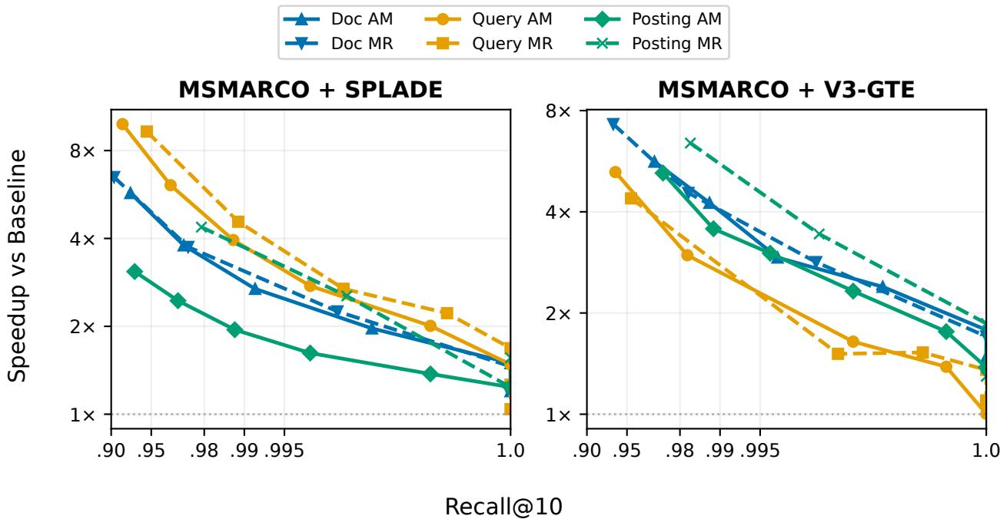
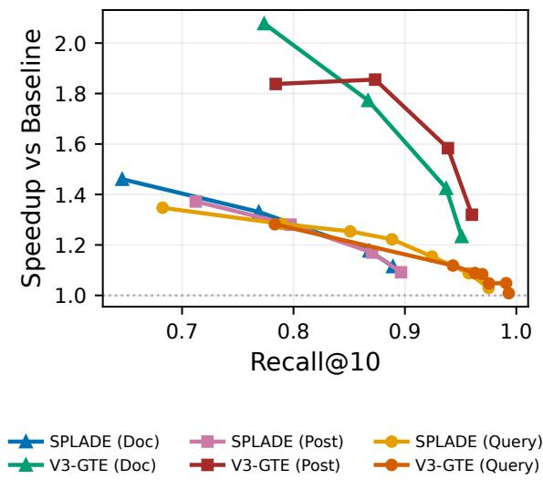
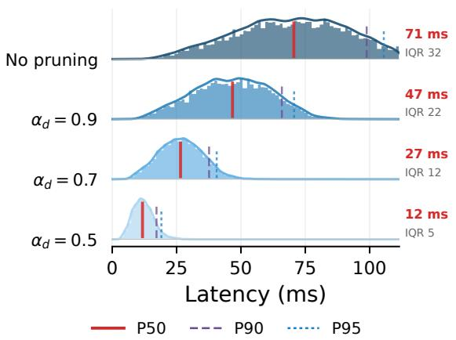
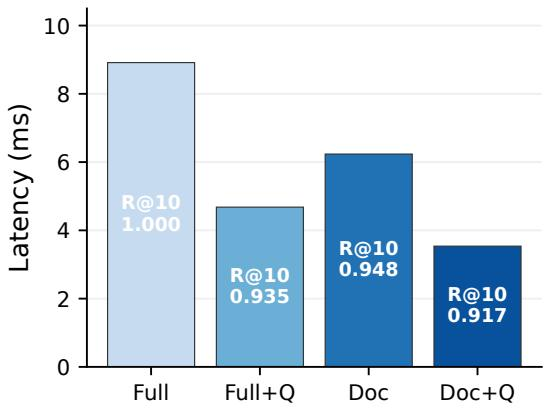
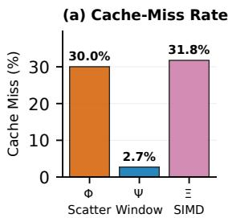
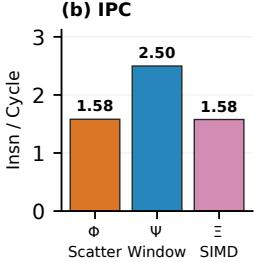
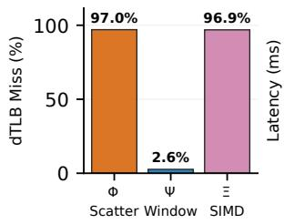
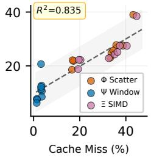
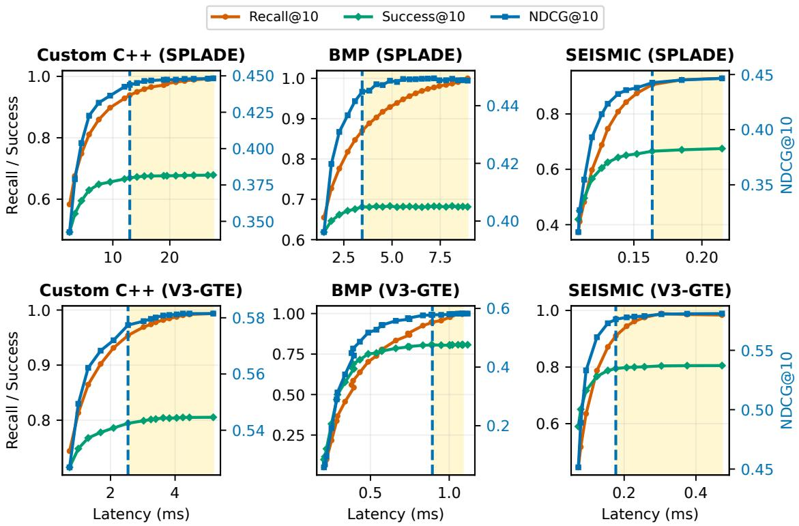
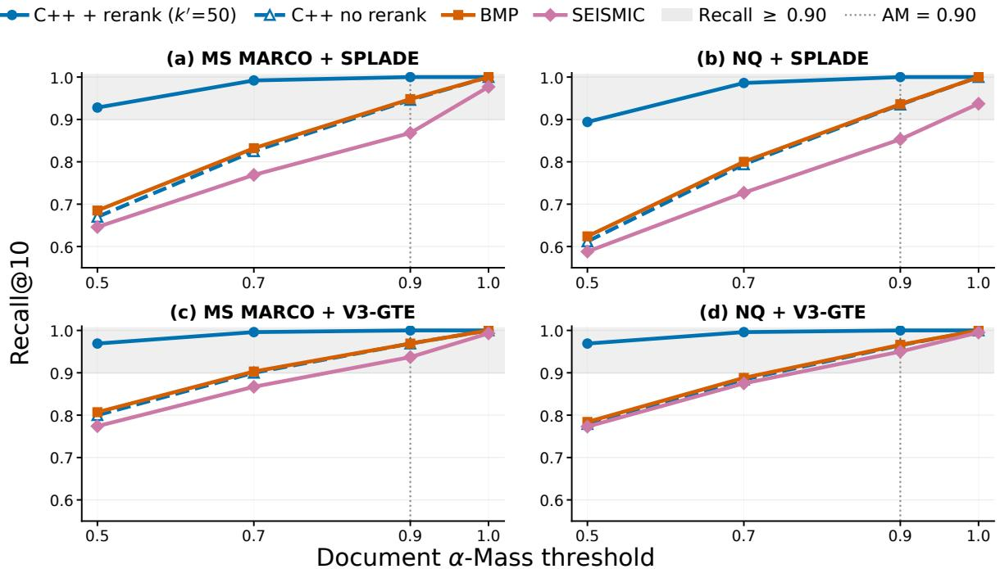

# Static Pruning Across Sparse Retrieval Regimes: What Transfers, What Breaks, and What Still Helps

Zirui Song   
Amazon Web Services   
Shanghai, China   
zrsong@amazon.com   
Yuye Zhu   
Amazon Web Services   
Shanghai, China   
yuyezhu@amazon.com   
Yang Yang   
Amazon Web Services   
Shanghai, China   
yych@amazon.com

## Abstract

Static pruning is widely used to accelerate sparse neural retrieval, yet existing studies each validate their conclusions within a single custom pipeline, leaving it unclear which findings transfer to modern engines with diferent index organizations and dynamic pruning mechanisms. We present the first cross-engine pruning portability study, evaluating static pruning strategies across three engines—a controlled C++ pipeline (exhaustive inverted index), BMP (blockmax pruning), and SEISMIC (clustered inverted indexes)—on two benchmarks (MS MARCO, Natural Questions) with two encoders spanning opposite query-density regimes (SPLADE: 44 avg. query terms; V3-GTE: 7 avg. query terms), totaling 1,140 experimental configurations, with an additional deep-judgment validation on TREC DL 2019/2020. We find that index-side pruning (document and posting-list) is portable: it consistently reduces latency (1.2– 6.6×) and index size (18–82%) across all engines because sparse retrieval is memory-bound—a conclusion we support with cachemiss, TLB, and IPC profiling. In contrast, query pruning is already internalized by modern engines: it yields 4–11× speedup on the exhaustive pipeline but is subsumed by BMP’s � and SEISMIC’s query\_cut. Static pruning complements dynamic pruning: on BMP, combining document and query reduction yields 2.5× speedup with NDCG@10 within 0.003 of the exact baseline. Finally, NDCG@10 saturates while Recall@10 is still in the ∼85–95% range across all three engines, providing a portable stopping criterion: practitioners can push pruning to this knee without visible ranking degradation. Together, these findings answer what transfers (index-side pruning), what breaks (query pruning), and what still helps (static atop dynamic pruning). Code is available at https://github.com/zirui-song-18/cross\_engine\_static\_pruning.

## CCS Concepts

• Information systems → Evaluation of retrieval results.

## Keywords

Sparse neural retrieval; static pruning; inverted indexes; crossengine evaluation

## ACM Reference Format:

Zirui Song, Yuye Zhu, and Yang Yang. 2026. Static Pruning Across Sparse Retrieval Regimes: What Transfers, What Breaks, and What Still Helps. In Proceedings ofthe 35th ACM International Conference on Information and

Knowledge Management(CIKM’26), November07–11, 2026, Rome, Italy. ACM, New York, NY, USA, 12 pages. https://doi.org/10.1145/3799682.3840771

## 1 Introduction

Sparse neural retrieval integrates neural text encoders with the inverted index, enabling term-based lookup while capturing semantic matching through learned sparse representations [16]. Models such as SPLADE [17], DeepImpact [27], and uniCOIL [24] assign highdimensional sparse weight vectors to queries and documents, where non-zero entries and their magnitudes can be interpreted as learned impacts. Compared with classic bag-of-words retrieval, learned sparse models improve semantic matching but often increase practical costs: they activate substantially more query terms, each posting carries a real-valued learned weight, and the resulting impact distributions deviate from the sharply Zipfian patterns that traditional top-� optimizations exploit [7]. Naïve deployments of these models on standard inverted-index engines can incur substantially higher latency than BM25 baselines [20, 25]. Static pruning—removing low-weight query terms online, or low-impact document/posting entries from the index ofline—is widely adopted to close this efficiency gap [22], shrinking the index and the per-query working set. But choosing what to prune, how aggressively, and whether the chosen strategy remains efective across diferent retrieval engines are all first-order deployment decisions that the literature has not jointly addressed.

Lassance et al. [22] provided the most comprehensive taxonomy, showing that learned sparse indexes tolerate aggressive pruning because their impact distributions are less sharply Zipfian. However, all existing studies validate on custom pipelines with exhaustive scoring—no work has tested whether these conclusions transfer to modern engines with built-in dynamic pruning. This gap is consequential: BMP [30] exposes a query-term fraction � that itself acts as query pruning, and SEISMIC [7] limits active terms via query\_cut. Both engines already internalize query-term selection, yet no prior work has tested whether external static pruning adds value atop these mechanisms, whether static and dynamic pruning are complementary or redundant, or whether NDCG@10’s saturation before Recall@10 generalizes beyond custom pipelines.

We present the first cross-engine pruning portability study for sparse neural retrieval. We systematically evaluate query, docu ment, and posting-list pruning under two score-aware criteria (�-Mass and Max-Ratio) across three engines (a controlled C++ pipeline with window-switch accumulator, BMP, and SEISMIC), two datasets (MS MARCO with 8.8M passages and Natural Questions with 2.7M passages), and two encoders spanning distinct query-density regimes (SPLADE with ∼44 query terms and V3-GTE with ∼6.9 query terms)—1,140 experimental configurations in

This work is licensed under a Creative Commons Attribution 4.0 International License. CIKM ’26, Rome, Italy   
© 2026 Copyright held by the owner/author(s).   
ACM ISBN 979-8-4007-2539-5/2026/11   
https://doi.org/10.1145/3799682.3840771

total. A unified memory-bound thesis connects all three research questions: sparse retrieval is fundamentally limited by memory trafic, and this single fact explains which pruning transfers across engines, why static pruning complements dynamic pruning, and why NDCG saturates before Recall. Our three interconnected con tributions are:

(1) Portability analysis (Section 5). Index-side pruning (document and posting-list) is portable across all tested engines—it reduces both index size and latency consistently, with document pruning as the safest default. Query pruning is regime-dependent: largely redun dant with engines that already internalize query-term selection.

(2) Static–dynamic complementarity (Section 6). Static and dy namic pruning target orthogonal bottlenecks and yield combined speedups exceeding individual gains—a conclusion supported by micro-architectural profiling confirming the memory-bound thesis. (3) Portable stopping criterion (Section 7). NDCG@10 saturates at ∼85–95% Recall@10 (engine-dependent) across all three tested engines, providing a portable empirical stopping criterion that we validate under both shallow and deep (TREC DL) judgments.

## 2 Background and Related Work

Sparse Neural Retrieval Models. Sparse neural retrievers encode queries and documents as high-dimensional sparse vectors whose non-zero entries carry learned impact weights [16]. Compared with classic bag-of-words scoring, learned sparse representations of ten activate substantially more terms due to expansion, and the resulting posting weights deviate from the traditional tf-idf distribution [7]. Bi-encoder models such as SPLADE [15] apply learned expansion to both queries and documents, producing moderately dense representations (SPLADE: avg. 44 query terms, 120 doc terms on MS MARCO). Inference-free encoders such as V3-GTE [18] use tokenization-only query construction (avg. 6.9 terms) but expand documents more aggressively (avg. 180 terms). These contrasting sparsity profiles create fundamentally diferent retrieval workloads: the dense-query regime generates more lists to traverse per query, while the sparse-query regime concentrates score mass on fewer terms, making each query term more critical. Our study spans both regimes to disentangle encoder-specific artifacts from engineportable patterns.

Static Pruning for Learned Sparse Retrieval. Static pruning has a long history in IR, spanning term-centric approaches that remove low-utility vocabulary terms [4, 10], document-centric strategies that prune per-document entries [8, 13], and global methods that remove postings based on corpus-level statistics [1, 31]. Probabilistic and information-theoretic accounts have further refined the understanding of when pruning preserves retrieval quality [5, 11]. For learned sparse retrievers specifically, Lassance et al. [22] revisited these families and showed that aggressive pruning is feasible with two-stage pipelines, and that learned sparse indexes tolerate more aggressive pruning than traditional indexes because their impact distributions are less sharply Zipfian. However, their study—like all prior pruning work for learned sparse models—validates on a custom pipeline with exhaustive scoring, not on modern engines with built-in dynamic pruning. Our work extends this framework to BMP and SEISMIC, testing whether the conclusions are portable or pipeline-specific.

Dynamic Pruning and Modern Engines. Dynamic pruning avoids scoring documents that cannot enter the top-�: WAND [6] uses term-wise upper bounds, Block-Max WAND [14] refines with blocklevel bounds, and impact-ordered designs enable early termination [2]. These techniques underpin production systems (Lucene [19], PISA [29]) and specialized learned-sparse engines [26, 28, 32]. BMP [30] extends Block-Max WAND with parameters � (approximation quality) and � (query-term fraction—prunes terms with weight < $\beta \cdot w _ { \mathrm { m a x } } )$ ; reducing � from 1.0 to 0.5 cuts latency by ∼1.8× on densequery workloads [30]. SEISMIC [7] clusters posting lists with quantized summaries, exposing query\_cut (qc) and heap\_factor (hf); at ${ \tt q c } = 5$ it achieves sub-millisecond retrieval. DSP [9] and SINDI [23] represent further designs; we select BMP and SEISMIC as exemplars of two dominant paradigms (block-max and clustered). No prior work has systematically tested whether external static pruning adds value atop these engines’ built-in mechanisms.

Memory Locality and System-Level Acceleration. Score accumulation is a sparse vector operation with low arithmetic intensity and irregular access patterns [34]. Modern CPU deployments are often limited by memory stalls—irregular accesses to postings and accumulator arrays—rather than raw arithmetic throughput, making locality-aware traversal central to speedups [29, 34]. This memory bound character is critical to understanding our cross-engine results: pruning that reduces memory trafic (e.g., document pruning that shortens posting lists) should transfer across engines regardless of their internal architecture, while pruning that reduces computation (e.g., query pruning that reduces the number of lists traversed) may not help when the engine is already memory-stalled.

Positioning. Prior work studies pruning within a single engine [7, 22, 30]. We study pruning across engines, yielding a portability matrix that replaces engine-specific heuristics with cross-validated guidance.

## 3 Pruning Strategies

We formalize two score-aware pruning criteria and three pruning families. We omit Fixed-Top selection, whose integer cutofs prune objects of diferent lengths unevenly and cannot produce the continuous parameter sweeps that �-Mass and Max-Ratio provide.

## 3.1 Pruning Criteria

Let $\mathcal T ( x )$ denote the set of non-zero terms in a sparse object � with weights $\{ w _ { t } \} _ { t \in \mathcal { T } ( x ) }$ (where $x = q$ for a query or $x = d$ for a document). For posting-list pruning, the same criteria apply over the posting weights $w _ { t , d }$ within each list $L _ { t } ,$ selecting a subset of documents to retain. We define two criteria that select a pruned support ${ \mathcal { T } } ^ { \mathrm { p r u n e d } } ( x ) \subseteq { \mathcal { T } } ( x )$

�-Mass (AM). Sort weights in descending order and keep the smallest prefix reaching � of the ℓ mass: $\mathcal { T } ^ { \mathrm { p r u n e d } } ( x ) = \{ t _ { 1 } , . . . , t _ { m } \}$ such that Í��=1 $\begin{array} { r } { w _ { t _ { i } } ~ \ge ~ \alpha \sum _ { t \in \mathcal { T } ( x ) } w _ { t } } \end{array}$ , with $\alpha ~ \in ~ ( 0 , 1 ]$ . This criterion yields adaptive support size—high-entropy objects retain more terms.

Max-Ratio (MR). Keep terms whose weight is at least a fraction � of the maximum: $\mathcal { T } ^ { \mathrm { p r u n e d } } ( x ) = \{ t \in \mathcal { T } ( x ) ~ | ~ w _ { t } \geq \tau \cdot w _ { \operatorname* { m a x } } \}$ , where $w _ { \mathrm { m a x } } = \mathbf { m a x } _ { t \in \mathcal { T } ( x ) }$ �� and $\tau \in [ 0 , 1 )$ . (We use � to distinguish from $\mathrm { B M P } \mathrm { \Delta } s \mathrm { \Delta } \beta$ parameter.) This criterion is scale-invariant and produces continuous trade-of curves.

## 3.2 Pruning Families

Query pruning (online). Pruned object: query vector � (support $\mathcal { T } ( q ) )$ . Mechanism: apply a criterion to obtain $\overr { \mathcal { T } ^ { \mathrm { p r u n e d } } } ( \bar { q } )$ and traverse only the corresponding posting lists. Cost path reduced: number of lists traversed (and thus accumulator updates). Query pruning is performed on-the-fly per query and does not modify the index. On engines with built-in query selection (BMP’s �, SEIS-MIC’s query\_cut), external query pruning may be partially or fully redundant.

Document pruning (ofline, per-document). Pruned object: each document vector � independently prior to indexing [22]. Mechanism: apply a criterion to obtain ${ \mathcal { T } } ^ { \mathrm { p r u n e d } } ( d )$ and build the inverted index from pruned documents. Cost path reduced: per-list work and RAM footprint (fewer postings overall), shrinking the working set. Document pruning is irreversible at query time. Because it reduces memory trafic rather than computation, we hypothesize that it transfers across all engine architectures.

Posting-list pruning (ofline, per-term). Pruned object: each posting list $L _ { t }$ independently. Mechanism: apply a criterion to keep only high-impact postings in �� [7]. Cost path reduced: per list work and RAM (shorter lists), yielding large savings when queries hit frequent terms. Like document pruning, deletions are irreversible. Posting-list pruning achieves the largest RAM savings but exhibits more rapid Recall degradation under aggressive settings than document pruning.

## 4 Experimental Setup

Datasets. We evaluate on two benchmarks: MS MARCO passage retrieval [3] (∼8.8M passages, 6,980 dev queries), the standard sparse retrieval benchmark with shallow relevance judgments (1–2 per query); and Natural Questions (NQ) [33] from BEIR (∼2.7M passages, 3,452 queries), providing cross-dataset validation under diferent corpus size and judgment characteristics.

Encoders. We evaluate two encoders with opposite query-density regimes (Table 1): SPLADE-CoCondenser-EnsembleDistil [15], a bi-encoder that expands both queries and documents (densequery regime), and opensearch-neural-sparse-encoding-docv3-gte (V3-GTE) [18], an inference-free encoder with tokenizedonly queries but aggressive document expansion (sparse-query regime). This lets us disentangle query density from encoder architecture.

Engine 1: Controlled C++ Pipeline. We build a single-threaded, core-pinned inverted-index engine in C++ implementing a windowswitch accumulator (Ψ). Documents are partitioned into windows of size �; postings are stored per (term, window) pair with local IDs, keeping the accumulator cache-resident at �(� ) rather than �(�). Queries score exhaustively against the (possibly pruned) index, then optionally re-rank the top- $\cdot k ^ { \prime } = 5 0$ candidates using the full (unpruned) document vectors. Since BMP and SEISMIC operate single-stage, Appendix C reports a no-rerank ablation confirming that the qualitative portability findings are not driven by the re-ranker. Section 6.3 and Appendix A introduce two additional accumulator variants (Φ, Ξ) designed to isolate the memory-bound bottleneck via controlled profiling.

Table 1: Dataset and encoder statistics. Avg. non-zero counts (nnz) per query and document, corpus size, baseline NDCG@10 on the controlled pipeline, and baseline NDCG@10 on the deep-judgment TREC DL 2019/2020 topics (mean over both years; MS MARCO corpus).
<table><tr><td>Configuration</td><td>Query nnz Doc nnz Docs NDCG@10 DL&#x27;19/20</td><td></td><td></td><td></td><td></td></tr><tr><td>MS MARCO + SPLADE</td><td>43.95</td><td>119.96</td><td>8.8M</td><td>0.449</td><td>0.726</td></tr><tr><td>MS MARCO + V3-GTE</td><td>6.89</td><td>180.41</td><td>8.8M</td><td>0.428</td><td>0.720</td></tr><tr><td>NQ + SPLADE</td><td>46.97</td><td>147.52</td><td>2.7M</td><td>0.539</td><td></td></tr><tr><td> $\mathbf { N Q } + \mathbf { V } 3 – \mathbf { G T E }$ </td><td>7.20</td><td>185.00</td><td>2.7M</td><td>0.582</td><td>一</td></tr></table>

Engine 2: BMP. Block-max dynamic pruning engine [30]. Indexes are built from CIFF format with 8-bit quantized impacts. Parameters: � (approximation quality) and � (query-term fraction—retains terms with weight ≥ $\beta \cdot w _ { \mathrm { m a x } } )$ . BMP’s � parameter is itself a query-pruning mechanism; we test whether external static pruning adds value beyond it.

Engine 3: SEISMIC. Clustered inverted-index engine [7]. Parameters: query\_cut (qc, limits active query terms) and heap\_factor (hf, controls dynamic skipping aggressiveness). SEISMIC achieves sub-millisecond retrieval through clustering and quantized summaries; its query\_cut already incorporates query-term selection, analogous to ${ \mathrm { B M P } } ^ { \prime } s \beta .$

Metrics. We report four metrics serving complementary purposes. Recall@�: oracle fidelity $( | A _ { k } \cap G _ { k } | / k .$ , where $G _ { k }$ is the model’s exact top-�). NDCG@�: qrels-based ranking quality with top-heavy logarithmic discounting [21]. Success@�: qrels-based coverage $( \mathbb { I } [ A _ { k } \cap R ( q ) \neq \emptyset ]$ , where �(�) is the set of judged-relevant documents). Latency: mean (BMP/SEISMIC); mean, p95, and p99 (controlled pipeline). Index size is reported as in-memory invertedindex footprint (GB).

Protocol. All experiments run single-threaded with CPU core pinning on an AMD EPYC 9R14 processor (3.7 GHz, 1.5 TB RAM). Each configuration uses 5 warm-up runs followed by timed runs; we report mean latency. Default � = 10 for all metrics unless stated.

## 5 Portability of Pruning Strategies

RQ1: Which static pruning conclusions are portable across engine designs and query-density profiles? Answer: Index-side pruning (document and posting-list) transfers across all tested engines because it reduces memory trafic—the binding bottleneck—whereas query pruning is regime-dependent, subsumed by engines that already internalize query-term selection. Figure 1 previews this on the controlled C++ pipeline: document pruning provides the most stable high-recall frontier across both encoders, a finding confirmed by the engine-specific results (Sections 5.2–5.3).

  
Figure 1: Custom C++ Pareto frontiers on MS MARCO: speedup vs. Recall@10 for all six pruning families ({Doc, Query, Posting} × {Alpha-Mass, Max-Ratio}). Left: SPLADE. Right: V3-GTE. Document pruning provides the most stable high-recall frontier across both encoders.

## 5.1 Controlled Pipeline Results

Baselines. Table 2 reports baseline latencies, ranging from 11.3 ms (NQ+V3-GTE) to 70.1 ms (MS+SPLADE), all at Recall@10 = 1.0 (exhaustive scoring).

Query pruning is highly efective on exhaustive pipelines. Query �-Mass pruning yields 4–11× speedups on the controlled pipeline (Table 2), but with a regime-dependent cost: SPLADE retains nearperfect NDCG (0.448 vs. 0.449) at � = 0.50, while V3-GTE sufers steep Recall loss (0.775) because its ∼7 query terms each carry critical score mass. The key question is whether these gains survive on engines with built-in query-term selection.

Document pruning is consistently efective. Document pruning achieves nearly identical speedup ratios across SPLADE and V3- GTE (Table 2), confirming it targets memory trafic rather than per-query computation—making it encoder-agnostic.

Posting-list pruning: RAM-eficient butfaster degradation. Posting pruning achieves comparable speedups to document pruning (Table 2) with even larger index reductions (73–81%). It degrades Recall faster, however: document pruning keeps each document’s own top-weighted terms, whereas posting-list pruning thresholds each term globally, so a document whose weight for a query’s key term falls just below the cutof is dropped entirely—even when relevant. It thus suits RAM-constrained deployments, with the threshold tuned under a validation constraint.

Table 2: Controlled pipeline (Ψ): representative operating points with two-stage re-rank (�′ = 50). Speedup relative to unpruned baseline. Idx is the in-memory inverted-index size.
<table><tr><td>Dataset+Enc.</td><td>Pruning</td><td>Lat.(ms)</td><td>Spd.</td><td>Idx(GB)</td><td>R@10</td><td>NDCG</td><td>MRR</td></tr><tr><td rowspan="5">MS+SPL</td><td>Baseline</td><td>70.1</td><td>1.0×</td><td>8.15</td><td>1.000</td><td>0.449</td><td>0.383</td></tr><tr><td>QAM 0.50</td><td>11.5</td><td>6.1×</td><td>8.15</td><td>0.964</td><td>0.448</td><td>0.383</td></tr><tr><td>Doc AM 0.50</td><td>11.7</td><td>6.0×</td><td>1.53</td><td>0.928</td><td>0.443</td><td>0.379</td></tr><tr><td>Doc MR 0.30</td><td>18.1</td><td>3.9X</td><td>2.16</td><td>0.974</td><td>0.447</td><td>0.381</td></tr><tr><td>Post MR 0.30</td><td>15.6</td><td>4.5×</td><td>2.00</td><td>0.979</td><td>0.447</td><td>0.382</td></tr><tr><td rowspan="5">MS+GTE</td><td>Baseline</td><td>29.5</td><td>1.0×</td><td>12.23</td><td>1.000</td><td>0.428</td><td>0.362</td></tr><tr><td>QAM 0.50</td><td>2.6</td><td>11.3×</td><td>12.23</td><td>0.775</td><td>0.389</td><td>0.332</td></tr><tr><td>Doc AM 0.50</td><td>5.2</td><td>5.6×</td><td>2.32</td><td>0.969</td><td>0.426</td><td>0.360</td></tr><tr><td>Doc MR 0.30</td><td>6.2</td><td>4.8×</td><td>2.90</td><td>0.983</td><td>0.427</td><td>0.361</td></tr><tr><td>Post MR 0.30</td><td>4.4</td><td>6.7×</td><td>2.29</td><td>0.983</td><td>0.427</td><td>0.361</td></tr><tr><td rowspan="5">NQ+SPL</td><td>Baseline</td><td>29.0</td><td>1.0×</td><td>3.04</td><td>1.000</td><td>0.539</td><td>0.488</td></tr><tr><td>QAM 0.50</td><td>6.8</td><td>4.3×</td><td>3.04</td><td>0.972</td><td>0.537</td><td>0.487</td></tr><tr><td>Doc AM 0.50</td><td>5.7</td><td>5.1×</td><td>0.58</td><td>0.894</td><td>0.530</td><td>0.482</td></tr><tr><td>Doc MR 0.30</td><td>10.2</td><td>2.8×</td><td>0.81</td><td>0.962</td><td>0.537</td><td>0.487</td></tr><tr><td>Post MR 0.30</td><td>10.5</td><td>2.8×</td><td>0.84</td><td>0.978</td><td>0.538</td><td>0.487</td></tr><tr><td rowspan="5">NQ+GTE</td><td>Baseline</td><td>11.3</td><td>1.0×</td><td>4.26</td><td>1.000</td><td>0.582</td><td>0.535</td></tr><tr><td>Q AM 0.50</td><td>1.5</td><td>7.4X</td><td>4.26</td><td>0.800</td><td>0.550</td><td>0.511</td></tr><tr><td>Doc AM 0.50</td><td>3.0</td><td>3.7×</td><td>0.84</td><td>0.969</td><td>0.579</td><td>0.533</td></tr><tr><td>Doc MR 0.30</td><td>2.5</td><td>4.5×</td><td>1.09</td><td>0.983</td><td>0.580</td><td>0.534</td></tr><tr><td>Post MR 0.30</td><td>2.5</td><td>4.5×</td><td>0.91</td><td>0.980</td><td>0.580</td><td>0.534</td></tr></table>

## 5.2 BMP Validation

BMP baselines. BMP baselines range from 1,087 �s (NQ+V3-GTE) to 8,915 �s (MS+SPLADE) at exact retrieval (Table 3).

BMP’s � is the dominant query lever. BMP’s internal � already internalizes the same query-term selection that yields 4–11× on the pipeline. External static query pruning (MR 0.10) provides 1.9× on MS+SPLADE (Table 3)—partially overlapping with $\beta ^ { \circ } s$ efect rather than adding a new independent optimization dimension.

Document pruning transfers to BMP. Document pruning reduces the BMP index (−34–36%) and latency (1.2–1.4×) with NDCG@10 within 0.007 of the unpruned baseline (Table 3). The mechanism is clear: shorter posting lists tighten $\mathrm { B M P } _ { \vphantom \mathrm { S } } ^ { \prime }$ block-max upper bounds, improving both cache locality and dynamic skipping eficiency. The pattern holds across both datasets and encoders.

Posting pruning also transfers. Posting pruning provides index reduction comparable to document pruning (−34–37%) with similar latency gains on BMP (Table 3). Consistent with controlled-pipeline findings, it degrades Recall faster than document pruning under aggressive settings.

V3-GTE on BMP: document pruning is the safer choice. On V3- GTE, $\beta = 0 . 5$ causes steep Recall degradation (0.706–0.778) because each of the ∼7 query terms carries critical score mass. In contrast, Doc AM 0.90 retains Recall@10 ≥ 0.966 with 36% index reduction (Table 7). For sparse-query encoders, document pruning is the safer, more predictable choice on BMP.

## 5.3 SEISMIC Validation

SEISMIC baselines: sub-millisecond retrieval. SEISMIC at ${ \tt q c } = 5$ already achieves sub-millisecond retrieval (186–360 �s across configurations), orders of magnitude faster than the controlled pipeline (Figure 2).

  
Figure 2: SEISMIC Pareto frontiers (qc = 5): speedup vs. Recall@10 under document and query pruning for both encoders. Document pruning provides consistent gains; query pruning overlaps with SEISMIC’s internal query\_cut.

Query pruning provides marginal benefit. Static query MR 0.10 at qc = 5 on MS MARCO reduces latency from 186 to 161 �s but Recall@10 drops to 0.924. At qc = 20, MR 0.10 provides 1.31× (413 $ 3 1 5 \mu s )$ . SEISMIC’s query\_cut already limits active query terms, so external pruning partially overlaps—analogous to ${ \mathrm { B M P } } ^ { \prime } s \beta .$ On V3-GTE, the same pattern holds: query MR 0.10 at qc = 5 yields 244 �s vs. 255 �s baseline, a marginal 1.05× gain.

Document pruning reduces index size with modest latency gain. Doc AM 0.90 yields 15–34% latency reduction with 16–29% index savings across all configurations (Table 8). Latency gains are smaller than BMP’s because SEISMIC is already near its memory-bound floor; the primary benefit is index reduction for RAM-constrained deployment.

Posting pruning also transfers to SEISMIC. Posting MR 0.10 provides comparable index reduction and speedup to document pruning on SEISMIC, with similar Recall at matched operating points (Table 3). Both index-side families yield consistent latency and RAM benefits across all four configurations.

## 5.4 Cross-Engine Portability Matrix

Table 3 synthesizes findings across all three engines into a portability matrix—the core contribution of RQ1.

Synthesis. Table 3 shows that index-side pruning is the transferable family: document and posting-list pruning consistently reduce memory trafic with small NDCG loss, while query pruning is largely internalized by BMP’s � and SEISMIC’s query\_cut. The $C { + } { + } ^ { \dagger }$ column further confirms that the cross-engine gap is not merely a re-ranker artifact: without re-ranking, C++ aligns closely with BMP, whereas SEISMIC exhibits larger Recall loss under the same threshold—indicating higher efective pruning severity under clustered traversal (Figure 7).

## 5.5 Per-Query Latency Stability

Using document pruning as a representative example, static pruning compresses the entire latency distribution rather than merely shifting the mean (Figure 3): IQR drops substantially at $\alpha _ { d } = 0 . 9 $ , the P95/P50 ratio decreases monotonically, and no heavy tail emerges even at $\alpha _ { d } = 0 . 5$ —aggressive pruning does not create a subpopulation of severely degraded queries.

## 6 Static–Dynamic Complementarity

RQ2: Does static pruning complement or conflict with dynamic pruning? Answer: Static and dynamic pruning are complementary— they target orthogonal bottlenecks (memory footprint vs. wasted traversal), yielding combined gains that exceed either mechanism alone.

## 6.1 BMP Factorial Design

We adopt a 2×2 factorial design on BMP (MS MARCO+SPLADE, $\alpha = 1 . 0 , k = 1 0 ) $ : full vs. pruned index (Doc AM 0.90), crossed with full vs. pruned queries (static MR 0.10). Table 4 reports results.

Combined pruning is stackable. The combined condition achieves 2.52× speedup (Table 4, Figure 4) with NDCG@10 within 0.003 of baseline. The gain is submultiplicative $( \rho = 0 . 9 2 )$ , indicating overlapping but not fully redundant cost components. The two mechanisms target orthogonal dimensions: static pruning reduces memory footprint (shorter lists, better cache locality); dynamic pruning reduces wasted traversal (skips non-competitive blocks). $\mathbf { B M P } \mathbf { \bar { s } }$ upper bounds become tighter with shorter posting lists, yielding synergistic gains. On NQ+SPLADE the pattern repeats (2.02×); V3-GTE shows lower but still complementary gains due to less query-pruning headroom.

Table 3: Portability Matrix: three pruning methods × four configurations, each evaluated on three engines. Speedup is relative to each engine’s unpruned baseline. ΔNDCG and ΔMRR show absolute change vs. the exact baseline (negative = degradation); ΔMRR tracks ΔNDCG throughout. C++ uses two-stage re-ranking (�′ = 50); C++† shows single-stage (no re-ranking) for direct comparison with BMP/SEISMIC. ∗BMP external query MR at $\beta = 1 . 0 .$
<table><tr><td></td><td></td><td colspan="4">Speedup</td><td colspan="4">Recall@10</td><td colspan="4">∆NDCG@10</td><td colspan="4">∆MRR@10</td></tr><tr><td>Config</td><td>Pruning</td><td> $\mathbf { C } + + \mathbf { \beta \Lambda \Lambda } \mathbf { C } + + \mathbf { \beta \Lambda } ^ { \dagger }$ </td><td></td><td>BMP</td><td>SEIS.</td><td></td><td> $\mathbf { C } + + \mathbf { \beta \mathbf { C } } { + + } ^ { \dagger }$ </td><td>BMP SEIS.</td><td></td><td> $\mathbf { C } { + } { + } \mathbf { \Gamma } \mathbf { C } { + } { + } ^ { \dagger }$ </td><td></td><td>BMP</td><td>SEIS.</td><td></td><td> $\mathbf { C } { \mathrel { + } } + \mathbf { \beta } \mathbf { C } { + } { + } ^ { \dagger }$ </td><td>BMP</td><td>SEIS.</td></tr><tr><td></td><td>Doc AM 0.90</td><td>1.49× 1.48×</td><td></td><td>1.43×</td><td>1.18×</td><td>1.000</td><td>.946</td><td>.948</td><td>.868</td><td>.000</td><td>-.003</td><td>-.003</td><td>-.005</td><td>.000</td><td>-.003</td><td>-.002</td><td>-.005</td></tr><tr><td>MS+SPL</td><td>Post MR 0.10</td><td>1.56× 1.54×</td><td></td><td>1.47×</td><td>1.17×</td><td>1.000</td><td>.947</td><td>.948</td><td>.871</td><td>.000</td><td>-.002</td><td>-.001</td><td>-.004</td><td>.000</td><td>-.002</td><td>-.002</td><td>-.004</td></tr><tr><td></td><td>Query MR 0.10</td><td>1.68× 1.65×</td><td></td><td>1.91×*</td><td>1.17×</td><td>1.000</td><td>.945</td><td>.935</td><td>.924</td><td>.000</td><td>.000</td><td>.000</td><td>+.001</td><td>.000</td><td>-.001</td><td>.000</td><td>.000</td></tr><tr><td></td><td>Doc AM 0.90</td><td>1.78× 1.61×</td><td></td><td>1.23×</td><td>1.42×</td><td>1.000</td><td>.969</td><td>.969</td><td>.937</td><td>.000</td><td>-.001</td><td>-.001</td><td>-.002</td><td>.000</td><td>.000</td><td>-.001</td><td>-.001</td></tr><tr><td>MS+GTE</td><td>Post MR 0.10</td><td>1.86× 1.68×</td><td></td><td>1.27×</td><td>1.58×</td><td>1.000</td><td>.970</td><td>.969</td><td>.939</td><td>.000</td><td>-.002</td><td>-.002</td><td>-.002</td><td>.000</td><td>-.001</td><td>-.002</td><td>-.002</td></tr><tr><td></td><td>Query MR 0.10</td><td>1.36× 1.27×</td><td></td><td>1.19×*</td><td>1.03×</td><td>1.000</td><td>.982</td><td>.980</td><td>.975</td><td></td><td></td><td> $. 0 0 0 ~ + . 0 0 1 ~ + . 0 0 1 ~ + . 0 0 1$ </td><td></td><td>.000</td><td>+.001</td><td>+.001</td><td>+.001</td></tr><tr><td></td><td>Doc AM 0.90</td><td>1.37× 1.34×</td><td></td><td>1.33×</td><td>1.24×</td><td>1.000</td><td>.935</td><td>.936</td><td>.853</td><td>.000</td><td>-.003</td><td>-.002</td><td>-.002</td><td>.000</td><td>-.002</td><td>-.001</td><td>.000</td></tr><tr><td>NQ+SPL</td><td>Post MR 0.10</td><td>1.34× 1.32×</td><td></td><td>1.30×</td><td>1.20×</td><td>1.000</td><td>.954</td><td>.952</td><td>.865</td><td>.000</td><td>-.002</td><td>-.002</td><td>-.001</td><td>.000</td><td>.000</td><td>-.001</td><td>+.001</td></tr><tr><td></td><td>Query MR 0.10</td><td>1.42× 1.39×</td><td></td><td>1.60×*</td><td>1.20×</td><td>1.000</td><td>.956</td><td>.947</td><td>.908</td><td>.000</td><td>-.005</td><td>-.006</td><td>-.004</td><td>.000</td><td>-.004</td><td>-.006</td><td>-.004</td></tr><tr><td>NQ+GTE</td><td>Doc AM 0.90</td><td>1.43× 1.43×</td><td></td><td>1.19×</td><td>1.51×</td><td>1.000</td><td>.965</td><td>.966</td><td>.950</td><td>.000</td><td>-.005</td><td>-.001</td><td>-.007</td><td>.000</td><td>-.005</td><td>-.004</td><td>-.006</td></tr><tr><td></td><td>Post MR 0.10</td><td>1.49× 1.49×</td><td></td><td>1.22×</td><td>1.57×</td><td>1.000</td><td>.966</td><td>.966</td><td>.951</td><td>.000</td><td>-.005</td><td>-.005</td><td>-.006</td><td>.000</td><td>-.005</td><td>-.005</td><td>-.006</td></tr><tr><td></td><td>Query MR 0.10</td><td>1.17× 1.17× 1.13×*</td><td></td><td></td><td>1.08×</td><td>1.000</td><td>.990</td><td>.989</td><td>.984</td><td>.000</td><td>-.001</td><td>-.002</td><td>-.001</td><td>.000</td><td>-.002</td><td>-.003</td><td>-.001</td></tr></table>

  
Figure 3: Per-query latency histogram strips on MS MARCO+SPLADE (controlled pipeline) at four documentpruning levels. The P50/P90/P95 markers show progressive IQR compression: moderate pruning $( \alpha _ { d } = \mathbf { 0 . 9 } )$ narrows the distribution while aggressive pruning $( \alpha _ { d } = \mathbf { 0 . 5 } )$ concentrates it tightly with minimal tail degradation.

## 6.2 SEISMIC Static–Internal Interaction

Table 5 reports the SEISMIC factorial (MS MARCO+SPLADE, qc = 5, hf = 1.0).

Table 4: BMP 2×2 factorial on MS MARCO+SPLADE (� = 1.0). Speedup relative to the full-index, full-query baseline. Index size in GB.
<table><tr><td>Index</td><td>Query</td><td>Lat.(µs)</td><td> $\mathbf { s p d } .$ </td><td>R@10</td><td>NDCG</td><td>MRR</td><td>Idx</td></tr><tr><td>Full</td><td>Full</td><td>8,915</td><td>1.00×</td><td>1.000</td><td>0.449</td><td>0.382</td><td>15.7</td></tr><tr><td>Full</td><td>Q MR 0.10</td><td>4,680</td><td>1.91×</td><td>0.935</td><td>0.449</td><td>0.382</td><td>15.7</td></tr><tr><td>Pruned Full</td><td></td><td>6,235</td><td>1.43×</td><td>0.948</td><td>0.446</td><td>0.380</td><td>10.1</td></tr><tr><td></td><td>Pruned Q MR 0.10</td><td>3,537</td><td>2.52×</td><td>0.917</td><td>0.446</td><td>0.379</td><td>10.1</td></tr></table>

Table 5: SEISMIC on MS MARCO+SPLADE (qc = 5, hf= 1.0). Speedup relative to the unpruned baseline at qc = 5. Index size in GB.
<table><tr><td>Index</td><td>Query</td><td>Lat.(µs)</td><td>Spd.</td><td>R@10</td><td>NDCG</td><td>MRR</td><td>Idx</td></tr><tr><td>Full</td><td>Full</td><td>185</td><td>1.00×</td><td>0.977</td><td>0.443</td><td>0.379</td><td>8.1</td></tr><tr><td>Full</td><td>Q MR 0.10</td><td>161</td><td>1.15×</td><td>0.924</td><td>0.444</td><td>0.379</td><td>8.1</td></tr><tr><td>Pruned</td><td>Full</td><td>158</td><td>1.17×</td><td>0.868</td><td>0.438</td><td>0.374</td><td>6.0</td></tr><tr><td>Pruned</td><td>Q MR 0.10</td><td>133</td><td>1.39×</td><td>0.856</td><td>0.440</td><td>0.376</td><td>6.0</td></tr></table>

Complementary, but primarily through index reduction. Combined pruning yields 1.39× on MS+SPLADE (Table 5), smaller than BMP’s 2.52× because SEISMIC’s sub-millisecond baseline is near the memory-bound floor—the latency set by unavoidable index traversal once data movement is minimized. With little memory trafic left to eliminate, pruning’s primary benefit becomes RAM reduction (−26%) rather than speedup.

(d) Latency vs Cache Miss

(c) dTLB-Miss Rate

  
Figure 4: BMP 2×2 factorial on MS MARCO+SPLADE: latency under four conditions (full/pruned index × full/pruned queries). Recall@10 shown inside each bar. Combined prun ing achieves the largest speedup (2.52×) with minimal NDCG loss (ΔNDCG = −0.003).

## 6.3 Mechanistic Explanation: Memory-Bound Retrieval

The factorial experiments above demonstrate that static and dynamic pruning are complementary, but do not explain why. If sparse retrieval were compute-bound, reducing arithmetic work (query pruning) and reducing wasted computation (dynamic skipping) would overlap. If it is memory-bound, shrinking the working set (static document pruning) and avoiding unnecessary block reads (dynamic pruning) would target independent cost components. We resolve this with controlled micro-architectural profiling, holding the index and queries fixed while varying only the accumulator architecture:

• Φ (scatter-add): global accumulator array of � scores—�(�) working set, cache-hostile.

• Ψ (window-switch): windowed accumulator of size� —�(� ) working set, cache-friendly. Used throughout the paper.

• Ξ (SIMD multiply): same global array as Φ with SIMD vectorization — tests whether arithmetic throughput matters. Linux perf [12] on MS MARCO+SPLADE (Table 6, top rows) confirms: the locality-aware Ψ achieves 2.4× latency reduction by virtually eliminating cache and TLB misses (2.7% vs. 30%), while the SIMD-focused Ξ provides no measurable benefit (Figure 5)— confirming the workload is memory-bound, not compute-bound.

Connection to complementarity. Static pruning reduces memory trafic (shorter posting lists, smaller working set); dynamic pruning reduces wasted traversal (skipping non-competitive blocks/clusters). Table 6 extends the profiling to BMP and SEISMIC: per-query latency tracks absolute cache misses on both engines, and configurations with smaller indexes consistently exhibit fewer misses per query—confirming that index-side pruning reduces memory trafic across all tested architectures. SEISMIC’s ∼17× lower cache misses per query (6.5K vs. BMP’s 114K) stem primarily from candidate selection, not cheaper per-document access: at qc=5 it scores only the 5 highest-weight query terms’ clusters versus all ∼44 SPLADE terms traversed by the exhaustive pipeline and BMP—an 8.8× reduction in candidate breadth. Normalized per query-term list, SEISMIC (1.3K misses/list) and the exhaustive Ψ (1.5K) difer by only ∼1.2×, so the cluster-contiguous layout is second-order; within SEISMIC, varying only query\_cut on a fixed access path, misses scale near-linearly with active terms (�=0.992)—confirming selection, not dot-product implementation, as the dominant lever.

  
Figure 5: Micro-architectural profiling of Φ/Ψ/Ξ with Linux perf on multiple pruning configurations: (a) cache-miss rate, (b) IPC, (c) dTLB-miss rate, (d) per-query latency vs. cachemiss rate (�2 = 0.84). Latency is tightly coupled to memory locality, not arithmetic throughput.

Table 6: Micro-architectural profile across engines (MS MARCO+SPLADE). Cache-miss and dTLB-miss are rates; CacheMiss/Q is the absolute count per query driving latency.
<table><tr><td>Engine</td><td>Config</td><td></td><td></td><td></td><td>IPC Cache% dTLB% CacheMiss/Q</td></tr><tr><td>C++Φ</td><td>scatter-add</td><td>1.58</td><td>30.0</td><td>97.0</td><td>740,000</td></tr><tr><td>C++Ψ</td><td>window-switch 2.50</td><td></td><td>2.7</td><td>2.6</td><td>67,000</td></tr><tr><td>BMP</td><td>β=1.0</td><td>3.37</td><td>1.3</td><td>28.4</td><td>114,000</td></tr><tr><td>BMP</td><td>β=0.5</td><td>3.37</td><td>1.8</td><td>25.0</td><td>89,000</td></tr><tr><td>SEISMIC</td><td>qc=20</td><td>3.01</td><td>10.9</td><td>40.9</td><td>12,500</td></tr><tr><td>SEISMIC</td><td>qc=5</td><td>3.29</td><td>7.7</td><td>37.7</td><td>6,500</td></tr></table>

## 7 How Far to Push: Operating Point Selection

RQ1 established what to prune (documents: portable; queries: regimedependent) and RQ2 showed how to combine pruning mechanisms (static and dynamic are complementary). The remaining deploy ment question RQ3 is how aggressively to prune. We show that NDCG@10 provides a portable stopping criterion across engines.

## 7.1 NDCG@10 Saturates Before Recall@10—Portably

Across all three engines and both datasets, NDCG@10 plateaus while Recall@10 continues to change. On all of them, NDCG@10 remains within 0.008 of baseline while (oracle) Recall@10 drops by up to 14 points (Figure 6)—i.e. NDCG saturates while Recall is still in the high-0.8 to mid-0.9 range, long before the aggressive-pruning regime. For example, BMP retains NDCG=0.449 at Recall=0.932 (�=0.5). Crucially, the saturation replicates under the deep, graded judgments of TREC DL 2019/2020 (∼210 judged docs/query): index side pruning retaining ∼90% mass stays within 0.006 NDCG@10 of the exact baseline on all three engines (Appendix D), so it is not an artifact of MS MARCO’s sparse relevance labels. This convergence across architecturally distinct engines suggests the saturation is a robust property of learned sparse retrieval under qrels-based evaluation, not an engine-specific artifact.

Success@10 saturates later than NDCG but earlier than Recall, remaining above 0.96 on BMP across the full � sweep—confirming that moderate pruning preserves candidate-generation viability. On MS MARCO dev, MRR@10 tracks NDCG@10 in lockstep across every engine and operating point (MRR@10 columns in Tables 2, 4, 5 and Appendix B): index-side pruning at the saturation point preserves it while only aggressive pruning degrades it, so the saturation is not an NDCG-specific artifact.

## 7.2 Root Cause and Stopping Point

The saturation arises because pruning tends to swap top-ranked documents for near-duplicate passages of equal relevance grade (or for unjudged near-duplicates): the graded-gain vector over ranks 1– 10 is left essentially invariant even though the exact top-� set (and thus oracle Recall) changes, so NDCG@10 is blind to the reshufle (verified on a deep-judgment DL 2019 query where all churned top-10 documents are judged equally relevant; Appendix D). We define the NDCG knee as the most aggressive operating point whose NDCG@10 stays within 0.005 of the unpruned baseline (a ∼1% relative tolerance), marked by the dashed line in Figure 6. Across all three engines and both encoders, on dev and the deep-judgment DL 2019/2020 sets, this knee falls where oracle Recall@10 lies in the ∼85–95% range (engine-dependent). Depending on the deployment objective, practitioners should select operating points as follows:

(1) System profiling: Use Recall@10—it remains sensitive even in the high-accuracy regime (e.g., 0.97 vs. 0.99), diagnosing approximation fidelity.

(2) User-facing ranking: Target the NDCG@10 knee (∼85–95% Recall, engine-dependent). On BMP, �=0.5 (NDCG=0.449, Recall=0.93) is near-optimal; on SEISMIC, qc=5 (NDCG=0.443, Recall=0.98) operates in the saturated region.

(3) Candidate generation: Use Success@10 to ensure coverage of judged-relevant items; at doc AM 0.5 on the controlled pipeline, Success@10 ≥ 0.95 sufices for downstream re-ranking.

The NDCG knee is portable across all three engines, completing the decision framework: what to prune (RQ1: documents), how to combine (RQ2: static + dynamic), and how far to push (RQ3: to the NDCG knee at ∼85–95% Recall).

## 8 Discussion and Practitioner Guidance

Decision framework: What, How, How Far. Our cross-engine results distill into a deployment workflow:

(1) Start with document pruning (Doc AM 0.90; tune the system to ΔNDCG ≤ 0.005).

(2) Use built-in query reduction (BMP $\beta ,$ SEISMIC qc); external query pruning is secondary.

(3) Add posting-list pruning when RAM is the binding constraint; tune the threshold under a validation constraint, as Recall degrades faster than document pruning on some engine/encoder combinations.

(4) Combine under tight latency budgets (BMP 2.52×, SEIS-MIC 1.39×).

Limitations. The controlled C++ pipeline uses two-stage re-ranking while BMP and SEISMIC are single-stage; Table 3 therefore reports a C++† no-rerank variant, which preserves the qualitative portability conclusion but lowers absolute Recall. Our portability claims are established across three engine paradigms (exhaustive scoring, blockmax dynamic pruning, and clustered inverted indexes), two learnedsparse encoders spanning opposite query-density regimes (SPLADE ∼44 vs. V3-GTE ∼7 query terms), two web-search benchmarks (MS MARCO, NQ) plus the deep-judgment TREC DL 2019/2020 sets, and �=10 under single-threaded execution. We do not claim generality to all learned-sparse models, non-web domains (broader BEIR coverage is bounded by CPU-only encoding cost and left to future work), batched/multi-threaded settings, deeper �, or additional engines (DSP, SINDI). LLM-as-a-judge evaluation is an alternativevalidity path we do not pursue, as the deep DL judgments already directly test the shallow-label concern. The saturation point is a qrels-based operating criterion (validated under both shallow dev and deep DL judgments), not a direct user-satisfaction threshold.

## 9 Conclusion

Across 1,140 configurations on three engines, two datasets, and two encoders, we find that index-side pruning is portable (1.2–6.6× speedup, 18–82% index reduction), query pruning is subsumed by engine-internal mechanisms (BMP’s �, SEISMIC’s query\_cut), and static pruning complements dynamic pruning (combined 2.52× on BMP). The NDCG knee at ∼85–95% Recall provides a portable empirical stopping criterion that replicates under deep TREC DL judgments. Micro-architectural profiling confirms all tested engines are memory-trafic-limited, explaining why index-size reduction transfers across architectures. A no-rerank ablation further shows that the cross-engine recall gap reflects traversal semantics rather than re-ranker protection. Future work should extend to �=100+, additional engines (DSP, SINDI), impact quantization interactions, and multi-threaded execution.

## A Accumulator Variants

We implement three accumulator strategies in the controlled C++ pipeline to isolate the memory-bound bottleneck. The key difference is working-set size: Φ maintains a global accumulator of � scores (random access, cache-hostile); Ψ partitions the document space into windows of size � (localized, cache-friendly); Ξ adds SIMD vectorization to Φ’s multiply step, yielding <1% improvement—confirming the workload is memory-bound, not compute-bound. All controlled-pipeline experiments use Ψ unless noted.

  
Figure 6: Latency vs. quality across three engines (columns) and two dataset–encoder regimes (rows: MS MARCO+SPLADE, top; NQ+V3-GTE, bottom). The dashed line marks the NDCG@10 knee (the most aggressive point within 0.005 of the unpruned baseline); the gold-shaded region to its right is where NDCG@10 has saturated while Recall@10 keeps rising, confirming the metric gap is engine-independent.

Both score query � against inverted index � then re-rank the top- $- k ^ { \prime }$ with   
full dot products; they difer only in the accumulator.   
Φ Scatter-Add (baseline). One global array $S [ 0 \ldots N { - } 1 ]$ : for each term   
$( t , q _ { t } )$ , for each posting (� $, w _ { d } ) \in I [ t ] \colon S [ d ] \mathrel { + } = q _ { t } w _ { d } .$ . Working set   
�(�)≈33 MB.   
Ψ Window-Switch (used throughout). for each window � of� docs:   
reset local �[0 . . .�−1], accumulate as above over �[�] [�], then push   
the window’s positives to a global heap. Working set � (�)≈400 KB,   
cache-resident.

## B Detailed Experimental Results

Tables 7 and 8 report the full per-configuration BMP and SEIS-MIC sweeps (index size, latency, Recall@10, NDCG@10, MRR@10) underlying the main portability findings; controlled-pipeline oper ating points appear in Table 2.

## C Re-Ranking Ablation

The controlled C++ pipeline uses two-stage re-ranking $( k ^ { \prime } = 5 0 )$ while BMP and SEISMIC are single-stage. Figure 7 shows that at the operating point (Doc AM 0.90) removing re-ranking costs only 3–6 Recall@10 points—bringing C++ in line with BMP (cf. the ${ \mathrm { C } } { + } { + } ^ { { \dagger } }$ column of Table 3)—while at aggressive Doc AM 0.50 it recovers 17–28 points, confirming its value only beyond the recommended range.

Table 7: BMP document/posting/query pruning across all four dataset–encoder combinations (�=1.0). Speedup relative to each config’s unpruned baseline.
<table><tr><td>Config</td><td>Pruning</td><td>Idx (GB)</td><td>Lat (µs)</td><td>R@10</td><td>NDCG</td><td>MRR</td><td>Spdup</td></tr><tr><td rowspan="6">MS+SPL</td><td>None</td><td>15.7</td><td>8,915</td><td>1.000</td><td>0.449</td><td>0.382</td><td>1.00×</td></tr><tr><td>AM 0.50</td><td>4.3</td><td>2,869</td><td>0.685</td><td>0.398</td><td>0.335</td><td>3.11×</td></tr><tr><td>AM 0.70</td><td>6.4</td><td>4,166</td><td>0.832</td><td>0.431</td><td>0.366</td><td>2.14×</td></tr><tr><td>AM 0.90</td><td>10.1</td><td>6,235</td><td>0.948</td><td>0.446</td><td>0.380</td><td>1.43×</td></tr><tr><td>AM 0.95</td><td>11.7</td><td>7,111</td><td>0.972</td><td>0.448</td><td>0.381</td><td>1.25×</td></tr><tr><td>MR 0.10</td><td>10.4</td><td>6,281</td><td>0.951</td><td>0.446</td><td>0.380</td><td>1.42×</td></tr><tr><td rowspan="6">NQ+SPL</td><td>None</td><td>5.5</td><td>4,272</td><td>1.000</td><td>0.539</td><td>0.489</td><td>1.00×</td></tr><tr><td>AM 0.50</td><td>1.5</td><td>1,412</td><td>0.624</td><td>0.454 0.407</td><td></td><td>3.02×</td></tr><tr><td>AM 0.70</td><td>2.3</td><td>2,277</td><td>0.800</td><td>0.518</td><td>0.470</td><td>1.88×</td></tr><tr><td>AM 0.90</td><td>3.6</td><td>3,222</td><td>0.936</td><td>0.537</td><td>0.488</td><td>1.33×</td></tr><tr><td>AM 0.95</td><td>4.1</td><td>3,573</td><td>0.968</td><td>0.538</td><td>0.488</td><td>1.20×</td></tr><tr><td>MR 0.10</td><td>3.7</td><td>3,336</td><td>0.951</td><td>0.535</td><td>0.487</td><td>1.28×</td></tr><tr><td rowspan="4">MS+GTE</td><td>None</td><td>22.4</td><td>2,453</td><td>1.000</td><td>0.429</td><td></td><td>1.00×</td></tr><tr><td>β=0.5</td><td>22.4</td><td>1,061</td><td>0.706</td><td>0.365</td><td>0.363</td><td>2.31×</td></tr><tr><td>Doc AM 0.90</td><td>14.4</td><td>1,994</td><td>0.969</td><td>0.428</td><td>0.302 0.362</td><td>1.23×</td></tr><tr><td>Post MR 0.10</td><td>13.8</td><td>1,934</td><td>0.969</td><td>0.427</td><td>0.361</td><td>1.27×</td></tr><tr><td rowspan="4">NQ+GTE</td><td>None</td><td>7.1</td><td>1,087</td><td>1.000</td><td>0.583</td><td>0.536</td><td>1.00×</td></tr><tr><td>β=0.5</td><td>7.1</td><td>571</td><td>0.778</td><td>0.543</td><td>0.498</td><td>1.90×</td></tr><tr><td>Doc AM 0.90</td><td>4.7</td><td>917</td><td>0.966</td><td>0.579</td><td>0.532</td><td>1.19×</td></tr><tr><td>Post MR 0.10</td><td>4.7</td><td>890</td><td>0.966</td><td>0.578</td><td>0.531</td><td>1.22×</td></tr></table>

  
Figure 7: Recall@10 under document pruning across the four dataset–encoder combinations. The two-stage C++ curve shows the efect of full-vector re-ranking, while the no-rerank C++ curve closely tracks BMP at the main operating point (AM=0.90). SEISMIC exhibits a larger Recall drop under the same static pruning threshold, indicating that pruning thresholds have diferent efective severity under cluster-based traversal. The gray band marks Recall@10 ≥ 0.90.

Table 8: SEISMIC document pruning across all configurations (qc=5, hf=1.0).
<table><tr><td>Config</td><td>Pruning</td><td>Idx (GB) Lat (µs)</td><td>R@10</td><td>NDCG</td><td>MRR</td></tr><tr><td rowspan="4">MS+SPL</td><td>None</td><td>8.1</td><td>186</td><td>0.977</td><td>0.443 0.379</td></tr><tr><td>AM 0.70</td><td>4.3</td><td>140</td><td>0.769</td><td>0.424 0.361</td></tr><tr><td>AM 0.90</td><td>6.0</td><td>158</td><td>0.868</td><td>0.438 0.374</td></tr><tr><td>AM 0.95</td><td>6.7</td><td>167</td><td>0.889 0.441</td><td>0.378</td></tr><tr><td rowspan="4">NQ+SPL</td><td>None AM 0.70</td><td>7.0</td><td>234</td><td>0.937</td><td>0.533 0.485</td></tr><tr><td></td><td>4.5</td><td>167</td><td>0.727</td><td>0.505 0.460</td></tr><tr><td>AM 0.90</td><td>5.9</td><td>190</td><td>0.853</td><td>0.531 0.484</td></tr><tr><td>AM 0.95</td><td>6.3</td><td>204</td><td>0.880</td><td>0.534 0.486</td></tr><tr><td rowspan="4">MS+GTE</td><td>None AM 0.70</td><td>10.3</td><td>255</td><td>0.993</td><td>0.422 0.358</td></tr><tr><td></td><td>5.0</td><td>144</td><td>0.867</td><td>0.413 0.350</td></tr><tr><td>AM 0.90</td><td>7.3</td><td>179</td><td>0.937</td><td>0.420 0.357</td></tr><tr><td>AM 0.95</td><td>8.2</td><td>207</td><td>0.951</td><td>0.420 0.356</td></tr><tr><td rowspan="4">NQ+GTE</td><td>None</td><td>8.3</td><td>360</td><td>0.995</td><td>0.581 0.534</td></tr><tr><td>AM 0.70</td><td>5.1</td><td>208</td><td>0.875</td><td>0.563 0.518</td></tr><tr><td>AM 0.90</td><td>6.8</td><td>239</td><td>0.950</td><td>0.574 0.528</td></tr><tr><td>AM 0.95</td><td>7.4</td><td>271</td><td>0.966</td><td>0.577 0.530</td></tr></table>

Table 9: TREC DL 2019/2020 mean NDCG@10 (DL19+DL20 pooled). Query pruning uses each engine’s native mechanism (C++ MR 0.10; BMP �=0.5; SEISMIC query\_cut=5)
<table><tr><td colspan="4">SPLADE</td><td colspan="3">V3-GTE</td></tr><tr><td>Config</td><td>C++</td><td>BMP</td><td>SEIS.</td><td>C++</td><td>BMP</td><td>SEIS.</td></tr><tr><td>Baseline</td><td>.726</td><td>.726</td><td>.721</td><td>.720</td><td>.718</td><td>.721</td></tr><tr><td>Doc AM 0.90</td><td>.717</td><td>.719</td><td>.707</td><td>.721</td><td>.721</td><td>.718</td></tr><tr><td>Post MR 0.10</td><td>.720</td><td>.723</td><td>.716</td><td>.720</td><td>.719</td><td>.721</td></tr><tr><td>Doc AM 0.50</td><td>.680</td><td>.691</td><td>.675</td><td>.688</td><td>.685</td><td>.676</td></tr><tr><td>Query prune</td><td>.728</td><td>.728</td><td>.722</td><td>.723</td><td>.620</td><td>.720</td></tr></table>

## D TREC DL 2019/2020 Deep-Judgment Validation

MS MARCO dev labels only one or two relevant passages per query, so we re-evaluate on TREC DL 2019/2020, which pools ∼210 documents per query and grades each on a 0–3 relevance scale. Table 9 confirms both main-text findings under deep judgments: index-side pruning is lossless, and the query-pruning regime split (free on SPLADE, catastrophic on V3-GTE) is if anything sharper. Because these sets judge ∼210 documents per query rather than one or two, a genuine quality loss would register here; that NDCG@10 stays essentially flat through pruning confirms the saturation in Section 7 is a property of the ranking, not of sparse labels.

## GenAI Usage Disclosure

Generative AI tools were used only to polish author-written text; they were not used to generate ideas, design experiments, produce or analyze results, write code, or create figures/tables. The authors reviewed all afected text and take full responsibility for this paper.

## References

[1] Ismail S. Altingovde, Rifat Ozcan, and Özgür Ulusoy. 2012. Static index pruning in web search engines: Combining term and document popularities with query views. ACM Trans. Inf. Syst. 30, 1, Article 2 (March 2012), 28 pages. doi:10.1145/ 2094072.2094074

[2] Vo Ngoc Anh and Alistair Mofat. 2006. Pruned query evaluation using precomputed impacts. In Proceedings ofthe 29th Annual International ACM SIGIR Conference on Research and Development in Information Retrieval (Seattle, Wash ington, USA) (SIGIR ’06). Association for Computing Machinery, New York, NY, USA, 372–379. doi:10.1145/1148170.1148235

[3] Payal Bajaj, Daniel Campos, Nick Craswell, Li Deng, Jianfeng Gao, Xiaodong Liu, Rangan Majumder, Andrew McNamara, Bhaskar Mitra, Tri Nguyen, Mir Rosenberg, Xia Song, Alina Stoica, Saurabh Tiwary, and Tong Wang. 2018. MS MARCO: A Human Generated MAchine Reading COmprehension Dataset. arXiv:1611.09268 [cs.CL] https://arxiv.org/abs/1611.09268

[4] Roi Blanco and Álvaro Barreiro. 2007. Static Pruning of Terms in Inverted Files. In Advances in Information Retrieval, Giambattista Amati, Claudio Carpineto, and Giovanni Romano (Eds.). Springer Berlin Heidelberg, Berlin, Heidelberg, 64–75.

[5] Roi Blanco and Alvaro Barreiro. 2010. Probabilistic static pruning of inverted files. ACM Trans. Inf. Syst. 28, 1, Article 1 (Jan. 2010), 33 pages. doi:10.1145/ 1658377.1658378

[6] Andrei Z. Broder, David Carmel, Michael Herscovici, Aya Sofer, and Jason Zien. 2003. Eficient query evaluation using a two-level retrieval process. In Proceedings of the Twelfth International Conference on Information and Knowledge Management (New Orleans, LA, USA) (CIKM ’03). Association for Computing Machinery, New York, NY, USA, 426–434. doi:10.1145/956863.956944

[7] Sebastian Bruch, Franco Maria Nardini, Cosimo Rulli, and Rossano Venturini. 2024. Eficient Inverted Indexes for Approximate Retrieval over Learned Sparse Representations. In Proceedings of the 47th International ACM SIGIR Conference on Research and Development in Information Retrieval (Washington DC, USA) (SIGIR ’24). Association for Computing Machinery, New York, NY, USA, 152–162. doi:10.1145/3626772.3657769

[8] Stefan Büttcher and Charles L. A. Clarke. 2006. A document-centric approach to static index pruning in text retrieval systems. In Proceedings ofthe 15th ACM International Conference on Information and Knowledge Management (Arlington, Virginia, USA) (CIKM ’06). Association for Computing Machinery, New York, NY, USA, 182–189. doi:10.1145/1183614.1183644

[9] Parker Carlson, Wentai Xie, Shanxiu He, and Tao Yang. 2025. Dynamic Superblock Pruning for Fast Learned Sparse Retrieval. In Proceedings ofthe 48th International ACM SIGIR Conference on Research and Development in Information Retrieval (Padua, Italy) (SIGIR ’25). Association for Computing Machinery, New York, NY, USA, 3004–3009. doi:10.1145/3726302.3730183

[10] David Carmel, Doron Cohen, Ronald Fagin, Eitan Farchi, Michael Herscovici, Yoelle S. Maarek, and Aya Sofer. 2001. Static index pruning for information retrieval systems. In Proceedings ofthe 24th Annual International ACM SIGIR Conference on Research and Development in Information Retrieval (New Orleans, Louisiana, USA) (SIGIR ’01). Association for Computing Machinery, New York, NY, USA, 43–50. doi:10.1145/383952.383958

[11] Ruey-Cheng Chen and Chia-Jung Lee. 2013. An information-theoretic account of static index pruning. In Proceedings of the 36th International ACM SIGIR Conference on Research and Development in Information Retrieval (Dublin, Ireland) (SIGIR ’13). Association for Computing Machinery, New York, NY, USA, 163–172. doi:10. 1145/2484028.2484061

[12] Arnaldo Carvalho De Melo. 2010. The new Linux ‘perf’ tools. In Slidesfrom Linux Kongress, Vol. 18.

[13] Edleno S. de Moura, Célia F. dos Santos, Daniel R. Fernandes, Altigran S. Silva, Pavel Calado, and Mario A. Nascimento. 2005. Improving Web search eficiency via a locality based static pruning method. In Proceedings of the 14th International Conference on World Wide Web (Chiba, Japan) (WWW ’05). Association for Computing Machinery, New York, NY, USA, 235–244. doi:10.1145/1060745.1060783

[14] Shuai Ding and Torsten Suel. 2011. Faster top-k document retrieval using blockmax indexes. In Proceedings ofthe 34th International ACM SIGIR Conference on Research and Development in Information Retrieval (Beijing, China) (SIGIR ’11). Association for Computing Machinery, New York, NY, USA, 993–1002. doi:10. 1145/2009916.2010048

[15] Thibault Formal, Carlos Lassance, Benjamin Piwowarski, and Stéphane Clinchant. 2022. From Distillation to Hard Negative Sampling: Making Sparse Neural IR Models More Efective. In Proceedings ofthe 45th International ACM SIGIR Conference on Research and Development in Information Retrieval (Madrid, Spain)

(SIGIR ’22). Association for Computing Machinery, New York, NY, USA, 2353–2359. doi:10.1145/3477495.3531857

[16] Thibault Formal, Carlos Lassance, Benjamin Piwowarski, and Stéphane Clinchant. 2024. Towards Efective and Eficient Sparse Neural Information Retrieval. ACM Trans. Inf. Syst. 42, 5, Article 116 (April 2024), 46 pages. doi:10.1145/3634912

[17] Thibault Formal, Benjamin Piwowarski, and Stéphane Clinchant. 2021. SPLADE: Sparse Lexical and Expansion Model for First Stage Ranking. In Proceedings ofthe 44th International ACM SIGIR Conference on Research and Development in Information Retrieval (Virtual Event, Canada) (SIGIR ’21). Association for Computing Machinery, New York, NY, USA, 2288–2292. doi:10.1145/3404835. 3463098

[18] Zhichao Geng, Yiwen Wang, Dongyu Ru, and Yang Yang. 2025. Towards Competitive Search Relevance For Inference-Free Learned Sparse Retrievers. arXiv:2411.04403 [cs.IR] https://arxiv.org/abs/2411.04403

[19] Adrien Grand, Robert Muir, Jim Ferenczi, and Jimmy Lin. 2020. From MAXSCORE to Block-Max Wand: The Story of How Lucene Significantly Improved Query Evaluation Performance. In Advances in Information Retrieval, Joemon M. Jose, Emine Yilmaz, João Magalhães, Pablo Castells, Nicola Ferro, Mário J. Silva, and Flávio Martins (Eds.). Springer International Publishing, Cham, 20–27.

[20] Sebastian Hofstätter and Allan Hanbury. 2019. Let’s measure run time! Extending the IR replicability infrastructure to include performance aspects. arXiv:1907.04614 [cs.IR] https://arxiv.org/abs/1907.04614

[21] Kalervo Järvelin and Jaana Kekäläinen. 2002. Cumulated gain-based evaluation of IR techniques. ACM Trans. Inf. Syst. 20, 4 (Oct. 2002), 422–446. doi:10.1145/ 582415.582418

[22] Carlos Lassance, Simon Lupart, Hervé Déjean, Stéphane Clinchant, and Nicola Tonellotto. 2023. A Static Pruning Study on Sparse Neural Retrievers. In Proceedings ofthe 46th International ACM SIGIR Conference on Research and Development in Information Retrieval (Taipei, Taiwan) (SIGIR ’23). Association for Computing Machinery, New York, NY, USA, 1771–1775. doi:10.1145/3539618.3591941

[23] Ruoxuan Li, Xiaoyao Zhong, Jiabao Jin, Peng Cheng, Wangze Ni, Zhitao Shen, Wei Jia, Xiangyu Wang, Heng Tao Shen, and Jingkuan Song. 2026. SINDI: an Eficient Index for Approximate Maximum Inner Product Search on Sparse Vectors. arXiv:2509.08395 [cs.DB] https://arxiv.org/abs/2509.08395

[24] Jimmy Lin and Xueguang Ma. 2021. A Few Brief Notes on DeepImpact, COIL, and a Conceptual Framework for Information Retrieval Techniques. arXiv:2106.14807 [cs.IR] https://arxiv.org/abs/2106.14807

[25] Sean MacAvaney, Andrew Yates, Arman Cohan, and Nazli Goharian. 2019. CEDR: Contextualized Embeddings for Document Ranking. In Proceedings ofthe 42nd International ACM SIGIR Conference on Research and Development in Information Retrieval (Paris, France) (SIGIR’19). Association for Computing Machinery, New York, NY, USA, 1101–1104. doi:10.1145/3331184.3331317

[26] Joel Mackenzie, Antonio Mallia, Alistair Mofat, and Matthias Petri. 2022. Accelerating Learned Sparse Indexes Via Term Impact Decomposition. In Findings of the Association for Computational Linguistics: EMNLP 2022, Yoav Goldberg, Zornitsa Kozareva, and Yue Zhang (Eds.). Association for Computational Linguistics, Abu Dhabi, United Arab Emirates, 2830–2842. doi:10.18653/v1/2022.findingsemnlp.205

[27] Antonio Mallia, Omar Khattab, Torsten Suel, and Nicola Tonellotto. 2021. Learning Passage Impacts for Inverted Indexes. In Proceedings ofthe 44th International ACM SIGIR Conference on Research and Development in Information Retrieval (Virtual Event, Canada) (SIGIR ’21). Association for Computing Machinery, New York, NY, USA, 1723–1727. doi:10.1145/3404835.3463030

[28] Antonio Mallia, Joel Mackenzie, Torsten Suel, and Nicola Tonellotto. 2022. Faster Learned Sparse Retrieval with Guided Traversal. In Proceedings ofthe 45th International ACM SIGIR Conference on Research and Development in Information Retrieval (Madrid, Spain) (SIGIR ’22). Association for Computing Machinery, New York, NY, USA, 1901–1905. doi:10.1145/3477495.3531774

[29] Antonio Mallia, Michal Siedlaczek, Joel Mackenzie, and Torsten Suel. [n. d.]. PISA: Performant Indexes and Search for Academia. Proceedings ofthe Open-Source IR Replicability Challenge ([n. d.]). https://par.nsf.gov/biblio/10171641

[30] Antonio Mallia, Torsten Suel, and Nicola Tonellotto. 2024. Faster Learned Sparse Retrieval with Block-Max Pruning. In Proceedings ofthe 47th International ACM SIGIR Conference on Research and Development in Information Retrieval (Wash ington DC, USA) (SIGIR ’24). Association for Computing Machinery, New York, NY, USA, 2411–2415. doi:10.1145/3626772.3657906

[31] Alexandros Ntoulas and Junghoo Cho. 2007. Pruning policies for two-tiered inverted index with correctness guarantee. In Proceedings ofthe 30th Annual International ACM SIGIR Conference on Research and Development in Information Retrieval (Amsterdam, The Netherlands) (SIGIR ’07). Association for Computing Machinery, New York, NY, USA, 191–198. doi:10.1145/1277741.1277776

[32] Yifan Qiao, Yingrui Yang, Haixin Lin, and Tao Yang. 2023. Optimizing Guided Traversal for Fast Learned Sparse Retrieval. In Proceedings of the ACM Web Conference 2023 (Austin, TX, USA) (WWW ’23). Association for Computing Machinery, New York, NY, USA, 3375–3385. doi:10.1145/3543507.3583497

[33] Nandan Thakur, Nils Reimers, Andreas Rücklé, Abhishek Srivastava, and Iryna Gurevych. 2021. BEIR: A Heterogenous Benchmark for Zero-shot Evaluation of Information Retrieval Models. arXiv:2104.08663 [cs.IR] https://arxiv.org/abs/

[34] Jiangong Zhang, Xiaohui Long, and Torsten Suel. 2008. Performance of com pressed inverted list caching in search engines. In Proceedings ofthe 17th International Conference on World Wide Web (Beijing, China) (WWW ’08). Association

## 2104.08663

for Computing Machinery, New York, NY, USA, 387–396. doi:10.1145/1367497. 1367550