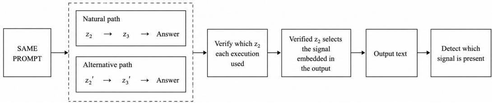

# TOWARDS COMPUTATIONAL PROVENANCE: CARRYING CAUSAL-STATE EVIDENCE IN GENERATED TEXT

Benjamin Belay∗

## ABSTRACT

A language model’s output does not by itself provide verifiable evidence about the internal computation that produced it. We study computational provenance: whether generated text can carry detectable evidence of which causally relevant internal state occurred. We test a bounded form of this idea in two controlled architectures: a modular feed-forward neural network and a transformer-based model. Both architectures are trained on the same arithmetic task with a mandatory pathway through two discrete intermediate states, allowing different internal paths to produce the same answer. We deliberately switch between these paths, authenticate the state actually used, and let that verified state determine a subtle statistical pattern in the generated text that can later be detected. The feed-forward and transformer systems each passed all 128 matched pairs in both their public and separately sealed protected end-to-end evaluations, with the detector recovering the signal associated with the authenticated internal state. The required causal computation also reproduced across five independently trained feed-forward models and three independently trained transformers. In a separate answer-only transformer experiment, our linear probes did not recover a naturally learned intermediate state. These results provide a controlled proof of concept that information about a verified, causally relevant internal state can be preserved in generated text even when the answer is unchanged.

## 1 INTRODUCTION

Language-model-based AI systems increasingly produce answers, plans, explanations, tool calls, and other generated records used in model evaluation, process supervision, and auditing (Lightman et al., 2023; Bowman et al., 2022), and also play an important role in approaches to scalable oversight (Irving et al., 2018; Burns et al., 2024). These records often assume that a generated artifact bears some meaningful relation to the computation that produced it. Yet two executions can produce the same answer and similarly plausible explanations while reaching that answer through different internal computations (Jain & Wallace, 2019; McGrath et al., 2023): an apparently reasonable explanation does not establish its own causal origin. Chain-of-thought, for example, is generated text rather than a direct observation of the underlying computation, and may omit or rationalise important influences or compress several operations into a simpler account (Turpin et al., 2023; Lanham et al., 2023). Other interpretability methods inspect the model more directly: sparse autoencoders extract interpretable features from internal activations (Huben et al., 2024); Natural Language Autoencoders translate activations into readable descriptions (Fraser-Taliente et al., 2026); and J-space methods identify internal representations that the model is likely to express in its output (Gurnee et al., 2026). These methods can reveal information represented inside the model, but do not by themselves establish authenticated provenance of the particular causal computation that produced an output. This distinction becomes especially important if a model has hidden objectives or behaves strategically, since its stated reasoning may not reveal the internal factors that actually drove its behaviour (Hubinger et al., 2024; Scheurer et al., 2023).

As these systems are applied to tasks that are increasingly difficult for human supervisors to evaluate directly, oversight may require evidence not only that an answer appears acceptable, but that the generated artifact remains connected to the computation that produced it. We ask whether evidence of such differences in internal computation can be preserved in the generated output.

This work asks whether that connection can be made verifiable. Rather than attempting to reconstruct a model’s complete internal reasoning or build a general deception detector, we study a narrower question: can we identify a causally relevant internal state, verify which state occurred, and make that state determine a detectable signal in the model’s generated output? We call this computational provenance. Crucially, we ask whether evidence of different internal states can still be preserved across executions that differ internally but have the same prompt, final answer, semantic content, and sampling randomness. The aim is not to recover the model’s full internal computation from its generated output, but to preserve evidence about a causally relevant part of the computation that occurred. Such a signal could complement interpretability and oversight by distinguishing answer-equivalent executions that followed different internal paths but would otherwise appear the same to an evaluator.

We study this question using two purpose-built models trained on the same arithmetic task: a small modular feed-forward neural network and a transformer-based model. In both constructions, every answer must pass through two discrete intermediate states, $z _ { 2 }$ and $z _ { 3 }$ . We run the same prompt twice—once naturally and once after replacing $z _ { 2 } - - \mathrm { s o }$ that the executions return the same final answer through different internal paths. After verifying which state each execution used, that state determines a statistical pattern during text generation, and a detector tests which of the possible state patterns is present in the resulting output. In both architectures, we use the same process to authenticate the state, carry its statistical pattern into the text, and detect that pattern in the output. Neither construction is intended to reproduce the scale or open-ended behaviour of a modern language model; they provide controlled settings in which an internal path can be changed and its downstream effects measured directly. Figure 1 summarises this pipeline.

  
Figure 1: Overview of the experimental construction, implemented with both feed-forward and transformer state modules. Two executions produce the same answer through different internal paths. The verified intermediate state selects a statistical signal during text generation, and detecting that signal provides evidence of which state occurred.

In the feed-forward construction, the fixed training procedure reproduced the required causal pathway across five fresh models. A separately trained model then achieved 128/128 on both public and protected end-to-end evaluations. We next replaced the feed-forward state modules with two transformer encoders while keeping the discrete pathway and provenance mechanism fixed. The transformer pathway reproduced across three fresh models, and a separately reserved transformer likewise achieved 128/128 publicly and 128/128 on a prospectively sealed protected set, without recalibrating the text signal or detector. We also tested a natural-state setting in which three additional transformers were trained only to produce the final answer, without supervision for $z _ { 2 } \mathrm { o r } z _ { 3 }$ . Although all three learned the task perfectly, frozen linear probes did not recover a qualifying intermediate state in the designated development model, so causal intervention and provenance testing were not attempted in the natural-state setting. Together, these results establish a controlled proof of concept for computational provenance: a verified, causally relevant internal state can determine a detectable pattern in generated text, even when the final answer is unchanged. Finding suitable internal states in larger language models remains an open problem.

## 2 RELATED WORK

Existing work provides ways to study internal model states, verify aspects of model execution, and place detectable signals in generated text. What remains less explored is whether the generated output can preserve evidence about the model’s own internal computation.

One way to make a model’s internal computation easier to study is to require it to pass through intermediate states with predefined meanings before producing its final answer. Concept bottleneck models use this structure so that researchers can inspect these states, intervene on them, and measure how they affect the model’s behaviour (Koh et al., 2020; Shin et al., 2023). Causal-abstraction methods address a related question: whether these internal states actually have the causal role we think they do. If a state is changed, does the model’s later computation change in the corresponding expected way? (Geiger et al., 2021; 2022). Together, these approaches provide ways to define meaningful internal states and test whether the model actually uses them. We build on this idea and ask a further question: once a causally relevant state has been identified, can evidence of which state occurred be carried beyond the internal computation into the model’s generated output?

A separate line of work verifies the origin or execution of model outputs. SafetyNets provides mathematical proofs that outsourced neural-network inference was computed correctly, while Slalom uses trusted hardware to verify neural-network operations delegated to an untrusted processor (Ghodsi et al., 2017; Tramer & Boneh, 2019). SVIP tests whether a remote provider used the claimed language\` model, using processed hidden representations as model-specific evidence (Sun et al., 2025). C2PA binds signed claims about the origin and editing history of digital content, while AEX binds an API request to its response and subsequent transformations (Coalition for Content Provenance and Authenticity, 2025; Guan, 2026). These approaches verify the model, execution, or history associated with an output, but they do not distinguish executions that use the same model and produce the same answer while following different causally relevant internal paths. We address this complementary question by verifying which internal state occurred, showing that it affected the later computation, and preserving a detectable signal of that state in the generated text.

Text watermarking places detectable statistical signals in generated language by slightly biasing token choices according to a secret key (Kirchenbauer et al., 2023; Kuditipudi et al., 2024). SynthID-Text uses this general approach to identify model-generated text (Dathathri et al., 2024). More recent methods condition watermarking on model-associated information: ReasonMark uses written reason ing (Liu et al., 2026), SAEMark uses learned model features (Yu et al., 2025), SLAM manipulates model features to induce a chosen watermark (Harel-Canada & Sahai, 2026), and BiCoT introduces an ownership signal during reasoning (Lu et al., 2026). Our aim is different: rather than using model-associated information to support generation identification or ownership, we use a verified causally relevant state to determine the signal itself, so that the output preserves evidence of which state occurred even when the final answer is unchanged.

## 3 CONSTRUCTION

To study how a model’s internal computation can be linked to generated text, we implement the same controlled arithmetic pathway in two model architectures: a modular feed-forward network and a transformer-based model. In each case, interventions test whether the intermediate states affect later computation; cryptographic records authenticate which states were used; and the verified state determines a statistical pattern carried into generated text, which a detector then tests for in the final output.

## 3.1 A MANDATORY DISCRETE-STATE PATHWAY

We use a small arithmetic task that exploits modular arithmetic to allow two different internal state paths to produce the same final answer. The task takes an input prompt of four numbers, $x = ( a , b , c , d )$ , each between 0 and 15, with the model trained across many such prompts, of different values of $a , b , c ,$ , and d. For each prompt, the target computation is

$$
z _ { 1 } = ( a + b ) \bmod { 1 6 } , \qquad z _ { 2 } = ( z _ { 1 } + c ) \bmod { 1 6 } , \qquad z _ { 3 } = ( 5 z _ { 2 } + d ) \bmod { 1 6 } .\tag{1}
$$

The models then produce the final answer

$$
y = z _ { 3 } \ { \mathrm { m o d } } \ 8 ,
$$

giving the learned pathway

$$
\mathrm { p r o m p t } \ : x \longrightarrow z _ { 2 } \longrightarrow z _ { 3 } \longrightarrow y .
$$

Both architectures are built so that the computation must pass through two explicit, discrete states, $z _ { 2 }$ and $z _ { 3 }$ . The module that produces $z _ { 3 }$ receives only $z _ { 2 }$ and $d ,$ not the earlier inputs $a , b , \operatorname { o r } c ,$ and the answer module receives only $z _ { 3 }$ . There is therefore no route around either state. The auxiliary value $z _ { 1 }$ is used only to define $z _ { 2 }$ and is not itself a model state.

The final modulo-8 operation is crucial to the experiment because it allows two different internal paths to produce exactly the same answer. Values of $z _ { 3 }$ that differ by 8 map to the same value of $y ;$ for example:

$$
5 { \mathrm { ~ m o d ~ } } 8 = 1 3 { \mathrm { ~ m o d ~ } } 8 = 5 .
$$

We therefore use values 0–15 and modulo 16 so that every internal state has a corresponding state 8 values away. To create the matched executions used in the experiment, we run each prompt twice. First, the model runs normally and produces its natural value of $z _ { 2 }$ . We then run the same prompt again, but replace that value with

$$
z _ { 2 } ^ { \prime } = ( z _ { 2 } + 8 ) \ { \bmod { \ } } 1 6 .\tag{2}
$$

The calculation of $z _ { 3 }$ is designed so that this change in $z _ { 2 }$ carries forward to the next internal state. In particular, adding 8 to $z _ { 2 }$ also adds $^ 8$ to $z _ { 3 }$ modulo 16:

$$
z _ { 3 } ^ { \prime } = \left( 5 z _ { 2 } ^ { \prime } + d \right) { \bmod { 1 6 } }\tag{3}
$$

$$
= ( z _ { 3 } + 8 ) \ { \bmod { \ } } 1 6 .\tag{4}
$$

Thus the intervention changes both $z _ { 2 }$ and $z _ { 3 } ,$ while the final modulo-8 step removes that difference:

$$
z _ { 3 } ^ { \prime } \mathrm { m o d } 8 = z _ { 3 } \mathrm { m o d } 8 .
$$

The two executions therefore follow different internal paths but still produce the same observed answer.

For example, consider the prompt $\boldsymbol { x } = ( 1 , 1 , 2 , 1 )$ . Its natural execution gives

$$
z _ { 1 } = 2 , \qquad z _ { 2 } = 4 , \qquad z _ { 3 } = 5 , \qquad y = 5 .
$$

The alias intervention replaces $z _ { 2 } = 4$ with $z _ { 2 } ^ { \prime } = 1 2 .$ The model’s downstream transition then gives $z _ { 3 } ^ { \prime } = 1 3$ , but the answer remains 5:

natural:

$$
z _ { 2 } = 4 \longrightarrow z _ { 3 } = 5 \longrightarrow 5 \bmod 8 = 5 ,
$$

alias-intervened:

$$
z _ { 2 } ^ { \prime } = 1 2 \longrightarrow z _ { 3 } ^ { \prime } = 1 3 \longrightarrow 1 3 \bmod 8 = 5 .
$$

The two executions therefore receive the same prompt and return the same answer, but pass through different $z _ { 2 }  z _ { 3 }$ states.

The arithmetic specifies the intended relationship between the states, but the provenance claim also requires $z _ { 2 }$ to affect the model’s later computation. We therefore intervene on $z _ { 2 }$ and test whether $z _ { 3 }$ changes as predicted. The feed-forward construction uses separate multilayer modules for the two states, while the transformer construction replaces them with separate transformer encoders. In both cases, only the selected 16-way $z _ { 2 }$ state passes to the second stage, and only the discrete $z _ { 3 }$ state is used to produce the final answer. This preserves the same causal interface across both architectures.

## 3.2 RECORDING AND VERIFYING THE INTERNAL STATE

To distinguish which internal path the model actually took, we record and verify the intermediate states used during each execution. Trusted instrumentation observes $z _ { 2 }$ and $z _ { 3 }$ at the points where they are used in the model’s computation and records those events directly.

Each recorded state is stored in a small cryptographically protected record, which we call a receipt. Each receipt contains the recorded state and a message authentication code computed with a secret key, allowing the verifier to detect alteration or fabrication.

We use two kinds of state evidence. An exact receipt identifies the particular intermediate-state event from one execution. An abstract receipt records the corresponding state value, such as $z _ { 2 } = 4 .$ , which is the identity used to select the later state-specific statistical signal. Thus different executions that genuinely use the same $z _ { 2 }$ value select the same signal, while executions that use different $z _ { 2 }$ values select different signals. We also record the $z _ { 2 }  z _ { 3 }  y$ sequence so that the verifier can check which internal path was taken and whether it is consistent with the model’s computation.

Only after these checks succeed is the authenticated value of $z _ { 2 }$ allowed to determine the statistical signal used during text generation. The resulting signal is therefore tied to a state that was actually observed during the model’s computation, rather than to a value chosen afterwards.

We assume that the instrumentation, verifier, and cryptographic keys have not been compromised;   
this trust assumption and its implications are discussed in Section 6.2.

## 3.3 CARRYING THE INTERNAL STATE INTO GENERATED TEXT

After the receipts have established which value of $z _ { 2 }$ the model actually used, we ask whether evidence of that internal state can be causally carried into the model’s generated text. Where the arithmetic task provides the controlled internal computation, the text provides an observable output in which that computation can leave a detectable trace. We therefore generate text with fixed meaning but allow several words in a fixed-length output sentence to vary between equivalent alternatives. This allows different internal states to leave different statistical patterns in the wording without changing what the text reports.

For the output, we construct a short textual report accompanying the computation. Its numerical content is fixed; only some of the surrounding words are allowed to vary. We introduce six variable word positions in each sentence so that the verified internal state can influence several small wording choices rather than being represented by a single word. Each sentence follows the same template:

[Group 1] the [Group 2] [Group 3] [Group 4] [Group 5] [field] is [value] [Group 6].

Each group contains eight permitted alternatives. For example, Group 1 may contain

{Here, Now, Presently, Directly, Briefly, Simply, Accordingly, Formally}.

For each verified value of $z _ { 2 }$ , four of the eight alternatives in every group are designated as favoured and the other four as unfavoured. The favoured alternatives are made slightly more likely to be chosen. Different values of $z _ { 2 }$ favour different subsets of words, rather than $z _ { 2 }$ directly selecting a particular word.

This is how the two answer-equivalent internal paths can produce different wording patterns even though they report the same result. For example, suppose the natural execution uses $z _ { 2 } = 4$ and the alternative execution uses $z _ { 2 } ^ { \prime } = 1 2$ , while both produce the same final answer $y = 5$ . Possible outputs include:

$z _ { 2 } = 4$ : “Here the calculation explicitly shows that answer is 5 therefore.”

$z _ { 2 } ^ { \prime } = 1 2$ : “Now the derivation precisely reports namely answer is 5 thus.”

The complete text contains four short statements labelled $z _ { 1 } , z _ { 2 } , z _ { 3 } ,$ , and $y ,$ whose numerical content is fixed across matched executions; the receipts separately record the authenticated states. Each statement has six variable word positions, giving 24 word choices in total. The small preference for favoured words can therefore accumulate across the text into a statistical pattern associated with the verified value of $z _ { 2 }$

To isolate the effect of the internal state, the natural and alternative executions use the same random draw at each corresponding word position. Any resulting difference in wording therefore comes from the state-dependent preferences rather than different sampling randomness.

The detector then compares the 24 observed word choices with the patterns associated with each of the 16 possible values of $z _ { 2 }$ . It uses a fixed statistical scoring rule, rather than a trained classifier, and gives higher scores when more of the observed words match those favoured by a candidate state. The detector accepts a state only when its score exceeds a threshold fixed on separate calibration data and is higher than the scores for all other candidate states. Detection therefore identifies which state-specific wording pattern is present while the meaning of the generated text remains unchanged. Details of the scoring rule, normalisation, sampling procedure, word groups and values, and calibra tion are given in Appendix B.2.

## 4 EXPERIMENTAL DESIGN

We evaluate three parts of the system: whether the model uses the intermediate state causally, whether that state can be verified, and whether the associated signal can be recovered from the generated text. We first test each part separately, then evaluate the complete pipeline on public and protected data.

## 4.1 MODELS AND CAUSAL TESTS

The feed-forward model has 12,648 parameters. A 128-unit hidden layer produces the 16-way state $z _ { 2 } ,$ , a 64-unit hidden layer produces the 16-way state $z _ { 3 } ,$ , and a final linear layer maps $z _ { 3 }$ to one of eight answers. Five independently initialised models are trained for 5,000 steps and evaluated at the fixed step-5,000 checkpoint. The engineered transformer has 546,088 parameters and uses two separate two-layer transformer encoders. Each encoder has width 128, four attention heads, and a 256-unit feed-forward block. The first encoder receives tokens for a, b, and c and produces the 16-way state $z _ { 2 }$ The second receives only that state and $d$ and produces the state $z _ { 3 } ;$ the final layer receives only $z _ { 3 }$ Three independently initialised transformers are trained for 12,000 steps and evaluated at the fixed step-12,000 checkpoint. The models are supervised on $z _ { 2 } , z _ { 3 }$ , and the answer, as in the feed-forward construction.

We first measure whether each model computes the correct $z _ { 2 } , z _ { 3 }$ , and answer on 4,096 held-out inputs, and then intervene on its internal states. The main intervention replaces $z _ { 2 }$ with $( z _ { 2 } + 8 )$ mod 16, which should change $z _ { 3 }$ while preserving the answer, and we also test an answer-changing intervention together with same-state, wrong-state, sham, and direct- $z _ { 3 }$ controls. These tests determine whether later computation responds to the value of the consumed state rather than simply to the act of intervention. Additional training details are given in Appendix A.5.

## 4.2 STATE VERIFICATION AND SIGNAL DETECTION

Trusted instrumentation records the $z _ { 2 }$ and $z _ { 3 }$ values used during an execution, and the resulting records are authenticated using keyed hashes (HMACs)1. This allows the verifier to check which states occurred, the execution they belong to, and the order in which they were used, and we test this mechanism using valid records together with altered, replayed, reordered, mismatched, and missing records.

Once $z _ { 2 }$ has been verified, its value determines which statistical signal is used during text generation. Each execution produces eight reports. The fixed detector combines the evidence across them and scores the patterns associated with all 16 possible values of $z _ { 2 }$ . It identifies a state only when its score exceeds a threshold set using separate calibration data and is higher than every competing score.

Both architectures use the same 16 state-specific patterns, number of reports, scoring rule, and thresholds. Only the model and checkpoint identities recorded in the receipts change; the text signal and detector are not recalibrated.

## 4.3 END-TO-END EVALUATION

The main comparison uses a natural and an alternative execution of the same prompt:

$$
z _ { 2 }  z _ { 3 }  y , \qquad z _ { 2 } ^ { \prime }  z _ { 3 } ^ { \prime }  y .
$$

The two executions follow different internal paths while keeping the prompt, final answer, semantic content, generation settings, and position-indexed sampling draws fixed. We then test whether changing the verified value of $z _ { 2 }$ produces the corresponding change in the statistical signal detected in the generated text. A pair is counted as successful only when both executions follow the expected computation, their receipts verify correctly, and the detector identifies the signal associated with the verified state. We also include controls in which no signal is added, a signal from another state is used, or the receipt evidence is invalid.

Table 1: Causal robustness and end-to-end provenance in the two engineered architectures. The robustness and provenance rows use separate models.
<table><tr><td>Architecture</td><td>Evaluation</td></tr><tr><td>Feed-forward</td><td>Causal robustness across independent models</td></tr><tr><td>Transformer</td><td>Causal robustness across independent models</td></tr><tr><td>Feed-forward</td><td>Public / protected end-to-end provenance</td></tr><tr><td>Transformer</td><td>Public / protected end-to-end provenance</td></tr><tr><td>Answer-only transformer</td><td>Task competence / qualifying probed sites</td></tr></table>

For each architecture, we train one further model using its fixed training procedure and reserve a protected set of 128 matched pairs before training. The model is first required to pass the public computation and causal tests, followed by the public end-to-end evaluation on 128 matched pairs. It is then evaluated once on the sealed protected set, with the model, generator, detector, thresholds, and receipt rules kept unchanged throughout.

## 4.4 ANSWER-ONLY STATE LOCALISATION

Separately from the engineered transformer, we ask whether a similar internal state emerges naturally in a transformer that is trained only to produce the correct answer, without being explicitly taught the intermediate states $z _ { 2 }$ and $z _ { 3 }$ . We train three four-layer, 540,808-parameter transformers with width 128, four attention heads, and 256-unit feed-forward blocks. After confirming task performance, we extract residual-stream activations from 20 fixed combinations of layer and token position in one designated development model and train frozen linear probes on those activations. We test whether they encode the full 16-way $z _ { 2 }$ state, the part of $z _ { 2 }$ needed to determine the final answer, and the remaining distinction between answer-equivalent states such as $z _ { 2 }$ and $( z _ { 2 } + 8 )$ mod 16. The other two models are used for replication only if the development model satisfies the predefined probe-performance criteria.

## 5 RESULTS

Both engineered architectures passed their final evaluations. The required causal pathway reproduced across all five feed-forward models and all three transformer models. A separately trained model of each architecture then passed its public computation and causal tests before achieving 128/128 on both its public and protected end-to-end evaluations. Table 1 summarises the main results.

## 5.1 CAUSAL PATHWAY AND COMPONENT TESTS

Across both architectures, the answer-preserving intervention changed $z _ { 3 }$ without changing the final answer, whereas the answer-changing intervention produced the predicted different answer. Samestate, wrong-state, sham, and $\mathrm { d i r e c t - } z _ { 3 }$ controls also behaved as expected. A separately reserved model of each architecture then passed all 4,096 public computation cases and all 28,672 causal cases before entering the provenance evaluation.

The receipt and text-signal components were validated before integration. Valid records authenticated the consumed states and their order, while altered, replayed, reordered, mismatched, and missing records produced their expected outcomes. The detector operating point was fixed at $T = 4 . { \overset { \cdot } { 0 } } 4 1 4 5 1$ 1884327381 and $M = 0$ before the end-to-end evaluations and was unchanged for both architectures. Sample sizes and outcomes for each component are reported in Appendix Table 2.

## 5.2 END-TO-END PROVENANCE

The designated feed-forward model achieved 128/128 on its public evaluation and 128/128 on its separately sealed protected evaluation. In every successful pair, the natural and alternative executions followed different $z _ { 2 }  z _ { 3 }$ paths while preserving the prompt, final answer, semantic content, and position-indexed sampling draws. The detected signal changed with the authenticated value of $z _ { 2 }$

The same provenance mechanism was then transferred to the engineered transformer. Its separately designated model also achieved 128/128 publicly and 128/128 on a protected set sealed before training. The transformer used the same 16 authorities, text generator, detector, output count, and calibrated thresholds as the feed-forward construction. Across the transformer’s public and protected evaluations, there were no wrong-state confusions, no detections in the no-signal controls, and no failed receipt or registered integrity checks.

Appendix B.4 shows a paired output example. Both executions produce answer $^ { 6 , }$ while the authenticated state changes from $z _ { 2 } = 2 \tan z _ { 2 } = 1 0$ and the detected wording pattern changes accordingly.

## 5.3 ANSWER-ONLY STATE LOCALISATION

The three fresh answer-only transformers each achieved 100% overall, minimum-class, and minimumtemplate accuracy. In the designated development model, however, no frozen linear probe met the recovery criteria at any of the 20 predefined token-level residual sites. The best accuracy was 23.80% for the full 16-way $z _ { 2 }$ value and 45.54% for $z _ { 2 }$ mod 8.

Because no site qualified, we did not proceed to causal intervention, examine the two reserved models, or attach the provenance mechanism. This is a bounded negative result for the tested model, locations, and linear probe family. It does not show that the relevant information is absent or that natural computational provenance cannot exist.

## 6 DISCUSSION

The experiments show that computational provenance can operate in two controlled learned architectures. In both a modular feed-forward neural network and a transformer-based model, different internal paths could produce the same answer while leaving different detectable patterns in the generated text.

## 6.1 WHAT THE RESULT ESTABLISHES

The causal pathway reproduced across five feed-forward models and three transformers, and separately designated models of both architectures passed all public and protected end-to-end evaluations. The transformer also reused the same calibrated signal and detector, showing that the provenance mechanism was not specific to the original feed-forward construction.

The result depends on combining three forms of evidence. Intervention tests show that the recorded state participates in the computation rather than acting as an unrelated label; authenticated receipts establish which state was actually observed during a particular execution; and the statistical signal preserves evidence of that verified state in the generated output. A receipt or watermark alone would not provide this connection between causal internal computation and observable text.

This suggests the possibility of a new verification framework for larger models. Methods such as sparse autoencoders and Natural Language Autoencoders can identify or describe candidate features in model activations, but computational provenance adds a further question: did a particular state actually affect the computation that produced this output? Candidate states could first be tested through causal intervention, then authenticated when they occur, and finally linked to a detectable signal carried by an observable part of the model’s behaviour, such as an intermediate reasoning trace or final output. The detector would therefore check evidence associated with verified internal computation rather than rely only on the model’s own explanation of its reasoning.

Such a system could complement interpretability and scalable oversight, particularly when outputs are difficult for human supervisors to evaluate directly. It would not recover a model’s complete reasoning, but could provide verifiable evidence that selected causally relevant parts of its internal computation were connected to an observable output. Extending this from the explicit states studied here to activation-level states in pretrained language models is therefore an important next step.

## 6.2 SCOPE AND LIMITATIONS

The present result remains a proof of concept in a finite arithmetic task with an explicitly constructed discrete pathway. Both architectures are trained to produce z and z , and their structure forces the answer through those states. Although one implementation uses transformer encoders, it is a small purpose-built transformer rather than a pretrained language model. The experiments therefore establish transfer across model architectures, not the natural emergence of provenance-ready states in larger language models.

The text-generation setting is also deliberately constrained. Each report has fixed semantic content and a limited vocabulary of interchangeable words, which allows the statistical pattern to vary while meaning is held constant. Whether the same approach remains effective for unrestricted generation, long-form text, or outputs that are later edited or paraphrased remains to be tested.

The verification system assumes that the instrumentation, verifier, and secret HMAC keys remain trustworthy. The receipt mechanism can detect the alterations tested here, but it cannot protect against compromise of the components that create or verify those records. The statistical signal should therefore not be interpreted as a trust-free or output-only proof that a computation occurred. Where a separate record can be stored, an authenticated sidecar containing the state would provide a simpler and stronger integrity record, while the text signal serves a different purpose by carrying evidence of that state within the generated output itself.

## 6.3 TOWARD PROVENANCE IN PRETRAINED LANGUAGE MODELS

The answer-only transformer experiment illustrates an important boundary of the present construction in a natural-state setting. All three models solved the observable task perfectly, but frozen linear probes did not recover a qualifying z representation at the 20 predefined token-level locations in the designated development model. High answer accuracy therefore did not automatically provide a clear internal state that could be authenticated and carried into the output. This result is deliberately narrow: the relevant information may be distributed, represented nonlinearly, or organised differently from the predefined state.

The next step is therefore not to assume that pretrained language models will naturally expose the same discrete states used here, but to construct provenance-ready states within their activations. This may require learning candidate activation states, validating their causal role through intervention, and testing whether they support the same provenance mechanism without a purpose-built discrete pathway. Further work must also extend the output signal beyond constrained reports to less structured generation, including long-form text, paraphrasing, editing, and different decoding strategies.

## 7 CONCLUSION

We demonstrated computational provenance in two controlled model architectures. In both a modular feed-forward network and an engineered transformer, we changed the internal path while keeping the prompt, final answer, semantic content, and sampling randomness fixed. Authenticated records established which state was used, and generated text carried the corresponding statistical pattern. The required causal pathway reproduced across five feed-forward models and three transformers, while a separately designated model of each architecture achieved 128/128 on both public and separately sealed protected end-to-end evaluations. The transformer reused the same signal and detector, showing that the mechanism transfers across architectures. The result remains a controlled proof of concept with an explicitly constructed internal pathway and constrained text generation, but it establishes a complete link from causal internal computation to authenticated evidence and a detectable signal in generated text. Extending the approach to larger language models will require identifying or constructing states within their activations that affect later computation. Computational provenance could then support scalable oversight by providing independently verifiable evidence about how an output was produced, rather than relying only on the answer or the model’s own explanation.

## REFERENCES

Samuel R. Bowman, Jeeyoon Hyun, Ethan Perez, Edwin Chen, Craig Pettit, Scott Heiner, Kamile˙ Lukosiˇ ut¯ e, Amanda Askell, Andy Jones, Anna Chen, et al. Measuring progress on scalable ˙ oversight for large language models. arXiv preprint arXiv:2211.03540, 2022. doi: 10.48550/arXiv. 2211.03540. URL https://arxiv.org/abs/2211.03540.

Collin Burns, Pavel Izmailov, Jan Hendrik Kirchner, Bowen Baker, Leo Gao, Leopold Aschenbrenner, Yining Chen, Adrien Ecoffet, Manas Joglekar, Jan Leike, Ilya Sutskever, and Jeffrey Wu. Weakto-strong generalization: Eliciting strong capabilities with weak supervision. In Proceedings of the 41st International Conference on Machine Learning, volume 235 of Proceedings of Machine Learning Research, pp. 4971–5012, 2024. URL https://proceedings.mlr.press/ v235/burns24b.html.

Coalition for Content Provenance and Authenticity. C2PA technical specification, version 2.2, 2025. URL https://spec.c2pa.org/specifications/specifications/2.2/ specs/C2PA\_Specification.html.

Sumanth Dathathri, Abigail See, Sumedh Ghaisas, Po-Sen Huang, Rob McAdam, Johannes Welbl, Vandana Bachani, Alex Kaskasoli, Robert Stanforth, Tatiana Matejovicova, Jamie Hayes, Nidhi Vyas, Majd Al Merey, Jonah Brown-Cohen, Rudy Bunel, Borja Balle, Taylan Cemgil, Zahra Ahmed, Kitty Stacpoole, Ilia Shumailov, Ciprian Baetu, Sven Gowal, Demis Hassabis, and Pushmeet Kohli. Scalable watermarking for identifying large language model outputs. Nature, 634: 818–823, 2024. doi: 10.1038/s41586-024-08025-4. URL https://doi.org/10.1038/ s41586-024-08025-4.

Kit Fraser-Taliente, Subhash Kantamneni, Euan Ong, Dan Mossing, Christina Lu, Paul C. Bogdan, Emmanuel Ameisen, James Chen, Dzmitry Kishylau, Adam Pearce, Julius Tarng, Alex Wu, Jeff Wu, Yang Zhang, Daniel M. Ziegler, Evan Hubinger, Joshua Batson, Jack Lindsey, Samuel Zimmerman, and Samuel Marks. Natural language autoencoders produce unsupervised explanations of LLM activations, 2026. URL https://transformer-circuits.pub/2026/nla/. Anthropic Transformer Circuits.

Atticus Geiger, Hanson Lu, Thomas Icard, and Christopher Potts. Causal abstractions of neural networks. In Advances in Neural Information Processing Systems, volume 34, pp. 9574–9586, 2021. URL https://proceedings.neurips.cc/paper/2021/hash/ 4f5c422f4d49a5a807eda27434231040-Abstract.html.

Atticus Geiger, Zhengxuan Wu, Hanson Lu, Joshua Rozner, Elisa Kreiss, Thomas Icard, Noah D. Goodman, and Christopher Potts. Inducing causal structure for interpretable neural networks. In Proceedings of the 39th International Conference on Machine Learning, volume 162 of Proceedings of Machine Learning Research, pp. 7324–7338, 2022. URL https://proceedings. mlr.press/v162/geiger22a.html.

Zahra Ghodsi, Tianyu Gu, and Siddharth Garg. Safetynets: Verifiable execution of deep neural networks on an untrusted cloud. In Advances in Neural Information Processing Systems, volume 30, 2017. URL https://proceedings.neurips.cc/paper/2017/hash/ 6048ff4e8cb07aa60b6777b6f7384d52-Abstract.html.

Yongjie Guan. AEX: Non-intrusive multi-hop attestation and provenance for LLM APIs. arXiv preprint arXiv:2603.14283, 2026. doi: 10.48550/arXiv.2603.14283. URL https://arxiv. org/abs/2603.14283.

Wes Gurnee, Nicholas Sofroniew, Adam Pearce, Mateusz Piotrowski, Isaac Kauvar, Runjin Chen, Anna Soligo, Paul Bogdan, Euan Ong, Rowan Wang, Ben Thompson, David Abrahams, Subhash Kantamneni, Emmanuel Ameisen, Joshua Batson, and Jack Lindsey. Verbalizable representations form a global workspace in language models. arXiv preprint arXiv:2607.15495, 2026. URL https://arxiv.org/abs/2607.15495.

Fabrice Harel-Canada and Amit Sahai. Slam: Structural linguistic activation marking for language models. arXiv preprint arXiv:2605.05443, 2026. doi: 10.48550/arXiv.2605.05443.

Robert Huben, Hoagy Cunningham, Logan Riggs Smith, Aidan Ewart, and Lee Sharkey. Sparse autoencoders find highly interpretable features in language models. In The Twelfth International Conference on Learning Representations, 2024. URL https://openreview.net/forum? id=F76bwRSLeK.

Evan Hubinger, Carson Denison, Jesse Mu, Mike Lambert, Meg Tong, Monte MacDiarmid, Tamera Lanham, et al. Sleeper agents: Training deceptive LLMs that persist through safety training. arXiv preprint arXiv:2401.05566, 2024. doi: 10.48550/arXiv.2401.05566. URL https://arxiv. org/abs/2401.05566.

Geoffrey Irving, Paul Christiano, and Dario Amodei. Ai safety via debate. arXiv preprint arXiv:1805.00899, 2018. doi: 10.48550/arXiv.1805.00899. URL https://arxiv.org/ abs/1805.00899.

Sarthak Jain and Byron C. Wallace. Attention is not explanation. In Proceedings of the 2019 Conference of the North American Chapter of the Association for Computational Linguistics: Human Language Technologies, pp. 3543–3556. Association for Computational Linguistics, 2019. doi: 10.18653/v1/N19-1357. URL https://aclanthology.org/N19-1357/.

John Kirchenbauer, Jonas Geiping, Yuxin Wen, Jonathan Katz, Ian Miers, and Tom Goldstein. A watermark for large language models. In Proceedings of the 40th International Conference on Machine Learning, volume 202 of Proceedings of Machine Learning Research, 2023. URL https://proceedings.mlr.press/v202/kirchenbauer23a.html.

Pang Wei Koh, Thao Nguyen, Yew Siang Tang, Stephen Mussmann, Emma Pierson, Been Kim, and Percy Liang. Concept bottleneck models. In Proceedings ofthe 37th International Conference on Machine Learning, volume 119 of Proceedings ofMachine Learning Research, pp. 5338–5348, 2020. URL https://proceedings.mlr.press/v119/koh20a.html.

Rohith Kuditipudi, John Thickstun, Tatsunori Hashimoto, and Percy Liang. Robust distortion-free watermarks for language models. Transactions on Machine Learning Research, 2024. URL https://openreview.net/forum?id=FpaCL1MO2C.

Tamera Lanham, Anna Chen, Ansh Radhakrishnan, Benoit Steiner, Carson Denison, Danny Hernandez, Dustin Li, Esin Durmus, Evan Hubinger, Jackson Kernion, et al. Measuring faithfulness in chain-of-thought reasoning. arXiv preprint arXiv:2307.13702, 2023. doi: 10.48550/arXiv.2307.13702. URL https://arxiv.org/abs/2307.13702.

Hunter Lightman, Vineet Kosaraju, Yura Burda, Harri Edwards, Bowen Baker, Teddy Lee, Jan Leike, John Schulman, Ilya Sutskever, and Karl Cobbe. Let’s verify step by step. arXiv preprint arXiv:2305.20050, 2023. doi: 10.48550/arXiv.2305.20050. URL https://arxiv.org/abs/ 2305.20050.

Shuliang Liu, Xingyu Li, Hongyi Liu, Yibo Yan, Bingchen Duan, Qi Zheng, Fang Dong, Lingfeng Su, and Xuming Hu. Distilling the thought, watermarking the answer: A principle semantic guided watermark for reasoning large language models. In International Conference on Learning Representations, 2026. URL https://openreview.net/forum?id=T6NVogsXCZ.

Jiacheng Lu, Yiming Li, Tao Song, Weijian Wang, Wenjie Qu, Haibing Guan, and Jiaheng Zhang. Echoes within the reasoning: Stealthy and effective watermarking via chain of thought. In Proceedings ofthe 43rd International Conference on Machine Learning, volume 306 of Proceed ings ofMachine Learning Research, 2026. URL https://openreview.net/forum?id= cTCFYMqulL.

Thomas McGrath, Matthew Rahtz, Janos Kramar, Vladimir Mikulik, and Shane Legg. The hydra effect: Emergent self-repair in language model computations. arXiv preprint arXiv:2307.15771, 2023. doi: 10.48550/arXiv.2307.15771. URL https://arxiv.org/abs/2307.15771.

Jer´ emy Scheurer, Mikita Balesni, and Marius Hobbhahn. Large language models can strategically´ deceive their users when put under pressure. arXiv preprint arXiv:2311.07590, 2023. doi: 10.48550/arXiv.2311.07590. URL https://arxiv.org/abs/2311.07590.

Sungbin Shin, Yohan Jo, Sungsoo Ahn, and Namhoon Lee. A closer look at the intervention procedure of concept bottleneck models. In Proceedings of the 40th International Conference on Machine Learning, volume 202 of Proceedings ofMachine Learning Research, pp. 31504–31520, 2023. URL https://proceedings.mlr.press/v202/shin23a.html.

Yifan Sun, Yuhang Li, Yue Zhang, Yuchen Jin, and Huan Zhang. SVIP: Towards verifiable inference of open-source large language models. In NeurIPS Workshop on Socially Responsible and Trustworthy Foundation Models, 2025. URL https://openreview.net/forum?id=cpZMsDwRie.

Florian Tramer and Dan Boneh. Slalom: Fast, verifiable and private execution of neural networks\` in trusted hardware. In International Conference on Learning Representations, 2019. URL https://openreview.net/forum?id=rJVorjCcKQ.

Miles Turpin, Julian Michael, Ethan Perez, and Samuel R. Bowman. Language models don’t always say what they think: Unfaithful explanations in chain-of-thought prompting. In Advances in Neural Information Processing Systems, volume 36, 2023. URL https://arxiv.org/abs/2305. 04388.

Zhuohao Yu, Xingru Jiang, Weizheng Gu, Yidong Wang, Qingsong Wen, Shikun Zhang, and Wei Ye. SAEMark: Steering personalized multilingual LLM watermarks with sparse autoencoders. In Advances in Neural Information Processing Systems, 2025. URL https://openreview. net/forum?id=tXnyVPNOfa.

## A ADDITIONAL EXPERIMENTAL DETAILS

## A.1 EVALUATION DETAILS

Table 2: Sample sizes and outcomes for the principal evaluation stages.
<table><tr><td>Stage</td><td>Sample size</td><td>Outcome</td></tr><tr><td>Selected feed-forward causal confirmation</td><td>512 examples; 3,584 computation, intervention,</td><td>all seven families passed</td></tr><tr><td>Five-model feed-forward computation study</td><td>and control cases 5 models; 4,096 held-out inputs per model</td><td>5/5 models passed</td></tr><tr><td>Five-model feed-forward causal study</td><td>28,672 intervention and control cases per model</td><td>5/5 models passed</td></tr><tr><td>Receipt confirmation</td><td>512 packages; 2,560 receipts; 9,216 attacks</td><td>all receipt and chain tests passed</td></tr><tr><td>Carrier calibration</td><td>512 closures; 16,384 outputs including registered controls</td><td>fixed T = 4.041451884327381 and M = 0</td></tr><tr><td>Generic carrier validation</td><td>512 closures; 16,384 outputs including registered controls</td><td>met the predefined acceptance criteria</td></tr><tr><td>Designated feed-forward public qualification</td><td>4,096 computation cases; 28,672 causal cases</td><td>all cases passed</td></tr><tr><td>Feed-forward public integration</td><td>128 matched pairs</td><td>128/128 passed</td></tr><tr><td>Feed-forward protected integration Engineered-transformer robustness study</td><td>128 matched pairs 3 models; 4,096 computation</td><td>128/128 passed</td></tr><tr><td></td><td>cases and 28,672 causal cases per model</td><td>3/3 models passed</td></tr><tr><td>Designated-transformer public qualification</td><td>4,096 computation cases; 28,672 causal cases</td><td>all cases passed</td></tr><tr><td>Transformer public integration</td><td>128 matched pairs</td><td>128/128 passed</td></tr><tr><td>Transformer protected integration</td><td>128 matched pairs</td><td>128/128 passed</td></tr></table>

In the selected feed-forward model’s causal confirmation, all 512 natural executions produced the expected $z _ { 2 } , z _ { 3 }$ , and answer. Answer-preserving, same-state, and sham interventions preserved the expected answer, while answer-changing, wrong-state, and direct-z interventions produced their

Table 3: Exact-event evidence is not abstract-state or carrier evidence.
<table><tr><td>Candidate evidence</td><td>Exact</td><td>Abstract</td><td>Carrier claim</td></tr><tr><td>Correct execution and state</td><td>ACCEPT</td><td>ACCEPT</td><td>compatible</td></tr><tr><td>Different execution, same state</td><td>REJECT</td><td>ACCEPT</td><td>compatible</td></tr><tr><td>Different registered state</td><td>REJECT</td><td>REJECT</td><td>incompatible</td></tr><tr><td>Required receipt missing</td><td>ABSTAIN</td><td>ABSTAIN</td><td>none</td></tr><tr><td>Present but invalid receipt</td><td>REJECT</td><td>REJECT</td><td>none</td></tr></table>

predicted changes. After $z _ { 2 }$ was replaced, $z _ { 3 }$ was still calculated by the neural network rather than assigned by the controller.

The later feed-forward robustness study repeated the computation and intervention tests on five freshly trained models. Each model was evaluated on 4,096 held-out inputs and 28,672 causal cases, and all five met the required computation and causal criteria.

## A.2 END-TO-END EVALUATION DETAILS

Each 128-pair end-to-end evaluation contained 256 execution packages—128 natural and 128 alternative—and 1,280 receipts. For each package, the generator produced eight state-conditioned reports and eight reports under each of four control conditions, giving 40 outputs per package and 10,240 outputs in total. A matched pair passed only when both executions followed the expected com putation, their receipts verified, their generated content remained correct, and the detector identified the signal associated with the verified state while rejecting wrong-state and no-signal controls.

The prospective sequencing and outcomes of the feed-forward and transformer protected evaluations are described in Appendix A.7.

## A.3 EXACT AND ABSTRACT PROVENANCE

Exact receipts, abstract receipts, and the statistical signal provide different forms of evidence, summarised in Table 3.

## A.4 TRAINING AND CHANNEL DETAILS

The feed-forward models used AdamW with an initial learning rate of $1 0 ^ { - 3 }$ , 750 warm-up steps, weight decay $1 0 ^ { - 4 }$ , batch size 256, and gradient clipping at 1.0. The learning-rate schedule was defined over a maximum of 10,000 steps. For the five-model feed-forward robustness study and the final feed-forward evaluation, the evaluated checkpoint was fixed at step 5,000 for every model; no checkpoint was selected separately for an individual seed. The engineered transformers were trained separately for 12,000 steps and evaluated only at the fixed step-12,000 checkpoint.

The constrained neural text generator, which supplies the base word probabilities before the statedependent bias is applied, used AdamW with learning rate 0.003, weight decay $1 0 ^ { - 4 }$ , batch size 64, ten epochs, and seed 817331. Its data contained 320 training, 96 calibration, and 96 untouched channel-qualification semantic objects, each with eight variants.

## A.5 ENGINEERED TRANSFORMER CONSTRUCTION

The engineered transformer contains two separate two-layer transformer encoders and 546,088 parameters. Each encoder uses width 128, four attention heads, a 256-unit feed-forward block, GELU activations, pre-layer normalisation, learned position embeddings, and no dropout.

The first encoder receives four tokens representing a learned classification token and the fields $a , b ,$ and c. Its highest-scoring output is selected as one of 16 discrete $z _ { 2 }$ values. The second encoder receives a new classification token, the selected $z _ { 2 }$ value, and $d ,$ and similarly selects one of 16 discrete $z _ { 3 }$ values. The answer head receives only the selected $z _ { 3 }$ value. Parameters and residual streams are not shared between the two transformer stages.

Three fixed robustness seeds were trained for 12,000 steps; all three passed 4,096 computation cases and 28,672 causal cases per model. A fourth, prospectively designated transformer was then trained once under the same recipe. It passed the same public computation and causal evaluations before achieving 128/128 public and 128/128 protected end-to-end provenance results. The protected population was selected and sealed before claim-bearing training.

The transformer used the previously calibrated carrier unchanged: $T = 4 . 0 4 1 4 5 1 8 8 4 3 2 7 3 8 1 , M = 0 .$ 16 candidate authorities, eight reports per execution, 49 indexed draws per report, and 24 eligible word positions. Receipt fields identifying the model and checkpoint were updated to bind the new architecture, but the receipt semantics, carrier, detector, and attack families were unchanged.

## A.6 ANSWER-ONLY STATE LOCALISATION

To test whether the predefined intermediate state could be recovered without direct intermediate supervision, we trained three 540,808-parameter, four-layer transformers using final-answer crossentropy only. Each model used width 128, four attention heads, and 256-unit feed-forward blocks. All three achieved 100% overall, minimum answer-class, and minimum template accuracy on the frozen 4,096-row held-out split.

Seed 772101 was designated for representation analysis. Linear logistic probes were fitted on 6,144 examples and evaluated on a disjoint 3,072-example split. We tested five token positions after each of four transformer layers, giving 20 predefined residual-stream locations. The probe targets included full $z _ { 2 } , z _ { 2 }$ mod 8, the within-answer state distinction, $z _ { 3 } ,$ , and the answer.

The best $\mathrm { f u l l } { - } z _ { 2 }$ accuracy was 23.80%, and the best $z _ { 2 }$ mod 8 accuracy was 45.54%. Both exceeded their corresponding uniform-chance levels of 6.25% and 12.5%, but remained well below the predefined recovery criteria. The best within-answer state balanced accuracy was 50.39%, close to binary chance, and no location met all qualification criteria. We therefore did not perform causal patching, examine the two reserved models, or run the provenance mechanism. This result is limited to one development model, frozen linear probes, and the predefined token-level sites.

Table 4: Task performance and state localisation in the answer-only transformer experiment.
<table><tr><td>Target</td><td>Metric</td><td>Best result</td><td>Criterion</td></tr><tr><td>Model competence</td><td>held-out task accuracy</td><td>100%</td><td>≥ 95%</td></tr><tr><td>Full state</td><td>16-way z2 accuracy</td><td>23.80%</td><td>≥ 70%*</td></tr><tr><td>Answer-relevant component</td><td>8-way z2 mod 8 accuracy</td><td>45.54%</td><td>V 90%*</td></tr><tr><td>Within-pair distinction</td><td>balanced accuracy</td><td>50.39%</td><td>&gt; 75%*</td></tr><tr><td>Qualifying sites</td><td>frozen 20-site family</td><td>0/20</td><td>≥ 1 site meeting all criteria</td></tr></table>

\* Qualification also required the registered macro-F1 and minimum-class thresholds. Full-state qualification additionally required the answer-relevant and within-answer state criteria.

## A.7 PROTECTED EVALUATIONS

A fresh feed-forward model was trained using the fixed 5,000-step procedure, with a new 128-pair protected set selected and sealed before training. After passing the public computation, causal, and end-to-end evaluations, the model was evaluated once on the protected set and passed all 128 pairs.

The engineered transformer was evaluated under the same prospective sequence. Its protected set was sealed before claim-bearing training, and it was released only after the model passed the public computation, causal, and end-to-end tests. The transformer also passed all 128 protected pairs using the unchanged text signal and detector. Across both protected evaluations, there were no wrong-state confusions, no detections in the no-signal controls, and no failed receipt or integrity checks.

In the transformer evaluation, a post-execution evaluator-label mismatch interrupted the initial adjudication. The primitive evidence had already been committed before the keys were revealed. Adding the missing positive terminal for the answer-preserving intervention changed only the evaluator label: no model execution, output, receipt, key, threshold, or scientific criterion changed. Production and independent reconstruction then agreed exactly on the unchanged evidence.

## A.8 THREAT-MODEL MATRIX

Table 5: Trust assumptions and attacks considered in our evaluation.
<table><tr><td>Component</td><td>Evaluated assumption</td><td>Outside our evaluation</td></tr><tr><td>Model/instrumentation</td><td>fixed checkpoint; explicit discrete-state pathway</td><td>malicious or uninstrumented computation</td></tr><tr><td>Receipt system</td><td>HMAC integrity; frozen mutation/replay suite</td><td>malicious issuer, public verification, key compromise</td></tr><tr><td>Controller/verifier</td><td>correct verification-before-authority ordering</td><td>compromised verifier or arbitrary authority selection</td></tr><tr><td>Surface carrier</td><td>fixed grammar and frozen operating point</td><td>editing, paraphrase, copy, collusion, open-ended language</td></tr></table>

## B ADDITIONAL CONSTRUCTION AND EVALUATION DETAILS

## B.1 MODEL ARCHITECTURE

Table 6: Selected Model 1 architecture and trainable parameter count.
<table><tr><td>Component</td><td>Input and output</td><td>Form</td><td>Parameters</td></tr><tr><td>Four embeddings</td><td>four 16-way inputs</td><td> $1 6 \times 1 6 \mathrm { e a c h }$ </td><td>1,024</td></tr><tr><td>Z2 module</td><td>three embeddings → 16 categories</td><td> $4 8 \to 1 2 8 \to 1 6 , { \mathrm { G E L U } }$ </td><td>8,336</td></tr><tr><td> $z _ { 3 }$  module</td><td>hard  $z _ { 2 }$  and d → 16 categories </td><td> $\mathrm { 3 2 }  \mathrm { 6 4 }  \mathrm { 1 6 , G E L U }$ </td><td>3,152</td></tr><tr><td>Answer head</td><td>hard  $z _ { 3 }  8$  answers</td><td> $1 6  8$ </td><td>136</td></tr><tr><td>Total</td><td></td><td></td><td>12,648</td></tr></table>

The $z _ { 2 }$ and $z _ { 3 }$ modules make a single discrete selection using straight-through argmax; ties are resolved by choosing the lowest-indexed value. The $z _ { 3 }$ module receives $z _ { 2 }$ and $d ,$ but not a, b, or c, and the answer head receives only $z _ { 3 }$ . This preserves the mandatory $z _ { 2 }  z _ { 3 }  y$ pathway described in Section 3.1.

## B.2 DETECTOR CALIBRATION

The detector threshold was fixed using separate calibration data before the public end-to-end evaluation. Calibration used 512 closures and 16,384 generated outputs. For each closure, we recorded the largest detector score observed when no state-specific signal was present. The largest of these values, T = 4.041451884327381, became the detection threshold, with later outputs required to exceed it strictly.

We also measured the strongest score assigned to an incorrect state. The largest calibrated confusion margin was below zero, so the required separation margin was fixed at $M = 0$ . A detected state must therefore rank uniquely first, exceed the threshold T, and score strictly above every competing state.

Because each threshold is set from the maximum of 512 calibration examples, an exchangeable future null example exceeds that maximum with probability at most 1/513. Applying this argument separately to no-signal detections and wrong-state confusions gives a combined bound of $2 / 5 1 3 \approx$ 0.0039. This is a finite-sample calibration guarantee for the registered evaluation setting, not a universal false-positive rate.

## B.3 REGISTERED SURFACE VOCABULARY

The text generator uses six groups of interchangeable words. Each eligible position permits the eight alternatives from one group:

Table 7: Permitted alternatives at the variable wording positions.
<table><tr><td>Group</td><td>Role</td><td>Permitted alternatives</td></tr><tr><td>1</td><td>Opening</td><td>Here, Now, Presently, Directly, Briefly, Simply, Accordingly, For- mally</td></tr><tr><td>2</td><td>Source</td><td>record, calculation, derivation, account, summary, analysis, result, trace</td></tr><tr><td>3</td><td>Modifier</td><td>plainly, explicitly, carefully, concisely, firmly, notably, precisely, transparently</td></tr><tr><td>4</td><td>Reporting verb</td><td>shows, states, gives, reports, records, yields, lists, presents</td></tr><tr><td>5</td><td>Relation</td><td>that, how, namely, specifically, directly-as, in-form, as-value, with- value</td></tr><tr><td>6</td><td>Closing</td><td>indeed, therefore, accordingly, thus, thereby, consistently, exactly, formally-so</td></tr></table>

The generator may also use one of the following optional phrases, or omit the phrase entirely:

{Additionally-noted, Separately-recorded, Explicitly-retained,

Carefully-preserved, Directly-confirmed, Formally-listed,

Briefly-restated, Transparently-given}.

For each eligible position and verified state, four of the eight alternatives are treated as favoured. This state-dependent subset is derived cryptographically rather than assigning a fixed word to each state. Individual words therefore do not identify the state; the detector uses the pattern accumulated across the complete report.

## B.4 EXAMPLE MATCHED OUTPUT PAIR

Section 5 refers to the following matched example from the original public evaluation. It was selected deterministically as the first example under that evaluation’s registered ordering. The outputs are reproduced verbatim from the evaluation. The numerical fields printed under the labels $z _ { 1 } , z _ { 2 }$ , and $z _ { 3 }$ are fixed report content and are not the authenticated internal states used by the provenance mechanism. The authenticated states are established separately by the verified receipts and are stated in the headings below. The full texts are:

Natural execution (authenticated $z _ { 2 } ~ = ~ 2 , ~ z _ { 3 } ~ = ~ 6 , ~ y ~ = ~ 6 ) \colon$ “Formally the record transparently shows with-value z1 is 7 thus. Separately-recorded Formally the derivation plainly records as-value $_ { z 2 }$ is 4 indeed. Directly-confirmed Here the account firmly gives that z3 is 6 exactly. Transparently-given Accordingly the analysis plainly reports that answer is 6 consistently. Explicitly-retained”

Alternative execution (authenticated $z _ { 2 } ^ { \prime } = 1 0 , z _ { 3 } ^ { \prime } = 1 4 , y = 6 ) \colon$ “Formally the record transparently shows with-value z1 is 7 accordingly. Separately-recorded Formally the calculation explicitly records in-form $_ { z 2 }$ is 4 thus. Directly-confirmed Now the summary firmly states that ${ \bf z } 3$ is 6 thereby. Transparently-given Simply the analysis plainly states namely answer is 6 thus. Explicitly-retained”

The two outputs report the same fixed content, but their authenticated internal states differ: the natural execution uses $z _ { 2 } = 2  z _ { 3 } = 6$ , whereas the alternative execution uses $z _ { 2 } ^ { \prime } = 1 0  z _ { 3 } ^ { \prime } = 1 4$ . This change in the authenticated z2 value determines a different state-specific generation pattern. With the underlying sampling randomness paired across the two executions, the resulting differences in wording therefore reflect the change in internal state rather than a change in reported content.