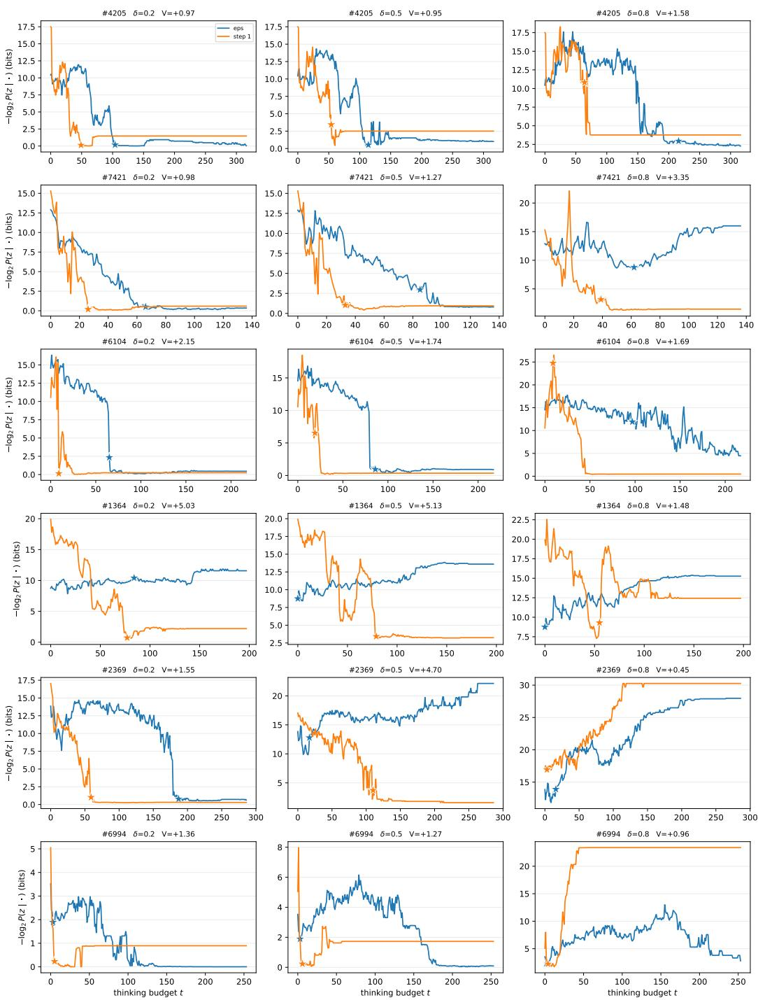
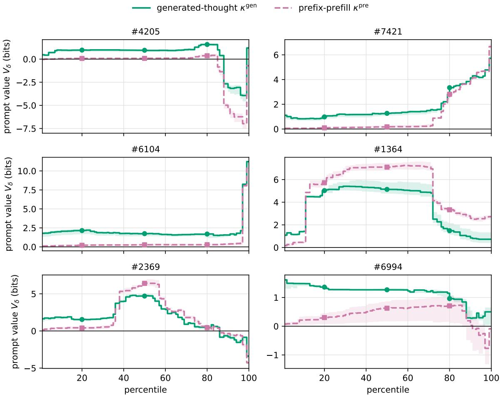
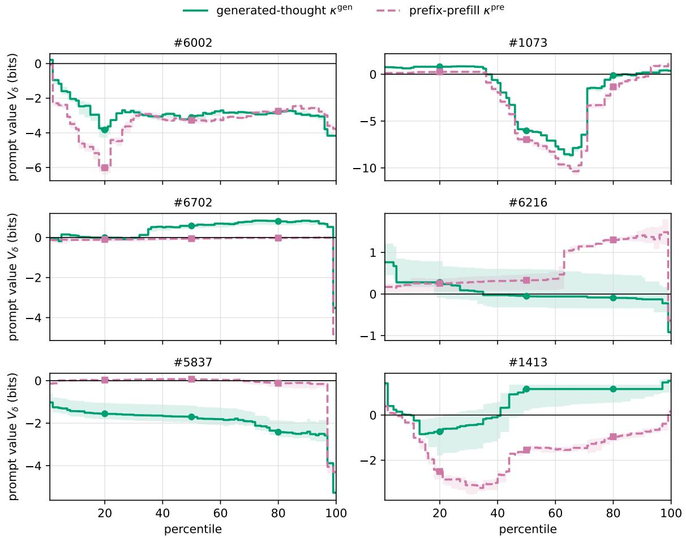

# The Value of a Prompt: An LLM-Relative Kolmogorov-Complexity Approach

Rafael Pass∗ Cornell Tech, Technion, TAU

August 18, 2026

## Abstract

In a world where valuable artifacts are increasingly created, completed, or processed by LLMs, the central economic question is not only what the LLM can produce, but what value remains in the inputs (i.e., the prompts) we provide to it. Given a prompt, hint, critique, problem statement, or partial solution that helps an LLM produce an artifact z—a proof, program, design, or scientific hypothesis—how should we measure the value of that input?

Intuitively, an input is valuable when it makes the target artifact easier for the model to generate: either by increasing its sampling probability, or by reducing the thinking time needed to find it. We propose a computational Levin–Kolmogorov complexity approach to this problem, by appropriately replacing the universal Turing machine in the classical definitions by the LLM itself. Concretely, we introduce an LLM-relative notion of probabilistic Levin– Kolmogorov complexity pKt—treating the model’s thinking as the random tape of the program, and charging logarithmically for it in Levin’s manner—and define prompt value as algorithmic mutual information with respect to pKt. This captures the intuition above: a prompt having b bits of value for an artifact z makes $z 2 ^ { b }$ times “easier to obtain”, by multiplying the success probability by $2 ^ { b }$ , by dividing the required computation by $2 ^ { b }$ , or by any corresponding tradeof between probability and computation.

In contrast to the classical notion of algorithmic mutual information, ours is eficiently estimable. We additionally show that, under a natural reproduction experiment, a prompt value of b bits means that reproducing z without the prompt has median token cost $2 ^ { b }$ times that of reproducing it with the prompt.

## 1 Introduction

Suppose a large language model (LLM) produces a valuable artifact, represented for our purposes by a string z—for example, a proof of a mathematical theorem, a computer program, a design, a drug, or a scientific hypothesis. The LLM operates in some fixed deployment context and receives an additional input, referred to as the prompt $p . { } ^ { 1 }$ The prompt might be a hint, critique, example, or partial solution. A natural question arises:

How much value did the prompt contribute to the final artifact, relative to what the same LLM could have produced without it?

This is increasingly an economic question. As LLM capabilities become abundant, the value of human contributions may lie in choosing the right input to provide to the model. Simply measuring the length of that input—for example, by its token count—does not capture its value: a short hint can be decisive, whereas a long prompt can be irrelevant or even harmful. Rather, a useful measure should (1) compare the dificulty of producing the artifact with and without the input, and (2) allow the model without the additional input to compensate by thinking longer, while charging it for that additional thinking. In this respect, we follow the value-of-computation perspective of Halpern and Pass [HP11, HP15] and the simulation paradigm underlying zero-knowledge proofs, which asks what can be eficiently generated without access to the information in question [GMR89].

Said plainly, we seek a notion of value that measures how much the prompt “helped” the LLM produce the artifact, while taking computation into account. In this work, we introduce such a measure of prompt value.

## 1.1 From Kolmogorov complexity to an LLM-relative measure

Classical algorithmic information theory provides a natural starting point. Fix a universal Turing machine $U _ { ; }$ and let $K _ { U } ( x )$ denote the Kolmogorov complexity of x [Sol64, Kol65, Cha66]: the length of the shortest program $\pi$ that generates $x \ ( \mathrm { i . e . , } \ U ( \pi ) = x )$ . Define $K _ { U } ( x \mid y )$ analogously, with y supplied as auxiliary input (in other words, the shortest program that generates x given y). Following Kolmogorov, the algorithmic information [ZL70, LV08] that $p$ provides about z is

$$
I _ { U } ( p : z ) : = K _ { U } ( z ) - K _ { U } ( z \mid p ) .\tag{1}
$$

Thus, $I _ { U } ( p : z )$ is the number of bits saved in describing z once $p$ is available, making it a natural measure of the value of the prompt $p$ for $z .$

Two dificulties prevent direct use of this measure. First, Kolmogorov complexity is uncomputable. Second, it ignores the computational complexity of the program π, which makes it unsuitable for capturing “computational gains”. The standard resource-bounded response to the second dificulty is time-bounded Kolmogorov complexity [Kol65, Ko86, Har83, Sip83]: For a time limit $T _ { \ast }$

$$
\begin{array} { r } { K _ { U } ^ { T } ( z \mid p ) : = \underset { \pi : U ( \pi , p ) = z } { \operatorname* { m i n } } | \pi | . } \end{array}\tag{2}
$$

Levin’s Kt complexity [Lev73] combines description length and execution time into one quantity:

$$
K t _ { U } ( z \mid p ) : = \operatorname * { m i n } _ { \pi : U ( \pi , p ) = z } \{ | \pi | + \log _ { 2 } T _ { U } ( \pi , p ) \} .\tag{3}
$$

Unfortunately, resource bounds do not make these notions easy to compute (although computable): Allender et al. give worst-case hardness results for resource-bounded Kolmogorov complexity $[ \mathrm { A B K ^ { + } 0 6 } ]$ . Liu and Pass connect average-case hardness of time-bounded Kolmogorov complexity to one-way functions, including (conditional) equivalences on samplable distributions [LP20, LP21, LP23]. These results indicate that resource-bounding alone does not make the notion eficiently computable.

Dealing with Non-thinking LLMs: LLM-Relative Kolmogorov Complexity As a warmup, we first provide a notion of prompt value for LLMs without thinking. By this we mean an autoregressive model that, given a context y, directly generates its output one token at a time: each token is sampled from a distribution determined by $y$ and the previously generated tokens, and generation ends when the model emits a distinguished end-of-sequence token (EOS). In other words, there is no separate “thinking stage” preceding the output.

Our first step is to make the above-mentioned algorithmic-mutual-information approach eficiently computable by fixing the reference machine to be the actual LLM production process. When the question is what an input contributed to this process, the process itself is the natural reference machine. Given a fixed LLM, a “program” is a specification of the model’s sampling randomness, which fully determines its output; we specify the randomness in binary as a real number in [0, 1), and the length of a program is the length of the shortest prefix of this number that forces the output. Write $K _ { M } ( x \mid y )$ for the length of the shortest such program forcing x in context (i.e., given prompt) y, and define $\operatorname { V a l } _ { M } ( p ; z ) : = K _ { M } ( z ) - K _ { M } ( z \mid p )$ as the LLM-relative mutual information.

Alongside it, we use an LLM-relative notion of a-priori complexity, the classical companion of program length in algorithmic information theory [ZL70, LV08]: $\widetilde K M ( x \mid y ) : = - \log _ { 2 } P _ { M } ( x \mid y )$ where $P _ { M } ( x \mid y )$ denotes the probability that M outputs x given the prompt $y ,$ and define the value $\widetilde \mathrm { V a l } _ { M } ( p ; z ) : = \widetilde K _ { M } ( z ) - \widetilde K _ { M } ( z \mid p )$ as the a-priori LLM-relative analog of mutual information. As we show in Section $2 , 0 \le K _ { M } ( x \mid y ) - \widetilde K _ { M } ( x \mid y ) < 2 $ ; hence the a-priori analog closely approximates the program-based notion of LLM-relative mutual information: $\left| \operatorname { V a l } _ { M } ( p ; z ) - \widetilde { \operatorname { V a l } } _ { M } ( p ; z ) \right| < 2$

Moreover, by definition,

$$
\widetilde \mathrm { V a l } _ { M } ( p ; z ) = \log _ { 2 } \frac { P _ { M } ( z \mid p ) } { P _ { M } ( z ) } ,
$$

which can be computed directly by summing the base-two log-ratios of the model’s prompted and unprompted next-token probabilities along z. In essence, $\bar { \mathrm { V a l } _ { M } } ( p ; z )$ has exactly the algebraic form of pointwise mutual information [Fan61, CH90]; this recovers a non-normalized variant of the “author-contribution” score of $\mathrm { [ X Q Y ^ { + } 2 6 ] }$ . Thus, a score of b means that the prompt makes $z ~ 2 ^ { b }$ times as likely to be output by the LLM as without the additional prompt. For these reasons, we take the a-priori notion as the basis for our notion of prompt value.

The problem with thinking. Valuing prompts for an LLM with thinking is more complicated. We model such an LLM as a two-stage autoregressive process. Given a context y, the model first generates a finite string $H ^ { y }$ of thinking tokens and then emits a distinguished end-of-thinking token EOT, which marks the transition to the output stage. The model then generates its output and terminates it with the end-of-sequence token EOS. For any finite thinking string H, write

$$
G _ { y } ( z \mid H ) : = P _ { M } ( z \mid y H \mathrm { E O T } )
$$

for the probability that the output stage emits the artifact z followed by EOS.

Thinking changes the valuation problem in two ways. First, the direct calculation above no longer yields the overall probability that M produces z, because this probability must also average

over the potentially long, random thinking route H: in context y, it is

$$
\mathbb { E } _ { H ^ { y } } [ G _ { y } ( z \mid H ^ { y } ) ] .
$$

Although this yields a natural notion of prompt value, it is not the approach we consider here: it averages together realized thoughts and can be substantially influenced by rare, unusually successful routes.2 We instead view the realized thinking as the random tape of the program, measure the conditional dificulty of producing z relative to that tape, and then take the median over the model’s thinking randomness. The resulting quantity captures the dificulty on a typical realized thought and is insensitive to the one thought in a billion that happens to stumble upon the decisive idea.

A second issue is that comparing the two contexts at a common truncation index t misses the principal way many inputs help: a good hint does not merely make the answer more probable at fixed efort, but may remove or lessen the need to think. To capture this computation saving, the prompted and unprompted processes must therefore be allowed to use diferent amounts of thinking—in particular, the unprompted baseline may need to think longer—and each must be charged for the computation it uses. The resulting comparison credits a prompt both when it increases the conditional probability of the output and when it reduces the computation needed to obtain it.

Our approach: realized-thought Levin complexity. Roughly speaking, we solve the first problem by viewing thinking not as part of the description of the program, but rather as randomness for the program; that is, we consider a probabilistic notion of Kolmogorov complexity in the spirit of [GKLO22], though defined somewhat diferently. We solve the second one by considering Levin’s notion of Kt-complexity [Lev73] (and thus “charging” logarithmically for the computation): in essence, we consider an LLM-relative notion of probabilistic (a-priori) Levin-Kolmogorov complexity $p K t .$ and our measure is simply algorithmic mutual information defined w.r.t. it.

Concretely, fix the artifact z—in the motivating scenario, the output of a prompted run. Sample a thinking rollout: let the model think freely until it emits a stop token, writing $H ^ { y }$ for the realized thinking and $H _ { \leq t } ^ { y }$ for the first t tokens; think of this as sampling randomness for the program. Next, note that summing the negative base-two logarithms of the model’s next-token probabilities along z, including the probability of termination after $z ,$ computes exactly the a-priori complexity $\smash { \widetilde { K } } _ { M } \bigl ( z \ | \ y H _ { < t } ^ { y } \mathrm { E O T } \bigr ) \ = \ - \log _ { 2 } P _ { M } \bigl ( z \ | \ y H _ { < t } ^ { y } \mathrm { E O T } \bigr )$ of the artifact for a model that has already thought $H _ { < t } ^ { y }$ (and recall that a-priori complexity corresponds to our notion of program length). We next charge thinking through an externally specified “token-equivalent” cost function $\kappa ( t )$ and define the realized-thought Levin complexity of $z$ in context y along the thinking route $H ^ { y }$

$$
\widetilde K t _ { M } ^ { \kappa } \big ( z \mid y ; H ^ { y } \big ) : = \operatorname* { m i n } _ { t \in \mathbb { N } _ { 0 } } \Bigl \{ \underbrace { \widetilde K _ { M } \big ( z \mid y H _ { \le t } ^ { y } \mathrm { E O T } \big ) } _ { \mathrm { * d e s c r i p t i o n ~ l e n g t h " } } + \underbrace { \log _ { 2 } \kappa ( t ) } _ { \mathrm { l o g ~ r u n n i n g ~ t i m e } } \Bigr \} ,\tag{4}
$$

(i.e., we employ Levin’s combination of description length and log running time, in analogy with the Levin’s Kt notion, $\begin{array} { r } { K t ( x ) = \operatorname* { m i n } _ { t } \{ K ^ { t } ( x ) + \log _ { 2 } t \} ) } \end{array}$

The above quantity is random through the sampled rollout $H ^ { y }$ . We summarize this randomness by taking the median over the model’s thinking, defining an LLM-relative notion of probabilistic (a-priori) Levin–Kolmogorov complexity:

$$
\widetilde { \mathrm { p K t } } _ { M } ^ { \kappa } ( z \mid y ) : = \mathrm { m e d } \Big [ \widetilde { K } t _ { M } ^ { \kappa } \big ( z \mid y ; H ^ { y } \big ) \Big ] .\tag{5}
$$

The prompt value is then simply algorithmic mutual information with respect to $\operatorname { i t } .$

$$
\widetilde { \mathrm { V a l } } _ { M } ^ { \kappa } ( p ; z ) : = \widetilde { \mathrm { p K t } } _ { M } ^ { \kappa } ( z ) - \widetilde { \mathrm { p K t } } _ { M } ^ { \kappa } ( z \mid p ) ,\tag{6}
$$

in exact analogy with the LLM-relative mutual information $\widetilde { \mathrm { V a l } } _ { M } = \widetilde { K } _ { M } ( z ) - \widetilde { K } _ { M } ( z \mid p )$ of the no-thinking case, and with $\widetilde { \mathrm { p K t } }$ in place of $\widetilde { K }$ as the notion of description length.

Note that a prompt is now credited both when it (1) makes the artifact more probable given the thinking realized and (2) when it eliminates thinking that the unprompted side must otherwise pay for; and the unprompted side can compensate for a missing hint by thinking longer, at a price.

As we show, this measure is eficiently estimable in the following sense. For any sampled thinking route, the realized-thought Levin complexity is computed exactly from the model’s next-token probabilities at each truncation of the realized thinking: although the minimization in (17) ranges over all of $\mathbb { N } _ { 0 } .$ , only $t = 0 , \ldots , S$ need be evaluated for a thinking route of length $S ,$ since every $t > S$ is weakly dominated by $t = S$ . Moreover, with $O ( \zeta ^ { - 2 } \log ( 1 / \eta ) )$ independent rollouts per side, the empirical δ-quantile lies, with probability at least $1 - \eta$ , between the $( \delta - \zeta )$ - and $( \delta + \zeta )$ -quantiles of the true distribution. Applying this guarantee with and without the prompt yields corresponding bounds on the prompt-value estimate.

An economic interpretation of prompt value: token-cost savings. We finally consider an economic notion of token cost for generating an artifact z given a prompt y. We first define the cost of reproducing an artifact z given an input y and a realized thinking route H by the expenditure of an experiment: sample repeated independent attempts, conditional on y and H, until z is reproduced. Each attempt is assigned the declared thinking-token-equivalent charge $\kappa ( | H | )$ , so the expected cost of the repeated sampling process is TokenCos $\dot { \boldsymbol { \mathscr { z } } } _ { y } ( { \boldsymbol { z } } ; H ) : = { \mathbb { E } } [ N \kappa ( | H | ) ] .$ ]. Writing Token ${ \textstyle \mathrm { C o s t } } _ { y } ^ { * } ( z ; H ^ { y } ) : = \operatorname* { m i n } _ { 0 \leq t \leq | H ^ { y } | }$ Token $\mathrm { C o s t } _ { y } ( z ; H _ { \leq t } ^ { y } )$ for the cost at the best prefix of the realized thinking, we show that

$$
2 ^ { \widetilde { \mathrm { p K t } } _ { M } ^ { \kappa } ( z | y ) } = \mathrm { m e d } \big [ \mathrm { T o k e n C o s t } _ { y } ^ { * } ( z ; H ^ { y } ) \big ] ;
$$

that is, the $p K t$ -complexity notion is the logarithm of the typical token expenditure of reproducing z in context $y .$ Prompt value is then, by definition, a ratio of such costs,

$$
2 \widetilde { \mathrm { V a l } } _ { M } ^ { \kappa } ( p ; z ) ~ = ~ \frac { \mathrm { m e d } \left[ \mathrm { T o k e n C o s t } _ { \epsilon } ^ { * } ( z ; H ^ { \epsilon } ) \right] } { \mathrm { m e d } \left[ \mathrm { T o k e n C o s t } _ { p } ^ { * } ( z ; H ^ { p } ) \right] } ,
$$

so a prompt value of b means that reproducing the artifact without the prompt typically costs $2 ^ { b }$ times more tokens than with it.

Medians, δ-quantiles, and why not expectations? The median reports the typical realization, insensitive to the one thought in a billion that stumbles onto the decisive idea; thus, the median is arguably a more relevant statistic than expectation in our context. Using a quantile rather than an expectation is also important for the cost interpretation: quantiles commute with exponentiation, whereas expectations do not.

Nothing hinges on the median in particular: every δ-quantile yields a complexity notion satisfying the same cost identity, and we more generally define $\mathrm { p K t } _ { M , \delta } ^ { n }$ by replacing the median by the δ-quantile of the distribution.

What counts as the “artifact”. Our measure is defined relative to a declared artifact z, and the choice of what counts as the artifact is a substantive modeling decision. Otherwise, it is easy to manufacture artifacts and prompts having large prompt value. For instance, let z be a string of n tokens drawn uniformly at random, and let $p$ supply z in a form that causes the model to reproduce it reliably. For a typical such string, $\widetilde { K } _ { M } ( z )$ is at least n $\cdot \log _ { 2 } { \left| \Sigma \right| } - O ( \log n )$ bits with high probability, whereas $\widetilde { K } _ { M } ( z \mid \overset { } { p } )$ is small. The prompt therefore receives nearly the full description length of the target even though the target is merely a random string.

The same construction can be attached to a genuine artifact. Suppose that an LLM, without a prompt, produces a proof $z ^ { \star }$ of a conjecture of Erd˝os. Let r be a random string and declare the scored artifact to be $z = z ^ { \star } \parallel r$ , with r embedded as semantically inert text so that z remains a valid presentation of the proof. Now supply r in a form that causes the model to reproduce it reliably. Without the prompt, the random sufix typically contributes roughly $| r | \log _ { 2 } | \Sigma |$ bits of description length; once it is supplied, reproducing it is cheap. The prompt therefore collects nearly the full value of the sufix even though it played no role in producing the mathematical content $z ^ { \star }$

The measure is nevertheless behaving as intended: it prices the description of the declared artifact. The burden therefore falls on the declaration of what constitutes that artifact.

When possible, a simple remedy is to take z to be a canonical representation of the produced object rather than the particular string the model happened to emit. When a verifier for the “artifact class” is available, this is immediate: let z be the verifier’s canonical verdict, and require the object itself to appear in the realized thinking. Semantically inert padding then cannot appear in z; see Section 3.5.

When no suitable canonicalization or verifier is available, one possible approach is semantic re-randomization: apply a declared, prompt-independent rewriting procedure (e.g., use an LLM) that preserves the artifact’s semantic content while varying its surface form, and evaluate the prompt after this transformation. The hope is that semantically inert padding will not survive such rewriting, so that a prompt supplying only noise receives no value, whereas a prompt supplying a substantive idea remains useful across diferent renderings. We leave the formalization and evaluation of semantic re-randomization for future work; throughout this paper, we simply assume that the artifact is specified exogenously.

Relation to prior work by Xie et al. A recent work by Xie et al. $\mathrm { [ X Q Y ^ { + } 2 6 ] }$ introduces a measure of human contribution in AI-assisted content generation and evaluates it experimentally. Our no-thinking value is an unnormalized version of their score (they additionally divide by the output’s self-information); our treatment thus provides an algorithmic-information theoretic foundation of that numerator. We emphasize that their score contains no explicit charge for thinking or computation; dealing with thinking is our main contribution.

Paper outline. Section 2 develops our no-thinking notion and provides its algorithmic foundation. Section 3 introduces the thinking process, rollouts, realized-thought Levin complexity, our probabilistic Levin complexity notion $\overline { { \mathrm { p K t } } } _ { M } ^ { \kappa }$ and our final notion of prompt value. Section 4 gives the estimation protocol and its guarantee. Section 5 supplies the economics, defining the cost of reproducing an artifact by the expenditure of an experiment and showing that $2 ^ { \widetilde { \mathrm { p K t } } }$ is exactly the typical such cost, so that the prompt value is a ratio of typical costs. Section 6 reports a small experiment on GSM8K, a benchmark dataset of grade-school mathematics word problems with step-by-step reference solutions, and Section 7 discusses related work.

Use of AI. While the ideas are my own, large language models, principally ChatGPT and Claude, were extensively used in drafting, revising, and editing this manuscript (including in expanding proof sketches into complete proofs). Claude and ChatGPT also implemented the experiments and produced the plots (based on my directions). I take full responsibility for any errors and oversights.

## 2 Prompt Value for Non-Thinking LLMs: A Warm-Up

This section develops a notion of prompt value for non-thinking LLMs; it serves as a warm-up for our actual notion that deals also with LLMs with thinking. We start by defining a notion of a (non-thinking) LLM:

Definition 2.1 (Autoregressive LLM). Fix a finite token alphabet Σ and a distinguished end-ofsequence token EOS $\not \in \Sigma ,$ , and let $\Gamma : = \Sigma \cup \{ \mathrm { E O S } \}$ . An autoregressive LLM M specifies, for every context $c \in \Sigma ^ { * }$ , a probability distribution $P _ { M } ( \cdot \mid c ) \in \Delta ( \Gamma )$ over the next token. A finite output is a string $x = ( x _ { 1 } , \ldots , x _ { n } ) \in \Sigma ^ { * }$ , generated by emitting $x _ { 1 } , \ldots , x _ { n }$ and then EOS; its probability in context $y \in \Sigma ^ { * }$ is

$$
P _ { M } ( x \mid y ) : = \Big ( \prod _ { i = 1 } ^ { n } P _ { M } ( x _ { i } \mid y x _ { < i } ) \Big ) P _ { M } ( \mathrm { E O S } \mid y x ) , \qquad x _ { < i } : = ( x _ { 1 } , \dots , x _ { i - 1 } ) .\tag{7}
$$

We assume proper termination: for every context y, repeated next-token sampling emits EOS almost surely, with a finite expected number of tokens before termination.

Any fixed background context—chat template, task preamble, or deployment-specific instruction— may be absorbed into the definition of the reference model M. Write ϵ for the empty additional prompt and abbreviate $P _ { M } ( \cdot ) : = P _ { M } ( \cdot \mid \epsilon )$ . Thus $P _ { M } ( \cdot )$ denotes the model’s output distribution under the fixed background with no additional prompt, whereas $P _ { M } ( \cdot \mid p )$ denotes the distribution of the same model under the same background after receiving the additional prompt p. We use the same convention for all complexity quantities below: an omitted conditioning context means conditioning on ϵ.

An LLM-relative notion of Kolmogorov complexity. In ordinary Kolmogorov complexity, a universal Turing machine is the machine that interprets and executes programs. Here we instead use the LLM (together with its sampling procedure) as the underlying machine. A program specifies the randomness used to sample from the LLM and thereby determines its execution. We represent the complete sampling randomness by a real number $\omega \in [ 0 , 1 )$ , written in binary; a finite binary program specifies an initial segment of that binary expansion, and hence a dyadic subinterval of possible values of $\omega$

Definition 2.2 (Output intervals and binary programs). Fix a total order on Γ. For an output $x \in \Sigma ^ { * }$ write $\bar { x } : = x \mathrm { E O S }$ , and order outputs by the lexicographic order on the strings x¯ induced by the order on Γ. The output interval of x in context y is

$$
I _ { y } ( x ) : = { \big [ } F _ { M } ( x \mid y ) , F _ { M } ( x \mid y ) + P _ { M } ( x \mid y ) { \big ) } , \qquad F _ { M } ( x \mid y ) : = \sum _ { x ^ { \prime } \colon { \bar { x } } ^ { \prime } < { \bar { x } } } P _ { M } ( x ^ { \prime } \mid y ) .\tag{8}
$$

A binary program is a finite string $\pi \in \{ 0 , 1 \} ^ { * }$ ; with $m : = | \pi |$ and $\begin{array} { r } { N ( \pi ) : = \sum _ { j = 1 } ^ { m } \pi _ { j } 2 ^ { m - j } } \end{array}$ , it names the dyadic interval

$$
D _ { \pi } : = \Big [ \frac { N ( \pi ) } { 2 ^ { m } } , \frac { N ( \pi ) + 1 } { 2 ^ { m } } \Big ) ,\tag{9}
$$

so that $D _ { \epsilon } = [ 0 , 1 )$ for the empty program and $| D _ { \pi } | = 2 ^ { - | \pi | }$ . A binary program π forces output x under context y if $D _ { \pi } \subseteq I _ { y } ( x )$

A binary program can be evaluated eficiently whenever $M \mathrm { { s } }$ next-token distributions are eficiently computable. Given $\pi \in \{ 0 , 1 \} ^ { * }$ , let

$$
\omega _ { \pi } : = \frac { N ( { \pi } ) } { 2 ^ { | \pi | } }
$$

be the left endpoint of $D _ { \pi }$ . Starting from the interval $[ 0 , 1 )$ , run the model’s sampler deterministically using $\omega _ { \pi }$ as its sampling randomness. After each generated prefix, compute $M \mathrm { { s } }$ next-token distribution, partition the current interval in the fixed token order into consecutive left-closed, right-open subintervals having the corresponding relative lengths, emit the token whose subinterval contains $\omega _ { \pi } .$ , and continue with that subinterval until EOS is emitted. (In essence, this is an instance of the standard arithmetic-decoding procedure [WNC87].)

If $D _ { \pi } \subseteq I _ { y } ( x )$ , then $\omega _ { \pi } \in I _ { y } ( x )$ , so the procedure recovers x. It uses one next-token-distribution evaluation per emitted token. Consequently, whenever M’s next-token distributions are polynomialtime computable, x can be recovered from M, y, and π in time polynomial in $| y | + | \pi | + | x |$ . Thus our LLM-relative programs are eficiently evaluable whenever $M \mathrm { { s } }$ next-token distributions are.

We are now ready to state the notion of LLM-relative K-complexity, and the notion of algorithmic prompt value for non-thinking LLMs:

Definition 2.3 (LLM-relative K-complexity and non-thinking prompt value). Define

$$
K _ { M } ( x \mid y ) : = \operatorname* { m i n } \{ | \pi | : D _ { \pi } \subseteq I _ { y } ( x ) \} ,\tag{10}
$$

with value $\infty$ if no such $\pi$ exists. For a prompt $p \in \Sigma ^ { * }$ and an artifact string $z \in \Sigma ^ { * }$ , define the non-thinking program-based prompt value

$$
\operatorname { V a l } _ { M } ( p ; z ) : = K _ { M } ( z ) - K _ { M } ( z \mid p ) .\tag{11}
$$

That is, the (program-based) prompt value is simply the notion of algorithmic mutual information using LLM-relative K-complexity.

Given access to $M \mathrm { { s } }$ full next-token distributions, $K _ { M } ( x \mid y )$ is computable in polynomial time.3 and hence so is program-based prompt value as well. This computation, however, requires the model’s full next-token distributions without approximation, which are typically unavailable through an LLM API. To address this issue, we consider a common variant of Kolmogorov complexity, a-priori complexity [ZL70, LV08]: the log-measure of the set of sampling randomness that produces the output. We again provide an LLM-relative notion of this.

Definition 2.4 (A priori LLM-relative complexity and measured value). For a context y and string z, define

$$
{ \widetilde K } _ { M } ( z \mid y ) : = - \log _ { 2 } P _ { M } ( z \mid y ) ,\tag{12}
$$

with ${ \widetilde K } _ { M } ( z \mid y ) : = \infty { \mathrm { ~ i f ~ } } P _ { M } ( z \mid y ) = 0$ . For a prompt p and string z, the non-thinking prompt value is

$$
\widetilde \mathrm { V a l } _ { M } ( p ; z ) : = \widetilde K _ { M } ( z ) - \widetilde K _ { M } ( z \mid p ) .\tag{13}
$$

By expanding out the definition, we directly get:

Corollary 2.5 (Likelihood-ratio form). $H z$ has positive probability under both ϵ and $p ,$ then for $z = ( z _ { 1 } , \ldots , z _ { n } )$ 2

$$
\widetilde \mathrm { V a l } _ { M } ( p ; z ) = \log _ { 2 } { \frac { P _ { M } ( z \mid p ) } { P _ { M } ( z ) } } = \sum _ { i = 1 } ^ { n } \log _ { 2 } { \frac { P _ { M } ( z _ { i } \mid p z _ { < i } ) } { P _ { M } ( z _ { i } \mid z _ { < i } ) } } + \log _ { 2 } { \frac { P _ { M } ( \mathrm { E O S } \mid p z ) } { P _ { M } ( \mathrm { E O S } \mid z ) } } .\tag{14}
$$

Note that $\widetilde { \mathrm { V a l } _ { M } }$ has exactly the algebraic form of the pointwise-mutual-information (PMI) functional [Fan61, CH90], applied to the model’s prompted and unprompted distributions, and can be thought of as a non-normalized version of the score of $\mathrm { [ X Q Y ^ { + } 2 6 ] }$

The main result of this section is that the two notions of LLM-relative K-complexity (programbased and a-priori-based) and thus also the two notions of prompt value, coincide up to an additive constant, much like standard a-priori complexity and (prefix) Kolmogorov complexity [ZL70].

Theorem 2.6 (Algorithmic semantics of prompt value).

(i) For every context y and string z with $P _ { M } ( z \mid y ) > 0$

$$
0 \ \leq \ K _ { M } ( z \ | \ y ) - \widetilde K _ { M } ( z \ | \ y ) \ < \ 2 .\tag{15}
$$

(ii) Consequently, for every prompt p and exact string z in the support of both distributions,

$$
\left| \operatorname { V a l } _ { M } ( p ; z ) - \widetilde { \operatorname { V a l } } _ { M } ( p ; z ) \right| < 2 .\tag{16}
$$

The formal proof is given in Appendix A. For a proof sketch, recall that we associate with an output z an interval $I _ { y } ( z ) \subseteq [ 0 , 1 )$ whose length is $P _ { M } ( z \mid y )$ , and that a binary program π forces z when its dyadic interval $D _ { \pi }$ , of length $2 ^ { - | \pi | }$ , lies entirely inside $I _ { y } ( z )$ . The lower bound in part (i) follows because $D _ { \pi }$ cannot be longer than $I _ { y } ( z )$ . For the upper bound, the proof rounds the left endpoint of $I _ { y } ( z )$ to a dyadic grid and its length down to an inverse power of two; the resulting two factor-2 losses sufice. Part (ii) then follows by taking diferences.

Remark 2.7 (Diferences with standard algorithmic mutual information). Two disanalogies with universal-machine algorithmic information are noteworthy. First, non-thinking prompt value can be (very) negative: the conditional distribution is the model’s actual behavior under the prompt, and the model cannot be assumed to ignore a misleading input at constant cost. Second, a very short input can carry a very large value: a one-token trigger may raise the probability of a long output by hundreds of bits. This second phenomenon is similar to what happens with time-bounded Kolmogorov complexity, where getting a short key may unlock a long encrypted message [LM93].

We observe that $\widetilde { K } _ { M }$ , and hence non-thinking prompt value, can be eficiently computed from the model’s next-token log probabilities along $z \mathrm { E O S }$ . Moreover, in contrast to $K _ { M }$ , approximate log probabilities sufice to approximate these quantities: if every next-token log probability is known within additive error $\eta ,$ then $\widetilde { K } _ { M } ( \boldsymbol { z } \mid \boldsymbol { y } )$ is determined within additive error $| z \operatorname { E O S } | \eta$ , and the resulting prompt value within additive error $2 | z \mathrm { E O S } | \eta$

Theorem 2.8 (Eficient evaluation of non-thinking prompt value). Let $z = ( z _ { 1 } , \ldots , z _ { n } )$ have positive probability under both ϵ and p. Given exact next-token log probabilities, $\bar { \mathrm { V a l } _ { M } } ( p ; z )$ can be computed exactly using $2 ( n + 1 )$ queries and $O ( n )$ arithmetic operations. More generally, if each queried log probability is approximated within additive error $\rho ,$ the same computation approximates $\widetilde { \mathrm { V a l } _ { M } } ( p ; z )$ within $2 ( n + 1 ) \rho$

Proof. By (14), $\widetilde { \mathrm { V a l } _ { M } } ( p ; z )$ is a signed sum of the prompted and unprompted log probabilities of the n tokens of z and the final EOS, giving $2 ( n + 1 )$ terms. The exact claim follows by summing them, and the approximation claim follows from the triangle inequality. □

In the sequel, we take $\widetilde { \mathrm { V a l } _ { M } }$ as the starting point for our notion of prompt value for LLMs with thinking, with Theorem 2.6 guaranteeing that the reported quantities track the algorithmic (program-based) values within two bits.

## 3 Thinking and the prompt value

We move on to consider LLMs with thinking.

## 3.1 LLMs with thinking

We start by formalizing a thinking LLM. Informally, an LLM with thinking operates in two stages. It first generates a thinking route H, stopping when it emits a distinguished end-of-thinking token EOT (or EOS). It then generates its output conditioned on the realized route H.

Definition 3.1 (LLM with thinking). An LLM with thinking consists of an autoregressive LLM M, as in Definition 2.1, together with a distinguished end-of-thinking token $\mathrm { E O T } \in \Sigma$ . In context y, the thinking stage samples tokens autoregressively from M until either EOT or EOS is emitted. Let Hy denote the tokens generated before this stop token, which is not included in $H ^ { y } ;$ we call one execution of the thinking-stage sampler a rollout, and call the resulting token sequence $H ^ { y }$ its thinking route.

After the thinking stage, the output stage runs M in context y $H ^ { y }$ EOT and generates an output terminating with EOS. (Thus, even if the thinking stage stopped at EOS, the declared two-stage process proceeds by appending EOT and running the output stage.)

Write $S : = | H ^ { y } | .$ , and, for $t \in  { \mathbb { N } } _ { 0 }$ , let $H _ { \leq t } ^ { y }$ be the first min $\{ t , S \}$ tokens of $H ^ { y }$ . For any finite thinking route $H ^ { y }$ , define the output-stage probability

$$
G _ { y } ( z \mid H ^ { y } ) : = P _ { M } ( z \mid y H ^ { y } \mathrm { E O T } ) .
$$

External oracle calls. The same treatment extends to thinking processes that interact with external tools or oracles. In this case, $H ^ { y }$ denotes the realized interaction transcript, including both the calls and their responses, and its distribution is induced by the combined LLM–oracle process. We never evaluate the probability of $H ^ { y }$ itself; at each prefix, we evaluate only the probability of producing z conditional on that realized transcript. Thus the oracle responses need not be generated autoregressively by M. We require only sampling access, not likelihood access, to the oracle. The combined LLM–oracle process must be independently restartable across rollouts.

The only additional ingredient is cost accounting. The token-equivalent time function introduced below should charge for the oracle calls as well as for the LLM’s computation. Formally, one may allow the cost to depend nondecreasingly on the realized transcript prefix. Equivalently, one may pad the accounting timeline of each oracle call with a number of virtual thinking tokens corresponding to its declared token-equivalent cost. These virtual tokens are used only for accounting and are not supplied to the model. Under this interpretation, the definitions and results below apply unchanged.

For simplicity, we restrict the subsequent formal treatment to thinking without external oracle calls.

## 3.2 Realized-thought Levin complexity

We proceed to formalizing an LLM-relative notion of Levin-complexity [Lev73] for LLMs with thinking. Towards this goal, we start by providing a notion of realized-thought Levin complexity, for a fixed (i.e., realized) thinking route H. (Looking forward, in Section 3.3, we take H to be a random variable (over thinking) and summarize it by its median, obtaining the complexity notion $\widetilde { \mathrm { p K t } } _ { M } ^ { \kappa } ;$ the prompt value is then algorithmic mutual information with respect to that notion.)

Charging thinking requires a declared unit of “running-time”; we count time in “thinking-token” equivalent units through an externally specified cost function:

Definition 3.2 (Token-equivalent time). A token-equivalent time function is a family $\kappa _ { y , z } : \mathbb { N } _ { 0 } $ $[ 1 , \infty )$ , indexed by contexts y and artifacts z, nondecreasing in t. When y and z are clear from context, we write simply $\kappa ( t )$

κ(t) is simply the declared token-equivalent cost assigned to a production that uses t tokens of thinking in context y. A natural choice is the generated-thought cost

$$
\kappa _ { y , z } ^ { \mathrm { g e n } } ( t ) = c _ { \mathrm { p r e } } | y | + c _ { \mathrm { d e c } } \left( t + 1 + | z \mathrm { E O S } | \right) .
$$

Here $c _ { \mathrm { p r e } }$ is the cost per token processed during prefill, $c _ { \mathrm { d e c } }$ is the cost per sequentially generated token, and the additional 1 accounts for EOT. This convention charges for prefilling the supplied context and then sequentially generating the thinking, EOT, and the artifact. Because prefill processes many tokens in parallel whereas decoding is sequential, $c _ { \mathrm { d e c } } / c _ { \mathrm { p r e } }$ can naturally be much larger than one. (In Section 6 we normalize $c _ { \mathrm { p r e } } = 1$ , use $c _ { \mathrm { d e c } } = 3 2$ as a representative default, and report sensitivity to this choice.)

Another simple choice is the $_ { p r e f i x - p r e f i l l }$ cost

$$
\kappa _ { y , z } ^ { \mathrm { p r e } } ( t ) = c _ { \mathrm { p r e } } \big ( | y | + t + 1 \big ) + c _ { \mathrm { d e c } } | z \mathrm { E O S } | .
$$

This convention treats the realized thinking prefix as already available and re-executes it as part of the prefill, rather than charging for generating it token by token. It is therefore less direct as an accounting of the original online production of the thought. It nevertheless has an especially natural token-cost interpretation: Section 5 shows that it is the per-attempt cost arising when a fixed realized thought is replayed before fresh attempts to reproduce the artifact.

We now state the notion of LLM-relative realized-thought Levin complexity:

Definition 3.3 (Realized-thought Levin complexity). Fix a model M and a token-equivalent time function κ. For a context $y ,$ an artifact $z ,$ and a thinking route $H ^ { y }$ , define

$$
{ \widetilde K t } _ { M } ^ { \kappa } \big ( z \mid y ; H ^ { y } \big ) \ : = \ \operatorname* { m i n } _ { t \in \mathbb { N } _ { 0 } } \Big \{ { \widetilde K } _ { M } \big ( z \mid y H _ { \leq t } ^ { y } \mathrm { E O T } \big ) \ + \ \log _ { 2 } \kappa ( t ) \Big \} ,\tag{17}
$$

In other words, given a fixed thinking route $H ^ { y } .$ , we consider exactly Levin’s combination of description length and running time from the notion of Kt-complexity [Lev73]: description length plus log running time, minimized over time.

Note that although the minimization ranges over all of $ { \mathbb { N } } _ { 0 }$ , it sufices to consider $t = 0 , \ldots , S$ $H _ { < t } ^ { y } = H ^ { y }$ for every $t \geq S$ , so the conditional-complexity term is constant over these choices, while $\kappa ( \overline { { t } } ) \geq \kappa ( S )$ by monotonicity; thus, no $t > S$ can improve upon $t = S ,$ and the minimum can be computed by evaluating the $S + 1$ truncations $t = 0 , \ldots , S$

A program-based companion replaces a-priori complexity by program length:

$$
{ K t } _ { M } ^ { \kappa } \big ( z \mid y ; H ^ { y } \big ) \ : = \ \operatorname* { m i n } _ { t \in \mathbb { N } _ { 0 } } \Bigl \{ { K } _ { M } \big ( z \mid y { H } _ { \le t } ^ { y } \mathrm { E O T } \big ) + \log _ { 2 } \kappa ( t ) \Bigr \} .
$$

## 3.3 Probabilistic Levin complexity: a median over random realized thoughts

So far, the complexity has been defined relative to a particular realized thinking route. Viewing the thinking as the random tape of the program (or, equivalently, representing it by the random bits that cause the LLM to generate that route), we now define an LLM-relative notion of probabilistic Levin– Kolmogorov complexity in the spirit of [GKLO22]. Namely, we summarize over the model’s thinking randomness by taking a δ-quantile of the resulting realized-thought Kt-complexity. The resulting notion is an LLM-relative, a-priori Kt counterpart of probabilistic time-bounded Kolmogorov complexity. For $\delta \in ( 0 , 1 ]$ and a random variable X taking values in $[ 0 , \infty ]$ , write

$$
\operatorname { m e d } _ { \delta } [ X ] : = \operatorname* { i n f } \left\{ a \in [ 0 , \infty ] : \operatorname* { P r } [ X \leq a ] \geq \delta \right\}
$$

for its lower δ-quantile.

Definition 3.4 (LLM-relative probabilistic Levin complexity). Fix a model M, a token-equivalent time function $\kappa ,$ and a level $\delta \in ( 0 , 1 ]$ . For a context y and artifact z, the probabilistic (a-priori) Levin complexity of z given y at level δ is

$$
\widetilde { \mathrm { p K t } } _ { M , \delta } ^ { \kappa } ( z \mid y ) : = \mathrm { m e d } _ { \delta } \Big [ \widetilde { K t } _ { M } ^ { \kappa } \big ( z \mid y ; H ^ { y } \big ) \Big ] ,\tag{18}
$$

where the quantile is taken over the distribution of the thinking route $H ^ { y }$ induced by a random rollout of M in context y. The program-based companion $\mathrm { p K t } _ { M , \delta } ^ { \kappa } ( z \mid y )$ is defined analogously instead using $K t _ { M } ^ { \kappa }$

Whenever δ is clear from context, we suppress it from the notation; we typically consider the median $\delta = 1 / 2$

## 3.4 The prompt value

We define prompt value as algorithmic mutual information with respect to $\widetilde { \mathrm { p K t } } _ { M } ^ { \kappa }$ , exactly as $\widetilde { \mathrm { V a l } _ { M } }$ was with respect to $\widetilde { K } _ { M }$ in Section 2.

Definition 3.5 (Prompt value). Fix a model M, a token-equivalent time function κ, a level $\delta \in ( 0 , 1 ]$ a prompt $p \in \Sigma ^ { * }$ , and an artifact $z \in \Sigma ^ { * }$ . Whenever $\widetilde { \mathrm { p K t } _ { M , \delta } } ( z )$ and $\widetilde { \mathrm { p K t } _ { M , \delta } ^ { \kappa } } ( z \mid p )$ are both finite, the prompt value of the prompt p for the artifact z is

$$
\widetilde { \mathrm { V a l } } _ { M , \delta } ^ { \kappa } ( p ; z ) : = \widetilde { \mathrm { p K t } } _ { M , \delta } ^ { \kappa } ( z ) - \widetilde { \mathrm { p K t } } _ { M , \delta } ^ { \kappa } ( z \mid p ) ,\tag{19}
$$

and $\mathrm { V a l } _ { M , \delta } ^ { \kappa } ( p ; z ) : = \mathrm { p K t } _ { M , \delta } ^ { \kappa } ( z ) - \mathrm { p K t } _ { M , \delta } ^ { \kappa } ( z \mid p )$ is its program-based companion.

A prompt is therefore credited both when it makes the artifact more probable given the realized thinking and when it eliminates thinking that the unprompted side must otherwise pay for; and the unprompted side can compensate for a missing hint by thinking longer, at a price.

As before, the a-priori and program-based version difer by at most 2:

Proposition 3.6 (Program semantics of $\widetilde { \mathrm { p K t } }$ and of the prompt value). Fix M, κ and $\delta \in ( 0 , 1 ]$ For every context y and artifact $z ,$ the program-based and a-priori complexities are finite together, and whenever they are finite:

$$
0 \ \leq \ \mathrm { p K t } _ { M , \delta } ^ { \kappa } ( z \vert y ) - \widetilde { \mathrm { p K t } } _ { M , \delta } ^ { \kappa } ( z \vert y ) \ \leq \ 2 .
$$

Consequently, whenever the two complexities of Definition 3.5 are finite,

$$
\bigl | \mathrm { V a l } _ { M , \delta } ^ { \kappa } ( p ; z ) - \widetilde { \mathrm { V a l } } _ { M , \delta } ^ { \kappa } ( p ; z ) \bigr | \le 2 .
$$

Proof. For each $t \in  { \mathbb { N } } _ { 0 }$ , let $c _ { t } : = y H _ { \leq } ^ { y }$ EOT. By Theorem 2.6(i), $K _ { M } ( z \mid c _ { t } )$ and $\widetilde { K } _ { M } ( \boldsymbol { z } \mid c _ { t } )$ are finite together and satisfy

$$
\widetilde K _ { M } ( z \mid c _ { t } ) \le K _ { M } ( z \mid c _ { t } ) < \widetilde K _ { M } ( z \mid c _ { t } ) + 2 .
$$

Adding $\log _ { 2 } \kappa ( t )$ preserves these inequalities pointwise in t. Since the relevant minima are attained, minimization preserves the strict upper bound:

$$
\widetilde K t _ { M } ^ { \kappa } ( z \mid y ; H ^ { y } ) \le K t _ { M } ^ { \kappa } ( z \mid y ; H ^ { y } ) < \widetilde K t _ { M } ^ { \kappa } ( z \mid y ; H ^ { y } ) + 2 ,
$$

with the two quantities finite together. Taking lower quantiles preserves the weak inequalities, but may turn the strict upper bound into equality4; hence

$$
\widetilde { \mathrm { p K t } } _ { M , \delta } ^ { \kappa } ( z  { \left| \begin{array} { l } { y } \end{array} \right. } ) \leq \mathrm { p K t } _ { M , \delta } ^ { \kappa } ( z  { \left| \begin{array} { l } { y } \end{array} \right. } ) \leq \widetilde { \mathrm { p K t } } _ { M , \delta } ^ { \kappa } ( z  { \left| \begin{array} { l } { y } \end{array} \right. } ) + 2 ,
$$

again with the two quantities finite together. Finally,

$$
\mathrm { V a l } _ { M , \delta } ^ { \kappa } ( p ; z ) - \widetilde { \mathrm { V a l } } _ { M , \delta } ^ { \kappa } ( p ; z ) = \big ( \mathrm { p K t } _ { M , \delta } ^ { \kappa } ( z ) - \widetilde { \mathrm { p K t } } _ { M , \delta } ^ { \kappa } ( z ) \big ) - \big ( \mathrm { p K t } _ { M , \delta } ^ { \kappa } ( z \mid p ) - \widetilde { \mathrm { p K t } } _ { M , \delta } ^ { \kappa } ( z \mid p ) \big ) .
$$

Each parenthesized term lies in [0, 2], so their diference has absolute value at most 2. □

## 3.5 Canonical targets and verified acceptance

The exact-string requirement on z is a modelling choice about what constitutes the “artifact” z relative to which we are measuring the prompt’s value. If one wishes to price a class of acceptable artifacts rather than a string—“the route contains a proof the verifier accepts”—one declares a machine that thinks and then emits a canonical verdict, and takes z to be that verdict. Concretely, let $\mathcal { V } : \Sigma ^ { * }  \{ 0 , 1 \}$ be an eficiently computable predicate on the transcript preceding EOT. Extend the declared machine with a verdict step that, after the realized transcript $y H$ , emits ACC if $\begin{array} { r } { \mathcal { V } ( y H ) = 1 } \end{array}$ and REJ otherwise, and then emits EOS.

Under this type of “verified artifacts”, the measure takes a particularly simple form. Since the verdict step is deterministic, $P _ { M } ( \mathtt { A C C } \mid y H _ { \leq t }$ EOT) is 1 on accepting prefixes and 0 on rejecting ones, and hence $\widetilde K _ { M } ( \mathtt { A C C } \mid y H _ { \leq t } \mathtt { E O T } ) \in \{ 0 , \infty \}$ . Define the “acceptance cost” of a route H by

$$
\begin{array} { r } { C _ { y } ( H ) : = \operatorname* { m i n } \{ \kappa ( t ) : t \in \mathbb { N } _ { 0 } , \ \mathcal { V } ( y H _ { \leq t } ) = 1 \} , \qquad \operatorname* { m i n } \varnothing : = \infty . } \end{array}
$$

It follows that $\widetilde { K t } _ { M } ^ { \kappa } ( \mathsf { A C C } \mid y ; H ^ { y } ) = \log _ { 2 } C _ { y } ( H ^ { y } )$ . Writing $\tau _ { y }$ for the median of $C _ { y } ( H ^ { y } )$ over rollouts in context y, we thus get

$$
\widetilde { \mathrm { p K t } } _ { M } ^ { \kappa } ( \mathsf { A C C } \mid y ) = \log _ { 2 } \tau _ { y } , \qquad \widetilde { \mathrm { V a l } } _ { M } ^ { \kappa } ( p ; \mathsf { A C C } ) = \log _ { 2 } \frac { \tau _ { \epsilon } } { \tau _ { p } } ,\tag{20}
$$

whenever the two medians are finite.

## 4 Estimation

We observe that $\widetilde { \mathrm { p K t } }$ is eficiently estimable in the following sense: the empirical median obtained from polynomially many rollouts lies, with high probability, between quantiles arbitrarily close to the population median. Applying this guarantee with and without the prompt yields corresponding bounds on the prompt-value estimate.

Protocol. Fix a model M, a token-equivalent time function κ, a level $\delta \in ( 0 , 1 ]$ , and a number $k \in \mathbb N$ of rollouts per side. Input: artifact z and prompt $p .$

1. For each context $y \in \{ p , \epsilon \}$ , perform k independent complete thinking rollouts, producing routes $H ^ { y , ( 1 ) } , \ldots , H ^ { \tilde { y , ( k ) } }$ with respective lengths $S ^ { y , ( \mathrm { 1 } ) } , \ldots , S ^ { y , ( k ) }$ . For each route i, evaluate every truncation $t = 0 , \ldots , S ^ { y , ( i ) }$ and form its routewise minimum $\widetilde { K t } ^ { y , ( i ) }$ according to (17).

2. For each $y \in \{ \epsilon , p \}$ , let $\widehat { m } _ { k } ^ { y }$ be the empirical lower δ-quantilea of $\widetilde { K t } ^ { y , ( 1 ) } , \dots , \widetilde { K t } ^ { y , ( k ) }$ and output

$$
\widehat { \mathrm { V a l } } _ { M , \delta , k } ^ { \kappa } ( p ; z ) : = \widehat { m } _ { k } ^ { \epsilon } - \widehat { m } _ { k } ^ { p } .
$$

aThat is, the ⌈δk⌉-th smallest of the k observed values.

For $\delta \in ( 0 , 1 )$ and $| \zeta | < \operatorname* { m i n } \{ \delta , 1 - \delta \}$ , define the ζ-ofset prompt value by

$$
\widetilde { \mathrm { V a l } } _ { M , \delta ; \zeta } ^ { \kappa } ( p ; z ) : = \widetilde { \mathrm { p K t } } _ { M , \delta + \zeta } ^ { \kappa } ( z ) - \widetilde { \mathrm { p K t } } _ { M , \delta - \zeta } ^ { \kappa } ( z \mid p ) .
$$

Thus $\widetilde { \mathrm { V a l } } _ { M , \delta ; 0 } ^ { \kappa } = \widetilde { \mathrm { V a l } } _ { M , \delta } ^ { \kappa }$ , and $\widetilde { \mathrm { V a l } } _ { M , \delta ; \zeta } ^ { \kappa }$ is nondecreasing in $\zeta .$

Theorem 4.1 (Eficient estimation of $\widetilde { \mathrm { p K t } }$ and prompt value). Run the preceding protocol with $k \in \mathbb N$ and $\delta \in ( 0 , 1 )$ . For every $\zeta \in ( 0 , \operatorname* { m i n } \{ \delta , 1 - \delta \} )$ , with probability at least $1 - 4 \exp ( - 2 k \zeta ^ { 2 } )$ simultaneously for $y \in \{ p , \epsilon \}$

$$
\widehat { m } _ { k } ^ { y } \in \left[ \widetilde { \mathrm { p K t } } _ { M , \delta - \zeta } ^ { \kappa } ( z \mid y ) , \widetilde { \mathrm { p K t } } _ { M , \delta + \zeta } ^ { \kappa } ( z \mid y ) \right] .
$$

Consequently, with the same probability and whenever the interval is defined,

$$
\begin{array} { r } { \widehat { \mathrm { V a l } } _ { M , \delta , k } ^ { \kappa } ( p ; z ) \in \left[ \widetilde { \mathrm { V a l } } _ { M , \delta ; - \zeta } ^ { \kappa } ( p ; z ) , \widetilde { \mathrm { V a l } } _ { M , \delta ; \zeta } ^ { \kappa } ( p ; z ) \right] . } \end{array}
$$

If next-token sampling from M, evaluation of the artifact probabilities, and evaluation and comparison of $\kappa _ { y , z } ( t )$ can be performed in time polynomial in their input lengths, then the protocol runs in time polynomial in k, T, |p|, and $| z |$ , where T is the maximum thinking time attained by M in the protocol on inputs p and ϵ.

Proof. Fix $y \in \{ p , \epsilon \}$ , let $X _ { y } : = \widetilde { K t } _ { M } ^ { \kappa } ( z \mid y ; H ^ { y } )$ , and set

$$
q _ { - } : = \widetilde { \mathrm { p K t } } _ { M , \delta - \zeta } ^ { \kappa } ( z \mid y ) , \qquad q _ { + } : = \widetilde { \mathrm { p K t } } _ { M , \delta + \zeta } ^ { \kappa } ( z \mid y ) .
$$

The k routewise values used to compute $\widehat { m } _ { k } ^ { y }$ are independent copies of $X _ { y }$ . By the definition of a lower quantile,5

$$
\mathrm { P r } [ X _ { y } < q _ { - } ] \le \delta - \zeta , \qquad \mathrm { P r } [ X _ { y } \le q _ { + } ] \ge \delta + \zeta .
$$

If $\widehat { m } _ { k } ^ { y } < q .$ , then at least ⌈δk⌉ samples are strictly below $q _ { - }$ , so by the Chernof bound6 this event is bounded by $\exp ( - 2 k \zeta ^ { 2 } )$ . Similarly, if $\widehat { m } _ { k } ^ { y } > q _ { + }$ , then fewer than ⌈δk⌉ samples are at most $q _ { + }$ and Chernof again bounds this event by $\exp ( - 2 k \zeta ^ { 2 } )$ . Thus the containment fails for a given y with probability at most $2 \exp ( - 2 k \zeta ^ { 2 } )$ . A union bound over $y \in \{ p , \epsilon \}$ gives the stated probability.

On this simultaneous event, subtracting the interval for $y = p$ from the interval for $y = \epsilon$ gives

$$
\begin{array} { r } { \widehat { m } _ { k } ^ { \epsilon } - \widehat { m } _ { k } ^ { p } \in \left[ \widetilde { \mathrm { p K t } } _ { M , \delta - \zeta } ^ { \kappa } ( z ) - \widetilde { \mathrm { p K t } } _ { M , \delta + \zeta } ^ { \kappa } ( z \mid p ) , \widetilde { \mathrm { p K t } } _ { M , \delta + \zeta } ^ { \kappa } ( z ) - \widetilde { \mathrm { p K t } } _ { M , \delta - \zeta } ^ { \kappa } ( z \mid p ) \right] . } \end{array}
$$

By the definitions of $\widehat { \mathrm { V a l } } _ { M , \delta , k } ^ { \kappa }$ and $\widetilde { \mathrm { V a l } } _ { M , \delta ; \zeta } ^ { \kappa }$ , this is exactly the claimed prompt-value interval.

For the running time, every sampled thinking route has at most $T + 1$ relevant truncations. The protocol evaluates the artifact probability and $\kappa _ { y , z } ( t )$ at each truncation and minimizes over them. Suppressing the fixed background context, every evaluation processes at most $| p | + T + 1 + | z \operatorname { E O S } |$ tokens. Under the stated assumptions, these evaluations, the minimizations, and the two empiricalquantile computations take time polynomial in the claimed parameters. □

Remark 4.2 (Transformer implementation). For a transformer with an append-only KV cache, the cache for every earlier thinking prefix is an initial segment of the cache for the complete route, so that prefix need not be recomputed. Suppressing the fixed background context, the protocol can therefore be implemented using

$$
O \big ( k | p | + k ( T + 1 ) \big ( 1 + | z | \big ) \big )
$$

model-token evaluations.

## 5 Prompt value and token-equivalent reproduction cost

We here consider an economic interpretation of our notions. We first define the cost of reproducing an artifact through an experiment that, given a fixed thinking route, repeatedly prepares the output stage from that route and samples it with fresh randomness until it recovers the artifact. Each attempt is assigned the token-equivalent charge specified by the declared cost function $\kappa .$

We then show that $2 ^ { \widetilde { \mathrm { p K t } } _ { M } ^ { \kappa } ( z | y ) }$ is exactly the typical such cost in context y, where typicality is taken over the distribution of thinking routes induced by random rollouts, so that exponentiated prompt value is the ratio of the typical costs without and with the prompt.

Definition 5.1 (Reproduction experiment and token cost). Fix a model M and a token-equivalent time function $\kappa .$ Let y be a context, z an artifact, and H a thinking string. Write $g : = G _ { y } ( z \mid H )$ The reproduction experiment for z given H makes independent, identically distributed attempts. Each attempt is charged $\kappa ( | H | )$ token-equivalent units, and a fresh output stage is run in the context y H EOT. An attempt succeeds if its output is exactly $z ,$ which occurs with probability $g .$ . The experiment halts at the first success, at index N, and the token-equivalent reproduction cost of z given H is its expected total expenditure Token $\mathrm { { C o s t } } _ { y } ( z ; H ) : = \mathbb { E } [ N \kappa ( | H | ) ]$ . For a thinking route H with truncations $H _ { \leq t }$ , the best-prefix reproduction cost is $\mathrm { T o k e n C o s t } _ { y } ^ { * } ( z ; H ) : =$ $\begin{array} { r } { \operatorname* { m i n } _ { 0 \leq t \leq | H | } \mathrm { T o k e n C o s t } _ { y } ( z ; H _ { \leq t } ) } \end{array}$

Thus $\mathrm { T o k e n C o s t } _ { y } ( z ; H )$ is the expected expenditure conditional on the fixed route $H ;$ the quantiles below are taken over routes sampled from random rollouts.

Theorem 5.2 (Reproduction cost). Fix M and κ. For every context $y ,$ artifact $z ,$ and thinking string H,

$$
\mathrm { T o k e n C o s t } _ { y } ( z ; H ) = \frac { \kappa ( | H | ) } { G _ { y } ( z \mid H ) } ,
$$

with the right-hand side interpreted as $+ \infty$ when $G _ { y } ( z \mid H ) = 0$

Proof. Fix H and write $g : = G _ { y } ( z \mid H )$ . If $g = 0$ , both $\mathrm { T o k e n C o s t } _ { y } ( z ; H )$ and $\kappa ( | H | ) / g$ are defined to be infinite, so assume $g > 0$ . Because each attempt uses fresh output-stage randomness while keeping H fixed, the attempts are independent and each succeeds with probability $g .$ . Thus $N$ is geometric with parameter $^ { g , }$ and $\mathbb { E } [ N ] = 1 / g$ . Since each attempt incurs the charge $\kappa ( | H | )$ , the total charge is $N \kappa ( | H | )$ . Therefore

$$
\mathrm { T o k e n C o s t } _ { y } ( z ; H ) = \mathbb { E } [ N \kappa ( | H | ) ] = \kappa ( | H | ) \mathbb { E } [ N ] = \frac { \kappa ( | H | ) } { g } .
$$

Proposition 5.3 (Realized-thought complexity as reproduction cost). Fix M and κ. For every context $y ,$ artifact z, and rollout $H ^ { y }$

$$
2 \widetilde { K t } _ { M } ^ { \kappa } ( z | y ; H ^ { y } ) \ = \ \mathrm { T o k e n C o s t } _ { y } ^ { * } ( z ; H ^ { y } ) .\tag{21}
$$

Proof. Let $S = | H ^ { y } |$ . Comparing Definition 3.3 with Theorem 5.2, and using that exponentiation is increasing, gives

$$
2 \widetilde { K t } _ { M } ^ { \kappa } ( z | y ; H ^ { y } ) = \operatorname* { m i n } _ { 0 \leq t \leq S } 2 ^ { - \log _ { 2 } G _ { y } ( z | H _ { \leq t } ^ { y } ) + \log _ { 2 } \kappa ( t ) }  \\ { = \operatorname* { m i n } _ { 0 \leq t \leq S } \frac { \kappa ( t ) } { G _ { y } ( z \mid H _ { \leq t } ^ { y } ) } } \\  = \operatorname* { m i n } _ { 0 \leq t \leq S } \mathrm { T o k e n C o s t } _ { y } ( z ; H _ { \leq t } ^ { y } ) = \mathrm { T o k e n C o s t } _ { y } ^ { * } ( z ; H ^ { y } ) .
$$

Theorem 5.4 $\widetilde { ( \mathrm { p K t } }$ and prompt value as typical token costs). Fix $M , \kappa ,$ and $\delta \in ( 0 , 1 ]$ . For every context y and artifact $z _ { i }$

$$
2 \widetilde { \mathrm { p K t } } _ { M , \delta } ^ { \kappa } ( z | y ) \ = \ \mathrm { m e d } _ { \delta } \big [ \mathrm { T o k e n C o s t } _ { y } ^ { * } ( z ; H ^ { y } ) \big ] ,
$$

where $\mathrm { m e d } _ { \delta }$ is taken over the distribution of the thinking route $H ^ { y }$ generated by a random rollout of M in context $y .$ Consequently, every prompt p and artifact z such that both complexities in Definition 3.5 are finite,

$$
2 \widetilde { \mathrm { V a l } } _ { M , \delta } ^ { \kappa } ( p ; z ) \ = \ \frac { \mathrm { m e d } _ { \delta } \big [ \mathrm { T o k e n C o s t } _ { \epsilon } ^ { * } ( z ; H ^ { \epsilon } ) \big ] } { \mathrm { m e d } _ { \delta } \big [ \mathrm { T o k e n C o s t } _ { p } ^ { * } ( z ; H ^ { p } ) \big ] } .
$$

Proof. Lower quantiles commute with continuous strictly increasing transformations.7 Applying this fact to $\varphi ( x ) = 2 ^ { x }$ and using Proposition 5.3 gives

$$
\begin{array} { r l } & { 2 ^ { \widetilde { \mathrm { p K t } } _ { M , \delta } ^ { \kappa } ( z | y ) } = 2 ^ { \mathrm { m e d } _ { \delta } \left[ \widetilde { K } t _ { M } ^ { \kappa } ( z | y ; H ^ { y } ) \right] } } \\ & { \quad \quad \quad = \mathrm { m e d } _ { \delta } \left[ 2 ^ { \widetilde { K } t _ { M } ^ { \kappa } ( z | y ; H ^ { y } ) } \right] } \\ & { \quad \quad \quad = \mathrm { m e d } _ { \delta } \left[ \mathrm { T o k e n C o s t } _ { y } ^ { * } ( z ; H ^ { y } ) \right] . } \end{array}
$$

Exponentiating Definition 3.5 and applying this identity to its two terms gives the ratio. □

The theorem gives prompt value its token-cost meaning: a value of ${ \widetilde { \mathrm { V a l } } } _ { M } ^ { \kappa } ( p ; z ) = b$ means that reproducing this artifact without the prompt typically costs $2 ^ { b }$ times more token-equivalent units than with it.

On the cost function and more general notions of $\widetilde { K t }$ The two cost conventions introduced above admit the following operational interpretations. Under the “prefix-prefill” cost convention, $\kappa ^ { \mathrm { p r e } }$ , the realized thought is treated as already available: each attempt freshly prefills y H EOT and then runs the output stage with fresh randomness. This convention is natural when the thought is already available, and is a good amortized approximation when many reproduction attempts are expected. Under the “generated-thought” cost convention, $\kappa ^ { \mathrm { g e n } }$ , each attempt instead reruns the thinking stage with the same thinking-stage randomness, thereby regenerating the same route H sequentially before running the output stage with fresh randomness. This convention is natural when each attempt must reproduce the complete online computation, and is closer to the total cost when only a few attempts are expected and the cost of initially generating the thought cannot be amortized.

Both cost conventions are stylized approximations of the implementation-dependent cost of running an LLM. More generally, Levin’s objective function is only one particular way of combining success probability and computation. Let

$$
F : [ 0 , 1 ] \times [ 1 , \infty ) \longrightarrow \overline { { \mathbb { R } } } , \qquad F ( 0 , c ) = + \infty
$$

be any declared function that is nonincreasing in its first argument and nondecreasing in its second, and define

$$
\widetilde { K } t _ { M } ^ { F , \kappa } ( z \mid y ; H ^ { y } ) : = \underset { t \in \mathbb { N } _ { 0 } } { \operatorname* { m i n } } F \Bigl ( G _ { y } ( z \mid H _ { \le t } ^ { y } ) , \kappa ( t ) \Bigr ) .
$$

The usual Levin objective corresponds to

$$
F _ { \mathrm { L e v } } ( g , c ) = - \log _ { 2 } g + \log _ { 2 } c = \log _ { 2 } { \frac { c } { g } } .
$$

Other choices of $F$ can encode more detailed production costs, including diferent charges for initially generating a thought, replaying it, retaining a KV cache, or making subsequent output attempts. In particular, if $T ( g , c )$ denotes the expected token cost of an explicitly specified production procedure with success probability $g$ and computational charge $c ,$ one may take $F ( g , c ) = \log _ { 2 } T ( g , c ) . ^ { 8 }$ We focus on the Levin choice because it is simple and yields the exact reproduction-cost interpretation above; richer cost aggregators can be used when a more detailed implementation-specific accounting is desired.

## 6 An Experimental Illustration

We illustrate the measure on twelve problems from GSM8K, a dataset of grade-school mathematics word problems with step-by-step natural-language reference solutions $[ \mathrm { C K B ^ { + } 2 1 } ]$ . The experiment illustrates, on a small scale, why thinking and computation must be incorporated rather than using only the probability-based, non-thinking prompt value of Section 2. It also illustrates why prompt value is naturally indexed by a quantile: the same prompt may help one part of the rollout distribution while hurting another. (The experiment is intended as an illustration of the measure, not as a population-level evaluation of prompting on GSM8K.)

Problems and prompts. We sample 100 problems without replacement from the GSM8K training split and retain the first twelve whose reference solutions contain at least three newlinedelimited steps. For each problem q, the prompt p is the first reference step, with GSM8K calculator annotations such as <<2\*300=600>> removed. For example, the first selected problem, gsm8k#4205, is:

While at the lake, Cohen saw 300 fish-eater birds that had migrated into the area recently walking by the lake, eating the fish they had caught. The number of birds at the lake doubled on the second day and reduced by 200 on the third day. How many fish-eater birds did Cohen see in the three days?

The canonical answer is 1300, and the first reference step is:

Since there were 300 fish-eater birds in the lake on the first day, the number doubled to 2 ∗ 300 = 600 birds on the second day.

The accompanying online notebook9 provides the complete code needed to reproduce the problem selection, sampled routes, scoring output, and figures.

Protocol. The underlying model is deepseek-ai/DeepSeek-R1-Distill-Qwen-1.5B [Dee25]. We load the model in FP16, a standard GPU-inference configuration, and convert its logits to FP32 before computing probabilities. Following DeepSeek’s benchmark configuration, we use temperature 0.6 and draw 64 independent rollouts for every problem in each of two conditions. DeepSeek’s configuration uses top-p = 0.95, which discards low-probability tokens outside the sampling nucleus and renormalizes the remaining distribution. We instead set top-p = 1, so that no such truncation occurs and every token remains in the support of the sampling distribution.

Both conditions (prompted and unprompted) contain the same GSM8K question and answer instruction: “Give the final answer as a single number on the last line, in the form ANSWER: <number>.” After the question, the model context ends with <think>, the model’s start-of-thinking marker. In the condition $y = \epsilon .$ , we sample the model’s thinking immediately. In the condition $y = p ,$ , we first append the reference step after <think> and then sample the model’s continuation. Thus the reference step is supplied as partial computation.10

We next sample a thinking route H, stopping when the model emits EOT or EOS, or when an experimental horizon is reached.11 For each possible stopping time t, we retain $H _ { \leq t }$ , append EOT, and supply the fixed field ANSWER:. The artifact z is the continuation consisting of a leading space followed by the canonical gold numeral; we evaluate the probability of emitting z and then EOS. (The fixed ANSWER: field is excluded from the thinking token count going into cost κ.)

Cost conventions and the estimator. We evaluate both token-equivalent cost conventions introduced after Definition 3.2. Recall that $\kappa ^ { \mathrm { g e n } }$ charges the supplied context at the prefill rate and the thinking prefix and artifact at the sequential-decoding rate, whereas $\kappa ^ { \mathrm { p r e } }$ charges the supplied context and thinking prefix at the prefill rate and only the artifact at the sequential-decoding rate.

We normalize $c _ { \mathrm { p r e } } = 1$ , use $c _ { \mathrm { d e c } } = 3 2$ as the default, and examine sensitivity over a sampled grid with $c _ { \mathrm { d e c } } \in [ 8 , 2 5 6 ]$

For every rollout $H ^ { y }$ , we evaluate every truncation index $t = 0 , \ldots , | H ^ { y } |$ and first minimize the objective defining $\widetilde { K t } _ { M } ^ { \kappa } ( z \mid y ; H ^ { y } )$ over t. We then let $\widehat { m } _ { 6 4 } ^ { y }$ denote the empirical lower δ-quantile of the 64 routewise minima for $y \in \{ \epsilon , p \}$ . Following the protocol of Section 4, the reported prompt-value estimate is $\widehat { \mathrm { V a l } } _ { M , \delta , 6 4 } ^ { \kappa } ( p ; z ) = \widehat { m } _ { 6 4 } ^ { \epsilon } - \widehat { m } _ { 6 4 } ^ { p }$ , the empirical counterpart of $\widetilde { \mathrm { V a l } _ { M , \delta } } ( p ; z )$

## 6.1 Results and observations

For presentation, we divide the twelve problems into two cohorts under the generated-thought convention with $c _ { \mathrm { d e c } } = 3 2$ . The first contains the six problems whose estimated prompt value is positive at all three marked quantiles, $\delta \in \{ 0 . 2 , 0 . 5 , 0 . 8 \}$ ; the second contains the remaining six.

Thinking can reverse the non-thinking verdict. Figure 1 isolates the probability component of the measure for the cohort positive at all three marked quantiles. In five of the six cases, supplying the correct first step initially makes the gold artifact less likely at $t = 0$ (and in the sixth one only slightly improves). Nevertheless, once thinking is incorporated, the generated-thought prompt value is positive at all three marked quantiles. The curves show the source of this reversal: the prompted condition reaches favorable artifact probabilities after shorter thinking prefixes. Thus the non-thinking probability-based value of Section 2, including the corresponding criterion of [XQY+26], can give the opposite qualitative verdict.

Acceleration v.s. Steering: Figure 2 evaluates the cohort positive at all three marked quantiles under both cost conventions. For several cases, the generated-thought value is positive while the prefix-prefill value is close to zero. This attenuation is consistent with the prompt primarily accelerating computation that the unprompted model can recover by using a longer thinking prefix once that prefix is charged only at the cheaper prefill rate.

In other cases, a substantial advantage persists under prefix-prefill accounting. Together with the description-length curves in Figure 1, this persistence suggests that, the gain is not explained solely by avoiding sequential thinking. It is instead consistent with the prompt steering the model toward a state that assigns greater probability to the artifact.

A correct partial solution need not be valuable. Under the default generated-thought convention, the first reference step has positive estimated value at all three marked quantiles in six of the twelve cases. Figure 3 shows that, among the remaining six, the efects range from harmful to negligible or mixed. This is not surprising: a correct step from a human reference solution was not designed as an optimal prompt for this model and may be redundant or induce an unfavorable continuation. Correctness of the supplied reasoning therefore does not by itself imply positive prompt value.

Prompt value is distribution-dependent. Several generated-thought profiles in Figure 3 cross zero as δ varies, and the crossings occur in both directions. The same prompt can therefore help one part of the rollout distribution while hurting another, so its value at the median need not describe its efect elsewhere in the distribution. Reporting prompt value as a function of $\delta ,$ rather than at a single quantile, makes this heterogeneity visible.

  
Figure 1: Probability-only artifact-description-length profiles for the six cases positive at all three marked quantiles. Columns correspond to $\delta \in \{ 0 . 2 , 0 . 5 , 0 . 8 \}$ ; blue denotes the unprompted condition and orange the prompted condition. Each curve is the pointwise empirical lower δ-quantile of $- \log _ { 2 } { P _ { M } ( z \mid y , H _ { \le t } ^ { y } , \mathrm { E O T } ) }$ , without a computational charge. Stars mark the minimizing $t \mathrm { { } ^ { \circ } s }$ in the generated-thought $\widetilde { K t }$ objective for the rollouts defining the displayed empirical quantiles.

  
Figure 2: Prompt-value profiles for the cohort positive at all three marked quantiles under generatedthought accounting (solid green) and prefix-prefill accounting (dashed purple), with $c _ { \mathrm { d e c } } = 3 2$ Circles and squares mark $\delta \in \{ 0 . 2 , 0 . 5 , 0 . 8 \}$ , and positive values favor the prompted condition. The green and purple shaded regions are the corresponding pointwise envelopes over the sampled $c _ { \mathrm { d e c } } \in [ 8 , 2 5 6 ]$ grid; they are cost-sensitivity envelopes, not confidence bands. Vertical scales vary by panel.

  
Figure 3: Prompt-value profiles for the remaining six problems under generated-thought accounting (solid green) and prefix-prefill accounting (dashed purple), with $c _ { \mathrm { d e c } } = 3 2$ . Circles and squares mark $\delta \in \{ 0 . 2 , 0 . 5 , 0 . 8 \}$ , and positive values favor the prompted condition. The green and purple shaded regions are the corresponding pointwise envelopes over the sampled $c _ { \mathrm { d e c } } \in [ 8 , 2 5 6 ]$ grid; they are cost-sensitivity envelopes, not confidence bands. Vertical scales vary by panel.

## 7 Related work

Algorithmic information, resource bounds, and compression. Our starting point is Kolmogorov’s classical notion of algorithmic information [Kol65, ZL70]; see [LV08] for a modern treatment. A second classical ingredient is a-priori complexity: For a universal prefix machine U, let $m _ { U } ( x )$ denote the probability that U outputs x when its input bits are sampled uniformly. Levin’s coding theorem identifies $- \log _ { 2 } m \upsilon ( x )$ , up to an additive constant, with the prefix-free Kolmogorov complexity of x [ZL70, LV08]. Thus two classical views of complexity—the length of a shortest prefix-free program and the negative logarithm of universal generation probability—agree up to an additive constant. Our program-based and a-priori LLM-relative notions instantiate these two classical views for a fixed model, and the relationship between them established in Theorem 2.6 is the corresponding fixed-model analogue of the coding theorem.

To incorporate computation, we draw on Levin’s Kt complexity, which combines program length with the logarithm of running time [Lev73].

The use of next-symbol probabilities from neural language models for lossless compression predates modern LLMs [SH96]; recent LLM-based examples include $\mathrm { [ V N K ^ { + } 2 3 , D R D ^ { + } 2 4 ] }$

Probabilistic and randomized Kolmogorov complexity. Our $\widetilde { \mathrm { p K t } } _ { M } ^ { \kappa }$ is the model-relative analog of a line of work on Kolmogorov complexity “relative to a random $\mathrm { t a p e } ^ { \gamma }$ . In particular, Goldberg, Kabanets, Lu and Oliveira define the probabilistic time-bounded Kolmogorov complexity $p K _ { \delta } ^ { t } ( x )$ by

$$
\begin{array} { r } { p K _ { \delta } ^ { t } ( x ) = \operatorname* { m i n } \Big \{ k : \operatorname* { P r } [ K ^ { t } ( x \mid r ) \le k ] \ge \delta \Big \} , } \end{array}
$$

where the probability is over the random tape r [GKLO22]. Thus, $p K _ { \delta } ^ { t } ( x )$ is simply the δ-quantile of the random variable $K ^ { t } ( x \mid r )$ . Equivalently, one first fixes the random tape, then computes the shortest description relative to that tape, and finally takes a δ-quantile over the randomness.

One may regard the realized thought $H ^ { y }$ as generated from an underlying uniformly random tape r. Under this representation, our definition has exactly the same structure as ${ p K } _ { \delta } ^ { t }$ ; our specializations are that the reference machine is the LLM rather than a universal Turing machine, and that we use the a-priori companion of Kt complexity in place of $K ^ { t }$

This notion is to be contrasted with randomized Kolmogorov complexity $r K ^ { t } \ [ \mathrm { L O S 2 1 } ]$ , where the program is fixed before the randomness and must succeed with high probability over it; perhaps surprisingly, this notion is less amenable for our purposes.

PMI and prompt scoring. As mentioned, the likelihood-ratio expression log $P _ { M } ( z \mid p ) / P _ { M } ( z )$ obtained in our non-thinking prompt value has the exact algebraic form of pointwise mutual information (PMI); PMI originates in classical information theory with Fano [Fan61] and was popularized in computational linguistics by Church and Hanks as a measure of association between particular word pairs [CH90].

As discussed, Xie et al. study the closely related problem of measuring human contribution in AI-assisted content generation $\mathrm { [ X Q Y ^ { + } 2 6 ] }$ . For a human input x and LLM output string y, they define “self-information” and “conditional self-information” by $I ( y ) = - \log p _ { \theta } ( y )$ and $I ( y \mid x ) =$ $- \log p _ { \theta } ( y \mid x )$ , and use the normalized “contribution score” $\phi = { \big ( } I ( y ) - I ( y \mid x ) { \big ) } / I ( y )$ . The unnormalized numerator $I ( y ) - I ( y \mid x ) = \log \left( p _ { \theta } ( y \mid x ) / p _ { \theta } ( y ) \right)$ is exactly PMI and thus coincides with the no-thinking case of our framework.

Sorensen et al. use Shannon mutual information to select prompt templates, maximizing mutual information between task inputs and model outputs over an unlabeled evaluation distribution [SRR+22]. Their objective ranks templates by averaging across task instances, whereas ours measures the value of a particular prompt for producing a particular artifact.

Relationship with watermarking schemes. The view that sampling randomness can be coupled to generated text has precedents in language-model watermarking, where distributionpreserving and cryptographic schemes map random keys or streams through autoregressive samplers [KTHL24, CGZ24]. Our dyadic-program construction is not a watermarking method, but it uses the same basic fact that an autoregressive model together with a random real determines a generated string.

Value of information, costly computation, and AI economics. Classical value-of-information theory measures the improvement in expected utility obtained from observing a signal [How66], while work on bounded rationality treats computation itself as costly [RW91]. Our approach follows most directly the value of computational information perspective of Halpern and Pass [HP11, HP15]. In their framework, an explicit utility function evaluates both the action (i.e., the outcome) produced and the computation used to produce it; information may therefore be valuable not only because it improves the outcome, but also because it saves computation. Our measure specializes this perspective to a fixed LLM M and fixed artifact z: rather than assigning an external utility to z, it measures how much the prompt reduces the model-relative cost of producing z.

Our comparison between what can be produced with and without the prompt also follows the simulation paradigm underlying zero-knowledge proofs [GMR89]. Halpern and Pass relate this perspective to their framework for valuing computational information and conversation, notably through the notion of precise zero knowledge introduced by Micali and Pass [MP06, HP11]. Their framework gives a general, utility-dependent characterization of when information is valuable, but its evaluation involves optimizing expected utility over possible algorithms and it does not provide a general eficient estimator. Our fixed-model notion is narrower, but this narrowing is what enables eficiently estimability.

More broadly, our work is motivated by the question of where human value lies as AI makes “creation” cheap. Catalini, Hui, and Wu provide a complementary answer, emphasizing human verification—the scarce capacity to check, audit, and assume responsibility for AI-generated outputs [CHW26]. We focus on another form of human contribution: providing an input that helps the model produce an artifact, and ask how the value of that input can be measured.

## 8 Conclusions and Future Work

We defined an LLM-relative prompt value that credits both changes in artifact likelihood and reductions in required thinking, showed how to estimate its quantiles from sampled routes, and gave it an operational reproduction-cost interpretation. The GSM8K illustration shows that a non-thinking likelihood comparison can reverse once thinking is admitted, and that the resulting value depends both on the rollout quantile and on how thinking is costed.

The value of conversation. Our framework values a single prompt supplied in a fixed context. For a realized multi-turn conversation, one can apply the measure sequentially, valuing each human input conditional on the transcript at which it arrives and summing the resulting increments. This provides an ex post accounting of the realized contributions. It does not, however, account for the computation used to formulate those inputs or for the adaptivity of the human’s strategy, and therefore need not capture the value of access to the underlying conversational policy.

Halpern and Pass address this more general question by specifying an interactive Turing machine that conducts the conversation [HP11]. That approach is less suitable in our setting, where the evaluator generally observes the human’s messages but has no description of the adaptive policy that produced them. Defining and measuring the value of adaptive human contributions under such limited access is an intriguing open question.

The value of an artifact. Our framework measures the value of a prompt for producing a declared artifact. A related question is whether it can help evaluate the artifact itself. The unprompted quantity

$$
\widetilde { \mathrm { p K t } _ { M , \delta } ^ { \kappa } ( z \mid \epsilon ) }
$$

measures how dificult z is for the reference LLM to produce, but this cannot by itself be interpreted as the artifact’s value: a random string may have high production dificulty while having no substantive value.

One possible direction is semantic re-randomization: apply a declared, prompt-independent procedure—for example, instruct another LLM to rewrite z while preserving its meaning—and compute the unprompted complexity of the resulting rewrite. One might aggregate this quantity over several independent rewrites, with the hope that semantically inert details disappear while the dificulty of the underlying content remains. We leave an exploration of this for future work.

## 9 Acknowledgments

I am very grateful to Noam Mazor for helpful discussions. As mentioned above, I am also very grateful to ChatGPT and Claude for extensive discussions, drafting, editing, reviewing and, notably, implementing all the experiments.

## References

[ABK+06] Eric Allender, Harry Buhrman, Michal Kouck´y, Dieter van Melkebeek, and Detlef Ronneburger. Power from random strings. SIAM Journal on Computing, 35(6):1467– 1493, 2006.

[CGZ24] Miranda Christ, Sam Gunn, and Or Zamir. Undetectable watermarks for language models. In Proceedings of COLT, 2024.

[CH90] Kenneth W. Church and Patrick Hanks. Word association norms, mutual information, and lexicography. Computational Linguistics, 16(1):22–29, 1990.

[Cha66] Gregory J. Chaitin. On the length of programs for computing finite binary sequences. Journal of the ACM, 13(4):547–569, 1966.

[Che52] Herman Chernof. A measure of asymptotic eficiency for tests of a hypothesis based on the sum of observations. The Annals of Mathematical Statistics, 23(4):493–507, 1952.

[CHW26] Christian Catalini, Xiang Hui, and Jane Wu. Some simple economics of AGI. MIT Sloan Research Paper, 2026.

[CKB+21] Karl Cobbe, Vineet Kosaraju, Mohammad Bavarian, Mark Chen, Heewoo Jun, Lukasz Kaiser, Matthias Plappert, Jerry Tworek, Jacob Hilton, Reiichiro Nakano, Christopher Hesse, and John Schulman. Training verifiers to solve math word problems, 2021.

[Dee25] DeepSeek-AI. DeepSeek-R1: Incentivizing reasoning capability in LLMs via reinforcement learning, 2025.

[DRD+24] Gr´egoire Del´etang, Anian Ruoss, Paul-Ambroise Duquenne, Elliot Catt, Tim Genewein, Christopher Mattern, Jordi Grau-Moya, Li Kevin Wenliang, Matthew Aitchison, Laurent Orseau, Marcus Hutter, and Joel Veness. Language modeling is compression. In Proceedings of ICLR, 2024.

[Fan61] Robert M. Fano. Transmission of Information: A Statistical Theory of Communications. MIT Press, 1961.

[GKLO22] Halley Goldberg, Valentine Kabanets, Zhenjian Lu, and Igor C. Oliveira. Probabilistic Kolmogorov complexity with applications to average-case complexity. In 37th Computational Complexity Conference (CCC 2022), volume 234 of Leibniz International Proceedings in Informatics (LIPIcs), pages 16:1–16:60. Schloss Dagstuhl – Leibniz-Zentrum f¨ur Informatik, 2022.

[GMR89] Shafi Goldwasser, Silvio Micali, and Charles Rackof. The knowledge complexity of interactive proof systems. SIAM Journal on Computing, 18(1):186–208, 1989.

[Har83] Juris Hartmanis. Generalized Kolmogorov complexity and the structure of feasible computations. In Proceedings of the 24th Annual Symposium on Foundations of Computer Science (FOCS), pages 439–445, 1983.

[How66] Ronald A. Howard. Information value theory. IEEE Transactions on Systems Science and Cybernetics, 2(1):22–26, 1966.

[HP11] Joseph Y. Halpern and Rafael Pass. I don’t want to think about it now: Decision theory with costly computation, 2011.

[HP15] Joseph Y. Halpern and Rafael Pass. Algorithmic rationality: Game theory with costly computation. Journal of Economic Theory, 156:246–268, 2015.

[Ko86] Ker-I Ko. On the notion of infinite pseudorandom sequences. Theoretical Computer Science, 48:9–33, 1986.

[Kol65] Andrei N. Kolmogorov. Three approaches to the quantitative definition of information. Problems of Information Transmission, 1(1):1–7, 1965.

[KTHL24] Rohith Kuditipudi, John Thickstun, Tatsunori Hashimoto, and Percy Liang. Robust distortion-free watermarks for language models. Transactions on Machine Learning Research, 2024.

[Lev73] Leonid A. Levin. Universal sequential search problems. Problems of Information Transmission, 9(3):265–266, 1973.

[LM93] Luc Longpr´e and Sarah Mocas. Symmetry of information and one-way functions. Information Processing Letters, 46(2):95–100, 1993.

[LOS21] Zhenjian Lu, Igor C. Oliveira, and Rahul Santhanam. Pseudodeterministic algorithms and the structure of probabilistic time. In Proceedings of the 53rd Annual ACM SIGACT Symposium on Theory of Computing, STOC 2021, pages 303–316. ACM, 2021.

[LP20] Yanyi Liu and Rafael Pass. On one-way functions and Kolmogorov complexity. In Proceedings of the 61st IEEE Symposium on Foundations of Computer Science (FOCS), pages 1243–1254, 2020.

[LP21] Yanyi Liu and Rafael Pass. On the possibility of basing cryptography on EXP ̸= BPP. In Advances in Cryptology – CRYPTO 2021, pages 11–40, 2021.

[LP23] Yanyi Liu and Rafael Pass. One-way functions and hardness of (probabilistic) timebounded Kolmogorov complexity w.r.t. samplable distributions. In Advances in Cryptology—CRYPTO 2023, pages 645–673, 2023.

[LV08] Ming Li and Paul Vit´anyi. An Introduction to Kolmogorov Complexity and Its Applications. Springer, third edition, 2008.

[MP06] Silvio Micali and Rafael Pass. Local zero knowledge. In Proceedings of the 38th Annual ACM Symposium on Theory of Computing, STOC ’06, pages 306–315. ACM, 2006.

[RW91] Stuart Russell and Eric Wefald. Do the Right Thing: Studies in Limited Rationality. MIT Press, 1991.

[SH96] J¨urgen Schmidhuber and Stefan Heil. Sequential neural text compression. IEEE Transactions on Neural Networks, 7(1):142–146, 1996.

[Sip83] Michael Sipser. A complexity theoretic approach to randomness. In Proceedings of the 15th Annual ACM Symposium on Theory of Computing (STOC), pages 330–335, 1983.

[Sol64] Ray J. Solomonof. A formal theory of inductive inference, part I. Information and Control, 7(1):1–22, 1964.

[SRR+22] Taylor Sorensen, Joshua Robinson, Christopher Rytting, Alexander Shaw, Kyle Rogers, Alexia Delorey, Mahmoud Khalil, Nancy Fulda, and David Wingate. An informationtheoretic approach to prompt engineering without ground truth labels. In Proceedings of ACL, 2022.

[VNK+23] Chandra Shekhara Kaushik Valmeekam, Krishna Narayanan, Dileep Kalathil, Jean-Fran¸cois Chamberland, and Srinivas Shakkottai. LLMZip: Lossless text compression using large language models. arXiv preprint arXiv:2306.04050, 2023.

[WNC87] Ian H. Witten, Radford M. Neal, and John G. Cleary. Arithmetic coding for data compression. Communications of the ACM, 30(6):520–540, 1987.

[XQY+26] Yueqi Xie, Tao Qi, Jingwei Yi, Xiyuan Yang, Ryan Whalen, Junming Huang, Qian Ding, Yu Xie, Xing Xie, and Fangzhao Wu. Measuring human contribution in AIassisted content generation. In Proceedings of the 64th Annual Meeting of the Association for Computational Linguistics (Volume 1: Long Papers), pages 6168–6190, San Diego, California, United States, July 2026. Association for Computational Linguistics.

[ZL70] Alexander K. Zvonkin and Leonid A. Levin. The complexity of finite objects and the development of the concepts of information and randomness by means of the theory of algorithms. Russian Mathematical Surveys, 25(6):83–124, 1970.

## A Proof of Theorem 2.6

We start with two simple facts about dyadic subintervals.

Lemma A.1 (Dyadic subinterval lemma). Every half-open interval $J = [ a , b ) \subseteq [ 0 , 1 )$ of positive length $\ell = b - a$ contains a dyadic interval $D _ { \pi }$ of length greater than $\ell / 4 .$

Proof. Let $j \geq 0$ be the largest integer such that $2 ^ { - j } > \frac { \ell } { 2 }$ and set $s : = 2 ^ { - ( j + 1 ) }$ . By maximality of $j ,$ $s \leq \frac { \ell } { 2 }$ while $2 s = 2 ^ { - j } > \ell / 2$ , so $\textstyle s > { \frac { \ell } { 4 } }$

Now let $k : = \lceil a / s \rceil$ . Then

$$
k s \geq a \qquad \mathrm { a n d } \qquad k s < a + s .
$$

Hence

$$
( k + 1 ) s < a + 2 s \leq a + \ell = b .
$$

Therefore

$$
[ k s , ( k + 1 ) s ) \subseteq [ a , b ) .
$$

Moreover, $( k + 1 ) s < b \leq 1$ , so $0 \leq k < 2 ^ { j + 1 }$ ; hence k has a $( j + 1 )$ -bit representation π and $[ k s , ( k + 1 ) s ) = D _ { \pi }$ . This is a dyadic interval of length $s > \ell / 4$ □

Lemma A.2 (Dyadic interval bound). Let $J = [ a , b ) \subseteq [ 0 , 1 )$ be a half-open interval of positive length $| J | = b - a$ . Define $K ( J ) : = \operatorname* { m i n } \{ | \pi | : D _ { \pi } \subseteq J \}$ . Then

$$
- \log _ { 2 } | J | \le K ( J ) < - \log _ { 2 } | J | + 2 .\tag{22}
$$

Proof. For the lower bound, suppose $D _ { \pi } ~ \subseteq ~ J$ . Then $2 ^ { - | \pi | } = | D _ { \pi } | \leq | J | ;$ ; taking $- \log _ { 2 }$ gives $| \pi | \geq - \log _ { 2 } | J |$ . Since this holds for every valid π, it holds for $K ( J )$

For the upper bound, Lemma A.1 gives a dyadic interval $D _ { \pi } \subseteq J$ with $| D _ { \pi } | > | J | / 4$ , hence $2 ^ { - | \pi | } > | J | { \cdot } 2 ^ { - 2 }$ ; ta $\operatorname { k i n g } - \log _ { 2 } { \operatorname { g i v e s } { \lvert \pi \rvert } } < - \log _ { 2 } { \lvert J \rvert } + 2$ , and therefore $K ( J ) \leq | \pi | < - \log _ { 2 } | J | + 2$ .

## Returning to the Proof of Theorem 2.6

Proof of Theorem 2.6. For part (i), fix a context y and write $q : = P _ { M } ( z \mid y ) > 0$ . By (8), the interval $J : = I _ { y } ( z )$ has length q, and by Definition 2.3, $K _ { M } ( z \mid y ) = K ( J )$ . Lemma A.2 gives

$$
- \log _ { 2 } { q } \ \leq \ K _ { M } ( z \ | \ y ) \ < \ - \log _ { 2 } { q } + 2 ,
$$

and adding $\log _ { 2 } q$ throughout yields $0 \leq K _ { M } ( z \mid y ) + \log _ { 2 } q < 2$ , which is (15).

For part (ii), by part (i), there is, for each context y, a number $\gamma _ { y } ( z ) \in [ 0 , 2 )$ such that $K _ { M } ( z \mid y ) = - \log _ { 2 } P _ { M } ( z \mid y ) + \gamma _ { y } ( z )$ . Therefore

$$
\mathrm { V a l } _ { M } ( p ; z ) = \widetilde { \mathrm { V a l } } _ { M } ( p ; z ) + \gamma _ { \epsilon } ( z ) - \gamma _ { p } ( z ) ,
$$

and the diference of two numbers in [0, 2) lies in (−2, 2), proving (16).