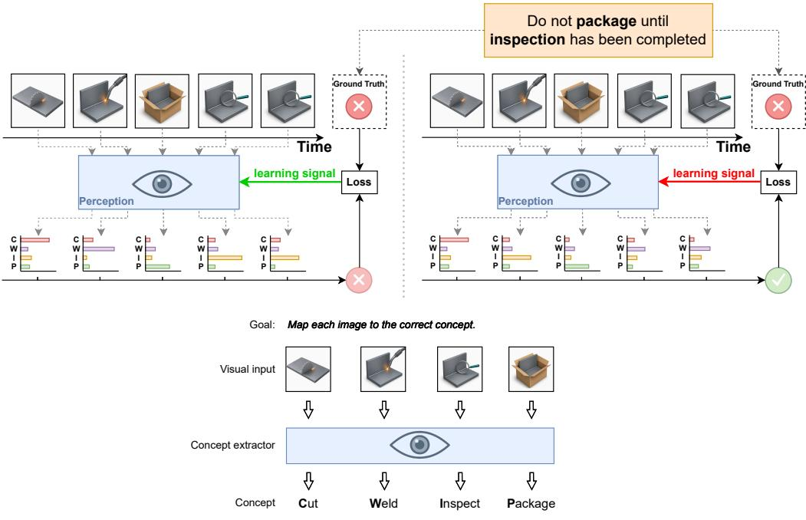
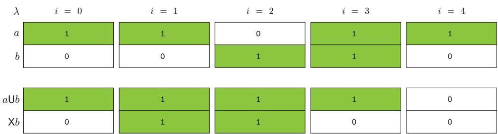
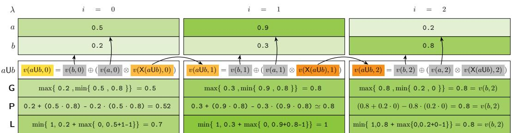
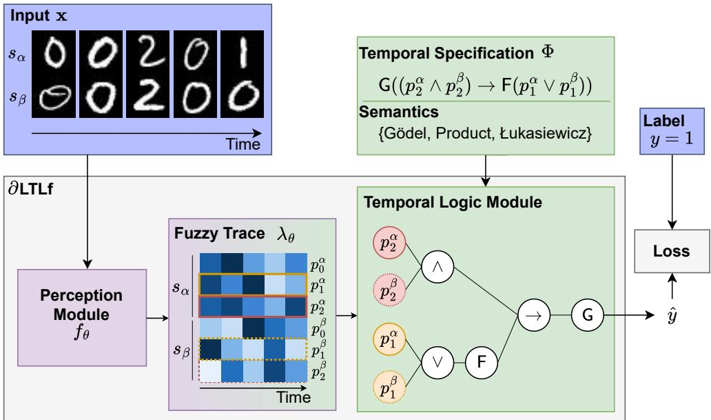
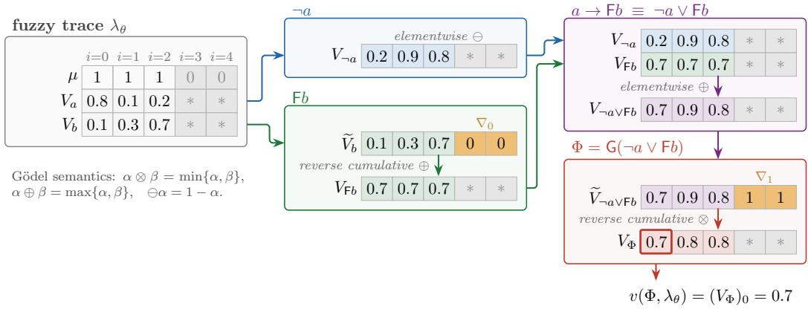
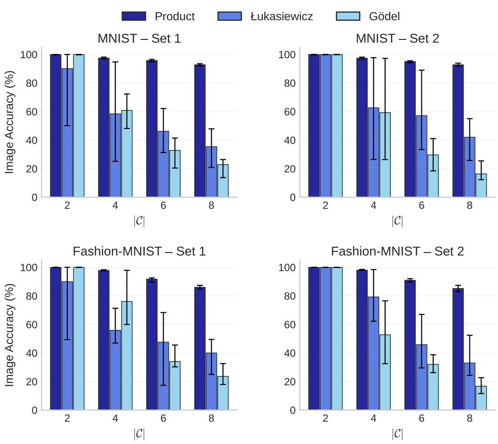
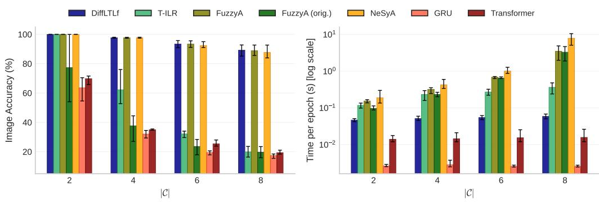
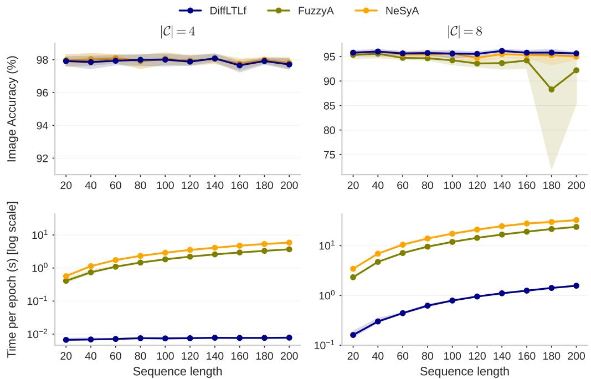

# Time to Reason: Scalable Neurosymbolic Learning for LTLf via Fuzzy Semantics

Riccardo Andreoni<sup>a,b</sup>, Andrei Buliga<sup>a</sup>, Alessandro Daniele<sup>b</sup>, Paolo Felli<sup>c</sup>, Chiara Ghidini<sup>b</sup>, Marco Montali<sup>b</sup>, Massimiliano Ronzani<sup>a</sup>

<sup>a</sup>Fondazione Bruno Kessler, Via Sommarive, 18, Trento, 38123, Italy <sup>b</sup>Free University of Bozen-Bolzano, Via Bruno Buozzi, 1, Bolzano, 39100, Italy <sup>c</sup>Università di Bologna, Via Mura Anteo Zamboni 7, Bologna, 40126, Italy

## Abstract

Neurosymbolic (NeSy) Artificial Intelligence aims to integrate Deep Learning (DL) architectures with symbolic reasoning. While initial NeSy approaches have targeted mainly symbolic reasoning in propositional and first-order logics, recent works have started to address the construction of neurosymbolic frameworks for Temporal Logics, and in particular for $\operatorname { L T L } _ { f } .$ These approaches have established temporal NeSy as a promising research direction, laying the foundations for learning under temporal constraints. Nonetheless, they leave many questions unanswered. From a theoretical perspective, several diferentiable semantics for interpreting ltl<sub>f</sub> have been proposed but have not yet been formally and systematically defined within a unified framework. Moreover, existing approaches commonly rely on automata to represent temporal knowledge, resulting in limited scalability. Motivated by this research gap, this paper provides the following contributions: (i) formally defining diferent fuzzy semantics for $\operatorname { L T L } _ { f } .$ , and systematically analysing theoretical properties regarding equivalences and dualities of temporal operators; (ii) showing how these semantics can be directly integrated within a novel NeSy framework, called $\partial \mathrm { L T L } _ { f }$ , enabling flexible and scalable learning without relying on the usage of automata; and (iii) introducing a novel evaluation protocol of increased complexity of learning tasks w.r.t. existing benchmarks.

Our results show that the choice of fuzzy semantics has a significant impact on predictive performance. Moreover, $\partial \mathrm { L T L } _ { f }$ achieves performance on par with, and sometimes superior to, state-of-the-art probabilistic approaches while substantially improving scalability. Taken together, these results establish direct fuzzy interpretations as a competitive and scalable alternative

## 1. Introduction

Neurosymbolic (NeSy) Artificial Intelligence (AI) aims to integrate Deep Learning (DL) architectures with symbolic reasoning techniques [4]. This integration aims to combine the strengths of deep neural networks and symbolic AI while overcoming their respective weaknesses, addressing important problems related to data eficiency, fairness, trust, and safety of AI.

A number of NeSy approaches have been proposed in recent years, difering both in the symbolic formalisms they adopt and in how symbolic knowledge is incorporated into gradient-based learning. Concerning the former, most of the eforts have been focused on propositional and first-order logics [23, 2]. Concerning the latter, end-to-end training is typically enabled by relaxing symbolic representations into numerical forms. As a result, diferent interpretations, including fuzzy and probabilistic semantics, have been explored to align symbolic reasoning with the learning dynamics of neural models [2, 12, 23, 33].

In the last few years the NeSy community has witnessed the emergence of a new series of works (see in particular [20, 29, 22, 1]) that aim to build neurosymbolic frameworks for Temporal Logics, and in particular for Linear time Temporal Logic (ltl) [25] and its variant $\operatorname { L T L } _ { f }$ on finite traces [9]. This is not surprising. In fact, ltl and $\operatorname { L T L } _ { f }$ are widely used across a range of domains—including formal methods [25], automated planning [8], AI-augmented process mining [10], and reinforcement learning [7]. These new temporal NeSy formalisms are characterised by the fact that learning must account for sequential data and time-dependent constraints. An important diference between these works concerns the way in which the temporal knowledge is incorporated within the framework. The works of Umili et al. [29] and Manginas et al. [22] rely on a finite-state machine (automata) transformation of the temporal formula that is used to define supervision signals over input sequences. The former uses fuzzy automata under the Product semantics, while the latter uses probabilistic automata. Instead, the work of Andreoni et al. [1] interprets directly $\operatorname { L T L } _ { f }$ specifications through fuzzy logic under the Gödel semantics to guide the learning process. This is to overcome the computational overhead required to (1) build the automaton and (2) traverse it multiple times during the training procedure.

These works have a great merit, as they have extended NeSy frameworks to reference logics for dynamic domains. Nonetheless, they are still first, and somehow preliminary, proposals towards the solid definition of temporal NeSy frameworks. From the description above it is easy to see that they all exploit diferent diferentiable semantics to interpret classical $\operatorname { L T L } ,$ and none of them takes into account the problem of investigating the impact that this choice has, both in terms of the relationship between the diferentiable semantics and the classical one, and in terms of performances. This is a crucial aspect, especially for formalisms based on fuzzy logics, as prior work on propositional logics shows that the choice of fuzzy semantics can significantly afect the predictive performance within NeSy frameworks [17].

A second important merit of the works above is to have identified a clear task for the evaluation of these methods, that is weakly supervised symbol grounding (see Section 2.1). Nonetheless, the works mentioned above provide limited attention to the issue of scalability. While this is understandable, as they are the first works in the field, scalability is an important property that needs to be considered and investigated when developing a NeSy framework. Related to this, Lorello et al. [20] recently proposed a benchmark for this task. However, it applies only to NeSy methods that compile temporal knowledge into automata, which hampers the assessment of systems relying on alternative integration approaches.

This work has the aim to overcome the limitations listed above: (i) generalizing the work of Donadello et al. [13], we provide a systematic study of fuzzy semantics in temporal NeSy learning, where we show that the classical $\operatorname { L T L } _ { f }$ equivalences between temporal operators are preserved in full only under the Gödel semantics, whereas under Product and Łukasiewicz some operators lose their interdefinability and require a native definition; (ii) we show how diferent fuzzy semantics can be directly integrated within a novel NeSy framework, called $\partial \mathrm { L T L } _ { f } ,$ , enabling flexible learning without having to rely on the usage of automata; (iii) we take inspiration from Lorello et al. [20] and introduce an extensive evaluation protocol for temporal NeSy, that works for both automata-based and automata-free frameworks. To start addressing the problem of scalability, we increase the complexity of learning scenarios w.r.t. [20]. The evaluation shows that: (1) diferent fuzzy semantics afect predictive performance, and (2) the direct fuzzy interpretations of $\partial \mathrm { L T L } _ { f }$ overall achieve comparative performance with the state-of-the-art method proposed in [22] while significantly increasing scalability, thus confirming trends already exposed for first-order logics [21] where probabilistic approaches tend to improve predictive performance, while fuzzy logics tend to increase computational eficiency.

Besides this particular work, and the proposal of $\partial \mathrm { L T L } _ { f } .$ , we believe that the systematic theoretical investigation of fuzzy $\operatorname { L T L } _ { f }$ in Section 4, and the novel evaluation setting provided in Section 6 can provide a solid contribution to the development of future temporal NeSy frameworks, thus contributing to the consolidation of this field.

The paper is structured as follows. In Section 2 we summarise the required preliminaries and background material; in Section 3 we illustrate the state of the art in temporal NeSy, including available benchmarks, focusing on the most relevant approaches against which our experimental evaluation is carried out; in Section 4 we introduce our fuzzy variant of the ltl<sub>f</sub> temporal logic, formalising and studying three distinct semantics; in Section 5 we illustrate the overall $\partial \mathrm { L T L } _ { f }$ framework and formally state the NeSy task at hand; in Section 6 we formulate critical research questions and carry out experimental evaluation, comparing $\partial \mathrm { L T L } _ { f }$ against the existing approaches in the literature that were already identified; in Section 7 we present the results of our evaluation with respect to the research questions that were formulated; in Section 8 we underline some limitations of the current study. Conclusions are summarised in Section 9, and some technical implementation details and ancillary experimental results are given in appendix. The $\partial \mathrm { L T L } _ { f }$ implementation and the experiments are available at github.com/andreoniriccardo/DifLTLf.

## 2. Background

In this section we revise the background notions needed in the paper. We start by introducing the task of weakly supervised symbol grounding which we aim to solve with the proposed $\partial \mathrm { L T L } _ { f }$ We continue by revising the definitions of Linear Time Temporal logic both in its classical setting and in the setting of finite traces. For the sake of readability we have decided to omit a separate background section on propositional fuzzy logics. Instead, we introduce the key notions of fuzzy logics when they are needed in defining the fuzzy $\operatorname { L T L } _ { f }$ variants in Section 4.

2.1. Weakly Supervised Symbol Grounding under Distant Temporal Supervision

In this section, we revise the weakly supervised symbol grounding under distant temporal supervision problem addressed by previous temporal neurosymbolic frameworks [20, 29, 22, 1]. In this task, a model must discover the symbolic meaning of visual observations from sequences, supervised only by a binary label for each sequence, where the label expresses compliance with a temporal specification.

The setting is as follows: a model observes sequences of images, where each image represents one of a finite set of categories unknown to the model. Each sequence is annotated with a single binary label indicating whether the sequence, interpreted at the symbolic level, satisfies or violates a given temporal specification (i.e., a rule that constrains the admissible ordering of symbols over time). Crucially, the model has no access to the category of the individual images: it is never told which category any particular image belongs to. The learning objective is to train a perception model that maps each raw image to a symbolic category, using only the sequence-level compliance label as supervision.

Figure 1 illustrates the task’s learning process on a simplified manufacturing example. This example involves four possible activities: cutting, welding, inspecting, and packaging. Moreover, the scenario at hand is subject to the temporal specification “do not package until inspection has been completed’’. Both sides of the figure show the same input sequence, which violates this rule. On the left hand side, the perception module correctly recognises each image, resulting in a correct classification of the sequence as non-compliant. On the right hand side, the perception module misclassifies some images, resulting in an incorrect classification of the sequence as compliant. The mismatch with the ground-truth label produces a large loss, and the resulting learning signal pushes the perception module to correct its predictions (red arrow). In both cases, the model receives only the binary compliance label, and the symbolic category of the individual images is never provided.

This example serves as a high-level illustration of the learning problem; the scenario and the images in Figure 1 are not part of the experimental evaluation. The formal definition of the task, including the temporal specification language and the proposed neurosymbolic framework, is presented in Sections 4 and 5 respectively. The experimental evaluation is detailed in Section 6.

  
Figure 1: Illustrative example of the weakly supervised learning task on a simplified manufacturing scenario. Left: correct perception leads to a correct assessment of noncompliance, matching the ground-truth label. Right: incorrect perception leads to a wrong assessment of compliance, producing a corrective learning signal.

## 2.2. Linear Temporal Logic on Finite Traces

Linear-time logics, that is, temporal logics predicating on traces, provide the most natural choice to express symbolic knowledge in our setting. Traditionally, traces are assumed to have an infinite length, as witnessed by Linear Temporal Logic (ltl) [25]. In several application domains, such as planning and process mining, the dynamics of the system are more naturally captured using unbounded, but finite, traces [8]. This led to ltl on finite traces $\left( \mathrm { L T L } _ { f } \right)$ [9].

An $\operatorname { L T L } _ { f }$ formula $\varphi$ over a finite set P of propositional symbols follows the grammar [9]:

$$
\varphi : : = p \mid \neg \varphi \mid \varphi \lor \varphi \mid \mathsf { X } \varphi \mid \varphi \mathsf { U } \varphi
$$

where $p \in \mathcal P$

The semantics of these formulae is defined over finite traces, usually formalised as non-empty sequences $\lambda = \langle A _ { 1 } , A _ { 2 } \dotsb , A _ { n } \rangle$ where each $A _ { i } \in 2 ^ { \mathcal { P } }$ for $i > 0$ is the set of propositional symbols that are true at instant $i ,$ namely is a propositional assignment over $\mathcal { P }$ . For uniformity with the fuzzy setting discussed later, and in particular with the definition of traces used in Section 4, we adopt a functional, equivalent definition, where a trace is represented as a non-empty series of instants, each mapping every propositional symbol from $\mathcal { P }$ to either 0 (for false) or 1 (for true).

  
Figure 2: Graphical depiction of an $\operatorname { L T L } _ { f }$ trace of length 5, and satisfaction of the two formulae aUb and Xb in every instant of the trace.

Definition 1. A trace of length n is a non-empty vector $\lambda = \langle \lambda _ { 0 } , \ldots , \lambda _ { n - 1 } \rangle$ of functions in which, for each instant $i = 0 , \ldots , n { - } 1$ , the i-th function $\lambda _ { i } : P \mapsto \{ 0 , 1 \}$ assigns a truth value to each symbol $p \in \mathcal P$ . Given $i \in$ $\{ 0 , \ldots , n - 1 \}$ and $p \in P , \lambda _ { i } ( p )$ is equivalently denoted by $\lambda ( p , i )$

Notably, in this paper we consider only non-empty traces of finite length, and denote the last instant of a trace λ of length n by $l a s t ( \lambda ) = n - 1$

Example 1. Figure $\mathcal { Q } ~ ( t o p )$ graphically depicts an $L T L _ { f }$ trace λ of length 5 defined over $\mathcal { P } = \{ a , b \}$ . We have last $( \lambda ) = 4$ . Also, $\lambda ( \mathsf { a } , 0 ) = 1$ is the truth value associated to symbol a at instant 0 (the beginning of the trace), while $\lambda ( \mathsf { a } , 1 ) = 1$ is the value of a in the following instant.

The grammar above extends propositional logic on $\mathcal { P }$ with formulae employing the temporal operators $\mathsf { X }$ and U, respectively representing (strong) next and (strong) until. Intuitively, when evaluated in an instant of the trace: $\mathsf { X } _ { \mathcal { S } }$ states that there exists a next instant, and $\varphi$ holds therein; $\varphi _ { 1 } \cup \varphi _ { 2 }$ states that $\varphi _ { 2 }$ holds in the current or a later instant, and in all instants in between, $\varphi _ { 1 }$ holds.

Formally, for an $\operatorname { L T L } _ { f }$ formula $\varphi ,$ a trace $\lambda ,$ and an instant $i \in$ $\{ 0 , \ldots , l a s t ( \lambda ) \}$ , we inductively define that $\varphi$ is true in instant i of $\lambda$ , written $\lambda , i \neq \varphi ,$ as [9]:

```perl
$\lambda , i \models p \in \mathcal { P }$ if $\lambda ( p , i ) = 1$
λ, $i \not = \neg \varphi$ if $\lambda , i \neq \varphi$
λ, $i \Vdash \varphi _ { 1 } \lor \varphi _ { 2 }$ if $\lambda , i \models \varphi _ { 1 }$ or $\lambda , i \vdash \varphi _ { 2 }$
$\lambda , i \models \mathsf { X } \varphi$ if $i < l a s t ( \lambda )$ and $\lambda , i { + } 1 \models \varphi$
$\lambda , i \models \varphi _ { 1 } \mathsf { U } \varphi _ { 2 }$ if $\lambda , j \vdash \varphi _ { 2 }$ for some $j$ s.t. $i \leq j \leq l a s t ( \lambda )$ and
$\lambda , k \models \varphi _ { 1 }$ for every k $; \mathrm { s . t . } \ i \le k < j$
```

We say that λ satisfies $\varphi ,$ written $\lambda \left| = \varphi , { \mathrm { i f ~ } } \lambda , 0 \right| = \varphi .$

Example 2. Figure 2 (bottom) graphically depicts, instant by instant, the truth values of the two $L T L _ { f }$ formulae aUb and Xb, evaluated over the trace λ from Example 1 (and shown in the top part of the same figure).

Formula Xb essentially shifts of one instant ahead the truth values of b as assigned by $\lambda _ { i }$ , and is false in instant $4 = l a s t ( \lambda )$ since there is no next instant in λ.

Formula aUb evaluates to false in instant 4: while the left-hand side holds therein, there is no later instant in λ where b holds. The formula instead evaluates to true in all other instants: in instants 2 and 3 because the righthand side holds, and in instants 0 and 1 because the left-hand side holds there and in later instants until, in instant 3, the right-hand side holds. The truth values at instant 0 indicate the overall verdict for the entire trace: $\lambda \vdash a \cup b$ , and $\lambda \nvDash \mathsf X b$

The syntax and semantics of the other standard boolean connectives ⊤, ⊥, $\land , $ are derived as usual. Further key temporal operators are derived from X and U as follows.

• weak next $( { \sf X } _ { w } ) \colon { \sf X } _ { w } \varphi \equiv { \sf X } \varphi { \mathrm { ~ V } } \neg { \sf X } { \mathrm { \top } }$ , capturing that if there is a next instant, then $\varphi$ holds therein;

• release (R): $\varphi _ { 1 } \mathsf { R } \varphi _ { 2 } \equiv \lnot \left( \lnot \varphi _ { 1 } \mathsf { U } \lnot \varphi _ { 2 } \right)$ , capturing that $\varphi _ { 2 }$ holds until, and including the moment, where $\varphi _ { 1 }$ holds (if this condition never occurs, then $\varphi _ { 2 }$ holds throughout the entire trace);

• globally (G): ${ \sf G } \varphi \equiv \bot { \sf R } \varphi .$ , capturing that $\varphi$ holds throughout the entire trace;

Table 1: declare pattern templates used in the benchmark. A and B denote streamspecific propositions or Boolean combinations of them.
<table><tr><td>DECLARE Pattern</td><td>LTLf Template</td><td>Description</td></tr><tr><td>Response</td><td> $\mathsf { G } ( A \to \mathsf { F } B )$ </td><td>If A occurs, B must even- tually follow</td></tr><tr><td>Not Succession</td><td>G(A → ¬F B)</td><td>If A occurs, B must never follow</td></tr><tr><td>Chain Succession</td><td>G(A → X B)</td><td>If A occurs, B must hold at the next timestep</td></tr><tr><td>Not Chain Succession G(A → ¬X B)</td><td></td><td>If A occurs, B must not hold at the next timestep</td></tr><tr><td>Precedence</td><td> $( \neg B \lor A ) \lor \mathsf { G } ( \neg B )$ </td><td>B cannot occur before A has occurred</td></tr><tr><td>Chain Precedence</td><td>G(X B → A)</td><td>Every occurrence of B is immediately preceded by A</td></tr><tr><td>Responded Existence</td><td> $\mathsf { F } A \to \mathsf { F } B$ </td><td>If A occurs at some point, B must also occur</td></tr><tr><td>Not Co-existence</td><td> $\mathsf { F } A \to \lnot \mathsf { F } B$ </td><td>A and B cannot both occur in the sequence</td></tr></table>

• eventually (F): $\mathsf { F } _ { \mathcal { S } } \equiv \mathsf { T } \cup _ { \mathcal { S } _ { \frac { . } { . } } }$ , capturing that $\varphi$ holds at some instant in the trace.

• strong release $( \mathsf { M } ) \colon \varphi \mathsf { M } \psi \equiv \varphi \mathsf { R } \psi \wedge \mathsf { F } \varphi$ , capturing a stronger form of release where $\varphi$ holds at some point.

• weak until (W): $\varphi \mathsf { W } \psi \equiv \varphi \mathsf { U } \psi \vee \mathsf { G } \varphi$ , capturing a weaker form of until where ψ is not required to hold at some point and, in that case, $\varphi$ must globally hold.

The process mining community has selected a number of patterns of $\operatorname { L T L } _ { f }$ formulas that are particularly significant for describing business processes in a declarative manner. These patterns constitute the declare modelling language [10]. Examples of declare patterns are provided in Table 1 together with their $\operatorname { L T L } _ { f }$ formalisation and intuitive meaning. Following [29, 1, 28], we use declare formulae in the evaluation of our approach in Section 6.

## 3. State of the Art in Temporal NeSy

The majority of works in the NeSy community focus on static, relational domains [4]. Nonetheless recent eforts have started proposing solutions for NeSy learning over temporal domains, dealing with diferent types of formalisms, architectures, and evaluation protocols. In this section, we describe the main existing frameworks with the goal of highlighting their contributions and their limitations. The limitations illustrated here motivate our overall work and the definition of $\partial \mathrm { L T L } _ { f }$

The works we take into account here are FuzzyA [29]<sup>1</sup>, NeSyA [22], T-ILR [1], and the LTLZinc benchmark [20]. We focus on these papers because they provide the most recent and impactful contributions.<sup>2</sup>

We first review the three frameworks of FuzzyA [29], NeSyA [22], and T-ILR [1], and we conclude the section with the LTLZinc benchmark [20].

## 3.1. NeSy Frameworks for Temporal Logic

A first important observation is that all these recent eforts focus on a particular variant of Temporal Logics, that is, Linear time Temporal Logics on finite traces $\left( \mathrm { L T L } _ { f } \right)$ . Having said so, they solve the task of Weakly Supervised Symbol Grounding under Distant Temporal Supervision in diferent manners. We can make explicit these diferences along two main dimensions: (i) how the temporal knowledge is integrated into the learning process, and (ii) which diferentiable semantics is used to interpret the temporal formula. Let us explore these two dimensions one by one.

Integration of Knowledge. Concerning the way in which temporal knowledge is integrated into the learning process, the dominant approach compiles the ltl<sub>f</sub> specification into a deterministic finite-state automaton (DFA), which is then evaluated in a diferentiable manner over the perception outputs. The two most representative instances of this approach are FuzzyA [29] and NeSyA [22]. In these frameworks, at each timestep, a neural perception module produces soft truth values for the atomic propositions, which are used to evaluate the automaton’s transition guards. The guard values then update the truth values associated with each automaton state, recursively from the first to the last instant of the sequence.

The explicit construction of a finite-state automaton from the $\operatorname { L T L } _ { f }$ formula originates two distinct limitations: first, the automaton must be built before training, and its size is, in the worst case, double-exponential in the size of the $\operatorname { L T L } _ { f }$ formula [9]. Second, during training the evaluation of the state of the automaton is computed recurrently over the sequence, each timestep depending on the previous one, so the evaluation is inherently sequential, preventing parallelisation over time.

To overcome these limitations, T-ILR [1] operates directly on the logical structure of the formula, foregoing the need for an intermediate DFA-based representation. In particular, T-ILR proposes a diferentiable framework in which $\operatorname { L T L } _ { f }$ formulas are evaluated through fuzzy semantics without compiling them into an intermediate automaton. This allows the model to compute a degree of satisfaction directly from the neural outputs, while still enabling gradient-based optimization.

In this work we follow the approach of T-ILR, and base our proposal $\partial \mathrm { L T L } _ { f }$ on this latter approach of evaluating directly $\operatorname { L T L } _ { f }$ formulas through a diferentiable semantics without compiling them into an intermediate automaton.

Diferentiable Semantics. Concerning the diferentiable semantics used to interpret the temporal formula, we can observe a heterogeneous situation. In fact, FuzzyA, T-ILR, and NeSyA adopt three diferent semantics.

More in detail, FuzzyA adopts a fuzzy interpretation of the automaton, and exploits the Product semantics for the fuzzy connectives. The authors of FuzzyA claim to be inspired, in their work, by Logic Tensor Networks [2], and the choice of Product semantics appears to be grounded on this inspiration. Similarly to FuzzyA, T-ILR chooses to rely on a fuzzy approach, but opts for the Gödel semantics. This choice is justified in terms of the theoretical investigation of fuzzy $\operatorname { L T L } _ { f }$ provided in Donadello et al. [13]. Finally, NeSyA replaces fuzzy semantics with probabilistic reasoning. The probabilistic semantics is exact and avoids the approximation introduced by fuzzy evaluations. It comes, however, at a computational cost, as exact probabilistic inference requires solving a Weighted Model Counting (WMC) problem.<sup>3</sup>

The divide between probabilistic and fuzzy approaches is something to be expected, and mimics what has happened for the more established NeSy frameworks for static, relational domains, that is, domains where knowledge is formalised using propositional or first-order logics.

Nonetheless, we can observe a lack of systematic investigation of the choices one has and of the impact of these choices on the resulting framework. This is a crucial limitation both for formalisms based on fuzzy logics, and for the choice between probabilistic and fuzzy logics. In fact, prior work on NeSy frameworks for Propositional and First Order Logics shows that the choice of fuzzy semantics can significantly afect the predictive performance within NeSy frameworks [17], and a trade of exists between probabilistic and fuzzy approaches, where probabilistic approaches tend to improve the predictive performance, while fuzzy logics tend to improve (that is, decrease) the computational cost.

In this work, we aim for scalability and therefore opt for the fuzzy approach. Nonetheless we do it in a principled manner, first by providing theoretical investigation of diferent fuzzy semantics for $\operatorname { L T L } _ { f }$ obtained using diferent t-norms, and then by defining $\partial \mathrm { L T L } _ { f }$ as a semantics-agnostic, fuzzy framework for temporal data where one can opt for diferent fuzzy semantics. Moreover, we aim at providing a first comprehensive and systematic evaluation of the diferent fuzzy and probabilistic semantics in terms of predictive performance and computational cost, thus obtaining systematic insights on the impact that the diferent diferentiable semantics can have on the task.

## 3.2. Temporal NeSy benchmarks

It is worth noting that, despite their architectural diferences, the stateof-the-art methods described above are all evaluated on the task introduced in Section 2.1, where supervision is provided only at the sequence level.

A recent benchmark related to this task is that of LTLZinc [20], which targets sequence classification under temporal specifications. While the proposal of a benchmark is extremely important in building a solid research community, we can observe several limitations in this work when we aim to use it for comparing the diferent aspects of temporal NeSy methods under purely distant supervision. First, its specifications interleave temporal operators with relational constraints, so that the contribution of the temporal reasoning component is not isolated. Second, it introduces intermediate supervision signals at several levels of the pipeline, together with a supervised pre-training of the perception module. While this facilitates training, it makes the benchmark less suitable for assessing how methods perform in more challenging (and possibly more realistic) scenarios when only distant supervision is available. Third, it relies on the supervision on the next state in the finite-state machine. This makes it applicable only to automata-based methods, excluding approaches that evaluate the temporal specification directly.

These limitations motivate the evaluation protocol we introduce in Section 6, which relies only on the sequence-level label and applies to both automata-based and automata-free methods. Moreover, our evaluation setting disentangles two distinct critical aspects that afect scalability, by varying the size of the temporal specification and the length of the input sequences in a separate manner.

## 4. Fuzzy LTLF

In this section we introduce the syntax and the semantics of the temporal fuzzy logic that we use to formalise specifications. To define the semantics, as customary for t-norm fuzzy logics, one has to choose how to evaluate the logical connectives, namely conjunction, disjunction, negation and implication, as this is not fixed univocally. Instead of committing to a specific choice of evaluation, in this work we consider three alternatives, in turn obtaining three fuzzy variants of $\operatorname { L T L } _ { f }$ , which we term flt $\ l _ { i } ^ { G }$ , fltl $\underset { f } { P }$ , and fltl $^ { L } _ { \ l ^ { \prime } f }$ . flt $ { \mathcal { G } }$ corresponds to the logic previously introduced in [13], that is, fuzzy $\operatorname { L T L } _ { f }$ with the Gödel semantics; fltl $^ P _ { ^ { i } f }$ and $\mathrm { F L T L } _ { f } ^ { L }$ adopt, respectively, a variant of the Product semantics and the Łukasiewicz semantics. For convenience of presentation, we denote this family of logics as $\mathrm { F L T L } _ { f } ^ { x }$

The remainder of this section is organised as follows: in Section 4.1 we provide the syntax and semantics of the three logics, focussing on the core temporal operators $\mathsf { X }$ (next) and U (until). In Section 4.2 we consider additional temporal operators that are well known in the literature on temporal logic, and that in the boolean case are derivable from X and U. In particular, we investigate whether the equivalences known to hold for $\operatorname { L T L } _ { f }$ hold for our case as well. We show that, irrespective of the semantics chosen, some of these operators can be defined from the two fundamental temporal operators X and U introduced in Section 4.1, while others cannot be derived as abbreviations, and thus their semantics needs to be defined natively.

## 4.1. fltl<sup>x</sup> Syntax and Semantics

The logics we consider are finite-trace variants of the known Fuzzy Lineartime Temporal Logic (fltl) [18, 14] that is interpreted over finite traces, and thus can be seen as fuzzy counterparts of $\operatorname { L T L } _ { f }$ (see Section 2.2 for preliminaries on $\operatorname { L T L } _ { f } )$

Given a finite set $\mathcal { P }$ of propositional symbols, an fltl<sup>x</sup> formula $\varphi$ is written according to the following grammar:

$$
\varphi : = { \textsf { T } } | \bot | \ p | \neg \varphi | \varphi \wedge \varphi | \varphi \vee \varphi | \varphi \to \varphi | \textsf { X } \varphi | \varphi \mathsf { U } \varphi
$$

where $p \in \mathcal P$ , the symbols ⊤ and ⊥ are the true and false constants, respectively, and $\neg , \land , \lor , $ are fuzzy connectives for negation, conjunction, disjunction, implication. As in $\operatorname { L T L } _ { f }$ , the fundamental temporal operators are X (next) and U (until).

The semantics of these formulae is defined again over finite traces over propositional symbols P. However, whereas the sequences in Section 2.2 assigned only crisp values, namely either 0 or 1, the traces used for fltl<sup>x</sup><sub>f</sub> are non-empty sequences of instants in which a real value in the interval [0, 1] is assigned to each propositional symbol $p \in \mathcal P$ , representing the degree of truth of p at each instant.

Definition 2. A trace of length n is a vector $\lambda = \langle \lambda _ { 0 } , \ldots , \lambda _ { n - 1 } \rangle$ of functions in which, for each instant $i = 0 , \ldots , n { - } 1$ , the i-th function $\lambda _ { i } : P \mapsto [ 0 , 1 ]$ assigns to each symbol $p \in \mathcal P$ a real value. For brevity, we denote by $\lambda ( p , i )$ the value associated to p at instant i, namely $\lambda _ { i } ( p )$ . Moreover, in Section 5 and following we write $\lambda ( p ) = \langle p _ { 0 } , p _ { 1 } , . . . , p _ { n - 1 } \rangle$ to denote the sequence of all values of p along the trace, namely the sequence of values $p _ { i } = \lambda ( p , i )$

We restrict to non-empty traces of finite length, thus continue to denote the last instant of a trace λ of length n by $l a s t ( \lambda ) = n { - } 1$

As a consequence, diferently from $\operatorname { L T L } _ { f }$ , the evaluation of an $\mathrm { F L T L } _ { f } ^ { x }$ formula $\varphi$ over a trace λ at instant $i \geq 0$ , denoted by $v ( \varphi , \lambda , i )$ , returns a real value in [0, 1] rather than necessarily a boolean value in $\{ 0 , 1 \}$ . This is defined below, where $p \in \mathcal P$ and $\varphi _ { 1 } , \varphi _ { 2 }$ are $\mathrm { F L T L } _ { f } ^ { x }$ formulae:

$$
\begin{array} { r c l } { { v ( \top , \lambda , i ) } } & { { = } } & { { 1 \mathrm { ~ a n d ~ } v ( \bot , \lambda , i ) = 0 ; } } \\ { { v ( p , \lambda , i ) } } & { { = } } & { { \lambda ( p , i ) ; } } \\ { { v ( \neg \varphi , \lambda , i ) } } & { { = } } & { { \Theta v ( \varphi , \lambda , i ) ; } } \\ { { v ( \varphi _ { 1 } \wedge \varphi _ { 2 } , \lambda , i ) } } & { { = } } & { { v ( \varphi _ { 1 } , \lambda , i ) \otimes v ( \varphi _ { 2 } , \lambda , i ) ; } } \\ { { v ( \varphi _ { 1 } \vee \varphi _ { 2 } , \lambda , i ) } } & { { = } } & { { v ( \varphi _ { 1 } , \lambda , i ) \oplus v ( \varphi _ { 2 } , \lambda , i ) ; } } \\ { { v ( \varphi _ { 1 } \to \varphi _ { 2 } , \lambda , i ) } } & { { = } } & { { v ( \varphi _ { 1 } , \lambda , i ) \ominus v ( \varphi _ { 2 } , \lambda , i ) ; } } \\ { { v ( \mathsf { X } \varphi , \lambda , i ) } } & { { = } } & { { v ( \varphi , \lambda , i + 1 ) \mathrm { ~ i f ~ } i < l a s t ( \lambda ) , 0 \mathrm { ~ o t h e r w i s e } ; } } \\ { { v ( \varphi _ { 1 } \mathsf { U } \varphi _ { 2 } , \lambda , i ) } } & { { = } } & { { v ( \varphi _ { 2 } , \lambda , i ) \oplus ( v ( \varphi _ { 1 } , \lambda , i ) \otimes v ( \mathsf { X } ( \varphi _ { 1 } \mathsf { U } _ { \varphi _ { 2 } } ) , \lambda , i ) ) . } } \end{array}
$$

where $\otimes , \oplus , \ominus , \odot$ are the chosen t-norm, t-conorm (or s-norm), negation function and implication function, respectively. As discussed in the remainder of this paper, this is indeed one crucial distinction between $\operatorname { L T L } _ { f }$ and this fuzzy logic: the semantics of propositional connectives is explicitly given.

It is also worth noting that the semantics of U (until) is here given using the alternative, equivalent recursive formulation based on the expansion law for the until operator [3], which in the propositional setting has the form $\varphi _ { 1 } \mathsf { U } \varphi _ { 2 } = \varphi _ { 2 } \vee \left( \varphi _ { 1 } \wedge \mathsf { X } ( \varphi _ { 1 } \mathsf { U } \varphi _ { 2 } ) \right)$ . This makes explicit the role of the chosen t-norm (conjunction) and t-conorm (disjunction) in its semantics and thus in the evaluation.

We say that an flt $\boldsymbol { \mathsf { \Pi } } _ { f } ^ { x }$ formula $\varphi$ has value k in a trace λ at instant $i \geq 0$ if $v ( \varphi , \lambda , i ) = k$ . Similarly, we say that $\varphi$ has value k in $\lambda$ if $v ( \varphi , \lambda , 0 ) = k$ also written $v ( \varphi , \lambda ) = k$ . Finally, we say that two $\mathrm { F L T L } _ { f } ^ { x }$ formulae $\varphi _ { 1 } , \varphi _ { 2 }$ are equivalent, written $\varphi _ { 1 } \equiv \varphi _ { 2 }$ , if and only if they have the same value in every possible trace.

Intuitively, the value of a propositional symbol $p \in \mathcal P$ at instant i is simply the value assigned to $p$ by the trace, while boolean connectives are computed according to the chosen t-norm, t-conorm, negation and implication functions. A formula of the form $\mathsf { X } _ { \mathcal { S } }$ is evaluated at $i$ on the next instant i+1 of the trace, and if this does not exist, then the value is 0. Instead, $\varphi _ { 1 } \cup \varphi _ { 2 }$ expresses that $\varphi _ { 2 }$ eventually contributes positively to the value of the entire formula which is until then supported by the value of $\varphi _ { 1 }$ . However, as customary for t-norm fuzzy logics, it is evident that the precise semantics depends on the choice of connectives, which is not fixed univocally.

We consider the following three distinct semantics, thus a family of three

  
Figure 3: Graphical depiction of a flt $\boldsymbol { \mathsf { \Sigma } } _ { f } ^ { x }$ trace of length 3, and satisfaction of the formula aUb in every instant of the trace, under all three semantics.

resulting logics.

tives in the semantics above to match the standard Zadeh logic. Namely, for any values α, $\beta \in [ 0 , 1 ]$

$$
\begin{array} { l l } { \bullet \alpha \otimes \beta = \operatorname* { m i n } \{ \alpha , \beta \} } & { \bullet \alpha = 1 - \alpha } \\ { \bullet \alpha \oplus \beta = \operatorname* { m a x } \{ \alpha , \beta \} } & { \bullet \alpha \ominus \beta = ( \ominus \alpha ) \oplus \beta } \end{array}
$$

This logic matches the one considered in [13]. Intuitively, the t-norm preserves the intuitive behavior of the conjunction so that its value depends on the weakest evidence of truth, while the t-conorm preserves the intuitive behavior of disjunction and thus selects the strongest evidence. The remaining connectives correspond to classical negation and the fuzzy counterpart of material implication.

fltl<sup>P</sup>: Product semantics, with standard negation. This semantics regards truth values as akin to probabilistic information, namely, conjunction progressively weakens the value of truth evidence by multiplicative accumulation, while disjunction accounts for independent evidences. The values for conjunction and disjunction, therefore, behave as the probability of the intersection and union of independent events, respectively:

$$
{ \begin{array} { l l l l } { \bullet \ \alpha \otimes \beta = \alpha \cdot \beta } & { } & { \bullet \ \Theta \alpha = 1 - \alpha } \\ { \bullet \ \alpha \oplus \beta = \alpha + \beta - \alpha \cdot \beta } & { } & { \bullet \ \alpha \oplus \beta = ( \Theta \alpha ) \oplus \beta } \end{array} }
$$

$F L T L _ { f } ^ { L }$ : Łukasiewicz semantics. This semantics captures the notion that the truth value can be treated as a limited additive quantity, so by disjunction evidence of truth accumulates additively until a maximum, whereas by conjunction they combine additively but can compensate for each other until a point, so that an insuficient total value collapses to zero:

$$
{ \begin{array} { l l l l } { \bullet \alpha \otimes \beta = \operatorname* { m a x } \{ 0 , \alpha + \beta - 1 \} } & { } & { } & { \bullet \Theta \alpha = 1 - \alpha } \\ { \bullet \alpha \oplus \beta = \operatorname* { m i n } \{ 1 , \alpha + \beta \} } & { } & { } & { \bullet \alpha \ominus \beta = ( \ominus \alpha ) \oplus \beta } \end{array} }
$$

To see how the choice of semantics afects the meaning and evaluation of formulas, consider again a formula of the form $\phi \mathsf { U } \psi$ evaluated at instant 0. Its value results in general from the contribution of multiple possible choices of the instant $j$ at which the temporal eventuality is realised, namely at which the value $v ( \psi , \lambda , j )$ is taken together with the support provided by each $v ( \phi , \lambda , i )$ until then for $0 \leq i < j$

The recursive semantics at each instant combines three ingredients:

1. the value associated with the immediate realization of the eventuality (i.e., the value of $\psi )$ ;

2. the value of $\sf X ( \phi \sf U \phi )$ associated with all the deferred realizations;

3. the local support to these deferred realizations (i.e., the value of $\phi )$ .

Operationally, this occurs in two distinct steps, proceeding backwards, as illustrated in Figure 3. The t-norm $\otimes$ updates the value of deferred realizations by combining it with their local support given by $\phi .$ Instead, the t-conorm $\bigoplus$ combines the so-obtained value with the value of $\psi \ { \mathrm { ( i . e . } }$ , the value of the immediate realization).

In flt $\overset { \cdot } { \lrcorner } \overset { G } { \lrcorner }$ , the t-norm selects the minimum between local support $v ( \phi , \lambda , i )$ and the value of deferred realizations, so only one of these is considered. For instance, in the evaluation illustrated in Figure 3 for formula $a \mathsf { U } b ,$ , at instant 1 this is value min $\{ v ( a , \lambda , 1 ) , v ( a \mathsf { U } b , \lambda , 2 ) \} = 0 . 8$ . Then, the t-conorm selects the maximum, namely the best choice between immediate realization and possible deferred realizations. In Figure 3, for instant 1 this is the value max $\{ v ( b , \lambda , 1 ) , 0 . 8 \} = 0 . 8$ . As a result, the final value of the formula corresponds exactly to the choice of $j$ such that min $\{ v ( \phi , \lambda , 0 ) , \cdot \cdot \cdot , v ( \phi , \lambda , j - 1 )$ , $v ( \psi , \lambda , j ) \}$ is maximal. In Figure 3, we indeed see that by selecting $j = 2$ we obtain the maximal value 0.5: for $j = 1$ and $j = 0$ the value of $b$ is too low, while the local support given by the value of a is at least 0.5. So the final value is the minimum between 0.5 and the value of $b$ at instant 2. This behavior fundamentally relies on the fact that the t-conorm is associative and monotonic. Even if the local support at any step supports many deferred realizations at once, these repeated support values do not compound. We can actually think of realizations (choices of $j )$ as evaluated independently, selecting the best one.

In flt $\underset { f } { P }$ , the t-norm updates the value of deferred realizations by multiplying it with their local support $v ( \phi , \lambda , i )$ , which typically weakens it, so both contribute. Also, to combine the so-obtained value with $v ( \psi , \lambda , i )$ for immediate realization, the t-conorm operates a probabilistic-style accumulation: again both contribute, but they are treated as independent events and their value discounted to account for overlaps. Thus, unlike $\mathrm { F L T L } _ { f } ^ { G }$ , all possible realizations (choices of $j )$ contribute at once to the final value.

In $\mathrm { F L T L } _ { f } ^ { L }$ , local support $v ( \phi , \lambda , i )$ to deferred realizations is combined with their value by a t-norm that remains positive whenever the sum is greater than 1. This means that weaker support at earlier instants may be ofset by stronger support at later instants that is propagated back $( \mathrm { i . e . }$ , higher support of $\phi$ until the eventuality is realised and a higher value of $\psi$ later). The tconorm combines the resulting value with $v ( \psi , \lambda , i )$ for immediate realization additively (up to a value of 1), so the value may progressively strengthen. $\mathrm { A s }$ for $\mathrm { F L T L } _ { f } ^ { P }$ , multiple possible realizations may contribute at once until saturation to 1.

So for the same formula, the choice of semantics afects the value also because of how diferent ways of making the formula ‘true’ interact with each other.

## 4.2. Additional Temporal Operators

In this section we consider additional temporal operators that are a fuzzy counterpart of well known $\operatorname { L T L } _ { f }$ temporal operators, namely F (eventually), G (always), $\mathsf { X } _ { w }$ (weak next), W (weak until), R (release), M (strong release). $\mathrm { A s }$ we are going to show, while $\mathsf { F } , \mathsf { G } , \mathsf { X } _ { w }$ and R can be directly obtained as abbreviations from the base logic in the previous section, the W and M operators in general need to be explicitly defined, with the exception of the $\mathrm { F L T L } _ { f } ^ { G }$ case where they can also be derived.

We first give below the explicit semantics for each of these. We extend

flt $\boldsymbol { \mathcal { I } } _ { f } ^ { x }$ as follows:

$$
\begin{array} { r c l } { { v ( { \mathsf X } _ { w } \varphi , \lambda , i ) } } & { { = } } & { { v ( \varphi , \lambda , i + 1 ) \mathrm { ~ i f ~ } i < l a s t ( \lambda ) , 1 \mathrm { ~ o t h e r w i s e } ; } } \\ { { v ( { \mathsf F } \varphi , \lambda , i ) } } & { { = } } & { { v ( \varphi , \lambda , i ) \oplus v ( { \mathsf X } \mathsf { F } \varphi , \lambda , i ) ; } } \\ { { v ( { \mathsf G } \varphi , \lambda , i ) } } & { { = } } & { { v ( \varphi , \lambda , i ) \otimes v ( { \mathsf X } _ { w } \mathsf { G } \varphi , \lambda , i ) ; } } \\ { { v ( \varphi _ { 1 } \mathsf { W } \varphi _ { 2 } , \lambda , i ) } } & { { = } } & { { v ( \varphi _ { 2 } , \lambda , i ) \oplus \bigl ( v ( \varphi _ { 1 } , \lambda , i ) \otimes v ( { \mathsf X } _ { w } ( \varphi _ { 1 } \mathsf { W } \varphi _ { 2 } ) , \lambda , i ) \bigr ) ; } } \\ { { v ( \varphi _ { 1 } \mathsf { M } \varphi _ { 2 } , \lambda , i ) } } & { { = } } & { { v ( \varphi _ { 2 } , \lambda , i ) \otimes \bigl ( v ( \varphi _ { 1 } , \lambda , i ) \oplus v ( { \mathsf X } ( \varphi _ { 1 } \mathsf { M } \varphi _ { 2 } ) , \lambda , i ) \bigr ) ; } } \\ { { v ( \varphi _ { 1 } \mathsf { R } \varphi _ { 2 } , \lambda , i ) } } & { { = } } & { { v ( \varphi _ { 2 } , \lambda , i ) \otimes \bigl ( v ( \varphi _ { 1 } , \lambda , i ) \oplus v ( { \mathsf X } _ { w } ( \varphi _ { 1 } \mathsf { R } \varphi _ { 2 } ) , \lambda , i ) \bigr ) . } } \end{array}
$$

Intuitively, $\mathsf { X } _ { w } \varphi$ is analogous to $\mathsf { X } _ { \mathcal { S } }$ , although it does not require the next instant to exist (in which case, the value is trivially 1, i.e., maximally true). The value of $\mathsf { F } \varphi$ measures the evidence of $\varphi$ being true at any point in the remaining portion of the trace, hence its value is obtained by combining the current and future values of $\varphi$ using the t-conorm, to account for all possible ways in which the requirement can be satisfied. The value of ${ \sf G } \varphi$ measures the evidence of $\varphi$ being true in all instants in the remaining portion of the trace, so its value depends on the value of $\varphi$ in the current instant and in each instant until the end. All these values are combined using the t-norm. The W operator is the weak counterpart of U: the value of $\varphi _ { 1 } \mathsf { W } \varphi _ { 2 }$ depends on the support given by $\varphi _ { 1 }$ until the value of $\varphi _ { 2 }$ is positive, but a trace in which $\varphi _ { 2 }$ has no positive value can still have a positive value. $\varphi _ { 1 } \mathsf { M } \varphi _ { 2 }$ is used to express that eventually $\varphi _ { 1 }$ has a positive value and up to (and including) that instant the support is given by the value of $\varphi _ { 2 }$ . Intuitively, after that point, the value of $\varphi _ { 2 }$ is ‘released’ from providing support. R is the weak version of M, so there is no requirement on $\varphi _ { 1 }$ having a positive eventually.

In the propositions we establish next, we use the following convention: whenever the proposition is stated for fltl<sup>x</sup>, this means that the proposition holds for all the three logics fltl ${ \bf \Xi } _ { i , f } ^ { G } , \mathrm { F L T L } _ { f } ^ { P }$ , and fltl<sup>L</sup><sub>f</sub> . As a preliminary step in our study of inter-definability of temporal operators, we recall two known results on the fuzzy logics we consider. First, the chosen combinations of t-norms, t-conorms and standard negation form so-called De Morgan triplets [16]. Second, the choice of min and max in this setting implies distributivity. As a direct application to our logics, we can state the following two propositions.

Proposition 1. The De Morgan’s law holds for fltl<sup>x</sup>. Namely in all these logics $v ( \neg ( \varphi _ { 1 } \wedge \varphi _ { 2 } ) , \lambda , i ) = v ( \neg \varphi _ { 1 } \vee \neg \varphi _ { 2 } , \lambda , i )$ and $v ( \lnot ( \dot { \varphi _ { 1 } } \lor \varphi _ { 2 } ) , \lambda , i ) = v ( \lnot \varphi _ { 1 } \land$ $\neg \varphi _ { 2 } , \lambda , i )$ for any λ and $0 \leq i \leq l a s t ( \lambda )$

Namely, $\Theta ( v ( \varphi _ { 1 } , \lambda , i ) \otimes v ( \varphi _ { 2 } , \lambda , i ) ) \ : = \ : \Theta v ( \varphi _ { 1 } , \lambda , i ) \oplus ( \Theta v ( \varphi _ { 2 } , \lambda , i ) )$ and $\Theta ( v ( \varphi _ { 1 } , \lambda , i ) \oplus v ( \varphi _ { 2 } , \lambda , i ) ) = \Theta v ( \varphi _ { 1 } , \lambda , i ) \otimes ( \Theta v ( \varphi _ { 2 } , \lambda , i ) )$

Proposition 2. In $F L T L _ { f } ^ { G } , \otimes$ and ⊕ coincide respectively with the meet and join operations of the totally ordered set [0, 1]. Hence they form a distributive lattice and are distributive with respect to each other. However this is not the case for fltl<sup>P</sup> and $F L T L _ { f } ^ { L }$

We can also immediately prove that the semantics for F and G operators can be simplified as follows, which allows for more eficient implementations.

Proposition 3. In fltl<sup>x</sup><sub>f</sub>:

$$
\begin{array} { r c l } { { v ( \mathsf { F } \varphi , \lambda , i ) } } & { { = } } & { { v ( \varphi , \lambda , i ) \oplus \cdots \oplus v ( \varphi , \lambda , l a s t ( \lambda ) ) } } \\ { { v ( \mathsf { G } \varphi , \lambda , i ) } } & { { = } } & { { v ( \varphi , \lambda , i ) \otimes \cdots \otimes v ( \varphi , \lambda , l a s t ( \lambda ) ) } } \end{array}\tag{1}
$$

Proof. Recursively using the definition of F and G and the fact that $v ( \mathsf { X } \varphi , \lambda , i ) = 0$ and $v ( \mathsf { X } _ { w } \varphi , \lambda , i ) = 1$ for $i \geq l a s t ( \lambda )$ we have $v ( \mathsf { F } \varphi , \lambda , i ) =$ $v ( \varphi , \lambda , i ) \oplus . . . \oplus v ( \varphi , \lambda , l a s t ( \lambda ) ) \oplus 0 . . . = v ( \varphi , \lambda , i ) \oplus . . . \oplus v ( \varphi , \lambda , l a s t ( \lambda ) )$ and $v ( \mathsf { G } \varphi , \lambda , i ) = v ( \varphi , \lambda , i ) \otimes \ldots \otimes v ( \varphi , \lambda , l a s t ( \lambda ) ) \otimes 1 \ldots = v ( \varphi , \lambda , i ) \otimes \ldots \otimes v ( \varphi , \lambda , i ) .$ $v ( \varphi , \lambda , l a s t ( \lambda ) )$ □

We finally look at these known equivalences for $\operatorname { L T L } _ { f }$ to see whether these hold for fltl<sup>x</sup> as well, namely whether the additional temporal operators can be derived by others as abbreviations:

$$
{ \begin{array} { r l r l r l } { { \mathsf { F } } \varphi } & { \equiv } & { { \mathsf { T } } \mathsf { U } \varphi } & & { \mathsf { G } \varphi } & { \equiv } & { \mathsf { - } { \mathsf { F } } \mathsf { - } \varphi } \\ { \mathsf { X } _ { w } \varphi } & { \equiv } & { \mathsf { X } \varphi \lor \mathsf { - } \mathsf { X } { \mathsf { T } } } & & { \varphi _ { 1 } \mathsf { W } \varphi _ { 2 } } & { \equiv } & { \varphi _ { 1 } \mathsf { U } \varphi _ { 2 } \lor \mathsf { G } \varphi _ { 1 } } \\ { \varphi _ { 1 } \mathsf { M } \varphi _ { 2 } } & { \equiv } & { \varphi _ { 2 } \mathsf { U } ( \varphi _ { 1 } \land \varphi _ { 2 } ) } & & { \varphi _ { 1 } \mathsf { R } \varphi _ { 2 } } & { \equiv } & { \varphi _ { 2 } \mathsf { W } ( \varphi _ { 1 } \land \varphi _ { 2 } ) } \end{array} }\tag{2}
$$

The results are summarised as follows. For ease of notation, in these proofs we write $v ( \varphi , i )$ in place of $v ( \varphi , \lambda , i )$ since the trace λ is always fixed.

Proposition 4. $\mathsf { F } \varphi \equiv \mathsf { T } \mathsf { U } \varphi$ in $F L T L _ { f } ^ { x }$

Proof. Reasoning by backward induction, first we check the boundary condi tion: for $i = l a s t ( \lambda )$ we have $v ( \mathsf { F } \varphi , i ) = v ( \varphi , i ) = v ( \top \mathsf { U } \varphi , i )$ . In the inductive step, $v ( \top \cup \varphi , i ) = v ( \varphi , i ) \oplus ( v ( \top , i ) \otimes v ( \top \cup \varphi , i + 1 ) )$ which by inductive hypothesis is equal to $v ( \varphi , i ) \oplus v ( \mathsf { F } \varphi , i + 1 )$ , and thus equal to $v ( \mathsf { F } \varphi , i )$ □

Proposition 5. ${ \mathsf { G } } \varphi \equiv \neg { \mathsf { F } } \neg \varphi { \mathrm { ~ } } i n \ F L T L _ { f } ^ { x }$

Proof. The result follows from Proposition 3 by applying De Morgan’s law, as $\Theta ( \ominus v ( \varphi , i ) \oplus \ldots \oplus \ominus v ( \varphi , l a s t ( \lambda ) ) )$ is equal to $v ( \neg \mathsf { F } \neg \varphi , i )$ □

Proposition 6. ${ \sf X } _ { w } \varphi \equiv { \sf X } \varphi { \sf V } \breve { \sf - X } { \sf X } { \sf T }$ in $F L T L _ { f } ^ { x } .$

Proof. We directly show the equality at each instant. $v ( \mathsf { X } _ { w } \varphi , i ) = v ( \varphi , i + 1 )$ if $i < l a s t ( \lambda )$ , 1 otherwise. So for $i = l a s t ( \lambda )$ we have $v ( \mathsf { X } _ { w } \varphi , i ) = 1 = v ( \lnot \mathsf { X } ^ { \top } )$ and $v ( \mathsf { X } \varphi , i ) = 0$ , hence equality holds since $0 \oplus 1 = 1$ . For $i < l a s t ( \lambda )$ we have $v ( \mathsf { X } _ { w } \varphi , i ) = v ( \varphi , i + 1 ) = v ( \mathsf { X } \varphi , i )$ while $\boldsymbol { v } ( \lnot \mathsf { X } ^ { \top } , i ) = 0$ , and these are equal since $\alpha \oplus 0 = \alpha$ □

Proposition 7. $\varphi _ { 1 } \mathsf { W } \varphi _ { 2 } \equiv ( \varphi _ { 1 } \mathsf { U } \varphi _ { 2 } ) \vee \mathsf { G } \varphi _ { 1 }$ only in $F L T L _ { f } ^ { G }$

Proof. We start by showing that the equivalence holds for $\mathrm { F L T L } _ { f } ^ { G }$ . In particular, we prove the claim by backward induction. First, it is immediate to see that the boundary condition is true, namely for $i = l a s t ( \lambda ) \ v ( \varphi _ { 1 } \mathsf { W } \varphi _ { 2 } , i ) =$ $v ( \varphi _ { 2 } , i ) \oplus v ( \varphi _ { 1 } , i )$ while $v ( \varphi _ { 1 } \mathsf { U } \varphi _ { 2 } , i ) = v ( \varphi _ { 2 } , i )$ and $v ( \mathsf { G } \varphi _ { 1 } , i ) = v ( \varphi _ { 1 } , i )$ . Then, assuming it holds for some $0 < n \leq l a s t ( \lambda )$ , consider the inductive step for $i = n { - } 1$ . On the LHS and RHS we have, respectively:

$$
\begin{array} { r } { v ( \varphi _ { 1 } \mathsf { W } \varphi _ { 2 } , i ) = v ( \varphi _ { 2 } , i ) \oplus ( v ( \varphi _ { 1 } , i ) \otimes v ( \varphi _ { 1 } \mathsf { W } \varphi _ { 2 } , i + 1 ) ) , \qquad } \\ { v ( ( \varphi _ { 1 } \mathsf { U } \varphi _ { 2 } ) \vee \mathsf { G } \varphi _ { 1 } , i ) = ( v ( \varphi _ { 2 } , i ) \oplus ( v ( \varphi _ { 1 } , i ) \otimes v ( \varphi _ { 1 } \mathsf { U } \varphi _ { 2 } , i + 1 ) ) \oplus ( v ( \varphi _ { 1 } , i ) \otimes v ( \mathsf { G } \varphi _ { 1 } , i + 1 ) ) . } \end{array}
$$

Recalling that $\otimes$ and ⊕ are min and max, respectively, on the RHS we get max $\{ v ( \varphi _ { 2 } , i )$ , min $\{ v ( \varphi _ { 1 } , i )$ , max $\{ v ( \varphi _ { 1 } \mathsf { U } \varphi _ { 2 } , i + 1 ) , v ( \mathsf { G } \varphi _ { 1 } , i + 1 ) \} \}$ by associativity of max and distributivity of min over max. On the LHS instead max $\{ v ( \varphi _ { 2 } , i )$ , min $\{ v ( \varphi _ { 1 } , i ) , v ( \varphi _ { 1 } \mathsf { W } \varphi _ { 2 } , i + 1 ) \} \}$ . These are equal by the inductive hypothesis, namely $v ( \varphi _ { 1 } \mathsf { W } \varphi _ { 2 } , i + 1 ) = \operatorname* { m a x } \{ v ( \varphi _ { 1 } \mathsf { U } \varphi _ { 2 } , i + 1 ) , v ( \mathsf { G } \varphi _ { 1 } , i + 1 ) \}$ Therefore the claim for fltl<sup>G</sup> holds by backward induction.

Regarding the negative result for $\mathrm { F L T L } _ { f } ^ { P }$ and ${ \mathrm { F L T L } } _ { f } ^ { L } .$ , the above reasoning fails due to the fact that distributivity does not hold. Indeed, it is immediate to find a counterexample: consider $\lambda = \langle \{ a \mapsto 0 . 5 , b \mapsto 0 . 6 \} , \{ a \mapsto 0 . 4 , b \mapsto$ $0 . 7 \}$ . In $\mathrm { F L T L } _ { f } ^ { P }$ we have on LHS $v ( a \mathsf { W } b , 1 ) = 0 . 7 \oplus ( 0 . 4 \otimes 1 ) = 0 . 8 2$ and so $v ( a \mathsf { W } b , 0 ) = \mathsf { 0 . 6 } \oplus ( 0 . 5 \otimes 0 . 8 2 ) = 0 . 7 6 4$ , and on the RHS $v ( a \cup b , 1 ) = 0 . 7$ and so $v ( a \mathsf { U } b , 0 ) = 0 . 6 \oplus ( 0 . 5 \otimes 0 . 7 ) = 0 . 7 4$ , and also $v ( { \sf G } a , 1 ) = 0 . 4$ and so $v ( { \sf G a } , 0 ) = 0 . 5 \otimes 0 . 4 = 0 . 2$ . By combining these values, we observe that $v ( a \mathsf { W } b , 0 ) \neq v ( a \mathsf { U } b , 0 ) \oplus v ( \mathsf { G } a , 0 )$ , indeed $0 . 7 6 4 \neq 0 . 7 4 \oplus 0 . 2 = 0 . 7 9 2$

For $\mathrm { F L T L } _ { f } ^ { L } ,$ we obtain $v ( a \mathsf { W } b , 1 ) = 0 . 7 \oplus ( 0 . 4 \otimes 1 ) = 1 , \ v ( a \mathsf { W } b , 0 ) =$ $0 . 6 \oplus ( 0 . 5 \otimes { \mathsf { \bar { \alpha } } } ) = 1 , \ { \boldsymbol { v } } ( a \mathsf { U } b , 1 ) = 0 . 7 , \ { \boldsymbol { v } } ( a \mathsf { U } b , 0 ) = 0 . 8 , \ { \boldsymbol { v } } ( \mathsf { G } a , 1 ) = 0 . 4$ and $v ( { \mathsf { G } } a , 0 ) = 0 . 5 \otimes 0 . 4 = 0$ , by which on the LHS we have $v ( a \mathsf { W } b , 0 ) = 1$ whereas on the RHS we get $v ( ( a \mathsf { U } b ) \lor \mathsf { G } a , 0 ) = \operatorname* { m i n } \{ 1 , 0 . 8 + 0 \} = 0 . 8$ □

Proposition 8. In $F L T L _ { f } ^ { x }$ , operators M and R are dual to W and U, respectively:

$$
\varphi _ { 1 } { \mathsf { M } } \varphi _ { 2 } \equiv \lnot ( \lnot \varphi _ { 1 } { \mathsf { W } } \lnot \varphi _ { 2 } \ l ) \qquad \varphi _ { 1 } { \mathsf { R } } \varphi _ { 2 } \equiv \lnot ( \lnot \varphi _ { 1 } { \mathsf { U } } \lnot \varphi _ { 2 } \ l )
$$

Proof. We show this for M. First, from $v ( \varphi _ { 1 } \mathsf { M } \varphi _ { 2 } , i ) = v ( \varphi _ { 2 } , i ) \otimes \left( v ( \varphi _ { 1 } , i ) \right.$ ⊕ $v ( \mathsf { X } ( \varphi _ { 1 } \mathsf { M } \varphi _ { 2 } ) , i ) )$ , by repeated application of De Morgan and since $\ominus v ( \varphi , i ) =$ $\upsilon ( \neg \varphi , i )$ and $\ominus v ( \mathsf { X } \varphi , i ) = v ( \mathsf { X } \neg \varphi , i )$ , we obtain $v ( \lnot ( \varphi _ { 1 } \mathsf { M } \varphi _ { 2 } ) , i ) = v ( \lnot \varphi _ { 2 } , i )$ ⊕ $( v ( \neg \varphi _ { 1 } , i ) \otimes v ( \mathsf { X } \neg ( \varphi _ { 1 } \mathsf { M } \varphi _ { 2 } ) , i ) )$

Now we show that $\lnot ( \varphi _ { 1 } \mathsf { M } \varphi _ { 2 } ) \equiv \left( \lnot \varphi _ { 1 } \mathsf { W } \lnot \varphi _ { 2 } \right)$ by backward induction. The boundary condition is true: for $i = l a s t ( \lambda )$ , on the LHS of the equivalence we have $v ( \neg ( \varphi _ { 1 } \mathsf { M } \varphi _ { 2 } ) , i ) = \ominus ( v ( \varphi _ { 2 } , i ) \otimes ( v ( \varphi _ { 1 } , i ) \oplus 0 ) ) = v ( \neg \varphi _ { 2 } , i ) \oplus v ( \neg \varphi _ { 1 } , i )$ Likewise, on RHS $v ( \neg \varphi _ { 1 } \mathsf { W } \neg \varphi _ { 2 } , i ) = v ( \neg \varphi _ { 2 } , i ) \oplus ( v ( \neg \varphi _ { 1 } , i ) \otimes 1 ) = v ( \neg \varphi _ { 2 } , i )$ ⊕ $\boldsymbol { v } ( \neg \varphi _ { 1 } , i )$ . For the inductive step (so for $0 \leq i < l a s t ( \lambda ) )$ , on the LHS and RHS we have, respectively:

$$
\begin{array} { r } { v ( \neg ( \varphi _ { 1 } \mathsf { M } \varphi _ { 2 } ) , i ) = v ( \neg \varphi _ { 2 } , i ) \oplus ( v ( \neg \varphi _ { 1 } , i ) \otimes v ( \neg ( \varphi _ { 1 } \mathsf { M } \varphi _ { 2 } ) , i + 1 ) ) } \\ { v ( \neg \varphi _ { 1 } \mathsf { W } \neg \varphi _ { 2 } , i ) = v ( \neg \varphi _ { 2 } , i ) \oplus ( v ( \neg \varphi _ { 1 } , i ) \otimes v ( \neg \varphi _ { 1 } \mathsf { W } \neg \varphi _ { 2 } , i + 1 ) ) } \end{array}
$$

which are equal by hypothesis $v ( \varphi _ { 1 } \mathsf { M } \varphi _ { 2 } , i + 1 ) = v ( \neg ( \neg \varphi _ { 1 } \mathsf { W } \neg \varphi _ { 2 } ) , i + 1 )$

The proof for R (latter equivalence) has the exact same structure.

Proposition 9. In fltl<sup>P</sup> and $F L T L _ { f } ^ { L }$ M and R cannot be derived by these standard $L T L _ { f }$ equivalences:

$$
\varphi _ { 1 } { \mathsf { M } } \varphi _ { 2 } \equiv \varphi _ { 2 } { \mathsf { U } } ( \varphi _ { 1 } \wedge \varphi _ { 2 } ) \qquad \varphi _ { 1 } { \mathsf { R } } \varphi _ { 2 } \equiv \varphi _ { 2 } { \mathsf { W } } ( \varphi _ { 1 } \wedge \varphi _ { 2 } )
$$

whereas in $F L T L _ { f } ^ { G }$ these equivalences hold.

Proof. We first consider M (former equivalence). Given any λ, assume that $v ( \varphi _ { 1 } \mathsf { M } \varphi _ { 2 } , n ) = v ( \varphi _ { 2 } \mathsf { U } ( \varphi _ { 1 } \wedge \varphi _ { 2 } ) , n )$ holds for some $0 < n \leq l a s t ( \lambda )$ . Consider $i = n { - } 1$ . By applying the semantics and the hypothesis, on the LHS and RHS we have, respectively:

$$
\begin{array} { c } { { v ( \varphi _ { 1 } { \mathsf { M } } \varphi _ { 2 } , i ) = v ( \varphi _ { 2 } , i ) \otimes \left( v ( \varphi _ { 1 } , i ) \oplus v ( \varphi _ { 1 } { \mathsf { M } } \varphi _ { 2 } , i + 1 ) \right) } } \\ { { v ( \varphi _ { 2 } { \mathsf { U } } ( \varphi _ { 1 } \wedge \varphi _ { 2 } ) , i ) = \left( v ( \varphi _ { 1 } , i ) \otimes v ( \varphi _ { 2 } , i ) \right) \oplus \left( v ( \varphi _ { 2 } , i ) \otimes v ( \varphi _ { 1 } { \mathsf { M } } \varphi _ { 2 } , i + 1 ) \right) } } \end{array}
$$

As to equate these directly requires distributivity, this fails for $\mathrm { F L T L } _ { f } ^ { P }$ and $\mathrm { F L T L } _ { f } ^ { L }$ since that property does not hold for these semantics.

We provide a counterexample which also highlights this aspect: assume $\lambda = \langle \{ a \mapsto 0 . 5 , b \mapsto 0 . 6 \} , \{ a \mapsto 0 . 4 , b \mapsto 0 . 7 \} \rangle$

For $\mathrm { F L T L } _ { f } ^ { P } .$ , on the LHS we have $v ( a \mathsf { M } b , 1 ) = 0 . 7 \otimes ( 0 . 4 \oplus 0 ) = 0 . 7 { \cdot } 0 . 4 = 0 . 2 8$ and so $v ( a \mathsf { M } b , 0 ) = 0 . 6 \otimes ( 0 . 5 \oplus 0 . 2 8 ) = 0 . 6 \cdot ( 0 . 5 + 0 . 2 8 - 0 . 1 4 ) = 0 . 3 8 4 ,$ while for the RHS we have $v ( b \mathsf { U } ( a \otimes b ) , 1 ) = 0 . 7 \otimes ( 0 . 4 \oplus 0 ) = 0 . 2 8$ and so $v ( b \mathsf { U } ( a \otimes b ) , 0 ) = ( 0 . 5 \otimes 0 . 6 ) \oplus ( 0 . 6 \otimes 0 . 2 8 ) = 0 . 3 + 0 . 1 6 8 - 0 . 3 \cdot 0 . 1 6 8 = 0 . 4 1 7 6$ For $\mathrm { F L T L } _ { f } ^ { L } .$ , on the LHS we have $v ( a \mathsf { M } b , 1 ) = 0 . 7 \otimes ( 0 . 4 \oplus 0 ) = 0 . 1$ and so $v ( a \mathsf { M } b , 0 ) = \mathsf { \bar { 0 } } . 6 \otimes ( 0 . 5 \oplus 0 . 1 ) = \operatorname* { m a x } \{ 0 , 0 . 6 + \operatorname* { m i n } \{ 1 , 0 . 5 + 0 . 1 \} - 1 \} = 0 . 2$ , while for the RHS we have $v ( b \mathsf { U } ( a \otimes b ) , 1 ) = v ( a \otimes b , 1 ) = \operatorname* { m a x } \{ 0 , 0 . 4 + 0 . 7 - 1 \} = 0 . 1$ and so $v ( b \mathsf { U } ( a \otimes b ) , 0 ) = ( 0 . 5 \otimes 0 . 6 ) \oplus ( 0 . 6 \otimes 0 . 1 ) = \operatorname* { m i n } \{ 1 , 0 . 1 + 0 \} = 0 . 1$

For $\mathrm { F L T L } _ { f } ^ { G }$ instead the equality in the inductive step holds because of distributivity. Moreover, the boundary condition holds as well (as it does for $\mathrm { F L T L } _ { f } ^ { P }$ and $\mathrm { F L T L } _ { f } ^ { L }$ , since this only requires $\textstyle \bigoplus ( x , 0 ) = x$ and commutativity of ⊗): for $i = l a s t ( \check { \lambda } )$ , on the LHS we have $v ( \varphi _ { 1 } \mathsf { M } \varphi _ { 2 } , i ) = v ( \varphi _ { 2 } , i ) \otimes \left( v ( \varphi _ { 1 } , i ) \right.$ ⊕ $0 ) = v ( \varphi _ { 1 } , i ) \otimes v ( \varphi _ { 2 } , i )$ and on the RHS $v ( \varphi _ { 2 } \mathsf { U } ( \varphi _ { 1 } \wedge \varphi _ { 2 } ) , i ) = ( v ( \varphi _ { 1 } , i ) \otimes$ $v ( \varphi _ { 2 } , i ) ) \oplus ( v ( \varphi _ { 2 } , i ) \otimes 0 ) = v ( \varphi _ { 1 } , i ) \otimes v ( \varphi _ { 2 } , i )$ . Thus we obtain the claim by backward induction.

For R (latter equivalence), in the inductive step (hence with $0 ~ < ~ i ~ <$ $l a s t ( \lambda )$ , namely the next instant exists) we apply the semantics and the hypothesis (i.e., that $v ( \varphi _ { 1 } \mathsf { R } \varphi _ { 2 } , i + 1 ) = v ( \varphi _ { 2 } \mathsf { W } ( \varphi _ { 1 } \wedge \varphi _ { 2 } ) , i + 1 ) )$ , obtaining on the LHS and RHS, respectively:

$$
\begin{array} { c } { { v ( \varphi _ { 1 } \mathsf { R } \varphi _ { 2 } , i ) = v ( \varphi _ { 2 } , i ) \otimes \left( v ( \varphi _ { 1 } , i ) \oplus v ( \varphi _ { 1 } \mathsf { R } \varphi _ { 2 } , i + 1 ) \right) } } \\ { { v ( \varphi _ { 2 } \mathsf { W } ( \varphi _ { 1 } \wedge \varphi _ { 2 } ) , i ) = \left( v ( \varphi _ { 1 } , i ) \otimes v ( \varphi _ { 2 } , i ) \right) \oplus \left( v ( \varphi _ { 2 } , i ) \otimes v ( \varphi _ { 1 } \mathsf { R } \varphi _ { 2 } , i + 1 ) \right) } } \end{array}
$$

which has the exact shape obtained for the former equivalence, so the same considerations apply regarding $\mathrm { F L T L } _ { f } ^ { P }$ and $\mathrm { F L T L } _ { f } ^ { L } .$ . Indeed, for the counterexample trace λ as above, we obtain distinct values: for fltl ${ \begin{array} { r l } { { P } } & { { } v ( a \mathsf { R } b , 1 ) = } \end{array} }$ $0 . 7 , v ( a \mathsf { R } b , 0 ) = 0 . 6 \otimes ( 0 . 5 \oplus 0 . 7 ) = 0 . 5 1 , v ( b \mathsf { W } ( a \wedge b ) , 1 ) = \mathsf { \bar { \Phi } } ( 0 . 4 \otimes 0 . 7 )$ ⊕ $( 0 . 7 \otimes 1 ) = 0 . 7 8 4 , v ( b \mathsf { W } ( a \wedge b ) , 0 ) = ( 0 . 5 \otimes 0 . 6 ) \oplus ( 0 . 6 \otimes 0 . 7 8 4 ) = 0 . 6 2 9 2 8$ . For $\mathrm { F L T L } _ { f } ^ { L } \ v ( a \mathsf { R } b , 1 ) = 0 . 7 , \ v ( a \mathsf { R } b , 0 ) = 0 . 6 \otimes ( 0 . 5 \oplus 0 . 7 ) = 0 . 6 , \ v ( b \mathsf { W } ( a \wedge b ) , 1 ) =$ $( 0 . 4 \mathring \otimes 0 . 7 ) \oplus ( 0 . 7 \otimes 1 ) = 0 . 8 , v \big ( b \mathsf { W } ( a \wedge b ) , 0 \big ) = \big ( 0 . 5 \otimes 0 . 6 \big ) \oplus \big ( 0 . 6 \otimes 0 . 8 \big ) = 0 . 5$ Again, the boundary condition holds for $\operatorname { F L T L } _ { f } ^ { G } \colon$ for $\textit { i } = \textit { l a s t } ( \lambda )$ we have $v ( \varphi _ { 1 } \mathsf { R } \varphi _ { 2 } , i ) = v ( \varphi _ { 2 } , i ) \otimes \left( v ( \varphi _ { 1 } , i ) \oplus 1 \right) = \mathrm { m i n } \{ v ( \varphi _ { 2 } , i ) , 1 \} = v ( \varphi _ { 2 } , i )$ And likewise: $v ( \varphi _ { 2 } { \mathsf { W } } ( \varphi _ { 1 } \wedge \varphi _ { 2 } ) , i ) = ( v ( \varphi _ { 1 } , i ) \otimes v ( \varphi _ { 2 } , i ) ) \oplus ( v ( \varphi _ { 2 } , i ) \otimes 1 ) =$ max{min $\{ v ( \varphi _ { 1 } , i ) , v ( \varphi _ { 2 } , i ) \} , v ( \varphi _ { 2 } , i ) \} = v ( \varphi _ { 2 } , i )$ . So the boundary condition holds and by distributivity so does the inductive equality, hence the claim follows by backward induction. □

These results show that R can be obtained by duality from U in fltl<sup>x</sup><sub>f</sub> and M from W, however W is an abbreviation only in flt $ { \mathcal { G } }$ . Therefore, the temporal logical basis for $\mathrm { F L T L } _ { f } ^ { G }$ can be expressed as {X, U}, whereas for the other semantics we consider also W as primitive.

As a final remark, note that irrespective of the semantics chosen, since standard negation is also crisp, these logics collapse to $\operatorname { L T L } _ { f }$ in the special case in which only $0 / 1$ values are present in a trace (and thus it can be taken as a standard $\operatorname { L T L } _ { f }$ trace as in Definition 1). Indeed, on boolean values the t-norm corresponds to the boolean conjunction and the t-conorm to the boolean disjunction.

## 5. The $\partial { \bf L T L } _ { f }$ Framework

In this section, we introduce the $\partial \mathrm { L T L } _ { f }$ framework, starting with the problem formulation in Section 5.1, before introducing the proposed approach in Section 5.2, and its implementation in Section 5.3.

## 5.1. Problem Formulation

We consider a weakly supervised sequence classification task defined over multiple streams of observations, such as images. Let $\boldsymbol { S } = \{ 1 , \ldots , S \}$ be a set of distinct perceptual streams and let X be the observation space containing the raw data. A sequence of length n is $\mathbf { x } = \langle \mathbf { x } _ { 0 } , \ldots , \mathbf { x } _ { n - 1 } \rangle$ , where each element $\mathbf { x } _ { i } = \langle x _ { i } ^ { 1 } , \dots , x _ { i } ^ { | S | } \rangle$ at instant $i \in \{ 0 , \ldots , n - 1 \}$ is a tuple of observations, one for each stream $s \in S$ , with $x _ { i } ^ { s } \in \mathcal X$

We define two sets, C and P. The set of classes C is the set of possible labels of an observation $( \mathrm { e . g . }$ , the digits $0 , \ldots , 9$ for the MNIST dataset), and, for simplicity, we assume it is shared across streams. <sup>4</sup> The set of atomic propositions P is the alphabet over which the symbolic traces of Section 4 are defined. For each stream s, we employ a distinct set of propositional symbols ${ \mathcal { P } } ^ { s }$ , where $p _ { c } ^ { s } \in \mathcal { P } ^ { s }$ denotes the fact that an observation in stream s belongs to class $c \in { \mathcal { C } }$ . Therefore, $\textstyle { \mathcal { P } } = \bigcup _ { s \in { \mathcal { S } } } { \mathcal { P } } ^ { s }$ is the full propositional alphabet, with $\mathcal { P } ^ { s } \cap \mathcal { P } ^ { s ^ { \prime } } = \emptyset$ for $s \neq s ^ { \prime }$

The learning task is guided by a temporal specification $\Phi _ { i }$ , expressed as an $\operatorname { L T L } _ { f }$ formula over the alphabet P. Each input sequence of observations x corresponds to a crisp symbolic trace $\lambda ^ { \mathbf { x } } = \langle \lambda _ { 0 } , \ldots , \lambda _ { n - 1 } \rangle$ as defined in Definition 1, with $\lambda _ { i } ( p _ { c } ^ { s } ) = 1$ if $\boldsymbol { x } _ { i } ^ { s }$ is of class c, and 0 otherwise. The binary label $y$ associated with x is 1 if $\lambda ^ { \mathbf { x } }$ satisfies $\Phi .$ , and 0 otherwise:

$$
y = { \left\{ \begin{array} { l l } { 1 } & { { \mathrm { i f ~ } } \lambda ^ { \mathbf { x } } \left| = _ { \mathrm { L T L } _ { f } } \ \Phi \right. } \\ { 0 } & { { \mathrm { o t h e r w i s e } } } \end{array} \right. }\tag{3}
$$

The crisp trace $\lambda ^ { \mathbf { x } }$ , however, is not available during training. The dataset D is a collection of M pairs $\left( \mathbf { x } , y \right)$ , where only the sub-symbolic input x and the binary label y are observed. The goal is to learn the parameters θ of a perception module, modelled as a function $f _ { \theta } : \mathcal { X } \to [ 0 , 1 ] ^ { | \mathcal { C } | }$ , shared across streams, that maps each raw observation to a vector of fuzzy truth values. In other words, the task is an instance of weakly supervised symbol grounding, a common setting in neurosymbolic AI [23, 6]. The learning of the concepts is not driven by direct per-concept supervision, but by background knowledge, in our case the temporal specification Φ, together with the resulting sequencelevel binary label $y .$

## 5.2. Framework

$\partial \mathrm { L T L } _ { f }$ is a neurosymbolic framework that, given an observation sequence x and a temporal specification $\Phi _ { i }$ , computes a fuzzy satisfaction value for formula Φ. Internally, it first computes the fuzzy truth values of propositions $\mathcal { P }$ through a perception module $f _ { \theta ; }$ , and then it feeds them to the temporal logic module to compute the final truth value. Since the framework is diferentiable almost everywhere, it can be trained end-to-end directly by applying a loss function to its outputs.

The entire pipeline of $\partial \mathrm { L T L } _ { f }$ is illustrated in Figure 4 and consists of three components: perception module, temporal logic module, and loss.

Perception module. The perception module $f _ { \theta }$ is applied independently to each observation $\boldsymbol { x } _ { i } ^ { s }$ in every stream and at every instant. Each application of the perception module to an observation produces a vector in $[ 0 , 1 ] ^ { | c | }$ whose c-th element is the fuzzy truth value assigned to the atomic proposition $p _ { c } ^ { s }$ at that instant:

$$
\lambda _ { i } ( p _ { c } ^ { s } ) = f _ { \theta } ( x _ { i } ^ { s } ) _ { c } , \quad \mathrm { f o r } c \in { \mathcal { C } } , s \in { \mathcal { S } } , i \in \{ 0 , \dots , n - 1 \} .\tag{4}
$$

In the general formulation, atoms $p _ { c } ^ { s }$ are not assumed to be mutually exclusive. When mutual exclusivity holds, i.e., each observation represents a single class, a softmax output layer can be applied to $f _ { \theta } ,$ giving $\begin{array} { r } { \sum _ { c \in \mathcal { C } } f _ { \theta } ( x _ { i } ^ { s } ) _ { c } = 1 } \end{array}$ Collecting these values across all instants yields, for each atom $p _ { c } ^ { s }$ , the sequence $\lambda ( p _ { c } ^ { s } ) = \langle f _ { \theta } ( x _ { 0 } ^ { s } ) _ { c } , \dots , f _ { \theta } ( x _ { n - 1 } ^ { s } ) _ { c } \rangle$ ⟩ in the sense of Definition 2. Across all atoms and streams, these sequences form the fuzzy trace $\lambda _ { \theta }$

  
Figure 4: Overview of the $\partial \mathrm { L T L } _ { f }$ framework. The perception module $f _ { \theta }$ produces the fuzzy trace $\lambda _ { \theta }$ (rows represent the propositions $p _ { c } ^ { s }$ grouped by stream). The temporal logic module evaluates $\Phi$ under the fltl<sup>x</sup> semantics. The loss evaluates the predictions of the temporal logic module in comparison with the ground truth label.

Temporal logic module. The temporal specification Φ is represented by its syntactic tree, shown in Figure 4, whose leaves are the atomic propositions in P and whose internal nodes are the connectives and temporal operators occurring in $\Phi .$ . The formula is evaluated directly on the fuzzy trace $\lambda _ { \theta }$ by application of the fltl<sup>x</sup> semantics defined in Section 4, under any of its three fuzzy semantic instances, without any intermediate automaton construction, proceeding from the leaves of the tree to its root. The output is the value $v ( \Phi , \lambda _ { \theta } , 0 ) \in [ 0 , 1 ]$ , which represents the degree of satisfaction of Φ at the beginning of the trace. For conciseness we denote it with $v ( \Phi , \lambda _ { \theta } )$ , as in Section 4. The evaluation is diferentiable almost everywhere with respect to the perception outputs, allowing the perception module to be trained using

standard automatic diferentiation.

Loss. The fuzzy satisfaction value $v ( \Phi , \lambda _ { \theta } )$ is compared against the binary label y via binary cross-entropy. Gradients of the resulting loss are backpropagated through the temporal logic module and the perception module to update θ.

In contrast to existing temporal neurosymbolic approaches based on ltl<sub>f</sub> [29, 22], which compile Φ into deterministic finite automata and propagate state values across the input sequence, $\partial \mathrm { L T L } _ { f }$ evaluates $\Phi$ by recursive application of the $\mathrm { F L T L } _ { f } ^ { x }$ semantics directly on the fuzzy trace produced by the perception module. Our use of fuzzy semantics to evaluate logical formulas is shared with static neurosymbolic frameworks such as LTN [2] and SBR [12], but the setting is diferent. There, the formula is assumed to hold for all instances, and its satisfaction is maximised during training. Here Φ is not assumed to hold, and its satisfaction is the prediction of the model. Following von Rüden et al. [26], this makes those frameworks loss-based and $\partial \mathrm { L T L } _ { f }$ model-based, with Φ acting as a diferentiable layer that stays in the model at inference time. 5

## 5.3. Implementation

The temporal logic module is implemented as a Python library built on top of $\mathrm { P y T o r c h } ^ { 6 }$ and operates on batches of sequences in tensor form. A batch consists of B sequences, indexed by $b \in \{ 0 , \ldots , B - 1 \}$ , of possibly diferent lengths $n _ { b }$ . Representing a batch as a single tensor allows every step of the evaluation to be carried out by one tensor operation over all its sequences at once, but requires them to share a common length. We therefore let $T = \operatorname* { m a x } _ { b } n _ { b }$ be the maximum length in the batch, and pad the shorter sequences up to T. Padding is introduced for this purpose alone, and how it is treated is described later in this section. The batch is then represented by two tensors. The first, $\Lambda _ { \theta } \in [ 0 , 1 ] ^ { B \times T \times | \mathcal { P } | }$ , collects the fuzzy values produced by the perception module $f _ { \theta }$ on every observation of every sequence. Its slice $( \Lambda _ { \theta } ) _ { b }$ is the tensor encoding of the fuzzy trace $\lambda _ { \theta } ^ { ( b ) }$ of the b-th sequence. Along the time axis, for a fixed proposition $p ,$ the slice $( \Lambda _ { \theta } ) _ { b , : , p }$ encodes $\lambda ( p )$ for the b-th sequence. Here the colon denotes all the entries along that axis, so that the slice collects the values that $p$ takes at every instant of the sequence. The second tensor, $\mu \in \{ 0 , 1 \} ^ { B \times T }$ , is a boolean mask that flags the valid instants with 1 and the padded ones with 0:

$$
\mu _ { b , i } = { \left\{ \begin{array} { l l } { 1 } & { { \mathrm { i f ~ } } i \leq n _ { b } - 1 } \\ { 0 } & { { \mathrm { o t h e r w i s e . } } } \end{array} \right. }\tag{5}
$$

Algorithm 1 Recursive tensor evaluation for fltl<sup>x</sup> formulas.   
1: function Eval $( \varphi , \Lambda _ { \theta } , \mu )$   
2: if $\varphi$ is an atom p then   
3: return $( \Lambda _ { \theta } ) _ { : , : , p }$   
4: else if $\varphi = \varphi _ { 1 } \wedge \varphi _ { 2 }$ then $\triangleright$ analogously for $\vee , \lnot , $   
5: return $\operatorname { E v A L } ( \varphi _ { 1 } , \Lambda _ { \theta } , \mu ) \otimes \operatorname { E v A L } ( \varphi _ { 2 } , \Lambda _ { \theta } , \mu )$   
6: else if $\varphi = \mathsf { X } \psi$ then ▷ analogously for $\mathsf { X } _ { w }$ with fill 1 and last   
column 1   
7: $V \gets \mathrm { E v a L } ( \psi , \Lambda _ { \theta } , \mu )$   
8: $\widetilde { V } \gets \mathrm { f i l l } ( V , \mu , 0 )$   
9: return left shift of $\widetilde { V }$ by one position, last column $ 0$   
10: else if $\varphi = { \mathsf { G } } \psi$ then ▷ analogously for F with fill 0 and ⊕   
11: $V \gets \mathrm { E v a L } ( \psi , \Lambda _ { \theta } , \mu )$   
12: $\widetilde { V }  \mathrm { f i l l } ( V , \dot { \mu } , 1 )$   
13: return reverse cumulative $\otimes$ of $\widetilde { V }$ along the time axis   
14: else if $\varphi = \varphi _ { 1 } \mathsf { U } \varphi _ { 2 }$ then ▷ analogously for W, R, M   
15: $\widetilde { V } _ { 1 } \gets \mathrm { f l l } ( \mathrm { E v A L } ( \varphi _ { 1 } , \Lambda _ { \theta } , \mu ) , \mu , 0 )$   
16: $\widetilde { V } _ { 2 } \gets \mathrm { f i l l } ( \mathrm { E v A L } ( \varphi _ { 2 } , \Lambda _ { \theta } , \mu ) , \mu , 0 )$   
17: V ← empty tensor of shape $( B , T )$ ; curr $ 0$   
18: for $i = T - 1$ down to 0 do   
19: curr $ ( \widetilde { V } _ { 2 } ) _ { : , i } \oplus ( ( \widetilde { V } _ { 1 } ) _ { : , i } \otimes \mathrm { c u r r } )$   
20: $V _ { : , i } \gets \mathrm { c u r r }$   
21: end for   
22: return V   
23: end if   
24: end function

The recursive evaluator, given as the function Eval of Algorithm 1, visits the syntactic structure of Φ from the leaves to the root, associating to each sub-formula $\varphi \mathrm { ~ a ~ }$ tensor $V _ { \varphi } ~ \in ~ [ 0 , 1 ] ^ { B \times T }$ such that $( V _ { \varphi } ) _ { b , i } = v ( \varphi , \bar { \lambda } _ { \theta } ^ { ( b ) } , i )$ at every valid instant. For each sequence b in the batch, the satisfaction value $v ( \Phi , \lambda _ { \theta } ^ { ( b ) } , 0 )$ fed to the loss is the element $( V _ { \Phi } ) _ { b , 0 }$ of the value tensor.

For sequences shorter than $T ,$ the evaluation would be afected by the padded positions. To prevent this, and so to properly manage padding values, we introduce two auxiliary operators $\nabla _ { 0 }$ and $\nabla _ { 1 }$ . Applied to an operand value at an instant within $n _ { b } .$ , they return that value unchanged, while applied past the end of the trace, they return 0 and 1, respectively. Each temporal operator of $\mathrm { F L T L } _ { f } ^ { x }$ is associated with one of the two, determined by its semantics at the boundary.

When a temporal operator associated with $\nabla \in \{ \nabla _ { 0 } , \nabla _ { 1 } \}$ is applied to a sub-formula with the value tensor $V _ { \varphi }$ , the operator first replaces the padded entries of $V _ { \varphi }$ with the value ∇ returns past the end of the trace (0 for $\nabla _ { 0 }$ , 1 for $\nabla _ { 1 } )$ , obtaining

$$
( \widetilde { V } _ { \varphi } ) _ { b , i } = \left\{ { \begin{array} { l l } { ( V _ { \varphi } ) _ { b , i } } & { { \mathrm { i f ~ } } \mu _ { b , i } = 1 } \\ { 0 } & { { \mathrm { i f ~ } } \mu _ { b , i } = 0 { \mathrm { ~ a n d ~ } } \nabla = \nabla _ { 0 } } \\ { 1 } & { { \mathrm { i f ~ } } \mu _ { b , i } = 0 { \mathrm { ~ a n d ~ } } \nabla = \nabla _ { 1 } } \end{array} } \right.\tag{6}
$$

It then applies its tensor operation to $\widetilde { V } _ { \varphi }$ . This substitution is performed by the function fill of Algorithm 1. Padded positions therefore contribute only this boundary value and cannot afect the result at any valid instant.

Propositional connectives are pointwise and require no padding logic. Their pointwise nature implies that a padded value at $( b , i )$ can afect only the outputs at the same $( b , i )$ in subsequent propositional steps, and it is overwritten by the boundary value of any temporal operator further up. Since the loss considers $V _ { \Phi }$ only at $i = 0$ , which is a valid instant in every sequence, what happens at padded positions has no efect on the satisfaction value.

Each operator is computed by a standard tensor operation on its operand(s), one for each branch of Eval. Propositional connectives apply the elementwise t-norm, t-conorm, and fuzzy negation of the chosen semantics (Algorithm 1, line 4). $V _ { \mathsf { X } _ { \varphi } }$ is obtained by shifting $\widetilde { V } _ { \varphi }$ (with $\nabla = \nabla _ { 0 } )$ one position to the left and filling the last column with 0 (line 6). $V _ { \mathsf { X } _ { w \varphi } }$ is analogous, with $\nabla _ { 1 }$ and last column filled with 1. $V _ { \mathsf { G } \varphi }$ at instant i is the iterated t-norm of $\widetilde { V } _ { \varphi } \mathrm { ~ ( w i t h ~ } \nabla = \nabla _ { 1 } )$ from i to the end of the trace, computed as a reverse cumulative $\otimes$ along the time axis (line 10). $V _ { \mathsf { F } \varphi }$ is the iterated

t-conorm (with $\nabla = \nabla _ { 0 } )$

$$
( V _ { \mathsf { G } \varphi } ) _ { b , i } = \bigotimes _ { k = i } ^ { T - 1 } ( \widetilde { V } _ { \varphi } ) _ { b , k } , \qquad ( V _ { \mathsf { F } \varphi } ) _ { b , i } = \bigoplus _ { k = i } ^ { T - 1 } ( \widetilde { V } _ { \varphi } ) _ { b , k } .\tag{7}
$$

$\varphi _ { 1 } \cup \varphi _ { 2 }$ is computed by backward iteration over time on $\widetilde { V } _ { \varphi _ { 1 } }$ and $\widetilde { V } _ { \varphi _ { 2 } }$ (both with $\nabla = \nabla _ { 0 } )$ , following the recursive computation

$$
v ( \varphi _ { 1 } \mathsf { U } \varphi _ { 2 } , \lambda , i ) = v ( \varphi _ { 2 } , \lambda , i ) \oplus \left( v ( \varphi _ { 1 } , \lambda , i ) \otimes v ( \varphi _ { 1 } \mathsf { U } \varphi _ { 2 } , \lambda , i + 1 ) \right)\tag{8}
$$

initialised at the end of the trace with the value returned by $\nabla _ { 0 }$ (Algorithm 1, lines 14-22). The remaining operators of $\mathrm { F L T L } _ { f } ^ { x }$ can be handled in the same way.

Example 3. Consider $\Phi \ : = \ : { \sf G } ( a \ :  \ : \mathsf { F } b )$ , interpreted under Gödel semantics, on a trace of length 3 padded to $T = 5$ , so that $\mu = ( 1 , 1 , 1 , 0 , 0 )$ . The perception module assigns to a and b the values $V _ { a } = ( 0 . 8 , 0 . 1 , 0 . 2 , * , * )$ and $V _ { b } = ( 0 . 1 , 0 . 3 , 0 . 7 , * , * )$ , where ∗ marks padded positions. The evaluator proceeds bottom-up. The sub-formula Fb uses $\nabla _ { 0 }$ , so its padded entries become 0, obtaining $\widetilde { V } _ { b } = ( 0 . 1 , 0 . 3 , 0 . 7 , 0 , 0 )$ . Since 0 is the identity of ⊕, the iterated t-conorm is unafected, and $V _ { \mathsf { F } b } = ( 0 . 7 , 0 . 7 , 0 . 7 , * , * )$ . The implication connective is pointwise, $i . e . ,$ , it is computed independently at each instant, and with $\neg a = ( 0 . 2 , 0 . 9 , 0 . 8 , * , * )$ this yields $V _ { a  \mathsf { F } b } = ( 0 . 7 , 0 . 9 , 0 . 8 , * , * )$ Finally, G uses $\nabla _ { 1 }$ , filling the padded entries with 1. Since 1 is the identity $o f \otimes$ , the iterated t-norm is unafected, and $v ( \Phi , \lambda ) = ( V _ { \Phi } ) _ { 0 } = 0 . 7$ , matching the evaluation on the unpadded trace.

## 6. Evaluation

In this section, we evaluate $\partial \mathrm { L T L } _ { f }$ on a temporal neurosymbolic learning task involving multi-stream perception traces and complex temporal dependencies. We compare our approach against two state-of-the-art approaches based on deterministic finite-state automata (DFA), introduced in Section 3, namely FuzzyA [29] and NeSyA [22]. Our evaluation focuses on two complementary aspects: (i) performance in terms of sequence-level classification accuracy, and symbol grounding quality under weak supervision; (ii) computational scalability with respect to increasing formula complexity and sequence lengths.

  
Figure 5: Computation of v(G(a → Fb), λ), from Example 3.

To structure the experimental analysis, we will address the following research questions:

1. RQ1: Impact of fuzzy temporal semantics. How do diferent fuzzy $\operatorname { L T L } _ { f }$ semantics used in $\partial \mathrm { L T L } _ { f }$ afect the sequence classification accuracy and symbol grounding performance of the proposed approach?

2. RQ2: Comparison with state of the art. How does the proposed approach compare against existing state-of-the-art temporal neurosymbolic integration methods in terms of classification accuracy and symbol grounding performance?

3. RQ3: Scalability. How do diferent temporal NeSy approaches scale in terms of runtime complexity as formula complexity and sequence length increase?

RQ1 aims to determine the impact of the diferent fuzzy semantics introduced in Section 4 within the ∂LTL<sub>f</sub> framework on classification performance at both the sequence level and the symbol grounding level. While compar isons of fuzzy semantics have previously been conducted in non-temporal domains [17], their impact in temporal settings remains largely unexplored.

For RQ2, we compare the best-performing fuzzy semantics with state-ofthe-art temporal neurosymbolic approaches in terms of classification accuracy at both the sequence level and the individual symbol grounding level. To this end, we vary both the complexity of the formulas and the length of the input sequences. This allows us to assess how the diferent methods perform not only in terms of predictive accuracy but also in their ability to scale with increasing formula complexity and input length.

For RQ3, similarly to RQ2, we evaluate how the proposed method compares with state-of-the-art approaches in terms of computational cost during training when increasing sequence length and formula complexity. Specifically, we measure the runtime of the logic modules per training epoch for each technique.

## 6.1. Temporal Multi-Stream Benchmark

We evaluate $\partial \mathrm { L T L } _ { f }$ on a temporal multi-stream benchmark, which represents a specific instantiation of the problem defined in Section 5. Our evaluation builds on the LTLZinc benchmarking framework [20], which generates temporal sequence classification tasks from $\operatorname { L T L } _ { f }$ specifications and static relational constraints. We introduce three deliberate modifications that adapt the framework to our evaluation objectives.

First, we remove all relational constraints from the specification. LTLZinc tasks interleave temporal operators with relational predicates, resulting from arithmetic comparisons or global constraints (e.g. all\_different). While this design is appropriate for evaluating the joint efect of relational and temporal reasoning, it may confound the two distinct reasoning capabilities. A method that fails on such a task may do so because of flawed temporal reasoning, flawed relational reasoning, or both. The evaluation cannot distinguish between the two cases. By restricting our specifications to purely temporal formulas, we isolate a model’s temporal reasoning capabilities and obtain a more sound evaluation. Second, we increase the complexity of the temporal specifications beyond the level considered in prior work. Third, we adopt a strictly weaker form of supervision. The LTLZinc benchmark provides annotations at multiple levels: ground-truth image labels at every timestep, relational constraint satisfaction, automaton states, in addition to sequence-level satisfaction label. Accordingly, the training pipeline proposed by LTLZinc employs four separate loss terms that supervise image classification, relational constraint classification, next-state prediction, and sequence classification independently. In addition, it employs a pre-training phase with direct supervision on the image labels to ensure convergence [20].

In contrast, our setting provides only the binary satisfaction label of the temporal formula as supervision. In other words, the neurosymbolic system must solve the symbol grounding problem entirely from this sequence-level supervisory signal, without access to intermediate annotations. This choice reflects a more realistic scenario, since in practical applications ground-truth symbolic traces, automaton states, and constraint labels are typically unavailable. Moreover, supervision on automaton states is intrinsically DFA-based and it is not applicable to methods such as $\partial \mathrm { L T L } _ { f }$ that evaluate temporal formulas directly. As a result, LTLZinc’s evaluation protocol restricts fair comparison to DFA-based approaches only.

In our proposed benchmark, the input sequences consist of $S = 3$ parallel streams, denoted as $( X , Y , Z )$ , each receiving a sequence of images, as in LTLZinc [20]. The temporal specifications used in our experiments are built from the $\operatorname { L T L } _ { f }$ templates introduced in Section 2 and listed in Table 1, which have been previously adopted within the experimental setting of temporal NeSy architectures [29, 1, 28]. Based on these eight templates, we define two separate sets of formulas in order to distinguish between diferent classes of temporal dependencies and to assess their impact independently. In particular, the partition separates constraints that primarily capture forwardlooking (response-type) relations from those that enforce backward-looking or co-occurrence (precedence-type) relations, which difer in both semantics and verification complexity.

The first set, Set 1, combines the first four patterns from Table 1, namely Response, Not Succession, Chain Succession, and Not Chain Succession templates. Conversely, Set 2 combines the last four templates: Precedence, Chain Precedence, Responded Existence, and Not Co-existence.

Each formula set is paired with two image datasets, which are also used within the LTLZinc benchmark [20]: MNIST [19] and Fashion-MNIST [32], resulting in four experimental cases in total.

## 6.1.1. Varying Formula Complexity

In this evaluation direction, the temporal specification Φ is defined as a conjunction of K independent temporal sub-formulas, $\Phi = \textstyle \bigwedge _ { k = 1 } ^ { K } \varphi _ { k }$ , where each sub-formula $\varphi _ { k }$ is an instantiation of a template from Table 1. Since each sub-formula introduces two additional classes, the total number of classes in the temporal specification grows as $| { \mathcal { C } } | = 2 K$ . By varying $K \in \{ 1 , 2 , 3 , 4 \}$ , we increase the complexity of the temporal specification and, as a consequence, of the learning task.

The dataset for each setting is composed of sequences of varying lengths, sampled uniformly from the integer interval [2, 10]. Sequence length is deliberately kept short and fixed in distribution across all values of K, so that variation in performance is attributable to formula complexity alone, and not confounded by sequence length, whose efect is examined using the setting described in Section 6.1.2.

As an example, for Set 1 with $K = 2$ the specification is $\Phi = { \sf G } ( p _ { 0 } ^ { X } \to$ $\mathsf { F } p _ { 1 } ^ { Y } ) \wedge G ( ( p _ { 2 } ^ { Y } \lor p _ { 3 } ^ { Z } ) \to \lnot \mathsf { F } p _ { 3 } ^ { X } )$ , which conjoins the Response and Not Succession patterns.

## 6.1.2. Varying Sequence Length

In this evaluation direction, the temporal specification is fixed, and the sequence length varies from 20 to 200 in steps of 20. Unlike the previous setting, all sequences within each configuration share the same fixed length, so as to isolate the efect of sequence length on learning performance. The image dataset is MNIST [19].

We consider two specifications of diferent complexity, based on either the Response or Precedence template from Table 1. The first involves $| { \mathcal { C } } | = 4$ classes and is defined as a conjunction of two Response sub-formulas. The second involves $| { \mathcal { C } } | = 8$ classes and takes the form $\Phi = \left( \varphi _ { 1 } \wedge \varphi _ { 2 } \right) \vee \left( \varphi _ { 3 } \wedge \varphi _ { 4 } \right)$ where each $\varphi _ { k }$ is an instantiation of the Precedence pattern. <sup>7</sup> Using two specifications allows us to observe whether the efect of increasing sequence length depends also on the complexity of the temporal specification itself.

## 6.2. Evaluation Metrics

We use two accuracy metrics, both computed on the held-out test set. Symbol grounding accuracy is the fraction of correctly classified images. Each observation $\boldsymbol { x } _ { i } ^ { s }$ is assigned to the class arg max<sub>c</sub> $f _ { \boldsymbol { \theta } } ( x _ { i } ^ { s } )$ <sub>c</sub> and compared against its ground-truth class, and averaged over all observations, streams, and sequences. Sequence classification accuracy is the fraction of sequences whose predicted satisfaction matches the label y. A sequence is predicted to satisfy Φ when $v ( \Phi , \lambda _ { \theta } ) \geq 0 . 5$ . The per-image ground-truth labels serve only to evaluate symbol grounding performance and are never used during training, consistently with the weakly supervised setting of Section 2.1. Finally, computational cost is measured as the logic-module time per training epoch.

## 7. Results

This section presents the experimental results structured around the three research questions introduced in Section 6. RQ1 (Section 7.1) investigates the impact of the fuzzy semantics on the sequence classification and on the symbol grounding accuracy performance within $\partial \mathrm { L T L } _ { f }$ . RQ2 (Section 7.2) compares the best-performing $\partial \mathrm { L T L } _ { f }$ semantic configuration against state-ofthe-art temporal neurosymbolic methods in terms of classification accuracy at both the sequence and symbol grounding level. RQ3 (Section 7.3) evaluates the computational scalability of the compared methods. The three subsections share the same structure: each one first provides a direct answer to the corresponding research question, supported by the experimental evidence, and then discusses the results in greater depth, providing additional insights. All results are averaged over 10 independent runs. As all methods share seeds, splits, and sampled sequences, difering only in the logic module, statistical significance is assessed with a paired one-sided Wilcoxon signed-rank test. Throughout, results marked in bold denote a method that is significantly better than all competitors at $p < 0 . 0 5$ . The complete experimental setup, including perception architecture, optimiser, learning rate, batch size, number of training epochs, dataset construction, and hardware, is identical across all compared methods and is reported in Appendix B.

## 7.1. RQ1: Impact of Fuzzy Temporal Semantics

We evaluate the efect of the underlying fuzzy semantics on the classification performance of $\partial \mathrm { L T L } _ { f }$ . Specifically, we compare the three instantiations of $\mathrm { F L T L } _ { f } ^ { x }$ introduced in Section 4: Gödel $\left( \mathrm { F L T L } _ { f } ^ { G } \right)$ , Product $\left( \mathrm { F L T L } _ { f } ^ { P } \right)$ , and Łukasiewicz $\left( \mathrm { F L T L } _ { f } ^ { L } \right)$ . The comparison is conducted across all four experimental settings of Section 6.1.1, with the number of classes |C|, equal to twice the number of conjoined sub-formulas, ranging from 2 to 8. Figure 6 shows the symbol grounding accuracy attained by each semantics at each value of |C|. Table 2 reports the average of the symbol grounding and the sequence classification accuracy over the four settings.

## 7.1.1. Answer to RQ1

The choice of the fuzzy semantics has a substantial impact on the accuracy performance of $\partial \mathrm { L T L } _ { f } ,$ and Product is the only semantics that remains robust as the complexity of the temporal specification grows.

flt $\ l _ { i } ^ { P }$ maintains consistently high symbol grounding accuracy, with low variance, across all values of |C| and across all settings. Its average accuracy remains above 92% and 85% for the MNIST and Fashion-MNIST datasets, respectively, even at $| { \mathcal { C } } | = 8$ . The low variance throughout the 10 runs indicates that convergence to a correct grounding does not depend on the initialisation.

  
Figure 6: Symbol grounding accuracy (%) across 10 independent runs for $\partial \mathrm { L T L } _ { f }$ instantiated with the three fuzzy semantics: Product $\left( \mathrm { F L T L } _ { f } ^ { P } \right)$ , Łukasiewicz $\left( \mathrm { F L T L } _ { f } ^ { L } \right)$ , and Gödel $\left( \mathrm { F L T L } _ { f } ^ { G } \right)$ . Each subplot corresponds to one experimental setting (formula set × image dataset), with the number of classes |C| on the horizontal axis.

Gödel and Łukasiewicz semantics, in contrast, are competitive only on the simplest specifications. $\mathrm { A t } | \mathcal { C } | = 2$ , where the temporal specification involves only two classes, all three semantics achieve comparable performances, with average grounding accuracy above 99% in almost all settings. Diferences emerge as the formula complexity increases, as both Gödel and Łukasiewicz exhibit a significant increase in variance. For $| { \mathcal { C } } | = 4$ , while these two semantics occasionally reach near-optimal levels of performance, many runs converge to lower values. For $| { \mathcal { C } } | \geq 6 .$ , the degradation of performance becomes more severe. This pattern suggests sensitivity to local optima during training. Sequence classification accuracy follows the same ranking, but with much smaller diferences (Table 2), as sequence classification is an easier task than symbol grounding.

Table 2: Symbol grounding and sequence classification accuracy $( \% )$ of $\partial \mathrm { L T L } _ { f }$ under the three fuzzy semantics, averaged over the four experimental settings and 10 runs. Results in bold are significantly better than both other semantics (Wilcoxon, $p < 0 . 0 5 )$ .
<table><tr><td rowspan="2">|C|</td><td colspan="4">Img. Acc. (%) ↑</td><td colspan="4">Seq. Acc. (%) ↑</td></tr><tr><td>2</td><td>4</td><td>6</td><td>8</td><td>2</td><td>4</td><td>6</td><td>8</td></tr><tr><td>Pf FLTL</td><td>99.9</td><td>97.7</td><td>93.3</td><td>89.2</td><td>99.9</td><td>98.9</td><td>97.0</td><td>96.0</td></tr><tr><td> $\mathrm { F L T L } _ { f } ^ { \tilde { G } }$ </td><td>99.9</td><td>62.2</td><td>32.1</td><td>19.9</td><td>99.9</td><td>90.0</td><td>88.6</td><td>86.2</td></tr><tr><td> $\mathrm { F L T L } _ { f } ^ { \tilde { L } }$ </td><td>94.9</td><td>64.0</td><td>49.2</td><td>37.6</td><td>96.6</td><td>90.6</td><td>89.3</td><td>87.7</td></tr></table>

Based on these findings, all subsequent experiments adopt fltl ${ } _ { i { f } } ^ { P }$ Product semantics as the default configuration of $\partial \mathrm { L T L } _ { f }$ . Having answered RQ1, the remainder of this subsection discusses these results in greater depth and provides further insights.

## 7.1.2. Discussion on RQ1

The pattern observed above is consistent with prior findings in nontemporal neurosymbolic settings, where Product logic has been shown to provide more informative gradients than Gödel and Łukasiewicz for constraint satisfaction tasks [17]. The present results extend this observation to the temporal domain and can be explained by analysing the gradient properties of the underlying operators. In our setting, the temporal operators G and F reduce to iterated applications of the t-norm and t-conorm respectively, over the trace length.

Under Product semantics, the t-norm $\alpha \otimes \beta = \alpha \cdot \beta$ has partial derivative $\beta$ with respect to $\alpha ,$ and the t-conorm $\alpha \oplus \beta = \alpha + \beta - \alpha \cdot \beta$ has partial derivative $1 - \beta$ . Both are non-vanishing on almost the entire input domain. As a result, when G is evaluated over a trace of length $n ,$ every timestep receives a non-zero gradient, enabling the perception module to update all

its predictions in each training step.

Under Gödel semantics, the min and max operators are single-passing. As shown in [17], any composition of single-passing functions is itself singlepassing. As a consequence, the entire computation graph derived from a temporal formula inherits this property. Concretely, given a sequence of n observations, exactly one receives a non-zero gradient. For this reason, convergence becomes sensitive to which single observation happens to receive the learning signal. This makes learning increasingly hard as the formula’s complexity grows, explaining the performance degradation and high variance observed in Figure 6.

Under Łukasiewicz semantics, the t-norm α $\otimes \beta = \operatorname* { m a x } ( \alpha + \beta - 1 , 0 )$ has gradient 1 when $\alpha + \beta > 1$ and 0 otherwise. For the n-ary case, which corresponds to the evaluation of G over a trace of length $n ,$ van Krieken et al. [17] show that the gradient is non-vanishing only when the mean truth value of the n arguments is greater than $( n - 1 ) / n$ , and that the fraction of the input space satisfying this condition is $1 / n !$ . This condition is particularly dificult to satisfy, especially during early training, when the perception module produces output with intermediate truth values. The t-conorm min $( \alpha + \beta , 1 )$ shows a symmetrical issue, with its gradient vanishing when the sum of its arguments exceeds 1. As |C| increases, the outer conjunction further stresses the problem. This explains the performance degradation at higher |C| (Figure 6).

## 7.2. RQ2: Comparison with State of the Art

Following the outcome of RQ1, we instantiate ∂LTL with Product semantics and compare it against two state-of-the-art temporal neurosymbolic methods: FuzzyA<sup>8</sup> [29] and NeSyA [22]. The comparison is conducted along two complementary directions: increasing the formula complexity (Table 3) and increasing the sequence length (Table 4). Both tables also report the logic module time per epoch, which is discussed separately in Section 7.3. Figure 7 summarises the formula-complexity results averaged over the four settings. It additionally includes four further methods: T-ILR [1], the original FuzzyA implementation, and two purely neural baselines, obtained by replacing the logic module with a GRU [5] and with a Transformer encoder [31], respectively. All of them fall substantially behind the three neurosymbolic methods compared above, increasingly so as the specification becomes more complex. For this reason, we do not include them in the tables of this section, nor in the sequence-length comparison, and we provide their complete numerical results in Appendix C.

Table 3: Performance comparison varying formula complexity. Results are averaged over 10 independent runs. Img. Acc: Symbol Grounding Accuracy; Seq. Acc: Sequence Classification Accuracy; Time: Logic Module Time per Epoch. Results in bold are statistically significantly better than all other methods (Wilcoxon, p < 0.05).
<table><tr><td rowspan="2">Setting</td><td rowspan="2">|C|</td><td colspan="3">Img. Acc. (%) ↑</td><td colspan="3">Seq. Acc. (%) ↑</td><td colspan="3">Time (s) ↓</td></tr><tr><td> $\partial \mathrm { L T L } _ { f }$ </td><td>FuzzyA</td><td>NeSyA</td><td>∂LTLf</td><td>FuzzyA</td><td>NeSyA</td><td>∂LTLf</td><td>FuzzyA</td><td>NeSyA</td></tr><tr><td rowspan="4">MNIST Set1</td><td>2</td><td>99.9</td><td>99.9</td><td>99.9</td><td>99.8</td><td>99.8</td><td>99.8</td><td>0.04</td><td>0.17</td><td>0.17</td></tr><tr><td>4</td><td>97.4</td><td>97.4</td><td>97.4</td><td>98.9</td><td>98.9</td><td>99.0</td><td>0.05</td><td>0.33</td><td>0.40</td></tr><tr><td>6</td><td>95.7</td><td>95.6</td><td>91.3</td><td>98.3</td><td>98.3</td><td>97.6</td><td>0.05</td><td>0.63</td><td>0.99</td></tr><tr><td>8</td><td>92.7</td><td>91.5</td><td>88.4</td><td>96.7</td><td>96.5</td><td>95.5</td><td>0.05</td><td>1.97</td><td>5.08</td></tr><tr><td rowspan="4">MNIST Set2</td><td>2</td><td>99.9</td><td>99.9</td><td>99.9</td><td>99.8</td><td>99.9</td><td>99.9</td><td>0.05</td><td>0.17</td><td>0.15</td></tr><tr><td>4</td><td>97.4</td><td>97.3</td><td>97.3</td><td>99.0</td><td>99.1</td><td>99.0</td><td>0.06</td><td>0.34</td><td>0.37</td></tr><tr><td>6</td><td>95.0</td><td>95.0</td><td>95.0</td><td>98.1</td><td>98.2</td><td>98.1</td><td>0.06</td><td>0.69</td><td>0.88</td></tr><tr><td>8</td><td>92.7</td><td>92.7</td><td>92.7</td><td>98.0</td><td>98.0</td><td>97.9</td><td>0.07</td><td>4.86</td><td>10.38</td></tr><tr><td rowspan="4">F-MNIST Set1</td><td>2</td><td>100.0</td><td>100.0</td><td>100.0</td><td>100.0</td><td>100.0</td><td>100.0</td><td>0.04</td><td>0.14</td><td>0.30</td></tr><tr><td>4</td><td>97.8</td><td>97.9</td><td>97.9</td><td>98.7</td><td>98.7</td><td>98.8</td><td>0.05</td><td>0.35</td><td>0.59</td></tr><tr><td>6</td><td>91.7</td><td>91.7</td><td>92.0</td><td>95.5</td><td>95.3</td><td>95.7</td><td>0.05</td><td>0.69</td><td>1.27</td></tr><tr><td>8</td><td>86.0</td><td>85.6</td><td>83.9</td><td>93.2</td><td>93.2</td><td>92.8</td><td>0.05</td><td>2.24</td><td>5.42</td></tr><tr><td rowspan="4">F-MNIST Set2</td><td>2</td><td>99.9</td><td>99.9</td><td>99.9</td><td>99.9</td><td>99.9</td><td>99.9</td><td>0.05</td><td>0.14</td><td>0.14</td></tr><tr><td>4</td><td>98.0</td><td>98.0</td><td>98.0</td><td>99.0</td><td>98.9</td><td>99.0</td><td>0.05</td><td>0.25</td><td>0.34</td></tr><tr><td>6</td><td>90.9</td><td>91.1</td><td>91.0</td><td>96.2</td><td>96.3</td><td>96.1</td><td>0.06</td><td>0.71</td><td>0.87</td></tr><tr><td>8</td><td>85.1</td><td>85.6</td><td>85.4</td><td>96.2</td><td>96.2</td><td>96.4</td><td>0.07</td><td>4.83</td><td>10.49</td></tr></table>

## 7.2.1. Answer to RQ2

We answer RQ2 by discussing the two evaluation directions.

Varying formula complexity. Table 3 and Figure 7 report classification performance as the number of classes |C| increases from 2 to 8. At $| { \mathcal { C } } | = 2$ all three neurosymbolic methods achieve near-perfect grounding accuracy across all settings, with almost no statistically significant diferences. As the symbolic complexity grows, the three methods remain competitive with no single method consistently superior across all configurations. The only exceptions are two isolated configurations in which NeSyA attains a statistically significant advantage over both competitors, although with always less than half a percentage point in diference. The absolute accuracy of all three neurosymbolic methods decreases as |C| grows, indicating that the increase in specification complexity makes the weakly supervised grounding problem harder for every method considered. The two purely neural baselines fail to learn a valid symbol grounding, as their grounding accuracy collapses towards random-guess performance as |C| grows (Figure 7, left), confirming that explicit temporal logic injection is necessary for this weakly supervised task.

  
Figure 7: Comparison of symbol grounding accuracy (left) and logic module time per epoch (right) across number of classes $| { \mathcal { C } } | \in \{ 2 , 4 , 6 , 8 \}$ . Values are averaged across all four experimental settings (formula set × image dataset).

Varying sequence length. Table 4 and Figure 8 report the performance as the sequence length increases from 20 to 200, following the setup described in Section 6.1.2. With $| \mathcal { C } | = 4$ , all three methods achieve high and stable grounding accuracy across the entire range of sequence lengths. NeSyA achieves statistically significant improvements over both competitors at several lengths; however, the absolute diferences never exceed 0.2 percentage points. In practice, the three methods are on par in terms of accuracy on this specification. In contrast, with $| { \mathcal { C } } | = 8 .$ , at short sequence lengths $\partial \mathrm { L T L } _ { f }$ and NeSyA achieve comparable grounding accuracy. However, as the sequence length increases, both FuzzyA and NeSyA show performance degradation and fall behind $\partial \mathrm { L T L } _ { f }$ in both image and sequence classification accuracy, with statistically significant diferences appearing from length 60 onward. Such degradation is not visible for $\partial \mathrm { L T L } _ { f } .$ , which maintains stable grounding accuracy across the entire range of sequence lengths. For clarity, the two purely neural baselines are omitted from Figure 8 and Table 4, as they do not reach a valid solution on this task (grounding accuracy close to a random-guess classifier across all sequence lengths). Their complete numerical results are reported in Appendix C.

Table 4: Performance comparison varying sequence length. Results are averaged over 10 independent runs. Img. Acc: Symbol Grounding Accuracy; Seq. Acc: Sequence Classification Accuracy; Time: Logic Module Time per Epoch. Results in bold are statistically significantly better than all other methods (Wilcoxon, $p < 0 . 0 5 )$ .
<table><tr><td colspan="2"></td><td colspan="3">Img. Acc. (%) ↑</td><td colspan="3">Seq. Acc. (%) ↑</td><td colspan="3">Time (s) ↓</td></tr><tr><td>|C|</td><td>Len</td><td> $\partial \mathrm { L T L } _ { f }$ </td><td></td><td>FuzzyA NeSyA</td><td>∂LTLf</td><td></td><td>FuzzyA NeSyA</td><td>∂LTLf</td><td>FuzzyA</td><td>NeSyA</td></tr><tr><td rowspan="12">4</td><td>20</td><td>97.9</td><td>97.9</td><td>98.0</td><td>97.7</td><td>97.8</td><td>97.8</td><td>0.007</td><td>0.41</td><td>0.57</td></tr><tr><td>40</td><td>97.9</td><td>98.0</td><td>98.0</td><td>98.0</td><td>98.1</td><td>98.1</td><td>0.007</td><td>0.74</td><td>1.14</td></tr><tr><td>60</td><td>97.9</td><td>98.1</td><td>98.1</td><td>97.2</td><td>97.7</td><td>97.6</td><td>0.007</td><td>1.09</td><td>1.74</td></tr><tr><td>80</td><td>98.0</td><td>97.9</td><td>97.9</td><td>98.0</td><td>98.2</td><td>98.2</td><td>0.007</td><td>1.46</td><td>2.33</td></tr><tr><td>100</td><td>98.0</td><td>98.0</td><td>98.1</td><td>98.1</td><td>98.0</td><td>98.0</td><td>0.008</td><td>1.83</td><td>2.91</td></tr><tr><td>120</td><td>97.9</td><td>97.9</td><td>97.9</td><td>98.0</td><td>98.2</td><td>98.0</td><td>0.008</td><td>2.21</td><td>3.53</td></tr><tr><td>140</td><td>98.1</td><td>98.1</td><td>98.1</td><td>98.9</td><td>99.0</td><td>99.0</td><td>0.008</td><td>2.59</td><td>4.12</td></tr><tr><td>160</td><td>97.7</td><td>97.7</td><td>97.8</td><td>97.3</td><td>97.2</td><td>97.3</td><td>0.008</td><td>2.96</td><td>4.74</td></tr><tr><td>180</td><td>97.9</td><td>98.0</td><td>98.0</td><td>98.4</td><td>98.5</td><td>98.5</td><td>0.008</td><td>3.31</td><td>5.34</td></tr><tr><td>200</td><td>97.7</td><td>97.8</td><td>97.8</td><td>97.6</td><td>97.5</td><td>97.6</td><td>0.008</td><td>3.69</td><td>5.89</td></tr><tr><td rowspan="13">8</td><td>20</td><td>95.8</td><td>95.3</td><td>95.8</td><td>95.3</td><td>94.0</td><td>95.5</td><td>0.16</td><td>2.32</td><td>3.43</td></tr><tr><td>40</td><td>96.0</td><td>95.6</td><td>96.0</td><td>94.5</td><td>92.8</td><td>94.7</td><td>0.30</td><td>4.73</td><td>6.90</td></tr><tr><td>60</td><td>95.6</td><td>94.7</td><td>95.4</td><td>94.7</td><td>92.2</td><td>94.1</td><td>0.44</td><td>7.12</td><td>10.45</td></tr><tr><td>80</td><td>95.7</td><td>94.6</td><td>95.4</td><td>95.0</td><td>93.5</td><td>94.2</td><td>0.62</td><td>9.56</td><td>13.93</td></tr><tr><td>100</td><td>95.6</td><td>94.2</td><td>95.6</td><td>94.5</td><td>90.1</td><td>94.2</td><td>0.79</td><td>11.91</td><td>17.39</td></tr><tr><td>120</td><td>95.5</td><td>93.6</td><td>94.7</td><td>93.0</td><td>90.0</td><td>91.8</td><td>0.95</td><td>14.35</td><td>21.00</td></tr><tr><td>140</td><td>96.1</td><td>93.7</td><td>95.5</td><td>93.5</td><td>88.9</td><td>91.8</td><td>1.11</td><td>16.72</td><td>24.64</td></tr><tr><td>160</td><td>95.8</td><td>94.2</td><td>95.3</td><td>94.0</td><td>90.5</td><td>92.9</td><td>1.25</td><td>19.09</td><td>27.87</td></tr><tr><td>180</td><td>95.8</td><td>88.3</td><td>95.3</td><td>93.7</td><td>83.2</td><td>91.8</td><td>1.42</td><td>21.58</td><td>29.88</td></tr><tr><td>200</td><td>95.6</td><td>92.2</td><td>95.0</td><td>94.7</td><td>86.3</td><td>92.9</td><td>1.57</td><td>23.84</td><td>32.58</td></tr></table>

These results demonstrate that $\partial \mathrm { L T L } _ { f }$ attains classification performance on par with both DFA-based competitors, and outperforms them in the most demanding configurations, characterized by high formula complexity and sequence length, at both the symbol grounding and sequence classification levels.

Section 7.3 shows that this level of accuracy is attained at a fraction of the computational cost required by the DFA-based competitors. Having answered RQ2, the remainder of this subsection discusses these results in greater depth and provides further insights.

  
Figure 8: Comparison of symbol grounding accuracy (top row) and logic module time per epoch (bottom row) across sequence lengths varying from 20 to 200. Left column: temporal specification with $| { \mathcal { C } } | = 4$ classes. Right column: temporal specification with $| { \mathcal { C } } | = 8$ classes. Lines represent the mean over 10 independent runs; shaded bands indicate the range between the minimum and maximum values. Time is shown on a logarithmic scale.

## 7.2.2. Discussion on RQ2

We have shown in the previous section that the relative performance of the three neurosymbolic methods is not uniform across the experimental configurations. On most of them, all three methods are statistically indistinguishable; on a few, NeSyA achieves a small but statistically significant advantage; while on the most demanding configurations, $\partial \mathrm { L T L } _ { f }$ consistently achieves higher accuracy. Understanding which characteristics of the logic module are responsible for these performance diferences, and why such differences appear under certain configurations, remains an open question. The end-of-training accuracy metrics, while suficient to answer RQ2, do not provide the evidence needed to identify the mechanism that produces such differences. Comparing the methods at the level of the gradient rather than of the final accuracy appears to be a promising starting point. Feeding the same perception output to each logic module and inspecting the gradient it propagates back (both in terms of magnitude and how it is distributed across the timesteps) for diferent configurations may provide more insight about the learning signal each module provides. The interest in this direction is motivated by the gradient-level discussion of Section 7.1.2, where the diferences between the fuzzy semantics can be attributed to the gradient properties of the underlying operators. However, whether this sufices as an explanation for the choice of the logic module is itself an open question, and we leave its investigation to future work.

## 7.3. RQ3: Computational Scalability

We now focus on the computational cost of the compared methods, measured as the time per training epoch spent by the temporal module. For the neurosymbolic methods this is the logic module, while for the two purely neural baselines it is the GRU or the Transformer encoder that replaces it. This metric isolates the overhead introduced by the temporal module, as the perception module is identical across all methods.

## 7.3.1. Answer to RQ3

By looking at Table 3 and Table 4, we observe that $\partial \mathrm { L T L } _ { f }$ is the fastest of the three neurosymbolic methods in every configuration tested and the margin increases with both dimensions of the evaluation (i.e., formula complexity and sequence length). Along the formula-complexity direction (Figure 7), the time required by $\partial \mathrm { L T L } _ { f }$ is essentially invariant with respect to the complexity of the specification: going from $| { \mathcal { C } } | = 2 \ { \mathrm { t o } } \ | { \mathcal { C } } | = 8 .$ , i.e. from one to four conjoined sub-formulas, produces negligible overhead (from 0.04 s to $0 . 0 7 \mathrm { s }$ per epoch). Both DFA-based competitors, in contrast, grow super-linearly with |C|. Their cost increases by roughly an order of magnitude in a single step from $| \mathcal { C } | = 6 \mathrm { ~ t o ~ } | \mathcal { C } | = 8$ . Along the sequence-length direction (Figure 8), all three neurosymbolic methods scale linearly with the sequence length. However, at the longest sequences tested, $\partial \mathrm { L T L } _ { f }$ is faster than both competitors by between one and nearly three orders of magnitude, with NeSyA consistently the slowest of the two. Moreover, the reported cost accounts only for training. The cost of constructing the automaton, which $\partial \mathrm { L T L } _ { f }$ does not incur at all, is excluded, so the reported gap is a lower bound. The two purely neural baselines attain lower per-epoch times, as they avoid any symbolic computation, but their speed is not meaningful here since they do not learn the task.

## 7.3.2. Discussion on RQ3

Both FuzzyA and NeSyA rely on the explicit construction of a finite-state automaton from the $\operatorname { L T L } _ { f }$ formula, which carries two distinct limitations. First, the automaton must be built before training, and its size is, in the worst case, double-exponential in the size of the ltl<sub>f</sub> formula [9]. This is what the formula-complexity direction measures. Since $\Phi$ conjoins $K = | { \mathcal { C } } | / 2$ subformulas (see Section 6.1.1), a larger |C| means a larger formula, hence a larger automaton, and a fast growth of the computational cost of both methods. Second, the automaton’s states valuation is computed recurrently over the sequence, each timestep depending on the previous one, so the evaluation is inherently sequential, preventing parallelisation over time.

On top of this common cost, the two methods difer in how each transition is evaluated. FuzzyA evaluates each transition guard according to fuzzy semantics, and updates the vector of fuzzy truth values over the automaton states. NeSyA instead computes the probability that each transition guard is satisfied, and these probabilities determine the transition matrix by which the state distribution is updated. The probabilistic semantics is exact and avoids the approximation introduced by fuzzy evaluation. It comes, however, at a computational cost, as weighted model counting must be carried out for every transition at every timestep. This is what makes NeSyA the most computationally demanding of the compared methods. This is reflected in the observation that the gap between FuzzyA and NeSyA remains stable as the sequence length grows, and widens as the temporal specification becomes more complex (for which larger automata are built).

$\partial \mathrm { L T L } _ { f }$ incurs neither cost, as it avoids the automaton altogether and evaluates the temporal specification directly on the perception output. The cost of the evaluation is governed by the size of the temporal specification Φ, and not by that of an automaton which may be double-exponentially larger.

Combined with the accuracy result of Section 7.2, these results show that direct fuzzy evaluation of $\operatorname { L T L } _ { f }$ specifications achieves comparable or higher classification accuracy than DFA-based methods while requiring a fraction of the computational cost.

## 8. Threats to Validity

In this section, we highlight some limitations of the current study.

Synthetic dataset. The input sequences used in the evaluation are synthetically built. This choice is deliberate as synthetic generation provides full control over the independent variables of the evaluation, namely formula complexity and sequence length. Control over such variables is necessary to fully assess the performance and scalability of the temporal reasoning component, and to stress-test it under increasingly demanding conditions. To the best of our knowledge, no real-world temporal datasets annotated with ground-truth $\operatorname { L T L } _ { f }$ satisfaction labels exist at the scale required by our experimental evaluation. The image datasets used for the perceptual component, MNIST and Fashion-MNIST, are standard benchmarks adopted across temporal neurosymbolic works [29, 20].

Selection of temporal specifications. The temporal specifications used in the evaluation are built as conjunctions or simple combinations of declare patterns, rather than $\operatorname { L T L } _ { f }$ formulas with deeply nested temporal operators. This was done, in line with previous work [29], due to the fact that declare patterns are a set of well-established temporal constraints widely adopted in the process mining literature [10]. The conjunctive structure of the temporal formula allows control of its complexity through the number of sub-formulas $K$ , which serves as the independent variable in the formula-complexity experiments (Section 6.1.1).

Design choices. No exhaustive hyperparameter search was performed. The training configuration, including optimizer (Adam), learning rate $( 1 0 ^ { - 4 } )$ , and number of training epochs, directly follows configurations of a related temporal neurosymbolic benchmark [20]. All the compared methods share the same training configuration to ensure fair comparison. The train/test partition follows a standard 80/20 split.

## 9. Conclusions

This paper introduced $\partial \mathrm { L T L } _ { f }$ , a diferentiable framework for injecting ltl<sub>f</sub> specifications into neural sequence classifiers while avoiding intermediate automata-based representations. The method evaluates temporal formulas directly on finite traces through various fuzzy semantics, allowing the symbolic specification to contribute to the training objective while keeping the perception module’s architecture unchanged. Alongside the framework, we provided a systematic study of fuzzy temporal semantics, highlighting how the choice of semantics afects both the interpretation of temporal operators and the resulting learning behaviour.

Moreover, $\partial \mathrm { L T L } _ { f }$ was evaluated on classification tasks under diferent temporal specifications, formula complexities, numbers of classes, and sequence lengths, and compared against DFA-based neurosymbolic baselines. The results show that diferent fuzzy semantics lead to diferent predictive behaviour, confirming that the choice of semantics is an important design de cision in temporal NeSy frameworks. At the same time, $\partial \mathrm { L T L } _ { f }$ achieves comparable or better classification performance while being substantially more eficient than existing state-of-the-art techniques. This advantage is especially clear as the specifications become more complex, since $\partial \mathrm { L T L } _ { f }$ avoids the automaton-size blow-up that can afect DFA-based methods.

Overall, our findings demonstrate that direct fuzzy evaluation of $\operatorname { L T L } _ { f }$ formulas provides a practical and scalable alternative to automata-based integration of temporal knowledge. In addition, the theoretical analysis of fuzzy temporal semantics and the evaluation protocol introduced in this work provide a foundation for the development and systematic assessment of future temporal neurosymbolic systems. Future work will investigate richer temporal logics, larger and more realistic benchmarks, and methods for jointly learning or refining temporal specifications from data.

## Acknowledgements

This work is funded by the project TRUStworthy predictive models for Temporal Event Data (TRUSTED), start-up fund, Free University of Bozen-Bolzano.

## References

[1] Andreoni, R., Buliga, A., Daniele, A., Ghidini, C., Montali, M., Ronzani, M., 2025. T-ILR: a neurosymbolic integration for LTLf, in: Gilpin, L.H., Giunchiglia, E., Hitzler, P., van Krieken, E. (Eds.), Proceedings of The 19th International Conference on Neurosymbolic Learning and Reasoning (NeSy 2025), 8-10 September 2025, Santa Cruz, CA, USA, PMLR. pp. 252–265. URL: https://proceedings.mlr.press/v284/ andreoni25a.html.

[2] Badreddine, S., d’Avila Garcez, A.S., Serafini, L., Spranger, M., 2022. Logic tensor networks. Artif. Intell. 303, 103649. doi:10.1016/J. ARTINT.2021.103649.

[3] Baier, C., Katoen, J., 2008. Principles of model checking. MIT Press.

[4] Besold, T.R., d’Avila Garcez, A.S., Bader, S., Bowman, H., Domingos, P.M., Hitzler, P., Kühnberger, K., Lamb, L.C., Lima, P.M.V., de Penning, L., Pinkas, G., Poon, H., Zaverucha, G., 2021. Neuralsymbolic learning and reasoning: A survey and interpretation, in: Hitzler, P., Sarker, M.K. (Eds.), Neuro-Symbolic Artificial Intelligence: The State of the Art. IOS Press. Frontiers in Artificial Intelligence and Applications, pp. 1–51. URL: https://doi.org/10.3233/FAIA210348, doi:10.3233/FAIA210348.

[5] Cho, K., van Merrienboer, B., Gülçehre, Ç., Bahdanau, D., Bougares, F., Schwenk, H., Bengio, Y., 2014. Learning phrase representations using RNN encoder-decoder for statistical machine translation, in: Moschitti, A., Pang, B., Daelemans, W. (Eds.), Proceedings of the 2014 Conference on Empirical Methods in Natural Language Processing, EMNLP 2014, October 25-29, 2014, Doha, Qatar, A meeting of SIGDAT, a Special Interest Group of the ACL, ACL. pp. 1724–1734. URL: https://doi. org/10.3115/v1/d14-1179, doi:10.3115/V1/D14-1179.

[6] Daniele, A., van Krieken, E., Serafini, L., van Harmelen, F., 2023. Refining neural network predictions using background knowledge. Mach. Learn. 112, 3293–3331. URL: https://doi.org/10.1007/ s10994-023-06310-3, doi:10.1007/S10994-023-06310-3.

[7] De Giacomo, G., Iocchi, L., Favorito, M., Patrizi, F., 2020. Restraining bolts for reinforcement learning agents, in: The Thirty-Fourth AAAI Conference on Artificial Intelligence, AAAI 2020, The Thirty-Second Innovative Applications of Artificial Intelligence Conference, IAAI 2020, The Tenth AAAI Symposium on Educational Advances in Artificial Intelligence, EAAI 2020, New York, NY, USA, February 7-12, 2020, AAAI Press. pp. 13659–13662. doi:10.1609/AAAI.V34I09.7114.

[8] De Giacomo, G., Masellis, R.D., Montali, M., 2014. Reasoning on LTL on finite traces: Insensitivity to infiniteness, in: Brodley, C.E., Stone, P. (Eds.), Proceedings of the Twenty-Eighth AAAI Conference on Artificial

Intelligence, July 27 -31, 2014, Québec City, Québec, Canada, AAAI Press. pp. 1027–1033. doi:10.1609/AAAI.V28I1.8872.

[9] De Giacomo, G., Vardi, M.Y., 2013. Linear temporal logic and linear dynamic logic on finite traces, in: Rossi, F. (Ed.), IJCAI 2013, Proceedings of the 23rd International Joint Conference on Artificial Intelligence, Beijing, China, August 3-9, 2013, IJCAI/AAAI. pp. 854–860. URL: http: //www.aaai.org/ocs/index.php/IJCAI/IJCAI13/paper/view/6997.

[10] Di Ciccio, C., Montali, M., 2022. Declarative process specifications: Reasoning, discovery, monitoring, in: Process Mining Handbook. Springer Science and Business Media. volume 448, p. 45. doi:10.1007/ 978-3-031-08848-34.

[11] Di Francescomarino, C., Ghidini, C., Maggi, F.M., Petrucci, G., Yeshchenko, A., 2017. An eye into the future: Leveraging a-priori knowledge in predictive business process monitoring, in: Carmona, J., Engels, G., Kumar, A. (Eds.), Business Process Management - 15th International Conference, BPM 2017, Barcelona, Spain, September 10-15, 2017, Proceedings, Springer. pp. 252–268. doi:10.1007/978-3-319-65000-5\ \_15.

[12] Diligenti, M., Gori, M., Saccà, C., 2017. Semantic-based regularization for learning and inference. Artif. Intell. 244, 143–165. doi:10.1016/J. ARTINT.2015.08.011.

[13] Donadello, I., Felli, P., Innes, C., Maggi, F.M., Montali, M., 2025. LTL-based conformance checking of fuzzy event logs. Process Sci. 2. URL: https://doi.org/10.1007/s44311-025-00020-w, doi:10. 1007/S44311-025-00020-W.

[14] Frigeri, A., Pasquale, L., Spoletini, P., 2014. Fuzzy time in linear temporal logic. ACM Trans. Comput. Log. 15, 1–22.

[15] Garcez, A., Lamb, L., 2003. Reasoning about time and knowledge in neural symbolic learning systems, in: Thrun, S., Saul, L., Schölkopf, B. (Eds.), Advances in Neural Information Processing Systems, MIT Press. URL: https://proceedings.neurips.cc/paper\_files/paper/2003/ file/347665597cbfaef834886adbb848011f-Paper.pdf.

[16] Klir, G.J., Yuan, B., 1995. Fuzzy sets and fuzzy logic - theory and applications. Prentice Hall.

[17] van Krieken, E., Acar, E., van Harmelen, F., 2022. Analyzing diferentiable fuzzy logic operators. Artif. Intell. 302, 103602. URL: https: //doi.org/10.1016/j.artint.2021.103602, doi:10.1016/J.ARTINT. 2021.103602.

[18] Lamine, K., Kabanza, F., 2000. History checking of temporal fuzzy logic formulas for monitoring behavior-based mobile robots, in: ICTAI, pp. 312–319.

[19] LeCun, Y., Bottou, L., Bengio, Y., Hafner, P., 1998. Gradient-based learning applied to document recognition. Proc. IEEE 86, 2278–2324. doi:10.1109/5.726791.

[20] Lorello, L.S., Lippi, M., Melacci, S., 2025. A neuro-symbolic framework for sequence classification with relational and temporal knowledge, in: Proceedings of the Thirty-Fourth International Joint Conference on Artificial Intelligence, IJCAI 2025, Montreal, Canada, August 16-22, 2025, ijcai.org. pp. 5833–5841. URL: https://doi.org/10.24963/ijcai. 2025/649, doi:10.24963/IJCAI.2025/649.

[21] Maene, J., Raedt, L.D., 2023. Soft-unification in deep probabilistic logic, in: Oh, A., Naumann, T., Globerson, A., Saenko, K., Hardt, M., Levine, S. (Eds.), Advances in Neural Information Processing Systems 36: Annual Conference on Neural Information Processing Systems 2023, NeurIPS 2023, New Orleans, LA, USA, December 10 - 16, 2023. URL: http://papers.nips.cc/paper\_files/paper/2023/hash/ bf215fa7fe70a38c5e967e59c44a99d0-Abstract-Conference.html.

[22] Manginas, N., Paliouras, G., Raedt, L.D., 2025. Nesya: Neurosymbolic automata, in: Proceedings of the Thirty-Fourth International Joint Conference on Artificial Intelligence, IJCAI 2025, Montreal, Canada, August 16-22, 2025, ijcai.org. pp. 5950–5958. URL: https://doi.org/10. 24963/ijcai.2025/662, doi:10.24963/IJCAI.2025/662.

[23] Manhaeve, R., Dumancic, S., Kimmig, A., Demeester, T., Raedt, L.D., 2018. Deepproblog: Neural probabilistic logic programming, in: Bengio, S., Wallach, H.M., Larochelle, H., Grauman, K., Cesa-Bianchi, N.,

Garnett, R. (Eds.), Advances in Neural Information Processing Systems 31: Annual Conference on Neural Information Processing Systems 2018, NeurIPS 2018, December 3-8, 2018, Montréal, Canada, pp. 3753– 3763. URL: https://proceedings.neurips.cc/paper/2018/hash/ dc5d637ed5e62c36ecb73b654b05ba2a-Abstract.html.

[24] Perotti, A., d’Avila Garcez, A., Boella, G., 2014. Neural networks for runtime verification, in: 2014 International Joint Conference on Neural Networks (IJCNN), pp. 2637–2644. doi:10.1109/IJCNN.2014.6889961.

[25] Pnueli, A., 1977. The temporal logic of programs, in: 18th Annual Symposium on Foundations of Computer Science, Providence, Rhode Island, USA, 31 October - 1 November 1977, IEEE Computer Society. pp. 46–57. doi:10.1109/SFCS.1977.32.

[26] von Rüden, L., Mayer, S., Beckh, K., Georgiev, B., Giesselbach, S., Heese, R., Kirsch, B., Pfrommer, J., Pick, A., Ramamurthy, R., Walczak, M., Garcke, J., Bauckhage, C., Schuecker, J., 2023. Informed machine learning - A taxonomy and survey of integrating prior knowledge into learning systems. IEEE Trans. Knowl. Data Eng. 35, 614– 633. URL: https://doi.org/10.1109/TKDE.2021.3079836, doi:10. 1109/TKDE.2021.3079836.

[27] Umili, E., Argenziano, F., Barbin, A., Capobianco, R., 2023a. Visual reward machines, in: d’Avila Garcez, A.S., Besold, T.R., Gori, M., Jiménez-Ruiz, E. (Eds.), Proceedings of the 17th International Workshop on Neural-Symbolic Learning and Reasoning, La Certosa di Pontignano, Siena, Italy, July 3-5, 2023, CEUR-WS.org. pp. 255–267. URL: https://ceur-ws.org/Vol-3432/paper23.pdf.

[28] Umili, E., Capobianco, R., 2024. Deepdfa: Automata learning through neural probabilistic relaxations, in: Endriss, U., Melo, F.S., Bach, K., Diz, A.J.B., Alonso-Moral, J.M., Barro, S., Heintz, F. (Eds.), ECAI 2024 - 27th European Conference on Artificial Intelligence, 19-24 October 2024, Santiago de Compostela, Spain - Including 13th Conference on Prestigious Applications of Intelligent Systems (PAIS 2024), IOS Press. pp. 1051–1058. URL: https://doi.org/10.3233/FAIA240596, doi:10. 3233/FAIA240596.

[29] Umili, E., Capobianco, R., De Giacomo, G., 2023b. Grounding LTLf specifications in image sequences, in: Marquis, P., Son, T.C., Kern-Isberner, G. (Eds.), Proceedings of the 20th International Conference on Principles of Knowledge Representation and Reasoning, KR 2023, Rhodes, Greece, September 2-8, 2023, pp. 668–678. doi:10.24963/KR. 2023/65.

[30] Umili, E., Licks, G.P., Patrizi, F., 2024. Enhancing deep sequence generation with logical temporal knowledge, in: Giacomo, G.D., Fionda, V., Fournier, F., Ielo, A., Limonad, L., Montali, M. (Eds.), Proceedings of the 3rd International Workshop on Process Management in the AI Era (PMAI 2024) co-located with 27th European Conference on Artificial Intelligence (ECAI 2024), Santiago de Compostela, Spain, October 19, 2024, CEUR-WS.org. pp. 23–34. URL: https: //ceur-ws.org/Vol-3779/paper4.pdf.

[31] Vaswani, A., Shazeer, N., Parmar, N., Uszkoreit, J., Jones, L., Gomez, A.N., Kaiser, L., Polosukhin, I., 2017. Attention is all you need, in: Guyon, I., von Luxburg, U., Bengio, S., Wallach, H.M., Fergus, R., Vishwanathan, S.V.N., Garnett, R. (Eds.), Advances in Neural Information Processing Systems 30: Annual Conference on Neural Information Processing Systems 2017, December 4-9, 2017, Long Beach, CA, USA, pp. 5998–6008. URL: https://proceedings.neurips.cc/paper/2017/ hash/3f5ee243547dee91fbd053c1c4a845aa-Abstract.html.

[32] Xiao, H., Rasul, K., Vollgraf, R., 2017. Fashion-mnist: a novel image dataset for benchmarking machine learning algorithms. arXiv:cs.LG/1708.07747.

[33] Xu, J., Zhang, Z., Friedman, T., Liang, Y., den Broeck, G.V., 2018. A semantic loss function for deep learning with symbolic knowledge, in: Dy, J.G., Krause, A. (Eds.), Proceedings of the 35th International Conference on Machine Learning, ICML 2018, Stockholmsmässan, Stockholm, Sweden, July 10-15, 2018, PMLR. pp. 5498–5507. URL: http://proceedings.mlr.press/v80/xu18h.html.

## Appendix A. Implementation Details of Baselines

This appendix provides details regarding the implementation of the baseline methods, FuzzyA [29] and NeSyA [22], considered in our comparative

analysis. We adopted specific baseline implementations to ensure a fair comparison in terms of computational eficiency and adherence to the theoretical foundations of each method.

## Appendix A.1. FuzzyA

For the FuzzyA baseline, we adopted the implementation provided in the LTLZinc codebase [20], which, in addition to batched sequence evaluation, difers from the original implementation [29] in two aspects. First, at each timestep the automaton’s state distribution is renormalized through a softmax before the next transition step. Second, the training objective is a binary cross-entropy loss between the sum of the fuzzy values assigned to the accepting states and the sequence label, rather than the loss function used in [29]. The original loss function combines the fuzzy values of the accepting states through a fuzzy exclusive-or (for positive examples) and through a conjunction of negations (for negative examples). We verified empirically that, under identical perception module and training parameters, the LTLZinc implementation variant yields substantially higher symbol-grounding accuracy and sequence classification accuracy than the original implementation variant on our benchmark. Moreover, the change of loss function accounts for most of the gap (Appendix C). The core mechanism of this approach remains unchanged and involves building a propositional formula for each potential next state of the automaton. The formula is built as the disjunction of all valid incoming transitions, where a transition is defined as the conjunction of the previous state and the corresponding transition guard. Each previous state in the automaton is treated as a logical variable. These formulas are evaluated by mapping conjunctions to multiplications and disjunctions to algebraic summations.

## Appendix A.2. NeSyA

For the NeSyA baseline, we did not utilize the implementation found in the LTLZinc codebase, as it compiles state variables and transition guards together into a single logical circuit and can be computationally ineficient for large automata. Instead, we implemented the architecture described in the original NeSyA work [22]. In this setup, only the transition guards are compiled into d-DNNF circuits to enable exact probabilistic reasoning over the input symbols. At each timestep, these compiled circuits are evaluated to populate a transition matrix. The probability over the states is updated via matrix multiplication between the previous state distribution and the transition matrix.

## Appendix B. Experimental Setup Details

This appendix provides the training configuration, model architecture, and dataset construction details used across all experiments.

Perception module. All methods share the same convolutional neural network as the perception module, ensuring that diferences in performance are to be attributed exclusively to the temporal reasoning component. The network consists of two convolutional layers with 32 and 64 filters respectively (kernel size $5 \times 5 )$ , each followed by a ReLU activation and $2 \times 2$ max-pooling. The convolutional layers are followed by two fully connected layers of size 1024 and |C|, with ReLU activation and dropout $( p = 0 . 5 )$ applied after the first fully connected layer. The input images are resized to $3 2 \times 3 2$ pixels. Since each image represents a single class, mutual exclusivity of the class atoms holds. The output logits are passed through a softmax layer, so that the per-class truth values of each observation are normalized to sum to one.

Training configuration. All models are trained with the Adam optimizer using a fixed learning rate of $1 0 ^ { - 4 }$ and a batch size of 64. The loss function is a binary cross-entropy between the predicted satisfaction value and the ground-truth sequence label $y \in \{ 0 , 1 \}$ . In the formula-complexity experiments (Section 6.1.1), the training runs for 50 epochs. In the sequence-length experiments (Section 6.1.2), training is limited to 30 epochs. The reduced number of training epochs reflects the substantially higher per-epoch training time of DFA-based methods on long sequences. Since a fair comparison requires all methods to train for the same number of epochs, we selected a number of epochs that remains feasible for the slowest method under evaluation. Each configuration is repeated over 10 independent runs with distinct random seeds.

Dataset construction. For each experimental configuration, we generate a dataset of 1000 sequences. Each sequence is constructed by independently sampling, at every timestep and for each of the $S = 3$ streams, a class label uniformly at random from $\{ 0 , \ldots , | C | - 1 \}$ and retrieving a corresponding image from the MNIST or Fashion-MNIST training set. The ground-truth sequence label is computed by evaluating the $\operatorname { L T L } _ { f }$ specification Φ on the crisp symbolic trace obtained by the sampled class label. The resulting dataset is partitioned into $8 0 \%$ training and 20% test sets; the test set is held out and never observed during training.

Hardware and software. All experiments were performed on a single NVIDIA RTX A6000 GPU (48 GB), using PyTorch 2.3.1 with CUDA 12.1.

## Appendix C. Complete Experimental Results

Results in Section 7 report only the representative temporal neurosymbolic methods $\left( \partial \mathrm { L T L } _ { f } \right.$ with $\mathrm { F L T L } _ { f } ^ { P }$ semantics, FuzzyA, and $\mathrm { N e S y A } )$ . Here we report the complete results for all evaluated methods: the three $\partial \mathrm { L T L } _ { f }$ semantics (Product, Gödel, Łukasiewicz), T-ILR, FuzzyA (both the LTLZinc variant used throughout the paper and the original implementation, see Appendix A), NeSyA, and the two purely neural baselines (GRU and Transformer). Tables C.5 and C.6 report the formula-complexity experiment (Section 6.1.1) and Tables C.7 and C.8 the sequence-length experiment (Section 6.1.2). All values are averaged over 10 runs and use the same protocol as the main text; bold marks statistical significance over all other methods (Wilcoxon signed-rank, $p < 0 . 0 5 )$ .

Table C.5: Full results varying formula complexity on MNIST, averaged over 10 runs. Img. Acc.: Symbol Grounding Accuracy; Seq. Acc.: Sequence Classification Accuracy; Time: Logic Module Time per Epoch. Results in bold are statistically significantly better than all other methods (Wilcoxon, p < 0.05).
<table><tr><td rowspan="2">Method |C|:</td><td colspan="4">Set 1</td><td colspan="4">Set 2</td></tr><tr><td>2</td><td>4</td><td>6</td><td>8</td><td>2</td><td>4</td><td>6</td><td>8</td></tr><tr><td>Img. Acc. (%) ↑</td><td></td><td></td><td></td><td></td><td></td><td></td><td></td><td></td></tr><tr><td>∂LTLf (Product)</td><td>99.9</td><td>97.4</td><td>95.7</td><td>92.7</td><td>99.9</td><td>97.4</td><td>95.0</td><td>92.7</td></tr><tr><td>∂LTLf (Gödel)</td><td>99.9</td><td>60.8</td><td>32.7</td><td>22.8</td><td>99.9</td><td>59.2</td><td>29.6</td><td>16.3</td></tr><tr><td>∂LTLf (Lukasiewicz)</td><td>90.1</td><td>58.4</td><td>46.2</td><td>35.4</td><td>99.9</td><td>62.6</td><td>57.1</td><td>42.0</td></tr><tr><td>T-ILR</td><td>99.9</td><td>60.8</td><td>32.7</td><td>22.8</td><td>99.9</td><td>59.2</td><td>29.6</td><td>16.3</td></tr><tr><td>FuzzyA</td><td>99.9</td><td>97.4</td><td>95.6</td><td>91.5</td><td>99.9</td><td>97.3</td><td>95.0</td><td>92.7</td></tr><tr><td>FuzzyA (orig.)</td><td>70.2</td><td>44.5</td><td>22.8</td><td>22.0</td><td>99.9</td><td>37.2</td><td>17.9</td><td>17.2</td></tr><tr><td>NeSyA</td><td>99.9</td><td>97.4</td><td>91.3</td><td>88.4</td><td>99.9</td><td>97.3</td><td>95.0</td><td>92.7</td></tr><tr><td>GRU</td><td>65.8</td><td>34.5</td><td>20.5</td><td>15.5</td><td>63.1</td><td>30.8</td><td>19.0</td><td>18.4</td></tr><tr><td>Transformer</td><td>70.5</td><td>34.9</td><td>23.8</td><td>18.4</td><td>65.8</td><td>34.7</td><td>24.6</td><td>21.0</td></tr><tr><td>Seq. Acc. (%) ↑</td><td></td><td></td><td></td><td></td><td></td><td></td><td></td><td></td></tr><tr><td>∂LTLf (Product)</td><td>99.8</td><td>98.9</td><td>98.3</td><td>96.7</td><td>99.8</td><td>99.0</td><td>98.1</td><td>98.0</td></tr><tr><td>∂LTLf (Gödel)</td><td>99.8</td><td>87.2</td><td>90.2</td><td>82.8</td><td>99.8</td><td>93.0</td><td>86.8</td><td>87.3</td></tr><tr><td>∂LTLf (Lukasiewicz)</td><td>93.3</td><td>88.5</td><td>90.8</td><td>87.3</td><td>99.8</td><td>93.5</td><td>87.9</td><td>88.5</td></tr><tr><td>T-ILR</td><td>99.8</td><td>87.2</td><td>90.2</td><td>82.8</td><td>99.8</td><td>93.0</td><td>86.8</td><td>87.3</td></tr><tr><td>FuzzyA</td><td>99.8</td><td>98.9</td><td>98.3</td><td>96.5</td><td>99.9</td><td>99.1</td><td>98.2</td><td>98.0</td></tr><tr><td>FuzzyA (orig.)</td><td>79.5</td><td>86.5</td><td>87.0</td><td>86.7</td><td>99.8</td><td>88.2</td><td>85.5</td><td>86.2</td></tr><tr><td>NeSyA</td><td>99.8</td><td>99.0</td><td>97.6</td><td>95.5</td><td>99.9</td><td>99.0</td><td>98.1</td><td>97.9</td></tr><tr><td>GRU</td><td>99.5</td><td>87.0</td><td>87.3</td><td>82.5</td><td>79.4</td><td>88.1</td><td>85.5</td><td>86.8</td></tr><tr><td>Transformer</td><td>99.3</td><td>89.0</td><td>90.7</td><td>87.5</td><td>99.5</td><td>91.5</td><td>88.3</td><td>88.8</td></tr><tr><td>Time (s) ↓ ∂LTLf (Product)</td><td></td><td></td><td></td><td></td><td></td><td></td><td></td><td></td></tr><tr><td></td><td>0.042</td><td>0.045</td><td>0.048</td><td>0.050</td><td>0.050</td><td>0.059</td><td>0.061</td><td>0.065</td></tr><tr><td>∂LTLf (Gödel) ∂LTLf (Lukasiewicz)</td><td>0.003</td><td>0.006</td><td>0.008</td><td>0.011</td><td>0.050</td><td>0.052</td><td>0.054</td><td>0.061</td></tr><tr><td></td><td>0.004</td><td>0.007</td><td>0.010</td><td>0.013</td><td>0.050</td><td>0.055</td><td>0.055</td><td>0.065</td></tr><tr><td>T-ILR</td><td>0.098</td><td>0.295</td><td>0.279</td><td>0.479</td><td>0.099</td><td>0.158</td><td>0.221</td><td>0.297</td></tr><tr><td>FuzzyA</td><td>0.166</td><td>0.327</td><td>0.628</td><td>1.97</td><td>0.167</td><td>0.345</td><td>0.694</td><td>4.86</td></tr><tr><td>FuzzyA (orig.)</td><td>0.089</td><td>0.247</td><td>0.697</td><td>1.91</td><td>0.087</td><td>0.209</td><td>0.625</td><td>4.64</td></tr><tr><td>NeSyA</td><td>0.165</td><td>0.397</td><td>0.990</td><td>5.08</td><td>0.154</td><td>0.367</td><td>0.878</td><td>10.38</td></tr><tr><td>GRU</td><td>0.002</td><td>0.002</td><td>0.002</td><td>0.002</td><td>0.003</td><td>0.003</td><td>0.002</td><td></td></tr><tr><td></td><td></td><td></td><td></td><td></td><td></td><td></td><td></td><td>0.002</td></tr><tr><td>Transformer</td><td>0.014</td><td>0.012</td><td>0.012</td><td>0.013</td><td>0.012</td><td>0.012</td><td>0.012</td><td>0.012</td></tr></table>

Table C.6: Full results varying formula complexity on Fashion-MNIST, averaged over 10 runs. Img. Acc.: symbol grounding accuracy; Seq. Acc.: sequence classification accuracy; Time: Logic Module Time per Epoch. Results in bold are statistically significantly better than all other methods (Wilcoxon, p < 0.05).
<table><tr><td rowspan="2">Method |C|:</td><td colspan="4">Set 1</td><td colspan="4">Set 2</td></tr><tr><td>2</td><td>4</td><td>6</td><td>8</td><td>2</td><td>4</td><td>6</td><td>8</td></tr><tr><td>Img. Acc. (%) ↑</td><td></td><td></td><td></td><td></td><td></td><td></td><td></td><td></td></tr><tr><td>∂LTLf (Product)</td><td>100.0</td><td>97.8</td><td>91.7</td><td>86.0</td><td>99.9</td><td>98.0</td><td>90.9</td><td>85.1</td></tr><tr><td>∂LTLf (Gödel)</td><td>100.0</td><td>76.0</td><td>34.0</td><td>23.6</td><td>99.9</td><td>52.7</td><td>32.0</td><td>16.7</td></tr><tr><td>∂LTLf (Lukasiewicz)</td><td>89.9</td><td>55.9</td><td>47.6</td><td>40.0</td><td>99.9</td><td>79.2</td><td>45.8</td><td>33.0</td></tr><tr><td>T-ILR</td><td>100.0</td><td>76.0</td><td>34.0</td><td>23.6</td><td>99.9</td><td>52.7</td><td>32.0</td><td>16.7</td></tr><tr><td>FuzzyA</td><td>100.0</td><td>97.9</td><td>91.7</td><td>85.6</td><td>99.9</td><td>98.0</td><td>91.1</td><td>85.6</td></tr><tr><td>FuzzyA (orig.)</td><td>54.0</td><td>41.6</td><td>28.3</td><td>23.5</td><td>84.8</td><td>27.0</td><td>25.2</td><td>15.9</td></tr><tr><td>NeSyA</td><td>100.0</td><td>97.9</td><td>92.0</td><td>83.9</td><td>99.9</td><td>98.0</td><td>91.0</td><td>85.4</td></tr><tr><td>GRU</td><td>70.4</td><td>33.5</td><td>20.6</td><td>18.2</td><td>54.5</td><td>29.3</td><td>17.8</td><td>17.3</td></tr><tr><td>Transformer</td><td>71.6</td><td>35.5</td><td>28.0</td><td>19.4</td><td>71.2</td><td>34.6</td><td>24.8</td><td>18.4</td></tr><tr><td>Seq. Acc. (%) ↑</td><td></td><td></td><td></td><td></td><td></td><td></td><td></td><td></td></tr><tr><td>∂LTLf (Product)</td><td>100.0</td><td>98.7</td><td>95.5</td><td>93.2</td><td>99.9</td><td>99.0</td><td>96.2</td><td>96.2</td></tr><tr><td>∂LTLf (Gödel)</td><td>100.0</td><td>89.0</td><td>89.9</td><td>85.5</td><td>99.9</td><td>91.0</td><td>87.3</td><td>89.2</td></tr><tr><td>∂LTLf (Lukasiewicz)</td><td>93.3</td><td>87.1</td><td>89.5</td><td>85.8</td><td>99.9</td><td>93.1</td><td>88.9</td><td>89.3</td></tr><tr><td>T-ILR</td><td>100.0</td><td>89.0</td><td>89.9</td><td>85.5</td><td>99.9</td><td>91.0</td><td>87.3</td><td>89.2</td></tr><tr><td>FuzzyA</td><td>100.0</td><td>98.7</td><td>95.3</td><td>93.2</td><td>99.9</td><td>98.9</td><td>96.3</td><td>96.2</td></tr><tr><td>FuzzyA (orig.)</td><td>67.0</td><td>82.7</td><td>87.0</td><td>86.3</td><td>90.0</td><td>88.5</td><td>87.2</td><td>87.6</td></tr><tr><td>NeSyA</td><td>100.0</td><td>98.8</td><td>95.7</td><td>92.8</td><td>99.9</td><td>99.0</td><td>96.1</td><td>96.4</td></tr><tr><td>GRU</td><td>99.8</td><td>86.0</td><td>87.8</td><td>83.3</td><td>73.0</td><td>88.5</td><td>88.7</td><td>88.2</td></tr><tr><td>Transformer</td><td>99.7</td><td>89.0</td><td>89.2</td><td>86.5</td><td>99.5</td><td>91.8</td><td>90.0</td><td>90.6</td></tr><tr><td>Time (s) ↓ ∂LTLf (Product) ∂LTLf (Gödel) 0.003 ∂LTLf (Lukasiewicz) 0.004 T-ILR 0.135</td><td>0.042 0.006</td><td>0.046</td><td></td><td></td><td></td><td></td><td></td><td></td></tr><tr><td</table>

Table C.7: Full results varying the sequence length, |C| = 4, averaged over 10 runs. Img. Acc.: Symbol Grounding Accuracy; Seq. Acc.: Sequence Classification Accuracy; Time: Logic Module Time per Epoch. Bold marks a value statistically significantly better than all other methods (Wilcoxon, p < 0.05).
<table><tr><td rowspan="2">Method</td><td colspan="9">Sequence length</td></tr><tr><td>20</td><td>40</td><td>60</td><td>80</td><td>100</td><td>120</td><td>140</td><td>160</td><td>180 200</td></tr><tr><td>Img. Acc. (%) ↑</td><td></td><td></td><td></td><td></td><td></td><td></td><td></td><td></td><td></td></tr><tr><td>∂LTLf (Product)</td><td>97.9</td><td>97.9</td><td>97.9</td><td>98.0</td><td>98.0 97.9</td><td>98.1</td><td>97.7</td><td>97.9</td><td>97.7</td></tr><tr><td>∂LTLf (Gödel)</td><td>43.5</td><td>35.0</td><td>47.2</td><td>35.9 49.9</td><td>48.5</td><td>41.1</td><td>55.4</td><td>55.0</td><td>54.8</td></tr><tr><td>∂LTLf (Lukasiewicz)</td><td>72.9</td><td>92.7</td><td>87.8</td><td>92.1</td><td>85.5</td><td>78.6</td><td>82.6 86.6</td><td>91.1</td><td>81.2</td></tr><tr><td>T-ILR</td><td>43.5</td><td>35.0</td><td>47.2</td><td>35.9</td><td>49.9</td><td>48.5</td><td>41.1 55.4</td><td>55.0</td><td>54.8</td></tr><tr><td>FuzzyA</td><td>97.9</td><td>98.0</td><td>98.1</td><td>97.9</td><td>98.0</td><td>97.9</td><td>98.1 97.7</td><td>98.0</td><td>97.8</td></tr><tr><td>FuzzyA (orig.)</td><td>22.7</td><td>22.7</td><td>22.8</td><td>22.8</td><td>22.8</td><td>22.7</td><td>22.7 22.8</td><td>22.7</td><td>22.8</td></tr><tr><td>NeSyA</td><td>98.0</td><td>98.0</td><td>98.1</td><td>97.9</td><td>98.1</td><td>97.9</td><td>98.1</td><td>97.8 98.0</td><td>97.8</td></tr><tr><td>GRU</td><td>44.9</td><td>41.1</td><td>36.9</td><td>43.0</td><td>39.4</td><td>41.4</td><td>39.5 37.8</td><td>36.3</td><td>38.0</td></tr><tr><td>Transformer</td><td>46.6</td><td>36.3</td><td>42.3</td><td>39.0</td><td>36.0</td><td>38.4</td><td>43.2</td><td>32.8 34.3</td><td>44.0</td></tr><tr><td>Seq. Acc. (%) ↑</td><td></td><td></td><td></td><td></td><td></td><td></td><td></td><td></td><td></td></tr><tr><td>∂LTLf (Product)</td><td>97.7</td><td>98.0</td><td>97.2</td><td>98.0</td><td>98.1</td><td>98.0</td><td>98.9 97.3</td><td>98.4</td><td>97.6</td></tr><tr><td>∂LTLf (Gödel)</td><td>70.6</td><td>64.7</td><td>72.0</td><td>68.5</td><td>74.2</td><td>75.0 70.1</td><td>75.5</td><td>71.9</td><td>75.0</td></tr><tr><td>∂LTLf (Lukasiewicz)</td><td>84.4</td><td>90.0</td><td>89.5</td><td>91.2</td><td>87.8</td><td>85.7 86.8</td><td>87.3</td><td>90.2</td><td>84.8</td></tr><tr><td>T-ILR</td><td>70.6</td><td>64.7</td><td>72.0</td><td>68.5</td><td>74.2</td><td>75.0</td><td>70.1 75.5</td><td>71.9</td><td>75.0</td></tr><tr><td>FuzzyA</td><td>97.8</td><td>98.1</td><td>97.7</td><td>98.2</td><td>98.0</td><td>98.2</td><td>99.0 97.2</td><td>98.5</td><td>97.5</td></tr><tr><td>FuzzyA (orig.)</td><td>32.7</td><td>36.2</td><td>35.5</td><td>35.1</td><td>33.5</td><td>34.9</td><td>35.7 35.2</td><td>37.5</td><td>37.5</td></tr><tr><td>NeSyA</td><td>97.8</td><td>98.1</td><td>97.6</td><td>98.2</td><td>98.0</td><td>98.0</td><td>99.0 97.3</td><td>98.5</td><td>97.6</td></tr><tr><td>GRU</td><td>78.4</td><td>79.1</td><td>78.3</td><td>81.1</td><td>79.5</td><td>79.2 79.2</td><td>77.5</td><td>76.5</td><td>78.2</td></tr><tr><td>Transformer</td><td>80.4</td><td>78.3</td><td>76.9</td><td>74.1</td><td>73.5</td><td>71.0</td><td>67.2 69.5</td><td>62.8</td><td>67.2</td></tr><tr><td>Time (s) ↓</td><td></td><td></td><td></td><td></td><td></td><td></td><td></td><td></td><td></td></tr><tr><td>∂LTLf (Product)</td><td>0.007</td><td>0.007</td><td>0.007</td><td>0.008</td><td>0.007</td><td>0.008</td><td>0.008</td><td>0.008 0.008</td><td>0.008</td></tr><tr><td>∂LTLf (Gödel)</td><td>0.025</td><td>0.026</td><td>0.023</td><td>0.026</td><td>0.023</td><td>0.023 0.022</td><td>0.025</td><td>0.024</td><td>0.027</td></tr><tr><td>∂LTLf (Lukasiewicz)</td><td>0.026</td><td>0.028</td><td>0.025</td><td>0.028</td><td>0.024</td><td>0.025 0.025</td><td>0.027</td><td>0.025</td><td>0.027</td></tr><tr><td>T-ILR</td><td>0.340</td><td>0.760</td><td>1.32</td><td>2.02</td><td>2.86</td><td>3.84</td><td>4.93</td><td>6.38 7.63</td><td>9.25</td></tr><tr><td>FuzzyA</td><td>0.410</td><td>0.740</td><td>1.09</td><td>1.46</td><td>1.83</td><td>2.21</td><td>2.59 2.96</td><td>3.31</td><td>3.69</td></tr><tr><td>FuzzyA (orig.)</td><td>0.351</td><td>0.686</td><td>1.03</td><td>1.39</td><td>1.75</td><td>2.11</td><td>2.44 2.80</td><td>3.20</td><td>3.50</td></tr><tr><td>NeSyA</td><td>0.568</td><td>1.14</td><td>1.74</td><td>2.33</td><td>2.91</td><td>3.53</td><td>4.12 4.74</td><td>5.34</td><td>5.89</td></tr><tr><td>GRU</td><td>0.004</td><td>0.004</td><td>0.004</td><td>0.004</td><td>0.005</td><td>0.005</td><td>0.005 0.005</td><td>0.006</td><td>0.006</td></tr><tr><td>Transformer</td><td>0.016</td><td>0.018</td><td>0.015</td><td>0.017</td><td>0.020</td><td>0.023</td><td>0.028 0.031</td><td>0.033</td><td>0.039</td></tr></table>

Table C.8: Full results varying the sequence length, |C| = 8, averaged over 10 runs. Img. Acc.: Symbol Grounding Accuracy; Seq. Acc.: Sequence Classification Accuracy; Time: Logic Module Time per Epoch. Results in bold are statistically significantly better than all other methods (Wilcoxon, p < 0.05).
<table><tr><td rowspan="2">Method</td><td colspan="9">Sequence length</td></tr><tr><td>20</td><td>40</td><td>60</td><td>80</td><td>100</td><td>120</td><td>140</td><td>160</td><td>180 200</td></tr><tr><td>Img. Acc. (%) ↑</td><td></td><td></td><td></td><td></td><td></td><td></td><td></td><td></td><td></td></tr><tr><td>∂LTLf (Product)</td><td>95.8</td><td>96.0</td><td>95.6</td><td>95.7</td><td>95.6</td><td>95.5 96.1</td><td>95.8</td><td>95.8</td><td>95.6</td></tr><tr><td>∂LTLf (Gödel)</td><td>17.5</td><td>17.1</td><td>17.7</td><td>16.7</td><td>17.3 15.1</td><td>14.8</td><td>16.4</td><td>15.2</td><td>14.9</td></tr><tr><td>∂LTLf (Lukasiewicz)</td><td>14.6</td><td>14.6</td><td>14.6</td><td>14.6</td><td>14.5</td><td>14.5</td><td>14.5 14.5</td><td>14.6</td><td>14.6</td></tr><tr><td>T-ILR</td><td>17.5</td><td>17.1</td><td>17.7</td><td>16.7</td><td>17.3</td><td>15.1</td><td>14.8 16.4</td><td>15.2</td><td>14.9</td></tr><tr><td>FuzzyA</td><td>95.3</td><td>95.6</td><td>94.7</td><td>94.6</td><td>94.2</td><td>93.6</td><td>93.7 94.2</td><td>88.3</td><td>92.2</td></tr><tr><td>FuzzyA (orig.)</td><td>15.5</td><td>24.8</td><td>39.1</td><td>18.9</td><td>42.6</td><td>38.5</td><td>29.0 45.7</td><td>45.1</td><td>51.2</td></tr><tr><td>NeSyA</td><td>95.8</td><td>96.0</td><td>95.4</td><td>95.4</td><td>95.6</td><td>94.7</td><td>95.5</td><td>95.3 95.3</td><td>95.0</td></tr><tr><td>GRU</td><td>16.1</td><td>17.1</td><td>16.7</td><td>18.2</td><td>16.2</td><td>16.1</td><td>17.7 17.0</td><td>16.1</td><td>17.2</td></tr><tr><td>Transformer</td><td>21.4</td><td>22.7</td><td>21.2</td><td>19.6</td><td>21.0</td><td>21.3</td><td>17.0</td><td>17.9 21.4</td><td>19.2</td></tr><tr><td>Seq. Acc. (%) ↑</td><td></td><td></td><td></td><td></td><td></td><td></td><td></td><td></td><td></td></tr><tr><td>∂LTLf (Product)</td><td>95.3</td><td>94.5</td><td>94.7</td><td>95.0</td><td>94.5</td><td>93.0</td><td>93.5</td><td>94.0 93.7</td><td>94.7</td></tr><tr><td>∂LTLf (Gödel)</td><td>57.0</td><td>55.1</td><td>53.4</td><td>54.1</td><td>54.1</td><td>53.3 50.3</td><td>53.8</td><td>52.2</td><td>52.6</td></tr><tr><td>∂LTLf (Lukasiewicz)</td><td>50.8</td><td>52.9</td><td>51.0</td><td>47.9</td><td>51.5</td><td>51.5</td><td>47.4 50.8</td><td>50.9</td><td>51.6</td></tr><tr><td>T-ILR</td><td>57.0</td><td>55.1</td><td>53.4</td><td>54.1</td><td>54.1</td><td>53.3</td><td>50.3</td><td>53.8 52.2</td><td>52.6</td></tr><tr><td>FuzzyA</td><td>94.0</td><td>92.8</td><td>92.2</td><td>93.5</td><td>90.1</td><td>90.0</td><td>88.9 90.5</td><td>83.2</td><td>86.3</td></tr><tr><td>FuzzyA (orig.)</td><td>50.8</td><td>58.8</td><td>71.2</td><td>59.7</td><td>71.0</td><td>68.3</td><td>65.8 70.0</td><td>71.4</td><td>71.7</td></tr><tr><td>NeSyA</td><td>95.5</td><td>94.7</td><td>94.1</td><td>94.2</td><td>94.2</td><td>91.8</td><td>91.8 92.9</td><td>91.8</td><td>92.9</td></tr><tr><td>GRU</td><td>54.0</td><td>54.5</td><td>53.7</td><td>55.4</td><td>54.5</td><td>51.6 54.5</td><td>55.1</td><td>52.8</td><td>56.4</td></tr><tr><td>Transformer</td><td>63.2</td><td>63.8</td><td>61.7</td><td>57.1</td><td>54.5</td><td>58.1</td><td>53.4 54.2</td><td>55.2</td><td>53.0</td></tr><tr><td>Time (s) ↓</td><td></td><td></td><td></td><td></td><td></td><td></td><td></td><td></td><td></td></tr><tr><td>∂LTLf (Product)</td><td>0.161</td><td>0.300</td><td>0.441</td><td>0.624</td><td>0.790</td><td>0.953</td><td>1.11</td><td>1.25 1.42</td><td>1.57</td></tr><tr><td>∂LTLf (Gödel)</td><td>0.053</td><td>0.098</td><td>0.134</td><td>0.186</td><td>0.229</td><td>0.275 0.354</td><td>0.393</td><td>0.420</td><td>0.465</td></tr><tr><td>∂LTLf (Lukasiewicz)</td><td>0.064</td><td>0.109</td><td>0.137</td><td>0.185</td><td>0.230</td><td>0.276 0.324</td><td>0.371</td><td>0.421</td><td>0.471</td></tr><tr><td>T-ILR</td><td>0.911</td><td>1.90</td><td>2.66</td><td>2.74</td><td>3.02</td><td>3.62</td><td>4.29</td><td>4.95 6.95</td><td>8.04</td></tr><tr><td>FuzzyA</td><td>2.32</td><td>4.73</td><td>7.12</td><td>9.56</td><td>11.91</td><td>14.35</td><td>16.72 19.09</td><td>21.58</td><td>23.84</td></tr><tr><td>FuzzyA (orig.)</td><td>3.06</td><td>4.93</td><td>7.94</td><td>9.57</td><td>12.27</td><td>13.04</td><td>15.32 17.33</td><td>19.00</td><td>21.20</td></tr><tr><td>NeSyA</td><td>3.43</td><td>6.90</td><td>10.45</td><td>13.93</td><td>17.39</td><td>21.00</td><td>24.64 27.87</td><td>29.88</td><td>32.58</td></tr><tr><td>GRU</td><td>0.004</td><td>0.004</td><td>0.004</td><td>0.005</td><td>0.005</td><td>0.006</td><td>0.006 0.006</td><td>0.006</td><td>0.006</td></tr><tr><td>Transformer</td><td>0.014</td><td>0.014</td><td>0.014</td><td>0.017</td><td>0.020</td><td>0.022</td><td>0.027 0.029</td><td>0.032</td><td>0.039</td></tr></table>