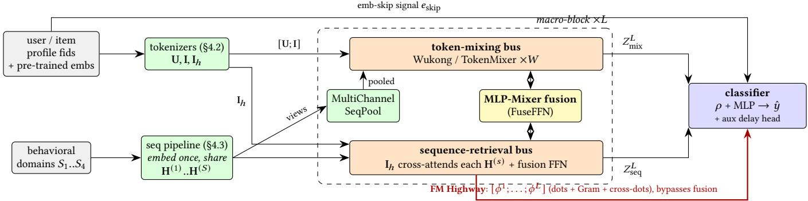
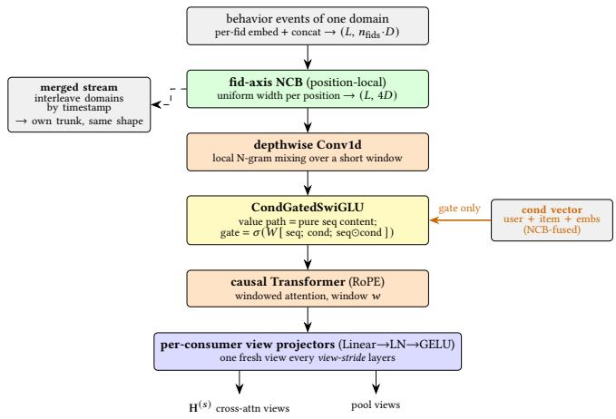
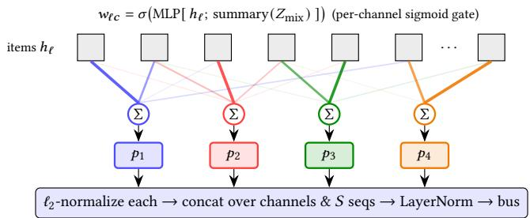
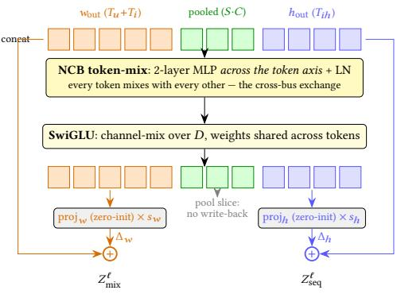
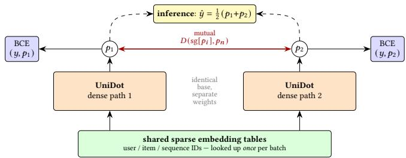
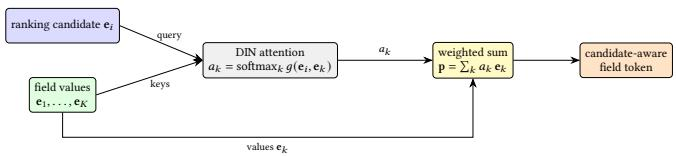
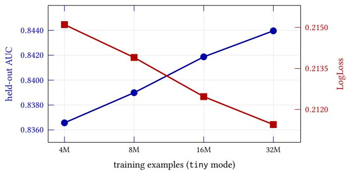

# UniDot: A Unified Network for Sequence Modeling and Feature Interaction in Large-scale Recommendation

Rongcheng Lin Meta Menlo Park, USA linrongc@meta.com

Yan Sun   
Meta   
Menlo Park, USA   
yansun@meta.com   
Ivan Ji   
Meta   
Menlo Park, USA   
ivanji@meta.com

Jamey Zhang Meta Menlo Park, USA jameyz@meta.com

Xianjie Chen Meta Menlo Park, USA cxj@meta.com

Guanglei Xiong Meta Menlo Park, USA glx@meta.com

Shujian Bu   
Meta   
Menlo Park, USA   
shujian@meta.com

## Abstract

Industrial recommenders rely on two model families that have evolved largely independently: feature-interaction models over multi-field user/item features, and sequential models over userbehavior histories. Production systems couple them only loosely. To unify the two, we present UniDot, a novel architecture for postclick conversion prediction built from the factorization-machine (FM) point ofview: the embedding inner product—which powers collaborative filtering and lets a recommender generalize to unseen user–item pairs—is the same primitive as attention’s query·key scoring, so a single dot-product of tokens can underlie both feature interaction and sequence modeling. UniDot tokenizes nonsequential fields and multi-domain behavioral sequences into one shared token space and stacks a single macro-block in which a token-mixing bus and a sequence-retrieval bus (item tokens cross-attending the histories) run in parallel and exchange state each layer through an MLP-Mixer fusion, while an FM Highway carries explicit per-layer dot-product interactions around the resid ual stack directly to the classifier. The sequence side is embedded once per forward pass and shared by all consumers, bounding inference latency. Trained with a dual sparse/dense (Adagrad + Muon) optimizer, an auxiliary conversion-delay head, and multi-path mu tual learning, UniDot finished as the runner-up on the Industrial track of the TAAC × KDD Cup 2026.

## Keywords

recommender systems, feature interaction, sequence modeling, CTR/CVR prediction, token mixing, factorization machines

## 1 Introduction

Large-scale recommendation systems rank enormous candidate sets in real time and underpin modern content and advertising platforms. Their predictive models have matured along two largely separate traditions. (1) Feature-interaction models—Wide&Deep [6], DeepFM [8], xDeepFM [17], DCN/DCN-v2 [26, 27], FiBiNet [11], AutoInt [23], Wukong [33], DHEN [32]—learn explicit and implicit crosses among a wide, mostly static feature set (user profile × item attributes). (2) Sequential user-interest models, e.g. DIN [37], DIEN [36], DSIN [7], SIM [20], ETA [4], TWIN [3], LONGER [2], and TIN [38], model the dynamics of user behavior, typically with target-aware attention over a single behavior history.

The TAAC × KDD Cup 2026 (Tencent Uni-Rec Challenge)— “Towards Unifying Sequence Modeling and Feature Interaction for Large-scale Recommendation”—targets exactly this gap, asking for a unified tokenization scheme and a homogeneous, stackable backbone that models sequential and non-sequential features in one architecture for large-scale recommendation, ranked by AUC under an inference-latency budget (§A describes the data). Following the recently introduced SlimPer framework [28], we designed UniDot. It is a direct answer to this brief: one stackable block, one shared token space, unifying both families. The name abbreviates Unified modeling via Dot-products Of Tokens—cross-attention (sequence retrieval) and factorization machines (feature interaction) are both dot-products of tokens, the single primitive the whole model is built on.

This vantage point is deliberate. The FM inner product ⟨� , ��⟩ is the engine of collaborative filtering: user and item meet through latent factors estimated from all observed co-occurrences, so the score generalizes to user–item pairs never seen together in training [22]—and in advertising conversion data, with sparse positives over a large, fast-moving ad inventory, most candidate pairs at serving time are efectively new. Prior unification work makes this inner product implicit—an emergent property of a deep interaction stack or transformer. UniDot keeps it explicit wherever signal crosses the user–item or candidate–history boundary, using the deeper machinery (token mixing, gated MLPs, attention) to refine the operands of those dot-products rather than replace the operation.

UniDot stacks one homogeneous block � times: two buses—a token-mixing bus over user/item profile tokens and a sequenceretrieval bus whose item tokens cross-attend the behavioral histories—exchange state each layer through an MLP-Mixer fuser, while an FM Highway routes explicit dot-product interactions straight to the classifier. Everything else (§4) is how these pieces are made cheap, candidate-aware, and scalable. Around this design—plus the training recipe behind our final entry—we contribute four ideas. (1) A dual-path, per-layer-parallel block: rather than cascading a sequence module into an interaction backbone, each block runs two paths concurrently—a non-sequential token-mixing path (a swappable mixer slot:

  
Figure 1: UniDot architecture (§4): two buses co-evolve through � macro-blocks, exchange state via the per-layer MLP-Mixer fusion, and the FM Highway routes explicit per-layer dot-products past the fuser to the classifier.

Wukong’s parallel LCB + FMB by default, a TokenMixer-style block as a drop-in) and a sequence-retrieval path (item tokens cross-attend the behavioral sequences)—which exchange state every layer via a canonical MLP-Mixer fusion (§4.4), so profile and sequence signal co-evolve; this interleaving is inspired by InterFormer [30] and Kunlun [10], from which UniDot difers in keeping the cross-boundary signal an explicit dot-product. (2) A shared, candidate-aware, multi-domain sequence pipeline: all behavioral domains are embedded once and reshaped to a uniform per-position width by a position-local fid-axis compression (§4.2); a DIN-style conditionally gated SwiGLU injects candidate context into only the gate, and a timestamp-interleaved merged stream models cross-domain temporal patterns (§4.3). (3) The FM Highway for explicit feature interaction: per-domain query–key dot products, an aggregated Gram matrix, and cross-bus user–item dots are concatenated across layers and fed directly to the classifier (§4.4), bypassing the residual fusion path and preserving the FM-style second-order signal a deep residual stack tends to wash out, at negligible cost. (4) Multi-path mutual learning over shared embeddings: we train two UniDot paths jointly on one shared (and dominant) embedding table, each regularized toward the other’s predictions (§4.6), pulling even a single served path to a better minimum—a 1×-cost model that would itself place as runner-up (Table 1)—while the two-path mean recovers the small remainder.

UniDot finished as the runner-up on the Industrial track of the TAAC × KDD Cup 2026 challenge under the oficial AUC metric, reaching a final-leaderboard AUC of 0.83217 (Table 1). This result came from architecture and scale rather than heavy feature engineering: we add no hand-crafted cross features beyond the released schema.

## 2 Related Work

Feature interaction. Latent-factor collaborative filtering is the historical core of recommendation: matrix factorization represents users and items as latent vectors whose inner product predicts afinity [16], and Factorization Machines [22] generalized it to arbitrary multi-field features—subsuming MF and its variants as special cases while retaining the factorized generalization to unseen feature pairs; field-aware variants [15] refined the factorization. The deep era kept the inner product central rather than replacing it: DeepFM [8] runs an FM and a DNN on shared embeddings, Wide&Deep [6], xDeepFM [17], DCN-v2 [27], AutoInt [23], and FiBiNet [11] extend explicit crosses in deeper or attention-based forms. Wukong [33] scales interaction modeling with stacked factorization-machine and linear-compression blocks, and DHEN [32] composes heterogeneous interaction experts.

Table 1: Final Industrial-track leaderboard (round 2, top 10). ★Serving a single path of our all-data DML model (1× inference cost) would still rank second—multi-path training pulls even a single model to a better minimum (§4.6).
<table><tr><td>Rank</td><td>AUC↑</td><td>Gap to #1</td></tr><tr><td>1</td><td>0.83254</td><td>一</td></tr><tr><td>2 (UniDot, ours)</td><td>0.83217</td><td>0.037%</td></tr><tr><td>(UniDot, single path)*</td><td>0.83184</td><td>0.070%</td></tr><tr><td>3</td><td>0.83145</td><td>0.109%</td></tr><tr><td>4</td><td>0.83080</td><td>0.174%</td></tr><tr><td>5</td><td>0.83073</td><td>0.181%</td></tr><tr><td>6</td><td>0.83036</td><td>0.218%</td></tr><tr><td>7</td><td>0.82915</td><td>0.339%</td></tr><tr><td>8</td><td>0.82888</td><td>0.366%</td></tr><tr><td>9</td><td>0.82881</td><td>0.373%</td></tr><tr><td>10</td><td>0.82854</td><td>0.400%</td></tr></table>

Sequential user-interest modeling. DIN [37] introduced targetaware attention pooling; DIEN, DSIN, and BST [5] added evolution and self-attention; long-sequence methods such as SIM [20], ETA, TWIN [3], and LONGER [2] retrieve or compress very long histories. Our conditionally gated SwiGLU is a DIN-style mechanism: candidate context steers which positions matter, but enters only the gate, leaving the value path content-pure—a design that composes cleanly with position-local compression.

Unifying feature interaction and sequence modeling. A fastgrowing line of work brings the two branches into a single backbone. HSTU [31] recasts ranking/retrieval as a generative sequence task over a unified transformer. InterFormer [30] interleaves sequence learning and feature-interaction learning so the two refine each other layer by layer rather than in sequence.

HyFormer [12] pairs a feature-interaction module with a transformer that cross-attends behavioral history; our sequence bus extends this to multiple domains plus a merged cross-domain stream, routing explicit per-sequence dot products to the FM Highway (§4.4). OneTrans [35] and TokenFormer [39] fuse all attributes, behaviors, and the target into one homogeneous (decoder-only) stream; the latter must counter sequential collapse, which UniDot’s two-bus separation avoids by construction. UniMixer [9] and TokenMixer [13] pursue a single stackable token-mixing backbone (the latter also probing scaling), Kunlun [10] scales such ideas to production, and Semantic-ID methods like TIGER [21] map collaborative and content signals into a shared discrete-token space. The TAAC × KDD Cup 2026 challenge [24] formalizes this direction. SlimPer [28] frames ranking as iterative refinement of a compact, fixed-size ⟨user, item⟩ knowledge base that is re-read against the full raw token set at every layer; UniDot is a preliminary public-dataset test of this framework.

What distinguishes UniDot is its starting point. Prior work unifies either by scaling up feature mixing and treating behavior as more features [9, 13, 30] or by embedding every feature as one more token in a sequence model [10, 31, 35]; in both the collaborativefiltering inner product becomes implicit. UniDot instead keeps it explicit: cross-attention is read as FM scoring between query and key tokens, and a dedicated FM Highway (§4.4) carries these loworder interactions past the residual mixer [22].

## 3 Problem Formulation

We address post-click conversion prediction. An example is $\boldsymbol { x } = \left( \boldsymbol { u } , i , \boldsymbol { S } \right)$ with binary label $y \in \{ 0 , 1 \} ( y = 1$ denotes conversion), where � is the user profile (user\_int IDs, aligned per-position weights, pre-trained user embeddings), � the candidate item (item\_int IDs, item embeddings), and $ { s } ~ = ~ \{ S _ { s } \} _ { s = 1 } ^ { 4 }$ the four behavioral domains. The model predicts a conversion probability and is trained with binary cross-entropy. We now fix notation used throughout $\ S 4 ;$ we write � for $d _ { \mathrm { m o d e l } }$

(1) Tokenization maps raw inputs to �-dimensional tokens $( \ S 4 . 2 -$ 4.3):

$$
\begin{array} { r l } & { \mathbf { U } = \mathrm { T o k } _ { u } ( u ) \in \mathbb { R } ^ { T _ { u } \times d } , \quad \mathbf { I } = \mathrm { T o k } _ { i } ( i ) \in \mathbb { R } ^ { T _ { i } \times d } , } \\ & { \mathbf { I } _ { h } = \mathrm { T o k } _ { i } ^ { h } ( i ) \in \mathbb { R } ^ { T _ { i h } \times d } , \quad \mathbf { H } ^ { ( s ) } = \mathrm { S e q } ( S _ { s } ) \in \mathbb { R } ^ { L _ { s } \times d } . } \end{array}\tag{1}
$$

(2) Stackable block. Two token states are initialized from the tokenizers, $Z _ { \mathrm { m i x } } ^ { 0 } = [ \mathbf { U } ; \mathbf { I } ]$ (token-mixing bus) and $Z _ { \mathrm { s e q } } ^ { 0 } = \mathbf { I } _ { h }$ (sequenceretrieval bus). For $\ell = 1 , \ldots , L$ identical blocks:

$$
\big ( Z _ { \mathrm { m i x } } ^ { \ell } , ~ Z _ { s \mathrm { e q } } ^ { \ell } , ~ \phi ^ { \ell } \big ) = \mathrm { B l o c k } _ { \ell } \big ( Z _ { \mathrm { m i x } } ^ { \ell - 1 } , ~ Z _ { s \mathrm { e q } } ^ { \ell - 1 } , ~ \{ \mathbf { H } ^ { ( s ) } \} _ { s = 1 } ^ { S } \big ) ,\tag{2}
$$

where $\phi ^ { \ell }$ is the layer’s FM Highway signal (token dot-products and Gram; §4.4).

(3) Readout. The classifier consumes a compressed readout $\rho$ of the final states (§4.5), the highway signals of every layer, and the skip-embedding signal $e _ { \mathrm { s k i p } } ( \ S C . 5 )$ :

$$
\hat { y } = \sigma \Big ( \mathrm { M L P } \big [ \rho \big ( Z _ { \mathrm { m i x } } ^ { L } , Z _ { \mathrm { s e q } } ^ { L } \big ) ; \phi ^ { 1 } ; . . . . ; \phi ^ { L } ; { e _ { \mathrm { s k i p } } } \big ] \Big ) .\tag{3}
$$

The per-layer highway signals are concatenated, not summed, so every layer’s explicit interactions reach the classifier undiluted.

(4) Objective. Binary cross-entropy plus an auxiliary delay loss:

$$
\mathcal { L } = - y \log \hat { y } - \left( 1 - y \right) \log \left( 1 - \hat { y } \right) + \lambda \mathcal { L } _ { \mathrm { d e l a y } } ,\tag{4}
$$

where ${ \mathcal { L } } _ { \mathrm { d e l a y } }$ is an MSE regression of the log time-to-next-action $\log \left( 1 + \left( t _ { \mathrm { l a b e l } } - t _ { \mathrm { e v e n t } } \right) \right)$ over every row that has a next action (clicks and conversions, not only positives), detailed in §C.6.

## 4 Method: UniDot

## 4.1 Overview

Unified tokenization. Every input—non-sequential user/item multi-field features and per-position behavioral-sequence events— is embedded into the same $d _ { \mathrm { m o d e l } }$ space and represented as tokens (§4.2–4.3). A single stackable macro-block then processes them; stacking � identical blocks is the only depth knob, which makes the design simple to scale in depth and width.

The two buses co-evolve through � macro-layers (each with � token-mixing sub-layers); the MLP-Mixer fusion exchanges information between them each layer, and the FM Highway runs alongside (Figure 1). A shared sequence pipeline (§4.3) feeds both the cross-attention and a per-layer multi-channel pool that injects pooled sequence tokens into the non-sequential bus. We keep §4 symbolic $( L , W , T _ { u } , T _ { i } , T _ { i h } , S , w , d ) ;$ concrete values are in §C (Table 8).

## 4.2 Tokenizers

Tokenization maps the model’s heterogeneous inputs (categorical fids, multi-value ID lists, pre-trained embeddings, and behavioral sequences) into one shared �-dimensional token space the macroblock can process uniformly. Each multi-field input becomes a few �-dim tokens $( \mathrm { T o k } _ { u } , \mathrm { T o k } _ { i }$ in Eq. (1)) by compression along the token axis. Two primitives recur throughout the model, both mapping $\mathbb { R } ^ { T \times d } \xrightarrow { } \mathbb { R } ^ { \hat { T } ^ { \prime } \times d }$ with a LayerNorm tail: LCB, a one-layer token-axis MLP-mixer (a single linear), and NCB, its two-layer version (two linears with a GELU between).

Categorical (fid) features. Every fid is embedded per position and the position bundle is compressed to the token budget by a single learnable NCB along the token axis. Because the NCB is learned, the data decides which feature combinations form each token, rather than a fixed pooling rule that averages position-level salience away. This yields the user tokens U (� ) and, from two separate item tables, a compact view I (��, token-mixing bus) and a richer $\mathbf { I } _ { h }$ (��ℎ, sequence-retrieval bus, whose tokens drive the cross-attention queries). Behavioral sequences are tokenized the same way (perfid embedding then a position-local fid-axis NCB to a uniform perposition width; §4.3), once per forward and shared by all consumers.

Multi-value fids: FAFE.. A few high-value fids are lists of behavioral IDs whose order carries no meaning—they are positioninvariant. For these, the static NCB is replaced by a candidateaware DIN-style attention pool against the ranking candidate, so the field’s token is a diferent combination of its values for each candidate (FAFE, §C.3): a special case of the same compress-to-tokens step where the pooling weights are candidate-dependent.

Pre-trained embedding features. Dense pre-trained vectors (user $\mathrm { S U M , L M F 4 A d s , \ldots ; }$ item embeddings) are normalized, projected by a small MLP into extra tokens, and appended to the matching token set (§C.4). Separately, a few paired user\_dense arrays are not features but per-position multipliers on the fid embeddings (§C.2).

  
Figure 2: One sequence trunk (§4.3).

## 4.3 Sequence Encoder

The sequence encoder (the Seq(·) of Eq. (1)) takes the per-position sequence tokens from §4.2 and turns them into the views H(� ) consumed downstream, once per forward, shared by every consumer. It is a pipeline of four stages, each chosen to model a diferent structure in the behavior stream: a cross-domain merge (one timeline across domains), a depthwise conv (local / N-gram structure), a DIN-style conditional SwiGLU (candidate-aware filtering and enhancement), and a causal Transformer (long-range token dependency). Figure 2 sketches one trunk.

Merged cross-domain sequence. A subset of domains is interleaved by timestamp into an extra cross-domain stream, so the downstream module can learn cross-domain interactions more easily. The real domains plus the merged stream give the downstream sequence count �.

Local mixing: depthwise Conv1d. A lightweight depthwise Conv1d mixes each channel over a local window, cheaply capturing N-gram patterns (bursts, adjacent-event motifs) that self-attention would otherwise spend capacity to relearn.

Information filtering: DIN-style conditional SwiGLU.. A composite per-sample cond vector (user + item LCB tokens + emb-cond, NCBfused) enters only the gate ofa SwiGLU; the value path stays a pure function of the sequence. The gate selects positions by candidate relevance (DIN-style) without altering their content.

Token dependency: causal Transformer. The global encoder is a shallow Transformer with RoPE and causal, windowed attention (window �), modeling token dependencies in time order through a fused-attention kernel (SDPA / FlashAttention). Perconsumer view projectors (Linear → LN → GELU) then emit the �-dim views H(� ) , refreshed every view-stride layers.

  
Figure 3: MultiChannelSeqPool (§4.4): positions are gated into � channels by independent state-conditioned sigmoid weights.

## 4.4 Per-layer computation

Each macro-layer runs the two buses in parallel and then fuses them.

Token-mixing bus. The bus state (the user, item, and pooled tokens concatenated) passes through� cross-token blocks. The block is a swappable slot; we use Wukong (parallel LCB + FMB with residual, the FMB contributing explicit pairwise dot-products). We also evaluated a TokenMixer-style block [13] and UniMixer [9] in this slot, but neither beat Wukong at our data scale—both likely need more data to converge. This is a controlled slot-swap within UniDot, not a matched end-to-end retrain of those architectures (out of scope under the competition budget), so we read it as indicative at our scale, not a definitive ranking. Pooled tokens are sliced of between layers so the persistent state stays at $( T _ { u } + T _ { i } , D )$

MultiChannelSeqPool. For each of the � sequence views, a multichannel pool—in the spirit of NetVLAD / NeXtVLAD multi-cluster soft-assignment aggregation [1, 18]—produces � pooled tokens. Each channel gates every position with an independent sigmoid (not a softmax), conditioned on a summary of the current mixingbus state, so channels fire independently rather than competing for a fixed attention mass; each pooled token is the gate-weighted sum of positions. Because sigmoid gating leaves the magnitude unbounded, each pooled token is $\ell _ { 2 } \cdot$ -normalized over � to restore unit norm; the �·� tokens then pass a LayerNorm tail before entering the bus, matching the NCB-tailed profile tokens so the token-mix does not systematically down-weight them (Figure 3).

Sequence-retrieval bus. A single-history, single-layer instance of this bus recovers a standard single-history target-attention CTR module [12]; here we generalize it to � domains (real + merged), per-layer queries, and an FM-Highway readout. With item state of $T _ { i h }$ tokens: (i) per-sequence cross-attention—the item state queries each of the � sequence views (no internal residual), giving raw outputs $A _ { 0 } , \dots , \bar { A _ { S - 1 } } \in \mathbb { R } ^ { B \times T _ { i h } \times D }$ ; (ii) LCB aggregation— attn\_ $\mathrm { a g g } \ = \ \mathrm { L C B } ( \mathrm { s t a c k } ( A _ { 0 } , \dots ) )$ , linear because the fusion FFN below already supplies the nonlinearity; (iii) per-token fusion FFN—a small FFN mixes each item token with that token’s retrieved vectors from all � sequences into a �-dim residual delta on the item state; and (iv) FM Highway signals (bypass fusion, concatenated across layers)—each layer contributes per-sequence dots $d _ { i } [ t ] = \langle \mathrm { i t e m } [ t ] , A _ { i } [ t ] \rangle$ (the per-token afinity between the candidate and each behavioral domain), a learned fused-domain dot (an NCB across the � outputs, dotted with the item state), the aggregated Gram $G = \mathrm { i t e m } \cdot \mathrm { a t t n \_ a g g ^ { \top } }$ (the full pairwise dot-product matrix), and, computed post-fusion, user–item cross-dots (inner products between the user tokens of the mixing bus and the item tokens of the retrieval bus). Together these form $\phi ^ { \ell }$ in Eq. (2).

  
Figure 4: FuseFFN (§4.4).

Bus-level fusion (FuseFFN, canonical MLP-Mixer [25]). The three groups $w _ { \mathrm { o u t } } ,$ , pooled, and $h _ { \mathrm { o u t } }$ are concatenated along the token axis, then pass through an NCB token-mix (nonlinear mixing across tokens), a token-wise SwiGLU channel-mix (applied to each token, weights shared across tokens), and per-side zero-initialized projections scaled by per-side learnable gates, producing residual deltas on the two buses (Figure 4). Because the side projections are zero-init, fusion starts as identity and is learned in.

## 4.5 Classifier readout

The readout is Eq. (3). The final bus states are not flattened wholesale. The compressed readout � has two parts: (i) an NCB compresses the $\left( T _ { u } + T _ { i } + T _ { i h } \right)$ concatenated bus tokens to a handful of readout tokens, which are flattened; and (ii) a cross-dot gram—all pairwise inner products between the mixing-bus and retrieval-bus tokens, computed on the uncompressed states—is appended, so the compression cannot erase explicit second-order signal. The classifier input concatenates $\rho ,$ the layer-concatenated FM Highway $[ \phi ^ { 1 } ; \ldots ; \phi ^ { L } ]$ (per-sequence dots, fused-domain dots, aggregated Grams, user–item cross-dots; LayerNorm’d), and the LayerNorm’d skip-embedding signal $e _ { \mathrm { s k i p } }$ (§C.5). This feeds a 2-layer MLP and a linear head; logits are clamped to [−20, 20]. An auxiliary conversion-delay head (§C.6) adds a second loss term.

## 4.6 Multi-path mutual learning

We train a single model as two UniDot paths jointly on the same batches [29, 34], sharing one set of (dominant) sparse embeddings, and average their two logits at inference (Figure 5). The motivation is the regularization identified in the original deep mutual learning work [34]: the two paths mimic each other’s predictions and converge to a wider, flatter minimum—a robust solution they agree on—and such flat minima generalize better to unseen data, exactly the property our setting rewards, where the test period is one step ahead of training and most candidate user–item pairs are new. We apply it here over a shared embedding table. Two paths already capture most of this gain at 2× dense cost; we kept that as our submission.

  
Figure 5: Multi-path mutual learning (�=2, §4.6).

Mutual objective. Let $z _ { n }$ be path �’s logit and $p _ { n } = \sigma ( z _ { n } )$ . Each path is supervised by the task loss on its own prediction and pulled toward the detached predictions of the other paths:

$$
\mathcal { L } = \sum _ { n = 1 } ^ { N } \Big [ \mathcal { L } _ { \mathrm { t a s k } } ( y , p _ { n } ) \ + \ \frac { \lambda } { N - 1 } \sum _ { i \neq n } D \big ( \thinspace s \mathrm { g } [ \mathinner { _ { i } } ] , \mathinner { _ { p _ { n } } } \big ) \Big ] ,\tag{5}
$$

where $\mathcal { L } _ { \mathrm { t a s k } }$ is the BCE (plus auxiliary delay head, §C.6), sg[·] is the stop-gradient, and � is a squared error on probabilities $\begin{array} { r l } { \quad D ( a , b ) = } \end{array}$ $( a - b ) ^ { 2 }$ . The submission uses �=2 paths, mutual weight �=20, with the mutual term switched on after the first epoch.

Serving. At inference we average the two paths’ logits. Serving a single path instead costs 1× and already scores 0.83184 test AUC— only 0.033% below the two-path mean (0.83217)—a viable cheap deployment, with the mean recovering the small remainder.

## 5 Experiments

The dataset, setup, and implementation details are in Appendices A– C; here we report results.

## 5.1 Main results

UniDot finished as the runner-up (Table 1), scoring 0.83217 test AUC—driven by the unified dual-bus architecture with the FM Highway (§4) and by scaling it in depth, width, and multi-path mutual learning (§5.4). The final submission retrains on all data with EMA weights, peaking at epoch 5 (Table 2).

## 5.2 Incremental improvements

Table 3 traces test AUC from the competition baseline to our submission, each row adding one change. The largest single jump is UniDot itself (+1.10%); subsequent refinements (FM-Highway dots, depthwise conv, aux loss, FAFE, EMA), dense scaling, and multi-path DML add the rest, +1.82% total.

## 5.3 Component ablations

Table 4 removes individual components in tiny mode (single-path, �=64, in-distribution held-out, so only relative gaps matter). Depth helps up to our default 6 macro-layers (8–10 overfit the 4M set), and removing the FM Highway costs the most (−0.127%); removing the sequence cross-attention costs little (−0.053%), as the multi-channel pool captures much of the same signal.

Table 2: Training dynamics by epoch of the �=128, �=2 multipath run. Eval/Test (sel.): the model-selection run (remote, 10% held-out). Test (final): the final submission, retrained on all data with EMA. LL=LogLoss (train over both paths, eval over their mean); $^ { 6 } - { \bf \nabla } ^ { 5 }$ = not submitted.
<table><tr><td> $\mathrm { E p . }$ </td><td>Train AUC</td><td>Eval AUC</td><td>Test (sel.)</td><td>Test (final)</td><td>Train LL</td><td>Eval LL</td></tr><tr><td>1</td><td>0.83193</td><td>0.84181</td><td>0.82772</td><td></td><td>0.43395</td><td>0.21259</td></tr><tr><td>2</td><td>0.84232</td><td>0.84441</td><td>0.83031</td><td>0.83036</td><td>0.42422</td><td>0.21113</td></tr><tr><td>3</td><td>0.84606</td><td>0.84558</td><td>0.83136</td><td>0.83143</td><td>0.42072</td><td>0.21058</td></tr><tr><td>4</td><td>0.84962</td><td>0.84607</td><td>0.83193</td><td>0.83195</td><td>0.41750</td><td>0.21029</td></tr><tr><td>5</td><td>0.85485</td><td>0.84629</td><td>0.83196</td><td>0.83217</td><td> $0 . 4 1 2 8 8$ </td><td>0.21048</td></tr><tr><td>6</td><td>0.86199</td><td>0.84568</td><td>一</td><td>0.83212</td><td>0.40679</td><td>0.21116</td></tr></table>

Table 3: Round-2 incremental improvements.
<table><tr><td>#</td><td>Change</td><td>Test AUC</td><td>Δ</td></tr><tr><td>0</td><td>competition baseline</td><td>0.81398</td><td></td></tr><tr><td>1</td><td>+ UniDot</td><td>0.82500</td><td>+1.102</td></tr><tr><td>2</td><td>+ item-id hash embedding</td><td>0.82565</td><td>+0.064</td></tr><tr><td>3</td><td>tune token counts</td><td>0.82609</td><td>+0.044</td></tr><tr><td>4</td><td>tune batch size</td><td>0.82704</td><td>+0.095</td></tr><tr><td>5</td><td>+ more FM-Highway dot products</td><td>0.82722</td><td>+0.018</td></tr><tr><td>6</td><td>+ depthwise-conv pre-trunk</td><td>0.82736</td><td>+0.014</td></tr><tr><td>7</td><td>+ auxiliary delay loss</td><td>0.82812</td><td>+0.075</td></tr><tr><td>8</td><td>+ FAFE</td><td>0.82837</td><td>+0.026</td></tr><tr><td>9</td><td>tune learning rate</td><td>0.82894</td><td>+0.056</td></tr><tr><td>10</td><td>+ EMA weights</td><td>0.82993</td><td>+0.099</td></tr><tr><td>11</td><td>scale  $d _ { \mathrm { m o d e l } } 6 4 { \longrightarrow } 9 6$ </td><td>0.83024</td><td>+0.031</td></tr><tr><td>12</td><td>scale  $d _ { \mathrm { m o d e l } } 9 6 { \longrightarrow } 1 2 8$ </td><td>0.83043</td><td>+0.019</td></tr><tr><td>13</td><td>+ multi-path DML (d=64)</td><td>0.83128</td><td>+0.085</td></tr><tr><td>14</td><td>multi-path DML (d=128)</td><td>0.83196</td><td>+0.068</td></tr><tr><td>15</td><td>+ all-data retrain</td><td>0.83217</td><td>+0.021</td></tr><tr><td colspan="2">total over baseline</td><td></td><td>+1.818</td></tr></table>

Dropping the FuseFFN bus fusion slightly raises AUC (+0.022%) but worsens LogLoss, so the module’s contribution is not fully conclusive. We read this not as evidence against cross-bus exchange but as an under-designed fuser: its static routing is the weak link, and an input-conditioned (second-order) fuser is the clearest open direction.

## 5.4 Scaling study

On this task the productive scaling axis is dense capacity, not sparse (Table 5). Doubling embedding width alone gave no A/B win—the high-cardinality tables are not the bottleneck. Widening the dense path from 64 to 96 to 128 improves AUC monotonically with diminishing returns (+0.050% cumulative). A second identical path under mutual distillation (§4.6) is a more efective use of dense capacity: +0.135% at �=64, more than the entire width sweep, doubling dense parameters and FLOPs but not the embedding tables. The two axes compose: �=128 with two paths reaches 0.83196 (+0.203% over the �=64 single-path baseline), our submission; the all-data retrain then gives 0.83217.

Table 4: Component ablations (tiny mode, single-path, �=64; in-distribution held-out eval). Δ is AUC vs. the full model.
<table><tr><td>Variant</td><td>AUC↑</td><td>LogLoss ↓</td><td>ΔAUC</td></tr><tr><td>Full UniDot (6 layers)</td><td>0.83657</td><td>0.2151</td><td></td></tr><tr><td>2 macro-layers</td><td>0.83600</td><td>0.2157</td><td>-0.057%</td></tr><tr><td>4 macro-layers</td><td>0.83603</td><td>0.2154</td><td>-0.054%</td></tr><tr><td>8 macro-layers</td><td>0.83624</td><td>0.2152</td><td>-0.033%</td></tr><tr><td>10 macro-layers</td><td>0.83615</td><td>0.2152</td><td>-0.042%</td></tr><tr><td>– FM Highway (all)</td><td>0.83530</td><td>0.2159</td><td>-0.127%</td></tr><tr><td>– cross-bus dots only</td><td>0.83570</td><td>0.2156</td><td>-0.087%</td></tr><tr><td>– multi-channel seq pool</td><td>0.83624</td><td>0.2155</td><td>-0.033%</td></tr><tr><td>– token-mixing bus (identity)</td><td>0.83590</td><td>0.2161</td><td>-0.067%</td></tr><tr><td>– FuseFFN (no bus fusion)</td><td>0.83679</td><td>0.2154</td><td>+0.022%</td></tr><tr><td>– sequence cross-attention</td><td>0.83604</td><td>0.2153</td><td>-0.053%</td></tr><tr><td>– merged cross-domain stream</td><td>0.83619</td><td>0.2152</td><td>-0.038%</td></tr></table>

Table 5: Scaling study.
<table><tr><td>Configuration</td><td>Dense par.</td><td>GFLOP</td><td>Test AUC ↑</td><td>Δ</td></tr><tr><td>d=64, sparse fold×2</td><td>18.8M</td><td>5.9</td><td></td><td>no win</td></tr><tr><td>d=64 (baseline)</td><td>18.8M</td><td>5.9</td><td>0.82993</td><td></td></tr><tr><td>d=96</td><td>36.7M</td><td>12.4</td><td>0.83024</td><td>+0.031%</td></tr><tr><td>d=128</td><td>60.3M</td><td>21.2</td><td>0.83043</td><td>+0.050%</td></tr><tr><td>d=64,2-path</td><td>37.6M</td><td>11.7</td><td>0.83128</td><td>+0.135%</td></tr><tr><td>d=128, 2-path</td><td>120.6M</td><td>42.5</td><td>0.83196</td><td>+0.203%</td></tr></table>

## 6 Conclusion

We presented UniDot, a novel architecture that unifies sequence modeling and feature interaction in a single stackable block: non-sequential fields and multi-domain behavioral sequences become tokens in one shared space, processed by a parallel tokenmixing bus and a sequence-retrieval bus that co-evolve and exchange deltas through a canonical MLP-Mixer each layer. Its defining idea, the FM Highway, routes explicit dot-product interactions around the fusion path straight to the classifier, keeping factorization-machine-style second-order signal alive at negligible cost. UniDot finished as the runner-up on the Industrial track of the TAAC × KDD Cup 2026 challenge, scoring 0.83217 AUC—driven by the unified architecture, by scaling the block in depth and width, and by multi-path mutual learning over shared embeddings, rather than by feature engineering. Future work: deploying UniDot in a real production system and, at that scale, a systematic scaling-law study of the unified block.

## References

[1] Relja Arandjelović, Petr Gronat, Akihiko Torii, Tomáš Pajdla, and Josef Sivic. 2016. NetVLAD: CNN Architecture for Weakly Supervised Place Recognition. In Proceedings of the IEEE Conference on Computer Vision and Pattern Recognition (CVPR).

[2] Zheng Chai, Qin Ren, Xijun Xu, Hua Chen, Xiao Zhang, Zhongan Hu, Tianxiang Liang, Lei Wu, Lingzheng Zhou, Zhihao Yu, Yang Sun, and Junwei Pan. 2025. LONGER: Scaling Up Long Sequence Modeling in Industrial Recommenders. In Proceedings ofthe 19th ACM Conference on Recommender Systems (RecSys). arXiv:2505.04421.

[3] Jianxin Chang, Chenbin Zhang, Zhiyi Fu, Xiaoxue Zang, Lin Guan, Jing Lu, Yiqun Hui, Dewei Leng, Yanan Niu, Yang Song, and Kun Gai. 2023. TWIN: TWo-stage Interest Network for Lifelong User Behavior Modeling in CTR Prediction at Kuaishou. In Proceedings ofthe 29th ACM SIGKDD Conference on Knowledge

Discovery and Data Mining (KDD).

[4] Qiwei Chen, Changhua Pei, Shanshan Lv, Chao Li, Junfeng Ge, and Wenwu Ou. 2021. End-to-End User Behavior Retrieval in Click-Through Rate Prediction Model. arXiv:2108.04468 [cs.IR]

[5] Qiwei Chen, Huan Zhao, Wei Li, Pipei Huang, and Wenwu Ou. 2019. Behavior Sequence Transformer for E-commerce Recommendation in Alibaba. In Proceedings of the 1st International Workshop on Deep Learning Practice for High-Dimensional Sparse Data (DLP-KDD).

[6] Heng-Tze Cheng, Levent Koc, Jeremiah Harmsen, Tal Shaked, Tushar Chandra, Hrishi Aradhye, Glen Anderson, Greg Corrado, Wei Chai, Mustafa Ispir, et al. 2016. Wide & Deep Learning for Recommender Systems. In Proceedings of the 1st Workshop on Deep Learning for Recommender Systems (DLRS).

[7] Yufei Feng, Fuyu Lv, Weichen Shen, Menghan Wang, Fei Sun, Yu Zhu, and Keping Yang. 2019. Deep Session Interest Network for Click-Through Rate Prediction. In Proceedings ofthe 28th International Joint Conference on Artificial Intelligence (IJCAI). arXiv:1905.06482.

[8] Huifeng Guo, Ruiming Tang, Yunming Ye, Zhenguo Li, and Xiuqiang He. 2017. DeepFM: A Factorization-Machine based Neural Network for CTR Prediction. In Proceedings of the 26th International Joint Conference on Artificial Intelligence (IJCAI).

[9] Mingming Ha, Guanchen Wang, Linxun Chen, Xuan Rao, Yuexin Shi, Tianbao Ma, Zhaojie Liu, Yunqian Fan, Zilong Lu, Yanan Niu, Han Li, and Kun Gai. 2026. UniMixer: A Unified Architecture for Scaling Laws in Recommendation Systems. arXiv:2604.00590.

[10] Bojian Hou, Xiaolong Liu, Xiaoyi Liu, Jiaqi Xu, Yasmine Badr, Mengyue Hang, Sudhanshu Chanpuriya, et al. 2026. Kunlun: Establishing Scaling Laws for Massive-Scale Recommendation Systems through Unified Architecture Design. arXiv:2602.10016.

[11] Tongwen Huang, Zhiqi Zhang, and Junlin Zhang. 2019. FiBiNET: Combining Feature Importance and Bilinear Feature Interaction for Click-Through Rate Prediction. In Proceedings of the 13th ACM Conference on Recommender Systems (RecSys).

[12] Yunwen Huang, Shiyong Hong, Xijun Xiao, Jinqiu Jin, Xuanyuan Luo, Zhe Wang, Zheng Chai, Shikang Wu, Yuchao Zheng, and Jingjian Lin. 2026. HyFormer: Revisiting the Roles of Sequence Modeling and Feature Interaction in CTR Prediction. arXiv:2601.12681.

[13] Yuchen Jiang, Jie Zhu, Xintian Han, Hui Lu, Kunmin Bai, Mingyu Yang, Shikang Wu, Ruihao Zhang, Wenlin Zhao, Shipeng Bai, Sijin Zhou, Huizhi Yang, Tianyi Liu, Wenda Liu, Ziyan Gong, Haoran Ding, Zheng Chai, Deping Xie, Zhe Chen, Yuchao Zheng, and Peng Xu. 2026. TokenMixer-Large: Scaling Up Large Ranking Models in Industrial Recommenders. arXiv:2602.06563.

[14] Keller Jordan, Yuchen Jin, Vlado Boza, Jiacheng You, Franz Cesista, Laker Newhouse, and Jeremy Bernstein. 2024. Muon: An optimizer for hidden layers in neural networks. Blog post. https://kellerjordan.github.io/posts/muon

[15] Yuchin Juan, Yong Zhuang, Wei-Sheng Chin, and Chih-Jen Lin. 2016. Fieldaware Factorization Machines for CTR Prediction. In Proceedings ofthe 10th ACM Conference on Recommender Systems (RecSys).

[16] Yehuda Koren, Robert Bell, and Chris Volinsky. 2009. Matrix Factorization Techniques for Recommender Systems. IEEE Computer 42, 8 (2009), 30–37.

[17] Jianxun Lian, Xiaohuan Zhou, Fuzheng Zhang, Zhongxia Chen, Xing Xie, and Guangzhong Sun. 2018. xDeepFM: Combining Explicit and Implicit Feature Interactions for Recommender Systems. In Proceedings ofthe 24th ACM SIGKDD International Conference on Knowledge Discovery & Data Mining (KDD).

[18] Rongcheng Lin, Jing Xiao, and Jianping Fan. 2018. NeXtVLAD: An Eficient Neural Network to Aggregate Frame-level Features for Large-scale Video Classi fication. In Proceedings ofthe European Conference on Computer Vision (ECCV) Workshops.

[19] Jingyuan Liu, Jianlin Su, Xingcheng Yao, Zhejun Jiang, Guokun Lai, Yulun Du, Yidao Qin, Weixin Xu, Enzhe Lu, Junjie Yan, et al. 2025. Muon is Scalable for LLM Training. arXiv:2502.16982 [cs.LG]

[20] Qi Pi, Guorui Zhou, Yujing Zhang, Zhe Wang, Lejian Ren, Ying Fan, Xiaoqiang Zhu, and Kun Gai. 2020. Search-based User Interest Modeling with Lifelong Sequential Behavior Data for Click-Through Rate Prediction. In Proceedings ofthe 29th ACM International Conference on Information and Knowledge Management (CIKM).

[21] Shashank Rajput, Nikhil Mehta, Anima Singh, Raghunandan Keshavan, Trung Vu, Lukasz Heldt, Lichan Hong, Yi Tay, Vinh Q. Tran, Jonah Samost, Maciej Kula, Ed H. Chi, and Maheswaran Sathiamoorthy. 2023. Recommender Systems with Generative Retrieval. In Advances in Neural Information Processing Systems (NeurIPS).

[22] Stefen Rendle. 2010. Factorization Machines. In Proceedings of the 10th IEEE International Conference on Data Mining (ICDM).

[23] Weiping Song, Chence Shi, Zhiping Xiao, Zhijian Duan, Yewen Xu, Ming Zhang, and Jian Tang. 2019. AutoInt: Automatic Feature Interaction Learning via Self Attentive Neural Networks. In Proceedings ofthe 28th ACM International Conference on Information and Knowledge Management (CIKM).

[24] TAAC × KDD Cup 2026. 2026. Tencent Uni-Rec Challenge: Towards Unifying Sequence Modeling and Feature Interaction for Large-scale Recommendation.

Competition website. https://algo.qq.com

[25] Ilya Tolstikhin, Neil Houlsby, Alexander Kolesnikov, Lucas Beyer, Xiaohua Zhai, Thomas Unterthiner, Jessica Yung, Andreas Steiner, Daniel Keysers, Jakob Uszkoreit, Mario Lucic, and Alexey Dosovitskiy. 2021. MLP-Mixer: An all-MLP Architecture for Vision. In Advances in Neural Information Processing Systems (NeurIPS).

[26] Ruoxi Wang, Bin Fu, Gang Fu, and Mingliang Wang. 2017. Deep & Cross Network for Ad Click Predictions. In Proceedings ofthe ADKDD’17. arXiv:1708.05123.

[27] Ruoxi Wang, Rakesh Shivanna, Derek Cheng, Sagar Jain, Dong Lin, Lichan Hong, and Ed Chi. 2021. DCN V2: Improved Deep & Cross Network and Practical Lessons for Web-scale Learning to Rank Systems. In Proceedings of the Web Conference (WWW).

[28] Siqi Wang, Xianjie Chen, Shaofeng Deng, Albert Chen, et al. 2026. SlimPer: Make Personalization Model Slim and Smart. arXiv:2607.12281 [cs.IR]

[29] İbrahim Can Yılmaz and Said Aldemir. 2024. Mutual Learning for Finetuning Click-Through Rate Prediction Models. arXiv:2406.12087 [cs.IR]

[30] Zhichen Zeng, Xiaolong Liu, Mengyue Hang, Xiaoyi Liu, et al. 2025. InterFormer: Efective Heterogeneous Interaction Learning for Click-Through Rate Prediction. In Proceedings of the 34th ACM International Conference on Information and Knowledge Management (CIKM).

[31] Jiaqi Zhai, Lucy Liao, Xing Liu, Yueming Wang, Rui Li, Xuan Cao, Leon Gao, Zhaojie Gong, Fangda Gu, Michael He, Yinghai Lu, and Yu Shi. 2024. Actions Speak Louder than Words: Trillion-Parameter Sequential Transducers for Generative Recommendations. In Proceedings ofthe 41st International Conference on Machine Learning (ICML).

[32] Buyun Zhang, Liang Luo, Xi Liu, et al. 2022. DHEN: A Deep and Hierarchical Ensemble Network for Large-Scale CTR Prediction. arXiv:2203.11014.

[33] Buyun Zhang, Liang Luo, Xi Liu, Jay Li, Zeliang Chen, Weilin Zhang, Xiaohan Wei, Yuchen Hao, Michael Tsang, Wenjun Wang, Yang Liu, Huayu Li, Yasmine Badr, Jongsoo Park, Jiyan Yang, Dheevatsa Mudigere, and Ellie Wen. 2024. Wukong: Towards a Scaling Law for Large-Scale Recommendation. In Proceedings of the 41st International Conference on Machine Learning (ICML).

[34] Ying Zhang, Tao Xiang, Timothy M. Hospedales, and Huchuan Lu. 2018. Deep Mutual Learning. In Proceedings ofthe IEEE Conference on Computer Vision and Pattern Recognition (CVPR). arXiv:1706.00384.

[35] Zhaoqi Zhang, Haolei Pei, Jun Guo, Tianyu Wang, Yufei Feng, Hui Sun, Shaowei Liu, and Aixin Sun. 2025. OneTrans: Unified Feature Interaction and Sequence Modeling with One Transformer in Industrial Recommender. arXiv:2510.26104.

[36] Guorui Zhou, Na Mou, Ying Fan, Qi Pi, Weijie Bian, Chang Zhou, Xiaoqiang Zhu, and Kun Gai. 2019. Deep Interest Evolution Network for Click-Through Rate Prediction. In Proceedings of the 33rd AAAI Conference on Artificial Intelligence (AAAI). arXiv:1809.03672.

[37] Guorui Zhou, Xiaoqiang Zhu, Chenru Song, Ying Fan, Han Zhu, Xiao Ma, Yanghui Yan, Junqi Jin, Han Li, and Kun Gai. 2018. Deep Interest Network for Click-Through Rate Prediction. In Proceedings ofthe 24th ACM SIGKDD International Conference on Knowledge Discovery & Data Mining (KDD).

[38] Haolin Zhou, Junwei Pan, Xinyi Zhou, Xihua Chen, Jie Jiang, Xiaofeng Gao, and Guihai Chen. 2024. Temporal Interest Network for User Response Prediction. In Companion Proceedings of the ACM Web Conference (WWW Companion). arXiv:2308.08487.

[39] Yifeng Zhou, Yuehong Hu, Zhixiang Feng, Junwei Pan, Kaihui Wu, Hanyong Li, Shangyu Zhang, Shudong Huang, Zhangbin Zhu, Chengguo Yin, Haijie Gu, and Jie Jiang. 2026. TokenFormer: Unify the Multi-Field and Sequential Recommen dation Worlds. arXiv:2604.13737.

## A Dataset

## A.1 Dataset

The challenge releases a large-scale, fully anonymized advertising dataset built from real Tencent ad logs, over two rounds; we compete on the Industrial track. All sparse features are anonymized integer IDs and all dense features are fixed-length float vectors; no raw content or PII is released. Table 6 summarizes the schema.

Each example is a user–item interaction with two kinds of inputs:

• Non-sequential multi-field features—user\_int / item\_int categorical IDs (single- and multi-valued), and user\_dense / item\_dense continuous vectors that include pre-trained embeddings (e.g. SUM and LMF4Ads on the user side; item embeddings on the item side).

• Behavioral sequence features from four domains with 9–14 fields each (seq\_a to seq\_d): each domain is a

Table 6: Industrial-track dataset and schema (second round; first round in parentheses).
<table><tr><td>Quantity</td><td>Industrial track</td></tr><tr><td>Train / test samples</td><td>35M / 12M (2M, r1)</td></tr><tr><td>Columns (categories)</td><td>142 (7)</td></tr><tr><td>User Int / Dense fids</td><td>54 / 17</td></tr><tr><td>Item Int / Dense fids</td><td>17 / 4</td></tr><tr><td>Pre-trained emb fids (u/i)</td><td>7/4</td></tr><tr><td>Aligned per-position fids</td><td>10</td></tr><tr><td>Behavioral domains</td><td>4 (9/14/12/10 flds)</td></tr><tr><td>High-card. ID (fid 116)</td><td>≈9.4M</td></tr><tr><td>Label / metric</td><td>Conversion / AUC</td></tr></table>

Table 7: Training/evaluation modes.
<table><tr><td>Mode</td><td>Data (train / eval)</td><td>GPUs</td><td>Role</td></tr><tr><td>tiny</td><td>4M / 1M, random hold-out</td><td>1</td><td>rapid design A/B</td></tr><tr><td>remote</td><td>35M / 10% random hold-out</td><td>4</td><td>full-scale validation</td></tr><tr><td>final</td><td>35M / no hold-out</td><td>4</td><td>submission (EMA weights)</td></tr></table>

time-ordered list of events carrying timestamps and action types.

Two schema properties directly shape the model. First, several user\_dense arrays are element-aligned with the matching user\_int arrays: each dense value is a per-element statistic (e.g. a dwell time or score) for that ID, not a standalone feature. UniDot consumes them as per-position weights on the ID embeddings (§C.2), matching their intended semantics. Second, a few IDs have extreme cardinality (fid 116 takes ≈9.4M values), motivating the skip-embedding handling in §C.5.

## B Experimental Setup

Data: TAAC × KDD Cup 2026 Industrial track (35M train / 12M test; 2M in round 1), conversion label. Metric: AUC of ROC (oficial); we also report LogLoss. Training: efective batch ≈3k (local A/B) / ≈12k (online, 4 GPUs), dual Adagrad/Muon (dense LR 4e-4, Muon weight decay 1e-3, sparse LR 0.1), 100-step warmup, BCE + aux delay (�=0.01), torch.compile and bf16 autocast. Model: submitted config in Table 8 (≈2.1B params, $d _ { \mathrm { m o d e l } } { = } 1 2 8 , N { = } 2$ multipath). Inference: the served model uses torch.compile and bf16 autocast. End-to-end inference plus evaluation on the 12M-example test set—including the one-time compilation—takes ≈14,500 s for the two-path model and ≈7,200 s for a single path (roughly half) within the competition’s inference budget. The bf16 autocast costs only a slight AUC degradation (< 0.0001).

Training and evaluation modes. We use three modes (Table 7): tiny caps the data to a random 4M-train / 1M-eval subset on one GPU for fast A/B of design choices; remote promotes the surviving configuration to the full dataset on 4 GPUs with a held-out split, confirming the win holds at full scale; and final retrains on all data and serves the EMA weights for the submission.

## C Implementation and Training Details

The components below are largely orthogonal to the core architecture (§4)—data-specific feature handling and training machinery— so we collect them here. They matter for reproducing the reported numbers.

## C.1 Active configuration

Table 8 resolves every symbol of §4 to its submitted value. The token budgets work out to $T _ { u } = 8 + 7 { \cdot } 2 = 2 2$ user-side tokens (8 NS tokens plus 2 per projected user-emb fid), $T _ { i } = 4 + 4 { \cdot } 2 = 1 2$ and $T _ { i h } = 1 6 + 4 { \cdot } 2 = 2 4$ item-side tokens, and $S = 4 + 1 = 5$ sequences (four behavioral domains plus the merged stream); the fid-axis compression yields a uniform 4·128 = 512-d per-position width. Parameters total ≈2.1B but are embedding-dominated (sparse lookups); the dense compute path is tens of millions of parameters. Because the per-fid embedding tables are $d _ { \mathrm { m o d e l } }$ -wide, scaling $d _ { \mathrm { m o d e l } }$ from 64 to 128 roughly doubles the (dominant) embedding parameter count.

## C.2 Per-position weights (user\_dense pairing)

Ten user\_dense arrays of §A are not features but per-position multipliers. Each is aligned position-by-position with the samenumbered multi-value user\_int fid (matching length) and scales that ID’s embedding before pooling, so every value’s contribution is weighted by its paired statistic (e.g. dwell time or interaction count). Two classes are handled diferently. Count-like fids (62–66, 118, 121) pass through a fixed log(1 + �)/10 transform—the log tames the heavy tail, the /10 lands it in a unit-ish range—and multiply the matching embedding. Similarity-like fids (89–91, signed cosine / score values) are instead clamped to [−1, 1] and used directly as signed multipliers, so a negative afinity can subtract a value’s embedding. Both transforms use fixed (non-learned) constants, so the weighting is stable across the cold-restart re-initializations of §C.7.

## C.3 Field-aware feature embedding (FAFE)

A few high-value multi-value user\_int fields—fids 15, 63–66, 115– 118, 121, 122 (lists ofbehavioral IDs)—are pooled candidate-aware instead of statically: a DIN-style attention pool scores each value in the list against the ranking candidate (Fig. 6), so the field’s pooled embedding is a diferent combination ofits values for each candidate. The remaining fields use the static NCB pooling of§4.2. This concentrates candidate-awareness on the large behavioral ID lists where it pays of, without the regression of making the whole tokenizer target-aware.

## C.4 Pre-trained embedding projection and normalization

Pre-trained dense vectors (user: SUM, LMF4Ads, . . . ; item embeddings) enter on their own path. Normalization. Their heavy-tailed count dimensions are first standardized to zero mean / unit variance with fixed statistics estimated once on the training set (not per batch), so inference sees the same scaling and the projector is not destabilized by the long tail. Projection. Each normalized vector is mapped by a 2-layer (Linear–GELU–Linear) MLP into a few �-dim tokens, which a shared per-token LayerNorm then puts at unit scale—matching the LayerNorm-tailed NCB tokens (§4.2) so the bus token-mix does not systematically down-weight the embedding tokens. The resulting tokens are appended to the user / item token sets.

Table 8: Submitted configuration behind the reported numbers.
<table><tr><td>Group</td><td>Setting</td></tr><tr><td>Macro-layers L / mix-blocks-per-layer W</td><td>6/2</td></tr><tr><td>dmodel</td><td>128</td></tr><tr><td>Token-mix block</td><td>Wukong (parallel LCB + FMB, rank 32)</td></tr><tr><td>User NS / user emb tokens</td><td>8 / 2 (×7 fids) ⇒ Tu = 22</td></tr><tr><td>Item NS tokens (mix / retrieval bus)</td><td>4 / 16 (+ 4 emb fids  $\times 2 ) \Rightarrow T _ { i } = 1 2 , T _ { i h } = 2 4$ </td></tr><tr><td>Fuse / classifier hidden mult</td><td>4/8</td></tr><tr><td>Seq recent windows</td><td>a:256 b:256 c:512 d:512</td></tr><tr><td>Merged stream</td><td>abcd:512 (⇒ S = 5)</td></tr><tr><td>Seq fid-compress tokens</td><td>4 (→ 512-d/pos)</td></tr><tr><td>DIN cond tokens (u/i/emb/fused)</td><td>2 / 4 / 1 / 4</td></tr><tr><td>Trunk encoder</td><td>Transformer, 1 layer, 4 heads, causal, window w=128, RoPE</td></tr><tr><td>Pre-trunk encoder (per-dom. + merged)</td><td>depthwise Conv1d, kernel 21</td></tr><tr><td>View projection</td><td>Linear→LN→GELU, view stride 1</td></tr><tr><td>FuseFFN delta gates</td><td>sigmoid(·), init 0.5</td></tr><tr><td>Classifier readout</td><td>NCB-compress to 4 tok + cross-dot gram</td></tr><tr><td>Skip-emb threshold / type / slots</td><td>2M / hash / 2M</td></tr><tr><td>Item-id hash table</td><td>2M slots</td></tr><tr><td>Dense optimizer</td><td>Muon (wd 1e-3); sparse: Adagrad</td></tr><tr><td>Loss</td><td>BCE; aux delay  $\scriptstyle ( \lambda = 0 . 0 1 )$ </td></tr><tr><td>Multi-path (DML)</td><td>N=2 paths, shared sparse emb</td></tr><tr><td>Mutual loss / weight</td><td>MSE / λ=20 (from epoch 1)</td></tr><tr><td>Params</td><td>≈2.1B (embedding-dominated)</td></tr></table>

  
Figure 6: Field-aware feature embedding (FAFE, §C.3): a DIN-style attention pool scores each value of a multi-value field against the ranking candidate, yielding a candidatedependent field token; all other fields keep the static NCB pooling.

Structured sub-vector embeddings. One pre-trained fid (LMF4Ads, 320-d) is not a single vector but a concatenation of 10 independently L2-normalized 32-d sub-vectors, each a unit vector or allzeros (padding). Flattening it into one 320-d input and applying the MLP above would blur this block structure and mix the separatelynormalized sub-spaces, so this fid gets a structured tokenizer: reshape to 10 × 32, lift each 32-d slot to a token with a shared linear map, mask out the zero-padded slots (present if the slot norm is nonzero, so an empty slot’s bias cannot leak in), then compress the 10 slot tokens with an LCB to the same per-fid token count as the flat path (its LayerNorm tail giving unit-variance tokens). All other emb fids (e.g. SUM, a single whole-vector-normalized 256-d embedding) keep the flat MLP projection.

## C.5 High-cardinality skip embeddings

Fids above a threshold (2M) are taken of the per-fid path and handled by a shared hash (hashing-trick) table. Their pooled signal also feeds the classifier directly $( e _ { \mathrm { s k i p } }$ in Eq. (3)), and they are re-initialized on cold restart. The item-id fid additionally gets a dedicated 2M-slot multiplicative-hash table whose embedding feeds the item tokenizers.

## C.6 Auxiliary conversion-delay head

A dedicated trunk + head regresses log(1 + $( t _ { \mathrm { l a b e l } } - t _ { \mathrm { e v e n t } } ) )$ , the delay to the user’s next action, under an MSE loss. The mask is � > � (a next action exists), so it covers both next-clickwithout-conversion and conversion rows—roughly all rows rather than the ∼12% positives, ∼8× more aux signal. It contributes the � ${ \mathcal { L } } _ { \mathrm { d e l a y } }$ term of Eq. (4) (�=0.01).

## C.7 Optimization and training

Dual optimizer. Embedding parameters use Adagrad (sparse gradients). Dense parameters are split: the ≥2D matrix weights use Muon [14] (Moonshot variant [19], which adds decoupled weight decay and rescales the orthogonalized update to match AdamW’s update RMS so AdamW-tuned learning rates transfer with no separate Muon LR search; weight decay 1e-3), while the 1D parameters (LayerNorm scales, biases) go to an AdamW auxiliary group (weight decay 0). Both share a linear LR warmup, with optional decay at each cold-restart boundary. Cold restart: at every epoch boundary after the first, embedding tables above a cardinality threshold—all tables in the active config (threshold 0)—are re-initialized together with their Adagrad state, while dense parameters persist: the backbone trains across epochs while embeddings are re-learned each epoch, a regularizer matched to the one-stepahead train/test time gap. After each re-initialization the dense learning rate is warmed up afresh (a second warmup schedule), letting the re-learned embeddings settle before full-rate updates resume. Time bucketing: continuous deltas $t _ { \mathrm { n o w } } - t _ { \mathrm { e v e n t } }$ map to 64 embedding slots (0 = padding), boundaries spanning ≈1 s to ≈1.5 years, with capacity concentrated in the 1 h–18 month range (recency-weighted grid). Logit clamp: forward logits are clamped to [−20, 20]. EMA weights: we track an exponential moving average of the dense parameters (decay 0.999); when a held-out split is available we publish, each epoch, whichever of the live or EMA weights scores higher on it, and the final all-data submission serves the EMA weights. The EMA is reset to the live weights over each post-reinit warmup window, so the high-variance re-warm steps do not contaminate the average.

  
Figure 7: Data scaling (tiny mode, single-path �=64): held-out AUC (left, blue) and LogLoss (right, red) vs. training examples $( \log _ { 2 }$ axis). Both improve log-linearly across the full 4M–32M range.

## D Data-scaling study

Complementing the model-scaling study (§5.4), we grow the training data while holding the model at the tiny configuration (singlepath �=64) and changing only the training-example cap. Held-out AUC rises log-linearly with data—0.83657 (4M), 0.83899 (8M), 0.84187 (16M), 0.84396 (32M), about +0.0025 AUC per doubling— and LogLoss falls in step (0.2151, 0.2139, 0.2125, 0.2115); see Figure 7. The clean, unbroken log-linear trend through the full 32M suggests the unified block is data-hungry and has not saturated, motivating the production / scaling-law follow-up.