# When Do Explanations Help In-Context Learning? A Comparative Study of Natural Language Explanation Types and Faithfulness

Mahdi Dhaini∗ mahdi.dhaini@lmu.de   
MaiNLP lab, CIS, LMU Munich   
Munich Center for Machine Learning (MCML)

Adam Dejl adam.dejl18@imperial.ac.uk Department of Computing, Imperial College London

Juraj Vladika juraj.vladika@tum.de Technical University of Munich

Volkan Özer volkan.oezer@tum.de Technical University of Munich, Munich Center for Machine Learning (MCML)

Barbara Plank

MaiNLP lab, CIS, LMU Munich

b.plank@lmu.de

Munich Center for Machine Learning (MCML)

Gjergji Kasneci

Technical University of Munich, Munich Center for Machine Learning (MCML)

gjergji.kasneci@tum.de

## Abstract

Natural language explanations (NLEs) are increasingly used as inputs, for example, as fewshot rationales that influence model behavior in in-context learning (ICL). However, it remains unclear how diferent types of NLEs compare in their efects on downstream model performance in explanation-augmented prompting. Therefore, we provide a comparative evaluation across six benchmarks and four instruction-tuned models, studying how NLE source (human-written when available, self-generated explanations, generated by an external LLM) and NLE selection (random vs faithfulness-based filtering) afect downstream utility of NLEs when used in ICL settings. Our extensive evaluation shows that, on classificationstyle benchmarks, adding NLEs to few-shot prompts often improves accuracy over few-shot prompting without explanations; among NLE sources, externally generated LLM-NLEs often provide strong downstream utility and remain competitive with human rationales where both are available, whereas self-NLEs are more sensitive to the selection strategy. On math reasoning, the efects are more model- and source-dependent. We further show that faithfulness-based selection of self-NLEs yields small average gains overall, but can improve or reduce performance depending on the metric, task, and model. Diferent faithfulness metrics can disagree substantially, afecting which self-NLE examples are selected and their downstream predictive utility. Robustness tests with randomly swapped and outof-distribution rationales indicate partial robustness, suggesting that semantic alignment contributes to performance gains. Overall, our results provide insights for selecting and reporting explanations that influence model behavior in practical prompting pipelines.

## 1 Introduction

Natural language explanations (NLEs), also referred to as free-text rationales, have emerged as a prominent approach to improving the interpretability of language model (LM) predictions (Cambria et al., 2023; Wiegrefe & Marasovic, 2021; Bhan et al., 2024; Dhaini et al., 2025). As natural-language justifications for model predictions, NLEs are widely used to communicate model reasoning 1 to users. Beyond interpretability, however, NLEs may also serve a functional role: recent work suggests that providing explanations during inference can improve model performance (Dhaini et al., 2025). Human-annotated rationales are often considered a gold standard, but they are expensive, slow to obtain, and subject to annotation bias and inconsistency (Yao et al., 2023; Hartmann & Sonntag, 2022). An alternative is to generate explanations automatically, either via self-explanations, in which the model justifies its own predictions, or by prompting an auxiliary LLM to generate rationales (Mishra et al., 2024; Wang et al., 2025; Wei Jie et al., 2024).

In parallel, in-context learning (ICL) has emerged as one of the key LLM capabilities, enabling task adaptation via example-driven prompts without parameter updates (Liu et al., 2021). While ICL has shown strong performance on reasoning tasks, the impact of explanations within few-shot prompts remains underexplored. It is unclear whether diferent types of NLEs—human-annotated, self-generated, or LLM-generated—difer in their ability to improve model predictions when used as in-context exemplars. This distinction is practically important because these sources difer in cost and operational complexity: human rationales are expensive and can be scarce, external LLM rationales require an additional model in the loop, and self-explanations can be cheapest (depending on how they are generated) but may be less reliable, so we need evidence to guide the accuracy–cost trade-of and inform best-practice decisions in explanation-augmented prompting. Furthermore, little is known about the importance of explanation quality, or how models behave when exposed to irrelevant or misleading rationales.

NLEs are increasingly used by practitioners as part of diverse workflows: as additional context during inference to improve model performance and robustness (He et al., 2024; Dhaini et al., 2025; Bhan et al., 2024); as supervision to train models to generate explanations for their decisions (Camburu et al., 2018; Rajani et al., 2019); as synthetic rationales to bootstrap better reasoners (Zelikman et al., 2022); and as human-facing justifications that communicate model or system decisions and can shape human decisionmaking (Kolářová & Schmude, 2026; Zhou & Joachims, 2023; Alufaisan et al., 2021). NLEs also appear in accountability and auditing practices, for example as documentation artifacts and evidence-like narratives supporting oversight (Raji et al., 2020; Mitchell et al., 2019).

Despite this widespread use, we still lack systematic evidence about how NLE source (e.g., human, selfgenerated, or externally LLM-generated) and NLE quality (particularly faithfulness), afect the utility of NLEs when they are used to influence model behavior, such as in explanation-augmented ICL. This gap is particularly consequential because NLEs can act as behavior-shaping inputs: they may improve performance when well-aligned, but can also mislead models or users when low-quality, mismatched, or unfaithful. Broadly, faithfulness refers to whether an explanation accurately reflects a model’s decision-making process (Jacovi & Goldberg, 2020).

In this work, we investigate key design choices for selecting NLEs in explanation-augmented prompting. We operationalize this objective through the predictive utility of NLEs in ICL, defined as the change in downstream task performance, such as accuracy, when NLEs are included as few-shot rationales relative to few-shot prompting without explanations. Concretely, we (i) compare NLE sources to characterize their predictive utility across the evaluated tasks and models, (ii) examine how selecting self-explanations according to measured faithfulness influences their utility and how sensitive this selection is to the choice of faithfulness metric, and (iii) test robustness to rationale misalignment using randomly swapped and out-of-distribution rationales. Taken together, we treat NLEs as components of the prompt that can shape model behavior and examine NLE source, faithfulness-based selection, and semantic alignment as important design choices in explanation-augmented ICL.

Our work tackles the following research questions:

RQ1 : How do diferent NLE sources compare in predictive utility when used as in-context rationales across tasks and models?

RQ2: How does the faithfulness of self-NLEs relate to their utility in ICL, and how sensitive is faithfulnessbased selection to the choice of metric?

RQ3: How robust are NLE-augmented prompts to semantic misalignment (randomly swapped and out-of-distribution NLEs)?

Our main contributions are:

• We present a comprehensive comparative study of NLE types in ICL, where we evaluate human, self-, and LLM-generated NLEs as in-context rationales across six diverse reasoning benchmarks and four models to characterize when NLEs-augmented prompting helps.

• We introduce a modular evaluation framework that combines error-based sample selection, explanation quality scoring, and prompt construction to compare the impact of NLE source and selection strategy. To facilitate reproducibility and future work, we will release all code, explanation datasets, and prompts used in this study upon acceptance.

• We show that externally LLM-generated NLEs typically yield the largest gains on classification-style benchmarks, while on math reasoning, the benefit is smaller and more model- and source-dependent.

• We show that faithfulness-based selection can be beneficial but is metric- and dataset-dependent. We also find that NLE faithfulness metrics can disagree substantially and that this disagreement afects which self-NLEs are selected and how much they help in ICL.

• We introduce misalignment stress tests and show that semantic alignment between NLEs and examples is important.

## 2 Background and Related Work

Explainable datasets and Human-annotated Rationales The growing interest in Explainable NLP is evident from the increasing number of surveys on the topic (Danilevsky et al., 2020; Madsen et al., 2022; Zhao et al., 2024; Luo et al., 2024). This has also led to the introduction of several explainable datasets that include explanations for each labeled sample across diverse NLP tasks (Mathew et al., 2021; Talmor et al., 2019). Wiegrefe & Marasovic (2021) provide an extensive review of such datasets, many of which contain human-annotated explanations. However, reliance on human annotators for textual explanations introduces several challenges. Collecting high-quality human-annotated explanations is generally time-consuming and resource-intensive and particularly not automatable (Hartmann & Sonntag, 2022). Moreover, recent research has raised specific concerns regarding human annotations: the reliability of such explanations may be compromised due to subjective and inconsistent judgments by annotators (Yao et al., 2023). In some cases, human-provided explanations may not improve—and can even impair—model performance (Yao et al., 2023). The diversity of explanation types introduces additional complications (Tan, 2022) and may only improve performance for a constrained subset of LLMs with specific model sizes (Wei et al., 2022).

LLM-generated NLEs Due to the limitations of human-annotated explanations, recent research has explored using LLMs to generate NLEs Mishra et al. (2024); Wang et al. (2025). Compared to traditional post-hoc feature attribution methods (Madsen et al., 2022), NLEs provide human-readable justifications, which can enhance transparency and user understanding. Recent research has explored LLM-generated self-explanations, where the same LLM used for inference or evaluation generates a (self-)explanation for its prediction. These explanations can take the form of complete natural language text (Bhan et al., 2024; Madsen et al., 2024) or salient tokens that resemble the output of post-hoc feature attribution methods (Bhan et al., 2024). Self-explanations are considered post-hoc explanations, as they are generated after the model has made its prediction. However, the quality of self-explanations has been questioned in prior research, with some studies arguing that self-explanations are not always faithful to the reasoning processes of LMs (Madsen et al., 2024). Given the importance of assessing the quality of NLEs, including self-explanations, recent work has proposed various approaches to evaluate the faithfulness of NLEs (Atanasova et al., 2023; Shailya et al., 2025; Madsen et al., 2024).

Leveraging Explanation to Improve Performance of LMs One key aspect of leveraging explana tions, particularly NLEs, including self-explanations, is their potential to improve the performance of LLMs, i.e., the performance gains resulting from incorporating these explanations. Yao et al. (2023) investigated how incorporating human-annotated rationales into the input can afect the performance of two pre-trained language models (PLMs), BART and T5. Hartmann & Sonntag (2022) reviewed studies that utilize vari ous types of human explanations, including NLEs, to enhance PLM performance. These studies primarily focus on human-annotated NLEs and on providing such explanations during inference to PLMs. In a related line of work, recent studies have explored the use of explanations in ICL to enhance the reasoning capabilities of LLMs. Krishna et al. (2023) introduced AMPLIFY, a framework that leverages post-hoc feature attribution methods applied to PLMs, used as proxy models for LLMs, to construct few-shot templates that serve as corrective signals, thereby improving LLM performance on reasoning tasks. However, their methodology is constrained by the use of computationally expensive post-hoc attribution techniques and reliance on proxy models (i.e., auxiliary PLMs) for constructing few-shot examples. Bhan et al. (2024) proposed self-AMPLIFY, which eliminates the need for auxiliary models by employing two forms of posthoc self-explanations: top salient tokens and post-hoc chain-of-thought (CoT) rationales generated by small language models (SLMs). They investigated how these explanations afect the performance of SLMs on reasoning tasks. While self-AMPLIFY mitigates some of the computational burdens of AMPLIFY and ofers an automated framework for rationale generation, it focuses exclusively on self-explanations without assessing their quality. Moreover, the study is limited to small language models and primarily compares performance against the original AMPLIFY framework.

In contrast to the previous literature, this paper provides the first comprehensive comparative study to investigate key design choices for selecting NLEs when they are used as behavior-shaping inputs in explanationaugmented prompting. We evaluate the predictive utility of NLEs from three sources, self-generated, humanannotated (when available), and externally LLM-generated, when included as in-context rationales for both SLMs and LLMs. We further analyze how the quality of self-explanations, measured via faithfulness, affects their utility, and we study how diferent selection strategies (random vs. faithfulness-based filtering) change which NLEs are included and how much they help. Our study focuses on NLEs due to their practical prevalence in deployed workflows and their accessibility as a steering signal for prompting across model scales.

## 3 Our Approach - Comparative Study Setup

Figure 1 presents a summarized overview of our experimental framework (or comparative setup). It consists of four main steps to investigate how NLE source, selection and alignment afect LM performance in ICL: (1) Few-shot sample selection, where we select n few shot samples based on error selection strategy. (2) NLEs generation using either self-explanations, LLM-explanations, or human-annotated rationales. (3) NLE selection, which resamples rationales and their respective (x, y) pairs either randomly or based on the highestor lowest-faithful rationales. (4) Final prompt design: the final ICL prompt is constructed using the selected samples and their associated rationales.

## 3.1 Few-shot Samples Selection

In sample selection, we follow prior work that emphasizes choosing misclassified examples, since these samples can serve as corrective signals to help the language model avoid similar errors on the test set (Krishna et al., 2023; Bhan et al., 2024). We adopt the n-shot sampling strategy of Bhan et al. (2024), in which error samples for a given model f are those misclassified by f in a zero-shot setting (e.g., standard input-output prompting). In other words, the error samples set includes (x, y) from the dataset if $f ( x ) \neq y$

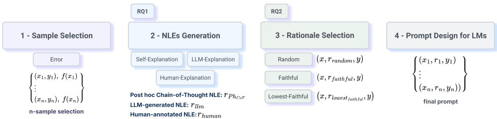  
Figure 1: Overview of Experimental Setup.

## 3.2 Natural Language Explanation Generation

In this step, we consider three diferent strategies for obtaining NLEs: (1) Human-annotated explanations (human-NLEs), (2) Self-generated natural language explanations (self-NLEs), and (3) LLM-generated explanations (LLM-NLEs). By comparing multiple NLE sources, we evaluate how NLE types difer in their predictive utility on LLMs in ICL.

Human-NLEs We utilize human-NLEs from explainable datasets, in which human annotators provide rationales for the correct label of each input. Given that human-annotated explanations have traditionally served as the gold standard for both evaluation and training of models to produce human-like rationales (Wiegrefe & Marasovic, 2021), we assess their efectiveness in improving LLM reasoning performance. We only use human explanations when provided in the given dataset, and denote these as rhuman.

Self-NLEs Self-NLEs are generated by the same model f that is evaluated under the ICL prompt. We use the post-hoc chain-of-thought explanation method Ph-CoT introduced by Bhan et al. (2024), where the model first makes a prediction and then produces a step-by-step CoT-style explanation (e.g., “generate a $\langle n _ { s t e p s } \rangle \mathrm { - s t e p }$ explanation: $s t e p _ { 1 } , s t e p _ { 2 } , . . . , s t e p _ { n } " )$ for that prediction. However, for misclassified samples in the error set, we do not use the original post-hoc explanations as-is. Instead, we regenerate self-explanations conditioned on the gold label. This is to ensure a fair comparison between self-NLEs and human- and LLMgenerated NLEs, which are also produced with the correct label, and to frame them as corrective rationales for the error-based prompting setup. We also run an ablation using the original post-hoc self-explanations conditioned on the model’s incorrect prediction, which shows that the gold-conditioned variant improves utility on average across the evaluated settings (Table 7 in Appendix H). We denote these explanations as $r _ { \mathrm { P h } _ { \mathrm { C o T } } } .$

LLM-NLEs We also leverage LLMs capabilities to generate NLEs in an annotation-style setup. This setup mimics human annotations; instead of relying on human annotators to write rationales for the correct label, we instruct an (external) explainer model $f _ { \mathrm { e x p l a i n e r } }$ to generate an explanation for a given input-output pair (x, y) (e.g., “generate a concise explanation”). This difers from self-NLEs in the generation setup where LLM-NLEs are produced by an explainer model $f _ { \mathrm { e x p l a i n e r } }$ for $( x , y )$ , independently of the evaluated model’s prediction process, whereas self-NLEs are produced by the evaluated model f through the selfexplanation/Ph-CoT pipeline. The explainer $f _ { \mathrm { e x p l a i n e r } }$ need not be the same model as $f ,$ and when it is (e.g. $f _ { \mathrm { e x p l a i n e r } } { = } f )$ , the condition remains distinct because the explanation is generated under an annotation-style prompt rather than through the Ph-CoT process. LLM-NLEs can therefore be generated once per dataset and reused across evaluation models, avoiding the need to regenerate explanations separately for each evaluated model, which makes them practical for explanation-augmented ICL, since the explainer model is used only once for NLE generation. We denote these explanations as $r _ { \mathrm { { l l m } } }$ and refer to them as LLM-NLEs in this paper to distinguish them from self-NLEs, even though both are generated by LLMs.

## 3.3 NLE Selection

In this step, and inspired by RQ2, we designed three setups for selecting NLEs. Each of these setups for the selection of NLEs afects the final few-shot samples $( x , r , y )$ selected for the final prompt. We employ the following setups:

(1) Random Selection (Setting 1): Similar to Bhan et al. (2024), we select the few-shot examples $( x , r , y )$ randomly with no assessment of selected NLEs.

(2) Most-Faithful Self-NLEs (Setting 2): To study whether measured faithfulness afects the utility of self-NLEs, we rank self-NLEs based on their faithfulness. We compute faithfulness scores using two recent NLE faithfulness metrics, and refer to them as $f m _ { 1 }$ (Shailya et al., 2025) and $f m _ { 2 }$ (Madsen et al., 2024) (see §4.3 for details), and rank the self-NLEs separately under each metric, producing two selection variants: $F a i t h f u l { - } f m _ { 1 }$ and $F a i t h f u l { - } f m _ { 2 }$ . We then select the top-n most faithful NLEs along with their corresponding $( x , y )$ pairs for the few-shot template. For human and LLM-generated NLEs, we utilize the same $( x , y )$ pairs selected for the self-NLEs for fair comparison, but with their respective explanations. This setup tests whether highly faithful explanations outperform random ones in improving performance and also the influence of faithfulness metric choice.

(3) Lowest-Faithful Self-NLEs (Setting 3): This setup mirrors Setting 2 but selects the n self-NLE examples with the lowest measured faithfulness under each metric, yielding Lowest- $F a i t h f u l - f m _ { 1 }$ and Lowest-$F a i t h f u l { - } f m _ { 2 }$ variants. This setting provides a contrastive condition for examining whether selecting examples with lower-faithfulness self-NLEs is associated with lower downstream predictive utility. Comparing the highest- and lowest-faithfulness conditions also allows us to assess whether the relationship between measured faithfulness and utility is consistent and monotonic across metrics, tasks, and models. Setting 3 is loosely inspired by informativeness-based active learning, which prioritizes uncertain or challenging instances for their potential learning value (Zhang et al., 2022). Analogously, we test whether examples with low self-NLE faithfulness provide corrective signals in ICL.

In addition to the three main selection settings, we include two rationale-misalignment settings (ablations) to address RQ3 and assess robustness to irrelevant or cross-domain rationales. In Random Rationales (Setting 4), we replace each rationale with a randomly selected rationale from the same dataset (e.g., using rationale $r _ { 5 }$ from $( x _ { 5 } , y _ { 5 } )$ with pair $( x _ { 2 } , y _ { 2 } ) ,$ . This tests whether gains depend on example-specific rationale alignment rather than only on the presence or format of rationales. In OOD Rationales (Setting 5), we replace rationales with explanations drawn from a diferent dataset $( \mathrm { e . g . }$ , an ecqa example $( x _ { i } , y _ { i } )$ is paired with $r _ { j } ^ { \ast }$ from an e-snli example $( x _ { j } ^ { * } , y _ { j } ^ { * } ) _ { , }$ ). This creates a stronger cross-domain mismatch and allows us to evaluate robustness to out-of-distribution rationale noise. We apply this setting only with LLM-NLEs due to computational constraints. Full construction details are provided in Appendix D. Our systematic comparison of the diferent setups explores how explanation type and selection criteria shape predictive utility in SLMs and LLMs.

## 3.4 Final Prompt Design for LMs

In the final step, we construct the complete prompt for the model in the ICL setting. The prompt consists of: (1) a preprompt, which contains the instructions to generate an answer and an explanation. The preprompt difers between the self-NLE setup and the LLM- and human-NLE setups; and (2) the n−few-shot samples, i.e., the $( x , r , y )$ triplets selected as described in the previous steps. We provide examples of the diferent prompt structures used in Appendix E.1.

## 4 Experimental Setup

## 4.1 Datasets

We evaluate the performance of LLMs on six popular datasets. Among these, we consider two explainable datasets: (1) ECQA (Aggarwal et al., 2021), an extension of CommonsenseQA (Talmor et al., 2019) that includes human-written rationales and requires models to justify their answers using structured commonsense knowledge; and (2) e-SNLI (Camburu et al., 2018), which contains premise–hypothesis pairs labeled as entailment, neutral, or contradiction, depending on the logical relationship between the two. In addition, we include three tasks from the Big-Bench-Hard benchmark (Suzgun et al., 2023): (3) SNARKS, where the model must identify the sarcastic sentence from two nearly identical options; (4) Causal Judgment (cj), which involves reading a short story and determining how a typical person would answer a causal question about it; (5) Boolean Expressions (Bool), which tests the model’s ability to evaluate the truth value of randomly generated Boolean expressions composed of constants and basic Boolean operators. Finally, we also evaluate on (6) GSM8K (Cobbe et al., 2021), a mathematical reasoning dataset containing diverse grade school math word problems that require multi-step reasoning in natural language. Together, these benchmarks provide complementary coverage of commonsense, semantic inference, pragmatics, causal reasoning, symbolic logic, and complex multi-step math, enabling a controlled evaluation of how NLE source and selection (including faithfulness filtering and misalignment tests) afect predictive utility across diverse reasoning settings. Additional dataset details are provided in Appendix C.1.

## 4.2 Models

For evaluation, we use instruction-tuned autoregressive LLMs of varying sizes. Specifically, we experiment with GPT-4o-mini (Hurst et al., 2024), Llama-3.1-8B, and Llama-3.3-70B Grattafiori et al. (2024), and Mistral-7B-Instruct-v0.3 (Jiang et al., 2023), where Llama-8B, Mistral-7B are considered SLMs, while Llama-70B represents a significantly larger model. The intentional selection of these models of varying sizes enables us to compare and analyze the influence of model size on our results, particularly examining diferences between SLMs (Llama-8B, Mistral-7B) and LLMs (Llama-70B) from same and diferent families. More specifically, we investigate how diferent experimental setups and configurations afect SLMs compared to LLMs. For GPT-based models, we use the OpenAI API, whereas for the Llama and Mistral models we rely on the Together AI APIs. To better simulate realistic prompt conditions, we set n to 6 and thus employ a 6-shot few-shot prompting setup across all models consistent with prior work (Bhan et al., 2024) (and also due to computational cost of our comprehensive pipeline). Through this diverse set of models and experimental settings, we comprehensively assess the scalability and robustness of our method across varying model capacities and architectural complexities.

Models for Generating NLEs: To get LLM-generated NLEs we employ two models, GPT-4o-mini and o3-mini. Using multiple explainer models allows us to diversify our selection and assess whether the choice of LLM afects the predictive utility of the generated LLM-NLEs. To generate self-NLEs, the same models used for evaluation (4o-mini, Llama-8B, Llama-70B, and Mistral-7B) are used to generate self-NLEs. We show examples of the diferent NLEs generated by each strategy and its variants for the datasets in Figures 19-23 in Appendix O.

## 4.3 Evaluating Self-NLEs Faithfulness

We use faithfulness to refer to the extent to which a self-NLE reflects and is consistent with the model’s answer-generating behavior, and we measure it quantitatively through two automated metrics $f m _ { 1 } \ \& \ f m _ { 2 } .$ $f m _ { 1 }$ is the faithfulness metric in the LExT framework proposed by Shailya et al. (2025), which combines three sub-metrics capturing diferent dimensions of faithfulness: (1) Question Answer Generation (QAG), which assesses whether questions, generated from the explanation by the same model, can be answered using that explanation; (2) Counterfactual Stability, which tests whether the model’s prediction changes when the explanation is rewritten by the same model to support an alternative label; and (3) Contextual Faithfulness, which removes important keywords identified by the model itself from the input context and tests whether the model recognizes that the remaining information is insuficient. Each sub-metric produces a score in [0, 1], and the three scores are averaged to obtain the final $f m _ { 1 }$ score, also in [0, 1]. For comparison with binary $f m _ { 2 }$ , we convert $f m _ { 1 }$ into a relative binary label using a dataset-specific 75th percentile, treating the highest-scoring quartile as faithful and the remainder as unfaithful (see §F.1 for more details).

For $f m _ { 2 }$ , we adapt the self-consistency-based faithfulness framework proposed in Madsen et al. (2024) to self-NLEs. The framework tests whether a self-explanation is behaviorally consistent with the model’s prediction under a counterfactual intervention. We apply this metric to the self-NLE, which is minimally edited to support an alternative label, and the model is then asked, in a separate inference session, to answer the original question using the edited self-NLE as context. If the prediction changes to the intended alternative label, the self-NLE is marked faithful; otherwise, it is marked unfaithful. fm2 provides a binary faithful/unfaithful score per self-NLE (see §F.2 for more details). We provide examples of prompt templates in Appendix E.2 and E.3.

## 4.4 Baseline Methods

To comprehensively evaluate our designed setups, we compare their performance against several baseline methods: Zero-Shot (ZS) (Srivastava et al., 2023), which uses standard input-output prompting; Few-Shot (FS), where the prompt includes only a few input-output samples (x, y) without rationales; and zero-shot CoT (Kojima et al., 2022), where we prompt the LLM to elicit a step-by-step natural-language rationale followed by the final answer. For the FS baseline, we consider FS-Random (FS-R), following Setup 1 with randomly selected few-shot samples but excluding rationales. These baselines allow us to quantify the added value of including NLEs as in-context exemplars beyond standard prompting strategies.

## 5 Results and Analysis

## 5.1 Comparing NLE types and Setups (RQ1)

Comparison among diferent NLE types. Across datasets, we compare explanation-augmented prompting (self-NLEs, LLM-NLEs, and, where available, human-NLEs) against the baselines we specified. Table 1 reports the main random-selection results averaged across models; Figure 7 and Table 10 in Appendix M provide the corresponding visualization and model-specific results. Our primary goal is to compare the predictive utility of diferent NLE sources in an ICL setting. Overall, on the classification-style benchmarks (ecqa, e-snli, snarks, boolean, and cj), incorporating NLEs into the few-shot prompt often improves accuracy relative to FS-R, especially when using LLM- or human-generated explanations; self-NLEs can also help, but with more variability. Among NLE sources, LLM-NLEs (GPT-4o-mini or o3-mini) often yield the strongest performance and are consistently competitive across datasets.

Table 1: NLE Type comparison under random selection (RQ1). Values represent performance (meanstandard deviation) over five runs for baseline methods and random-selection explanation setup, averaged over the four evaluated models for each dataset. Bold indicates the best-performing method per dataset.
<table><tr><td rowspan="2">Dataset</td><td colspan="3">Baselines</td><td colspan="4">Random</td></tr><tr><td>ZS</td><td>FS-R</td><td>CoT</td><td>Self-NLE</td><td>Human-NLE</td><td>LLM-40</td><td>LLM-o3</td></tr><tr><td>ECQA</td><td>0.7600.011</td><td>0.7910.014</td><td>0.7560.015</td><td>0.7530.045</td><td>0.7730.029</td><td>0.7990.004</td><td>0.7800.007</td></tr><tr><td>e-SNLI</td><td>0.5930.008</td><td>0.7240.017</td><td>0.5910.012</td><td>0.7110.026</td><td>0.7260.038</td><td>0.7010.009</td><td>0.6080.021</td></tr><tr><td>SNARKS</td><td>0.5660.014</td><td>0.5870.021</td><td>0.7520.019</td><td>0.5560.014</td><td></td><td>0.8010.009</td><td>0.8140.016</td></tr><tr><td>BOOLEAN</td><td>0.5160.009</td><td>0.6710.011</td><td>0.8060.011</td><td>0.8770.033</td><td></td><td>0.9000.003</td><td>0.9160.011</td></tr><tr><td>CJ</td><td>0.5870.013</td><td>0.6190.018</td><td>0.6480.016</td><td>0.6500.023</td><td></td><td>0.6500.015</td><td>0.6540.008</td></tr><tr><td>GSM8K</td><td>0.2460.005</td><td>0.7240.015</td><td>0.8090.004</td><td>0.6900.007</td><td></td><td>0.7680.008</td><td> $0 . 7 6 5 _ { 0 . 0 0 5 }$ </td></tr></table>

When human-NLEs are available, this pattern holds for ecqa but not for e-snli, where human-annotated NLEs are slightly stronger on average, suggesting that human rationales provide especially valuable corrective signals for this NLI task. In contrast, self-NLEs are more variable: while they frequently improve over ZS and can be comparable to or occasionally exceed FS-R, they typically lag behind LLM- (and, where available, human-) NLEs. On gsm8k, the same relative ordering among NLE types largely holds where LLM-NLEs are generally stronger than self-NLEs, while baseline performance is strongly driven by CoT, which is expected for multi-step math reasoning. Taken together, these results suggest that adding NLEs to few-shot prompts can provide benefits in many settings, with LLM-generated (and, where available, human) explanations being the most reliable sources.

Influence of the NLE-selection Setup (Setups 1 vs 2 vs 3). We now compare how diferent NLE selection setups, particularly moving from Setting 1 (Random) to Settings 2 (Most-Faithful) and 3 (Lowest-Faithful), impact the predictive utility of NLEs. We refer to Table 2 for a summary of the results and for more detailed results in Table 14 and Figure 8 in Appendix M.3. Overall, as shown in Table 2, LLMand human-NLEs (for e-snli and ecqa) often exhibit higher predictive utility than self-NLEs across Setups 1–3 (except for faithful- $f m _ { 1 } / f m _ { 2 }$ on gsm8k and lowest-faithful $f m _ { 2 }$ on cj where self-NLEs outperform LLM-NLEs). Thus, even when NLEs selection is driven by self-NLE faithfulness scores, LLM- and human-NLEs still show better utility in most settings. Moving across settings, LLM and human-NLEs also appear relatively stable in their predictive utility. Human-NLEs remain strong on ecqa and e-snli and are the best-performing source across all settings on e-snli. LLM-NLEs also maintain high absolute performance across most settings (except on gsm8k under Most-Faithful selection, where self-NLEs outperform LLM-NLE variants). Taken together, these results indicate that LLM- and human-NLEs often provide stronger and more stable downstream utility than self-NLEs, even when explanations are selected using self-NLE faithfulness scores. In contrast, self-NLEs appear to benefit more selectively from faithfulness-based selection, which we discuss further in §5.2. We refer the reader to Figure 9a, 9b, and Table 12 in Appendix M for per-model detailed results.

Table 2: Best-performing NLE source under each selection setting (RQ1). Each cell reports the NLE source with the highest mean absolute accuracy, averaged over the four evaluation models, with the accuracy shown in parentheses. Cell colors indicate the NLE type: Self-NLE , Human-NLE , and LLM-NLE
<table><tr><td rowspan="2">Dataset</td><td>Setting 1</td><td colspan="2">Setting 2 (Most-Faithful)</td><td colspan="2">Setting 3 (Lowest-Faithful)</td></tr><tr><td>Random</td><td> $f m _ { 1 }$ </td><td>fm2</td><td> $f m _ { 1 }$ </td><td> $f m _ { 2 }$ </td></tr><tr><td rowspan="2">ECQA</td><td>LLM-4o</td><td>Human-NLE</td><td>Human-NLE</td><td>LLM-o3</td><td>LLM-o3</td></tr><tr><td>(0.799)</td><td>(0.774)</td><td>(0.783)</td><td>(0.801)</td><td>(0.806)</td></tr><tr><td rowspan="2">e-SNLI</td><td>Human-ÑLE</td><td>Human-NLE</td><td>Human-NLE</td><td>Human-NLE</td><td>Human-NLE</td></tr><tr><td>(0.726)</td><td>(0.762)</td><td>(0.741)</td><td>(0.756)</td><td>(0.763)</td></tr><tr><td rowspan="2">SNARKS</td><td>LLM-o3</td><td>LLM-o3</td><td>LLM-o3</td><td>LLM-o3</td><td>LLM-o3</td></tr><tr><td>(0.814)</td><td>(0.816)</td><td>(0.818)</td><td>(0.798)</td><td>(0.794)</td></tr><tr><td rowspan="2">BOOLEAN</td><td>LLM-o3</td><td>LLM-4o</td><td>LLM-o3</td><td>LLM-o3</td><td>LLM-4o</td></tr><tr><td>(0.916)</td><td>(0.926)</td><td>(0.910)</td><td>(0.911)</td><td>(0.919)</td></tr><tr><td rowspan="2">CJ</td><td>LLM-o3</td><td>LLM-o3</td><td>LLM-o3</td><td>LLM-o3</td><td>Self-NLE</td></tr><tr><td>(0.654)</td><td>(0.634)</td><td>(0.654)</td><td>(0.647)</td><td>(0.646)</td></tr><tr><td rowspan="2">GSM8K</td><td>LLM-4o</td><td>Self-NLE</td><td>Self-NLE</td><td>LLM-4o</td><td>LLM-4o</td></tr><tr><td>(0.768)</td><td>(0.763)</td><td>(0.686)</td><td>(0.732)</td><td>(0.766)</td></tr></table>

## 5.2 Relationship Between Measured Faithfulness and Self-NLE Predictive Utility (RQ2)

In this experiment, we address RQ2 by measuring how the faithfulness of in-context self-NLEs afects downstream performance and we refer to the results in Table 3 (see Table 11 in Appendix M.2 for per-model results). Overall, selecting high-faithful self-NLEs yields small average improvements across datasets for $f m _ { 1 }$ & $f m _ { 2 }$ , but these aggregate gains mask variation across datasets, models, and metrics. On the classificationstyle benchmarks, selecting highly faithful self-NLEs can improve predictive utility (e.g., ecqa and e-snli on average), but is not uniformly beneficial across all datasets (e.g., cj shows slight degradations across selection strategies). On the other hand, lowest-faithfulness selection is harmful on average (overall −0.035 for lowest-faithful-fm1, −0.041 for lowest-faithful-fm2), but not always: for some datasets (e.g., snarks and ecqa under lowest-faithful- $f m _ { 2 } )$ , performance can still increase relative to random selection. On gsm8k, high-faithfulness selection exhibits strong metric- and model-dependent efects. Selection according to $f m _ { 1 }$ improves average performance by 0.073, driven largely by the gain for Llama-70B $( \Delta = + 0 . 3 5 0 )$ . In contrast, fm2-based selection produces almost no average change $( \Delta = - 0 . 0 0 3 )$ , because the substantial gain for Llama-70B $( \Delta = + 0 . 3 7 1 )$ ) is ofset by a large degradation for Mistral-7B $( \Delta = - 0 . 4 0 5 )$ . Selecting lowestfaithful self-NLEs reduces performance for all evaluated models on gsm8k, particularly under $f m _ { 2 }$ . Taken together, these results show that selection based on measured self-NLE faithfulness can afect downstream predictive utility, but its efect depends on the faithfulness metric, task, and evaluated model. The choice of metric changes which NLEs are selected and is associated with diferent performance outcomes across settings.

## 5.3 Robustness to Random and OOD Explanations (RQ3)

As an ablation study, in Settings 4 and 5 we stress-test how models respond to misaligned few-shot explanations: (1) Random rationales (Setting 4), where rationales are swapped across in-domain $( x , y )$ pairs, and (2) OOD rationales (Setting 5), where rationales are drawn from mismatched datasets. Table 4 reports the average performance diference of these stress tests relative to the faithful-selection setup (Setting 2 with fm1), aggregated over five runs (with standard deviation values in Table 6 in Appendix D). Overall, OOD swaps consistently degrade performance, whereas in-domain random swaps have mixed efects across datasets and explanation sources.

Table 3: Self-NLE performance under random and faithfulness-based selection (RQ2). Random Self-exp. reports accuracy. Other columns report ∆ vs. random self-NLE selection ((+): improvement, (−): degradation). Bold marks the best strategy per dataset–model pair. † indicates that faithfulness-based self-NLE selection also outperforms the strongest non-NLE baseline for the same pair.
<table><tr><td rowspan="2">Dataset</td><td rowspan="2">Models</td><td>Random</td><td>Faithful-fm1</td><td>Faithful-fm2</td><td>Lowest-Faithful-fm1</td><td>Lowest-Faithful-fm2</td></tr><tr><td>Self-exp.</td><td>∆ vs Rand.</td><td>∆ vs Rand.</td><td>∆ vs Rand.</td><td>∆ vs Rand.</td></tr><tr><td rowspan="5">ECQA</td><td>4o-mini</td><td>0.828</td><td>-0.004</td><td>-0.008</td><td>-0.004</td><td>+0.001†</td></tr><tr><td>11ama-70B</td><td>0.745</td><td>+0.037</td><td>+0.068</td><td>-0.086</td><td>+0.117†</td></tr><tr><td>11ama-8B</td><td>0.780</td><td>-0.021</td><td>0.000</td><td>-0.550</td><td>+0.002</td></tr><tr><td>mistral-7B</td><td>0.660</td><td>+0.036</td><td>+0.026</td><td>+0.018</td><td>+0.064</td></tr><tr><td>Avg</td><td>0.753</td><td>+0.012</td><td>+0.022</td><td>-0.155</td><td>+0.046</td></tr><tr><td rowspan="5">e-SNLI</td><td>4o-mini</td><td>0.826</td><td>-0.036</td><td>-0.008</td><td>+0.020†</td><td>+0.006</td></tr><tr><td>11ama-70B</td><td>0.789</td><td>+0.027†</td><td>-0.069</td><td>-0.015</td><td>-0.085</td></tr><tr><td>11ama-8B</td><td>0.639</td><td>-0.035</td><td>-0.006</td><td>+0.073</td><td>-0.067</td></tr><tr><td>mistral-7B</td><td>0.591</td><td>+0.051</td><td>+0.100</td><td>+0.016</td><td>0.000</td></tr><tr><td>Avg</td><td>0.711</td><td>+0.002</td><td>+0.005</td><td>+0.024</td><td>-0.036</td></tr><tr><td rowspan="5">SNARKS</td><td>4o-mini</td><td>0.512</td><td>+0.002</td><td>+0.051</td><td>+0.142</td><td>+0.263</td></tr><tr><td>11ama-70B</td><td>0.816</td><td>-0.022</td><td>+0.006</td><td>+0.004</td><td>-0.002</td></tr><tr><td>11ama-8B</td><td>0.418</td><td>+0.051</td><td>+0.135</td><td>-0.032</td><td>+0.171</td></tr><tr><td>mistral-7B</td><td>0.477</td><td>-0.046</td><td>-0.036</td><td>-0.083</td><td>+0.003</td></tr><tr><td>Avg</td><td>0.556</td><td>-0.004</td><td>+0.039</td><td>+0.008</td><td>+0.109</td></tr><tr><td rowspan="5">BOOLEAN</td><td>4o-mini</td><td>0.970</td><td>-0.013</td><td>-0.027</td><td>-0.040</td><td>-0.011</td></tr><tr><td>11ama-70B</td><td>0.935</td><td>+0.007</td><td>+0.041</td><td>-0.126</td><td>+0.037</td></tr><tr><td>11ama-8B</td><td>0.872</td><td>+0.021†</td><td>-0.020</td><td>+0.001</td><td>+0.001</td></tr><tr><td>mistral-7B</td><td>0.729</td><td>-0.046</td><td>+0.016</td><td>+0.037</td><td>+0.066†</td></tr><tr><td>Avg</td><td>0.877</td><td>-0.008</td><td>+0.002</td><td>-0.032</td><td>+0.023†</td></tr><tr><td rowspan="5">CJ</td><td>4o-mini</td><td>0.695</td><td>-0.010</td><td>+0.008†</td><td>-0.023</td><td>-0.012</td></tr><tr><td>11ama-70B</td><td>0.650</td><td>+0.055</td><td>+0.028</td><td>+0.032</td><td>+0.095†</td></tr><tr><td>11ama-8B</td><td>0.640</td><td>-0.062</td><td>-0.041</td><td>-0.010</td><td>-0.085</td></tr><tr><td>mistral-7B</td><td>0.614</td><td>-0.052</td><td>-0.046</td><td>-0.025</td><td>-0.012</td></tr><tr><td>Avg</td><td>0.650</td><td>-0.017</td><td>-0.013</td><td>-0.007</td><td>-0.004</td></tr><tr><td rowspan="5">GSM8K</td><td>4o-mini</td><td>0.903</td><td>-0.010</td><td>+0.013</td><td>-0.027</td><td>-0.526</td></tr><tr><td>11ama-70B</td><td>0.552</td><td>+0.350</td><td>+0.371</td><td>-0.064</td><td>-0.280</td></tr><tr><td>11ama-8B</td><td>0.816</td><td>+0.009</td><td>+0.009</td><td>-0.033</td><td>-0.380</td></tr><tr><td>mistral-7B</td><td>0.487</td><td>-0.057</td><td>-0.405</td><td>-0.066</td><td>-0.346</td></tr><tr><td>Avg</td><td>0.690</td><td>+0.073</td><td>-0.003</td><td>-0.048</td><td>-0.383</td></tr><tr><td>All datasets</td><td>Avg</td><td>0.706</td><td>+0.010</td><td>+0.009</td><td>-0.035</td><td>-0.041</td></tr></table>

Overall in Setting 4, randomly swapped rationales typically reduce performance compared to faithful selection, with the magnitude depending on the dataset and explanation source. In some settings, the degradation is modest (and can even be slightly positive for self-explanations on snarks), suggesting partial robustness to in-domain rationale mismatch and that such in-domain rationales may still provide taskrelevant cues. However, the more pronounced drops observed on several datasets (e.g., e-snli and boolean for LLM-NLEs) indicate that explanation-specific semantic alignment remains important and that random swaps should not be treated as a harmless change.

In the OOD rationales setup (Setting 5), performance consistently degrades relative to faithful explanations across datasets, but models retain non-trivial accuracy. This pattern supports a partial robustness interpretation: models do not collapse under cross-domain rationales, yet they are consistently harmed by semantically mismatched explanations. Together, these stress tests indicate partial robustness and reinforce that semantic coherence contributes to the gains from NLE-augmented ICL, motivating careful explanation selection. These behaviors are further illustrated by qualitative examples of final prompts and mode predictions under Setups 4 and 5 (see Appendix N). For instance, Figure 16 shows an incorrect prediction by Llama-70B on an ecqa sample with LLM-NLEs from e-snli. Similarly, Figure 14 shows a failed bool prediction by Llama-8B with few-shot examples containing LLM rationales from snarks. Partial robustness examples, where the model still gets a correct output despite the inclusion of OOD NLEs, can still be seen e.g. in examples of Figures 15 and 17.

Table 4: The diference (∆) of average performance across five runs of models per dataset for Random and OOD settings vs the faithful selection (setting 2 with $f m _ { 1 } )$ across datasets and explanation types (RQ3).
<table><tr><td rowspan="2">Dataset</td><td colspan="4">Random</td><td rowspan="2">OOD</td></tr><tr><td>Self-exp.</td><td>Human</td><td>4o-mini</td><td>o3-mini</td></tr><tr><td>ECQA</td><td>-0.062</td><td>+0.002</td><td>-0.124</td><td>-0.002</td><td>-0.081</td></tr><tr><td>e-SNLI</td><td>-0.053</td><td>-0.106</td><td>-0.162</td><td>-0.128</td><td>-0.113</td></tr><tr><td>SNARKS</td><td>+0.063</td><td></td><td>-0.033</td><td>-0.061</td><td>-0.101</td></tr><tr><td>BOOL</td><td>-0.098</td><td></td><td>-0.181</td><td>-0.070</td><td>-0.090</td></tr><tr><td>CJ</td><td>-0.054</td><td></td><td>-0.086</td><td>-0.074</td><td>-0.029</td></tr><tr><td>GSM8K</td><td>-0.022</td><td></td><td>-0.023</td><td>-0.048</td><td>-0.035</td></tr><tr><td>All datasets</td><td>-0.038</td><td>-0.052</td><td>-0.102</td><td>-0.064</td><td>-0.075</td></tr></table>

## 6 Discussion

Which NLE to Use? Practical Guidance. Taken together, our findings suggest the following practical guidance for selecting NLEs with high predictive utility: (1) adding NLEs to few-shot prompts often improves performance over ICL without explanations, although the gains are not universal and depend on the NLE source, selection strategy, and task. (2) external NLE sources, LLM-generated and, where available, humanwritten NLEs provide comparatively strong and stable predictive utility across the evaluated selection setups, whereas self-NLE utility is more sensitive to how explanations are selected. Because LLM- and human-NLEs also perform strongly under random selection on most evaluated classification-style benchmarks, they provide a practical starting point without requiring an additional faithfulness-scoring stage. (3) the gsm8k results suggest that faithfulness-selected self-NLEs can be particularly useful for math reasoning in some settings. This motivates further work on when faithfulness-based selection is beneficial and how to develop more reliable selection criteria across tasks and models.

LLM-Generated vs. Human Explanations. On the two datasets with human NLEs (ecqa and e-snli), LLM-generated explanations are broadly competitive with human-annotated rationales. On ecqa, LLMgenerated explanations often match or outperform human explanations across several settings, whereas on e-snli human rationales remain slightly stronger on average and LLM-generated explanations are generally comparable rather than clearly superior. Since LLM-generated explanations can be produced automatically via prompting, they are substantially cheaper and faster than manual annotation, making them a practical alternative for practitioners when human explanations are unavailable or expensive. At the same time, the esnli results suggest that human-written rationales may still be advantageous for tasks requiring fine-grained semantic alignment.

Disagreement Between NLE Faithfulness Metrics. Our RQ2 findings highlight a critical issue for NLE faithfulness evaluation: faithfulness metrics can disagree substantially. As shown in Table 9 (Appendix L), the average disagreement rate is ∼ 0.5 across datasets and models: about half of NLEs receive conflicting faithful vs. unfaithful labels. The direction of disagreement is dataset-dependent yet consistent within each dataset across models, indicating that $f m _ { 1 }$ and $f m _ { 2 }$ are not interchangeable and likely capture diferent operational aspects of self-NLE faithfulness. Although some disagreement may be expected because the two metrics are grounded in diferent faithfulness checks, the magnitude and consistency of the disagreement show that metric choice matters in practice, especially when such metrics are used to evaluate or select faithful self-NLEs. This implies that metric choice is a substantive decision, especially in settings that require faithful explanations or rely on NLEs for data augmentation and performance improvements (Chen et al., 2025; Dhaini et al., 2025). In practice, a single metric should not be treated as ground truth for self-explanation faithfulness; disagreement should be interpreted as measurement uncertainty and, when possible, quantified and reported. This is particularly relevant for practitioners relying on evaluation toolboxes that implement only one faithfulness metric. Given the scarcity of metrics for measuring faithfulness in self-NLEs, this leve of disagreement is concerning and warrants further investigation by the Explainable NLP community. More broadly, these findings motivate mechanistic analyses and more rigorous evaluations of faithfulness metrics for NLEs, and connect to broader challenges in explainable NLP where automated metrics are frequently used to assess explanation quality. We present further results about this disagreement in Appendix L.

Faithfulness-Based NLE Selection Can Help, but Not Always. Selecting self-NLEs by measured faithfulness yields small average improvements over random selection, but the relationship between faithfulness and predictive utility of self-NLEs is neither uniform nor consistently monotonic. High-faithfulness selection improves downstream performance in some model–dataset combinations, while lowest-faithfulness selection is harmful on average but can still improve performance in some classification settings. Consisten with the metric-disagreement observation, $f m _ { 1 }$ and $f m _ { 2 }$ can lead to diferent (and sometimes opposite) outcomes, indicating that faithfulness is not a metric-agnostic proxy for downstream utility. This is particularly evident on gsm8k where high-faithfulness selection using $f m _ { 1 }$ improves average performance, whereas using $f m _ { 2 }$ produces almost no average change because its efects difer sharply across models, substantially benefiting Llama-70B while strongly degrading Mistral-7B. Lowest-faithfulness selection is also especially harmful on this task, particularly under $f m _ { 2 } .$ . In particular, Mistral-7B results on gsm8k suggest that when a model’s self-explanations utility is low, fm -based filtering can amplify selection errors, and sharply reduce downstream utility, an efect which could be related to this particular model’s low performance on this dataset but is still worth further investigation in future work. Overall, faithfulness can provide a usefu selection signal, but its efectiveness depends on the metric, task, and evaluated model. Therefore, a single faithfulness metric should not be assumed to provide a consistently reliable filtering criterion.

Insights on Robustness and Misalignment. Our random and OOD NLEs stress tests provide additional insights into when explanation-augmented ICL is robust to misalignment where both randomly swapped in-domain rationales and out-of-domain rationales generally reduce performance on average. At the same time, models retain reasonable performance under these perturbations, indicating partial robustness to rationale misalignment. OOD swaps are consistently harmful across datasets, whereas the efects of in domain random swaps are more variable. This variability may partly arise because in-domain rationales may still provide task-relevant cues or reasoning patterns despite being paired with diferent examples. Overall, these findings suggest that example-specific semantic alignment remains important; thus, NLE-augmented prompting benefits from careful rationale selection and stress-testing when used in ICL settings. Practically, this suggests that using non-aligned NLEs (even when drawn from the same dataset) can reduce or negate the benefits of explanation-augmented prompting. When deploying NLE-augmented ICL, practitioners should therefore prefer explanations that are semantically aligned with each few-shot example and treat random swapping as a stress test rather than a viable selection strategy.

NLEs vs. CoT Prompting. CoT prompting is a widely used approach for eliciting step-by-step reasoning from LLMs and is a strong baseline in our experiments, particularly on multi-step math reasoning (e.g., gsm8k). At the same time, our results in Table 1 (and Tables 12, 13 in Appendix M.3) show that incorporating structured NLEs as few-shot exemplars can be highly efective: on several classification-style benchmarks, LLM- or human-generated NLEs mostly outperform CoT in a number of model–dataset settings, while also consistently improving over standard few-shot prompting. Beyond accuracy, NLEs ofer practical advantages: they provide reusable reasoning patterns that can be precomputed (e.g., via an external LLM), enabling modular prompt design and decoupling explanation construction from inference-time generation. Overall, these findings suggest that NLE-augmented prompting and CoT are complementary strategies whose relative efectiveness is task-dependent: CoT is particularly efective for step-by-step math reasoning, whereas well-aligned NLE exemplars can serve as a flexible and competitive alternative on classification-style reasoning tasks, especially under constrained or latency-sensitive settings.

Impact of Model Size on Explanation Sensitivity. As shown in Table 12 (and Figure 2 in Ap pendix K), the relative accuracy gains from explanation-augmented prompting are larger for smaller models. Llama-8B and Mistral-7B (except on gsm8k) show more pronounced performance gains when given high-quality explanations, especially under faithful selection regimes. This suggests that external reasoning support compensates for limited internal abstraction capabilities. In contrast, Llama-70B performs more robustly across all setups, with less variance between strategies, indicating stronger intrinsic reasoning. These findings align with prior observations that larger models internalize more abstract reasoning patterns and benefit less from external scafolding. Nonetheless, both (smaller) models consistently improve with well-selected explanations, reinforcing the utility of prompt-based guidance at all scales. We also provide descriptive statistics on NLE length and an exploratory discussion of the relative cost (§I) and predictive utility of the two LLM-based NLE generators (§J) in the appendix.

## 7 Conclusion

This work investigates design choices for selecting NLEs in explanation-augmented prompting and presents a comparative evaluation of natural language explanations used as few-shot rationales in ICL, comparing selfgenerated NLEs, NLEs generated by external LLMs, and, where available, human-written NLEs across six benchmarks and four instruction-tuned models. Our findings provide the following answers to the research questions. First, on the evaluated classification-style benchmarks, adding NLEs often improves accuracy relative to few-shot prompting without explanations. NLEs generated by an external LLM and, where available, human-written NLEs more consistently yield higher predictive utility than self-NLEs across selection settings. On gsm8k, however, the utility of NLEs varies more substantially with the model, NLE source, and selection strategy. Second, faithfulness-based selection of self-NLEs yields small average gains, but its efects vary across metrics, tasks, and models, sometimes improving and sometimes reducing downstream performance. Metric choice can lead to substantially diferent selections and, thus, diferent performance outcomes. Third, randomly swapped and out-of-distribution rationales generally reduce performance, although accuracy does not collapse. This indicates partial robustness to misaligned rationales while also demonstrating the importance of semantic alignment. Overall, our findings show that NLE source, NLE-selection strategy, and faithfulness metric are important design choices in explanation-augmented ICL and should be reported explicitly. We discuss the limitations of our study in Appendix A.

## Acknowledgments

We acknowledge the support for MD and BP through the ERC Consolidator Grant DIALECT 101043235. This research was also partially supported by the German Federal Ministry of Education and Research (BMBF) grant 01IS23069 Software Campus 3.0 (TU München).

## References

Shourya Aggarwal, Divyanshu Mandowara, Vishwajeet Agrawal, Dinesh Khandelwal, Parag Singla, and Dinesh Garg. Explanations for CommonsenseQA: New Dataset and Models. In Chengqing Zong, Fe Xia, Wenjie Li, and Roberto Navigli (eds.), Proceedings of the 59th Annual Meeting of the Association for Computational Linguistics and the 11th International Joint Conference on Natural Language Processing (Volume 1: Long Papers), pp. 3050–3065, Online, August 2021. Association for Computational Linguistics. doi: 10.18653/v1/2021.acl-long.238. URL https://aclanthology.org/2021.acl-long.238/.

Yasmeen Alufaisan, Laura R. Marusich, Jonathan Z. Bakdash, Yan Zhou, and Murat Kantarcioglu. Does explainable artificial intelligence improve human decision-making? Proceedings of the AAAI Conference on Artificial Intelligence, 35(8):6618–6626, 2021. doi: 10.1609/aaai.v35i8.16819. URL https://doi.org/ 10.1609/aaai.v35i8.16819.

Pepa Atanasova, Oana-Maria Camburu, Christina Lioma, Thomas Lukasiewicz, Jakob Grue Simonsen, and Isabelle Augenstein. Faithfulness tests for natural language explanations. In Anna Rogers, Jordan Boyd-Graber, and Naoaki Okazaki (eds.), Proceedings of the 61st Annual Meeting of the Association for Computational Linguistics (Volume 2: Short Papers), pp. 283–294, Toronto, Canada, July 2023. Association for Computational Linguistics. doi: 10.18653/v1/2023.acl-short.25. URL https: //aclanthology.org/2023.acl-short.25/.

Milan Bhan, Jean-Noël Vittaut, Nicolas Chesneau, and Marie-Jeanne Lesot. Self-AMPLIFY: Improving small language models with self post hoc explanations. In Yaser Al-Onaizan, Mohit Bansal, and Yun-Nung

Chen (eds.), Proceedings of the 2024 Conference on Empirical Methods in Natural Language Processing, pp. 10974–10991, Miami, Florida, USA, November 2024. Association for Computational Linguistics. doi: 10.18653/v1/2024.emnlp-main.615. URL https://aclanthology.org/2024.emnlp-main.615/.

Erik Cambria, Lorenzo Malandri, Fabio Mercorio, Mario Mezzanzanica, and Navid Nobani. A survey on xai and natural language explanations. Inf. Process. Manage., 60(1), January 2023. ISSN 0306-4573. doi: 10.1016/j.ipm.2022.103111. URL https://doi.org/10.1016/j.ipm.2022.103111.

Oana-Maria Camburu, Tim Rocktäschel, Thomas Lukasiewicz, and Phil Blunsom. e-snli: Natural language inference with natural language explanations. In S. Bengio, H. Wallach, H. Larochelle, K. Grauman, N. Cesa-Bianchi, and R. Garnett (eds.), Advances in Neural Information Processing Systems, volume 31. Curran Associates, Inc., 2018. URL https://proceedings.neurips.cc/paper\_files/paper/ 2018/file/4c7a167bb329bd92580a99ce422d6fa6-Paper.pdf.

Beiduo Chen, Siyao Peng, Anna Korhonen, and Barbara Plank. A rose by any other name: LLM-generated explanations are good proxies for human explanations to collect label distributions on NLI. In Wanxiang Che, Joyce Nabende, Ekaterina Shutova, and Mohammad Taher Pilehvar (eds.), Findings of the Association for Computational Linguistics: ACL 2025, pp. 10777–10802, Vienna, Austria, July 2025. Association for Computational Linguistics. ISBN 979-8-89176-256-5. doi: 10.18653/v1/2025.findings-acl.562. URL https://aclanthology.org/2025.findings-acl.562/.

Karl Cobbe, Vineet Kosaraju, Mohammad Bavarian, Mark Chen, Heewoo Jun, Lukasz Kaiser, Matthias Plappert, Jerry Tworek, Jacob Hilton, Reiichiro Nakano, Christopher Hesse, and John Schulman. Training verifiers to solve math word problems, 2021. URL https://arxiv.org/abs/2110.14168.

Marina Danilevsky, Kun Qian, Ranit Aharonov, Yannis Katsis, Ban Kawas, and Prithviraj Sen. A survey of the state of explainable AI for natural language processing. In Kam-Fai Wong, Kevin Knight, and Hua Wu (eds.), Proceedings of the 1st Conference of the Asia-Pacific Chapter of the Association for Computational Linguistics and the 10th International Joint Conference on Natural Language Processing, pp. 447–459, Suzhou, China, December 2020. Association for Computational Linguistics. doi: 10.18653 v1/2020.aacl-main.46. URL https://aclanthology.org/2020.aacl-main.46/.

Mahdi Dhaini, Juraj Vladika, Ege Erdogan, Zineb Attaoui, and Gjergji Kasneci. Can llm-generated textual explanations enhance model classification performance? an empirical study. In Artificial Neural Networks and Machine Learning – ICANN 2025: 34th International Conference on Artificial Neural Networks, Kaunas, Lithuania, September 9–12, 2025, Proceedings, Part III, pp. 192–204, Berlin, Heidelberg, 2025. Springer-Verlag. ISBN 978-3-032-04548-5. doi: 10.1007/978-3-032-04549-2\_16. URL https://doi.org/ 10.1007/978-3-032-04549-2\_16.

Aaron Grattafiori, Abhimanyu Dubey, Abhinav Jauhri, Abhinav Pandey, et al. The llama 3 herd of models, 2024. URL https://arxiv.org/abs/2407.21783.

Mareike Hartmann and Daniel Sonntag. A survey on improving NLP models with human explanations. In Jacob Andreas, Karthik Narasimhan, and Aida Nematzadeh (eds.), Proceedings of the First Workshop on Learning with Natural Language Supervision, pp. 40–47, Dublin, Ireland, May 2022. Association for Computational Linguistics. doi: 10.18653/v1/2022.lnls-1.5. URL https://aclanthology.org/2022. lnls-1.5/.

Xuanli He, Yuxiang Wu, Oana-Maria Camburu, Pasquale Minervini, and Pontus Stenetorp. Using natural language explanations to improve robustness of in-context learning. In Lun-Wei Ku, Andre Martins, and Vivek Srikumar (eds.), Proceedings of the 62nd Annual Meeting of the Association for Computational Linguistics (Volume 1: Long Papers), pp. 13477–13499, Bangkok, Thailand, August 2024. Association for Computational Linguistics. doi: 10.18653/v1/2024.acl-long.728. URL https://aclanthology.org/ 2024.acl-long.728/.

Aaron Hurst, Adam Lerer, Adam P. Goucher, Adam Perelman, Aditya Ramesh, Aidan Clark, AJ Ostrow, Akila Welihinda, Alan Hayes, Alec Radford, Aleksander Mądry, Alex Baker-Whitcomb, Alex Beutel, et al. Gpt-4o system card, 2024. URL https://arxiv.org/abs/2410.21276.

Alon Jacovi and Yoav Goldberg. Towards faithfully interpretable NLP systems: How should we define and evaluate faithfulness? In Dan Jurafsky, Joyce Chai, Natalie Schluter, and Joel Tetreault (eds.), Proceedings of the 58th Annual Meeting of the Association for Computational Linguistics, pp. 4198–4205, Online, July 2020. Association for Computational Linguistics. doi: 10.18653/v1/2020.acl-main.386. URL https://aclanthology.org/2020.acl-main.386.

Albert Q. Jiang, Alexandre Sablayrolles, Arthur Mensch, Chris Bamford, Devendra Singh Chaplot, Diego de las Casas, Florian Bressand, Gianna Lengyel, Guillaume Lample, Lucile Saulnier, Lélio Renard Lavaud, Marie-Anne Lachaux, Pierre Stock, Teven Le Scao, Thibaut Lavril, Thomas Wang, Timothée Lacroix, and William El Sayed. Mistral 7b, 2023. URL https://arxiv.org/abs/2310.06825.

Takeshi Kojima, Shixiang Shane Gu, Machel Reid, Yutaka Matsuo, and Yusuke Iwasawa. Large language models are zero-shot reasoners. In Proceedings of the 36th International Conference on Neural Information Processing Systems, NIPS ’22, Red Hook, NY, USA, 2022. Curran Associates Inc. ISBN 9781713871088.

Klára Kolářová and Timothée Schmude. Start using justifications when explaining ai systems to decision subjects. In Ludger Hagedorn, Ute Schmid, Susan Winter, and Stefan Woltran (eds.), Digital Humanism, pp. 190–202, Cham, 2026. Springer Nature Switzerland. ISBN 978-3-032-11108-1. doi: 10.1007/978-3-032-11108-1\_14.

Satyapriya Krishna, Jiaqi Ma, Dylan Slack, Asma Ghandeharioun, Sameer Singh, and Himabindu Lakkaraju. Post hoc explanations of language models can improve language models. In Proceedings of the 37th International Conference on Neural Information Processing Systems, NIPS ’23, Red Hook, NY, USA, 2023. Curran Associates Inc.

Pengfei Liu, Weizhe Yuan, Jinlan Fu, Zhengbao Jiang, Hiroaki Hayashi, and Graham Neubig. Pre-train, prompt, and predict: A systematic survey of prompting methods in natural language processing. In arXiv preprint arXiv:2107.13586, 2021. doi: 10.48550/arXiv.2107.13586. URL https://arxiv.org/abs/2107. 13586.

Siwen Luo, Hamish Ivison, Soyeon Caren Han, and Josiah Poon. Local interpretations for explainable natural language processing: A survey. ACM Comput. Surv., 56(9), April 2024. ISSN 0360-0300. doi: 10.1145/3649450. URL https://doi.org/10.1145/3649450.

Andreas Madsen, Siva Reddy, and Sarath Chandar. Post-hoc interpretability for neural nlp: A survey. ACM Comput. Surv., 55(8), December 2022. ISSN 0360-0300. doi: 10.1145/3546577. URL https: //doi.org/10.1145/3546577.

Andreas Madsen, Sarath Chandar, and Siva Reddy. Are self-explanations from large language models faithful? In Lun-Wei Ku, Andre Martins, and Vivek Srikumar (eds.), Findings of the Association for Computational Linguistics: ACL 2024, pp. 295–337, Bangkok, Thailand, August 2024. Association for Computational Linguistics. doi: 10.18653/v1/2024.findings-acl.19. URL https://aclanthology.org/ 2024.findings-acl.19/.

Binny Mathew, Punyajoy Saha, Seid Muhie Yimam, Chris Biemann, Pawan Goyal, and Animesh Mukherjee. Hatexplain: A benchmark dataset for explainable hate speech detection. In Proceedings of the AAAI Conference on Artificial Intelligence, volume 35, pp. 14867–14875, 2021.

Aditi Mishra, Sajjadur Rahman, Kushan Mitra, Hannah Kim, and Estevam Hruschka. Characterizing large language models as rationalizers of knowledge-intensive tasks. In Lun-Wei Ku, Andre Martins, and Vivek Srikumar (eds.), Findings of the Association for Computational Linguistics: ACL 2024, pp. 8117–8139, Bangkok, Thailand, August 2024. Association for Computational Linguistics. doi: 10.18653/v1/2024. findings-acl.484. URL https://aclanthology.org/2024.findings-acl.484/.

Margaret Mitchell, Simone Wu, Andrew Zaldivar, Parker Barnes, Lucy Vasserman, Ben Hutchinson, Elena Spitzer, Inioluwa Deborah Raji, and Timnit Gebru. Model cards for model reporting. In Proceedings of the Conference on Fairness, Accountability, and Transparency, FAT\* ’19, pp. 220–229, New York, NY, USA, 2019. Association for Computing Machinery. ISBN 9781450361255. doi: 10.1145/3287560.3287596. URL https://doi.org/10.1145/3287560.3287596.

Nazneen Fatema Rajani, Bryan McCann, Caiming Xiong, and Richard Socher. Explain yourself! leveraging language models for commonsense reasoning. In Anna Korhonen, David Traum, and Lluís Màrquez (eds.), Proceedings of the 57th Annual Meeting of the Association for Computational Linguistics, pp. 4932–4942, Florence, Italy, July 2019. Association for Computational Linguistics. doi: 10.18653/v1/P19-1487. URL https://aclanthology.org/P19-1487/.

Inioluwa Deborah Raji, Andrew Smart, Rebecca N. White, Margaret Mitchell, Timnit Gebru, Ben Hutchinson, Jamila Smith-Loud, Daniel Theron, and Parker Barnes. Closing the ai accountability gap: defining an end-to-end framework for internal algorithmic auditing. In Proceedings of the 2020 Conference on Fairness, Accountability, and Transparency, FAT\* ’20, pp. 33–44, New York, NY, USA, 2020. Association for Computing Machinery. ISBN 9781450369367. doi: 10.1145/3351095.3372873. URL https://doi.org/10.1145/3351095.3372873.

Krithi Shailya, Shreya Rajpal, Gokul S Krishnan, and Balaraman Ravindran. Lext: Towards evaluating trustworthiness of natural language explanations. In Proceedings of the 2025 ACM Conference on Fairness, Accountability, and Transparency, FAccT ’25, pp. 1565–1587, New York, NY, USA, 2025. Association for Computing Machinery. ISBN 9798400714825. doi: 10.1145/3715275.3732104. URL https://doi.org/ 10.1145/3715275.3732104.

Aarohi Srivastava, Abhinav Rastogi, Abhishek Rao, Abu Awal Md Shoeb, et al. Beyond the imitation game: Quantifying and extrapolating the capabilities of language models. Transactions on Machine Learning Research, 2023. ISSN 2835-8856. URL https://openreview.net/forum?id=uyTL5Bvosj. Featured Certification.

Mirac Suzgun, Nathan Scales, Nathanael Schärli, Sebastian Gehrmann, Yi Tay, Hyung Won Chung, Aakanksha Chowdhery, Quoc Le, Ed Chi, Denny Zhou, and Jason Wei. Challenging BIG-bench tasks and whether chain-of-thought can solve them. In Anna Rogers, Jordan Boyd-Graber, and Naoaki Okazaki (eds.), Findings of the Association for Computational Linguistics: ACL 2023, pp. 13003–13051, Toronto, Canada, July 2023. Association for Computational Linguistics. doi: 10.18653/v1/2023.findings-acl.824. URL https://aclanthology.org/2023.findings-acl.824/.

Alon Talmor, Jonathan Herzig, Nicholas Lourie, and Jonathan Berant. CommonsenseQA: A question answering challenge targeting commonsense knowledge. In Jill Burstein, Christy Doran, and Thamar Solorio (eds.), Proceedings of the 2019 Conference of the North American Chapter of the Association for Computational Linguistics: Human Language Technologies, Volume 1 (Long and Short Papers), pp. 4149–4158, Minneapolis, Minnesota, June 2019. Association for Computational Linguistics. doi: 10.18653/v1/N19-1421. URL https://aclanthology.org/N19-1421/.

Chenhao Tan. On the diversity and limits of human explanations. In Marine Carpuat, Marie-Catherine de Marnefe, and Ivan Vladimir Meza Ruiz (eds.), Proceedings of the 2022 Conference of the North American Chapter of the Association for Computational Linguistics: Human Language Technologies, pp. 2173–2188, Seattle, United States, July 2022. Association for Computational Linguistics. doi: 10.18653/v1/2022.naacl-main.158. URL https://aclanthology.org/2022.naacl-main.158/.

Qianli Wang, Tatiana Anikina, Nils Feldhus, Simon Ostermann, Sebastian Möller, and Vera Schmitt. Cross refine: Improving natural language explanation generation by learning in tandem. In Owen Rambow, Leo Wanner, Marianna Apidianaki, Hend Al-Khalifa, Barbara Di Eugenio, and Steven Schockaert (eds.), Proceedings of the 31st International Conference on Computational Linguistics, pp. 1150–1167, Abu Dhabi, UAE, January 2025. Association for Computational Linguistics. URL https://aclanthology.org/2025. coling-main.77/.

Jason Wei, Xuezhi Wang, Dale Schuurmans, Maarten Bosma, brian ichter, Fei Xia, Ed H. Chi, Quoc V Le, and Denny Zhou. Chain of thought prompting elicits reasoning in large language models. In Alice H. Oh, Alekh Agarwal, Danielle Belgrave, and Kyunghyun Cho (eds.), Advances in Neural Information Processing Systems, 2022. URL https://openreview.net/forum?id=\_VjQlMeSB\_J.

Yeo Wei Jie, Ranjan Satapathy, Rick Goh, and Erik Cambria. How interpretable are reasoning explanations from prompting large language models? In Kevin Duh, Helena Gomez, and Steven Bethard (eds.), Findings of the Association for Computational Linguistics: NAACL 2024, pp. 2148–2164, Mexico City, Mexico, June 2024. Association for Computational Linguistics. doi: 10.18653/v1/2024.findings-naacl.138. URL https://aclanthology.org/2024.findings-naacl.138/.

Sarah Wiegrefe and Ana Marasovic. Teach me to explain: A review of datasets for explainable natural language processing. In Thirty-fifth Conference on Neural Information Processing Systems Datasets and Benchmarks Track (Round 1), 2021. URL https://openreview.net/forum?id=ogNcxJn32BZ.

Bingsheng Yao, Prithviraj Sen, Lucian Popa, James Hendler, and Dakuo Wang. Are human explanations always helpful? towards objective evaluation of human natural language explanations. In Anna Rogers, Jordan Boyd-Graber, and Naoaki Okazaki (eds.), Proceedings of the 61st Annual Meeting of the Association for Computational Linguistics (Volume 1: Long Papers), pp. 14698–14713, Toronto, Canada, July 2023. Association for Computational Linguistics. doi: 10.18653/v1/2023.acl-long.821. URL https://aclanthology.org/2023.acl-long.821/.

Eric Zelikman, Yuhuai Wu, Jesse Mu, and Noah D. Goodman. Star: self-taught reasoner bootstrapping reasoning with reasoning. In Proceedings of the 36th International Conference on Neural Information Processing Systems, NIPS ’22, Red Hook, NY, USA, 2022. Curran Associates Inc. ISBN 9781713871088.

Zhisong Zhang, Emma Strubell, and Eduard Hovy. A survey of active learning for natural language processing. In Yoav Goldberg, Zornitsa Kozareva, and Yue Zhang (eds.), Proceedings of the 2022 Conference on Empirical Methods in Natural Language Processing, pp. 6166–6190, Abu Dhabi, United Arab Emirates, December 2022. Association for Computational Linguistics. doi: 10.18653/v1/2022.emnlp-main.414. URL https://aclanthology.org/2022.emnlp-main.414/.

Zhuosheng Zhang, Aston Zhang, Mu Li, and Alex Smola. Automatic chain of thought prompting in large language models. In The Eleventh International Conference on Learning Representations, 2023. URL https://openreview.net/forum?id=5NTt8GFjUHkr.

Haiyan Zhao, Hanjie Chen, Fan Yang, Ninghao Liu, Huiqi Deng, Hengyi Cai, Shuaiqiang Wang, Dawei Yin, and Mengnan Du. Explainability for large language models: A survey. ACM Trans. Intell. Syst. Technol., 15(2), February 2024. ISSN 2157-6904. doi: 10.1145/3639372. URL https://doi.org/10.1145/3639372.

Joyce Zhou and Thorsten Joachims. How to explain and justify almost any decision: Potential pitfalls for accountability in ai decision-making. In Proceedings of the 2023 ACM Conference on Fairness, Accountability, and Transparency, FAccT ’23, pp. 12–21, New York, NY, USA, 2023. Association for Computing Machinery. ISBN 9798400701924. doi: 10.1145/3593013.3593972. URL https: //doi.org/10.1145/3593013.3593972.

Zhanke Zhou, Rong Tao, Jianing Zhu, Yiwen Luo, Zengmao Wang, and Bo Han. Can language models perform robust reasoning in chain-of-thought prompting with noisy rationales? In The Thirty-eighth Annual Conference on Neural Information Processing Systems, 2024. URL https://openreview.net/ forum?id=FbuODM02ra.

## A Limitations

Empirical and Computational Scope. Our work is a comparative study of how NLE type and selection afect ICL utility, rather than a frontier-model benchmark or an attempt to optimize the strongest possible prompting pipeline. Due to the computational cost of our pipeline and our limited budget, we fix several implementation choices, including the number of evaluation models, runs per configuration, and few-shot exemplars. Specifically, we evaluate four instruction-tuned models from multiple families and scales across six benchmarks, using a fixed 6-shot setup to isolate explanation efects under a controlled prompt budget, with ZS, FS, and CoT as baselines. These choices make the experimental comparison tractable and consistent across conditions, but may limit statistical power and generalizability to other model families, larger prompt budgets, or diferent prompting strategies. For the same reason, our OOD rationale setting is limited to LLM-NLEs, since extending it to all NLE types would substantially expand the experimental grid across models, datasets, NLE types, selection strategies, and runs. Future work should relax these constraints by evaluating additional model families, increasing the number of runs, varying the number of few-shot exemplars, exploring additional prompting and hyperparameter settings, and extending the OOD analysis to other NLE types. For our CoT baseline, we evaluate zero-shot CoT rather than more computationally intensive variants such as Auto-CoT (Zhang et al., 2023), which require an additional pipeline for selecting examples and generating reasoning demonstrations. Extending the comparison to these variants across all models, datasets, and runs would substantially increase computational cost and is left for future work.

Human-explanations coverage. Our comparison of human vs. LLM explanations is limited because only ecqa and e-snli provide human rationales, which is a reflection of the broader scarcity of reasoning datasets with such annotations. We therefore treat these results as dataset-specific and avoid universal claims. Broader validation across additional datasets, domains, and multiple annotators is needed and planned for future work.

Faithfulness of NLEs. Our faithfulness analysis relies on automated metrics from prior work. Given the scarcity of NLE faithfulness metrics in NLP (Madsen et al., 2024; Shailya et al., 2025; Atanasova et al., 2023), we evaluate two recent metrics: $f m _ { 1 }$ (Shailya et al., 2025) and $f m _ { 2 }$ (Madsen et al., 2024). While these metrics evaluate whether self-NLEs are grounded, answer-supporting, and behaviorally consistent under intervention-based checks, they do not directly reveal the model’s hidden causal reasoning process. Thus, our results should be interpreted as evidence about metric-based self-NLE faithfulness rather than definitive internal faithfulness. Moreover, $f m _ { 1 }$ is a practical heuristic for ranking self-NLEs, but it is not definitive, for example due to the equal weighting of its submetrics (Shailya et al., 2025). Similarly, $f m _ { 2 }$ provides a useful counterfactual self-consistency check, but it is binary and depends on the model’s ability to generate and interpret a valid counterfactual edit of the self-NLE. Our notion of faithfulness concerns self-explanations produced by the task model, not proxy or external LLM explanations; thus, common LLM-as-judge approaches for NLG quality are inappropriate here because they primarily assess surface-level explanation quality rather than whether the self-explanation reflects the task model’s behavior. Future work should develop and validate metrics tailored to self-NLE faithfulness, and further study predictive utility as a standalone criterion and in relation to faithfulness.

Evaluation-Subset Variation Across Selection Settings. Across selection settings, because each selection strategy may select a diferent set of few-shot examples, the excluded instances, and consequently the remaining evaluation subsets, may difer very slightly across settings. Therefore, very small cross-setting performance diferences may partly reflect variation in the evaluated instances so we interpret these cautiously.

## B Implementation Details

Unless otherwise specified, model calls use the default API temperature. We set a random seed to make the random selection of few-shot examples and NLEs reproducible. For all setups, models, and datasets used in the evaluation, we fix the number of few-shot samples to $n = 6$ . In Setup 1, we set the number of steps for Ph-CoT to $^ { 3 , }$ following Bhan et al. (2024). We report the average over 5 runs for all setups. For the ablation studies in Setups 4–5, due to the high computational cost, we employ $f m _ { 1 }$ for evaluating NLEs faithfulness.

Samples Selection Strategy. In our experiments, we also evaluated the success setting—using correctly classified samples Bhan et al. (2024)—but error-sampling performed better, as expected since models learn more from previously misclassified examples; we therefore adopt error-sampling in our experiments.

## C Additional Experimental Details

## C.1 Datasets

We conduct experiments on six datasets with varying sizes, as shown in Table 5. We use each subset as a common pool for selecting in-context samples and evaluating the model. After selecting the n few-shot examples, we exclude them from evaluation and evaluate on the remaining instances in the dataset. This maximizes data utilization while ensuring that no evaluated instance appears in the prompt.

Table 5: Datasets and their sizes used in experiments
<table><tr><td>Dataset</td><td>Size</td></tr><tr><td>ECQA</td><td>310</td></tr><tr><td>e-SNLI</td><td>168</td></tr><tr><td>SNARKS</td><td>181</td></tr><tr><td>BOOLEAN</td><td>250</td></tr><tr><td>CAUSAL JUDGMENT</td><td>190</td></tr><tr><td>GSM8K</td><td>250</td></tr></table>

## C.2 OOD NLEs Selection

In Setup 5 in NLE selection, the OOD NLEs are selected from other datasets as follows:

• For ecqa: LLM-NLEs from e-snli (generated by 4o-mini).

• For e-snli: LLM-NLEs from ecqa (4o-mini).

• For snarks: LLM-NLEs from boolean (4o-mini).

• For boolean: LLM-NLEs from snarks (o3-mini).

• For cj: LLM-NLEs from snarks (o3-mini).

• For gsm8k: LLM-NLEs from boolean (4o-mini).

## D Random and OOD Settings

In addition to Setups 1, 2, 3, and inspired by the following question: "How robust are LLMs to noisy or OOD explanations included in ICL prompts?", we introduce two additional settings in the form of ablation studies to test the robustness of LLMs to misleading or irrelevant explanations and assess their sensitivity to explanation-domain misalignment.

Random Rationales (Setting 4): We instantiate this ablation using the fm -based most-faithful condi tion from Setting 2. We hold the selected $( x , y )$ pairs fixed and replace only their corresponding rationales with randomly sampled rationales from the same dataset (e.g., pairing $( x _ { 2 } , y _ { 2 } )$ with rationale $r _ { 5 }$ originally associated with $( x _ { 5 } , y _ { 5 } ) )$ . Thus, Faithful- $f m _ { 1 }$ serves as the matched reference condition, allowing perfor mance diferences to be attributed to rationale mismatch rather than changes in the selected examples.

Out-of-distribution Rationales (Setting 5): Extending Setup 4, we implement an out-of-distribution (OOD) (can also be described as cross-domain) scenario by selecting rationales from completely diferent datasets, $\mathrm { e . g . }$ , for pair $( x _ { 5 } , y _ { 5 } )$ from ecqa it will be then $( x _ { 5 } , r _ { 8 } ^ { * } , y _ { 5 } )$ where we include $r _ { 8 } ^ { * }$ , which belongs to $( x _ { 8 } ^ { * } , y _ { 8 } ^ { * } )$ from e-snli. We provide further details on the OOD explanations selection for each dataset in Appendix C.2. In Setup 5, we implement it only for the LLM-NLEs setting, where the rationales considered are the LLM-generated ones. Setup 5 can be related to the work of Zhou et al. (2024), which investigates the impact of noisy rationales on $\mathrm { C o T }$ prompting. However, our approach difers in key ways: while their noise is synthetic and in-domain, we introduce OOD rationales to evaluate LLM robustness under extreme explanation-domain mismatch. In contrast, their focus is on assessing sensitivity to subtle variations in rationale quality within the same task.

Table 6: Standard deviations across five runs for the average performance of models per dataset under Random explanations (Setting 4) and OOD explanations (Setting 5).
<table><tr><td rowspan="2">Dataset</td><td colspan="4">Faithful - Random</td><td rowspan="2">OOD</td></tr><tr><td>Self-exp.</td><td>Human</td><td>4o-mini</td><td>o3-mini</td></tr><tr><td>ECQA</td><td>0.011</td><td>0.010</td><td>0.013</td><td>0.009</td><td>0.043</td></tr><tr><td>e-SNLI</td><td>0.023</td><td>0.037</td><td>0.022</td><td>0.031</td><td>0.027</td></tr><tr><td>SNARKS</td><td>0.019</td><td></td><td>0.015</td><td>0.027</td><td>0.015</td></tr><tr><td>BOOL</td><td>0.065</td><td></td><td>0.044</td><td>0.008</td><td>0.008</td></tr><tr><td>CJ</td><td>0.022</td><td></td><td>0.020</td><td>0.015</td><td>0.018</td></tr><tr><td>GSM8K</td><td>0.011</td><td></td><td>0.011</td><td>0.011</td><td>0.008</td></tr><tr><td>All datasets</td><td>0.025</td><td>0.023</td><td>0.021</td><td>0.017</td><td>0.020</td></tr></table>

## E Prompt Templates

## E.1 Pre-Prompts and Final Prompts Templates

CoT Prompt

Choose the right answer by thinking step by step. Output your thought process and the single right answer choice (e.g., (a)) at the end. Strictly follow this format: <reasoning>, Answer: (a).

## Ph-CoT Preprompt for Self-Generated Explanations

Choose the single right answer and generate a concise n-step explanation, with only one sentence per step. Strictly follow this format: The answer is (a), n-step explanation: step1, step2, ..., stepn.

## Final ICL (n-samples) Prompt Using Ph-CoT Rationales

Choose the single right answer and generate a concise 3-step explanation, with   
only one sentence per step. Strictly follow this format: Answer: (a). 3-step   
explanation: step1, step2, step3.   
〈question1〉

assistant:

〈rationale 〉   
〈answer1〉

user:

〈questionn〉

assistant:

〈rationalen〉   
〈answern〉

user:

〈questionn+1〉

## E.2 fm1 - Faithfulness Evaluation Prompts

This section provides the prompts employed to evaluate explanation faithfulness across several metrics.

## E.2.1 1. Question Answer Generation

## Question Generation Prompt

Generate at least 5 questions about commonsense reasoning that can be answered   
using the following explanation. Focus on questions that test understanding of the   
concepts, relationships, and reasoning presented in the explanation. Split all the   
questions with a newline character. Don’t add anything else to your response.   
Explanation: 〈explanation〉

## Question Evaluation Prompt

Can the following question be answered using the information provided in this   
explanation?   
Explanation: 〈explanation〉   
Question: 〈question〉   
Answer with ’yes’ if the explanation provides sufficient information to answer the   
question, or ’no’ if the explanation lacks the necessary information. Just give me   
yes or no. Don’t add anything else to your answer.

## E.2.2 2. Counterfactual Stability

## Explanation Rewriting Prompt

This was the question: 〈question〉   
For this question, a language model originally chose option 〈original\_choice〉 and   
gave this   
Explanation: 〈explanation〉   
Now, rewrite and modify the explanation to support option 〈alternative\_choice〉   
instead.   
Make the explanation logically consistent with the new choice while maintaining the   
same style and structure.   
Just give me the new explanation, don’t add anything else to your answer.

## Rephrased Explanation Answer Test Prompt

Given this explanation: 〈rephrased\_explanation〉   
Answer the following question: 〈question〉   
Important: Choose the SINGLE letter (a, b, c, d, or e) that best answers the   
question based on the explanation.   
Respond with just the letter (e.g., a or b). Don’t add anything else to your   
answer.

## Choice Letter Extraction Prompt

Extract the choice letter from this response: 〈new\_choice〉   
The response should contain a single letter (a, b, c, d, or e)   
Just give me the letter. Don’t add anything else to your answer.

## E.2.3 3. Contextual Faithfulness

## Important Words Extraction

Question: 〈ground\_question〉   
Explanation: 〈explanation〉

For the above question and explanation, you predicted choice predicted\_choice. Give me the 5 most important words from the explanation that led to this answer choice.

These should be words that without them, you would not be able to make the same prediction.

Give me only these words separated by commas, don’t add anything else to your answer.

## Redacted Explanation Prediction Prompt

Question: 〈ground\_question〉   
Explanation: 〈redacted\_explanation〉   
Based on this explanation, which choice (a, b, c, d, or e) would you select?   
If the explanation doesn’t provide enough information to make a confident choice,   
respond with ’insufficient’.   
Give me only the letter or ’insufficient’. Don’t add anything else to your answer.

## Response Classification Prompt

Question: 〈ground\_question〉   
I asked a model to choose between options (a, b, c, d, e) or say ’insufficient’ for   
this question and it responded: 〈redacted\_pred〉   
Classify this response as either ’choice’ (if it selected a specific option) or   
’insufficient’ (if it indicated lack of information).   
Just give me the classification. Don’t add anything else to your answer.

## E.3 fm2 - Faithfulness Evaluation Prompts

This section provides the prompts employed to evaluate counterfactual explanation faithfulness.

## E.3.1 1. Prediction Prompt

Consider the following paragraph, and answer the question: 〈ground\_question〉 The paragraph can contain redacted words marked with [REDACTED]. Answer either 〈answer\_choices〉 or "unknown" if the question can not be answered. Provide a single, concise answer without repetition or multiple attempts. Do not explain the answer.

## E.3.2 2. Counterfactual Explanation

Edit the following paragraph such that the answer to the question 〈ground\_question〉 is 〈alternative\_choice〉. Make as few edits as possible. Your response should contain only the edited paragraph. Start with "Step1:" and maintain the step-by-step structure. Do not explain the answer or include any commentary. Paragraph: 〈explanation〉

## E.3.3 3. Prediction Prompt

Consider the following paragraph, and answer the question: 〈ground\_question〉 The paragraph can contain redacted words marked with [REDACTED]. Answer either 〈answer\_choices〉 or "unknown" if the question can not be answered. Provide a single, concise answer without repetition or multiple attempts. Do not explain the answer.

Paragraph: 〈counterfactual\_explanation〉

## F Faithfulness Metrics

## F.1 $f m _ { 1 }$ LExT Faithfulness Metric

Faithfulness evaluates the extent to which a model’s generated explanations remain reliable and firmly rooted in the underlying context. For operations in sub-metrics Question Answer Generation (generating questions) and counterfactual (rewriting the NLE to support alternative labels), we use the same model that generates the self-NLEs also for these operations, instead of using another larger LLM (as done in (Shailya et al., 2025)). This substantially reduces evaluation costs, as QAG and Counterfactual Stability require multiple additional model calls per explanation. It also keeps the generated questions and counterfactual rewrites aligned with the linguistic style and task representation of the model whose NLE is being evaluated. All evaluation operations are performed in separate sessions from the call that generated the original NLE.

## F.1.1 Question Answer Generation (QAG) Sub-Metric

This sub-metric assesses whether an explanation contains suficient information to answer five questions derived from the explanation itself. Several questions are generated (by the same model but in a separate session) based on the predicted explanation. Each question is then presented to the target model together with the explanation, and the target model returns a binary label: 1 if the question can be answered using the explanation and 0 otherwise. The QAG score is calculated as $\begin{array} { r } { \mathrm { Q A G } = \frac { \mathrm { \tilde { N } u m b e r ~ o f ~ a n s w e r a b l e ~ q u e s t i o n s } } { \mathrm { T o t a l ~ n u m b e r ~ o f ~ g e n e r a t e d ~ q u e s t i o n s } } } \end{array}$ . The resulting score lies in [0, 1], with a higher score indicating that the explanation more consistently contains the information needed to answer questions derived from it.

## F.1.2 Counterfactual Stability Sub-Metric

This sub-metric evaluates whether the model adapts its prediction when presented with an explanation that supports an alternative label. The same model, in a separate session, rephrases the original explanation so that it implies an alternative prediction, for example, by changing an explanation that supports “Yes” into one that supports “No.” The counterfactual explanation and the original question are then presented to the target model. The response is assigned a raw score as follows:

• 1: The model changes its original label.

• 0: The model retains its original label or does not provide a meaningful or valid response.

This results in a binary Counterfactual Stability score in {0, 1}. A score of 1 indicates that the prediction changes under the counterfactual explanation, whereas a score of 0 indicates either that the prediction remains unchanged or that no valid response is produced.

## F.1.3 Contextual Faithfulness Sub-Metric

This sub-metric assesses the extent to which the model’s prediction depends on specific elements of the input context. The model is first asked to identify five keywords from the context (including the input and explanation) that were important for producing its prediction. These keywords are then redacted in two phases:

• Complete Redaction: All identified keywords are removed simultaneously, and the model is prompted again. A faithful response should recognize that the remaining context is insuficient to make a reliable prediction.

• Sequential Redaction: The identified keywords are removed one at a time, with the model reprompted after each removal, to assess the efect of each keyword’s absence on the prediction.

If the model fails the complete-redaction phase, meaning that it does not recognize the lack of suficient information, the Contextual Faithfulness score is set to 0. If the model passes the complete-redaction phase,

Number of “insuficient” responses its score is calculated in the sequential phase as Contextual Faithfulness = Total number of sequential prompts . The resulting score lies in [0, 1], with a higher score indicating greater dependence on the contextual elements identified as important. The final faithfulness score is calculated as the average of the three sub-metric scores, resulting in a value in [0, 1]. To obtain a binary classification (faithful/unfaithful), similar to $f m _ { 2 } ,$ we apply a relative threshold rather than a fixed global cutof. For each dataset separately, we compute the 75th percentile of $f m _ { 1 }$ scores over all NLEs (per model) in that dataset. An NLE with a score below this threshold is classified as unfaithful, whereas an NLE with a score greater than or equal to the threshold is classified as faithful. We choose this threshold because $f m _ { 1 }$ is a continuous composite metric without a natural absolute decision boundary, and its score distributions vary across datasets. A dataset-specific threshold therefore allows “faithful” to denote comparatively high-scoring NLEs within each dataset. We use the upper quartile to obtain a selective set of high-scoring explanations rather than treating median-scoring explanations as faithful. The resulting labels thus represent relative within-dataset faithfulness rather than an absolute cross-dataset criterion.

## F.2 $f m _ { 2 }$ Faithfulness Metric

## F.2.1 Counterfactual Explanation Metric

This metric tests whether an explanation (self-NLE) is behaviorally consistent with the model’s prediction by leveraging self-consistency checks. We use this method from Madsen et al. (2024) and adapt it to test the faithfulness of self-NLEs. The procedure involves three steps:

• Initial Classification: The model predicts the label for a given task question while using the self-NLE as contextual reasoning. The question and answer choices are provided in the instruction, while the self-NLE serves as the supporting paragraph.

• Counterfactual Generation: The model is prompted to edit the original self-NLE such that it would support an alternative label. The prompt explicitly instructs the model to make minimal edits to the self-NLE that would justify the alternative answer, without providing additional commentary. Importantly, the task input and question remain fixed, only the self-NLE is modified.

• Self-Consistency Check: The model re-classifies using the edited (counterfactual) self-NLE in a new inference session. If the prediction flips to the intended alternative label, the original self-NLE is considered faithful; otherwise, it is unfaithful.

The faithfulness score for each example is binary (true if the prediction flips as intended, false otherwise), reflecting whether the self-NLE aligns with the model’s behavior.

## F.3 Comparison of Faithfulness Metrics

We use two diferent faithfulness metrics that reflect complementary approaches to evaluating model explanations. The fm1 faithfulness metric assesses how well explanations reflect the model’s reasoning by combining several components—such as whether explanations answer relevant questions, their dependence on key contextual information, and their stability under counterfactual changes—into a continuous score. This metric requires generating multiple explanation-related outputs and integrates diverse signals to provide a nuanced measurement of faithfulness.

On the other hand, fm2 faithfulness metric focuses specifically on causal consistency by generating minimal input edits that flip the model’s prediction. It then verifies, via a self-consistency check, whether the model’s output changes accordingly in a separate inference call. This results in a binary faithful/unfaithful label per example, ofering a straightforward causal test of explanation alignment with model behavior.

The two metrics difer both in the level of detail of their outputs (continuous versus binary) and in their methodological approaches—multi-component comprehensive assessment versus a focused intervention-based test—addressing diferent aspects of explanation faithfulness and requiring diferent degrees of interaction with the model.

## G LLM-NLEs Generation

We generated NLEs using two LLMs: GPT-4o-mini and o3-mini. The prompt template used to generate explanations for the datasets is shown below. For GPT-4o-mini, we set the temperature to 0.7 during explanation generation; We chose this balanced value so we have some aspect of controlled randomness, i.e., to enable the explainer to explore slightly varied phrasings or reasoning paths. For o3-mini, which is a reasoning-optimized model, temperature control is not available. We prompted the LLMs as follows to generate NLEs for each sample in the respective dataset:

For snarks:

Consider the following question and correct answer from a sarcasm detection task.   
Please only write a concise explanation for the provided correct answer.   
Question: {question} Answer: {answer}

For boolean:

Consider the following boolean expression and correct answer. Please only write a   
concise natural language explanation for the correct answer:   
Expression: {expression} Answer: {answer}

For ecqa:

Consider the following multiple choice question, choices and the correct answer. Only write a concise explanation for the provided correct answer:   
Question: {question}   
Choices: {option1 }, {option2 }, {option3 }, {option4 }, {option5 }, Answer: {answer}

For e-snli:

Given the following:   
Premise: {premise}   
Hypothesis: {hypothesis}   
Label: {label\_num} (where entailment = 0, neutral = 1, contradiction = 2)   
Provide exactly one sentence that directly connects the premise to the hypothesis.   
Do not include any prefixes such as “Explanation:” or “Here is the explanation.”   
Start directly with the explanation sentence. The explanation should not explicitly   
hint at the label or contain the label itself in any form. Focus solely on reasoning   
that connects the premise to the hypothesis without revealing the classification.

For causal judgment:

Consider the following questions about causation with the correct answers. Please only write a concise explanation for the provided correct answer: Question: {question} Answer: {answer}

For gsm8k:

Consider the following math problem and its correct answer. Please only write a   
concise natural language explanation for the correct answer:   
Problem: {problem} Answer: {answer}

## H Efect of Gold-Label Conditioning on Ph-CoT Self-Explanations

Table 7: Comparison of two self-explanation variants in the Ph-CoT setup. Step A generates post-hoc selfexplanations after prediction, while Step B regenerates explanations for Step A errors conditioned on the gold label. The reported values show the performance delta (Step B − Step A) across datasets and models, with positive values indicating improvement.
<table><tr><td rowspan="3">Dataset</td><td rowspan="3">Models</td><td colspan="5">Step B - Step A</td></tr><tr><td>Random</td><td>Faithful-fm1</td><td>Faithful-fm2</td><td>Lowest-Faithful-fm1</td><td>Lowest-Faithful-fm2</td></tr><tr><td>Self-exp.</td><td>Self-exp.</td><td>Self-exp.</td><td>Self-exp.</td><td>Self-exp.</td></tr><tr><td rowspan="5">ECQA</td><td>4o-mini</td><td>+0.011</td><td>+0.012</td><td>+0.001</td><td>0.000</td><td>0.000</td></tr><tr><td>11ama-70B</td><td>-0.098</td><td>-0.059</td><td>0.000</td><td>-0.156</td><td>-0.002</td></tr><tr><td>11ama-8B</td><td>+0.003</td><td>-0.038</td><td>-0.014</td><td>-0.542</td><td>0.000</td></tr><tr><td>mistral-7B</td><td>-0.054</td><td>-0.047</td><td>-0.032</td><td>-0.037</td><td>-0.004</td></tr><tr><td>Avg</td><td>-0.035</td><td>-0.033</td><td>-0.011</td><td>-0.183</td><td>-0.002</td></tr><tr><td rowspan="5">e-SNLI</td><td>4o-mini</td><td>+0.053</td><td>+0.012</td><td>+0.003</td><td>+0.105</td><td>+0.051</td></tr><tr><td>1lama-70B</td><td>+0.100</td><td>-0.006</td><td>+0.039</td><td>+0.117</td><td>-0.008</td></tr><tr><td>11ama-8B</td><td>+0.079</td><td>-0.076</td><td>+0.053</td><td>+0.103</td><td>+0.089</td></tr><tr><td>mistral-7B</td><td>+0.039</td><td>+0.043</td><td>+0.025</td><td>+0.133</td><td>+0.124</td></tr><tr><td>Avg</td><td>+0.067</td><td>-0.007</td><td>+0.030</td><td>+0.115</td><td>+0.064</td></tr><tr><td rowspan="5">SNARKS</td><td>4o-mini</td><td>-0.109</td><td>-0.132</td><td>+0.057</td><td>+0.134</td><td>+0.015</td></tr><tr><td>11ama-70B</td><td>+0.008</td><td>+0.040</td><td>+0.024</td><td>+0.157</td><td>+0.001</td></tr><tr><td>11ama-8B</td><td>-0.014</td><td>-0.109</td><td>+0.086</td><td>-0.020</td><td>+0.181</td></tr><tr><td>mistral-7B</td><td>+0.109</td><td>+0.051</td><td>+0.074</td><td>-0.005</td><td>+0.177</td></tr><tr><td>Avg</td><td>-0.001</td><td>-0.038</td><td>+0.061</td><td>+0.067</td><td>+0.094</td></tr><tr><td rowspan="5">BOOLEAN</td><td>4o-mini</td><td>+0.054</td><td>+0.007</td><td>-0.002</td><td>+0.005</td><td>+0.006</td></tr><tr><td>11ama-70B</td><td>+0.122</td><td>-0.050</td><td>+0.274</td><td>+0.431</td><td>-0.007</td></tr><tr><td>11ama-8B</td><td>+0.260</td><td>+0.448</td><td>+0.081</td><td>+0.381</td><td>+0.203</td></tr><tr><td>mistral-7B</td><td>+0.271</td><td>+0.049</td><td>+0.214</td><td>+0.333</td><td>+0.362</td></tr><tr><td>Avg</td><td>+0.177</td><td>+0.114</td><td>+0.142</td><td>+0.288</td><td>+0.141</td></tr><tr><td rowspan="5">CJ</td><td>4o-mini</td><td>-0.052</td><td>-0.019</td><td>+0.083</td><td>+0.070</td><td>+0.016</td></tr><tr><td>1lama-70B</td><td>-0.007</td><td>-0.007</td><td>+0.027</td><td>+0.014</td><td>+0.112</td></tr><tr><td>11ama-8B</td><td>+0.080</td><td>-0.008</td><td>+0.049</td><td>+0.037</td><td>-0.035</td></tr><tr><td>mistral-7B</td><td>+0.095</td><td>-0.021</td><td>+0.090</td><td>+0.170</td><td>+0.072</td></tr><tr><td>Avg</td><td>+0.029</td><td>-0.013</td><td>+0.062</td><td>+0.072</td><td>+0.041</td></tr><tr><td>All datasets</td><td>Avg</td><td>+0.047</td><td>+0.004</td><td>+0.056</td><td>+0.072</td><td>+0.068</td></tr></table>

## I NLE Length Descriptive Statistics

Table 8 presents the average length of diferent NLE types across datasets and models. Although longer NLEs may be expected to provide more reasoning signal, our results do not show a clear length–utility relationship. Self-NLEs are often longer, partly due to their step-by-step generation format, but they generally do not outperform LLM- or human-generated NLEs. Conversely, shorter NLEs, such as o3-mini explanations and human-NLEs on e-snli, are often (but not always) competitive or strongest. This suggests that NLE utility is driven less by length itself, but further controlled-level experiments are needed to better draw conclusions.

Table 8: Average length of NLEs across diferent datasets, models, and NLE types. Values report mean word counts with standard deviations shown as subscripts.
<table><tr><td></td><td colspan="4">Self-NLEs</td><td>Human-NLE</td><td colspan="2">LLM-NLEs</td></tr><tr><td>Dataset</td><td>4o-mini</td><td>llama-70b</td><td>llama-8b</td><td>mistral-7b</td><td>Human</td><td>4o-mini</td><td>o3-mini</td></tr><tr><td>ECQA</td><td>42.187.09</td><td> $7 0 . 2 8 _ { 8 . 8 1 }$ </td><td> $5 4 . 3 7 _ { 9 . 4 8 }$ </td><td> $3 5 . 1 7 _ { 1 0 . 5 6 }$ </td><td> $4 4 . 1 4 _ { 1 3 . 5 3 }$ </td><td> $3 9 . 0 6 _ { 9 . 1 9 }$ </td><td> $2 9 . 9 5 _ { 7 . 4 5 }$ </td></tr><tr><td>e-SNLI</td><td>50.769.56</td><td> $7 6 . 5 3 _ { 1 1 . 5 1 }$ </td><td> $6 2 . 3 3 _ { 8 . 7 6 }$ </td><td>48.8310.62</td><td> $1 0 . 9 8 _ { 4 . 7 3 }$ </td><td> $2 3 . 1 7 _ { 4 . 5 6 }$ </td><td>26.55.38</td></tr><tr><td>SNARKS</td><td>50.789.74</td><td> $8 1 . 6 7 _ { 1 0 . 3 3 }$ </td><td> $6 1 . 1 0 _ { 9 . 8 1 }$ </td><td> $4 9 . 6 4 _ { 1 3 . 3 1 }$ </td><td></td><td> $4 2 . 0 3 _ { 8 . 7 4 }$ </td><td>38.917.90</td></tr><tr><td>BOOLEAN</td><td>43.538.50</td><td> $7 7 . 8 7 _ { 1 1 . 2 2 }$ </td><td> $6 7 . 1 6 _ { 1 1 . 4 1 }$ </td><td> $5 0 . 9 5 _ { 1 9 . 7 2 }$ </td><td></td><td> $4 4 . 1 4 _ { 1 0 . 9 8 }$ </td><td>34.028.05</td></tr><tr><td>CJ</td><td> $5 3 . 5 9 _ { 9 . 1 2 }$ </td><td> $9 6 . 8 5 _ { 1 4 . 8 5 }$ </td><td> $7 3 . 9 7 _ { 1 3 . 9 0 }$ </td><td> $4 8 . 9 4 _ { 1 4 . 7 0 }$ </td><td></td><td> $6 0 . 7 4 _ { 1 3 . 6 5 }$ </td><td> $4 3 . 9 6 _ { 9 . 7 6 }$ </td></tr><tr><td>GSM8K</td><td> $6 2 . 7 5 1 5 . 1 0$ </td><td> $1 1 6 . 0 7 _ { 4 3 . 2 5 }$ </td><td> $8 9 . 9 2 _ { 3 1 . 3 7 }$ </td><td> $8 3 . 8 9 _ { 2 9 . 9 4 }$ </td><td></td><td> $7 2 . 3 6 _ { 2 2 . 6 4 }$ </td><td> $4 8 . 3 9 _ { 1 3 . 5 1 }$ </td></tr></table>

## J Lower-Cost LLMs Can Provide Competitive NLE Utility

Focusing on externally generated LLM-NLEs, the random-selection results in Table 1 show that NLEs generated by GPT-4o-mini provide predictive utility comparable to those generated by o3-mini. At the dataset level, each explainer yields the higher mean accuracy on three of the six benchmarks, indicating broadly comparable performance overall. Thus, in this comparison, the higher-cost explainer (o3-mini) does not consistently yield NLEs with greater predictive utility. These findings suggest that lower-cost explanation generators may ofer a favorable cost–utility trade-of for explanation-augmented ICL. However, broader conclusions require systematic evaluation across a wider range of lower- and higher-cost models.

## K Model Size Impact on Explanation Sensitivity

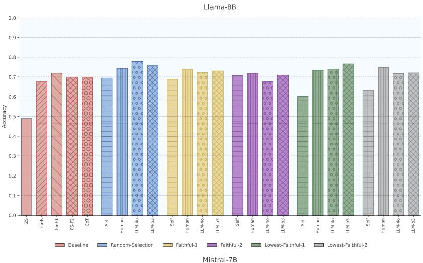

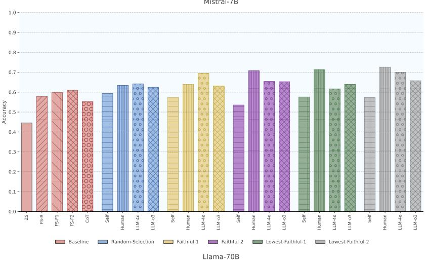

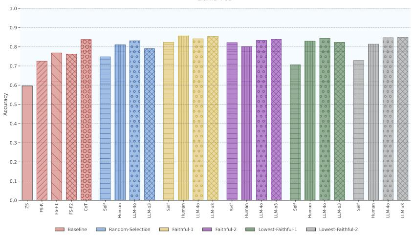  
Figure 2: Performance comparison of explanation selection strategies using small and large LMs from the same model family (Llama- 8B and 70B) and from the diferent family in Mistral 7B. Results are averaged across all datasets to highlight the impact of model scale on strategy efectiveness.

## L Disagreement Between NLE Faithfulness Metrics

Table 9: Disagreements between Faithfulness Metrics fm1 and fm2. The table details the total count, rate, and direction of disagreements across all datasets and models.
<table><tr><td rowspan="2">Dataset</td><td rowspan="2">Model</td><td rowspan="2">Disagreement  Rate</td><td rowspan="2"></td><td colspan="2">Dis. Dir.</td></tr><tr><td></td><td>|fm1 √ fm2 X | fm1 X fm2 √</td></tr><tr><td rowspan="5">ECQA</td><td>4o-mini</td><td>158</td><td>0.510</td><td>95</td><td>63</td></tr><tr><td>11ama-70B</td><td>168</td><td>0.542</td><td>131</td><td>37</td></tr><tr><td>11ama-8B</td><td>162</td><td>0.523</td><td>117</td><td>45</td></tr><tr><td>mistral-7B</td><td>111</td><td>0.358</td><td>74</td><td>37</td></tr><tr><td>Avg</td><td>150</td><td>0.483</td><td>104</td><td>46</td></tr><tr><td rowspan="5">e-SNLI</td><td>4o-mini</td><td>81</td><td>0.482</td><td>42</td><td>39</td></tr><tr><td>1lama-70B</td><td>77</td><td>0.459</td><td>53</td><td>24</td></tr><tr><td>11ama-8B</td><td>87</td><td>0.518</td><td>60</td><td>27</td></tr><tr><td>mistral-7B</td><td>63</td><td>0.375</td><td>36</td><td>27</td></tr><tr><td>Avg</td><td>77</td><td>0.458</td><td>48</td><td>29</td></tr><tr><td rowspan="5">SNARKS</td><td>4o-mini</td><td>91</td><td>0.503</td><td>28</td><td>63</td></tr><tr><td>11ama-70B</td><td>89</td><td>0.492</td><td>42</td><td>47</td></tr><tr><td>11ama-8B</td><td>99</td><td>0.547</td><td>16</td><td>83</td></tr><tr><td>mistral-7B</td><td>88</td><td>0.486</td><td>83</td><td>5</td></tr><tr><td>Avg</td><td>92</td><td>0.507</td><td>42</td><td>50</td></tr><tr><td rowspan="5">BOOLEAN</td><td>4o-mini</td><td>118</td><td>0.472</td><td>28</td><td>90</td></tr><tr><td>1lama-70B</td><td>149</td><td>0.596</td><td>130</td><td>19</td></tr><tr><td>11ama-8B</td><td>137</td><td>0.548</td><td>46</td><td>91</td></tr><tr><td>mistral-7B</td><td>124</td><td>0.496</td><td>55</td><td>69</td></tr><tr><td>Avg</td><td>132</td><td>0.528</td><td>65</td><td>67</td></tr><tr><td rowspan="5">CJ</td><td>4o-mini</td><td>112</td><td>0.589</td><td>23</td><td>89</td></tr><tr><td>1lama-70B</td><td>93</td><td>0.490</td><td>31</td><td>62</td></tr><tr><td>1lama-8B</td><td>117</td><td>0.616</td><td>27</td><td>90</td></tr><tr><td>mistral-7B</td><td>84</td><td>0.442</td><td>46</td><td>38</td></tr><tr><td>Avg</td><td>102</td><td>0.534</td><td>32</td><td>70</td></tr><tr><td rowspan="5">GSM8K</td><td>4o-mini</td><td>127</td><td>0.508</td><td>107</td><td>20</td></tr><tr><td>11ama-70B</td><td>114</td><td>0.456</td><td>109</td><td>5</td></tr><tr><td>11ama-8B</td><td>108</td><td>0.432</td><td>103</td><td>5</td></tr><tr><td>mistral-7B</td><td>168</td><td>0.672</td><td>158</td><td>10</td></tr><tr><td>Avg</td><td>129</td><td>0.517</td><td>119</td><td>10</td></tr><tr><td>All datasets</td><td>Avg</td><td>114</td><td>0.504</td><td>68</td><td>45</td></tr></table>

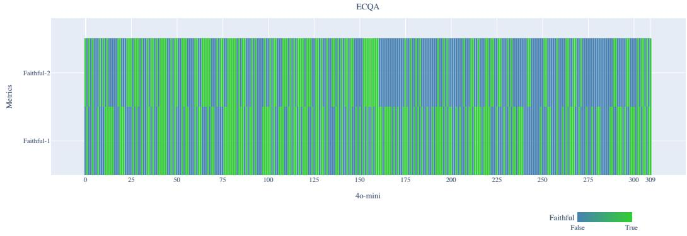  
Figure 3: Binary heatmap visualization of ecqa test samples comparing two faithfulness metrics using the 4o-minimodel. Each column represents a test sample, while rows correspond to the two faithfulness metrics. Cells are color-coded to indicate binary outcomes: green = True, blue = False.

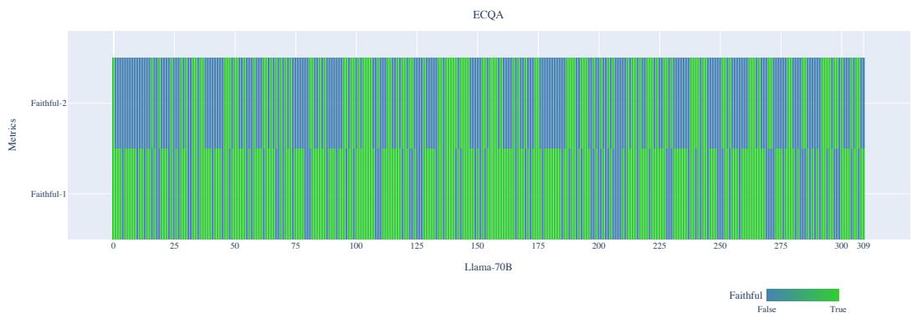  
Figure 4: Binary heatmap visualization of ecqa test samples comparing two faithfulness metrics using the Llama-70B model. Each column represents a test sample, while rows correspond to the two faithfulness metrics. Cells are color-coded to indicate binary outcomes: green = True, blue = False.

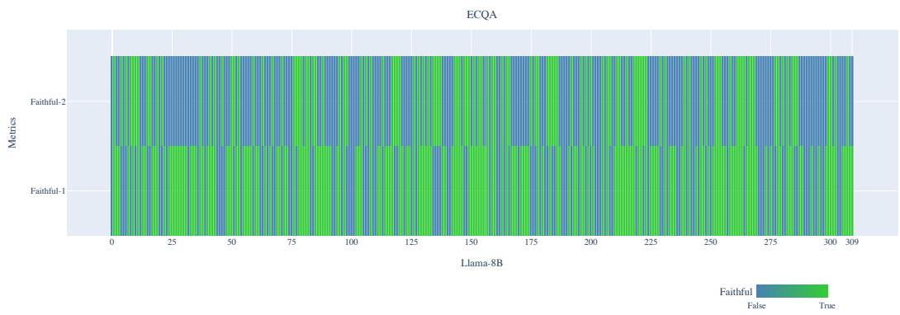  
Figure 5: Binary heatmap visualization of ecqa test samples comparing two faithfulness metrics using the Llama-8B model. Each column represents a test sample, while rows correspond to the two faithfulness metrics. Cells are color-coded to indicate binary outcomes: green = True, blue = False.

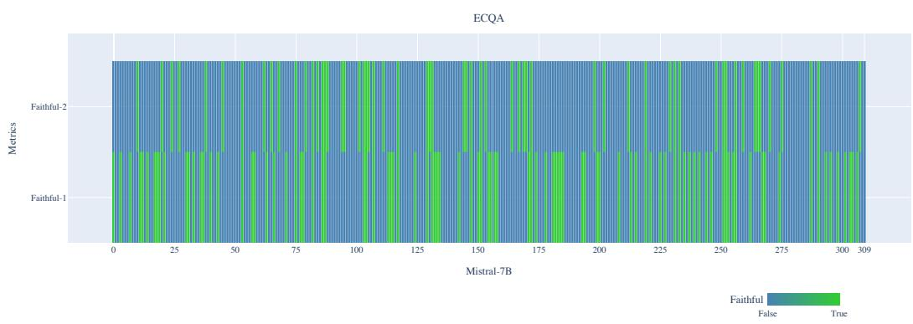  
Figure 6: Binary heatmap visualization of ecqa test samples comparing two faithfulness metrics using the Mistral-7B model. Each column represents a test sample, while rows correspond to the two faithfulness metrics. Cells are color-coded to indicate binary outcomes: green = True, blue = False.

## M Further Results

## M.1 Random Selection Results

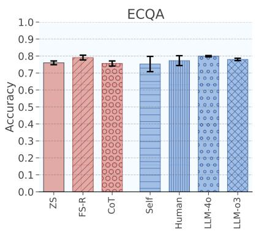

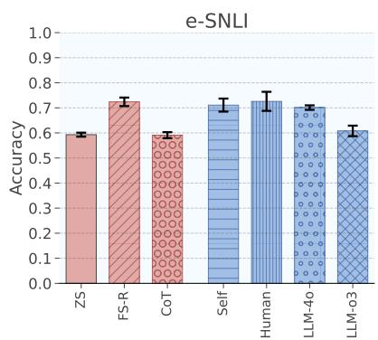

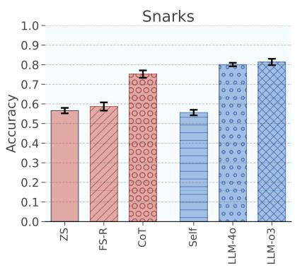

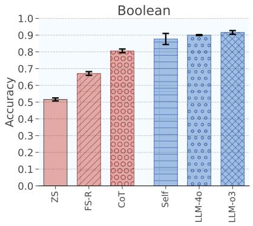

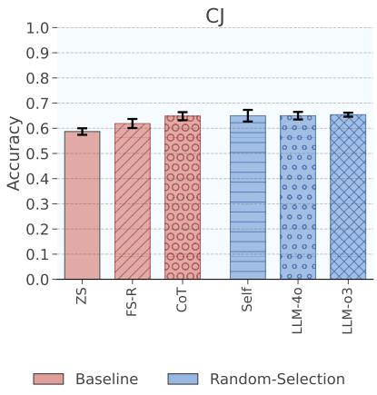

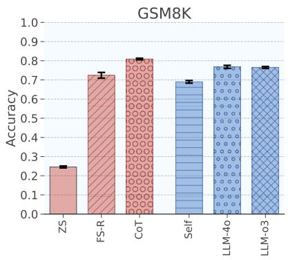  
Figure 7: NLE type comparison under random selection (RQ1). Each panel reports results for one dataset. Bars present mean accuracy across five runs, averaged over the four evaluation models. Error bars indicate the standard deviation across runs. Baselines include ZS, FS-R, and CoT, while random-selection NLE conditions include Self-NLEs, Human-NLEs where available, LLM-4o, and LLM-o3. Bar fill patterns distinguish the prompting conditions: solid fill (ZS), diagonal hatching (FS-R), circular hatching (CoT), horizontal hatching (Self-NLE), vertical hatching (Human-NLE), dotted hatching (LLM-4o), and cross-hatching (LLM-o3).

Table 10: Model Specific results for the Error sample selection setup, showing Random Selection performance. We report self-explanation (Self-exp.) and LLM explanation two variants (4o-mini and o3-mini). Dashes (–) indicate unavailable human explanations for non-explainable datasets. Highest values in each row are highlighted in bold.
<table><tr><td rowspan="2">Dataset</td><td rowspan="2">Models</td><td rowspan="2">Zero-shot</td><td>Few-shot</td><td rowspan="2">CoT</td><td colspan="4">Random</td></tr><tr><td>Rand.</td><td>Self-exp.</td><td>Human</td><td>4o-mini</td><td>o3-mini</td></tr><tr><td rowspan="5">ECQA</td><td>4o-mini</td><td>0.778</td><td>0.826</td><td>0.784</td><td>0.828</td><td>0.814</td><td>0.832</td><td>0.831</td></tr><tr><td>11ama-70B</td><td>0.826</td><td>0.832</td><td>0.816</td><td>0.745</td><td>0.812</td><td>0.859</td><td>0.856</td></tr><tr><td>11ama-8B</td><td>0.751</td><td>0.792</td><td>0.759</td><td>0.780</td><td>0.806</td><td>0.831</td><td>0.794</td></tr><tr><td>mistral-7B</td><td>0.684</td><td>0.715</td><td>0.665</td><td>0.660</td><td>0.659</td><td>0.676</td><td>0.638</td></tr><tr><td>Avg</td><td>0.760</td><td>0.791</td><td>0.756</td><td>0.753</td><td>0.773</td><td>0.799</td><td>0.780</td></tr><tr><td rowspan="5">e-SNLI</td><td>4o-mini</td><td>0.744</td><td>0.823</td><td>0.722</td><td>0.826</td><td>0.811</td><td>0.806</td><td>0.852</td></tr><tr><td>11ama-70B</td><td>0.594</td><td>0.735</td><td>0.646</td><td>0.789</td><td>0.807</td><td>0.722</td><td>0.435</td></tr><tr><td>11ama-8B</td><td>0.439</td><td>0.660</td><td>0.488</td><td>0.639</td><td>0.678</td><td>0.742</td><td>0.675</td></tr><tr><td>mistral-7B</td><td>0.596</td><td>0.679</td><td>0.510</td><td>0.591</td><td>0.609</td><td>0.535</td><td>0.472</td></tr><tr><td>Avg</td><td>0.593</td><td>0.724</td><td>0.591</td><td>0.711</td><td>0.726</td><td>0.701</td><td>0.608</td></tr><tr><td rowspan="5">SNARKS</td><td>4o-mini</td><td>0.652</td><td>0.609</td><td>0.818</td><td>0.512</td><td></td><td>0.805</td><td>0.856</td></tr><tr><td>11ama-70B</td><td>0.579</td><td>0.781</td><td>0.897</td><td>0.816</td><td></td><td>0.863</td><td>0.886</td></tr><tr><td>11ama-8B</td><td>0.559</td><td>0.494</td><td>0.709</td><td>0.418</td><td></td><td>0.783</td><td>0.766</td></tr><tr><td>mistral-7B</td><td>0.473</td><td>0.464</td><td>0.585</td><td>0.477</td><td></td><td>0.751</td><td>0.746</td></tr><tr><td>Avg</td><td>0.566</td><td>0.587</td><td>0.752</td><td>0.556</td><td></td><td>0.801</td><td>0.814</td></tr><tr><td rowspan="5">BOOLEAN</td><td>4o-mini</td><td>0.677</td><td>0.748</td><td>0.962</td><td>0.970</td><td></td><td>0.964</td><td>0.974</td></tr><tr><td>11ama-70B</td><td>0.522</td><td>0.619</td><td>0.989</td><td>0.935</td><td></td><td>0.981</td><td>0.985</td></tr><tr><td>11ama-8B</td><td>0.501</td><td>0.729</td><td>0.826</td><td>0.872</td><td></td><td>0.926</td><td>0.905</td></tr><tr><td>mistral-7B</td><td>0.366</td><td>0.590</td><td>0.449</td><td>0.729</td><td></td><td>0.730</td><td>0.800</td></tr><tr><td>Avg</td><td>0.516</td><td>0.671</td><td>0.806</td><td>0.877</td><td></td><td>0.900</td><td>0.916</td></tr><tr><td rowspan="5">CJ</td><td>4o-mini</td><td>0.675</td><td>0.702</td><td>0.696</td><td>0.695</td><td></td><td>0.677</td><td>0.693</td></tr><tr><td>11ama-70B</td><td>0.667</td><td>0.665</td><td>0.726</td><td>0.650</td><td></td><td>0.688</td><td>0.688</td></tr><tr><td>11ama-8B</td><td>0.525</td><td>0.551</td><td>0.588</td><td>0.640</td><td></td><td>0.588</td><td>0.640</td></tr><tr><td>mistral-7B</td><td>0.481</td><td>0.559</td><td>0.581</td><td>0.614</td><td></td><td>0.645</td><td>0.597</td></tr><tr><td>Avg</td><td>0.587</td><td>0.619</td><td>0.648</td><td>0.650</td><td></td><td>0.650</td><td>0.654</td></tr><tr><td rowspan="5">GSM8K</td><td>4o-mini</td><td>0.365</td><td>0.899</td><td>0.927</td><td>0.903</td><td></td><td>0.890</td><td>0.902</td></tr><tr><td>11ama-70B</td><td>0.388</td><td>0.718</td><td>0.954</td><td>0.552</td><td></td><td>0.871</td><td>0.889</td></tr><tr><td>11ama-8B</td><td>0.160</td><td>0.825</td><td>0.821</td><td>0.816</td><td></td><td>0.798</td><td>0.773</td></tr><tr><td>mistral-7B</td><td>0.071</td><td>0.455</td><td>0.532</td><td>0.487</td><td></td><td>0.511</td><td>0.494</td></tr><tr><td>Avg</td><td>0.246</td><td>0.724</td><td>0.809</td><td>0.690</td><td></td><td>0.768</td><td>0.765</td></tr><tr><td>All datasets</td><td>Avg</td><td>0.545</td><td>0.686</td><td>0.727</td><td>0.706</td><td>0.750</td><td>0.770</td><td>0.756</td></tr></table>

## M.2 Self-NLEs Results Across Setups

Table 11: Results for the Error sample-selection setup. We report mean performance over five runs for each model (4o-mini, Llama-70B, Llama-8B, and Mistral-7B) on five datasets across the following prompting and explanation-selection conditions: Few-shot Rand., Few-shot Faith.-1, Few-shot Faith.-2, Random, Faithful-$f m _ { 1 }$ , Faithful- $f m _ { 2 }$ , Lowest-Faithful- $f m _ { 1 }$ , and Lowest-Faithful- $f m _ { 2 }$ . The highest value in each row is shown in bold. Statistical significance is assessed using the Stuart–Maxwell test, where $^ { * } p < 0 . 1 0 , ^ { * * } p < 0 . 0 5$ , and $^ { * * * } p < 0 . 0 1$ . The Few-shot Random baseline (FS-R) serves as the reference for statistical tests involving self-NLEs $( S e l f - e x p . )$ . FS-R follows Setup 1, using randomly selected few-shot input-output pairs without rationales. Few-shot Faith.-1 $\left( F S  – f m _ { 1 } \right)$ and Few-shot Faith.-2 $\left( F S  – f m _ { 2 } \right)$ are matched no-rationale baselines: they use the same selected input-output pairs (x, y) as the corresponding $f m _ { 1 } -$ and $f m _ { 2 } .$ -based conditions, respectively, while omitting the rationales.
<table><tr><td rowspan="2">Dataset</td><td rowspan="2">Models</td><td colspan="3">Few-shot</td><td>Random</td><td>Faithful-fm1</td><td>|Faithful-fm2</td><td>Lowest-Faithful-fm1</td><td>|Lowest-Faithful-fm2</td></tr><tr><td>| Rand. (Ref)</td><td>Faith.-1</td><td>Faith.-2</td><td>Self-NLE</td><td>Self-NLE</td><td>Self-NLE</td><td>Self-NLE</td><td>Self-NLE</td></tr><tr><td rowspan="6">ECQA</td><td>4o-mini</td><td>0.826</td><td>0.820</td><td>0.823</td><td>0.828***</td><td>0.824***</td><td>0.820***</td><td>0.824***</td><td>0.829</td></tr><tr><td>11ama-70B</td><td>0.832</td><td>0.847</td><td>0.838</td><td>0.745***</td><td>0.782***</td><td>0.813***</td><td>0.659***</td><td>0.864***</td></tr><tr><td>11ama-8B</td><td>0.792</td><td>0.799</td><td>0.794</td><td>0.780</td><td>0.759***</td><td>0.780**</td><td>0.230***</td><td>0.782</td></tr><tr><td>mistral-7B</td><td>0.715</td><td>0.749</td><td>0.730</td><td>0.660**</td><td>0.696**</td><td>0.686**</td><td>0.678</td><td>0.724***</td></tr><tr><td>Avg</td><td>0.791</td><td>0.804</td><td>0.796</td><td>0.753</td><td>0.765</td><td>0.775</td><td>0.598</td><td>0.799</td></tr><tr><td>4o-mini</td><td>0.823</td><td>0.827</td><td>0.830</td><td>0.826***</td><td>0.790***</td><td>0.818**</td><td>0.846 ***</td><td>0.832</td></tr><tr><td rowspan="5">e-SNLI</td><td>11ama-70B</td><td>0.735</td><td>0.806</td><td>0.741</td><td>0.789***</td><td>0.816***</td><td>0.720***</td><td>0.774**</td><td>0.704***</td></tr><tr><td>11ama-8B</td><td>0.660</td><td>0.730</td><td>0.633</td><td>0.639***</td><td>0.604***</td><td>0.633***</td><td>0.712***</td><td>0.572***</td></tr><tr><td>mistral-7B</td><td>0.679</td><td>0.584</td><td>0.794</td><td>0.591***</td><td>0.642***</td><td>0.691***</td><td>0.607***</td><td>0.591***</td></tr><tr><td>Avg</td><td>0.724</td><td>0.737</td><td>0.749</td><td>0.711</td><td>0.713</td><td>0.716</td><td>0.735</td><td>0.675</td></tr><tr><td>4o-mini</td><td>0.609</td><td>0.506</td><td>0.470</td><td>0.512***</td><td>0.514***</td><td>0.563***</td><td>0.654</td><td>0.775 **</td></tr><tr><td rowspan="5">SNARKS</td><td>11ama-70B</td><td>0.781</td><td>0.757</td><td>0.799</td><td>0.816*</td><td>0.794</td><td>0.822***</td><td>0.820***</td><td>0.814</td></tr><tr><td>11ama-8B</td><td>0.494</td><td>0.618</td><td>0.497</td><td>0.418*</td><td>0.469***</td><td>0.553*</td><td>0.386</td><td>0.589***</td></tr><tr><td>mistral-7B</td><td>0.464</td><td>0.575</td><td>0.440</td><td>0.477</td><td>0.431</td><td>0.441</td><td>0.394</td><td>0.480</td></tr><tr><td>Avg</td><td>0.587</td><td>0.614</td><td>0.551</td><td>0.556</td><td>0.552</td><td>0.595</td><td>0.564</td><td>0.665</td></tr><tr><td>4o-mini</td><td>0.748</td><td>0.847</td><td>0.900</td><td>0.970***</td><td>0.957**</td><td>0.943***</td><td>0.930</td><td>0.959***</td></tr><tr><td rowspan="5">BOOLEAN</td><td>1lama-70B</td><td>0.619</td><td>0.623</td><td>0.696</td><td>0.935*</td><td>0.942*</td><td>0.976 ***</td><td>0.809***</td><td>0.972***</td></tr><tr><td>11ama-8B</td><td>0.729</td><td>0.818</td><td>0.819</td><td>0.872***</td><td>0.893 ***</td><td>0.852***</td><td>0.873***</td><td>0.873***</td></tr><tr><td>mistral-7B</td><td>0.590</td><td>0.640</td><td>0.730</td><td>0.729***</td><td>0.683</td><td>0.745***</td><td>0.766*</td><td>0.795</td></tr><tr><td>Avg</td><td>0.671</td><td>0.732</td><td>0.786</td><td>0.877</td><td>0.869</td><td>0.879</td><td>0.845</td><td>0.900</td></tr><tr><td></td><td>0.702</td><td></td><td></td><td>0.695</td><td></td><td></td><td></td><td></td></tr><tr><td rowspan="5">CJ</td><td>4o-mini</td><td></td><td>0.695</td><td>0.688</td><td></td><td>0.685</td><td>0.703</td><td>0.672</td><td>0.683 ***</td></tr><tr><td>11ama-70B</td><td>0.665</td><td>0.691</td><td>0.670</td><td>0.650</td><td>0.705**</td><td>0.678</td><td>0.682</td><td>0.745*</td></tr><tr><td>11ama-8B</td><td>0.551</td><td>0.518</td><td>0.606</td><td> $\mathbf { 0 . 6 4 0 } ^ { * * * }$ </td><td>0.578</td><td>0.599</td><td>0.630***</td><td>0.555</td></tr><tr><td>mistral-7B Avg</td><td>0.559 0.619</td><td>0.599 0.626</td><td>0.516</td><td> $\mathbf { 0 . 6 1 4 } ^ { * * }$  0.650</td><td>0.562*** 0.633</td><td>0.568 0.637</td><td>0.589*** 0.643</td><td>0.602***</td></tr><tr><td></td><td></td><td></td><td>0.619</td><td></td><td></td><td></td><td></td><td>0.646</td></tr><tr><td>All datasets</td><td>Avg</td><td>0.679</td><td>0.702</td><td>0.700</td><td>0.709</td><td>0.706</td><td>0.720</td><td>0.677</td><td>0.737</td></tr></table>

## M.3 Full Results Across Setups

Table 12: Results for the Error sample selection setup, showing the performance of average of five runs of each model (4o-mini, Llama-70B, Llama-8B, and Mistral-7B) on each dataset across explanation selection setups (Random, Faithful-1, Lowest-Faithful-1, and Lowest-Faithful-2). For each selection setup, we report self-explanations $( S e l f - e x p . )$ , along with human and LLM-generated explanations (4o-mini and o3-mini). Dashes (–) denote unavailable human explanations for non-explainable datasets. Highest values in each row are highlighted in bold.
<table><tr><td rowspan="2">Dataset</td><td rowspan="2">Models</td><td rowspan="2"></td><td colspan="3">Few-shot</td><td colspan="4"></td><td colspan="4">Faithful-fm1</td><td colspan="4">Faithful-fm2</td><td colspan="4">Lowest-Faithful-fm1</td><td colspan="4">Lowest-Faithful-fm2</td></tr><tr><td>Zero-shot |Rand.</td><td>Faith.-1</td><td>Faith.-2|</td><td>CoT</td><td>|Self-exp.</td><td>Random Human</td><td>4o-mini</td><td>o3-mini | Self-exp.</td><td></td><td>Human</td><td>4o-mini</td><td>03-mini</td><td>|Self-exp.</td><td>Human 4o-mini</td><td></td><td>o3-mini</td><td>|Self-exp.</td><td>Human</td><td>4o-mini</td><td>o3-mini </td><td>Self-exp.</td><td>Human</td><td></td><td>4o-mini</td></tr><tr><td rowspan="2">ECQA</td><td>4o-mini 11ama-70B 11ama-8B</td><td>0.778 0.826 0.751 0.684</td><td>0.826 0.832 0.792 0.715</td><td>0.820 0.847 0.799</td><td>0.823 0.838 0.794</td><td>0.784 0.816 0.759</td><td>0.828 0.745 0.780 0.660</td><td>0.814 0.812 0.806</td><td>0.832 0.859 0.831</td><td>0.831 0.856 0.794</td><td>0.824 0.782 0.759</td><td>0.823 0.861 0.775</td><td>0.822 0.847 0.791</td><td>0.823 0.858 0.791</td><td>0.820 0.813 0.780</td><td>0.810 0.860 0.745</td><td>0.814 0.859 0.583</td><td>0.812 0.864 0.774</td><td>0.824 0.659 0.230</td><td>0.816 0.854 0.786</td><td>0.816 0.854 0.786</td><td>0.829 0.859 0.785</td><td>0.829 0.862</td><td></td><td>0.829 0.848</td><td>o3-mini 0.834 0.855</td><td>0.838 0.848 0.792</td></tr><tr><td>mistral-7B Avg 4o-mini</td><td>0.760 0.744</td><td>0.791 0.823 0.735</td><td>0.749 0.804 0.827 0.806</td><td>0.796 0.730 0.830 0.741</td><td>0.756 0.665 0.722 0.646</td><td>0.753 0.826</td><td>0.773 0.659 0.811</td><td>0.799 0.676 0.806</td><td>0.780 0.638 0.852</td><td>0.765</td><td>0.696 0.774 0.635 0.790 0.852</td><td>0.770 0.621 0.827</td><td>0.575 0.762 0.815</td><td>0.686 0.775 0.818</td><td>0.783 0.717 0.832</td><td>0.695 0.738 0.802</td><td>0.673 0.781 0.773</td><td>0.598 0.678 0.846</td><td>0.857</td><td>0.800 0.744</td><td>0.665 0.780 0.857</td><td>0.801 0.731 0.833</td><td>0.724 0.782 0.799 0.832</td><td>0.781 0.794 0.719 0.825</td><td>0.793 0.692 0.810 0.806</td><td>0.801 0.806 0.735</td></tr><tr><td>e-SNLI</td><td>11ama-70B 11ama-8B mistral-7B Avg 4o-mini</td><td></td><td>0.594 0.439 0.660 0.596 0.679 0.593 0.724 0.652 0.609</td><td>0.730 0.584 0.737 0.506</td><td>0.633 0.794 0.749 0.470</td><td>0.488 0.510 0.591 0.818</td><td>0.789 0.639 0.591 0.711 0.512</td><td>0.807 0.678 0.609</td><td>0.722 0.742 0.535 0.726 0.701 0.805</td><td>0.856</td><td>0.435 0.675 0.472 0.608</td><td>0.816 0.604 0.642 0.713 0.514</td><td>0.851 0.702 0.642 0.762</td><td>0.783 0.774 0.720 0.620 0.641 0.674 0.743 0.721 0.833 0.810</td><td></td><td>0.720 0.633 0.691 0.716 0.563</td><td>0.742 0.691 0.698 0.741</td><td>0.750 0.617 0.699 0.717 0.818</td><td>0.742 0.559 0.730 0.701 0.822</td><td>0.774 0.712 0.607 0.735 0.654</td><td>0.805 0.681 0.680 0.756</td><td>0.805 0.681 0.580 0.731 0.823</td><td>0.683 0.726 0.572 0.704 0.822</td><td>0.5 51 0.704 0.675 0.775</td><td>0.780 0.714 0.733 0.763</td><td>0.749 0.591 0.764 0.729 0.802</td><td>0.719 0.562 0.698 0.696 0.817</td></tr><tr><td>SNARKS</td><td>11ama-70B 11ama-8B mistral-7B Avg 4o-mini</td><td>0.579 0.559 0.473 0.566 0.677 0.522</td><td>0.781 0.464 0.494 0.587 0.748</td><td>0.757 0.618 0.575 0.614 0.847 0.623</td><td>0.799 0.497 0.440 0.551 0.900 0.696</td><td>0.897 0.585 0.709 0.752 0.962 0.989</td><td>0.816 0.418 0.477 0.556 0.970 0.935</td><td></td><td>0.863 0.783 0.751 0.801 0.964</td><td>0.886 0.766 0.746 0.814 0.974</td><td></td><td>0.794 0.469 0.552 0.431 0.957</td><td>0.886 0.709 0.730 0.792 0.978</td><td>0.914 0.749 0.791 0.816 0.970 0.979</td><td>0.822 0.441 0.553 0.595 0.943 0.976</td><td></td><td>0.867 0.805 0.977</td><td>0.773 0.762</td><td>0.907 0.790 0.754 0.818 0.972</td><td>0.820 0.386 0.394 0.564 0.930</td><td></td><td>0.874 0.701 0.701 0.775 0.961</td><td>0.878 0.721 0.771 0.798 0.965</td><td>0.814 0.480 0.589 0.665 0.959</td><td></td><td>0.888 0.739 0.721 0.788 0.964</td><td>0.934 0.745 0.680 0.794 0.983</td></tr><tr><td>BOOLEAN</td><td>11ama-70B 11ama-8B mistral-7B Avg 4o-mini</td><td>0.501 0.366 0.516 0.675 0.667</td><td>0.619 0.729 0.590 0.671 0.702 0.665</td><td>0.818 0.640 0.732 0.695 0.691</td><td>0.819 0.730 0.786 0.688 0.670</td><td>0.826 0.449 0.806 0.696 0.726</td><td>0.872 0.729 0.877 0.695 0.650</td><td></td><td>0.981 0.926 0.730 0.900 0.677</td><td></td><td>0.985 0.905 0.800 0.916 0.693</td><td>0.942 0.893 0.683 0.869 0.685 0.705</td><td></td><td>0.985 0.913 0.930 0.827 0.763 0.926 0.910 0.650 0.616 0.705 0.727</td><td></td><td>0.852 0.745 0.879 0.703 0.678</td><td></td><td>0.990 0.902 0.777 0.886 0.648</td><td>0.991 0.924 0.752 0.910 0.668</td><td>0.809 0.873 0.766 0.845 0.672</td><td></td><td>0.983 0.922 0.750 0.904 0.660</td><td>0.975 0.912 0.793 0.911 0.667</td><td>0.972 0.873 0.795 0.900 0.683</td><td></td><td>0.987 0.872 0.854 0.919 0.636</td><td>0.984 0.889 0.720 0.894 0.658</td></tr><tr><td>CJ</td><td>11ama-70B 11ama-8B mistral-7B |Avg |4o-mini</td><td>0.525 0.481 0.587 0.365 0.388</td><td>0.551 0.559 0.619 | 0.899</td><td>0.518 0.599 0.626 0.908</td><td>0.606 0.516 0.619 0.928</td><td>0.588 0.581 0.648 0.927 0.954</td><td></td><td>0.640 0.614 0.650 0.903</td><td></td><td>0.688 0.588 0.645 0.650 0.890</td><td>0.688 0.640 0.597 0.654 0.902</td><td>0.578 0.562 0.633 0.893</td><td></td><td>0.503 0.647 0.626 0.881</td><td>0.560 0.633 0.634 0.877</td><td>0.599 0.568 0.637 0.916</td><td></td><td>0.721 0.573 0.596 0.634 0.884</td><td>0.711 0.656 0.579 0.654 0.884</td><td>0.682 0.630 0.589 0.643 0.876</td><td></td><td>0.697 0.553 0.609 0.630 0.887</td><td>0.676 0.605 0.639 0.647 0.867</td><td>0.745 0.555 0.602 0.646 0.377</td><td></td><td>0.751 0.512 0.654 0.638 0.892</td><td>0.748 0.544 0.644 0.638 0.893</td></tr><tr><td>GSM8K</td><td>11ama-70B 11ama-8B mistral-7B</td><td>0.160 0.071 0.246</td><td>0.718 0.825 0.455 0.724</td><td>0.884 0.829 0.437</td><td>0.825 0.842 0.448 0.761</td><td>0.821 0.532 0.809</td><td></td><td>0.552 0.816 0.487</td><td></td><td>0.871 0.798 0.511</td><td>0.889 0.773 0.494</td><td>0.902 0.825 0.430 0.763</td><td></td><td>0.843 0.691 0.402 0.704</td><td>0.868 0.732 0.345 0.706</td><td>0.923 0.825 0.082 0.686</td><td></td><td>0.812 0.605 0.392 0.673</td><td>0.817 0.550 0.427 0.670</td><td>0.488 0.783 0.421</td><td></td><td>0.850 0.795 0.394</td><td>0.864 0.798 0.379</td><td>0.272 0.436 0.141</td><td></td><td>0.863 0.797 0.512</td><td>0.849 0.783 0.466</td></tr><tr><td>All datasets | Avg</td><td>Avg</td><td>0.545</td><td>0.686</td><td>0.765 0.713</td><td>0.711</td><td>|0.727 |</td><td></td><td>0.690 0.706</td><td>0.750</td><td>0.768 0.770</td><td>0.765 0.756</td><td>0.716</td><td>0.768</td><td>0.760</td><td>0.758</td><td>0.715</td><td>0.762</td><td>0.747</td><td>0.755</td><td>0.642 0.671</td><td>0.778</td><td>0.732 0.759</td><td>0.727 0.765</td><td>0.307 0.665</td><td>0.778</td><td>0.766 0.772</td><td>0.748 0.764</td></tr></table>

Table 13: Average results for the Error sample selection setup. Values are averaged over the four evaluation models and five runs. We report baseline prompting, random NLE selection, faithful selection using $f m _ { 1 }$ and $f m _ { 2 } .$ , and lowest-faithful selection using $f m _ { 1 }$ and $f m _ { 2 }$ . Dashes (–) denote unavailable human explanations for datasets without human rationales.
<table><tr><td rowspan="2">Dataset</td><td rowspan="2">Zero-shot</td><td colspan="2">Few-shot</td><td rowspan="2"></td><td rowspan="2"></td><td colspan="4">Random</td><td colspan="4">Faithful-fm1</td><td colspan="4">Faithful-fm2</td><td colspan="4">Lowest-Faithful-fm1</td><td colspan="4">Lowest-Faithful-fm2</td></tr><tr><td>CoT</td><td></td><td>|Self-exp.</td><td>Human 4o-mini o3-mini|</td><td></td><td>|Self-exp.</td><td>Human 4o-mini</td><td></td><td>o3-mini | Self-exp.</td><td></td><td></td><td>Human 4o-mini</td><td></td><td>o3-mini</td><td>|Self-exp.</td><td>Human</td><td>4o-mini</td><td>o3-mini</td><td>|Self-exp.</td><td>Human</td><td>4o-mini</td><td>o3-mini</td></tr><tr><td></td><td>0.760</td><td>0.804</td><td>Faith.-1 Faith.-2 0.796</td><td></td><td></td><td></td><td>0.773</td><td></td><td></td><td>0.765</td><td></td><td></td><td></td><td></td><td></td><td></td><td></td><td></td><td></td><td></td><td></td><td>0.801</td><td>0.799</td><td></td><td>0.793</td><td>0.806</td></tr><tr><td>ECQA e-SNLI</td><td></td><td>0.791</td><td>0.749</td><td>0.756</td><td></td><td>0.753</td><td>0.799 0.701</td><td>0.780</td><td></td><td></td><td>0.774</td><td>0.770</td><td>0.762</td><td>0.775</td><td>0.783</td><td>0.738</td><td>0.781</td><td>0.598</td><td>0.800</td><td>0.780</td><td></td><td></td><td></td><td>0.794</td><td></td><td>0.696</td></tr><tr><td>SNARKS</td><td>0.593 0.566</td><td>0.724</td><td>0.737</td><td>0.591</td><td></td><td>0.711</td><td>0.726</td><td></td><td>0.608</td><td>0.713</td><td>0.762</td><td>0.743</td><td>0.721</td><td>0.716</td><td>0.741</td><td>0.717</td><td>0.701</td><td>0.735</td><td>0.756</td><td>0.731</td><td></td><td>0.704</td><td>0.675</td><td>0.763</td><td>0.729 0.788</td><td>0.794</td></tr><tr><td>BOOLEAN</td><td>0.516</td><td>0.587 0.671</td><td>0.614 0.732</td><td>0.551 0.752 0.806</td><td></td><td>0.556 0.877</td><td></td><td>0.801 0.900</td><td>0.814</td><td>0.552 0.869</td><td></td><td>0.792 0.926</td><td>0.816 0.910</td><td>0.595 0.879</td><td></td><td>0.805 0.886</td><td>0.818 0.910</td><td>0.564</td><td></td><td>0.775</td><td></td><td>0.798 0.911</td><td>0.665 0.900</td><td></td><td>0.919</td><td>0.894</td></tr><tr><td>CJ</td><td>0.587</td><td>0.619</td><td>0.626</td><td>0.786 0.619 0.648</td><td></td><td>0.650</td><td></td><td>0.650</td><td>0.916 0.654</td><td>0.633</td><td></td><td>0.626</td><td>0.634</td><td>0.637</td><td></td><td>0.634</td><td>0.654</td><td>0.845 0.643</td><td></td><td>0.904 0.630</td><td></td><td>0.647</td><td>0.646</td><td></td><td>0.638</td><td>0.638</td></tr><tr><td>GSM8K</td><td>0.246</td><td>0.724</td><td>0.765</td><td>0.809</td><td></td><td>0.690</td><td></td><td>0.768</td><td>0.765</td><td>0.763</td><td></td><td>0.704</td><td>0.706</td><td>0.686</td><td></td><td>0.673</td><td>0.670</td><td>0.642</td><td></td><td>0.732</td><td>0.727</td><td></td><td>0.307</td><td></td><td>0.766</td><td>0.748</td></tr><tr><td></td><td>0.545</td><td></td><td>0.713</td><td>0.761</td><td></td><td></td><td></td><td></td><td></td><td></td><td></td><td>0.760</td><td>0.758</td><td></td><td></td><td></td><td></td><td></td><td></td><td></td><td></td><td></td><td></td><td></td><td></td><td>0.764</td></tr><tr><td>All datasets</td><td></td><td>0.686</td><td></td><td>0.711</td><td>|0.727</td><td>0.706</td><td>0.750</td><td>0.770</td><td>0.756</td><td>0.716</td><td>0.768</td><td></td><td></td><td>0.715</td><td>0.762</td><td>0.747</td><td>0.755</td><td>0.671</td><td>0.778</td><td>0.759</td><td>0.765</td><td></td><td>0.665</td><td>0.778</td><td>0.772</td><td></td></tr></table>

Table 14: Dataset-level change in accuracy relative to random selection by NLE source. Setting 1 corresponds to random selection, Setting 2 to most-faithful selection using $f m _ { 1 }$ or $f m _ { 2 }$ , and Setting 3 to lowest-faithful selection using $f m _ { 1 }$ or $f m _ { 2 }$ . The Random column reports mean accuracy under random selection, averaged over the four evaluation models and five runs. The remaining columns report $\Delta$ accuracy relative to Random, with the absolute accuracy under that setup shown in parentheses. Positive $\Delta$ values indicate improvement over random selection. Bold values indicate the highest absolute accuracy within each dataset and selection column. Human-NLE rows are shown only for ecqa and e-snli, where human rationales are available.
<table><tr><td></td><td></td><td>Setting 1</td><td colspan="3">Setting 2</td><td colspan="3">Setting 3</td></tr><tr><td>Dataset</td><td>NLE source</td><td>Random</td><td>△ Faithful- fm1</td><td></td><td>△ Faithful- fm2</td><td>∆ Lowest- fm1</td><td></td><td>∆ Lowest- fm2</td></tr><tr><td rowspan="4">ECQA</td><td>Self-NLE</td><td>0.753</td><td>+0.012 (0.765)</td><td>+0.022</td><td>(0.775)</td><td>-0.155</td><td>(0.598)</td><td>+0.046 (0.799)</td></tr><tr><td>Human-NLE</td><td>0.773</td><td>+0.001 (0.774)</td><td>+0.010</td><td>(0.783)</td><td>+0.027 (0.800)</td><td>+0.021</td><td>(0.794)</td></tr><tr><td>LLM-40</td><td>0.799</td><td>-0.029 (0.770)</td><td>-0.061</td><td>(0.738)</td><td>-0.019</td><td>(0.780)</td><td>-0.006 (0.793)</td></tr><tr><td>LLM-o3</td><td>0.780</td><td>-0.018 (0.762)</td><td>+0.001</td><td>(0.781)</td><td>+0.021</td><td>(0.801)</td><td>+0.026 (0.806)</td></tr><tr><td rowspan="4">e-SNLI</td><td>Self-NLE</td><td>0.711</td><td>+0.002 (0.713)</td><td>+0.005</td><td>(0.716)</td><td>+0.024</td><td>(0.735)</td><td>-0.036 (0.675)</td></tr><tr><td>Human-NLE</td><td>0.726</td><td>+0.036 (0.762)</td><td>+0.015</td><td>(0.741)</td><td>+0.030</td><td>(0.756)</td><td>+0.037 (0.763)</td></tr><tr><td>LLM-4o</td><td>0.701</td><td>+0.042 (0.743)</td><td>+0.016</td><td>(0.717)</td><td>+0.030</td><td>(0.731)</td><td>+0.028 (0.729)</td></tr><tr><td>LLM-o3</td><td>0.608</td><td>+0.113 (0.721)</td><td>+0.093</td><td>(0.701)</td><td>+0.096</td><td>(0.704)</td><td>+0.088 (0.696)</td></tr><tr><td rowspan="3">SNARKS</td><td>Self-NLE</td><td>0.556</td><td>-0.004 (0.552)</td><td>+0.039</td><td>(0.595)</td><td>+0.008</td><td>(0.564)</td><td>+0.109 (0.665)</td></tr><tr><td>LLM-40</td><td>0.801</td><td>-0.009 (0.792)</td><td>+0.004</td><td>(0.805)</td><td>-0.026</td><td>(0.775)</td><td>-0.013 (0.788)</td></tr><tr><td>LLM-o3</td><td>0.814</td><td>+0.002 (0.816)</td><td>+0.004</td><td>(0.818)</td><td>-0.016 (0.798)</td><td>-0.020</td><td>(0.794)</td></tr><tr><td rowspan="3">BOOLEAN</td><td>Self-NLE</td><td>0.877</td><td>-0.008 (0.869)</td><td>+0.002</td><td>(0.879)</td><td>-0.032</td><td>(0.845)</td><td>+0.023 (0.900)</td></tr><tr><td>LLM-4o</td><td>0.900</td><td>+0.026 (0.926)</td><td>-0.014</td><td>(0.886)</td><td>+0.004 (0.904)</td><td>+0.019</td><td>(0.919)</td></tr><tr><td>LLM-o3</td><td>0.916</td><td>-0.006 (0.910)</td><td>-0.006</td><td>(0.910)</td><td>-0.005 (0.911)</td><td>-0.022</td><td>(0.894)</td></tr><tr><td rowspan="3">CJ</td><td>Self-NLE</td><td>0.650</td><td>-0.017 (0.633)</td><td>-0.013</td><td>(0.637)</td><td>-0.007 (0.643)</td><td>-0.004</td><td>(0.646)</td></tr><tr><td>LLM-40</td><td>0.650</td><td>-0.024 (0.626)</td><td>-0.016</td><td>(0.634)</td><td>-0.020 (0.630)</td><td>-0.012</td><td>(0.638)</td></tr><tr><td>LLM-o3</td><td>0.654</td><td>-0.020 (0.634)</td><td>+0.000</td><td>(0.654)</td><td>-0.007 (0.647)</td><td>-0.016</td><td>(0.638)</td></tr><tr><td rowspan="3">GSM8K</td><td>Self-NLE</td><td>0.690</td><td>+0.073 (0.763)</td><td>-0.004</td><td>(0.686)</td><td>-0.048 (0.642)</td><td>-0.383</td><td>(0.307)</td></tr><tr><td>LLM-40</td><td>0.768</td><td>-0.064 (0.704)</td><td>-0.095</td><td>(0.673)</td><td>-0.036</td><td>(0.732)</td><td>-0.002 (0.766)</td></tr><tr><td>LLM-o3</td><td>0.765</td><td>-0.059 (0.706)</td><td>-0.095</td><td>(0.670)</td><td>-0.038</td><td>(0.727)</td><td>−0.017 (0.748)</td></tr></table>

Table 15: Results for the Error sample selection setup, reporting the standard deviations across five runs of each model (4o-mini, Llama-70B, Llama-8B, and Mistral-7B) on all datasets under diferent explanation selection strategies (Random, Faithful-1, Faithful-2, Lowest-Faithful-1, and Lowest-Faithful-2). For each selection setup, we report self-explanations $( S e l f - e x p . )$ , along with human and LLM-generated explanations (4o-mini and o3-mini). Dashes (–) indicate unavailable human explanations for non-explainable datasets. The highest standard deviation in each row is highlighted in bold.
<table><tr><td rowspan="3">Dataset</td><td rowspan="3">Models</td><td rowspan="3">Zero-shot</td><td rowspan="3">Few-shot</td><td rowspan="3"></td><td rowspan="3"></td><td colspan="4">Random</td><td colspan="4">Faithful-fm1</td><td colspan="4">Faithful-fm2</td><td colspan="4">Lowest-Faithful-fm1</td><td colspan="4">Lowest-Faithful-fm2</td></tr><tr><td>CoT</td><td>|Self-exp.</td><td>Human 4o-mini o3-mini |Self-exp.</td><td></td><td></td><td></td><td></td><td></td><td></td><td></td><td></td><td></td><td>o3-mini |Self-exp.</td><td></td><td></td><td></td><td>Human 4o-mini o3-mini |Self-exp.</td><td></td><td></td><td></td><td>Human 4o-mini o3-mini</td></tr><tr><td>|Rand. 0.006</td><td>0.009</td><td>Faith.-1 Faith.-2| 0.013 |0.005</td><td></td><td>0.004</td><td>0.004</td><td>0.012</td><td>0.008</td><td>0.005</td><td>0.005</td><td>0.008</td><td>Human 4o-mini o3-mini |Self-exp. 0.006</td><td>0.008</td><td>Human 4o-mini 0.006</td><td>0.008</td><td>0.005</td><td>0.004</td><td>0.006</td><td>0.006</td><td></td><td>0.008</td><td>0.005</td><td>0.008 0.008</td></tr><tr><td rowspan="3">EOQA</td><td>4o-mini 11ama-70B 11ama-8B</td><td>0.007 0.015</td><td>0.008 0.003 0.008 0.006</td><td>0.002 0.005</td><td>0.004 0.004 0.000</td><td>0.006 0.006</td><td>0.172 0.009 0.040</td><td>0.122 0.006</td><td>0.006 0.006</td><td>0.006 0.021</td><td>0.126 0.032</td><td>0.005 0.018</td><td>0.005 0.007</td><td>0.009 0.009</td><td>0.006 0.139</td><td>0.008 0.152</td><td>0.005 0.004</td><td>0.236 0.059</td><td>0.022 0.012</td><td>0.207 0.007</td><td>0.007 0.011</td><td>0.004 0.004</td><td></td><td>0.005 0.007</td><td>0.006 0.005 0.011 0.011</td></tr><tr><td>mistral-7B Avg</td><td>0.003 0.008</td><td>0.002 0.005</td><td>0.005</td><td>0.010 0.007</td><td></td><td>0.008 0.035</td><td>0.005 0.005</td><td>0.005 0.011</td><td>0.029 0.049</td><td>0.207 0.059</td><td>0.021 0.174 0.051</td><td>0.244 0.066</td><td>0.012 0.009</td><td>0.008 0.040</td><td>0.012 0.045</td><td>0.006 0.006</td><td>0.018 0.080</td><td>0.001 0.010</td><td>0.010 0.058</td><td>0.006 0.008</td><td>0.007 0.006</td><td>0.006 0.006</td><td>0.007 0.008</td><td>0.003 0.007</td></tr><tr><td>|4o-mini</td><td>0.013</td><td>0.011 0.010</td><td>0.004</td><td>0.001</td><td>0.058 0.022</td><td>0.014 0.018</td><td>0.016</td><td>0.027</td><td>0.015</td><td>0.014</td><td>0.018 0.012</td><td>0.013 0.003</td><td>0.014 0.010</td><td>0.011 0.010</td><td>0.019</td><td>0.008</td><td>0.021</td><td>0.012</td><td>0.038</td><td>0.012</td><td>0.018</td><td>0.008</td><td>0.011</td><td>0.009</td></tr><tr><td rowspan="3">e-SNLI</td><td>11ama-70B 11ama-8B mistral-7B</td><td>0.014 0.017 0.008</td><td>0.012 0.046 0.017</td><td>0.013 0.010 0.003</td><td>0.009 0.011 0.003</td><td>0.015 0.015 0.003 0.009</td><td>0.027 0.029 0.070</td><td>0.025 0.126</td><td>0.026 0.011</td><td>0.130 0.041</td><td>0.010 0.043</td><td>0.014 0.014 0.026</td><td>0.029 0.010</td><td>0.021 0.004</td><td>0.009 0.006</td><td>0.007 0.011 0.005</td><td>0.013 0.012 0.008</td><td>0.007 0.021 0.011</td><td>0.003 0.010</td><td>0.007 0.017</td><td>0.012 0.014</td><td>0.004 0.007</td><td></td><td>0.010 0.020</td><td>0.010 0.007 0.022 0.022</td></tr><tr><td>Avg</td><td>0.013</td><td>0.022 0.009</td><td>0.007</td><td></td><td>0.037</td><td>0.046</td><td>0.009 0.016</td><td>0.010 0.052</td><td>0.033 0.025</td><td>0.000 0.011</td><td>0.007 0.016</td><td>0.014</td><td>0.012</td><td>0.009</td><td>0.011</td><td>0.010</td><td>0.015</td><td>0.005 0.008</td><td>0.006 0.017</td><td>0.007 0.011</td><td>0.005 0.009</td><td>0.005 0.011</td><td>0.007 0.013</td><td>0.014 0.013</td></tr><tr><td>|4o-mini</td><td>0.029 0.025</td><td>0.046 0.010 0.017</td><td>0.017 0.013</td><td>|0.020 0.010</td><td>0.033 0.075</td><td></td><td>0.017 0.015</td><td>0.021 0.020</td><td>0.078 0.060</td><td></td><td>0.015 0.008</td><td>0.008 0.007</td><td>0.120 0.022</td><td></td><td>0.012</td><td>0.021</td><td>0.064</td><td></td><td>0.029</td><td>0.014</td><td>0.025</td><td></td><td>0.011</td><td>0.019</td></tr><tr><td rowspan="3"></td><td>11ama-70B 11ama-8B mistral-7B</td><td>0.017</td><td>0.027 0.014 0.016</td><td>0.025 0.007</td><td>0.012</td><td>0.024 0.018</td><td>0.014</td><td>0.017</td><td>0.041</td><td></td><td>0.120</td><td>0.018</td><td>0.009 0.005</td><td>0.064 0.005</td><td></td><td>0.003 0.007 0.003</td><td>0.005 0.006 0.005</td><td>0.012 0.021 0.007</td><td></td><td>0.009 0.013</td><td>0.005 0.012</td><td>0.009 0.010</td><td></td><td>0.003 0.009 0.011</td><td>0.005 0.010</td></tr><tr><td>Avg</td><td>0.005 0.019</td><td>0.026 0.015</td><td>0.000 0.011</td><td>0.018</td><td>0.022 0.036</td><td></td><td>0.008 0.014</td><td>0.003 0.021</td><td>0.013 0.068</td><td></td><td>0.005 0.012</td><td>0.007</td><td>0.053</td><td></td><td></td><td>0.009</td><td></td><td></td><td>0.003</td><td>0.005</td><td>0.000</td><td></td><td></td><td>0.007 0.010</td></tr><tr><td>4o-mini</td><td>0.020</td><td>0.017 0.019</td><td>0.009 0.011</td><td>0.004</td><td>0.012</td><td></td><td>0.007</td><td>0.013</td><td>0.017</td><td></td><td>0.007 0.002</td><td>0.008</td><td>0.015</td><td></td><td>0.006 0.005</td><td>0.008</td><td>0.026 0.017</td><td></td><td>0.014 0.005</td><td>0.009 0.009</td><td>0.011 0.003</td><td></td><td>0.009 0.007</td><td>0.007</td></tr><tr><td rowspan="3">BOOLEAN</td><td>11ama-70B 11ama-8B</td><td>0.023 0.022</td><td>0.006 0.041</td><td>0.012 0.005</td><td>0.004</td><td>0.005 0.016</td><td>0.090 0.051</td><td></td><td>0.012</td><td>0.005</td><td>0.081</td><td></td><td>0.007</td><td>0.016</td><td></td><td>0.004 0.003</td><td>0.003 0.007</td><td>0.168</td><td></td><td>0.004</td><td>0.003</td><td>0.003</td><td></td><td>0.002</td><td>0.004 0.011</td></tr><tr><td>mistral-7B |Avg</td><td>0.004</td><td>0.025 0.002</td><td>0.000</td><td>0.021</td><td>0.057</td><td></td><td>0.012 0.005</td><td>0.031 0.004</td><td>0.017 0.057</td><td></td><td>0.019 0.005</td><td>0.005 0.002</td><td>0.021 0.006</td><td></td><td>0.004</td><td>0.006</td><td>0.006 0.008</td><td></td><td>0.008 0.004</td><td>0.024 0.007</td><td>0.015 0.005</td><td></td><td>0.007 0.005</td><td>0.019</td></tr><tr><td>4o-mini</td><td>0.017</td><td>0.022 0.010</td><td>0.006 0.014</td><td>0.012 0.012</td><td>0.053</td><td></td><td>0.009</td><td>0.013</td><td>0.044</td><td></td><td>0.008 0.016</td><td>0.006 0.026</td><td>0.015 0.013</td><td></td><td>0.004 0.009</td><td>0.006</td><td>0.050 0.029</td><td></td><td>0.005</td><td>0.011</td><td>0.007</td><td></td><td>0.005</td><td>0.010</td></tr><tr><td rowspan="3">CJ</td><td>11ama-70B</td><td>0.015 0.004</td><td>0.025 0.028</td><td>0.015 0.007</td><td>0.007</td><td>0.016 0.034</td><td>0.014 0.090 0.018</td><td></td><td>0.026 0.048 0.017</td><td>0.026 0.021</td><td>0.019 0.065</td><td></td><td>0.002 0.007 0.013</td><td></td><td>0.025</td><td>0.019</td><td>0.014 0.006</td><td>0.058</td><td></td><td>0.009</td><td>0.025 0.047</td><td>0.010</td><td>0.017 0.007</td><td></td><td>0.016 0.007</td><td>0.029 0.008</td></tr><tr><td>11ama-8B mistral-7B</td><td>0.009 0.005</td><td>0.017 0.030</td><td>0.022 0.002</td><td>0.010 0.000 0.008</td><td>0.007 0.017</td><td>0.010 0.033</td><td></td><td>0.003</td><td>0.034 0.002</td><td>0.022 0.019</td><td></td><td>0.016 0.004 0.003 0.009 0.013</td><td></td><td>0.013 0.007 0.015</td><td>0.006 0.003 0.009</td><td>0.009 0.008 0.009</td><td>0.031</td><td>0.022 0.016</td><td></td><td>0.013 0.000</td><td>0.050 0.005</td><td>0.024 0.005</td><td></td><td>0.012 0.008 0.007 0.005</td></tr><tr><td>|Avg |4o-mini 11ama-70B</td><td>0.008 0.009</td><td>0.025 0.014</td><td>0.012 0.012 0.014</td></table>

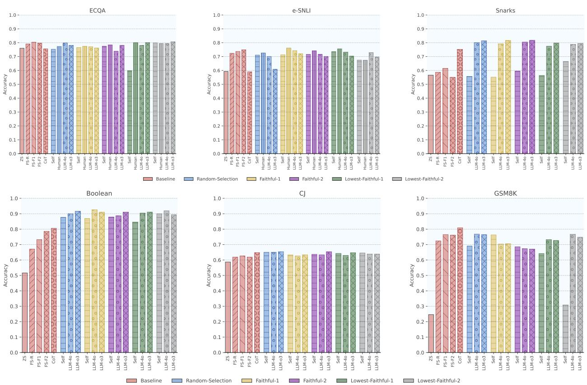  
Figure 8: Accuracy values across explanation selection strategies: Baseline, Random Selection, Faithful Selection-fm1, Faithful Selection-fm2, Lowest-Faithful-fm1 Selection, and Lowest-Faithful-fm2 Selection; averaged over the four considered models and evaluated on six datasets: ecqa, e-snli, snarks, boolean, Causal Judgment, and gsm8k. Baselines include Zero-shot, Few-shot with random or faithful inputs and outputs only (no explanations), and CoT. Other strategies involve Self-NLEs, Human-provided, or LLM-NLEs (from 4o-mini and o3-mini).

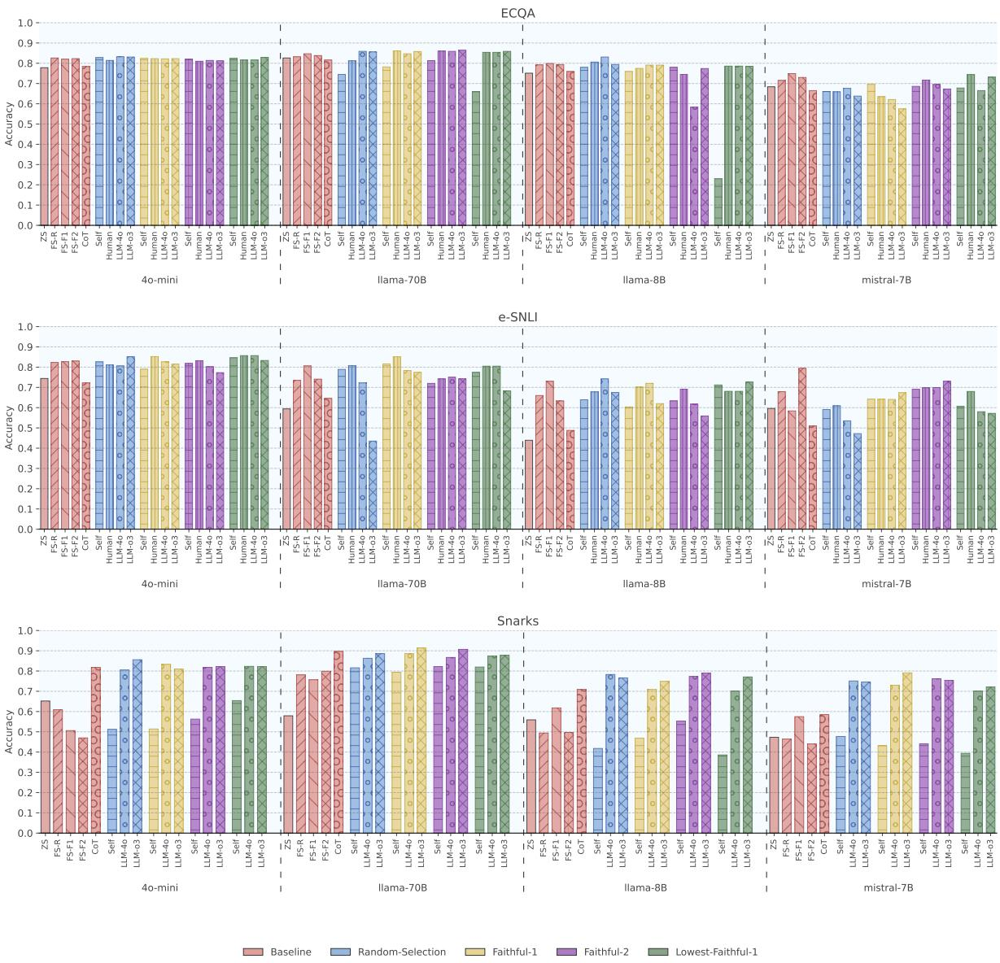  
(a) ecqa, e-snli & snarks

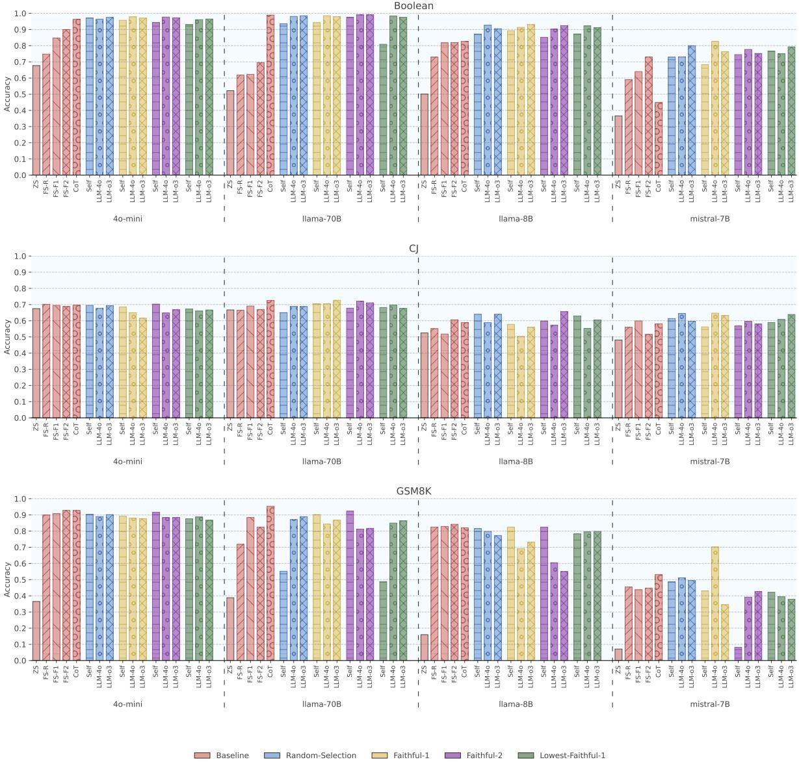  
(b) boolean, Causal Judgment & gsm8k  
Figure 9: Model-specific accuracy results across explanation selection strategies, Baseline (red), Random Selection (blue), Faithful Selection 1 (yellow), Faithful Selection 2 (purple), and Lowest-Faithful Selection (green) evaluated using 4o-mini(left), Llama-70B (center-left), Llama-8B (center-right), and Mistral-7B (right). Baselines include Zero-shot, Few-shot with random or faithful inputs and outputs only (no explanations), and CoT. Other strategies involve Self-generated, Human-provided, or LLM-generated explanations (from 4o-mini and o3-mini).

# N Examples of Faithful-Random and OOD Model Outputs

(Figures 10–18 below)

LLM Prompt Structure, Input and Output Example   
Instruction to LLM   
( user ) Evaluate the following boolean expression as (1) if True and (0) if False .   
Generate a concise explanation and the right single answer .   
Strictly follow this template : Explanation : <explanation >. Answer : 0   
Few-Shot Examples   
( ) T F l d T d F l i   
( assistant ) Explanation : The expression evaluates to True because " True and not False " simplifies to   
" True and True ," which is True .   
Then , " not not True " simplifies to True as well . Finally , combining these results , we have " True and   
True ," which is True .. The answer is (1) .   
( user ) not not ( False and not False ) is   
( assistant ) Explanation : The expression evaluates to True because the "or" operator returns True if   
at least one of its operands is True . In   
this case , the expression contains the values "False ," "True ," and the result of " False and not False   
." The " not False " evaluates to True ,   
making the entire expression True due to the presence of at least one True value in the "or"   
operations .. The answer is (0) .   
( user ) not not not ( True and False ) is   
( assistant ) Explanation : The expression "not ( ( False and True ) )" evaluates as follows : " False and   
True " results in False , since both conditions must be true for the AND operation to yield True .   
Then , applying the NOT operator to False gives us True . Therefore , the final result of the   
expression is True .. The answer is (1).   
( user ) True and not not False and not False is   
(assistant) Explanation: The expression simplifies as follows: "not not False" evaluates to "False."   
and "not False " evaluates to " True ." Therefore , the expression becomes " False or True or True ."   
Since at least one of the values is "True ," the final result is " True .". The answer is (0)   
( user ) True or False and not ( True ) is   
( assistant ) Explanation : The expression evaluates to False because the first part , " not True ,"   
becomes False . When you combine False with any other value using "and ," the result is always   
F l Th f h i i i F l Th i (1)   
( user ) not not ( not True ) or False is   
( assistant ) Explanation : The expression evaluates as follows :   
1. The " not False " part becomes True .   
2. Then the expression simplifies to False or ( True and False ).   
3. Since " True and False " is False , we have False or False .   
4. Finally , False or False results in False .   
Therefore , the overall expression evaluates to False .. The answer is (0).   
( user ) not ( True ) and ( True ) is   
Model Output and Explanation   
Explanation : The expression "not ( True )" evaluates to False . Therefore , the expression simplifies to   
" False and True ." In a logical AND operation , if one of the operands is False , the result is   
False . Thus , the overall expression evaluates to False . The answer is (0) .  
Figure 10: Illustration of an in-context learning prompt using Random Rationales (Setting 4) on the Boolean dataset with 4o-mini as the evaluation model. The prompt includes an instruction followed by six few-shot examples (top), with explanations generated by 4o-mini. The final input (bottom) is the test question. The model’s prediction is correct. This example reflects an error case under the LLMexplanation strategy.

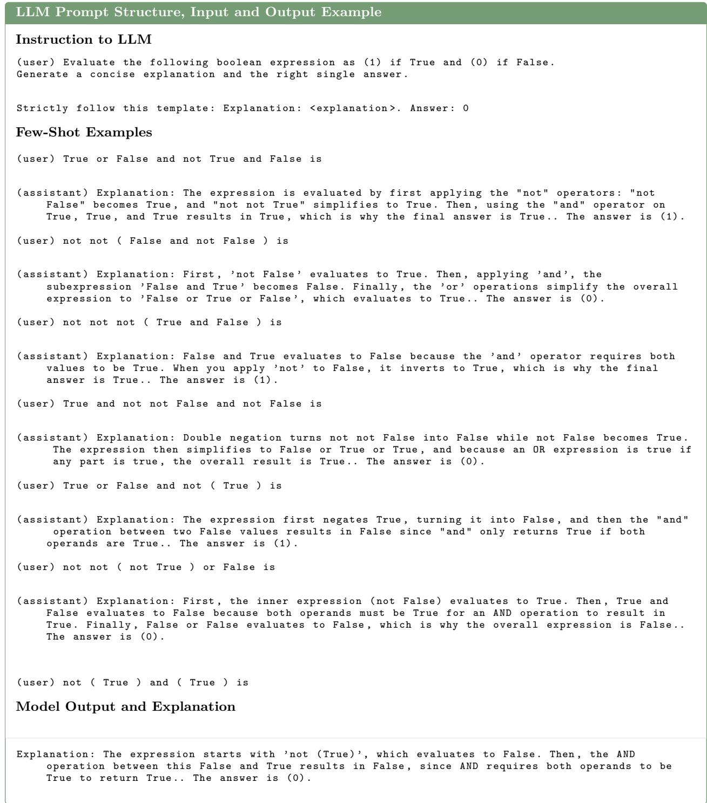  
Figure 11: Illustration of an in-context learning prompt using Random Rationales (Setting 4) on the Boolean dataset with 4o-mini as the evaluation model. The prompt includes an instruction followed by six few-shot examples (top), with explanations generated by o3-mini. The final input (bottom) is the test question. The model’s prediction is correct. This example reflects an error case under the LLMexplanation strategy.

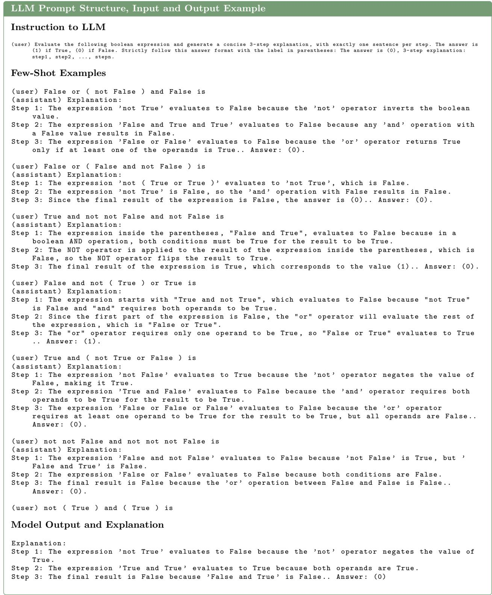  
Figure 12: Illustration of an in-context learning prompt using Random Rationales (Setting 4) on the Boolean dataset with Llama-8B as the evaluation model. The prompt includes an instruction followed by six few-shot examples (top), with explanations generated by the evaluation model itself. The final input (bottom) is the test question. The model’s prediction is correct. This example reflects an error case under the Self-explanation strategy.

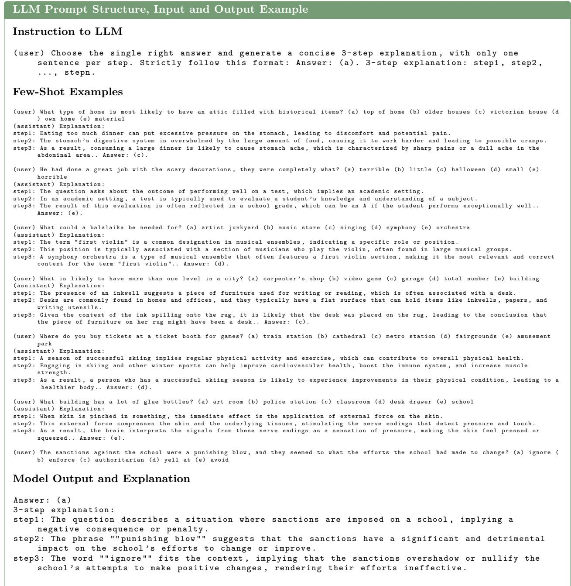  
Figure 13: Illustration of an in-context learning prompt using Random Rationales (Setting 4) on the ECQA dataset with Llama-70B as the evaluation model. The prompt includes an instruction followed by six few-shot examples (top), with explanations generated by the evaluation model itself. The final input (bottom) is the test question. The model’s prediction is correct. This example reflects an error case under the Self-explanation strategy.

LLM Prompt Structure, Input and Output Example   
Instruction to LLM   
( user ) Evaluate the following boolean expression as (1) if True and (0) if False . Generate a concise   
explanation and the right single answer . Strictly follow this template : Explanation : <explanation   
>. Answer : 0   
Few-shot Examples   
( user ) False or ( not False ) and False is   
( assistant ) Explanation : The sarcastic element in ( a) comes from the mocking tone created by   
comparing the league ’s supposedly " consistent " punishments to the inconsistency of politics . The   
speaker uses irony -- suggesting that the idea of consistency is as absurd as expecting politics to   
be fair --to undermine the seriousness of the claim . This sarcastic contrast is what makes (a)   
the correct answer . The answer is (0) .   
( user ) False or ( False and not False ) is   
( assistant ) Explanation : Answer (b) is sarcastic because it praises using ad hominem attacks as if   
they would genuinely strengthen an argument , when in fact such attacks are generally seen as a   
weak , fallacious tactic . The irony in stating that these attacks " really help your case " signals   
that the speaker doesn ’t truly believe in their effectiveness , creating a sarcastic tone .. The   
answer is (0).   
( user ) True and not not False and not False is   
( assistant ) Explanation : Option (a) is sarcastic because it uses an exaggerated negative phrase ("   
huge waste ") to imply the opposite of what is literally stated . The irony in dismissing the value   
of research interests as wasteful reveals a sarcastic tone .. The answer is (0).   
( user ) False and not ( True ) or True is   
( assistant ) Explanation : Option (a) is sarcastic because it intentionally contradicts itself by   
saying they haven ’t spoken in years while calling the person "my bestie ," implying irony . In   
contrast , option (b) has no contradictory elements . The answer is (1) .   
( user ) True and ( not True or False ) is   
( assistant ) Explanation : Option (a) is sarcastic because it uses exaggerated praise for a harmful   
attitude -- instead of genuinely approving of generalizing and demeaning women , it ironically   
comments on such behavior to highlight its absurdity . This contrasts with (b), which states the   
consequence straightforwardly without irony . The answer is (0) .   
( user ) not not False and not not not False is   
( assistant ) Explanation : Statement (a) is sarcastic because it ironically claims that being ten times   
slower in design will lead Honda to market dominance , which undermines the logic that slow   
progress is beneficial . The exaggeration highlights the absurdity of using sluggish performance   
as an advantage , making the tone sarcastic .. The answer is (0) .   
( user ) not False or True and False and False is   
Model Output and Explanation   
Explanation : The expression is evaluated as follows :   
- not False is True   
- True or True is True   
- True and False is False   
- False and False is False   
So , the final result is False .   
Answer : 0  
Figure 14: Illustration of an in-context learning prompt using OOD Rationales (Setting 5) on the Boolean dataset with Llama-8B as the evaluation model. Snarks dataset LLM-explanations generated by o3-mini are used as OOD-random explanations from a diferent domain. The prompt includes an instruction followed by six few-shot examples (top). The final input (bottom) is the test question. The model’s prediction is wrong. This example reflects an error case under the LLM-explanation strategy.

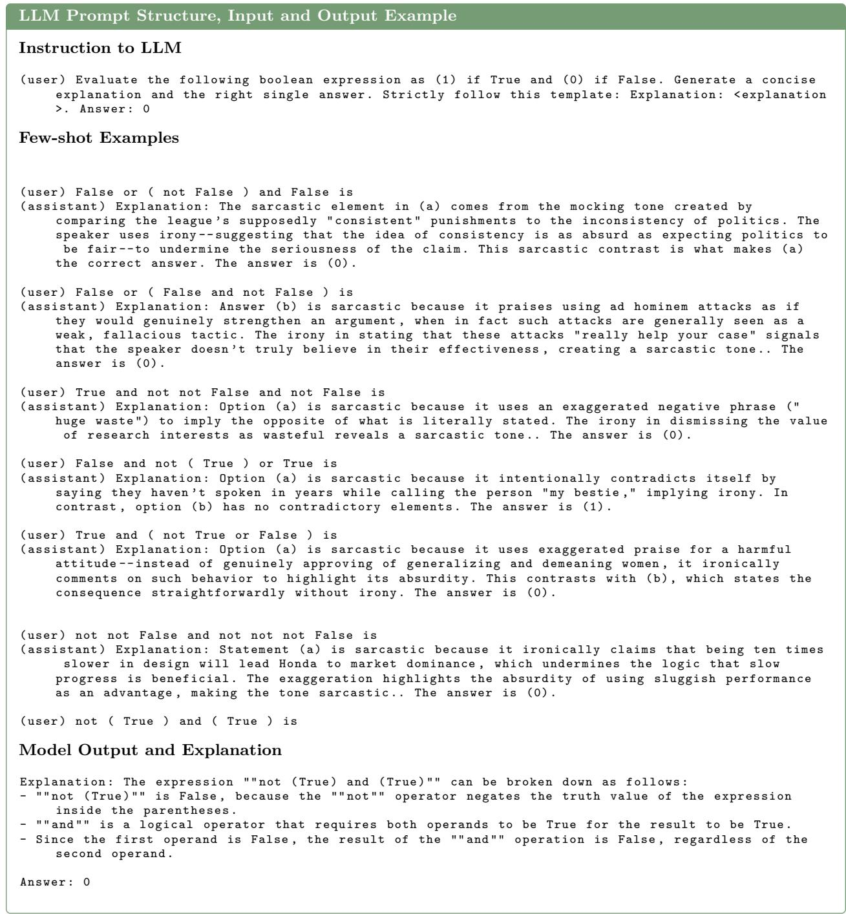  
Figure 15: Illustration of an in-context learning prompt using OOD Rationales (Setting 5) on the Boolean dataset with Llama-8B as the evaluation model. Snarks dataset LLM-explanations generated by o3-mini are used as OOD-random explanations from a diferent domain. The prompt includes an instruction followed by six few-shot examples (top). The final input (bottom) is the test question. The model’s prediction is correct. This example reflects an error case under the LLM-explanation strategy.

  
Figure 16: Illustration of an in-context learning prompt using OOD Rationales (Setting 5) on the ECQA dataset with Llama-70B as the evaluation model. e-SNLI dataset LLM-explanations generated by 4o-mini are used as OOD-random explanations from a diferent domain. The prompt includes an instruction followed by six few-shot examples (top). The final input (bottom) is the test question. The model’s prediction is wrong. This example reflects an error case under the LLM-explanation strategy.

  
Figure 17: Illustration of an in-context learning prompt using OOD Rationales (Setting 5) on the Snarks dataset with Llama-70B as the evaluation model. Boolean dataset LLM-explanations generated by 4o-mini are used as OOD-random explanations from a diferent domain. The prompt includes an instruction followed by six few-shot examples (top). The final input (bottom) is the test question. The model’s prediction is correct. This example reflects an error case under the LLM-explanation strategy.

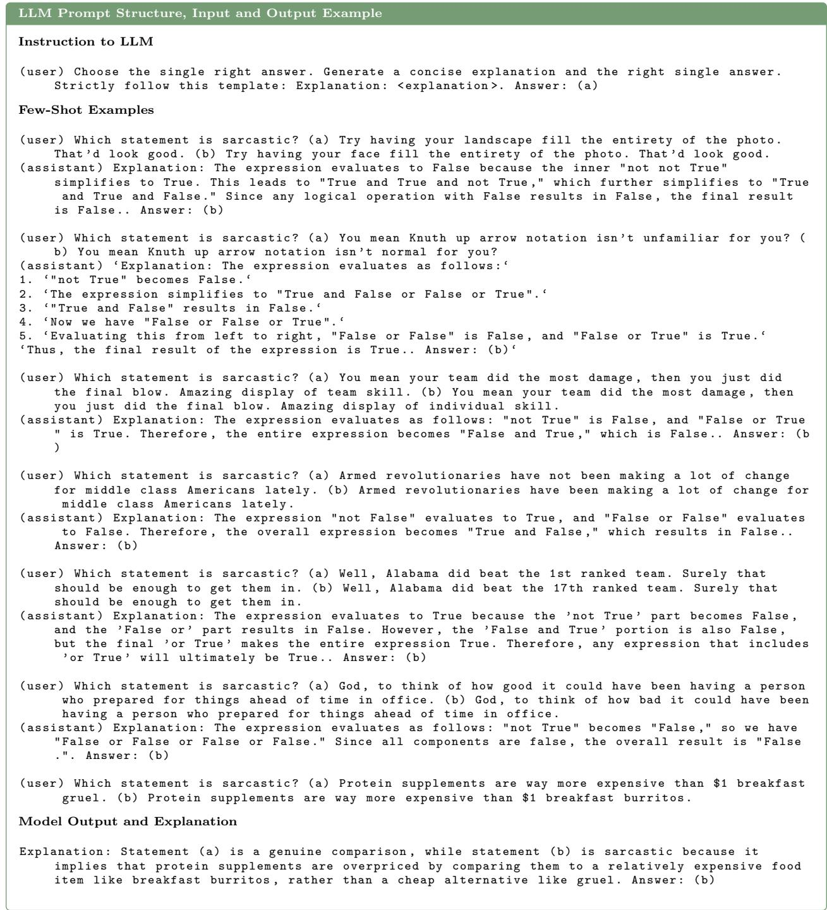  
Figure 18: Illustration of an in-context learning prompt using OOD Rationales (Setting 5) on the Snarks dataset with Llama-70B as the evaluation model. Boolean dataset LLM-explanations generated by 4o-mini are used as OOD-random explanations from a diferent domain. The prompt includes an instruction followed by six few-shot examples (top). The final input (bottom) is the test question. The model’s prediction is correct. This example reflects an error case under the LLM-explanation strategy.

## O Examples of Diferent NLEs

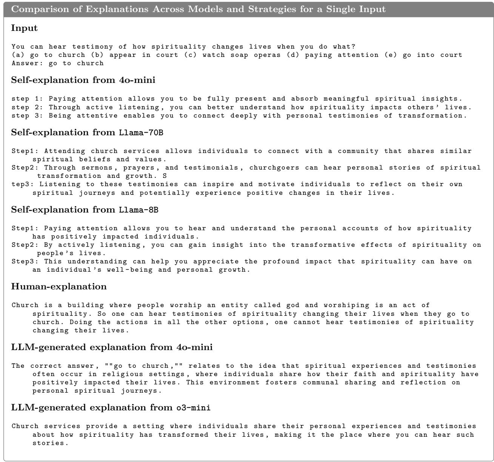  
Figure 19: Explanations generated for a single ECQA input across six diferent setups: self-generated explanations from 4o-mini, Llama-70B, and Llama-8B; a human-written explanation; and LLM-generated explanations from 4o-mini and o3-mini. This comparison highlights diferences in explanation style, detail, and reasoning approach depending on model size, explanation strategy, and human vs. model generation.

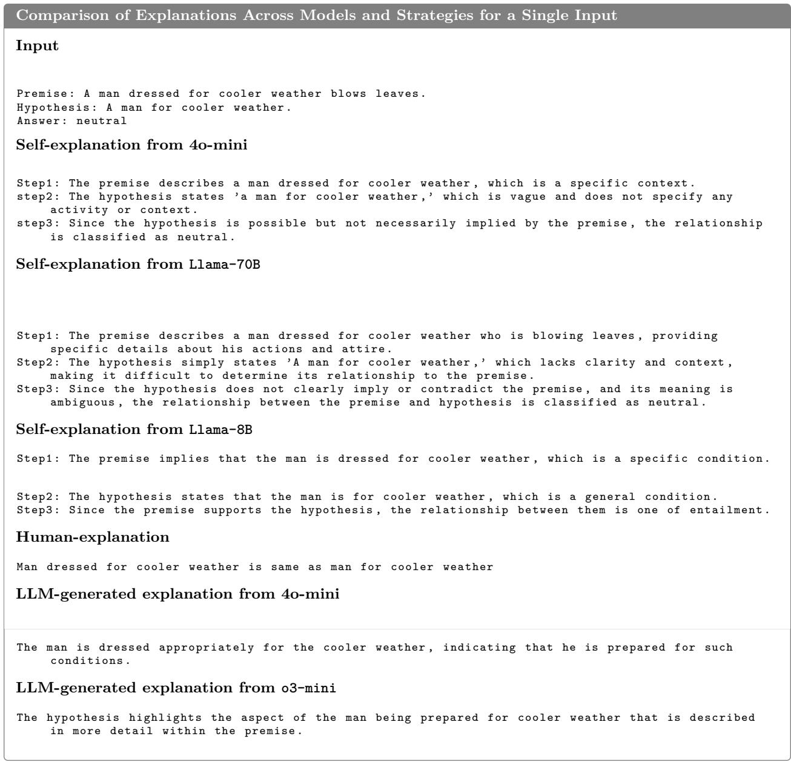  
Figure 20: Explanations generated for a single e-SNLI input across six diferent setups: self-generated explanations from 4o-mini, Llama-70B, and Llama-8B; a human-written explanation; and LLM-generated explanations from 4o-mini and o3-mini. This comparison highlights diferences in explanation style, detail, and reasoning approach depending on model size, explanation strategy, and human vs. model generation.

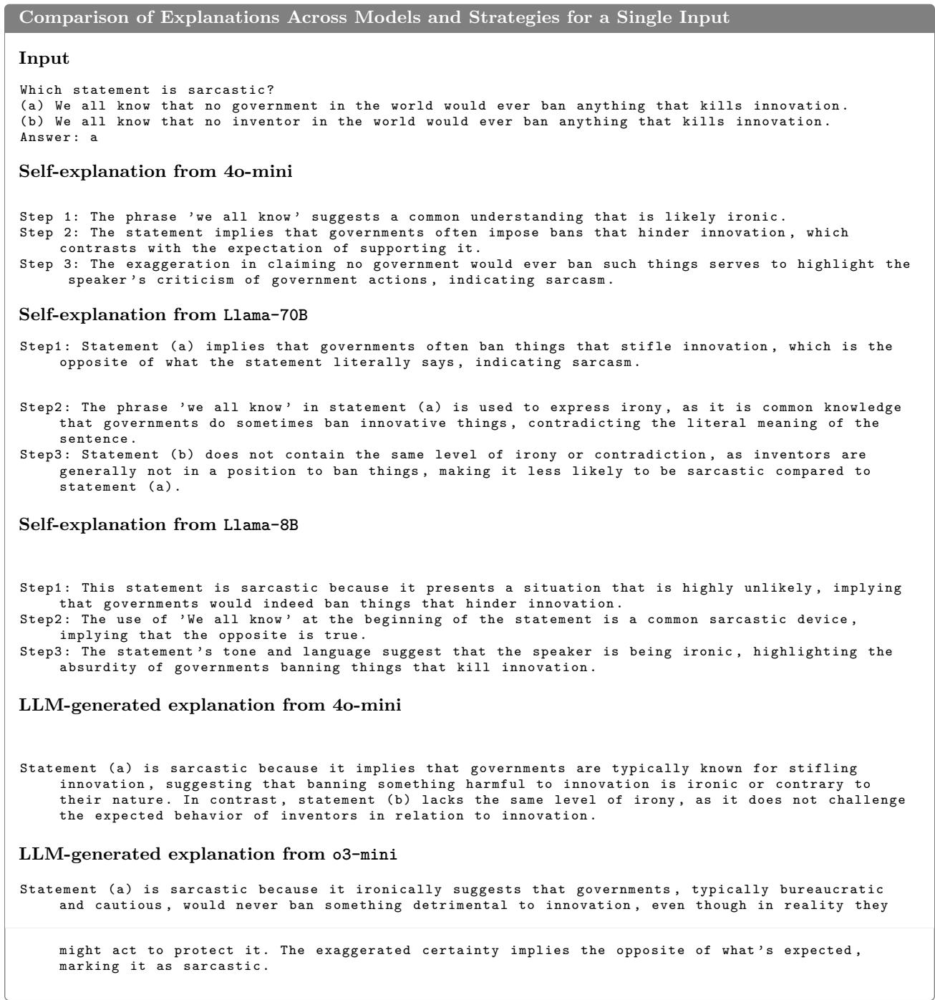  
Figure 21: Explanations generated for a single Snarks input across six diferent setups: self-generated explanations from 4o-mini, Llama-70B, and Llama-8B; and LLM-generated explanations from 4o-mini and o3-mini. This comparison highlights diferences in explanation style, detail, and reasoning approach de pending on model size, explanation strategy, and human vs. model generation.

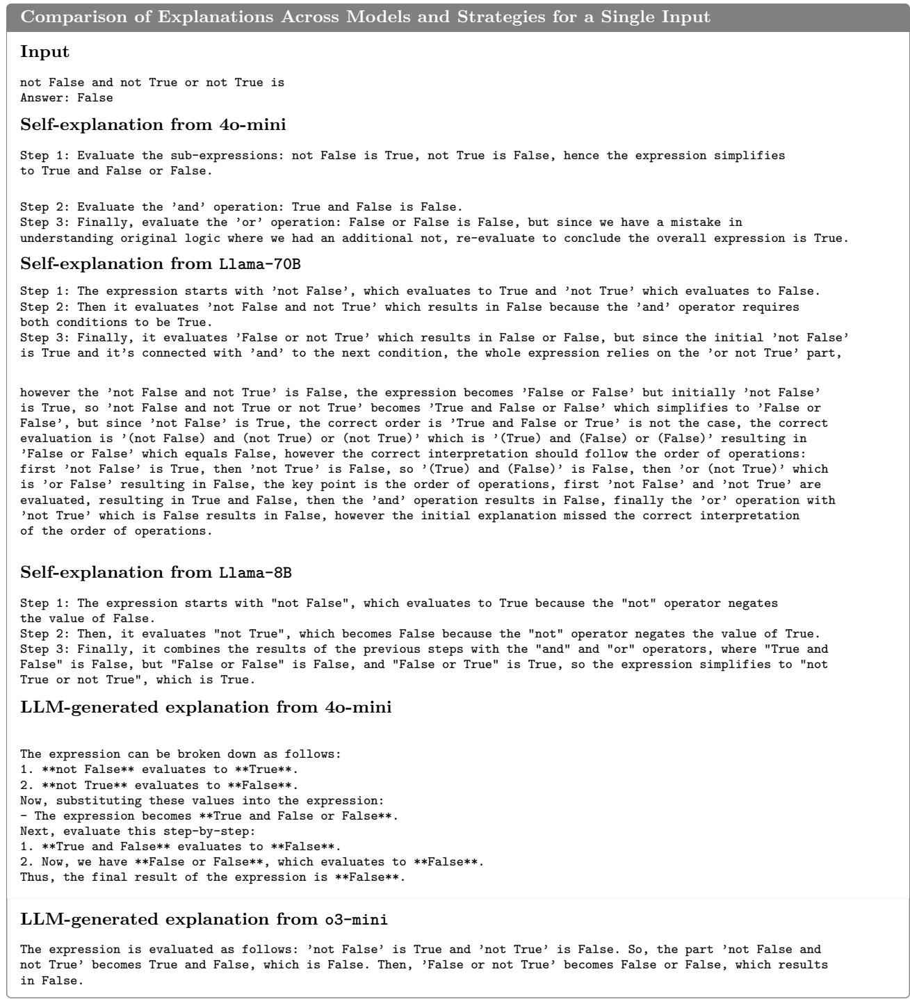  
Figure 22: Explanations generated for a single Boolean input across six diferent setups: self-generated explanations from 4o-mini, Llama-70B, and Llama-8B; and LLM-generated explanations from 4o-mini and o3-mini. This comparison highlights diferences in explanation style, detail, and reasoning approach depending on model size, explanation strategy, and human vs. model generation.

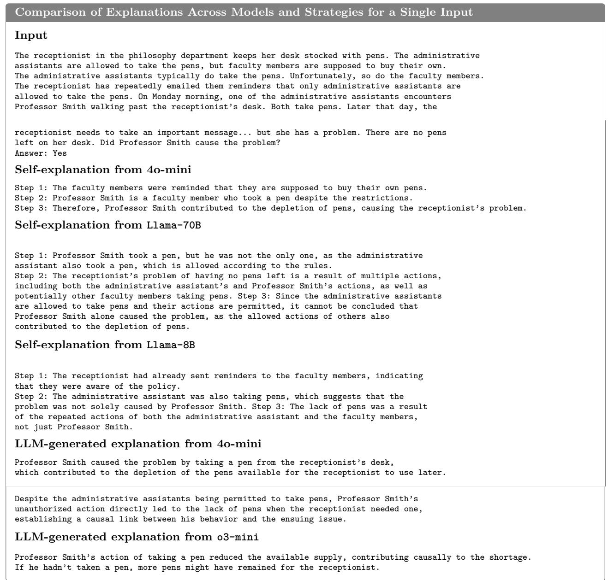  
Figure 23: Explanations generated for a single Causal Judgment input across six diferent setups: selfgenerated explanations from 4o-mini, Llama-70B, and Llama-8B; and LLM-generated explanations from 4o-mini and o3-mini. This comparison highlights diferences in explanation style, detail, and reasoning approach depending on model size, explanation strategy, and human vs. model generation.