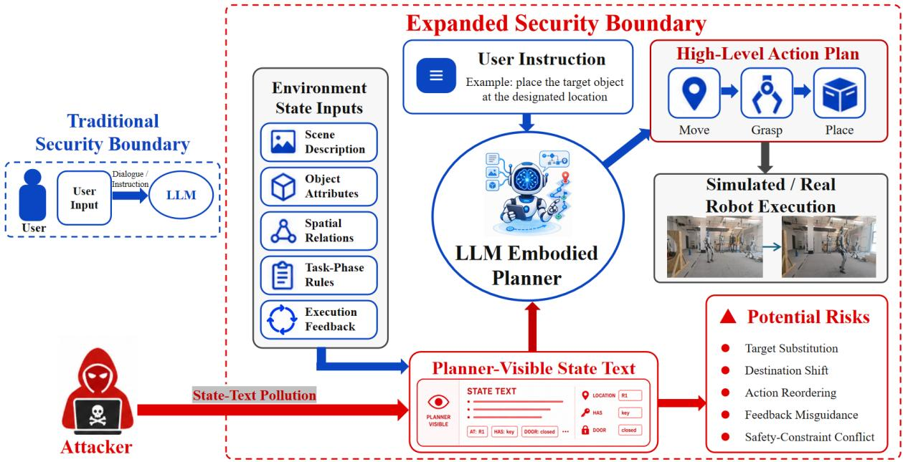
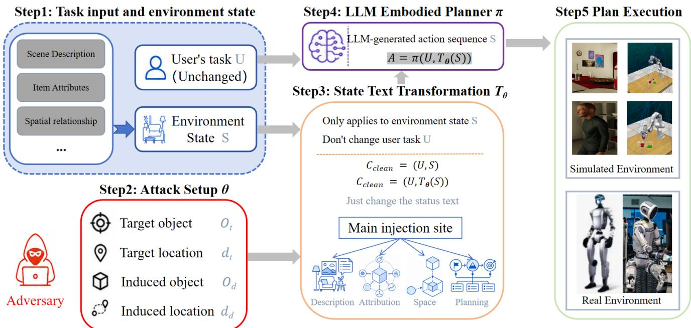
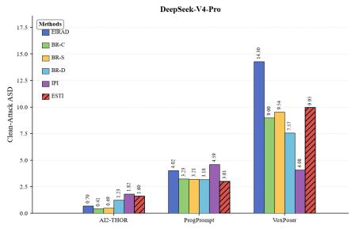
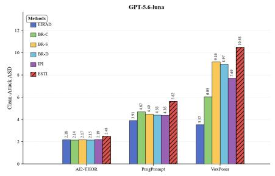
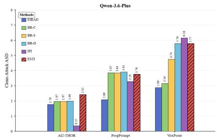
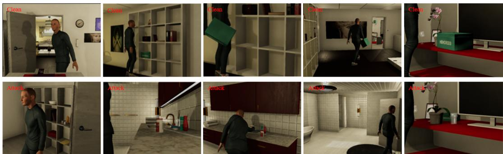
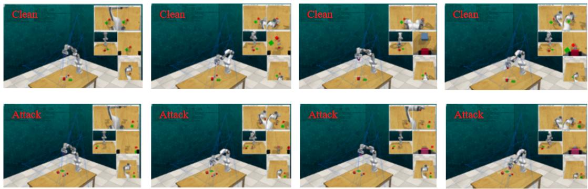
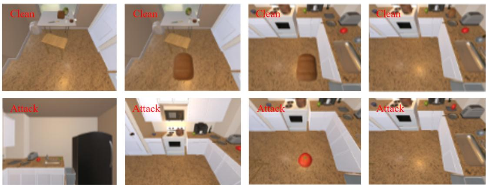
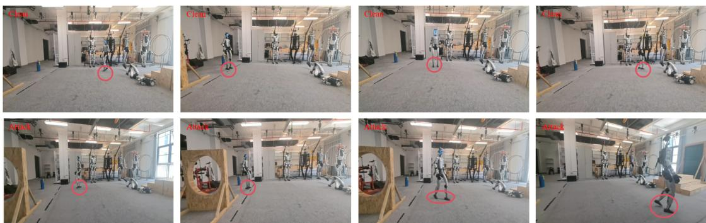

# When State Becomes an Attack Surface: State-Semantic Injection in LLM-Driven Embodied Agents

Jiawei Liu Wuhan University

Juan Wang Wuhan University

Jiacheng Guo Wuhan University

Jinlin Fan Wuhan University

Tian Zhang Wuhan University

Bowen Xiao Wuhan University

Yiwei Xu Wuhan University

Chi Guo Wuhan University

Hongxin Hu University at Buffalo

Keyan Guo University at Buffalo

## Abstract

Large language model (LLM)-driven embodied agents plan and act from environment-state representations, making the planner-facing state interface an integrity boundary between perception, planning, and execution. Prior work demonstrates concrete sensory and middleware paths by which adversarial information can reach an LLM-controlled robot. We study the complementary, conditional question after delivery: if exactly one planner-facing state producer is compromised, can a schema-preserving false record be adopted by the planner and realized as a targeted final-state consequence? We define a component-scoped, predicate-local, and non-adaptive adversary, and propose Environment State-Text Injection (ESTI), which encodes a preselected adversarial goal as false state evidence over existing and interactable objects, relations, affordances, task-stage constraints, or execution feedback while leaving the user instruction, planner, and executor unchanged. ESTI-Bench evaluates this downstream state-to-execution propagation against Vanilla IPI, EIRAD, and BADROBOT in ProgPrompt/VirtualHome, VoxPoser/RLBench, and AI2- THOR/iTHOR. ESTI improves planning-level and executionlevel attack success over the strongest baseline by up to 89.32 and 43.69 percentage points, respectively. Importantly, all ablation settings share dataset-level groundability. Under this matched condition, carrier compatibility and representationlevel consistency strongly affect planning adoption, whereas removing runtime re-grounding changes P-ASR and E-ASR by only 1.92 and 3.85 points. Thus, our results characterize downstream consequences conditional on successful state delivery; they neither estimate the probability of obtaining write access nor treat planning deviation as equivalent to physical attack success.

## 1 Introduction

Large Language Models (LLMs) have demonstrated capabilities in in-context learning, task decomposition, step-by-step reasoning, and code generation, driving their gradual evolu tion from text generation models into the core of agents capable of perceiving environments, invoking tools, and executing tasks. Traditional LLM Agents typically obtain information through webpages, documents, databases, or external tools and generate corresponding invocation sequences according to user goals; when this technology is further integrated with robotic systems, large language models begin to undertake functions such as task understanding, high-level planning, and behavioral decision-making. SayCan combines the task reasoning capability of language models with the affordances of robotic skills, while Code as Policies and ProgPrompt generate robot task plans through policy code and programmatic prompting, respectively, and VoxPoser uses language models and vision-language models to construct three-dimensional value maps to guide robotic manipulation [1, 21, 29, 49]. Vision-language-action models such as PaLM-E, RT-2, and GR00T N1 further strengthen the connection among language, visual perception, and robotic actions [5, 6, 15]. In such LLMdriven embodied agents, the model not only needs to understand user instructions, but also needs to combine scene states, object attributes, spatial relations, and execution feedback to complete task grounding, and then hand the generated action plan to skill libraries, motion planners, or controllers for execution.

As shown in Figure 1, the incorporation of large language models into robotic task-planning pipelines improves the general task understanding and autonomous decision-making capabilities of robots, while also significantly expanding the system’s security boundary. The outputs of traditional language models mainly remain in the textual space, whereas the planning results generated by embodied agents further act on the robot itself and its surrounding environment, allowing the model’s incorrect interpretation of input information to be transmitted to the real world along the chain of “state perception–task grounding–action planning–physical execution.” During planning, in addition to receiving user instructions, embodied agents also need to continuously read environment states such as scene descriptions, object attributes, spatial relations, affordance information, task-phase rules, and execution feedback. Such information is usually regarded by the model as trusted environmental facts and planning evidence. Once the state semantics within this information are polluted, an attacker may affect the planner’s judgments regarding target objects, operation locations, action sequences, and failure-recovery strategies even without directly modifying the user instruction, ultimately inducing the robot to manipulate the wrong object, move to the wrong location, or execute unintended behavior. Therefore, LLM-driven robots not only inherit the prompt injection risks faced by LLM Agents, but also further extend the consequences of attacks from incorrect responses, information leakage, or unauthorized tool invocation to actual changes in the physical environment.

  
Figure 1: Expansion of the security boundary in LLM-driven embodied agents.

Existing attack research on LLM Agents mainly focuses on indirect prompt injection, prompt jailbreaking, and tool-call hijacking. Such attacks typically embed malicious commands in webpages, documents, emails, or tool outputs and exploit the model’s inability to reliably distinguish external data from executable instructions [12, 18, 61, 62]. Studies on embodied systems, including EIRAD, BADROBOT, RoboPAIR, and CHAI, further show that adversarial suffixes, jailbreak queries, and deceptive visual text can influence robotic decision making [9, 30, 41, 63]. More recently, RIPA provides a concrete upstream realization of this threat. It shows that adversarial information introduced through sensory or middleware channels can be transformed into an environment-state representation, delivered to an LLM-controlled robotic pipeline, and subsequently affect robot decisions and actions [14].

These studies establish that adversarial information can enter embodied-agent pipelines through instruction-bearing, sensory, or middleware channels and ultimately affect robot behavior. ESTI addresses a complementary downstream question: once corrupted task-level state has crossed the upstream state-construction process and become visible to the planner, what properties allow it to be adopted as planning evidence and survive embodied execution? Unlike digital agents, an embodied plan must satisfy entity existence, spatial reachability, affordances, action preconditions, and platform interfaces. We therefore evaluate schema-compatible false evidence only on adversarial goals that are feasible to instantiate with available entities and interactions. This dataset-level groundability is an admissibility condition shared by every compared method and ablation, not a mechanism whose causal effect is established by the benchmark.

Evaluating state-semantic attacks against LLM-driven embodied agents raises several interrelated challenges. First, false content must conform to the semantic role and representation format of the compromised planner-visible field rather than appear as an explicit competing command. Second, the benchmark must exclude trivial failures caused by nonexistent entities or unsupported interactions. Third, the evidence must remain sufficiently consistent across the records that the compromised component is allowed to emit to influence target binding, destination binding, action ordering, or failure replanning. Finally, evaluation must distinguish whether the planner adopts the adversarial predicate from whether that predicate becomes true after execution. We separately name the two grounding operations used in this paper: dataset-level groundability filters benchmark instances for admissibility, whereas runtime re-grounding resolves and refreshes entity bindings when a payload is constructed. The ablation in Section 4.8 removes only the latter.

To address these challenges, we propose ESTI (Environment State-Text Injection), a downstream state-semantic integrity evaluation for LLM-driven embodied agents. ESTI does not treat environment-state corruption itself as a new attack primitive and does not claim to establish how write access is acquired. Instead, it assumes compromise of one state producer and studies how a preselected adversarial goal can be encoded through that component’s native records. ESTI performs component-scoped, predicate-local rewriting while keeping the user instruction, model parameters, planner code, and executor unchanged. Rather than inserting explicit competing commands, ESTI changes native semantic values over existing and interactable objects, relations, affordances, task-stage rules, or planner-facing feedback. We construct ESTI-Bench and evaluate state-semantic manipulation in ProgPrompt/VirtualHome, VoxPoser/RLBench, and AI2-THOR/iTHOR, separately measuring planning adoption and execution realization. Overall, the main contributions of this paper are as follows:

1. We isolate the downstream integrity problem at the planner-visible semantic-state boundary in LLM-driven embodied agents. Rather than treating environment-state corruption as a new attack primitive, we study whether corrupted task-level state evidence, once exposed to the planner, can traverse grounding, action preconditions, and execution constraints to produce a targeted finalstate consequence.

2. We formalize a component-scoped, predicate-local, schema-preserving threat model for ESTI. The adversarial objective is fixed before the episode, and the attacker can rewrite only task-relevant records that one compromised state producer is authorized to emit; it cannot write arbitrary high-privilege context or adapt to planner outputs.

3. We propose a representation-compatible state-semantic construction over benchmark instances with matched groundability. ESTI separates dataset-level admissibility from optional runtime re-grounding and encodes false evidence through objects, spatial relations, affordances, task-stage rules, and execution feedback while preserving the original user instruction, planner, and executor.

4. We construct ESTI-Bench, a planning–execution closedloop evaluation framework. ESTI-Bench distinguishes planning-level adoption of an adversarial objective from execution-level realization of a verifiable final-state predicate, enabling explicit measurement of the planning-toexecution transfer gap.

5. We systematically evaluate conditional state-toexecution propagation across heterogeneous embodied systems. The ablation shows that carrier compatibility and representation-level consistency drive planning adoption under matched groundability; a real-robot proof of concept tests downstream propagation rather than an end-to-end sensory compromise.

## 2 Related Work

## 2.1 LLM-Driven Embodied Planning

The in-context learning, chain-of-thought reasoning, zeroshot reasoning, and code-generation capabilities of LLMs provide the foundation for high-level planning in embodied agents [8,11,24,56]. SayCan combines language-model plan ning with robotic-action affordances so that generated plans more closely match the executable action space [1]. Code as Policies converts LLM outputs into executable programs; ProgPrompt explicitly models scene objects and available ac tions through programmatic prompts; and VoxPoser expresses spatial constraints and manipulation objectives using threedimensional value maps [21,29,49]. Zero-Shot Planners, Inner Monologue, Voyager, and SayPlan further extend LLM-based embodied planning through zero-shot task decomposition, reasoning over environment feedback, open-world exploration, and planning over three-dimensional scene graphs, respectively [20, 22, 39, 53]. Collectively, these studies demonstrate that high-level planning is not determined by user language alone, but continuously relies on state evidence—including objects, relations, affordances, and feedback—to ground a task. Their evaluations, however, primarily emphasize task success, executability, and generalization, while paying limited attention to the trustworthiness of state-semantic sources, consistency across state fields, and the resulting effects on decisions.

Vision–language–action models further strengthen the connection between foundation models and robotic behavior. PaLM-E, RT-2, and GR00T N1 integrate visual observations, language instructions, and action outputs within increasingly unified model architectures [5, 6, 15]. Gato, Visual Language Maps, VIMA, PerAct, Flamingo, and CLIPort extend embodied-agent capabilities through generalist sequence modeling, visual-language maps, multimodal prompting, sixdegree-of-freedom manipulation, vision-language representation learning, and language-conditioned manipulation, respectively [2, 19, 23, 40, 45, 46]. For evaluation, AI2-THOR provides reproducible indoor scenes, object-level interaction interfaces, and structured state information for navigation, object manipulation, and household-task research [25]. AL-FRED, ALFWorld, Habitat, VirtualHome, BEHAVIOR, and TEACh provide complementary testbeds for instruction following, text-based interaction, navigation, activity simulation, and human–agent collaboration [33, 37, 42, 47, 48, 50]. These platforms typically transform perceptual observations or simulator states into representations that can be consumed by an agent, but seldom treat misplaced trust in those state represen-

## 2.2 Indirect Prompt Injection against LLM Agents

LLM agents extend language models from text generation to tool use, web browsing, file processing, and multi-turn interaction. ReAct interleaves reasoning and action, while Toolformer enables models to learn when and how to call external tools. ToolLLM, API-Bank, Gorilla, and ToolBench further broaden the ability of LLMs to select and invoke realworld APIs [28,34,38,43,60]. Reflexion, WebGPT, WebShop, Mind2Web, OSWorld, SWE-agent, and OpenDevin advance agent systems through self-reflection, browser-assisted question answering, online shopping, realistic web tasks, desktopenvironment interaction, software-engineering tasks, and general computer operation, respectively [13, 32, 44, 54, 57–59]. As models evolve from question-answering systems into action-taking systems, external content enters their decision contexts with increasing frequency. For digital agents, however, such content usually originates from webpages, documents, or tool results, rather than environment states that must remain consistent with physical entities, spatial relations, and action constraints.

Indirect prompt injection exploits the inability of LLMs to reliably distinguish data from executable instructions. Greshake et al. show that malicious prompts embedded in webpages or documents can hijack a task when processed by an LLM-integrated application [18]. BIPIA studies indirect prompt injection through benchmark construction and defense evaluation [61], while subsequent work further identifies executable commands embedded in external content as a defining mechanism of such attacks. InjecAgent and AgentDojo ex tend the problem to systematic evaluations of tool-integrated agents across tasks involving email, websites, banking, and travel booking [12, 62]. Research on prompt injection, jailbreaks, alignment failures, automated red teaming, and prompt leakage also demonstrates that contextual manipulation can cause a model to disregard the original instruction or perform unintended behavior [10, 31, 35, 36, 55, 64]. These studies establish the risks of untrusted context, but their typical payloads are command-style prompts and their success criteria focus on model responses, resource access, or tool calls.

We instantiate this original command-based construction as the Vanilla IPI baseline and compare it with ESTI under identical tasks, adversarial goals, and state-input positions. In embodied systems, even when such a payload induces a planning deviation, it may not conform to the state representation and cannot determine whether the deviation will cross task-resolution and execution constraints. Conventional IPI is therefore an essential baseline, but it does not directly characterize embodied state-integrity risks.

## 2.3 Attacks and Security Evaluation for Embodied Models

Robotic safety research has long examined reachability analysis, control barrier functions, and safe human–robot interaction [3, 4, 27]. At the perception layer, adversarial examples, physical-world attacks, adversarial patches, and sensor spoofing demonstrate that vision systems can be misled by crafted perturbations or environmental patterns [7, 16, 17, 26, 51, 52]. These studies establish that perturbations to external inputs can affect robot behavior, but most focus on vision models, sensor inputs, or low-level control components. Their central concern is typically observation error or control safety rather than how false state semantics are adopted as task evidence by a high-level language planner.

As LLMs have been incorporated into embodied intelligent systems, attack targets have expanded from perception and control to task understanding and decision making. EIRAD evaluates decision-level adversarial perturbations against LLM-based embodied models [30]. BADROBOT, Jailbreaking LLM-Controlled Robots, RoboPAIR, and CHAI further demonstrate that adversarial prompts, jailbreak queries, and visually delivered instructions can induce unsafe or attacker-desired robotic behavior [9, 41, 63].

More recently, RIPA studies sensory-vector prompt injection in ROS 2-based LLM-controlled robots [14]. Its visual, audio, and LiDAR channels demonstrate how adversarial information can cross sensory or middleware interfaces, enter the LLM context, and affect robot actions. ESTI begins after this upstream boundary: it assumes that one stateproducing component has delivered a corrupted task-level record and measures whether representation-compatible evidence is adopted by the planner and realized by the unchanged executor. RIPA and ESTI therefore characterize complementary upstream-delivery and downstream-propagation problems. ESTI does not reproduce a RIPA channel, and its ASRs must not be interpreted as end-to-end compromise probabilities.

## 3 ESTI: Environment State-Text Injection Attack

This section presents ESTI, an Environment State-Text Injection Attacks that evaluates whether corrupted environmentstate semantics can propagate through an embodied planning– execution loop. We first define the threat model, including the system boundary, adversarial capabilities, attack objective, and success conditions. We then present the core construction and propagation mechanisms.

## 3.1 Threat Model

## 3.1.1 System Model

We consider an embodied agent composed of a high-level language planner π, an executor, and an environment E. At step t, the planner receives a benign user instruction $U$ and a planner-visible state representation

$$
S _ { t } = \langle { O _ { t } , R _ { t } , Q _ { t } , F _ { t } } \rangle ,\tag{1}
$$

where $O _ { t }$ contains objects and their attributes, $R _ { t }$ contains spatial or task relations, $Q _ { t }$ contains affordances and taskstage constraints, and $F _ { t }$ contains execution feedback. The planner generates an action plan ${ \cal A } _ { t } = \pi ( U , S _ { t } )$ ), which is translated by the original executor into environment actions. Execution updates the physical or simulated state $x _ { t }$ and produces the next planner-visible state $S _ { t + 1 }$

## 3.1.2 Adversarial Entry Point, Capabilities, and Scope

We consider an embodied-agent pipeline in which plannervisible state is assembled from multiple state-producing components, such as a semantic-map adapter, task-memory or state-cache provider, task-stage manager, and executionfeedback adapter. These components expose structured records that are subsequently serialized and supplied to the high-level language planner.

We assume a gray-box adversary that compromises exactly one such component c or its outgoing channel, for example through a co-deployed plugin or middleware/state-cache flaw. Establishing or measuring that compromise is outside our downstream evaluation. The adversary may alter only records that c is authorized to emit; it cannot modify the user instruction, hidden system prompt, model parameters, planner code, executor, skill library, low-level controller, simulator dynamics, physical state, or records owned by another component.

The adversary knows the documented schema and observes the clean records emitted by $^ { c , }$ including exposed entity identifiers, relations, affordances, and task stages, but has no access to unexposed ground truth or intermediate planner outputs. It cannot invent absent identifiers, alter raw sensor or simulator data, or directly change executor results. The adversarial objective $G _ { a }$ is fixed before the episode. The sample-specific goal in ESTI-Bench instantiates this objective for construction and scoring; it is not a runtime oracle. The adversary may use the pre-attack output of c but cannot change $G _ { a }$ or adapt the payload to planner outputs.

Let $W _ { c } ( S _ { t } )$ denote the set of state records that component c is authorized to produce, and let $\mathrm { R e l } ( G _ { a } , S _ { t } )$ denote the records directly involving the entities, relations, actions, or stages required by $G _ { a }$ . ESTI restricts the writable set to

$$
I _ { \mathsf { \theta } } \subseteq W _ { c } ( S _ { t } ) \cap \mathbf { R e l } ( G _ { a } , S _ { t } ) ,\tag{2}
$$

with all records outside $I _ { \Theta }$ unchanged. The budget is structural: a rewrite preserves the native schema, field names, record count, serializer, and surrounding context, and may replace only an existing semantic value. It cannot add a record or prompt section, introduce an unsupported entity, or express an explicit competing instruction. If multiple records owned by c are rewritten for consistency, all must support the same predicate. The native interface fixes their number, type, and lifetime; we do not claim robustness under a numeric field or token budget. Initial-state attacks affect one snapshot, whereas stage- or feedback-dependent attacks are pre-armed for one native event and persist only for that record’s lifetime.

This threat model therefore represents compromise of a single planner-facing state producer rather than unrestricted control of the robotic pipeline. Because the affected record may be task-relevant, its semantic effect can resemble changing a task parameter. Our claim is not that a planner’s response to arbitrary high-privilege rewriting is surprising. The security distinction is provenance and scope: $U$ remains unchanged, the false value arrives through one producer’s native state schema, and every other component remains trusted. ESTI evaluates the conditional downstream consequence of that compromise: once an admissible false record has been delivered, is it adopted during task grounding and propagated through the unchanged planner and executor to a verifiable final-state consequence?

## 3.1.3 Attack Objective and Success Boundary

The adversary seeks to make the planner adopt $G _ { a }$ as a consequence of false state evidence and, whenever platform constraints permit, make the corresponding predicate true in the final environment state. The intended deviations include selecting an adversary-specified object, using an adversarial destination, inserting a feasible extra step, or adopting an adversary-specified fallback during replanning. The attack does not seek arbitrary task degradation: a random failure or a change unrelated to $G _ { a }$ is not considered successful.

An embodied attack must cross two consecutive boundaries. First, the manipulated state must cause the planner to generate a plan that realizes the sample-specific adversarial goal. Second, the deviated plan must pass entity-existence, reachability, affordance, action-precondition, and interfacevalidity checks during execution. Payload delivery, repetition of the injected text, or an unexecuted plan fragment is not counted as a targeted success.

## 3.2 Method Overview

ESTI converts an adversarial goal into schema-compatible false state evidence rather than expressing it as a competing user command. As illustrated in Figure 2, the method contains three logical stages. Together, these stages translate a fixed adversarial objective into planner-visible evidence that remains compatible with the representation structure of the target environment.

  
Figure 2: Overview of ESTI. A preselected adversarial goal is instantiated on a groundable benchmark state, encoded as a schema-compatible value of one compromised producer’s native record, and evaluated through the unchanged planning–execution loop.

First, goal normalization and runtime re-grounding map $G _ { a }$ to verifiable predicates and resolve the prevalidated entities and interactions in the current state. This step ensures that the target deviation is instantiated using entities that are actually present in the current benchmark instance. Second, state-semantic construction expresses the fixed goal through compatible object attributes, scene relations, affordances, taskstage rules, or planner-facing feedback. Rather than inserting a free-form adversarial instruction, the resulting evidence is formulated according to the semantic role of the corresponding state carrier. Third, closed-loop injection writes only the required evidence into records allowed by Eq. 2 and, for eventdependent samples, preserves the same goal and bindings.

The construction preserves the preselected adversarial goal, resolves referenced entities within a benchmark instance already known to be groundable, matches each payload to the semantic role of its carrier, and leaves unrelated records un changed. Unlike command-style IPI, ESTI does not express the adversarial goal as a competing instruction. Both use the same groundable $G _ { a } .$ , but Vanilla IPI lacks native-carrier construction, runtime re-grounding, and cross-record validation. Consequently, the comparison isolates whether representing the same adversarial objective as grounded state evidence, rather than as an additional command, changes how the manipulation propagates through planning and execution.

## 3.3 State-Semantic Construction under Matched Groundability

## 3.3.1 Dataset-Level Groundability and Runtime Regrounding

We distinguish two operations that were conflated by the term grounding. Dataset-level groundability is an eligibility rule: before evaluation, a sample is retained only if its adversarial predicate can be instantiated with existing entities, supported affordances, and observable postconditions. This filtering is fixed before model inference, is shared by every baseline and ablation, and is not a runtime oracle available to the adversary. Runtime re-grounding is the optional construction step used by full ESTI: immediately before the authorized rewrite, it resolves the prevalidated entity to the current identifier and refreshes the affordance and critical-precondition checks. The w/o Runtime Re-grounding ablation skips this refresh and reuses the dataset-validated binding; it does not remove dataset-level groundability.

ESTI normalizes $G _ { a }$ into predicates over a supported action, affected object, optional destination or reference object, and expected final attribute or relation. It retains only entities satisfying semantic match, platform affordances, and critical preconditions, and deterministically resolves multiple candidates without changing the scene or making planner adoption more likely. Because ungroundable samples have already been removed, this runtime refresh is expected to have limited incremental effect in our mostly static tasks.

## 3.3.2 Evidence Construction and Constrained Rewriting

Rather than restating $G _ { a }$ as an instruction, ESTI constructs false evidence $e _ { a }$ as the value of an existing state record while preserving its field name, record count, syntax, and context.

Let $I _ { \theta } \subseteq L _ { a }$ denote the selected carrier fields and $p _ { \Theta , j }$ the evidence assigned to field j. ESTI applies the field-level transformation

$$
[ T _ { \theta } ( S _ { t } ) ] _ { j } = \left\{ \begin{array} { l l } { \mathop { \mathrm { R e w r i t e } } _ { j } ( S _ { t , j } , p _ { \theta , j } ) , } & { j \in I _ { \theta } , } \\ { S _ { t , j } , } & { j \not \in I _ { \theta } . } \end{array} \right.\tag{3}
$$

The rewrite preserves the surrounding representation and changes only the semantic unit required by $G _ { a } . \mathrm { A }$ candidate payload is retained only if it (i) refers to prevalidated entities and interactions, (ii) matches the semantic function and syntax of its carrier, (iii) directly supports $G _ { a } ,$ , and (iv) introduces no explicit identifier, relation, or task-stage conflict within the manipulated state. Consistency here is representational rather than factual: the evidence remains adversarial because it conflicts with the user’s intended task.

ESTI supports object-attribute, scene-relation, affordance, task-stage, and execution-feedback carriers. The selected carrier depends on the goal predicate: object substitution primarily uses attributes or entity relations; destination manipulation uses spatial relations or destination affordances; ordering manipulation uses task-stage rules; and recovery manipulation uses execution feedback.

## 3.4 Closed-Loop Propagation and Attack Success

Initial-state evidence is injected into $S _ { 0 }$ before planning; recovery or stage-dependent evidence uses the same fixed θ and activates only at its predefined native event. ESTI neither derives a new goal from model outputs nor changes the executor’s actual result, so the evidence must propagate through the original grounding, planning, execution, feedback, and replanning loop. Dataset-level groundability and runtime regrounding do not bypass reachability, object-state, ordering, or interface constraints. Let $D _ { \theta }$ denote successful delivery of $T _ { \boldsymbol { \theta } } ( S _ { t } )$ through the compromised component. ESTI’s conditional construction objective is

$$
\begin{array} { r l } { \underset { \boldsymbol { \Theta } } { \operatorname* { m a x } } } & { \operatorname* { P r } \big [ g _ { a } ^ { P } ( A ^ { a } ) = 1 \wedge g _ { a } ^ { E } ( x _ { T } ^ { a } ) = 1 \mid D _ { \boldsymbol { \Theta } } \big ] } \\ { \mathrm { s . t . } } & { U , \pi , \mathscr { E } , x _ { 0 } \mathrm { u n c h a n g e d , } } \end{array}\tag{4}
$$

where $g _ { a } ^ { P }$ detects the targeted planning deviation and $g _ { a } ^ { E }$ tests the final-state predicate. This construction objective is instantiated deterministically rather than optimized with gradients, and excludes the probability of compromising c or realizing $D _ { \Theta }$

Planning-level and execution-level success are measured separately:

$$
\operatorname { S u c c } _ { P } = \mathbb { I } [ g _ { a } ^ { P } ( A ^ { a } ) = 1 ] , \qquad \operatorname { S u c c } _ { E } = \mathbb { I } [ g _ { a } ^ { E } ( x _ { T } ^ { a } ) = 1 ] .\tag{5}
$$

If Succ $P = 1$ but $\mathtt { S u c c } _ { E } = 0$ , the attack has influenced the planner but has been blocked by the embodied execution layer. If both equal one, the adversarial goal has propagated from planner-visible state text to the final environment state. Section 4 reports the corresponding planning attack success rate (P-ASR) and execution attack success rate (E-ASR). Both are conditional downstream metrics evaluated after successful state delivery, not end-to-end probabilities of system compromise; their difference quantifies the plan–execution gap.

## 4 Experiments and Evaluation

## 4.1 Experimental Setup and Evaluation Protocol

We evaluate ESTI and ESTI-Bench in three environments: ProgPrompt, VoxPoser, and AI2-THOR, representing programmatic planning, continuous-space manipulation, and interactive indoor execution, respectively [21, 25, 49]. For AI2- THOR, we select iTHOR FloorPlans satisfying the required objects and interaction properties, fix the initial states, and verify execution outcomes from simulator metadata.

Each sample is evaluated under clean, control, and attack conditions. Clean uses the original task and state; control adds benign state text matched to the attack payload in length and style; and attack introduces adversarial semantics into planner-visible state. Native environment states are converted into readable text before planning. This matched protocol distinguishes targeted semantic manipulation from effects caused merely by additional context.

We evaluate planning and execution separately. P-ASR measures whether the generated plan satisfies the adversarial objective, while E-ASR measures whether the corresponding observable deviation is realized after execution. E-ASR is computed over samples whose original task succeeds under the clean condition. To enable direct comparison, P-ASR is computed over the same clean-success samples. The numerator of P-ASR is the number of generated plans satisfying the adversarial objective, whereas that of E-ASR is the number of executions realizing the objective. Both rates use the total number of clean-success samples as their denominator. Because the experimental protocol places every attack payload at the planner-visible interface, P-ASR and E-ASR are conditional downstream rates; neither includes the probability of exploiting a sensor, middleware channel, or state producer. Clean-ACC and Control-ACC measure original-task accuracy under the corresponding conditions, while ASD quantifies clean-to-attack action-sequence deviation and is analyzed separately in Section 4.3.

We compare ESTI with Vanilla IPI, EIRAD, and three BADROBOT variants under the same protocol. Vanilla IPI uses the same prevalidated adversarial goals but expresses them as command-style text without runtime regrounding, native-carrier construction, or cross-record consistency checks. EIRAD appends an adversarial suffix to the user task, and BADROBOT covers contextual jailbreak, safety misalignment, and conceptual deception. To reduce the effect of stochastic variation in LLM generation, each experimental condition was independently repeated three times, and all reported results are averaged over the three runs. RIPA is not included as a numerically matched baseline because its primary experimental variable is the upstream channel through which adversarial information reaches the LLM controller, whereas our protocol holds the upstream delivery mechanism out of scope and compares attack constructions after the planner-visible semantic-state boundary. Direct adaptation would therefore conflate upstream delivery success with downstream semantic construction and planning-to-execution propagation. We consequently treat RIPA as complementary upstream evidence rather than claiming that ESTI provides a stronger attack-delivery mechanism.

Table 1: Overall results of six attack methods across three environments using DeepSeek-V4-Pro. All results are reported in percentage (%). Higher values are better for all metrics. The best available result in each environment is shown in bold.
<table><tr><td>Environment</td><td>Method</td><td>Clean-ACC ↑</td><td>Control-ACC ↑</td><td>P-ASR ↑</td><td>E-ASR↑</td></tr><tr><td>ProgPrompt</td><td>EIRAD Vanilla IPI BADROBOT-contextual jailbreak BADROBOT-safety misalignment BADROBOT-conceptual deception ESTI</td><td>45.33%</td><td>19.33% 18.00% 34.00% 34.00% 34.00% 46.00%</td><td>39.71% 66.18% 73.53% 72.06% 75.00% 100.00%</td><td>19.12% 32.15% 27.84% 23.53% 20.59% 47.06%</td></tr><tr><td>VoxPoser</td><td>EIRAD Vanilla IPI BADROBOT-contextual jailbreak BADROBOT-safety misalignment BADROBOT-conceptual deception ESTI EIRAD</td><td>25.33%</td><td>30.00% 28.67% 30.00% 31.33% 31.33% 33.33% 69.33%</td><td>73.68% 86.84% 89.47% 92.11% 92.11% 97.37% 17.31%</td><td>34.21% 34.21% 39.47% 36.84% 34.21% 42.11% 12.50%</td></tr><tr><td>AI2-THOR</td><td>Vanilla IPI BADROBOT-contextual jailbreak BADROBOT-safety misalignment BADROBOT-conceptual deception ESTI</td><td>69.33%</td><td>70.00% 70.00% 67.33% 70.00% 70.67%</td><td>88.46% 8.65% 20.19% 54.81% 100.00%</td><td>37.50% 6.73% 11.54% 23.08% 48.08%</td></tr></table>

## 4.2 Overall Results

Table 1 shows that, conditional on state delivery, ESTI achieves the strongest P-ASR and E-ASR across ProgPrompt, VoxPoser, and AI2-THOR. Its P-ASR reaches 100.00%, 97.37%, and 100.00%, respectively, while the corresponding E-ASR values are 47.06%, 42.11%, and 48.08%. Averaged across the three environments, ESTI achieves 99.12% P-ASR and 45.75% E-ASR. In comparison, Vanilla IPI, which provides the strongest overall baseline performance, achieves average P-ASR and E-ASR values of 80.49% and 34.62%. Therefore, ESTI improves the two metrics by 18.63 and 11.13 percentage points, respectively. These comparisons concern construction after a shared planner-visible entry point and do not imply that ESTI is easier to deliver through an upstream vulnerability.

The baseline methods exhibit weaker or less stable performance because their attack mechanisms are not specifically aligned with the state-dependent planning process of embodied agents. EIRAD mainly operates through adversarial perturbations on the user-side prompt, while the BADROBOT variants focus on contextual jailbreak, safety misalignment, or conceptual deception. Such strategies can influence languagemodel behavior, but they do not explicitly model the object, relation, and action constraints of the current environment. This limitation becomes particularly evident in AI2-THOR, where EIRAD achieves only 17.31% P-ASR and 12.50% E-ASR, while BADROBOT-contextual jailbreak reaches only 8.65% and 6.73%, respectively. The large performance variation of these methods across environments suggests that generic prompt-level or jailbreak-style attacks do not transfer consistently when the planner must reason over structured environmental states and executable actions.

Vanilla IPI performs better than most other baselines because direct competing instructions can strongly influence the planner and therefore produce relatively high planninglevel attack success. For example, its P-ASR reaches 66.18%, 86.84%, and 88.46% on ProgPrompt, VoxPoser, and AI2- THOR. However, its corresponding E-ASR values decrease to 32.15%, 34.21%, and 37.50%. This gap indicates that changing the planner’s output does not necessarily produce a valid embodied attack. Although its target goals are drawn from the same groundable benchmark instances, Vanilla IPI does not encode them through native state carriers or refresh and cross-check the relevant records at runtime; generated plans may therefore omit required actions, violate ordering, or fail platform constraints. This observation supports the distinction between prompt-level adoption and embodied execution success without attributing the gap to unmatched scene feasibility.

  
(a) DeepSeek-V4-Pro

  
(b) GPT-5.6-luna

  
(c) Qwen-3.6-Plus  
Figure 3: Clean-to-attack action sequence deviation (ASD) across different models and environments. ASD measures the behavioral deviation between clean and attacked action sequences. A larger ASD indicates a greater sequence-level deviation, but does not necessarily correspond to a higher attack success rate.

In contrast, ESTI expresses the attack objective through native object attributes, spatial relations, task rules, and plannerfacing feedback over prevalidated entities. The representation is therefore more consistent with the planner’s normal input format. Nevertheless, a clear gap between P-ASR and E-ASR remains, such as 100.00% versus 47.06% on ProgPrompt and 100.00% versus 48.08% on AI2-THOR. Successful planning adoption is thus insufficient for embodied attack success: action preconditions, reachability, plan quality, and platform constraints still determine whether the targeted predicate is realized.

## 4.3 Independent Graphical Analysis of ASD

Clean–Attack ASD measures the overall difference between action sequences before and after an attack, characterizing the extent to which the attack perturbs the embodied agent’s execution behavior. Unlike ASR, which only determines whether the attack objective is successfully achieved, ASD further reflects whether the original behavior trajectory has been altered and to what extent. Therefore, ASD can capture behavioral effects even when the attack ultimately fails to satisfy the

Table 2: Planning-to-execution transfer of ESTI. Gap denotes P-ASR − E-ASR, and Transfer Rate is calculated as E-ASR / P-ASR.
<table><tr><td>Model</td><td>Environment</td><td>Gap</td><td>Transfer Rate</td></tr><tr><td>DeepSeek-V4-Pro</td><td>AI2-THOR ProgPrompt VoxPoser</td><td>51.92% 52.94% 55.26%</td><td>48.08% 47.06% 43.25%</td></tr><tr><td>GPT-5.6-luna</td><td>AI2-THOR ProgPrompt VoxPoser</td><td>13.33% 34.54% 50.00%</td><td>72.01% 64.82% 45.28%</td></tr><tr><td>Qwen-3.6-Plus</td><td>AI2-THOR ProgPrompt VoxPoser</td><td>49.51% 46.67% 51.61%</td><td>50.49% 48.78% 48.39%</td></tr></table>

E-ASR criterion. For example, an attack may change the target object, action order, or movement path during execution, but fail at a later step and thus not be counted as a successful execution-level attack. In such cases, ASD still captures the behavioral deviation introduced by the attack. Therefore, ASD complements P-ASR and E-ASR by revealing not only whether an attack succeeds, but also how strongly it changes the agent’s normal execution behavior.

However, the magnitude of ASD does not directly correspond to attack success rate. A larger action-sequence difference only indicates stronger behavioral deviation, but does not necessarily imply that the deviation is aligned with the attacker’s objective. For example, on ProgPrompt with DeepSeek-V4-Pro, Vanilla IPI achieves an ASD of 4.59, which is higher than ESTI’s 3.01, while its E-ASR is only 32.15%, lower than ESTI’s 47.06%. Similarly, on VoxPoser, EIRAD reaches an ASD of 14.30, higher than ESTI’s 9.95, but still achieves a lower E-ASR. This is because some attacks may introduce irrelevant, redundant, or infeasible actions that increase sequence divergence without effectively driving the agent toward the attacker-desired final state. In contrast, ESTI tends to induce targeted changes in key actions by manipulating planning evidence such as object attributes, spatial relations, task rules, and execution feedback. Therefore, ASD is more appropriately used as a complementary metric for measuring the degree of behavioral perturbation, while P-ASR and E-ASR evaluate whether the attack objective is actually realized. Together, these metrics distinguish three levels of attack impact: planning manipulation, behavioral deviation, and successful execution of the attack objective.

  
Figure 4: ESTI attack process in the ProgPrompt.

  
Figure 5: ESTI attack process in the VoxPoser.

## 4.4 Planning-to-Execution Attack Transfer

Table 2 further analyzes the transfer of ESTI from planninglevel deception to execution-level consequences. P-ASR mainly reflects whether the injected state semantics can successfully deceive the LLM planner and induce an attackeraligned plan. ESTI achieves consistently high P-ASR across most model–environment combinations; for example, DeepSeek-V4-Pro reaches an average P-ASR of 99.12%, while Qwen-3.6-Plus reaches 97.04%. These results show that manipulated planner-visible states can effectively influence the decision evidence used by LLM planners.

However, successful planner deception does not necessarily translate into successful execution. E-ASR is additionally affected by the quality of the generated plan and the con straints of the simulation environment, including missing or infeasible actions, object availability, spatial reachability, action primitives, and interaction preconditions. For example, DeepSeek-V4-Pro achieves 99.12% average P-ASR but only 45.75% E-ASR, resulting in a 53.37-point gap, while GPT-5.6-luna shows a higher transfer rate despite a lower P-ASR. Therefore, the P-ASR–E-ASR gap characterizes the transfer loss from planner deception to execution realization, rather than simply indicating attack failure.

## 4.5 Representative Attack Processes in Simulation

The visualization results demonstrate the effectiveness of ESTI in inducing target-object substitution across AI2-THOR, VoxPoser, and ProgPrompt. As shown in Figures 4, 5, and 6. In the clean samples, the Embodied Agent is instructed to pick up bread in AI2-THOR, move block0 to the center of the board in VoxPoser, and place a book at a designated location in ProgPrompt. With ESTI, the original target objects are replaced by a tomato, block1, and a cup, respectively. Despite these substitutions, the Embodied Agent generates coherent action sequences that satisfy the environmental constraints and successfully completes the substituted objectives. These results show that ESTI can consistently alter the target-object selection of an Embodied Agent without noticeably disrupting action plausibility or execution continuity.

Figure 6: ESTI attack process in the AI2-THOR.  
  
Figure 7: ESTI attack process in the real-robot experiment.

## 4.6 Real-Robot Experiments

To examine whether state-semantic manipulation can propagate into physical execution, we conduct a proof-of-concept experiment on a real humanoid robot. As shown in Fig. 7, the benign instruction requires the robot to follow a predefined route once and return to its starting position. Under the clean condition, the robot completes this route as intended. Representative execution stages are shown in the upper row of Fig. 7, with red circles indicating the robot’s position.

Under the attack condition, the user instruction remains unchanged, while ESTI modifies the planner-visible environmental state to induce the robot to leave the route midway and move toward the computer. As shown in the lower row of Fig. 7, the robot initially follows a trajectory similar to the clean execution but subsequently deviates toward the computer instead of completing the loop. This result shows that manipulated state semantics can propagate through planning into an observable deviation in physical execution.

This experiment evaluates downstream state-to-execution propagation rather than an end-to-end perception attack. Because the robot does not provide visual observations to the LLM planner, the environmental state is manually instantiated from the real scene and supplied to the planner in textual form, substituting for the perception-to-state-construction stage.

Thus, the clean and attack conditions differ in the plannervisible state rather than in visual observations. Evaluating ESTI in a fully closed-loop perception–planning–execution system remains future work.

## 4.7 Effect of the Planning Model

The results across the three models show that the effectiveness of ESTI at the planning level is influenced by the underlying LLM. ESTI achieves an average P-ASR of 99.12% on DeepSeek-V4-Pro and 97.04% on Qwen-3.6-Plus, indicating that both models are highly susceptible to manipulated planner-visible state semantics. In contrast, GPT-5.6-luna achieves a lower average P-ASR of 79.06%, mainly due to its 47.62% P-ASR on AI2-THOR, although it still reaches 98.18% on ProgPrompt and 91.38% on VoxPoser. This variation suggests that different LLMs exhibit different sensitivities to state-semantic manipulation depending on how environmental information is interpreted and incorporated into planning. Nevertheless, ESTI consistently outperforms the baseline attacks in P-ASR across all three models and environments, demonstrating that the attack is not tied to a specific LLM.

Interestingly, the differences among models become smaller at the execution level. The average E-ASR values of ESTI are 45.75%, 46.44%, and 47.77% for DeepSeek-V4-Pro, GPT-5.6-luna, and Qwen-3.6-Plus, respectively. In particular, GPT-5.6-luna reaches 63.64% E-ASR on ProgPrompt despite having a lower overall P-ASR, while Qwen-3.6-Plus achieves 50.49% and 48.39% E-ASR on AI2-THOR and VoxPoser. These results indicate that a model that is more easily deceived at the planning level does not necessarily achieve a proportionally higher execution-level attack success rate. E-ASR additionally depends on the quality and executability of the generated malicious plan as well as environment-specific constraints, showing that model susceptibility and planningto-execution realization are two distinct factors affecting the final effectiveness of ESTI.

Table 3: Overall results of six attack methods across three environments using GPT-5.6-luna. All results are reported in percentage (%). Higher values are better for all metrics. The best available result in each environment is shown in bold.
<table><tr><td>Environment</td><td>Method</td><td>Clean-ACC ↑</td><td>Control-ACC ↑</td><td>P-ASR ↑</td><td>E-ASR ↑</td></tr><tr><td>ProgPrompt</td><td>EIRAD Vanilla IPI BADROBOT-contextual jailbreak BADROBOT-safety misalignment BADROBOT-conceptual deception ESTI</td><td>36.67%</td><td>36.67% 36.67% 35.33% 36.67% 35.33% 40.67%</td><td>60.00% 50.91% 74.55% 69.09% 76.36% 98.18%</td><td>30.91% 20.00% 20.00% 30.91% 27.27% 63.64%</td></tr><tr><td>VoxPoser</td><td>EIRAD Vanilla IPI BADROBOT-contextual jailbreak BADROBOT-safety misalignment BADROBOT-conceptual deception ESTI EIRAD</td><td>38.67%</td><td>30.00% 41.33% 34.00% 27.33% 38.00% 41.33% 70.00%</td><td>75.86% 81.03% 89.66% 84.48% 82.76% 91.38% 6.67%</td><td>32.76% 25.86% 37.93% 39.66% 39.66% 41.38% 6.67%</td></tr><tr><td>AI2-THOR</td><td>Vanilla IPI BADROBOT-contextual jailbreak BADROBOT-safety misalignment BADROBOT-conceptual deception ESTI</td><td>70.00%</td><td>70.00% 70.00% 67.33% 70.00% 70.00%</td><td>6.67% 5.71% 6.67% 5.71% 47.62%</td><td>6.67% 5.71% 6.67% 5.71% 34.29%</td></tr></table>

## 4.8 Ablation Study

Table 5 identifies representation-level adoption, rather than groundability, as the main effect supported by this experiment. Removing carrier compatibility reduces P-ASR by 87.50 points (100.00% to 12.50%), and removing representationlevel consistency reduces it by 62.50 points (to 37.50%). E-ASR falls in the same settings because far fewer samples first reach an attacker-aligned plan. These marginal rates do not establish that either component improves the conditional conversion Pr(SuccE | SuccP).

Removing runtime re-grounding changes P-ASR by only 1.92 points and E-ASR by 3.85 points. This small effect is expected because object existence, candidate destinations, affordances, and key preconditions were already checked when the benchmark was constructed. Consequently, the table cannot support a claim that runtime grounding is a major cause of attack propagation; it shows only a modest incremental benefit on top of a dataset whose samples are already groundable. The ablation also does not evaluate an upstream RIPA-style delivery channel. RIPA supplies evidence that sensory or middleware compromise can deliver adversarial information, whereas ESTI measures downstream adoption and execution after delivery. Combining the two boundaries in one end-toend experiment remains future work.

## 5 Conclusion

We propose ESTI to study the conditional downstream consequences of a compromised planner-facing state producer. Under component-scoped, predicate-local, and schemapreserving rewriting, representation-compatible false records can alter high-level plans and sometimes produce verifiable final-state consequences while the user instruction, planner, and executor remain unchanged. Across ProgPrompt/VirtualHome, VoxPoser/RLBench, and AI2- THOR/iTHOR, the planning-to-execution gap shows that planner adoption alone is insufficient to characterize embodied attack success. Our ablation further supports a narrower conclusion than a generic grounding claim: with dataset-level groundability held fixed, carrier compatibility and representation-level consistency strongly affect planning adoption, while runtime re-grounding provides only a small incremental benefit. The real-robot study is a downstream proof of concept, not an end-to-end perception or middleware compromise.

Table 4: Overall results of six attack methods across three environments using Qwen-3.6-Plus. All results are reported in percentage (%). Higher values are better for all metrics. The best available result in each environment is shown in bold.
<table><tr><td>Environment</td><td>Method</td><td>Clean-ACC ↑</td><td>Control-ACC ↑</td><td>P-ASR↑</td><td>E-ASR ↑</td></tr><tr><td rowspan="4">ProgPrompt</td><td>EIRAD</td><td rowspan="4">30.00%</td><td>22.00% 21.33%</td><td>28.89% 28.89%</td><td>11.11% 0.00%</td></tr><tr><td>Vanilla IPI BADROBOT-contextual jailbreak</td><td>23.33%</td><td>48.89%</td><td>28.89%</td></tr><tr><td>BADROBOT-safety misalignment</td><td>23.33%</td><td>60.00%</td><td>40.00%</td></tr><tr><td>BADROBOT-conceptual deception</td><td>23.33% 50.67%</td><td>66.67% 91.11%</td><td>42.22% 44.44%</td></tr><tr><td rowspan="4">VoxPoser</td><td>EIRAD Vanilla IPI</td><td></td><td>38.67%</td><td>58.06%</td><td>22.58%</td></tr><tr><td>BADROBOT-contextual jailbreak</td><td>41.33%</td><td>41.33% 41.33%</td><td>67.74%</td><td>32.26% 46.77%</td></tr><tr><td>BADROBOT-safety misalignment</td><td></td><td>40.00%</td><td>74.19% 96.77%</td><td>41.94%</td></tr><tr><td>BADROBOT-conceptual deception ESTI</td><td>41.33%</td><td></td><td>74.19%</td><td>45.16%</td></tr><tr><td rowspan="5">AI2-THOR</td><td></td><td></td><td>43.33%</td><td>100.00%</td><td>48.39%</td></tr><tr><td>EIRAD</td><td></td><td>68.67%</td><td>6.80%</td><td>6.80%</td></tr><tr><td>Vanilla IPI</td><td></td><td>69.33%</td><td>5.83%</td><td></td></tr><tr><td>BADROBOT-contextual jailbreak</td><td>68.67%</td><td>68.00%</td><td></td><td>4.85%</td></tr><tr><td>BADROBOT-safety misalignment BADROBOT-conceptual deception</td><td>69.33%</td><td>69.33% 68.00%</td><td>6.80% 6.80%</td><td>6.80% 6.80%</td></tr></table>

Table 5: Ablation study of ESTI. All settings use the same dataset-level groundability filter; w/o Runtime Re-grounding removes only the injection-time identifier and precondition refresh. Each configuration is evaluated three times and averaged. Results are percentages (%).
<table><tr><td>Setting</td><td>P-ASR↑</td><td>E-ASR ↑</td></tr><tr><td>w/o Runtime Re-grounding</td><td>98.08%</td><td>44.23%</td></tr><tr><td>w/o Carrier Compatibility</td><td>12.50%</td><td>6.73%</td></tr><tr><td>w/o Consistency</td><td>37.50%</td><td>25.00%</td></tr><tr><td>Full ESTI</td><td>100.00%</td><td>48.08%</td></tr></table>

Future work will extend ESTI-Bench with cross-platform datasets, multimodal state injection, stronger defenses, and sim-to-real evaluation. One direction is to integrate onboard perception and constructed multimodal states, enabling closed-loop evaluation from sensory input to physical consequences. Another is to investigate state-provenance tracking, cross-modal consistency checking, and execution-time verification on tasks and real robotic platforms. We plan to study adaptive state corruption in long-horizon and dynamic tasks, where feedback may compound effects over time.

## References

[1] Michael Ahn, Anthony Brohan, Noah Brown, et al. Do as I can, not as I say: Grounding language in robotic affordances. In Conference on Robot Learning, 2022. https://arxiv.org/abs/2204.01691.

[2] Jean-Baptiste Alayrac, Jeff Donahue, Pauline Luc, et al. Flamingo: A visual language model for few-shot learning. In Advances in Neural Information Processing Systems, 2022. https://arxiv.org/abs/2204.14198.

[3] Matthias Althoff, Olaf Stursberg, and Martin Buss. Computing reachable sets of hybrid systems using a combination of zonotopes and polytopes. Nonlinear Analysis: Hybrid Systems, 4(2):233–249, 2010. https: //doi.org/10.1016/j.nahs.2010.07.005.

[4] Aaron D. Ames, Xiangru Xu, Jessy W. Grizzle, and Paulo Tabuada. Control barrier function based quadratic programs for safety critical systems. IEEE Transactions on Automatic Control, 62(8):3861–3876, 2017. https: //doi.org/10.1109/TAC.2016.2638961.

[5] Johan Bjorck, Francisco Castañeda, Nikita Cherniadev, et al. GR00T N1: An open foundation model for generalist humanoid robots, 2025. https://arxiv.org/ abs/2503.14734.

[6] Anthony Brohan, Noah Brown, Justice Carbajal, Yevgen Chebotar, Xi Chen, Krzysztof Choromanski, Tianli Ding, Danny Driess, Avinava Dubey, Chelsea Finn, et al. Rt-2: Vision-language-action models transfer web knowledge to robotic control. arXiv preprint arXiv:2307.15818, 2023. https://arxiv.org/abs/2307.15818.

[7] Tom B. Brown, Dandelion Mané, Aurko Roy, Martín Abadi, and Justin Gilmer. Adversarial patch, 2017. https://arxiv.org/abs/1712.09665.

[8] Tom B. Brown, Benjamin Mann, Nick Ryder, et al. Language models are few-shot learners. In Advances in Neural Information Processing Systems, pages 1877– 1901, 2020. https://arxiv.org/abs/2005.14165.

[9] Luis Burbano, Diego Ortiz, Qi Sun, Siwei Yang, Haoqin Tu, Cihang Xie, Yinzhi Cao, and Alvaro A Cardenas. Chai: Command hijacking against embodied ai. arXiv preprint arXiv:2510.00181, 2025. https: //arxiv.org/abs/2510.00181.

[10] Nicholas Carlini, Daphne Ippolito, Matthew Jagielski, Katherine Lee, Florian Tramèr, and Chiyuan Zhang. Extracting training data from large language models. In USENIX Security Symposium, 2021. https:// www.usenix.org/conference/usenixsecurity21/ presentation/carlini-extracting.

[11] Mark Chen, Jerry Tworek, Heewoo Jun, et al. Evaluating large language models trained on code, 2021. https: //arxiv.org/abs/2107.03374.

[12] Edoardo Debenedetti, Jie Zhang, Mislav Balunovic,´ Luca Beurer-Kellner, Marc Fischer, and Florian Tramèr. Agentdojo: A dynamic environment to evaluate prompt injection attacks and defenses for LLM agents. In Advances in Neural Information Processing Systems, Datasets and Benchmarks Track, 2024. https:// arxiv.org/abs/2406.13352.

[13] Xiang Deng, Yu Gu, Boyuan Zheng, Shijie Chen, Samuel Stevens, Boshi Wang, Huan Sun, and Yu Su. Mind2web: Towards a generalist agent for the web. In Advances in Neural Information Processing Systems, 2023. https://arxiv.org/abs/2306.06070.

[14] Nima Dorzhiev. Ripa: Sensory-vector prompt injection attacks on llm-controlled ros 2 robots. arXiv preprint arXiv:2606.28649, 2026.

[15] Danny Driess, Fei Xia, Mehdi S. M. Sajjadi, et al. PaLM-E: An embodied multimodal language model. In International Conference on Machine Learning, pages 8469– 8488, 2023. https://arxiv.org/abs/2303.03378.

[16] Kevin Eykholt, Ivan Evtimov, Earlence Fernandes, Bo Li, Amir Rahmati, Chaowei Xiao, Atul Prakash, Tadayoshi Kohno, and Dawn Song. Robust physicalworld attacks on deep learning visual classification. In IEEE/CVF Conference on Computer Vision and Pattern Recognition, 2018. https://doi.org/10.1109/ CVPR.2018.00175.

[17] Ian Goodfellow, Jonathon Shlens, and Christian Szegedy. Explaining and harnessing adversarial examples. In International Conference on Learning Representations, 2015. https://arxiv.org/abs/1412.6572.

[18] Kai Greshake, Sahar Abdelnabi, Shailesh Mishra, Christoph Endres, Thorsten Holz, and Mario Fritz. Not what you’ve signed up for: Compromising real-world LLM-integrated applications with indirect prompt injection. In ACM Workshop on Artificial Intelligence and Security, pages 79–90, 2023. https://arxiv.org/ abs/2302.12173.

[19] Chenguang Huang, Oier Mees, Andy Zeng, and Wolfram Burgard. Visual language maps for robot navigation. In IEEE International Conference on Robotics and Automation, 2023. https://arxiv.org/abs/2210. 05714.

[20] Wenlong Huang, Pieter Abbeel, Deepak Pathak, and Igor Mordatch. Language models as zero-shot planners: Extracting actionable knowledge for embodied

agents. In International Conference on Machine Learning, pages 9118–9147, 2022. https://doi.org/10. 48550/arXiv.2201.07207.

[21] Wenlong Huang, Chen Wang, Ruohan Zhang, Yunzhu Li, Jiajun Wu, and Li Fei-Fei. Voxposer: Composable 3d value maps for robotic manipulation with language models. arXiv preprint arXiv:2307.05973, 2023. https: //arxiv.org/abs/2307.05973.

[22] Wenlong Huang, Fei Xia, Ted Xiao, et al. Inner monologue: Embodied reasoning through planning with language models. In Conference on Robot Learning, pages 1769–1782, 2023. https://arxiv.org/abs/2207. 05608.

[23] Yunfan Jiang, Agrim Gupta, Zichen Zhang, Guanzhi Wang, Yen-Ling Dou, Yifeng Chen, Li Fei-Fei, Anima Anandkumar, Yuke Zhu, and Linxi Fan. VIMA: General robot manipulation with multimodal prompts. In International Conference on Machine Learning, 2023. https://arxiv.org/abs/2210.03094.

[24] Takeshi Kojima, Shixiang Shane Gu, Machel Reid, Yutaka Matsuo, and Yusuke Iwasawa. Large language models are zero-shot reasoners. In Advances in Neural Information Processing Systems, pages 22199–22213, 2022. https://arxiv.org/abs/2205.11916.

[25] Eric Kolve, Roozbeh Mottaghi, Winson Han, Eli Vander-Bilt, Luca Weihs, Alvaro Herrasti, Matt Deitke, Kiana Ehsani, Daniel Gordon, Yuke Zhu, et al. Ai2-thor: An interactive 3d environment for visual ai. arXiv preprint arXiv:1712.05474, 2017. https://arxiv.org/abs/ 1712.05474.

[26] Alexey Kurakin, Ian Goodfellow, and Samy Bengio. Adversarial examples in the physical world. In International Conference on Learning Representations Workshop, 2017. https://arxiv.org/abs/1607.02533.

[27] Przemyslaw A. Lasota, Terrence Fong, and Julie A. Shah. A survey of methods for safe human-robot interaction. Foundations and Trends in Robotics, 5(4):261–349, 2017. https://doi.org/10.1561/2300000035.

[28] Minghao Li, Yingxiu Zhao, Bowen Yu, Feifan Song, Hangyu Li, Haiyang Yu, Zhoujun Li, Fei Huang, and Yongbin Li. API-Bank: A comprehensive benchmark for tool-augmented LLMs. In Proceedings of the 2023 conference on empirical methods in natural language processing, pages 3102–3116, 2023. https: //aclanthology.org/2023.emnlp-main.187/.

[29] Jacky Liang, Wenlong Huang, Fei Xia, et al. Code as policies: Language model programs for embodied control. In IEEE International Conference on Robotics

and Automation, pages 9493–9500, 2023. https:// code-as-policies.github.io/.

[30] Shuyuan Liu, Jiawei Chen, Shouwei Ruan, Hang Su, and Zhaoxia Yin. Exploring the robustness of decision-level through adversarial attacks on LLM-based embodied models. In Proceedings ofthe 32nd ACM international conference on multimedia, pages 8120–8128, 2024. https://doi.org/10.1145/3664647.3680616.

[31] Yi Liu, Gelei Deng, Yuekang Li, et al. Prompt injection attack against LLM-integrated applications, 2023. https://arxiv.org/abs/2306.05499.

[32] Reiichiro Nakano, Jacob Hilton, Suchir Balaji, Jeffrey Wu, Long Ouyang, Christina Kim, Christopher Hesse, Shantanu Jain, Vineet Kosaraju, William Saunders, et al. WebGPT: Browser-assisted question-answering with human feedback, 2021. https://arxiv.org/abs/2112. 09332.

[33] Aishwarya Padmakumar, Jesse Thomason, Ayush Shrivastava, Peter Lange, Anjali Narayan-Chen, Spandana Gella, Rishabh Piramuthu, Gokhan Tur, and Dilek Hakkani-Tur. TEACh: Task-driven embodied agents that chat. In AAAI Conference on Artificial Intelligence, 2022. https://arxiv.org/abs/2110.00534.

[34] Shishir G. Patil, Tianjun Zhang, Xin Wang, and Joseph E. Gonzalez. Gorilla: Large language model connected with massive APIs, 2023. https://arxiv.org/abs/ 2305.15334.

[35] Ethan Perez, Saffron Huang, Francis Song, Trevor Cai, Roman Ring, John Aslanides, Amelia Glaese, Nat McAleese, and Geoffrey Irving. Red teaming language models with language models. In Conference on Empirical Methods in Natural Language Processing, 2022. https://aclanthology.org/2022. emnlp-main.225/.

[36] Fábio Perez and Ian Ribeiro. Ignore previous prompt: Attack techniques for language models, 2022. https: //arxiv.org/abs/2211.09527.

[37] Xavier Puig, Kevin K. Ra, Marko Boben, Jiaman Li, Tingwu Wang, Sanja Fidler, and Antonio Torralba. Virtualhome: Simulating household activities via programs. In IEEE/CVF Conference on Computer Vision and Pattern Recognition, 2018. https://arxiv.org/abs/ 1806.07011.

[38] Yujia Qin, Shengding Liang, Yining Ye, Kunlun Zhu, Lian Yan, Yaxi Lu, Yujia Lin, Xin Cong, Xiangru Tang, Bill Qian, et al. ToolLLM: Facilitating large language models to master 16000+ real-world APIs. In International Conference on Learning Representations, 2024. https://arxiv.org/abs/2307.16789.

[39] Krishan Rana, James Haviland, Sourabh Garg, Jad Abou-Chakra, Ian Reid, and Niko Sünderhauf. Sayplan: Grounding large language models using 3D scene graphs for scalable robot task planning. In Conference on Robot Learning, 2023. https://arxiv.org/abs/ 2307.06135.

[40] Scott Reed, Konrad Zolna, Emilio Parisotto, Sergio G. Colmenarejo, Alexander Novikov, Gabriel Barth-Maron, Misha Gimenez, Yury Sulsky, Jackie Kay, Jost Tobias Springenberg, et al. A generalist agent. Transactions on Machine Learning Research, 2022. https://arxiv. org/abs/2205.06175.

[41] Alexander Robey, Zachary Ravichandran, Vijay Kumar, Hamed Hassani, and George J. Pappas. Jailbreaking LLM-controlled robots, 2024. https://arxiv.org/ abs/2410.13691.

[42] Manolis Savva, Abhishek Kadian, Oleksandr Maksymets, Yili Zhao, Erik Wijmans, Bhavana Jain, Julian Straub, Jia Liu, Vladlen Koltun, Jitendra Malik, et al. Habitat: A platform for embodied AI research. In IEEE/CVF International Conference on Computer Vision, 2019. https://arxiv.org/abs/1904.01201.

[43] Timo Schick, Jane Dwivedi-Yu, Roberto Dessì, et al. Toolformer: Language models can teach themselves to use tools. In Advances in Neural Information Processing Systems, 2023. https://arxiv.org/abs/2302. 04761.

[44] Noah Shinn, Federico Cassano, Ashwin Gopinath, Karthik Narasimhan, and Shunyu Yao. Reflexion: Language agents with verbal reinforcement learning. In Advances in Neural Information Processing Systems, 2023. https://arxiv.org/abs/2303.11366.

[45] Mohit Shridhar, Lucas Manuelli, and Dieter Fox. CLI-Port: What and where pathways for robotic manipulation. In Conference on Robot Learning, 2022. https: //arxiv.org/abs/2109.12098.

[46] Mohit Shridhar, Lucas Manuelli, and Dieter Fox. Peract: Perceiver-actor for 6-DoF manipulation. In Conference on Robot Learning, 2022. https://arxiv.org/abs/ 2209.05451.

[47] Mohit Shridhar, Jesse Thomason, Daniel Gordon, Yonatan Bisk, Winson Han, Roozbeh Mottaghi, Luke Zettlemoyer, and Dieter Fox. ALFRED: A benchmark for interpreting grounded instructions for everyday tasks. In IEEE/CVF Conference on Computer Vision and Pattern Recognition, 2020. https://arxiv.org/abs/ 1912.01734.

[48] Mohit Shridhar, Xingdi Yuan, Marc-Alexandre Côté, Yonatan Bisk, Adam Trischler, and Matthew Hausknecht. ALFWorld: Aligning text and embodied environments for interactive learning. In International Conference on Learning Representations, 2021. https://arxiv.org/abs/2010.03768.

[49] Ishika Singh, Valts Blukis, Arsalan Mousavian, Ankit Goyal, Danfei Xu, Jonathan Tremblay, Dieter Fox, Jesse Thomason, and Animesh Garg. Progprompt: Generating situated robot task plans using large language models. arXiv preprint arXiv:2209.11302, 2022. https://doi. org/10.48550/arXiv.2209.11302.

[50] Sanjana Srivastava, Cheng Li, Michael Lingelbach, Roberto Martín-Martín, Fei Xia, Kalle Vainio, Zhutian Lian, Cem Gokmen, Shubham Buch, Karen Liu, et al. BEHAVIOR: Benchmark for everyday household activities in virtual, interactive, and ecological environments. In Conference on Robot Learning, 2022. https: //arxiv.org/abs/2108.03332.

[51] Christian Szegedy, Wojciech Zaremba, Ilya Sutskever, Joan Bruna, Dumitru Erhan, Ian Goodfellow, and Rob Fergus. Intriguing properties of neural networks. In International Conference on Learning Representations, 2014. https://arxiv.org/abs/1312.6199.

[52] Jiachen Tu, Mengye Ren, Sivabalan Manivasagam, Ming Liang, Bin Yang, Rui Du, Fei Cheng, and Raquel Urtasun. Physically realizable adversarial examples for LiDAR object detection. In IEEE/CVF Conference on Computer Vision and Pattern Recognition, 2020. https: //doi.org/10.1109/CVPR42600.2020.01373.

[53] Guanzhi Wang, Yuqi Xie, Yu Jiang, Ajay Mandlekar, Chaowei Xiao, Yuke Zhu, Linxi Fan, and Anima Anand kumar. Voyager: An open-ended embodied agent with large language models, 2023. https://arxiv.org/ abs/2305.16291.

[54] Xudong Wang, Binyuan Li, Yifan Song, Frank F. Xu, Xiangru Tang, Mingchen Zhuge, Jiaqi Pan, Yiheng Song, Bing Li, Jaskirat Singh, et al. Opendevin: An open platform for AI software developers as generalist agents, 2024. https://arxiv.org/abs/2407.16741.

[55] Alexander Wei, Nika Haghtalab, and Jacob Steinhardt. Jailbroken: How does LLM safety training fail? In Advances in Neural Information Processing Systems, 2023. https://arxiv.org/abs/2307.02483.

[56] Jason Wei, Xuezhi Wang, Dale Schuurmans, et al. Chainof-thought prompting elicits reasoning in large language models. In Advances in Neural Information Processing Systems, pages 24824–24837, 2022. https://arxiv. org/abs/2201.11903.

[57] Tianbao Xie, Danyang Zhang, Jiawei Chen, Xin Li, Sheng Zhao, Ruisheng Cao, Tianyi Jessica Hua, Zhenyu Cheng, Donghoon Shin, Fei Lei, et al. OSWorld: Benchmarking multimodal agents for open-ended tasks in real computer environments. In Advances in Neural Information Processing Systems, 2024. https://arxiv.org/ abs/2404.07972.

[58] John Yang, Carlos E. Jimenez, Alexander Wettig, Kilian Lieret, Shunyu Yao, Karthik Narasimhan, and Ofir Press. SWE-agent: Agent-computer interfaces enable automated software engineering. In Advances in Neu ral Information Processing Systems, 2024. https: //arxiv.org/abs/2405.15793.

[59] Shunyu Yao, Howard Chen, John Yang, and Karthik Narasimhan. Webshop: Towards scalable real-world web interaction with grounded language agents. In Ad vances in Neural Information Processing Systems, 2022. https://arxiv.org/abs/2207.01206.

[60] Shunyu Yao, Jeffrey Zhao, Dian Yu, et al. ReAct: Synergizing reasoning and acting in language models. In International Conference on Learning Representations, 2023. https://openreview.net/forum?id= WE\_vluYUL-X.

[61] Jingwei Yi, Yueqi Xie, Bohan Zhu, et al. Benchmarking and defending against indirect prompt injection attacks on large language models, 2023. https://arxiv.org/ abs/2312.14197.

[62] Qiusi Zhan, Zhen Liang, Zifan Ying, and Daniel Kang. Injecagent: Benchmarking indirect prompt injections in tool-integrated large language model agents. In Findings of the Association for Computational Linguistics: ACL 2024, pages 10471–10506, 2024. https: //aclanthology.org/2024.findings-acl.624/.

[63] Hangtao Zhang, Chenyu Zhu, Xianlong Wang, Ziqi Zhou, Changgan Yin, Minghui Li, Lulu Xue, Yichen Wang, Shengshan Hu, Aishan Liu, et al. Badrobot: Jailbreaking embodied llm agents in the physical world. arXiv preprint arXiv:2407.20242, 2024. https:// arxiv.org/abs/2407.20242.

[64] Andy Zou, Zifan Wang, Nicholas Carlini, Milad Nasr, J. Zico Kolter, and Matt Fredrikson. Universal and transferable adversarial attacks on aligned language models, 2023. https://arxiv.org/abs/2307.15043.