General Agentic Benchmarks

  
Online Browser-use Benchmarks  
Qwen3.8-Max

# Wuying-Browser-Agent: Real-World Centric Fundamental Long-Horizon Browser Agents

AI Model Application & Engineering Team, End-User Intelligent Computing BU, Alibaba Cloud

See Contributions and Acknowledgments section for a full author list.

## Abstract

Browser agents perform well on short, clean demonstrations, but real deployment is fundamentally diferent: agents must sustain dozens of decisions on live websites while recovering from mistakes and navigating complex UIs. We argue that closing this gap requires alignment at every level of the pipeline, including execution, supervision, optimization, and evaluation, rather than scale alone. We present Wuying-Browser-Agent, a unified framework that addresses each of these levels. A structured browser harness provides stable execution primitives and decision-oriented context management. Reflection and UI-specialized Curriculum SFT (RUIC-SFT) explicitly trains on recovery trajectories and complex-UI interactions. Divergence-Aware Online GRPO (DAO-GRPO) improves long-horizon credit assignment through potential-based reward shaping and divergence-aware step weighting. Finally, we introduce BrowserBench, a bilingual real-web benchmark of 350 tasks averaging 37.9 steps, because most existing benchmarks are too short to expose long-horizon failure modes. Wuying-Browser-Agent-27B achieves 80.6% on WebVoyager, 66.7% on Online-Mind2Web, and 65.1% on BrowserBench, establishing a new open-source state of the art on browser-use benchmarks. The same pipeline also transfers beyond browser use, demonstrating strong general agentic ability and reaching an average score of 73.8 on Tau2-Bench, Claw-Eval, and BFCL-v4.

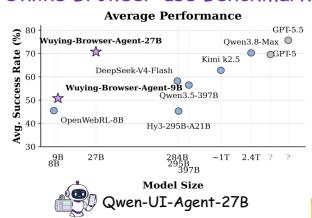

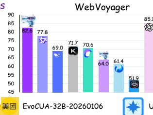

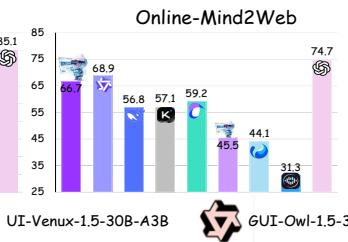  
Hy3-295B-A21B

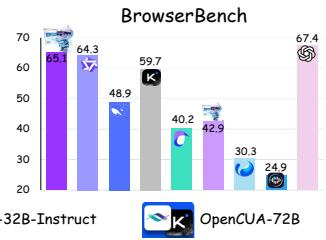

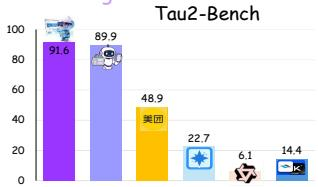

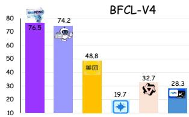

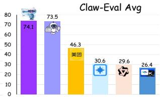

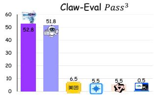  
Figure 1 Performance comparison on online browser-use benchmarks and general agentic benchmarks.

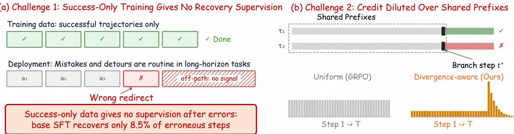

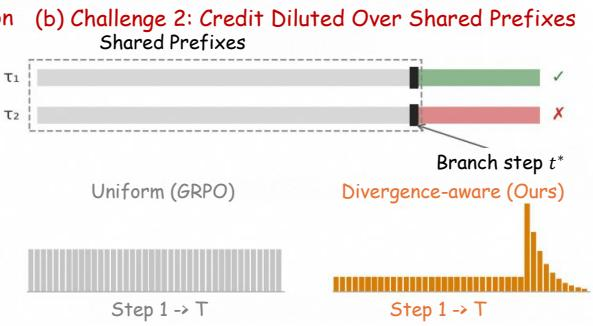

(c) Challenge 3: Bilingual Long-Horizon Real-Web Tasks are Underrepresented
<table><tr><td rowspan=1 colspan=1>Benchmarks</td><td rowspan=1 colspan=1>Online</td><td rowspan=1 colspan=1>Tasks</td><td rowspan=1 colspan=1>Websites</td><td rowspan=1 colspan=1>Language</td><td rowspan=1 colspan=1>Benchmark Evaluation Method</td><td rowspan=1 colspan=1>Long-Horizon Evidence</td></tr><tr><td rowspan=1 colspan=1>WebArena</td><td rowspan=1 colspan=1>X</td><td rowspan=1 colspan=1>812</td><td rowspan=1 colspan=1>5</td><td rowspan=1 colspan=1>English</td><td rowspan=1 colspan=1>Execution-based programmatic verification</td><td rowspan=1 colspan=1>Moderate Horizon (Avg. Step = 10)</td></tr><tr><td rowspan=1 colspan=1>WebVoyager</td><td rowspan=1 colspan=1>√</td><td rowspan=1 colspan=1>643</td><td rowspan=1 colspan=1>15</td><td rowspan=1 colspan=1>English</td><td rowspan=1 colspan=1>LLM-as-a-Judge (GPT-4V)</td><td rowspan=1 colspan=1>Moderate Horizon (Median 8-15 steps)</td></tr><tr><td rowspan=1 colspan=1>Online-Mind2Web</td><td rowspan=1 colspan=1>√</td><td rowspan=1 colspan=1>300</td><td rowspan=1 colspan=1>136</td><td rowspan=1 colspan=1>English</td><td rowspan=1 colspan=1>WebJudge (key screenshot selection)</td><td rowspan=1 colspan=1>Avg. Step = 8.4, 25% Tasks ≥ 11 steps</td></tr><tr><td rowspan=1 colspan=1>Mind2Web 2</td><td rowspan=1 colspan=1>√</td><td rowspan=1 colspan=1>130</td><td rowspan=1 colspan=1>--</td><td rowspan=1 colspan=1>English</td><td rowspan=1 colspan=1>Agent-as-a-Judge</td><td rowspan=1 colspan=1> 50 actions/task</td></tr><tr><td rowspan=1 colspan=1>WebRetriever</td><td rowspan=1 colspan=1>√</td><td rowspan=1 colspan=1>1550</td><td rowspan=1 colspan=1>800</td><td rowspan=1 colspan=1>Chinese + English</td><td rowspan=1 colspan=1>Three-stage protocol</td><td rowspan=1 colspan=1>Not publicly reported</td></tr><tr><td rowspan=1 colspan=1>BrowserBench (Ours)</td><td rowspan=1 colspan=1>了</td><td rowspan=1 colspan=1>350</td><td rowspan=1 colspan=1>254</td><td rowspan=1 colspan=1>Chinese + English</td><td rowspan=1 colspan=1>LLM-as-a-Judge</td><td rowspan=1 colspan=1>Avg. Step = 39.7, Max Step = 100</td></tr></table>

Figure 2 Three structural challenges for browser agents in the long-horizon regime, and our co-designed solution. (a) Training data is dominated by successful trajectories, but real long-horizon execution routinely involves mistakes and detours, leaving recovery and complex-UI behavior weakly supervised. (b) Long browser trajectories often share long prefixes and difer at only a few decisive branch steps, so uniform trajectory-level optimization dilutes the learning signal. (c) Existing benchmarks underrepresent bilingual long-horizon real-web tasks, leaving the deployment regime we target insuficiently evaluated.

## 1 Introduction

Browser agents built on large language models are moving from curated demonstrations toward real deployment, where completing a task means sustaining dozens of decisions against live, changing web pages: aggregating information across multiple sites, filling multi-stage forms with dependent controls, and coordinating cross-tab workflows. Existing training pipelines and benchmarks, however, remain concentrated on short, successful, English-centric interactions. To quantify this mismatch, we construct BrowserBench, a bilingual benchmark of 350 Chinese–English real-web tasks with an average completion length of 37.9 steps. The results are sobering: even the strongest proprietary agent we evaluate fails on roughly one-third of these tasks, and a strong supervised model succeeds on fewer than one in seven tasks whose trajectories exceed 50 steps (Section 7.6.6). Analyzing these failures, we identify three structural challenges that interlock at the long-horizon regime, illustrated in Figure 2.

The first challenge is that browser-agent training data is dominated by successful trajectories exactly in the regime where mistakes become routine (Figure 2(a)). Over a long-horizon real-web task, an agent inevitably encounters unexpected redirects, transient page changes, and complex UI widgets, and must recognize when execution has gone of course and recover toward the goal. Yet training data built only from successful demonstrations provides little supervision on what to do after an error has already occurred. In our analysis, a base supervised model recovers from only 8.5% of detected erroneous steps, and complex controls such as date pickers, cascaders, and rich-text editors appear too sparsely in naturally collected data for scale alone to teach reliable interaction strategies. The gap is therefore not merely a matter of more data, but of missing supervision on recovery and complex UI behavior.

The second challenge follows from the first: once a browser agent makes a mistake and fails to recover promptly, the trajectory becomes longer, while the supervision signal remains confined to the final task outcome (Figure 2(b)). In long browser tasks, many rollouts for the same objective share extended prefixes and difer only at a small number of behaviorally decisive branch steps, so treating the entire trajectory uniformly spreads the learning signal over long shared segments instead of concentrating it on the decisions that actually determine success or failure. The problem is further amplified by the nature of browser state itself: navigation invalidates earlier DOM snapshots, local page changes are better captured as compact updates, and optimizing all steps under a single ever-growing transcript forces the policy to reason over obsolete state while paying the highest token cost exactly where trajectories are longest.

The third challenge is that the evaluation landscape still underrepresents the real-world regime that browser agents must handle in deployment (Figure 2(c)). Existing online benchmarks are overwhelmingly Englishcentric and often emphasize relatively short tasks, leaving long-horizon interactions on diverse real websites insuficiently tested. As a result, even strong agents may appear competitive under current evaluations while failing on the longer, more compositional workflows that dominate realistic use. The Chinese web, despite its scale and deployment relevance, remains almost entirely absent from prior benchmark construction. Without an evaluation suite that explicitly targets long-horizon, bilingual, real-web tasks, progress on robust browser agents cannot be measured reliably in the setting that matters most.

We address these challenges with a unified pipeline in which the execution substrate, supervision, optimization, and evaluation are co-designed for the same long-horizon deployment setting. Underpinning all stages is a structured browser harness layer that exposes a validated browser action interface and maintains eficient decision-oriented execution contexts, providing an identical interface across supervised data construction, online rollouts, and evaluation. To address the first challenge, we propose Reflection and UI-specialized Curriculum SFT (RUIC-SFT), which augments general demonstrations with reflection-rich recovery trajectories and systematically collected complex-UI interaction data under a three-phase curriculum that stabilizes basic operations before strengthening UI interaction and, finally, self-correction. To address the second, we develop Divergence-Aware Online GRPO (DAO-GRPO), a customized online reinforcement learning framework that improves long-horizon optimization under sparse browser feedback by introducing denser progress supervision, emphasizing behaviorally critical decisions, and aligning training with the step-wise decision contexts encountered during execution. To address the third, we construct BrowserBench, a long-horizon bilingual benchmark over real Chinese and English websites, with goal-only instructions and realistic multi-step tasks designed to reflect deployment conditions more faithfully.

Experiments on WebVoyager, Online-Mind2Web, and BrowserBench show that the proposed pipeline yields consistent and interpretable gains. RUIC-SFT improves substantially over positive-only supervision, especially on recovery-related and complex-UI tasks, while DAO-GRPO adds further gains that grow with task dificulty and trajectory length, consistent with its long-horizon design. BrowserBench further exposes capability diferences that are obscured by aggregate scores alone, and qualitative analysis shows the resulting agents detecting erroneous navigation from environment feedback, revising page hypotheses, and recovering within a single episode. At the 27B scale, Wuying-Browser-Agent establishes a new open-source state of the art on browser-use benchmarks, and the same harness-grounded training also transfers to broader tool-use benchmarks including Tau2-Bench, BFCL-v4, and Claw-Eval.

## Our contributions are as follows:

• We identify three interlocking structural challenges in long-horizon browser-agent deployment: training data dominated by successful trajectories but lacking recovery supervision, long trajectories where final-outcome feedback fails to highlight the few decisions that determine success, and an evaluation landscape that underrepresents bilingual long-horizon real-web tasks. We address these challenges jointly through a co-designed pipeline.

• We build a structured browser harness layer, a validated tool space with decision-oriented task-leve state management, that serves as the shared execution substrate across supervised training, online reinforcement learning, and evaluation.

• We propose RUIC-SFT, a curriculum-based supervised initialization that combines reflection-rich recovery supervision with UI-specialized interaction data under a progressive mixing schedule.

• We develop DAO-GRPO, a customized online reinforcement learning framework for long-horizon browser tasks that improves optimization under sparse feedback and concentrates learning on behaviorally

important decisions.

• We construct BrowserBench, a long-horizon bilingual evaluation suite of 350 Chinese–English real-web tasks averaging 37.9 steps, addressing the lack of realistic long-horizon online benchmarks beyond the current English-centric setting.

• We release Wuying-Browser-Agent, a series of open-source browser agents at the 4B, 9B, and 27B scales that establishes a new open-source state of the art on browser benchmarks while retaining strong general tool-use capability.

## 2 Related Work

## 2.1 Browser Agents

Recent advances in browser agents have been driven by stronger foundation models, grounding strategies, and web-specific post-training. General-purpose LLMs [41, 44] and VLMs [3, 36] now provide the backbone for modern browser agents. On the framework side, ReAct [46] has established the reasoning-and-acting paradigm that most browser agents follow, while SeeAct [50] demonstrates that GPT-4V can serve as a generalist web agent when combined with structured grounding, and AutoWebGLM [17] bootstraps a web navigation agent through automated data collection and reinforcement.

A growing body of work trains agents specifically for browser and GUI interaction. UI-TARS [27] and UI-TARS 2 [35] develop native GUI agent models that perceive screenshots directly, while FARA [1], MolmoWeb [10] and ScaleCUA [18] demonstrate that compact models with eficient agentic design or curated demonstrations can achieve strong performance. OpenWebVoyager [12] explores iterative real-world exploration and feedback for building multimodal web agents. Evaluation has broadened from self-hosted environments [52] and static demonstrations [7] toward live-web benchmarks including WebVoyager [11], Online-Mind2Web [43], VisualWebArena [16], and DeepShop [21]. Despite this rapid progress, most existing systems focus on model architecture or training algorithms in isolation, without jointly addressing recovery-oriented data construction, stable long-horizon online optimization, and evaluation in the bilingual real-web setting. Wuying-Browser-Agent bridges this gap through an end-to-end framework where BrowserBench identifies capability-specific weaknesses, RUIC-SFT provides structured SFT initialization, and DAO-GRPO further refines the policy through divergence-aware online reinforcement learning

## 2.2 Computer-Use and Generalist Browser Agents

Beyond browser-specific systems, a parallel line of work develops computer-use agents (CUAs) trained to control general-purpose GUI environments across desktop, web, and mobile platforms, several of which serve as the open-source baselines in our experiments. OpenCUA [37] scales computer-use supervision with large volumes of OS-level interaction data to obtain strong generalist GUI control, while GUI-Owl-1.5 [42] builds unified vision-language agents for cross-platform GUI understanding and action grounding. The UI-Venus family [32] pursues compact mixture-of-experts GUI agents, and EvoCUA [14] shows that multi-turn online RL significantly strengthens computer-use agents’ general tool-use capability. In the same spirit, Qwen-UI-Agent [51] provides a general-purpose agent grounded in UI interaction, and OpenWebRL [45] demonstrates that compact open models become competitive through online multimodal RL on live web pages.

However, most CUA systems are optimized for atomic GUI control or general computer-use ability, and are typically evaluated under relatively short-horizon or single-platform settings. They do not jointly address the three long-horizon challenges targeted in this work: recovery-oriented supervision for error-prone real-web execution, branch-sensitive credit assignment under sparse terminal rewards, and bilingual long-horizon evaluation. Wuying-Browser-Agent complements this line by grounding the policy in a validated browser harness and optimizing it specifically for sustained, real-world web interaction, while retaining competitive general agentic capability.

## 2.3 Agentic Reinforcement Learning

Recent success in outcome-based reinforcement learning for language reasoning [9] has accelerated the use of RL for interactive agents. Methods such as GRPO [28] and DAPO [48] enable critic-free policy optimization through group-relative advantages, while Visual-RFT [19], VLM-R1 [29], and UI-R1 [20] extend reinforcement fine-tuning to multimodal models for visual reasoning, referring expression comprehension, detection and GUI tasks. A two-stage paradigm has therefore become common: supervised fine-tuning provides a stable initialization, and reinforcement learning further improves the policy through task-driven optimization.

For browser agents, static supervision alone is insuficient. Browser tasks are interactive, stateful, and path-dependent, so capabilities such as long-horizon exploration, recovery from intermediate failure, and adaptation to unseen page variations cannot be learned reliably from fixed demonstrations alone. This makes online RL particularly important. WebRL [26] studies curriculum-based online optimization in WebArena, while AgentRL [49], WebAgent-R1 [40], and RAGEN [38] explore multi-turn GRPO-style training and selfevolution in simulated or self-hosted web environments. Moving toward more realistic settings, PAE [53] focuses on autonomous skill discovery, WebGym [2] provides scalable open-web training environments, and OpenWebRL [45] shows that compact 4B models can become competitive through efective warm-starting and online multimodal GRPO.

However, stable online optimization for browser agents remains dificult. One challenge is long-horizon credit assignment under sparse rewards: many rollout steps are shared prefixes that carry little discriminative signal. Another is that browser contexts are not append-only: DOM snapshots may be inserted, replaced, or deleted across navigation steps, so standard sequence-level objectives do not match the information actually available at decision time. Prior work addresses parts of this problem through dense shaping or intermediate supervision. Potential-based reward shaping (PBRS) [22] provides dense rewards while preserving the optimal policy, and process reward models score intermediate steps at substantial annotation cost. DAO-GRPO instead combines PBRS-style dense supervision with an LLM-based divergence detector for branch-sensitive credit assignment, and adopts a response-level objective tailored to dynamically reconstructed browser contexts.

## 2.4 Browser Agent Benchmarks

Existing browser-agent benchmarks difer in realism, coverage, and evaluation protocol. WebArena [52] provides self-hosted tasks with deterministic success criteria, while Mind2Web [7] contributes large-scale demonstrations but relies on ofline HTML snapshots. WebVoyager [11] moves to real websites with LLMbased judgment, and Online-Mind2Web [43] highlights the impact of temporal website changes. More recent benchmarks target specific dimensions, such as long-horizon information gathering [8], shopping [21], and hard information retrieval [39].

Despite this progress, three limitations remain. First, long-horizon tasks are still underrepresented. Second, existing benchmarks are overwhelmingly English-centric, leaving the Chinese web almost entirely unevaluated. Third, website coverage is often narrow; for example, WebVoyager contains 643 tasks from only 15 websites. As a result, current evaluation does not adequately reflect the bilingual, long-horizon, real-web setting targeted in this work.

We address these limitations with BrowserBench, a bilingual long-horizon browser-agent benchmark of 350 realweb tasks averaging 37.9 steps and spanning 254 websites. Each task is normalized into a goal-only instruction paired with a structured success criterion, enabling reliable automated scoring. Cases are further annotated by dificulty and task pattern for capability-level diagnosis beyond a single aggregate score. BrowserBench complements existing benchmarks by extending rigorous evaluation to the long-horizon, bilingual real-web regime so far absent from the literature.

## 3 Preliminaries

## 3.1 Problem Formulation

We formulate browser-agent execution as a partially observable sequential decision-making problem. Given a natural-language task instruction g and an initial browser state, the agent interacts with the browser environment for at most $T _ { \mathrm { m a x } }$ steps. At each step $t ,$ the environment provides an observation $o _ { t } ,$ the agent produces a browser response $y _ { t }$ , and the controller executes a structured action $a _ { t }$ parsed from $y _ { t }$ . The environment then returns feedback $e _ { t }$ and transitions to the next browser state.

Observation space. The primary observation is a structured browser-state representation derived from the current page DOM, denoted by $S _ { t }$ . This representation preserves interactive elements and relevant structural information while removing non-visible or irrelevant content. When DOM information alone is insuficient for grounding—for example, when visual layout, rendered content, or image-based cues are required—the agent additionally receives a viewport screenshot $V _ { t }$ . We therefore define the observation as

$$
o _ { t } = \left\{ \begin{array} { l l } { ( S _ { t } , V _ { t } ) , } & { \mathrm { i f ~ v i s u a l ~ g r o u n d i n g ~ i s ~ r e q u i r e d } , } \\ { S _ { t } , } & { \mathrm { o t h e r w i s e } . } \end{array} \right.\tag{1}
$$

Decision context. The policy does not operate on the current observation alone. Instead, at each step it conditions on a decision context $c _ { t } ,$ reconstructed from the task instruction, the current observation, previous actions, and structured environment feedback. Formally, we write

$$
c _ { t } = \mathcal { R } ( g , \ o _ { t } , \ \{ a _ { u } , e _ { u } \} _ { u < t } ) ,\tag{2}
$$

where $\mathcal { R } ( \cdot )$ denotes the browser-context reconstruction operator. Thus, the policy input at step t may contain: (i) the task instruction, (ii) the current structured browser state $S _ { t }$ , (iii) an optional screenshot $V _ { t }$ when visual grounding is needed, and (iv) retained interaction history in the form of prior actions and environment feedback. This distinction is important because browser-agent contexts are inherently dynamic rather than simple append-only transcripts. Efective execution therefore requires a context management mechanism that keeps the information relevant to the current decision while avoiding unnecessary redundancy.

Action space. The agent acts through a unified structured browser action space spanning navigation, interaction, extraction, file operations, and flow control (detailed in Section 4.1). Each action is parameterized by target elements or values grounded in the current observation. The model generates a browser response $y _ { t }$ , which may contain structured action content and optional intermediate reasoning; the harness then deterministically parses $y _ { t }$ into an executable action $a _ { t }$ in the predefined action vocabulary.

Trajectory and objective. A trajectory is written as

$$
\tau = \{ ( o _ { t } , c _ { t } , y _ { t } , a _ { t } , e _ { t } ) \} _ { t = 1 } ^ { T } ,\tag{3}
$$

where $T \leq T _ { \operatorname* { m a x } }$ is the termination step. Given task instruction $^ { g , }$ the objective is to produce a trajectory whose terminal browser state satisfies the task specification. Task success is determined by an external judge module operating on the final state and interaction log. During execution, the agent does not directly observe task reward and must infer progress from browser observations and environment feedback.

## 3.2 Browser Environment Interface

All browser interactions in this work are executed in Wuying AgentBay [25], a cloud-native sandbox service that provides secure and isolated browser environments for autonomous agent execution. Each task is assigned to an independent browser sandbox hosted in a standardized Linux environment, ensuring consistent execution across parallel runs.

The agent communicates with the sandbox through a lightweight Model Context Protocol (MCP) interface that exposes compact browser primitives for session initialization, state acquisition, action execution, metadata retrieval, and structured output control. In particular, action execution and state-transition retrieval are coupled within a unified environment call, which avoids repeatedly transmitting full browser states and substantially reduces interaction overhead during rollout. This property is especially important for online training, where browser trajectories may contain dozens of decision steps and environment communication can otherwise become a major bottleneck. Additional implementation details are provided in the experimental setup.

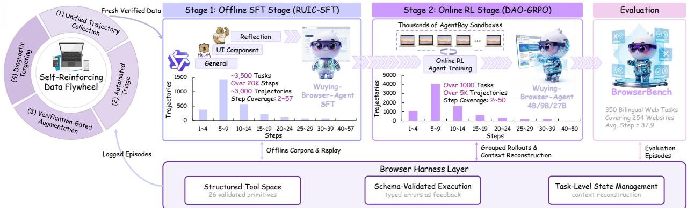  
Figure 3 Overview of the Wuying-Browser-Agent pipeline. A shared browser harness layer supports two-stage policy training, with RUIC-SFT learning from around 3K curated trajectories and DAO-GRPO refining the policy through over 5K live-web rollouts. BrowserBench provides bilingual long-horizon evaluation, while a self-reinforcing data flywheel feeds verified interaction outcomes back into subsequent training.

Table 1 Browser Agent Action Space. We define a structured browser action space with 24 atomic operations used in both SFT and online RL training. Actions are organized into five functional categories, including navigation, interaction, extraction, file operations, and flow control.  
Category Representative Actions   
Navigation go\_to\_url, search, go\_back, switch\_tab, close\_tab   
Interaction click, hover, input, scroll, select\_dropdown, drag, set\_slider, upload, send\_keys   
Extraction extract, screenshot, save\_pdf, eval\_javascript   
File Operations read file, write file   
Flow Control update\_plan, load\_skill, wait, done

## 4 Method

Our method is designed to close the robustness gap identified in the introduction: browser agents trained mainly on successful trajectories remain brittle when they must recover from mistakes, interact with complex UI controls, and make correct decisions over long, changing web interactions. Figure 3 provides an overview of the full Wuying-Browser-Agent pipeline. At its core, the policy is trained in two stages. The first stage, Reflection and UI-Specialized Curriculum SFT (RUIC-SFT), provides a robustness-oriented supervised initialization. The second stage, Divergence-Aware Online GRPO (DAO-GRPO), further improves the same policy through online interaction, focusing optimization on branch-defining decisions under dynamically reconstructed browser contexts.

Both stages, together with evaluation, run on the browser harness layer described in Section 4.1, which provides the structured tool space, schema-validated execution, and decision-oriented context management shared across ofline supervised learning and online policy refinement. To reduce observation noise and token cost, the harness applies an optimized DOM simplification pipeline that preserves decision-relevant interactive elements instead of serializing full raw DOM trees. We first present the harness layer, then describe RUIC-SFT and DAO-GRPO.

## 4.1 Browser Harness Layer

Long-horizon browser interaction requires more than a strong policy: model outputs must be parsed, validated, and executed reliably against live pages, and the context fed back to the model must remain faithful to the current task state. We therefore build a browser harness layer above the underlying policy model. The harness serves as the execution substrate that connects model outputs to the browser environment, and it is shared by both RUIC-SFT and DAO-GRPO.

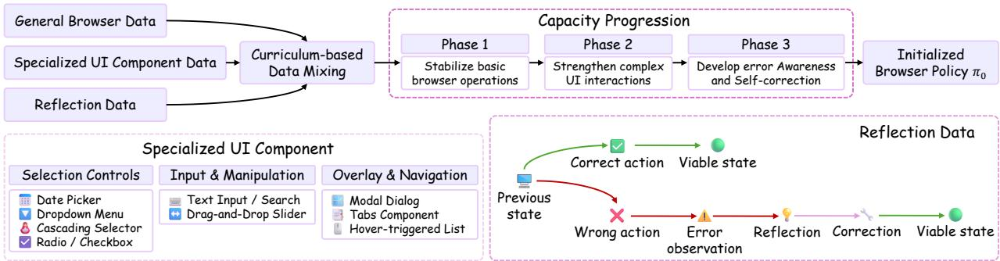  
Figure 4 Piecewise linear annealing schedule for dataset mixing in RUIC-SFT. Training begins with a generaldata-dominant distribution to stabilize basic browser operations, gradually increases the proportion of specialized UI component data to strengthen complex interaction skills, and introduces reflection data only in the late stage to cultivate self-correction without destabilizing the execution prior.

## 4.1.1 Structured Tool Space

The harness exposes a structured browser action space with 24 atomic operations, summarized in Table 1. These actions span five functional categories, including navigation, interaction, extraction, file handling, and flow control. At each interaction step, the model emits a structured action over this tool space as its browser response yt.

## 4.1.2 Structured Execution and Feedback

The harness parses each emitted call, validates its schema and parameters against the tool definitions, dispatches it to the corresponding executor in the AgentBay sandbox (Section 3.2), and returns structured feedback $e _ { t }$ together with the updated browser observation $o _ { t + 1 }$ . Invalid calls are rejected with typed error messages that re-enter the context as feedback, allowing the policy to detect and correct its own malformed outputs rather than failing silently. This establishes a tightly coupled interaction process in which perception, decision, execution, and state update remain linked at every step.

## 4.1.3 Task-Level State Management

A key function of the harness is task-level state management. Rather than exposing the model to an evergrowing raw interaction transcript, the harness maintains an eficient decision-oriented context that keeps the most relevant task state, action history, and environment feedback available at each step. It also manages intermediate artifacts such as extracted content and temporary files, enabling cross-step memory and result delivery for tasks whose outcome is a file or an aggregated report. Because this shared harness abstraction is used consistently in RUIC-SFT data construction, online RL rollouts, and evaluation, the policy experiences an identical interface across ofline learning, online interaction, and deployment, allowing direct transfer between stages. More broadly, this design trains the policy to operate over a schema-constrained tool interface with explicit state tracking and feedback grounding, which helps preserve transfer to more general agentic settings beyond browser-specific benchmarks.

## 4.2 Reflection and UI-specialized Curriculum SFT (RUIC-SFT)

The goal of the supervised stage is not merely to imitate successful browser behavior, but to provide a robustness-oriented initialization for realistic web interaction. In particular, we target two forms of supervision that are systematically missing from conventional positive-only browser demonstrations: recovery after oftrajectory errors and reliable interaction with underrepresented complex UI controls. To address these gaps, we construct two specialized data sources in addition to general browser task data: a reflection dataset for error detection and recovery, and a specialized UI dataset for complex control manipulation. We integrate them through Reflection and UI-specialized Curriculum SFT (RUIC-SFT).

## 4.2.1 Why Successful Demonstrations Alone Are Insufficient

Simply increasing the volume of generic browser trajectories [7, 52] is unlikely to resolve either deficiency. General successful demonstrations teach the model how to act correctly when execution remains on the intended path, but provide little supervision on what should happen after the model has already deviated from that path. Likewise, complex UI widgets appear only sparsely in naturally collected browser trajectories, with heavily skewed type distributions, making it dificult for scale alone to induce robust interaction policies. In other words, the missing supervision is structural rather than merely quantitative. The reflection dataset explicitly exposes the model to trajectories with an error–awareness–reflection–correction structure, while the specialized UI dataset systematically concentrates training on interaction patterns that are under-represented in general web data.

From a learning perspective, the two datasets provide complementary supervision. The specialized UI dataset reduces uncertainty in action selection over complex controls by repeatedly exposing the model to structured interaction patterns for dificult widgets. The reflection dataset, in contrast, provides supervision specifically for of-trajectory recovery, which is largely absent from successful demonstrations alone. Together, they improve not only the probability of executing a dificult task correctly on the first attempt, but also the model’s ability to recover when deviations still occur.

## 4.2.2 Reflection Dataset

Each reflection example is organized around an erroneous step t∗. In addition to the task context and the incorrect action itself, the example records the resulting error observation, a natural-language reflection explaining why the action was inappropriate under the current page state, and a correction strategy consisting of actions that return the agent to a viable execution path. The dataset covers a broad range of common browser-agent failure patterns, including navigation mistakes, interaction errors, state misinterpretation, and inefective repeated behavior. All correction strategies are executed in a sandbox environment to verify that they genuinely recover the task.

Reflection examples are collected through a combination of automated mining and human-in-the-loop curation. Failed trajectories generated during bootstrapping are analyzed to localize likely error segments, after which annotators provide reflection reasoning and corrective continuations. We further expand coverage by constructing additional recovery examples around underrepresented failure patterns and by preserving matched successful and unsuccessful interaction traces when useful for future preference-based training.

Data quality is controlled through a combination of execution verification, annotation review, and distributional monitoring. In particular, reflection reasoning must be grounded in concrete state transitions, and correction sequences must be executable and demonstrably useful in restoring a viable task path.

As a result, the reflection dataset does not merely expose the model to failed trajectories; it teaches the policy to treat unexpected observations as evidence of possible of-path execution and to generate grounded corrective continuations, which are central to robust browser deployment.

## 4.2.3 Specialized UI Component Dataset

Modern web applications widely employ complex UI controls whose interaction patterns difer substantially from those of ordinary text inputs and buttons. Examples include date pickers that require hierarchical year–month–day selection, cascaders that rely on progressive expansion and linked confirmation, and rich-text editors involving multi-step toolbar interactions. These controls are often implemented diferently across frontend frameworks and websites, so sparse natural exposure is insuficient for the model to internalize reliable interaction strategies. This creates a systematic capability bottleneck in browser-agent deployment.

To address this issue, we construct a specialized UI component dataset through a four-stage pipeline. We first collect component scenes from real websites and establish mappings among component type, website, page, and concrete control instance using a combination of automated DOM-structure scanning and manual verification. We then design parameterized interaction tasks for each control type with progressively increasing dificulty, ranging from simple single-step selection tasks to compound operations and edge cases involving invalid inputs or exceptional control states. Next, human annotators operate the real controls and record action sequences, key operation nodes, and control state transitions such as panel expansion, highlighting changes, and linked updates. Finally, we augment the dataset through cross-website transfer of interaction strategies, generation of equivalent action-sequence variants, and injection of anomalous states such as loading delays, disabled controls, and validation failures. These anomalous UI states also create a natural bridge to the reflection dataset, allowing the two supervision sources to reinforce one another.

This concentrated supervision reduces the reliance on sparse natural exposure and equips the policy with reusable interaction patterns for UI structures that frequently trigger failures in real deployment.

## 4.2.4 Curriculum-Based Training Schedule

Figure 4 provides an overview of the three data sources and their curriculum-based integration. Rather than training sequentially on each data source or using a fixed mixture from the beginning, we adopt a curriculum-based mixed training strategy with progressive ratio annealing [5]. The capability dependencies in browser-agent learning suggest a natural order: the model should first stabilize basic browser actions, then strengthen its ability to manipulate specialized UI components, and only afterward emphasize self-correction behavior. At the same time, purely sequential training risks catastrophic forgetting, especially when late-stage reflection-heavy training shifts the model toward overly cautious behavior. We therefore combine curriculum learning with progressive mixture control.

Let $D _ { g } , D _ { u } ,$ , and $D _ { r }$ denote the general browser task dataset, the specialized UI component dataset, and the reflection dataset, respectively. Rather than using a fixed mixture throughout training, we adopt a dynamic mixing strategy that changes over the course of training. As illustrated in Figure 4, training begins with a general-data-dominant distribution to stabilize basic browser operations, gradually increases the proportion of specialized UI data to strengthen complex interaction skills, and introduces reflection data only in the later stage to cultivate self-correction without destabilizing the execution prior. The transition schedule is selected based on validation behavior.

The three phases serve distinct purposes. Phase 1 is dominated by general browser trajectories, with a small amount of UI-specialized exposure, and is primarily used to stabilize foundational capabilities such as navigation, element grounding, clicking, typing, and action formatting. Phase 2 gradually shifts emphasis toward complex component interaction while retaining suficient general data to preserve the browser-operation prior acquired in Phase 1. Phase 3 introduces reflection data while annealing the UI-specialized proportion to a lower level. This delayed introduction of $D _ { r }$ is deliberate: preliminary experiments showed that introducing reflection supervision before the execution policy had stabilized led to overly conservative behavior, with the agent becoming excessively prone to backtracking and over-explaining even on straightforward tasks. By introducing reflection only after the execution prior and UI interaction skills have been suficiently strengthened, we obtain a more balanced model that can both act decisively and recover when necessary. The phase boundaries and endpoint ratios are determined from preliminary tuning; Section 7.6 compares this schedule against fixed-ratio mixing and an aggressive early-reflection variant.

## 4.2.5 Training Objective

Under this schedule, the learning objective remains the standard supervised next-token prediction loss, with the efective training distribution changing over time:

$$
\begin{array} { r } { \mathcal { L } _ { \mathrm { S F T } } ( \theta ) = \mathbb { E } _ { ( x , y ) \sim p _ { g } ( \lambda ) D _ { g } + p _ { u } ( \lambda ) D _ { u } + p _ { r } ( \lambda ) D _ { r } } \left[ - \log P _ { \theta } ( y \mid x ) \right] . } \end{array}\tag{4}
$$

The curriculum is therefore realized through dynamic sampling rather than by changing the optimization objective itself. This allows us to retain the optimization stability of conventional SFT while altering the efective supervision distribution in a capability-aware manner.

From a functional perspective, the three data sources contribute distinct but complementary signals. General data $D _ { g }$ provides the foundational prior for standard browser operation. Specialized UI data $D _ { u }$ improves recognition and manipulation of complex controls whose interaction logic cannot be reliably inferred from sparse natural coverage. Reflection data $D _ { r }$ teaches the model to interpret unexpected observations as evidence of possible failure, attribute the error to plausible preceding actions, and generate corrective continuations. Because these capabilities are introduced through a progressively annealed mixture rather than abrupt dataset switching, the resulting model is less prone to forgetting previously acquired behavior and better able to balance direct task execution with recovery behavior.

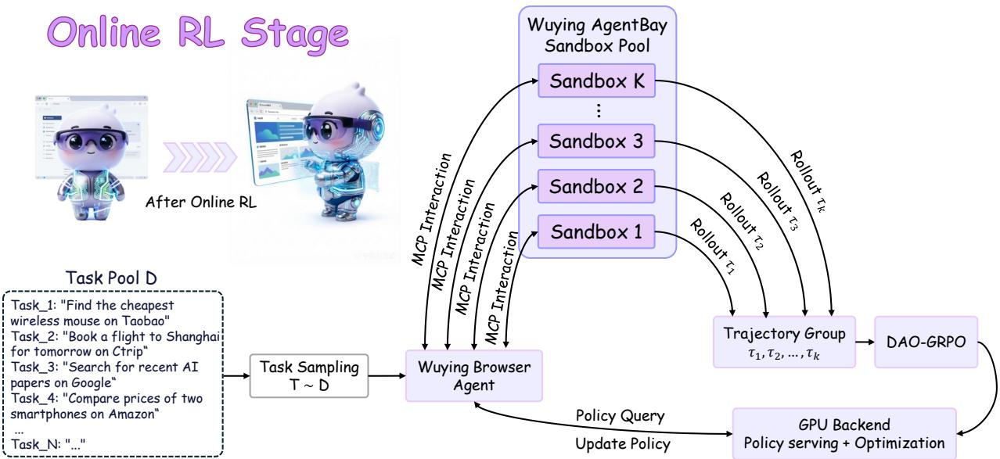  
Figure 5 System overview of the online reinforcement learning stage. A task is sampled from the task pool D and assigned to the browser agent controller, which interacts with multiple AgentBay sandboxes in parallel. Each sandbox produces one rollout trajectory, and the resulting trajectory group is consumed by the DAO-GRPO optimization module. The same GPU backend supports both policy serving during rollout and parameter updates during online optimization.

In summary, RUIC-SFT provides a capability-structured initialization that extends beyond behavioral cloning to establish a structured credit prior for subsequent online optimization. By explicitly annotating step-level error-recovery pairs, the reflection dataset supplies dense pseudo-labels for what would otherwise be sparse terminal rewards in long-horizon tasks. Consequently, DAO-GRPO initializes from a policy with inherent causal attribution capability, allowing online RL to concentrate its optimization budget on refining branchdefining decisions rather than discovering recovery primitives from scratch. This structured handof motivates the divergence-aware online refinement stage described next.

## 4.3 Divergence-Aware Online GRPO (DAO-GRPO)

Starting from the robustness-oriented initialization learned by RUIC-SFT, we further optimize the same browser policy through direct interaction with live browser environments. This online stage is necessary because ofline supervision alone cannot fully optimize robust browser behavior: in realistic web tasks, success often depends on a small number of branch-defining decisions made under sparse feedback and dynamically changing contexts. We therefore develop Divergence-Aware Online GRPO (DAO-GRPO), an online policy optimization framework designed to refine long-horizon robustness under real browser interaction.

Our online RL stage is designed to address three structural dificulties in browser learning: sparse terminal rewards, long trajectories in which only a few decisions are truly outcome-defining, and the dynamic nature of browser context across interaction steps. Rather than relying on a generic trajectory-level objective, we use a browser-tailored optimization strategy that provides denser supervision, emphasizes critical decisions, and better matches the step-wise decision process encountered during execution.

## 4.3.1 Online Optimization Overview

DAO-GRPO is built around a simple principle: online learning should optimize the browser policy using the same branching structure and step-specific context under which the agent actually acts. Figure 5 illustrates the system-level interaction loop of online optimization. For each sampled task $d \sim \mathcal { D }$ , the current policy πθ is served by the browser agent controller and interacts with multiple AgentBay browser-use sandbox instances in parallel. Each sandbox executes one browser rollout, producing a trajectory, and the resulting trajectory group is consumed by the DAO-GRPO optimizer for policy updates. The same lightweight browser interface introduced in Section 3.2 is used during rollout, enabling eficient interaction without repeatedly serializing full browser states.

For each sampled task, DAO-GRPO generates a grouped rollout

$$
\{ \tau _ { 1 } , \tau _ { 2 } , \dots , \tau _ { K } \} ,
$$

where each trajectory $\tau _ { i }$ contains a sequence of step-specific decision contexts, policy responses, executable browser actions, and environment feedback. At step t, the reconstructed decision context $c _ { i , t }$ may include the task instruction, the current structured browser state $S _ { i , t } .$ , an optional screenshot $V _ { i , t }$ t when visual grounding is required, and the retained interaction history consisting of previous actions and environment feedback. For optimization, DAO-GRPO combines three quantities: a trajectory-level relative advantage $A _ { i }$ estimated within the group, a step-level credit weight $w _ { i , t }$ derived from cross-trajectory divergence analysis, and the step-specific decision context $c _ { i , t }$ reconstructed by the harness. These are fused into a weighted response-level policy objective.

## 4.3.2 Grouped Return Estimation

A first challenge in online browser learning is that task-level success provides only sparse supervision, while robust long-horizon behavior depends on intermediate progress signals. We therefore combine terminal judgment with potential-based reward shaping (PBRS), which provably preserves the optimal policy in the discounted infinite-horizon setting [22]; our finite-horizon grouped variant inherits this only as a practical approximation. Empirically, adding shaping improves the terminal success rate itself rather than merely inflating shaped returns (Table 5), indicating that the potential signal guides rather than hijacks learning.

For each trajectory $\tau _ { i } ,$ we obtain a terminal reward $R _ { i } ^ { \mathrm { t e r m } } \in \{ 0 , 1 \}$ indicating whether the terminal browser state satisfies the task specification. To densify this sparse signal, we augment it with a potential-based shaping term $r _ { i , t } ^ { \mathrm { s h a p e } } = \gamma \Phi ( s _ { i , t + 1 } ) - \Phi ( s _ { i , t } )$ , where $\Phi ( \cdot )$ is a task-conditioned progress estimator and $\gamma$ is a discount factor. The boundary condition $\Phi ( s _ { T _ { i } } ) = 0$ ensures that shaping does not alter the terminal success criterion. The resulting trajectory return combines both signals:

$$
R _ { i } = R _ { i } ^ { \mathrm { t e r m } } + \sum _ { t = 1 } ^ { T _ { i } - 1 } r _ { i , t } ^ { \mathrm { s h a p e } } .\tag{5}
$$

Since trajectories are generated in groups for the same task, we normalize returns within each rollout group to obtain a trajectory-level relative advantage:

$$
A _ { i } = \frac { R _ { i } - \mu _ { R } } { \sigma _ { R } + \epsilon } ,\tag{6}
$$

where $\mu _ { R }$ and $\sigma _ { R }$ are the group mean and standard deviation. This grouped normalization yields a taskmatched preference signal that is less sensitive to reward-scale variation across tasks. Groups in which all trajectories receive identical returns are discarded, as they carry no relative optimization signal.

## 4.3.3 Divergence-Aware Step Credit Assignment

A second challenge is that robust browser execution often hinges on a small number of branch-defining decisions: multiple trajectories may share a long common prefix, yet diverge sharply once the agent chooses an incorrect page, element, or action sequence. Uniform trajectory-level weighting therefore fails to focus learning on the decisions that most strongly determine whether execution stays on path or deviates further.

To address this issue, DAO-GRPO estimates step importance from semantic divergences within each trajectory group. Given the $K$ trajectories sampled for the same task, an LLM-based divergence estimator compares them step by step and identifies branch points at which relatively successful and unsuccessful trajectories first difer in a behaviorally meaningful way. For each detected divergence, the estimator outputs (1) a divergence step index $t ^ { * } .$ , (2) a criticality score $c ^ { * } \in [ 0 , 1 ]$ , and (3) a partition of trajectories into a favorable branch $B ^ { + }$ and an unfavorable branch $B ^ { - }$

We emphasize that the divergence estimator is used as a semantic credit prior rather than as an exact oracle. The direction of optimization is still determined by the trajectory-level advantage $A _ { i }$ in Eq. (6); divergence estimation only redistributes update magnitude across steps.

For trajectory $\tau _ { i }$ and step t, we define the step credit weight as:

$$
w _ { i , t } = \left\{ \begin{array} { l l } { \alpha _ { \mathrm { s h a r e d } } , } & { t < t ^ { * } , } \\ { \alpha _ { \mathrm { d i v } } \cdot c ^ { * } , } & { t = t ^ { * } , } \\ { w _ { i , t ^ { * } } \left( \delta ^ { + } \right) ^ { t - t ^ { * } } , } & { t > t ^ { * } \mathrm { ~ a n d ~ } \tau _ { i } \in \mathcal { B } ^ { + } , } \\ { w _ { i , t ^ { * } } \left( \delta ^ { - } \right) ^ { t - t ^ { * } } , } & { t > t ^ { * } \mathrm { ~ a n d ~ } \tau _ { i } \in \mathcal { B } ^ { - } , } \end{array} \right.\tag{7}
$$

where $\alpha _ { \mathrm { s h a r e d } }$ and $\alpha _ { \mathrm { d i v } }$ are scaling constants, and $\delta ^ { + } , \delta ^ { - } \in ( 0 , 1 )$ are asymmetric decay factors satisfying $\delta ^ { + } > \delta ^ { - }$ . Shared-prefix steps receive a smaller base weight because they contribute little to distinguishing successful from unsuccessful branches. The divergence step receives an emphasized weight modulated by the estimated criticality score, and post-divergence steps on favorable branches retain credit longer than those on unfavorable branches. The specific values of these hyperparameters are tuned on the validation set and omitted here to encourage adaptation to diferent browser environments.

In practice, the resulting step weights are normalized to maintain stable optimization across trajectories of diferent lengths. Overall, this mechanism acts as a robustness-oriented credit prior: it does not change which trajectories are preferred globally, but sharpens where the learning signal is concentrated within them.

## 4.3.4 Response-Level Policy Optimization

A third challenge is a train–test mismatch in browser-policy optimization. During real interaction, the agent acts under a step-specific context that is dynamically reconstructed from the current page state, retained history, and optional visual evidence. If training instead optimizes all responses under a single concatenated trajectory transcript, the policy is updated under contexts that difer from those actually available at decision time.

Unlike standard GRPO, which assumes an append-only context and optimizes over full trajectory likelihoods, DAO-GRPO decouples context reconstruction from advantage estimation: the group-relative advantage $A _ { i }$ retains GRPO’s variance-reduction benefit, while each log πθ $\left( y _ { i , t } \mid c _ { i , t } \right)$ is evaluated under the exact information set available at decision time. We perform a single on-policy update per rollout batch, so no importance correction is required.

The trajectory-level preference signal and the step-level credit signal are combined into a weighted training target for each step. In this way, optimization is concentrated on semantically decisive branch steps rather than diluted across long shared prefixes.

Each step-specific context $c _ { i , t }$ is produced by the harness state manager (Section 4.1): DAO-GRPO replays the interaction log through the same reconstruction rules used at online inference, so that log $\pi _ { \theta } ( y _ { i , t } \mid c _ { i , t } )$ is evaluated under exactly the information set available at decision time.

In browser interaction, the information available to the policy at each step is determined by the current page state together with the relevant retained history, rather than by a naively concatenated transcript of everything that has happened before. Training should therefore follow the same context organization used at inference time. Otherwise, the policy may be optimized under contexts that are unnecessarily verbose, partially outdated, or inconsistent with the actual online decision process.

For this reason, our online RL stage optimizes each model response under the step-specific decision context actually available at that point in the interaction, while regularizing the policy against excessive drift from the supervised initialization. This can be interpreted as an advantage-weighted policy update under dynamically managed browser contexts, rather than imitation over a single fixed trajectory transcript.

In practice, each $c _ { i , t }$ is reconstructed by replaying the interaction log up to step t using the same state replacement and dif-appending rules as in online inference. When visual grounding is unnecessary, the screenshot block is simply omitted from the reconstructed context. As a consequence, non-critical steps receive only weak update strength, while semantically decisive branch steps dominate the optimization signal.

The updated policy is then used in the next round of grouped parallel rollout. This design aligns optimization more closely with the actual online inference condition, reducing context mismatch and improving robustness to changing browser states.

## 5 BrowserBench: A Bilingual Long-Horizon Real-Web Benchmark

To evaluate browser agents in the deployment regime targeted by this work, we construct BrowserBench, a bilingual long-horizon real-web benchmark. Existing browser-agent benchmarks are still predominantly English-centric and often concentrate on relatively short interactions, leaving sustained multi-step browsing over realistic Chinese–English websites insuficiently evaluated. BrowserBench is designed to fill this gap, and an overview is shown in Figure 6. It contains 350 real-web tasks spanning 254 websites in Chinese and English.

The benchmark covers a broad range of realistic domains, including e-commerce, rankings and comparisons, data collection, maps and travel, organization verification, academic search, general search, and news browsing. In language distribution, BrowserBench includes 191 Chinese tasks (54.6%) and 159 English tasks (45.4%). In horizon, it is explicitly long-horizon: the average completion length is 37.9 interaction steps, with a minimum of 15 and a maximum of 100. Chinese tasks are longer on average than English ones (41.13 vs. 34.08 steps), further reflecting the complexity of the targeted real-world setting.

## 5.1 Benchmark Construction and Curation

BrowserBench is built from authentic browser-use scenarios rather than synthetic templates. Candidate tasks are collected from real Chinese and English websites and retained only when they require meaningful multistep interaction, such as cross-page navigation, comparison across multiple sources, structured information extraction, or task completion under changing browser context.

A key design principle of BrowserBench is that long-horizon tasks should reflect executable real-web interactions rather than abstract templates. We therefore curate tasks directly from realistic browsing scenarios, normalize them into goal-oriented instructions paired with structured success criteria, and verify them through manual review and repeated browser execution before release.

To improve evaluation realism and interpretability, benchmark construction follows a strict curation process. We remove cases with excessive procedural leakage, ambiguous goals, unsupported entities, or stale page structures, so that benchmark failures are more likely to reflect model limitations rather than annotation noise or environment mismatch. All retained tasks are manually verified for executability, textual quality, and alignment between the task goal and the actual browser environment.

This curation process makes benchmark failures more informative: when an agent fails on BrowserBench, the failure is more likely to reflect weakness in planning, grounding, long-horizon interaction, or recovery, rather than noise in the benchmark itself.

## 5.2 Task Taxonomy and Dataset Statistics

BrowserBench covers eight task categories that reflect common patterns in real-world browser use:

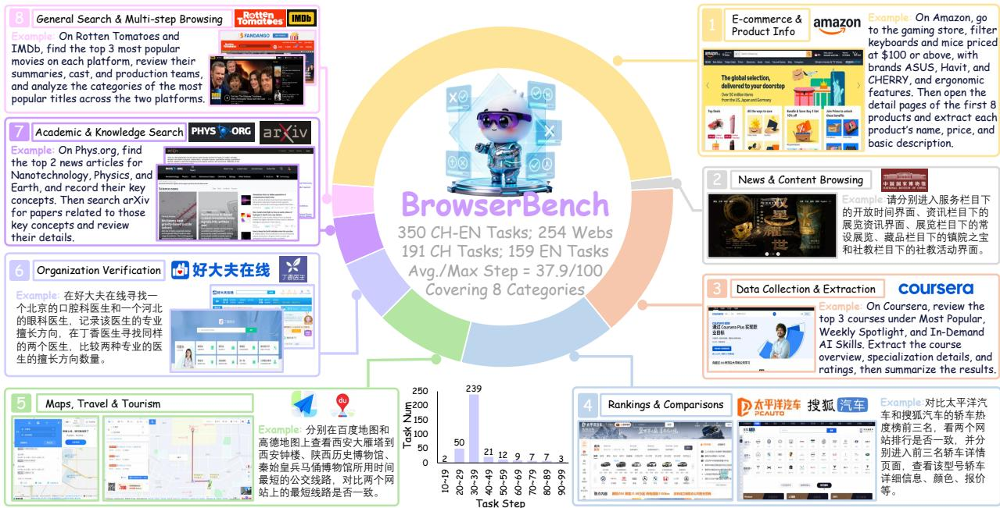  
Figure 6 Overview of BrowserBench. BrowserBench contains 350 bilingual real-web tasks spanning 254 websites, with an average completion length of 37.9 steps. The benchmark covers eight task categories across Chinese and English websites, and each case is normalized into a goal-only instruction paired with a structured success criterion, enabling reliable Pass@1 evaluation of long-horizon browser agents.

• E-commerce and product information: 164 tasks (46.9%), including 98 Chinese and 66 English tasks.

• Rankings and comparison: 52 tasks (14.9%), including 34 Chinese and 18 English tasks.

• Data collection and batch extraction: 52 tasks (14.9%), including 16 Chinese and 36 English tasks.

• Maps, travel, and tourism: 30 tasks (8.6%), including 18 Chinese and 12 English tasks.

• Organization verification: 21 tasks (6.0%), including 13 Chinese and 8 English tasks.

• Academic and knowledge search: 16 tasks (4.6%), including 6 Chinese and 10 English tasks.

• General search and multi-step browsing: 11 tasks (3.1%), including 4 Chinese and 7 English tasks.

• News and content browsing: 4 tasks (1.1%), including 2 Chinese and 2 English tasks.

Each task is additionally labeled with a dificulty level. Rather than relying on subjective annotation, dificulty is calibrated by empirical solvability: each task is attempted by three reference agents of distinct capability tiers, none from the Qwen3.5 family used by our own models. Tasks solved by at least two calibrators are labeled easy, tasks solved by exactly one are medium, and tasks solved by none are hard, followed by human review of boundary cases. The resulting distribution is 105 easy (30%), 140 medium (40%), and 105 hard (30%) tasks; the hard share exceeds that of Online-Mind2Web (26.3%), giving BrowserBench greater discriminative power at the dificulty ceiling. We further verify that the dificulty split is balanced across the two languages and that average completion length increases monotonically from easy to hard, so dificulty is not a proxy for either language or length alone.

This taxonomy enables analysis beyond a single aggregate benchmark score. It provides interpretable slices over diferent real-web task structures and language settings, allowing us to examine whether a browser agent generalizes across not only websites, but also task patterns that difer substantially in planning, interaction, and extraction demands.

In addition to language and category coverage, BrowserBench is distinguished by its horizon distribution. The mean task length is 37.9 steps across the full benchmark, substantially longer than conventional short-browser benchmarks. Chinese tasks are on average more demanding than English tasks, and the benchmark includes trajectories up to 100 steps, making it suitable for studying precisely the long-horizon regime in which deviations, detours, and recovery become routine.

## 5.3 Evaluation Protocol and Metric

All BrowserBench evaluations follow a strict goal-only protocol: the agent receives only the normalized task instruction, with no auxiliary procedural guidance or hidden intermediate hints. A run is counted as successful only if the agent satisfies the corresponding structured success criterion within a single rollout. All runs use a maximum budget of 100 interaction steps; tasks not completed within the budget are counted as failures, reflecting the bounded interaction cost of realistic deployment.

We adopt Pass@1 Success Rate (SR) as the benchmark metric. Because each task is evaluated with exactly one rollout, Pass@1 is equivalent to single-rollout success rate. Let C denote the full set of benchmark cases. The overall benchmark score is defined as

$$
\mathrm { S R } _ { \mathrm { t o t a l } } = \frac { 1 } { | \mathcal { C } | } \sum _ { c \in \mathcal { C } } \mathbf { 1 } \{ \mathrm { s u c c e s s } ( c ) \} ,\tag{8}
$$

where 1{success(c)} equals 1 if the agent successfully completes case c and 0 otherwise.

We use Pass@1 Success Rate because realistic browser deployment requires reliable execution within a single trajectory rather than repeated sampling until success. This makes BrowserBench particularly suitable for measuring the robustness of long-horizon browser agents under realistic interaction constraints.

Overall, BrowserBench complements existing benchmarks by explicitly targeting the bilingual, long-horizon, real-web regime that remains underrepresented in current browser-agent research.

## 6 A Self-Reinforcing Data Flywheel

As illustrated in Figure 3, the training pipeline is embedded in a broader self-reinforcing data flywheel. The components introduced above are not merely a one-shot training recipe; together with the harness and BrowserBench, they form a closed data loop in which each round of deployment produces the supervision for the next. This property matters in the browser domain specifically: live websites change continuously, so any fixed demonstration corpus depreciates over time, and sustained capability requires a pipeline that converts ongoing interaction, including failed interaction, into fresh, verified training signal.

The flywheel operates in four stages. (1) Unified trajectory collection. Because SFT data construction, online rollouts, and evaluation all run on the same harness (Section 4.1), every executed episode—whether from DAO-GRPO training, benchmark evaluation, or deployment—is logged in an identical, training-ready format with structured actions, feedback, and reconstructed contexts. (2) Automated triage. A step-level judge first separates genuine model failures from environment-induced ones such as transient pages or unreachable sites, routing the latter to task-pool maintenance rather than training; it then classifies the remainder: successful episodes become candidate general demonstrations for $D _ { g }$ , failed episodes with a localizable erroneous step become reflection candidates, and failures concentrated on specific widgets are routed to the UI-component pipeline as new $D _ { u }$ scenes. In this way the loop recovers training signal from failed trajectories rather than discarding them. (3) Verification-gated augmentation. Candidate corrections are re-executed in the sandbox, and only strategies that verifiably restore the task to a viable path enter Dr (Section 4.2.2); this gate prevents the loop from amplifying its own mistakes, a failure mode commonly observed in unverified self-training. (4) Diagnostic targeting. Error-category statistics from triage and tag-wise BrowserBench results are aggregated into a prioritized set of capability targets, which steer both task synthesis for the online pool D and data collection for the next SFT round, closing the loop from evaluation back to supervision.

The loop is automated where verification is cheap and human where judgment is scarce: trajectory logging, triage, and correction re-execution run without supervision, while humans author reflection reasoning, annotate complex-UI interactions, and audit borderline judge decisions. Evaluation signals are likewise split by their cost–precision profile: deterministic structured criteria where reproducibility matters (BrowserBench scoring), and a routed LLM judge where throughput matters (reward estimation over thousands of online rollouts).

In this work we instantiate the bootstrapping cycle of this flywheel: an initial supervised model trained on general demonstrations only (Base SFT in Table 4) bootstraps roughly 3,000 rollout trajectories, from which about 420 verified reflection examples and 130 UI-component scenes are distilled and folded into the training mixture of the released models; diagnostic slices from an early BrowserBench snapshot guided the composition of the online task pool.

Because triage and correction re-execution are automated, each additional cycle requires only sandbox compute and lightweight human auditing rather than proportional annotation efort. We view sustained multi-cycle operation of this flywheel, including preference-based training over the accumulated contrastive pairs, as the primary mechanism for keeping Wuying-Browser-Agent aligned with the evolving web.

## 7 Experiments

## 7.1 Training Settings

SFT. We initialize the browser policy with RUIC-SFT. Starting from Qwen3.5 series models, we fine-tune for two epochs using LoRA [13] with rank 16, scaling factor α = 64, and all linear layers as target modules. Optimization uses a cosine learning-rate schedule with a peak learning rate of $5 \times 1 0 ^ { - 5 }$ and a 10% linear warmup. Training is conducted on a multi-GPU cluster with sequence parallelism enabled to accommodate long browser trajectories.

Online RL. We further optimize the policy with DAO-GRPO using parameter-eficient LoRA adaptation (rank 8, α = 16, target modules: all linear layers). Online training runs against a large-scale AgentBay sandbox pool orchestrated by an asynchronous rollout scheduler: tasks are dispatched in batches, rolled out in parallel across isolated sandboxes, and streamed back to the optimizer upon completion. Sandboxes are recycled after each episode to guarantee state isolation. The reward combines format-validity checks with an LLM-as-a-judge success signal; a routed evaluation strategy keeps judging cost tractable at scale. Trajectories that terminate abnormally or become unreachable are masked out by setting their advantages to zero. Each rollout trajectory is capped at 50 interaction steps as a throughput–coverage trade-of for online training rather than a deployment horizon limit: tasks exceeding this cap are truncated with the last observed state treated as non-terminal, retaining accumulated shaping progress as a learning signal. Evaluation always uses the full 100-step budget (Section 5.3). Training proceeds with trajectory-level dynamic sampling on the held-out validation set, discarding degenerate groups with identical returns at each update.

## 7.2 Evaluation Benchmarks

We evaluate Wuying-Browser-Agent on two groups of benchmarks covering browser-use capability and general agentic capability. For fair comparison, all evaluated models interact with web pages through the same harness, tool space, and observation pipeline; performance diferences therefore reflect policy capability rather than diferences in execution infrastructure.

Browser-use benchmarks. We use three online browser benchmarks. WebVoyager [11] contains 643 tasks spanning 15 popular websites and is widely used for evaluating real-web navigation. Online-Mind2Web [43] contains 300 tasks across 136 websites and places greater emphasis on longer multi-step interaction under live web conditions. Our proposed BrowserBench contains 350 bilingual real-web tasks spanning 254 websites, with an average completion length of 37.9 steps, and is designed to evaluate browser agents in the Chinese–English long-horizon setting. Unless otherwise specified, all browser-use results are reported as Pass@1 Success Rate under the oficial evaluation protocol. The evaluation framework is built on a customized version of browser-use1. Since the same judge family is also used for reward estimation during online training, we audited judge reliability on a random sample of 500 trajectories: judge decisions agree with independent human annotation in 96.4% of cases, with no systematic bias favoring Qwen-family policies.

General agentic benchmarks. To assess whether browser-grounded training transfers beyond web interaction, we additionally report results on Tau2-Bench [4], BFCL-V4 [24], and Claw-Eval [47]. Tau2-Bench evaluates multi-domain conversational tool use, BFCL-V4 focuses on function-calling reliability in both single-turn and multi-turn settings, and Claw-Eval measures end-to-end autonomous agent performance on human-verified tasks. Together, they provide a complementary view of whether improvements for long-horizon browser interaction are achieved without sacrificing broader agentic capability.

## 7.3 Compared Baselines

We compare Wuying-Browser-Agent against the baselines listed in Table 2 and Table 3.

Browser-use baselines. For browser-use benchmarks, we divide baselines into closed-source and open-source models following Table 2. The closed-source baselines are GPT-4o [15], GPT-5 [30], GPT-5.5 [23], Ernie-5.0 [34], and Seed2.1-Pro [6]. The open-source baselines are OpenWebRL-8B [45], Kimi k2.5 [31], Qwen3-VL-8B Thinking [3], Qwen3-VL-235B-A22B-Thinking [3], Hy3-295B-A21B [33], Qwen3.5-4B/9B/27B/397B-A17B [44], Qwen3.8-Max, and DeepSeek-V4-Flash-0731 [41]. These baselines cover browser-specialized systems as well as general-purpose multimodal foundation models across a wide range of scales.

General agentic baselines. For general agentic benchmarks, we compare against the models reported in Table 3. Browser-agent baselines include OpenCUA 72B [37], GUI-Owl-1.5-32B-Instruct [42], UI-Venus-1.5- 30B-A3B [32], and EvoCUA-32B-20260105 [14]. General-purpose agent baselines include Qwen3.5-27B [44] and Qwen-UI-Agent-27B [51]. This comparison allows us to assess whether the browser-grounded training of Wuying-Browser-Agent transfers beyond browser interaction to broader tool-use and autonomous-agent settings.

## 7.4 Browser-Use Benchmark Results

Table 2 summarizes task success rates on WebVoyager, Online-Mind2Web, and BrowserBench. Overall, Wuying-Browser-Agent establishes a new open-source state of the art on browser-use benchmarks and remains competitive with strong closed-source systems.

Among open-source models, Wuying-Browser-Agent-27B achieves the best average success rate at 70.8%, slightly exceeding the strongest competing open model, Qwen3.8-Max (70.3%), and substantially outperforming Qwen3.5-397B-A17B (56.5%). This advantage is consistent across the three browser-use benchmarks, where Wuying-Browser-Agent-27B reaches 80.6% on WebVoyager, 66.7% on Online-Mind2Web, and 65.1% on BrowserBench. Taken together, these results suggest that the proposed pipeline improves browser-agent performance across heterogeneous live-web settings rather than overfitting to a single benchmark style.

The three benchmarks are also complementary in coverage. WebVoyager and Online-Mind2Web are widely used English-centric live-web benchmarks, whereas BrowserBench places greater emphasis on Chinese-web and more deployment-oriented real-world websites. Strong performance across all three therefore indicates that Wuying-Browser-Agent generalizes across both benchmark conventions and web environments with diferent linguistic and interaction characteristics.

Wuying-Browser-Agent-27B is also competitive with strong closed-source systems. Its average score surpasses Qwen3.7-Plus (70.8% vs. 64.4%) and remains reasonably close to GPT-5 (69.6%) and GPT-5.5 (75.7%). This result is encouraging given that Wuying-Browser-Agent is fully open-source and trained with a unified pipeline explicitly targeted at long-horizon real-browser interaction.

We further observe that the gains from online RL are consistent across model scales. At 9B, the final model improves over its SFT counterpart from 45.6% to 50.8%; at 27B, performance rises from 62.7% to 70.8%. This pattern suggests that DAO-GRPO provides stable gains beyond supervised initialization rather than benefiting only a specific scale. Overall, both the SFT and RL variants improve with model size, indicating that the proposed RUIC-SFT and DAO-GRPO pipeline can efectively convert increased model capacity into stronger browser-agent capability.

Table 2 Task success rates (%) on three open-web benchmarks: WebVoyager, Online-Mind2Web, and BrowserBench. All models are evaluated with a maximum budget of 100 interaction steps. The Average column is the arithmetic mean of the three benchmarks. The best result in each column is shown in bold, and the second-best is underlined.
<table><tr><td>Model Name</td><td>WebVoyager</td><td>Online-Mind2Web</td><td>BrowserBench</td><td>Average</td></tr><tr><td colspan="5">Closed-Source Models</td></tr><tr><td>GPT-40</td><td>48.7 80.1</td><td>27.9</td><td>22.0</td><td>32.9</td></tr><tr><td>GPT-5 GPT-5.5</td><td>85.1</td><td>67.1 74.7</td><td>61.7 67.4</td><td>69.6 75.7</td></tr><tr><td>Ernie-5.0 (&gt;1T)</td><td>51.9</td><td>31.3</td><td>24.9</td><td>36.0</td></tr><tr><td>Qwen3.7-Plus</td><td>73.6</td><td>60.1</td><td>59.4</td><td>64.4</td></tr><tr><td>Seed2.1-Pro</td><td>70.6</td><td>59.2</td><td>40.2</td><td>56.7</td></tr><tr><td colspan="5">Open-Source Models</td></tr><tr><td>OpenWebRL-8B Kimi2.5</td><td>56.7 71.7</td><td>45.6 57.1</td><td>34.3 59.7</td><td>45.5 62.8</td></tr><tr><td>Qwen3-VL-235B-A22B-Thinking Hy3-295B-A21B</td><td>57.2 61.4</td><td>44.9 44.1</td><td>30.9 30.3</td><td>44.3 45.3</td></tr><tr><td>Qwen3.5-4B Qwen3.5-9B</td><td>37.6 37.0</td><td>20.0 23.0</td><td>16.3</td><td>24.6</td></tr><tr><td></td><td></td><td></td><td>22.9</td><td>27.6</td></tr><tr><td>Qwen3.5-27B</td><td>55.4</td><td>50.0</td><td>37.1</td><td>47.5</td></tr><tr><td>Qwen3.5-397B-A17B</td><td>70.8</td><td>54.4</td><td>44.3</td><td>56.5</td></tr><tr><td>Qwen3.8-Max (2.4T-A95B)</td><td>77.8</td><td>68.9</td><td>64.3</td><td>70.3</td></tr><tr><td>DeepSeek-V4-Flash-0731 (284B-A13B)</td><td>69.0</td><td>56.8</td><td>48.9</td><td>58.2</td></tr><tr><td>Ours: 4B backbone</td><td></td><td></td><td></td><td></td></tr><tr><td>Wuying-Browser-Agent-4B-SFT</td><td>50.0</td><td>35.1</td><td>24.3</td><td>36.5</td></tr><tr><td>Wuying-Browser-Agent-4B</td><td>56.5</td><td>41.7</td><td>34.0</td><td>44.1</td></tr><tr><td>Ours: 9B backbone</td><td></td><td></td><td></td><td></td></tr><tr><td>Wuying-Browser-Agent-9B-SFT</td><td>58.0</td><td>40.7</td><td>38.0</td><td>45.6</td></tr><tr><td>Wuying-Browser-Agent-9B</td><td>64.0</td><td>45.5</td><td>42.9</td><td>50.8</td></tr><tr><td>Ours: 27B backbone</td><td></td><td></td><td></td><td></td></tr><tr><td>Wuying-Browser-Agent-27B-SFT</td><td>73.8</td><td>59.5</td><td>54.9</td><td></td></tr><tr><td>Wuying-Browser-Agent-27B</td><td>80.6</td><td>66.7</td><td></td><td>62.7</td></tr><tr><td></td><td></td><td></td><td>65.1</td><td>70.8</td></tr><tr><td></td><td></td><td></td><td></td><td></td></tr><tr><td></td><td></td><td></td><td></td><td></td></tr><tr><td></td><td></td><td></td><td></td><td></td></tr><tr><td></td><td></td><td></td><td></td><td></td></tr><tr><td></td><td></td><td></td><td></td><td></td></tr><tr><td></td><td></td><td></td><td></td><td></td></tr><tr><td></td><td></td><td></td><td></td><td></td></tr><tr><td></td><td></td><td></td><td></td><td></td></tr><tr><td></td><td></td><td></td><td></td><td></td></tr><tr><td></td><td></td><td></td><td></td><td></td></tr><tr><td></td><td></td><td></td><td></td><td></td></tr><tr><td></td><td></td><td></td><td></td><td></td></tr><tr><td></td><td></td><td></td><td></td><td></td></tr></table>

## 7.5 Transfer to General Agentic Benchmarks

Table 3 evaluates whether the browser-grounded training of Wuying-Browser-Agent transfers beyond browser use to more general agentic settings. Across Tau2-Bench, Claw-Eval, and BFCL-v4, Wuying-Browser-Agent-27B remains competitive with strong general-purpose tool agents rather than over-specializing to web interaction. In particular, it improves over the Qwen3.5-27B base model on all reported benchmarks, indicating that the gains obtained from harness-grounded supervision and long-horizon browser optimization do not come at the expense of broader agentic capability. Compared with Qwen-UI-Agent-27B, Wuying-Browser-Agent-27B is also competitive overall while being trained primarily for real-web browser interaction. These results suggest that the proposed pipeline strengthens not only browser-specific robustness, but also more general abilities in structured tool use, multi-turn task execution, and autonomous action under feedback.

## 7.6 Ablation Study

We conduct ablation studies to isolate the contribution of each component in RUIC-SFT and DAO-GRPO.   
All ablations use the 9B backbone and are evaluated on BrowserBench unless otherwise stated.

Table 3 Agentic performance comparison on selected benchmarks. We report performance on Tau2-Bench, Claw-Eval, and BFCL-v4 to evaluate whether browser-grounded training preserves broader tool-use and autonomous-agent capability beyond browser-specific tasks.
<table><tr><td>Model</td><td>Tau2-Bench</td><td>Claw-Eval (Avg 3)</td><td>Claw-Eval (Pass³)</td><td>BFCL-v4</td><td>Average</td></tr><tr><td colspan="6">Browser Agents</td></tr><tr><td>OpenCUA 72B</td><td>14.4</td><td>26.4</td><td>0.5</td><td>28.3</td><td>17.4</td></tr><tr><td>GUI-Owl-1.5-32B-Instruct</td><td>6.1</td><td>29.6</td><td>5.5</td><td>32.7</td><td>18.5</td></tr><tr><td>UI-Venus-1.5-30B-A3B</td><td>22.7</td><td>30.6</td><td>5.5</td><td>19.8</td><td>19.7</td></tr><tr><td>EvoCUA-32B-20260105</td><td>48.9</td><td>46.3</td><td>6.5</td><td>48.8</td><td>37.6</td></tr><tr><td colspan="6">General Models</td></tr><tr><td>Qwen3.5-27B</td><td>89.2</td><td>66.9</td><td>41.2</td><td>71.3</td><td>67.2</td></tr><tr><td>Qwen-UI-Agent-27B</td><td>89.9</td><td>73.5</td><td>51.8</td><td>74.2</td><td>72.4</td></tr><tr><td>Wuying-Browser-Agent-27B</td><td>91.6</td><td>74.1</td><td>52.8</td><td>76.5</td><td>73.8</td></tr></table>

## 7.6.1 Ablation on RUIC-SFT

Table 4 studies the contribution of the two specialized data sources and the curriculum schedule in RUIC-SFT. The results show that $D _ { u }$ and $D _ { r }$ provide complementary benefits. Compared with Base SFT (#1), adding D (#2) improves the overall success rate from 32.0% to 34.9% while keeping the recovery success rate nearly unchanged (8.5% vs. 9.0%), indicating that UI-specialized supervision primarily strengthens browser-operation competence rather than error correction. In contrast, adding Dr (#3) nearly doubles the recovery success rate from 8.5% to 16.4% together with a comparable overall gain, showing that reflection data is particularly efective for of-trajectory correction and self-recovery.

Combining all three data sources with a fixed global mixture (#4) further improves overall success rate over the single-source variants, but also increases the average number of actions per completed task from 24.8 to 29.3. This suggests that naive uniform mixing may introduce more redundant or hesitant behavior during execution, despite improving task completion.

In contrast, the full RUIC-SFT curriculum (#5) achieves the best overall performance, improving success rate to 38.0% and recovery success rate to 18.5%, while reducing the average step count to 22.4. This indicates that phased curriculum scheduling better balances execution eficiency and recovery behavior than fixed-ratio multi-source training.

Finally, introducing reflection data aggressively from the beginning of training (#6) degrades overall performance relative to both the fixed mixture and the full curriculum, despite maintaining a recovery success rate comparable to the fixed-mixing variant. This supports our design choice of delaying reflection-heavy supervision until a stable browser-operation prior has first been established.

## 7.6.2 Ablation on DAO-GRPO

Table 5 evaluates the contribution of the main design choices in our online RL framework, including denser progress supervision, more targeted credit assignment, and training under step-wise decision contexts. All variants are initialized from the same RUIC-SFT checkpoint and trained for the same number of online iterations.

Vanilla online GRPO improves only modestly over the RUIC-SFT initialization (38.0% → 39.4%), confirming that sparse terminal rewards alone provide limited supervision for long-horizon browser tasks. Adding PBRS improves the overall success rate to 40.7%, and also yields gains on hard tasks and recovery-oriented tasks. This result suggests that dense progress signals are beneficial in browser environments where terminal rewards are sparse and meaningful intermediate progress is otherwise weakly supervised.

Adding divergence-aware credit assignment further improves performance, with the largest gains appearing exactly where the method targets: the hard subset (25.7% → 27.6%) and recovery-oriented tasks (26.2% →

Table 4 Ablation on RUIC-SFT. All variants use the same 9B backbone and are evaluated on BrowserBench. “Fixed” applies a fixed multi-source mixture uniformly throughout training, while “Curriculum” uses the phased schedule. SR: overall task success rate; Recov. SR: erroneous-step recovery rate; Steps: average number of actions per completed task.
<table><tr><td rowspan="2">#</td><td rowspan="2">Variant</td><td colspan="3">Data Sources</td><td rowspan="2">Schedule</td><td rowspan="2">SR(%)</td><td rowspan="2">Recov. SR (%)</td><td rowspan="2">Steps</td></tr><tr><td> $D _ { g }$ </td><td> $D _ { u }$ </td><td>Dr</td></tr><tr><td>1</td><td>Base SFT</td><td>L</td><td>X</td><td>X</td><td>None</td><td>32.0</td><td>8.5</td><td>24.8</td></tr><tr><td>2</td><td>+UI</td><td>√</td><td>√</td><td>X</td><td>Fixed</td><td>34.9</td><td>9.0</td><td>23.1</td></tr><tr><td>3</td><td>+Reflection</td><td>√</td><td>X</td><td>L</td><td>Fixed</td><td>35.5</td><td>16.4</td><td>27.6</td></tr><tr><td>4</td><td>+UI+Reflection</td><td>√</td><td>√</td><td>L</td><td>Fixed</td><td>36.6</td><td>17.1</td><td>29.3</td></tr><tr><td>5</td><td>RUIC-SFT (full)</td><td>√</td><td>V</td><td></td><td>Curriculum</td><td>38.0</td><td>18.5</td><td>22.4</td></tr><tr><td>6</td><td>Early-Reflection</td><td>√</td><td></td><td></td><td>Aggressive Early  $\mathrm { R e f . } ^ { \dagger }$ </td><td>35.1</td><td>16.6</td><td>30.5</td></tr></table>

† Reflection data is introduced at a high initial ratio from the beginning of training and later reduced significantly, testing the efect of excessive early reflection on policy stabilization.

Table 5 Ablation on DAO-GRPO components. All variants are initialized from the same RUIC-SFT checkpoint and trained for the same number of online iterations. SR: overall task success rate; Hard SR: success rate on hard BrowserBench tasks; Recov. SR: success rate on recovery-oriented tasks.
<table><tr><td>Variant</td><td>PBRS</td><td>Div. Credit</td><td>Resp.-Level</td><td>SR (%)</td><td>Hard SR (%)</td><td>Recov. SR (%)</td></tr><tr><td>Vanilla Online GRPO</td><td>X</td><td>X</td><td>X</td><td>39.4</td><td>23.8</td><td>24.8</td></tr><tr><td>+PBRS</td><td>√</td><td>X</td><td>X</td><td>40.7</td><td>25.7</td><td>26.2</td></tr><tr><td>+PBRS+Div. Credit</td><td>√</td><td>√</td><td>X</td><td>41.9</td><td>27.6</td><td>29.7</td></tr><tr><td>DAO-GRPO (fulI)</td><td>L</td><td>√</td><td>√</td><td>42.9</td><td>30.5</td><td>32.8</td></tr></table>

29.7%). This supports our hypothesis that browser trajectories often share long prefixes and only diverge at a few decisive branch points, making localized credit assignment more efective than uniformly weighting all response segments.

Finally, enabling the full response-level objective under reconstructed contexts further improves all metrics, raising the overall success rate to 42.9%, the hard-task success rate to 30.5%, and the recovery-oriented success rate to 32.8%. This result confirms the importance of optimizing each response under its own decision context, rather than under a single concatenated trajectory transcript, since browser-agent interaction is naturally state-reconstructed rather than append-only.

Overall, the ablation validates that the three components are complementary: PBRS alleviates sparse supervision, divergence-aware credit sharpens optimization around decisive branch steps, and response-level optimization aligns the learning objective more faithfully with actual browser inference.

## 7.6.3 Reliability of the Divergence Estimator

Since divergence-aware credit assignment relies on an LLM-based estimator, we validate its reliability directly. Two annotators independently labeled the ground-truth divergence step t∗ on 100 rollout groups sampled from training (inter-annotator agreement within one step: 91%). As shown in Figure 7(a), the estimator localizes t∗ exactly in 61% of groups, within one step in 78%, and within two steps in 89%, while the favorable/unfavorable branch partition agrees with human annotation in 94% of groups. The estimator is thus approximately correct rather than exact, which matches its intended role as a credit prior (Section 4.3.3).

We further test whether DAO-GRPO tolerates this level of localization noise. We retrain the policy under the identical schedule while perturbing every detected t∗ by a random ofset of up to ±2 or ±4 steps, or replacing it with a uniformly random step. As shown in Figure 7(b), performance degrades gracefully: ±2 perturbation costs 0.9 points (42.9% → 42.0%) and even ±4 perturbation retains 41.1%, still above the uniform-credit variant (+PBRS, 40.7%), indicating that the method only requires the divergence prior to be approximately correct. Random placement drops below uniform credit (40.3%), confirming that concentrating updates at wrong steps is worse than not concentrating at all; degradation is amplified on the hard subset (30.5% → 25.7%), where accurate branch localization matters most.

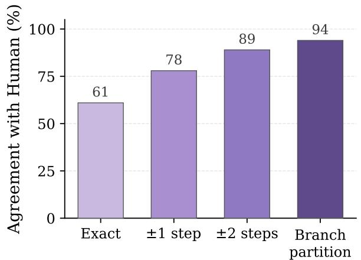  
(a) Divergence localization accuracy

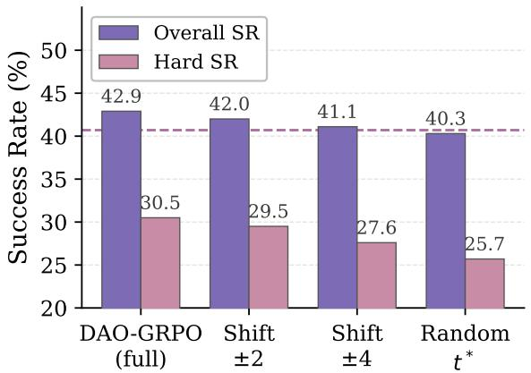  
(b) Robustness to credit perturbation  
Figure 7 Reliability of the LLM-based divergence estimator. (a) Agreement between estimator outputs and human annotation on 100 labeled rollout groups: exact / ±1-step / ±2-step localization of $t ^ { * }$ and favorable–unfavorable branch partition. (b) BrowserBench success rate of DAO-GRPO (9B) when the detected $t ^ { * }$ is randomly perturbed by up to ±2 or ±4 steps or replaced by a random step; the dashed line marks the uniform-credit variant (+PBRS, 40.7%) from Table 5.

## 7.6.4 Reliability of the Progress Estimator Φ

The remaining LLM-based component is the progress estimator Φ, which converts trajectory prefixes into the potential values used by PBRS. We validate it against human judgment on 150 trajectory prefixes sampled from held-out dev rollouts, each rated by two annotators on a five-level progress rubric anchored by subgoal descriptions (inter-annotator agreement: 93% within one level, Spearman $\rho = 0 . 8 9 )$ . Φ tracks the human ratings closely (Spearman $\rho = 0 . 8 1$ , mean absolute error 0.11 on the unit interval), agrees with the human progress ordering on 86% of 200 same-task prefix pairs, and is monotone non-decreasing along 87% of adjacent within-trajectory steps. Since PBRS only requires the potential to rank prefixes by progress rather than to be exact, this level of agreement sufices for the shaping signal to be informative, consistent with the net gain of the +PBRS variant in Table 5. Moreover, potential-based shaping preserves the optimal policy for any bounded Φ, so residual estimator noise degrades credit quality gracefully rather than biasing the optimization objective.

## 7.6.5 Online RL Training Dynamics

Figure 8 presents the online RL behavior of DAO-GRPO on Wuying-Browser-Agent-9B. As shown in Figure 8a, both the training reward and the held-out validation reward exhibit an initial decline – bottoming out around iteration 30 – followed by sustained improvement, with the training reward recovering to its initial level by roughly iteration 90. We attribute this early dip to the transition from the RUIC-SFT initialization to online policy optimization, where the agent must first adapt to exploration, grouped relative rewards, and dynamically reconstructed browser contexts. After this adaptation phase, the reward increases steadily, indicating that direct browser interaction provides useful supervision beyond ofline demonstrations. Importantly, the validation reward computed on valid rollouts only follows the same upward trend and remains consistently above the raw validation reward (0.76 vs. 0.73 at iteration 150), showing that the gain is not merely due to changes in invalid-rollout frequency.

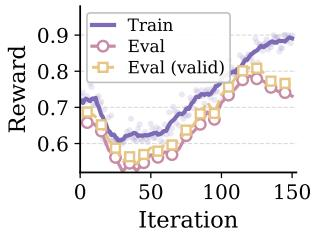  
(a) Reward Trends

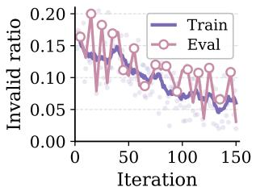  
(b) Invalid Actions

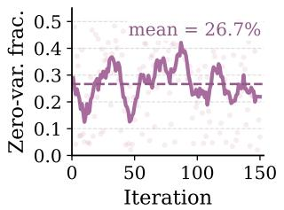  
(c) Zero-Variance Groups

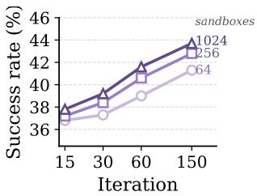  
(d) Rollout Scaling  
Figure 8 Online RL training dynamics of Wuying-Browser-Agent-9B. (a) Shaped reward on training batches (per-step scatter with moving average) and on a held-out validation split, the latter also reported over valid rollouts only. (b) Invalid-action ratio on the training and validation environments throughout online RL. (c) Fraction of rollout groups with zero reward variance in each iteration; these groups contribute no relative-advantage signal and are masked by dynamic sampling. The dashed line marks the training average of 26.7%. (d) Final success rate under diferent training budgets (up to 150 iterations) and parallel sandbox concurrency levels. Overall, online optimization improves both reward and action validity, degenerate groups persist throughout training and are handled by dynamic sampling, and higher sandbox concurrency yields better final performance under the same number of update steps.

Figure 8b further shows that the invalid-action ratio consistently decreases on both the training and validation environments (15.1% → 6.1% and 16.4% → 3.1%, respectively, comparing the first and last ten iterations). This suggests that DAO-GRPO improves not only task-level return but also the executability and reliability of browser actions, which is critical for real-world browser-agent deployment.

Figure 8c reports the fraction of rollout groups with zero reward variance, i.e., groups in which all rollouts in a group obtain identical returns and therefore provide no relative-advantage signal. Such degenerate groups are frequent – 26.7% of all groups on average and up to 49.9% in individual iterations – and, notably, their frequency does not decrease as the policy improves (21.2% in the first ten iterations vs. 22.2% in the last ten), because they arise predominantly from tasks that remain unsolvable rather than from early-stage format failures. Dynamic sampling masks these groups from every update, so the efective batch is substantially smaller than the nominal one throughout training; this persistent filtering is what makes the rollout-throughput considerations below practically important rather than incidental.

Figure 8d studies the efect of sandbox concurrency under the asynchronous rollout scheduler. Under all training budgets, higher concurrency improves final performance, and the benefit widens as training proceeds. Note that the group size is fixed throughout training; concurrency instead afects optimization through data freshness and selectivity. With more sandboxes active, completed trajectory groups are returned faster relative to policy updates, so each update consumes rollouts generated by a more recent policy, and dynamic sampling can draw from a larger pool of candidate groups when discarding degenerate ones. Together, these results validate that online RL yields complementary gains over RUIC-SFT and that rollout throughput is itself an important factor for efective browser-agent optimization.

## 7.6.6 Performance by Task Difficulty and Trajectory Length

Figure 9 analyzes success rate by task dificulty (a) and trajectory length (b) for Qwen3.5-9B, RUIC-SFT, and DAO-GRPO.

In the left panel, performance decreases consistently from easy to medium to hard tasks for all three models, confirming that the empirical solvability-based dificulty labels align well with the actual challenge faced by the browser agent. RUIC-SFT improves over the base Qwen3.5-9B model across all dificulty levels. The largest gains appear on easy and medium tasks (38.1% → 51.4% and 17.9% → 42.9%), reflecting the browser-operation and UI-interaction competence instilled by curriculum supervision, while the gain on hard tasks is smaller (14.3% → 18.1%), as these tasks additionally demand long-horizon credit assignment that ofline supervision alone cannot provide.

DAO-GRPO further improves performance at all dificulty levels, and its gains grow steeply with task dificulty: +1.0 point on easy tasks, where the supervised policy is already near saturation, +2.1 points on medium tasks, and +12.4 points on hard tasks (18.1% → 30.5%), the largest improvement across all slices. This suggests that online optimization is especially beneficial once the task requires long-horizon correction, branch-sensitive decision making, and recovery from of-trajectory states beyond what can be fully covered by ofline supervision.

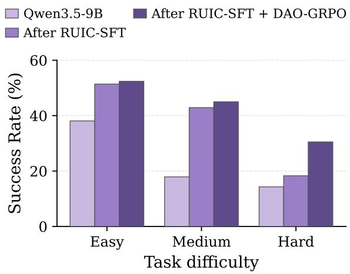  
(a) Success Rate by Task Difficulty

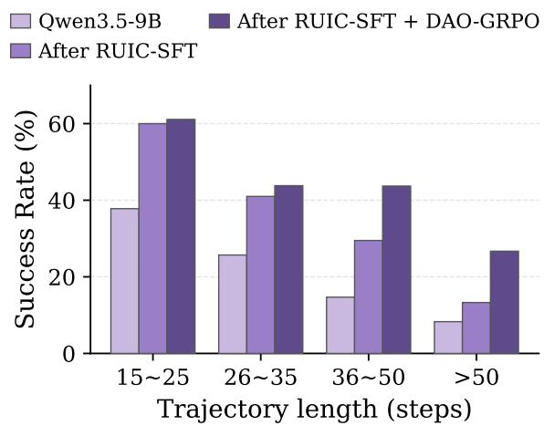  
(b) Success Rate by Trajectory Length  
Figure 9 Success rate by task dificulty (a) and (b) trajectory length in steps on 9B model backbone. Trajectory length is binned into four ranges: 15–25, 26–35, 36–50, and >50 steps.

In the right panel, success rate drops as trajectory length increases, indicating that longer browser interactions are substantially more challenging. RUIC-SFT improves performance across all trajectory-length bins, with gains concentrated on shorter tasks (e.g., +22.2 points on 15–25 step tasks), showing that better browseroperation priors and recovery-oriented supervision are broadly useful but insuficient for the longest interactions. More importantly, the gain of DAO-GRPO becomes increasingly pronounced as trajectories grow longer: from +1.1 points on 15–25 step tasks to +2.8 points on 26–35 step tasks, +5.2 points on 36–50 step tasks, and +13.4 points on tasks exceeding 50 steps (13.3% → 26.7%). This pattern is well aligned with the motivation of DAO-GRPO: as browser trajectories become longer, sparse terminal reward, delayed credit assignment, and semantically decisive branch steps become increasingly important, making online RL particularly efective.

Overall, the figure shows that RUIC-SFT primarily strengthens dificult browser capabilities, while DAO-GRPO further improves long-horizon decision quality and recovery under challenging interaction settings.

## 7.6.7 Case Study

We first examine three rollout groups sampled from online RL training (Figure 10), which illustrate why the three components of DAO-GRPO match the structure of browser-agent data. Figure 10(a) exemplifies the shared-prefix structure that motivates divergence-aware credit assignment: trajectories within a group are identical for the first three steps and diverge at a single decisive step, where the branch choice largely determines the outcome. Top-down browsing succeeds in 12 of 16 cases, whereas jumping directly to the product anchor stalls at partial credit in 3 of 4 cases. The shaped credit therefore concentrates on the post-divergence steps of the favorable branch. Figure 10(b) shows a group in which 16 of 17 rollouts fail with returns of at most 0.06. Under terminal-only rewards, such a group has zero advantage variance and would be discarded by dynamic sampling (Figure 8c), whereas PBRS progress increments keep the rollouts correctly ordered and the group informative. Figure 10(c) shows that even when all displayed rollouts reach the same terminal reward, their eficiency difers by more than a factor of two, ranging from 21 to 49 steps. Signed PBRS increments penalize individual detour steps. For example, one eventually successful rollout receives fourteen consecutive penalties during a filter re-entry loop, providing step-level supervision toward eficient

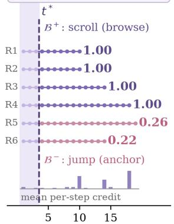  
(a) Divergence is decisive

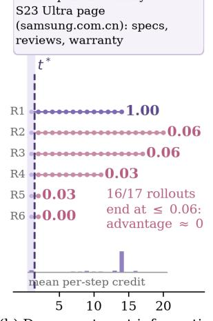  
(b) Degenerate yet informative

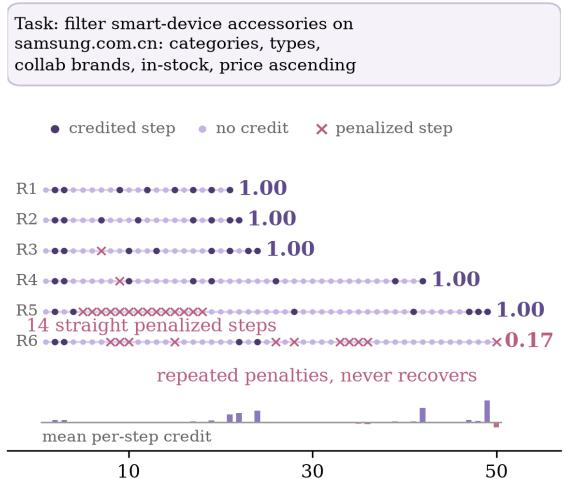  
(c) Signed credit flags detours

Figure 10 Real rollout groups from online RL training, illustrating the three design choices of DAO-GRPO. For analysis we sample 16–20 rollouts per task (beyond the training group size K=6) and display six representative ones per group; row ends show final rewards, and the bottom strips show the mean per-step PBRS shaped reward of the displayed rollouts. (a) A Galaxy Z Fold7 browsing group: all rollouts share an identical three-step prefix (shaded corridor) and diverge at $t ^ { * } { = } 4$ into top-down browsing $( B ^ { + } ;$ scroll) vs. anchor jumping $( B ^ { - } ) :$ scroll\_to\_text); 12 of 16 browsing rollouts succeed while 3 of 4 jumping rollouts stall at partial credit, and progress credit concentrates on the post-divergence steps of the favorable branch. (b) A Galaxy S23 Ultra group in which 16 of 17 rollouts fail with returns $\leq 0 . 0 6 \colon$ under terminal-only rewards the group would be degenerate (advantage ≈ 0), whereas PBRS progress increments keep the rollouts correctly ordered $( 1 . 0 0 > 0 . 0 6 > 0 . 0 3 > 0 . 0 0 )$ . (c) An accessory-filtering group in which 12 of 16 rollouts all reach reward 1.0 with lengths from 21 to 49 steps; signed PBRS increments penalize individual detour steps (crosses; deep dots: credited steps; light dots: no credit), e.g. 14 consecutive penalized steps in R5, separating eficient from wasteful executions that identical terminal rewards cannot distinguish.

behavior that identical terminal rewards cannot express.

## 7.6.8 Qualitative Analysis

Figure 11 presents a representative long-horizon trajectory that illustrates the self-corrective browser behavior of Wuying-Browser-Agent-9B. The task requires the agent to enter the Chery automotive website, navigate to the privacy-policy page, locate the privacy-policy update announcement, open the personal information collection list, and inspect the categories and purposes of collected personal information.

The trajectory exhibits a clear perceive–act–verify–recover loop rather than a monotonic execution pattern. In the early stage (Steps 1–5), the agent correctly loads the website, handles the cookie banner, scrolls to the footer, and enters the privacy-related page. At Step 7, however, it clicks a misleading footer link and is silently redirected to an unrelated brand history page. Instead of assuming progress from the issued action, the agent verifies the resulting browser state against the intended goal and, at Step 8, detects the mismatch from the URL and page content. It then recovers by re-entering the privacy path. When repeated scrolling still fails to reveal the target section (Steps 9–10), the agent escalates from low-cost navigation to structured page probing before retrying the correct route. This eventually allows it to reach the detailed policy page, open the personal information collection list, and complete the final inspection steps (Steps 12–15).

This recovery behavior is consistent with the complementary roles of RUIC-SFT and DAO-GRPO. RUIC-SFT provides recovery-oriented browser priors through UI-specialized supervision and reflection-rich trajectories, teaching the agent to judge progress from observed environment outcomes rather than from action issuance alone. DAO-GRPO further strengthens this ability under long-horizon online interaction. In this example, the successful and unsuccessful paths share a long common prefix, while only a few branch decisions determine whether the agent reaches the target document or remains trapped in an irrelevant page. This aligns with our divergence-aware online RL design, which concentrates optimization on decisive branch steps such as erroneous redirects, recovery actions, and strategy switches from scrolling to structured extraction. In addition, the response-level objective optimizes each decision under its actual reconstructed browser context, helping the model rely on the current page state, URL, and visual evidence when deciding whether to continue, recover, or escalate.

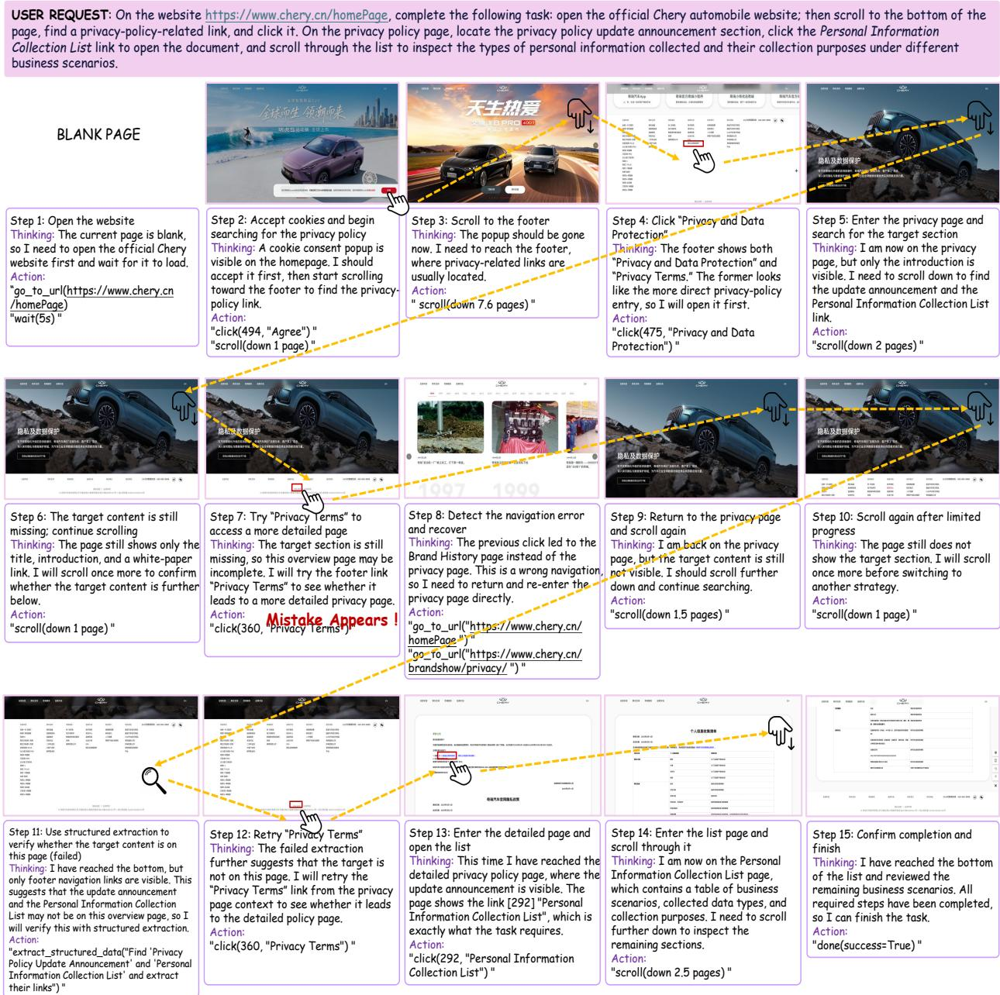  
Figure 11 Self-reflective error recovery in long-horizon web navigation. A 15-step trajectory of Wuying-Browser-Agent-9B on a Chery privacy-policy retrieval task. The agent detects an erroneous redirect from the observed browser state, performs corrective recovery, and escalates from scrolling to structured probing before reaching the personal information collection list. For ease of visualization, we display screenshots for all steps to highlight interface transitions; in actual deployment, the agent primarily consumes structured browser state (e.g., DOM-derived representations), while screenshots are used only as optional inputs when visual grounding is needed.

Overall, the case study shows that the gain of our method is not merely higher task success, but stronger closed-loop interaction quality. The model can detect navigation failure, revise its hypothesis, avoid inefective repetition, and recover toward the original goal under dynamically changing web contexts.

## 8 Conclusion

In this work, we identified the mismatch between success-dominated short-horizon training and real longhorizon browser deployment as the central bottleneck limiting the real-world robustness of web agents. To address this mismatch, we proposed a unified pipeline in which supervision, online optimization, and evaluation are co-designed for the same long-horizon deployment setting. At the supervision level, RUIC-SFT provides a capability-structured initialization by integrating reflection-rich recovery data and specialized UI interaction data through a progressive curriculum, establishing both execution stability and self-correction priors. At the optimization level, DAO-GRPO refines long-horizon decision making under live browser interaction through potential-based reward shaping, divergence-aware step credit assignment, and responselevel optimization under dynamically reconstructed contexts. At the evaluation level, BrowserBench serves as a co-designed diagnostic instrument with structured success criteria and capability-aligned semantic tags, enabling fine-grained validation beyond aggregate success rates. Extensive experiments demonstrate that the resulting Wuying-Browser-Agent series establishes a new open-source state of the art across multiple live-web benchmarks while remaining competitive with proprietary agents.

## References

[1] Ahmed Awadallah, Yash Lara, Raghav Magazine, Hussein Mozannar, Akshay Nambi, Yash Pandya, Aravind Rajeswaran, Corby Rosset, Alexey Taymanov, Vibhav Vineet, et al. Fara-7b: An eficient agentic model for computer use. arXiv preprint arXiv:2511.19663, 2025.

[2] Hao Bai, Alexey Taymanov, Tong Zhang, Aviral Kumar, and Spencer Whitehead. Webgym: Scaling training environments for visual web agents with realistic tasks. arXiv preprint arXiv:2601.02439, 2026.

[3] Shuai Bai, Yuxuan Cai, Ruizhe Chen, Keqin Chen, Xionghui Chen, Zesen Cheng, Lianghao Deng, Wei Ding, Chang Gao, Chunjiang Ge, et al. Qwen3-vl technical report. arXiv preprint arXiv:2511.21631, 2025.

[4] V Barres, H Dong, S Ray, X Si, and K Narasimhan. τ2-bench: Evaluating conversational agents in a dual-control environment, 2025. URL https://arxiv. org/abs/2506.07982, 2025.

[5] Yoshua Bengio, Jérôme Louradour, Ronan Collobert, and Jason Weston. Curriculum learning. In Proceedings of the 26th annual international conference on machine learning, pages 41–48, 2009.

[6] ByteDance Seed. Seed2.0. https://seed.bytedance.com/en/seed2, 2026. Released: 2026-02-14. Accessed: 2026-07-19.

[7] Xiang Deng, Yu Gu, Boyuan Zheng, Shijie Chen, Sam Stevens, Boshi Wang, Huan Sun, and Yu Su. Mind2web: Towards a generalist agent for the web. Advances in Neural Information Processing Systems, 36:28091–28114, 2023.

[8] Boyu Gou, Zanming Huang, Yuting Ning, Yu Gu, Michael Lin, Weijian Qi, Andrei Kopanev, Botao Yu, Bernal Jimenez Gutierrez, Yiheng Shu, et al. Mind2web 2: Evaluating agentic search with agent-as-a-judge. Advances in Neural Information Processing Systems, 38, 2026.

[9] Daya Guo, Dejian Yang, Haowei Zhang, Junxiao Song, Peiyi Wang, Qihao Zhu, Runxin Xu, Ruoyu Zhang, Shirong Ma, Xiao Bi, et al. Deepseek-r1: Incentivizing reasoning capability in llms via reinforcement learning. arXiv preprint arXiv:2501.12948, 2025.

[10] Tanmay Gupta, Piper Wolters, Zixian Ma, Peter Sushko, Rock Yuren Pang, Diego Llanes, Yue Yang, Taira Anderson, Boyuan Zheng, Zhongzheng Ren, et al. Molmoweb: Open visual web agent and open data for the open web. arXiv preprint arXiv:2604.08516, 2026.

[11] Hongliang He, Wenlin Yao, Kaixin Ma, Wenhao Yu, Yong Dai, Hongming Zhang, Zhenzhong Lan, and Dong Yu. Webvoyager: Building an end-to-end web agent with large multimodal models. In Proceedings of the 62nd Annual Meeting of the Association for Computational Linguistics (Volume 1: Long Papers), pages 6864–6890, 2024.

[12] Hongliang He, Wenlin Yao, Kaixin Ma, Wenhao Yu, Hongming Zhang, Tianqing Fang, Zhenzhong Lan, and Dong Yu. Openwebvoyager: Building multimodal web agents via iterative real-world exploration, feedback and optimization. In Proceedings of the 63rd Annual Meeting of the Association for Computational Linguistics (Volume 1: Long Papers), pages 27545–27564, 2025.

[13] Edward J Hu, Yelong Shen, Phillip Wallis, Zeyuan Allen-Zhu, Yuanzhi Li, Shean Wang, Liang Wang, Weizhu Chen, et al. Lora: Low-rank adaptation of large language models. Iclr, 1(2):3, 2022.

[14] Mianqiu Huang, Taofeng Xue, Chong Peng, Jinrui Ding, Sicheng Fan, Jiale Hong, Yufei Gao, Xiaocheng Zhang, Linsen Guo, Xin Yang, et al. Evocua-1.5: Online reinforcement learning for multi-turn computer-use agents. arXiv preprint arXiv:2607.09773, 2026.

[15] Aaron Hurst, Adam Lerer, Adam P Goucher, Adam Perelman, Aditya Ramesh, Aidan Clark, AJ Ostrow, Akila Welihinda, Alan Hayes, Alec Radford, et al. Gpt-4o system card. arXiv preprint arXiv:2410.21276, 2024.

[16] Jing Yu Koh, Robert Lo, Lawrence Jang, Vikram Duvvur, Ming Lim, Po-Yu Huang, Graham Neubig, Shuyan Zhou, Russ Salakhutdinov, and Daniel Fried. Visualwebarena: Evaluating multimodal agents on realistic visual web tasks. In Proceedings of the 62nd Annual Meeting of the Association for Computational Linguistics (Volum 1: Long Papers), pages 881–905, 2024.

[17] Hanyu Lai, Xiao Liu, Iat Long Iong, Shuntian Yao, Yuxuan Chen, Pengbo Shen, Hao Yu, Hanchen Zhang, Xiaohan Zhang, Yuxiao Dong, et al. Autowebglm: A large language model-based web navigating agent. In Proceedings of the 30th ACM SIGKDD Conference on Knowledge Discovery and Data Mining, pages 5295–5306, 2024.

[18] Zhaoyang Liu, JingJing Xie, Zichen Ding, Zehao Li, Bowen Yang, Zhenyu Wu, Xuehui Wang, Qiushi Sun, Shi Liu, Weiyun Wang, et al. Scalecua: Scaling open-source computer use agents with cross-platform data. arXiv preprint arXiv:2509.15221, 2025.

[19] Ziyu Liu, Zeyi Sun, Yuhang Zang, Xiaoyi Dong, Yuhang Cao, Haodong Duan, Dahua Lin, and Jiaqi Wang. Visual-rft: Visual reinforcement fine-tuning. In Proceedings of the IEEE/CVF International Conference on Computer Vision, pages 2034–2044, 2025.

[20] Zhengxi Lu, Yuxiang Chai, Yaxuan Guo, Xi Yin, Liang Liu, Hao Wang, Han Xiao, Shuai Ren, Pengxiang Zhao, Guangyi Liu, et al. Ui-r1: Enhancing eficient action prediction of gui agents by reinforcement learning. In Proceedings of the AAAI Conference on Artificial Intelligence, volume 40, pages 17608–17616, 2026.

[21] Yougang Lyu, Xiaoyu Zhang, Lingyong Yan, Maarten de Rijke, Zhaochun Ren, and Xiuying Chen. Deepshop: A benchmark for deep research shopping agents. arXiv preprint arXiv:2506.02839, 2025.

[22] Andrew Y Ng, Daishi Harada, and Stuart Russell. Policy invariance under reward transformations: Theory and application to reward shaping. In Icml, volume 99, pages 278–287. Citeseer, 1999.

[23] OpenAI. GPT-5.5 System Card. https://deploymentsafety.openai.com/gpt-5-5, 2026. April 2026. Accessed: 2026-07-19.

[24] Shishir G Patil, Huanzhi Mao, Fanjia Yan, Charlie Cheng-Jie Ji, Vishnu Suresh, Ion Stoica, and Joseph E Gonzalez. The berkeley function calling leaderboard (bfcl): From tool use to agentic evaluation of large language models. In Forty-second International Conference on Machine Learning, 2025.

[25] Yun Piao, Hongbo Min, Hang Su, Leilei Zhang, Lei Wang, Yue Yin, Xiao Wu, Zhejing Xu, Liwei Qu, Hang Li, et al. Agentbay: A hybrid interaction sandbox for seamless human-ai intervention in agentic systems. arXiv preprint arXiv:2512.04367, 2025.

[26] Zehan Qi, Xiao Liu, Iat Long Iong, Hanyu Lai, Xueqiao Sun, Jiadai Sun, Xinyue Yang, Yu Yang, Shuntian Yao, Wei Xu, et al. Webrl: Training llm web agents via self-evolving online curriculum reinforcement learning. In International Conference on Learning Representations, volume 2025, pages 79791–79821, 2025.

[27] Yujia Qin, Yining Ye, Junjie Fang, Haoming Wang, Shihao Liang, Shizuo Tian, Junda Zhang, Jiahao Li, Yunxin Li, Shijue Huang, et al. Ui-tars: Pioneering automated gui interaction with native agents. arXiv preprint arXiv:2501.12326, 2025.

[28] Zhihong Shao, Peiyi Wang, Qihao Zhu, Runxin Xu, Junxiao Song, Xiao Bi, Haowei Zhang, Mingchuan Zhang, YK Li, Yang Wu, et al. Deepseekmath: Pushing the limits of mathematical reasoning in open language models. arXiv preprint arXiv:2402.03300, 2024.

[29] Haozhan Shen, Peng Liu, Jingcheng Li, Chunxin Fang, Yibo Ma, Jiajia Liao, Qiaoli Shen, Zilun Zhang, Kangjia Zhao, Qianqian Zhang, et al. Vlm-r1: A stable and generalizable r1-style large vision-language model. arXiv preprint arXiv:2504.07615, 2025.

[30] Aaditya Singh, Adam Fry, Adam Perelman, Adam Tart, Adi Ganesh, Ahmed El-Kishky, Aidan McLaughlin, Aiden Low, AJ Ostrow, Akhila Ananthram, et al. Openai gpt-5 system card. arXiv preprint arXiv:2601.03267, 2025.

[31] Kimi Team, Tongtong Bai, Yifan Bai, Yiping Bao, SH Cai, Yuan Cao, Y Charles, HS Che, Cheng Chen, Guanduo Chen, et al. Kimi k2. 5: Visual agentic intelligence. arXiv preprint arXiv:2602.02276, 2026.

[32] Venus Team, Changlong Gao, Zhangxuan Gu, Yulin Liu, Xinyu Qiu, Shuheng Shen, Yue Wen, Tianyu Xia, Zhenyu Xu, Zhengwen Zeng, et al. Ui-venus-1.5 technical report. arXiv preprint arXiv:2602.09082, 2026.

[33] Tencent. Hy3. https://huggingface.co/tencent/Hy3, 2025. Hugging Face model card, accessed: 2026-07-27.

[34] Haifeng Wang, Hua Wu, Tian Wu, Yu Sun, Jing Liu, Dianhai Yu, Yanjun Ma, Jingzhou He, Zhongjun He, Dou Hong, et al. Ernie 5.0 technical report. arXiv preprint arXiv:2602.04705, 2026.

[35] Haoming Wang, Haoyang Zou, Huatong Song, Jiazhan Feng, Junjie Fang, Junting Lu, Longxiang Liu, Qinyu Luo, Shihao Liang, Shijue Huang, et al. Ui-tars-2 technical report: Advancing gui agent with multi-turn reinforcement learning. arXiv preprint arXiv:2509.02544, 2025.

[36] Weiyun Wang, Zhangwei Gao, Lixin Gu, Hengjun Pu, Long Cui, Xingguang Wei, Zhaoyang Liu, Linglin Jing, Shenglong Ye, Jie Shao, et al. Internvl3. 5: Advancing open-source multimodal models in versatility, reasoning, and eficiency. arXiv preprint arXiv:2508.18265, 2025.

[37] Xinyuan Wang, Bowen Wang, Dunjie Lu, Junlin Yang, Tianbao Xie, Junli Wang, Jiaqi Deng, Xiaole Guo, Yiheng Xu, Chen Wu, et al. Opencua: Open foundations for computer-use agents. Advances in Neural Information Processing Systems, 38:139756–139806, 2026.

[38] Zihan Wang, Kangrui Wang, Qineng Wang, Pingyue Zhang, Linjie Li, Zhengyuan Yang, Xing Jin, Kefan Yu, Minh Nhat Nguyen, Licheng Liu, et al. Ragen: Understanding self-evolution in llm agents via multi-turn reinforcement learning. arXiv preprint arXiv:2504.20073, 2025.

[39] Jason Wei, Zhiqing Sun, Spencer Papay, Scott McKinney, Jefrey Han, Isa Fulford, Hyung Won Chung, Alex Tachard Passos, William Fedus, and Amelia Glaese. Browsecomp: A simple yet challenging benchmark for browsing agents. arXiv preprint arXiv:2504.12516, 2025.

[40] Zhepei Wei, Wenlin Yao, Yao Liu, Weizhi Zhang, Qin Lu, Liang Qiu, Changlong Yu, Puyang Xu, Chao Zhang, Bing Yin, et al. Webagent-r1: Training web agents via end-to-end multi-turn reinforcement learning. In Proceedings of the 2025 Conference on Empirical Methods in Natural Language Processing, pages 7920–7939, 2025.

[41] Anyi Xu, Bangcai Lin, Bing Xue, Bingxuan Wang, Bingzheng Xu, Bochao Wu, Bowei Zhang, Chaofan Lin, Chen Dong, Chenchen Ling, et al. Deepseek-v4: Towards highly eficient million-token context intelligence. arXiv preprint arXiv:2606.19348, 2026.

[42] Haiyang Xu, Xi Zhang, Haowei Liu, Junyang Wang, Zhaozai Zhu, Shengjie Zhou, Xuhao Hu, Feiyu Gao, Junjie Cao, Zihua Wang, et al. Mobile-agent-v3. 5: Multi-platform fundamental gui agents. arXiv preprint arXiv:2602.16855, 2026.

[43] Tianci Xue, Weijian Qi, Tianneng Shi, Chan Hee Song, Boyu Gou, Dawn Song, Huan Sun, and Yu Su. An illusion of progress? assessing the current state of web agents. arXiv preprint arXiv:2504.01382, 2025.

[44] An Yang, Anfeng Li, Baosong Yang, Beichen Zhang, Binyuan Hui, Bo Zheng, Bowen Yu, Chang Gao, Chengen Huang, Chenxu Lv, et al. Qwen3 technical report. arXiv preprint arXiv:2505.09388, 2025.

[45] Rui Yang, Qianhui Wu, Yuxi Chen, Hao Bai, Wenlin Yao, Hao Cheng, Baolin Peng, Huan Zhang, Tong Zhang, and Jianfeng Gao. Openwebrl: Demystifying online multi-turn reinforcement learning for visual web agents. arXiv preprint arXiv:2606.02031, 2026.

[46] Shunyu Yao, Jefrey Zhao, Dian Yu, Nan Du, Izhak Shafran, Karthik Narasimhan, and Yuan Cao. React: Synergizing reasoning and acting in language models. arXiv preprint arXiv:2210.03629, 2022.

[47] Bowen Ye, Rang Li, Qibin Yang, Yuanxin Liu, Linli Yao, Hanglong Lv, Zhihui Xie, Chenxin An, Lei Li, Lingpeng Kong, et al. Claw-eval: Towards trustworthy evaluation of autonomous agents. arXiv preprint arXiv:2604.06132, 2026.

[48] Qiying Yu, Zheng Zhang, Ruofei Zhu, Yufeng Yuan, Xiaochen Zuo, Yu Yue, Weinan Dai, Tiantian Fan, Gaohong Liu, Lingjun Liu, et al. Dapo: An open-source llm reinforcement learning system at scale. Advances in Neural Information Processing Systems, 38:113222–113244, 2026.

[49] Hanchen Zhang, Xiao Liu, Bowen Lv, Xueqiao Sun, Bohao Jing, Iat Long Iong, Zhenyu Hou, Zehan Qi, Hanyu Lai, Yifan Xu, et al. Agentrl: Scaling agentic reinforcement learning with a multi-turn, multi-task framework. arXiv preprint arXiv:2510.04206, 2025.

[50] Boyuan Zheng, Boyu Gou, Jihyung Kil, Huan Sun, and Yu Su. Gpt-4v (ision) is a generalist web agent, if grounded. arXiv preprint arXiv:2401.01614, 2024.

[51] Hanzhang Zhou, Panrong Tong, Xu Zhang, Quyu Kong, Chenglin Cai, Tianyu Xia, Gongjie Zhang, Jianan Zhang, Long Li, Long Chen, et al. Qwen-ui-agent technical report: Toward next-generation real-world centric foundation gui agents. arXiv preprint arXiv:2607.28227, 2026.

[52] Shuyan Zhou, Frank F Xu, Hao Zhu, Xuhui Zhou, Robert Lo, Abishek Sridhar, Xianyi Cheng, Tianyue Ou, Yonatan Bisk, Daniel Fried, et al. Webarena: A realistic web environment for building autonomous agents. In International Conference on Learning Representations, volume 2024, pages 15585–15606, 2024.

[53] Yifei Zhou, Qianlan Yang, Kaixiang Lin, Min Bai, Xiong Zhou, Yu-Xiong Wang, Sergey Levine, and Li Erran Li. Proposer-agent-evaluator (pae): Autonomous skill discovery for foundation model internet agents. In Forty-second International Conference on Machine Learning, 2025.

## Contributions and Acknowledgments

All contributors are listed in alphabetical order by their last names.

## Core Contributors

• AIMAE Team

• Tianxiang Chen

• Yan Cheng

• Zhangye Han

• Xiaowei Li

• Chang Liu

• Cheng Liu

• Zhongqiang Ma

• Long Peng

• Xiaobing Tu†

• Yinggui Wang

• Hongliang Wei

• Chen Wu

• Daiping Xin

• Kunyu Zhou

• Pengyang Zhou

## Supervisors

• Xiaobing Tu†

• Yinggui Wang

## Contributors

• Peiyuan Chen

• Ziyuan Chen

• Yutao Deng

• Chunyu Dong

• Xiangyu Fu

• Yicheng Feng

• Ruian He

• Haochen Li

• Miancan Liu

• Zhengqin Liu

• Wei Peng

• Jinkui Ren

• Haoyu Tan

• Dong Xiao

• Rongkun Xue

• Shujian Yang

• Xianhang Ye

• Ziqi Yuan

• Ziyang Yu

• Linghan Zhang

• Xiantao Zhang

• Xuanpu Zhao

• Yinan Zhao

• Zhenghui Zhao

• Bin Zhu

• Likai Zou