# tinyDSM: A Framework for Skill Modeling and Development for Resource-Constrained Millirobots

Markus D. Kobelrausch, Michael Miedler, Member, IEEE, and Axel Jantsch, Fellow Member, IEEE,

Abstract—In this study, we investigate developmental mechanisms that enable small, resource-constrained systems such as cm-sized millirobots to autonomously explore, learn, and adapt their capabilities throughout their lifespan. Reinforcement learning algorithms guide the agent’s skill acquisition and adaptation through the interplay of our proposed tiny Developmental Skill Method (tinyDSM), which integrate intrinsic motivation and fitness-based assessment. We strive for minimal, hard-wired skills while encouraging the open-ended development of new skills. A key emphasis in our approach is to encode minimal apriori general knowledge, which serves as a foundational starting point for the system as it further learns systemspecific dependencies from the initial knowledge provided. Thus, by design, our approach attempts to cover very generic application domains. The methodology is based on (a) developmental mechanism with intrinsic motivation, and (b) a cognitive architecture (knowledge, reasoning, learning), while (c) utilizing minimal resources. It uses a hierarchical knowledge graph and kinematic reasoners to model and evaluate simple and advanced motion related skills. In our experiments, we use a resource-constrained millirobot with a volume of 36 cm3 with a Raspberry Pi Pico 32 bit microcontroller (RP2040) that integrates all described features and capabilities except the camera system in 9 kB. Starting with learning the most elementary motor skills the millirobot autonomously progresses from simple linear and angular movements to complex geometric patterns within 15 minutes. To complement the physical experiments, we perform a simulation-based analysis that enables systematic comparisons across learning algorithms and intrinsic motivation parameters.

Index Terms—tiny robot learning, developmental robotics, cognitive architectures, reinforcement learning, low-energy mobile robots

## I. INTRODUCTION

D EVELOPMENTAL robotics investigates mecha-nisms that enable a robot to continuously explore nisms that enable a robot to continuously explore its environment, learn from its experiences and adapt to changes throughout its lifetime [1]. Cognitive approaches aim to use a synthetic approach that constructs cognitive functions in a developmentally appropriate manner that is inspired by developmental principles and mechanisms observed in children and animals [2]. Physical embodiment enables the structuring of information through interactions with the environment, whereby the hypothesized developmental model can vary in complexity, ranging from body representation, perception, motor skills and social behaviour to linguistic interaction. Such cognitive approaches are studied in the robotics literature at different levels of complexity, with the learning of such models aiming, for example, to acquire skills for navigating a given environment [3]. Robot learning has received a significant boost from Machine Learning (ML), with a trend towards advanced robots with methods that process an enormous amount of information and consequently require a lot of resources in terms of memory, time and energy [4]. As a result, they require significant amounts of prior knowledge and energy to operate effectively.

Tiny robot learning deals with the deployment of ML on resource-constrained low-cost autonomous robots. The roots lie in the intersection of embedded systems, robotics and ML with the subject to challenges from size, weight, area, and power constraints along with sensor, actuator and compute hardware limitations [5]. These lightweight robots (weighing under 500 g [6]) can operate in small spaces and offer promising solutions for a wide range of applications, from emergency search and rescue [7] to routine monitoring and maintenance of infrastructure and equipment [8]. They have limited sensors and actuators and have to learn computationally demanding, complex and robust behaviours in different application spaces. The deployment varies across different robot models, system components, tasks and environments. Consequentially, a critical trade-off must be made between energy and memory resources for machine learning and the other system components, such as sensors/actuators and complex behaviour.

Our work aims to integrate interdisciplinary fields by addressing the challenge of combining development robotics concepts within the resource constraints of tiny robot learning. It aims to equip millirobots with a cognitive architecture (limited to knowledge, reasoning and learning) that learns competencies in a developmentoriented manner and strives for open-ended learning of new skills and knowledge. To better comprehend our scope and goals, let us consider the case of a mobile millirobot that aims to acquire motor skills. In this work, we refer to motor skills more generally as motion skills, emphasizing the mobility of the millirobot.

To be very general we aim at a minimal set of general knowledge that serves as a foundational starting point for the robot with:

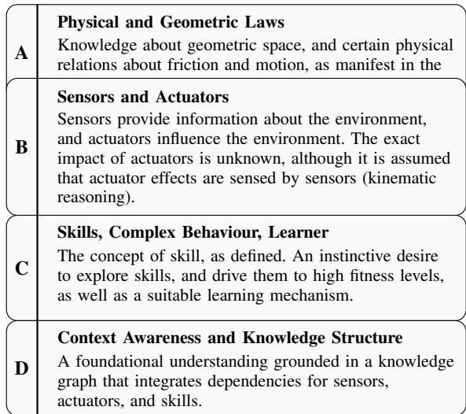  
Fig. 1. Assumptions and a-priori knowledge that the millirobot has built-in.

Let’s assume the millirobot can move using two motors and senses its motion via an acceleration sensor. It knows which kind of sensors and actuator it has (physical model), but it does not know the effects of actuator commands or anything about the environment - it only has assumptions about sensory information (kinematic reasoner). Initially, the robot queries its knowledge graph based on its available sensor and actuator set and infers competencies that it can potentially develop. We argue knowledge representation and reasoning are essential as it is universally applicable and allow for generic application or reuse in other contexts [9]. As the robot interacts with its environment, it explores its sensorimotor effects and reasons about its motions utilizing its kinematic reasoner, thus it develops an understanding of the relationship between knowledge, perception and action. Through that exploration, it develops basic motion competencies, which gradually evolve into more complex skills. It achieves this by engaging in complex behaviour where it is intrinsically motivated to pursue the most fascinating skills. In psychology, Intrinsic Motivation (IM) is considered a driving cause of autonomous entities to acquire and develop skills, and it is key to their development, as it enables them to effectively deal with problems that arise [10]. The robot continuously assesses its learning progress by evaluating its skills effectiveness (fitness reasoner). This fosters an increasing understanding and expertise, which affects motivation and drives the pursuit of specific skills. Thus, the robot exhibits behaviour that strives for continuous development and improvement, while it adapts to any changes in its environment. In the case of an expansion of its knowledge graph, it tackles the challenge of a novel development while maintaining a balance with improving existing skills.

In our experiments, the millirobot develops skills through a hierarchical modelling approach. It begins by discovering movement patterns, stored in the knowledge base, such as angular and linear movements. Subsequently, it learns specific distances and angles based on these patterns. The complex behaviour derived from IM is the focus of this work. We examine various patterns in detail and demonstrate their potential for enabling the development of an agent that operates without a predetermined goal. We analyze the effects of its intrinsically motivated behaviour on learning and investigate how it responds to different situations. Additionally, we assess the accuracy of its movements by studying a compound movement pattern, namely a square. To complement these physical experiments, we also perform a simulation-based analysis to systematically evaluate different learning algorithms and intrinsic motivation configurations.

To this end, we propose tinyDSM a framework for millirobots which features

• a developmental mechanism with intrinsic motivation,

• a cognitive architecture (knowledge, reasoning, learning),

• all while utilizing minimal resources.

We consider this a worthwhile approach. To minimize prior knowledge and assumptions will facilitate very flexible systems. It will allow the use of accurate or inaccurate sensors and actuators, and to adapt to aging and wear-out effects. Our long-term goal is to provide the robot with general methods that allow it to work with any kind of sensors and actuators in any kind of physical environment. Imagine a wheel-equipped or flying robot, on level plains, rocky or grassy surfaces or even in wet environments and learning any kind of competence, provided it is possible at all (e.g. if the robot has only LEDs but no motors, it cannot learn to move).

## II. BACKGROUND

Our tinyDSM is based on several domains of research, we first review the different areas. The broader domain is developmental robotics, which studies mechanisms that allow robots to learn and adapt independently over time, inspired by developmental principles observed in children and animals [1]–[3]. Cognitive architectures such as LRMB [11], ATC-R [12] or SORA [13] model layered cognition, enabling robots to process perceptual data, reason logically, and organize information into conceptual categories [14]. Our approach is similar to SORA as we work within a decision cycle that includes perception, action, memory and reasoning. We differ from SORA in that we do not rely on comprehensive symbolic reasoning that involves working or long-term memory, but instead use a lightweight knowledge structure and explicit motion-related reasoning. This limitation is intentional, as we want to maintain a minimal cognitive architecture that relies on a minimal set of assumptions.

Robots benefit from a structured semantic model to understand the real world. Especially ontologies organize knowledge in a way that allows cognitive robots to reason and create understanding [9]. Knowledge bases are popular in service robots modeling complex domain specific knowledge [15]. Frameworks such as KnowRob [16], RoboBrain [17] or BWIBots [18] show success in mastering a variety of complex tasks, ranging all the way to cognitive language skills. KnowRob and RoboBrain focus on knowledge representation with extensive knowledge databases and reasoners for various service-oriented robots. In contrast, our work focuses on a reduced knowledge graph specifically for mobile millirobots. While BWIBots also specializes in navigation, it focuses on a collaborative robot and, unlike us, assumes static task planning. Our approach differs in that we extend to dynamic planning with intrinsic motivation and consider tightly limited resources.

Intrinsic motivation (IM) is a central concept in lifelong learning and is understood as the drive to engage in activities for their own sake, primarily for enjoyment and satisfaction, rather than because of external rewards or explicit tasks. In robotics, IM draws inspiration from cognitive science and psychology, where curiosity and self-directed exploration are emphasised in learning [10], [19]–[21]. IM is often combined with Hierarchical Reinforcement Learning (HRL) to create a multi-level policy structure [22]–[25]. Our approach is also based on hierarchical competence models but differs in the use of an explicit, structured knowledge graph that the agent actively queries to drive its development. Specifically, we derive a difficulty factor from the graph that is incorporated into the intrinsic motivation. We consider novelty, progress, and difficulty in intrinsic motivation, and our specialized computation demonstrates robust and effective behaviors.

Moreover, we aim to embed learning mechanisms in the highly constrained resource space of tiny robots [5].

TinyML offers new possibilities with techniques such as quantization, pruning, and clustering to reduce the computational load and memory requirements of machine learning models, enabling them to be deployed on lowresource devices [26]–[29]. Although this approach is promising, most TinyML systems rely on offline training and therefore do not fully meet our requirements. In terms of algorithms, Reinforcement Learning (RL) is well suited due to the design of our reinforcement flow in tinyDSM. Algorithms such as Deep Q-Networks (DQN) [30] and Deep Deterministic Policy Gradient (DDPG) [31] are viable candidates. However, these models are large and require significant resources. Among traditional RL algorithms, Q-learning-based algorithms [32] are effective for low dimensional search spaces due to their simplicity and low resource requirements. TinyRL is still in the early stages, but research on deep RL in resource-constrained environments is growing [33], [34]. Such approaches are promising and offer potential for integration into our framework. Besides that, genetic algorithms show also potential for policy optimization [35], [36].

Specific work similar to ours includes the research from Baranes and Oudeyer [37] who employ an intrinsically motivated approach to learning inverse models by actively selecting goals based on learning progress. Forestier et al. [38] extended this by curriculum-based learning which allows the complexity of the goals to be self-organized. In contrast, we extend this approach by also considering novelty and difficulty factors in the intrinsic motivation. Moreover, the development frameworks of Nguyen & Oudeyers [39] and Colas et al. [40] also focus on the idea of skill-based intrinsic motivation for development. In summary, our work integrates concepts from developmental robotics, cognitive architectures, intrinsic motivation, and resource-constrained learning to enable on-device skill learning millirobots. Our work demonstrates that cognitive architectures can effectively scale to function in highly constrained environments, as confirmed by the minimal resource footprints in our experimental results. Due to the strong growth and interest in IoT devices, we see great potential for our approach to reduce customization efforts in this domain.

## III. DEVELOPMENTAL SKILL METHOD

## A. Definition of SAS, Fitness and Skills

1) SAS: The Sensor-Actuator Space $\mathbf { S } \mathbf { A } \mathbf { S } = ( S , { \mathcal { C } } )$ is a 2-tuple and consists of a set of sensors and a set of actuators . A sensor reading $s _ { i } \in \mathcal { S } \times T  \mathbb { R } ^ { P ( s _ { i } ) }$ is a mapping of a sensor identifier at a given time to a vector of values read from the sensor interface. An actuator command $c _ { j } \in \mathcal { C } \times T \times \mathbb { R } ^ { P ( c _ { j } ) }$ is defined by the actuator identifier $c _ { j }$ and a set of $P ( c _ { j } )$ , that are passed to the actuator interface at a given time. For instance, for a robot with two motors $\mathcal { C } = \{ c _ { m _ { 1 } } , c _ { m _ { 2 } } \}$ , the two corresponding motor commands each take three parameters, the time of activation t, the rotational force $f$ and the duration τ how long the force is applied: $c _ { m _ { 1 } } ( t , f , \tau )$ and $c _ { m _ { 2 } } ( t , f , \tau )$ . The robot has one sensor $s \in S$ that provides the translation information $s ( t )  [ x , y , \psi ]$ at time $t ,$ with $x$ and $y$ denoting the translations in the xand y-dimensions, respectively, and ψ denoting the yaw angle.

2) Fitness: An integral element of a skill is the assessment of its quality. It is based on a skill dependent set of quantities. These quantities are often sensor readings, like distance or velocity, but may include outputs of other skills. For a fitness that depends on n quantities with $n \in \mathbb { N } , n > 0$ , we define the following vectors.

$$
\vec { t } = \left( \begin{array} { l } { t _ { 0 } } \\ { t _ { 1 } } \\ { \dots } \\ { t _ { n - 1 } } \end{array} \right) \vec { o } = \left( \begin{array} { l } { o _ { 0 } } \\ { o _ { 1 } } \\ { \dots } \\ { o _ { n - 1 } } \end{array} \right) \vec { r } = \left( \begin{array} { l } { r _ { 0 } } \\ { r _ { 1 } } \\ { \dots } \\ { r _ { n - 1 } } \end{array} \right) \vec { e } = \left( \begin{array} { l } { e _ { 0 } } \\ { e _ { 1 } } \\ { \dots } \\ { e _ { n - 1 } } \end{array} \right)
$$

The target vector $\vec { t }$ signifies the desired quantities we seek to reach. The range vector $\vec { r }$ defines the maximum permissible deviation from the target vector. The observation vector $\vec { o }$ captures the values observed after the execution of an activity, and the error vector $\vec { e }$ is calculated as follows:

$$
e _ { i } = { \frac { \left| o _ { i } - t _ { i } \right| } { r _ { i } } } , \quad { \mathrm { f o r ~ } } i = 0 , 1 , \ldots , n - 1
$$

The scalar fitness value $f \in [ 0 , 1 ]$ is then computed as:

$$
f = 1 - \frac { | | \Vec { e } | | } { \sqrt { n } }
$$

Putting this together, the fitness F of a skill is a $5 \mathrm { - }$ tuple.

$$
F = ( \vec { t } , \vec { r } , \vec { o } , f ( . ) , f _ { \mathrm { t h r e s h o l d } } )\tag{1}
$$

A skill is deemed “learned” if $f ( . ) \ \geq \ f _ { \mathrm { t h r e s h o l d } }$ . The required threshold can vary but is typically around 0.95. Hence, the fitness function, often called the fitness of a skill, evaluates to a single scalar number that represents the quality of an activity. It is used by learning routines to direct the learning process and establishes awareness of the level of competence an agent has at any given time.

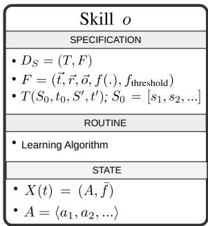  
Fig. 2. Overview of the definition of a skill including its specification, routine and state (during execution).

3) Skill: As shown in Fig. 2, a skill o consists of three components: a specification, a learning routine and a state. The skill specification defines the skill in terms of a relation between the action space and the sensor space. Formally, it is a 2-tuple $D _ { S } = ( T , F )$ consisting of a desired transformation of the sensor readings $T$ and the fitness $F ,$ as defined above. $T ( S _ { 0 } , t _ { 0 } , S ^ { \prime } , t ^ { \prime } )$ denotes the desired transformation on the sensor readings, where $\boldsymbol { S _ { 0 } } = [ s _ { 1 } , s _ { 2 } , . . . ]$ is the set of sensor readings at time $t _ { 0 } ,$ before the first action $a _ { 1 }$ is applied, and $\hat { S ^ { \prime } } = [ s _ { 1 } ^ { \prime } , s _ { 2 } ^ { \prime } , . . . ]$ is the set of sensor readings at time $t ^ { \prime }$ after the last action of A has been applied.

The learning routine is a learning algorithm that modifies the action sequence with the objective to maximize the fitness. A reinforcement learning algorithm is a typical and good example for a learning routine.

The State of a Skill o, $X ( t ) ~ = ~ ( A , \bar { f } )$ is a 2-tuple consisting of an action sequence A, the current fitness value ${ \bar { f } } ,$ as evaluated by the fitness function $f ( . ) . A =$ $\langle a _ { 1 } , a _ { 2 } , \ldots \rangle$ is the set of commands $a \in \mathcal { C } \times \mathbb { R } ^ { P ( a ) }$ applied in sequence. Whenever the skill should be applied, A is executed. Initially A may be empty and the learning routine has the task to modify A such that the fitness is maximized.

We focus on modelling actions that lead to physical actions of the system, but not necessarily motion. For example, consider a robot that has an LED actuator paired with a brightness sensor nearby. When the LED is turned on, it may cause a noticeable change in brightness in the surrounding environment, which the sensor then detects. The objective of the learning algorithm may be to regulate the brightness to a specific target value, enabling the agent to adjust this brightness level based on the correlations it has learned. This scenario exemplifies a lighting skill, with a help task defining the sequence of brightness actions that signal the SOS distress signal, enabling the millirobot to ask for help.

Note, that this concept is general and can extend to all kind of physical actions.

## B. Knowledge Graph

The foundation of our cognitive system model is a Knowledge Graph (KG) with semantic features [41], that contextualizes the system components with dependencies. It reflects the scope of development at a certain point in time. Due to the ability to flexibly extend the KG, the robot needs to deal with skills and problems when they arrive, which is a challenge to the complex behaviour, especially to IM. Due to limited resources, we seek a simple knowledge graph representation. Currently, the robot can only draw conclusions about its hierarchical relationships with skills and the Sensor and Actuator Space (SAS). However, recent work shows good progress in building rich socio-physical models for service robots, such as SOMA [42]. Knowledge graphs and their hierarchy can accelerate learning, as studied in Curriculum Learning (CL), which is an ML technique that conducts training in a meaningful order, from easier to more complex tasks [43] [44].

In tinyDSM, the millirobot uses the generic KG to (a) infer the fulfilment of the sensorimotor abilities required for developing particular skills and (b) infer higher-order skills that may become available for development as it evolves. To represent semantic knowledge, we encode information through types of entities related to skill and the SAS. Let O be a set of skills with $o _ { i } ~ \in ~ O$ $s$ is a set of sensors with $s _ { i } ~ \in ~ S$ and is a set of actuators with $c _ { j } ~ \in ~ { \mathcal { C } } ,$ as defined by the SAS. The set of entity labels (classes/types) follows with $P = O \cup S \cup { \mathcal { C } }$ . Formally, the KG is a directed acyclic graph $K = \{ E , U , P , \tau \}$ , where E is a set of entities, $U \subseteq \{ ( n , m ) | ( n , m ) \in E \times E \wedge n \neq m \}$ is the set of directed edges and $\tau : E  P$ is a bijective function mapping labels to entities. A directed edge $e _ { n } \to e _ { m }$ in K between the SAS and skill entities indicates that a sensor/actuator associated with $e _ { m } \in \mathcal { S } \Delta \mathcal { C }$ needs to be available to the robots physical body before it can start executing the skill associated $\boldsymbol { e } _ { n } ~ \in ~ O$ . Further, a directed edge $e _ { n } \to e _ { m }$ in K indicates that $e _ { m }$ should be learned before $e _ { n } .$ . Again, a skill is deemed ”learned” if $f ( o _ { i } ) \ \geq \ f _ { \mathrm { t h r e s h o l d } } .$ . The set of masterable skills $M _ { O }$ at time t includes (a) skills that have been learned and (b) skills that are ready to be learned. Note that, in this work, the KG is fixed at runtime, but the framework is designed to support over-the-air updates to its the structure and parameters as new capabilities and sensorimotor knowledge become available.

## C. Intrinsic Motivation

We model the complex behavior of our millirobot based on its intrinsic motivation. The design aims to generate its own objectives and to pursue these autonomously, not because they are explicitly given in a strict sequence, but because they appear interesting due to various factors, driven by inner drives and “curiosity” [19], [37]. According to the taxonomy of IM models proposed by Oudeyer and Kaplan [45], our approach aligns most closely with the competence-based models. The millirobot is driven by its desire to improve its skills through a set of self-generated goals instead of primarily seeking novel or surprising stimuli, as often seen in knowledge-based models. We model the IM $m ( o , t )$ of an agent to pursue a masterable skill with $o \in M _ { O }$ as the product of three factors with

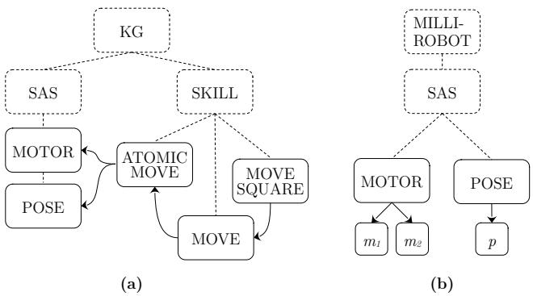  
Fig. 3. (a) Generic KG of skills and SAS; (b) Millirobot embodiment defines available sensorimotor capabilities. Skills become masterable once their dependencies are satisfied (e.g., ATOMIC MOVE before MOVE).

$$
m ( o , t ) = \operatorname { n o v e l t y } ( o , t ) \cdot \operatorname { p r o g r e s s } ( o , t ) \cdot \operatorname { d i f f i c u l t y } ( o , t )
$$

The complete formulation is detailed in Appendix A.

In the context of our work, the robot must be capable of continuous development without stagnation, ensuring it does not get stuck in specific scenarios. The novelty factor reflects how unfamiliar a skill is to the agent. It motivates the robot to explore and discover all skills available in its KG), ensuring that no skills are ignored or excluded from learning permanently. The progress factor, primarily driven by the fitness assessment, encourages consistent improvement (fast improvements boost motivation to continue learning) while enabling the millirobot to respond adaptively to regressions. The difficulty factor refers to the complexity of mastering a skill and ensures a balanced exploration, while more complex skills are prioritized simpler ones are still in focus periodically and never neglected completely. With this approach, the millirobot should ultimately be capable of developing all of its skills independently and without a final aim.

Addressing the memory and runtime constraints, we seek for a lightweight implementation of the IM, computed using only minimal historical data.

## D. Developmental Process

Our proposed tinyDSM, is designed to minimize hardwired skills while encouraging the open-ended development of new skills. The key is to encode a minimal set of general knowledge (see Fig. 1) that serves as a foundational starting point for the system. As development unfolds, it learns system-specific dependencies, like sensorimotor mapping skills, monitors them and adapts to new unseen conditions. It is designed to operate within the resource constraints of a low-energy microcontroller with only a few hundred kilobytes of RAM.

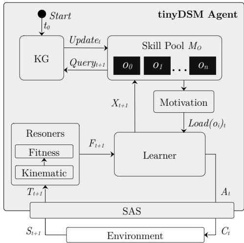  
Fig. 4. Overview of the tinyDSM developmental flow: the agent queries the KG to form a skill pool $M _ { O } .$ , selects skills via intrinsic motivation, and uses fitness from sensor-based reasoning to drive skill learning and curriculum progression.

tinyDSM is outlined in Fig. 4 and operates in discrete time steps. Beginning at time step $t _ { 0 }$ the millirobot queries its KG using its available sensor and actuator set to generate a set of masterable skills, referred to as the Skill Pool $M _ { O }$ . If the SAS is not complete, say the millirobot has no motors, it cannot move at all and thus cannot resolve the respective motion related skills, and its skill pool remains empty. However, out of this set, the skill with the highest motivation at time t is loaded for learning. The learner generates a sequence of action commands $A _ { t }$ . The SAS translates them to robot specific actuator commands $\mathcal { C } _ { \sqcup }$ leading to physical action in the environment. The robot explores the effects by reading its sensors $\cal { S } _ { \sqcup + \infty }$ . The set of reasoners monitors all state transitions $T _ { t + 1 }$ and compares the observed readings to expected assumptions. Based on that, the fitness $F _ { t + 1 }$ is calculated, acting as a reward signal for the learner to refine future actions. Based on $T _ { t = 1 }$ and $F _ { t + 1 }$ the algorithm performs its updates and reports the skills state $X _ { t + 1 }$ to tinyDSM. If $f _ { \mathrm { t h r e s h o l d } }$ is reached, the skill transitions from active learning to exploitation. In the next discrete time step, the agent re-queries the KG and updates the skill pool $M _ { O }$

At this stage, various scenarios may arise that affect the course of future development: (a) If a skill is deemed learned, it may unlock more complex skills (Curriculum Learning). (b) If the KG was extended it may discover new skills. (c) If the robot undergoes physical modifications, such as adding a new sensor, its developmental space may grow. (d) If nothing of the above applies, it continues developing existing skills. The curriculum factor in the developmental process directs the agent toward valuable search spaces, maximizing learning efficiency and accelerating progress. In contrast, the intrinsic motivation factor enables autonomous exploration, mirroring adaptive behavior observed in humans and animals. This combination allows the system to rapidly converge to a better local optimum while continuously monitoring and adapting its performance. The agent achieves a structured yet adaptive learning progression by continuously refining its internal representation of learnable skills. This self-reinforcing loop, where knowledge expansion is contingent on prior mastery and environmental modifications, mimics principles observed in biological cognitive development, enhancing both the learning process’s autonomy and scalability.

Learning routine (skill optimizer)— Once tinyDSM has selected a skill for development, a lightweight learning routine optimizes the policy of the skill under strict resource constraints. We are aware of the complexity of optimizing hyperparameters and formulating generalizable rewards, which in most applications require specific system-specific information to converge quickly. To address this challenge, we use small models with limited completeness and a minimalist reward design in a normalized 0-1 format. Curriculum learning and knowledge-based reasoner are used to guide the learning process to converge to local optima efficiently. tinyDSM monitors (fitness reasoner) all actions during learning and execution. This enables a transparent learning process and facilitates traceability and validation during execution. We distinguish between the developmental process implemented by tinyDSM (higher-order control logic) and the learning routine (the learner). tinyDSM acts a meta-controller that decides which skill should be learned, when learning should start or stop, and how the skills are organized through the knowledge graph and curriculum. In contrast, the learner is a task-local optimizer that determines how a selected skill is acquired by adjusting its control policy from experience. Due to resource constraints, we apply simulated annealing (SA) [46] for the learner. But any of the well established RL algorithms like Deep Q-Networks (DQN) [30] and Deep Deterministic Policy Gradient (DDPG) [31] are viable candidates. Genetic algorithms also show promise for policy optimization, as evolutionary approaches complement gradient-based methods in overcoming challenges like deceptive local optima and sparse rewards [35], [36].

## IV. EXPERIMENTAL SETUP

The tinyDSM framework is a low-level implementation in C++ that includes several modules, such as memory management, communication (SAS), skill, scheduler, learner, and agent, among others. Together with an extensive set of low-level libraries that are highly optimized for embedded devices, the framework enables the implementation of various skills and the integration of different learning algorithms, thus enabling efficient and flexible studies of developmental mechanisms in lowresource scenarios. In this work, we analyze the memory consumption categorized according to the minimal a priori knowledge and show the runtime performance of the framework without detailing design or implementation aspects. However, the setup for this study is depicted in Fig. 5, where the millirobot is placed in a controlled environment. A host device (desktop computer), captures the translation information using a camera and a fiducial marker system based on the ArUco library [47]. At this stage, embedded sensors for precise positioning are not yet integrated into the robot, so the host device transmits the sensed pose via Bluetooth. This limits autonomy and restricts experiments to controlled environments. Otherwise, this has no significant impact since there is no major delay in communication, and DSM works with any type of position sensor through the generic modelling of the skills, assuming the sensors provide the same types of values. Regarding resources, the communication overhead is about the same as an onboard sensor reading, if not slightly lower. In future work, we will integrate onboard localization to improve autonomy and scalability. The lightweight millirobot (150 g), measuring $4 0 { \times } 3 0 \mathrm { m m } ^ { 2 }$ , is 3D-printed and features four wheels, two of which are motor-driven. The tinyDSM runs on an RP2040 (Raspberry Pi Pico [48]) 32 bit microcontroller which has tight limited resources as listed in Table I.

TABLE I  
RP2040 SPECIFICATIONS.
<table><tr><td rowspan=1 colspan=1>Processor</td><td rowspan=1 colspan=1>FPU</td><td rowspan=1 colspan=1>HW IntegerDivider</td><td rowspan=1 colspan=1>Frequency</td><td rowspan=1 colspan=1>SRAM</td></tr><tr><td rowspan=1 colspan=1>ARM Cortex-M0+</td><td rowspan=1 colspan=1>NO</td><td rowspan=1 colspan=1>YES</td><td rowspan=1 colspan=1>133MHz</td><td rowspan=1 colspan=1>264kB</td></tr></table>

For the experiments, we model five motionrelated skills. We group them into a foundational ATOMIC MOVE skill and a more specialized MOVE skill that builds upon it. These skills enable the millirobot to theoretically follow any geometric pattern, as we demonstrate with the MOVE SQUARE skill. As a prospect of a more complex extension, this could also be a navigation path generated by a corresponding NAVIGATION skill.

We investigate how a newborn millirobot agent discovers these skills based on its physical body and how it develops and adapts them. The skills we propose are hierarchical, meaning that the agent must first master less complex skills before tackling more advanced ones. We examine in detail the intrinsically motivated behavior of the millirobot, which drives its development and must be able to react flexibly and effectively to a variety of unknown situations without stagnating. A key challenge ensuring the long-term maintenance of skills without neglecting the acquisition of new ones. Additionally, we evaluate the fitness assessments and demonstrate how these can aid in adapting to system degradation or changes in the environment by adding weight to the robot while operating. In addition to the real-world experiments, we conducted a simulation-based analysis to evaluate learning behavior under varying intrinsic motivation settings (Sec. IV-E).

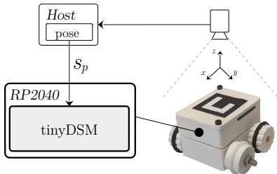  
Fig. 5. The millirobot is 3D-printed and features four wheels, two of which are motor-driven. The translation information is captured on a host device using a camera and a fiducial marker system and transmitted to the embedded RP2040, which operates the tinyDSM.

## A. SAS

The millirobots physical model is defined with $\mathbf { S } \mathbf { A } \mathbf { S } _ { r o b o t } \ = \ ( S , { \mathcal { C } } )$ and organized in its body graph as illustrated in Fig. 3(b). It controls two motors ${ \mathcal { C } } =$ $\{ c _ { m _ { 1 } } , c _ { m _ { 2 } } \}$ . The corresponding motor command takes three parameters, the time of activation t, the rotational force f and the duration τ how long the force is applied: $c _ { m _ { 1 } } ( t , f , \tau )$ and $c _ { m _ { 2 } } ( t , f , \tau )$ . It reads one sensor $s _ { p } \in S$ that provides the pose with cartesian coordinate information $s _ { p } ( t )  [ x , y , \psi ]$ at time t, with x and y denoting the horizontal and vertical coordinate in the xand y-dimensions, respectively, and ψ denoting the yaw angle.

The fundamental concept is that these interfaces offer an efficient abstraction of the robot-specific sensor readings and actuator commands, enabling higher-level, studies of generic methods without being constrained by robot-specific implementations. For example, motor control, whether managed e.g. through PWM, needs to be modelled for the specific robotic system. It allows the system to function without needing to know the specific actuators or sensors being used, it can simply rely on the defined interfaces.

## B. Kinematic Reasoner

For motions, we refer to the basic kinematic and $\mathrm { d y } .$ namic properties of a system, with kinematics describing the relationship between coordinates in motion space. With the dynamics correlating to the torque and force in each wheel. When the wheels touch the ground, these forces act indirectly on the overall system and thus cause it to move. The resulting spatial movement is determined by the change in position over time t using an inverse kinematic reasoner with

$$
\begin{array} { r l } & { \Delta x = x _ { t } - x _ { t + 1 } , \Delta y = y _ { t } - y _ { t + 1 } , } \\ & { \Delta \psi = w r a p ( \psi _ { 0 } , \psi _ { t } ) } \end{array}\tag{2}
$$

With $\Delta x$ being the horizontal change in distance, $\Delta y$ is the vertical change, while $\varDelta \psi$ denotes the difference in orientation, wrapped to a specified range of $\left[ - 1 8 0 ^ { \circ } , 1 8 0 ^ { \circ } \right]$ with $w r a p ( \psi _ { t } , \psi _ { t + 1 } )$ . The reasoner utilities this information to infer (a) linear and (b) angular motion patterns. A linear movement is defined with the euclidean distance $d \ = \ \sqrt { \Delta x ^ { 2 } + \Delta y ^ { 2 } } \ \neq \ 0$ and $\Delta \psi = 0$ . While $\varDelta \psi \neq 0$ and $d = 0$ indicate a pure angular motion pattern. This general knowledge pertains to two-dimensional space and can be used to infer motion for any moving object, in particular to various robots. Reasoners play a crucial role in knowledge-based systems, enabling logical inference and decision-making from incomplete or structured information. In our design, the kinematic reasoner is particularly characterized, as it adds to the basis of the minimal set of initial knowledge required for the robot to develop. Moreover, an extension to n-dimensional space can be defined in an analogous manner.

## C. Skills

At the foundational level of the knowledge graph, the ATMOIC MOVE skill type models basic linear and angular motion patterns. Building upon this, the $M O V E$ skill type models movements over specific ranges, such as travelling specific linear distances or rotating by set specific angles. The most complex skill $M O V E ~ S Q U A R E$ uses these lower-level skills to execute a series of movements that outline the shape of a rectangle.

$$
\begin{array} { r } { \mathrm { s t u L \longleftarrow s t r o M i c M O V E } \underbrace { \longrightarrow \vphantom { \sum _ { i } ^ { i } \sum _ { j } ^ { i } \sum _ { i } ^ { j } \sum _ { m = 1 } ^ { m } \sum _ { i } ^ { m } \sum _ { p = i } ^ { m } \sum _ { M \in \mathcal { L } _ { L } } ^ { P _ { H } ^ { \chi } \subseteq S \mathrm { O U A R E } } } } _ { \mathrm { o } _ { A M A } } \underbrace { \longrightarrow \vphantom { \sum _ { i } ^ { m } \sum _ { m = 1 } ^ { m } \sum _ { i } ^ { m } \sum _ { p = i } ^ { m } \sum _ { M \in \mathcal { L } _ { L } } ^ { P _ { H } ^ { \chi } \subseteq S \mathrm { O U A R E } } } } _ { o _ { A M L } } } \end{array}
$$

ATOMIC MOVE [LINEA $R ] { - o _ { A M L } } \colon$ : It is designed to enable the millirobot to drive in a straight line with as little rotation as possible with no specific distance. The specification $D _ { S _ { A M L } } \ = \ ( T , F )$ includes the desired transformation information T with set of sensor reading $S \ = \ \{ s _ { p } \}$ where $s _ { p } ~ \in ~ T$ . As defined by the SAS, $s _ { p } ( t )  [ x , y , \psi ]$ provides the cartesian coordinate information at time t. The vectors of the fitness F follow with:

$$
\vec { t } = \left( \begin{array} { c c } { \operatorname* { m a x } ( \Delta x , 2 0 \mathrm { m m } ) } \\ { 0 \mathrm { m m } } \\ { 0 ^ { \circ } } \end{array} \right) \vec { \sigma } = \left( \begin{array} { c c } { \Delta x } \\ { \Delta y } \\ { \Delta \psi } \end{array} \right) \vec { r } = \left( t _ { 0 } / 4 \right)
$$

with the target vector $\vec { t , }$ the observations $\vec { o }$ and the permissible deviations ${ \vec { r } } .$ The observation vector $\vec { o }$ captures the sensor readings based on T. These are then processed by the kinematic reasoner (see 2) to determine the relative movement of the millirobot. During learning the agent utilizes its algorithm that generates a sequence of motor commands $A = \langle c _ { m _ { 1 } } , c _ { m _ { 2 } } \rangle$ with $c _ { m _ { 1 } } ( t ) \to ( f _ { 1 } , \tau _ { 1 } )$ and $c _ { m _ { 2 } } ( t )  ( f _ { 2 } , \tau _ { 2 } )$ . The duration $\tau ,$ how long the force is applied, is set with a constant value $\tau _ { 1 } ~ = ~ C _ { \tau }$ and $\tau _ { 2 } ~ = ~ C _ { \tau }$ to simplify learning, as we search for any straight-line movement regardless of the distance traveled. Since no specific distance is required, we need to ensure the agent does not learn action commands that are too small. To achieve this, we set a minimum distance of the target $\vec { t _ { 0 } }$ to 20 mm for the calculation of the fitness score. It still ensures that the motion patterns being explored are independent of the distance traveled. Lateral or rotational movements are not desired. Thus, the target for both is zero. For the same reason as for $\vec { t }$ the members of $\vec { r }$ need to be independent of the distance traveled, thus leaving only forces $f _ { 1 }$ and $f _ { 2 }$ to be determined by the learner.

ATOMIC MOVE [ANGULA $R ] { - } o _ { A M A } { : }$ It is analogously designed to its linear counterpart $O A M L$ . It enables the millirobot to rotate in place, without specific angles and with as little movement in the directions $\Delta x$ and $\Delta y .$ . The specification is $D _ { S _ { A M A } } \ = \ ( T , F )$ with $S = \{ s _ { p } \}$ where $s _ { p } \in T$ and $F$ with:

$$
\vec { t } = \left( \begin{array} { c c } { 0 \mathrm { m m } } \\ { 0 \mathrm { m m } } \\ { m a x ( \Delta \psi , 2 0 ^ { \circ } ) } \end{array} \right) \vec { \sigma } = \left( \begin{array} { l } { \Delta x } \\ { \Delta y } \\ { \Delta \psi } \end{array} \right) \vec { r } = \left( \begin{array} { c } { 1 0 \mathrm { m m } } \\ { 1 0 \mathrm { m m } } \\ { t _ { 2 } } \end{array} \right)
$$

The actuator commands are specified with $A \quad =$ $\left. { c _ { m _ { 1 } } , c _ { m _ { 2 } } } \right.$ . As no specific angle is given, τ is also set constant with $\tau _ { 1 } ~ = ~ C _ { t }$ and $\tau _ { 2 } ~ = ~ C _ { t } .$ . As above, the learner has to find solutions to $f _ { 1 }$ and $f _ { 2 }$

MOVE [LINEAR]—oML: This skill builds upon $O A M L$ to enable the millirobot to drive in a straight line and stop at a specific distance relative to the starting position. The specification is $D _ { S _ { M L } } \ = \ ( T , F )$ with $S = \{ s _ { p } \}$ where $s _ { p } \in T$ . Since only the driven distance matters for this skill, the vectors of the fitness $F$ are straightforward:

$$
\begin{array} { r } { \vec { t } = \left( d _ { l } \right) \vec { o } = \left( \Delta x \right) \vec { r } = \left( \frac { d _ { l } } { 2 } \right) } \end{array}
$$

With d being the specific distance the robot has to travel. The observations for ⃗o are calculated by the kinematic reasoner (see 2) based on the T. The learning algorithm generates $A = \langle c _ { m _ { 1 } } , c _ { m _ { 2 } } \rangle$ with $c _ { m _ { 1 } } ( t ) \to ( f _ { 1 } , \tau _ { 1 } )$ and $c _ { m _ { 2 } } ( t )  ( f _ { 2 } , \tau _ { 2 } )$ . Since the $O A M L$ already provides $f _ { 1 }$ and $f _ { 2 }$ for driving in a straight line, the learner solely has to provide the mapping $\tau ( d _ { l } )$ where $\tau = \tau _ { 1 } = \tau _ { 2 }$

MOVE [ANGUA $L A R ] { \longrightarrow } o _ { M A } \colon$ Again, it is analogously designed to its linear counterpart $o _ { M L }$ and builds upon $O _ { A M A }$ to enable rotation by a specific angular distance $d _ { a } .$ The specification is $D _ { S _ { M A } } = ( T , F )$ with $S = \{ s _ { p } \}$ where $s _ { p } \in T$

$$
\begin{array} { r } { \vec { t } = \left( d _ { a } \right) \vec { o } = \left( \Delta \psi \right) \vec { r } = \left( \frac { d _ { a } } { 2 } \right) } \end{array}
$$

With $d _ { a }$ being the specific angle the robot has to rotate. The actuator commands are specified with $A =$ $\left. { c _ { m _ { 1 } } , c _ { m _ { 2 } } } \right.$ . Since the $O _ { A M A }$ already provides $f _ { 1 }$ and $f _ { 2 } ,$ the RL algorithm searches for the mapping $\tau ( d _ { a } )$ where $\tau = \tau _ { 1 } = \tau _ { 2 }$

MOVE $S Q U A R E { \mathrm { - } } o _ { M S } \colon$ This skill is a simplified type of skill, as it lacks a learning routine and has A already predefined. Once the skill is invoked, it simply applies A. It is used to evaluate all previously learned skills in a compound. The ”task” is designed to trace a geometric pattern in a square, which is achieved by a sequence of linear and angular movements. The specification is $D _ { S _ { M A } } = ( T , F )$ with $S = \{ s _ { p } \}$ where $s _ { p } \in T$ . The fitness of the geometric pattern is evaluated based on the absolute differences between the global x- and y-coordinates of the robots starting and ending points upon completing the task with $F \colon$

$$
\vec { t } = \left( \begin{array} { l } { 0 \mathrm { m m } } \\ { 0 \mathrm { m m } } \end{array} \right) \vec { o } = \left( \begin{array} { l } { \left| \Delta x \right| } \\ { \left| \Delta y \right| } \end{array} \right) \vec { r } = ( 1 5 0 \mathrm { m m } )
$$

The predefined sequence of action commands A follow with:

$$
( \ \langle o _ { M L } ( 5 0 \mathrm { m m } ) , \ o _ { M A } ( 9 0 ^ { \circ } ) \rangle \ ) _ { i = 1 } ^ { 4 }\tag{3}
$$

In this context, $o _ { M L }$ signifies a linear displacement of 50 mm, while $o _ { M A }$ indicates a rotation of $9 0 °$ , with these movements repeated as necessary to complete the rectangular pattern.

## D. Parameterization

We configure all skills with $f _ { \mathrm { t h r e s h o l d } } = 0 . 9 5$ and the intrinsic motivation as listed in Table II.

TABLE II  
IM PARAMETERIZATION.
<table><tr><td rowspan=1 colspan=1> $\overline { { N _ { \mathrm { i n i t } } = 5 0 . 0 } }$ </td><td rowspan=1 colspan=1> $\overline { { N _ { \mathrm { m a x } } = 1 0 0 . 0 } }$ </td><td rowspan=1 colspan=1> $\overline { { \beta = 0 . 1 } }$ </td></tr><tr><td rowspan=1 colspan=1> $\overline { { \gamma = 0 . 0 0 3 } }$ </td><td rowspan=1 colspan=1> $\overline { { p _ { \mathrm { s c a l e } } = 8 0 . 0 } }$ </td><td rowspan=1 colspan=1> $\overline { { p _ { \mathrm { o f f s e t } } = 2 0 . 0 } }$ </td></tr></table>

## E. Simulation Based Analysis

To investigate the developmental dynamics in a controlled and repeatable evaluation, we implemented a physics-based simulation environment in Python using pygame. The setup mirrors the SAS of the real millirobot, which ensures direct transferability between simulation and physical experiments.

We evaluated three learning algorithms:

• Simulated Annealing (SA) - used on the real robot,

• Q-learning - a Q-Table RL,

• Random - and a uniform random action selection (as a lower-bound reference).

We operated all learners under identical intrinsic motivation, fitness threshold, and knowledge-graph structure. Each configuration was evaluated over multiple independent runs with different random seeds.

Performance is evaluated with the mean skill fitness, defined as the average fitness across the five motionrelated skills. This continuous metric provides a compact and sensitive measure of general developmental behavioural abilities.

To characterize the internal dynamics of the intrinsic motivation, we define two metrics: (i) selection entropy $N _ { \mathrm { m a x } } .$ , that measures how evenly skills are selected, and (ii) maximum neglect H, that measures how long any skill remains unselected. Both metrics are computed from per-skill selection statistics and recency counters (formal definitions are provided in Appendix A).

We evaluated six intrinsic motivation parameterizations defined in Table III. These configurations systematically bias the scheduler towards exploration (high explore), exploitation (high exploit), higher novelty ranges (high Nlimit), earlier mastery (lower fthr), or stronger convergence after the threshold (high postslope).

TABLE III  
IM PARAMETER CONFIGURATIONS USED IN THE SIMULATION EXPERIMENTS.
<table><tr><td>IM</td><td>Ninit</td><td> $\overline { { N _ { \mathrm { l i m i t } } } }$ </td><td>β</td><td>γ</td><td>fthr</td><td>ppost</td></tr><tr><td>baseline</td><td>50</td><td>100</td><td>0.10</td><td>0.003</td><td>0.95</td><td>20</td></tr><tr><td>high_explore</td><td>50</td><td>100</td><td>0.10</td><td>0.010</td><td>0.95</td><td>20</td></tr><tr><td>high_exploit</td><td>50</td><td>100</td><td>0.20</td><td>0.003</td><td>0.95</td><td>20</td></tr><tr><td>high_Nlimit</td><td>50</td><td>150</td><td>0.10</td><td>0.003</td><td>0.95</td><td>20</td></tr><tr><td>lower_fthr</td><td>50</td><td>100</td><td>0.10</td><td>0.003</td><td>0.90</td><td>20</td></tr><tr><td>high_postslope</td><td>50</td><td>100</td><td>0.10</td><td>0.003</td><td>0.95</td><td>35</td></tr></table>

To compare IM configurations quantitatively, we define an IM Score which combines learning performance with IM scheduling stability. For each run, we compute the time-averaged mean fitness ${ \bar { f } } ,$ the time-averaged logarithmic maximum neglect $\overline { { N } } _ { \mathrm { m a x } } .$ , and the time-averaged selection entropy $\bar { H }$ . These are aggregated per settings and combined as

$$
\mathrm { I M } \mathrm { S c o r e } = \bar { f } - \lambda \overline { { N } } _ { \mathrm { m a x } } + \mu \bar { H } ,\tag{4}
$$

with $\lambda = 0 . 2 5$ that penalizes the long-term skill neglect and $\mu = 0 . 0 5$ that rewards the exploration diversity.

## V. EXPERIMENTAL RESULTS

First, in V-A, we demonstrate how the millirobot efficiently develops its skills in a reasonable timeframe through its flexible and adaptive behavior. We analyze in detail various factors that contribute to its intrinsic motivation and how these factors influence its actions. Next, in V-B, we explore how the system reacts to environmental changes, such as when the robot is loaded with weight, and how it adapts efficiently in a short time period. In ${ \mathrm { V - C } } ,$ we discuss the fitness evaluation in detail, illustrating how it can be applied to various higher-level skills in a scalable manner and the valuable insights we can gain from this process. In V-D, we outline the resources required by our framework, as our tinyDSM must operate effectively in targets with limited resources. Additionally, in V-E, we evaluate the learning behavior and intrinsic motivation dynamics in a simulated environment.

## A. Development

The millirobot is placed in a controlled environment without developed skills and must learn them from scratch. It starts with its initial prior knowledge as described in Fig. 1. First, the agent queries its KG using its available sensor and actuator set and generates the skill pool $M _ { O }$ . In Fig. 6b the blue diamond markers indicate when the agents skill pool is expanded. Shortly after the start, around 100 ms, only $O _ { A M A }$ and $O A M L$ are available, as they do not have dependencies other than on the SAS. This query process occurs at each discrete time step, which may lead to an expansion of the skill pool when lower-order skills reach their $f _ { \mathrm { t h r e s h o l d } }$ and higher-order skills are available in the KG. If a new skill is discovered the agent may start developing it. This behavior demonstrates the curriculum learning element of tinyDSM, which guides the agent during initial learning phases to explore valuable search spaces. Once a skill is discovered, the agents behaviour is driven by its intrinsic motivation, illustrated in Fig. 6a. It is calculated based on three factors (III-C): novelty, progress, and difficulty. Each of these factors influences the agent’s behavior depending on its current state and the experiences gained during the development process.

In Fig. 6 eight relevant segments are highlighted and labeled (A) to (H). In segment (A), the motivation for both types of atomic motions increases sharply due to the novelty of these skills. They are being discovered for the first time, with no prior experience available. The millirobot randomly selects one skill since both motivations are equal. The agent starts by exploring $o _ { A M A }$ . The skill $O A M L$ also receives sporadic attention, although faster progress is made with the angular pattern, as indicated by increases in fitness (Fig. 6b (A)).

Between segments (A) and (B), the millirobot catches up with the progress of $O A M L$ . In (B), the development of both skills occurs alternately, as the growth in fitness shows significant similarities. Other experiments have shown that motivation sometimes exhibits a ”latching” behaviour, focusing on a specific skill for an extended period before switching to the other. In such cases, the fitness of the focused skill increases significantly faster than the other skill. However, during (B), the motivation for both skills decreases, even though fitness continues to grow. This decline in motivation is attributed to the novelty and fitness, as the agent becomes more competent and ”bored”.

In (C), after around 1.8 min, the millirobot successfully reached the $f _ { \mathrm { t h r e s h o l d } }$ for $\ O _ { A M A }$ resulting in experience (defined in Appendix B) increasing to 1. This leads to the discovery of $o _ { M A }$ and an expansion of the skill pool. Achieving this, took only about  50 interactions with the physical environment, which is fairly efficient. $o _ { M A }$ is novel, and the agent is motivated to explore it. That skill is also more complex, as it needs the $O _ { A M A }$ for its activities. This is modeled with the higher hierarchical order in the KG, which results in a greater difficulty factor that increases motivation further.

In section (D), the agent focuses only on developing $o _ { M L }$ . While its fitness grows and it progresses with that skill, the motivation decreases, due to the decreasing novelty. This is the same pattern as in segment (B) and will continue to appear throughout development. What is new in this phase is that the agent becomes more interested in rediscovering the two atomic skills, so the motivation for those slightly increases again. However, the agent is slightly more motivated to pursue $O _ { A M L }$ since it considers itself more experienced with $o _ { A M A } .$

In segment (E), the agent faces a new situation as it progresses with $o _ { M A }$ and reaches $f _ { \mathrm { t h r e s h o l d } } .$ , driving its experience to 2. It briefly keeps its focus on angular motions before facing $O A M L$ again. This is delayed due to the higher difficulty factor. However, the agent reaches the $O A M I$ threshold in the next interaction, increasing its experience to 3. That leads to the discovery of the $o _ { M L }$ Shortly after a few interactions, the agent focuses on this newly discovered skill, repeating the pattern observed in (C) and (F).

In segment (F), $o _ { m s }$ is discovered, and the millirobot is motivated to drive on a square path, exploiting all previously learned skills in a sequence. However, the agent focuses on navigating along a square for the rest of the experiment. This behavior aligns with the intended objective, as more complex skills typically offer greater utility and adaptability than simpler ones. Even though it focuses on more complex skills, it does not entirely ignore simper atomic moves, visible in segment (H).

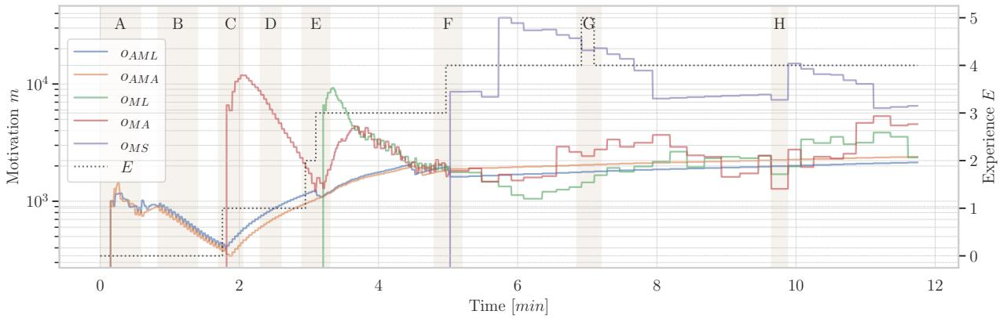  
(a)

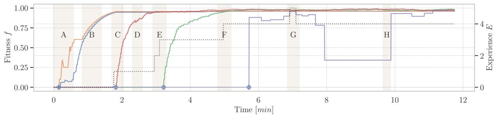  
(b)  
Fig. 6. V-A: (a) The intrinsic motivation m of the agent for each skill throughout its development, observed over a period of 12 min. The gray segments highlight significant events that we will discuss in the text. (b) The corresponding fitness f for each skill. The blue diamond markers indicate the discovery of new skills. The experience on the right axis of both figures reflects the overall progress of the agent, as defined in Appendix B.

In a brief segment (G), the robot successfully executed some high-quality squares indicated by toggling the experience to 5. Note that the $o _ { M S }$ has no learner, so the agent cannot improve it directly. We discuss this aspect in more detail in experiment V-C. Finally, the fitness is monitored for each interaction and skill, with the agent immediately recognizing environmental changes. As a result, the agent must be able to adapt to these changes. This challenge will be analyzed in experiment V-B.

In summary, in this experiment we demonstrated that the millirobot can develop skills efficiently and without stagnation in a relatively short time utilizing tinyDSM mechanisms and driving the development by combining intrinsic motivation and curriculum-based learning. Notably, the millirobot learned basic movements in only $\sim 4 . 5$ min and could, in principle, navigate effectively with the respective knowledge acquired.

## B. Adaption

Next, we investigate how the millirobot reacts to environmental changes. We begin by placing the robot in a controlled environment without developed skills. Fig. 7 shows the progress of the robot. After roughly 6.5 min, we load it with additional weight. This is indicated by the start of the gray shaded segment (W). This alteration in its physical properties invalidates the previously learned movement parameters, as the millirobot now reacts differently to the same motor commands.

Shortly after this weight change, we observe a significant drop in the fitness values of both $o _ { M A }$ and $o _ { M L }$ Additionally, the agents experience decreases as its skills drop below the fitness threshold. Note, the weight change only affects the learned duration of the motor commands τ and does not impact the ratios between $f _ { 1 }$ and $f _ { 2 }$ Consequently, the atomic motion skills $O _ { A M A }$ and $O A M L$ remain unaffected.

However, the decrease in fitness results in a sharp increase in motivation, primarily caused by the progress factor that drives the robots interest in relearning these skills. During (W), which lasts for 9 min, the agent successfully relearns its skills, as evidenced by increasing fitness scores and improvement in experience.

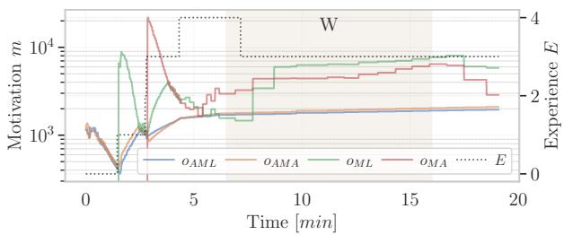

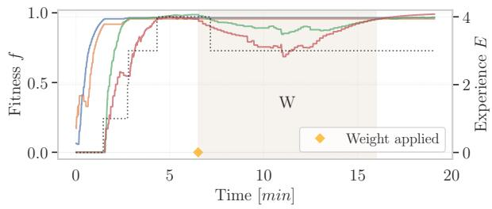  
Fig. 7. V-B: The upper graph shows the intrinsic motivation m of the agent. The lower graph shows the corresponding fitness f for the respective abilities. The dashed line illustrates the agents experience. Once the development has progressed and the robot has experience, it is loaded with additional weight of $3 8 0 \mathrm { g } .$ This is roughly after 6.5 min, which is indicated by the orange diamond marker. This results in a significant drop in fitness values, which motivates the agent to relearn the affected skills during (W).

In summary, through the use of tinyDSM, the agent continuously monitors all actions, even if the skills are sufficiently developed. It can detect deviations from learned actions through fitness computations. Ultimately, this allows the agent to respond effectively with its behaviour to new and unseen situations, adapting its skills to different conditions.

## C. Fitness Assessment

Fig. 8 illustrates the fitness of $o _ { M A }$ and $o _ { M L }$ during learning in two distinct progress stages. Movements with less learning progress $( 0 . 7 > f < 0 . 9 5 )$ show a very high variance and deviate significantly from the target, while more developed movements $( f \ > = \ 0 . 9 5 )$ are much closer to the target and show a significant reduction in variance. However, some variance remains even at high fitness values. We attribute this to the physical properties of our millirobot, which is far from ideal.

During the experiments, we observed that the robot sometimes reacts differently to the same motor commands. Particularly noteworthy is that, it experiences a “push” in the braking phase before it stops. This phenomenon is due to the unpredictable stalling of the motors gearbox when turning off. That results in an extended movement and can cause the robot to overshoot the target. This is also evident in Fig. 9, where, on average, all squares remain clearly “open” and miss the target on the left. Only a few good outliers pass it on to the right. The trajectory deviates from a perfect square shape and does not close exactly at the endpoint, observable in the significant fluctuations in the fitness calculation of the depending motion skills.

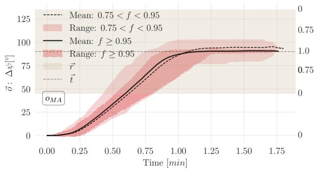

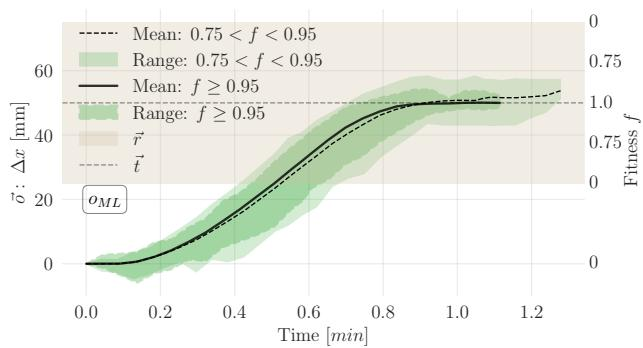  
Fig. 8. V-C: Fitness evolution of angular $( o _ { M A }$ , red) and linear $( o _ { M L } ,$ green) motion skills during learning. Observations ⃗o (left axis) are compared to targets ⃗t, with fitness f shown on the right. Two learning stages $( 0 . 7 < \bar { f } < 0 . 9 5$ and $f \geq 0 . 9 5 )$ show reduced variance as skills develop.

However, we do not aim for a highly optimized control system but rather want to explore a general approach to learning movement. An alternative general approach would involve discovering a series of small movements. A navigation skill could generate the path and correct errors, enabling more precise navigation. The perspective on error considerations and error tolerance of a particular function is always challenging. However, the error propagates over the sequence of 8 movements when following a square path. Thus, we argue that the accumulated navigation error, averaging 7.5 mm, is sufficiently small to ensure acceptable navigation, especially when considering the footprint size of the robot and the non-idealities of the motor hardware.

In summary, we demonstrate that our fitness calculation scales properly and seamlessly applies to more complex skills. The hierarchical structure is also well reflected in the fitness calculation of the square. Errors at lower hierarchical levels directly affect higher levels.

By recognizing these errors at different levels, we can correct deviations in a targeted manner. This leads to a significant increase in efficiency, as only the skills that are actually affected need to be re-learned, as demonstrated with the adaptation experiment.

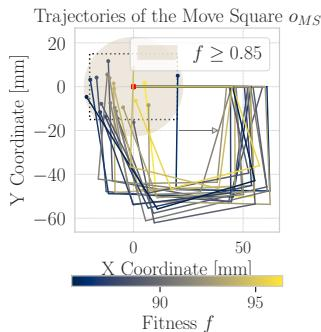

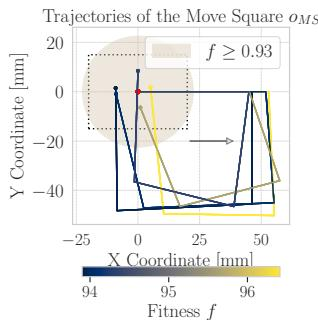  
Fig. 9. V-C: The Square motion skill $o _ { M S }$ projected with the first segment horizontal. The robot starts at the red point and executes alternating 50 mm linear and $9 0 ^ { \circ }$ angular moves to form a square. Left: $f \geq 8 5 ;$ right: $f \geq 9 3$

## D. Resources

In terms of resources, we consider the memory and execution time of the whole runtime system during the specific scenarios in our experiments. Since tinyDSM was designed for flexible use, we aim to reflect this flexibility in its implementation.

TABLE IV  
STATIC MEMORY USAGE PER MODULE, INCLUDING TOTAL ALLOCATION.
<table><tr><td rowspan=1 colspan=3>Memory</td></tr><tr><td rowspan=1 colspan=1>Module</td><td rowspan=1 colspan=1>tinyDSM</td><td rowspan=1 colspan=1>Usage</td></tr><tr><td rowspan=1 colspan=1>Agent</td><td rowspan=1 colspan=1>280 B</td><td rowspan=1 colspan=1>5.7%</td></tr><tr><td rowspan=1 colspan=1>Skills</td><td rowspan=1 colspan=1>488B</td><td rowspan=1 colspan=1>10.0%</td></tr><tr><td rowspan=1 colspan=1>Learners</td><td rowspan=1 colspan=1>2544 B</td><td rowspan=1 colspan=1>52.1%</td></tr><tr><td rowspan=1 colspan=1>SAS</td><td rowspan=1 colspan=1>840 B</td><td rowspan=1 colspan=1>17.2%</td></tr><tr><td rowspan=1 colspan=1>Scheduler</td><td rowspan=1 colspan=1>728 B</td><td rowspan=1 colspan=1>15.0%</td></tr><tr><td rowspan=1 colspan=1>MM</td><td rowspan=1 colspan=1>4017B</td><td rowspan=1 colspan=1>二</td></tr><tr><td rowspan=1 colspan=1>Total</td><td rowspan=1 colspan=1>8897 B</td><td rowspan=1 colspan=1>100%</td></tr></table>

tinyDSM is designed to only allocate memory during startup and skill creation and never during the normal execution cycle. This makes the memory consumption very predictable, minimizes bookkeeping for the memory manager and reduces the possibility of out-of-memory errors.

Table IV illustrates the static memory consumption. It details the memory usage for each module. The five skills tested in the experiments require 488 B, while the communication module (SAS) uses 720 B and the scheduler (IM) requires 840 B. However, these compact modules represent only a small part, with learners consuming a significant 52% of the total memory. Learning algorithms, particularly neural networks are memory intensive. Therefore, we focused on a memory-efficient implementation when designing the framework to ensure there is enough space for these algorithms. In this particular case, the numbers for the learners are inflated by a factor of 4. This is because of internal memory fragmentation caused by the buddy system having a minimum allocation size of 64 B and therefore being unsuited for many very small allocations. Also the use of dynamic arrays in the learners for arrays which are in essence constant in length and only 1 to 2 entries long causes a significant increase in memory consumption in the learners.

As an outlook, we estimate how many skills could be located on the RP2040 in a fictive scenario. We scale the framework to utilize the full 250 kB(16 kB reserved for pico SDK) available memory of the pico. We assume one of the move skills for the workload calculation, as this is the most complex and requires the most memory, say the linear move skill. Based on that, our calculations show that 96 instances of that skill would fit in the pico. This means that the agent would learn 96 separate linear movements, which is not a useful task but demonstrates tinyDSMs potential.

In terms of resource balancing, let’s consider a successfully developed skill (threshold reached). In this case, the framework could release the memory allocated for the particular learning algorithm. This leads to a dynamic adjustment of resources, allowing the millirobot to balance its workload according to its needs. For instance, in segment (H) (see Fig. 6b), no learners are required since all skills have been learned, and $o _ { M S }$ has no learner. The memory of 2544 B (Table IV) can be freed. The robot can still explore its environment and search for new interesting skills, but it requires less energy than in its development phase. This property is ideal for operating in low-resource environments.

The tinyDSM uses a dynamic Memory Management (MM), which is implemented using a custom buddy memory allocator. Where each module manages its own memory region, sometimes using its own allocation techniques. One example is the use of a simple memory arena or bump allocator in the skills module, which almost completely removes internal memory fragmentation within this module. This principle could also be applied to the other modules, reducing memory usage even further.

As for the other resources, the execution time of a single learning step varies from 10 ms to 30 ms depending on the complexity of the skill. In terms of weight, the millirobot itself weighs 150 g and the additional weight used in the experiments is 380 g. During all our experiments, the robot operated for about  45 min on a battery with a capacity of 250 mA h.

## E. Simulation-Based Analysis

1) Skill Acquisition Across Learning Algorithms: Both Q-learning and SA rapidly acquire the full skill set, achieving near-optimal performance, whereas the random policy fails to develop meaningful behaviour (Fig. 10).

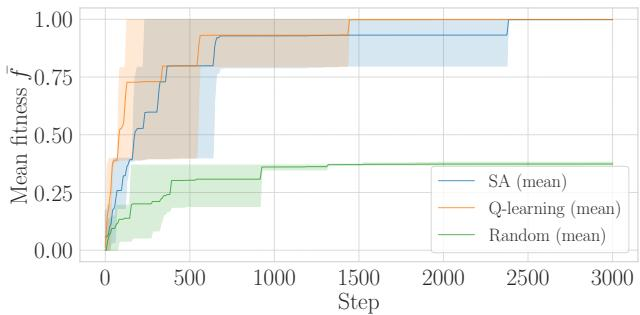  
Fig. 10. Average fitness f¯ for for different learning algorithms (mean with min–max across runs).

The Q-learning converges fastest, followed closely by SA. This indicates that the intrinsic motivation paired with the curriculum mechanism based on the KG in tinyDSM can effectively guide both learners toward the relevant search spaces. The random baseline stagnates far below the threshold for meaningful skill acquisition. This is cause more complex skills, such as higher-order move skills, are the primary bottlenecks. Random policies never succeed in these skills, whereas SA and Q-learning both master them.

2) Intrinsic Motivation Dynamics: Fig. 11 shows the corresponding IM analysis. High exploration (high explore, large γ) leads to high selection entropy but also extreme maximum neglect, indicating that some skills are ignored for long periods. High exploitation (high exploit, large β) maintains low neglect but slightly reduces coverage. The baseline configuration maintains both high entropy ( 0.83) and low maximum neglect ( 1.37), indicating a balanced and stable development process.

Table V shows the IM Score for each configuration. Since the score combines the learning quality ( ¯f) with scheduling stability $( \overline { { N } } _ { \operatorname* { m a x } }$ and H¯ ), it directly mirrors the trade-off between fast skill acquisition and robust development behaviour.

The baseline configuration achieves the highest IM rating, which is also evident in the visual representation in It incorporates fast, high-quality learning with stable and well-balanced skill scheduling.

The high exploit configuration reduces maximum neglect but also slightly lowers selection entropy, indicating an early focus on a narrow development schedule. The high Nlimit maintains exploration diversity but allows for higher neglect by focusing too much on noveltyoriented exploration.

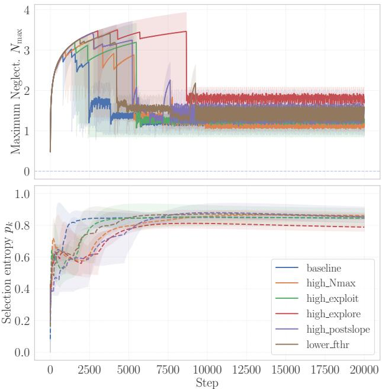  
Fig. 11. Intrinsic Motivation Dynamics. Top: maximum neglect $N _ { \operatorname* { m a x } } ( t )$ . Bottom: selection entropy H(t).

The lower fthr setting leads to early mastery but increases neglect, where some skills are effectively never selected again on the timescale of learning. On the other hand, high postslope keeps mastered skills highly attractive, causing the scheduler to repeatedly revisit a few skills and thereby reducing the stability of the developmental schedule.

Finally, the high explore performs worst, as it focuses on extreme novelty, which causes the IM scheduler to neglect previously learned skills, resulting in long-term starvation of many skills despite high overall entropy.

Table V summarizes the resulting scores.

TABLE V  
IM CONFIGURATION COMPARISON. HIGHER IM SCORE IS BETTER.
<table><tr><td>IM</td><td>f</td><td>H</td><td> $\overline { { N } } _ { \mathrm { m a x } }$ </td><td>IM Score</td></tr><tr><td>baseline</td><td>0.998</td><td>0.833</td><td>1.37</td><td>0.675</td></tr><tr><td>high_exploit</td><td>0.997</td><td>0.846</td><td>1.46</td><td>0.650</td></tr><tr><td>high_Nlimit</td><td>0.995</td><td>0.856</td><td>1.48</td><td>0.637</td></tr><tr><td>lower_fthr</td><td>0.997</td><td>0.829</td><td>1.51</td><td>0.628</td></tr><tr><td>high_postslope</td><td>0.999</td><td>0.865</td><td>1.48</td><td>0.626</td></tr><tr><td>high_explore</td><td>0.992</td><td>0.807</td><td>1.82</td><td>0.503</td></tr></table>

These results demonstrate that tinyDSM is highly sensitive to intrinsic motivation parameterization. Increasing the novelty destabilizes development through excessive neglect, whereas stronger exploitation accelerates early learning at the cost of reduced diversity. The baseline configuration offers the most robust development schedule. This indicates that IM scheduling plays a stabilitycritical role in shaping developmental dynamics.

## VI. CONCLUSION

In this work, we introduced tinyDSM, an advanced developmental skill method specifically designed for resource-constrained millirobots, bridging the domains of tiny robot learning and cognitive developmental robotics. tinyDSM bridges the domains of tiny robot learning and cognitive developmental robotics by enabling autonomous, open-ended skill development from minimal prior knowledge. It combines intrinsic motivation, fitness-based evaluation, and structured knowledge representation through a hierarchical knowledge graph and kinematic reasoning.

We demonstrated that a millirobot with a volume of only $\mathrm { 3 6 c m ^ { 3 } }$ , running on a Raspberry Pi Pico 32- bit microcontroller (RP2040), can progress from atomic motion patterns to complex geometric behaviours within 15 minutes, despite operating within just 9 kB of memory. This is achieved through curriculum-based learning and an intrinsic motivation model balancing novelty, progress, and difficulty.

To assess generality and robustness, we conducted a complementary simulation-based analysis. This allowed systematic evaluation across different learning algorithms and intrinsic motivation configurations. The results highlight that the developmental dynamics and stability of skill acquisition are highly sensitive to motivation scheduling and parameterization.

We showed that the agent efficiently developed core motion skills, adapted to physical changes like added weight, and maintained performance through continuous fitness-based evaluation. The system shows robustness in maintaining previously acquired skills while pursuing new competencies, supporting the concept of lifelong learning.

These results demonstrate the potential of flexible, self-directed robotic agents that can learn throughout their lifetime in dynamic environments with limited resources. Future work will explore richer sensing, higherlevel planning, and on-device learning with lightweight neural networks, along with studies in more complex scenarios.

## REFERENCES

[1] M. Lungarella, G. Metta, R. Pfeifer, and G. Sandini, “Developmental robotics: A survey,” Connection Science, vol. 15, no. 4, pp. 151–190, Dec. 2003.

[2] A. Cangelosi and M. Schlesinger, “From Babies to Robots: The Contribution of Developmental Robotics to Developmental Psychology,” Child Development Perspectives, vol. 12, no. 3, pp. 183–188, 2018.

[3] M. Asada, K. Hosoda, Y. Kuniyoshi, H. Ishiguro, T. Inui, Y. Yoshikawa, M. Ogino, and C. Yoshida, “Cognitive Developmental Robotics: A Survey,” IEEE Transactions on Autonomous Mental Development, vol. 1, no. 1, pp. 12–34, May 2009.

[4] M. Soori, B. Arezoo, and R. Dastres, “Artificial intelligence, machine learning and deep learning in advanced robotics, a review,” Cognitive Robotics, vol. 3, pp. 54–70, Jan. 2023.

[5] S. M. Neuman, B. Plancher, B. P. Duisterhof, S. Krishnan, C. Banbury, M. Mazumder, S. Prakash, J. Jabbour, A. Faust, G. C. de Croon, and V. J. Reddi, “Tiny Robot Learning: Challenges and Directions for Machine Learning in Resource-Constrained Robots,” in 2022 IEEE 4th AICAS, Jun. 2022, pp. 296–299.

[6] G. Caprari, “Autonomous micro-robots : Applications and limitations,” Ph.D. dissertation, Lausanne, EPFL, 2003.

[7] B. P. Duisterhof, S. Krishnan, J. J. Cruz, C. R. Banbury, W. Fu, A. Faust, G. C. H. E. de Croon, and V. Janapa Reddi, “Tiny Robot Learning (tinyRL) for Source Seeking on a Nano Quadcopter,” in 2021 IEEE International Conference on Robotics and Automation (ICRA), May 2021, pp. 7242–7248.

[8] S. D. de Rivaz, B. Goldberg, N. Doshi, K. Jayaram, J. Zhou, and R. J. Wood, “Inverted and vertical climbing of a quadrupedal microrobot using electroadhesion,” Science Robotics, vol. 3, no. 25, p. eaau3038, Dec. 2018.

[9] J. I. Olszewska, M. Barreto, J. Bermejo-Alonso, J. Carbonera, A. Chibani, S. Fiorini, P. Goncalves, M. Habib, A. Khamis, A. Olivares, E. P. de Freitas, E. Prestes, S. V. Ragavan, S. Redfield, R. Sanz, B. Spencer, and H. Li, “Ontology for autonomous robotics,” in 2017 26th IEEE RO-MAN, Aug. 2017, pp. 189–194.

[10] R. M. Ryan and E. L. Deci, “Intrinsic and Extrinsic Motivations: Classic Definitions and New Directions,” Contemporary Educational Psychology, vol. 25, no. 1, pp. 54–67, Jan. 2000.

[11] Y. Wang, Y. Wang, S. Patel, and D. Patel, “A layered reference model of the brain (LRMB),” IEEE Transactions on Systems, Man, and Cybernetics, Part C (Applications and Reviews), vol. 36, no. 2, pp. 124–133, Mar. 2006.

[12] F. E. Ritter, F. Tehranchi, and J. D. Oury, “ACT-R: A cognitive architecture for modeling cognition,” WIREs Cognitive Science, vol. 10, no. 3, p. e1488, May 2019.

[13] J. E. Laird, K. R. Kinkade, S. Mohan, and J. Z. Xu, “Cognitive Robotics Using the Soar Cognitive Architecture.”

[14] H. Levesque and G. Lakemeyer, “Chapter 23 Cognitive Robotics,” in Foundations of Artificial Intelligence, ser. Handbook of Knowledge Representation, F. van Harmelen, V. Lifschitz, and B. Porter, Eds. Elsevier, Jan. 2008, vol. 3, pp. 869– 886.

[15] X. Sun and Y. Zhang, “A Review of Domain Knowledge Representation for Robot Task Planning,” in Proceedings of the 2019 4th International Conference on Mathematics and Artificial Intelligence. Chegndu China: ACM, Apr. 2019, pp. 176–183.

[16] M. Tenorth and M. Beetz, “KNOWROB — knowledge processing for autonomous personal robots,” in 2009 IEEE/RSJ International Conference on Intelligent Robots and Systems, Oct. 2009, pp. 4261–4266.

[17] A. Saxena, A. Jain, O. Sener, A. Jami, D. K. Misra, and H. S. Koppula, “RoboBrain: Large-Scale Knowledge Engine for Robots,” Apr. 2015.

[18] P. Khandelwal, S. Zhang, J. Sinapov, M. Leonetti, J. Thomason, F. Yang, I. Gori, M. Svetlik, P. Khante, V. Lifschitz, J. K. Aggarwal, R. Mooney, and P. Stone, “BWIBots: A platform for bridging the gap between AI and human–robot interaction research,” The International Journal of Robotics Research, vol. 36, no. 5-7, pp. 635–659, Jun. 2017.

[19] P.-Y. Oudeyer, F. Kaplan, and V. V. Hafner, “Intrinsic Motivation Systems for Autonomous Mental Development,” IEEE Transactions on Evolutionary Computation, vol. 11, no. 2, pp. 265–286, Apr. 2007.

[20] P.-Y. Oudeyer and F. Kaplan, “What is intrinsic motivation? A typology of computational approaches,” Frontiers in Neurorobotics, vol. 1, 2007.

[21] ——, “How can we define intrinsic motivation ?” in The 8th International Conference on Epigenetic Robotics. Brighton, United

Kingdom: Lund University Cognitive Studies, Lund:LUCS, Brighton, 2008.

[22] A. G. Barto, S. Singh, and N. Chentanez, “Intrinsically Motivated Learning of Hierarchical Collections of Skills,” 2004.

[23] P. Skelly, “Hierarchical Reinforcement Learning with Function Approximation for Adaptive Control,” p. 261.

[24] S. Pateria, B. Subagdja, A.-h. Tan, and C. Quek, “Hierarchical Reinforcement Learning: A Comprehensive Survey,” ACM Computing Surveys, vol. 54, no. 5, pp. 1–35, Jun. 2022.

[25] J. Andreas, D. Klein, and S. Levine, “Modular Multitask Reinforcement Learning with Policy Sketches,” arXiv:1611.01796 [cs], Jun. 2017.

[26] R. Immonen and T. Ham¨ al¨ ainen, “Tiny Machine Learning for¨ Resource-Constrained Microcontrollers,” Journal of Sensors, vol. 2022, no. 1, p. 7437023, 2022.

[27] M. T. Le, P. Wolinski, and J. Arbel, “Efficient Neural Networksˆ for Tiny Machine Learning: A Comprehensive Review,” 2023.

[28] J. Lin, L. Zhu, W.-M. Chen, W.-C. Wang, and S. Han, “Tiny Machine Learning: Progress and Futures [Feature],” IEEE Circuits and Systems Magazine, vol. 23, no. 3, pp. 8–34, 2023.

[29] S. S. Saha, S. S. Sandha, and M. Srivastava, “Machine Learning for Microcontroller-Class Hardware: A Review,” IEEE Sensors Journal, vol. 22, no. 22, pp. 21 362–21 390, Nov. 2022.

[30] V. Mnih, K. Kavukcuoglu, D. Silver, A. Graves, I. Antonoglou, D. Wierstra, and M. Riedmiller, “Playing Atari with Deep Reinforcement Learning,” arXiv:1312.5602, Dec. 2013.

[31] T. P. Lillicrap, J. J. Hunt, A. Pritzel, N. Heess, T. Erez, Y. Tassa, D. Silver, and D. Wierstra, “Continuous control with deep reinforcement learning,” arXiv:1509.02971, Jul. 2019.

[32] C. J. C. H. Watkins and P. Dayan, “Q-learning,” Machine Learning, vol. 8, no. 3-4, pp. 279–292, May 1992.

[33] T. Szydlo, P. P. Jayaraman, Y. Li, G. Morgan, and R. Ranjan, “TinyRL: Towards Reinforcement Learning on Tiny Embedded Devices,” in Proceedings of the 31st ACM International Conference on Information & Knowledge Management. Atlanta GA USA: ACM, Oct. 2022, pp. 4985–4988.

[34] F. Svoboda, D. Nunes, M. Alizadeh, R. Daries, R. Luo, A. Mathur, S. Bhattacharya, J. S. Silva, and N. D. Lane, “Resource Efficient Deep Reinforcement Learning for Acutely Constrained TinyML Devices,” in Research Symposium on Tiny Machine Learning, Dec. 2020.

[35] K. O. Stanley and R. Miikkulainen, “Evolving Neural Networks through Augmenting Topologies,” Evolutionary Computation, vol. 10, no. 2, pp. 99–127, Jun. 2002.

[36] F. P. Such, V. Madhavan, E. Conti, J. Lehman, K. O. Stanley, and J. Clune, “Deep Neuroevolution: Genetic Algorithms Are a Competitive Alternative for Training Deep Neural Networks for Reinforcement Learning,” Apr. 2018.

[37] A. Baranes and P.-Y. Oudeyer, “Active Learning of Inverse Models with Intrinsically Motivated Goal Exploration in Robots,” Robotics and Autonomous Systems, vol. 61, no. 1, pp. 49–73, Jan. 2013.

[38] S. Forestier, R. Portelas, Y. Mollard, and P.-Y. Oudeyer, “Intrinsically Motivated Goal Exploration Processes with Automatic Curriculum Learning,” Journal of Machine Learning Research, vol. 23, no. 152, pp. 1–41, 2022.

[39] S. M. Nguyen, N. Duminy, A. Manoury, D. Duhaut, and C. Buche, “Robots Learn Increasingly Complex Tasks with Intrinsic Motivation and Automatic Curriculum Learning,” KI - Kunstliche Intelligenz¨ , vol. 35, no. 1, pp. 81–90, Mar. 2021.

[40] C. Colas, P. Fournier, O. Sigaud, M. Chetouani, and P.-Y. Oudeyer, “CURIOUS: Intrinsically Motivated Modular Multi-Goal Reinforcement Learning,” May 2019.

[41] J. Chen, Y. Chen, X. Zhang, X. Du, K. Wang, and J.-R. Wen, “Entity set expansion with semantic features of knowledge graphs,” Journal of Web Semantics, vol. 52–53, pp. 33–44, Oct. 2018.

[42] D. Beßler, D. Ler, R. Porzel, M. Pomarlan, A. Vyas, S. Hoffner,¨ S. Ffner, M. Beetz, R. Malaka, and J. Bateman, “Foundations of the Socio-Physical Model of Activities (SOMA) for Autonomous

Robotic Agents,” Formal Ontology in Information Systems, pp. 159–174, 2021.

[43] S. Narvekar, B. Peng, M. Leonetti, J. Sinapov, M. E. Taylor, and P. Stone, “Curriculum Learning for Reinforcement Learning Domains: A Framework and Survey,” ArXiv, Mar. 2020.

[44] M. Svetlik, M. Leonetti, J. Sinapov, R. Shah, N. Walker, and P. Stone, “Automatic Curriculum Graph Generation for Reinforcement Learning Agents,” Proceedings of the AAAI Conference on Artificial Intelligence, vol. 31, no. 1, Feb. 2017.

[45] P.-Y. Oudeyer and F. Kaplan, How Can We Define Intrinsic Motivation?, 2009.

[46] S. Kirkpatrick, C. D. Gelatt, and M. P. Vecchi, “Optimization by Simulated Annealing,” Science, vol. 220, no. 4598, pp. 671–680, May 1983.

[47] S. Garrido-Jurado, R. Munoz-Salinas, F. J. Madrid-Cuevas, and˜ M. J. Mar´ın-Jimenez, “Automatic generation and detection of´ highly reliable fiducial markers under occlusion,” Pattern Recognition, vol. 47, no. 6, pp. 2280–2292, Jun. 2014.

[48] Raspberry Pi (Trading) Ltd., “Raspberry Pi Pico Datasheet,” 2021.

## APPENDIX

## A. Intrinsic Motivation

For compactness, we abbreviate the novelty, progress, and difficulty functions as $n ( o , t ) , p ( o , t )$ , and $\scriptstyle d ( o , t )$ respectively. The IM $m ( o , t )$ of an agent to pursue a masterable skill with $o \in M _ { O }$ as the product of three factors with:

$$
\begin{array} { r l } & { n ( o , t ) = } \\ & { \left\{ \begin{array} { l l } { N _ { \mathrm { i n i t } } } & { t = t _ { 0 } } \\ { n ( o , t _ { - 1 } ) \cdot ( 1 - \beta ) } & { \mathrm { i f ~ e x e c u t e d ~ a t ~ } t } \\ { n ( o , t - 1 ) + \gamma ( N _ { \mathrm { l i m i t } } - n ( o , t - 1 ) ) } & { \mathrm { o t h e r w i s e } } \end{array} \right. } \end{array}
$$

where β is the decay rate, γ is the growth rate, $N _ { \mathrm { i n i t } }$ is the initial and $N _ { \mathrm { l i m i t } }$ is the maximum novelty value.

$$
\begin{array} { r l } & { p ( o , t ) = } \\ & { \left\{ f ( o , t ) \cdot \frac { p _ { \mathrm { s c a l e } } } { f _ { \mathrm { t h r e s h o l d } } } + p _ { \mathrm { o f f s e t } } \quad \mathrm { i f } \ f ( o , t ) < f _ { \mathrm { t h r e s h o l d } } \right. } \\ & { \left. 1 - f ( o , t ) \cdot p _ { \mathrm { o f f s e t } } \quad \quad \quad \mathrm { i f } \ f ( o , t ) \geq f _ { \mathrm { t h r e s h o l d } } \right. } \end{array}
$$

where $p _ { \mathrm { s c a l e } }$ and $p _ { \mathrm { o f f s e t } }$ are scaling and offset parameters for progress.

$$
d ( o , t ) = \log _ { 2 } \left( 2 + \sum _ { o _ { k } \in \mathrm { p r e d } ( o ) } f ( o _ { k } , t ) \right) ,
$$

where $f ( o _ { p k } , t )$ is the fitness of each prerequisite skill $o _ { p k }$ at time t and the set of prerequisites follows with:

$$
\begin{array} { r l } & { \mathrm { p r e d } ( o ) = \{ o _ { i } \in O \mid o _ { i } \to o \in U \vee } \\ & { ~ \exists o _ { j } \in \mathrm { p r e d } ( o ) : o _ { i } \to o _ { j } \in U \} . } \end{array}
$$

Finally, at every discrete time step $t ,$ the agent selects the next skill to explore by maximizing the motivation function:

$$
o _ { \mathrm { n e x t } } ( M _ { o } , t ) : = \underset { o \in M _ { o } } { \arg \operatorname* { m a x } } m ( o , t ) ,\tag{5}
$$

where $M _ { o }$ is the available skill pool.

## B. Experience

We define the experience $E ( o , t )$ to indicate whether a skill $o \in M _ { o }$ has been learned at time t.

$$
E ( o , t ) = { \left\{ \begin{array} { l l } { 1 , } & { { \mathrm { i f ~ } } f ( o , t ) \geq f _ { \mathrm { t h r e s h o l d } } , } \\ { 0 , } & { { \mathrm { o t h e r w i s e } } } \end{array} \right. }
$$

The total accumulated experience of all skills at time t is defined as:

$$
E _ { t } = \operatorname* { m a x } \left( 0 , \sum _ { o _ { k } \in M _ { o } } E ( o _ { k } , t ) \right)\tag{6}
$$

This metric is used to reflect the overall progress of the agent.

## C. Intrinsic Motivation Health Metrics

a) Maximum Neglect.: Let $R _ { k } ( t )$ be the number of steps since skill k was last selected. The worst-case neglect is

$$
N _ { \mathrm { m a x } } ( t ) = \log _ { 1 0 } \bigl ( \operatorname* { m a x } _ { k } R _ { k } ( t ) + \varepsilon \bigr ) , \qquad \varepsilon = 1 0 ^ { - 3 } .\tag{7}
$$

b) Selection Entropy.: With cumulative counts $C _ { k } ( t )$ , the selection probability is

$$
p _ { k } ( t ) = \frac { C _ { k } ( t ) } { \sum _ { j = 1 } ^ { K } C _ { j } ( t ) } .\tag{8}
$$

The normalized Shannon entropy is

$$
H ( t ) = - \frac { 1 } { \log K } \sum _ { k : p _ { k } ( t ) > 0 } p _ { k } ( t ) \log p _ { k } ( t ) .\tag{9}
$$

Here $H ( t ) \in [ 0 , 1 ]$ measures coverage of skill sampling, while $N _ { \mathrm { m a x } } ( t )$ captures long-term skill neglect.