# Towards Quantifying Benchmark Optimization in ASR Models

Theo Lebryk∗, David Ayllon, Alice Baird, Jakub Piotr Cłapa, Jens Madsen, Panagiotis Tzirakis

Hume AI Research

Abstract. Public benchmarks are important measures of Automatic Speech Recognition (ASR) model capabilities. However, by nature of being public, there is risk of models being optimized for these benchmarks in ways that do not generalize well to real-world data. We present a methodology for quantifying benchmark optimization, focusing on cases where the audio underdetermines the reference transcript a. We identify three families of behavioral probes that reveal models’ capabilities of reproducing benchmark reference spans despite underdetermined audio: reference disagreement, masked-number recovery, and orthographic switching. We find that the highest-scoring open source models output verbatim reference transcript spans even when the relevant audio is contradictory, masked, or ambiguous. Using a variety of mechanistic probes, we show that models respond to narrow acoustic cues to override the faithful representation of the audio in favor of a benchmark-optimized policy. We show the benchmark-optimized behavior can be causally manipulated via low-rank linear steering or simply appending audio to the end of a segment in some cases. Overall, our results indicate that high-performing models exhibit benchmark-conditioned behaviors that can inflate benchmark performance without reflecting improved general-purpose transcription ability.

agithub.com/HumeAI/asr-benchmark-optimization.

## 1 Introduction

Researchers in Automatic Speech Recognition (ASR) models have claimed models have achieved human-level perfor mance on public benchmarks for nearly a decade [2, 47], yet a persistent gap separates benchmark performance from real-world utility [32, 46]. Ideally, a low word error rate (WER) on a benchmark reflects a general ability to transcribe speech that extends to unseen, real-world audio. Because benchmarks are public, however, models can be optimized to drive their reported WER down in ways that are orthogonal to—or even actively harmful to—real-world transcription abilities, causing benchmark scores to overstate a model’s general-purpose performance.

We define benchmark optimization (colloquially known as benchmaxxing) as gains in reported performance that arise from reliance on benchmark-specific artifacts rather than from a generalizable improvement in transcription ability.

To measure this phenomenon, we construct cases in which the audio does not uniquely support the exact reference transcript. For instance, when a benchmark entry contains a transcription error, an audio-faithful transcriber should place low probability on the (erroneous) reference transcript. Similarly, if the audio for a word is masked, the model should also place limited probability on that word. Finally, when a word admits two phonetically and semantically equivalent renderings, the model should not switch between them to match the benchmark’s local reference convention. In all these “benchmark optimization probes,” models systematically matching the reference transcript at rates far above chance suggests that the model is using the benchmark’s acoustic cue as a shortcut rather than faithfully listening to the audio. We find that these behaviors persist in synthetic speech using clones of the voices of speakers from the benchmark’s evaluation set, but weaken for clones of generic speakers or previously unseen speakers from independently collected data in the same source domain. Beyond establishing that benchmark optimization happens, we ask when and how this behavior is triggered.

We find that models override audio-supported content at diferent depths, triggered by a fairly narrow range of inputs, and largely operate faithfully of the benchmark’s distribution. However, steering a model’s internal activations along a low-dimensional linear direction or appending benchmark-like or generic audio can bi-directionally flip the benchmark- optimized behavior. As such, models are expressive enough to localize the benchmark-conditioned representations to a narrow set of acoustic cues, limiting its efect of-distribution while inflating measured performance on the benchmark. We use “narrow” to mean that the behavior is triggered by a restricted range of acoustic contexts: the benchmark- optimized policy appears on benchmark recordings and test-speaker clones, but often weakens on generic voices and newly collected speakers from the same domain.

We make the following contributions:

• We present a reusable methodology for measuring ASR benchmark optimization from model behavior: reference disagreement, masked-number recovery, and orthographic switching.

• We show that benchmark-optimized behavior is common among the highest-scoring models on two public benchmarks, with models prone to reproducing benchmark-specific transcripts despite audio evidence to the contrary.

• We show how benchmark-specific acoustic context changes model behavior at inference time. The model can faithfully transcribe the target speech when its context is restricted, but activates a benchmark-optimized policy when presented with suficient benchmark-specific cues. We further demonstrate two bidirectional interventions that can activate or suppress this policy.

## 2 Related Work

It is well established that state-of-the-art ASR model WER on standard benchmarks often overstates real-world ability [21, 32, 39]. The distributional limits of industr -standard datasets have been studied and numerous recent works have proposed new robustness-oriented ASR evaluations targeting acoustic degradation [35, 46], far-field [9], and other real-world conditions [4, 5, 40]. However, this line of work primarily treats the benchmark–reality gap as a coverage problem: if existing benchmarks miss important conditions, add benchmarks that include them. Our results show that there is also a measurement problem. Public benchmarks can reward benchmark-specific behavior even when the model is not faithfully transcribing the audio. This issue is especially relevant for new benchmarks derived from synthetic augmentations of existing datasets [14, 35, 46] as we find that several models’ benchmark-specific behavior can persist under exactly these perturbations (App. Figure 7). New datasets are necessary but insuficient: without a framework to detect and measure benchmark optimization, new benchmarks may be subject to the same measurement distortions as existing evaluation sets.

Earlier ASR systems added bespoke text post-processing steps per benchmark to optimize performance on diferent orthographic conventions, which can account for a significant portion of cross-corpus error [21]; reporting model performance across an array of benchmarks using a single text post-processing procedure has alleviated the use of bespoke processing steps to benchmark-optimize [11, 38]. However, this shift merely pushes the issue of benchmark optimizing using bespoke convention matching [1] to the model level. A model which is expressive enough to learn the conventions of multiple benchmarks and alternate between conventions based on arbitrary acoustic cues can still hill-climb on benchmarks independent of its general-purpose competency.

Deep learning models have traditionally been known to exploit statistical regularities in the training data as shortcuts to completing a task in a variety of domains [12, 15, 18, 23, 24, 30]. With the emergence of speech-large language models (LLMs) for ASR, there is evidence of evaluation set transcripts leaking into speech-LLM’s decoder backbone [41]. However, this form of contamination is localized to a specific training paradigm, while our results show evidence of benchmark optimization across multiple architectures. Moreover, authors have found the impact of decoder data contamination on WER to be relatively small, reinforcing recent NLP research which suggests that “training on the test task” is a more prominent form of benchmark optimization than data contamination [10]. Thus, there is a need for an updated understanding and measurement framework for how models optimize performance on ASR benchmarks.

Researchers have begun to apply mechanistic interpretability techniques to automatic speech recognition (ASR) [13, 29]. We apply related interventions to benchmark optimization, using context manipulation, activation patching [44, 49], and activation steering [33, 42] to localize and causally manipulate benchmark-specific transcription behavior.

## 3 Method

## 3.1 Experimental setup

Models. We evaluate 11 widely used open source ASR models spanning the two dominant architectures: encoder– decoder attention/transducer models (Whisper-Large-v3 [32], Cohere-Transcribe [8], Parakeet-TDT-0.6B-v2 [27, 48], Moonshine-Streaming [17]) and speech–LLM models (Canary-Qwen-2.5B [7, 26], Granite-Speech-4.1-2B [34], Higgs-Audio-v3-8B [6], Kimi-Audio-7B [19], Phi-4-Multimodal [25], Qwen3-ASR-0.6B [36], Voxtral-Mini-3B [22]). We report teacher-forced likelihood metrics for all models but Parakeet-TDT, whose token-and-duration transducer archi tecture makes reading logits at arbitrary positions dificult.

Datasets. We focus our analysis on VoxPopuli [45] (English), which consists of European Parliamentary recordings and is among the most widely used ASR benchmarks. The dataset has a train, validation, and test split but 40% of speakers in the test split are leaked into the training split in the Hugging Face version of the dataset. Where applicable, we extend our findings to LibriSpeech [28] (clean and other). As a held-out control, we use DaiKon, a private set of 450 conversational clips drawn from the naturalistic dyadic-conversation collection of Tzirakis et al. [43]; these clips postdate and lie outside ever model’s training data and also point to how the capabilities measured in the public benchmarks translate to real-world, conversational audio. To probe the limits of when benchmark optimized behavior occurs, we add two further sources. We use Qwen3-TTS [16] to generate synthetic samples using a variety of reference speakers. We also collect fresh data corresponding to a new held-out dataset from the same domain as both benchmarks. We scrape European Parliament recordings from June 2026 (ep-fresh)—after every model’s training cutof—following the original VoxPopuli collection procedure. Manual inspection confirmed these transcript/clip pairs are in-distribution, down to characteristic VoxPopuli reference errors such as courtesy-expression omission.

For LibriSpeech, we analogously collect 2026 LibriVox recordings from 14 newly active readers whose catalog histories begin after every model’s training cutof (libri-fresh).

## 3.2 Probes and readouts

Every behavioral probe marks a set of positions where the audio x underdetermines the reference and contrasts the reference rendering r with a competing audio-true (or acoustically equivalent) rendering a (Figure 1). We start our analysis by looking only at the surface transcript produced by standard greedy decoding; accept-ref is the fraction of these positions at which the model emits r rather than a. A transcriber faithful to the sound should follow a at high rates, so a high accept-ref indicates the model M is reproducing the benchmark’s reference beyond its acoustic content. Each probe in Sections 3.3–3.5 supplies its own (r, a); we name the per-probe instances reference-disagreement, masked, and orthographic accept-ref.

To isolate the efect of the raw language model prior compared to the end-to-end model, we subtract the silenced-audio prior $x _ { \emptyset }$ (the clip with its waveform zeroed) from the teacher-forced log-likelihood of the reference span given the audio and the flanking transcript context. To account for diferent span lengths in a way that generalizes across tokenizers, we normalize by the character count of the span, $| r | _ { c h a r }$ . We define the audio $l i f t$ as:

$$
\lambda ( r ) \ = \ { \frac { \log p _ { M } ( r \mid x ) - \log p _ { M } ( r \mid x _ { \emptyset } ) } { | r | _ { c h a r } } } .\tag{1}
$$

$\lambda ( r ) > 0$ means the audio, not the rior, raised the model’s likelihood for the reference transcri t. A hi h audio lif suggests the model is relying on benchmark specific artifacts: We’ve curated cases explicitly where the surrounding audio should underdetermine the reference transcript.

<table><tr><td>Probe case</td><td>Reference rendering r</td><td>Comparison rendering a</td></tr><tr><td>Reference insertion</td><td>we should return to the Geneva format</td><td>we should return to Geneva format</td></tr><tr><td>Reference deletion</td><td>Mr. President</td><td>Thank you1 Mr. President</td></tr><tr><td>Reference substitution</td><td>in a position</td><td>in a role</td></tr><tr><td>Masked word</td><td>we also had50 i international US experts</td><td>we also had&lt;masked&gt; international US ex- perts</td></tr><tr><td>Orthographic variant</td><td>Mr President</td><td>Mister President</td></tr></table>

Figure 1. Example renderings used by the behavioral probes. Red marks the reference span being tested; green marks the competing audio-true or acoustically equivalent rendering. Reference insertion, deletion, and substitution are the three edit types used by the reference-disagreement probe. Masking induces a deletion-style comparison by silencing a word (where <masked> indicates a silent audio interval, not a literal model output), while orthographic switching compares two acoustically identical spellings.

## 3.3 Reference disagreement

A reference disagreement is a span where the reference transcript contains an error, meaning the audio contradicts the reference transcript. These errors can include insertions (reference transcript added a word), omissions (reference transcript missed a word), and substitutions (reference transcript transcribed a word as a diferent word). Here r is the erroneous reference span and a is its audio-supported correction, so reference-disagreement accept-ref is the fraction of reference errors for which the model reproduces the erroneous reference output rather than the correction.

A model that has overfit to a benchmark will reproduce the erroneous r, lowering its WER against the flawed reference while departing from what was spoken. High reference-disagreement accept-ref therefore indicates that the model is using arbitrary cues from the benchmark to prefer the incorrect benchmark-optimal transcript over the audio-true one.

Reference disagreements can be mined from any source, ideally from multiple human labellers. However, scaling human labellers can be costly and time-consuming. To detect this at scale without human annotation of every clip, we use a consensus panel of independent models to flag reference errors. We select the panel using phoneme error rate (PER) so that its members are accurate transcribers. We use Kimi-Audio, Qwen3-ASR-0.6B, Voxtral-Mini-3B, and Moonshine-Streaming for VoxPopuli. For each clip we align every panel hypothesis to the reference and record per-word edits that the audio supports against the reference. We treat edits the panel flags unanimously as consensus- flagged reference errors (1,113 edits on 745 VoxPopuli test clips: 586 substitutions, 441 deletions, 86 insertions). Panel members themselves are scored against edits flagged unanimously by the other three (leave-one-out); otherwise, their accept-ref would be zero by construction. Validated against a human-annotated subset [3], 93% of consensus-flagged edits also appear in the human annotations (the human edits the consensus panel misses are predominantly formatting changes); 40% of all clips, and roughly 3% of all reference words, carry a flagged edit.

We focus on the VoxPopuli dataset for the reference disagreement probe as it is known to be rife with reference errors and can be validated against human annotations, but this consensus agreement approach can be extended to datasets without existing human annotations more generally.

## 3.4 Masked-entity recovery

The reference disagreement probe relies on naturally occurring reference errors. We can also induce reference disagreement on correct transcripts by silencing a span’s audio—overwriting every sample over the target span’s aligned interval—and sampling the model to see if it still produces the span. Here r is the silenced reference span and a is any faithful alternative with the silenced span skipped. Masked accept-ref is the fraction of masked spans the model still emits—reproducing a span whose audio is gone. A ‘benchmaxxed’ model would output the benchmark-specific reference content even after the relevant acoustic evidence has been removed.

Target spans can be selected by a number of criteria (e.g. random, prefix, sufix, etc.). We target numbers because they are often hard to guess from the language model prior alone. Surrounding audio qualities (pitch, environment, speaker) should provide little, if any, information about a target number. A faithful transcriber that cannot hear a number should rarely produce the exact reference value, so recovery above the language-model prior (log $p _ { M } ( r \mid x _ { \emptyset } ) .$ ) indicates that the model has narrowed the reference distribution using benchmark-specific cues outside the masked span.

## 3.5 Orthographic switching

Many tokens admit two renderings that are phonetically and semantically identical: anyone vs. any one, Mr vs. Mister. We take r to be the spelling the local benchmark’s reference used and a the other spelling. Unlike the previous two behavioral probes, the audio here supports both renderings equally, so a raw accept-ref is less informative. A model with a fixed internal spelling (e.g. always output “mister”) scores high whenever the corpus happens to share its bias. Thus, we also report on “switch rate” s—the smaller of the two conditional accept-ref values. A fixed-form transcriber scores $s = 0 . 0$ and a model which randomly alternates between the variants scores $s \leq 0 . 5$ , so s reliably above 0.5 signals that the model is reading surrounding acoustic cues to match a given clip’s convention.

We test two convention pairs: the honorific (VoxPopuli always abbreviates Mr; LibriSpeech spells Mister), which requires knowing which dataset a sample came from, and archaic spacing (any one/anyone etc.), both of whose forms occur within LibriSpeech itself, so switching requires tracking sub-populations or individual samples rather than corpus-level conventions. This probe complements the other two, extending evidence that models discriminate across datasets and even naturally ambiguous cases within a dataset.

## 3.6 Mechanism localization

The reference disagreement probe in particular demonstrates that the model learns incorrect mappings from audio to text on the benchmark. The implication is that these models have learned erroneous representations of the audio, and thus might see degraded performance on real-world audio. Alternatively, if models are able to localize the behavior to the specific acoustic cue of the benchmark, then they can faithfully transcribe the audio in other contexts, but apply the (erroneous) benchmark-optimized policy to still hill-climb on the benchmark. In this sense, the model would have inflated its reported performance on the benchmark while neither destroying nor improving its real-world transcription ability.

What triggers the behavior. We characterize the trigger with a battery of contrast conditions, each holding the transcript fixed while removing or replacing one component of the benchmark signal: the original recordings under additive noise and reverberation; text-to-speech (TTS) clones of speakers from the dataset evaluation set; fresh speakers from the same domain (ep-fresh and libri-fresh); and control voices (generic TTS presets or DaiKon speakers).

We also truncate the audio to a short window around the target span; an audio-true transcription of the isolated span shows the model can perceive it, in which case edits on the full clip are gated by the surrounding context rather than by a perceptual failure. In the reverse direction, we test whether the benchmark signal alone re-ignites the behavior: an 8 s window of real test audio is appended to the clone conditions which previously did not trigger the benchmark-optimized behavior, against a duration-matched conversational control donor.

The splice readout is a diference-in-diferences: the reported contrast is the flip rate under the benchmark donor minus the flip rate under the control donor, so base dificulty and generic sufix efects cancel. Each condition is read using the behavioral probe metrics, with the full reference disagreement accept-ref as the primary readout and masked-number recovery as a secondary readout.

Where the audio is overridden. If a model can activate the benchmark-optimized policy to override faithful representations of generic audio simply by splicing in benchmark audio, it suggests the model dedicates portions of the activation space to unpacking a benchmark’s acoustic cue and uses it to activate the benchmark-optimized behavior across the sequence. To investigate further where the model activates the benchmark-optimized behavior, we apply linear steering and activation patching to the model.

For activation patching, we use cases in which truncation led the model to transcribe the audio-true rendering a. We replace the audio frames at the target span with the corresponding context-free encoding of the audio-true span, with the assumption that those patched frames contain a faithful representation of a. If patching restores the audio-true transcript, the override was already written into the encoder’s representation; if the output does not change, the decoder would thus ignore even a faithful representation of the span (likely attending to the rest of the audio encoding for the benchmark’s audio cues). The activation patching helps diferentiate whether the encoder’s representation of the target span’s frames is the issue compared to the decoder’s policy with respect to the span.

Decoder-side edits can be further replicated in select cases by asking models to output a direct translation of the audio (en→es). If a span omitted from the transcript is recovered in the translation (App. Table 5), it shows that the faithful representation is available, but is ignored by the decoder’s default transcription policy. A similar result is found using an attention mask by testing if the model retrieves an omitted span when forced to attend to just the audio encoding frames of the target span (App. Table 5).

For the linear steering probe, we learn a dif-in-means direction between sufix-spliced and control inputs from 22 ep-fresh courtesy splice pairs (App. A.7), applied at a single encoder layer. The splice-control pair isolates how benchmark audio context (the spliced sufix) changes the encodings of earlier frames and therefore could approximate the benchmark-optimized encoder policy. If the policy is compact, adding the learned direction should induce the benchmark-optimized behavior on audio where it previously generated an audio-true transcription. Projecting the vector, meanwhile, should restore the audio-true transcription on real benchmark clips. This probe helps understand where in the network the benchmark-specific routing is occurring and reinforces the theory that models are learning to selectively activate a benchmark-optimized policy.

Linear steering, truncation, and activation patching run on the general population of consensus-flagged edits. The task-switch and attention levers instead require a fixed, position-anchored target span, and we instantiate them on a case study: VoxPopuli’s references systematically omit the audible opening courtesy (“thank you, Mr President”), an omission the high-accept-ref models systematically reproduce.

## 4 Results

For the reference disagreement probe, we find that the six models with the best VoxPopuli WER (5.4–5.8%) are exactly those with the highest accept-ref (0.18–0.30), while every model at 6.5% WER or above sits at or below 0.10. The results are corroborated in terms of audio-lift per App. Figure 10a and on human annotated data in App. Table 1. Several of the same models had slightly higher masked accept-ref on the public benchmarks (VoxPopuli, LibriSpeech—where the top models reach ∼0.40) than on held-out sets libri-fresh and ep-fresh, a finding reinforced by the audio-lift numbers (Figure 3a and App. Table 4). On the honorific switch, six out of 11 models significantly exceed the 0.5 baseline switch rate. On archaic spacing (Figure 3b), eight of 11 models exceed 0.5 switch rate, suggesting that models are able to discriminate not just between datasets but also between subpopulations or even individual samples of the same dataset. We observed no significant regression in accept-ref for non-leaked speaker in VoxPopuli.

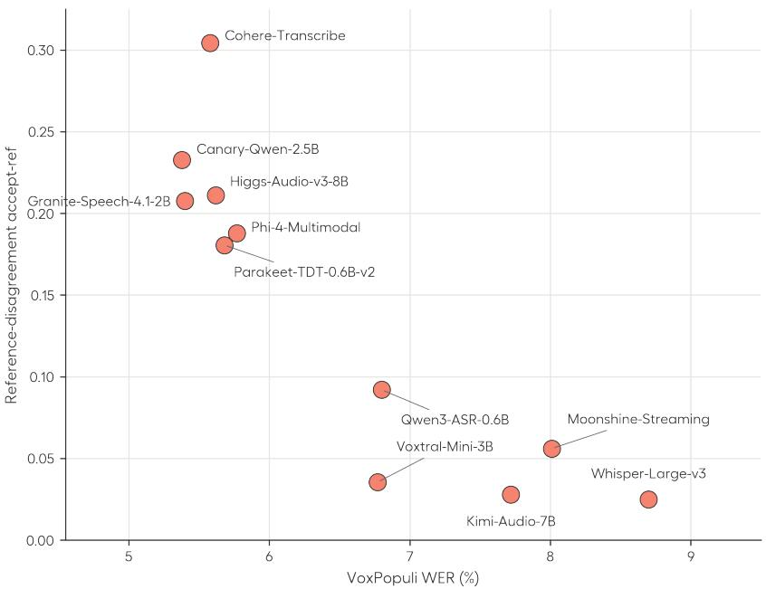  
Figure 2. Cross-model audit on VoxPopuli. WER (%) is the VoxPopuli-test score from the June 2026 Open ASR Leaderboard [38]. Kimi Audio is not on the leaderboard, and its score is computed using the leaderboard’s scoring. Consensus-panel members are scored against edits flagged unanimously by the remaining three members (§3.3).

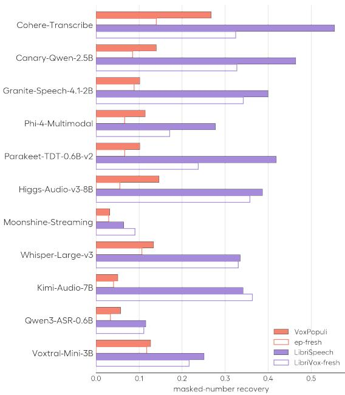  
(a)

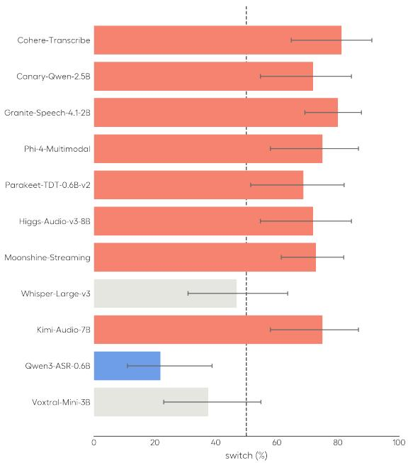  
(b)  
Figure 3. (a) Masked-number accept-ref per corpus. (b) Orthographic switch rate on archaic spacing.

## 4.1 A narrow acoustic context gates the behavior

Voice clones of speakers from the VoxPopuli and LibriSpeech evaluation sets trigger directionally similar accept-ref to the original audio. However, when a generic voice reads the identical transcript, accept-ref falls for many models.

Clones of the fresh, same domain speakers often rest closer to the generic accept-ref, which suggests the trigger for the benchmark-optimized policy is narrowly attached to the benchmark-specific cue and does not generalize to new data from a similar domain. These findings are clearest for reference-disagreement accept-ref on VoxPopuli, but the efect survives the language-model-prior control: on the masked probe, audio lift is positive on the real recordings and on clones of dataset speakers but collapses toward zero on generic voices for the elevated models (Cohere, Canary-Qwen, Phi-4, Higgs; App. Fig. 10b). A positive audio lift could potentially be explained by the fact that models can attend to the entire audio sequence, which contains semantic representations of the entire sequence that are not present in a pure language causal mask. However, if audio lift falls for the same sentence when using a generic voice, it shows that the model is not simply attending to lookahead semantics to unmask the number, but rather depending on the specific acoustic cue of the benchmark audio to more easily decode the number.

Meanwhile, truncating the audio to a short segment around the target span collapses reference-disagreement and masked accept-ref toward the floor for several models (Figure 5c). The more the surrounding context marks the audio as coming from the benchmark, the more the model reproduces its reference errors; diluting those cues removes the behavior.

Appending a generic donor from the conversational dataset to the real benchmark clips collapses accept-ref for Cohere, Canary-Qwen, Phi-4, Parakeet, and Higgs, while an appended VoxPopuli donor leaves it unchanged (Figure 6a). Likewise, appending a “donor” VoxPopuli clip to synthetic ep-fresh with low accept-ref bumps the accept-ref (ep-fresh-clone bases: Phi-4 +.10, Canary +.09, Higgs +.07, Cohere +.07, Parakeet +.04 over a duration-matched

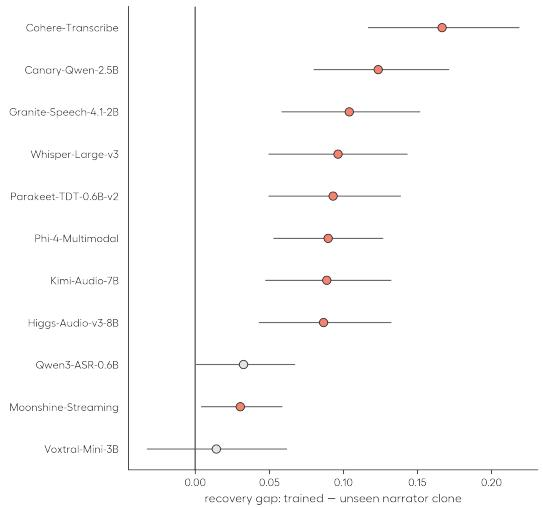  
Figure 4. Diference in masked-number recovery between LibriSpeech test-set narrator clones and held-out libri-fresh narrator clones reading identical sentences (test-set minus held-out; positive values indicate greater recovery for test-set narrator clones). Sentence-clustered bootstrap 95% confidence intervals.

## control donor).

Testing the models under acoustic perturbations to the original audio further suggests that models rely on diferent subsets of benchmark-associated cues: additive noise removes the behavior for some models, while others retain it under both noise and reverberation (App. Figure 7).

In sum, when the models transcribe reference transcripts with contradictory audio, models don’t learn a general incorrect mapping (e.g. they don’t lose the ability to transcribe a literal phrase such as “thank you, Mr. President” in all circumstances). When the s ans in uestion are said in voices outside the distribution of the benchmark’s evaluation set, the model outputs an audio-true transcription. Even audio that normally would trigger the benchmark-optimized policy reverts to the audio-true transcription by adding non-benchmark audio to the clip or by removing enough benchmark context around the span. In this sense, the trigger of the benchmark-optimized policy is relatively ‘narrow. The models with the highest accept-ref rate in particular are able to determine fairly precisely whether an audio clip is in the VoxPopuli dataset, generalizing across speakers in the test set, but not to new speakers from a more recent parliamentary recording.

## 4.2 The behavior spans encoder and decoder and is causally steerable

From our activation patching probes, we find evidence of both the encoder and decoder suppressing faithful represen- tations, showing that the model learns the benchmark-optimized behavior end-to-end as opposed to simply via natural language data contamination [41]. For reference insertions, replacing the target-frame encoding with its context-restricted counterpart often restored the audio-supported output, consistent with the edit being represented in the encoder state. For deletions and substitutions, the same intervention was less efective, suggesting that later decoding behavior can override a locally faithful representation (App. Figure 12). Attention restriction and translation provided additional evidence that faithful information sometimes remained available despite being omitted during transcription (App. Table 5).

The learned direction bidirectionally steers four of the six elevated models—Cohere, Parakeet, Canary, and (partially) Granite—with a low-rank structure for the first three (k=1 recovers 65–80% of the full-direction efect). Adding the direction to held-out generic audio (which previously had near-zero accept-ref rates) mildly raises the model’s overall accept-ref rate (0.02→0.07 Cohere, 0.01→0.05 Parakeet, 0.01→0.11 Canary, and 0.02→0.04 Granite over the same 707 gated edits). Ablating the same direction has a stronger efect: accept-ref falls by 82–92% when the steering vector is projected onto Cohere, Canary, and Parakeet.

These results show that benchmark-conditioned transcription behavior can be causally modified at both the input and activation levels in a subset of models.

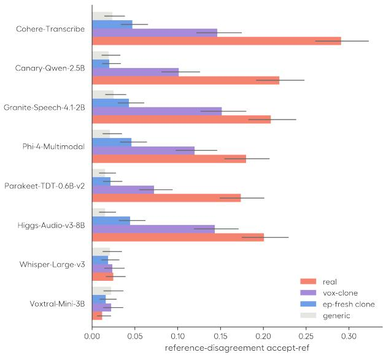  
(a)

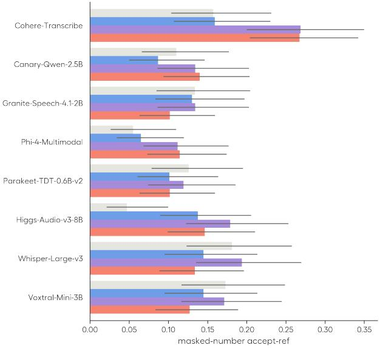  
(b)

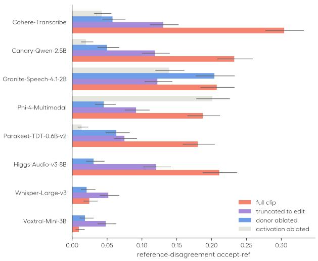  
(c)

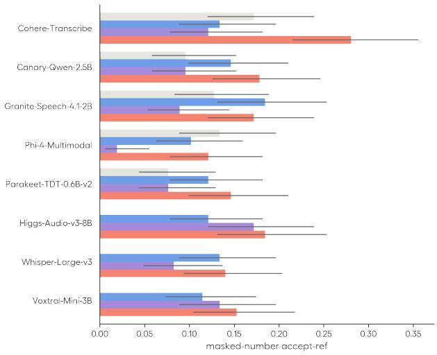  
(d)  
Figure 5. The trigger battery, VoxPopuli. Top row: voice conditions on identical transcripts—(a) reference-disagreement and (b) masked-number accept-ref. Bottom row: the same probes with the trigger removed instead of the voice varied—truncation to the edit, an appended 8 s conversational donor, or the learned register direction projected out of one encoder layer (c, d). Wilson 95% CIs.

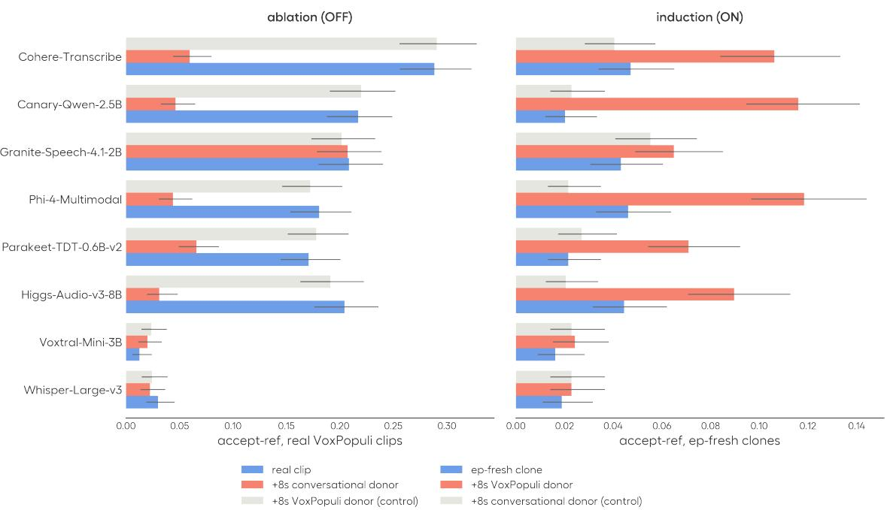

(a)  
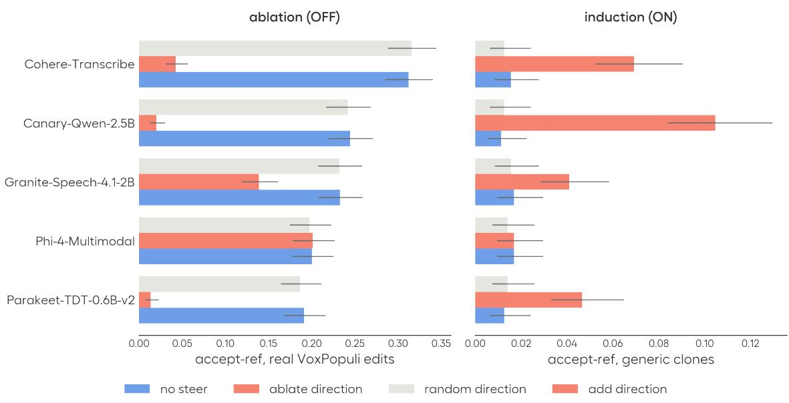  
(b)  
Figure 6. Switching the benchmark-optimized policy on and of. (a) Input level: On real clips (top left) a conversational donor collapses accept-ref while a VoxPopuli donor leaves it intact; on ep-fresh clones of the same sentences (top right) a VoxPopul donor re-ignites it while the conversational donor does not. (b) Activation level: projecting out the learned direction on real benchmark edits (bottom left) and adding it on generic-voice clones (bottom right). The remaining consensus-panel members show no efect, like Voxtral-Mini-3B.

## 5 Discussion and Conclusion

We introduced a behavioral methodology—reference-error reproduction, masked-entity recovery, and orthographic convention switching—for measuring ASR benchmark optimization in cases where the audio underdetermines the reference. Across state-of-the-art open models on two widely used benchmarks, reproducing benchmark conventions against the audio is common among the highest-scoring systems. We also employ a mechanistic methodology using synthetic audio, task switching, activation patching, and attention readouts to understand when and how these models activate this benchmark-optimized behavior. We found that models are able to activate benchmark-optimized behavior based on narrow acoustic cues, to the point where we can bidirectionally flip the benchmark-optimized behavior by appending audio or steering a single model layer.

Using surrounding acoustic context is not itself undesirable: prosody, speaker characteristics, and recording context can legitimately afect transcription. Our probes instead target cases where those cues do not justify a preference for the benchmark reference over an acoustically supported alternative. Our results tentatively suggest that bench mark optimization is a particularly relevant concern for high-dimensional modalities like audio. Unlike traditiona autoregressive LMs, ASR models generally can attend to the entire audio encoding, which contains not only semantic content but also speaker, channel, and other acoustic information across the sequence. This gives models additional degrees of freedom for learning benchmark-specific policies based on narrow acoustic cues, even on relatively short, underdetermined sequences. As reinforcement learning (RL) becomes increasingly prevalent for speech language models [37], understanding these dataset-specific acoustic cues becomes even more important and warrants further study as a potential source of reward hacking.

We ofer three practical takeaways for the field from our research.

First, for model developers, model releases should be as transparent as possible around their training data. We investigated how these behaviors operate at inference time, but do not yet fully understand how they arise during training. Having more transparent data mixtures in general would help the field further study whether these behaviors arise from benchmark-guided model selection algorithms, data leakage, memorization, or other mechanisms. For instance, based on the available public information about training recipes, the models with the highest accept-ref (Phi-4, Cohere-Transcribe, Granite, and Canary) trained on less data than the models with low accept-ref (e.g., Qwen3, Whisper). Indeed, Qwen3 does display mild benchmark-optimized inclinations, such as occasionally firing the courtesy trigger, yet this behavior is rare compared to other models. Qwen trained on 40 million hours of weakly supervised data, whereas most of the high-accept-ref models trained on less than 1 million hours of data. Further analysis here could help the field better understand the scale of data needed to avoid these behaviors and how they arise during training. Moreover, some of the behavioral probes and mechanistic probes from this paper can be used as sanity checks during and after training to regularize models.

Second, for benchmark development, we recommend against using i.i.d. test splits for benchmark evaluation. As the lack of generalization of benchmark optimization behaviors to the ep-fresh dataset shows, temporal or metadata (e.g., speaker) stratification is minimally necessary to understand the generalization of model behavior. The publicly available VoxPopuli test dataset on Hugging Face mixes 40% of speakers in the test set into the training distribution. It should be noted, however, that no model showed a leaked-speaker advantage on our probes (pooled elevated-model referencedisagreement accept-ref 0.22 on leaked vs. 0.26 on unleaked speakers; masked recovery likewise indistinguishable), which suggests that oficial train-test speaker overlap alone does not explain the observed behavior. More ideally, the main test sets that model providers report performance on should be fully held-out, non-public evaluation sets so they can neither be leaked nor gamed as easily [4, 5].

Third, for practitioners selecting ASR models, we recommend looking at multiple metrics besides just WER on public benchmarks. This is especially true of VoxPopuli, which has a high rate of reference errors, to the point that any model below 3% WER has to transcribe reference errors. Our work uses a consensus reference edit procedure which aligned with human annotations and can be scaled to help improve the usefulness of VoxPopuli as a dataset. Moreover, our mechanistic and behavioral probes provide additional insight into a model’s behavior beyond WER to better understand how optimized a model is for a given benchmark.

## References

[1] Felix Akeret. Subtitle-aligned fine-tuning of Whisper for Swiss German ASR: Benchmark contamination, convention mismatch, and an honest baseline at 25.6% WER. arXiv preprint arXiv:2606.07608, 2026.

[2] Dario Amodei, Sundaram Ananthanarayanan, Rishita Anubhai, et al. Deep speech 2: End-to-end speech recognition in English and Mandarin. In International Conference on Machine Learning (ICML), 2016.

[3] Artificial Analysis. Voxpopuli-cleaned-aa: Cleaned ground truth transcripts for voxpopuli english test set, 2026. URL https://artificialanalysis.ai/articles/aa-wer-v2.

[4] David Ayllon, Alice Baird, Jefrey Brooks, Franc Camps-Febrer, Jakub Piotr Cłapa, Theo Lebryk, Jens Madsen, Olya Ossipova, Sharath Rao, Hoon Shin, et al. Rw-voice-eq bench: A real world benchmark for evaluating voice ai systems. arXiv preprint arXiv:2607.14846, 2026.

[5] Eric Bezzam, Steven Zheng, Eustache Le Bihan, Sergio Bruccoleri, Jeanine Sinanan-Singh, Casey Ford, Guanbo Wang, Yukai Huang, Ke Li, Yufeng Hao, and Xiaoling Liao. Adding benchmaxxer repellant to the open ASR leaderboard. https://huggingface.co/blog/open-asr-leaderboard-private-data, may 2026. Hugging Face Blog.

[6] Boson AI. Higgs audio v3: Speech-to-text with a whisper encoder and a Qwen3-8B decoder. https:// huggingface.co/bosonai/higgs-audio-v3-8b-stt-v2, 2026. Model card.

[7] Zhehuai Chen, He Huang, Andrei Andrusenko, Oleksii Hrinchuk, Krishna C. Puvvada, Jason Li, Subhankar Ghosh, Jagadeesh Balam, and Boris Ginsburg. SALM: Speech-augmented language model with in-context learning for speech recognition and translation. In IEEE International Conference on Acoustics, Speech and Signal Processing (ICASSP), 2024.

[8] Cohere Labs. Cohere transcribe: State-of-the-art multilingual speech recognition. Hugging Face model card and release blog, 2026. URL https://huggingface.co/CohereLabs/cohere-transcribe-03-2026. Model CohereLabs/cohere-transcribe-03-2026.

[9] Yuhang Dai, He Wang, Xingchen Li, Zihan Zhang, Shuiyuan Wang, Lei Xie, Xin Xu, Hongxiao Guo, Shaoji Zhang, Hui Bu, and Wei Chen. AISHELL-5: The first open-source in-car multi-channel multi-speaker speech dataset for automatic speech diarization and recognition. In Interspeech 2025, pages 5493–5497, 2025. doi: 10.21437/Interspeech.2025-1886.

[10] Ricardo Dominguez-Olmedo, Florian E. Dorner, and Moritz Hardt. Training on the test task confounds evaluation and emergence. arXiv preprint arXiv:2407.07890, 2024.

[11] Sanchit Gandhi, Patrick von Platen, and Alexander M. Rush. ESB: A benchmark for multi-domain end-to-end speech recognition. arXiv preprint arXiv:2210.13352, 2022.

[12] Robert Geirhos, Jörn-Henrik Jacobsen, Claudio Michaelis, Richard Zemel, Wieland Brendel, Matthias Bethge, and Felix A. Wichmann. Shortcut learning in deep neural networks. Nature Machine Intelligence, 2(11):665–673, 2020.

[13] Neta Glazer, Yael Segal-Feldman, Hilit Segev, Aviv Shamsian, Asaf Buchnick, Gill Hetz, Ethan Fetaya, Joseph Keshet, and Aviv Navon. Beyond transcription: Mechanistic interpretability in asr. In Proceedings of the AAAI Conference on Artificial Intelligence, volume 40, pages 37407–37416, 2026.

[14] Mandip Goswami. Whisper-RIR-Mega: A paired clean-reverberant speech benchmark for ASR robustness to room acoustics. arXiv preprint arXiv:2603.02252, 2026. URL https://arxiv.org/abs/2603.02252.

[15] Suchin Gururangan, Swabha Swayamdipta, Omer Levy, Roy Schwartz, Samuel R. Bowman, and Noah A. Smith. Annotation artifacts in natural language inference data. In Conference of the North American Chapter of the Associationfor Computational Linguistics (NAACL-HLT), 2018.

[16] Hangrui Hu, Xinfa Zhu, Ting He, Dake Guo, Bin Zhang, Xiong Wang, Zhifang Guo, Ziyue Jiang, Hongkun Hao, Zishan Guo, et al. Qwen3-tts technical report. arXiv preprint arXiv:2601.15621, 2026.

[17] Nat Jefries, Evan King, Manjunath Kudlur, Guy Nicholson, James Wang, and Pete Warden. Moonshine: Speech recognition for live transcription and voice commands. arXiv preprint arXiv:2410.15608, 2024.

[18] Jason Jo and Yoshua Bengio. Measuring the tendency of cnns to learn surface statistical regularities. arXiv preprint arXiv:1711.11561, 2017.

[19] KimiTeam. Kimi-audio technical report. arXiv preprint arXiv:2504.18425, 2025.

[20] Tom Ko, Vijayaditya Peddinti, Daniel Povey, Michael L. Seltzer, and Sanjeev Khudanpur. A study on data augmentation of reverberant speech for robust speech recognition. In ICASSP, pages 5220–5224, 2017.

[21] Tatiana Likhomanenko, Qiantong Xu, Vineel Pratap, Paden Tomasello, Jacob Kahn, Gilad Avidov, Ronan Collobert, and Gabriel Synnaeve. Rethinking evaluation in ASR: Are our models robust enough? In Interspeech, 2021.

[22] Alexander H. Liu, Andy Ehrenberg, Andy Lo, Clément Denoix, Corentin Barreau, Guillaume Lample, et al. Voxtral. arXiv preprint arXiv:2507.13264, 2025.

[23] Yin-Long Liu, Rui Feng, Jia-Hong Yuan, and Zhen-Hua Ling. Clever hans efect found in automatic detection of alzheimer’s disease through speech. In Interspeech, 2024.

[24] Tom McCoy, Ellie Pavlick, and Tal Linzen. Right for the wrong reasons: Diagnosing syntactic heuristics in natural language inference. In Annual Meeting of the Association for Computational Linguistics (ACL), 2019.

[25] Microsoft. Phi-4-mini technical report: Compact yet powerful multimodal language models via mixture-of-LoRAs. arXiv preprint arXiv:2503.01743, 2025.

[26] NVIDIA NeMo Team. Canary-Qwen-2.5B. Hugging Face model card, 2025. URL https://huggingface. co/nvidia/canary-qwen-2.5b.

[27] NVIDIA NeMo Team. Parakeet-TDT-0.6B-v2. Hugging Face model card, 2025. URL https://huggingface. co/nvidia/parakeet-tdt-0.6b-v2.

[28] Vassil Panayotov, Guoguo Chen, Daniel Povey, and Sanjeev Khudanpur. Librispeech: An ASR corpus based on public domain audio books. In IEEE International Conference on Acoustics, Speech and Signal Processing (ICASSP), 2015.

[29] Dan Pluth, Zachary Nicholas Houghton, Yu Zhou, and Vijay K Gurbani. Mechanistic interpretability of asr models using sparse autoencoders. arXiv preprint arXiv:2605.12225, 2026.

[30] Adam Poliak, Jason Naradowsky, Aparajita Haldar, Rachel Rudinger, and Benjamin Van Durme. Hypothesis only baselines in natural language inference. In Joint Conference on Lexical and Computational Semantics (\*SEM), 2018.

[31] Vineel Pratap, Andros Tjandra, Bowen Shi, Paden Tomasello, Arun Babu, Sayani Kundu, Ali Elkahky, Zhaoheng Ni, Apoorv Vyas, Maryam Fazel-Zarandi, Alexei Baevski, Yossi Adi, Xiaohui Zhang, Wei-Ning Hsu, Alexis Conneau, and Michael Auli. Scaling speech technology to 1,000+ languages. Journal of Machine Learning Research, 25(97):1–52, 2024.

[32] Alec Radford, Jong Wook Kim, Tao Xu, Greg Brockman, Christine McLeavey, and Ilya Sutskever. Robust speech recognition via large-scale weak supervision. In International Conference on Machine Learning (ICML), 2023.

[33] Nina Rimsk , Nick Gabrieli, Julian Schulz, Me Ton , Evan Hubin er, and Alexander Turner. Steerin llama 2 via contrastive activation addition. In Proceedings of the 62nd Annual Meeting of the Association for Computational Linguistics (Volume 1: Long Papers), pages 15504–15522, 2024.

[34] George Saon, Avihu Dekel, Alexander Brooks, Tohru Nagano, Abraham Daniels, Aharon Satt, Ashish Mittal, Brian Kingsbury, et al. Granite-speech: Open-source speech-aware LLMs with strong English ASR capabilities. arXiv preprint arXiv:2505.08699, 2025.

[35] Muhammad A. Shah, David Solans Noguero, Mikko A. Heikkilä, Bhiksha Raj, and Nicolas Kourtellis. Speech robust bench: A robustness benchmark for speech recognition. In International Conference on Learning Repre sentations, 2025. URL https://openreview.net/forum?id=D0LuQNZfEl.

[36] Xian Shi, Xiong Wang, Zhifang Guo, Yongqi Wang, Pei Zhang, Xinyu Zhang, Zishan Guo, Hongkun Hao, Yu Xi, Baosong Yang, Jin Xu, Jingren Zhou, and Junyang Lin. Qwen3-ASR technical report. arXiv preprint arXiv:2601.21337, 2026.

[37] Prashanth Gurunath Shivakumar, Yile Gu, Ankur Gandhe, and Ivan Bulyko. Group relative policy optimization for speech recognition. arXiv preprint arXiv:2509.01939, 2025.

[38] Vaibhav Srivastav, Steven Zheng, Eric Bezzam, Eustache Le Bihan, Nithin Koluguri, Piotr Żelasko, Somshubra Majumdar, Adel Moumen, and Sanchit Gandhi. Open asr leaderboard: Towards reproducible and transparent multilingual and long-form speech recognition evaluation, 2026. URL https://arxiv.org/abs/2510.06961.

[39] Piotr Szymański, Piotr Żelasko, Mikołaj Morzy, Adrian Szymczak, Marzena Żyła-Hoppe, Joanna Banaszczak, Łukasz Augustyniak, Jan Mizgajski, and Yishay Carmiel. WER we are and WER we think we are. In Findings ofthe Associationfor Computational Linguistics: EMNLP 2020, pages 3290–3295, 2020.

[40] Geeyang Tay, Wentao Ma, Jaewon Lee, Yuzhi Tang, Daniel Lee, Weisu Yin, Dongming Shen, Silin Meng, Yi Zhu, Mu Li, and Alex Smola. Back to basics: Revisiting ASR in the age of voice agents. arXiv preprint arXiv:2603.25727, 2026. URL https://arxiv.org/abs/2603.25727.

[41] Yuan Tseng, Titouan Parcollet, Rogier van Dalen, Shucong Zhang, and Sourav Bhattacharya. Evaluation of LLMs in speech is often flawed: Test set contamination in large language models for speech recognition. arXiv preprint arXiv:2505.22251, 2025.

[42] Alexander Matt Turner, Lisa Thiergart, Gavin Leech, David Udell, Juan J Vazquez, Ulisse Mini, and Monte MacDiarmid. Steering language models with activation engineering. arXiv preprint arXiv:2308.10248, 2023.

[43] Panagiotis Tzirakis, Alice Baird, Jefrey Brooks, Emilia Parada-Cabaleiro, Lukas Stappen, Sharath Rao, Theo Lebryk, Jakub Piotr Cłapa, and Jens Madsen. The 2026 ACII dyadic conversations (DaiKon) workshop & challenge. In Proceedings ofthe 2026 International Conference on Afective Computing and Intelligent Interaction (ACII) Workshops, 2026. URL https://arxiv.org/abs/2605.02672.

[44] Jesse Vi Sebastian Gehrmann Yonatan Belinkov Sharon Qian Daniel Nevo Yaron Sin er and Stuart Shieber. Investigating gender bias in language models using causal mediation analysis. Advances in neural information processing systems, 33:12388–12401, 2020.

[45] Changhan Wang, Morgane Riviere, Ann Lee, Anne Wu, Chaitanya Talnikar, Daniel Haziza, Mary Williamson, Juan Pino, and Emmanuel Dupoux. VoxPopuli: A large-scale multilingual speech corpus for representation learning, semi-supervised learning and interpretation. In Annual Meeting of the Association for Computational Linguistics (ACL), 2021.

[46] Zhifei Xie, Kaiyu Pang, Haobin Zhang, Deheng Ye, Xiaobin Hu, Shuicheng Yan, and Chunyan Miao. Mega-ASR: Towards in-the-wild2 speech recognition via scaling up real-world acoustic simulation. arXiv preprint arXiv:2605.19833, 2026.

[47] Wayne Xiong, Jasha Droppo, Xuedong Huang, Frank Seide, Mike Seltzer, Andreas Stolcke, Dong Yu, and Geofrey Zweig. Achieving human parity in conversational speech recognition. arXiv preprint arXiv:1610.05256, 2016.

[48] Hainan Xu, Fei Jia, Somshubra Majumdar, He Huang, Shinji Watanabe, and Boris Ginsburg. Eficient sequence transduction by jointly predicting tokens and durations. In International Conference on Machine Learning (ICML), 2023.

[49] Fred Zhang and Neel Nanda. Towards best practices of activation patching in language models: Metrics and methods. In International Conference on Learning Representations, volume 2024, pages 1651–1678, 2024.

## A Methodological details

## A.1 Text processing and teacher-forced NLL

All transcripts are scored under the standard Hugging Face Open ASR leaderboard text normalizer from June 2026 (lowercasing, punctuation removal, number and contraction normalization). Negative Log Likelihood (NLL) quantities are computed by teacher-forcing the relevant reference string and summing per-token log-probabilities over the target span; for encoder–decoder models we force the decoder on the reference with the audio encoder conditioned on the clip, and for speech–LLM models we force the text continuation after the audio prefix.

The numerator of the white-box readout (Eq. 1) is the unnormalized span log-likelihood ratio, obtained by summing the per-token log-likelihood diferences over the query span. This sum is invariant to subword segmentation, unlike a per-token mean. Dividing it by the number of characters in the reference span gives λ(r) and makes spans of diferent lengths commensurate. Across clips we report the corpus mean with a 2000-resample percentile-bootstrap 95% CI.

## A.2 EOS masking

At each scored position we remove end of sequence tokens (EOS) from the softmax denominator before taking the log-probability, renormalizing the distribution over continuation tokens; we apply this symmetrically to the audio term and the $x _ { \emptyset }$ prior term, as masking only one would compare two diferently-normalized distributions. We mask EOS because a subset of models place substantial probability on EOS when the language-model prior is extracted from fully silenced audio without the standard system prompt: Moonshine (0.76) and Granite (0.61) most strongly, Qwen3-ASR moderately (0.25). The remaining models place ≈0 probability on the EOS token. The choice is also the conservative one for our claims—it suppresses the measured audio lift, since taking unnormalized logits would shrink the decoder prior while leaving the audio-conditioned scores nearly unchanged.

## A.3 Synthetic speech stimuli and the intelligibility gate

All synthetic samples are generated with Qwen3-TTS. Generic uses one of the stock voices from Qwen3 1.7B CustomVoice model. The cloned voices use the Qwen3 Base model with a speaker from the relevant dataset; the Vox-cloned case uses a reference clip from a VoxPopuli evaluation-set speaker who is not the speaker in the original clip.

Because a TTS rollout can garble the intended sentence, every synthetic clip passes an intelligibility gate before use: at least one of the eleven models must transcribe the entire intended transcript exactly (zero WER under the harness normalizer). Pass rates are 0.84–0.93 across the gated sets (e.g. 568/679 on the consensus-flagged generic renderings).

## A.4 Alignment, masking, and number selection

Forced alignment. We obtain per-word time spans with the Massively Multilingual Speech forced-alignment (mmsfa) model [31]. mms-fa emits connectionist temporal classification (CTC) frame indices, which we convert to seconds with the per-clip ratio (n\_samples/n\_frames)/16000. Reference words are lowercased and stripped and numeric tokens are expanded to their spoken form via the num2words package.

Words that normalize to empty such as pure punctuation are assigned a zero-width span at the preceding word boundary so that the emitted span list stays index-aligned (1:1) with the whitespace-split reference. We align only clips of at least 4 s to remove tiny segments when the mask would span a significant percentage of the audio.

Masking a span. Given a target word’s aligned $[ t _ { 0 } , t _ { 1 } ]$ , the masking procedure silences just that span. We mask every occurrence of the target value in the clip so the scored token cannot leak from a repeated mention elsewhere. We pad the mask by mask\_pad = 120 ms to more conservatively handle imperfections in the aligner. In cases when the aligner’s boundaries are suspiciously tight $( t _ { 1 } - t _ { 0 } < 6 0 \mathrm { m s } )$ , we instead mask the entire inter-word gap, and skip the clip when that gap is itself < 80 ms (about 20% of number targets). These drops bias the sample toward longer, harder numbers, exactly the cases in which language priors should not be as helpful. We exclude the number “one” because it is hard to distinguish from its variants (e.g. “one must not”) and is often trivial to predict.

Hard-cell dificulty gate. The headline masked readouts are reported ungated (the audio lift handles the prior by subtracting it). As a check that black-box recovery is not language-prior guessing, we re-score the VoxPopuli masked column on hard cells: spans whose silenced-audio prior NLL/char, $\mathrm { n l l } _ { \varnothing } ( r ) = - \log p _ { M } ( r \mid x _ { \varnothing } ) / | r | _ { \mathrm { c h a r } } .$ , taken as the median over the white-box-instrumented models, is at least 3.5 nats—62 of the 92 covered spans (67%). The same hard subset scores every model; a per-model gate would select a diferent subset per model and the rates would not be comparable. On hard cells recovery rises for the elevated models (Cohere 0.27→0.36, Canary 0.14→0.24, Higgs 0.15→0.23, Granite 0.10→0.19) and stays at the floor for the near-zero models (Moonshine 0.00, Kimi and Qwen3 0.07); Phi-4 is flat (0.11). Recovery thus concentrates on exactly the spans the prior cannot supply.

## A.5 Content-preserving perturbations and the robustness protocol

To test whether the reference-following behavior survives the acoustic degradations used to build derived benchmarks (§2), we re-run the accept-reference and masked-number probes on perturbed copies of the real audio. All perturbation are content-preserving digital signal processing (DSP) applied to the 16 kHz mono waveform (implementation in scripts/vmt/perturb.py); each is available as a severity ladder, of which we report a single moderate level per family:

• Additive noise—Gaussian noise scaled to a target signal-to-noise ratio $\mathrm { ( S N R ) } \in \{ 2 0 , 1 0 , 5 , 0 \}$ dB (reported: 10 dB).

• Reverberation—convolution with a measured room impulse response [20], binned by $\mathrm { R T _ { 6 0 } }$ into [0.2, 0.4], [0.45, 0.7], [0.85, 1.3] s and reported at the middle bin (median $\mathrm { R T _ { 6 0 } 0 . 5 2 s ) }$

Both are truncated to the input length so the perturbed clip is sample-for-sample duration-matched to the source, then energy-matched to the original RMS.

These families mirror the corruptions of recent augmented benchmarks [14, 35, 46].

Interpretation. Additive noise at 10 dB has little efect on overall WER, so changes in accept-ref are unlikely to result from a broad loss of transcription ability. Strong reverberation raises WER for some models, making changes in accept-ref harder to interpret. Reverberation can also carry some of a masked word’s audio beyond the masked interval, so masked-number results under reverberation provide weaker evidence than those under noise.

## A.6 Splice-induction stimuli

A stimulus is [ base ][ 0.15 s silence ][ donor window ] where a donor can be placed as a sufix or prefix to the base clip. Donor windows are cut mid-utterance from VoxPopuli-test and root-mean-square (RMS)-matched to the base clip’s loudness. The control donor is a duration-matched window of conversational audiobook speech.

Base clips are the clone renderings of the consensus-flagged transcripts (generic-voice and ep-fresh-speaker; §4.1) where models correctly transcribed the clip rather than transcribing the reference errors and, for the steering training pairs, real ep-fresh recordings (App. A.7).

## A.7 Activation steering protocol

The training stimuli are the input-level splice pairs of §4.1: 43 ep-fresh courtesy-opener clips (held-out post-cutof parliamentary content so no behavioral flip enters the selection), each rendered as [base][0.15 s silence][5 s donor] with a real VoxPopuli donor vs. a duration-matched audiobook donor. The first 22 bases train the direction; the remaining 21 are held out. For each model we hook every encoder layer and mean-pool activations over the base-clip frames only. The direction is therefore the sufix’s efect on the representation of the identical base content—carried into the base frames by the encoder’s bidirectional context mixing. The steering direction at layer L is the dif-in-means $d _ { L } = \mathrm { { m e a n } ( v o x \mathrm { { - } s u f f i x ) } }$ − mean(control-sufix) over the 22 training pairs, unit-normalized. Induction adds $\alpha d _ { L }$ at a single layer during decoding; ablation projects the direction out. Evaluation is on held-out clips disjoint from the training pairs, with a garbage gate discarding degenerate outputs (which leads to dropping most outputs for Higgs), and norm-matched random directions as the specificity floor. Rank structure is assessed by restricting $d _ { L }$ to the top-k components from a principal component analysis (PCA) of the training difs; k=1 recovers 65–80% and k=4 85–100% of the full-direction induction rate for Cohere (k=1: 0.71), Parakeet (0.76), and Canary (0.67). Best single-layer ablation sites: Cohere L37 α=4, Parakeet L12 α=4, Canary $\mathrm { L 1 2 } \alpha { = } 2$ , Granite L14 α=4, Phi-4 L17 α=4. Granite’s efect is partial in both directions (ablation flips 33% of reference reproductions; induction $0 . 0 1 7 {  } 0 . 0 4 1 )$ ), consistent with its decoder re-imposing part of the behavior. Phi-4’s direction separates the spliced conditions but is causally inert—ablation 0.200→0.201 and induction are flat—consistent with Phi’s policy being driven by the decoder parameters over the encoder parameters. Higgs-Audio’s direction (L11, held-out area under the receiver operating characteristic curve (AUC) 0.82) has no clean operating point: at α=4 ablation degrades decoding wholesale (WER against the consensus-corrected transcript 0.06→0.27, 36 garbage clips) while at $\alpha { \le } 2$ it is inert (0.186→0.174)—so we report no activation cell for Higgs. The same input-level donor lever demonstrably moves both models (Figure 6a; Phi-4 donor ablation 0.19→0.05 and the largest ep-fresh splice induction, Higgs 0.20→0.03)—the failure is in reproducing that switch with a single-layer linear edit of the encoder, not in the ability to steer these models in general.

The generalized-ablation readout decodes three arms per clip in one pass—no steer, ablate, and random—on the panel unanimous consensus edit on VoxPopuli test (745 clips; 1,113 edits). Per edit, the verdict (reproduces the erroneous reference vs. follows the audio) is recomputed on each arm’s fresh hypothesis; flips count only when both arms are non-garbage. Ablation flips 88% (Cohere, 303 flips), 95% (Parakeet, 201), 93% (Canary, 252), and 45% (Granite, 115) of no-steer reference reproductions to the audio-true rendering, with ≤ 11 regressions per model; the random arm is flat. WER against the original (erroneous) reference rises while WER against the consensus-corrected transcript falls 25–40%. The direction also transfers across probes for Cohere: on the real masked-number clips of the trigger battery, ablating it halves recovery of the silenced number (0.102→0.051, n=157; 10 lost vs. 2 gained paired flips, exact McNemar $\scriptstyle p = . 0 3 9 )$ while the random arm is exactly flat. Canary and Parakeet move in the same direction at small counts (5→3 and 6→4 recoveries); Granite and Phi-4 do not move.

The induction readout mirrors this on generic-voice clones of the consensus-corrected transcripts (495 gated clips; 707 unanimous edits), decoding four arms per clip: no steer, add $\alpha d _ { L }$ at $\alpha { = } 4$ and $\alpha { = } 8 ,$ , and a norm-matched random direction at α=8. Adding the direction raises accept-ref from 0.016 to 0.072 (Cohere; already at α=4), 0.013 to 0.047 (Parakeet), 0.011 to 0.105 (Canary), and 0.017 to 0.041 (Granite), with no garbage outputs and the random arm flat (0.011–0.015); the lift appears in all three edit classes (e.g. Cohere insertions 0.03→0.19, deletions 0.02→0.06, substitutions 0.01→0.06). A masked-number readout on generic masked clones is directionally positive at α=4 but small and inconsistent at $n { = } 1 4 7$

## A.8 Supplementary results

This section collects supporting figures and tables referenced from the main text.

Trigger suficiency conditions. The splice conditions of the trigger battery (§3.6) append an 8 s mid-utterance window of a distinct real VoxPopuli-test donor speaker (RMS-matched, 0.15 s gap) to each base clip, against a durationmatched conversational control donor; 8 s is approximately the median VoxPopuli test utterance duration. Bases are the generic-voice and ep-fresh-speaker clone renderings of the consensus-flagged transcripts. Reference-disagreement vox−control contrasts (clip-level bootstrap 95% CIs): on ep-fresh-clone bases Phi-4 +.096 [.074, .120], Canary +.093 [.073, .115], Higgs +.069 [.050, .091], Cohere +.066 [.046, .087], Parakeet +.044 [.027, .062], Granite +.010 (not significant); on generic bases Phi-4 +.018 [.006, .030], Cohere +.015 [.003, .027]; every other model is within noise of zero in both settings.

Perturbation conditions. Corrupting the real recordings while holding voice and content fixed dissociates the models (Figure 7): additive noise (10 dB) alone collapses Canary-Qwen, Parakeet, and Higgs to near zero (.22→.03, .17→.04, .20→.07), while Cohere, Granite, and Phi-4 retain the behavior under noise and measured room reverberation (Cohere .29→.29/.26).

Table 1. accept-ref on VoxPopuli-AA human-annotated edits, beside the consensus rates of Figure 2. Ordering is nearly identical aside from Granite and Canary swapping places.
<table><tr><td rowspan="2">model</td><td>consensus</td><td colspan="3">human-annotated edits</td></tr><tr><td>ACCEPT-REF</td><td>ACCEPT-REF</td><td>95% CI</td><td>n</td></tr><tr><td>Cohere-Transcribe</td><td>0.30</td><td>0.52</td><td>[0.47, 0.58]</td><td>253/483</td></tr><tr><td>Granite-Speech-4.1-2B</td><td>0.21</td><td>0.42</td><td>[0.36, 0.47]</td><td>211/508</td></tr><tr><td>Canary-Qwen-2.5B</td><td>0.23</td><td>0.41</td><td>[0.36, 0.47]</td><td>210/507</td></tr><tr><td>Higgs-Audio-v3-8B</td><td>0.21</td><td>0.39</td><td>[0.33, 0.44]</td><td>200/517</td></tr><tr><td>Phi-4-Multimodal</td><td>0.19</td><td>0.38</td><td>[0.33, 0.44]</td><td>195/510</td></tr><tr><td>Parakeet-TDT-0.6B-v2</td><td>0.18</td><td>0.38</td><td>[0.32, 0.43]</td><td>192/512</td></tr><tr><td>Qwen3-ASR-0.6B</td><td>0.09</td><td>0.19</td><td>[0.15, 0.24]</td><td>98/518</td></tr><tr><td>Moonshine-Streaming</td><td>0.06</td><td>0.14</td><td>[0.11, 0.19]</td><td>74/516</td></tr><tr><td>Voxtral-Mini-3B</td><td>0.04</td><td>0.09</td><td>[0.06, 0.12]</td><td>47/527</td></tr><tr><td>Kimi-Audio-7B</td><td>0.03</td><td>0.07</td><td>[0.05, 0.11]</td><td>40/536</td></tr><tr><td>Whisper-Large-v3</td><td>0.02</td><td>0.08</td><td>[0.05, 0.11]</td><td>39/514</td></tr></table>

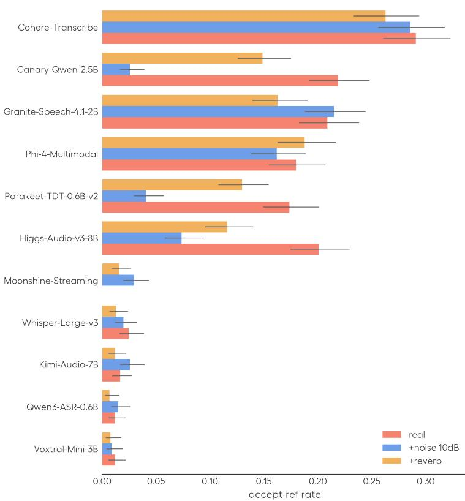  
Figure 7. Reference-disagreement accept-ref on the real VoxPopuli recordings under content-preserving perturbations (additive noise 10 dB; measured room reverberation, RT60 0.60). Wilson 95% CIs.

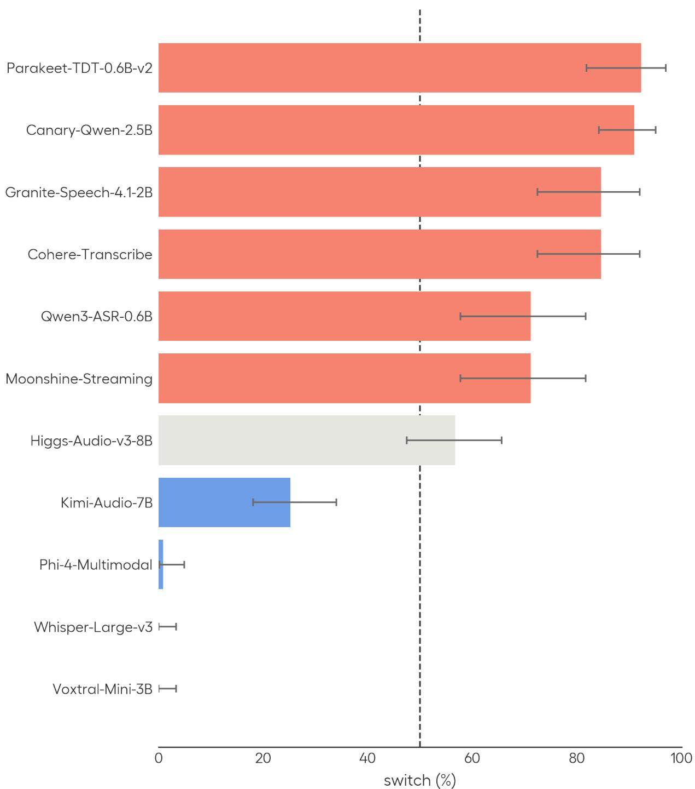  
Figure 8. Honorific switch rate (Mr/Mister), all 11 models. A rate above 0.5 (dashed) means the model tracks each corpus’s convention at rates above chance.

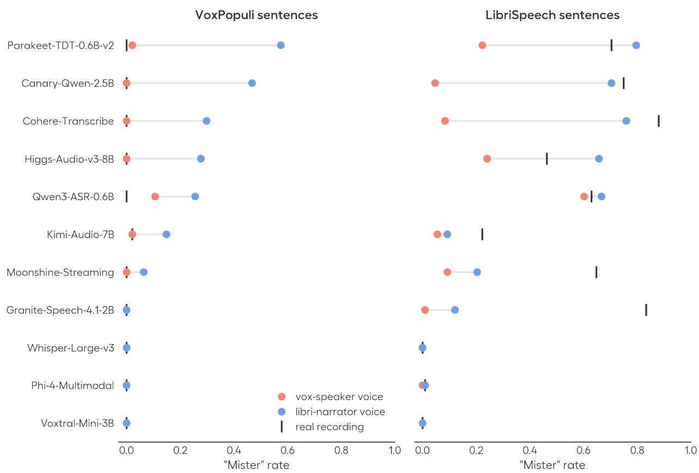  
Figure 9. Base-anchored Mister rate for the same sentence rendered in a cloned VoxPopuli-speaker voice vs. a cloned LibriSpeechnarrator voice; ticks mark the real-recordin rate. Left: VoxPo uli Mr sentences (n=47; voice transfer). Ri ht: LibriS eech Mister sentences (n=108; voice erosion). Granite retains conventions on real audio but loses them under an TTS clone, so its clone cells are relatively uninformative; Whisper, Phi-4, and Voxtral never emit Mister.

Table 2. Reference-disagreement accept-ref on consensus edits as audio context is removed or the trigger is ablated. truncated cuts the audio to a tight window around the edit span (±1 aligned word ±0.25 s); donor ablated appends an 8 s conversational donor to the full clip; activation ablated projects the learned register direction out of a single encoder layer.
<table><tr><td>model</td><td>full</td><td>truncated</td><td>donor ablated</td><td>activation ablated</td></tr><tr><td>Cohere-Transcribe</td><td>0.30</td><td>0.13</td><td>0.06</td><td>0.04</td></tr><tr><td>Canary-Qwen-2.5B</td><td>0.23</td><td>0.12</td><td>0.05</td><td>0.02</td></tr><tr><td>Granite-Speech-4.1-2B</td><td>0.21</td><td>0.12</td><td>0.20</td><td>0.14</td></tr><tr><td>Higgs-Audio-v3-8B</td><td>0.21</td><td>0.12</td><td>0.03</td><td>一</td></tr><tr><td>Phi-4-Multimodal</td><td>0.19</td><td>0.09</td><td>0.05</td><td>0.20</td></tr><tr><td>Parakeet-TDT-0.6B-v2</td><td>0.18</td><td>0.08</td><td>0.06</td><td>0.01</td></tr><tr><td>Qwen3-ASR-0.6B</td><td>0.09</td><td>0.09</td><td>0.04</td><td>一</td></tr><tr><td>Moonshine-Streaming</td><td>0.06</td><td>0.07</td><td>0.04</td><td>一</td></tr><tr><td>Voxtral-Mini-3B</td><td>0.04</td><td>0.05</td><td>0.03</td><td>一</td></tr><tr><td>Whisper-Large-v3</td><td>0.02</td><td>0.05</td><td>0.02</td><td></td></tr><tr><td>Kimi-Audio-7B</td><td>0.03</td><td>0.06</td><td>0.04</td><td></td></tr></table>

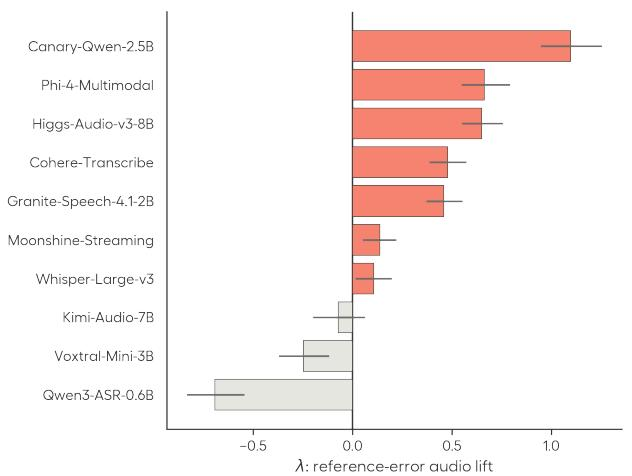  
(a)

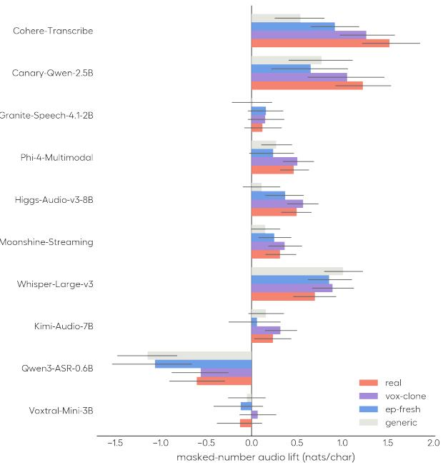  
(b)  
Figure 10. Audio lift λ(r) (Eq. 1), in nats per character; bootstrap 95% CIs. Parakeet-TDT is excluded (no teacher-forced readout). (a) The reference disagreement audio lift. (b) The masked entity audio lift for diferent voice conditions for 115 paired sentences.

Table 3. Full-probe accept-ref on real audio with each corpus’s own content: VoxPopuli-test vs ep-fresh. Masked columns score the corpus-paired subsets, so the VoxPopuli masked rates difer from the full masked set of §4.
<table><tr><td rowspan="2">model</td><td colspan="2">consensus ACCEPT-REF</td><td colspan="2">masked ACCEPT-REF</td></tr><tr><td>VoxPopuli</td><td>ep-fresh</td><td>VoxPopuli</td><td>ep-fresh</td></tr><tr><td>Cohere-Transcribe</td><td>0.304</td><td>0.122</td><td>0.185</td><td>0.074</td></tr><tr><td>Canary-Qwen-2.5B</td><td>0.233</td><td>0.150</td><td>0.051</td><td>0.062</td></tr><tr><td>Granite-Speech-4.1-2B</td><td>0.208</td><td>0.117</td><td>0.051</td><td>0.062</td></tr><tr><td>Higgs-Audio-v3-8B</td><td>0.211</td><td>0.168</td><td>0.070</td><td>0.040</td></tr><tr><td>Phi-4-Multimodal</td><td>0.188</td><td>0.193</td><td>0.076</td><td>0.044</td></tr><tr><td>Parakeet-TDT-0.6B-v2</td><td>0.181</td><td>0.120</td><td>0.038</td><td>0.029</td></tr><tr><td>Qwen3-ASR-0.6B</td><td>0.092</td><td>0.091</td><td>0.051</td><td>0.015</td></tr><tr><td>Moonshine-Streaming</td><td>0.056</td><td>0.099</td><td>0.013</td><td>0.018</td></tr><tr><td>Voxtral-Mini-3B</td><td>0.035</td><td>0.128</td><td>0.076</td><td>0.062</td></tr><tr><td>Whisper-Large-v3</td><td>0.025</td><td>0.071</td><td>0.083</td><td>0.062</td></tr><tr><td>Kimi-Audio-7B</td><td>0.028</td><td>0.144</td><td>0.013</td><td>0.018</td></tr></table>

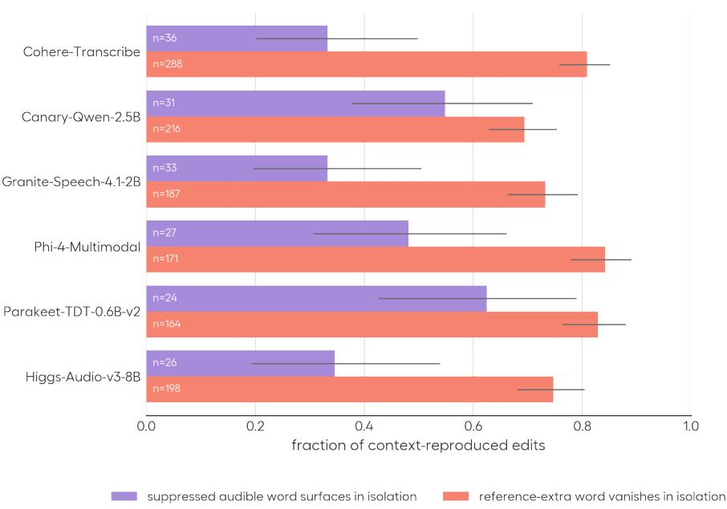  
Figure 11. Context gating on all consensus edits, conditioned on reproduction: for each model with a high accept-ref, the edits it reproduces on the full clip, re-decoded on the isolated window of Table 2. Reference-extra words mostly disappear and suppressed audible words resurface once the surroundin benchmark context is cut awa . Wilson 95% CIs.

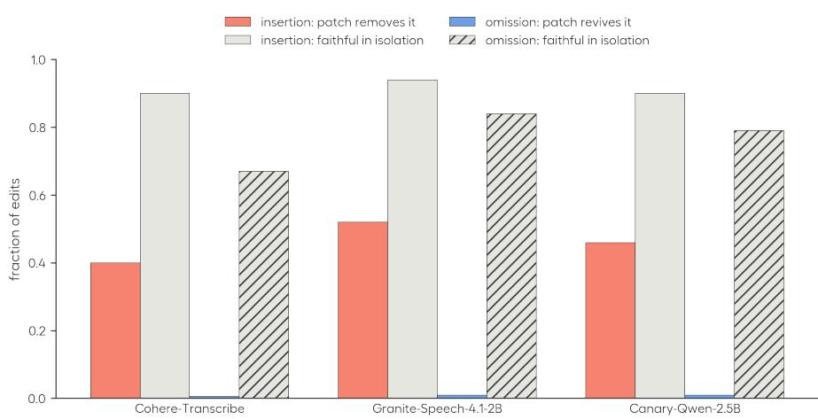  
Figure 12. Edit-locus dissociation (Cohere, Granite, Canary-Qwen). Isolating the span restores faithful transcription for both edit types (context gating; the all-model version is Figure 11). Patching in a context-free encoding of the span removes referenc insertions (encoder-side) but never restores reference omissions (decoder-side).

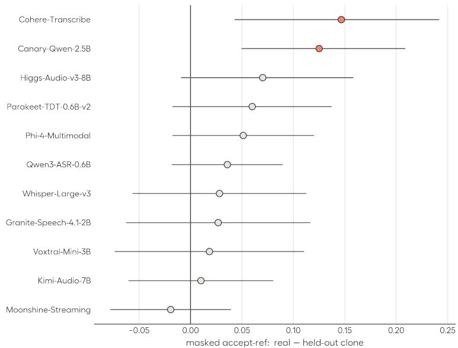  
Figure 13. Masked accept-ref, real VoxPopuli minus a register-matched held-out clone (fresh post-cutof parliament), same transcript, paired 95% CI. Positive means the model reads a silenced number from the benchmark voice but not a held-out voice; significant for Cohere and Canary (red).

Table 4. Audio lift λ(r) (Eq. 1, nats/char) of the silenced number span by voice condition (115 paired sentences passing the intelligibility gate in every clone condition). Dif columns: paired diferences, bootstrap 95% CIs; bold marks CIs excluding zero. Whisper’s lift rises on clean TTS, so a drop in lift is likely not a synthesis artifact; Qwen3’s lift is negative in every condition, so its difs do not indicate recovery. Parakeet-TDT has no teacher-forced readout.
<table><tr><td></td><td>real</td><td>vox-clone</td><td>EP-FRESH</td><td>generic</td><td>real—EP-FRESH</td><td>real-generic</td></tr><tr><td>Cohere-Transcribe</td><td>+1.52</td><td>+1.26</td><td>+0.92</td><td>+0.54</td><td> $+ 0 . 6 0 \ [ + 0 . 3 0 , + 0 . 9 4 ]$ </td><td>+0.98 [+0.66, +1.33]</td></tr><tr><td>Canary-Qwen-2.5B</td><td>+1.22</td><td>+1.05</td><td>+0.65</td><td>+0.77</td><td>+0.57 [+0.27, +0.90]</td><td>+0.45 [+0.17, +0.71]</td></tr><tr><td>Granite-Speech-4.1-2B</td><td>+0.12</td><td>+0.15</td><td>+0.16</td><td>+0.01</td><td>−0.04 [−0.24, +0.17]</td><td>+0.11 [−0.11, +0.32]</td></tr><tr><td>Phi-4-Multimodal</td><td>+0.46</td><td>+0.51</td><td>+0.24</td><td>+0.27</td><td>+0.23 [+0.01, +0.50]</td><td>+0.19 [+0.04, +0.35]</td></tr><tr><td>Higgs-Audio-v3-8B</td><td>+0.50</td><td>+0.57</td><td>+0.37</td><td>+0.11</td><td>+0.13 [−0.00, +0.26]</td><td>+0.39 [+0.23, +0.56]</td></tr><tr><td>Whisper-Large-v3</td><td>+0.70</td><td>+0.89</td><td>+0.85</td><td>+1.01</td><td>−0.16 [−0.37, +0.06]</td><td>−0.31 [−0.47, −0.15]</td></tr><tr><td>Moonshine-Streaming</td><td>+0.31</td><td>+0.37</td><td>+0.25</td><td>+0.15</td><td>+0.06 [−0.08, +0.21]</td><td>+0.16 [+0.00, +0.32]</td></tr><tr><td>Kimi-Audio-7B</td><td>+0.24</td><td>+0.32</td><td>+0.06</td><td>+0.16</td><td>+0.17 [-0.00, +0.37]</td><td>+0.08 [−0.06, +0.22]</td></tr><tr><td>Qwen3-ASR-0.6B</td><td>-0.60</td><td>-0.56</td><td>-1.06</td><td>-1.14</td><td>+0.46 [+0.19, +0.75]</td><td>+0.54 [+0.31, +0.76]</td></tr><tr><td>Voxtral-Mini-3B</td><td>-0.13</td><td>+0.07</td><td>-0.12</td><td>-0.05</td><td>−0.01 [−0.17, +0.16]</td><td>−0.08 [−0.23, +0.07]</td></tr></table>

Table 5. The opening-courtesy case study: rate at which the audible courtesy is present in the output. truncated: the audio is cut to the o ener; attn-isolated kee s the full-cli audio encoding but restricts the decoder’s attention over it to the o ener’s frames. translate: the same audio decoded under an English→Spanish translation instruction. full: the entire clip. – marks models without translation or attention-isolation capabilities.
<table><tr><td>model</td><td>TRUNCATED</td><td>ATTN-ISOLATED</td><td>TRANSLATE</td><td>full</td></tr><tr><td>Voxtral-Mini-3B</td><td>1.00</td><td>1.00</td><td>1.00</td><td>1.00</td></tr><tr><td>Whisper-Large-v3</td><td>1.00</td><td>1.00</td><td>1.00</td><td>1.00</td></tr><tr><td>Moonshine-Streaming</td><td>1.00</td><td>1.00</td><td></td><td>1.00</td></tr><tr><td>Qwen3-ASR-0.6B</td><td>0.94</td><td>0.95</td><td>1.00</td><td>1.00</td></tr><tr><td>Kimi-Audio-7B</td><td>1.00</td><td>0.89</td><td>一</td><td>0.89</td></tr><tr><td>Cohere-Transcribe</td><td>0.94</td><td>0.26</td><td>一</td><td>0.00</td></tr><tr><td>Granite-Speech-4.1-2B</td><td>0.67</td><td>0.11</td><td>0.39</td><td>0.00</td></tr><tr><td>Canary-Qwen-2.5B</td><td>0.83</td><td>0.05</td><td></td><td>0.00</td></tr><tr><td>Phi-4-Multimodal</td><td>0.83</td><td>0.89</td><td>0.61</td><td>0.00</td></tr><tr><td>Higgs-Audio-v3-8B</td><td>0.83</td><td>0.42</td><td></td><td>0.06</td></tr><tr><td>Parakeet-TDT-0.6B-v2</td><td>1.00</td><td>一</td><td>一</td><td>0.00</td></tr></table>