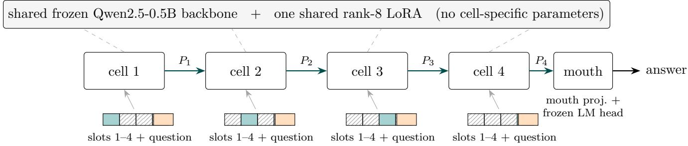
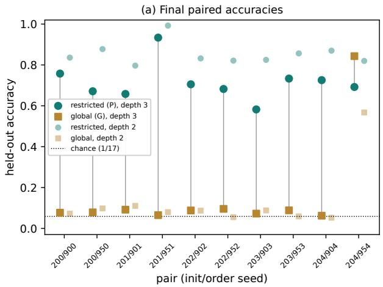
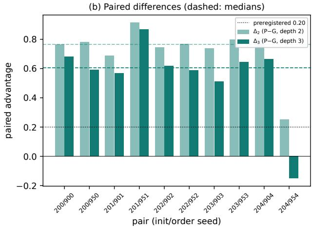
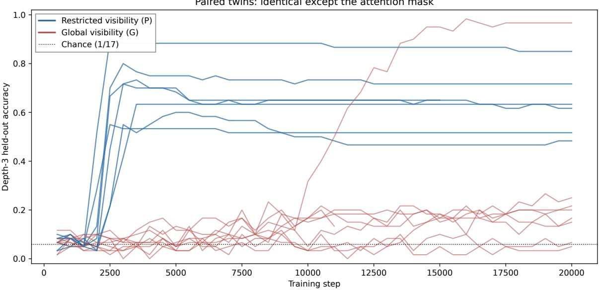

# What You Can’t See Is What You Learn: Restricted Evidence Visibility Favors Compositional Generalization in Shared-Genome Language-Model Societies

Narcis Marincat∗

August 2026

## Abstract

Multi-module neural systems often expose every module to the full input. We test whether restricting evidence visibility changes which solutions gradient-based training discovers. Four-cell societies share one frozen pretrained language model and one low-rank adapter, communicating only through two model-width continuous vectors in a fixed relay. On a prospectively sealed natural-language function-composition task, we train ten matched restricted/global pairs sharing initialization bytes, training order, token layout, positional geometry, parameters, and computation; only the attention mask difers. Restricted-visibility societies outperform their globally visible twins by at least 20 percentage points at both depths in 9 of 10 pairs, with median paired advantages of 0.7648 and 0.6050. Cutting communication reduces every restricted society to chance, and the depth-three advantage remains 0.558 on programs whose composite function never appeared in training. Across six audited restricted societies, same-value packet transplants preserve downstream behavior at 0.94–1.00 across all tested interfaces; destructive interventions collapse performance; and counterfactual packets redirect outputs toward the mathematically predicted answer. The sole high-performing global model also requires communication, but its same-value packets are not interchangeable across episodes. Thus restricted visibility is not necessary for composition; under this protocol it substantially increases the probability of learning a generalizing relay and favors a reusable, value-indexed interface. The complete preregistered battery nevertheless formally fails because restricted-arm median depth-three accuracy is 0.6988, below the 0.70 floor. An earlier qualification cohort likewise yielded 0/10 complete passes: one model met every task-performance gate, but all ten failed ordinary-language preservation, confining the system to explicitly task-gated use.

## 1 Introduction

When a trainable module can inspect the complete program, whole-program lookup is an available solution. Restricting each module to one fragment removes that direct whole-program lookup route and may instead favor reusable local transformations connected by communication. This paper isolates that hypothesis causally in a multi-module system built from a shared pretrained language model.

The experimental object is a society of four cells sharing one frozen Qwen2.5-0.5B-Instruct genome (Qwen Team, 2024) and one rank-8 adapter (Hu et al., 2022). Cells communicate through learned continuous packets—two model-width vectors per hop, the only inter-cell information pathway—in a fixed relay ending in a frozen LM head plus a learned mouth projection. The task is ordered natural-language function composition over $\mathbb { Z } _ { 1 7 } ;$ evaluation uses held-out ordered operator programs rendered in held-out phrasings. The treatment is a single attention-mask intervention. In the restricted arm, every cell receives the same fixed four-slot input layout but may attend only to its assigned evidence span: foreign span tokens have exactly zero direct attention influence, and foreign information can reach that cell only through incoming packets. In the global arm, all four spans are directly readable. Token layout, positional geometry, trainable parameters, computation, initialization bytes, and per-pair training-example order are held fixed. Ten matched pairs—five initializations under two data orders—train for exactly 20,000 updates on a task instance generated and sealed before any training or outcome inspection, under preregistered gates and bit-exact machine verification (Figure 1).

All ten globally visible twins fit the primitive-operation training set. On the held-out-phrasing single-operation diagnostic, accuracy ranges from 0.869 to 0.991. Nine of ten then display a memorization-without-generalization profile: all fit the depth-two training bank exactly, while depth-three training-bank exact accuracy ranges from 0.41 to 1.00 and held-out composition remains near chance at 0.05–0.11. All ten restricted-visibility twins achieve substantial held-out performance, ranging from 0.582 to 0.933 at depth three. One global twin (initialization 204, order 954) is the informative exception: it reaches 0.843 at depth three and its communication channel is causally necessary, but same-value packet transplants fail across episodes. By contrast, all six audited restricted-visibility societies learn approximately interchangeable carriers of the running intermediate value.

## Contributions.

1. A matched causal isolation of evidence visibility. We compare multi-module systems with identical architectures, inputs, positional geometry, trainable parameters, computation, initialization bytes, and training-example streams, changing only whether each cell may attend to foreign evidence spans. The comparison is prospectively sealed and evaluated with preregistered gates (§4–5).

2. A large efect that persists without composite-function collisions. Median paired advantages are 0.7648 and 0.6050 at depths two and three. A post hoc collision-stratified analysis over nine complete pairs finds a median depth-three advantage of 0.558 on programs whose complete afine map never occurs in training, showing that familiar-function lookup cannot explain the visibility efect (§5.3).

3. Mechanism tests using value-indexed packet transplants. Beyond destructive channel interventions, we transplant natural packets between episodes according to the mathematical intermediate they represent. Across six audited restricted-visibility societies, same-value transplants preserve behavior at 0.94–1.00 across every tested interface, while counterfactualvalue transplants steer outputs toward the mathematically predicted answer. The strongest model passes every absolute preregistered transplant gate. The same analysis separates the approximately interchangeable value code favored under restricted visibility from the non-interchangeable, episode-dependent code of the sole high-performing global model (§6).

4. Complete outcome reporting and release of available artifacts. We report two formal preregistered failures: an earlier qualification cohort in which 0/10 models passed the complete gate—although one passed every task-performance gate—and the present battery’s 0.0012 miss on its absolute depth-three floor. We release all available final checkpoints, evaluations, audit scripts, preregistration materials, and incident records; one restricted checkpoint remains unavailable for collision-stratified analysis and is disclosed explicitly (§7 and appendices).

## 2 Related Work

Visibility controls in multi-agent systems. CoFlow (Zou et al., 2026) supports full teammate visibility and an attention-masked agent-local mode within the same multi-agent architecture, providing a close visibility comparison in ofline multi-agent reinforcement learning. B´ena and Goodman (2025) likewise compare shared and separate input pathways in controlled modular recurrent networks. These studies establish that module-level information access can be manipulated directly, but neither evaluates held-out program composition or causally audits a learned inter-module relay state. Our contribution is therefore not the first use of visibility masking in a multi-module system, but the conjunction of a matched visibility intervention, sealed compositional generalization, and value-indexed causal packet transplants.

Distributed observation and emergent codes. Kaszy´nski (2026) studies discrete compositional communication about latent physical properties inferred from frozen video features. In the current version, four-agent systems converge to near-perfect positional disentanglement in 80/80 seeds, while lower-agent-count and single-sender controls are markedly less reliable. The controls support an efect of distributed sender organization rather than total bandwidth or frame coverage. The comparison nevertheless changes agent count and message factorization; our treatment holds the four-cell architecture, packet bandwidth, initialization, computation, and training stream fixed and changes only evidence visibility. The wider emergent-communication literature (Lazaridou et al., 2017) established channel pressure as a shaper of codes: capacity and bandwidth constraints (Resnick et al., 2020), the imperfect correlation of language compositionality with task generalization (Chaabouni et al., 2020), co-adaptation control (Rita et al., 2022), and partial observability shaping message content (Bosc and Vincent, 2022), typically with discrete channels and referential games rather than end-to-end latent relays on an LLM substrate.

Modularity, workspaces, and input separation. Recurrent Independent Mechanisms and Shared Global Workspace models study sparse, bandwidth-limited communication among neural modules (Goyal et al., 2021, 2022). B´ena and Goodman (2025) use controlled two-module recurrent networks to vary shared versus separate input pathways, sparse inter-module connectivity, resource constraints, and the timing and bandwidth of information flow. They show that structural modularity alone does not guarantee specialization and that specialization is favored by separable environmenta features and resource constraints; they do not study systematic recomposition of held-out operator programs. The modular systematic-generalization literature (Lake and Baroni, 2018; Bahdanau et al., 2019; D’Amario et al., 2021) shows that nominal modularity does not guarantee compositionality, and that scale can sometimes deliver it (Redhardt et al., 2025)—consistent with our framing of restriction as shifting basin probabilities rather than as a necessity claim.

Masking and context availability as inductive biases. AC-VLA (Peng et al., 2026a) combines instruction decomposition, dense subtask supervision, mixed training, and state-conditioned asymmetric masking of a shortcut visual input. Its ablations also isolate a substantial masking-only efect: adding wrist-view masking to raw-demonstration training improves spatial/goal OOD success from 35.5/46.6 to 47.3/67.0, while the full decomposition-plus-mask system reaches 64.2/73.3. This is a single-policy perceptual-shortcut intervention rather than a multi-module evidence-visibility or communication experiment. Ma et al. (2026a) show that task-structured additive attentionmask priors can persistently shift which extrapolating solution a Transformer learns on controlled Boolean and arithmetic tasks, although their masks are finite learnable biases rather than hard evidence-visibility boundaries. Uzunoglu et al. (2026) show that abundant task-relevant train-time context can shift learning from parametric internalization toward contextual reliance, including through a redistribution of gradient pressure from feed-forward modules toward attention. Ootan (2026) compares information-matched symbolic, factored, shared, and entangled input routes in fully enumerable tiny Transformers, finding that input-pathway structure afects few-shot binding—a controlled single-model precedent for input routing shaping the learned solution. Together these works support the broader hypothesis that information availability can redirect optimization, but none studies a matched multi-cell latent relay in which visibility is the sole treatment.

Multi-agent LLM systems and latent channels. Inference-time LLM societies typically exchange natural-language messages, often with substantial context overlap (Li et al., 2023; Wu et al., 2023; Du et al., 2024), while recent systems communicate through embeddings, hidden states, or KV caches. Aggregate gains and destructive message ablations do not by themselves identify whether a receiver uses example-specific sender information. Zhang and Emu (2026) intervene at the latent-message boundary using no-message, other-example, self-generated, and current-example messages; Cheng et al. (2026) similarly compare native, deranged, zeroed, and moment-matched KV relays. Their findings show that a large channel efect can survive replacement by an answerirrelevant message. StateBridge (Peng et al., 2026b) aligns sender hidden states to a receiver’s input space using a training-free closed-form orthogonal transformation with norm calibration and vocabulary anchoring; it addresses cross-agent latent-space compatibility and portability rather than learned protocol formation, evidence visibility, or causal semantic interchange. We therefore treat destructive interventions as necessary controls and ground the mechanism claim in natural same-value and counterfactual-value packet transplants.

Causal abstraction and interchange interventions. Causal abstraction treats a mechanistic hypothesis as an alignment between high-level causal variables and low-level neural states, tested by asking whether interchange interventions produce the corresponding counterfactual efects (Geiger et al., 2021, 2025). Distributed Alignment Search extends this framework to variables represented in non-standard distributed subspaces (Geiger et al., 2024). Our packet transplants apply the same criterion at an explicit communication boundary, where the proposed high-level variable—the running $\mathbb { Z } _ { 1 7 }$ value—is known exactly.

Reusable causal interfaces. Hidden APIs in Language Models (Ma et al., 2026b) uses forked future operations, architecture competition, role-aligned transplantation, locality controls, and causal mediation to identify reusable interfaces within monolithic language models. It is the closest precedent for our claim that causally equivalent internal states should remain interchangeable under diferent downstream consumers. We instead study a state learned expressly for inter-cell communication and ask how evidence visibility changes the probability and form of that protocol.

Regularization by information removal. Dropout and modality dropout remove information stochastically (Hinton et al., 2012; Srivastava et al., 2014; Neverova et al., 2016), while informationbottleneck methods constrain representational capacity (Tishby et al., 2000). Our treatment instead imposes a stable semantic ownership boundary: each cell may access one assigned evidence span, and task-essential foreign evidence can influence it only through the learned packet channel. Because privacy in federated learning (McMahan et al., 2017) usually denotes formal or operational data-protection properties that we do not study, we use restricted evidence visibility or evidence partitioning throughout.

  
Figure 1: The society architecture and the treatment. Four cells share one frozen backbone and one rank-8 LoRA. Cell 1 publishes $P _ { 1 }$ from its private start-value span without incoming mail; cells 2–4 read $P _ { 1 } { - } P _ { 3 }$ and write $P _ { 2 } { - } P _ { 4 }$ (each packet: two 896-dimensional vectors, the only inter-cell pathway). Each cell receives an identical layout containing the shared question (orange) plus four evidence slots. In the restricted arm a cell’s attention mask exposes only its own evidence slot (teal) and the question, leaving foreign slots (hatched) with exactly zero direct attention influence; in the global arm all four slots are readable. The mask is the sole diference between twins.

Novelty, stated exactly. Prior work separately studies restricted information access, compositional emergent communication, latent inter-agent messages, and causal interchange interventions. To our knowledge, this is the first study to combine a visibility-only matched intervention in a learned inter-cell latent relay, prospectively sealed held-out compositional programs, and causal interchange tests establishing the communicated intermediate variable.

## 3 Societies of LLM cells

Architecture. A society comprises four cells and one readout. All cells share a frozen Qwen2.5- 0.5B-Instruct backbone and one rank-8 LoRA applied to its attention projections; there are no cell-specific parameters or learned cell identities. Execution is staged: cell 1 publishes from the start-value span without incoming mail, and cells 2–4 each consume the predecessor packet once while applying their private operation or structural forwarder. Two shared bias-free projections implement packet reading and writing, and a third bias-free projection implements mouth injection. The reader maps an incoming normalized $2 \times 8 9 6$ packet into two pseudo-token embeddings appended to the cell input; the writer maps the corresponding final hidden states into a packet residual. Packets update as

$$
P _ { \mathrm { o u t } } = \mathrm { R M S N o r m } \left( P _ { \mathrm { i n } } + 0 . 0 5 \Delta P \right) .
$$

The mouth forms

$$
h _ { \mathrm { f i n a l } } = h _ { \mathrm { b a s e } } + \beta W _ { \mathrm { m o u t h } } ( P _ { 4 } ) , \qquad \beta = 0 . 0 0 3 ,
$$

at the answer position, where $h _ { \mathrm { b a s e } }$ is the adapter-disabled frozen-base representation and $\beta$ is calibrated and frozen before training; the frozen LM head then produces the output. For the 17 task labels, training and task evaluation use contextually residualized logits,

$$
\tilde { z } _ { j } = z _ { j } ( h _ { \mathrm { f i n a l } } ) - z _ { j } ( h _ { \mathrm { b a s e } } ) ,
$$

with the adapter disabled on the base path; ordinary-language preservation is evaluated separately on the uncorrected full-vocabulary logits. The system has approximately 4.32M trainable parameters. Training uses answer-token cross-entropy together with a packet-level auxiliary classifier whose weight is annealed to zero by update 10,000; all reported evaluations disable the auxiliary head and use only the frozen LM head plus the learned mouth projection.

Task and curriculum. An episode contains an initial value in $\mathbb { Z } _ { 1 7 }$ and zero to three naturallanguage operation spans drawn from 12 afine bijections. The answer is encoded by one of 17 tokenizer-verified single-token labels. Training samples identity episodes with probability 0.10, singleoperation episodes with probability 0.25, and two- and three-operation episodes with probability 0.325 each. Identity and single-operation episodes were selected as essential curriculum atoms in a pre-battery development ladder rather than introduced after the paired results were observed. Evaluation uses held-out ordered programs, held-out phrasings, and separately reported compositefunction strata. Operator tables, program splits, phrasing grammars, and answer-token mappings are generated and hashed before training.

Treatment: restricted versus global evidence visibility. Both arms receive the same fixed four-slot token sequence with identical padding, positions, packet slots, and Transformer calls. In the restricted arm, a cell’s attention mask exposes only its assigned evidence slot and the shared question; in the global arm, the same cell may attend to all four evidence slots. The visibility mask is the sole experimental treatment.

## 4 The paired-visibility experiment

Ten twin pairs—five initializations under two data-order streams—train for exactly 20,000 updates on the sealed instance; each pair shares initialization bytes and its ordered example stream, verified through running stream hashes. Machines pass two bit-exact reproduction gates before contributing. The paired-efect, absolute-performance, communication-necessity, and packet-intervention thresholds were fixed before training; collision-stratified rescoring and inferential tests were added after outcome inspection and are labeled post hoc. Evaluation uses final checkpoints only. We additionally train three staged centralized-scan models with cumulative evidence visibility as secondary comparators. An anonymized preregistration, protocol history, and incident ledger are included in the supplementary material.

Statistical unit and analysis. The preregistered gates count ten complete paired training trajectories. Because each model initialization is reused under two data orders, inferential uncertainty is clustered by initialization, yielding five initialization strata. We report all ten paired diferences, the five initialization-level mean diferences, cluster-bootstrap intervals, and an exact sign-flip analysis over the five initialization-level means as post hoc descriptive inference. Evaluation examples are used only to estimate within-checkpoint accuracy and are not treated as independent training replicates.

## 5 Results

## 5.1 The paired efect

(Figure 2: final paired accuracies and paired diferences; Table 2: all ten pairwise results.) Restrictedvisibility societies exceed their global twins by at least 0.20 at both depths in 9 of 10 pairs; median paired advantages are 0.7648 at depth two and 0.6050 at depth three. Every restricted society is communication-dependent: severing all packets yields exactly chance performance, 1/17, in all ten. Nine global twins display the memorization-without-generalization profile: all fit the primitiveoperation training set and the depth-two training bank exactly, depth-three training-bank exact accuracy ranges from 0.41 to 1.00, and held-out accuracy remains at 0.05–0.11. The preregistered gate decomposition is shown in Table 1. Every component passes except the absolute restricted-arm depth-three floor, whose observed median is 0.6988 rather than 0.70; the complete conjunction therefore formally fails.

Table 1: Preregistered gate decomposition. Thresholds were frozen before training; the complete conjunction determines the preregistered verdict.
<table><tr><td>Preregistered component</td><td>Result</td></tr><tr><td> $P - G \ge 0 . 2 0$  at both depths</td><td>9/10 pairs — pass</td></tr><tr><td>Median  $\Delta _ { 2 } \geq 0 . 2 5$ </td><td>0.7648 — pass</td></tr><tr><td>Median  $\Delta _ { 3 } \geq 0 . 2 5$ </td><td>0.6050 — pass</td></tr><tr><td>Restricted-arm all-cut communication 10/10 at 1/17 — pass</td><td></td></tr><tr><td>No restricted run below 0.40 Restricted median depth two  $\geq 0 . 7 0$ </td><td>pass</td></tr><tr><td>Restricted median depth three  $\geq 0 . 7 0$ </td><td>0.8339 — pass</td></tr><tr><td>Complete preregistered conjunction</td><td>0.6988 — fail fail</td></tr></table>

Table 2: All ten pairwise results. Held-out accuracy at depths two and three for the restricted (P) and global (G) twin of each pair, paired diferences, and all-packets-cut accuracy at depth three (chance $= 1 / 1 7 \approx 0 . 0 5 8 8 )$
<table><tr><td>init</td><td>order</td><td> $\mathrm { P _ { 2 } }$ </td><td> $\mathrm { P _ { 3 } }$ </td><td> $\mathrm { G _ { 2 } }$ </td><td> $\mathrm { G _ { 3 } }$ </td><td> $\Delta _ { 2 }$ </td><td> $\Delta _ { 3 }$ </td><td>P all-cut</td><td>G all-cut</td></tr><tr><td>200</td><td>900</td><td>0.8358</td><td>0.7578</td><td>0.0723</td><td>0.0770</td><td>+0.7635</td><td>+0.6808</td><td>0.0588</td><td>0.0600</td></tr><tr><td>200</td><td>950</td><td>0.8775</td><td>0.6713</td><td>0.0980</td><td>0.0787</td><td>+0.7795</td><td>+0.5926</td><td>0.0588</td><td>0.0701</td></tr><tr><td>201</td><td>901</td><td>0.7966</td><td>0.6581</td><td>0.1103</td><td>0.0917</td><td>+0.6863</td><td>+0.5664</td><td>0.0588</td><td>0.0679</td></tr><tr><td>201</td><td>951</td><td>0.9926</td><td>0.9338</td><td>0.0797</td><td>0.0650</td><td>+0.9129</td><td>+0.8688</td><td>0.0588</td><td>0.0674</td></tr><tr><td>202</td><td>902</td><td>0.8321</td><td>0.7054</td><td>0.0870</td><td>0.0880</td><td>+0.7451</td><td>+0.6174</td><td>0.0588</td><td>0.0588</td></tr><tr><td>202</td><td>952</td><td>0.8211</td><td>0.6824</td><td>0.0551</td><td>0.0958</td><td>+0.7660</td><td>+0.5866</td><td>0.0588</td><td>0.0512</td></tr><tr><td>203</td><td>903</td><td>0.8248</td><td>0.5824</td><td>0.0882</td><td>0.0725</td><td>+0.7366</td><td>+0.5099</td><td>0.0588</td><td>0.0684</td></tr><tr><td>203</td><td>953</td><td>0.8566</td><td>0.7333</td><td>0.0588</td><td>0.0885</td><td>+0.7978</td><td>+0.6448</td><td>0.0588</td><td>0.0657</td></tr><tr><td>204</td><td>904</td><td>0.8701</td><td>0.7257</td><td>0.0527</td><td>0.0623</td><td>+0.8174</td><td>+0.6634</td><td>0.0588</td><td>0.0650</td></tr><tr><td>204</td><td>954</td><td>0.8199</td><td>0.6922</td><td>0.5674</td><td>0.8431</td><td>+0.2525</td><td>-0.1509</td><td>0.0588</td><td>0.0569</td></tr></table>

As post hoc descriptive inference clustered by initialization (§4), all five initialization-level mean diferences are positive at both depths (depth two: 0.7715, 0.7996, 0.7555, 0.7672, 0.5350; depth three: 0.6367, 0.7176, 0.6020, 0.5774, 0.2563); the cluster-bootstrap 95% intervals for the mean paired advantage are [0.628, 0.784] at depth two and [0.397, 0.669] at depth three, and the exact two-sided five-stratum sign-flip p-value is 0.0625 at each depth—the smallest value attainable with five strata.

The three fresh-world staged centralized models score 1.000, 0.993, and 0.098 at depth three, indicating high between-seed variability rather than uniform incapacity. These models were not paired to the visibility cohort, were not compute-matched to the four-cell society, and were trained on a diferent GPU class. On the earlier qualification-world split, three atom-trained flat one-call comparators scored 0.117–0.200 at depth two and 0.100–0.267 at depth three, while all three staged controls failed; a single staged development run on another split succeeded. We therefore treat all centralized results as contextual baselines rather than as the causal identification of the visibility efect. Across the earlier restricted-only world and the paired world, all twenty restricted-visibility societies exceeded 0.58 at depth three.

  
Figure 2: The paired visibility efect. (a) Final held-out accuracies for all ten twin pairs; vertical grey segments connect each pair at depth three. (b) Paired advantages $\Delta _ { 2 }$ and $\Delta _ { 3 }$ per pair with medians (dashed) and the preregistered 0.20 per-pair threshold (dotted). Pair 204/954 is the globally visible exception discussed in §5.2.

## 5.2 The globally visible exception

The global twin of initialization 204 under order 954 reaches 0.843 at depth three, exceeding its restricted sibling, and also collapses under packet deletion. Global visibility is therefore compatible with a high-performing, communication-dependent strategy in this architecture. In the present ten-pair cohort, however, only one global trajectory reaches that regime. Section 6 shows that its learned packet interface difers from the approximately value-indexed interface observed in the audited restricted models.

## 5.3 Post hoc collision-stratified scoring

Many held-out programs share their complete afine map with a training program, so a function-level lookup strategy could in principle score well without executing the unseen operator sequence. We therefore stratify the available final checkpoints by whether the composite function itself appeared in training. Collision-stratified results are available for 19 of 20 checkpoints, yielding nine complete restricted/global pairs; one restricted checkpoint remains archive-pending. On map-novel depththree programs, the median paired advantage remains +0.558, compared with +0.634 on the map-redundant stratum. Restricted models score 0.553–0.913 on map-novel programs, ordinary global models remain near chance at 0.049–0.094, and the 204/954 global model reaches 0.828. Composite-map collisions therefore reduce the benchmark’s discriminative purity in principle but do not explain either the paired visibility efect or the existence of compositional computation. We report the small residual redundant-versus-novel advantage separately and recommend collision-free future task worlds.

## 6 Mechanism: value-indexed packet transplants

Standard destructive audits (edge deletion, cross-example shufle, norm-matched noise) establish channel necessity but not content. The audit’s cross-example shufle is interface-specific and draws natural donor packets within the audited episode pool; it is distinct from the all-interface batchshufle diagnostic reported in Table 3, which rolls committed packets across the evaluation batch at all three interfaces simultaneously. Our transplants are indexed by the semantic intermediate value: a donor packet from a diferent episode replaces the recipient’s packet at an interface, with the donor chosen so the running value either matches (same-value) or difers with a known target (counterfactual).

After behavioral evaluation, we selected six restricted-visibility societies spanning the observed performance range for packet auditing. Across these six societies, natural packets from diferent episodes are nearly interchangeable when they denote the same mathematical intermediate: samevalue transplant accuracy is 0.94–1.00 across all tested interfaces. Deleting packets or replacing them with norm-matched noise reduces performance to at most 0.11, and cross-example shufling scores 0.07–0.11. Counterfactual transplants redirect outputs toward the mathematically predicted answer, with fidelity ranging from 0.74 to 1.00 and tracking each model’s intact task competence; the strongest model passes every absolute preregistered transplant gate. These results show that the audited restricted societies repeatedly learn a value-indexed causal relay, although only the strongest model supports the phrase exact causal abstraction under all absolute thresholds.

The 204/954 global twin dissociates sharply. Packet deletion collapses its performance, but same-value transplants succeed on only 0.12–0.25 of cases; its communication state is therefore strongly episode- or context-dependent rather than reducible to the intermediate value alone. Among the audited models, these interventions provide evidence that restricted visibility afected not only how often a successful strategy was learned but also the form of the learned interface: all six audited restricted societies exhibit an approximately interchangeable value-indexed code, whereas the sole high-performing global model uses a non-interchangeable, episode-entangled code, operationally defined by the failure of same-value packets to remain causally interchangeable across episodes. Because the global arm produced only one high-performing model, this is a mechanistic case study rather than an estimate of how frequently global visibility produces each code class. We hypothesize that a restricted receiver cannot rely on the full program transcript and therefore benefits from a more self-suficient packet representation; testing this explanation across additional tasks and successful global models remains future work.

## 7 Limitations and scope

The causal visibility comparison concerns one architecture family, one templated synthetic task family, one prospectively sealed paired task world, and a fixed 20,000-update budget. The ten paired trajectories arise from five model initializations evaluated under two data orders, so they are not ten fully independent initialization draws; uncertainty analyses are therefore clustered by initialization. A prior restricted-only world provides behavioral context but is not an independent paired replication of the visibility efect. Restricted visibility is not necessary for composition: one global model is a constructive counterexample. The supported claim is instead a shift in the probability and form of the learned solution under the tested protocol. Nor is ours the first multi-agent local/global visibility comparison (e.g., Zou et al., 2026); the contribution is the tightly paired, mechanism-audited form of the comparison.

The complete preregistered battery formally fails because restricted-arm median depth-three accuracy is 0.6988 rather than the required 0.70. An earlier qualification cohort also passes 0/10 complete gates; one model meets all task-performance criteria, but all ten fail the ordinary-language preservation gate, with approximately 50–61 percentage points of top-1 regression. The present system is therefore an explicitly task-gated specialist, not an always-on zero-regression languagemodel retrofit.

The modular arithmetic primitives are not native capabilities of the frozen base model. Training explicitly includes identity and single-operation curriculum atoms in addition to multi-operation programs. Thus, pretraining supplies a shared linguistic representation space, while the arithmetic primitives, packet protocol, and composition procedure are learned from the synthetic curriculum.

The inter-cell channel is bounded but not minimal: each message contains two 896-dimensional continuous vectors. Six of ten restricted models were selected for packet audits to span the performance range, and only one high-performing global model was available for a code-type comparison. The claim that restricted visibility favors a value-indexed interface is therefore supported in the audited sample but not yet quantified as a population frequency. Four restricted checkpoints remain unaudited.

Restricted and global twins are matched in token layout, parameters, Transformer calls, and training streams, but the secondary centralized controls are neither pair-matched nor compute matched to the four-cell society. The experiment establishes a visibility efect within the society architecture; it does not establish computational eficiency or superiority to every centralized architecture.

Collision-stratified analysis is available for 19 of 20 final checkpoints. Composite-function collisions do not explain the observed efect, but they make the aggregate benchmark less discriminative than a collision-free construction. One restricted checkpoint remains unavailable for that analysis and is disclosed. Finally, the study does not establish cross-family packet universality, free-form language reasoning, dynamic routing, event-driven quiescence, long-context utility, or any claim about consciousness. Evidence ownership, relay topology, task engagement, and the number of communication stages are externally specified rather than learned. Collision-stratified rescoring and the choice of models for packet auditing are post hoc descriptive analyses, although their intervention criteria were fixed independently of the resulting scores.

## References

Dzmitry Bahdanau, Shikhar Murty, Michael Noukhovitch, Thien Huu Nguyen, Harm de Vries, and Aaron Courville. Systematic generalization: What is required and can it be learned? In International Conference on Learning Representations, 2019.

Gabriel B´ena and Dan F. M. Goodman. Dynamics of specialization in neural modules under resource constraints. Nature Communications, 16(187), 2025.

Tom Bosc and Pascal Vincent. The emergence of argument structure in artificial languages. Transactions of the Association for Computational Linguistics, 10, 2022.

Rahma Chaabouni, Eugene Kharitonov, Diane Bouchacourt, Emmanuel Dupoux, and Marco Baroni. Compositionality and generalization in emergent languages. In Proceedings of the 58th Annual Meeting of the Association for Computational Linguistics, 2020.

Jiaming Cheng, Subhransu Das, and Rajiv Ramnath. When does latent communication pay? A causal audit of relayed KV caches in multi-agent LLMs. arXiv preprint arXiv:2608.04893, 2026.

Vanessa D’Amario, Tomotake Sasaki, and Xavier Boix. How modular should neural module networks be for systematic generalization? In Advances in Neural Information Processing Systems, volume 34, 2021.

Yilun Du, Shuang Li, Antonio Torralba, Joshua B. Tenenbaum, and Igor Mordatch. Improving factuality and reasoning in language models through multiagent debate. In Proceedings of the 41st International Conference on Machine Learning, 2024.

Atticus Geiger, Hanson Lu, Thomas Icard, and Christopher Potts. Causal abstractions of neural networks. In Advances in Neural Information Processing Systems, volume 34, pages 9574–9586, 2021.

Atticus Geiger, Zhengxuan Wu, Christopher Potts, Thomas Icard, and Noah D. Goodman. Finding alignments between interpretable causal variables and distributed neural representations. In Proceedings of the Third Conference on Causal Learning and Reasoning, volume 236 of PMLR, pages 160–187, 2024.

Atticus Geiger, Duligur Ibeling, Amir Zur, Maheep Chaudhary, Sonakshi Chauhan, Jing Huang, Aryaman Arora, Zhengxuan Wu, Noah D. Goodman, Christopher Potts, and Thomas Icard. Causal abstraction: A theoretical foundation for mechanistic interpretability. Journal of Machine Learning Research, 26(83):1–64, 2025.

Anirudh Goyal, Alex Lamb, Jordan Hofmann, Shagun Sodhani, Sergey Levine, Yoshua Bengio, and Bernhard Sch¨olkopf. Recurrent independent mechanisms. In International Conference on Learning Representations, 2021.

Anirudh Goyal, Aniket Didolkar, Alex Lamb, Kartikeya Badola, Nan Rosemary Ke, Nasim Rahaman, Jonathan Binas, Charles Blundell, Michael Mozer, and Yoshua Bengio. Coordination among neural modules through a shared global workspace. In International Conference on Learning Representations, 2022.

Geofrey E. Hinton, Nitish Srivastava, Alex Krizhevsky, Ilya Sutskever, and Ruslan Salakhutdinov. Improving neural networks by preventing co-adaptation of feature detectors. arXiv preprint arXiv:1207.0580, 2012.

Edward J. Hu, Yelong Shen, Phillip Wallis, Zeyuan Allen-Zhu, Yuanzhi Li, Shean Wang, Lu Wang, and Weizhu Chen. LoRA: Low-rank adaptation of large language models. In International Conference on Learning Representations, 2022.

Tomek Kaszy´nski. Emergent compositional communication for latent world properties. arXiv preprint arXiv:2604.03266, 2026.

Brenden M. Lake and Marco Baroni. Generalization without systematicity: On the compositional skills of sequence-to-sequence recurrent networks. In Proceedings of the 35th International Conference on Machine Learning, 2018.

Angeliki Lazaridou, Alexander Peysakhovich, and Marco Baroni. Multi-agent cooperation and the emergence of (natural) language. In International Conference on Learning Representations, 2017.

Guohao Li, Hasan Abed Al Kader Hammoud, Hani Itani, Dmitrii Khizbullin, and Bernard Ghanem. CAMEL: Communicative agents for “mind” exploration of large language model society. In Advances in Neural Information Processing Systems, volume 36, 2023.

Mingze Ma, Hemanth Saratchandran, Cameron Gordon, and Simon Lucey. Mask-based priors are more persistent than query-key initializations. arXiv preprint arXiv:2608.00418, 2026a.

SiYuan Ma, Yiqin Luo, Zhangji, Canran Xiao, Albert Gao, Wei-Hsing Huang, Wei Wang, Qiwei Wu, Xinran Li, Jinfeng Wei, and Qixin Zhang. Hidden APIs in language models: Discovering reusable causal interfaces from forked futures. arXiv preprint arXiv:2607.27617, 2026b.

H. Brendan McMahan, Eider Moore, Daniel Ramage, Seth Hampson, and Blaise Ag¨uera y Arcas. Communication-eficient learning of deep networks from decentralized data. In Proceedings of the 20th International Conference on Artificial Intelligence and Statistics, 2017.

Natalia Neverova, Christian Wolf, Graham W. Taylor, and Florian Nebout. ModDrop: Adaptive multi-modal gesture recognition. IEEE Transactions on Pattern Analysis and Machine Intelligence, 38(8):1692–1706, 2016.

Yoshiyuki Ootani. Input pathways shape few-shot, not zero-shot, binding in tiny transformers: A fully-enumerable study. arXiv preprint arXiv:2607.04926, 2026.

Xiaojiang Peng, Kai Peng, Jie Lu, Zheng Lian, Zitong Yu, and Xiaobo Wang. AC-VLA: Robust out-of-distribution action execution via compositional learning. arXiv preprint arXiv:2607.15714, 2026a.

Yanwen Peng, Delvin Ce Zhang, Xi Wang, and Nikolaos Aletras. StateBridge: Training-free hidden-state alignment for latent communication in LLM multi-agent systems. In Conference on Language Modeling (COLM), 2026b. arXiv:2608.13317.

Qwen Team. Qwen2.5 technical report. arXiv preprint arXiv:2412.15115, 2024.

Florian Redhardt, Yassir Akram, and Simon Schug. Scaling can lead to compositional generalization. In Advances in Neural Information Processing Systems, 2025. arXiv:2507.07207.

Cinjon Resnick, Abhinav Gupta, Jakob Foerster, Andrew M. Dai, and Kyunghyun Cho. Capacity, bandwidth, and compositionality in emergent language learning. In Proceedings of the 19th International Conference on Autonomous Agents and MultiAgent Systems (AAMAS), 2020.

Mathieu Rita, Corentin Tallec, Paul Michel, Jean-Bastien Grill, Olivier Pietquin, Emmanuel Dupoux, and Florian Strub. Emergent communication: Generalization and overfitting in Lewis games. In Advances in Neural Information Processing Systems, volume 35, 2022.

Nitish Srivastava, Geofrey Hinton, Alex Krizhevsky, Ilya Sutskever, and Ruslan Salakhutdinov. Dropout: A simple way to prevent neural networks from overfitting. Journal of Machine Learning Research, 15:1929–1958, 2014.

Naftali Tishby, Fernando C. Pereira, and William Bialek. The information bottleneck method. arXiv preprint physics/0004057, 2000.

Arda Uzunoglu, Benjamin Van Durme, and Daniel Khashabi. Information abundance paradox: Long-context training undermines parametric knowledge. arXiv preprint arXiv:2608.12218, 2026.

Qingyun Wu, Gagan Bansal, Jieyu Zhang, Yiran Wu, Beibin Li, Erkang Zhu, Li Jiang, Xiaoyun Zhang, Shaokun Zhang, Jiale Liu, Ahmed Hassan Awadallah, Ryen W. White, Doug Burger, and Chi Wang. AutoGen: Enabling next-gen LLM applications via multi-agent conversation. arXiv preprint arXiv:2308.08155, 2023.

Huixiang Zhang and Mahzabeen Emu. Do latent channels actually communicate? A causal audit of latent multi-agent LLM. arXiv preprint arXiv:2607.26773, 2026.

Guowei Zou, Haitao Wang, Beiwen Zhang, Boning Zhang, and Hejun Wu. CoFlow: Coordinated few-step flow for ofline multi-agent decision making. arXiv preprint arXiv:2605.01457, 2026.

## A Protocol details

Task instance and sealing. The paired task world is generated from three seeds fixed and hashed before any training: operator seed 6011, split seed 2203 (split hash 94e506d408b6def1), and phrasing-grammar seed 7717 (grammar hash def14eb4182e2949). Twelve afine bijections over $\mathbb { Z } _ { 1 7 }$ form the operator set; programs are ordered operator sequences of length 0–3. Program banks are split so that held-out depth-two and depth-three programs never occur as ordered sequences in training; a bank-intersection audit verifies the separation. Held-out programs are rendered in held-out phrasings drawn from a templated grammar with four surface rotations per operator.

Evaluation sets. The depth-two held-out set contains 12 programs and the depth-three set 60 programs; each program is evaluated over all 17 start values and 4 phrasing rotations, giving 816 and 4,080 scored episodes per checkpoint respectively. Task training and exact-match evaluation use the 17 residualized label logits defined in §3; ordinary-language preservation uses uncorrected full-vocabulary logits. Chance task accuracy is $1 / 1 7 \approx 0 . 0 5 8 8$

Layout constants. Question length $T _ { q } = 5 4$ tokens, span length $T _ { s } = 3 3$ tokens, four evidence slots per episode, and $M _ { P } = 2$ packet pseudo-token slots yield 132 evidence-slot tokens and 188 total tokens per adapter-active cell call. Each episode uses four adapter-active cell calls plus one adapter-disabled, question-only mouth-base call. Both arms use a fixed $2 \times 1 6$ gradient-accumulation schedule; batch composition and ordering are identical within each pair (verified by running stream hashes).

Preregistered gates. (i) $\Delta \ge 0 . 2 0$ at both depths in at least 8 of 10 pairs; (ii) median $\Delta _ { 2 } \geq 0 . 2 5 ;$ (iii) median $\Delta _ { 3 } \geq 0 . 2 5 ;$ (iv) all-cut communication $\mathrm { a t } \leq 0 . 1 1$ in at least 8 restricted models (observed: exactly chance in $1 0 / 1 0 ) ; ( \mathrm { v } )$ no restricted run below 0.40; (vi) restricted median $\geq 0 . 7 0$ at both depths. Machine admission requires bit-exact reproduction of two golden fingerprints (restricted c7fcb21aad26951b, global b7c6157b1b3b79af) computed over internal state after a fixed training prefix.

## B Full result tables

Donor selection rules. For each audited interface, donor packets are harvested from natural runs of diferent episodes at the same interface position. Same-value donors carry an identical running intermediate; counterfactual donors carry a diferent, known value whose mathematically implied final answer defines the steering target. Donors are matched only by value, never by episode, phrasing, or start value; no packet is synthesized or optimized. The span-counterfactual control rewrites the evidence text instead, verifying that packet steering matches text-level causal ground truth.

Cluster-bootstrap intervals. Resampling the five initialization strata with replacement $( 1 0 ^ { 5 }$ draws, seed 20260820, percentile method) gives 95% intervals for the mean paired advantage of [0.628, 0.784] at depth two and [0.397, 0.669] at depth three. The exact two-sided sign-flip p-value

Table 3: Per-model evaluation diagnostics, all twenty finals. $\ell _ { 0 } \colon$ identity accuracy; $\ell _ { 1 } \colon$ single-operation (held-out phrasing) accuracy; all-cut: all packets severed (depth three); best cell: best single-cell-only accuracy; batch shufle: all-interface batch packet shufle (committed packets rolled across the evaluation batch at all three interfaces simultaneously — a broad diagnostic distinct from the audit’s interface-specific cross-example shufle, Table 5); train3: depth-three training-bank exact accuracy on the first 150 training programs. Depthtwo training-bank exact accuracy is 1.000 for every model and is omitted.
<table><tr><td>arm</td><td>init</td><td>order</td><td> $\ell _ { 0 }$ </td><td> $\ell _ { 1 }$ </td><td>depth 2</td><td>depth 3</td><td>all-cut</td><td>best cell</td><td>batch shuffle</td><td>train3</td></tr><tr><td>G</td><td>200</td><td>900</td><td>1.000</td><td>0.9914</td><td>0.0723</td><td>0.0770</td><td>0.0600</td><td>0.0600</td><td>0.0691</td><td>1.00</td></tr><tr><td>G</td><td>200</td><td>950</td><td>1.000</td><td>0.9816</td><td>0.0980</td><td>0.0787</td><td>0.0701</td><td>0.0701</td><td>0.0735</td><td>0.78</td></tr><tr><td>G</td><td>201</td><td>901</td><td>1.000</td><td>0.9755</td><td>0.1103</td><td>0.0917</td><td>0.0679</td><td>0.0679</td><td>0.0809</td><td>0.42</td></tr><tr><td>G</td><td>201</td><td>951</td><td>1.000</td><td>0.9743</td><td>0.0797</td><td>0.0650</td><td>0.0674</td><td>0.0674</td><td>0.0681</td><td>0.41</td></tr><tr><td>G</td><td>202</td><td>902</td><td>1.000</td><td>0.9265</td><td>0.0870</td><td>0.0880</td><td>0.0588</td><td>0.0588</td><td>0.0814</td><td>0.43</td></tr><tr><td>G</td><td>202</td><td>952</td><td>1.000</td><td>0.9534</td><td>0.0551</td><td>0.0958</td><td>0.0512</td><td>0.0512</td><td>0.0880</td><td>0.99</td></tr><tr><td>G</td><td>203</td><td>903</td><td>1.000</td><td>0.8689</td><td>0.0882</td><td>0.0725</td><td>0.0684</td><td>0.0684</td><td>0.0686</td><td>0.86</td></tr><tr><td>G</td><td>203</td><td>953</td><td>1.000</td><td>0.9632</td><td>0.0588</td><td>0.0885</td><td>0.0657</td><td>0.0657</td><td>0.0782</td><td>0.48</td></tr><tr><td>G</td><td>204</td><td>904</td><td>1.000</td><td>0.9620</td><td>0.0527</td><td>0.0623</td><td>0.0650</td><td>0.0650</td><td>0.0549</td><td>0.51</td></tr><tr><td>G</td><td>204</td><td>954</td><td>1.000</td><td>0.8995</td><td>0.5674</td><td>0.8431</td><td>0.0569</td><td>0.0569</td><td>0.6627</td><td>1.00</td></tr><tr><td>P</td><td>200</td><td>900</td><td>1.000</td><td>0.9277</td><td>0.8358</td><td>0.7578</td><td>0.0588</td><td>0.0686</td><td>0.5784</td><td>1.00</td></tr><tr><td>P</td><td>200</td><td>950</td><td>1.000</td><td>0.8909</td><td>0.8775</td><td>0.6713</td><td>0.0588</td><td>0.0686</td><td>0.5186</td><td>1.00</td></tr><tr><td>P</td><td>201</td><td>901</td><td>1.000</td><td>0.8860</td><td>0.7966</td><td>0.6581</td><td>0.0588</td><td>0.0686</td><td>0.5123</td><td>1.00</td></tr><tr><td>P</td><td>201</td><td>951</td><td>1.000</td><td>0.9926</td><td>0.9926</td><td>0.9338</td><td>0.0588</td><td>0.0686</td><td>0.6900</td><td>1.00</td></tr><tr><td>P</td><td>202</td><td>902</td><td>1.000</td><td>0.9020</td><td>0.8321</td><td>0.7054</td><td>0.0588</td><td>0.0686</td><td>0.5353</td><td>1.00</td></tr><tr><td>P</td><td>202</td><td>952</td><td>1.000</td><td>0.8897</td><td>0.8211</td><td>0.6824</td><td>0.0588</td><td>0.0686</td><td>0.5201</td><td>1.00</td></tr><tr><td>P</td><td>203</td><td>903</td><td>1.000</td><td>0.8591</td><td>0.8248</td><td>0.5824</td><td>0.0588</td><td>0.0686</td><td>0.4532</td><td>1.00</td></tr><tr><td>P</td><td>203</td><td>953</td><td>1.000</td><td>0.9179</td><td>0.8566</td><td>0.7333</td><td>0.0588</td><td>0.0686</td><td>0.5586</td><td>1.00</td></tr><tr><td>P</td><td>204</td><td>904</td><td>1.000</td><td>0.9142</td><td>0.8701</td><td>0.7257</td><td>0.0588</td><td>0.0686</td><td>0.5554</td><td>1.00</td></tr><tr><td>P</td><td>204</td><td>954</td><td>1.000</td><td>0.8946</td><td>0.8199</td><td>0.6922</td><td>0.0588</td><td>0.0686</td><td>0.5284</td><td>1.00</td></tr></table>

over the five stratum means is 0.0625 at each depth, the smallest value attainable with five strata;   
both analyses are post hoc.

## C Development history

The program preceding the paired battery contributed three results that shaped the present design. First, an earlier recurrent-genome program established the packet-transplant methodology and reported its negative results: under a competitive gating mechanism, learning signal attenuated with relay depth, and the preregistered battery failed; replacing the gate restored deep relaying (fidelity by depth approximately 1.00/1.00/0.86/0.75). Second, a solvability ladder showed that, under the tested protocol, multi-operation-only training fit training programs but failed standalone primitive execution and held-out composition; adding identity and single-operation curriculum atoms yielded systematic generalization in the staged development control, motivating their inclusion in the frozen paired protocol. Third, a ten-society restricted-only qualification cohort on a separately sealed world reached 0.61–0.94 held-out compositional accuracy with universal communication dependence, but passed 0 of 10 complete preregistered gates: one model met every task-performance criterion, and all ten failed the ordinary-language preservation gate with 50–61 points of top-1 regression on general prompts. A subsequent restricted-versus-global performance contrast on development worlds motivated the paired, sealed, visibility-only battery reported here.

## D Preregistration, incidents, and compute lineage

All thresholds in Appendix A were frozen in writing before any training on the sealed instance. Training ran on rented consumer GPUs (RTX 5090 class for societies; A6000 class for staged comparators) admitted only after bit-exact golden-fingerprint reproduction. The incident ledger discloses: (i) one lane terminated silently by a provider host mid-training and rerun from scratch; (ii) a provider-account balance exhaustion that froze the fleet mid-campaign, recovered through a bit-exact resume protocol restoring trainable parameters, optimizer state, and all random-numbergenerator streams, with every afected final verified at internal step 20,000; (iii) one restricted final checkpoint (init 202, order 952) marooned on an unreachable provider instance, excluded from collision-stratified analysis and disclosed wherever relevant. Secondary staged-control runs also experienced checkpoint-filename reuse across successive resumes; their final lineage was reconstructed from the checkpoint-internal step field, and every reported final was verified at internal step 20,000. One transferred checkpoint copy failed checksum and was evaluated from the verified local copy. No checkpoint selection occurred at any point: all evaluations use final checkpoints only.

Table 4: Post hoc collision-stratified depth-three scores per pair. Map-novel: composite afine map absent from training (13 of 60 programs; 884 scored episodes per checkpoint); map-redundant: map present (47 programs; 3,196 episodes). At depth two, 3 of 12 programs are map-novel. One restricted checkpoint (init 202, order 952) is archive-pending and disclosed.
<table><tr><td>init</td><td>order</td><td>P novel</td><td>G novel</td><td>∆ novel</td><td>P redundant</td><td>G redundant</td></tr><tr><td>200</td><td>900</td><td>0.7104</td><td>0.0667</td><td>+0.6437</td><td>0.7710</td><td>0.0798</td></tr><tr><td>200</td><td>950</td><td>0.5905</td><td>0.0532</td><td>+0.5373</td><td>0.6937</td><td>0.0857</td></tr><tr><td>201</td><td>901</td><td>0.6131</td><td>0.0939</td><td>+0.5192</td><td>0.6705</td><td>0.0911</td></tr><tr><td>201</td><td>951</td><td>0.9129</td><td>0.0690</td><td>+0.8439</td><td>0.9396</td><td>0.0638</td></tr><tr><td>202</td><td>902</td><td>0.6369</td><td>0.0792</td><td>+0.5577</td><td>0.7243</td><td>0.0904</td></tr><tr><td>202</td><td>952</td><td>restricted checkpoint archive-pending (disclosed)</td><td></td><td></td><td></td><td></td></tr><tr><td>203</td><td>903</td><td>0.5532</td><td>0.0792</td><td>+0.4740</td><td>0.5904</td><td>0.0707</td></tr><tr><td>203</td><td>953</td><td>0.6776</td><td>0.0814</td><td>+0.5962</td><td>0.7487</td><td>0.0904</td></tr><tr><td>204</td><td>904</td><td>0.6697</td><td>0.0486</td><td>+0.6211</td><td>0.7412</td><td>0.0660</td></tr><tr><td>204</td><td>954</td><td>0.6324</td><td>0.8281</td><td>-0.1957</td><td>0.7087</td><td>0.8473</td></tr></table>

Table 5: Packet-audit summary, eight audited models. Ranges span the three relay interfaces (cell1→2, 2→3, 3→4); every condition uses n = 160 episodes per interface. Base: intact accuracy on the audited episode pool. Del/noise: worst (highest) of packet deletion and norm-matched noise. Shufle: cross-example packet shufle (its preregistered gate accepts either $\leq 0 . 1 1 \ \mathrm { o r } \ \geq 3 0$ points below intact accuracy). Span-cf: counterfactual evidence-span rewrite control. Gate marks are the preregistered absolute audit gates.
<table><tr><td>model</td><td>base</td><td>same-value</td><td>counterfactual</td><td>span-cf</td><td>del/noise</td><td>shuffle</td><td>all gates</td></tr><tr><td>G:m200:o950</td><td>0.067</td><td>0.00–0.50</td><td>0.00–0.33</td><td>0.25-0.50</td><td>0.250</td><td>0.25-0.33</td><td>no</td></tr><tr><td>G:m204:0954</td><td>0.861</td><td>0.12-0.25</td><td>0.15-0.26</td><td>0.70–0.91</td><td>0.071</td><td>0.06–0.11</td><td>no</td></tr><tr><td>P:m200:o950</td><td>0.633</td><td>0.96-1.00</td><td>0.91-0.98</td><td>0.86–0.88</td><td>0.105</td><td>0.04–0.08</td><td>no</td></tr><tr><td>P:m201:0951</td><td>0.889</td><td>0.99-1.00</td><td>0.98-1.00</td><td>0.97-0.98</td><td>0.062</td><td>0.05-0.07</td><td>yes</td></tr><tr><td>P:m203:o903</td><td>0.533</td><td>0.96-1.00</td><td>0.74-0.90</td><td>0.73-0.82</td><td>0.073</td><td>0.06-0.07</td><td>no</td></tr><tr><td>P:m203:0953</td><td>0.694</td><td>0.94-1.00</td><td>0.86-0.92</td><td>0.81-0.86</td><td>0.096</td><td>0.08-0.11</td><td>no</td></tr><tr><td>P:m204:o904</td><td>0.639</td><td>0.97-1.00</td><td>0.89–0.95</td><td>0.83-0.89</td><td>0.078</td><td>0.07–0.09</td><td>no</td></tr><tr><td>P:m204:0954</td><td>0.617</td><td>0.98-1.00</td><td>0.90-0.96</td><td>0.77-0.95</td><td>0.108</td><td>0.06-0.07</td><td>no</td></tr></table>

## E Reproducibility and artifact release

Training and evaluation run under deterministic settings (deterministic algorithms enforced; TF32 disabled; fixed gradient-accumulation schedule). The released package contains 19 of the 20 society final checkpoints and all three staged-comparator finals (adapter and projection weights); all evaluation, stratification, and audit JSON records; the audit and evaluation scripts; the preregistration and protocol-history documents; and the incident ledger. Code and records: https://github.com/tokenosopher/populus-evidence-partitioning; checkpoints: https:// huggingface.co/tokenosopher/populus-evidence-partitioning-checkpoints. The remaining restricted checkpoint (initialization 202, order 952) is unavailable because its provider instance could not be recovered; its final evaluation records are included.

Paired twins: identical except the attention mask  
  
Figure 3: Training trajectories (restricted and global arms), moved to the appendix per the main-figure policy: depth-three held-out probe accuracy over training. Curves are shown for 16 societies with complete per-500-step logs and 2 with truncated logs; 2 trajectories have no surviving probe log, lost to provider interruptions. Final-checkpoint evaluations are available for all 20 societies, while 19 final checkpoint files are currently recoverable.