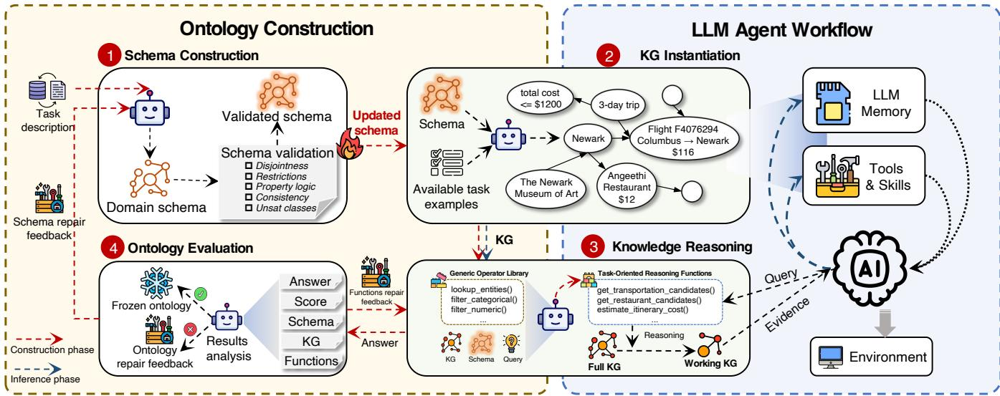
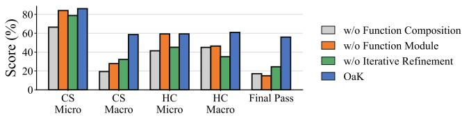
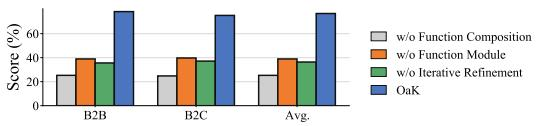
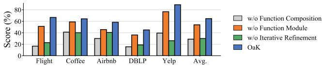
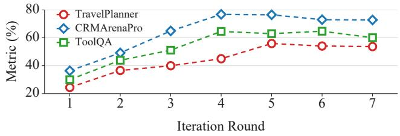
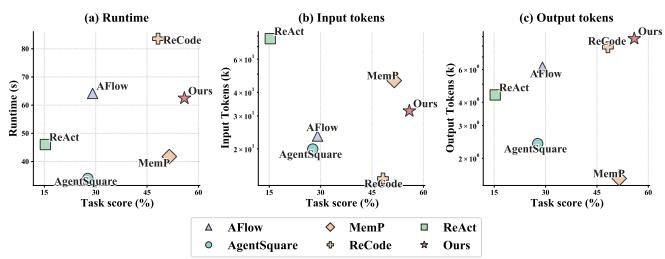
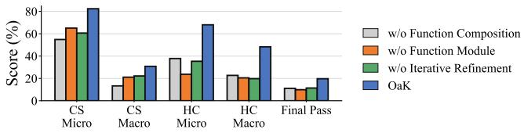
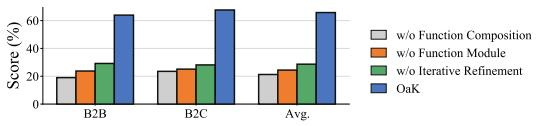
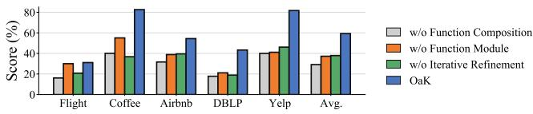

# Toward Efective and Reliable LLM Agents via Dynamic Ontology

Xiaohui Zhang<sup>1</sup>, Zequn Sun<sup>1</sup>, Chengyuan Yang<sup>1</sup>, Yuanning Cui<sup>2</sup>, Lingbing Guo<sup>3</sup>, Wei Hu<sup>1,4</sup>

<sup>1</sup>State Key Laboratory for Novel Software Technology, Nanjing University, China

<sup>2</sup>School of Computer Science, Nanjing University of Information Science and Technology, China

<sup>3</sup>School of Intelligence Science and Technology, Nanjing University, China

<sup>4</sup>National Institute of Healthcare Data Science, Nanjing University, China

{xhzhang, cyyang}.nju@gmail.com, {sunzq, lbguo, whu}@nju.edu.cn, yncui@nuist.edu.cn

## Abstract

Large language model (LLM) agents rely heavily on knowledge encoded in model parameters or presented as unstructured context. In domain-specific tasks, this leaves important semantic connections implicit. This often results in incomplete evidence use and brittle multi-step decisions. Ontologies ofer a way to externalize domain concepts and relations as machineinterpretable structures, but constructing task-usable ontologies traditionally requires substantial efort from domain experts and is dificult to scale. Automatic construction is also challenging: an ontology that appears semantically plausible may not contain the relational structures needed for actual decision making. We present OaK, an ontology-as-a-kernel framework that dynamically constructs and refines task-oriented ontologies for LLM agents. Given task requirements and training data, OaK constructs an ontology and its knowledge graph, generates task-adaptation functions for graph reasoning, and uses judge feedback to iteratively refine both. By making relevant concepts and relations explicit, the ontology grounds knowledge retrieval and multi-step decision making. We evaluate OaK on TravelPlanner, CRMArenaPro, and ToolQA. Results show that OaK improves standard LLM agents, strengthens evidence grounding, and boosts the reliability of multi-step reasoning.

## 1 Introduction

Large language models (LLMs) have demonstrated strong capabilities in understanding and generating natural language, as well as in knowledge-intensive reasoning. LLMs address diverse tasks through instructions and in-context examples. LLM agents extend these capabilities from response generation to goal-directed task execution by coupling an LLM with external components such as retrieval systems (Zhu et al. 2025), tools and memory (Zhang et al. 2026b; Yang et al. 2026). A typical agent runs a loop that repeatedly interprets the goal and plans, then acts through tool calls or retrieval and observes the result until the task is done. Recent agent architectures further incorporate mechanisms such as reflection and procedural memory, along with modular workflow optimization (Shinn et al. 2023; Fang et al. 2026; Zhang et al. 2025; Shang et al. 2025). These developments make LLM agents a general framework for tasks that require command execution and multi-step reasoning beyond a single response.

Despite these advances, the central challenge is no longer only whether an agent can act, but whether its behavior remains controllable and trustworthy as execution becomes longer and more autonomous. At each intermediate step, the agent decides what to retrieve and which tool to call with which arguments, so an error in any of these choices can propagate to later steps. Consequently, final-answer accuracy alone reveals neither the supporting evidence nor the justification of tool calls. It also hides the influence of memory and the origin of execution failures (Wang et al. 2026). Recent studies of tool-using agents expose this gap: ToolEmu identifies realistic long-tail safety failures in high-stakes tool settings, while AgentDojo shows that untrusted tool outputs can manipulate agent behavior through prompt injection (Ruan et al. 2024; Debenedetti et al. 2024). Reflection, procedural memory, and workflow optimization can improve planning or reuse, but they generally leave the set of admissible concepts and action sequences implicit (Madaan et al. 2023; Shinn et al. 2023; Zhang et al. 2025; Fang et al. 2026). Prompt instructions and tool descriptions therefore guide an agent’s behavior without providing an enforceable contract for what it may execute or how its results should be checked. Reliable agents must constrain actions during execution so that outputs connect to supporting evidence and faulty steps can be identified and fixed.

These requirements point to a missing layer between the LLM and the tools it controls: a task-oriented representation that makes both domain semantics and executable behavior explicit. Ontologies provide a natural basis because they organize concepts and relations in a machine-interpretable form (Gruber 1993; Hogan et al. 2021). However, a conventional ontology is primarily descriptive: it specifies what exists in a domain, but not necessarily what an agent may do. It also leaves open how an operation should be parameterized and which conditions must hold before its result is accepted. We therefore use ontology in an operational sense. In our setting, requirements on data representation are encoded in schema declarations, whereas requirements on computation and workflow are enforced by the control flow of functions. Such an ontology is not a passive knowledge description. It serves as a semantic and procedural contract that bounds what the agent may do and keeps execution open to inspection.

We propose OaK, a dynamic ontology-as-a-kernel framework for LLM agents. Here, dynamicity refers to taskconditioned construction. For each task, OaK automatically constructs the schema and typed reasoning functions needed to solve it. It then instantiates a corresponding knowledge graph from task data, and refines the schema and functions with training examples and downstream task feedback before freezing the resulting kernel for inference. OaK packages the task interface into a kernel

$$
{ \mathcal { K } } = ( { \mathcal { S } } , { \mathcal { F } } ) ,
$$

where $s$ is a task-oriented schema that defines the domain concepts available to the agent, together with their properties and relations. The functions $\mathcal { F }$ define how these typed elements can be used through executable procedures for retrieval, filtering, traversal, projection, aggregation, and multi-step reasoning. Given S, OaK instantiates a schema-guided knowledge graph $\mathcal { G }$ from the task data. This graph provides the evidence on which the functions operate. During inference, a ReAct agent interprets a query to select a function and bind its typed arguments, then uses the function to reason the final answer. The kernel mediates access to the available evidence and operations. During construction, OaK evaluates these executions and uses task feedback to refine S and $\mathcal { F }$ before the resulting kernel is applied to unseen queries.

We evaluate OaK on TravelPlanner (Xie et al. 2024), CRMArenaPro (Huang et al. 2026), and ToolQA (Zhuang et al. 2023). These datasets difer in task setting and reasoning requirements. Results and analyses show that OaK improves standard LLM agents and strengthens evidence grounding for multi-step reasoning.

Our contributions are summarized as follows:

• We introduce ontology as a kernel for LLM agents. It couples a task-oriented schema with typed reasoning functions and a schema-guided evidence graph.

• We develop an automated pipeline that constructs a verified schema, instantiates its knowledge graph, and compiles generic operators into executable domain functions.

• We propose judge-driven refinement, which diagnoses and repairs schema and function failures across construction rounds using oficial task scores and execution trajectories.

• Experiments on TravelPlanner, CRMArenaPro, and ToolQA show consistent gains across two backbones, while ablations confirm the importance of function composition, the function module, and iterative refinement.

## 2 Related Work

LLM for agents. LLMs serve as general-purpose reasoning and decision-making components in agents. They enable agents to interpret goals and decompose tasks, adapting their behavior from intermediate observations. ReAct established an influential paradigm that interleaves reasoning and acting within a single execution trajectory (Yao et al. 2023). Beyond reflection, MemP distills successful trajectories into reusable procedural memory, while ReCode represents planning and acting through recursively generated programs (Fang et al. 2026; Yu et al. 2025). AFlow and AgentSquare further automate agent design by searching over code-represented workflows or modular architectures composed of planning and memory components (Zhang et al. 2025; Shang et al. 2025). These approaches progressively move agent control out of the model’s parameters into feedback loops and reusable procedures. They primarily improve how an agent organizes and adapts its control process, whereas OaK complements this line of work by structuring the task interface itself through an explicit domain schema and executable reasoning functions.

Reliable agents. Reliability in LLM agents extends beyond endpoint accuracy: it asks whether each step stays controlled and each decision remains grounded in evidence, and whether failures can be traced to a cause (Wang et al. 2026). Feedback based approaches such as Self-Refine and Reflexion use model-generated critique or execution outcomes to revise responses and future decisions (Madaan et al. 2023; Shinn et al. 2023). ToolEmu and AgentDojo expose complementary risks by identifying realistic failures in high-stakes tool settings and evaluating indirect prompt injection through untrusted observations (Ruan et al. 2024; Debenedetti et al. 2024). AgentSpec addresses execution control by expressing safety requirements as structured rules, combining runtime triggers and predicates with enforcement mechanisms (Wang, Poskitt, and Sun 2025). In parallel, knowledge editing aims to correct or update the facts stored in model parameters rather than externalizing them (Zhang et al. 2026a). These approaches provide feedback, policy enforcement, or execution records. However, they typically treat task rules and allowable operations as fixed inputs or leave them distributed across prompts and implementation code. As a result, the interface between task requirements and agent execution is dificult to inspect and adapt. OaK instead makes this interface explicit as a task-specific kernel, coupling a schema with typed reasoning functions and using task scores and execution trajectories to refine both.

Graph for agents. Ontologies and knowledge graphs provide machine-interpretable structures for organizing domain concepts and their properties and relations (Gruber 1993; Hogan et al. 2021). Recent work integrates LLMs with knowledge graphs to support the structured acquisition and representation of knowledge, as well as reasoning over it (Pan et al. 2024). GraphRAG and G-Retriever further use graph structure to retrieve globally relevant or relational evidence for generation and question answering (Edge et al. 2024; He et al. 2024). These approaches primarily treat the graph as an external knowledge and retrieval layer. This can improve evidence access but does not itself specify reusable task-level computations for an agent. OaK instead constructs a taskoriented schema and a catalog of typed reasoning functions. It grounds their execution in a data-dependent knowledge graph. It jointly refines the schema and functions using downstream task feedback. In OaK, dynamicity therefore refers to constructing this task-specific schema and function catalog for the task at hand. It then instantiates the corresponding graph from task data and refines the kernel before freezing it for inference. This design makes the graph not only a source of retrieved knowledge, but also the grounded substrate on which the agent’s semantic and procedural interface operates.

## 3 OaK Framework

## 3.1 Overview

OaK builds a dynamic task-oriented ontology kernel and uses it to mediate between an LLM agent and domain tasks.

  
Figure 1: Overview of OaK. The construction stage (left) runs a refinement loop over the ontology kernel. The inference stage (right) freezes the kernel and lets a ReAct agent solve unseen queries by calling functions as tools.

The kernel has two main components, namely the schema $s$ and the function set ${ \mathcal F } .$ . The schema S bounds what can be expressed and the functions $\mathcal { F }$ bound what can be computed. Once frozen, the kernel is the only channel through which the agent reaches the data. It cannot name a concept or invoke a computation the kernel does not declare.

OaK runs in two stages. The construction stage runs on training data, where it builds the kernel and refines it in a loop. The inference stage freezes the kernel and applies it to unseen queries. Figure 1 shows the full loop.

## 3.2 Ontology Construction Loop

The construction stage runs a four-step loop over the kernel. At the start of each round t, OaK draws a fresh random sample $D _ { t } \subseteq D ^ { \mathrm { t r } }$ from the training set and uses it to drive that round. Each instance in $D _ { t }$ is a complete example $( q , C _ { q } )$ that pairs a query $q$ with the reference corpus $C _ { q }$ needed to answer it. We write $Q _ { t } = \{ q \}$ for its queries and $C _ { t } = \{ C _ { q } \}$ for the accompanying corpora. Resampling per round exposes the loop to varied data and keeps the schema and functions from overfitting to a fixed subset. We denote by $S _ { t }$ and $\mathcal { F } _ { t }$ the schema and functions produced in round t.

Step 1: Schema construction. This step proceeds in three phases: requirement analysis, schema drafting, and formal verification.

Requirement analysis. An LLM reads the task description T together with the round sample $D _ { t }$ and produces a requirement specification:

$$
R = { \mathrm { A n a l y z e } } ( T , D _ { t } ) .
$$

R records the task scope, the key entities and relations, and the task constraints. It gives the schema a precise target rather than a free form brief.

Schema drafting. The model then drafts the schema from R together with the previous round’s schema feedback:

$$
S _ { t } = \mathrm { D r a f t } ( R , \psi _ { t - 1 } ^ { S } ) ,
$$

where $\psi _ { t - 1 } ^ { S }$ is the schema level repair feedback from the previous round (empty in the first round). It firstly enumerates entity types with their properties, and then declares the typed relations among them. Each entity type is assigned an identity field that serves as its primary key, and each relation names its source and target entity types.

Formal verification. A drafted schema can look semantically reasonable yet be logically flawed inside, and such a flaw would propagate into the graph. We therefore verify the draft before it is used. Our schema is lightweight—a YAML or JSON document of named entity types, properties, and typed relations that the agent reads directly, not the full axiomatic machinery of a formal ontology. This makes it easy for the model to consume, but a logical reasoner cannot check it as is. We therefore encode it as an equivalent OWL ontology and run HermiT (Glimm et al. 2014):

HermiT(OWL(S<sub>t</sub>)) → {consistent, unsatisfiable classes}.

HermiT checks five kinds of logical validity—disjointness, restriction, property-level, and global consistency, plus unsat isfiable classes. We detail them in Appendix A. A schema that fails any check is sent back to drafting with the reasoner’s counterexamples, and the loop retries.

Step 2: Knowledge Graph instantiation. Under the current schema, OaK instantiates a knowledge graph from the reference corpora of the round sample. To improve extraction quality and avoid exceeding the context limit of the languagemodel extractor, graph construction uses a chunk–map–merge pipeline. The corpus $C _ { t }$ is first partitioned into token-bounded chunks $\{ c _ { 1 } , \ldots , c _ { n } \}$ that fit the extractor’s input budget. An LLM extractor $\Phi _ { S _ { t } }$ maps each chunk $c _ { i }$ to a set of typed entity and relation candidates according to $S _ { t }$ , and a merge operator F reconciles these sets into one graph:

$$
\mathcal { G } _ { t } = \mathrm { B u i l d } ( S _ { t } , C _ { t } ) = \bigcup _ { i = 1 } ^ { n } \Phi _ { S _ { t } } ( c _ { i } ) ,
$$

Because $\Phi _ { S _ { t } }$ runs on each chunk independently, one realworld entity may surface as several candidates across chunks. The merge operator F resolves these duplicates through the schema-declared primary key. Each candidate entity e is assigned a key signature

$$
\kappa ( e ) = { \bigl ( } \tau ( e ) , \pi _ { \mathrm { p k } } ( e ) { \bigr ) } ,
$$

where $\tau ( e )$ is its entity type and $\pi _ { \mathrm { p k } } ( e )$ is its primary-key value. Two candidates denote the same real-world object exactly when their key signatures agree:

$$
e _ { i } \sim e _ { j } \iff \kappa ( e _ { i } ) = \kappa ( e _ { j } ) .
$$

Since ∼ is an equivalence relation, F collapses each equivalence class $[ e ] _ { \sim } ^ { \bar { } }$ into one canonical node with a single deterministic identifier. Relations are then re-attached to these canonical endpoints. This process also collapses duplicate relations produced across chunks.

Step 3: Knowledge reasoning. This step composes the generic operators into a catalog of domain-adapted functions. A function compiles a task’s recurring reasoning steps into a single typed call. This frees the agent from multi-step planning. With less reasoning done inside the model, there is less room for hallucination. An LLM-based composer assembles the catalog $\mathcal { F } _ { t } \mathbf { : }$

$$
\mathcal { F } _ { t } = \mathrm { C o m p o s e } \big ( \mathcal { O } , \mathcal { S } _ { t } , \mathcal { G } _ { t } , Q _ { t } , \psi _ { t - 1 } ^ { \mathcal { F } } \big ) ,
$$

where $\psi _ { t - 1 } ^ { \mathcal { F } }$ is the function-level repair feedback from the previous round (empty in the first round). By reading how queries in $Q _ { t }$ resolve over $\mathcal { G } _ { t } ,$ , the composer identifies the recurring reasoning patterns the functions must cover.

Each pattern is realized as one function $f \in \mathcal { F } _ { t }$ , with typed inputs and outputs and a realization $r _ { f }$ over O. The generic library O provides basic graph and data operations, including entity lookup, relation traversal, property projection, constraint filtering, and aggregation. Appendix B gives the complete operator signatures and descriptions. A function is grounded in $\mathcal { O }$ in one of three ways: it may compose several operators into a pipeline, specialize an operator by fixing or reinterpreting its parameters, or adapt an operator with lightweight pre- or post-processing. Each function is tested on $\mathcal { G } _ { t }$ to confirm it is executable, and the validated catalog is exposed to the agent as callable tools.

With the kernel in place, a ReAct agent runs on the queries:

$$
A _ { t } = \operatorname { A g e n t } ( Q _ { t } , S _ { t } , { \mathcal { G } } _ { t } , { \mathcal { F } } _ { t } ) .
$$

For each query in $Q _ { t }$ , the agent invokes the functions $\mathcal { F } _ { t }$ as tools, binds their typed arguments according to the schema ${ \mathbf { } } S _ { t } ,$ and executes them over the graph $\mathcal { G } _ { t }$ to retrieve the evidence needed to answer the query. The trajectory $A _ { t }$ collects the resulting operator traces, function outputs and final answers, which the next step reviews.

Step 4: Ontology evaluation. The final answers in $A _ { t }$ are first scored according to the dataset’s evaluation protocol:

$$
\mathbf { s } _ { t } = \operatorname { E v a l } ( A _ { t } ) .
$$

A judge model then reviews the whole kernel together with the trajectory and its task scores (Zheng et al. 2023):

$$
\psi _ { t } = \mathrm { J u d g e } ( S _ { t } , \mathcal { G } _ { t } , \mathcal { F } _ { t } , A _ { t } , \mathbf { s } _ { t } ) .
$$

$\psi _ { t }$ is a set of repair suggestions over the round’s artifacts. Let ${ \mathcal { U } } _ { t } = { \dot { E _ { t } } } \cup R _ { t } { \stackrel { \triangledown } { \cup } } { \mathcal { F } } _ { t }$ collect the entity types $E _ { t }$ relation types $R _ { t }$ , and functions $\mathcal { F } _ { t }$ of round t, and let Act = {add, delete, modify}. Each suggestion is a tuple

$$
\sigma = ( u , a , \delta , \rho ) , \qquad u \in \mathcal { U } _ { t } , a \in \operatorname { A c t } ,
$$

where u is the target artifact, a the action, δ the proposed definition or patch, and $\rho$ the diagnosed reason. The report is

$$
\psi _ { t } = \{ \sigma _ { 1 } , . . . , \sigma _ { k } \} ,
$$

partitioned by target into $\psi _ { t } = \psi _ { t } ^ { E } \cup \psi _ { t } ^ { R } \cup \psi _ { t } ^ { \mathcal { F } }$ , with the schema level part $\mathbf { \psi } _ { \psi _ { t } } ^ { S } = \psi _ { t } ^ { \bar { E } } \cup \psi _ { t } ^ { \bar { R } }$ feeding Step 1 and the function level part $\psi _ { t } ^ { \mathcal { F } }$ feeding Step 3 of round t+1.

OaK then applies the repair and starts the next round. The loop stops when the judge finds no blocking fault or the iteration budget runs out.

## 3.3 Ontology-driven LLM Inference

Inference runs on the unseen test set, with no further edits to the kernel. After the loop, OaK freezes the schema ${ \boldsymbol { S } } ^ { * }$ and the functions $\mathcal { F } ^ { * }$ from the final round. For a test query q, it builds an inference graph:

$$
\mathcal { G } _ { q } = \mathrm { B u i l d } ( S ^ { * } , C _ { q } ) ,
$$

where $C _ { q }$ is the corpus that accompanies $q$ in test set.

A ReAct agent then solves q with the frozen kernel:

$$
a = \operatorname { A g e n t } ( q , S ^ { * } , { \mathcal { G } } _ { q } , { \mathcal { F } } ^ { * } ) .
$$

As in construction, the agent invokes $\mathcal { F } ^ { * }$ as tools, binds their typed arguments under $\bar { S ^ { * } }$ , and executes them over $\mathcal { G } _ { q } .$ Unlike free-form agent reasoning, inference here is routed through a task-refined kernel: $S ^ { * }$ closes of concepts and relations the agent may invoke, and ${ \mathcal { F } } ^ { * }$ restricts its computations to typed, executable compositions over schema-constrained graph instances. The agent therefore operates inside a verified semantic space: answers are meant to trace to grounded evidence rather than to model-internal inference. This can reduce reasoning errors and unsupported inferences in openended generation.

## 4 Experiments

## 4.1 Tasks

We choose these three benchmarks. They cover complementary agent settings, including multi-step planning, CRM workflow execution, and compositional tool use over heterogeneous corpora. This diversity lets us evaluate OaK’s applicability across multiple task settings. For every dataset, we follow the oficial evaluation protocol and metrics.

• TravelPlanner (Xie et al. 2024) evaluates multi-day plans that jointly arrange transportation, meals, attractions, and accommodation. Commonsense (CS) and hard-constraint (HC) measure overall feasibility and explicit requirement compliance, respectively. Within each family, micro is the fraction of individual constraints satisfied, macro is the fraction of plans meeting all applicable constraints, and final requires both families to be fully satisfied.

<table><tr><td rowspan="2">LLM</td><td rowspan="2">Method</td><td colspan="2">CS</td><td colspan="2">HC</td><td rowspan="2">Final</td></tr><tr><td>Micro</td><td>Macro</td><td>Micro</td><td>Macro</td></tr><tr><td rowspan="4">Dep--sh</td><td>ReAct</td><td>81.60</td><td>19.10</td><td>44.29</td><td>36.40</td><td>15.30</td></tr><tr><td>AFlow</td><td>79.31</td><td>31.70</td><td>43.60</td><td>42.70</td><td>29.10</td></tr><tr><td>MemP</td><td>82.78</td><td>55.50</td><td>63.91</td><td>59.50</td><td>51.50</td></tr><tr><td>ReCode AgentSquare</td><td>86.60 79.10</td><td>50.90 30.40</td><td>48.67 49.40</td><td>37.60 47.80</td><td>48.20 27.70</td></tr><tr><td rowspan="5">GP---mni</td><td>OaK ReAct</td><td>86.11 79.30</td><td>58.60 14.20</td><td>59.31 29.20</td><td>61.57 17.80</td><td>55.90 4.50</td></tr><tr><td>AFlow</td><td>78.23</td><td>12.60</td><td>31.09</td><td>17.70</td><td>3.00</td></tr><tr><td>MemP</td><td>68.43</td><td>17.40</td><td>27.29</td><td>19.50</td><td>16.30</td></tr><tr><td>ReCode</td><td>88.59</td><td>22.00</td><td>54.50</td><td>26.50</td><td>15.00</td></tr><tr><td>AgentSquare OaK</td><td>72.06 82.40</td><td>13.50 30.80</td><td>21.11 68.00</td><td>12.10 48.30</td><td>5.40 19.70</td></tr></table>

Table 1: TravelPlanner results on DeepSeek-v4-flash and gpt-4o-mini. All entries are percentages (%). CS = Commonsense Constraint Pass Rate; HC = Hard Constraint Pass Rate; Final = Final Pass Rate. The best value in each column is in bold and the second best is underlined.

• CRMArenaPro (Huang et al. 2026) evaluates Customer Relationship Management (CRM) tasks in synthetic B2B and B2C organizations. These represent company-oriented and individual-customer processes, respectively. Workflow, Policy, and Database use exact match, whereas Text uses exact match for discrete answers or token-level F1 for free-form answers.

• ToolQA (Zhuang et al. 2023) evaluates compositional tool use over heterogeneous external corpora using normalized exact match.

## 4.2 Implementation Details

We run every method on two LLM backbones, DeepSeek-v4-flash and gpt-4o-mini. These backbones are used throughout Step 1’s requirement analysis and schema drafting, Step 2’s knowledge graph instantiation, Step 3’s function composition and knowledge reasoning. The ontology evaluator is held fixed across all settings and uses claude-sonnet-4.6. Each construction round draws a fresh sample covering 20% of the training split, and the loop runs for at most 5 iterations. The ReAct agent is capped at 20 steps per query.

## 4.3 Main Results

TravelPlanner. In Table 1, OaK achieves the highest final pass rate under both backbones and leads all macro-level metrics on the test sets. On the DeepSeek-v4-flash backbone, ReCode is strongest on commonsense micro scores and MemP remains competitive on hard-constraint micro scores. This indicates that satisfying individual constraints does not necessarily produce a jointly valid plan. TravelPlanner requires decisions about dates, cities, transportation, accommodation, dining, and budgets to remain compatible across multiple days. This makes cross-component coordination essential. OaK explicitly represents these entities and constraints in its schema. Its knowledge graph connects them to the available options. Its schema-adapted functions further integrate candidate retrieval, budget calculation, and constraint checking into a coherent planning procedure. This combination helps OaK preserve dependencies across the complete itinerary, explaining its stronger macro and final performance rather than merely improving isolated constraint satisfaction.

  
Figure 2: Ablation results on TravelPlanner.

CRMArenaPro. On CRMArenaPro, Table 2 reports the highest Avg. for OaK in both B2B and B2C organizations under both backbones, and leads in nearly all category-level comparisons. Its advantages are particularly clear on Policy and Database tasks. They require agents to combine businessrule compliance with accurate access to records. Workfloworiented baselines do well on some Workflow tasks, and MemP shows the value of reusable procedures. However, their performance drops when the task requires selecting the correct records, fields, and relations. OaK addresses this limitation by explicitly representing CRM record types, fields, and their relations. It also grounds reusable functions for crosstable queries, rule checks, and numerical calculations in this representation. Its larger advantage with gpt-4o-mini, especially on Database tasks, further suggests that schemagrounded execution reduces the amount of multi-step data reasoning that must be performed by the backbone model alone.

ToolQA. For ToolQA, Table 3 reports the highest weightedaverage performance for OaK under both backbones, with first-place results on most subset–backbone combinations. ToolQA requires agents to compose multiple operations over heterogeneous corpora, including field lookup, record filtering, relation traversal, and aggregation. Success therefore depends on coordinating the order of operations with the semantics of domain-specific fields and relations, rather than selecting tools independently. OaK addresses this requirement by mapping each question to typed and reusable procedures whose arguments and operations are constrained by an explicit domain schema and grounded knowledge graph. Compared with methods that optimize global workflows or procedural reuse without explicitly representing data relations, OaK more reliably connects each operation with the appropriate records and relations.

Additional robustness results over multiple random seeds are provided in Appendix C.

## 4.4 Ablation Study

We compare the full OaK with three variants using DeepSeek v4-flash. We provide the ablations using gpt-4o-mini in Appendix D. w/o Function Composition removes the composition step and exposes the generic operators O directly to the agent.

<table><tr><td rowspan="2">LLM</td><td rowspan="2">Method</td><td colspan="5">B2B</td><td colspan="5">B2C</td></tr><tr><td>Workflow</td><td>Policy</td><td>Text</td><td>Database</td><td>Avg.</td><td>Workflow</td><td>Policy</td><td>Text</td><td>Database</td><td>Avg.</td></tr><tr><td>Depp--ash</td><td>ReAct</td><td>92.50</td><td>47.50</td><td>31.57</td><td>71.56</td><td>60.78</td><td>88.75</td><td>45.62</td><td>43.47</td><td>65.62</td><td>60.87</td></tr><tr><td rowspan="4"></td><td>AFlow</td><td>96.25</td><td>46.25</td><td>33.87</td><td>48.44</td><td>56.20</td><td>93.75</td><td>47.50</td><td>41.84</td><td>33.75</td><td>54.21</td></tr><tr><td>MemP</td><td>96.25</td><td>55.62</td><td>35.74</td><td>78.12</td><td>66.44</td><td>95.00</td><td>61.25</td><td>43.77</td><td>69.06</td><td>67.27</td></tr><tr><td>ReCode</td><td>26.25</td><td>39.38</td><td>10.13</td><td>24.06</td><td>24.96</td><td>27.50</td><td>34.38</td><td>11.71</td><td>24.06</td><td>24.41</td></tr><tr><td>AgentSquare</td><td>95.00</td><td>46.88</td><td>31.10</td><td>50.94</td><td>55.98</td><td>88.75</td><td>56.25</td><td>36.37</td><td>44.06</td><td>56.36</td></tr><tr><td rowspan="5">GP--ni</td><td>OaK</td><td>97.50</td><td>81.88</td><td>39.46</td><td>94.69</td><td>78.38</td><td>100.00</td><td>71.88</td><td>39.87</td><td>89.06</td><td>75.20</td></tr><tr><td>ReAct</td><td>27.50</td><td>27.50</td><td>7.73</td><td>17.81</td><td>20.14</td><td>15.00</td><td>33.13</td><td>13.80</td><td>23.12</td><td>21.28</td></tr><tr><td>AFlow</td><td>66.25</td><td>46.25</td><td>5.61</td><td>25.62</td><td>35.93</td><td>53.75</td><td>41.25</td><td>8.80</td><td>24.38</td><td>32.04</td></tr><tr><td>MemP</td><td>71.25</td><td>45.63</td><td>30.73</td><td>49.38</td><td>49.24</td><td>82.50</td><td>44.38</td><td>31.11</td><td>41.56</td><td>49.89</td></tr><tr><td>ReCode</td><td>21.75</td><td>38.12</td><td>12.00</td><td>16.88</td><td>22.18</td><td>23.25</td><td>33.75</td><td>11.04</td><td>16.56</td><td>21.15</td></tr><tr><td></td><td>AgentSquare</td><td>16.25</td><td>48.13</td><td>5.01</td><td>31.56</td><td>25.24</td><td>17.50</td><td>40.62</td><td>7.88</td><td>28.75</td><td>23.69</td></tr><tr><td></td><td>OaK</td><td>83.75</td><td>55.00</td><td>32.27</td><td>84.69</td><td>63.93</td><td>87.50</td><td>55.63</td><td>40.80</td><td>86.56</td><td>67.62</td></tr></table>

Table 2: CRMArenaPro results on DeepSeek-v4-flash and gpt-4o-mini. All entries are percentages (%); Workflow, Policy, Text, and Database are task-category scores. Avg. is the equal-weight mean of Workflow, Policy, Text, and Database. The best value in each column is in bold and the second best is underlined.

<table><tr><td>LLM</td><td>Method</td><td>Flight</td><td>Coffee</td><td>Airbnb</td><td>DBLP</td><td>Yelp</td><td>Avg.</td></tr><tr><td rowspan="5">Dep--sh</td><td>AFlow</td><td>57.78</td><td>49.28</td><td>53.89</td><td>35.56</td><td>70.00</td><td>53.18</td></tr><tr><td>AgentSquare</td><td>46.67</td><td>41.06</td><td>50.56</td><td>28.89</td><td>63.89</td><td>46.06</td></tr><tr><td>ReAct</td><td>37.78</td><td>48.79</td><td>48.33</td><td>43.18</td><td>82.20</td><td>51.96</td></tr><tr><td>ReCode</td><td>28.95</td><td>18.40</td><td>46.15</td><td>12.50</td><td>57.14</td><td>32.21</td></tr><tr><td>MemP</td><td>55.56</td><td>48.79</td><td>54.44</td><td>35.00</td><td>82.22</td><td>55.02</td></tr><tr><td rowspan="5">GP--mni</td><td>OaK</td><td>66.67</td><td>64.25</td><td>58.33</td><td>44.94</td><td>88.76</td><td>64.58</td></tr><tr><td>AFlow</td><td>30.00</td><td>38.16</td><td>52.78</td><td>30.00</td><td>57.78</td><td>41.64</td></tr><tr><td>AgentSquare</td><td>10.00</td><td>40.58</td><td>42.78</td><td>16.11</td><td>35.56</td><td>29.34</td></tr><tr><td>ReAct ReCode</td><td>37.38 17.76</td><td>63.54 62.39</td><td>72.28 52.86</td><td>18.92</td><td>58.18</td><td>50.45</td></tr><tr><td>MemP</td><td>12.22</td><td>30.43</td><td>46.67</td><td>12.90 17.22</td><td>42.74</td><td>38.45</td></tr><tr><td></td><td>OaK</td><td>31.10</td><td>82.60</td><td>54.40</td><td>43.30</td><td>33.33 81.70</td><td>28.05 59.32</td></tr></table>

Table 3: ToolQA results on the five subsets, using DeepSeekv4-flash and gpt-4o-mini as backbones. All entries are percentages (%) and report exact-match accuracy. Avg. is the weighted average across subsets. The best value in each column is in bold and the second best is underlined.

w/o Function Module removes F entirely and lets the LLM reason over the full graph, retaining only minimal retrieval operations when the graph cannot be placed directly in context. w/o Iterative Refinement executes only the first round of the construction loop, without subsequent updates.

TravelPlanner. In Figure 2, removing any component substantially reduces the final pass rate. The largest degradation is caused by removing the function module or function composition. Although direct graph access can preserve individual hard-constraint decisions, it does not provide reusable procedures for coordinating transportation, accommodation, dining, and budget constraints across a complete plan. Without function composition, the agent must reconstruct these dependent operations for each query. This further weakens global plan consistency. The one-round variant also performs substantially worse. This shows that iterative refinement is necessary for repairing missing constraints and incomplete reasoning procedures.

  
Figure 3: Ablation results on CRMArenaPro.

CRMArenaPro. In Figure 3, the full OaK model outperforms all variants on both B2B and B2C settings. Removing function composition causes the largest degradation because the agent must reconstruct cross-table queries, business-rule checks and numerical calculations from generic operators. Removing the function module also reduces performance by eliminating reusable procedures for recurring CRM operations, even when graph access is available.

  
Figure 4: Ablation results on ToolQA.

ToolQA. Across all subsets in Figure 4, OaK outperforms all variants. The function-module ablation is the strongest variant but still remains clearly below the full model. This indicates that graph access alone cannot replace schema-adapted procedures. Removing function composition substantially harms performance because the agent must reconstruct multi-step sequences of lookup, filtering, relation traversal, projection, and aggregation for each question.

  
Figure 5: Loop progress on TravelPlanner, CRMArenaPro, and ToolQA using DeepSeek-v4-flash.

```yaml
name: Hotel
primary_key: name
properties:
name: name
- name: city
- name: room_type
- name: price_per_night
+ name: minimum_nights
+ - name: maximum_occupancy
```  
Figure 6: Schema repair for the Hotel entity type.

## 4.5 Construction Loop Analysis

We record each benchmark’s primary aggregate metric after every construction round under a fixed inference protocol. Across all three benchmarks, Figure 5 shows rapid improvement during the early rounds. This indicates that judge-guided updates quickly fix missing constraints and graph-mapping defects while closing function-level gaps. The curves largely plateau after rounds 4–5, suggesting that the five-round budget captures most of the benefit of iterative refinement. The small fluctuations in later rounds likely result from fine-tuning of the schema and functions, together with the fresh training sample used in each round.

## 4.6 Case Study

We illustrate how judge feedback coordinates schema and function level repair in TravelPlanner.

Schema repair. In an early construction round, the judge found that the Hotel entity exposed visible attributes such as price and room type but omitted the minimum\_nights and maximum\_occupancy constraints. Without these fields, the agent could select a hotel that appeared inexpensive and suitable but was invalid because it required a longer stay or could not accommodate the entire party. The judge therefore issued an add suggestion for the Hotel entity, adding both constraint fields as shown in Figure 6. The updated schema made these requirements explicit and allowed the agent to incorporate them during planning.

Function repair. The schema update alone was insuficient as the get\_accommodation\_candidates function did not yet use the newly exposed constraints. The ontology evaluator traced remaining failed plans and issued a modify suggestion that added filters for number of people and minimum stay, as shown in Figure 7. After the repair, a hotel was retained only when its maximum occupancy covered the party size and its minimum-night requirement fit the planned stay.

```python
def get_accommodation_candidates(
hotels, budget, people_count,
stay_nights, room_type):
hotels = filter_numeric(
hotels, "price_per_night",
"<=", budget)
hotels = filter_categorical(
hotels, "room_type", room_type)
+ hotels = filter_numeric(
hotels, "maximum_occupancy",
">=", people_count)
+ hotels = filter_numeric(
hotels, "minimum_nights",
"<=", stay_nights)
return rank_and_select(hotels)
```  
Figure 7: Function repair for get\_accommodation\_ candidates.

## 4.7 Cost Analysis

We compare OaK with the baselines on TravelPlanner using runtime and token counts as resource proxies and final pass rate as the task-quality measure. In Figure 8, OaK achieves the highest final pass rate while using fewer input tokens than ReAct and MemP. This input reduction suggests that schema-adapted functions reduce the need to reconstruct graph operations from a large context. The benefit comes with higher runtime and output-token usage than several baselines, mainly because OaK instantiates a query-specific graph before planning. When a graph can be reused across related queries, this construction cost can be amortized. Overall, OaK trades additional execution and output cost for stronger task performance while keeping input-context cost moderate.

  
Figure 8: Resource cost versus final pass rate on TravelPlanner using DeepSeek-v4-flash.

## 5 Conclusion and Future Work

We presented OaK, an ontology-as-a-kernel framework that turns domain semantics into an executable interface for LLM agents. OaK constructs a task-oriented schema and instantiates a schema-guided knowledge graph. It then composes typed reasoning functions from generic operators over this graph. Oficial task scores and execution traces guide iterative repairs. Across TravelPlanner, CRMArenaPro and ToolQA, OaK achieves the best aggregate performance with two LLM backbones. The ablations confirm the importance of the function module, function composition, and iterative refinement. These results suggest that making domain semantics and reasoning procedures explicit can improve both efectiveness and inspectability in LLM agents.

OaK still pays a graph-instantiation cost. Its quality also depends on the LLM-based extractor and judge, and requires a reliable task evaluator. Future work can study reusable and incrementally updated graphs to amortize construction, stronger verification or human feedback for open-ended tasks. It is also promising to include richer operator libraries and ontology representations for larger and evolving domains.

## References

Debenedetti, E.; Zhang, J.; Balunovic, M.; Beurer-Kellner, L.; Fischer, M.; and Tramèr, F. 2024. AgentDojo: A Dynamic Environment to Evaluate Prompt Injection Attacks and Defenses for LLM Agents. In Globersons, A.; Mackey, L.; Belgrave, D.; Fan, A.; Paquet, U.; Tomczak, J. M.; and Zhang, C., eds., Advances in Neural Information Processing Systems 37: Annual Conference on Neural Information Processing Systems 2024, NeurIPS 2024, Vancouver, BC, Canada, December 10 - 15, 2024.

Edge, D.; Trinh, H.; Cheng, N.; Bradley, J.; Chao, A.; Mody, A.; Truitt, S.; and Larson, J. 2024. From Local to Global: A Graph RAG Approach to Query-Focused Summarization. CoRR, abs/2404.16130.

Fang, R.; Liang, Y.; Wang, X.; Wu, J.; Qiao, S.; Xie, P.; Huang, F.; Chen, H.; and Zhang, N. 2026. Memp: Exploring Agent Procedural Memory. In Liakata, M.; Moreira, V. P.; Zhang, J.; and Jurgens, D., eds., Findings of the Association for Computational Linguistics, ACL 2026, San Diego, California, United States, July 2-7, 2026, 17490–17502. Association for Computational Linguistics.

Glimm, B.; Horrocks, I.; Motik, B.; Stoilos, G.; and Wang, Z. 2014. HermiT: An OWL 2 Reasoner. J. Autom. Reason., 53(3): 245–269.

Gruber, T. R. 1993. A translation approach to portable ontology specifications. Knowl. Acquis., 5(2): 199–220.

He, X.; Tian, Y.; Sun, Y.; Chawla, N. V.; Laurent, T.; LeCun, Y.; Bresson, X.; and Hooi, B. 2024. G-Retriever: Retrieval-Augmented Generation for Textual Graph Understanding and Question Answering. In Globersons, A.; Mackey, L.; Belgrave, D.; Fan, A.; Paquet, U.; Tomczak, J. M.; and Zhang, C., eds., Advances in Neural Information Processing Systems 37: Annual Conference on Neural Information Processing Systems 2024, NeurIPS 2024, Vancouver, BC, Canada, December 10 - 15, 2024.

Hogan, A.; Blomqvist, E.; Cochez, M.; D’amato, C.; Melo, G. D.; Gutierrez, C.; Kirrane, S.; Gayo, J. E. L.; Navigli, R.; Neumaier, S.; Ngomo, A.-C. N.; Polleres, A.; Rashid, S. M.; Rula, A.; Schmelzeisen, L.; Sequeda, J.; Staab, S.; and Zimmermann, A. 2021. Knowledge Graphs. ACM Comput. Surv., 54(4).

Huang, K.; Prabhakar, A.; Thorat, O.; Agarwal, D.; Choubey, P. K.; Mao, Y.; Savarese, S.; Xiong, C.; and Wu, C. 2026. CRMArena-Pro: Holistic Assessment of LLM Agents Across

Diverse Business Scenarios and Interactions. Trans. Mach. Learn. Res., 2026.

Madaan, A.; Tandon, N.; Gupta, P.; Hallinan, S.; Gao, L.; Wiegrefe, S.; Alon, U.; Dziri, N.; Prabhumoye, S.; Yang, Y.; Gupta, S.; Majumder, B. P.; Hermann, K.; Welleck, S.; Yazdanbakhsh, A.; and Clark, P. 2023. Self-Refine: Iterative Refinement with Self-Feedback. In Oh, A.; Naumann, T.; Globerson, A.; Saenko, K.; Hardt, M.; and Levine, S., eds., Advances in Neural Information Processing Systems 36: Annual Conference on Neural Information Processing Systems 2023, NeurIPS 2023, New Orleans, LA, USA, December 10 - 16, 2023.

Pan, S.; Luo, L.; Wang, Y.; Chen, C.; Wang, J.; and Wu, X. 2024. Unifying Large Language Models and Knowledge Graphs: A Roadmap. IEEE Trans. Knowl. Data Eng., 36(7): 3580–3599.

Ruan, Y.; Dong, H.; Wang, A.; Pitis, S.; Zhou, Y.; Ba, J.; Dubois, Y.; Maddison, C. J.; and Hashimoto, T. 2024. Identifying the Risks of LM Agents with an LM-Emulated Sandbox. In The Twelfth International Conference on Learning Representations, ICLR 2024, Vienna, Austria, May 7-11, 2024. OpenReview.net.

Shang, Y.; Li, Y.; Zhao, K.; Ma, L.; Liu, J.; Xu, F.; and Li, Y. 2025. AgentSquare: Automatic LLM Agent Search in Modular Design Space. In The Thirteenth International Conference on Learning Representations, ICLR 2025, Singapore, April 24-28, 2025. OpenReview.net.

Shinn, N.; Cassano, F.; Gopinath, A.; Narasimhan, K.; and Yao, S. 2023. Reflexion: language agents with verbal reinforcement learning. In Oh, A.; Naumann, T.; Globerson, A.; Saenko, K.; Hardt, M.; and Levine, S., eds., Advances in Neu ral Information Processing Systems 36: Annual Conference on Neural Information Processing Systems 2023, NeurIPS 2023, New Orleans, LA, USA, December 10 - 16, 2023.

Wang, H.; Poskitt, C. M.; and Sun, J. 2025. AgentSpec: Customizable Runtime Enforcement for Safe and Reliable LLM Agents. CoRR, abs/2503.18666.

Wang, Y.; Zhang, J.; Cai, T.; Liu, Z.; Sun, Q.; Sun, Z.; Wu, Z.; Dong, M.; Zheng, M.; Yin, X.; and Zhu, Y. 2026. From Agent Traces to Trust: A Survey of Evidence Tracing and Execution Provenance in LLM Agents. CoRR, abs/2606.04990.

Xie, J.; Zhang, K.; Chen, J.; Zhu, T.; Lou, R.; Tian, Y.; Xiao, Y.; and Su, Y. 2024. TravelPlanner: A Benchmark for Real-World Planning with Language Agents. In Salakhutdinov, R.; Kolter, Z.; Heller, K. A.; Weller, A.; Oliver, N.; Scarlett, J.; and Berkenkamp, F., eds., Forty-first International Conference on Machine Learning, ICML 2024, Vienna, Austria, July 21- 27, 2024, volume 235 of Proceedings ofMachine Learning Research, 54590–54613. PMLR / OpenReview.net.

Yang, C.; Sun, Z.; Wei, W.; and Hu, W. 2026. Beyond Static Summarization: Proactive Memory Extraction for LLM Agents. CoRR, abs/2601.04463.

Yao, S.; Zhao, J.; Yu, D.; Du, N.; Shafran, I.; Narasimhan, K. R.; and Cao, Y. 2023. ReAct: Synergizing Reasoning and Acting in Language Models. In The Eleventh International Conference on Learning Representations, ICLR 2023, Kigali, Rwanda, May 1-5, 2023. OpenReview.net.

Yu, Z.; Zhang, J.; Su, H.; Zhao, Y.; Wu, Y.; Deng, M.; Xiang, J.; Lin, Y.; Tang, L.; Li, Y.; Luo, Y.; Liu, B.; and Wu, C. 2025. ReCode: Unify Plan and Action for Universal Granularity Control. CoRR, abs/2510.23564.

Zhang, J.; Xiang, J.; Yu, Z.; Teng, F.; Chen, X.; Chen, J.; Zhuge, M.; Cheng, X.; Hong, S.; Wang, J.; Zheng, B.; Liu, B.; Luo, Y.; and Wu, C. 2025. AFlow: Automating Agentic Workflow Generation. In The Thirteenth International Conference on Learning Representations, ICLR 2025, Singapore, April 24-28, 2025. OpenReview.net.

Zhang, N.; Yao, Y.; Qin, J.; Xu, H.; Zhu, Y.; Yu, Z.; Wang, M.; Tang, Y.; Gu, J.-C.; Deng, S.; and Chen, H. 2026a. Towards principled knowledge editing methods for large language model reasoning. Nature Machine Intelligence.

Zhang, X.; Sun, Z.; Yang, C.; Jin, Y.; Zhang, Y.; and Hu, W. 2026b. ActMem: Bridging the Gap Between Memory Retrieval and Reasoning in LLM Agents. CoRR, abs/2603.00026.

Zheng, L.; Chiang, W.; Sheng, Y.; Zhuang, S.; Wu, Z.; Zhuang, Y.; Lin, Z.; Li, Z.; Li, D.; Xing, E. P.; Zhang, H.; Gonzalez, J. E.; and Stoica, I. 2023. Judging LLM-as-a-Judge with MT-Bench and Chatbot Arena. In Oh, A.; Naumann, T.; Globerson, A.; Saenko, K.; Hardt, M.; and Levine, S., eds., Advances in Neural Information Processing Systems 36: Annual Conference on Neural Information Processing Systems 2023, NeurIPS 2023, New Orleans, LA, USA, December 10 - 16, 2023.

Zhu, R.; Liu, X.; Sun, Z.; Wang, Y.; and Hu, W. 2025. Mitigating Lost-in-Retrieval Problems in Retrieval Augmented Multi-Hop Question Answering. In Che, W.; Nabende, J.; Shutova, E.; and Pilehvar, M. T., eds., Proceedings of the 63rd Annual Meeting ofthe Associationfor Computational Linguistics (Volume 1: Long Papers), ACL 2025, Vienna, Austria, July 27 - August 1, 2025, 22362–22375. Association for Computational Linguistics.

Zhuang, Y.; Yu, Y.; Wang, K.; Sun, H.; and Zhang, C. 2023. ToolQA: A Dataset for LLM Question Answering with External Tools. In Oh, A.; Naumann, T.; Globerson, A.; Saenko, K.; Hardt, M.; and Levine, S., eds., Advances in Neural Information Processing Systems 36: Annual Conference on Neural Information Processing Systems 2023, NeurIPS 2023, New Orleans, LA, USA, December 10 - 16, 2023.

## A Schema Consistency Checks

This appendix details the five kinds of logical validity that the HermiT reasoner verifies on the OWL ontology OWL(S<sub>t</sub>)

Disjointness consistency. The reasoner checks that the schema does not force categories that should be mutually exclusive to overlap. For example, a schema should not imply that Restaurant is a subclass of City.

Restriction consistency. The reasoner checks that existential, universal, and cardinality constraints do not jointly create contradictions. For example, “a trip has at least one day” and “a trip can have zero days” should not be accepted together.

Property-level consistency. The reasoner checks the logical features declared on properties, including functional, inverse-functional, transitive, symmetric, asymmetric, reflexive, irreflexive, and inverse properties. It also verifies that these features remain compatible when combined with the other axioms of the schema.

Global consistency. The reasoner checks that the schema remains logically satisfiable as a whole, rather than only in isolated fragments.

Unsatisfiable classes. Finally, the reasoner detects unsatisfiable classes, that is, schema components that can never hold an instance once type definitions, relation definitions, and constraints are combined.

## B Generic Operator Library

The generic library O contains the following nine public operators. Underscore-prefixed helpers are implementation details.

## • Runtime-slot extraction.

```python
def extract_runtime_slots(
*,
query: str,
slot_specs: Sequence[RuntimeSlotSpec],
env_path: str | Path = (
"/ontology_research/.env"
),
log_dir: str | Path = (
"ontology_llm_logs"
),
task_context: str = "",
max_attempts: int = 3,
max_tokens: int = 2000,
) -> RuntimeSlotExtractionResult:
```

Maps a natural-language query to declared typed slots with an LLM, retaining only explicit or strongly implied constraints and their evidence.

## • Entity lookup.

```python
def lookup_entities(
graph: str | Path | dict[str, Any] |
InstantiatedGraph,
*,
entity_types: Sequence[str] | None =
None,
entity_ids: Sequence[str] | None =
None,
```

```python
primary_key: dict[str, Any] | None =
None,
property_filters: dict[str, Any] |
None = None,
name_query: str | None = None,
text_query: str | None = None,
fuzzy: bool = True,
top_k: int | None = None,
min_score: float = 0.0,
-> EntityLookupResult:
```

Retrieves entities by type, identifier, primary key, exact property values, or fuzzy name and text matching, with optional ranking and truncation.

## • Relation traversal.

def traverse\_relations(   
graph: str | Path | dict[str, Any] |   
InstantiatedGraph,   
\*,   
start\_entity\_ids: Sequence[str],   
relation\_types: Sequence[str] | None   
= None,   
direction: TraversalDirection =   
"outgoing",   
max\_hops: int = 1,   
include\_starting\_entities: bool =   
True,   
) -> TraversalResult:

Expands a bounded neighborhood from seed entities along selected relation types and directions, returning the visited entities and relations.

## • Property projection.

def project\_properties(   
entities: Sequence[GraphEntity] |   
EntityLookupResult |   
EntityFilterResult |   
TraversalResult,   
\*,   
property\_names: Sequence[str],   
missing\_value: Any = None,   
) -> list[ProjectedRow]:

Projects selected entity properties into flat rows while preserving entity identifiers, types, and primary keys.

## • Categorical filtering.

def filter\_property\_categorical(   
entities: Sequence[GraphEntity] |   
EntityLookupResult |   
EntityFilterResult |   
TraversalResult,   
\*,   
conditions: Sequence[   
PropertyCategoricalFilterCondition   
],   
) -> EntityFilterResult:

Keeps entities that satisfy exact categorical inclusion or exclusion conditions. O exposes this function through the alias filter\_categorical.

• Relation-connectivity filtering. def filter\_relation\_connected(

graph: str | Path | dict[str, Any] |   
InstantiatedGraph,   
entities: Sequence[GraphEntity] |   
EntityLookupResult |   
EntityFilterResult |   
TraversalResult,   
\*,   
conditions: Sequence[   
RelationFilterCondition   
],   
) -> EntityFilterResult:

Keeps entities connected to specified anchors through required relation types.

## • Numeric filtering. mg

def filter\_numeric(   
entities: Sequence[GraphEntity] |   
EntityLookupResult |   
EntityFilterResult |   
TraversalResult,   
\*,   
conditions: Sequence[   
NumericFilterCondition   
],   
) -> EntityFilterResult:

Applies numeric equality, inequality, threshold, or interval constraints to entity properties.

## • Set-overlap filtering.

def filter\_set\_overlap(   
entities: Sequence[GraphEntity] |   
EntityLookupResult |   
EntityFilterResult |   
TraversalResult,   
\*,   
conditions: Sequence[   
SetOverlapFilterCondition   
],   
) -> EntityFilterResult:

Filters multi-valued properties by any-match, all-match, or minimum-overlap requirements against a requested set.

## • Aggregation.

def aggregate\_values(   
items: Sequence[GraphEntity |   
ProjectedRow | dict[str, Any]] |   
Iterable[GraphEntity |   
ProjectedRow | dict[str, Any]],   
\*,   
request: AggregateRequest,   
) -> AggregateResult:

Computes count, sum, minimum, maximum, or average statistics over entities, optionally grouped by a field.

## C Multi-Seed Robustness

We report three runs of OaK with diferent random seeds under DeepSeek-v4-flash. Across seeds, Table 4 reports a final pass rate of 55.90±2.13 for OaK. The macro metrics are also stable, with 58.60 ± 2.38 on CS Macro and 61.57 ± 1.04 on HC Macro. This suggests that the gains in Table 1 are not driven by a single favorable seed.

<table><tr><td>Seed</td><td colspan="2">CS</td><td colspan="2">HC</td><td>Final</td></tr><tr><td></td><td>Micro</td><td>Macro</td><td>Micro</td><td>Macro</td><td></td></tr><tr><td>1</td><td>83.50</td><td>55.90</td><td>58.31</td><td>62.40</td><td>54.00</td></tr><tr><td>2</td><td>88.77</td><td>60.40</td><td>60.46</td><td>61.90</td><td>58.20</td></tr><tr><td>3</td><td>86.06</td><td>59.50</td><td>59.16</td><td>60.40</td><td>55.50</td></tr><tr><td>Avg. ± Std.</td><td>86.11 ± 2.64</td><td>58.60 ± 2.38</td><td>59.31 ± 1.08</td><td>61.57 ± 1.04</td><td>55.90 ± 2.13</td></tr></table>

Table 4: Multi-seed robustness of OaK on TravelPlanner using DeepSeek-v4-flash. All entries are percentages (%).

## D Ablation Study on GPT-4o-mini

We report the same three ablation variants as in the main-text ablation study, now using gpt-4o-mini as the backbone.

  
Figure 9: Ablation results on TravelPlanner using gpt-4omini.

TravelPlanner. Under gpt-4o-mini, Figure 9 shows that OaK achieves the highest score on all five metrics. The final pass rate drops from 19.70 to 9.90 without the function module, and the degradation is also visible on the HC metrics.

  
Figure 10: Ablation results on CRMArenaPro using gpt-4omini.

CRMArenaPro. Figure 10 shows that the full OaK model clearly outperforms all variants on both B2B and B2C. On the average score, OaK reaches 65.78, while the strongest ablation remains below 30 in both settings.

  
Figure 11: Ablation results on ToolQA using gpt-4o-mini.

ToolQA. In Figure 11, OaK outperforms all variants on every subset and reaches 59.32 on the weighted average. The ablations remain below 40. The clearest gaps appear on Cofee, DBLP, and Yelp.