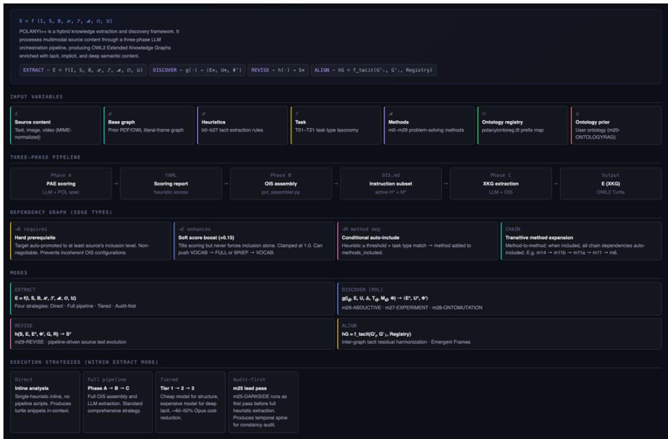
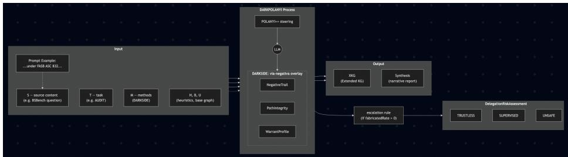

# Walking on the DARKSIDE

Aldo Gangemi1,2, Emanuele Bottazzi2

1AlmaAI, University of Bologna; 2ISTC-CNR, Rome, Italy

aldo.gangemi@unibo.it, emanuele.bottazzi@cnr.it

## Abstract.

Large Language Models (LLMs) recognise patterns but do not natively track the path of exclusions that a coherent discourse demands. When an input rests on a fabricated authority, a misapplied mechanism, or a surreptitious analogy, an unscaffolded LLM tends to engage with it as if it were well-posed, and to reify the misstep into any structured output it generates. Logic-Augmented Generation (LAG) – in particular POLANYI++, an LLM-steering method that uses heuristics, ontologies and problemsolving methods for tacit-knowledge extraction – produces an Extended Knowledge Graph (XKG) in OWL2/Turtle, but inherits the same vulnerability: a sophisticated nonsensical input is reified into the graph alongside the legitimate triples, and is hardly detectable by automated reasoners since the XKG is generated jointly with the wrong assumptions. We introduce DARKSIDE, a coherence-auditing method on top of POLANYI++ inspired by the via negativa (negative trail). DARKSIDE formalises the trail as an explicit data structure of accumulated exclusions over discourse time, complemented by a warrant axis that classifies each named referent as Warranted, Unattested, Misattributed or Fabricated, with an escalation rule that pushes the DelegationRiskAssessment to UNSAFE when the fabricated rate is positive or the unsupported rate exceeds a threshold. The method is anchored in nine theoretical fragments unified under a shared deep frame of path integrity. We evaluate DARKPOLANYI (POLANYI++ + DARKSIDE) as a steering layer over Gemini 3 on BSBench [23], a 100-item adversarial corpus of sophisticated-sounding nonsense across software engineering, finance, healthcare, physics and law, with Claude Sonnet 4.6 as an independent judge using a single-axis 0–2 coverage rubric. DARKPOLANYI scores 1.96/2 mean (96/99 perfect) versus 1.84/2 (86/94 perfect) for the unscaffolded Gemini 3 Pro baseline. The empirical evidence supports an architectural claim: when an LLM forward pass is wrapped in an ontology-mediated negative-trail apparatus, the structural pattern-vs-path gap [35,36] that makes hallucination structurally inevitable can be partially scaffolded around. The XKG functions as the missing memory that LLMs lack, and the warrant axis as an epistemic firewall.

Keywords: Knowledge graph extraction · Ontology-mediated LLM steering Hallucination detection · Coherence auditing · Trustless delegation · Active inference · OWL2 · BSBench.

## 1 Introduction

Sophisticated-sounding questions can be empty inside. The dataset we use in this paper, BSBench [23], contains 100 questions of the form “Controlling for the vintage of our ERP implementation, how do you attribute the variance in quarterly EBITDA to the font weight of our invoice templates versus the color palette of our financial dashboards?” The grammar is correct, the framing is authoritative, the dependent variable (EBITDA) is real, but invoice typography has no causal channel into earnings before interest, taxes, depreciation and amortisation. An LLM that has only its forward pass to reason with tends to engage with such questions on its own terms: it answers the question rather than questioning the question.

This paper takes that gap seriously and proposes a neurosymbolic answer to it. Our position is that the failure mode is not a fluctuation of scale or training data, but a structural one. LLMs recognise local patterns; they do not, internally, track the cumulative set of commitments and exclusions that a coherent discourse keeps along its path [4,35,36]. The fix is not better prompting, but to externalise the path: to give the model an explicit, ontology-shaped memory of what has been said, what has been presupposed, and what has thereby been excluded – and to inspect that memory before any commitment is integrated.

We make this claim concrete by extending and evaluating the following method.

POLANYI++ [7] is an orchestrated tacit-knowledge extractor whose function E = f(I, O, S, B, H, T, M, U) compiles a configurable set of heuristics H and problem-solving methods M, against a base graph B and an optional ontology prior U, into an Operational Instruction Set (OIS) that steers a single LLM forward pass. The output E is an Extended Knowledge Graph in OWL2/Turtle that is structurally hybrid: a base layer of FRED-style frame semantics [13,14] and an extension layer of ontology design patterns covering presupposition, implicature, theory of mind, causality, perspective, business semantics, cognitive bias, and more. POLANYI++ is implemented as a deterministic three-phase orchestrator: Phase A scores the source against a pre-assessment grid, Phase B assembles the OIS with a Python assembler, Phase C runs the steered extraction. Any of the 28 heuristics or 29 methods can be activated independently.

DARKSIDE is a coherence-auditing problem-solving method that operationalises the via negativa (negative trail) – the philosophical claim that understanding requires demonstrating what is not being talked about and maintaining that demonstration over time – as an explicit data structure inside E. DARKSIDE introduces a NegativeTrail (a typed accumulator of exclusions, with provenance), a battery of tests that classify contradictions as Encapsulated (functional, e.g. paradox, irony) or Vain (idle, e.g. hallucination drift), a LabyrinthSignature that scores the path-tracking demand of a task, and a DelegationRiskAssessment with three verdicts (TRUSTLESS, SUPERVISED, UNSAFE). A warrant axis classifies each commitment harvested from the source as Warranted, Unattested, Misattributed or Fabricated, with an escalation rule that pushes the DelegationRiskAssessment to UNSAFE whenever the fabricated rate is positive or the unsupported rate exceeds a threshold.

We evaluate DARKPOLANYI (POLANYI++ + DARKSIDE) as a steering layer wrapped around a Gemini 3 forward pass on each of the 100 BSBench items. An independent Claude Sonnet 4.6 judge scores each audit on a 0–2 coverage axis against the gold nonsense rationale. DARKPOLANYI attains 1.96/2 mean (96/99 perfect identifications). The unscaffolded Gemini 3 Pro baseline, run on the same items with no POLANYI++ scaffolding, attains 1.84/2 (86/94 perfect): much better than the 0/100 the original BSBench paper reported on prior models, but still outperformed by the steered system.

The paper makes four contributions:

• A function-based specification of DARKPOLANYI as a configurable hybrid extractor in which heuristics, methods and ontology priors are first-class inputs, compiled into an OIS that steers a single LLM forward pass.

An OWL2 vocabulary for via-negativa coherence auditing (NegativeTrail, ConstancyViolation, EncapsulatedContradiction vs. VainContradiction, LabyrinthSignature, NegativeWorkProfile, DelegationRiskAssessment) with a precise mapping to active inference [12]: NegativeTrail = generative model; ConstancyViolation = prediction error.

The warrant axis as an epistemic firewall: a small, declarative classification of named referents that automatically escalates delegation risk when the model is asked to act on fabricated commitments.

An empirical evaluation on BSBench, including a per-technique and perdomain error breakdown, showing that DARKPOLANYI reliably refuses to engage with sophisticated-sounding nonsense on its own terms while a strong baseline still trips on a residual minority of cases.

Section 2 surveys background. Section 3 specifies POLANYI++. Section 4 develops DARKSIDE. Section 5 describes the experimental setup. Section 6 reports the evaluation. Sections 7 and 8 discuss implications and conclude.

## 2 Background and Related Work

DARKSIDE develops from a basic intuition that is particularly problematic for current AI: to demonstrate understanding of something one must at least be able to say what is not being said, what is excluded from a discourse, and to maintain that exclusion over time. Statistical-learning AI recognises patterns with remarkable accuracy, from facial recognition to histopathology [31], but tracks paths far less reliably, both in spatial navigation [26] and in discursive tasks involving LLM-based systems. For tasks in which the history of prior decisions constrains future choices – which we call labyrinthine tasks – the capacity to track paths is indispensable. The scope is broad: narratives that inform us through journalism, political and economic reports, experiment descriptions and strategic planning all rely on a complex form of coherence; LLM-based multi-agent systems [16,22,33] make reservations, modify databases and trigger irreversible commands, and recent work emphasises that leveraging them safely requires intelligent delegation with continuous performance monitoring [32]. In all these cases the capacity to manage over time what has been excluded is the heart of the problem.

## 2.1 Hallucination as a structural property of pattern recognisers

Previous work showed that LLM reliability is hampered by the difficulty these models have with negation and contradiction, elements central to the comprehension of delegated tasks expressed in natural language [4]. Negation expresses incompatibility [3,18,25]; the perception of negation and contradiction is crucial to the clarification and negotiation of meaning, and human dyads repair misunderstandings on average every 1.4 minutes [9]. A growing body of literature connects the lack of coherence in LLMs to hallucinations: self-contradiction in generated text is itself a major form, distinct from inconsistency with external sources [21], and the problem remains unsolved [30]. Asher and Bhar [2] tie strong hallucinations to intrinsic limitations of LLM output distributions on negation; others argue inevitability under reasonable assumptions, regardless of architecture or training [36]. Hallucination has also been linked to semantic isotropy, that is the uniform dispersion of embeddings that leaves the model with no way to prefer one continuation over another [Bhardwaj et al., 2025].

A particularly illuminating experiment concerns constancy in rule application. Wu et al. [35] present an LLM with chess sequences in which knights and bishops have been swapped in their starting positions while the movement rules remain unchanged: bishops still move diagonally, knights still in an L-shape. Accuracy drops to chance, suggesting a dependence on learned patterns tied to the habitual arrangement of the pieces rather than a stable application of the rule.

## 2.2 Via negativa: tracking exclusions over time

We attribute these problems to LLMs being incapable of proceeding per viam negativam – through the negative way. The term originates in theology, where it expresses the difficulty of saying anything about the divine, who can only be defined by what He is not. Our use shares with theology the search for a minimal form of secure knowledge, but we adapt it to the problem of communication: we can say we have understood something when we are able to say what we are not talking about. The negative trail is the path through the successive exclusions made when one comes to understand that it is this and not that other thing that is at issue, and the holding-together of those exclusions as they accumulate.

We develop the idea from the later Wittgenstein [34], §§124–125, 242. Communication requires a constancy (Konstanz, §242) in maintaining reference points: not regularity of word use, but the capacity to hold judgments fixed even when the frame of reference changes. If on a building site one worker replaces another and the word “Platte!” becomes “Slab!”, the practical meaning – pass the slab – must persist. This shifts the problem from what logically follows from a contradiction to what we do when we contradict ourselves: stereotypical uses of contradictory expressions like “it is and isn't raining” (“it is drizzling”) create no problem at all.

Italo Calvino's Il cavaliere inesistente [5] offers a first example. The protagonist Agilulfo does not exist yet performs feats, commands soldiers, and converses with other characters. The fact that he both exists and does not exist is the mark of the story: making him merely existent would yield an ordinary fantasy novel, and making him merely non-existent would yield no novel at all. The contradiction is encapsulated: managed within the narrative economy. Calvino's skill consists in guiding us toward incoherence through the very constancy that holds firm what is coherent and what is contradictory. A different case is unreliable narration: truth in the story emerges from the way the narrator contradicts himself [24], which works only if the writer skilfully tracks what the narrator distorts so that the reader can recover the true story behind the fiction. A third case is the Catch-22 paradox of Heller's novel [17], analysed by Goldstein [15] from a Wittgensteinian perspective: a pilot can be exempted from missions if declared insane; to be declared insane he must make a formal request; but requesting exemption is proof of sanity. These conditions reduce to the biconditional that a pilot can avoid dangerous missions if and only if he cannot avoid them. Goldstein shows this contradiction is vain – a torrent of words that idles (Wittgenstein [34], §132). The Latin grammarians distinguished the vanum (a source of contempt) from the falsum (which entraps) and the fictum (which entertains) [27]. In aesthetically significant writing, even vacuity is embedded in a novel strategically, to make the reader perceive its enigma [19].

These three cases show that contradiction has different functions, and a tool aspiring to manage delegated tasks in natural language should discriminate between functional contradictions (encapsulated) and contradictions that compromise the discourse (vain). This presupposes the tool can keep track, at every point of generation, of what is compatible with what has been said and what is not – that is, presupposes the via negativa.

Current models have great difficulty with even this capacity for discernment. When incoherences are deliberately introduced into stories written by humans, models struggle to detect them and their performance worsens with text length: model summaries contain over 50% more incoherences than originals, while generated stories introduce over 100% more [1]. In another study, LLMs flag as incoherent a rainy day in the desert (rare but not impossible) while missing a character's behaviour that contradicts a trait established in the story, suggesting reliance on general world knowledge rather than internal narrative-world constraints [8]. The MultiChallenge benchmark [29] similarly showed that all frontier models achieve accuracy at or below 50% on multi-turn tasks, including configuring an e-reader where the model initially provides correct instructions but subsequently accommodates the user's mistake, contradicting its prior output. We believe these problems are structural and have to do with the absence of the capacity to proceed per viam negativam, which is not derivable from frequency: no training corpus can contain all the inconsistencies, equivocations and contradictions that may arise, let alone the possible repairs for each of them [4].

If the limit is structural, then whoever delegates labyrinthine tasks to LLM-based systems is entrusted with the compensatory work of keeping track of exclusions – what we call negative work. The greatest successes of automation are unsurprisingly in verifiable tasks (e.g. certain sub-domains of programming) where the via negativa is externalised to tests: it is the compiler, not the human, that keeps track of what must hold [10,32]. For labyrinthine tasks where externalisation is not possible, this human compensation remains inevitable, and understanding its cost is urgent [20].

## 2.3 Ontology-grounded knowledge extraction

FRED [13] and successive frame-semantic OWL extractors translate text into ontologygrounded graphs typed against DOLCE-Ultra-Lite (DUL), PropBank-AMR rolesets, WordNet synsets and DBpedia/Wikidata entities [14]. POLANYI++ [7] generalises this lineage in three ways. First, heuristics are first-class: each interpretive layer (presupposition, implicature, perspective, theory of mind, etc.) is a named heuristic with its own ontology design pattern. Second, methods are first-class: each problem-solving method is a named pattern over the heuristics. Third, the prompt is externalised as an Operational Instruction Set assembled deterministically from the active heuristics and methods, so that the LLM forward pass is steered by the same registry that defines the schema of the output graph. The resulting pipeline is closer in spirit to ontology-driven retrieval-augmented generation [28] than to free-form prompting, but more aggressive: it does not retrieve from an external KG; it constructs the KG on the fly, constrained by the OIS.

A note on adjacent families. DARKSIDE’s NegativeTrail may look, at first glance, like negative sampling, denial constraints, or graph-constrained decoding, but the three families operate over an already-constructed graph, training distribution, or decoding beam: they re-weight (negative sampling), forbid (denial constraints) or prune (graphconstrained decoding) a fixed hypothesis space. The NegativeTrail is instead an online accumulator of discourse-time exclusions that grows as commitments are harvested from heuristic-typed triples (PRESUPPOSITION, IMPLICATURE, CAUSALITY) and that is, by m25’s mapping to active inference (§4.3), a generative model whose violations are prediction errors. Analogously, the warrant axis is not a relabeled factuality taxonomy: factuality taxonomies classify outputs against a reference, whereas the warrant axis classifies named referents harvested from the user’s input against the producer’s parametric grounding, before the audit verdict is produced.

  
Fig. 1. The POLANYI++ extraction pipeline as the function � = �(�, �, �, �, �, �, �, �). A schematic of the four modes (EXTRACT, DISCOVER, REVISE, ALIGN) with the inputs (� modality, � inferential operator, � source, � task, � ontology prior) feeding into Mode 1 (EXTRACT), which applies the heuristic set � to produce the base graph � and then augments it into the extended graph � via heuristic-annotated triples. The separation between � and � is shown as a hard boundary; every inferred triple in � carries a provenance arrow back to the heuristic that produced it and ultimately to the text in �.

  
Fig. 2. DARKPOLANYI conceptual architecture. Inputs (left) feed POLANYI++, which compiles them into an Operational Instruction Set steering a single LLM forward pass. DARKSIDE wraps the resulting XKG with a NegativeTrail of accumulated exclusions and a WarrantProfile of named referents. A deterministic escalation rule maps the profile to one of three DelegationRiskAssessment verdicts (TRUSTLESS / SUPERVISED / UNSAFE). Sections 3 and 4 detail the two bands.

## 3 The POLANYI++ Framework

POLANYI++ is specified as a function E = f(I, O, S, B, H, T, M, U) whose output is an Extended Knowledge Graph E in OWL2 Turtle. The inputs are: an instruction file I (marked up with insertion points so a Python assembler can prune unused sections); an ontology registry O (prefixes, classes and properties); a content S (typically text, optionally augmented with images or video); a base graph B (acquired from the user or generated by BASEONTOGRAPH); a list of heuristics H selected from a registry of 28 entries covering interpretive layers from sense disambiguation to visual semiotics; a task T described in natural language; a list of methods M selected from a registry of 29 entries covering problem-solving patterns from tacit-knowledge contextualisation to discovery-loop hypothesis generation; and an optional ontology prior U used as a preferential vocabulary.

The function is total: if H, M or U are omitted, the orchestrator uses defaults. If B is omitted, BASEONTOGRAPH is invoked first. The output E is a single Turtle file; an extension layer whose triples carry provenance annotations naming the heuristic that produced them; and a final, mandatory human-readable narrative synthesis embedded as a rdfs:comment on the owl:Ontology IRI, prefixed by “HUMAN-READABLE SYNTHESIS:”. The synthesis must contain Executive Semantics, Hidden Dynamics, Strategic Anomalies and Methodological Outputs sections.

The 28 heuristics are organised in four groups: foundational (BRI), mandatory (RESOLUTION, PLAUSIBILITY, PROPBANK, TROPE, UNCERTAINTY, CASTING, DISJOINTNESS, LINKING), optional interpretive, and meta (GENESIS for rule generation, LACUNA for gap detection, ANALOGY for cross-domain mapping). The 29 methods include TACIT (default), discovery-loop methods, AGENTIC (which splits heuristics among coordinated agents), ACTIVE-INFERENCE (free-energy formalism), ISITPROFILE (frame-cluster intensity profiling), and DARKSIDE (Section 4). BRI (Binding–Reification–Integration) is the cognitive substrate: every commitment in E is the product of three operations – BIND a referent, REIFY a frame, INTEGRATE into the trail.

POLANYI++ is operationalised by a deterministic three-phase orchestrator. Phase A is an LLM call that produces a YAML scoring report ranking the relevance of each heuristic and method to the task. Phase B is a pure-Python assembler that consumes the YAML and the marked-up instruction file and produces an OIS – a pruned, taskspecific instruction set with reification mandates and provenance directives. Phase C is the steering forward pass: a single LLM call with the OIS as system prompt and S+B as input, producing E. Phase A and Phase C can use different models; in our evaluation we use Gemini 3 Flash for Phase A and Gemini 3 Pro for Phase C. The reasoning that classifies a question as nonsense is therefore not done by the same forward pass that produces the audit: classification of presuppositions, harvesting of named referents and population of the warrant profile are encoded in the OIS as explicit instructions. Phase C is a steered generation, not a free-form one.

## 4 DARKSIDE: Coherence Auditing via the Negative Trail

DARKSIDE formalises nine theoretical fragments (the via negativa as method; labyrinthine tasks as the space that demands the method; negative work as the cognitive labour that compensates for missing path-tracking; isotropy and disorientation as the failure mode in which all narrative possibilities look equiprobable; the encapsulatedvs-vain contradiction distinction; Konstanz; the conversational-repair absence in LLMs; the trustless-delegation boundary [10,32]; and the pattern-vs-path structural gap [35,36]) under two superordinate frames, Navigation and Compensation, that share a deep frame called PathIntegrity. The construct is borrowed deliberately from spatialnavigation neuroscience [6]: path integration is the process by which an organism continuously updates its position from self-motion cues. The translation to discourse processing makes the via negativa a navigation operation – an exclusion is a step away from a region of the possibility space, and constancy is the maintenance of those steps over time.

## 4.1 The OWL2 vocabulary

Table 1 summarises the core DARKSIDE vocabulary.

<table><tr><td colspan="1" rowspan="1">Class / property</td><td colspan="1" rowspan="1">Type</td><td colspan="1" rowspan="1">Role in audit</td></tr><tr><td colspan="1" rowspan="1">dark:NegativeTrail</td><td colspan="1" rowspan="1">owl:Class ⊆actinf:GenerativeModel</td><td colspan="1" rowspan="1">Accumulator of exclusionsover discourse time</td></tr><tr><td colspan="1" rowspan="1">dark:Exclusion</td><td colspan="1" rowspan="1">owl:Class ⊆ actinf:Prediction</td><td colspan="1" rowspan="1">Prediction that some contentwill not appear next</td></tr><tr><td colspan="1" rowspan="1">dark:ConstancyViolation</td><td colspan="1" rowspan="1">owl:Class ⊆actinf:PredictionError</td><td colspan="1" rowspan="1">Exclusion violated withoutperspectival/hypotheticaljustification</td></tr><tr><td colspan="1" rowspan="1">dark:EncapsulatedContradiction</td><td colspan="1" rowspan="1">owl:Class</td><td colspan="1" rowspan="1">Functional contradiction(paradox, irony, perspective,absurdism)</td></tr><tr><td colspan="1" rowspan="1">dark:VainContradiction</td><td colspan="1" rowspan="1">owl:Class</td><td colspan="1" rowspan="1">Idle contradiction (constancydrift, hallucination, repairabsent)</td></tr><tr><td colspan="1" rowspan="1">dark:LabyrinthSignature</td><td colspan="1" rowspan="1">owl:Class</td><td colspan="1" rowspan="1">(pathDependency,exclusionAccumulation,constancyDemand,verifiability)</td></tr><tr><td colspan="1" rowspan="1">dark:DelegationRiskAssessment</td><td colspan="1" rowspan="1">owl:Class</td><td colspan="1" rowspan="1">Verdict ∈ {TRUSTLESS,SUPERVISED, UNSAFE}</td></tr><tr><td colspan="1" rowspan="1">dark:WarrantedCommitment</td><td colspan="1" rowspan="1">owl:Class</td><td colspan="1" rowspan="1">Named referent grounded inattested knowledge</td></tr><tr><td colspan="1" rowspan="1">dark:UnattestedCommitment</td><td colspan="1" rowspan="1">owl:Class ⊆dark:UnsupportedCommitment</td><td colspan="1" rowspan="1">Plausible but not verifiable inavailable sources</td></tr><tr><td colspan="1" rowspan="1">dark:MisattributedCommitment</td><td colspan="1" rowspan="1">owl:Class ⊆dark:UnsupportedCommitment</td><td colspan="1" rowspan="1">Real concept attributed to thewrong source/standard</td></tr><tr><td colspan="1" rowspan="1">dark:FabricatedCommitment</td><td colspan="1" rowspan="1">owl:Class ⊆dark:UnsupportedCommitment</td><td colspan="1" rowspan="1">Wholly invented entity /framework / standard</td></tr><tr><td colspan="1" rowspan="1">dark:WarrantProfile</td><td colspan="1" rowspan="1">owl:Class</td><td colspan="1" rowspan="1">Aggregate over commitments;carries fabricatedRate andunsupportedRate</td></tr></table>

## 4.2 The three modes

Mode A operates on a completed XKG E and audits the source S along five passes. (1) Commitment extraction: for each discourse segment, harvest commitments from triples annotated as PRESUPPOSITION, IMPLICATURE, CAUSALITY or as direct assertions, with strengths derived from heuristic provenance. (2) Exclusion derivation: each commitment yields exclusions by negation, incompatibility, causal-path closure and selectional restriction. (3) Constancy check: for each new commitment cⱼ, test it against the accumulated trail; if it is compatible with an excluded content eₖ, check whether PERSPECTIVE or HYPOTHETICAL provides justification, otherwise emit a ConstancyViolation. (4) Contradiction classification: each ContradictionEvent runs a five-test battery for encapsulation (paradoxical, unreliable narrator, ironic, rhetorical, absurdist); the default is Vain. (5) Aggregate profiling: produce a LabyrinthSignature and, if the source describes human-AI collaboration, a NegativeWorkProfile.

Mode B is the self-audit meta-mode: it audits the pipeline's own output by running Mode A on the narrative synthesis and by checking that triples produced in different pipeline steps are mutually consistent and that the provenance chain is temporally wellformed. It then computes a DelegationRiskAssessment that emits one of three verdicts: TRUSTLESS when verifiability > 0.7 (correctness reduces to a test); SUPERVISED when the task is mixed; and UNSAFE when path-dependency and constancy-demand are both high, verifiability is low, and the projected NegativeWorkProfile carries HIGH or CRITICAL burnoutRisk. The verdict is encoded as a typed individual in E and surfaced in the synthesis.

Mode C is performative: it wraps each INTEGRATE operation with a PreCommitCheck against a LiveNegativeTrail, returning a verdict in {CLEAR, WARN, BLOCK, REPAIR}. On BLOCK, Mode C selects a self-repair strategy – REPHRASE, RETRACT, PERSPECTIVALIZE or ACKNOWLEDGE – and substitutes or suppresses the candidate. Periodic PathIntegrityCheckpoints (default every 10 segments, motivated by the 1.4-minute repair interval [9]) trigger LabyrinthWarnings at three levels (ADVISORY, CAUTION, HANDOFF). The empirical evaluation in this paper uses Mode A and the warrant axis only; Mode C is in pilot. The title’s reference to “coherence auditing of an LLM forward pass” is therefore to be read as Mode A applied to the Phase-C forward pass whose output is the

XKG (a post-hoc audit that is nonetheless single-pass from the producer’s point of view, since the Mode A pipeline consumes the XKG that Phase C has just emitted), not as a description of the yet-unevaluated Mode C live-constraint layer.

## 4.3 The warrant axis

The warrant axis is a small, declarative classification of named referents along a single axis: Warranted (the referent is grounded in attested knowledge, e.g. ASC 820, FAST exam, ROIC), Unattested (plausible but not verifiable), Misattributed (a real concept assigned to the wrong source, e.g. a real fair-value rule cited under the wrong ASC code), and Fabricated (wholly invented, e.g. “Krantz–Morrison framework”, “ISO 32170”, “liquidity coverage oscillator”). Each commitment carries dark:warrantSource (reusing qa:GroundingSource), dark:warrantNote (free-text justification) and dark:warrantConfidence. Aggregation produces a dark:WarrantProfile with fabricatedRate and unsupportedRate (the latter combining all three unsupported subclasses).

The escalation rule, encoded in the OIS for AUDIT tasks with DARKSIDE active, reads: if fabricatedRate > 0 OR unsupportedRate > 0.40, escalate the DelegationRiskAssessment to UNSAFE. This is the epistemic firewall – intentionally conservative (a single fabricated commitment triggers UNSAFE) and intentionally simple, so that downstream consumers (humans, gateway agents, RAG planners) can act on it deterministically.

## Active inference grounding

The connection between DARKSIDE and active inference [12] is structural, not metaphorical: the NegativeTrail is a generative model; each Exclusion is a Prediction; exclusionStrength is precision (inverse variance); a ConstancyViolation is a PredictionError whose magnitude is proportional to exclusionStrength times duration; PathIntegrity is variational free energy with the standard accuracy-vs-complexity decomposition. Mode C's PreCommitCheck is one inference cycle: observe, predict via the trail, compare for prediction error, update the posterior, act by ALLOW/REPLACE/SUPPRESS. The four repair strategies correspond to policy selection minimising expected free energy under different combinations of pragmatic and epistemic value.

## 5 Experimental Setup

The polanyi\_launcher orchestrator implements the three-phase pipeline. The companion runner (launch\_pol\_gem) iterates over the 100 BSBench items [23] with a fixed configuration: H = ∅ (mandatory and default heuristics suffice), M = {DARKSIDE}, B not provided (BASEONTOGRAPH generates it), U not provided. The task T encodes the audit and the warrant-axis injection in a single natural-language directive:

“AUDIT: Coherence check, constancy audit, delegation risk assessment, detect contradictions in S. Add DARKSIDE warrant axis: for each commitment harvested by Mode A, classify on an independent warrant axis as dark:WarrantedCommitment, dark:MisattributedCommitment, dark:FabricatedCommitment, dark:UnattestedCommitment. Probe parametric knowledge per named referent; tag each and aggregate into a dark:WarrantProfile. Escalate dark:DelegationRiskAssessment to UNSAFE when fabricatedRate > 0 or unsupportedRate > 0.40.”

Phase B, on receiving DARKSIDE and detecting AUDIT in T, injects a REIFICATION\_MANDATE\_WARRANT into the OIS. The mandate forces every named referent in S to be reified as a typed individual with at least one warrant classification, and forces the synthesis step to verbalise the WarrantProfile and the DelegationRiskAssessment verdict.

BSBench is a corpus of 100 sophisticated-sounding nonsense questions, each annotated with a nonsense technique (13 categories) and a gold rationale that names the specific flaw. The corpus spans software engineering and DevOps (≈46% of cases), finance and accounting (≈16%), physics (≈13%), regulatory/legal (≈11%), healthcare (≈10%), with the remaining items in cross-domain or other technical fields. Each item is structurally well-formed (correct verb-argument structure, domain-conventional naming, high surface specificity); the flaw is in the semantics – a fabricated framework, a misapplied physics analogy, a sub-lexical unit-of-analysis, a quantitative answer demanded for a qualitative judgment. The full distribution by technique is given in Table 3 below.

We define two arms. pol\_gem runs the full DARKPOLANYI pipeline with Gemini 3 Pro as Phase C generator. The audit text supplied to the judge is the “HUMAN-READABLE SYNTHESIS” embedded as a rdfs:comment on the owl:Ontology IRI of the per-case xkg.ttl – graph triples themselves are not sent, so the comparison is at the natural-language level. gem\_baseline runs Gemini 3 Pro alone with no POLANYI++ scaffolding on the same questions; the audit text is a freeform response produced by the model. Judging is performed by Claude Sonnet 4.6 (model id claude-sonnet-4-6) at temperature 0.0 on a single-axis 0–2 coverage rubric (0: missed the flaw entirely; 1: partial / oblique mention; 2: clearly identifies the same core flaw). The judge is instructed to read the audit literally and to credit the system only for what it says or encodes; it returns strict JSON with score and onesentence reason. Three structural mitigations against the well-known limitations of LLM-as-a-judge are already built into this setup: (i) the judge family (Claude) is disjoint from the producer family (Gemini), reducing intra-family stylistic preference; (ii) the rubric is an ordinal coverage score against a fixed gold rationale, not a free comparative judgment; (iii) the audit text seen by the judge is the natural-language synthesis only (an rdfs:comment extracted from the xkg.ttl), never the OWL graph itself, so no format-based preference can inflate a well-typed audit relative to a plain one. A multi-judge protocol adding a second open-weight judge and an inter-rater agreement metric (Cohen’s κ) is ongoing and will be reported in the journal-length version.

## 6 Evaluation

## 6.1 Headline results

Table 2 reports the aggregate results. We treat n\_failed cases as missing data and report mean and distribution over n valid cases.
<table><tr><td rowspan=1 colspan=1>Arm</td><td rowspan=1 colspan=1>n</td><td rowspan=1 colspan=1>n_failed</td><td rowspan=1 colspan=1>Mean (0-2)</td><td rowspan=1 colspan=1>dist0/1/2</td><td rowspan=1 colspan=1>% perfect(=2)</td></tr><tr><td rowspan=1 colspan=1>pol_gem (Gemini 3 Pro +DARKPOLANYI)</td><td rowspan=1 colspan=1>99</td><td rowspan=1 colspan=1>1</td><td rowspan=1 colspan=1>1.96</td><td rowspan=1 colspan=1>1/2/96</td><td rowspan=1 colspan=1>97.0 %</td></tr><tr><td rowspan=1 colspan=1>gem_baseline (Gemini 3 Proalone)</td><td rowspan=1 colspan=1>94</td><td rowspan=1 colspan=1>6</td><td rowspan=1 colspan=1>1.84</td><td rowspan=1 colspan=1>7/1/86</td><td rowspan=1 colspan=1>91.5 %</td></tr></table>

DARKPOLANYI scores 1.96/2 mean coverage on n = 99 valid cases (1 miss, 2 partials, 96 perfect – 97.0% top-score). The single un-scored case (n\_failed = 1) is a Phase-C compliance failure: the output did not contain an rdfs:comment matching the prescribed “HUMAN-READABLE SYNTHESIS” pattern, so the executive summary could not be extracted. The unscaffolded baseline scores 1.84/2 (n = 94 valid; 7 misses, 1 partial, 86 perfect – 91.5% top-score; 6 cases failed parsing in the eval pipeline). Gemini 3 Pro alone performs much better than the original BSBench experiment reported on prior models, which might be attributed to either late contamination of the training data with the public benchmark or to specific reinforcement on bullshitdetection in newer Gemini iterations. DARKPOLANYI nevertheless improves over this strong baseline, eliminating partial credits and reducing top-score misses.

## 6.2 Where the errors are: BSBench techniques and domains

The corpus is broad. Table 3 reports the distribution of BSBench by Nonsense Technique. Table 4 reports the distribution by super-domain (a manual coarsening of the 98 distinct verbatim domain labels).

<table><tr><td colspan="1" rowspan="1">Nonsense Technique</td><td colspan="1" rowspan="1"># items</td><td colspan="1" rowspan="1">Description</td></tr><tr><td colspan="1" rowspan="1">plausible_nonexistent_framework</td><td colspan="1" rowspan="1">16</td><td colspan="1" rowspan="1">A real-sounding but invented framework,model or methodology</td></tr><tr><td colspan="1" rowspan="1">misapplied_mechanism</td><td colspan="1" rowspan="1">13</td><td colspan="1" rowspan="1">A real concept from one domain misappliedto another (e.g. activation energy for ARcollections)</td></tr><tr><td colspan="1" rowspan="1">fabricated_authority</td><td colspan="1" rowspan="1">11</td><td colspan="1" rowspan="1">A non-existent standard or regulation cited asauthoritative</td></tr><tr><td colspan="1" rowspan="1">authoritative_framing</td><td colspan="1" rowspan="1">9</td><td colspan="1" rowspan="1">Statistically/operationally rigorous framingapplied to vacuous variables</td></tr><tr><td colspan="1" rowspan="1">specificity_trap</td><td colspan="1" rowspan="1">8</td><td colspan="1" rowspan="1">Numerical specificity disguising a non-existent system</td></tr><tr><td colspan="1" rowspan="1">nested_nonsense</td><td colspan="1" rowspan="1">7</td><td colspan="1" rowspan="1">A fabricated item embedded in a list of realones</td></tr><tr><td colspan="1" rowspan="1">sunk_cost_framing</td><td colspan="1" rowspan="1">7</td><td colspan="1" rowspan="1">Past investment is leveraged to pressure theresponder past the premise</td></tr><tr><td colspan="1" rowspan="1">false_granularity</td><td colspan="1" rowspan="1">6</td><td colspan="1" rowspan="1">Quantitative precision demanded for aninherently qualitative judgment</td></tr><tr><td colspan="1" rowspan="1">temporal_category_error</td><td colspan="1" rowspan="1">6</td><td colspan="1" rowspan="1">A category from one timescale projected ontoan incompatible one</td></tr><tr><td colspan="1" rowspan="1">cross domain stitching</td><td colspan="1" rowspan="1">5</td><td colspan="1" rowspan="1">Fluent fusion of two unrelated technicaldomains</td></tr><tr><td colspan="1" rowspan="1">wrong_unit_of_analysis</td><td colspan="1" rowspan="1">5</td><td colspan="1" rowspan="1">Sub-lexical or super-domain units treated assemantic bearers</td></tr><tr><td colspan="1" rowspan="1">confident_extrapolation</td><td colspan="1" rowspan="1">4</td><td colspan="1" rowspan="1">Plausible extrapolation beyond the actualevidence</td></tr><tr><td colspan="1" rowspan="1">reified_metaphor</td><td colspan="1" rowspan="1">3</td><td colspan="1" rowspan="1">A figurative concept treated as a measurablephysical object</td></tr></table>

<table><tr><td rowspan=1 colspan=1>Super-domain (coarsened)</td><td rowspan=1 colspan=1># items</td><td rowspan=1 colspan=1>Examples</td></tr><tr><td rowspan=1 colspan=1>Software / DevOps / Code review</td><td rowspan=1 colspan=1>46</td><td rowspan=1 colspan=1>CI-CD, microservices, code analysis,observability</td></tr><tr><td rowspan=1 colspan=1>Finance / Accounting / Audit</td><td rowspan=1 colspan=1>16</td><td rowspan=1 colspan=1>DCF, CECL, ASC 820, materiality</td></tr><tr><td rowspan=1 colspan=1>Physics / Engineering science</td><td rowspan=1 colspan=1>13</td><td rowspan=1 colspan=1>Optics, fluid mechanics, thermalphysics</td></tr><tr><td rowspan=1 colspan=1>Regulatory / Compliance / Legal</td><td rowspan=1 colspan=1>11</td><td rowspan=1 colspan=1>Securities, employment law, tort, IP</td></tr><tr><td rowspan=1 colspan=1>Healthcare / Medicine</td><td rowspan=1 colspan=1>10</td><td rowspan=1 colspan=1>Critical care, anesthesia, surgery</td></tr><tr><td rowspan=1 colspan=1>Other (mixed, cross-domain)</td><td rowspan=1 colspan=1>4</td><td rowspan=1 colspan=1>Portfolio attribution + cross-listed</td></tr></table>

DARKPOLANYI's three imperfect scores (one 0, two 1s) fall in techniques in which the warrant axis isnot the relevant detector: typically wrong\_unit\_of\_analysis (a sublexical analysis unit treated as a semantic bearer), false\_granularity (statistical precision demanded for an inherently qualitative judgment), or reified\_metaphor in non-financial domains. None of these are commitment-fabrications: they require a different subpipeline (CASTING for unit of analysis, COERCION for metaphor) which the auditonly configuration does not exercise as directly. fabricated\_authority and plausible\_nonexistent\_framework – the two techniques most directly addressed by the warrant axis – are at the core of DARKPOLANYI's design and account for none of the misses. gem\_baseline's 7 misses + 1 partial concentrate in the same techniques as DARKPOLANYI's three imperfect cases, plus a small number of nested\_nonsense and authoritative\_framing items. The structural pattern is consistent: the residual errors that DARKPOLANYI eliminates relative to the strong baseline are exactly the cases where the warrant axis fires (fabricated frameworks, fabricated authorities, nested fabrications), while the residual errors that both arms share are cases where neither system has a dedicated detector for the kind of category mistake at issue. We provide the precise per-case breakdown – case indices, techniques and domains for every imperfect score as supplementary material via the analyze\_errors\_by\_technique\_domain.py script that ships with our release.

## 6.3 Four illustrative audits

Case bsb-3 – Krantz–Morrison framework. The question asks about a fabricated valuation framework with a fabricated 200-bp threshold trigger. The audit reports a SUPERVISED verdict for the surface DCF question and an encapsulated contradiction (“the analyst introduces an encapsulated contradiction by treating a closed rule as an open question”). The named referent “Krantz–Morrison framework” is reified and tagged Fabricated. Judge score: 2.

Case bsb-73 – ISO 32170 (API contract governance). The question presupposes a non-existent ISO standard. The audit harvests three commitments, classifies one as Warranted (automated API fingerprinting tools do exist) and two as Fabricated, computes fabricatedRate = 0.66 and unsupportedRate > 0.40, and escalates DelegationRiskAssessment to UNSAFE with the warrant note: “any automated agent or human delegating tasks to this speaker or acting on this premise risks executing costly compliance engineering for a non-existent mandate.” Judge score: 2.

Case bsb-49 – Penrose–Markov conjecture on thermal boundary layers. The question hides a fabricated conjecture inside real fluid-dynamics terminology (Grashof numbers, vertical flat plates, 10⁷–10⁸ ranges). The audit names the presupposition trap explicitly (“the interrogative structure forces the reader (or an AI agent) to accept the false existential presupposition”), reports a 100% fabrication rate on the core commitments, and escalates to UNSAFE: “The system must reject the premise rather than attempt to answer the question.” Judge score: 2.

Case news-17 – Trump AI oversight (contrastive, non-BSBench item). The same pipeline run on a real news item with M = {DARKSIDE} + business-domain heuristics produces a different shape of output: a non-fabricated topic (a regulatory pivot), a labyrinthine task signature, a strategic recommendation, and a candidate new heuristic. The XKG carries no fabricated commitments and the DelegationRiskAssessment is SUPERVISED, not UNSAFE. The audit's UNSAFE verdict is content-sensitive, not a default.

## 6.4 Threats to validity

Single judge. The judge is one model from one vendor (Claude Sonnet 4.6), following BSBench's precedent. A multi-judge protocol with at least one openweight model and explicit inter-rater agreement (Cohen's κ) is ongoing; the

prompt is fixed and the rubric is single-axis, so the experiment is straightforwardly replicable.

Domain bias. BSBench is heavily weighted toward software/DevOps and finance, with a substantial physics, healthcare and legal tail. STEM nonsense outside physics is sparse. A domain-balanced extension is a natural follow-up.

Style contamination. The judge sees the synthesis written by the same LLM family that the steering layer wraps. We cannot fully exclude that the judge prefers the synthesis style; the prompt instructs literal reading.

Producer–judge family overlap. Gemini 3 Pro and Claude Sonnet 4.6 are different model families with overlapping training corpora. The strong score is consistent with the warrant axis being a deterministic instruction (the OIS forces the classification), but a closed-book replication on a model that has not seen the instructions is desirable.

• Ontology completeness. The DARKSIDE vocabulary is mature for Mode A and the warrant axis, but Mode C is not exercised in this evaluation.

## 6.5 Ablation design and threshold sensitivity

Because the escalation rule of §4.3 is deterministic, its sensitivity to the threshold τ can be measured post hoc on any completed run without re‑invoking the producer or the judge. We stage four ablation conditions, all cheap to run on the artefacts already released: (A1) DARKSIDE off (M = ∅) – POLANYI++ alone, isolating the contribution of the via-negativa overlay; (A2) warrant axis off, keeping the NegativeTrail but suppressing the REIFICATION\_MANDATE\_WARRANT injection; (A3) threshold sweep τ ∈ {0.20, 0.40, 0.60, 0.80} with the full rule; (A4) disjunct-off variants of the escalation rule (fabricated-only vs. unsupported-only). Conditions A3 and A4 require no re-run and no LLM calls at all: they operate on the fabricatedRate and unsupportedRate already reified in each Phase-C xkg.ttl. The runner ablate\_thresholds.py in the artefact bundle sweeps A3 and A4 across all 99 valid cases in one pass; A1 and A2 require producer re-runs and are staged for the journal-length version.

Table 5 illustrates A3 and A4 on the two BSBench cases discussed in §6.3 (case 49, Penrose-Markov: fab=0.66, uns=1.00; case 73, ISO 32170: fab=0.66, uns=0.66). Under the full rule, both cases stay UNSAFE across the entire τ sweep because the fabricated-rate disjunct fires. Under A4 with the fabricated disjunct disabled, the unsupported-rate rule alone still classifies both cases UNSAFE up to τ=0.60, and case 49 remains UNSAFE up to τ=0.80. Under A4 with the unsupported disjunct disabled, both cases are UNSAFE at every τ. The takeaway is that the two rule disjuncts are complementary: each individually detects the fabricated core of the two illustrative BSBench items, and their OR-composition is a low-variance escalation policy in the (τ, disjunct) plane. The full 99-case sweep, run with the ablation script above, is expected to widen the gap at large τ where borderline unsupported profiles (e.g. uns≈0.45) migrate out of UNSAFE; this quantification will accompany the journal version.

Table 5. Threshold-sensitivity ablation on cases 49 and 73. Full rule (fab>0 ∨ uns>τ) vs. disjunct-off variants. Verdict U = UNSAFE, – = not escalated.
<table><tr><td rowspan=1 colspan=1>case</td><td rowspan=1 colspan=1>rule / τ</td><td rowspan=1 colspan=1>0.20</td><td rowspan=1 colspan=1>0.40 (def.)</td><td rowspan=1 colspan=1>0.60 / 0.80</td></tr><tr><td rowspan=1 colspan=1>49</td><td rowspan=1 colspan=1>full rule</td><td rowspan=1 colspan=1>U</td><td rowspan=1 colspan=1>U</td><td rowspan=1 colspan=1>U/U</td></tr><tr><td rowspan=1 colspan=1>49</td><td rowspan=1 colspan=1>fab-off</td><td rowspan=1 colspan=1>U</td><td rowspan=1 colspan=1>U</td><td rowspan=1 colspan=1>U/U</td></tr><tr><td rowspan=1 colspan=1>73</td><td rowspan=1 colspan=1>full rule</td><td rowspan=1 colspan=1>U</td><td rowspan=1 colspan=1>U</td><td rowspan=1 colspan=1>U/U</td></tr><tr><td rowspan=1 colspan=1>73</td><td rowspan=1 colspan=1>fab-off</td><td rowspan=1 colspan=1>U</td><td rowspan=1 colspan=1>U</td><td rowspan=1 colspan=1>U/-</td></tr></table>

The only cell that flips in this two-case slice is case 73 at τ=0.80 under the fabricatedoff ablation, because its unsupported rate (0.66) drops below the threshold. This is the intended behaviour: the epistemic firewall is deliberately conservative under the default OR-composition, but each disjunct is independently interpretable and independently tunable, giving downstream integrators (RAG planners, agentic systems, human gateways) a two-dimensional operating point without changing the OWL2 vocabulary.

## 7 Discussion

The empirical result is consistent with the architectural claim. An LLM cannot internally maintain the path of a long discourse – it lacks a persistent state in which to keep track of what it has committed to and what it has thereby excluded [4,35,36]. POLANYI++ supplies that state explicitly as an XKG. DARKSIDE turns the XKG into a generative model of exclusions; the warrant axis turns the XKG into an epistemic firewall over fabricated commitments. Together they perform the via negativa for the model. The pipeline does not refute the structural pattern-vs-path claim; it scaffolds around it.

Three implications stand out for the Semantic Web community. First, ontology design patterns are no longer just a way of typing a stored knowledge base; they can be a steering instrument for a generative forward pass – the OIS is a small, declarative compilation target. Second, the warrant axis is generalisable: any AUDIT task that operates on text can apply the same four-class classification with a domain-specific WarrantSource. Third, Mode B's DelegationRiskAssessment vocabulary maps cleanly onto the recent literature on agentic systems [20,32]: a TRUSTLESS verdict is a greenlight for tool-call delegation; SUPERVISED is a human-in-the-loop signal; UNSAFE is a hard refusal with provenance.

Three directions are immediately plausible. (i) SHACL shape compilation: the DARKSIDE vocabulary admits a SHACL shapes graph that is a minimal verifier for any candidate XKG – an external SHACL engine can refuse audits that lack a WarrantProfile or whose escalation rule has been silently violated. This decouples the audit’s correctness from the LLM’s compliance with the OIS; the shapes file, derived mechanically from the OWL2 vocabulary of §4.1, ships with the artifact bundle (see below). (ii) Multi-pass repair: a Mode B verdict of UNSAFE with a non-empty SelfRepairEvent set drives a second Phase C call whose OIS is rewritten to address the specific repair recommendations – Mode C lifted to a coarser temporal scale. (iii) Closed-book replication: packaging the entire OIS + DARKSIDE schema as an OWL ontology served at a w3id IRI, and replicating the BSBench evaluation with a model that has not seen any of the instructions during pre-training. The schema is already in the per-case xkg.ttl artefacts.

Artifact bundle. To support replication and the closed-book replication direction above, the full research bundle – the v23 POLANYI++ instruction file, the OIS assembler, the runners (launch\_pol\_gem\_minimal.py, launch\_gem\_baseline.py, launch\_eval.py, analyze\_errors\_by\_technique\_domain.py), the BSBench snapshot used in this evaluation, the DARKSIDE OWL2 vocabulary, the derived SHACL shapes, and the per-case xkg.ttl outputs and judgments – will be released alongside the cameraready and mirrored under a permanent w3id IRI. The current pre-print snapshot is available at https://w3id.org/polanyi/darkside.

## 8 Conclusion

We presented DARKPOLANYI, which extends the POLANYI++ hybrid tacit knowledge extractor – that compiles a configurable set of heuristics and methods into an Operational Instruction Set steering an LLM forward pass to produce an Extended Knowledge Graph in OWL2 Turtle – with DARKSIDE, a coherence-auditing method that operationalizes the via negativa as a Negative Trail and the trustless-delegation boundary as a Delegation Risk Assessment. A Warrant Axis classifies named entities as Warranted, Unattested, Misattributed or Fabricated, with an explicit escalation rule pushing the verdict to UNSAFE under fabrication. On BSBench, a 100-item adversarial corpus, the steered system attains 1.96/2 mean judge coverage with 97.0% perfect identifications, against 1.84/2 (91.5%) for a strong unscaffolded Gemini 3 Pro baseline. When an LLM forward pass is wrapped in an ontology-mediated negative-trail apparatus, the structural pattern-vs-path gap that makes hallucination structurally inevitable can be partially scaffolded around, and the system reliably refuses to engage with sophisticated-sounding nonsense on its own terms. Beyond epistemic auditing, DARKSIDE serves a “conceptual ergonomic” function. By making path dependencies and incompatibilities explicit, the Negative Trail makes it visible a part of the conceptual structure that a task implicitly requires. When applied iteratively, DARKSIDE can help users become aware of their own commitments and the related latent tensions. Reducing the space of incoherent pathways better aligns the context of LLM forward pass to the user operational goals. DARKSIDE negative work auditing aims at clarification and control within the human labor involved in checking machine outputs.

## References

1. Ahuja, K., Sclar, M., Tsvetkov, Y.: Finding Flawed Fictions: Evaluating Complex Reasoning in Language Models via Plot Hole Detection. arXiv:2504.11900 (2025)

2. Asher, N., Bhar, S.: Strong hallucinations from negation and how to fix them. In: Findings of ACL 2024, pp. 12670–12687 (2024)

3. Berto, F., Restall, G.: Negation on the Australian Plan. Journal of Philosophical Logic 48(6), 1119–1144 (2019)

4. Bhardwaj, D., Kempe, J., Rudner, T.G.: Embedding Trust: Semantic Isotropy Predicts Nonfactuality in Long-Form Text Generation. arXiv:2510.21891 (2025)

4. Bottazzi Grifoni, E., Ferrario, R.: The Bewitching AI: The Illusion of Communication with Large Language Models. Philosophy & Technology 38(2), 61 (2025)

5. Calvino, I.: Il cavaliere inesistente. Einaudi, Torino (1959)

6. Chrastil, E.R., Warren, W.H.: Active and passive spatial learning in human navigation: Acquisition of survey knowledge. Journal of Experimental Psychology: Learning, Memory, and Cognition 39(5), 1520–1537 (2013)

7. De Giorgis, S., Gangemi, A., Russo, A.: Neurosymbolic graph enrichment for grounded world models. Information Processing & Management 62, 104311 (2025)

8. de Langis, K., Öncel, P., Peters, R., Elfenbein, A., Allen, L.K., Schramm, A., Kang, D.: Mary, the Cheeseburger-Eating Vegetarian: Do LLMs Recognize Incoherence in Narratives? arXiv:2512.07777 (2025)

9. Dingemanse, M., Roberts, S.G., Baranova, J., Blythe, J., Drew, P., Floyd, S., Gisladottir, R.S., Kendrick, K.H., Levinson, S.C., Manrique, E., Rossi, G., Enfield, N.J.: Universal Principles in the Repair of Communication Problems. PLoS ONE 10(9), e0136100 (2015)

10. Falcone, R., Castelfranchi, C.: A Belief-Based Model of Trust. In: Trust in Knowledge Management and Systems in Organizations, pp. 306–343. IGI Global (2004)

11. Floridi, L.: Distant Writing: Literary Production in the Age of Artificial Intelligence. Minds and Machines 35(3), 30 (2025)

12. Friston, K., FitzGerald, T., Rigoli, F., Schwartenbeck, P., Pezzulo, G.: Active Inference: A Process Theory. Neural Computation 29(1), 1–49 (2017)

13. Gangemi, A., Presutti, V., Reforgiato Recupero, D., Nuzzolese, A.G., Draicchio, F., Mongiovì, M.: Semantic Web Machine Reading with FRED. Semantic Web 8(6), 873–893 (2017)

14. Gangemi, A., Graciotti, A., Meloni, A., et al.: Text2AMR2FRED: converting text into RDF/OWL knowledge graphs via abstract meaning representation. Knowledge and Information Systems 68, 47 (2026)

15. Goldstein, L.: The Barber, Russell's Paradox, Catch-22, God, Contradiction, and More. In: Priest, G., Beall, J., Armour-Garb, B.P. (eds.) The Law of Non-Contradiction: New Philosophical Essays, pp. 295–313. Oxford University Press (2004)

16. Google: Gemini Agent. https://gemini.google/overview/agent/ (2025)

17. Heller, J.: Catch-22. Simon & Schuster, New York (1961)

18. Horn, L.R.: A Natural History of Negation. CSLI Publications (2001)

19. Kiss, M., Willemsen, S.: Impossible Puzzle Films: A Cognitive Approach to Contemporary Complex Cinema. Edinburgh University Press (2017)

20. Mazeika, M., Gatti, A., Menghini, C., Sehwag, U.M., Singhal, S., Orlovskiy, Y., Basart, S., et al.: Remote Labor Index: Measuring AI Automation of Remote Work. arXiv:2510.26787 (2025)

21. Mündler, N., He, J., Jenko, S., Vechev, M.: Self-Contradictory Hallucinations of Large Language Models: Evaluation, Detection and Mitigation. In: ICLR 2024 (2024)

22. OpenAI: Introducing ChatGPT Agent. https://openai.com/index/introducing-chatgpt-agent/ (2025)

23. Petergpt: bullshit-benchmark. https://github.com/petergpt/bullshit-benchmark (2026)

24. Phelan, J.: Reliable, Unreliable, and Deficient Narration: A Rhetorical Account. Narrative Culture 4(1), 89–103 (2017)

25. Price, H.: Why 'Not'? Mind 99(394), 221–238 (1990)

26. Ramakrishnan, S.K., Wijmans, E., Kraehenbuehl, P., Koltun, V.: Does Spatial Cognition Emerge in Frontier Models? arXiv:2410.06468 (2025)

27. Robinson, B.S.: The True Story of Fictionality. Critical Inquiry 50(3), 543–564 (2024)

28. Sequeda, J., Allemang, D., Jacob, B.: A benchmark to understand the role of knowledge graphs on large language model's accuracy for question answering on enterprise SQL databases. In: Proc. 7th Joint Workshop GRADES-NDA, pp. 1–12 (2024)

29. Sirdeshmukh, V., Deshpande, K., Mols, J., Jin, L., Cardona, E.-Y., Lee, D., Kritz, J., Primack, W., Yue, S., Xing, C.: MultiChallenge: A Realistic Multi-Turn Conversation Evaluation Benchmark Challenging to Frontier LLMs. In: Findings of ACL 2025 (2025)

30. Song, P., Han, P., Goodman, N.: Large Language Model Reasoning Failures. arXiv:2602.06176 (2026)

31. Tiwari, A., Ghose, A., Hasanova, M., Faria, S.S., Mohapatra, S., Adeleke, S., Boussios, S.: The current landscape of artificial intelligence in computational histopathology for cancer diagnosis. Discover Oncology 16(1), 438 (2025)

32. Tomašev, N., Franklin, M., Osindero, S.: Intelligent AI Delegation. arXiv:2602.11865 (2026)

33. Wang, L., Ma, C., Feng, X., Zhang, Z., Yang, H., Zhang, J., Chen, Z., Tang, J., Chen, X., Lin, Y., Zhao, W.X., Wei, Z., Wen, J.: A Survey on Large Language Model Based Autonomous Agents. Frontiers of Computer Science 18(6), 186345 (2024)

34. Wittgenstein, L.: Philosophical Investigations (Hacker, P.M.S., Schulte, J., eds.). Wiley-Blackwell (2009)

35. Wu, Z., Qiu, L., Ross, A., Akyürek, E., Chen, B., Wang, B., Kim, N., Andreas, J., Kim, Y.: Reasoning or Reciting? Exploring the Capabilities and Limitations of Language Models Through Counterfactual Tasks. In: NAACL 2024, pp. 1819–1862 (2024)

36. Xu, Z., Jain, S., Kankanhalli, M.: Hallucination is Inevitable: An Innate Limitation of Large Language Models. arXiv:2401.11817 (2024)