# Robust Code RL via Faulty-Code-Driven Test case Synthesis and Dense Reward Shaping

Yiwen Zhang<sup>1,2</sup>, Xiaodong Yan<sup>2</sup>, Zhenyu Huang<sup>2</sup>, Deng Zhao<sup>2</sup>, Liang Jiang<sup>2</sup>, Qing Cui<sup>2</sup>, Zujie Wen<sup>2</sup>, Zhiqiang Zhang<sup>2</sup>, Jun Zhou<sup>2</sup>\* <sup>1</sup>Zhejiang University, <sup>2</sup>Ant Group Correspondence: 22460360@zju.edu.cn

## Abstract

Reinforcement Learning from Verifiable Rewards (RLVR) is pivotal for enhancing LLM code generation, yet its efficacy is often hindered by insufficient test coverage, leading to reward hacking and policy degradation. To address this, we propose RobustTests, a framework featuring a faulty-code-driven test case synthesis strategy. By leveraging "near-correct" faulty codes, RobustTests captures latent logical discrepancies and employs validator agents with behavioral feature clustering to filter invalid or redundant cases. Additionally, a stepwise dense reward function based on pass rates is introduced to mitigate false negatives and enhance training robustness. Using this pipeline, we construct an augmented version of the CodeContests<sup>+</sup> dataset with superior diagnostic utility. Experimental results show that RL fine-tuning of Qwen3-32B via RobustTests achieves a 3% absolute gain on Live-CodeBench, demonstrating its effectiveness in advancing LLM code generation proficiency.

## 1 Introduction

Reinforcement Learning from Verifiable Rewards (RLVR) has emerged as a pivotal technique for enhancing the code generation capabilities of Large Language Models (LLMs) (El-Kishky et al., 2025; Jiang et al., 2026; Hou et al., 2024). However, its efficacy is fundamentally limited by the comprehensiveness of test cases. Insufficient coverage often causes false positives (Le et al., 2022), where faulty code passes sparse test cases, leading to reward hacking and subsequent policy degradation(Guo et al., 2025). Consequently, synthesizing high-coverage test cases is essential to refine RL feedback and ensure sustained performance gains (Ma et al., 2025; Lin et al., 2025).

Nevertheless, the automated generation of highquality test cases and their subsequent integration into a performance-boosting RLVR paradigm remain formidable challenges. Firstly, the lack of precise metrics to characterize test case quality obscures which data distributions are truly conducive to the RLVR process (Liu et al., 2023). Secondly, the optimal methodology for integrating even highquality test cases into RLVR frameworks remains under-explored (Gunjal et al., 2025). Although existing attempts leverage LLMs for direct test case augmentation (e.g., via few-shot prompting with problem descriptions) (Zeng et al., 2025; Xu et al., 2025; Li and Yuan, 2024), as shown in Figure 1(a), the resulting outputs often fail to regard boundary condition coverage. Furthermore, test cases synthesized by this approach frequently exhibit hallucination instances that violate the underlying problem constraints. Adopting such erroneous verification signals as reward feedback in reinforcement learning induces significant reward bias, which misguides the optimization trajectory and constrains further enhancement of the model’s proficiency. (Kwa et al., 2024).

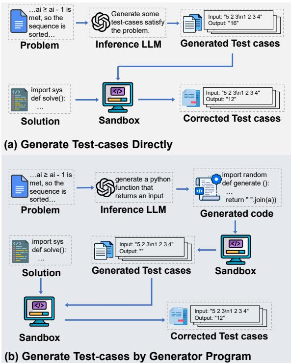  
Figure 1: Illustration of current methods for test cases synthesis by LLM.(a) Generate Test cases Directly, instructing the LLM to directly synthesize a suite of test cases compliant with the problem specifications.(b) Generate Test cases by Generator Program, where LLM is first instructed to generate generator programs designed to automate the synthesis of test case inputs.

To enhance synthetic quality, subsequent efforts have transitioned to a generator program paradigm (He et al., 2025), using various logical hypotheses to improve the coverage of test cases, as shown in Figure 1(b). While this approach reduces the hallucination rate, it remains heavily reliant on manual annotation, which restricts its scalability. Building on this, (Wang et al., 2025) introduced verification agents to automatically craft validator programs for constraint verification, further suppressing the hallucination rate. However, the completeness of automated validators is difficult to formally guarantee (Olausson et al., 2023). Their intrinsic residual hallucinations, particularly under binary sparse rewards, frequently induce false negatives (Liu et al., 2023). This results in correct code generating misleading gradient signals due to erroneous labeling (Ouyang et al., 2022). Consequently, within the context of RL reward signaling, simply improving data quality has hit a bottleneck. It is imperative to refine the learning mechanisms or introduce robust reward modeling (Casper et al., 2023) to mitigate the deleterious effects of residual hallucinations and ensure stable model evolution under noisy feedback.

To address these challenges, we propose RobustTests, which at its core incorporates faultycode-driven test case synthesis and a robust dense reward mechanism. During the synthesis stage, we first utilize LLMs to generate "near-correct" faulty programs refined via original test cases to guide the directed synthesis of test cases capable of triggering specific logical defects. Subsequently, we perform validity verification on these generated test cases to eliminate invalid ones. We further conduct clustering and filtering based on behavior feature vectors (i.e., the pass/fail status encodings of test cases over different faulty code snippets), which ensures that the test case suite can cover diverse error scenarios and alleviate false positives. During the training stage, to address the false negatives caused by unavoidable hallucinatory noise in synthetic test case suit, we introduce a stepwise dense reward function based on pass rates. This improves the robustness of the model to continuously learn from partially correct signals.

Within the RobustTests framework, we augmented the test cases of the CodeContests<sup>+</sup> dataset to construct a code high-quality dataset, and evaluated its properties using Test case Space Polarization (TSP) metric. The results demonstrate that RobustTests achieves a 7% improvement in TSP relative to the original CodeContests<sup>+</sup>, indicating its enhanced capacity to uncover a broader spectrum of failure modes. In our experiments, using problems of moderate difficulty from CodeContests<sup>+</sup> as the training set, RL fine-tuning of Qwen3-32B via RobustTests yields an absolute 3% performance gain on the LiveCodeBench benchmark compared to the baseline methods. These findings not only confirm the effectiveness of the RobustTests framework in bolstering the code generation proficiency of LLMs but also establish a clear correlation between the TSP metric and model performance.

In summary, the main contributions of this study are as follows:

• We propose a novel approach for automated high-quality test case synthesis and RLVR reward modeling, utilizing faulty-code-driven synthesis and a robust dense reward mechanism to expand test case coverage and bolster resilience against synthetic noise during RL.

• We construct a code dataset with more diverse test cases, significantly strengthens diagnostic utility across various faulty code scenarios.

• An abosulte 3-percentage point performance gain on the LiveCodeBench benchmark when training Qwen3-32B compared to baselines, substantially advancing the code generation performance of LLMs.

## 2 Related work

## 2.1 Test case synthesis Method

At present, the most accurate method for test case synthesis remains manual curation by human experts. This methodology underpins the test cases of numerous code evaluation benchmarks, including MBPP (Austin et al., 2021), HumanEval (Chen et al., 2021), and LiveCodeBench (Jain et al., 2024). However, it is prohibitively expensive and lacks scalability, rendering it suitable only for small-scale benchmark and impractical for the construction of massive training corpora. Consequently, several LLM-based automated methods have emerged. CodeContests<sup>+</sup> (Cai et al., 2026) generates supplementary test cases by applying stochastic perturbations to harvested inputs. EvalPlus (Liu et al., 2023) extends HumanEval by prompting LLMs to synthesize seed inputs guided by reference implementations. Furthermore, frameworks such as KodCode (Xu et al., 2025) and AceCoder (Zeng et al., 2025) have expanded this scope to include the joint synthesis of coding problems, test cases, and reference solutions. The HardTests (He et al., 2025) method improves upon these strategies by utilizing generator programs for test case synthesis. Building upon these, CodeContests<sup>+</sup> (Wang et al., 2025) incorporates automated validator programs to verify input constraints, effectively mitigating LLMinduced hallucinations. Nevertheless, the challenge of synthesizing test cases that provide comprehensive diagnostic coverage for diverse faulty code remains an unresolved research problem.

## 2.2 RL for Enhancing LLM’s Code Ability

Reinforcement learning (RL) has been increasingly integrated into the coding domain, leveraging code executability to provide objective feedback (Jiang et al., 2026; Shojaee et al., 2023; Dou et al., 2024). Early studies, such as CodeRL (Le et al., 2022) and AlphaCode (Li et al., 2022), explored the use of compiler feedback or unit tests as reward signals to optimize models via algorithms like PPO (Schulman et al., 2017). Building upon existing methodologies, DeepSeek-R1 (Guo et al., 2025) introduced the GRPO as the current state-of-the-art (SOTA) algorithm. However, while DeepSeek-R1 relies on curated public datasets, training with synthetic test cases necessitates a different approach. Since synthetic test cases inevitably harbor errors, it is imperative to design a robust reward function that enhances resilience toward test case inaccuracies and provides more tolerant feedback signals.

## 3 Method

To address the reward bias issues encountered when leveraging RLVR to enhance the code generation capabilities of LLMs, we introduce the RobustTests framework, illustrated in Figure 2.

## 3.1 Automated Test case Generation

Automated test case generation aims to generate high-quality test cases inputs capable of effectively distinguishing correct code from faulty codes. This process comprises two pivotal stages: the generation of a diverse pool of faulty code and the subsequent generation of directed, faulty-codedriven test cases. Representative samples of faulty code and generated test cases are detailed in Appendix D.3.

Faulty Code Generation To establish concrete targets for test case generation, we first generate a diverse ensemble of faulty implementations. For each problem $P _ { i } ,$ inspired by the approach in (Yang et al., 2025b), we leverage an LLM to generate stochastic faulty code, producing a broad spectrum of potential logical defects $f \sim \mathrm { L L M } ( \cdot | P _ { i } )$ via sampling. Prompts we used are shown in Appendix F.1. To ensure the non-triviality of the candidate implementations, we employ a rigorous dynamic filtering mechanism. Each candidate e is executed against an original test case suite $T _ { \mathrm { b a s e } } ,$ producing a binary execution vector $V _ { i } ^ { f } \in \{ 0 , 1 \} ^ { | T _ { \mathrm { b a s e } } | }$ <sup>|</sup>, where each dimension denotes the pass/fail status of the corresponding test case. We retain only the faulty code that satisfies the following criterion:

$$
\phi ( f ) \triangleq 0 < \frac { \| V _ { i } ^ { f } \| _ { 1 } } { | T _ { \mathrm { b a s e } } | } < 1\tag{1}
$$

The strategy filters out both fully correct and completely incorrect code while preserving only nearly correct faulty code. This ensures that the generated test cases are capable of capturing potential logical defects.

To further refine the faulty codes, we perform exact deduplication on implementations with the same execution vector $V _ { i } ^ { f }$ . By selecting a single representative sample for each unique failure mode, we construct the candidate pool $F _ { \mathrm { b a s e } }$ , thereby eliminating semantic redundancy and ensuring that the pool encompasses diverse logical discrepancies.

Faulty-Code-Driven Test case Generation Given the qualified faulty code pool $F _ { \mathrm { b a s e } }$ , the primary objective is to generate test cases that probe the nuanced semantic boundaries between correct logic and specific implementation pitfalls. We adopt a failure-inducing prompting strategy (Mu et al., 2024), where batches of faulty codes are provided as negative examples within the prompt. As shown in Appendix F.2, The model is instructed to generate constraint-compliant test cases $t _ { i }$ that satisfy two primary criteria: (i) strict adherence to the input specifications of $P _ { i }$ ensuring that the generated outputs correspond correctly to the inputs; and (ii) the capability to induce a logical failure in at least one faulty code implementation while remaining consistent with the correct execution of the reference solution. All generated test cases and test cases in $T _ { \mathrm { b a s e } }$ are subsequently incorporated into the candidate pool $T _ { \mathrm { c a n d } }$

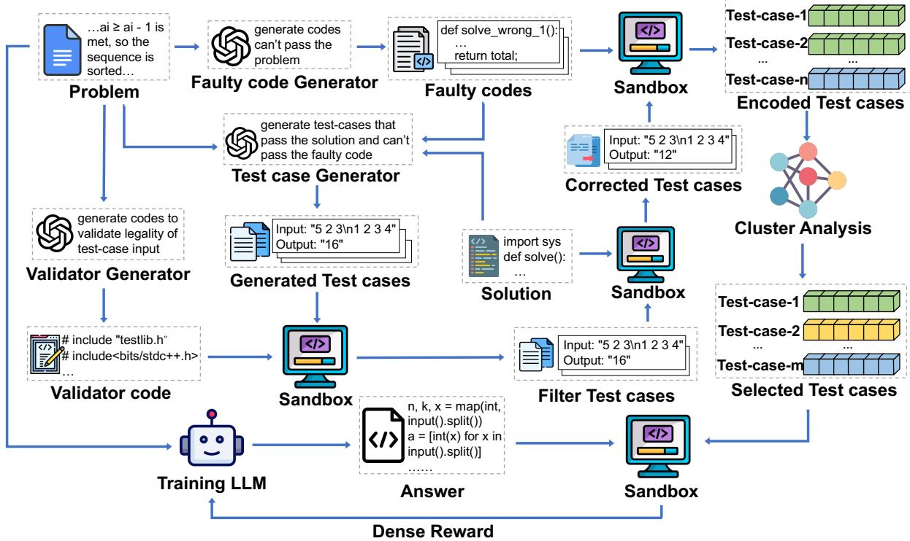  
Figure 2: Overview of the proposed RobustTests framework. The framework consists of three core components: (i) Automated Test case Generation in 3.1, aims to generate high-quality test cases inputs capable of effectively distinguishing correct code from faulty codes; (ii) Test case Validation and Selection in 3.2, ensures that the generated test cases are semantically sound and capable of diagnosing a broad spectrum of faulty code while simultaneously maximizing set parsimony; and (iii) Dense Reward Function Design in 3.3, accounts for the potential fallibility of the synthesized test case suite.

## 3.2 Test case Validation and Selection

To ensure that the generated test cases are semantically sound and capable of diagnosing a broad spectrum of faulty code while simultaneously maximizing set parsimony, we employ a three-stage filtering pipeline comprising input verification, LLM instruction-compliance validation, and diversitydriven selection.

Input Validation LLM-generated test case inputs frequently suffer from a "semantic-execution gap," wherein they violate implicit domain axioms or problem-specific constraints. To bridge this gap, following the methodology in (Wang et al., 2025), we implement an executable validator $A _ { i }$ for each problem $P _ { i } ,$ with generation details provided in Appendix F.3. The suite of valid test cases is formally defined as:

$$
T _ { \mathrm { v a l i d } } = \{ t \in T _ { \mathrm { c a n d } } \mid A _ { i } ( t ) = \mathrm { T r u e } \}\tag{2}
$$

This process prunes inputs that are syntactically correct but semantically invalid, ensuring that all subsequent evaluations are grounded in feasible execution scenarios. The input validator and its corresponding invalid test case detections are detailed in Appendix D.4.

LLM Instruction-compliance Validation Following the validator-based pruning of invalid test cases from the candidate pool, we subject each remaining instance to LLM instruction-compliance validation. First, the ground-truth output for each test case is re-synthesized by executing the reference code, thereby ensuring semantic alignment between inputs and outputs. Subsequently, each test case is evaluated against the faulty code pool to determine whether it can successfully trigger a logical failure in at least one faulty implementation. Only test cases that simultaneously yield correct outputs and demonstrate the capacity to expose code defects are incorporated into the final test case suite $T _ { \mathrm { f i n a l } }$ . Details are in Appendix D.5.

Diversity-Driven Selection To maximize the coverage of heterogeneous failure modes while maintaining test case suite parsimony, we implement a clustering mechanism based on the failure profiles of test cases against faulty code. We first construct a binary execution vector $V _ { i } ^ { t } ~ \in$ $\{ 0 , 1 \} ^ { | F _ { \mathrm { b a s e } } | }$ for each test case in $T _ { \mathrm { f i n a l } } ,$ , then employ the K-means algorithm (Ahmed et al., 2020) to partition the test case space into K disjoint clusters $\{ C _ { 1 } , \ldots , C _ { K } \}$ . Euclidean distance (Rudin, 1976) is utilized as the dissimilarity metric to quantify differences between execution vectors:

$$
\operatorname* { m i n } _ { \{ C _ { 1 } , \dots , C _ { K } \} } \sum _ { k = 1 } ^ { K } \sum _ { V _ { i } ^ { t } \in C _ { k } } \left\| V _ { i } ^ { t } - \pmb { \mu } _ { k } \right\| _ { 2 } ^ { 2 }\tag{3}
$$

where $\begin{array} { r } { \pmb { \mu _ { k } } = \frac { 1 } { | C _ { k } | } \sum _ { V _ { j } ^ { t } \in C _ { k } } V _ { j } ^ { t } } \end{array}$ denotes the centroid of cluster $C _ { k }$ . For each resulting cluster $C _ { k }$ , a round-robin selection strategy is implemented to extract representative medoids. This strategy ensures that the final refined test case suite $T _ { \mathrm { s y n t h . } } =$ $\{ t _ { 1 } , \ldots , t _ { K } \}$ spans the maximum range of scenarios across diverse faulty codes, thereby enhancing the overall diagnostic utility. The pseudo code is presented in Appendix E.

## 3.3 Dense Reward Function Design

Despite rigorous two-stage test case pruning, residual flaws may still persist in $T _ { \mathrm { s y n t h . } }$ <sub>.</sub>, such as undetected validator loopholes (Liu et al., 2023) or the insufficient robustness of reference solutions (Li et al., 2022). Examples are in Appendix D.7. Consequently, we formulate a robust reward mechanism that explicitly accounts for the potential fallibility of the synthesized test case suite. First, the suite of test cases successfully executed by a candidate solution s within $T _ { \mathrm { s y n t h . } }$ is defined as:

$$
\mathrm { p a s s } ( s , T _ { \mathrm { s y n t h . } } ) = \{ t \in T _ { \mathrm { s y n t h . } } | \mathrm { e x e c } ( s , t ) = \mathrm { p a s s } \}\tag{4}
$$

The corresponding reward function $r ( s )$ is formulated as follows:

$$
r ( s ) = \left\{ { \begin{array} { l l } { 1 . 1 } & { { \mathrm { i f ~ } } | { \mathrm { p a s s } } ( s , T _ { \mathrm { { s y n t h . } } } ) | = 1 } \\ { - 0 . 1 } & { { \mathrm { i f ~ } } | { \mathrm { p a s s } } ( s , T _ { \mathrm { { s y n t h . } } } ) | = 0 } \\ { { \frac { 1 } { 1 0 } } \cdot { \frac { | { \mathrm { p a s s } } ( s , T _ { \mathrm { { s y n t h . } } } ) | } { | T _ { \mathrm { { s y n t h . } } } | } } } & { { \mathrm { o t h e r w i s e } } } \end{array} } \right.\tag{5}
$$

This reward strategy is designed to bolster the stability and efficacy of the reinforcement learning process via granular feedback signals. It not only enhances the model’s resilience to potential noise within the test cases but also fosters stable curriculum learning by providing a progressive optimization trajectory.

## 4 Experiment

## 4.1 Experimental Settings

Datasets We utilize CodeContests<sup>+</sup> (Wang et al., 2025), a comprehensive benchmark dataset that aggregates 11,636 programming problems from CodeForces (Mirzayanov et al., 2020), AIZU (AOJ Programming Challenge; AOJ New Site), and At-Coder (AtCoder Inc., 2012). For each problem, approximately 100 test cases are generated via a "generator-validator" multi-agent framework. To ensure a sufficiently challenging training environment, we perform difficulty-based filtering using Qwen3-32B (Yang et al., 2025a). Specifically, we assess the model’s performance on ten trials for each problem, as illustrated in Figure 3. Only problems with a pass@10 score between 0.2 and 0.9 were retained, resulting in a refined training subset named $\mathrm { C o d e C o n t e s t s _ { t r a i n } ^ { + } }$ of approximately 3.3k problems.

Although CodeContests<sup>+</sup> provides a substantial volume of test cases, we observe significant homogeneity between the original instances, which constrains the efficacy of reinforcement learning from verifiable rewards (RLVR). To address the limitation, we introduce RobustTests, a refined training set built on CodeContests<sup>+</sup>, with approximately 200 highly diverse test cases capable of effectively uncovering latent logical defects. RobustTests significantly reduces the false positive rate, thereby enhancing the robustness and generalization capabilities of the RLVR-based training.

Training Setup We finetune Qwen3-32B (Yang et al., 2025a) via GRPO (Guo et al., 2025) with configuration: $\beta _ { \mathrm { c l i p } } = 0 . 2$ , Adam $( \eta = 5 \times 1 0 ^ { - 6 }$ $\beta _ { 1 } = 0 . 9 , \beta _ { 2 } = 0 . 9 5 )$ , batch size 256, and 10-step linear warmup. Answers are sampled at maximal entropy $( T = 1 . 0 , p _ { \mathrm { t o p } } = 1 . 0 )$ with $n _ { \mathrm { s a m p l e } } = 8$ per prompt. Input truncation at 2,048 tokens and output extension to 38,912 tokens leverage the model’s 128K context window. The $\lambda _ { \mathrm { K L } } = 0 . 0$ setting intentionally omits policy regularization, reserving KLloss for future constrained exploration while prioritizing boundary-case discovery in high-capacity regimes. The details are in Appendix A.

<table><tr><td rowspan="2">Method</td><td rowspan="2">Livecodebench</td><td colspan="3">Codeforces</td></tr><tr><td>Score Score</td><td>Rating</td><td>Percentile</td></tr><tr><td>Naive LLM Generation</td><td>65.75</td><td>35.41</td><td>83.36</td><td>91.70</td></tr><tr><td>HardTests</td><td>65.25</td><td>35.65</td><td>83.58</td><td>91.35</td></tr><tr><td>CodeContests+</td><td>65.41</td><td>35.56</td><td>83.96</td><td>91.45</td></tr><tr><td>CodeContests-O</td><td>66.21</td><td>36.43</td><td>84.35</td><td>91.81</td></tr><tr><td>RobustTests(Ours)</td><td>68.39</td><td>38.50</td><td>85.99</td><td>94.67</td></tr></table>

Table 1: Performance of baselines and RobustTests on the LiveCodeBench and CodeForces benchmarks. The best result is bold and the second result is underline.

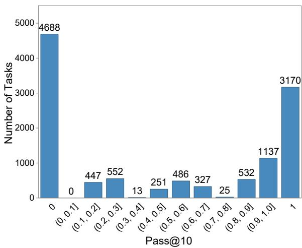  
Figure 3: Correctness distribution of Qwen3-32B over ten trials across all CodeContests<sup>+</sup> problems, evaluated using the CodeContests<sup>+</sup> test case suite. The xaxis represents the distribution of pass rates over ten trials(pass@10), while the y-axis denotes the number of problems within each pass rate interval.

Baseline We evaluated the efficacy of the RobustTests in comparison with existing test case augmentation strategies within the RLVR framework. These comparative baselines encompass Naive LLM Generation (Li and Yuan, 2024), HardTests (He et al., 2025), and CodeContests<sup>+</sup> (Wang et al., 2025), CodeContests-O (Cai et al., 2026). The introduction of baselines are in Appendix C.

Evaluation Benchmarks We set Live-CodeBench (2024.08–2025.01) and CodeForces as the primary benchmarks to evaluate the performance of RobustTests. For LiveCodeBench, a periodically updated benchmark, we utilize the pass rate (Score) as the evaluation metric. For the standardized CodeForces competitive problem set, we establish a multi-dimensional evaluation framework: (i) Score, which quantifies problemsolving accuracy; (ii) Rating, representing the model’s competitive standing on the leaderboard determined via simulated contest participation; and (iii) Percentile, denoting the proportion of historical human contestants outperformed by the model. The evaluation settings are detailed in Appendix B.

## 4.2 Main Results

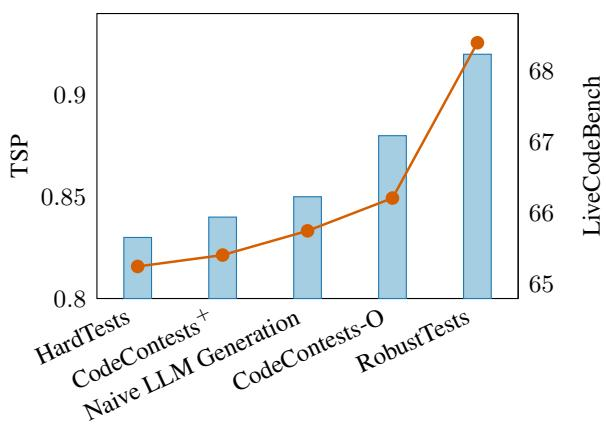  
Figure 4: Relationship between TSP values and Live-CodeBench performance across different test cases.

Performance on LiveCodeBench and Code-Forces We reimplement HardTests and Naive LLM Generation methods to synthesize test cases for each problem in $\mathrm { C o d e C o n t e s t s _ { t r a i n } ^ { + } . }$ To ensure a fair comparison, the number of test cases per problem is capped at approximately 40 across all methods. For HardTests, Naive LLM Generation, and CodeContests<sup>+</sup>, CodeContests-O baselines, we conduct reinforcement learning on Qwen3-32B using binary (0-1) sparse rewards. In contrast, the RobustTests method employs dense rewards for reinforcement learning on the same model. The results are shown in Table 1, revealing that while the three baselines exhibited comparable performance on LiveCodeBench and CodeForces, RobustTests outperform them by approximately absolute 3% on both benchmarks. This performance gain is twofold: First, the high-quality test cases in our training set more effectively detect logical discrepancies in answers, thereby reducing false positives. Second, the stepwise dense reward function provides intermediate feedback even when hallucinations of test cases are unavoidable. The design not only mitigates false negatives but also facilitates a curriculum learning effect that guides the model toward absolute correctness.

<table><tr><td rowspan="2">Method</td><td>Livecodebench</td><td colspan="3">Codeforces</td></tr><tr><td>Score</td><td>Score</td><td>Rating</td><td>Percentile</td></tr><tr><td>RobustTests*(Ours)</td><td>67.84</td><td>38.47</td><td>85.16</td><td>93.97</td></tr><tr><td>w/o Test case Synthesis</td><td>66.91</td><td>36.41</td><td>84.4</td><td>92.12</td></tr><tr><td>w/o Diversity-Driven Selection</td><td>66.82</td><td>36.23</td><td>84.12</td><td>91.96</td></tr><tr><td>w/o Both Module</td><td>65.41</td><td>35.56</td><td>83.96</td><td>91.45</td></tr></table>

Table 2: Ablation study on the test case synthesis strategy of RobustTests\* on LiveCodeBench and CodeForces benchmarks. RobustTests\* denotes a variant of the RobustTests framework that excludes the dense reward mechanism. We investigate the performance impact of without Test case Generation (the second row), without Diversity-Driven Selection (the third row) and without Both Module(the forth row). The best results are in bold.
<table><tr><td rowspan="2">Dataset</td><td rowspan="2">Method</td><td>LiveCodeBench</td><td colspan="3">Codeforces</td></tr><tr><td>Score</td><td>Score</td><td>Rating</td><td>Percentile</td></tr><tr><td rowspan="2"> $\mathrm { C o d e C o n t e s t s _ { t r a i n } ^ { + } }$ </td><td>Sparse Reward</td><td>65.41</td><td>83.96</td><td>35.56</td><td>91.45</td></tr><tr><td>Dense Reward</td><td>66.30</td><td>84.24</td><td>37.74</td><td>92.05</td></tr><tr><td rowspan="2">RobustTests*</td><td>Sparse Reward</td><td>67.84</td><td>85.16</td><td>38.47</td><td>93.97</td></tr><tr><td>Dense Reward</td><td>68.39</td><td>85.99</td><td>38.50</td><td>94.67</td></tr><tr><td rowspan="2">RobustTests* w/o validator</td><td>Sparse Reward</td><td>66.02</td><td>83.82</td><td>35.91</td><td>91.28</td></tr><tr><td>Dense Reward</td><td>67.21</td><td>85.02</td><td>38.15</td><td>93.64</td></tr></table>

Table 3: Ablation study on the Reward Module of RobustTests on LiveCodeBench and CodeForces benchmarks, using both RobustTests\* and CodeContests<sup>+</sup> as the training datasets. The best results are in bold.

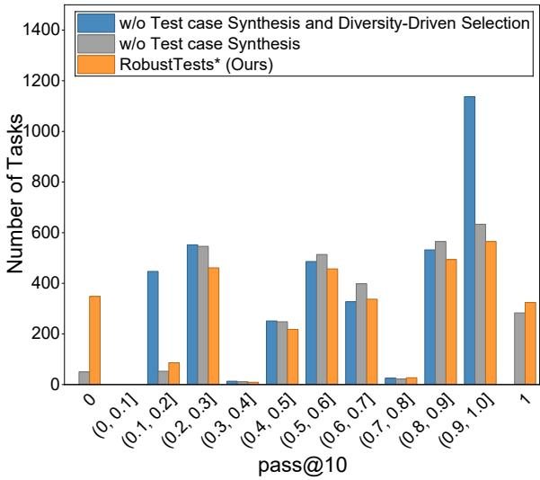  
Figure 5: The pass rate distribution of Qwen3-32B over ten trials across all $\mathrm { C o d e C o n t e s t s _ { t r a i n } ^ { + } }$ problems, evaluated against the test cases provided by RobustTests and without Test case Generation and its configuration without Diversity-Driven Selection.

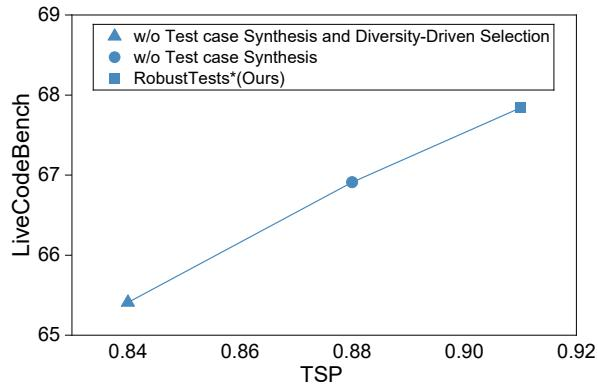  
Figure 6: Correlation between the TSP values of test cases employed during training and the coding performance of LLM on the LiveCodeBench benchmark.

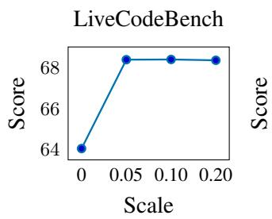

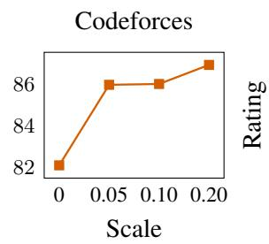

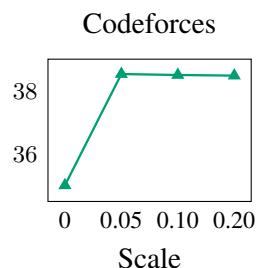

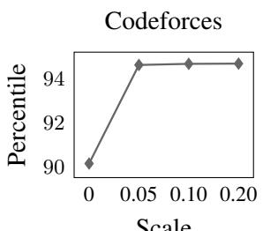  
Figure 7: Ablation study on the reward scale in the dense reward function on LiveCodeBench and Codeforces benchmarks. The scale is varied from 0 to 0.20 using RobustTests<sup>∗</sup> as the training dataset.

Analysis of Test case Diversity To better understand why RobustTests improves downstream training, we analyze the diversity of different test cases. Drawing on (Jaeger, 2000), we introduce Test case Space Polarization (TSP), a low-cost metric that quantifies the diagnostic coverage of a test case suite across diverse faulty codes:

$$
T S P = \frac { 1 } { M } \cdot \sum _ { s \in S } \left( - \frac { n _ { s } } { N } \cdot \log _ { 2 } \frac { n _ { s } } { N } \right)\tag{6}
$$

Here, M denotes the number of faulty codes in $F _ { \mathrm { b a s e } } ,$ N is the total number of test cases in $T _ { \mathrm { s y n t h . } } ,$ and S represents the set of test cases in $T _ { \mathrm { s y n t h . } }$ . The term $n _ { s }$ indicates the frequency of a specific test case s in $T _ { \mathrm { s y n t h } }$ <sub>.</sub>. As shown in Figure 4, RobustTests achieves the highest TSP value among all compared test cases and obtains the best LiveCodeBench performance. In contrast, methods with lower TSP values, such as HardTests and CodeContests<sup>+</sup>, lead to weaker downstream performance. This trend suggests that TSP is positively correlated with the training utility of test cases and can serve as a lowcost proxy for estimating dataset potential before expensive RL training.

## 4.3 Ablation Study

In this section, we conduct an extensive ablation study to assess the individual contribution of each component within the test case synthesis strategy to the aggregate performance. Furthermore, we introduce a novel metric, Test case Space Polarization (TSP), designed to quantify test case diversity by measuring their diagnostic coverage across faulty codes, and evaluate its subsequent influence on model performance. Finally, we investigate the impact of various reward functions used during the training stage on the efficacy of the model.

Test case Synthesis Module Ablation We first investigated the individual contributions of the Diversity-Driven Selection and Test case Synthesis stages to model performance, with results summarized in Table 2. In all experimental configurations, we fix the test case budget at approximately 40 and trained all models using binary (0-1) sparse rewards. The findings indicate that Both Test Case Synthesis and Diversity-Driven Selection yield consistent gains of approximately 1.5% on LiveCodeBench when applied independently and the integrated approach yields the best performance for Qwen3-32B, demonstrating a clear complementarity between the two stages: Test case Synthesis introduces high-quality test cases into the suite that are capable of effectively distinguishing correct codes from faulty code, while Diversity-Driven Selection prunes the suite to retain test cases that maximize coverage across diverse faulty code.

We further analyze the role of test case diversity in the ablation study using the TSP metric introduced in Section 4.2. As shown in Figure 6, under identical training configurations, training Qwen3-32B with test cases that have higher TSP values leads to stronger LiveCodeBench performance. This indicates that higher diagnostic diversity improves the quality of reward signals by reducing the likelihood that faulty solutions are mistakenly accepted as correct.

Furthermore, we investigate the relationship between TSP and the pass rate of model outputs evaluated against different test cases. Figure 5 shows the pass rate distribution over ten trials for 3.3k problems in the CodeContests<sup>+</sup><sub>train</sub> dataset using Qwen3- 32B. When removing Test Case Synthesis and Diversity-Driven Selection from RobustTests, TSP decreases and the pass-rate distribution shifts rightward. This suggests that lower-diversity test cases are less capable of detecting faulty solutions, resulting in more false positives during reward assignment. In contrast, test cases with higher TSP impose stricter diagnostic criteria on model-generated solutions and thus better distinguish correct solu-

tions from faulty ones.

Interestingly, as TSP increases, the pass@10 metric of some problems reaches 1. A closer analysis shows that this phenomenon is caused by the remaining spurious synthetic test cases, which may produce false-negative judgments. Since such spurious cases are generated stochastically, some semantically correct solutions may fail due to invalid tests, leading to persistent misjudgments on specific problems. This observation further motivates the need for validator filtering and dense rewards: validator filtering reduces invalid test cases, while dense rewards allow the model to learn from partially correct execution feedback instead of being dominated by noisy binary signals.

Reward Module Ablation Table 3 demonstrates the effectiveness of dense rewards over sparse rewards across different training test cases, including RobustTests, CodeContests<sup>+</sup>, and RobustTests<sup>∗</sup> without validator filtering. Dense rewards consistently improve LiveCodeBench performance when trained with either RobustTests or CodeContests<sup>+</sup>, showing the effectiveness and generalizability of our stepwise dense reward function. Notably, under the no-validator RobustTests<sup>∗</sup> setting, dense rewards achieve larger gains across both Live-CodeBench and Codeforces metrics, indicating stronger robustness to noisy or invalid test cases.

To further explain this observation, we audit the validator filtering pipeline on approximately 3.3k problems from CodeContests<sup>+</sup><sub>train</sub>. Each problem contains around 200 raw generated test cases, of which approximately 30% are rejected by the validator as invalid, while no reference-execution failures are observed. Nevertheless, manual post-hoc inspection reveals that about 10% of the accepted test cases remain invalid, resulting in false-negative judgments for roughly 10% of all test cases. These findings indicate that validator filtering can remove a substantial portion of invalid test cases but cannot fully eliminate test noise. Consequently, when validator filtering is weakened or removed, dense rewards provide a more robust training signal by leveraging partially correct execution feedback and reducing the adverse impact of false-negative sparse rewards.

We next examine the impact of the reward scale in the dense reward function. As shown in Figure 7, setting the scale to zero causes a substantial performance drop, confirming the necessity of this reward component. In contrast, performance remains stable as the scale varies from 0.05 to 0.20, suggesting that this hyperparameter is not benchmark-tuned and has limited influence once enabled.

## 5 Conclusion

We propose RobustTests, integrates faulty-codedriven test case synthesis and a stepwise dense reward mechanism to establish a robust RL framework for code generation, significantly enhancing the diagnostic utility of the augmented CodeContests<sup>+</sup> dataset. By leveraging "nearcorrect" faulty codes to expand diagnostic coverage, the framework effectively minimizes false positives, while the stepwise dense reward mitigates false negatives by enabling the model to learn from partially correct signals through a curriculum learning paradigm. Beyond code generation, these principles offer broad applicability: the synthesis strategy can be adapted for automated mutation testing in software engineering, and the dense reward mechanism is particularly suited for experimental planning and conclusion analysis in autonomous scientific discovery. By bridging these capabilities, RobustTests provides a versatile trajectory for enhancing reasoning and planning within complex scientific and engineering contexts.

## Limitations

Although RobustTests successfully strengthens the coding generation abilities of LLMs, certain limitations persist that we aim to mitigate in subsequent work:

• Dependency on solutions: The proposed approach is primarily applicable to programming tasks with available ground-truth solutions; consequently, its utility is constrained in real-world scenarios where reference implementations are absent.

• Expansion of domain generalization: While the proposed framework is evaluated on competitive programming benchmarks such as LiveCodeBench and CodeForces, its generalizability to a broader range of software development tasks remains to be fully explored.

## Ethical Considerations

The Use of AI Assistants We employed Gemini-3 to assist us in polishing our paper and coding.

## Acknowledgments

This work was supported by Ant Group Research Intern Program.

## References

Mohiuddin Ahmed, Raihan Seraj, and Syed Mohammed Shamsul Islam. 2020. The k-means algorithm: A comprehensive survey and performance evaluation. Electronics, 9(8):1295.

AOJ New Site. 2018. Aizu online judge (new site). http://onlinejudge.u-aizu.ac.jp/home. Accessed: 23-Apr-2018.

AOJ Programming Challenge. 2018. Aizu online judge: Programming challenge. http://judge.u-aizu. ac.jp/onlinejudge/. Accessed: 23 Apr. 2018.

AtCoder Inc. 2012. Atcoder: Programming contest website. https://atcoder.jp/.

Jacob Austin, Augustus Odena, Maxwell Nye, Maarten Bosma, Henryk Michalewski, David Dohan, Ellen Jiang, Carrie Cai, Michael Terry, Quoc Le, and 1 others. 2021. Program synthesis with large language models. arXiv preprint arXiv:2108.07732.

Jianfeng Cai, Jinhua Zhu, Ruopei Sun, Kangwen Zhao, Dongyun Xue, Mingxiao Feng, Wengang Zhou, and Houqiang Li. 2026. Codecontests-o: Powering llms via feedback-driven iterative test case generation. arXiv preprint arXiv:2601.13682.

Stephen Casper, Xander Davies, Claudia Shi, Thomas Krendl Gilbert, Jérémy Scheurer, Javier Rando, Rachel Freedman, Tomasz Korbak, David Lindner, Pedro Freire, and 1 others. 2023. Open problems and fundamental limitations of reinforcement learning from human feedback. arXiv preprint arXiv:2307.15217.

Mark Chen, Jerry Tworek, Heewoo Jun, Qiming Yuan, Henrique Ponde De Oliveira Pinto, Jared Kaplan, Harri Edwards, Yuri Burda, Nicholas Joseph, Greg Brockman, and 1 others. 2021. Evaluating large language models trained on code. arXiv preprint arXiv:2107.03374.

Shihan Dou, Yan Liu, Haoxiang Jia, Enyu Zhou, Limao Xiong, Junjie Shan, Caishuang Huang, Xiao Wang, Xiaoran Fan, Zhiheng Xi, and 1 others. 2024. Stepcoder: improving code generation with reinforcement learning from compiler feedback. In Proceedings of the 62nd Annual Meeting of the Association for Computational Linguistics (Volume 1: Long Papers), pages 4571–4585.

Ahmed El-Kishky, Alexander Wei, Andre Saraiva, Borys Minaiev, Daniel Selsam, David Dohan, Francis Song, Hunter Lightman, Ignasi Clavera, Jakub Pachocki, and 1 others. 2025. Competitive programming with large reasoning models. arXiv preprint arXiv:2502.06807.

Anisha Gunjal, Anthony Wang, Elaine Lau, Vaskar Nath, Yunzhong He, Bing Liu, and Sean Hendryx. 2025. Rubrics as rewards: Reinforcement learning beyond verifiable domains. arXiv preprint arXiv:2507.17746.

Daya Guo, Dejian Yang, Haowei Zhang, Junxiao Song, Peiyi Wang, Qihao Zhu, Runxin Xu, Ruoyu Zhang, Shirong Ma, Xiao Bi, and 1 others. 2025. Deepseek-r1: Incentivizing reasoning capability in llms via reinforcement learning. arXiv preprint arXiv:2501.12948.

Zhongmou He, Yee Man Choi, Kexun Zhang, Jiabao Ji, Junting Zhou, Dejia Xu, Ivan Bercovich, Aidan Zhang, and Lei Li. 2025. Hardtests: Synthesizing high-quality test cases for llm coding. arXiv preprint arXiv:2505.24098.

Xinyi Hou, Yanjie Zhao, Yue Liu, Zhou Yang, Kailong Wang, Li Li, Xiapu Luo, David Lo, John Grundy, and Haoyu Wang. 2024. Large language models for software engineering: A systematic literature review. ACM Transactions on Software Engineering and Methodology, 33(8):1–79.

Jochen AG Jaeger. 2000. Landscape division, splitting index, and effective mesh size: new measures of landscape fragmentation. Landscape ecology, 15(2):115– 130.

Naman Jain, King Han, Alex Gu, Wen-Ding Li, Fanjia Yan, Tianjun Zhang, Sida Wang, Armando Solar-Lezama, Koushik Sen, and Ion Stoica. 2024. Livecodebench: Holistic and contamination free evaluation of large language models for code. arXiv preprint arXiv:2403.07974.

Juyong Jiang, Fan Wang, Jiasi Shen, Sungju Kim, and Sunghun Kim. 2026. A survey on large language models for code generation. ACM Transactions on Software Engineering and Methodology, 35(2):1–72.

Thomas Kwa, Drake Thomas, and Adrià Garriga-Alonso. 2024. Catastrophic goodhart: regularizing rlhf with kl divergence does not mitigate heavy-tailed reward misspecification. Advances in Neural Information Processing Systems, 37:14608–14633.

Hung Le, Yue Wang, Akhilesh Deepak Gotmare, Silvio Savarese, and Steven Chu Hong Hoi. 2022. Coderl: Mastering code generation through pretrained models and deep reinforcement learning. Advances in Neural Information Processing Systems, 35:21314–21328.

Kefan Li and Yuan Yuan. 2024. Large language models as test case generators: Performance evaluation and enhancement. arXiv preprint arXiv:2404.13340.

Yujia Li, David Choi, Junyoung Chung, Nate Kushman, Julian Schrittwieser, Rémi Leblond, Tom Eccles, James Keeling, Felix Gimeno, Agustin Dal Lago, and 1 others. 2022. Competition-level code generation with alphacode. Science, 378(6624):1092–1097.

Zi Lin, Sheng Shen, Jingbo Shang, Jason Weston, and Yixin Nie. 2025. Learning to solve and verify: A self play framework for code and test generation. arXiv preprint arXiv:2502.14948.

Jiawei Liu, Chunqiu Steven Xia, Yuyao Wang, and Lingming Zhang. 2023. Is your code generated by chatgpt really correct? rigorous evaluation of large language models for code generation. Advances in neural information processing systems, 36:21558–21572.

Zeyao Ma, Xiaokang Zhang, Jing Zhang, Jifan Yu, Sijia Luo, and Jie Tang. 2025. Dynamic scaling of unit tests for code reward modeling. In Proceedings ofthe 63rd Annual Meeting ofthe Associationfor Computational Linguistics (Volume 1: Long Papers), pages 6917–6935.

Mike Mirzayanov, Oksana Pavlova, Pavel Mavrin, Roman Melnikov, Andrew Plotnikov, Vladimir Parfenov, and Andrew Stankevich. 2020. Codeforces as an educational platform for learning programming in digitalization. Olympiads in Informatics, 14(133- 142):14.

Lin Mu, Wenhao Zhang, Yiwen Zhang, and Peiquan Jin. 2024. Ddprompt: Differential diversity prompting in large language models. In Proceedings of the 62nd Annual Meeting of the Association for Computational Linguistics (Volume 2: Short Papers), pages 168– 174.

Theo X Olausson, Jeevana Priya Inala, Chenglong Wang, Jianfeng Gao, and Armando Solar-Lezama. 2023. Is self-repair a silver bullet for code generation? arXiv preprint arXiv:2306.09896.

Long Ouyang, Jeffrey Wu, Xu Jiang, Diogo Almeida, Carroll Wainwright, Pamela Mishkin, Chong Zhang, Sandhini Agarwal, Katarina Slama, Alex Ray, and 1 others. 2022. Training language models to follow instructions with human feedback. Advances in neural information processing systems, 35:27730–27744.

Bowen Peng, Jeffrey Quesnelle, Honglu Fan, and Enrico Shippole. 2023. Yarn: Efficient context window extension of large language models. arXiv preprint arXiv:2309.00071.

Walter Rudin. 1976. Principles ofMathematical Analysis. McGraw-Hill, New York.

John Schulman, Filip Wolski, Prafulla Dhariwal, Alec Radford, and Oleg Klimov. 2017. Proximal policy optimization algorithms. arXiv preprint arXiv:1707.06347.

Parshin Shojaee, Aneesh Jain, Sindhu Tipirneni, and Chandan K Reddy. 2023. Execution-based code generation using deep reinforcement learning. arXiv preprint arXiv:2301.13816.

Kimi Team, Yifan Bai, Yiping Bao, Guanduo Chen, Jiahao Chen, Ningxin Chen, Ruijue Chen, Yanru Chen, Yuankun Chen, Yutian Chen, and 1 others. 2025a. Kimi k2: Open agentic intelligence. arXiv preprint arXiv:2507.20534.

Ling Team, Anqi Shen, Baihui Li, Bin Hu, Bin Jing, Cai Chen, Chao Huang, Chao Zhang, Chaokun Yang, Cheng Lin, and 1 others. 2025b. Every step evolves: Scaling reinforcement learning for trillion-scale thinking model. arXiv preprint arXiv:2510.18855.

Zihan Wang, Siyao Liu, Yang Sun, Hongyan Li, and Kai Shen. 2025. Codecontests+: High-quality test case generation for competitive programming. arXiv preprint arXiv:2506.05817.

Zhangchen Xu, Yang Liu, Yueqin Yin, Mingyuan Zhou, and Radha Poovendran. 2025. Kodcode: A diverse, challenging, and verifiable synthetic dataset for coding. In Findings of the Association for Computational Linguistics: ACL 2025, pages 6980–7008.

An Yang, Anfeng Li, Baosong Yang, Beichen Zhang, Binyuan Hui, Bo Zheng, Bowen Yu, Chang Gao, Chengen Huang, Chenxu Lv, and 1 others. 2025a. Qwen3 technical report. arXiv preprint arXiv:2505.09388.

John Yang, Kilian Lieret, Carlos E Jimenez, Alexander Wettig, Kabir Khandpur, Yanzhe Zhang, Binyuan Hui, Ofir Press, Ludwig Schmidt, and Diyi Yang. 2025b. Swe-smith: Scaling data for software engineering agents. arXiv preprint arXiv:2504.21798.

Huaye Zeng, Dongfu Jiang, Haozhe Wang, Ping Nie, Xiaotong Chen, and Wenhu Chen. 2025. Acecoder: Acing coder rl via automated test-case synthesis. In Proceedings of the 63rd Annual Meeting of the Associationfor Computational Linguistics (Volume 1: Long Papers), pages 12023–12040.

## A Training Settings

We conduct our experiments on 32 NVIDIA H200 GPUs, employing Qwen3-32B as the base model. The detailed experimental parameters are summarized in Table 4.

<table><tr><td>Parameter</td><td>Value</td></tr><tr><td>Optimizer</td><td>AdamW</td></tr><tr><td>Learning Rate (η)</td><td>5 × 10−6</td></tr><tr><td>Adam  $\beta _ { 1 } , \beta _ { 2 }$ </td><td>0.9,0.95</td></tr><tr><td>Weight Decay</td><td>0.01</td></tr><tr><td>Gradient Clipping</td><td>1.0</td></tr><tr><td>Global Batch Size Warmup Steps</td><td>256 10</td></tr><tr><td>Learning Rate Scheduler</td><td>Linear</td></tr><tr><td>Nsample</td><td>8</td></tr><tr><td>Clipping Range  $( \beta _ { \mathrm { c l i p } } )$ </td><td>0.2</td></tr><tr><td>KL Coefficient  $( \lambda _ { \mathrm { K L } } )$ </td><td>0.0</td></tr><tr><td>Temperature (T)</td><td></td></tr><tr><td></td><td>1.0</td></tr><tr><td>Top-p</td><td>1.0</td></tr><tr><td>Max Input Tokens</td><td>2,048</td></tr><tr><td>Max Output Tokens</td><td>38,912</td></tr><tr><td>Numerical Precision</td><td>BF16</td></tr></table>

Table 4: Hyperparameters for Experiment

## B Evaluation Settings

Following the evaluation protocol established in (Team et al., 2025b), we assess a standardized pipeline to ensure a rigorous and fair comparison. For benchmarks including Live-CodeBench(2024.08–2025.01) and CodeForces, evaluations are conducted using a 128K context window. For the Qwen3-32B model with limited native context length, we leverage YaRN (Peng et al., 2023) for context extension and strictly adhere to the official hyperparameters specified for its open-weight release.

## C Introduction of Baselines

Naive LLM Generation Naive LLM Generation (Li and Yuan, 2024) is an approach that directly generates test cases. Specifically, it first prompts the LLM to directly synthesize a test case suite that conforms to the problem specifications, and then validates and revises the generated test cases with the reference solution.

HardTests HardTests (He et al., 2025) is an approach that generates test cases via dedicated generator programs. Specifically, the LLM is first prompted to produce generator programs that can automatically synthesize test case inputs, and the corresponding outputs are then obtained using the reference solution.

CodeContests<sup>+</sup> CodeContests<sup>+</sup> (Wang et al., 2025) is an approach that generates test cases via a "generator-validator" multi-agent framework. It first produces test case inputs using programs generated by the LLM, and then validates these inputs with an input validator also generated by the LLM. The corresponding outputs are subsequently obtained using the reference solution.

CodeContests-O CodeContests-O (Cai et al., 2026) is a Feedback-Driven Iterative Framework that transforms test case synthesis from open-loop generation into a closed-loop process by utilizing execution feedback from both correct and incorrect solutions to refine test cases for high fidelity and discriminability.

## D Case Study

In this section, we utilize a representative problem from CodeContests<sup>+</sup> as a case study to provide a detailed exposition of the operational mechanics and the underlying necessity of each component in the test case synthesis process, while further elucidating the root causes behind the generation of invalid test cases.

## D.1 Problem

We identify problem p03520 from the CodeContests<sup>+</sup> dataset. The detailed problem statement is presented as follows:

```csv
Snuke found a record of a tree with N
vertices in ancient ruins . The
findings are as follows :
* The vertices of the tree were numbered
1 ,2 ,... ,N, and the edges were
numbered 1 ,2 ,... ,N -1.
* Edge i connected Vertex a_i and b_i.
* The length of each edge was an integer
between 1 and 10^{18} ( inclusive ).
* The sum of the shortest distances from
Vertex i to Vertex 1 ,... ,N was s_i.
From the information above , restore the
length of each edge . The input
guarantees that it is possible to
determine the lengths of the edges
consistently with the record .
Furthermore , it can be proved that
the length of each edge is uniquely
determined in such a case .
Constraints
* 2 \ leq N \ leq 10^{5}
* 1 \ leq a_i , b_i \ leq N
```

\* 1 \ leq s\_i \ leq 10^{18}   
\* The given graph is a tree .   
\* All input values are integers .   
\* It is possible to consistently restore   
the lengths of the edges .   
\* In the restored graph , the length of   
each edge is an integer between 1   
and 10^{18} ( inclusive ).   
Input   
Input is given from Standard Input in   
the following format :   
N   
a\_1 b\_1   
:   
a\_{N -1} b\_{N -1}   
s\_1 s\_2 ... s\_ { N }   
Output   
Print N -1 lines . The i-th line must   
contain the length of Edge i .

## D.2 Original Test cases

The base test suite for this problem comprises 177 test cases, denoted as |T | = 177. An illustrative example is provided below:

```solidity
Input
5
1 2
1 3
1 4
1 5
10 13 16 19 22
Output
1
2
3
4
```

## D.3 Faulty Codes and Generated Test cases

As described in Section 3.1, we generate a collection of faulty codes to guide the synthesis of discriminative test cases. The total number of qualified faulty implementations for the problem is |F<sub>base</sub>| = 12, with an example provided as follows:

```python
import sys
input = sys . stdin . readline
def int_lst ():
return list ( map (int , input (). split ())
)
N = int ( input () )
adj =[[] for _ in range (N)]
edges =[]
for idx in range (N -1):
a,b= int_lst ()
a -=1; b -=1
edges . append (( a ,b , idx ) )
adj [a]. append ((b,idx ))
adj [ b ]. append (( a , idx ) )
s= int_lst ()
sz =[0]* N
def dfs (v,p):
cnt =1
for u , idx in adj [ v ]:
if u != p :
```

cnt += dfs (u , v )   
sz[v]= cnt   
return cnt   
dfs (0 , -1)   
ans =[0]\*(N -1)   
for a,b,i in edges :   
if sz[a]<sz[b]:   
ans[i]=( s[b]-s[a]) //( sz[a]-sz[b   
])   
else :   
ans[i]=( s[a]-s[b]) //( sz[b]-sz[a   
])   
for val in ans: print ( abs(val))

Subsequently, we leverage the synthesized faulty code to guide the LLM in generating test cases capable of discriminating between correct and faulty implementations. The process yields a total of 75 test cases, a representative example of which is provided below:

Input   
6   
1 2   
2 3   
<sup>3</sup><sub>4</sub> 4   
5   
5 6   
15 12 9 9 12 15   
Output   
3   
2
1
2   
3

The outputs of these test cases are initially placeholder values and require calibration against the reference solution. Since T<sub>cand</sub> is constructed by merging the synthesized test cases with T<sub>base</sub>, the resulting candidate set size is $| T _ { \mathrm { c a n d } } | = 2 5 2$

## D.4 Input Validator

Drawing on the approach of (Wang et al., 2025), an input validator is implemented for this problem as follows:

# include " testlib .h"   
# include <bits / stdc ++.h>   
using namespace std;   
const int MAXN = 100000;   
const long long MAXSI =   
1000000000000000000 LL;   
int parent [ MAXN + 5];   
int find ( int x ) {   
if ( parent [x] != x)   
parent [ x ] = find ( parent [ x ]) ;   
return parent [ x ];   
void unite ( int x , int y ) {   
x = find ( x ) ;   
y = find ( y ) ;

if ( x != y )   
parent [ x ] = y ;   
}   
int main ( int argc , char \* argv []) {   
registerValidation (argc , argv );   
int n = inf . readInt (2, 100000) ;   
inf . readEoln ();   
for ( int i = 1; i <= n; ++i)   
parent [i] = i;   
set <pair <int , int >> edges ;   
for ( int i = 0; i < n - 1; i ++) {   
int a = inf . readInt (1, n);   
inf . readSpace ();   
int b = inf . readInt (1, n);   
inf . readEoln () ;   
ensuref (a != b, "Self - loop   
detected at edge %d", i +1);   
int u = min (a, b);   
int v = max (a , b ) ;   
ensuref ( edges . count ({ u , v }) ==   
0, " Multiple edges between %   
d and % d " , u , v ) ;   
edges . insert ({ u , v }) ;   
ensuref ( find ( a ) != find ( b ) , "   
Cycle detected while adding   
edge between % d and % d " , a ,   
b ) ;   
unite (a , b ) ;   
}   
// Check connectedness   
int root = find (1) ;   
for ( int i = 2; i <= n; i ++) {   
ensuref ( find (i) == root , " Graph   
is not connected , node %d is   
in different component " , i )   
;   
}   
// Read s\_i   
vector < long long > s = inf . readLongs (   
n, 1, MAXSI );   
inf . readEoln ();   
inf . readEof ();   
return 0;   
}

The validator flags two test cases for failing to satisfy the problem constraints, one of which is illustrated as follows.

```csv
Input
8
1 2
3
4
5
6
6 7
7 8
28 24 20 16 12 8 4 0
Output
4
4
4
4
4
4
4
```

This test case includes an integer value of 0, thereby violating the problem’s defined input range of [1, 10<sup>18</sup>].

## D.5 LLM Instruction-compliance Validation

To ensure the validity of the LLM-synthesized test cases, we implement a verification and refinement process. First, the test case outputs are calibrated using the reference solution; the updated version of the case mentioned in Appendix D.2 is illustrated as follows:

```csv
Input
6
1 2
<sup>2</sup><sub>3</sub> 3
4
4 5
5 6
15 12 9 9 12 15
Output
3
1
3
1
3
```

On the other hand, we prune non-discriminative test cases that are passed by the faulty implementations. In this instance, two test cases were filtered out, resulting in a final test suite of |T<sub>final</sub>| = 248 after the two-stage refinement process.

## D.6 Diversity-Driven Selection

In accordance with our experimental requirements, we select 40 representative test cases such that |T<sub>synth.</sub>| = 40. The formal selection process is outlined in Appendix E.

## D.7 Limitations of the Synthesized Test cases

Due to the absence of a check for the existence of valid integer side lengths corresponding to array s, several test cases in T<sub>synth.</sub> are falsely accepted by the input validator. An example of the hallucination test cases is illustrated as follows:

```csv
Input
8
1 2
<sup>3</sup><sub>4</sub>
5
6
7
7 8
32 28 22 16 16 22 28 32
Output
0
1
3
0
```

<table><tr><td>3</td></tr><tr><td>1</td></tr><tr><td>0</td></tr></table>

The rejection of correct answers from Qwen3- 32B by this test case leads to false negatives. To address this, we employ a stepwise dense reward function to enhance the model’s robustness against imperfect test cases.

## E Algorithm definition

In Section 3.2, we employ clustering techniques to filter test cases for enhanced diversity. A pseudo code of it is provided as follows in Algorithm 1.

## F Implementation Details

This section details the specific prompt templates employed in three stages described in Section 3, including Faulty Code Generation, Faulty-Code-Driven Test Case Generation and Input Validation Generation, with Kimi-k2 (Team et al., 2025a) serving as the underlying foundation model.

## F.1 Faulty Code Generation

For each problem, we generate faulty code through a multi-prompt approach. As illustrated in Figures 8, 9 and 10, we incorporate three distinct prompts, each of which is executed for three independent sampling passes. This results in a total of nine model invocations to ensure high intra-class diversity among the generated faulty implementations.

## F.2 Faulty-Code-Driven Test Case Generation

For each problem, we generate a set of discriminative test cases capable of differentiating between correct and faulty codes. The prompt is illustrated in Figure 11.

## F.3 Input Validator Generation

For each problem, we construct input validators designed to ensure that the synthesized test case inputs strictly adhere to the problem specifications. The prompt is illustrated in Figure 12.

Algorithm 1 Diversity-Driven Test case Selection   
Require: Initial test case suite $T _ { \mathrm { f i n a l } }$ , target cluster count $K ,$ maximum budget $M ;$   
Ensure: Refined test case suite $T _ { \mathrm { s y n t h . } } ;$   
1: for each test case $t _ { i } \in T _ { \mathrm { f i n a l } }$ do   
2: Construct binary execution vector $V _ { i } ^ { t } \in \{ 0 , 1 \} ^ { | F _ { \mathrm { b a s e } } | }$ based on failure profiles;   
3: end for   
4: $X  \{ V _ { 1 } ^ { t } , V _ { 2 } ^ { t } , \ldots , V _ { n } ^ { t } \}$   
5: X ← Standardize(X);   
6: $K ^ { \prime } \gets \operatorname* { m i n } ( K , | T _ { \mathrm { f i n a l } } | ) ;$   
7: $\{ { \mathcal { L } } , \mu \} \gets \mathrm { K \mathrm { - } M e a n s } ( X , \mathrm { n \mathrm { \_ c l u s t e r s } } = K ^ { \prime } ) \mathrm { . }$   
8: Partition $T _ { \mathrm { f i n a l } }$ into clusters $\{ C _ { 1 } , C _ { 2 } , \ldots , C _ { K ^ { \prime } } \}$ based on $\mathcal { L } ;$   
9: for each cluster $k \in \{ 1 , \ldots , K ^ { \prime } \}$ do   
10: for each test case $t _ { k , i } \in C _ { k }$ do   
11: Compute dissimilarity to centroid: $\begin{array} { r } { \delta _ { k , i } = \| V _ { k , i } ^ { t } - \pmb { \mu } _ { k } \| _ { 2 } ; } \end{array}$   
12: end for   
13: Sort $C _ { k }$ in ascending order of $\delta _ { k , i }$ (closest to centroid first);   
14: end for   
15: $T _ { \mathrm { s y n t h . } } \gets \emptyset , j \gets 0 ;$   
16: while $| T _ { \mathrm { s y n t h . } } | < M$ and $\lvert T _ { \mathrm { s y n t h . } } \rvert < \lvert T _ { \mathrm { f i n a l } } \rvert$ do   
17: for $k = 1$ to $K ^ { \prime }$ do   
18: if $j < | C _ { k } |$ then   
19: $T _ { \mathrm { s y n t h . } }  T _ { \mathrm { s y n t h . } } \cup \{ C _ { k } [ j ] \}$   
20: $\mathbf { i f } \left| T _ { \mathrm { s y n t h . } } \right| = M$ then   
21: break;   
22: end if   
23: end if   
24: end for   
25: $j  j + 1 ;$   
26: end while   
27: return $T _ { \mathrm { s y n t h . } }$

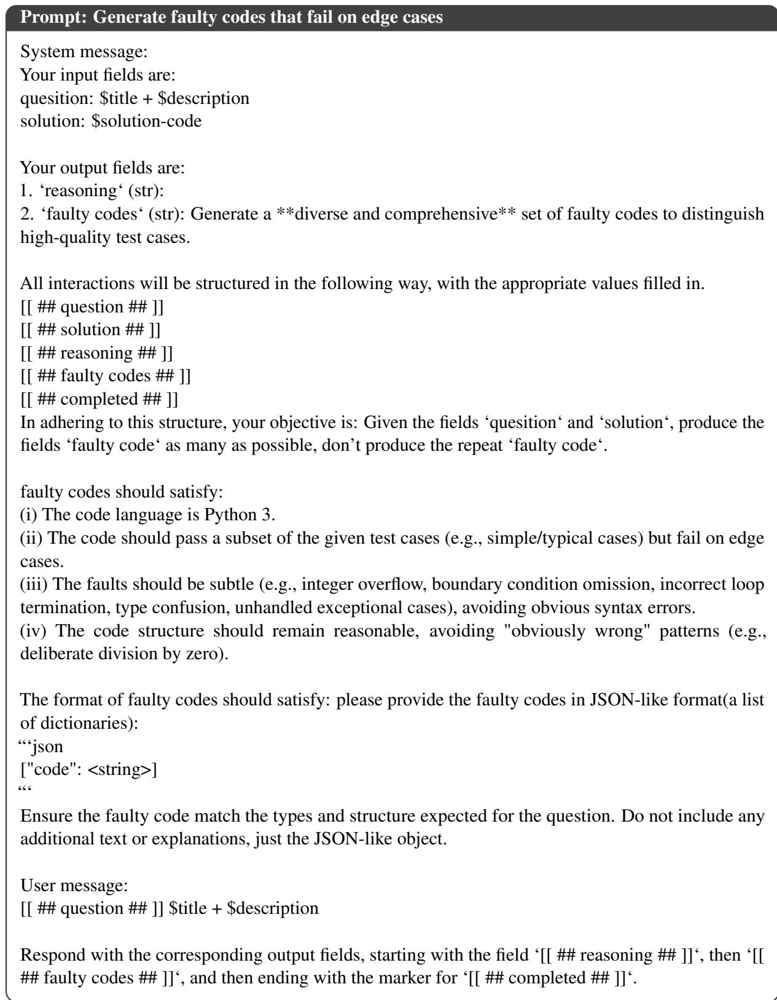  
Figure 8: One of prompts on Faulty Code Generation Stage

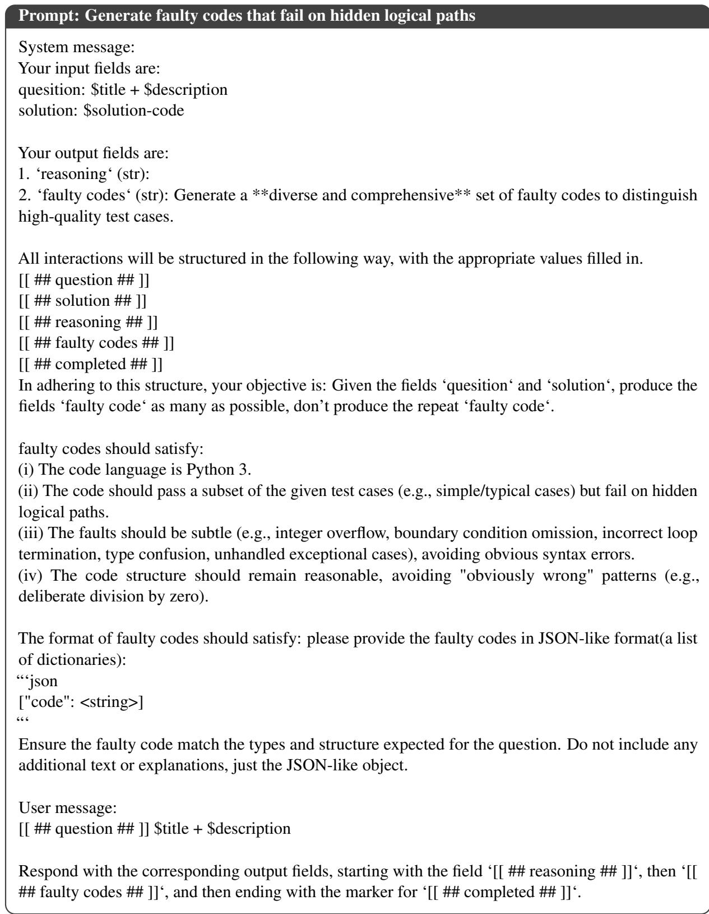  
Figure 9: One of prompts on Faulty Code Generation Stage

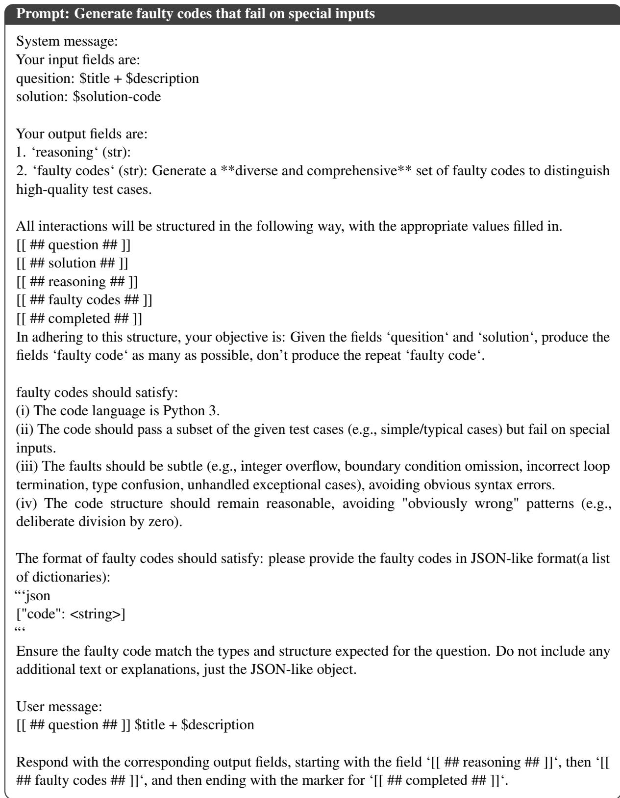  
Figure 10: One of prompts on Faulty Code Generation Stage

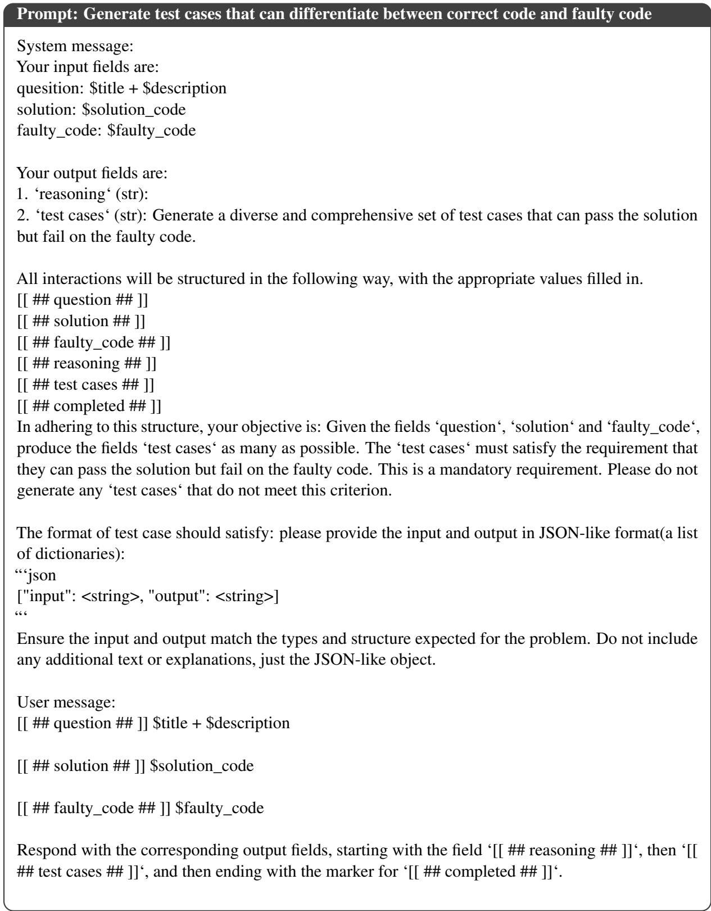  
Figure 11: Prompt on Faulty-Code-Driven Test Case Generation Stage

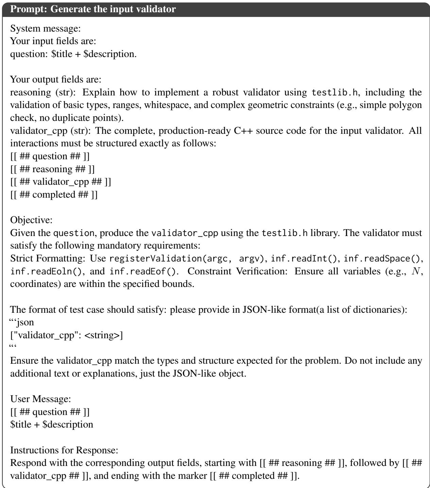  
Figure 12: Prompt on Input Validator Generation Stage