# SA-Bench: Evaluating Semantic Alignment in LLM-Based Paper Reproduction

Xue Hu<sup>∗1</sup>, Zewei Pan<sup>∗2</sup>, Zeli Su<sup>3</sup>, Zhou Liu<sup>4</sup>, Wentao Zhang<sup>†4,5,6</sup>

<sup>1</sup>Beihang University, <sup>2</sup>Shanghai Jiao Tong University, <sup>3</sup>Minzu University of China <sup>4</sup>Peking University, <sup>5</sup>Zhongguancun Academy

<sup>6</sup>Beijing Key Laboratory of Data Intelligence and Security (Peking University)

kernel@buaa.edu.cn, pzp0057@sjtu.edu.cn, rickamorty@muc.edu.cn

zhouliu25@stu.pku.edu.cn, wentao.zhang@pku.edu.cn

<sup>∗</sup>Equal contribution. <sup>†</sup>Corresponding author.

## Abstract

LLM agents can generate paper reproduction code, yet often produce scientifically unfaithful implementations. We define this failure mode as semantic drift, where generated code silently diverges from the paper’s specifications. We introduce SEMANTICALIGN-BENCH (SA-Bench), a diagnostic benchmark covering 30 papers from ICLR, ICML and NeurIPS 2025. For each paper, we decompose its specifications into atomic and verifiable implementation claims, which we call Semantic Alignment Units (SAUs) and evaluate repositories along four diagnostic dimensions spanning numerical, methodological, protocol and ordering drift. In total, we construct 1,491 SAUs across five ML domains and evaluate 12 generator configurations (4 models × 3 scaffolds). Even the strongest configuration (Claude + Paper-Coder) achieves a mean SAU score of only 0.301 out of 1.0, with an overall mean of 0.221 across 360 evaluations. A failure taxonomy reveals that agents attempt most requirements but implement them incorrectly, with implementation mismatch and stubs accounting for the majority of zero-scored claims. Our analysis further indicates that scaffolds optimized for executability provide limited leverage for scientific reproduction; narrowing the gap requires scaffolds that prioritize semantic specification verification. The benchmark, annotations and evaluation pipeline are publicly available.<sup>1</sup>

## 1 Introduction

Recent advances in coding agents have propelled their evolution from single-function completion (Chen et al., 2021; Austin et al., 2021) toward long-horizon repository generation (Jimenez et al., 2024; Liu et al., 2024b). A representative class of such tasks is NL2Repo (Ding et al., 2025), where agents generate complete repositories from natural language requirements. Paper-to-code reproduction represents a particularly demanding instance of NL2Repo, as the target repository is expected not merely to be executable, but to faithfully instantiate the scientific specifications of a paper, including its algorithmic logic, numerical details, experimental protocols, and execution order. This shifts the evaluation criterion beyond functional correctness toward semantic fidelity: whether the generated repository implements what the paper actually claims.

This fidelity requirement remains difficult to satisfy for two reasons. First, scientific papers are written to communicate findings, not to prescribe implementations: critical details are distributed across disparate sections, with the core algorithm in the method section and hyperparameters or preprocessing choices in appendix tables. Second, scientific code is intolerant of detail-level errors: a single misread formula or omitted step can fundamentally alter the implemented method, even if the resulting code remains fully executable. We refer to this failure mode, where generated code silently diverges from paper specifications, as semantic drift.

Evaluating semantic drift is uniquely challenging because paper reproduction lacks an executable ground-truth oracle. In software engineering benchmarks such as SWE-bench (Jimenez et al., 2024), functional correctness can be verified through reproducible test suites that specify expected program behavior. Scientific reproduction offers no comparable oracle: the authoritative specification is only the paper text itself, and even end-to-end outputs cannot serve as a reliable substitute, since they are confounded by random seeds, software environments, data processing choices and compute budgets. This motivates evaluation methodologies that assess semantic fidelity directly against paper specifications, rather than relying on executability or aggregate empirical outcomes.

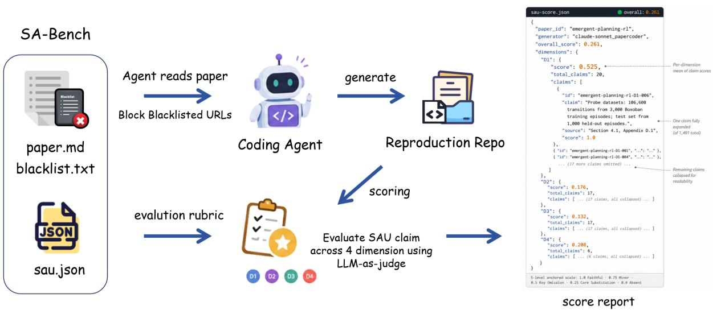  
Figure 1: Overview of SA-Bench. The benchmark consists of a curated paper collection and per-paper SAU files. Given a paper, a coding agent generates a reproduction repository, which is then scored against the paper’s SAU claims to produce a diagnostic report.

Table 1: Comparison between SA-BENCH and existing benchmarks. ✓ denotes supported; — denotes not supported.
<table><tr><td>Dimension</td><td>PaperBench</td><td>LMR-BENCH</td><td>SciReplicate</td><td>SciCoQA</td><td>SA-Bench (Ours)</td></tr><tr><td>Evaluation unit</td><td>Rubric node</td><td>Function</td><td>Function</td><td>QA pair</td><td>Claim (SAU)</td></tr><tr><td>Static evaluation</td><td>Partial*</td><td></td><td></td><td>√</td><td>√</td></tr><tr><td>Failure taxonomy</td><td></td><td></td><td></td><td>Partial†</td><td>V</td></tr><tr><td>Graded scoring</td><td>Binary</td><td>Binary</td><td>Binary</td><td>Binary</td><td>5-level rubric</td></tr></table>

<sup>\*</sup>PaperBench supports a Code-Development mode use static rubric matching. <sup>†</sup>SciCoQA’s categories describe mismatch sources, not failure diagnostic.

Existing benchmarks for paper-to-code reproduction, most notably PaperBench (Starace et al., 2025), evaluate whether generated code reproduces a paper’s results, but none offer a systematic classification of the deviation between generated code and paper specifications (Yan et al., 2025; Xiang et al., 2025; Baumgärtner and Gurevych, 2026). As a result, semantic drift remains undiagnosed when reproduction falls short. Table 1 summarizes the key differences.

To bridge these gaps, we introduce SEMANTICALIGN-BENCH (SA-Bench), a specification-grounded benchmark for diagnosing semantic drift in paper-to-code reproduction. SA-Bench evaluates semantic alignment, the faithfulness with which generated code implements a paper’s verifiable claims, at the granularity of individual Semantic Alignment Units (SAUs) without executing code. SAUs are organized into a four-category diagnostic taxonomy covering numerical, methodological, protocol and ordering drift. Repositories are scored against SAU claims using dimension-specific LLM judges on a five-level rubric, producing a diagnostic report with per-dimension scores rather than a single scalar. Figure 1 provides an overview.

We construct SA-Bench from 30 papers spanning ICLR, ICML and NeurIPS 2025 across five ML domains, yielding 1,491 human-verified SAU claims and evaluate 12 generator configurations (4 models × 3 scaffolds) for a total of 360 paper-level evaluations.

The main contributions of this work are as follows:

• We formulate semantic alignment as a measurable construct for paper-to-code reproduction, operationalized through Semantic Alignment Units (SAUs) and a four-category diagnostic taxonomy of semantic drift.

• We present SEMANTICALIGN-BENCH, a public benchmark of 30 papers with 1,491 humanverified SAU claims, paired with an automated multi-agent scoring pipeline that enables scalable evaluation.

• We find that semantic drift is systematic across all tested configurations, and that scaffolds optimized for executability provide limited leverage for scientific reproduction, indicating that semantic specification verification is a critical direction for paper-to-code agents.

## 2 Related Work

Paper-to-code generation. Paper-to-code reproduction is a specialized subclass of NL2Repo (Ding et al., 2025). The task asks an agent to read a research paper and produce an executable repository that implements the paper. PaperCoder (Seo et al., 2026) decomposes the task into planning, analysis and coding stages across three agent roles. Re-Pro (Zhou et al., 2025) introduces atomic verifiable criteria with reflective self-correction at each reproduction step. AutoP2C (Lin et al., 2025b) structures reproduction as a paper-understanding stage feeding code generation, and Lin et al. (Lin et al., 2025a) explore prompt-free collaborative multi-agent reproduction. As generation methods improve, rigorous evaluation of the resulting code becomes the bottleneck.

Benchmarks for paper-to-code evaluation. Several benchmarks measure paper-to-code reproduction quality. PaperBench (Starace et al., 2025) decomposes 20 ICML 2024 papers into authorco-developed rubric trees scored by an LLM judge against agent-generated repositories. LMR-BENCH (Yan et al., 2025) and SciReplicate-Bench (Xiang et al., 2025) evaluate function-level reproduction by executing unit tests on agentimplemented functions extracted from research papers; SciCode (Tian et al., 2024) extends this to complex scientific algorithms. PRBench (Qiu et al., 2026) broadens reproduction evaluation to physics research. CORE-Bench (Siegel et al., 2024) measures computational reproducibility by requiring agents to re-execute author-released code and recover reported results. SciCoQA (Baumgärtner and Gurevych, 2026) formulates paper–code alignment as a question-answering task. These benchmarks measure whether reproduction succeeds and produce pass/fail or scalar scores at the document or function level. None offer a systematic classification of the deviations between generated code and paper specifications, leaving semantic drift undiagnosed when reproduction fails.

SA-Bench addresses this gap by evaluating reproduction at the granularity of individual implementation claims (Semantic Alignment Units), scoring each on a five-level rubric and mapping deviations to a four-category drift taxonomy. Table 1 positions SA-Bench against existing benchmarks. This work connects to the broader literature on semantic drift in long-form generation (Spataru et al., 2024), goal drift and degradation in coding agents (Saebo et al., 2026; Orlanski et al., 2026), and LLM-based code evaluation (Tong and Zhang, 2024; Fan et al., 2024; Li et al., 2025).

## 3 SemanticAlign-Bench

We formalize semantic alignment evaluation as a static, claim-level scoring problem and describe how SEMANTICALIGN-BENCH (SA-Bench) instantiates it: we define the task (§3.1), describe paper selection (§3.2), introduce the SAU framework and drift taxonomy (§3.3) and present the extraction and judging pipelines (§3.4–§3.5).

## 3.1 Task Formulation

The input is a research paper P and an agentgenerated code repository R purporting to reproduce P. The output is a paper-level Semantic Alignment Score with per-claim diagnostic judgments: for each verifiable implementation claim extracted from P, we report whether R faithfully realizes it and, if not, what failure occurred. The scoring process is static: it inspects paper text and code text without executing R, isolating semantic fidelity from environmental factors.

## 3.2 Paper Selection

SA-Bench comprises 30 papers from NeurIPS, ICML and ICLR 2025, spanning five domains and six research paradigms. The full paper list with venue, SAU counts, paradigm labels and perdimension breakdown is in Appendix A.

## 3.3 Design

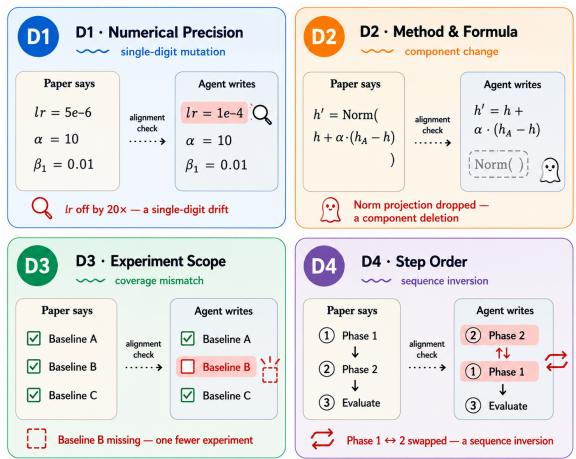  
Figure 2: Four diagnostic dimensions of semantic drift.

A Semantic Alignment Unit (SAU) is an atomic implementation claim extracted from P. Each SAU satisfies three properties: (1) Localizable to a concrete paper source span; (2) Verifiable by static code inspection; (3) Atomic, describing a single independently assessable implementation decision.

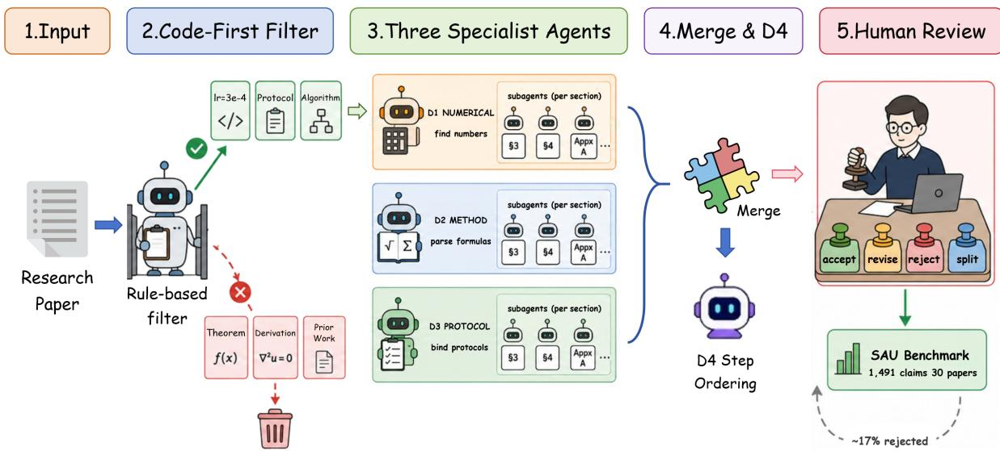  
Figure 3: SA-Bench construction pipeline. A code-first filter separates implementable content from theoretical discussion; three specialized agents (D1 Numerical, D2 Method, D3 Protocol) extract SAU claims in parallel with per-section spawning to avoid attention collapse. D4 claims are derived from D2/D3 ordering annotations during a merge phase. All claims undergo mandatory human review before inclusion in the benchmark.

Full annotation schema and examples are in Appendix B.1.

Drift taxonomy. We categorize deviations from faithful implementation into four diagnostic types, derived from a pilot study on PaperBenchdev (Starace et al., 2025), detailed in Appendix C. Each type names the kind of paper specification the agent misreads, ordered from value-level to procedural-level:

• D1 (Numerical Precision): hyperparameters, thresholds, or architectural dimensions.

• D2 (Method / Formula): algorithm steps, equations, or component interfaces added, deleted, or replaced.

• D3 (Experimental Protocol): datasets, baselines, metrics, or ablations added or omitted.

• D4 (Step Ordering): phase sequences or pipeline steps transposed or merged, restricted to explicitly stated ordering constraints.

D1–D4 provide a systematic classification of the deviations themselves, as Figure 2 illustrates.

## 3.4 SAU Extraction

Extracting SAU claims from a 20–40 page paper faces two obstacles: a single LLM pass over the full paper suffers attention decay (Liu et al., 2024a; Bai et al., 2024) and paper text entangles specifications, derivations and experimental results, while much of this content does not require code implementation and is redundant for our task. We operationalize extraction as a structured prompt-driven agent pipeline followed by human review; Figure 3 illustrates the full workflow.

Pipeline. As shown in Figure 3, the pipeline has four stages. A code-first filter first removes nonimplementable content without invoking an LLM. Three specialist agents then process the paper in parallel under dimension-specific prompts, each dispatching per-section sub-agents that read 1–3 sections at a time to avoid long-context attention decay. A final merge stage deduplicates outputs and derives D4 step-ordering claims from annotations recorded by D2/D3, rather than from a separate extraction pass. Per-agent prompts, decision trees and the merge protocol are in Appendix D.

Human review. The pipeline favors recall over precision and relies on human reviewers to filter and refine the extracted candidates. Reviewers check each candidate against four criteria: contribution relevance, drift type correctness, granularity and source precision.

They may accept, revise, reject, or split a claim; every action is recorded with reasoning in a perpaper review log. Across all 30 papers, approximately 17% of agent-extracted candidates are rejected and many more are revised. Review outcomes include acceptance, revision or retyping, rejection or deletion, merging or splitting, and addition of missed claims. The rejected and modified candidates follow four recurring patterns: priorwork contamination, where implementation details of cited methods are mistaken for the target paper’s contribution; result-value extraction, where reported outcomes are treated as implementation requirements; D1–D4 type confusion, where architecture or training decisions receive the wrong drift label; and over-splitting, where coupled components are fragmented into claims that are not independently implementable. The review log records these actions with reviewer rationales; representative examples and per-paper statistics are provided in Appendix E. The final benchmark contains 1,491 SAU claims across 30 papers.

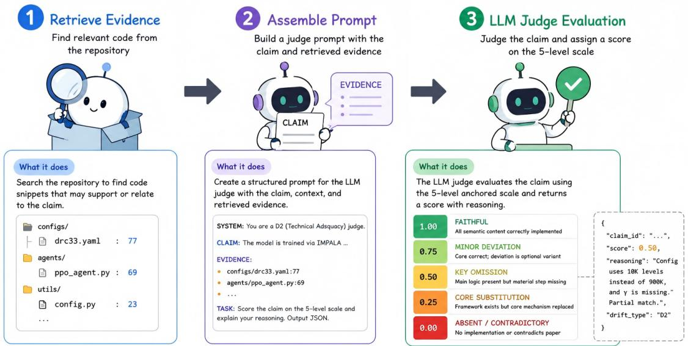  
Figure 4: Example SAU scoring output for a single claim (D1-006, emergent-planning-rl). The judge outputs structured JSON with claim-level scores, cited evidence with file:line references and per-dimension aggregates. Full judge prompt templates are in Appendix F.

Table 2: Five-level scoring rubric.
<table><tr><td>Score</td><td>Label</td><td>Criterion</td></tr><tr><td>1.0</td><td>Faithful</td><td>All semantic content correctly implemented.</td></tr><tr><td>0.75</td><td>Minor deviation</td><td>Core correct; deviation is an optimization variant or imple-</td></tr><tr><td>0.5</td><td>Key omission</td><td>mentation detail. Main logic present but a ma- terial step or component miss-</td></tr><tr><td>0.25</td><td>Core substitution</td><td>ing. Core mechanism replaced by a different approach.</td></tr><tr><td>0</td><td>Absent</td><td>No implementation or logic di- rectly contradicts paper.</td></tr></table>

## 3.5 Judge Scoring

Scoring protocol. We score each SAU on the fivelevel rubric in Table 2; detailed examples with pertype calibration are in Appendix G.

The paper-level SAS is the mean of individual

SAU scores:

$$
\operatorname { S A S } ( P , R ) = { \frac { 1 } { | S ( P ) | } } \sum _ { s \in S ( P ) } \operatorname { s c o r e } ( s , R )
$$

where score $( s , R ) \in \{ 0 , 0 . 2 5 , 0 . 5 , 0 . 7 5 , 1 . 0 \}$ and S(P) includes all D1–D4 claims, with D4 scored using the same rubric as the other dimensions. We additionally report per-type averages SAS<sub>D1</sub>, . . ., $\mathrm { S A S _ { D 4 } }$ for diagnostic comparison.

Pipeline. Figure 4 illustrates the scoring workflow. The judge (GPT-5.5) searches the repository for evidence matching each SAU claim, filters out claims with no code-level support and scores the remainder using dimension-specific prompts. Each scored claim is accompanied by a structured explanation of the observed alignment or deviation.

Judge correctness. To assess scoring reliability, we randomly sampled 200 claims across all dimensions and generators and manually verified each score against the evidence. The judge’s score matched the human assessment in ∼87% of cases. Disagreements concentrated in D2 claims where the boundary between “core mechanism present but incomplete” (0.5) and “core mechanism missing” (0.25) is ambiguous. Full rubric tables and scoring examples are in Appendix G; the complete judge output schema is in Appendix G.1.

## 4 Evaluation Setup

We evaluate 12 generator configurations (4 models × 3 scaffolds) over all 30 papers, yielding 360 paper-level evaluations and enabling joint analysis of model capability and scaffold strategy on semantic alignment.

Models. We use Claude-Sonnet-4.6 (Anthropic, 2026)<sup>2</sup>, DeepSeek-V4-Pro (DeepSeek-AI, 2026)<sup>3</sup>, Gemini-2.5-Flash (Gemini Team, 2025)<sup>4</sup> and GPT-4o (OpenAI, 2024)<sup>5</sup>, covering four model families spanning multiple capability tiers; all share the same tool interface and identical paper inputs.

Scaffolds. We compare three scaffolds representing distinct agent paradigms: a minimal ReAct baseline, a dedicated paper-to-code pipeline and a software-engineering execution scaffold.

BasicAgent, following the design in Starace et al. (2025), is a minimal ReAct loop with shell, local file read and local-file regex search tools.

PaperCoder (Seo et al., 2026) is a dedicated paper2code framework with a three role pipeline consisting of planning, analysis and coding.

OpenHands (Wang et al., 2025) is a widelyused software-engineering scaffold with a CodeAct execution-feedback loop consisting of action, execution and observation over shell and file-editor tools. Per-scaffold hyperparameters and tool inventories are listed in Appendix H.

Protocol. Each (paper, repository) pair is scored by the SAU scoring pipeline of Section 3.5 with GPT-5.5 (OpenAI, 2026)<sup>6</sup> as judge to prevent selfevaluation bias. The primary metric is paperlevel SAS; diagnostic metrics include per-type subscores $\mathrm { S A S } _ { \mathrm { D 1 } } { - } \mathrm { S A S } _ { \mathrm { D 4 } }$ and a zero-score decomposition.

## 5 Results and Analysis

We report results from 360 paper-level evaluations across 12 generators and 30 papers, totaling 17,892 claim-level judgments.

## 5.1 Overall Performance

Performance is uniformly low: the overall SAS mean across all 360 evaluations is 0.221, with median 0.237. The best single configuration, Claude-Sonnet-4.6 + PaperCoder, reaches 0.301. Figure 5 shows the per-paper score distribution. Full perconfiguration scores are in Appendix I.

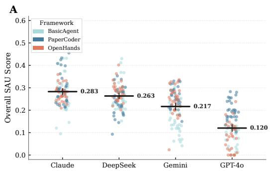

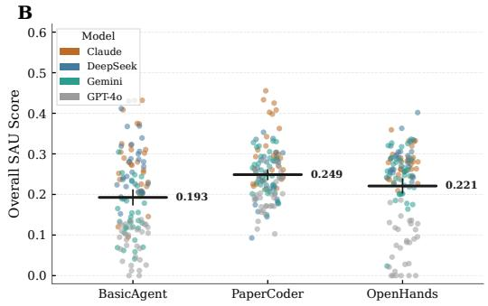  
Figure 5: Overall SAS distribution by model and scaffold. Each dot is one paper; crossbars show mean ± 95% CI.

Model choice outweighs scaffold choice on average, but the pattern is not uniform. The top five configurations all use Claude or DeepSeek; GPT-4o + PaperCoder scores 0.197, below every Claude/DeepSeek configuration. Scaffold benefit varies with base capability, as Table 3 shows: PaperCoder helps weaker models most and saturates for stronger ones, with DeepSeek a slight regression. OpenHands shows a notable gain only on Gemini (+0.093) with minimal effect elsewhere (≤+0.014). For PaperCoder, the trend is clearer: benefit decreases as base capability increases. GPT-4o and Gemini have low bare baselines; without scaffolding, they struggle to structure the task. PaperCoder’s analyze-then-code template compensates for this gap, yielding large gains. Claude and DeepSeek already score well without scaffolding: they natively extract specifications, plan implementations and write code aligned to paper content. A fixed pipeline instead crowds out their own effective strategies.

Table 3: Mean SAS per model and scaffold. Deltas relative to BasicAgent: red = gain, green = regression.
<table><tr><td>Model</td><td>BasicAgent</td><td>PaperCoder</td><td>OpenHands</td></tr><tr><td>Claude-Sonnet-4.6</td><td>0.272</td><td> $0 . 3 0 1 \ ( + 0 . 0 2 9 )$ </td><td> $0 . 2 7 7 \ ( + 0 . 0 0 5 )$ </td></tr><tr><td>DeepSeek-V4-Pro</td><td>0.268</td><td> $0 . 2 4 1 \ ( - 0 . 0 2 7 )$ </td><td> $0 . 2 8 2 \ ( + 0 . 0 1 4 )$ </td></tr><tr><td>Gemini-2.5-Flash</td><td>0.150</td><td> $0 . 2 5 6 \ ( + 0 . 1 0 6 )$ </td><td> $0 . 2 4 3 \ ( + 0 . 0 9 3 )$ </td></tr><tr><td>GPT-40</td><td>0.081</td><td> $0 . 1 9 7 \ ( + 0 . 1 1 6 )$ </td><td> $0 . 0 8 2 \ : ( + 0 . 0 0 1 )$ </td></tr></table>

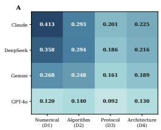

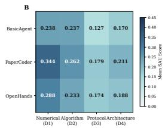  
Figure 6: Per-dimension mean SAU score heatmaps

## 5.2 Dimension Hierarchy

The D1 $> \mathrm { D } 2 > \mathrm { D } 4 > \mathrm { D } 3$ ordering holds across all 12 configurations and is universal across models and scaffolds (full statistics in Table 16). The hierarchy tracks the size of what each claim demands: D1 asks for a single value, trivially copyable; D2 asks for a formula or algorithm step, implementable within a few lines; D4 asks for a pipeline ordering, satisfiable as long as the sequence is right; D3 asks for a full component (a baseline, a dataset loader, an evaluation protocol), each comprising multiple sub-decisions that must all be correct. Each additional D3 constraint compounds the burden: with more pieces that can go wrong, the probability of a perfect implementation drops, producing the universal bottleneck at D3.

## 5.3 Domain and Paradigm Analysis

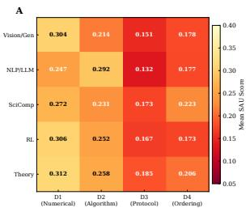

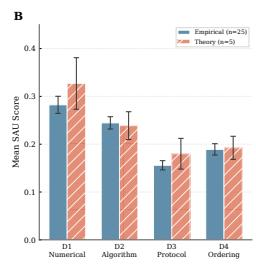  
Figure 7: Domain × Dimension heatmap of mean SAU scores across all 12 generator configurations.

Figure 7 shows the domain × dimension breakdown. The cross-domain spread in overall SAS is 0.030, modest relative to the 0.219 gap between best and worst configurations: generator quality dominates domain effects.

Domain differences are dimension-specific. NLP/LLM leads on D2, consistent with explicit pseudocode and equation blocks common in language modeling. Probabilistic Inference/Generative Models leads on D1, reflecting detailed hyperparameter tables for sampling and training. Computer Vision trails on D3 and D4, where multi-stage training protocols are hard to recover from prose.

Across paradigms, the spread is similarly narrow. One asymmetry worth noting: Empirical Comparison papers attain strong D2 scores because they recite existing methods with explicit formula blocks, yet their D3 scores are among the lowest as protocol details are spread across appendices. Full per-paradigm scores are in Table 15.

## 5.4 Where Zero Scores Come From

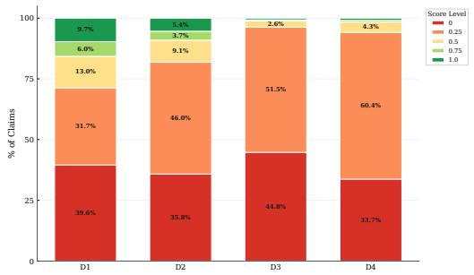  
Figure 8: Score-level distribution of all 17,892 claim judgments

Figure 8 shows the full score distribution. To examine where zero scores come from, we classify all 7,034 zero-scored claims by keyword-matching the judge’s natural-language reasoning against a small lexicon defined in Appendix J.

Three categories cover the bulk of zero-scored claims:

1. Implementation mismatch, 40.8%. The judge located code referencing the claim’s keywords, but determined the implementation does not match the specified content: the agent wrote something unrelated under recognizable names.

2. Stub or placeholder, 16.2%. Evidence exists but is a stub, a TODO, or a pass statement: the agent acknowledged the requirement but deferred implementation.

3. External knowledge gap, 8.0%. The claim requires implementing a standard baseline like PPO or loading a benchmark dataset like MOSE, which the paper names but does not define.

A finer-grained six-type taxonomy with examples is provided in Appendix J, covering token mention only, wrong implementation, missing component and unclassified cases.

Table 4: Marginal means by model and scaffold across all four drift dimensions. Model range: 0.120–0.283; scaffold range: 0.193–0.249.
<table><tr><td>Factor</td><td>Overall</td><td>D1</td><td>D2</td><td>D3</td><td>D4</td></tr><tr><td colspan="6">By Model</td></tr><tr><td>Claude-Sonnet-4.6</td><td>0.283</td><td>0.413</td><td>0.293</td><td>0.201</td><td>0.225</td></tr><tr><td>DeepSeek-V4-Pro</td><td>0.263</td><td>0.358</td><td>0.294</td><td>0.186</td><td>0.216</td></tr><tr><td>Gemini-2.5-Flash</td><td>0.217</td><td>0.268</td><td>0.248</td><td>0.161</td><td>0.189</td></tr><tr><td>GPT-40</td><td>0.120</td><td>0.120</td><td>0.140</td><td>0.092</td><td>0.130</td></tr><tr><td colspan="6">By Scaffold</td></tr><tr><td>PaperCoder</td><td>0.249</td><td>0.344</td><td>0.262</td><td>0.179</td><td>0.211</td></tr><tr><td>OpenHands</td><td>0.221</td><td>0.288</td><td>0.233</td><td>0.174</td><td>0.188</td></tr><tr><td>BasicAgent</td><td>0.193</td><td>0.238</td><td>0.237</td><td>0.127</td><td>0.170</td></tr></table>

Table 5: Mean SAS for all 12 generator configurations, grouped by scaffold. Bold marks the best score per column; underline marks the second best.
<table><tr><td>Scaffold</td><td>Model</td><td>Overall</td><td>D1</td><td>D2</td><td>D3</td><td>D4</td></tr><tr><td rowspan="4">BasicAgent</td><td>Claude-Sonnet-4.6</td><td>0.272</td><td>0.391</td><td>0.307</td><td>0.169</td><td>0.219</td></tr><tr><td>DeepSeek-V4-Pro</td><td>0.268</td><td>0.379</td><td>0.308</td><td>0.180</td><td>0.204</td></tr><tr><td>Gemini-2.5-Flash</td><td>0.150</td><td>0.134</td><td>0.210</td><td>0.099</td><td>0.158</td></tr><tr><td>GPT-40</td><td>0.081</td><td>0.047</td><td>0.121</td><td>0.058</td><td>0.100</td></tr><tr><td rowspan="4">PaperCoder</td><td>Claude-Sonnet-4.6</td><td>0.301</td><td>0.470</td><td>0.299</td><td>0.209</td><td>0.226</td></tr><tr><td>DeepSeek-V4-Pro</td><td>0.241</td><td>0.339</td><td>0.278</td><td>0.148</td><td>0.200</td></tr><tr><td>Gemini-2.5-Flash</td><td>0.256</td><td>0.335</td><td>0.270</td><td>0.198</td><td>0.222</td></tr><tr><td>GPT-40</td><td>0.198</td><td>0.231</td><td>0.200</td><td>0.163</td><td>0.197</td></tr><tr><td rowspan="4">OpenHands</td><td>Claude-Sonnet-4.6</td><td>0.276</td><td>0.379</td><td>0.272</td><td>0.224</td><td>0.229</td></tr><tr><td>DeepSeek-V4-Pro</td><td>0.282</td><td>0.357</td><td>0.297</td><td>0.229</td><td>0.244</td></tr><tr><td>Gemini-2.5-Flash</td><td>0.243</td><td>0.335</td><td>0.264</td><td>0.187</td><td>0.187</td></tr><tr><td>GPT-40</td><td>0.082</td><td>0.082</td><td>0.098</td><td>0.056</td><td>0.093</td></tr><tr><td>Mean</td><td></td><td>0.221</td><td>0.290</td><td>0.244</td><td>0.160</td><td>0.190</td></tr></table>

## 5.5 Discussion: Why Scaffolds Underperform and What to Build Next

Existing scaffolds optimize for the wrong signal. OpenHands uses CodeAct: the agent writes code, executes it, observes test failures and stack traces and iterates. This loop is coupled to executability. On SWE-Bench (Jimenez et al., 2024), where the task is fixing bugs in an existing codebase, execution feedback is directly aligned with the goal. On SA-Bench, code can execute cleanly while implementing the wrong algorithm.

PaperCoder separates paper analysis from code generation, which helps ground code in paper specifications. However, it remains a one-pass pipeline: the reviewer checks code quality but does not verify that the generated code faithfully implements the extracted specifications. Without a semantic verification loop, its gains are inherently bounded. Together, these observations suggest that semantic specification verification is a key direction for narrowing the semantic-alignment gap in future paper-to-code agents.

## 6 Conclusion

We introduce SEMANTICALIGN-BENCH, a diagnostic benchmark that evaluates whether agentgenerated code faithfully implements a paper’s specifications, with a human-verified multi-agent pipeline producing 1,491 Semantic Alignment Units (SAUs) across 30 papers from five ML domains. Across 360 evaluations spanning four models and three scaffolds, semantic drift is systematic (mean SAS 0.221) and the best configuration reaches only 0.301. A failure taxonomy reveals that agents attempt most requirements but implement them incorrectly, with implementation mismatch and stubs accounting for the majority of zero-scored claims. Our analysis indicates that, for capable base models, scaffolds designed for general software engineering provide limited leverage for scientific reproduction, where executability alone is insufficient; closing the gap requires scaffolds that prioritize semantic specification verification.

## 7 Limitations

Annotation cost. Ensuring SAU claim fidelity requires expert review against paper sources, which limits scalability. While the multi-agent extraction pipeline reduces manual effort, developing automatic or semi-automatic verification mechanisms would enable broader benchmark coverage.

Domain scope. SA-Bench focuses on 30 papers from ICLR, ICML and NeurIPS 2025 across five ML domains. Findings may not directly generalize to other fields such as biomedicine or theoretical disciplines. Extending to these settings requires new paper curation and domain-specific adaptation of the extraction pipeline, as code implementation patterns differ across fields.

## References

Anthropic. 2026. Claude Sonnet 4.6. https://www. anthropic.com/claude/sonnet. Accessed: 2026- 05-21.

Jacob Austin, Augustus Odena, Maxwell Nye, Maarten Bosma, Henryk Michalewski, David Dohan, Ellen Jiang, Carrie Cai, Michael Terry, Quoc Le, and Charles Sutton. 2021. Program synthesis with large language models. arXiv preprint arXiv:2108.07732.

Yushi Bai, Xin Lv, Jiajie Zhang, Hongchang Lyu, Jiankai Tang, Zhidian Huang, Zhengxiao Du, Xiao Liu, Aohan Zeng, Lei Hou, Yuxiao Dong, Jie Tang, and Juanzi Li. 2024. LongBench: A bilingual, multitask benchmark for long context understanding. In Annual Meeting ofthe Associationfor Computational Linguistics (ACL).

Tim Baumgärtner and Iryna Gurevych. 2026. SciCoQA: Quality assurance for scientific paper–code alignment. arXiv preprint arXiv:2601.12910.

Mark Chen, Jerry Tworek, Heewoo Jun, Qiming Yuan, Henrique Pondé de Oliveira Pinto, Jared Kaplan, Harri Edwards, Yuri Burda, Nicholas Joseph, Greg Brockman, Alex Ray, Raul Puri, Gretchen Krueger, Michael Petrov, Heidy Khlaaf, Girish Sastry, Pamela Mishkin, Brooke Chan, Scott Gray, and 39 others. 2021. Evaluating large language models trained on code. arXiv preprint arXiv:2107.03374.

DeepSeek-AI. 2026. DeepSeek-V4-Pro preview release. https://api-docs.deepseek.com/news/ news260424. Accessed: 2026-05-21.

Jingzhe Ding, Shengda Long, Changxin Pu, Huan Zhou, Hongwan Gao, Xiang Gao, Chao He, Yue Hou, Fei Hu, Zhaojian Li, Weiran Shi, Zaiyuan Wang, Daoguang Zan, Chenchen Zhang, Xiaoxu Zhang, Qizhi Chen, Xianfu Cheng, Bo Deng, Qingshui Gu, and 30 others. 2025. NL2Repo-Bench: Towards long-horizon repository generation evaluation of coding agents. arXiv preprint arXiv:2512.12730.

Zhiyuan Fan, Weinong Wang, Xing Wu, and Debing Zhang. 2024. SedarEval: Automated evaluation using self-adaptive rubrics. In Findings of the Associationfor Computational Linguistics: EMNLP 2024. ArXiv:2501.15595.

Gemini Team. 2025. Gemini 2.5: Pushing the frontier with advanced reasoning, multimodality, long context, and next generation agentic capabilities. arXiv preprint arXiv:2507.06261.

Carlos E. Jimenez, John Yang, Alexander Wettig, Shunyu Yao, Kexin Pei, Ofir Press, and Karthik Narasimhan. 2024. SWE-bench: Can language models resolve real-world GitHub issues? arXiv preprint arXiv:2310.06770.

Dawei Li, Bohan Jiang, Liangjie Huang, Alimohammad Beigi, Chengshuai Zhao, Zhen Tan, Amrita Bhattacharjee, Yuxuan Jiang, Canyu Chen, Tianhao Wu,

Kai Shu, Lu Cheng, and Huan Liu. 2025. From generation to judgment: Opportunities and challenges of LLM-as-a-judge. arXiv preprint arXiv:2411.16594.

Zijie Lin, Qilin Cai, Liang Shen, and Mingjun Xiao. 2025a. Enhancing automated paper reproduction via prompt-free collaborative agents. arXiv preprint arXiv:2512.02812.

Zijie Lin, Yiqing Shen, Qilin Cai, He Sun, Jinrui Zhou, and Mingjun Xiao. 2025b. AutoP2C: An LLMbased agent framework for code repository generation from multimodal content in academic papers. arXiv preprint arXiv:2504.20115.

Nelson F. Liu, Kevin Lin, John Hewitt, Ashwin Paranjape, Michele Bevilacqua, Fabio Petroni, and Percy Liang. 2024a. Lost in the middle: How language models use long contexts. Transactions of the Association for Computational Linguistics, 12.

Tianyang Liu, Canwen Xu, and Julian McAuley. 2024b. RepoBench: Benchmarking repository-level code auto-completion systems. In International Conference on Learning Representations (ICLR). ArXiv:2306.03091.

Kyle Lo, Lucy Lu Wang, Mark Neumann, Rodney Kinney, and Daniel S. Weld. 2020. S2ORC: The semantic scholar open research corpus. In Proceedings of the 58th Annual Meeting of the Association for Computational Linguistics (ACL). ArXiv:1911.02782.

OpenAI. 2024. GPT-4o system card. arXiv preprint arXiv:2410.21276.

OpenAI. 2026. Introducing GPT-5.5. https:// openai.com/index/introducing-gpt-5-5/. Accessed: 2026-05-21.

Gabriel Orlanski, Devjeet Roy, Alexander Yun, Changho Shin, Alex Gu, Albert Ge, Dyah Adila, Nicholas Roberts, Frederic Sala, and Aws Albarghouthi. 2026. SlopCodeBench: Benchmarking how coding agents degrade over long-horizon iterative tasks. arXiv preprint arXiv:2603.24755.

Shi Qiu, Junyi Deng, Yiwei Deng, Haoran Dong, Jieyu Fu, Mao Li, Zeyu Li, Zhaolong Zhang, Huiwen Zheng, Leidong Bao, Anqi Lv, Zihan Mo, Yadi Niu, Yiyang Peng, Yu Tian, Yili Wang, Ziyu Wang, Zi-Yu Wang, Jiashen Wei, and 32 others. 2026. PRBench: End-to-end paper reproduction in physics research. arXiv preprint arXiv:2603.27646.

Magnus Saebo, Spencer J. Gibson, Tyler Crosse, Achyutha Menon, Eyon Jang, and Diogo Cruz. 2026. Asymmetric goal drift in coding agents under value conflict. arXiv preprint arXiv:2603.03456.

Minju Seo, Jinheon Baek, Seongyun Lee, and Sung Ju Hwang. 2026. Paper2Code: Automating code generation from scientific papers in machine learning. In International Conference on Learning Representa tions (ICLR). ArXiv:2504.17192.

Zachary S. Siegel, Sayash Kapoor, Nitya Nadgir, Benedikt Ströbl, and Arvind Narayanan. 2024. CORE-Bench: Fostering the credibility of published research through a computational reproducibility agent benchmark. arXiv preprint arXiv:2409.11363.

Ava Spataru, Eric Hambro, Elena Voita, and Nicola Cancedda. 2024. Know when to stop: A study of semantic drift in text generation. In Proceedings of the 2024 Conference of the North American Chapter of the Association for Computational Linguistics: Human Language Technologies (Volume 1: Long Papers). NAACL 2024.

Giulio Starace, Oliver Jaffe, Dane Sherburn, James Aung, Jun Shern Chan, Leon Maksin, Rachel Dias, Evan Mays, Benjamin Kinsella, Wyatt Thompson, Johannes Heidecke, Amelia Glaese, and Tejal Patwardhan. 2025. PaperBench: Evaluating AI’s ability to replicate AI research. In Proceedings of the 42nd International Conference on Machine Learning (ICML). ArXiv:2504.01848.

Minyang Tian, Luyu Gao, Shizhuo Dylan Zhang, Xinan Chen, Cunwei Fan, Xuefei Guo, Roland Haas, Pan Ji, Kittithat Krongchon, Yao Li, Shengyan Liu, Di Luo, Yutao Ma, Hao Tong, Kha Trinh, Chenyu Tian, Zihan Wang, Bohao Wu, Yanyu Xiong, and 11 others. 2024. SciCode: A research coding benchmark curated by scientists. In Advances in Neural Information Processing Systems (NeurIPS). ArXiv:2407.13168.

Weixi Tong and Tianyi Zhang. 2024. CodeJudge: Evaluating code generation with large language models. In Proceedings of the 2024 Conference on Empirical Methods in Natural Language Processing (EMNLP). ArXiv:2410.02184.

Bin Wang, Chao Xu, Xiaomeng Zhao, Linke Ouyang, Fan Wu, Zhiyuan Zhao, Rui Xu, Kaiwen Liu, Yuan Qu, Fukai Shang, Bo Zhang, Liqun Wei, Zhihao Sui, Wei Li, Botian Shi, Yu Qiao, Dahua Lin, and Conghui He. 2024. MinerU: An opensource solution for precise document content extraction. https://github.com/opendatalab/MinerU. ArXiv:2409.18839; software v2.7.6 used in this work.

Xingyao Wang, Boxuan Li, Yufan Song, Frank F. Xu, Xiangru Tang, Mingchen Zhuge, Jiayi Pan, Yueqi Song, Bowen Li, Jaskirat Singh, Hoang H. Tran, Fuqiang Li, Ren Ma, Mingzhang Zheng, Bill Qian, Yanjun Shao, Niklas Muennighoff, Yizhe Zhang, Binyuan Hui, and 5 others. 2025. OpenHands: An open platform for AI software developers as generalist agents. In International Conference on Learning Representations (ICLR). ArXiv:2407.16741.

Yanzheng Xiang, Hanqi Yan, Shuyin Ouyang, Lin Gui, and Yulan He. 2025. SciReplicate-Bench: Benchmarking LLMs in agent-driven algorithmic reproduction from research papers. arXiv preprint arXiv:2504.00255.

Shuo Yan, Ruochen Li, Ziming Luo, Zimu Wang, Daoyang Li, Liqiang Jing, Kaiyu He, Peilin Wu, Juntong Ni, George Michalopoulos, Yue Zhang, Ziyang Zhang, Mian Zhang, Zhiyu Chen, and Xinya Du. 2025. LMR-BENCH: Evaluating LLM agent’s ability on reproducing language modeling research. In Proceedings of the 2025 Conference on Empirical Methods in Natural Language Processing (EMNLP), pages 6164–6186. ArXiv:2506.17335.

Mingyang Zhou, Quanming Yao, Lun Du, Lanning Wei, and Da Zheng. 2025. RePro: Reflective paper-tocode reproduction enabled by fine-grained verification. arXiv preprint arXiv:2508.16671.

## A Benchmark Paper List

Table 6 lists all 30 papers in SEMANTICALIGN-BENCH with their venue, total SAU count and per-type breakdown.

Table 6: Full benchmark paper list with SAU counts by drift type.
<table><tr><td>Paper ID</td><td></td><td>Total</td><td>D1</td><td>D2</td><td>D3</td><td>D4</td></tr><tr><td>adjoint-matching</td><td>Adjoint Matching: Fine-tuning Flow and Diffusion Genera- ICLR 2025 tive Models with Memoryless Stochastic Optimal Control</td><td>47</td><td>17</td><td>20</td><td>7</td><td>3</td></tr><tr><td>avg-reward-pg</td><td>Global Convergence of Policy Gradient in Average Reward ICLR 2025</td><td>22</td><td>9</td><td>7</td><td>3</td><td>3</td></tr><tr><td>ca2-vdm</td><td>MDPs Ca2-VDM: Efficient Autoregressive Video Diffusion ICML 2025</td><td>48</td><td>22</td><td>10</td><td>8</td><td>8</td></tr><tr><td>cara</td><td>Model with Causal Generation and Cache Sharing Canonical Rank Adaptation: An Efficient Fine-Tuning ICML 2025</td><td>41</td><td>19</td><td>11</td><td>10</td><td>1</td></tr><tr><td>conformal-</td><td>Strategy for Vision Transformers Conformal Prediction as Bayesian Quadrature</td><td>ICML 2025 38</td><td>25</td><td>6</td><td>3</td><td>4</td></tr><tr><td>bayesian- quadrature</td><td></td><td></td><td></td><td></td><td></td><td></td></tr><tr><td>diffusion-</td><td>Instance-dependent Convergence Theory for Diffusion ICLR 2025 Models</td><td>42</td><td>22</td><td>12</td><td>4</td><td>4</td></tr><tr><td>convergence-rate emergent-</td><td>Interpreting Emergent Planning in Model-Free Reinforce- ICLR 2025</td><td>60</td><td>20</td><td>17</td><td>17</td><td>6</td></tr><tr><td>planning-rl gated-attention-</td><td>ment Learning Gated Attention for Large Language Models NeurIPS 2025</td><td>61</td><td>15</td><td>19</td><td>17</td><td>10</td></tr><tr><td>llm generator-</td><td>Improving Consistency Models with Generator-Augmented ICML 2025</td><td>54</td><td>14</td><td>26</td><td>12</td><td>2</td></tr><tr><td>augmented-flows</td><td>Flows Hierarchical Masked Autoregressive Models with Low- ICML 2025</td><td>50</td><td>28</td><td></td><td>6</td><td>4</td></tr><tr><td>hi-mar</td><td>Resolution Token Pivots Initialization Using Update Approximation is a Silver Bul- ICLR 2025</td><td>37</td><td></td><td>12</td><td></td><td>3</td></tr><tr><td>lora-sb</td><td>let for Extremely Efficient Low-Rank Adaptation Linearization Turns Neural Operators into Function-Valued ICML 2025</td><td></td><td>12</td><td>14</td><td>8</td><td></td></tr><tr><td>luno</td><td>Gaussian Processes</td><td>46</td><td>10</td><td>24</td><td>6</td><td>6</td></tr><tr><td>ma-rlhf</td><td>MA-RLHF: Reinforcement Learning from Human Feed- ICLR 2025 back with Macro Actions</td><td>44</td><td>9</td><td>19</td><td>11</td><td>5</td></tr><tr><td>masked-</td><td>Train for the Worst, Plan for the Best: Understanding Token ICML 2025 Ordering in Masked Diffusion Models</td><td>65</td><td>28</td><td>24</td><td>9</td><td>4</td></tr><tr><td>diffusion-token- ordering</td><td></td><td></td><td></td><td></td><td></td><td></td></tr><tr><td>moe-pot</td><td>Mixture-of-Experts Operator Transformer for Large-Scale NeurIPS 2025 PDE Pre-Training</td><td>61</td><td>22</td><td>15</td><td>17</td><td>7</td></tr><tr><td>mrq</td><td>Towards General-Purpose Model-Free Reinforcement ICLR 2025 Learning</td><td>35</td><td>9</td><td>17</td><td>5</td><td>4</td></tr><tr><td>navil</td><td>NaViL: Rethinking Scaling Properties of Native Multi- NeurIPS 2025 modal Large Language Models</td><td>43</td><td>11</td><td>12</td><td>10</td><td>10</td></tr><tr><td>neural-operator- flow-matching-</td><td>Bridging Neural Öperator and Flow Matching for a Gener- NeurIPS 2025 ative PDE Foundation Model</td><td>38</td><td>13</td><td>15</td><td>6</td><td>4</td></tr><tr><td>pde</td><td>NFIG: Multi-Scale Autoregressive Image Generation via NeurIPS 2025</td><td>30</td><td></td><td></td><td></td><td>7</td></tr><tr><td>nfig</td><td>Frequency Ordering nGPT: Normalized Transformer with Representation Learn- ICLR 2025</td><td></td><td>7</td><td>9</td><td>7</td><td></td></tr><tr><td>ngpt</td><td>ing on the Hypersphere</td><td>60</td><td>21</td><td>25</td><td>7</td><td>7</td></tr><tr><td>olmoe prioritized-</td><td>OLMoE: Open Mixture-of-Experts Language Models ICLR 2025 Prioritized Generative Replay ICLR 2025</td><td>58 57</td><td>20 23</td><td>29 14</td><td>6 17</td><td>33</td></tr><tr><td>generative-replay</td><td>Pyramidal Flow Matching for Efficient Video Generative ICLR 2025</td><td>69</td><td></td><td></td><td></td><td></td></tr><tr><td>pyramidal-flow- matching</td><td>Modeling</td><td></td><td>32</td><td>17</td><td>9</td><td>11</td></tr><tr><td>robotic-world- model</td><td>Robotic World Model: A Neural Network Simulator for NeurIPS Robust Policy Optimization</td><td>2025 54</td><td>20</td><td>21</td><td>10</td><td>3</td></tr><tr><td>sam2</td><td>SAM 2: Segment Anything in Images and Videos ICLR 2025 Sensitivity-Constrained Fourier Neural Operators for For- ICLR 2025</td><td>77</td><td>28</td><td>23</td><td>21</td><td>53</td></tr><tr><td>sc-fno</td><td>ward and Inverse Problems</td><td>42</td><td>12</td><td>13</td><td>14</td><td></td></tr><tr><td>score</td><td>Training Language Models to Self-Correct via Reinforce- ICLR 2025</td><td>40</td><td>6</td><td>13</td><td>9</td><td>12</td></tr><tr><td>universal-neural-</td><td>ment Learning Towards Universal Neural Operators through Multiphysics NeurIPS 2025</td><td>34</td><td>6</td><td>17</td><td>6</td><td>5</td></tr><tr><td>operators</td><td>Pretraining</td><td></td><td></td><td></td><td></td><td></td></tr><tr><td>voting-</td><td>Exploring and Mitigating Adversarial Manipulation of ICML 2025</td><td>44</td><td>13</td><td>10</td><td>9</td><td>12</td></tr><tr><td>leaderboards</td><td>Voting-Based Leaderboards</td><td></td><td></td><td></td><td></td><td></td></tr><tr><td>wdno</td><td>WaveĪet Diffusion Neural Operator</td><td>ICLR 2025 94</td><td>30</td><td>32</td><td>26</td><td>6</td></tr><tr><td>Total</td><td></td><td></td><td>1,491 523</td><td></td><td>503 300 165</td><td></td></tr></table>

Note. The Total and D1/D2/D3/D4 columns report total claims and the per-type breakdown.

The benchmark includes 1,491 SAU claims across 30 papers, averaging 49.7 per paper (range 22–94). D1 (numerical precision, 523 claims) and D2 (method/formula, 503 claims) are the largest categories, followed by D3 (experimental protocol, 300 claims) and D4 (step ordering, 165 claims). The smallest paper (avg-reward-pg, 22 claims) is an empirical RL study with a compact method specification; the largest (wdno, 94 claims) describes a complex neural operator architecture with extensive hyperparameter configurations.

## B SAU Data Format and Examples

Table 7: SAU claims per dimension for the 30-paper benchmark.
<table><tr><td>Statistic</td><td>D1</td><td>D2</td><td>D3</td><td>D4</td><td>Total</td></tr><tr><td>Total claims</td><td>523</td><td>503</td><td>300</td><td>165</td><td>1,491</td></tr><tr><td>% of total</td><td>35.1%</td><td>33.7%</td><td>20.1%</td><td>11.1%</td><td>100%</td></tr><tr><td>Mean per paper</td><td>17.4</td><td>16.8</td><td>10.0</td><td>5.5</td><td>49.7</td></tr></table>

Each SAU is stored in per-paper sau.json files with top-level arrays keyed by drift type (D1–D4). Every claim has an id ({paper\_id}-D{N}-{NNN}), a self-contained claim text, and a source (paper evidence location). The format is minimal by design: all information needed to judge correctness is in the claim text and source; additional metadata is stored separately to keep the benchmark annotation independent of the extraction pipeline.

## B.1 Example: nfig SAU Annotation

We use NFIG: Multi-Scale Autoregressive Image Generation via Frequency Ordering (NeurIPS 2025) as a representative example.

Listing 1: SAU annotation file structure — paper nfig   
{   
"paper\_id": "nfig",   
"paper\_title": "NFIG: Multi-Scale   
Autoregressive Image Generation via Frequency   
Ordering",   
"D1": [   
{...}, % 5 more D1 claims   
{   
"id": "nfig-D1-001",   
"claim": "ImageNet ILSVRC 2012:   
1.2M train / 50k val /   
100k test images, 1000   
categories, 256x256x3 resolution.",   
"source": "Section 4.1"   
},   
{   
"id": "nfig-D1-005",   
"claim": "Training: PyTorch,   
NVIDIA H100, Adam lr=8e-5,

batch\_size=768, 350 epochs;   
inference: CFG=4.5, top\_k=990, 10 steps.",   
"source": "Section 4.1, Section   
4.2"   
}   
],   
"D2": [   
{...}, % 8 more D2 claims   
{   
"id": "nfig-D2-003",   
"claim": "Residual Token   
Extraction: v\_0 = argmin   
||f\_hat\_0 - Z(v\_0)||ˆ2; R\_0 =   
f\_hat\_0 - Z(v\_0);   
for i>=1: v\_i = argmin   
||(R\_{i-1}+f\_hat\_i) - Z(v\_i)||ˆ2;   
R\_i = R\_{i-1} + (f\_hat\_i -   
Z(v\_i)). Progressive   
frequency-band quantization   
with cumulative residual   
tracking unencoded signal   
through level i.",   
"source": "Section 3.1.2, Eq. 4"   
},   
],   
"D3": [   
{...}, % 6 more D3 claims   
{   
"id": "nfig-D3-006",   
"claim": "Frequency Keep Ability   
Analysis: compare NFIG vs   
VAR-16 on ImageNet using PSD   
(Power Spectral   
Density, lower is better) and   
FKS (Frequency Keep   
Score, weighted: Low 0.57, Mid   
0.28, High 0.15;   
higher is better) across   
low/mid/high frequency bands.",   
"source": "Section 4.3"   
}   
],   
"D4": [   
{...}, % 6 more D4 claims   
{   
"id": "nfig-D4-001",   
"claim": "Pipeline: (1) Train   
FR-VAE tokenizer with   
frequency-guided residual   
quantization + VQGAN losses   
→ (2) Train NFIG Transformer   
on FR-VAE tokens   
with cross-entropy loss → (3)   
Inference: generate   
tokens autoregressively from   
low to high frequency   
(10 steps), decode via FR-VAE   
decoder.",   
"source": "Section 4.1"   
}   
]   
}

## C Pilot Study Detailed Results

This appendix provides the full per-paper breakdown of the pilot study summarized in Section 3.3. All runs used Claude Sonnet 4.6 with BasicAgent (ReAct, max\_steps=80, time\_limit=900s) on five PaperBench-dev papers, evaluated by the official PaperBench-dev pipeline with GPT-4o judge (code\_only=True).

## C.1 Per-Paper Score Breakdown

Table 8 reports per-paper scores along with raw resource usage harvested from each run’s meta.json and grade.json artifacts.

## C.2 Deriving the D1–D4 Taxonomy from Low-Score Nodes

The four drift dimensions in Section 3.3 were not pre-imposed: they were summarized inductively from the failed rubric nodes in Table 8. We took every leaf node receiving a score of 0 from the GPT-4o judge (312 nodes across the five papers) and read the judge’s natural-language verdict for each. We then grouped verdicts by the kind of paper specification they reported as missing or wrong, without fixing categories in advance.

Four recurring patterns emerged. Some verdicts identified value-level mismatches: a constant, threshold or layer width set to the wrong number. Others identified algorithmic substitutions or omissions: the paper’s loss, sampling step or attention mask was either absent or replaced by an unrelated computation. A third group identified protocol gaps: the dataset, baseline or evaluation environment named in the paper was simply not implemented. The remaining cluster identified ordering errors: pipeline phases run in the wrong order or merged into a single pass. These four patterns became D1 (numerical precision), D2 (method/formula), D3 (experimental protocol) and D4 (step ordering) in the main taxonomy. We applied no per-paper drift labels: each paper contributes failures across multiple dimensions, and the taxonomy is over individual claims, not whole reproductions.

## C.3 Representative Judge Reasoning Excerpts

Table 9 shows one verbatim verdict per paper, sampled from the 312 score-0 nodes analyzed in §C.2.

Table 9: Verbatim excerpts from GPT-4o judge verdicts on score-0 leaf nodes from the pilot runs. Quotations are abridged for length; ellipses mark omitted text.
<table><tr><td>Paper</td><td>Judge verdict (abridged, verbatim)</td></tr><tr><td>all-in-one</td><td>“The submission lacks any explicit imple- mentation of the [Euler-Maruyama] dis- cretization process, and no reference to the number of steps (500) is observable in the provided files. The absence of such code means the submission does not meet the resolution criteria.&quot;</td></tr><tr><td>fre</td><td>“The submission does not meet the resolu- tion criteria. Although it partially imple- ments reward functions and describes the evaluation tasks for the walker domain, there is no actual code to set up or in- teract with the ExORL walker environ- ment. The absence of integration with the custom_dmc_tasks repository... in-</td></tr><tr><td>sample- specific-masks</td><td>dicates a failure to satisfy the criterion.&quot; &quot;Instead of 32 output channels, the third layer implements 64 output channels. The required BatchNorm operation immedi- ately following the third convolution is missing.&quot;</td></tr><tr><td>mechanistic- understanding</td><td>“The code processes only a subset of 295 prompts instead of the required 1199 prompts from the RealToxicityPrompts challenge set. There is no clear integra- tion showing measurement across all 20 token generations for every prompt.&quot;</td></tr><tr><td>pinn</td><td>&quot;While it has implemented the ability to extract the s, y, and rho vectors with the function extract_lbfgs_state... it does not integrate this functionality into the training pipeline to actually save these vectors at the end of training. Without sav- ing the L-BFGS state, the criterion is not fully resolved.&quot;</td></tr></table>

## D SAU Extraction Architecture: Full Details

This appendix provides the complete extraction architecture details summarized in Section 3.

## D.1 Core Challenges

Directly extracting code-implementable claims from ML papers with a single LLM call faces two structural obstacles:

1. Attention degradation. ML papers span 20– 40 pages. A single LLM call processing the full text suffers severe attention decay, causing extraction quality to collapse in later sections, precisely where implementation-critical details (hyperparameter tables, pseudocode corrections) reside. The same effect produces a strong bias toward main-text scanning and skipping appendices, where the bulk of hyperparameter and protocol material lives.

Table 8: Per-paper pilot results with resource usage. Score is the gpt-4o judge’s leaf-aggregated mean. Steps and time are read from the agent’s step timings; cost is the recorded API spend.
<table><tr><td>Paper</td><td>Score</td><td>Pass</td><td>Total</td><td>Steps</td><td>Time (s)</td><td>Cost</td></tr><tr><td>fre</td><td>0.331</td><td>113</td><td>306</td><td>24</td><td>909.1</td><td>$2.11</td></tr><tr><td>sample-specific-masks</td><td>0.603</td><td>66</td><td>87</td><td>81</td><td>652.4</td><td>$6.10</td></tr><tr><td>mechanistic-understanding</td><td>0.238</td><td>29</td><td>36</td><td>37</td><td>1252.5</td><td>$5.81</td></tr><tr><td>pinn</td><td>0.482</td><td>112</td><td>126</td><td>35</td><td>909.4</td><td>$4.10</td></tr><tr><td>all-in-one</td><td>0.117</td><td>15</td><td>92</td><td>81</td><td>478.1</td><td>$3.41</td></tr><tr><td>Total/Avg.</td><td>0.581</td><td>335</td><td>647</td><td>52</td><td>840.3</td><td>$21.53</td></tr></table>

formula fragmentation.

2. Content-type entanglement. Paper text mixes derivations, experimental results, baseline descriptions and notational bridge equations with the implementable claims. A general-purpose extraction prompt cannot reliably distinguish “what the paper states” from “what the code needs.”

## D.2 Agent-Per-Dimension Extraction

We design three specialized extraction agents, each assigned to one primary diagnostic dimension. Each agent is equipped with file-reading and codesearch tools. D4 is derived during the merge phase from ordering annotations in D2/D3 outputs.

Each agent receives the full paper and internally spawns sub-agents per section to parallelize deep reading. This avoids the attention degradation of single-pass full-paper extraction: each sub-agent operates on 1–3 sections where context quality is preserved and the parent agent synthesizes results.

Agent 1: Numerical Matcher (targeting D1). Scans the paper’s section structure to identify numerically dense regions (hyperparameter tables, configuration blocks, architecture descriptions), skips primarily textual sections, spawns sub-agents in parallel each responsible for 1–3 sections. Each sub-agent performs regex pre-scanning for scientific notation and unit-bearing numbers, classifies each hit using a decision tree (filtering out result values, mathematical constants, proof/derivation values, and numbers from cited prior work) and groups surviving values into configuration groups. The parent agent deduplicates across sections.

Agent 2: Method Parser (targeting D2). Scans for method-related sections plus Appendix pseudocode and implementation details. Spawns subagents per 1–2 sections for deep formula and algorithm reading. Extracts all code-implementable components (both novel contributions and standard components) with complete variable definitions. Records ordering\_before / ordering\_after annotations for downstream D4 derivation. Limits each method component to 1–2 claims to avoid

Agent 3: Protocol Enumerator (targeting D3). Scans for experiment-related sections plus Appendix experimental details. Spawns sub-agents per 1–2 sections. Each extracted protocol binds four elements: what is being compared, on what data, against what baselines and with what metrics. Records phase\_ordering annotations. The parent agent performs defensive merge validation: protocols must have full-sentence descriptions, nonempty arrays and exceed 20 characters. If ≥30% of sub-agent outputs fail, the agent re-spawns with reduced section scope.

## D.3 D4 Derivation and Merge

D4 claims are derived from ordering annotations in D2/D3 outputs during the merge phase. Only ordering constraints explicitly stated in the paper qualify: numbered Step 1→2→3 in pseudocode, Phase 1 →2→3 training pipelines and explicit “X before Y” statements. Naturally implied orders (train then test) and code-engineering call chains are excluded.

The merge coordinator performs: (1) cross-agent deduplication; (2) rule-based classification (D1–D3 based on primary features); (3) D4 derivation from ordering annotations; (4) LLM fallback for edge cases (<10% of claims).

## D.4 Comparison with PaperBench Extraction

Table 10: Comparison of SAU extraction methodology with PaperBench’s manually authored rubric trees.
<table><tr><td>Dimension</td><td>PaperBench</td><td>Ours</td></tr><tr><td>Taxonomy</td><td>Free-form rubric tree</td><td>D1-D4 diagnostic</td></tr><tr><td>Extraction</td><td>Author-paired man- ual</td><td>Multi-agent section- level</td></tr><tr><td>Filtering</td><td>Implicit (author judgment)</td><td>Code-first hard rules</td></tr><tr><td>Granularity control</td><td>Human rubric tree</td><td>Rule-constrained + human review</td></tr><tr><td>Effort per pa- per</td><td>Author-time inten- sive</td><td>Multi-agent parallel + 1-2 h human</td></tr></table>

## D.5 Design Rationale

This architecture addresses the two extraction challenges directly. The sub-agent spawn pattern prevents attention degradation; specialized agents with hard exclude rules outperform a single general-purpose prompt; and each agent independently decides which sections to search, ensuring implementation-critical details are captured regardless of paper location. Despite code-first filtering, a mandatory human verification step (1–2 hours per paper) handles ambiguous cases around ablation hyperparameters and derivation/implementation boundary formulas.

## D.6 Sub-Agent Prompts

The exact prompts dispatched to the D1/D2/D3 subagents are reproduced below. Section assignment placeholders ({paper\_id}, {section\_list}, {start}, {end}) are filled by the parent agent at dispatch time.

## D1 Numerical Matcher.

Listing 2: D1 Numerical Matcher — sub-agent prompt   
You are a Numerical Matcher extracting   
code-relevant numerical values from assigned   
sections of an ML paper.   
Paper: {paper\_id}; sections: {section\_list}   
(lines {start}-{end}).   
## Filters   
EXCLUDE: result tables, math constants (π, e,   
√<sub>2), proof/derivation numbers, numbers from</sub>   
cited prior work, post-training observed   
values.   
INCLUDE: hyperparameters (lr, batch, τ, λ),   
architecture numbers (d\_model, n\_layers, dim),   
thresholds, scaling factors and data numbers.   
## Procedure   
1. Grep-scan numeric patterns; 2. for each hit   
read ±3 lines and classify; 3. group into   
config groups (e.g., "AdamW config").   
## Output   
JSON array of {numerical\_value,   
parameter\_name, config\_group, source\_section}.

## D2 Method Parser.

Listing 3: D2 Method Parser — sub-agent prompt   
You are a Method Parser extracting   
code-implementable formulas and algorithm   
components from assigned sections.   
Paper: {paper\_id}; sections: {section\_list}.   
## What You Extract   
Discrete computable formulas and algorithm   
steps that must appear in the final codebase.   
Standard components (Transformer, AdamW,   
cross-entropy) are valid claims if specified   
in the implementation.   
## Hard Filters   
EXCLUDE: theorems, lemmas, proofs, convergence   
bounds, continuous ODE/SDE/PDE without a

```prolog
discrete solver, notation bridges, abstract
claims, result values.
INCLUDE: discrete iterative formulas, complete
loss functions, architecture components with
structure, pseudocode steps from Algorithm
environments.
## Completeness
Each formula MUST be self-contained (define
all symbols inline).
## Ordering
Record paper-specified ordering between
components, not code-level call chains or
natural dependencies.
## Granularity
1–2 claims per named method unit (e.g., "Eigen
Attention", "LERP Update").
## Output
JSON array of {component,
formula_or_algorithm, ordering_before,
ordering_after, source_section}.
```

## D3 Protocol Enumerator.

## Listing 4: D3 Protocol Enumerator — sub-agent prompt

You are a Protocol Enumerator extracting   
experiment protocols from assigned sections.   
Paper: {paper\_id}; sections: {section\_list}.   
## Definition   
A valid protocol binds FOUR things: (1)   
Purpose, (2) Data, (3) Baselines, (4) Metrics.   
Do NOT extract isolated dataset or metric   
names without their protocol context.   
## Hard Filters   
EXCLUDE: isolated metric values, baseline   
descriptions of OTHER papers’ methods (unless   
reimplementation is required), ablation result   
numbers, generic statements like "we evaluate   
on standard benchmarks."   
INCLUDE: dataset names + train/val/test usage;   
baseline configurations; per-protocol metrics;   
training setup (hardware, precision,   
framework); data preprocessing pipelines.   
## Phase Ordering   
Record paper-specified multi-stage pipelines   
(pre-train → fine-tune → evaluate); skip   
natural dependencies.   
## Granularity   
3–8 protocols per paper. Main experiments and   
ablations each get their own entry.   
## Output   
JSON array of {protocol\_description, datasets,   
baselines, metrics, phase\_ordering,   
source\_section}.

## E SAU Human Review Examples

Each paper’s SAU extraction underwent mandatory author review. All review actions are recorded in per-paper review\_log.json files with action type, claim ID and reasoning. The multi-agent extraction pipeline achieves high recall (it rarely misses a specification-relevant section) but its precision is limited: agents cannot reliably distinguish paper contributions from prior work or result values and misclassify D1–D4 types at a non-trivial rate. Consistent with the 17% rejection rate reported in Section 3.4, the dominant review actions are rejections and modifications, with smaller fractions of merges, additions and type corrections. Below we provide representative before/after examples organized by failure mode.

## E.1 Baseline Contamination

The most consequential failure mode: the agent extracts methods from prior work cited in the paper as if they were contributions. This is fundamentally difficult because papers describe both prior methods and their own methods using the same notation and terminology.

Review Case 1: Baseline contamination — paper   
diffusion-convergence-rate   
Paper: diffusion-convergence-rate   
Agent extracted (DELETED): “The randomized   
midpoint sampler: for K rounds and N steps with   
KN = 2T, sample from a randomized discretization   
scheme using learning rate γ<sub>k</sub> = . . . and noise injection   
σ<sub>k</sub> = . . . (Eq. 8–11, Li & Jiao 2024).”   
Reviewer rationale: “The paper explicitly states ‘The   
sampler used is the same as the one employed by Li and   
Jiao (2024)’ (Section 2.2). All four claims describing this   
sampler are not contributions of the current paper (the   
paper contributes only the analytical framework (theorem   
statements), not the algorithm.”   
Impact: 6 of 12 agent-extracted claims deleted (50%   
rejection rate). The agent correctly identified all   
mathematical content but could not discriminate paper   
contribution from cited prior work.

## E.2 Result Value Extraction

The agent extracts benchmark accuracy numbers as if they were implementation specifications. This reflects a fundamental competency gap: the agent does not understand that result values describe outcomes of the implemented system, not inputs to it.

Review Case 2: Result-value extraction — paper sam2   
Paper: sam2   
Agent extracted (DELETED): “Semi-supervised VOS:   
1-click achieves 64.7 J&F, 3-click achieves 75.3 J&F   
(Table 4). Image segmentation: 58.9 vs 58.1 mIoU, 6×   
faster, 61.9 mIoU on SA-23 (Table 5). VOS SOTA: 76.6   
MOSE, 90.2 DAVIS (Table 6). Prior methods peak at   
∼60–62; SAM 2 achieves 76.8–78.4, +15 point   
improvement.”   
Reviewer rationale: “Pure result values from Tables 4–6.   
Not actionable implementation claims. Evaluation   
protocol aspects already captured in other D3 claims.”   
Impact: A cluster of result-value claims rejected in   
review. The agent systematically confuses descriptive

result statements with prescriptive implementation   
specifications.

## E.3 D1–D4 Type Misclassification

The most frequent error: the agent misclassifies claims across the D1–D4 taxonomy. Architecture and workflow decisions (D4) are particularly challenging: they are often mislabeled as D1 (numerical) or D2 (method).

Review Case 3: D1↔D4 type misclassification — paper   
navil   
Paper: navil   
Agent extracted (RETYPED D1→D4): “The visual   
encoder uses bidirectional attention with 2D-RoPE while   
the LLM uses causal attention with 1D-RoPE   
(Section 3.1).”   
Reviewer: “Type changed D1→D4. This is an   
architecture design decision about attention mechanism   
and positional encoding scheme, not a numerical   
hyperparameter value.”   
Agent extracted (RETYPED D1→D4): “Observation 1:   
adding visual features before MoE injection is better than   
adding after.”   
Reviewer: “Type changed D1→D4. An empirical design   
finding, not a formula or numerical specification.”   
Agent extracted (RETYPED D1→D2): “Training stage:   
visual projector and LLM trained on image-text data with   
language model loss, keeping vision encoder and   
connector frozen.”   
Reviewer: “Type changed D1→D2. This is an   
experimental protocol (training recipe) and the parameter   
freezing strategy is a methodological choice, not a   
numerical configuration.”   
Impact: 10 of 35 agent-extracted claims in navil were   
modified, predominantly to correct D1–D4 type   
assignments (29% revision rate; see Table 11). The pattern   
is systematic across all papers: agents default to D1 for   
any claim containing a number or named component and   
struggle to identify D4 ordering constraints.

## E.4 Over-Splitting and Granularity Errors

Agents frequently fragment a single implementation component into multiple claims, each describing a sub-component that has no independent code existence.

Review Case 4: Over-splitting and granularity errors   
— papers navil, conformal-bayesian-quadrature   
Paper: navil   
Agent extracted (MERGED, 3→1):   
• req-005: “MHA-MMoE: visual token Attention   
with modality-specific QKV projections and   
modality indicator embeddings.”   
• req-006: “FFN-MMoE: visual token FFN with   
modality-specific MLP experts and indicator   
embeddings.”

• req-007: “Single-expert activation: only the top-1   
expert is activated per token in both attention and   
FFN MoE layers.”   
Reviewer: “All three claims describe the same   
modality-specific MoE architecture in Section 3.2.2.   
MHA-MMoE, FFN-MMoE, and single-expert activation   
are inseparable sub-components of one MoE design (they   
would be implemented together in the same code module).   
Merged into a single D1 claim.”   
Paper: conformal-bayesian-quadrature   
Agent extracted (MERGED, 3→1):   
• req-006: “HPD decision rule formula (Section 4.1).”   
• req-017: “The 7-step algorithm pipeline for   
computing the HPD set.”   
• req-018: “λ search procedure (grid/line search).”   
Reviewer: “All three describe the same core method, the   
HPD decision rule and its implementation, at different   
granularities. The pipeline is the direct implementation of   
the formula; the λ search is step (7) of the same pipeline.   
Merged into a single D1 claim.”

## E.5 Omissions: What the Agent Misses

Agents also exhibit false negatives: specifications that appear deep in appendices, are stated purely in prose, or rely on notational conventions are systematically missed. A second source of false negatives is structural: the auto-extraction prompt for D2 conservatively excludes pure theorems, lemmas and convergence bounds (Listing D.6) to keep SAUs implementation-grounded. When such a result is the paper’s primary contribution and is operationally re-used elsewhere in the pipeline, the human reviewer overrides this filter and adds the SAU back, attaching the relevant downstream codeimplementable surface so it remains scorable. Case 5 illustrates both patterns.

Review Case 5: Omissions pa  
pers diffusion-convergence-rate,   
conformal-bayesian-quadrature   
Paper: diffusion-convergence-rate (appendix-buried   
protocol)   
Missing (ADDED by reviewer): “Iteration budget   
K = c min{d log<sup>2</sup> T, L log T} for the discrete sampler   
(Appendix B). This schedule is the operational form of the   
headline complexity bound and must be set explicitly in   
the training loop; the agent extracted the sampler step but   
omitted the rule for choosing K, leaving it as a free   
hyperparameter.”   
Reviewer: “The headline theorem itself is excluded by   
the D2 prompt, but its operational consequence—the   
iteration schedule the implementation must follow—is a   
concrete D2 claim that was missed.”   
Paper: conformal-bayesian-quadrature (override of D2   
filter)   
Missing (ADDED by reviewer): “Construction of L<sup>+</sup>   
via the worst-case quantile bound

sup E[L | t, ℓ] ≤ P u<sub>i</sub>ℓ<sub>(i)</sub> (Section 4.3). The bound   
itself is theorem-shaped, but the algorithm returns L<sup>+</sup>   
directly built from it, so the human reviewer attaches the   
formula to the constructive code path and admits it as D2.”

Across all 30 papers, the most frequently missed specification type is appendix-only protocol details (agents underweight appendix content despite explicit instructions) and operational consequences of theoretical results (agents extract the surrounding implementation but skip the schedule, threshold or constant the theorem prescribes).

## E.6 Per-Paper Review Summary

The full review log for each paper (with per-claim before/after text and reviewer reasoning) is included in the benchmark release. The extraction pipeline and judge prompts are model-agnostic; we encourage future work to test alternative extraction backends and cross-institutional validation of the scoring protocol.

## F Judge Prompt Templates

The following prompts are used by the SAU scoring judge. Each claim is evaluated with dimensionaware prompts calibrated by the per-type scoring rubric (Appendix G).

## F.1 System Prompt

Listing 5: Judge System Prompt — five-level scoring   
rubric   
You are a strict SAU code-reproduction judge.   
Return JSON only. Score must be exactly one   
of: 0, 0.25, 0.5, 0.75, 1.   
Judge using these rules:   
- Evidence from code/config matters most;   
docs/tests may only corroborate.   
- Score the implementation, not the paper text   
or the repo README.   
- Prefer lower scores unless the claim’s   
concrete mechanism is visible in code/config.   
- If the evidence mostly shows placeholders,   
stubs, comments, or toy code, keep the score   
low.   
- Return concise reasoning with file:line   
references only for the strongest matches.   
- Every result object must include claim\_id,   
score, reasoning and evidence\_refs.   
- Do not omit fields and do not return null   
for any required field.   
- Write reasoning as plain text only. Do not   
use LaTeX commands, backslashes, or unescaped   
math markup.

## F.2 Single-Claim User Prompt

The judge receives a JSON payload with the SAU claim, its dimension type (D1–D4), paper source spans and the top-2 direct evidence items retrieved from the agent’s repository. The expected output schema enforces structured scoring with cited evidence.

Listing 6: Single-Claim User Prompt — example pay  
load (emergent-planning-rl D1-004)   
{   
"claim\_id": "emergent-planning-rl-D1-004",   
"dimension": "D1"   
"claim": "DRC(3,3) agent trained via IMPALA   
on 900,000 Boxoban   
levels for 250M transitions, with   
discount factor γ=0.97.",   
"source": "Appendix E.4",   
"direct\_evidence": [   
{ "file": "configs/drc33.yaml",   
"lines": "109-116",   
"snippet": "n\_train\_episodes: 3000 ..   
IMPALA ... boxoban" },   
{ "file": "agents/drc\_agent.py",   
"lines": "77-80",   
"snippet": "discount = 0.99 ...   
transitions = 250\_000\_000" }   
],   
"search\_trace": [   
{ "query": "IMPALA 250M transitions   
discount",   
"hits": 3, "files\_searched":   
["configs/", "agents/"] }   
],   
"expected\_output": {   
"claim\_id":   
"emergent-planning-rl-D1-004",   
"score": "0|0.25|0.5|0.75|1",   
"reasoning": "concise explanation with   
file:line refs",   
"evidence\_refs": ["path:line-or-range"]   
},   
"required\_fields": ["claim\_id", "score",   
"reasoning", "evidence\_refs"]   
}

## F.3 Batch Evaluation Format

For efficiency, up to 4 claims are evaluated in a single LLM call. The batch prompt wraps multiple claims in a {"claims": [. . . ]} envelope and expects a {"results": [. . . ]} response with one score per claim.

Listing 7: Batch Evaluation Format — up to 4 claims   
per LLM call   
{   
"claims": [   
{ "claim\_id": "...", "dimension": "D1",   
"claim": "..   
"source": "...", "direct\_evidence":   
[...], "search\_trace": [...] },   
{ "claim\_id": "...", "dimension": "D2",   
"claim": "...   
"source": "...", "direct\_evidence":   
[...], "search\_trace": [...] }   
],   
"expected\_output": {   
"results": [   
{ "claim\_id": "...", "score":   
"0|0.25|0.5|0.75|1",

"reasoning": "concise explanation   
with file:line refs",   
"evidence\_refs":   
["path:line-or-range"] }   
],   
"required\_fields": ["claim\_id", "score",   
"reasoning", "evidence\_refs"]   
}   
}

Dimension-specific scoring context is provided per claim via the dimension field; the five-level rubric (Appendix G) is loaded into the system prompt. The zero-score pre-filter (Section 3.5) eliminates ∼30–40% of claims without an LLM call via five heuristic rules: claim keyword absent, search returns empty, repo size below threshold, only docs/tests evidence and experiment-parameter claims lacking numeric support.

## G Full Scoring Rubric Table

Table 12 provides the complete drift-type-specific scoring rubric loaded into the judge prompt. The five-level semantic scale (Section 3.1) is calibrated per drift type because deviation severity has different practical consequences across dimensions.

Annotated scoring examples. The following examples (Table 13) are loaded into the judge prompt as calibration references. They are drawn from real pilot study cases and cover all four drift types.

## G.1 Complete Judge Output Format

Figure 4 in the main text shows a representative scoring output. Below is the complete JSON schema for a single scored claim, using a real D2 claim from the adjoint-matching paper (Claude + BasicAgent). The output includes the claim identifier, the score, up to 8 evidence items with file:line references and relevance tags, the search trace and judge\_reasoning (the naturallanguage explanation that substantiates the score and enables downstream error taxonomy, Section 5.4).

Table 11: Representative per-paper review statistics, drawn from review\_log.json. Before = agent-extracted candidates submitted for review (modifiable subset); After = candidates after review. Del/Mod/Add/Merge are explicit reviewer actions on the modifiable subset. The five papers illustrate different dominant failure modes.
<table><tr><td>Paper</td><td>Before</td><td>After</td><td>Del</td><td>Mod</td><td>Add</td><td></td><td>Merge Dominant Issue</td></tr><tr><td>diffusion-convergence-rate</td><td>12</td><td>6</td><td>6</td><td>1</td><td>2</td><td></td><td>2 Baseline contamination</td></tr><tr><td>conformal-bayesian-quadrature</td><td>18</td><td>15</td><td>0</td><td>0</td><td>1</td><td></td><td>5 Over-splitting</td></tr><tr><td>navil</td><td>35</td><td>31</td><td>2</td><td>10</td><td>1</td><td></td><td>1 Type misclassification</td></tr><tr><td>luno</td><td>19</td><td>25</td><td>0</td><td>9</td><td>5</td><td></td><td>0 Omissions, source fixes</td></tr><tr><td>moe-pot</td><td>32</td><td>35</td><td>7</td><td>13</td><td>10</td><td></td><td>0 Mixed: result values + retypes</td></tr></table>

Table 12: Full five-level scoring rubric by drift type.
<table><tr><td></td><td>Score |D1: Numerical Precision D2: Method / Formula</td><td>D3: Experimental Protocol</td><td>D4: Step Ordering</td></tr><tr><td>1.0</td><td>the paper exactly rate</td><td>All parameter values match All algorithm steps present All baselines, datasets, metrics All paper-specified execu- and correctly implemented; and ablations present and cor- tion order constraints cor- formula transcription accu- rectly configured</td><td>rectly implemented</td></tr><tr><td>0.75</td><td>Order-of-magnitude consis- Core algorithm correct; mi- Primary elements present; or optimizer-equivalent sub- ences that do not alter se- missing</td><td>tent (e.g., lr 0.001 →0.003), nor organizational differ- 1 non-core baseline or metric that preserves dependencies</td><td> $\leq$  Minor ordering variation (e.g., parallelizable steps re-</td></tr><tr><td>0.5</td><td>stitution mantics Specific value deviates &gt; Core algorithm present but 3× but order-of-magnitude missing ≥ 1 key step (e.g., dataset/metric absent correct; or multiple minor 4/5 steps), or conditional</td><td> $\geq 2$ </td><td>ordered) baselines missing, or a key Key phase sequence con- straint violated (e.g., 2 of 3 phases correctly ordered)</td></tr><tr><td>0.25</td><td>parameters missing hyperparameters at defaults method family (e.g., score sent</td><td>logic omitted Order-of-magnitude error Core mechanism replaced Only ≥ 1 related experimental Core ordering reversed (e.g., lr 0.001 → 0.1), or all by a fundamentally different elements present; majority ab- (e.g., fine-tuning before</td><td>pre-training)</td></tr><tr><td>0</td><td>ing or incorrect the paper</td><td>matching → KL divergence) All numerical values miss- Implementation entirely No experimental infrastructure No ordering structure; all missing or logic contradicts present</td><td>phases merged into one</td></tr></table>

Listing 8: Complete Judge Output Schema — paper   
adjoint-matching, claim D2-001 (Claude + BasicA  
gent)   
{   
"id": "adjoint-matching-D2-001",   
"claim": "Unified SDE: dX\_t = b(X\_t,t)dt + σ(t)dB\_t,   
b(x,t)=κ\_t·x + (σ(t)ˆ2/2 + η\_t)·s(x,t),   
κ\_t=α˙ \_t/α\_t,   
$\eta _ { - } \mathrm { t } = \beta _ { - } \mathrm { t } ( \dot { \alpha } _ { - } \mathrm { t } / \alpha _ { - } \mathrm { t } \cdot \beta _ { - } \mathrm { t } - \dot { \beta } _ { - } \mathrm { t } ) ^ { n } ,$   
"source": "Section 3, Eq. 10-11",   
"score": 0.25,   
"search\_rounds": 3,   
"evidence": [   
{   
"file": "src/sde\_simulation. $\cdot \mathsf { p y } ^ { n } ,$   
"lines": "7-14",   
"snippet": "The unified SDE form (Eq. 10-11):   
dX\_t = b(X\_t, t)dt...",   
"relevance": "direct",   
"kind": "code"   
$_ \{ \begin{array} { l } { \} , } \end{array}$   
"file": "src/noise\_schedules. $\cdot \mathsf { p y } ^ { n } ,$   
"lines": "123-130",   
"snippet": "sigma\_t = sqrt(2 \* eta\_t) where   
eta\_t = beta\_t \* (alpha\_dot\_t / alpha\_t)...",   
"relevance": "direct",   
"kind": "code"   
$_ { \% } ^ { \mathrm { ~ ~ } \mathrm { ~ } } { } _ { 6 } ^ { \mathrm { ~ ~ } }$ more evidence items   
$] ,$   
"judge\_reasoning": "The code computes η\_t and σ(t)   
in noise\_schedule.py, but there is no evidence that   
these   
are assembled into the full SDE drift b(x,t). The   
evaluator   
uses a different parameterization (velocity for the   
deterministic   
ODE), which does not implement the claimed   
stochastic drift.   
Only a partial match: formulas for components exist   
but the   
core SDE mechanism is missing.",   
"search\_trace": [% 29 search steps omitted for brevity]   
}

Key design points. The evidence array gives the judge (and readers) file:line references for every alignment judgment, making the scoring auditable. The judge\_reasoning field separately documents why the score was assigned, identifying what is present, what is missing and what is incorrect. This separation of evidence and reasoning is what enables systematic error taxonomy without additional human annotation: the reasoning text itself is the annotation.

Table 13: Annotated scoring examples for judge calibration.
<table><tr><td>SAU Claim</td><td>Repo Implementation</td><td>Type</td><td>Score Rationale</td><td></td></tr><tr><td>“Adam lr=0.001&quot;</td><td>optimizer, AdamW(1r=0.001)</td><td></td><td>D1 0.75</td><td>Optimization variant: Adam→AdamW is a functional improvement; does not alter experi-</td></tr><tr><td>&quot;Adam lr=0.001&quot;</td><td>optimizer, SGD(1r=0.1)</td><td></td><td>D1 0.25</td><td>mental conclusions. Core violation: different optimizer family + order-of-magnitude lr error; training dynamics</td></tr><tr><td>“Adam lr=0.001&quot;</td><td>optimizer, Adam(1r=0.003)</td><td></td><td>D1</td><td>fundamentally altered. 0.75 Minor deviation: order-of-magnitude consis- tent; specific value within 3×.</td></tr><tr><td>(Eq. 5)&quot;</td><td>vergence</td><td>“Score matching loss Code implements KL di-</td><td>D2 0.25</td><td>Core violation: different algorithm family; pa- per&#x27;s core claim no longer holds.</td></tr><tr><td>(Eq. 5)&quot;</td><td>&quot;Score matching loss Correct score matching but missing ε regulariza- tion term</td><td></td><td>D2 0.5</td><td>Key omission: core algorithm present but in- complete.</td></tr><tr><td> $\mathrm { S A C , } \mathrm { \dot { T } D 3 ^ { \prime \prime } }$ </td><td>“Compare against PPO, Only PPO and SAC im- plemented</td><td>D3</td><td>0.5</td><td>Key omission: 1 of 3 baselines missing.</td></tr><tr><td>SAC, TD3&quot;</td><td>&quot;Compare against PPO, No baselines imple- mented</td><td></td><td>D3 0</td><td>Complete absence.</td></tr><tr><td></td><td>&quot;Phase 1 pre-training Both phases merged into D4 → Phase 2 fine-tuning&quot; single training stage</td><td></td><td>0.25</td><td>Core violation: paper-specified phase ordering collapsed; independent phase verification im- possible.</td></tr></table>

Table 14: Scaffold hyperparameters and tool inventories for the three generator scaffolds. Per-paper wall-clock cap is 2700 s for all runs.
<table><tr><td>Scaffold</td><td>Configuration</td></tr><tr><td>BasicAgent</td><td>ReAct loop; max_steps=150; per-call LLM timeout=300s; tools: bash, read_file_chunk, search_file (local ripgrep), submit; no web/network access.</td></tr><tr><td>OpenHands</td><td>CodeActAgent in local Docker runtime; max_iterations=100; per-call LLM timeout=900s; enabled tools: shell, file editor, think, finish; jupyter, browser and MCP disabled.</td></tr><tr><td>PaperCoder</td><td>3-stage pipeline (planning → analyzing → coding); per-stage timeout=3600 s; templates inject explicit paper-parsing inductive bias.</td></tr></table>

Table 15: Per-paradigm mean SAU scores across all 12 generator configurations.
<table><tr><td>Paradigm</td><td>Papers</td><td>Overall</td><td>D1</td><td>D2</td><td>D3</td><td>D4</td></tr><tr><td>New Algorithm / Architecture</td><td>13</td><td>0.232</td><td>0.307</td><td>0.269</td><td>0.164</td><td>0.188</td></tr><tr><td>Theoretical Analysis</td><td>5</td><td>0.225</td><td>0.276</td><td>0.222</td><td>0.192</td><td>0.211</td></tr><tr><td>System / Pipeline</td><td>3</td><td>0.217</td><td>0.269</td><td>0.231</td><td>0.163</td><td>0.203</td></tr><tr><td>Empirical Comparison</td><td>2</td><td>0.212</td><td>0.239</td><td>0.290</td><td>0.145</td><td>0.173</td></tr><tr><td>Generative Models</td><td>2</td><td>0.210</td><td>0.351</td><td>0.190</td><td>0.125</td><td>0.172</td></tr><tr><td>Incremental Improvement</td><td>5</td><td>0.198</td><td>0.268</td><td>0.210</td><td>0.135</td><td>0.179</td></tr></table>

## H Scaffold Configurations

Table 14 lists the per-scaffold hyperparameters used for all 360 evaluation runs in Section 4. All four models share identical scaffold settings; only the underlying LLM endpoint differs.

All scaffolds operate on the same source paper (paper.md produced by MinerU v2.7.6 (Wang et al., 2024)) and write to per-run workspaces under experiments/runs/{model}\_{scaffold}/. BasicAgent and OpenHands consume the markdown directly; PaperCoder requires S2ORCformat JSON (Lo et al., 2020), so each paper.md is converted to {paper\_id}.json via convert\_md\_to\_s2orc.py before the pipeline is invoked. Network access during code generation is restricted to model-API calls; no generator may fetch external repositories. The 2700 s per-paper cap is enforced by the batch runner regardless of scaffold-internal step or iteration limits.

## I Full Results Tables

Table 16 reports detailed per-dimension statistics aggregated across all 12 generators and 30 papers. The per-configuration scores referenced in Section 5 are provided in the main text (Table 5).

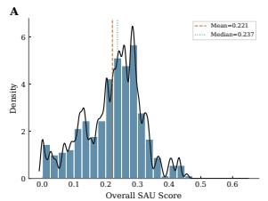

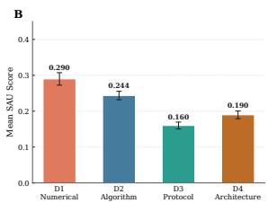  
Figure 9: Score distribution across all 360 evaluations. The heavy right skew confirms semantic drift is pervasive.

Table 16: Per-dimension statistics across all 12 generators and 30 papers.
<table><tr><td>Statistic</td><td>D1</td><td>D2</td><td>D3</td><td>D4</td></tr><tr><td>Mean</td><td>0.290</td><td>0.244</td><td>0.160</td><td>0.190</td></tr><tr><td>Median</td><td>0.304</td><td>0.235</td><td>0.167</td><td>0.188</td></tr><tr><td>% ≥0.5</td><td>28.7%</td><td>18.2%</td><td>3.7%</td><td>5.9%</td></tr><tr><td>Full-mark rate (1.0)</td><td>9.7%</td><td>5.4%</td><td>0.7%</td><td>0.9%</td></tr><tr><td>Zero rate</td><td>39.6%</td><td>35.8%</td><td>44.8%</td><td>33.7%</td></tr></table>

J Case Analysis: Representative Failures The complete six-type failure taxonomy for zeroscored claims:

1. Implementation mismatch (40.8%). The judge located code referencing the claim’s keywords, but determined the implementation does not match the specified content: the agent wrote something unrelated under recognizable names.

2. Stub/placeholder (16.2%). Evidence exists but is a stub, TODO, or pass statement.

3. External knowledge gap (8.0%). The claim requires implementing a standard baseline like PPO or loading a benchmark dataset like MOSE, which the paper names but does not define.

4. Token mention only (3.7%). Claim keyword appears in comments, docstrings, or imports, but no functional implementation exists.

5. Wrong implementation (<1%). Code references the specification but implements it incorrectly (e.g., optimizer substitution, formula error).

6. Missing component (<1%). Partial implementation present but a key sub-component is absent.

The remaining ∼30% of zero-scored claims resist single-category classification (multiple cooccurring failure modes or ambiguous reasoning).

We present four representative failure cases from Claude-Sonnet-4.6 with OpenHands on the sam2 paper (77 SAU claims), one per drift dimension, illustrating how the D1–D4 taxonomy enables finegrained diagnosis beyond aggregate scores.

## J.1 Case 1: Numerical Precision (D1) — Image Encoder Architecture

Paper specification (D1-003). SAM 2 uses an MAE-pre-trained Hiera-B+ image encoder with embedding dimensions [96, 192, 384, 768] across four stages, 12 attention heads, window size 14– 28 per stage, and global attention at the last stage. The encoder processes 1024 × 1024 input images through overlapping patch embedding (stride 4).

Table 17: Top-5 easiest and bottom-5 hardest papers by mean SAS.
<table><tr><td>Rank</td><td>Paper</td><td>Mean SAS</td></tr><tr><td colspan="3">Easiest</td></tr><tr><td>1</td><td>conformal-bayesian-quadrature</td><td>0.304</td></tr><tr><td>2</td><td>mrq</td><td>0.271</td></tr><tr><td>3</td><td>olmoe</td><td>0.260</td></tr><tr><td>4</td><td>sc-fno</td><td>0.257</td></tr><tr><td>5</td><td>neural-operator-flow-matching-pde</td><td>0.255</td></tr><tr><td colspan="3">Hardest</td></tr><tr><td>26</td><td>navil</td><td>0.179</td></tr><tr><td>27</td><td>cara</td><td>0.176</td></tr><tr><td>28</td><td>pyramidal-flow-matching</td><td>0.171</td></tr><tr><td>29</td><td>prioritized-generative-replay</td><td>0.158</td></tr><tr><td>30</td><td>sam2</td><td>0.158</td></tr></table>

Agent implementation. The agent substituted a standard ViT-B/16 backbone (embed\_dim=768, depth=12, num\_heads=12, patch\_size=16). The Hiera architecture (hierarchical stages with varying spatial resolution and window-based attention) was replaced by uniform ViT blocks. MAE pre-training initialization was omitted.

Root cause. Specification misreading. The agent defaulted to a well-known ViT implementation rather than implementing the paper’s Hiera architecture.

## J.2 Case 2: Method / Formula (D2) — Memory Attention Mechanism

Paper specification (D2-007). The memory attention module stores spatial features $\mathbf { F } \in \mathbb { R } ^ { \bar { B } \times N \times C }$ for N = 6 past frames with C = 256 channels and computes pointwise cross-attention at every spatial location: $\mathbf { A } = \mathrm { s o f t m a x } ( \mathbf { Q } \mathbf { K } ^ { T } / \sqrt { d _ { k } } ) , \mathbf { O } = \mathbf { A } \mathbf { V } ,$ followed by a residual connection and an output linear projection.

Agent implementation. The agent implemented temporal concatenation without cross-attention: past-frame features are flattened and concatenated to the current frame, then passed through a standard self-attention block. The pointwise spatial memory attention is absent; the agent’s code performs global attention instead.

Root cause. Core mechanism substitution. The agent substituted the paper’s specialized memory cross-attention with a generic temporal concatenation + self-attention pattern.

Table 18: Representative failure cases from Claude + PaperCoder (best configuration), annotated with failure taxonomy types.
<table><tr><td>Dim. Paper Specification</td><td>Agent Output / Root Cause</td><td>Failure Type</td></tr><tr><td>D1</td><td>Training: 900K levels, 250M transitions; UNet: Uses 10K levels, ch_mult=[1,1,2,4]. Specs in Impl. mismatch ch_mult=[1,2,4,8] appendix, defaults not overridden</td><td></td></tr><tr><td>D2</td><td>Adjoint matching loss with correction term; Standard flow matching without correction; Wrong impl. SCoRe: two-turn RL with asymmetric reward single-turn RL. Mathematical distinctions missed</td><td></td></tr><tr><td>D3 D4</td><td>17 datasets (DAVIS, YT-VOS, MOSE, etc.); 5 Data loading for 3 datasets; only PPO imple- External baselines (PPO, SAC, TD3, Dreamer-v3, MPC) mented</td><td>knowl- edge</td></tr><tr><td></td><td>4-phase pipeline; warmup→cosine All phases merged; flat LR schedule. Training Ordering collapse decay→eval recipe as prose</td><td></td></tr></table>

## J.3 Case 3: Experimental Protocol (D3) — Evaluation Setup

Paper specification (D3-004–D3-009). SAM 2 is evaluated on video object segmentation across 9 datasets (DAVIS 2017, YouTube-VOS 2018/2019, MOSE, BURST, LVOS, SA-V, LV-VIS, UVO), each with dataset-specific protocols (J & F for DAVIS, J\_seen, F\_seen, J\_unseen, F\_unseen for YouTube-VOS), plus 15 zero-shot video instance segmentation datasets and interactive segmentation benchmarks.

Agent implementation. The agent produced evaluation scripts for only 2 of 9 VOS datasets (DAVIS 2017 and a skeleton for YouTube-VOS), with placeholder TODOs for the remaining 7. Zeroshot VIS and interactive segmentation benchmarks are entirely absent.

Root cause. External knowledge gap. Dataset integration requires per-dataset downloading, preprocessing and protocol implementation. The agent lacks external knowledge of dataset formats and treats evaluation as a post-processing step rather than a primary deliverable.

## J.4 Case 4: Step Ordering (D4) — Three-Phase Data Engine Collapse

Paper specification (sam2-D4-002). The SA-V data engine is a three-phase, model-in-the-loop annotation pipeline: Phase 1 human annotators label every frame with pixel-perfect masks using SAM 2 interactive mode (high quality, slow); Phase 2 SAM 2 propagates masks across frames and annotators only correct errors (medium quality, 6× faster); Phase 3 fully automatic masklet generation with SAM 2 followed by quality filtering (low cost, scaled). Phases must be executed in order: each later phase consumes data and a model trained on the previous phase’s output.

Agent implementation. Across all three Claude scaffolds the generated repository contains only a flat video\_dataset.py loader that reads preexisting SA-V masklets. None of the three phases appears as a callable stage; there is no humanannotation entry point, no propagate-and-correct loop wrapping the model, and no automatic masklet generation followed by IoU/temporal filtering. The judge for this claim returns 0.0 with the verdict “code only shows dataset/model placeholders. . . not the three-phase data engine, human annotation workflow, mask propagation correction loop, automatic masklet generation pipeline, or timing targets.”

Root cause. Pipeline ordering collapse. The data engine is described in prose across Section 5.1 and Table 1 as a sequenced, multi-actor protocol; the agent collapses it into a single static dataset class, treating the engine’s output as if it were the engine itself. This is the canonical D4 failure mode: when the temporal relationship between phases is implicit in the prose rather than carried by an explicit pseudocode block, the agent flattens the pipeline and the ordering signal is lost.

## J.5 Failure Pattern Summary

Across the four cases, a recurring pattern emerges: agents gravitate toward familiar implementation templates (standard ViT, temporal concatenation, minimal evaluation scaffolding, flat dataset loaders) rather than faithfully reproducing the paper’s specific design. The D1–D4 taxonomy pinpoints where this drift occurs, enabling targeted improvements.

## K Per-Paper Semantic Alignment Scores

Paper difficulty is driven by specification structure, not claim volume. The number of SAU claims correlates negatively with SAS $( r = - 0 . 4 3 , p < 0 . 0 5 ,$ Pearson; $\rho = - 0 . 3 3 , p = 0 . 0 8$ , Spearman): papers with more claims tend to score lower, but the relationship is noisy. For example, wdno (94 claims, SAS 0.186) and sam2 (77 claims, SAS 0.158) diverge because wdno’s claims are predominantly formula-based while sam2’s span heterogeneous experimental protocols. Our qualitative inspection suggests that the easiest papers tend to concentrate specifications in a single algorithm box and hyperparameter table, while the hardest papers distribute specifications across sections and rely on prose over explicit equations; however, we lack a quantitative metric for specification locality and this observation should be treated as a hypothesis for future investigation. D3 shows the most uniform profile across papers (IQR of per-paper means: 0.049, lowest of the four dimensions), indicating that experimental protocol reproduction is a near-universal difficulty independent of domain.

Table 19: Per-paper mean SAS across all 12 generators, sorted by overall mean. These are paper-level means (equally weighted across papers); SAU-level means in the main text weight each claim equally and may differ slightly.
<table><tr><td>Paper</td><td>Overall</td><td>Std</td><td>D1</td><td>D2</td><td>D3</td><td>D4</td></tr><tr><td>conformal-bayesian-quadrature</td><td>0.304</td><td>0.113</td><td>0.524</td><td>0.306</td><td>0.194</td><td>0.193</td></tr><tr><td>mrq</td><td>0.271</td><td>0.073</td><td>0.331</td><td>0.306</td><td>0.167</td><td>0.281</td></tr><tr><td>olmoe</td><td>0.260</td><td>0.096</td><td>0.277</td><td>0.296</td><td>0.201</td><td>0.264</td></tr><tr><td>sc-fno</td><td>0.257</td><td>0.094</td><td>0.319</td><td>0.255</td><td>0.196</td><td>0.257</td></tr><tr><td>neural-operator-flow-matching-pde</td><td>0.255</td><td>0.100</td><td>0.285</td><td>0.236</td><td>0.222</td><td>0.276</td></tr><tr><td>ca2-vdm</td><td>0.248</td><td>0.109</td><td>0.419</td><td>0.227</td><td>0.148</td><td>0.198</td></tr><tr><td>voting-leaderboards</td><td>0.245</td><td>0.094</td><td>0.268</td><td>0.281</td><td>0.192</td><td>0.238</td></tr><tr><td>robotic-world-model</td><td>0.243</td><td>0.108</td><td>0.352</td><td>0.336</td><td>0.160</td><td>0.125</td></tr><tr><td>score</td><td>0.238</td><td>0.066</td><td>0.330</td><td>0.285</td><td>0.144</td><td>0.193</td></tr><tr><td>masked-diffusion-token-ordering</td><td>0.237</td><td>0.104</td><td>0.284</td><td>0.230</td><td>0.185</td><td>0.250</td></tr><tr><td>generator-augmented-flows</td><td>0.236</td><td>0.115</td><td>0.329</td><td>0.242</td><td>0.144</td><td>0.229</td></tr><tr><td>ngpt</td><td>0.236</td><td>0.060</td><td>0.299</td><td>0.365</td><td>0.122</td><td>0.158</td></tr><tr><td>avg-reward-pg</td><td>0.234</td><td>0.138</td><td>0.361</td><td>0.187</td><td>0.222</td><td>0.167</td></tr><tr><td>hi-mar</td><td>0.230</td><td>0.069</td><td>0.283</td><td>0.257</td><td>0.163</td><td>0.219</td></tr><tr><td>nfig</td><td>0.228</td><td>0.072</td><td>0.351</td><td>0.255</td><td>0.155</td><td>0.152</td></tr><tr><td>moe-pot</td><td>0.227</td><td>0.074</td><td>0.251</td><td>0.311</td><td>0.141</td><td>0.205</td></tr><tr><td>luno</td><td>0.225</td><td>0.128</td><td>0.306</td><td>0.192</td><td>0.205</td><td>0.198</td></tr><tr><td>adjoint-matching</td><td>0.221</td><td>0.100</td><td>0.308</td><td>0.199</td><td>0.190</td><td>0.188</td></tr><tr><td>lora-sb</td><td>0.216</td><td>0.067</td><td>0.293</td><td>0.219</td><td>0.156</td><td>0.194</td></tr><tr><td>gated-attention-llm</td><td>0.206</td><td>0.090</td><td>0.201</td><td>0.286</td><td>0.154</td><td>0.183</td></tr><tr><td>emergent-planning-rl</td><td>0.202</td><td>0.084</td><td>0.252</td><td>0.211</td><td>0.161</td><td>0.184</td></tr><tr><td>universal-neural-operators</td><td>0.200</td><td>0.060</td><td>0.257</td><td>0.190</td><td>0.142</td><td>0.212</td></tr><tr><td>diffusion-convergence-rate</td><td>0.196</td><td>0.080</td><td>0.163</td><td>0.226</td><td>0.198</td><td>0.198</td></tr><tr><td>wdno</td><td>0.186</td><td>0.072</td><td>0.215</td><td>0.203</td><td>0.134</td><td>0.191</td></tr><tr><td>ma-rlhf</td><td>0.180</td><td>0.090</td><td>0.250</td><td>0.214</td><td>0.085</td><td>0.171</td></tr><tr><td>navil</td><td>0.179</td><td>0.077</td><td>0.210</td><td>0.299</td><td>0.098</td><td>0.108</td></tr><tr><td>cara</td><td>0.176</td><td>0.095</td><td>0.290</td><td>0.187</td><td>0.144</td><td>0.083</td></tr><tr><td>pyramidal-flow-matching</td><td>0.171</td><td>0.065</td><td>0.283</td><td>0.153</td><td>0.102</td><td>0.146</td></tr><tr><td>prioritized-generative-replay</td><td>0.158</td><td>0.074</td><td>0.212</td><td>0.183</td><td>0.148</td><td>0.090</td></tr><tr><td>sam2</td><td>0.158</td><td>0.095</td><td>0.193</td><td>0.173</td><td>0.124</td><td>0.142</td></tr><tr><td>Mean (paper-level)</td><td>0.221</td><td>0.089</td><td>0.290</td><td>0.244</td><td>0.160</td><td>0.190</td></tr></table>

Table 19 reports per-paper mean SAS averaged across all 12 generators, with standard deviation and per-type sub-scores. The full 360-row generator × paper matrix is available in Table 20.

## L Complete Per-Configuration Results

Table 20 reports every paper×scaffold×model SAU score (overall and D1–D4) with code generation metrics. Times from BasicAgent: batch.log (DeepSeek BasicAgent from artifacts/meta.json); PaperCoder: artifacts/run.log; OpenHands: artifacts/meta.json. The .py column reports the number of Python source files generated by the agent in the produced repository (count of .py files), used as a coarse proxy for code-output volume.

Table 20: Complete per-configuration per-paper SAU scores and code generation metrics. Time(s): end-to-end agent wall-clock seconds. .py: number of Python source files generated by the agent in the resulting repository.
<table><tr><td>Paper Scaff</td><td>Model</td><td>Overall</td><td>D1</td><td>D2</td><td>D3</td><td>D4</td><td>Time(s)</td><td>.py</td></tr><tr><td rowspan="7">adjoint</td><td rowspan="7">BasicAgent</td><td>Claude-Sonnet-4.6</td><td>0.208 0.382</td><td>0.225</td><td>0.143</td><td>0.083</td><td>938</td><td>12</td></tr><tr><td>DeepSeek-V4-Pro</td><td>0.208 0.279</td><td>0.138</td><td>0.250</td><td>0.167</td><td>861</td><td>9</td></tr><tr><td>Gemini-2.5-Flash</td><td>0.136</td><td>0.029 0.287</td><td>0.143</td><td>0.083</td><td>678</td><td>3</td></tr><tr><td>GPT-40</td><td>0.110</td><td>0.015 0.138</td><td>0.036</td><td>0.250</td><td>189</td><td>4</td></tr><tr><td>PaperCoder</td><td>0.304 0.632</td><td>0.250</td><td>0.250</td><td>0.083</td><td>2408</td><td>12</td></tr><tr><td>Claude-Sonnet-4.6</td><td>0.303</td><td>0.113</td><td>0.214</td><td></td><td></td><td>6</td></tr><tr><td>DeepSeek-V4-Pro</td><td>0.471</td><td></td><td></td><td>0.417 0.333</td><td>2342 1746</td><td>15</td></tr><tr><td rowspan="6">OpenHands</td><td>Gemini-2.5-Flash GPT-40</td><td>0.332 0.199</td><td>0.382 0.265</td><td>0.325 0.150</td><td>0.286 0.214</td><td></td><td></td><td>8</td></tr><tr><td>Claude-Sonnet-4.6</td><td></td><td>0.382</td><td>0.250</td><td>0.250</td><td>0.167</td><td>1735</td><td>12</td></tr><tr><td></td><td>0.262</td><td></td><td></td><td></td><td>0.167</td><td>1142</td><td></td></tr><tr><td>DeepSeek-V4-Pro</td><td>0.330</td><td>0.485</td><td>0.300</td><td>0.286</td><td>0.250</td><td>1345</td><td>16</td></tr><tr><td>Gemini-2.5-Flash</td><td>0.261</td><td>0.368</td><td>0.212</td><td>0.214</td><td>0.250</td><td>433</td><td>6</td></tr><tr><td>GPT-40</td><td>0.000</td><td>0.000</td><td>0.000</td><td>0.000</td><td>0.000</td><td>30</td><td>0</td></tr><tr><td rowspan="10">avg-rwd PaperCoder</td><td>BasicAgent</td><td>Claude-Sonnet-4.6</td><td>0.321 0.667</td><td>0.286</td><td>0.250</td><td>0.083</td><td>1305</td><td>5</td></tr><tr><td rowspan="6"></td><td>DeepSeek-V4-Pro</td><td>0.226</td><td>0.417 0.321</td><td></td><td>0.083</td><td>0.083</td><td>934 11</td></tr><tr><td>Gemini-2.5-Flash</td><td>0.155</td><td>0.000 0.286</td><td>0.000</td><td>0.333</td><td>580</td><td>62</td></tr><tr><td></td><td>0.000 0.000</td><td>0.000</td><td>0.000</td><td>0.000</td><td></td><td></td></tr><tr><td>GPT-40</td><td>0.455 0.417</td><td>0.321</td><td>0.667</td><td>0.417</td><td>132</td><td></td></tr><tr><td>Claude-Sonnet-4.6</td><td></td><td></td><td></td><td></td><td>1407</td><td>9</td></tr><tr><td>DeepSeek-V4-Pro</td><td>0.303</td><td>0.556 0.071 0.071</td><td>0.500</td><td>0.083</td><td>1460</td><td>57</td></tr><tr><td>Gemini-2.5-Flash GPT-40</td><td>0.150 0.192</td><td>0.278</td><td></td><td>0.250</td><td>0.000</td><td>454 7</td></tr><tr><td>OpenHands Claude-Sonnet-4.6</td><td></td><td>0.278 0.417</td><td>0.071 0.214</td><td>0.167</td><td>0.250</td><td>758</td></tr><tr><td rowspan="3">Gemini-2.5-Flash GPT-40</td><td></td><td>0.262 0.402</td><td>0.357</td><td>0.167</td><td>0.250</td><td>798 9</td></tr><tr><td>DeepSeek-V4-Pro</td><td>0.667</td><td></td><td>0.333</td><td>0.250</td><td>782</td></tr><tr><td>0.318</td><td>0.639</td><td>0.214</td><td>0.250</td><td>0.167</td><td>7 296 4 4</td></tr><tr><td rowspan="9">ca2-vdm PaperCoder</td><td>BasicAgent</td><td></td><td>0.030 0.000 0.614</td><td>0.036 0.250</td><td>0.000</td><td>0.083</td><td>407</td><td>20</td></tr><tr><td rowspan="7">Gemini-2.5-Flash</td><td>Claude-Sonnet-4.6 DeepSeek-V4-Pro</td><td>0.302 0.367</td><td>0.614</td><td></td><td>0.094</td><td>0.250 1234</td><td>11</td></tr><tr><td></td><td>0.023</td><td>0.325 0.150</td><td>0.250 0.031</td><td>0.281</td><td>1556 2814</td><td>1</td></tr><tr><td>GPT-40</td><td>0.059 0.025</td><td>0.000 0.100</td><td>0.000</td><td>0.031 0.000</td><td>167</td><td>59</td></tr><tr><td>Claude-Sonnet-4.6</td><td>0.362</td><td>0.750 0.325</td><td>0.188</td><td>0.188</td><td></td><td>1992</td></tr><tr><td>DeepSeek-V4-Pro</td><td>0.244</td><td>0.500 0.225</td><td>0.094</td><td>0.156</td><td></td><td></td></tr><tr><td></td><td></td><td></td><td></td><td></td><td>7168</td><td>15</td></tr><tr><td>Gemini-2.5-Flash</td><td>0.290 0.477</td><td>0.275</td><td>0.156 0.219</td><td>0.250 0.250</td><td>1386 931</td><td>11 8</td></tr><tr><td rowspan="6"></td><td>OpenHands Claude-Sonnet-4.6</td><td>0.255 0.331</td><td>0.352 0.523</td><td>0.200 0.300</td><td>0.250</td><td>0.250</td><td>1377 9</td></tr><tr><td>DeepSeek-V4-Pro</td><td></td><td>0.443</td><td>0.250</td><td>0.219</td><td>0.281</td><td></td></tr><tr><td>Gemini-2.5-Flash</td><td>0.298</td><td>0.420</td><td>0.200</td><td>0.188</td><td>0.219</td><td>1689 9 704</td></tr><tr><td></td><td>0.257</td><td>0.307</td><td>0.125</td><td>0.094</td><td></td><td>6 348 5</td></tr><tr><td>GPT-40</td><td>0.186</td><td></td><td></td><td>0.219</td><td></td><td>29</td></tr><tr><td rowspan="8">cara</td><td>DeepSeek-V4-Pro</td><td>Claude-Sonnet-4.6 0.205</td><td>0.365</td><td>0.315 0.232</td><td>0.056 0.083</td><td>0.083 0.083</td><td>1169 1308</td><td>20</td></tr><tr><td>PaperCoder</td><td>Gemini-2.5-Flash</td><td>0.241 0.567 0.117 0.144</td><td>0.130</td><td>0.111</td><td>0.083</td><td>1379</td><td>13</td></tr><tr><td></td><td>GPT-40</td><td>0.012 0.038 0.292 0.558</td><td>0.009 0.361</td><td>0.000 0.250</td><td>0.000 0.000</td><td>94 4347</td><td>4 20</td></tr><tr><td></td><td>Claude-Sonnet-4.6</td><td>0.158 0.288</td><td>0.148</td><td>0.111</td><td>0.083</td><td>3005</td><td>8</td></tr><tr><td></td><td>DeepSeek-V4-Pro</td><td>0.223</td><td>0.194</td><td>0.250</td><td>0.167</td><td></td><td>16</td></tr><tr><td>GPT-40</td><td>Gemini-2.5-Flash</td><td>0.279</td><td></td><td>0.222</td><td></td><td>1421</td><td>7</td></tr><tr><td>OpenHands Claude-Sonnet-4.6</td><td></td><td>0.171 0.240</td><td>0.139</td><td>0.250</td><td>0.083 0.167</td><td>843 1450</td><td>19</td></tr><tr><td rowspan="5"></td><td>DeepSeek-V4-Pro</td><td>0.275</td><td>0.423</td><td>0.259</td><td></td><td></td><td></td></tr><tr><td></td><td>0.254</td><td>0.375</td><td>0.250</td><td>0.222</td><td>0.167</td><td>1359 10</td></tr><tr><td>Gemini-2.5-Flash</td><td>0.164 0.000</td><td>0.202 0.000</td><td>0.204 0.000</td><td>0.167 0.000 0.000</td><td>0.083</td><td>551 6 200 0</td></tr><tr><td>GPT-40</td></tr><tr><td>Paper</td><td>Scaff</td><td>Model</td><td>Overall</td><td>D1</td><td>D2</td><td>D3</td><td>D4 Time(s)</td><td></td><td>.py</td></tr><tr><td rowspan="7">emergent gated-attn</td><td>PaperCoder</td><td>Gemini-2.5-Flash GPT-40 Claude-Sonnet-4.6 DeepSeek-V4-Pro Gemini-2.5-Flash</td><td>0.221 0.088 0.263 0.280 0.246</td><td>0.114 0.000 0.239 0.182 0.193</td><td>0.271 0.167 0.188 0.312 0.292</td><td>0.250 0.000 0.500 0.312</td><td>0.250 0.188 0.125 0.312 0.312</td><td>324 112 1558 1800 579</td><td>23 9 6 6 8 12</td></tr><tr><td>OpenHands</td><td>GPT-40 Claude-Sonnet-4.6 DeepSeek-V4-Pro Gemini-2.5-Flash GPT-40</td><td>0.170 0.236 0.202 0.178 0.000</td><td>0.136 0.341 0.182 0.171 0.000</td><td>0.229 0.229 0.188 0.167 0.000</td><td>0.188 0.125 0.188 0.250 0.250 0.000</td><td>0.188 0.188 0.188 0.125</td><td>1230 1966 1703 366</td><td>76</td></tr><tr><td>BasicAgent</td><td>Claude-Sonnet-4.6 DeepSeek-V4-Pro Gemini-2.5-Flash GPT-40</td><td>0.146 0.237 0.041</td><td>0.225 0.325 0.037</td><td>0.118 0.294 0.044</td><td>0.073 0.162 0.000</td><td>0.000 0.167 0.167 0.083</td><td>545 1204 1722 2940</td><td>0 23 12</td></tr><tr><td>PaperCoder</td><td>Claude-Sonnet-4.6 DeepSeek-V4-Pro Gemini-2.5-Flash GPT-40</td><td>0.113 0.261 0.265 0.269 0.200</td><td>0.062 0.525 0.312 0.312</td><td>0.088 0.176 0.294 0.279</td><td>0.176 0.132 0.162 0.235 0.206</td><td>0.125 0.208 0.292 0.250 0.208 0.250</td><td>100 1400 4746 2631 1314 1214</td><td>1 38 10 18 9 28</td></tr><tr><td>OpenHands</td><td>Claude-Sonnet-4.6 DeepSeek-V4-Pro Gemini-2.5-Flash GPT-40 Claude-Sonnet-4.6</td><td>0.280 0.263 0.266 0.082</td><td>0.150 0.312 0.312 0.325 0.125</td><td>0.235 0.309 0.324 0.294 0.073 0.237</td><td>0.250 0.206 0.235 0.088 0.132</td><td>0.208 0.208 0.042 0.300</td><td>1664 932 548</td><td>24 8 4</td></tr><tr><td>BasicAgent</td><td>DeepSeek-V4-Pro Gemini-2.5-Flash GPT-40 Claude-Sonnet-4.6 DeepSeek-V4-Pro</td><td>0.226 0.194 0.087 0.100 0.408</td><td>0.233 0.283 0.050 0.033 0.400</td><td>0.263 0.250 0.197 0.645 0.276</td><td>0.103 0.000 0.044 0.338</td><td>0.125 0.050 0.125 0.250 0.150 0.175</td><td>834 1725 189 109 2969 3107</td><td>13 19 1 3</td></tr><tr><td>PaperCoder OpenHands</td><td>Gemini-2.5-Flash GPT-40 Claude-Sonnet-4.6 DeepSeek-V4-Pro</td><td>0.189 0.207 0.161 0.284</td><td>0.167 0.200 0.167 0.333</td><td>0.276 0.197 0.342</td><td>0.162 0.176 0.103 0.235 0.206</td><td>0.175 0.225 0.225</td><td>1235 640 879</td><td>12 8 11 6 8 9</td></tr><tr><td>gen-flows BasicAgent</td><td>Gemini-2.5-Flash GPT-40 Claude-Sonnet-4.6 DeepSeek-V4-Pro</td><td>0.247 0.114 0.432</td><td>0.260 0.267 0.250 0.033 0.518</td><td>0.342 0.263 0.145 0.356 0.394</td><td>0.250 0.103 0.229 0.125</td><td>0.225 0.175 0.625 0.000</td><td>1328 681 279 1088</td><td>6 6 15</td></tr><tr><td>PaperCoder</td><td>GPT-40 Gemini-2.5-Flash</td><td>Gemini-2.5-Flash Claude-Sonnet-4.6 DeepSeek-V4-Pro</td><td>0.255 0.500 0.184 0.107 0.095 0.089 0.286 0.446 0.145 0.179</td><td>0.192 0.038 0.260 0.192 0.269</td><td>0.062 0.125 0.188 0.083 0.146</td><td>0.375 0.125 0.250 0.125 0.250</td><td>1711 1562 162 2358 2859</td><td>13 5 4 11 8 7</td></tr><tr><td>OpenHands</td><td>GPT-40</td><td>Claude-Sonnet-4.6 DeepSeek-V4-Pro Gemini-2.5-Flash</td><td>0.260 0.375 0.193 0.196 0.319 0.500 0.363 0.482 0.279</td><td>0.202 0.298 0.365 0.308</td><td>0.125 0.229 0.229 0.167</td><td>0.250 0.250 0.375 0.125</td><td>703 724 1120 956 254</td><td>6 11 10 6</td></tr><tr><td>hi-mar BasicAgent</td><td>GPT-40 Claude-Sonnet-4.6 DeepSeek-V4-Pro Gemini-2.5-Flash</td><td></td><td>0.518 0.021 0.036 0.304 0.384 0.189 0.214 0.165 0.161</td><td>0.029 0.375 0.167 0.229</td><td>0.021 0.208 0.125 0.083</td><td>0.000 0.250 0.250 0.188 0.000</td><td>379 956 1451 1010</td><td>7 13 12 3 4</td></tr><tr><td>PaperCoder</td><td>GPT-40 Claude-Sonnet-4.6 DeepSeek-V4-Pro Gemini-2.5-Flash GPT-40 OpenHands</td><td>Claude-Sonnet-4.6</td><td>0.066 0.054 0.293 0.527 0.238 0.286 0.266 0.312 0.258 0.304 0.287 0.420</td><td>0.167 0.250 0.333 0.292 0.229 0.271</td><td>0.042 0.208 0.083 0.208 0.250 0.208 0.354</td><td>0.188 0.250 0.250 0.250 0.250 0.208 0.250 0.167 0.250</td><td>109 3148 4923 1011 635 788 1913</td><td>14 11 9 6 7 14 6</td></tr></table>

Continued on next page

Table 20: Complete per-configuration results (continued).
<table><tr><td colspan="15" rowspan="1">Paper      Scaff        Model               Overall    D1   D2   D3   D4 Time(s)  .py</td></tr><tr><td colspan="5" rowspan="1"></td><td colspan="10" rowspan="1">DeepSeek-V4-Pro     0.224 0.333 0.304 0.094 0.167     2478   7</td></tr><tr><td colspan="5" rowspan="1"></td><td colspan="4" rowspan="1">Gemini-2.5-Flash      0.249 0.312</td><td colspan="1" rowspan="1">0.214</td><td colspan="1" rowspan="1">0.219</td><td colspan="1" rowspan="1">0.250</td><td colspan="3" rowspan="1">604   6</td></tr><tr><td colspan="5" rowspan="1"></td><td colspan="4" rowspan="1">GPT-40                0.202  0.271</td><td colspan="1" rowspan="1">0.161</td><td colspan="1" rowspan="1">0.125</td><td colspan="1" rowspan="1">0.250</td><td colspan="3" rowspan="1">908   6</td></tr><tr><td colspan="5" rowspan="1">OpenHands</td><td colspan="4" rowspan="1">Claude-Sonnet-4.6     0.262 0.333</td><td colspan="1" rowspan="1">0.214</td><td colspan="1" rowspan="1">0.250</td><td colspan="1" rowspan="1">0.250</td><td colspan="3" rowspan="1">890  12</td></tr><tr><td colspan="5" rowspan="1"></td><td colspan="3" rowspan="1">DeepSeek-V4-Pro     0.278</td><td colspan="1" rowspan="1">0.333</td><td colspan="1" rowspan="1">0.339</td><td colspan="1" rowspan="1">0.188</td><td colspan="1" rowspan="1">0.250</td><td colspan="3" rowspan="1">1224   7</td></tr><tr><td colspan="5" rowspan="1"></td><td colspan="3" rowspan="1">Gemini-2.5-Flash      0.284</td><td colspan="1" rowspan="1">0.500</td><td colspan="1" rowspan="1">0.250</td><td colspan="1" rowspan="1">0.219</td><td colspan="4" rowspan="1">0.167     221   6</td></tr><tr><td colspan="5" rowspan="1"></td><td colspan="3" rowspan="1">GPT-40                0.096</td><td colspan="1" rowspan="1">0.042</td><td colspan="1" rowspan="1">0.143</td><td colspan="1" rowspan="1">0.031</td><td colspan="1" rowspan="1">0.167</td><td colspan="3" rowspan="1">335   6</td></tr><tr><td colspan="5" rowspan="1">luno        BasicAgent</td><td colspan="3" rowspan="1">Claude-Sonnet-4.6     0.279</td><td colspan="1" rowspan="1">0.450</td><td colspan="1" rowspan="1">0.250</td><td colspan="1" rowspan="1">0.167</td><td colspan="1" rowspan="1">0.250</td><td colspan="3" rowspan="1">990  15</td></tr><tr><td colspan="1" rowspan="1"></td><td></td><td colspan="3" rowspan="1"></td><td colspan="3" rowspan="1">DeepSeek-V4-Pro     0.288</td><td colspan="1" rowspan="1">0.350</td><td colspan="1" rowspan="1">0.260</td><td colspan="1" rowspan="1">0.292</td><td colspan="1" rowspan="1">0.250</td><td colspan="2" rowspan="1">1231</td><td colspan="1" rowspan="1">16</td></tr><tr><td colspan="5" rowspan="1"></td><td colspan="3" rowspan="1">Gemini-2.5-Flash      0.062</td><td colspan="1" rowspan="1">0.050</td><td colspan="1" rowspan="1">0.156</td><td colspan="1" rowspan="1">0.000</td><td colspan="1" rowspan="1">0.042</td><td colspan="2" rowspan="1">648</td><td colspan="1" rowspan="1">2</td></tr><tr><td colspan="5" rowspan="1"></td><td colspan="3" rowspan="1">GPT-40                0.026</td><td colspan="1" rowspan="1">0.000</td><td colspan="1" rowspan="1">0.104</td><td colspan="1" rowspan="1">0.000</td><td colspan="1" rowspan="1">0.000</td><td colspan="2" rowspan="1">187</td><td colspan="1" rowspan="1">25</td></tr><tr><td colspan="5" rowspan="1">PaperCoder</td><td colspan="3" rowspan="1">Claude-Sonnet-4.6     0.433</td><td colspan="1" rowspan="1">0.525</td><td colspan="1" rowspan="1">0.208</td><td colspan="1" rowspan="1">0.583</td><td colspan="1" rowspan="1">0.417</td><td colspan="2" rowspan="1">3295</td><td colspan="1" rowspan="1">17</td></tr><tr><td colspan="5" rowspan="1"></td><td colspan="3" rowspan="1">DeepSeek-V4-Pro      0.254</td><td colspan="1" rowspan="1">0.400</td><td colspan="1" rowspan="1">0.198</td><td colspan="1" rowspan="1">0.167</td><td colspan="1" rowspan="1">0.250</td><td colspan="2" rowspan="1">4540</td><td colspan="1" rowspan="1">9</td></tr><tr><td colspan="2" rowspan="1"></td><td></td><td colspan="2" rowspan="1"></td><td colspan="3" rowspan="1">Gemini-2.5-Flash      0.276</td><td colspan="1" rowspan="1">0.375</td><td colspan="1" rowspan="1">0.188</td><td colspan="1" rowspan="1">0.292</td><td colspan="1" rowspan="1">0.250</td><td colspan="2" rowspan="1">1462</td><td colspan="1" rowspan="1">9</td></tr><tr><td colspan="5" rowspan="2">OpenHands</td><td colspan="1" rowspan="1"></td><td colspan="4" rowspan="1">GPT-40                0.255</td><td colspan="1" rowspan="1">0.375</td><td colspan="1" rowspan="1">0.229</td><td colspan="1" rowspan="1">0.208</td><td colspan="1" rowspan="1">0.208</td><td colspan="1" rowspan="1">728</td></tr><tr><td colspan="3" rowspan="1">Claude-Sonnet-4.6     0.248</td><td colspan="1" rowspan="1">0.275</td><td colspan="1" rowspan="1">0.219</td><td colspan="1" rowspan="1">0.250</td><td colspan="1" rowspan="1">0.250</td><td colspan="2" rowspan="1">1545</td><td colspan="1" rowspan="1">21</td></tr><tr><td colspan="5" rowspan="2"></td><td colspan="3" rowspan="1">DeepSeek-V4-Pro     0.306</td><td colspan="1" rowspan="1">0.400</td><td colspan="1" rowspan="1">0.281</td><td colspan="1" rowspan="1">0.292</td><td colspan="1" rowspan="1">0.250</td><td colspan="2" rowspan="1">978</td><td colspan="1" rowspan="1">9</td></tr><tr><td colspan="3" rowspan="1">Gemini-2.5-Flash      0.275</td><td colspan="1" rowspan="1">0.475</td><td colspan="1" rowspan="1">0.208</td><td colspan="1" rowspan="1">0.208</td><td colspan="1" rowspan="1">0.208</td><td colspan="2" rowspan="1">845</td><td colspan="1" rowspan="1">8</td></tr><tr><td colspan="5" rowspan="1"></td><td colspan="3" rowspan="1">GPT-40                0.000</td><td colspan="1" rowspan="1">0.000</td><td colspan="1" rowspan="1">0.000</td><td colspan="1" rowspan="1">0.000</td><td colspan="1" rowspan="1">0.000</td><td colspan="2" rowspan="1">413</td><td colspan="1" rowspan="1">0</td></tr><tr><td colspan="5" rowspan="1">ma-rlhf     BasicAgent</td><td colspan="3" rowspan="1">Claude-Sonnet-4.6     0.220</td><td colspan="1" rowspan="1">0.306</td><td colspan="1" rowspan="1">0.355</td><td colspan="1" rowspan="1">0.068</td><td colspan="1" rowspan="1">0.150</td><td colspan="2" rowspan="1">874</td><td colspan="1" rowspan="1">11</td></tr><tr><td colspan="5" rowspan="1"></td><td colspan="3" rowspan="1">DeepSeek-V4-Pro     0.269</td><td colspan="1" rowspan="1">0.472</td><td colspan="1" rowspan="1">0.197</td><td colspan="1" rowspan="1">0.204</td><td colspan="1" rowspan="1">0.200</td><td colspan="2" rowspan="1">1206</td><td colspan="1" rowspan="1">11</td></tr><tr><td colspan="5" rowspan="1"></td><td colspan="3" rowspan="1">Gemini-2.5-Flash      0.131</td><td colspan="1" rowspan="1">0.083</td><td colspan="1" rowspan="1">0.171</td><td colspan="1" rowspan="1">0.068</td><td colspan="1" rowspan="1">0.200</td><td colspan="2" rowspan="1">845</td><td colspan="1" rowspan="1">5</td></tr><tr><td colspan="5" rowspan="1"></td><td colspan="3" rowspan="1">GPT-40               0.013</td><td colspan="1" rowspan="1">0.028</td><td colspan="1" rowspan="1">0.000</td><td colspan="1" rowspan="1">0.023</td><td colspan="1" rowspan="1">0.000</td><td colspan="2" rowspan="1">214</td><td colspan="1" rowspan="1">5</td></tr><tr><td colspan="5" rowspan="3">PaperCoder</td><td colspan="3" rowspan="1">Claude-Sonnet-4.6     0.238</td><td colspan="1" rowspan="1">0.444</td><td colspan="1" rowspan="1">0.210</td><td colspan="1" rowspan="1">0.045</td><td colspan="1" rowspan="1">0.250</td><td colspan="2" rowspan="1">2571</td><td colspan="1" rowspan="1">11</td></tr><tr><td colspan="3" rowspan="1"></td><td colspan="3" rowspan="1">DeepSeek-V4-Pro      0.177</td><td colspan="1" rowspan="1">0.222</td><td colspan="1" rowspan="1">0.342</td><td colspan="1" rowspan="1">0.045</td><td colspan="1" rowspan="1">0.100</td><td colspan="2" rowspan="1">3128</td><td colspan="1" rowspan="1">7</td></tr><tr><td colspan="4" rowspan="1"></td><td colspan="3" rowspan="1">Gemini-2.5-Flash      0.236</td><td colspan="1" rowspan="1">0.361</td><td colspan="1" rowspan="1">0.263</td><td colspan="1" rowspan="1">0.068</td><td colspan="1" rowspan="1">0.250</td><td colspan="2" rowspan="1">1548</td><td colspan="1" rowspan="1">11</td></tr><tr><td colspan="5" rowspan="1"></td><td colspan="3" rowspan="1">GPT-40                0.171</td><td colspan="1" rowspan="1">0.139</td><td colspan="1" rowspan="1">0.276</td><td colspan="1" rowspan="1">0.068</td><td colspan="1" rowspan="1">0.200</td><td colspan="2" rowspan="1">619</td><td colspan="1" rowspan="1">7</td></tr><tr><td colspan="5" rowspan="1">OpenHands</td><td colspan="1" rowspan="1">Claude-Sonnet-4.6</td><td colspan="2" rowspan="1">0.263</td><td colspan="1" rowspan="1">0.417</td><td colspan="1" rowspan="1">0.250</td><td colspan="1" rowspan="1">0.136</td><td colspan="1" rowspan="1">0.250</td><td colspan="2" rowspan="1">862</td><td colspan="1" rowspan="1">10</td></tr><tr><td colspan="5" rowspan="1"></td><td colspan="1" rowspan="1">DeepSeek-V4-Pro</td><td colspan="2" rowspan="1">0.242</td><td colspan="1" rowspan="1">0.250</td><td colspan="1" rowspan="1">0.263</td><td colspan="1" rowspan="1">0.204</td><td colspan="1" rowspan="1">0.250</td><td colspan="2" rowspan="1">1112</td><td colspan="1" rowspan="1">9</td></tr><tr><td colspan="5" rowspan="1"></td><td colspan="1" rowspan="1">Gemini-2.5-Flash</td><td colspan="1" rowspan="1"></td><td colspan="1" rowspan="1">0.201</td><td colspan="1" rowspan="1">0.278</td><td colspan="1" rowspan="1">0.237</td><td colspan="1" rowspan="1">0.091</td><td colspan="1" rowspan="1">0.200</td><td colspan="2" rowspan="1">307</td><td colspan="1" rowspan="1">6</td></tr><tr><td colspan="2" rowspan="1"></td><td colspan="3" rowspan="1"></td><td colspan="1" rowspan="1">GPT-40</td><td colspan="1" rowspan="1"></td><td colspan="1" rowspan="1">0.000</td><td colspan="1" rowspan="1">0.000</td><td colspan="1" rowspan="1">0.000</td><td colspan="1" rowspan="1">0.000</td><td colspan="1" rowspan="1">0.000</td><td colspan="2" rowspan="1">250</td><td colspan="1" rowspan="1">0</td></tr><tr><td colspan="2" rowspan="1">masked-diff</td><td colspan="3" rowspan="1">BasicAgent</td><td colspan="1" rowspan="1">Claude-Sonnet-4.6</td><td colspan="1" rowspan="1"></td><td colspan="1" rowspan="1">0.280</td><td colspan="1" rowspan="1">0.440</td><td colspan="1" rowspan="1">0.271</td><td colspan="1" rowspan="1">0.222</td><td colspan="1" rowspan="1">0.188</td><td colspan="1" rowspan="1"></td><td colspan="1" rowspan="1">1027</td><td colspan="1" rowspan="1">13</td></tr><tr><td colspan="2" rowspan="1"></td><td colspan="3" rowspan="1"></td><td colspan="1" rowspan="1">DeepSeek-V4-Pro</td><td colspan="1" rowspan="1"></td><td colspan="1" rowspan="1">0.369</td><td colspan="1" rowspan="1">0.405</td><td colspan="1" rowspan="1">0.458</td><td colspan="1" rowspan="1">0.361</td><td colspan="1" rowspan="1">0.250</td><td colspan="1" rowspan="1"></td><td colspan="1" rowspan="1">1228</td><td colspan="1" rowspan="1">22</td></tr><tr><td colspan="2" rowspan="1"></td><td colspan="3" rowspan="1"></td><td colspan="1" rowspan="1">Gemini-2.5-Flash</td><td colspan="1" rowspan="1"></td><td colspan="1" rowspan="1">0.179</td><td colspan="1" rowspan="1">0.052</td><td colspan="1" rowspan="1">0.156</td><td colspan="1" rowspan="1">0.194</td><td colspan="1" rowspan="1">0.312</td><td colspan="2" rowspan="1">752</td><td colspan="1" rowspan="1">7</td></tr><tr><td colspan="2" rowspan="1"></td><td colspan="3" rowspan="1"></td><td colspan="1" rowspan="1">GPT-40</td><td colspan="1" rowspan="1"></td><td colspan="1" rowspan="1">0.127</td><td colspan="1" rowspan="1">0.009</td><td colspan="1" rowspan="1">0.146</td><td colspan="1" rowspan="1">0.167</td><td colspan="1" rowspan="1">0.188</td><td colspan="2" rowspan="1">137</td><td colspan="1" rowspan="1">3</td></tr><tr><td colspan="5" rowspan="1">PaperCoder</td><td colspan="1" rowspan="1">Claude-Sonnet-4.6</td><td colspan="1" rowspan="1"></td><td colspan="1" rowspan="1">0.398</td><td colspan="1" rowspan="1">0.526</td><td colspan="1" rowspan="1">0.365</td><td colspan="1" rowspan="1">0.139</td><td colspan="1" rowspan="1">0.562</td><td colspan="2" rowspan="1">3336</td><td colspan="1" rowspan="1">15</td></tr><tr><td colspan="5" rowspan="1"></td><td colspan="1" rowspan="1">DeepSeek-V4-Pro</td><td colspan="1" rowspan="1"></td><td colspan="1" rowspan="1">0.282</td><td colspan="1" rowspan="1">0.414</td><td colspan="1" rowspan="1">0.292</td><td colspan="1" rowspan="1">0.111</td><td colspan="1" rowspan="1">0.312</td><td colspan="1" rowspan="1"></td><td colspan="1" rowspan="1">2797</td><td colspan="1" rowspan="1">8</td></tr><tr><td colspan="5" rowspan="1"></td><td colspan="1" rowspan="1">Gemini-2.5-Flash</td><td colspan="1" rowspan="1"></td><td colspan="1" rowspan="1">0.242</td><td colspan="1" rowspan="1">0.336</td><td colspan="1" rowspan="1">0.188</td><td colspan="1" rowspan="1">0.194</td><td colspan="1" rowspan="1">0.250</td><td colspan="2" rowspan="1">1229</td><td colspan="1" rowspan="1">14</td></tr><tr><td colspan="5" rowspan="2">OpenHands</td><td colspan="1" rowspan="1">GPT-40</td><td colspan="1" rowspan="1"></td><td colspan="1" rowspan="1">0.192</td><td colspan="1" rowspan="1">0.198</td><td colspan="1" rowspan="1">0.188</td><td colspan="1" rowspan="1">0.194</td><td colspan="1" rowspan="1">0.188</td><td colspan="2" rowspan="1">756</td><td colspan="1" rowspan="1">7</td></tr><tr><td colspan="1" rowspan="1">Claude-Sonnet-4.6</td><td colspan="2" rowspan="1">0.283</td><td colspan="1" rowspan="1">0.440</td><td colspan="1" rowspan="1">0.219</td><td colspan="1" rowspan="1">0.222</td><td colspan="1" rowspan="1">0.250</td><td colspan="2" rowspan="1">1564</td><td colspan="1" rowspan="1">17</td></tr><tr><td colspan="2" rowspan="2"></td><td></td><td colspan="2" rowspan="1"></td><td colspan="1" rowspan="1">DeepSeek-V4-Pro</td><td colspan="1" rowspan="1"></td><td colspan="1" rowspan="1">0.268</td><td colspan="1" rowspan="1">0.353</td><td colspan="1" rowspan="1">0.219</td><td colspan="1" rowspan="1">0.250</td><td colspan="1" rowspan="1">0.250</td><td colspan="2" rowspan="1">1089</td><td colspan="1" rowspan="1">8</td></tr><tr><td colspan="2" rowspan="1"></td><td colspan="2" rowspan="1"></td><td colspan="1" rowspan="1">Gemini-2.5-Flash</td><td colspan="1" rowspan="1"></td><td colspan="1" rowspan="1">0.217</td><td colspan="1" rowspan="1">0.233</td><td colspan="1" rowspan="1">0.219</td><td colspan="1" rowspan="1">0.167</td><td colspan="1" rowspan="1">0.250</td><td colspan="2" rowspan="1">252</td><td colspan="1" rowspan="1">7</td></tr><tr><td colspan="5" rowspan="1"></td><td colspan="1" rowspan="1">GPT-40</td><td colspan="1" rowspan="1"></td><td colspan="1" rowspan="1">0.010</td><td colspan="1" rowspan="1">0.000</td><td colspan="1" rowspan="1">0.042</td><td colspan="1" rowspan="1">0.000</td><td colspan="1" rowspan="1">0.000</td><td colspan="2" rowspan="1">390</td><td colspan="1" rowspan="1">6</td></tr><tr><td colspan="2" rowspan="1">moe-pot</td><td colspan="3" rowspan="1">BasicAgent</td><td colspan="1" rowspan="1">Claude-Sonnet-4.6</td><td colspan="1" rowspan="1"></td><td colspan="1" rowspan="1">0.254</td><td colspan="1" rowspan="1">0.273</td><td colspan="1" rowspan="1">0.383</td><td colspan="1" rowspan="1">0.147</td><td colspan="1" rowspan="1">0.214</td><td colspan="1" rowspan="1"></td><td colspan="1" rowspan="1">734</td><td colspan="1" rowspan="1">11</td></tr><tr><td colspan="2" rowspan="1"></td><td colspan="3" rowspan="1"></td><td colspan="1" rowspan="1">DeepSeek-V4-Pro</td><td colspan="1" rowspan="1"></td><td colspan="1" rowspan="1">0.244</td><td colspan="1" rowspan="1">0.239</td><td colspan="1" rowspan="1">0.350</td><td colspan="1" rowspan="1">0.103</td><td colspan="1" rowspan="1">0.286</td><td colspan="1" rowspan="1"></td><td colspan="1" rowspan="1">1065</td><td colspan="1" rowspan="1">10</td></tr><tr><td colspan="5" rowspan="1"></td><td colspan="1" rowspan="1">Gemini-2.5-Flash</td><td colspan="1" rowspan="1"></td><td colspan="1" rowspan="1">0.106</td><td colspan="1" rowspan="1">0.057</td><td colspan="1" rowspan="1">0.200</td><td colspan="1" rowspan="1">0.059</td><td colspan="1" rowspan="1">0.107</td><td colspan="1" rowspan="1"></td><td colspan="1" rowspan="1">492</td><td colspan="1" rowspan="1">4</td></tr><tr><td colspan="5" rowspan="1"></td><td colspan="1" rowspan="1">GPT-40</td><td colspan="2" rowspan="1">0.105</td><td colspan="1" rowspan="1">0.091</td><td colspan="1" rowspan="1">0.183</td><td colspan="1" rowspan="1">0.073</td><td colspan="1" rowspan="1">0.071</td><td colspan="2" rowspan="1">192</td><td colspan="1" rowspan="1">3</td></tr><tr><td colspan="5" rowspan="1">PaperCoder</td><td colspan="1" rowspan="1">Claude-Sonnet-4.6</td><td colspan="2" rowspan="1">0.299</td><td colspan="1" rowspan="1">0.466</td><td colspan="1" rowspan="1">0.333</td><td colspan="1" rowspan="1">0.147</td><td colspan="1" rowspan="1">0.250</td><td colspan="2" rowspan="1">3643</td><td colspan="1" rowspan="1">19</td></tr><tr><td colspan="5" rowspan="3"></td><td colspan="1" rowspan="1"></td><td colspan="3" rowspan="2"></td><td colspan="2" rowspan="1">DeepSeek-V4-Pro</td><td colspan="2" rowspan="1">0.233</td><td colspan="1" rowspan="1">0.284</td><td colspan="1" rowspan="1">0.417</td></tr><tr><td colspan="1" rowspan="1">Gemini-2.5-Flash</td><td colspan="2" rowspan="1">0.319</td><td colspan="1" rowspan="1">0.455</td><td colspan="1" rowspan="1">0.317</td><td colspan="1" rowspan="1">0.221</td><td colspan="1" rowspan="1">0.286</td><td colspan="2" rowspan="1">1239</td><td colspan="1" rowspan="1">10</td></tr><tr><td colspan="1" rowspan="1">GPT-40</td><td colspan="2" rowspan="1">0.242</td><td colspan="1" rowspan="1">0.239</td><td colspan="1" rowspan="1">0.267</td><td colspan="1" rowspan="1">0.176</td><td colspan="1" rowspan="1">0.286</td><td colspan="2" rowspan="1">946</td><td colspan="1" rowspan="1">6</td></tr><tr><td colspan="5" rowspan="1">OpenHands</td><td colspan="1" rowspan="1">Claude-Sonnet-4.6</td><td colspan="2" rowspan="1">0.281</td><td colspan="1" rowspan="1">0.250</td><td colspan="1" rowspan="1">0.467</td><td colspan="1" rowspan="1">0.191</td><td colspan="1" rowspan="1">0.214</td><td colspan="2" rowspan="1">930</td><td colspan="1" rowspan="1">8</td></tr><tr><td colspan="5" rowspan="1"></td><td colspan="1" rowspan="1">DeepSeek-V4-Pro</td><td colspan="2" rowspan="1">0.287</td><td colspan="1" rowspan="1">0.295</td><td colspan="1" rowspan="1">0.333</td><td colspan="1" rowspan="1">0.235</td><td colspan="1" rowspan="1">0.286</td><td colspan="2" rowspan="1">1350</td><td colspan="1" rowspan="1">6</td></tr><tr><td colspan="5" rowspan="1"></td><td colspan="1" rowspan="1">Gemini-2.5-Flash</td><td colspan="2" rowspan="1">0.227</td><td colspan="1" rowspan="1">0.216</td><td colspan="1" rowspan="1">0.350</td><td colspan="1" rowspan="1">0.162</td><td colspan="1" rowspan="1">0.179</td><td colspan="2" rowspan="1">427</td><td colspan="1" rowspan="1">12</td></tr><tr><td colspan="5" rowspan="1"></td><td colspan="1" rowspan="1">GPT-40</td><td colspan="2" rowspan="1">0.128</td><td colspan="1" rowspan="1">0.148</td><td colspan="1" rowspan="1">0.133</td><td colspan="1" rowspan="1">0.088</td><td colspan="1" rowspan="1">0.143</td><td colspan="2" rowspan="1">372</td><td colspan="1" rowspan="1">6</td></tr><tr><td colspan="5" rowspan="1">mrq         BasicAgent</td><td colspan="1" rowspan="1">Claude-Sonnet-4.6</td><td colspan="1" rowspan="1"></td><td colspan="1" rowspan="1">0.274</td><td colspan="1" rowspan="1">0.306</td><td colspan="1" rowspan="1">0.279</td><td colspan="1" rowspan="1">0.200</td><td colspan="1" rowspan="1">0.312</td><td colspan="2" rowspan="1">1384</td><td colspan="1" rowspan="1">12</td></tr><tr><td colspan="5" rowspan="6">PaperCoder</td><td colspan="1" rowspan="2"></td><td colspan="3" rowspan="1"></td><td colspan="2" rowspan="1">DeepSeek-V4-Pro</td><td colspan="1" rowspan="1"></td><td colspan="1" rowspan="1">0.280</td><td colspan="1" rowspan="1">0.333</td><td colspan="1" rowspan="1">0.338</td></tr><tr><td colspan="1" rowspan="1">Gemini-2.5-Flash</td><td colspan="1" rowspan="1"></td><td colspan="1" rowspan="1">0.305</td><td colspan="1" rowspan="1">0.389</td><td colspan="1" rowspan="1">0.368</td><td colspan="1" rowspan="1">0.150</td><td colspan="1" rowspan="1">0.312</td><td colspan="2" rowspan="1">1938</td><td colspan="1" rowspan="1">7</td></tr><tr><td colspan="1" rowspan="1">GPT-40</td><td colspan="1" rowspan="1"></td><td colspan="1" rowspan="1">0.108</td><td colspan="1" rowspan="1">0.083</td><td colspan="1" rowspan="1">0.162</td><td colspan="1" rowspan="1">0.000</td><td colspan="1" rowspan="1">0.188</td><td colspan="2" rowspan="1">97</td><td colspan="1" rowspan="1">3</td></tr><tr><td colspan="1" rowspan="1">Claude-Sonnet-4.6</td><td colspan="1" rowspan="1"></td><td colspan="1" rowspan="1">0.320</td><td colspan="1" rowspan="1">0.417</td><td colspan="1" rowspan="1">0.412</td><td colspan="1" rowspan="1">0.200</td><td colspan="1" rowspan="1">0.250</td><td colspan="2" rowspan="1">2051</td><td colspan="1" rowspan="1">7</td></tr><tr><td colspan="1" rowspan="1">DeepSeek-V4-Pro</td><td colspan="1" rowspan="1"></td><td colspan="1" rowspan="1">0.279</td><td colspan="1" rowspan="1">0.333</td><td colspan="1" rowspan="1">0.221</td><td colspan="1" rowspan="1">0.250</td><td colspan="1" rowspan="1">0.312</td><td colspan="2" rowspan="1">3639</td><td colspan="1" rowspan="1">9</td></tr><tr><td colspan="3" rowspan="1">Gemini-2.5-Flash      0.328</td><td colspan="1" rowspan="1">0.417</td><td colspan="1" rowspan="1">0.382</td><td colspan="1" rowspan="1">0.200</td><td colspan="4" rowspan="1">0.312     1341    9</td></tr><tr><td>Paper</td><td>Scaff</td><td>Model</td><td>Overall</td><td>D1</td><td>D2</td><td>D3</td><td>D4 Time(s)</td><td></td><td colspan="10">.py</td></tr><tr><td rowspan="5">navil neural-op</td><td>OpenHands</td><td>GPT-40 Claude-Sonnet-4.6 DeepSeek-V4-Pro Gemini-2.5-Flash</td><td>0.280 0.290 0.335 0.320</td><td>0.361 0.417 0.333</td><td>0.309 0.294 0.368 0.368</td><td>0.200 0.200 0.200</td><td>0.250 0.250 0.438</td><td>1490 2830 2275</td><td colspan="10">7 6 8 6</td></tr><tr><td>BasicAgent</td><td>GPT-40 Claude-Sonnet-4.6 DeepSeek-V4-Pro</td><td>0.137 0.290 0.204</td><td>0.389 0.194 0.455 0.136</td><td>0.176 0.479 0.479</td><td>0.150 0.050 0.100 0.050</td><td>0.375 0.125 0.125</td><td>615 1711 2281</td><td colspan="10">5 14</td></tr><tr><td>PaperCoder</td><td>Gemini-2.5-Flash GPT-40 Claude-Sonnet-4.6 DeepSeek-V4-Pro</td><td>0.117 0.039 0.245</td><td>0.159 0.068 0.318</td><td>0.208 0.062 0.438</td><td>0.025 0.025 0.025</td><td>0.150 0.075 0.000 0.200</td><td>1185 628 80 3471</td><td colspan="10">12 52</td></tr><tr><td>OpenHands</td><td>Gemini-2.5-Flash GPT-40 Claude-Sonnet-4.6 DeepSeek-V4-Pro</td><td>0.182 0.224 0.103 0.229 0.246</td><td>0.159 0.295 0.091 0.295</td><td>0.396 0.250 0.146 0.271</td><td>0.050 0.200 0.125 0.225</td><td>0.125 0.150 0.050</td><td>4998 1742 1094</td><td colspan="10">17 13 11 7</td></tr><tr><td>BasicAgent</td><td>Gemini-2.5-Flash GPT-40 Claude-Sonnet-4.6 DeepSeek-V4-Pro</td><td>0.185 0.082</td><td>0.250 0.227 0.068 0.481</td><td>0.333 0.312 0.208 0.433</td><td>0.200 0.125 0.025 0.250</td><td>0.125 0.200 0.075 0.025 0.562</td><td>836 1351 293 500</td><td colspan="10">7 8 6 4 14</td></tr><tr><td></td><td>PaperCoder</td><td>Gemini-2.5-Flash GPT-40 Claude-Sonnet-4.6 DeepSeek-V4-Pro</td><td>0.432 0.281 0.119 0.133 0.403 0.293</td><td>0.308 0.077 0.096</td><td>0.317 0.150 0.083</td><td>0.250 0.125 0.167</td><td>0.250 0.125</td><td>1223 1493 2846</td><td colspan="10">19 3 5</td></tr><tr><td></td><td>OpenHands</td><td>Gemini-2.5-Flash GPT-40 Claude-Sonnet-4.6 DeepSeek-V4-Pro</td><td>0.294 0.172 0.256</td><td>0.577 0.423 0.308 0.154 0.288</td><td>0.200 0.250 0.367 0.117 0.233</td><td>0.333 0.250 0.250 0.167 0.250</td><td>0.188 0.500 0.250 0.250 0.250 0.250</td><td>170 3553 3915 2194 1087 1932</td><td colspan="10">16 10 12 7 9 5</td></tr><tr><td>nfig</td><td>BasicAgent</td><td>Gemini-2.5-Flash GPT-40 Claude-Sonnet-4.6 DeepSeek-V4-Pro</td><td>0.290 0.240 0.147 0.252 0.219</td><td>0.327 0.288 0.096 0.464</td><td>0.333 0.233 0.117 0.222 0.056</td><td>0.250 0.250 0.125 0.143 0.107</td><td>0.250 0.188 0.250 0.179</td><td>2812 319 379 1195</td><td colspan="10">6 7 12 14</td></tr><tr><td></td><td>PaperCoder</td><td>Gemini-2.5-Flash GPT-40 Claude-Sonnet-4.6 DeepSeek-V4-Pro</td><td>0.156 0.102 0.220</td><td>0.500 0.179 0.036 0.500</td><td>0.194 0.194 0.167</td><td>0.143 0.071 0.071</td><td>0.214 0.107 0.107 0.143</td><td>1478 1251 96 3196</td><td colspan="10">3 8 19 10 10</td></tr><tr><td></td><td>OpenHands</td><td>Gemini-2.5-Flash GPT-40 Claude-Sonnet-4.6</td><td>0.285 0.283 0.203 0.279</td><td>0.536 0.357 0.214 0.429</td><td>0.389 0.417 0.278 0.222</td><td>0.071 0.214 0.214 0.250</td><td>0.143 0.143 0.107 0.214</td><td>4051 1774 1042 1052</td><td colspan="10">7 15 15</td></tr><tr><td>ngpt BasicAgent</td><td></td><td>DeepSeek-V4-Pro Gemini-2.5-Flash GPT-40 Claude-Sonnet-4.6</td><td>0.295 0.325 0.118 0.260</td><td>0.464 0.429 0.107 0.333</td><td>0.250 0.444 0.222 0.420</td><td>0.250 0.250 0.071 0.107</td><td>0.214 0.179 0.071 0.179</td><td>1944 395 348 1776</td><td colspan="10">6 4 6 7</td></tr><tr><td></td><td>PaperCoder</td><td>DeepSeek-V4-Pro Gemini-2.5-Flash GPT-40 Claude-Sonnet-4.6 DeepSeek-V4-Pro</td><td>0.287 0.248 0.130 0.271 0.215</td><td>0.441 0.238 0.059 0.381 0.357</td><td>0.420 0.470 0.280 0.380 0.360</td><td>0.107 0.107 0.071 0.143 0.071</td><td>0.179 0.179 0.107 0.179 0.071</td><td>1085 231 171 1953 3504</td><td colspan="10">6 7 8 8 7</td></tr><tr><td>olmoe</td><td>OpenHands</td><td>Gemini-2.5-Flash GPT-40 Claude-Sonnet-4.6 DeepSeek-V4-Pro Gemini-2.5-Flash</td><td>0.305 0.186 0.291 0.284 0.222</td><td>0.369 0.214 0.381 0.417 0.309</td><td>0.460 0.280 0.390 0.400 0.330</td><td>0.214 0.143 0.179 0.107 0.107</td><td>0.179 0.107 0.214 0.214 0.143</td><td>1218 998 826 1066 159</td><td colspan="10">6 7 6 7</td></tr><tr><td></td><td>BasicAgent</td><td>GPT-40 Claude-Sonnet-4.6 DeepSeek-V4-Pro Gemini-2.5-Flash</td><td>0.131 0.375 0.412 0.130</td><td>0.083 0.388 0.338</td><td>0.190 0.362 0.517</td><td>0.107 0.250 0.208</td><td>0.143 0.500 0.583</td><td>322 1215 1100</td><td colspan="10">6 11 16</td></tr><tr><td>OpenHands</td><td>PaperCoder</td><td>GPT-40 Claude-Sonnet-4.6 DeepSeek-V4-Pro Gemini-2.5-Flash GPT-40</td><td>0.126 0.260 0.336 0.289 0.239 0.225</td><td>0.075 0.125 0.375 0.388 0.312</td><td>0.112 0.129 0.500 0.414 0.259 0.233</td><td>0.167 0.083 0.167 0.208 0.250 0.250</td><td>0.167 0.167 0.000 0.333 0.333 0.250</td><td>407 139 4993 5013 1392 949</td><td colspan="10">4 2 24 14 16 7</td></tr></table>

Continued on next page

Table 20: Complete per-configuration results (continued).
<table><tr><td>Paper</td><td>Scaff</td><td>Model</td><td>Overall D1</td><td>D2</td><td></td><td>D3 D4</td><td>Time(s)</td><td>.py</td></tr><tr><td>pgr</td><td></td><td>Gemini-2.5-Flash GPT-40 Claude-Sonnet-4.6</td><td>0.287 0.362 0.114 0.125 0.095 0.120</td><td>0.328 0.121 0.089</td><td>0.208 0.125 0.088</td><td>0.250 0.083 0.083</td><td>806 645</td><td>6 6 10</td></tr><tr><td></td><td>BasicAgent</td><td>DeepSeek-V4-Pro Gemini-2.5-Flash GPT-40 Claude-Sonnet-4.6 DeepSeek-V4-Pro</td><td>0.224 0.136 0.123 0.233 0.093</td><td>0.326 0.250 0.163 0.179 0.022 0.214</td><td>0.235 0.118 0.088 0.176</td><td>0.083 0.083 0.167</td><td>876 1375 2333 90</td><td>17 12 4</td></tr><tr><td></td><td>PaperCoder</td><td>Gemini-2.5-Flash GPT-40</td><td>0.435 0.152 0.212 0.293 0.134 0.141</td><td>0.321 0.161 0.196 0.179 0.196</td><td>0.059 0.191 0.132 0.221</td><td>0.000 0.000 0.167 0.083</td><td>3958 3158 1879 1017</td><td>18 9 18 10</td></tr><tr><td>pyramidal</td><td>OpenHands</td><td>Claude-Sonnet-4.6 DeepSeek-V4-Pro Gemini-2.5-Flash GPT-40</td><td>0.209 0.242 0.200 0.000</td><td>0.337 0.304 0.232 0.250 0.179 0.000 0.000</td><td>0.265</td><td>0.083 0.167 0.206 0.167 0.000 0.000</td><td>1140 1867 454 184</td><td>12 12 5 0</td></tr><tr><td></td><td>BasicAgent</td><td>Claude-Sonnet-4.6 DeepSeek-V4-Pro Gemini-2.5-Flash GPT-40 Claude-Sonnet-4.6</td><td>0.230 0.461 0.205 0.430 0.070 0.039 0.074 0.039 0.243</td><td>0.162 0.147 0.118 0.118</td><td>0.139 0.083 0.056 0.028</td><td>0.159 0.159 0.068 0.114</td><td>1027 1710 2921 114</td><td>17 20 3 4</td></tr><tr><td></td><td>PaperCoder OpenHands</td><td>DeepSeek-V4-Pro Gemini-2.5-Flash GPT-40 Claude-Sonnet-4.6</td><td>0.500 0.189 0.281 0.179 0.328 0.156 0.250 0.227 0.375</td><td>0.235 0.235 0.162 0.132 0.132</td><td>0.167 0.056 0.111 0.083 0.194</td><td>0.068 0.182 0.114 0.159</td><td>4097 4950 1512 948</td><td>20 9 10 8</td></tr><tr><td>robotic- wm</td><td>BasicAgent</td><td>DeepSeek-V4-Pro Gemini-2.5-Flash GPT-40 Claude-Sonnet-4.6</td><td>0.231 0.352 0.175 0.312 0.075 0.031 0.310</td><td>0.176 0.118 0.103 0.571</td><td>0.167 0.111 0.028</td><td>0.204 0.227 0.159 0.136</td><td>1280 1682 282 428</td><td>22 11 6 7</td></tr><tr><td></td><td></td><td>DeepSeek-V4-Pro Gemini-2.5-Flash GPT-40</td><td>0.463 0.300 0.475 0.253 0.362 0.046 0.037</td><td>0.417 0.393 0.048</td><td>0.125 0.225 0.175</td><td>0.083 0.083 0.083 0.000</td><td>1163 1483 682</td><td>17 11 7</td></tr><tr><td></td><td>PaperCoder</td><td>Claude-Sonnet-4.6 DeepSeek-V4-Pro Gemini-2.5-Flash GPT-40</td><td>0.289 0.375 0.338 0.512 0.230 0.388 0.171 0.237</td><td>0.357 0.548 0.191 0.131</td><td>0.100 0.175 0.125 0.175 0.150</td><td>0.250 0.167 0.167 0.167</td><td>105 4606 4329 1203 731</td><td>3 20 8 10 6</td></tr><tr><td>sam2</td><td>OpenHands</td><td>Claude-Sonnet-4.6 DeepSeek-V4-Pro Gemini-2.5-Flash GPT-40</td><td>0.333 0.450 0.296 0.388 0.327 0.500 0.028 0.037</td><td>0.405 0.429 0.524 0.024</td><td>0.225 0.200 0.200 0.050</td><td>0.250 0.167 0.083 0.000</td><td>1584 1400 475 324</td><td>9 21 6 6</td></tr><tr><td></td><td>BasicAgent GPT-40</td><td>Claude-Sonnet-4.6 DeepSeek-V4-Pro Gemini-2.5-Flash Claude-Sonnet-4.6</td><td>0.201 0.259 0.306 0.429 0.069 0.080 0.035 0.009</td><td>0.217 0.293 0.098 0.011</td><td>0.179 0.202 0.048 0.071</td><td>0.150 0.300 0.050 0.050</td><td>1206 1403 2737 110</td><td>16 253</td></tr><tr><td></td><td>PaperCoder GPT-40 OpenHands</td><td>DeepSeek-V4-Pro Gemini-2.5-Flash Claude-Sonnet-4.6</td><td>0.215 0.375 0.220 0.277 0.202 0.223 0.115 0.071</td><td>0.196 0.272 0.228 0.130</td><td>0.191 0.131 0.155 0.107</td><td>0.100 0.200 0.200 0.150 0.200</td><td>6900 6914 2840 820</td><td>28 16 20 6 18</td></tr><tr><td>sc-fno</td><td></td><td>DeepSeek-V4-Pro Gemini-2.5-Flash GPT-40 Claude-Sonnet-4.6</td><td>0.243 0.277 0.219 0.259 0.024 0.000 0.046 0.054</td><td>0.304 0.250 0.033 0.043</td><td>0.191 0.167 0.012 0.036</td><td>0.200 0.050 0.050</td><td>1585 1773 1541 621</td><td>14 33</td></tr><tr><td></td><td>BasicAgent PaperCoder</td><td>DeepSeek-V4-Pro</td><td>0.409 0.542 0.458 0.104 0.042</td><td>0.385 0.327 0.173</td><td>0.375</td><td>0.333</td><td>1200 1255 682 188</td><td>17</td></tr><tr><td></td><td>OpenHands Claude-Sonnet-4.6</td><td>Gemini-2.5-Flash GPT-40 Claude-Sonnet-4.6 DeepSeek-V4-Pro Gemini-2.5-Flash GPT-40 0.268 0.299</td><td>0.339 0.133 0.127 0.310 0.354 0.283 0.396 0.274 0.396</td><td>0.173 0.308 0.288 0.288</td><td>0.321 0.089 0.125 0.161 0.196 0.161</td><td>0.250 0.167 0.167 0.417 0.250 0.250</td><td>4636 4987 2170</td><td>16 63 23 12 15</td></tr></table>

Continued on next page

Table 20: Complete per-configuration results (continued).
<table><tr><td rowspan=1 colspan=11>Paper      Scaff        Model               Overall    D1    D2    D3    D4 Time(s)  .py</td></tr><tr><td rowspan=2 colspan=6>score       BasicAgent   Claude-Sonnet-4.6     0.272 0.333</td><td rowspan=2 colspan=5>0.365  0.222 0.167      974  14</td></tr><tr><td rowspan=1 colspan=1>0.365</td></tr><tr><td rowspan=1 colspan=5>DeepSeek-V4-Pro     0.323</td><td rowspan=1 colspan=1>0.500</td><td rowspan=1 colspan=1>0.404</td><td rowspan=1 colspan=1>0.222</td><td rowspan=1 colspan=3>0.167     1077   17</td></tr><tr><td rowspan=1 colspan=5>Gemini-2.5-Flash      0.196</td><td rowspan=1 colspan=1>0.250</td><td rowspan=1 colspan=1>0.250</td><td rowspan=1 colspan=1>0.056</td><td rowspan=1 colspan=3>0.229      374   7</td></tr><tr><td rowspan=1 colspan=5>GPT-40                0.138</td><td rowspan=1 colspan=1>0.125</td><td rowspan=1 colspan=1>0.211</td><td rowspan=1 colspan=4>0.028 0.188      117   5</td></tr><tr><td rowspan=1 colspan=5>PaperCoder   Claude-Sonnet-4.6     0.342</td><td rowspan=1 colspan=1>0.542</td><td rowspan=1 colspan=1>0.481</td><td rowspan=1 colspan=1>0.139</td><td rowspan=1 colspan=3>0.208     3223  17</td></tr><tr><td rowspan=1 colspan=5>DeepSeek-V4-Pro      0.223</td><td rowspan=1 colspan=1>0.333</td><td rowspan=1 colspan=1>0.308</td><td rowspan=1 colspan=1>0.083</td><td rowspan=1 colspan=3>0.167     2717   7</td></tr><tr><td rowspan=1 colspan=1></td><td rowspan=1 colspan=4>Gemini-2.5-Flash      0.203</td><td rowspan=1 colspan=1>0.292</td><td rowspan=1 colspan=1>0.231</td><td rowspan=1 colspan=1>0.083</td><td rowspan=1 colspan=3>0.208     1408   12</td></tr><tr><td rowspan=1 colspan=1></td><td rowspan=1 colspan=4>GPT-40                0.231</td><td rowspan=1 colspan=1>0.333</td><td rowspan=1 colspan=1>0.231</td><td rowspan=1 colspan=1>0.111</td><td rowspan=1 colspan=3>0.250     1057   8</td></tr><tr><td rowspan=1 colspan=1>OpenHands</td><td rowspan=1 colspan=4>Claude-Sonnet-4.6     0.281</td><td rowspan=1 colspan=1>0.375</td><td rowspan=1 colspan=1>0.269</td><td rowspan=1 colspan=1>0.250</td><td rowspan=1 colspan=3>0.229     1024  11</td></tr><tr><td rowspan=1 colspan=1></td><td rowspan=1 colspan=3>DeepSeek-V4-Pro</td><td rowspan=1 colspan=1>0.270</td><td rowspan=1 colspan=1>0.333</td><td rowspan=1 colspan=1>0.269</td><td rowspan=1 colspan=1>0.250</td><td rowspan=1 colspan=3>0.229     1408  10</td></tr><tr><td rowspan=1 colspan=1></td><td rowspan=1 colspan=3>Gemini-2.5-Flash</td><td rowspan=1 colspan=1>0.246</td><td rowspan=1 colspan=1>0.417</td><td rowspan=1 colspan=1>0.211</td><td rowspan=1 colspan=1>0.167</td><td rowspan=1 colspan=3>0.188      604   7</td></tr><tr><td rowspan=1 colspan=1></td><td rowspan=1 colspan=3>GPT-40</td><td rowspan=1 colspan=1>0.128</td><td rowspan=1 colspan=1>0.125</td><td rowspan=1 colspan=1>0.192</td><td rowspan=1 colspan=1>0.111</td><td rowspan=1 colspan=3>0.083      409   7</td></tr><tr><td rowspan=1 colspan=1>uno         BasicAgent</td><td rowspan=1 colspan=3>Claude-Sonnet-4.6</td><td rowspan=1 colspan=1>0.120</td><td rowspan=1 colspan=1>0.250</td><td rowspan=1 colspan=1>0.147</td><td rowspan=1 colspan=1>0.083</td><td rowspan=1 colspan=3>0.000     977  24</td></tr><tr><td rowspan=1 colspan=1></td><td rowspan=1 colspan=3>DeepSeek-V4-Pro</td><td rowspan=1 colspan=1>0.226</td><td rowspan=1 colspan=1>0.208</td><td rowspan=1 colspan=1>0.162</td><td rowspan=1 colspan=1>0.083</td><td rowspan=1 colspan=3>0.450     1396  17</td></tr><tr><td rowspan=1 colspan=1></td><td rowspan=1 colspan=4>Gemini-2.5-Flash      0.235</td><td rowspan=1 colspan=1>0.208</td><td rowspan=1 colspan=1>0.265</td><td rowspan=1 colspan=1>0.167</td><td rowspan=1 colspan=3>0.300     2263  12</td></tr><tr><td rowspan=1 colspan=1></td><td rowspan=1 colspan=4>GPT-40                0.067</td><td rowspan=1 colspan=1>0.042</td><td rowspan=1 colspan=1>0.176</td><td rowspan=1 colspan=1>0.000</td><td rowspan=1 colspan=3>0.050       81   1</td></tr><tr><td rowspan=1 colspan=1>PaperCoder</td><td rowspan=1 colspan=4>Claude-Sonnet-4.6     0.226</td><td rowspan=1 colspan=1>0.458</td><td rowspan=1 colspan=1>0.162</td><td rowspan=1 colspan=1>0.083</td><td rowspan=1 colspan=3>0.200     4614  20</td></tr><tr><td rowspan=1 colspan=1></td><td rowspan=1 colspan=4>DeepSeek-V4-Pro      0.214</td><td rowspan=1 colspan=1>0.375</td><td rowspan=1 colspan=1>0.073</td><td rowspan=1 colspan=1>0.208</td><td rowspan=1 colspan=3>0.200     3015   6</td></tr><tr><td rowspan=1 colspan=1></td><td rowspan=1 colspan=3>Gemini-2.5-Flash</td><td rowspan=1 colspan=1>0.250</td><td rowspan=1 colspan=1>0.292</td><td rowspan=1 colspan=1>0.250</td><td rowspan=1 colspan=1>0.208</td><td rowspan=1 colspan=3>0.250     1491   14</td></tr><tr><td rowspan=1 colspan=1></td><td rowspan=1 colspan=3>GPT-40</td><td rowspan=1 colspan=1>0.200</td><td rowspan=1 colspan=1>0.292</td><td rowspan=1 colspan=1>0.176</td><td rowspan=1 colspan=1>0.083</td><td rowspan=1 colspan=3>0.250     835   7</td></tr><tr><td rowspan=1 colspan=1>OpenHands</td><td rowspan=1 colspan=3>Claude-Sonnet-4.6</td><td rowspan=1 colspan=1>0.239</td><td rowspan=1 colspan=1>0.292</td><td rowspan=1 colspan=1>0.206</td><td rowspan=1 colspan=1>0.208</td><td rowspan=1 colspan=3>0.250      882   6</td></tr><tr><td rowspan=1 colspan=1></td><td rowspan=1 colspan=2>DeepSeek-V4-Pro</td><td rowspan=1 colspan=1></td><td rowspan=1 colspan=1>0.257</td><td rowspan=1 colspan=1>0.292</td><td rowspan=1 colspan=1>0.235</td><td rowspan=1 colspan=1>0.250</td><td rowspan=1 colspan=3>0.250     1712   6</td></tr><tr><td rowspan=1 colspan=1></td><td rowspan=1 colspan=2>Gemini-2.5-Flash</td><td rowspan=1 colspan=1></td><td rowspan=1 colspan=1>0.236</td><td rowspan=1 colspan=1>0.208</td><td rowspan=1 colspan=1>0.235</td><td rowspan=1 colspan=1>0.250</td><td rowspan=1 colspan=1>0.250</td><td rowspan=1 colspan=2>424   6</td></tr><tr><td rowspan=1 colspan=1></td><td rowspan=1 colspan=1>GPT-40</td><td rowspan=1 colspan=1></td><td rowspan=1 colspan=1></td><td rowspan=1 colspan=1>0.135</td><td rowspan=1 colspan=1>0.167</td><td rowspan=1 colspan=1>0.191</td><td rowspan=1 colspan=1>0.083</td><td rowspan=1 colspan=1>0.100</td><td rowspan=1 colspan=2>222   5</td></tr><tr><td rowspan=1 colspan=1>voting-lb    BasicAgent</td><td rowspan=1 colspan=1>Claude-Sonnet-4.6</td><td rowspan=1 colspan=1></td><td rowspan=1 colspan=1></td><td rowspan=1 colspan=1>0.325</td><td rowspan=1 colspan=1>0.308</td><td rowspan=1 colspan=1>0.325</td><td rowspan=1 colspan=1>0.417</td><td rowspan=1 colspan=1>0.250</td><td rowspan=1 colspan=1>1001</td><td rowspan=1 colspan=1>12</td></tr><tr><td rowspan=1 colspan=1></td><td rowspan=1 colspan=1>DeepSeek-V4-Pro</td><td rowspan=1 colspan=1></td><td rowspan=1 colspan=1></td><td rowspan=1 colspan=1>0.319</td><td rowspan=1 colspan=1>0.404</td><td rowspan=1 colspan=1>0.400</td><td rowspan=1 colspan=1>0.222</td><td rowspan=1 colspan=1>0.250</td><td rowspan=1 colspan=1>1041</td><td rowspan=1 colspan=1>10</td></tr><tr><td rowspan=1 colspan=1></td><td rowspan=1 colspan=1>Gemini-2.5-Flash</td><td rowspan=1 colspan=2></td><td rowspan=1 colspan=1>0.189</td><td rowspan=1 colspan=1>0.231</td><td rowspan=1 colspan=1>0.150</td><td rowspan=1 colspan=1>0.167</td><td rowspan=1 colspan=1>0.208</td><td rowspan=1 colspan=2>570   3</td></tr><tr><td rowspan=1 colspan=1></td><td rowspan=1 colspan=1>GPT-40</td><td rowspan=1 colspan=2></td><td rowspan=1 colspan=1>0.118</td><td rowspan=1 colspan=1>0.058</td><td rowspan=1 colspan=1>0.200</td><td rowspan=1 colspan=1>0.028</td><td rowspan=1 colspan=1>0.188</td><td rowspan=1 colspan=2>147   3</td></tr><tr><td rowspan=1 colspan=1>PaperCoder</td><td rowspan=1 colspan=1>Claude-Sonnet-4.6</td><td rowspan=1 colspan=2></td><td rowspan=1 colspan=1>0.226</td><td rowspan=1 colspan=1>0.192</td><td rowspan=1 colspan=1>0.300</td><td rowspan=1 colspan=1>0.139</td><td rowspan=1 colspan=1>0.271</td><td rowspan=1 colspan=2>3473   19</td></tr><tr><td rowspan=1 colspan=1></td><td rowspan=1 colspan=1>DeepSeek-V4-Pro</td><td rowspan=1 colspan=2></td><td rowspan=1 colspan=1>0.255</td><td rowspan=1 colspan=1>0.288</td><td rowspan=1 colspan=1>0.300</td><td rowspan=1 colspan=1>0.139</td><td rowspan=1 colspan=1>0.292</td><td rowspan=1 colspan=2>2953   10</td></tr><tr><td rowspan=1 colspan=1></td><td rowspan=1 colspan=1>Gemini-2.5-Flash</td><td rowspan=1 colspan=2></td><td rowspan=1 colspan=1>0.317</td><td rowspan=1 colspan=1>0.346</td><td rowspan=1 colspan=1>0.400</td><td rowspan=1 colspan=1>0.250</td><td rowspan=1 colspan=1>0.271</td><td rowspan=1 colspan=2>964   8</td></tr><tr><td rowspan=1 colspan=1></td><td rowspan=1 colspan=3>GPT-40</td><td rowspan=1 colspan=1>0.151</td><td rowspan=1 colspan=1>0.135</td><td rowspan=1 colspan=1>0.150</td><td rowspan=1 colspan=1>0.111</td><td rowspan=1 colspan=1>0.208</td><td rowspan=1 colspan=2>747   6</td></tr><tr><td rowspan=1 colspan=1>OpenHands</td><td rowspan=1 colspan=3>Claude-Sonnet-4.6</td><td rowspan=1 colspan=1>0.359</td><td rowspan=1 colspan=1>0.442</td><td rowspan=1 colspan=1>0.300</td><td rowspan=1 colspan=1>0.361</td><td rowspan=1 colspan=1>0.333</td><td rowspan=1 colspan=2>1054   9</td></tr><tr><td rowspan=1 colspan=1></td><td rowspan=1 colspan=3>DeepSeek-V4-Pro</td><td rowspan=1 colspan=1>0.320</td><td rowspan=1 colspan=1>0.481</td><td rowspan=1 colspan=1>0.325</td><td rowspan=1 colspan=1>0.222</td><td rowspan=1 colspan=1>0.250</td><td rowspan=1 colspan=2>994  10</td></tr><tr><td rowspan=1 colspan=1></td><td rowspan=1 colspan=3>Gemini-2.5-Flash</td><td rowspan=1 colspan=1>0.290</td><td rowspan=1 colspan=1>0.269</td><td rowspan=1 colspan=1>0.400</td><td rowspan=1 colspan=1>0.222</td><td rowspan=1 colspan=1>0.271</td><td rowspan=1 colspan=2>397   5</td></tr><tr><td rowspan=1 colspan=1></td><td rowspan=1 colspan=3>GPT-40</td><td rowspan=1 colspan=1>0.068</td><td rowspan=1 colspan=1>0.058</td><td rowspan=1 colspan=1>0.125</td><td rowspan=1 colspan=1>0.028</td><td rowspan=1 colspan=1>0.062</td><td rowspan=1 colspan=2>349   6</td></tr><tr><td rowspan=1 colspan=1>wdno       BasicAgent</td><td rowspan=1 colspan=3>Claude-Sonnet-4.6</td><td rowspan=1 colspan=1>0.204</td><td rowspan=1 colspan=1>0.250</td><td rowspan=1 colspan=1>0.289</td><td rowspan=1 colspan=1>0.154</td><td rowspan=1 colspan=1>0.125</td><td rowspan=1 colspan=2>1093   20</td></tr><tr><td rowspan=1 colspan=1></td><td rowspan=1 colspan=3>DeepSeek-V4-Pro</td><td rowspan=1 colspan=1>0.152</td><td rowspan=1 colspan=1>0.283</td><td rowspan=1 colspan=1>0.117</td><td rowspan=1 colspan=1>0.125</td><td rowspan=1 colspan=1>0.083</td><td rowspan=1 colspan=2>1019  14</td></tr><tr><td rowspan=1 colspan=1></td><td rowspan=1 colspan=3>Gemini-2.5-Flash</td><td rowspan=1 colspan=1>0.120</td><td rowspan=1 colspan=1>0.050</td><td rowspan=1 colspan=1>0.148</td><td rowspan=1 colspan=1>0.115</td><td rowspan=1 colspan=1>0.167</td><td rowspan=1 colspan=2>1379   7</td></tr><tr><td rowspan=1 colspan=1></td><td rowspan=1 colspan=3>GPT-40</td><td rowspan=1 colspan=1>0.073</td><td rowspan=1 colspan=1>0.008</td><td rowspan=1 colspan=1>0.078</td><td rowspan=1 colspan=1>0.038</td><td rowspan=1 colspan=1>0.167</td><td rowspan=1 colspan=2>197   4</td></tr><tr><td rowspan=1 colspan=1>PaperCoder</td><td rowspan=1 colspan=3>Claude-Sonnet-4.6</td><td rowspan=1 colspan=1>0.295</td><td rowspan=1 colspan=1>0.458</td><td rowspan=1 colspan=1>0.281</td><td rowspan=1 colspan=1>0.192</td><td rowspan=1 colspan=1>0.250</td><td rowspan=1 colspan=2>3782  19</td></tr><tr><td rowspan=1 colspan=1></td><td rowspan=1 colspan=3>DeepSeek-V4-Pro</td><td rowspan=1 colspan=1>0.174</td><td rowspan=1 colspan=1>0.175</td><td rowspan=1 colspan=1>0.180</td><td rowspan=1 colspan=1>0.135</td><td rowspan=1 colspan=1>0.208</td><td rowspan=1 colspan=2>5471   12</td></tr><tr><td rowspan=1 colspan=1></td><td rowspan=1 colspan=3>Gemini-2.5-Flash</td><td rowspan=1 colspan=1>0.203</td><td rowspan=1 colspan=1>0.225</td><td rowspan=1 colspan=1>0.242</td><td rowspan=1 colspan=1>0.135</td><td rowspan=1 colspan=1>0.208</td><td rowspan=1 colspan=2>1963  10</td></tr><tr><td rowspan=1 colspan=1></td><td rowspan=1 colspan=3>GPT-40</td><td rowspan=1 colspan=1>0.172</td><td rowspan=1 colspan=1>0.158</td><td rowspan=1 colspan=1>0.219</td><td rowspan=1 colspan=1>0.144</td><td rowspan=1 colspan=1>0.167</td><td rowspan=1 colspan=2>918   8</td></tr><tr><td rowspan=1 colspan=1>OpenHands</td><td rowspan=1 colspan=3>Claude-Sonnet-4.6</td><td rowspan=1 colspan=1>0.291</td><td rowspan=1 colspan=1>0.342</td><td rowspan=1 colspan=1>0.328</td><td rowspan=1 colspan=1>0.202</td><td rowspan=1 colspan=1>0.292</td><td rowspan=1 colspan=2>1472  25</td></tr><tr><td rowspan=1 colspan=1></td><td rowspan=1 colspan=3>DeepSeek-V4-Pro</td><td rowspan=1 colspan=1>0.255</td><td rowspan=1 colspan=1>0.300</td><td rowspan=1 colspan=1>0.305</td><td rowspan=1 colspan=1>0.164</td><td rowspan=1 colspan=1>0.250</td><td rowspan=1 colspan=2>1625  20</td></tr><tr><td rowspan=1 colspan=1></td><td rowspan=1 colspan=3>Gemini-2.5-Flash</td><td rowspan=1 colspan=1>0.202</td><td rowspan=1 colspan=1>0.258</td><td rowspan=1 colspan=1>0.188</td><td rowspan=1 colspan=1>0.154</td><td rowspan=1 colspan=1>0.208</td><td rowspan=1 colspan=2>2000   6</td></tr><tr><td rowspan=2 colspan=1></td><td rowspan=1 colspan=3>GPT-40</td><td rowspan=1 colspan=1>0.086</td><td rowspan=1 colspan=1>0.067</td><td rowspan=1 colspan=1>0.062</td><td rowspan=1 colspan=4>0.048 0.167      362   4</td></tr><tr><td rowspan=1 colspan=3></td><td rowspan=1 colspan=1></td><td rowspan=1 colspan=1></td><td rowspan=1 colspan=1></td><td rowspan=1 colspan=4></td></tr></table>