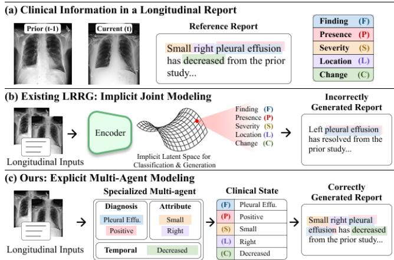
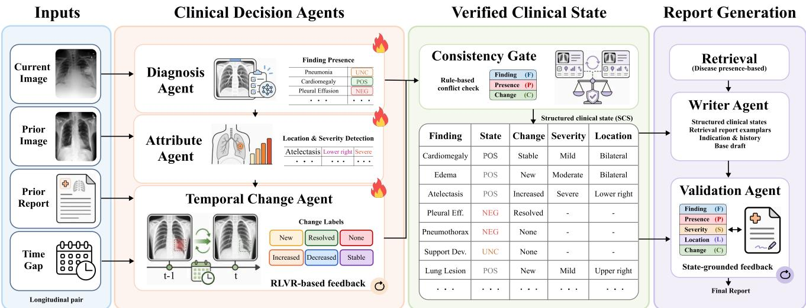
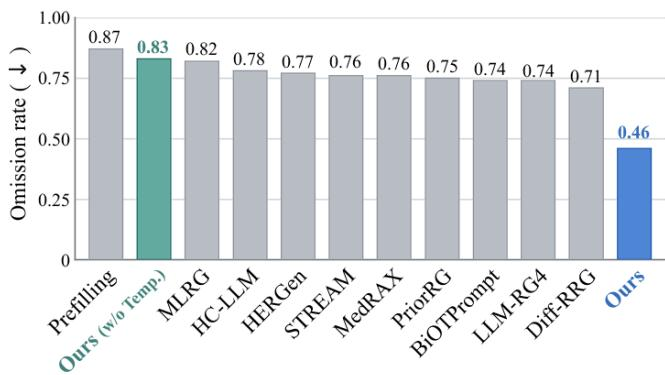
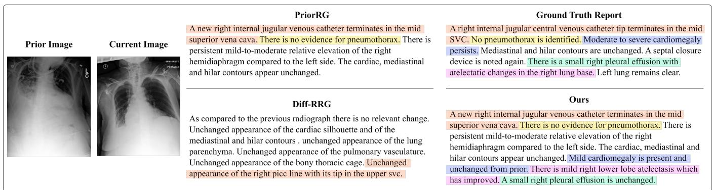

# STRIVE: Multi-Agent Structured Temporal Reasoning with Integrated Verification for Longitudinal Radiology Report Generation

Junyeong Maeng<sup>1</sup>, Eunsong Kang<sup>2∗</sup>, Heung-Il Suk<sup>1∗</sup>

<sup>1</sup>Department of Artificial Intelligence, Korea University, Seoul, Republic of Korea <sup>2</sup>Graduate School of Data Science, Kangwon National University, Chuncheon, Republic of Korea mjy8086@korea.ac.kr, eskang@kangwon.ac.kr, hisuk@korea.ac.kr

## Abstract

Longitudinal radiology report generation (LRRG) requires identifying both current findings and their changes relative to a prior study. Existing methods jointly model diagnosis, attribute estimation, temporal comparison, and language generation within implicit representations, which can cause task interference, obscure the evidence underlying each decision, and limit error traceability. They also model progression states as independent labels, ignoring their ordered structure and thus treating missed changes and direction reversals equally. We present STRIVE, Multi-Agent Structured Temporal Reasoning with Integrated Verification for LRRG, which decomposes clinical reasoning into specialized Diagnosis, Attribute, and Temporal Change Agents that produce explicit intermediate evidence. In particular, the Temporal Change Agent is further post-trained using Progression-Aware GRPO, a verifiable, shaped reward that assigns partial credit to directionpreserving errors while scoring direction reversals lowest. STRIVE performs verification at two stages: a deterministic Consistency Gate reconciles the agent outputs before report generation, and a Validation Agent checks whether the generated report is supported by the aggregated clinical evidence. On Longitudinal-MIMIC, STRIVE attains the best clinical eficacy among recent methods and more than doubles Longitudinal Change Concordance (LCC), a measure of temporal agreement with the reference report, over the strongest baseline.

## Introduction

Radiology report generation (RRG) aims to automatically generate clinically meaningful reports from medical images. It is a challenging task because models must accurately identify fine-grained clinical information, including disease presence, severity, and location, and faithfully express it in natural language (Brady 2018). Recent advances in vision-language models and large language models have improved the linguistic fluency and clinical accuracy of generated reports, driving active research in RRG (Wang et al. 2023, 2024; Liu et al. 2024). More recently, this task has been extended to longitudinal radiology report generation (LRRG), which compares studies across multiple time points to capture disease progression beyond findings observed at a single time point (Wang, Du, and Yu 2024; Nicolson et al. 2024; Liu et al. 2026a) as illustrated in Figure 1(a).

Recent LRRG methods incorporate longitudinal information in diferent ways. Alignment-based approaches establish temporal correspondences between prior and current studies by aligning visual or vision-language features (Liu et al. 2026b; Gao et al. 2026), whereas fusion-based approaches integrate features across studies into a unified longitudinal representation for report generation (Wang, Du, and Yu 2024; Dong et al. 2026), as illustrated in Figure 1(b). Despite efectively incorporating comparative information, these approaches face two key challenges: the implicit coupling of clinical reasoning and report generation, and inadequate modeling of directional relationships among progression states.

  
Figure 1: (a) A longitudinal report includes finding, presence, severity, location, and change. (b) Existing LRRG en tangles them in an implicit latent space, generating clinically inconsistent reports. (c) STRIVE decomposes them across specialized agents, forms an explicit clinical state, and verifies the final report.

The first limitation stems from implicit coupling of diagnosis, clinical attribute estimation, temporal reasoning, and report generation within a shared representation. These tasks impose diferent representational demands. Report generation favors a smooth semantic space, whereas clinical objectives require a discrete and constrained decision space. Their joint optimization can cause task interference, obscure finegrained evidence, and distort inferred information during generation (Zhang et al. 2026a). Moreover, when these reasoning processes are exposed only through the final report, it becomes dificult to determine whether an error originates from clinical reasoning or language generation. Explicit intermediate evidence is therefore essential for error localization, analysis, and clinical verification (Tanida et al. 2023).

The second limitation lies in inadequate modeling of relationships among progression states. Although recent LRRG methods use progression labels or change descriptions as supervision (Yun et al. 2025; Dong et al. 2026), they typically model these states as independent targets. This overlooks their directional structure: new and resolved represent opposite transitions, while increased, stable, and decreased reflect ordered changes in persistent findings. Consequently, conventional objectives do not adequately distinguish a missed progression, such as predicting stable instead of increased, from a direction reversal, such as predicting decreased instead of increased, despite their diferent clinical and directional severity.

Together, these limitations motivate an explicit multi-agent framework (Khan et al. 2026; Zhang et al. 2026b) that separates diagnosis, attribute estimation, and temporal reasoning across specialized agents, enabling task-specific optimization while making intermediate clinical evidence explicit. However, agent specialization may introduce cross-agent inconsistency, where agents produce conflicting findings, and evidence-to-report unfaithfulness, where valid intermediate evidence is omitted or distorted during report generation. Reliable multi-agent LRRG therefore requires integrated verification to keep the final report grounded in aggregated clinical evidence.

Alongside these modeling considerations, evaluation should also reflect the temporal correctness of generated reports. Existing diagnosis-based (Smit et al. 2020), lexical (Papineni et al. 2002; Lin 2004; Banerjee and Lavie 2005), model-based (Zhang et al. 2020; Ostmeier et al. 2024), and structure-based (Jain et al. 2021; Yu et al. 2023) metrics capture complementary aspects of report quality, including disease accuracy, linguistic similarity, semantic agreement, and structural consistency. However, progression-specific properties are assessed only indirectly. A more direct evaluation of disease-specific change coverage and directional agreement is therefore needed for LRRG.

To address these limitations, we propose STRIVE: Multi-Agent Structured Temporal Reasoning with Integrated Verification for Longitudinal Radiology Report Generation. STRIVE decomposes longitudinal interpretation into specialized clinical reasoning agents, explicitly models progression-state relationships, and integrates evidence reconciliation with report-level validation as illustrated in Figure 1(c). Our contributions are fourfold:

• We propose STRIVE, a multi-agent LRRG framework that decomposes diagnosis, clinical attribute estimation, and temporal progression modeling into specialized agents with explicit intermediate evidence.

• We introduce Progression-Aware GRPO, a reinforcement learning with verifiable rewards (RLVR) objective whose shaped, multi-level reward captures the directiona and graded relationships among longitudinal progression states (e.g., increased, decreased, stable).

• We develop a Consistency Gate to resolve logical conflicts among agent outputs and a Validation Agent to verify that the final report is supported by the committed clinical state.

• We evaluate STRIVE on Longitudinal-MIMIC and show that it outperforms existing methods in linguistic fluency, diagnostic performance, and progression-state agreement measured by Longitudinal Change Concordance (LCC).

## Related Work

## Longitudinal Radiology Report Generation

Conventional RRG primarily focuses on recognizing clinical findings, including disease presence, severity, and location, from a single study (Chen et al. 2020, 2021; Wang et al. 2023; Jin et al. 2024). However, methods based on a single study do not directly model cross-time disease changes, which require comparisons between prior and current studies. LRRG extends RRG by incorporating historical studies and modeling temporal evidence.

Existing LRRG methods difer mainly in how they relate the prior study to the current one. Fusion-based methods, such as PriorRG (Liu et al. 2026a), integrate prior and current visual features into a unified spatiotemporal representation. Alignment-based methods explicitly establish cross-time relationships between local visual regions. BiOTPrompt (Liu et al. 2026b) employs bidirectional optimal transport to identify asymmetric patch-level changes, whereas MARE (Gao et al. 2026) dynamically aligns lesion regions and performs analogical reasoning over visual and textual evolution relations. TIM (Dong et al. 2026) instead separates the spatial representation of each finding from the modeling of how it progresses between the two studies.

Despite their architectural diversity, existing LRRG methods encode disease recognition, clinical attribute estimation, and temporal comparison primarily within shared implicit representations. Such joint modeling causes interference among heterogeneous reasoning tasks, making errors dificult to trace and verify.

## Multi-Agent Clinical Reasoning and Verification

Recent RRG studies have begun to adopt multi-agent formulations that structure image interpretation and report generation into specialized stages based on clinical workflows. For example, CogRad (Khan et al. 2026) assigns global triage, regional investigation, report writing, and output verification to Scout, Investigator, Writer, and Verifier agents, respectively. RadAgents (Zhang et al. 2026b) divides chest X-ray interpretation by anatomical region and integrates the per-region analyses with a Synthesizer agent. Both also verify their outputs, CogRad by re-examining sentences that lack suficient visual support and RadAgents by resolving inconsistencies across agent and tool outputs. These formulations, however, decompose the interpretation of a single study, so no agent is responsible for deciding how a finding has changed relative to a prior one. STRIVE makes that decision an explicit agent output and verifies it against the diagnosed presence before the report is written.

  
Figure 2: Overview of STRIVE. Three Clinical Decision Agents infer per-finding presence (Diagnosis), severity and location (Attribute), and change labels (Temporal Change) post-trained with GRPO. A rule-based Consistency Gate resolves diagnosis–change conflicts and aggregates the outputs into a structured clinical state. A Writer Agent then generates the report and a Validation Agent applies state-grounded edits to produce the final report.

## Method

## Framework Overview

Let $X _ { j } ~ = ~ ( I _ { j } , v _ { j } )$ denote the chest X-ray image $I _ { j }$ and its acquisition view $v _ { j }$ at time $j \in \{ t - \mathrm { 1 } , t \}$ . The most recent prior study also provides its report $r _ { t - 1 }$ and the interstudy interval $\delta _ { t } .$ . We use $c _ { t }$ for the available clinical context, restricted to the study history and indication. Our framework, STRIVE, generates the current report $\hat { r } _ { t }$ as

$$
\hat { r } _ { t } = \mathcal { G } ( X _ { t } , X _ { t - 1 } , r _ { t - 1 } , \delta _ { t } , c _ { t } ) .\tag{1}
$$

We apply task decomposition to longitudinal report generation, factorizing it into three clinical decisions: presence in the current study, attributes of a present finding, and change relative to the prior study. Each decision is handled by a role-specialized agent. The Diagnosis Agent determines whether each finding is present, the Attribute Agent characterizes present findings in terms of severity and location, and the Temporal Change Agent identifies how each finding has changed since the prior study. We further perform verification at two stages. Before report generation, the Consistency Gate corrects change states that are incompatible with the diagnosis state. After report generation, the Validation Agent checks whether the generated report is supported by the structured clinical state. Figure 2 illustrates the overall pipeline.

## Clinical Decision Agents

Diagnosis Agent Let D denote the set of 14 CheXpert findings, consisting of 12 disease-related findings and two non-disease labels, {Support Devices, No Finding}. The Diagnosis Agent independently estimates the state of every finding $d \in \mathcal { D }$ from the corresponding study. It receives complementary evidence from seven frozen pretrained chest X-ray experts, comprising three classification experts and four generative experts. The classification experts provide continuous finding scores, whereas the generative experts produce report-like textual evidence that is converted into categorical finding states by a CheXbert labeler (Smit et al. 2020).

Let $\mathbf { e } _ { j }$ denote the resulting expert evidence at time $j .$ The expert evidence $\mathbf { e } _ { j }$ and acquisition view $v _ { j }$ are serialized in a fixed finding order and integrated by an instruction-tuned LLM $A _ { D } \mathrm { : }$

$$
\hat { \bf s } _ { j } = \boldsymbol A _ { D } ( { \bf e } _ { j } , v _ { j } ) \in \mathcal { V } _ { D } ^ { | D | } ,\tag{2}
$$

where $\mathcal { V } _ { D } = \{ \mathrm { P } 0 \mathbf { S } , \mathrm { U N C } , \mathtt { N E G } \}$ and $\hat { s } _ { j , d }$ denotes the predicted state of finding d at time j.

Attribute Agent The Attribute Agent characterizes findings predicted as positive in the current study. For each such finding, a medical vision-language model $\mathcal { A } _ { A }$ is prompted with the current chest X-ray $I _ { t }$ and returns its severity and location, where location may include laterality and anatomical region. We apply the Attribute Agent to the 12 disease-related findings, denoted by $\mathcal { D } _ { A } = \mathcal { D } \ \backslash$ {Support Devices, No Finding}.

For each $d \in { \mathcal { D } } _ { A }$ , the attribute output is defined as

$$
\hat { \mathbf { a } } _ { t , d } = \left\{ \begin{array} { l l } { \mathcal { A } _ { A } ( I _ { t } , d ) , } & { \hat { s } _ { t , d } = \mathsf { P O S } , } \\ { \perp , } & { \mathrm { o t h e r w i s e } , } \end{array} \right.\tag{3}
$$

where $\boldsymbol { \mathcal { A } _ { A } } ( \boldsymbol { I _ { t } } , \boldsymbol { d } ) = ( \hat { a } _ { t , d } ^ { \mathrm { s e v } } , \hat { a } _ { t , d } ^ { \mathrm { l o c } } )$ gives the predicted severity and location, and ⊥ indicates that no attribute prediction is available because the finding is not diagnosed as positive.

Temporal Change Agent The Temporal Change Agent $\boldsymbol { A } _ { T }$ determines how each finding has changed from the prior to the current study. It operates on the same 12 diseaserelated findings as the Attribute Agent, and we therefore define $\mathcal { D } _ { T } = \bar { \mathcal { D } } _ { A }$ . The agent produces a change-state

$$
\begin{array} { r } { \tilde { \mathbf { m } } _ { t } = \boldsymbol { \mathcal { A } } _ { T } \left( r _ { t - 1 } , \boldsymbol { \delta } _ { t } , \hat { \mathbf { s } } _ { t - 1 } , \hat { \mathbf { s } } _ { t } , \mathbf { p } _ { t - 1 } , \mathbf { p } _ { t } \right) , } \end{array}\tag{4}
$$

where $r _ { t - 1 }$ is the prior report, $\delta _ { t }$ is the inter-study interval, and $\hat { \mathbf { s } } _ { t - 1 }$ and $\hat { \mathbf { s } } _ { t }$ are the diagnosis states of the prior and current studies, respectively. The $\mathbf { p } _ { t - 1 }$ and $\mathbf { p } _ { t } ,$ produced by the three classification experts used in the Diagnosis Agent, contain the predicted presence probabilities for the 12 disease-related findings in the prior and current studies, respectively. Each element $\tilde { m } _ { t , d }$ represents the change state of finding d and takes one of six labels $\backprime _ { T } =$ {new, increased, stable, decreased, resolved, none}. The label none indicates that no longitudinal change state is assigned to the finding, so that a change state is defined for every finding in $\mathcal { D } _ { T }$ . Rather than directly comparing the raw image pair, the agent uses disease-specific presence probabilities and the prior report, providing an explicit and interpretable basis for finding-wise temporal reasoning.

## Training Strategies for Clinical Decision Agents

Supervised Fine-Tuning We first optimize each of the three agents using supervised fine-tuning (SFT). The Diagnosis Agent $A _ { D }$ is fine-tuned to predict the finding states in $\mathcal { { V } } _ { D }$ , while the Attribute Agent $\mathcal { A } _ { A }$ is trained to estimate the severity and location of positive findings. The attribute targets are extracted from the training reports using an LLMbased extractor. The Temporal Change Agent $\boldsymbol { A } _ { T }$ is finetuned to predict disease-wise change states defined in $\mathcal { \mathrm { { y } } } _ { T }$ To promote consistency across both temporal directions, we augment each valid training pair with a time-reversed counterpart. The prior and current evidence are swapped, along with the corresponding change labels: new and resolved are interchanged, as are increased and decreased, while stable and none remain unchanged. This augmentation encourages directionally consistent predictions when the study order is reversed.

Progression-Aware GRPO for Temporal Change Agent We post-train the Temporal Change Agent $\boldsymbol { \mathcal { A } } _ { T }$ with a twostage pipeline: SFT warmup followed by a reinforcementlearning (RL) stage (Guo et al. 2025). In the RL stage we optimize $\boldsymbol { \mathcal { A } } _ { T }$ with Group Relative Policy Optimization (GRPO) (Shao et al. 2024). Since the reward is computed programmatically from the structured change labels rather than by a learned reward model, our objective is an instance of RLVR. For each input, the policy samples a group of G candidate responses $\{ y _ { i } \} _ { i = 1 } ^ { G }$ . Each response is assigned a reward $R _ { i } = R ( y _ { i } , y ^ { * } )$ with respect to the report-derived target $y ^ { * }$ . The policy is then updated using the standard clipped GRPO objective, in which the advantage of $y _ { i }$ is its reward standardized within the group.

The reward is a shaped reward designed to reflect the structured relationships among longitudinal change states. A naive outcome (exact-match) reward treats all incorrect predictions equally, whereas our multi-level formulation assigns partial credit to direction-preserving errors. For example, predicting increased when the target is new preserves the worsening direction, whereas predicting decreased indicates the opposite direction. We therefore evaluate each response at three levels: detection, coarse-grained direction, and fine-grained

change state.

$$
R ( y , y ^ { * } ) = \frac { 1 } { 3 } \left( \mathrm { F 1 _ { d e t e c t } + F 1 _ { c o a r s e } + F 1 _ { f i n e } } \right) .\tag{5}
$$

At the detection level, the five explicit change states are grouped together, while none indicates that no change state is assigned. At the coarse level, new and increased are grouped as worsening, decreased and resolved as improving, while stable and none remain separate. At the fine level, predictions are evaluated using the original six change-state labels. This multi-level reward gives partial credit to predictions that preserve the clinical direction but miss the fine-grained change state, while assigning lower rewards to direction reversals and omitted changes.

## Verified Structured Clinical State

Consistency Gate Role-specialized clinical decision agents may yield mutually inconsistent predictions, as each agent addresses a distinct clinical objective. We therefore introduce a deterministic Consistency Gate that enforces two coherence properties between the diagnosis and change states, leaving all other predictions unchanged. First, a diagnosis of NEG is incompatible with new and increased, which the gate maps to decreased if the finding is present in the prior report and to none otherwise, whereas a diagnosis of POS is incompatible with resolved, which is replaced by decreased to preserve the direction of change. Second, a finding diagnosed as POS must carry a temporal status, since the five change states are exhaustive for a present finding; the gate therefore completes a remaining none to stable, the only state that asserts no change. The corrected change state is denoted by $\bar { m } _ { t , d }$

Structured Clinical State We aggregate the outputs of the clinical decision agents after consistency correction into a Structured Clinical State (SCS), denoted by $S _ { t }$ . For each finding $d ,$ we define

$$
\mathbf { z } _ { t , d } = \left( \hat { s } _ { t , d } , \hat { \mathbf { a } } _ { t , d } , \bar { m } _ { t , d } \right) , \qquad S _ { t } = \left\{ \mathbf { z } _ { t , d } \right\} _ { d \in \mathcal { D } } .\tag{6}
$$

Here, $\hat { \mathbf { a } } _ { t , d } ~ = ~ \perp$ when attribute estimation is unavailable or not applicable, whereas $\bar { m } _ { t , d } =$ none indicates that no explicit temporal change is assigned. The SCS preserves explicit disease-wise evidence for report generation and supports tracing errors to the corresponding clinical decision.

## State-Grounded Report Generation and Validation

Report Generation A retrieval module selects the top-K training reports using IDF-weighted cosine similarity between binary disease signatures derived from ${ \mathbf { } } S _ { t } ,$ yielding the exemplar set $\mathcal { R } _ { t }$ . A frozen image-to-report model B generates a current-study draft $b _ { t } .$ , and a frozen instruction-tuned Writer $\mathcal { W }$ produces the report conditioned on the SCS, the base draft, the retrieved exemplars, and the clinical context:

$$
b _ { t } = \mathcal { B } ( X _ { t } , c _ { t } ) , \qquad r _ { t } ^ { \mathrm { W } } = \mathcal { W } ( S _ { t } , b _ { t } , \mathcal { R } _ { t } , c _ { t } ) .\tag{7}
$$

The SCS provides the primary clinical content, while the base draft and retrieved reports supply complementary image details and stylistic guidance.

<table><tr><td rowspan="2">Input</td><td rowspan="2">Method</td><td rowspan="2">Venue</td><td colspan="6">NLG Metrics ↑</td><td colspan="3">CE Metrics ↑</td></tr><tr><td>B-1</td><td>B-2</td><td>B-3</td><td>B-4</td><td>R-L</td><td>MTR</td><td>P</td><td>R</td><td>F1</td></tr><tr><td rowspan="8">Single Image</td><td>R2Gen</td><td>EMNLP&#x27;20</td><td>0.308</td><td>0.190</td><td>0.126</td><td>0.089</td><td>0.266</td><td>0.124</td><td>0.457</td><td>0.290</td><td>0.355</td></tr><tr><td>R2GenCMN</td><td>ACL&#x27;21</td><td>0.328</td><td>0.203</td><td>0.135</td><td>0.096</td><td>0.273</td><td>0.133</td><td>0.512</td><td>0.359</td><td>0.422</td></tr><tr><td>R2GenGPT</td><td>Meta-Rad&#x27;23</td><td>0.396</td><td>0.243</td><td>0.161</td><td>0.108</td><td>0.260</td><td>0.155</td><td>0.495</td><td>0.385</td><td>0.404</td></tr><tr><td>PromptMRG</td><td>AAAI&#x27;24</td><td>0.384</td><td>0.229</td><td>0.149</td><td>0.104</td><td>0.261</td><td>0.146</td><td>0.517</td><td>0.453</td><td>0.439</td></tr><tr><td>EKAĠen</td><td>CVPR&#x27;24</td><td>0.405</td><td>0.245</td><td>0.156</td><td>0.105</td><td>0.264</td><td>0.154</td><td>0.472</td><td>0.404</td><td>0.411</td></tr><tr><td>GMoD</td><td>MICCAI&#x27;24</td><td>0.378</td><td>0.234</td><td>0.155</td><td>0.107</td><td>0.276</td><td>0.162</td><td>0.496</td><td>0.429</td><td>0.460</td></tr><tr><td>RADAR</td><td>ACL&#x27;25</td><td>0.412</td><td>0.242</td><td>0.162</td><td>0.114</td><td>0.257</td><td>0.155</td><td>0.448</td><td>0.436</td><td>0.417</td></tr><tr><td>MedRAX</td><td>ICML&#x27;25</td><td>0.388</td><td>0.235</td><td>0.151</td><td>0.102</td><td>0.259</td><td>0.151</td><td>0.524</td><td>0.507</td><td>0.515</td></tr><tr><td rowspan="10">Longitudinal</td><td>Prefilling</td><td>MICCAI&#x27;23</td><td>0.343</td><td>0.210</td><td>0.141</td><td>0.100</td><td>0.274</td><td>0.137</td><td>0.506</td><td>0.364</td><td>0.423</td></tr><tr><td>HERGen</td><td>ECCV’24</td><td>0.389</td><td>0.242</td><td>0.163</td><td>0.117</td><td>0.282</td><td>0.155</td><td>0.421</td><td>0.289</td><td>0.295</td></tr><tr><td>STREAM</td><td>TMI&#x27;25</td><td>0.394</td><td>0.237</td><td>0.144</td><td>0.104</td><td>0.261</td><td>0.143</td><td>0.472</td><td>0.428</td><td>0.411</td></tr><tr><td>MLRG</td><td>CVPR’25</td><td>0.416</td><td>0.252</td><td>0.157</td><td>0.114</td><td>0.264</td><td>0.158</td><td>0.507</td><td>0.425</td><td>0.418</td></tr><tr><td>LLM-RG4</td><td>AAAI&#x27;25</td><td>0.417</td><td>0.240</td><td>0.155</td><td>0.115</td><td>0.257</td><td>0.147</td><td>0.498</td><td>0.441</td><td>0.436</td></tr><tr><td>HC-LLM</td><td>AAAI&#x27;25</td><td>0.404</td><td>0.247</td><td>0.164</td><td>0.116</td><td>0.271</td><td>0.163</td><td>0.488</td><td>0.415</td><td>0.448</td></tr><tr><td>Diff-RRG</td><td>MICCAI&#x27;25</td><td>0.405</td><td>0.251</td><td>0.169</td><td>0.120</td><td>0.276</td><td>0.164</td><td>0.528</td><td>0.430</td><td>0.474</td></tr><tr><td>PriorRG</td><td>AAAI&#x27;26</td><td>0.369</td><td>0.261</td><td>0.199</td><td>0.159</td><td>0.337</td><td>0.170</td><td>0.576</td><td>0.452</td><td>0.507</td></tr><tr><td>MARE</td><td>AAAI&#x27;26</td><td>0.409</td><td>0.265</td><td>0.184</td><td>0.133</td><td>0.291</td><td>0.161</td><td>0.433</td><td>0.378</td><td>0.375</td></tr><tr><td>BiOTPrompt</td><td>CVPR&#x27;26</td><td>0.397</td><td>0.253</td><td>0.174</td><td>0.126</td><td>0.285</td><td>0.155</td><td>0.471</td><td>0.424</td><td>0.417</td></tr><tr><td>TIM</td><td>CVPR&#x27;26</td><td>0.430</td><td>0.265</td><td>0.179</td><td>0.124</td><td>0.287</td><td>0.185</td><td>0.563</td><td>0.505</td><td>0.511</td></tr><tr><td>Ours</td><td></td><td></td><td>0.466</td><td>0.318</td><td>0.235</td><td>0.183</td><td>0.335</td><td>0.195</td><td>0.581</td><td>0.665</td><td>0.620</td></tr></table>

Table 1: Comparison with single-image and longitudinal RRG methods on Longitudinal-MIMIC. B-n, R-L, and MTR denote BLEU-n, ROUGE-L, and METEOR. P, R, and F1 are the micro-averaged CheXbert precision, recall, and F1. Bold and underline indicate the best and second-best result per metric.

Validation Agent Although the SCS explicitly specifies the clinical content to be reported, the generation process may still omit committed findings or express them inconsistently (Nishino et al. 2022). The Validation Agent therefore compares the draft report $\overset { \cdot } { r _ { t } ^ { \mathrm { W } } }$ with $S _ { t }$ and performs targeted local edits. It first extracts the diagnosis states from the draft using a CheXbert labeler. Positive findings missing from the report are added, whereas positive statements unsupported by the SCS are removed only when the diagnosis experts also provide weak current-image evidence. A second pass verifies that each change state is expressed for the correct finding and corrects missing or inconsistent descriptions. The resulting report is denoted by $\hat { r } _ { t }$

## Experiments

## Experimental Setup

Dataset We evaluate on Longitudinal-MIMIC (Zhu et al. 2023), the longitudinal subset of MIMIC-CXR (Johnson et al. 2024), and the standard benchmark for LRRG on which most recent longitudinal methods are compared (Dong et al. 2026; Gao et al. 2026; Yun et al. 2025). Each example pairs a current study with the patient’s most recent prior study and its report, and the reference report accordingly describes both the current findings and how they have changed relative to the prior study. We follow the oficial train, validation, and test partitions, with 2,058 studies in the test set, and evaluate against the released reference reports.

Implementation Details All three clinical decision agents are optimized through supervised fine-tuning, and the Temporal Change Agent is subsequently refined using the

Progression-Aware GRPO objective in Eq. 5. Model checkpoints are selected according to validation performance. For report generation, a frozen PriorRG model (Liu et al. 2026a) provides a current-study draft, and we set K=3 for the retrieved exemplars. A frozen instruction-tuned 27B LLM performs both report writing and validation-based editing.

Baselines We compare against two groups of methods. Single-image RRG maps one chest X-ray to a report without temporal context and comprises R2Gen (Chen et al. 2020), R2GenCMN (Chen et al. 2021), R2GenGPT (Wang et al. 2023), PromptMRG (Jin et al. 2024), EKAGen (Bu et al. 2024), GMoD (Xiang et al. 2024), RADAR (Hou et al. 2025), and MedRAX (Fallahpour et al. 2025). Longitudinal RRG conditions on prior images, reports, or clinical context and comprises Prefilling (Zhu et al. 2023), HERGen (Wang, Du, and Yu 2024), STREAM (Yang et al. 2025a), MLRG (Liu et al. 2025a), LLM-RG4 (Wang et al. 2025), HC-LLM (Liu et al. 2025b), Dif-RRG (Yun et al. 2025), PriorRG (Liu et al. 2026a), MARE (Gao et al. 2026), BiOTPrompt (Liu et al. 2026b), and TIM (Dong et al. 2026).

For Table 1, we use the Longitudinal-MIMIC results reported in the original baseline papers when available and otherwise adopt the corresponding reimplementation results from TIM (Dong et al. 2026). If neither source provides the results, we train and evaluate the method using its oficial code. Table 2 requires access to the generated reports, so we retrain under the same protocol every baseline whose code is publicly released; MARE and TIM are therefore excluded, whereas MedRAX, although single-image, is retained as a representative agentic method.

<table><tr><td rowspan="2">Method</td><td colspan="2">LCC ↑</td><td colspan="7">ReXrank ↑</td></tr><tr><td>LCC-C</td><td>LCC-F</td><td>1/RadCliQ-v1</td><td>BLEU</td><td>BERTScore</td><td>SembScore</td><td>RadGraph-F1</td><td>RaTEScore</td><td>GREEN</td></tr><tr><td>Prefilling</td><td>0.089</td><td>0.053</td><td>0.819</td><td>0.176</td><td>0.397</td><td>0.352</td><td>0.180</td><td>0.528</td><td>0.281</td></tr><tr><td>HERGen</td><td>0.163</td><td>0.100</td><td>0.866</td><td>0.200</td><td>0.410</td><td>0.369</td><td>0.201</td><td>0.538</td><td>0.298</td></tr><tr><td>STREAM</td><td>0.166</td><td>0.100</td><td>0.820</td><td>0.195</td><td>0.401</td><td>0.333</td><td>0.191</td><td>0.537</td><td>0.277</td></tr><tr><td>MLRG</td><td>0.141</td><td>0.082</td><td>0.819</td><td>0.193</td><td>0.377</td><td>0.374</td><td>0.189</td><td>0.530</td><td>0.299</td></tr><tr><td>LLM-RG4</td><td>0.185</td><td>0.115</td><td>0.925</td><td>0.216</td><td>0.428</td><td>0.395</td><td>0.216</td><td>0.554</td><td>0.337</td></tr><tr><td>HC-LLM</td><td>0.155</td><td>0.089</td><td>0.873</td><td>0.214</td><td>0.421</td><td>0.356</td><td>0.205</td><td>0.540</td><td>0.297</td></tr><tr><td>Diff-RRG</td><td>0.187</td><td>0.114</td><td>0.900</td><td>0.220</td><td>0.426</td><td>0.376</td><td>0.211</td><td>0.542</td><td>0.322</td></tr><tr><td>PriorRG</td><td>0.187</td><td>0.115</td><td>1.141</td><td>0.270</td><td>0.484</td><td>0.441</td><td>0.270</td><td>0.577</td><td>0.341</td></tr><tr><td>BiOTPrompt</td><td>0.154</td><td>0.092</td><td>0.907</td><td>0.214</td><td>0.427</td><td>0.381</td><td>0.212</td><td>0.543</td><td>0.315</td></tr><tr><td>MedRAX</td><td>0.193</td><td>0.128</td><td>0.838</td><td>0.189</td><td>0.402</td><td>0.332</td><td>0.211</td><td>0.551</td><td>0.298</td></tr><tr><td>Ours (w/o Temporal)</td><td>0.148</td><td>0.095</td><td>1.132</td><td>0.267</td><td>0.467</td><td>0.475</td><td>0.260</td><td>0.582</td><td>0.337</td></tr><tr><td>Ours</td><td>0.394</td><td>0.283</td><td>1.173</td><td>0.272</td><td>0.483</td><td>0.467</td><td>0.270</td><td>0.582</td><td>0.342</td></tr></table>

Table 2: LCC and ReXrank results on Longitudinal-MIMIC. Bold and underline indicate the best and second-best results per metric. The ablation variant is excluded from the ranking.

<table><tr><td>Variant</td><td>B-1 MTR CE-F1 LCC-C LCC-F</td></tr><tr><td>Full model</td><td>0.466 0.195 0.620 0.394 0.283</td></tr><tr><td>w/o Attribute</td><td>0.454 0.191 0.615 0.346 0.250</td></tr><tr><td>w/o Temporal</td><td>0.452 0.192 0.622 0.148 0.095</td></tr><tr><td>w/o GRPO</td><td>0.464 0.195 0.618 0.389 0.259</td></tr><tr><td>w/o Consistency</td><td>0.465 0.195 0.620 0.389 0.274</td></tr><tr><td>w/o Base draft</td><td>0.381 0.171 0.610 0.404 0.280</td></tr><tr><td>w/o Validation</td><td>0.464 0.195 0.615 0.338 0.233</td></tr><tr><td>w/o Diagnosis</td><td>0.458 0.193 0.612 0.386 0.278</td></tr></table>

Table 3: Component ablation on Longitudinal-MIMIC.

## Evaluation Metrics

Report Quality and Clinical Eficacy We report standard natural language generation (NLG) metrics, namely BLEU-1 to BLEU-4 (Papineni et al. 2002), ROUGE-L (Lin 2004), and METEOR (Banerjee and Lavie 2005). We measure clinical eficacy (CE) by using CheXbert (Smit et al. 2020) on the generated and the reference report and comparing the resulting 14-finding labels, reporting micro-averaged precision, recall, and F1. To assess clinical quality beyond surface overlap, we further adopt the ReXrank (Zhang et al. 2025) suite, which measures lexical and semantic similarity through BERTScore (Zhang et al. 2020) and Semb-Score (Smit et al. 2020) and clinically aware quality through RadGraph-F1 (Jain et al. 2021), 1/RadCliQ-v1 (Yu et al. 2023), RaTEScore (Zhao et al. 2024), and GREEN (Ostmeier et al. 2024), together with a corpus-level BLEU.

Longitudinal Change Concordance To directly evaluate longitudinal correctness, we report LCC, which measures whether a generated report preserves the finding-specific temporal changes stated in the reference. An instructiontuned Gemma-4-31B extracts change propositions, each consisting of a finding and one of five labels: new, increased, decreased, resolved, or stable. This label set omits none, since a proposition is extracted only where a report states a change. A deterministic scorer matches propositions from the generated and reference reports at two levels. Coarse matching (LCC-C) requires agreement on the finding and its clinical direction, collapsing new into increased and resolved into decreased, whereas fine matching (LCC-F) requires the exact change label. Macro-F1 is computed over the reference-stated changes at each level. Unlike general semantic and clinically aware report-level metrics, this reference-anchored evaluation penalizes omitted changes and distinguishes direction-preserving errors from direction reversals.

## Main Results and Discussion

Comparison with the State of the Art Table 1 compares STRIVE with single-image and longitudinal RRG methods on Longitudinal-MIMIC. STRIVE achieves the best performance on all NLG metrics except ROUGE-L, where it ranks second, and on all three CE metrics. The larger gains in CE than in NLG suggest that the improvement primarily reflects clinical correctness rather than surface-level similarity, supported by explicitly representing diagnosis, attributes, and progression in the SCS before report generation. Moreover, recall exceeding precision (0.665 vs. 0.581) suggests that the framework recovers under-expressed clinical findings, while its leading precision indicates that this broader coverage does not introduce unsupported findings.

Table 2 evaluates report quality with the ReXrank suite, which measures lexical, semantic, and clinically aware agreement with the reference. STRIVE obtains the best result on six of its seven metrics, namely 1/RadCliQ-v1 (1.173), BLEU (0.272), SembScore (0.467), RadGraph-F1 (0.270), RaTEScore (0.582), and GREEN (0.342), and ranks second on BERTScore. Since these metrics reward factual and relational agreement rather than n-gram overlap, organizing clinical evidence before generation improves not only what the report states but how faithfully it does so.

Longitudinal Correctness Table 2 evaluates longitudinal correctness using LCC. STRIVE achieves an LCC-C of0.394 and an LCC-F of 0.283, more than twice the strongest baseline scores of 0.193 and 0.128, respectively. These gains indicate improved accuracy in both clinical direction and finegrained change states, whereas all baselines remain below 0.20 despite competitive ReXrank performance. Removing the Temporal Change Agent collapses LCC while leaving ReXrank performance largely unchanged, showing that the LCC improvement is attributable to explicit temporal change reasoning rather than to general report quality.

<table><tr><td colspan="2">Prior Image Current Image</td><td colspan="5">Structured Clinical State (SCS)</td><td colspan="2">Diff-RRG</td></tr><tr><td rowspan="7"></td><td rowspan="7"></td><td>Finding</td><td>State</td><td>Change</td><td>Severity</td><td>Location</td><td>As compared to the previous radiograph there is no relevant change.Moderate cardiomegaly is unchanged.Bilateral pleural effusionsand bibasilar atelectasis are</td></tr><tr><td>Enlarged Cardiom. NEG</td><td></td><td>none</td><td>n/a</td><td>n/a</td><td>also unchanged.No new parenchymal opacities.No pneumothorax.</td></tr><tr><td>Cardiomegaly</td><td>POS</td><td>stable</td><td>moderate</td><td>n/a</td><td></td></tr><tr><td>Lung Opacity</td><td>POS</td><td>stable</td><td>n/a</td><td>bibasilar</td><td>PriorRG</td></tr><tr><td>Lung Lesion</td><td>NEG</td><td>none</td><td>n/a</td><td>n/a</td><td>Low lung volumes are present. Heart size remains moderately enlarged.Dense</td></tr><tr><td>Edema</td><td>POS</td><td></td><td>increased mild</td><td>n/a</td><td>atherosclerotic calcifications are noted at the aortic knob. There is mild pulmonary</td></tr><tr><td>Consolidation</td><td>NEG</td><td>none none</td><td>n/a</td><td>n/a n/a</td><td>edema with perihilar haziness and vascular indistinctness. Small bilateral pleural</td></tr><tr><td colspan="2">Ground Truth Report</td><td>Pneumonia</td><td>NEG POS</td><td>stable</td><td>n/a unknown</td><td>bibasilar</td><td>effusions are likely present. Bibasilar airspace opacities likely reflect areas of atelectasis. No pneumothorax is identified.Moderate multilevel degenerative</td></tr><tr><td colspan="2">Lung volumes are low. Moderate cardiomegaly</td><td>Atelectasis Pneumothorax</td><td>NEG</td><td>none</td><td>n/a</td><td>n/a</td><td>changes are noted in the thoracic spine.</td></tr><tr><td colspan="2">is re-demonstrated. There is mild pulmonary</td><td>Pleural Effusion</td><td>POS</td><td>stable</td><td>small</td><td>bilateral</td><td>Ours</td></tr><tr><td colspan="2">edema, perhaps minimally worse compared to</td><td></td><td>NEG</td><td>none</td><td>n/a</td><td>n/a</td><td>Low lung volumes are present. Heart size remains moderately enlarged, consistent</td></tr><tr><td colspan="2">the previous exam.Small bilateral pleural</td><td>Pleural Other</td><td></td><td>none</td><td>n/a</td><td>n/a</td><td>with stable cardiomegaly. There is mild pulmonary edema with perihilar haziness</td></tr><tr><td colspan="2">effusions may be present,and bibasilar opacities</td><td>Fracture</td><td>NEG</td><td>none</td><td>n/a</td><td>n/a</td><td></td></tr><tr><td colspan="2">likely reflect areas of atelectasis.No large</td><td>Support Devices</td><td>NEG</td><td></td><td>n/a</td><td>n/a</td><td>and vascular indistinctness, worsened compared with the prior exam. Small</td></tr><tr><td colspan="2">pneumothorax is present.</td><td>No Finding</td><td>NEG</td><td>none</td><td></td><td></td><td>bilateral pleural effusions are likely present,and bibasilar airspace opacities likely reflect areas of atelectasis.No pneumothorax is identified.</td></tr></table>

Figure 3: Qualitative comparison on Longitudinal-MIMIC. Colors indicate disease states matched to the reference report, while red boxes denote incomplete states. STRIVE captures all findings and their detailed clinical states.

## Ablation Study

Table 3 presents ablation results on Longitudinal-MIMIC, where each variant removes or replaces a single component while keeping the remaining pipeline and decoding settings unchanged. The ablation results yield three insights. First, the Temporal Change Agent is the primary contributor to longitudinal correctness. Removing it sharply reduces LCC-C from 0.394 to 0.148 and LCC-F from 0.283 to 0.095, while CE-F1 remains essentially unchanged. Without the GRPO stage, LCC-F decreases to 0.259, indicating that the proposed reward improves fine-grained discrimination among change states. Second, the two verification stages provide complementary benefits. Removing the Validation Agent reduces CE-F1 from 0.620 to 0.615, LCC-C from 0.394 to 0.338, and LCC-F from 0.283 to 0.233, demonstrating its role in recovering findings and change states omitted during report generation. In contrast, removing the Consistency Gate leaves CE-F1 unchanged at 0.620 but lowers LCC-C from 0.394 to 0.389 and LCC-F from 0.283 to 0.274. This indicates that the gate specifically improves the consistency of longitudinal change predictions without altering finding-presence accuracy. Third, the Diagnosis and Attribute Agents, together with the base draft, contribute complementary information. Replacing the Diagnosis Agent with rule-based voting over the same seven experts reduces CE-F1 to 0.612, demonstrating the benefit of learned aggregation across heterogeneous experts. Removing the Attribute Agent lowers both NLG and CE performance, indicating the importance of severity and location information. In contrast, substituting the prior report for the base draft causes the largest NLG decline, with BLEU-1 decreasing from 0.466 to 0.381, but only a modest reduction in CE-F1. This suggests that the base draft primarily supports report realization, while the clinical decision agents determine the core clinical content.

## Qualitative Analysis

Figure 3 compares STRIVE with Dif-RRG and PriorRG on a representative longitudinal case, together with the SCS committed before generation. Both baselines recognize several findings from the reference report but leave their clinical state incomplete. Dif-RRG omits edema and lung opacity and reports pleural efusion without its severity, whereas PriorRG recognizes the pulmonary edema but not its interval increase. The SCS instead captures every finding stated in the reference together with its severity, location, and change, and STRIVE realizes all of these fields in the final report. The generated report therefore agrees with the reference not only on which abnormalities are present but also on how they are characterized and how they have changed.

## Conclusion

In this work, we proposed STRIVE, a multi-agent framework for LRRG. Rather than handling all clinical reasoning tasks within a single model, it assigns diagnosis, clinical attribute estimation, and temporal change reasoning to specialized agents. Furthermore, Progression-Aware GRPO improves directional change modeling, while the Consistency Gate and Validation Agent ensure consistency between structured clinical evidence and the generated report. On Longitudinal-MIMIC, STRIVE improves report quality, clinical eficacy, and LCC, more than doubling the LCC of the strongest baseline.

## References

Banerjee, S.; and Lavie, A. 2005. METEOR: An Automatic Metric for MT Evaluation with Improved Correlation with Human Judgments. In Proceedings of the ACL Workshop on Intrinsic and Extrinsic Evaluation Measuresfor Machine Translation and/or Summarization, 65–72.

Bannur, S.; Bouzid, K.; Castro, D. C.; Schwaighofer, A.; Thieme, A.; Bond-Taylor, S.; Ilse, M.; Pérez-García, F.; Salvatelli, V.; Sharma, H.; et al. 2024. MAIRA-2: Grounded radiology report generation. arXiv preprint arXiv:2406.04449.

Brady, A. P. 2018. Radiology reporting—from Hemingway to HAL? Insights into Imaging, 9(2): 237–246.

Bu, S.; Li, T.; Yang, Y.; and Dai, Z. 2024. Instance-level expert knowledge and aggregate discriminative attention for radiology report generation. In Proceedings ofthe IEEE/CVF Conference on Computer Vision and Pattern Recognition, 14194–14204.

Chen, Z.; Shen, Y.; Song, Y.; and Wan, X. 2021. Crossmodal Memory Networks for Radiology Report Generation. In Proceedings ofthe 59thAnnual Meeting oftheAssociation for Computational Linguistics and the 11th International Joint Conference on Natural Language Processing (Volume 1: Long Papers), 5904–5914.

Chen, Z.; Song, Y.; Chang, T.-H.; and Wan, X. 2020. Generating Radiology Reports via Memory-driven Transformer. In Proceedings of the 2020 Conference on Empirical Methods in Natural Language Processing, 1439–1449.

Chen, Z.; Varma, M.; Delbrouck, J.-B.; Paschali, M.; Blankemeier, L.; Van Veen, D.; Valanarasu, J. M. J.; Youssef, A.; Cohen, J. P.; Reis, E. P.; et al. 2024. CheXagent: Towards a foundation model for chest x-ray interpretation. In AAAI 2024 Spring Symposium on Clinical Foundation Models.

Dong, Y.; Lin, Y.; Huang, S.; Yang, X.; and Yang, X. 2026. TIM: Temporal Decoupling with Iterative Mutual-Refinement Model for Longitudinal Radiology Report Generation. In Proceedings of the IEEE/CVF Conference on Computer Vision and Pattern Recognition, 6951–6961.

Fallahpour, A.; Ma, J.; Munim, A.; Lyu, H.; and Wang, B. 2025. MedRAX: Medical Reasoning Agent for Chest X-ray. In International Conference on Machine Learning, 15661– 15676. PMLR.

Gao, Q.; Liu, T.; Li, X.; Zhang, X.; Sun, Z.; Wang, B.; Yin, B.; and Liu, Z. 2026. MARE: Multimodal analogical reasoning for disease evolution-aware radiology report generation. In Proceedings of the AAAI Conference on Artificial Intelligence, volume 40, 21180–21188.

Guo, D.; Yang, D.; Zhang, H.; Song, J.; Wang, P.; Zhu, Q.; Xu, R.; Zhang, R.; Ma, S.; Bi, X.; et al. 2025. DeepSeek-R1: Incentivizing reasoning capability in LLMs via reinforcement learning. arXiv preprint arXiv:2501.12948.

Hou, W.; Cheng, Y.; Xu, K.; Li, H.; Hu, Y.; Li, W.; and Liu, J. 2025. RADAR: Enhancing radiology report generation with supplementary knowledge injection. In Proceedings of the 63rd Annual Meeting of the Association for Computational Linguistics (Volume 1: Long Papers), 26366–26381.

Jain, S.; Agrawal, A.; Saporta, A.; Truong, S.; Bui, T.; Chambon, P.; Zhang, Y.; Lungren, M. P.; Ng, A. Y.; Langlotz, C.; et al. 2021. RadGraph: Extracting Clinical Entities and Relations from Radiology Reports. In Thirty-fifth Conference on Neural Information Processing Systems Datasets and Benchmarks Track (Round 1).

Jin, H.; Che, H.; Lin, Y.; and Chen, H. 2024. PromptMRG: Diagnosis-driven prompts for medical report generation. In

Proceedings of the AAAI Conference on Artificial Intelligence, volume 38, 2607–2615.

Johnson, A.; Lungren, M.; Peng, Y.; Lu, Z.; Mark, R.; Berkowitz, S.; and Horng, S. 2024. MIMIC-CXR-JPG - chest radiographs with structured labels (version 2.1.0).

Khan, S. U. R.; Maqsood, H.; Vollmer, S.; Dengel, A.; and Asim, M. N. 2026. CogRad: A Cognitively-Inspired Multi-Agent Framework for Radiology Report Generation. arXiv preprint arXiv:2607.03853.

Lin, C.-Y. 2004. ROUGE: A Package for Automatic Evaluation of Summaries. In Text Summarization Branches Out, 74–81.

Liu, K.; Ma, Z.; Fang, Z.; Li, Y.; Xie, K.; and Miao, Q. 2026a. PriorRG: Prior-guided contrastive pre-training and coarse-to-fine decoding for chest x-ray report generation. In Proceedings of the AAAI Conference on Artificial Intelligence, volume 40, 7206–7214.

Liu, K.; Ma, Z.; Kang, X.; Li, Y.; Xie, K.; Jiao, Z.; and Miao, Q. 2025a. Enhanced contrastive learning with multiview longitudinal data for chest x-ray report generation. In Proceedings ofthe Computer Vision and Pattern Recognition Conference, 10348–10359.

Liu, R.; Li, M.; Zhao, S.; Chen, L.; Chang, X.; and Yao, L. 2024. In-context learning for zero-shot medical report generation. In Proceedings of the 32nd ACM International Conference on Multimedia, 8721–8730.

Liu, T.; Fan, Y.; Wang, B.; Hu, Y.; Li, M.; Li, J.; and Gao, J. 2026b. BiOTPrompt: Bidirectional Optimal Transport Guided Prompting for Disease Evolution-aware Radiology Report Generation. In Proceedings ofthe IEEE/CVF Conference on Computer Vision and Pattern Recognition (CVPR), 612.

Liu, T.; Wang, J.; Hu, Y.; Li, M.; Yi, J.; Chang, X.; Gao, J.; and Yin, B. 2025b. HC-LLM: Historical-constrained large language models for radiology report generation. In Proceedings of the AAAI Conference on Artificial Intelligence, volume 39, 5595–5603.

Liu, Z.; Mao, H.; Wu, C.-Y.; Feichtenhofer, C.; Darrell, T.; and Xie, S. 2022. A ConvNet for the 2020s. In Proceedings of the IEEE/CVF Conference on Computer Vision and Pattern Recognition, 11976–11986.

Nicolson, A.; Dowling, J.; Anderson, D.; and Koopman, B. 2024. Longitudinal data and a semantic similarity reward for chest X-ray report generation. Informatics in Medicine Unlocked, 50: 101585.

Nishino, T.; Miura, Y.; Taniguchi, T.; Ohkuma, T.; Suzuki, Y.; Kido, S.; and Tomiyama, N. 2022. Factual Accuracy is not Enough: Planning Consistent Description Order for Radiology Report Generation. In Goldberg, Y.; Kozareva, Z.; and Zhang, Y., eds., Proceedings ofthe 2022 Conference on Empirical Methods in Natural Language Processing, 7123– 7138. Abu Dhabi, United Arab Emirates: Association for Computational Linguistics.

Ostmeier, S.; Xu, J.; Chen, Z.; Varma, M.; Blankemeier, L.; Bluethgen, C.; Md, A.; Moseley, M.; Langlotz, C.; Chaudhari, A.; et al. 2024. GREEN: Generative Radiology Report

Evaluation and Error Notation. In Findings of the Association for Computational Linguistics: EMNLP 2024, 374–390.

Papineni, K.; Roukos, S.; Ward, T.; and Zhu, W.-J. 2002. BLEU: a method for automatic evaluation of machine translation. In Proceedings of the 40th annual meeting of the Associationfor Computational Linguistics, 311–318.

Pérez-García, F.; Sharma, H.; Bond-Taylor, S.; Bouzid, K.; Salvatelli, V.; Ilse, M.; Bannur, S.; Castro, D. C.; Schwaighofer, A.; Lungren, M. P.; et al. 2025. Exploring scalable medical image encoders beyond text supervision. Nature Machine Intelligence, 1–12.

Sellergren, A.; Kazemzadeh, S.; Jaroensri, T.; Kiraly, A.; Traverse, M.; Kohlberger, T.; Xu, S.; Jamil, F.; Hughes, C.; Lau, C.; et al. 2025. MedGemma technical report. arXiv preprint arXiv:2507.05201.

Shao, Z.; Wang, P.; Zhu, Q.; Xu, R.; Song, J.; Bi, X.; Zhang, H.; Zhang, M.; Li, Y.; Wu, Y.; et al. 2024. DeepSeekMath: Pushing the limits of mathematical reasoning in open language models. arXiv preprint arXiv:2402.03300.

Smit, A.; Jain, S.; Rajpurkar, P.; Pareek, A.; Ng, A. Y.; and Lungren, M. 2020. CheXbert: Combining Automatic Labelers and Expert Annotations for Accurate Radiology Report Labeling Using BERT. In Proceedings of the 2020 Conference on Empirical Methods in Natural Language Processing, 1500–1519.

Tanida, T.; Müller, P.; Kaissis, G.; and Rueckert, D. 2023. Interactive and explainable region-guided radiology report generation. In Proceedings of the IEEE/CVF Conference on Computer Vision and Pattern Recognition, 7433–7442.

Wang, F.; Du, S.; and Yu, L. 2024. HERGen: Elevating radiology report generation with longitudinal data. In European Conference on Computer Vision, 183–200. Springer.

Wang, X.; Li, Y.; Wang, F.; Wang, S.; Li, C.; and Jiang, B. 2024. R2GenCSR: Retrieving Context Samples for Large Language Model based X-ray Medical Report Generation. CoRR.

Wang, Z.; Liu, L.; Wang, L.; and Zhou, L. 2023. R2GenGPT: Radiology report generation with frozen LLMs. Meta-Radiology, 1: 100033.

Wang, Z.; Sun, Y.; Li, Z.; Yang, X.; Chen, F.; and Liao, H. 2025. LLM-RG4: Flexible and factual radiology report generation across diverse input contexts. In Proceedings of the AAAI Conference on Artificial Intelligence, volume 39, 8250–8258.

Xiang, Z.; Cui, S.; Shang, C.; Jiang, J.; and Zhang, L. 2024. GMoD: graph-driven momentum distillation framework with active perception of disease severity for radiology report generation. In International Conference on Medical Image Computing and Computer-Assisted Intervention, 295– 305. Springer.

Yang, Y.; You, X.; Zhang, K.; Fu, Z.; Wang, X.; Ding, J.; Sun, J.; Yu, Z.; Huang, Q.; Han, W.; et al. 2025a. Spatiotemporal and retrieval-augmented modelling for chest X-ray report generation. IEEE Transactions on Medical Imaging.

Yang, Z.; Xu, X.; Zhang, J.; Wang, G.; Kalra, M. K.; and Yan, P. 2025b. Chest X-ray foundation model with global

and local representations integration. IEEE Transactions on Medical Imaging.

Yu, F.; Endo, M.; Krishnan, R.; Pan, I.; Tsai, A.; Reis, E. P.; Fonseca, E. K. U. N.; Lee, H. M. H.; Abad, Z. S. H.; Ng, A. Y.; et al. 2023. Evaluating progress in automatic chest X-ray radiology report generation. Patterns, 4(9).

Yun, H.; Maeng, J.; Kang, E.; and Suk, H.-I. 2025. Dif-RRG: Longitudinal disease-wise patch diference as guidance for llm-based radiology report generation. In International Conference on Medical Image Computing and Computer-Assisted Intervention, 152–161. Springer.

Zhang, E.; Hao, Y.; Wang, L.; and Guo, Z. 2026a. The Double Dilemma in Multi-Task Radiology Report Generation: A Gradient Dynamics Analysis and Solution. In Forty-third International Conference on Machine Learning.

Zhang, K.; Barrett, C. D.; Kim, J.; Sun, L.; Taghavi, T.; and Kenthapadi, K. 2026b. RadAgents: Multimodal Agentic Reasoning for Chest X-ray Interpretation with Radiologistlike Workflows. In Proceedings of the 9th International Conference on Medical Imaging with Deep Learning, volume 315 of Proceedings of Machine Learning Research, 3496– 3519. PMLR.

Zhang, T.; Kishore, V.; Wu, F.; Weinberger, K. Q.; and Artzi, Y. 2020. BERTScore: Evaluating Text Generation with BERT. In International Conference on Learning Representations.

Zhang, X.; Zhou, H.-Y.; Yang, X.; Banerjee, O.; Acosta, J. N.; Miller, J.; Huang, O.; and Rajpurkar, P. 2025. ReXrank: A Public Leaderboard for AI-Powered Radiology Report Generation. In AAAI Bridge Program on AI for Medicine and Healthcare, 90–99. PMLR.

Zhao, W.; Wu, C.; Zhang, X.; Zhang, Y.; Wang, Y.; and Xie, W. 2024. RaTEScore: A metric for radiology report generation. In Proceedings of the 2024 Conference on Empirical Methods in Natural Language Processing, 15004–15019.

Zhu, Q.; Mathai, T. S.; Mukherjee, P.; Peng, Y.; Summers, R. M.; and Lu, Z. 2023. Utilizing longitudinal chest x-rays and reports to pre-fill radiology reports. In International Conference on Medical Image Computing and Computer-Assisted Intervention, 189–198. Springer.

## Supplementary Material

## S1 Dataset

## S1.1 Dataset Construction

Longitudinal-MIMIC (Zhu et al. 2023) is built from the 26,625 MIMIC-CXR (Johnson et al. 2024) patients with two visits. Studies whose report has no findings section are discarded, and the remainder is partitioned with the oficial MIMIC-CXR patient-level split, so no patient appears in more than one partition. Each example pairs the current study with the patient’s most recent prior study and its report. Table S1 lists the resulting statistics.

## S1.2 Temporal Change Statistics

To characterize how much temporal content the reports actually carry, we apply the LCC change-statement extractor of Section S4 to the reference reports of all three partitions. Two properties motivate the LCC evaluation. First, temporal statements are common but far from universal: a comparison is stated in 55.0% of the training reports, 56.2% of the validation reports, and 67.5% of the test reports, at a density of 1.27 to 1.59 statements per report. Second, the change labels are strongly imbalanced in every partition. On the test partition they are dominated by stable (2,219), followed by increased (410), decreased (384), new (175), and resolved (87), so the rarest state accounts for under 3% of the statements. We therefore compute LCC as a macro-F1 over the change labels, so that the rare directional states are not absorbed by the dominant stable class.

## S2 Implementation Details

## S2.1 Clinical Decision Agents

Training Configuration The Diagnosis and Temporal Change Agents use Gemma-4-E4B-it; the Attribute Agent uses MedGemma-1.5-4B-it. All backbones are frozen and adapted with completion-only bfloat16 LoRA (r=16, α=32, dropout 0.05). Checkpoints are selected on the patientdisjoint validation partition. Table S2 gives the optimization settings. Training uses two NVIDIA RTX A6000 GPUs with 48 GB each.

Chest X-ray Expert Pool for the Diagnosis Agent The Diagnosis Agent aggregates three classification experts (ConvNeXt (Liu et al. 2022), RAD-DINO (Pérez-García et al. 2025), and CheXFound (Yang et al. 2025b)) and four generative experts (MedGemma (Sellergren et al. 2025), PriorRG (Liu et al. 2026a), CheXagent (Chen et al. 2024), and MAIRA-2 (Bannur et al. 2024)). All seven experts are frozen while the Diagnosis Agent is trained and evaluated. The classification experts predict continuous scores for the 14 CheXpert findings, which also provide the per-finding probabilities $\mathbf { p } _ { t - 1 }$ and $\mathbf { p } _ { t }$ for the Temporal Change Agent. A frozen CheXbert labeler (Smit et al. 2020) maps the reports of the generative experts to categorical finding states, and all evidence is serialized in a fixed finding order.

<table><tr><td></td><td>Train</td><td>Val</td><td>Test</td></tr><tr><td>Patients</td><td>26,156</td><td>203</td><td>266</td></tr><tr><td>Studies</td><td>92,374</td><td>737</td><td>2,058</td></tr><tr><td>Reports with change statements</td><td>50,849</td><td>414</td><td>1,390</td></tr><tr><td>Finding-level change statements</td><td>117,040</td><td>954</td><td>3,275</td></tr></table>

Table S1: Longitudinal-MIMIC partitions. Each study is paired with the patient’s most recent prior study, and the data are split at the patient level to prevent patient overlap across partitions.

<table><tr><td rowspan="2"></td><td rowspan="2">Diag. SFT</td><td rowspan="2">Attr. SFT</td><td colspan="2">Temporal</td></tr><tr><td>SFT</td><td>GRPO</td></tr><tr><td>Backbone LoRA r/α Optimizer Learning rate Batch size</td><td>Gemma 16/32 AdamW  $1 e ^ { - 4 }$ </td><td>MedGemma 16/32 AdamW  $1 e ^ { - 4 }$ </td><td>Gemma 16/32 AdamW  $1 e ^ { - 4 }$ </td><td>SFT ckpt 16/32 AdamW</td></tr></table>

Table S2: Optimization settings of the clinical decision agents. GRPO is initialized from the corresponding SFT checkpoint.

Progression-Aware GRPO for Temporal Change Agent The Temporal Change Agent is first trained with SFT and subsequently optimized with GRPO using the same LoRA configuration. For each prompt, the policy samples a group of G=6 completions at temperature 1.0. Group-relative advantages are computed using the progression-aware reward defined in the main paper. Because the reward is computed directly from the sampled change states and the report-derived target, GRPO does not require a separately learned reward model.

## S2.2 Report Generation

Base Draft Generation The base draft $b _ { t }$ is produced by a frozen PriorRG (Liu et al. 2026a) image-to-report model, which supplies current-image detail such as devices and measurements. For retrieval, the positive findings of the Structured Clinical State (SCS) are converted into a binary CheXpert-14 signature and matched against the signatures of the training reports under an IDF-weighted cosine similarity, where the inverse document frequency of finding d is log $\left( ( N { + } 1 ) / ( n _ { d } { + } 1 ) \right) + 1$ for a corpus of N reports containing finding d in $n _ { d }$ of them. Weighting by the square root of the IDF on both sides makes the similarity favor exemplars whose rare findings match and penalize exemplars that carry extra findings. The top K=3 reports are injected as style exemplars.

Writer The Writer is a frozen instruction-tuned Qwen3.6- 27B decoded greedily. Its prompt presents the SCS as the authoritative clinical content, the base draft as a source of image detail, and the retrieved reports as style references only, and it instructs the model to resolve any conflict in favor of the SCS.

## S2.3 Validation Agent

The Validation Agent uses the same frozen 27B model and greedy decoding as the Writer. Given a draft report, it first applies the frozen CheXbert labeler and compares the resulting 14-finding state vector with the SCS. Findings marked as positive in the SCS but omitted from the draft are inserted. Conversely, positive statements unsupported by the SCS are removed only when the diagnosis experts assign the corresponding finding a current-image probability below 0.3, thereby preventing deletion based solely on discrepancies in wording. In a second pass, the agent verifies whether each finalized temporal change state is expressed for the correct finding and locally revises the corresponding sentence when an inconsistency is detected, rather than regenerating the entire report. The validation procedure is limited to two passes.

## S3 Evaluation Metrics

## S3.1 NLG Metrics

These three metrics measure surface agreement with the reference wording.

• BLEU-n (B-n) (Papineni et al. 2002): the geometric mean of modified n-gram precisions up to order n, with a brevity penalty. It is a corpus-level statistic, since the n-gram counts of all 2,058 studies are pooled before the precision is formed, and being precision-based it penalizes content the reference does not contain.

• ROUGE-L (R-L) (Lin 2004): the F-measure over the longest common subsequence of the two reports. It does not require contiguity, so it is the more recall-oriented of the two.

• METEOR (MTR) (Banerjee and Lavie 2005): a recallweighted harmonic mean of unigram precision and recall over an alignment that admits stem, synonym, and paraphrase matches, with a penalty for fragmented alignments.

These overlap metrics do not distinguish clinically decisive terms from stylistic words.

## S3.2 CE Metrics

CE metrics score what the report asserts rather than how it is worded.

• Precision (P), Recall (R), and F1 are computed by labeling the generated and the reference report with the CheXbert labeler (Smit et al. 2020), which assigns each of 14 thoracic findings one of present, absent, uncertain, or blank. Following the convention of the baselines we compare against, the label is binarized by treating present as positive and the other three as negative, and the scores are micro-averaged over all finding–study pairs.

CE measures current-study finding presence, not temporal direction.

## S3.3 ReXrank Metrics

The ReXrank suite (Zhang et al. 2025) contributes seven metrics that reach beyond the fourteen-label constraint of CheXbert.

• BLEU-2: the mean of the CXR-Report-Metric study-level bigram BLEU scores, computed with the suite’s own preprocessing and reported separately from the corpus BLEU of Section S3.1.

• BERTScore (Zhang et al. 2020): an F-measure over greedily matched contextual token embeddings, so it credits equivalent phrasing that shares no surface tokens.

• SembScore (Smit et al. 2020): the cosine similarity between the CheXbert label embeddings of the two reports, an embedding-space relaxation of the CE comparison.

• RadGraph-F1 (Jain et al. 2021): the F1 over the clinical entities and relations RadGraph extracts from each report.

• 1/RadCliQ-v1 (Yu et al. 2023): the reciprocal of a composite error score fitted by regression to radiologist error counts, reported as a reciprocal so that larger is better.

• RaTEScore (Zhao et al. 2024): an entity-level similarity that weights medical entities by clinical importance and is robust to synonymy and negation.

• GREEN (Ostmeier et al. 2024): a score derived from the clinically significant errors a language model enumerates between the two reports.

## S3.4 Why LCC Is Needed

The report-level metrics above compare each generated report with the reference as a whole, allowing correctly generated findings and common report content to outweigh errors in a small number of temporal expressions. However, these expressions encode the key clinical information that distinguishes longitudinal reporting from single-study description. For example, pleural efusion has increased and pleural effusion remains stable identify the same current finding and share most of their wording, yet describe diferent disease trajectories. A more consequential error occurs when improved is replaced by worsened, reversing the clinical interpretation despite otherwise high report-level similarity. Temporal statements should therefore be evaluated according to their clinical significance rather than their relatively small lexical footprint.

The ablation results in the main paper support this distinction. Removing the Temporal Change Agent has little efect on ReXrank but substantially reduces LCC, indicating that whole-report similarity can remain high even when temporal reasoning deteriorates. LCC addresses this limitation by directly evaluating the temporal changes stated in the reference reports and distinguishing direction-preserving errors from reversals.

## S4 Longitudinal Change Concordance

## S4.1 Change-statement Extraction

LCC employs an instruction-tuned Gemma-4-31B to transform each report into a set of structured, finding-level change statements. The extracted statements are subsequently matched and aggregated using deterministic rules. The model is used solely for extracting finding-level evidence and change labels and does not directly assign the metric score. To ensure consistent processing, the same model, prompt template, and decoding configuration are applied to both the reference reports and all generated reports.

The extractor is applied once to each report using the prompt template provided below. The corresponding user message specifies the 13 admissible CheXpert findings (all 14 categories except No Finding), the five admissible change labels, and the report text. Greedy decoding is used throughout. Prior to extraction, each report is screened using a deterministic pattern matcher; reports without comparison cues are assigned an empty statement list without invoking the LLM. The initial generation budget is 1,024 tokens. If decoding terminates at the length limit, the budget is iteratively doubled up to 4,096 tokens to prevent long reports containing multiple findings from being truncated into incomplete statement lists.

```ini
[SYSTEM]
You extract longitudinal change propositions
from chest radiology reports.
Return compact JSON only: a list of objects.
Each object must have exactly these keys:
- finding: one of the allowed findings
- label: one of new, increased, decreased,
resolved, stable
- evidence_span: the exact sentence or
clause supporting the proposition
- change_cue: the exact temporal/change
phrase
- mention: the finding phrase
- laterality: left, right, bilateral, or
empty string
- region: upper, mid, lower, hilar,
mediastinal, or empty string
Rules:
- Extract only explicit comparison/
progression statements.
- Do not infer change from current findings
alone.
- stable includes unchanged, stable, similar
, persistent, redemonstrated, no new, no
significant change.
- new means newly present/interval
development.
- increased means worsened/progressed/larger
/more extensive.
- decreased means improved/smaller/less
extensive/resolving/partial clearing.
- resolved means absent now after previously
present/no longer seen/cleared.
- Ignore non-clinical dates and comparison
boilerplate unless a finding change is
stated.
- If no explicit finding-level change exists
, return [].
- Do not include explanations, markdown,
confidence, or extra keys.
```

[USER]   
Allowed findings: Atelectasis, Cardiomegaly, Enlarged Cardiomediastinum, Consolidation,   
Edema,   
Lung Lesion, Lung Opacity, Pleural Effusion, Pleural Other, Pneumonia, Pneumothorax,   
Fracture,   
Support Devices   
Allowed labels: new, increased, decreased,   
resolved, stable   
Report:   
<report text>   
JSON:

## S4.2 Matching Rules

LCC uses reference-anchored, one-to-one matching. For each statement in the reference report, it searches the generated report for an unmatched candidate statement referring to the same finding. Laterality and anatomical region are retained by the extractor but are not imposed as hard matching constraints, because LCC is designed to isolate temporal agreement from localization specificity. When multiple compatible candidates are available, they are prioritized by exact fine-grained label agreement, followed by coarse directional agreement and then finding agreement alone. Each candidate statement can be matched at most once, preventing a single generated statement from covering multiple reference changes. If no compatible candidate is found, the reference statement is assigned the predicted label none, thereby encoding the omission as a false negative.

This produces one predicted label per reference statement, and macro-F1 is computed over those pairs, at the fine level over the five labels and at the coarse level after collapsing new into increased and resolved into decreased. Support Devices statements are excluded from the primary scope. Candidate-only statements are excluded from this reference-anchored primary score.

## S5 In-Depth Analysis

## S5.1 Longitudinal Change Coverage

Figure S1 compares omission rates to assess how well each method preserves the temporal changes stated in the reference reports. The baselines omit 0.71–0.87 of the reference changes, whereas STRIVE reduces the omission rate to 0.46, corresponding to an absolute reduction of 0.25 and a relative reduction of 35% over the best baseline. When the Temporal Change Agent is removed, the omission rate increases from 0.46 to 0.83, returning to the baseline range.

These results show that STRIVE’s LCC gains arise not only from predicting the correct direction for mentioned changes but also from preserving substantially more reference-stated temporal information. Together with the improvements in coarse- and fine-grained LCC, the ablation confirms that the explicit finding-wise transition map improves both change coverage and directional accuracy by providing the Writer with committed change states that the Validation Agent can enforce.

<table><tr><td rowspan="2">Method</td><td colspan="5">Fine change label (F1) ↑</td><td rowspan="2">LCC-F</td><td colspan="2">Direction (F1) ↑</td><td rowspan="2">LCC-C</td></tr><tr><td>new</td><td>increased</td><td>decreased</td><td>resolved</td><td>stable</td><td>worsened</td><td>improved</td></tr><tr><td>Prefilling</td><td>0.000</td><td>0.024</td><td>0.005</td><td>0.000</td><td>0.236</td><td>0.053</td><td>0.027</td><td>0.004</td><td>0.089</td></tr><tr><td>HERGen</td><td>0.040</td><td>0.071</td><td>0.064</td><td>0.000</td><td>0.325</td><td>0.100</td><td>0.107</td><td>0.057</td><td>0.163</td></tr><tr><td>STREAM</td><td>0.039</td><td>0.086</td><td>0.039</td><td>0.000</td><td>0.336</td><td>0.100</td><td>0.127</td><td>0.036</td><td>0.166</td></tr><tr><td>MLRG</td><td>0.000</td><td>0.068</td><td>0.039</td><td>0.000</td><td>0.300</td><td>0.082</td><td>0.077</td><td>0.045</td><td>0.141</td></tr><tr><td>LLM-RG4</td><td>0.000</td><td>0.057</td><td>0.130</td><td>0.023</td><td>0.368</td><td>0.115</td><td>0.066</td><td>0.121</td><td>0.185</td></tr><tr><td>HC-LLM</td><td>0.000</td><td>0.052</td><td>0.076</td><td>0.000</td><td>0.318</td><td>0.089</td><td>0.049</td><td>0.099</td><td>0.155</td></tr><tr><td>Diff-RRG</td><td>0.000</td><td>0.097</td><td>0.066</td><td>0.000</td><td>0.405</td><td>0.114</td><td>0.083</td><td>0.074</td><td>0.187</td></tr><tr><td>PriorRG</td><td>0.050</td><td>0.068</td><td>0.084</td><td>0.000</td><td>0.373</td><td>0.115</td><td>0.105</td><td>0.085</td><td>0.187</td></tr><tr><td>BiOTPrompt</td><td>0.000</td><td>0.048</td><td>0.035</td><td>0.000</td><td>0.376</td><td>0.092</td><td>0.054</td><td>0.033</td><td>0.154</td></tr><tr><td>MedRAX</td><td>0.102</td><td>0.113</td><td>0.098</td><td>0.000</td><td>0.326</td><td>0.128</td><td>0.145</td><td>0.108</td><td>0.193</td></tr><tr><td>Ours</td><td>0.195</td><td>0.316</td><td>0.200</td><td>0.193</td><td>0.511</td><td>0.283</td><td>0.407</td><td>0.265</td><td>0.394</td></tr><tr><td>Reference n</td><td>175</td><td>410</td><td>384</td><td>87</td><td>2,219</td><td>3,275</td><td>585</td><td>471</td><td>3,275</td></tr></table>

Table S3: Per-label decomposition of LCC. Each cell is the F1 with which a system recovers the reference changes carrying that label; LCC-F and LCC-C are the macro means over the five fine labels and the three direction classes. The stable column is shared by both levels and is therefore not repeated in the direction block. The last row gives the number of reference changes carrying each label, which is the denominator of the corresponding recall. Bold and underline mark the best and second-best system per column.

  
Figure S1: Omission rate under the primary direction-only matching protocol, defined as the fraction of referencestated changes absent from the generated report. STRIVE achieves the lowest omission rate, while removing the Temporal Change Agent increases it to the baseline range.

## S5.2 Per-Label Analysis of LCC

Table S3 decomposes LCC into per-label F1 scores, averaged over five fine-grained labels for LCC-F and three coarsegrained labels for LCC-C. STRIVE achieves the highest F1 for all five labels, confirming that its improvement is not driven solely by the dominant stable class. The largest gains are observed for increased and resolved; notably, nine of the ten baselines fail to recover any of the 87 reference resolved statements correctly. This result also motivates macro averaging: because stable accounts for 2,219 of the 3,275 reference changes, micro averaging would obscure performance on the rarer directional states, whereas macro averaging assigns equal weight to each label. This distinction is clinically important because reliable longitudinal reporting requires not only recognizing unchanged findings but also accurately capturing the rarer directional changes that indicate progression or resolution.

## S5.3 Bootstrap Analysis of LCC Improvements

We assessed the statistical significance of the LCC improvements using a paired nonparametric bootstrap over the 2,058 test study pairs with 2,000 resamples. LCC was recomputed for each resample because it is a corpus-level macro-F1 rather than an average of study-level scores. As reported in Table S4, STRIVE’s 95% confidence intervals lie entirely above those of all ten baselines at both granularities; for LCC-C, the strongest baseline has an upper bound of 0.212, whereas STRIVE has a lower bound of 0.373. The paired diferences between STRIVE and every baseline remain positive across all resamples. Even against the strongest baseline, MedRAX, STRIVE achieves margins of 0.201 in LCC-C (95% CI [0.174, 0.229]) and 0.155 in LCC-F (95% CI [0.126, 0.183]), confirming that the improvements are statistically significant.

## S5.4 Stage-Wise Temporal Information Analysis

Table S5 traces how temporal information is preserved across the pipeline by evaluating each stage against the same 3,275 reference change statements. The Temporal Change Agent achieves 0.342/0.241 LCC-C/F, which increases to 0.354/0.250 after the Consistency Gate. The Writer output decreases to 0.338/0.233, indicating that some structured change states are not verbalized, whereas Validation raises the final report to 0.394/0.283. The first two rows evaluate structured states and the last two evaluate reportextracted statements; therefore, this table provides a stagewise pipeline trace rather than a component-removal ablation. This stage-wise trace highlights the value of explicit intermediate change states, which make temporal information loss during report generation identifiable and recoverable through validation.

  
Figure S2: Additional qualitative comparison on Longitudinal-MIMIC. Colors identify finding-specific statements in the reference and generated reports: cardiomegaly (blue), atelectasis (magenta), pneumothorax (yellow), pleural efusion (green), and support devices (orange).

<table><tr><td rowspan="2">Method</td><td colspan="2">LCC-C</td><td colspan="2">LCC-F</td></tr><tr><td>Value</td><td>95% CI</td><td>Value</td><td>95% CI</td></tr><tr><td>Prefilling HERGen STREAM MLRG</td><td></td><td>0.163 [0.146, 0.180] 0.100 [0.087, 0.114] 0.166 [0.150, 0.184] 0.100 [0.088, 0.113] 0.141[0.126, 0.157] 0.082 [0.072, 0.092]</td><td></td><td>0.089 [0.079, 0.099] 0.053 [0.046, 0.060]</td></tr><tr><td>LLM-RG4 HC-LLM Diff-RRG</td><td></td><td>0.155 [0.140, 0.172] 0.089 [0.079, 0.099] 0.187 [0.171, 0.203] 0.114 [0.103, 0.124]</td><td></td><td>0.185[0.169, 0.202] 0.115[0.103, 0.131]</td></tr><tr><td></td><td></td><td></td><td></td><td></td></tr><tr><td></td><td></td><td></td><td></td><td></td></tr><tr><td>PriorRG</td><td></td><td></td><td></td><td></td></tr><tr><td>BiOTPrompt 0.154 [0.140, 0.169] 0.092 [0.083, 0.101]</td><td></td><td>0.187 [0.169, 0.207] 0.115 [0.100, 0.129]</td><td></td><td></td></tr></table>

Table S4: LCC scores with 95% bootstrap percentile confidence intervals computed over the 2,058 test study pairs using B = 2,000 resamples. STRIVE’s confidence interval does not overlap with that ofany baseline at either granularity. Bold and underlined values indicate the best and second-best point estimates, respectively.

## S5.5 Additional Qualitative Case Analysis

Figure S2 presents an additional case-level comparison across five finding categories highlighted in the reference report: cardiomegaly, atelectasis, pneumothorax, pleural effusion, and support devices. PriorRG (Liu et al. 2026a) preserves the catheter and negative pneumothorax statements but omits atelectasis and pleural efusion, whereas Dif-RRG (Yun et al. 2025) focuses primarily on stability and line placement.

In contrast, STRIVE covers every highlighted category.

<table><tr><td>Pipeline stage</td><td>LCC-C</td><td>LCC-F</td></tr><tr><td>Raw Temporal Agent outputs</td><td>0.342</td><td>0.241</td></tr><tr><td>after Consistency Gate</td><td>0.354</td><td>0.250</td></tr><tr><td>after Writer, before Validation</td><td>0.338</td><td>0.233</td></tr><tr><td>after Validation</td><td>0.394</td><td>0.283</td></tr></table>

Table S5: Stage-wise LCC on the same 3,275 reference changes. The first two rows score structured change states; the final two score the report before and after Validation.

## S6 Prompts

This section presents the instruction and input schemas used by the language-model agents. Angle brackets mark inference-time slots, and an ellipsis marks a block repeated per finding. The Diagnosis, Attribute, and Temporal Change Agents are fine-tuned on the requested response formats, whereas the Writer and Validation Agent are frozen.

## S6.1 Diagnosis Agent

The template combines three classification probabilities and four CheXbert reads in a fixed finding order.

[SYSTEM]   
You are the orchestrator of a chest X-ray   
diagnosis system. The CURRENT study is   
represented by a   
SINGLE chest X-ray image of a stated view (   
PA, AP, or LATERAL). SEVEN experts scored   
THIS image:   
- cn (convnext), rd (rad\_dino), cf (   
chexfound): image models -> probability 0..1   
- mg (medgemma), pr (priorrg), cx (   
chexagent), mr (maira2): vision-language   
readers   
-> CheXbert read (1=present, 0.5=   
uncertain, 0=absent)   
Experts disagree, and each is more reliable   
for some findings than others. The VIEW   
matters -- a   
finding can be clearer or harder to see on a   
given view (e.g. a small effusion is   
clearer on

lateral; a retrocardiac opacity can be   
obscured on a frontal view), so calibrate   
confidence to what   
this single view can show. For EACH of the   
14 findings, integrate the seven expert   
reads for THIS   
image and assign a STATE:   
POS = confidently present on this image   
UNC = uncertain / equivocal -- a   
radiologist would hedge   
NEG = absent, or not applicable   
Most findings are NEG. Use POS only when the   
evidence is convincing; use UNC when the   
experts   
disagree or the signal is borderline. Output   
ONLY a JSON object mapping each finding to   
"POS"|"UNC"|"NEG". No prose.   
[USER]   
CURRENT study: 1 image(s).   
Per-finding expert reads for EACH image/view   
(cn rd cf = prob 0-1; mg pr cx mr = score   
0/0.5/1):   
- Enlarged Cardiomediastinum: [<view>] cn=<p   
> rd=<p> cf=<p> mg=<s> pr=<s> cx=<s> mr=<s>   
- Cardiomegaly: [<view>] cn=<p   
> rd=<p> cf=<p> mg=<s> pr=<s> cx=<s> mr=<s>   
... one line per CheXpert finding, in a   
fixed order ...   
- No Finding: [<view>] cn=<p   
> rd=<p> cf=<p> mg=<s> pr=<s> cx=<s> mr=<s>   
JSON (each finding -> "POS"|"UNC"|"NEG"):

## S6.2 Attribute Agent

The agent is queried once per positive finding, permits none, and uses an open vocabulary for anatomical modifiers.

```ini
[SYSTEM]
You are an expert thoracic radiologist
writing the findings section of a chest X
ray report. You are
given the current radiograph and a finding
that IS present. Output ONLY how you would
characterize
that finding in the report: its severity/
extent, its laterality (left, right,
bilateral, or a
bilateral form such as bibasilar), and its
region (for example upper, mid, lower, base/
basilar,
apical, hilar, perihilar, retrocardiac,
costophrenic, or lingular) - using the exact
words and the
natural order a radiologist writes (e.g. ’
small right’, ’moderate’, ’left basilar’, ’
mild bibasilar’,
’left retrocardiac’, ’small bilateral’, ’
patchy right lower’). The lists above are
examples, not a
closed vocabulary: if the radiograph calls
for a different anatomical descriptor, write
the one a
```

radiologist would use. Radiologists   
frequently OMIT modifiers when a finding is   
not prominent or not   
localized; in that case output exactly ’none   
’. Output only the modifier words (or ’none   
’), nothing   
else.   
[USER]   
<current chest X-ray image>   
Finding: <finding name>. Characterization:

## S6.3 Temporal Change Agent

The direction token supports forward and time-reversed instances; unlisted findings map to none.

[SYSTEM]   
You are an expert thoracic radiologist   
predicting how each chest X-ray finding   
CHANGED between two   
studies of the same patient. You are given   
the DIRECTION, one study’s report, the TIME   
GAP, and,   
per finding, the prior report stance, prior   
and current diagnosis-model presence, prior   
and current   
image probability with interval delta, and   
temporal dynamics.   
Integrate these signals to determine   
presence, then assign new, increased,   
decreased, resolved, or   
stable relative to the stated direction. Use   
the interval delta for magnitude and the   
time gap with   
the finding’s dynamics to judge plausibility   
First reason briefly inside <think>...</   
think>. Then output ONLY a JSON array inside   
<answer>...</answer>: {"finding":<allowed   
finding>,"direction":<change label>}.   
Report only clinically notable changes; any   
finding you do not list is assumed unchanged

[USER]   
DIRECTION: <PRIOR -> CURRENT | CURRENT ->   
PRIOR>   
Allowed findings: Enlarged Cardiomediastinum   
, Cardiomegaly, Lung Opacity, Lung Lesion,   
Edema,   
Consolidation, Pneumonia, Atelectasis,   
Pneumothorax, Pleural Effusion, Pleural   
Other, Fracture   
TIME GAP: \~<days> days <documented or   
approximate>   
<PRIOR- or CURRENT-STUDY REPORT>: "<report>"   
PER-FINDING SIGNALS [prior report stance |   
prior and current diagnosis-model presence |   
prior and current image probability,   
interval delta | temporal dynamics]:   
- <finding>: prior[report<+|-|?> belief<+|->   
<p>] current[belief<+|-> <p>] Delta<d> |   
<rate>, <resolution constraint>   
... one line per allowed finding ...

Predict the notable interval changes, with   
direction:

## S6.4 Writer

The system message is abbreviated for space. The structured state controls clinical content, while retrieved reports provide style only.

```ini
[SYSTEM]
You are a radiologist writing a chest
radiograph report as ONE continuous prose
paragraph in natural MIMIC-CXR style (no
headers, no colons, no ’Findings:’/’
Impression:’ labels, no preamble).
CONTENT (authoritative = the structured
clinical state):
- Report EVERY positive finding so a
radiologist would recognize it; hedge
uncertain findings; never mention an absent
finding as present. Draw devices,
measurements, laterality and specific detail
from the Base Draft, but the set of present
findings MUST equal the positive set of the
state.
- Name findings unambiguously, but use the
NATURAL phrasings of the Style References.
REGISTER (write like the Style References,
NOT a checklist):
- Do NOT use the phrase ’is present’.
Integrate findings into flowing sentences.
- Attach a severity word (mild/moderate/
severe) ONLY to a genuinely prominent (new
or clearly
worsening) finding; MOST findings need NO
severity word.
- For stable or chronic findings use
continuity language (’again seen’, ’
unchanged’, ’stable’,
’persistent’, ’redemonstrated’, ’as before
’).
- Vary sentence openings; do NOT begin most
sentences with ’there is’. Match the
references’
brevity, connectives, and ordering.
Emulate their STYLE only; their findings are
not yours.
[USER]
## Clinical Context & Patient History
<indication and history>
## Views Examined
<views>
## Structured Clinical Findings (Current
Study)
REQUIRED MENTIONS (POS): <findings>
UNCERTAIN: <findings>
ABSENT: <findings>
## Attributes (severity / location /
laterality per positive finding)
```

- <finding>: <severity> <laterality> <region   
>   
... one line per positive finding ...   
## Changes from Prior Study   
- <finding>: <new|increased|stable|decreased   
|resolved>   
.. one line per finding carrying a change   
state ...   
## Base Draft Report (image detail; carry   
over devices, measurements, laterality)   
<base draft>   
## Style References (real reports with a   
similar finding profile; STYLE ONLY)   
1. <retrieved report>   
2. <retrieved report>   
3. <retrieved report>

## S6.5 Validation Agent

The two passes first reconcile finding presence and then insert any missing temporal states.

=== PASS 1: presence ===   
[SYSTEM]   
You are a minimal-diff chest X-ray report   
editor. Apply ONLY the listed corrections;   
keep every   
other sentence VERBATIM (same wording, order   
, style). Make each correction in as few   
words as   
possible and read naturally like a   
radiologist. Output ONLY the edited report   
as one continuous   
paragraph, no headers.   
[USER]   
## CURRENT REPORT   
<draft report>   
## CORRECTIONS TO APPLY (apply ONLY these;   
keep everything else verbatim)   
- ADD <finding>: stated in the clinical   
state but missing from the report   
- REMOVE <finding>: asserted in the report,   
absent from the clinical state, image   
probability <0.3   
... one line per correction ...   
Output ONLY the edited report as one   
continuous paragraph.   
=== PASS 2: change ===   
[SYSTEM]   
You are a radiologist minimally editing a   
chest X-ray report to make each finding’s   
temporal change   
explicit versus the prior study, using ONE   
CONCISE word only. For EVERY finding listed,   
add the   
single change word (unchanged/stable, new,   
increased, decreased, or resolved) DIRECTLY   
to that

finding’s EXISTING mention as a one-word   
modifier. Do NOT add ’compared to the prior   
study’, ’from   
prior’, or any long comparison clause --   
just the single word. Examples: ’severe   
cardiomegaly’ ->   
’stable severe cardiomegaly’; ’small pleural   
effusion’ -> ’increased small pleural   
effusion’;   
’atelectasis’ -> ’new atelectasis’. Never   
remove the disease name or its severity.   
Only if a finding   
is not mentioned at all, add ONE very short   
sentence (e.g. ’New pleural effusion.’).   
Keep all other   
sentences verbatim. Do not add findings that   
are not listed. Output ONLY the edited   
report as one   
continuous paragraph.   
[USER]   
## REPORT   
<report after pass 1>   
## FINDINGS -- make each finding’s temporal   
change explicit   
- <finding>: <change word>   
... one line per finding whose committed   
change state is missing from the report ...   
Edited report: