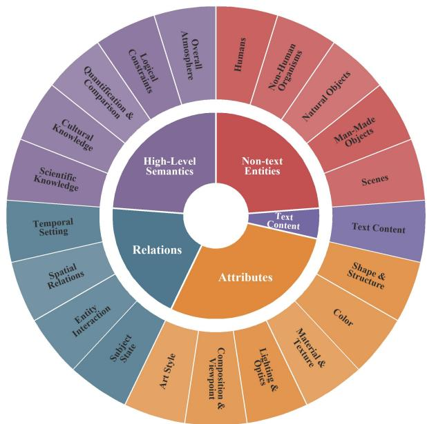
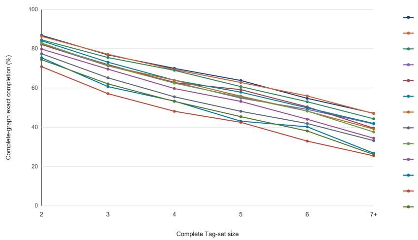
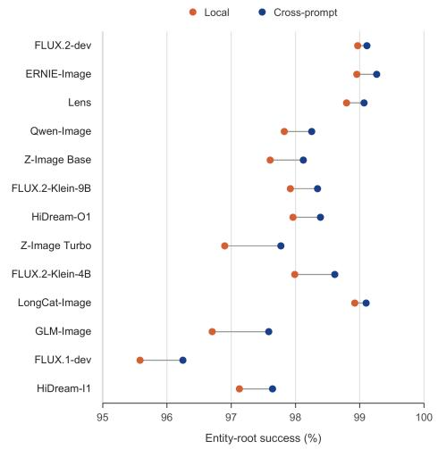
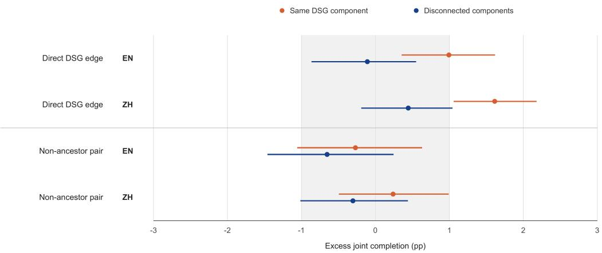

# Scalable Question-Centric Text-to-Image Evaluation: Reliable Ranking, Fine-Grained Diagnosis, and Cost-Aware Routing

Shaoan Zhao1,2,∗, Fang Zhao1,2,∗, Xueqiang Guo1,2, Xinpei Su1,2, Huanlin Gao1,2, Qiang Hui1,2, Ting Lu1,2, Fuyuan Shi1,2, Chao Tan1,2, Bikun Yang3, Kai Wang1,2,†, Shiguo Lian1,2,†

1Data Science & Artificial Intelligence Research Institute, China Unicom 2Unicom Data Intelligence, China Unicom 3China Unicom Group Co.,Ltd

## Abstract

Modern text-to-image (T2I) models often have similar total scores but diferent strengths, making practical selection dificult. Fine-grained benchmarks decompose prompts into questions, yet often return them to prompt scores and fixed categories, weakening attribution and ignoring complexity. Related requirements are also scored separately or as one total, obscuring basic versus compositional failure. We present QC-T2I-Bench, a question-centric framework that converts open prompts into attributed atomic questions and organizes their dependencies with Davidsonian Scene Graphs (DSGs). We use hierarchy-constrained question aggregation to exclude downstream questions after a prerequisite fails and to prevent simple and complex prompts from receiving the same total weight. We then use the DSG structure to measure joint success within prompts and compare repeated entities across prompts, separating basic realization failures from failures under additional requirements. We evaluate multiple opensource T2I models on English and Chinese prompts. The resulting question-level evidence supports reliable ranking and fine-grained diagnosis: joint completion falls from 80.7% for components with two capabilities to 37.2% for those with seven or more. Finally, we reuse the same records for trainingfree routing; our cost-aware router matches ERNIE’s 89.51- point estimate with 21.3% less GPU-s/MP.

## Introduction

Recent text-to-image (T2I) models have greatly improved image quality and prompt following (Esser et al. 2024; Black Forest Labs 2024; Wu et al. 2025). As models become stronger, choosing between them becomes harder. Models with similar aggregate scores may have very diferent capability profiles: one may render text accurately, another may handle spatial relations reliably, and yet another may better follow knowledge-intensive prompts. Practical model selection therefore needs more than a leaderboard. It needs evidence about where each model succeeds, why it fails, and which model best fits a particular request.

Conventional metrics provide global image- or promptlevel scores rather than evidence about individual requirements (Hessel et al. 2021). Evaluation has therefore moved toward question-generation and visual-question-answering (QG/A) methods that decompose a prompt into local checks (Hu et al. 2023; Cho et al. 2024; Li et al. 2024). This is an important step, but decomposition alone does not guarantee fine-grained evaluation. The central issue is how the resulting evidence is attributed, aggregated, and reused.

Many evaluation pipelines still organize this evidence around prompts. They collect prompts under predefined categories, generate local checks, average the checks into a prompt score, and assign that score back to the prompt’s category (Hu et al. 2023; Cho et al. 2024; Wei et al. 2025; Li et al. 2026). This design creates several recurring problems. A complex prompt may contain requirements from multiple capabilities, making its category score hard to interpret. A new request may not fit the predefined categories. Simple and complex prompts may receive the same total weight even though they contain diferent numbers of requirements. A missing parent object may cause several dependent checks to fail, exaggerating one error. Finally, evidence about the same requirement is rarely compared across prompts, making it dificult to tell whether a model fails on the basic content or only after additional constraints are added.

Table 1 summarizes these gaps. Atomic attribution (A), open-prompt evaluation (O), complexity awareness (C), and cross-prompt evidence (X) are four desired properties. Dependency awareness (D) is a necessary safeguard against repeated penalties caused by one missing prerequisite. Existing benchmarks support diferent subsets of these properties, but none combines all five.

We introduce QC-T2I-Bench, which changes the basic unit of evaluation from the prompt to the atomic question. Each record preserves the question’s capability label, visual answer, dependency validity, and prompt context. A twolevel taxonomy organizes questions into 21 capabilities under Non-text Entities, Text Content, Attributes, Relations, and High-Level Semantics. Hierarchy-Constrained Question Aggregation (HCQ) removes dependency-invalid evidence and balances capabilities instead of giving every prompt the same total weight. Because prompts use a shared question schema rather than benchmark-specific prompt categories, the same protocol can also be applied to new requests.

We further use DSGs to organize the questions in each prompt according to their dependencies (Cho et al. 2024). This lets us test whether a model can satisfy a group of related requirements together, rather than only checking them one by one. We then compare repeated entities across diferent prompts to distinguish a basic generation failure from a failure caused by additional attributes or relations. The same question records also form a capability profile for each model and can guide generator selection for new requests.

<table><tr><td>Benchmark</td><td>A</td><td>0</td><td>D</td><td>C</td><td>X</td></tr><tr><td>Arena-T2I Hard</td><td>●</td><td>0</td><td>●</td><td>0</td><td>O</td></tr><tr><td>ConceptMix</td><td>●</td><td>0</td><td>O</td><td>0</td><td>O</td></tr><tr><td>CVTG-2K</td><td>0</td><td>O</td><td>O</td><td>0</td><td>O</td></tr><tr><td>DPG-Bench</td><td>●</td><td>O</td><td>●</td><td>O</td><td>O</td></tr><tr><td>DSG</td><td>●</td><td>●</td><td>●</td><td>O</td><td>O</td></tr><tr><td>EvalMuse-40K</td><td>●</td><td>O</td><td>O</td><td>O</td><td>O</td></tr><tr><td>GenAI-Bench</td><td>O</td><td>●</td><td>O</td><td>0</td><td>O</td></tr><tr><td>GenEval</td><td>0</td><td>O</td><td>O</td><td>O</td><td>O</td></tr><tr><td>GenEval 2</td><td>●</td><td>O</td><td>O</td><td>0</td><td>O</td></tr><tr><td>LongTextBench</td><td>0</td><td>O</td><td>O</td><td>0</td><td>O</td></tr><tr><td>OneIG-Bench</td><td>0</td><td>O</td><td>0</td><td>0</td><td>O</td></tr><tr><td>PhyBench</td><td>0</td><td>O</td><td>O</td><td>O</td><td>O</td></tr><tr><td>PRISM-Bench</td><td>O</td><td>O</td><td>O</td><td>0</td><td>O</td></tr><tr><td>Qwen-Image-Bench</td><td>●</td><td>O</td><td>O</td><td>O</td><td>O</td></tr><tr><td>T2I-CompBench++</td><td>0</td><td>O</td><td>O</td><td>0</td><td>O</td></tr><tr><td>T2I-CoReBench</td><td>●</td><td>O</td><td>0</td><td>0</td><td>O</td></tr><tr><td>TIFA</td><td>●</td><td>●</td><td>O</td><td>O</td><td>O</td></tr><tr><td>TIIF-Bench</td><td>●</td><td>O</td><td>O</td><td>0</td><td>O</td></tr><tr><td>WISE</td><td>0</td><td>O</td><td>O</td><td>O</td><td>O</td></tr><tr><td>QC-T2I-Bench</td><td>●</td><td>●</td><td>●</td><td>●</td><td>●</td></tr></table>

Table 1: Support for five structural properties across T2I benchmarks. , , and denote full, partial, and no support. A: atomic attribution; O: open prompts; D: dependency awareness; C: complexity awareness; X: cross-prompt evidence.

We evaluate QC-T2I-Bench on 13 T2I models with bilingual evidence. The framework supports three connected uses: reliable ranking, fine-grained diagnosis, and cost-aware routing. Bootstrap analysis separates most model pairs while preserving uncertainty for the closest systems. The DSG analysis shows where models fail as related requirements accumulate. Finally, a training-free cost-aware router matches the fixed ERNIE point estimate while reducing GPU-s/MP by 21.3%.

Our contributions are threefold. (1) We introduce QC-T2I-Bench, which converts open prompts into attributed atomic questions and uses validity-aware Hierarchy-Constrained Question Aggregation (HCQ) to avoid prompt-level normalization. (2) We develop a DSG-based compositional analysis that combines complete-component success, cross-prompt root controls, and topology-matched contrasts to localize failures. (3) We demonstrate reliable ranking, fine-grained diagnosis, and training-free quality–cost routing, including a 21.3% cost reduction at the matched ERNIE point estimate.

## Related Work

Fine-grained evaluation benchmarks. T2I evaluation has progressed from controlled property tests to question-based verification. GenEval (Ghosh, Hajishirzi, and Schmidt 2023) evaluates predefined object properties, while GenEval 2 (Kamath et al. 2025) adds atom-level questions and atomicity analysis. TIFA (Hu et al. 2023) decomposes prompts into

VQA pairs, and DSG (Cho et al. 2024) organizes atomic questions through valid dependencies. Other work improves supervision and calibration through dimension-specific concepts or element-level annotations (Wei et al. 2025; Han et al. 2024), while VQAScore and GenAI-Bench study holistic alignment and its agreement with human preferences (Lin et al. 2024; Li et al. 2024). More recent benchmarks use hierarchical capability rubrics or dependency-aware checklists (Li et al. 2026; Ban et al. 2026). These developments make local verification more reliable, but their evidence is usually summarized within each prompt or a fixed reporting taxonomy.

Capability-specific and closed-set benchmarks. A complementary line of work deepens evaluation within selected capabilities. WISE and PhyBench focus on world knowledge and physical rules (Niu et al. 2025; Meng et al. 2024); T2I-CompBench++, ConceptMix, and DPG-Bench stress compositional or dense instructions (Huang et al. 2023; Wu et al. 2024; Hu et al. 2024); and PRISM-Bench, OneIG-Bench, and T2I-CoReBench expand coverage to bilingual, creative, and reasoning-heavy scenarios (Fang et al. 2025; Chang et al. 2026; Li et al. 2025a). LongTextBench and CVTG-2K further examine long or multilingual instructions and visual text (Geng et al. 2025; Du et al. 2025). Table 1 summarizes these structural choices: atomic checking is common, but support for open prompts, dependencies, and prompt complexity is fragmented; none of the compared benchmarks connects evidence across prompts. QC-T2I-Bench combines all five properties in one question-centric framework.

Evidence reuse and generator routing. Generatorrouting work addresses model selection directly. CATImage learns prompt-conditioned quality–cost decisions, while DifAgent uses an LLM agent for API selection (Li et al. 2025b; Zhao et al. 2024). OctoT2I, Image-POSER, and GenArtist extend selection to stateful or multi-step orchestration through self-evolving memory, reinforcement learning, or tool planning (Jiang et al. 2026; Mohebbi et al. 2025; Wang et al. 2024). These methods obtain routing signals by learning a policy, building agent state, or repeatedly evaluating intermediate outputs. Our router instead reuses questionlevel histories already collected for ranking and diagnosis, enabling training-free model selection from the same evaluation evidence.

## Method

QC-T2I-Bench retains the identity, capability coordinates, and dependency context of every atomic judgment. These records support two complementary operations. The scoring path aggregates valid non-text and text evidence into capability coordinates and a hierarchy-constrained question aggregation (HCQ) score. The structural path reuses the recorded DSGs to measure component completion, construct crossprompt root controls, and test topology-localized outcome coupling. The same records subsequently support model diagnosis and training-free routing.

Question construction and capability coordinates. We collect prompts from six public sources spanning knowledge, entities, attributes, relations, text rendering, reasoning, and long multilingual instructions; source counts are provided in the supplement. Each prompt $p$ is converted into $c ( p ) ~ = ~ \{ ( q _ { i } , t _ { i } ) \} _ { i = 1 } ^ { n _ { p } }$ , where $n _ { p }$ is the number of atomic questions, $q _ { i }$ is an independently judgeable question, and $t _ { i }$ is its secondary capability label. Construction follows four rules: Target Yes, Atomicity, Coverage, and Tag Validity. Together, they require a “yes” answer for a compliant image, one visual requirement per question, coverage of salient constraints, and attribution by the question’s core predicate. We instantiate this fixed contract with Qwen3-235B-A22B (Yang et al. 2025), iterative automated auditing, and a final cleanup pass; the supplement reports source composition and audit details.

  
Figure 1: Two-level taxonomy: five first-level reporting groups organize 21 mutually exclusive secondary capabilities, assigned by each question’s core predicate.

Evaluation produces one record per question,

$$
\boldsymbol { r } = ( p , q , m , \ell , g , t , y , v ) ,\tag{1}
$$

where p and q are the prompt and question, m is the evaluated model, ℓ is the language, g is the first-level reporting group, and t is the secondary capability. For non-text capabilities, $y \in \{ 0 , 1 \}$ is the native binary outcome and $v \in \{ 0 , 1 \}$ indicates dependency validity. Text Content retains the same capability coordinates but uses the transcription statistics defined below for oficial scoring. The taxonomy contains five first-level groups—Non-text Entities, Text Content, Attributes, Relations, and High-Level Semantics—and 21 secondary capabilities (Figure 1). Each question receives exactly one secondary capability by its core predicate, while one prompt may contribute questions to several groups. Text Content is separated because it uses the dedicated transcription evaluator described below.

Dependency-aware capability scoring. Before adjudication, we organize prompt p into a Davidsonian Scene Graph $G _ { p } = ( V _ { p } , E _ { p } )$ (Cho et al. 2024), where $V _ { p }$ is the set of question nodes and $E _ { p }$ is the set of directed prerequisite edges. An edge $u \to q \in \bar { E } _ { p }$ indicates that question u is a semantic prerequisite of $q .$ During adjudication, $q$ is scored only when its prerequisites succeed, preventing one missing entity from becoming repeated attribute and relation failures.

For model $m ,$ , language scope Λ, and non-text capability $t ,$ let $\mathcal { Q } _ { \ell , t }$ be the questions in language $\ell , y _ { m \ell q } \in \{ 0 , 1 \}$ their adjudicated outcomes, and $v _ { m \ell q } \in \{ 0 , 1 \}$ their dependency validity. The valid count and score are

$$
\begin{array} { l } { { \displaystyle N _ { m , \Lambda , t } = \sum _ { \ell \in \Lambda } \sum _ { q \in \mathcal { Q } _ { \ell , t } } v _ { m \ell q } } , } \\ { { \displaystyle S _ { m , \Lambda , t } = \frac { 1 } { N _ { m , \Lambda , t } } \sum _ { \ell \in \Lambda } \sum _ { q \in \mathcal { Q } _ { \ell , t } } v _ { m \ell q } y _ { m \ell q } } , \quad t \ne t _ { \mathrm { t e x t } } . }  \end{array}\tag{2}
$$

Thus $S _ { m , \Lambda , i }$ t is the mean over valid questions at one capability coordinate when $N _ { m , \Lambda , t } > 0$ and is NA otherwise; invalid records enter neither sum.

Text-rendering branch. Rendered text remains a semantic capability coordinate, but its evidence type difers: a binary VQA judgment can accept semantically related text while missing character-level errors. We therefore use Qwen3- VL-Instruct-30B to extract text blocks and optimally match them to targets within each image i. Let $D _ { m \ell i }$ be the targetconditioned UTF-16 edit distance and $\boldsymbol { L _ { \ell i } }$ the target length, and let $\mathcal { T } _ { m \ell } ^ { \mathrm { t e x t } }$ contain images with an available transcription record. We micro-average over all available text records in language scope Λ:

$$
S _ { m , \Lambda , t _ { \mathrm { t e x t } } } = \operatorname* { m a x } \left( 0 , 1 - \frac { \sum _ { \ell \in \Lambda } \sum _ { i \in \mathcal { I } _ { m \ell } ^ { \mathrm { t e x t } } } D _ { m \ell i } } { \sum _ { \ell \in \Lambda } \sum _ { i \in \mathcal { I } _ { m \ell } ^ { \mathrm { t e x t } } } L _ { \ell i } } \right) .\tag{3}
$$

This micro-average gives every target character equal weight; empty extractions incur full deletion cost, while unavailable evaluator records are excluded. If the denominator is zero, the score is NA.

Hierarchy-constrained aggregation. We combine these secondary scores with HCQ, which micro-averages valid questions within each secondary capability, then macroaverages capabilities within each reporting group and across the five groups. With $\mathcal { T } _ { g }$ the capabilities in group g, $T _ { g } =$ $| \mathcal { T } _ { g } |$ , and G the number of reporting groups,

$$
S _ { m , \Lambda } ^ { \mathrm { H C Q } } = \frac { 1 } { G } \sum _ { g = 1 } ^ { G } \frac { 1 } { T _ { g } } \sum _ { t \in \mathcal { T } _ { g } } S _ { m , \Lambda , t } .\tag{4}
$$

Here $G \ = \ 5$ and, in the order Non-text Entities, Text Content, Attributes, Relations, and High-Level Semantics, $( T _ { 1 } , \dots , T _ { 5 } ) = ( 5 , 1 , 6 , 4 , 5 )$

Compositional capability analysis. Beyond capability aggregation, we use the recorded DSG structure for three complementary diagnostics. Component exactness tests whether related requirements are jointly satisfied; cross-prompt root matching separates entity-generation dificulty from failures under attached constraints; and marginal-controlled coupling tests whether excess outcome dependence localizes to explicit DSG edges.

A prompt may contain several disconnected structures, so we define its DSG atlas as the maximal weakly connected components $\mathcal { A } _ { p } = \{ G _ { p , 1 } , \ldots , G _ { p , K _ { p } } \}$ . For a component G of a fixed prompt–language pair, let Q(G) be its questions and $\begin{array} { r } { \mathcal { T } ( G ) = \bigcup _ { q \in \mathcal { Q } ( G ) } \overline { { \{ t ( q ) \} } } } \end{array}$ its component tag set. We score each maximal component once for its full tag set rather than enumerating its pairs or lower-order subsets. Components define structural context, not an assumption of statistical dependence; that distinction motivates the edge-controlled test below.

For model m and component $G , C _ { m } ( G )$ is the completecomponent exactness indicator. It equals 1 only when every question is valid and succeeds, equals 0 when any valid question fails, and is undefined when the component cannot otherwise be scored. Unlike mean coverage, this criterion retains root failures even when their descendants are masked:

$$
\begin{array} { r } { C _ { m } ( G ) = \left\{ \begin{array} { l l } { 0 , } & { \exists q \in \mathcal { Q } ( G ) : v _ { m q } = 1 \land y _ { m q } = 0 , } \\ { 1 , } & { \forall q \in \mathcal { Q } ( G ) : v _ { m q } = 1 \land y _ { m q } = 1 , } \\ { \mathrm { N A } , } & { \mathrm { o t h e r w i s e } . } \end{array} \right. } \end{array}\tag{5}
$$

Applying the same rule separately to roots and descendants gives root survival $R _ { m } ( G )$ and descendant completion conditional on root survival. To distinguish a compositionspecific root failure from a generally dificult entity, we conservatively match entity roots across prompts without adding cross-prompt dependency edges. For entity identity e in prompt $p ,$ the leave-one-prompt-out baseline is

$$
\bar { R } _ { m \ell e } ^ { - p } = \frac { 1 } { | \mathcal { P } _ { \ell e } \setminus \{ p \} | } \sum _ { p ^ { \prime } \in \mathcal { P } _ { \ell e } \setminus \{ p \} } R _ { m \ell p ^ { \prime } e } .\tag{6}
$$

Here, $\mathcal { P } _ { \ell e }$ contains prompts in language ℓ with a matched root e, and $R _ { m \ell p ^ { \prime } e } \in \{ 0 , 1 \}$ is its prompt-level root-survival outcome for model m. Matches stay within one language and model and require at least three other prompts. Comparing the local outcome $R _ { m \ell p e }$ with $\bar { R } _ { m \ell \epsilon } ^ { - p }$ therefore controls for the model’s baseline ability to realize the same entity.

Marginal-controlled coupling. Complete-component exactness decreases as more fallible requirements are conjoined even when their outcomes are independent. We therefore test whether joint success follows recorded DSG topology beyond this ordinary multiplication of marginal success rates. For model $m ,$ language $\bar { \ell } ,$ prompt $p ,$ matched pair stratum s, and context $c ,$ define

$$
\begin{array} { r l } & { \widehat { P } _ { m \ell p s } ^ { c , 1 1 } = \displaystyle \frac { 1 } { | \mathcal { M } _ { \ell p s c } | } \sum _ { ( i , j ) \in \mathcal { M } _ { \ell p s c } } Y _ { m \ell p i } Y _ { m \ell p j } , } \\ & { \Delta _ { m \ell p s } ^ { c } = \widehat { P } _ { m \ell p s } ^ { c , 1 1 } - \widehat { \pi } _ { m \ell s , 1 } ^ { - p , c } \widehat { \pi } _ { m \ell s , 2 } ^ { - p , c } . } \end{array}\tag{7}
$$

Here the nonempty set $\mathcal { M } _ { \ell p s c }$ contains ordered matched pairs $( i , j ) , Y _ { m \ell p i } , Y _ { m \ell p j } \in \mathop { \left\{ 0 , 1 \right\} }$ are their native binary outcomes, and positions 1 and 2 denote the two ordered endpoints. The stratum fixes their ordered capability tags, root/descendant roles, and DSG depths; c is either edge, a direct parent–child pair, or disc, a structurally matched pair from disconnected components in the same prompt. The first term is observed joint success, while the product of leaveone-prompt-out endpoint marginals is the success expected in the same model–language stratum.

To isolate dependence associated specifically with a recorded DSG edge, we compare the two residuals after matching:

$$
\Gamma _ { m \ell } = \frac { 1 } { | { \mathcal P } _ { m \ell } ^ { * } | } \sum _ { p \in { \mathcal P } _ { m \ell } ^ { * } } \frac { 1 } { | { \mathcal S } _ { m \ell p } ^ { * } | } \sum _ { s \in { \mathcal S } _ { m \ell p } ^ { * } } \left( \Delta _ { m \ell p s } ^ { \mathrm { e d g e } } - \Delta _ { m \ell p s } ^ { \mathrm { d i s c } } \right) .\tag{8}
$$

Here $\mathcal { P } _ { m \ell } ^ { * }$ contains prompts with matched edge and disconnected contexts, and $S _ { m \ell p } ^ { * }$ contains their eligible matched strata; the nested means give equal weight to strata within a prompt and then to prompts. We additionally macro-average these estimates across models. Thus $\Delta = 0$ is consistent with marginal multiplication, while $\Delta > 0$ indicates excess outcome coupling. The contrast Γ asks whether that excess is stronger on explicit DSG edges than on matched disconnected pairs; it is not a quality gain or a causal composition penalty. For this structural test only, Y is recovered before dependency masking, which would otherwise induce edge dependence mechanically. Matching thresholds and full estimators are reported in the supplement.

Together, the scoring and structural paths populate the evidence summarized by the bilingual views in Table 2; the following experiments reuse the same records for ranking, diagnosis, and routing.

## Experiments

## Experimental Setup

Models and generation. We evaluate 13 recent opensource T2I systems: ERNIE-Image (Liu et al. 2026), Qwen-Image (Wu et al. 2025), Z-Image Base and Turbo (Z-Image Team et al. 2025), FLUX.1-dev and FLUX.2-dev (Black Forest Labs 2024), FLUX.2-Klein 4B/9B, GLM-Image (Z.ai 2026), HiDream-O1/I1 (Cai et al. 2026, 2025), LongCat-Image (Meituan LongCat Team et al. 2025), and Lens (Chen et al. 2026). We use oficial defaults and disable configurable prompt enhancement so every generator receives the same prompt.

The fixed benchmark contains 6,573 conceptual prompts, 94,547 English questions, and 94,555 Chinese questions. Analyses are run separately by language: the main paper presents both leaderboards side by side and reports bilingual aggregation, dependency, and routing summaries, while complete language-specific profiles are in the supplement.

Evaluation protocol. Every model generates both language sets. We apply HCQ (Equation 4) independently to each language; the language-specific leaderboards do not pool English and Chinese evidence.

Aggregation robustness. Rank recovery alone confounds scoring noise with rule-induced changes in model gaps. Let $g ( t )$ map capability t to its unique reporting group. We hold the HCQ capability weight $\bar { \alpha _ { t } } ~ \stackrel { - } { = } ~ 1 / ( \bar { G } \bar { T _ { g ( t ) } } )$ fixed and compare the noise introduced by two within-capability rules. Let $\mathcal { P } _ { t }$ be the prompts contributing to capability t, $P _ { t } ~ = ~ | \mathcal { P } _ { t } | , ~ n _ { p t }$ the valid question count from prompt $p ,$ and $\begin{array} { r } { N _ { t } \ = \ \sum _ { p \in \mathcal { P } _ { t } } n _ { p t } } \end{array}$ . Question-micro weighting assigns each judgment $\alpha _ { t } / N _ { t } ;$ prompt-first weighting assigns it $\alpha _ { t } / ( \hat { P } _ { t } n _ { p t } )$ . Under independent, zero-mean, equal-variance adjudication errors, their noise-variance ratio is

<table><tr><td rowspan="2">Model</td><td colspan="6">English</td><td colspan="6">Chinese</td></tr><tr><td>Total</td><td>Ent.</td><td>Text</td><td>Attr.</td><td>Rel.</td><td>Sem.</td><td>Total</td><td>Ent.</td><td>Text</td><td>Attr.</td><td>Rel.</td><td>Sem.</td></tr><tr><td>FLUX.2-dev</td><td>89.48</td><td>97.5</td><td>78.6</td><td>94.7</td><td>89.4</td><td>87.1</td><td>88.60</td><td>97.2</td><td>74.4</td><td>94.6</td><td>89.6</td><td>87.3</td></tr><tr><td>ERNIE-Image</td><td>89.43</td><td>97.2</td><td>79.7</td><td>95.0</td><td>89.5</td><td>85.7</td><td>89.58</td><td>97.5</td><td>79.7</td><td>95.4</td><td>90.5</td><td>84.8</td></tr><tr><td>Z-Image Base</td><td>88.11</td><td>95.5</td><td>79.1</td><td>93.6</td><td>86.9</td><td>85.3</td><td>89.15</td><td>96.7</td><td>79.8</td><td>94.3</td><td>88.5</td><td>86.4</td></tr><tr><td>Qwen-Image</td><td>87.72</td><td>95.7</td><td>79.4</td><td>93.4</td><td>87.0</td><td>83.1</td><td>88.55</td><td>96.3</td><td>82.4</td><td>93.6</td><td>87.9</td><td>82.6</td></tr><tr><td>Lens</td><td>87.34</td><td>97.3</td><td>72.8</td><td>94.6</td><td>89.1</td><td>82.9</td><td>87.37</td><td>97.5</td><td>73.0</td><td>94.4</td><td>89.6</td><td>82.3</td></tr><tr><td>FLUX.2-Klein-9B</td><td>87.08</td><td>95.8</td><td>72.3</td><td>94.0</td><td>87.9</td><td>85.3</td><td>85.35</td><td>96.7</td><td>61.0</td><td>94.4</td><td>89.1</td><td>85.5</td></tr><tr><td>HiDream-O1</td><td>86.80</td><td>95.3</td><td>73.1</td><td>92.7</td><td>87.3</td><td>85.5</td><td>87.00</td><td>95.1</td><td>76.1</td><td>92.2</td><td>87.0</td><td>84.6</td></tr><tr><td>Z-Image Turbo</td><td>85.67</td><td>93.9</td><td>78.5</td><td>91.6</td><td>84.0</td><td>80.4</td><td>85.98</td><td>95.1</td><td>77.5</td><td>91.4</td><td>84.8</td><td>81.1</td></tr><tr><td>FLUX.2-Klein-4B</td><td>84.33</td><td>96.0</td><td>61.9</td><td>93.5</td><td>86.8</td><td>83.4</td><td>82.29</td><td>95.3</td><td>52.0</td><td>93.6</td><td>88.3</td><td>82.3</td></tr><tr><td>GLM-Image</td><td>83.94</td><td>92.6</td><td>73.4</td><td>88.9</td><td>82.9</td><td>82.0</td><td>84.88</td><td>93.1</td><td>76.2</td><td>89.1</td><td>83.9</td><td>82.2</td></tr><tr><td>LongCat-Image</td><td>83.91</td><td>96.2</td><td>63.8</td><td>91.6</td><td>84.7</td><td>83.3</td><td>85.97</td><td>96.2</td><td>70.0</td><td>92.8</td><td>87.7</td><td>83.2</td></tr><tr><td>FLUX.1-dev</td><td>76.21</td><td>89.9</td><td>44.1</td><td>88.8</td><td>80.1</td><td>78.2</td><td>32.75</td><td>23.0</td><td>16.5</td><td>47.2</td><td>41.8</td><td>35.3</td></tr><tr><td>HiDream-I1</td><td>75.66</td><td>91.7</td><td>35.2</td><td>88.9</td><td>81.7</td><td>80.8</td><td>65.02</td><td>78.9</td><td>20.6</td><td>80.4</td><td>73.8</td><td>71.4</td></tr></table>

Table 2: Aligned English and Chinese HCQ results (%). Models are ordered by English total; each language is aggregated independently by equally averaging the five reporting views. Ent., Attr., Rel., and Sem. denote Non-text Entities, Attributes, Relations, and High-Level Semantics. Best values within each language are bold; full 21-dimension profiles are in the supplement.

$$
\frac { V _ { t } ^ { \mathrm { p r o m p t } } } { V _ { t } ^ { \mathrm { q u e s t i o n } } } = \left( \frac { 1 } { P _ { t } } \sum _ { p \in \mathcal { P } _ { t } } n _ { p t } \right) \left( \frac { 1 } { P _ { t } } \sum _ { p \in \mathcal { P } _ { t } } \frac { 1 } { n _ { p t } } \right) \geq 1 .\tag{9}
$$

Here $V _ { t } ^ { \mathrm { p r o m p t } }$ and $V _ { t } ^ { \mathrm { q u e s t i o n } }$ are the variances of capability t’s weighted adjudication-error contribution under the two rules. The arithmetic–harmonic mean inequality makes the ratio at least one, with equality only when every prompt contributes the same number of questions. Thus equal atomic weights minimize variance under the fixed capability construct, while prompt-first weighting amplifies errors in relatively sparse prompts. The full proof, unequal-variance extension, and rank-gap analysis are reported in the supplement.

## Reliable Ranking

Leaderboard. Table 2 aligns the five capability views and HCQ total across languages; complete 21-dimensional profiles are in the supplement. FLUX.2-dev leads in English and ERNIE-Image in Chinese, but no model is best across every view, keeping each scalar order traceable to its diagnostic coordinates.

Bootstrap ranking reliability. We test whether the leaderboard survives prompt resampling using 2,000 paired bootstrap draws over the full set of retained conceptual-prompt clusters, resampling every attached question together. The 95% paired intervals exclude zero for 68 of the 78 mode pairs. FLUX.2-dev has a 55.2% top-1 probability and a 95% rank interval of [1, 2]; ERNIE-Image has the complementary 44.8% top-1 probability and the same interval. Thus the broad ordering is resolved, but the 0.042-point gap between the first two models is not evidence of deterministic separation.

<table><tr><td colspan="3">Var. increase One short-prompt error (pp)</td></tr><tr><td>Language Prompt vs. Q</td><td></td><td>Q Prompt Increase</td></tr><tr><td>English</td><td>23.2%0.0102</td><td>48.4%</td></tr><tr><td>Chinese</td><td>0.0151 21.2%0.01100.0156</td><td>41.8%</td></tr></table>

Table 3: Adjudication-noise sensitivity at 1,000 prompts. “Question” gives equal weight to valid atomic judgments; “Prompt” normalizes prompts first. A short prompt contains at most three questions. Lower is more robust.

Adjudication-noise robustness. Prompt-first normalization increases both adjudication-noise variance and the influence of one error in a short prompt in English and Chinese (Table 3). The smaller full-benchmark efects would hide this diference at the roughly 1,000-prompt scale of recent benchmarks; complete diagnostics are in the supplement.

## Fine-Grained Diagnosis

Capability boundaries. The five views in Table 2 separate strong entity and appearance generation from weaker text, relation, and semantic capabilities. The complete 21- dimensional matrices further localize persistent deficits in Text Content, Scientific and Cultural Knowledge, Temporal Setting, and Logical Constraints; cross-language shifts are capability- and model-specific rather than uniform.

Efect of dependency masking. The oficial metrics exclude dependency-invalid descendants. Counting them as failures leaves the broad ordering stable $( \rho = 0 . 9 7 8 )$ but changes two positions, indicating that masking removes cascading penalties without manufacturing the ranking; full shifts are in the supplement.

DSG-component composition diagnosis. The DSG atlas yields 10,584 maximal components from 5,792 conceptual prompts. In Figure 2, mean exact completion falls from 80.7% for two-tag components to 37.2% for components with seven or more tags. This describes joint dificulty, not interaction: exact success becomes stricter as requirements accumulate even under independent errors.

Figure 2: Scaling and root-control views of complete DSG components. Left: prompt-macro exact completion versus the number of distinct capability tags in the full graph. Right: local entity-root success (orange) and the same model’s leave-one-prompt-out success on matched roots (blue). Line samples identify the corresponding model curves.  
  
Figure 3: Outcome coupling after removing the joint success expected from ordinary marginal error multiplication. Each row compares question pairs in the same DSG component (orange) with matched pairs from disconnected components (blue). Points are model-macro residuals $\Delta$ from Equation 7; bars are 95% prompt-bootstrap intervals.

The cross-prompt control uses 4,319–4,347 eligible matched contexts per model. Local roots trail their matched baseline by only 0.14–0.88 points, with nine of thirteen intervals excluding zero. Root survival and conditional descendant completion can therefore locate entity versus attachedstructure failure, but do not by themselves establish interaction.

Topology-localized coupling. After marginal control, the direct-edge contrast is +1.10 points (95% prompt-bootstrap interval $[ + 0 . 6 9 , + 1 . 5 0 ] \rangle$ ), whereas the non-ancestral contrast is smaller and unresolved at +0.38 points [−0.17, +1.01] (Figure 3). Directly dependent requirements thus co-succeed and co-fail beyond their individual rates, and the excess localizes to explicit DSG topology rather than component membership alone. Chinese results reproduce the direct-edge pattern; full estimates are in the supplement.

Figure 4 adds structure-specific resolution: Qwen-Image is weak on a five-tag Man-Made–Color–Material–Spatial– Quantification component, whereas FLUX.2-Klein-4B is comparatively strong on the related Shape variant. Such profiles distinguish models with similar scalar scores; all cells and structural frequencies are in the supplement.

## Scalable Cost-Aware Routing

Question histories reveal which generators satisfy which atomic requirements. We reuse them to select one T2I generator for each complete request; routing does not select the VQA evaluator.

<table><tr><td rowspan=2 colspan=1>FLUX.2-dev</td><td rowspan=2 colspan=1>94</td><td rowspan=2 colspan=1>94</td><td rowspan=2 colspan=1>94</td><td rowspan=2 colspan=1>70</td><td rowspan=2 colspan=1>89</td><td rowspan=2 colspan=1>75</td><td rowspan=2 colspan=1>79</td><td rowspan=2 colspan=1>91</td><td rowspan=2 colspan=1>80</td><td rowspan=2 colspan=1>79</td><td rowspan=2 colspan=1>65</td><td rowspan=2 colspan=1>55</td><td></td></tr><tr><td rowspan=13 colspan=1>+18+9  Dei sn  -n  pdp)0--9-18</td></tr><tr><td rowspan=1 colspan=1>ERNIE-Image</td><td rowspan=1 colspan=1>93</td><td rowspan=1 colspan=1>96</td><td rowspan=1 colspan=1>91</td><td rowspan=1 colspan=1>69</td><td rowspan=1 colspan=1>94</td><td rowspan=1 colspan=1>79</td><td rowspan=1 colspan=1>80</td><td rowspan=1 colspan=1>97</td><td rowspan=1 colspan=1>70</td><td rowspan=1 colspan=1>84</td><td rowspan=1 colspan=1>71</td><td rowspan=1 colspan=1>62</td></tr><tr><td rowspan=1 colspan=1>Lens</td><td rowspan=1 colspan=1>92</td><td rowspan=1 colspan=1>96</td><td rowspan=1 colspan=1>96</td><td rowspan=1 colspan=1>66</td><td rowspan=1 colspan=1>92</td><td rowspan=1 colspan=1>77</td><td rowspan=1 colspan=1>86</td><td rowspan=1 colspan=1>90</td><td rowspan=1 colspan=1>76</td><td rowspan=1 colspan=1>70</td><td rowspan=1 colspan=1>69</td><td rowspan=1 colspan=1>62</td></tr><tr><td rowspan=1 colspan=1>Qwen-Image</td><td rowspan=1 colspan=1>91</td><td rowspan=1 colspan=1>93</td><td rowspan=1 colspan=1>92</td><td rowspan=1 colspan=1>62</td><td rowspan=1 colspan=1>88</td><td rowspan=1 colspan=1>68</td><td rowspan=1 colspan=1>72</td><td rowspan=1 colspan=1>83</td><td rowspan=1 colspan=1>79</td><td rowspan=1 colspan=1>68</td><td rowspan=1 colspan=1>41</td><td rowspan=1 colspan=1>45</td></tr><tr><td rowspan=1 colspan=1>Z-Image Base</td><td rowspan=1 colspan=1>90</td><td rowspan=1 colspan=1>91</td><td rowspan=1 colspan=1>92</td><td rowspan=1 colspan=1>60</td><td rowspan=1 colspan=1>81</td><td rowspan=1 colspan=1>81</td><td rowspan=1 colspan=1>78</td><td rowspan=1 colspan=1>87</td><td rowspan=1 colspan=1>76</td><td rowspan=1 colspan=1>68</td><td rowspan=1 colspan=1>76</td><td rowspan=1 colspan=1>60</td></tr><tr><td rowspan=1 colspan=1>FLUX.2-Klein-9B</td><td rowspan=1 colspan=1>92</td><td rowspan=1 colspan=1>94</td><td rowspan=1 colspan=1>93</td><td rowspan=1 colspan=1>68</td><td rowspan=1 colspan=1>88</td><td rowspan=1 colspan=1>81</td><td rowspan=1 colspan=1>79</td><td rowspan=1 colspan=1>83</td><td rowspan=1 colspan=1>74</td><td rowspan=1 colspan=1>72</td><td rowspan=1 colspan=1>65</td><td rowspan=1 colspan=1>58</td></tr><tr><td rowspan=1 colspan=1>HiDream-O1</td><td rowspan=1 colspan=1>91</td><td rowspan=1 colspan=1>95</td><td rowspan=1 colspan=1>89</td><td rowspan=1 colspan=1>64</td><td rowspan=1 colspan=1>81</td><td rowspan=1 colspan=1>74</td><td rowspan=1 colspan=1>76</td><td rowspan=1 colspan=1>83</td><td rowspan=1 colspan=1>80</td><td rowspan=1 colspan=1>61</td><td rowspan=1 colspan=1>47</td><td rowspan=1 colspan=1>50</td></tr><tr><td rowspan=1 colspan=1>Z-Image Turbo</td><td rowspan=1 colspan=1>89</td><td rowspan=1 colspan=1>92</td><td rowspan=1 colspan=1>89</td><td rowspan=1 colspan=1>52</td><td rowspan=1 colspan=1>88</td><td rowspan=1 colspan=1>74</td><td rowspan=1 colspan=1>80</td><td rowspan=1 colspan=1>76</td><td rowspan=1 colspan=1>65</td><td rowspan=1 colspan=1>50</td><td rowspan=1 colspan=1>56</td><td rowspan=1 colspan=1>20</td></tr><tr><td rowspan=1 colspan=1>FLUX.2-Klein-4B</td><td rowspan=1 colspan=1>93</td><td rowspan=1 colspan=1>94</td><td rowspan=1 colspan=1>92</td><td rowspan=1 colspan=1>66</td><td rowspan=1 colspan=1>81</td><td rowspan=1 colspan=1>69</td><td rowspan=1 colspan=1>87</td><td rowspan=1 colspan=1>77</td><td rowspan=1 colspan=1>75</td><td rowspan=1 colspan=1>79</td><td rowspan=1 colspan=1>53</td><td rowspan=1 colspan=1>75</td></tr><tr><td rowspan=1 colspan=1>LongCat-Image</td><td rowspan=1 colspan=1>86</td><td rowspan=1 colspan=1>87</td><td rowspan=1 colspan=1>90</td><td rowspan=1 colspan=1>62</td><td rowspan=1 colspan=1>83</td><td rowspan=1 colspan=1>69</td><td rowspan=1 colspan=1>74</td><td rowspan=1 colspan=1>81</td><td rowspan=1 colspan=1>47</td><td rowspan=1 colspan=1>65</td><td rowspan=1 colspan=1>59</td><td rowspan=1 colspan=1>50</td></tr><tr><td rowspan=1 colspan=1>GLM-Image</td><td rowspan=1 colspan=1>86</td><td rowspan=1 colspan=1>87</td><td rowspan=1 colspan=1>87</td><td rowspan=1 colspan=1>51</td><td rowspan=1 colspan=1>70</td><td rowspan=1 colspan=1>66</td><td rowspan=1 colspan=1>64</td><td rowspan=1 colspan=1>71</td><td rowspan=1 colspan=1>55</td><td rowspan=1 colspan=1>47</td><td rowspan=1 colspan=1>47</td><td rowspan=1 colspan=1>33</td></tr><tr><td rowspan=1 colspan=1>FLUX.1-dev</td><td rowspan=1 colspan=1>83</td><td rowspan=1 colspan=1>90</td><td rowspan=1 colspan=1>86</td><td rowspan=1 colspan=1>54</td><td rowspan=1 colspan=1>78</td><td rowspan=1 colspan=1>42</td><td rowspan=1 colspan=1>61</td><td rowspan=1 colspan=1>69</td><td rowspan=1 colspan=1>59</td><td rowspan=1 colspan=1>38</td><td rowspan=1 colspan=1>41</td><td rowspan=1 colspan=1>58</td></tr><tr><td rowspan=1 colspan=1>HiDream-I1</td><td rowspan=1 colspan=1>87</td><td rowspan=1 colspan=1>90</td><td rowspan=1 colspan=1>87</td><td rowspan=1 colspan=1>59</td><td rowspan=1 colspan=1>65</td><td rowspan=1 colspan=1>65</td><td rowspan=1 colspan=1>71</td><td rowspan=1 colspan=1>81</td><td rowspan=1 colspan=1>58</td><td rowspan=1 colspan=1>65</td><td rowspan=1 colspan=1>33</td><td rowspan=1 colspan=1>55</td></tr></table>

Figure 4: High-frequency DSG-component composition fingerprints. Columns are the three most frequent full tag sets at each cardinality from two through five; frequency selects columns but does not weight cells. Abbreviations: H=Humans, MM=Man-Made, Sh=Shape, Col=Color, Mat=Material, Lt=Lighting, St=State, Int=Interaction, Sp=Spatial, and Q/C=Quantification/Comparison. Cell text is prompt-macro conditional descendant completion (%) after every root survives. The color bar gives the deviation in percentage points from the same model’s mean at that tag-set size.

Routers and evaluation protocol. Our training-free router, $Q { \cdot } P r o f i l e ,$ estimates generator quality from the request’s active views and reference-fold outcomes without learned parameters. Its quality-first variant (Q) selects the predicted maximum; its cost-aware variant (C) selects the least expensive generator within a validation-selected ϵ of that maximum.

We retain the original source-stratified nested five-fold choices and do not retune settings after the HCQ revision. English and Chinese scores are computed separately and combined with fixed 50/50 weights. Cost is latency times occupied GPUs per output megapixel (GPU-s/MP); paired intervals resample shared conceptual IDs across languages. Full protocol and retrieval ablations are in the supplement.

Quality-cost results. Q-Profile-Q gives the highest routed point estimate, but its paired gain over ERNIE is marginal at the lower endpoint and comes at higher cost. Q-Profile-C matches ERNIE’s point estimate while reducing cost by 21.3% relative to ERNIE and 65.0% relative to FLUX2. Its interval against ERNIE crosses the preregistered 0.20- point non-inferiority margin, so the result supports a quality– cost tradeof rather than lossless routing. Uniform random performs worse, excluding arbitrary model assignment as the explanation.

## Conclusion

QC-T2I-Bench turns question decomposition from an intermediate step toward a prompt score into reusable evidence.

<table><tr><td>Method</td><td>EN ZH</td><td>Bi. GPU-s/MP</td><td>Save E/F</td></tr><tr><td>ERNIE-Image</td><td>89.43 89.58 89.51</td><td>28.15</td><td>0.0/+55.6%</td></tr><tr><td>FLUX.2-dev</td><td>89.48 88.60 89.04</td><td>63.34</td><td>-125.0/0.0%</td></tr><tr><td>Uniform random 85.08 82.62 83.85</td><td></td><td></td><td>19.20 +31.8/+69.7%</td></tr><tr><td>Q-Profile-Q</td><td>89.72 89.98 89.85</td><td></td><td>46.46-65.0/+26.7%</td></tr><tr><td>Q-Profile-C</td><td>89.25 89.78 89.51</td><td></td><td>22.16 +21.3/+65.0%</td></tr></table>

Table 4: Out-of-fold routing under HCQ. Bi. is the fixed EN/ZH average; Save E/F is relative to fixed ERNIE-Image/FLUX2-dev. Q and C denote quality-first and costaware routing.

Its attributed records combine five capability groups, dependency validity, and DSG context: HCQ yields complexityaware rankings, while graph controls separate root realization from attached requirements. Across 13 models and two languages, exact completion falls from 80.7% for two-tag components to 37.2% for components with seven or more tags; after marginal control, excess coupling is resolved on direct DSG edges but not matched non-ancestral pairs, localizing rather than causally identifying composition-associated dependence. The same records support a training-free router that matches ERNIE’s point estimate with 21.3% lower GPUs/MP, although its interval precludes a lossless-routing claim. Thus one auditable evidence base supports ranking, diagnosis, and cost-aware selection without treating any scalar score as universal. Future work should calibrate question construction, DSG parsing, and adjudication across domains.

## References

Ban, Y.; Xie, T.; An, S.; Hong, Y.; Frick, E.; Hsu, I.-H.; Chiang, W.-L.; Stoica, I.; and Hsieh, C.-J. 2026. Arena-T2I Hard: Benchmarking and Improving Faithfulness with Dependency-Aware Checklist. arXiv:2606.31711.

Black Forest Labs. 2024. FLUX. https://github.com/blackforest-labs/flux.

Cai, Q.; et al. 2025. HiDream-I1: A High-Eficient Image Generative Foundation Model with Sparse Difusion Transformer. arXiv preprint arXiv:2505.22705.

Cai, Q.; et al. 2026. HiDream-O1-Image: A Natively Unified Image Generative Foundation Model with Pixel-level Unified Transformer. arXiv preprint arXiv:2605.11061.

Chang, J.; Fang, Y.; Xing, P.; Wu, S.; Cheng, W.; Wang, R.; Zeng, X.; Yu, G.; and Chen, H.-B. 2026. Oneig-bench: Omni-dimensional nuanced evaluation for image generation. Advances in Neural Information Processing Systems, 38.

Chen, D.; et al. 2026. Lens: Rethinking Training Eficiency for Foundational Text-to-Image Models. arXiv preprint arXiv:2605.21573.

Cho, J.; Hu, Y.; Baldridge, J.; Garg, R.; Anderson, P.; Krishna, R.; Bansal, M.; Pont-Tuset, J.; and Wang, S. 2024. Davidsonian scene graph: Improving reliability in finegrained evaluation for text-to-image generation. In International conference on learning representations, volume 2024, 15625–15645.

Du, N.; Chen, Z.; Chen, Z.; Gao, S.; Chen, X.; Jiang, Z.; Yang, J.; and Tai, Y. 2025. Textcrafter: Accurately rendering multiple texts in complex visual scenes. arXiv e-prints, arXiv–2503.

Esser, P.; et al. 2024. Scaling rectified flow transformers for high-resolution image synthesis. In Forty-first international conference on machine learning.

Fang, R.; Yu, A.; Duan, C.; Huang, L.; Bai, S.; Cai, Y.; Wang, K.; Liu, S.; Liu, X.; and Li, H. 2025. FLUX-Reason-6M & PRISM-Bench: A Million-Scale Text-to-Image Reasoning Dataset and Comprehensive Benchmark. arXiv preprint arXiv:2509.09680.

Geng, Z.; et al. 2025. X-omni: Reinforcement learning makes discrete autoregressive image generative models great again. arXiv preprint arXiv:2507.22058.

Ghosh, D.; Hajishirzi, H.; and Schmidt, L. 2023. Geneval: An object-focused framework for evaluating text-to-image alignment. Advances in Neural Information Processing Systems, 36: 52132–52152.

Han, S.; Fan, H.; Fu, J.; Li, L.; Li, T.; Cui, J.; Wang, Y.; Tai, Y.; Sun, J.; Guo, C.; and Li, C. 2024. EvalMuse-40K: A Reliable and Fine-Grained Benchmark with Comprehensive Human Annotations for Text-to-Image Generation Model Evaluation. arXiv:2412.18150.

Hessel, J.; Holtzman, A.; Forbes, M.; Le Bras, R.; and Choi, Y. 2021. Clipscore: A reference-free evaluation metric for image captioning. In Proceedings of the 2021 conference on empirical methods in natural language processing, 7514– 7528.

Hu, X.; Wang, R.; Fang, Y.; Fu, B.; Cheng, P.; and Yu, G. 2024. ELLA: Equip Difusion Models with LLM for Enhanced Semantic Alignment. arXiv:2403.05135.

Hu, Y.; Liu, B.; Kasai, J.; Wang, Y.; Ostendorf, M.; Krishna, R.; and Smith, N. A. 2023. Tifa: Accurate and interpretable text-to-image faithfulness evaluation with question answering. In Proceedings ofthe IEEE/CVF International Conference on Computer Vision, 20406–20417.

Huang, K.; Sun, K.; Xie, E.; Li, Z.; and Liu, X. 2023. T2icompbench: A comprehensive benchmark for open-world compositional text-to-image generation. Advances in Neural Information Processing Systems, 36: 78723–78747.

Jiang, X.; Chen, B.; Li, G.; Duan, Y.; Wang, R.; and Zhang, J. 2026. OctoT2I: A Self-Evolving Agentic Text-to-Image Router. arXiv preprint arXiv:2606.01803.

Kamath, A.; Chang, K.-W.; Krishna, R.; Zettlemoyer, L.; Hu, Y.; and Ghazvininejad, M. 2025. GenEval 2: Addressing Benchmark Drift in Text-to-Image Evaluation. arXivpreprint arXiv:2512.16853.

Li, B.; Lin, Z.; Pathak, D.; Li, J.; Fei, Y.; Wu, K.; Ling, T.; Xia, X.; Zhang, P.; Neubig, G.; and Ramanan, D. 2024. GenAI-Bench: Evaluating and Improving Compositional Text-to-Visual Generation. arXiv preprint arXiv:2406.13743.

Li, N.; et al. 2026. Qwen-Image-Bench: From Generation to Creation in Text-to-Image Evaluation. arXiv preprint arXiv:2605.28091.

Li, O.; Wang, Y.; Hu, X.; Huang, H.; Chen, R.; Ou, J.; Tao, X.; Wan, P.; Qi, X.; and Feng, F. 2025a. Easier Painting Than Thinking: Can Text-to-Image Models Set the Stage, but Not Direct the Play? arXiv preprint arXiv:2509.03516.

Li, Q.; Chen, K.; Su, C.; Jitkrittum, W.; Sun, Q.; and Sangkloy, P. 2025b. Cost-Aware Routing for Eficient Text-to-Image Generation. arXiv preprint arXiv:2506.14753.

Lin, Z.; Pathak, D.; Li, B.; Li, J.; Xia, X.; Neubig, G.; Zhang, P.; and Ramanan, D. 2024. Evaluating Text-to-Visual Generation with Image-to-Text Generation. arXiv preprint arXiv:2404.01291.

Liu, J.; et al. 2026. ERNIE-Image Technical Report. arXiv:2605.25347.

Meituan LongCat Team; et al. 2025. LongCat-Image Technical Report. arXiv preprint arXiv:2512.07584.

Meng, F.; et al. 2024. Phybench: A physical commonsense benchmark for evaluating text-to-image models. arXiv preprint arXiv:2406.11802.

Mohebbi, H.; Abdulrahman, M.; Miao, Y.; Poupart, P.; and Kothawade, S. 2025. Image-POSER: Reflective RL for Multi-Expert Image Generation and Editing. arXiv preprint arXiv:2511.11780.

Niu, Y.; et al. 2025. Wise: A world knowledge-informed semantic evaluation for text-to-image generation. arXiv preprint arXiv:2503.07265.

Wang, Z.; Li, A.; Li, Z.; and Liu, X. 2024. GenArtist: Multimodal LLM as an Agent for Unified Image Generation and Editing. In Advances in Neural Information Processing Systems, volume 37, 128374–128395.

Wei, X.; et al. 2025. TIIF-Bench: How Does Your T2I Model Follow Your Instructions? arXiv:2506.02161.

Wu, C.; et al. 2025. Qwen-image technical report. arXiv preprint arXiv:2508.02324.

Wu, X.; Yu, D.; Huang, Y.; Russakovsky, O.; and Arora, S. 2024. Conceptmix: A compositional image generation benchmark with controllable dificulty. Advances in Neural Information Processing Systems, 37: 86004–86047.

Yang, A.; Li, A.; Yang, B.; et al. 2025. Qwen3 Technical Report. arXiv preprint arXiv:2505.09388.

Z-Image Team; et al. 2025. Z-Image: An Eficient Image Generation Foundation Model with Single-Stream Difusion Transformer. arXiv preprint arXiv:2511.22699.

Z.ai. 2026. GLM-Image Model Card. https://huggingface. co/zai-org/GLM-Image.

Zhao, L.; Yang, Y.; Zhang, K.; Shao, W.; Zhang, Y.; Qiao, Y.; Luo, P.; and Ji, R. 2024. DifAgent: Fast and Accurate Text-to-Image API Selection with Large Language Model. In Proceedings of the IEEE/CVF Conference on Computer Vision and Pattern Recognition, 6390–6399.