# Simthesizer: An Agent-Driven Simulation Framework for LLM Serving Systems

Wonung Kim<sup>†</sup>   
KAIST   
Daejeon, Republic of Korea   
wukim@casys.kaist.ac.kr   
Jaehong Cho   
KAIST   
Daejeon, Republic of Korea   
jhcho@casys.kaist.ac.kr   
Hyunmin Choi<sup>†</sup>   
KAIST   
Daejeon, Republic of Korea   
hmchoi@casys.kaist.ac.kr   
Yeongwook Kim   
KAIST   
Daejeon, Republic of Korea   
ywkim@casys.kaist.ac.kr   
Minsu Kim   
KAIST   
Daejeon, Republic of Korea   
mskim@casys.kaist.ac.kr   
Jongse Park   
KAIST   
Daejeon, Republic of Korea   
jspark@casys.kaist.ac.kr

Abstract—System-level simulation is an essential tool for exploring the rapidly expanding design space of LLM serving systems, where real deployments remain costly and often infeasible. However, modern LLM serving now evolves faster than humandriven simulator development can track, and emerging workloads and mechanisms, from agentic workflows to disaggregated serving, no longer fit the monolithic simulation pipeline that existing simulators assume. Each new mechanism therefore demands an invasive rewrite, leaving a widening development gap between deployed serving systems and the simulators that model them.

To close this gap, we present Simthesizer, a framework that realizes agent-driven simulator development. Simthesizer introduces a composable simulator infrastructure that uniformly expresses the complete serving workflow, including the control decisions that coordinate it, and realizes it as a unified dynamic graph in Simthesizer simulator. Synthesizer agent, a harnessed coding agent, then lowers natural-language feature requests onto this abstraction under simulator-specific guardrails and fidelity validation, evolving one shared simulator instead of building a new one for every feature. Under the same coding agent and harnesses, extensions built on Simthesizer follow a vLLMbased real system with 2.51% average throughput error, versus 6.03% for extensions built on existing simulators. On identical workloads, Simthesizer also simulates up to 284.96× and 23.19× faster than two state-of-the-art simulators, LLMServingSim2.0 and Vidur, respectively.

## I. INTRODUCTION

Designing efficient LLM serving systems requires exploring an expanding design space spanning hardware, scheduling, and system optimizations. Evaluating these choices on real systems is often prohibitively expensive and difficult to scale, especially as emerging hardware accelerators are not yet available as off-the-shelf platforms. Even when deployable, bringing such systems up requires substantial engineering effort and cost. As a result, system-level simulation has become an essential tool for LLM serving research, enabling rapid and cost-effective exploration of design trade-offs [1], [6], [7].

However, these simulators are now challenged by a fundamental shift in LLM serving, from the traditional singleinference execution flow to diverse and dynamic workflows.

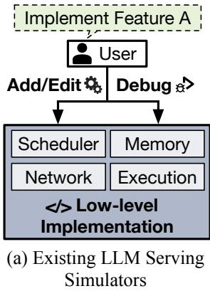

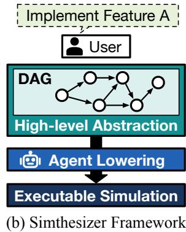  
Fig. 1. (a) Existing LLM serving simulators require manually implementing new serving mechanisms as they emerge, leading to low-level modifications, while (b) Simthesizer framework instead composes the complete serving workflow from uniform elements of a unified dynamic DAG, which is automatically lowered into executable simulation through agent-driven development.

This shift transforms both the pace at which serving systems evolve and the way requests and serving mechanisms are structured, demanding a rethinking of system-level simulator design. Specifically, it introduces two key changes:

1) Fast evolution: The LLM ecosystem evolves at a fast pace as new models, applications, and system-level optimizations continuously emerge. Serving techniques and execution patterns consequently change over time, rapidly invalidating a simulator’s assumptions about system behavior and requiring repeated manual effort to keep it up to date.

2) Non-monolithic serving: Agentic requests expand a single query into multiple model invocations interleaved with external tool calls and decision-making stages, following dynamic execution paths determined by intermediate results. Meanwhile, serving mechanisms such as disaggregated execution and speculative decoding break the once-monolithic inference flow into multiple interacting stages. Both trends replace the predetermined serving flow that existing simulators assume with dynamically composed stages.

To cope with these challenges, it is natural to ask whether existing LLM serving simulators can keep up, but they are fundamentally limited. Most simulators rest on two premises, that serving systems evolve slowly enough for manual engineering to keep pace and that serving behavior can be captured by a single monolithic simulation pipeline. As the two changes above invalidate these premises, every non-monolithic mechanism now forces an invasive restructuring of the fixed simulation pipeline, while tracking fast evolution leaves developers repeatedly modifying and validating simulator internals.

To address these limitations, we propose a novel framework, Simthesizer, for developing modern LLM serving simulators, as illustrated in Figure 1. Our approach captures non-monolithic serving through a composable and extensible simulator infrastructure that uniformly expresses the complete serving workflow, and tracks fast evolution through agentdriven lowering that translates natural language specifications into executable simulation. Our contributions are as follows:

(1) Composable and extensible simulator infrastructure for LLM serving simulation. We introduce Simthesizer simulator, a simulator infrastructure that expresses every element of the serving workflow, rather than only its compute and communication operations, in one uniform, composable form. Simthesizer simulator realizes this design as a directed acyclic graph (DAG) where logical nodes express control decisions such as request routing and batch formation alongside compute and communication nodes. A modular control layer implements these decisions as interchangeable components, so new serving mechanisms are integrated by composing components and reconnecting nodes without restructuring the execution engine.

(2) Agent-driven lowering for scalable simulator extension. We develop Synthesizer agent, a harnessed coding agent that systematically lowers high-level specifications into executable simulation logic, bridging the gap between specified behavior and low-level execution. Instead of manually implementing new system behaviors, our approach exposes structured interfaces and modular components that agents extend or compose, guided by harness engineering that constrains task scope, enabling reliable integration of emerging serving mechanisms.

(3) End-to-end implementation and verification of an extensible simulator. We implement Simthesizer endto-end, combining Simthesizer simulator and Synthesizer agent into a complete framework for developing and extending LLM serving simulators. To extend the simulator, Synthesizer agent refines a natural language feature request into a specification, maps it onto Simthesizer simulator’s abstractions, implements any missing functionality, and validates the result against real-system measurements or reference evidence. We demonstrate this workflow by extending Simthesizer simulator with Synthesizer agent across modern serving mechanisms, including KV cache quantization, speculative decoding, and hybrid Mamba model support, evolving one shared simulator rather than building a new one per feature.

We instruct OpenAI Codex [33] to serve as Synthesizer agent, extending Simthesizer simulator with new serving features and implementing the same features on existing simulators with the same set of harnesses. Comparing the resulting extensions, we find that Simthesizer more closely follows the behaviors of a vLLM-based real system, achieving an average throughput error of 2.51%, whereas extensions built on existing simulators exhibit a significantly higher throughput error of 6.03%. Lastly, using identical LLM workloads, Simthesizer achieves up to 284.96× and 23.19× faster simulation time than two state-of-the-art simulators, LLMServingSim2.0 [6] and Vidur [1], respectively.

These results demonstrate that our framework effectively supports the development and extension of modern LLM serving simulators, enabling accurate and extensible modeling of complex and rapidly evolving workloads. While our evaluation focuses on LLM serving simulation, the combination of composable simulator infrastructure and agent-driven lowering suggests a promising direction for building simulators in other systems domains. We view this work as an initial step toward such a direction, and hope it encourages further exploration of more scalable and automated simulation methodologies. Simthesizer is available at https://github.com/casyskaist/Simthesizer.

## II. BACKGROUND AND MOTIVATION

## A. LLM Serving Simulation

Challenges in evaluating LLM serving systems. As the scale and complexity of LLM serving systems continue to grow, their design space has expanded to encompass a wide range of deployment choices, including parallelism strategies [34], [45], [58], scheduling policies [2], [41], [53], batch formation [2], [53], [59], KV-cache management [8], [16], [20], [35], and workload composition [52], [54]. However, evaluating these choices on real systems is often prohibitively expensive and difficult to scale. Moreover, many candidate designs, including emerging accelerators, interconnects, and cluster configurations, are not yet available for direct measurement.

Simulation for LLM serving. To address these challenges, the systems community has turned to system-level simulators as a practical means of exploring design trade-offs in LLM serving systems [1], [6], [7], [28]. These simulators allow researchers to explore and validate early ideas across scheduling, hardware architectures, and system configurations before implementation or deployment [5], [19], [34], [58].

Vidur [1] predicts LLM inference performance across parallelism strategies, batch sizes, and scheduling policies using a random-forest model trained on profiled GPU operator latencies. Similarly, APEX [28] predicts performance across models, quantization formats, batching policies, and devicecluster configurations. To do so, it constructs candidate serving configurations using predefined modules and feeds them to its simulator. LLMServingSim [7] and LLMServingSim2.0 [6] model additional modern serving mechanisms, including prefix caching, prefill/decode disaggregation, and KV-cache offloading, through higher-level abstractions.

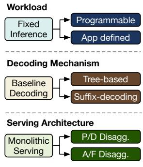  
(a) Fast Evolution

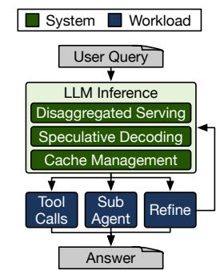  
(b) Non-monolithic Serving  
Fig. 2. Shifts in modern LLM serving: (a) fast evolution and (b) nonmonolithic serving.

Two outdated premises. Although these simulators adopt different abstractions, they all encode serving behavior as components that human developers implement in advance and integrate into a fixed simulation pipeline. This shared design remains practical only under two premises: (1) the target serving system evolves slowly, and (2) serving behavior can be captured by a monolithic simulation pipeline. The first premise assumes that new serving behaviors arise infrequently enough to amortize the substantial human effort required to implement them. The second assumes that a single, tightly integrated control flow can encode diverse serving techniques as predefined policies. As we discuss in Section II-B, however, the rapid evolution of serving mechanisms and the shift toward non-monolithic serving call both premises into question.

## B. The Shifting Landscape of LLM Serving

Modern LLM serving is shifting along two coupled directions: (1) its workloads and mechanisms evolve at an unprecedented pace, and (2) many of them no longer take the form of a monolithic inference flow.

Fast evolution. First, LLM workloads and serving mechanisms now evolve rapidly and concurrently across every level of the serving stack. In just a few years, agentic workloads have pushed serving systems from fixed inference flows [20] toward programmable, application-defined workflows [9], [27]. Over the same period, speculative decoding has raced through successive generations, from conventional draft-and-verify methods to tree-based and suffix-decoding schemes [21], [23]–[25], [30], [32]. Serving architectures likewise keep diversifying toward P/D and attention–FFN disaggregation [34], [58], [60]. Each new wave arrives before the previous one settles into standard practice.

Non-monolithic serving. Second, many emerging workloads and serving mechanisms no longer fit within a single, selfcontained inference lifecycle. On the workload side, as shown in Figure 2, agentic requests expand a single user query into multiple LLM inferences interleaved with external tool calls, sub-agent execution, and iterative context refinement [13], [37], [39], [40], [46], [51]. A request is thus no longer a single inference call but a runtime-dependent composition of inference and non-inference stages. On the system side, disaggregated serving splits prefill and decode across separate machine pools [34], [58], speculative decoding coordinates draft and target models within a decoding loop [21], [30], and KV-cache management distributes request state across turns and storage tiers [8], [14], [44]. Despite optimizing different resources, they all replace the self-contained inference lifecycle with orchestration across separately managed components. Implications for existing simulators. These two trends undermine the premises of existing simulators. New serving behaviors emerge faster than human developers can implement, integrate, and validate them, leaving a widening development gap between deployed serving systems and the simulators that model them. Meanwhile, non-monolithic serving breaks the fixed serving loop that existing simulators assume every request follows (Section II-A). A feature that falls outside this loop therefore requires restructuring its control flow and propagating changes across existing paths.

## C. Rethinking Simulation Design for Modern LLM Serving

Agent-driven simulator development. Both implications ultimately stem from a shortage of engineering labor. Fast evolution multiplies how often developers must extend a simulator to close the development gap, while non-monolithic serving turns each extension into an invasive rewrite. Sustaining simulators against both pressures calls for automating the implementation work itself. Recent LLM-based coding agents make this automation practical, and the systems community already employs them [4], [48], [57]. We therefore envision agent-driven simulator development, in which coding agents implement new serving mechanisms as they emerge.

However, simply adding an AI agent to existing simulators is insufficient. Bound to a monolithic pipeline, an agent inherits the same structural coupling, so each extension remains a broad, system-wide rewriting that is difficult to review and may introduce silent regressions. Keeping modifications local requires a representation that captures inference and non-inference stages, and the control flow coordinating them within a single abstraction. Even then, generated code that compiles and passes functional tests can still model the wrong system, demanding simulator-specific guardrails and fidelity validation. From these requirements, we derive two design principles for next-generation serving simulators:

• (Principle 1) Composable simulation from a uniform representation. Existing simulators bind serving mechanisms to technique-specific control paths, making each extension a system-wide change. A modern simulator should instead express workloads and mechanisms in a uniform, composable representation that captures stages, dependencies, and state transitions, allowing humans or agents to add and compose components without restructuring the execution engine.

• (Principle 2) Guarded agent-driven implementation. Structural locality bounds an agent’s changes, but does not ensure simulation fidelity, as an extension can compile and produce plausible outputs while omitting performancecritical state or violating simulator-specific invariants. A modern simulator must therefore pair bounded extension interfaces and simulator-specific guardrails with validation methods that evaluate simulation semantics.

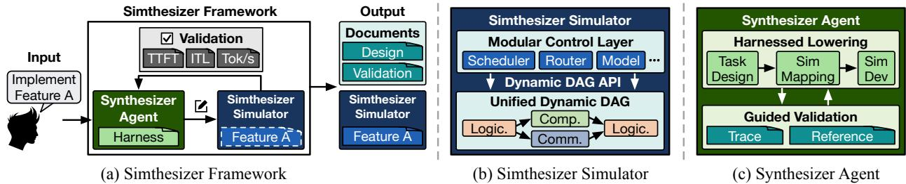  
Fig. 3. Overview of the Simthesizer framework.

## III. OVERVIEW OF SIMTHESIZER

Guided by these principles, we present Simthesizer, a simulation framework that realizes agent-driven simulator development for modern LLM serving. Simthesizer pairs a composable, extensible simulation substrate (Principle 1) with a guarded agent workflow (Principle 2), as illustrated in Figure 3.

Simthesizer framework. Simthesizer comprises two components, (1) Simthesizer simulator, a unified and extensible LLM serving simulator, and (2) Synthesizer agent, a harnessed coding agent that integrates new serving mechanisms into Simthesizer simulator. The workflow begins with a user request specifying the feature to implement. Synthesizer agent refines the intended behavior, maps it onto Simthesizer simulator’s abstractions, and implements any functionality Simthesizer simulator does not already provide. Then, Simthesizer validates the observed behavior against real-system measurements or reference evidence. The workflow finally returns the extended Simthesizer simulator together with inspectable artifacts exposing its modeling decisions, implementation decisions, and validation results.

Simthesizer simulator. Existing simulators use static DAGs and pipelines to encode compute and communication operations, so any mechanism that alters this pipeline demands an invasive, end-to-end redesign. To address this, Simthesizer simulator composes the entire serving workflow from a uniform set of elements, using compute, communication, and logical nodes of a unified dynamic DAG to capture both LLM operations and the control decisions. Through Dynamic DAG APIs, logical nodes insert operations and rewire dependencies at runtime, allowing Simthesizer simulator to integrate new mechanisms and express runtime-dependent workflows without modifying the execution engine. Above this substrate, a modular control layer implements serving policies through interchangeable components such as schedulers, routers, model runners, and resource simulators. Existing components compose through structured configuration, and a new mechanism requires implementing only the behavior the control layer lacks (Section IV).

Synthesizer agent. Synthesizer agent is a coding agent with a harness tailored to developing LLM serving simulators. It lowers a user request through three stages, task-design, sim-mapping, and sim-dev, which respectively produce a simulator-facing specification, map each decision to a Simthesizer simulator abstraction, and extend the implementation. The agent then evaluates simulation fidelity through traceguided validation when real-system measurements are available and reference-guided validation otherwise. Users may resolve performance-critical ambiguities and review the specification, implementation map, and validation report, while Synthesizer agent performs the low-level implementation and revision work. Together, Simthesizer simulator and Synthesizer agent make simulator extension both compositional and reviewable, allowing Simthesizer to track new serving mechanisms without restructuring a monolithic simulation pipeline (Section V).

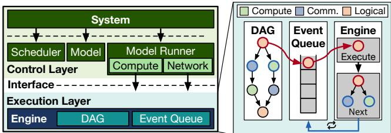  
Fig. 4. Architecture of Simthesizer simulator.

## IV. SIMTHESIZER SIMULATOR

Figure 4 shows the two-layer architecture of the Simthesizer simulator. The execution layer realizes the composable simulator infrastructure as a unified dynamic DAG that represents an LLM serving workflow, allowing new mechanisms to extend the graph without restructuring the execution engine. The control layer constructs and modifies these graphs through modular components that implement serving policies. This separation gives Simthesizer simulator a stable execution substrate while its serving behavior evolves through localized extensions.

## A. Unified Dynamic DAG Abstraction

Execution graph representation. Simthesizer simulator represents the complete simulated execution as a unified dynamic DAG with three node types: (1) compute nodes that specify which model operation executes on which device, (2) communication nodes for inter-device transfers, and (3) logical nodes for policy events such as request arrival and scheduling. Each edge encodes an execution-order dependency, and simulation executes each node once all of its predecessors complete.

TABLE I DYNAMIC DAG MODIFICATION APIS.
<table><tr><td>Interface</td><td>Description</td></tr><tr><td>add logical node(operation, state) -&gt; node add_logical_node_at(operation, state, at) -&gt; node</td><td>Insert a logical node carrying a policy operation and its state. The at variant seeds an explicit start time, e.g., for request arrival.</td></tr><tr><td>add compute node(layer, batch) -&gt; node</td><td>Insert a compute node tagged with a semantic layer descriptor and the scheduled batch state.</td></tr><tr><td>add_network_node(src, dst, bytes) -&gt; node</td><td>Insert a point-to-point transfer between two network devices. Its timing model resolves latency, including multi-hop routing when configured.</td></tr><tr><td>add_edge(parent, child)</td><td>Declare a precedence constraint. A child becomes runnable only after all of its predecessors complete.</td></tr><tr><td>pop_edges(node) -&gt; list [node]</td><td>Detach the current node&#x27;s outgoing edges so the caller can splice a new subgraph before the original successor.</td></tr></table>

Node taxonomy. At execution, each node differs along two dimensions: (1) latency is deterministic when fixed at dispatch and non-deterministic when later activity can change the completion time, and (2) behavior is stateful when execution alters subsequent control flow or updates serving state and stateless otherwise. The three node types occupy distinct points in this taxonomy, which determines how the execution layer processes each of them.

Compute nodes. Simthesizer simulator treats compute nodes as deterministic and stateless by construction. A compute node represents an already scheduled model operation on a target device, with shared-device ordering encoded by its dependencies. Once runnable, its operation, batch, and device model determine a single latency, and kernel-level effects remain encapsulated within that latency model.

Communication nodes. Communication nodes are nondeterministic and stateless, as link contention can affect their completion time while their execution leaves state unchanged. To model non-deterministic latency, Simthesizer simulator allows the network model to invalidate a node’s scheduled completion event when resource state changes and to provide a revised completion time for rescheduling. This eventinvalidation interface supports dynamic contention without binding the execution layer to a particular network model.

Logical nodes. Logical nodes are deterministic and stateful. They encode control decisions such as request routing, batch formation, and state transitions, with a fixed execution latency and explicit updates to request or system state. Existing simulators implement these decisions in fixed control flow outside their compute and communication DAGs; Simthesizer simulator instead makes them first-class nodes in the execution graph. A new serving workflow can therefore be constructed by adding and reconnecting compute, communication, and logical nodes, leaving the core execution engine untouched.

Event-driven processing. The execution layer processes all node types through a common event-driven loop. It first initializes simulated time and inserts every node with no unresolved predecessor into a time-ordered event queue. At each step, it dequeues the earliest event, advances simulated time, and processes the corresponding node. A deterministic node schedules a fixed completion event at dispatch, whereas a change in resource state can invalidate and replace the completion event of a non-deterministic node. A stateful node may additionally update serving state or modify the execution graph. Upon completion, the execution layer propagates the node’s completion time to its successors, resolves incoming dependencies, and enqueues each newly runnable node.

## B. Dynamic DAG APIs

LLM serving is inherently dynamic, as batch composition, placement, and even the stages a request traverses depend on runtime state, so a simulator cannot enumerate every operation and dependency in advance. Existing simulators sidestep this dynamism by keeping runtime decisions in a fixed simulation pipeline outside their compute and communication DAGs [1], [6], [7], [28]. Simthesizer simulator instead lets logical nodes grow the graph as decisions become known, using the Dynamic DAG APIs in Table I to insert new nodes and rewire dependencies, keeping workflow changes localized. Node construction. Dynamic expansion first materializes each runtime-selected action as one of the three node types. add\_logical\_node records the operation and state for a policy event, add\_compute\_node records the semantic layer and scheduled batch, and add\_network\_node records the source, destination, and transfer size. Each API returns a node handle for later connections, and these typed constructors keep newly added nodes consistent with the execution semantics of the initial graph.

Dependency construction. Creating nodes alone does not determine when they execute; the add\_edge(parent, child) API specifies that the child can run only after the parent completes. A logical node may also alter existing dependencies; in disaggregated serving, for example, a decode stage already follows its prefill stage, but assigning decode to another machine requires a KV-cache transfer to complete in between. The pop\_edges API detaches and returns the prefill node’s outgoing edges, letting the logical node splice in the transfer node and reconnect the decode stage after it. This local rewrite preserves the surrounding graph while enforcing the new execution order.

1 interface System extends Logical:   
4 into\_results() -> list[result]   
Logical::handle(...) -> time   
interface Scheduler:   
enqueue\_sub\_request(sub\_request)   
schedule() -> batch   
(a) Component interfaces   
1 impl System for SingleInstance:   
3
6
9 scheduler: Scheduler   
def into\_results() -> list[result]   
def Logical::handle(...) -> time   
impl Scheduler for ChunkedPrefill:   
enable\_prefix\_caching: bool   
10 def enqueue\_sub\_request(sub\_request)   
11 def schedule() -> batch   
(b) Component implementations   
1 system:   
kind = "SingleInstance"   
scheduler:   
kind = "ChunkedPrefill"   
enable\_prefix\_caching = true   
(c) Compositional configuration  
Fig. 5. Examples of (a) abstract interfaces capturing general serving behaviors; (b) concrete implementations of interfaces with encapsulated states; and (c) structured configuration composing implementations and defining component-specific parameters.

## C. Modular Control Layer

Components own serving roles. The Dynamic DAG APIs define how the execution graph can grow at runtime, but not who grows it. A single handler making every serving decision would recreate a monolithic pipeline above the execution layer, forcing each new mechanism to modify shared control code. To address this, Simthesizer simulator partitions the control layer into components, each owning one serving role such as request routing, batch scheduling, or model execution. Each component keeps its role’s policy state, handles that role’s logical nodes, and materializes its decisions through the Dynamic DAG APIs. This ownership confines each policy change to the component that makes the decision.

Interfaces capture stable roles. Serving roles remain stable even as the policies filling them change rapidly; every serving system forms batches, but the batching policy evolves with each new mechanism. Simthesizer simulator therefore fixes each role’s operations in an interface and leaves policy and state to concrete implementations. In Figure 5(a), System orchestrates one serving instance, handling its logical events through handle and emitting results through into\_results. Scheduler owns iteration-level batching, receiving sub-requests through enqueue\_sub\_request and returning the next batch through schedule. Because System depends only on this interface, any conforming scheduler can fill the same position in the hierarchy.

Implementations encapsulate policy state. A policy is more than a function; it carries state such as request queues, cache metadata, and tuning parameters. If this state leaked across components, replacing one policy would ripple through the others. Simthesizer simulator therefore confines each policy’s state to the implementation that realizes it (Figure 5(b)). ChunkedPrefill implements Scheduler and privately tracks its prefix-caching flag, while SingleInstance implements System, holding its scheduler only through the interface. Swapping in another scheduler thus touches neither SingleInstance nor the execution layer.

Configuration composes a system. A structured configuration assembles these components into a complete simulator (Figure 5(c)). Each kind field selects an implementation for one interface, nested entries select subcomponents, and the remaining fields set implementation-specific parameters. The example builds SingleInstance over ChunkedPrefill and enables prefix caching without touching simulator code. This composition bounds the cost of extending Simthesizer simulator. When every required policy exists, a user or Synthesizer agent composes the target system through configuration alone; when one is missing, Synthesizer agent implements only that policy behind its interface and reuses the remaining components. An extension is thus a configuration edit or a component-local implementation, never a control-layer rewrite.

## D. Implementation

Built-in components. We instantiate the control layer with seven component interfaces that mirror a request’s path through a serving system, namely request routing, system orchestration, batch scheduling, model execution, model description, and compute and network timing. This mirroring places every serving decision that a new mechanism may change behind a distinct interface. Behind these interfaces, Simthesizer simulator ships built-in implementations covering common serving configurations.

At the system level, built-ins cover single- and multiinstance serving, prefill–decode disaggregation with explicit KV-cache handoff, and expert-parallel MoE serving, with routing policies that place requests round-robin or by perinstance load. Along the execution path, the built-in scheduler implements chunked prefill with memory-aware batch admission and block-aligned prefix caching, model runners expand each scheduled batch into layer-level compute and communication nodes under tensor or expert parallelism, and model descriptions cover dense and MoE architectures. These built-ins reduce common serving studies to configuration, reserving Synthesizer agent for new mechanisms.

Pluggable timing backends. The execution and control layers consume completion times without depending on how they are produced. This boundary lets detailed architecture and network simulators [12], [17], [36], [42] serve as backends when their fidelity is required, while Simthesizer simulator provides lightweight defaults for end-to-end serving studies.

Profile-based compute backend. The default compute backend estimates each compute node’s latency from offline profiles [3], [6], [7], [22]. Because a single total-token key cannot capture layers whose latency depends on more than batch size, the backend indexes each layer type with at most two layerspecific keys, such as the cached KV footprint and query– context interaction count for attention or the token count and activated experts for MoE. The profiler samples these keys offline and interpolates over the table.

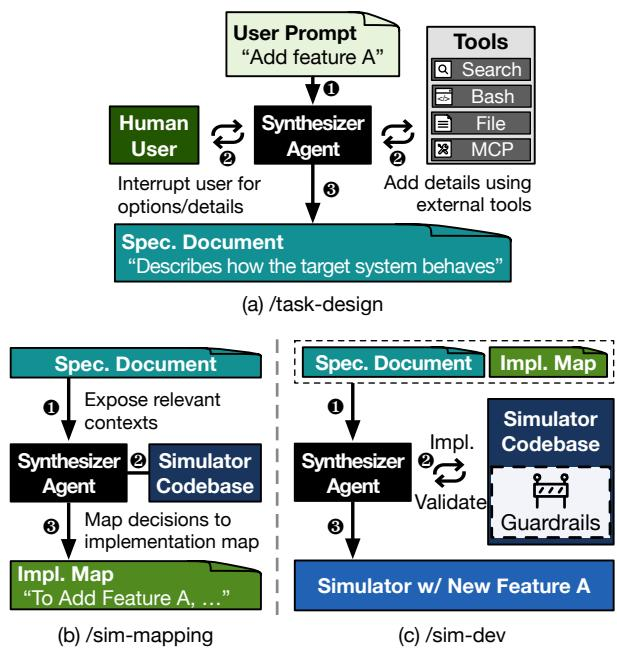  
Fig. 6. Agent-driven simulator extension process.

Flow-based network backend. The default network backend models communication at flow granularity rather than simulating individual packets [22]; each transfer follows a routed path over a device–link connectivity graph and receives the minimum available bandwidth along it. When a flow starts or completes, the backend recomputes the affected bandwidths and reschedules completion events through the eventinvalidation interface (Section IV-A). Because both backends sit behind component interfaces, either can be replaced without changing the execution layer or serving policies.

## V. SYNTHESIZER AGENT

Grounded in Simthesizer simulator, Simthesizer translates natural language specifications into executable simulation through agent-driven development that keeps pace with fastevolving serving mechanisms. Synthesizer agent realizes this lowering by wrapping a coding agent in a harness tailored to developing LLM serving simulators, leveraging Simthesizer simulator’s modular interfaces to extend the simulator without reworking its internals. The harness makes simulator-specific constraints explicit and organizes synthesis around three inspectable artifacts: a specification, an implementation map, and a validation report. This design shifts human judgment from low-level code editing to resolving performance-critical ambiguities and reviewing implementation decisions and validation evidence. We first describe the synthesis requirements and lowering process, then present two validation regimes and their human review points.

## A. Simulator-Specific Synthesis Requirements

Synthesis begins when the user asks Synthesizer agent to integrate a new serving mechanism. However, the initial request alone rarely resolves the modeling decisions needed for a faithful implementation, leaving performance-critical choices implicit even though they directly affect simulation behavior. We identify three recurring requirements for translating the request into an implementation that captures the intention:

• Semantic completeness. The simulator-facing specification must identify the quantities and assumptions that determine simulation time, resource contention, state lifetime, dependency structure, and metric boundaries. Each performancerelevant choice must be either resolved in the specification or surfaced explicitly for human review.

• Structural alignment. Each modeling decision must map to the Simthesizer simulator abstraction responsible for the corresponding state transition, graph update, or resource interaction. This mapping avoids scattering a mechanism across unrelated control paths and preserves a traceable connection between the specification and the generated implementation.

• Modeling fidelity. The implementation must model the serving mechanism at the level of detail required by the target performance question. When exact modeling is unavailable, it may introduce approximations, such as aggregate multipliers or statistical proxies. The harness requires explicit assumptions, supporting evidence, and validity boundaries for each approximation.

## B. Harnessed Lowering Process

Figure 6 shows Simthesizer’s lowering stages for meeting the synthesis requirements: task-design, sim-mapping, and sim-dev. Each stage addresses a distinct requirement and produces documents that record the corresponding decisions. This linkage routes each issue back to the stage where the relevant decision was made, rather than treating every issue as an implementation bug.

(1) task-design. The first stage targets semantic completeness by refining the initial user request into a simulator-facing specification. Synthesizer agent consults available mechanism descriptions, external sources, and Simthesizer simulator interfaces. It specifies the target configuration, states, dependencies, metrics, and the assumptions and evidence for any approximation. The resulting specification document records resolved decisions and explicit modeling boundaries and remains in the synthesis context throughout subsequent stages.

(2) sim-mapping. The second stage targets structural alignment by mapping the simulator-facing specification to the corresponding Simthesizer simulator components and interfaces. The resulting implementation map records where state resides, which Dynamic DAG operations encode dependencies, which components model compute and communication, and which observable signals support subsequent validation. Rather than a sequence of code edits, the map ties each modeling decision to the Simthesizer simulator abstraction responsible for the behavior, its implementation site, and its validation strategy.

```ini
[Target System Config]
scheduler = chunked_prefill + prefix_caching
speculative_width = K = 2
[Modeling Input]
algorithm_reference = EAGLE-3
acceptance_model = empirical distribution
sampling = stochastic
[Simulator Semantics]
remaining_output 二 R
verification_width = W = min(K + 1, R)
accepted_drafts = A ∼ p<sub>acc</sub>
committed_progress = M = A + 1
target_compute = evaluate W positions
persistent_state = advance and retain M tokens
[Validation Protocol]
min_validation_step = 3
validation_data = ShareGPT trace, system data
```  
Fig. 7. Structured summary of the document produced by task-design. The full specification presents the same content in natural language.

(3) sim-dev. The third stage implements the changes described in the implementation map and checks for deviations. Synthesizer agent edits the simulator components and iterates on compiler diagnostics, runtime failures, test results, and violations of the specification. Simulator-specific guardrails detect undeclared approximations, unexplained constants, and code changes that depart from the implementation map. This stage records the implemented behavior, approximations, and uncertainties in the validation report for human review.

Synthesis-time human involvement. Most revisions proceed without continuous human intervention. Incorrect component mappings rewind the lowering process to sim-mapping, while implementation bugs are resolved within sim-dev. During task-design, the available references and simulator context may be insufficient to resolve a performance-critical modeling choice. In that case, Synthesizer agent requests human clarification of the intended behavior, missing parameters, and modeling boundaries rather than silently selecting a default. At the end of the synthesis run, the user reviews the generated documents and, if necessary, revises the specification and initiates another run.

## C. Evidence-Guided Validation

The harnessed Synthesizer agent produces a candidate simulator that is consistent with its specification and implementation map. However, this consistency does not guarantee that the design itself faithfully captures the target mechanism. Simthesizer addresses this gap through evidence-guided validation, which comprises the following two complementary regimes.

Trace-guided validation. When real-system measurements are available, Simthesizer compares the candidate simulator with the system under the same workload, serving configurations, and hardware settings. It aligns internal execution signals, such as queue length, batch composition, and resource utilization, to identify the modeling decisions responsible for the observed discrepancies. Together with the implementation map, these signals help associate each divergence with the corresponding scheduling, compute, communication, or dependency behavior. The validation report records the observed discrepancies, their possible sources, and the modeling decisions that require revision, providing concrete targets for the next synthesis run.

TABLE II  
IMPLEMENTATION MAP FOR SPECULATIVE DECODING.
<table><tr><td>Behavior</td><td>Implementation map</td></tr><tr><td>Target model verification</td><td>Route W through the existing request representation to the model runner and compute simulator.</td></tr><tr><td>Committed request state</td><td>Assign M to scheduler-managed request and KV state, exposing only the committed prefix to the existing cache interface.</td></tr><tr><td>Speculation round execution</td><td>Reuse the common DAG scheduling and execution path without adding a mechanism-specific event loop.</td></tr></table>

Reference-guided validation. When comparable measurements are unavailable, as in cases involving unreleased hardware, unavailable software stacks, or novel mechanisms, Simthesizer performs reference-guided validation by grounding its modeling decisions in available technical evidence. Synthesizer agent derives performance criteria from reference implementations, results reported in prior works, and other evidence, then assesses whether the candidate simulator reproduces the expected behavior under comparable conditions. The validation report identifies evidence-grounded decisions, unresolved assumptions, and approximations that define the validity boundary. Although this regime does not establish empirical agreement with the target system, it provides traceable technical justification and exposes the remaining uncertainty.

## VI. SIMULATOR SYNTHESIS IN ACTION

We explain how Simthesizer’s two core components jointly support a concrete simulator extension using EAGLE-style speculative decoding [25] as a case study. This mechanism uses a lightweight drafter model to rapidly generate several draft tokens. The target model then verifies drafted tokens in a single inference iteration, while only the accepted tokens advance the generation. Although this mechanism is concise at the algorithmic level, its simulation must distinguish the work performed by the target model from the progress made by each request. We trace the interaction of Simthesizer simulator and Synthesizer agent from the initial user request through semantic refinement, lowering, and validation-driven revision. Across five synthesis runs, we follow a representative trial through specification, mapping, implementation, and validation.

## A. Resolving Simulator Semantics

The initial user request states target algorithmic details including the number of draft tokens and the acceptance model, but leaves some modeling decisions unspecified. Based on the reference and the supplied statistics, task-design resolves these decisions into explicit simulator semantics. For example, Synthesizer agent derives four semantic variables from the algorithm reference: the verification width W, the remaining output length R, the accepted draft length A, and the committed request progress M. Figure 7 presents the example specification document generated by task-design from an underspecified user request, capturing the resulting modeling decisions and state semantics.

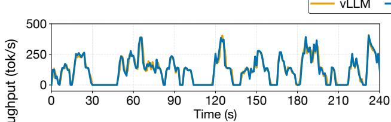

(a) Dense-SWE  
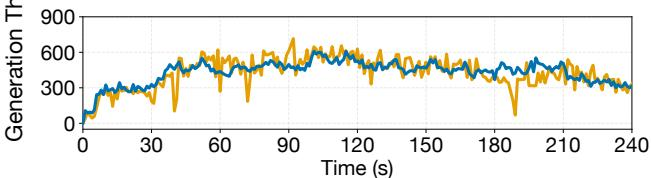  
(c) MoE-SWE

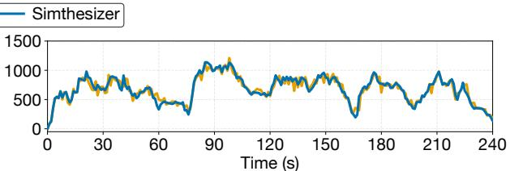

(b) Dense-tau  
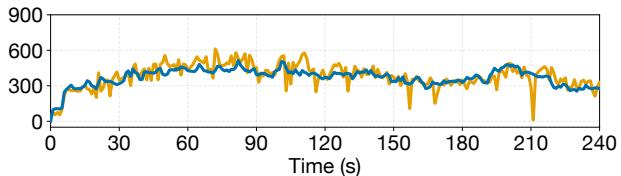  
(d) MoE-tau  
Fig. 8. Comparison of throughput between unmodified Simthesizer (without any agent-synthesized extension) and a GPU-based serving system running vLLM under agentic workloads: (a) Llama3.1 dense model on mini-SWE-bench, (b) Llama3.1 dense model on tau-bench, (c) Qwen3 MoE model on mini-SWE-bench and (d) Qwen3 MoE model on tau-bench.

## B. From Mapping to Implementation

sim-mapping maps the simulator-facing specification onto the Simthesizer simulator components and interfaces, recording the resulting mappings in an implementation map for subsequent simulator development. Rather than adding mechanism-specific machinery, Synthesizer agent localizes extension logic within existing Simthesizer simulator components and minimizes the required changes. For example, in speculative decoding, the map incorporates simulator semantics, W and M, into the existing request-processing and scheduling mechanisms, while reusing the common DAG scheduling and execution path. Table II summarizes this resulting map.

During the sim-dev stage, Synthesizer agent translates the mapped design into localized simulator code changes guided by the implementation map. The resulting extension introduces no new events, node types, graph APIs, model-runner paths, compute interfaces, cache APIs, or execution loops, leaving most Simthesizer simulator components unchanged. Overall, Simthesizer’s harnessed lowering process allows Synthesizer agent to focus on the algorithmic details and state semantics specific to speculative decoding, while Simthesizer simulator supports them through its reusable components, cost models, and interfaces.

## C. Validation-Driven Revision

The synthesis run produces an executable candidate simulator. In this representative run, trace-guided validation found that the candidate overestimated target system throughput by 13.4% on the validation trace. Inspecting its specification and computation trace revealed that the synthesized implementation applied W only to the final layer and modeled the remaining target model layers over K positions, causing the candidate to underestimate the required compute and communication. The validation evidence isolated the problem to the verification-width semantics rather than the component mapping or DAG execution path.

The validation report fed this finding back to Synthesizer agent, which initiated another iteration to correct the semantic error. With the corrected semantics, the subsequent candidate showed a 6.7% throughput divergence from the real system and underestimated aggregate throughput only by 4.7% on the same validation trace. This case study shows how trace-guided validation converts a simulation discrepancy into a semantic correction while preserving the localized integration design.

## D. Joint Effect

Simthesizer simulator provides reusable components for scheduling, compute, cache management, and DAG execution, while Synthesizer agent maps underspecified behavior onto these components. In this speculative decoding case, this combination localizes mechanism-specific logic to the acceptance policy and scheduler, preserves shared execution and resourcemodeling paths, and links observed performance discrepancies to concrete modeling decisions. Together, the two components of Simthesizer make simulator extension compositional and reviewable, exposing each extension’s semantics, integration choices, and validation evidence to human review.

## VII. EVALUATION

Our evaluation answers five questions: (Q1) Can Simthesizer accurately model complex workloads such as agent serving? (Q2) Can Simthesizer faithfully implement features not natively supported by Simthesizer simulator, and how much does Simthesizer simulator contribute to simulation accuracy? (Q3) How much does the Synthesizer agent harness contribute to accuracy? (Q4) How fast does Simthesizer run LLM serving simulations? (Q5) Does the workflow remain effective across coding agents?

## A. Methodology

Baselines. We compare Simthesizer against two state-ofthe-art LLM serving simulators: LLMServingSim2.0 [6] and

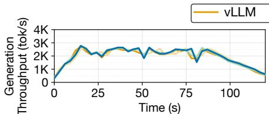  
(a) KV Cache Quantization

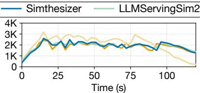  
(b) Speculative Decoding

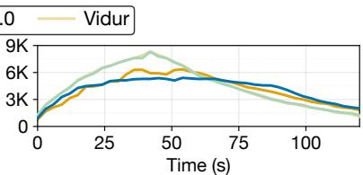  
(c) Hybrid-Mamba  
Fig. 9. Throughput comparison of Simthesizer, LLMServingSim2.0, and Vidur each independently extended by the Synthesizer agent under a shared harness and coding agent across three feature-extension tasks: (a) KV cache quantization, (b) speculative decoding, and (c) hybrid Mamba model support. Each panel thus compares three distinct simulators extended with the same feature; the same convention applies to Fig. 10 and Fig. 11.

Vidur [1]. To evaluate agent-driven simulator extension, we define three feature-extension tasks unsupported by Simthesizer simulator and both baselines: (1) FP8 KV cache quantization, (2) EAGLE3-based speculative decoding [25], and (3) hybrid Mamba model support. We use the Qwen3 32B model [47] for the first two tasks and the Nemotron-3-Nano 30B-A3B model [31] for the hybrid Mamba task. Within Simthesizer, Synthesizer agent adds each requested feature directly to Simthesizer simulator; for each baseline, the same coding agent and harness add the same mechanism to the simulator’s native implementation. We repeat each extension task over multiple independent trials without human intervention and report metrics averaged across trials to account for codingagent variability.

Synthesizer agent setup. Unless otherwise specified, we use GPT-5.4 (xhigh), accessed through OpenAI Codex (v0.118.0), as Synthesizer agent. Importantly, the Synthesizer agent harness does not encode any Simthesizer-specific information. For fair comparison, we provide all three simulators with identical prompts, references, specifications, and profiled model data. Workloads and datasets. We sample 50–100 requests from SWE-bench [15] and tau-bench [50], which are agentic workloads, and we sample 400 requests from ShareGPT [38] as a non-agentic workload. For agentic workloads, we collect output and tool-call trajectories from a real system matching the simulated environment and replay them in the simulator. System specifications. We conduct all experiments on a machine equipped with two NVIDIA RTX Pro 6000 Blackwell GPUs and an Intel Xeon Gold 6326 CPU. We use vLLM (v0.19.1) as the LLM serving framework when evaluating the real GPU-based serving system [20].

## B. Evaluation Results

(Q1) Complex-workload fidelity. We evaluate whether Simthesizer captures dynamic and complex workload behavior by comparing it against a real GPU-based serving system running vLLM on mini-SWE-bench and tau-bench. Both benchmarks define their agentic workflows in a pre-defined form, which Simthesizer models directly as multiple model invocations interleaved with tool calls. For each tool call, we execute it on the host in advance and record its latency, which the simulation replays at the corresponding stage. Figure 8 illustrates the generation throughput over 240 seconds for the Llama3.1 8B dense model [29] and the Qwen3 30B-A3B MoE model [47].

TABLE III  
ERROR RATES OF SIMTHESIZER PERFORMANCE METRICS RELATIVE TO THE REAL SERVING SYSTEM ACROSS TWO WORKLOADS AND TWO MODELS.
<table><tr><td rowspan="2">Error rate (%)</td><td colspan="2">mini-SWE-agent</td><td colspan="2">tau-bench</td></tr><tr><td>Llama3.1-8B</td><td>Qwen3-30B</td><td>Llama3.1-8B</td><td>Qwen3-30B</td></tr><tr><td>Mean TTFT</td><td>4.10</td><td>19.83</td><td>17.23</td><td>21.87</td></tr><tr><td>Median TTFT</td><td>0.64</td><td>4.72</td><td>6.09</td><td>0.13</td></tr><tr><td>Mean TPOT</td><td>0.27</td><td>2.82</td><td>0.93</td><td>4.16</td></tr><tr><td>Median TPOT</td><td>0.40</td><td>1.45</td><td>0.40</td><td>0.28</td></tr><tr><td>Mean ITL</td><td>0.97</td><td>2.17</td><td>0.74</td><td>3.74</td></tr><tr><td>Median ITL</td><td>0.65</td><td>14.75</td><td>11.44</td><td>11.94</td></tr><tr><td>Throughput</td><td>0.20</td><td>2.78</td><td>0.51</td><td>4.54</td></tr><tr><td>Running Time</td><td>0.20</td><td>2.71</td><td>0.51</td><td>4.34</td></tr></table>

For the dense model (Figure 8(a) and (b)), the simulation closely matches the real system, as dense execution is largely deterministic. For the MoE model (Figure 8(c) and (d)), the simulated throughput deviates more visibly. This discrepancy arises from the statistical modeling of MoE routing; expert selection and synchronization under data and expert parallelism are estimated from profiled statistics rather than actual requestspecific routing decisions. Nevertheless, Simthesizer captures the interaction between LLM generation and tool calls and closely follows the real system’s performance trends.

Table III reports the error rates of Simthesizer for TTFT, TPOT, and ITL. TTFT and ITL exhibit higher errors than TPOT because real systems involve tail-latency factors, such as network traffic and kernel launch delays, that are difficult to simulate precisely. TPOT, which primarily reflects generation-phase latency, shows lower error, indicating that Simthesizer accurately models batching and scheduling, where these system-level effects are less dominant. Despite these hard-to-simulate system-level effects, Simthesizer closely reproduces the real system’s overall behavior across all metrics, workloads, and models.

(Q2) Extension fidelity. We next evaluate the three featureextension tasks that Synthesizer agent adds to Simthesizer simulator and to each baseline simulator. Figure 9 presents the generation throughput, and Figure 10 shows the error rates of key performance metrics across the three simulators.

For KV cache quantization, all simulators achieve low error rates because the task primarily requires tracking memory usage and modeling quantization overhead. In contrast, speculative decoding and hybrid Mamba support require coordinated changes across execution scheduling, model structure, and performance modeling. For these two tasks, Simthesizer consistently achieves the highest accuracy, whereas the baselines exhibit substantially larger errors. This difference arises because Simthesizer simulator’s modular interfaces localize each extension, while the fixed pipelines of existing simulators require changes across tightly coupled components to represent interactions among Mamba, MoE, and transformer layers.

TABLE IV  
ERROR RATES OF SIMTHESIZER WITH AND WITHOUT THE SYNTHESIZER AGENT HARNESS, RELATIVE TO THE REAL VLLM-BASED SERVING SYSTEM.
<table><tr><td>Error rate (%)</td><td>Throughput</td><td>TTFT</td><td>TPOT</td><td>ITL</td></tr><tr><td>Without Harness</td><td>4.70</td><td>10.73</td><td>5.71</td><td>11.05</td></tr><tr><td>With Harness</td><td>2.84</td><td>4.52</td><td>1.55</td><td>5.28</td></tr></table>

Because the coding agent, harness, specifications, and profiling data are identical across all three systems, the accuracy difference isolates the contribution of the underlying simulator. Overall, Simthesizer achieves an average throughput error of 2.51%, whereas the baseline-built extensions exhibit 6.03%, showing that Simthesizer faithfully adds functionality absent from Simthesizer simulator and that Simthesizer simulator provides a more effective foundation for agent-driven extension.

(Q3) Impact of the Synthesizer agent harness. Table IV compares Simthesizer after Synthesizer agent adds speculative decoding with and without its harness, using the ShareGPT workload and the Qwen3 32B model. Without the harness, simulation error rises by $1 . 6 5 \times - 3 . 6 9 \times$ across throughput and latency metrics. This occurs because the coding agent frequently omits critical system details and proceeds to implementation despite insufficient specifications. In contrast, the harness supplies a knowledge base, blocks implementation until required specifications are resolved, and enforces selfvalidation through its verification loop. Because this comparison holds Simthesizer simulator, the coding agent, and all inputs fixed, the error reduction quantifies the harness’s contribution to accuracy.

(Q4) Simulation speed. Figure 11 compares the execution time of Simthesizer, LLMServingSim2.0, and Vidur across the three extension tasks under the ShareGPT workload. Simthesizer runs on average 164.9× (up to 284.96×) faster than LLMServingSim2.0 and 6.65× (up to 23.19×) faster than Vidur. This gap arises from how each extension is implemented. Existing simulators expose no modular boundaries for new mechanisms, so extension logic is built directly into their simulation pipelines, adding overhead to every simulated iteration. In contrast, on Simthesizer, the same extensions remain confined to localized component changes behind Simthesizer simulator’s interfaces, leaving the execution engine untouched. For hybrid Mamba, Simthesizer takes longer than on the other tasks because Simthesizer simulator normally simulates one transformer layer and reuses its latency across repeated layers, whereas the heterogeneous layers of hybrid Mamba leads Simthesizer simulator to simulate every layer individually. Explicit request of this reuse would further reduce the simulation time, yet even without it, Simthesizer models hybrid Mamba more accurately than both baselines.

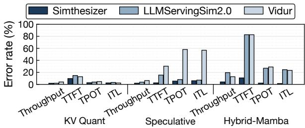

(a) Mean  
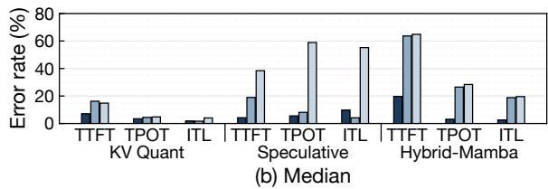  
Fig. 10. Error rate comparison of (a) mean and (b) median performance metrics for Simthesizer, LLMServingSim2.0, and Vidur across three featureextension tasks under a shared harness and coding agent.

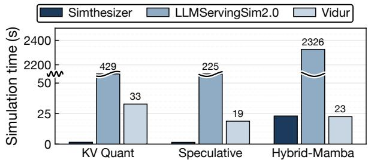  
Fig. 11. Comparison of simulation time for Simthesizer, LLMServingSim2.0, and Vidur across three feature-extension tasks.

(Q5) Coding-agent generality. Figure 12 compares the generation throughput of vLLM with that of the simulators produced by Codex and Claude Code (Opus 4.7 high, v2.1.204) for speculative decoding. Both simulators closely follow the realsystem trajectory, achieving average error rates of 4.1% and 4.9%, respectively, across throughput, TTFT, TPOT, and ITL. This generality follows from the agent- and LLM-agnostic harness design, which relies on no agent-specific tools or prompting strategies and applies the same specification-toimplementation and validation workflow to any coding agent. These results show that Synthesizer agent generalizes beyond Codex, guiding different coding agents to faithful extensions.

## VIII. RELATED WORK

LLM and system simulators. ADOR [18], ONNXim [11], LLMCompass [55], and PyTorchSim [49] simulate LLM workloads at the hardware level to explore architectural design spaces. At the system level, Vidur [1], APEX [28], and LLMServingSim2.0 [6] model LLM serving across nodes and devices, while vTrain [3], TrioSim [22], and Multiverse [10] target distributed training. Across all these levels, however, human developers implement system behavior in advance and fix it into a simulation pipeline, so every emerging mechanism triggers another round of manual restructuring and revalidation. In contrast, Simthesizer composes the complete serving workflow from uniform elements of a unified dynamic DAG, and integrates new mechanisms by adding and connecting nodes through agent-driven lowering.

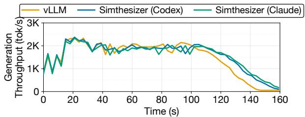  
Fig. 12. Generation throughput comparison between vLLM and the simulators produced by Codex and Claude Code for speculative decoding.

AI agents for systems research. KNighter [48] synthesizes static-analysis checkers, AIOpsLab [4] evaluates agents for autonomous cloud operation, LOOPRAG [57] and LLM-Vectorizer [43] vectorize loops, and CUDAForge [56] and KernelEvolve [26] generate and optimize GPU kernels. Simthesizer further demonstrates that coding agents can be applied to develop an LLM serving simulator, showing the feasibility of agent-based development and optimization through artifacts and workflows co-designed for agents.

## IX. CONCLUSION

This paper presents Simthesizer, a framework for developing LLM serving simulators that keep pace with fast-evolving, non-monolithic serving. Simthesizer introduces a composable simulator infrastructure that uniformly expresses the complete serving workflow, including its control decisions, realized as a unified dynamic DAG (Simthesizer simulator), and lowers high-level specifications into executable extensions through a harnessed coding agent (Synthesizer agent). Extensions synthesized on Simthesizer achieve an average throughput error of 2.51%, compared with 6.03% for the same extensions built on existing simulators, while simulating up to 23.19×–284.96× faster. These results suggest that pairing composable simulator infrastructure with agent-driven lowering offers a scalable path toward building simulators in other rapidly evolving systems domains.

## REFERENCES

[1] A. Agrawal, N. Kedia, J. Mohan, A. Panwar, N. Kwatra, B. S. Gulavani, R. Ramjee, and A. Tumanov, “VIDUR: A LARGE-SCALE SIMULA-TION FRAMEWORK FOR LLM INFERENCE,” in MLSys, 2024.

[2] A. Agrawal, N. Kedia, A. Panwar, J. Mohan, N. Kwatra, B. S. Gulavani, A. Tumanov, and R. Ramjee, “Taming Throughput-Latency Tradeoff in LLM Inference with Sarathi-Serve,” OSDI, 2024.

[3] J. Bang, Y. Choi, M. Kim, Y. Kim, and M. Rhu, “vTrain: A Simulation Framework for Evaluating Cost-Effective and Compute-Optimal Large Language Model Training,” in MICRO, 2024.

[4] Y. Chen, M. Shetty, G. Somashekar, M. Ma, Y. Simmhan, J. Mace, C. Bansal, R. Wang, and S. Rajmohan, “AIOpsLab: A Holistic Framework to Evaluate AI Agents for Enabling Autonomous Clouds,” in MLSys, 2025.

[5] E. Cho, J. Bang, R. Hwang, and M. Rhu, “ PASCAL: A Phase-Aware Scheduling Algorithm for Serving Reasoning-based Large Language Models,” in HPCA, 2026.

[6] J. Cho, H. Choi, G. Heo, and J. Park, “LLMServingSim 2.0: A Unified Simulator for Heterogeneous and Disaggregated LLM Serving Infrastructure,” in ISPASS, 2026.

[7] J. Cho, M. Kim, H. Choi, G. Heo, and J. Park, “LLMServingSim: A HW/SW Co-Simulation Infrastructure for LLM Inference Serving at Scale,” in IISWC, 2024.

[8] B. Gao, Z. He, P. Sharma, Q. Kang, D. Jevdjic, J. Deng, X. Yang, Z. Yu, and P. Zuo, “Cost-Efficient Large Language Model Serving for Multi-turn Conversations with CachedAttention,” in ATC, 2024.

[9] I. Gim, Z. Ma, S.-s. Lee, and L. Zhong, “Pie: A Programmable Serving System for Emerging LLM Applications,” in SOSP, 2025.

[10] F. Gui, K. Gao, L. Chen, D. Li, V. Liu, R. Zhang, H. Yang, and D. Xiong, “Accelerating design space exploration for LLM training systems with multi-experiment parallel simulation,” in NSDI, 2025.

[11] H. Ham, W. Yang, Y. Shin, O. Woo, G. Heo, S. Lee, J. Park, and G. Kim, “ONNXim: A Fast, Cycle-Level Multi-Core NPU Simulator,” IEEE Computer Architecture Letters, vol. 23, no. 2, pp. 219–222, 2024.

[12] T. R. Henderson, M. Lacage, G. F. Riley, C. Dowell, and J. Kopena, “Network simulations with the ns-3 simulator,” SIGCOMM demonstration, vol. 14, no. 14, p. 527, 2008.

[13] S. Hong, M. Zhuge, J. Chen, X. Zheng, Y. Cheng, J. Wang, C. Zhang, Z. Wang, S. K. S. Yau, Z. Lin, L. Zhou, C. Ran, L. Xiao, C. Wu, and J. Schmidhuber, “MetaGPT: Meta Programming for A Multi-Agent Collaborative Framework,” in ICLR, 2024.

[14] J. Jeong and J. Ahn, “Accelerating LLM Serving for Multi-turn Dialogues with Efficient Resource Management,” in ASPLOS, 2025.

[15] C. E. Jimenez, J. Yang, A. Wettig, S. Yao, K. Pei, O. Press, and K. Narasimhan, “Swe-bench: Can language models resolve real-world github issues?” in International Conference on Learning Representations, vol. 2024, 2024, pp. 54 107–54 157.

[16] A. K. Kamath, R. Prabhu, J. Mohan, S. Peter, R. Ramjee, and A. Panwar, “POD-Attention: Unlocking Full Prefill-Decode Overlap for Faster LLM Inference,” in ASPLOS, 2025. [Online]. Available: https://asplos-conference.org/asplos2025/program.html

[17] M. Khairy, Z. Shen, T. M. Aamodt, and T. G. Rogers, “Accel-Sim: An Extensible Simulation Framework for Validated GPU Modeling,” in ISCA, 2020.

[18] J. Kim, H. Lee, G. Ko, G. Choi, S. Ham, S. Hong, and J.-Y. Kim, “ADOR: A Design Exploration Framework for LLM Serving with Enhanced Latency and Throughput,” in ISPASS, 2025.

[19] W. Kim, Y. Lee, Y. Kim, J. Hwang, S. Oh, J. Jung, A. Huseynov, W. G. Park, C. H. Park, D. Mahajan, and J. Park, “Pimba: A Processingin-Memory Acceleration for Post-Transformer Large Language Model Serving,” in MICRO, 2025.

[20] W. Kwon, Z. Li, S. Zhuang, Y. Sheng, L. Zheng, C. H. Yu, J. Gonzalez, H. Zhang, and I. Stoica, “Efficient Memory Management for Large Language Model Serving with PagedAttention,” in SOSP, 2023.

[21] Y. Leviathan, M. Kalman, and Y. Matias, “Fast Inference from Transformers via Speculative Decoding,” in ICML, 2023.

[22] Y. Li, Y. Bao, G. Wang, X. Mei, P. Vaid, A. Ghosh, A. Jog, D. Bunandar, A. Joshi, and Y. Sun, “TrioSim: A Lightweight Simulator for Large-Scale DNN Workloads on Multi-GPU Systems,” in ISCA, 2025.

[23] Y. Li, F. Wei, C. Zhang, and H. Zhang, “EAGLE-2: Faster Inference of Language Models with Dynamic Draft Trees,” in EMNLP, 2024.

[24] Y. Li, F. Wei, C. Zhang, and H. Zhang, “EAGLE: Speculative Sampling Requires Rethinking Feature Uncertainty,” in ICML, 2024.

[25] Y. Li, F. Wei, C. Zhang, and H. Zhang, “EAGLE-3: Scaling up Inference Acceleration of Large Language Models via Training-Time Test,” in NeurIPS, 2025.

[26] G. Liao, H. Qin, Y. Wang, A. Golden, M. Kuchnik, Y. Yetim, J. J. Ang, C. Fu, Y. He, S. Hsia, Z. Jiang, D. Li, U. Pashkevich, V. Puvvada, F. Shi, M. Steiner, R. Xiao, N. Yan, X. Yu, Z. Fang, R. Levenstein, K. Ho, H. Zhu, A. Hammond, R. Li, A. Mathews, K. Gondkar, A. Zainul-Abedin, K. Singh, H. Yu, W. Chi, B. Huang, S. Zhang, N. Weller, Z. Marine, W. Cook, C.-J. Wu, and G. Liu, “KernelEvolve: Scaling Agentic Kernel Coding for Heterogeneous AI Accelerators at Meta,” 2026. [Online]. Available: https://arxiv.org/abs/2512.23236

[27] C. Lin, Z. Han, C. Zhang, Y. Yang, F. Yang, C. Chen, and L. Qiu, “Parrot: Efficient Serving of LLM-based Applications with Semantic Variable,” in OSDI, 2024.

[28] Y.-C. Lin, W. Kwon, R. Pineda, and F. N. Paravecino, “APEX: An Extensible and Dynamism-Aware Simulator for Automated Parallel Execution in LLM Serving,” 2025. [Online]. Available: https://arxiv.org/abs/2411.17651

[29] Meta AI, “Llama 3.1 8B Instruct,” https://huggingface.co/meta-llama/ Llama-3.1-8B-Instruct, Jul. 2024, accessed: 2026-04-09.

[30] X. Miao, G. Oliaro, Z. Zhang, X. Cheng, Z. Wang, Z. Zhang, R. Y. Y. Wong, A. Zhu, L. Yang, X. Shi, C. Shi, Z. Chen, D. Arfeen, R. Abhyankar, and Z. Jia, “SpecInfer: Accelerating Large Language Model Serving with Tree-based Speculative Inference and Verification,” in ASPLOS, 2024.

[31] NVIDIA Corporation, “NVIDIA Nemotron-3 Nano 30B A3B BF16,” https://huggingface.co/nvidia/NVIDIA-Nemotron-3-Nano-30B-A3B-BF16, Dec. 2025, accessed: 2026-04-09.

[32] G. Oliaro, Z. Jia, D. F. Campos, and A. Qiao, “SuffixDecoding: Extreme Speculative Decoding for Emerging AI Applications,” in NeurIPS, 2025. [33] OpenAI, “Codex,” https://openai.com/codex/, 2025.

[34] P. Patel, E. Choukse, C. Zhang, A. Shah, I. n. Goiri, S. Maleki, and R. Bianchini, “Splitwise: Efficient Generative LLM Inference Using Phase Splitting,” in ISCA, 2024.

[35] R. Prabhu, A. Nayak, J. Mohan, R. Ramjee, and A. Panwar, “vAttention: Dynamic Memory Management for Serving LLMs without PagedAttention,” in ASPLOS, 2025.

[36] S. Rashidi, S. Sridharan, S. Srinivasan, and T. Krishna, “ASTRA-SIM: Enabling SW/HW Co-Design Exploration for Distributed DL Training Platforms,” in ISPASS, 2020.

[37] T. Schick, J. Dwivedi-Yu, R. Dessi, R. Raileanu, M. Lomeli, E. Hambro, L. Zettlemoyer, N. Cancedda, and T. Scialom, “Toolformer: Language Models Can Teach Themselves to Use Tools,” in NeurIPS, 2023.

[38] ShareGPT Team, “ShareGPT,” https://sharegpt.com, 2023, accessed: 2026-04-09.

[39] Y. Shen, K. Song, X. Tan, D. Li, W. Lu, and Y. Zhuang, “HuggingGPT: Solving AI Tasks with ChatGPT and its Friends in Hugging Face,” in NeurIPS, 2023.

[40] N. Shinn, F. Cassano, A. Gopinath, K. Narasimhan, and S. Yao, “Reflexion: language agents with verbal reinforcement learning,” in NeurIPS, 2023.

[41] B. Sun, Z. Huang, H. Zhao, W. Xiao, X. Zhang, Y. Li, and W. Lin, “Llumnix: Dynamic Scheduling for Large Language Model Serving,” in OSDI, 2024.

[42] Y. Sun, T. Baruah, S. A. Mojumder, S. Dong, X. Gong, S. Treadway, Y. Bao, S. Hance, C. McCardwell, V. Zhao, H. Barclay, A. K. Ziabari, Z. Chen, R. Ubal, J. L. Abellan, J. Kim, A. Joshi, and D. Kaeli, “MG-´ PUSim: enabling multi-GPU performance modeling and optimization,” in ISCA, 2019.

[43] J. Taneja, A. Laird, C. Yan, M. Musuvathi, and S. K. Lahiri, “LLM-Vectorizer: LLM-Based Verified Loop Vectorizer,” in CGO, 2025.

[44] J. Wang, J. Han, X. Wei, S. Shen, D. Zhang, C. Fang, R. Chen, W. Yu, and H. Chen, “{KVCache} Cache in the Wild: Characterizing and Optimizing {KVCache} Cache at a Large Cloud Provider,” in ATC, 2025.

[45] B. Wu, S. Liu, Y. Zhong, P. Sun, X. Liu, and X. Jin, “LoongServe: Efficiently Serving Long-Context Large Language Models with Elastic Sequence Parallelism,” in SOSP, 2024.

[46] Q. Wu, G. Bansal, J. Zhang, Y. Wu, B. Li, E. Zhu, L. Jiang, X. Zhang, S. Zhang, J. Liu, A. H. Awadallah, R. W. White, D. Burger, and C. Wang, “AutoGen: Enabling Next-Gen LLM Applications via Multi-Agent Conversations,” in COLM, 2024.

[47] A. Yang, A. Li, B. Yang, B. Zhang, B. Hui, B. Zheng, B. Yu, C. Gao, C. Huang, C. Lv, C. Zheng, D. Liu, F. Zhou, F. Huang, F. Hu, H. Ge, H. Wei, H. Lin, J. Tang, J. Yang, J. Tu, J. Zhang, J. Yang, J. Yang, J. Zhou, J. Zhou, J. Lin, K. Dang, K. Bao, K. Yang, L. Yu, L. Deng, M. Li, M. Xue, M. Li, P. Zhang, P. Wang, Q. Zhu, R. Men, R. Gao, S. Liu, S. Luo, T. Li, T. Tang, W. Yin, X. Ren, X. Wang, X. Zhang, X. Ren, Y. Fan, Y. Su, Y. Zhang, Y. Zhang, Y. Wan, Y. Liu, Z. Wang, Z. Cui, Z. Zhang, Z. Zhou, and Z. Qiu, “Qwen3 Technical Report,” 2025. [Online]. Available: https://arxiv.org/abs/2505.09388

[48] C. Yang, Z. Zhao, Z. Xie, H. Li, and L. Zhang, “KNighter: Transforming Static Analysis with LLM-Synthesized Checkers,” in SOSP, 2025.

[49] W. Yang, Y. Shin, O. Woo, G. Park, H. Ham, J. Kang, J. Park, and G. Kim, “PyTorchSim: A Comprehensive, Fast, and Accurate NPU Simulation Framework,” in MICRO, 2025.

[50] S. Yao, N. Shinn, P. Razavi, and K. R. Narasimhan, “τ-bench: A Benchmark for Tool-Agent-User Interaction in Real-World Domains,” in ICLR, 2025.

[51] S. Yao, J. Zhao, D. Yu, N. Du, I. Shafran, K. R. Narasimhan, and Y. Cao, “ReAct: Synergizing Reasoning and Acting in Language Models,” in ICLR, 2023.

[52] X. Yao, Q. Hu, and A. Klimovic, “DeltaZip: Efficient Serving of Multiple Full-Model-Tuned LLMs,” in EuroSys, 2025.

[53] G.-I. Yu, J. S. Jeong, G.-W. Kim, S. Kim, and B.-G. Chun, “Orca: A Distributed Serving System for Transformer-Based Generative Models,” in OSDI, 2022.

[54] L. Yu, J. Lin, and J. Li, “Stateful Large Language Model Serving with Pensieve,” in EuroSys, 2025.

[55] H. Zhang, A. Ning, R. B. Prabhakar, and D. Wentzlaff, “LLMCompass: Enabling Efficient Hardware Design for Large Language Model Inference,” in ISCA, 2025.

[56] Z. Zhang, R. Wang, S. Li, Y. Luo, M. Hong, and C. Ding, “CudaForge: An Agent Framework with Hardware Feedback for CUDA Kernel Optimization,” arXiv preprint arXiv:2511.01884, 2025. [Online]. Available: https://arxiv.org/abs/2511.01884

[57] Y. Zhi, Y. Cao, J. Dai, X. Han, J. Pu, Q. Wu, S. Cheng, and M. Cai, “LOOPRAG: Enhancing Loop Transformation Optimization with Retrieval-Augmented Large Language Models,” in ASPLOS, 2026.

[58] Y. Zhong, S. Liu, J. Chen, J. Hu, Y. Zhu, X. Liu, X. Jin, and H. Zhang, “DistServe: Disaggregating Prefill and Decoding for Goodput-optimized Large Language Model Serving,” in OSDI, 2024.

[59] K. Zhu, Y. Gao, Y. Zhao, L. Zhao, G. Zuo, Y. Gu, D. Xie, T. Tang, Q. Xu, Z. Ye, K. Kamahori, C.-Y. Lin, Z. Wang, S. Wang, A. Krishnamurthy, and B. Kasikci, “NanoFlow: Towards Optimal Large Language Model Serving Throughput,” in OSDI, 2025.

[60] R. Zhu, Z. Jiang, C. Jin, P. Wu, C. A. Stuardo, D. Wang, X. Zhang, H. Zhou, H. Wei, Y. Cheng, J. Xiao, X. Zhang, L. Liu, H. Lin, L.-W. Chang, J. Ye, X. Yu, X. Liu, X. Jin, and X. Liu, “MegaScale-Infer: Efficient Mixture-of-Experts Model Serving with Disaggregated Expert Parallelism,” in SIGCOMM, 2025.